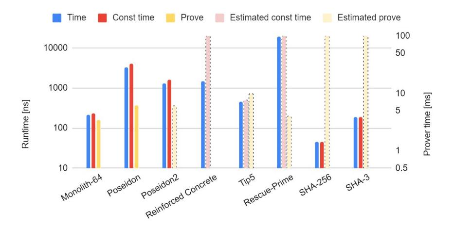
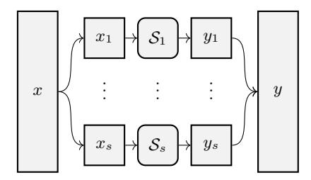
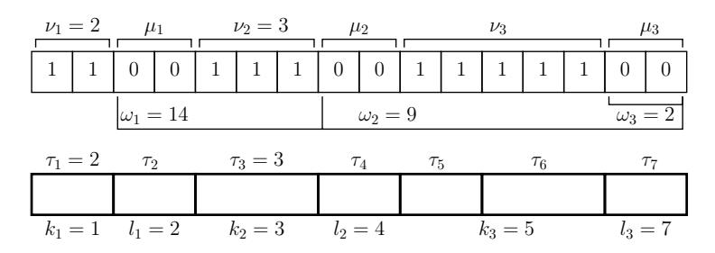
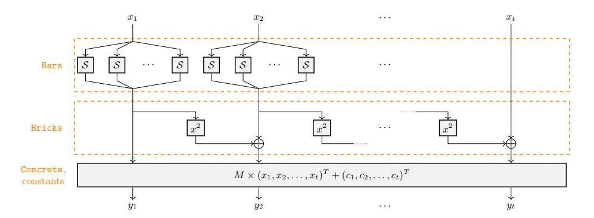
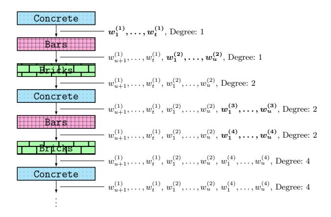

# Monolith: Circuit-Friendly Hash Functions with New Nonlinear Layers for Fast and Constant-Time Implementations

Lorenzo Grassi2,5 , Dmitry Khovratovich3,7 , Reinhard Lüftenegger1 , Christian Rechberger1 , Markus Schofnegger4 , and Roman Walch1,6

> Graz University of Technology (Austria) Ponos Technology (Switzerland) Ethereum Foundation (Luxembourg) Horizen Labs (United States) Ruhr University Bochum (Germany) TACEO (Austria) ABDK Consulting (Estonia)

Abstract. Hash functions are a crucial component in incrementally verifiable computation (IVC) protocols and applications. Among those, recursive SNARKs and folding schemes require hash functions to be both fast in native CPU computations and compact in algebraic descriptions (constraints). However, neither SHA-2/3 nor newer algebraic constructions, such as Poseidon, achieve both requirements.

In this work we overcome this problem in several steps. First, for certain prime field domains we propose a new design strategy called Kintsugi, which explains how to construct nonlinear layers of high algebraic degree which allow fast native implementations and at the same time also an efficient circuit description for zero-knowledge applications. Then we suggest another layer, based on the Feistel Type-3 scheme, and prove wide trail bounds for its combination with an MDS matrix.

We propose a new permutation design named Monolith to be used as a sponge or compression function. It is the first arithmetization-oriented function with a native performance comparable to SHA3-256. At the same time, it outperforms Poseidon in a circuit using the Merkle tree prover in the Plonky2 framework. Contrary to previously proposed designs, Monolith also allows for efficient constant-time native implementations which mitigates the risk of side-channel attacks.

# 1 Introduction

# 1.1 Hash Functions in Zero-Knowledge Frameworks

Zero-knowledge use cases and particularly the area of computational integrity combined with zero knowledge have seen a rise in popularity in the last couple of years. Many new protocols [\[GWC19;](#page-34-0) [ZGK+22;](#page-37-0) [KST22;](#page-35-0) [BC23\]](#page-31-0) and low-level primitives [\[AGR+16;](#page-30-0) [AAE+20;](#page-30-1) [GKR+21\]](#page-33-0) have been designed and published recently, in an attempt to increase the performance in this setting. The emergence of folding techniques and recursive SNARKs (incrementally verifiable computation, or IVC [\[Val08\]](#page-37-1)) make it possible to efficiently prove the integrity of complex computations. Proofs covering up to 2 27 operations are known[1](#page-1-0) whereas SNARK-based verifiable delay functions (VDFs) might require proving up to 2 40 operations [\[KMT22\]](#page-35-1). A single IVC operation is typically a compact arithmetic computation (polynomial) in a certain prime field or an assertion to some lowdegree polynomial predicate. With VC programs (also called circuits) being that large and containing cryptographic protocols, more and more programs contain hash functions as subroutines. Hash functions and their underlying permutations are used not only for data integrity checks, but also to instantiate commitment schemes, authenticated encryption [\[PSS19;](#page-36-0) [CFG+22\]](#page-32-0), non-interactive proofs based on the Fiat–Shamir transform, and many other techniques.

Hash Functions in IVC Applications. For typical applications of hash functions (e.g., integrity checks) standard choices like SHA-2 or SHA-3 are usually not the bottleneck. However, this is different in IVC applications mentioned above. For hashing and membership proofs in ZK, e.g. in folding schemes [\[KST22;](#page-35-0) [KS23;](#page-35-2) [BC23\]](#page-31-0) or private mixers [\[PSS19\]](#page-36-0), the size of hash functions as an arithmetic circuit over a prime field is more important than the "native" software performance (e.g., on an x86 architecture). Several new hash functions have tried to bridge this gap [\[AGR+16;](#page-30-0) [AAE+20;](#page-30-1) [GHR+23;](#page-33-1) [GKR+21;](#page-33-0) [SAD20;](#page-37-2) [BBC+23\]](#page-31-1).

Hash functions may also be used as a commitment tool in IVC frameworks where the underlying commitment scheme is not homomorphic (STARKs being a notable example [\[BBH+19\]](#page-31-2)). With a prover and a verifier engaging in commitopen protocols over prime fields, this setting requires to efficiently construct a Merkle tree in a prime field domain over large amounts of data. So far, the computations were performed natively on x86 hardware and not (yet) inside a circuit. Here, classical hash functions have been used until recently.

Both cases appear in recursive schemes, in particular in recursive STARKs [\[COS20\]](#page-32-1), which are an attractive IVC concept due to relatively little overhead and the possibility of parallelism for large or long computations. These schemes are used in an increasing number of applications, including zero-knowledge virtual machines [\[Fou22;](#page-33-2) [Pol22b;](#page-36-1) [Zha22\]](#page-37-3) and decentralized signature aggregation [\[But22\]](#page-32-2) protocols as notable examples. In recursive STARKs the computation and its proof are broken into chunks C1, C2, . . . , Ck and subproofs π1, . . . , πk such that the proof πi certifies that chunks from C1 to Ci are computed correctly by utilizing the previous proof πi−1 and a proof for Ci . In order to create πi , the prover computes a Merkle tree over the witness data and then proves some tree openings in a circuit. Thus, the same hash function is used in the circuit and in the native computation. In this scenario, up to 90% of a prover's computation may be spent on the hash function call and proofs [\[COS20;](#page-32-1) [RIS23a\]](#page-36-2), and a construction of a function that excels in both areas is a crucial open problem.

1 <https://research.protocol.ai/sites/snarks/>

Lookups and Small Domains. Two recent developments in IVC are relevant to our design. The first one is the lookup technique. Starting with Plookup, the IVC operations include not only arithmetic expressions but also lookup statements of the form a ∈ T, where T is a table available to the verifier [\[GW20;](#page-34-1) [PH23;](#page-36-3) [STW23\]](#page-37-4). For some polynomial commitment schemes (but not for FRI), the table may be preprocessed [\[ZBK+22;](#page-37-5) [ZGK+22;](#page-37-0) [EFG22\]](#page-33-3) so that its size does not contribute to the online prover cost. The lookup technique not only reduces the cost of traditional hash functions in circuits but also allows for cheap transformations of high algebraic degree [\[GKL+22;](#page-33-4) [SLS+23\]](#page-37-6).[2](#page-2-0)

Another improvement is purely technical but nevertheless vital for the performance. It is the use of small prime fields of ≤ 64 bits of special form like 2 k−1 or 2 m −2 k + 1 [\[Pol22a;](#page-36-4) [Pol23;](#page-36-5) [RIS23b\]](#page-37-7), which allow for more efficient arithmetic operations. STARK proofs [\[BBH+19\]](#page-31-2) can use them since they do not require a group where the discrete logarithm problem is assumed to be hard. The performance growth is significant: switching to an efficient 64-bit field improves the performance by a factor of up to 10 for the Poseidon hash function [\[GKS23\]](#page-34-2). Moreover, the modular reduction for these fields can often be implemented with mere additions and bit shifts, which are vectorizable on modern CPU architectures and faster than in larger and more generic prime fields. Small fields for IVC applications are also prominent in other recent works [\[HLN23;](#page-34-3) [Hab23\]](#page-34-4).

# 1.2 Our Contributions

We approach the problem of creating a hash function that is simultaneously fast and circuit-friendly in several steps. First we summarize the technical ideas of the new design, and then we introduce the new hash function Monolith.

Efficient Nonlinearity and Compact Circuits over Prime Fields. Our first main contribution is a generic design of components over certain prime fields, which can be implemented with just a few (and possibly vector) constanttime instructions on the x86 architecture, and can be written as a small circuit. This strategy, called Kintsugi, significantly improves upon the ideas behind Reinforced Concrete [\[GKL+22\]](#page-33-4) and Tip5 [\[SLS+23\]](#page-37-6), yielding faster and constant-time-friendly S-boxes. These new S-boxes are defined by first splitting a field element into smaller bit arrays. Then, constant-time-friendly S-boxes using Daemen's χ function and similar ones [\[Dae95\]](#page-32-3) are applied to these arrays, which can be parallelized with fast vector instructions and implemented as lookup tables in circuits. Finally, the outputs are assembled back to a field element with no overflow or collision, which is asserted in circuits with minimal overhead.

Low-Degree Components with Provable Differential Bounds. Our second contribution is a concept of using a Feistel Type-3 [\[ZMI89\]](#page-37-8) function together with an MDS layer. It can be seen as a replacement for the power function x d

2 <https://zcash.github.io/halo2/design/gadgets/sha256/table16.html>

from Poseidon [GKR+21] and similar constructions. The advantage is that we can use faster squaring operations (i.e.,  $x^2$ ) instead of more expensive (as d must be coprime with p-1) power functions over  $\mathbb{F}_p$ , and simultaneously obtain low-degree predicates in circuits.

Notably,  $x \mapsto x^2$  is not invertible over  $\mathbb{F}_p$ , and hence we cannot use this component to build an invertible SPN. However, we can exploit a Feistel scheme to make the entire construction invertible. A discussion regarding the risks of using non-bijective components for designing symmetric primitives in which the internal state is not obfuscated by a secret can be found in [Gra23].

Although the Feistel layer alone is known to have weak diffusion, we show that together with an MDS matrix it comes close to a regular SPN. To the best of our knowledge, we are the first to prove the results on the differential properties of the component using a strategy analogous to the wide trail design [DR02]. In particular, we prove lower bounds on the number of active nonlinear functions in trails. Similar to extended generalized Feistel networks introduced in [BMT13], we believe that this result and its possible extension to Feistel structures of other types may be useful in the design of any symmetric primitive, including those for more classical settings (as already happened for the Lilliput cipher [BFM+16]).

Monolith: Fast, Constant-Time, Circuit-Friendly. All of these techniques lead us to the design of Monolith, a family of permutations which are efficient in native software, in hardware, and inside of circuits. This permutation can then be turned into a hash function and other permutation-based schemes.3

Construction of Monolith. Our scheme has a few rounds using three different components. We adopt the naming convention of Reinforced Concrete.

The first component is Bricks (Section 4.4), which is instantiated with a Feistel Type-3 construction with square mappings. The second component is Concrete (Section 4.5), which is the multiplication with a circulant MDS matrix. Together with Bricks it provides the diffusion necessary to protect against statistical attacks. The third and last component is Bars (Section 4.3), which is based on the Kintsugi outlined above. We prove that each such Bar operation has a high degree and provides high security against algebraic attacks. The Bar function is applied only to a few field elements in each round.

The combination of these three components provides security against statistical and algebraic attacks while allowing for an efficient implementation. Our initial analysis has found a 3-round attack on a weakened version, and also suggests that all potential attacks should stop at 4 rounds. Since improvements are expected, we set the number of rounds uniformly to 6.

Performance. We give an extensive comparison between our new proposal and its competitors in Section 7. Our benchmarks confirm that the native performance of Monolith is comparable to SHA-3, which makes it the first circuit-friendly

&lt;sup>3 A *monolithic* building is a seamless structure where components are intimately fused in order to provide the most secure and robust construction.

Fig. 1. Comparison of hash functions in various settings (logarithmic scale). The native benchmarks ("Time", "Const Time") are from Table [3,](#page-26-0) the numbers for Monolith-64, Poseidon, and Poseidon2 are taken for the 64-bit prime field and a state size of t = 12. Proof (IVC) timings are benchmarks for a proof of preimage knowledge (Table [5\)](#page-29-0). Numbers for SHA3-256 and SHA-256 are extrapolated from a circom implementation using R1CS [\[Bal23\]](#page-31-3).

compression function achieving this goal. At the same time, Monolith is efficient within IVC systems. In contrast to Reinforced Concrete, Monolith also allows for a constant-time implementation without significant performance loss.

A performance overview is given in Fig. [1.](#page-4-0) We test the IVC performance on Plonky2 [\[Pol22a\]](#page-36-4), a popular choice for FRI-based proofs. Compared to Tip5, Monolith is around twice as fast and gives the user more freedom regarding the choice of the prime number (including the recent 31-bit prime used in [\[RIS23b\]](#page-37-7) due to advantageous implementation characteristics). Moreover, compared to the widely used Poseidon permutation, Monolith shows a native performance improvement by a factor of around 15. Finally, Monolith allows for an efficient circuit implementation, since it can be represented by a low number of degree-2 constraints, leading to a faster performance compared to Poseidon when implemented in Plonky2 (see Table [5\)](#page-29-0).

# 2 Fast and Circuit-Friendly Functions over Fp

When working over Fp, informally, we cannot just split a field element into smaller chunks, process them independently, and then reassemble. This is due to the fact that the field size is a prime and thus cannot be represented as a product of smaller domains.

To solve this problem, we present a generic strategy for specific prime numbers. Elements of it can be found in earlier works on Reinforced Concrete [\[GKL+22\]](#page-33-4) and Tip5 [\[SLS+23\]](#page-37-6). The main principles are as follows.

Fig. 2. The Kintsugi strategy.

- 1. Split the integer form of a field element into chunks according to carefully chosen boundaries aligned with the sum of the powers of two such that the resulting chunks fit a lookup table in a ZK circuit.
- 2. Identify the combination of chunk values that never appear due to the fact that p is not a power of two.
- 3. Design intra-chunk transformations  $S_i$  such that
  - impossible chunk combinations never appear (e.g. by making some chunk values fixed points), and
  - they can be implemented in constant time, for example with an AndRX (AND-rotation-XOR) transformation [AJN14].
- 4. Combine the chunks back into a large element, after a possible shuffle (only operations guaranteeing that the output element is in the field are possible).

We call this strategy Kintsugi.4 An illustration is shown in Fig. 2.

#### 2.1 Chunks and Buckets

In order to formally define the Kintsugi strategy, we need to introduce some notations. For a prime  $p \geq 5$ , we define p' as

$$p' = \begin{cases} p - 1 & \text{if } p \equiv 1 \bmod 4, \\ p & \text{otherwise.} \end{cases}$$

Consider the binary representation of p' of length  $\rho := \lceil \log_2(p') \rceil$ . It has the form (most significant bit coming first)

$$p' = 1 \dots 1 || 0 \dots 0 || 1 \dots 1 || \dots || \begin{cases} 0 \dots 0 \text{ or } \\ 1 \dots 1, \end{cases}$$

where  $\cdot \mid \mid \cdot$  denotes concatenation, that is, it consists of alternating sequences of ones and zeroes. The first sequence is always a 1-sequence, while the last one can be either a 0- or a 1-sequence.

&lt;sup>4 Kintsugi is the Japanese art of repairing broken pottery by mending the areas of breakage with lacquer dusted or mixed with e.g. powdered gold. Here, we break the state and we recombine it after applying a particular function to each small chunk.

**Definition 1.** Given p' as before, we denote its 1-/0-sequences as chunks (respectively, 1-chunks and 0-chunks).

Given the lengths of 1-chunks  $\nu_1, \nu_2, \dots, \nu_{\xi}$  and the lengths of 0-chunks  $\mu_1, \mu_2, \dots, \mu_{\xi}$  (both from left to right), and  $\omega_i = \sum_{j \geq i} (\nu_{i+1} + \mu_i)$ , we obtain

$$p' = \sum_{i=1}^{\xi} 2^{\omega_i} \cdot (2^{\nu_i} - 1). \tag{1}$$

For efficiency, we may split each chunk into sub-chunks, called *buckets*. Each S-box will then work independently on each bucket. To obtain simple conditions for invertibility, we require the buckets to be aligned with chunk boundaries, i.e., we require that *buckets do not overlap chunks*. We formalize this in the following.

**Definition 2.** Let p be a prime with 1- and 0-chunks defined by Eq. (1) and

$$\mathsf{T} = \{\tau_1, \dots, \tau_s\}$$

be a bucket decomposition, i.e., some positive integers  $\tau_1, \ldots, \tau_s$  such that  $\sum_{i=1}^s \tau_i = \rho = \lceil \log_2 p' \rceil$ . We say that the bucket decomposition T is aligned with p' if for every  $i \in \{1, 2, \ldots, \xi\}$  there exist  $k_i, l_i$  such that

$$\nu_i = \sum_{j=k_i}^{j < l_i} \tau_j \quad and \quad \mu_i = \sum_{j=l_i}^{j < k_{i+1}} \tau_j.$$

This means that for every i the i-th 1-chunk covers buckets from  $k_i$  to  $l_i$  (exclusive). Such buckets are called 1-buckets. Further, the i-th 0-chunk covers buckets from  $l_i$  to  $k_{i+1}$  (exclusive). These are called 0-buckets. This decomposition is illustrated (with small buckets) in Figure 3.

**Fig. 3.** Chunk and an aligned bucket decomposition of the number 52860. Here  $\xi = 3$  and s = 7.

Finally, we impose that the buckets are not too small, in order to avoid potential security issues. Indeed, the number of fixed points and/or invariant subspaces for Kintsugi becomes too large when the buckets are too small.

**Definition 3.** The bucket decomposition is efficient if  $\tau_i \geq 3$  for each  $i \geq 1$ .

This condition puts a constraint on p. However, we believe it is satisfied by the majority of the primes used in cryptography, including the ones used in our work. We highlight that we worked with p' directly instead of p, since this just given efficiency condition is never satisfied by  $p \ge 5$  if  $p = 1 \mod 4$ .

## 2.2 The Kintsugi Bar

The nonlinear component Bar, based on Kintsugi, is defined as follows. Let  $\tau_1, \tau_2, \ldots, \tau_s$  be an efficient and aligned bucket decomposition for p as in Eq. (1). Then, for  $\mathcal{C}$ ,  $\mathcal{S}$ , and  $\mathcal{D}$  described in the following, the component operates as

$$x \mapsto \mathcal{C} \circ \mathcal{S} \circ \mathcal{D}(x).$$
 (2)

**Decomposition**  $\mathcal{D}$ . The decomposition  $\mathcal{D}$ , i.e.,

$$x \in \mathbb{F}_p \mapsto (x_1', x_2', \dots, x_s') \in \mathbb{Z}_{2^{\tau_1}} \times \mathbb{Z}_{2^{\tau_2}} \times \dots \times \mathbb{Z}_{2^{\tau_s}},$$

decomposes the original field element  $x \in \mathbb{F}_p$  into s > 1 buckets  $x'_1, \dots, x'_s$  s.t.

$$x = \sum_{i=1}^{s} 2^{\rho_i} \cdot x_i'$$

over integers, where  $\rho_1 = 0$  and  $\rho_i = \sum_{j>i} \tau_j$ . As the bucket decomposition is aligned, we get that each bucket is either a 1- or 0-bucket.

**S-Boxes**  $\mathcal{S}$ . The operation  $\mathcal{S}$  applies s invertible S-boxes in parallel, i.e.,

$$S(x'_1, x'_2, \dots, x'_s) = S_1(x'_1) || S_2(x'_2) || \dots || S_s(x'_s),$$
(3)

where  $S_i: \mathbb{Z}_{2^{\tau_i}} \to \mathbb{Z}_{2^{\tau_i}}$  and we require that

$$\mathbf{1}^{\tau_i}$$
 is a fixed point if  $\mathcal{S}_i$  operates on a 1-bucket of  $p'$ , and  $\mathbf{0}^{\tau_i}$  is a fixed point if  $\mathcal{S}_i$  operates on a 0-bucket of  $p'$ . (4)

Hence, a z-chunk of p' must be mapped via  $S_i$  into a z-chunk, where  $z \in \{0, 1\}$ .

**Composition**  $\mathcal{C}$ . The final operation  $\mathcal{C}$  is the inverse of the decomposition. Given  $(x'_1, x'_2, \ldots, x'_s) \in \mathbb{Z}_{2^{\tau_1}} \times \mathbb{Z}_{2^{\tau_2}} \times \ldots \times \mathbb{Z}_{2^{\tau_s}}$  as before, it simply computes

$$y = \sum_{i=1}^{s} 2^{\rho_i} \cdot x_i' \bmod p \in \mathbb{F}_p,$$

where  $\rho_1 = 0$  and  $\rho_i = \sum_{j>i} \tau_j$ .

## 2.3 Well-Definition and Bijectivity

Here we prove that our  $\mathcal{C} \circ \mathcal{S} \circ \mathcal{D}(\cdot)$  defined in Eq. (2) and in particular its  $\mathcal{S}$  components are invertible and well-defined.

**Lemma 1.** Let p be a prime and  $\{\tau_i\}$  the bucket decomposition aligned with p'. Then Kintsugi (Eq. (2)) with the S-boxes satisfying Eq. (4) is bijective over  $\mathbb{F}_p$ .

*Proof.* We consider the natural extension of the transformation  $C \circ S \circ D(\cdot)$  to the domain  $\mathbb{Z}_{2^{\rho}}$  and denote it by  $\mathcal{T}$ . Then we proceed in two steps. First we prove that  $\mathcal{T}$  is bijective over  $\mathbb{Z}_{2^{\rho}}$ . Then we prove that for any x < p we have  $\mathcal{T}(x) < p$ . These two facts imply the result.

Transformation  $\mathcal{T}$ . We define  $\mathcal{T}: \mathbb{Z}_{2^p} \to \mathbb{Z}_{2^p}$  as  $\mathcal{T}:=\mathcal{C}' \circ \mathcal{S} \circ \mathcal{D}'(\cdot)$ , where  $\mathcal{D}'$  is a generalization of  $\mathcal{D}$  that takes inputs from  $\mathbb{Z}_{2^p}$  instead of  $\mathbb{Z}_p$ , i.e.,

$$x \in \mathbb{Z}_{2^{\rho}} \mapsto (x'_1, x'_2, \dots, x'_s) \in \mathbb{Z}_{2^{\tau_1}} \times \mathbb{Z}_{2^{\tau_2}} \times \dots \times \mathbb{Z}_{2^{\tau_s}},$$

where  $x = \sum_{i=1}^{s} 2^{\rho_i} \cdot x_i'$  as before. Further,  $\mathcal{S}$  is defined as before and  $\mathcal{C}'$  is the inverse of  $\mathcal{D}'$  (basically, it corresponds to  $\mathcal{C}$  without the modular reduction).

Bijectivity of  $\mathcal{T}$ . This follows from the fact that  $\mathcal{D}'$ ,  $\mathcal{S}$ , and  $\mathcal{C}'$  are bijective.

Finally, we have to prove that  $\forall x \in \{0, \dots, p-1\} : \mathcal{T}(x) \in \{0, \dots, p-1\}$ . Let us start by analyzing the case x = p-1. If p-1 = p' (i.e.,  $p \neq 1 \mod 4$ ), then all S-boxes act as identity functions (due to Eq. (4)), and thus  $\mathcal{T}(x) = x < p$ . Instead, if  $x = p-1 \neq p'$ , then  $\mathcal{D}(x)$  differs from  $\mathcal{D}(p')$  in the first bucket: the former ends with 10 and the latter with 11. As  $2^{\tau_s} - 1$  is a fixed point of the S-box  $\mathcal{S}_s$ , we get that  $\mathcal{S}_s(x_s') < 2^{\tau_s} - 1 = z_s$  and so  $\mathcal{T}(x) < p' \leq p$ .

Next, let us consider the case x . Consider the binary form of <math>x, and let b be the most significant bit in which it differs from p'. Clearly, b is in a 1-bucket of p' with some index i. Note that for each j < i all S-boxes  $S_j$  act as identity functions, that is,  $S_i(x_i) = S(z_i) = z_i$ . For  $x_i' < 2^{\tau_i} - 1 = z_i$ , we have  $S_i(x_i') < 2^{\tau_i} - 1 = z_i$  as  $2^{\tau_i} - 1$  is a fixed point of the S-box  $S_i$ . This implies that if x , then <math>T(x) .

The two previous facts together with  $\mathcal{T}$  being bijective imply that  $\mathcal{T}(x) > p-1$  for each x > p-1. It follows that  $\mathcal{C} \circ \mathcal{S} \circ \mathcal{D}(x) \in \mathbb{F}_p$  for each  $x \in \mathbb{F}_p$ .

## 2.4 Considerations about the Kintsugi Strategy

Due to the isomorphism between  $\mathbb{F}_2^{\tau_i}$  and  $\mathbb{F}_{2^{\tau_i}}$ , almost any invertible AndRX transformation works well for  $\mathcal{S}$  and can be implemented in constant time as its components are basic x86 operations. Here we give some examples for  $p = 2^n - 1$ .

- Bit Shuffle. Clearly, both  $\mathbf{1}^{\tau}$  and  $\mathbf{0}^{\tau}$  are fixed points under the bit shuffling operation for any  $\tau$ . Moreover, it is essentially for free in hardware.

- Efficient Linear Operations. Linear operations over  $\mathbb{F}_2^{\tau}$  of the form

$$x \mapsto x \oplus (x \lll i) \oplus (x \lll j)$$

with nonzero  $i \neq j$ , and where  $\ll$  denotes the circular shift operation, are (i) invertible for odd  $\tau$  and (ii) result in  $\mathbf{1}^{\tau}$  and  $\mathbf{0}^{\tau}$  being fixed points.

- Efficient Nonlinear Operations. Nonlinear operations over  $\mathbb{F}_2^{\tau}$  such as

$$x \mapsto x \oplus (\bar{x} \lll 1) \odot (x \lll 2)$$

for odd  $\tau$ , where  $\bar{x} := x \oplus \mathbf{1}^{\tau}$ , are also possible. This corresponds to the  $\chi$ -function [Dae95, Table A.1] already used in Keccak/SHA-3, which is known to be invertible for  $\gcd(\tau, 2) = 1$ . Moreover,  $\mathbf{1}^{\tau}$  and  $\mathbf{0}^{\tau}$  are fixed points.

An additional bit rotation may be needed to reduce the number of fixed points.

Bars in Kintsugi and Reinforced Concrete. There are various differences between the Kintsugi strategy just described and the Bars functions proposed in Reinforced Concrete (and later used in Tip5). In Reinforced Concrete an element of  $\mathbb{F}_p$  is represented as a vector from  $\mathbb{Z}_{p_1} \times \cdots \times \mathbb{Z}_{p_l}$ .

- We rely on the structure of the prime p. Thanks to its composition of a few powers of two, the decomposition now is simply a bit extraction rather than a chain of modular reductions, which is expensive both natively and inside the proof system. The bijectivity of Kintsugi is guaranteed under the minor and easily satisfied condition that some specific inputs are fixed points.
- The S-boxes of Reinforced Concrete or Tip5 do not have a simple representation and must be implemented as tables both for native and circuit computations. The Kintsugi strategy instantiates the S-boxes with AndRX transformations, which are fast and constant-time in native x86 implementations but can easily be transformed to table lookups for circuits.

Side-Channel Leakage and Countermeasures. Lookup tables in symmetric primitives are a well-known source of side channel leakage. When confidential information is processed (e.g., committing to coin secrets with ZK hash functions in privacy-preserving payment systems), an adversary may recover a large portion of it from timing differences of lookups into memory or caches. These techniques are well-known since at least two decades in the context of encryption [Pag02; Ber05; OST06], and the high-level ideas have found first applications in zero-knowledge proof systems [TBP20]. The lookup-oriented designs Reinforced Concrete and Tip5 use specific tables for which a constant-time implementation with reasonable overhead is nontrivial. It is thus of utmost importance to have a design where lookups can be replaced with constant-time operations.

## 2.5 Statistical and Algebraic Properties

Here we prove a generic statement that links algebraic and statistical properties of mappings over  $\mathbb{F}_p$ , which we will use in the security analysis of Monolith.

**Lemma 2.** Let  $p \geq 3$  be a prime number, and let  $\mathcal{F}_{sq}$  denote the squaring function  $x \to x^2$  over  $\mathbb{F}_p$ . Let  $\mathsf{F}_{sq}$  be any interpolant of  $\mathcal{F}_{sq}$  over  $\mathbb{F}_2^{\lceil \log_2 p \rceil}$ , i.e., for any a < p and its bit representation  $\mathsf{a}$  we have that  $\mathsf{F}_{sq}(\mathsf{a})$  is the bit representation of  $\mathcal{F}_{sq}(\mathsf{a})$ . Then  $\mathsf{F}_{sq}$  has (multivariate) degree at least d, where d is the maximum positive integer such that  $d < \log_2 \sqrt{p}$  and  $\lceil 2^{d-0.5} \rceil$  is odd.5

*Proof.* We prove this result by contradiction. Suppose that the degree of  $\mathsf{F}_{sq}$  is smaller than d. Then the XOR sum of its outputs over any hypercube of dimension d is equal to zero [Lai94], including the hypercube

$$\mathfrak{H} := \{ \mathsf{a}_0 = (0,0,\dots,0), \dots, \mathsf{a}_{2^d-1} = (0,\dots,0,\underbrace{1,\dots,1}_{d \text{ ones}}) \}.$$

Note that  $\mathcal{F}(a_i) = i^2 < p$  by the definition of d. Now consider  $\mathfrak{B} = \{\mathsf{a}_i \in \mathfrak{H} \mid i > 2^{d-0.5}\}$ , so that (i)  $2^{2d} > \mathcal{F}(b \in \mathfrak{B}) > 2^{2d-1}$  and (ii) the 2d-th least significant bit is set. By simple computation, the size of  $\mathfrak{B}$  is  $2^d - \lceil 2^{d-0.5} \rceil$ . Whenever this number is odd,  $\mathsf{F}$  does not XOR to 0 at the 2d-th least significant bit, which contradicts the previous fact. As a result, the squaring has at least degree d if  $\lfloor 2^{d-0.5} \rfloor$  is odd and  $d < \log_2 \sqrt{p}$ .

**Lemma 3 (Differential).** Let  $\mathcal{F}$  be a function that maps  $\mathbb{F}_p$  to itself with a differential  $\Delta_I \to \Delta_O$  holding with probability  $0 < \alpha < 1$ , i.e.,  $|\{x \in \mathbb{F}_p \mid \mathcal{F}(x + \Delta_I) = \mathcal{F}(x) + \Delta_O\}| = p \cdot \alpha$ . Then we have  $\deg(\mathcal{F}) > \alpha \cdot p$ , where  $\deg(\mathcal{F})$  is the degree of  $\mathcal{F}$  as a polynomial over  $\mathbb{F}_p$ .

*Proof.* By definition,  $\mathcal{F}(x + \delta_{in}) = \mathcal{F}(x) + \delta_{out}$  has at least  $\alpha \cdot p$  solutions  $x_1, x_2, \ldots, x_{\alpha p}$ . Therefore, the polynomial  $\mathcal{G}(x) := \mathcal{F}(x + \delta_{in}) - \mathcal{F}(x) - \delta_{out}$  is divisible by the polynomial  $(x - x_1) \cdot (x - x_2) \cdot \cdots \cdot (x - x_{\alpha \cdot p})$  of degree  $\alpha \cdot p$ , and so it has a degree of at least  $\alpha \cdot p$ . As the degree of the polynomial  $\mathcal{G}$  is smaller than the degree of  $\mathcal{F}$  by 1, we obtain that  $\deg(\mathcal{F}) > \alpha \cdot p$ .

**Lemma 4 (Linear Approximation).** Let  $\mathcal{F}$  be a function that maps  $\mathbb{F}_p$  to itself such that there exists a linear approximation (a,b) with probability  $0 < \beta < 1$ , that is,  $\frac{|\{x \in \mathbb{F}_p | \mathcal{F}(x) = a \cdot x + b\}|}{p} = \beta$ . Then we have  $\deg(\mathcal{F}) \geq \beta \cdot p$ .

*Proof.* By definition, the equation  $\mathcal{F}(x) = A \cdot x + B$  has at least  $\beta \cdot p$  solutions  $x_1, x_2, \ldots, x_{\beta \cdot p}$ . Therefore, the polynomial  $\mathcal{G}(x) := \mathcal{F}(x) - (a \cdot x + b)$  is divisible by the polynomial  $(x - x_1) \cdot (x - x_2) \cdot \cdots \cdot (x - x_{\beta p})$  of degree  $\beta \cdot p$ . Similar to before, we conclude that F has degree at least equal to  $\beta \cdot p$ .

Based on the previous result, we can immediately conclude the following.

**Corollary 1.** Let  $\mathcal{F}$  be a function that maps  $\mathbb{F}_p$  to itself with b < p fixed points, that is,  $|\{x \in \mathbb{F}_p : F(x) = x\}| = b$ . It follows that  $\deg(\mathcal{F}) \geq b$ .

&lt;sup>5 For example,  $\lceil 2^{d-0.5} \rceil$  is odd for  $d \in \{2, 4, 5, 6, 7, 9, 10, 11, 12, 13, 15, 16, 21, \dots \}$ .

# 3 Feistel Type-3 Layer and the Wide Trail Strategy

The Kintsugi Bar is nonlinear but we will see in Section [6.1](#page-19-0) that its high algebraic degree comes at the cost of weak differential properties. Thus if being used in an SPN construction, it would make it vulnerable to statistical (e.g., differential) cryptanalysis. For this reason, we introduce another nonlinear component defined as a Feistel Type-3 network [\[ZMI89\]](#page-37-8) that complements Kintsugi Bars. By instantiating it via low-degree functions, it will allow us to provide strong argument for guaranteeing resistance against differential and statistical attacks in general. We follow the naming convention of Reinforced Concrete (the first lookup-based ZK-friendly hash function) where the nonlinear layer providing protection against statistical attacks is called Bricks, and use the same name for uniformity.

Feistel Type-3. The Feistel Type-3 network is a member of a larger Feistel family [\[HR10\]](#page-34-6), which has been largely neglected in favour of SPN schemes in block cipher and hash function design, primarily for its complexity and worse diffusion properties. As already recalled in the introduction, a potential drawback of SPN schemes regards the fact that their invertibility depends on the fact that all their internal components are invertible as well. As it is well known, this is not the case of Feistel networks, which remain invertible independently of the details of their internal functions. For many prime order groups used in SNARKs, the smallest invertible power mapping is x 5 . As a result, we have found the Feistel Type-3 newtork instantiated with square maps x 7→ x 2 to be particularly attractive as it is cheaper in circuits and, most importantly, its blend with an MDS layer yields statistical properties similar to those in regular SPNs.

With nonlinear Fi , BricksF for t elements x1, . . . , xt is defined as

BricksF
$$(x_1, ..., x_t) := (x_1, x_2 + \mathcal{F}_1(x_1), x_3 + \mathcal{F}_2(x_2), ..., x_t + \mathcal{F}_{t-1}(x_{t-1})).$$
 (5)

Diffusion Layer. While BricksF alone does not provide fast diffusion, a combination with a matrix layer increases the diffusion properties [\[BMT13;](#page-32-4) [BFM+16\]](#page-32-5). This approach is well-known in the SPN design as the wide trail strategy [\[DR01\]](#page-33-6), where a lower bound for the number of "active" nonlinear components in any differential trail is proven, leading to strong arguments against differential attacks.

Here we follow this line of research, and for the first time we derive bounds for the SPN structure where the nonlinear layer is a Feistel Type-3 function. For this, we work with matrices of Maximum Distance Separable (MDS) Codes for maximizing the number of active Fp-words over two consecutive rounds.

Our New Bound. Now we obtain our main result on the differential properties of the Feistel-Type3-MDS combination. Our new bound improves the ones recently proposed in [\[Gra23\]](#page-34-5) for an analogous (but different) scheme.

Proposition 1. Consider an R-round construction, where each round consists of the application of BricksF over F t q as in Eq. [\(5\)](#page-11-0) followed by the multiplication with a  $t \times t$  MDS matrix. The minimum number  $\hat{c}$  of active functions  $\mathcal{F}_i$  in any differential trail satisfies

$$\hat{c} \geq (t-1) \cdot \left(\frac{3R-2-(-2)^{1-R}}{9}\right) \geq (t-1) \cdot \left(\frac{3R-2.5}{9}\right) \, .$$

*Proof.* Denote the number of active words in the input and the output of the i-th BricksF layer by  $a_i$  and  $b_i$ , respectively. Then we exploit two properties.

- Each active input word  $x_i$  to  $Bricks^F$  activates  $\mathcal{F}_i$  if i < t, hence a words activate at least a 1 functions  $\mathcal{F}_i$ .
- Each active output word  $y_i$  of  $\operatorname{Bricks}^F$  implies that  $\mathcal{F}_{i-1}$  or  $\mathcal{F}_{i-2}$  is active if i > 1. Hence b words activate at least  $\frac{b-1}{2}$  functions.

With the MDS property, which states that  $b_k + a_{k+1} \ge t + 1$  for each  $k \ge 1$ , we obtain the following for the number  $c_k$  of active functions  $\mathcal{F}_i$  in round k:

$$c_{1} \geq \max \left\{ a_{1} - 1, \frac{b_{1} - 1}{2} \right\}, \quad b_{1} + a_{2} \geq t + 1,$$

$$c_{2} \geq \max \left\{ a_{2} - 1, \frac{b_{2} - 1}{2} \right\}, \quad b_{2} + a_{3} \geq t + 1,$$

$$\vdots$$

$$c_{r-1} \geq \max \left\{ a_{r-1} - 1, \frac{b_{r-1} - 1}{2} \right\}, \quad b_{r-1} + a_{r} \geq t + 1,$$

$$c_{r} \geq \max \left\{ a_{r} - 1, \frac{b_{r-1} - 1}{2} \right\},$$

for r rounds. Summing each two consecutive inequalities for  $c_i$ , we obtain

$$2c_i + c_{i+1} \ge 2\frac{b_{i-1}}{2} + (a_{i+1} - 1) = b_i + a_{i+1} - 2 \ge t - 1$$
(6)

with the last inequality being the MDS property.

W.l.o.g., let us find a bound for  $\hat{c}:=c_1+\cdots+c_R$  where all  $c_i$  are non-negative real values satisfying Eq. (6). First, the optimal  $\{c_i\}$  make all inequalities equal. Indeed, suppose that  $2c_j+c_{j+1}>t-1$  but for all k>j we have  $2c_k+c_{k+1}=t-1$ . Then by using  $c'_j=c_j-\epsilon$ ,  $c'_{j-1}=c_{j-1}+\epsilon/2$ ,  $c'_{j-2}=c_{j-2}-\epsilon/4$  for a small  $\epsilon$  Eq. (6) is still satisfied but  $c_{min}$  decreases by  $\epsilon\cdot(1-1/2+1/4-1/8+\cdots)>0$ . Thus all inequalities are equations, i.e.,

$$2c_i + c_{i+1} = t - 1$$
.

Then we observe that in the optimal  $\{c_i\}$  it should hold that  $c_R = 0$ . Indeed otherwise we apply the same trick by setting  $c_R' = c_R - \epsilon$ ,  $c_{R-1}' = c_{R-1} + \epsilon/2$  etc., again decreasing  $c_{min}$ . Thus, the minimum is achieved by  $c_R = 0$  and

$$c_{R-1} = \frac{t-1}{2}, \quad c_{R-2} = \frac{t-1}{4}, \quad c_{R-3} = \frac{3(t-1)}{8}, \quad \dots, \quad c_{R-i} = \frac{t-1}{3} \cdot \left(1 + \frac{(-1)^{i+1}}{2^i}\right).$$

Substituting these values into the formula for  $\hat{c}$ , we obtain

$$\begin{split} \hat{c} &= \sum_{i=0}^{R-1} \frac{t-1}{3} \left( 1 + \frac{(-1)^{i+1}}{2^i} \right) = \frac{t-1}{3} \sum_{i=0}^{R-1} \left( 1 + \frac{(-1)^{i+1}}{2^i} \right) = \frac{t-1}{3} \left( R - \sum_{i=0}^{R-1} (-2)^{-i} \right) \\ &= \frac{t-1}{3} \left( R - \frac{2(1-(-2)^{-R})}{3} \right) = (t-1) \left( \frac{3R-2-(-2)^{1-R}}{9} \right). \end{split}$$

Remark 1 (On the Design Rationale). Our choice of Feistel versus SPN is purely performance-driven: fewer non-constant field multiplications in the former when using  $x \mapsto x^2$ . However, neither Feistel Type-3 nor Type-26 alone would provide good statistical properties [HR10]. Notably, the combination of Type-2 with an MDS layer would not allow us to derive optimal bounds regarding the number of active nonlinear functions in such a simple and elegant way either.

# 4 Specification of Monolith

Monolith is a family of permutations which can be used within hash functions and other constructions. They use prime fields  $\mathbb{F}_p$  with two options for p, namely

$$p_{\text{Goldilocks}} = 2^{64} - 2^{32} + 1$$
 and  $p_{\text{Mersenne}} = 2^{31} - 1.$  (7)

The permutation Monolith-64 is defined over  $p_{\texttt{Goldilocks}}$  with the state consisting of t=8 or t=12 elements. The permutation Monolith-31 is defined over  $p_{\texttt{Mersenne}}$  with the state consisting of t=16 or t=24 elements.

# 4.1 Modes of Operation

Monolith supports sponge modes and a 2-to-1 compression function.

**Sponge-Based Schemes.** First, Monolith can instantiate a sponge [BDP+07; BDP+08] and thus various symmetric constructions such as variable-length hash functions, commitment schemes, authenticated encryption, and stream ciphers. The recently proposed SAFE framework [AKM+22; KBM23] instructs how to handle domain separation and padding in these constructions. In a sponge, the permutation state is split into an outer part with a rate of r elements and an inner part with a capacity of c elements. As we uniformly suggest a security level close to 128 bits, we set  $c = \left\lfloor \frac{256}{\rho} \right\rfloor$  and r = 2c.

**2-to-1 Compression Function.** We also suggest a fixed-length 2-to-1 compression function. Concretely, it takes  $t \ \mathbb{F}_p$  elements as input and produces  $t/2 \ \mathbb{F}_p$  elements as output. It is defined as  $x \in \mathbb{F}_p^t \mapsto \mathrm{Tr}_{t/2}(\mathcal{P}(x)+x) \in \mathbb{F}_p^t$ , where  $\mathrm{Tr}_{t/2}$  yields the first t/2 elements of the inputs. This compression function can be used in Merkle trees and has recently also been applied in similar constructions, including Anemoi [BBC+23], GRIFFIN [GHR+23], and POSEIDON2 [GKS23]. For a security level of close to 128 bits, we set  $t = \left\lfloor \frac{512}{\rho} \right\rfloor$ , i.e., t = 8 for the 64-bit field and t = 16 for the 31-bit field (factually yielding slightly less than 128 bits).

&lt;sup>6 Type-2 Feistel turns state  $\{x_i\}$  into  $\{y_i\}$  where odd elements remain untouched and  $y_{2i} = x_{2i+1} + \mathcal{F}_i(x_{2i})$ .

Fig. 4. One round of the Monolith construction, where  $x_i, y_i \in \mathbb{F}_p$ .

#### 4.2 Permutation Structure

The Monolith permutation is defined as

$$\mathtt{Monolith}(\cdot) = \mathcal{R}_R \circ \cdots \circ \mathcal{R}_2 \circ \mathcal{R}_1 \circ \mathtt{Concrete}(\cdot),$$

where R is the number of rounds and  $\mathcal{R}_i$  over  $\mathbb{F}_p^t$  are defined as

$$\mathcal{R}_i(\cdot) = c^{(i)} + \mathtt{Concrete} \circ \mathtt{Bricks} \circ \mathtt{Bars}(\cdot), \qquad \forall i \in \{1, 2, \dots, R\},$$

where Concrete is a linear operation, Bars and Bricks are nonlinear operations over  $\mathbb{F}_p^t$ ,  $c^{(1)}, \ldots, c^{(r-1)} \in \mathbb{F}_p^t$  are pseudo-random round constants, and  $c^{(r)} = \mathbf{0}$ . Note that a single Concrete operation is applied before the first round. A graphical overview of one round of the construction is shown in Fig. 4.

Round Constant Generation. The actual values of pseudo-randomly chosen round constants have no impact on the security. For completeness we provide a generation method in Appendix A.3.

#### **4.3** Bars

The Bars layer is defined as

$$Bars(x_1, x_2, \dots, x_t) := Bar(x_1) \| \dots \| Bar(x_u) \| x_{u+1} \| \dots \| x_t$$
 (8)

for a t-element state, where  $\mathbf{u} \in \{1,\ldots,t\}$  denotes the number of Bar applications in a single round. We select  $\mathbf{u}$  such that  $\mathbf{u} \cdot \log_2 p \approx 256$ , i.e., the nonlinear part occupies around 256 bits of the state. Each Bar application is defined as

$$Bar(x) = C \circ S \circ D(x),$$

where C, S and D are the operations defined in Section 2. In the following, we describe them individually for Monolith-64 and Monolith-31.

Bars for Monolith-64. In Eq. (8) we set  $t \in \{8, 12\}$  (compression or sponge, resp.) and we set u = 4 (i.e., 4 Bar operations are applied in each round).

Operations  $\mathcal{D}$  and  $\mathcal{C}$ . We use a decomposition into 8-bit values such that

$$x = 2^{56}x_8' + 2^{48}x_7' + 2^{40}x_6' + 2^{32}x_5' + 2^{24}x_4' + 2^{16}x_3' + 2^8x_2' + x_1'.$$

The composition  $\mathcal{C}$  is the inverse operation of the decomposition  $\mathcal{D}$ .

S-Boxes S. In Eq. (3) we set s = 8. Then all  $S_i$  over  $\mathbb{F}_2^8$  are defined as

$$S_i(y) = (y \oplus ((\overline{y} \ll 1) \odot (y \ll 2) \odot (y \ll 3))) \ll 1, \tag{9}$$

where  $\ll$  is a circular shift (here we interpret an integer as a big-endian 8-bit string) and  $\overline{y}$  is the bitwise negation (see [Dae95, Table A.1]).

Bars for Monolith-31. In Eq. (8) we set  $t \in \{16, 24\}$  (compression or sponge, resp.) and we set u = 8 (i.e., 8 Bar operations are applied in each round).

Operations  $\mathcal{D}$  and  $\mathcal{C}$ . The decomposition  $\mathcal{D}$  is given by

$$x = 2^{24}x_4' + 2^{16}x_3' + 2^8x_2' + x_1',$$

where  $x_4' \in \mathbb{Z}_2^7$  and  $x_3', x_2', x_1' \in \mathbb{Z}_2^8$ . The composition  $\mathcal{C}$  is the inverse of  $\mathcal{D}$ .

S-Boxes S. In Eq. (3) we set s=4 using  $\{8,7\}$ -bit lookup tables. Then, for  $y\in\mathbb{F}_2^8$  and  $y'\in\mathbb{F}_2^7$ , the S-boxes are defined as (see [Dae95, Table A.1])

$$\forall i \in \{1, 2, \dots, s-1\}: \quad \mathcal{S}_i(y) = \left(y \oplus \left((\overline{y} \ll 1) \odot (y \ll 2) \odot (y \ll 3)\right)\right) \ll 1,$$
$$\mathcal{S}_s(y') = \left(y' \oplus \left((\overline{y'} \ll 1) \odot (y' \ll 2)\right)\right) \ll 1.$$
(10)

#### 4.4 Bricks

The component Bricks over  $\mathbb{F}_p^t$  is defined as a Feistel Type-3 BricksF (Eq. (5)) with  $x \mapsto x^2$ , i.e., Bricks $(x_1, \dots, x_t) := (x_1, x_2 + x_1^2, x_3 + x_2^2, \dots, x_t + x_{t-1}^2)$ .

#### 4.5 Concrete

The Concrete layer is defined as  $\operatorname{Concrete}(x_1,\ldots,x_t) := M \times (x_1,\ldots,x_t)^T$ , where  $M \in \mathbb{F}_n^{t \times t}$  is an MDS matrix.

If  $p = 2^{64} - 2^{32} + 1$ , then M = circ(23, 8, 13, 10, 7, 6, 21, 8) for t = 8 and M = circ(7, 23, 8, 26, 13, 10, 9, 7, 6, 22, 21, 8) for t = 12. These two circulant matrices defined for the Goldilocks prime  $p_{\text{Goldilocks}}$  correspond to the ones found and implemented by the Winterfell STARK library. These matrices have the unique

&lt;sup>7 https://github.com/facebook/winterfell/tree/main/crypto/src/hash/mds

Table 1. Parameters for Monolith.

| Name                    | p                                                      | Security   | Rounds $R$ | Wie 2-to-1 | $\begin{array}{c} \text{dth } t \\ \text{Sponge} \end{array}$ | # Bar $u$ |
|-------------------------|--------------------------------------------------------|------------|------------|------------|---------------------------------------------------------------|-----------|
| Monolith-64 Monolith-31 | $\begin{array}{ c c c c c c c c c c c c c c c c c c c$ | 128 124 | 6          | 8 16    | 12 24                                                      | 4 8       |

advantage of having small elements in the time and frequency domain (i.e., before and after DFT application), allowing for especially fast native performance.

If  $p = 2^{31} - 1$  and t = 16, M is the  $16 \times 16$  matrix from Tip5 [SLS+23]8, i.e.,

 $M = \text{circ}(61402, 1108, 28750, 33823, 7454, 43244, 53865, 12034, \\ 56951, 27521, 41351, 40901, 12021, 59689, 26798, 17845).$

If  $p=2^{31}-1$  and t=24, M is a  $24\times 24$  submatrix of the  $32\times 32$  circulant MDS matrix constructed from [HS24]. This particular design choice is explained in Section 7.1. The  $32\times 32$  circulant MDS matrix is defined as

$$\begin{split} M &= \mathrm{circ}(0\texttt{x}536\texttt{C}316, 0\texttt{x}1\texttt{D}\texttt{D}20\texttt{A}84, 0\texttt{x}43\texttt{E}26541, 0\texttt{x}52\texttt{B}22\texttt{B}8\mathsf{D}, 0\texttt{x}37\texttt{D}\texttt{A}\texttt{B}\texttt{D}\mathsf{F}0, 0\texttt{x}54\texttt{O}\texttt{E}\texttt{C}066, \\ 0\texttt{x}3015718\texttt{D}, 0\texttt{x}5\texttt{A}99\texttt{E}14\texttt{C}, 0\texttt{x}23637285, 0\texttt{x}4\texttt{C}8\texttt{A}2\texttt{F}76, 0\texttt{x}5\texttt{D}\texttt{E}\texttt{C}4\texttt{E}6\texttt{E}, 0\texttt{x}374\texttt{E}\texttt{E}8\texttt{D}6, \\ 0\texttt{x}27\texttt{E}\texttt{D}\texttt{A}4\texttt{D}8, 0\texttt{x}665\texttt{D}30\texttt{D}3, 0\texttt{x}32\texttt{E}44597, 0\texttt{x}43\texttt{C}7\texttt{E}2\texttt{B}3, 0\texttt{x}67\texttt{C}4\texttt{C}603, 0\texttt{x}78\texttt{A}8631\texttt{F}, \\ 0\texttt{x}452\texttt{F}77\texttt{E}3, 0\texttt{x}39\texttt{F}03\texttt{D}\texttt{F}, 0\texttt{x}743\texttt{D}\texttt{B}\texttt{F}\texttt{E}0, 0\texttt{x}4\texttt{D}\texttt{A}05\texttt{A}48, 0\texttt{x}5\texttt{F}027940, 0\texttt{x}8293632, \\ 0\texttt{x}50\texttt{F}2\texttt{C}76\texttt{A}, 0\texttt{x}7\texttt{B}773729, 0\texttt{x}577\texttt{D}\texttt{E}8\texttt{B}0, 0\texttt{x}73\texttt{B}1\texttt{E}\texttt{A}\texttt{C}6, 0\texttt{x}5\texttt{B}\texttt{D}\texttt{A}7\texttt{D}29, 0\texttt{x}67\texttt{A}\texttt{A}4375, \\ 0\texttt{x}\texttt{D}\texttt{B}\texttt{A}\texttt{B}\texttt{E}33, 0\texttt{x}2655\texttt{E}5\texttt{A}1). \end{split}$$

## 4.6 Number of Rounds and Security Claims

We suggest to use R=6 rounds for Monolith-64 and Monolith-31 (see Table 1) and claim  $2\log_2(p_{\texttt{Goldilocks}})\approx 128$  bits and  $4\log_2(p_{\texttt{Mersenne}})\approx 124$  bits of security for Monolith-64 and Monolith-31, respectively.

Remark 2. We do not claim that the Monolith permutation does not have any non-generic property (or "indifferentiable from random"). In particular, we do not consider certain permutation distinguishers – such as the integral one [DKR97] or the zero-sum partitions [KR07; BCC11] – that have not ever resulted in collision or preimage attacks for similar designs. We refer to Appendix B.3 for more details.

#### 4.7 Security Analysis

The numbers of rounds are conservatively chosen based on the security analysis proposed in Section 5 and Section 6. As some of the components or combinations

 $^8$  It is also MDS for  $p_{\tt Mersenne}$  as proved in <code>https://github.com/Neptune-Crypto/twenty-first/blob/master/twenty-first/src/shared\_math/tip5.rs</code>

are new, our analysis contains several nontrivial ideas and may be of separate interest to cryptanalysts and designers.

First, in the spirit of the wide trail strategy, [\[DR02\]](#page-33-5), we prove tight bounds for the number of active squarings in differential characteristics for the Type-3 Feistel-MDS combination in Section [5.1.](#page-17-1) We also study rebound attacks in Section [5.3,](#page-18-0) a research direction that is often missed in the ZK hash function design. We demonstrate practical attacks on a reduced version of Monolith and argue the security of the full version.

Using differential and linear properties of Bar, we prove lower bounds on its algebraic degree in Section [6.1,](#page-19-0) which implies resistance against algebraic attacks after a few rounds. In this regard, we additionally study the complexity of Gröbner basis attacks on toy versions of Monolith with smaller primes but still realistic Bars layers in Section [6.3.](#page-22-0)

To summarize, we are not able to even break 5 rounds of the proposed scheme with any basic attacks proposed in the literature. As future work, we encourage to study reduced-round and/or toy variants of our design.

# 5 Security Analysis: Statistical Attacks

# 5.1 (Truncated) Differential and Linear Cryptanalysis

Given pairs of inputs with some fixed input differences, differential cryptanalysis [\[BS90\]](#page-32-7) considers the probability distribution of the corresponding output differences produced by the cryptographic primitive. Since the Bars layer is not supposed to have good statistical properties, we simply assume that the attacker can skip it with probability 1.

As the maximum differential probability of the square map is 1/p, Proposition [1](#page-11-1) immediately implies the following bound.

Corollary 2. Any 4-round differential characteristic for Monolith has a probability of at most p −9(t−1) 8 .

As a result, any characteristic that spans over 5 rounds and more would cover more squarings than the number of state elements, and thus a solution to it cannot be found by standard means. Therefore, a differential-based collision attack on 5 rounds looks infeasible.

Linear Attacks. Linear cryptanalysis [\[Mat93\]](#page-36-8) exploits the existence of linear approximations. For primitives over binary fields, the attack makes use of the high correlations [\[DGV94\]](#page-33-8) between sums of input bits and sums of output bits. The generalization of this attack over prime fields has been proposed in [\[BSV07;](#page-32-8) [DGG+21\]](#page-32-9). We claim that our scheme is secure against this approach, due to the low correlation of the map x 7→ x 2 (as for the case of differential attacks).

Truncated Differentials. Truncated differential attacks [Knu94] are used mostly against primitives that have incomplete diffusion over a few rounds. This is not the case here since (i) Bricks is a full nonlinear layer, and (ii) the Concrete matrix is MDS. We have not found any other attacks where a truncated differential can be used as a subroutine either.

#### 5.2 Rebound Attacks

Rebound attacks [MRS+09] have been widely used to analyze the security of various types of hash functions against shortcut collision attacks since the beginning of the SHA-3 competition. It starts by choosing internal state values in the middle of the computation, and then computing in the forward and backward directions to arrive at the inputs and outputs. It is useful to think of it as having central (often called "inbound") and the above mentioned "outbound" parts. In the attack, solutions to the inbound phase are first found, and then are filtered in the outbound phase.

Whereas it is not possible to prove the resistance to the rebound attacks rigorously, we can provide some meaningful arguments to demonstrate that they are not feasible. The inbound phase deals with truncated and regular differentials. By Corollary 2 we see that a solution for a 5-round differential cannot be found, and so the inbound phase cannot cover more than 4 Bricks layers. In the outbound phase, the Concrete layers that surround these Bricks layers make all differentials diffuse to the entire state, so that the next Bricks layers destroy all of those. We hence conclude that 6 rounds of Monolith are sufficient to prevent rebound attacks. We refer to Appendix B.1 for more details.

### 5.3 Other Statistical Attacks

We claim that 6 rounds are sufficient for preventing other statistical attacks as well. Here we provide argument to support such conclusion for one of the most powerful statistical attacks against a hash function, that is, the rebound attack. For that goal, we propose an analysis of the number of the fixed points and of the truncated differential characteristics.

Fixed Points. Contrary to Reinforced Concrete, the Bars layer of Monolith has very few fixed points. Both local maps  $x \oplus ((\overline{x} \ll 1) \odot (x \ll 2) \odot (x \ll 3))$  and  $x \oplus ((\overline{x} \ll 1) \odot (x \ll 2))$  have about  $(7/4)^n$  fixed points (for even and odd n, respectively) when considered over  $\mathbb{F}_2^n$  (a bit value is preserved if the product of nearby bits is 0). However, all of them except  $\mathbf{0}$  and  $\mathbf{1} = 2^n - 1$  are destroyed by the circular shift (verified experimentally).

A Bar of Monolith-64, consisting of 8 such S-boxes, admits  $2^8-2^4+1=241$  fixed points out of  $2^{64}-2^{32}+1$ . This implies that the probability that a point is fixed is approximately  $2^{-56}$  for Bar and less than  $2^{-56\cdot 4}=2^{-224}$  for Bars. Similarly, a Bar of Monolith-31 admits  $2^4-1=15$  fixed points out of  $2^{31}-1$ .

This implies that the probability that a point is fixed is approximately  $2^{-27}$  for Bar and less than  $2^{-27\cdot 8}=2^{-216}$  for Bars.

For comparison, we recall that a Bar of Reinforced Concrete has  $2^{134.5}$  fixed points out of  $2^{254}$  possibilities. Hence, the probability of encountering a fixed point is approximately  $2^{-119.5\cdot 3}=2^{-358.5}$  for Bars. At the current state of the art, we are not aware of any attack that exploits these fixed points.

Invariant Subspace Attacks. An invariant subspace attack exploits the existence of a subspace  $\mathfrak{X} \subseteq \mathbb{F}_p^t$  that remains invariant under the round function. (Note that we do not require that the coset of such subspace does not change as well.) Such attack is particular effective either in the case of keyed ciphers instantiated with weak keys [LAA+11; LMR15], or/and in the case of partial SPN schemes, in which part of the state remains unchanged after the application of the nonlinear layer. In this second case, the linear layer and the round constants can be carefully chosen in order to break such invariant subspaces, as shown in [GRS21; GSW+21].

In our design, Bars layer is a partial nonlinear layer. However, such layer is combined with another nonlinear layer instantiated with Feistel Type-3 BricksF. Even considering a weaker version of the scheme instantiated by a single nonlinear layer of the form  $\text{Bar}(x_1) \mid\mid \cdots \mid\mid \text{Bar}(x_u) \mid\mid x_u^2 + x_{u+1} \mid\mid x_{u+1}^2 + x_{u+2} \cdots \mid\mid x_{t-1}^2 + x_t$ , and due to the fact that the linear layer is instantiated with an MDS matrix, we have not found any non-trivial invariant subspace that covers more than a single round of Monolith.

# 6 Security Analysis: Algebraic Attacks

Cryptanalytic successes such as Gröbner basis attacks on Friday and Jarvis [ACG+19], attacks on MiMC combining higher-order differential distinguishers with polynomial factorization [EGL+20; BCP23; LP19; RAS20], or an attack on Grendel [GKR+22] leveraging polynomial factorization are a stark warning that through analysis of such attack vectors is important. While the use of Bars is intuitively expected to frustrate such attacks, it is nevertheless essential to establish a sound basis for arguments against such attacks.

# 6.1 Degree of the Bars Polynomials

**Lemma 5.** Let n > 4 be such that  $\gcd(n,3) = 1$ . Let S be the invertible map over  $\mathbb{F}_2^n$  given Eq. (9), that is,  $x \mapsto (x \oplus ((\overline{x} \ll 1) \odot (x \ll 2) \odot (x \ll 3))) \ll 1$ . Let  $\overline{S}$  be the corresponding mapping but over  $\mathbb{Z}_{2^n}$ , where the elements of  $\mathbb{F}_2^n$  are viewed as the big-endian counterparts of elements from  $\mathbb{Z}_{2^n}$ .

The map  $\overline{S}$  has differential probability at least 13/64 over  $\mathbb{Z}_{2^n}$ . Particularly the pair (x, x+1) for even x is mapped into (y, y+2) for some  $y \equiv 0, 1 \pmod{4}$ .

*Proof.* Consider two input states x, x' with a single bit difference in the *i*-th bit, that is,  $x_i = 1 \oplus x'_i = 0$  and  $x_j = x'_j$  for  $j \neq i$ . Let us derive sufficient conditions

for which the output states y, y' via S differ in the (i-1)-th bit only (note the final shift  $\ll$  1). By simple computation, this occurs if the product in the S-box bit mapping is 0 whenever the i-th bit is XORed or is part of the product, i.e.,

$$\overline{x_{i+1}} \odot x_{i+2} \odot x_{i+3} = 0, \quad x_{i+1} \odot x_{i+2} = 0, \quad \overline{x_{i-1}} \odot x_{i+1} = 0, \quad \overline{x_{i-2}} \odot x_{i-1} = 0.$$

The number of 5-tuples satisfying this system is 13 out of 32 possible. Therefore, a differential for S over  $\mathbb{F}_2^n$  holds with probability 13/32.

For i = n, we have

$$\{(x_1,\ldots,x_{n-1},0),(x_1,\ldots,x_{n-1},1)\} \xrightarrow{S} \{(y_1,\ldots,y_{n-2},0,y_n),(y_1,\ldots,y_{n-2},1,y_n)\}.$$

By simple computation, the same result holds for  $\overline{S}$ , i.e.,  $\{x=2\cdot x' \text{ (even)}, x+1\} \xrightarrow{\overline{S}} \{y,y+2\}$ . The result follows immediately.

**Lemma 6.** The Bar function for  $p = 2^{64} - 2^{32} + 1$  (Section 4.3) has differential probability at least 13/64 over  $\mathbb{F}_p$ .

*Proof.* For every even x < p-1 we have that x+1 < p. Let  $\mathcal{D}$  of Bar decompose x to  $x_1, x_2, \ldots, x_s$ . Then we have that  $\mathcal{D}(x+1)$  differs from  $\mathcal{D}(x)$  in the last bucket only, and we have  $S(x_s+1)=S(x)+2$  from Lemma 5 with probability 13/32. Therefore for the full Bar function we have Bar(x+1)=Bar(x)+2 for at least  $13(2^{64}-2^{32})/64$  values of x, which gives the lemma statement.

**Lemma 7.** Let n > 4 be such that gcd(n, 2) = 1. Let S' be the invertible map over  $\mathbb{F}_2^n$  given Eq. (10), that is,  $x \mapsto (x \oplus ((\overline{x} \ll 1) \odot (x \ll 2))) \ll 1$ . Let  $\overline{S}'$  be the corresponding mapping but over  $\mathbb{Z}_{2^n}$ , where the elements of  $\mathbb{F}_2^n$  are viewed as the big-endian counterparts of elements from  $\mathbb{Z}_{2^n}$ .

The map  $\overline{S}'$  has differential probability at least 1/8 over  $\mathbb{Z}_{2^n}$ . Particularly, the pair (x, x+1) for even x is mapped into (y, y+2) for some  $y \equiv 0, 1 \pmod{4}$ .

*Proof.* The proof repeats that of Lemma 5 with the system of equations for  $x_i$  appearing as  $\overline{x_{i+1}} \odot x_{i+2} = 0$ ,  $x_{i+1} = 0$ , and  $\overline{x_{i-1}} = 0$ . The number of 3-tuples satisfying this system is 1 out of 8 possible. Thus, for i = n we have a differential for S' with probability 1/8:

$$\{(x_1,\ldots,x_{n-1},0),(x_1,\ldots,x_{n-1},1)\} \xrightarrow{S'} \{(y_1,\ldots,y_{n-2},0,y_n),(y_1,\ldots,y_{n-2},1,y_n)\}.$$

Simultaneously, for  $\overline{S}'$ , we have that  $\{x = 2x' \text{ (even)}, x+1\} \xrightarrow{\overline{S}'} \{y, y+2\}$ . The result follows immediately.

**Lemma 8.** The Bar function for  $p = 2^{31} - 1$  (Section 4.3) has differential probability at least 1/16 over  $\mathbb{F}_p$ .

The proof is identical to that of Lemma 6. With Lemma 3, we obtain the following bound on the degree of Bar.

**Proposition 2.** The Bar operation (and its inverse) has degree at least (i)  $2^{59}$  for  $p = 2^{64} - 2^{32} + 1$ , and (ii)  $2^{27}$  for  $p = 2^{31} - 1$ .

Additional data about the degree of Bars for various p as well as density estimates are presented in Appendix B.2. Our practical tests on toy-Bars functions defined on smaller prime fields showed that the corresponding interpolation polynomial is dense and of high (usually, maximum or close to maximum) degree.

#### 6.2 Security against Algebraic Attacks via Bars

Here we consider attacks that exploit the fact that several rounds of the permutation do not have maximum possible algebraic degree. For this, we interpret the output elements as polynomials of the input elements. Then we formulate a collision or a preimage attack as a system of equations and try to solve it.

Interpolation Attacks. Interpolation attacks [JK97] exploit the degree of a component to reconstruct its polynomial and solve a system of equations. However, we have demonstrated that the degree of the Bar component is close to p. Therefore, after at most 2 rounds of Monolith, the degree in each variable becomes almost p, which implies that mounting the attack is infeasible.

Note that the Bars layer is partial, using only u Bar components. Thus, excluding the Type-3 Feistel layer, it may be possible to pass r rounds by guessing  $r \cdot u$  intermediate variables. However, as  $u \ge t/3$ , this is possible for at most 2 rounds (without exhausting the degrees of freedom). We conclude that it is not feasible to apply simple algebraic attacks on 4 or more rounds of Monolith.

Solving a CICO Problem with Univariate polynomials. In the CICO problem, the goal is to find a solution to the system of v polynomial equations of t-v input variables (as the remaining v ones are set to zero). More formally:

**Definition 4 (CICO Security).** A permutation  $\mathcal{P}: \mathbb{F}_p^t \to \mathbb{F}_p^t$  is v-CICO secure if no algorithm with expected complexity smaller than  $p^v$  finds  $I_1 \in \mathbb{F}_p^{t-v}$  and  $O_2 \in \mathbb{F}_p^{t-v}$  such that  $\mathcal{P}(\mathbf{0}^v \mid\mid I_1) = \mathbf{0}^v \mid\mid O_2$ .

The univariate system appears if v=t-1 or we guess t-v-1 variables. Note that our guess may be invalid if the number of equations exceeds the number of variables, so we have to repeat the guess  $p^{v-1}$  times. Note also that p is smaller than  $2^{128}$  so  $p^{v-1}$  may still be feasible.

- If v=1 and we have guessed t-2 variables, then we have to solve a single polynomial equation faster than in time p. The degree of the polynomial reaches p after 2 applications of the Bars layer, i.e., after 2 rounds. Therefore, solving the equation will require time  $\approx p$ .
- If v > 1, and we have guessed t v 1 variables, then the probability that a CICO solution exists for a particular guess is  $p^{-(v-1)}$ , since we only solve one equation and hope for other v 1 to hold. A system of polynomial equations has degree close to p, so solving it would cost at least p time for any guess. Multiplying by the number of guesses, we obtain that the total complexity still exceeds  $p \cdot p^{v-1} = p^v$ .

#### 6.3 Solving the Multivariate CICO Problem with Gröbner Bases

In a general case, we model the CICO problem as a system of multivariate polynomial equations generating a zero-dimensional ideal. The main technique for solving these systems is to use Gröbner bases and apply the following steps.

- 1. Compute a Gröbner basis for the zero-dimensional ideal of the system of polynomial equations with respect to the *degrevlex* term order.
- 2. Convert the degrevlex Gröbner basis into a lex Gröbner basis using the FGLM algorithm [FGL+93].
- 3. Factor the univariate polynomial in the *lex* Gröbner basis and determine the solutions for the corresponding variable. Back-substitute those solutions, if needed, to determine solutions for the other variables.

The total complexity of a Gröbner basis attack is hence the sum of the respective complexities of the above steps. We argue that even step 1. is prohibitively expensive for Monolith.

The complexity of computing a Gröbner basis with (matrix-based) algorithms such as Lazard [Laz79; Laz83], F4 [Fau99], or Matrix-F5 [BFS15] for an equation system with  $n_e$  equations in  $n_v$  variables over a field  $\mathbb F$  can be bounded by

$$\mathcal{O}\left(n_e \cdot \binom{n_v + d_{\text{solv}}}{n_v}^{\omega}\right) \tag{11}$$

operations in  $\mathbb{F}$ . Here,  $d_{\rm solv}$  denotes the solving degree and  $\omega$  denotes the linear algebra exponent. Intuitively,  $d_{\rm solv}$  corresponds to the maximum degree attained during a Gröbner basis computation. Thus, the overall complexity of computing a Gröbner basis can be understood as bounded by row-reducing (full-rank) matrices of size  $n_e \cdot \binom{n_v+i-1}{i} \times \binom{n_v+i-1}{i}$ , for  $i=0,1,\ldots,d_{\rm solv}$ , eventually, leading to the bound in Eq. (11). In practice, the Macaulay matrices built during a Gröbner basis computation might be sparse and have a substantial rank defect, and Eq. (11) does not account for this particular structure in the Macaulay matrices.

Rationale for our Security Arguments. As a conservative choice and to account for the structured Macaulay matrices in the algebraic model for Monolith, in Eq. (11) we drop any factors from the asymptotic  $\mathcal{O}(\cdot)$  notation and set  $n_e = \omega = 1$ , and, hence, use  $\mathcal{C}_{\text{GB}}(n_v, d_{\text{solv}}) = \binom{n_v + d_{\text{solv}}}{n_v}$  as a guideline for estimating the complexity of actual Gröbner basis computations. We stress that setting  $\omega = 1$  is a highly optimistic scenario from an attacker's viewpoint.

Establishing concrete estimates for  $\mathcal{C}_{\mathrm{GB}}$ , hence, boils down to bounding the solving degree  $d_{\mathrm{solv}}$ . This task is in general a difficult problem in its own regard, often as hard as actually computing a Gröbner basis. However, for the special case of (semi-)regular sequences, there exist bounds on  $d_{\mathrm{solv}}$ . In particular, for regular sequences  $d_{\mathrm{solv}}$  is upper-bounded by the *Macaulay bound* [BFS15]

$$d_{\text{Mac}} := 1 + \sum_{i=1}^{n_e} (d_i - 1). \tag{12}$$

Informally, the case of regular sequences can be regarded as a generic case, formalizing the notion of "random polynomial systems". Although the assumption of regular sequences often fails for algebraic models of circuit-friendly primitives, comparing a given algebraic model with this generic case can still be an informative approach and help to establish heuristic estimates for the complexity of Gröbner basis computations when practical experiments are infeasible. In our analysis, we compare the actual solving degree dsolv from our practical experiments with dMac. This allows us to extrapolate trends from the aquired data points to large-scale instances, which are computationally intractable.

When analyzing a given algebraic model, another problem is scalability: it is nontrivial to properly scale down the original system of equations to some smallscale variant that is solvable on a standard machine. We tackle this problem and estimate the complexity of a Gröbner basis attack on the CICO problem for full-scale Monolith as described below. We point out that we only focus on step [1.](#page-22-1) of a Gröbner basis attack and show that already the complexity of this step exceeds the generic CICO security level.

– We consider a small-scale, weakened version of one round of Monolith, denoted SmallWeak1R, with a small state of only t = 4 elements, and u=2 Bar functions in the Bars layer. We have

$${\tt SmallWeak1R} := {\tt Concrete'} \circ {\tt Bricks} \circ {\tt Bars} \circ {\tt Concrete'},$$

where for Concrete′ we use the circulant matrix M = circ(2, 1, 1, 1), which is not MDS and thus weaker than the MDS matrix used in Monolith. For Bricks, we use the same Bricks as described in Section [4.4,](#page-15-0) with t = 4. The Bars function is the same function described in Section [4.3,](#page-14-0) with t = 4 and a decomposition into m = 2 buckets for all small primes for which we run actual computations, see also Table [2.](#page-24-0) For the S-Box functions inside Bar, we use suitable functions from [\[Dae95,](#page-32-3) Table A.1].

– We use the following CICO problem, called SmallWeak1R-CICO, in our analysis: find i2, i3, i4, o2, o3, o4 ∈ Fp such that

$$\mathtt{SmallWeak1R}(0, i_2, i_3, i_4) = (0, o_2, o_3, o_4). \tag{13}$$

- We suggest an arguably optimal model for SmallWeak1R-CICO, denoted by the same name, as a system of polynomial equations (see Appendix [B.3\)](#page-42-0).
- For various small primes, we run actual GB computations on the model SmallWeak1R-CICO and observe that for these small-scale instances

$$d_{\text{solv}} \ge d_{\text{Mac}}/4$$
.

– Extrapolating heuristically, we argue that the complexity of computing a Gröbner basis for SmallWeak1R-CICO, also for larger primes, is around

$$C_{\rm GB}(n_v, d_{\rm Mac}/4) = \binom{n_v + d_{\rm Mac}/4}{n_v}.$$
 (14)

Table 2. Results of Gröbner basis computations on several instances of SmallWeak1R-CICO, described in Eq. (13), for various small primes p, decomposition into m=2 buckets with bucket sizes  $2^{s_1}$ ,  $2^{s_2}$ , and extrapolation to 1R-CICO. Here,  $n_e$  and  $n_v$  denotes the number of equations and variables, respectively. The degree  $d_{\text{solv}}$  denotes the maximum degree reached during a GB computation with Magma. T is the runtime in microseconds  $(10^{-6})$ . For the complexity  $\mathcal{C}$  we use the estimate  $\mathcal{C} = \mathcal{C}_{\text{GB}}(n_v, d_{\text{Mac}}/4)$ . Extrapolated estimates are in italic.

|                                      | SmallWeak1R-CICO |        |        |        |                 |                        | 1R-CICO         |                        |
|--------------------------------------|------------------|--------|--------|--------|-----------------|------------------------|-----------------|------------------------|
| p                                    | 13               | 29     | 61     | 113    | $p_{\rm Mers.}$ | $p_{\mathrm{Goldil.}}$ | $p_{\rm Mers.}$ | $p_{\mathrm{Goldil.}}$ |
| $n_e, n_v$                           | 10, 10           | 10, 10 | 10, 10 | 10, 10 | 14, 14          | 22, 22                 | 64,64           | 48, 48                 |
| $s_i$                                | 2, 2             | 2, 3   | 2, 4   | 4, 3   | 8,8,8,7         | 8,,8                   | 8,8,8,7         | 8,,8                   |
| u                                    | 2                | 2      | 2      | 2      | 2               | 2                      | 8               | 4                      |
| $d_{\rm Mac}$                        | 18               | 34     | 66     | 74     | 2294            | 4590                   | 9177            | 9181                   |
| $d_{\rm solv}$                       | 11               | 14     | 19     | 24     | 573             | 1147                   | 2295            | 2296                   |
| $d_{\mathrm{Mac}}:d_{\mathrm{solv}}$ | 1.62             | 2.43   | 3.47   | 3.08   | 4               | 4                      | 4               | 4                      |
| $\log_2 T$                           | 16.5             | 21.5   | 25.5   | 30.5   | _               | -                      | _               | <u>-</u>               |
| $\log_2 \mathcal{C}$                 | 10.8             | 16     | 22.7   | 24     | 92.2            | 154                    | 419.8           | 333.7                  |

For the original, full-sized primes  $p_{\texttt{Goldilocks}}$  and  $p_{\texttt{Mersenne}}$ , this yields a complexity estimate for solving SmallWeak1R-CICO via Gröbner basis techniques of  $2^{154}$  operations in  $\mathbb{F}_p$  for  $p=p_{\texttt{Goldilocks}}$ , and  $2^{93}$  operations for  $p=p_{\texttt{Mersenne}}$ . Compared to the generic CICO-security level of  $2^{64}$  and  $2^{31}$  function calls for  $p_{\texttt{Goldilocks}}$  and  $p_{\texttt{Mersenne}}$ , respectively, our analysis suggests ample security margin against Gröbner basis attacks on SmallWeak1R-CICO.

Based on the (heuristic) estimate presented in Eq. (14), we argue that one round of full Monolith given by 1R := Concrete  $\circ$  Bricks  $\circ$  Bars  $\circ$  Concrete provides ample security against Gröbner basis attacks as well. Intuitively, it is reasonable to assume that an increased state size and/or an increased field size do not make the attacks more efficient (given the same ratio of CICO constraints and Bar applications).

In more detail, let 1R-CICO denote the following CICO-problem for 1R: find  $I_1,O_2\in\mathbb{F}_p^{t-v}$  such that

$$1R(\mathbf{0}^v, I_1) = (\mathbf{0}^v, O_2),$$

where  $\mathbf{0}^v$  denotes a v-tuple with all entries being zero. For  $p_{\texttt{Goldilocks}}$ , we have t=12, v=4, and for  $p_{\texttt{Mersenne}}$  we have t=24, v=8. This amounts to a generic CICO-security level of  $2^{256}$  and  $2^{248}$  function calls, respectively. Extrapolating Eq. (14), we arrive at an estimated Gröbner basis complexity for 1R-CICO of  $2^{334}$  operations in  $\mathbb{F}_p$  for  $p=p_{\texttt{Goldilocks}}$ , and  $2^{420}$  operations for  $p=p_{\texttt{Mersenne}}$ . We summarize the results of our Gröbner basis analysis in Table 2.

**Discussion of Gröbner Basis Experiments.** The results of our Gröbner basis experiments on small-scale instances of SmallWeak1R-CICO, described in Eq. (13), are depicted in Table 2. We conducted our experiments on a machine

with an Intel Xeon E5-2630 v3 @ 2.40 GHz (32 cores) and 378 GB RAM under Debian 11 using Magma V2.26-2.

For the maximum degree  $d_{\text{solv}}$  reached during a Gröbner basis computation, we see that the ratio  $d_{\text{Mac}}$ :  $d_{\text{solv}}$  is higher than 4. Moreover,  $\mathcal{C} = \mathcal{C}_{\text{GB}}(n_v, d_{\text{Mac}}/4)$  can be seen as a lower bound for the actual computation time T.

# 6.4 Algebraic Attacks over $\mathbb{F}_2$

We also consider algebraic attacks working over the binary field  $\mathbb{F}_2$ , due to the low degree of Bars in this setting. Here we demonstrate that the squaring operation of Bricks has a high degree as a multivariate polynomial over  $\mathbb{F}_2$ .

Since  $\lceil 2^{d-0.5} \rceil$  is odd for d=15 and d=30, Lemma 2 implies the following bound on the degree of the squaring function over  $\mathbb{F}_2$ .

**Proposition 3.** Let  $p \in \{p_{Mersenne}, p_{Goldilocks}\}$  (7). Let  $\mathsf{F}_{sq}$  be an interpolant over  $\mathbb{F}_2^{\lceil \log_2 p \rceil}$  of the squaring operation  $\mathcal{F}(x) = x^2$  over  $\mathbb{F}_p$ . Then  $\mathsf{F}_{sq}$  has degree (multivariate over  $\mathbb{F}_2$ ) at least d, where (i) d = 30 for  $p = 2^{64} - 2^{32} + 1$ , and (ii) d = 15 for  $p = 2^{31} - 1$ .

Since Bars is of degree 2 over  $\mathbb{F}_2$ , and since Concrete is a nonlinear function over a binary field, we claim that Monolith is secure against algebraic attacks instantiated over the binary field.

# 7 Performance Evaluation

#### 7.1 Native Performance

We compare the performance of Monolith and competitors in Table 3. All benchmarks were taken on an AMD Ryzen 9 7900X CPU (singlethreaded, 4.7 GHz).

We included implementations of Monolith into the framework in [IAI21], and also added instantiations of widely popular Poseidon [GKR+21], its modification Poseidon2 [GKS23], and also Griffin [GHR+23] with  $p=2^{64}-2^{32}+1$  following their original instance generation scripts. We benchmark these hash functions with a state size of t=8 for the compression mode and of t=12 for the sponge mode in order to have a fair comparison. We also compare against Tip5 with its fixed state size of t=16 using the implementation from [SLS+23], and against Tip4', a faster instance of Tip5 with a fixed state size t=12, using the implementation from [Sal23]. We also compare against Reinforced Concrete instantiated with the scalar field of the BN254 curve, and against SHA3-256/SHA-256 as implemented in RustCrypto. The constant-time versions of Tip5 and Reinforced Concrete is our modification of the original code, which may not be optimized, thus it is given as an estimate.

&lt;sup>9 The source code is available at https://extgit.iaik.tugraz.at/krypto/zkfriendlyhashzoo/-/tree/master/plain\_impls.

 $^{10}$  https://github.com/Neptune-Crypto/twenty-first

11 https://github.com/Nashtare/winterfell

12 https://github.com/RustCrypto/hashes

Table 3. Native performance in nano seconds (ns) of different hash functions for variable and constant time implementations. Benchmarks are given for one permutation call, i.e., hashing ≈ 500 bits for all but SHA functions. Estimates are in italic.

| Hashing algorithm           | Time (ns) |                       |               | Const. Time (ns) |
|-----------------------------|-----------|-----------------------|---------------|------------------|
|                             |           | 2-to-1 sponge 2-to-1  |               | sponge           |
| p = 264 − 32 + 1: 2   | t = 8     | t = 12                | t = 8         | t = 12           |
| Monolith-64                 | 129.9     |                       | 210.5 148.5   | 230.4            |
| Poseidon                    | 1897.6    |                       | 3288.7 2347.6 | 4059.1           |
| Poseidon2                   | 944.6     |                       | 1291.5 1149.2 | 1617.9           |
| Rescue-Prime                |           | 12128.0 19095.0 12128 |               | 19095            |
| Griffin                     | 1815.0    | 1988.4                |               |                  |
| Tip5 (t = 16)               |           | 463.6                 |               | 500              |
| Tip4′                       |           | 247.9                 |               |                  |
| p = 231 − 1:             | t = 16    |                       | t = 24 t = 16 | t = 24           |
| Monolith-31                 | 210.3     |                       | 924.2 237.9   | 946.4            |
| Poseidon                    | 4478.8    |                       | 8539.7 4372.9 | 8538.0           |
| Poseidon2                   | 792.8     | 1257.4                | 840.7         | 1355.3           |
| Other:                      |           |                       |               |                  |
| Reinforced Concrete (BN254) |           | 1467.1                |               | 20000            |
| SHA3-256                    |           |                       |               | 189.8            |
| SHA-256                     |           |                       | 45.3          |                  |

Finally, we compare Monolith-31 with Poseidon and Poseidon2 over the pMersenne prime field and state sizes of t = 16 and t = 24 (again for sponge and compression mode), as well as for a constant time implementation (constant time Fp operations and no lookup tables). We see that Monolith-64 is significantly faster than any other arithmetization-oriented hash function. For example, the fastest one, i.e., Poseidon2, is slower by a factor 7.3 for t = 8. Tip4′ , the fastest lookup table based design, is also slower by a factor of 1.9 when using Monolith with the compression mode, and also slower by 36 ns compared to Monolith with the same state size t = 12.

Most interestingly, the performance gap between arithmetization-friendly hash functions and traditional ones is now closed, with SHA3-256 being slower than Monolith-64 with t = 8 and only faster by 21 ns than Monolith-64 in the sponge mode with t = 12.

Regarding Monolith-31 for the 31 bit Mersenne prime field we observe that we still get a fast native performance with 210 ns for t = 16. This is significantly faster than Tip5 which has the same state size, but is implemented with the larger 64 bit prime field. Only for t = 24 we observe a slower native performance which is due to the usage of a 32×32 circular MDS matrix in the Concrete layer, which we use to be able to implement it via a radix-2 FFT (see Note on MDS Matrices below). However, competing designs, such as Tip5 also rely on MDS matrices and thus will either suffer from the same performance loss, or if they come up with better matrices/implementations, these can be used in Monolith-31 as well. Nonetheless, one can observe that Monolith-31 is still faster than the closest competitor for the same field and state size, i.e., Poseidon2, by 300 ns.

Unlike other lookup-based designs, Monolith does not rely on lookup tables and its structure allows for constant-time implementations without significant performance loss. The binary  $\chi$ -like layer can be efficiently implemented using a vectorized implementation that does not require an explicit (de-)composition, while unrolling the lookup-tables containing repeated power maps in Reinforced Concrete, Tip5, and Tip4' adds considerable workload to the computation. Thus, the overhead of going to a constant-time implementation only consists of supporting constant-time prime field arithmetic for Monolith, which can help in efficiently preventing side-channel attacks such as the ones proposed in [TBP20].

Using a constant-time reduction leads to a slight slowdown in our comparison. However, the resulting runtimes are still significantly faster than the nonconstant-time runtimes of other circuit-friendly hash functions, such as Poseidon and Griffin, and Tip4' for t=8 and t=12. Moreover, a constant-time Monolith-64 in compression mode is still faster than SHA3-256 for t=8 (although we acknowledge the different security margin of the two constructions).

Finally, for completeness, we give the runtime of each part of the Monolith permutation for both a constant- and variable-time version in Appendix C.

Note on MDS Matrices. We use matrix multiplications based on fast Fourier transforms and circulant matrices for the linear layer of Monolith. For  $t \in \{8, 12, 16\}$  we use matrices whose dimensions correspond to the state size. However, for t = 24, we use a circulant matrix of dimension  $32 \times 32$  [HS24].13 This allows us to efficiently employ a radix-2 algorithm. In more detail, if the input to the linear layer is  $(x_1, \ldots, x_{24})$ , the output is defined by

$$(y_1, \dots, y_{24})^T = \text{Tr}_{24}(M \times (x_1, \dots, x_{24}, \underbrace{0, \dots, 0}_{\text{8 zeroes}})^T),$$

where  $M \in \mathbb{F}^{32 \times 32}$  and  $\operatorname{Tr}(\cdot)_n$  yields the first n elements of the input. While the multiplication uses a  $32 \times 32$  MDS matrix, the final output will be the result of the multiplication by a  $24 \times 24$  (non-circulant) MDS matrix, since every submatrix of an MDS matrix is also MDS. This approach leads to an advantage of around 15% compared to the naive multiplication with a generic  $24 \times 24$  matrix.

# 7.2 Performance in Proof Systems

A modern zero-knowledge proof system defines arithmetization rules for the circuit it attempts to prove. Most new proof systems support the *Plonkish* arithmetization, where all input, output, and intermediate variables are put into a

We emphasize that it is unknown how to efficiently construct a  $24 \times 24$  circulant MDS matrix over  $\mathbb{F}_p$  for large p.

**Table 4.** Plonkish arithmetization comparison for various 64-bit schemes. The numbers are for a single permutation.

| Primitive                   | Lookups | Nonlinear constraints | Degree | Witness size | Area-degree product |
|-----------------------------|---------|-----------------------|--------|--------------|------------------------|
| Monolith-64-compression     | 192     | 44                    | 2      | 460          | 920                    |
| Monolith-64-sponge          | 192     | 64                    | 2      | 480          | 960                    |
| Tip5                        | 160     | 60                    | 7      | 380          | 2660                   |
| Tip4'                       | 160     | 40                    | 7      | 360          | 2520                   |
| Poseidon/Poseidon2 (sponge) | 0       | 118                   | 7      | 118          | 826                    |
| Rescue-Prime (sponge)       | 0       | 96                    | 7      | 96           | 672                    |

witness matrix W with a fixed number of rows and columns. The data in each row is restricted by polynomial equations determining the values and computations used. One of these generic equations of degree 2 is  $a_ix_1x_2 + b_ix_3 + c_ix_4 + d_i = 0$ , where  $a_i, b_i, c_i, d_i$  are public constants for the i-th row [GWC19]. The Plonkish arithmetization allows for different tradeoffs w.r.t. the number of columns, variables being used, and the final degrees. Additionally, various tuples within a row may be constrained to a set of values in a predefined table  $\mathfrak{T}$ .

A precise comparison of different arithmetizations is hard without implementing and testing. However, a significant part of the work is to construct s degree- $\rho$  polynomials for the witness columns and to prove that they satisfy the polynomial equations. The total work is then estimated as an element in  $\mathcal{O}(d \cdot \rho \cdot s)$ , where d is the maximum degree of a row polynomial. The cost of using table lookups for FRI-based schemes is currently equivalent to the use of a single polynomial of degree  $t = \max\{\rho, |\mathfrak{T}|\}$ .

In this section we give possible arithmetizations for translating Monolith into a set of Plonkish constraints and refer to Appendix D.1 for R1CS constraints. Our Plonkish arithmetization is designed to accommodate lookup constraints capable of efficiently looking up 8-bit values. If the proof system is able to use larger tables (e.g., 16-bit ones), then multiple lookup constraints can be combined into just one larger constraint, reducing the total number of constraints.

**Plonkish Arithmetization.** Each composition Concrete  $\circ$  Bricks is described with t polynomial equations of degree 2. Then, for each Bar in the Bars layer, we enforce the correct relations with  $x = \sum_{i=1}^m 2^{\sum_{j=1}^i s_j} x_i'$  and  $y = \sum_{i=1}^m 2^{\sum_{j=1}^i s_j} y_i'$ , while also making sure that the limbs in the decomposition correspond to field elements. For  $p_{\text{Goldilocks}}$ , this means enforcing that either the least significant 32 bits of Bar's input are 0 or the most significant bits are not all 1, i.e.,

$$(x_4 2^{24} + x_3 2^{16} + x_2 2^8 + x_1)(x_8 2^{24} + x_7 2^{16} + x_6 2^8 + x_5 - z) = 0, \quad z'(z - 2^{32} + 1) = 1.$$

For  $p_{\texttt{Mersenne}} = \texttt{Ox7ffffffff}$  we need to make sure that the combined values are  $\neq p$ , which is equivalent to them not being  $2^8 - 1$  (three) or  $2^7 - 1$  (one), i.e.,

$$(x_4 + x_3 + x_2 + x_1 - 2^7 - 3 \cdot 2^8 + 4) \cdot z' = 1.$$

Table 5. Proving performance in Plonky2 using pGoldilocks and sponge mode.

| Permutation        | Prove (ms) | Verify (ms) | Size (kB) |
|--------------------|------------|-------------|-----------|
| Monolith-64-sponge | 3.49       | 0.63        | 113       |
| Poseidon           | 6.23       | 1.12        | 70        |

We describe the application of s individual S-boxes with s lookup constraints (x1, y1), (x2, y2), . . . ,(xs, ys). These also include the range checks for each input which are also necessary for the correctness of the constraints above.

Apart from 2s lookup variables per Bar, we define u variables at the output of the first Concrete layer (these are the inputs to the Bars layer) and t variables at the output of each of the following Concrete layers (except for the last one). The reason is that the variables after the first Concrete layer store linear relations in the input, and only the u variables entering the Bars layer are needed. For the last layer, the output variables can be used directly. In total, we have 6 · (2us + u) + 5t + u variables, where {u = 4, s = 8} for the pGoldilocks case and {u = 8, s = 4} for the pMersenne case (considering S-boxes of ≈ 8 bits).

In Table [4](#page-28-0) we compare the (non-optimized) arithmetization of Monolith with the ones of other 64-bit designs (see Appendix [D.2](#page-45-0) for details). To achieve a fair comparison, we do not apply any constraint or witness optimization but try to follow the same approach. We see that both the number of lookups and constraints in Monolith is slightly larger than in Tip5 and Tip4', but the constraint degree is smaller by the factor of 3.5, which should result in an overall decrease of the prover time by a factor of at least 2 (estimated as area-degree product). This is reasonable since Tip5 and Tip4' are able to process more field elements with a permutation call. Poseidon, Poseidon2, and Rescue-Prime due to their comparably small witness size and no lookup tables are estimated to still provide faster proving performance, closely followed by Monolith-64 with its low-degree nonlinear layers. Again, we stress that these numbers are derived from non-optimized arithmetizations and are subject to change. For example, one can leverage the low degree of Monolith to reduce witness size by trading with a larger degree round function. We refer to Appendix [D.3](#page-45-1) for details. Furthermore, these estimates are based on a simplified performance metric (areadegree-product) which does not consider every aspect of prover performance, and benchmarks in real proof systems might differ.

Benchmarks in Plonky2. We implemented Monolith-64 in the Plonky2[14](#page-29-1) proof system to verify the estimations of Table [4.](#page-28-0) [15](#page-29-2) Plonky2 uses FRI commitments and hence works well with small prime fields. Since it already comes with a custom gate of Poseidon in sponge mode (t = 12) where the entire gate is put into just one row of the trace, we implement Monolith-64-sponge with the same parameters. To highlight the main advantage of Monolith-64, namely its fast

14 <https://github.com/mir-protocol/plonky2>

15 Our implementation is available at <https://github.com/HorizenLabs/monolith>.

native performance, we benchmark proving a Monolith-64 permutation while using Monolith-64 as the hash function to build the Merkle trees. Similarly, we benchmark Poseidon when using Poseidon as the hash function (which is the default setting in Plonky2). The results can be seen in Table [5.](#page-29-0) One can observe that since Monolith requires more witnesses than Poseidon and both gates use just one row in the trace, the resulting proof is larger. However, the combination of proving Monolith-64 while using it at as the Plonky2 hash function leads to half the prover and verifier runtime compared to Poseidon.

# Acknowledgments

This work was partially supported by a gift from the Ethereum foundation. Lorenzo Grassi is partially supported by the German Research foundation (DFG) within the framework of the Excellence Strategy of the Federal Government and the States – EXC 2092 CaSa – 39078197. Roman Walch was supported by the "DDAI" COMET Module within the COMET – Competence Centers for Excellent Technologies Programme, funded by the Austrian Federal Ministry for Transport, Innovation and Technology (bmvit), the Austrian Federal Ministry for Digital and Economic Affairs (bmdw), the Austrian Research Promotion Agency (FFG), the province of Styria (SFG) and partners from industry and academia. The COMET Programme is managed by FFG.

Finally, we thank Nicholas Mainardi for helping with the implementation of Monolith in Plonky2 and for improving the efficiency of the gate. We also thank the anonymous Eurocrypt'24 Reviewers for their comments, especially for the observation regarding Eq. [\(6\)](#page-12-0) which allows us to reduce the (longer) original proof of Proposition [1.](#page-11-1)

# References

- [AAE+20] Abdelrahaman Aly, Tomer Ashur, Eli Ben-Sasson, Siemen Dhooghe, and Alan Szepieniec. "Design of Symmetric-Key Primitives for Advanced Cryptographic Protocols". In: IACR Trans. Symmetric Cryptol. 2020.3 (2020), pp. 1–45 (cit. on pp. [1,](#page-0-0) [2\)](#page-1-1).
- [ACG+19] Martin R. Albrecht, Carlos Cid, Lorenzo Grassi, Dmitry Khovratovich, Reinhard Lüftenegger, Christian Rechberger, et al. "Algebraic Cryptanalysis of STARK-Friendly Designs: Application to MARVELlous and MiMC". In: ASIACRYPT 2019. Vol. 11923. LNCS. 2019, pp. 371–397 (cit. on p. [20\)](#page-19-3).
- [AGR+16] Martin R. Albrecht, Lorenzo Grassi, Christian Rechberger, Arnab Roy, and Tyge Tiessen. "MiMC: Efficient Encryption and Cryptographic Hashing with Minimal Multiplicative Complexity". In: ASIACRYPT 2016. Vol. 10031. LNCS. 2016, pp. 191–219 (cit. on pp. [1,](#page-0-0) [2\)](#page-1-1).

- [AJN14] Jean-Philippe Aumasson, Philipp Jovanovic, and Samuel Neves. "NORX: Parallel and Scalable AEAD". In: ESORICS 2014. Vol. 8713. LNCS. 2014, pp. 19–36 (cit. on p. [6\)](#page-5-2).
- [AKM+22] Jean-Philippe Aumasson, Dmitry Khovratovich, Bart Mennink, and Porçu Quine. SAFE (Sponge API for Field Elements) - A Toolbox for ZK Hash Applications. <https://eprint.iacr.org/2023/522>. 2022 (cit. on p. [14\)](#page-13-2).
- [Bal23] Balazs Komuves. hash-circuits. 2023. url: [https://github.com/](https://github.com/bkomuves/hash-circuits) [bkomuves/hash-circuits](https://github.com/bkomuves/hash-circuits) (visited on 10/06/2023) (cit. on p. [5\)](#page-4-2).
- [BBC+23] Clémence Bouvier, Pierre Briaud, Pyrros Chaidos, Léo Perrin, Robin Salen, Vesselin Velichkov, et al. "New Design Techniques for Efficient Arithmetization-Oriented Hash Functions: Anemoi Permutations and Jive Compression Mode". In: CRYPTO 2023. Vol. 14083. LNCS. 2023, pp. 507–539 (cit. on pp. [2,](#page-1-1) [14\)](#page-13-2).
- [BBH+19] Eli Ben-Sasson, Iddo Bentov, Yinon Horesh, and Michael Riabzev. "Scalable Zero Knowledge with No Trusted Setup". In: CRYPTO 2019. Vol. 11694. LNCS. 2019, pp. 701–732 (cit. on pp. [2,](#page-1-1) [3\)](#page-2-1).
- [BC23] Benedikt Bünz and Binyi Chen. "ProtoStar: Generic Efficient Accumulation/Folding for Special Sound Protocols". In: IACR Cryptol. ePrint Arch. (2023). <https://eprint.iacr.org/2023/620>, p. 620 (cit. on pp. [1,](#page-0-0) [2\)](#page-1-1).
- [BCC11] Christina Boura, Anne Canteaut, and Christophe De Cannière. "Higher-Order Differential Properties of Keccak and Luffa". In: FSE 2011. Vol. 6733. LNCS. 2011, pp. 252–269 (cit. on pp. [17,](#page-16-2) [45\)](#page-44-2).
- [BCD+20] Tim Beyne, Anne Canteaut, Itai Dinur, Maria Eichlseder, Gregor Leander, Gaëtan Leurent, et al. "Out of Oddity - New Cryptanalytic Techniques Against Symmetric Primitives Optimized for Integrity Proof Systems". In: CRYPTO 2020. Vol. 12172. LNCS. 2020, pp. 299–328 (cit. on p. [45\)](#page-44-2).
- [BCP23] Clémence Bouvier, Anne Canteaut, and Léo Perrin. "On the algebraic degree of iterated power functions". In: Des. Codes Cryptogr. 91.3 (2023), pp. 997–1033. doi: [10.1007/S10623- 022- 01136- X](https://doi.org/10.1007/S10623-022-01136-X) (cit. on p. [20\)](#page-19-3).
- [BDP+07] G. Bertoni, J. Daemen, M. Peeters, and G. Van Assche. Sponge functions. In: Ecrypt Hash Workshop 2007, [http://www.csrc.](http://www.csrc.nist.gov/pki/HashWorkshop/Public Comments/2007_May.html) [nist.gov/pki/HashWorkshop/PublicComments/2007\\_May.html](http://www.csrc.nist.gov/pki/HashWorkshop/Public Comments/2007_May.html). 2007 (cit. on p. [14\)](#page-13-2).
- [BDP+08] Guido Bertoni, Joan Daemen, Michaël Peeters, and Gilles Van Assche. "On the Indifferentiability of the Sponge Construction". In: EUROCRYPT 2008. Vol. 4965. LNCS. 2008, pp. 181–197 (cit. on p. [14\)](#page-13-2).
- [BDP+11] Guido Bertoni, Joan Daemen, Michaël Peeters, and Gilles Van Assche. Note on zero-sum distinguishers of Keccak-f. Available at

- <https://keccak.team/files/NoteZeroSum.pdf>. 2011 (cit. on p. [45\)](#page-44-2).
- [BDP+18] Guido Bertoni, Joan Daemen, Michaël Peeters, Gilles Van Assche, Ronny Van Keer, and Benoît Viguier. "KangarooTwelve: Fast Hashing Based on Keccak-p". In: ACNS 2018. Vol. 10892. LNCS. 2018, pp. 400–418 (cit. on p. [45\)](#page-44-2).
- [Ber05] Daniel J. Bernstein. Cache-timing attacks on AES. Avaiable at [http://cr.yp.to/antiforgery/cachetiming- 20050414.pdf](http://cr.yp.to/antiforgery/cachetiming-20050414.pdf). 2005 (cit. on p. [10\)](#page-9-1).
- [BFM+16] Thierry P. Berger, Julien Francq, Marine Minier, and Gaël Thomas. "Extended Generalized Feistel Networks Using Matrix Representation to Propose a New Lightweight Block Cipher: Lilliput". In: IEEE Trans. Computers 65.7 (2016), pp. 2074–2089 (cit. on pp. [4,](#page-3-1) [12\)](#page-11-2).
- [BFS15] Magali Bardet, Jean-Charles Faugère, and Bruno Salvy. "On the Complexity of the F5 Gröbner Basis Algorithm". In: Journal of Symbolic Computation 70 (2015), pp. 49–70 (cit. on p. [23\)](#page-22-3).
- [BMT13] Thierry P. Berger, Marine Minier, and Gaël Thomas. "Extended Generalized Feistel Networks Using Matrix Representation". In: SAC 2013. Vol. 8282. LNCS. 2013, pp. 289–305 (cit. on pp. [4,](#page-3-1) [12\)](#page-11-2).
- [BS90] Eli Biham and Adi Shamir. "Differential Cryptanalysis of DES-like Cryptosystems". In: CRYPTO 1990. Vol. 537. LNCS. 1990, pp. 2– 21 (cit. on p. [18\)](#page-17-3).
- [BSV07] Thomas Baignères, Jacques Stern, and Serge Vaudenay. "Linear Cryptanalysis of Non Binary Ciphers". In: Selected Areas in Cryptography – SAC 2007. Vol. 4876. LNCS. 2007, pp. 184–211 (cit. on p. [18\)](#page-17-3).
- [But22] Vitalik Buterin. What we want out of STARK signature aggregation. available at <https://t.ly/UZMKw>. 2022 (cit. on p. [2\)](#page-1-1).
- [CFG+22] Shumo Chu, Boyuan Feng, Brandon H. Gomes, Francisco Hernández Iglesias, and Todd Norton. MantaPay Protocol Specification. available at [https://github.com/Manta- Network/spec/blob/](https://github.com/Manta-Network/spec/blob/main/manta-pay/spec.pdf) [main/manta-pay/spec.pdf](https://github.com/Manta-Network/spec/blob/main/manta-pay/spec.pdf). 2022 (cit. on p. [2\)](#page-1-1).
- [COS20] Alessandro Chiesa, Dev Ojha, and Nicholas Spooner. "Fractal: Postquantum and Transparent Recursive Proofs from Holography". In: EUROCRYPT 2020. Vol. 12105. LNCS. 2020, pp. 769–793 (cit. on p. [2\)](#page-1-1).
- [Dae95] Joan Daemen. Cipher and hash function design strategies based on linear and differential cryptanalysis. Doctoral Dissertation. Available at [https://cs.ru.nl/~joan/papers/JDA\\_Thesis\\_1995.](https://cs.ru.nl/~joan/papers/JDA_Thesis_1995.pdf) [pdf](https://cs.ru.nl/~joan/papers/JDA_Thesis_1995.pdf). 1995 (cit. on pp. [3,](#page-2-1) [10,](#page-9-1) [16,](#page-15-5) [24\)](#page-23-2).
- [DGG+21] Christoph Dobraunig, Lorenzo Grassi, Anna Guinet, and Daniël Kuijsters. "Ciminion: Symmetric Encryption Based on Toffoli-Gates over Large Finite Fields". In: Advances in Cryptology - EURO-CRYPT 2021. Vol. 12697. LNCS. 2021, pp. 3–34 (cit. on p. [18\)](#page-17-3).

- [DGV94] Joan Daemen, René Govaerts, and Joos Vandewalle. "Correlation Matrices". In: FSE 1994. Vol. 1008. LNCS. 1994, pp. 275–285 (cit. on p. [18\)](#page-17-3).
- [DKR97] Joan Daemen, Lars R. Knudsen, and Vincent Rijmen. "The Block Cipher Square". In: FSE 1997. Vol. 1267. LNCS. 1997, pp. 149–165 (cit. on pp. [17,](#page-16-2) [45\)](#page-44-2).
- [DR01] Joan Daemen and Vincent Rijmen. "The Wide Trail Design Strategy". In: Cryptography and Coding - IMA International Conference 2001. Vol. 2260. LNCS. 2001, pp. 222–238 (cit. on p. [12\)](#page-11-2).
- [DR02] Joan Daemen and Vincent Rijmen. The Design of Rijndael: AES - The Advanced Encryption Standard. Information Security and Cryptography. Available at [https://cs.ru.nl/~joan/papers/](https://cs.ru.nl/~joan/papers/JDA_VRI_Rijndael_2002.pdf) [JDA\\_VRI\\_Rijndael\\_2002.pdf](https://cs.ru.nl/~joan/papers/JDA_VRI_Rijndael_2002.pdf). Springer, 2002 (cit. on pp. [4,](#page-3-1) [18\)](#page-17-3).
- [EFG22] Liam Eagen, Dario Fiore, and Ariel Gabizon. "cq: Cached quotients for fast lookups". In: IACR Cryptol. ePrint Arch. (2022). [https:](https://eprint.iacr.org/2022/1763) [//eprint.iacr.org/2022/1763](https://eprint.iacr.org/2022/1763) (cit. on p. [3\)](#page-2-1).
- [EGL+20] Maria Eichlseder, Lorenzo Grassi, Reinhard Lüftenegger, Morten Øygarden, Christian Rechberger, Markus Schofnegger, et al. "An Algebraic Attack on Ciphers with Low-Degree Round Functions: Application to Full MiMC". In: IACR Cryptol. ePrint Arch. (2020), p. 182 (cit. on p. [20\)](#page-19-3).
- [Fau99] Jean-Charles Faugère. "A New Efficient Algorithm for Computing Gröbner Bases (F4)". In: Journal of Pure and Applied Algebra 139 (1999), pp. 61–88. doi: [10.1016/S0022-4049\(99\)00005-5](https://doi.org/10.1016/S0022-4049(99)00005-5) (cit. on p. [23\)](#page-22-3).
- [FGL+93] Jean-Charles Faugère, Patrizia M. Gianni, Daniel Lazard, and Teo Mora. "Efficient Computation of Zero-Dimensional Gröbner Bases by Change of Ordering". In: J. Symb. Comput. 16.4 (1993), pp. 329– 344 (cit. on p. [23\)](#page-22-3).
- [Fou22] Ethereum Foundation. ZKEVM Introduction. [https://github.](https://github.com/privacy-scaling-explorations/zkevm-specs/blob/master/specs/introduction.md) [com / privacy - scaling - explorations / zkevm - specs / blob /](https://github.com/privacy-scaling-explorations/zkevm-specs/blob/master/specs/introduction.md) [master/specs/introduction.md](https://github.com/privacy-scaling-explorations/zkevm-specs/blob/master/specs/introduction.md). 2022 (cit. on p. [2\)](#page-1-1).
- [GHR+23] Lorenzo Grassi, Yonglin Hao, Christian Rechberger, Markus Schofnegger, Roman Walch, and Qingju Wang. "Horst Meets Fluid-SPN: Griffin for Zero-Knowledge Applications". In: CRYPTO 2023. Vol. 14083. LNCS. 2023, pp. 573–606 (cit. on pp. [2,](#page-1-1) [14,](#page-13-2) [26,](#page-25-6) [45\)](#page-44-2).
- [GKL+22] Lorenzo Grassi, Dmitry Khovratovich, Reinhard Lüftenegger, Christian Rechberger, Markus Schofnegger, and Roman Walch. "Reinforced Concrete: A Fast Hash Function for Verifiable Computation". In: ACM CCS. 2022, pp. 1323–1335 (cit. on pp. [3,](#page-2-1) [5\)](#page-4-2).
- [GKR+21] Lorenzo Grassi, Dmitry Khovratovich, Christian Rechberger, Arnab Roy, and Markus Schofnegger. "Poseidon: A New Hash Function for Zero-Knowledge Proof Systems". In: USENIX Security Symposium. USENIX Association, 2021, pp. 519–535 (cit. on pp. [1,](#page-0-0) [2,](#page-1-1) [4,](#page-3-1) [26,](#page-25-6) [45\)](#page-44-2).

- [GKR+22] Lorenzo Grassi, Dmitry Khovratovich, Sondre Rønjom, and Markus Schofnegger. "The Legendre Symbol and the Modulo-2 Operator in Symmetric Schemes over Fnp Preimage Attack on Full Grendel". In: IACR Trans. Symmetric Cryptol. 2022.1 (2022), pp. 5–37 (cit. on p. [20\)](#page-19-3).
- [GKS23] Lorenzo Grassi, Dmitry Khovratovich, and Markus Schofnegger. "Poseidon2: A Faster Version of the Poseidon Hash Function". In: AFRICACRYPT 2023. Vol. 14064. LNCS. 2023, pp. 177–203 (cit. on pp. [3,](#page-2-1) [14,](#page-13-2) [26\)](#page-25-6).
- [GLL+20] Jian Guo, Guohong Liao, Guozhen Liu, Meicheng Liu, Kexin Qiao, and Ling Song. "Practical Collision Attacks against Round-Reduced SHA-3". In: J. Cryptol. 33.1 (2020), pp. 228–270 (cit. on p. [45\)](#page-44-2).
- [Gra23] Lorenzo Grassi. "Bounded Surjective Quadratic Functions over F n p for MPC-/ZK-/FHE-Friendly Symmetric Primitives". In: IACR Trans. Symmetric Cryptol. 2023.2 (2023), pp. 94–131 (cit. on pp. [4,](#page-3-1) [12\)](#page-11-2).
- [GRS21] Lorenzo Grassi, Christian Rechberger, and Markus Schofnegger. "Proving Resistance Against Infinitely Long Subspace Trails: How to Choose the Linear Layer". In: IACR Trans. Symmetric Cryptol. 2021.2 (2021), pp. 314–352 (cit. on p. [20\)](#page-19-3).
- [GSW+21] Chun Guo, François-Xavier Standaert, Weijia Wang, Xiao Wang, and Yu Yu. "Provable Security of SP Networks with Partial Non-Linear Layers". In: IACR Trans. Symmetric Cryptol. 2021.2 (2021), pp. 353–388 (cit. on p. [20\)](#page-19-3).
- [GW20] Ariel Gabizon and Zachary J. Williamson. "plookup: A simplified polynomial protocol for lookup tables". In: IACR Cryptol. ePrint Arch. (2020) (cit. on p. [3\)](#page-2-1).
- [GWC19] Ariel Gabizon, Zachary J. Williamson, and Oana Ciobotaru. PLONK: Permutations over Lagrange-bases for Oecumenical Noninteractive arguments of Knowledge. Cryptology ePrint Archive, Report 2019/953. 2019 (cit. on pp. [1,](#page-0-0) [29\)](#page-28-1).
- [Hab23] Ulrich Haböck. Brakedown's expander code. Cryptology ePrint Archive, Paper 2023/769. <https://eprint.iacr.org/2023/769>. 2023 (cit. on p. [3\)](#page-2-1).
- [HLN23] Ulrich Haböck, Daniel Lubarov, and Jacqueline Nabaglo. Reed-Solomon Codes over the Circle Group. Cryptology ePrint Archive, Paper 2023/824. <https://eprint.iacr.org/2023/824>. 2023 (cit. on p. [3\)](#page-2-1).
- [HR10] Viet Tung Hoang and Phillip Rogaway. "On generalized Feistel networks". In: Annual Cryptology Conference. Springer. 2010, pp. 613– 630 (cit. on pp. [12,](#page-11-2) [14\)](#page-13-2).
- [HS24] Ulrich Haböck and Markus Schofnegger. "Efficient MDS Matrices from Linear Codes". In preparation. 2024 (cit. on pp. [17,](#page-16-2) [28\)](#page-27-1).
- [IAI21] IAIK. Hash functions for Zero-Knowledge applications Zoo. [https:](https://extgit.iaik.tugraz.at/krypto/zkfriendlyhashzoo) [//extgit.iaik.tugraz.at/krypto/zkfriendlyhashzoo](https://extgit.iaik.tugraz.at/krypto/zkfriendlyhashzoo). IAIK, Graz University of Technology. Aug. 2021 (cit. on p. [26\)](#page-25-6).

- [JK97] Thomas Jakobsen and Lars R. Knudsen. "The Interpolation Attack on Block Ciphers". In: FSE 1997. Vol. 1267. LNCS. 1997, pp. 28–40 (cit. on p. [22\)](#page-21-0).
- [KBM23] Dmitry Khovratovich, Mario Marhuenda Beltrán, and Bart Mennink. "Generic Security of the SAFE API and Its Applications". In: IACR Cryptol. ePrint Arch. (2023). to appear at ASIACRYPT'23, p. 520 (cit. on p. [14\)](#page-13-2).
- [KMT22] Dmitry Khovratovich, Mary Maller, and Pratyush Ranjan Tiwari. "MinRoot: Candidate Sequential Function for Ethereum VDF". In: IACR Cryptol. ePrint Arch. (2022) (cit. on p. [2\)](#page-1-1).
- [Knu94] Lars R. Knudsen. "Truncated and Higher Order Differentials". In: FSE 1994. Vol. 1008. LNCS. 1994, pp. 196–211 (cit. on pp. [19,](#page-18-1) [45\)](#page-44-2).
- [KR07] Lars R. Knudsen and Vincent Rijmen. "Known-Key Distinguishers for Some Block Ciphers". In: Advances in Cryptology - ASI-ACRYPT 2007. Vol. 4833. LNCS. 2007, pp. 315–324 (cit. on p. [17\)](#page-16-2).
- [KS23] Abhiram Kothapalli and Srinath T. V. Setty. "HyperNova: Recursive arguments for customizable constraint systems". In: IACR Cryptol. ePrint Arch. (2023). [https://eprint.iacr.org/2023/](https://eprint.iacr.org/2023/573) [573](https://eprint.iacr.org/2023/573), p. 573 (cit. on p. [2\)](#page-1-1).
- [KST22] Abhiram Kothapalli, Srinath T. V. Setty, and Ioanna Tzialla. "Nova: Recursive Zero-Knowledge Arguments from Folding Schemes". In: CRYPTO 2022. Vol. 13510. LNCS. 2022, pp. 359–388 (cit. on pp. [1,](#page-0-0) [2\)](#page-1-1).
- [LAA+11] Gregor Leander, Mohamed Ahmed Abdelraheem, Hoda AlKhzaimi, and Erik Zenner. "A Cryptanalysis of PRINTcipher: The Invariant Subspace Attack". In: CRYPTO 2011. Vol. 6841. LNCS. 2011, pp. 206–221 (cit. on p. [20\)](#page-19-3).
- [Lai94] Xuejia Lai. "Higher Order Derivatives and Differential Cryptanalysis". In: Communications and Cryptography: Two Sides of One Tapestry. Springer US, 1994, pp. 227–233 (cit. on p. [11\)](#page-10-2).
- [Laz79] Daniel Lazard. "Systems of Algebraic Equations". In: International Symposium on Symbolic and Algebraic Computation - EUROSAM 1979. Ed. by Edward W. Ng. Vol. 72. Lecture Notes in Computer Science. Springer, 1979, pp. 88–94 (cit. on p. [23\)](#page-22-3).
- [Laz83] Daniel Lazard. "Gröbner Bases, Gaussian Elimination and Resolution of Systems of Algebraic Equations". In: European Conference on Computer Algebra - EUROCAL 1983. Ed. by J. A. van Hulzen. Vol. 162. Lecture Notes in Computer Science. Springer, 1983, pp. 146–156 (cit. on p. [23\)](#page-22-3).
- [LMR15] Gregor Leander, Brice Minaud, and Sondre Rønjom. "A Generic Approach to Invariant Subspace Attacks: Cryptanalysis of Robin, iSCREAM and Zorro". In: EUROCRYPT 2015. Vol. 9056. LNCS. 2015, pp. 254–283 (cit. on p. [20\)](#page-19-3).
- [LP19] Chaoyun Li and Bart Preneel. "Improved Interpolation Attacks on Cryptographic Primitives of Low Algebraic Degree". In: Selected

- Areas in Cryptography SAC 2019 26th International Conference, Waterloo, ON, Canada, August 12-16, 2019, Revised Selected Papers. Ed. by Kenneth G. Paterson and Douglas Stebila. Vol. 11959. Lecture Notes in Computer Science. Springer, 2019, pp. 171–193. doi: [10.1007/978-3-030-38471-5\\\_8](https://doi.org/10.1007/978-3-030-38471-5\_8) (cit. on p. [20\)](#page-19-3).
- [Mat93] Mitsuru Matsui. "Linear Cryptanalysis Method for DES Cipher". In: EUROCRYPT 1993. Vol. 765. LNCS. 1993, pp. 386–397 (cit. on p. [18\)](#page-17-3).
- [MRS+09] Florian Mendel, Christian Rechberger, Martin Schläffer, and Søren S. Thomsen. "The Rebound Attack: Cryptanalysis of Reduced Whirlpool and Grøstl". In: FSE 2009. Vol. 5665. LNCS. 2009, pp. 260–276 (cit. on p. [19\)](#page-18-1).
- [Nat15] National Institute of Standards and Technology. "SHA-3 Standard: Permutation-Based Hash and Extendable-Output Functions". In: Federal Information Processing Standards Publication (FIPS) (202 2015) (cit. on p. [45\)](#page-44-2).
- [OST06] Dag Arne Osvik, Adi Shamir, and Eran Tromer. "Cache Attacks and Countermeasures: The Case of AES". In: CT-RSA 2006. Vol. 3860. LNCS. 2006, pp. 1–20 (cit. on p. [10\)](#page-9-1).
- [Pag02] D. Page. Theoretical Use of Cache Memory as a Cryptanalytic Side-Channel. Cryptology ePrint Archive. [https://eprint.iacr.org/](https://eprint.iacr.org/2002/169) [2002/169](https://eprint.iacr.org/2002/169). 2002 (cit. on p. [10\)](#page-9-1).
- [PH23] Shahar Papini and Ulrich Haböck. "Improving logarithmic derivative lookups using GKR". In: IACR Cryptol. ePrint Arch. (2023). <https://eprint.iacr.org/2023/1284> (cit. on p. [3\)](#page-2-1).
- [Pol22a] Polygon. Introducing Plonky2. 2022 (cit. on pp. [3,](#page-2-1) [5\)](#page-4-2).
- [Pol22b] Polygon. zkEVM Documentation. [https : / / docs . hermez . io /](https://docs.hermez.io/zkEVM/Overview/Overview/) [zkEVM/Overview/Overview/](https://docs.hermez.io/zkEVM/Overview/Overview/). 2022 (cit. on p. [2\)](#page-1-1).
- [Pol23] Polygon. Plonky3. 2023. url: [https : / / github . com / Plonky3 /](https://github.com/Plonky3/Plonky3) [Plonky3](https://github.com/Plonky3/Plonky3) (visited on 06/12/2023) (cit. on p. [3\)](#page-2-1).
- [PSS19] Alexey Pertsev, Roman Semenov, and Roman Storm. Tornado Cash Privacy Solution Version 1.4. available at [https://t.ly/ys\\_pW](https://t.ly/ys_pW). 2019 (cit. on p. [2\)](#page-1-1).
- [RAS20] Arnab Roy, Elena Andreeva, and Jan Ferdinand Sauer. "Interpolation Cryptanalysis of Unbalanced Feistel Networks with Low Degree Round Functions". In: Selected Areas in Cryptography - SAC 2020 - 27th International Conference, Halifax, NS, Canada (Virtual Event), October 21-23, 2020, Revised Selected Papers. Ed. by Orr Dunkelman, Michael J. Jacobson Jr., and Colin O'Flynn. Vol. 12804. Lecture Notes in Computer Science. Springer, 2020, pp. 273–300. doi: [10 . 1007 / 978 - 3 - 030 - 81652 - 0 \ \\_11](https://doi.org/10.1007/978-3-030-81652-0\_11) (cit. on p. [20\)](#page-19-3).
- [RIS23a] Jeremy Bruestle (RISC0). private communication. 2023 (cit. on p. [2\)](#page-1-1).

- [RIS23b] RISC Zero. RISC Zero : General-Purpose Verifiable Computing. 2023 (cit. on pp. [3,](#page-2-1) [5\)](#page-4-2).
- [SAD20] Alan Szepieniec, Tomer Ashur, and Siemen Dhooghe. Rescue-Prime: a Standard Specification (SoK). Cryptology ePrint Archive, Report 2020/1143. 2020 (cit. on p. [2\)](#page-1-1).
- [Sal23] Robin Salen. Two additional instantiations from the Tip5 hash function construction. [https://toposware.com/paper\\_tip5.pdf](https://toposware.com/paper_tip5.pdf). 2023 (cit. on p. [26\)](#page-25-6).
- [SLS+23] Alan Szepieniec, Alexander Lemmens, Jan Ferdinand Sauer, Bobbin Threadbare, and Al-Kindi. The Tip5 Hash Function for Recursive STARKs. Cryptology ePrint Archive, Paper 2023/107. [https:](https://eprint.iacr.org/2023/107) [//eprint.iacr.org/2023/107](https://eprint.iacr.org/2023/107). 2023 (cit. on pp. [3,](#page-2-1) [5,](#page-4-2) [17,](#page-16-2) [26\)](#page-25-6).
- [STW23] Srinath T. V. Setty, Justin Thaler, and Riad S. Wahby. "Unlocking the lookup singularity with Lasso". In: IACR Cryptol. ePrint Arch. (2023). <https://eprint.iacr.org/2023/1216> (cit. on p. [3\)](#page-2-1).
- [TBP20] Florian Tramèr, Dan Boneh, and Kenny Paterson. "Remote Side-Channel Attacks on Anonymous Transactions". In: USENIX Security Symposium. USENIX Association, 2020, pp. 2739–2756 (cit. on pp. [10,](#page-9-1) [28\)](#page-27-1).
- [Val08] Paul Valiant. "Incrementally Verifiable Computation or Proofs of Knowledge Imply Time/Space Efficiency". In: TCC 2008. Vol. 4948. LNCS. 2008, pp. 1–18 (cit. on p. [2\)](#page-1-1).
- [ZBK+22] Arantxa Zapico, Vitalik Buterin, Dmitry Khovratovich, Mary Maller, Anca Nitulescu, and Mark Simkin. "Caulk: Lookup Arguments in Sublinear Time". In: CCS. ACM, 2022, pp. 3121–3134 (cit. on p. [3\)](#page-2-1).
- [ZGK+22] Arantxa Zapico, Ariel Gabizon, Dmitry Khovratovich, Mary Maller, and Carla Ràfols. Baloo: Nearly Optimal Lookup Arguments. Cryptology ePrint Archive. <https://eprint.iacr.org/2022/1565>. 2022 (cit. on pp. [1,](#page-0-0) [3\)](#page-2-1).
- [Zha22] Ye Zhang. Introducing zkEVM. <https://scroll.io/blog/zkEVM>. 2022 (cit. on p. [2\)](#page-1-1).
- [ZMI89] Yuliang Zheng, Tsutomu Matsumoto, and Hideki Imai. "On the Construction of Block Ciphers Provably Secure and Not Relying on Any Unproved Hypotheses". In: CRYPTO 1989. Vol. 435. LNCS. 1989, pp. 461–480 (cit. on pp. [3,](#page-2-1) [12\)](#page-11-2).

# Table of Contents

| 1 | Introduction                                                       | 1  |
|---|--------------------------------------------------------------------|----|
|   | 1.1 Hash Functions in Zero-Knowledge Frameworks                 | 1  |
|   | 1.2 Our Contributions                                           | 3  |
| 2 | Fast and Circuit-Friendly Functions over Fp                     | 5  |
|   | 2.1 Chunks and Buckets                                          | 6  |
|   | 2.2 The Kintsugi Bar                                            | 8  |
|   | 2.3 Well-Definition and Bijectivity                             | 9  |
|   | 2.4 Considerations about the Kintsugi Strategy                  | 9  |
|   | 2.5 Statistical and Algebraic Properties                        | 10 |
| 3 | Feistel Type-3 Layer and the Wide Trail Strategy                   | 12 |
| 4 | Specification of Monolith                                          | 14 |
|   | 4.1 Modes of Operation                                          | 14 |
|   | 4.2 Permutation Structure                                       | 15 |
|   | 4.3 Bars                                                        | 15 |
|   | 4.4 Bricks                                                      | 16 |
|   | 4.5  Concrete                                                | 16 |
|   | 4.6 Number of Rounds and Security Claims                        | 17 |
|   | 4.7 Security Analysis                                           | 17 |
| 5 | Security Analysis: Statistical Attacks                             | 18 |
|   | 5.1 (Truncated) Differential and Linear Cryptanalysis           | 18 |
|   | 5.2 Rebound Attacks                                             | 19 |
|   | 5.3 Other Statistical Attacks                                   | 19 |
| 6 | Security Analysis: Algebraic Attacks                               | 20 |
|   | 6.1 Degree of the Bars Polynomials                              | 20 |
|   | 6.2 Security against Algebraic Attacks via Bars                 | 22 |
|   | 6.3 Solving the Multivariate CICO Problem with Gröbner Bases    | 23 |
|   | Algebraic Attacks over F2 6.4                                | 26 |
| 7 | Performance Evaluation                                             | 26 |
|   | 7.1 Native Performance                                          | 26 |
|   | 7.2 Performance in Proof Systems                                | 28 |
| A | Fast Reduction for Special Primes                                  | 40 |
|   | 2 − A.1 Fast Reduction for Primes of the Form ϕ ϕ + 1     | 40 |
|   | ρ − A.2 Fast Reduction for Primes of the Form 2 1         | 40 |
|   | A.3 Generation of Round Constants                               | 41 |
| B | Security Analysis – Additional Material                            | 41 |
|   | B.1 Rebound Collision Attack on the 3-Round (Weakened) Monolith | 41 |
|   | B.2 Degree and Density: Practical Results                       | 42 |
|   | B.3 Details about GB Attacks                                    | 43 |
|   | B.4 Non-Applicable Attacks                                      | 45 |
| C | Benchmarks of Different Round Functions                            | 45 |
| D | Arithmetization Details                                            | 45 |

| D.1 | R1CS                                | 45 |
|-----|-------------------------------------|----|
| D.2 | Circuits for Other Hash Functions   | 46 |
| D.3 | Multiround Constraints for Monolith | 46 |

# SUPPLEMENTARY MATERIAL

# A Fast Reduction for Special Primes

#### A.1 Fast Reduction for Primes of the Form ϕ 2 − ϕ + 1

Here we describe the fast reduction modulo a prime number of the form ϕ 2−ϕ+1. Note that this includes p = 264 −2 32 + 1, where ϕ = 232. We focus on the case of a multiplication, where two n-bit inputs result in an output of at most 2n bits.

Given Fp for p = ϕ 2 − ϕ + 1, it follows that

$$\phi^2 = \phi - 1 \implies \phi^3 = \phi^2 - \phi = -1.$$

Now, let us write a value x to be reduced as

$$x = x_0 + \phi^2 x_1 + \phi^3 x_2,$$

where x0 ∈ Z2n and x1, x2 ∈ Z2n/2 . Then

$$x = x_0 + (\phi - 1)x_1 - x_2 \pmod{p},$$

where note that log2 (x0 + (ϕ − 1)x1 − x2) ≈ log2 (p). This reduction can be computed using only a small number of additions and subtractions.

#### A.2 Fast Reduction for Primes of the Form 2 ρ − 1

Here we describe the fast reduction modulo a prime number of the form 2 ρ − 1 which includes p = 231 − 1. We focus on the case of a multiplication, where two ρ-bit inputs result in an output of at most 2ρ bits.

Given Fp for p = 2ρ − 1, it follows that 2 ρ = 1 + p. Now, let us write a value x to be reduced as

$$x = x_0 + 2^{\rho} x_1,$$

where x0 ∈ Z2 ρ and x1 ∈ Fp. Then

$$x = x_0 + x_1 + \underbrace{(2^{\rho} - 1) \cdot x_1}_{=0 \pmod{p}} = x_0 + x_1 \pmod{p}.$$

This reduction can be computed using only a small number of additions and binary shifts.

#### A.3 Generation of Round Constants

The round constants  $c_1^{(i)}, c_2^{(i)}, \ldots, c_t^{(i)}$  for the i-th round are generated using the well-known approach of seeding a pseudo-random number generator and reading its output stream. In particular, we use SHAKE-128 with rejection sampling, i.e., we discard elements which are not in  $\mathbb{F}_p$ . SHAKE-128, thereby, is seeded with the initial seed "Monolith" followed by the state size t and number of rounds R, each represented as one byte, the prime p represented by  $\lceil \log_2(p)/8 \rceil$  bytes in little endian representation, and the decomposition sizes in the bar layer, where each  $s_i$  is represented as one byte. As concrete examples, the seed is

b'Monolith\x08\x06\x01\x00\x00\x0f\xff\xff\xff\xff\xff\xff\xff

for Monolith-64 with t = 8 and R = 6, and

 $b'Monolith\\x10\\x06\\xff\\xff\\xff\\x7f\\x08\\x08\\x08\\x07'$

for Monolith-31 with t = 16 and R = 6.

# B Security Analysis - Additional Material

# B.1 Rebound Collision Attack on the 3-Round (Weakened) Monolith

The best rebound attack that we have found is a near-collision attack on the reduced 3-round permutation without the Bars layer. We show how to find a state that satisfies a differential  $\Delta_1 \to \Delta_8$  for certain  $\Delta_1, \Delta_8$  which are equal in the last  $\mathbb{F}_p$  word, i.e.,  $\Delta_{1,t} = \Delta_{8,t}$ . As a concrete application, this yields a zero difference in this word for the compression function  $x \mapsto \operatorname{Tr}_{t/2}(\mathcal{P}(x) + x)$ , which is a near-collision.

The inbound phase covers 3 layers of Bricks separated by 2 Concrete layers:

$$\Delta_1 \xleftarrow{\mathsf{Concrete}}_{t \to 1} \Delta_2 \xleftarrow{\mathsf{Bricks}}_{1} \underbrace{\Delta_3 \xrightarrow{\mathsf{Concrete}}_{1 \to t} \Delta_4 \xleftarrow{\mathsf{Bricks}}_{t \to 1} \Delta_5 \xrightarrow{\mathsf{Concrete}}_{t \leftarrow 2} \Delta_6 \xrightarrow{\mathsf{Bricks}}_{2} \Delta_7}_{\text{inbound phase}} \xrightarrow{\mathsf{Concrete}}_{2 \to t} \Delta_8.$$

To find such a state pair, we apply the following approach.

- 1. In the inbound phase we arbitrarily choose  $\delta$  and set  $\Delta_3 = [0, 0, \dots, 0, \delta]$  such that its nonzero difference is in the last word only and propagates through  $\mathtt{Bricks}^{-1}$  untouched. That is,  $\Delta_2 = \Delta_3$ . Let  $\Delta_1$  be  $\mathtt{Concrete}^{-1}(\Delta_2)$ .
- 2. The inbound phase covers the expansion of  $\Delta_2$  to t words and back to the 2-word difference  $\Delta_7 = [0,0,\ldots,0,\delta_2,\delta_3]$ . Note that we have  $\Delta_6 = [0,0,\ldots,0,\delta_2,\delta_4]$ . We arbitrarily set  $\delta_2,\delta_3$  such that  $\Delta_{8,t} = \Delta_{1,t}$  and then choose  $\delta_4$  such that

$$\mathtt{Concrete}(\Delta_2) = \Delta_{4,1} = \Delta_{5,1} = \mathtt{Concrete}^{-1}(\Delta_6).$$

3. As a result, the differential path for the full 3-round scheme is established, and we determine the state. The  $(\delta_3, \delta_4)$  differential determines the input word  $x_{t-1}$  of the third Bricks layer, and the equation

$$Bricks(\mathbf{X} + \Delta_4) = Bricks(\mathbf{X}) + \Delta_5.$$

determines input words  $x_1, x_2, \ldots, x_{t-1}$  of the second Bricks layer. Note that this is a system of linear equations, and by solving it we can determine the full state.

Overall we obtain a partial collision at a negligible cost (the cost for solving the linear system of equations can be approximated by  $\Omega(t^3)$ , which is much smaller than the cost for constructing the collision in the case of a random permutation approximated by  $p^{1/2}$ ). We are not aware of any possible extension of such attack to more rounds and/or including Bars, which is left as an open problem for future work.

## B.2 Degree and Density: Practical Results

Evaluating the actual density of the polynomial resulting from Bar applied to a single field element in  $\mathbb{F}_p$ , where  $p \in \{2^{64} - 2^{32} + 1, 2^{31} - 1\}$ , is infeasible in practice. Indeed, any enumeration and subsequent interpolation approach would take far too long.

Therefore, in our experiments we focus on smaller finite fields defined by "similar" prime numbers. In particular, we focus on n-bit primes of the form  $2^n - 2^{\eta} + 1$  for  $\eta$  as close to n as possible. We then apply the S-box  $S_i$  to smaller parts of the field element, exactly as in Bar where the S-box is applied to each 8-bit part of the larger field element. We also vary the sizes of the parts to which the  $S_i$  are applied in order to get a broader picture.

The results of our evaluation are shown in Table 6. For example, in the first case, where  $p=2^8-2^4+1$ ,  $S_i$  is applied to the first 4 bits (starting from the least significant bit) and then to the next 4 bits, covering the entire field element. The size of these parts is indicated in the second column. As we can see, the maximum degree is reached for all tested primes of the form  $2^n-2^{\eta}+1$ , where  $\eta>1$ . Moreover, for these primes, the density is always close to 100%, mostly matching it. We also applied  $S_i$  to elements of  $\mathbb{F}_{2^n-1}$  directly, where  $n \in \{5,7,13\}$ , which resulted in almost maximum-degree polynomials of low density (specifically, only 6, 18, and 629 monomials exist in the polynomial representation, respectively). This suggests that increasing the number of S-box applications per field element (i.e., increasing the number of smaller parts to which  $S_i$  are applied) is beneficial for the density of the resulting polynomial.

We also evaluated the degrees and density values resulting from the inverse S-boxes applied to the field elements, in order to get an estimation of the algebraic strength of the inverse operation. The results match the results given in Table 6, where always more than 99% monomials are reached together with a degree close to the maximum.

**Table 6.** Degree and density of the polynomials resulting from Bar applied to various field elements.

| $\overline{p}$        | Bit splittings             | Degree              | Density                    |
|-----------------------|----------------------------|---------------------|----------------------------|
| $2^8 - 2^4 + 1$       | $\{4, 4\}$                 | 239 (= p - 2)       | 100%                       |
| $2^{13} - 2^8 + 1$    | $\{8,5\}, \{4,4,5\}$       | 7935 (= p - 2)      | >99% (7934/7935)           |
| $2^{13} - 2^5 + 1$    | $\{5,8\},\{5,4,4\}$        | 8159 (= p - 2)      | >99% (8157/8159)           |
| $2^{14} - 2^{10} + 1$ | $\{10,4\},\{5,5,4\}$       | $15359 \ (= p - 2)$ | $>99\% \ (15358/15359)$    |
| $2^{14} - 2^4 + 1$    | $\{4, 10\}$                | 16367 (= p - 2)     | 100%                       |
| $2^{14} - 2^4 + 1$    | $\{4, 5, 5\}$              | 16367 (= p - 2)     | $>99\% \ (16364/16367)$    |
| $2^{13}-1$            | {5,8}, {8,5}, {4,9}, {9,4} | 8189 (= p - 2)      | > 99% (8188/8189)          |
| $2^7 - 1$             | $\{3,4\},\{4,3\}$          | $125 \ (= p - 2)$   | >99% (124/125)             |
| ${2^5-1}$             | _                          | $26 \ (= p - 5)$    | $\approx 21\% \ (6/29)$    |
| $2^7 - 1$             | _                          | $120 \ (= p - 7)$   | $\approx 14\% \ (18/125)$  |
| $2^{13}-1$            | -                          | $8178 \ (= p - 13)$ | $\approx 8\% \ (629/8189)$ |

**Table 7.** Degree and density of the polynomials after a single round, where t=4 and two input variables are used (with the other two input elements being fixed).

| p                                                                    | Bit splittings                | Degree                                        | Density                                                       |
|----------------------------------------------------------------------|-------------------------------|-----------------------------------------------|---------------------------------------------------------------|
| $ \begin{array}{r} 2^8 - 2^4 + 1 \\ 2^7 - 1 \\ 2^7 - 1 \end{array} $ | $\{4,4\}$ $\{3,4\}$ $\{4,3\}$ | 239 (= p - 2) $125 (= p - 2)$ $125 (= p - 2)$ | > 99% (28785/28920) > 98% (7919/8001) > 98% (7919/8001) |

**Results for**  $\mathbb{F}_p^t$ . We also ran tests regarding the density over the entire state. Naturally, this task gets harder with an increased number of rounds, since the degrees are rising too quickly. In our tests we focused on  $p \in \{2^8 - 2^4 + 1, 2^7 - 1\}$  and t = 4, and we give the results together with the sizes of the smaller S-boxes in Table 7.

As can be seen, the maximum number of monomials is almost reached after a single round. We suspect that some of the monomials are not reached due to cancellations, which is reasonable when considering these small prime fields. Still, we acknowledge this fact by adding another round on top of that in order to ensure that all polynomial representations of the state are dense and of maximum degree. Thus, having 6 rounds achieves 4 rounds of security margin regarding degrees and density of polynomials.

#### B.3 Details about GB Attacks

Algebraic Model for Bar. We suggest the following algebraic model for Bar for a decomposition of a prime field element into m buckets with sizes

 $2^{s_1}, 2^{s_2}, \ldots, 2^{s_m}$ :

$$\begin{cases} x = x_1b_1 + x_2b_2 + \dots + x_mb_m, \\ 0 = \prod_{j=0}^{2^{s_i}-1} (x_i - j), & 1 \le i \le m, \\ y = \mathcal{L}_1(x_1)b_1 + \mathcal{L}_2(x_2)b_2 + \dots + \mathcal{L}_m(x_m)b_m. \end{cases}$$

Here,  $b_1=1$  and  $b_i:=2^{s_1+\cdots+s_i}$ , for  $2\leq i\leq m$ , and  $\mathcal{L}_i:\mathbb{F}_p\to\mathbb{F}_p$  is the interpolation polynomial over  $\mathbb{F}_p$  of degree  $\binom{s_i-1}{n}$  for the S-box  $\mathcal{S}_i$  given by

$$\mathcal{L}_{i}(x_{i}) := \sum_{0 \leq k \leq 2^{s_{i}} - 1} \mathcal{S}_{i}(k) \prod_{\substack{0 \leq j \leq 2^{s_{i}} - 1 \\ j \neq k}} \frac{x_{i} - j}{k - j}.$$

The resulting system consists of m+2 equations, namely m equations of respective degrees  $2^{s_1}, \ldots, 2^{s_m}, 1$  equation of degree  $\max_i (2^{s_i} - 1)$ , and 1 equation of degree 1. The m+2 variables are  $x_1, \ldots, x_m, x, y$ .

Algebraic Model for SmallWeak1R-CICO. We consider the CICO problem SmallWeak1R-CICO that fixes v=1 words to 0 in the input and output, respectively. In other words, we are looking for  $i_2, i_3, i_4, o_2, o_3, o_4 \in \mathbb{F}_p$  such that

SmallWeak1R
$$(0, i_2, i_3, i_4) = (0, o_2, o_3, o_4)$$
.

The function  $\mathtt{SmallWeak1R} = \mathtt{Concrete'} \circ \mathtt{Bricks} \circ \mathtt{Bars} \circ \mathtt{Concrete'}$  is a small-scale and weakened version of one round of Monolith defined on t=4 words and u=2 Bar functions in the Bars layer. For  $\mathtt{Concrete'}$ , we use the circulant matrix  $M=\mathrm{circ}(2,1,1,1)$ , which is not MDS and thus weaker than the MDS matrix in Monolith. Our algebraic model for  $\mathtt{SmallWeak1R-CICO}$ , denoted by the same name, is given by the following system of equations:

$$\left\{ \begin{array}{l} 0 = \mathtt{Concrete'}^{-1}(v_1,v_2,v_3,v_4)_1, \\ w_1 = \mathtt{Bar}(u_1), \\ w_2 = \mathtt{Bar}(u_2), \\ 0 = (\mathtt{Concrete'} \circ \mathtt{Bricks})(w_1,w_2,v_3,v_4)_1. \end{array} \right.$$

Here,  $\mathcal{H}(\cdot)_i$  denotes the *i*-th element of the output of the function  $\mathcal{H}$  for  $i \in \{1,2,3,4\}$ . We note that each Bar function decomposes a prime field element into m=2 buckets, hence,  $w_i=\mathrm{Bar}(u_i)$  denotes above algebraic model for Bar with a decomposition into m=2 buckets. The resulting equation system consists of 10 equations with

- 4 equations for each Bar system  $w_i = Bar(u_i)$ , i = 1, 2, and
- 2 equations for modelling the CICO constraint at the input and the output.

In total, we have 10 variables, namely  $u_1, u_2, u_3, u_4, w_1, w_2$  and 2 internal variables for each Bar system.

### **B.4** Non-Applicable Attacks

We emphasize that we do not claim security of Monolith against zero-sum partitions [BCC11] (which can be set up via higher-order differentials [Knu94; BCD+20] and/or integral/square attacks [DKR97]). In such an attack, the goal is to find a collection of disjoint sets of inputs and corresponding outputs for the given permutation that sum to zero (i.e., satisfy the zero-sum property). Our choice is motivated by the fact that, to the best of our knowledge, it is not possible to turn such a distinguisher into an attack on the hash and/or compression function. For example, in the case of SHA-3/KECCAK [Nat15; BDP+11], while 24 rounds of KECCAK-f can be distinguished from a random permutation using a zero-sum partition [BCC11] (that is, full KECCAK-f), preimage/collision attacks on KECCAK can only be set up for up to 6 rounds of KECCAK-f [GLL+20]. Indeed, the authors of KECCAK-f deem a 12-round version of the primitive to provide ample security margin [BDP+18]. For this reason and as already done in similar work [GKR+21; GHR+23], we ignore zero-sum partitions for practical applications.

# C Benchmarks of Different Round Functions

In Table 8, we give the runtime of each part of the Monolith permutation for both a constant- and variable-time implementation.

Table 8. Native performance of each different round function in Monolith. Implemented in Rust.

| Operation                  | Time   | Time $(ns)$ |        | Const. Time $(ns)$ |  |
|----------------------------|--------|-------------|--------|--------------------|--|
| $p = 2^{64} - 2^{32} + 1:$ | t = 8  | t = 12      | t = 8  | t = 12             |  |
| Concrete                   | 19.5   | 33.6        | 19.5   | 33.6               |  |
| Bricks                     | 12.2   | 19.3        | 16.0   | 21.8               |  |
| Bars                       | 10.4   | 12.9        | 10.4   | 12.9               |  |
| $p = 2^{31} - 1:$          | t = 16 | t = 24      | t = 16 | t = 24             |  |
| Concrete                   | 31.8   | 112.6       | 31.9   | 115.1              |  |
| Bricks                     | 17.0   | 21.7        | 17.0   | 21.7               |  |
| Bars                       | 8.4    | 12.0        | 8.4    | 12.0               |  |

## D Arithmetization Details

#### D.1 R1CS

It is possible, though more expensive, to implement Monolith in legacy proof systems that only support R1CS equations without any table lookups. In contrast to Reinforced Concrete, our design admits a reasonably small R1CS

representation described in the following. First, we use t-1 constraints to generate equations for Bricks. For Bars, we decompose each element that goes into a Bar into bits thus using one constraint per Bar for the actual decomposition plus  $\log_2(p) \cdot \# \text{Bar}$  constraints for ensuring that the bits are either 0 or 1. Then each output bit of Bar requires 3 multiplications (2 for AND and 1 for XOR) for the 8-bit S-box and 2 multiplications for the 7-bit one as used in Monolith-31. By combining the composition constraints with the following bricks layer we get 1028 constraints for Monolith-64 and 944 constraints for Monolith-31 per Bars. Finally, the Concrete layer can be included in the constraints of Bricks and Bars, resulting in a total for  $R \cdot (1027 + t)$  R1CS constraints for Monolith-64 and  $R \cdot (943 + t)$  constraints for Monolith-31, where R is the number of rounds.

# D.2 Circuits for Other Hash Functions

The Tip5 function applies four 64-bit S-boxes with lookups per round, so 32 8-bit lookups per round. It also uses 12 degree-7 power functions per round. We allocate variables for the outputs of the power functions in addition to 64 lookup variables per round.

Similarly, the Tip4' function also applies 32 8-bit lookups per round to the smaller state. However, it uses 8 degree-7 power functions per round, proportionally reducing the number of variables.

The Poseidon2 function (as well as Poseidon which has the same number of rounds and the same arithmetization) with t=12 defined for  $p_{Goldilocks}$  has 8 full and 22 partial rounds, thus 118 degree-7 functions in total. We allocate variables for all outputs of the S-boxes, and link the others via linear equations.

Regarding Rescue-Prime, an instance with t=12 defined for  $p_{\text{Goldilocks}}$  requires 8 rounds which each consist of two subrounds which alternate between nonlinear layers featuring the  $x^d$  and  $x^{1/d}$  power maps. Due to this construction one can find degree-7 constraints spanning a whole round of rescue, leading to 96 degree-7 constraints in total.

#### D.3 Multiround Constraints for Monolith

We consider  $p = p_{\texttt{Goldilocks}}$  and t = 12. When implementing both Monolith and Tip5 in a single gate, we can immediately observe various similarities. For example, considering 8-bit lookups, the number of lookups is almost the same, with Tip5 using slightly fewer ones due to its lower number of rounds (note that both permutations use four lookup words per round). Moreover, the number of necessary columns is similar in a round-based approach.

The major advantage of Monolith becomes apparent after considering the degree of the constraints. Indeed, while Tip5 uses a maximum degree of 7 (which is the smallest integer d such that  $\gcd(p_{\texttt{Goldilocks}}-1,d)=1)$ , Monolith uses a maximum degree of only 2. Not only does this lead to more efficient constraints, but it allows for different tradeoffs. For example, consider  $p=p_{\texttt{Goldilocks}}, t=12$  and a state after the Concrete layer defined by 12 variables  $w_1^{(1)},\ldots w_{12}^{(1)}$ . After the subsequent application of Bars, we add 4 new variables  $w_1^{(2)},\ldots,w_4^{(2)}$  for the state

elements modified by the lookup table. We now apply Bricks and then Concrete to the state. Note that describing the state in  $w_5^{(1)}, \ldots w_{12}^{(1)}, w_1^{(2)}, \ldots, w_4^{(2)}$  after these transformations results in degree-2 constraints (ignoring the table lookups), since only one Bricks layer has been applied. Hence, we may now choose to only add 4 new variables  $w_1^{(3)}, \ldots, w_4^{(3)}$  after the application of the last Concrete layer at the positions of the table lookups. After the next Bars layer, the state is defined by 8 polynomial equations in  $w_5^{(1)}, \ldots w_{12}^{(1)}, w_1^{(2)}, \ldots, w_4^{(2)}$  of degree 2 and by the 4 new variables  $w_1^{(4)}, \ldots, w_4^{(4)}$  resulting from the table lookups. After applying the next Bricks and Concrete layers, we arrive at a state defined by 12 polynomial constraints in  $w_5^{(1)}, \ldots w_{12}^{(1)}, w_1^{(2)}, \ldots, w_4^{(2)}, w_1^{(4)}, \ldots, w_4^{(4)}$  of degree 4. A graphical overview of this approach is shown in Fig. 5.

Fig. 5. Variables (or trace elements) when using Monolith with degree-4 constraints. Newly added variables are emphasized in **bold** and the degree indicates the maximum degree of the polynomial equations describing the corresponding state in the given variables.

As a result, with degree-4 constraints we can save t-u trace elements in each pair of rounds, where u is the number of Bar applications in the Bars layers. This allows us to achieve a slimmer row with even fewer columns. We point out that this advantage of Monolith's low degree also applies in a similar fashion when comparing to other hash functions which use  $x^d$ , such as Poseidon, Poseidon2, Rescue, Griffin, Anemoi, and many more.