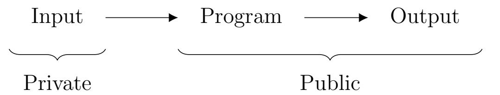
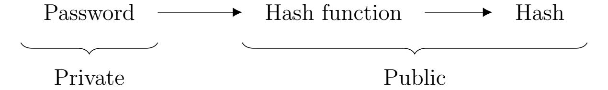
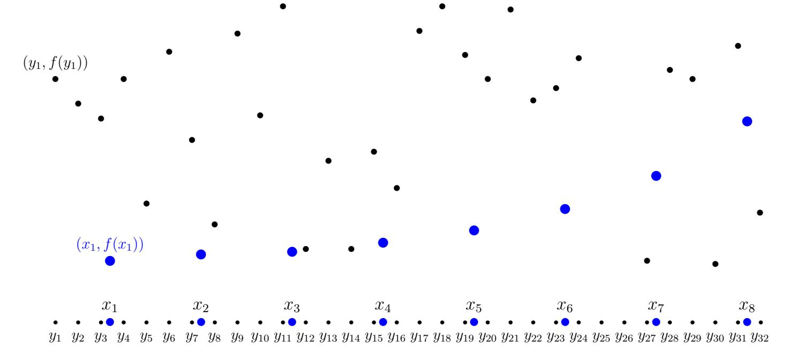

{0}------------------------------------------------

## ZERO KNOWLEDGE VIRTUAL MACHINE STEP BY STEP

#### TIM DOKCHITSER AND ALEXANDR BULKIN

## Contents

| 1.   | Introduction                                         | 2  |
|------|------------------------------------------------------|----|
| 1.1. | Configurability                                      | 3  |
| 1.2. | The primer                                           | 4  |
| 1.3. | Applications of ZKPs                                 | 4  |
| 1.4. | The structure of this paper                          | 5  |
| 1.5. | Further information                                  | 5  |
| 2.   | Low degree proof example - Fibonacci Virtual Machine | 6  |
| 2.1. | Setup                                                | 6  |
| 2.2. | Interpolating values                                 | 6  |
| 2.3. | Constraints and relaxing them                        | 7  |
| 2.4. | Boundary conditions                                  | 7  |
| 2.5. | Mixing                                               | 8  |
| 2.6. | FRI Low Degree Testing                               | 8  |
| 2.7. | Deep variant                                         | 8  |
| 2.8. | Fiat-Shamir heuristic                                | 9  |
| 2.9. | Summary                                              | 9  |
| 3.   | General Compulation                                  | 10 |
| 3.1. | Goal                                                 | 10 |
| 3.2. | Program termination                                  | 10 |
| 3.3. | Public input                                         | 11 |
| 3.4. | Output                                               | 11 |
| 3.5. | Recursion                                            | 11 |
| 4.   | Primitives                                           | 11 |
| 4.1. | Polynomial constraints                               | 11 |
| 4.2. | Degree                                               | 11 |
| 4.3. | Control, derived and external columns                | 12 |
| 4.4. | Instructions                                         | 13 |
| 4.5. | Permutation                                          | 13 |
| 4.6. | Multiple permutation                                 | 14 |
| 4.7. | Lookup                                               | 14 |
| 4.8. | Injective lookup                                     | 15 |
| 4.9. | Permutation and lookups with multiple columns        | 16 |
| 5.   | Instruction set                                      | 16 |
| 5.1. | Operands and flag                                    | 16 |
| 5.2. | Unsigned multiplication                              | 18 |
| 5.3. | Setting flag for zero result                         | 18 |

Date: July 3, 2023.

{1}------------------------------------------------

| 5.4.<br>Unsigned arithmetic, comparisons and move | 18 |
|---------------------------------------------------|----|
| 5.5.<br>Logic                                     | 19 |
| 5.6.<br>Word range                                | 20 |
| 5.7.<br>Signed arithmetic                         | 20 |
| 5.8.<br>Memory                                    | 20 |
| 5.9.<br>Program lookup                            | 23 |
| 6.<br>Prover/Verifier protocol                    | 23 |
| 6.1.<br>VM configuration                          | 23 |
| 6.2.<br>Prover code for configured VM             | 24 |
| 6.3.<br>Verifier code for configured VM           | 25 |
| References                                        | 25 |
| Appendix A. VM Configuration                      | 27 |

# 1. Introduction

<span id="page-1-0"></span>A zero-knowledge proof is a cryptographic concept that allows one party (Prover), to demonstrate knowledge of a certain fact or statement to another party (Verifier), while keeping some sensitive information confidential. In practice, the goal of a zero-knowledge proof is to establish trust and confidence in the validity of a claim without divulging sensitive or confidential data.

In this paper, we describe how to implement of a Zero Knowledge Virtual Machine (ZKVM) for generic computation. The setting is that Prover runs a public program on private inputs and wants to convince Verifier that the program has executed correctly and produces an asserted output, without revealing anything about the computation's input or intermediate state.



As an example, Prover may want to convince Verifier that they have a password that hashes to a given value, without revealing anything about the password:



Generally, Prover should be able to run some code that performs the hashing operation, and produce data called 'the proof', which would allow anyone to verify that the proof is correct, that is, that the Prover has, in fact, a valid pre-image of the given hash value.

ZK problems span a variety of use cases, from more specific to more general. The specific proof-of-hash-pre-image problem above has very practical applications in credential verification. Another narrow case for ZK-proofs are range-proofs used by the ZCash cryptocurrency network to prove availability of funds in a given account without revealing the exact amount of funds or the sequence of transactions that led to the current state.

If we generalize this further, we will discover a wide set of use cases for such primitives. For example, given a hash as a public key K<sup>p</sup> = H(Ks), and its pre-image K<sup>s</sup> as a private (secret) 

{2}------------------------------------------------

key, it is not hard to construct an asymmetrical signature scheme using zero-knowledge proofs: signature function S(m, Ks) on message m with key K<sup>s</sup> is defined as a zero knowledge proof that H(Ks) = K<sup>p</sup> and H(K<sup>s</sup> + m) = X that reveals m and X, but not Ks.

So what if we could run any program, and prove, in zero knowledge, that it ran correctly and produced the output we claimed it had, without revealing any inputs? This is what we call zero-knowledge proofs for general computation. The first scheme that achieved this goal is due to Ben-Sasson at al. [\[BS](#page-24-2)<sup>+</sup>13]. It supports any program written in a speciallydesigned assembly language called TinyRAM that comes close to being viable for practical applications, perhaps with the exception of not supporting non-constant jumps and memory accesses. A precise description of how to implement this scheme is due to Bootle, Cerulli et al. [B <sup>+</sup>[18,](#page-24-3) [Ce19\]](#page-24-4), and they also introduce a primitive called lookup, that is very useful in ZK context. Since that time, there have been quite a few advances in the area, and we feel it is useful to revisit a ZKVM implementation with new techniques.

This paper's primary purpose is to provide a source of introductory information into building a ZK proof system for general computation. Anyone with practical knowledge of numerical programming, starting from no knowledge about how ZK proofs work, should be able to

- (1) understand the general approach to generalized computation ZK proofs
- (2) understand all the "ingredients" of a full-functioning general-purpose ZKVM
- (3) be able to implement their own ZKVM from scratch

While we aim to inform interested contributors just starting to learn about this technology, and to smooth the otherwise steep learning curve they face, we also make some contributions of our own. We, specifically, introduce:

- (1) A new ZK-friendly memory scheme (see §[5.8\)](#page-19-2)
- (2) A concept of a fully configurable ZKVM (a "ZKVM compiler"), introduced below and demonstrated further in §[6.1](#page-22-2)

<span id="page-2-0"></span>1.1. Configurability. In familiarizing ourselves with the current state of the art of general computation ZK-proof schemes, we have observed that, at the moment, the space of existing ZKVMs consists of two distinct categories. On one hand, we have TinyRAM already mentioned, and a few others, that use a "ZK-friendly" command set. On the other hand, there are implementations, such as the one provided by Risc0 and zkWASM, that implement ZK-proofs for the RiskV and WASM command sets respectively, both of which are standard LLVM-compatible targets.

These two categories are different in terms of the tradeoffs they introduce. Some operations supported by modern CPUs (and WASM) introduce significant additional complexity into the Prover and, consequently, cause a significant degradation of performance. On the other hand, ZK-friendly ZKVMs typically lack the possibility of support by either LLVM or GCC toolchains, which means they can only be used for small custom-written software components. In order for a ZKVM to be both ZK-efficient and viable as an LLVM target, we need to find a viable balance between these tradeoffs.

This introduces the concept of VM configurability. Essentially, we aim to build LLVM for ZK, where a high-level description of a command set can be used to auto-generate both the Prover/Verifier components and an LLVM backend targeting the command set. Doing this would enable contributors to create new ZKVM command sets with minimal effort, and so run multiple experiments to determine this optimal balance. In practice, such "ZKVM 

{3}------------------------------------------------

compiler" is more than feasible, as we will see below, due to the modular nature of the constraints associated with proving micro-operations that comprise individual instructions.

But there is an even more important reason to build such ZKVM compiler. We are referring to the issue of fragility that challenges the ongoing security of ZK schemes. The issue can be expressed briefly as follows: there must be an efficient process to update Prover/Verifier pairs in response to security incidents and the fast pace of innovation in ZK. Consider the fact that a missing constraint (for example, to prove that the value of an overflow flag can not be anything other than zero or one) can lead to the possibility of constructing invalid proofs. It is not realistic to expect that a set of constraints used to describe software is complete from the get go. Consequently, we must build our ZK frameworks expecting to have to promptly respond to discoveries of such omissions and any other type of exploit.

Furthermore, the fast pace of research in ZK means that the foundational components of any ZK scheme may fast become out of date, and, what is even more concerning, may be discovered to be exploitable. All of this points towards the need to significantly streamline the reconfigure/recompile/redeploy process in any network using ZKPs. The ZKVM compiler being discussed aims to facilitate this.

<span id="page-3-0"></span>1.2. The primer. For the Prover/Verifier scheme there are various choices, based on polynomial commitments, notably Bulletproofs [B <sup>+</sup>[23\]](#page-24-5), KZG [\[KZG\]](#page-25-0) and FRI [\[BS](#page-24-6)<sup>+</sup>18]. For our primer, we chose FRI (with a DEEP modification [\[BS](#page-24-7)<sup>+</sup>19]) as it needs no trusted setup, it is good for constructing recursive proofs, and it is post-quantum in that its security only relies on a (flexible choice of a) collision-resistant hash function. There are also choices of a prime field for it, such as p = 2<sup>64</sup>−2 <sup>32</sup>+1 that make for very fast arithmetic and hence efficient Prover/Verifier code. For lookups, we use our scheme [\[BD23\]](#page-24-8) based on the extensions Plookup [\[GW20\]](#page-24-9) and Plonkup [P <sup>+</sup>[22\]](#page-25-1) of the original lookup protocol in [B <sup>+</sup>[18\]](#page-24-3).

We note, however, that these choices are mostly for clarity of demonstration and are not consequential in the context of a configurable ZK-compiler. After all, we should be able to easily regenerate our Prover/Verifier with different schemes, as needed.

<span id="page-3-1"></span>1.3. Applications of ZKPs. We are most interested in applications of ZKPs to use cases in the financial and legal industries. In both of these contexts, the need for reliable verification of accuracy of facts pertaining to information is critical. Yet, it stands in stark opposition to the need for privacy, which is no less critical. To demonstrate this opposition on a specific example, take two imaginary financiers, Rocky and Morgan. Rocky has invented a cutting edge financial strategy which brings him annual returns of 25%, and has invested all his personal funds into it. He now needs to borrow cash to finance a further increase in trading volume. He believes he can borrow at about 7%, and make a whopping 17% margin. There's only one problem. Morgan, whose business it is to lend capital, requires Rocky to put up collateral to guarantee the loan. But Rocky doesn't want to disclose to Morgan the contents of his portfolio, as that would leak information about his wonderful strategy.

After some negotiation it becomes apparent that Rocky would either need to give up his dreams of getting a loan, or would have to disclose his portfolio to Morgan and take the risk of the latter replicating his strategy and eroding his edge. Rocky comes back to his office in a gloomy mood, downs a glass of Scotch, and spills the whole story to his secretary, who then goes "Wait!", and tells him that her husband is working on this new technology called zero-knowledge proofs that could potentially help. Rocky agrees to have a meeting with the 

{4}------------------------------------------------

husband, at which he learns that there is a way to prove the worth of his portfolio to Morgan without disclosing it.

Here's how it works. Morgan would provide to Rocky some computer code that can determine the value of Rocky's portfolio. Rocky would run the code and provide its output to Morgan along with the zero-knowledge proof that the code has been run correctly. This output would go to Morgan daily, and if the value is ever too low, Rocky would face a margin call that may require him to sell his entire portfolio in order to repay Morgan.[1](#page-4-2)

This example makes clear the following general position: zero-knowledge proof technology is an essential tool that enables safe and meaningful balance between privacy and verification in the financial and legal context. Here are some more examples that illustrate this position:

- (1) Revenue-based lending: verify an organization's revenue stream, without knowing the specific transaction details or channels.
- (2) Regulatory surveillance: verify that an organization is adhering to regulation without requiring access to the details of its activities.
- (3) KYC/AML verification without privacy violation: verify age and citizenship of individuals without requiring them to supply their name or any other personally identifiable information.
- (4) Contract verification: verify that an organization has entered into a valuable contract with a counterparty without disclosing who the counterparty is.
- (5) Vice clause verification: verify that an organization has not been trading with unethical organizations, without having access to the list of organization's trading counterparties.

## <span id="page-4-0"></span>1.4. The structure of this paper.

- In Section [2](#page-5-0) we use a simple example of a Fibonacci sequence to demonstrate the fundamental structure and functioning of ZK proofs
- In Section [3](#page-9-0) we move from the simple example to introducing the way general computation proofs are achieved
- In Section [4](#page-10-3) we discuss how to construct the constraints ("primitives") that can be used as "ingredients" in the proof scheme for various operations within the command set
- In Section [5](#page-15-1) we discuss specific operations in a fully-functional command set and describe how the primitives from Section [4](#page-10-3) are used to generate appropriate proofs
- In Section [6](#page-22-1) we tie everything together to describe the complete ZK-proof protocol
- In the Appendix we provide a glimpse into the configuration language for the ZKcompiler
- <span id="page-4-1"></span>1.5. Further information. This paper was written as a contribution to the global ZK community by the research team at ADAPT Framework Solutions. To learn more about ADAPT, a high-level developer framework for building decentralized systems, please see [the](https://docsend.com/view/amdi7ujhgc7qjny2) [ADAPT whitepaper.](https://docsend.com/view/amdi7ujhgc7qjny2)

Acknowledgements. We would like to thank Delendum Ventures and especially Daniel Lubarov for an opportunity for us to use a Delendum Fellowship and fruitful discussions.

<span id="page-4-2"></span><sup>1</sup>Obviously, for simplicity, we are neglecting the need to also validate the input data in zero knowledge. In practice, the validation of the data supply chain for trusted financial computation is a difficult but unrelated problem that requires that information be provided, and its completeness be enforced and verified by other related players, such as banks, prime brokers, regulators, etc.

{5}------------------------------------------------

### 2. Low degree proof example - Fibonacci Virtual Machine

<span id="page-5-1"></span><span id="page-5-0"></span>2.1. **Setup.** Before going into the technical details of the actual protocol of verifying general program execution, we illustrate the construction with a simple one-column one-constraint 'Fibonacci Virtual Machine'. Its 'execution' is a sequence of integers

$$a_1, a_2, a_3, a_4, a_5, a_6, a_7, a_8$$

that obey the Fibonacci rule  $a_n = a_{n-1} + a_{n-2}$  for n = 3, ..., 8. The input is  $a_1, a_2$  and  $a_8$  is the output. Suppose Prover wants to convince Verifier that they know such a sequence with output  $a_8 = 47$ . They have in mind

$$(1,3,4,7,11,18,29,)$$
 47

but do not want to reveal the input  $a_1 = 1, a_2 = 3$  or any intermediate values  $a_3, ..., a_7$ .

<span id="page-5-2"></span>2.2. **Interpolating values.** We represent the  $a_i$  as integers modulo a prime p, that is as elements of the finite field  $\mathbb{F} = \mathbb{Z}/p\mathbb{Z} = \mathbb{F}_p$ . In this example, we take p = 97. Additively,

$$\mathbb{F} = \mathbb{Z}/97\mathbb{Z} = \{0, 1, 2, 3..., 96\}.$$

Multiplicatively, s = 5 is a primitive root in  $\mathbb{F}$ . In other words,

$$\mathbb{F} \setminus \{0\} = (\mathbb{Z}/97\mathbb{Z})^{\times} = \{5, 5^2, 5^3, ..., 5^{96}\}.$$

The element  $\zeta = 5^3$  is then of order 32, so it is a 2-power root of unity, and we let

$$x = (\zeta^4, \zeta^8, \zeta^{12}, ..., \zeta^{32}), \qquad y = (s\zeta, s\zeta^2, s\zeta^3, ..., s\zeta^{32}).$$

The  $x_i$  (i = 1, ..., 8) are the 8th roots of unity in  $\mathbb{F}$ , and the  $y_i$  (i = 1, ..., 32) are the 32nd roots of unity shifted by s.

Let a = (1, 3, 4, 7, 11, 18, 29, 47) be the column of values that Prover wishes to encode. With Langrange interpolation, we can find the unique polynomial  $f(x) \in \mathbb{F}[x]$  of degree < 8 with  $f(x_i) = a_i$ . It turns out to be

$$f(x) = 67x^7 + 7x^6 + 2x^5 + 28x^4 + 6x^3 + 74x^2 + 42x + 15.$$

There is a very efficient way to do this, 'the number-theoretic transform NTT' (essentially a version of the finite Fourier transform), that is specifically tailored to domains consisting of 2-power roots of unity in a field. Knowing f is equivalent to knowing the  $a_i$ . Prover evaluates f on the 32 points  $y_1, ..., y_{32}$  using NTT again, and these values are plotted in Figure 1. On the horizontal axis we plot  $\mathbb{F} \setminus \{0\}$  multiplicatively (to make the  $x_i$  and  $y_i$  equally spaced), and on the vertical axis we plot  $\mathbb{F}$  additively.

As one (and only) black box, we will use the existence of the following (cf. also §2.6, §2.8)

FRI low degree testing algorithm. It is possible for a Verifier efficiently, and in zero knowledge, to check that a given list of 32 values lie close to the values of some polynomial of degree < 8 evaluated at the  $y_i$ .

In practice, 8 and 32 will be, say,  $2^{22}$  and  $2^{26}$ . Essentially, Prover commits all the values of the disguised trace in a Merkle tree, sends its root to Verifier, and Verifier, by quering very few of the values ( $\sim$ log of their number) is able to convince themselves that they lie close to some polynomial. This number of queries is so small that it is does not reveal enough information about the polynomial to be able to reconstruct its values at the  $x_i$  (the original trace), which is where 'zero knowledge' comes from.

{6}------------------------------------------------



<span id="page-6-2"></span>FIGURE 1. Values of  $f(x) = 67x^7 + 7x^6 + 2x^5 + 28x^4 + 6x^3 + 74x^2 + 42x + 15$  on  $x_i = \zeta^{4i}$  and  $y_i = s\zeta^i$  in  $\mathbb{F}_{97}$ .

## <span id="page-6-0"></span>2.3. Constraints and relaxing them. The Fibonacci rule

$$a_n = a_{n-1} + a_{n-2}$$
 for  $n \neq 1, 2$ 

is equivalent to the 'constraint polynomial'

$$C(x) = (x - x_1)(x - x_2)(f(x) - f(x/\zeta^4) - f(x/\zeta^8))$$

to be 0 at  $x = x_1, ..., x_8$ . The condition  $f(x) - f(x/\zeta^4) - f(x/\zeta^8) = 0$  guarantees that  $a_n - a_{n-1} - a_{n-2} = 0$ , and the 'relaxing' terms  $x - x_1$  and  $x - x_2$  allow this to be violated for n = 1, 2.

Equivalently, C(x) is divisible by the 'zeroes polynomial'

$$Z(x) = \prod_{i=1}^{8} (x - x_i) = x^8 - 1.$$

As<sup>2</sup> deg  $C(x) = 2 + 2 \deg f \leq 16$ , this is equivalent to the 'verification polynomial'

$$V(x) = C(x)/Z(x)$$

to be inded a polynomial of degree  $\leq 8$  in x. To summarise, the conditions

- (1)  $\{f(y_i)\}_{i=1}^{32}$  are values of a polynomial of degree  $\leq 7$
- (2)  $\{V(y_i)\}_{i=1}^{32}$  are values of a polynomial of degree  $\leq 8$

(3) 
$$V(y_i) = \frac{(y_i - x_1)(y_i - x_2)}{y_i^8 - 1} (f(y_i) - f(y_{i-4}) - f(y_{i-8}))$$
 for  $i = 1, ..., 32$ 

are what Verifier needs to know that the execution trace is valid.

<span id="page-6-1"></span>2.4. **Boundary conditions.** We used multipliers  $x - x_1$ ,  $x - x_2$  to relax the constraint at n = 1, 2. We can also do the opposite, and divide by a linear factor to enforce a value for n = 8. For any function F(x),

$$F(x)$$
 is a polynomial and  $F(c) = b \Leftrightarrow \frac{F(x) - b}{x - c}$  is a polynomial.

<span id="page-6-3"></span><sup>&</sup>lt;sup>2</sup>actually deg  $C(x) = 2 + \text{deg } f \leq 9$  in our example, which is an artefact of a linear rather than a quadratic constraint here. We will pretend the degree is only bounded by 16.

{7}------------------------------------------------

In our example, the output value  $a_8 = 47$  guarantees that  $\frac{f(x)-47}{x-x_8}$  is still a polynomial, so we replace the condition (1) by

- (1')  $\left\{\frac{f(y_i)-47}{y_i-x_8}\right\}_{i=1}^{32}$  are values of a polynomial of degree  $\leq 6$ .
- <span id="page-7-0"></span>2.5. Mixing. There is a simple observation ('mixing') that

$$F(x), G(x)$$
 are polynomials of degree  $\leq d$   $\Leftrightarrow$   $F(x) + \delta G(x)$  is a polynomial of degree  $\leq d$  for any  $\delta \in \mathbb{F}$ .

Moreover, when  $\mathbb{F}$  is large, one random choice of  $\delta \in \mathbb{F}$  is enough, as long as (a)  $\delta$  comes from Verifier rather than Prover, and (b) it is given to Prover after F and G are committed.

As the low degree testing is quite expensive, we use mixing to get (1') and (2) with one test, replacing them by

(2')  $\{y_i^2 \frac{f(y_i)-47}{y_i-x_8} + \delta V(y_i)\}_{i=1}^{32}$  are values of a polynomial of degree  $\leq 8$ .

Same idea can also be used to deal with multiple constraints, mixing them into one in the same way, say, with successive powers of  $\delta$ .

<span id="page-7-1"></span>2.6. FRI Low Degree Testing. This is also basically how FRI low degree testing works. Take a polynomial  $F(x) = \sum c_i x^i$ , write every term  $x^i$  as  $x^j x^{4k}$  with  $j \in \{0, 1, 2, 3\}$  and group those with the same j together. We get

(2.1) 
$$F(x) = f_0(x^4) + xf_1(x^4) + x^2f_2(x^4) + x^3f_3(x^4),$$

and F is a polynomial if only if all the  $f_j$  are. Heuristically, if  $\delta \in \mathbb{F}$  is random, it is enough to check (2.1) for a number of x-coordinates, and that

<span id="page-7-3"></span>
$$f_0(x) + \delta f_1(x) + \delta^2 f_2(x) + \delta^3 f_3(x)$$

is a polynomial for a random  $\delta \in \mathbb{F}$ . This reduces verifying that a function is a polynomial of degree  $\leq d$  to verifying that some other function is a polynomial of degree  $\approx d/4$ , and FRI is a recursive algorithm based on this. We refer the reader to [BS<sup>+</sup>18] for details and security analysis.

- <span id="page-7-2"></span>2.7. **Deep variant.** We are now down to two verifications:
  - (2')  $\{y_i^2 \frac{f(y_i)-47}{y_i-x_8} + \delta V(y_i)\}_{i=1}^{32}$  are values of a polynomial of degree  $\leq 8$ ,

(3) 
$$V(y_i) = \frac{(y_i - x_1)(y_i - x_2)}{y_i^8 - 1} (f(y_i) - f(y_{i-4}) - f(y_{i-8}))$$
 for  $i = 1, ..., 32$ .

The original FRI scheme would check (3) for few indices i, chosen at random by Verifier. The DEEP modification adds extra security in verifying this relation so that just one query suffices. We test the equation at a random point *outside* the range of committed values  $y_i$ . In our example, let

$$\xi = s^2 \zeta^j$$
 (deep x-coordinate)

for a random  $j \in \{1, ..., 32\}$  provided by Verifier. This is shifted away from the  $x_i$  and the  $y_i$ , so it is a different point in our base field. (In fact, we could even go a bit further, and take it from an extension  $\mathbb{F}_{p^d}$  over  $\mathbb{F}_p$  for some small d, improving security even further though at a cost of Verifier running time.) Because (3) comes from a relation between polynomials, it holds with  $y_i$  replaced by  $\xi$  as well. In other words,

(3') 
$$v_1 = \frac{(\xi - x_1)(\xi - x_2)}{\xi^8 - 1} (v_2 - v_3 - v_4), \quad (v_1, ..., v_4) = (V(\xi), f(\xi), f(\xi/\zeta), f(\xi/\zeta^2)).$$

{8}------------------------------------------------

The relation on the left is the one we test. We have to ensure that the values on the right are correct, and this is again of the type 'prove that a polynomial passes through a given point', so it can be incorporated into (2'). Using Lagrange interpolation, construct the unique polynomial q of degree  $\leq 3$  so that

$$q(x_8) = 48$$
,  $q(\xi) = v_2$ ,  $q(\xi/\zeta) = v_3$ ,  $q(\xi/\zeta^2) = v_4$ 

and replace (2') with

- $(2'') \{ y_i^4 \frac{f(y_i) q(y_i)}{(y_i x_8)(y_i \xi/\zeta)(y_i \xi/\zeta)} + \delta \frac{V(y_i) v_1}{y_i \xi} \}_{i=1}^{32} \text{ are values of a polynomial of degree} \leqslant 7.$ Thus, we reduced everything to one low degree test (2'') and one additional check (3').
- <span id="page-8-0"></span>2.8. Fiat-Shamir heuristic. The introduction of the mixing constant  $\delta$  and the DEEP parameter  $\xi$  that come from Verifier has an undesired effect to making the protocol interactive. We would like a non-interactive protocol in which Prover produces a proof, and Verifier (or anybody else) could verify its correctness at any time afterwards, with no interaction. There is a standard trick how to achieve this, the Fiat-Shamir heuristic. It asserts that random input from an honest Verifier could be replaced with a hash coming from the preceding part of the protocol. In our case, Prover commits  $\{f(y_i)\}_{y=1}^{32}$  to a Merkle tree, and its Merkle root could be used as a source of the constants  $\xi$  and  $\delta$  used in the rest of the protocol.
- <span id="page-8-1"></span>2.9. Summary. Let us collect all the steps for the validity of the trace for the Fibonacci Virtual Machine. Set  $\mathbb{F} = \mathbb{Z}/97\mathbb{Z}$ ,  $s = 5 \in \mathbb{F}$ ,  $\zeta = 5^3 \in \mathbb{F}$  (of order 32),  $x_i = \zeta^{4i}$ ,  $y_i = s\zeta^i$ .

#### Prover.

(1) 'Execute the code' by applying the Fibonacci rule starting from  $a_1 = 1$ ,  $a_2 = 3$  and up to  $a_8 = 47$ . This is the 'original execution trace'

$$a = (1, 3, 4, 7, 11, 18, 29, 47).$$

(2) Interpolate the trace with a polynomial f, so that  $f(x_i) = a_i$  for i = 1, ..., 8:

$$f(x) = 67x^7 + 7x^6 + 2x^5 + 28x^4 + 6x^3 + 74x^2 + 42x + 15.$$

- (3) Compute  $f(y_i)$  for i = 1, ..., 32, the 'disguised execution trace'. (4) Compute  $V(y_i) = \frac{(y_i x_1)(y_i x_2)}{y_i^8 1} (f(y_i) f(y_{i-4}) f(y_{i-8}))$  for i = 1, ..., 32.
- (5) Store triples  $(i, f(y_i), V(y_i))$  as leaves of a Merkle tree and compute Merkle root  $\delta$ . This  $\delta$  will be used as a mixing parameter.
- (6) Let  $\xi = s^2 \zeta^{\delta}$ , or some other pre-arranged function of  $\delta$  ('deep x-coordinate').
- (7) Set  $(v_1, ..., v_4) = (V(\xi), f(\xi), f(\xi/\zeta), f(\xi/\zeta^2))$  ('deep taps').
- (8) Using Lagrange interpolation construct the unique polynomial q of degree 3 so that  $q(x_8) = 48, q(\xi) = v_2, q(\xi/\zeta) = v_3, q(\xi/\zeta^2) = v_4.$
- (9) Generate a FRI low degree proof P (=some branches of the Merkle tree) that

$$y_i \mapsto y_i^4 \frac{f(y_i) - q(y_i)}{(y_i - x_8)(y_i - \xi)(y_i - \xi/\zeta)(y_i - \xi/\zeta^2)} + \delta \frac{V(y_i) - v_1}{y_i - \xi}$$

is a polynomial of degree  $\leq 7$ .

(10) The proof of validity of the execution trace is P plus the deep taps  $v_1, ..., v_4$ .

**Verifier.** Given P and  $v_1, ..., v_4$ ,

- (11) Compute q(x) as in (8) from  $v_2, v_3, v_4$ .
- (12) Check that all branches in P lead to the same Merkle root.
- (13) Let  $\delta$  be the Merkle root, and compute  $\xi = s^2 \zeta^{\delta}$  (or some pre-defined function of  $\delta$ ).

{9}------------------------------------------------

- (14) Check that v<sup>1</sup> = (ξ−x1)(ξ−x2) ξ <sup>8</sup>−1 (v<sup>2</sup> − v<sup>3</sup> − v4).
- (15) Check that P is a valid FRI proof for the function in (9).

# 3. General Compulation

<span id="page-9-0"></span>Now we turn to the general setup. We work with a virtual machine running some assembly language. Prover executes a program, and generates an execution trace. For every time t = 1, 2, ..., N, it stores the values of the program line counter pc, flag, registers (if any) and various auxiliary variables after the command at time t has been executed. All values lie in a finite field F = F<sup>p</sup> with p elements, and are stored in columns of size N, say C1, C2, . . ..

| Program |             |       |       |  |
|---------|-------------|-------|-------|--|
| pc      | instruction | imm   | · · · |  |
| 1       | ax:=ax+17   | 17    | · · · |  |
| 2       | jmpnc 1     | 1     | · · · |  |
| · · ·   | · · ·       | · · · | · · · |  |

| Execution trace |       |       |       |       |       |       |
|-----------------|-------|-------|-------|-------|-------|-------|
| C1              | C2    | C3    | C4    | C5    | C6    | · · · |
| t               | pct   | flagt | axt   | bxt   | immt  | · · · |
| 1               | 2     | 0     | 17    | 0     | 17    | · · · |
| 2               | 1     | 0     | 17    | 0     | 1     | · · · |
| 3               | 2     | 0     | 34    | 0     | 17    | · · · |
| · · ·           | · · · | · · · | · · · | · · · | · · · | · · · |

<span id="page-9-3"></span>Table 1. Source program and an execution trace

We will fix the following primary constants for the virtual machine:

| const | description                                                | example       |
|-------|------------------------------------------------------------|---------------|
| W     | VM word size, even power of 2                              | 232           |
| N     | number of memory words & bound on the number of time steps | 226           |
| p     | prime modulo which execution trace entries are computed    | 264−2<br>32+1 |

- <span id="page-9-1"></span>3.1. Goal. Our goal is to describe a protocol for Prover to convince Verifier that
  - (a) Prover possesses a valid execution trace from a program execution.
  - (b) The program started with an asserted public input (plus, generally, some private input, unknown to the Verifier).
  - (c) The program terminated at an asserted place, with an asserted output.

Validity of the execution trace will be ensured with polynomial constraints (see §[4\)](#page-10-3), which are polynomial relations between columns, and boundary conditions, which are statements of the form 'column C at time t has value a'. Let us first deal with (b) and (c) — program termination, input and output.

<span id="page-9-2"></span>3.2. Program termination. To verify where the program has terminated, and that it has terminated correctly, we can have a special instruction, say halt (or answer), for a correct termination, that simply works as a jump back to the same instruction. There could be several of those in the program:

| pc    | instruction | · · · |
|-------|-------------|-------|
| · · · | · · ·       | · · · |
| 121   | halt        | · · · |
| · · · | · · ·       | · · · |
| 394   | halt        | · · · |
| · · · | · · ·       | · · · |

{10}------------------------------------------------

If, say, the first one is reached, then the program enters an infinite loop until the time t = N. So we just need to check that the value of pc at time N is 121, say. This is a boundary constraint on the pc column.

- <span id="page-10-0"></span>3.3. Public input. We precede the program with a code that hashes the public part of the memory with some ZK-friendly hash (say Poseidon) and asserts that the hash agrees with a given constant h. In other words, the program cannot continue (with a valid execution trace) unless the value is h. Verifier checks that the expected public input hashes to that value.
- <span id="page-10-1"></span>3.4. Output. Similarly, at the end of the program, right before the termination block, we introduce a code that hashes the part of the memory responsible for the program output. Again, the code checks that the hash agrees with some value that Verifier possesses.
- <span id="page-10-2"></span>3.5. Recursion. These steps also allow to break the trace into 'pieces', which is necessary if the program takes more than N steps to execute. Each piece starts with a code that verifies that the previous one has executed correctly (which we will get to), and that its output hashes to the same value as the input of the current one.

# 4. Primitives

<span id="page-10-3"></span>We are left to deal with (a) of §[3.1](#page-9-1) — how Prover can show the trace satisfies set of constraints with boundary conditions (§[6\)](#page-22-1), and how to formulate those constraints that ensure validity of the program execution for our chosen VM architecture (§[5\)](#page-15-1). A collection of columns, constraints and instruction definitions for a given VM forms a 'configuration script', and we begin by describing the primitives that make such a script.

<span id="page-10-4"></span>4.1. Polynomial constraints. Validity of the trace will be mostly ensured with polynomial constraints. These are polynomial relations between the values of several columns at time t and t − 1. We use # to indicate 't − 1', so that, for example,

constraint 
$$C_1 C_2 + C_3^{\#} C_4^{\#} = 0$$

stands for

$$C_1(t)C_2(t) + C_3(t-1)C_4(t-1)$$
 for all  $t = 1, ..., N$ .

We use the convention that the time 'loops', so Ci(0) := Ci(N). We also allow exceptions at some specified times t:

Example 4.1 (Time column). The following constraints with a boundary condition at t = 1 force C to be the 'time' column C = (1, 2, 3, ..., N).

constraint 
$$C = C^{\#} + 1$$
 for  $t \neq 1$   
boundary  $C(1) = 1$ 

<span id="page-10-5"></span>4.2. Degree. The degree of a constraint is its degree as a polynomial in the variables C1, C# 1 , C2, .... For example,

$$degree(C = C^{\#} + 1) = 1,$$
  $degree(C_1^2 = C_2C_3) = 2,$   $degree(C_1C_2C_3 = 0) = 3.$ 

Higher degree constraints are normally expensive, and in our sample VM based on FRI we have all constraints of degree 2 (quadratic). Constraints of degree 1, or, more generally, variables that occur only once and linearly in some constraint are not particularly useful, as 

{11}------------------------------------------------

those variables can be eliminated. Higher degree constraints, when we need them, are broken into quadratic ones, at the cost of introducing new columns. For example, for

$$C_1C_2C_3=0$$

we can introduce a new column Q = C1C2, and replace the constraint by an equivalent quadratic pair

$$Q = C_1 C_2, \qquad C_3 Q = 0.$$

If we opt for a higher degree limit, say 3 or 4 instead of 2, we can reverse this and remove some columns. The optimal choice depends on how the running time grows with the number of columns and the degree bound.

<span id="page-11-0"></span>4.3. Control, derived and external columns. To formulate a set of constraints for the execution trace, it will be useful to distinguish between 3 types of columns:

| Column type      | description                                     | Table<br>1 |
|------------------|-------------------------------------------------|------------|
|                  |                                                 | example    |
| control          | Columns shared with the program (except pc)     | imm        |
|                  | that depend on the instruction and its operands |            |
| derived          | Columns C that are polynomial expressions in    | t, pc      |
| (or<br>variable) | other columns, and possibly C#                  |            |
| external         | Columns whose values are computed 'externally', | flag       |
|                  | outside the configuration script                |            |

Control columns come from the program (e.g. all immediate values of the instructions), derived ones are polynomials in other columns, and the rest are external. Write

control 
$$C_1, C_2, \dots$$
  
var  $C_5 = C_1C_2 + C_3C_4, \dots$ 

to specify control and derived columns. Every var creates a column and also generates the corresponding constraint. If we wish to store, say, the highest bit of the values of one column C in another column H, then H is not a polynomial expression in C, so H is external. Prover can have a function highestbit to compute the highest bit of a machine word w ∈ [0, ..., W −1], and the configuration command

external 
$$H$$
=highestbit( $C$ )

states that H is computed externally, and is a function of C (needed to order the computation of the derived columns and such external calls). This generates no constraints, so they have to be specified manually (say H(H−1) = 0 etc., in our example).

<span id="page-11-1"></span>Example 4.2 (Jumps). This is how conditional (on flag) and unconditional jumps can be implemented; cf jmp, cjmp, cnjmp in Table [2:](#page-16-0)

external flag  
control j1, j2, addr  
var j = j1+j2\*flag  
var pc = (1-j)\*(pc#+1)+j\*addr for 
$$t \neq 0$$
  
boundary pc(0)=1

Here pc is a derived column, controlled by the values of j1, j2 and addr. When j1=j2=0, this forces pct=pct−1+1, so the program counter is incremented by one (default behaviour). 

{12}------------------------------------------------

If j1=1, j2=0, it becomes an unconditional jump to addr. For j1=0, j2=1, this is cjmp, and for j1=1, j2=-1, this is cnjmp.

<span id="page-12-0"></span>4.4. **Instructions.** Generally, everything about an instruction is encoded in the control variables, either via immediates (e.g. addr in 4.2) or control flags (e.g. j1, j2 in 4.2). We will write instructions as follows:

inst  $\langle \text{instructionname} \rangle \langle \text{operand1} \rangle \langle \text{operand2} \rangle \dots : \langle \text{flag1} \rangle = \text{value}, \langle \text{flag2} \rangle = \text{value}, \dots$ 

with operands and flags from control columns; for example (see 4.2 again),

inst jmp addr : j1=1, j2=0inst jmpc addr : j1=0, j2=1inst jmpnc addr : j1=1, j2=-1

<span id="page-12-1"></span>4.5. **Permutation.** The last primitives that we need are **permutation** and **lookup**, two very useful tools derived from polynomial constraints with boundary.

Let us start with permutation. Suppose we have two columns  $C_1$ ,  $C_2$  and we want to show that they are permutations of one another. That is, they have the same N elements,

$$\{C_{1,1},...,C_{1,N}\}=\{C_{2,1},...,C_{2,N}\}$$

as unordered multisets, but possibly in different order. Let us denote this as

$$C_1 \sim C_2$$
.

Note that we do not want to reveal any of the elements or anything about the permutation. The trick is to note that having such a permutation is equivalent to the equality of polynomials  $\prod_{t=1}^{N} (x - C_{1,i}) = \prod_{t=1}^{N} (x - C_{2,i})$ , which can in turn be checked by substituting a random value of  $\beta$  for x. Thus,

$$C_1 \sim C_2 \iff \prod_{t=1}^{N} \frac{\beta - C_{1,i}}{\beta - C_{2,i}} = 1.$$

Like in the Fibonacci example, we get  $\beta$  through the Fiat-Shamir heuristic, as a Merkle root of previously committed columns. We view the probability that  $\beta$  happens to equal to one of the  $C_{2,i}$  (or  $C_{1,i}$ ) as negligible.

Build an auxiliary column H whose values accumulate the partial products  $H_t = \prod_{i=1}^t \frac{\beta - C_{1,i}}{\beta - C_{2,i}}$ . Then H satisfies a recursion (which is how we compute it)  $H_t = H_{t-1} \frac{\beta - C_{1,t}}{\beta - C_{2,t}}$ , so we have a quadratic constraint with boundary

$$H^{\#}(\beta - C_1) = H(\beta - C_2), \qquad H(0) = H(N) = 1.$$

If  $C_1, C_2$  and H satisfy this constraint, then  $C_1$  and  $C_2$  are permutations of one another. To summarise, we write

permutation[
$$\beta$$
]  $C_1 \sim C_2$ 

for

set 
$$H = (\prod_{i=1}^{t} \frac{\beta - C_{1,i}}{\beta - C_{2,i}})_{t=1}^{N}$$
  
boundary  $H(0) = H(N) = 1$   
constraint  $H^{\#}(\beta - C_1) = H(\beta - C_2)$ 

{13}------------------------------------------------

<span id="page-13-0"></span>4.6. **Multiple permutation.** As a slight extension, say we have two lists of m columns  $C_1^{(1)}, ..., C_1^{(m)}$  and  $C_2^{(1)}, ..., C_2^{(m)}$ . We can show that the unions  $\bigcup_{j=1}^m C_1^{(j)}$  and  $\bigcup_{j=1}^m C_2^{(j)}$  have the same mN values as multisets, with an obvious generalisation

set 
$$H = (\prod_{i=1}^{t} \prod_{j=1}^{m} \frac{\beta - C_{1,i}^{(j)}}{\beta - C_{2,i}^{(j)}})_{t=1}^{N}$$
boundary 
$$H(0) = H(N) = 1$$
constraint 
$$H^{\#} \prod_{j=1}^{m} (\beta - C_{1}^{(j)}) = H \prod_{j=1}^{m} (\beta - C_{2}^{(j)})$$

except that the resulting constraint is of degree m+1 and has to be split into m quadratics. We write

permutation[
$$\beta$$
]  $C_1^{(1)},...,C_1^{(m)} \sim C_2^{(1)},...,C_2^{(m)}$ 

for the resulting scheme.

- <span id="page-13-1"></span>4.7. **Lookup.** Say we have two columns  $F = (F_i)_{i=1}^n$  ('query') and  $T = (T_i)_{i=1}^d$  ('table'). We want to prove that  $F \subset T$  as sets, ignoring repetitions. Let S be a vector of length n + d. Gabizon et al. [GW20] prove that the three conditions
  - (1)  $F \subset T$  as a set (unordered, ignoring repetitions)
  - (2)  $S = F \cup T$  as a multiset (unordered, with correct multiplicities)
  - (3) S is sorted by T (if  $S_i = T_{i'}, S_j = T_{j'}$ , then  $i < j \Leftrightarrow i' < j'$ )

are satisfied if and only if the following polynomials in  $\mathbb{F}[\beta, \gamma]$  are equal:

$$(1+\beta)^n \prod_{i=1}^n (\gamma + F_i) \prod_{i=1}^{d-1} (\gamma(1+\beta) + T_i + \beta T_{i+1}) = \prod_{i=1}^{n+d-1} (\gamma(1+\beta) + S_i + \beta S_{i+1}).$$

We will take d = n + 1 = N, the only case we need. Then this takes the form

$$\prod_{i=1}^{n} \cdots \prod_{i=1}^{n} \cdots / \prod_{i=1}^{2n} \cdots = 1.$$

Splitting the last product into pairs, we get a condition of the form  $\prod_{i=1}^{n} Q_i = 1$ , which can be verified by building a column with partial products  $Z_i = \prod_{j=1}^{i-1} Q_j$ , and imposing the conditions that  $Z_1 = Z_{n+1} = 1$  and a recursive formula  $Z_{i+1} = Z_i Q_i$ ; this is very similar to the permutation scheme in §4.5-4.6.

In  $\prod_{i=1}^{2n} \cdots$ , Bootle et al. group the *i*th and (i+n)th term together, and Pearson et al. [GW20] observe that it is more efficient to group *i*th and (i+1)st, saving one boundary condition. The 'cost' of the lookup in terms of quadratic constraints is

- 4 additional columns: Z, Q, and two halves  $H_1$ ,  $H_2$  of S,
- 2 quadratic constraints  $Z_{i+1} = Z_i Q_i$  and the expression for  $Q_i$ ,
- boundary conditions Z(1) = Z(n+1) = 1.

Similarly to §4.6, we can generalise this scheme to multiple queries with the same table:

**Algorithm 4.3.** Let  $(F_i^{(1)})_{i=1}^n, ..., (F_i^{(k)})_{i=1}^n$  be k queries for the same table  $T = (T_i)_{i=1}^{n+1}$ . **Prover:** 

- (1) Set  $S = T \cup F^{(1)} \cup \ldots \cup F^{(k)}$  as a multiset, sorted by T.
- (2) Set  $H^{(j)} = (S_j, S_{j+k+1}, S_{j+2(k+1)}, ...,)$  for j = 1, ..., k+1. Thus, |S| = kn + n + 1,  $|H^{(1)}| = n + 1$  and  $|H^{(2)}| = ... = |H^{(k+1)}| = n$ .
- (3) Commit  $H^{(1)}, ..., H^{(k+1)}$ .

{14}------------------------------------------------

- (4) Get random constants  $\beta, \gamma \in k$  from Verifier<sup>3</sup>.
- (5) Compute columns  $Z, Q^{(1)}, ..., Q^{(k)}$  recursively, as follows.

```
1: Z_{1} \leftarrow 1

2: for i \leftarrow 1 to n do

3: v \leftarrow \gamma(1+\beta) + H_{i}^{(k+1)} + \beta H_{i+1}^{(1)}

4: for j \leftarrow k to 1 by -1 do

5: v * := (\gamma(1+\beta) + H_{i}^{(j)} + \beta H_{i}^{(j+1)})/(\gamma + F_{i}^{(j)})

6: Q_{i}^{(j)} := v

7: end for

8: Z_{i+1} := Z_{i}(\gamma(1+\beta) + T_{i} + \beta T_{i+1})(1+\beta)^{k}/v

9: end for
```

(6) Commit  $Z, Q^{(1)}, ..., Q^{(k)}$ .

**Verifier:** Check that  $Z_1 = Z_{n+1} = 1$ , and the following k+1 quadratic constraints. For all i = 1, ..., n,

$$Z_{i+1}Q_i^{(1)} = Z_i(1+\beta)^k (\gamma(1+\beta) + T_i + \beta T_{i+1}),$$
  

$$(\gamma(1+\beta) + H_i^{(j)} + \beta H_i^{(j+1)})Q_i^{(j+1)} = (\gamma + F_i^{(j)})Q_i^{(j)} \quad \text{for} \quad j = 1 \dots k-1,$$
  

$$(\gamma(1+\beta) + H_i^{(k)} + \beta H_i^{(k+1)})(\gamma(1+\beta) + H_i^{(k+1)} + \beta H_{i+1}^{(1)}) = (\gamma + F_i^{(k)})Q_i^{(k)}.$$

We write

$$lookup[\beta, \gamma] \ T \ F^{(1)}, ..., F^{(k)}$$

for the resulting scheme, and group lookups with the same table. We will use this primitive

- to check that numbers are in the word range in §5.6, and
- to check that we are executing the correct program in §5.9.
- <span id="page-14-0"></span>4.8. **Injective lookup.** There is a version of this, called 'bounded lookup' [BD23], that puts a cap m on how many times an entry in T can occur in the  $F^{(j)}$  in total. In practice, the  $F^{(j)}$  and T can have different sizes  $(\leq n)$ , and we pad them with a 'dummy' value  $\mu \in T$ , which will be yet another Fiat-Shamir constant. We only need the m=1 case, 'injective lookup'. This is the case used for memory accesses in [B<sup>+</sup>18, Ce19], and we will use it in a very similar way. The algorithm then shows that every value  $T_i \neq \mu$  occurs at most once in  $\bigcup_i F^{(j)}$ . This case is simpler, and has a cost of 2k auxiliary columns.

View  $F^{(j)}$  as having length n+1, padding them with  $\mu$  if necessary. What we want to show is that there are pairwise disjoint sets of indices  $X^{(j)} \subset \{1, ..., n+1\}$  such that

$$F^{(j)} = \text{permutation of } \left\{ T_i \text{ if } i \in X^{(j)} \text{ and } \mu \text{ if } i \notin X^{(j)} \right\}_{i=1}^{n+1}$$
.

We already described how permutation can be implemented, and we get:

**Algorithm 4.4** (Multiple Queries Injective Lookup). Let  $(F_i^{(1)})_{i=1}^{n+1},...,(F_i^{(k)})_{i=1}^{n+1}$  and  $T=(T_i)_{i=1}^{n+1}$  be vectors in a field  $\mathbb{F}$ , and  $\mu \in T$ . The algorithm provides a proof that  $F_i^{(j)} \in T$ , and every  $T_i \neq \mu$  occurs at most once as an entry.

#### Prover:

- (1) Let  $X^{(j)} \subset \{1, ..., n+1\}$  be pairwise disjoint sets of indices for j=1, ..., k so that  $F^{(j)} = \text{permutation of } T^{(j)}, T^{(j)} = \{T_i \text{ if } i \in X^{(j)} \text{ and } \mu \text{ if } i \notin X^{(j)}\}_{i=1}^{n+1}.$
- (2) Commit  $F^{(j)}$ , T and  $T^{(j)}$  for  $j = 1, \ldots, k$ .

<span id="page-14-1"></span><sup>&</sup>lt;sup>3</sup>as usual, via Fiat-Shamir, say, as a hash of  $(F, H^{(1)}, ..., H^{(k)}, ...)$ 

{15}------------------------------------------------

- (3) Get random constant  $\beta \in \mathbb{F}$  from Verifier.
- (4) Define vectors  $z^{(j)} = \left(\prod_{l=1}^{i} \frac{\beta F_l^{(j)}}{\beta T_l^{(j)}}\right)_{i=1}^{n+1}$  for j = 1, ..., k, and commit them.

Verifier: Verify that

- (1)  $z_i^{(j)}(\beta T_i^{(j)}) = z_{i-1}^{(j)}(\beta F_i^{(j)})$  for i = 1, ..., n+1 and  $z_{n+1}^{(j)} = 1$ , for j = 1, ..., k.
- (2)  $(T_i^{(j)} T_i)(T_i^{(j)} \mu) = 0$  for i = 1, ..., n + 1, and j = 1, ..., k.

(3) 
$$(T_i + (k-1)\mu - \sum_{j=1}^k T_i^{(j)})(k\mu - \sum_{j=1}^k T_i^{(j)}) = 0 \text{ for } i = 1, ..., n+1.$$

The first condition shows that  $F^{(j)}$  and  $T^{(j)}$  are permutations of one another. The second shows that  $T^{(j)}$  either agrees with T or equals  $\mu$  at every place. The last one guarantees that at every place  $T^{(j)}$  can agree with T for at most one j, which is equivalent to the  $X^{(j)}$  being disjoint.

We refer the reader to [A<sup>+</sup>22] for the discussion of lookup in the context when the  $F^{(j)}$ and T have very different size, and optimizations for Prover in that case.

We write

$$ilookup[\beta, \mu] \ T \ F^{(1)}, ..., F^{(k)}$$

for the resulting injective lookup scheme, and, again, group ilookups with the same table. This will be used in memory access checks in §5.8.

<span id="page-15-0"></span>4.9. **Permutation and lookups with multiple columns.** Both permutation and lookup schemes can be extended to cover multiple columns. For example, if we we want to show that the sets of rows in a collection of columns  $C^{(1)}, ..., C^{(k)}$  is the same as a the set of rows in a different collection  $D^{(1)}, ..., D^{(k)}$ , we can mix the columns together with a Fiat-Shamir constant  $\alpha$  and check for permutation:

var 
$$L = C^{(1)} + \alpha C^{(2)} + \alpha^2 C^{(3)} + \dots + \alpha^{k-1} C^{(k)}$$
var 
$$R = D^{(1)} + \alpha D^{(2)} + \alpha^2 D^{(3)} + \dots + \alpha^{k-1} D^{(k)}$$
permutation[\beta]  $L \approx R$ 

permutation  $[\beta]$   $L \sim R$ 

The same idea works for lookups and injective lookups as well.

### 5. Instruction set

<span id="page-15-1"></span>We now describe how to implement a full instruction set in terms of the above primitives (apart from jumps that have already been covered in Example 4.2 and §4.4). See Table 2 for the descriptions of what they do, and a summary of control column settings. We follow [B<sup>+</sup>18] closely here, and the instruction set is very close that of TinyRam [BS<sup>+</sup>13]. The only substantial change is that we propose a memory model that is quite different: we have no registers, as every memory cell can work as a register. As memory is quite 'cheap' in terms of ZK costs and every register adds a few additional columns, we found this scheme more efficient; see §5.8.

<span id="page-15-2"></span>5.1. Operands and flag. All our instructions have  $\leq 3$  operands v1 (output), v2 (input 1), v3 (input 2), and some need an advice variable v4, and/or use or affect flag:

v2 (input 1), v3 (input 2), 
$$flag_{t-1} \implies v1$$
 (output),  $flag_t$ .

We will add range checks that v1,...,v4 are all in the word range [0,...,W-1] for every t (see below), and the following constraints for the flag:

{16}------------------------------------------------

| Instruction | Operands | Effect                                              | flag set if                             |
|-------------|----------|-----------------------------------------------------|-----------------------------------------|
|             | o1 o2 o3 |                                                     |                                         |
| and         | o1 o2 o3 | o1:=o2 BitwiseAND o3                                | result=0                                |
| or          | o1 o2 o3 | o1:=o2 BitwiseOR o3                                 | result=0                                |
| xor         | o1 o2 o3 | o1:=o2 BitwiseXOR o3                                | result=0                                |
| not         | o1 o3    | o1:=BitwiseNOT o2                                   | result=0                                |
| add         | o1 o2 o3 | $o1:=o2+o3 \mod 2^W$                                | overflow: $o2+o3 \ge 2^W$               |
| sub         | o1 o2 o3 | $01:=02-03 \mod 2^W$                                | underflow: $o2-o3 < 0$                  |
| mull        | o1 o2 o3 | $01:=02\times03 \mod 2^W$                           | $\neg$ underflow: o2×o3< 2 <sup>W</sup> |
| umulh       | o1 o2 o3 | $o1:=o2\times o3 \text{ div } 2^W$                  | $\neg$ underflow: o2×o3< 2 <sup>W</sup> |
| smulh       | o1 o2 o3 | $  o1:=o2\times_{\text{signed}}o3 \text{ div } 2^W$ | ¬underflow: result=0                    |
| udiv        | o1 o2 o3 | o1:=o2 div o3                                       | division by 0: $o3=0$                   |
| umod        | o1 o2 o3 | o1:=o2 mod o3                                       | division by 0: $o3=0$                   |
| cmpe        | o1 o2    | compare if =                                        | 01=02                                   |
| cmpa        | o1 o2    | compare if >                                        | 01>02                                   |
| cmpae       | o1 o2    | compare if $\geqslant$                              | 01≥02                                   |
| cmpg        | o1 o2    | signed compare if >                                 | $o1>_{signed}o2$                        |
| cmpge       | o1 o2    | signed compare if $\geqslant$                       | $o1 \geqslant_{signed} o2$              |
| mov         | o1 o2    | 01:=02                                              | unchanged                               |
| cmov        | 01 02    | o1:=o2 if flag=1                                    | unchanged                               |
| jmp         | o1       | pc:=o1                                              | unchanged                               |
| cjmp        | o1       | pc:=o1 if flag=1                                    | unchanged                               |
| cnjmp       | o1       | pc:=01 if flag=0                                    | unchanged                               |
| answer      | o1       | halt with exitcode o1                               | unchanged                               |

| Inst  | Operands                                  | cFLAG | δ | $\epsilon$ | $j_1$ | $j_2$ | λ  | eAND | eMOD | $_{\rm eOR}$ | ePROD | eSPROD | eSSUM | eSUM | eXOR |
|-------|-------------------------------------------|-------|---|------------|-------|-------|----|------|------|--------------|-------|--------|-------|------|------|
| and   | $[i_1] [i_2] [i_3]   i_4$                 | 1     |   |            |       |       |    | 1    |      |              |       |        |       |      |      |
| or    | $[i_1] [i_2] [i_3]   i_4$                 | 1     |   |            |       |       |    |      |      | 1            |       |        |       |      |      |
| xor   | $[i_1] [i_2] [i_3]   i_4$                 | 1     |   |            |       |       |    |      |      |              |       |        |       |      | 1    |
| add   | $[i_1] \ [i_2] \ \{[i_3]\} \ \{i_4\}$     | 1     | 1 | 1          |       |       | 1  |      |      |              |       |        |       | 1    |      |
| sub   | $[i_1] [i_2] \{[i_3]\} \{i_4\}$           | 1     | 1 | -1         |       |       | -1 |      |      |              |       |        |       | 1    |      |
| mull  | $[i_1] \ [i_2] \ [i_3]   i_4$             | 1     |   | 1          |       |       |    |      |      |              | 1     |        |       |      |      |
| umulh | $[i_1] [i_2] [i_3]   i_4$                 | 1     |   |            |       |       |    |      |      |              | 1     |        |       |      |      |
| smulh | $[i_1] [i_2] [i_3]   i_4$                 | 1     |   |            |       |       |    |      |      |              |       | 1      |       |      |      |
| udiv  | $[i_1] \ [i_2] \ [i_3]   i_4$             | 1     |   | 1          |       |       |    |      | 1    |              |       |        |       |      |      |
| umod  | $[i_1] \ [i_2] \ [i_3]   i_4$             | 1     |   |            |       |       |    |      | 1    |              |       |        |       |      |      |
| cmpe  | $[i_2] [i_3]   i_4$                       | 1     |   |            |       |       |    |      |      |              |       |        |       |      | 1    |
| cmpa  | $[i_3]$ $\{[i_2]\}$ $\{i_4\}$             | 1     |   | -1         |       |       | -1 |      |      |              |       |        |       | 1    |      |
| cmpg  | $[i_3]$ $[i_2]$ $i_4$                     | 1     |   |            |       |       |    |      |      |              |       |        | 1     |      |      |
| mov   | $[i_1\{+s_1[i_2]\}]$ $[i_3\{+s_3[i_2]\}]$ |       |   | 1          |       |       |    |      |      |              |       |        |       | 1    |      |
| jmp   | $i_4\{+[i_3\{+s_3[i_2]\}]\}$              |       |   |            | 1     |       |    |      |      |              |       |        |       |      |      |
| jmpc  | $i_4\{+[i_3\{+s_3[i_2]\}]\}$              |       |   |            |       | 1     |    |      |      |              |       |        |       |      |      |
| jmpnc | $i_4\{+[i_3\{+s_3[i_2]\}]\}$              |       |   |            | 1     | -1    |    |      |      |              |       |        |       |      |      |

<span id="page-16-0"></span>Table 2. Instruction set and control variable settings

{17}------------------------------------------------

```
control cflag
constraint flag∗(1−flag)=0 ← flag = 0 or 1
constraint (flag−flag#)∗(1−cflag) = 0 ← flag allowed to change if cflag=1
```

<span id="page-17-0"></span>5.2. Unsigned multiplication. Here is an example of a pair of instructions mull (product - lower word) and umulh (product - higher word, unsigned); they affect the flag, so cflag is set:

```
control eprod, ϵ
var hi = ϵ∗v4+(1−ϵ)∗v1
var lo = ϵ∗v1+(1−ϵ)∗v4
var prod = v2∗v3 − (lo+W∗hi)
constraint eprod∗prod=0
inst mull : eprod=1, cflag=1, ϵ=1
inst umulh : eprod=1, cflag=1, ϵ=0
```

Control variable ϵ determines whether v1 (output) is the higher word hi or the lower word lo; v4 (advice) is the other one. Condition prod=0 and range checks ensure that lo and hi are computed correctly. Control variable eprod is set to 1 for mull/umulh and to 0 for all other instructions, turning the prod=0 check on/off.

<span id="page-17-1"></span>5.3. Setting flag for zero result. Multiplication and several other instructions (see Table [2\)](#page-16-0) set the flag when either v1 or hi (zero result) or input v3 (division by 0) is zero. To check that this is done correctly, we introduce a column zer that keeps control of the expression whose vanishing sets the flag. For example, in the case of unsigned multiplication, eprod = 1 and zer=hi. In the case of an instruction which does not need this check all the control flags in the expression for zer are zero, and zer=1-flag (which passes the check).

```
var zer = (eand+eor+exor+esprod+essum)∗v1 + eprod∗hi + emod∗v3
              + (1−(eand+eor+exor+esprod+essum)−eprod−emod)∗(1−flag)
constraint flag∗zer=0
external Inv = invert(flag+zer)
constraint (flag+zer)∗Inv=1
```

The last 3 lines ensure that zer=0 ⇔ flag =1. Here invert is an external function that sends an element a ∈ F to its inverse 1/a if a ̸= 0 (and has unspecified effect when a = 0).

<span id="page-17-2"></span>5.4. Unsigned arithmetic, comparisons and move. Addition and unsigned comparison are done in a similar way to unsigned multiplication. Control variables δ, ϵ, λ determine whether we are doing addition, subtraction or comparison or simply move v1:=v3, and the overall check is otherwise the same. The check also ensures that the flag is set correctly.

```
control esum, δ, ϵ, λ
var SUM = v1−(δ∗v2+ϵ∗v3+λ∗(i4−W∗flag))
inst add : esum=1, cflag=1, δ=1, λ=1
inst sub : esum=1, cflag=1, δ=1, λ=−1
inst cmpa : esum=1, cflag=1, ϵ=−1, λ=−1
inst mov : esum=1, ϵ=1
constraint SUM∗esum=0
```

Next we turn to unsigned division (udiv) and remainder (umod),

$$quo = v2 \text{ div } v3, \qquad rem = v2 \text{ mod } v3.$$

{18}------------------------------------------------

As for the lower/higher word dichotomy in case of multiplication, we use the same verification block for the two instructions, with a flag ϵ that control which of the variables quo and rem is the output v1, and which one is an advice word v4.

```
control emod, ϵ
var rem = ϵ∗v4+(1−ϵ)∗v1
var quo = ϵ∗v1+(1−ϵ)∗v4
var MOD = v2−(quo∗v3+rem)
var MODrange = (1−flag)∗(v3−rem−1) + flag∗(−quo)
constraint emod∗MOD=0
inst udiv : emod=1, ϵ=1, cflag=1
inst umod : emod=1, ϵ=0, cflag=1
```

As above, we first check that flag is set if and only v3=0 (division by 0). We will check below that the column MODrange is in the word range [0, ..., W −1]. When flag=1 and v3=0,

$$MOD = v2\text{-rem}, \qquad MOD_{range} = -quo,$$

so MOD=0, 0⩽MODrange ⩽ W −1 test that the quotient is 0 and the remainder is v2 in the division-by-0 case. In the normal case flag=0 and v3̸=0, MOD=0, 0⩽MODrange ⩽ W−1 test that v2,v3 satisfy the quotient/remainder relation and that the remainder, which is either v1,v4 and so ⩾ 0, is moreover <v3.

<span id="page-18-0"></span>5.5. Logic. There is a neat way to convert Fp-unfriendly logic operations to Fp-friendly arithmetic ones [B <sup>+</sup>[18\]](#page-24-3). We can replace NOT by XOR with −1 at the stage of reading the code, so we just need AND, XOR and OR. The key observation is that for a, b ∈ {0, 1},

$$a + b = 2(a \operatorname{AND} b) + (a \operatorname{XOR} b).$$

The same is true if a, b have only even bits in their binary expansion, so splitting machine words into even and odd bits helps convert addition to AND and XOR.

Notation 5.1. For a machine word a decomposed into bits, we write

$$a = \sum_{i} a_i 2^i = a_0 + 2a_1 + 4a_2 + 8a_3 + \dots = a_e + 2a_o,$$

with a<sup>e</sup> = P <sup>i</sup> even ai2 i the 'even bits' and a<sup>o</sup> = P <sup>i</sup> odd ai2 i−1 the shifted 'odd bits'.

In this notation, for machine words a, b, c with a + b = c, we have

$$a \operatorname{AND} b = 2(a_o + b_o)_o + (a_e + b_e)_o,$$
  
 $a \operatorname{XOR} b = 2(a_o + b_o)_e + (a_e + b_e)_e,$   
 $a \operatorname{OR} b = a \operatorname{AND} b + a \operatorname{XOR} b.$ 

This converts to the following code and instructions:

```
control eand, exor, eor
var r1 = v2o+v3o
var r2 = v2e+v3e
var AND = v1−(2∗r1o+r2o)
var XOR = v1−(2∗r1e+r2e)
var OR = v1−(2∗r1o+r2o+2∗r1e+r2e)
constraint eand∗AND=0, exor∗XOR=0, eor∗OR=0
inst and : eand=1, cflag=1
inst or : eor=1, cflag=1
inst xor : exor=1, cflag=1
```

{19}------------------------------------------------

<span id="page-19-0"></span>5.6. Word range. To finish off the logic checks, it remains to verify that all x ∈ {v1, v2, v4, v4, r1, r2} decompose as

$$x = x_e + 2x_o, \qquad x_e, x_o \in \text{EvenBits},$$

where EvenBits is the table of all numbers in the word range that have only even bits in them. The equality on the left is just another constraint, and we implement the range check on the right with a table lookup (see §[4.7\)](#page-13-1),

lookup[β,γ] EvenBits xe,x<sup>o</sup>

<span id="page-19-1"></span>5.7. Signed arithmetic. Recall that our operand variables v<sup>i</sup> are unsigned, lying in the word range [0, ..., W −1]. To implement signed arithmetic, for v ∈ {v1, v2, v3} define a columm v<sup>σ</sup> for the highest significant bit of v, and vsigned=v−vσW ∈ [−W/2, ..., W/2−1] for the signed version of v:

```
external vσ = highestbit(v) ← external call to compute vσ
constraint vσ∗(1−vσ)=0 ← must be 0 or 1
var vsigned=v−vσ∗W ← in [−W/2,...,W/2−1]
var vsgncheck=vo+(1−2∗vσ)∗W/4 ← provided this is non−negative
```

We check that vsgncheck is in word range, in the same way as for the v<sup>i</sup> . Then we can define signed multiplication and signed comparison:

```
var ssum = v1 − (v2signed+i4−v3signed+W∗flag)
var sprod = v2signed∗v3signed− (v4+W∗v1signed)
constraint essum∗ssum=0
constraint esprod∗sprod=0
inst smulh : esprod=1, cflag=1
inst cmpg : essum=1, cflag=1, i4=0
inst cmpge : essum=1, cflag=1, i4=1
```

<span id="page-19-2"></span>5.8. Memory. Recall that most of the instructions work as

$$v_2 \text{ (input 1)}, v_3 \text{ (input 2)} \implies v_1 \text{ (output)}.$$

We have no registers, and every memory cell can be any of the operands. At every time t we always read v<sup>2</sup> and v<sup>3</sup> and write v1. We reserve Mem[0](=Mem[N]) for a 'dummy' memory cell that we read or write when needed, but which is not used by the program. For example, when executing

$$mov 10,20 (Mem[10]:=Mem[20])$$

we need to ensure that v<sup>3</sup> is read from Mem[20], v<sup>2</sup> from Mem[0] and v<sup>1</sup> written to Mem[10], while the instruction (mov) checks that v<sup>1</sup> = v<sup>3</sup> (see §[5.4\)](#page-17-2).

This memory scheme is implemented as follows. For every operand index i = 1, 2, 3 we define columns

| vi,addr  | memory address accessed                                   |
|----------|-----------------------------------------------------------|
| vi       | value in Mem[vi,addr] after access                        |
| vi,vinit | initial value in Mem[vi,addr] when program starts         |
| vi,usd   | 1 if memory has been accessed before, 0 else              |
| vi,tlink | previous time memory was accessed if<br>vi,usd<br>=1, and |
|          | last time when memory will be accessed if<br>vi,usd<br>=0 |
| vi,vlink | value in Mem[vi,addr] after access at time<br>vi,tlink    |

{20}------------------------------------------------

Column  $t_m$  and the word 'time' in the table refer to the 'memory access clock' that runs at the triple speed to the time t column. When executing an instruction at time t, we

- read  $v_2$  at  $t_m = 3t 2$ ,
- read  $v_3$  at  $t_m = 3t 1$ , and
- write  $v_1$  at  $t_m = 3t$ .

For example, suppose that Mem[1] is initialised to 0, Mem[2] to 10, and Mem[1], Mem[2] are accessed twice during program execution at times  $t_1 < t_2$ , once to store Mem[1]:=Mem[2] (:=10) and once to add Mem[1]:=Mem[1]+Mem[2] (:=20). Here are the values of the memory columns in this case (\*'s in the first row stand for some values that are not important here):

| t       | instruction | $(t_m^i)$ | (i) | $v_{i,\mathrm{addr}}$ | $v_i$ | $v_{i,\mathrm{vinit}}$ | $v_{i,\mathrm{usd}}$ | $v_{i,\mathrm{tlink}}$ | $v_{i,\mathrm{vlink}}$ |
|---------|-------------|-----------|-----|-----------------------|-------|------------------------|----------------------|------------------------|------------------------|
| • • •   | • • •       | • • •     |     |                       |       |                        |                      |                        |                        |
| $ t_1 $ | mov 1, 2    | $3t_1-2$  | 2   | 0                     | *     | *                      | *                    | *                      | *                      |
|         |             | $3t_1-1$  | 3   | 2                     | 0     | 10                     | 0                    | $3t_2 - 1$             | 10                     |
|         |             | $3t_1$    | 1   | 1                     | 10    | 0                      | 0                    | $3t_2$                 | 20                     |
|         | • • •       |           |     |                       |       |                        |                      |                        |                        |
| $t_2$   | add 1,1,2   | $3t_2-2$  | 2   | 1                     | 10    | 0                      | 1                    | $3t_1$                 | 10                     |
|         |             | $3t_2-1$  | 3   | 2                     | 10    | 10                     | 1                    | $3t_1 - 1$             | 10                     |
|         |             | $3t_2$    | 1   | 1                     | 20    | 0                      | 1                    | $3t_2 - 2$             | 10                     |
|         |             | • • •     |     |                       |       |                        |                      |                        |                        |

Here are the constraints on the valid memory access:

(M1) Memory access form cycles. In our example, we have cycles  $3t_1 \to 3t_2-2 \to 3t_2 \to 3t_1$  of length 3 for Mem[1] and  $3t_1-1 \to 3t_2-1 \to 3t_1-1$  of length 2 for Mem[2], such that tlink at every point agrees with time  $t_m^i$  of the previous one, and vlink agrees with  $v_i$  of the previous one. In other words, if we look at the overall set of 3N triples

$$\left(v_{i,\text{addr},t}, v_{i,\text{tlink},t}, v_{i,\text{vlink},t}\right)_{i=1,2,3,\ t=1,\dots,N}$$

it is a permutation of the 3N triples

$$(v_{i,\text{addr},t}, 3(t-1)+i, v_{i,t})_{i=1,2,3, t=1,\dots,N}.$$

Mixing the three columns into one with some Fiat-Shamir constant  $\alpha$  as in §4.9, this becomes a permutation of the type

union of 3 columns  $\sim$  union of 3 other columns

of the type discussed in §4.6 (with m = 3). Here is the resulting code:

$$\begin{array}{lll} \text{var} & \text{v1}_{\pi}^{L} = \text{v1}_{\text{addr}} + \alpha*(\text{v1}_{\text{tlink}}) + \alpha^{2}*\text{v1}_{\text{vlink}} \\ \text{var} & \text{v1}_{\pi}^{R} = \text{v1}_{\text{addr}} + \alpha*(3*\text{t}) + \alpha^{2}*\text{v1} \\ \text{var} & \text{v2}_{\pi}^{L} = \text{v2}_{\text{addr}} + \alpha*(\text{v2}_{\text{tlink}}) + \alpha^{2}*\text{v2}_{\text{vlink}} \\ \text{var} & \text{v2}_{\pi}^{R} = \text{v2}_{\text{addr}} + \alpha*(3*\text{t}-2) + \alpha^{2}*\text{v2} \\ \text{var} & \text{v3}_{\pi}^{L} = \text{v3}_{\text{addr}} + \alpha*(\text{v3}_{\text{tlink}}) + \alpha^{2}*\text{v3}_{\text{vlink}} \\ \text{var} & \text{v3}_{\pi}^{R} = \text{v3}_{\text{addr}} + \alpha*(3*\text{t}-1) + \alpha^{2}*\text{v3} \\ \text{permutation}[\beta] & \text{v1}_{\pi}^{L}, \text{v2}_{\pi}^{L}, \text{v3}_{\pi}^{L} \sim \text{v1}_{\pi}^{R}, \text{v2}_{\pi}^{R}, \text{v3}_{\pi}^{R} \\ \end{array}$$

(M2) Memory locations cannot be in more than one cycle. In our example, we need to check that there are no times  $t \neq t_1, t_2$  for which  $v_{i,\text{addr},t} = 1$  or 2 for some i. To do this, let MeInit be the initial state of the memory, and consider tables

{21}------------------------------------------------

$$(0, \mathbf{a}, \mathrm{MeInit}[\mathbf{a}])_{a=1}^{N}$$
 and  $(1, \mathbf{a}, \mathrm{MeInit}[\mathbf{a}])_{a=1}^{N}$ 

We want to show that for every i and t, the triple

$$(v_{i,usd,t}, v_{i,addr,t}, v_{i,vinit,t})$$

is contained in the first table exactly once when  $v_{i,usd,t} = 0$  and contained in the second table when  $v_{i,usd,t} = 1$ . This ensures that all memory accesses belong to valid cycles, with each cell belonging to one cycle. This can be done with an injective lookup and a lookup, respectively. Again we mix the three columns using  $\alpha$ :

```
global MeInit \leftarrow Initial Memory, private var MeTable = 0 + \alpha * t + \alpha^2 * MeInit
```

Here MeTable is the mixed column corresponding to the first table, and for the second table it is simply MeTable+1 (replace 0+ by 1+ in its definition).

Let  $\mu$  be another Fiat-Shamir constant. This is the code that we use for  $v \in \{v_1, v_2, v_3\}$ :

```
v_{Me} = v_{usd} + \alpha * v_{addr} + \alpha^2 * v_{vinit}
                                                                                             mix (usd,addr,vinit) for v
                                                                                    \leftarrow
var
                       \mathbf{v}_{\text{Me0}} = (1 - \mathbf{v}_{\text{usd}}) * \mathbf{v}_{\text{Me}} + \mu * \mathbf{v}_{\text{usd}}
                                                                                             Replace usd=1 entries by \mu
                                                                                    \leftarrow
var
                       v_{\mathrm{Me1}} = v_{\mathrm{Me}} + \mu - v_{\mathrm{usd}} - v_{\mathrm{Me0}}
                                                                                    \leftarrow
                                                                                             Replace usd=0 entries by \mu
var
                       (v_{Me0} - \mu)*(v_{Me1} - \mu)=0
                                                                                    \leftarrow
                                                                                             check one of them holds
constraint
                       MeTable v_{Me0}
ilookup[\beta,\mu]
                                                                                             injective lookup when usd=0
                                                                                    \leftarrow
\operatorname{lookup}[\beta,\gamma]
                                                                                             lookup when usd=1
                       MeTable v_{Me1}
                                                                                    \leftarrow
```

(M3) Access times are in increasing order. We need to verify that times in the cycle are ordered correctly. That is,  $t_m^i < v_{i,\text{tlink}}$  when  $v_{i,\text{usd}} = 1$ , and  $t_m^i \ge v_{i,\text{tlink}}$  when  $v_{i,\text{usd}} = 0$ . This guarantees that there is only one usd=0 entry in every cycle, at the smallest time. We can do both checks in one with a word range verification (see §5.6)

$$(1 - v_{i,usd}) * (v_{i,tlink} - t_m^i) + v_{i,usd} * (t_m^i - v_{i,tlink} - 1) \in [0, ..., W - 1].$$

(M5) Load instructions are correctly executed. For every memory load operation (in other words, for  $v_2$  and  $v_3$ ), we have to check that  $v_i = v_{i,\text{vinit}}$  when  $v_{i,\text{usd}} = 0$  and  $v_i = v_{i,\text{vlink}}$  when  $v_{i,\text{usd}} = 1$ :

```
\begin{array}{llllllllllllllllllllllllllllllllllll
```

(M6) Memory addresses are correct. Finally, we need to check that we are accessing the right memory addresses.<sup>4</sup> For most instructions the addresses for  $v_1$ ,  $v_2$ ,  $v_3$  are simply the immediates  $i_1, i_2, i_3$ , but we wish to allow additional flexibility for mov's and jmp's; this is important for an assembly language that wants to support pointers of any kind. Specifically, in addition to

```
\begin{array}{lll} & \text{mov} & \text{Mem}[i_1]\text{:=}\text{Mem}[i_3] \\ & \text{jmp/jmpc/jmpnc} & i_3 \\ & \text{we allow a more general version} \\ & \text{mov} & \text{Mem}[i_1+s_1\,\text{Mem}[i_2]]\text{:=}\text{Mem}[i_3+s_3\,\text{Mem}[i_2]] \\ & \text{jmp/jmpc/jmpnc} & \text{Mem}[i_3+s_3\,\text{Mem}[i_2]] \end{array}
```

This is easy to implement as follows:

<span id="page-21-0"></span><sup>&</sup>lt;sup>4</sup>We note here that this check appears to be missing in [B<sup>+</sup>18, Ce19], though it is not hard to correct this.

{22}------------------------------------------------

```
var v1addr = i1+s1∗v2
var v2addr = i2
var v3addr = i3+s3∗v3
```

<span id="page-22-0"></span>5.9. Program lookup. Finally, we mix the program counter column pc and all the control columns into one column InstExe, with some Fiat-Shamir constant α. We also mix the corresponding columns in the original source program into a column InstProg, and we note that this column (like, for example, EvenBits as well) is accessible to Verifier. Verifier knows what the program is, and needs to be certain that this is the one that Prover has executed. In other words, Verifier needs to be certain that all entries in InstProg are contained in InstExe. This is a lookup

```
lookup[β,γ] InstProg InstExe
```

Not that is is certainly not an injective lookup, as the same program entry is generally executed multiple times, at different times t. The lookup does not reveal those times, only that the correct program was executed.

# 6. Prover/Verifier protocol

<span id="page-22-1"></span>In Appendix A we summarise all the column declarations, constraints and instructions described in §[5](#page-15-1) in a configuration file. We are now ready to explain what the Prover/Verifier code looks like for verifying the correctness of an execution trace for our VM. This is done in two steps:

- (1) The configuration file is analysed to generate the number and the names of columns and the set of all primitives, correctly ordered. These are the quadratic constraints on the columns (possibly relaxed or with boundary), permutations, lookups and instruction settings. This is done once per configuration, and the output of this process is pieces of code (say, in C or assembly), that are configuration specific, inserted into the Prover/Verifier code.
- (2) The Prover/Verifier code is generally independent of the configuration apart from the pieces in (1) and a few external functions (such as highestbit, oddbits, CompleteMemoryCycles,... in our configuration). It handles the FRI machinery, but is agnostic to the exact columns and constraints.

The reason for this split is that the Prover/Verifier code that we get in the end can be highly optimised, and also adapted to a specific configuration. If, for example, a VM with registers or a VM with a tailored set of instructions is needed for a certain application, its configuration can be compiled quickly to an optimised Prover/Verifier code.

## <span id="page-22-2"></span>6.1. VM configuration. This is how the configuration file (Appendix A) is processed:

- The configuration file is read, macros are processed and comments are removed. What remains is a sequence of commands var, constraint, inst, etc., one line per command. Underline signs are merged into identifiers
- Lookups and injective lookups with the same table are grouped together
- Permutations and lookups are replaced by column and constraint generating primitives (see §[4.5–](#page-12-1)§[4.9\)](#page-15-0)
- Derived columns for which there is a linear expression in other columns can be eliminated; more generally, at this stage columns and constraints can be rewritten to any specified degree bound (not just quadratic, like in our example)

{23}------------------------------------------------

- Derived and external columns are ordered in order that they can be generated
- Column-dependent pieces of Prover/Verifier code are generated

### <span id="page-23-0"></span>6.2. Prover code for configured VM.

### <span id="page-23-4"></span>6.2.1. Global settings.

- Set global constants p (prime), N (memory size and bound the number of time steps) and W (VM word size)
- Let  $\zeta \in \mathbb{F}_p$  be an element of order 4N, and  $s \in \mathbb{F}_p$  of order not dividing 4N
- Let  $x_i = \zeta^{4i}$  for i = 1, ..., N, coordinates for the original trace
- Let  $y_i = s\zeta^i$  for i = 1, ..., 4N, coordinates for the disguised trace
- Choose a hash function to be used by the Merkle trees
- Choose a pseudo-random generator (PRNG) for elements of  $\mathbb{F}_p$

## 6.2.2. Initialisation and program loading.

- Create column array and fill it with zeroes
- Read source program, initialising all control columns
- Initialise memory and other initial tables (e.g. MeInit, EvenBits)

### 6.2.3. Program execution.

- Execute program step by step
- Along the way, populate all derived and external columns, excepts those that are global or rely on other global columns or Fiat-Shamir constants in their derivation
- After the program has been executed, populate global columns except those that rely on Fiat-Shamir constants (e.g. complete memory cycles)

#### <span id="page-23-1"></span>6.2.4. Stage 1 column commitment.

- Interpolate all columns  $C_j$  computed so far from the execution trace with polynomials  $f_j$  of degree N that have those values at the  $x_i$  (using NTT, the number-theoretic transform)
- Evaluate each  $f_j$  at all the  $y_i$ , using NTT again
- Create a Merkle tree with 4N leaves  $\operatorname{Hash}(i, f_1(y_i), f_2(y_i), ...)$  for i = 1, ..., 4N
- Let  $r_1$  be the Merkle tree root, viewed as an element of  $\mathbb{F}_p$

#### <span id="page-23-2"></span>6.2.5. Fiat-Shamir constants.

- Compute all Fiat-Shamir constants used for mixing, permutations, lookups etc. (in our implementation  $\alpha$ ,  $\beta$ ,  $\gamma$ ,  $\mu$ ) with PRNG seeded to the Merkle root  $r_1$ 

### 6.2.6. All other columns, verification polynomial and commitment #2.

- Compute all remaining columns (e.g. InstProg) in the execution trace (\*)
- Compute the values of verification polynomial using the constraints
- Interpolate the verification polynomial at  $x_i$  and evaluate it at the  $y_i$  (\*\*)
- Commit all columns (\*) and (\*\*) as in §6.2.4 to a new Merkle tree with root  $r_2$ .

#### <span id="page-23-3"></span>6.2.7. FRI parameters.

- Seed PRNG with its current seed from §6.2.5 plus  $r_2$
- Using PRNG, pick a deep evaluation point in  $\mathbb{F}_p$ , checking that it is not one of the  $x_i$  or the  $y_i$
- Generate FRI branch locations with PRNG

{24}------------------------------------------------

## 6.2.8. FRI low degree proof.

- Evaluate the verification polynomials and all the polynomials interpolating the columns at the deep point and its 'time step predecessor', deep point dividing by ζ 4 ; these are the deep taps
- Generate FRI degree proof with branch locations from §[6.2.7](#page-23-3)

# <span id="page-24-11"></span>6.2.9. Prover → Verifier. The proof of correct program execution consists of

- Merkle tree roots r<sup>1</sup> and r<sup>2</sup>
- Deep taps
- FRI low degree proof for the verification polynomial, consisting of a number of branches for the Merkle trees

## <span id="page-24-0"></span>6.3. Verifier code for configured VM.

- Get r1, r2, deep taps and the FRI proof as in §[6.2.9](#page-24-11) from Prover
- Set the same global settings as in §[6.2.1](#page-23-4)
- From r1, set the same Fiat-Shamir parameters as in §[6.2.5](#page-23-2)
- From r2, set the same FRI parameters as in §[6.2.7](#page-23-3)
- Interpolate polynomials for columns that are not determined by the constraints but shared between Prover and Verifier (e.g. InstProg, EvenBits)
- From these values and the deep taps compute the values of all column polynomials at the deep point
- Deduce the values of the verification polynomial at all the FRI branch locations
- Check that these values together with the column values hash to the leaves of the FRI branches
- Check the all the FRI lead to the correct Merkle roots
- Check that the FRI low degree proof is correct

## <span id="page-24-1"></span>References

- <span id="page-24-10"></span>[A+22] H. M. Ardevol, J. B. Mel´e, D. Lubarov, J. L. Mu˜noz-Tapia, RapidUp: Multi-Domain Permutation Protocol for Lookup Tables, Cryptology ePrint Archive, Report 2022/1050, 2022, https://eprint.iacr.org/2022/1050.
- <span id="page-24-2"></span>[BS+13] E. Ben-Sasson, A. Chiesa, E. Tromer, M. Virza, Succinct non-interactive arguments for a von neumann architecture, Cryptology ePrint Archive, Report 2013/879, 2013, https://eprint.iacr.org/2013/879.
- <span id="page-24-6"></span>[BS<sup>+</sup>18] E. Ben-Sasson, I. Bentov, Y. Horesh, M. Riabzev, Fast reed-solomon interactive oracle proofs of proximity, in: 45th international colloquium on automata, languages, and programming (icalp 2018), Schloss Dagstuhl-Leibniz-Zentrum f¨ur Informatik, 2018.
- <span id="page-24-7"></span>[BS<sup>+</sup>19] E. Ben-Sasson, L. Goldberg, S. Kopparty, S. Saraf, DEEP-FRI: Sampling outside the box improves soundness, preprint, 2019, arXiv: 1903.12243.
- <span id="page-24-3"></span>[B<sup>+</sup>18] J. Bootle, A. Cerulli, J. Groth, S. Jakobsen, M. Maller, Arya: Nearly Linear-Time Zero-Knowledge Proofs for Correct Program Execution, Cryptology ePrint Archive, Report 2018/380, 2018, https://eprint.iacr.org/2018/380.
- <span id="page-24-8"></span>[BD23] A. Bulkin, T. Dokchitser, Plonkup scheme with multiple queries, Cryptology ePrint Archive, Report 2023/066, 2023, https://eprint.iacr.org/2023/066.
- <span id="page-24-5"></span>[B<sup>+</sup>23] B. B¨unz, J. Bootle, D. Boneh, A. Poelstra, P. Wuille, G. Maxwell, Bulletproofs: Short Proofs for Confidential Transactions and More, 2018 IEEE Symposium on Security and Privacy (2018), 315–334. [Ce19] Efficient Zero-Knowledge Proofs and their Applications, PhD thesis, UCL, 2019.
- <span id="page-24-9"></span><span id="page-24-4"></span>[GW20] A. Gabizon, Z. J. Williamson, plookup: A simplified polynomial protocol for lookup tables, Cryptology ePrint Archive, Report 2020/315, 2020, https://eprint.iacr.org/2020/315.

{25}------------------------------------------------

- [GMR85] S. Goldwasser, S. Micali, C. Rackoff, The knowledge complexity of interactive proof-systems (extended abstract), in: Proceedings of the 17th Annual ACM Symposium on Theory of Computing, May 6-8, 1985, Providence, Rhode Island, USA, pp 291–304, 1985.
- <span id="page-25-0"></span>[KZG] A. Kate, G. M. Zaverucha, I. Goldberg, Constant-Size Commitments to Polynomials and Their Applications, in: Abe, M. (eds) Advances in Cryptology - ASIACRYPT 2010, LNCS, vol 6477 (2010), Springer, Berlin, Heidelberg.
- <span id="page-25-1"></span>[P+22] L. Pearson, J. Fitzgerald, H. Masip, M. Bell´es-Mu˜noz, J. L. Mu˜noz-Tapia, PlonKup: Reconciling PlonK with plookup, Cryptology ePrint Archive, Report 2022/086, 2022, https://eprint.iacr.org/2022/086.

{26}------------------------------------------------

## <span id="page-26-0"></span>Appendix A. VM Configuration

## Configurator commands

One line per command, with the exception of multi-line macros

| const<br>k1,<br><br>const FiatShamir<br>α,<br>                                                                | global constant declaration (N=#time steps, W=#bits,)<br>random constants used in constraints, computed after the                                                             |
|---------------------------------------------------------------------------------------------------------------|-------------------------------------------------------------------------------------------------------------------------------------------------------------------------------|
| var<br>c1=C1<br>[except t=t0],<br><br>constraint<br>C1=C2<br>[except t=t1],<br><br>boundary<br>c1(t1)=v1,<br> | first commitment via Fiat-Shamir heuristic<br>new derived column and its polynomial expression<br>new polynomial constraint between columns<br>boundary condition on a column |
| external<br>c1,c2,<br><br>:<br>cmd                                                                            | call C++ code at every time t, replacing c17→C[c<br>c1][t],<br>columns in rhs (except c1,, and those referred with<br>∼)<br>need already to be computed at this time          |
| external<br>c1=cmd                                                                                            | shorthand for<br>external<br>c1:<br>c1=cmd                                                                                                                                    |
| global<br>c1,c2,<br><br>:<br>cmd                                                                              | call C++ code with strings replaced c17→c<br>c1,<br>all columns in rhs (except c1,, and those referred with<br>∼)<br>need to be computed first for all t                      |
| global<br>c1=cmd                                                                                              | shorthand for<br>global<br>c1:<br>c1=cmd                                                                                                                                      |
| control<br>c1[=v1],                                                                                           | ̸= 0<br>define a control column and its default value if                                                                                                                      |
| inst<br>name i1, : e1=v1,                                                                                     | define a new instruction name with operands i1,<br>and control flags e1=v1,                                                                                                   |
| permutation[β] c1,c2,<br>∼d1,d2,                                                                              | S<br>∼<br>S<br>permutation constraint<br>ci<br>di<br>with F-S constant<br>α                                                                                                   |
| lookup[β,γ] T F1,F2,                                                                                          | add F1, to the lookup "F1 <t" constants<br="" f-s="" with="">β,<br/>γ</t">                                                                                                    |
| ilookup[β,µ] T F1,F2,                                                                                         | add F1, to the injective lookup "F1 <t except<br="">µ"<br/>with F-S constants<br/>β,<br/>µ</t>                                                                                |
| macro<br>name par1,par2,=<br>{<br>code<br>}                                                                   | define macro name with parameters par1, and a given code<br>macros are processed before "<br>" are merged in identifiers                                                      |
| //                                                                                                            | inline comment, to end of line                                                                                                                                                |
| ⟨line⟩ \ ⟨line⟩ \<br>                                                                                         | ignore line breaks, merging several lines into one command                                                                                                                    |

{27}------------------------------------------------

## Configuration code

```
const N,W,W4
const FiatShamir mu,alpha,beta,gamma // from Verifier via Fiat-Shamir
var t=t#+1 except t=0 // time column
boundary t(0)=0
external v1,v4,flag : execute(c_prev,c,~v1,~v4,~flag,v2,v3) // v2,v3 -> v1(output),v4(advice),flag
global EvenBits = EvenBitsTable(k,Round(Log(2,W)),N) // EvenBits: sums of powers of 4
global MeInit: for i:=1 to #M do C[MeInit][i]:=k!M[i]; end for; // MeInit: Initial Memory (private)
// --- Macros, columns and constraints
macro word C = { // decompose C into evenbits and odd bits
 external C_o = oddbits(C) // and check that their values are in [0..W-1]
 var C_e = C-2*C_o
 lookup[beta,gamma] EvenBits C_e,C_o
}
macro Mem v,address,t = {
 external2 v_vlink, v_tlink
 word v
 var v_addr = address
 var v_Me = v_usd+alpha*v_addr+alpha^2*v_vinit
 var v_Me0 = (1-v_usd)*v_Me+mu*v_usd
 var v_Me1 = v_Me+mu-v_usd-v_Me0
 constraint (v_Me0-mu)*(v_Me1-mu)=0
 ilookup[beta,mu] MeInit v_Me0
 lookup[beta,gamma] MeInit v_Me1
 var v_mpos=(v_usd-1)*(t-v_tlink)+v_usd*(t-v_tlink-1)
 word v_mpos
 var v_piL = v_addr + alpha*(v_tlink) + alpha^2*v_vlink
 var v_piR = v_addr + alpha*(t) + alpha^2*v
}
macro sign v = {
 external v_sigma = highestbit(v)
 constraint v_sigma*(1-v_sigma)=0
 var v_signed=v-v_sigma*W
 var v_sgncheck=v_o+(1-2*v_sigma)*W4
}
Mem v1,i1+s1*v2,3*t // v1: for writing, v2,v3: for reading
Mem v2,i2 ,3*t-2 // v4: advice variable
Mem v3,i3+s3*v2,3*t-1 // process v2, then v3, then write to v1
word v4 // all 4 have to be words
var v2=v2_vinit+v2_usd*(v2_vlink-v2_vinit) // memory load constraints
var v3mem=v3_vinit+v3_usd*(v3_vlink-v3_vinit) // determine v2 and v3
var v3=v3mem*(1-eCONST)+eCONST*i4 // unless v3 is replaced by i4 (imm) by XXXi instructions
external v2_vinit, v2_usd: memload(3*t-2,~V'M,v2_addr, ~v2_vinit,~v2_vlink,~v2_tlink,~v2_usd)
external v3_vinit, v3_usd: memload(3*t-1,~V'M,v3_addr, ~v3_vinit,~v3_vlink,~v3_tlink,~v3_usd)
external v1_vinit, v1_usd: memsave(3*t ,~V'M,v1_addr,v1,~v1_vinit,~v1_vlink,~v1_tlink,~v1_usd)
global v1_vlink, v1_tlink, v2_vlink, v2_tlink, v3_vlink, v3_tlink: \
 CompleteMemoryCycles(~V'C,~V'M,<3,[0,-2,-1]>,[v1_usd,v2_usd,v3_usd], \
 [v1_tlink,v2_tlink,v3_tlink],[v1_vlink,v2_vlink,v3_vlink])
```

{28}------------------------------------------------

```
permutation[beta] v1_piL,v2_piL,v3_piL ~ v1_piR,v2_piR,v3_piR
control i1,i2,i3,i4 // immediates and their defaults; for i1,i2,i3 this
                           // refers to Mem[0]=Mem[N] - advice memory cell
control epsilon,delta,lambda // reusable control columns for various instructions
control s1,s3 // dynamic memory address control columns
sign v1 // signs (highest bits) of v1,v2,v3 for
sign v2 // SMULH, CMPG, CMPGE (signed operations)
sign v3
var r1 = (eAND+eOR+eXOR)*(v2_o+v3_o) + eMOD*MODrange + (eSSUM+eSPROD)*v1_sgncheck
var r2 = (eAND+eOR+eXOR)*(v2_e+v3_e) + (eSSUM+eSPROD)*v2_sgncheck
var r3 = (eSSUM+eSPROD)*v3_sgncheck
word r1 // auxiliary variables for range checks, depending on the instruction
word r2
word r3
control j1=0,j2=0 // controls for conditional and unconditional jumps
var jsel = j1+j2*flag // =0 (pc->pc+1), =1 (jmp), =flag(jmpc), =1-flag(jmpnc)
var pc = (1-jsel)*(pc#+1)+jsel*v3 except t=0 // change of pc constraint
boundary pc(0)=1
control cFLAG
constraint flag*(1-flag)=0 // flag = 0 or 1
constraint (flag-flag#)*(1-cFLAG) = 0 // only allowed to change if control cFLAG=1
var zer = (eAND+eOR+eXOR+eSPROD+eSSUM)*v1 + ePROD*hi + eMOD*v3 \
             + (1-(eAND+eOR+eXOR+eSPROD+eSSUM)-ePROD-eMOD)*(1-flag)
constraint flag*zer=0 // zer=0 <=> flag=1
external Inv = invert(flag+zer) // with zer set to v1 or hi when necessary
constraint (flag+zer)*Inv=1 // or 1-flag otherwise (no effect)
var SUM = v1-(delta*v2+epsilon*v3+lambda*(i4-W*flag))
var hi = epsilon*v4+(1-epsilon)*v1
var lo = epsilon*v1+(1-epsilon)*v4 // hi=v1, lo=v4 for epsilon=0 (default)
var PROD = v2*v3 - (lo+W*hi)
var AND = v1-(2*r1_o+r2_o)
var XOR = v1-(2*r1_e+r2_e)
var OR = v1-(2*r1_o+r2_o+2*r1_e+r2_e)
var rem=hi // re-used, aliases // UMOD => v1=rem (output), v4=quo (advice)
var quo=lo // UDIV => v1=quo (output), v4=rem (advice)
var MOD = v2-(quo*v3+rem) // v2=quo*v3+rem
var MODrange = (1-flag)*(v3-rem-1) + flag*(-quo) // flag=0 => word v3-rem-1 <=> rem<v3,
var SSUM = v1 - (v2_signed+i4-v3_signed+W*flag) // flag=1 => quo=0 => rem=0
var SPROD = v2_signed*v3_signed - (v4+W*v1_signed) // for cmpg,cmpge; for smulh
var CMOV = v1-flag*v2-(1-flag)*v3
control ePROD,eSUM,eCONST,eMOD,eSSUM,eSPROD,eAND,eOR,eXOR,eCMOV
constraint SUM*eSUM=0, PROD*ePROD=0, eSSUM*SSUM=0, eSPROD*SPROD=0, eMOD*MOD=0
constraint eOR*OR=0, eAND*AND=0, eXOR*XOR=0, eCMOV*CMOV=0
```

{29}------------------------------------------------

#### Instruction set

# Operands and control variables

```
and i1 i2 i3
                                   : e_{and}=1, c_{flag}=1
inst
       andi i1 i2 i4
                                   : e_{and}=1, c_{flag}=1, e_{const}=1
inst
       or i1 i2 i3
                                   : e_{or} = 1, c_{flag} = 1
inst
       ori i1 i2 i4
                                   : e_{or}=1, c_{flag}=1, e_{const}=1
inst
       xor i1 i2 i3
                                   : e_{xor}=1, c_{flag}=1
inst
       xori i1 i2 i4
                                   : e_{xor}=1, c_{flag}=1, e_{const}=1
inst
       add i1 i2 i3 i4
                                   : e_{sum} = 1, c_{flag} = 1, \delta = 1, \lambda = 1, \epsilon = 1
ınst
       addi i1 i2 i4
                                   : e_{sum} = 1, c_{flag} = 1, \delta = 1, \lambda = 1
inst
                                   : e_{sum} = 1, c_{flag} = 1, \delta = 1, \lambda = -1, \epsilon = -1
       sub i1 i2 i3 i4
inst
                                   : e<sub>sum</sub>=1, c<sub>flag</sub>=1, \delta=1, \lambda=-1
       subi i1 i2 i4
inst
       mull i1 i2 i3
                                   : e_{prod}=1, \epsilon=1, c_{flag}=1
inst
       mulli i1 i2 i4
                                   : e_{prod}=1, \epsilon=1, c_{flag}=1, e_{const}=1
inst
       umulh i1 i2 i3
                                   : e_{prod}=1, c_{flag}=1
inst
       umulhi i1 i2 i4
                                   : e_{prod}=1, e_{flag}=1, e_{const}=1
inst
                                   : e_{sprod}=1, c_{flag}=1
       smulh i1 i2 i3
inst
       smulhi i1 i2 i4
                                   : e_{sprod}=1, c_{flag}=1, e_{const}=1
inst
                                   : e_{mod}=1, \epsilon=1, c_{flag}=1
       udiv i1 i2 i3
ınst
       udivi i1 i2 i4
                                   : e_{\text{mod}}=1, \epsilon=1, c_{\text{flag}}=1, e_{\text{const}}=1
ınst
                                   : e_{mod}=1, c_{flag}=1
       umod i1 i2 i3
inst
       umodi i1 i2 i4
                                   : e_{\text{mod}}=1, e_{\text{flag}}=1, e_{\text{const}}=1
inst
inst cmpe i2 i3
                                   : e_{xor}=1, c_{flag}=1
                                   : e_{xor}=1, c_{flag}=1, e_{const}=1
       cmpei i2 i4
inst
                                   : e_{sum} = 1, c_{flag} = 1, \delta = 1, \epsilon = -1, \lambda = -1
       cmpa i3 i2 i4
inst
                                   : e<sub>sum</sub>=1, c<sub>flag</sub>=1, \epsilon=-1, \lambda=-1
       cmpai i3 i4
inst
                                   : e_{ssum}=1, c_{flag}=1
       cmpg i3 i2 i4
inst
                                   : e_{\text{sum}}=1, \epsilon=1
       mov i1 i3 s1 s3 i2
inst
                                   : e_{\text{sum}}=1, \epsilon=1, e_{\text{const}}=1
       movi i1 i4 s1 i2
ınst
       cmov i1 i2 i3
                                   : e_{cmov} = 1
ınst
       cmovi i1 i2 i4
                                   : e_{cmov}=1, e_{const}=1
inst
       jmp i3 s3 i2
                                   : j1=1, j2=0
ınst
       jmpi i4
                                   : j1=1, j2=0, e_{const}=1
inst
       jmpc i3 s3 i2
                                   : j1=0, j2=1
inst
       jmpci i4
                                   : j1=0, j2=1, e_{const}=1
ınst
inst jmpnc i3 s3 i2
                                   : j1=1, j2=-1
                                  : j1=1, j2=-1, e_{const}=1
inst jmpnci i4
```

ADAPT FRAMEWORK SOLUTIONS Email address: timdok@gmail.com

 $Email\ address$ : alex@adaptframework.solutions