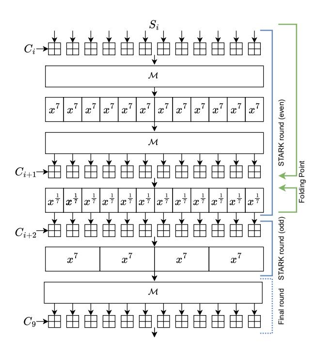
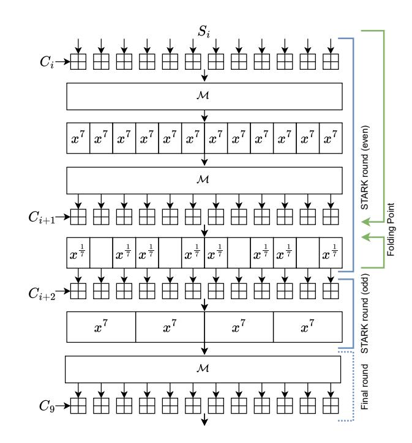

# XHash: Efficient STARK-friendly Hash Function

Tomer Ashur 3MI Labs, Polygon Research Leuven, Belgium tomer@3milabs.tech

Amit Singh Bhati COSIC , KU Leuven Leuven, Belgium amitsingh.bhati@esat.kuleuven.be

Al Kindi Polygon al-kindi-0@protonmail.com

Mohammad Mahzoun Eindhoven University of Technology Eindhoven, Netherlands mail@mahzoun.me

Léo Perrin Inria Paris, France perrin.leo@gmail.com

# ABSTRACT

Zero-knowledge proofs are widely used in real-world applications for authentication, access control, blockchains, and cryptocurrencies, to name a few. A core element in zero-knowledge proof systems is the underlying hash function, which plays a vital role in the efficiency of the proof system. While the traditional hash functions, such as SHA3 or BLAKE3 are efficient on CPU architectures, they perform poorly within zero-knowledge proof systems. This is primarily due to the requirement of these systems for hash functions that operate efficiently over finite fields of large prime order as well as binary fields. To address this challenge, a new paradigm called Arithmetization-Orientation has emerged. These designs are tailored to improve the efficiency of hashing within zero-knowledge proof systems while providing reliable security guarantees.

In this work, we propose XHash, which is a high-performance hash function designed for ZK-STARKs and is inspired by the Marvellous design strategy. When using Algebraic Intermediate Representation, XHash outperforms Rescue and Poseidon as the most important ZK-friendly hash functions for STARKs. Moreover, XHash has a competitive performance on CPU architectures with an average speed of ≈ 3 for 2-to-1 hashing. Compared to RPO, which is the fastest hash function of the Marvellous family, XHash performs ≈ 2.5 times faster on CPU. From the security perspective, XHash inherits the security of the Marvellous design strategy, and we analyze its security against state-of-the-art algebraic attacks. Additionally, we propose a new type of security argument against algebraic attacks that relies on a single well-defined and reasonable conjecture of a novel type. Finally, we specify a standard version of XHash designed for Polygon Miden VM, with its AIR complexity being 504, compared to Rescue with an AIR complexity of 672, and Poseidon with an AIR complexity of 1176.

# KEYWORDS

Hash Functions, STARKs, Zero-Knowledge, Arithmetization Oriented

# 1 INTRODUCTION

Zero-knowledge (ZK) proof systems are advanced cryptographic protocols used to prove the validity of a statement to a party (a verifier) without revealing any further information. ZK systems are used in a variety of applications such as blockchains and banking systems. A pioneer ZK proof system is ZK-STARK [\[9\]](#page-8-0) which is a scalable proof system widely used in industrial applications such as Polygon

Miden and Starknet. A core building block in a ZK-STARK is the underlying hash function. The pursuit for efficient ZK-STARKs has motivated the need for Arithmetization Oriented (AO) primitives, i.e., cryptographic primitives with low arithmetic complexity. Examples of such AO designs are [\[1,](#page-8-1) [6,](#page-8-2) [14,](#page-8-3) [16](#page-9-0)[–18,](#page-9-1) [21,](#page-9-2) [22,](#page-9-3) [27,](#page-9-4) [30,](#page-9-5) [31,](#page-9-6) [33,](#page-9-7) [41\]](#page-9-8). However, the two main AO hash functions in practical use for ZK proof systems are Rescue [\[2\]](#page-8-4) and Poseidon [\[29\]](#page-9-9).

The design of Rescue was a major improvement in the domain of AO primitives by introducing non-procedural computations. While Rescue is competitive inside the STARK, its security-first approach leaves room for improvement when executed on more standard platforms such as a CPU or an FPGA. Indeed, subsequent improvements were obtained in follow-up works such as Rescue-Prime [\[40\]](#page-9-10) and more recently, RPO [\[4\]](#page-8-5) where Ashur, Kindi, Meier, Szepieniec, & Threadbare published an optimized variant for the specific case of 2-to-1 compression of elements from a finite field with = 264 −2 32 + 1 for 128- and 160 bits of security. RPO offers the same performance as Rescue-Prime when evaluated inside the STARK but is about 40% faster on a standard CPU. The lion's share of this improvement was achieved by finding a particularly efficient MDS matrix but without changing the overall design or introducing new operations.

In this work, we take the next step in designing AO primitives. We start by analyzing the remaining bottlenecks in RPO and improve the efficiency by introducing a new operation: exponentiation over an extension field. Arithmetic over an extension field is quite common in the design of traditional symmetric-key algorithms such as AES [\[19\]](#page-9-11). In the context of AO primitives, this approach was carried over to Vision [\[2\]](#page-8-4) and Chaghri [\[6\]](#page-8-2) as well as the nowdefunct Starkad [\[28\]](#page-9-12); but it was not yet considered for primitives operating over large prime fields.

In this work, we use S-boxes employing extension field arithmetic over large prime fields for the first time to the best of our knowledge. Concretely, we propose two new permutations:

- (1) XHash12: interleaving between Rescue rounds and a new type of round;
- (2) XHash8: a more aggressively optimized variant of XHash12 which does not apply the expensive 1/ S-box to all elements.

Related work. The state of the art arithmetization-oriented hash functions over F for zero-knowledge applications are Poseidon [\[29\]](#page-9-9), Anemoi [\[14\]](#page-8-3), Griffin [\[27\]](#page-9-4), Rescue [\[2\]](#page-8-4), and its successors Rescue Prime [\[40\]](#page-9-10) and RPO [\[4\]](#page-8-5). While most efficient hash functions

are defined over  $\mathbb{F}_p$ , Vision [2] is an efficient hash function over  $\mathbb{F}_2$ . An efficient instance of Vision is Vision Mark-32 [5]. The security of Poseidon is analyzed in [3, 12, 32, 39], and it is shown that the security estimation of partial layers is not correct. However, none of the attacks broke any standard instance of Poseidon. The security of Anemoi and Griffin are analyzed in [7], and it is shown that the initial security argument overestimates the attack complexity, and is thus not as solid as expected. In terms of performance inside the STARKs, while Rescue and Anemoi are competitive, and more efficient than Poseidon, they are still less efficient than XHash.

**Summary of Contributions.** Our contributions can be summarized as follows.

- **Design of XHash:** Using operations over fields of different order allows XHash to achieve two goals with one operation. Specifically, operations over  $\mathbb{F}_p$ , and  $\mathbb{F}_{p^3}$  provide density, and high polynomial degree using less complexity, and provide robust security guarantees. XHash performs better over zk-STARKs than all other candidates and has a competitive performance on CPU.
- RPX Standard Specification: XHash design allows the usage of arbitrary constants for specific needs, as long as they are not jeopardizing security [13]. We specify an efficient MDS matrix, round constants, padding, and hashing mode of operation tailored for Polygon Miden VM.
- Robust Security Argument: We have investigated both the padding scheme and the applicability of algebraic attacks to both variants of XHash. For algebraic attacks relying on the computation and exploitation of a Gröbner basis, our literature survey suggests a security argument on the complexity of the variable elimination step in addition to that of the computation of the Gröbner basis to ensure reliable security. We propose a generalization of the "FreeLunch" [7] approach which, under a reasonable conjecture about the behavior of the degree of polynomial ideals of dimension 0, is sufficient for us to argue that both variants of XHash are safe against such attacks.

**Structure of the Paper.** In section 2, we introduce the necessary notation and required background for following the paper. In section 3, we discuss the design rationale of XHash. In section 4, we describe XHash and its design specification. In section 5, we describe RPX standard specification as a hash function using XHash in Sponge construction. In section 6, we analyze the security of XHash against statistical and algebraic attacks. In section 7, we analyze the performance of XHash on CPU and STARKs. Finally, we conclude the work in section 8.

#### 2 BACKGROUND

#### 2.1 Notation

In the rest of this work,  $p=2^{64}-2^{32}+1$  and  $\mathbb{F}_p$  is a finite field of order p and the elements of  $\mathbb{F}_p$  are called "words". For the Sponge constructions, r denotes the rate (size of the outer part), expressed in words, and c is the capacity (size of the inner part), expressed in words. Vectors and matrices are denoted by capital Latin letters. For example, the vector S of size n is denoted by  $S = (S[0], \ldots, S[n-1])$  and the elements of a matrix M with dimensions  $n \times m$  are denoted by M[i][j] where  $0 \le i < n, 0 \le j < m$ .  $\square$  is used to denote addition

over the finite field  $\mathbb{F}_p$ . Finally,  $\ell$  denotes the number of inverse power maps applied in each round.

# 2.2 Rescue-Prime Optimized

Rescue-Prime Optimized (RPO) is a sponge function instantiated with a permutation over  $\mathbb{F}_p^{12}$ . The permutation consists of seven rounds and each round can be described in terms of four components:

- an S-box  $\pi_0: x \mapsto x^7$ ;
- an S-box  $\pi_1: x \mapsto x^{\frac{1}{7}}$ ;
- an MDS matrix *M*; and
- constant addition  $\boxplus c$ .

With respect to the state vector  $S \in \mathbb{F}_p^{12}$  these components allow to define two types of steps:

- an (F)-step works as follows: first, the S-box  $\pi_0$  is applied to each of the state elements to provide non-linearity. Then, the state vector is multiplied with an MDS matrix to spread local properties over the entire state. Finally, a different round constant is added to each element to avoid self-symmetry between different rounds;
- the (B)-step is almost the same, only that  $\pi_1$  is applied instead of  $\pi_0$ . That is, first the S-box  $\pi_1$  is applied to each of the state elements to provide non-linearity. Then, the state vector is multiplied with an MDS matrix to spread local properties over the entire state. Finally, a different round constant is added to each element to avoid self-symmetry between different rounds.

With this notation, a typical round for a Rescue-like function is (F)(B). Concretely, RPO can be written as

(F)(B)(F)(B)(F)(B)(F)(B)(F)(B)(F)(B)(F)(B),

except that the last M and constants injection are moved to the beginning for reasons explained in [2, Sec. 4.3].

#### 3 DESIGN RATIONALE

So far, three main components have been used in Marvellous designs: S-boxes, linear layers, and injections of round constants. Together, S-boxes, MDS multiplications, and constant injections result in a dense polynomial representation of a high degree. Building on Rescue's S-boxes, the designers of RPO fixed the MDS matrix to one that can be efficiently computed over  $p=2^{64}-2^{32}+1$ . A natural question then arises—whether the efficiency can be improved any further without sacrificing security. Noting that the costs of  $\pi_0$  and constant injection are almost negligible and that M has been aggressively optimized, the remaining bottleneck has been observed to be the  $\pi_1$  S-box. On a CPU, each call to  $\pi_1$  requires about 70 multiplications, there are 12 calls in each (B)-step, and seven (B) steps; totaling in  $70 \cdot 12 \cdot 7 = 5880$  multiplications. This is by far the largest cost driver in the entire permutation.

Before attempting to reduce this cost, one must determine what purpose the (B)-step serves. Citing [2], the two S-boxes  $(\pi_0, \pi_1)$  are motivated as follows:

The difference between  $\pi_0$  and  $\pi_1$  is in their degree. They should be chosen such that  $\pi_0$  has a high degree when evaluated forward (i.e., in the direction of the encryption) and a low degree when evaluated backward (i.e., in the direction of the decryption). The other S-box,

namely  $\pi_1$ , is chosen with the opposite goal (i.e., to have a low degree in the forward direction and a high degree in the backward direction). This choice serves to achieve three objectives: (i) no matter which direction an adversary is trying to attack, the degree is guaranteed to be high; (ii) it results in the same cost for the encryption and decryption functions, and (iii) owing to non-procedural computation, the low-degree representation of each S-box can be evaluated efficiently.

We remind the reader that the stated goal of [2] was to design a general-purpose primitive, usable not only for hashing, not only in STARKs, and to work with any sufficiently large prime field. In the context of Polygon Miden, Goal (ii) is irrelevant since we expect honest users only to compute the primitive "forward", never requiring efficient "backward" evaluation. Hence, we can abandon Goal (ii) altogether.

For similar reasons, goal (i) can also be relaxed. Avoiding attacks still requires that the degree in either direction be high—but it no longer needs to be the same in both directions. First, observe that the high degree in the "backward" direction is ensured by the (F)-rounds, which we are not looking to optimize. Therefore, the degree remains sufficiently high and the security argument does not need to be re-evaluated.

We now conjecture the possibility that the (B)-step may offer "too much security" for our purposes. Concretely, [2] observes that the (B)-step achieves maximal degree already after two rounds. Given that the minimal number of rounds is set to ten in Rescue, eight in Rescue-Prime, and seven in RPO, positing a (B')-step that can achieve, hypothetically speaking, a maximal degree in four rounds; the overall performance can be improved without affecting security. Getting ahead of ourselves, this is exactly what we will be doing. To reduce the cost of achieving a compact polynomial description, we propose to use power maps over an extension field. Exponentiation in an extension field simultaneously provides diffusion by mixing the base field elements as well as confusion by doing so in a non-linear way.

Revisiting the design rationale for general Marvellous designs we see that in the context of a hash function operating over  $F_p^{12}$  with p prime, the interpolation attack would be the main concern in case the polynomial degree is not sufficiently high. Considering in detail the argument against the interpolation attack we see that resistance is achieved when the univariate polynomial describing the cipher is:

- (1) dense; and
- (2) of maximal degree.

Intuitively, the composition of an MDS matrix (which ensures optimal diffusion) with a power map ensures density due to the Multinomial Theorem.

We are left to ensure a maximal degree. Considering that

$$x^{\frac{1}{7}} = x^{(2p-1)/7} = x^{10540996611094048183}$$

achieves an almost maximal degree already in a single call to  $\pi_1$  we can informally argue that this is an "overkill" and that an S-box resulting in a lower degree per step may still be sufficient to resist the interpolation attack as long as it reaches a maximal degree within a reasonable number of rounds. Thus, we are looking for a power map  $\beta$  such that  $7 < \beta < \frac{p-1}{7}$ . However, by definition,

such an S-box will be inefficient to compute inside the STARK both directly and folded.

Seeing that a better power map is not readily available, we can instead apply the same power map, but to fewer elements. However, with this approach, only the elements to which the power map was applied are "protected". If this approach is taken, the partial S-box layer must be complemented with another operation that would mix high-degree elements with the rest non-linearly. If done right, this would ensure that all polynomials are both dense and of high degree.

#### 4 SPECIFICATION OF XHASH

We complement the S-boxes  $(\pi_0, \pi_1)$  described in Section 2.2 with a third type of S-box:

•  $\pi_2$  is similar to  $\pi_0$  in that it takes a field element and raises it to the 7th power. However this time, the element is in  $F_{p^3}$  rather than  $F_p$ .

Using the new S-box  $\pi_2$ , we define XHash8 and XHash12. XHash12 uses a full layer of  $\pi_1$  S-boxes applied to all elements of the state. XHash8 further improves efficiency using a partial layer of  $\pi_1$  S-boxes applied to 8 out of 12 elements in the state.

# 4.1 XHash12: With Full $x^{\frac{1}{7}}$ Layer

XHash12 employs a full layer of  $\pi_1$  S-boxes, and works as follows:

- A version of the (F)-step starting with round constants injection, followed by an MDS multiplication, and concluded by applying  $\pi_0$  to each word of the state;
- A version of the (B)-step starting with MDS multiplication, followed by round constants injection, and concluded by applying  $\pi_1$  to each word of the state;
- A (P3)-step starting with constants injection; then, the 12element state is restructured as a 4-element vector in a cubic extension field, *i.e.*,

$$(s_0, s_1, s_2, s_3, s_4, s_5, s_6, s_7, s_8, s_9, s_{10}, s_{11}) \mapsto (S_{0,1,2}, S_{3,4,5}, S_{6,7,8}, S_{9,10,11})$$

where each  $s_{i,j,k} \in F_{p^3}$ . This is followed by an application of  $\pi_2$  to each of these extension field elements, such that

$$(S_{0,1,2},S_{3,4,5},S_{6,7,8},S_{9,10,11})\mapsto (S_{0,1,2}^7,S_{3,4,5}^7,S_{6,7,8}^7,S_{9,10,11}^7).$$

At this point, the state is decomposed back into a 12-element vector in  $F_{D}$ ;

• The last step is a special one, denoted by (MC). It consists of an MDS multiplication followed by round constants injection.

The state consists of 12 field elements in  $F_p$  where  $p=2^{64}-2^{32}+1$ . The permutation consists of 10 steps in total, described as follows:

and depicted in Figure 1.

# 4.2 XHash8: With Partial $x^{\frac{1}{7}}$ Layer

XHash8 is a more aggressively optimized version of XHash12. The difference is that it employs partial layers of  $\pi_1$  S-boxes and works as follows:

Figure 1: The XHash12 permutation. The folding point depicts how to compress the (F) and (B) rounds into a single low-degree polynomial. This allows the verifier to evaluate a sequence of (F)(B)(P3) steps as two STARK rounds (blue lines). The dotted blue line represents the finalization step.

- A version of the (F)-step starting with a constant addition, followed by an MDS multiplication, and concluded by applying π0 to each word of the state;
- A modified version of the (B)-step, namely the (B')-step, starting MDS multiplication, followed by constant addition, and concluded by applying  $\pi_1$  to 8 out of the 12 state elements:

$$(s_0, s_1, s_2, s_3, s_4, s_5, s_6, s_7, s_8, s_9, s_{10}, s_{11}) \mapsto (s_0^{\frac{1}{7}}, s_1, s_2^{\frac{1}{7}}, s_3^{\frac{1}{7}}, s_4, s_5^{\frac{1}{7}}, s_6^{\frac{1}{7}}, s_7, s_8^{\frac{1}{7}}, s_9^{\frac{1}{7}}, s_{10}, s_{11}^{\frac{1}{7}})$$

 A (P3)-step starting with constants injection; then, the 12element state is restructured as a 4-element vector in a cubic extension field. i.e..

$$(s_0, s_1, s_2, s_3, s_4, s_5, s_6, s_7, s_8, s_9, s_{10}, s_{11}) \mapsto (S_{0,1,2}, S_{3,4,5}, S_{6,7,8}, S_{9,10,11})$$

where each  $s_{i,j,k} \in F_{p^3}$ . This is followed by an application of  $\pi_2$  to each of these extension field elements, such that

$$(S_{0,1,2},S_{3,4,5},S_{6,7,8},S_{9,10,11}) \mapsto (S_{0,1,2}^7,S_{3,4,5}^7,S_{6,7,8}^7,S_{9,10,11}^7).$$

At this point, the state is decomposed back into a 12-element vector in  $F_p$ .

• The last step is a special one, denoted by (MC). It consists of an MDS multiplication followed by round constants injection.

Again, the state consists of 12 field elements in  $F_p$  where  $p=2^{64}-2^{32}+1$  and the permutation consists of 10 steps:

(F)(B')(P3)(F)(B')(P3)(F)(B')(P3)(MC);

as depicted in Figure 2.

Figure 2: The XHash8 permutation. The folding point depicts how to compress the (F) and (B') rounds into a single low-degree polynomial. This allows the verifier to evaluate a sequence of (F)(B')(P3) steps as two STARK rounds (blue lines). The dotted blue line represents the finalization step.

#### 4.3 The Hash Function

A hash function offering 128-bit security is obtained by using either of these permutations in a sponge construction with the elements  $(s_0, s_1, s_2, s_3, s_4, s_5, s_6, s_7)$  as the outer part, and  $(s_8, s_9, s_{10}, s_{11})$  as the inner part. The round constants are randomly selected and the MDS is the same as the one used in RPO. Domain separation is handled in the same way as in RPO by designating certain values of an inner part element to encode the domain.

#### 5 RPX STANDARD SPECIFICATION

The XHash12 function defined in Section 4.1 has been implemented in optimized form by Polygon Miden. We provide here a canonical specification of the function implemented in [34] which we refer to as RPX.

#### 5.1 MDS Matrix

RPX uses the same MDS matrix found by the RPO project. That is, a circulant matrix whose first row is

[7, 23, 8, 26, 13, 10, 9, 7, 6, 22, 21, 8].

#### 5.2 Round Constants

To ensure "nothing-up-my-sleeve" round constants we reuse the ones derived for RPO. Recall that the RPO constants were derived by employing the following procedure:

- Start from the string RPO(%i,%i,%i,%i);
- Populate the wildcards "%i" with the ASCII decimal expansion of the integer parameters  $p, m, c, \lambda$ , in that order;
- Use SHAKE256 to expand this ASCII string into  $9 \cdot 2 \cdot N \cdot m$  pseudorandom bytes;
- For every chunk of 9 bytes, compute the matching integer by interpreting the byte array as the integer's base-256 expansion with the least significant digit first;
- Reduce the obtained integer modulo p;
- Collect all such integers. The list of obtained field elements constitutes the list of round constants.

#### 5.3 Primitive

The permutation used in RPX is different from the one depicted in Figure 1 and the injection of the first set of round constants in even rounds is swapped with the MDS matrix. Since multiplication is distributive with respect to addition, injecting C before applying the MDS, or M(C) after applying it is equivalent in terms of cryptanalytic resistance, and therefore, all security arguments for XHash12 carry over to RPX.

# 5.4 Hashing Mode

To hash a sequence of field elements in  $p = 2^{64} - 2^{32} + 1$  we instantiate the sponge construction with the RPX permutation. The state consists of 12 field elements, of which eight are designated as rate, and the remaining four are designated as capacity. Absorbing is done in *overwrite mode* (i.e., the topmost eight elements of the state are overwritten by new values every time the permutation is invoked) and the squeezing phase outputs eight field elements, of which the first four are returned as digest and the rest are discarded.

#### 5.5 Padding

For hashing field elements we use the zero-padding scheme; that is, if the length of the last block is smaller than r=8 field elements, a sufficient amount of [0] elements are appended to complete it. We note that this padding rule alone is not sponge compliant. To ensure bijectivity, we partition the input space into eight input domains: all messages whose last block is of length 8 are designated to the 0-domain; all messages whose last block is of length 7 are designated to the 1-domain, etc.

Domain Separation. We enforce domain separation by fixing the topmost inner part element (i.e., the ninth state element) to the domain identifier. Designating one capacity element to encode the domain identifier effectively ensures that two messages whose last blocks differ in length will be processed differently. We provide our proof intuition for this result in the following paragraphs.

*Proof Intuition.* We first note that RPX's security (such as indifferentiability, collision resistance, preimage resistance, etc.) remains the same even when the padded zeros are pushed to the start i.e., when the padding type is changed from being a post-padding to a pre-padding. This holds because both paddings are bijective to

each other, which means that the prepadded RPX can be seen as RPX with differently ordered a.k.a. permuted input set yet with the same output multiset and output distribution. Therefore, it is sufficient to argue the security of prepadded RPX.

We highlight that prepadded RPX processes messages in the exact same way as prepadded overwrite sponge except that the valid input space for the first permutation call is now larger due to the domain separation. We also note that this increase can at most double the input space for any number of domain seperators. More specifically, the i-domain can only increase the input space by  $p^{r-i}$  many values as the prepadding for this domain fixes i many elements of a valid input value to zeros and since there are at most r many domains, i.e.,  $0 \le i \le r-1$ , we get that the final input space size of the first permutation =  $p + p^2 + \ldots + p^r \le 2p^r$ .

One can notice that this change affects the pre-image resistance of prepadded RPX by one bit. More concretely, for q many permutation calls, the pre-image bound of prepadded overwrite Sponge is  $p^r(q/p^b)$  with  $p^r$  representing the possible number of valid inputs for the first permutation call. For prepadded RPX, this reduces to  $2p^r(q/p^b)$ . On the other hand, this increased input space does not affect the probability of finding collisions as they happen in the permutation outputs and remains  $p^{-c/2}$ .

Indeed RPX's preimage resistance is reduced now from  $c \log_2 p$ -bit to  $c \log_2 p - 1$ ; however, noting that  $c \log_2 p = 2 \cdot \kappa = 256$  this does not form a bottleneck and the security is still compatible with overwrite sponge bounds found in the literature (e.g., [11]); i.e., at least 128-bit security.

## **6 SECURITY RATIONALE**

The security of both XHash8 and XHash12 is analyzed against standard attacks, including statistical and algebraic attacks.

## 6.1 Differential cryptanalysis

We analyze the resistance of XHash8 against differential cryptanalysis by counting active S-boxes. The resistance of XHash8 also ensures the resistance of XHash12 since, for any trail pattern, XHash12 activates the same number or more S-boxes than XHash8. Since the same set of S-boxes is used in both, the probability of the best differential characteristic for XHash8 upper bounds the probability of the best differential characteristic for XHash12.

The analysis follows the standard argument: we find a lower bound on the number of active S-boxes and an upper bound on the probability of the best differential transition in any S-box; the quantity obtained from raising the latter to the power of the former upper bounds the probability of the best differential characteristic.

The aspects of our new function that require special care are:

- (1) The (B') step uses a partial S-box layer;
- (2) The (P3) step mixes base field elements in a non-linear way.

As a result of these particularities, the Two-Round Propagation Theorem originally stated by Daemen and Rijmen in [20, Thm. 9.3.1] for the case of alternating block ciphers cannot be applied directly to XHash8.

To address these observations we provide a step-by-step detailed analysis. First, we observe that in the first step the adversary controls only the outer part of the sponge and therefore they can only introduce a difference in  $1 \le d_{(I)} \le r = 9$  field elements. Consequently, after the application of the MDS matrix  $4 \le d_{(F)} \le 12$  S-boxes are active in the (F)-step. For the (B')-step, the adversary can activate  $0 \le d_{(B')} \le 8$  S-boxes, followed by  $1 \le d_{(P3)} \le 4$  S-boxes in the (P3)-step. In total, over a triplet of consecutive (F)(B')(P3) steps, at least nine S-boxes are activated from  $(\pi_0, \pi_1)$ , and at least one S-box of type  $\pi_2$ .

In theorem 6.1 we show that S-boxes of type  $\pi_2$  are  $(\gamma-1)$ -uniform which in our setting means that their differential transition probability is upper bounded by  $2^{-186}$ . Completing the argument, we see that the probability of the best differential transition over a triplet of consecutive (F)(B')(P3) is upper bounded by  $2^{9\cdot(-60)} \cdot 2^{1\cdot(-186)} = 2^{-540-186} = 2^{-726}$ ; which is already enough to resist differential attacks at the 128-bit security level.

Theorem 6.1. Let  $\mathbb{F}_q$  be a finite field of order  $q = p^n$  and characteristic p. Let  $F(x) = x^{\gamma}$  be a power map defined over  $\mathbb{F}_q$ , then F is differentially  $(\gamma - 1)$ -uniform.

PROOF. Given  $\alpha, \beta \in \mathbb{F}_q$ ,  $\alpha \neq 0$ , the cardinality of the set  $\mathcal{D} = \{x \in \mathbb{F}_q | F(x + \alpha) - F(x) = \beta\}$  can be computed as the number of roots for the following polynomial:

$$(x+\alpha)^{\gamma} - x^{\gamma} = \sum_{i=0}^{\gamma-1} {\gamma \choose i} \alpha^{\gamma-i} x^i, \tag{1}$$

which is a polynomial of degree  $\gamma - 1$ . It is well known that a polynomial of degree  $\alpha$  has at most  $\alpha$  roots. We, therefore, obtain the upper bound  $|\mathcal{D}| \le \gamma - 1$ .

# 6.2 Algebraic Attacks

Arguing security against algebraic attacks is a complicated task as these are not so well understood at this stage, and the interplay between the "algebraic" part and more classical techniques can sometimes be used to an attacker's advantage in lowering the overall complexity of the attack.

By "algebraic" attack, we refer to attacks that ultimately culminate with the resolution of a (system of) equation(s), of which the roots need to be found. Univariate techniques can sometimes be applied, but they are not relevant here:

- the degree of the inverse function is close to the maximum possible, meaning that the univariate degree in any linear combination of the inputs will very quickly become unusable; and
- (2) the field size  $(p = 2^{64} 2^{32} + 1)$  is not that large, meaning that a univariate approach would need to be more efficient than a simple brute-force on one word: a hard task here.

#### 6.2.1 Univariate Algebraic Attacks.

*Polynomial Degree.* Again, we analyze only the polynomial degree of XHash8 and use it as a lower bound for the polynomial degree of XHash12. Similar to other algorithms from the Marvellous family, the high polynomial degree is obtained by applying a large power map to the elements of the state. However, when we use XHash8,  $\pi_1$  is applied only to part of the state. Supposedly, even if we ignore the (P3) round, the next application of M will distribute

the high-degree terms to the entire state. However, this is hard to argue formally without reverting to complicated case analysis and furthermore, it is not clear that a linear transformation is enough to spread algebraic properties in a sufficient way.2 Thus, we do not abstract the (P3)-step but analyze its diffusion properties.

Let  $(x_0, x_1, x_2) \in F_p^3$  and  $x_{0,1,2} \in F_{p^3}$ . For brevity, we consider only a single squaring operation: Consider the three polynomials describing the base field elements after a single squaring operation:

$$x_{0,1,2}^2 = (c_0 x_0^2 + c_1 x_1 \cdot x_2,$$

$$x_1 \cdot (c_3 x_0 + c_4 x_2) + c_5 x_2^2,$$

$$c_6 x_0 \cdot x_2 + c_7 x_1^2 + c_8 x_2^2),$$

where  $c_i \in \mathbb{F}_p$  for all  $0 \le i \le 8$ . Taking into account that  $x_0 = \pi_1(y_0) = y_0^{1/7}, x_2 = \pi_1(y_2) = y_2^{1/7}$  and setting  $x_1 = y_1$  we get

$$x_{0,1,2}^2 = (y_0^{2/7} + y_1 \cdot y_2^{1/7},$$

$$y_1 \cdot (y_0^{1/7} + y_2^{1/7}) + y_2^{2/7},$$

$$y_0^{1/7} \cdot y_2^{1/7} + y_1^2 + y_2^{2/7}),$$

and conclude that every possible polynomial description of the initial state is of a high degree even before applying the MDS matrix. While this observation is already enough to argue resistance against interpolation attacks, in Appendix A we work out the complete case for  $x^7$  in  $F_{p^3}$ .

Density. Several works have recently noticed that the solving degree of a polynomial system describing an AO primitive and consisting of  $\pi_0$  S-boxes alone is smaller than the degree of regularity. In particular, Sauer observed in [36] that for Rescue-like functions (i.e., functions mixing  $\pi_0$  and  $\pi_1$  S-boxes), the solving degree grows at the same rate as the Macaulay bound; whereas this is not the case for Hades-like ciphers. This observation was later independently confirmed by Ashur, Kindi, Meier, Szepieniec, & Threadbare in the design of RPO and more recently quantified and leveraged into an attack by Ashur, Buschman, and Mahzoun in [3].

To explain this observation Sauer introduces a new metric, "involvement", as a proxy for the difficulty of finding a Gröbner basis [37]. Two notions of involvement are suggested based on vectors of origin; one based on the normalized average of polynomials from the original system required to describe each element in the Gröbner basis and the other on the number of non-zero coefficients in the matrix describing the vectors of origin. Sauer presents heat maps suggesting that the latter is a reasonable, even if noisy, proxy for the difficulty of finding a Gröbner basis.

Here, we suggest that the notion of density is sufficient to capture the quality we are interested in when designing a symmetric-key primitive. As an instructive example, consider the polynomial modeling of a single Rescue round consisting of consecutive (F)(B) steps:

$$\left(\sum_{k=0}^{m-1} M[j,k] S_{2i-1}[k]^{\alpha}\right) - \left(\sum_{k=0}^{m-1} M^{-1}[j,k] (S_{2i+1}[k] - K_{2i+1}[k])\right)^{\alpha} + K_{2i}[j] = 0$$
(2)

 $^1\mathrm{We}$  note that the S-boxes in the (P3)-step are of different type than those in the (F)-and (B)- steps.

&lt;sup>2See [32] for the binary case and [3] for the prime case.

Note that in the second term, the power map  $\alpha$  is applied to the entire sum, creating a complicated expression due to the multinomial theorem. For  $\alpha=7$  and m=12 as in the case of RPO, each such polynomial consists of  $12+\binom{18}{11}$  monomials in 24 variables. Comparably, the modeling of an (F)-round

$$\left(\sum_{k=0}^{m-1} M[j,k] S_{i-1}[k]^{\alpha}\right) + K_{2i}[j] - S_i[j] = 0$$
 (3)

consists of 12 + 1 = 13 monomials in 12 + 1 = 13 variables. It is straightforward to see that polynomials of type (2) are denser than polynomials of type (3) and since clearly density implies involvement (but not necessarily the other way around) we conjecture density to be the explanation to Sauer's observations3.

XHash8 achieves density differently. Considering an even STARK round consisting of one pair of (F)(B') steps. This round gives rise to two types of polynomials:

$$\left(\sum_{k=0}^{m-1} M[j,k] S_{i-1}[k]^{\alpha}\right) + K_{2i}[j] - S_i^7[j] = 0 \qquad j \not\equiv 1 \pmod{3}$$

$$\left(\sum_{k=0}^{m-1} M[j,k] S_{i-1}[k]^{\alpha}\right) + K_{2i}[j] - S_i[j] = 0 \qquad j \equiv 1 \pmod{3}$$

neither of which is dense. Density arises from the polynomial modeling of (P3). The polynomial description of (P3) can be found in Appendix A showing that each base element can be modeled as a 3-variate polynomial of degree seven with 31–34 monomials. Following the MDS, each state element is modeled by a polynomial with  $36 \cdot 4 = 144$  monomials in 13 variables.

6.2.2 The Steps of a Multivariate Algebraic Attacks. The multivariate approach models the primitive as a *system* of multivariate equations, that needs to be solved. Using a terminology inspired by the one introduced in [7], the four steps performed to solve a multivariate polynomial system are described as follows.

**SysGen:** First, the system of equations needs to be generated. Several heuristics are available to this end, but all of them have to introduce new variables whenever a *d*-th root is used as it is the compositional inverse of these operations that is of a low degree. This step can further be simplified using techniques from "classical" symmetric cryptanalysis, typically based on the probability one propagation of some affine spaces. This was used to shave off two SPN rounds generically in [8], with the conditions that the S-boxes are monomials over the base field considered,4 and that the cipher/permutation starts with an S-box layer. The system that is generated in the end is not uniquely defined: different generation strategies will yield different systems. For instance, using affine spaces to simplify it will remove some equations. Similarly, we can prefer to introduce new variables and equations to obtain more but lower degree equations. The existence of an efficient SysGen procedure is implied by arithmetization-orientation, but it is not necessarily the approach used in attacks.5

Note that the algorithms used in the next steps are better understood in the case where the system is expected to have unique (or just a few) solutions. This further adds constraints for the SysGen step, but they are easily handled: the expected number of solutions is easily estimated assuming e.g. that the hash function behaves like a random function, and the input can be constrained for instance by forcing it to be in a vector space of the appropriate dimension.

**GröbFind:** Once a system is obtained, it is necessary first to endow it with a structure that will allow us to work with it. This, in particular, allows us to do the polynomial arithmetic we need, e.g. to reduce large degree polynomials modulo lower degree ones. The equations we have obtained define an ideal: since we investigate their common roots, any linear combination will also have the same roots. An ideal of polynomials has a Gröbner basis, a particular set of polynomials that essentially allow us to properly define a reduction modulo this ideal. A Gröbner basis is defined for a given monomial ordering. Several of these are well-known. In particular, a Gröbner basis in *lexicographic* order can greatly simplify the next steps of the attack. On the other hand, the complexity of finding a Gröbner basis is highly dependent on said ordering. In general, to obtain a basis e.g. in grevlex order given any ideal, we need to use either F4 or F5 [24, 26]. Unfortunately, efficient open-source implementations are hard to find. The state-of-the-art approach to compute the complexity is the one described in [2] where the behavior of toy examples is compared to the expected behavior of a regular system and then extrapolated to larger cases. We performed similar experiments and the results are reported in Appendix B.

**VarElim.** Once a Gröbner basis is known, we use its structure to extract a univariate polynomial in one of the variables. This extraction step is usually done by reordering the Gröbner basis, i.e. by obtaining a Gröbner basis for a different monomial order, one that is suitable for this purpose. It is usually the lexicographic one. This change of order can be done using the FGLM [25] algorithm, whose complexity is precisely known as it boils down to linear polynomial arithmetic. It depends on a quantity called the *degree of the ideal*  $(D_I)$  and corresponds to the number of roots the system has in the algebraic closure of the field considered. This number is much higher than the number of solutions in the field itself (typically 0, 1 or 2).

More custom approaches are sometimes possible; for instance, the authors of [7] introduced the combination of MatMul and PolyDet: the idea is to bypass the cost of a full FGLM run by focusing on a single variable that is of particular interest in their case.

**UniSolve.** By design, we expect a solution to exist. Thus, once a univariate equation is extracted, we solve it using well-known techniques to get the first root of the system. We then substitute its value in the other equations and deduce an assignment for all the variables. This works provided that the equations have the correct structure, but this is always the case for the output of FGLM, under some reasonable assumptions that have been found to hold in practice when attacking arithmetization oriented primitives.

6.2.3 Arguing Security in the Multivariate Case. In order to show that a hash function is safe from multivariate algebraic attacks, we need to find a lower bound on the time complexity of the resolution of a system corresponding to a CICO instance. For XHash, as p is

&lt;sup>3This conjecture arises independently in the argument of Freelunch [7] attacks 4In contrast to what is done in XHash, where monomials are applied over both  $\mathbb{F}_p$  and  $\mathbb{F}_2^3$ .

&lt;sup>5In fact, our encoding for XHash12 will be the STARK one, while the one for XHash8 is significantly different.

small, we need to fix several inputs and several outputs to zero at the same time.

Which complexity should we focus on? The complexity of Sys-Gen could be amortized over several attacks, and is expected to be lower than the other steps. The UniSolve step is also known to be very efficient [8] Worse, the GröbFind step has been found to be literally free for some permutations [7]. This leaves us with the VarElim step. This is not a bad thing: it is the step whose complexity is the best understood. It depends on a quantity known as the *ideal degree* ( $D_I$ ), which corresponds to the number of solutions of the multivariate system in the algebraic closure of the field considered. For example,  $y = x^7$  has a unique solution in  $\mathbb{F}_p$ , but 7 in its algebraic closure. The complexity of FGLM is then proportional to  $D_I^3$ , though variants exist with a lower (but still higher than quadratic) complexity in some very specific cases.

Under a reasonable conjecture, we can derive lower bounds on  $D_I$  that are sufficient to argue the security of both variants of XHash. To describe this conjecture, we first need the following definition.

Definition 6.2 (b-Almost Basal). We call b-almost basal (b-AB) a system of n polynomials  $P_i$  in variables  $(x_0, ..., x_{n-1})$ , where b > 0 is an integer, when the following properties hold:

- Non-degenerate: the ideal spanned by these polynomials is of dimension 0;
- Basal part: there exists a monomial order such that the leading term of  $P_i$ , i < b, is the monomial  $x_i^{d_i}$  for some integer  $d_i > 0$ .

Such a system is depicted in Figure 3.

The idea of this notion is to describe a set of multivariate polynomials which is "partially" a Gröbner basis. Indeed, it is sufficient for polynomials to form a Gröbner basis that the leading term in each  $P_i$  is of the form  $x_i^{d_i}$ . In a b-AB system, the first b polynomials have this shape. In fact, an n-AB system is a Gröbner basis.

$$b\text{-AB system} \begin{cases} x_0^{d_0} - P_0'(x_0,...,x_{n-1}) \\ x_1^{d_1} - P_1'(x_0,...,x_{n-1}) \\ ... \\ x_{b-1}^{d_{b-1}} - P_{b-1}'(x_0,...,x_{n-1}) \end{cases} \text{ basal part } \\ P_b(x_0,...,x_{n-1}) \\ P_{b+1}(x_0,...,x_{n-1}) \\ ... \\ P_{n-1}(x_0,...,x_{n-1}) \end{cases}$$

Figure 3: The structure of an b-AB system, where  $P_i(x) = x_i^{d_i} - P'(x)$ .

Using this notion, we are ready to state the following conjecture.

Conjecture 1 (Monotonous Ideal Degree Conjecture (MIDC)). For a b-AB system, the degree  $D_I$  of the ideal is lower bounded by  $D_I \ge \prod_{i=0}^{b-1} d_i$ .

The intuition behind this conjecture is simple: the ideal degree corresponds to the number of solutions the system has in the algebraic closure of the underlying field, and this conjecture postulates that this number does not decrease when we take into account the last equations. That is where the term "monotonous" comes from: we assume that the ideal degree increases or stays constant but does not decrease when we consider more equations. To put it differently, this conjecture posits that the actual Gröbner basis of the system contains the basal part and that the last equations (those not in the basal part) do not decrease the ideal degree.

This conjecture is true when b = n: in this case, the system is a Gröbner basis, and the ideal degree is known to be  $\prod_{i=0}^{n-1} d_i$ .

According to our experiments, for a simplified XHash, this conjecture holds. In fact, in our experiments, we do have that  $D_I = \prod_{i=0}^{n-1} d_i$ , even though the last polynomials have identical leading terms. In that case, the last equations participate as if they had different leading terms. Still, we deem it safer at this stage to only take the basal part into account when making a security claim.

Applying our attack strategy against one word in XHash8, i.e. solving a CICO instance with a single [0] in the input and one in the output, we simply obtain a FreeLunch [7] system. It is a particular case of an n-AB system. Under the MIDC, the ideal degree corresponding to an attack on w words is lower bounded by the complexity of attacking a single word. Indeed, when w > 1, the first equations still form a basal part of the polynomial system, and only the last w-1 equations are not basal. As a consequence, we get a bound on  $D_I$  which corresponds to its value in the w=1 case, namely  $D_I \geq d^{8r}$ .

For XHash8, even ignoring the presence of the first equation with leading term  $x_0$  among the final equations, we get that  $D_I \ge d^{3\times8} \approx 2^{67}$ . Adding the equation in  $x_0$ , which also satisfies the criteria to be part of the basal part, we get  $D_I \ge d^{3\times8} \times d^{3\times2} \approx 2^{84}$ . As a consequence, for GB-based algebraic attacks to be a threat against XHash8, we would need two things:

- (1) that the bound for  $D_I$  is tight (experiments indicate that it is not), **and**
- (2) an FGLM-like algorithm with a complexity strictly subquadratic in  $D_I$ —in fact, even a complexity proportional to  $D_I^{1.5}$  would give a complexity around  $2^{126}$  in this case: barely an attack.

For XHash12, we get a bound of  $D_I \ge d^{3\times 12} \approx 2^{101}$ , which is even higher—and thus safer. At this stage, we expect neither the bounds to be tight nor such an algorithm to exist. Thus, we claim that XHash8 is safe against GB-based algebraic attacks. The detailed analysis of the attack is described in Appendix C

#### 7 PERFORMANCE

In this section, we compare the performance of RPX with Poseidon [29], Griffin [27], Anemoi [14], and Rescue Prime [40], which are the state-of-the-art designs in the literature and industry, for STARKs. We compare the performance of RPX on multiple CPU architectures with BLAKE3 [35], SHA3 [23], Poseidon [29], Rescue [2],

Rescue Prime [40], and RPO [4]. The performance of different candidates for STARKs is measured using Algebraic Intermediate Representation (AIR) as suggested in [10]. The performance on CPUs is measured to demonstrate the efficiency of different candidates for verifiers of the ZK proof systems.

# 7.1 Algebraic Intermediate Representation

Algebraic Intermediate Representation (AIR) is used in STARKs [10] and is the suggested notion of measuring the performance of the STARK proof system [2]. An AIR of degree d, width w, and length t over  $\mathbb{F}_q$  is a set of multivariate polynomials of maximum degree d over  $\mathbb{F}_q$ , with variables  $x_{i,j}, i \leq w, j \leq t$ . The total cost of representation in AIR is  $d \cdot w \cdot t$ . The comparison of the cost of AIR representation for RPX, Poseidon, Griffin, Rescue Prime, and Anemoi is depicted in Table 1.

Table 1: Cost of AIR for hashing with one call to the underlying permutations.

| t  | RPX | Rescue Prime | Poseidon | Anemoi | Griffin |
|----|-----|--------------|----------|--------|---------|
| 3  | -   | 252          | 336      | 252    | -       |
| 6  | -   | 336          | 504      | 420    | -       |
| 12 | 504 | 672          | 1176     | 756    | 672     |
| 24 | -   | 1344         | 2184     | 1344   | -       |

#### 7.2 CPU Performance

The CPU performance of RPX is measured and compared to various candidates, including "traditional" hash functions like SHA3 and BLAKE3, optimized for out-of-STARK performance, and algebraic hash functions like Rescue Prime, RPO, and Poseidon, optimized for performance inside the STARK. Anemoi and Griffin are not considered because Poseidon has been demonstrated to be faster than them [14]. However, the comparison with Rescue and Rescue Prime is included, as they inspire RPX. The benchmarking scenario described in Table 2 is a 2-to-1 hashing:  $(x, y) \mapsto h(x, y)$  where x, y, h(x, y) are the digests corresponding to each of the hash functions.

Table 2: 2-to-1 Hashing of different candidates. All times are in microseconds.

| Architecture        | BLAKE3 | SHA3  | Poseidon | Rescue Prime | RPO | XHash12 |
|---------------------|--------|-------|----------|--------------|-----|---------|
| Apple M1 Pro        | 0.076  | 0.245 | 1.5      | 9.1          | 5.2 | 2.7     |
| Apple M2 Max        | 0.071  | 0.233 | 1.3      | 7.9          | 4.6 | 2.4     |
| Amazon Graviton 3   | 0.108  |       |          |              | 5.3 | 3.1     |
| AMD Ryzen 9 5950X   | 0.064  | 0.273 | 1.2      | 9.1          | 5.5 |         |
| AMD EPYC 9R14       | 0.083  |       |          | 4.3          | 2.4 |         |
| Intel Core i5-8279U | 0.068  | 0.536 | 2        | 13.6         | 8.5 | 4.4     |
| Intel Xeon 8375C    | 0.067  |       |          | 8.2          |     |         |

#### 8 CONCLUSION

This work introduced XHash, an efficient permutation for zero-knowledge applications with robust security. The security of XHash relies on a detailed analysis against different attack vectors, in particular algebraic attacks. For these, we have introduced a new type of security argument with a clear underlying conjecture which allows us to provide a strong argument against even the most recent variants of this attack. From the performance point of view, XHash is more efficient for STARKs than all current candidates and is very competitive on different CPU architectures, making it the most suitable option for the provers in zero-knowledge systems as well as the verifiers.

#### **REFERENCES**

- [1] Martin R. Albrecht, Christian Rechberger, Thomas Schneider, Tyge Tiessen, and Michael Zohner. 2015. Ciphers for MPC and FHE. In Advances in Cryptology – EUROCRYPT 2015, Elisabeth Oswald and Marc Fischlin (Eds.). Springer Berlin Heidelberg, Berlin, Heidelberg, 430–454.
- [2] Abdelrahaman Aly, Tomer Ashur, Eli Ben-Sasson, Siemen Dhooghe, and Alan Szepieniec. 2020. Design of Symmetric-Key Primitives for Advanced Cryptographic Protocols. *IACR Trans. Symmetric Cryptol.* 2020, 3 (2020), 1–45. https://doi.org/10.13154/tosc.v2020.i3.1-45
- [3] Tomer Ashur, Thomas Buschman, and Mohammad Mahzoun. 2023. Algebraic cryptanalysis of POSEIDON. Cryptology ePrint Archive, Paper 2023/537. https://eprint.iacr.org/2023/537 https://eprint.iacr.org/2023/537.
- [4] Tomer Ashur, Al Kindi, Willi Meier, Alan Szepieniec, and Bobbin Threadbare.
   2022. Rescue-Prime Optimized. Cryptology ePrint Archive, Paper 2022/1577.
   https://eprint.iacr.org/2022/1577 https://eprint.iacr.org/2022/1577.
- [5] Tomer Ashur, Mohammad Mahzoun, Jim Posen, and Danilo Šijačić. 2024. Vision Mark-32: ZK-Friendly Hash Function Over Binary Tower Fields. Cryptology ePrint Archive, Paper 2024/633. https://eprint.iacr.org/2024/633 https://eprint.iacr.org/2024/633.
- [6] Tomer Ashur, Mohammad Mahzoun, and Dilara Toprakhisar. 2022. Chaghri - A FHE-friendly Block Cipher. In Proceedings of the 2022 ACM SIGSAC Conference on Computer and Communications Security, CCS 2022, Los Angeles, CA, USA, November 7-11, 2022, Heng Yin, Angelos Stavrou, Cas Cremers, and Elaine Shi (Eds.). ACM, 139–150. https://doi.org/10.1145/3548606.3559364
- [7] Augustin Bariant, Aurélien Boeuf, Axel Lemoine, Irati Manterola Ayala, Morten Øygarden, Léo Perrin, and Håvard Raddum. 2024. The Algebraic Freelunch Efficient Gröbner Basis Attacks Against Arithmetization-Oriented Primitives. Cryptology ePrint Archive, Paper 2024/347. https://eprint.iacr.org/2024/347 https://eprint.iacr.org/2024/347.
- [8] Augustin Bariant, Clémence Bouvier, Gaëtan Leurent, and Léo Perrin. 2022. Algebraic Attacks against Some Arithmetization-Oriented Primitives. IACR Transactions on Symmetric Cryptology 2022, 3 (Sep. 2022), 73–101. https://doi. org/10.46586/tosc.v2022.i3.73-101
-  [9] Eli Ben-Sasson, Iddo Bentov, Yinon Horesh, and Michael Riabzev. 2018. Scalable, transparent, and post-quantum secure computational integrity. Cryptology ePrint Archive, Paper 2018/046. https://eprint.iacr.org/2018/046 https://eprint.iacr.org/2018/046.
- [10] Eli Ben-Sasson, Iddo Bentov, Yinon Horesh, and Michael Riabzev. 2018. Scalable, transparent, and post-quantum secure computational integrity. Cryptology ePrint Archive, Paper 2018/046. https://eprint.iacr.org/2018/046 https://eprint. iacr.org/2018/046.
- [11] Guido Bertoni, Joan Daemen, Michaël Peeters, and Gilles Van Assche. 2008. On the Indifferentiability of the Sponge Construction. In Advances in Cryptology – EUROCRYPT 2008, Nigel Smart (Ed.). Springer Berlin Heidelberg, Berlin, Heidelberg, 181–197.
- [12] Tim Beyne, Anne Canteaut, Itai Dinur, Maria Eichlseder, Gregor Leander, Gaëtan Leurent, María Naya-Plasencia, Léo Perrin, Yu Sasaki, Yosuke Todo, and Friedrich Wiemer. 2020. Out of Oddity – New Cryptanalytic Techniques Against Symmetric Primitives Optimized for Integrity Proof Systems. In Advances in Cryptology – CRYPTO 2020, Daniele Micciancio and Thomas Ristenpart (Eds.). Springer International Publishing, Cham, 299–328.
- [13] Aurélien Boeuf, Anne Canteaut, and Léo Perrin. 2023. Propagation of Subspaces in Primitives with Monomial Sboxes: Applications to Rescue and Variants of the AES. IACR Transactions on Symmetric Cryptology 023 No. 4 (2023), 270–298. https://doi.org/10.46586/tosc.v2023.i4.270-298
- [14] Clémence Bouvier, Pierre Briaud, Pyrros Chaidos, Léo Perrin, Robin Salen, Vesselin Velichkov, and Danny Willems. 2022. New Design Techniques for Efficient Arithmetization-Oriented Hash Functions: Anemoi Permutations and Jive Compression Mode. Cryptology ePrint Archive, Paper 2022/840. https://doi.or/10.1007/j.j.

- //eprint.iacr.org/2022/840 https://eprint.iacr.org/2022/840.
- [15] Johannes Buchmann, Andrei Pyshkin, and Ralf-Philipp Weinmann. 2006. A Zero-Dimensional Gröbner Basis for AES-128. In Fast Software Encryption, Matthew Robshaw (Ed.). Springer Berlin Heidelberg, Berlin, Heidelberg, 78–88.
- [16] Anne Canteaut, Sergiu Carpov, Caroline Fontaine, Tancrède Lepoint, María Naya-Plasencia, Pascal Paillier, and Renaud Sirdey. 2018. Stream Ciphers: A Practical Solution for Efficient Homomorphic-Ciphertext Compression. *Journal* of Cryptology 31, 3 (01 Jul 2018), 885–916. https://doi.org/10.1007/s00145-017-9273-9
- [17] Carlos Cid, John Petter Indrøy, and Håvard Raddum. 2022. FASTA A Stream Cipher for Fast FHE Evaluation. In *Topics in Cryptology – CT-RSA 2022*, Steven D. Galbraith (Ed.). Springer International Publishing, Cham, 451–483.
- [18] Orel Cosseron, Clément Hoffmann, Pierrick Méaux, and François-Xavier Standaert. 2022. Towards Case-Optimized Hybrid Homomorphic Encryption - Featuring the Elisabeth Stream Cipher. In Advances in Cryptology - ASIACRYPT 2022 - 28th International Conference on the Theory and Application of Cryptology and Information Security, Taipei, Taiwan, December 5-9, 2022, Proceedings, Part III (Lecture Notes in Computer Science, Vol. 13793), Shweta Agrawal and Dongdai Lin (Eds.). Springer, 32-67. https://doi.org/10.1007/978-3-031-22969-5\_2
- [19] Joan Daemen and Vincent Rijmen. 2002. The design of Rijndael: AES — the Advanced Encryption Standard. Springer-Verlag. 238 pages.
- [20] Joan Daemen and Vincent Rijmen. 2002. The Design of Rijndael: AES - The Advanced Encryption Standard. Springer. https://doi.org/10.1007/978-3-662-04722-4
- [21] Christoph Dobraunig, Maria Eichlseder, Lorenzo Grassi, Virginie Lallemand, Gregor Leander, Eik List, Florian Mendel, and Christian Rechberger. 2018. Rasta: A Cipher with Low ANDdepth and Few ANDs per Bit. In Advances in Cryptology – CRYPTO 2018, Hovav Shacham and Alexandra Boldyreva (Eds.). Springer International Publishing, Cham, 662–692.
- [22] Christoph Dobraunig, Lorenzo Grassi, Lukas Helminger, Christian Rechberger, Markus Schofnegger, and Roman Walch. 2021. Pasta: A Case for Hybrid Homomorphic Encryption. Cryptology ePrint Archive, Paper 2021/731. https://eprint.iacr.org/2021/731 https://eprint.iacr.org/2021/731.
- [23] Morris Dworkin. 2015. SHA-3 Standard: Permutation-Based Hash and Extendable-Output Functions. https://doi.org/10.6028/NIST.FIPS.202
- [24] Jean Charles Faugère. 2002. A New Efficient Algorithm for Computing GröBner Bases without Reduction to Zero (F5). In Proceedings of the 2002 International Symposium on Symbolic and Algebraic Computation (Lille, France) (ISSAC '02). Association for Computing Machinery, New York, NY, USA, 75–83. https: //doi.org/10.1145/780506.780516
- [25] J.C. Faugère, P. Gianni, D. Lazard, and T. Mora. 1993. Efficient Computation of Zero-dimensional Gröbner Bases by Change of Ordering. *Journal of Symbolic Computation* 16, 4 (1993), 329–344. https://doi.org/10.1006/jsco.1993.1051
- [26] Jean-Charles Faugére. 1999. A new efficient algorithm for computing Gröbner bases (F4). Journal of Pure and Applied Algebra 139, 1 (1999), 61–88. https://doi.org/10.1016/S0022-4049(99)00005-5
- [27] Lorenzo Grassi, Yonglin Hao, Christian Rechberger, Markus Schofnegger, Roman Walch, and Qingju Wang. 2023. Horst Meets Fluid-SPN: Griffin for Zero-Knowledge Applications. In Advances in Cryptology – CRYPTO 2023: 43rd Annual International Cryptology Conference, CRYPTO 2023, Santa Barbara, CA, USA, August 20–24, 2023, Proceedings, Part III (Santa Barbara, CA, USA). Springer-Verlag, Berlin, Heidelberg, 573–606. https://doi.org/10.1007/978-3-031-38548-3\_19
- [28] Lorenzo Grassi, Daniel Kales, Dmitry Khovratovich, Arnab Roy, Christian Rechberger, and Markus Schofnegger. 2019. Starkad and Poseidon: New Hash Functions for Zero Knowledge Proof Systems. IACR Cryptol. ePrint Arch. (2019), 458. https://eprint.iacr.org/2019/458
- [29] Lorenzo Grassi, Dmitry Khovratovich, Christian Rechberger, Arnab Roy, and Markus Schofnegger. 2021. Poseidon: A New Hash Function for Zero-Knowledge Proof Systems. In 30th USENIX Security Symposium (USENIX Security 21). USENIX Association, 519–535. https://www.usenix.org/conference/usenixsecurity21/ presentation/grassi
- [30] Jincheol Ha, Seongkwang Kim, Byeonghak Lee, Jooyoung Lee, and Mincheol Son. 2022. Rubato: Noisy Ciphers for Approximate Homomorphic Encryption. In Advances in Cryptology – EUROCRYPT 2022, Orr Dunkelman and Stefan Dziembowski (Eds.). Springer International Publishing, Cham, 581–610.
- [31] Phil Hebborn and Gregor Leander. 2020. Dasta - Alternative Linear Layer for Rasta. IACR Trans. Symmetric Cryptol. 2020, 3 (2020), 46–86. https://doi.org/10. 13154/tosc.v2020.i3.46-86
- [32] Nathan Keller and Asaf Rosemarin. 2021. Mind the Middle Layer: The HADES Design Strategy Revisited. In Advances in Cryptology - EUROCRYPT 2021 - 40th Annual International Conference on the Theory and Applications of Cryptographic Techniques, Zagreb, Croatia, October 17-21, 2021, Proceedings, Part II (Lecture Notes in Computer Science, Vol. 12697), Anne Canteaut and François-Xavier Standaert (Eds.). Springer, 35-63. https://doi.org/10.1007/978-3-030-77886-6\_2
- [33] Pierrick Méaux, Anthony Journault, François-Xavier Standaert, and Claude Carlet. 2016. Towards Stream Ciphers for Efficient FHE with Low-Noise Ciphertexts. In Advances in Cryptology – EUROCRYPT 2016, Marc Fischlin and Jean-Sébastien Coron (Eds.). Springer Berlin Heidelberg, Berlin, Heidelberg, 311–343.

- [34] Polygon Miden. 2023. https://github.com/0xPolygonMiden/crypto/blob/next/benches/README.md.
- [35] Jack O'Connor, Jean-Philippe Aumasson, Samuel Neves, and Zooko Wilcox-O'Hearn. [n. d.]. BLAKE3 one function, fast everywhere. https://github.com/ BLAKE3-team/BLAKE3/
- [36] Jan Ferdinand Sauer. 2021. Gröbner Basis-Attacking a Tiny Sponge. Technical Report. AS Discrete Mathematics. https://asdm.gmbh/2021/06/28/gb\_experiment\_summary/.
- [37] Jan Ferdinand Sauer. 2021. Towards Lower Bounds: "Involvement" of a Polynomial System and Explained Gröbner Bases. Technical Report. AS Discrete Mathematics. https://asdm.gmbh/2021/05/28/involvement/.
- [38] Matthias Johann Steiner. 2024. Zero-Dimensional Gröbner Bases for Rescue-XLIX. Cryptology ePrint Archive, Paper 2024/468. https://eprint.iacr.org/2024/468 https://eprint.iacr.org/2024/468.
- [39] Matthias Johann Steiner. 2024. A Zero-Dimensional Gröbner Basis for Poseidon. Cryptology ePrint Archive, Paper 2024/310. https://eprint.iacr.org/2024/310 https://eprint.iacr.org/2024/310.
- [40] Alan Szepieniec, Tomer Ashur, and Siemen Dhooghe. 2020. Rescue-Prime: a Standard Specification (SoK). IACR Cryptol. ePrint Arch. (2020), 1143. https://eprint.iacr.org/2020/1143
- [41] Alan Szepieniec, Alexander Lemmens, Jan Ferdinand Sauer, and Bobbin Thread-bare. 2023. The Tip5 Hash Function for Recursive STARKs. Cryptology ePrint Archive, Paper 2023/107. https://eprint.iacr.org/2023/107 https://eprint.iacr.org/2023/107

## A POLYNOMIAL REPRESENTATION OF $\pi_2$

Let  $(x_0, x_1, x_2) \in F_p^3$  and  $(y_0, y_1, y_2) \in F_p^3$  such that

$$\pi_2(x_0, x_1, x_2) = (y_0, y_1, y_2);$$

ther

$$y_0 = x_0^7 + 35x_0^4x_1^3 + 21x_0^2x_1^5 + 7x_0x_1^6 + x_1^7 + 42x_0^5x_1x_2 + 140x_0^3x_1^3x_2 \\ + 105x_0^2x_1^4x_2 + 42x_0x_1^5x_2 + 14x_1^6x_2 + 105x_0^4x_1x_2^2 \\ + 210x_0^3x_1^2x_2^2 + 210x_0^2x_1^3x_2^2 + 210x_0x_1^4x_2^2 + 42x_1^5x_2^2 + 35x_0^4x_2^3 \\ + 140x_0^3x_1x_2^3 + 420x_0^2x_1^2x_2^3 + 280x_0x_1^3x_2^3 + 105x_1^4x_2^3 \\ + 70x_0^3x_2^4 + 210x_0^2x_1x_2^4 + 315x_0x_1^2x_2^4 + 140x_1^3x_2^4 + 63x_0^2x_2^5 \\ + 168x_0x_1x_2^5 + 105x_1^2x_2^5 + 35x_0x_2^6 + 49x_1x_2^6 + 9x_2^7, y_1 \\ = 7x_0^6x_1 + 35x_0^4x_1^3 + 35x_0^3x_1^4 + 21x_0^2x_1^5 + 14x_0x_1^6 + 2x_1^7 + 42x_0^5x_1x_2 \\ + 105x_0^4x_1^2x_2 + 140x_0^3x_1^3x_2 + 210x_0^2x_1^4x_2 + 84x_0x_1^5x_2 + 21x_1^6x_2 \\ + 21x_0^5x_2^2 + 105x_0^4x_1x_2^2 + 420x_0^3x_1^2x_2^2 + 420x_0^2x_1^3x_2^2 + 315x_0x_1^4x_2^2 \\ + 84x_1^5x_2^2 + 70x_0^4x_2^3 + 280x_0^3x_1x_2^3 + 630x_0^2x_1^2x_2^3 + 560x_0x_1^3x_2^3 \\ + 175x_1^4x_2^3 + 105x_0^3x_2^4 + 420x_0^2x_1x_2^4 + 525x_0x_1^2x_2^4 + 245x_1^3x_2^4 \\ + 105x_0^2x_2^5 + 294x_0x_1x_2^5 + 189x_1^2x_2^5 + 63x_0x_0^6 + 84x_1x_2^6 + 16x_2^7, y_2 \\ = 21x_0^5x_1^2 + 35x_0^3x_1^4 + 21x_0^2x_1^5 + 7x_0x_1^6 + 2x_1^7 + 7x_0^6x_2 + 105x_0^4x_1^2x_2 \\ + 140x_0^3x_1^3x_2 + 105x_0^2x_1^4x_2 + 84x_0x_1^5x_2 + 14x_1^6x_2 + 21x_0^5x_2^2 \\ + 105x_0^4x_1x_2^2 + 210x_0^3x_1^2x_2^2 + 420x_0^2x_1^3x_2^2 + 210x_0x_1^4x_2^2 \\ + 63x_1^5x_2^2 + 35x_0^4x_2^3 + 280x_0^3x_1x_2^3 + 420x_0^2x_1^3x_2^2 + 210x_0x_1^4x_2^2 \\ + 63x_1^5x_2^2 + 35x_0^4x_2^3 + 280x_0^3x_1x_2^3 + 420x_0^2x_1^2x_2^4 + 420x_0x_1^3x_2^3 \\ + 140x_1^4x_2^3 + 70x_0^3x_2^4 + 315x_0^2x_1x_2^4 + 420x_0x_1^2x_2^4 + 175x_1^3x_2^4 \\ + 84x_0^2x_2^5 + 210x_0x_1x_2^5 + 147x_1^2x_2^5 + 49x_0x_0^6 + 63x_1x_2^6 + 12x_1^7.$$

Similarly

$$\pi_2(x_0^{(2p-1)/7},x_1,x_2^{(2p-1)/7})=(y_0,y_1,y_2)$$

gives

XHash: Efficient STARK-friendly Hash Function

$$\begin{split} y_0 &= x_0^{(2p-1)/7} + 35 x_0^{(8p-4)/7} x_1^3 + 21 x_0^{(4p-2)/7} x_1^5 + 7 x_0^{(2p-1)/7} x_1^6 \\ &+ x_1^7 + 42 x_0^{(10p-5)/7} x_1 x_2^{(2p-1)/7} + 140 x_0^{(6p-3)/7} x_1^3 x_2^{(2p-1)/7} \\ &+ 105 x_0^{(4p-2)/7} x_1^4 x_2^{(2p-1)/7} + 42 x_0^{(2p-1)/7} x_1^5 x_2^{(2p-1)/7} \\ &+ 14x_1^6 x_2^{(2p-1)/7} + 105 x_0^{(8p-4)/7} x_1 x_2^{(4p-2)/7} \\ &+ 210 x_0^{(6p-3)/7} x_1^2 x_2^{(4p-2)/7} + 210 x_0^{(4p-2)/7} x_1^3 x_2^{(4p-2)/7} \\ &+ 210 x_0^{(2p-1)/7} x_1^4 x_2^{(4p-2)/7} + 42 x_1^5 x_2^{(4p-2)/7} \\ &+ 35 x_0^{(8p-4)/7} x_2^{(6p-3)/7} + 140 x_0^{(6p-3)/7} x_1 x_2^{(6p-3)/7} \\ &+ 420 x_0^{(4p-2)/7} x_1^2 x_2^{(6p-3)/7} + 280 x_0^{(2p-1)/7} x_1^3 x_2^{(6p-3)/7} \\ &+ 105 x_1^4 x_2^{(6p-3)/7} + 70 x_0^{(6p-3)/7} x_2^{(8p-4)/7} \\ &+ 210 x_0^{(4p-2)/7} x_1 x_2^{(8p-4)/7} + 315 x_0^{(2p-1)/7} x_1^2 x_2^{(8p-4)/7} \\ &+ 140 x_1^3 x_2^{(8p-4)/7} + 63 x_0^{(4p-2)/7} x_1^{(10p-5)/7} \\ &+ 168 x_0^{(2p-1)/7} x_1 x_2^{(10p-5)/7} + 105 x_1^2 x_2^{(10p-5)/7} \\ &+ 35 x_0^{(2p-1)/7} x_1^{(12p-6)/7} + 49 x_1 x_2^{(12p-6)/7} + 9 x_2^{(2p-1)}, \end{split}$$

$$\begin{split} y_1 &= 7x_0^{(12p-6)/7}x_1 + 35x_0^{(8p-4)/7}x_1^3 + 35x_0^{(6p-3)/7}x_1^4 \\ &+ 21x_0^{(4p-2)/7}x_1^5 + 14x_0^{(2p-1)/7}x_1^6 + 2x_1^7 \\ &+ 42x_0^{(10p-5)/7}x_1x_2^{(2p-1)/7} + 105x_0^{(8p-4)/7}x_1^2x_2^{(2p-1)/7} \\ &+ 140x_0^{(6p-3)/7}x_1^3x_2^{(2p-1)/7} + 210x_0^{(4p-2)/7}x_1^4x_2^{(2p-1)/7} \\ &+ 84x_0^{(2p-1)/7}x_1^5x_2^{(2p-1)/7} + 21x_1^6x_2^{(2p-1)/7} \\ &+ 21x_0^{(10p-5)/7}x_2^{(4p-2)/7} + 105x_0^{(8p-4)/7}x_1x_2^{(4p-2)/7} \\ &+ 420x_0^{(6p-3)/7}x_1^2x_2^{(4p-2)/7} + 420x_0^{(4p-2)/7}x_1^3x_2^{(4p-2)/7} \\ &+ 315x_0^{(2p-1)/7}x_1^4x_2^{(4p-2)/7} + 84x_1^5x_2^{(4p-2)/7} \\ &+ 70x_0^{(8p-4)/7}x_2^{(6p-3)/7} + 280x_0^{(6p-3)/7}x_1x_2^{(6p-3)/7} \\ &+ 630x_0^{(4p-2)/7}x_1^2x_2^{(6p-3)/7} + 560x_0^{(2p-1)/7}x_1^3x_2^{(6p-3)/7} \\ &+ 175x_1^4x_2^{(6p-3)/7} + 105x_0^{(6p-3)/7}x_2^{(8p-4)/7} \\ &+ 245x_1^3x_2^{(8p-4)/7} + 105x_0^{(4p-2)/7}x_1^{(10p-5)/7} \\ &+ 294x_0^{(2p-1)/7}x_1x_2^{(10p-5)/7} + 189x_1^2x_2^{(10p-5)/7} \\ &+ 63x_0^{(2p-1)/7}x_1^2x_2^{(10p-5)/7} + 84x_1x_2^{(12p-6)/7} + 16x_2^{(2p-1)}, \end{split}$$

$$\begin{split} y_2 &= 21x_0^{(10p-5)/7}x_1^2 + 35x_0^{(6p-3)/7}x_1^4 + 21x_0^{(4p-2)/7}x_1^5 + 7x_0^{(2p-1)/7}x_1^6 \\ &+ 2x_1^7 + 7x_0^{(12p-6)/7}x_2^{(2p-1)/7} + 105x_0^{(8p-4)/7}x_1^2x_2^{(2p-1)/7} \\ &+ 140x_0^{(6p-3)/7}x_1^3x_2^{(2p-1)/7} + 105x_0^{(4p-2)/7}x_1^4x_2^{(2p-1)/7} \\ &+ 84x_0^{(2p-1)/7}x_1^5x_2^{(2p-1)/7} + 14x_1^6x_2^{(2p-1)/7} \\ &+ 21x_0^{(10p-5)/7}x_2^{(4p-2)/7} + 105x_0^{(8p-4)/7}x_1x_2^{(4p-2)/7} \\ &+ 210x_0^{(6p-3)/7}x_1^2x_2^{(4p-2)/7} + 420x_0^{(4p-2)/7}x_1^3x_2^{(4p-2)/7} \\ &+ 210x_0^{(2p-1)/7}x_1^4x_2^{(4p-2)/7} + 63x_1^5x_2^{(4p-2)/7} \\ &+ 35x_0^{(8p-4)/7}x_1^2x_2^{(6p-3)/7} + 280x_0^{(6p-3)/7}x_1x_2^{(6p-3)/7} \\ &+ 420x_0^{(4p-2)/7}x_1^2x_2^{(6p-3)/7} + 420x_0^{(2p-1)/7}x_1^3x_2^{(6p-3)/7} \\ &+ 140x_1^4x_2^{(6p-3)/7} + 70x_0^{(6p-3)/7}x_2^{(8p-4)/7} \\ &+ 315x_0^{(4p-2)/7}x_1x_2^{(8p-4)/7} + 420x_0^{(2p-1)/7}x_1^2x_2^{(8p-4)/7} \\ &+ 175x_1^3x_2^{(8p-4)/7} + 84x_0^{(4p-2)/7}x_1^{(10p-5)/7} \\ &+ 210x_0^{(2p-1)/7}x_1x_2^{(10p-5)/7} + 147x_1^2x_2^{(10p-5)/7} \\ &+ 210x_0^{(2p-1)/7}x_1x_2^{(12p-6)/7} + 63x_1x_2^{(12p-6)/7} + 12x_2^{(2p-1)}. \end{split}$$

#### B GRÖBNER BASIS RESISTANCE

To compute the Gröbner basis, each round is divided into two steps: The first step is called the basic step and contains  $\pi_0$ , linear layer, constant addition, and  $\pi_1$ . The second step is called the extension step which contains constant addition,  $\pi_2$ , linear layer, and constant addition. In our experiments, we used a toy instance with state size m=3, rate r=1, and capacity c=2. We denote the number of steps in the polynomial system by N and the number of rounds in the polynomial system by R=2N.

**Polynomial description.** The input is denoted by:

$$X_0 = (X_0[1], \ldots, X_0[r], 0, \ldots, 0),$$

the state after the step i by

$$X_i = (X_i[1], \dots, X_i[m]),$$

and the output by

$$Y = (H[1], ..., H[r], Y[r+1], ..., Y[m])$$

where H[i] is the ith output of the hash function. The MDS matrix is denoted by M and constants used at step i are denoted by

$$K_i = (K_i[1], \ldots, K_i[m]), K'_i = (K'_i[1], \ldots, K'_i[m]).$$

In the case of the XHash12, the  $i^{\rm th}$  basic step is modeled as:

$$\sum_{k=0}^{m-1} M[j,k] \cdot X_i[k]^{\alpha} + K_i[j] - (X_i')^{\alpha} - K_i'[j] = 0$$

In the case of the XHash8, the  $i^{th}$  basic step is modeled as:

$$\sum_{k=0}^{m-1} M[j,k] \cdot X_i[k]^{\alpha} + K_i[j] - (X_i')^{\alpha} - K_{i+1}'[j] = 0 \quad k \not\equiv 1 \mod 3$$

$$\sum_{k=0}^{m-1} M[j,k] \cdot X_i[k]^{\alpha} + K_i[j] - X_i' - K_i'[j] = 0 \qquad k \equiv 1 \mod 3$$

The  $i^{th}$  extended step is modeled as:

$$\sum_{k=0}^{m-1} M^{-1}[j,k] \cdot (X_{i+1}[k] + K_{i+1}[k]) - \pi_{2,\beta} = 0 \quad \beta = k \mod 3$$

The results of the Gröbner basis algorithm for XHash12 with m = 3, r = 1, p = 65519 are described in Table 3.

Table 3: Experimental results for finding a Gröbner basis in degrevlex order for XHash12

| R | N | V | SD      | $D_{reg}$ | Complexity | Time(s) | Mem(MB) |
|---|---|---|---------|-----------|------------|---------|---------|
| 1 | 1 | 3 | 7 12 | 19        | 13.81      | 0.0     | 0.15    |
| 1 | 2 | 6 | 12      | 37        | 28.36      | 72.38   | 1.13    |
| 2 | 3 | 9 | 21      | 55        | 47.54      | 26338   | 12.3    |

Introducing partial layers in XHash8 results, as expected, in a smaller solving degree; interestingly, the actual running time actually increases. These experiments on toy parameters are described in Table 4.

Table 4: Experimental results of finding Gröbner basis in the degrevlex order for XHash8

| $R \mid N \mid \mathcal{V} \mid SD \mid D_{reg} \mid Complexity \mid Time(s) \mid Mem(MB)$ |   |   |               |    |       |       |       |
|--------------------------------------------------------------------------------------------|---|---|---------------|----|-------|-------|-------|
| 1                                                                                          | 1 | 3 | 8             | 19 | 14.73 | 0.0   | 0.15  |
| 1                                                                                          | 2 | 6 | 8 12 17 | 37 | 28.36 | 61.33 | 1.12  |
| 2                                                                                          | 3 | 9 | 17            | 55 | 43.15 | 74593 | 31.58 |

The total complexity of computing the Gröbner basis in degrevlex order for the hash function with N steps, state size m, and rate r is:

$$C_{gb} \ge \binom{V + d_{sol}}{d_{so}}^2, \tag{4}$$

$$C_{qb}\approx 2^{423.59}.$$

By taking a very conservative approximation and assuming the solving degree remains 17 after the third step, the complexity of **both** instances is lower bounded by

$$C_{gb} \ge 2^{136.87}$$
.

### C ALGEBRAIC FREELUNCH ATTACK

We build a security claim against rootfinding attacks against each of the steps described in subsubsection 6.2.2.

SysGen. As we established during the discussion above, heuristics exist to lower the complexity of this step, however, it is also possible to mitigate them using appropriate counter-measures (such as starting with a linear diffusion layer). Furthermore, as this step cannot be avoided, it could make sense to base a security claim on the complexity of this step. However, this complexity is hard to estimate, and (as shown in [7]) tends to be much lower than other steps of the attack. Besides, running for instance a preimage search multiple times for different preimages would lead to essentially identical systems, except for some constants in the very last equations. As a consequence, the cost of this step could be amortized

over several attacks. In the end, we claim that relying on this step for a security bound would not lead to meaningful results.

*GröbFind.* Experimental results often indicated that this step was the longest in the attack against an AOP, which led the authors of several primitives to follow those of Rescue [2], and base their security claims using an estimate of the complexity of F4 or F5 (e.g. Griffin [27], Anemoi [14]).

While there is no reason to challenge these experimental results, such claims are now unfortunately falling short. Indeed, it turns out that it is possible to find monomial orderings such that the system obtained during the SysGen step is immediately a Gröbner basis. To the best of our knowledge, this was first put forward to investigate the AES [15], and then adapted to the cryptanalysis of AOPs by two independent teams investigating different algorithms: the authors of [7] described the "freelunch" approach, which they applied to Anemoi, Arion, XHash8 and in particular Griffin; while Steiner very recently put forward papers presenting such orderings for Poseidon [39] and Rescue [38].

*VarElim.* The complexity of FGLM is well known and "stable": while the complexity of GröbFind can only be upper-bounded (while we would need a lower bound anyway), that of FGLM is tight. Furthermore, even though the technique presented in [7] is more efficient than FGLM, its complexity has a similar structure. Variants of FGLM exist that can be applied e.g. to sparser systems. The applicability of these variants is not so clear, but their complexity also depends on the same quantity: the ideal degree  $D_I$ .

We will thus base our security argument on the complexity of this step.

*UniSolve.* The complexity of this step is tightly known and is negligible compared to all the other steps considered here. It cannot serve as the basis for a security claim.

## C.1 Modeling XHash

In what follows, letters x,y denote variables in  $\mathbb{F}_p$ , and Greek letters denote multivariate polynomials of  $\mathbb{F}_p$ . The inner operations of XHash are denoted with upper case Latin letters.

*General Approach.* For both instances of XHash, we use a similar approach. In order to ensure that the system is expected to have a single solution (or at most a few), we need to restrict the input to a vector space of dimension r, r being the rate. The simplest approach consists simply in starting with variables  $x_0, ..., x_{r-1}$  for the input of the permutation, setting the others to 0.

Then we construct polynomial constraints ensuring that the internal state at the output of the permutation is indeed the image of the initial state after the relevant operations. Passing through low degree operations is easy as we simply need to directly update the polynomials by composing them with said operations. For the (partial) layer of the  $7^{th}$  root, we proceed differently: we introduce variables  $y^i_j$  just after each 7-th roots, i being the round index and j the word index.

First Round. For the first round, we simply need to encode that the inputs of each 7th root are obtained by applying two MDS layers and a layer of small monomials (along with the appropriate round constants). We deduce 12 equations (resp. 8) for XHash12 (resp.

XHash8) of the following shape:

$$(y_j^1)^7 = C_1 + L_j \left( S \left( L \left( C_0 + \vec{x} \right) \right) \right) = \alpha_j(x) .$$

To look for solutions to the CICO problem—or indeed for preimages, we need to fix the capacity words to 0. To this end, we consider that  $\vec{x} = (x_0, ..., x_{r-1}, 0, ..., 0)$ .

Middle Rounds. We get equations of the following types for the middle rounds of XHash12:

$$(y_j^{i+1})^7 = C_i + L_j \left( S \left( L \left( C_i + T(y^i) \right) \right) \right) = \mu_i(y^i).$$
 (5)

Since the layer of small S-boxes (S) and the layer of big S-boxes (T) are both of degree 7, and since the MDS layer L ensures that all outputs depend on all inputs, we have that  $\mu_i$  is always of degree  $T^2 = 49$ .

For XHash8, the situation is similar except that we introduce fewer such variables (only 8 per rounds), and that the polynomial constraints take as input the variables from all the previous rounds, not only the immediate predecessor. It complicates writing a closed formula for these constraints, but they can be generated recursively starting from the first one with a computer program that updates the expression of the polynomials corresponding to the "identity" boxes in the high degree layer and keeps those in memory. We then get equations of the form

$$(y_i^{i+1})^7 = \mu_i'(y^i, y^{i-1}, ..., y^1, x)$$
 (6)

As for  $\mu_i$ , the polynomials  $\mu'_i$  are of degree 49 in  $y^i$ . However, their degree in the previous variables is higher since each of those went through operations of degree 49 during each round.

Final Rounds. For the final round, we do not introduce any new variable. However, we add one equation per word whose value needs to be set to a specific value. Essentially, we get several affine combinations of the image under the big S-box of the  $y_j^r$  and (for XHash8) some complex polynomials in all the previous variables which we denote  $\omega_i$ .

Bypassing Rounds. A natural attack angle at this stage is to try and simplify the system using the knowledge of its structure, a trick usually achieved by carefully tracking the propagation of some affine spaces. This was applied with some success to several SPNs in [8], and even more so against both Griffin and Arion [7] due to the specifics of their non-linear layer—in particular, the fact that the non-linear layer of Griffin is affine over large affine spaces.

However, we could not find such heuristics here. In the first round, the first MDS layer restricts the control needed to apply the technique from [8]. The fact that the non-linear layer is of a very high degree everywhere6 then prevents the applicability of the technique from [7]. The monomial-based non-linear layer could have potentially led to the existence of chains of subspaces, as in [13], but the dense and structure-less round constants are an effective counter-measure against it.

Furthermore, the use of the monomial over  $\mathbb{F}_p^3$  in the big S-box layer makes it complicated to play with the algebraic representation of several rounds by tightly interweaving its 3 input variables.

Overall, while the threat from "free" rounds might a priori be pressing due to the low total number of rounds, it seems like the built-in countermeasures make such threats impractical.

# C.2 A Specific Monomial Ordering

In the end, we have two types of variables: the  $x_j$ , which corresponds to the input, and the  $y_j^i$ , which are grouped in layers corresponding to the round at which they are introduced. We order them using a weighted *grevlex* order, whereby variables  $x_j$  have weight 1, and a variable  $y_j^i$  (introduced during round i) has weight  $\alpha^{2i}$ .

Our system of equations is of the form

$$\begin{cases}
0 = (y_0^0)^7 - \alpha_0 (\vec{x}) \\
 & \dots \\
0 = (y_{\ell-1}^0)^7 - \alpha_{11} (\vec{x}) \\
0 = (y_0^1)^7 - \mu_0 (\vec{x}, \vec{y^0}) \\
 & \dots \\
0 = (y_{\ell-1}^{N_r})^7 - \mu_0 (\vec{x}, \vec{y^0}, \dots, \vec{y^{N_r-1}}) \\
0 = \omega_0 (\vec{x}, \vec{y^0}, \dots, \vec{y^{N_r}}) \\
 & \dots \\
0 = \omega_4 (\vec{x}, \vec{y^0}, \dots, \vec{y^{N_r}}) ,
\end{cases}$$
(7)

where  $\ell = 8$  for XHash8 and  $\ell = 12$  for XHash12.

By construction, our custom ordering ensures that the leading monomials in all the starting and middle equations are different variables (namely, all the  $y_j^i$ ). For XHash8, in the case where we only try to force one 0 in the input and in the output, this is exactly a FreeLunch system: the leading monomial in the last equation is of the form  $x_0^{49(r+1)}$ , meaning that it is yet another variable and that the whole system is a Gröbner basis out-of-the-box.

Unfortunately, it is not the case for XHash12, or when the number of attacked output blocks (and thus the number of variables in  $\vec{x}$ ) is at least equal to 2. Still, we do have that the leading monomials in all but the final equations are pairwise distinct.

On XHash12. In XHash12, the input variables do not play a specific role since the inverse monomial layers are full. Indeed, we lose the ability to force the input variables to play a specific role in the last round, and thus cannot have the  $x_j$  be the only variables in the leading monomials in any equation.

We thus considered alternative strategies to build the system of equations for XHash12, and in particular to build the weights so that they decrease with the number of rounds, thus forcing the  $x_i$  to be the leading terms in the first round, the  $\vec{y^i}$  to be the leading terms in the second round, etc. However, the inner workings of the round function prevented us from going further: it is "easy" to force  $y^d$  to be the leading term of an equation of the form  $y^d - P(\vec{y}, \vec{x})$ , but much more complicated to pick a specific variable intervening in the rather dense polynomial P, and have it be the only variable in the leading monomial of such an equation.

In the end, we use the same encoding for XHash12 as we do for XHash8, and in fact can be built using the same program.

 $^6\mathrm{Except}$  for XHash8, where some inverse monomials are not applied, but this is of no consequence here.

#### C.3 Experimental Results

It is easy to design (and implement) a system of equations corresponding to an attack against a greatly simplified XHash8, differing from the real one in the following ways.

- Use  $x \mapsto x^3$  as a small S-box,
- Use a lower value for p (namely,  $p = 2^{16} 17$ ) such that  $x \mapsto x^3$  is a permutation,
- Decrease the number of branches and consider different patterns for the application of the cubic roots.
- resize the big S-box to operate on  $\mathbb{F}_p^2$  rather than  $\mathbb{F}_p^3$ ; and allow its replacement by a simple (full) layer of branch-wide monomials (to better understand the impact of big S-boxes).

The attached Python script does just that. We call  $\ell$  the number of cubic roots applied in parallel in each round (so that  $\ell = 8$  for XHash8 for instance), and w the number both of  $x_i$  and of final equations.7

Confirming the MIDC.. Running experiments on a small number of rounds, we have found that the Monotonous Ideal Degree Conjecture held. In fact, a stronger result seems to hold in the case of XHash8: In this case, the ideal degree seems equal to

$$\underbrace{d^{\ell r}}_{y_i} \times \underbrace{d^{k \times 2r}}_{x_i},$$

which is  $d^{(k-1)2r}$  times bigger than the bound given by the conjecture.

On the Impact of T. The much denser T operation (operating over  $\mathbb{F}_p^3$ ) does not influence the degree of the ideal. In that sense, it a priori does not provide more resistance against algebraic attacks than a simpler layer of monomials applied on each branch.

However, in practice, it does imply some important properties. First, its greater density means that all the polynomials have an observable higher Hamming weight—a property that gets stronger as the exponent increases. This means that the equations are hard to generate and manipulate, and that targeting the (elimination of) specific terms is likely to be much more complicated. More importantly, making the polynomials denser is important to prevent the algorithm targeting sparse systems from becoming applicable.

Furthermore, by operating on several words at once, it prevents an attacker from singling out any of them. Being able to do this is important to select which variables to pick as the leading monomials, or to find heuristics to bypass rounds for free. As a consequence, we consider that these layers offer a significant security increase, albeit not one that is directly visible in the ideal degree.

Comparing XHash8 and XHash12. Unsurprisingly, computing the actual value of  $D_I$  takes a lot longer for a simplified XHash with a full layer of cubic roots. Intuitively, this makes sense: in this case, the polynomials obtained are further from being a Gröbner basis, and thus SAGE needs to work harder to obtain one to compute this quantity.

&lt;sup>7We need these to be equal to maintain an ideal of dimension 0.