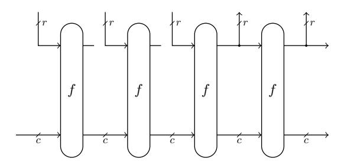
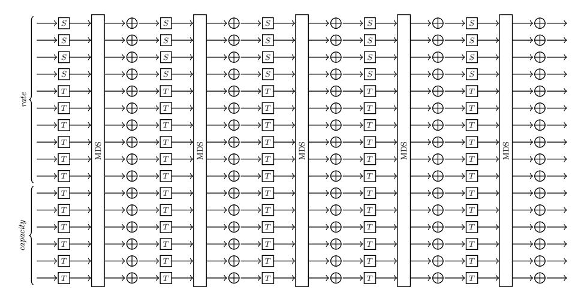

# The Tip5 Hash Function for Recursive STARKs

Alan Szepieniec alan@neptune.cash Neptune Alexander Lemmens Alexander.Lemmens@vub.be DIMA, Vrije Universiteit Brussel

Jan Ferdinand Sauer ferdinand@neptune.cash Neptune Bobbin Threadbare bobbinth@protonmail.com Polygon

> Al Kindi al-kindi-0@protonmail.com Polygon

Abstract. This paper specifies a new arithmetization-oriented hash function called Tip5. It uses the SHARK design strategy [\[20\]](#page-22-0) with low-degree power maps in combination with lookup tables, and is tailored to the field with p = 2<sup>64</sup> − 2 <sup>32</sup> + 1 elements.

The context motivating this design is the recursive verification of STARKs. This context imposes particular design constraints, and therefore the hash function's arithmetization is discussed at length.

# 1 Introduction

In the context of succinctly verifiable and zero-knowledge proof systems for arbitrary computation, standard hash functions such as SHA3 and Blake3 are disfavored due to their expensive arithmetizations. Specifically, the representation of these hash functions in terms of polynomials is sizeable, and induces a matching cost on the proof system that uses it. In this setting, arithmetizationoriented hash functions are preferred instead as these were designed with an efficient arithmetization in mind.

In the space of arithmetization-oriented hash functions, three design strategies stand out.

1. The Marvellous design strategy [\[1\]](#page-20-0), best known for its member Rescue-Prime [\[25\]](#page-22-1), introduced the idea of alternating S-box layers where even layers compute low-degree permutations in one direction and odd layers compute low-degree permutations in the opposite direction. As a result, a small number of rounds guarantees that the algebraic degree of the cipher is sufficiently high when attacked from any direction. Moreover, in the specific case of Rescue-Prime, two consecutive S-box layers can be folded together into one low-degree arithmetization. This folding technique yields essentially two rounds of the cipher for the price of one cycle in the arithmetic virtual machine. Since the publication of the Marvellous design strategy, there has been very little progress in cryptanalyzing Rescue and Rescue-Prime.

- 2. The Hades design strategy [13], best known for its member Poseidon [12], introduces a distinction between full rounds and partial rounds. All rounds consist of a layer of S-boxes, a linear diffusion layer, and an injection of constants. What sets partial and full rounds apart is the number of S-boxes: in partial rounds this number is one, whereas in full rounds every state element is mapped by the S-box. The full rounds, located at the beginning and the end of the cipher, defend against statistical attacks. The large number of partial rounds in the middle defend against algebraic attacks by increasing the degree of polynomials describing the function.
- 3. Reinforced Concrete [11] introduced the use of lookup tables in an otherwise arithmetization-oriented cipher. The lookup table can be evaluated efficiently on CPUs as well as proven efficiently in a zero-knowledge or succinctly verifiable proof system using Plookup [10] or techniques derived from there. Moreover, represented as polynomials over a finite field, non-trivial lookup tables have maximal degree. Therefore, the use of lookup tables provides a robust way to resist algebraic attacks including attacks relying on Gröbner bases. The downside of this technique is that the lookup tables cannot be too large; that therefore the field elements must be decomposed into chunks which are then looked up; and that the prover must establish the correct decomposition and recomposition of these chunks. This process leads to an expensive arithmetization and does not generalize well to arbitrary fields.

This note proposes a new hash function. It uses the SHARK design strategy, on which Marvellous is based, of using full S-box layers interleaved with MDS matrices. The S-boxes come in two types. The first is built from a table lookup that computes the cube map in  $\mathbb{F}_{2^8+1}$  but offset by one. This function is fast to compute. In addition, its algebraic degree over  $\mathbb{F}_p$  is large, providing resistance against Gröbner basis attacks. The second type is the regular forward  $\alpha$ th power map found in Rescue and Poseidon, where  $\alpha$  is the smallest integer such that  $\gcd(\alpha, p-1) = 1$ . As this second type of S-boxes constitutes the majority in every S-box layer, they suffice to provide defense against statistical attacks through the wide-trail argument [8].

## 1.1 The Application: Recursive STARKs

The hash function proposed here is designed not for a general purpose but specifically for integration into STARK [4] engines and specifically for the purpose of enabling the recursive proof of the correct execution of a STARK verifier. This application informs all design choices. The hash function may be used elsewhere, for instance in circuit-based SNARKs or MPC applications, but these alternative uses are not motivations for particular design choices.

For example: there are SNARKs that work for either model of computation, arithmetic circuits or state machines. Both types of SNARKs benefit from using arithmetization-oriented functions, but even so, a given function may be more supportive of the one or the other model. In particular, state machines work by applying a step function iteratively to a mutable state. The collection of these

states is called the trace and it is integral if it satisfies local constraints – namely, the step function was correctly computed between every consecutive pair. This step function is independent of the cycle. Hash functions defined in terms of different round functions are less conducive to this model of computation than hash functions with uniform round functions. [1](#page-2-0)

Another important consideration related to the chosen model of computation is the separation of the processor and the hasher into distinct functional units. Each functional unit has a different step function. Both units generate execution traces. Moreover, there is an argument that proves the correct relation between these two traces; it is not too dissimilar from a communication bus that allows the processor to send queries to the hash coprocessor and receive responses back. Asymptotically speaking, the prover's running time is dominated by computing NTTs (number theoretic transforms) on vectors whose length is proportional to the largest of all execution traces. For recursively proving the correct verification of a STARK proof, however, the workload in terms of computing hashes exceeds that of all other tasks combined. As a result, hash functions with short execution traces are preferable and can even be so at the expense of more registers.

The particular type of hashing that constitutes the bulk of the verifier's work is the verification of Merkle authentication paths. To this end, the hash function must support efficient two-to-one hashing. In the specific case of sponge-based hash functions, it is imperative that two-to-one hashing can be achieved with one absorbing step and one squeezing step — so that only one invocation of the permutation is needed. As a result, the sponge state must be sufficiently wide.

Based on these design constraints, we select Rescue-Prime [\[25\]](#page-22-1) as the starting point even though Poseidon is about 4× faster on CPU in the given context [\[27\]](#page-22-2). Rescue-Prime's security against both algebraic and statistical attacks seems to grow with the state size, and so the relatively large minimum state width is compensated for with a relatively small number of (uniform) rounds.

### 1.2 What About Lookup Gates?

While lookup tables were well-known and well-used in the construction of traditional ciphers, it was not until the advent of the Plookup technique [\[9\]](#page-21-6) that the correct lookup could be proven in addition to executed. This technique presents an intriguing new tool in the arithmetization-oriented cipher designer's toolbox. Lookup tables are designed to break algebras; and so it should come as no surprise that there does not seem to be an efficient way to algebraically attack ciphers that use them. Moreover, lookup gates can typically be evaluated in only a handful of cycles on a modern CPU.

Despite Rescue's impeccable track record, algebraic attacks relying on Gr¨obner basis algorithms remain poorly understood. For most parameters, a Gr¨obner basis attack is the cheapest and so it is used to set the number of rounds. However,

<span id="page-2-0"></span><sup>1</sup> We make an exception for round-dependent round constants, which can either be stored in separate columns that could be precomputed, or arithmetized efficiently using the periodic interpolants of § [4.5.](#page-13-0)

the inclusion of lookup gates promises to completely explode the complexity of a whole range of algebraic attacks including those involving Gr¨obner bases. As such, lookup gates can not only defend against as-yet-undiscovered attack strategies, but can also reduce the number of rounds needed for a target security level.

In theory, the NTT ought to be the prover's bottleneck because its complexity is asymptotically the largest. However, in practice, the prover's running time is dominated by the complexity of computing Merkle trees. Lookup gates promise to replace the computationally expensive alpha-inverse power maps used in Rescue by cheaper operations at no discernible cost to security. As a result, by switching to a hash function that has lookup gates rather than alpha-inverse power maps, the performance bottleneck may shift from building Merkle trees to NTT, where it ought to be.

The inclusion of lookup gates is not free. The lookup argument requires extra columns and constraints and the lookup table itself must be arithmetized as well. The key question raised by and studied in this article is therefore:

Does the performance improvement of a hash function with lookup gates compensate for its more complex arithmetization?

Jumping ahead, the answer is a definite "yes". In the end, both factors affect the single metric of interest, which is the running time of the prover as it proves the correct execution of the verifier.

To support this claim, this article proposes a hash function making use of lookup gates in § [2;](#page-4-0) discusses implementation aspects related to fast CPUperformance in § [3;](#page-6-0) and presents arithmetization techniques of independent interest including a novel lookup argument in § [4.](#page-8-0)

The quantum of qualification relativizing the above positive answer is the question of security. In order to make the comparison fair, both hash function candidates must offer comparable levels of security. The best we can do on this front is analyze the proposed hash function in the light of relevant attack strategies and argue that they all have an infeasible complexity. These attacks are discussed in § [5.](#page-15-0)

Table 1: Summary of parameters.

| Parameter                             | Symbol | Value                    |
|---------------------------------------|--------|--------------------------|
| field modulus                         | p      | 64 −<br>32 + 1<br>2<br>2 |
| number of rounds                      | N      | 5                        |
| state size                            | m      | 16                       |
| sponge rate                           | r      | 10                       |
| sponge capacity                       | c      | 6                        |
| digest length                         | d      | 5                        |
| power map exponent                    | α      | 7                        |
| number of split-and-lookups per round | s      | 4                        |

# <span id="page-4-0"></span>2 Specification

# 2.1 High-Level Overview

Tip5 is a sponge construction [5] instantiated with a permutation  $f: \mathbb{F}_p^m \to \mathbb{F}_p^m$  and a state of m=16 field elements. In every iteration of the absorbing phase, r=10 field elements are read from the input and replace the first r elements of the state. In every iteration of the squeezing phase, the first r=10 elements of the state are read and appended to the output. Between every absorbing or squeezing iteration, the function f is applied to the state. This description defines a function whose output has infinite length; the Tip5 hash function truncates this output to d=5 field elements.



Fig. 1: Sponge construction with 3 absorbing iterations and 2 squeezing iterations. Following [5, §4.3], this sponge construction absorbs by overwriting the rate part of the state, whereas absorbing is traditionally defined in terms of adding into it.

The permutation  $f: \mathbb{F}_p^m \to \mathbb{F}_p^m$  consists of N=5 rounds, which are each identical except for the independently uniformly pseudorandom round constants. Every round consists of 3 steps:

- 1. **S-box layer.** Every state element is mapped by an S-box. The first s=4 elements are mapped by  $S: \mathbb{F}_p \to \mathbb{F}_p$  and the other elements are mapped by  $T: \mathbb{F}_p \to \mathbb{F}_p$ . Both types of S-boxes are permutations on  $\mathbb{F}_p$ .
- 2. Linear layer. The state vector is multiplied with a  $m \times m$  MDS matrix.
- 3. Round constants. A designated round constant, sampled independently for every round and state element, is added to every state element.

#### 2.2 S-Box Layer

There are two types of S-boxes, S and T. The latter is the regular forward  $\alpha$ th power map already used in Rescue-Prime:  $T: x \mapsto x^{\alpha}$ . For the field with  $2^{64} - 2^{32} + 1$  elements,  $\alpha = 7$  since any smaller positive exponent does not define a permutation.



Fig. 2: The Tip5 permutation. The  $\oplus$  indicates addition of constants, but the wires for the constants were omitted for space.

The former type of S-box, S, is more involved and may be called the *split*and-lookup map. It is defined as follows:

$$S: \mathbb{F}_p \to \mathbb{F}_p, x \mapsto R^{-1} \cdot \rho \circ L^8 \circ \sigma(R \cdot x)$$

The components are:

- -R is the field element congruent to  $2^{64}$  modulo p. Multiplication with R maps x from the canonical representation of field elements to Montgomery form. This map is applied in anticipation of efficient implementations, where field elements are represented in Montgomery form to begin with.
- $\sigma: \mathbb{F}_p \to \mathbb{F}_p^8, x \mapsto (a,b,c,d,e,f,g,h)$  where all outputs are at most 8 bits wide and  $x=a+2^8\cdot b+2^{16}\cdot c+2^{24}\cdot d+2^{32}\cdot e+2^{40}\cdot f+2^{48}\cdot g+2^{56}\cdot h$ . In essence,  $\sigma$  decomposes a field element's canonical representation into bytes. and  $\sigma(R \cdot x)$  decomposes the Montgomery representation of x into bytes.
- $-L: \mathbb{F}_p \to \mathbb{F}_p$  is defined only for field elements that are at most 8 bits wide. Identifying this subset of  $\mathbb{F}_p$  with  $\mathbb{F}_{2^8+1}$ , the lookup table L computes  $L: \mathbb{F}_{2^8+1} \to \mathbb{F}_{2^8+1}, x \mapsto (x+1)^3 - 1.$  $-\rho: \mathbb{F}_p^8 \to \mathbb{F}_p \text{ computes the inverse of } \sigma.$

The inverse of this S-box is  $x \mapsto R \cdot \rho \circ (L^{-1})^8 \circ \sigma(R^{-1} \cdot x)$ .

Note that L has three fixed points, 0.255 and  $256 \equiv -1 \mod 257$ . Since 256 is the only point not representable in 8 bits, it follows that L is a permutation on  $\{0,\ldots,255\}$  as well as on  $\mathbb{F}_{257}$ .

The first two fixed points ensure that  $\rho \circ L^8 \circ \sigma$ , seen as a map from and to 64bit integers, sends  $0xffffffff000000000 \equiv -1 \mod p$  to 0xffffffff000000000; sends integers greater than p-1 to integers greater than p-1; and sends integers less than p-1 to integers less than p-1. It follows that S is a permutation on  $\mathbb{F}_p$ .

## 2.3 Linear Layer

In the linear step, the state vector  $\mathbf{x} \in \mathbb{F}_p^m$  is sent to  $M\mathbf{x}$  where  $M \in \mathbb{F}_p^{16 \times 16}$  is a circulant MDS matrix chosen to admit a fast matrix-vector product calculation (see § 3.2). M is defined by the first column  $M_{[:,0]}^{\mathsf{T}} =$

```
[61402, 1108, 28750, 33823, 7454, 43244, 53865, 12034, 56951, 27521, 41351, 40901, 12021, 59689, 26798, 17845] .
```

These numbers were derived from the SHA-256 hash of the ASCII string "Tip5" by dividing the digest into 16-bit chunks.

#### 2.4 Round Constants

The constants are determined by concatenating the byte i (for the i th constant, starting from zero) to the ASCII string "Tip5", hashing the string of 5 bytes using Blake3, taking the first 16 bytes of the digest, interpreting them as an integer in least-significant-byte-first order, reducing the integer modulo p, and multiplying the resulting field element by  $R^{-1}$  which is the inverse of  $2^{64}$  modulo p. This process is repeated mN times to get as many round constants. The (mi+j) th constant is used for the j th state element in the i th round.

# 2.5 Fixed-Length versus Variable-Length

The hash function comes in two modes of operation, depending on whether the input is fixed-length or variable-length.

- When the input is fixed length (and in this case the length is always exactly r = 10), all capacity elements are initialized to 1. There is no need to pad the input. There is only one absorption.
- When the input is variable-length, it is padded by appending a 1 followed by the minimal number of 0's necessary to make the padded input length a multiple of r. The capacity is initialized to all zeros and the input is absorbed over multiple iterations.

# <span id="page-6-0"></span>3 Implementation Aspects

### 3.1 Montgomery Representation

A field element  $a \in \mathbb{F}_p$  is represented as the integer  $\bar{a} \in \{0, \dots, p-1\}$  congruent to  $a \cdot R$  modulo p, where  $R = 2^{64}$ . The benefit of this representation is a faster multiplication algorithm: the product c = ab is calculated by first calculating the integer product  $\bar{a} \cdot \bar{b}$  and following this up with *Montgomery reduction*, which sends  $\bar{a} \cdot \bar{b}$  to  $\bar{c}$ . We refer to Pornin's explanation [19] for a concise but comprehensive overview of Montgomery representation of elements in this field.

The split-and-lookup S-box anticipates the use of Montgomery representation. Specifically, the S-box

$$S: \mathbb{F}_p \to \mathbb{F}_p, x \mapsto R^{-1} \cdot \rho \circ L^8 \circ \sigma(R \cdot x)$$

becomes

$$S': \mathbb{F}_p \to \mathbb{F}_p, x \mapsto \rho' \circ L^8 \circ \sigma'(x)$$

where  $\sigma'$  decomposes the integer  $\bar{a}$  into raw bytes, and  $\rho'$  recomposes the raw bytes accordingly.

# <span id="page-7-0"></span>3.2 MDS Matrix Multiplication

In the linear step, the state vector  $\mathbf{x}$  is sent to  $M\mathbf{x}$  where M is the circulant MDS matrix. All the entries in this matrix are small positive integers. The purpose of this design choice is to delay modular reduction. Specifically, the matrix-vector multiplication is computed over the integers twice, once for the high 32 bits of the input vector, and once for the low 32 bits. Afterwards, the two output vectors are added over the integers (with the appropriate shift) before being reduced modulo p.

Another salient property of the MDS matrix is the fact that it is circulant. Using the well-known NTT-based multiplication trick, the matrix-vector product for a circulant matrix can be computed in only  $O(m \log m)$  operations via

$$M\mathbf{x} = \mathsf{NTT}^{-1}(\mathsf{NTT}(M_{[:,0]}) \circ \mathsf{NTT}(\mathbf{x})),$$

where o denotes the Hadamard (element-wise) product.

The reason why the NTT-based multiplication trick works is because there is an isomorphism between circulant matrices and elements of the quotient ring  $R_p = \mathbb{F}_p[X]/\langle X^m-1 \rangle$ . The elements of this ring are uniquely determined by their reduced representative modulo  $X^m-1$ , or by their list of reduced representative modulo any list of polynomials whose product is  $X^m-1$ . The irreducible factors of  $X^m-1$  are  $X-\xi^i$ , where  $\xi$  is a primitive mth root of unity; and by reducing a polynomial modulo these factors we get its evaluation in  $\xi^i$ . The NTT is precisely the transformation that sends a polynomial to its list of evaluations in  $\xi^i$ .

However, while the field  $\mathbb{F}_p$  does have an mth root of unity, the ring of integers does not. To deal with this difficulty, we use an alternative factorization of  $X^m-1$ . In the first step we split the polynomial product modulo  $X^m-1$  into two polynomial products, modulo  $X^{m/2}-1$  and  $X^{m/2}+1$  respectively. The first product can be computed recursively. The second product is split again into polynomial products modulo  $X^{m/4}+\xi^4$  and  $X^{m/4}-\xi^4$  respectively, where  $\xi^4$  is a square root of -1. The coefficients are represented as complex numbers, *i.e.*, with a real part and an imaginary part. As a result of this representation, computing the product modulo  $X^{m/4}+\xi^4$  gives the matching result modulo  $X^{m/4}-\xi^4$  for free through complex conjugation. The polynomial product before reduction is computed with Karatsuba's method [17].

#### 3.3 CPU Performance

These benchmarks were obtained on an Intel® Core<sup>™</sup> i7-10750H CPU @ 2.60GHz. On this machine, Tip5 is  $21.37 \times$  faster than Rescue-Prime Optimized and  $8.16 \times$  faster than Poseidon. The implementation is available at [22].

<span id="page-7-1"></span><sup>&</sup>lt;sup>2</sup> This technique was first proposed in Plonky2 [29] by Jacqueline Nabaglo.

<span id="page-8-2"></span>Table 2: CPU performance comparison

| Hash Function          | Time [µs] |
|------------------------|-----------|
| Rescue-Prime           | 18.186    |
| Rescue-Prime Optimized | 14.357    |
| Poseidon               | 6.940     |
| Tip5                   | 0.851     |

# <span id="page-8-0"></span>4 Arithmetization

Arithmetization refers to the task of finding representations of computations in terms of lists of finite field elements satisfying low-degree multivariate polynomial constraints, as well as to the concrete representation that this task results in. There are various representations, reflecting the various models of computation.

This section describes standalone arithmetization techniques for the AET/AIR computational representation, which is what underlies the STARK proof system. When composed in the right way, these techniques result in an arithmetization for Tip5. For an in-depth exposition of the details of this representation and the pipeline for generating and verifying a STARK proof from it, we refer to the "Anatomy of a STARK" [\[23\]](#page-22-6) and "BrainSTARK" [\[24\]](#page-22-7) tutorials. We use the terminology from these sources.

# <span id="page-8-1"></span>4.1 Lookup Argument

In the next sections we present a novel lookup argument in the AIR/AET model. It is a special case of subset arguments because it establishes that the rows of one table called the client are a subset of the rows of another, called the server. More specifically, by selecting only those columns labeled "input" or "output" any subset argument including the one presented here can be used to establish that the input and output pairs appearing in the client satisfy the relation between inputs and outputs defined by the server. The outputs can be thought of as having been looked up in the server's lookup table.

B´ezout Argument Using random weights a, b from the verifier, the input and output columns are compressed into one random linear combination. It then suffices to show that the set of random linear combinations used by the client is a subset of the random linear combinations appearing in the server.

Let {comboi}<sup>i</sup> denote the set of input-output pairs, each compressed into a random linear combination using a and b, that are looked up at least once. The client and server both define a product polynomial whose factors are those random linear combinations offsetting X:

$$\operatorname{rpc}(X) = \prod_i (X - \operatorname{combo}_i)^{m_i}$$

$$\operatorname{rps}(X) = \prod_i (X - \operatorname{combo}_i)$$

The difference between these two polynomials is the multiplicities m<sup>i</sup> of their roots, which is 1 for the server and possibly greater than 1 for the client. The letters "rp" suggest that the evaluation of these polynomials in α can be computed by running product columns, once α is known. But merely comparing the values rpc(α) and rps(α) does not suffice to establish the subset relation because the multiplicities of the roots are different.

The following B´ezout relation argument eliminates these multiplicities, enabling a test for subset relationship by probing a polynomial identity in the random point α.

In addition to a running product, the client defines a formal derivative. Let fdc(X) denote this polynomial:

$$\mathtt{fdc}(X) = \sum_i m_i (X - \mathtt{combo}_i)^{m_i - 1} \prod_{j \neq i} (X - \mathtt{combo}_j)^{m_j} = \frac{\mathsf{d}}{\mathsf{d}X} \mathtt{rpc}(X)$$

Likewise, the server defines a formal derivative as well, except this one is weighted by multiplicity:

$$\mathtt{mwfds}(X) = \sum_i m_i \prod_{j \neq i} (X - \mathtt{combo}_j)$$

On the side of the client, the running product and its formal derivative satisfy the following B´ezout relation: rpc(X)·x(X)+fdc(X)·y(X) = g(X), where g(X) is the greatest common divisor and x(X) and y(X) are B´ezout coefficient polynomials. Then rpc(X)/g(X) is the square-free polynomial with the same roots as rpc(X), and thus equal to rps(X) of the server. Moreover, a similar relationship holds for the formal derivatives: fdc(X)/g(X) = mwfds(X). By eliminating g(X) we get the identity of polynomials rpc(X)· mwfds(X) = fdc(X)· rps(X). The objective is to test this identity in the random point α.

The cheating prover who uses an input-output pair in the client that is not present in the server must use a polynomial rpc(X) with at least one root that rps(X) does not share. As a result, the polynomial identity is not satisfied because this root occurs in the left hand side with multiplicity one greater than in the right hand side. By the Schwarz-Zippel lemma, the probability that the identity holds in the random point α is at most (1+m/2)<sup>T</sup> |Fp| , where T is the height of the table.

Optimization with Logarithmic Derivatives The above intuition gives rise to an AET and an AIR for checking it. Indeed, the values rpc(α), fdc(α), rps(α), and mwfds(α) can all be computed via running accumulator columns. However, it turns out there is an optimization that reduces the number of columns at the expense of one batch-inversion for the prover. This optimization is inspired by Hab¨ock's lookup argument [\[14\]](#page-21-9) but ultimately that argument is tailored to Multilinear IOPs. The present optimization can be seen as lifting that technique to the AET/AIR setting, albeit derived differently.

The logarithmic derivative of a polynomial f(X) is defined as <sup>f</sup> (X) f(X) . It is so named because the logarithmic derivative of the product of two polynomials is the sum of their logarithmic derivatives:

$$\frac{1}{f(X)g(X)} \cdot \frac{\mathrm{d}(f(X)g(X))}{\mathrm{d}X} = \frac{f'(X)g(X)}{f(X)g(X)} + \frac{f(X)g'(X)}{f(X)g(X)} = \frac{f'(X)}{f(X)} + \frac{g'(X)}{g(X)}$$

Observe that the polynomial identity

$${\tt rpc}(X) \cdot {\tt mwfds}(X) = {\tt fdc}(X) \cdot {\tt rps}(X)$$

can be re-written in terms of logarithmic derivatives:

$$\frac{\mathtt{fdc}(X)}{\mathtt{rpc}(X)} = \frac{\mathtt{mwfds}(X)}{\mathtt{rps}(X)} = \sum_i \frac{m_i}{X - \mathtt{combo}_i}$$

.

On the side of the server, two columns are needed to probe this identity in the random point α.

- base column mul contains the multiplicity with which the given row is queried;
- the running product rps and multiplicity-weighted formal derivative mwfds are merged into the single extension column sum, which contains the running sum of mul/(α − combo).

On the side of the client only one extension column is needed. Specifically, the running product rpc and formal derivative fdc are merged into a single column, the logarithmic derivative ldc. To update ldc, recall that the standard running product column rpc is defined to accumulate one factor in every row. Moreover, ldc is defined to contain the logarithmic derivative of rpc in every row, so we can use the eponymous property to populate it. Specifically, the wouldhave-been running product update rule rpc<sup>∗</sup> = rpc · (α − combo<sup>∗</sup> ) becomes ldc<sup>∗</sup> = ldc + 1/(α − combo<sup>∗</sup> ), where the asterisk <sup>∗</sup> indicates the respective element from the next row.

The update rules sum<sup>∗</sup> = sum + mul<sup>∗</sup>/(α − combo<sup>∗</sup> ) and ldc<sup>∗</sup> = ldc + 1/(α − combo<sup>∗</sup> ) can be converted to AIR constraints of low degree by multiplying left and right hand sides by (α − combo<sup>∗</sup> ).

## <span id="page-10-0"></span>4.2 Cascade Construction

The cascade construction arithmetizes a lookup gate composed of two lookups of half the width in terms of the arithmetizations of those components. It introduces a new table, called the cascade table. While the construction does complicate the arithmetization, the tradeoff can be worth it when the narrow lookup table gives rise to a more performant arithmetization than the wide one.

The cascade table is the server authenticating 2n-bit wide input-output pairs to the external client. Internally, every input or output element is represented as two limbs of n bits. To authenticate the n-bit wide input-output pairs, the cascade table is the client of an n-bit wide lookup argument with an external server.

A cascade table consists of 5 base columns and 3 extension column. The extension columns are defined relative to challenges a, b, c, d, β, γ. The Latin letters denote weights used to compress columns, and the Greek letters denote indeterminates.

The base columns are

- lkinhi and lkinlo, the high and low limbs of the lookup input;
- lkouthi and lkoutlo, the high and low limbs of the lookup output;
- mul, the multiplicity with which the given row is being queried by the external client.

| Table 3: A lookup argument using a cascade table. In the example, the values alo<br>and |
|-----------------------------------------------------------------------------------------|
| xhi<br>are equal. Consequently, blo<br>and yhi<br>are equal as well.                    |

| client −→<br>some table        |                      | ←− server & client −→<br>cascade table |            |            |                                   | ←− server<br>lookup table |                                                       |
|--------------------------------|----------------------|----------------------------------------|------------|------------|-----------------------------------|---------------------------|-------------------------------------------------------|
|                                | instruction register |                                        |            |            | lkinhi lkinlo lkouthi lkoutlo mul |                           | in out mul                                            |
| lookup<br>foo<br>lookup<br>bar | x<br>y<br>a<br>b     | xhi<br>ahi                             | xlo<br>alo | yhi<br>bhi | ylo<br>blo                        | 1<br>1                    | xhi<br>yhi<br>2<br>xlo<br>ylo<br>1<br>ahi<br>bhi<br>1 |

The extension columns are

- sum, which contains the running sum of inverses;
- ldhi and ldlo, the running logarithmic derivatives of the high and low input-output pairs.

The AIR constraints can be inferred from section § [4.1](#page-8-1) covering the lookup argument. Note that when the cascade table is wearing the server hat, the random linear combinations are given by

$$\mathtt{combo} = 2^w \cdot a \cdot \mathtt{lkinhi} + a \cdot \mathtt{lkinlo} + 2^w \cdot b \cdot \mathtt{lkouthi} + b \cdot \mathtt{lkoutlo},$$

where w is the width (in bits) of each limb. When the cascade table is wearing the client hat, the random linear combinations are given by

$$\mathtt{combo} = c \cdot \mathtt{lkinhi} + d \cdot \mathtt{lkouthi}$$

and

### combo = c · lkinlo + d · lkoutlo.

To see why the construction is sound, suppose a malicious prover attempts to prove that a pair (lkin<sup>∗</sup> , lkout<sup>∗</sup> ) belongs to the wide lookup relation when it does not. Then either the cascade table contains a corresponding row(lkinhi, lkinlo, lkouthi, lkoutlo, mul), i.e., such that lkin<sup>∗</sup> = 2<sup>w</sup> · lkinhi + lkinlo and lkout<sup>∗</sup> = 2<sup>w</sup> · lkouthi + lkoutlo and mul ̸= 0; or the cascade table does not contain such a corresponding row. The latter case implies a failure of the client-cascade lookup argument. The probability of this event is bounded by the soundness error of the lookup argument. The former case implies one of two propositions:

- 1. The server table contains a row (lkinhi, lkouthi, mul) with mul ̸= 0.
- 2. The server table contains a row (lkinlo, lkoutlo, mul) with mul ̸= 0.

The propositions cannot both be true because that would imply that (lkin<sup>∗</sup> , lkout<sup>∗</sup> ) does satisfy the wide lookup map relation. Therefore, one or both of these propositions must be false, implying at least one violation of the cascadeserver subset argument. Once again, the probability of this event is bounded by the soundness error of the lookup argument.

It is possible to arrange multiple cascade tables in sequence. This enables the decomposition of very large composite lookup maps into tiny components. The tradeoff is that the number of rows can increase by up to a factor two for every cascade level. However, as the tables get narrower they start becoming saturated faster. For instance, an 8-bit wide lookup table can only hold 256 rows.

# 4.3 Narrow Lookup Tables

Reducing the arithmetization of a large composite lookup map to that of a small primitive lookup map only makes sense if the small lookup map admits an efficient arithmetization. Indeed, if the lookup map is not too wide — say, a handful of bits — then the following technique applies.

Let n be the number of bits in the input. The verifier locally evaluates a polynomial of degree 2<sup>n</sup> − 1 to obtain a single scalar value that authenticates the entire lookup table. This scalar is a parameter in the AIR that verifies the correct computation of this polynomial row-by-row.

Specifically, let c, d, δ be challenges supplied by the verifier. The lookup table consists of three columns. Base columns lkin and lkout contain all possible input-output pairs. Extension column re contains a running evaluation.

The AIR constraints constrain re to computing a running evaluation of the polynomial whose coefficients are given by c · lkin + d · lkout. Specifically, let <sup>∗</sup> denote the corresponding element from the next row. Then there are three AIR constraints involving re:

– Initial constraint. The running evaluation column has accumulated the update determined by the first row: c · lkin + d · lkout − re.

- Transition constraint. The running evaluation column accumulates the update determined by the next row:  $\delta \cdot \text{re} + c \cdot \text{lkin}^* + d \cdot \text{lkout}^* \text{re}^*$ .
- Terminal constraint. The value of the running evaluation column in the last row matches with the value of f(X) at  $\delta$ :  $f(\delta)$  re.

The polynomial f(X) is evaluated by the verifier locally. The coefficient of  $X^{(2^n-1-i)}$  in f(X) is  $c \cdot lkin_i + d \cdot lkout_i$ , where  $(lkin_i, lkout_i)$  is the *i*th input output pair. Since the degree of f(X) is  $2^n - 1$ , this evaluation is fast if n is small.

This lookup table crucially relies on the fact that all rows are present, even those rows that are not being looked up. In contrast, rows in cascade tables only need to be present if they are being looked up at some point.

### 4.4 Periodic Constraints

A periodic constraint is one that applies in every row congruent to x modulo y. Its implementation requires a periodic zerofier. We describe here a technique for building this primitive.

Let  $H = \langle \omega \rangle$  be the subgroup and  $(\omega^i)_i$  the sequence of order and length N over which the trace is interpolated, and suppose y|N. The zerofier for a subgroup of order k is  $X^k-1$ , since it evaluates to zero in every element of the subgroup and is the smallest-degree monic polynomial that does so. Therefore,  $Z(X) = X^{N/y} - 1$  is a zerofier for the order N/y subgroup of H. It evaluates to zero on every point  $\omega^i$  of the sequence where i is congruent to 0 modulo y. The coset zerofier  $(X \cdot \omega^{-x})^{N/y} - 1$  evaluates to 0 in points  $\omega^i$  of the sequence where  $i \equiv x \mod y$ . The product of such coset zerofiers is a zerofier for an arbitrary set of congruence classes modulo y.

A periodic constraint is simply a constraint whose corresponding zero fier is not zero on the whole interpolation group H but on a subgroup of it or coset thereof. The constraint is active in those points where the zero fier evaluates to zero, and inactive elsewhere.

## <span id="page-13-0"></span>4.5 Periodic Interpolants

A periodic interpolant is a polynomial that repeats a sequence of values  $(v_0, \ldots, v_{k-1})$  of length k when evaluated on the powers of a generator  $\omega$ . An AIR constraint that integrates such an interpolant is individualized to the row, or more specifically, to the row's index's congruence class modulo k. It can be used to prove that the correct round constants were added into the state in each row. To the best of our knowledge this technique was first described in Buterin's STARK tutorial [7].

Let N be the padded trace length, suppose k|N, and let  $\omega$  generate the subgroup over which the trace is interpolated. Then the polynomial  $g(X) = X^{N/k}$  sends  $\omega^i$  to  $\zeta^i$  where  $\zeta$  is a kth root of unity. Let f(X) be the interpolant through  $(v_0, \ldots, v_{k-1})$  on the powers of  $\zeta$ . Then  $f \circ g$  is the periodic interpolant through  $(v_0, \ldots, v_{k-1})$  on the powers of  $\omega$ .

#### 4.6 Correct Decomposition of Elements Modulo p

The lookup argument can establish that (a, b, c, d) all have at most 16 bits. However, it does not suffice to establish that a + 2<sup>16</sup> · b + 2<sup>32</sup> · c + 2<sup>48</sup> · d < p. To prove this, an additional constraint is needed, namely (1 − (c + 2<sup>16</sup> · d − 2 <sup>32</sup> + 1) · e) · (a + 2<sup>16</sup> · b) = 0. In this expression, e is the inverse-or-zero of (c + 2<sup>16</sup> · d − 2 <sup>32</sup> + 1), which is to say, either e = (c + 2<sup>16</sup> · d − 2 <sup>32</sup> + 1) = 0 or e · (c + 2<sup>16</sup> · d − 2 <sup>32</sup> + 1) = 1. To see why the constraint works, observe that for valid field elements, c + 2<sup>16</sup> · d = 2<sup>32</sup> − 1 ⇒ a + 2<sup>16</sup> · b = 0. Indeed, the left factor evaluates to 1 only when c + 2<sup>16</sup> · d = 2<sup>32</sup> − 1, and in this case the right factor must evaluate to zero.

# 4.7 Arithmetization of Tip5

We present here only a high-level overview of the arithmetization of Tip5. In particular, we omit discussion of constraints in favor of the columns of the various tables and their effect on prover complexity. The effect on prover complexity due to constraints scales linearly with the number of columns and is concretely negligible. Moreover, the constraints can be inferred from the above descriptions. For a complete specification, we refer to the document "Triton Improvement Proposal 0005" [\[26\]](#page-22-8).

There are three tables: the Hash Table which evaluates the Tip5 permutation every 8 rows, the Cascade Table which translates 16-bit wide lookups into 8-bit wide lookups, and the Lookup Table which contains all possible 8-bit lookup pairs. There is a lookup argument between the Hash Table and the Cascade Table, and another between the Cascade Table and the Lookup Table. The Lookup Table uses the narrow lookup arithmetization technique described above. All tables have one column indicating whether rows are padding rows.

The Hash Table has 49 base columns and 16 extension columns, subdivided as follows:

- one padding indicator pad;
- 12 regular sponge state elements st[4] through st[15];
- the remaining 4 sponge state elements are represented as 16-bit wide chunks for easy lookup and in input-output pairs: lkin[0] through lkin[15] and lkout[0] through lkout[15];
- one extension column for every input-output pair that is to be looked up: ldc[0] through ldc[15].
- 4 inverse-or-zero columns ioz[0] through ioz[3] to establish that the four 16-bit limbs that are being looked up, represent a correct decomposition of some field element modulo p.

The round count N = 5 requires periodic zerofiers and periodic interpolants. Certain consistency or transition constraints are activated only on rows congruent to j modulo 8, for various j.

The Cascade Table has exactly those columns described in § [4.2](#page-10-0) in addition to one padding indicator pad. The total number of columns is therefore 6 base columns and 3 extension columns.

The Lookup Table has 4 base columns and 2 extension columns:

- pad is the padding indicator;
- lkin and lkout contain the input and the output of the input-output pairs, respectively;
- mul contains the multiplicity with which they are queried;
- sum contains the running sum of inverses for the lookup argument;
- re contains the running evaluation to establish the correct list of inputoutput pairs.

In total, the entire arithmetization of the Tip5 hash function requires 59 base columns and 21 extension columns. This number omits the columns needed for cross-table relations between the Hash Table and other tables, but these columns are also necessary if a different hash function not requiring lookup arguments is used instead, such as Rescue-Prime.

# <span id="page-15-0"></span>5 Security Analysis

# 5.1 Statistical Attacks

Statistical attacks exploit the far-from-random likelihood of propagation of specially crafted patterns of values through various components of the cipher. In linear cryptanalysis [\[18\]](#page-22-9) the pattern in question is an affine relation between the wires connecting a subcircuit to the rest. In differential cryptanalysis [\[6\]](#page-21-11) the pattern in question is a known difference in the values taken by a wire across two invocations of the cipher.

While the split-and-lookup S-boxes contribute somewhat to resistance against linear and differential cryptanalysis, the hash function's resistance against these lines of attack is most easily argued from the αth power maps alone. Specifically, these S-boxes have strong linear and differential properties and their combination with the MDS matrix enables a straightforward derivation of bounds on the probability of propagation of linear and differential patterns following the wide trail argument [\[8\]](#page-21-4).

# <span id="page-15-1"></span>5.2 Linear Cryptanalysis

The maximum expected probability of a non-trivial linear pattern (a, b, c) being satisfied across an αth power S-box is

$$\max_{a,b,c} \Pr\left[a \cdot x + b \cdot x^{\alpha} + c = 0\right] = \frac{\alpha}{p} .$$

The MDS matrix guarantees that in every consecutive pair of rounds, at least m + 1 S-boxes are linearly active. But in every consecutive pair of rounds, there are only 2s split-and-lookup maps, so at least m + 1 − 2s αth power S-box must be linearly active. The probability that a linear pattern is satisfied across two rounds is therefore at most α p <sup>m</sup>+1−2<sup>s</sup> ≈ 2 −551 .

## <span id="page-16-0"></span>5.3 Differential Cryptanalysis

The maximum expected probability that a non-trivial differential pattern  $\Delta x \mapsto \Delta y$  holds across an  $\alpha$ th power S-box is

$$\max_{\Delta x, \Delta y} \Pr\left[ (x + \Delta x)^{\alpha} - x^{\alpha} = \Delta y \right] = \frac{\alpha - 1}{p} .$$

Once again, the MDS matrix guarantees that in every consecutive pair of rounds, at least m+1-2s  $\alpha$ th power S-boxes are differentially active. The probability of a differential pattern being satisfied across two rounds is therefore  $\left(\frac{\alpha-1}{p}\right)^{m+1-2s} \approx 2^{-552}$ .

Note that this small probability also rules out a boomerang attack [28,16], which relies on the presence of two complementary differential patterns, jointly spanning the whole cipher, and at least one of which must span at least two rounds.

# 5.4 Algebraic Attacks

Algebraic attacks leverage polynomial arithmetic to attack primitives. These are particularly relevant for arithmetization-oriented ciphers because they are designed to admit a succinct description in terms of polynomials.

The CICO problem [5, §8.2.4] provides an algebraic description of preimage search on sponge-based hash functions. In the context of Tip5, the initial S-box can be ignored. As the remaining components of the first round are linear, the net effect is that the attacker gets one round for free.

#### <span id="page-16-1"></span>5.5 Univariate

Every function to and from a finite field can be represented by a polynomial. When the polynomial corresponding to a block cipher or hash function has a sufficiently low degree, algorithms for univariate polynomial arithmetic such as interpolation or computing GCDs may suffice to break the primitive. In the case of hash functions, polynomial factorization to find the roots gives rise to a preimage attack [21].

This root-finding attack is infeasible when applied to Tip5 for two reasons. First, the degree of every output coordinate in terms of any indeterminate input is on the order of  $p \approx 2^{64}$  due to the inclusion of the split-and-lookup gates, which do not have a low-degree polynomial representation. Second, the output of the hash function consists of 5 field elements, and so the natural field for univariate attack strategies is not  $\mathbb{F}_p$  but  $\mathbb{F}_{p^5}$ . But since the MDS matrix is  $\mathbb{F}_p$ -linear and not  $\mathbb{F}_{p^5}$ -linear, the resulting polynomial's degree is on the order of  $p^5 \approx 2^{320}$ .

## <span id="page-17-0"></span>5.6 Straightforward Gröbner Basis

There are m(N+1) wires in total, but after dropping the initial S-boxes of the first round, N variables appear in only N equations and linearly so, and so they can be eliminated. Moreover d variables are given by the digest, so there are mN-d variables in total. There are as many equations. Their degrees are

- 1. p-1 (or close to p-1) if it describes a split-and-lookup map;
- 2.  $\alpha$  if it describes a forward  $\alpha$ -th power map.

The Macaulay bound exceeds p. Therefore it pays to add the field equation  $x^p - x$  for every variable x. This addition has the effect of restricting the degree to p-1 in every variable.

The Macaulay matrix at this degree has  $\binom{p-1+mN-d}{mN-d}$  columns and as many rows. Assuming that the matrix is dense, finding a kernel vector using sparse linear algebra methods takes this number *squared* operations. For one round and setting the other parameters as above, this square is approximately equal to  $2^{1236}$ .

#### <span id="page-17-1"></span>5.7 Split S-box

The above analysis assigns two variables to every split-and-lookup gate: one for the input, and one for the output. A natural alternative is to encode the splitting into bytes and their recombination into field elements as polynomial equations, giving rise to eight (one for each L-map) variables for each split-and-lookup gate. The polynomial equations for splitting field elements and recombining bytes mirror their AIR counterparts. However, the lookup arguments do not have analogues in polynomial equations. Instead, every L-map generates a polynomial equation of degree 256.

With this representation of the split-and-lookup S-boxes there are mN-d+7Ns variables, not counting those that were introduced to simulate inequalities. Conversely, there are as many equations, not counting the inequalities. Of these equations, 8Ns have degree 256.

In order to derive an estimate of the complexity of solving this system of polynomial equations, we simplify the analysis with unverified assumptions. First, we assume (optimistically from the point of view of the attacker) that the polynomial system's concrete degree of regularity is 256, matching with the highest degree of the starting polynomials. Second, we assume (pessimistically from the point of view of the attacker) that the Macaulay matrix at this degree is dense.

The Macaulay matrix at degree 256 has  $\binom{256+mN-d+7Ns}{mN-d+7Ns}$  columns. Finding a kernel vector using sparse linear algebra methods takes this number *squared* operations, or roughly  $2^{324}$  field operations to attack one round.

#### <span id="page-17-2"></span>5.8 Linear Approximation

An alternative to representing the split-and-lookup gates exactly is to replace them with their best linear approximations in the polynomial model of the primitive. The resulting solution represents a successful attack (*i.e.*, a second preimage) if it happens to coincide with the variety of the *exact* system of polynomials, i.e., the one without approximations. By modeling the solution found via polynomial system solving as a random element from the approximate variety, it is possible to estimate the probability that it lives also in the exact variety. Specifically: we count the number of approximated maps and the number of points they agree with their targets in.

One linear approximation to the split-and-lookup map agrees in 240 points, corresponding to the 2 fixed points of L, repeated 8 times, except for 16 values that can't be reached because they correspond to 64-bit integers greater than p. Inside 1 round there are s split-and-lookup maps and the probability that they all send one of these agreeable points to their correct destination is 240 p s . For the given parameters this probability is less than 2−<sup>224</sup> in one round. In other words, if we were to attack a single round with this technique, the produced solution would be correct (i.e., a valid (second) preimage) with this probability.

Barring cancellations of approximation errors, and assuming that the state vectors are independent and uniform before they enter into a round, the probability of correct approximation drops exponentially in the number of rounds, by about 240 p s ≈ 2 <sup>−</sup><sup>224</sup> per round.

## <span id="page-18-0"></span>5.9 Fixing

Another technique to leverage Gr¨obner basis techniques consists of fixing the values on the wires into and out of the split-and-lookup S-boxes at random. The standard polynomial model of the cipher, i.e., without fixing wires, consists of a polynomial system with high degree polynomials but r − d = 5 degrees of freedom. Fixing the wires reduces the polynomials' degrees but at the expense of reducing the number of degrees of freedom by s degrees for each round covered by the attack. Attacking a single round (in addition to the ignored initial S-box layer) is feasible as the system of equations retains 1 degree of freedom. But for the whole cipher (still ignoring the initial S-box layer) the system of equations has r −d−(N −1)s = −11 degrees of "freedom". A random system of equations with this degree of over-determinedness can be expected to have a solution with probability on the order of p <sup>−</sup><sup>11</sup> ≈ 2 −704 .

# 5.10 Skip Two Rounds

Bariant et al. [\[3\]](#page-21-13) introduce a clever technique enabling the algebraic attacker to bypass one or two rounds at the start of the cipher. It crucially relies on the fact that the nonlinear components in the skipped rounds can be represented as monomials. It does not apply to Tip5 because the split-and-lookup S-boxes are not monomials. To see this, observe that counterexamples (a, b) exist such that S(a)S(b) ̸= S(ab), for instance a = b = 16.

#### 5.11 Cryptanalysis Summary

[Table 4](#page-19-0) summarizes the minimum number of rounds after which the cipher is secure against various attacks. We consider only attacks with reasonable success <span id="page-19-0"></span>probability (i.e., approximately one) and feasible complexity (i.e., less than 2<sup>192</sup> , corresponding to a classical brute force collision search with optimistic memory).

Table 4: Summary of Necessary Round Count by Attack

| attack                                                                                                                                  | # rounds              |
|-----------------------------------------------------------------------------------------------------------------------------------------|-----------------------|
| statistical                                                                                                                             |                       |
| linear cryptanalysis § 5.2<br>differential cryptanalysis § 5.3<br>boomerang § 5.3                                                       | 2<br>2<br>3           |
| algebraic                                                                                                                               |                       |
| univariate § 5.5<br>straightforward Gr¨obner basis § 5.6<br>split S-box § 5.7<br>linear approximation § 5.8<br>fixing wire values § 5.9 | 2<br>2<br>2<br>2<br>3 |

While the attack that fixes wire values performs the best on paper, the attack with the split representation of the S-box ranks second. Moreover, the latter's complexity analysis relies on the unverified pessimistic (from the attacker's point of view) assumption on the density of the Macaulay matrix. With these observations in mind, the round count N = 5 was set to provide a roughly 50% security margin.

# 6 Conclusion

We set out to investigate whether switching from Rescue-Prime to Tip5 would yield a net performance improvement. We close with an answer to this question.

For programs of reasonable size we find that 80% of proof generation time is spent hashing. Most of the remaining time is spent computing NTTs. Of the hashing steps, 90% of the time is spent hashing single rows of the low-degree extended trace table into leafs; the rest is spent building Merkle trees out of these leafs.

The arithmetization does not change the number of rows, so the 21.37× speedup of [Table 2](#page-8-2) applies directly to the Merkle tree steps. The other two steps, hashing rows and computing NTTs depends on the new number of columns.

For Rescue-Prime and Rescue-Prime Optimized there are 16 columns for storing the sponge state. While there are more round constants per round in Rescue-Prime and Rescue-Prime Optimized than in Tip5, in the particular case of Rescue-Prime Optimized these round constants do not increase the number of columns because their correct addition can be enforced via periodic interpolants. So the total number of columns for Rescue-Prime Optimized is 16. This number compares to Tip5's 59 base columns and 21 extension columns. In the context of Triton VM [\[15\]](#page-21-14), the extension columns take values from Fp<sup>3</sup> , so this total is equivalent to 59 + 3 · 21 = 122 base columns.

The VM has 168 base-column equivalents not related to hashing. So swapping out Rescue-Prime for Tip5 makes the column count go from 168 + 16 = 184 to 168 + 122 = 290. In other words, there are 1.58× more columns.

In terms of the NTT step: there are 1.58× more NTTs to compute, but they all have the same length. So this step will take 1.58× as much time.

In terms of hashing the rows, the rows are 1.58× longer, but the hash function is 21.37 times faster. So this task will take 1.58/21.37 = 0.074× as much time.

Putting the three steps together we find a new running time of 0.2 · 1.58 + 0.8 · (0.9 · 0.074 + 0.1/21.37) = 0.373 times the old running time. Equivalently, switching to Tip5 yields a 2.68× speedup.

While this comparison already favors Tip5, it relies on several assumptions that are biased in favor of Rescue-Prime. Specifically:

- Of the time not spent hashing, only about 18% is spent on NTTs, not 20%, and only some of the difference scales with the number of columns.
- Due to compiler optimizations, running an NTT on a vector of Fp<sup>3</sup> elements is slightly more than 2× slower than an NTT on a vector of F<sup>p</sup> elements, rather than 3×.
- The degree of the AIR is 7 in both cases. However, there is a natural tradeoff to reduce the prover time by shrinking the AIR degree at the expense of extra columns. Rescue-Prime has 16 columns that would need to be expanded into multiple columns each in order to reduce the AIR degree, whereas Tip5 only has 12 such columns.
- Rescue-Prime (not Optimized) has 8 rounds; since the first and last states must be represented, this means that the trace for one invocation of Rescue-Prime does not fit in 8 rows. Using 9 rows requires introducing an extra column (not to mention high-degree AIR constraints) for keeping track of the round number. The alternative is to use periodic constraints or periodic interpolants, but this bumps the number of rows per hash invocation to the next power of 2, which 16 in this case.

Acknowledgements. Some of the ideas that this article expands on, were first raised in the course of the Rescue-Prime Optimization project [\[2\]](#page-21-15). We also thank Robin Salen for feedback and corrections.

# References

<span id="page-20-0"></span>1. Aly, A., Ashur, T., Ben-Sasson, E., Dhooghe, S., Szepieniec, A.: Design of symmetric-key primitives for advanced cryptographic protocols. IACR Trans. Symmetric Cryptol. 2020(3), 1–45 (2020), [https://doi.org/10.13154/tosc.v2020.](https://doi.org/10.13154/tosc.v2020.i3.1-45) [i3.1-45](https://doi.org/10.13154/tosc.v2020.i3.1-45)

- <span id="page-21-15"></span>2. Ashur, T., Kindi, A., Meier, W., Szepieniec, A., Threadbare, B.: Rescue-prime optimized. IACR Cryptol. ePrint Arch. p. 1577 (2022), [https://eprint.iacr.](https://eprint.iacr.org/2022/1577) [org/2022/1577](https://eprint.iacr.org/2022/1577)
- <span id="page-21-13"></span>3. Bariant, A., Bouvier, C., Leurent, G., Perrin, L.: Algebraic attacks against some arithmetization-oriented primitives. IACR Trans. Symmetric Cryptol. 2022(3), 73–101 (2022). [https://doi.org/10.46586/tosc.v2022.i3.73-101,](https://doi.org/10.46586/tosc.v2022.i3.73-101) [https://doi.org/](https://doi.org/10.46586/tosc.v2022.i3.73-101) [10.46586/tosc.v2022.i3.73-101](https://doi.org/10.46586/tosc.v2022.i3.73-101)
- <span id="page-21-5"></span>4. Ben-Sasson, E., Bentov, I., Horesh, Y., Riabzev, M.: Scalable zero knowledge with no trusted setup. In: CRYPTO 2019Part III. Lecture Notes in Computer Science, vol. 11694, pp. 701–732. Springer (2019), [https://doi.org/10.1007/](https://doi.org/10.1007/978-3-030-26954-8_23) [978-3-030-26954-8\\_23](https://doi.org/10.1007/978-3-030-26954-8_23)
- <span id="page-21-7"></span>5. Bertoni, G., Daemen, J., Peeters, M., Assche, G.V.: Cryptographic sponge functions (2012), <https://keccak.team/files/CSF-0.1.pdf>
- <span id="page-21-11"></span>6. Biham, E., Shamir, A.: Differential cryptanalysis of des-like cryptosystems. In: Menezes, A., Vanstone, S.A. (eds.) CRYPTO '90. Lecture Notes in Computer Science, vol. 537, pp. 2–21. Springer (1990). [https://doi.org/10.1007/3-540-38424-3](https://doi.org/10.1007/3-540-38424-3_1) 1, [https://doi.org/10.1007/3-540-38424-3\\_1](https://doi.org/10.1007/3-540-38424-3_1)
- <span id="page-21-10"></span>7. Buterin, V.: Part 3, [https://vitalik.ca/general/2018/07/21/starks\\_part\\_3.](https://vitalik.ca/general/2018/07/21/starks_part_3.html) [html](https://vitalik.ca/general/2018/07/21/starks_part_3.html)
- <span id="page-21-4"></span>8. Daemen, J., Rijmen, V.: The Design of Rijndael - The Advanced Encryption Standard (AES), Second Edition. Information Security and Cryptography, Springer (2020), <https://doi.org/10.1007/978-3-662-60769-5>
- <span id="page-21-6"></span>9. Gabizon, A., Williamson, Z.J.: plookup: A simplified polynomial protocol for lookup tables. IACR Cryptol. ePrint Arch. p. 315 (2020), [https://eprint.iacr.](https://eprint.iacr.org/2020/315) [org/2020/315](https://eprint.iacr.org/2020/315)
- <span id="page-21-3"></span>10. Gabizon, A., Williamson, Z.J., Ciobotaru, O.: PLONK: permutations over lagrange-bases for oecumenical noninteractive arguments of knowledge. IACR Cryptol. ePrint Arch. p. 953 (2019), <https://eprint.iacr.org/2019/953>
- <span id="page-21-2"></span>11. Grassi, L., Khovratovich, D., L¨uftenegger, R., Rechberger, C., Schofnegger, M., Walch, R.: Reinforced concrete: A fast hash function for verifiable computation. In: ACM CCS. pp. 1323–1335. ACM (2022), [https://doi.org/10.1145/3548606.](https://doi.org/10.1145/3548606.3560686) [3560686](https://doi.org/10.1145/3548606.3560686)
- <span id="page-21-1"></span>12. Grassi, L., Khovratovich, D., Rechberger, C., Roy, A., Schofnegger, M.: Poseidon: A new hash function for zero-knowledge proof systems. In: USENIX Security 2021. pp. 519–535. USENIX Association (2021), [https://www.usenix.org/conference/](https://www.usenix.org/conference/usenixsecurity21/presentation/grassi) [usenixsecurity21/presentation/grassi](https://www.usenix.org/conference/usenixsecurity21/presentation/grassi)
- <span id="page-21-0"></span>13. Grassi, L., L¨uftenegger, R., Rechberger, C., Rotaru, D., Schofnegger, M.: On a generalization of substitution-permutation networks: The HADES design strategy. In: EUROCRYPT 2020, Part II. Lecture Notes in Computer Science, vol. 12106, pp. 674–704. Springer (2020), [https://doi.org/10.1007/978-3-030-45724-2\\_23](https://doi.org/10.1007/978-3-030-45724-2_23)
- <span id="page-21-9"></span>14. Hab¨ock, U.: Multivariate lookups based on logarithmic derivatives. IACR Cryptol. ePrint Arch. p. 1530 (2022), <https://eprint.iacr.org/2022/1530>
- <span id="page-21-14"></span>15. jan-ferdinand, sshine, Sword-Smith, aszepieniec, einar-triton, AlexanderLemmens, Ulrik-dk, contrun: Triton VM, <https://triton-vm.org/>
- <span id="page-21-12"></span>16. Joux, A., Peyrin, T.: Hash functions and the (amplified) boomerang attack. In: Menezes, A. (ed.) CRYOPTO 2007. Lecture Notes in Computer Science, vol. 4622, pp. 244–263. Springer (2007). [https://doi.org/10.1007/978-3-540-74143-](https://doi.org/10.1007/978-3-540-74143-5_14) 5 [14,](https://doi.org/10.1007/978-3-540-74143-5_14) [https://doi.org/10.1007/978-3-540-74143-5\\_14](https://doi.org/10.1007/978-3-540-74143-5_14)
- <span id="page-21-8"></span>17. Karatsuba, A.A., Ofman, Y.: Multiplication of many-digital numbers by automatic computers (1962)

- <span id="page-22-9"></span>18. Matsui, M., Yamagishi, A.: A new method for known plaintext attack of FEAL cipher. In: Rueppel, R.A. (ed.) EUROCRYPT '92. Lecture Notes in Computer Science, vol. 658, pp. 81–91. Springer (1992). [https://doi.org/10.1007/3-540-47555-](https://doi.org/10.1007/3-540-47555-9_7) 9 [7,](https://doi.org/10.1007/3-540-47555-9_7) [https://doi.org/10.1007/3-540-47555-9\\_7](https://doi.org/10.1007/3-540-47555-9_7)
- <span id="page-22-3"></span>19. Pornin, T.: Ecgfp5: a specialized elliptic curve. IACR Cryptol. ePrint Arch. p. 274 (2022), <https://eprint.iacr.org/2022/274>
- <span id="page-22-0"></span>20. Rijmen, V., Daemen, J., Preneel, B., Bosselaers, A., Win, E.D.: The cipher SHARK. In: Fast Software Encryption, Third International Workshop, 1996, Proceedings. LNCS, vol. 1039, pp. 99–111. Springer (1996), [https://doi.org/10.](https://doi.org/10.1007/3-540-60865-6_47) [1007/3-540-60865-6\\_47](https://doi.org/10.1007/3-540-60865-6_47)
- <span id="page-22-11"></span>21. Roy, A., Andreeva, E., Sauer, J.F.: Interpolation cryptanalysis of unbalanced feistel networks with low degree round functions. In: Dunkelman, O., Jr., M.J.J., O'Flynn, C. (eds.) SAC 2020. Lecture Notes in Computer Science, vol. 12804, pp. 273–300. Springer (2020). [https://doi.org/10.1007/978-3-030-81652-0](https://doi.org/10.1007/978-3-030-81652-0_11) 11, [https:](https://doi.org/10.1007/978-3-030-81652-0_11) [//doi.org/10.1007/978-3-030-81652-0\\_11](https://doi.org/10.1007/978-3-030-81652-0_11)
- <span id="page-22-4"></span>22. Sword-Smith, sshine, jan-ferdinand, einar-triton, aszepieniec, munksgaard, Ulrik-dk, int-e, einar-io: twenty-first, [https://github.com/Neptune-Crypto/](https://github.com/Neptune-Crypto/twenty-first) [twenty-first](https://github.com/Neptune-Crypto/twenty-first)
- <span id="page-22-6"></span>23. Szepieniec, A.: Anatomy of a STARK, [https://aszepieniec.github.io/](https://aszepieniec.github.io/stark-anatomy/) [stark-anatomy/](https://aszepieniec.github.io/stark-anatomy/)
- <span id="page-22-7"></span>24. Szepieniec, A.: BrainSTARK, [https://aszepieniec.github.io/](https://aszepieniec.github.io/stark-brainfuck/) [stark-brainfuck/](https://aszepieniec.github.io/stark-brainfuck/)
- <span id="page-22-1"></span>25. Szepieniec, A., Ashur, T., Dhooghe, S.: Rescue-prime: a standard specification (sok). IACR Cryptol. ePrint Arch. p. 1143 (2020), [https://eprint.iacr.org/](https://eprint.iacr.org/2020/1143) [2020/1143](https://eprint.iacr.org/2020/1143)
- <span id="page-22-8"></span>26. Szepieniec, A., Lemmens, A., Sauer, F.: Tip-0005 (2023), [https://github.com/](https://github.com/TritonVM/triton-vm/blob/asz/tip5/tips/tip-0005/tip-0005.md) [TritonVM/triton-vm/blob/asz/tip5/tips/tip-0005/tip-0005.md](https://github.com/TritonVM/triton-vm/blob/asz/tip5/tips/tip-0005/tip-0005.md)
- <span id="page-22-2"></span>27. Threadbare, B.: Miden vm hash functions, [https://github.com/0xPolygonMiden/](https://github.com/0xPolygonMiden/crypto/tree/main/benches#comparison) [crypto/tree/main/benches#comparison](https://github.com/0xPolygonMiden/crypto/tree/main/benches#comparison)
- <span id="page-22-10"></span>28. Wagner, D.A.: The boomerang attack. In: Knudsen, L.R. (ed.) FSE 1999. Lecture Notes in Computer Science, vol. 1636, pp. 156–170. Springer (1999). [https://doi.org/10.1007/3-540-48519-8](https://doi.org/10.1007/3-540-48519-8_12) 12, [https://doi.org/10.1007/](https://doi.org/10.1007/3-540-48519-8_12) [3-540-48519-8\\_12](https://doi.org/10.1007/3-540-48519-8_12)
- <span id="page-22-5"></span>29. wborgeaug, dlubarov, npwardberkeley, typ3c4t, nbgl, Nashtare, unzvfu, Sladuca, BGluth, bhgomes LindaGuiga, MatthiasGoergens, hratoanina, dependabot[bot] therealyingtong, 0x0ece, bingcicle, honeywest, 4l0n50, jimpo, qope, recmo: Plonky2, <https://github.com/mir-protocol/plonky2>