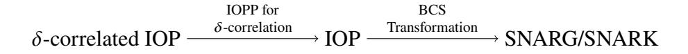

# Fiat-Shamir Security of FRI and Related SNARKs

Alexander R. Block1,2, Albert Garreta3,6, Jonathan Katz2 , Justin Thaler1,5, Pratyush Ranjan Tiwari4 , and Michał Zając3

> 1Georgetown University, justin.thaler@georgetown.edu 2University of Maryland, {alexander.r.block,jkatz2}@gmail.com 3Nethermind, {albert,michal}@nethermind.io 4 Johns Hopkins University, pratyush@cs.jhu.edu 5 a16z crypto research 6Basque Center of Applied Mathematics (BCAM)

> > Thursday 15th February, 2024

### **Abstract**

We establish new results on the Fiat-Shamir (FS) security of several protocols that are widely used in practice, and we provide general tools for establishing similar results for others. More precisely, we: (1) prove the FS security of the FRI and batched FRI protocols; (2) analyze a general class of protocols, which we call *-correlated*, that use low-degree proximity testing as a subroutine (this includes many "Plonk-like" protocols (e.g., Plonky2 and Redshift), ethSTARK, RISC Zero, etc.); and (3) prove FS security of the aforementioned "Plonk-like" protocols, and sketch how to prove the same for the others.

We obtain our first result by analyzing the round-by-round (RBR) soundness and RBR knowledge soundness of FRI. For the second result, we prove that if a -correlated protocol is RBR (knowledge) sound under the assumption that adversaries always send low-degree polynomials, then it is RBR (knowledge) sound in general. Equipped with this tool, we prove our third result by formally showing that "Plonk-like" protocols are RBR (knowledge) sound under the assumption that adversaries always send low-degree polynomials. We then outline analogous arguments for the remainder of the aforementioned protocols.

To the best of our knowledge, ours is the first formal analysis of the Fiat-Shamir security of FRI and widely deployed protocols that invoke it.

# **1 Introduction**

Succinct Non-interactive ARguments of Knowledge (SNARKs) and their zero-knowledge variants (zkSNARKs) are a thriving field of study both in theory and practice. Allowing for fast verification of complex statements made by untrusted parties, zkSNARKs have now been deployed in a myriad of applications. A popular paradigm for constructing (zk)SNARKs is via the following two-step process: (1) construct a public-coin[1](#page-0-0) interactive protocol and (2) remove all interaction using the Fiat-Shamir (FS) transformation [\[FS87\]](#page-59-0), adding zero-knowledge as necessary.

Non-interactivity is essential in many applications of zkSNARKs. In general, interactive protocols are not publicly verifiable and hence cannot be used in settings where anyone in the world should be able to verify the proof. There are various proposals (e.g., [\[BBHR18b\]](#page-57-0)) to render interactive protocols publicly verifiable using so-called randomness beacons [\[Rab83\]](#page-61-0) (i.e., publicly verifiable sources of random bits, such as contents blockchain block headers) and the transaction-ordering functionality offered by public blockchains (which enable the public to verify that the prover sent a

1A protocol is *public-coin* if all messages sent by the verifier are sampled uniformly at random from a challenge space and are independent of all prior prover and verifier messages.

message before it knew what the verifier's response to that message would be). However, to the best of our knowledge, such proposals have not been deployed at scale. They are also fraught with performance and security considerations; for example, blockchain headers are at least somewhat biasable [PW18, BCG15], and splitting an interactive proof across many blockchain blocks can substantially increase latency and fees.

Regardless, the Fiat-Shamir transformation is pervasive and has been used extensively in a variety of schemes beyond zkSNARKs; e.g., signature schemes and non-interactive zero-knowledge [FS87, PS96, Mic00], inspiring a rich line of research into understanding both its applicability and pitfalls. The FS transformation is typically modeled and analyzed in the random oracle model (ROM) for security proofs. When using FS in practice, one then assumes that a suitable concrete hash function (e.g., SHA256) is an adequate replacement for said random oracle.

However, there are surprisingly many open problems regarding specific applications of the FS transformation. In particular, the FS transformation is *not* secure in general [Bar01, GK03, BDG $^+$ 13], even in the random oracle model, when applied to many-round protocols. Specifically, its use can lead to a loss in the number of "bits of security" that is linear in the number of rounds r of the protocol to which it is applied. Here, the number of bits of security roughly refers to the logarithm of the amount of work an attacker has to do to succeed with probability close to 1.

Accordingly, the FS transformation is often applied to many-round protocols without formal security proofs for the resulting SNARKs' security. That is, the security analysis of these protocols is often provided only for their interactive versions. Without further analysis, the security (measured in bits) lost via the FS transformation may be a factor equal to the number of rounds of the protocol. Even a 30% loss in security would be devastating in practical deployments (e.g., reducing the number of bits of security from 100 down to 70), and (more than) such a loss can occur even when Fiat-Shamir is applied to protocols with just two rounds. There are also some works that claim FS-security of their protocols, but in fact show this only under the assumption that certain many-round sub-protocols used in the overall protocol are FS-secure [CMS19, COS20, KPV22].

In this work, we fill this gap in these security analyses and provide general tools for doing so for certain varieties of protocols. Specifically, we show that for the protocols we are interested in, the security of the FS-transformed protocol resembles the security of the interactive one (pre-FS) (or more precisely, *what is currently known* about the interactive security). This adds to a recent fruitful line of work has introduced many tools to understand FS security of many-round protocols. These include the notions of state-restoration soundness [BCS16], round-by-round soundness [CCH+19], and (generalized) special soundness [CDS94, Wik21, AFK22]. Nonetheless, in the literature on SNARKs, relatively few protocols are known to be FS-secure, despite the above tools existing. These include the GKR protocol [GKR08, CCH+19] (or more generally, anything based on the sum-check protocol [LFKN92]), the GMW protocol and other natural classes of "commit-and-open" protocols [HLR21], and any protocol satisfying the notion of (generalized) special soundness [AFK22], which includes IPA/Bulletproofs [BCC+16, BBB+18]. Bulletproofs [BCC+16, BBB+18] and Sonic [MBKM19] have separately been shown to be FS-secure in the algebraic group model [GT21].

In this introduction, we informally refer to protocols that experience little-to-no loss in the number of bits of security when the FS transformation is applied in the random oracle model as *FS-secure*.

### 1.1 Our Results

We formally analyze and prove FS-security of the FRI protocol [BBHR18a] and of some protocols that have wide use in practice which use low-degree proximity testing as a subroutine. For the latter, we build a general tool that allows us to prove FS-security of a certain type of protocol, which we call a  $\delta$ -correlated IOP, by analyzing its round-by-round soundness assuming an adversary sends low-degree polynomials. We formally apply this tool to "Plonk-like" protocols such as Plonky2 [Polb], and we outline how the tool can be used on other constructions such as ethSTARK [Sta23]. In particular, we either formally prove or we outline a proof that the security of all these protocols, after applying the Fiat-Shamir transformation, (nearly) matches what is known about its security when run interactively.

As mentioned, we focus on these protocols due to their current popularity. For example, FRI is currently used in various Layer-2 Ethereum projects [Sta, Pola] to help secure hundreds of millions of dollars of assets [L2B]. Some projects are deploying FRI with (at most) 80-bits (dYdX) or 96-bits (those using the SHARP prover) of *interactive security* before the FS transformation is applied [BCI+20, Sta23, Sta]. More precisely, the *best known attacks* on these interactive protocols have success probability 2-80 or 2-96. These attacks are conjectured to be optimal [Sta23], though only partial results in this direction are known [BCI+20]. Similarly, Plonk-like protocols are utilized in a variety of

blockchain networks and Layer 2 Ethereum projects (e.g., [Min, Mat, Dus, =ni, Suc]),

When it comes to the FRI protocol, we *do not* address the gaps between the conjectured and known soundness of the interactive protocol. We merely analyze the security of the FS-compiled protocol as a function of the security of the interactive protocol.

# 1.2 Technical Details

In a nutshell, we formally establish the *round-by-round* (*knowledge*) *soundness* [CCH+19] of both FRI and several protocols that rely on a form of low-degree proximity testing. For analyzing round-by-round (RBR) soundness, there is a protocol *state* function that can either be "doomed" or not. The state of the protocol starts off as doomed whenever a prover falsely claims that an input is valid. If at the end of interaction the state is doomed, the verifier rejects. The protocol is said to be RBR sound if, whenever the state is doomed, the protocol is still doomed in the next round of interaction, except with negligible probability, no matter what a prover does. RBR knowledge soundness is a similar notion, except that in this case, the protocol always starts off in a doomed state, and after each round, except with negligible probability, it remains doomed unless the prover knows a valid witness; see Section 2.1 for more discussion.

By establishing the round-by-round (knowledge) soundness of these protocols, we can then leverage the so-called BCS transformation [BCS16], which (informally) compiles any interactive protocol2 into a (zk)SNARK via (a variant of) the Fiat-Shamir transformation in the random oracle model. Applying the BCS transformation on a round-by-round (knowledge) sound protocol preserves (knowledge) soundness (yielding a SNARK) [COS20, CMS19].3 In fact, round-by-round soundness of the interactive protocol was even shown to imply that the BCS-transformed SNARK is secure against quantum adversaries [CMS19]. Thus, we establish the Fiat-Shamir security of both FRI and the rest of protocols via proving their round-by-round (knowledge) soundness.

#### 1.2.1 Round-by-round Soundness of FRI

The FRI protocol [BBHR18a], which stands for Fast Reed-Solomon Interactive Oracle Proof of Proximity is a logarithmic round *interactive oracle proof*. Briefly, an interactive oracle proof (IOP) [BCS16] is an interactive protocol where the verifier is given oracle (i.e., query) access to the (long) prover messages, and an IOP of Proximity (IOPP) is an IOP for proving proximity of a function to some pre-specified linear error-correcting code [BBHR18a]. The FRI protocol proves that a function is close to the space of Reed-Solomon codewords [RS60] of a certain degree over some pre-specified domain over a finite field. This protocol is both of theoretical and practical interest. On the theory side, FRI gives a polylogarithmic-size proof for proving the proximity of messages to some pre-specified Reed-Solomon code, which is an important primitive in many proof systems [BBHR18a]. On the practical side, FRI is used as a sub-protocol in the design and construction of many SNARKs and has the benefit of being plausibly post-quantum secure due to its avoidance of elliptic curve cryptography (and in fact, it follows from our results that FRI, when run non-interactively via Fiat-Shamir, is unconditionally secure in the quantum random oracle model).

Despite intense interest from both theorists and practitioners, we are unaware of any formal security proof for FRI under Fiat-Shamir.

**Theorem 1.1** (Informally Stated; see Theorem 4.1). For finite field  $\mathbb{F}$ , evaluation domain  $L \subset \mathbb{F}$  of size  $2^n$ , constants  $\rho \in (0,1)$ ,  $\delta \in (0,1-\sqrt{\rho})$ , and positive integer  $\ell$ , the FRI protocol has round-by-round (knowledge) soundness error

$$\varepsilon_{\mathsf{rbr}}^{\mathsf{FRI}}(\mathbb{F},\rho,\delta,n,\ell) = \max\{O(2^{2n}/(\rho^{3/2}|\mathbb{F}|)), (1-\delta)^{\ell}\}.$$

Establishing the round-by-round (knowledge) soundness of FRI is a crucial first step to establishing the Fiat-Shamir security of FRI. In particular, given the round-by-round soundness of FRI, we can now apply the BCS transformation [BCS16] to obtain a secure non-interactive argument in the random oracle model using FRI.

**Corollary 1.2** (Informally Stated; see Corollary 4.3). For finite field  $\mathbb{F}$ , evaluation domain  $L \subset \mathbb{F}$  of size  $2^n$ , constants  $\rho \in (0,1)$ ,  $\delta \in (0,1-\sqrt{\rho})$ , and positive integer  $\ell$ , given a random oracle with  $\kappa$ -bits of output and query bound  $Q \ge 1$ ,

&lt;sup>2More formally, the BCS transformation is applied to *interactive oracle proofs* [BCS16].

&lt;sup>3Actually, [BCS16, CMS19] prove this for *state-restoration soundness*; however, subsequent works observed that round-by-round soundness is an upper bound on state-restoration soundness [CCH+19, CMS19, COS20, KPV22].

compiling FRI with the BCS transformation yields a non-interactive argument in the random oracle model with adaptive soundness error and knowledge error

$$\varepsilon_{\mathsf{fs}}^{\mathsf{FRI}}(\mathbb{F},\rho,\delta,n,\ell,Q,\kappa) = Q\varepsilon_{\mathsf{rbr}}^{\mathsf{FRI}}(\mathbb{F},\rho,\delta,n,\ell) + O(Q^2/2^\kappa).$$

Moreover, the transformed non-interactive argument has adaptive soundness error and knowledge error  $\Theta(Q \cdot \varepsilon_{\mathsf{fs}}^{\mathsf{FRI}}(\mathbb{F}, \rho, \delta, n, \ell, Q))$  against O(Q)-query quantum adversaries.

**Extension to Batched FRI.** In practice, it is common to run a *Batched FRI* protocol, which allows a prover to simultaneously prove the  $\delta$ -correlated agreement4 of t functions  $f_1, \ldots, f_t$  by running the FRI protocol on the batched function  $G = \sum_i \alpha_i f_i$  for randomly sampled  $\alpha_i$  provided by the verifier. We extend our analysis of FRI to this version of Batched FRI and establish its round-by-round (knowledge) soundness.

**Theorem 1.3** (Informally Stated, see Theorem 4.2). For finite field  $\mathbb{F}$ , evaluation domain  $L \subset \mathbb{F}$  of size  $2^n$ , constants  $\rho \in (0,1)$ ,  $\delta \in (0,1-\sqrt{\rho})$ , and positive integers  $\ell$ ,  $\ell$ , the Batched FRI protocol has round-by-round (knowledge) soundness error

$$\varepsilon_{\text{rbr}}^{\text{bFRI}}(\mathbb{F}, \rho, \delta, n, \ell, t) = \max\{O((2^{2n})/(\rho^{3/2}|\mathbb{F}|)), (1-\delta)^{\ell}\}.$$

As before, establishing round-by-round soundness allows us to securely apply the BCS transformation, obtaining a non-interactive argument in the random oracle model.

**Corollary 1.4** (Informally Stated; see Corollary 4.4). For finite field  $\mathbb{F}$ , evaluation domain  $L \subset \mathbb{F}$  of size  $2^n$ , constants  $\rho \in (0,1)$ ,  $\delta \in (0,1-\sqrt{\rho})$ , and positive integers  $\ell$ ,  $\ell$ , given a random oracle with  $\kappa$ -bits of output and query bound  $Q \geq 1$ , compiling Batched FRI with the BCS transformation yields a non-interactive argument in the random oracle model with adaptive soundness error and knowledge error

$$\varepsilon_{\mathsf{fs}}^{\mathsf{bFRI}}(\mathbb{F},\rho,\delta,n,\ell,t,Q,\kappa) = Q \cdot \varepsilon_{\mathsf{rbr}}^{\mathsf{bFRI}}(\mathbb{F},\rho,\delta,n,\ell,t) + O(Q^2/2^{\kappa}).$$

Moreover, the transformed non-interactive argument has adaptive soundness error and knowledge error  $\Theta(Q \cdot \varepsilon_{\mathsf{fs}}^{\mathsf{bFRI}}(\mathbb{F}, \rho, \delta, n, \ell, t, Q, \kappa))$  against O(Q)-query quantum adversaries.

To the best of our knowledge, our results are the first to establish the security of non-interactive analogs of FRI and Batched FRI in the random oracle model.

A Variant of Batched FRI. To save on communication costs, a variant of Batched FRI is sometimes used, where the batched function G has the form  $G = \sum_i \alpha^{i-1} f_i$ , where  $\alpha$  is a randomly sampled challenge sent by the verifier. In both the context of regular soundness and round-by-round soundness, this version of Batched FRI incurs some soundness loss proportional to t. In particular, in Theorem 1.3, the round-by-round soundness error for this Batched FRI protocol is  $\varepsilon_{\text{rbr}}^{\text{bFRI}}(\mathbb{F}, \rho, \delta, n, \ell, t) = \max\{O((2^{2n} \cdot t)/(\rho^{3/2}|\mathbb{F}|)), (1-\delta)^{\ell}\}$ ; see Section 5.2 for details.

**Round-by-round Soundness Error versus Standard Soundness Error of FRI.** Ben-Sasson et al. [BCI+20] give the best known provable soundness bounds for (Batched) FRI; in fact, we leverage many tools from their results to show our round-by-round soundness bounds. Roughly speaking, [BCI+20] show that the soundness error of (Batched) FRI is  $\varepsilon_1 + \varepsilon_2 + \varepsilon_3$ , where

$$\varepsilon_1 = O(2^{2n}/(\rho^{3/2}|\mathbb{F}|)) \qquad \qquad \varepsilon_2 = O((2^n \cdot n\sqrt{\rho})/|\mathbb{F}|) \qquad \qquad \varepsilon_3 = (1-\delta)^{\ell}.$$

Then our RBR soundness bound for (Batched) FRI is given by  $\max\{\varepsilon_1, \varepsilon_3\}$ .

**Round-by-round Knowledge Error.** Both FRI and Batched FRI additionally have *round-by-round knowledge error* [CMS19, COS20, KPV22] identical to the round-by-round soundness errors given in Theorems 1.1 and 1.3. The BCS transformation preserves this type of knowledge soundness, yielding a SNARK. See Section 2.1 for more discussion.

&lt;sup>4Informally speaking, functions have  $\delta$ -correlated agreement if they are all  $\delta$ -close to some pre-specified Reed-Solomon code and the agreement set is the same among all functions; see Definition 3.2.

#### 1.2.2 A General Tool for Proving RBR (Knowledge) Soundness

We go on to analyze proof systems that rely on the FRI protocol as a subroutine. To this end, we introduce a family of IOPs which we call  $\delta$ -correlated IOPs, where  $\delta \geq 0$  is a parameter. This family encompasses all of the aforementioned protocols. In a nutshell, we say an IOP is  $\delta$ -correlated if the prover is supposed to send oracles to maps that are  $\delta$ -close to low-degree polynomials in a *correlated* manner. Correlation here means that the domain where these maps agree with low-degree polynomials is the same among all the maps. In a  $\delta$ -correlated IOP, during the verification phase, the verifier: (1) checks some algebraic equalities involving some evaluations of these maps; and (2) verifies that all the received oracles correspond indeed to  $\delta$ -correlated maps (we assume the verifier has another oracle to perform this check). When  $\delta = 0$ , a  $\delta$ -correlated IOPs can be seen as a subclass of RS-encoded IOPs [BCR+19, COS20]. We refer to Appendix B for further comparison.

This points to a "recipe" for building a particular family of SNARKs: first, construct a  $\delta$ -correlated IOP; then, instantiate the check for  $\delta$ -correlation using an interactive protocol, e.g., batched FRI [BCI+20]. This produces an IOP as a result. Finally, use the aforementioned BCS transformation on this IOP to produce a non-interactive succinct argument. If this argument is knowledge sound, one has obtained a SNARK. Figure 1 summarizes this construction. It is immediate to see that the previously mentioned protocols (Plonky2, RISC Zero, ethSTARKs, etc.) are actual instantiations of this construction.

Figure 1: A recipe for building a succinct non-interactive argument.

We then provide general results for proving that the resulting succinct non-interactive argument is knowledge sound. Precisely, we prove the following:

- 1. **RBR soundness of batched FRI.** As a general result, we prove that the (batched) FRI protocol is RBR sound and RBR knowledge sound. We remark that batched FRI can be used for checking  $\delta$ -correlated agreement of a collection of maps [BCI+20].
- 2. From RBR knowledge when the adversary sends low degree polynomials, to general RBR knowledge. Consider a  $\delta$ -correlated IOP  $\Pi$ , and suppose attackers always send oracles to low degree polynomials. We prove that if  $\Pi$  is RBR (knowledge) sound under this assumption, then it is also RBR (knowledge) sound in general, and that the soundness error only increases by a (relatively) small factor.
- 3. From a RBR knowledge sound  $\delta$ -correlated IOP to a RBR knowledge sound IOP. Again let  $\Pi$  be a  $\delta$ -correlated IOP. By using an interactive protocol  $\Pi_{CA}$  to check for  $\delta$ -correlation,  $\Pi$  can be turned into a regular IOP  $\Pi_{compiled}$ . We prove that this compilation preserves RBR (knowledge) soundness, assuming  $\Pi_{CA}$  is RBR sound (not necessarily RBR knowledge sound).
- 4. From a RBR knowledge sound IOP to a SNARK. We then apply the BCS compilation results from [BCS16] to obtain a SNARK.

In conclusion, we show that given any succinct non-interactive argument constructed as in Figure 1 (using batched FRI to check for  $\delta$ -correlation), one can show its knowledge soundness simply by proving RBR knowledge soundness of the underlying  $\delta$ -correlated IOP *under the assumption that the adversary is constrained to sending oracles to low-degree polynomials*. The latter can greatly simplify the analysis since it allows one to work with the simplicity of IOPs (as opposed to arguments) and the convenient properties of polynomials.

Thus, our methods not only allow us to prove FS-security, they also remove the complexity of dealing with maps that are close to low-degree polynomials when using FRI within a protocol. This allows us to analyze the interactive version of these protocols in a similar way as when one studies *Polynomial* IOPs [BFS20], where, by definition, soundness is only considered for adversaries that send low-degree polynomials.

According to our formalism, a  $\delta$ -correlated IOP where we constrain adversaries to always send low-degree polynomials is in fact a 0-correlated IOP. Then, Item (2) above can be seen as a result that relates the RBR knowledge soundness of a  $\delta$ -correlated IOP for  $\delta = 0$  and for  $\delta > 0$ . Overall, our security results can be organized and depicted as in Figure 2; see also Theorem 1.5.

$$\begin{array}{c|ccccccccccccccccccccccccccccccccccc$$

Figure 2: Another recipe for building a SNARG/SNARK.

**Theorem 1.5** (Informally Stated, see Theorem 4.6). Let  $\Pi_{\delta}^{O}$  be a  $\delta$ -correlated IOP, where O is an oracle for  $\delta$ -correlated agreement. Let  $0 < \rho, \eta \le 1$  and  $\delta = 1 - \sqrt{\rho} - \eta$ . Assume  $\Pi_{0}$  has RBR knowledge soundness with error  $\varepsilon$ . Then  $\Pi_{\delta}$  has RBR knowledge soundness with error  $\varepsilon/(2\sqrt{\rho\eta})$ .

Moreover, if  $\Pi'$  is an IOP for testing  $\delta$ -correlated agreement in a Reed-Solomon code with RBR soundness error  $\varepsilon'$ , then the protocol  $\Pi_{\text{compiled}}$  obtained by replacing O in  $\Pi_{\delta}$  with  $\Pi'$  has RBR knowledge soundness with error

$$\varepsilon_{\text{compiled}} = \max\{\varepsilon/(2\sqrt{\rho}\eta), \varepsilon'\}.$$

Finally, given a random oracle with  $\kappa$ -bits of output and query bound  $Q \ge 1$ , compiling  $\Pi_{\text{compiled}}$  with the BCS transformation yields a succinct non-interactive argument in the random oracle model with knowledge error

$$Q \cdot \max\{\varepsilon/(2\sqrt{\rho}\eta), \varepsilon'\} + O(Q^2/2^{\kappa}).$$

Remark 1.6. As we mentioned, the notion of δ-correlated IOP is closely related to that of RS-encoded IOP from [BCR+19, COS20]. The works of [BCR+19, COS20] also provide a method for compiling a RBR (knowledge) sound RS-encoded IOP into RBR (knowledge sound IOPs); e.g., see [COS20, Theorem 8.2]. However, our result allows to use a proximity parameter up to the Johnson bound, i.e., we can select  $\delta = 1 - \sqrt{\rho} - \eta$  for any arbitrarily small  $\eta > 0$ , while the compilation results from [BCR+19, COS20] constrain δ to be within the unique decoding radius  $\delta < \frac{1-\rho}{2}$ . On the other hand, in some sense, RS-encoded IOPs encompass a wider class of protocols than δ-correlated ones. See Appendix B for further discussion.

Remark 1.7. Many security analyses of SNARKs obtained by combining Plonk-like protocols with so-called KZG polynomial commitments [KZG10] can assume that an adversary always sends oracles to polynomials of appropriate degree. Intuitively, this is due to the fact that the KZG polynomial commitment scheme ensures that a committed function is indeed a polynomial of appropriate degree.

However, in our scenario, due to the usage of the FRI protocol instead of KZG, adversaries are only constrained to sending (oracles to) maps that are *close to* polynomials of appropriate degree. This makes the soundness analysis of our protocols more subtle. Indeed, as we mentioned, besides showing that FRI itself is RBR sound, most of our work is concerned with reducing the analysis to the case when the adversary actually sends oracles to polynomials of the appropriate degree.

#### 1.2.3 Round-by-round Soundness of Specific $\delta$ -correlated Proof Systems

We can apply all the tools developed so far to specific protocols whose construction follows the outline from Figures 1 and 2. In short, these are protocols resulting of compiling a  $\delta$ -correlated IOP into a succinct non-interactive protocol via a protocol for  $\delta$ -correlated agreement and the BCS transformation. Thanks to Theorems 1.3 and 1.5, we can prove the knowledge soundness of these protocols just by proving that the corresponding 0-correlated IOP has RBR knowledge soundness. Recall that in a 0-correlated IOP, the adversary is assumed to always send oracles to low-degree polynomials.

Some of the protocols that fit into this framework are many "Plonk-like" proof systems that use FRI instead of the KZG polynomial commitment scheme; Plonky2 [Polb], Redshift [KPV22], and RISC Zero [Tea23] are examples. Here we use the term "Plonk-like" to loosely refer to protocols that use an interactive permutation argument

[Lip89, Lip90, BEG+94, ZGK+18, BCG+18] as a subroutine (we use the term "Plonk-like" because the Plonk SNARK [GWC19] helped popularize the use of this permutation-checking procedure). Other protocols that fit in our framework but are not "Plonk-like" are ethSTARK or DEEP-ALI [BGKS20].

We focus our attention mostly on Plonky2 since we believe that, among all these protocols in 0-correlated IOP form, Plonky2 is the most involved to analyze. Indeed, Plonky2 was designed to be used over a small field (the 64-bit so-called Goldilocks field). Because of this, some checks are repeated in parallel in order to increase its security. The task of correctly designing these parallel repetitions is subtle, and indeed in Appendix C we describe an (arguably more natural) variation of Plonky2 with dramatically less security than Plonky2 itself. To the best of our knowledge, this variation is not used in practice—we are showcasing it here to illustrate a potential pitfall to be avoided.

Accordingly, we rigorously define a general "Plonk-like"  $\delta$ -correlated IOP, which captures many "Plonk-like" protocols that rely on the FRI protocol. We denote this  $\delta$ -correlated IOP by OPlonky( $\delta$ ). We then formally prove that when  $\delta = 0$  (i.e., when adversaries are constrained to sending low-degree polynomials), OPlonky(0) has RBR soundness and knowledge soundness. Together with our general results and our results on batched FRI, this proves in particular that the SNARK version of Plonky2 is indeed knowledge sound (as well as all other "Plonk-like" protocols of the form  $OPlonky(\delta)$ ). Adapting Theorem 1.5 to our abstraction OPlonky, we obtain the following result.

**Theorem 1.8** (Informally Stated, see Lemmas 4.7 and 4.9). Let  $\mathbb{F}$  be a finite field and  $\mathbb{K}$  be a finite extension of  $\mathbb{F}$  and let  $D \subseteq \mathbb{F}$  be an evaluation domain for maps. Let  $\mathcal{P} = \{P_1, \dots, P_k\}$  be a list of  $2r + \ell$ -variate circuit constraint polynomials over  $\mathbb{F}$  for  $k, r, \ell \geq 1$ . For parameters  $n, t, u \geq 1$ ,  $s = \lceil r/u \rceil$ , and  $m \geq 3$ ,  $\rho = (n+1)/|D| \in (0,1), \eta \in (0,\sqrt{\rho}/2m)$ and  $\delta = 1 - \sqrt{\rho} - \eta$ , the protocol OPlonkyO, when the verifier is given an oracle O for  $\delta$ -correlated agreement in the *Reed-Solomon code*  $RS[\mathbb{F}, D, n+1]$ , has round-by-round soundness error

$$\varepsilon_{\mathsf{rbr}}^{\mathsf{OPlonky},\mathcal{O}}(\mathbb{F},\mathbb{K},D,n,k,r,s,t,u,d,\rho,\eta) = \frac{1}{2\eta\sqrt{\rho}} \cdot \max\left\{O\left(\left(\frac{n(r+u)}{|\mathbb{F}|}\right)^t\right),O\left(\left(\frac{k+st}{|\mathbb{F}|}\right)^t\right),\frac{n \cdot \max\{u+1,d\}}{|\mathbb{K}\setminus D|}\right\},$$

where  $d = \max_i \{ \deg(P_i) \}$  and D is an evaluation domain for RS codes. Moreover, when  $\delta = 0$  then we have

$$\varepsilon_{\mathsf{rbr}}^{\mathsf{OPlonky},O}(\mathbb{F},\mathbb{K},D,n,k,r,s,t,u,d,\rho,\eta) = \max\left\{O\left(\left(\frac{n(r+u)}{|\mathbb{F}|}\right)^t\right),O\left(\left(\frac{k+st}{|\mathbb{F}|}\right)^t\right),\frac{n\cdot \max\{u+1,d\}}{|\mathbb{K}\setminus D|}\right\}.$$

Remark 1.9. The parameter t in Theorem 1.8 controls the number of times certain checks in OPlonky are performed "in parallel". In most Plonk-like protocols, one uses t = 1 and a large field  $\mathbb{F}$  to ensure an adequate security level. However, some projects (e.g., Plonky2) currently feature a 64-bit field  $\mathbb{F}$ , and use t = 2 to increase security.

We show in this paper that, if done properly, the resulting FS-transformed protocol does achieve the targeted security level. However, in Appendix C we explain that this result is surprisingly subtle: certain natural ways of implementing the t-fold repetition actually result in RBR security (and, correspondingly, the post-FS security [AFK22]) that is much lower than the one attained in Theorem 1.8. While (to our knowledge) all existing projects do implement the t-fold repetition properly so as to ensure FS-security, we highlight this subtlety so that protocol designers continue to avoid this potential pitfall.

We can instantiate the oracle O in Theorem 1.8 with Batched FRI and obtain the following result.

**Theorem 1.10** (Informally Stated, see Theorem 4.10). Let  $\mathbb{F}$  be a finite field,  $\mathbb{K}$  be a finite extension of  $\mathbb{F}$ , and  $D \subset \mathbb{F}^*$ . Let  $\mathcal{P} = \{P_1, \dots, P_k\}$  be a list of  $2r + \ell$ -variate circuit constraint polynomials over  $\mathbb{F}$  for  $k, r, \ell, n \geq 1$ . For integer  $u \ge 1$ ,  $s = \lceil r/u \rceil$ , and parameters  $\rho, \eta > 0$ ,  $\delta = 1 - \sqrt{\rho} - \eta$ , and  $N, q \ge 1$ , the protocol OPlonky composed with Batched FRI (replacing O) has round-by-round soundness error:

$$\begin{split} \varepsilon_{\mathsf{rbr}}^{\mathsf{OPlonky}}(\mathbb{F}, \mathbb{K}, D, n, k, r, s, t, u, d, \rho, \eta, N, q) \\ &= \max\{\varepsilon_{\mathsf{rbr}}^{\mathsf{OPlonky}, O}(\mathbb{F}, \mathbb{K}, D, n, k, r, s, t, u, d, \rho, \eta), \varepsilon_{\mathsf{rbr}}^{\mathsf{bFRI}}(\mathbb{F}, D, \rho, \delta, N, q)\}, \end{split}$$

where  $d = \max_{i} \{ \deg(P_i) \}$ .

Given the above protocol is a round-by-round sound IOP, as in Theorem 1.5, we can now apply the BCS transformation to obtain a secure non-interactive argument in the random oracle model.

**Corollary 1.11** (Informally Stated; see Corollary 7.6). Let  $\mathbb{F}$  be a finite field,  $\mathbb{K}$  be a finite extension of  $\mathbb{F}$ , and  $D \subset \mathbb{F}^*$ . Let  $\mathcal{P} = \{P_1, \dots, P_k\}$  be a list of  $2r + \ell$ -variate circuit constraint polynomials over  $\mathbb{F}$  for  $k, r, \ell, n \geq 1$ . For integers  $u, t \geq 1$ ,  $s = \lceil r/u \rceil$ , and parameters  $\rho, \eta > 0$ ,  $\delta = 1 - \sqrt{\rho} - \eta$ , and  $N, q \geq 1$ , given a random oracle with  $\kappa$ -bits of output and a query bound  $Q \geq 1$ , using the BCS transformation to compile OPlonky composed with Batched FRI yields a non-interactive argument in the random oracle model with adaptive soundness error and knowledge error

$$\varepsilon_{\mathsf{fs}}^{\mathsf{OPlonky}}(\mathbb{F},\mathbb{K},D,n,k,r,s,t,u,d,\rho,\eta,N,q,\kappa,Q) = Q\varepsilon_{\mathsf{rbr}}^{\mathsf{OPlonky}}(\mathbb{F},\mathbb{K},D,n,k,r,s,t,u,d,\rho,\eta,N,q) + O(Q^2/2^{\kappa}),$$

where  $d = \max_i \{ \deg(P_i) \}$ . Moreover, the the transformed non-interactive argument has adaptive soundness error and knowledge error

$$\Theta(Q \cdot \varepsilon_{\mathsf{fs}}^{\mathsf{OPlonky}}(\mathbb{F}, \mathbb{K}, D, n, k, r, s, t, u, d, \rho, \eta, N, q, \kappa, Q))$$

versus O(Q)-query quantum adversaries.

Remark 1.12. We stress that the above theorems do not imply anything for the original work of Plonk [GWC19], or any other Plonk variants that utilize the so-called KZG polynomial commitment scheme [KZG10] as their low-degree test. The tools we leverage to show Fiat-Shamir security of our protocols rely on the low-degree test also being an IOP or an IOP of Proximity, which the KZG scheme is not. While it is likely one can extend our analysis to handle using the KZG scheme, we do not explore that direction in this work.

**RISC Zero and ethSTARK.** When it comes to RISC Zero and ethSTARK, we sketch why their 0-correlated formulations have RBR knowledge soundness, as opposed to fully formally proving these facts. We do that due to brevity (since formally describing these protocols is a lengthy task), and because proving that these 0-correlated IOPs are RBR knowledge sound is a relatively straightforward task, as our analysis of OPlonky indicates. Moreover, RISC Zero's whitepaper is in draft form at the moment of writing [Tea23]. We hope practitioners can follow the techniques and ideas exposed in this paper to prove in a relatively simple way that their SNARKs are indeed FS-secure.

### 1.3 Additional Related Work

**Concurrent Independent Work.** As concurrent work, StarkWare has updated ethSTARK documentation to include a proof of Fiat-Shamir security of FRI and ethSTARK [Sta23]. Their techniques can be seen as an instantiation of our general framework. As pointed out in [Sta23, Remark 5], since our techniques are more general, they can be used to prove FS security of many protocols (as demonstrated in this work). On the other hand, [Sta23] performs a more fine-grained analysis of the later rounds of FRI and of the usage of grinding within it.

**Fiat-Shamir.** The Fiat-Shamir (FS) transform [FS87] has been studied and used extensively to remove interaction from interactive protocols. While it is known that the FS transformation is secure when applied to sound protocols with a constant number of rounds in the random oracle model (ROM) [FS87, PS96, AABN02], it is well-known that there exist protocols that are secure under FS in the ROM but insecure for *any* concrete instantiation of the random oracle [Bar01, GK03, BDG+13]. Furthermore, several natural classes of secure interactive protocols are rendered insecure when applying FS (e.g., sequential repetition of a protocol and parallel repetition of certain protocols) [CCH+19, Wik21, AFK22], and real-world implementations of FS are often done incorrectly, leading to vulnerabilities [BPW12, DMWG23]. Despite this, Fiat-Shamir is widely deployed and is a critical component in the majority of SNARG or SNARK constructions.

Recent work has extensively studied which protocols can be securely instantiated under Fiat-Shamir (either in the ROM or using suitable hash-function families). As mentioned before, the general tools of state-restoration soundness [BCS16], round-by-round soundness [CCH+19], and special soundness [CDS94, Wik21, AFK22] have been introduced as soundness notions that "behave nicely" under Fiat-Shamir. Prior to these tools, a variety of works [KRR17, CCRR18, HL18] circumvented the impossibility results of [BDG+13] by utilizing stronger hardness assumptions to construct Fiat-Shamir compatible hash function families. Another line of work [GKR08, CMT12, BCGT13, Tha13, BTVW14, WTs+18, Set20, RR20] follows the frameworks of Kilian [Kil92] and Micali [Mic94] to compile interactive oracle proofs [BCS16] into efficient arguments and SNARKs via collision-resistant hash functions [BCS16, Kil92] or in the random oracle model [BCS16, Mic94].

# **1.4 Organization**

In [Section 2,](#page-8-1) we give an overview of our main technical results. [Section 3](#page-20-1) contains the preliminaries for the rest of the paper. [Section 4](#page-26-1) presents our main results in full detail. [Section 5](#page-29-2) formally discusses and proves our results related to FRI and Batched FRI. In [Section 6,](#page-40-0) we introduce a new notion for holographic interactive oracle proofs we call *-correlated holographic interactive oracle proofs*, a technical tool we use in [Section 6.](#page-40-0) In [Section 7](#page-47-0) we formally describe and establish the round-by-round soundness of OPlonky, utilize the tools in [Section 6](#page-40-0) to establish round-by-round soundness of OPlonky composed with (Batched) FRI, and discuss several Plonk-like protocols affected by our analysis. Finally, [Section 8](#page-56-0) discusses some future directions.

In [Appendix A,](#page-62-0) we formally analyze the concrete security of the non-interactive FRI protocol under various parameter settings, and in [Appendix B](#page-84-0) we briefly discuss the relationship between -correlated hIOPs and Reed-Solomon encoded IOPs. In [Appendix C](#page-85-0) we discuss a subtle variation of OPlonky that leads to a much larger RBR soundness error. This variation has to do in the way some "parallel" checks are performed.

# **2 Technical Overview**

Our main technical contributions are two-fold. First, formally proving the round-by-round (knowledge) soundness of the FRI protocol. Second, building a general tool for proving RBR (knowledge) soundness of a family of protocols that we call -correlated IOPs, and actually proving or outlining a proof of this soundness property for some specific protocols, like some "Plonk-type" protocols, which we summarize in a general protocol that we call OPlonky, and other -correlated IOPs like ethSTARK. We give a high-level overview of these results here. In [Section 2.1,](#page-8-0) we briefly discuss round-by-round soundness and its relation to Fiat-Shamir; in [Section 2.2,](#page-9-0) we give an overview of the round-by-round soundness of FRI and Batched FRI; in [Section 2.3,](#page-12-0) we introduce the concept of -correlated IOP and prove our general results about them; in [Section 2.4,](#page-15-0) we give an overview of the round-by-round (knowledge) soundness of OPlonky; in [Section 2.5,](#page-17-0) we discuss how a similar analysis can be conducted for the ethSTARK protocol.

# **2.1 Round-by-round Soundness and Fiat-Shamir**

Our tool of choice for establishing Fiat-Shamir security is *round-by-round soundness* [\[CCH](#page-58-2)+19]. Informally, a public-coin interactive protocol for a language is *round-by-round sound* (RBR sound) if at any point during the execution of the protocol, the protocol is in a well-defined state (depending on the protocol execution so far) and some of these states are "doomed", where being "doomed" means that no matter what message the prover sends, with overwhelming probability over the verifier messages, the protocol remains "doomed". A bit more formally, RBR soundness error states that: (1) if ∉ the initial state of the protocol is "doomed"; (2) if the protocol is in a "doomed" state during any non-final round of the protocol, then for any message sent by the prover, the protocol remains doomed with probability at least 1 − over the verifier messages; and (3) if the protocol terminates in a "doomed" state, then the verifier rejects. Chiesa et al. [\[CMS19\]](#page-58-1) et al. extend RBR soundness to the notion of *RBR knowledge soundness*, which roughly says that if (1) the protocol is in a "doomed" state during any round of interaction, and (2) *every* prover message can force the protocol to leave this "doomed" state with probability at least k (over the verifier randomness), then an extractor can efficiently extract a witness (with probability 1) simply by examining the current protocol state and the prover's next message.

Canetti et al. [\[CCH](#page-58-2)+19] introduced RBR soundness as a tool for showing Fiat-Shamir security of interactive proofs [\[GMR89\]](#page-59-11) when used in conjunction with a suitable family of correlation intractable hash functions [\[CGH04\]](#page-58-11). In particular, random oracles are correlation intractable when the set of "doomed" states of a protocol is sufficiently sparse; i.e., for small enough RBR soundness error. RBR soundness readily extends to the language of interactive oracle proofs (IOPs) [\[BCS16\]](#page-57-3), and hence the Fiat-Shamir compiler result of [\[CCH](#page-58-2)+19] readily extends to IOPs, and can be readily adapted to the random oracle model as well. However, applying this compiler to IOPs directly introduces some undesirable effects: the constructed non-interactive argument would have proof lengths proportional to the length of the oracle sent by the prover since the compiler of [\[CCH](#page-58-2)+19] does not compress prover messages in any way. This leads to long proofs and long verification times, negating any succinct verification the IOP may have had. Moreover, the

transformation of [CCH+19] says nothing about the knowledge soundness of the resulting non-interactive argument, even in the random oracle model.

While it is likely that, in the random oracle model, one could argue that the transformation of [CCH+19] retains knowledge soundness if the underlying IOP is RBR knowledge sound, we do not prove this fact; moreover, the loss of verifier succinctness is still an issue even if knowledge soundness is retained. Thus to circumvent the above issues, we utilize the BCS transformation [BCS16] for IOPs. Informally, the BCS transformation first compresses oracles sent by the prover using a Merkle tree [Mer] and then replaces any queries made by the verifier to prover oracles with additional rounds of interaction where the verifier asks the prover its queries, and the prover responds with said queries and Merkle authentication paths to verify consistency. It was shown that if an IOP is round-by-round sound then applying BCS to this IOP gives a SNARK in the random oracle model [CMS19, COS20]. Thus showing the RBR soundness of FRI and OPlonky allows us to readily show Fiat-Shamir security of these protocols under the BCS transformation in the random oracle model, yielding our results. Thus in what follows, we give a high-level overview of the round-by-round soundness proofs for both FRI and OPlonky.

# 2.2 Round-by-round Soundness of FRI

We give a high-level sketch of the round-by-round soundness of FRI in this section; for full details, see Section 5. As previously stated, FRI is an interactive oracle proof of proximity for testing whether or not a polynomial specified by a prover is "close to" a particular space of Reed-Solomon codewords. More formally, for finite field  $\mathbb{F}$ , multiplicative subgroup  $L_0 \subset \mathbb{F}^*$  of size  $N = 2^n$ , and degree bound  $d_0 = 2^k$  for  $k \in \mathbb{N}$ , RS := RS[ $\mathbb{F}$ ,  $L_0$ ,  $d_0$ ]  $\subset \mathbb{F}^N$  is the set of all polynomials  $f: L_0 \to \mathbb{F}$  of degree at most  $d_0 - 1$ , and the FRI protocol allows for a prover to succinctly prove to a verifier that a function  $G_0: L_0 \to \mathbb{F}$  is within some proximity bound  $\delta$  of the RS code. That is, if a verifier accepts the interaction, then the verifier is convinced that there exists  $f \in RS$  such that  $\Delta(G_0, f) < \delta N$ , where  $\Delta$  is the Hamming distance between  $G_0$  and f (when viewing them as vectors in  $\mathbb{F}^N$ ). We say that such a  $G_0$  is  $\delta$ -close to RS; otherwise, we say that  $G_0$  is  $\delta$ -far from RS (i.e.,  $\Delta(G_0, f) \geq \delta N$  for all  $f \in RS$ ).

To achieve succinct verification, the FRI protocol first interactively compresses  $G_0$  during a *folding phase*,5 which proceeds as follows. First, the prover sends oracle  $G_0$  to the verifier. Next, the verifier samples  $x_0 \stackrel{\$}{\leftarrow} \mathbb{F}$  uniformly at random and sends it to the verifier. Now the prover defines new oracle  $G_1: L_1 \to \mathbb{F}$  over the new domain  $L_1 = (L_0)^2 := \{z^2: z \in L_0\}$  of size N/2, where for any  $s \in L_1$ , if  $s', s'' \in L_0$  are the square roots of s, then we have

$$G_1(s) = (x_0 - s')(s'' - s')^{-1}G_0(s'') + (x_0 - s'')(s' - s'')^{-1}G_0(s').$$
(1)

Given  $G_1$ , the prover and verifier now recursively engage in the above folding procedure with the function  $G_1$ , where the claim is that  $G_1$  is  $\delta$ -close to a new Reed-Solomon code  $RS[\mathbb{F}, L_1, d_1]$  for  $d_1 = d_0/2$ ; this recursion continues until  $\log(d_0) = k$  folds have been done which results in prover oracles  $G_0, G_1, \ldots, G_{k-1}$  and verifier challenges  $x_0, x_1, \ldots, x_{k-1}$ .

After the folding phase, the prover and verifier now engage in the *query phase*. During this phase, the prover sends a constant value  $G_k \in \mathbb{F}$  to the verifier, and the verifier samples a random challenge  $s_0 \stackrel{s}{\leftarrow} L_0$  and uses this point to check the consistency of all pairs of functions  $G_{i-1}$ ,  $G_i$  for  $i \in \{1, \ldots, k\}$  as follows. The verifier first checks consistency of  $G_0$  and  $G_1$  using Eq. (1); in particular, if we set  $s_1 = (s_0)^2$  and let  $t_0$  be the other square root of  $s_1$  (i.e.,  $(t_0)^2 = s_1$  and  $t_0 \neq s_0$ ), the verifier checks that  $G_1(s_1)$  is consistent with  $G_0(s_0)$  and  $G_0(t_0)$  via Eq. (1). This check is then performed for every pair of functions  $G_{i-1}$  and  $G_i$  via Eq. (1) using challenge  $s_{i-1}$  and  $s_i$ ,  $s_i$ ,  $s_i$ , and  $s_i$ , and  $s_i$ , where  $s_i$  is the other square root of  $s_i$ . The verifier accepts if and only if all of these checks pass. More generally, the verifier performs the above query phase (in parallel)  $t \geq 1$  times, and outputs accept if and only if all consistency checks pass.

To show round-by-round soundness of FRI, we first turn to the prior soundness analyses of FRI. Suppose that  $G_0$  is  $\delta$ -far from RS[ $\mathbb{F}$ ,  $L_0$ ,  $d_0$ ], then it turns out a malicious prover has two strategies for fooling the verifier: (1) "luck out" in the sense that for  $x_0 \stackrel{\$}{\leftarrow} \mathbb{F}$  sent by the verifier, the new function  $G_1$  is  $\delta$ -close to RS[ $\mathbb{F}$ ,  $L_1$ ,  $d_1$ ]; or (2) send some  $G_1' \neq G_1$  that is  $\delta$ -close to RS[ $\mathbb{F}$ ,  $L_1$ ,  $d_1$ ]. Intuitively, strategy (2) never increases the probability the prover can fool the verifier since even though  $G_1'$  is closer to the Reed-Solomon codespace, this improvement is offset by the fact that  $G_1$  and  $G_1'$ 

&lt;sup>5[BBHR18a] refers to this as the *commit phase*. We view the term "folding phase" as more appropriate given the nature of the compression.

will differ at many different points. Thus the optimal prover strategy is to simply behave honestly by sending the correct function during every round using Eq. (1), and hoping to "luck out" from the verifier challenge during that round.

#### 2.2.1 FRI Round-by-round Soundness Overview

We adapt the above intuition for the round-by-round (RBR) soundness of FRI. Let  $P^*$  be our (possibly malicious) prover. Let  $\varepsilon_1$  be the probability that  $P^*$  "lucks out" as described above First, since  $G_0$  is assumed to be  $\delta$ -far, and moreover  $G_0$  is honestly sent to the verifier, the protocol, begins in a doomed state. Then if the verifier sends  $x_0$  such that  $P^*$  "lucks out" and the function  $G_1$  is  $\delta$ -close, then we say the protocol is no longer in a doomed state. This happens with probability at most  $\varepsilon_1$ .

Building on this, suppose the partial transcript so far consists of  $(G_0, x_0)$  and suppose that this state is doomed; that is, both  $G_0$  and  $G_1$  are  $\delta$ -far functions. Now the prover  $P^*$  may send some function  $G_1'$  that may or may not be equal to  $G_1$  (as given in Eq. (1)), and then the verifier responds with challenge  $x_1$ . However, as described before, sending  $G_1' \neq G_1$  doesn't increase the probability that the prover fools the verifier, and we want the RBR soundness analysis to reflect this as well. Thus we say that the current state of the protocol, given by  $(G_0, x_0, G_1', x_1)$  is not doomed if and only if  $G_1' = G_1$  and  $P^*$  "lucks out" with the function  $G_2$  (again defined via Eq. (1) using  $x_1$  and  $G_1$ ). In other words, the protocol remains in a doomed state if: (1)  $G_1' \neq G_1$ ; or  $G_2$  is  $\delta$ -far (i.e., the prover didn't "luck out"). Thus the protocol leaves its doomed state with probability at most  $\varepsilon_1$ . This analysis generalizes to all rounds of the folding phase: given any partial transcript  $(G_0, x_0, G_1', x_1, \ldots, G_{i-1}', x_{i-1})$  that is in a doomed state, if  $P^*$  sends function  $G_i'$  and the verifier sends challenge  $x_i$ , then the protocol is no longer doomed if and only if (1) the prover "lucked out" and  $G_{i+1}$  is  $\delta$ -close; and (2)  $all\ G_i' = G_i$  for  $j \in \{1, \ldots, i-1\}$ . And again, the protocol is no longer doomed with probability at most  $\varepsilon_1$ .

To complete the RBR soundness analysis, we now consider the final round of the protocol, which consists of the query phase. Suppose that the partial transcript for this round is given by  $(G_0, x_0, G'_1, x_1, \ldots, G'_{k-1}, x_{k-1})$  and suppose the protocol is in a doomed state. At this point,  $P^*$ 's hands are tied: it must send a constant  $G_k \in \mathbb{F}$  to the verifier, and the verifier then samples  $s_0^{(1)}, \ldots, s_0^{(\ell)} \stackrel{\epsilon}{\smile} L_0$  and performs its verification checks. Thus, the only way the protocol can leave the doomed state is if all of the verifier checks pass; in particular, if a single check does not pass then the protocol remains doomed (and, in fact, the verifier rejects). Let  $\varepsilon_2$  denote the probability that a single verifier check passes; that is, a single chain of checks depending on  $s_0^{(1)}$  passes (i.e., computing the squares and square roots at every level, and checking consistency across all levels with this check). Then the probability  $P^*$  can leave the doomed state is exactly  $\varepsilon_2$ ; extending this to  $\ell$  checks (which are performed uniformly and independently at random) gives us that the protocol leaves the doomed state with probability at most  $\varepsilon_2^{\ell}$ . Considering the folding and query phases, the discussion above shows that the FRI protocol has RBR soundness error  $\varepsilon_{\text{rbr}}^{\text{FRI}} = \max\{\varepsilon_1, \varepsilon_2^{\ell}\}$ .

### 2.2.2 Batched FRI Round-by-round Soundness Overview

Extending the above analysis to Batched FRI is straightforward. Briefly, Batched FRI invokes FRI on a random linear combination of t functions  $f_1, \ldots, f_t : L_0 \to \mathbb{F}$ . In more detail, first the prover sends oracles  $f_1, \ldots, f_t$  to the verifier, then the verifier responds with random challenges  $\alpha_1, \ldots, \alpha_t$ . The prover and verifier then engage in the FRI protocol using function  $G_0 = \sum_i \alpha_i f_i$ . Finally, Batched FRI modifies the query phase of FRI to also check consistency between  $f_i$  and  $G_0$  exactly via the equation  $G_0 = \sum_i \alpha_i f_i$ . Key to Batched FRI is that if all  $f_i$  are  $\delta$ -close to RS[ $\mathbb{F}$ ,  $L_0$ ,  $d_0$ ], then  $G_0$  is also  $\delta$ -close, and if even one  $f_j$  is  $\delta$ -far, then with high probability  $G_0$  is also  $\delta$ -far.

The RBR soundness analysis of Batched FRI proceeds as follows. Let  $P^*$  again denote our (possibly malicious) prover. The protocol begins in a doomed state; namely, there exists at least one  $f_j$  that is  $\delta$ -far from RS[ $\mathbb{F}$ ,  $L_0$ ,  $d_0$ ]. Then  $P^*$  honestly sends  $f_1, \ldots, f_t$  to the verifier,  $f_0$  and the verifier responds with  $f_0$ , and  $f_0$  is  $f_0$  are the probability at random. Let  $f_0$  be the probability that  $f_0$  is  $f_0$  are the protocol is no longer in a doomed state if and only if  $f_0$  is  $f_0$ -close; thus during this round,  $f_0$  can leave the doomed state with probability at most  $f_0$ . Now

&lt;sup>6In practice to save on communication, only a single  $\alpha$  is sent and the linear combination is computed with  $\alpha_i = \alpha^{i-1}$ , at the cost of an increased soundness error; see Section 5.2 for details.

&lt;sup>7This is necessary, if a malicious prover is allowed to send dishonest  $f_1^*, \ldots, f_t^*$  such that all are  $\delta$ -close, then the protocol reduces to the honest prover analysis.

suppose that  $(f_0,\ldots,f_t,\alpha_1,\ldots,\alpha_t)$  is the current protocol state and that this state is doomed. The prover and verifier now engage in FRI using some function  $G_0'$  constructed by  $P^*$  as input. The observation here is that we can now invoke the RBR soundness analysis of FRI directly, with the following slight change for the first round of FRI. Suppose  $P^*$  sends  $G_0'$  to the verifier and the verifier responds with  $x_0$ . Then the protocol is no longer in a doomed state if and only if  $G_0' = G_0$  and  $G_1$  is  $\delta$ -close, where  $G_1$  is defined via Eq. (1) with respect to the correct function  $G_0$ . In particular, the intuition behind the prover's strategy remains the same: if  $P^*$  sends some other  $G_0' \neq G_0$ , then the verifier is more likely to detect this change when checking consistency of  $G_0'$  and  $G_0'$  and  $G_0'$  and  $G_0'$  and  $G_0'$  then the verifier is more likely to detect this change when checking consistency of  $G_0'$  and  $G_0'$  and  $G_0'$  and  $G_0'$  and  $G_0'$  and  $G_0'$  then the verifier is more likely to detect this change when checking consistency of  $G_0'$  and  $G_0'$  and  $G_0'$  and  $G_0'$  and  $G_0'$  and  $G_0'$  and  $G_0'$  and  $G_0'$  and  $G_0'$  and  $G_0'$  and  $G_0'$  and  $G_0'$  has the same RBR soundness error  $G_0'$  as with FRI. Thus the RBR soundness error of Batched FRI is  $G_0'$  and  $G_0'$  has the same RBR soundness error  $G_0'$  as with FRI. Thus the RBR soundness error of Batched FRI is  $G_0'$  and  $G_0'$  has the same  $G_0'$  as the number of times the verifier repeats the query phase.

### **2.2.3** Instantiating $\varepsilon_1$ , $\varepsilon_2$ , and $\varepsilon_3$

For the query phase, the best one can hope for is  $\varepsilon_2 = (1 - \delta)$  [BBHR18a, BKS18, BCI+20, Tha22]; for the folding phase, there is a long line of work done towards improving the bounds on  $\varepsilon_1$  [BBHR18a, BKS18, BCI+20]. In our work, we utilize the best known provable bounds on  $\varepsilon_1$  given by Ben-Sasson et al. [BCI+20], and note that any improvements for  $\varepsilon_1$  directly improve the round-by-round soundness error of FRI. In particular, we have  $\varepsilon_1 = O(2^{2n}/(\rho \cdot |\mathbb{F}|))$ , where  $\rho = d_0/|L_0|$  and  $|L_0| = 2^n$ . This yields our stated round-by-round soundness error in Theorem 1.1. Finally, [BCI+20] also show that  $\varepsilon_t = \varepsilon_1$  for Batched FRI, which gives us Batched FRI round-by-round soundness error  $\varepsilon_{rbr}^{bFRI} = \max\{\varepsilon_1, \varepsilon_2^\ell\}$ , yielding our stated round-by-round soundness error in Theorem 1.3. See Section 5 for a complete discussion and proof of the round-by-round soundness of FRI and Batched FRI.

#### 2.2.4 FRI Round-by-round Knowledge Overview

Recall that a protocol has round-by-round knowledge error  $\varepsilon_k$  if for any "doomed" state of the protocol, if every message the prover can send will put the protocol in a non-"doomed" state with probability at least  $\varepsilon_k$  over the verifier randomness, then an extractor can efficiently recover a witness (with probability 1) when given the current protocol state and the prover's next message. In the context of FRI, RBR knowledge soundness means we can extract a  $\delta$ -close function G, and for Batched FRI we can extract t functions  $f_1, \ldots, f_t$  that are all  $\delta$ -close. For both FRI and Batched FRI, it turns out we obtain RBR knowledge soundness more or less for free. Recall that both protocols have RBR soundness error  $\max\{\varepsilon_1, \varepsilon_2^\ell\}$  from our discussion above. Then we claim that these protocols both have RBR knowledge error exactly  $\varepsilon_k = \max\{\varepsilon_1, \varepsilon_2^\ell\}$ .

We give an efficient extractor for the RBR knowledge soundness of FRI. First consider any intermediate round i of the folding phase of FRI (the analysis for Batched FRI is identical). Then the current protocol state is doomed and is given by the transcript  $(G_0, x_0, G'_1, x_1, \ldots, G'_{i-1}, x_{i-1})$ . Suppose that for any function  $G'_i$  sent by the prover, for  $x_i \stackrel{\$}{\leftarrow} \mathbb{F}$  sampled by the verifier, the protocol state  $(G_0, x_0, G'_1, x_1, \ldots, G'_i, x_i)$  is not doomed with probability at least  $\varepsilon_k$ . In particular, this happens with probability at least  $\varepsilon_1 = O(2^{2n}/(\rho|\mathbb{F}|))$ . Then our extractor, given  $(G_0, x_0, G'_1, x_1, \ldots, G'_i)$  simply reads and outputs the oracle  $G_0$ . For the query phase, the analysis is identical: let the current protocol state be doomed for transcript  $(G_0, x_0, G'_1, x_1, \ldots, G'_{k-1}, x_{k-1})$ . Suppose for every  $G_k \in \mathbb{F}$  sent by the prover and verifier challenges  $s_{0,1}, \ldots, s_{0,\ell} \stackrel{\$}{\leftarrow} L_0$ , the protocol state  $(G_0, x_0, G'_1, x_1, \ldots, G_k, (s_{0,j})_{j \le \ell})$  is not doomed with probability at least  $\varepsilon_k$ . In particular, this happens with probability at least  $\varepsilon_\ell = (1 - \delta)^\ell$ . Then our extractor again simply reads and outputs oracle  $G_0$ .

Now why should we expect  $G_0$  to be a  $\delta$ -close function? It turns out that by the choices of  $\varepsilon_1$  and  $\varepsilon_2$ , if all prover messages can leave the doomed state with the above probabilities, it unconditionally implies that  $G_0$  must be  $\delta$ -close in both cases, a result shown by [BCI+20]. First, for any round of the folding, the function  $G_i'$  can leave the doomed set if and only if  $G_i' = G_i$  (i.e., it is computed as an honest prover would compute it) and  $G_{i+1}$  is  $\delta$ -close. If  $G_{i+1}$  is  $\delta$ -close with probability greater than  $\varepsilon_1$  over the verifier randomness, then it unconditionally implies that  $G_i$  must have been  $\delta$ -close as well [BCI+20]. This then recursively applies to  $G_{i-1}$ , and so on, finally yielding that  $G_0$  must have been  $\delta$ -close as well. [BCI+20] show that a similar result must hold for the query phase: if all verifier checks pass with probability at least  $\varepsilon_2^{\ell}$  during the query phase for any  $G_k \in \mathbb{F}$  sent by the prover, then  $G_0$  must be  $\delta$ -close as well.

Thus the RBR knowledge error of FRI is identical to the RBR soundness error. Finally, the above analysis proceeds identically for Batched FRI as well; i.e., if during any round of folding or batching phase the prover can leave with probability at least  $\varepsilon_1$ , then it unconditionally implies that  $f_1, \ldots, f_t$  must be  $\delta$ -close functions. The Batched FRI query phase is analogous.

# 2.3 Correlated IOPs and Round-by-round Knowledge Soundness

To conduct our security analysis beyond FRI, we formulate an abstract type of IOP which we call  $\delta$ -correlated IOP. This is a notion related and inspired by that of *Reed-Solomon Encoded IOPs* [BCR+19, COS20] (see Appendix B for further comparison). In a nutshell, when  $\delta = 0$ , a 0-correlated IOP is an IOP where:

• The verifier has access to an oracle O that, given any number of maps  $f_1, \ldots, f_k : D \to \mathbb{F}$ , determines whether each of the  $f_i$  is the evaluation map of a polynomial of degree at most d, for any d < |D|. Here D is a subset of  $\mathbb{F}$ , called *evaluation domain*.

In other words, O determines whether the maps (or words)  $f_i$  belong to the Reed-Solomon code RS[F, D, d + 1].

- During the interactive phase, the prover sends oracle access to some maps  $g_1, \ldots, g_m : D \to \mathbb{F}$  (across several rounds of interaction).
- In the last round of interaction, the verifier sends a field element 3 ∈ K \ D to the prover, and the prover replies
  with values

$$\left\{g_i(k_{i,j}\mathfrak{z}) \mid i \in [m], j \in [n_i]\right\} \tag{2}$$

where  $k_{i,j}$  are some pre-defined field elements and  $n_i \ge 1$  are predefined positive integers. Here  $\mathbb K$  is either  $\mathbb F$  or a field extension of  $\mathbb F$ 

Importantly, each map  $g_i$  appears at least once in the list Eq. (2).

- To decide whether to reject or accept the prover's proof, the verifier:
  - Check 1. Asserts that the values  $\{g_i(k_{i,j}3) \mid i \in [m], j \in [n_i]\}$  satisfy certain polynomial equations.
  - Check 2. Uses its oracle O to check that the following maps belong to  $RS[\mathbb{F}, D, d]$ :

quotients := 
$$\left\{ \frac{g_i(X) - g_i(k_{i,j}3)}{X - 3} \mid i \in [m], j \in [n_i] \right\}$$
 (3)

When  $\delta > 0$ , a  $\delta$ -correlated IOP has the exact same form as above, except that now O is an oracle for checking  $\delta$ -correlated agreement in RS  $[\mathbb{F}, D, d+1]$  for any d < |D|. A sequence of maps  $g_1, \ldots, g_m : D \to \mathbb{F}$  has  $\delta$ -correlated agreement if there exists a subset  $S \subseteq D$  and polynomials  $q_1, \ldots, q_m$  of degree  $\leq d$  such that  $g_i$  coincides with  $q_i$  on S, for all  $i \in [m]$ , and  $|S| \geq (1 - \delta)|D|$ .

These type of IOP's are interesting to us because several modern IOP's can be understood as being built on top of a 0-correlated or  $\delta$ -correlated IOP for  $\delta > 0$ , e.g., all Plonk-type protocols that use FRI instead of KZG [GWC19, KPV22, Polb], ethSTARK (or DEEP-ALI) [BGKS20, Sta23], RISC Zero [Tea23], etc.

One of our main results states the following:

• Result 1. If a 0-correlated IOP  $\Pi_0$  has round-by-round (RBR) soundness or knowledge  $\varepsilon$ , then replacing  $\delta = 0$  by a larger  $\delta > 0$  results in a  $\delta$ -correlated IOP with RBR soundness or knowledge  $\ell \varepsilon$ , where  $\ell$  is certain constant related to list decodability of Reed-Solomon (RS) codes. Namely,  $\ell$  is the maximum number of distinct RS codewords that can be  $\delta$ -close to any given word.

Here, by "replacing  $\delta = 0$  by a larger  $\delta > 0$ " we refer to the  $\delta$ -correlated IOP that results from taking  $\Pi_0$  and replacing the verifier's oracle for checking membership to RS[ $\mathbb{F}$ , D, d+1] (so, checking 0-correlated agreement) by an oracle that checks for  $\delta$ -correlated agreement in RS[ $\mathbb{F}$ , D, d+1].

• **Result 2.** Given a  $\delta$ -correlated IOP  $\Pi$  with RBR soundness or knowledge  $\varepsilon$ , and given a IOP or IOP of Proximity  $\Pi_{CA}$  for checking  $\delta$ -correlated agreement, we can construct a new IOP (in the standard sense, i.e. an "uncorrelated IOP"), call it  $\Pi_{compiled}$ , by replacing the oracle O with the protocol  $\Pi_{CA}$ . We show that, if  $\Pi_{CA}$  has RBR-soundness, then  $\Pi_{compiled}$  has RBR (knowledge) soundness  $\max\{\varepsilon, \varepsilon_{CA}\}$ .

Notice that, for RBR knowledge soundness, we don't need  $\Pi_{CA}$  to have RBR knowledge soundness. It suffices for  $\Pi$  to have RBR knowledge soundness, and for  $\Pi_{CA}$  to be RBR sound.

First, we explain how these results can be applied to existing protocols, and afterward we provide an intuitive explanation of their proof.

Using the Above Results. In views of these results, one strategy for proving that an IOP  $\Pi$  has RBR soundness or knowledge soundness is to, if possible, formulate the IOP as being a  $\delta$ -correlated IOP  $\Pi$  that has been compiled with the method mentioned above. Then, prove that the corresponding 0-correlated IOP has RBR soundness or knowledge. Once this is done, our results provide RBR knowledge and RBR soundness error bounds for the initial IOP  $\Pi$ . Figure 2 schematizes this workflow.

The latter task can suppose a significant simplification in comparison to analyzing the initial IOP  $\Pi$  directly. This is because when  $\delta = 0$ , the verifier in  $\Pi$  has an oracle for checking that the maps from the verifier's Check 2 are polynomials of low degree. This effectively forces the prover to send (oracles to) low degree polynomials throughout the interaction, and to provide correct openings in its last message. As a consequence, and roughly speaking, our methods allows to study the IOP as if it was a *Polynomial* IOP (PIOP), with the batched FRI part acting as a Polynomial Commitment Scheme (PCS) used to compile the PIOP into an interactive argument. Note however that, formally, FRI cannot be used as a PCS since it only guarantees  $\delta$ -closeness to low degree polynomials.

Later, we showcase how these methods can be used on "Plonk-type" protocols, and briefly discuss how to use them on other protocols such as ethSTARK and RISC Zero.

**Proof Sketch of Result 1.** Let  $\delta > 0$  and let  $\Pi_{\delta}$  be a  $\delta$ -correlated IOP, and let  $\Pi_0$  be the same IOP except that the verifier has access to an oracle for 0-correlated agreement instead of  $\delta$ -correlated agreement (equivalently, it has an oracle for checking membership to RS[F, D, d'+1], for any d'<|D|). Suppose  $\Pi_0$  is RBR sound or has RBR knowledge soundness with error  $\varepsilon$ . We focus first on RBR soundness, and discuss RBR knowledge soundness later. Let  $\tau$  be a partial transcript produced during some rounds of interaction between the prover and the verifier from  $\Pi_{\delta}$ . For ease of presentation, let us assume the prover simply sends maps to the verifier, as opposed to sending oracle access to these maps. Let  $g_1, \ldots, g_k$  be all prover's maps in  $\tau$  and write  $\tau = \tau(g_1, \ldots, g_k)$  to reflect that  $\tau$  contains such maps. Let  $\tau' = \tau'(g'_1, \ldots, g'_k)$  be another partial transcript. We informally say  $\tau'$  is a low-degree-partial transcript if all of the maps  $g'_1, \ldots, g'_k$  are codewords from RS[F, D, d+1]. We also say  $\tau'$  has  $\delta$ -correlated agreement with  $\tau$  if there is  $S \subseteq D$  such that  $g_i$  coincides with  $g'_i$  on S, for all  $i \in [k]$ , and  $|S| \ge (1-\delta)|D|$ .

Then we say that  $\tau$  is "doomed" in  $\Pi_{\delta}$  if and only if one of the following holds:

- All low-degree-partial transcripts  $\tau'$  that are  $\delta$ -correlated with  $\tau$  are doomed in  $\Pi_0$ .
- τ is a complete transcript and Check 2 of the verifier fails, i.e. the maps quotients from Eq. (3) do not have δ-correlated agreement in RS[F, D, d + 1].

This defines the doomed states for  $\Pi_{\delta}$ , i.e. the doomed states are those where the partial transcript so far is doomed.

Now it remains to prove that  $\Pi_{\delta}$  has RBR soundness or (RBR knowledge soundness) with error  $\varepsilon/(2\sqrt{\rho}\eta)$ , with respect to these doomed states. In what follows we say that a partial transcript is *doomed in*  $\Pi_{\delta}$  or *in*  $\Pi_{0}$  depending on whether it is doomed with respect to the doomed states of  $\Pi_{\delta}$  or of  $\Pi_{0}$ , respectively. By a *j*-round partial transcript we mean a partial transcript where both prover and verifier have sent *j* messages each.

Let  $\tau$  be a i-partial transcript after that is doomed in  $\Pi_{\delta}$ . By definition, all low-degree-partial transcripts that are  $\delta$ -correlated with  $\tau$  are doomed in  $\Pi_0$ . Let m be a prover's message for Round i+1. We want to show that the probability that  $(\tau, m, c)$  is not doomed in  $\Pi_{\delta}$  is at most  $\varepsilon/(2\sqrt{\rho}\eta)$ , where the probability is taken over the verifier's (i+1)-th message c. Assume  $(\tau, m, c)$  is not doomed in  $\Pi_{\delta}$  for some c. Then, by definition of the doomed states of  $\Pi_{\delta}$ , there is a low-degree-partial transcript  $\nu$  that is  $\delta$ -correlated with  $(\tau, m, c)$ , and that is not doomed in  $\Pi_0$ . This transcript

must have the form  $v = (\tau', m', c)$ , where  $\tau'$  is a *i*-round low-degree-partial transcript that is  $\delta$ -correlated with  $\tau$ . In particular,  $\tau'$  is doomed in  $\Pi_0$ .

Since  $\Pi_0$  is RBR sound with error  $\varepsilon$ , the fraction of challenges c such that  $\tau'$  is doomed in  $\Pi_0$  but  $(\tau', m', c)$  is not, is at most  $\varepsilon$ . Thus the fraction of challenges c such that  $\tau$  is doomed in  $\Pi_\delta$  but  $(\tau, m, c)$  is not doomed in  $\Pi_\delta$  is at most  $\ell\varepsilon$ , where  $\ell$  is the number of i-round low-degree-partial transcripts  $\tau'$  that are  $\delta$ -correlated with  $\tau$ . Using a lemma from [Sta23] we bound  $\ell$  by  $1/(2\sqrt{\rho}\eta)$ .

It remains to argue that doomed complete transcripts are rejected by the verifier. Let  $\tau = \tau(g_1, \ldots, g_m)$  be a doomed complete partial transcript, and let quotients be as in Eq. (3). If the maps quotients do not have  $\delta$ -correlated agreement in RS  $[\mathbb{F}, D, d]$ , then the verifier rejects, and we are done. Hence assume they do have  $\delta$ -correlated agreement. Thus, for each  $i \in [m]$  and  $j \in [n_i]$  we have that  $(g_i(X) - g_i(k_{i,j}3))/(X - k_{i,j}3)$  agrees with a polynomial  $q_{i,j}(X)$  on a set S (this set is the same for all i, j). In other words,  $g_i(X)$  agrees with the polynomial

$$u_{i,j}(X) := q_{i,j}(X)(X - k_{i,j}3) + g_i(k_{i,j}3)$$

on *S*. Moreover, both  $g_i$  and  $u_{i,j}$  take the same value on  $X = k_{i,j}\mathfrak{z}$ , i.e.  $g_i(k_{i,j}\mathfrak{z}) = u_{i,j}(k_{i,j}\mathfrak{z})$ . Additionally, we have  $|S| > (1 - \delta)|D|$ , and by how  $\delta$  is chosen,  $(1 - \delta)|D| \ge d + 1$ . This makes  $u_{i,j}(X)$  the same among all  $j \in [n_i]$ . As such we denote any  $u_{i,j}(X)$  simply as  $u_i(X)$ .

We have seen so far that  $g_i(X)$  agrees with the polynomial  $u_i(X)$  on S, for all  $i \in [m]$ , and that  $g_i(k_{i,j}3) = u_i(k_{i,j}3)$ , for all i, j. Thus  $\tau' = \tau(u_1, \ldots, u_m)$  is a low-degree partial transcript that is  $\delta$ -correlated with  $\tau$ . Since  $\tau$  is a doomed transcript and quotients have  $\delta$ -correlated agreement in RS[F, D, d], we must have that  $\tau'$  is doomed in  $\Pi_0$ . Note that  $\tau'$  is a complete transcript, and so  $\Pi_0$ 's verifier rejects it. Clearly,  $\tau'$  passes the 0-correlated agreement check of  $\Pi_0$ 's verifier. Hence the first check of the verifier fails, i.e. the values  $\{u_i(k_{i,j}3) \mid i \in [m], j \in [n_i]\}$  do not satisfy the polynomial equations they are meant to satisfy. However, these values coincide with  $\{g_i(k_{i,j}3) \mid i \in [m], j \in [n_i]\}$ , and so the verifier of  $\Pi_\delta$  rejects  $\tau$  because of the same reason: the values do not satisfy the polynomial equations they need to satisfy. This proofs that  $\Pi_\delta$  has the claimed RBR soundness error.

The proof that  $\Pi_{\delta}$  has RBR knowledge soundness uses similar ideas. Precisely, suppose  $\tau$  is a i-round partial transcript, doomed in  $\Pi_{\delta}$ . Let m be a prover's (i+1)-th round message, and assume the probability (over the verifier's (i+1)-th challenge c) that  $(\tau, m, c)$  is not doomed is larger than  $\varepsilon/(2\sqrt{\rho}\eta)$ . Since, as we argued, there are at most  $1/(2\sqrt{\rho}\eta)$  i-round low-degree-partial transcripts  $\tau'$  that are  $\delta$ -correlated with  $\tau$ , there must exist at least one such transcript  $\tau'$  that is doomed in  $\Pi_0$ , such that  $(\tau', m', c)$  is not doomed in  $\Pi_0$  with probability larger than  $\varepsilon$ . Then we can use the RBR knowledge soundness of  $\Pi_0$  to extract a valid witness from  $\tau'$ .

Overall, we can build an extractor that, given  $\tau$ , computes all low-degree-partial transcripts  $\tau'$  that are  $\delta$ -correlated with  $\tau$ . This can be done in polynomial time using a method from [Sta23]. Then, for each such  $\tau'$ , the new extractor uses the extractor of  $\Pi_0$  on  $\tau'$ , until a valid witness is found.

**Proof Sketch of Result 2.** The second general result stated above can be proved as follows: define a partial transcript  $\tau$  for  $\Pi_{\text{compiled}}$  to be doomed if one of the following hold:

- 1.  $\tau$  is a non-complete partial transcript corresponding to some rounds of  $\Pi$ , and  $\tau$  is in a doomed state in  $\Pi$ .
- 2.  $\tau$  is a partial transcript of the form  $\tau = (\tau_1, \tau_2)$ , where  $\tau_1$  is a complete transcript of  $\Pi$ , and  $\tau_2$  is a (possibly empty) partial transcript corresponding to some rounds of  $\Pi_{CA}$ , and either
  - (a)  $\tau_2$  is in a doomed state in  $\Pi_{CA}$ , or
  - (b) the verifier  $V_{\Pi}$  from  $\Pi$  would reject  $\tau_1$  due to Check 1 not passing.

We then prove that  $\Pi_{\text{compiled}}$  is RBR sound (or has RBR knowledge soundness) with respect to these doomed states, with error  $\max\{\varepsilon, \varepsilon_{\text{CA}}\}$ . As before, we discuss first RBR soundness, and later RBR knowledge.

The key observation is that if  $\tau$  is a non-complete doomed partial transcript of Type 1 above, then it remains doomed in the next round except with probability  $\varepsilon$ , due to the RBR soundness of  $\Pi$ . A similar argument can be used for a partial transcript of Type 2 of the form  $\tau = (\tau_1, \tau_2)$ , with  $\tau_2 \neq \emptyset$ . The most noteworthy case is when  $\tau$  is of Type 2 and of the form  $\tau = (\tau_1, \emptyset)$ , i.e. the case when  $\tau$  is exactly a complete transcript for  $\Pi$ . In this case, since  $\tau$  is doomed, the verifier  $V_{\Pi}$  in  $\Pi$  would reject  $\tau$ . Hence  $\tau$  fails either Check 1 or Check 2 of  $V_{\Pi}$ . In the first case, the probability of

leaving the doomed state in  $\Pi_{\text{compiled}}$  is 0, since any partial transcript  $\tau' = (\tau'_1, \tau'_2)$  of Type 2 such that  $\tau'_1$  fails Check 1 of  $V_\Pi$  is doomed by definition. In the latter case,  $\Pi_{\text{CA}}$  is executed with input a set of words that do not have  $\delta$ -correlated agreement. As such,  $\Pi_{\text{CA}}$  starts off in a doomed state, and so the probability that the state is not doomed in the next round of interaction is at most  $\varepsilon_{\text{CA}}$ . This shows that  $\Pi_{\text{compiled}}$  is RBR sound with error  $\max\{\varepsilon, \varepsilon_{\text{CA}}\}$ .

When it comes to RBR knowledge soundness, we make the following observations. First, we define doomed states for  $\Pi_{\text{compiled}}$  as before, using the doomed states given by the RBR knowledge (as opposed to RBR soundness) for  $\Pi$ , and the doomed states given by the RBR soundness for  $\Pi_{\text{CA}}$ . Now, let  $\tau$  be a doomed partial transcript for  $\Pi_{\text{compiled}}$ . Assume the probability  $\theta$  that  $\tau$  stops being doomed at the next round is larger than  $\max\{\varepsilon_k, \varepsilon_{\text{CA}}\}$ , where  $\varepsilon_k$  is the RBR knowledge error of  $\Pi$ . Then, if  $\tau$  is of Type 1, we can use the extractor given by the RBR knowledge of  $\Pi$  to obtain a valid witness from  $\tau$ . On the other hand, we observe if  $\theta > \max\{\varepsilon_k, \varepsilon_{\text{CA}}\}$  then  $\tau = (\tau_1, \tau_2)$  cannot be of Type 2 because:

- If  $\tau_2$  is in a doomed state in  $\Pi_{CA}$ , then by definition of RBR soundness, the probability that  $\tau_2$  is not doomed in the next round of  $\Pi_{CA}$  is at most  $\varepsilon_{CA}$ .
- If  $\tau_1$  would be rejected by  $\Pi$ 's verifier due to Check 1 failing, then the partial transcript will be doomed at the next round because of the same reason, and so in this case  $\tau$  has probability 0 of not being doomed in the next round.

In other words, doomed partial transcripts of Type 2 are always doomed at the next round, except with probability at most  $\max\{\varepsilon_k, \varepsilon_{CA}\}$ . Thus, we do not need to describe an extractor for this type of partial transcripts.

Remark 2.1. This approach yields better RBR soundness bounds than some prior known methods. For example, in [KPV22] the authors introduce RedShift, a Plonk-like IOP. The authors obtain a RBR knowledge error (modulo FRI) for RedShift which has a factor of the form, roughly,  $\ell^m$ , where  $\ell$  is the aforementioned "maximum list decoding set size", and m is the number of oracles sent by the prover during the interactive phase. For RedShift, m is set to 6, but similar (though not fully identical) protocols such as Plonky2 [Polb] use  $m \ge 130$ . On the contrary, as we mention later in this paper, with our method the factor  $\ell^m$  would be reduced to  $\ell$ . We remark again that [KPV22] also does not obtain FS security of their protocol, as that work does not analyze the FS security of FRI.

In Section 2.5 we also point out that, when applied to the ethSTARK protocol, our approach leads to a better knowledge soundness than the one in [Sta23] (this improvement was already demonstrated in [Hab22]).

# 2.4 Round-by-round Knowledge of Plonk-like Protocols

We generalize and abstract Plonk-like protocols as a correlated IOP, which we call OPlonky, where again by "Plonk-like" we specifically mean the interactive oracle proof abstractions underlying the protocols related to and built upon the Plonk SNARK. The abstraction is inspired mostly on Plonky2 [Polb], which we believe to be one of the most general Plonk-like IOP's published currently.

The protocol OPlonky is an IOP for a Plonk-like relation  $\mathbf{R}_{\mathbf{ROPlonky}}$  (related to [GW]), which generalizes arithmetic circuit satisfiability and seamlessly supports custom gates. Simplifying greatly, an instance of  $\mathbf{R}_{\mathbf{ROPlonky}}$  is characterized by some multivariate polynomial equations  $P_1 = 0, \ldots, P_k = 0$ , two integers n, r representing the dimensions of a matrix (usually called *execution trace*), and a permutation  $\sigma : [n] \times [r] \to [n] \times [r]$ . An input and witness pair (x, y) satisfies such an instance if y is a y-r matrix of field elements, y is a vector of field elements, and

- The values in each row  $w_i$  of w satisfy  $P_1(w_i) = \ldots = P_k(w_i) = 0$ .
- Certain pre-specified cells in w have the values x.
- The entries in w satisfy the *copy constraints* induced by  $\sigma$ . More precisely,  $w_{(i,j)} = w_{\sigma(i,j)}$  for all  $i, j \in [n] \times [r]$ .

The IOP OPlonky proceeds in the following 4-round process. For the sake of presentation, we provide a greatly simplified exposition.

1. **Round 1.** The prover sends r polynomials  $a_1(X), \ldots, a_r(X)$  of degree < n to the verifier as oracles. Each of these polynomials is the result of interpolating the columns of w over a multiplicative subgroup H of  $\mathbb{F}$  or order n. The verifier then replies with some random challenges.

- 2. **Round 2.** The prover uses the verifier randomness from the prior round, to construct and send oracle access to so-called *permutation polynomials*  $\pi_1(X), \ldots, \pi_s(X)$  of degree less than n. These polynomials will later be used to (again roughly) check that the copy constraints are satisfied. The verifier responds with a random challenge  $\alpha$ .
- 3. Round 3. At this point, the goal of the prover is to convince the verifier that the polynomials

$$Q_j := P_j(a_1(X), \dots, a_r(X))$$

and certain polynomials of the form

$$\delta_i(X) := R_i(\pi_1(X), \dots, \pi_s(X))$$

vanish on H, where the  $R_i$ 0 is certain multivariate polynomial. To this end, the prover batches these constraints together by computing

$$d(X) = Q_1(X) + \alpha Q_2(X) + \dots + \alpha^{k-1} Q_k(X) + \alpha^k \delta_1(X) + \dots + \alpha^{k+s-1} \delta_s(X)$$
(4)

and proving that d(X) vanishes in H. To do so, the prover sends the verifier oracle access to the polynomial  $q(X) := d(X)/Z_H(X)$ , where  $Z_H(X)$  is the vanishing polynomial of H.

The verifier replies with a random field element 3.

- 4. **Round 4.** The prover replies with the values  $(a_i(\mathfrak{z}))_i$ ,  $(\pi_i(\mathfrak{z}))_i$  and  $q(\mathfrak{z})$ .
- Verification phase. The verifier performs two assertions. It accepts the proof if and only if both of them return true.
  - Assert whether  $q(\mathfrak{z})\mathsf{Z}_H(\mathfrak{z})=d(\mathfrak{z})$ , where the value  $d(\mathfrak{z})$  is obtained by replacing X by  $\mathfrak{z}$  in Eq. (4), and querying the oracles to  $a_1(X),\ldots,a_r(X),\pi_1(X),\ldots,\pi_s(X)$ .
  - Use an oracle to assert whether the following set of words has δ-correlated agreement in certain Reed-Solomon code:

$$\left\{\frac{q(X)-q(\mathfrak{z})}{X-\mathfrak{z}}, \left(\frac{a_i(X)-q(\mathfrak{z})}{X-\mathfrak{z}}\right)_i, \left(\frac{\pi_j(X)-q(\mathfrak{z})}{X-\mathfrak{z}}\right)_j\right\}.$$

It is apparent from the description above that OPlonky is indeed a  $\delta$ -correlated IOP.

When compiled with the batched FRI protocol, OPlonkycompiled becomes almost identical to Plonky2's IOP [Polb], a general Plonk-like IOP based on the FRI protocol, with some similarities to Redshift [KPV22]. Alternatively, OPlonky could also be compiled somehow with the KZG commitment scheme (which, in a sense, can act as a protocol for 0-correlated agreement). This would yield generalized versions of the original Plonk protocol and its variations (e.g., TurboPlonk). We leave this as future work.

# 2.4.1 Round-by-round Soundness of OPlonky

With the above observations in mind, we then go on to show that OPlonky with  $\delta = 0$  has RBR soundness and knowledge. We now provide an intuitive idea of the proof, focusing on RBR soundness. To do so, we use the simplified description of OPlonky provided above. As such, our analysis and resulting error bounds are also simplified.

We let  $\mathsf{OPlonky}^O$  denote the  $\mathsf{OPlonky}$  protocol where the verifier has oracle access to 0-correlated agreement oracle O. To prove that  $\mathsf{OPlonky}^O$  has RBR soundness and knowledge, we need to define a set of "doomed states" the protocol can be in. See Section 2.1 for intuition on RBR soundness and knowledge. As a general rule, we will always set the state to "doomed" if the prover has sent the verifier an oracle to a map that is not a polynomial of appropriate degree. As argued in Section 2.3, in this scenario it is impossible for a malicious prover to "recover" and eventually convince the verifier, since the verifier will detect the dishonesty when using O in its Check 2. Moreover, by similar reasons, we can also assume that the prover provides correct openings as its last message.

Next we describe the rest of scenarios in which we set the state to "doomed", and analyse the probabilities of "recovering", i.e., of not being in a doomed set in the next round. We proceed in a round-by-round fashion.

- Given an input x for the relation  $R_{ROPlonky}$ , if x is not in the language  $\mathcal{L}_{R_{ROPlonky}}$  induced by  $R_{ROPlonky}$ , we set the state to "doomed".
- Now assume that, at the end of Round 1, it is not possible for the prover to compute polynomials  $\pi_1(X), \ldots, \pi_s(X)$  of degree < n such that all the polynomials  $\delta_i(X)$  vanish on H. Then we set the state to "doomed".
  - We see that, if the state was doomed before Round 1, then the chances of receiving verifier randomness such that the state is not doomed at the end of Round 1 are, roughly,  $rn/|\mathbb{F}|$ . This probability comes from the soundness of permutation checking procedure used in Plonk and many other protocols.
- Now suppose that, right at the end of Round 2, the polynomial d(X) does not vanish on  $Z_H(X)$ . Then we set the state to "doomed".
  - In this case, the probability of starting Round 2 in a doomed state and finishing it in a non-doomed state is at most, roughly,  $(k+s)/|\mathbb{F}|$ . This is deduced by taking an arbitrary  $x \in H$  and looking at the equality d(x) = 0 as a polynomial equation on  $\alpha$ . This equation either has degree  $\alpha + s \in H$  (on  $\alpha$ ), or it is identically zero. However, we see that if Round 2 started in a doomed state, then R(x) = 0 is not identically zero for at least one  $x \in H$ . Hence, there are at most  $\alpha + s \in H$  distinct values of  $\alpha + s \in H$ .
- Finally, suppose that right at the end of Round 3, one has  $q(\mathfrak{z})Z_H(\mathfrak{z}) \neq d(\mathfrak{z})$ . Then we set the state to "doomed". On this occasion, the probability of ending Round 3 in a non-doomed state, if the state was previously doomed, is at most, roughly,  $\max_j \{\deg P_j\} \cdot n/|\mathbb{F}|$ . This is because either  $q(X)Z_H(X) d(X)$  is the zero polynomial (as it should be), or it is a polynomial of degree  $\max_j \{\deg P_j\}n$ , and  $\mathfrak{z}$  is a root to it. We then see that if the protocol is in a doomed state when Round 3 starts, then  $q(X)Z_H(X) d(X)$  is a nonzero polynomial. Notice as well that if the protocol ends in a doomed state as per our definition, then the verifier rejects.

The above argument, at a high-level, establishes the round-by-round security of the 0-correlated hIOP  $OPlonky^O$ ; complete details are given in Sections 6 and 7.

**Round-by-round Knowledge of RISC Zero.** RISC Zero [Tea23] is similar to the Plonky2 protocol. More precisely, and modulo technicalities, it can be thought of as being built on top of OPlonky with the addition that RISC Zero implements a lookup argument [GW20] in the same round as the permutation check is performed. We believe that similar methods as the ones exposed in the previous section can be used to establish the RBR knowledge soundness of RISC Zero, and thus, the knowledge soundness of the Fiat-Shamir transformed version of RISC Zero. Since RISC Zero's whitepaper is in draft form at the moment of writing, we leave formally proving this claim as an open task.

# 2.5 Round-by-round Knowledge of ethSTARK

We begin by discussing the ethSTARK protocol  $\Pi_{\text{ethSTARK}}$  [Sta23], which is a close variation of the DEEP-ALI protocol [BGKS20]. We briefly provide a rough overview of the protocol; see [Sta23] for complete details.

**Description of the protocol** In  $\Pi_{\text{ethSTARK}}$ , first the honest prover sends oracle access to a list of degree  $\leq d$  polynomials  $f_1, \ldots, f_m$  that interpolate the columns of a so-called Algebraic Intermediate Representation (AIR) instance over a multiplicative subgroup H of a field  $\mathbb{F}$  (simply put, these polynomials encode the witness). Supposedly, these polynomials are such that certain maps of the form

$$\frac{Q_i(X, f_1(g_{i,1}X), \dots, f_m(g_{i,m}X))}{Z_{H_i}(X)}, \quad i \in I,$$
(5)

are polynomials of low-degree. Here, each  $Q_i(X, Y_1, \dots, Y_m)$  is a pre-specified (m+1)-variate polynomial; the  $g_{i,j}$ 's are field elements;  $Z_{H_i}(X)$  is the vanishing polynomial of a subgroup  $H_i$  of H; and I is a list of indices.

&lt;sup>8This is not entirely accurate; for precise bounds, see Theorem 4.6.

The verifier replies with 2|I| random elements  $r_1, r'_1, \ldots, r_{|I|}, r'_{|I|}$  from a field extension  $\mathbb{K}$  of  $\mathbb{F}$ . As its second message, the honest prover sends oracle access to low degree polynomials  $q_1(X), \ldots, q_k(X)$  such that

$$\sum_{i \in I} (r_i + r_i' X^{c_i}) \frac{Q_i(X, f_1(g_{i,1} X), \dots, f_m(g_{i,m} X))}{Z_{H_i}(X)} = \sum_{i=1}^k X^{j-1} q_j(X^k)$$
 (6)

where the  $c_i$ 's are pre-agreed positive integers such that that each summand on the left-hand side of Eq. (6) has the same degree, and k is a conveniently pre-agreed positive integer. The reason why the prover sends k polynomials  $q_1(X), \ldots, q_k(X)$  instead of just one polynomial q(X) that equals the left-hand side of Eq. (6) is because the degree of q(X) would be "too large", and hence it is "split" into low degree polynomials.

The verifier replies with a field element  $\mathfrak z$  uniformly sampled in a large subset S of  $\mathbb K$ . The honest prover replies with evaluations

$$\{f_1(g_{i,j}3), \dots, f_m(g_{i,j}3), q_1(3), \dots, q_k(3) \mid i \in I, j \in [m]\}.$$
(7)

Then, the verifier checks that Eq. (6) holds after replacing X by 3 (using the purported evaluations in Eq. (7)), and it engages with the prover in the batched FRI protocol to verify that the following maps have  $\delta$ -correlated agreement in an appropriate Reed-Solomon code:

$$\left\{ \frac{f_j(X) - f_j(g_{i,j}\mathfrak{z})}{X - g_{i,j}\mathfrak{z}} \mid i \in I, j \in [m] \right\} \bigcup \left\{ \frac{q_t(X) - q_t(\mathfrak{z})}{X - \mathfrak{z}} \mid t \in [k] \right\}.$$
(8)

**RBR knowledge soundness of the protocol** It is clear that  $\Pi_{\text{ethSTARK}}$  is the compilation of a  $\delta$ -correlated IOP using the batched FRI protocol for  $\delta$ -correlated agreement. Thus, one can prove that  $\Pi_{\text{ethSTARK}}$  has RBR (knowledge) soundness by showing that the underlying  $\delta$ -correlated IOP has RBR (knowledge) soundness when  $\delta = 0$ . Once this is done, we obtain as a consequence that compiling  $\Pi_{\text{ethSTARK}}$  with Merkle-tree commitments and the Fiat-Shamir transformation (i.e., the BCS transform) yields a knowledge sound succinct non-interactive argument, i.e., a SNARK.

Here, the "underlying  $\delta$ -correlated IOP" is precisely the protocol  $\Pi_{\text{ethSTARK}}$  without applying batched FRI. Instead, we assume the verifier has an oracle that allows for checking  $\delta$ -correlated agreement of the maps that are batched together in batched FRI. These are the quotient polynomials in Eq. (8).

As we mentioned, due to our results (Theorem 1.5), it suffices to analyse the RBR knowledge soundness when  $\delta = 0$ . This corresponds to the case when the verifier has an oracle for checking that the maps of Eq. (8) are low-degree polynomials. Note that if the maps in Eq. (8) have 0-correlated agreement, then so do all the (oracles to) maps sent by the adversary during the protocol execution. This is because if a map of the form (h(X) - y)/(X - z) for constants y, z agree with a polynomial q(X) on a set S, then h(X) agrees with the polynomial q(X)(X - z) + y on the same set S. Moreover, for any map h(X) sent by the prover there is a map of the form (h(X) - y)/(X - z) in the list of Eq. (8). Hence we only need consider adversaries that send (oracles to) low-degree polynomials. Moreover, the check for 0-correlated agreement also forces the prover to provide correct openings for Eq. (7).

We say that a 1-round partial transcript is doomed if the left-hand side of Eq. (6) is not a polynomial of appropriate degree. We say that a 2-round partial transcript is doomed if Eq. (6) does not hold for the received challenge 3. Clearly, if a 1-round partial transcript is doomed, then a 2-round partial transcript is doomed except with probability d'/|S|, where d' is the degree of the polynomial equation obtained from Eq. (6) after multiplying it by  $Z_H(X)$  on each side. Also clearly, any doomed 2-round partial transcript is eventually rejected by the verifier, no matter how it is completed, since Eq. (6) does not hold for X = 3. Finally, if  $f_1(X), \ldots, f_m(X)$  do not "encode a valid witness", then by how the AIRs are constructed, not all maps in Eq. (5) are polynomials of appropriate degree. Then we claim there are at most  $|\mathbb{K}|^{2|I|-1}$  tuples  $(r_1, r'_1, \ldots, r_{|I|}, r'_{|I|})$  such that the right-hand side of Eq. (6) is a polynomial of appropriate degree. If the claim is true, then an incorrect initial message  $f_1(X), \ldots, f_m(X)$  leads to a doomed state after Round 1 except with probability  $1/|\mathbb{K}|$ . To prove the claim, consider the expression

$$\sum_{i \in I} (r_i + r_i' X^{c_i}) Q_i(X, f_1(g_{i,1} X), \dots, f_m(g_{i,m} X)) \frac{Z_H(X)}{Z_{H_i}(X)}$$
(9)

where we view  $Z_H(X)/Z_{H_i}(X)$  as a polynomial since  $Z_{H_i}(X)$  divides  $Z_H(X)$ . Then the right-hand side of Eq. (6) is a polynomial of appropriate degree if and only if Eq. (9) vanishes on H. The latter means that for each  $x \in H$ , the

elements  $(r_1, r'_1, \dots, r_{|I|}, r'_{|I|})$  form a solution to the equation

$$\sum_{i \in I} (r_i + r_i' x^{c_i}) Q_i(x, f_1(g_{i,1} x), \dots, f_m(g_{i,m} x)) \frac{Z_H(x)}{Z_{H_i}(x)} = 0$$

on the variables  $\{r_i, r_i' \mid i \in I\}$ . Unless the right-hand side of the equation is identically zero, there are at most  $|\mathbb{K}|^{2|I|-1}$  such solutions. On the other hand, if for all  $x \in H$  the right-hand side of the equation was identically zero, then each of the maps Eq. (5) would be polynomials of appropriate degree (recall that the adversary is constrained to sending low-degree polynomials), contradicting the assumption that  $f_1(X), \ldots, f_m(X)$  encode an incorrect witness. This proves the claim.

It follows that, in its 0-correlated form, ΠethSTARK has RBR soundness and RBR knowledge soundness with error

$$\varepsilon_0 := \max\{1/|\mathbb{K}|, d'/|S|\}.$$

Then, due to the results from Sections 2.2 and 2.3,  $\Pi_{ethSTARK}$  (as an IOP) has RBR (knowledge) soundness

$$\varepsilon := \max\{\ell/|\mathbb{K}|, \ell d'/|S|, \varepsilon_{\mathsf{rhr}}^{\mathsf{bFRI}}\}$$

where  $\ell = 1/(2\sqrt{\rho}\eta)$  (here  $\rho$  and  $\eta$  are parameters related to the RS codes used within the protocol), and  $\varepsilon_{\rm rbr}^{\rm bFRI}$  is the RBR soundness error of batched FRI.

Remark 2.2. This analysis can be used to derive a knowledge soundness error for  $\Pi_{\text{ethSTARK}}$  that slightly improves the one from [Sta23]. This improvement is already demonstrated in [Hab22]. Using the notation of Theorem 4 in [Sta23], the improved knowledge soundness error is

$$\frac{\ell}{|\mathbb{K}|} + \ell \frac{\mathsf{d}_{\mathsf{max}} + 2^{\mathsf{h}} + \mathsf{a}}{|\mathbb{K}| - \mathsf{a} \cdot |D| - |\mathsf{H}_0|} + \varepsilon_{\mathsf{FRI}}.$$

Precisely, the improvement consists in having the factor  $\ell$  in the second summand, instead of  $\ell^2$ .

# 2.6 From Round-by-round Soundness to Fiat-Shamir Security

As stated in Section 2.1, we utilize the BCS transformation for IOPs due to Ben-Sasson et al. [BCS16] to compile our round-by-round sound IOPs into secure non-interactive protocols in the random oracle model. At a high level, the transformation works by first compressing oracles sent by the prover with a Merkle tree [Mer]; i.e., instead of sending oracle f to the verifier, the prover sends  $M_f$ , where  $M_f$  is the root of the Merkle tree with leaves corresponding to f (in some canonical way). Then whenever the verifier would query oracle f at position i, instead the prover provides the verifier with pair  $(f(i), \pi_i)$ , where  $\pi_i$  is the Merkle authentication path for proving that f(i) is consistent with  $M_f$ . Finally, once the IOP is transformed in this way, it is then compressed using Fiat-Shamir to obtain a non-interactive protocol.

Ben-Sasson et al. showed that applying the BCS transformation to an IOP yields a secure non-interactive protocol in the random oracle model if the IOP satisfied a notion of soundness called *state-restoration soundness*, which roughly says that the IOP remains secure even if the prover is allows to rewind the verifier to any prior state at most b times for some upper bound  $b \ge 1$ ; see [BCS16] for full details. However, it is known that round-by-round soundness is an upper bound on state-restoration soundness: in particular, if a protocol has state-restoration soundness error  $\varepsilon_{sr}(b)$  and round-by-round soundness error  $\varepsilon_{rbr}$ , then  $\varepsilon_{sr}(b) \le b\varepsilon_{rbr}$  [CMS19, COS20, KPV22]. Moreover, Chiesa et al. [CMS19, COS20] showed that if an IOP is both round-by-round sound and round-by-round knowledge sound, then the BCS transformed IOP is both (adaptively) sound and (adaptively) knowledge sound versus both classical and quantum adversaries in the random oracle model.

Applying BCS to FRI and Batched FRI directly gives us a SNARK in the random oracle model, establishing the Fiat-Shamir security for FRI and Batched FRI (i.e., Corollary 1.4). Similarly, for OPlonkyO, we replace the  $\delta$ -correlated oracle O with the Batched FRI protocol, leveraging our  $\delta$ -correlated IOP techniques to obtain a round-by-round sound IOP. Then again applying BCS to OPlonky composed with Batched FRI gives us a SNARK in the random oracle model, establishing the Fiat-Shamir security of OPlonky composed with Batched FRI (i.e., Corollary 1.11). Finally, our results allow us to obtain FS security for a variety of Plonk-like protocols; see Section 7.3 for details.

# 3 Preliminaries

For any positive integer m, we let [m] denote the set  $\{1,\ldots,m\}$ . Throughout this work, we let  $\mathbb{F}$  denote a finite field of prime p elements and let  $\mathbb{F}^* := \mathbb{F} \setminus \{0\}$  denote the multiplicative group of  $\mathbb{F}$ . Moreover, we let  $\mathbb{F}[X]$  denote the set of all univariate polynomials with coefficients in  $\mathbb{F}$  and indeterminate X, and we let  $\mathbb{F}^{\leq k}[X]$  denote the set of all univariate polynomials of degree at most k. Given a subset  $S \subseteq \mathbb{F}$ , by  $\mathsf{Z}_S(X)$  we denote the *vanishing polynomial on S*, which is defined as  $\mathsf{Z}_S(X) := \prod_{s \in S} (X - s)$ . We say that  $L \subseteq \mathbb{F}^*$  is a multiplicative subgroup if it is closed under multiplication; i.e., if  $x, y \in L$  then  $x \cdot y \in L$ . Given  $\omega \in \mathbb{F}$ , we let  $\langle \omega \rangle := \{1, \omega, \omega^2, \ldots, \omega^{p-1}\}$  denote the multiplicative subgroup of  $\mathbb{F}^*$  generated by  $\omega$ . When  $n = |\langle \omega \rangle|$ , we say that  $\omega$  is a n-th primitive root of unity and sometimes denote such a root of unity as  $\omega_n$ . For any finite set S, we let  $S \subseteq S$  denote the process of sampling an element of S uniformly and independently at random. Finally, for two finite sets S, we let  $S \subseteq S$  denote the set of maps of the form  $S \subseteq S$  denote the given some fixed ordering of  $S \subseteq S$ , we sometimes view  $S \subseteq S$  as the vector  $S \subseteq S$  denote the set of maps of the form  $S \subseteq S$  denote the given some fixed ordering of  $S \subseteq S$ , we sometimes view  $S \subseteq S$  as the vector  $S \subseteq S$  denote the set of maps of the form  $S \subseteq S$  denote the set of maps of the form  $S \subseteq S$  denote the set of maps of the form  $S \subseteq S$  denote the set of maps of the form  $S \subseteq S$  denote the set of maps of the form  $S \subseteq S$  denote the set of maps of the form  $S \subseteq S$  denote the set of maps of the form  $S \subseteq S$  denote the set of maps of the form  $S \subseteq S$  denote the set of maps of the form  $S \subseteq S$  denote the set of maps of the form  $S \subseteq S$  denote the set of maps of the form  $S \subseteq S$  denote the set of maps of the form  $S \subseteq S$  denote the set of maps of the form  $S \subseteq S$  denote the set of maps of the form  $S \subseteq S$  denote the set of maps of th

For two vectors  $u, v \in \mathbb{F}^n$ , we let  $\Delta(u, v)$  denote the *relative Hamming distance* between u and v, defined as  $\Delta(u, v) := |\{u_i \neq v_i \mid i \in [n]\}|/n$ . Moreover, for a set of vectors  $S \subset \mathbb{F}^n$  and any vector  $u \in \mathbb{F}^n$ , we define  $\Delta(u, S) = \Delta(S, u) := \min_{v \in S} \{\Delta(u, v)\}$ . For  $\delta \in (0, 1)$ , we say that u is  $\delta$ -far from S if  $\Delta(u, S) \geq \delta$ ; otherwise, we say that u is  $\delta$ -close to S. Equivalently, u is  $\delta$ -far from S if  $\Delta(u, v) \geq \delta$  for all  $v \in S$ , and u is  $\delta$ -close to S if there exists  $v^* \in S$  such that  $\Delta(u, v^*) < \delta$ .

### 3.1 Reed-Solomon Codes

Reed-Solomon codes [RS60], or RS codes in short, are an extremely well-studied and widely used class of linear error correcting codes. In our case, we shall consider RS codes parameterized by a finite field  $\mathbb{F}$ , a multiplicative subgroup  $L \subseteq \mathbb{F}^*$ , and a degree bound  $d \in \mathbb{N}$ . The code RS[ $\mathbb{F}$ , L, d] is defined as

$$\mathsf{RS}[\mathbb{F},L,d] \coloneqq \left\{ (f(z))_{z \in L} \in \mathbb{F}^{|L|} \mid f \in \mathbb{F}[X], \deg(f) < d \right\}.$$

In other words, RS[ $\mathbb{F}$ , L, d] consists of vectors in  $\mathbb{F}^{|L|}$ , where each vector is defined as the evaluation of a polynomial in  $\mathbb{F}[X]$  of degree less than d at all points in L (in some canonical ordering). Note that RS[ $\mathbb{F}$ , L, d] in  $\mathbb{F}^{|L|}$  of dimension d. Throughout this work, we assume that  $|L| = 2^n$ ,  $d = 2^k$  are integer powers of two with  $k \le n/2$ . The *rate* of the RS code is defined as  $\rho := d/|L| = 2^{-(n-k)}$ . For our purposes, we require some additional structure on the subgroup L; in particular, we require that  $x \in L \iff \omega_k^i \cdot x \in L$  for all  $i \in [k-1]$  where  $\omega_k$  is a primitive k-th root of unity in  $\mathbb{F}$ . For ease of presentation, we refer to such a subgroup as a *smooth multiplicative subgroup*.

We say that  $\mathsf{RS}[\mathbb{F}, L, d]$  is  $(\delta, \ell)$ -list decodable if for all  $u \in \mathbb{F}^{|L|}$  there are at most  $\ell$  codewords in  $\mathsf{RS}[\mathbb{F}, L, d]$  that are within relative Hamming distance at most  $\delta$  from u.

**Theorem 3.1** (Johnson bound). For every  $\eta \in (0, 1 - \sqrt{\rho})$ , the code  $RS[\mathbb{F}, L, d]$  is  $(1 - \sqrt{\rho} - \eta, 1/(2\eta\sqrt{\rho}))$ -list decodable.

A key notion we make use of in our work (both implicitly and explicitly) is that of *correlated agreement* with the Reed-Solomon code.

**Definition 3.2** (Correlated agreement [BCI+20, Sta23]). Let  $V = RS[\mathbb{F}, L, d]$  and  $W = \{w_1, \ldots, w_k\}$ ,  $w_k \in \mathbb{F}^L$  be a sequence of maps. Let  $\delta \in (0, 1)$ . We say W has  $\delta$ -correlated agreement with V if there exists  $S \subseteq L$ , called set of agreement, such that  $|S|/|L| \ge 1 - \delta$  and there exists  $v_1, \ldots, v_k \in V$  such that  $w_i$  agrees with  $v_i$  on S. In this case we say that W and  $\{v_1, \ldots, v_k\}$  have  $\delta$ -correlated agreement on S.

We say S is a maximal agreement domain if no set strictly containing S is an agreement domain.

Another technical tool we utilize is a so-called *correlated agreement list decoder*.

**Lemma 3.3** (Correlated agreement list decoder [Sta23]). Let  $V = \mathsf{RS}[\mathbb{K}, L, d]$  and  $W = \{w_1, \dots, w_k\}$ ,  $w_k \in \mathbb{F}^{|L|}$  be a sequence of vectors. Let  $\rho = d/|L|$  and let  $\delta = 1 - \sqrt{\rho} - \eta$  for some  $\eta > 0$ . Then there exists a randomized

algorithm running in expected time polynomial in  $1/\rho$ ,  $1/\eta$ , k,  $\log |\mathbb{K}|$  that outputs a list  $S = \{S_1, \ldots, S_\ell\}$  of all maximal  $\delta$ -correlated agreement sets of density at least  $1 - \delta$ , and  $\ell \leq 1/2\eta\sqrt{\rho}$ . Additionally, for each  $S_i$  and  $w_j \in W$ , the element  $v_{i,j} \in V$  that agrees with  $w_j$  on  $S_i$  is uniquely defined.

### 3.2 Interactive Oracle Proofs

A relation  $\mathbf{R}$  is a subset of pairs  $(\mathbf{x}; \mathbf{w}) \in \{0, 1\}^* \times \{0, 1\}^*$ . The strings  $\mathbf{x}$  are called *inputs*, statements, or instances, and the strings  $\mathbf{w}$  are called witnesses. To each relation  $\mathbf{R}$  there corresponds a language  $L_{\mathbf{R}} \subseteq \{0, 1\}^*$  consisting of all statements  $\mathbf{x}$  such that  $(\mathbf{x}, \mathbf{w}) \in \mathbf{R}$  for some  $\mathbf{w}$ . An indexed relation is a set of triples  $(\mathbf{i}, \mathbf{x}; \mathbf{w})$ . Intuitively, the index  $\mathbf{i}$  is fixed at setup time, and each  $\mathbf{i}$  determines a relation  $\mathbf{R}_{\mathbf{i}} := \{(\mathbf{x}, \mathbf{w}) \mid (\mathbf{i}, \mathbf{x}, \mathbf{w}) \in \mathbf{R}\}$ . For example, in the indexed relation of satisfiable arithmetic circuit, the index  $\mathbf{i}$  is a description of a circuit, the statement  $\mathbf{i}$  is the value taken by the "public" wires in the circuit, and the witness  $\mathbf{w}$  is the value taken by the remaining "private" wires.

Given a map  $f \in A^B$  for some sets A, B, we denote by  $[\![f]\!]$  an *oracle* to the map f. This is a hypothetical algorithm that takes elements  $a \in A$  as input, and outputs f(a) instantaneously. Given a vector of maps  $f = (f_1, \ldots, f_n)$ , where  $f_i \in A_i^{B_i}$  for some sets  $A_i, B_i$  for all i, we let  $[\![f]\!] := ([\![f_1]\!], \ldots, [\![f_n]\!])$ .

**Definition 3.4** ((Holographic) Interactive Oracle Proofs (hIOP)). A  $\mu$ -round interactive oracle proof for a relation **R** is a tuple of interactive algorithms  $\Pi = (P, V)$  such that:

- For  $x \in L_R$  and w such that  $(x, w) \in R$ , before the start of the protocol, P receives both (x, w) as input and V receives x as input.
- P(x, w) and V(x) exchange  $2\mu(x) + 1$  messages, where P sends the first and last message, and during any round of interaction P sends message  $m_i$  and V receives oracle access to  $m_i$  via  $[m_i]$ . After P sends  $m_{\mu(x)+1}$ , V either accepts or rejects.

We require the following properties to hold:

•  $\delta$ -Completeness: for all  $(x, w) \in \mathbf{R}$ , we have

$$\Pr\left[\langle \mathsf{P}(\mathbf{w}), \mathsf{V}\rangle(\mathbf{x}) = 1\right] \geq \delta,$$

where  $\langle P(w), V \rangle(x)$  denotes the output of P and V interacting on common input x where P is additionally given w as input, and the above probability holds over the random coins of V. If  $\delta = 1$  for all x then the protocol is perfectly complete.

•  $\epsilon$ -Soundness: for any  $x \notin L_R$  and any unbounded interactive algorithm  $P^*$ , we have

$$\Pr[\langle \mathsf{P}^*, \mathsf{V} \rangle(x) = 1] \le \epsilon$$
,

where the probability is taken over the random coins of V.

We say that  $\Pi$  is public-coin if all messages sent by V are independent uniform random strings of some bounded length and the output of V does not depend on any secret state.

A μ-round holographic IOP for an indexed relation **R** is a tuple of interactive algorithms  $\Pi = (\text{Ind}, P, V)$  such that:

- The indexer Ind is a deterministic non-interactive polynomial-time algorithm that on input an index i outputs an encoding Ind(i).
- For any fixed i,  $P'(\cdot) := P(Ind(i), \cdot)$ , and  $V'(\cdot) := V^{[\![Ind(i)]\!]}$ , the tuple (P', V') is a  $\mu(i, x)$ -round IOP for the relation  $\mathbf{R}_i$  with  $\delta(i)$  completeness and  $\epsilon(i)$  soundness.

Remark 3.5. In this work, we assume that the computation of Ind(i) is always carried out by a trusted party. Furthermore, all (h)IOPs in this work are assumed to be public-coin.

Also important in this work is the notion of an *IOP of Proximity* (IOPP) [BBHR18a]. Since we are only concerned about proximity to the space of Reed-Solomon codewords, we define an IOPP with respect to these codes.

**Definition 3.6** (IOP of Proximity (IOPP) for Reed-Solomon Codes). Let RS denote the space  $RS[\mathbb{F}, L, d] \subset \mathbb{F}^{|L|}$  of Reed-Solomon codewords with evaluation domain L over finite field  $\mathbb{F}$  and degree bound d. A  $\mu$ -round interactive oracle proof of proximity for RS is a pair of interactive algorithms (P, V) is a  $\mu$ -round IOP with the following modifications:

- First message format: the first prover message  $f_0: L \to \mathbb{F}$  is a purported codeword of RS.
- Perfect Completeness:  $Pr[\langle P, V \rangle = 1 \mid \Delta(f_0, RS) = 0] = 1.$
- $\epsilon$ -Soundness: For any unbounded  $P^*$ ,  $\Pr[\langle P^*, V \rangle = 1 \mid \Delta(f_0, RS) \geq \delta] \leq \epsilon$ .

**Definition 3.7** (Honest Verifier Zero-Knowledge). We say that an IOP (P, V) for relation  $\mathbb{R}$  has z-statistical honest-verifier zero-knowledge if there exists a probabilistic polynomial-time simulator algorithm S such that for every  $(\mathbb{X}, \mathbb{W}) \in \mathbb{R}$ , the distribution  $S(\mathbb{X})$  is  $z(\mathbb{X})$ -close to the distribution  $View_{(P(\mathbb{W}),V)(\mathbb{X})}(V(\mathbb{X}))$ . Here, we let  $View_{(P(\mathbb{W}),V)(\mathbb{X})}(V(\mathbb{X}))$  denote the random variable denoting all values the V queries from oracles provided by P, along with any messages from P that V reads in full, during the interaction  $P(\mathbb{W})$ ,  $V(\mathbb{X})$ .

**Definition 3.8.** Let  $H \subseteq \mathbb{F}$  and  $d \ge 0$ . An indexed  $(\mathbb{F}, H, d)$ -polynomial oracle relation [CBBZ22]  $\mathbf{R}$  is an indexed relation where for each  $(i, x, w) \in \mathbf{R}$ , the index i and input x may contain oracles to codewords from  $\mathsf{RS}[\mathbb{F}, H, d]$ , and the actual codewords corresponding to these oracles are contained in w.

Remark 3.9. Note that the notion indexed polynomial oracle relations generalizes indexed relations and "standard" relations. For technical reasons, most of our results are stated for indexed polynomial oracle relations. Correspondingly, they also apply for simple indexed relations or relations. The notion of (h)IOP's for indexed relations generalizes naturally to the notion of (h)IOP's for indexed ( $\mathbb{F}$ , H, d)-polynomial oracle relations.

**Definition 3.10** (Correlated Agreement). Let  $0 \le \delta < 1$ . By the  $\delta$ -correlated agreement relation for RS[ $\mathbb{F}$ , H, d] we refer to the following indexed ( $\mathbb{F}$ , H, d)-polynomial oracle relation:

$$\mathbf{CoAgg} := \left\{ \begin{pmatrix} \mathbf{i} \\ \mathbf{x} \\ \mathbf{w} \end{pmatrix} = \begin{pmatrix} (\mathbb{F}, D, d, \delta, r) \\ (\mathbb{F}, D, d, \delta, r) \\ (\mathbb{F}, D, d, \delta, r) \\ (\mathbb{F}, D, d, \delta, r) \end{pmatrix} \quad \begin{vmatrix} r, \delta \geq 0, \rho = d/|H|, \\ f_i \in \mathbb{F}^H \ \forall i \in [r], \\ (f_i)_{i \in [r]} \ has \ \delta\text{-correlated} \\ agreement \ with \ \mathsf{RS}[\mathbb{F}, H, d] \end{vmatrix} \right\}.$$

Given  $0 \le \delta_0 < 1$ , we denote by  $\mathbf{CoAgg}(\delta_0)$  the subset of  $\mathbf{CoAgg}$  whose proximity parameter in the index is  $\delta = \delta_0$ . Notice that, when  $\delta = 0$ , the relation  $\mathbf{CoAgg}(\mathbf{0})$  requires that the witness maps  $(f_i)_{i \in [r]}$  are all codewords from  $\mathsf{RS}[\mathbb{F}, H, d]$ .

**Definition 3.11** (Oracles for relations). Let  $\mathbf{R}$  be an indexed relation. By oracle for  $\mathbf{R}$  we denote a hypothetical black-box algorithm  $O_{\mathbf{R}}$  that, on input arbitrary  $(i, \mathbf{x})$  where i is a valid index of  $\mathbf{R}$ , and  $\mathbf{x}$  is an arbitrary input, instantly outputs whether  $\mathbf{x} \in \mathcal{L}_{\mathbf{R}}$ , or not.

### 3.3 Round-by-round Soundness and Knowledge

We recall the notions of *round-by-round soundness* [CCH+19] and *round-by-round knowledge* [CMS19] for interactive protocols. For round-by-round soundness, we use a definition due to Holmgren [Hol19]. This equivalent definition formulates round-by-round soundness in terms of a "doomed set" of partial transcripts (as opposed to using a "state function" for partial transcripts). For round-by-round knowledge, we modify the original definition from [CMS19] in an analogous way.

Before we continue, we need to introduce some terminology. Given i, a *complete transcript* for an input i is a sequence of the form  $(x, m_1, c_1, \ldots, m_{\mu}, c_{\mu}, m_{\mu+1})$ , where the  $m_i$ 's and  $c_i$ 's are, respectively, prover's and verifier's messages while interacting during the execution of protocol  $\Pi$  on input i, x (and a witness for the prover). A *partial transcript* is a suffix of a complete transcript. A *i-round partial transcript* is a partial transcript of the form  $(x, m_1, c_1, \ldots, m_i, c_i)$ . Throughout the paper we let  $C_i$  denote the set of all potential verifier's challenges at Round i.

**Definition 3.12** (Round-by-Round Soundness). *A* (public-coin) holographic IOP  $\Pi = (Ind, P, V)$  for an indexed relation **R** has round-by-round soundness with error  $\varepsilon$  if for all index i there exists a (not necessarily efficiently computable) "doomed set"  $\mathcal{D}(i)$  of partial and complete transcripts such that the following properties hold:

- 1. If  $x \notin \mathcal{L}_{R_i}$ , then  $(x, \emptyset) \in \mathcal{D}(i)$ , where  $\emptyset$  denotes the empty transcript.
- 2. For any complete transcript  $\tau$ , if  $(x, \tau) \in \mathcal{D}(i)$  then  $V^{\mathsf{Ind}(i)}(x, \tau) = \mathsf{reject}$ .
- 3. If  $i \in [\mu]$  and  $(x, \tau)$  is a (i 1)-round partial transcript such that  $(x, \tau) \in \mathcal{D}(i)$ , then for every potential prover next message m, it holds that

$$\Pr_{\substack{c \\ c \leftarrow C_i}} \left[ (\mathbf{x}, \tau, m, c) \notin \mathcal{D}(\mathbf{i}) \right] \leq \varepsilon(\mathbf{i}).$$

Definition 3.12 naturally extends to hPIOP's for indexed polynomial oracle relations.

The following notion was introduced in [CMS19] using the concept of a "state function". Here, following the definition above, we formulate it using a doomed set of partial transcripts.

**Definition 3.13** (Round-by-Round Knowledge). A (public-coin) holographic IOP  $\Pi$  for an indexed relation  $\mathbf{R}$  has round-by-round knowledge with error  $\varepsilon_k$  if there exists a polynomial-time extractor  $\mathsf{Ext}$  and for all i there exists a (not necessarily efficiently computable) "doomed set"  $\mathcal{D}(i)$  of partial and complete transcripts such that:

- $(x, \emptyset) \in \mathcal{D}(i)$  for all possible input x, regardless of whether  $x \in \mathcal{L}_{R_i}$  or not.
- For any possible input x and any complete transcript  $(x, \tau)$ , if  $(x, \tau) \in \mathcal{D}(i)$  then  $V^{\mathsf{Ind}(i)}(x, \tau) = \mathsf{reject}$ .
- If  $i \in [\mu]$  and  $(x, \tau)$  is a (i 1)-round partial transcript such that  $(x, \tau) \in \mathcal{D}(i)$ , then for every potential prover next message m, it holds that, if

$$\Pr_{\substack{c \\ c \leftarrow C_i}} \left[ (\mathbf{x}, \tau, m, c) \notin \mathcal{D}(\mathbf{i}) \right] > \varepsilon_{\mathsf{k}}(\mathbf{i}),$$

then  $\mathsf{Ext}(\mathtt{i}, \mathtt{x}, \tau, m)$  outputs a valid witness for  $\mathtt{x}$ .

# 3.4 The BCS Transformation for IOPs

The BCS transformation [BCS16] turns any IOP  $\Pi = (P, V)$  into a non-interactive argument. Informally speaking, this is achieved by giving access to P and V to a random oracle  $\rho$ . Then, every time that P would send to V oracle access to a map  $m: S \to \{0, 1\}^*$ , instead it sends the Merkle tree root of the vector  $(m(s))_{s \in S}$ , using  $\rho$  as the "hash function". Then, when V wants to query m at some point  $s \in S$ , the prover sends the value m(s) to V, along with a Merkle tree path certifying that m(s) is a correct opening. Finally, to protocol is made non-interactive via the Fiat-Shamir transformation using the random oracle  $\rho$ . We refer to [BCS16] for a formal description of this transformation.

It turns out that applying the BCS construction to a round-by-round sound IOP  $\Pi$  with round-by-round knowledge soundness yields a SNARK; i.e., a succinct non-interactive argument of knowledge [CMS19]. Moreover, if  $\Pi$  is zero-knowledge, then so is the resulting SNARK. Specifically, BCS compiles round-by-round sound IOPs into *non-interactive random oracle proofs*.

**Definition 3.14** (Non-Interactive Random Oracle Proofs [BCS16]). *A* non-interactive random oracle proof *for a relation* **R** *is a pair of probabilistic oracle algorithms* ( $\mathbb{P}$ ,  $\mathbb{V}$ ) *such that* 

• Completeness: for every  $(x, w) \in \mathbf{R}$  and  $\lambda \in \mathbb{N}$ , we have

$$\Pr\left[\mathbb{V}^{\rho}(\mathbb{X}, \pi) = 1 \mid \rho \leftarrow \mathcal{U}(\lambda), \pi \leftarrow \mathbb{P}^{\rho}(\mathbb{X}, \mathbb{W})\right] = 1.$$

•  $\epsilon$ -Soundness: For every  $\mathbb{X} \notin L_{\mathbb{R}}$ , O-query  $\widetilde{\mathbb{P}}$ , and  $\lambda \in \mathbb{N}$ , we have

$$\Pr\left[\mathbb{V}^{\rho}(\mathbb{x},\pi) = 1 \mid \rho \leftarrow \mathcal{U}(\lambda), \pi \leftarrow \tilde{\mathbb{P}}^{\rho}\right] \leq \epsilon(\mathbb{x},Q,\lambda).$$

Here,  $\mathcal{U}(\lambda)$  denotes the uniform distribution over all functions  $\rho: \{0,1\}^* \to \{0,1\}^{\lambda}$ , and  $\rho \leftarrow \mathcal{U}(\lambda)$  is the random oracle.

We say that  $(\mathbb{P}, \mathbb{V})$  is a proof of knowledge with error  $\epsilon_k$  if there exists a PPT extractor algorithm  $\mathbb{E}$  such that for every  $\mathbb{X}$ , Q-query  $\tilde{\mathbb{P}}$ . and  $\lambda \in \mathbb{N}$ , we have

$$\Pr\left[\left(\mathbb{x}, \mathbb{E}^{\tilde{\mathbb{P}}}(\mathbb{x}, 1^{Q}, 1^{\lambda})\right) \in \mathbf{R}\right] \geq \Pr\left[\mathbb{V}^{\rho}(\mathbb{x}, \pi) = 1 \middle| \begin{array}{c} \rho \leftarrow \mathcal{U}(\lambda) \\ \pi \leftarrow \tilde{\mathbb{P}}^{\rho} \end{array} \right] - \epsilon_{\mathsf{k}}(\mathbb{x}, Q, \lambda).$$

Finally, we say that  $(\mathbb{P}, \mathbb{V})$  has z-statistical zero-knowledge (in the explicitly programmable random oracle model) if there exists a probabilistic polynomial-time simulator  $\mathbb{S}$  such that for every  $(\mathbb{X}, \mathbb{W}) \in \mathbb{R}$ ,  $\lambda \in \mathbb{N}$ , and unbounded distinguisher D, the following holds:

$$\left| \Pr \left[ D^{\rho[\mu]}(\pi) = 1 \, \middle| \, \begin{array}{c} \rho \leftarrow \mathcal{U}(\lambda) \\ (\pi, \mu) \leftarrow \mathbb{S}^{\rho}(\mathbb{X}) \end{array} \right] - \Pr \left[ D^{\rho}(\pi) = 1 \, \middle| \, \begin{array}{c} \rho \leftarrow \mathcal{U}(\lambda) \\ \pi \leftarrow \mathbb{P}^{\rho}(\mathbb{X}, \mathbb{W}) \end{array} \right] \leq z(\mathbb{X}, \lambda).$$

Here,  $\rho[\mu](x) = \mu(x)$  if  $\mu(x)$  is defined and  $\rho[\mu](x) = \rho(x)$  otherwise.

Below we state a "meta" theorem which captures all the relevant properties of the BCS transformation that we utilize in this work.

**Theorem 3.15** ([BCS16, CMS19, COS20]). There exists a polynomial-time transformation BCS such that for every relation  $\mathbb{R}$ , random oracle  $\mathcal{H}: \{0,1\}^* \to \{0,1\}^\kappa$ , and random oracle query bound  $Q \in \mathbb{N}$ , if (P,V) is a public-coin IOP for  $\mathcal{R}$  with

- proofs of length  $\ell(x)$ ;
- verifier query complexity q(x);
- round-by-round soundness error  $\varepsilon_{\rm rbr}(x)$ ;
- round-by-round knowledge error  $\varepsilon_{\mathsf{rbr}-\mathsf{k}}(\mathbf{x})$ ; and
- z(x)-statistical honest-verifier zero-knowledge,

then  $(\mathbb{P}, \mathbb{V}) := \mathsf{BCS}^{\mathcal{H}}(\mathsf{P}, \mathsf{V})$  is a non-interactive random oracle proof system for **R** with

- adaptive soundness error  $\varepsilon_{fs}(\mathbb{X}, Q, \kappa) = Q\varepsilon_{rbr}(\mathbb{X}) + 3(Q^2 + 1)/2^{\kappa}$  and adaptive knowledge error  $\varepsilon_{fs-k}(\mathbb{X}, Q, \kappa) = Q\varepsilon_{rbr-k}(\mathbb{X}) + 3(Q^2 + 1)/2^{\kappa}$  against Q-query adversaries;
- adaptive soundness error  $\varepsilon_{\mathsf{qfs}}(\mathbb{X}, Q, \kappa) = \Theta(Q \cdot \varepsilon_{\mathsf{fs}}(\mathbb{X}))$  and adaptive knowledge error  $\varepsilon_{\mathsf{qfs-k}}(\mathbb{X}, Q, \kappa) = \Theta(Q \cdot \varepsilon_{\mathsf{fs-k}}(\mathbb{X}))$  against  $Q O(q(\mathbb{X})\log(\ell(\mathbb{X})))$ -query quantum adversaries; and
- statistical zero-knowledge  $z'(x, \kappa) := z(x) + 4\ell(x)/2^{\kappa/4}$ .

Moreover, the above results also hold if  $\mathbf{R}$  is an indexed relation and (Ind, P, V) is a holographic public-coin IOP for  $\mathbf{R}$  with the same complexities.

Remark 3.16 (Prover Time, Verifier Time, and Proof Lengths). Ben-Sasson et al. [BCS16] also give a detailed analysis of the time complexities of  $\mathbb{P}$  and  $\mathbb{V}$  under the transformation, along with the size of the non-interactive proof. We omit these details as we are mainly concerned with soundness in this work; see [BCS16] for complete details.

#### 3.5 The Plonk SNARK

Plonk [GWC19] is a pre-processing SNARK with a universal structured reference string (SRS). Plonk improves on its predecessor Sonic [MBKM19] mainly on prover efficiency metrics. The improvements come from the more direct arithmetization of a circuit compared to [MBKM19].

**Plonk's Arithmetization.** Plonk's constraint system captures arithmetic circuits with fan-in two and unlimited fan out. Assuming n gates in the circuit and m wires. The constraint system has two constituents:  $\mathcal{V} = (\mathbf{a}, \mathbf{b}, \mathbf{c})$ , where  $\mathbf{a}, \mathbf{b}, \mathbf{c} \in [m]^n$  and are respectively the left input, right input and output sequence for the gates; the second constituent is a list of selector vectors  $Q = (q_L, q_R, q_O, q_M, q_C) \in (\mathbb{F}^n)^5$ . Every constraint in Plonk is then viewed as the following equality:

$$q_L \cdot x_a + q_R \cdot x_b + q_O \cdot x_c + q_M \cdot x_a \cdot x_b + q_C = 0$$

Here  $x_a, x_b, x_c$  are wire values for the corresponding gates with labels a, b, and c. Such equations capture addition and multiplication gates with ease. For example, a multiplication gate computing  $x_c = x_a x_b$ , take  $q_M = 1$ ,  $q_O = -1$  and  $q_L = q_R = q_C = 0$ .

With the above abstraction, any NP relation can then be converted into a corresponding algebraic circuit where each gate is modeled using Plonk constraints  $\{(a_i, b_i, c_i, sels_i)\}_{i \in [n]}$ . All the constraints can then be compiled into the following equation:

$$(Q_l \cdot A + Q_r \cdot B + Q_o \cdot C + Q_m \cdot A \cdot B + Q_c)(X) = 0$$

Here, the witness to the NP relation is encoded by polynomials A, B, C, and the polynomial Q represents the circuit.

**Plonk Over Polynomials.** Given the described constraint system, pre-processing in Plonk defines univariate polynomials  $q_L(X)$ ,  $q_R(X)$ ,  $q_O(X)$ ,  $q_M(X)$ ,  $q_C(X)$ )  $\in \mathbb{Z}_p$  that satisfy the following equalities:

$$q_L\left(\omega_n^i\right) = q_{L_i} \quad q_R\left(\omega_n^i\right) = q_{R_i} \quad q_O\left(\omega_n^i\right) = q_{O_i} \quad q_M\left(\omega_n^i\right) = q_{M_i} \quad q_C\left(\omega_n^i\right) = q_{C_i}$$

for  $i \in [n]$ . Where  $\omega_n$  is the *n*-th primitive root of unity. The circuit constraints explained above capture gates within the circuit. However, the circuit wiring (which gate is connected where) still needs to be checked. For this purpose, Plonk uses the following permutation-based argument: if the wire values are copied correctly across gate inputs/outputs in the circuit, then permuting the corresponding values in the resulting polynomial shouldn't change it. The circuit wiring/"copying" is captured by the relationships between indices  $\{a_i, b_i, c_i\}$ . If the correct wire values are copied, there exists a permutation  $\sigma: [3n] \to [3n]$  can be decomposed into *m* cycles where the *j*-th cycle involves all the positions where the *j*-th variable should be copied. This permutation is then transformed into 3 polynomials  $S_{\sigma_1}$ ,  $S_{\sigma_2}$ ,  $S_{\sigma_3}$ , that define "permutation identities", that use two additional scalars  $\beta, \gamma \in \mathbb{Z}_p$ :

$$perm - ids^{\sigma}_{\beta,\gamma}(A(X), B(X), C(X), Z(X))$$

This defines two polynomials that should vanish over the subgroup  $\mathcal{H}_n$ . Details about the permutation argument are presented later in Definition 7.1. For now, it suffices to assume that if the polynomials A, B, C are honestly generated from a satisfying assignment to the constraint system C, then the polynomial Z of degree  $\leq n$  that satisfies  $perm - ids_{B,\gamma}^{\sigma}$  can be computed efficiently.

**Polynomial Commitments.** A batched version of [KZG10] commitments is utilized for polynomial commitments. The homomorphism allows for efficient batch openings. The commitment to polynomial  $q_L$  is  $\psi_{q_L}$ , and similarly  $\psi_{q_R}, \psi_{q_O}, \psi_{q_M}, \psi_{q_C}, \psi_{S_{\sigma_1}}, \psi_{S_{\sigma_2}}, \psi_{S_{\sigma_3}}$  are polynomial commitments to the respective polynomials that part of Plonk's public parameters.

At a high level, the prover commits to polynomials A, B, C since they represent a valid witness. The prover than convinces the verifier that the witness polynomials satisfy the circuit constraints across the subgroup  $\mathcal{H}_n$ . This can be checked by using the constraints with the witness polynomials and dividing by the subgroup's vanishing polynomial  $Z_{\mathcal{H}_n}$ . Consequently, the prover commits to the quotient T of this division and evaluates all committed points at a challenge point  $\xi$ . The verifier later checks whether  $Z_{\mathcal{H}_n}(\xi).T(\xi)$  matches the evaluations of the constraint identities on  $\xi$ . This ensures that the polynomial division was exact. This is guaranteed by the knowledge soundness of the polynomial commitment scheme and the Schwartz-Zippel lemma.

#### 3.5.1 Plonk Variations

How (the polynomial IOP underlying) Plonk arithmetizes circuits into constraints is termed "Plonkish arithmetization". The following are some other proof systems that follow the same arithmetization approach.

• HyperPlonk [CBBZ22]: In Plonk, the prover uses commitments to polynomials  $q_L$ ,  $q_R$ , and  $q_O$  (among others) to convince the verifier that these indeed encode a valid computation of the circuit in question C. While in univariate Plonk, the prover's encoding utilizes a cyclic subgroup of  $\mathbb{F}$ , HyperPlonk instead uses the boolean hypercube for the encoding. This change eliminates the need for an FFT during proof generation and uses a sum-check protocol [LFKN92] instead: shaving off a  $\log(s)$  (for s being the size of the circuit C) factor in the prover's asymptotic runtime. Furthermore, it also facilitates the use of custom gates of a much higher degree. Any function used multiple times in a circuit can be a custom gate  $G : \mathbb{F}^l \to \mathbb{F}$ . For example, the S-box in a block cipher can be efficiently implemented as a custom gate. A circuit C with a custom gate G can be represented as C[G].

A recent work of Setty, Thaler, and Wahby [STW23] shows that earlier SNARKs that were originally described for R1CS, such as Spartan [Set20], extend easily to Plonkish arithmetization and, in fact, a generalization of Plonkish arithmetization they call Customizable Constraint Systems (CCS).

- Plonky2 [Polb]: Plonky2 is a proof system proposed with recursive composition as the main goal. The key change it makes to Plonk is switching out [KZG10] commitments for a polynomial commitment scheme based on FRI. It makes more changes to support custom gates using techniques from a syntax improvement on Plonk [GW]. It also uses FRI with "grinding", which requires every prover to compute a proof-of-work solution using some randomness and their commitment from the FRI commit phase as input. Plonky2 uses the Domain Extending for Eliminating Pretenders (DEEP) [BGKS20] variant of FRI, where the verifier samples a single point z outside the domain D on which codewords are evaluated and asks the prover for the value at z of the interpolating polynomial. At a high level, using this technique "forces" the prover to choose one codeword from a list of "pretenders" that are close to the target codeword.
- RedShift [KPV22]: This proof system follows a similar approach to Plonky2, using FRI-based polynomial commitments with Plonkish arithmetization. However, RedShift uses FRI to build a primitive they call list polynomial commitment (LPC). Instead of the prover claiming that it committed to a particular polynomial f and then convincing the verifier that this polynomial is within the unique decoding radius of a valid Reed-Solomon codeword, using LPC a prover claims are about some polynomial f' within list-decoding radius of f. LPC is a relaxation of a polynomial commitment scheme where the prover commits to the evaluations of one of the polynomials in a  $\delta$ -radius around a valid RS codeword. RedShift then converts the LPC to a polynomial commitment scheme to come up with a transparent Plonkish SNARK. This proof system predates Plonky2, and hence, the FRI-based polynomial commitment approach from here is generalized in Plonky2.

# 4 Our Results

In this section, we formally state all of our results.

#### 4.1 Round-by-round Soundness of FRI and Batched FRI

We formally present the FRI IOPP algorithm in Algorithm 1. The following theorem captures the round-by-round soundness of FRI.

**Theorem 4.1.** Let  $\mathbb{F}$  be a finite field,  $L_0 \subset \mathbb{F}^*$  be a smooth multiplicative subgroup of size  $2^n$ ,  $d_0 = 2^k$ ,  $\rho = d_0/|L_0| = 2^{-(n-k)}$ , and  $\ell \in \mathbb{Z}^+$ . For any integer  $m \geq 3$ ,  $\eta \in (0, \sqrt{\rho}/(2m))$ ,  $\delta \in (0, 1 - \sqrt{\rho} - \eta)$ , and function  $G_0: L_0 \to \mathbb{F}$  that is  $\delta$ -far from RS[ $\mathbb{F}$ ,  $L_0$ ,  $d_0$ ], Algorithm 1 has round-by-round soundness error

$$\varepsilon_{\mathsf{rbr}}^{\mathsf{FRI}} \coloneqq \varepsilon_{\mathsf{rbr}}^{\mathsf{FRI}}(\mathbb{F}, L_0, \rho, \delta, m, \ell) = \max \left\{ \frac{(m + 1/2)^7 \cdot |L_0|^2}{3\rho^{3/2} \cdot |\mathbb{F}|}, (1 - \delta)^{\ell} \right\}.$$

We extend the above theorem to the Batched FRI protocol, a variant of Algorithm 1 where the prover first sends t oracles  $f_1, \ldots, f_t$  to the verifier, and the verifier replies with  $\alpha_1, \ldots, \alpha_t \stackrel{\$}{\leftarrow} \mathbb{F}$ . The prover and verifier then engage in the FRI protocol for polynomial  $G_0 = \sum_i \alpha_i f_i$ . The following theorem captures the round-by-round soundness of Batched FRI

**Theorem 4.2.** Let  $\mathbb{F}$  be a finite field,  $L_0 \subset \mathbb{F}^*$  be a smooth multiplicative subgroup of size  $2^n$ ,  $d_0 = 2^k$ ,  $\rho = d_0/|L_0| = 2^{-(n-k)}$ , and  $\ell \in \mathbb{Z}^+$ . For any integer  $m \geq 3$ ,  $\eta \in (0, \sqrt{\rho}/(2m))$ ,  $\delta \in (0, 1 - \sqrt{\rho} - \eta)$ , and functions  $f_1^{(0)}, \ldots, f_t^{(0)} : L_0 \to \mathbb{F}$  for  $t \geq 2$  such that at least one  $f_i^{(0)}$  that is  $\delta$ -far from RS(0), the Batched FRI protocol has round-by-round soundness error

$$\varepsilon_{\mathsf{rbr}}^{\mathsf{bFRI}} \coloneqq \varepsilon_{\mathsf{rbr}}^{\mathsf{bFRI}}(\mathbb{F}, L_0, \rho, \delta, m, \ell, t) = \max \left\{ \frac{(m + 1/2)^7 \cdot |L_0|^2}{3\rho^{3/2} \cdot |\mathbb{F}|}, (1 - \delta)^{\ell} \right\}.$$

**Fiat-Shamir Security of FRI and Batched FRI.** Given Theorems 4.1 and 4.2, we can apply the BCS transformation, with its guarantees stated in Theorem 3.15, to transform both FRI and Batched FRI into SNARKs in the random oracle model. The following corollaries capture this result.

**Corollary 4.3** (FS Security of FRI). Let  $\mathbb{F}$  be a finite field,  $L_0 \subset \mathbb{F}^*$  be a smooth multiplicative subgroup of size  $2^n$ ,  $d_0 = 2^k$ ,  $\rho = d_0/|L_0| = 2^{-(n-k)}$ , and  $\ell \in \mathbb{Z}^+$ . For any integer  $m \geq 3$ ,  $\eta \in (0, \sqrt{\rho}/(2m))$ ,  $\delta \in (0, 1 - \sqrt{\rho} - \eta)$ , random oracle  $\mathcal{H}: \{0, 1\}^* \to \{0, 1\}^k$ , query bound  $Q \in \mathbb{N}$ , and function  $G_0: L_0 \to \mathbb{F}$  that is  $\delta$ -far from RS[ $\mathbb{F}$ ,  $L_0$ ,  $d_0$ ], compiling Algorithm 1 with Theorem 3.15 gives a non-interactive random oracle proof with adaptive soundness error and knowledge error

$$\varepsilon_{\mathsf{fs}}^{\mathsf{FRI}} \coloneqq \varepsilon_{\mathsf{fs}}^{\mathsf{FRI}}(\mathbb{F}, L_0, \rho, \delta, m, \ell, Q, \kappa) = Q \cdot \varepsilon_{\mathsf{rbr}}^{\mathsf{FRI}}(\mathbb{F}, L_0, \rho, \delta, m, \ell) + \frac{3(Q^2 + 1)}{2^{\kappa}}.$$

Moreover, if  $\gamma := \gamma(\mathbb{F}, L_0, \rho, \delta, \ell)$  denotes the length of a FRI proof for parameters  $\mathbb{F}, L_0, \rho, \delta, \ell$ , then the above non-interactive random oracle proof has adaptive soundness error and knowledge error

$$\varepsilon_{\mathsf{fs-q}}^{\mathsf{FRI}} \coloneqq \varepsilon_{\mathsf{fs-q}}^{\mathsf{FRI}}(\mathbb{F}, L_0, \rho, \delta, m, \ell, Q, \kappa) = \Theta(Q \cdot \varepsilon_{\mathsf{fs}}^{\mathsf{FRI}}(\mathbb{F}, L_0, \rho, \delta, m, \ell, Q, \kappa))$$

against quantum adversaries that can make at most  $Q - O(\ell \cdot \log(\gamma))$  queries.

**Corollary 4.4** (FS Security of Batched FRI). Let  $\mathbb{F}$  be a finite field,  $L_0 \subset \mathbb{F}^*$  be a smooth multiplicative subgroup of size  $2^n$ ,  $d_0 = 2^k$ ,  $\rho = d_0/|L_0| = 2^{-(n-k)}$ , and  $\ell \in \mathbb{Z}^+$ . For any integer  $m \geq 3$ ,  $\eta \in (0, \sqrt{\rho}/(2m))$ ,  $\delta \in (0, 1 - \sqrt{\rho} - \eta)$ , random oracle  $\mathcal{H}: \{0, 1\}^* \to \{0, 1\}^K$ , query bound  $Q \in \mathbb{N}$ , and functions  $f_1^{(0)}, \ldots, f_t^{(0)}: L_0 \to \mathbb{F}$  for  $t \geq 2$  such that at least one  $f_i^{(0)}$  is  $\delta$ -far from RS[ $\mathbb{F}$ ,  $L_0$ ,  $d_0$ ], compiling Batched FRI with Theorem 3.15 gives a non-interactive random oracle proof with adaptive soundness error and knowledge error

$$\varepsilon_{\mathsf{fs}}^{\mathsf{bFRI}} \coloneqq \varepsilon_{\mathsf{fs}}^{\mathsf{bFRI}}(\mathbb{F}, L_0, \rho, \delta, m, \ell, t, Q, \kappa) = Q \cdot \varepsilon_{\mathsf{rbr}}^{\mathsf{bFRI}}(\mathbb{F}, L_0, \rho, \delta, m, \ell, t) + \frac{3(Q^2 + 1)}{2^{\kappa}}.$$

Moreover, if  $\gamma := \gamma(\mathbb{F}, L_0, \rho, \delta, \ell, t)$  denotes the length of a Batched FRI proof for parameters  $\mathbb{F}, L_0, \rho, \delta, \ell, t$ , then the above non-interactive random oracle proof has adaptive soundness error and knowledge error

$$\varepsilon_{\mathsf{fs-q}}^{\mathsf{bFRI}} \coloneqq \varepsilon_{\mathsf{fs-q}}^{\mathsf{bFRI}}(\mathbb{F}, L_0, \rho, \delta, \ell, t, Q, \kappa) = \Theta(Q \cdot \varepsilon_{\mathsf{fs}}^{\mathsf{bFRI}}(\mathbb{F}, L_0, \rho, \delta, \ell, t, Q, \kappa))$$

against quantum adversaries that can make at most  $Q - O(\ell \cdot \log(\gamma))$  queries.

Remark 4.5. A variety of works (e.g., [BCI+20, Sta23]) make conjectures about the security of the FRI and Batched FRI protocols. We similarly adapt our above results when assuming these conjectured security bounds; see Section 5.5 for details.

# 4.2 Correlated IOPs

A key technical tool we introduce is the notion of a  $\delta$ -correlated (holographic) interactive oracle proof, or  $\delta$ -correlated hIOP in short. A  $\delta$ -correlated hIOP is an hIOP for indexed ( $\mathbb{F}$ , H, d)-polynomial oracle relations, where we fix some  $0 \le \delta < 1$  and assume the verifier has an oracle OCoAgg( $\delta$ ) for the correlated agreement relation CoAgg( $\delta$ ) (see Definition 3.10). Furthermore, we assume that the final offline verification process consists of: (1) checking that the oracles sent by the prover satisfy a certain polynomial equation on a random point 3 (not necessarily from H); and (2) using OCoAgg( $\delta$ ) to check that the maps corresponding to certain oracles have correlated agreement in RS[ $\mathbb{F}$ , H, d] (see Definition 6.1 for details). We denote such a protocol as  $\Pi^{\text{OCoAgg}}(\delta)$ .

Given a  $\delta$ -correlated hIOP, our first main result is showing that given a round-by-round sound 0-correlated hIOP, when replacing the oracle OCoAgg(0) with another suitable IOP, results in a new hIOP that is also round-by-round sound.

**Theorem 4.6.** Let  $\Pi^{\mathsf{OCoAgg}(0)} = (\mathsf{Ind}, \mathsf{P}, \mathsf{V}^{\mathsf{OCoAgg}(0)})$  be a  $\mu$ -round 0-correlated hIOP for an indexed  $(\mathbb{F}, D, d)$ -polynomial oracle relation  $\mathbf{R}$ . Let  $0 < \delta < 1 - \sqrt{\rho}$ , where  $\rho = d/|D|$ , and let  $\Pi_{\mathsf{CA}}$  be a IOPP for  $\delta$ -correlated agreement in  $\mathsf{RS}[\mathbb{F}, D, d]$ . Let  $\eta > 0$  be such that  $\delta = 1 - \sqrt{\rho} - \eta$ . Assume  $\Pi_{\mathsf{CA}}$  is RBR sound with error  $\varepsilon_{\mathsf{CA}}$ . Then the following hold:

• Suppose that  $\Pi^{OCoAgg(0)}$  is RBR sound with error  $\varepsilon_{rbr-s}$ . Then there exists a hIOP  $\Pi$  for  $\mathbf{R}$  with RBR soundness error

$$\varepsilon'(i) \coloneqq \max \left\{ \frac{\varepsilon_{\mathsf{rbr-s}}(i)}{2\eta\sqrt{\rho}}, \varepsilon_{\mathsf{CA}}(i_{\mathsf{CA}}) \right\},$$

where  $i_{CA} = (\mathbb{F}, D, d, \delta, N)$ , and N is the number of words whose  $\delta$ -correlated agreement is checked in the last verification check of  $\Pi^{OCoAgg(\delta)}$ .

• Suppose  $\mu(i, x) \ge 1$  for all i, x and  $\Pi^{\mathsf{OCoAgg}(0)}$  has RBR knowledge error  $\varepsilon_{\mathsf{rbr-k}}$ , then  $\Pi$  has RBR knowledge error

$$\max \left\{ \frac{\varepsilon_{\mathsf{rbr}-\mathsf{k}}(\dot{\mathtt{i}})}{2\eta\sqrt{\rho}}, \varepsilon_{\mathsf{CA}}(\dot{\mathtt{i}}_{\mathsf{CA}}) \right\},$$

where iCA has the same meaning as in above.

The proof of the above theorem relies on two technical lemmas. The first lemma states that if you have a round-by-round sound 0-correlated hIOP when given access to OCoAgg(0), then when given access to OCoAgg( $\delta$ ) for  $\delta > 0$ , the same hIOP is now  $\delta$ -correlated and is round-by-round sound (with some loss in the soundness error).

**Lemma 4.7.** Let  $\Pi^{\mathsf{OCoAgg}(0)} = (\mathsf{Ind}, \mathsf{P}, \mathsf{V}^{\mathsf{OCoAgg}(0)})$  be a  $\mu$ -round 0-correlated hIOP for an indexed  $(\mathbb{F}, D, d)$ -polynomial oracle relation  $\mathbf{R}$ . Let  $\delta = 1 - \sqrt{\rho} - \eta$ . The following hold:

- Suppose that  $\Pi^{\text{OCoAgg}(0)}$  is RBR sound with error  $\varepsilon_{\text{rbr-s}}$ . Then  $\Pi^{\text{OCoAgg}(\delta)}$  has RBR soundness error  $\varepsilon_{\text{rbr-s}}(\dot{\mathbb{1}})/(2\eta\sqrt{\rho})$ .
- Suppose that  $\Pi^{\mathsf{OCoAgg}(0)}$  has RBR knowledge with error  $\varepsilon_{\mathsf{rbr}-\mathsf{k}}$ . Then  $\Pi^{\mathsf{OCoAgg}(\delta)}$  has RBR knowledge error  $\varepsilon_{\mathsf{rbr}-\mathsf{k}}(\dot{\mathbb{1}})/(2\eta\sqrt{\rho})$ ,

The second lemma then states that when one replaces the oracle  $OCoAgg(\delta)$  in the above hIOP with another round-by-round sound IOP for  $\delta$ -correlated agreement, then the resulting composed protocol remains round-by-round sound.

**Lemma 4.8.** Assume the notation and hypotheses of Theorem 4.6. Then there exists a hIOP  $\Pi_{\text{compiled}}$  (see Definition 6.2) for  $\mathbf{R}$  with the following properties:

• Suppose  $\Pi^{\mathsf{OCoAgg}(\delta)}$  has RBR soundness error  $\varepsilon_{\mathsf{rbr-s},\delta}$ . Then  $\Pi_{\mathsf{compiled}}$  has RBR soundness error

$$\max \left\{ \varepsilon_{\mathsf{rbr-s},\delta}(\dot{\mathbf{i}}), \varepsilon_{\mathsf{CA}}(\dot{\mathbf{i}}_{\mathsf{CA}}) \right\}.$$

• Suppose  $\Pi^{OCoAgg(\delta)}$  has RBR knowledge soundness error  $\varepsilon_{rbr-k,\delta}$ . Then  $\Pi_{compiled}$  has RBR knowledge soundness error

$$\max \left\{ \varepsilon_{\mathsf{rbr}-\mathsf{k},\delta}(\dot{\mathtt{i}}), \varepsilon_{\mathsf{CA}}(\dot{\mathtt{i}}_{\mathsf{CA}}) \right\}.$$

# 4.3 A Plonk-like Protocol Abstraction OPlonky

Building upon the  $\delta$ -correlated hIOP framework, we introduce a  $\delta$ -correlated hIOP we call OPlonky, which abstracts the polynomial IOPs underlying many of the variants of Plonk. This generalization is inspired in part by Plonky2 [Polb]. Our main technical result is establishing the round-by-round soundness of OPlonky(0) := OPlonky $^{OCoAgg(0)}$ , where we assume the verifier has oracle access to the 0-correlated agreement oracle OCoAgg(0).

**Lemma 4.9.** The 0-correlated agreement encoded hIOP  $\mathsf{OPlonky}(0)$  has RBR soundness and RBR knowledge with the same error  $\varepsilon$ , where, for all index  $i = (\mathcal{P}, \mathcal{Q}, H, \sigma, \mathsf{Pl}, \mathsf{r}, \mathsf{r}', \ell, \mathsf{t})$  and any potential input x we have, for  $x \in \mathsf{Pl}$ :

$$\begin{split} \varepsilon(\mathbf{i}) &= \max_{i \in [3]} \left\{ \varepsilon_i(\mathbf{i}) \right\}, \\ \varepsilon_2(\mathbf{i}) &:= \left( \frac{|\mathcal{P}| + (\mathsf{s} + 2)\mathsf{t} - 1}{|\mathbb{F}|} \right)^\mathsf{t}, \\ \varepsilon_3(\mathbf{i}) &:= \max \{ \deg(P_j)_{j \in [|\mathcal{P}|]}, \mathsf{u} + 1 \} \frac{\mathsf{n}}{|\mathbb{K} \setminus D|}. \end{split}$$

Given the above lemma and our results about  $\delta$ -correlated hIOPs, we arrive at our main theorem for OPlonky; that is, compiling OPlonkyOCoAgg( $\delta$ ) with the Batched FRI protocol.

**Theorem 4.10.** Let  $\mathbb{F}$  be a finite field,  $D \subseteq \mathbb{F}^*$  a smooth multiplicative subgroup of  $\mathbb{F}$  of order  $2^n$ , and H a subgroup of D of order n. Let  $m \geq 3$ ,  $\delta = 1 - \sqrt{\rho} - \eta$  for some  $\eta \in (0, \sqrt{\rho}/2m)$ , and let Plonky2hlOP be the hlOP obtained from  $OPlonky(\delta)$  after compiling it with the Batched FRI protocol (see Definition 6.2). Then Plonky2hlOP is RBR sound and has RBR knowledge. For each  $i = (\mathcal{P}, \mathcal{Q}, H, \sigma, Pl, r, r', \ell, t)$  and all  $q \geq 1$ , the error in both cases is given by

$$\varepsilon_{\mathsf{rbr}}^{\mathsf{OPlonky}}(\mathbf{i},q) = \max \left\{ \left( \frac{\varepsilon_i(\mathbf{i})}{2\eta\sqrt{\rho}} \right)_{i \in [3]}, \varepsilon_{\mathsf{rbr}}^{\mathsf{bFRI}}(\mathbb{F},D,\rho,\delta,N,q) \right\},$$

where N is the total number of codewords that are batched together in the batched FRI protocol,  $\varepsilon_{rbr}^{bFRI}$  is the RBR soundness error of  $\varepsilon_{rbr}^{bFRI}$  (which equals its RBR knowledge error, see Theorem 5.11) and

$$\varepsilon_1(\mathtt{i}) := \left(\frac{3\mathsf{n}(\mathsf{r}'+\mathsf{u})}{|\mathbb{F}|}\right)^\mathsf{t}, \quad \varepsilon_2(\mathtt{i}) := \left(\frac{|\mathcal{P}| + (\mathsf{s}+2)\mathsf{t} - 1}{|\mathbb{F}|}\right)^\mathsf{t}, \quad \varepsilon_3(\mathtt{i}) := \max\{\deg(P_j)_{j \in [|\mathcal{P}|]}, \mathsf{u} + 1\} \frac{\mathsf{n}}{|\mathbb{K} \setminus D|}.$$

# 5 Round-by-round Soundness of the FRI Protocol

We now turn to analyzing the round-by-round soundness of the original FRI IOPP protocol of Ben-Sasson et al. [BBHR18a]. We present the protocol in Algorithm 1 (at the end of this section) and prove the following theorem.

**Theorem 4.1.** Let  $\mathbb{F}$  be a finite field,  $L_0 \subset \mathbb{F}^*$  be a smooth multiplicative subgroup of size  $2^n$ ,  $d_0 = 2^k$ ,  $\rho = d_0/|L_0| = 2^{-(n-k)}$ , and  $\ell \in \mathbb{Z}^+$ . For any integer  $m \geq 3$ ,  $\eta \in (0, \sqrt{\rho}/(2m))$ ,  $\delta \in (0, 1 - \sqrt{\rho} - \eta)$ , and function  $G_0: L_0 \to \mathbb{F}$  that is  $\delta$ -far from RS[ $\mathbb{F}$ ,  $L_0$ ,  $d_0$ ], Algorithm 1 has round-by-round soundness error

$$\varepsilon_{\mathsf{rbr}}^{\mathsf{FRI}} \coloneqq \varepsilon_{\mathsf{rbr}}^{\mathsf{FRI}}(\mathbb{F}, L_0, \rho, \delta, m, \ell) = \max \left\{ \frac{(m + 1/2)^7 \cdot |L_0|^2}{3\rho^{3/2} \cdot |\mathbb{F}|}, (1 - \delta)^{\ell} \right\}.$$

To prove Theorem 4.1, we need to define a suitable doomed set  $\mathcal{D}$  then bound the probability the prover can "leave"  $\mathcal{D}$  during any round of the protocol. We will define our doomed set  $\mathcal{D}$  in two steps. First, we consider the set of transcripts that are "doomed" in any round  $i \in \{0, 1, ..., k-1\}$  of the protocol (i.e., the Folding Phase), which we will denote as  $\mathcal{D}_k$ . Then, we consider the set of complete transcripts that are "doomed" for round i = k of the protocol (i.e., the Query Phase), which we will denote as  $\mathcal{D}_f$ . Taking  $\mathcal{D} = \mathcal{D}_k \cup \mathcal{D}_f$  gives us our final doomed set. Given this doomed

set, we can suitably bound the probability that any (possibly malicious) prover  $P^*$  can send a message that constructs a transcript that is not in the set  $\mathcal{D}$ , which establishes round-by-round soundness of Algorithm 1.

Before proceeding, we introduce some notation. For index  $i \in \{0, 1, ..., k\}$ , we define  $\mathsf{RS}^{(i)} := \mathsf{RS}[\mathbb{F}, L_i, d_i]$ , where  $L_0 \subset \mathbb{F}^*$  is a smooth multiplicative subgroup of size  $2^n$ ,  $d_0 = 2^k$ ,  $L_i := \{z^2 : z \in L_{i-1}\}$ , and  $d_i = d_{i-1}/2$ . Note that for every  $i \in [k]$ ,  $L_i$  is a smooth multiplicative subgroup if size  $2^{n-i}$ . For function  $f: L_i \to \mathbb{F}$  and  $x \in \mathbb{F}$ , we define a so-called "algebraic hash function" [BKS18]  $H_x[f]: L_{i+1} \to \mathbb{F}$  as

$$H_{x}[f](s) := \frac{(x - s')}{(s'' - s')} \cdot f(s'') + \frac{(x - s'')}{(s' - s'')} \cdot f(s')$$

$$s', s'' \in L_{i}, s' \neq s'', (s')^{2} = (s'')^{2} = s \in L_{i+1}.$$
(10)

This algebraic hash function  $H_x$  has the useful property that  $f \in \mathsf{RS}^{(i)}$  then  $H_x[f] \in \mathsf{RS}^{(i+1)}$  for any x. It also has the additional nice property that for arbitrary  $G_i : L_i \to \mathbb{F}$  and  $G_{i+1} = H_x[G_i]$ , then  $G_i$  and  $G_{i+1}$  will pass all verifier checks during the Query Phase of the protocol, so long as  $d_{i+1} > 1$  [Tha22].

We now proceed with defining our doomed sets  $\mathcal{D}_k$  and  $\mathcal{D}_f$ . We begin by analyzing the rounds  $i \in \{0, 1, \dots, k-1\}$  of Algorithm 1, which correspond to the Folding Phase. First note that by definition for any  $x \notin \mathcal{L}$  we have  $(x, \emptyset) \in \mathcal{D}$ . Now for round i = 0, we view the oracle  $G_0$ , which is already given to the verifier before the start of the protocol, as being sent to the verifier during this round. It is assumed that  $G_0$  is  $\delta$ -far from RS(0) and the prover honestly sends  $(G_0(z))_{z\in L_0}$  to the verifier. The verifier then responds with random challenge  $x_0 \stackrel{\epsilon}{\leftarrow} \mathbb{F}$ . Let  $\tau_0 := (G_0(z))_{z\in L_0} \|x_0\|$  denote the partial transcript of the protocol so far.

Looking ahead to the Query Phase, the verifier will check consistency of oracles  $G_0$  and  $G_1^*$ , where  $G_1^*$  was the oracle sent by the prover during round i=1. The verifier checks consistency as follows. First, it samples  $s_0 \leftarrow L_0$  and computes  $s_1 = (s_0)^2$ . Since  $L_0$  is a smooth multiplicative subgroup of order  $2^n$ , there also exists  $s_0' \neq s_0$  such that  $(s_0')^2 = s_1$ ; i.e.,  $s_0'$  is the other square root of  $s_1$ . The verifier then obtains points  $q_0 = G_0(s_0)$  and  $q_0' = G_0(s_0')$  and  $q_1 = G_1^*(s_1)$ . Now the consistency check the verifier performs is exactly given by Eq. (10): using  $(s_0, q_0)$ ,  $(s_0', q_0')$ , and challenge  $s_0$ , the verifier computes the right hand side of Eq. (10) and checks if it is equal to  $s_0'$ ; if not, the verifier rejects. Notice that if  $s_0'' = H_{s_0}[s_0']$  for any  $s_0''$ , then  $s_0'' = H_{s_0}[s_0'']$  for any  $s_0''$ , then  $s_0''$  passes all verifier checks with probability 1 so long as  $s_0'' = H_{s_0}[s_0'']$ . Notice also that if  $s_0'' = H_{s_0}[s_0'']$  may not be a constant function, so the verifier checks may fail in this case. This turns out to be crucial for soundness of the Query Phase.

Now if  $H_{x_0}[G_0]$  is  $\delta$ -close to RS(1), then the malicious prover can send  $G_1^* = H_{x_0}[G_0]$  and behave honestly for the rest of the protocol and break soundness; however, this is unlikely to happen by the following lemma.

**Lemma 5.1** ([BCI+20, Theorems 5.1]). Let  $\mathbb{F}$  be a finite field,  $L_0 \subset \mathbb{F}^*$  a smooth multiplicative subgroup of size  $2^n$ ,  $d_0 = 2^k$ , and  $\rho = 2^{-(n-k)}$ . For all  $m \geq 3$ ,  $\eta \in (0, \sqrt{\rho}/(2m)]$  and  $\delta \in (0, 1 - \sqrt{\rho} - \eta)$ , and any  $i \in \{0, 1, \dots, k-1\}$ , if  $G_i : L_i \to \mathbb{F}$  is  $\delta$ -far from RS(i) then

$$\Pr_{\substack{x \in \mathbb{F} \\ x \in \mathbb{F}}} \left[ \Delta(H_x[G_i], \mathsf{RS}^{(i+1)}) \le \delta \right] < \frac{(m+1/2)^7 \cdot |L_0|^2}{3\rho^{3/2} \cdot |\mathbb{F}|}.$$
 (11)

In other words, it is unlikely that folding a function that is  $\delta$ -far from  $\mathsf{RS}^{(i)}$  results in a function that is  $\delta$ -close to  $\mathsf{RS}^{(i+1)}$ . Intuitively, this tells us that for our doomed set  $\mathcal D$  we want  $(x,\tau_0)\in \mathcal D$  if and only if  $H_{x_0}[G_0]$  is  $\delta$ -far from  $\mathsf{RS}^{(1)}$ ; equivalently,  $(x,\tau_0)\notin \mathcal D$  if  $H_{x_0}[G_0]$  is  $\delta$ -close to  $\mathsf{RS}^{(1)}$ . However, round i=0 is a special case of the protocol since we assume that  $G_0$  is honestly sent by *any* prover (malicious or not). For rounds  $i\in [k-1]$ , a malicious prover  $P^*$  does not have this restriction and thus can send an arbitrary oracle  $G_i^*$  during round i. To define the doomed set  $\mathcal D$  for these rounds, we intuitively want to ensure the following: if  $(x,\tau_{i-1})\in \mathcal D$  and  $(x,\tau_i)\notin \mathcal D$ , then the prover  $P^*$  can behave honestly for the remainder of the protocol and  $V(x,\tau)=1$  for the complete transcript (with good probability).

Consider round i=1 and let  $G_1^*$  be the oracle sent by the prover  $P^*$  and let  $G_1=H_{x_0}[G_0]$  be the message that would be sent by the honest prover. In this case, for  $\tau_1=\tau_0\|(G_1^*(z))_z\|x_1$ , we intuitively want  $(x,\tau_1)\notin\mathcal{D}$  if and only if  $P^*$  can behave honestly for the remainder of the protocol and pass all verifier checks during the Query Phase. This happens if and only if  $G_2=H_{x_1}[G_1]$  and  $G_1^*=G_1$ . Note that if  $G_1^*\neq G_1$ , it is possible for some of the verifier checks during the Query Phase to fail; however, if  $G_1^*=G_1$ , then all verifier checks with  $G_1^*$  will pass. We inductively extend this analysis to any round  $i\in[k-1]$  (i.e., the Folding Phase, where  $d_i>1$ ) via the following lemma.

**Lemma 5.2.** Let  $x \notin \mathcal{L}$ ,  $\mathbb{F}$  be a finite field,  $L_0 \subset \mathbb{F}^*$  be a smooth multiplicative subgroup of size  $2^n$ ,  $d_0 = 2^k$ , and  $\ell \in \mathbb{N}$  be the inputs to the FRI protocol. Let  $m \geq 3$  be an integer and  $\delta, \eta > 0$  such that  $\eta < \sqrt{\rho}/(2m)$  and  $\delta < 1 - \sqrt{\rho} - \eta$ . Let  $G_0 : L_0 \to \mathbb{F}$  be  $\delta$ -far from RS(0) given to the prover as input. For  $i \in \{1, \ldots, k-1\}$ , let  $G_i := H_{x_{i-1}}[G_{i-1}]$  denote the oracle sent by an honest prover P, let  $G_i^* : L_i \to \mathbb{F}$  be some oracle sent by (possibly malicious) prover  $P^*$ , and let  $x_i$  denote the corresponding challenge sent by the verifier during round i of the protocol, with  $G_0^* = G_0$ . Let  $\tau_i := \tau_{i-1} \| (G_i^*(z))_{z \in L_i} \| x_i$  for  $L_i := \{z^2 : z \in L_{i-1}\}$ . Define set  $\mathcal{D}_k$  as follows:

- 1.  $(x, \emptyset) \in \mathcal{D}_k$ ;
- 2.  $(x, \tau_0) \in \mathcal{D}_k$  if and only if  $G_1 = H_{x_0}[G_0]$  is  $\delta$ -far from RS(1);
- 3. For  $i \in \{1, ..., k\}$ ,  $(x, \tau_i) \in \mathcal{D}_k$  if and only if  $\exists j \in [i]$  such that  $G_j^* \neq H_{x_{j-1}}[G_{j-1}]$  or  $H_{x_i}[G_i]$  is  $\delta$ -far from  $\mathsf{RS}^{(i+1)}$ .

If  $(x, \tau_{i-1}) \in \mathcal{D}_k$ , then for any oracle  $G_i^* : L_i \to \mathbb{F}$  sent by (possibly malicious) prover  $P^*$ , we have

$$\Pr_{x_i \overset{\mathcal{S}}{\leftarrow} \mathbb{F}} \left[ (x, \tau_i) \notin \mathcal{D}_k \right] \leq \frac{(m+1/2)^7 \cdot |L_0|^2}{3\rho^{3/2} \cdot |\mathbb{F}|}.$$

*Proof.* We show the special case of i=0 then show  $i\in\{1,\ldots,k-1\}$  by induction. For i=0, we have  $(x,\emptyset)\in\mathcal{D}_k$  by definition; also note that  $\Delta(G_0,\mathsf{RS}^{(0)})\geq\delta$  by assumption. Let  $\tau_0=(G_0(z))_{z\in L_0}\|x_0$  for  $x_0\overset{\$}{\leftarrow}\mathbb{F}$ . By definition of  $\mathcal{D}_k$ , we know that  $(x,\tau_0)\in\mathcal{D}_k$  if and only if  $\Delta(G_1,\mathsf{RS}^{(1)})\geq\delta$  for  $G_1:=H_{x_0}[G_0]$ ; note we also assume that  $G_0^*=G_0$  for  $P^*$ 's message. Equivalently, we have that  $(x,\tau_0)\notin\mathcal{D}_k$  if and only if  $\Delta(G_1,\mathsf{RS}^{(1)})<\delta$ . Noting that  $\Pr[\Delta(G_1,\mathsf{RS}^{(1)})<\delta]\leq\Pr[\Delta(G_1,\mathsf{RS}^{(1)})\leq\delta]$  for  $x_0\overset{\$}{\leftarrow}\mathbb{F}$ , Lemma 5.1 gives us

$$\Pr_{x_0 \overset{\circ}{\leftarrow} \mathbb{F}} \left[ (x, \tau_0) \notin \mathcal{D}_k \right] \leq \frac{(m+1/2)^7 \cdot |L_0|^2}{3\rho^{3/2} \cdot |\mathbb{F}|}.$$

For i=1, by round-by-round soundness we assume that  $(x,\tau_0)\in\mathcal{D}_k$ . By definition, this implies  $G_1$  is  $\delta$ -far from  $\mathsf{RS}^{(1)}$ . Let  $G_1^*\colon L_1\to\mathbb{F}$  be the oracle sent by  $P^*$  during this round, and let  $x_1\stackrel{\$}\leftarrow\mathbb{F}$  be the corresponding verifier challenge. Setting  $\tau_1=\tau_0\|(G_1^*(z))_{z\in L_1}\|x_1$ , by definition we know that  $(x,\tau_1)\in\mathcal{D}_k$  if and only if  $G_1^*\ne G_1$  or  $G_2:=H_{x_1}[G_1]$  is  $\delta$ -far from  $\mathsf{RS}^{(2)}$ . Equivalently, we have that  $(x,\tau_1)\notin\mathcal{D}_k$  if and only if  $G_1^*=G_1$  and  $G_2$  is  $\delta$ -close to  $\mathsf{RS}^{(2)}$ . Observe that if  $G_1^*\ne G_1$  then  $(x,\tau_1)\in\mathcal{D}_k$  with probability 1, which implies that  $(x,\tau_1)\notin\mathcal{D}_k$  with probability 0. Thus assume that  $G_1^*=G_1$ . Now by Lemma 5.1, we have

$$\Pr_{\substack{x_1 \in \mathbb{F} \\ x_1 \in \mathbb{F}}} [(x, \tau_1) \notin \mathcal{D}_k \mid G_1^* = G_1] \le \frac{(m + 1/2)^7 \cdot |L_0|^2}{3\rho^{3/2} \cdot |\mathbb{F}|},$$

which implies

$$\Pr_{\substack{x_1 \in \mathbb{F} \\ x_1 \in \mathbb{F}}} \left[ (x, \tau_1) \notin \mathcal{D}_k \right] \le \frac{(m + 1/2)^7 \cdot |L_0|^2}{3\rho^{3/2} \cdot |\mathbb{F}|}.$$

For the induction step, let  $\tau_i = \tau_{i-1} \| (G_i^*(z))_{z \in L_i} \| x_i$  for  $i \in [k-1]$ . By round-by-round soundness, we assume that  $(x, \tau_i) \in \mathcal{D}_k$ . This implies that either  $\exists j \in [i]$  such that  $G_j^* \neq G_j = H_{x_{j-1}}[G_{j-1}]$  or  $G_{i+1} = H_{x_i}[G_i]$  is  $\delta$ -far from RS(i+1). Let  $G_{i+1}^* : L_{i+1} \to \mathbb{F}$  be the oracle sent by  $P^*$  and let  $x_{i+1} \overset{s}{\leftarrow} \mathbb{F}$  be the corresponding verifier message and let  $\tau_{i+1} = \tau_i \| (G_{i+1}^*(z))_z \| x_{i+1}$ . As before, suppose that there exists  $j \in [i]$  such that  $G_j^* \neq G_j$ . This implies that there exists  $j \in [i+1]$  such that  $G_j^* \neq G_j$ . In this case, we have that  $\Pr[(x, \tau_{i+1}) \notin \mathcal{D}_k] = 0$ . For the other case, suppose that for all  $j \in [i]$  we have that  $G_j^* = G_j$ . Now if  $G_i^* \neq G_i$ , we again have that  $(x, \tau_{i+1}) \in \mathcal{D}_k$  with probability 1 by definition. Thus suppose that  $G_j^* = G_i$ . Then by Lemma 5.1, we have

$$\Pr_{x_{i+1}} \left[ (x, \tau_{i+1}) \notin \mathcal{D} \mid G_j^* = G_j \; \forall j \in [i+1] \right] \leq \frac{(m+1/2)^7 \cdot |L_0|^2}{3\rho^{3/2} \cdot |\mathbb{F}|},$$

which again implies

$$\Pr_{x_{i+1}} \left[ (x,\tau_{i+1}) \notin \mathcal{D} \right] \leq \frac{(m+1/2)^7 \cdot |L_0|^2}{3\rho^{3/2} \cdot |\mathbb{F}|}.$$

Lemma 5.2 characterizes the round-by-round soundness of Algorithm 1 for all rounds  $i \in \{0, 1, \dots, k-1\}$  of the Folding Phase of the protocol. In the final round i = k of the protocol, the prover sends constant  $G_k^* = C \in \mathbb{F}$  to the verifier; in particular, this message is *not* an oracle and is read by V in full. The verifier then samples a query set  $(s_{0,1}, \dots, s_{0,\ell})$  where  $s_{0,j} \stackrel{s}{\leftarrow} L_0$  for every  $j \in [\ell]$  and queries the oracles  $G_0, G_1^*, \dots, G_{k-1}^*$  to perform some consistency checks. For the purposes of round-by-round soundness, we assume that the verifier sends these queries to the prover  $P^*$  as well. This gives us a final transcript of  $(x, \tau_k)$  for  $\tau_k = \tau_{k-1} \|G_k^*\| (s_{0,1}, \dots, s_{0,\ell})$ . Note that we are interpreting the entire Query Phase of Algorithm 1 as a single round in our analysis. This does not change the analysis because

- 1. Each verifier challenge  $s_{0,j}$  is sampled uniformly and independently at random, so it can sample them all at once; and
- 2. The verifier can compute all  $s_{i,j}, s'_{i,j}$  for all  $i \in \{0, 1, ..., k\}$  and  $j \in [\ell]$  given  $(s_{0,1}, ..., s_{0,\ell})$ . Moreover, given these points, the verifier can perform all oracle queries and all consistency checks at once.

Algorithm 1 is presented as-is for clarity. We characterize the round-by-round soundness of the Query Phase of Algorithm 1 with the following lemma.

**Lemma 5.3.** Let  $x \notin \mathcal{L}$ ,  $\mathbb{F}$  be a finite field,  $L_0 \subseteq \mathbb{F}^*$  be a smooth multiplicative subgroup of size  $2^n$ ,  $d_0 = 2^k$ , and  $\ell \in \mathbb{N}$  be the inputs to the FRI protocol and let  $m \geq 3$  and  $\delta, \eta > 0$  such that  $\eta < \sqrt{\rho}/(2m)$  and  $\delta < 1 - \sqrt{\rho} - \eta$ . Let  $\tau_{k-1}$  be the partial transcript such that  $(x, \tau_{k-1}) \in \mathcal{D}_k$  for  $\mathcal{D}_k$  defined in Lemma 5.2. Let  $G_k^* = C \in \mathbb{F}$  be a constant sent by  $P^*$  and  $s_{0,j} \stackrel{s}{\leftarrow} L_0$  for  $j \in [\ell]$  be the corresponding verifier queries. Define set  $\mathcal{D}_f$  as follows: for  $\tau_k := \tau_{k-1} \|G_k^*\| (s_{0,1}, \ldots, s_{0,\ell}), (x, \tau_k) \in \mathcal{D}_f$  if and only if there exists  $i \in [k]$ ,  $j \in [\ell]$  such that  $G_i^*(s_{i,j}) \neq \widetilde{Q}_{i-1}(x_{i-1}),$  where

- $s_{i,j} = (s_{i-1,j})^2 \in L_i$ ,
- $\widetilde{Q}_{i-1,j}(X)$  is a linear polynomial obtained via Lagrange interpolation on the set  $\{(s_{i-1,j},q_{i-1,j}),(s'_{i-1,j},q'_{i-1,j})\}$ , where  $s'_{i-1,j} \neq s_{i-1,j}$  such that  $(s'_{i-1,j})^2 = s_{i,j}$ , and  $q_{i-1,j} = G^*_{i-1}(s_{i-1,j}), \ q'_{i-1,j} = G^*_{i-1}(s'_{i-1,j})$ .

Finally, define  $\mathcal{D} = \mathcal{D}_k \cup \mathcal{D}_f$ . If  $(x, \tau_{k-1}) \in \mathcal{D}$  then for any  $G_k^* = C \in \mathbb{F}$  sent by  $P^*$ , we have

$$\Pr_{s_{0,1},\dots,s_{0,\ell} \overset{s}{\leftarrow} L_0} \left[ (x,\tau_k) \notin \mathcal{D} \right] \leq (\sqrt{\rho} + \eta)^\ell \leq (1 - \delta)^\ell.$$

The proof of Lemma 5.3 relies on the following lemma due to [BCI+20].

**Lemma 5.4** ([BCI+20, Claim 8.5]). For  $\delta$ -far oracle  $G_0$ , arbitrary oracles  $G_i^*$ :  $L_i \to \mathbb{F}$  for  $i \in [k-1]$ , and  $G_k^* \in \mathsf{RS}^{(k)} \subset \mathbb{F}$ , we have

$$\Pr_{\substack{s_0 \overset{s}{\leftarrow} L_0}} [V \text{ of Algorithm 1 accepts}] \leq \sqrt{\rho} + \eta.$$

*Proof of Lemma 5.3.* Suppose that  $(x, \tau_{k-1}) \in \mathcal{D}$  and  $G_k^* \in \mathbb{F}$  is sent by  $P^*$  during the final round of the protocol. By assumption, we know that  $\Delta(G_0^*, \mathsf{RS}^{(0)}) \geq \delta$  for  $G_0^* = G_0$ ; we also know that  $G_k^* \in \mathsf{RS}^{(k)}$  since  $\mathsf{RS}^{(k)}$  is the space of all constant-degree polynomials. Since  $(x, \tau_{k-1}) \in \mathcal{D}$ , we also know that there exists index  $i \in [k]$  such that  $G_i^* \neq H_{x_{i-1}}[G_{i-1}]$  (as defined in Lemma 5.2) or  $H_{x_i}[G_i]$  is  $\delta$ -far from  $\mathsf{RS}^{(i+1)}$ . Then by Lemma 5.4, the probability the verifier accepts a single set of challenges induced by  $s_{0,1} \stackrel{s}{\leftarrow} L_0$  is at most  $\sqrt{\rho} - \eta \leq (1 - \delta)$  by definition of  $\eta$ . Noting that the  $\ell$  challenges are sampled independently and uniformly at random, this implies that the probability the verifier accepts all challenges induced by  $s_{0,1}, \ldots, s_{0,\ell}$  is at most  $(1 - \delta)^\ell$ . This implies that  $(x, \tau_k) \notin \mathcal{D}$  with probability at most  $(\sqrt{\rho} + \eta)^\ell \leq (1 - \delta)^\ell$ , as desired.

Given Lemmas 5.2 and 5.3, we can now prove Theorem 4.1.

Proof of Theorem 4.1. Let  $\mathcal{D}$  be the set defined in Lemma 5.3. By Lemma 5.2, we know that for any partial transcript  $(x, \tau_{i-1}) \in \mathcal{D}$  for  $i \in \{0, 1, \dots, k-1\}$  (where  $\tau_{-1} := \emptyset$ ), we know that  $(x, \tau_i) \notin \mathcal{D}$  with probability at most  $[(m+1/2)^7 \cdot |L_0|^2]/[3\rho^{3/2} \cdot |\mathbb{F}|]$ , where  $\tau_i = \tau_{i-1} || (G_i^*(z))_{z \in L_i} || x_i$  for prover message  $G_i^*$  and verifier message  $x_i$ . By Lemma 5.3, for any partial transcript  $(x, \tau_{k-1}) \in \mathcal{D}$ , we know that  $(x, \tau_k) \notin \mathcal{D}$  with probability at most  $(1-\delta)^\ell$ , where  $\tau_k = \tau_{k-1} || G_k^* || (s_{0,1}, \dots, s_{0,\ell})$  for prover message  $G_k^* \in \mathbb{F}$  and verifier message  $(s_{0,1}, \dots, s_{0,\ell})$ . The result immediately follows: for any  $i \in \{0, 1, \dots, k\}$  if  $(x, \tau_{i-1}) \in \mathcal{D}$  then  $(x, \tau_i) \notin \mathcal{D}$  with probability at most  $\varepsilon_{\text{rbr}}^{\text{FRI}}$ , where

$$\varepsilon_{\mathsf{rbr}}^{\mathsf{FRI}}(\mathbb{F}, L_0, \rho, \delta, m, \ell) = \max \left\{ \frac{(m + 1/2)^7 \cdot |L_0|^2}{3\rho^{3/2} \cdot |\mathbb{F}|}, (1 - \delta)^{\ell} \right\}.$$

# 5.1 Round-by-round Soundness of FRI in the Unique Decoding Radius

Theorem 4.1 holds for all  $\delta \in (0, 1 - \sqrt{\rho} - \eta)$  where  $\eta = \sqrt{\rho}/(2m)$  for integer  $m \geq 3$  and  $\rho$  is the rate of the Reed-Solomon code RS(0). However, we can also consider restricting  $\delta$  to the unique decoding radius of RS(0), namely  $\delta \in (0, (1 - \rho)/2]$ . In this case, we are able to get tighter bounds on the round-by-round soundness error of the FRI IOPP.

**Corollary 5.5.** Let  $\mathbb{F}$  be a finite field,  $L_0 \subset \mathbb{F}^*$  be a smooth multiplicative subgroup of size  $2^n$ ,  $d_0 = 2^k$ ,  $\rho = d_0/|L_0| = 2^{-(n-k)}$ , and  $\ell \in \mathbb{Z}^+$ . For any  $\delta \in (0, (1-\rho)/2]$  and function  $G_0: L_0 \to \mathbb{F}$  that is  $\delta$ -far from RS[ $\mathbb{F}$ ,  $L_0$ ,  $d_0$ ], Algorithm 1 has round-by-round soundness error

$$\varepsilon_{\mathsf{rbr}}^{\mathsf{FRI}} \coloneqq \varepsilon_{\mathsf{rbr}}^{\mathsf{FRI}}(\mathbb{F}, L_0, \delta, \ell) = \max \left\{ \frac{|L_0|}{|\mathbb{F}|}, (1 - \delta)^{\ell} \right\}.$$

The analysis of round-by-round soundness for Corollary 5.5 is identical to the analysis of Theorem 4.1. The new bound from the unique decoding regime follows from an improvement of Lemma 5.1 in the unique decoding regime.

**Lemma 5.6** ([BCI+20, Theorem 4.1]). Let  $\mathbb{F}$  be a finite field,  $L_0 \subset \mathbb{F}^*$  a smooth multiplicative subgroup of size  $2^n$ ,  $d_0 = 2^k$ , and  $\rho = 2^{-(n-k)}$ . For all  $\delta \in (0, (1-\rho)/2]$  and any  $i \in \{0, 1, ..., k-1\}$ , if  $G_i : L_i \to \mathbb{F}$  is  $\delta$ -far from RS(i) then

$$\Pr_{\substack{x \in \mathbb{F}}} \left[ \Delta(H_x[G_i], \mathsf{RS}^{(i+1)}) \le \delta \right] < \frac{|L_0|}{|\mathbb{F}|}. \tag{12}$$

### 5.2 Round-by-round Soundness of Batched FRI

A variant of the FRI protocol is the so-called *Batched FRI* protocol. In this protocol, the prover P is given  $t \geq 2$  functions  $f_1^{(0)}, \ldots, f_t^{(0)} \colon L_0 \to \mathbb{F}$  and needs to prove to the verifier V that  $f_i^{(0)} \in \mathsf{RS}[\mathbb{F}, L_0, d_0]$  for all  $i \in [t]$ . Naïvely, the prover and verifier can simply run t instances of Algorithm 1, but this is wasteful. Instead, the Batched FRI protocol does the following:

- 1. P sends V oracle access to  $f_i^{(0)}$  for all  $i \in [t]$ .
- 2. V samples  $\alpha_1, \ldots, \alpha_t \stackrel{\$}{\leftarrow} \mathbb{F}$  to P.
- 3. *P* and *V* run Algorithm 1 on the function  $G_0(X) := \sum_{i \in [t]} \alpha_i \cdot f_i^{(0)}(X)$ .

In other words, Batched FRI has one additional round of interaction to obtain the function  $G_0$ , then runs Algorithm 1 on this function.

Notice that if  $f_i^{(0)} \in \mathsf{RS}[\mathbb{F}, L_0, d_0]$  for all i, then  $G_0 \in \mathsf{RS}[\mathbb{F}, L_0, d_0]$ , so Batched FRI has the same completeness properties of Algorithm 1. The soundness guarantee of Batched FRI is that if at least one  $f_{i^*}^{(0)}$  is  $\delta$ -far from  $\mathsf{RS}[\mathbb{F}, L_0, d_0]$ ,

then the verifier rejects with high probability [BKS18, BCI+20, Tha22]. Key to the soundness guarantee is arguing that if there is some  $i^*$  such that  $f_{i^*}^{(0)}$  is  $\delta$ -far, then with high probability the function  $G_0$  is also  $\delta$ -far from RS[ $\mathbb{F}$ ,  $L_0$ ,  $d_0$ ]. We use this same guarantee to extend the round-by-round soundness analysis of Algorithm 1 to Batched FRI and prove the following theorem.

**Theorem 4.2.** Let  $\mathbb{F}$  be a finite field,  $L_0 \subset \mathbb{F}^*$  be a smooth multiplicative subgroup of size  $2^n$ ,  $d_0 = 2^k$ ,  $\rho = d_0/|L_0| = 2^{-(n-k)}$ , and  $\ell \in \mathbb{Z}^+$ . For any integer  $m \geq 3$ ,  $\eta \in (0, \sqrt{\rho}/(2m))$ ,  $\delta \in (0, 1 - \sqrt{\rho} - \eta)$ , and functions  $f_1^{(0)}, \ldots, f_t^{(0)}: L_0 \to \mathbb{F}$  for  $t \geq 2$  such that at least one  $f_i^{(0)}$  that is  $\delta$ -far from RS(0), the Batched FRI protocol has round-by-round soundness error

$$\varepsilon_{\mathsf{rbr}}^{\mathsf{bFRI}} \coloneqq \varepsilon_{\mathsf{rbr}}^{\mathsf{bFRI}}(\mathbb{F}, L_0, \rho, \delta, m, \ell, t) = \max \left\{ \frac{(m + 1/2)^7 \cdot |L_0|^2}{3\rho^{3/2} \cdot |\mathbb{F}|}, (1 - \delta)^\ell \right\}.$$

*Proof.* Recall that Batched FRI is Algorithm 1 with one more round of communication between the prover and the verifier. Moreover, if  $G_0$  is  $\delta$ -far from RS[ $\mathbb{F}$ ,  $L_0$ ,  $d_0$ ], then we are exactly in the same analysis as Theorem 4.1. Hence we analyze the first round of interaction of Batched FRI.

Towards round-by-round soundness, let  $\tau_{\mathsf{batch}} \coloneqq \{(f_i^{(0)}(z))_{z \in L_0}\} \| (\alpha_1, \dots, \alpha_t)$  denote the partial transcript of Batched FRI after the prover sends oracles  $f_i^{(0)}$  to the verifier and the verifier responds with challenges  $\alpha_1, \dots, \alpha_t$ . We define the set  $\mathcal{D}_{\mathsf{batch}}$  as follows: for  $x \notin \mathcal{L}$  (i.e., at least one  $f_i^{(0)}$  is  $\delta$ -far from  $\mathsf{RS}[\mathbb{F}, L_0, d_0]$ )

- 1.  $(x, \emptyset) \in \mathcal{D}_{\mathsf{batch}}$ ; and
- 2.  $(x, \tau_{\text{batch}}) \in \mathcal{D}_{\text{batch}}$  if and only if  $G_0 := \sum_i \alpha_i f_i^{(0)}$  is  $\delta$ -far from RS[ $\mathbb{F}, L_0, d_0$ ].

By definition, we have  $(x, \emptyset) \in \mathcal{D}_{batch}$ , which tells us that at least one  $f_i^{(0)}$  is  $\delta$ -far from  $RS[\mathbb{F}, L_0, d_0]$ . Now over the sampling of  $\alpha_1, \ldots, \alpha_t \stackrel{\$}{\leftarrow} \mathbb{F}$ , we want to bound the probability that  $(x, \tau_{batch}) \notin \mathcal{D}$ ; in other words, we bound the probability that  $G_0$  is  $\delta$ -close to  $RS^{(0)} := RS[\mathbb{F}, L_0, d_0]$  given that at least one  $f_i^{(0)}$  is  $\delta$ -far. This probability is exactly given by the following lemma.

**Lemma 5.7** ([BCI+20, Theorem 7.4]). Let  $\mathbb{F}$  be a finite field,  $L_0 \subset \mathbb{F}^*$  a smooth multiplicative subgroup of size  $2^n$ ,  $d_0 = 2^k$ , and  $\rho = 2^{-(n-k)}$ . For all  $m \geq 3$ ,  $\eta \in (0, \sqrt{\rho}/(2m)]$  and  $\delta \in (0, 1 - \sqrt{\rho} - \eta)$  and functions  $f_1^{(0)}, \ldots, f_t^{(0)} : L_0 \to \mathbb{F}$  for  $t \geq 2$ , if at least one  $f_i$  is  $\delta$ -far from RS(0) then

$$\Pr_{\alpha_1, \dots, \alpha_t \stackrel{\mathcal{S}}{\sim} \mathbb{F}} \left[ \Delta(G_0, \mathsf{RS}^{(0)}) < \delta \mid G_0 = \sum_i \alpha_i f_i^{(0)} \right] \le \frac{(m + 1/2)^7 \cdot |L_0|^2}{3\rho^{3/2} \cdot |\mathbb{F}|}.$$

The above lemma immediately establishes the probability that  $(x, \tau_{\mathsf{batch}}) \notin \mathcal{D}_{\mathsf{batch}}$  conditioned on  $(x, \emptyset) \in \mathcal{D}_{\mathsf{batch}}$ ; namely:

$$\Pr_{\alpha_1, \dots, \alpha_t \overset{\$}{\sim} \mathbb{F}} [(x, \tau_{\mathsf{batch}}) \notin \mathcal{D}_{\mathsf{batch}}] \leq \frac{(m + 1/2)^7 \cdot |L_0|^2}{3\rho^{3/2} \cdot |\mathbb{F}|}.$$

Now define doomed set  $\mathcal{D}' := \mathcal{D} \cup \mathcal{D}_{batch}$  where  $\mathcal{D}$  is defined in Lemma 5.3. Then clearly  $(x, \emptyset) \in \mathcal{D}'$  and  $(x, \tau_{batch}) \notin \mathcal{D}'_f$  with the same probability as above. Finally, assume that  $(x, \tau_{batch}) \in \mathcal{D}'$ . This implies that the prover and verifier now engage in Algorithm 1 on a function  $G_0$  that is  $\delta$ -far from RS(0), which is identical to the round-by-round soundness analysis of Algorithm 1. Hence taking a max of the above probability and the probability stated in Theorem 4.1 gives us our final bound.

#### 5.2.1 Round-by-round Soundness of Batched FRI in the Unique Decoding Regime

Much like Corollary 5.5, we can refine Theorem 4.2 in the unique decoding regime  $\delta < (1 - \rho)/2$  via the following refinement of Lemma 5.7.

**Lemma 5.8** ([BCI+20, Theorem 7.4]). Let  $\mathbb{F}$  be a finite field,  $L_0 \subset \mathbb{F}^*$  a smooth multiplicative subgroup of size  $2^n$ ,  $d_0 = 2^k$ , and  $\rho = 2^{-(n-k)}$ . For all  $\delta \in (0, (1-\rho)/2]$  and functions  $f_1^{(0)}, \ldots, f_t^{(0)} : L_0 \to \mathbb{F}$  for  $t \ge 2$ , if at least one  $f_i^{(0)}$  is  $\delta$ -far from RS(0) then

$$\Pr_{\alpha_1, \dots, \alpha_t \overset{\$}{\leftarrow} \mathbb{F}} \left[ \Delta(G_0, \mathsf{RS}^{(0)}) < \delta \mid G_0 = \sum_i \alpha_i f_i^{(0)} \right] \leq \frac{|L_0|}{|\mathbb{F}|}.$$

Applying Lemma 5.8 in the proof of Theorem 4.2 gives us the following corollary.

**Corollary 5.9.** Let  $\mathbb{F}$  be a finite field,  $L_0 \subset \mathbb{F}^*$  be a smooth multiplicative subgroup of size  $2^n$ ,  $d_0 = 2^k$ ,  $\rho = d_0/|L_0| = 2^{-(n-k)}$ , and  $\ell \in \mathbb{Z}^+$ . For any  $\delta \in (0, (1-\rho)/2]$  and functions  $f_1^{(0)}, \ldots, f_t^{(0)} : L_0 \to \mathbb{F}$  for  $t \geq 2$  such that at least one  $f_i^{(0)}$  is  $\delta$ -far from RS(0), the Batched FRI protocol has round-by-round soundness error

$$\varepsilon_{\mathsf{rbr}}^{\mathsf{bFRI}} \coloneqq \varepsilon_{\mathsf{rbr}}^{\mathsf{bFRI}}(\mathbb{F}, L_0, \delta, \ell, t) = \max \left\{ \frac{|L_0|}{|\mathbb{F}|}, (1 - \delta)^{\ell} \right\}.$$

#### 5.2.2 Communication-saving Batched FRI

As mentioned in Section 2.2, in practice Batched FRI often saves on communication complexity during the batched phase by having the verifier send a single  $\alpha$  to batch the functions  $f_1^{(0)}, \ldots, f_t^{(0)}$ . The batching is then performed as  $G_0 = \sum_i \alpha^{i-1} \cdot f_i^{(0)}$ . While this saves a factor of t finite field elements in communication complexity, it comes at a cost of a factor t blow-up in the soundness error, as characterized by the following lemma.

**Lemma 5.10** ([BCI+20, Theorem 6.2]). Let  $\mathbb{F}$  be a finite field,  $L_0 \subset \mathbb{F}^*$  a smooth multiplicative subgroup of size  $2^n$ ,  $d_0 = 2^k$ , and  $\rho = 2^{-(n-k)}$ . For all  $m \ge 3$ ,  $\eta \in (0, \sqrt{\rho}/(2m)]$  and  $\delta \in (0, 1 - \sqrt{\rho} - \eta)$  and functions  $f_1^{(0)}, \ldots, f_t^{(0)}: L_0 \to \mathbb{F}$  for  $t \ge 2$ , if at least one  $f_i$  is  $\delta$ -far from RS(0) then

$$\Pr_{\alpha_i \in \mathbb{F}} \left[ \Delta(G_0, \mathsf{RS}^{(0)}) < \delta \mid G_0 = \sum_i \alpha^{i-1} f_i^{(0)} \right] \le \frac{(m+1/2)^7 \cdot |L_0|^2 \cdot (t-1)}{3\rho^{3/2} \cdot |\mathbb{F}|}.$$

Moreover, for  $\delta \leq (1 - \rho)/2$ , we have

$$\Pr_{\alpha_{i}^{s}} \left[ \Delta(G_{0}, \mathsf{RS}^{(0)}) < \delta \mid G_{0} = \sum_{i} \alpha^{i-1} f_{i}^{(0)} \right] \leq \frac{|L_{0}| \cdot (t-1)}{|\mathbb{F}|}.$$

Thus using powers of  $\alpha$  for Batched FRI directly incurs a O(t) blow-up in the round-by-round soundness error of the protocol.

# 5.3 Round-by-round Knowledge Soundness of FRI

In this section, we show that the round-by-round knowledge error of FRI is identical to the round-by-round soundness error we established in Theorem 4.1 and Corollary 5.5.

**Theorem 5.11.** For doomed set  $\mathcal{D}$  defined in Lemma 5.3, Algorithm 1 has round-by-round knowledge error

$$\varepsilon^{\mathsf{FRI}}_{\mathsf{rbr}-\mathsf{k}}(\mathbb{F}, L_0, \rho, \delta, m, \ell) \coloneqq \varepsilon^{\mathsf{FRI}}_{\mathsf{rbr}}(\mathbb{F}, L_0, \rho, \delta, m, \ell)$$

for parameters  $\mathbb{F}$ ,  $L_0$ ,  $\rho$ ,  $\delta$ , m,  $\ell$  and  $\varepsilon_{\text{rbr}}^{\text{FRI}}$  defined in Theorem 4.1. Moreover, for doomed set  $\mathcal{D}'$  defined in Section 5.2, Batched FRI has round-by-round knowledge error

$$\varepsilon_{\mathsf{rbr}-\mathsf{k}}^{\mathsf{bFRI}}(\mathbb{F}, L_0, \rho, \delta, m, \ell, t) \coloneqq \varepsilon_{\mathsf{rbr}}^{\mathsf{bFRI}}(\mathbb{F}, L_0, \rho, \delta, m, \ell, t)$$

for parameters  $\mathbb{F}$ ,  $L_0$ ,  $\rho$ ,  $\delta$ , m,  $\ell$ , t and  $\varepsilon_{rbr}^{bFRI}$  defined in Theorem 4.2.

*Proof.* Let  $\mathcal{D}$  be the doomed set defined in Lemma 5.3. We focus first on the Folding Phase of Algorithm 1. Let  $i \in \{0, 1, \dots, k-1\}$  be the current round of the Folding Phase and let  $\tau_{i-1}$  be the partial transcript so far such that  $(x, \tau_{i-1}) \in \mathcal{D}$ . By definition of  $\mathcal{D}$ , we have that either  $H_{x_{i-1}}[G_{i-1}]$  is  $\delta$ -far from  $\mathsf{RS}^{(i)}$  or there exists  $j \in [i-1]$  such that  $G_j^* \neq H_{x_{j-1}}[G_{j-1}]$ . Suppose that for any prover message  $G_i^* : L_i \to \mathbb{F}$ , it holds that

$$\Pr_{\substack{x_i \in \mathbb{F} \\ x_i \in \mathbb{F}}} \left[ (x, \tau_{i-1} \| (G_i^*(z))_{z \in L_i} \| x_i) \notin \mathcal{D} \right] > \varepsilon_{\mathsf{rbr}}^{\mathsf{FRI}}.$$

First of all, this implies that  $G_j^* = H_{x_{j-1}}[G_{j-1}]$  for all  $j \in [i]$  else the above expression does not hold. Thus we have that  $G_i^* = G_i = H_{x_{i-1}}[G_{i-1}]$ ; moreover, we have that  $G_{i-1}$  is  $\delta$ -far from RS(i-1). Rewriting the above probability, we have that

$$\Pr_{\substack{x_i \in \mathbb{F} \\ x_i \in \mathbb{F}}} \left[ \Delta(G_i, \mathsf{RS}^{(i)}) \le \delta \mid \Delta(G_{i-1}, \mathsf{RS}^{(i-1)}) > \delta \right] > \varepsilon_{\mathsf{rbr}}^{\mathsf{FRI}}.$$

This is clearly a contradiction with Lemma 5.1, and thus it must hold that either the above probability is at most  $\varepsilon$  or that  $G_{i-1}$  is  $\delta$ -close to  $\mathsf{RS}^{(i-1)}$ . The first case contradicts our assumption, so we turn to the second case. We now have that  $G_{i-1}$  is  $\delta$ -close to  $\mathsf{RS}^{(i-1)}$ , which implies that  $(x, \tau_{i-1}) \notin \mathcal{D}$ . Now this argument repeats for all  $G_j$  for  $j \in [i]$ , which implies that  $G_0$  is  $\delta$ -close to  $\mathsf{RS}^{(0)}$ . Thus if we give our extractor the partial transcript  $\tau_{i-1}$  and oracle  $G_i^*$ , the extractor simply outputs the first oracle  $G_0$  contained in  $\tau_{i-1}$ , which is  $\delta$ -close to  $\mathsf{RS}^{(0)}$ , showing knowledge in this case.

For partial transcript  $\tau_{k-1}$  such that  $(x, \tau_{k-1}) \in \mathcal{D}$ , suppose that for all  $G_k^* \in \mathbb{F}$  that the prover can send, it holds that

$$\Pr_{s_{0,1},\dots,s_{0,\ell} \overset{\$}{\leftarrow} L_0} [(x,\tau_{k-1} \| G_k^* \| (s_{0,1},\dots,s_{0,\ell})) \notin \mathcal{D}] > \varepsilon_{\mathsf{rbr}}^{\mathsf{FRI}}.$$

This implies that with probability at least  $\varepsilon_{\text{rbr}}^{\text{FRI}}$ , the verifier of Algorithm 1 accepts. By the contrapositive of Lemma 5.4, this implies that either  $G_k^* \notin \mathsf{RS}^{(k)}$  or  $G_0$  is a  $\delta$ -close oracle. By definition of the protocol, we know that  $\mathsf{RS}^{(k)} = \mathbb{F}$  and that the prover sends  $G_K^* \in \mathbb{F}$  to the verifier. Thus it must hold that  $G_0$  is a  $\delta$ -close oracle. Hence the extractor for this round and transcript again simply reads the first oracle message sent by the prover and outputs this as its witness. Finally, notice that the proof for Batched FRI proceeds identically as above with one more case to take into account a contradiction with Lemma 5.7. This completes the proof.

### 5.4 Non-interactive FRI in the Random Oracle Model

Finally, using the BCS transformation and its guarantees given in Theorem 3.15, we establish the Fiat-Shamir security of both FRI (Algorithm 1) and Batched FRI in the random oracle model. The results are stated below.

**Corollary 4.3** (FS Security of FRI). Let  $\mathbb{F}$  be a finite field,  $L_0 \subset \mathbb{F}^*$  be a smooth multiplicative subgroup of size  $2^n$ ,  $d_0 = 2^k$ ,  $\rho = d_0/|L_0| = 2^{-(n-k)}$ , and  $\ell \in \mathbb{Z}^+$ . For any integer  $m \geq 3$ ,  $\eta \in (0, \sqrt{\rho}/(2m))$ ,  $\delta \in (0, 1 - \sqrt{\rho} - \eta)$ , random oracle  $\mathcal{H}: \{0, 1\}^* \to \{0, 1\}^k$ , query bound  $Q \in \mathbb{N}$ , and function  $G_0: L_0 \to \mathbb{F}$  that is  $\delta$ -far from RS[ $\mathbb{F}$ ,  $L_0$ ,  $d_0$ ], compiling Algorithm 1 with Theorem 3.15 gives a non-interactive random oracle proof with adaptive soundness error and knowledge error

$$\varepsilon_{\mathsf{fs}}^{\mathsf{FRI}} \coloneqq \varepsilon_{\mathsf{fs}}^{\mathsf{FRI}}(\mathbb{F}, L_0, \rho, \delta, m, \ell, Q, \kappa) = Q \cdot \varepsilon_{\mathsf{rbr}}^{\mathsf{FRI}}(\mathbb{F}, L_0, \rho, \delta, m, \ell) + \frac{3(Q^2 + 1)}{2^{\kappa}}.$$

Moreover, if  $\gamma := \gamma(\mathbb{F}, L_0, \rho, \delta, \ell)$  denotes the length of a FRI proof for parameters  $\mathbb{F}, L_0, \rho, \delta, \ell$ , then the above non-interactive random oracle proof has adaptive soundness error and knowledge error

$$\varepsilon_{\mathsf{fs-q}}^{\mathsf{FRI}} \coloneqq \varepsilon_{\mathsf{fs-q}}^{\mathsf{FRI}}(\mathbb{F}, L_0, \rho, \delta, m, \ell, Q, \kappa) = \Theta(Q \cdot \varepsilon_{\mathsf{fs}}^{\mathsf{FRI}}(\mathbb{F}, L_0, \rho, \delta, m, \ell, Q, \kappa))$$

against quantum adversaries that can make at most  $Q - O(\ell \cdot \log(\gamma))$  queries.

**Corollary 4.4** (FS Security of Batched FRI). Let  $\mathbb{F}$  be a finite field,  $L_0 \subset \mathbb{F}^*$  be a smooth multiplicative subgroup of size  $2^n$ ,  $d_0 = 2^k$ ,  $\rho = d_0/|L_0| = 2^{-(n-k)}$ , and  $\ell \in \mathbb{Z}^+$ . For any integer  $m \geq 3$ ,  $\eta \in (0, \sqrt{\rho}/(2m))$ ,  $\delta \in (0, 1 - \sqrt{\rho} - \eta)$ , random oracle  $\mathcal{H}: \{0, 1\}^* \to \{0, 1\}^\kappa$ , query bound  $Q \in \mathbb{N}$ , and functions  $f_1^{(0)}, \ldots, f_t^{(0)}: L_0 \to \mathbb{F}$  for  $t \geq 2$  such that at least one  $f_i^{(0)}$  is  $\delta$ -far from RS[ $\mathbb{F}$ ,  $L_0$ ,  $d_0$ ], compiling Batched FRI with Theorem 3.15 gives a non-interactive random oracle proof with adaptive soundness error and knowledge error

$$\varepsilon_{\mathsf{fs}}^{\mathsf{bFRI}} \coloneqq \varepsilon_{\mathsf{fs}}^{\mathsf{bFRI}}(\mathbb{F}, L_0, \rho, \delta, m, \ell, t, Q, \kappa) = Q \cdot \varepsilon_{\mathsf{rbr}}^{\mathsf{bFRI}}(\mathbb{F}, L_0, \rho, \delta, m, \ell, t) + \frac{3(Q^2 + 1)}{2^{\kappa}}.$$

Moreover, if  $\gamma := \gamma(\mathbb{F}, L_0, \rho, \delta, \ell, t)$  denotes the length of a Batched FRI proof for parameters  $\mathbb{F}, L_0, \rho, \delta, \ell, t$ , then the above non-interactive random oracle proof has adaptive soundness error and knowledge error

$$\varepsilon_{\mathsf{fs-q}}^{\mathsf{bFRI}} \coloneqq \varepsilon_{\mathsf{fs-q}}^{\mathsf{bFRI}}(\mathbb{F}, L_0, \rho, \delta, \ell, t, Q, \kappa) = \Theta(Q \cdot \varepsilon_{\mathsf{fs}}^{\mathsf{bFRI}}(\mathbb{F}, L_0, \rho, \delta, \ell, t, Q, \kappa))$$

against quantum adversaries that can make at most  $Q - O(\ell \cdot \log(\gamma))$  queries.

Note that the security we obtain in Corollaries 4.3 and 4.4 depends on the values of  $\varepsilon_{rbr}^{FRI}$  and  $\varepsilon_{rbr}^{bFRI}$ , respectively. In particular, in the unique decoding radius we can apply Corollaries 5.5 and 5.9 to obtain better security in Corollaries 4.3 and 4.4, and otherwise apply Theorems 4.1 and 4.2 when considering  $\delta > (1 - \rho)/2$ .

# 5.5 Conjectured Security of FRI

The error  $(1-\delta)^{\ell}$  is the best one can hope for in the FRI Query Phase, and for the Folding Phase the best known *provable* security bounds for FRI and Batched FRI beyond the unique decoding radius are exactly given by Lemmas 5.1, 5.7 and 5.10. However, many implemented and deployed versions of FRI are running at parameters obtained by assuming certain *conjectured* security bounds for FRI and Batched FRI [BCI+20, Sta23]. These conjectured security bounds roughly assume that the best-known attacks against FRI (a so-called "interpolation attack") are, in fact, optimal. We do not make or claim any progress on the state of these conjectures; however, we state them here and show how they affect the round-by-round soundness errors of FRI and Batched FRI.

We state two conjectures here. The first conjecture appears in the best known provable security bounds for FRI due to Ben-Sasson et al. [BCI+20], which we restate in a different way to fit our results.

**Conjecture 5.12** ([BCI+20]). Let  $\mathbb{F}$  be a finite field,  $L_0 \subset \mathbb{F}^*$  a smooth multiplicative subgroup of size  $2^n$ ,  $d_0 = 2^k$ , and  $\rho = 2^{-(n-k)}$ . There exists constants  $c_1$  and  $c_2$  such that for all  $\eta > 0$  and any  $\delta \leq 1 - \rho - \eta$ , for any function  $G_i : L_i \to \mathbb{F}$  that is  $\delta$ -far from RS(i) we have

$$\Pr_{\substack{\mathbf{x} \stackrel{\mathcal{L}}{\sim} \mathbb{F}}} \left[ \Delta(H_{\mathbf{x}}[G_i], \mathsf{RS}^{(i+1)}) \le \delta \right] \le \frac{|L_0|^{c_2}}{(\rho \eta)^{c_1} \cdot |\mathbb{F}|}.$$

Moreover, for any  $f_1, f_2, \ldots, f_t \colon L_0 \to \mathbb{F}$  such that at least one  $f_i$  is  $\delta$ -far from RS(0), we have

$$\begin{split} & \Pr_{\alpha_1, \dots, \alpha_t \overset{\mathcal{S}}{\leftarrow} \mathbb{F}} \left[ \Delta(G_0, \mathsf{RS}^{(0)}) \leq \delta \mid G_0 = \sum_i \alpha_i f_i \right] \leq \frac{|L_0|^{c_2}}{(\rho \eta)^{c_1} \cdot |\mathbb{F}|}; \\ & \Pr_{\alpha \overset{\mathcal{S}}{\leftarrow} \mathbb{F}} \left[ \Delta(G_0, \mathsf{RS}^{(0)}) \leq \delta \mid G_0 = \sum_i \alpha^{i-1} f_i \right] \leq \frac{t \cdot |L_0|^{c_2}}{(\rho \eta)^{c_1} \cdot |\mathbb{F}|}. \end{split}$$

Ben-Sasson et al. [BCI+20] state that "To the best of our knowledge, nothing contradicts setting  $c_1 = c_2 = 2$ ", and when  $\mathbb{F}$  has characteristic larger than  $d_0$  similarly state that they "are not aware of anything contradicting  $c_1 = c_2 = 1$ ". However, they do note that if  $\mathbb{F}$  has characteristic 2 (e.g.,  $|\mathbb{F}| = 2^m$  for  $m \ge 1$ ) then  $c_1 = c_2 = 1$  is impossible due to an attack given in [BGKS20]. Thus one can appropriately adjust Lemmas 5.1, 5.7 and 5.10 using Conjecture 5.12 to obtain better soundness guarantees in Theorems 4.1 and 4.2.

The second conjecture we state for round-by-round soundness of FRI is distilled from a (non-explicit) conjecture made in the ethSTARK documentation (See [Sta23, Section 5.9.1]) about the soundness of a small variant of FRI. While

this conjecture is more aggressive than Conjecture 5.12, again the best known attacks do not contradict this conjecture. For context, we go over the ethSTARK conjecture here.

The ethSTARK conjecture about a variant of FRI is actually a conjecture made about a "Toy Problem Protocol". This Toy Problem Protocol operates as follows. Fix  $\rho$  to be a positive constant and fix L to be a multiplicative subgroup of a finite field  $\mathbb{F}$  of size  $2^k/\rho$ , where  $k \ge 0$ . Then this toy protocol operates as follows:

- First a prover sends oracle access to some function  $f: L_0 \to \mathbb{F}$  (e.g., purported to be an RS codeword).
- Next the verifier samples  $\alpha \stackrel{s}{\leftarrow} \mathbb{F}$  and sends it to the prover.
- The prover and verifier run FRI with respect to the new function  $g(x) = (f(x) \alpha)/x$ .

Now the actual ethSTARK conjecture relates this toy problem to the ethSTARK IOP which invokes FRI. The actual conjecture is informally stated as follows.

**Conjecture 5.13** (ethSTARK Conjecture, Informal). *If a T-time malicious prover attacks the toy problem over finite field*  $\mathbb{F}$ , rate  $\rho$ , and  $k \geq 0$ , and succeeds with probability  $\epsilon$ , then the ethSTARK IOP invoking FRI over  $\mathbb{F}$ ,  $\rho$ , and k can be attacked in time T with success probability  $\epsilon$ .

Conversely, if a T-time malicious prover attacks the ethSTARK IOP using FRI over finite field  $\mathbb{F}$ , rate  $\rho$ , and  $k \geq 0$ , and succeeds with probability  $\epsilon$ , then the toy problem with finite field  $\mathbb{F}$ , rate  $\rho$ , and k can be attacked in time T with success probability  $\epsilon$ .

We remark that key to the above conjecture and the toy problem is that FRI is not being applied on the function f but rather a function g derived from f in a randomized manner by the verifier. Moreover, this also occurs in the case of Batched FRI as well: the prover sends multiple  $f_1, \ldots, f_t$  and the verifier sends  $\alpha_1, \ldots, \alpha_t$ , and the prover and verifier engage in Batched FRI on the functions  $g_i(x) = (f_i(x) - \alpha_i)/x$ .

The above conjecture posits that soundness error of the toy problem characterizes the soundness error of commonly deployed FRI-based SNARKs. The following conjecture essentially states that known attacks on the toy problem are optimal. A conjecture in this vein is implicit in [Sta23].

**Conjecture 5.14.** Let  $\mathbb{F}$  be a finite field,  $L_0 \subset \mathbb{F}^*$  a smooth multiplicative subgroup of size  $2^n$ . For any  $\rho \in (0, 1-1/|\mathbb{F}|)$ ,  $d_0 = \rho \cdot |L_0|$ , and any  $\delta \leq 1 - \rho$ , running the toy problem on function  $f: L_0 \to \mathbb{F}$  that is  $\delta$ -far from RS(0) has round-by-round soundness error

$$\max\left\{\frac{1}{|\mathbb{F}|}, (1-\delta)^{\ell}\right\}.$$

If the toy problem applied FRI to f itself, rather than to g, then over some fields there are known attacks that would contradict the Conjecture 5.14 (in particular, the  $1/|\mathbb{F}|$  term would need to increase) [BGKS20, Section 3.1].

### 5.6 Concrete Security Analysis of Non-interactive FRI

Having established the Non-Interactive security of (Batched) FRI, we are interested in analyzing the concrete bits of security of this protocol under various parameter settings, including those used in practice. As this concrete security analysis is somewhat involved and of a different flavor the trest of the paper, we refer the reader to Appendix A for the complete analysis.

#### **FRI-IOPP Description** 5.7

### **Algorithm 1:** FRI-IOPP **Input:** Finite field $\mathbb{F}$ , smooth multiplicative subgroup $L_0 \subset \mathbb{F}^*$ of size $2^n$ , degree bound $d_0 = 2^k$ , and $\ell \in \mathbb{N}$ . P has function $G_0: L_0 \to \mathbb{F}$ and V has oracle $(G_0(z))_{z \in L_0}$ . **Output:** The verifier *V* outputs accept or reject. 1 foreach $i \in [k]$ do // Fold Phase $V \text{ sends } x_{i-1} \stackrel{\$}{\leftarrow} \mathbb{F} \text{ to } P.$ P and V set $d_i := d_{i-1}/2$ and $L_i := \{z^2 : z \in L_{i-1}\}.$ 3 P computes unique bi-variate polynomial $Q_{i-1}(X,Y)$ such that 1. $\deg_X(Q_{i-1}) = 1$ ; 2. $\deg_{V}(Q_{i-1}) < d_{i}$ ; and 3. $G_{i-1}(r) = Q_{i-1}(r, r^2)$ for all $r \in L_{i-1}$ . $P \text{ defines } G_i(Y) := Q_{i-1}(x_{i-1}, Y).$ 5 if i = k then $P \text{ sends } G_k = C \in \mathbb{F} \text{ to } V.$ 7 8 else P sends oracle $(G_i(z))_{z \in L_i}$ to V. 10 forall $j \in [\ell]$ do // Query Phase; processed in parallel V samples $s_{0,j} \stackrel{\$}{\leftarrow} L_0$ . 11 foreach $i \in [k]$ do 12 V computes $s_{i,j} = (s_{i-1,j})^2$ and $s'_{i-1,j} \neq s_{i-1,j}$ such that $(s'_{i-1,j})^2 = s_{i,j}$ . 13 V queries and obtains $q_{i-1,j} = G_{i-1}(s_{i-1,j})$ and $q'_{i-1,j} = G_{i-1}(s'_{i-1,j})$ . 14 V computes linear polynomial $\widetilde{Q}_{i-1,j}(X)$ via Lagrange interpolation on the set 15 $\{(s_{i-1,j},q_{i-1,j}),(s'_{i-1,j},q'_{i-1,j})\}.$ V checks that $G_i(s_{i,j}) = \widetilde{Q}_{i-1,j}(x_{i-1})$ by querying $G_i$ . 16 **if** $G_i(s_{i,j}) \neq \tilde{Q}_{i-1,j}(x_{i-1})$ **then**

V outputs reject.

17

# 6 $\delta$ -Correlated Holographic IOPs

In this section we introduce a specific type of hIOP for indexed  $(\mathbb{F}, D, d)$ -polynomial oracle relations. In this type of hIOP, we fix  $0 \le \delta < 1$  and assume the verifier has an oracle  $\mathsf{OCoAgg}(\delta)$  for the correlated agreement relation  $\mathsf{CoAgg}(\delta)$  (defined in Definition 3.10). Furthermore, we assume that the verifier's final verification process consists of: (1) checking that the oracles sent by the prover satisfy a certain polynomial equation on a random point 3 (not necessarily from D); and (2) using  $\mathsf{OCoAgg}(\delta)$  to check that the maps corresponding to certain oracles have correlated agreement in  $\mathsf{RS}[\mathbb{F}, D, d]$  (see Definition 6.1 for details). We call this type of hIOP a  $\delta$ -correlated hIOP and denote such a protocol as  $\mathsf{DCoAgg}(\delta)$ . Given a  $\delta$ -correlated hIOP  $\mathsf{DCoAgg}(\delta)$ , one can consider variations of it by changing the parameter  $\delta$ .

The main result of this section is a general result that proves that if a 0-correlated hIOP  $\Pi^{\text{OCoAgg}(0)}$  has RBR soundness error  $\varepsilon_{\text{rbr}-s}$  or RBR knowledge error  $\varepsilon_{\text{rbr}-k}$ , then, for any  $\delta>0$ , the  $\delta$ -correlated hIOP  $\Pi^{\text{OCoAgg}(\delta)}$  has RBR soundness or RBR knowledge with errors  $\varepsilon_{\text{rbr}-s}/(2\eta\sqrt{\rho})$  or  $\varepsilon_{\text{rbr}-k}/(2\eta\sqrt{\rho})$ , respectively, where  $\delta=1-\sqrt{\rho}-\eta$ ,  $\rho$  is the rate of the RS code RS[F, D, d], and  $\eta>0$  is a parameter.

Furthermore, we also prove that if  $\Pi^{\mathsf{OCoAgg}(\delta)}$  has RBR soundness and RBR knowledge errors  $\varepsilon'_{\mathsf{rbr-s}}$  and  $\varepsilon'_{\mathsf{rbr-k}}$ , respectively, then one can replace the oracle  $\mathsf{OCoAgg}(\delta)$  from  $\Pi^{\mathsf{OCoAgg}(\delta)}$  with an IOPP  $\Pi_{\mathsf{CA}}$  for  $\delta$ -correlated agreement (e.g., FRI) and the resulting protocol  $\Pi_{\mathsf{compiled}}$  remains RBR sound and RBR knowledge sound so long as  $\Pi_{\mathsf{CA}}$  is RBR sound. Furthermore, we also prove that if  $\Pi^{\mathsf{OCoAgg}(\delta)}$  has RBR soundness and RBR knowledge errors  $\varepsilon'_{\mathsf{rbr-s}}$  and  $\varepsilon'_{\mathsf{rbr-k}}$ , respectively, then one can replace the oracle  $\mathsf{OCoAgg}(\delta)$  from  $\Pi^{\mathsf{OCoAgg}(\delta)}$  with an IOPP  $\Pi_{\mathsf{CA}}$  for  $\delta$ -correlated agreement (e.g. batched FRI) and the resulting protocol  $\Pi_{\mathsf{compiled}}$  remains RBR sound and RBR knowledge sound as long as  $\Pi_{\mathsf{CA}}$  is RBR sound. In particular, it is not required that  $\Pi_{\mathsf{CA}}$  is RBR knowledge sound to guarantee that  $\Pi_{\mathsf{compiled}}$  is RBR knowledge sound, as long as  $\Pi$  is RBR knowledge sound and  $\Pi_{\mathsf{CA}}$  is RBR sound. More formally, we show that the protocol  $\Pi_{\mathsf{compiled}}$  has RBR soundness and RBR knowledge errors  $\max\{\varepsilon'_{\mathsf{rbr-s}}, \varepsilon_{\mathsf{CA}}\}$  and  $\max\{\varepsilon'_{\mathsf{rbr-k}}, \varepsilon_{\mathsf{CA}}\}$ , respectively, where  $\varepsilon_{\mathsf{CA}}$  is the RBR soundness of  $\Pi_{\mathsf{CA}}$ .

As discussed in the introductory Section 1.2.2, our results can be used to "streamline" proving that some types of SNARGs have knowledge soundness by:

- Formulating the SNARG as being built on top of a 0-correlated hIOP  $\Pi^{OCoAgg(0)}$ ;
- Proving that ΠOCoAgg(0) has RBR soundness and RBR knowledge;
- Using our results (Theorem 4.6) to obtain a compiled hIOP with RBR soundness and RBR knowledge; and
- Using the BCS transformation [BCS16] (i.e., Theorem 3.15) to obtain the final knowledge sound SNARG, i.e. the final SNARK.

As we will see later, both Plonky2 (and some of its variations), and ethSTARK can be analyzed in this manner.

Our notion of  $\delta$ -correlated hIOP takes inspiration, and is related to, the notion of *Reed-Solomon encoded IOP's* [COS20]; see Appendix B for a discussion. Before giving our definition, we introduce the following notation. Let  $\Pi$  be a hIOP for an indexed ( $\mathbb{F}$ , D, d)-polynomial oracle relation. Given a (possibly partial) transcript ( $\mathbb{F}$ ,  $\mathbb{F}$ ) generated during the interaction of a (possibly malicious) prover and the verifier, let [[Words( $\mathbb{F}$ ,  $\mathbb{F}$ )] be all the oracles appearing in ( $\mathbb{F}$ ), and let Words( $\mathbb{F}$ ,  $\mathbb{F}$ ) be the words from  $\mathbb{F}^D$  behind these oracles (i.e., the full descriptions of these oracles). We fix D to be a smooth multiplicative subgroup of  $\mathbb{F}^*$  of order  $d = 2^{\nu}/\rho$  for some rate  $0 < \rho < 1$  and  $\nu \ge 0$ , and generated by an element  $\omega$ . This defines the RS code RS[ $\mathbb{F}$ , D, d].

**Definition 6.1** ( $\delta$ -correlated hIOP). Let  $0 \le \delta < 1$ , and let **R** be an indexed ( $\mathbb{F}$ , D, d)-polynomial oracle relation (as defined in Definition 3.8). We say a hIOP  $\Pi$  is  $\delta$ -correlated if:

- The verifier has access to an oracle  $OCoAgg(\delta)$  for the  $\delta$ -correlated agreement relation  $CoAgg(\delta)$ . As such, we use the notation  $V^{OCoAgg(\delta)}$  to refer to such a verifier.
- For all  $(i, x, w) \in \mathbf{R}$ :
  - In the last round of interaction between P(Ind(i), x, w) and  $V^{Ind(i),OCoAgg(\delta)}(x)$ , the verifier sends a field element 3, uniformly sampled in a subset of  $\mathbb{F}$  or a field extension of  $\mathbb{F}$ , and the honest prover replies with the

values

Evals(
$$\mathbb{X}, \tau, \mathfrak{z}$$
) :=  $(w(\omega^{k_{w,1}}\mathfrak{z}), \dots, w(\omega^{k_{w,n_w}}\mathfrak{z}) \mid w \in Words(\mathbb{X}, \tau)),$ 

where  $\tau$  is the transcript so far, and

$$\kappa := \{k_{w,i} \mid w \in Words(\mathbb{X}, \tau), i \in [n_w]\}$$

is a fixed set of integers (which is output by Ind).

- To decide whether to accept or reject a proof,  $V^{Ind(i),OCoAgg(\delta)}(x)$  makes the following two checks:
  - \* Check 1. Assert whether the received values  $\text{Evals}(\tau, \mathfrak{z})$  are a root to certain multivariate polynomial  $F_{i, x, \tau}$  (which depends on  $i, x, \tau$ ).
  - \* Check 2. Assert whether the maps

$$\mathsf{quotients}(\mathbb{x},\tau,\mathfrak{z}) := \left\{ \frac{w(X) - w(\omega^{k_{w,j}}\mathfrak{z})}{X - \omega^{k_{w,j}}\mathfrak{z}} \mid w \in \mathit{Words}(\mathbb{x},\tau), j \in [n_w] \right\}$$

have  $\delta$ -correlated agreement in  $\mathsf{RS}[\mathbb{F}, D, d-1]$  by using the oracle  $\mathsf{OCoAgg}(\delta)$  on the oracles to such maps.

We will use the notation  $\Pi^{\mathsf{OCoAgg}(\delta)}$  when referring to a  $\delta$ -correlated hIOP.

We now turn to our main theorem of this section.

**Theorem 4.6.** Let  $\Pi^{\mathsf{OCoAgg}(0)} = (\mathsf{Ind}, \mathsf{P}, \mathsf{V}^{\mathsf{OCoAgg}(0)})$  be a  $\mu$ -round 0-correlated hIOP for an indexed  $(\mathbb{F}, D, d)$ -polynomial oracle relation  $\mathbf{R}$ . Let  $0 < \delta < 1 - \sqrt{\rho}$ , where  $\rho = d/|D|$ , and let  $\Pi_{\mathsf{CA}}$  be a IOPP for  $\delta$ -correlated agreement in  $\mathsf{RS}[\mathbb{F}, D, d]$ . Let  $\eta > 0$  be such that  $\delta = 1 - \sqrt{\rho} - \eta$ . Assume  $\Pi_{\mathsf{CA}}$  is RBR sound with error  $\varepsilon_{\mathsf{CA}}$ . Then the following hold:

• Suppose that  $\Pi^{\mathsf{OCoAgg}(0)}$  is RBR sound with error  $\varepsilon_{\mathsf{rbr-s}}$ . Then there exists a hIOP  $\Pi$  for  $\mathbf R$  with RBR soundness error

$$\varepsilon'(i) \coloneqq \max \left\{ \frac{\varepsilon_{\mathsf{rbr-s}}(i)}{2\eta\sqrt{\rho}}, \varepsilon_{\mathsf{CA}}(i_{\mathsf{CA}}) \right\},$$

where  $i_{CA} = (\mathbb{F}, D, d, \delta, N)$ , and N is the number of words whose  $\delta$ -correlated agreement is checked in the last verification check of  $\Pi^{\mathsf{OCoAgg}(\delta)}$ .

• Suppose  $\mu(i, x) \ge 1$  for all i, x and  $\Pi^{\mathsf{OCoAgg}(0)}$  has RBR knowledge error  $\varepsilon_{\mathsf{rbr}-\mathsf{k}}$ , then  $\Pi$  has RBR knowledge error

$$\max \left\{ \frac{\varepsilon_{\mathsf{rbr}-\mathsf{k}}(\dot{\mathbb{i}})}{2\eta\sqrt{\rho}}, \varepsilon_{\mathsf{CA}}(\dot{\mathbb{i}}_{\mathsf{CA}}) \right\},$$

where iCA has the same meaning as in above.

We prove Theorem 4.6 in two steps. First, given the RBR soundness (knowledge) of  $\Pi^{\text{OCoAgg}(0)}$ , we show that the  $\delta$ -correlated hIOP  $\Pi^{\text{OCoAgg}(\delta)}$  has RBR soundness (or knowledge) error  $\varepsilon_{\text{rbr-s}}(i)/2\eta\sqrt{\rho}$  (or  $\varepsilon_{\text{rbr-k}}(i)/2\eta\sqrt{\rho}$ ). Afterward, we use  $\Pi_{\text{CA}}$  to compile  $\Pi^{\text{OCoAgg}(\delta)}$  into a hIOP with the RBR soundness (and/or RBR knowledge) claimed in the theorem.

Given i and x, we let  $PartTr_i(i, x)$  be the set of partial transcripts  $(x, \tau)$  where, using the index i, the prover and the verifier have exchanged each i messages, and the prover is about to move (i.e., it is about to send a message to the verifier). We convene that  $PartTr_0(i, x) = \{(x)\}$ .

**Lemma 4.7.** Let  $\Pi^{\mathsf{OCoAgg}(0)} = (\mathsf{Ind}, \mathsf{P}, \mathsf{V}^{\mathsf{OCoAgg}(0)})$  be a  $\mu$ -round 0-correlated hIOP for an indexed  $(\mathbb{F}, D, d)$ -polynomial oracle relation  $\mathbf{R}$ . Let  $\delta = 1 - \sqrt{\rho} - \eta$ . The following hold:

- Suppose that  $\Pi^{\text{OCoAgg}(0)}$  is RBR sound with error  $\varepsilon_{\text{rbr-s}}$ . Then  $\Pi^{\text{OCoAgg}(\delta)}$  has RBR soundness error  $\varepsilon_{\text{rbr-s}}(\dot{1})/(2\eta\sqrt{\rho})$ .
- Suppose that  $\Pi^{\mathsf{OCoAgg}(0)}$  has RBR knowledge with error  $\varepsilon_{\mathsf{rbr-k}}$ . Then  $\Pi^{\mathsf{OCoAgg}(\delta)}$  has RBR knowledge error  $\varepsilon_{\mathsf{rbr-k}}(\dot{\mathbb{1}})/(2\eta\sqrt{\rho})$ ,

*Proof.* We begin by introducing some terminology. Fix and index and input pair (i, x). For ease of presentation we denote P(Ind(i), x, w) and  $V^{Ind(i),OCoAgg(\delta)}(x)$  simply by P and  $V^{OCoAgg(\delta)}$ . Given a (possibly partial) transcript  $(x, \tau)$  generated during the interaction of (a possibly malicious) P and  $V^{OCoAgg(\delta)}$ , we let  $PolyTr(x, \tau)$  be the set of partial transcripts  $x, \tau'$  such that

- All words in Words( $x, \tau'$ ) are codewords from RS[F, D, d].
- The words in Words( $x, \tau$ ) have  $\delta$ -correlated agreement RS[F, D, d] with the words in Words( $x, \tau'$ ).

We agree that  $\operatorname{PolyTr}(\mathbb{x}) = \{(\mathbb{x})\}$ . We first prove the claim on the RBR soundness of  $\Pi^{\operatorname{OCoAgg}(\delta)}$ . Assume  $\mathbb{x} \notin \mathcal{L}_{R_i}$ . Let  $\mathcal{H}$  be a malicious prover. Let  $\mathcal{D}_0(i)$  be a doomed set for  $\Pi^{\operatorname{OCoAgg}(0)}$ , with respect to which  $\Pi^{\operatorname{OCoAgg}(0)}$  has RBR soundness  $\varepsilon_{\text{rhr}-s}(i)$ . Define a new doomed set  $\mathcal{D}_{\delta}(i)$  as follows:

- $(x, \emptyset) \in \mathcal{D}_{\delta}(i)$  if and only if  $(x, \emptyset) \in \mathcal{D}_{0}(i)$ .
- $\mathcal{D}_{\delta}(i)$  contains all partial transcripts  $(x, \tau) \in \operatorname{PartTr}_{i}(i, x)$  such that  $(x, \tau') \in \mathcal{D}_{0}(i)$  for all  $(x, \tau') \in \operatorname{PolyTr}(x, \tau)$ .

Formally:

$$\mathcal{D}_{\delta}(i) := \left\{ (\mathbf{x}, \tau) \middle| \begin{array}{l} \exists \ i = 0, \dots, \mu(i, \mathbf{x}) \ \text{ such that } \tau \in \mathrm{PartTr}_{i}(i, \mathbf{x}), \\ \forall \ (\mathbf{x}, \tau') \in \mathrm{PolyTr}(\mathbf{x}, \tau) \ \text{ we have } (\mathbf{x}, \tau') \in \mathcal{D}_{0}(i) \end{array} \right\},$$

We will prove that  $\Pi^{\mathsf{OCoAgg}(\delta)}$  is RBR sound (respectively, has RBR knowledge) with the errors claimed in the statement of the lemma, with respect to the doomed set  $\mathcal{D}_{\delta}(i)$ .

Indeed, suppose first that  $\tau$  is a complete transcript and  $V^{\mathsf{OPlonky}(\delta)}$  accepts  $\tau$ . We will prove that then  $(\mathbb{X}, \tau) \notin \mathcal{D}_{\delta}(i)$ . This will imply that all complete transcripts in  $\mathcal{D}_{\delta}(i)$  are rejected by  $V^{\mathsf{OPlonky}(\delta)}$ , which is one of the clauses in the definition of RBR soundness and RBR knowledge soundness.

Let  $\operatorname{Words}(\mathbb{X}, \tau) = \{w_1, \dots, w_K\}$  and let  $\operatorname{Evals}(\mathbb{X}, \tau, \mathfrak{z})$  be the prover's last message, containing, purportedly, the values  $w(\omega^{k_{w,j}}\mathfrak{z})$  for each  $w \in \operatorname{Words}(\tau)$  and each  $j \in [n_w]$ . Suppose that the words

quotients(
$$x, \tau, 3$$
)

have  $\delta$ -correlated agreement in RS[ $\mathbb{F}$ , D, d-1] on a set S. We claim that then Words( $\mathbb{X}$ ,  $\tau$ ) have  $\delta$ -correlated agreement in RS[ $\mathbb{F}$ , D, d]. Moreover, we claim that then there exists a list  $U(\mathbb{X}, \tau) := \{u_w \mid w \in \text{Words}(\mathbb{X}, \tau)\}$  of polynomials of degree < d such that each  $u_w$  agrees with w on S, and moreover  $w(\omega^{k_{w,j}}\mathfrak{z}) = u_w(\omega^{k_{w,j}}\mathfrak{z})$ , for all  $w \in \text{Words}(\mathbb{X}, \tau)$  and  $j \in [n_w]$ .

To prove these claims, note that, for all  $w \in \operatorname{Words}(\mathbb{X}, \tau)$  and  $j \in [n_w]$ , there exists a polynomial  $q_{w,j}(X)$  of degree < d such that

$$w(X) = (X - \omega^{k_{w,j}} \mathfrak{z}) q_{w,j}(X) + w(\omega^{k_{w,j}} \mathfrak{z})$$

on the set S. Denote the right-hand side polynomial by  $v_{w,j}(X)$ . Notice that since  $|S| \ge (1-\delta)|D|$ , we have  $|S| \ge d$ , since  $(1-\delta)|D| > d$  if and only if  $(1-\delta) = \sqrt{\rho} + \eta > \rho$ . Hence any two polynomials of degree smaller than d agreeing on S must be identical. It follows that for each  $w \in \operatorname{Words}(\mathbb{X}, \tau)$  and any two  $j, j' \in [n_w]$ , we have  $v_{w,j}(X) = v_{w,j'}(X)$  as polynomials. Hence for each  $w \in \operatorname{Words}(\mathbb{X}, \tau)$  there exists a degree d polynomial d such that d such that d such that d such that d such that d such that d such that d such that d such that d such that d such that d such that d such that d such that d such that d such that d such that d such that d such that d such that d such that d such that d such that d such that d such that d such that d such that d such that d such that d such that d such that d such that d such that d such that d such that d such that d such that d such that d such that d such that d such that d such that d such that d such that d such that d such that d such that d such that d such that d such that d such that d such that d such that d such that d such that d such that d such that d such that d such that d such that d such that d such that d such that d such that d such that d such that d such that d such that d such that d such that d such that d such that d such that d such that d such that d such that d such that d such that d such that d such that d such that d such that d such that d such that d such that d such that d such that d such that d such that d such that d such that d such that d such that d such that d such that d such that d such that d such that d such that d such that d such that d such that d such that d such that d such that d such that d such that d such that d such that d such that d such that d such tha

Now notice that, for all  $w \in Words(x, \tau)$  and  $j \in [n_w]$ ,

$$u_{w}(\omega^{k_{w,j}}\mathfrak{z}) = v_{w,j}(\omega^{k_{w,j}}\mathfrak{z}) = (\omega^{k_{w,j}}\mathfrak{z} - \omega^{k_{w,j}}\mathfrak{z})q_{w,j}(\omega^{k_{w,j}}\mathfrak{z}) + w_{i}(\omega^{k_{w,j}}\mathfrak{z}) = w_{i}(\omega^{k_{w,j}}\mathfrak{z}).$$

Hence  $U(x, \tau)$  satisfies our claims.

It follows that if V accepts  $(x, \tau)$ , then Words $(x, \tau)$  has  $\delta$ -correlated agreement in RS[F, H, d] on a set S, and that the purported openings Evals $(x, \tau, \mathfrak{z})$  sent by  $\mathcal{A}$  are also purported openings of the polynomials in  $U(x, \tau, \mathfrak{z})$ . Let  $\tau'$  be the transcript obtained from  $(x, \tau)$  by replacing [w] with [u], for all  $w \in \text{Words}(x, \tau)$ . Then the verifier in  $\Pi^{\text{OCoAgg}(\delta)}$  accepts  $(x, \tau')$ , since

- 1. the polynomial openings in the prover's last message do not change, so the first of the verifier's check passes; and
- 2. the openings are still valid, and so all words in quotients  $(x, \tau', \mathfrak{z})$  are actually codewords from RS  $[\mathbb{F}, D, d]$ , and so the second verifier check also passes.

Moreover, because of this and because all words in quotients( $\mathbb{X}, \tau', \mathfrak{z}$ ) are codewords from RS[ $\mathbb{F}, D, d$ ], the transcript ( $\mathbb{X}, \tau'$ ) is also accepted by the verifier of  $\Pi^{\mathsf{OCoAgg}(0)}$ .

We conclude that  $(x, \tau') \notin \mathcal{D}_0$ , since by assumption  $\Pi^{\mathsf{OCoAgg}(0)}$  is RBR sound with respect to the set  $\mathcal{D}_0$ . This proves that  $(x, \tau) \notin \mathcal{D}_{\delta}$ , as needed.

To prove that  $\Pi^{\text{OCoAgg}(\delta)}$  is RBR sound with the claimed errors we are left to prove that, for all  $i \in [\mu(i, x)]$  and all  $(x, \tau_{i-1}) \in \text{PartTr}_{i-1}(i, x)$ , if  $(x, \tau_{i-1}) \in \mathcal{D}_{\delta}(i)$ , then for any of  $\mathcal{A}$ 's i-round message  $m_i$  we have

$$\Pr_{c_i} \left[ (\mathbf{x}, \tau_{i-1}, m_i, c_i) \notin \mathcal{D}_{\delta}(\mathbf{i}) \right] \le \frac{\varepsilon_{\mathsf{rbr-s}}(\mathbf{i})}{2\eta\sqrt{\rho}}. \tag{13}$$

To prove this, fix  $(\mathbb{x}, \tau_{i-1}) \in \mathcal{D}_{\delta}(i)$ . Observe that if  $(\mathbb{x}, \tau_{i-1}, m_i, c_i) \notin \mathcal{D}_{\delta}(i)$ , then by definition of  $\mathcal{D}_{\delta}(i)$ , there is  $(\mathbb{x}, \tau'_{i-1}, m'_i, c_i) \in \operatorname{PolyTr}(\mathbb{x}, \tau_{i-1}, m_i)$  such that  $(\mathbb{x}, \tau'_{i-1}, m'_i, c_i) \notin \mathcal{D}_{0}(i)$ . However, since  $(\mathbb{x}, \tau_{i-1}) \in \mathcal{D}_{\delta}(i)$ , we have  $(\mathbb{x}, \tau'_{i-1}) \in \mathcal{D}_{0}(i)$ . Hence

$$\Pr_{c_{i}} \left[ (\mathbb{X}, \tau_{i-1}, m_{i}, c_{i}) \notin \mathcal{D}_{\delta}(\mathbb{i}) \right] \\
\leq \sum_{(\mathbb{X}, \tau'_{i-1}, m'_{i}) \in \text{PolyTr}(\mathbb{X}, \tau_{i-1}, m_{i})} \Pr_{c_{i}} \left[ (\mathbb{X}, \tau'_{i-1}, m'_{i}, c_{i}) \notin \mathcal{D}_{0}(\mathbb{i}) \right] \\
\leq \left| \text{PolyTr}(\mathbb{X}, \tau_{i-1}, m_{i}) \right| \cdot \varepsilon_{\text{rbr-s}}(\mathbb{i}). \tag{14}$$

Thus it suffices to show that  $|\operatorname{PolyTr}(\mathbb{X}, \tau_{i-1}, m_i)| \leq 1/2\eta\sqrt{\rho}$ . To prove this, it is enough to show that the total number of lists of codewords U from  $\operatorname{RS}[\mathbb{F}, D, d]$  that agree with  $\operatorname{Words}(\mathbb{X}, \tau_{i-1}, m_i)$  on a set  $S \subseteq D$  with  $|S| \geq (1-\delta)|D|$  is at most  $1/2\eta\sqrt{\rho}$ . To prove the latter we use the "correlated agreement list decoder" lemma (Lemma 3.3). This lemma yields that the words in  $\operatorname{Words}(\mathbb{X}, \tau_{i-1}, m_i)$  have  $\delta$ -correlated agreement in  $\operatorname{RS}[\mathbb{F}, D, d]$  on at most  $1/2\eta\sqrt{\rho}$  different maximal sets of density  $1-\delta$ . Next we use this fact to derive our desired claim. By our choice of parameters, and as argued previously, any set  $S \subseteq D$  with  $|S| \geq (1-\delta)|D|$  has at least d elements. Hence, for each word w from  $\operatorname{Words}(\mathbb{X}, \tau_{i-1}, m_i)$  there is a unique codeword  $u_{w,S}$  of degree at most d agreeing with w on S. It follows that for any set S with  $|S| \geq (1-\delta)|D|$  on which the maps  $\operatorname{Words}(\mathbb{X}, \tau_{i-1}, m_i)$  have  $\delta$ -correlated agreement, there is a unique list of codewords  $U_{S,(\mathbb{X},\tau_{i-1},m_i)}$  agreeing (component-wise) with  $\operatorname{Words}(\mathbb{X},\tau_{i-1},m_i)$  on S. Moreover, for any two such sets  $S_1, S_2$  with  $S_1 \subseteq S_2$ , we have  $U_{S_1,(\tau_{i-1},m_i)} = U_{S_2,(\mathbb{X},\tau_{i-1},m_i)}$ , by uniqueness and since the polynomials in  $U_{S_2,(\mathbb{X},\tau_{i-1},m_i)}$  agree component-wise with  $\operatorname{Words}(\mathbb{X},\tau_{i-1},m_i)$  on  $S_1$ . In conclusion, the total number of lists of codewords U that agree component-wise with  $\operatorname{Words}(\mathbb{X},\tau_{i-1},m_i)$  on a set  $S \subseteq D$  with  $|S| \geq (1-\delta)|D|$  is equal to the number of maximal sets on which  $\operatorname{Words}(\mathbb{X},\tau_{i-1},m_i)$  has  $\delta$ -correlated agreement in  $\operatorname{RS}[\mathbb{F},D,d]$ . As we observed before, this number is at most  $1/2\eta\sqrt{\rho}$ , as needed. This completes the proof that  $\Pi^{\operatorname{OCoAgg}(\delta)}$  has  $\operatorname{RBR}$  soundness with error  $1/2\eta\sqrt{\rho}\varepsilon_{\operatorname{rbr-s}}(i)$ .

Next we prove that  $\Pi^{\mathsf{OCoAgg}(\delta)}$  has RBR knowledge with error  $1/2\eta\sqrt{\rho}\varepsilon_{\mathsf{rbr}-\mathsf{k}}(\mathbb{i})$ . Let  $\mathcal{D}_{0,\mathsf{ks}}$  be a doomed set with respect to which  $\Pi^{\mathsf{OCoAgg}(0)}$  has RBR knowledge with error  $\varepsilon_{\mathsf{rbr}-\mathsf{k}}$ . Let  $\mathsf{Ext}_0$  be the corresponding extractor algorithm. Given an index  $\mathbb{i}$ , define a doomed set for  $\Pi^{\mathsf{OCoAgg}(\delta)}$  similarly as before:

$$\mathcal{D}_{\delta,\mathsf{ks}}(\mathtt{i}) \coloneqq \left\{ (\mathtt{x},\tau) \middle| \begin{array}{l} \exists \, i = 0, \dots, \mu(\mathtt{i},\mathtt{x}) \; \text{ such that } \tau \in \mathsf{PartTr}_i(\mathtt{i},\mathtt{x}), \\ \forall \; (\mathtt{x},\tau') \in \mathsf{PolyTr}(\mathtt{x},\tau) \; \text{ we have } (\mathtt{x},\tau') \in \mathcal{D}_{0,\mathsf{ks}}(\mathtt{i}) \end{array} \right\},$$

We will prove that  $\Pi^{OCoAgg(\delta)}$  has RBR knowledge with respect to this set, with the claimed error. To this end, fix an index i and an input x. First note that the exact same arguments as in our RBR analysis yield that all transcripts

 $(x, \tau) \in \mathcal{D}_{\delta, ks}(i)$  are rejected by the verifier. Moreover, by definition,  $\mathcal{D}_{\delta, ks}(i)$  contains all transcripts of the form (x), for any input x (independently of whether  $x \in \mathcal{L}_{\mathbf{R}_i}$  or not). Now fix a round number  $i \in [\mu(i, x)]$ , a partial transcript  $(x, \tau) \in \mathcal{D}_{\delta, ks}(i)$ , and a prover's next message  $m_i$ . Assume

$$\Pr_{c_i}[(\mathbf{x}, \tau, m_i, c_i) \notin \mathcal{D}_{\delta, \mathsf{ks}}(\mathbf{i})] > \frac{\varepsilon_{\mathsf{rbr-k}}(\mathbf{i})}{2\eta\sqrt{\rho}}.$$
(15)

We claim that then there is  $(x, \tau', m_i') \in PolyTr(x, \tau, m_i)$  such that

$$\Pr_{c_i}[(\mathbf{x}, \tau', m_i', c_i) \notin \mathcal{D}_{0,\mathsf{ks}}(\mathbf{i})] > \varepsilon_{\mathsf{rbr}-\mathsf{k}}(\mathbf{i}).$$

Assuming the claim is true, then by our assumptions on the RBR knowledge of  $\Pi^{\mathsf{OCoAgg}(0)}$ , we have that  $\mathsf{Ext}_0(\mathbb{i}, \mathbb{x}, \tau', m_i')$  outputs a witness  $\mathbb{w}$  such that  $(\mathbb{i}, \mathbb{x}, \mathbb{w}) \in \mathbf{R}$ . In views of this, we define an extractor  $\mathsf{Ext}_\delta$  for  $\Pi^{\mathsf{OCoAgg}(\delta)}$  that, given an index  $\mathbb{i}$  and a (possibly partial) transcript  $(\mathbb{x}, \tau, m)$  proceeds as follows:

- 1. Computes PolyTr(x,  $\tau$ , m) using the list decoder algorithm from Lemma 3.3.
- 2. Runs  $\operatorname{Ext}_0(i, x, \tau', m')$  for all  $(x, \tau', m') \in \operatorname{PolyTr}(x, \tau, m)$ .
- 3. If any of the outputs produced by  $\mathsf{Ext}_0$  is not a "fail" flag,  $\mathsf{Ext}_\delta$  outputs it. Otherwise  $\mathsf{Ext}_\delta$  outputs "fail".

Assuming our claim is true, we have that  $\mathsf{Ext}_\delta$  successfully outputs a valid witness whenever Eq. (15) holds for some  $i \in [\mu]$ .

Next we argue that  $\operatorname{Ext}_{\delta}$  runs in polynomial time. Indeed, due to Lemma 3.3, Step 1 runs in time polynomial on  $1/\rho, 1/\eta, M, \log \mathbb{F}$ , where M is the number of words in  $(\mathbb{X}, \tau, m)$ . Step 2 runs in polynomial time because  $\operatorname{Ext}_0$  runs in polynomial time on  $|\mathfrak{i}|, |\mathfrak{X}|$  and  $|\operatorname{PolyTr}(\mathbb{X}, \tau, m)| \leq \frac{1}{2\eta\sqrt{\rho}}$  as argued previously. Step 3 also runs in polynomial time since  $\mathbf{R}$  was implicitly assumed to be in the complexity class NP.

We are left to prove the claim made above. For this, assume to the contrary that

$$\Pr_{c_i}[(\mathbf{x}, \tau', m_i', c_i) \notin \mathcal{D}_{0,\mathsf{ks}}(\mathbf{i})] \le \varepsilon_{\mathsf{rbr}-\mathsf{k}}(\mathbf{i}) \quad \text{for all} \quad (\mathbf{x}, \tau', m_i') \in \mathsf{PolyTr}(\mathbf{x}, \tau, m_i). \tag{16}$$

By the above assumption and similarly as in Eq. (14), we have

$$\begin{split} &\Pr_{c_{i}} \big[ (\mathbf{x}, \tau, m_{i}, c_{i}) \notin \mathcal{D}_{\delta, \mathsf{ks}}(\mathbf{i}) \big] \\ &\leq \sum_{(\mathbf{x}, \tau'_{i-1}, m'_{i}) \in \mathsf{PolyTr}(\mathbf{x}, \tau_{i-1}, m_{i})} \Pr_{c_{i}} \big[ (\mathbf{x}, \tau'_{i-1}, m'_{i}, c_{i}) \notin \mathcal{D}_{0, \mathsf{ks}}(\mathbf{i}) \big] \\ &\leq & |\mathsf{PolyTr}(\mathbf{x}, \tau_{i-1}, m_{i})| \cdot \varepsilon_{\mathsf{rbr}-\mathsf{k}}(\mathbf{i}) \leq \frac{\varepsilon_{\mathsf{rbr}-\mathsf{k}}(\mathbf{i})}{2n\sqrt{\rho}}. \end{split}$$

However, this contradicts the assumption in Eq. (15), and so Eq. (16) cannot be true. This completes the proof of our claim and of the theorem.

Next we describe how to use a IOPP for the  $\delta$ -correlated agreement relation  $\mathbf{CoAgg}(\delta)$  to compile a  $\delta$ -correlated hIOP into a standard hIOP. Afterwards, we analyse the RBR security of this compilation.

**Definition 6.2** (Compilation of a δ-correlated hIOP into a plain hIOP using a IOPP for correlated agreement). Let  $\Pi^{\text{OCoAgg}(\delta)} = (\text{Ind}, P, V^{\text{OCoAgg}(\delta)})$  be a  $\mu$ -round δ-correlated hIOP for an indexed ( $\mathbb{F}$ , D, d)-polynomial oracle relation  $\mathbb{F}$ , where  $0 < \delta < 1 - \sqrt{\rho}$  and  $\rho = d/|D|$ . Let  $\Pi_{\text{CA}} = (\text{Ind}_{\text{CA}}, P_{\text{CA}}, V_{\text{CA}})$  be a IOPP for the δ-correlated agreement relation  $\mathbb{C}$ oAgg( $\delta$ ) in RS[ $\mathbb{F}$ , D, d]. Define a hIOP  $\Pi_{\text{compiled}} = (\text{Ind}_{\text{compiled}}, V_{\text{compiled}}, V_{\text{compiled}})$  for  $\mathbb{F}$  as follows:

• On input i,  $Ind_{compiled}$  outputs Ind(i) and the index  $i_{CA} = (\mathbb{F}, D, d, \delta, N)$  for  $\Pi_{CA}$ , where N is the number of words being checked for  $\delta$ -correlated agreement at the end of  $\Pi^{OCoAgg(\delta)}$ .

- Let  $(i, x, w) \in \mathbf{R}$ . Denote  $\mathsf{P}_{\mathsf{compiled}}(\mathsf{Ind}_{\mathsf{compiled}}(i), x, w)$  by  $\mathsf{P}_{\mathsf{compiled}}$  and  $\mathsf{V}_{\mathsf{compiled}}^{\mathsf{Ind}_{\mathsf{compiled}}(i)}(x)$  by  $\mathsf{V}_{\mathsf{compiled}}$ . We make an analogous notation abuse for the provers and verifiers of  $\mathsf{\Pi}^{\mathsf{OCoAgg}(\delta)}$  and  $\mathsf{\Pi}_{\mathsf{CA}}$ . During the interactive phase:
  - 1. First,  $P_{\text{compiled}}$  and  $V_{\text{compiled}}$  simulate the  $\mu(i,x)$  rounds of the interactive phase of P and V (the prover and verifier of  $\Pi^{\text{OCoAgg}(\delta)}$ ).
    - After that, Vcompiled replies with an empty "dummy" message.9
  - 2. Let  $Evals(\mathfrak{z})$  be the last message sent by  $P_{compiled}$  in the previous phase, and let W be the words on which V would call the oracle  $OCoAgg(\delta)$  during its final decision process.
  - 3. Next,  $P_{\text{compiled}}$  and  $V_{\text{compiled}}$  simulate the interactive phase between  $P_{\text{CA}}$  and  $V_{\text{CA}}$ , with index, input and witness, respectively,  $i_{\text{CA}} = (\mathbb{F}, D, d, \delta, |W|)$ ,  $x_{\text{CA}} = [W]$ , and  $w_{\text{CA}} = W$ .
- Finally, given i, x and a complete transcript  $\tau$  for  $\Pi_{\text{compiled}}$ ,  $V_{\text{compiled}}$  accepts if and only if  $V_{CA}$  at the end of Step 3 above, and Check 1 of V from Definition 6.1 would pass, i.e., if  $F_{i,x,\tau}(\text{Evals}(3)) = 0$ .

Note that, given an index i and an input x, a complete transcript  $(x, \tau)$  of the interaction between  $P_{\text{compiled}}$  and  $V_{\text{compiled}}$  consists of  $2(\mu(i, x) + 1) + 2\mu_{\text{CA}}(i_{\text{CA}}, x_{\text{CA}}) + 1$  messages in total.

In what follows, given a (possibly partial) transcript  $(x, \tau)$ , we will use the notation  $x_{CA}$  and W with the same meaning as above, without referring to  $(x, \tau)$ , which will be clear from the context.

**Lemma 4.8.** Assume the notation and hypotheses of Theorem 4.6. Then there exists a hIOP  $\Pi_{\text{compiled}}$  (see Definition 6.2) for  $\mathbf{R}$  with the following properties:

• Suppose  $\Pi^{\mathsf{OCoAgg}(\delta)}$  has RBR soundness error  $\varepsilon_{\mathsf{rbr-s},\delta}$ . Then  $\Pi_{\mathsf{compiled}}$  has RBR soundness error

$$\max \left\{ \varepsilon_{\mathsf{rbr-s},\delta}(\dot{\mathbf{i}}), \varepsilon_{\mathsf{CA}}(\dot{\mathbf{i}}_{\mathsf{CA}}) \right\}.$$

• Suppose  $\Pi^{OCoAgg(\delta)}$  has RBR knowledge soundness error  $\varepsilon_{rbr-k,\delta}$ . Then  $\Pi_{compiled}$  has RBR knowledge soundness error

$$\max \left\{ \varepsilon_{\mathsf{rbr-k},\delta}(i), \varepsilon_{\mathsf{CA}}(i_{\mathsf{CA}}) \right\}.$$

*Proof.* Fix an index i and an input  $\mathbb{X}$ . Let  $\mu(i, \mathbb{X})$  and  $\mu_{CA}(i_{CA}, \mathbb{X}_{CA})$  be the number of rounds in the interactive phase of  $\Pi^{OCoAgg(\delta)}$  and in  $\Pi_{CA}$ , respectively. For simplicity, in what follows, we denote these by  $\mu$  and  $\mu_{CA}$ .

Given a partial transcript  $(x, \tau) \in \operatorname{PartTr}_i(i, x)$  for  $\Pi_{\operatorname{compiled}}$ , with  $i > \mu(i, x) + 1$ , let  $(x, \tau)[: \mu + 2]$  be the partial transcript corresponding to the first  $\mu + 1$  rounds in  $(x, \tau)$ , i.e.  $(x, \tau)[: \mu + 2]$  is the prefix of  $(x, \tau)$  such that  $(x, \tau)[: \mu + 2] \in \operatorname{PartTr}_{\mu+1}(i, x)$ , which corresponds to the messages exchanged during the simulation of  $\Pi^{\operatorname{OCoAgg}(\delta)}$ . Similarly, we let  $(x, \tau)[\mu + 2]$  be the suffix of  $(x, \tau)$  corresponding to all rounds including and after the round  $\mu + 2$ , so that  $(x, \tau)$  is the concatenation of  $(x, \tau)[: \mu + 2]$  and  $(x, \tau)[\mu + 2]$ . The transcript  $(x, \tau)[\mu + 2]$  contains messages exchanged during the simulation of  $\Pi_{\operatorname{CA}}$ .

Assume  $\Pi^{\mathsf{OCoAgg}(\delta)}$  is RBR sound with respect to the set  $\mathcal{D}(\mathtt{i})$  and  $\Pi_{\mathsf{CA}}$  is RBR sound with respect to the set  $\mathcal{D}_{\mathsf{CA}}(\mathtt{i}_{\mathsf{CA}})$ . We define a new doomed set  $\mathcal{D}_{\mathsf{compiled}}(\mathtt{i})$  for  $\Pi_{\mathsf{compiled}}$  as follows:

- For all  $i \in [\mu]$  and  $(x, \tau) \in \operatorname{PartTr}_i(i, x)$  we let  $(x, \tau) \in \mathcal{D}_{\mathsf{compiled}}(i)$  if and only if  $(x, \tau) \in \mathcal{D}(i)$ .
- For  $(x, \tau) \in \text{PartTr}_{\mu+1}(i, x)$ , we let  $(x, \tau) \in \mathcal{D}_{\text{compiled}}(i)$  if and only if the partial transcript  $(x, \tau')$  obtained from  $(x, \tau)$  by removing the last prover and last (dummy) verifier message belongs to  $\mathcal{D}_{\text{compiled}}(i)$ .
- Let  $\mu + 2 \le i \le \mu + 1 + \mu_{CA}$  and let  $(\mathbb{X}, \tau) \in \operatorname{PartTr}_i(\mathbb{I}, \mathbb{X})$ . Intuitively, we include  $(\mathbb{X}, \tau)$  in  $\mathcal{D}_{\mathsf{compiled}}(\mathbb{I})$  if and only the suffix  $(\mathbb{X}, \tau)[\mu + 2:]$  of  $(\mathbb{X}, \tau)$  corresponding to the messages exchanged during the simulation of IOPP  $\Pi_{\mathsf{CA}}$  is in  $\Pi_{\mathsf{CA}}$ 's doomed set  $\mathcal{D}_{\mathsf{CA}}$ , or if the first check of  $\Pi^{\mathsf{OCoAgg}(\delta)}$ 's verifier V failed.

9This is just a technicality so that, at each round of interaction, both the prover and the verifier send a message

&lt;sup>10The verifier constructs  $[\![W]\!]$  with the oracles sent by  $P_{compiled}$  so far and with Evals(3).

More formally, let  $\mathfrak{z}$  be the last nonempty challenge sent by V in the partial transcript  $(\mathfrak{x}, \tau)[: \mu + 2]$  and let Evals( $\mathfrak{z}$ ) be the last message sent by P in  $(\mathfrak{x}, \tau)[: \mu + 2]$ . We say  $(\mathfrak{x}, \tau)$  passes Check 1 of V if the elements Evals( $\mathfrak{z}$ ) are a root to the multivariate polynomial  $F_{\mathfrak{l},\mathfrak{x},\tau}$  from Check 1 in Definition 6.1.

Then we let  $(x, \tau) \in \mathcal{D}_{\mathsf{compiled}}(i)$  if and only if  $(x, \tau)$  does not pass Check 1 of V, or if  $(x_{\mathsf{CA}}, (x, \tau)[\mu + 2:]) \in \mathcal{D}_{\mathsf{CA}}(i_{\mathsf{CA}})$ ,

Next we show that  $\Pi_{\text{compiled}}$  has the claimed RBR soundness with respect to the doomed set  $\mathcal{D}_{\text{compiled}}(i)$ . Indeed, assume first that  $(\mathbb{X}, \tau)$  is a complete transcript for  $\Pi_{\text{compiled}}$  and  $(\mathbb{X}, \tau) \in \mathcal{D}_{\text{compiled}}$ . We claim that then  $V_{\text{compiled}}$  rejects  $(\mathbb{X}, \tau)$ . Indeed, if  $(\mathbb{X}_{CA}, (\mathbb{X}, \tau)[\mu + 2:]) \in \mathcal{D}_{CA}(i_{CA})$ , then  $V_{\text{compiled}}$  rejects  $(\mathbb{X}, \tau)$  because  $V_{CA}$  would reject the complete transcript  $(\mathbb{X}_{CA}, (\mathbb{X}, \tau)[\mu + 2:])$  for  $\Pi_{CA}$ , given that  $\Pi_{CA}$  has RBR soundness with respect to  $\mathcal{D}_{CA}(i_{CA})$ . On the other hand, if  $(\mathbb{X}, \tau)$  does not pass Check 1 of V, then  $V_{\text{compiled}}$  rejects  $(\mathbb{X}, \tau)$  because  $V_{\text{compiled}}$  also performs Check 1, i.e. it asserts whether the elements  $\text{Evals}(\mathfrak{F})$  are a root to  $F_{i_{\mathbb{X}, (\mathbb{X}, \tau)[: \mu + 2]}$ . This proves our claim.

Next, notice that, by definition,  $(x, \emptyset) \in \mathcal{D}_{\mathsf{compiled}}(i)$  for all i and all  $x \notin \mathcal{L}_{\mathbf{R}_i}$ . Hence, we are left with proving Item 3 in the definition of RBR soundness.

To this end, let  $i \in [\mu + 1 + \mu_{CA}]$  and  $(x, \tau) \in PartTr_{i-1}(i, x)$  be such that  $(x, \tau) \in \mathcal{D}_{compiled}(i)$ . Let  $m_i$  be any  $P_{compiled}$ 's potential i-th message. Denote

$$P_i := \Pr_{c_i}[(\mathbf{x}, \tau, m_i, c_i) \notin \mathcal{D}_{\mathsf{compiled}}(\mathbf{i})],$$

where the probability is taken uniformly over all potential  $V_{\text{compiled}}$ 's challenges at round i. If  $i \leq \mu$ , then  $P_i \leq \varepsilon_{\text{rbr-s},\delta}(i)$  by the assumption on the RBR soundness of  $\Pi^{\text{OCoAgg}(\delta)}$ . If  $i = \mu + 1$ , then  $(x, \tau, m_i, \tau) \in \mathcal{D}_{\text{compiled}}(i)$  by definition of  $\mathcal{D}_{\text{compiled}}$ . It follows that  $P_{\mu+1} = 0$ .

Assume  $i > \mu + 2$ . If  $(\mathfrak{X}, \tau)$  does not pass Check 1 of V, then by definition  $(\mathfrak{X}, \tau, m_i, c_i)$  also does not pass Check 1. Hence in this case  $P_i = 0$ . Alternatively, if it does pass Check 1 of V, but  $(\mathfrak{X}_{CA}, (\mathfrak{X}, \tau)[\mu + 2:]) \in \mathcal{D}_{CA}(i_{CA})$ , then  $P_i \leq \varepsilon_{CA}(i_{CA})$  due to the RBR soundness of  $\Pi_{CA}$ . It remains to analyze the case  $i = \mu + 2$ , which corresponds to the scenario where the last prover message in  $(\mathfrak{X}, \tau)$  is Evals(3), and  $m_i = m_{\mu+2}$  is the first message sent by  $P_{CA}$ . By assumption,  $(\mathfrak{X}, \tau) \in \mathcal{D}_{compiled}(i)$ , and so by definition of  $\mathcal{D}_{compiled}$  the verifier V of  $\Pi^{OCoAgg}(\delta)$  rejects the transcript  $(\mathfrak{X}, \tau)$ , which is a complete transcript for the protocol  $\Pi^{OCoAgg}(\delta)$ . Then, by definition of correlated hIOP (Definition 6.1) either  $(\mathfrak{X}, \tau)$  fails V's Check 1, or it fails Check 2. In the first case, we have  $P_i = 0$  due to the same reasons as before. In the second case, the words  $\mathfrak{X}_{CA} = \mathcal{W}$  do not have  $\delta$ -correlated agreement in RS  $[\mathbb{F}, D, d]$ . Hence  $\mathfrak{X}_{CA} \notin \mathbf{CoAgg}(\delta)$ . Consequently,  $(\mathfrak{X}_{CA}, \emptyset) \in \mathcal{D}_{CA}(i_{CA})$ , and then since  $\Pi_{CA}$  has RBR soundness  $\varepsilon_{CA}(i)$  w.r.t.  $\mathcal{D}_{CA}$ , we obtain that  $(\mathfrak{X}_{CA}, m_i, c_i) \in \mathcal{D}_{CA}$  except with probability  $\varepsilon_{CA}$ . Then by definition of  $\mathcal{D}_{compiled}$  we have  $P_i \leq \varepsilon_{CA}(i)$ . Thus  $\Pi_{compiled}$  has RBR soundness w.r.t. the set  $\mathcal{D}_{compiled}$ , with error  $\varepsilon_{rbr-s,compiled} := \max\{\varepsilon_{rbr-s,\delta}, \varepsilon_{CA}(i_{CA})\}$ .

Now assume  $\Pi^{\mathsf{OCoAgg}(\delta)}$  has RBR knowledge w.r.t. a set  $\mathcal{D}'$ , with error  $\varepsilon_{\mathsf{rbr}-\mathsf{k},\delta}$ . We define  $\mathcal{D}'_{\mathsf{compiled}}(\mathfrak{i})$  in the exact same manner as  $\mathcal{D}_{\mathsf{compiled}}(\mathfrak{i})$ , using  $\mathcal{D}'$  rather than  $\mathcal{D}$ . We will prove that  $\Pi_{\mathsf{compiled}}$  has RBR knowledge w.r.t. this set, with error  $\max \{\varepsilon_{\mathsf{rbr}-\mathsf{k},\delta}(\mathfrak{i}), \varepsilon_{\mathsf{CA}}(\mathfrak{i})\}$ .

Indeed, first notice that if  $(x, \tau) \in \mathcal{D}'_{compiled}(i)$  is a complete transcript, then  $V_{compiled}$  rejects  $(x, \tau)$  by the same reasons as in our analysis of the RBR soundness of  $\Pi_{compiled}$ . Additionally, all transcripts of the form  $(x, \emptyset)$  belong to  $\mathcal{D}'_{compiled}(i)$  by definition (because they belong to  $\mathcal{D}'(i)$ ), and so the first two clauses in the definition of RBR knowledge hold.

Next, we prove that the third clause also holds. To this end, let Ext be the extractors given by the RBR knowledge of  $\Pi^{\mathsf{OCoAgg}(\delta)}$ . Let  $\varepsilon_{\mathsf{rbr-k},\mathsf{compiled}}(\mathfrak{i}) \coloneqq \max\{\varepsilon_{\mathsf{rbr-k},\delta}(\mathfrak{i}),\varepsilon_{\mathsf{CA}}(\mathfrak{i})\}$ . Let  $i \in [\mu+1+\mu_{\mathsf{CA}}]$ , and let  $\tau \in \mathsf{PartTr}_{i-1}(\mathfrak{i},\mathbb{x})$  be such that  $(\mathfrak{x},\tau) \in \mathcal{D}'_{\mathsf{compiled}}(\mathfrak{i})$ . Define  $m_i$  and  $P_i$  as before, and suppose  $i < \mu+1$  and  $P_i > \varepsilon_{\mathsf{rbr-k},\mathsf{compiled}}(\mathfrak{i})$ . Since  $\varepsilon_{\mathsf{rbr-k},\delta}(\mathfrak{i})$ , by definition of RBR knowledge, Ext $(\mathfrak{i},\mathfrak{x},\tau,m_i)$  is a valid witness for the pair  $(\mathfrak{i},\mathfrak{x})$ .

If  $i = \mu + 1$ , then as we already saw,  $P_i = 0$ , and so there is nothing to analyse in this case. If  $i \ge \mu + 2$ , then by definition of  $\mathcal{D}'_{\mathsf{compiled}}(\mathfrak{i})$ , and as we saw previously, we have that either  $(\mathfrak{X}, \tau)$  does not pass Check 1 of V, in which case  $P_i = 0$ , or  $\mathfrak{X}_{\mathsf{CA}} = [\![W]\!]$  does not have  $\delta$ -correlated agreement in RS $[\![F, D, d]\!]$ . In the latter case, we have  $\Pr_{c_i}[(\mathfrak{X}_{\mathsf{CA}}, m_i, c_i) \notin \mathcal{D}_{\mathsf{CA}}] \le \varepsilon_{\mathsf{CA}}(\mathfrak{i}_{\mathsf{CA}})$ , and so  $P_i \le \varepsilon_{\mathsf{CA}}(\mathfrak{i}_{\mathsf{CA}})$  by definition of  $\mathcal{D}'_{\mathsf{compiled}}(\mathfrak{i})$ . Hence, for  $i \ge \mu + 2$ , there is never the need to use an extractor because  $P_i \le \varepsilon_{\mathsf{rbr-k},\mathsf{compiled}}(\mathfrak{i})$ . This completes the proof that  $\mathsf{\Pi}_{\mathsf{compiled}}$  has RBR knowledge with error  $\varepsilon_{\mathsf{rbr-k},\mathsf{compiled}}(\mathfrak{i})$ .

Given Lemmas 4.7 and 4.8, Theorem 4.6 directly follows.

# 7 Plonk-like Protocols

In this section, we use the  $\delta$ -correlated hIOP framework we built in Section 6 to establish the round-by-round soundness of our Plonk-like protocol abstraction we call OPlonky.

Throughout this section we let  $\mathbb{F}$  be a finite field,  $D \subseteq \mathbb{F}^*$  a multiplicative subgroup of  $\mathbb{F}$ , called *evaluation domain*, and H a subgroup of D of order n, generated by an element  $\omega$ . We also let  $\rho = n/|D|$  and we fix  $0 \le \delta < 1 - \sqrt{\rho}$ . Given a polynomial  $q(X) \in \mathbb{F}[X]$  (or  $q(X) \in \mathbb{K}[X]$  for some field extension  $\mathbb{K}$  of  $\mathbb{F}$ ), we often treat q(X) indistinctly as a polynomial, and as a word from  $\mathbb{F}^D$  (i.e., as its restriction on D), and vice-versa.

# 7.1 A $\delta$ -correlated hIOP for the Permutation Relation

In this section we formulate a general version of permutation IOP that underlies part of the Plonk SNARK [GWC19] as a  $\delta$ -correlated hIOP. As we will see, this is a key component in Plonk-like hIOP's. The generalized formulation we present is inspired, in part, by Plonky2's variation on the permutation argument [Polb]. We begin by defining a permutation relation, and then we describe an IOP for this relation, which we denote as  $\Pi_{Reperm}(\delta)$ .

**Definition 7.1** (Permutation Relation). Let  $r, u \in \mathbb{N}$ , and let  $\sigma : [rn] \to [rn]$  be a permutation. Let  $a_i, b_i \in \mathbb{F}[X]$  be polynomials of degree < n for all  $i \in [r]$ .

For each  $0 \le i \le n-1$  and  $0 \le j \le r-1$  define vectors  $\boldsymbol{a}, \boldsymbol{b} \in \mathbb{F}^{rn}$  as

$$\boldsymbol{a}_{((j-1)\mathsf{n}+i)} \coloneqq a_j(\omega^i), \quad \boldsymbol{b}_{((j-1)\mathsf{n}+i)} \coloneqq b_j(\omega^i). \tag{17}$$

We say that  $(a_1, \ldots, a_r) = \sigma(b_1, \ldots, b_r)$  if  $\mathbf{a}_i = \mathbf{b}_{\sigma(i)}$  for all  $i \in [rn]$ . For example, when r = 1, then  $a_1 = \sigma(b_1)$  if and only if  $a_1(\omega^i) = b_1(\omega^{\sigma(i)})$  for all  $i \in [n]$ .

We define  $\mathbf{R}_{\mathbf{RPerm}}$  as the following indexed  $(\mathbb{F}, D, \mathsf{n})$ -polynomial oracle relation:

$$\begin{aligned} \mathbf{R}_{\mathbf{RPerm}} \coloneqq & \\ \left\{ \left( (\mathbf{r}, \sigma), (\llbracket a_i \rrbracket, \llbracket b_i \rrbracket)_{i \in [\mathbf{r}]}; (a_i, b_i)_{i \in [\mathbf{r}]} \right) \middle| \begin{aligned} (a_1, \dots, a_{\mathbf{r}}) &= \sigma(b_1, \dots, b_{\mathbf{r}}) \\ a_i, b_i &\in \mathsf{RS}[\mathbb{F}, D, \mathsf{n}] \textit{ for all } i \in [\mathsf{r}] \end{aligned} \right\}. \end{aligned}$$

Above, the tuple  $(r, \sigma)$  is an index,  $(\llbracket a_i \rrbracket, \llbracket b_i \rrbracket)_{i \in [r]}$  is an input, and  $(a_i, b_i)_{i \in [r]}$  is a witness.

Before describing a  $\delta$ -correlated hIOP  $\Pi_{\mathbf{R}_{\mathbf{RPerm}}}(\delta)$  for this relation, we begin by introducing some terminology and notation. Let  $\mathsf{L}_i(X)$  be the i-th element of a Lagrange basis for the elements  $(\omega,\ldots,\omega^\mathsf{n})$ , so that  $\mathsf{L}_i(\omega^j)=0$  if  $j\neq i$  and  $\mathsf{L}_i(\omega^i)=1$ . Define two sets of polynomials  $\mathsf{S}_{\mathsf{idj}},\mathsf{S}_{\sigma\mathsf{j}}$ , for  $\mathsf{j}\in[\mathsf{r}]$ , as follows:

$$S_{id1}(X) := k_1 X, \qquad S_{\sigma 1}(X) := \sum_{i=1}^{n} \sigma^*(i) \mathsf{L}_i(X),$$

$$\vdots \qquad \qquad \vdots$$

$$S_{idr}(X) := k_r X, \qquad S_{\sigma r}(X) := \sum_{i=1}^{n} \sigma^*((\mathsf{r} - 1)\mathsf{n} + i) \mathsf{L}_i(X),$$

$$(18)$$

where  $k_1, \ldots, k_r \in \mathbb{F}$  are such that  $k_1H, \ldots, k_rH$  are pairwise different (and hence disjoint) cosets of H. The map  $\sigma^* : [rn] \to \bigcup_{i=1}^r k_iH$  is the bijection that results from composing the permutation  $\sigma : [rn] \to [rn]$  and the natural bijection between [rn] and  $\bigcup_{i=1}^r k_iH$ . More precisely,

$$\sigma^*((j-1)\mathsf{n}+i) = k_i \omega^i. \tag{19}$$

for all j, i with  $1 \le j \le r - 1$  and  $0 \le i \le n - 1$ .

# 7.1.1 **Description of** $\Pi_{\mathbf{R}_{\mathbf{RPerm}}}(\delta)$

We now describe the  $\delta$ -correlated hIOP  $\Pi_{R_{RPerm}}(\delta)$  for the relation  $\mathbf{R}_{RPerm}$ . To do so, we define a tuple of algorithms  $(\mathsf{Ind}_{R_{RPerm}}, \mathsf{P}_{R_{RPerm}}, \mathsf{V}_{R_{RPerm}}^{\mathsf{OCoAgg}(\delta)})$  as follows. Given a triple  $(\mathtt{i}, \mathtt{x}, \mathtt{w}) \in \mathbf{R}_{RPerm}$ :

**Indexer.**  $Ind_{\mathbf{R}_{\mathbf{R}\mathbf{P}\mathbf{e}\mathbf{r}\mathbf{m}}}(i)$  outputs  $(i, u, (\mathsf{S}_{idj}, \mathsf{S}_{\sigma j})_{j \in [r]})$ . Here  $u \geq 0$  is a parameter whose use will become apparent later on

### Online phase.

**Prover's Message 1.** As its first message,  $P_{R_{RPerm}}(Ind_{R_{RPerm}}(i), x, w)$  sends an empty string.

**Verifier's Message 1.** The verifier sends two uniformly sampled field elements  $\beta, \gamma \in \mathbb{F}$ .

**Prover's Message 2.** The prover computes degree < n polynomials  $(f_j, g_j)_{j \in [r]}$  and two polynomials f(X), g(X) such that

$$f_{i}(\omega^{i}) := a_{i}(\omega^{i}) + \beta \mathsf{S}_{\mathsf{idj}}(\omega^{i}) + \gamma, \quad g_{i}(\omega^{i}) := b_{i}(\omega^{i}) + \beta \mathsf{S}_{\sigma \mathsf{j}}(\omega^{i}) + \gamma$$

for all  $i \in [n]$ , and

$$f(X,\beta,\gamma) = f(X) := \prod_{j \in [r]} f_j(X), \quad g(X,\beta,\gamma) = g(X) := \prod_{j \in [r]} g_j(X). \tag{20}$$

Now  $P_{\mathbf{R}_{\mathbf{RPerm}}}$  computes a degree < n polynomial  $\mathbf{z}(X)$  such that  $\mathbf{z}(\omega) = 1$ , and for each  $i \in \{2, ..., n\}$ ,

$$z(\omega^{i}) = \prod_{1 \le i \le i} \frac{f(\omega^{j})}{g(\omega^{j})}.$$
 (21)

If some element  $g(\omega^j)$  is zero, then P aborts. In the present context, z(X) is sometimes called a *permutation polynomial*. Note that if z(X) is well-defined then the following equality holds:

$$z(X)f(X) = z(\omega X)g(X). \tag{22}$$

Note that if r is large, then z(X) f(X) can have degree up to (r + 1)n, which could end up being too large. To avoid this, the prover splits f(X) and g(X) in the constraint of Eq. (22) into  $s := \lceil r/u \rceil$  factors as follows: For each  $i \in [s]$ ,  $P_{R_{RPerm}}$  computes

$$\bar{f}_{i}(X,\beta,\gamma) = \bar{f}_{i}(X) := \prod_{j=u(i-1)+1}^{ui} f_{j}(X)$$

$$\bar{g}_{i}(X,\beta,\gamma) = \bar{g}_{i}(X) := \prod_{j=u(i-1)+1}^{ui} g_{j}(X)$$
(23)

Note that  $f(X) = \bar{f}_1(X) \cdots \bar{f}_s(X)$  and  $g(X) = \bar{g}_1(X) \cdots \bar{g}_s(X)$ . Additionally,  $\mathsf{P}_{\mathsf{R}_{\mathsf{RPerm}}}$  computes polynomials  $\pi_1(X), \dots, \pi_{s-1}(X)$  of degree less than n such that, for all  $i \in [\mathsf{n}]$ ,

$$\pi_{1}(\omega^{i}) = \mathsf{z}(\omega^{i}) \bar{f}_{1}(\omega^{i}) \bar{g}_{1}(\omega^{i})^{-1}, 
\pi_{j}(\omega^{i}) = \pi_{j-1}(\omega^{i}) \bar{f}_{j}(\omega^{i}) \bar{g}_{j}(\omega^{i})^{-1} \quad \text{for } j = 2, \dots, s-1.$$
(24)

P then sends  $[\![z]\!], [\![\pi_1]\!], \ldots, [\![\pi_{s-1}]\!]$  to V.

Additionally, P computes 11

$$\begin{split} \delta_1(X) &:= (\pi_1(X) \bar{g}_1(X) - \mathsf{z}(X) \bar{f}_1(X)) / \mathsf{Z}_\mathsf{H}(X) \\ \delta_2(X) &:= (\pi_2(X) \bar{g}_2(X) - \pi_1(X) \bar{f}_2(X)) / \mathsf{Z}_\mathsf{H}(X) \\ & \qquad \qquad \cdots \\ \delta_\mathsf{s}(X) &:= (\mathsf{z}(\omega X) \bar{g}_\mathsf{s}(X) - \pi_\mathsf{s-1}(X) \bar{f}_\mathsf{s}(X)) / \mathsf{Z}_\mathsf{H}(X). \end{split}$$

Notice that each  $\delta_i(X)$  corresponds to a polynomial of degree at most un. Now, for each  $\delta_i$ , the prover computes u codewords  $(\delta_{ij}(X))_{j\in[u]}$  from  $\mathsf{RS}[\mathbb{F},D,\mathsf{n}]$  so that  $\delta_i=\sum_{j\in[u]}X^j\delta_{ij}(X)$ . Then the prover sends  $(\llbracket f_{ij}\rrbracket)_{i\in[s],j\in[u]}$  to the verifier.

&lt;sup>11Recall that  $Z_H(X)$  is the vanishing polynomial on the set H.

**Verifier's Decision.** The verifier constructs oracles (using the oracles it already has access to) to the words  $(\delta_i(X))_{i \in [s]}$ . Then it uses  $\mathsf{OCoAgg}(\delta)$  to determine whether these words have  $\delta$ -correlated agreement in  $\mathsf{RS}[\mathbb{F}, D, \mathsf{n}]$ . The verifier accepts if and only if this check is successful.

Remark 7.2 (Recovering Plonk's original permutation IOP). Plonk's original permutation hIOP can be recovered from  $\Pi_{\mathbf{R}_{\mathbf{R}\mathbf{Perm}}}(\delta)$  by letting  $\delta=0$ , and specializing the parameters r and u to r=3, and u=1 (which leads to s=1).

Here we argue that the protocol  $\Pi_{\mathbf{R}_{\mathbf{R}\mathbf{P}\mathbf{e}\mathbf{r}\mathbf{m}}}(\delta)$  is a  $\delta$ -correlated hIOP (as per Definition 6.1). Indeed, the only part of the protocol that requires our inspection is the verifier's decision phase. This is because the definition of  $\delta$ -correlated hIOP requires the verifier use the oracle  $\mathsf{OCoAgg}(\delta)$  on a list of words of the form  $(w(X) - a)/(X - \xi)$  for some words w(X) and some field elements  $a, \xi$ . However, in our formulation of  $\Pi_{\mathbf{R}_{\mathbf{R}\mathbf{P}\mathbf{e}\mathbf{r}\mathbf{m}}}(\delta)$ , the verifier uses  $\mathsf{OCoAgg}(\delta)$  on the list of words  $(\delta_i(X))_{i \in [s]}$ . This is in fact not a discrepancy, since each word  $\delta_i(X)$  can be written in the required manner, e.g. by letting  $\mathsf{Z}_\mathsf{H}(X) = (X - \omega)\mathsf{Z}_\mathsf{H}'(X)$  for some polynomial  $\mathsf{Z}_\mathsf{H}'(X)$  and then writing

$$\delta_i(X) = \frac{\frac{\mathsf{Z}_\mathsf{H}(X)\,\delta_i(X)}{\mathsf{Z}_\mathsf{H}{}'(X)} - 0}{X - \omega}.$$

Hence,  $\Pi_{R_{RPerm}}(\delta)$  fits the definition of  $\delta$ -correlated hIOP.

# 7.2 A $\delta$ -correlated hIOP for TurboPlonk's and Plonky2's Relation

In this section we describe the  $\delta$ -correlated hIOP OPlonky( $\delta$ ). This is an hIOP for a indexed ( $\mathbb{F}$ , D, n)-polynomial oracle relation  $\mathbf{R}_{\text{ROPlonky}}$ , which we formulate next. We let an index i of  $\mathbf{R}_{\text{ROPlonky}}$  be a tuple of the form ( $\mathcal{P}$ ,  $\mathcal{Q}$ ,  $\mathcal{H}$ ,  $\sigma$ , PI, r, r',  $\ell$ , t), where r, r',  $\ell$ , t are positive integers, and

- $\mathcal{P}$  is a list of  $(2r + \ell)$ -variate polynomials  $P_i = P_i(X_1, \dots, X_r, Y_1, \dots, Y_r, Z_1, \dots, Z_\ell)$  with coefficients in  $\mathbb{F}$ , for  $i \in [|\mathcal{P}|]$ .
- Q is a list of  $\ell$  vectors  $(sel_1, \ldots, sel_{\ell}) \in (\mathbb{F}^n)^{\ell}$ . We call these selector vectors.
- r' ≤ r. Intuitively speaking, execution traces have size n × r and r' is the number of columns in it whose entries
  are subject to "permutation constraints".
- $\sigma$  is a permutation  $\sigma: [r'n] \to [r'n]$ .
- A subset PI ⊂ [rn] indicating, intuitively speaking, the location of the public inputs in an execution trace.
- t is a parameter that, roughly, controls the number that certain checks are performed.

Usually, t = 1, but Plonky2 sets t = 2 to account for usage of a small field.

An *execution trace* for such an index i is a vector  $w \in \mathbb{F}^{nr}$ . For intuitive purpose, it may be helpful to think of w as a  $n \times r$  matrix whose entry (i, j) is  $w_{(i-1)r+j}$  for all  $i \in [n]$  and  $j \in [r]$ . Such a trace is said to satisfy i if both conditions below hold:

1. (Index's circuit constraint satisfaction) For all  $j \in [|\mathcal{P}|]$  and all  $i \in [n-1]$ ,

$$P_i(\mathbb{W}_{(i-1)r+1}, \dots, \mathbb{W}_{ir}, \mathbb{W}_{ir+1}, \dots, \mathbb{W}_{(i+1)r}, \mathsf{sel}_{1i}, \dots, \mathsf{sel}_{\ell i}) = 0$$
 (25)

2. (Index's copy constraint satisfaction) For all  $i \in [rn]$ ,

$$\mathbf{w}_i = \mathbf{w}_{\sigma(i)}.\tag{26}$$

We say that the *public part* of an execution trace  $w \in \mathbb{F}^{nr}$  is the vector formed by the entries  $\{w_i \mid i \in \mathsf{PI}\}$ . We denote the vector formed by these entries by  $w^{(\mathsf{pi})}$ .

Then we define the indexed relation  $\mathbf{R}_{ROPlonky}$  can as:

$$\mathbf{R_{ROPlonky}} := \left\{ (i, \mathbb{x}, \mathbb{w}) \middle| \begin{array}{l} i = (\mathcal{P}, \mathcal{Q}, \mathcal{H}, \sigma, \mathsf{PI}, \mathsf{r}, \mathsf{r}', \ell, \mathsf{t}), \\ \mathbb{x} \in \mathbb{F}^{|\mathsf{PI}|}, \ \mathbb{w} \in \mathbb{F}^{\mathsf{rn}}, \\ \mathbb{w} \ \text{satisfies} \ i, \\ \mathbb{x} = \mathbb{w}^{(\mathsf{pi})}. \end{array} \right\}$$

Remark 7.3 (Routable and advice wires). Following Plonky2 [Polb], in  $R_{ROPlonky}$  we allow to have an execution trace  $w \in \mathbb{F}^{rn}$  were the values in some columns are not subject to any copy constraint. Following the terminology in [Polb], such columns are called *advice wires*, while the rest of the columns are called *routable wires*.

The number of columns that are not exempt from these constraints is precisely r'. For simplicity, we always assume that w is set up in a way that its first r' columns are routable wires, and the remaining columns are advice wires Accordingly, we consider permutations  $\sigma: [r'n] \to [r'n]$  rather than  $\sigma: [rn] \to [rn]$ .

Remark 7.4 (Enforcing public inputs). The clause  $x = w^{(pi)}$  from  $R_{ROPlonky}$  can be "absorbed" in the circuit satisfaction and copy constraints (see for example [GW]). With this in mind, we will always assume that, given (i, x) if a witness w satisfies both the circuit and copy constraints of given by i, then  $w^{(pi)} = x$ .

In Section 7.3.2 we briefly discuss how this relation generalizes Plonk's [GWC19], Redshift's [KPV22], TurboPlonk's [GW] relation, and how it is, essentially, a formalization of Plonky2's [Polb] relation.

### 7.2.1 Description of the hIOP

We proceed to describe a  $\delta$ -correlated hIOP for the relation  $\mathbf{R}_{ROPlonky}$ . We denote such protocol as OPlonky( $\delta$ ) =  $(\operatorname{Ind}_{\mathsf{Plonky}}, \mathsf{P}_{\mathsf{OPlonky}}, \mathsf{V}_{\mathsf{OPlonky}}^{\mathsf{OCoAgg}(\delta)}).$  The protocol works as follows for each triple  $(\mathtt{i} = (\mathcal{P}, \mathcal{Q}, H, \sigma, \mathsf{Pl}, \mathsf{r}, \mathsf{r}', \ell, \mathsf{t}), \mathtt{x}, \mathtt{w}) \in \mathbf{R}_{\mathsf{ROPlonky}}.$ 

#### 7.2.2 Indexer

The algorithm IndPlonky receives i as input and outputs

$$Ind_{Plonky}(i) = (i, (sel_i(X))_{i \in [\ell]}, (S_{idi}(X), S_{\sigma_i(X)})_{i \in [r']}, \mathbb{K}, \mathsf{u}, \mathsf{t}),$$

where

- The seli(X) are polynomials defined as seli(X) =  $\sum_{i=1}^{n}$  seli,i $L_i(X)$ , for each  $i \in [\ell]$ .
- The  $S_{\text{idj}}(X)$ ,  $S_{\sigma j}(X)$  are the polynomials output by  $\mathbf{R}_{\mathbf{RPerm}}$ 's indexer (see Eq. (18)) on input  $(r', \sigma)$ .
- K is a finite field extension of F.
- u, t are positive integers.

#### 7.2.3 Online Phase

For convenience we denote  $P_{OPlonky}(Ind_{Plonky}(i), \mathbb{x}, \mathbb{w})$  by  $P_{OPlonky}$  and denote  $V_{OPlonky}^{Ind_{Plonky}(i),OCoAgg(\delta)}(\mathbb{x})$  by  $V_{OPlonky}$ . We emphasize again that for most Plonk-type IOPs, the parameter t=1, and that in Plonky2 one has t=2 to account for the usage of a small field.

**Prover's message 1**  $P_{OPlonky}$  computes  $a_1(X), \ldots, a_r(X)$  as  $a_j(X) = \sum_{i=1}^n w_{(j-1)n+i} L_i(X)$  for each  $j \in [r]$ . It then sends oracles  $[a_1(X)|_D]$ , ...,  $[a_r(X)|_D]$  to  $V_{OPlonky}$ , where  $a_i(X)|_D$  denotes the word from  $\mathbb{F}^D$  obtained by restricting  $a_i(X)$  on D.

Permutation argument part (Verifier's challenge 1 and Prover's message 2) For t times in parallel,  $P_{OPlonky}$  and  $V_{OPlonky}$  execute the online phase of the permutation proof  $\Pi_{R_{RPerm}}$  for the triple

$$(\mathbf{i}', \mathbf{x}', \mathbf{w}') = ((\mathbf{r}', \sigma), (\llbracket \mathbf{a}_i \rrbracket, \llbracket \mathbf{a}_i \rrbracket)_{i \in [\mathbf{r}']}, (\mathbf{a}_i, \mathbf{a}_i)_{i \in [\mathbf{r}']}).$$

The indexer  $\operatorname{Ind}_{R_{RPerm}}$  is not called since both  $P_{R_{RPerm}}$  and  $V_{R_{RPerm}}$  already have access to  $\operatorname{Ind}_{R_{RPerm}}(i') = (i', u, (S_{idj}(X), S_{\sigma j(X)})_{j \in [r']})$ . Only the interactive phase is executed, and  $V_{OPlonky}$  does not execute the decision phase when the interactive phase is over.

At the end of each of the t executions of the interactive phase, VOPlonky has received oracles

$$(\llbracket z_k \rrbracket, \llbracket \pi_{k,1} \rrbracket, \dots, \llbracket \pi_{k,(s-1)} \rrbracket)$$

for each  $k \in [t]$ . Let  $(\beta_k, \gamma_k)$  be the verifier's challenges on each of the executions.

For each  $k \in [t]$ , we denote by  $(\bar{f}_{ki}(X))_{i \in [s]}$  the polynomials in Eq. (23) computed with the challenges  $\beta_k, \gamma_k$ .

**Verifier's challenge 2**  $V_{OPlonky}$  samples random challenges  $\alpha_1, \ldots, \alpha_t$  and sends them to  $P_{OPlonky}$ .

**Prover's message 3** POPlonky computes polynomials  $(u_{k_1,k_2}(X), d_k(X), q_k(X))_{k_1,k_2,k\in[t]}$  as follows (see Remark 7.5 and Appendix C for an intuition of why this polynomial is constructed as it is):

$$\begin{split} \mathsf{u}_{k_{1},k_{2}}(X) &:= \left( \bar{f}_{k_{1}1}(X) \mathsf{z}_{k_{1}}(X) - \pi_{k_{1},1}(X) \bar{g}_{k_{1}1}(X) \right) \alpha_{k_{2}} \\ &+ \sum_{j=2}^{\mathsf{s}} \left( \bar{f}_{k_{1}j}(X) \pi_{k_{1},j-1}(X) - \pi_{k_{1},j}(X) \bar{g}_{k_{1}j}(X) \right) \alpha_{k_{2}}^{\mathsf{s}} \\ &+ \left( \bar{f}_{k_{1}\mathsf{s}}(X) \pi_{k_{1},\mathsf{s}-1}(X) - \mathsf{z}_{k_{1}}(\omega X) \bar{g}_{k_{1}\mathsf{s}}(X) \right) \alpha_{k_{2}}^{\mathsf{s}+1} \\ &+ (\mathsf{z}_{k_{1}}(X) - 1) \mathsf{L}_{1}(X) \alpha_{k_{2}}^{\mathsf{s}+2}. \\ \mathsf{d}_{k}(X) &:= \sum_{j \in [|\mathcal{P}|]} \alpha_{k}^{j-1} P_{j}(\mathsf{a}_{1}(X), \dots, \mathsf{a}_{\mathsf{r}}(X), \mathsf{a}_{1}(\omega X), \dots, \mathsf{a}_{\mathsf{r}}(\omega X), \mathsf{sel}_{1}(X), \dots, \mathsf{sel}_{\ell}(X)) \\ &+ \alpha_{k}^{|\mathcal{P}|-1} \left( \mathsf{u}_{1,k}(X) + \alpha_{k}^{\mathsf{s}+2} \mathsf{u}_{2,k}(X) + \dots + \alpha_{k}^{(\mathsf{t}-1)(\mathsf{s}+2)} \mathsf{u}_{\mathsf{t},k} \right). \end{split}$$

Then  $\mathsf{P}_{\mathsf{OPlonky}}$  splits the polynomials  $\mathsf{q}_k(X)$  into degree n polynomials  $\mathsf{q}_{k,1}(X),\ldots,\mathsf{q}_{k,\nu}(X)$ , so that  $\mathsf{q}_k(X)=\sum_{i=1}^{\nu}X^{ni}P_{k,\nu}(X)$  and sends oracle access to these to  $\mathsf{V}_{\mathsf{OPlonky}}$ .

**Verifier's challenge 3**  $V_{\mathsf{OPlonky}}$  samples a challenge  $\mathfrak{z} \in \mathbb{K} \setminus D$  and sends it to  $\mathsf{P}$ .

**Prover's message 4** POPlonky replies with the evaluations

$$\left(\mathsf{a}_{j}(\mathfrak{F}),\mathsf{a}_{j}(\omega\mathfrak{F}),\mathsf{q}_{k,j''}(\mathfrak{F}),\pi_{ki}(\mathfrak{F}),\mathsf{z}_{k}(\mathfrak{F}),\mathsf{z}_{k}(\omega\mathfrak{F}),\mathsf{sel}_{j'}(\mathfrak{F}),\mathsf{S}_{\mathsf{idj}}(\mathfrak{F}),\mathsf{S}_{\sigma\mathsf{j}}(\mathfrak{F})\right)$$

for all  $j \in [r], j' \in [\ell], j'' \in [v]k \in [t], i \in [s-1]$ .

### 7.2.4 Verifier's Decision

**Check 1** For each  $k \in [t]$ ,  $V_{OPlonky}$  computes  $Z_H(\mathfrak{F})$ ,  $q_k(\mathfrak{F})$ , and  $d_k(\mathfrak{F})$  with the purported polynomial openings

$$(a_{j}(\mathfrak{z}), a_{j}(\omega \mathfrak{z}), S_{\sigma j}(\mathfrak{z}), q_{k,j'}(\mathfrak{z}), \pi_{ki}(\mathfrak{z}), z_{k}(\mathfrak{z}), z_{k}(\omega \mathfrak{z}))_{j \in [r], j' \in [v], k \in [t], i \in [s-1]}$$

Then it checks that  $d_k(\mathfrak{z}) = q_k(\mathfrak{z})Z_H(\mathfrak{z})$ . If this check fails,  $V_{OPlonky}$  rejects the proof.

**Check 2** Given a word  $m: L \to \mathbb{K}$  and  $\mathfrak{z} \in \mathbb{K}$ ,  $y \in \mathbb{K}$ , define quotient $(m, \mathfrak{z}, y) := \frac{m(X) - y}{X - \mathfrak{z}}$ .

 $V_{OPlonky}$  uses its  $OCoAgg(\delta)$  on the input

$$\begin{split} & \mathbb{X}_{\mathsf{CA}} \coloneqq ( \llbracket \mathsf{quotient}(\mathsf{a}(X), \mathfrak{z}, \mathsf{a}_{j}(\mathfrak{z})) \rrbracket, \llbracket \mathsf{quotient}(\mathsf{a}(\omega X), \mathfrak{z}, \mathsf{a}_{j}(\omega \mathfrak{z})) \rrbracket, \\ & \llbracket \mathsf{quotient}(\mathsf{q}_{k}(X), \mathfrak{z}, \mathsf{q}_{k,j''}(\mathfrak{z})) \rrbracket, \llbracket \mathsf{quotient}(\pi_{ki}(X), \mathfrak{z}, \pi_{ki}(\mathfrak{z})) \rrbracket, \\ & \llbracket \mathsf{quotient}(\mathsf{z}_{k}(X), \mathfrak{z}, \mathsf{z}_{k}(\mathfrak{z})) \rrbracket, \llbracket \mathsf{quotient}(\mathsf{z}_{k}(X), \mathfrak{z}, \mathsf{z}_{k}(\omega \mathfrak{z})) \rrbracket \\ & \llbracket \mathsf{quotient}(\mathsf{sel}_{j'}(X), \mathfrak{z}, \mathsf{sel}_{j'}(\mathfrak{z})) \rrbracket, \llbracket \mathsf{quotient}(\mathsf{S}_{\mathsf{idj}}(X), \mathfrak{z}, \mathsf{S}_{\mathsf{idj}}(\mathfrak{z})) \rrbracket \\ & \llbracket \mathsf{quotient}(\mathsf{S}_{\sigma j}(X), \mathfrak{z}, \mathsf{S}_{\sigma j}(\mathfrak{z})) \rrbracket)_{j \in [r], j' \in [\ell], j'' \in [v], k \in [t], i \in [s-1]} \end{aligned}$$

and the index  $i_{CA} := (\mathbb{F}, D, n, \delta, |x_{CA}|)$ . If  $OCoAgg(\delta)$  rejects, then  $V_{OPlonky}$  rejects the proof.

If all checks above pass, then  $V_{OPlonky}$  accepts. This completes the description of  $OPlonky(\delta)$ .

Remark 7.5 (Explaining the parameter t). As we mentioned, the parameter t roughly controls the number of times that certain checks are performed in  $\mathsf{OPlonky}(\delta)$ . We see in Lemma 4.9 that the security of  $\mathsf{OPlonky}(\delta)$  can be substantially increased by increasing t. Thus, t may be useful, for example, when one is aiming to work over a small field  $\mathbb{F}$ . This is precisely the case with  $\mathsf{Plonky2}$  [Polb], where  $|\mathbb{F}| \approx 2^{64}$ . Setting  $\mathsf{t} = 2$  endows  $\mathsf{Plonky2}$  with a security of roughly  $\mathsf{m}/2^{128}$ , where  $\mathsf{m}$  here is, roughly, the constraint size.

It is important to note that there are subtleties in the way this is achieved. For example, notice that the first round of  $\mathsf{OPlonky}(\delta)$  is performed in parallel t times. On the other hand, the second round is not repeated t times in parallel, and instead a more involved procedure is taken.

This is crucial: if for example one simply repeated the second round in parallel (see Appendix C for the details), and set t=2, then the resulting protocol would only have  $\approx m/|\mathbb{F}|$  RBR soundness and RBR knowledge soundness. Moreover, when compiled into a SNARK, one could apply the attack from [AFK22], which would break the soundness property of the SNARK with probability  $\approx m/|\mathbb{F}|$ . This is an attack on the Fiat-Shamir transformation of the parallel repetition of interactive proofs. We provide more details in Appendix C.

# 7.3 RBR Soundness and Knowledge of OPlonky

Now that we have described  $OPlonky(\delta)$ , we can take any  $IOPP\ \Pi_{CA}$  for the  $\delta$ -correlated agreement relation  $CoAgg(\delta)$  (e.g. batched FRI), and compile  $OPlonky(\delta)$  into a hIOP for the relation  $R_{ROPlonky}$  as per Definition 6.2. Recall that, essentially, this entails replacing the verifier's call to  $OCoAgg(\delta)$  by an execution of  $\Pi_{CA}$ . The resulting hIOP, which we denote by Plonky2hIOP, is essentially an abstraction of Plonky2's succinct interactive argument.

We proceed to prove that Plonky2hIOP is RBR sound and has RBR knowledge. To do so, we follow the general technique from Section 6 and first prove that OPlonky(0) is RBR sound and has RBR knowledge. Then we obtain RBR soundness and knowledge of Plonky2hIOP by applying Theorem 4.6.

We fix  $i = (\mathcal{P}, \mathcal{Q}, H, \sigma, PI, r, r', \ell, t)$  to be a valid index for  $\mathbf{R}_{ROPlonkv}$  and  $w \in (\mathbb{F}^n)^r$ .

**Lemma 4.9.** The 0-correlated agreement encoded hIOP  $\mathsf{OPlonky}(0)$  has RBR soundness and RBR knowledge with the same error  $\varepsilon$ , where, for all index  $i = (\mathcal{P}, \mathcal{Q}, H, \sigma, \mathsf{Pl}, \mathsf{r}, \mathsf{r}', \ell, \mathsf{t})$  and any potential input x we have, for  $x \in \mathsf{Pl}$ :

$$\begin{split} \varepsilon(\mathbf{i}) &= \max_{i \in [3]} \left\{ \varepsilon_i(\mathbf{i}) \right\}, \\ \varepsilon_2(\mathbf{i}) &:= \left( \frac{|\mathcal{P}| + (\mathsf{s} + 2)\mathsf{t} - 1}{|\mathbb{F}|} \right)^\mathsf{t}, \\ \varepsilon_3(\mathbf{i}) &:= \max \{ \deg(P_j)_{j \in [|\mathcal{P}|]}, \mathsf{u} + 1 \} \frac{\mathsf{n}}{|\mathbb{K} \setminus D|}. \end{split}$$

*Proof.* Fix an index  $i = (\mathcal{P}, \mathcal{Q}, H, \sigma, Pl, r, r', \ell, t)$ , and potential input x and witnesses  $w \in \mathbb{F}^{rn}$ . For each of the notions of RBR soundness and knowledge we define four sets  $(\mathcal{D}_i^s(i))_{i=0,...,3}$  and  $(\mathcal{D}_i^k(i))_{i=0,...,3}$ . We let:

- $\mathcal{D}_0^s(i)$  consist of all transcripts of the form  $(x, \emptyset)$ , for  $x \notin \mathcal{L}_{R_{ROPlonky},i}$ ,
- $\mathcal{D}_0^k(i)$  consist of all transcripts of the form  $(x, \emptyset)$  for any possible x, including those not in  $\mathcal{L}_{R_{ROPlonky},i}$ .
- We set  $\mathcal{D}_i^s(i) = \mathcal{D}_i^k(i)$  for all  $i \in [3]$ . Among other transcripts (which we describe later) we include in each  $\mathcal{D}_i^s(i) = \mathcal{D}_i^k(i)$  all transcripts after the *i*-round where the prover did not send an oracle to a codeword from  $\mathsf{RS}[\mathbb{F}, D, \mathsf{n}]$  when it was supposed to.

Now, let  $(\beta_i, \gamma_i)_{i \in [t]} \in \mathbb{F}^{2t}$  be a first prover's challenge. Let  $(x, \tau_1)$  be partial transcript after one round of interaction, so that  $\tau_1 = ((a_i(X), )_{i \in [r]}, (\beta_i, \gamma_i)_{i \in [t]})$ . We define  $\mathcal{D}_1^s(i) = \mathcal{D}_1^k(i)$  to consist of all  $(x, \tau_1)$  such that one of the following holds.

• For some  $k \in [t]$  there do not exist polynomials  $z(X), \pi_1(X), \ldots, \pi_{s-1}(X)$  of degree at most n with

$$\delta_{1k}(X) := \pi_{1}(X)\bar{g}_{1}(\tau_{1k}, X) - \mathsf{z}(X)\bar{f}_{1}(\tau_{1k}, X)$$

$$\delta_{2k}(X) := \pi_{2}(X)\bar{g}_{2}(\tau_{1k}, X) - \pi_{1}(X)\bar{f}_{2}(\tau_{1k}, X)$$

$$\dots$$

$$\delta_{\mathsf{s}k}(X) := \mathsf{z}(\omega X)\bar{g}_{\mathsf{s}}(\tau_{1k}, X) - \pi_{\mathsf{s}-1}(X)\bar{f}_{\mathsf{s}}(\tau_{1k}, X)$$

$$\delta_{\mathsf{s}+1,k}(X) := \mathsf{z}(X)(\mathsf{L}_{1}(X) - 1) = 0.$$
(29)

• There exists some  $j \in [|\mathcal{P}|]$  such that the word

$$P_i(\tau_1) := P_i(\mathsf{a}_1(X), \dots, \mathsf{a}_r(X), \mathsf{a}_1(\omega X), \dots, \mathsf{a}_r(\omega X), \mathsf{sel}_1(X), \dots, \mathsf{sel}_\ell(X)) \tag{30}$$

does not vanish on H.

Next, let  $(\alpha_i)_{i \in [t]} \in \mathbb{F}^t$  and let

$$\tau_2 = (\tau_1, (\mathsf{z}_k(X), \pi_{ki}(X))_{k \in [\mathsf{t}], i \in [\mathsf{s}-1]}, (\alpha_k)_{k \in [\mathsf{t}]})$$

be a partial transcript after the second round of interaction. We define  $\mathcal{D}_2^s(i) = \mathcal{D}_2^k(i)$  to consist of all  $(x, \tau_2)$  such that for some  $k \in [t]$  the word  $d_k(X)$  does not vanish on H, where  $d_k(X)$  is defined as in Eq. (27).

Finally, let  $\mathfrak{z} \in \mathbb{K}$  and let  $\tau_3 = (\tau_2, (\mathsf{q}_k(X))_{k \in [\mathsf{t}]}, \mathfrak{z})$  be a partial transcript after three rounds of interaction. We define  $\mathcal{D}_3^{\mathsf{s}}(\mathfrak{i}) = \mathcal{D}_3^{\mathsf{k}}(\mathfrak{i})$  to consist of all  $(\mathfrak{x}, \tau_3)$  such that  $\mathsf{d}_k(\mathfrak{z}) \neq \mathsf{q}_k(\mathfrak{z})\mathsf{Z}_{\mathsf{H}}(\mathfrak{z})$  for some  $k \in [\mathsf{t}]$ . Then, we take

$$\mathcal{D}^{\mathbf{s}}(\mathbf{i}) = \bigcup_{i=0}^{3} \mathcal{D}_{i}^{\mathbf{s}}(\mathbf{i}), \quad \mathcal{D}^{\mathbf{k}}(\mathbf{i}) = \bigcup_{i=0}^{3} \mathcal{D}_{i}^{\mathbf{k}}(\mathbf{i})$$

as doomed sets. We will prove that  $\mathsf{OPlonky}(0)$  is RBR sound and has RBR knowledge with the same error, when using these doomed sets, respectively.

Since  $\mathcal{D}_i^{\mathsf{s}}(\mathbf{i}) = \mathcal{D}_i^{\mathsf{k}}(\mathbf{i})$  for all  $i \in [3]$ , we denote the latter by  $\mathcal{D}_i(\mathbf{i})$ .

Indeed, we begin by analyzing the RBR soundness of  $\mathsf{OPlonky}(0)$ . Let us start with an arbitrary input  $\mathbb{X}$  (not necessarily outside of  $\mathcal{L}_{\mathsf{R}_{\mathsf{ROPlonky}}, \hat{\imath}}$ . Note first that  $\mathsf{V}_{\mathsf{OPlonky}}$  rejects any complete transcript  $(\mathbb{X}, \tau) \in \mathcal{D}_3(\hat{\imath})$ , since we defined  $\mathcal{D}_3(\hat{\imath})$  to consists precisely of those transcripts that fail one of the two checks performed by  $\mathsf{V}_{\mathsf{OPlonky}}$ . Now taking  $i \in [3]$  and  $(\mathbb{X}, \tau) \in \mathcal{D}_{i-1}^s(\hat{\imath})$ , define

$$\varepsilon_i(\mathbb{i}) \coloneqq \max_{m_i} \Pr_{c_i}[(\mathbb{x}, \tau, m_i, c_i) \notin \mathcal{D}_i^{\mathsf{s}}(\mathbb{i})].$$

It follows that  $V_{OPlonky}(0)$  is RBR sound with error  $\varepsilon(i) = \max_{i \in [3]} {\{\varepsilon_i(i)\}}$ .

We claim that  $\varepsilon_i(i)$  satisfies the bound in the lemma. Indeed, let  $\tau_1, \tau_2, \tau_3$  be as above. We bound first  $\varepsilon_2(i)$  and  $\varepsilon_3(i)$ , and address  $\varepsilon_1(i)$  afterward. For i=2,3, we observe, in general, that if  $(x,\tau_{i-1})$  contains oracles to a word that is not a codeword, when it was supposed to be so, then  $(x,\tau_i) \in \mathcal{D}_i(i)$  with probability 1. Hence we assume that all messages sent by the prover are polynomials of appropriate degree.

We begin with  $\varepsilon_2(i)$ . For each  $x \in H$ , consider the following polynomial on  $\alpha$ :

$$\begin{split} \mathsf{d}_{(\mathbbm{x},\tau_1,x)}(\alpha) &\coloneqq \sum_{j \in [|\mathcal{P}|]} \alpha^{j-1} P_j(\mathsf{a}_1(x), \dots, \mathsf{a}_\mathsf{r}(x), \mathsf{a}_1(\omega x), \dots, \mathsf{a}_\mathsf{r}(\omega x), \mathsf{sel}_1(x), \dots, \mathsf{sel}_\ell(x)) \\ &+ \alpha^{|\mathcal{P}|-1} \left( \mathsf{u}_1(\alpha) + \alpha^{\mathsf{s}+2} \mathsf{u}_2(\alpha) + \dots + \alpha^{(\mathsf{t}-1)(\mathsf{s}+2)} \mathsf{u}_\mathsf{t}(\alpha) \right). \\ \mathsf{u}_i(\alpha) &\coloneqq \left( \bar{f}_{i1}(x) \mathsf{z}_i(x) - \pi_{i,1}(x) \bar{g}_{i1}(x) \right) \alpha \\ &+ \sum_{j=2}^{\mathsf{s}-1} \left( \bar{f}_{ij}(x) \pi_{i,j-1}(x) - \pi_{i,j}(x) \bar{g}_{ij}(x) \right) \alpha^j \\ &+ \left( \bar{f}_{k_1 \mathsf{s}}(x) \pi_{i,\mathsf{s}-1}(x) - \mathsf{z}_i(\omega x) \bar{g}_{i\mathsf{s}}(x) \right) \alpha^{\mathsf{s}+1} \\ &+ (\mathsf{z}_i(x) - 1) \mathsf{L}_1(x) \alpha^{\mathsf{s}+2}. \end{split}$$

Then  $(x, \tau_2) \notin \mathcal{D}_2(i)$  if and only if  $d_{x,\tau_1,x}(\alpha_j) = 0$  for all  $j \in [t]$  and all  $x \in H$ . However, if  $(x,\tau_1) \in \mathcal{D}_1(i)$ , then either the polynomial  $P_j(\tau_1)$  (see Eq. (30)) does not vanish on H, or, for some  $k \in [t]$  and  $i \in [s+1]$ ,  $\delta_{i,k}(X)$  ( $i \in [s+1]$ , see Eq. (29)) does not vanish on H. It follows that there exists  $x \in H$  such that  $d_{x,\tau_1,x}(\alpha)$  is a nonzero polynomial on  $\alpha$ . This polynomial has degree at most  $|\mathcal{P}| + (s+2)t - 1$ , and so the probability of sampling a random  $\alpha \in \mathbb{F}$  that is a root of  $d_{x,\tau_1,x}(\alpha)$  is at most

$$\varepsilon_2(i) \le (|\mathcal{P}| + (s+2)t - 1)/|\mathbb{F}|.$$

It follows that  $\varepsilon_2(i)$  is at most the t-th power of this probability.

Next we bound  $\varepsilon_3(i)$ . Suppose  $(x, \tau_2) \in \mathcal{D}_2(i)$  but  $(x, \tau_3) \notin \mathcal{D}_3(i)$ . Since, as we discussed, all the words in  $x_{CA}$  must be polynomials of degree less than n, we have that the purported openings in the prover's last message are correct openings. Moreover, we have that  $d_k(\mathfrak{F}) = q_k(\mathfrak{F})Z_H(\mathfrak{F})$  for all  $k \in [t]$ . However, since  $(x, \tau_2) \in \mathcal{D}_2(i)$ , there is  $k \in [t]$  such that  $d_k(X)$  does not vanish on H. This implies that  $d_k(X) - q_k(X)z_H(X)$  is a nonzero polynomial of degree at most

$$\max\{\operatorname{n}\max\{\deg(P_j)_{j\in[|\mathcal{P}|]}\},\operatorname{n}(\mathsf{u}+1)\}.$$

Hence, there are at most this number of possible challenges  $\mathfrak{z}$  such that  $(\mathfrak{x}, \tau_3) \notin \mathcal{D}_3(\mathfrak{i})$ .

We proceed to bound  $\varepsilon_1(i)$ . Towards also proving RBR knowledge later, on this occasion assume x is an arbitrary input, possibly in  $\mathcal{L}_{\mathbf{R}_{\mathbf{ROPlonky},i}}$ . Assume  $(x, \tau_1) \notin \mathcal{D}_1(i)$ . Then, all (oracles of) the words sent by the prover are actual codewords from  $\mathsf{RS}[\mathbb{F}, D, \mathsf{n}]$ , and for all  $i \in [\mathsf{s}+1]$  and  $k \in [\mathsf{t}]$ ,  $\delta_{i,k}(X)$  vanishes on H. Moreover,  $P_k(\tau_1)$  vanishes on H as well.

Given  $\beta, \gamma \in \mathbb{F}$ , define

$$F(\beta,\gamma) = (\bar{f}_j(X,\beta,\gamma))_{j \in [\mathtt{s}]}, \qquad G(\beta,\gamma) = (\bar{g}_j(X,\beta,\gamma))_{j \in [\mathtt{s}]}$$

where the  $\bar{f}_j$  and  $\bar{g}_j$  are defined as in Eq. (23).

Let  $\mathcal{E}$  be the event that the first verifier challenge  $(\beta_k, \gamma_k)_{k \in [t]}$  is such that for all  $k \in [t]$  and all  $v(X) \in F(\beta, \gamma) \cup G(\beta, \gamma)$  we have  $v(x) \neq 0$  for all  $x \in H$ .

We claim that, if  $\mathcal{E}$  holds, then  $\delta_{i,k}(X)$  vanishes on H for all  $i \in [s+1], k \in [t]$  if and only if each one of the pairs  $(\beta_k, \gamma_k)$  is a root to the following polynomial on  $\beta, \gamma$ :

$$\prod_{x \in H, j \in [\mathfrak{s}]} \bar{f}_j(x, \beta, \gamma) - \prod_{x \in H, j \in [\mathfrak{s}]} \bar{g}_j(x, \beta, \gamma). \tag{31}$$

It is a well known property of the Plonk permutation argument that if Eq. (31) is the zero polynomial, then the polynomials  $a_1(X), \ldots, a_r(X)$  are the result of interpolating a witness w that satisfies the copy constraints of Eq. (26) in i, namely  $w_i = w_{\sigma(i)}$  for all  $i \in [rn]$ .

Recall that, from our assumptions, we deduced that  $P_k(\tau_1)$  vanishes on H for all  $k \in [t]$ . Hence w satisfies the constraints of Eq. (30). Notice that this implies  $x = w^{(pi)}$  since, as pointed out in Remark 7.4, we assume that public inputs are "enforced" by the circuit and copy constraints. Thus, either w does not satisfy the copy constraints of Eq. (26), i.e.,  $w_i \neq w_{\sigma(i)}$  for some i, or  $(i, x, w) \in \mathbf{R}_{ROPlonky}$ . In the former case, the polynomial of Eq. (31) is a nonzero bivariate polynomial with each variable having degree at most r'n. Hence, it has at most  $r'n|\mathbb{F}|$  roots  $(\beta, \gamma)$ . We conclude that, if  $x \notin \mathcal{L}_{\mathbf{R}_{ROPlonky_i}}$  then Eq. (31) is a nonzero polynomial and

$$\varepsilon_1(i) \le \left(\frac{r'n}{|\mathbb{F}|}\Pr[\mathcal{E}] + (1 - \Pr[\mathcal{E}])\right)^t,$$

where  $\Pr[\mathcal{E}]$  is the probability of event  $\mathcal{E}$  occurring. On the other hand, each  $\bar{f}_j(x,\beta,\gamma)$  and  $\bar{g}_j(x,\beta,\gamma)$  is the product of u linear polynomials on the variables  $\beta, \gamma$ . Such a linear polynomial has at most  $|\mathbb{F}|$  roots, and so there are at most  $2\operatorname{nsu}|\mathbb{F}|$  pairs  $(\beta,\gamma)$  that make event  $\mathcal{E}$  not hold. Then

$$\Pr[\mathcal{E}] \ge 1 - \frac{2\mathsf{nsu}}{|\mathbb{F}|}$$

and so

$$\varepsilon_1(\mathtt{i}) \leq \left(\frac{\mathsf{r'n}}{|\mathbb{F}|} + \frac{2\mathsf{nsu}}{|\mathbb{F}|}\right)^\mathsf{t} \leq \left(\frac{3\mathsf{n}(\mathsf{r'+u})}{|\mathbb{F}|}\right)^\mathsf{t}.$$

This completes our proof of the RBR soundness of OPlonky(0).

We now prove that  $\mathsf{OPlonky}(0)$  has RBR knowledge with error  $\varepsilon(i)$  (with the bounds stated in the lemma). We define  $\varepsilon_i$  exactly as before, using the doomed set  $\mathcal{D}_0^{\mathsf{s}}(i)$  as the 0-th set, instead of  $\mathcal{D}_0^{\mathsf{k}}(i)$ .

From the arguments provided while estimating  $\varepsilon_1(x)$  above, we deduce that if  $\Pr_{c_1}[(x,\tau_1) \notin \mathcal{D}_1^k(i)] > \varepsilon(i) \ge \varepsilon_1(i)$ , then w must satisfy both the copy constraints of Eq. (26) and the constraints of Eq. (25). Hence an extractor that has access to  $[\![a_1(X)]\!], \ldots, [\![a_r(X)]\!]$  can recover a witness w such that  $(i, x, w) \in \mathbf{R}_{\mathbf{ROPlonky}}$  (the witness is taken to be the vector formed by the evaluations of each  $a_i(X)$  on all of H).

Now, for i = 2, 3 and any  $(x, \tau) \in \mathcal{D}_{i-1}^{s}(i)$ , notice that by definition it is never the case that

$$\max_{m_i} \Pr_{c_i}[(\mathbf{x}, \tau, m_i, c_i) \notin \mathcal{D}_i^{\mathsf{k}}(\mathbf{i})] > \varepsilon(\mathbf{i}) \geq \varepsilon_i(\mathbf{i}).$$

In the case when i = 1, if  $i \notin \mathcal{L}_{\mathbf{R}_{\mathbf{ROPlonky}},i}$ , then also  $\max_{m_1} \Pr_{c_1}[(\mathbf{x}, m_1, c_1) \notin \mathcal{D}_1^{\mathsf{k}}(i)] > \varepsilon(i) \geq \varepsilon_1(i)$ . This completes the proof of the lemma.

**Theorem 4.10.** Let  $\mathbb{F}$  be a finite field,  $D \subseteq \mathbb{F}^*$  a smooth multiplicative subgroup of  $\mathbb{F}$  of order  $2^n$ , and H a subgroup of D of order n. Let  $m \geq 3$ ,  $\delta = 1 - \sqrt{\rho} - \eta$  for some  $\eta \in (0, \sqrt{\rho}/2m)$ , and let Plonky2hlOP be the hlOP obtained from  $OPlonky(\delta)$  after compiling it with the Batched FRI protocol (see Definition 6.2). Then Plonky2hlOP is RBR sound and has RBR knowledge. For each  $i = (\mathcal{P}, \mathcal{Q}, H, \sigma, Pl, r, r', \ell, t)$  and all  $q \geq 1$ , the error in both cases is given by

$$\varepsilon_{\mathsf{rbr}}^{\mathsf{OPlonky}}(\mathbf{i},q) = \max \left\{ \left( \frac{\varepsilon_i(\mathbf{i})}{2\eta\sqrt{\rho}} \right)_{i \in [3]}, \varepsilon_{\mathsf{rbr}}^{\mathsf{bFRI}}(\mathbb{F},D,\rho,\delta,N,q) \right\},$$

where N is the total number of codewords that are batched together in the batched FRI protocol,  $\varepsilon_{rbr}^{bFRI}$  is the RBR soundness error of  $\varepsilon_{rbr}^{bFRI}$  (which equals its RBR knowledge error, see Theorem 5.11) and

$$\varepsilon_1(\mathtt{i}) := \left(\frac{3\mathsf{n}(\mathsf{r}'+\mathsf{u})}{|\mathbb{F}|}\right)^\mathsf{t}, \quad \varepsilon_2(\mathtt{i}) := \left(\frac{|\mathcal{P}|+(\mathsf{s}+2)\mathsf{t}-1}{|\mathbb{F}|}\right)^\mathsf{t}, \quad \varepsilon_3(\mathtt{i}) := \max\{\deg(P_j)_{j\in[|\mathcal{P}|]},\mathsf{u}+1\}\frac{\mathsf{n}}{|\mathbb{K}\setminus D|}.$$

*Proof.* This is a direct consequence of combining Lemma 4.9 and Theorem 4.6.

In Appendix C we discuss an a natural variation of OPlonky which is significantly less sound than the actual protocol.

### 7.3.1 Turning Plonky2hIOP into a SNARK

Next, we apply the BCS construction to Plonky2hIOP and Theorem 3.15, proving that the final non-interactive succinct argument Plonky2 is an argument of knowledge.

**Corollary 7.6.** Let  $\mathbb{F}$  be a finite field,  $H \subseteq \mathbb{F}^*$  a smooth multiplicative subgroup of  $\mathbb{F}$  of order  $2^n$ , let  $\delta = 1 - \sqrt{\rho} - \eta$  for some  $\eta > 0$ . Let Plonky2 be the non-interactive succinct argument resulting of applying the BCS constriction on Plonky2hlOP. Then for each  $\mathbb{i} = (\mathcal{P}, \mathcal{Q}, H, \sigma, \text{Pl}, r, r', \ell, t)$ , random oracle query bound  $Q \in \mathbb{N}$ , random oracle  $\mathcal{H}: \{0, 1\}^* \to \{0, 1\}^\kappa$ , and all  $q \geq 1$ , Plonky2 has both adaptive soundness and adaptive knowledge soundness error

$$\varepsilon_{\mathrm{fs}}^{\mathrm{OPlonky}}(\mathbf{i},Q,\kappa,q) = Q \cdot \varepsilon_{\mathrm{rbr}}^{\mathrm{OPlonky}}(\mathbf{i},q) + \frac{3(Q^2+1)}{2^{\kappa}}.$$

*Proof.* Follows directly from apply Theorem 3.15 to Theorem 4.10.

# **7.3.2 Redshift, TurboPlonk, and Plonk**

Next we briefly discuss how Plonk [\[GWC19\]](#page-59-7), TurboPlonk [\[GW\]](#page-59-13), Redshift [\[KPV22\]](#page-60-3), and Plonky2 [\[Polb\]](#page-60-6) are related to OPlonky(), Plonky2hIOP, and how their relations compare to RROPlonky.

When it comes to the relations, to recover Plonk's and Redshift's relation, it suffices to specialize RROPlonky so that |P | = 1, r = r ′ = 3, ℓ = 5, and

$$P_1 = P_1(X_1, X_2, X_3, Y_1, Y_2, Y_3, Z_1, \dots, Z_5) = Z_1X_1 + Z_2X_2 + Z_3X_3 + Z_4X_1X_2 + Z_5.$$

Additionally, TurboPlonk's relation can be recovered by setting r = r ′ . Finally, as mentioned earlier, Plonky2's relation is essentially RROPlonky. We note that as far as we are aware this is the first work formalizing it.

Plonk can be seen as being built on top of a 0-correlated IOP. Such correlated IOP is a particular instance of our OPlonky(0). As before, it suffices to take r = r ′ = 3 and t = 1, ℓ = 5. Note that Plonk is later is compiled into succinct argument using the KZG commitment scheme. Hence, at that point, Plonk departs from our scheme.

While Redshift uses the same relation as Plonk and is very similar to our OPlonky() and Plonky2hIOP, it does not technically fit our framework. This is mainly because Redshift does not use an oracle (or an IOP in the compiled version) for -correlated agreement. Instead, it checks individually that certain maps are -close to a Reed-Solomon code. Additionally, the shape of these maps is slightly different. In any case, Redshift could be fit in a framework similar to ours, but it is unclear how one could obtain security bounds similar to the ones our framework provides.

Plonky2 is essentially a non-interactive succinct argument instantiation of OPlonky()compiled. We note that Plonky2 performs some low level implementation choices that we do not consider in this work, for example the usage of Merkle caps instead of Merkle trees (in the BCS construction).

Finally, it does not make sense to speak about a TurboPlonk as an IOP, as TurboPlonk is vaguely defined.

# **8 Conclusions and Open Problems**

In this work, we formalized the FS-security of FRI and Plonk-like protocols. Our results on Plonk-like protocols cover multiple variants, some of which are already in production. There are other protocols that are amenable to our general framework for correlated IOP's, e.g., ethSTARK [\[Sta23\]](#page-61-2) and RISC Zero [\[Tea23\]](#page-61-6). We leave as future work to perform a RBR soundness/knowledge and FS analysis of these.

Our generalization OPlonky of IOPs using Plonk-like arithmetization along with a protocol for low-degree testing (specifically, FRI) does not address KZG-based Plonk-like schemes. Compiling a 0-correlated IOP with RBR soundness and knowledge using other commitment schemes and the FS-security of such schemes remain open problems.

# **Acknowledgements**

Alexander R. Block was supported by DARPA under Contract No. HR00112020022 and No. HR00112020025. Albert Garreta was supported by the Ethereum Foundation's grant FY23-0885. Jonathan Katz was supported by NSF award CNS-2154705 and by DARPA under Contract No. HR00112020025. Justin Thaler was supported by NSF CAREER award CCF-1845125 and DARPA under Contract No. HR00112020022. Pratyush Ranjan Tiwari was partly supported by NSF CNS-1814919 and a Security and Privacy research award from Google to Matthew Green. Michał Zając was supported by the Ethereum Foundation's grant FY23-0885. The views, opinions, findings, conclusions and/or recommendations expressed in this material are those of the authors and should not be interpreted as reflecting the position or policy of DARPA or the United States Government, and no official endorsement should be inferred.

# **References**

- [AABN02] Michel Abdalla, Jee Hea An, Mihir Bellare, and Chanathip Namprempre. From identification to signatures via the Fiat-Shamir transform: Minimizing assumptions for security and forward-security. In Lars R. Knudsen, editor, *EUROCRYPT 2002*, volume 2332 of *LNCS*, pages 418–433. Springer, Heidelberg, April / May 2002. [doi:10.1007/3-540-46035-7\\_28](https://doi.org/10.1007/3-540-46035-7_28).
- [AFK22] Thomas Attema, Serge Fehr, and Michael Klooß. Fiat-shamir transformation of multi-round interactive proofs. In Eike Kiltz and Vinod Vaikuntanathan, editors, *TCC 2022, Part I*, volume 13747 of *LNCS*, pages 113–142. Springer, Heidelberg, November 2022. [doi:10.1007/978-3-031-22318-1\\_5](https://doi.org/10.1007/978-3-031-22318-1_5).
- [Bar01] Boaz Barak. How to go beyond the black-box simulation barrier. In *42nd FOCS*, pages 106–115. IEEE Computer Society Press, October 2001. [doi:10.1109/SFCS.2001.959885](https://doi.org/10.1109/SFCS.2001.959885).
- [BBB+18] Benedikt Bünz, Jonathan Bootle, Dan Boneh, Andrew Poelstra, Pieter Wuille, and Greg Maxwell. Bulletproofs: Short proofs for confidential transactions and more. In *2018 IEEE Symposium on Security and Privacy*, pages 315–334. IEEE Computer Society Press, May 2018. [doi:10.1109/SP.2018.00020](https://doi.org/10.1109/SP.2018.00020).
- [BBHR18a] Eli Ben-Sasson, Iddo Bentov, Yinon Horesh, and Michael Riabzev. Fast reed-solomon interactive oracle proofs of proximity. In Ioannis Chatzigiannakis, Christos Kaklamanis, Dániel Marx, and Donald Sannella, editors, *ICALP 2018*, volume 107 of *LIPIcs*, pages 14:1–14:17. Schloss Dagstuhl, July 2018. [doi:10.4230/LIPIcs.ICALP.2018.14](https://doi.org/10.4230/LIPIcs.ICALP.2018.14).
- [BBHR18b] Eli Ben-Sasson, Iddo Bentov, Yinon Horesh, and Michael Riabzev. Scalable, transparent, and postquantum secure computational integrity. Cryptology ePrint Archive, Report 2018/046, 2018. [https:](https://eprint.iacr.org/2018/046) [//eprint.iacr.org/2018/046](https://eprint.iacr.org/2018/046).
- [BCC+16] Jonathan Bootle, Andrea Cerulli, Pyrros Chaidos, Jens Groth, and Christophe Petit. Efficient zeroknowledge arguments for arithmetic circuits in the discrete log setting. In Marc Fischlin and Jean-Sébastien Coron, editors, *EUROCRYPT 2016, Part II*, volume 9666 of *LNCS*, pages 327–357. Springer, Heidelberg, May 2016. [doi:10.1007/978-3-662-49896-5\\_12](https://doi.org/10.1007/978-3-662-49896-5_12).
- [BCG15] Joseph Bonneau, Jeremy Clark, and Steven Goldfeder. On bitcoin as a public randomness source. *IACR Cryptol. ePrint Arch.*, page 1015, 2015.
- [BCG+18] Jonathan Bootle, Andrea Cerulli, Jens Groth, Sune Jakobsen, and Mary Maller. Arya: Nearly linear-time zero-knowledge proofs for correct program execution. In *International Conference on the Theory and Application of Cryptology and Information Security*, pages 595–626. Springer, 2018.
- [BCGT13] Eli Ben-Sasson, Alessandro Chiesa, Daniel Genkin, and Eran Tromer. Fast reductions from RAMs to delegatable succinct constraint satisfaction problems: extended abstract. In Robert D. Kleinberg, editor, *ITCS 2013*, pages 401–414. ACM, January 2013. [doi:10.1145/2422436.2422481](https://doi.org/10.1145/2422436.2422481).
- [BCI+20] Eli Ben-Sasson, Dan Carmon, Yuval Ishai, Swastik Kopparty, and Shubhangi Saraf. Proximity gaps for reed-solomon codes. Cryptology ePrint Archive, Paper 2020/654, 2020. Full version of the same work published at FOCS 2020. DOI: <https://doi.org/10.1109/FOCS46700.2020.00088>. URL: <https://eprint.iacr.org/2020/654>.
- [BCR+19] Eli Ben-Sasson, Alessandro Chiesa, Michael Riabzev, Nicholas Spooner, Madars Virza, and Nicholas P. Ward. Aurora: Transparent succinct arguments for R1CS. In Yuval Ishai and Vincent Rijmen, editors, *EUROCRYPT 2019, Part I*, volume 11476 of *LNCS*, pages 103–128. Springer, Heidelberg, May 2019. [doi:10.1007/978-3-030-17653-2\\_4](https://doi.org/10.1007/978-3-030-17653-2_4).
- [BCS16] Eli Ben-Sasson, Alessandro Chiesa, and Nicholas Spooner. Interactive oracle proofs. In Martin Hirt and Adam D. Smith, editors, *TCC 2016-B, Part II*, volume 9986 of *LNCS*, pages 31–60. Springer, Heidelberg, October / November 2016. [doi:10.1007/978-3-662-53644-5\\_2](https://doi.org/10.1007/978-3-662-53644-5_2).

- [BDG+13] Nir Bitansky, Dana Dachman-Soled, Sanjam Garg, Abhishek Jain, Yael Tauman Kalai, Adriana López-Alt, and Daniel Wichs. Why "Fiat-Shamir for proofs" lacks a proof. In Amit Sahai, editor, *TCC 2013*, volume 7785 of *LNCS*, pages 182–201. Springer, Heidelberg, March 2013. [doi:10.1007/978-3-642-36594-2\\_](https://doi.org/10.1007/978-3-642-36594-2_11) [11](https://doi.org/10.1007/978-3-642-36594-2_11).
- [BEG+94] Manuel Blum, Will Evans, Peter Gemmell, Sampath Kannan, and Moni Naor. Checking the correctness of memories. *Algorithmica*, 12:225–244, 1994.
- [BFS20] Benedikt Bünz, Ben Fisch, and Alan Szepieniec. Transparent SNARKs from DARK compilers. In Anne Canteaut and Yuval Ishai, editors, *EUROCRYPT 2020, Part I*, volume 12105 of *LNCS*, pages 677–706. Springer, Heidelberg, May 2020. [doi:10.1007/978-3-030-45721-1\\_24](https://doi.org/10.1007/978-3-030-45721-1_24).
- [BGKS20] Eli Ben-Sasson, Lior Goldberg, Swastik Kopparty, and Shubhangi Saraf. DEEP-FRI: Sampling outside the box improves soundness. In Thomas Vidick, editor, *ITCS 2020*, volume 151, pages 5:1–5:32. LIPIcs, January 2020. [doi:10.4230/LIPIcs.ITCS.2020.5](https://doi.org/10.4230/LIPIcs.ITCS.2020.5).
- [BKS18] Eli Ben-Sasson, Swastik Kopparty, and Shubhangi Saraf. Worst-case to average case reductions for the distance to a code. In Rocco A. Servedio, editor, *33rd Computational Complexity Conference, CCC 2018, June 22-24, 2018, San Diego, CA, USA*, volume 102 of *LIPIcs*, pages 24:1–24:23. Schloss Dagstuhl - Leibniz-Zentrum für Informatik, 2018. [doi:10.4230/LIPIcs.CCC.2018.24](https://doi.org/10.4230/LIPIcs.CCC.2018.24).
- [BPW12] David Bernhard, Olivier Pereira, and Bogdan Warinschi. How not to prove yourself: Pitfalls of the Fiat-Shamir heuristic and applications to Helios. In Xiaoyun Wang and Kazue Sako, editors, *ASIACRYPT 2012*, volume 7658 of *LNCS*, pages 626–643. Springer, Heidelberg, December 2012. [doi:10.1007/978-3-642-34961-4\\_38](https://doi.org/10.1007/978-3-642-34961-4_38).
- [BTVW14] Andrew J. Blumberg, Justin Thaler, Victor Vu, and Michael Walfish. Verifiable computation using multiple provers. Cryptology ePrint Archive, Report 2014/846, 2014. <https://eprint.iacr.org/2014/846>.
- [CBBZ22] Binyi Chen, Benedikt Bünz, Dan Boneh, and Zhenfei Zhang. HyperPlonk: Plonk with linear-time prover and high-degree custom gates. Cryptology ePrint Archive, Report 2022/1355, 2022. [https:](https://eprint.iacr.org/2022/1355) [//eprint.iacr.org/2022/1355](https://eprint.iacr.org/2022/1355).
- [CCH+19] Ran Canetti, Yilei Chen, Justin Holmgren, Alex Lombardi, Guy N. Rothblum, Ron D. Rothblum, and Daniel Wichs. Fiat-Shamir: from practice to theory. In Moses Charikar and Edith Cohen, editors, *51st ACM STOC*, pages 1082–1090. ACM Press, June 2019. [doi:10.1145/3313276.3316380](https://doi.org/10.1145/3313276.3316380).
- [CCRR18] Ran Canetti, Yilei Chen, Leonid Reyzin, and Ron D. Rothblum. Fiat-Shamir and correlation intractability from strong KDM-secure encryption. In Jesper Buus Nielsen and Vincent Rijmen, editors, *EURO-CRYPT 2018, Part I*, volume 10820 of *LNCS*, pages 91–122. Springer, Heidelberg, April / May 2018. [doi:10.1007/978-3-319-78381-9\\_4](https://doi.org/10.1007/978-3-319-78381-9_4).
- [CDS94] Ronald Cramer, Ivan Damgård, and Berry Schoenmakers. Proofs of partial knowledge and simplified design of witness hiding protocols. In Yvo Desmedt, editor, *CRYPTO'94*, volume 839 of *LNCS*, pages 174–187. Springer, Heidelberg, August 1994. [doi:10.1007/3-540-48658-5\\_19](https://doi.org/10.1007/3-540-48658-5_19).
- [CGH04] Ran Canetti, Oded Goldreich, and Shai Halevi. The random oracle methodology, revisited. *J. ACM*, 51(4):557–594, 2004. [doi:10.1145/1008731.1008734](https://doi.org/10.1145/1008731.1008734).
- [CMS19] Alessandro Chiesa, Peter Manohar, and Nicholas Spooner. Succinct arguments in the quantum random oracle model. In Dennis Hofheinz and Alon Rosen, editors, *TCC 2019, Part II*, volume 11892 of *LNCS*, pages 1–29. Springer, Heidelberg, December 2019. [doi:10.1007/978-3-030-36033-7\\_1](https://doi.org/10.1007/978-3-030-36033-7_1).
- [CMT12] Graham Cormode, Michael Mitzenmacher, and Justin Thaler. Practical verified computation with streaming interactive proofs. In Shafi Goldwasser, editor, *ITCS 2012*, pages 90–112. ACM, January 2012. [doi:10.1145/2090236.2090245](https://doi.org/10.1145/2090236.2090245).

- [COS20] Alessandro Chiesa, Dev Ojha, and Nicholas Spooner. Fractal: Post-quantum and transparent recursive proofs from holography. In Anne Canteaut and Yuval Ishai, editors, *EUROCRYPT 2020, Part I*, volume 12105 of *LNCS*, pages 769–793. Springer, Heidelberg, May 2020. [doi:10.1007/978-3-030-45721-1\\_](https://doi.org/10.1007/978-3-030-45721-1_27) [27](https://doi.org/10.1007/978-3-030-45721-1_27).
- [DMWG23] Quang Dao, Jim Miller, Opal Wright, and Paul Grubbs. Weak fiat-shamir attacks on modern proof systems. Cryptology ePrint Archive, Paper 2023/691, 2023. <https://eprint.iacr.org/2023/691>. URL: <https://eprint.iacr.org/2023/691>.
- [Dus] Dusk Network. Plonkup. <https://github.com/dusk-network/plonkup>. Accessed May 24, 2023.
- [FS87] Amos Fiat and Adi Shamir. How to prove yourself: Practical solutions to identification and signature problems. In Andrew M. Odlyzko, editor, *CRYPTO'86*, volume 263 of *LNCS*, pages 186–194. Springer, Heidelberg, August 1987. [doi:10.1007/3-540-47721-7\\_12](https://doi.org/10.1007/3-540-47721-7_12).
- [GK03] Shafi Goldwasser and Yael Tauman Kalai. On the (in)security of the Fiat-Shamir paradigm. In *44th FOCS*, pages 102–115. IEEE Computer Society Press, October 2003. [doi:10.1109/SFCS.2003.1238185](https://doi.org/10.1109/SFCS.2003.1238185).
- [GKR08] Shafi Goldwasser, Yael Tauman Kalai, and Guy N. Rothblum. Delegating computation: interactive proofs for muggles. In Richard E. Ladner and Cynthia Dwork, editors, *40th ACM STOC*, pages 113–122. ACM Press, May 2008. [doi:10.1145/1374376.1374396](https://doi.org/10.1145/1374376.1374396).
- [GMR89] Shafi Goldwasser, Silvio Micali, and Charles Rackoff. The knowledge complexity of interactive proof systems. *SIAM J. Comput.*, 18(1):186–208, 1989. [doi:10.1137/0218012](https://doi.org/10.1137/0218012).
- [GT21] Ashrujit Ghoshal and Stefano Tessaro. Tight state-restoration soundness in the algebraic group model. In Tal Malkin and Chris Peikert, editors, *CRYPTO 2021, Part III*, volume 12827 of *LNCS*, pages 64–93, Virtual Event, August 2021. Springer, Heidelberg. [doi:10.1007/978-3-030-84252-9\\_3](https://doi.org/10.1007/978-3-030-84252-9_3).
- [GW] Ariel Gabizon and Zachary J. Williamson. The turbo-plonk program syntax for specifying snark programs. [https://docs.zkproof.org/pages/standards/accepted-workshop3/](https://docs.zkproof.org/pages/standards/accepted-workshop3/proposal-turbo_plonk.pdf) [proposal-turbo\\_plonk.pdf](https://docs.zkproof.org/pages/standards/accepted-workshop3/proposal-turbo_plonk.pdf). Accessed May 23, 2023.
- [GW20] Ariel Gabizon and Zachary J. Williamson. plookup: A simplified polynomial protocol for lookup tables. Cryptology ePrint Archive, Paper 2020/315, 2020. <https://eprint.iacr.org/2020/315>. URL: <https://eprint.iacr.org/2020/315>.
- [GWC19] Ariel Gabizon, Zachary J. Williamson, and Oana Ciobotaru. PLONK: Permutations over lagrange-bases for oecumenical noninteractive arguments of knowledge. Cryptology ePrint Archive, Report 2019/953, 2019. <https://eprint.iacr.org/2019/953>.
- [Hab22] Ulrich Haböck. A summary on the FRI low degree test. Cryptology ePrint Archive, Report 2022/1216, 2022. <https://eprint.iacr.org/2022/1216>.
- [HL18] Justin Holmgren and Alex Lombardi. Cryptographic hashing from strong one-way functions (or: One-way product functions and their applications). In Mikkel Thorup, editor, *59th FOCS*, pages 850–858. IEEE Computer Society Press, October 2018. [doi:10.1109/FOCS.2018.00085](https://doi.org/10.1109/FOCS.2018.00085).
- [HLR21] Justin Holmgren, Alex Lombardi, and Ron D. Rothblum. Fiat-Shamir via list-recoverable codes (or: parallel repetition of GMW is not zero-knowledge). In Samir Khuller and Virginia Vassilevska Williams, editors, *53rd ACM STOC*, pages 750–760. ACM Press, June 2021. [doi:10.1145/3406325.3451116](https://doi.org/10.1145/3406325.3451116).
- [Hol19] Justin Holmgren. On round-by-round soundness and state restoration attacks. Cryptology ePrint Archive, Report 2019/1261, 2019. <https://eprint.iacr.org/2019/1261>.
- [Kil92] Joe Kilian. A note on efficient zero-knowledge proofs and arguments (extended abstract). In *24th ACM STOC*, pages 723–732. ACM Press, May 1992. [doi:10.1145/129712.129782](https://doi.org/10.1145/129712.129782).

- [KPV22] Assimakis A. Kattis, Konstantin Panarin, and Alexander Vlasov. RedShift: Transparent SNARKs from list polynomial commitments. In Heng Yin, Angelos Stavrou, Cas Cremers, and Elaine Shi, editors, *ACM CCS 2022*, pages 1725–1737. ACM Press, November 2022. [doi:10.1145/3548606.3560657](https://doi.org/10.1145/3548606.3560657).
- [KRR17] Yael Tauman Kalai, Guy N. Rothblum, and Ron D. Rothblum. From obfuscation to the security of Fiat-Shamir for proofs. In Jonathan Katz and Hovav Shacham, editors, *CRYPTO 2017, Part II*, volume 10402 of *LNCS*, pages 224–251. Springer, Heidelberg, August 2017. [doi:10.1007/978-3-319-63715-0\\_8](https://doi.org/10.1007/978-3-319-63715-0_8).
- [KZG10] Aniket Kate, Gregory M. Zaverucha, and Ian Goldberg. Constant-size commitments to polynomials and their applications. In Masayuki Abe, editor, *ASIACRYPT 2010*, volume 6477 of *LNCS*, pages 177–194. Springer, Heidelberg, December 2010. [doi:10.1007/978-3-642-17373-8\\_11](https://doi.org/10.1007/978-3-642-17373-8_11).
- [L2B] L2BEAT. L2beat total value locked. <https://l2beat.com/scaling/tvl>. Accessed May 22, 2023.
- [LFKN92] Carsten Lund, Lance Fortnow, Howard J. Karloff, and Noam Nisan. Algebraic methods for interactive proof systems. *J. ACM*, 39(4):859–868, 1992. [doi:10.1145/146585.146605](https://doi.org/10.1145/146585.146605).
- [Lip89] Richard J Lipton. *Fingerprinting sets*. Princeton University, Department of Computer Science, 1989.
- [Lip90] Richard J Lipton. Efficient checking of computations. In *Annual Symposium on Theoretical Aspects of Computer Science*, pages 207–215. Springer, 1990.
- [Mat] Matter Labs. zksync 2.0: Hello ethereum! [https://blog.matter-labs.io/](https://blog.matter-labs.io/zksync-2-0-hello-ethereum-ca48588de179) [zksync-2-0-hello-ethereum-ca48588de179](https://blog.matter-labs.io/zksync-2-0-hello-ethereum-ca48588de179). Accessed May 24, 2023.
- [MBKM19] Mary Maller, Sean Bowe, Markulf Kohlweiss, and Sarah Meiklejohn. Sonic: Zero-knowledge SNARKs from linear-size universal and updatable structured reference strings. In Lorenzo Cavallaro, Johannes Kinder, XiaoFeng Wang, and Jonathan Katz, editors, *ACM CCS 2019*, pages 2111–2128. ACM Press, November 2019. [doi:10.1145/3319535.3339817](https://doi.org/10.1145/3319535.3339817).
- [Mer] Ralph Merkle. Secrecy, authentication, and public key systems.
- [Mic94] Silvio Micali. CS proofs (extended abstracts). In *35th FOCS*, pages 436–453. IEEE Computer Society Press, November 1994. [doi:10.1109/SFCS.1994.365746](https://doi.org/10.1109/SFCS.1994.365746).
- [Mic00] Silvio Micali. Computationally sound proofs. *SIAM J. Comput.*, 30(4):1253–1298, 2000. [doi:](https://doi.org/10.1137/S0097539795284959) [10.1137/S0097539795284959](https://doi.org/10.1137/S0097539795284959).
- [Min] Mina. Mina book: Background on plonk. [https://o1-labs.github.io/proof-systems/plonk/](https://o1-labs.github.io/proof-systems/plonk/overview.html) [overview.html](https://o1-labs.github.io/proof-systems/plonk/overview.html). Accessed May 24, 2023.
- [=ni] =nil; Foundation. Circuit definition library for =nil; foundation's cryptography suite. [https://github.](https://github.com/NilFoundation/zkllvm-blueprint) [com/NilFoundation/zkllvm-blueprint](https://github.com/NilFoundation/zkllvm-blueprint). Accessed May 24, 2023.
- [Pola] Polygon Labs. Fri verification procedures. [https://wiki.polygon.technology/docs/miden/user\\_](https://wiki.polygon.technology/docs/miden/user_docs/stdlib/crypto/fri/) [docs/stdlib/crypto/fri/](https://wiki.polygon.technology/docs/miden/user_docs/stdlib/crypto/fri/). Accessed May 23, 2023.
- [Polb] Polygon Zero Team. Plonky2: Fast recursive arguments with plonk and fri. [https://github.com/](https://github.com/mir-protocol/plonky2/tree/main/plonky2) [mir-protocol/plonky2/tree/main/plonky2](https://github.com/mir-protocol/plonky2/tree/main/plonky2). URL: [https://github.com/mir-protocol/](https://github.com/mir-protocol/plonky2/tree/main/plonky2) [plonky2/tree/main/plonky2](https://github.com/mir-protocol/plonky2/tree/main/plonky2).
- [PS96] David Pointcheval and Jacques Stern. Security proofs for signature schemes. In Ueli M. Maurer, editor, *EUROCRYPT'96*, volume 1070 of *LNCS*, pages 387–398. Springer, Heidelberg, May 1996. [doi:10.1007/3-540-68339-9\\_33](https://doi.org/10.1007/3-540-68339-9_33).
- [PW18] Cécile Pierrot and Benjamin Wesolowski. Malleability of the blockchain's entropy. *Cryptography and Communications*, 10(1):211–233, 2018.

- [Rab83] Michael O. Rabin. Transaction protection by beacons. *J. Comput. Syst. Sci.*, 27(2):256–267, 1983. [doi:10.1016/0022-0000\(83\)90042-9](https://doi.org/10.1016/0022-0000(83)90042-9).
- [RR20] Noga Ron-Zewi and Ron D. Rothblum. Local proofs approaching the witness length [extended abstract]. In *61st FOCS*, pages 846–857. IEEE Computer Society Press, November 2020. [doi:10.1109/FOCS46700.](https://doi.org/10.1109/FOCS46700.2020.00083) [2020.00083](https://doi.org/10.1109/FOCS46700.2020.00083).
- [RS60] I. S. Reed and G. Solomon. Polynomial codes over certain finite fields. *Journal of the Society for Industrial and Applied Mathematics*, 8(2):300–304, 1960. [arXiv:https://doi.org/10.1137/0108018](http://arxiv.org/abs/https://doi.org/10.1137/0108018), [doi:](https://doi.org/10.1137/0108018) [10.1137/0108018](https://doi.org/10.1137/0108018).
- [Set20] Srinath Setty. Spartan: Efficient and general-purpose zkSNARKs without trusted setup. In Daniele Micciancio and Thomas Ristenpart, editors, *CRYPTO 2020, Part III*, volume 12172 of *LNCS*, pages 704–737. Springer, Heidelberg, August 2020. [doi:10.1007/978-3-030-56877-1\\_25](https://doi.org/10.1007/978-3-030-56877-1_25).
- [Sta] StarkWare Industries. Starkex documentation: Customers and their deployment contract addresses. <https://docs.starkware.co/starkex/deployments-addresses.html>. Accessed May 22, 2023.
- [Sta23] StarkWare. ethstark documentation v1.2. Cryptology ePrint Archive, Paper 2021/582, 2023. [https:](https://eprint.iacr.org/2021/582) [//eprint.iacr.org/2021/582](https://eprint.iacr.org/2021/582). URL: <https://eprint.iacr.org/2021/582>.
- [STW23] Srinath Setty, Justin Thaler, and Riad Wahby. Customizable constraint systems for succinct arguments. Cryptology ePrint Archive, Paper 2023/552, 2023. <https://eprint.iacr.org/2023/552>. URL: <https://eprint.iacr.org/2023/552>.
- [Suc] Succinct Labs. gnark-plonky2-verifier. [https://github.com/succinctlabs/](https://github.com/succinctlabs/gnark-plonky2-verifier) [gnark-plonky2-verifier](https://github.com/succinctlabs/gnark-plonky2-verifier). Accessed May 24, 2023.
- [Tea23] RISC Zero Team. Risc zero's proof system for a zkvm, 2023. Github repository. URL: [https:](https://github.com/risc0/risc0) [//github.com/risc0/risc0](https://github.com/risc0/risc0).
- [Tha13] Justin Thaler. Time-optimal interactive proofs for circuit evaluation. In Ran Canetti and Juan A. Garay, editors, *CRYPTO 2013, Part II*, volume 8043 of *LNCS*, pages 71–89. Springer, Heidelberg, August 2013. [doi:10.1007/978-3-642-40084-1\\_5](https://doi.org/10.1007/978-3-642-40084-1_5).
- [Tha22] Justin Thaler. Proofs, arguments, and zero-knowledge. [https://people.cs.georgetown.edu/](https://people.cs.georgetown.edu/jthaler/ProofsArgsAndZK.html) [jthaler/ProofsArgsAndZK.html](https://people.cs.georgetown.edu/jthaler/ProofsArgsAndZK.html), 2022. Manuscript draft.
- [Wik21] Douglas Wikström. Special soundness in the random oracle model. Cryptology ePrint Archive, Report 2021/1265, 2021. <https://eprint.iacr.org/2021/1265>.
- [WTs+18] Riad S. Wahby, Ioanna Tzialla, abhi shelat, Justin Thaler, and Michael Walfish. Doubly-efficient zkSNARKs without trusted setup. In *2018 IEEE Symposium on Security and Privacy*, pages 926–943. IEEE Computer Society Press, May 2018. [doi:10.1109/SP.2018.00060](https://doi.org/10.1109/SP.2018.00060).
- [ZGK+18] Yupeng Zhang, Daniel Genkin, Jonathan Katz, Dimitrios Papadopoulos, and Charalampos Papamanthou. vram: Faster verifiable ram with program-independent preprocessing. In *2018 IEEE Symposium on Security and Privacy (SP)*, pages 908–925. IEEE, 2018.

# A Concrete Security Analysis of Non-interactive FRI

In this section, we focus on the concrete security achieved by compiling the FRI IOPP with the BCS transformation in the random oracle model; for ease of presentation, we readily refer to this protocol as FS-FRI in this section. We do this by analyzing the tradeoffs between round-by-round soundness of FRI under provable and conjectured security, the number of random oracle queries Q, and the non-interactive soundness error  $\varepsilon_{fs-q}^{FRI}$ . The goal of this analysis is to provide a methodology for analyzing the above tradeoffs when using FS-FRI in practice; for example, how does one set the parameters of FRI (i.e., field size, message length, code rate, etc.) to achieve soundness error  $\varepsilon_{fs-q}^{FRI} = 2^{-\nu}$  when an attacker can make Q queries to the random oracle (i.e., roughly the number of hashes an attacker can perform)? We hope this methodology is useful for those looking to use FRI in practice by being able to set targets for Q and  $\nu$  then test out what FRI parameters are secure, or vice versa (setting FRI parameters and target Q and seeing what  $\nu$  is achievable).

To begin, recall that from Theorems 3.15 and 4.1, the soundness error of FS-FRI is given by

$$\varepsilon_{\rm fs-q}^{\rm FRI} = Q \cdot \varepsilon_{\rm rbr}^{\rm FRI} + \frac{3(Q^2+1)}{2^{\kappa}}, \label{eq:epsilon}$$

where  $\kappa$  is the output length of the random oracle (in bits) and  $\varepsilon_{\rm rbr}^{\rm FRI}$  is the round-by-round soundness error of the FRI IOPP. Given the above equation, we analyze the tradeoffs between  $\varepsilon_{\rm rbr}^{\rm FRI}$ , Q, and a target  $\nu$  by analyzing the following constraints:

$$Q \cdot \varepsilon_{\mathsf{rbr}}^{\mathsf{FRI}} \le \frac{2^{-\nu}}{2} \tag{32}$$

$$\frac{3(Q^2+1)}{2^{\kappa}} \le \frac{2^{-\nu}}{2}.\tag{33}$$

So long as the above constraints are satisfied, then we have  $\varepsilon_{\mathsf{fs-q}}^{\mathsf{FRI}} \leq 2^{-\nu}$  for a Q-query adversary. 12 We break down our analysis into two parts. In the first part (Appendix A.2), we set targets for the soundness error  $\nu$ 

We break down our analysis into two parts. In the first part (Appendix A.2), we set targets for the soundness error  $\nu$  and the FRI parameters  $\mathbb{F}$ , k, and  $\rho$  and analyze: (1) the upper bound on the number of RO queries Q given by Eq. (33); and (2) for various settings of Q less than or equal to the the computed upper bound, whether or not the constraint in Eq. (32) is satisfiable or not. The satisfiability of Eq. (32) for fixed values of  $\nu$ ,  $\mathbb{F}$ , k,  $\rho$ , and Q depends on how  $\varepsilon_{rbr}^{FRI}$  is computed (i.e., either via provable security or conjectured security). In the second part (Appendix A.3), we examine FRI parameters  $\mathbb{F}$ , k,  $\rho$ , and  $\delta$  used today in several projects and analyze what values of  $\nu$  are achievable under certain fixed values of Q.

For both parts of our analysis, we also obtain bounds on the number of verifier queries  $\ell$  (whenever possible) and analyze the size of the non-interactive proofs produced under these parameters, given in kilobytes or megabytes. Additionally, we focus on non-batched FRI. This is done for simplicity since:

- there is variation as to the number of polynomials that different projects choose to batch together;
- for both variants of Batched FRI, batching increases the proof sizes by only (roughly) an additive factor proportional to the number of batched polynomials (i.e., Batched FRI amortizes well); and
- communication-saving Batched FRI has round-by-round soundness error roughly *t* times larger than non-Batched FRI or non-communication saving Batched FRI (i.e., it has worse RBR soundness error).

### A.1 Proof Sizes of FS-FRI

We first begin by giving an analysis of the proof sizes of FS-FRI. As a reminder, FS-FRI is the non-interactive protocol obtained by compiling the FRI IOPP with the BCS transformation (Theorem 3.15). We remark that this version of FS-FRI may or may not be the non-interactive version of FRI used in practice, as there are many optimizations that can be made to reduce concrete proof sizes. We do not take into consideration any of these optimizations; for example, Merkle capping, which shortens the length of Merkle authentication paths at the cost of increasing commitment size.

&lt;sup>12Note that we are assuming that even finding *a single collision* in the random oracle is a security failure. However, we are unaware of any attack against FRI that can exploit a single random oracle collision.

Thus our proof size analyses are overestimates; we believe that the proof sizes here can be reduced by roughly 33% via optimizations used in practice.

Examining Algorithm 1 after compiling it with BCS via Merkle hashing, we can clearly determine the proof sizes for FS-FRI. Let  $\kappa$  be the output length of the random oracle  $\mathcal{H}$ , let  $\mathbb{F}$  be a finite field, let  $L_0$  be the evaluation domain of size  $2^n$ , let  $d_0 = 2^k$  be the degree bound, and let  $\ell$  be the number of times the verifier repeats the Query Phase of FRI. Now first consider an intermediate version of FS-FRI, where instead of using the random oracle to compute verifier challenges and queries, there is still interaction with the verifier for its challenges. In particular, the prover sends Merkle roots of its various oracles to the verifier and responds to verifier queries to these oracles with Merkle authentication paths. We refer to this protocol as FRI-ARG. In this case, the transcript of the interaction consists of the following.

- During the Folding Phase:
  - Merkle roots  $M_0, M_1, \ldots, M_{k-1}$  and field element  $G_k$  sent by the prover; and
  - Field elements  $x_0, x_1, \dots, x_{k-1}$  sent by the verifier.
- During the Query Phase:
  - Field elements  $s_{0,1}, \ldots, s_{0,\ell}$  sent by the verifier; and
  - Field elements  $q_{i,j}, q'_{i,j}$  and Merkle authentication paths  $\pi_{i,j}, \pi'_{i,j}$  sent by the prover for  $i \in \{0, 1, \dots, k-1\}$  and  $j \in [\ell]$ .

The size of this transcript is the proof size. From the above derivation, we have a transcript that consists of

- $k + \ell + 2k\ell + 1$  field elements;
- k hashes of size  $\kappa$ ; and
- $2k\ell$  Merkle authentication paths.

The size of the Merkle authentication paths differs for each  $i \in \{0, 1, ..., k-1\}$ . In particular, Merkle root  $M_i$  is constructed with  $|L_i| = 2^{n-i}$  many leaves, and thus the Merkle authentication paths  $\pi_{i,j}$  and  $\pi'_{i,j}$  consist of n-i+1 hashes of size  $\kappa$  for all  $i \in \{0, 1, ..., k-1\}$  and  $j \in [\ell]$ . Thus the total number of hashes given by all the Merkle authentication paths is

$$2\ell \sum_{i=0}^{k-1} n - i + 1 = 2\ell \sum_{i=n-k+2}^{n+1} i = 2\ell \left( \sum_{i=1}^{n+1} i - \sum_{i=1}^{n-k+1} i \right) = 2\ell \left( \frac{(n+1)(n+2)}{2} - \frac{(n-k+1)(n-k+2)}{2} \right)$$
$$= \ell \left( (n+1)(n+2) - (n-k+1)(n-k+2) \right).$$

Thus our total proof size for FRI-ARG is

- $k + \ell + 2k\ell + 1$  field elements; and
- $k + \ell \cdot ((n+1)(n+2) (n-k+1)(n-k+2))$  hashes of size  $\kappa$ .

Now when we compile FRI-ARG into a non-interactive argument via Fiat-Shamir, the proof only consists of messages sent by the prover, and the verifier messages are obtained via the random oracle. This means that the  $k + \ell$  verifier messages in  $\mathbb F$  are not included in the non-interactive proof. Again assuming a random oracle  $\mathcal H$  with  $\kappa$  bits of output, the non-interactive proof consists of

- $2k\ell + 1$  field elements (i.e., the prover's responses to the verifier queries and  $G_k$ ); and
- $k + \ell \cdot ((n+1)(n+2) (n-k+1)(n-k+2))$  hashes of size  $\kappa$ .

#### A.1.1 Batched FRI Proof Sizes

While we do not consider Batched FRI in our security analyses, we provide an analysis of the Batched FRI proof sizes for completeness. For Batched FRI with t polynomials batched together, the above proof now includes t additional Merkle roots of length  $\kappa$  for each of these polynomials, t additional field elements obtained from the verifier for batching these polynomials, and  $2\ell t$  additional field elements and Merkle authentication paths for each of these polynomials during the query phase. Each of these Merkle authentication paths consist of n+1 hashes of size  $\kappa$ . Thus for FS-Batched-FRI, our total proof size is

- $k + \ell + 2\ell k + 2\ell t + t + 1$  field elements; and
- $k + \ell \cdot ((n+1)(n+2) (n-k+1)(n-k+2)) + t(1 + 2\ell(n+1))$  hashes of size  $\kappa$ .

Again compiling Batched FRI into a non-interactive argument, the proof only consists of prover messages and all verifier messages are derived via the random oracle and the prover messages. This gives us a total proof size of

- $2\ell(k+t) + 1$  field elements; and
- $k + \ell \cdot ((n+1)(n+2) (n-k+1)(n-k+2)) + t(1+2\ell(n+1))$  hashes of size  $\kappa$ .

# A.2 Part 1: Targeting Various Soundness Errors for FS-FRI

We turn to the first part of our analysis. That is, we set various targets for  $\nu$ , fix the parameters  $\mathbb{F}$ , k, and  $\rho$  of FRI, and analyze both the upper bound on Q given by Eq. (33) and whether or not Eq. (32) is satisfiable for certain fixing of Q within the upper bound. We perform this analysis with respect to provable security (Corollary 4.3) and conjectured security (Conjectures 5.12 and 5.14).

Now notice that the constraint given by Eq. (33) is independent of the round-by-round soundness. Thus under this constraint, we can upper bound the number of queries Q as

$$\frac{3(Q^{2}+1)}{2^{\kappa}} \leq \frac{1}{2^{\nu+1}}$$

$$Q^{2} \leq \frac{2^{\kappa-\nu-1}}{3} - 1$$

$$Q \leq \left[ \left( \frac{2^{\kappa-\nu-1}}{3} - 1 \right)^{1/2} \right].$$
(34)

Thus Eq. (34) is an upper bound on the number of RO queries any adversary is allowed to make when attacking the non-interactive proof system. Note we take the floor as the upper bound since the number of queries is an integer. Given this upper bound on Q, we can turn to analyzing the other constraint given by Eq. (32):

$$Q \cdot \varepsilon_{\mathsf{rbr}}^{\mathsf{FRI}} \le \frac{1}{2^{\nu+1}}$$

$$\varepsilon_{\mathsf{rbr}}^{\mathsf{FRI}} \le \frac{1}{O \cdot 2^{\nu+1}}.$$
(35)

Now Eq. (35) give us an upper bound for  $\varepsilon_{\rm rbr}^{\rm FRI}$  .

Given these constraints, we can now turn to our main goal of setting various values of  $\nu$ ,  $\mathbb{F}$ , k, and  $\rho$ , and analyzing Q and  $\varepsilon_{\text{rhr}}^{\text{FRI}}$ . For the remainder of this section, we consider the following parameters:

- Hashes of length  $\kappa = 256$ ;
- Finite fields  $\mathbb{F}$  of bit length  $\log(|\mathbb{F}|) \in \{128, 192, 256\}$ ;
- Message lengths  $d_0 = 2^k$  such that  $k \in \{10, 15, 20, 25\}$ ;
- Rates  $\rho \in \{1/2, 1/4, 1/8, 1/16\}$ ; and

•  $\nu \in \{20, 40, 60, 80\}$  (i.e., soundness error at most  $2^{-\nu}$  versus a O-query adversary).

In the subsequent sections, all computations were performed in Sagemath version 9.5 using 1000 bits of precision, running on Ubuntu 22.04.2 LTS on Windows 10 x86\_64 on an AMD Ryzen 7 3700X with 16GB of memory. See Appendix A.5 for the annotated Sagemath code.

#### A.2.1 Provable Security

We first analyze the above parameters in the context of the provable RBR soundness of FRI given by Theorem 4.1. Before we begin, we first obtain constraints on  $\varepsilon_{phr}^{FRI}$  under provable security guarantees. Towards this, recall that

$$\varepsilon_{\mathsf{rbr}}^{\mathsf{FRI}} = \max \left\{ \frac{(m+1/2)^7 \cdot |L_0|^2}{3\rho^{3/2}|\mathbb{F}|}, (1-\delta)^\ell \right\}.$$

Combining this expression with Eq. (35), we have the constraint

$$\max\left\{\frac{(m+1/2)^7 \cdot |L_0|^2}{3\rho^{3/2}|\mathbb{F}|}, (1-\delta)^{\ell}\right\} \le \frac{1}{Q \cdot 2^{\nu+1}}.$$

This yields the additional constraints

$$\frac{(m+1/2)^7 \cdot |L_0|^2}{3\rho^{3/2}|\mathbb{F}|} \le \frac{1}{Q \cdot 2^{\nu+1}} \tag{36}$$

$$(1-\delta)^{\ell} \le \frac{1}{O \cdot 2^{\nu+1}}.\tag{37}$$

Recall that in FRI, we have  $|L_0| = 2^k/\rho$ , so under our fixing of k and  $\rho$ , the parameter  $|L_0|$  is fixed as well. For provable security, we always consider maximal  $\delta$ , i.e., we set  $\delta = 1 - \sqrt{\rho}(1 + 1/(2m))$ . Moreover, m is the Johnson proximity parameter and must satisfy  $m \ge 3$ .

Notice that for any fixed values of Q and v, the constraint of Eq. (37) is always satisfiable by taking  $\ell = \lceil \log(1/(Q \cdot 2^{v+1}))/\log(1-\delta) \rceil$ . Notice also that for fixed values of Q and v, the constraint of Eq. (36) gives an upper bound on the Johnson proximity parameter m. Given that  $m \ge 3$  is required and Eq. (36) gives an upper bound on m, it is possible that under certain parameters  $\mathbb{F}$ , k,  $\rho$ , Q, and v we have m < 3. In this case, we conclude that these parameters are *infeasible*.

Given the above constraints, we can now turn to analyzing what provable security guarantees are achievable under the setting of parameters we are considering (i.e., the parameters given at the end of Appendix A.2). In what follows, we fix particular values of  $v \in \{40, 60, 80, 100\}$ , analyze the query upper bound via Eq. (34), then analyze whether or not Eq. (36) is satisfiable under certain fixings of Q.

Remark A.1. In what follows, we are only discussing feasibility of parameters with respect to the parameters outlined at the end of Appendix A.2. It is entirely possible to find other feasible parameters for different settings of k,  $\log |\mathbb{F}|$ , and  $\rho$ . We do not exhaustively consider all such feasible parameters and only consider our setting of parameters as a guide to get a quick grasp on how certain settings of parameters behave.

To begin, for  $\nu \in \{40, 60, 80, 100\}$ , the constraint of Eq. (34) along with  $\kappa = 256$  gives us the following ranges for Q, which we present as powers of two for ease of presentation:

$$\begin{split} 2^{116} & \leq Q < 2^{117} & \nu = 20 \\ 2^{106} & \leq Q < 2^{107} & \nu = 40 \\ 2^{96} & \leq Q < 2^{97} & \nu = 60 \\ 2^{86} & \leq Q < 2^{87} & \nu = 80 \end{split}$$

Thus, in our parameter analysis below, we consider two cases:  $Q = 2^{60}$  and  $Q = 2^{80}$ . We choose  $2^{80}$  as our largest query bound since it is smaller than all of the bounds above, and thus can be used to compare parameters across different settings of  $\nu$ . The bound  $Q = 2^{60}$  is chosen simply as another point of comparison for when the hashing power of an adversary is lower.

Soundness Error  $\nu = 20$ . In Figure 3, we present our parameter analysis for target soundness error  $\nu = 20$ . Examining the given table, we can conclude that for target soundness error  $\nu = 20$  and query range  $Q \in \{2^{60}, 2^{80}\}$ , all the parameters we consider are feasible for both 192-bit and 256-bit finite fields, whereas none of the parameters we consider were feasible in the case of 128-bit finite fields.

| v = 2               |      | Corollary 4.3          |                        |                       |                       |  |  |  |  |
|---------------------|------|------------------------|------------------------|-----------------------|-----------------------|--|--|--|--|
| Q = 2               | 260  | $\rho = 1/2$           | $\rho = 1/4$           | $\rho = 1/8$          | $\rho = 1/16$         |  |  |  |  |
| 192                 | 10   | (0.293, 163, 840 KiB)  | (0.500, 82, 474 KiB)   | (0.646, 55, 352 KiB)  | (0.750, 41, 288 KiB)  |  |  |  |  |
|                     | 15   | (0.293, 163, 1.60 MiB) | (0.500, 82, 903 KiB)   | (0.646, 55, 657 KiB)  | (0.750, 41, 529 KiB)  |  |  |  |  |
|                     | 20   | (0.293, 163, 2.64 MiB) | (0.500, 82, 1.43 MiB)  | (0.646, 55, 1.02 MiB) | (0.750, 41, 833 KiB)  |  |  |  |  |
|                     | 25   | (0.292, 163, 3.92 MiB) | (0.499, 82, 2.10 MiB)  | (0.645, 55, 1.49 MiB) | (0.749, 41, 1.17 MiB) |  |  |  |  |
| 256                 | 10   | (0.293, 163, 866 KiB)  | (0.500, 82, 487 KiB)   | (0.646, 55, 361 KiB)  | (0.750, 41, 295 KiB)  |  |  |  |  |
|                     | 15   | (0.293, 163, 1.64 MiB) | (0.500, 82, 923 KiB)   | (0.646, 55, 670 KiB)  | (0.750, 41, 538 KiB)  |  |  |  |  |
|                     | 20   | (0.293, 163, 2.69 MiB) | (0.500, 82, 1.45 MiB)  | (0.646, 55, 1.04 MiB) | (0.750, 41, 846 KiB)  |  |  |  |  |
|                     | 25   | (0.293, 163, 3.98 MiB) | (0.500, 82, 2.13 MiB)  | (0.646, 55, 1.51 MiB) | (0.750, 41, 1.19 MiB) |  |  |  |  |
| v = 2               | - 11 |                        |                        |                       |                       |  |  |  |  |
| Q = 2               | 280  | $\rho = 1/2$           | $\rho = 1/4$           | $\rho = 1/8$          | $\rho = 1/16$         |  |  |  |  |
| 192                 | 10   | (0.293, 203, 1.02 MiB) | (0.500, 102, 590 KiB)  | (0.646, 68, 435 KiB)  | (0.750, 51, 358 KiB)  |  |  |  |  |
|                     | 15   | (0.292, 203, 2.00 MiB) | (0.499, 102, 1.10 MiB) | (0.645, 68, 813 KiB)  | (0.749, 51, 657 KiB)  |  |  |  |  |
|                     | 20   | (0.290, 205, 3.32 MiB) | (0.497, 102, 1.77 MiB) | (0.644, 68, 1.27 MiB) | (0.747, 51, 1.01 MiB) |  |  |  |  |
|                     | 25   | (0.285, 209, 5.02 MiB) | (0.492, 104, 2.66 MiB) | (0.639, 69, 1.87 MiB) | (0.742, 52, 1.49 MiB) |  |  |  |  |
| 256                 | 10   | (0.293, 203, 1.05 MiB) | (0.500, 102, 605 KiB)  | (0.646, 68, 446 KiB)  | (0.750, 51, 366 KiB)  |  |  |  |  |
|                     | 15   | (0.293, 203, 2.04 MiB) | (0.500, 102, 1.12 MiB) | (0.646, 68, 829 KiB)  | (0.750, 51, 669 KiB)  |  |  |  |  |
|                     | 20   | (0.293, 203, 3.35 MiB) | (0.500, 102, 1.81 MiB) | (0.646, 68, 1.29 MiB) | (0.750, 51, 1.03 MiB) |  |  |  |  |
|                     | 25   | (0.293, 203, 4.96 MiB) | (0.500, 102, 2.65 MiB) | (0.646, 68, 1.87 MiB) | (0.750, 51, 1.48 MiB) |  |  |  |  |
| $\log  \mathbb{F} $ | k    |                        | $(\delta,\ell)$        | $( \pi )$             |                       |  |  |  |  |

Figure 3: Numerical calculations for soundness error  $\nu=20$  via Corollary 4.3, where  $d_0=2^k$ ,  $|L_0|=d_0/\rho$ ,  $\ell$  is the number of repetitions during the Query Phase, Q is the allowed number of random oracle queries made by a malicious prover, and  $|\pi|$  is the proof size. Parameters  $\log |\mathbb{F}| \in \{128, 192, 256\}$  and  $k \in \{10, 15, 20, 25\}$  are considered. Grayed out entries and/or entirely omitted rows indicate infeasibility of parameters for that entry or row, respectively; i.e., the constraint  $m \geq 3$  is violated for Johnson proximity parameter m.

Soundness Error  $\nu=40$ . In Figure 4, we present our parameter analysis for target soundness error  $\nu=40$ . Examining the given table, we can conclude that for target soundness error  $\nu=40$  and query upper bound  $Q=2^{60}$ , all the parameters we consider are feasible for both 192-bit and 256-bit finite fields. For  $Q=2^{80}$  queries, all parameters we consider are feasible for 256-bit finite fields, and only 2 of 16 parameter settings are infeasible for 192-bit finite fields. Note that none of the parameters we consider were feasible for 128-bit finite fields.

| v = 4               | - 11                          | Corollary 4.3          |                        |                       |                       |  |  |  |  |
|---------------------|-------------------------------|------------------------|------------------------|-----------------------|-----------------------|--|--|--|--|
| Q = 2               | $2^{60}$                      | $\rho = 1/2$           | $\rho = 1/4$           | $\rho = 1/8$          | $\rho = 1/16$         |  |  |  |  |
| 192                 | 192 10 (0.293, 203, 1.02 MiB) |                        | (0.500, 102, 590 KiB)  | (0.646, 68, 435 KiB)  | (0.750, 51, 358 KiB)  |  |  |  |  |
|                     | 15                            | (0.292, 203, 2.00 MiB) | (0.499, 102, 1.10 MiB) | (0.645, 68, 813 KiB)  | (0.749, 51, 657 KiB)  |  |  |  |  |
|                     | 20                            | (0.290, 205, 3.32 MiB) | (0.497, 102, 1.77 MiB) | (0.644, 68, 1.27 MiB) | (0.747, 51, 1.01 MiB) |  |  |  |  |
|                     | 25                            | (0.285, 209, 5.02 MiB) | (0.492, 104, 2.66 MiB) | (0.639, 69, 1.87 MiB) | (0.742, 52, 1.49 MiB) |  |  |  |  |
| 256                 | 10                            | (0.293, 203, 1.05 MiB) | (0.500, 102, 605 KiB)  | (0.646, 68, 446 KiB)  | (0.750, 51, 366 KiB)  |  |  |  |  |
|                     | 15                            | (0.293, 203, 2.04 MiB) | (0.500, 102, 1.12 MiB) | (0.646, 68, 829 KiB)  | (0.750, 51, 669 KiB)  |  |  |  |  |
|                     | 20                            | (0.293, 203, 3.35 MiB) | (0.500, 102, 1.81 MiB) | (0.646, 68, 1.29 MiB) | (0.750, 51, 1.03 MiB) |  |  |  |  |
|                     | 25                            | (0.293, 203, 4.96 MiB) | (0.500, 102, 2.65 MiB) | (0.646, 68, 1.87 MiB) | (0.750, 51, 1.48 MiB) |  |  |  |  |
| $\nu = 4$           | - 11                          |                        |                        |                       |                       |  |  |  |  |
| Q = 2               | $2^{80}$                      | $\rho = 1/2$           | $\rho = 1/4$           | $\rho = 1/8$          | $\rho = 1/16$         |  |  |  |  |
| 192                 | 10                            | (0.290, 245, 1.23 MiB) | (0.497, 122, 705 KiB)  | (0.644, 82, 525 KiB)  | (0.747, 61, 429 KiB)  |  |  |  |  |
|                     | 15                            | (0.285, 250, 2.46 MiB) | (0.492, 124, 1.33 MiB) | (0.639, 83, 992 KiB)  | (0.742, 62, 799 KiB)  |  |  |  |  |
|                     | 20                            | (0.272, 265, 4.29 MiB) | (0.479, 129, 2.24 MiB) | (0.624, 86, 1.60 MiB) | (0.725, 65, 1.29 MiB) |  |  |  |  |
|                     | 25                            | (0.234, 315, 7.57 MiB) | (0.438, 146, 3.73 MiB) |                       |                       |  |  |  |  |
| 256                 | 10                            | (0.293, 243, 1.26 MiB) | (0.500, 122, 724 KiB)  | (0.646, 81, 531 KiB)  | (0.750, 61, 438 KiB)  |  |  |  |  |
|                     | 15                            | (0.293, 243, 2.45 MiB) | (0.500, 122, 1.34 MiB) | (0.646, 81, 987 KiB)  | (0.750, 61, 801 KiB)  |  |  |  |  |
|                     | 20                            | (0.293, 243, 4.01 MiB) | (0.500, 122, 2.16 MiB) | (0.646, 81, 1.53 MiB) | (0.750, 61, 1.23 MiB) |  |  |  |  |
|                     | 25                            | (0.293, 243, 5.93 MiB) | (0.500, 122, 3.17 MiB) | (0.646, 81, 2.23 MiB) | (0.750, 61, 1.77 MiB) |  |  |  |  |
| $\log  \mathbb{F} $ | k                             |                        | $(\delta,\ell)$        | $, \pi )$             |                       |  |  |  |  |

Figure 4: Numerical calculations for soundness error  $\nu = 40$  via Corollary 4.3, where  $d_0 = 2^k$ ,  $|L_0| = d_0/\rho$ ,  $\ell$  is the number of repetitions during the Query Phase, Q is the allowed number of random oracle queries made by a malicious prover, and  $|\pi|$  is the proof size. Parameters  $\log |\mathbb{F}| \in \{128, 192, 256\}$  and  $k \in \{10, 15, 20, 25\}$  are considered. Grayed out entries and/or entirely omitted rows indicate infeasibility of parameters for that entry or row, respectively; i.e., the constraint  $m \geq 3$  is violated for Johnson proximity parameter m.

Soundness Error  $\nu=60$ . In Figure 5, we present our parameter analysis for target soundness error  $\nu=60$ . Examining the given table, we can conclude that for target soundness error  $\nu=60$  and query bound  $Q=2^{60}$ , nearly all parameters are feasible for 192-bit and 256-bit finite fields, save for k=25 with rates  $\rho=1/8,1/16$  when the field is 192-bits. For  $Q=2^{80}$ , all parameters are feasible for 256-bit finite fields, and most parameters are infeasible for 192-bit finite fields, including all parameter settings for k=20 and k=25, and two parameter settings for k=15. Note again that none of the parameters we consider were feasible for 128-bit finite fields.

| v = 6               |                                                     | Corollary 4.3          |                        |                       |                       |  |
|---------------------|-----------------------------------------------------|------------------------|------------------------|-----------------------|-----------------------|--|
| Q = 2               | 260                                                 | $\rho = 1/2$           | $\rho = 1/4$           | $\rho = 1/8$          | $\rho = 1/16$         |  |
| 192                 | 10                                                  | (0.290, 245, 1.23 MiB) | (0.497, 122, 705 KiB)  | (0.644, 82, 525 KiB)  | (0.747, 61, 429 KiB)  |  |
|                     | 15                                                  | (0.285, 250, 2.46 MiB) | (0.492, 124, 1.33 MiB) | (0.639, 83, 992 KiB)  | (0.742, 62, 799 KiB)  |  |
|                     | 20                                                  | (0.272, 265, 4.29 MiB) | (0.479, 129, 2.24 MiB) | (0.624, 86, 1.60 MiB) | (0.725, 65, 1.29 MiB) |  |
|                     | 25                                                  | (0.234, 315, 7.57 MiB) | (0.438, 146, 3.73 MiB) |                       |                       |  |
| 256                 | 256 10 (0.293, 243, 1.26 MiB) (0.500, 122, 724 KiB) |                        | (0.646, 81, 531 KiB)   | (0.750, 61, 438 KiB)  |                       |  |
|                     | 15                                                  | (0.293, 243, 2.45 MiB) | (0.500, 122, 1.34 MiB) | (0.646, 81, 987 KiB)  | (0.750, 61, 801 KiB)  |  |
|                     | 20                                                  | (0.293, 243, 4.01 MiB) | (0.500, 122, 2.16 MiB) | (0.646, 81, 1.53 MiB) | (0.750, 61, 1.23 MiB) |  |
|                     | 25                                                  | (0.293, 243, 5.93 MiB) | (0.500, 122, 3.17 MiB) | (0.646, 81, 2.23 MiB) | (0.750, 61, 1.77 MiB) |  |
| v = 6               | 60                                                  |                        |                        |                       |                       |  |
| Q = 2               | 280                                                 | $\rho = 1/2$           | $\rho = 1/4$           | $\rho = 1/8$          | $\rho = 1/16$         |  |
| 192                 | 10                                                  | (0.272, 308, 1.55 MiB) | (0.479, 150, 867 KiB)  | (0.624, 100, 640 KiB) | (0.725, 76, 534 KiB)  |  |
|                     | 15                                                  | (0.234, 367, 3.61 MiB) | (0.438, 170, 1.83 MiB) |                       |                       |  |
| 256                 | 10                                                  | (0.293, 283, 1.47 MiB) | (0.500, 142, 843 KiB)  | (0.646, 95, 623 KiB)  | (0.750, 71, 510 KiB)  |  |
|                     | 15                                                  | (0.293, 283, 2.85 MiB) | (0.500, 142, 1.56 MiB) | (0.646, 95, 1.13 MiB) | (0.750, 71, 932 KiB)  |  |
|                     | 20                                                  | (0.293, 283, 4.66 MiB) | (0.500, 142, 2.51 MiB) | (0.646, 95, 1.80 MiB) | (0.750, 71, 1.43 MiB) |  |
|                     | 25                                                  | (0.292, 283, 6.91 MiB) | (0.499, 142, 3.68 MiB) | (0.646, 95, 2.61 MiB) | (0.749, 71, 2.06 MiB) |  |
| $\log  \mathbb{F} $ | k                                                   |                        | $(\delta,\ell)$        | $, \pi )$             |                       |  |

Figure 5: Numerical calculations for soundness error  $\nu = 60$  via Corollary 4.3, where  $d_0 = 2^k$ ,  $|L_0| = d_0/\rho$ ,  $\ell$  is the number of repetitions during the Query Phase, Q is the allowed number of random oracle queries made by a malicious prover, and  $|\pi|$  is the proof size. Parameters  $\log |\mathbb{F}| \in \{128, 192, 256\}$  and  $k \in \{10, 15, 20, 25\}$  are considered. Grayed out entries and/or entirely omitted rows indicate infeasibility of parameters for that entry or row, respectively; i.e., the constraint  $m \geq 3$  is violated for Johnson proximity parameter m.

**Soundness Error**  $\nu=80$ . In Figure 6, we present our parameter analysis for target soundness error  $\nu=112$ . Examining the given table, again all parameters remain feasible for 256-bit finite fields. However, the feasible parameters for 192-bit finite fields continue to shrink. For  $Q=2^{60}$ , 10 out of 16 parameter settings are infeasible, and for  $Q=2^{80}$ , none of the parameter settings are feasible. This matches the trend with the prior tables that increasing  $\nu$  decreases the number of feasible parameters. As with the previous values of  $\nu$ , none of the parameters we consider were feasible for 128-bit finite fields in this case.

| v = 8               |                                            | Corollary 4.3          |                        |                        |                       |
|---------------------|--------------------------------------------|------------------------|------------------------|------------------------|-----------------------|
| Q = 2               | $2^{60}$                                   | $\rho = 1/2$           | $\rho = 1/4$           | $\rho = 1/8$           | $\rho = 1/16$         |
| 192                 | 10                                         | (0.272, 308, 1.55 MiB) | (0.479, 150, 867 KiB)  | (0.624, 100, 640 KiB)  | (0.725, 76, 534 KiB)  |
|                     | 15                                         | (0.234, 367, 3.61 MiB) | (0.438, 170, 1.83 MiB) |                        |                       |
| 256                 | 256 10 (0.293, 283, 1.47 MiB) (0.500, 142, |                        | (0.500, 142, 843 KiB)  | (0.646, 95, 623 KiB)   | (0.750, 71, 510 KiB)  |
|                     | 15                                         | (0.293, 283, 2.85 MiB) | (0.500, 142, 1.56 MiB) | (0.646, 95, 1.13 MiB)  | (0.750, 71, 932 KiB)  |
|                     | 20                                         | (0.293, 283, 4.66 MiB) | (0.500, 142, 2.51 MiB) | (0.646, 95, 1.80 MiB)  | (0.750, 71, 1.43 MiB) |
|                     | 25                                         | (0.292, 283, 6.91 MiB) | (0.499, 142, 3.68 MiB) | (0.646, 95, 2.61 MiB)  | (0.749, 71, 2.06 MiB) |
| v = 8               |                                            |                        |                        |                        |                       |
| Q = 2               | 280                                        | $\rho = 1/2$           | $\rho = 1/4$           | $\rho = 1/8$           | $\rho = 1/16$         |
| 256                 | 10                                         | (0.293, 323, 1.68 MiB) | (0.500, 162, 962 KiB)  | (0.646, 108, 709 KiB)  | (0.750, 81, 582 KiB)  |
|                     | 15 (0.292, 323, 3.25 MiB) (0.499,          |                        | (0.499, 162, 1.78 MiB) | (0.646, 108, 1.29 MiB) | (0.749, 81, 1.04 MiB) |
|                     | 20                                         | (0.291, 325, 5.36 MiB) | (0.498, 162, 2.87 MiB) | (0.645, 108, 2.04 MiB) | (0.748, 81, 1.63 MiB) |
|                     | 25                                         | (0.288, 329, 8.03 MiB) | (0.495, 164, 4.25 MiB) | (0.641, 109, 2.99 MiB) | (0.745, 82, 2.38 MiB) |
| $\log  \mathbb{F} $ | k                                          |                        | $(\delta,\ell)$        | $, \pi )$              |                       |

Figure 6: Numerical calculations for soundness error  $\nu = 80$  via Corollary 4.3, where  $d_0 = 2^k$ ,  $|L_0| = d_0/\rho$ ,  $\ell$  is the number of repetitions during the Query Phase, Q is the allowed number of random oracle queries made by a malicious prover, and  $|\pi|$  is the proof size. Parameters  $\log |\mathbb{F}| \in \{128, 192, 256\}$  and  $k \in \{10, 15, 20, 25\}$  are considered. Grayed out entries and/or entirely omitted rows indicate infeasibility of parameters for that entry or row, respectively; i.e., the constraint  $m \ge 3$  is violated for Johnson proximity parameter m.

**Conclusions.** Under provable security, the above tables highlight that larger fields, smaller messages, and larger rates (i.e.,  $\rho$  is larger) are necessary for feasibility of parameters under various settings of  $\nu$ . None of the parameters we considered were feasible for 128-bit finite fields, though there may be finite fields between 128 and 192-bits in size where parameters are feasible (similarly for between 192 and 256-bit finite fields). As a reminder, a setting of parameters ( $|\mathbb{F}|$ , k,  $\rho$ , Q,  $\nu$ ) was infeasible if Eq. (36) implied m < 3 for  $|L_0| = 2^k/\rho$ , violating the constraint that  $m \ge 3$ .

### A.2.2 Conjectured Security Under Conjecture 5.12

We next analyze the parameters we consider in the context of the conjectured RBR soundness given by Conjecture 5.12. To begin, under this conjecture, the RBR soundness error of FRI is given by

$$\varepsilon_{\mathsf{rbr}}^{\mathsf{FRI}} = \max \left\{ \frac{|L_0|^{c_2}}{(\rho \eta)^{c_1} \cdot |\mathbb{F}|}, (1 - \delta)^{\ell} \right\},$$

where  $c_1, c_2 \ge 1$  are constants and  $\eta > 0$  such that  $\delta \le 1 - \rho - \eta$ . In our analysis, we assume our finite fields are of prime order, i.e., they are specified by a  $\{128, 192, 256\}$ -bit prime, respectively. This allows us to consider the best possible setting of  $c_1 = c_2 = 1$  under this conjecture. Combining this setting with the above equation and with Eq. (33), we obtain the constraints

$$\frac{|L_0|}{\rho \eta |\mathbb{F}|} \le \frac{1}{Q \cdot 2^{\nu+1}} \tag{38}$$

$$(1-\delta)^{\ell} \le \frac{1}{Q \cdot 2^{\nu+1}}.\tag{39}$$

Here again we set  $|L_0| = 2^k/\rho$  and assume  $\delta$  is maximal, i.e.,  $\delta = 1 - \rho - \eta$ .

Notice again that for any fixed values of Q and  $\nu$ , constraint Eq. (39) is always satisfiable by taking  $\ell = \lceil \log(1/(Q \cdot 2^{\nu+1}))/\log(1-\delta) \rceil$ . Notice also that for fixed  $\nu$ , Q,  $\rho$ , and  $\mathbb{F}$ , Eq. (38) gives us a lower bound on the value  $\eta$ . In particular, it tells us that  $\eta \geq (|L_0| \cdot Q \cdot 2^{\nu+1})/(\rho \cdot |\mathbb{F}|)$ . Moreover,  $\eta > 0$  must be satisfied, and  $\eta \leq \rho$  must also be satisfied since  $\delta \leq 1$ . If the lower bound on  $\eta$  given by Eq. (38) violates  $\eta \leq \rho$  (i.e., it gives us  $\eta > \rho$ ), then we conclude that these parameters are *infeasible*.

Given the above constraints, we can now turn to analyzing what security guarantees are achievable under Conjecture 5.12 and the parameters we are considering (i.e., the parameters given at the end of Appendix A.2. In what follows, we fix particular values of  $v \in \{20, 40, 60, 80\}$ , analyze the query upper bound via Eq. (34), then analyze whether or not Eq. (38) is satisfiable under certain fixings of Q. As before, we have the following ranges for Q:

$$\begin{split} 2^{116} & \leq Q < 2^{117} & \nu = 20 \\ 2^{106} & \leq Q < 2^{107} & \nu = 40 \\ 2^{96} & \leq Q < 2^{97} & \nu = 60 \\ 2^{86} & \leq Q < 2^{87} & \nu = 80 \end{split}$$

And again in this section we consider  $Q = 2^{60}$  and  $Q = 2^{80}$  in our parameter analyses.

Soundness Error  $\nu=20$ . In Figure 7, we present our parameter analysis for target soundness error  $\nu=20$ . Examining the table, we obtain our first settings of parameters that are feasible for 128-bit finite fields. In fact, for  $Q=2^{60}$ , all parameter settings are feasible for all finite field sizes. For  $Q=2^{80}$ , all parameter settings are feasible for 192-bit and 256-bit finite fields, whereas 7 out of 16 parameter settings for 128-bit finite fields are infeasible.

| $\nu = 20$        |                                                    | Conjecture 5.12                                                                                                                                                                                                                     |                                                                                                                                                                                                                        |                                                                                                                                                                                              |                                                                                                                                                                      |  |  |  |
|-------------------|----------------------------------------------------|-------------------------------------------------------------------------------------------------------------------------------------------------------------------------------------------------------------------------------------|------------------------------------------------------------------------------------------------------------------------------------------------------------------------------------------------------------------------|----------------------------------------------------------------------------------------------------------------------------------------------------------------------------------------------|----------------------------------------------------------------------------------------------------------------------------------------------------------------------|--|--|--|
| Q=2               | $2^{60}$                                           | $\rho = 1/2$                                                                                                                                                                                                                        | $\rho = 1/4$                                                                                                                                                                                                           | $\rho = 1/8$                                                                                                                                                                                 | $\rho = 1/16$                                                                                                                                                        |  |  |  |
| 128               | 10                                                 | (0.500, 82, 410 KiB)                                                                                                                                                                                                                | (0.750, 41, 230 KiB)                                                                                                                                                                                                   | (0.875, 28, 175 KiB)                                                                                                                                                                         | (0.937, 21, 144 KiB)                                                                                                                                                 |  |  |  |
|                   | 15                                                 | (0.500, 82, 807 KiB)                                                                                                                                                                                                                | (0.750, 41, 442 KiB)                                                                                                                                                                                                   | (0.875, 28, 328 KiB)                                                                                                                                                                         | (0.937, 21, 266 KiB)                                                                                                                                                 |  |  |  |
|                   | 20                                                 | (0.500, 82, 1.30 MiB)                                                                                                                                                                                                               | (0.750, 41, 718 KiB)                                                                                                                                                                                                   | (0.875, 28, 525 KiB)                                                                                                                                                                         | (0.937, 21, 420 KiB)                                                                                                                                                 |  |  |  |
|                   | 25                                                 | (0.500, 82, 1.94 MiB)                                                                                                                                                                                                               | (0.750, 41, 1.03 MiB)                                                                                                                                                                                                  | (0.875, 28, 766 KiB)                                                                                                                                                                         | (0.937, 21, 607 KiB)                                                                                                                                                 |  |  |  |
| 192               | 10                                                 | (0.500, 82, 423 KiB)                                                                                                                                                                                                                | (0.750, 41, 237 KiB)                                                                                                                                                                                                   | (0.875, 28, 179 KiB)                                                                                                                                                                         | (0.937, 21, 147 KiB)                                                                                                                                                 |  |  |  |
|                   | 15                                                 | (0.500, 82, 826 KiB)                                                                                                                                                                                                                | (0.750, 41, 452 KiB)                                                                                                                                                                                                   | (0.875, 28, 335 KiB)                                                                                                                                                                         | (0.937, 21, 271 KiB)                                                                                                                                                 |  |  |  |
|                   | 20                                                 | (0.500, 82, 1.33 MiB)                                                                                                                                                                                                               | (0.750, 41, 730 KiB)                                                                                                                                                                                                   | (0.875, 28, 534 KiB)                                                                                                                                                                         | (0.937, 21, 427 KiB)                                                                                                                                                 |  |  |  |
|                   | 25 (0.500, 82, 1.97 MiB) (0.750, 41, 1.05 MiB)     |                                                                                                                                                                                                                                     | (0.875, 28, 777 KiB)                                                                                                                                                                                                   | (0.937, 21, 616 KiB)                                                                                                                                                                         |                                                                                                                                                                      |  |  |  |
| 256               | 10                                                 | (0.500, 82, 435 KiB)                                                                                                                                                                                                                | (0.750, 41, 243 KiB)                                                                                                                                                                                                   | (0.875, 28, 184 KiB)                                                                                                                                                                         | (0.937, 21, 151 KiB)                                                                                                                                                 |  |  |  |
|                   | 15                                                 | (0.500, 82, 846 KiB)                                                                                                                                                                                                                | (0.750, 41, 461 KiB)                                                                                                                                                                                                   | (0.875, 28, 341 KiB)                                                                                                                                                                         | (0.937, 21, 276 KiB)                                                                                                                                                 |  |  |  |
|                   | 20                                                 | (0.500, 82, 1.35 MiB)                                                                                                                                                                                                               | (0.750, 41, 743 KiB)                                                                                                                                                                                                   | (0.875, 28, 543 KiB)                                                                                                                                                                         | (0.937, 21, 433 KiB)                                                                                                                                                 |  |  |  |
|                   | 25                                                 | (0.500, 82, 2.00 MiB)                                                                                                                                                                                                               | (0.750, 41, 1.06 MiB)                                                                                                                                                                                                  | (0.875, 28, 788 KiB)                                                                                                                                                                         | (0.937, 21, 624 KiB)                                                                                                                                                 |  |  |  |
|                   |                                                    |                                                                                                                                                                                                                                     |                                                                                                                                                                                                                        |                                                                                                                                                                                              |                                                                                                                                                                      |  |  |  |
| $\nu = 2$         |                                                    |                                                                                                                                                                                                                                     |                                                                                                                                                                                                                        |                                                                                                                                                                                              |                                                                                                                                                                      |  |  |  |
| v = 2 $Q = 2$     |                                                    | $\rho = 1/2$                                                                                                                                                                                                                        | $\rho = 1/4$                                                                                                                                                                                                           | $\rho = 1/8$                                                                                                                                                                                 | $\rho = 1/16$                                                                                                                                                        |  |  |  |
|                   |                                                    | $\rho = 1/2$ (0.500, 102, 510 KiB)                                                                                                                                                                                                  | $\rho = 1/4$ (0.750, 51, 287 KiB)                                                                                                                                                                                      | $\rho = 1/8$ (0.875, 34, 212 KiB)                                                                                                                                                            | $\rho = 1/16$ (0.936, 26, 179 KiB)                                                                                                                                   |  |  |  |
| Q = 2             | 280                                                |                                                                                                                                                                                                                                     |                                                                                                                                                                                                                        |                                                                                                                                                                                              |                                                                                                                                                                      |  |  |  |
| Q = 2             | 10                                                 | (0.500, 102, 510 KiB)                                                                                                                                                                                                               | (0.750, 51, 287 KiB)                                                                                                                                                                                                   | (0.875, 34, 212 KiB)                                                                                                                                                                         |                                                                                                                                                                      |  |  |  |
| Q = 2             | 10 15                                           | (0.500, 102, 510 KiB) (0.499, 102, 1004 KiB)                                                                                                                                                                                     | (0.750, 51, 287 KiB) (0.746, 52, 561 KiB)                                                                                                                                                                           | (0.875, 34, 212 KiB)                                                                                                                                                                         |                                                                                                                                                                      |  |  |  |
| Q = 2 $128$       | 10 15 20                                     | (0.500, 102, 510 KiB) (0.499, 102, 1004 KiB) (0.469, 111, 1.76 MiB)                                                                                                                                                           | (0.750, 51, 287 KiB) (0.746, 52, 561 KiB) (0.625, 72, 1.23 MiB)                                                                                                                                                  | (0.875, 34, 212 KiB) (0.859, 36, 422 KiB)                                                                                                                                                 | (0.936, 26, 179 KiB)                                                                                                                                                 |  |  |  |
| Q = 2 $128$       | 10 15 20 10                               | (0.500, 102, 510 KiB) (0.499, 102, 1004 KiB) (0.469, 111, 1.76 MiB) (0.500, 102, 526 KiB)                                                                                                                                  | (0.750, 51, 287 KiB) (0.746, 52, 561 KiB) (0.625, 72, 1.23 MiB) (0.750, 51, 295 KiB)                                                                                                                          | (0.875, 34, 212 KiB) (0.859, 36, 422 KiB) (0.875, 34, 218 KiB)                                                                                                                         | (0.936, 26, 179 KiB) (0.937, 26, 183 KiB)                                                                                                                         |  |  |  |
| Q = 2 $128$       | 10 15 20 10 15                         | (0.500, 102, 510 KiB) (0.499, 102, 1004 KiB) (0.469, 111, 1.76 MiB) (0.500, 102, 526 KiB) (0.500, 102, 1.00 MiB)                                                                                                        | (0.750, 51, 287 KiB) (0.746, 52, 561 KiB) (0.625, 72, 1.23 MiB) (0.750, 51, 295 KiB) (0.750, 51, 562 KiB)                                                                                                  | (0.875, 34, 212 KiB) (0.859, 36, 422 KiB) (0.875, 34, 218 KiB) (0.875, 34, 406 KiB)                                                                                                 | (0.936, 26, 179 KiB) (0.937, 26, 183 KiB) (0.937, 26, 335 KiB)                                                                                                 |  |  |  |
| Q = 2 $128$       | 10 15 20 10 15 20                   | (0.500, 102, 510 KiB) (0.499, 102, 1004 KiB) (0.469, 111, 1.76 MiB) (0.500, 102, 526 KiB) (0.500, 102, 1.00 MiB) (0.500, 102, 1.65 MiB)                                                                              | (0.750, 51, 287 KiB) (0.746, 52, 561 KiB) (0.625, 72, 1.23 MiB) (0.750, 51, 295 KiB) (0.750, 51, 562 KiB) (0.750, 51, 909 KiB)                                                                          | (0.875, 34, 212 KiB) (0.859, 36, 422 KiB) (0.875, 34, 218 KiB) (0.875, 34, 406 KiB) (0.875, 34, 648 KiB)                                                                         | (0.936, 26, 179 KiB) (0.937, 26, 183 KiB) (0.937, 26, 335 KiB) (0.937, 26, 528 KiB)                                                                         |  |  |  |
| Q = 2 $128$ $192$ | 10 15 20 10 15 20 25             | (0.500, 102, 510 KiB) (0.499, 102, 1004 KiB) (0.469, 111, 1.76 MiB) (0.500, 102, 526 KiB) (0.500, 102, 1.00 MiB) (0.500, 102, 1.65 MiB) (0.500, 102, 2.45 MiB)                                                    | (0.750, 51, 287 KiB) (0.746, 52, 561 KiB) (0.625, 72, 1.23 MiB) (0.750, 51, 295 KiB) (0.750, 51, 562 KiB) (0.750, 51, 909 KiB) (0.750, 51, 1.30 MiB)                                                 | (0.875, 34, 212 KiB) (0.859, 36, 422 KiB) (0.875, 34, 218 KiB) (0.875, 34, 406 KiB) (0.875, 34, 648 KiB) (0.875, 34, 943 KiB)                                                 | (0.936, 26, 179 KiB) (0.937, 26, 183 KiB) (0.937, 26, 335 KiB) (0.937, 26, 528 KiB) (0.937, 26, 762 KiB)                                                 |  |  |  |
| Q = 2 $128$ $192$ | 10 15 20 10 15 20 25 10       | (0.500, 102, 510 KiB) (0.499, 102, 1004 KiB) (0.469, 111, 1.76 MiB) (0.500, 102, 526 KiB) (0.500, 102, 1.00 MiB) (0.500, 102, 1.65 MiB) (0.500, 102, 2.45 MiB) (0.500, 102, 542 KiB)                           | (0.750, 51, 287 KiB) (0.746, 52, 561 KiB) (0.625, 72, 1.23 MiB) (0.750, 51, 295 KiB) (0.750, 51, 562 KiB) (0.750, 51, 909 KiB) (0.750, 51, 1.30 MiB) (0.750, 51, 303 KiB)                         | (0.875, 34, 212 KiB) (0.859, 36, 422 KiB) (0.875, 34, 218 KiB) (0.875, 34, 406 KiB) (0.875, 34, 648 KiB) (0.875, 34, 943 KiB) (0.875, 34, 223 KiB)                         | (0.936, 26, 179 KiB) (0.937, 26, 183 KiB) (0.937, 26, 335 KiB) (0.937, 26, 528 KiB) (0.937, 26, 762 KiB) (0.937, 26, 187 KiB)                         |  |  |  |
| Q = 2 $128$ $192$ | 10 15 20 10 15 20 25 10 15 | (0.500, 102, 510 KiB) (0.499, 102, 1004 KiB) (0.469, 111, 1.76 MiB) (0.500, 102, 526 KiB) (0.500, 102, 1.00 MiB) (0.500, 102, 1.65 MiB) (0.500, 102, 2.45 MiB) (0.500, 102, 542 KiB) (0.500, 102, 1.03 MiB) | (0.750, 51, 287 KiB) (0.746, 52, 561 KiB) (0.625, 72, 1.23 MiB) (0.750, 51, 295 KiB) (0.750, 51, 562 KiB) (0.750, 51, 909 KiB) (0.750, 51, 1.30 MiB) (0.750, 51, 303 KiB) (0.750, 51, 574 KiB) | (0.875, 34, 212 KiB) (0.859, 36, 422 KiB) (0.875, 34, 218 KiB) (0.875, 34, 406 KiB) (0.875, 34, 648 KiB) (0.875, 34, 943 KiB) (0.875, 34, 223 KiB) (0.875, 34, 414 KiB) | (0.936, 26, 179 KiB) (0.937, 26, 183 KiB) (0.937, 26, 335 KiB) (0.937, 26, 528 KiB) (0.937, 26, 762 KiB) (0.937, 26, 187 KiB) (0.937, 26, 341 KiB) |  |  |  |

Figure 7: Numerical calculations for soundness error  $\nu=20$  via Conjecture 5.12, where  $d_0=2^k$ ,  $|L_0|=d_0/\rho$ ,  $\ell$  is the number of repetitions during the Query Phase, Q is the allowed number of random oracle queries made by a malicious prover, and  $|\pi|$  is the proof size. Parameters  $\log |\mathbb{F}| \in \{128, 192, 256\}$  and  $k \in \{10, 15, 20, 25\}$  are considered. Grayed out entries and/or entirely omitted rows indicate infeasibility of parameters for that entry or row, respectively; i.e., the constraint  $0 < \eta < \rho$  is violated for parameter  $\eta$ .

Soundness Error  $\nu=40$ . In Figure 8, we present our parameter analysis for target soundness error  $\nu=40$ . Examining the table, we see that less parameters are feasible for 128-bit finite fields than for the case of  $\nu=20$ . For  $Q=2^{60}$ , most parameters are feasible for 128-bit finite fields, whereas for  $Q=2^{80}$ , none of the parameters are feasible for 128-bit finite fields. On the plus side, all of the parameter settings we consider are feasible for both 192-bit and 256-bit finite fields, for both  $Q=2^{60}$  and  $Q=2^{80}$ .

| v = 4               | - 11                                            | Conjecture 5.12                               |                       |                       |                      |  |  |  |
|---------------------|-------------------------------------------------|-----------------------------------------------|-----------------------|-----------------------|----------------------|--|--|--|
| Q=2                 | $2^{60}$                                        | $\rho = 1/2$                                  | $\rho = 1/4$          | $\rho = 1/8$          | $\rho = 1/16$        |  |  |  |
| 128                 | 10                                              | (0.500, 102, 510 KiB)                         | (0.750, 51, 287 KiB)  | (0.875, 34, 212 KiB)  | (0.936, 26, 179 KiB) |  |  |  |
|                     | 15                                              | (0.499, 102, 1004 KiB)                        | (0.746, 52, 561 KiB)  | (0.859, 36, 422 KiB)  |                      |  |  |  |
|                     | 20                                              | (0.469, 111, 1.76 MiB)                        | (0.625, 72, 1.23 MiB) |                       |                      |  |  |  |
| 192                 | 10                                              | (0.500, 102, 526 KiB)                         | (0.750, 51, 295 KiB)  | (0.875, 34, 218 KiB)  | (0.937, 26, 183 KiB) |  |  |  |
|                     | 15                                              | (0.500, 102, 1.00 MiB)                        | (0.750, 51, 562 KiB)  | (0.875, 34, 406 KiB)  | (0.937, 26, 335 KiB) |  |  |  |
|                     | 20                                              | 0 (0.500, 102, 1.65 MiB) (0.750, 51, 909 KiB) |                       | (0.875, 34, 648 KiB)  | (0.937, 26, 528 KiB) |  |  |  |
|                     | 25 (0.500, 102, 2.45 MiB) (0.750, 51, 1.30 MiB) |                                               | (0.875, 34, 943 KiB)  | (0.937, 26, 762 KiB)  |                      |  |  |  |
| 256                 | 256 10 (0.500, 102, 542 KiB) (0.750, 51, 303 K  |                                               | (0.750, 51, 303 KiB)  | (0.875, 34, 223 KiB)  | (0.937, 26, 187 KiB) |  |  |  |
|                     | 15                                              | (0.500, 102, 1.03 MiB)                        | (0.750, 51, 574 KiB)  | (0.875, 34, 414 KiB)  | (0.937, 26, 341 KiB) |  |  |  |
|                     | 20                                              | (0.500, 102, 1.68 MiB)                        | (0.750, 51, 925 KiB)  | (0.875, 34, 659 KiB)  | (0.937, 26, 536 KiB) |  |  |  |
|                     | 25                                              | (0.500, 102, 2.49 MiB)                        | (0.750, 51, 1.32 MiB) | (0.875, 34, 957 KiB)  | (0.937, 26, 772 KiB) |  |  |  |
| v = 4               | 40                                              |                                               |                       |                       |                      |  |  |  |
| Q = 2               | 280                                             | $\rho = 1/2$                                  | $\rho = 1/4$          | $\rho = 1/8$          | $\rho = 1/16$        |  |  |  |
| 192                 | 10                                              | (0.500, 122, 629 KiB)                         | (0.750, 61, 352 KiB)  | (0.875, 41, 262 KiB)  | (0.937, 31, 218 KiB) |  |  |  |
|                     | 15                                              | (0.500, 122, 1.20 MiB)                        | (0.750, 61, 672 KiB)  | (0.875, 41, 490 KiB)  | (0.937, 31, 400 KiB) |  |  |  |
|                     | 20                                              | (0.500, 122, 1.97 MiB)                        | (0.750, 61, 1.06 MiB) | (0.875, 41, 782 KiB)  | (0.937, 31, 630 KiB) |  |  |  |
|                     | 25                                              | (0.500, 122, 2.93 MiB)                        | (0.750, 61, 1.56 MiB) | (0.875, 41, 1.11 MiB) | (0.937, 31, 909 KiB) |  |  |  |
| 256                 | 10                                              | (0.500, 122, 648 KiB)                         | (0.750, 61, 362 KiB)  | (0.875, 41, 269 KiB)  | (0.937, 31, 223 KiB) |  |  |  |
|                     | 15                                              | (0.500, 122, 1.23 MiB)                        | (0.750, 61, 686 KiB)  | (0.875, 41, 500 KiB)  | (0.937, 31, 407 KiB) |  |  |  |
|                     | 20                                              | (0.500, 122, 2.01 MiB)                        | (0.750, 61, 1.08 MiB) | (0.875, 41, 795 KiB)  | (0.937, 31, 640 KiB) |  |  |  |
|                     | 25                                              | (0.500, 122, 2.98 MiB)                        | (0.750, 61, 1.58 MiB) | (0.875, 41, 1.13 MiB) | (0.937, 31, 921 KiB) |  |  |  |
| $\log  \mathbb{F} $ | k                                               |                                               | $(\delta,\ell)$       | $, \pi )$             |                      |  |  |  |

Figure 8: Numerical calculations for soundness error  $\nu=40$  via Conjecture 5.12, where  $d_0=2^k$ ,  $|L_0|=d_0/\rho$ ,  $\ell$  is the number of repetitions during the Query Phase, Q is the allowed number of random oracle queries made by a malicious prover, and  $|\pi|$  is the proof size. Parameters  $\log |\mathbb{F}| \in \{128, 192, 256\}$  and  $k \in \{10, 15, 20, 25\}$  are considered. Grayed out entries and/or entirely omitted rows indicate infeasibility of parameters for that entry or row, respectively; i.e., the constraint  $0 < \eta < \rho$  is violated for parameter  $\eta$ .

Soundness Error  $\nu = 60$ . In Figure 9, we present our parameter analysis for target soundness error  $\nu = 60$ . Examining the table, we again are in the case where none of the parameters we consider are feasible for 128-bit finite fields. However, all of the parameters we consider are feasible for both 192-bit and 256-bit finite fields.

| v = 0               |                            | Conjecture 5.12        |                       |                       |                       |  |  |  |  |
|---------------------|----------------------------|------------------------|-----------------------|-----------------------|-----------------------|--|--|--|--|
| Q=2                 | $2^{60}$                   | $\rho = 1/2$           | $\rho = 1/4$          | $\rho = 1/8$          | $\rho = 1/16$         |  |  |  |  |
| 192                 | 2 10 (0.500, 122, 629 KiB) |                        | (0.750, 61, 352 KiB)  | (0.875, 41, 262 KiB)  | (0.937, 31, 218 KiB)  |  |  |  |  |
|                     | 15                         | (0.500, 122, 1.20 MiB) | (0.750, 61, 672 KiB)  | (0.875, 41, 490 KiB)  | (0.937, 31, 400 KiB)  |  |  |  |  |
|                     | 20                         | (0.500, 122, 1.97 MiB) | (0.750, 61, 1.06 MiB) | (0.875, 41, 782 KiB)  | (0.937, 31, 630 KiB)  |  |  |  |  |
|                     | 25                         | (0.500, 122, 2.93 MiB) | (0.750, 61, 1.56 MiB) | (0.875, 41, 1.11 MiB) | (0.937, 31, 909 KiB)  |  |  |  |  |
| 256                 | 10                         | (0.500, 122, 648 KiB)  | (0.750, 61, 362 KiB)  | (0.875, 41, 269 KiB)  | (0.937, 31, 223 KiB)  |  |  |  |  |
|                     | 15                         | (0.500, 122, 1.23 MiB) | (0.750, 61, 686 KiB)  | (0.875, 41, 500 KiB)  | (0.937, 31, 407 KiB)  |  |  |  |  |
|                     | 20                         | (0.500, 122, 2.01 MiB) | (0.750, 61, 1.08 MiB) | (0.875, 41, 795 KiB)  | (0.937, 31, 640 KiB)  |  |  |  |  |
|                     | 25                         | (0.500, 122, 2.98 MiB) | (0.750, 61, 1.58 MiB) | (0.875, 41, 1.13 MiB) | (0.937, 31, 921 KiB)  |  |  |  |  |
| v = 0               |                            |                        |                       |                       |                       |  |  |  |  |
| Q = 2               | $2^{80}$                   | $\rho = 1/2$           | $\rho = 1/4$          | $\rho = 1/8$          | $\rho = 1/16$         |  |  |  |  |
| 192                 | 10                         | (0.500, 142, 732 KiB)  | (0.750, 71, 410 KiB)  | (0.875, 48, 307 KiB)  | (0.937, 36, 253 KiB)  |  |  |  |  |
|                     | 15                         | (0.500, 142, 1.40 MiB) | (0.750, 71, 782 KiB)  | (0.875, 48, 574 KiB)  | (0.937, 36, 464 KiB)  |  |  |  |  |
|                     | 20                         | (0.500, 142, 2.30 MiB) | (0.750, 71, 1.24 MiB) | (0.875, 48, 915 KiB)  | (0.937, 36, 731 KiB)  |  |  |  |  |
|                     | 25                         | (0.500, 142, 3.41 MiB) | (0.750, 71, 1.82 MiB) | (0.875, 48, 1.30 MiB) | (0.937, 36, 1.03 MiB) |  |  |  |  |
| 256                 | 10                         | (0.500, 142, 754 KiB)  | (0.750, 71, 421 KiB)  | (0.875, 48, 315 KiB)  | (0.937, 36, 259 KiB)  |  |  |  |  |
|                     | 15                         | (0.500, 142, 1.43 MiB) | (0.750, 71, 799 KiB)  | (0.875, 48, 585 KiB)  | (0.937, 36, 473 KiB)  |  |  |  |  |
|                     | 20                         | (0.500, 142, 2.34 MiB) | (0.750, 71, 1.26 MiB) | (0.875, 48, 930 KiB)  | (0.937, 36, 743 KiB)  |  |  |  |  |
|                     | 25                         | (0.500, 142, 3.47 MiB) | (0.750, 71, 1.84 MiB) | (0.875, 48, 1.32 MiB) | (0.937, 36, 1.04 MiB) |  |  |  |  |
| $\log  \mathbb{F} $ | k                          |                        | $(\delta,\ell)$       | $\overline{( \pi )}$  |                       |  |  |  |  |

Figure 9: Numerical calculations for soundness error  $\nu = 60$  via Conjecture 5.12, where  $d_0 = 2^k$ ,  $|L_0| = d_0/\rho$ ,  $\ell$  is the number of repetitions during the Query Phase, Q is the allowed number of random oracle queries made by a malicious prover, and  $|\pi|$  is the proof size. Parameters  $\log |\mathbb{F}| \in \{128, 192, 256\}$  and  $k \in \{10, 15, 20, 25\}$  are considered. Grayed out entries and/or entirely omitted rows indicate infeasibility of parameters for that entry or row, respectively; i.e., the constraint  $0 < \eta < \rho$  is violated for parameter  $\eta$ .

**Soundness Error**  $\nu=80$ . In Figure 10, we present our parameter analysis for target soundness error  $\nu=80$ . Examining the table, again all of the parameters we consider are infeasible for 128-bit finite fields. For  $Q=2^{60}$  queries, all parameters are feasible for both 192-bit and 256-bit finite fields. For  $Q=2^{80}$ , all parameters are feasible for 256-bit finite fields, and 4 of 16 parameter settings are infeasible for 192-bit finite fields.

| v = 8               |                                                |                        | Conjecture 5.12       |                       |                       |  |  |  |  |  |
|---------------------|------------------------------------------------|------------------------|-----------------------|-----------------------|-----------------------|--|--|--|--|--|
| Q = 2               | $2^{60}$                                       | $\rho = 1/2$           | $\rho = 1/4$          | $\rho = 1/8$          | $\rho = 1/16$         |  |  |  |  |  |
| 192                 | 10                                             | (0.500, 142, 732 KiB)  | (0.750, 71, 410 KiB)  | (0.875, 48, 307 KiB)  | (0.937, 36, 253 KiB)  |  |  |  |  |  |
|                     | 15                                             | (0.500, 142, 1.40 MiB) | (0.750, 71, 782 KiB)  | (0.875, 48, 574 KiB)  | (0.937, 36, 464 KiB)  |  |  |  |  |  |
|                     | 20                                             | (0.500, 142, 2.30 MiB) | (0.750, 71, 1.24 MiB) | (0.875, 48, 915 KiB)  | (0.937, 36, 731 KiB)  |  |  |  |  |  |
|                     | 25                                             | (0.500, 142, 3.41 MiB) | (0.750, 71, 1.82 MiB) | (0.875, 48, 1.30 MiB) | (0.937, 36, 1.03 MiB) |  |  |  |  |  |
| 256                 | 10                                             | (0.500, 142, 754 KiB)  | (0.750, 71, 421 KiB)  | (0.875, 48, 315 KiB)  | (0.937, 36, 259 KiB)  |  |  |  |  |  |
|                     | 15 (0.500, 142, 1.43 MiB) (0.750, 71, 799 KiB) |                        | (0.875, 48, 585 KiB)  | (0.937, 36, 473 KiB)  |                       |  |  |  |  |  |
|                     | 20                                             | (0.500, 142, 2.34 MiB) | (0.750, 71, 1.26 MiB) | (0.875, 48, 930 KiB)  | (0.937, 36, 743 KiB)  |  |  |  |  |  |
|                     | 25                                             | (0.500, 142, 3.47 MiB) | (0.750, 71, 1.84 MiB) | (0.875, 48, 1.32 MiB) | (0.937, 36, 1.04 MiB) |  |  |  |  |  |
| v = 8               | - 11                                           | Conjecture 5.12        |                       |                       |                       |  |  |  |  |  |
| Q = 2               | $2^{80}$                                       | $\rho = 1/2$           | $\rho = 1/4$          | $\rho = 1/8$          | $\rho = 1/16$         |  |  |  |  |  |
| 192                 | 10                                             | (0.500, 162, 835 KiB)  | (0.750, 81, 468 KiB)  | (0.875, 54, 346 KiB)  | (0.937, 41, 288 KiB)  |  |  |  |  |  |
|                     | 15                                             | (0.500, 162, 1.59 MiB) | (0.750, 81, 892 KiB)  | (0.874, 54, 645 KiB)  | (0.934, 42, 541 KiB)  |  |  |  |  |  |
|                     | 20                                             | (0.498, 162, 2.62 MiB) | (0.742, 83, 1.44 MiB) | (0.844, 61, 1.14 MiB) |                       |  |  |  |  |  |
|                     | 25                                             | (0.438, 194, 4.66 MiB) |                       |                       |                       |  |  |  |  |  |
| 256                 | 10                                             | (0.500, 162, 860 KiB)  | (0.750, 81, 481 KiB)  | (0.875, 54, 354 KiB)  | (0.937, 41, 295 KiB)  |  |  |  |  |  |
|                     | 15                                             | (0.500, 162, 1.63 MiB) | (0.750, 81, 911 KiB)  | (0.875, 54, 658 KiB)  | (0.937, 41, 538 KiB)  |  |  |  |  |  |
|                     | 20                                             | (0.500, 162, 2.67 MiB) | (0.750, 81, 1.43 MiB) | (0.875, 54, 1.02 MiB) | (0.937, 41, 846 KiB)  |  |  |  |  |  |
|                     | 25                                             | (0.500, 162, 3.96 MiB) | (0.750, 81, 2.10 MiB) | (0.875, 54, 1.48 MiB) | (0.937, 41, 1.19 MiB) |  |  |  |  |  |
| $\log  \mathbb{F} $ | k                                              |                        | $(\delta,\ell)$       | $, \pi )$             |                       |  |  |  |  |  |

Figure 10: Numerical calculations for soundness error  $\nu = 80$  via Conjecture 5.12, where  $d_0 = 2^k$ ,  $|L_0| = d_0/\rho$ ,  $\ell$  is the number of repetitions during the Query Phase, Q is the allowed number of random oracle queries made by a malicious prover, and  $|\pi|$  is the proof size. Parameters  $\log |\mathbb{F}| \in \{128, 192, 256\}$  and  $k \in \{10, 15, 20, 25\}$  are considered. Grayed out entries and/or entirely omitted rows indicate infeasibility of parameters for that entry or row, respectively; i.e., the constraint  $0 < \eta \le \rho$  is violated for parameter  $\eta$ .

**Conclusions.** Under the conjectured security of FRI given in Conjecture 5.12 from [BCI+20], the above tables again highlight that larger fields, smaller messages, and larger rates are necessary for feasibility of parameters under various settings of  $\nu$ . With provable security, none of the parameters we consider were feasible for 128-bit finite fields. In contrast with provable security, more parameters under Conjecture 5.12 were feasible; moreover, the overall proof sizes were smaller, the FRI proximity parameter  $\delta$  was larger, and the verifier query complexity  $\ell$  was smaller. As a reminder, in the above analysis, a setting of parameters ( $|\mathbb{F}|$ , k,  $\rho$ , Q,  $\nu$ ) was infeasible if Eq. (38) implied that  $\nu > \rho$ .

#### A.2.3 Conjectured Security Under Conjecture 5.14

We conclude our analysis of the parameters we consider in the context of the conjectured RBR soundness given by Conjecture 5.14. We first remark that Conjecture 5.14 is made specifically about the toy problem; i.e., a slight variant of FRI where FRI is invoked on a function  $g(x) = (f(x) - \alpha)/x$  for  $f: L_0 \to \mathbb{F}$ . Throughout this appendix, for ease of presentation when referring to the RBR soundness error of "FRI" in the context of this conjecture specifically, we mean in the round-by-round soundness of this toy problem.

To begin, under this conjecture, the RBR soundness error of FRI is given by

$$\varepsilon_{\mathsf{rbr}}^{\mathsf{FRI}} = \max \left\{ \frac{1}{|\mathbb{F}|}, \rho^{\ell} \right\},$$

where  $\delta = 1 - \rho$  is the FRI proximity parameter. Combining this expression with Eq. (32), we have the constraints

$$\frac{1}{|\mathbb{F}|} \le \frac{1}{O \cdot 2^{\nu+1}} \iff Q \cdot 2^{\nu+1} \le |\mathbb{F}| \tag{40}$$

$$\rho^{\ell} \le \frac{1}{O \cdot 2^{\nu+1}}.\tag{41}$$

Again here we set  $|L_0| = 2^k/\rho$ , so fixing k and  $\rho$  fixes  $|L_0|$  as well.

As in the case of prior sections, for any fixed Q and  $\nu$ , the constraint of Eq. (41) is always satisfied by taking  $\ell = \lceil \log(1/(Q \cdot 2^{\nu+1}))/\log(\rho) \rceil$ . The constraint of Eq. (40) gives us a lower bound on  $|\mathbb{F}|$  of  $Q \cdot 2^{\nu+1}$ , so feasibility only depends on having a sufficiently large field. Notice also that Eq. (40) gives an additional upper bound on Q as well, along with the constraint of Eq. (34).

Given these constraints, we can now turn to analyzing what provable security guarantees are achievable under the setting of parameters we are considering (i.e., the parameters given at the end of Appendix A.2). In what follows, we fix particular values of  $\nu \in \{20, 40, 60, 80\}$  and  $\log |\mathbb{F}| \in \{128, 192, 256\}$  and analyze the feasibility of parameters  $\rho$  and k for certain values of Q. Again from Eq. (34) and  $\kappa = 256$ , we have

$$\begin{split} 2^{116} & \leq Q < 2^{117} & \nu = 20 \\ 2^{106} & \leq Q < 2^{107} & \nu = 40 \\ 2^{96} & \leq Q < 2^{97} & \nu = 60 \\ 2^{86} & \leq Q < 2^{87} & \nu = 80 \end{split}$$

As before, we choose to consider  $Q = 2^{60}$  and  $Q = 2^{80}$  in our calculations. Note that we additionally have the constraint  $Q \le |\mathbb{F}|/2^{\nu+1}$ , which may be smaller than  $2^{60}$  or  $2^{80}$ . In this case, we consider the parameters as being infeasible and indicate them appropriately.

**Soundness Error**  $\nu=20$ . In Figure 11, we present our parameter analysis for target soundness error  $\nu=20$ . Examining the table, for the first time we have all parameter settings are feasible for all finite field sizes, for both  $Q=2^{60}$  and  $Q=2^{80}$  query bounds.

| v = 2               | - 11 | Conjecture 5.14        |                       |                      |                      |  |  |  |
|---------------------|------|------------------------|-----------------------|----------------------|----------------------|--|--|--|
| Q = 2               | 260  | $\rho = 1/2$           | $\rho = 1/4$          | $\rho = 1/8$         | $\rho = 1/16$        |  |  |  |
| 128                 | 10   | (0.500, 81, 405 KiB)   | (0.750, 41, 230 KiB)  | (0.875, 27, 169 KiB) | (0.938, 21, 144 KiB) |  |  |  |
|                     | 15   | (0.500, 81, 797 KiB)   | (0.750, 41, 442 KiB)  | (0.875, 27, 316 KiB) | (0.938, 21, 266 KiB) |  |  |  |
|                     | 20   | (0.500, 81, 1.29 MiB)  | (0.750, 41, 718 KiB)  | (0.875, 27, 506 KiB) | (0.938, 21, 420 KiB) |  |  |  |
|                     | 25   | (0.500, 81, 1.92 MiB)  | (0.750, 41, 1.03 MiB) | (0.875, 27, 739 KiB) | (0.938, 21, 607 KiB) |  |  |  |
| 192                 | 10   | (0.500, 81, 417 KiB)   | (0.750, 41, 237 KiB)  | (0.875, 27, 173 KiB) | (0.938, 21, 147 KiB) |  |  |  |
|                     | 15   | (0.500, 81, 816 KiB)   | (0.750, 41, 452 KiB)  | (0.875, 27, 323 KiB) | (0.938, 21, 271 KiB) |  |  |  |
|                     | 20   | (0.500, 81, 1.31 MiB)  | (0.750, 41, 730 KiB)  | (0.875, 27, 515 KiB) | (0.938, 21, 427 KiB) |  |  |  |
|                     | 25   | (0.500, 81, 1.95 MiB)  | (0.750, 41, 1.05 MiB) | (0.875, 27, 749 KiB) | (0.938, 21, 616 KiB) |  |  |  |
| 256                 | 10   | (0.500, 81, 430 KiB)   | (0.750, 41, 243 KiB)  | (0.875, 27, 177 KiB) | (0.938, 21, 151 KiB) |  |  |  |
|                     | 15   | (0.500, 81, 835 KiB)   | (0.750, 41, 461 KiB)  | (0.875, 27, 329 KiB) | (0.938, 21, 276 KiB) |  |  |  |
|                     | 20   | (0.500, 81, 1.34 MiB)  | (0.750, 41, 743 KiB)  | (0.875, 27, 523 KiB) | (0.938, 21, 433 KiB) |  |  |  |
|                     | 25   | (0.500, 81, 1.98 MiB)  | (0.750, 41, 1.06 MiB) | (0.875, 27, 760 KiB) | (0.938, 21, 624 KiB) |  |  |  |
| v = 2               | - 11 |                        |                       |                      |                      |  |  |  |
| Q = 2               | 280  | $\rho = 1/2$           | $\rho = 1/4$          | $\rho = 1/8$         | $\rho = 1/16$        |  |  |  |
| 128                 | 10   | (0.500, 101, 505 KiB)  | (0.750, 51, 287 KiB)  | (0.875, 34, 212 KiB) | (0.938, 26, 179 KiB) |  |  |  |
|                     | 15   | (0.500, 101, 994 KiB)  | (0.750, 51, 550 KiB)  | (0.875, 34, 398 KiB) | (0.938, 26, 329 KiB) |  |  |  |
|                     | 20   | (0.500, 101, 1.60 MiB) | (0.750, 51, 893 KiB)  | (0.875, 34, 638 KiB) | (0.938, 26, 520 KiB) |  |  |  |
|                     | 25   | (0.500, 101, 2.39 MiB) | (0.750, 51, 1.28 MiB) | (0.875, 34, 930 KiB) | (0.938, 26, 752 KiB) |  |  |  |
| 192                 | 10   | (0.500, 101, 521 KiB)  | (0.750, 51, 295 KiB)  | (0.875, 34, 218 KiB) | (0.938, 26, 183 KiB) |  |  |  |
|                     | 15   | (0.500, 101, 1018 KiB) | (0.750, 51, 562 KiB)  | (0.875, 34, 406 KiB) | (0.938, 26, 335 KiB) |  |  |  |
|                     | 20   | (0.500, 101, 1.63 MiB) | (0.750, 51, 909 KiB)  | (0.875, 34, 648 KiB) | (0.938, 26, 528 KiB) |  |  |  |
|                     | 25   | (0.500, 101, 2.43 MiB) | (0.750, 51, 1.30 MiB) | (0.875, 34, 943 KiB) | (0.938, 26, 762 KiB) |  |  |  |
| 256                 | 10   | (0.500, 101, 536 KiB)  | (0.750, 51, 303 KiB)  | (0.875, 34, 223 KiB) | (0.938, 26, 187 KiB) |  |  |  |
|                     | 15   | (0.500, 101, 1.02 MiB) | (0.750, 51, 574 KiB)  | (0.875, 34, 414 KiB) | (0.938, 26, 341 KiB) |  |  |  |
|                     | 20   | (0.500, 101, 1.67 MiB) | (0.750, 51, 925 KiB)  | (0.875, 34, 659 KiB) | (0.938, 26, 536 KiB) |  |  |  |
|                     | 25   | (0.500, 101, 2.47 MiB) | (0.750, 51, 1.32 MiB) | (0.875, 34, 957 KiB) | (0.938, 26, 772 KiB) |  |  |  |
| $\log  \mathbb{F} $ | k    |                        | $\delta,\ell$         | $, \pi )$            |                      |  |  |  |

Figure 11: Numerical calculations for soundness error  $\nu=20$  via Conjecture 5.14, where  $d_0=2^k$ ,  $|L_0|=d_0/\rho$ ,  $\ell$  is the number of repetitions during the Query Phase, Q is the allowed number of random oracle queries made by a malicious prover, and  $|\pi|$  is the proof size. Parameters  $\log |\mathbb{F}| \in \{128, 192, 256\}$  and  $k \in \{10, 15, 20, 25\}$  are considered. Grayed out entries and/or entirely omitted rows indicate infeasibility of parameters for that entry or row, respectively.

**Soundness Error**  $\nu = 40$ . In Figure 12, we present our parameter analysis for target soundness error  $\nu = 40$ . Examining the table, we finally have a setting where all of the parameters we consider are feasible for all finite field sizes.

| v = 4               | 11  | Conjecture 5.14        |                       |                       |                      |  |  |  |
|---------------------|-----|------------------------|-----------------------|-----------------------|----------------------|--|--|--|
| Q = 2               | 260 | $\rho = 1/2$           | $\rho = 1/4$          | $\rho = 1/8$          | $\rho = 1/16$        |  |  |  |
| 128                 | 10  | (0.500, 101, 505 KiB)  | (0.750, 51, 287 KiB)  | (0.875, 34, 212 KiB)  | (0.938, 26, 179 KiB) |  |  |  |
|                     | 15  | (0.500, 101, 994 KiB)  | (0.750, 51, 550 KiB)  | (0.875, 34, 398 KiB)  | (0.938, 26, 329 KiB) |  |  |  |
|                     | 20  | (0.500, 101, 1.60 MiB) | (0.750, 51, 893 KiB)  | (0.875, 34, 638 KiB)  | (0.938, 26, 520 KiB) |  |  |  |
|                     | 25  | (0.500, 101, 2.39 MiB) | (0.750, 51, 1.28 MiB) | (0.875, 34, 930 KiB)  | (0.938, 26, 752 KiB) |  |  |  |
| 192                 | 10  | (0.500, 101, 521 KiB)  | (0.750, 51, 295 KiB)  | (0.875, 34, 218 KiB)  | (0.938, 26, 183 KiB) |  |  |  |
|                     | 15  | (0.500, 101, 1018 KiB) | (0.750, 51, 562 KiB)  | (0.875, 34, 406 KiB)  | (0.938, 26, 335 KiB) |  |  |  |
|                     | 20  | (0.500, 101, 1.63 MiB) | (0.750, 51, 909 KiB)  | (0.875, 34, 648 KiB)  | (0.938, 26, 528 KiB) |  |  |  |
|                     | 25  | (0.500, 101, 2.43 MiB) | (0.750, 51, 1.30 MiB) | (0.875, 34, 943 KiB)  | (0.938, 26, 762 KiB) |  |  |  |
| 256                 | 10  | (0.500, 101, 536 KiB)  | (0.750, 51, 303 KiB)  | (0.875, 34, 223 KiB)  | (0.938, 26, 187 KiB) |  |  |  |
|                     | 15  | (0.500, 101, 1.02 MiB) | (0.750, 51, 574 KiB)  | (0.875, 34, 414 KiB)  | (0.938, 26, 341 KiB) |  |  |  |
|                     | 20  | (0.500, 101, 1.67 MiB) | (0.750, 51, 925 KiB)  | (0.875, 34, 659 KiB)  | (0.938, 26, 536 KiB) |  |  |  |
|                     | 25  | (0.500, 101, 2.47 MiB) | (0.750, 51, 1.32 MiB) | (0.875, 34, 957 KiB)  | (0.938, 26, 772 KiB) |  |  |  |
| $\nu = 4$           | -~  |                        |                       |                       |                      |  |  |  |
| Q = 2               | 280 | $\rho = 1/2$           | $\rho = 1/4$          | $\rho = 1/8$          | $\rho = 1/16$        |  |  |  |
| 128                 | 10  | (0.500, 121, 605 KiB)  | (0.750, 61, 343 KiB)  | (0.875, 41, 256 KiB)  | (0.938, 31, 213 KiB) |  |  |  |
|                     | 15  | (0.500, 121, 1.16 MiB) | (0.750, 61, 658 KiB)  | (0.875, 41, 480 KiB)  | (0.938, 31, 392 KiB) |  |  |  |
|                     | 20  | (0.500, 121, 1.92 MiB) | (0.750, 61, 1.04 MiB) | (0.875, 41, 769 KiB)  | (0.938, 31, 620 KiB) |  |  |  |
|                     | 25  | (0.500, 121, 2.86 MiB) | (0.750, 61, 1.54 MiB) | (0.875, 41, 1.10 MiB) | (0.938, 31, 896 KiB) |  |  |  |
| 192                 | 10  | (0.500, 121, 624 KiB)  | (0.750, 61, 352 KiB)  | (0.875, 41, 262 KiB)  | (0.938, 31, 218 KiB) |  |  |  |
|                     | 15  | (0.500, 121, 1.19 MiB) | (0.750, 61, 672 KiB)  | (0.875, 41, 490 KiB)  | (0.938, 31, 400 KiB) |  |  |  |
|                     | 20  | (0.500, 121, 1.96 MiB) | (0.750, 61, 1.06 MiB) | (0.875, 41, 782 KiB)  | (0.938, 31, 630 KiB) |  |  |  |
|                     | 25  | (0.500, 121, 2.91 MiB) | (0.750, 61, 1.56 MiB) | (0.875, 41, 1.11 MiB) | (0.938, 31, 909 KiB) |  |  |  |
| 256                 | 10  | (0.500, 121, 643 KiB)  | (0.750, 61, 362 KiB)  | (0.875, 41, 269 KiB)  | (0.938, 31, 223 KiB) |  |  |  |
|                     | 15  | (0.500, 121, 1.22 MiB) | (0.750, 61, 686 KiB)  | (0.875, 41, 500 KiB)  | (0.938, 31, 407 KiB) |  |  |  |
|                     | 20  | (0.500, 121, 1.99 MiB) | (0.750, 61, 1.08 MiB) | (0.875, 41, 795 KiB)  | (0.938, 31, 640 KiB) |  |  |  |
|                     | 25  | (0.500, 121, 2.95 MiB) | (0.750, 61, 1.58 MiB) | (0.875, 41, 1.13 MiB) | (0.938, 31, 921 KiB) |  |  |  |
| $\log  \mathbb{F} $ | k   |                        | $(\delta,\ell)$       | $( \pi )$             |                      |  |  |  |

Figure 12: Numerical calculations for soundness error  $\nu=40$  via Conjecture 5.14, where  $d_0=2^k$ ,  $|L_0|=d_0/\rho$ ,  $\ell$  is the number of repetitions during the Query Phase, Q is the allowed number of random oracle queries made by a malicious prover, and  $|\pi|$  is the proof size. Parameters  $\log |\mathbb{F}| \in \{128, 192, 256\}$  and  $k \in \{10, 15, 20, 25\}$  are considered. Grayed out entries and/or entirely omitted rows indicate infeasibility of parameters for that entry or row, respectively.

**Soundness Error**  $\nu=60$ . In Figure 13, we present our parameter analysis for target soundness error  $\nu=60$ . Examining the table, we see that in this case all parameters are feasible for  $Q=2^{60}$ , but parameters for 128-bit finite fields become infeasible for  $Q=2^{80}$ . However, all parameters remain feasible for  $Q=2^{80}$  and 192-bit or 256-bit finite fields.

| v = 0               |     | Conjecture 5.14        |                       |                       |                       |  |  |  |  |
|---------------------|-----|------------------------|-----------------------|-----------------------|-----------------------|--|--|--|--|
| Q = 2               | 260 | $\rho = 1/2$           | $\rho = 1/4$          | $\rho = 1/8$          | $\rho = 1/16$         |  |  |  |  |
| 128                 | 10  | (0.500, 121, 605 KiB)  | (0.750, 61, 343 KiB)  | (0.875, 41, 256 KiB)  | (0.938, 31, 213 KiB)  |  |  |  |  |
|                     | 15  | (0.500, 121, 1.16 MiB) | (0.750, 61, 658 KiB)  | (0.875, 41, 480 KiB)  | (0.938, 31, 392 KiB)  |  |  |  |  |
|                     | 20  | (0.500, 121, 1.92 MiB) | (0.750, 61, 1.04 MiB) | (0.875, 41, 769 KiB)  | (0.938, 31, 620 KiB)  |  |  |  |  |
|                     | 25  | (0.500, 121, 2.86 MiB) | (0.750, 61, 1.54 MiB) | (0.875, 41, 1.10 MiB) | (0.938, 31, 896 KiB)  |  |  |  |  |
| 192                 | 10  | (0.500, 121, 624 KiB)  | (0.750, 61, 352 KiB)  | (0.875, 41, 262 KiB)  | (0.938, 31, 218 KiB)  |  |  |  |  |
|                     | 15  | (0.500, 121, 1.19 MiB) | (0.750, 61, 672 KiB)  | (0.875, 41, 490 KiB)  | (0.938, 31, 400 KiB)  |  |  |  |  |
|                     | 20  | (0.500, 121, 1.96 MiB) | (0.750, 61, 1.06 MiB) | (0.875, 41, 782 KiB)  | (0.938, 31, 630 KiB)  |  |  |  |  |
|                     | 25  | (0.500, 121, 2.91 MiB) | (0.750, 61, 1.56 MiB) | (0.875, 41, 1.11 MiB) | (0.938, 31, 909 KiB)  |  |  |  |  |
| 256                 | 10  | (0.500, 121, 643 KiB)  | (0.750, 61, 362 KiB)  | (0.875, 41, 269 KiB)  | (0.938, 31, 223 KiB)  |  |  |  |  |
|                     | 15  | (0.500, 121, 1.22 MiB) | (0.750, 61, 686 KiB)  | (0.875, 41, 500 KiB)  | (0.938, 31, 407 KiB)  |  |  |  |  |
|                     | 20  | (0.500, 121, 1.99 MiB) | (0.750, 61, 1.08 MiB) | (0.875, 41, 795 KiB)  | (0.938, 31, 640 KiB)  |  |  |  |  |
|                     | 25  | (0.500, 121, 2.95 MiB) | (0.750, 61, 1.58 MiB) | (0.875, 41, 1.13 MiB) | (0.938, 31, 921 KiB)  |  |  |  |  |
| v = 0               | 30  |                        |                       |                       |                       |  |  |  |  |
| Q = 2               | 280 | $\rho = 1/2$           | $\rho = 1/4$          | $\rho = 1/8$          | $\rho = 1/16$         |  |  |  |  |
| 192                 | 10  | (0.500, 141, 727 KiB)  | (0.750, 71, 410 KiB)  | (0.875, 47, 301 KiB)  | (0.938, 36, 253 KiB)  |  |  |  |  |
|                     | 15  | (0.500, 141, 1.39 MiB) | (0.750, 71, 782 KiB)  | (0.875, 47, 562 KiB)  | (0.938, 36, 464 KiB)  |  |  |  |  |
|                     | 20  | (0.500, 141, 2.28 MiB) | (0.750, 71, 1.24 MiB) | (0.875, 47, 896 KiB)  | (0.938, 36, 731 KiB)  |  |  |  |  |
|                     | 25  | (0.500, 141, 3.39 MiB) | (0.750, 71, 1.82 MiB) | (0.875, 47, 1.27 MiB) | (0.938, 36, 1.03 MiB) |  |  |  |  |
| 256                 | 10  | (0.500, 141, 749 KiB)  | (0.750, 71, 421 KiB)  | (0.875, 47, 308 KiB)  | (0.938, 36, 259 KiB)  |  |  |  |  |
|                     | 15  | (0.500, 141, 1.42 MiB) | (0.750, 71, 799 KiB)  | (0.875, 47, 573 KiB)  | (0.938, 36, 473 KiB)  |  |  |  |  |
|                     | 20  | (0.500, 141, 2.32 MiB) | (0.750, 71, 1.26 MiB) | (0.875, 47, 911 KiB)  | (0.938, 36, 743 KiB)  |  |  |  |  |
|                     | 25  | (0.500, 141, 3.44 MiB) | (0.750, 71, 1.84 MiB) | (0.875, 47, 1.29 MiB) | (0.938, 36, 1.04 MiB) |  |  |  |  |
| $\log  \mathbb{F} $ | k   |                        | $(\delta,\ell)$       | $, \pi )$             |                       |  |  |  |  |

Figure 13: Numerical calculations for soundness error  $\nu = 60$  via Conjecture 5.14, where  $d_0 = 2^k$ ,  $|L_0| = d_0/\rho$ ,  $\ell$  is the number of repetitions during the Query Phase, Q is the allowed number of random oracle queries made by a malicious prover, and  $|\pi|$  is the proof size. Parameters  $\log |\mathbb{F}| \in \{128, 192, 256\}$  and  $k \in \{10, 15, 20, 25\}$  are considered. Grayed out entries and/or entirely omitted rows indicate infeasibility of parameters for that entry or row, respectively.

**Soundness Error**  $\nu = 80$ . In Figure 14, we present our parameter analysis for target soundness error  $\nu = 80$ . Examining the table, we now are in a similar case to our other conjecture where parameters for 128-bit finite fields are infeasible. We remark, however, that in this case it is due to  $\{2^{60}, 2^{80}\} > |\mathbb{F}|/2^{81}$ , which violates the constraint we have on the query bound. Smaller Q will reveal more feasibility results for 128-bit finite fields.

| v = 8               |                          | Conjecture 5.14        |                       |                                           |                       |  |  |  |
|---------------------|--------------------------|------------------------|-----------------------|-------------------------------------------|-----------------------|--|--|--|
| Q=2                 | $2^{60}$                 | $\rho = 1/2$           | $\rho = 1/4$          | $\rho = 1/8$                              | $\rho = 1/16$         |  |  |  |
| 192                 | 10 (0.500, 141, 727 KiB) |                        | (0.750, 71, 410 KiB)  | (0.875, 47, 301 KiB)                      | (0.938, 36, 253 KiB)  |  |  |  |
|                     | 15                       | (0.500, 141, 1.39 MiB) | (0.750, 71, 782 KiB)  | (0.875, 47, 562 KiB)                      | (0.938, 36, 464 KiB)  |  |  |  |
|                     | 20                       | (0.500, 141, 2.28 MiB) | (0.750, 71, 1.24 MiB) | (0.875, 47, 896 KiB)                      | (0.938, 36, 731 KiB)  |  |  |  |
|                     | 25                       | (0.500, 141, 3.39 MiB) | (0.750, 71, 1.82 MiB) | (0.875, 47, 1.27 MiB)                     | (0.938, 36, 1.03 MiB) |  |  |  |
| 256                 | 10                       | (0.500, 141, 749 KiB)  | (0.750, 71, 421 KiB)  | (0.875, 47, 308 KiB)                      | (0.938, 36, 259 KiB)  |  |  |  |
|                     | 15                       | (0.500, 141, 1.42 MiB) | (0.750, 71, 799 KiB)  | (0.875, 47, 573 KiB)                      | (0.938, 36, 473 KiB)  |  |  |  |
|                     | 20                       | (0.500, 141, 2.32 MiB) | (0.750, 71, 1.26 MiB) | (0.875, 47, 911 KiB) (0.938, 36, 743 KiB) |                       |  |  |  |
|                     | 25                       | (0.500, 141, 3.44 MiB) | (0.750, 71, 1.84 MiB) | (0.875, 47, 1.29 MiB)                     | (0.938, 36, 1.04 MiB) |  |  |  |
| v = 8               |                          |                        |                       |                                           |                       |  |  |  |
| Q = 2               | 280                      | $\rho = 1/2$           | $\rho = 1/4$          | $\rho = 1/8$                              | $\rho = 1/16$         |  |  |  |
| 192                 | 10                       | (0.500, 161, 830 KiB)  | (0.750, 81, 468 KiB)  | (0.875, 54, 346 KiB)                      | (0.938, 41, 288 KiB)  |  |  |  |
|                     | 15                       | (0.500, 161, 1.59 MiB) | (0.750, 81, 892 KiB)  | (0.875, 54, 645 KiB)                      | (0.938, 41, 529 KiB)  |  |  |  |
|                     | 20                       | (0.500, 161, 2.60 MiB) | (0.750, 81, 1.41 MiB) | (0.875, 54, 1.01 MiB)                     | (0.938, 41, 833 KiB)  |  |  |  |
|                     | 25                       | (0.500, 161, 3.87 MiB) | (0.750, 81, 2.07 MiB) | (0.875, 54, 1.46 MiB)                     | (0.938, 41, 1.17 MiB) |  |  |  |
| 256                 | 10                       | (0.500, 161, 855 KiB)  | (0.750, 81, 481 KiB)  | (0.875, 54, 354 KiB)                      | (0.938, 41, 295 KiB)  |  |  |  |
|                     | 15                       | (0.500, 161, 1.62 MiB) | (0.750, 81, 911 KiB)  | (0.875, 54, 658 KiB)                      | (0.938, 41, 538 KiB)  |  |  |  |
|                     | 20                       | (0.500, 161, 2.65 MiB) | (0.750, 81, 1.43 MiB) | (0.875, 54, 1.02 MiB)                     | (0.938, 41, 846 KiB)  |  |  |  |
|                     | 25                       | (0.500, 161, 3.93 MiB) | (0.750, 81, 2.10 MiB) | (0.875, 54, 1.48 MiB)                     | (0.938, 41, 1.19 MiB) |  |  |  |
| $\log  \mathbb{F} $ | k                        |                        | $(\delta,\ell)$       | $( \pi )$                                 |                       |  |  |  |

Figure 14: Numerical calculations for soundness error  $\nu = 80$  via Conjecture 5.14, where  $d_0 = 2^k$ ,  $|L_0| = d_0/\rho$ ,  $\ell$  is the number of repetitions during the Query Phase, Q is the allowed number of random oracle queries made by a malicious prover, and  $|\pi|$  is the proof size. Parameters  $\log |\mathbb{F}| \in \{128, 192, 256\}$  and  $k \in \{10, 15, 20, 25\}$  are considered. Grayed out entries and/or entirely omitted rows indicate infeasibility of parameters for that entry or row, respectively.

**Conclusions.** Under the conjectured security of FRI given in Conjecture 5.14, the above tables again highlight that larger fields, smaller messages, and larger rates are necessary for feasibility of parameters under various settings of  $\nu$ . In contrast with both provable security given under Corollary 4.3 and conjectured security under Conjecture 5.12, the more aggressive conjecture of Conjecture 5.14 allows us to have some feasible parameters for 128-bit finite fields for lower values of  $\nu$ . As a reminder, parameters we considered in this section were infeasible if Eq. (40) was violated for selections of  $(\mathbb{F}, Q, \nu)$ .

# A.3 Part 2: Soundness Under FRI Parameters From Various Projects

We now turn to the second part of our analysis. That is, we analyze various parameter settings for FRI, set various targets for Q, and analyze the achievable soundness error  $\nu$ . As a reminder, Q is (an upper bound on) the number of random oracle queries an attacker is allowed to make when attacking FS-FRI. In this section, we are therefore interested in analyzing how Eqs. (32) and (33) upper bound the parameter  $\nu$ . Rewriting these equations, we have the following constraints:

$$\nu \le \left| \log \left( \frac{1}{2 \cdot Q \cdot \varepsilon_{\text{rbr}}^{\text{FRI}}} \right) \right| \tag{42}$$

$$\nu \le \left[ \log \left( \frac{2^{\kappa - 1}}{3 \cdot (Q^2 + 1)} \right) \right]. \tag{43}$$

Therefore in what follows, we always set  $\nu = \min\{\text{Eq. (42), Eq. (43)}\}\$ in our analysis.

For provable security, recall that Corollary 4.3 gives us

$$\varepsilon_{\mathsf{rbr}}^{\mathsf{FRI}} = \max \left\{ \frac{(m+1/2)^7 \cdot |L_0|^2}{3\rho^{3/2}|\mathbb{F}|}, (1-\delta)^{\ell} \right\}.$$

Therefore combining this expression with Eq. (42) gives us

$$\nu \le \left[ \log \left( \frac{1}{2Q} \cdot \min \left\{ \frac{3\rho^{3/2} |\mathbb{F}|}{(m+1/2)^7 \cdot |L_0|^2}, \frac{1}{(1-\delta)^{\ell}} \right\} \right) \right]. \tag{44}$$

Next, the security bounds given by Conjecture 5.12 for constants  $c_1 = c_2 = 1$  and parameter  $0 < \eta < \rho$  give us RBR soundness error

$$\varepsilon_{\mathsf{rbr}}^{\mathsf{FRI}} = \max \left\{ \frac{|L_0|}{\rho \eta |\mathbb{F}|}, (1 - \delta)^{\ell} \right\}.$$

Thus combining this expression with Eq. (42) gives us

$$\nu \le \left| \log \left( \frac{1}{2Q} \cdot \min \left\{ \frac{\rho \eta |\mathbb{F}|}{|L_0|}, \frac{1}{(1-\delta)^{\ell}} \right\} \right) \right|. \tag{45}$$

Finally, the security bounds given by Conjecture 5.14 give us RBR soundness error

$$\varepsilon_{\mathsf{rbr}}^{\mathsf{FRI}} = \max\left\{\frac{1}{|\mathbb{F}|}, \rho^{\ell}\right\}.$$

Again combining the above expression with Eq. (42) gives us

$$\nu \le \left| \log \left( \frac{1}{2Q} \cdot \min \left\{ |\mathbb{F}|, \frac{1}{\rho^{\ell}} \right\} \right) \right|. \tag{46}$$

We use the constraints Eqs. (44) to (46), along with Eq. (43), to analyze several settings of parameters found in other works.

#### A.3.1 Parameters from RISC Zero [Tea23]

The RISC Zero [Tea23] project uses FRI in their system. Examining their codebase reveals the following setting of parameters for FRI:

- $\log |\mathbb{F}| = 124$ ;
- $\rho = 1/4$ ;
- $\ell = 50$ : and
- k = 24 and  $d_0 = 2^{24}$ . 13

These parameters target soundness error  $2^{-100}$  for the interactive FRI protocol. We analyze the achievable soundness error of these parameters in the non-interactive FRI proof.

As with prior sections, we analyze the above parameters with respect to provable and conjectured security. Using Eqs. (44) to (46), we analyze the achievable soundness error  $\nu$  for provable and conjectured security, respectively, versus  $Q = 2^{20}, 2^{40}, 2^{60}, 2^{80}$  query adversaries. Note that RISC Zero does not give any values for the Johnson proximity parameter m (needed for Corollary 4.3), so we set m = 3, which is the minimum possible value for m, and note that any larger m only results in smaller  $\nu$ . Furthermore, RISC Zero does not specify parameter  $\eta$  (needed for Conjecture 5.12),

&lt;sup>13Note that  $2^{24}$  is a hardcoded upper bound on the polynomial degree  $d_0$ .

so we simply set  $\eta = \rho/6$  to provide a comparison with m = 3 considered for the provable security case. We summarize our findings in Figure 15.

| $\log  \mathbb{F}  = 124,  \rho = 1/4,  k = 24$ $\ell = 50,   \pi  = 1.17  \text{MiB}$ | $Q = 2^{20}$ | $Q = 2^{40}$ | $Q = 2^{60}$ | $Q = 2^{80}$ |                    |
|-------------------------------------------------------------------------------------------|--------------|--------------|--------------|--------------|--------------------|
| Corollary 4.3 m = 3 $\delta = 1 - \sqrt{\rho}(1 + 1/(2m))$                          | ν = 17       |              |              |              | $\delta = 0.41667$ |
| Conjecture 5.12 $ \eta = \rho/6 $ $ \delta = 1 - \rho - \eta $                            | v = 44       | v = 24       | $\nu = 4$    |              | $\delta = 0.70833$ |
| Conjecture 5.14 $\delta = 1 - \rho$                                                       | $\nu = 79$   | $\nu = 59$   | $\nu = 39$   | $\nu = 19$   | $\delta = 3/4$     |

Figure 15: Soundness error calculations for FRI parameters in [Tea23] in the context of non-interactive FRI. The top left entry of the table indicates the fixed parameters. Note that [Tea23] does not give a Johnson proximity parameter m, so we choose m=3 as any larger m only makes  $\nu$  in the above calculations smaller. Each row corresponds to calculations with respect to Corollary 4.3 and Conjectures 5.12 and 5.14.  $\delta$  is the FRI proximity parameter,  $\ell$  is the verifier query complexity, and  $|\pi|$  is the proof size of non-interactive argument under these parameters. Each  $\nu$  entry of the table indicates the achievable soundness error versus a Q-query adversary for Q given in each column. The grayed out entry indicates  $\nu \leq 0$ .

### A.3.2 Parameters from Plonky2 [Polb]

Examining the Plonky2 system [Polb], we extract fixed parameters  $\log |\mathbb{F}| = 128$  and  $N = 2^{32}$ . They have two configurations with  $(\rho, \ell) = (1/2, 84)$  and  $(\rho, \ell) = (1/8, 28)$  for rate  $\rho$  and verifier query complexity  $\ell$ , giving k = 31 and k = 29, respectively. Both of these configuration target soundness error at most  $2^{-100}$ , which includes 16-bits of grinding, where the prover computes a 16-bit proof of work on the computed non-interactive proof as an additional part of the proof. In particular, this translates to a target soundness error of  $2^{-84}$  for the FRI part of the non-interactive proof (not including the grinding). However, the parameters used to achieve soundness error  $2^{-84}$  for the FRI part of the proof are chosen with respect to the interactive FRI soundness error.

As with prior sections, we analyze the above parameters with respect to provable and conjectured security for *the non-interactive FRI proof.* Using Eqs. (44) to (46), we analyze the achievable soundness error  $\nu$  for provable and conjectured security, respectively, versus a  $Q = 2^{20}, 2^{40}, 2^{60}, 2^{80}$  query adversary. Note that Plonky2 does not give any values for the Johnson proximity parameter m (needed for Corollary 4.3), so we set m = 3, which is the minimum possible value for m, and note that any larger m only results in smaller  $\nu$ . Furthermore, Plonky2 does not specify parameter  $\eta$  (needed for Conjecture 5.12), so we simply set  $\eta = \rho/6$  to provide a comparison with m = 3 considered for the provable security case. We summarize our findings in Figures 16 and 17.

| $\log  \mathbb{F}  = 128,  \rho = 1/2,  k = 31$ $\ell = 84,   \pi  = 2.94 \text{ MiB}$ | $Q = 2^{20}$ | $Q = 2^{40}$ | $Q = 2^{60}$ | $Q = 2^{80}$ |                    |
|----------------------------------------------------------------------------------------|--------------|--------------|--------------|--------------|--------------------|
| Corollary 4.3 m = 3 $\delta = 1 - \sqrt{\rho}(1 + 1/(2m))$                       | $\nu = 2$    |              |              |              | $\delta = 0.17504$ |
| Conjecture 5.12 $ \eta = \rho/6 $ $ \delta = 1 - \rho - \eta $                         | ν = 38       | ν = 18       |              |              | $\delta = 0.41667$ |
| Conjecture 5.14 $\delta = 1 - \rho$                                                    | v = 63       | v = 43       | v = 23       | ν = 3        | $\delta = 1/2$     |

Figure 16: Soundness error calculations for one set of FRI parameters in [Polb] in the context of non-interactive FRI. The top left entry of the table indicates the fixed parameters. Note that [Polb] does not give a Johnson proximity parameter m, so we choose m=3 as any larger m only makes  $\nu$  in the above calculations smaller. Each row corresponds to calculations with respect to Corollary 4.3 and Conjectures 5.12 and 5.14.  $\delta$  is the FRI proximity parameter,  $\ell$  is the verifier query complexity, and  $|\pi|$  is the proof size of non-interactive argument under these parameters. Each  $\nu$  entry of the table indicates the achievable soundness error versus a Q-query adversary for Q given in each column. The grayed out entry indicates  $\nu \leq 0$ .

| $\log  \mathbb{F}  = 128,  \rho = 1/8,  k = 29$ $\ell = 28,   \pi  = 990 \text{ KiB}$ | $Q = 2^{20}$ | $Q = 2^{40}$ | $Q = 2^{60}$ | $Q = 2^{80}$ |                    |
|------------------------------------------------------------------------------------------|--------------|--------------|--------------|--------------|--------------------|
| Corollary 4.3 m = 3 $\delta = 1 - \sqrt{\rho}(1 + 1/(2m))$                         | v = 14       |              |              |              | $\delta = 0.58752$ |
| Conjecture 5.12 $ \eta = \rho/6 $ $ \delta = 1 - \rho - \eta $                           | ν = 34       | ν = 14       |              |              | $\delta = 0.93748$ |
| Conjecture 5.14 $\delta = 1 - \rho$                                                      | $\nu = 63$   | $\nu = 43$   | v = 23       | $\nu = 3$    | $\delta = 7/8$     |

Figure 17: Soundness error calculations for another set of FRI parameters in [Polb] in the context of non-interactive FRI. The top left entry of the table indicates the fixed parameters. Note that [Polb] does not give a Johnson proximity parameter m, so we choose m=3 as any larger m only makes  $\nu$  in the above calculations smaller. Each row corresponds to calculations with respect to Corollary 4.3 and Conjectures 5.12 and 5.14.  $\delta$  is the FRI proximity parameter,  $\ell$  is the verifier query complexity, and  $|\pi|$  is the proof size of non-interactive argument under these parameters. Each  $\nu$  entry of the table indicates the achievable soundness error versus a Q-query adversary for Q given in each column. The grayed out entries indicate  $\nu \leq 0$ .

### A.4 Final Remarks

In Part 1 of our analysis, we consider various targets for the non-interactive soundness error  $2^{-\nu}$  of FS-FRI versus Q-query adversaries under some fixed parameters of FS-FRI ( $\mathbb{F}$ , k, and  $\rho$ ). Given these targets and fixed parameters, we calculate upper bounds on the query complexity Q of a non-interactive adversary attacking FS-FRI, which roughly translates to the hashing power of an adversary attacking FS-FRI when instantiating the random oracle with a cryptographic hash function. Given the upper bound on Q, we consider various values for Q and compute the feasibility of achieving soundness error  $2^{-\nu}$  versus a Q-query adversary under the fixed parameters  $\mathbb{F}$ , k, and  $\rho$ . For our parameter choices, our analysis shows that for provable security of FRI (Corollary 4.3), all parameter choices are infeasible when we consider 128-bit finite fields, most parameter choices are infeasible for 192-bit finite fields, and nearly all parameter choices are feasible for 256-bit finite fields; in this case, parameters were infeasible if Eq. (36) implied that m < 3 for Johnson proximity parameter m. Under the first conjectured security of FRI (Conjecture 5.12), the case is nearly

identical to the provable security case, save for more parameter choices are feasible for 192-bit finite fields; in this case, parameters were infeasible if Eq. (38) implied that parameter  $\eta \ge \rho$  or  $\eta \le 0$ . In the case of the most aggressive security conjecture (Conjecture 5.14), parameters become feasible for 128-bit finite fields, but only for small values of  $\nu$  (i.e., large soundness error), and all parameter choices are feasible for 192-bit and 256-bit finite fields; in this case, parameters were infeasible if  $|\mathbb{F}| < Q \cdot 2^{\nu+1}$  for finite field  $\mathbb{F}$  and query bound  $\nu$ .

We remark that it is highly likely there exist parameters (e.g., smaller messages, 200-bit finite fields, etc.) where certain parameters that were infeasible in our setting become feasible. Thus we can offer the following methodology for choosing FRI parameters. First, for the non-interactive FRI protocol, one can set a desired non-interactive success probability  $\nu$  of a bounded-query adversary. Given  $\nu$ , one can calculate an upper bound on Q, the adversarial power (i.e., the number of queries it can make to the random oracle). Given this upper bound, one can choose a some value Q less than or equal to the computed upper bound as a target (i.e., protect your system only against adversaries that can make at most  $2^{100}$  hashes). With all these parameters, one can set target parameters of FRI  $\mathbb{F}$ , k, and  $\rho$  and then check if such parameters are feasible under the assumptions one is making about FRI (i.e., provable versus conjectured security).

In Part 2 of our analysis, we analyze what soundness errors  $\nu$  are achievable for parameters of FRI that are deployed in practice. Our calculations of  $\nu$  are with respect to considering adversaries that can make  $Q \in \{2^{20}, 2^{40}, 2^{60}, 2^{80}\}$  random oracle queries when attacking FS-FRI. All parameters from [Polb, Tea23] we considered have large provable soundness errors (i.e., small  $\nu$ ), even versus only a  $2^{20}$ -query adversary. In the case of Conjecture 5.12, the same parameters from [Polb, Tea23] have large soundness errors, with the best  $\nu = 44$  being only achieved when  $Q = 2^{20}$  (which gets worse for larger Q). The parameters of [Polb] and [Tea23] achieve their targeted soundness errors under the strongest conjecture, Conjecture 5.14.

We stress that all of our analyses above are specifically for FS-FRI, the non-interactive random oracle proof obtained by compiling the FRI IOPP (Algorithm 1) with the BCS transformation (Theorem 3.15, [BCS16]). As such, our analysis is self-contained in the context of FS-FRI only: all restrictions, bounds, and calculations only apply to this protocol. When considering protocols that use FRI as a sub-protocol (e.g., in Section 7 we do this, and many other projects do this including [Polb, Tea23, BGKS20]), we stress that *additional constraints* may be introduced on the FRI parameters. Hence our calculations above should not be considered as a black-box when analyzing FRI when it is used as a sub-protocol, as the constraints we outlined above could be changed. In fact, it is possible that end-to-end analyses of protocols that invoke FRI as a sub-protocol may make the resulting provable soundness bounds even worse than what we have showcased here. Thus it is important to perform careful end-to-end security analyses of protocols that invoke FRI (and other protocols in general) in order to accurately assess the security of an overall system, and set parameters appropriately.

# A.5 Sagemath Code

The Sagemath code we used to evaluate the parameters we consider throughout this section can be found at the following Github link: https://github.com/alexander-r-block/FRI-Parameter-Testing-Sagemath.

# **B -Correlated hIOPs and Reed-Solomon Encoded IOPs**

As we mentioned, our notion of -correlated hIOP is related to that of *Reed-Solomon (RS) encoded IOP's* [\[BCR](#page-57-9)+19, [COS20\]](#page-59-2). The main similarities and differences are:

• When = 0, -correlated IOPs can be seen as a subclass of RS-encoded IOPs, modulo changing superficial formalization details (some of which we discuss next). This is because the two checks the verifier performs in a -correlated IOP pass if and only if certain rational constraints (in the terminology of RS-encoded IOPs) are satisfied.

The converse is, however, not true: for = 0, RS-encoded IOPs are more general than -correlated IOPs, since they allow to use more varied *sets* of rational constraints. We emphasize the term "sets" here, because, individually, a rational constraint () = (, 1 (), . . . , ())/() (following the notation in Definition 4.1 of [\[COS20\]](#page-59-2)) can always be written in the "0-correlated compatible form"

$$\frac{Q(X) - Q(z)}{X - z}$$

for an arbitrary . Then the latter is a low degree polynomial if and only if () is.

However, the set of "rational constraints" in a 0-correlated IOP stem from using the DEEP-ALI method on a set of polynomial constraints. In general, RS-encoded IOPs are more expressive than that.

- In our terminology, RS-encoded IOP's only consider the case = 0, while we allow for > 0, which in our context was useful in formalization tasks. We remark that, when comparing to the works in [\[BCR](#page-57-9)+19, [COS20\]](#page-59-2), this is not a deep distinction because the RS-encoded IOP from these references are compiled with a protocol ΠCA for -correlated agreement. Similarly, our results can be understood as compilation results for 0-correlated IOPs with the protocol ΠCA.
- A RS-encoded IOP does not make use of an oracle for correlated agreement, but instead defines soundness for adversaries that are constrained on the type of messages they can send. More precisely, the soundness definition of a RS-encoded IOP only considers adversaries that send codewords from certain RS codes.

Note however that, when = 0, this distinction makes no difference: whether one provides the verifier with oracles for 0-correlated agreement, or one constraints the definition of soundness, the resulting families of IOP's are the same.

• RS-encoded IOP's are more relaxed in the degree bound of the codewords sent by the prover: while we ask that all codewords have the same degree bound , in RS-encoded IOP there is a degree bound for each codeword sent. It may be possible to generalize the notion of -correlated IOPs in a similar fashion, and still obtain a compilation result similar to [Theorem 4.6.](#page-28-0)

# C A Less Sound Variant of OPlonky

In this appendix we discuss a variation of OPlonky that is arguably more natural than the original protocol, but whose RBR soundness error is, in principle, much larger. The difference between the two protocols is related to how the t "parallel" checks in Rounds 1 and 2 are performed. We emphasize that most protocols use t=1 and a large field  $\mathbb F$ , in which case the considerations in this appendix do not apply. On the other hand, some projects (e.g., Plonky2) currently use t=2 and a 64-bit field  $\mathbb F$ . In this scenario, the natural variation of OPlonky described here would lead to a non-interactive protocol with  $\approx 50$  bits of security, while the original (interactive) OPlonky achieves  $\approx 100$  bits of security.

Recall that the first Round of  $\mathsf{OPlonky}(\delta)$  is obtained as the t-parallel repetition of the protocol permutation  $\mathsf{hIOP}$   $\Pi_{\mathsf{R}_{\mathsf{RPerm}}}(\delta)$ . The second round is also the result of repeating t checks in parallel: more precisely, for t random challenges  $\alpha$ , the prover aims to certify that

$$\begin{split} \sum_{j \in [|\mathcal{P}|]} & \alpha^{j-1} P_j(\mathsf{a}_1(X), \dots, \mathsf{a}_\mathsf{r}(X), \mathsf{a}_1(\omega X), \dots, \mathsf{a}_\mathsf{r}(\omega X), \mathsf{sel}_1(X), \dots, \mathsf{sel}_\ell(X)) \\ & + \alpha^{|\mathcal{P}|-1} \left( \mathsf{u}_1(\alpha) + \alpha^{\mathsf{s}+2} \mathsf{u}_2(\alpha) + \dots + \alpha^{(\mathsf{t}-1)(\mathsf{s}+2)} \mathsf{u}_\mathsf{t}(\alpha) \right) = 0 \end{split}$$

vanishes on H. Importantly, each one of these t verifications combines all the polynomials from the t checks of Round 1. This is in contrast to the similar (and arguably more natural, though insecure) approach in which one repeats an entire IOP (or some rounds of it) t times in parallel. In full, such a variation of  $OPlonky(\delta)$  would proceed as follows (the protocol is essentially the same as the original  $OPlonky(\delta)$  except for the third prover's message):

**Prover's message 1.** Exactly as in the original  $\mathsf{OPlonky}(\delta)$ , here  $\mathsf{P}_{\mathsf{OPlonky}}$  computes  $\mathsf{a}_1(X),\ldots,\mathsf{a}_r(X)$  as  $\mathsf{a}_j(X) = \sum_{i=1}^n \mathbb{W}_{(j-1)\mathsf{n}+i}\mathsf{L}_i(X)$  for each  $j \in [r]$ . It then sends oracles  $[\![\mathsf{a}_1(X)|_D]\!],\ldots,[\![\mathsf{a}_r(X)|_D]\!]$  to  $\mathsf{V}_{\mathsf{OPlonky}}$ , where  $\mathsf{a}_i(X)|_D$  denotes the word from  $\mathbb{F}^D$  obtained by restricting  $\mathsf{a}_i(X)$  on D.

**Permutation argument part (Verifier's challenge 1 and Prover's message 2).** Again exactly as in  $\mathsf{OPlonky}(\delta)$ , for t times in parallel,  $\mathsf{P}_{\mathsf{OPlonky}}$  and  $\mathsf{V}_{\mathsf{OPlonky}}$  execute the online phase of the permutation proof  $\mathsf{\Pi}_{\mathsf{R}_{\mathsf{RPerm}}}$  for the triple

$$(i', \mathbf{x}', \mathbf{w}') = ((\mathbf{r}', \sigma), (\llbracket \mathbf{a}_i \rrbracket, \llbracket \mathbf{a}_i \rrbracket)_{i \in [\mathbf{r}']}, (\mathbf{a}_i, \mathbf{a}_i)_{i \in [\mathbf{r}']})$$

At the end of each of the t executions of the interactive phase, VOPlonky has received oracles

$$(\llbracket z_k \rrbracket, \llbracket \pi_{k,1} \rrbracket, \dots, \llbracket \pi_{k,(s-1)} \rrbracket)$$

for each  $k \in [t]$ . Let  $(\beta_k, \gamma_k)$  be the verifier's challenges on each of the executions.

For each  $k \in [t]$ , we denote by  $(\bar{f}_{ki}(X))_{i \in [s]}$  the polynomials in Eq. (23) computed with the challenges  $\beta_k, \gamma_k$ .

**Verifier's challenge 2.** As in the original protocol,  $V_{OPlonky}$  samples random challenges  $\alpha_1, \ldots, \alpha_t$  and sends them to  $P_{OPlonky}$ .

**Prover's message 3.** This step deviates from the original protocol. Specifically,  $P_{OPlonky}$  computes polynomials  $(d_k(X), q_k(X))_{k \in [t]}$  as follows:

$$\begin{split} \mathsf{u}_{k}(X) &:= \left( \bar{f}_{k1}(X) \mathsf{z}_{k}(X) - \pi_{k,1}(X) \bar{g}_{k1}(X) \right) \alpha_{k} \\ &+ \sum_{j=2}^{\mathsf{s}-1} \left( \bar{f}_{kj}(X) \pi_{k,j-1}(X) - \pi_{k,j}(X) \bar{g}_{kj}(X) \right) \alpha_{k}^{j} \\ &+ \left( \bar{f}_{k\mathsf{s}}(X) \pi_{k,\mathsf{s}-1}(X) - \mathsf{z}_{k}(\omega X) \bar{g}_{k\mathsf{s}}(X) \right) \alpha_{k}^{\mathsf{s}+1} \\ &+ (\mathsf{z}_{k}(X) - 1) \mathsf{L}_{1}(X) \alpha_{k}^{\mathsf{s}+2}. \\ \mathsf{d}_{k}(X) &:= \sum_{j \in [|\mathcal{P}|]} \alpha_{k}^{j-1} P_{j}(\mathsf{a}_{1}(X), \dots, \mathsf{a}_{\mathsf{r}}(X), \mathsf{a}_{1}(\omega X), \dots, \mathsf{a}_{\mathsf{r}}(\omega X), \mathsf{sel}_{1}(X), \dots, \mathsf{sel}_{\ell}(X)) + \alpha_{k}^{|\mathcal{P}|-1} \mathsf{u}_{k}(X). \\ \mathsf{q}_{k}(X) &:= \mathsf{d}_{k}(X) / \mathsf{Z}_{\mathsf{H}}(X). \end{split}$$

Then  $\mathsf{P}_{\mathsf{OPlonky}}$  splits the polynomials  $\mathsf{q}_k(X)$  into degree n polynomials  $\mathsf{q}_{k,1}(X),\ldots,\mathsf{q}_{k,\nu}(X)$ , so that  $\mathsf{q}_k(X)=\sum_{i=1}^{\nu}X^{ni}P_{k,\nu}(X)$  and sends oracle access to these to  $\mathsf{V}_{\mathsf{OPlonky}}$ .

**Rest of the protocol.** The remaining steps of the protocol proceed identically as in  $OPlonky(\delta)$ .

This variation of OPlonky has much higher RBR soundness error than the original one. Moreover, when compiled into a SNARK (via the method described in Definition 6.2 and Section 7.3.1), an attack from [AFK22] can be applied to it (the [AFK22] attack applies more generally whenever the FS transformation is applied to an interactive protocol involving parallel repetition).

To illustrate the attack, let us analyse the specific case t = 2. Suppose that an adversary  $\mathcal{A}$  receives  $(\beta_1, \gamma_1)$ ,  $(\beta_2, \gamma_2)$  so that  $(\beta_1, \gamma_1)$  allows  $\mathcal{A}$  to "cheat at Round 1", in the sense that all of the maps

$$\bar{f}_{11}(X)z_{k}(X) - \pi_{1,1}(X)\bar{g}_{11}(X) 
\pi_{1,j-1}(X) - \pi_{1,j}(X)\bar{g}_{1j}(X), \quad j = 2, \dots, s-1 
\bar{f}_{1s}(X)\pi_{1,s-1}(X) - z_{1}(\omega X)\bar{g}_{1s}(X) 
(z_{1}(X) - 1)L_{1}(X).$$
(48)

vanish on H. Notice that we make no assumption on the analogous polynomials constructed with the challenge  $(\beta_2, \gamma_2)$ . From the arguments in the proof of Lemma 4.9, this event occurs with probability at most  $\frac{3n(r'+u)}{|F|}$ . Observe that, in this case,  $d_1(X)$  vanishes on H for any  $\alpha_1$  received. On the other hand, since we made no assumptions about  $(\beta_2, \gamma_2)$ ,  $d_2(X)$  may not vanish on H. However, if it does, both  $d_1(X)$ ,  $d_2(X)$  vanish on H and then  $\mathcal A$  is able to complete the protocol and convince the verifier with probability 1. In particular,  $\mathcal A$  escapes the doomed set of partial transcripts that we defined in Lemma 4.9.

Using similar arguments to the ones used to estimate  $\varepsilon_2$  in the proof of Lemma 4.9, the probability that  $\mathcal{A}$  is "lucky" and receives  $\alpha_2$  such that  $d_2(X)$  vanishes on H is at most  $\frac{|\mathcal{P}| + s + 1}{|\mathbb{F}|}$ . Hence, if we take the same doomed sets as in the proof of Lemma 4.9, then the RBR soundness error of this variant of  $\mathsf{OPlonky}(\delta)$  is at least  $\frac{|\mathcal{P}| + s + 1}{|\mathbb{F}|}$ , which is much higher than the one obtained in Lemma 4.9, and could be devastating if one were to use a small field  $\mathbb{F}$ .

Indeed, the FS compilation of such protocol into its non-interactive version would allow an attacker to repeatedly generate new challenges for Round 1 until obtaining a challenge  $(\beta_1, \gamma_1, \beta_2, \gamma_2)$  that allows  $(\beta_1, \gamma_1)$  to cheat the first permutation argument. Then, the adversary could move on to the next round, and again generate new Round 2 challenges  $(\alpha_1, \alpha_2)$  until  $\alpha_2$  is such that  $d_2(X)$  vanishes on H. As we argued, it does not matter what  $\alpha_1$  is at this point, as  $d_1(X)$  will always vanish on H. At this point, the verifier will eventually accept the proof. This type of attack is introduced and described in [AFK22].

Intuitively, it is clear that the soundness error of this variation of OPlonky is roughly  $\varepsilon := \max\{\frac{3n(r'+u)}{|\mathbb{F}|}, \frac{|\mathcal{P}|+s+1}{|\mathbb{F}|}\}$ . This is much larger than the error the original OPlonky would have (in the current setting), namely  $\varepsilon^2$ . However actually proving that the soundness error is roughly  $\varepsilon$  and cannot be made lower requires significant effort, and requires researching how to attack Plonk-like protocols in general. We leave this as upcoming work.