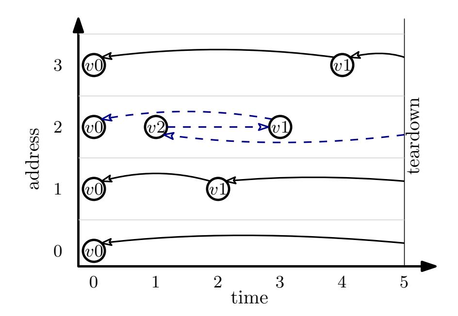
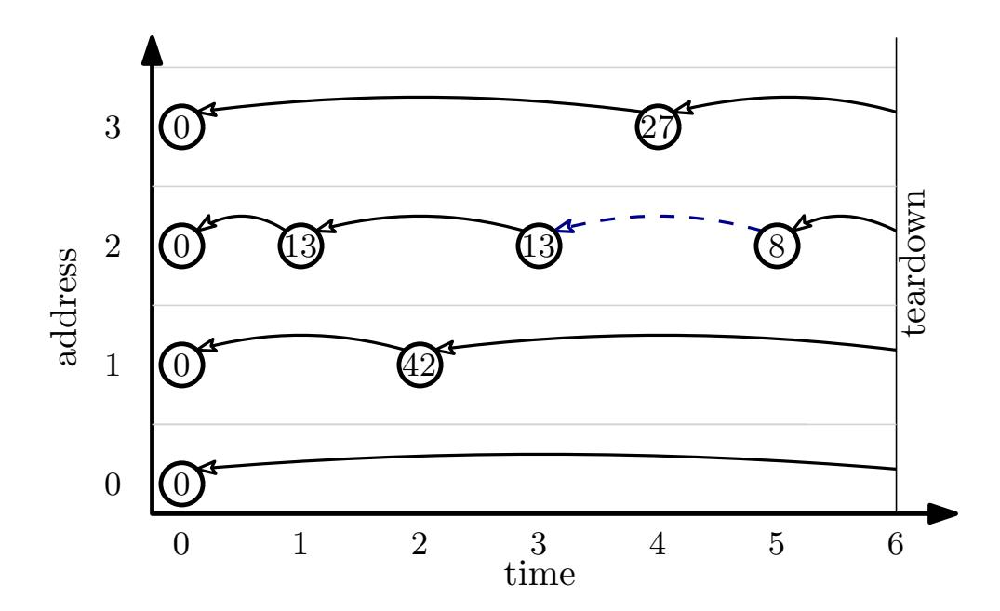
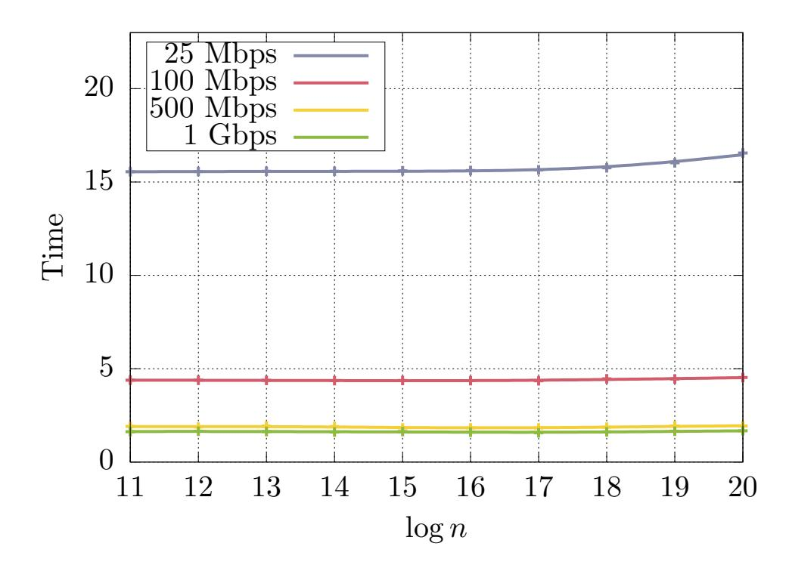
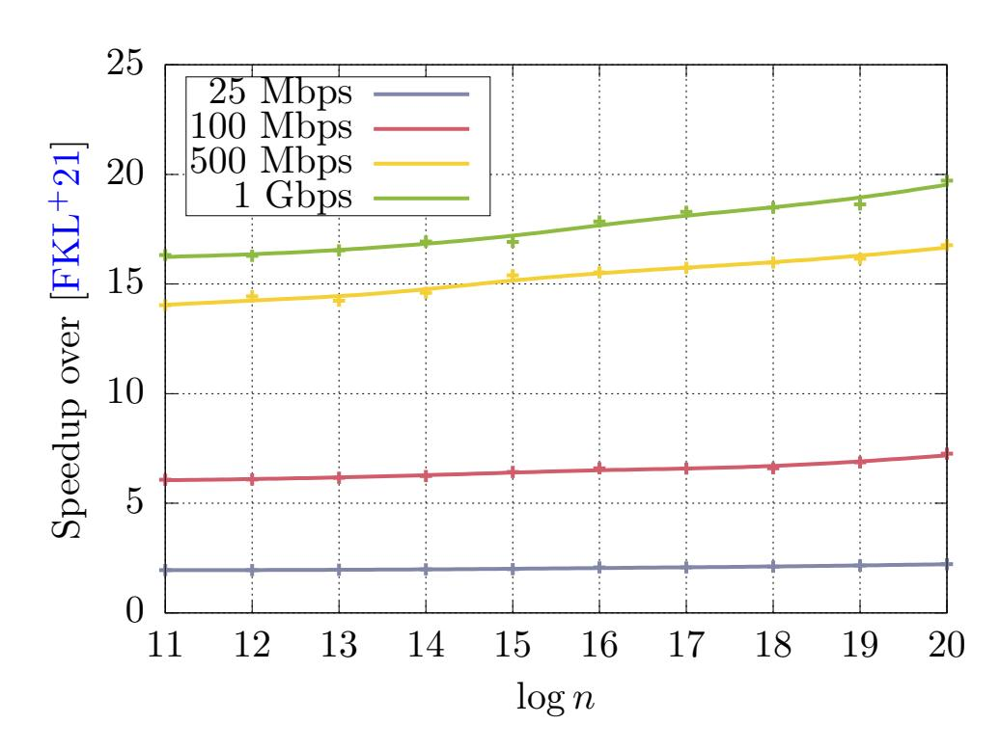
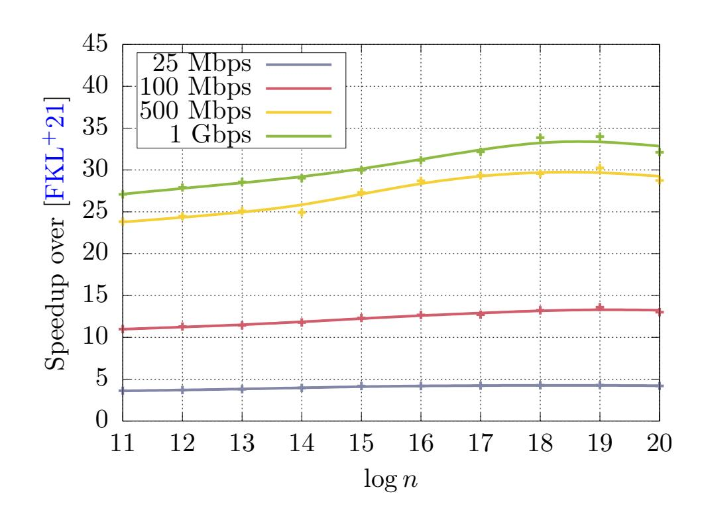
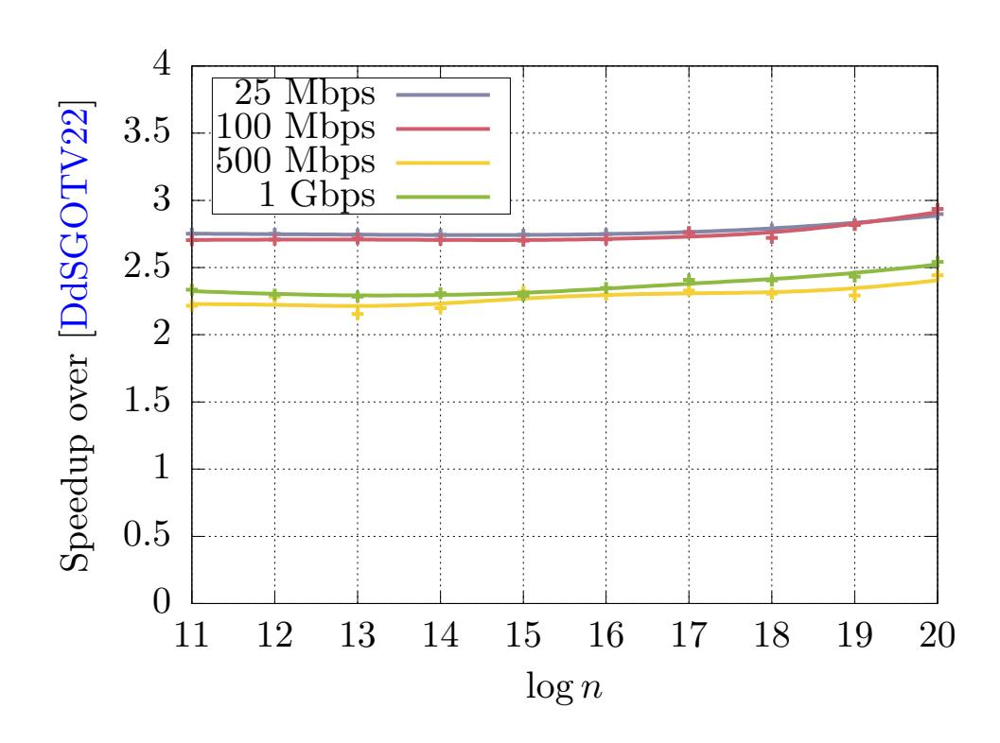
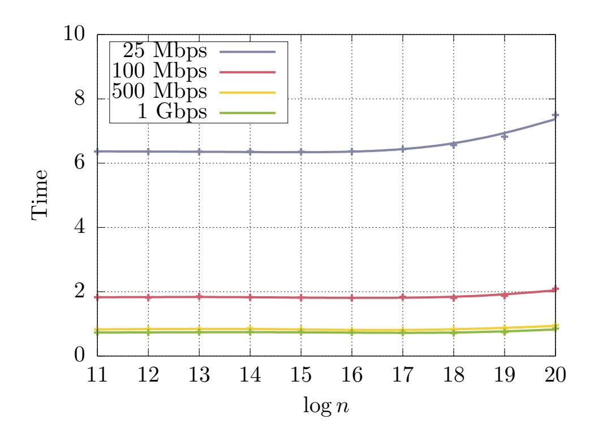
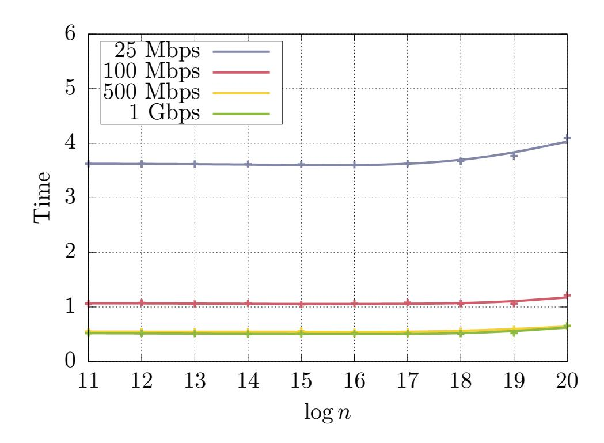

{0}------------------------------------------------

# Two Shuffles Make a RAM: Improved Constant Overhead Zero Knowledge RAM

Yibin Yang<sup>∗</sup> David Heath†

November 3, 2023

#### Abstract

We optimize Zero Knowledge (ZK) proofs of statements expressed as RAM programs over arithmetic values. Our arithmetic-circuit-based read/write memory uses only 4 input gates and 6 multiplication gates per memory access. This is an almost 3× total gate improvement over prior state of the art (Delpech de Saint Guilhem et al., SCN'22).

We implemented our memory in the context of ZK proofs based on vector oblivious linear evaluation (VOLE), and we further optimized based on techniques available in the VOLE setting. Our experiments show that (1) our total runtime improves over that of the prior best VOLE-ZK RAM (Franzese et al., CCS'21) by 2-20× and (2) on a typical hardware setup, we can achieve ≈ 600K RAM accesses per second.

We also develop improved read-only memory and set ZK data structures. These are used internally in our read/write memory and improve over prior work.

<sup>∗</sup>Georgia Institute of Technology, yyang811@gatech.edu.

<sup>†</sup>University of Illinois Urbana-Champaign, daheath@illinois.edu

{1}------------------------------------------------

### Contents

| 1 | Introduction<br>1                                |    |  |  |  |  |  |  |
|---|--------------------------------------------------|----|--|--|--|--|--|--|
|   | 1.1<br>Our Contribution<br>                      | 1  |  |  |  |  |  |  |
|   | 1.2<br>Intuition<br>                             | 2  |  |  |  |  |  |  |
| 2 | Preliminaries and Notation                       | 3  |  |  |  |  |  |  |
|   | 2.1<br>Universal Composability<br>               | 3  |  |  |  |  |  |  |
|   | 2.2<br>Checking Permutations via Polynomials<br> | 3  |  |  |  |  |  |  |
|   | 2.3<br>VOLE-based Zero Knowledge<br>             | 4  |  |  |  |  |  |  |
|   | 2.4<br>Miscellaneous Notation<br>                | 5  |  |  |  |  |  |  |
|   | 2.5<br>Models<br>                                | 5  |  |  |  |  |  |  |
| 3 | Related Work                                     | 7  |  |  |  |  |  |  |
| 4 | Technical Overview                               | 9  |  |  |  |  |  |  |
|   | 4.1<br>Read-Only Memory<br>                      | 9  |  |  |  |  |  |  |
|   | 4.2<br>Sets with Membership Queries<br>          | 11 |  |  |  |  |  |  |
|   | 4.3<br>Read/Write Memory<br>                     | 12 |  |  |  |  |  |  |
| 5 | Approach                                         | 14 |  |  |  |  |  |  |
|   | 5.1<br>Formal Protocol and Security<br>          | 14 |  |  |  |  |  |  |
|   | 5.2<br>Optimizations<br>                         | 17 |  |  |  |  |  |  |
| 6 | Evaluation                                       | 18 |  |  |  |  |  |  |
| A | Universal Composability                          | 28 |  |  |  |  |  |  |
| B | VOLE Functionality                               | 28 |  |  |  |  |  |  |
| C | Proof of Security                                | 28 |  |  |  |  |  |  |
|   | C.1<br>Soundness Lemmas<br>                      | 28 |  |  |  |  |  |  |
|   | C.2<br>Proof of Lemma<br>1<br>                   | 32 |  |  |  |  |  |  |
|   | C.3<br>Proof of Theorem<br>1<br>                 | 33 |  |  |  |  |  |  |
| D | Additional Optimizations                         | 34 |  |  |  |  |  |  |
| E | Additional Evaluation                            | 35 |  |  |  |  |  |  |
| F | Commit-and-Prove ZK                              | 35 |  |  |  |  |  |  |

{2}------------------------------------------------

### <span id="page-2-0"></span>1 Introduction

Zero Knowledge (ZK) proofs [\[GMR85\]](#page-26-0) allow a prover P to demonstrate to a verifier V the truth of some statement while revealing nothing additional. ZK has many applications, e.g., private blockchain [\[SCG](#page-28-0)+14], private bug-bounty [\[HYDK21\]](#page-27-0), private software analysis [\[FDNZ21,](#page-26-1) [LAH](#page-27-1)+22], ZKML [\[WYX](#page-28-1)+21], private network auditability [\[GAZ](#page-26-2)+22], and many more.

General-purpose ZK systems often express proof statements as circuits or constraint systems over Boolean or arithmetic values. However, the past decade has shown increased interest in expressing statements as random access machine (RAM) programs [\[BCG](#page-24-0)+13, [BFR](#page-25-0)+13, [BSCTV14,](#page-25-1) [WSR](#page-28-2)+15, [HMR15,](#page-27-2) [MRS17,](#page-27-3) [BCG](#page-24-1)+18, [BHR](#page-25-2)+20, [HK20,](#page-27-4) [HK21,](#page-27-5) [BHR](#page-25-3)+21, [FKL](#page-26-3)+21, [DdSGOTV22\]](#page-26-4). The RAM-ZK paradigm is exciting both because some statements are made more efficient by the random access capability and because RAM-ZK opens the door to handling statements written in commodity programming languages (see e.g. [\[BCG](#page-24-0)+13, [HYDK21\]](#page-27-0)). Thus, RAM-ZK promises to allow a broad audience to use widely available tools to build efficient proofs of arbitrary statements. If we hope to deliver on this promise, it is crucial to develop RAM-ZK that is as efficient as possible.

The cost of ZK proofs. General purpose ZK systems incur three primary costs: proof size (communication), P computation, and V computation. The literature has generated many approaches to ZK, and these approaches achieve varying levels of efficiency with respect to these metrics.

Seeking RAM improvement for a variety of circuit-based ZK systems, we instead focus on the total circuit size metric, the improvement of which implies improvement to all basic costs. Specifically, we reduce the size of circuit needed to implement ZK RAM, and our results accordingly imply general improvement to ZK RAM.

Constant overhead ZK RAM. Recently, [\[DdSGOTV22\]](#page-26-4) demonstrated a reduction from ZK RAM to arithmetic circuits where the size of the arithmetic circuit scales linearly with the number of memory accesses. I.e., the number of gates needed for each RAM access is only a constant.

While this asymptotic scaling is ideal, the underlying constants remain relatively high. In most arithmetic ZK systems, we are most interested in reducing the number of non-linear gates, which include multiplication gates and input gates (linear gates are typically far cheaper). The [\[DdSGOTV22\]](#page-26-4) construction uses 27 non-linear gates per access.

#### <span id="page-2-1"></span>1.1 Our Contribution

We construct constant overhead ZK RAM with state-of-the-art circuit size. Given standard arithmetic circuits, our construction uses only 4 input gates and 6 multiplication gates per RAM access (and a constant number of linear gates).

The gates in our RAM are highly structured: viewing the circuit globally, five of six multiplication gates are each part of a large product computation (i.e., a high fan-in gate). This structure is important because in some ZK systems, it is possible to exploit such structure to further improve performance.

We implemented our RAM in the context of ZK based on vector oblivious linear evaluation (VOLE) [\[WYKW21,](#page-28-3) [DIO21,](#page-26-5) [BMRS21,](#page-25-4) [YSWW21,](#page-28-4) [WYX](#page-28-1)+21, [BBMH](#page-24-2)+21, [BBMHS22,](#page-24-3) [DILO22,](#page-26-6) [WYY](#page-28-5)+22], a ZK paradigm noted for its fast end-to-end proofs (see discussion of VOLE-based ZK in Section [2.3\)](#page-5-0). We use an idea suggested by [\[FKL](#page-26-3)+21] to leverage QuickSilver's [\[YSWW21\]](#page-28-4) support 

{3}------------------------------------------------

for polynomial evaluation to take advantage of circuit structure and significantly decrease total cost. Our implementation is publicly available at <https://github.com/gconeice/improved-zk-ram>.

Prior work [\[FKL](#page-26-3)+21] developed a ZK RAM specialized for VOLE-based techniques. We compare to their publicly available implementation [\[WMK16\]](#page-28-6); our experiments (see Section [6\)](#page-19-0) show that our end-to-end proof runtime performance outperforms that of [\[FKL](#page-26-3)+21] by 2-20×, depending on the network bandwidth and the RAM size.

We also present related ZK data structures: a read-only memory (ROM) and a set membership structure whose performance substantially improves the state of the art. Our ZK ROM outperforms that of [\[FKL](#page-26-3)+21] by 3-34×, depending on the network bandwidth and the ROM size. On a standard setup, it can execute each access in under 1µs.

While our constructions leverage novel insights, their designs are conceptually simple and easy to implement. The results are also highly generic, and are suited to any ZK system (even those that use, e.g., R1CS instead of circuits) with support for (1) arithmetic gates over a large field and (2) public-coin random challenges. Indeed, our results are applicable to arithmetic ZK systems in the commit-and-prove paradigm [\[CLOS02\]](#page-25-5) (see Appendix [F\)](#page-36-1), including VOLE-based systems, proof systems based on MPC-in-the-head, e.g. [\[IKOS07,](#page-27-6) [AHIV17,](#page-24-4) [dOT21\]](#page-26-7), and zkSNARKs, e.g. [\[BBB](#page-24-5)+18, [MBKM19,](#page-27-7) [CHM](#page-25-6)+20, [ABC](#page-24-6)+22].

#### <span id="page-3-0"></span>1.2 Intuition

A key insight behind ZK RAM is that the ZK prover P can act as an oracle, providing as input the correct data corresponding to each memory access. However, P might try to cheat, on each access providing arbitrary values that lead to an erroneous "proof". The challenge is thus to check that malicious P inputs memory values correctly.

Prior state-of-the-art ZK RAM [\[FKL](#page-26-3)+21, [DdSGOTV22\]](#page-26-4) build such checks from permutation proofs (see Section [2.2\)](#page-4-2), which allow P to convince the verifier V that one vector of wire values is a permutation of another. Based on this, [\[FKL](#page-26-3)+21, [DdSGOTV22\]](#page-26-4) allow P to introduce two vectors. One vector is a list of memory access metadata arranged in the order accesses occur in the program; the second vector is the same metadata arranged in order of memory address. The first vector is used to satisfy each memory access; the second is used to prove P did not cheat. P proves that the two vectors are related by a permutation, then uses a circuit to scan the second vector, proving global consistency properties of the vector.

While conceptually simple, this global check introduces inefficiency in the form of large numbers of inputs from P and relatively costly comparisons (see Section [3](#page-8-0) for details).

Our construction also leverages permutation proofs, but its permuted vectors are (1) the list of elements written to RAM (with metadata) and (2) the list of elements read from RAM (with metadata). We discard [\[FKL](#page-26-3)+21, [DdSGOTV22\]](#page-26-4)'s global consistency check in favor of a local check performed each time an element is accessed:

<span id="page-3-1"></span>Check 1. The memory element read from RAM at time t was also written to RAM at some time t ′ , and in particular t ′ < t.

Our key insight is that – with careful design – locally performing Check [1](#page-3-1) enforces a global consistency property sufficient to achieve a sound protocol.

Our approach requires fewer gates than prior work because (1) we can assemble our two vectors with fewer inputs from P and (2) our local checks can exploit static information available at the time of each access. For instance, [\[FKL](#page-26-3)+21, [DdSGOTV22\]](#page-26-4)'s consistency check must explictly check 

{4}------------------------------------------------

whether two compared addresses are equal to each other or not; for us, this check is irrelevant, as from our permutation check we implictly know that the read value is equal to some past write value to the same address.

In total our entire proof uses:

- A permutation proof (reads are a permutation of writes).
- A per-access set membership proof (the corresponding write was made in the past).
- A per-access multiplication (used to multiplex the effect of load versus store).

We give a set data structure that implements our membership proofs and that can be achieved from a single permutation proof. Thus, the entire RAM essentially reduces to two permutation proofs (and one auxiliary multiplication). This yields a small circuit that is fast to execute and easy to implement.

# <span id="page-4-0"></span>2 Preliminaries and Notation

#### <span id="page-4-1"></span>2.1 Universal Composability

We formalize security in the universal composability (UC) framework [\[Can01\]](#page-25-7). We review UC framework in Appendix [A.](#page-29-0)

#### <span id="page-4-2"></span>2.2 Checking Permutations via Polynomials

Our approach relies on efficient permutation proofs. Namely, given two vectors x and y stored on arithmetic circuit wires, we wish for P to prove to V that there exists some permutation π such that x = π(y). When x and y are indeed related by a permutation, we write x ∼ y:

$$\mathbf{x} \sim \mathbf{y} \iff \exists \pi.\mathbf{x} = \pi(\mathbf{y})$$

One approach to proving x ∼ y uses circuit structures called permutation networks [\[Ben64,](#page-25-8) [Wak68\]](#page-28-7). Such networks can permute n wire values using O(n · log n) gates. Several works use such networks in the context of ZK RAM [\[BCG](#page-24-0)+13, [BSCTV14,](#page-25-1) [HK20,](#page-27-4) [HK21\]](#page-27-5). The inherent log n overhead is relatively expensive in practice.

A more efficient approach observes that to prove x ∼ y it is not necessary to compute a permutation π. Instead, P can prove non-constructively that such a permutation exists with high probability. To achieve this, prior work [\[Nef01\]](#page-27-8) suggested interpreting the two vectors x and y as polynomials, and then testing those polynomials for equality. Namely, we can view x (resp. y) as a polynomial p (resp. q) with formal parameter X where each element x[i] (resp. y[i]) is a polynomial root:

$$p(X) = \prod_{i} (X - \mathbf{x}[i])$$
  $q(X) = \prod_{i} (X - \mathbf{y}[i])$ 

If the two vectors x and y are indeed related, then they contain the same roots, and hence they encode the same polynomial. Thus, to prove that x and y are related, it suffices to prove that p and q are the same polynomial:

$$\mathbf{x} \sim \mathbf{y} \iff p = q$$

{5}------------------------------------------------

Checking equality of two polynomials can be achieved with high probability using the well known polynomial identity test. In this test, we uniformly sample a value r ∈ F, and then check if p(r) − q(r) = 0. The well known fact is that if this check passes, then p and q are indeed the same polynomial with very high probability. Specifically, if p ̸= q, then the check will succeed with probability only <sup>d</sup> F , where d is the degree of the polynomial [\[DL78,](#page-26-8) [Sch80,](#page-28-8) [Zip89\]](#page-28-9).

In the ZK setting, V can send r as a random challenge, then P and V can evaluate p(r) and q(r) via an arithmetic circuit that grows linearly with low constants in the length of x and y. Indeed, if x and y are length n, then the check requires only 2n−2 multiplications (and 2n+ 1 subtractions).

The above definitions of p, q work when x and y are vectors of individual field elements. However, we will need to consider vectors of tuples of field elements. [\[DdSGOTV22\]](#page-26-4) points out that the above polynomial checks can be extended to vectors of tuples by taking a random linear combination of the content of each tuple. Suppose x and y are vectors of ℓ-tuples, and let ⟨ · ⟩ denote the vector inner product operation; we can redefine p and q as follows:

$$p(X, \mathbf{Y}) = \prod_{i} (X - \langle \mathbf{Y} \cdot \mathbf{x}[i] \rangle) \quad q(X, \mathbf{Y}) = \prod_{i} (X - \langle \mathbf{Y} \cdot \mathbf{y}[i] \rangle)$$

Y is a length-ℓ vector. Thus, p and q now denote multivariate polynomials over ℓ + 1 arguments, but otherwise [\[DdSGOTV22\]](#page-26-4) proves that the reasoning is the same.

In the ZK setting, we can check p = q by (1) allowing V to choose two random challenges r ∈ F and s ∈ F ℓ , (2) computing p(r, s)−q(r, s) inside ZK, and (3) checking that the result is indeed zero. Note, the challenge vector s is a public value known to both P and V, so evaluating p(r, s) − q(r, s) still requires only 2n − 2 private-input multiplication gates.

### <span id="page-5-0"></span>2.3 VOLE-based Zero Knowledge

The literature has generated many powerful ZK proof systems suited to various settings. Our ZK data structures are highly generic, relying only on typical features of ZK systems for arithmetic circuits. Still, we find it instructive to implement our approach in the context of a particular ZK system, and to demonstrate clear concrete improvement.

We implement our approach in the ZK paradigm based on vector oblivious linear evaluation (VOLE) [\[WYKW21,](#page-28-3) [DIO21,](#page-26-5) [BMRS21,](#page-25-4) [YSWW21,](#page-28-4) [WYX](#page-28-1)+21, [BBMH](#page-24-2)+21, [BBMHS22,](#page-24-3) [DILO22,](#page-26-6) [WYY](#page-28-5)+22]. VOLE-based ZK is an interactive ZK technique notable for its linear scaling (with low constants) in all cost metrics. This scaling makes VOLE-based ZK useful when the goal is to complete a ZK proof as fast as possible; prior work has shown that VOLE-based ZK can handle ≈ 5 million arithmetic multiplications per second [\[YSWW21\]](#page-28-4).

VOLE-based ZK is particularly interesting for large, complex statements, for instance those that demonstrate the existence or non-existence of software vulnerabilities in a complex code-base (see e.g. [\[HYDK21,](#page-27-0) [LAH](#page-27-1)+22]). In the context of large, general-purpose statements, RAM becomes a crucial ingredient, as it supports programs with large data and complex branching/looping control flow.

We choose to implement in the VOLE-based ZK paradigm because VOLE-based ZK is well suited to the complex proofs supported by RAM. As an additional convenience, prior work [\[FKL](#page-26-3)+21] is also based on VOLE, allowing a clean comparison. Our VOLE-based implementation builds on the publicly available EMP Toolkit [\[WMK16\]](#page-28-6).

Appendix [B](#page-29-1) specifies a standard VOLE functionality.

{6}------------------------------------------------

<span id="page-6-2"></span>
$$\begin{split} \operatorname{input}_{\ell} : 1 \to \mathbb{F}^{\ell} & \qquad \qquad - + \square : \mathbb{F} \times \mathbb{F} \to \mathbb{F} \\ \neg \sim \neg : (\mathbb{F}^{\ell})^n \times (\mathbb{F}^{\ell})^n \to 1 & \qquad \neg \neg : \mathbb{F} \times \mathbb{F} \to \mathbb{F} \\ 0, 1, 2, \dots : \mathbb{F} & \qquad \neg \neg : \mathbb{F} \times \mathbb{F} \to \mathbb{F} \end{split}$$

Figure 1: Syntax on which we build our RAM. We consider circuits over a field F with support for permutation checks. We include gates that accept ℓ inputs from P, gates that check two vectors of ℓ-tuples are related by a permutation, gates that add/subtract/multiply wires, and wires that hold constants. Section [2.2](#page-4-2) discusses how ∼ can be implemented.

<span id="page-6-3"></span>
$$\begin{split} \operatorname{input}_\ell : 1 \to \mathbb{F}^\ell & \qquad \qquad - + \square \colon \mathbb{F} \times \mathbb{F} \to \mathbb{F} \\ 0, 1, 2, \ldots : \mathbb{F} & \qquad \qquad - \square \colon \mathbb{F} \times \mathbb{F} \to \mathbb{F} \\ \operatorname{make-mem} : (\mathbb{F}^\ell)^n \to \operatorname{mem-id} & \qquad \qquad \square \cdot \square \colon \mathbb{F} \times \mathbb{F} \to \mathbb{F} \end{split}$$
 
$$\operatorname{access} : \operatorname{mem-id} \times \mathbb{F} \times \mathbb{F} \times \mathbb{F}^\ell \to \mathbb{F}^\ell$$

Figure 2: Our target syntax supports arithmetic gates and gates that manipulate random access memories. make-mem generates a fresh memory and access loads/stores to a memory. Figure [4](#page-7-0) specifies semantics.

#### <span id="page-6-0"></span>2.4 Miscellaneous Notation

We consider read-only and read/write memories. We use n to denote the number of memory elements stored and T to denote the number of accesses. In our analysis, we often assume there are a large number of accesses, i.e. that T = ω(n). We consider memories that store tuples of ℓ field elements. All operations are over a prime field F = Z<sup>p</sup> for prime p; we require that |F| ≥ 2T, sufficient to embed memory-specific values in the field without overflow.

We index a vector x at index i using bracket notation: x[i]. Indexing starts at zero.

We use ∼ to denote an operation that checks its two vector arguments are related by a permutation.

We denote logical memory operations by load and store, and disambiguate these from physical operations read and write. Each of our logical operations requires one read and one write. Our circuits use constants load = 0 and store = 1.

We refer to the ZK prover P by she/her/hers and to the ZK verifier V by he/him/his.

We refer to ZK operations that multiply two private values or require P that provide input as non-linear. Operations that add/subtract two private values or scale a private value by a public value are linear. Typically, non-linear operations are far more expensive than linear operations. Our cost accounting precisely enumerates the number of non-linear operations only.

#### <span id="page-6-1"></span>2.5 Models

Our goal is to UC-realize the functionality F ram ZK (Figure [4\)](#page-7-0). This functionality allows arbitrary arithmetic circuits augmented with random access memory. We achieve this functionality given access to circuits with arithmetic gates and support for permutation proofs (Figures [1](#page-6-2) and [3\)](#page-7-1). As discussed in Section [2.2,](#page-4-2) such permutation proofs can be achieved from standard arithmetic circuits

{7}------------------------------------------------

### Functionality $\mathcal{F}_{ZK}^{perm}$

<span id="page-7-1"></span>Let C be an arithmetic circuit with permutation check gates (i.e., C is written in the syntax of Figure 1).  $\mathcal{F}_{ZK}^{perm}$  interacts with  $\mathcal{P}$ ,  $\mathcal{V}$ , and the adversary  $\mathcal{S}$ . Upon receiving (prove, C,  $\mathbf{w}$ ) from  $\mathcal{P}$  and (verify, C) from  $\mathcal{V}$ :

• If when running  $C(\mathbf{w})$  it holds that (1) the circuit outputs 0 and (2) for each internal call to  $\mathbf{x} \sim \mathbf{y}$ ,  $\mathbf{x}$  and  $\mathbf{y}$  are indeed related by a permutation, then output  $(C, \mathsf{true})$  to  $\mathcal{S}$  and  $\mathcal{V}$ ; else output  $(C, \mathsf{false})$  to  $\mathcal{S}$  and  $\mathcal{V}$ .

<span id="page-7-0"></span>Figure 3: The functionality for Zero Knowledge proofs over arithmetic circuits with access to a permutation check gate. Figure 1 defines syntax of such circuits.

#### Functionality $\mathcal{F}_{ZK}^{ram}$

Let C be an arithmetic circuit with RAMs (i.e., C is written in the syntax of Figure 2).  $\mathcal{F}_{ZK}^{ram}$  interacts with  $\mathcal{P}$ ,  $\mathcal{V}$ , and the adversary  $\mathcal{S}$ . Upon receiving (prove, C,  $\mathbf{w}$ ) from  $\mathcal{P}$  and (verify, C) from  $\mathcal{V}$ , execute  $C(\mathbf{w})$ :

- For each arithmetic gate, run the gate normally.
- For each make-mem gate with input vector  $\mathbf{x}$ , store  $\mathbf{x}$  as a memory, initialize a fresh memory identifier, associate the identifier with the stored memory, and place the identifier on the gate output wire.
- For each access gate with (id, op, addr, w), look up the memory associated with id, read address addr, and save the result on the gate output wire. If  $op = \mathtt{store}$ , then write w to memory address addr.

If the circuit output wire holds 0, then output (C, true) to S and V; else output (C, false) to S and V.

Figure 4: Our target functionality  $\mathcal{F}_{ZK}^{ram}$  supports arithmetic circuits with random access memories. We achieve this functionality in the  $\mathcal{F}_{ZK}^{perm}$  (Figure 3) hybrid model.

with support for public coin random challenges, so our approach can be implemented on top of standard arithmetic ZK techniques.

Our functionality  $\mathcal{F}_{ZK}^{ram}$  can serve as the basis for arbitrary ZK CPU architectures, as have been explored by prior work, e.g. [BCG<sup>+</sup>13, HYDK21, FKL<sup>+</sup>21, YHKD22].

**Boolean vs. arithmetic circuits.** We develop ZK RAM compatible with arithmetic gates. It is well known that Boolean and arithmetic circuits trade off in efficiency. For instance, arithmetic circuits are better at multiplication; Boolean circuits are better at comparisons.

We believe that in the ZK setting and for large proofs, it is becoming clear that arithmetic circuits are a superior model of computation. Indeed, the introduction of fast arithmetic-circuit-based read-only memory (ROM) – such as the state-of-the-art ROM introduced in this work – can significantly mitigate the downside of arithmetic circuits.

As an example, consider the problem of comparing two, say, 16-bit values. This problem can be

{8}------------------------------------------------

solved by subtracting one value from the other and then looking up the difference in a ROM with 2 <sup>17</sup> entries. For negative indices, the ROM stores a 0; for positive indices it stores a 1. To compare larger numbers, we can first break the numbers into chunks, element-wise compare chunks, and combine the results. As long as enough comparisons are performed across the proof, this approach yields comparison operations for only a small constant number of arithmetic gates.

# <span id="page-8-0"></span>3 Related Work

Approach of Franzese et al. [\[FKL](#page-26-3)+21]. [\[FKL](#page-26-3)+21] constructed the first concretely efficient ZK RAM with constant overhead. Their approach works in the VOLE-based ZK setting for mixed circuits containing both arithmetic and Boolean gates[1](#page-8-1) . [\[FKL](#page-26-3)+21] leverages permutation proofs (Section [2.2\)](#page-4-2). We compare our performance to that of [\[FKL](#page-26-3)+21] in Section [6.](#page-19-0)

The [\[FKL](#page-26-3)+21] approach is as follows. On each memory access to address addr , P provides the loaded value val as part of her input. Then, the system records a 4-tuple of (1) the address addr , (2) the time t of the access (according to a monotonically increasing clock), (3) a bit op indicating if this access is a load or a store, and (4) the value val that is loaded or stored.

Of course, on any particular load, P might cheat and provide an incorrect value. Hence, after all T accesses are completed, [\[FKL](#page-26-3)+21] performs a global consistency check. Note that after T accesses, the system holds a vector of T 4-tuples.

In the first step of the consistency check, P inputs a new version of this length-T vector, where this second version is sorted first by memory address, then by time. Thus, the accesses are grouped into memory addresses such that one can locally scan from left to right, checking consistency. P proves that this second vector is indeed a permutation of the first via techniques discussed in Section [2.2.](#page-4-2)

The consistency check scans the second vector from left to right, ensuring that (1) the vector is indeed sorted correctly and (2) each load operation reads a value consistent with the most recent store to the same memory address. In particular, for each index i, [\[FKL](#page-26-3)+21] checks:

```
((addr i < addr i+1) ∨ ((addr i = addr i+1) ∧ (ti < ti+1)))
∧ ((addr i ̸= addr i+1) ∨ (vali = vali+1) ∨ (opi+1 = store))
∧ ((addr i = addr i+1) ∨ (opi+1 = store))
```

With this done, V is confident that values provided by P are correct, so the approach achieves ZK RAM.

There are several efficiency problems in this approach. First, the above consistency check requires circuits that compare addresses/values. A comparator on length-ℓ values requires Θ(ℓ) gates, and RAM addresses/values have size Θ(log T). Hence, the number of gates is super-constant.

While [\[FKL](#page-26-3)+21] are still able to claim constant ZK communication overhead[2](#page-8-2) , the superconstant number of gates is problematic. In particular, the technique is a poor fit for arithmetic circuits, because we must simulate each Boolean gate with arithmetic gates, incurring unacceptable cost. Many ZK systems are best suited to arithmetic circuits, so RAM over arithmetic values is arguably preferable.

<span id="page-8-1"></span><sup>1</sup> [\[FKL](#page-26-3)<sup>+</sup>21] targets Boolean computation, but they must pack Boolean values into a larger field to achieve efficient permutation proofs.

<span id="page-8-2"></span><sup>2</sup>The [\[FKL](#page-26-3)<sup>+</sup>21] notion of 'overhead' is the total communication cost divided by the number of bits read from RAM. Since the number of gates grows linearly in the size of RAM words, [\[FKL](#page-26-3)<sup>+</sup>21] can claim constant overhead.

{9}------------------------------------------------

Moreover, even [\[FKL](#page-26-3)+21]'s own performance suffers from the large number of gates, not in communication, but in computation. Specifically, each of [\[FKL](#page-26-3)+21]'s AND gate operations requires only ≈ 1 bit of communication, but it also requires that both V and P perform operations over the field F<sup>2</sup> <sup>κ</sup> where κ is a computational security parameter (e.g. 128). Together, these operations are expensive.

In our approach, we construct arithmetic ZK RAM where the total number of gates is a small constant. This allows us to build VOLE-based ZK where all costs have constant overhead, allowing us to significantly improve over [\[FKL](#page-26-3)+21] in terms of total wall-clock time performance. Indeed, while we achieve only a small communication improvement over [\[FKL](#page-26-3)+21], we improve in wall-clock time by up to 20×.

Approach of Delpech de Saint Guilhem et al. [\[DdSGOTV22\]](#page-26-4). [\[DdSGOTV22\]](#page-26-4) were the first to achieve ZK RAM whose arithmetic circuit size is linear in the number of RAM accesses T. Hence, unlike [\[FKL](#page-26-3)+21], [\[DdSGOTV22\]](#page-26-4) achieves constant overhead in all costs.

In short, [\[DdSGOTV22\]](#page-26-4) leverages the same approach as [\[FKL](#page-26-3)+21], except that they carefully optimize comparison/equality operations. [\[DdSGOTV22\]](#page-26-4)'s key ingredient is an elegant bounds check, and this check is used to implement comparison.

The [\[DdSGOTV22\]](#page-26-4)'s bounds check proceeds as follows. Suppose the arithmetic circuit holds a length-T vector x ∈ F T , and P would like prove in batch that each element of x is in 1, ..., T. To achieve this, [\[DdSGOTV22\]](#page-26-4) first constructs the following vector:

$$\mathbf{y} = \mathbf{x}[0], \mathbf{x}[1], ..., \mathbf{x}[T-2], \mathbf{x}[T-1], 1, 2, 3, ..., T-1, T$$

[\[DdSGOTV22\]](#page-26-4) then requires that P inputs a new vector z and proves that z is a permutation of y: y ∼ z. If P is honest, then she will input z in sorted order. With this done, P can prove that all elements x[i] are in the range 1, ..., T by proving that (1) the first element of z is 1, (2) the last element of z is T, and (3) the difference between any two consecutive elements z[i + 1] − z[i] is either 0 or 1. It is easy to perform this check with a linear-size arithmetic circuit.

[\[DdSGOTV22\]](#page-26-4) uses this linear-sized circuit to handle all comparisons of the [\[FKL](#page-26-3)+21] consistency check in batch. Equality computations can similarly be handled by a constant overhead circuit. Thus, [\[DdSGOTV22\]](#page-26-4) removes the logarithmically-sized circuit components from [\[FKL](#page-26-3)+21], achieving true constant overhead in circuit size.

While [\[DdSGOTV22\]](#page-26-4) indeed improves over [\[FKL](#page-26-3)+21], it retains inefficiencies of [\[FKL](#page-26-3)+21]'s consistency check, so the approach still requires 27 non-linear gates per access.

[\[DdSGOTV22\]](#page-26-4) specialized their approach for the ZK paradigm based on 'MPC-in-the-head' [\[IKOS07,](#page-27-6) [dOT21\]](#page-26-7), but since it is an arithmetic circuit, it can be used in other paradigms as well. Indeed, we implemented [\[DdSGOTV22\]](#page-26-4)'s approach in the VOLE-based ZK paradigm so that we can compare to it (see Section [6\)](#page-19-0).

Our ZK RAM leverages a fundamentally different approach to consistency, allowing us to achieve RAM from fewer gates.

Other related work. A number of other works [\[BSCG](#page-25-9)+13, [BSCTV14,](#page-25-1) [WSR](#page-28-2)+15, [HK20,](#page-27-4) [HK21,](#page-27-5) [HYDK21\]](#page-27-0) achieved proof system RAM. These works are based on permutation networks [\[Ben64,](#page-25-8) [Wak68\]](#page-28-7), requiring polylogarithmic overhead for each access.

[\[BCG](#page-24-1)+18] was the first to achieve only super-constant prover cost based on shuffle proofs, e.g. [\[Nef01\]](#page-27-8). Their approach is not practical, as explicitly stated by the authors.

{10}------------------------------------------------

[\[BFR](#page-25-0)+13] developed proofs for programs in the Map-Reduce model; they do not achieve general RAM.

We note that our ZK ROM shares some similarities with Plonk's lookup table literature (starting from [\[GW20\]](#page-27-9)). Similar intuition to our ZK RAM has been applied in the memory checking literature (e.g., [\[BEG](#page-24-7)+94, [DNRV09,](#page-26-9) [ZGK](#page-28-11)+18]), which focuses on providing a correct outsourced memory (without ZK). Our work ensures memory-checker-like techniques are efficiently handled in the ZK setting, where we are strictly limited in that all operations must be handled by black-box field arithmetic. Achieving this efficiently requires careful handling of ROM/RAM.

### <span id="page-10-0"></span>4 Technical Overview

#### <span id="page-10-1"></span>4.1 Read-Only Memory

To begin, let us elide writes, and suppose that we wish to implement read-only memory (ROM). Namely, P and V agree on a length-n vector of wires x, and we encode x as a ROM data structure. Now, given an address wire i, the circuit can query lookup(i), which returns a wire holding x[i]. We present an efficient instantiation of lookup.

As a first insight, observe that each call to lookup can leverage honest P as an oracle; honest P knows the cleartext value of x and i, and hence she can simply provide x[i] as input. Of course, P might be cheating, so we must check that each such input is indeed correct.

Our ROM data structure handles all such checks in batch by maintaining two vectors of tuples, reads and writes. On each call to lookup, we append one element to reads and one to writes. Our key insight is that with minimal added metadata, we can ensure that each call to lookup is correct if and only if reads is a permutation of writes.

Each element of reads (resp. writes) is a three-tuple of (1) the element's address, (2) the element's value, and (3) a metadata value called the version. Versions act as address-specific counters, and each call to lookup increments a version.

To set up our ROM data structure, for each address i ∈ [n] we append to writes the following tuple:

$$(i, \mathbf{x}[i], 0)$$

I.e., we initialize each element with version 0. Then, on each call to lookup(i), P provides two inputs: (1) the value x[i] and (2) the latest version v associated with address i. We then update both reads and writes by appending the old version (i, x[i], v) to reads and a fresh version (i, x[i], v + 1) to writes.

When we are finished with ROM, we perform a simple cleanup step that we call a teardown. For each address i ∈ [n], honest P inputs the latest version v, and we append (i, x[i], v) to reads. Finally, P demonstrates that the reads and writes are related by a permutation: reads ∼ writes. Perhaps surprisingly, this simple approach is already correct and sound.

<span id="page-10-2"></span>Correctness. Correctness of our ROM holds by the following key invariant:

Invariant 1 (ROM Invariant). On each call to lookup and for each address i, the vector writes contains (at least) one tuple of the form (i, val, v) that does not appear in reads .

The setup phase establishes Invariant [1,](#page-10-2) because it writes version 0 of each element. Then, on each call to lookup, honest P propagates Invariant [1](#page-10-2) by reading the latest version v of x[i],

{11}------------------------------------------------

<span id="page-11-0"></span>

Figure 5: Access pattern for a size-4 ROM with lookup pattern 2, 1, 2, 3. On each lookup, we read an element and write back a fresh version of that same element. Nodes represent writes; edges represent reads. Because (1) versions monotonically increase and (2) reads must be a permutation of writes, even malicious  $\mathcal{P}$  cannot read an element that was not written at setup time. It is possible for malicious  $\mathcal{P}$  to read elements written "in the future" (e.g.,  $\mathcal{P}$  can construct the graph for address 2), but it is not possible for  $\mathcal{P}$  to form a cycle.

and writing back a fresh version v + 1. Finally, the teardown phase reads the last version of each element, ensuring that every written version is also read. Hence, if  $\mathcal{P}$  is honest, reads is indeed a permutation of writes.

**Soundness.** The key insight behind the soundness of our ROM is that even a malicious  $\mathcal{P}$  must read each version of an element that is written, or else reads will not be a permutation of writes. Moreover, on each call to lookup, the circuit structure ensures that for whatever version v  $\mathcal{P}$  chooses to read, a fresh version v + 1 is written.

The above two facts bind  $\mathcal{P}$  into building per-element chains of reads and writes (see Figure 5), where (1) each read is made to a version written at some different point in time, (2) the initial link of the chain is written at setup, and (3) the final link is read at teardown. Because each element  $\mathbf{x}[i]$  written at setup is stored on circuit wires (i.e., is not a prover input), and because on each lookup we write back the same element that was read, it must be the case that all reads made to the same address i match the initial value  $\mathbf{x}[i]$ .

Interestingly, our ROM does allow malicious  $\mathcal{P}$  to "read from the future". Namely, on a particular call to lookup(i), malicious  $\mathcal{P}$  can read a version of  $\mathbf{x}[i]$  that is only written at a *later* call to lookup(i). This remains sound because the value  $\mathbf{x}[i]$  does not change over the lifetime of the ROM. The crucial point is that it is *not* possible for  $\mathcal{P}$  to form cycles, where two calls to lookup each read a version written by the other call. It is impossible to convincingly construct such a cycle because versions monotonically increases on each call to lookup, so  $\mathcal{P}$  cannot arrange two versions such that each version is greater than the other.

The ability for malicious  $\mathcal{P}$  to read from the future is the key distinction between ROM and full-fledged read/write RAM: in full RAM we must ensure that each of  $\mathcal{P}$ 's read values comes from the past.

<span id="page-11-1"></span>**Remark 1** (Looking up an illegal address). If a circuit calls lookup(i) where i is not written at setup, then the proof will fail. This is because  $\mathcal{P}$  cannot construct a chain, as there is no first link

{12}------------------------------------------------

written at setup. This fact will be useful later.

Generalizing to tuples. So far, the ROM stores individual wire values. It is easy to generalize the ROM such that each address stores an ℓ-tuple of wires for arbitrary ℓ. This simply requires changing the number of inputs provided by P.

Generalizing to read-only key-value stores. So far, our ROM stores elements at addresses 0, 1, ..., n − 1. It is easy to generalize to a key-value store where the key space is an arbitrary set. In particular, at setup we initialize the key-value store from a list of pairs (i, x[i]). So long as each address i is unique, this generalization incurs no extra cost. This is useful when using key-value stores to encode sets (Section [4.2\)](#page-12-0)

Gate cost. Consider a ROM of size n where lookup is called T times. For a ROM storing ℓtuples, where ℓ is an arbitrary constant, each call to lookup requires ℓ + 1 inputs from P (the ℓ entries of the tuple and the version), for a total of T · (ℓ + 1) input gates. The teardown phase similarly requires that P reads each of the n slots, requiring n·(ℓ+1) additional input gates. Finally, the permutation proof reads ∼ writes inspects vectors of length n + T; this can be implemented using two fan-in n + T multiplication gates (see Section [2.2\)](#page-4-2).

In sum, the full construction requires:

- (n + T)(ℓ + 1) input gates.
- Two fan-in n + T multiplication gates.
- O(n + T) linear gates.

#### <span id="page-12-0"></span>4.2 Sets with Membership Queries

As mentioned in Section [4.1,](#page-10-1) the key difference between ROM and full-fledged RAM is that in RAM we must check that each read value was written at some time in the past. As we will see, we achieve this by checking that on each access a particular timing value is in a public set {1, ..., T}, where T is the total number of RAM accesses.

We observe that our read-only key-value store (RO-KVS, Section [4.1\)](#page-10-1) is well suited to this set membership proof. In particular, consider an RO-KVS where we set the size of tuples to ℓ = 0. We initialize an RO-KVS with addresses 1, ..., T. Then, to check that a particular value t is a member of a set, we call lookup(t). This call does not return any data, but if t is not in the set {1, ..., T}, then the proof will fail, as was observed in Remark [1.](#page-11-1) Thus this call to lookup serves as a proof that t is in the set.

Gate cost. The cost of our set structure is inherited from the cost of ROM. For a set with T values and T membership queries (these parameters are used in our RAM), total cost is:

- 2T input gates.
- Two fan-in 2T multiplication gates.
- O(T) linear gates.

{13}------------------------------------------------

<span id="page-13-1"></span>

Figure 6: Zero-initialized RAM with history (store, 2, 13), (store, 1, 42), (load, 2,  $\square$ ), (store, 3, 27), (store, 2, 8). Each node represents a write; each edge represents a read. We force  $\mathcal{P}$  to prove that (1) each node has one incoming edge and (2) each edge points to the left. Point (1) is achieved by checking that reads and writes are related by a permutation; point (2) is achieved by a set membership proof. This forces  $\mathcal{P}$  to organize each address's history as a linked list. E.g., on operation (store, 2, 8),  $\mathcal{P}$  must read from the immediately preceding address 2 write.

#### <span id="page-13-0"></span>4.3 Read/Write Memory

Consider a random access memory (RAM) equipped with a single access instruction. Each call to access accepts as input three arguments:

- $op \in \{0,1\}$  is 0 on a load and 1 on a store.
- $i \in \mathbb{F}$  is an address.
- w is the value to store, if this operation is indeed a store.

Each RAM access both reads and writes data, whether the operation is a load or a store. On a store, we read the old data and write the new data; on a load, we read the old data and write back a fresh copy of the same data. Just like our ROM, our RAM maintains two vectors reads and writes, and on each access we update each vector. Also like our ROM, our RAM checks that reads are a permutation of writes:  $reads \sim writes$ .

As mentioned in Section 4.1, the main challenge in RAM as compared to ROM is that we must prevent malicious  $\mathcal{P}$  from reading a value written in the future. Our approach here is to maintain a monotonically increasing public value clock which is set to 0 at setup and then incremented on each access.

When we write a value val to address i, we append the following tuple to writes:

I.e., we mark each write with the time it occurred. To read a value and ensure  $reads \sim writes$ , we must also mark each read value with the time at which that value was written. Accordingly, each call to access at address i requests that  $\mathcal{P}$  inputs two values: (1) the value val that was last written to address i and (2) the  $time\ t$  when the write occurred.

{14}------------------------------------------------

Of course, P might be malicious, so we must check that the input (val, t) is consistent with the semantics of read/write RAM. The permutation proof reads ∼ writes ensures that each such triple (i, val, t) is indeed written at some point in time. The remaining challenge is to ensure that this point in time is in the past, which can be achieved by checking that clock − t is a strictly positive value. Said another way, we can check that clock − t is in the set {1, ..., T}, where T is the total number of RAM accesses. Each such check is achieved by our set data structure (Section [4.2\)](#page-12-0).

This simple set membership proof is sufficient, and we do not need to explicitly prove that each read corresponds to the most recent write. Indeed, this stronger property (each read comes from the latest write) is implied by the local checks combined with the permutation proof reads ∼ writes.

To see that this is true, observe that our RAM maintains the following key invariant:

<span id="page-14-0"></span>Invariant 2 (RAM Invariant). Before each call to access and for each address i, writes contains exactly one tuple of the form (i, val, t) that does not appear in reads . Moreover, the value t is highest amongst all such tuples in writes ; i.e., this tuple records the most recent write to address i.

When we set up RAM with initial content x, we append the following write for each address i: (i, x[i], 0). Since we write each address once, our setup trivially establishes Invariant [2.](#page-14-0)

On each call to access, P is forced to input values (val, t) such that clock − t is positive. By Invariant [2](#page-14-0) there is only one such choice that will pass the permutation proof, and this choice must be the most recent version of address i, so this access is sound. Moreover, this access propagates the invariant because we increment the clock and write a fresh copy of address i; see also Figure [6.](#page-13-1)

Once all T accesses are complete, note that we have written n+T values, but we have only read T values. We allow P to complete the read history in a teardown step, where we read (without writing back) each RAM address. In particular, for each address i, P again inputs a pair (val, t), and we append (i, val, t) to reads. Note that on this step and by Invariant [2,](#page-14-0) we do not need to check that clock − t is positive; it must be, or else the permutation proof will fail.

Generalizing to tuples. As in our ROM, it is straightforward to generalize the RAM such that each address stores an ℓ-tuple of wires for arbitrary constant ℓ. This simply requires changing the number of inputs provided by P.

Gate cost. Our RAM has four relevant costs:

- We maintain the set {1, ..., T} (Section [4.2\)](#page-12-0) and perform one membership proof per access.
- We use a permutation proof (Section [2.2\)](#page-4-2) on two length-(T + n) vectors: reads ∼ writes.
- P inputs two values (val, t) on each of the T accesses, and for each of n addresses at teardown.
- We include a single multiplexer that disambiguates load operations from store operations. In particular, after reading old from RAM, we compute:

$$new \leftarrow old + op \cdot (w - old)$$

If the operation type is public, this is not needed. For completeness, we assume operation types are private.

In total, the RAM incurs the following gate cost:

{15}------------------------------------------------

- 4T + 2n input gates.
- Two fan-in 2T multiplications (from the set) and two fan-in T + n multiplications (from the permutation proof). We optimize one of the fan-in 2T multiplications to be only fan-in T; see Section 5.2.
- T fan-in two multiplications (from multiplexers).
- O(n+T) miscellaneous linear operations.

When we assume that the number of accesses T is significantly greater than the RAM size n, we obtain the per-access costs listed in our contribution.

# <span id="page-15-0"></span>5 Approach

#### <span id="page-15-1"></span>5.1 Formal Protocol and Security

```
1 type ro-kvs-record_\ell \{ 1 lookup(m: \text{ro-kvs}_\ell, key: \mathbb{F}) \to \mathbb{F}^\ell \{
1 type ro-kvs_{\ell} {
     content: (\mathbb{F}, \mathbb{F}^{\ell})^*
                                         2 \quad key: \mathbb{F}
                                                                                        val \leftarrow \mathtt{input}_{\ell}()
2
     reads: {\tt ro-kvs-record}^*_\ell 3 value: \mathbb{F}^\ell
                                                                                        version \leftarrow \mathtt{input}_1()
                                                                                 3
     writes: {\tt ro-kvs-record}^*_\ell \ 4 \ version: \mathbb{F}
                                                                                        m.reads.append(\{ key, val, version \})
4
                                                                                 4
                                          5 }
                                                                                        m.writes.append(\{ key, val, version + 1 \})
5 }
                                                                                  5
                                                                                        return val
                                                                                  6
                                                                                 7 }
1 \ \mathtt{setup\text{-}ro\text{-}kvs}_{\ell}(content: (\mathbb{F}, \mathbb{F}^{\ell})^*) \to \mathtt{ro\text{-}kvs}_{\ell} \ \{
                                                                                1 teardown-ro-kvs(m: \texttt{ro-kvs}_\ell) \{
     m \leftarrow \texttt{ro-kvs}_{\ell} \ \{ \ content, \{\}, \{\} \ \}
                                                                                      for (key, val) \in content {
2
                                                                                2
     for (key, val) \in content {
                                                                                        version \leftarrow \mathtt{input}_1()
3
                                                                                3
        m.writes.append(\{ key, val, 0 \})
                                                                                        m.reads.append({ key, val, version })
4
                                                                                4
5
                                                                                5
                                                                                      m.reads \sim m.writes
6
      return m
                                                                                6
7 }
                                                                                7
```

Figure 7: Our ZK read-only key-value store holds  $\ell$ -word values at each key. We highlight uses of non-linear gates.

We formalize our ZK RAM as a protocol in the  $\mathcal{F}_{ZK}^{perm}$ -hybrid model. This protocol formalizes ideas explained in Section 4. Our protocol is defined with respect to Figures 7 to 9.

<span id="page-15-3"></span>**Protocol 1.**  $\mathcal{P}$  and  $\mathcal{V}$  agree on an arithmetic circuit with RAM access C; i.e., C is written in the syntax of Figure 2.  $\mathcal{P}$  holds as input a witness  $\mathbf{w}$ .  $\mathcal{P}$  and  $\mathcal{V}$  compile C to an arithmetic circuit with permutations (Figure 1) in the following manner:

• For each input gate, addition gate, subtraction gate, multiplication gate, and constant wire, they trivially compile the circuit element.

{16}------------------------------------------------

```
\begin{array}{cccccccccccccccccccccccccccccccccccc
```

Figure 8: Our ZK set data structure is a specialization of our read-only key-value store (Figure 7) where each key holds 0 words. An element is considered a member of the set if it is a key in the key-value store. We highlight uses of non-linear gates.

- For each make-mem gate, the parties invoke setup (Figure 9) which produces a circuit-based RAM data structure.  $\mathcal{P}$  locally maintains a cleartext copy of this RAM (and its internal set structure), allowing  $\mathcal{P}$  to track which value is stored at each address.
- For each access gate, the parties invoke the access procedure of Figure 9.  $\mathcal{P}$  extends her witness  $\mathbf{w}$  by using her local copy of the RAM to recall the last time t when the queried address was accessed and what value val was stored there (and to find the set version of clock -t) so that these values can be passed to input gates.  $\mathcal{P}$  updates her local copy of RAM.
- Once all gates are compiled, the parties invoke teardown on each RAM data structure created by a call to setup.  $\mathcal{P}$  uses her local copy of RAM (and its internal set) to appropriately extend her witness  $\mathbf{w}$ .

 $\mathcal{P}$  and  $\mathcal{V}$  thus agree on a circuit C' with arithmetic gates and permutation proofs. Next, (1)  $\mathcal{P}$  sends (prove, C',  $\mathbf{w}$ ) to  $\mathcal{F}_{ZK}^{perm}$ , (2)  $\mathcal{V}$  sends (verify, C') to  $\mathcal{F}_{ZK}^{perm}$ , (3)  $\mathcal{P}$  outputs  $\perp$ , and (4)  $\mathcal{V}$  outputs whatever he receives from  $\mathcal{F}_{ZK}^{perm}$ .

Our key security property is that Protocol 1 achieves the Figure 4 functionality, allowing us to securely implement ZK proofs with RAM.

<span id="page-16-0"></span>**Theorem 1.** Protocol 1 UC-realizes  $\mathcal{F}_{ZK}^{ram}$  (Figures 2 and 4) in the  $\mathcal{F}_{ZK}^{perm}$ -hybrid model (Figures 1 and 3) with no soundness error.

Appendix C.3 provides a detailed proof of Theorem 1. For now, we sketch the argument, focusing on soundness.

*Proof Sketch.* By construction of a simulator  $\mathcal{S}$ .

Our protocol can be viewed as a circuit compiler that maps arithmetic circuits with RAM (Figures 2 and 4) to arithmetic circuits with permutations (Figures 1 and 3). Accordingly,  $\mathcal{S}$ 's only task is to tediously convert between RAM circuits and permutation circuits, and to collect  $\mathcal{P}$ 's witness  $\mathbf{w}$  before sending it to the  $\mathcal{F}_{ZK}^{ram}$  functionality.

However, we still must demonstrate that S is a valid simulator, and that the UC environment cannot distinguish the simulation from the real world protocol. The challenge in showing this is that our compilation generates non-trivial input gates, allowing P extra degrees of freedom in choosing

{17}------------------------------------------------

```
1 type RAMℓ {
2 reads : record∗
                 ℓ
3 writes : record∗
                  ℓ
4 valid-diffs : set
5 clock : F
6 size : N
7 }
1 type recordℓ {
2 address : F
3 value : F
            ℓ
4 time : F
5 }
1 setupℓ
         (T : N, content : (F
                           ℓ
                            )
                            ∗
                             ) → RAMℓ {
2 n ← |content|
3 valid-diffs ← setup-set(1, . . . , T)
4 m ← RAMℓ { {}, {}, valid-diffs, 1, n }
5 for i ∈ [n] {
6 m.writes.append({ addr , content[i], 0})
7 }
8 return m
9 }
                                                1 access(m : RAMℓ, op : F, addr : F, w : F
                                                                                       ℓ
                                                                                        ) → F
                                                                                             ℓ
                                                                                               {
                                                2 old ← inputℓ
                                                                 ()
                                                3 t ← input1
                                                               ()
                                                4 prove-member(m.valid-diffs, m.clock − t)
                                                5 new ← old + op · (w − old)
                                                6 m.reads.append({ addr , old, t })
                                                7 m.writes.append({ addr , new, m.clock })
                                                8 m.clock ← m.clock + 1
                                                9 return old
                                              10 }
                                                1 teardown(m : RAMℓ) → (F
                                                                           ℓ
                                                                            )
                                                                            ∗
                                                                              {
                                                2 content ← {}
                                                3 for addr ∈ [m.size] {
                                                4 val ← inputℓ
                                                                  ()
                                                5 t ← input1
                                                                ()
                                                6 m.reads.append({ addr , val, t })
                                                7 content.append(val)
                                                8 }
                                                9 m.reads ∼ m.writes
                                              10 teardown-set(m.valid-diffs)
                                              11 return content
                                              12 }
```

Figure 9: Our ZK read/write memory. Each memory slot holds an ℓ-tuple of field elements. The memory is defined in terms of our set data structure (Figure [8\)](#page-16-1). We define three procedures: setup, access, and teardown. Valid usage consists of one call to setup, an arbitrary (polynomial) number of calls to access, and one call to teardown. We highlight uses of non-linear gates.

a convincing witness. Therefore, we must argue that our construction is sound. All compiled gates in Figure [2](#page-6-3) are trivially sound, save for make-mem and access gates.

In short, these gates are sound because our RAM construction includes a permutation proof on its reads and writes, and because on each access we check that P's chosen time t is less than clock (this latter property is checked by a set membership proof). As per discussion near Invariant [2,](#page-14-0) these local checks enforce a global ordering of reads/writes on each address, on each access forcing P to input the most recent value written to the same address.

It remains to show that the underlying set data structure is sound. As discussed in Section [4.1,](#page-10-1) our set (as inherited from our ROM) on each access forces P to input a version. Because we monotonically increase versions and because we use a permutation proof on set reads/writes, we force P to construct a linked list of read/write pairs, connecting each read value to the setup-time write on the same address.

Together, this means that P's extra inputs must respect the semantics of access gates, so the

{18}------------------------------------------------

protocol is sound.  $\Box$ 

Prior work on VOLE-based ZK gave powerful constant round protocols for proving arithmetic statements. Such prior works, together with the permutation proof method discussed in Section 2.2 and an optimization discussed in Section 5.2, imply the following (see Appendix C.2 for more details):

<span id="page-18-1"></span>**Lemma 1.** There exists a 5-round protocol in the VOLE-hybrid model that UC-realizes  $\mathcal{F}_{ZK}^{perm}$ . For each use of input and of  $\neg \cdot \neg$ ,  $\mathcal{P}$  and  $\mathcal{V}$  use 1 VOLE correlation; for each use of  $\neg \cdot \neg$  on two length-n vectors,  $\mathcal{P}$  and  $\mathcal{V}$  each evaluate a linear number of field operations and consume  $\frac{2n}{\epsilon-1} + o(1)$  VOLE correlations, for any constant  $\epsilon \geq 2$ . The protocol achieves soundness error  $O(\frac{n+m}{|\mathbb{F}|})$ , where n is the size of the largest vector passed to  $\neg \cdot \neg$  and m is the number of multiplications.

Together, Theorem 1 and Lemma 1 allow us to instantiate ZK RAM from VOLE-based ZK:

Corollary 1 (RAM from VOLE). There exists a 5-round protocol in the VOLE-hybrid model that UC-realizes  $\mathcal{F}_{ZK}^{ram}$ . For each call to access on a size-n memory that is accessed  $T=\omega(n)$  times,  $\mathcal{P}$  and  $\mathcal{V}$  each evaluate a constant number of field operations and consume  $5+\frac{5}{\epsilon-1}+o(1)$  VOLE correlations, for any constant  $\epsilon \geq 2$ . The protocol achieves soundness error  $O(\frac{T+m}{|\mathbb{F}|})$ , where T is the largest number of accesses used by any memory and m is the number of multiplications.

Formalizing ROM (including our set data structure). For simplicity and because RAM is more interesting than ROM, we chose to not formalize ROM as part of our top level functionality (Figure 4). Such a formalism can be derived from our RAM formalism by substituting RAM-related gates to initialize ROM and access ROM, and correspondingly modifying Protocol 1 according to Figure 7. Soundness of ROM gates follows from our proof of Theorem 1. We include security games crucial for the soundness proof of ROM in Appendix C.1.

#### <span id="page-18-0"></span>5.2 Optimizations

Accelerating permutation proofs. The main cost of our protocol comes from permutation proofs, and permutation proofs can be achieved by high fan-in multiplications (Section 2.2). We note two important available optimizations.

The first optimization is generally applicable for any ZK system and saves T multiplications. Consider the permutation proof performed on the publicly known set  $\{1, \ldots, T\}$  (Section 4.2). Here, the first T writes are publicly known to be  $(1,0), (2,0), \ldots, (T-1,0), (T,0)$ . Hence, in the permutation proof, once  $\mathcal{V}$  chooses a random challenge,  $\mathcal{P}$  and  $\mathcal{V}$  can locally compute the product of the first T components of writes. Again, this saves T ZK multiplications.

The second optimization leverages a VOLE-specific trick to reduce cost of high fan-in multiplications. QuickSilver [YSWW21] supports polynomial proofs. Namely, [YSWW21] can efficiently prove a batch sub-statements of the following form:

$$p(\mathbf{x}_0) = 0, \dots, p(\mathbf{x}_{n-1}) = 0$$

Here, p is a degree-d polynomial over arithmetic wires. The batch of n sub-statements requires only d VOLE correlations (VOLE correlations are the primary cost in VOLE-based ZK). This trick reduces VOLE correlations, but can increase computation, as  $\mathcal{P}$ 's compute scales with  $O(d^2)$ .

{19}------------------------------------------------

Polynomial proofs can optimize fan-in-n multiplications as follows. Consider a fan-in- $\epsilon$  multiplication for any constant  $\epsilon \geq 2$ . We can implement such a multiplication by allowing  $\mathcal P$  to input a value prod, and then defining a degree- $\epsilon$  polynomial that multiplies the  $\epsilon$  values and subtracts prod. This is a degree  $\epsilon$  polynomial, and we can use [YSWW21] to prove it equals zero (if it does,  $\mathcal P$  input prod correctly). It is straightforward to use  $\lceil \frac{n}{\epsilon-1} \rceil$  fan-in- $\epsilon$  multiplications to implement a fan-in-n multiplication, so we can use  $\lceil \frac{n}{\epsilon-1} \rceil$  polynomial proofs to implement a fan-in-n multiplication.

Prior work [FKL<sup>+</sup>21] also used this trick, but their corresponding improvement was limited, as their cost is dominated by comparisons, not by permutation proofs. In our approach, almost all multiplication cost comes from high fan-in multiplications, so we enjoy substantial improvement.

By choosing arbitrary constant  $\epsilon \geq 2$ , we reduce the number of VOLE correlations from  $\approx 10T$  to  $\approx (5 + \frac{5}{\epsilon - 1})T$ . This reduces the communication used by  $\mathcal{P}$  and  $\mathcal{V}$ , and it also reduces the amount of computation needed to construct the correlations. However, as stated above,  $\mathcal{P}$ 's proof computation increases as we increase  $\epsilon$ , so we limit  $\epsilon$  to constant values to avoid asymptotic problems. In Section 6 we find it is best to set  $\epsilon$  between 8 and 32, depending on the network.

To our knowledge, this polynomial proof optimization is currently specific to VOLE-based ZK. However, it is possible similar optimization will emerge in other ZK paradigms, particularly because ZK RAM provides compelling motivation.

Other optimizations. Appendix D presents other optimizations that are available in our RAM, but that we did not implement or account for in our cost. In particular, our underlying set  $\{1, \ldots, T\}$  can be re-used in other parts of a large proof, and it is possible to periodically refresh RAM to slightly increase performance or soundness.

#### <span id="page-19-0"></span>6 Evaluation

Our implementation. We implemented our ROM, our set, and our RAM ZK data structures from VOLE in C++ available at https://github.com/gconeice/improved-zk-ram. We use the learning-parity-with-noise-based VOLE protocol of [WYKW21] which is implemented as part of the EMP Toolkit [WMK16]. While our VOLE-based approach will extend to any large field, we use the field  $\mathbb{F}_{2^{61}-1}$  because this is the only arithmetic field currently implemented by EMP.

[FKL<sup>+</sup>21] and [DdSGOTV22] implementation. We compare our RAM to that of [FKL<sup>+</sup>21] and of [DdSGOTV22]. We also compare our ROM to that of [FKL<sup>+</sup>21]. [FKL<sup>+</sup>21]'s RAM/ROM implementation is publicly available as part of the EMP Toolkit [WMK16]. [DdSGOTV22]'s RAM implementation is not publicly available. We implemented a VOLE-based version of their RAM<sup>3</sup> in C++. Other ZK RAMs do not have constant overhead per access.<sup>4</sup>

As discussed in Section 3, [DdSGOTV22]'s RAM leverages permutation proofs. Recall, VOLE-based ZK offer optimizations for permutation proofs (see Section 5.2). We also note that several gates in [DdSGOTV22]'s protocol can be further optimized in VOLE-based ZK. In particular, these gates require checking that the product of two wires is some constant; such checks can be done in VOLE-based ZK without communication. For fair comparison, we incorporate all such VOLE-based optimizations in our implementation of [DdSGOTV22].

<span id="page-19-1"></span><sup>&</sup>lt;sup>3</sup>[DdSGOTV22]'s RAM was designed for the MPC-in-the-head paradigm, but, like our RAM, it is a pure arithmetic circuit with random challenges, so it can also be implemented for VOLE-ZK.

<span id="page-19-2"></span><sup>&</sup>lt;sup>4</sup>[FKL<sup>+</sup>21] reported clear concrete improvements over earlier ZK RAMs.

{20}------------------------------------------------

Experimental setup. We ran all three RAMs on a benchmark where we instantiate a RAM of sizes n ranging from 2<sup>11</sup> to 2<sup>20</sup> and perform T = 2<sup>23</sup> accesses. We run our ROM, [\[FKL](#page-26-3)+21]'s ROM, and our set data structure with the same n and T.

In all cases, P and V run single threaded on a separate Amazon EC2 m5.2xlarge machine[5](#page-20-0) . We measure total (and per-access) communication in bytes and per-access runtime in microseconds. For the latter, we experiment with different network bandwidth settings, varying between a WAN-like 25Mbps connection and a LAN-like 1Gbps connection.

<span id="page-20-1"></span>

| = 220<br>n<br>Bandwidth |              | ϵ<br>2<br>4<br>8<br>16<br>32<br>64<br>128 |       |       |       |       |       |       |
|-------------------------|--------------|-------------------------------------------|-------|-------|-------|-------|-------|-------|
|                         |              |                                           |       |       |       |       |       |       |
|                         | 25 Mbps      | 8.88                                      | 6.14  | 4.78  | 4.10  | 3.62  | 3.62  | 3.87  |
|                         | 100 Mbps     | 2.39                                      | 1.72  | 1.41  | 1.21  | 1.14  | 1.29  | 1.54  |
| Set                     | 500 Mbps     | 0.80                                      | 0.69  | 0.63  | 0.65  | 0.64  | 0.77  | 1.04  |
|                         | 1 Gbps       | 0.66                                      | 0.60  | 0.59  | 0.61  | 0.61  | 0.73  | 1.01  |
|                         | Comm. (byte) | 27.1                                      | 18.6  | 14.4  | 12.2  | 10.9  | 10.3  | 10.1  |
|                         | 25 Mbps      | 12.56                                     | 9.66  | 8.21  | 7.49  | 7.17  | 7.18  | 7.46  |
|                         | 100 Mbps     | 3.37                                      | 2.64  | 2.28  | 2.09  | 2.14  | 2.24  | 2.58  |
| ROM                     | 500 Mbps     | 1.10                                      | 0.96  | 0.93  | 0.95  | 1.02  | 1.17  | 1.47  |
|                         | 1 Gbps       | 0.92                                      | 0.85  | 0.83  | 0.85  | 0.94  | 1.06  | 1.38  |
|                         | Comm. (byte) | 38.4                                      | 29.4  | 24.9  | 22.7  | 21.6  | 21.0  | 20.7  |
|                         | 25 Mbps      | 28.92                                     | 21.73 | 18.38 | 16.55 | 15.58 | 15.59 | 16.26 |
|                         | 100 Mbps     | 7.80                                      | 5.94  | 5.15  | 4.53  | 4.58  | 4.91  | 5.60  |
| RAM                     | 500 Mbps     | 2.60                                      | 2.01  | 1.96  | 1.93  | 1.99  | 2.33  | 3.03  |
|                         | 1 Gbps       | 2.14                                      | 1.74  | 1.72  | 1.67  | 1.78  | 2.11  | 2.87  |
|                         | Comm. (byte) | 88.3                                      | 66.4  | 55.9  | 50.3  | 47.4  | 46.1  | 45.4  |

Figure 10: Per-access runtime (µs) and communication (bytes) of our data structures as a function of ϵ, the degree of polynomials used in our handling of high fan-in multiplications; see Section [5.2.](#page-18-0) As ϵ increases, we use fewer VOLE correlations, but P computes more field operations.

Parameter ϵ for accelerating permutation proofs. Our RAM, ROM, and set data structures (and our implemented [\[DdSGOTV22\]](#page-26-4)'s RAM) all benefit from VOLE-based polynomial proofs used to optimizate to high-fan-in multiplications (see Section [5.2\)](#page-18-0). In particular, recall that parameter ϵ trades off between number of required VOLE correlations and P computation. Figure [10](#page-20-1) tabulates the impact of ϵ on performance (we set n = 2<sup>20</sup> and T = 223).

For simplicity of implementation, we organize our high fan-in-n multiplications as trees of multiplications, and we only use fan-in-ϵ gates at the widest tree level. The remaining multiplications are achieved with fan-in-two gates. This means our high fan-in gates use ≈ 2n <sup>ϵ</sup> VOLES, rather than ⌈ n ϵ−1 ⌉. In practice, the change in performance is not noticeable.

In subsequent experiments, we set ϵ = 16. Increasing ϵ beyond this point yields greatly diminished communication improvement, as input gates dominate cost and are not improved by increasing ϵ.

<span id="page-20-0"></span><sup>5</sup> Intel Xeon Platinum 8175 CPU @ 3.10GHz, 8 vCPUs, 32GiB Memory, 10Gbps Network

{21}------------------------------------------------

<span id="page-21-0"></span>

Figure 11: Per-access runtime of our RAM  $(\mu s)$ .

Our RAM performance. Figure 11 plots per-access runtime of our RAM in microseconds. On a slow 25Mbps WAN-like connection, our RAM requires  $\sim 15\mu s$  per access; On a faster 100Mbps WAN-like connection, our RAM requires  $< 5\mu s$  per access; On a 1Gbps LAN-like connection, our RAM requires only  $\sim 1.5\mu s$  per access, achieving access at  $\approx 600$  KHz. As n ranges from  $2^{11}$  to  $2^{20}$ , the per-access communication increases only from 47 to 50 bytes; runtime remains essentially unchanged (caching begins to impact performance at high n). We defer the detailed data to Appendix E.

Our ROM and set performance. On a 25Mbps WAN-like connection, our ROM (resp. set) requires  $< 8\mu s$  (resp.  $< 4\mu s$ ) per access; on a 1Gbps LAN-like connection, our ROM (resp. set) requires  $\sim 1\mu s$  (resp.  $< 1\mu s$ ) per access. As n ranges from  $2^{11}$  to  $2^{20}$ , the per-access communication is 19-22 (resp. 10-12) bytes; runtime remains essentially unchanged (caching effects begin to impact performance at high n). We defer plots and detailed data to Appendix E.

Our RAM/ROM vs. [FKL<sup>+</sup>21]'s RAM/ROM. Figures 12 and 13 plot our RAM/ROM's speedup over [FKL<sup>+</sup>21]'s RAM/ROM. [FKL<sup>+</sup>21]'s implementation is over Boolean circuits with  $\mathbb{Z}_{2^{32}}$  ring algebraic structure. Our ROM improves over [FKL<sup>+</sup>21]'s ROM by 3-34×, depending on bandwidth. Our RAM improves over [FKL<sup>+</sup>21]'s RAM by 2-20×. Figure 14 tabulates communication required by our RAM/ROM as compared to [FKL<sup>+</sup>21].

Our speedup comes primarily from improved computation, resulting from a greatly reduced number of gates. Note the significant communication reduction from  $\mathcal{V}$  to  $\mathcal{P}$ , reflecting our reduction in the number of required VOLE correlations.

{22}------------------------------------------------

<span id="page-22-0"></span>

Figure 12: Speedup of our RAM over [FKL<sup>+</sup>21]'s RAM.

<span id="page-22-1"></span>

Figure 13: Our ROM's speedup over [FKL<sup>+</sup>21]'s ROM.

<span id="page-22-2"></span>

Figure 15: Our RAM's speedup over [DdSGOTV22]'s RAM (we optimize [DdSGOTV22]'s RAM).

{23}------------------------------------------------

<span id="page-23-0"></span>

|     |           |           | log<br>n |      |      |      |      |
|-----|-----------|-----------|----------|------|------|------|------|
|     | Direction | Benchmark | 12       | 14   | 16   | 18   | 20   |
|     |           | [FKL+21]  | 28.4     | 29.2 | 30.1 | 31.5 | 34.7 |
|     | P → V     | Ours      | 18.4     | 18.5 | 18.6 | 19.2 | 21.8 |
| ROM | V → P     | [FKL+21]  | 12.6     | 12.9 | 13.4 | 14.0 | 15.3 |
|     |           | Ours      | 0.7      | 0.7  | 0.7  | 0.7  | 0.9  |
|     | Total     | [FKL+21]  | 41.0     | 42.1 | 43.5 | 45.6 | 50.1 |
|     |           | Ours      | 19.1     | 19.2 | 19.3 | 19.9 | 22.7 |
|     | P → V     | [FKL+21]  | 32.3     | 33.1 | 34.1 | 35.5 | 39.2 |
|     |           | Ours      | 45.7     | 45.8 | 45.9 | 46.5 | 49.0 |
|     | V → P     | [FKL+21]  | 14.5     | 14.8 | 15.2 | 15.9 | 17.5 |
| RAM |           | Ours      | 1.3      | 1.3  | 1.3  | 1.3  | 1.3  |
|     |           | [FKL+21]  | 46.9     | 48.0 | 49.3 | 51.4 | 56.8 |
|     | Total     | Ours      | 47.1     | 47.1 | 47.3 | 47.9 | 50.3 |

Figure 14: Per-access communication (bytes) used by our ROM (resp. RAM) versus [\[FKL](#page-26-3)+21]'s ROM (resp. RAM).

Our RAM vs. [\[DdSGOTV22\]](#page-26-4)'s RAM. Figure [15](#page-22-2) plots our RAM speedup over our optimized implementation of [\[DdSGOTV22\]](#page-26-4)'s RAM.

Even though we heavily optimize [\[DdSGOTV22\]](#page-26-4)'s RAM, our RAM still improves per-access runtime by 2.2-2.9×. As n ranges from 2<sup>11</sup> to 220, [\[DdSGOTV22\]](#page-26-4)'s per-access communication goes from 129 to 145 bytes, which is ≈ 3× more than our RAM.

<span id="page-23-1"></span>As one additional data-point, we disabled all VOLE-based optimizations for both our RAM and our implementation of [\[DdSGOTV22\]](#page-26-4), then ran with n = 220. Here, our RAM requires 88 bytes per access while [\[DdSGOTV22\]](#page-26-4) requires 242 bytes. These numbers reflect our raw advantage in total number of non-linear gates.

| = 220<br>n       | ROM  |      |      | RAM   |      |      |  |
|------------------|------|------|------|-------|------|------|--|
| Bandwidth (Mbps) | 25   | 100  | 500  | 25    | 100  | 500  |  |
| Setup            | 0.66 | 0.26 | 0.19 | 0.76  | 0.38 | 0.32 |  |
| Access           | 5.30 | 1.38 | 0.47 | 10.56 | 2.73 | 0.87 |  |
| Teardown         | 1.53 | 0.45 | 0.29 | 5.23  | 1.42 | 0.74 |  |
| Total            | 7.49 | 2.09 | 0.95 | 16.55 | 4.53 | 1.93 |  |

Figure 16: Runtime cost breakdown of our ROM/RAM (µs).

Microbenchmarks. Figure [16](#page-23-1) breaks down the per-access runtime of our RAM and ROM. The main components include setup, access, and teardown (see Figures [7](#page-15-2) and [9\)](#page-17-0). Access clearly dominates cost, and setup is by far the cheapest step.

More evaluation. Appendix [E](#page-36-0) includes further evaluation, including tabulated data underlying our plots.

{24}------------------------------------------------

### Acknowledgements

This research was developed with support of funding under NSF grant CNS-2246353 and CNS-2246354.

### References

- <span id="page-24-6"></span>[ABC+22] Diego F Aranha, Emil Madsen Bennedsen, Matteo Campanelli, Chaya Ganesh, Claudio Orlandi, and Akira Takahashi. Eclipse: enhanced compiling method for pedersen-committed zksnark engines. In Public-Key Cryptography–PKC 2022: 25th IACR International Conference on Practice and Theory of Public-Key Cryptography, Virtual Event, March 8–11, 2022, Proceedings, Part I, pages 584–614. Springer, 2022.
- <span id="page-24-4"></span>[AHIV17] Scott Ames, Carmit Hazay, Yuval Ishai, and Muthuramakrishnan Venkitasubramaniam. Ligero: Lightweight sublinear arguments without a trusted setup. In Proceedings of the 2017 acm sigsac conference on computer and communications security, pages 2087–2104, 2017.
- <span id="page-24-5"></span>[BBB+18] Benedikt B¨unz, Jonathan Bootle, Dan Boneh, Andrew Poelstra, Pieter Wuille, and Greg Maxwell. Bulletproofs: Short proofs for confidential transactions and more. In 2018 IEEE Symposium on Security and Privacy, pages 315–334. IEEE Computer Society Press, May 2018.
- <span id="page-24-2"></span>[BBMH+21] Carsten Baum, Lennart Braun, Alexander Munch-Hansen, Benoit Razet, and Peter Scholl. Appenzeller to brie: efficient zero-knowledge proofs for mixed-mode arithmetic and Z<sup>2</sup> <sup>k</sup> . In Proceedings of the 2021 ACM SIGSAC Conference on Computer and Communications Security, pages 192–211, 2021.
- <span id="page-24-3"></span>[BBMHS22] Carsten Baum, Lennart Braun, Alexander Munch-Hansen, and Peter Scholl. MozZ<sup>2</sup> <sup>k</sup> arella: efficient vector-ole and zero-knowledge proofs over Z<sup>2</sup> <sup>k</sup> . In Advances in Cryptology–CRYPTO 2022: 42nd Annual International Cryptology Conference, CRYPTO 2022, Santa Barbara, CA, USA, August 15–18, 2022, Proceedings, Part IV, pages 329–358. Springer, 2022.
- <span id="page-24-0"></span>[BCG+13] Eli Ben-Sasson, Alessandro Chiesa, Daniel Genkin, Eran Tromer, and Madars Virza. SNARKs for C: Verifying program executions succinctly and in zero knowledge. In Ran Canetti and Juan A. Garay, editors, CRYPTO 2013, Part II, volume 8043 of LNCS, pages 90–108. Springer, Heidelberg, August 2013.
- <span id="page-24-1"></span>[BCG+18] Jonathan Bootle, Andrea Cerulli, Jens Groth, Sune Jakobsen, and Mary Maller. Arya: Nearly linear-time zero-knowledge proofs for correct program execution. In Advances in Cryptology–ASIACRYPT 2018: 24th International Conference on the Theory and Application of Cryptology and Information Security, Brisbane, QLD, Australia, December 2–6, 2018, Proceedings, Part I, pages 595–626. Springer, 2018.
- <span id="page-24-7"></span>[BEG+94] Manuel Blum, Will Evans, Peter Gemmell, Sampath Kannan, and Moni Naor. Checking the correctness of memories. Algorithmica, 12:225–244, 1994.

{25}------------------------------------------------

- <span id="page-25-8"></span>[Ben64] V´aclav E Beneˇs. Permutation groups, complexes, and rearrangeable connecting networks. Bell System Technical Journal, 43(4):1619–1640, 1964.
- <span id="page-25-0"></span>[BFR+13] Benjamin Braun, Ariel J Feldman, Zuocheng Ren, Srinath Setty, Andrew J Blumberg, and Michael Walfish. Verifying computations with state. In Proceedings of the twenty-fourth ACM Symposium on Operating Systems Principles, pages 341–357, 2013.
- <span id="page-25-2"></span>[BHR+20] Alexander R Block, Justin Holmgren, Alon Rosen, Ron D Rothblum, and Pratik Soni. Public-coin zero-knowledge arguments with (almost) minimal time and space overheads. In Theory of Cryptography: 18th International Conference, TCC 2020, Durham, NC, USA, November 16–19, 2020, Proceedings, Part II, pages 168–197. Springer, 2020.
- <span id="page-25-3"></span>[BHR+21] Alexander R Block, Justin Holmgren, Alon Rosen, Ron D Rothblum, and Pratik Soni. Time-and space-efficient arguments from groups of unknown order. In Advances in Cryptology–CRYPTO 2021: 41st Annual International Cryptology Conference, CRYPTO 2021, Virtual Event, August 16–20, 2021, Proceedings, Part IV 41, pages 123–152. Springer, 2021.
- <span id="page-25-4"></span>[BMRS21] Carsten Baum, Alex J Malozemoff, Marc B Rosen, and Peter Scholl. Mac'n'cheese: Zero-knowledge proofs for boolean and arithmetic circuits with nested disjunctions. In Advances in Cryptology–CRYPTO 2021: 41st Annual International Cryptology Conference, CRYPTO 2021, Virtual Event, August 16–20, 2021, Proceedings, Part IV 41, pages 92–122. Springer, 2021.
- <span id="page-25-9"></span>[BSCG+13] Eli Ben-Sasson, Alessandro Chiesa, Daniel Genkin, Eran Tromer, and Madars Virza. Snarks for c: Verifying program executions succinctly and in zero knowledge. In Advances in Cryptology–CRYPTO 2013: 33rd Annual Cryptology Conference, Santa Barbara, CA, USA, August 18-22, 2013. Proceedings, Part II, pages 90–108. Springer, 2013.
- <span id="page-25-1"></span>[BSCTV14] Eli Ben-Sasson, Alessandro Chiesa, Eran Tromer, and Madars Virza. Succinct non-interactive zero knowledge for a von neumann architecture. In 23rd USENIX Security Symposium (USENIX Security 14), pages 781–796, 2014.
- <span id="page-25-7"></span>[Can01] Ran Canetti. Universally composable security: A new paradigm for cryptographic protocols. In Proceedings 42nd IEEE Symposium on Foundations of Computer Science, pages 136–145. IEEE, 2001.
- <span id="page-25-6"></span>[CHM+20] Alessandro Chiesa, Yuncong Hu, Mary Maller, Pratyush Mishra, Noah Vesely, and Nicholas P. Ward. Marlin: Preprocessing zkSNARKs with universal and updatable SRS. In Anne Canteaut and Yuval Ishai, editors, EUROCRYPT 2020, Part I, volume 12105 of LNCS, pages 738–768. Springer, Heidelberg, May 2020.
- <span id="page-25-5"></span>[CLOS02] Ran Canetti, Yehuda Lindell, Rafail Ostrovsky, and Amit Sahai. Universally composable two-party and multi-party secure computation. In Proceedings of the Thiry-Fourth Annual ACM Symposium on Theory of Computing, STOC '02, page 494–503, New York, NY, USA, 2002. Association for Computing Machinery.

{26}------------------------------------------------

- <span id="page-26-4"></span>[DdSGOTV22] Cyprien Delpech de Saint Guilhem, Emmanuela Orsini, Titouan Tanguy, and Michiel Verbauwhede. Efficient proof of ram programs from any public-coin zeroknowledge system. In Clemente Galdi and Stanislaw Jarecki, editors, Security and Cryptography for Networks, pages 615–638, Cham, 2022. Springer International Publishing.
- <span id="page-26-6"></span>[DILO22] Samuel Dittmer, Yuval Ishai, Steve Lu, and Rafail Ostrovsky. Improving linepoint zero knowledge: Two multiplications for the price of one. In Proceedings of the 2022 ACM SIGSAC Conference on Computer and Communications Security, pages 829–841, 2022.
- <span id="page-26-5"></span>[DIO21] Samuel Dittmer, Yuval Ishai, and Rafail Ostrovsky. Line-Point Zero Knowledge and Its Applications. In Stefano Tessaro, editor, 2nd Conference on Information-Theoretic Cryptography (ITC 2021), volume 199 of Leibniz International Proceedings in Informatics (LIPIcs), pages 5:1–5:24, Dagstuhl, Germany, 2021. Schloss Dagstuhl – Leibniz-Zentrum f¨ur Informatik.
- <span id="page-26-8"></span>[DL78] Richard A. DeMillo and Richard J. Lipton. A probabilistic remark on algebraic program testing. Information Processing Letters, 7(4):193–195, 1978.
- <span id="page-26-9"></span>[DNRV09] Cynthia Dwork, Moni Naor, Guy N. Rothblum, and Vinod Vaikuntanathan. How efficient can memory checking be? In Omer Reingold, editor, TCC 2009, volume 5444 of LNCS, pages 503–520. Springer, Heidelberg, March 2009.
- <span id="page-26-7"></span>[dOT21] Cyprien de Saint Guilhem, Emmanuela Orsini, and Titouan Tanguy. Limbo: Efficient zero-knowledge MPCitH-based arguments. In Giovanni Vigna and Elaine Shi, editors, ACM CCS 2021, pages 3022–3036. ACM Press, November 2021.
- <span id="page-26-1"></span>[FDNZ21] Zhiyong Fang, David Darais, Joseph P. Near, and Yupeng Zhang. Zero knowledge static program analysis. In Giovanni Vigna and Elaine Shi, editors, ACM CCS 2021, pages 2951–2967. ACM Press, November 2021.
- <span id="page-26-3"></span>[FKL+21] Nicholas Franzese, Jonathan Katz, Steve Lu, Rafail Ostrovsky, Xiao Wang, and Chenkai Weng. Constant-overhead zero-knowledge for RAM programs. In Giovanni Vigna and Elaine Shi, editors, ACM CCS 2021, pages 178–191. ACM Press, November 2021.
- <span id="page-26-2"></span>[GAZ+22] Paul Grubbs, Arasu Arun, Ye Zhang, Joseph Bonneau, and Michael Walfish. {Zero-Knowledge} middleboxes. In 31st USENIX Security Symposium (USENIX Security 22), pages 4255–4272, 2022.
- <span id="page-26-0"></span>[GMR85] S Goldwasser, S Micali, and C Rackoff. The knowledge complexity of interactive proof-systems. In Proceedings of the Seventeenth Annual ACM Symposium on Theory of Computing, STOC '85, page 291–304, New York, NY, USA, 1985. Association for Computing Machinery.
- <span id="page-26-10"></span>[Gol09] Oded Goldreich. Foundations of cryptography: volume 2, basic applications. Cambridge university press, 2009.

{27}------------------------------------------------

- <span id="page-27-9"></span>[GW20] Ariel Gabizon and Zachary J. Williamson. plookup: A simplified polynomial protocol for lookup tables. Cryptology ePrint Archive, Report 2020/315, 2020. <https://eprint.iacr.org/2020/315>.
- <span id="page-27-4"></span>[HK20] David Heath and Vladimir Kolesnikov. A 2.1 KHz zero-knowledge processor with BubbleRAM. In Jay Ligatti, Xinming Ou, Jonathan Katz, and Giovanni Vigna, editors, ACM CCS 2020, pages 2055–2074. ACM Press, November 2020.
- <span id="page-27-5"></span>[HK21] David Heath and Vladimir Kolesnikov. PrORAM - fast O(log n) authenticated shares ZK ORAM. In Mehdi Tibouchi and Huaxiong Wang, editors, ASI-ACRYPT 2021, Part IV, volume 13093 of LNCS, pages 495–525. Springer, Heidelberg, December 2021.
- <span id="page-27-2"></span>[HMR15] Zhangxiang Hu, Payman Mohassel, and Mike Rosulek. Efficient zero-knowledge proofs of non-algebraic statements with sublinear amortized cost. In Advances in Cryptology–CRYPTO 2015: 35th Annual Cryptology Conference, Santa Barbara, CA, USA, August 16-20, 2015, Proceedings, Part II 35, pages 150–169. Springer, 2015.
- <span id="page-27-0"></span>[HYDK21] David Heath, Yibin Yang, David Devecsery, and Vladimir Kolesnikov. Zero knowledge for everything and everyone: Fast zk processor with cached oram for ansi c programs. In 2021 IEEE Symposium on Security and Privacy (SP), pages 1538– 1556. IEEE, 2021.
- <span id="page-27-6"></span>[IKOS07] Yuval Ishai, Eyal Kushilevitz, Rafail Ostrovsky, and Amit Sahai. Zero-knowledge from secure multiparty computation. In Proceedings of the Thirty-Ninth Annual ACM Symposium on Theory of Computing, STOC '07, page 21–30, New York, NY, USA, 2007. Association for Computing Machinery.
- <span id="page-27-1"></span>[LAH+22] Ning Luo, Timos Antonopoulos, William R. Harris, Ruzica Piskac, Eran Tromer, and Xiao Wang. Proving UNSAT in zero knowledge. In Heng Yin, Angelos Stavrou, Cas Cremers, and Elaine Shi, editors, ACM CCS 2022, pages 2203–2217. ACM Press, November 2022.
- <span id="page-27-7"></span>[MBKM19] Mary Maller, Sean Bowe, Markulf Kohlweiss, and Sarah Meiklejohn. Sonic: Zeroknowledge SNARKs from linear-size universal and updatable structured reference strings. In Lorenzo Cavallaro, Johannes Kinder, XiaoFeng Wang, and Jonathan Katz, editors, ACM CCS 2019, pages 2111–2128. ACM Press, November 2019.
- <span id="page-27-3"></span>[MRS17] Payman Mohassel, Mike Rosulek, and Alessandra Scafuro. Sublinear zeroknowledge arguments for ram programs. In Advances in Cryptology–EUROCRYPT 2017: 36th Annual International Conference on the Theory and Applications of Cryptographic Techniques, Paris, France, April 30–May 4, 2017, Proceedings, Part I, pages 501–531. Springer, 2017.
- <span id="page-27-8"></span>[Nef01] C. Andrew Neff. A verifiable secret shuffle and its application to e-voting. In Michael K. Reiter and Pierangela Samarati, editors, ACM CCS 2001, pages 116– 125. ACM Press, November 2001.

{28}------------------------------------------------

- <span id="page-28-0"></span>[SCG+14] Eli Ben Sasson, Alessandro Chiesa, Christina Garman, Matthew Green, Ian Miers, Eran Tromer, and Madars Virza. Zerocash: Decentralized anonymous payments from bitcoin. In 2014 IEEE symposium on security and privacy, pages 459–474. IEEE, 2014.
- <span id="page-28-8"></span>[Sch80] J. T. Schwartz. Fast probabilistic algorithms for verification of polynomial identities. J. ACM, 27(4):701–717, oct 1980.
- <span id="page-28-7"></span>[Wak68] Abraham Waksman. A permutation network. J. ACM, 15(1):159–163, January 1968.
- <span id="page-28-6"></span>[WMK16] Xiao Wang, Alex J. Malozemoff, and Jonathan Katz. EMP-toolkit: Efficient MultiParty computation toolkit. <https://github.com/emp-toolkit>, 2016.
- <span id="page-28-2"></span>[WSR+15] Riad S. Wahby, Srinath Setty, Zuocheng (Andy) Ren, Andrew J. Blumberg, and Michael Walfish. Efficient RAM and control flow in verifiable outsourced computation. In NDSS, 2015.
- <span id="page-28-3"></span>[WYKW21] Chenkai Weng, Kang Yang, Jonathan Katz, and Xiao Wang. Wolverine: fast, scalable, and communication-efficient zero-knowledge proofs for boolean and arithmetic circuits. In 2021 IEEE Symposium on Security and Privacy (SP), pages 1074–1091. IEEE, 2021.
- <span id="page-28-1"></span>[WYX+21] Chenkai Weng, Kang Yang, Xiang Xie, Jonathan Katz, and Xiao Wang. Mystique: Efficient conversions for zero-knowledge proofs with applications to machine learning. In USENIX Security Symposium, pages 501–518, 2021.
- <span id="page-28-5"></span>[WYY+22] Chenkai Weng, Kang Yang, Zhaomin Yang, Xiang Xie, and Xiao Wang. Antman: Interactive zero-knowledge proofs with sublinear communication. In Proceedings of the 2022 ACM SIGSAC Conference on Computer and Communications Security, pages 2901–2914, 2022.
- <span id="page-28-10"></span>[YHKD22] Yibin Yang, David Heath, Vladimir Kolesnikov, and David Devecsery. Ezee: Epoch parallel zero knowledge for ansi c. In 2022 IEEE 7th European Symposium on Security and Privacy (EuroS&P), pages 109–123. IEEE, 2022.
- <span id="page-28-4"></span>[YSWW21] Kang Yang, Pratik Sarkar, Chenkai Weng, and Xiao Wang. Quicksilver: Efficient and affordable zero-knowledge proofs for circuits and polynomials over any field. In Proceedings of the 2021 ACM SIGSAC Conference on Computer and Communications Security, pages 2986–3001, 2021.
- <span id="page-28-11"></span>[ZGK+18] Yupeng Zhang, Daniel Genkin, Jonathan Katz, Dimitrios Papadopoulos, and Charalampos Papamanthou. vRAM: Faster verifiable RAM with program-independent preprocessing. In 2018 IEEE Symposium on Security and Privacy, pages 908–925. IEEE Computer Society Press, May 2018.
- <span id="page-28-9"></span>[Zip89] Richard Zippel. An explicit separation of relativised random polynomial time and relativised deterministic polynomial time. Information Processing Letters, 33(4):207–212, 1989.

{29}------------------------------------------------

# SUPPLEMENTARY MATERIAL

# <span id="page-29-0"></span>Appendix A Universal Composability

The Universal Composability (UC) framework [Can01] models protocols as interactions between probabilistic polynomial-time (PPT) Interactive Turing Machines (ITMs). We use UC to formalize security of our protocols in the presence of a malicious, static adversary.

In UC, we compare real protocol executions with *ideal executions*. An execution of protocol  $\Pi$  with hybrid functionality  $\mathcal{G}$  is an interaction between parties (ITMs) and the hybrid functionality  $\mathcal{G}$ . An *ideal execution* is an interaction between *dummy* parties that simply forward messages to the ideal functionality  $\mathcal{F}$ . Security of the real world protocol is defined with respect to an additional ITM called the *environment*  $\mathcal{E}$ .  $\mathcal{E}$  provides inputs to parties and can corrupt a subset of parties by replacing their ITMs with arbitrary ITMs  $\mathcal{A}$ . The security of protocol  $\Pi$  is ensured when no  $\mathcal{E}$  can distinguish the protocol from the ideal execution. In this case,  $\Pi$  is "as secure as the ideal".

Let  $\Pi$  be a protocol in the  $\mathcal{G}$ -hybrid model. The output of  $\mathcal{E}$  interacting with  $\Pi$  in the presence of an adversary  $\mathcal{A}$  on input  $1^{\lambda}$  and auxiliary input z is denoted  $\mathrm{EXEC}_{\Pi,\mathcal{A},\mathcal{E}}^{\mathcal{G}}(1^{\lambda},z)$ . Consider another (trivial) protocol with ideal functionality  $\mathcal{F}$ , dummy parties, and a *simulator*  $\mathcal{S}$ . The output of an environment  $\mathcal{E}$  interacting with this trivial protocol in the presence of a simulator  $\mathcal{S}$  on input  $1^{\lambda}$  and auxiliary input z is denoted as  $\mathrm{IDEAL}_{\mathcal{F},\mathcal{S},\mathcal{E}}(1^{\lambda},z)$ .

**Definition 1.** Protocol  $\Pi$  UC-emulates an ideal functionality  $\mathcal{F}$  in the  $\mathcal{G}$ -hybrid model when for any PPT adversary  $\mathcal{A}$  there exists a simulator  $\mathcal{S}$  such that for any environment  $\mathcal{E}$ :

$$\{\mathrm{EXEC}_{\Pi,\mathcal{A},\mathcal{E}}^{\mathcal{G}}(1^{\lambda},z)\}_{\substack{\lambda \in \mathbb{N}, \\ z \in \{0,1\}^*}} \overset{c}{\approx} \{\mathrm{IDEAL}_{\mathcal{F},\mathcal{S},\mathcal{E}}(1^{\lambda},z)\}_{\substack{\lambda \in \mathbb{N}, \\ z \in \{0,1\}^*}}$$

where " $\stackrel{c}{\approx}$ " denotes computational indistinguishability of distribution ensembles, see [Gol09].

# <span id="page-29-1"></span>Appendix B VOLE Functionality

Figure 17 presents the standard Vector Oblivious Linear Evaluation (VOLE) functionality  $\mathcal{F}_{VOLE}$ .  $\mathcal{F}_{VOLE}$  allows  $\mathcal{P}$  and  $\mathcal{V}$  to construct two vectors of random field elements, entries of which are correlated by a fixed field element  $\Delta$ . ZK proofs can be efficiently constructed in the VOLE hybrid model, see e.g. [YSWW21, DIO21]. We implement our ZK RAM from VOLE.

# <span id="page-29-2"></span>Appendix C Proof of Security

#### <span id="page-29-3"></span>C.1 Soundness Lemmas

Protocol 1 requires that  $\mathcal{P}$  input extra field elements. The soundness of our protocol is based on the fact that even a malicious  $\mathcal{P}$  cannot input values that disagree with the semantics of ROM/RAM. This section formalizes  $\mathcal{P}$ 's inability to cheat as security games and lemmas. Our main proof of security relies on these lemmas.

<span id="page-29-4"></span>**Lemma 2.** Let  $\mathbb{F}$  be a prime field, and let m a positive integer s.t.  $m < |\mathbb{F}|$ . Let  $P \triangleq \{t_1, \ldots, t_m\}$  be an ordered set of any m field elements. Let  $Q \triangleq \{t_1 + 1, \ldots, t_m + 1\}$  be an ordered set. P and Q cannot form a permutation:  $P \not\sim Q$ .

{30}------------------------------------------------

#### Functionality $\mathcal{F}_{VOLE}$

<span id="page-30-0"></span>Consider a base field  $\mathbb{F}$ .  $\mathcal{F}_{VOLE}$  interacts with  $\mathcal{P}$ ,  $\mathcal{V}$ , and the adversary  $\mathcal{A}$  as follows:

**Initialize.** Upon receiving (init) from  $\mathcal{P}$  and  $\mathcal{V}$ , if  $\mathcal{V}$  is honest, sample  $\Delta \in_{\$} \mathbb{F}$ , else receive  $\Delta$  from  $\mathcal{A}$ . Store  $\Delta$  and send it to  $\mathcal{V}$ . Ignore subsequent (init).

**Extend.** Upon receiving (extend, n) from  $\mathcal{P}$  and  $\mathcal{V}$ , do the following:

- If  $\mathcal{V}$  is honest, sample  $\mathbf{v} \in_{\$} \mathbb{F}^n$ , else get  $\mathbf{v} \in \mathbb{F}^n$  from  $\mathcal{A}$ .
- If  $\mathcal{P}$  is honest, sample  $\mathbf{u} \in_{\$} \mathbb{F}^n$  and compute  $\mathbf{w} \triangleq \mathbf{v} \mathbf{u} \cdot \Delta \in \mathbb{F}^n$ , else receive  $\mathbf{u} \in \mathbb{F}^n$  and  $\mathbf{w} \in \mathbb{F}^n$  from  $\mathcal{A}$  and compute  $\mathbf{v} \triangleq \mathbf{w} + \mathbf{u} \cdot \Delta \in \mathbb{F}^n$ .
- Send  $(\mathbf{u}, \mathbf{w})$  to  $\mathcal{P}$  and  $\mathbf{v}$  to  $\mathcal{V}$ .

Figure 17: The VOLE correlation functionality.

*Proof.* By induction on the entries of P and Q. Consider  $t_1$  in P. By construction, we ensure  $t_1 + 1$  is in Q. If  $P \sim Q$ , then  $t_1 + 1$  is also in P. By repeating this argument, P must have  $t_1, t_1 + 1, t_1 + 2, \ldots, t_1 + m - 1$ . Accordingly, Q must have  $t_1 + 1, t_1 + 2, t_1 + 3, \ldots, t_1 + m$ . However, since  $m < |\mathbb{F}|$ ,  $t_1 \notin Q$ , contradicting  $P \sim Q$ .

<span id="page-30-1"></span>**Game 1** (Single Element ROM). Let  $\mathbb{F}$  be a prime field, and let  $T \in \mathbb{N}$  s.t.  $T < |\mathbb{F}|$ . Consider lists  $\mathbb{R}$  and  $\mathbb{W}$ , both initialized as empty. Let  $c_{begin}, t_{begin} \in \mathbb{F}$  be arbitrary values. The T-round game with  $\mathcal{A}$  proceeds as follows:

- 1. Append  $(c_{begin}, t_{begin})$  to W.
- 2. In each round  $i \in [T]$ :  $\mathcal{A}$  chooses  $c_i, t_i \in \mathbb{F}$ . Append  $(c_i, t_i)$  to  $\mathsf{R}$ ; append  $(c_i, t_i + 1)$  to  $\mathsf{W}$ .
- 3. After T rounds:  $\mathcal{A}$  chooses  $c_{end}, t_{end} \in \mathbb{F}$ . Append  $(c_{end}, t_{end})$  to R.

We say that  $\mathcal{A}$  wins i.f.f.  $W \sim R$  at the end of the game.

<span id="page-30-2"></span>**Lemma 3.** If A wins Game 1, then the following must hold:

$$c_{begin} = c_1 = \cdots = c_T = c_{end}$$

Namely, each  $c_{i \in [T]}$  and  $c_{end}$  provided by A are equal to  $c_{begin}$ .

*Proof.* By induction on T.

**Base case:** When T = 0, W (resp. R) only has a single element  $(c_{begin}, t_{begin})$  (resp.  $(c_{end}, t_{end})$ ). If W  $\sim$  R, then the single element in R must be  $(c_{begin}, t_{begin})$ . This implies  $c_{begin} = c_{end}$ , so the lemma holds.

**Induction:** By the inductive hypothesis, the lemma holds when T = n. Consider T = n + 1. Suppose  $\mathcal{A}$  wins the game when T = n + 1, and thus  $R \sim W$ . Consider  $(c_{begin}, t_{begin})$  in W. The value  $(c_{begin}, t_{begin})$  must be in R, and there are two possible placements of this value:

{31}------------------------------------------------

1.  $(c_{begin}, t_{begin})$  is the last element of R:

$$(c_{end}, t_{end}) = (c_{begin}, t_{begin})$$

If we ignore  $(c_{end}, t_{end})$  in R and  $(c_{begin}, t_{begin})$  in W, then the remaining n + 1 elements in R and W must still form a permutation:

$$\{(c_1,t_1),\ldots,(c_T,t_T)\} \sim \{(c_1,t_1+1),\ldots,(c_T,t_T+1)\}$$

But this is impossible by Lemma 2.

2.  $(c_{begin}, t_{begin})$  is not the last element of R. I.e., there exists some  $j \in [n+1]$  such that:

$$(c_j, t_j) = (c_{begin}, t_{begin})$$

In this case, the corresponding tuple appended to W in round j  $(c_j, t_j + 1)$  can be understood as a tuple  $(c'_{begin}, t'_{begin})$  in a new game with T' = T - 1 = n. By the inductive hypothesis, we know all  $c_{i \neq j}$  and  $c_{end}$  are equal to  $c_j$ , and  $c_j$  is equal to  $c_{begin}$ . Thus, the lemma holds for T = n + 1.

Note, the inductive argument only holds when  $T < |\mathbb{F}|$ .

<span id="page-31-0"></span>**Game 2** (ROM). Let  $\mathbb{F}$  be a prime field, and let  $n, T \in \mathbb{N}$  s.t.  $n, T < |\mathbb{F}|$ . Consider lists  $\mathbb{R}$  and  $\mathbb{W}$ , both initialized as empty. Consider a size-n set of field elements  $\{\ell_1, \ldots, \ell_n\}$  called the address set. For each  $\ell_{k \in [n]}$ , let  $c_{k,begin}, t_{k,begin} \in \mathbb{F}$  be arbitrary values. The T-round game with  $\mathcal{A}$  proceeds as follows:

- 1. For each  $k \in [n]$ , append  $(\ell_k, c_{k,begin}, t_{k,begin})$  to W.
- 2. In each round  $i \in [T]$ :  $\mathcal{A}$  chooses  $c_i, t_i \in \mathbb{F}$  and  $r_i \in [n]$ . Append  $(\ell_{r_i}, c_i, t_i)$  to  $\mathsf{R}$ ; append  $(\ell_{r_i}, c_i, t_i + 1)$  to  $\mathsf{W}$ .
- 3. After T rounds: for each  $\ell_{k \in [n]}$ ,  $\mathcal{A}$  chooses  $c_{k,end}$ ,  $t_{k,end} \in \mathbb{F}$ . Append  $(\ell_k, c_{k,end}, t_{k,end})$  to  $\mathsf{R}$ .

We say that  $\mathcal{A}$  wins i.f.f.  $W \sim R$  at the end of the game.

<span id="page-31-2"></span>**Lemma 4.** If A wins Game 2, then the following must hold:

$$\forall k \in [n], \forall (\ell_k, c, t) \in \mathsf{R}, c = c_{k,begin}$$

Namely, once A selects  $r_i$  in each round,  $c_i$  must be equal to  $c_{r_i,begin}$ . Also,  $c_{k,end} = c_{k,begin}$  for each  $k \in [n]$ .

*Proof.* By partitioning W and R into address-specific permutations, then applying Lemma 3.

In more detail, recall that in each round  $i \in [T]$ ,  $\mathcal{A}$  selects  $r_i \in [n]$ . We denote by  $T_k$  the number of rounds where  $\mathcal{A}$  selects  $r_i = k$ . For each  $k \in [n]$ , we define address-specific reads and writes:

$$W_k \triangleq \{(c,t) \mid (\ell_k, c, t) \in W\}$$
$$R_k \triangleq \{(c,t) \mid (\ell_k, c, t) \in R\}$$

<span id="page-31-1"></span>Note,  $|W_k| = |R_k| = T_k + 1$ . Since  $W \sim R$ , and since each tuple is explicitly tagged with its address  $\ell_k$ , it must be that  $W_k \sim R_k$ . For each k, we can now apply a  $T_k$ -round Game 1 to  $W_k$  and  $R_k$ , where  $(c_{begin}, t_{begin})$  is set to  $(c_{k,begin}, t_{k,begin})$ . Since  $T_k \leq T < |\mathbb{F}|$ , applying Lemma 3 n times completes the proof.

{32}------------------------------------------------

**Game 3** (Single Element RAM). Let  $\mathbb{F}$  be a prime field, and let  $T \in \mathbb{N}$  s.t. T > 1 and  $|\mathbb{F}| \geq 2T$ . Consider lists R and W, both initialized as empty. Let  $c_{begin} \in \mathbb{F}$  be an arbitrary value. Consider a non-empty size-m set  $S \triangleq \{s_1, \ldots, s_m\}$  called the timestamp set where:

$$1 \le s_1 < s_2 < \dots < s_m \le T$$

The m-round game with  $\mathcal{A}$  proceeds as follows:

- 1. Append  $(c_{begin}, 0)$  to W.
- 2. For each round  $i \in [m]$ :  $\mathcal{A}$  chooses  $d_i, t_i, c_i \in \mathbb{F}$ . Append  $(d_i, t_i)$  to  $\mathbb{R}$ ; append  $(c_i, \mathsf{embed}(s_i))$  to  $\mathbb{W}$  where  $\mathsf{embed}(\cdot)$  denotes the trivial embedding from [T] to  $\mathbb{F}$  (henceforth, we omit calls to  $\mathsf{embed}$ ).
- 3. After m rounds:  $\mathcal{A}$  chooses  $d_{end}, t_{end} \in \mathbb{F}$ . Append  $(d_{end}, t_{end})$  to  $\mathsf{R}$ .

We say that A wins i.f.f. at the end of the game:

$$W \sim R$$
 and  $\forall i \in [m], (s_i - t_i) \in \{1, 2, \dots, T\}$ 

<span id="page-32-2"></span>**Lemma 5.** If A wins Game 3, it must be that W = R.

*Proof.* In short, we argue that at each round  $\mathcal{A}$  has exactly one value it can "read" (similar to Invariant 2).

In more detail, note:

$$W = \{(c_{begin}, 0), (c_1, s_1), \dots, (c_m, s_m)\}\$$

If  $W \sim R$ , then it must be that the following holds:

<span id="page-32-0"></span>
$$\{t_1, \dots, t_m, t_{end}\} \sim \{0, s_1, \dots, s_m\}$$
 (1)

Consider  $t_1$ . By Equation (1), we know  $t_1 \in \{0, s_1, \ldots, s_m\}$ , and because  $\mathcal{A}$  won the game, we know  $(s_1 - t_1) \in \{1, \ldots, T\}$ . Now, we argue it must be that  $t_1 = 0$ . Indeed, any other choice  $t_1 \in \{s_1, \ldots, s_m\}$  will yield a difference  $s_1 - t_1$  that outside the allowed range  $\{1, \ldots, T\}$ . This is because  $s_1 - s_1$  is 0, and all other choices  $s_m$  are even greater than  $s_1$ :

$$s_1 - s_m + |\mathbb{F}| \ge 1 - T + |\mathbb{F}| > T$$

Similarly, consider  $t_2$ . By Equation (1), we know  $t_2 \in \{0, s_1, \ldots, s_m\}$ , and because  $\mathcal{A}$  won the game, we know  $(s_2 - t_2) \in \{1, \ldots, T\}$ . It must be that  $t_2 = s_1$ . Indeed:

$$s_2 - s_m + |\mathbb{F}| \ge 1 - T + |\mathbb{F}| > T$$

Thus,  $t_2$  must be in the set  $\{0, s_1\}$ . Moreover,  $t_1 = 0$ , so to satisfy the permutation requirement,  $t_2$  can only be  $s_1$ .

We can inductively repeat the above analysis for each  $t_*$ . I.e.,  $t_i = s_{i-1}$  (assume  $s_0 = 0$ ) for all  $i \in [m]$  and  $t_{end} = s_m$ .

<span id="page-32-1"></span>To sum up,  $\{t_1, \ldots, t_m, t_{end}\} = \{0, s_1, \ldots, s_m\}$ , where we interpret these as ordered sets. Note that each s is distinct and non-zero. Since  $W \sim R$ , it must be that W = R.

{33}------------------------------------------------

**Game 4** (RAM). Let  $\mathbb{F}$  be a prime field, and let  $T \in \mathbb{N}$  s.t. T > 1 and  $|\mathbb{F}| > 2T - 1$ . Consider lists R and W, both initialized as empty. Consider a set of field elements  $\{\ell_1, \ldots, \ell_n\}$  called the address set. For each  $\ell_{k \in [n]}$ , let  $c_{k,begin} \in \mathbb{F}$  be an arbitrary field element. The T-round game with  $\mathcal{A}$  proceeds as follows:

- 1. For each  $k \in [n]$ , append  $(\ell_k, c_{k,begin}, 0)$  to W.
- 2. For each round  $i \in [T]$ :  $\mathcal{A}$  chooses  $d_i, t_i, c_i \in \mathbb{F}$  and  $r_i \in [n]$ . Append  $(\ell_{r_i}, d_i, t_i)$  to  $\mathsf{R}$ ; append  $(\ell_{r_i}, c_i, i)$  to  $\mathsf{W}$ .
- 3. After T rounds: for each  $\ell_{k\in[n]}$ ,  $\mathcal{A}$  chooses  $d_{k,end}$ ,  $t_{k,end} \in \mathbb{F}$ . Append  $(\ell_k, d_{k,end}, t_{k,end})$  to R.

We say that A wins i.f.f. at the end of the game:

$$W \sim R$$
 and  $\forall i \in [T], (i - t_i) \in \{1, 2, \dots, T\}$ 

<span id="page-33-4"></span>**Lemma 6.** If A wins Game 4, then the following must hold: For each  $k \in [n]$ , define lists  $W_k$  and  $R_k$  as follows:

$$W_k \triangleq \{(c,t) \mid (\ell_k, c, t) \in W\}$$
$$R_k \triangleq \{(d,t) \mid (\ell_k, d, t) \in R\}$$

I.e., fetch (in order) the tuples in W and R with  $\ell_k$  as the address. For each k, it holds that  $W_k = R_k$ .

*Proof.* Immediate, by partitioning W and R into address-specific permutations, then applying Lemma 5 n times.

#### <span id="page-33-0"></span>C.2 Proof of Lemma 1

We instantiate our protocols as a VOLE-based ZK system. Lemma 1 shows that  $\mathcal{F}_{ZK}^{perm}$  can be UC-realized in the VOLE-hybrid model. This is achieved by prior work, e.g., [YSWW21, FKL<sup>+</sup>21]. For completeness, we state facts supported by prior work.

<span id="page-33-2"></span>**Lemma 7.** There exists a 3-round protocol in the VOLE-hybrid model that UC-realizes  $\mathcal{F}_{ZK}^{perm}$  without permutation gates. For each use of input and of  $\square \cdot \square$ ,  $\mathcal{P}$  and  $\mathcal{V}$  use 1 VOLE correlation. The protocol achieves soundness error  $O(\frac{m}{|\mathbb{F}|})$ , where m is the number of multiplications.

Proof. See [YSWW21]. 
$$\Box$$

<span id="page-33-3"></span>**Lemma 8.** There exists a 3-round protocol in the VOLE-hybrid model that UC-realizes  $\mathcal{F}_{ZK}^{perm}$  with only permutation and input gates. For each use of input,  $\mathcal{P}$  and  $\mathcal{V}$  use 1 VOLE correlation; for each use of  $\square \sim \square$  on two length-n vectors,  $\mathcal{P}$  and  $\mathcal{V}$  each evaluate O(n) field operations and consume  $\frac{2n}{\epsilon-1} + o(1)$  VOLE correlations, for any constant  $\epsilon \geq 2$ . The protocol achieves soundness error  $O(\frac{n}{|\mathbb{F}|})$ , where n is the size of the largest vector passed to  $\square \sim \square$ .

Proof. See 
$$[FKL^+21]$$
.

<span id="page-33-1"></span><sup>&</sup>lt;sup>6</sup>This does *not* imply that W and R will be identical.

{34}------------------------------------------------

Our Lemma 1 simply combines Lemma 7 and Lemma 8. The combined protocol has 5 rounds:

- 1.  $\mathcal{P}$  commits the inputs and the outputs of multiplications.
- 2.  $\mathcal{V}$  sends a challenge for permutation proofs.
- 3.  $\mathcal{P}$  commits the intermediate values of the product circuits in the permutation proofs.
- 4.  $\mathcal{V}$  sends a challenge used to batch polynomial proofs.
- 5.  $\mathcal{P}$  sends the final proof.

#### <span id="page-34-0"></span>C.3 Proof of Theorem 1

**Theorem 1.** Protocol 1 UC-realizes  $\mathcal{F}_{ZK}^{ram}$  (Figure 4) in the  $\mathcal{F}_{ZK}^{perm}$ -hybrid model (Figure 3) with no soundness error.

*Proof.* By construction of a simulator S. Since the simulator for malicious V (i.e., the ZK property) is trivial, we focus on the simulator for malicious P (i.e., the soundness property).

 $\mathcal{S}$  is – in a formal sense – straightforward. Indeed, our RAM can be viewed as a circuit compiler that transforms arithmetic circuits with RAM (Figure 2) to arithmetic circuits with permutations (Figure 1). Let C denote the source circuit (with RAM, executed in  $\mathcal{F}_{ZK}^{ram}$ ) and C' denote the compiled circuit (with permutations, executed in  $\mathcal{F}_{ZK}^{perm}$ ).

 $\mathcal{S}$  acts as the  $\mathcal{F}_{ZK}^{perm}$  functionality and collect  $\mathcal{P}$ 's extended witness  $\mathbf{w}$  intended for circuit C'.  $\mathcal{S}$  checks that  $C'(\mathbf{w}) = 0$  (if not, it aborts). It then discard the parts of  $\mathbf{w}$  that are used for input gates internal to our RAM construction, and it forwards the remaining parts of  $\mathbf{w}$  to the ideal functionality  $\mathcal{F}_{ZK}^{ram}$ , completing the ideal execution.

We argue that the distributions of two worlds seen by the environment  $\mathcal{E}$  are *identical*. The challenge is to show that  $\mathcal{E}$  cannot distinguish the behavior of real-world  $\mathcal{V}$  from that of ideal-world  $\mathcal{V}$ . To show this, we must argue that real-world  $\mathcal{V}$  accepts the proof i.f.f. ideal-world  $\mathcal{V}$  accepts. I.e., we must argue our protocol is sound.

As a first step, note that if S aborts, then in each world V outputs false. Thus, we only need to argue that when S does not abort, ideal-world V outputs true. V in the real world also outputs true because we condition on the fact that S does not abort, i.e., simulated  $\mathcal{F}_{ZK}^{perm}$  outputs true. This is exactly the soundness loss.

In other words, we must show that S holds a valid witness for the RAM circuit C. The crucial argument is: if malicious  $\mathcal{P}$  passes all checks (performed by  $\mathcal{F}_{ZK}^{perm}$  and simulated by S),  $\mathcal{P}$  must use a valid witness for  $\mathcal{F}_{ZK}^{ram}$ . This is true because of the following:

- <span id="page-34-1"></span>1. Malicious  $\mathcal{P}$  passes checks internal to the ROM (more precisely, the set data structure inside the RAM). I.e.,  $\mathcal{P}$  wins Game 2. From Lemma 4, we know that  $\mathcal{P}$ 's witness must meet the semantics of ROM. Namely, the timing value t introduced by  $\mathcal{P}$  on each RAM access must belong to  $\{1, \ldots, T\}$ .
- 2. Conditioned on Item 1, malicious  $\mathcal{P}$  passes checks internal to the RAM (including the set membership checks). I.e.,  $\mathcal{P}$  wins Game 4. From Lemma 6, we know that  $\mathcal{P}$ 's witness must also meet the semantics of RAM.

Thus,  $\mathcal{V}$  in the ideal world will always output true. To sum up, there is no soundness loss.  $\square$ 

{35}------------------------------------------------

<span id="page-35-1"></span>

Figure 18: Per-access runtime of our ROM  $(\mu s)$ .

# <span id="page-35-0"></span>Appendix D Additional Optimizations

We describe other optimizations available in our RAM.

**Amortizing sets.** A significant portion of our cost comes from the need to tear down the set  $\{1, \ldots, T\}$ . Indeed, set teardown requires T input gates and T multiplication gates.

Note that the set  $\{1, \ldots, T\}$  may be useful outside the context of a single RAM. For instance, it may be desirable to instantiate more than one RAM, or the set might be useful elsewhere, e.g. for performing comparisons.

It is possible to leverage a single set in more than one place, reducing the proportion of work spent tearing down sets and saving up to amortized 1 input gate and 1 multiplication per RAM access. We do not incorporate this optimization into our evaluation or cost analysis.

**Periodic reset.** Our RAM allows T accesses for arbitrary T. After T accesses, we tear down the data structure, and our formal procedure **teardown** returns the RAM content as a vector of wires. Thus, it is possible to (1) set up a RAM, (2) perform T accesses, (3) tear down the RAM, (4) use the resulting wires to set up a fresh RAM, and (5) repeat. There are two reasons it may be desirable to periodically reset RAM.

**First**, periodically resetting decreases T, reducing the size of set needed. By combining this with our set amortization trick, we can use the same set of T elements in each "generation" of the RAM. If the total number of required RAM accesses is  $T' \gg n$ , one can minimize the total number of required gates by choosing to reset RAM every  $T = O(n \cdot \sqrt{T'/n})$  accesses. This choice of T minimizes the total gates needed to (1) tear down RAM components and (2) tear down the set.

**Second**, using permutation proofs (Section 2.2) incurs soundness error that scales linearly with the size of the permuted vectors. Hence, one can periodically reset RAM (and its underlying set) to decrease the size of required permutations, increasing soundness.

To simplify presentation, we did not include periodic resets in our cost accounting or implementation.

{36}------------------------------------------------

<span id="page-36-2"></span>

<span id="page-36-3"></span>Figure 19: Per-query runtime of our set data structure ( $\mu s$ ).

| Direction                     | $\log n$ |      |      |      |      |  |  |
|-------------------------------|----------|------|------|------|------|--|--|
| Direction                     | 12       | 14   | 16   | 18   | 20   |  |  |
| $\mathcal{P} \to \mathcal{V}$ | 10.3     | 10.3 | 10.4 | 10.6 | 11.5 |  |  |
| $\mathcal{V} \to \mathcal{P}$ | 0.4      | 0.4  | 0.4  | 0.4  | 0.7  |  |  |
| Total                         | 10.8     | 10.8 | 10.9 | 11.1 | 12.2 |  |  |

Figure 20: Per-access communication used by our set data structure (bytes).

# <span id="page-36-0"></span>Appendix E Additional Evaluation

Our ROM and set data structure performance. Figure 18 plots per-access runtime of our ROM in microseconds. Figure 19 plots per-access runtime of our set data structure in microseconds. Figure 22 tabulates detailed data.

Microbenchmarks of our set data structure. Figure 20 tabulates communication required by our set data structure. Figure 21 breaks down the per-access runtime of our set data structure when  $n = 2^{20}$ .

**Detailed data for all experiments.** Figure 22 tabulates the detailed data for our protocols including set data structure, ROM and RAM. Figure 23 tabulates the detailed data for [FKL<sup>+</sup>21]'s protocols including ROM and RAM. Figure 24 tabulates the detailed data for [DdSGOTV22]'s RAM. Our figures, e.g. Figures 12, 13 and 15, are plotted from this data.

# <span id="page-36-1"></span>Appendix F Commit-and-Prove ZK

For completeness, Figure 25 lists the standard commit-and-prove ZK functionality, as formalized by [CLOS02].

{37}------------------------------------------------

<span id="page-37-1"></span>

| Bandwidth | 25 Mbps | 100 Mbps | 500 Mbps | 1 Gbps |
|-----------|---------|----------|----------|--------|
| Setup     | 0.21    | 0.11     | 0.09     | 0.10   |
| Access    | 2.72    | 0.75     | 0.31     | 0.28   |
| Teardown  | 1.17    | 0.35     | 0.25     | 0.27   |
| Total     | 4.10    | 1.21     | 0.65     | 0.65   |

Figure 21: Cost breakdown of our set data structure (µs).

<span id="page-37-0"></span>

|     |       |          | log n |       |       |       |       |       |       |       |       |       |
|-----|-------|----------|-------|-------|-------|-------|-------|-------|-------|-------|-------|-------|
|     |       |          | 11    | 12    | 13    | 14    | 15    | 16    | 17    | 18    | 19    | 20    |
| set | Comp. | 25 Mbps  | 3.62  | 3.62  | 3.61  | 3.61  | 3.61  | 3.60  | 3.62  | 3.67  | 3.76  | 4.10  |
|     |       | 100 Mbps | 1.06  | 1.07  | 1.05  | 1.06  | 1.04  | 1.06  | 1.07  | 1.06  | 1.06  | 1.21  |
|     |       | 500 Mbps | 0.55  | 0.54  | 0.54  | 0.54  | 0.56  | 0.54  | 0.54  | 0.55  | 0.59  | 0.65  |
|     |       | 1 Gbps   | 0.52  | 0.51  | 0.51  | 0.50  | 0.51  | 0.51  | 0.51  | 0.51  | 0.52  | 0.65  |
|     | Comm. | P → V    | 10.35 | 10.35 | 10.36 | 10.36 | 10.38 | 10.42 | 10.49 | 10.63 | 10.91 | 11.58 |
|     |       | V → P    | 0.49  | 0.49  | 0.49  | 0.49  | 0.49  | 0.49  | 0.49  | 0.49  | 0.49  | 0.71  |
|     | Comp. | 25 Mbps  | 6.36  | 6.36  | 6.36  | 6.36  | 6.36  | 6.37  | 6.43  | 6.56  | 6.82  | 7.50  |
| ROM |       | 100 Mbps | 1.83  | 1.82  | 1.85  | 1.83  | 1.82  | 1.81  | 1.84  | 1.81  | 1.87  | 2.09  |
|     |       | 500 Mbps | 0.83  | 0.84  | 0.84  | 0.86  | 0.83  | 0.80  | 0.80  | 0.83  | 0.86  | 0.96  |
|     |       | 1 Gbps   | 0.73  | 0.73  | 0.74  | 0.75  | 0.75  | 0.73  | 0.73  | 0.71  | 0.74  | 0.85  |
|     | Comm. | P → V    | 18.46 | 18.47 | 18.48 | 18.51 | 18.56 | 18.66 | 18.86 | 19.27 | 20.08 | 21.81 |
|     |       | V → P    | 0.71  | 0.71  | 0.71  | 0.71  | 0.71  | 0.71  | 0.71  | 0.71  | 0.71  | 0.93  |
| RAM | Comp. | 25 Mbps  | 15.55 | 15.56 | 15.57 | 15.58 | 15.60 | 15.61 | 15.65 | 15.76 | 16.03 | 16.55 |
|     |       | 100 Mbps | 4.39  | 4.38  | 4.38  | 4.36  | 4.37  | 4.36  | 4.35  | 4.46  | 4.45  | 4.53  |
|     |       | 500 Mbps | 1.91  | 1.88  | 1.93  | 1.90  | 1.83  | 1.83  | 1.82  | 1.87  | 1.93  | 1.94  |
|     |       | 1 Gbps   | 1.63  | 1.65  | 1.63  | 1.61  | 1.64  | 1.60  | 1.57  | 1.61  | 1.65  | 1.67  |
|     | Comm. | P → V    | 45.78 | 45.78 | 45.80 | 45.82 | 45.87 | 45.97 | 46.18 | 46.58 | 47.40 | 49.02 |
|     |       | V → P    | 1.35  | 1.35  | 1.35  | 1.35  | 1.35  | 1.35  | 1.35  | 1.35  | 1.35  | 1.35  |

Figure 22: Detailed per-access runtime (µs) and per-access communication (bytes) of our set/ROM/RAM.

<span id="page-37-2"></span>

|     |       |          | log n |       |       |       |       |       |       |       |       |       |
|-----|-------|----------|-------|-------|-------|-------|-------|-------|-------|-------|-------|-------|
|     |       |          | 11    | 12    | 13    | 14    | 15    | 16    | 17    | 18    | 19    | 20    |
| ROM | Comp. | 25 Mbps  | 23.06 | 23.51 | 24.14 | 25.14 | 26.55 | 26.64 | 27.16 | 28.04 | 29.26 | 31.48 |
|     |       | 100 Mbps | 20.10 | 20.53 | 21.19 | 21.55 | 22.41 | 22.91 | 23.38 | 23.94 | 25.43 | 27.26 |
|     |       | 500 Mbps | 19.69 | 20.53 | 20.98 | 21.53 | 22.78 | 22.95 | 23.62 | 24.51 | 26.07 | 27.52 |
|     |       | 1 Gbps   | 19.83 | 20.38 | 21.19 | 21.62 | 22.37 | 22.75 | 23.39 | 24.15 | 25.24 | 27.41 |
|     | Comm. | P → V    | 28.34 | 28.47 | 28.86 | 29.23 | 29.68 | 30.18 | 30.79 | 31.59 | 32.79 | 34.78 |
|     |       | V → P    | 12.43 | 12.63 | 12.76 | 12.96 | 13.22 | 13.42 | 13.68 | 14.01 | 14.54 | 15.39 |
| RAM | Comp. | 25 Mbps  | 30.39 | 30.36 | 30.64 | 30.91 | 31.12 | 32.38 | 32.46 | 33.28 | 34.64 | 36.88 |
|     |       | 100 Mbps | 26.65 | 26.67 | 27.01 | 27.24 | 28.08 | 28.76 | 28.67 | 29.41 | 30.56 | 32.90 |
|     |       | 500 Mbps | 26.78 | 27.08 | 27.42 | 27.74 | 28.16 | 28.36 | 28.72 | 29.89 | 31.23 | 32.47 |
|     |       | 1 Gbps   | 26.55 | 26.94 | 26.96 | 27.32 | 27.69 | 28.62 | 28.74 | 29.83 | 30.80 | 33.00 |
|     | Comm. | P → V    | 32.00 | 32.38 | 32.77 | 33.17 | 33.61 | 34.10 | 34.72 | 35.58 | 36.93 | 39.29 |
|     |       | V → P    | 14.34 | 14.54 | 14.67 | 14.87 | 15.06 | 15.26 | 15.53 | 15.92 | 16.52 | 17.57 |

Figure 23: Detailed per-access runtime (µs) and per-access communication (bytes) of [\[FKL](#page-26-3)+21]'s ROM/RAM.

{38}------------------------------------------------

<span id="page-38-0"></span>

|     |       |          | log n  |        |        |        |        |        |        |        |        |        |
|-----|-------|----------|--------|--------|--------|--------|--------|--------|--------|--------|--------|--------|
|     |       |          | 11     | 12     | 13     | 14     | 15     | 16     | 17     | 18     | 19     | 20     |
| RAM | Comp. | 25 Mbps  | 42.78  | 42.80  | 42.74  | 42.74  | 42.78  | 42.92  | 43.26  | 43.90  | 45.28  | 47.97  |
|     |       | 100 Mbps | 11.86  | 11.86  | 11.89  | 11.81  | 11.80  | 11.82  | 12.01  | 12.13  | 12.53  | 13.30  |
|     |       | 500 Mbps | 4.23   | 4.29   | 4.15   | 4.18   | 4.24   | 4.20   | 4.25   | 4.31   | 4.43   | 4.73   |
|     |       | 1 Gbps   | 3.80   | 3.80   | 3.72   | 3.72   | 3.75   | 3.76   | 3.78   | 3.88   | 4.02   | 4.25   |
|     | Comm. | P → V    | 126.64 | 126.67 | 126.73 | 126.85 | 127.10 | 127.59 | 128.56 | 130.51 | 134.53 | 142.44 |
|     |       | V → P    | 3.06   | 3.06   | 3.06   | 3.06   | 3.06   | 3.06   | 3.06   | 3.06   | 3.27   | 3.48   |

Figure 24: Detailed per-access runtime (µs) and per-access communication (bytes) of [\[DdSGOTV22\]](#page-26-4)'s RAM.

#### Functionality F cp ZK

<span id="page-38-1"></span>F cp ZK considers a prover <sup>P</sup>, a verifier <sup>V</sup>, and an adversary <sup>S</sup>, and is parameterized by a field <sup>F</sup>:

Commits. Upon receiving (commit, cid, x) from P where (a) there is no recorded tuple (cid, ·), and (b) x ∈ F: Record the tuple (cid, x) and send (commit, cid) to S and V.

Proof. Upon receiving (prove, C, cid <sup>1</sup>, . . . , cidn) from P where (1) C is a circuit C : F (n) 7→ F, and (b) each cidi∈[n] was recorded:

• Fetch recorded (cid <sup>1</sup>, x1), . . . ,(cidn, xn), compute y := C(x1, . . . , xn). If y = 0, send (prove, C, cid, true) to S and V; else send (prove, C, cid, false) to S and V.

Figure 25: The commit-and-prove ZK functionality.