{0}------------------------------------------------

## <span id="page-0-0"></span>**All You Need Is Fault: Zero-Value Attacks on AES and a New** *λ***-Detection M&M**

Haruka Hirata<sup>1</sup> , Daiki Miyahara<sup>1</sup> , Victor Arribas<sup>3</sup>*,*<sup>5</sup> , Yang Li<sup>1</sup> , Noriyuki Miura<sup>2</sup> , Svetla Nikova<sup>3</sup>*,*<sup>4</sup> and Kazuo Sakiyama<sup>1</sup>

```
1 The University of Electro-Communications, Japan,
h.haruka@uec.ac.jp,miyahara@uec.ac.jp,liyang@uec.ac.jp,sakiyama@uec.ac.jp
             2 Osaka University, Japan nmiura@ist.osaka-u.ac.jp
                     3 KU Leuven, imec - COSIC, Belgium,
        4 University of Bergen, Norway, svetla.nikova@esat.kuleuven.be
            5 Rambus Inc. San Jose CA, USA, varribas@rambus.com
```

**Abstract.** Deploying cryptography on embedded systems requires security against physical attacks. At CHES 2019, M&M was proposed as a combined countermeasure applying masking against SCAs and information-theoretic MAC tags against FAs. In this paper, we show that one of the protected AES implementations in the M&M paper is vulnerable to a zero-value SIFA2-like attack. A practical attack is demonstrated on an ASIC board. We propose two versions of the attack: the first follows the SIFA approach to inject faults in the last round, while the second one is an extension of SIFA and FTA but applied to the first round with chosen plaintext. The two versions work at the byte level, but the latter version considerably improves the efficiency of the attack. Moreover, we show that this zero-value SIFA2 attack is specific to the AES tower-field decomposed S-box design. Hence, such attacks are applicable to any implementation featuring this AES S-box architecture.

Then, we propose a countermeasure that prevents these attacks. We extend M&M with a fine-grained detection-based feature capable of detecting the zero-value glitch attacks. In this effort, we also solve the problem of a combined attack on the ciphertext output check of M&M scheme by using Kronecker's delta function. We deploy the countermeasure on FPGA and verify its security against both fault and side-channel analysis with practical experiments.

**Keywords:** AES · fault attacks · zero-value attacks · SIFA2 · FTA · masking · detection · M&M

## **1 Introduction**

Integrated circuits, smart cards, and embedded cryptographic devices are vulnerable to physical attacks. Physical attacks can be classified into either passive or active attacks. Passive attacks, such as side-channel attacks (SCAs), measure the physical characteristics of cryptographic devices and extract secret keys for encryption. Active attacks such as fault attacks (FAs) induce faults in the device and analyze either or both correct and faulty outputs to retrieve secret information.

Examples of SCAs are timing attacks [\[Koc96\]](#page-21-0), which measure the time taken to execute encryption/decryption; power analysis [\[KJJ99,](#page-21-1)[BCO04\]](#page-19-0), which measures power consumption during the encryption/decryption; and electromagnetic analysis [\[QS01\]](#page-22-0), which measures electromagnetic emanations. FAs include differential fault analysis (DFA) [\[BS97,](#page-19-1) [Gir05,](#page-20-0) [LRD](#page-21-2)<sup>+</sup>12], which compares correct and faulty ciphertexts; ineffective fault analysis (IFA) [\[Cla07\]](#page-19-2), which exploits fault ineffectiveness; and statistical fault

{1}------------------------------------------------

analysis (SFA) [\[FJLT13\]](#page-20-1), which statistically analyzes the faulty value. Furthermore, fault sensitivity analysis (FSA) [\[LSG](#page-21-3)<sup>+</sup>10] exploits fault sensitivity as side-channel information. Statistical Ineffective Fault Analysis (SIFA) [\[DEK](#page-20-2)<sup>+</sup>18,[DEG](#page-20-3)<sup>+</sup>18] which combines SFA and IFA, was proposed in 2018 and later extended to Fault Template Attacks (FTA) [\[SBR](#page-22-1)<sup>+</sup>20]. The first SIFA paper describes an attack which does not work on joint masked and fault protected implementations since the attacker targets the state or linear operations, while the second paper (SIFA-2) assumes a fault is injected on non-linear operations and hence also works against FA and SCA protected implementations. To achieve protection against the latter attacks, stronger countermeasures are required such as error correction or fine-grained error detection [\[SRM19,](#page-22-2)[BKHL20,](#page-19-3)[DDE](#page-20-4)<sup>+</sup>20,[SJBR](#page-22-3)<sup>+</sup>20].

A novel countermeasure, named M&M (Masks and Macs), was proposed by De Meyer et al. at CHES 2019 [\[MAN](#page-21-4)<sup>+</sup>19]. M&M combines masking and redundancy computing over information theoretic mac tags with infection for SCA and DFA security, respectively. The authors of M&M illustrated their approach by describing an implementation with Consolidating Masking Scheme (CMS) [\[RBN](#page-22-4)<sup>+</sup>15], although any secure Boolean masking can be used instead. M&M is considered a theoretically secure implementation for SCAs and DFA and its security against these attacks has also been practically verified by experiments using FPGA and simulations.

**Contributions.** In this study, we perform fault-injection experiments, using an ASIC featuring a second-order secure AES implementation with the M&M countermeasure with three shares. Based on our investigations, we report the following contributions:

- i) We present a vulnerability in the "custom" M&M AES implementation from [\[MAN](#page-21-4)<sup>+</sup>19], which is susceptible to SIFA-2 like zero-value attacks. We extend the attack to the 1st round which makes it more efficient. We practically verify the attack by applying clock glitching without relying on any strong assumptions and by injecting faults in either the first or the last rounds.
- ii) Then, we show that the previous attacks are due to a fundamental vulnerability in the tower-field-decomposed AES S-box design, applicable to any implementation featuring this S-box architecture.
- iii) Next, we describe new properties of the *λ*-function which is part of the tower-field inversion. Based on these properties, we propose a new fine-grained detection-based countermeasure which extends M&M and prevents the described zero-value glitch attack. It leverages the redundancy from the MAC tags, allowing us to place intermediate cross-checks inside the S-box based on (what we name) the *λ* property.
- iv) Finally, we implement the countermeasure and verify its security for both FA and SCA by conducting similar clock glitch based fault experiments, and performing 1stand 2nd-order TVLA for side-channel evaluation.

**Organization.** The remainder of this paper is organized as follows. In Section [2,](#page-1-0) we describe previous studies. Section [3](#page-3-0) explains the vulnerability in a compact and masked S-box featuring a tower-field decomposition, and present the zero-value attacks. Then, we propose a detection-based countermeasure and evaluate the security against the attacks in Sections [4](#page-10-0) and [5.](#page-13-0) Finally, we conclude with Section [6.](#page-18-0)

## <span id="page-1-0"></span>**2 Previous Works**

**M&M (Masks and Macs).** M&M [\[MAN](#page-21-4)<sup>+</sup>19] combines masking and infective countermeasures to protect against both SCAs and DFA. Two well-known approaches for

{2}------------------------------------------------

<span id="page-2-0"></span>**Figure 1:** Overview of infective countermeasure in M&M.

#### <span id="page-2-1"></span>**Algorithm 1** M&M Infect for AES

**Input:** *c, α, τ <sup>c</sup>* (= *αc*)

**Output:** *c*ˆ

1: Draw *R* \$ ←− *GF*(2<sup>8</sup> )\{0}

2: *c*ˆ ← *c* ⊕ *R*(*αc* ⊕ *τ c* )

3: **return** *c*ˆ

countermeasures against DFA are *Detection* and *Infection*. The purpose of *Detection* is to detect fault occurrence by either duplication in area or in time. A problem with this method is that when a fault is also duplicated, the fault is undetectable. The goal of *Infection* is to rapidly diffuse the error caused by the faults [\[JMR07,](#page-21-5)[GST12\]](#page-20-5). Diffusing the error makes it difficult for an attacker to extract the secret keys using DFA, even if the attacker obtains faulty and correct ciphertexts. An example of infective countermeasures with area redundancy applied to AES is given in [\[LRT12\]](#page-21-6), but the scheme was broken because of the bias of the infected outputs [\[BG13\]](#page-19-4).

The idea behind M&M is that it replaces the duplicated instance of the cipher with a computation circuit for information-theoretic MAC tags for the plaintext, such that faulting identically both parts is less likely. Then, it uses infection to react when a fault is detected. An overview of the infective countermeasure for M&M is shown in Figure [1.](#page-2-0) The circuits for plaintext and plaintext MAC tag encryption are implemented independently in parallel, and Infect is then computed with the results of these encryptions. In the case of AES, a tag *τ <sup>c</sup>* ∈ *GF*(2<sup>8</sup> ) for a value *c* ∈ *GF*(2<sup>8</sup> ) is obtained by multiplying with the tag key *α* ∈ *GF*(2<sup>8</sup> ), i.e., *τ <sup>c</sup>* = *αc*.

Algorithm [1](#page-2-1) shows the Infect procedure of M&M. The value *R* is uniformly drawn from *GF*(2<sup>8</sup> )\{0}. To diffuse a fault from one byte to more bytes, i.e., the so-called *Infection*, a product over *GF*(2<sup>128</sup>) would be the most effective. However, this multiplication has a huge performance overhead, so it is replaced by 16 products over *GF*(2<sup>8</sup> ) [\[LRT12\]](#page-21-6). Hence, the Infect algorithm is calculated byte-by-byte over *GF*(2<sup>8</sup> ), of which the irreducible polynomial is the same as AES.

The values *c* and *τ <sup>c</sup>* are calculated on the separate encryption circuits whose inputs are plaintext and tag of the plaintext, respectively. With no faults, the tags are consistent, i.e., *αc* ⊕ *τ <sup>c</sup>* = 0, such that the infected ciphertext *c*ˆ is equal to a correct ciphertext *c*. On the other hand, if the tags do not match, i.e., *αc* ⊕ *τ <sup>c</sup>* ̸= 0, due to faults, the output *c*ˆ is randomized.

**Security model.** Regarding the SCA security, M&M works in the glitch extended probing model [\[RBN](#page-22-4)<sup>+</sup>15] (or robust probing model [\[FGP](#page-20-6)<sup>+</sup>18]), where a probe reveals the value of the wire probed plus any input to the sub-circuit or logic cone from the last register. On the FA side, M&M operates in a similar fault model as in CAPA [\[RMB](#page-22-5)<sup>+</sup>18] but on wires instead of tiles. On the one hand, this model claims protection against any number of faults carefully injected, i.e., at specific targets, in at most *d* out of *d* + 1 shares, where

{3}------------------------------------------------

d refers to the order of SCA security. Faults injected at random are not bounded to any specific number of wires or shares. Note that the authors of M&M [MAN<sup>+</sup>19] do not claim protection against ineffective faults, although the glitch-fault that we inject to perform the attacks presented in this work is contemplated in the random fault model.

Compact S-box. When implementing the AES S-box, the method to combine the calculation of the multiplicative inverse over  $GF(2^8)$  and affine transformation is often used from the viewpoint of memory usage and circuit area. However, the calculation of the multiplicative inverse generally has a large overhead for time and circuit area, hence an efficient circuit and algorithm for the calculation are required. Many studies have been conducted on compact inverse calculation algorithms, such as implementations using a composite field [MS03, Can05, MBPV05], because masking countermeasures have a significant implementation overhead. Furthermore, an efficient implementation using redundant Galois Field representation has also been proposed [UHS+15]. Other implementations featuring this masked AES S-box architecture are given in [MPL+11, BGN+15, CRB+16, GMK17, UHA17, Sug19].

### <span id="page-3-0"></span>3 Zero-Value Attacks on Compact and Protected S-box

In this section, we discuss a vulnerability in the compact AES S-box implementation against zero-value attacks. Our results hold not only for the Canright's design [Can05], but also for any tower-field decomposed S-box which propagates the inputs further in the S-box to be multiplied in later stages.

Originally, Mischke et al. reported that a zero-value attack is applicable not only to DPA, but also to FSA [MMG14]. While their study deals with a multiplicative masking for AES [GT03], our manuscript focuses on Boolean masking.

#### 3.1 Underlying Idea of Zero-Value Attacks

A circuit for the inverse calculation is designed to output zero when the input is zero as defined in [Can05]. We describe a vulnerability of the inversion circuit based on Canright's design. We first consider the general case and define a map from  $GF((2^n)^2)$  to  $GF(2^n)$ 

<span id="page-3-1"></span>
$$\lambda_n((a,b)) := ab + (a+b)^2 \nu,$$
 (1)

where  $\nu$  is a constant element in  $GF(2^n)$ . Hence the inversion in  $GF((2^n)^2)$  can be written as  $(c,d) = (b \lambda_n((a,b))^{-1}, a \lambda_n((a,b))^{-1})$ . Thus, the input of AES S-box  $x \in GF(2^8)$  is firstly mapped to an element of tower-field  $x \mapsto (a,b) \in GF((2^4)^2)$ . Then, an inversion  $y = x^{-1}$ , (i.e.,  $(c,d) = (a,b)^{-1}$ ) is calculated as follows.

$$c = [ab + (a+b)^{2}\nu]^{-1} b,$$
  

$$d = [ab + (a+b)^{2}\nu]^{-1} a,$$

where the value  $\nu \in GF(2^4)$  is a constant element. The calculation inside the brackets (multiplication and square scaling) corresponds to Stage 2 in Figure 2, and the inversion over  $GF(2^4)$  corresponds to Stages 3 and 4, where the same tower-field approach is used. The inversions are recursively reduced from 8 bit, via 4 to 2 bit to realize the compact S-box. If the input x is zero, then both c and d are zero, and this is where the zero-value attack works. Even if a fault is injected in the inverse computation (inside the brackets), this is masked by the last multiplications with b and a, respectively, resulting in a correct output.

{4}------------------------------------------------

<span id="page-4-0"></span>**Figure 2:** Pipelined S-box proposed in [CRB<sup>+</sup>16]. Red color wires are the "critical" path against zero-value attacks.

Inverse calculation for zero value. Consider the Canright's AES S-box masked implementation in which certain operations are computed in the central part while the two side parts (colored in red) just forward the input to Stage 5, as depicted in Figure 2. The propagated inputs are registered between the stages, where the delay on the red paths is much shorter than that of the circuits of the central part of each stage. Therefore, when a glitch attack exploiting setup-time violations by illegal clock or power is performed in one of the intermediate stages, i.e., between Stages 2, 3 and 4 here, it will just affect the central part of the circuit. These differences in the path delays can be exploited to check whether the S-box input is equal to zero similarly to SIFA2.

This can be done with a glitch attack, which results in a random intermediate value of the central part. However, at Stage 5, it is nullified if the S-box input is zero, making the fault ineffective; otherwise if the input is nonzero the outcome of the S-box is faulty. Naturally, masking does not prevent such an ineffective attack, as correctness must be fulfilled. Similarly to SIFA, the attacker just needs to know whether the fault was detected or not, without needing the (faulty) ciphertext explicitly. As a consequence, *Infection* is not effective against such type of attacks.

Although the attack is similar to IFA and SIFA, in this case no stochastic models are needed. Moreover, one does not need to consider specific fault models such as stuck-at, random fault, bit-flip, etc., only a zero-value input to the S-box is enough and hence it is a very straightforward attack for a realistic attacker.

Computing data and tags in parallel does not prevent the attack. The M&M scheme uses two S-box instances, which in the considered custom implementation work in parallel - one computing on the data path and the other computing on the tag part, where the tag is multiplicative, i.e. computed as  $\alpha \otimes data$ . The tag of the inversion in M&M is computed as follows: (i) the inverse of the tag is computed, and then (ii) the result is multiplied to  $\alpha^2$  to get a valid tag of the inverse value. The inverse of the tag uses the same pipelined computations as for the inverse of the data. Since the glitches affect all circuits active at a given moment, they will alter both the value and the tag, which are computed at the vulnerable stages. Thus, affecting both S-box instances.

When the S-box input value is zero, the corresponding tag will be zero as well, therefore ineffective faults will appear on both the value and the tag. Thus, the fault will pass undetected because it is eliminated by multiplying with zero in Stage 5, and the correct value is propagated to the subsequent computations.

Since the clock glitch hits more than a single pipeline stage, faults will occur also on one or more consecutive S-box values which might be non-zero. Hence, those other faults might be effective. However, since M&M does not use detection but infection with multiplication on the byte level the outcome will be a ciphertext with one or more bytes being random while all other bytes are correct. As we explained, the attackers do not need the faulty ciphertext but if they have it, they can deduce which bytes were at the time of

{5}------------------------------------------------

**Table 1:** Information of ASIC design and fabrication.

Foundry TSMC Technology CMOS Process

Library TSMC Standard Cell Library Design Tool Synopsys IC Compiler

<span id="page-5-1"></span><span id="page-5-0"></span>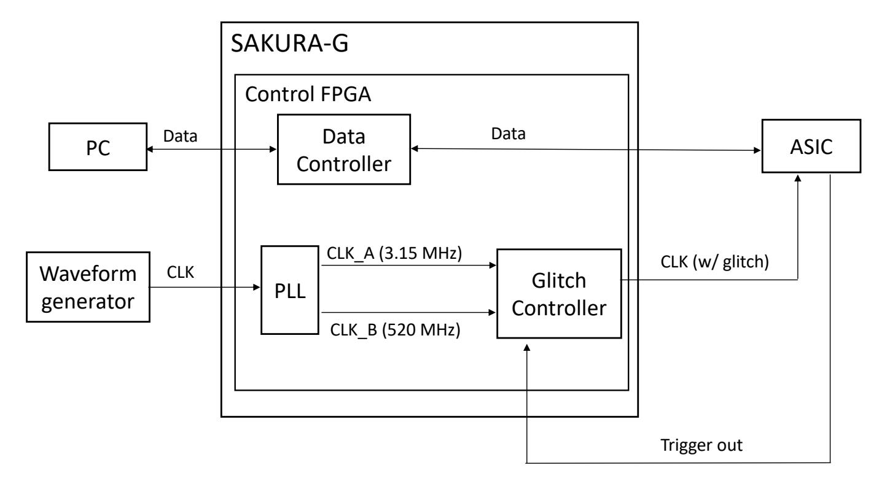

**Figure 3:** Block diagram for the lab setup used in the experiments.

glitching inside the pipeline.

In the following section, we experimentally verify that when the input of S-box is zero, a correct output can be obtained even if a fault occurs during the calculation between Stages 2 and 4.

#### <span id="page-5-2"></span>**3.2 Experiment Verifying Zero-value Attacks**

We perform the aforementioned fault experiments on a custom ASIC, showing how this attack can be easily implemented in practice on an actual chip.

**Custom ASIC and experiment setup.** We implement an AES hardware core with the 2nd-order "custom" M&M countermeasure from [\[MAN](#page-21-4)<sup>+</sup>19] as an ASIC with 28 nm CMOS process technology. Details of the design and fabrication are shown in Table [1.](#page-5-0) The ASIC takes 239 clock cycles in total for encryption. To control the timing of the glitch, we used a signal called start\_out, which outputs HIGH when the ASIC starts to encrypt so that we can inject a glitch at an arbitrary time. For the encryption, the PC with MATLAB code initially sends an unshared plaintext and a secret key to control FPGA (Spartan-6) on SAKURA-G board, and then the control FPGA makes shares for the values. Subsequently, the control SAKURA-G sends shared values to the ASIC so that the ASIC only processes encryption operation. We include pictures of the fabricated chip and the evaluation board in Figure [4.](#page-6-0)

The ASIC board has four SMA pins to supply power to the core and I/O for the AES circuit and PRNG, respectively. In addition, to supply the clock signal, the ASIC has two SMA pins for AES and PRNG. We supplied standard voltage and clock signal to the PRNG circuit in the experiments. We used a clock glitch to inject a fault in this study because of the ease of controlling the timing of injection and the simplicity of implementation. A clock signal (47.25 MHz) was supplied by a waveform generator to the SAKURA-G and we obtained a high-and low-frequency clock signal from the phase locked loop (PLL) built in

{6}------------------------------------------------

<span id="page-6-0"></span>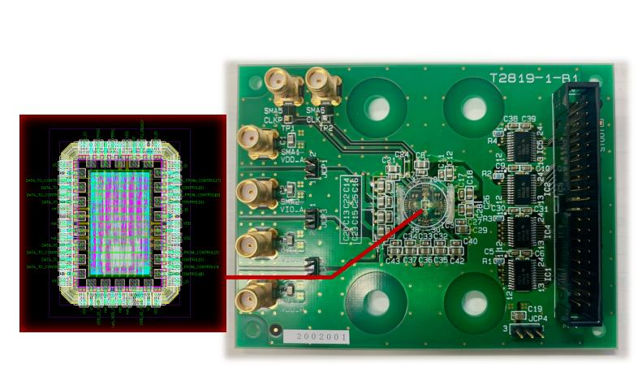

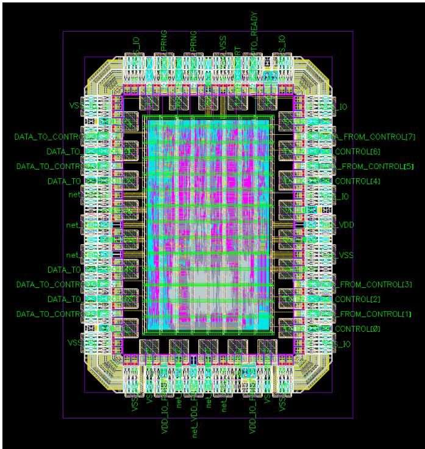

- **(a)** ASIC evaluation board **(b)** Custom ASIC layout (1 mm \* 0.75 mm size)

<span id="page-6-1"></span>**Figure 4:** Layout of the custom fabricated chip and corresponding ASIC evaluation board.

**Table 2:** Equipment used in experiments

| Equipment                                                        | Product name and model number                                         |
|------------------------------------------------------------------|-----------------------------------------------------------------------|
| Waveform generator<br>DC power supply<br>DC power supply<br>FPGA | Keysight 33622A<br>ADCMT 6156<br>AND AD-8723D<br>SAKURA-G (Spartan-6) |
|                                                                  |                                                                       |

Spartan-6. A low-frequency (3.15 MHz) clock signal divided by 15, named CLK\_A, is used for normal operations of the AES encryption, and a high-frequency signal (519.75 MHz) multiplied by 11, named CLK\_B, is used for a glitch. We created the glitch by taking two consecutive clock cycles of CLK\_B and adding them to CLK\_A.

Figure [3](#page-5-1) outlines the block diagram for the lab setup used in the experiments. Table [2](#page-6-1) and Figure [5](#page-7-0) outline a list of the equipment used in the experiments, and show the lab setup.

**Experiments.** The experimental conditions are the following; encryption operations are repeated ten times each for 30*,* 000 random plaintexts. We use a clock glitch to induce the fault and inject it into the last round of AES. The seed value given to the PRNG is updated with every encryption. Therefore, the secret tag key *α* and the shared values differ for each operation.

De Meyer et al. contemplate two adversary models, the first when a crafted fault is injected it must only affect *d* out of *d* + 1 shares, and the second, when a random fault is injected, which can affect any number of shares. Faults induced by the clock glitch might affect all *d* + 1 shares, but the effect is of a random fault.

**Results of the analysis.** Table [3](#page-7-1) shows the detection ratio at each stage of the pipeline. We define detection ratio as the number of randomized ciphertexts (i.e., M&M infection countermeasure triggered) over the total number of encryptions. Note that the detection rate includes as well the cases where the fault is not injected due to low glitch intensity. We further classify the detection rates depending on the stage(s) that was (were) affected by the glitch. The fact that the detection ratio is not 100% is due to the propagation

{7}------------------------------------------------

<span id="page-7-0"></span>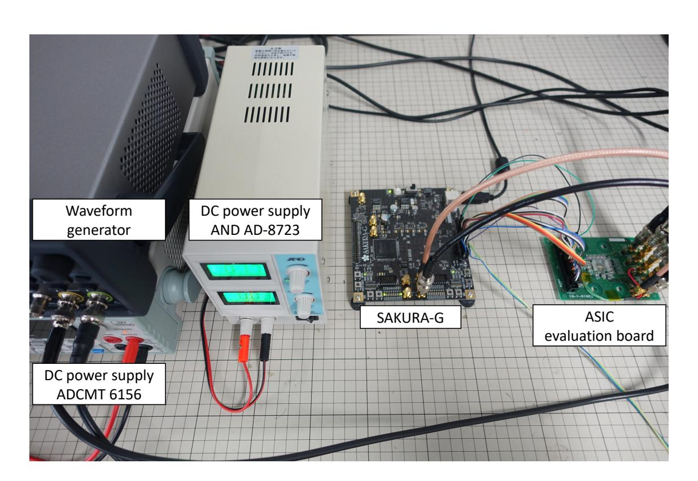

**Figure 5:** Lab setup for the experiments.

<span id="page-7-1"></span>**Table 3:** Detection ratio for pipelined S-box at each stage on ASIC.

|         | Fault occurrences/Total | Detection ratio |
|---------|-------------------------|-----------------|
| Stage 1 | 135,975/300,000         | ≈ 45.33%        |
| Stage 2 | 245,211/300,000         | ≈ 81.74%        |
| Stage 3 | 0/300,000               | 0%              |
| Stage 4 | 56,526/300,000          | ≈ 18.84%        |
| Stage 5 | 164,337/300,000         | ≈ 54.78%        |
| Stage 6 | 65,244/300,000          | ≈ 21.75%        |

<span id="page-7-2"></span>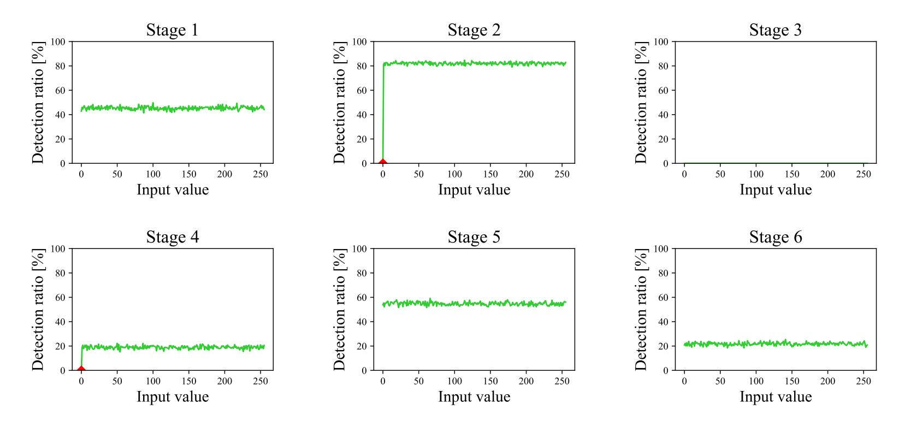

**Figure 6:** The detection ratio for each input value of S-box on ASIC. The detection ratio of zero-value is biased in Stages 2 and 4. The ratio in Stage 3 is 0% for all inputs.

{8}------------------------------------------------

paths and the glitch intensity, which means that for some injections the glitch did not affect the functionality of the circuit. Furthermore, Table 3 shows that the detection ratio in Stage 3 is 0%, meaning that no fault occurred in Stage 3 for any input value, regardless of how the shares were split even under a high-intensity glitch.

After this first analysis, we evaluate the detection ratio for each S-box input  $x \in GF(2^8)$  on each stage, and illustrate the results in Figure 6. The graphs of Stages 2 and 4 in Figure 6 indicate that the detection ratio is 0% when the input is zero, showing a clear bias on this value. This means that any fault that occurs between Stages 2 and 4 is masked if the S-box input is zero, and a correct output value is obtained.

#### 3.3 Practical Attacks

We demonstrate two practical known ciphertext attacks based on the vulnerability we discussed above. One targets the last round of AES, and the other one the first round.

#### <span id="page-8-0"></span>Algorithm 2 Key retrieval procedure for the last round with random plaintexts

```
Input: Number of ciphertexts N; Byte position j for the Stage 2
Output: Most Probable Key byte j
    Initialization: D[k][l] \leftarrow 0 initialize (0 \le k, l \le 255)
 1: // Collection phase
 2: for i = 1 to N do
       Generate a random plaintext P_i
 3:
       C \leftarrow Enc(P_i) // with glitch at last round
 4:
       C' \leftarrow Enc(P_i) // without glitch
 5:
       if (C = C') then
 6:
         C_i \leftarrow C // collect the ciphertext, where the fault is ineffective
 7:
       else
 8:
         Go to line 3.
 9:
       end if
10:
11: end for
12: // Key retrieval phase
13: for K_q = 0 to 255 do
       for i = 1 to N do
14:
         D[K_q][S^{-1}(C_i^j \oplus K_q)] \leftarrow D[K_q][S^{-1}(C_i^j \oplus K_q)] + 1
15:
       end for
16:
17: end for
18: return K \leftarrow K_q where D[K_q][0] is the maximum
```

Targeting the last round with random plaintexts. Algorithm 2 presents the key retrieval procedure used to exploit the zero-value bias seen in Figure 6. Faulting Stage 2 is the most convenient target to perform the attack, because this stage presents the most pronounced bias. The algorithm consists of a collection phase and a key retrieval phase. First, on the collection phase, we obtain N correct ciphertexts where the fault is ineffective, comparing the outputs of glitchy and normal encryption. Then, on the key retrieval phase we compute an intermediate value  $S^{-1}(C_i \oplus K_g)$  with a candidate key, i.e., the input of the last round and increase the counter on the given input value. If the candidate key is correct, the counted value of zero is the maximum on the histogram. Otherwise, non-zero value is the maximum. Since we know the fault is ineffective when the input value for S-box is zero, we obtain the true key.

Figure 7 (except for bottom right) displays the histograms obtained using the correct key, and the bottom right one illustrates the evolution of the correct key guess  $D[K_q][0]$  for

{9}------------------------------------------------

<span id="page-9-0"></span>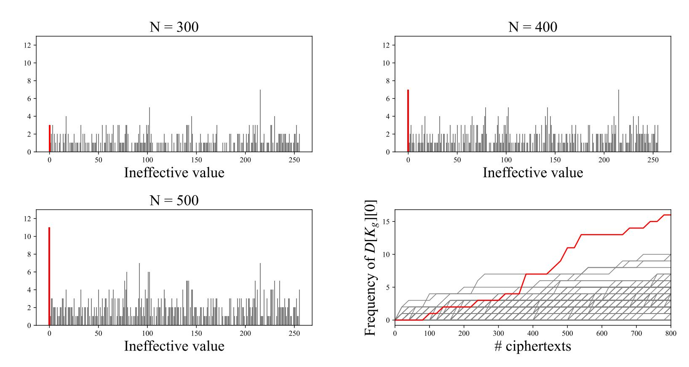

Figure 7: Obtained histograms with a correct key and evolution of  $D[K_g][0]$  for all guessed key  $K_g$  (bottom right). In the bottom right picture, the red line indicates the correct candidate, and the gray lines depict other incorrect candidates, from Algorithm 2.

all candidate keys with the number of ciphertexts, following Algorithm 2. From Figure 7, we can see that 500 ineffective ciphertexts are sufficient to distinguish the true key.

**Extension of the zero-value attack to the 1st round.** It is standard to target the last round of AES when applying fault analysis. Nevertheless, it has been shown recently by Saha et al. [SBR<sup>+</sup>20] that it is also possible to target the middle rounds of the cipher. Following this idea, we propose an improved zero-value attack targeting the 1st round.

Since our attack requires the input of the S-box to be zero, one can use chosen plaintext to make particular j-th byte input to 1-st round S-box to be zero. Then, the attacker can inject a glitch and check whether the ciphtertext is correct or not. If the ciphertext is correct, then the j-th byte of the initial key  $K^j$  is obtained because the fault induced by the glitch is never propagated when  $P^j \oplus K^j = 0$ . Otherwise, the attacker chooses other value  $P^j$  and repeats the procedure. This way the attacker can obtain one byte of the secret key with 256 plaintexts in practice as described in Algorithm 3.

#### <span id="page-9-1"></span>Algorithm 3 Key retrieval procedure for the first round with chosen plaintexts

```
Input: Byte position j for the Stage 2
Output: Most Probable Key byte j
 1: for K_g = 0 to 255 do
     P \leftarrow K_q ||K_q||..||K_q|
                                // All byte equals to K_q
 2:
      C \leftarrow Enc(P)
 3:
      C' \leftarrow Enc(P) with glitch at S-box Stage 2 of the first round
 4:
      if (C = C') then
 5:
                             //P^j \oplus K^j = 0
         K^j \leftarrow K_q
 6:
                             // Faults are propagated when P^j \oplus K^j \neq 0
         Exit the loop
 7:
      end if
 8:
 9: end for
10: \mathbf{return} K
```

{10}------------------------------------------------

## <span id="page-10-0"></span>4 Improving M&M with $\lambda$ -Detection

In this section we describe a fine-grained  $\lambda$ -Detection mechanism which focuses on the S-box. As already pointed out the infection mechanism in M&M fails to protect against ineffective faults, and as known from SIFA countermeasures, fine-grained detection or error correction methods are required instead. The main target of our countermeasure is to detect the effect of a glitch fault as soon as possible, before its effect is masked and turned into ineffective fault. To do so, we include additional checks in the central path of the S-box, in each of the vulnerable stages (i.e., Stages 2 to 4). To perform the checks we use the intermediate values of the S-box stages for both the data and the tag, performing cross-checks leveraging the  $\lambda$  property presented below.

#### 4.1 Properties of the $\lambda$ map

Recall that the  $\lambda_n$  map is defined from  $x \in GF((2^n)^2)$  to  $GF(2^n)$  as given in Equation (1).

**Theorem 1.**  $\lambda$ -map has the following properties:

- a)  $\lambda_n(x) = 0$  if and only if x = 0.
- b) For any  $y \neq 0 \in GF(2^n)$  there are  $2^n + 1$  values  $x \in GF((2^n)^2)$ , such that  $\lambda_n(x) = y$ , i.e.,  $\lambda$  is uniform function if we exclude the zero input.
- c)  $\lambda_n$  is a multiplicative homomorphism, i.e.,  $\lambda_n(x)\lambda_(y) = \lambda_n(xy)$  for all  $x, y \in GF((2^n)^2)$ .
- *Proof.* a) When x = 0, it follows straight forward that  $\lambda_n(x) = 0$ . The opposite direction follows from the fact that  $\lambda$  is part of the filed inversion in  $GF((2^n)^2)$  extended with the mapping  $0 \longrightarrow 0$ . This ensures that only one input 0 is mapped to an output 0. However, if  $\lambda(x) = 0$  then the output of the inversion is 0 hence the input of the inversion (and also the input of lambda) is 0 too.
- b) We have  $2^{2n} 1 = (2^n + 1)(2^n 1)$  non-zero inputs mapping to  $2^n 1$  non-zero outputs. Applying the multiplicative homomorphism from item c) we get for each non-zero output exactly the same number of inputs (namely  $2^n + 1$  inputs) mapping to this output. For any non-zero output we get one symmetric solution (a, a) and  $2 \cdot 2^{n-1} = 2^n$  asymmetric solutions (a, b) since whenever (a, b) is a solution (b, a) is a solution as well.
- c) We prove the last property by calculating both sides separately. Let x = (a, b) and y = (c, d) then:

$$\lambda_n(x)\lambda_n(y) = (ab + (a+b)^2\nu)(cd + (c+d)^2\nu)$$

$$= ((a+b)(c+d)\nu)^2 + ab(c+d)^2\nu + cd(a+b)^2\nu + abcd$$

$$= ((a+b)(c+d)\nu)^2 + (cda^2 + cdb^2 + abc^2 + abd^2)\nu + abcd.$$

Recall that the multiplication over  $GF((2^n)^2)$  is defined as  $xy = ((a+b)(c+d)\nu + ac, (a+b)(c+d)\nu + bd)$ , then

$$\lambda_n(xy) = ((a+b)(c+d)\nu)^2 + (a+b)(c+d)(ac+bd)\nu + abcd + (ac+bd)^2\nu$$

$$= ((a+b)(c+d)\nu)^2 + ((a+b)(c+d)(bd+ac) + (ac+bd)^2)\nu + abcd$$

$$= ((a+b)(c+d)\nu)^2 + (ac+bd)((a+b)(c+d) + (ac+bd))\nu + abcd$$

$$= ((a+b)(c+d)\nu)^2 + (ac+bd)(ad+bc)\nu + abcd$$

$$= ((a+b)(c+d)\nu)^2 + (cda^2 + abc^2 + abd^2 + dcb^2)\nu + abcd.$$

which concludes the proof.

{11}------------------------------------------------

<span id="page-11-0"></span>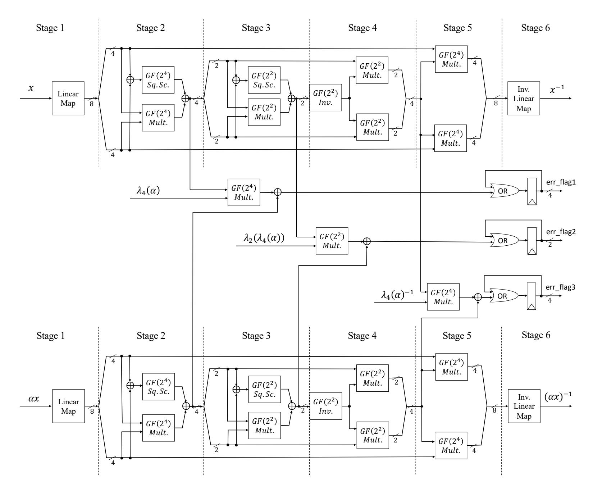

Figure 8: Proposed S-box of our  $\lambda$ -Detection M&M AES. The upper inversion is for data, while the one at the bottom is for the tag. Outputs of multiplication for detector are accumulated during the computation. Note that all the signals shown in the picture are shared in the implementation, but we depict them here as unshared for the sake of clarity.

We use  $\lambda_4$  multiplicative property to verify the values in Stage 2, and, similarly,  $\lambda_2$  multiplicative property is used to verify the values in Stage 3. It is also possible to leverage this property for Stage 4 since the multiplicative property also holds for the inversion of  $\lambda$ . By means of this new property, we perform the following cross-checks in Stages 2, 3, and 4:

$$\lambda_n(data) \otimes \lambda_n(\alpha) \oplus \lambda_n(tag) = 0.$$

Since the  $\lambda_n(\alpha)$  for the different stages just requires the secret key  $\alpha$  to be calculated, we can pre-compute them together with the generation of the shared  $\alpha$  and provide them as inputs.

To ensure there is no side-channel leakage in the detectors, they are fully computed in shared form. Since the detectors feature a shared multiplication, the check for Stage i is done at the next Stage i+1 to ensure no glitches harm the security of the check. Similarly, the output is registered before the next computation. The complete error flag from the three checks is 4+2+4=10 bits wide, shared with d+1 shares because we calculate and store them in a shared form. We accumulate all error flags with a shared-OR gate. The concrete architecture of the S-box with detectors is depicted in Figure 8.

{12}------------------------------------------------

#### 4.2 Match Check

Our fine-grained  $\lambda$ -check focuses on faults inside the S-box, but faults outside the S-box (e.g. Mix Columns operation) should also be considered. To do this, we compute a final check to verify whether the ciphertexts for data and tag match, via the *Match Check*. In the Match Check algorithm (Algorithm 4), we compare two values  $\alpha \cdot c$  and  $\tau^c$  byte per byte, and accumulate their difference with a shared-OR gate, following the same procedure as the detectors inside the S-box.

#### <span id="page-12-0"></span>Algorithm 4 Match Check

```
Input: c, \tau^c, \alpha
Output: z

1: z = 0

2: for i = 1 to 16 do

3: z_i \leftarrow \alpha \cdot c_i \oplus \tau_i^c

4: z \leftarrow \text{shared-OR}(z, z_i)

5: end for

6: return z
```

#### 4.3 Delta Function

After the detectors and the Match Check, we still need to decide whether a fault was detected or not. This is probably the most challenging feature of a combined SCA and FA countermeasure, a combined secure check. As De Meyer et al. claimed in the M&M paper [MAN<sup>+</sup>19], unmasking of  $e = \alpha \cdot c \oplus \tau^c$  to check if a fault is detected is not secure against fault and side-channel combined attacks. In Equation (2), we include a straightforward attack to show this weakness: given a fault ( $\Delta$ ) injected in  $\alpha$  at the time of the check, it suffices a single probe on the unshared check to reveal the ciphertext.

<span id="page-12-1"></span>
$$e = (\alpha \oplus \Delta) \cdot c \oplus \tau^{c}$$

$$\Rightarrow e = \Delta c \oplus \alpha c \oplus \tau^{c}$$

$$\Rightarrow e = \Delta c$$

$$(2)$$

However, it is easy to overcome this problem, by using a Kronecker's delta function (shown in Equation (3)) performed in shared form as done in [MRB18].

<span id="page-12-2"></span>
$$\delta(x) = \begin{cases} 1 & \text{if } x = 0, \\ 0 & \text{otherwise.} \end{cases}$$
 (3)

The main advantage of this method is that we reduce any secret data dependency that may appear in e (see Equation (2)) to a single shared bit.

#### 4.4 Overall Detection Architecture

The overall detection is depicted in Figure 9. When a glitch fault is injected, the circuit detects it and flags an error, asserting a shared detection signal. Whenever a fault is detected, the circuit zeroizes the full ciphertext preventing the release of any faulty data. By zeroizing the output, we avoid the problem of the infection schemes and do not leak any information about which specific byte(s) is faulty.

In the final step we unshare the  $\delta$ -flag to a single bit, and use it to check whether a fault was detected. As is the case in the probing model for SCA, the attacker is not allowed to probe immediately after the plaintext has been shared or immediately before

{13}------------------------------------------------

<span id="page-13-1"></span>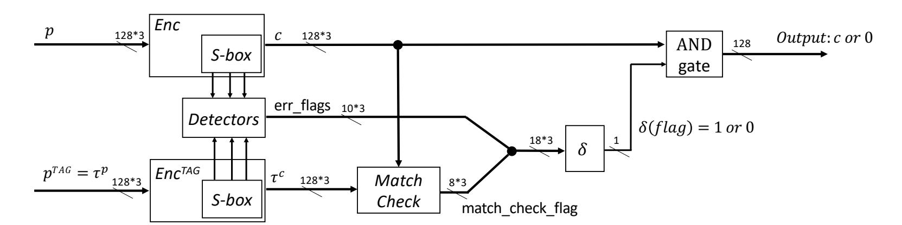

**Figure 9:** Overview of the new detection-based countermeasure. Thick wires indicate shared-form value, while thin wires mean unmasked value.

the ciphertext is unshared. Knowing d shares via the probes and the value of the plaintext or the ciphertext will allow them to reveal all shares and propagate this knowledge further. Hence, at this last step, the attacker is not allowed to fault this single bit flag. An attacker could still probe this check bit, but the only information he/she would learn is whether the injected fault was detected. If detection is used the adversary always gains this information, for example from the ciphertext. This is only useful if there exists possible ineffective fault which goes undetected.

Our goal is to provide a solution against glitch attacks since those are easier to perform and they correspond to the random fault model, where an attacker can impact both S-box instances with a single glitch. Against this kind of attacks our countermeasure is secure against SIFA, since every fault is detected and no ineffective faults appear. Note that similar zero-value SIFA2 or safe-error attacks can still be mounted with more precise faults (e.g., with a laser- or EM-injections) against our proposed extension of M&M with  $\lambda$ -Detection. Protection against such precise faults for M&M is left as an open question for future work.

# <span id="page-13-0"></span>5 Implementation Costs and Security Evaluation of the $\lambda$ -Detection M&M

In this section, we describe the performance of the new  $\lambda$ -Detection M&M, and present the security evaluations against FA and SCA.

#### 5.1 Implementation Costs

Below, we report the implementation costs of our countermeasure and compare it with the original M&M, summarized in Table 4. We note that we decided to keep the same masking scheme as in the original M&M in order to have a fair comparison. However, if we change to DOM-like refreshings, we would just require a third of the fresh random variables currently used plus additional savings in area. In that respect, M&M can be further improved on area and randomness efficiency.

Randomness. In the following we describe the randomness added by the new modules. The shared-OR gate accumulators need 72, 36, or 18 bits of randomness each, depending on the size of the input (byte, 4-bits, or 2-bit nibbles) since we use a ring refreshing to ensure that there is no data leakage when computing the checks. Both detectors and the Match Check contain shared-OR gates. The detectors require a total of 180 random bits per cycle, for the OR accumulators and the shared multiplications. The Match Check requires a total of 96 random bits, for a byte OR accumulator and a shared multiplication, and the delta calculation requires additional 63 bits. However, the randomness from the

{14}------------------------------------------------

**Table 4:** Implementation costs for 2nd-order *λ*-Detection M&M

<span id="page-14-0"></span>

|                 | Random bits/cycle | Latency [# cycles] | Area [kGE] |
|-----------------|-------------------|--------------------|------------|
| S-box           | 564               | 6                  | 18.7       |
| Detectors       | 180               | 3                  | 4.4        |
| Match check     | 96                | 2                  | 3.9        |
| Delta function  | 63                | 5                  | 2.3        |
| Total           |                   |                    |            |
| λ-Detection M&M | 564               | 244                | 44.0       |
| M&M [MAN+19]    | 348               | 239                | 33.2       |

<span id="page-14-1"></span>**Table 5:** Area comparison for combined second-order (SCA) secure AES implementations

| Countermeasure  | Synthesis<br>Library | Cipher      | SCA-only<br>[kGE] | Combined<br>[kGE] | Overhead<br>factor |
|-----------------|----------------------|-------------|-------------------|-------------------|--------------------|
| [CRB+16]        | Nangate 45nm         | AES         | 12.61             | -                 | -                  |
| [GMK17]         | UMC 90nm Low-K       | AES         | 10.0              | -                 | -                  |
| CAPA [RMB+18]   | Nangate 45nm         | AES         | -                 | 215               | -                  |
| M&M [MAN+19]    | Nangate 45nm         | AES         | 12.6              | 33.2              | 2.63               |
| [FRBSG22]       | Nangate 45nm         | S-box (AES) | -                 | 59.4              | -                  |
| λ-Detection M&M | Nangate 45nm         | AES         | 12.6              | 44.0              | 3.49               |

Match Check and the delta function is only needed once, at the end of the computation. The randomness cost for our new implementation is approximately 62% greater than that of M&M.

We recall that the randomness costs can be drastically reduced if we were to use DOM-like refreshing instead of the ring refreshing. As an example for the detectors we would need 60 bits, the Match Check would require 32 bits, and the delta functions 21 bits.

**Latency.** The detectors inside S-box require no additional cycles, since the multiplications are done during the process of the inversion. The Match Check requires two clock cycles, and the delta function needs five clock cycles per byte; thus we need 22 clock cycles for 16 AES state bytes. In total, our countermeasure takes 244 clock cycles while the original M&M implementation (V2 in the paper [\[MAN](#page-21-4)<sup>+</sup>19]) requires 239 clock cycles including infection. Hence our countermeasure takes just five additional clock cycles compared to the original M&M AES.

**Area.** We report our area result for the *λ*-Detection M&M. Table [4](#page-14-0) shows the area of the elements added into our new design, namely, the detectors, the Match Check which substitutes the infection in the original implementation, and the Kronecker's delta calculations. This adds about 13 kGE to the original design, resulting in an area overhead of 1*.*32 times the "custom" implementation of [\[MAN](#page-21-4)<sup>+</sup>19]. Note that we have removed the infection part.

Additionally, we report the overhead factor with respect to the corresponding SCA-only implementation, which in our case (similarly to the original "custom" M&M) corresponds to the one from De Cnudde et al. [\[CRB](#page-19-7)<sup>+</sup>16]. Table [5](#page-14-1) extends Table 4 from [\[MAN](#page-21-4)<sup>+</sup>19] including our new implementation, comparing this overhead with previous works implementations. In our case, the overhead compared to the SCA-only implementation is 3*.*49.

{15}------------------------------------------------

In summary, we can clearly see the trade-off of enhancing security, which always comes with a cost in performance. In our case, the main parameters affected are the amount of randomness and the area.

**Related work.** Since the proposal of SIFA multiple solutions have been proposed to thwart this attack. The majority of them use error correcting codes to prevent the output of correct and incorrect ciphertext or the use of detection based mechanisms. Examples of these works are [\[SRM19,](#page-22-2)[BKHL20,](#page-19-3)[SJBR](#page-22-3)<sup>+</sup>20]. More recent works have proposed combined countermeasures adding SIFA to the attacker model. Ramezanpour et al. [\[RAD20\]](#page-22-9) propose random space masking (RS-Mask) as a countermeasure against both power analysis and statistical fault analysis, where they map every intermediate of the computations to a random mapping. They leverage masking for this mapping, further adding redundancy and infection methods to thwart fault attacks. Gruber et al. [\[GPK](#page-20-9)<sup>+</sup>21] combine DOM-masking with error correcting codes (repetition codes) to realize a countermeasure against high-order side-channel attacks and fault attacks that can be scaled independently. Feldtkeller et al. [\[FRBSG22\]](#page-20-8) propose a combined provable secure countermeasure leveraging core ideas behind composability of SCA gadgets [\[CGLS21\]](#page-19-8). They propose new notions to provide security in the presence of faults (FINI), and in the presence of combined adversaries (CINI). Similarly to CAPA, they propose a provable secure scheme, which translates into higher security warranties compared to other works. However, this entails a performance penalty, at the cost of higher area and randomness requirements. The work by Richter-Brockmann et al. [\[RBFSG22\]](#page-22-10) implements a tool to verify netlists against combined attacks including statistical ineffective fault analysis and checking whether the gadgets are composable secure using the notions by Dhooghe and Nikova [\[DN20\]](#page-20-10). The downside of all these approaches is that they are limited to the number of faults they can correct. With the clock glitch, the attacker typically introduce many faults at once. We provide a comparison with previous works in Table [5.](#page-14-1)

#### **5.2 Security Evaluations**

We evaluate the security of the new implementation against both FAs and SCAs separately using a SAKURA-G board. It features two Spartan-6 FPGAs and is designed for sidechannel evaluation. The main FPGA is used just for the encryption, and the control FPGA is used for communicating with a host computer and generating the shares. In the following, we first present the performance of the countermeasure against fault analysis. Then, we conduct a non-specific t-test with power consumption traces as a side-channel analysis.

#### **5.2.1 FA Evaluation**

In this section, we verify the behavior of our implementation when the faults are injected during the S-box computation. Additionally, we repeat the ASIC experiments described in Section [3.2](#page-5-2) in FPGA for the original M&M, to have a fair comparison with the proposed implementation. We confirm the correct functionality of our countermeasure, and show that the detectors prevent the zero-value bias, properly catch the faults, and the output is correctly zeroized when they occur.

**Detection ratio and behavior analysis.** In the first part of our fault analysis, we again evaluate the fault detection ratio of each input value on the last round tests with the new implementation, analogous to Figure [6.](#page-7-2) We recall that the detection ratio is defined in Section [3.2](#page-5-2) as the number of randomized ciphertexts over the total number of encryptions. For the second implementation, we count zeroized ciphertexts instead.

{16}------------------------------------------------

<span id="page-16-0"></span>**Table 6:** Detection ratio for pipelined S-box at each stage on SAKURA-G.

|         | Fault occurrences/Total | Detection ratio |
|---------|-------------------------|-----------------|
| Stage 1 | 297,761/300,000         | ≈ 99.25%        |
| Stage 2 | 294,996/300,000         | ≈ 98.33%        |
| Stage 3 | 82,753/300,000          | ≈ 27.58%        |
| Stage 4 | 26,405/300,000          | ≈ 8.80%         |
| Stage 5 | 297,793/300,000         | ≈ 99.26%        |
| Stage 6 | 297,786/300,000         | ≈ 99.26%        |

<span id="page-16-1"></span>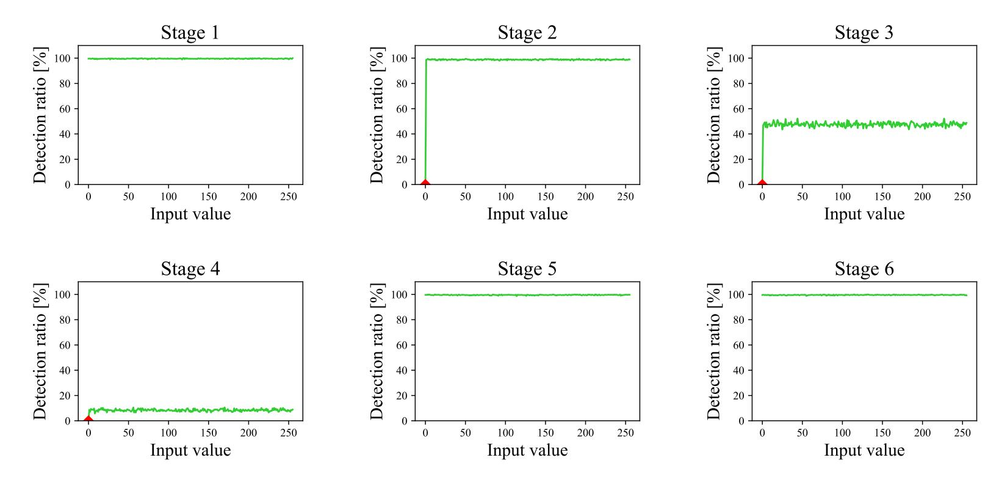

**Figure 10:** The detection ratio for each input value of S-box (repeated on FPGA). The ratios of zero-value is 0% at Stages 2, 3 and 4 as expected.

For the sake of comparison, we replicate first the ASIC experiments on SAKURA-G for the original M&M. The experimental conditions remains consistent, with the exception of the intensity of the clock glitch. We reduce the glitch intensity to accommodate to the FPGA implementation timing. We analyze the detection ratio at each stage and subsequently evaluates them for each S-box input. Table [6](#page-16-0) presents detection ratios for each stage. Unlike the ASIC, the detection ratio for Stage 3 is non-zero. Additionally, the ratios for Stages 1 and 6 are as high as Stage 2. These differences are due to the difference in nature between ASIC and FPGA. While the FPGA maps the gates to look-up tables, the gates on the ASIC are directly built with transistors. The result of this experiment is depicted in Figure [10,](#page-16-1) where we can see that the zero-value bias is still visible in FPGA.

Similarly, Figure [11](#page-17-0) shows the detection ratios for the analysis of the new *λ*-Detection M&M. As in the FPGA experiment of the original M&M, we reduced the glitch intensity to accommodate to the FPGA implementation timing of the new *λ*-Detection M&M. More precisely, the glitch intensity was reduced up to a point where we avoided 100% detection ratios, for the sake of clarity of the experiments, and to be as consistent as possible with the ASIC ones. As we can see, it shows constant detection ratios for every stage. This means that the zero-value bias which we observed on the original M&M implementation has been removed. Moreover, note that the detection ratio across all stages is the same. This is because for the new *λ*-Detection M&M the entire ciphertext is zeroized when a fault is detected, so the attacker cannot distinguish which stage was faulted. In the case of M&M, the infection worked byte-wise, which allowed the attacker to distinguish which stage was affected.

In the second part of the fault analysis, we look at the detection performance of the

{17}------------------------------------------------

<span id="page-17-0"></span>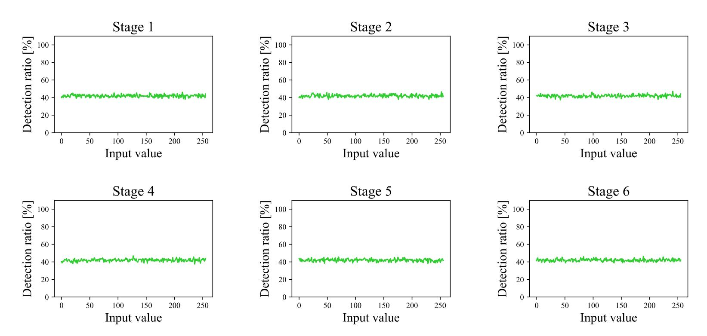

<span id="page-17-1"></span>**Figure 11:** The detection ratio for each input value of S-box (*λ*-Detection M&M implemented on SAKURA-G).

**Table 7:** Conditions for the fault evaluation.

| Glitch timing | First, last round                   |
|---------------|-------------------------------------|
| Byte Position | (1, 2, 3), (8, 9, 10), (14, 15, 16) |
| Stage No.     | 2nd, 3rd, 4th                       |

new countermeasure for additional scenarios. We perform multiple fault injections, for which experimental conditions are shown in Table [7:](#page-17-1) first, we inject faults in the first and the last round; then, we target different byte positions, and finally, we target the three different stages susceptible to zero-value bias. Hence, we conduct a total of 2 × 9 × 3 = 54 tests with clock glitch to induce faults in the same way as in Section [3.2.](#page-5-2) For each test, we use 1*,* 000 random plaintext with a fixed secret key. For the first round test, we use two types of key: one is fixed, similarly as the last round tests, and in the other one the key is equal to the plaintext, so that S-box inputs in the first round are zero. In each test, we count the number of times that the flag is not zero. Each of the 54 tests showed 1*,* 000 faults detected, for which all the outputs were correctly zeroized. This means a 100% fault coverage against glitch-injected faults.

#### **5.2.2 SCA Evaluation**

Our experiment setup for SCA evaluation is similar to that used in the original M&M paper [\[MAN](#page-21-4)<sup>+</sup>19]. We measure the power consumption for the full AES algorithm including the match check at 3.125 GS/s sampling rate using an oscilloscope with 12 bit analog to digital converter. Moreover, we supply a slow 3 MHz clock signal to get clear traces.

**TVLA.** We perform a non-specific test vector leakage assessment (TVLA) following [\[BCD](#page-19-9)<sup>+</sup>13[,SM15\]](#page-22-11). In the TVLA testing, we detect correlations between power consumption and the processed values by comparing traces of two groups. It uses Welch's t-test to evaluate the null hypothesis that the two sets of power traces have identical means. When a t-statistic is lower than the threshold 4.5 in absolute value, this means the hypothesis has not been rejected and it can be concluded that the circuit does not leak with very high confidence. Variations in the t-value within this range do not have further meaning. However, in the opposite case, if the t-statistic is over the threshold at some sample points, it means the hypothesis has been rejected, meaning that it is possible to distinguish the

{18}------------------------------------------------

<span id="page-18-1"></span>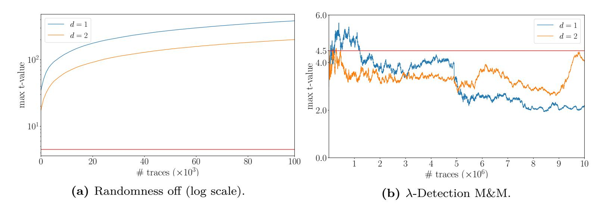

<span id="page-18-3"></span><span id="page-18-2"></span>Figure 12: Evolution of the absolute maximum t-value with number of traces. Left is PRNG-off (100 K traces); Right is with countermeasure active (10 M traces).

two groups and hence there is leakage. A higher t-value means higher confidence in the leakage. It is important to note that this does not mean that the leakage is exploitable and that a key recovery attack is possible.

Figure 12 shows the results of the first- and second-order t-test. The x-axis corresponds to the number of traces, and the y-axis to the maximum t-statistic in absolute value. We first perform the test on an "unprotected" AES circuit, i.e., with PRNG off, to confirm our experimental setup detects leakage correctly. As shown in Figure 12(a), the maximum t-statistic is monotonically increasing as the number of traces increases; hence our experimental setup can detect leakage.

The result for our  $\lambda$ -Detection M&M is presented in Figure 12(b), where no leakage is detected. Note that there are some points at the beginning of the experiment that go over the threshold. We attribute this to the statistical instability of the test of the early stages, which gains confidence as more traces are acquired. Moreover, the t-statistic does not grow with the number of traces.

Combined attacks. Our scheme  $\lambda$ -Detection M&M provides protection against combined attacks, but we do not prove its security in the framework for combined composable security from [FRBSG22], since we consider a stronger adversary model (namely, we also allow the adversary to fault unlimited number of bits). Instead, the security arguments from the original M&M paper (Section 6.3) [MAN<sup>+</sup>19], also hold for the  $\lambda$ -Detection M&M.

#### <span id="page-18-0"></span>6 Conclusion

In this paper, we have presented a thorough fault analysis of the M&M AES implementation from De Meyer et al. [MAN<sup>+</sup>19], deployed in a custom ASIC. Three contributions are reported from this study. First, we identified an algorithmic level vulnerability in the compact tower-filed decomposed AES S-box architecture against zero-value attacks, which holds even if the circuit is masked. Second, we describe two SIFA-like zero-value attacks: the first on the last round, and the second, a novel attack on the first round. The attacks do not need any complex stochastic models and are very straightforward to perform. To demonstrate the practicality of the attacks, we opted for a clock glitch to inject faults on De Meyer et al.'s implementation. However, the results are applicable to any secure implementation featuring a tower-field decomposed S-box implementation independently of the masking method utilized.

We also propose a new detection-based countermeasure extending the M&M scheme, by utilizing a property of the AES S-box inversion. Namely, we describe new properties of the  $\lambda$ -function which is part of the tower-field inversion. Our  $\lambda$ -Detection M&M

{19}------------------------------------------------

prevents the glitch attack against the vulnerability presented in the first part of the manuscript. Furthermore, we have implemented the countermeasure on FPGA and verified its security against both fault and side-channel analysis with practical experiments. Our implementation provides enhanced security compared to the previous M&M, at the expense of reasonable additional performance costs.

**Acknowledgements.** This work was supported by JSPS KAKENHI (grant numbers JP18H05289, JP20K19798, JP23H03364, and JP23H03393) and by CyberSecurity Research Flanders with reference number VR20192203. We would like to thank the reviewers for their helpful comments and suggestions.

## **References**

- <span id="page-19-9"></span>[BCD<sup>+</sup>13] Georg T. Becker, Jim Cooper, Elizabeth K. DeMulder, Gilbert Goodwill, Joshua Jaffe, Gary Kenworthy, T. Kouzminov, Andrew J. Leiserson, Mark E. Marson, Pankaj Rohatgi, and Sami Saab. Test vector leakage assessment (TVLA) methodology in practice. In *International Cryptographic Module Conference*, 2013.
- <span id="page-19-0"></span>[BCO04] Eric Brier, Christophe Clavier, and Francis Olivier. Correlation power analysis with a leakage model. In Marc Joye and Jean-Jacques Quisquater, editors, *Cryptographic Hardware and Embedded Systems — CHES 2004*, volume 3156 of *LNCS*, pages 16–29. Springer, 2004.
- <span id="page-19-4"></span>[BG13] Alberto Battistello and Christophe Giraud. Fault analysis of infective AES computations. In *2013 Workshop on Fault Diagnosis and Tolerance in Cryptography*, pages 101–107, 2013.
- <span id="page-19-6"></span>[BGN<sup>+</sup>15] Begül Bilgin, Benedikt Gierlichs, Svetla Nikova, Ventzislav Nikov, and Vincent Rijmen. Trade-offs for threshold implementations illustrated on AES. *IEEE Trans. Comput. Aided Des. Integr. Circuits Syst.*, 34(7):1188–1200, 2015.
- <span id="page-19-3"></span>[BKHL20] Jakub Breier, Mustafa Khairallah, Xiaolu Hou, and Yang Liu. A countermeasure against statistical ineffective fault analysis. *IEEE Trans. Circuits Syst.*, 67-II(12):3322–3326, 2020.
- <span id="page-19-1"></span>[BS97] Eli Biham and Adi Shamir. Differential fault analysis of secret key cryptosystems. In Burton S. Kaliski, editor, *Advances in Cryptology — CRYPTO '97*, volume 1294 of *LNCS*, pages 513–525. Springer, 1997.
- <span id="page-19-5"></span>[Can05] D. Canright. A very compact S-Box for AES. In Josyula R. Rao and Berk Sunar, editors, *Cryptographic Hardware and Embedded Systems — CHES 2005*, volume 3659 of *LNCS*, pages 441–455. Springer, 2005.
- <span id="page-19-8"></span>[CGLS21] Gaëtan Cassiers, Benjamin Grégoire, Itamar Levi, and François-Xavier Standaert. Hardware private circuits: From trivial composition to full verification. *IEEE Trans. Computers*, 70(10):1677–1690, 2021.
- <span id="page-19-2"></span>[Cla07] Christophe Clavier. Secret external encodings do not prevent transient fault analysis. In *Cryptographic Hardware and Embedded Systems — CHES 2007*, volume 4727 of *LNCS*, pages 181–194. Springer, 2007.
- <span id="page-19-7"></span>[CRB<sup>+</sup>16] Thomas De Cnudde, Oscar Reparaz, Begül Bilgin, Svetla Nikova, Ventzislav Nikov, and Vincent Rijmen. Masking AES with *d* + 1 shares in hardware. In Benedikt Gierlichs and Axel Y. Poschmann, editors, *Cryptographic Hardware*

{20}------------------------------------------------

- *and Embedded Systems CHES 2016*, volume 9813 of *LNCS*, pages 194–212. Springer, 2016.
- <span id="page-20-4"></span>[DDE<sup>+</sup>20] Joan Daemen, Christoph Dobraunig, Maria Eichlseder, Hannes Gross, Florian Mendel, and Robert Primas. Protecting against statistical ineffective fault attacks. *IACR Transactions on Cryptographic Hardware and Embedded Systems*, 2020(3):508–543, 2020.
- <span id="page-20-3"></span>[DEG<sup>+</sup>18] Christoph Dobraunig, Maria Eichlseder, Hannes Gross, Stefan Mangard, Florian Mendel, and Robert Primas. Statistical ineffective fault attacks on masked aes with fault countermeasures. In Thomas Peyrin and Steven Galbraith, editors, *Advances in Cryptology — ASIACRYPT 2018*, pages 315–342, Cham, 2018. Springer International Publishing.
- <span id="page-20-2"></span>[DEK<sup>+</sup>18] Christoph Dobraunig, Maria Eichlseder, Thomas Korak, Stefan Mangard, Florian Mendel, and Robert Primas. SIFA: exploiting ineffective fault inductions on symmetric cryptography. *IACR Transactions on Cryptographic Hardware and Embedded Systems*, 2018(3):547–572, 2018.
- <span id="page-20-10"></span>[DN20] Siemen Dhooghe and Svetla Nikova. My gadget just cares for me - how nina can prove security against combined attacks. In Stanislaw Jarecki, editor, *Topics in Cryptology – CT-RSA 2020*, pages 35–55, Cham, 2020. Springer International Publishing.
- <span id="page-20-6"></span>[FGP<sup>+</sup>18] Sebastian Faust, Vincent Grosso, Santos Merino Del Pozo, Clara Paglialonga, and François-Xavier Standaert. Composable masking schemes in the presence of physical defaults & the robust probing model. *IACR Trans. Cryptogr. Hardw. Embed. Syst.*, 2018(3):89–120, 2018.
- <span id="page-20-1"></span>[FJLT13] Thomas Fuhr, Eliane Jaulmes, Victor Lomné, and Adrian Thillard. Fault attacks on AES with faulty ciphertexts only. In *2013 Workshop on Fault Diagnosis and Tolerance in Cryptography*, pages 108–118, 2013.
- <span id="page-20-8"></span>[FRBSG22] Jakob Feldtkeller, Jan Richter-Brockmann, Pascal Sasdrich, and Tim Güneysu. CINI MINIS: Domain isolation for fault and combined security. In *Proceedings of the 2022 ACM SIGSAC Conference on Computer and Communications Security*, CCS '22, page 1023–1036. Association for Computing Machinery, 2022.
- <span id="page-20-0"></span>[Gir05] Christophe Giraud. DFA on AES. In Hans Dobbertin, Vincent Rijmen, and Aleksandra Sowa, editors, *Advanced Encryption Standard — AES*, volume 3373 of *LNCS*, pages 27–41. Springer, 2005.
- <span id="page-20-7"></span>[GMK17] Hannes Groß, Stefan Mangard, and Thomas Korak. An efficient side-channel protected AES implementation with arbitrary protection order. In *CT-RSA*, volume 10159 of *Lecture Notes in Computer Science*, pages 95–112. Springer, 2017.
- <span id="page-20-9"></span>[GPK<sup>+</sup>21] Michael Gruber, Matthias Probst, Patrick Karl, Thomas Schamberger, Lars Tebelmann, Michael Tempelmeier, and Georg Sigl. DOMREP–An orthogonal countermeasure for arbitrary order side-channel and fault attack protection. *IEEE Transactions on Information Forensics and Security*, 16:4321–4335, 2021.
- <span id="page-20-5"></span>[GST12] Benedikt Gierlichs, Jörn-Marc Schmidt, and Michael Tunstall. Infective computation and dummy rounds: Fault protection for block ciphers without check-before-output. In Alejandro Hevia and Gregory Neven, editors, *Progress*

{21}------------------------------------------------

- *in Cryptology LATINCRYPT 2012*, volume 7533 of *LNCS*, pages 305–321. Springer, 2012.
- <span id="page-21-10"></span>[GT03] Jovan D. Golić and Christophe Tymen. Multiplicative masking and power analysis of AES. In Burton S. Kaliski, çetin K. Koç, and Christof Paar, editors, *Cryptographic Hardware and Embedded Systems — CHES 2002*, volume 2523 of *LNCS*, pages 198–212. Springer, 2003.
- <span id="page-21-5"></span>[JMR07] Marc Joye, Pascal Manet, and Jean-Baptiste Rigaud. Strengthening hardware AES implementations against fault attack. *Information Security, IET*, 1:106– 110, 10 2007.
- <span id="page-21-1"></span>[KJJ99] Paul Kocher, Joshua Jaffe, and Benjamin Jun. Differential power analysis. In Michael Wiener, editor, *Advances in Cryptology — CRYPTO' 99*, volume 1666 of *LNCS*, pages 388–397. Springer, 1999.
- <span id="page-21-0"></span>[Koc96] Paul C. Kocher. Timing attacks on implementations of Diffie-Hellman, RSA, DSS, and other systems. In Neal Koblitz, editor, *Advances in Cryptology — CRYPTO '96*, volume 1109 of *LNCS*, pages 104–113. Springer, 1996.
- <span id="page-21-2"></span>[LRD<sup>+</sup>12] Ronan Lashermes, Guillaume Reymond, Jean-Max Dutertre, Jacques Fournier, Bruno Robisson, and Assia Tria. A DFA on AES based on the entropy of error distributions. In *2012 Workshop on Fault Diagnosis and Tolerance in Cryptography*, pages 34–43, 2012.
- <span id="page-21-6"></span>[LRT12] Victor Lomné, Thomas Roche, and Adrian Thillard. On the need of randomness in fault attack countermeasures - application to AES. In *2012 Workshop on Fault Diagnosis and Tolerance in Cryptography*, pages 85–94, 2012.
- <span id="page-21-3"></span>[LSG<sup>+</sup>10] Yang Li, Kazuo Sakiyama, Shigeto Gomisawa, Toshinori Fukunaga, Junko Takahashi, and Kazuo Ohta. Fault sensitivity analysis. In Stefan Mangard and François-Xavier Standaert, editors, *Cryptographic Hardware and Embedded Systems — CHES 2010*, volume 6225 of *LNCS*, pages 320–334. Springer, 2010.
- <span id="page-21-4"></span>[MAN<sup>+</sup>19] Lauren De Meyer, Victor Arribas, Svetla Nikova, Ventzislav Nikov, and Vincent Rijmen. M&M: Masks and macs against physical attacks. *IACR Transactions on Cryptographic Hardware and Embedded Systems*, 2019(1):25–50, 2019.
- <span id="page-21-7"></span>[MBPV05] Nele Mentens, Lejla Batina, Bart Preneel, and Ingrid Verbauwhede. A systematic evaluation of compact hardware implementations for the rijndael S-Box. In Alfred Menezes, editor, *Topics in Cryptology — CT-RSA 2005*, volume 3376 of *LNCS*, pages 323–333. Springer, 2005.
- <span id="page-21-9"></span>[MMG14] Oliver Mischke, Amir Moradi, and Tim Güneysu. Fault sensitivity analysis meets zero-value attack. In *2014 Workshop on Fault Diagnosis and Tolerance in Cryptography*, pages 59–67, 2014.
- <span id="page-21-8"></span>[MPL<sup>+</sup>11] Amir Moradi, Axel Poschmann, San Ling, Christof Paar, and Huaxiong Wang. Pushing the limits: A very compact and a threshold implementation of AES. In Kenneth G. Paterson, editor, *Advances in Cryptology — EUROCRYPT 2011*, volume 6632 of *LNCS*, pages 69–88. Springer, 2011.
- <span id="page-21-11"></span>[MRB18] Lauren De Meyer, Oscar Reparaz, and Begül Bilgin. Multiplicative masking for aes in hardware. *IACR Transactions on Cryptographic Hardware and Embedded Systems*, 2018(3):431–468, Aug. 2018.

{22}------------------------------------------------

- <span id="page-22-6"></span>[MS03] Sumio Morioka and Akashi Satoh. An optimized S-Box circuit architecture for low power AES design. In Burton S. Kaliski, çetin K. Koç, and Christof Paar, editors, *Cryptographic Hardware and Embedded Systems — CHES 2002*, volume 2523 of *LNCS*, pages 172–186. Springer, 2003.
- <span id="page-22-0"></span>[QS01] Jean-Jacques Quisquater and David Samyde. Electromagnetic analysis (EMA): Measures and counter-measures for smart cards. In Isabelle Attali and Thomas Jensen, editors, *Smart Card Programming and Security*, pages 200– 210. Springer, 2001.
- <span id="page-22-9"></span>[RAD20] Keyvan Ramezanpour, Paul Ampadu, and William Diehl. Rs-mask: Random space masking as an integrated countermeasure against power and fault analysis. In *HOST*, pages 176–187. IEEE, 2020.
- <span id="page-22-10"></span>[RBFSG22] Jan Richter-Brockmann, Jakob Feldtkeller, Pascal Sasdrich, and Tim Güneysu. Verica - verification of combined attacks automated formal verification of security against simultaneous information leakage and tampering. *IACR Transactions on Cryptographic Hardware Embedded Systems*, 2022(4):255–284, 2022.
- <span id="page-22-4"></span>[RBN<sup>+</sup>15] Oscar Reparaz, Begül Bilgin, Svetla Nikova, Benedikt Gierlichs, and Ingrid Verbauwhede. Consolidating masking schemes. In Rosario Gennaro and Matthew Robshaw, editors, *Advances in Cryptology — CRYPTO 2015*, volume 9215 of *LNCS*, pages 764–783. Springer, 2015.
- <span id="page-22-5"></span>[RMB<sup>+</sup>18] Oscar Reparaz, Lauren De Meyer, Begül Bilgin, Victor Arribas, Svetla Nikova, Ventzislav Nikov, and Nigel P. Smart. CAPA: the spirit of beaver against physical attacks. In Hovav Shacham and Alexandra Boldyreva, editors, *Advances in Cryptology — CRYPTO 2018*, volume 10991 of *LNCS*, pages 121–151. Springer, 2018.
- <span id="page-22-1"></span>[SBR<sup>+</sup>20] Sayandeep Saha, Arnab Bag, Debapriya Basu Roy, Sikhar Patranabis, and Debdeep Mukhopadhyay. Fault template attacks on block ciphers exploiting fault propagation. In Anne Canteaut and Yuval Ishai, editors, *Advances in Cryptology — EUROCRYPT 2020*, pages 612–643. Springer, 2020.
- <span id="page-22-3"></span>[SJBR<sup>+</sup>20] Sayandeep Saha, Dirmanto Jap, Debapriya Basu Roy, Avik Chakraborty, Shivam Bhasin, and Debdeep Mukhopadhyay. A framework to counter statistical ineffective fault analysis of block ciphers using domain transformation and error correction. *IEEE Transactions on Information Forensics and Security*, 15:1905–1919, 2020.
- <span id="page-22-11"></span>[SM15] Tobias Schneider and Amir Moradi. Leakage assessment methodology - a clear roadmap for side-channel evaluations. Cryptology ePrint Archive, Paper 2015/207, 2015. <https://eprint.iacr.org/2015/207>.
- <span id="page-22-2"></span>[SRM19] Aein Rezaei Shahmirzadi, Shahram Rasoolzadeh, and Amir Moradi. Impeccable circuits II. Cryptology ePrint Archive, Report 2019/1369, 2019. <https://ia.cr/2019/1369>.
- <span id="page-22-8"></span>[Sug19] Takeshi Sugawara. 3-share threshold implementation of AES s-box without fresh randomness. *IACR Trans. Cryptogr. Hardw. Embed. Syst.*, 2019(1):123– 145, 2019.
- <span id="page-22-7"></span>[UHA17] Rei Ueno, Naofumi Homma, and Takafumi Aoki. Toward more efficient dparesistant AES hardware architecture based on threshold implementation. In *COSADE*, volume 10348 of *Lecture Notes in Computer Science*, pages 50–64. Springer, 2017.

{23}------------------------------------------------

<span id="page-23-0"></span>[UHS<sup>+</sup>15] Rei Ueno, Naofumi Homma, Yukihiro Sugawara, Yasuyuki Nogami, and Takafumi Aoki. Highly efficient *GF*(2<sup>8</sup> ) inversion circuit based on redundant GF arithmetic and its application to AES design. In Tim Güneysu and Helena Handschuh, editors, *Cryptographic Hardware and Embedded Systems — CHES 2015*, volume 9293 of *LNCS*, pages 63–80. Springer, 2015.