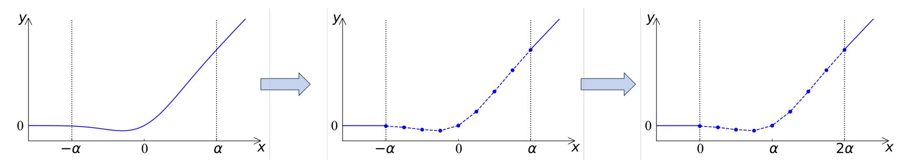
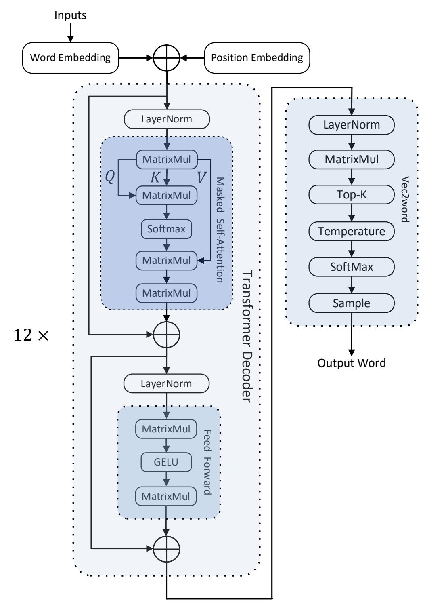
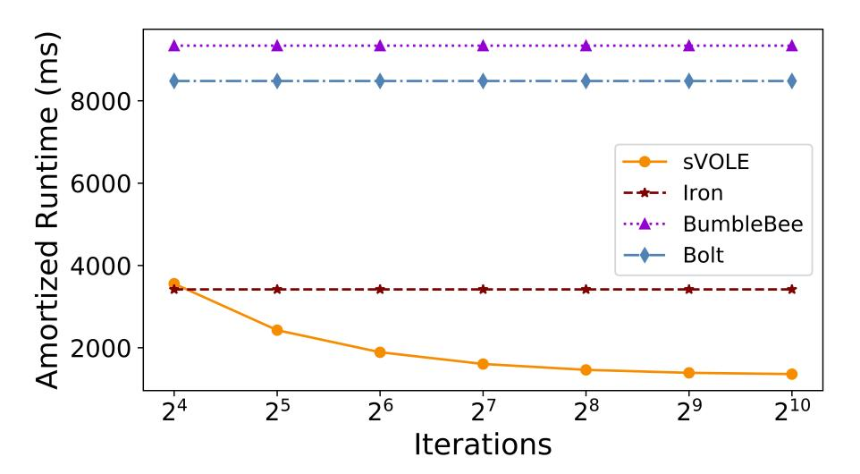
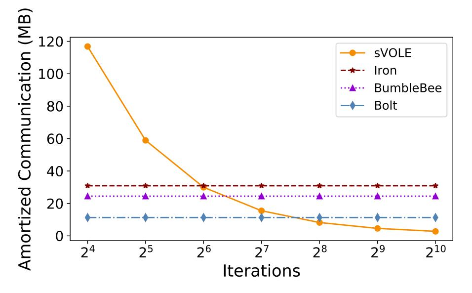

{0}------------------------------------------------

# CipherGPT: Secure Two-Party GPT Inference

Xiaoyang Hou Zhejiang University xiaoyanghou@zju.edu.cn

Jian Liu Zhejiang University liujian2411@zju.edu.cn

Jingyu Li Zhejiang University jingyuli@zju.edu.cn

Yuhan Li Zhejiang University yuhan2165@zju.edu.cn

Wen-jie Lu Ant Group juhou.lwj@antgroup.com

Cheng Hong Ant Group vince.hc@antgroup.com

Kui Ren Zhejiang University kuiren@zju.edu.cn

*Abstract*—ChatGPT is recognized as a significant revolution in the field of artificial intelligence, but it raises serious concerns regarding user privacy, as the data submitted by users may contain sensitive information. Existing solutions for secure inference face significant challenges in supporting GPT-like models due to the enormous number of model parameters and complex activation functions.

In this paper, we develop CipherGPT, the *first* framework for secure two-party GPT inference, building upon a series of innovative protocols. First, we propose a secure matrix multiplication that is customized for GPT inference, achieving upto 6.2× speedup and 4.1× bandwidth reduction over SOTA. We also propose a novel protocol for securely computing GELU, surpassing SOTA by 1.8× in runtime, 2.5× in communication and 7.4× in precision. Furthermore, we come up with the first protocol for secure top-k sampling.

We provide a full-fledged implementation and comprehensive benchmark for CipherGPT. In particular, we measure the runtime and communication for each individual operation, along with their corresponding proportions. We believe this can serve as a reference for future research in this area.

## I. INTRODUCTION

ChatGPT, a large language model (LLM) built upon the groundbreaking *generative pre-trained transformer* (GPT) architecture [41], is regarded as a significant revolution in the field of artificial intelligence. With a vast knowledge base and impressive linguistic capabilities, ChatGPT excels in various tasks, including question answering, article polishing, suggestion offering, and engaging in conversations. It can also serve as a virtual assistant, effectively enabling applications like customer support, information retrieval, and language translation.

OpenAI has made ChatGPT an online inference service and has even provided a remote API for developers to utilize. Users can conveniently enjoy the services by submitting prompts or messages for GPT inference. However, this service paradigm inevitably puts user privacy at risk, as the data submitted by users may contain sensitive information. Such privacy concerns may restrict the deployment of GPT in certain scenarios where data confidentiality is critical.

*Secure inference* [22], [34], [31], [37], [44], [43], [29], [27], [40], [30] is a two-party cryptographic protocol running the inference stage in a way such that the server (S) learns nothing about clients' input and a client (C) learns nothing about the model except the inference results. Roughly, it proceeds by having S and C running the encrypted model over the encrypted input through tailored cryptographic techniques such as homomorphic encryption and secret sharing. A *preprocessing phase* is usually introduced to prepare some expensive and input-independent work so that the *online phase* can be done efficiently.

Unfortunately, existing protocols for secure inference are limited in their ability to support GPT. Generative LLMs such as GPT-2, which consist of 12 transformers, entail a multitude of high-dimensional matrix multiplications and complex mathematical functions like GELU. In the case of generative tasks, LLMs require repeated inferences to generate sentences word by word and random selecting mechanism to ensure creativity and diversity. On the other hand, Iron [27] operates solely on transformer-based models for non-generating tasks such as BERT. Bolt [40] and BumbleBee [30] optimize matrix multiplication in communication while introducing more computation complexity. The SOTA approach for computing the activation function GELU [40], [30] uses high-degree polynomials to approximate the curve, which is hard to achieve both accuracy and efficiency. Prior works implement random sampling with Garbled Circuit (GC) [58], which is extremely heavy in computation and communication, or substitute it with selecting the word with the highest score, thereby diminishing the utility of the LLMs. Therefore, the advent of GPT has indeed introduced new challenges to the field of secure inference.

## *A. Our contributions*

In this paper, we develop CipherGPT, the *first*<sup>1</sup> framework for secure two-party GPT inference, building upon a series of novel protocols.

VOLE-based matrix multiplication. GPT takes lengthy sentences as input and autoregressively generates response words. Specifically, after a response word is produced, that word is added to the input sentence, and the new sentence becomes the input to the model to produce the next response word. Each response word generation requires a model inference, which involves a matrix multiplication (MatrixMul for short) at each layer. During the preprocessing phase, at each layer,

Jian Liu is the corresponding author.

<sup>1</sup>We preprinted this work in Aug 2023. At that time, it was the first framework for secure two-party GPT inference.

{1}------------------------------------------------

we combine the MatrixMuls for individual response words into a single *unbalanced* MatrixMul, and process it using sVOLE.

Vector oblivious linear evaluation VOLE [8], [10], [57], [9] is used to generate correlations like  $\mathbf{w} = \mathbf{u}x + \mathbf{v}$ , where a sender with input x learns a vector  $\mathbf{w}$  of length n, and a receiver learns  $(\mathbf{u}, \mathbf{v})$ , both of length n. Subfield VOLE (sVOLE) [10] is a generalization of VOLE; ideally, sVOLE accomplishes the same task as k instances of regular VOLE, while maintaining a comparable cost to running a single VOLE instance. sVOLE is more cost-effective when  $n \gg k$ , making it particularly useful for computing unbalanced MatrixMuls.

**Spline-based GELU.** GPT uses GELU as its activation function, which can be represented as:

$${\rm GELU}(x) = 0.5x(1+{\rm Tanh}\left[\sqrt{2/\pi}(x+0.044715x^3)\right]),$$

where Tanh(x) = 2Sigmoid(2x) - 1 and  $Sigmoid(x) = \frac{1}{1 + e^{-x}}$ . To securely compute GELU, SIRNN [43] and Iron [27] employ a lookup table (LUT) [18] to approximate  $e^{-x}$  and another lookup table to approximate the reciprocal. This multi-step process further requires extension or truncation of bitwidths at each step to balance precision and efficiency. The SOTA approaches [40], [30] split GELU into several parts, then use high-degree polynomials to approximate the curve in each part. Finally [40], [30] uses comparison and multiplexer to find the correct part and choose the corresponding output.

In contrast, we use only the linear function to approximate the curve parts. To achieve this, we split the curve parts of GELU into several intervals and use a linear function (y = ax + d) to approximate the curve within each interval. This *spline*-based approximation was initially proposed by Liu et al. [34], in which garbled circuits [58] were used to find the interval x belongs to and compute the corresponding linear function. We significantly improve its performance by leveraging LUT [18] to find the interval and computing the corresponding linear function in a secret-shared manner.

Compared with LUT-based approaches [43], [27], we use fewer LUTs and save a lot of cryptographic primitives. SIRNN [43] and Iron [27] use LUT to find out the initial values and perform iterations to approximate non-linear functions, while we use one LUT to find out the linear function and perform multiplication-then-truncation to compute the corresponding value. Compared with high-degree polynomial based approaches [40], [30], [20] (SOTA), we save lots of multiplication-then-truncation and comparisons. The number of multiplication-then-truncations used in BOLT [40] and BumbleBee is decided by the degree of high-degree polynomials, and each split part needs one comparison and one multiplexier. We always use one LUT independent of the number of intervals and use one multiplication-then-truncation to compute the linear function. Furthermore, our approach exhibits superior precision, avoiding the error accumulation inherent in multi-step approaches [27], [43] and error from precision lost in high-degree polynomials approximation [40], [30], [20].

Shuffling-based top-K selection. A straightforward way for selecting the top-K elements from a secret-shared vector of length n is to securely sort the vector, which is typically

achieved by securely executing a data-independent sorting algorithm such as Bitonic sorting network [28].

Our first insight is to implement secure sorting based on an idea from [3]: the input elements are securely shuffled first; and then an input-protected comparison-based sorting (e.g. quicksort with secure comparison) protocol is applied to arrange the shuffled elements into a sorted order. Notice that the comparison results obtained during the sorting process reveal no information about the original elements as those elements have been shuffled.

Our second insight is that, if quicksort is used, it is unnecessary to sort the entire vector. Instead, we can leverage a modified version of the quicksort algorithm. Typically, quicksort randomly selects an element from the vector as pivot and compares it with other elements. Based on the comparison results, the vector is partitioned into two parts: elements smaller than the pivot and elements larger than the pivot. The quicksort algorithm recursively operates on both partitions. In our case, we only need to recursively process the partitions that contain the top-K largest elements, which reduces the number of comparisons from  $O(n \log n)$  to O(n).

Secure sampling We also tackle the problem of securely sampling an element from a vector based on secret-shared probabilities. Specifically, given a vector of K elements, each of which is associate a secret-shared probability  $p_i$ , the probability for the j-th element to be chosen is  $p_j$ . Our protocol only requires (K-1) secure comparisons and K multiplexers. We mention that our case differs from securely sampling discrete Gaussian noise for MPC Differential Privacy [54]. Their intuition is to securely sample from a known distribution, while ours is to securely sample an element from a vector based on secret-shared probabilities. To the best of our knowledge, our study represents the first exploration of secure sampling.

We summarize our contributions as follows:

- A customized secure matrix multiplication for GPT, achieving upto  $6.2\times$  speedup and  $4.1\times$  bandwidth reduction over SOTA (Section III);
- A novel protocol for securely computing GELU, surpassing SOTA by  $1.8 \times$  in runtime,  $2.5 \times$  in communication and  $7.4 \times$  in precision. (Section IV);
- An innovative solution for top-K sampling: selecting the top-K probabilities and sampling one element according to the selected probabilities (Section V and VI);
- The first framework for secure two-party GPT inference (Section VII), and a comprehensive benchmark that can serve as a reference for endeavors in this research direction (Section VIII).

#### II. PRELIMINARIES

In this section, we present the necessary preliminaries for understanding this paper. Table I provides a summary of the frequently used notations in this paper.

{2}------------------------------------------------

TABLE I: A table of frequent notations.

| Notation              | Description                                                                                                                       |
|-----------------------|-----------------------------------------------------------------------------------------------------------------------------------|
| С                     | client                                                                                                                            |
| S                     | server                                                                                                                            |
| $\overline{n}$        | input vector length (for each layer)                                                                                              |
| $\overline{L}$        | # bits left-shifted for initial inputs                                                                                            |
| $\overline{l}$        | input bit-length after left-shifting                                                                                              |
| $\langle x \rangle^l$ | $(\langle x \rangle_{S}^l, \langle x \rangle_{C}^l) \text{ s.t. } x = \langle x \rangle_{S}^l + \langle x \rangle_{C}^l \mod 2^l$ |
| $\odot$               | Hadamard product (element-wise product)                                                                                           |
| $\otimes$             | Kronecker product (outer product)                                                                                                 |
| F <sub>Mult</sub>     | ideal functionality for multiplication: $z \leftarrow Mult(x,y)$                                                                  |
|                       | z = x * y with no overflow                                                                                                        |
| F <sub>CMP</sub>      | ideal functionality for comparison $b \leftarrow CMP(x,y)$ :                                                                      |
|                       | $b=1$ if $x \geq y$ ; $b=0$ otherwise                                                                                             |
| F <sub>MUX</sub>      | ideal functionality for multiplexer $y \leftarrow MUX(x, b)$ :                                                                    |
|                       | y = x  if  b = 1; y = 0  if  b = 0                                                                                                |
| $F_Trunc$             | ideal functionality for truncation $y \leftarrow Trunc(x,s)$ :                                                                    |
|                       | $y = x \gg s \text{ with } x, y \in \mathbb{Z}_{2^l}$                                                                             |
| $F_{TR}$              | ideal functionality for truncate-then-reduce $y \leftarrow TR(x,s)$ :                                                             |
|                       | $y=x\gg s$ with $x\in\mathbb{Z}_{2^l}$ and $y\in\mathbb{Z}_{2^{l-s}}$                                                             |
| F <sub>LUT</sub>      | ideal functionality for lookup table $T[i] \leftarrow LUT(T,i)$                                                                   |
| $F_{Shuffle}$         | ideal functionality for shuffling                                                                                                 |
| $\alpha$              | the split for $y := GELU(x)$ : $y := 0$ when $x < -\alpha$ ;                                                                      |
|                       | $y := GELU(x) \text{ when } -\alpha \leq x \leq \alpha; \ y := x \text{ when } x > \alpha$                                        |
| s                     | $2^s$ is the number of intervals within $[-\alpha, \alpha]$                                                                       |
| $(a_i,d_i)$           | $y = a_i x + d_i$ is the linear function that                                                                                     |
| -                     | approximates $GELU(x)$ in each interval                                                                                           |
| g                     | bit-length of $a_i$                                                                                                               |
| t                     | # response words (# input matrices)                                                                                               |
| N                     | polynomial modulus degree in FHE                                                                                                  |
| M                     | # attention heads                                                                                                                 |
| T                     | temperature                                                                                                                       |

#### A. Secure inference and threat model

Secure inference is a two-party cryptographic protocol that facilitates model inference between a client C and a server S. The protocol ensures that C only obtains knowledge about the model architecture and the inference result, while keeping all other details of S's model hidden. Similarly, S only learns the length of C's input and inference output, while remaining unaware of the exact words contained within. In the context of GPT inference, C's input is a prompt and S's input is a well-trained model which comprises multiple transformer decoders together with a vec2word layer. More information about GPT is provided in Section VII.

We assume that either C or S can be a semi-honest adversary, which follows the protocol specifications but attempts to gather as much information as possible during the protocol execution. We assume the adversary is computationally bounded and we use  $\lambda$  to denote the computational security parameter.

#### B. Cryptographic primitives

**Secret sharing.** We use 2-out-of-2 additive secret sharing schemes over different power-of-2 rings. For  $x \in \mathbb{Z}_{2^l}$ , we

denote its shares by  $\langle x \rangle^l = (\langle x \rangle_S^l, \langle x \rangle_C^l)$  s.t.  $x = \langle x \rangle_S^l + \langle x \rangle_C^l$  mod  $2^l$ . For ease of presentation, we omit the l notation of  $\langle x \rangle^l$  when it is not contextually relevant.

**Oblivious transfer** The ideal functionality  $F_{OT}$  allows a sender to send messages to a receiver without knowing the receiver's choice, and the receiver can only know one message determined by the choice. We use  $\binom{M}{1}$ -OT to represent 1-out-of-M OT, when M=2 we use OT for brevity. Ferret [57] provides silent OT protocol to produce a large number of random 1-out-of-2 OT (rOT) in batch, where the messages and choices are randomly sampled. |rOT| can be consumed to implement other protocols. We use the communication cost as  $|rOT| \approx 0.6$  bits [57].

Multiplication with non-uniform bit-widths The ideal functionality  $\mathsf{F}_{\mathsf{Mult}}$  takes  $\langle x \rangle^g$  and  $\langle y \rangle^h$  as input and returns  $\langle z \rangle^l$ , where  $z = x \cdot y$  and l = g + h. A simple way to realize this functionality is to first extend both inputs to l bits and then use a standard protocol for secret-shared multiplication with uniform bitwidths. SIRNN [43] provides a protocol that outperforms this naive solution by  $1.5\times$ . The communication complexity of this protocol is  $\mu(|\mathsf{rOT}| + \mu/2 + 1/2) + gh$ , where  $\mu = \min(g, h)$ .

**Secure comparison.** The ideal functionality  $\mathsf{F}_{\mathsf{CMP}}$  takes  $\langle x \rangle^l$  and  $\langle y \rangle^l$  as input and returns  $\langle b \rangle^1$ , where b=1 if  $x \geq y$ , otherwise b=0. CrypTFlow2 [44] provides an efficient protocol for  $\mathsf{F}_{\mathsf{CMP}}$  with a communication cost less than  $l \cdot |\mathsf{rOT}| + 14l$  bits and with  $\log l$  rounds.

**Secure multiplexer.** The ideal functionality  $\mathsf{F}_{\mathsf{MUX}}$  takes  $\langle x \rangle^l$  and  $\langle b \rangle^1$  as input and returns  $\langle y \rangle^l$ , where y = x if b = 1, and y = 0 if b = 0. The secure multiplexer adopted in this paper is provided by SIRNN [43], which requires  $2(|\mathsf{rOT}| + l + 1)$  bits of communication.

**Secure truncation.** The ideal functionality  $\mathsf{F}_\mathsf{Trunc}$  takes  $\langle x \rangle^l$  and s as input and returns  $\langle y \rangle^l$ , where  $y = x \gg s$ . SIRNN [43] provides a protocol for secure truncation with a communication cost less than  $(l+3)\cdot |\mathsf{rOT}| + 15l + s + 20$  bits and with  $\log l + 3$  rounds.

**Truncate-then-reduce.** The ideal functionality  $\mathsf{F}_{\mathsf{TR}}$  takes  $\langle x \rangle^l$  and s as input and returns  $\langle y \rangle^{l-s}$ , where  $y = x \gg s$ . Notice that the difference between  $\mathsf{F}_{\mathsf{TR}}$  and  $\mathsf{F}_{\mathsf{Trunc}}$  is that  $\mathsf{F}_{\mathsf{TR}}$  reduces the output to a smaller ring over right-shift operations, whereas  $\mathsf{F}_{\mathsf{Trunc}}$  keeps the output in the original ring. SIRNN [43] provides a protocol for  $\mathsf{F}_{\mathsf{TR}}$  with a communication cost less than  $(s+1) \cdot |\mathsf{rOT}| + l + 13s$  bits.

**Lookup table.** The ideal functionality  $\mathsf{F}_{\mathsf{LUT}}$  takes  $\langle i \rangle$  as input and returns  $\langle T [i] \rangle$  where T is a table with M entries of l-bits. This functionality can be achieved via a single call to  $\binom{M}{1}$ -OT [18], with a communication cost of  $(|\mathsf{rOT}|+1) \cdot \log M + M * l$  bits.

**Secret-shared shuffle.** The ideal functionality  $\mathsf{F}_{\mathsf{Shuffle}}$  takes  $\langle \mathbf{x} \rangle^l$  and  $\langle \pi \rangle$  as input and returns  $\langle \pi(\mathbf{x}) \rangle^l$ , where  $\pi$  is a permutation function. Chase et al. [14] propose an efficient construction for this functionality using lightweight primitives such as OTs and PRGs. Their approach involves using puncturable PRFs to build a permute-and-share protocol, which allows two

{3}------------------------------------------------

parties to permute the input vector with the permutation chosen by one party. This permute-and-share protocol is run twice, with each party choosing the permutation once. To shuffle n l-bit elements, the communication cost of this protocol is proportional to  $(|rOT|+1) \cdot n \log n + nl \log n/\log T$  and the computational cost is  $(nT \log n/\log T)(l/\lambda)$  symmetric-key operations, where T is between 16 and 256.

Subfield vector oblivious linear evaluation. VOLE is a twoparty functionality that takes a scalar  $x \in \mathbb{F}_p$  from a sender and generates a VOLE *correlation*:

$$\mathbf{w} = \mathbf{u}x + \mathbf{v},\tag{1}$$

s.t. the receiver learns  $(\mathbf{u}, \mathbf{v}) \in_R \mathbb{F}_p^n \times \mathbb{F}_p^n$  and the sender learns  $\mathbf{w} \in_R \mathbb{F}_p^n$ . VOLE is typically constructed based on *learning* parity with noise (LPN) and puncturable PRFs, making its complexity almost independent of n.

Subfield VOLE (sVOLE) [10] is a generalization of VOLE with  $\mathbf{u} \in_R \mathbb{F}_p^n$ ,  $x \in \mathbb{F}_q$ ,  $\mathbf{w}, \mathbf{v} \in_R \mathbb{F}_q^n$ , and  $q = p^m$ . Notice that sVOLE achieves the same task as running m instances of normal VOLE, but with less cost.

VOLE and sVOLE were initially proposed to work over finite fields. Baum et al. [6] propose a way to work over a finite ring such as  $\mathbb{Z}_{2^l}$ .

**Homomorphic encryption.** Fully homomorphic encryption (FHE) is an encryption scheme that allows arbitrary operations to be performed over encrypted data [21]. In practice, it is usually used in a leveled fashion: the operations can only be performed for a limited number of times, otherwise, the ciphertexts cannot be decrypted. In most FHE cryptosystems [12], [11], [19], [15], plaintexts are encoded as polynomials from the quotient ring  $\mathbb{Z}_p[x]/(x^N+1)$ , where N is a power of 2, and p is the plaintext modulus. The plaintext polynomials are then encrypted into ciphertexts which contain two polynomials in  $\mathbb{Z}_q[x]/(x^N+1)$ , where q is the ciphertext modulus that determines the security level, as well as the times that addition and multiplication operation can be performed.

**Batch oblivious linear evaluation** BOLE is a two-party functionality that takes  $\mathbf{x} \in \mathbb{F}_p^n$  from a sender and  $\mathbf{y} \in \mathbb{F}_p^n$  from a receiver and generates a BOLE *correlation*:

$$\mathbf{v}_i + \mathbf{w}_i = \mathbf{x}_i * \mathbf{y}_i \tag{2}$$

s.t. the receiver learns  $\mathbf{v} \in_R \mathbb{F}_p^n$  and the sender learns  $\mathbf{w} \in_R \mathbb{F}_p^n$ . Lu et al. [30] propose a BOLE protocol over  $2^l$  ring, achieving computational security in semi-honest setting. This approach [30] may introduce Least-Significant-Bit (LSB) errors, which can be fixed by following truncations. We interpret BOLE *correlation* as beaver triples and consume them to implement multiplication with uniform bit-width.

## III. SECURE MATRIX MULTIPLICATION

The MatrixMul operation takes two input matrices  $\mathbf{X} \in \mathbb{Z}_{2^l}^{n \times m}$  and  $\mathbf{Y} \in \mathbb{Z}_{2^l}^{m \times k}$  from C and S respectively, and outputs  $\langle \mathbf{Z} \rangle$  with  $\mathbf{Z} = \mathbf{X} \mathbf{Y} \in \mathbb{Z}_{2^l}^{n \times k}$ . Most existing solutions use homomorphic multiplications and additions to compute the above formula in a privacy-preserving way. There are two main-stream ways of using RLWE based homomorphic encryption:

- 1) Encoding plaintexts into SIMD slots [44], [40];
- 2) Encoding plaintexts into polynomial coefficients [29], [27], [31], [30].

The SIMD technique supports batching N elements into a single RLWE ciphertext and performs element-wise multiplication and addition, but requires expensive homomorphic rotations to sum-up. Bolt [40] proposes an improved packing technique to fully utilize all SIMD slots and uses the baby-step giant-step (BSGS) strategy to reduce the number of rotations. SIMD slot works over a prime field while Bolt's secret sharing scheme is over  $\mathbb{Z}_{2^l}$  ring, Bolt needs to perform a secure conversion protocol each time.

Cheetah [29] encodes plaintexts into polynomial coefficients and computes matrix multiplication via dot product, Cheetah eliminates the expensive SIMD rotations and achieves compute over  $\mathbb{Z}_{2^l}$  ring directly. BumbleBee [30] notices the sparsity of returned ciphertexts in [29], [27], [31] and proposes a ciphertext compact technique to save communication.

Recall that GPT needs to auto-regressively generate response words. Therefore, GPT inference requires running MatrixMul for different **X**s with the same **Y**. We aim to reduce the amortized cost of MatrixMul by exploiting this characteristic of GPT.

Let  $\mathbf{X} = [\mathbf{x}_1, \mathbf{x}_2, \cdots, \mathbf{x}_m]$  (with  $\mathbf{x}_i \in \mathbb{Z}_{2^l}^n$  being each column of  $\mathbf{X}$ ) and  $\mathbf{Y}^T = [\mathbf{y}_1', \mathbf{y}_2', \cdots, \mathbf{y}_m']$  (with  $\mathbf{y}_i' \in \mathbb{Z}_{2^l}^k$  being each row of  $\mathbf{Y}$ ), then  $\mathbf{Z} = \sum_{i=1}^{m} (\mathbf{x}_i \otimes \mathbf{y}_i')$ . Suppose S and C need to generate t response words, hence there are t input matrices:

$$\mathbf{X}_1 = [\mathbf{x}_{1,1}, \mathbf{x}_{1,2}, \cdots, \mathbf{x}_{1,m}],$$
 $\mathbf{X}_2 = [\mathbf{x}_{2,1}, \mathbf{x}_{2,2}, \cdots, \mathbf{x}_{2,m}],$ 
 $\cdots$ 
 $\mathbf{X}_t = [\mathbf{x}_{t,1}, \mathbf{x}_{t,2}, \cdots, \mathbf{x}_{t,m}].$ 

Let  $\mathbf{x}'_i = \mathbf{x}_{1,i} ||\mathbf{x}_{2,i}|| \cdots ||\mathbf{x}_{t,i}|| \forall i \in [1, m]$ . Then,

$$\mathbf{x}_i' \otimes \mathbf{y}_i' = (\mathbf{x}_{1,i} \otimes \mathbf{y}_i') || (\mathbf{x}_{2,i} \otimes \mathbf{y}_i') || \cdots || (\mathbf{x}_{t,i} \otimes \mathbf{y}_i').$$

Then,

$$\sum\limits_{i=1}^m (\mathbf{x}_i' \otimes \mathbf{y}_i') = \mathbf{Z}_1 ||\mathbf{Z}_2|| \cdots ||\mathbf{Z}_t.$$

Therefore, we could compute the t times of MatrixMul altogether via m outer products.

Given that  $\mathbf Y$  is known beforehand, we could introduce a preprocessing phase to have  $\mathsf S$  and  $\mathsf C$  generate m sVOLE correlations:

$$\mathbf{W}_i = \mathbf{u}_i \otimes \mathbf{y}_i' + \mathbf{V}_i, \ \forall \ i \in [1, m].$$

where C holds  $\mathbf{u}_i \in \mathbb{Z}_{2^l}^{(t \cdot n)}$  (which is a vector of length  $t \cdot n$ ) and  $\mathbf{V}_i \in \mathbb{Z}_{2^l}^{(t \cdot n) \times k}$ , and S holds  $\mathbf{y}_i' \in \mathbb{Z}_{2^l}^k$  and  $\mathbf{W}_i \in \mathbb{Z}_{2^l}^{(t \cdot n) \times k}$ .

In the online phase, for an input matrix  $\mathbf{X}_j = [\mathbf{x}_{j,1}, \mathbf{x}_{j,2}, \cdots, \mathbf{x}_{j,m}]$ , C sends

$$\langle \mathbf{x}_{j,i} \rangle_{\mathsf{S}} := \mathbf{x}_{j,i} - \mathbf{u}_i \left[ (j-1)n + 1, \cdots, j \cdot n \right] \ \forall \ i \in [1, m]$$

{4}------------------------------------------------

to S, which then computes:

$$\langle \mathbf{x}_{j,i} \rangle_{\mathsf{S}} \otimes \mathbf{y}'_i = (\mathbf{x}_{j,i} - \mathbf{u}_i [(j-1)n+1, \cdots, j \cdot n]) \otimes \mathbf{y}'_i$$
  
=  $\mathbf{x}_{j,i} \otimes \mathbf{y}'_i - \mathbf{u}_i [(j-1)n+1, \cdots, j \cdot n] \otimes \mathbf{y}'_i$ .

Then, we have:

$$\mathbf{x}_{j,i} \otimes \mathbf{y}_{i}' = \langle \mathbf{x}_{j,i} \rangle_{S} \otimes \mathbf{y}_{i}' + \mathbf{u}_{i} [(j-1)n+1, \cdots, j \cdot n] \otimes \mathbf{y}_{i}'$$

$$= \langle \mathbf{x}_{j,i} \rangle_{S} \otimes \mathbf{y}_{i}' + \mathbf{W}_{i} [(j-1)kn+1, \cdots, j \cdot k \cdot n]$$

$$- \mathbf{V}_{i} [(j-1)kn+1, \cdots, j \cdot k \cdot n].$$

Notice that S holds:

$$\langle \mathbf{x}_{i,i} \rangle_{\mathsf{S}} \otimes \mathbf{y}'_i + \mathbf{W}_i \left[ (j-1)kn + 1, \cdots, j \cdot k \cdot n \right],$$

and C holds:

$$\mathbf{V}_i[(j-1)kn+1,\cdots,j\cdot k\cdot n];$$

that means S and C secret-share  $\mathbf{x}_{j,i} \otimes \mathbf{y}_i'$ , and consequently they can locally compute the secret-shares of  $\mathbf{Z}_j = \sum_{i=1}^m (\mathbf{x}_{j,i} \otimes \mathbf{y}_i')$ . They can compute all  $\mathbf{Z}_s$  in this way.

sVOLE-based MatrixMul is proposed by Boyle et al. [8]. They use sVOLE to perform MatrixMul directly and the performance is poor for n is often small ( $\leq 256$ ) in secure computation scenarios. We observe that MatrixMuls in GPT inference use the same weight repeatedly and can be batched to an unbalanced MatrixMul. To this end, we use one sVOLE to implement t MatrixMul, and the amortized cost surpasses SOTA RLWE homomorphic encryption approaches in both runtime and communication.

Table II compares the MatrixMul overhead among Cheetah [29], Iron [27], BumbleBee [30], Bolt [40] and CipherGPT. Recall that the communication complexity of sVOLE is almost independent of n. As a result, the number of public-key operations in our MatrixMul are also independent of n. Specifically, we need to transfer  $\frac{2emk}{N}$  RLWE ciphertexts and run  $\frac{emk}{N}$  ciphertext-plaintext multiplications to perform reverse-VOLE, both of which are independent of n. When we combine a considerable number of matrices together, i.e., when n is large, our savings become significant. Moreover, these costs need to be divided by t for the amortized costs.

In terms of computation, we save  $\frac{tn}{e} \times$  ciphertext-plaintext multiplications and need no heavy homomorphic automorphism or SIMD rotations. Suppose n=256, m=768, k=64, t=256 and e=144 (which are the real parameters for GPT-2), we save 3 065 ciphertext-plaintext multiplications, which takes more than  $4s^2$ . Although we need to do extra  $(c \cdot nmk)$  AESs to expand the seeds, with the help of AES-NI this can be done in around 100ms. In terms of communication, we transfer fewer RLWE ciphertexts with smaller modulus, which saves around 10MB; whereas the communication overhead introduced by OTs and plaintexts in CipherGPT is only around 1.5MB. Compared with Bolt [40], we need no conversion between prime field and  $2^l$  ring.

TABLE II: Amortized cost for t times of MatrixMul. N is # elements batched in a RLWE ciphertext; e is the dual-LPN noise weight; c is a small constant ( $N=4\,096,\ e=144,\ c=2$  in our benchmarks).

| MatrixMul      | Overhead                                                          |  |  |  |
|----------------|-------------------------------------------------------------------|--|--|--|
| Cheetah        | transferring $\geq \frac{2n\sqrt{mk}}{\sqrt{N}}$ RLWE ciphertexts |  |  |  |
| [29]           | $\geq \frac{nmk}{N}$ ciphertext-plaintext multiplications         |  |  |  |
| Iron           | transferring $\geq \frac{2\sqrt{nmk}}{\sqrt{N}}$ RLWE ciphertexts |  |  |  |
| [27]           | $\geq \frac{nmk}{N}$ ciphertext-plaintext multiplications         |  |  |  |
|                | transferring $\frac{n(m+k)}{N}$ RLWE ciphertexts                  |  |  |  |
| BumbleBee [30] | $\frac{nmk}{N}$ ciphertext-plaintext multiplications              |  |  |  |
| [30]           | $\frac{nk \cdot \log N}{2\sqrt{N}}$ homomorphic automorphism      |  |  |  |
|                | transferring $\frac{n(m+k)}{N}$ RLWE ciphertexts                  |  |  |  |
| Bolt           | $\frac{nmk}{N}$ ciphertext-plaintext multiplications              |  |  |  |
| [40]           | $\frac{nm\sqrt{k}}{N}$ SIMD rotations                             |  |  |  |
|                | n(m+k) conversion from field to ring                              |  |  |  |
|                | transferring $\frac{2emk}{tN}$ RLWE ciphertexts                   |  |  |  |
| 0              | transferring $\frac{emk}{t} + nm$ masked plaintext                |  |  |  |
| Ours           | $\frac{emk}{tN}$ ciphertext-plaintext multiplications             |  |  |  |
|                | $\frac{c \cdot em \log(nt/e)}{t}$ OTs and $(c \cdot nmk)$ AESs    |  |  |  |

## IV. SECURE GELU

In this section, we begin by providing a high-level overview of our GELU protocol, and then delve into its technical details.

#### A. Intuition

Figure 1 (left) depicts the original GELU. It begins at zero for large negative values of x, and starts deviating from zero when x is around  $-\alpha$ . As x increases further, GELU(x) decrease firstly then progressively approximates the linear function y=x. Based on this observation, we divide the curve into three large parts:

- y = 0 when  $x < -\alpha$ ;
- $y = \mathsf{GELU}(x) \text{ when } -\alpha \le x \le \alpha;$
- y = x when  $x > \alpha$ .

The computation of the first and third parts is straightforward. For the second part, we use *polynomial splines* to approximate the curve. As depicted in Figure 1 (middle), we divide the second part into several small equal-length intervals and use a linear function (y = ax + d) to approximate the curve within each small interval. We refer to Section 5.3.2 in [34] for a detailed procedure of finding the linear functions. It is important to note that this approximation does not necessitate any modifications to the training phase of the model.

We could use LUT to find the interval in which x resides and compute the corresponding linear function in a secret-shared manner. However, for  $[-\alpha, \alpha]$ , we have to determine

<sup>&</sup>lt;sup>2</sup>This includes the time usage for noise flooding.

{5}------------------------------------------------



Fig. 1: GELU transformation.

the sign of x first, and then lookup in the parts  $|-\alpha, 0|$  and  $|0,\alpha|$  separately. To avoid this, we right-shift the entire curve by  $\alpha$  as shown in Figure 1 (right), after which the second part becomes  $|0,2\alpha|$  allowing us to perform a single lookup.

#### B. Details

Algorithm 1 describes in detail how we securely compute  $y := \mathsf{GELU}(x)$ .

```
Algorithm 1: Secure GELU: \Pi_{GELU}
```

```
Input: S & C hold \langle x \rangle^l, public value \alpha for splitting,
         lookup table size 2^s
```

**Output:** S & C get 
$$\langle y \rangle^l$$
 for  $y = \mathsf{GELU}(x)$ 

- 1 Let  $\alpha' := 2^L \alpha$
- 2 S & C (locally) compute  $\langle x' \rangle^l := \langle x \rangle^l + \alpha'$
- 3 Let  $\beta := 2\alpha'$
- 4 Let  $h := \log \beta$
- 5 S & C (locally) extract the lower h bits of  $\langle x' \rangle^l$  and get  $\langle x' \rangle^h$
- 6 S & C invoke  $\langle i \rangle^s \leftarrow \mathsf{F}_{\mathsf{TR}}(\langle x' \rangle^h, h s)$
- 7 S & C invoke  $(\langle a_i \rangle^l, \langle d_i \rangle^l) \leftarrow \mathsf{F}_{\mathsf{LUT}}(\langle T \rangle, \langle i \rangle^s)$ 8 S & C invoke  $\langle a_i x \rangle^l \leftarrow \mathsf{F}_{\mathsf{Mult}}(\langle a_i \rangle^l, \langle x' \rangle^l)$
- 9 S & C invoke  $\langle k \rangle^l \leftarrow \mathsf{F}_{\mathsf{Trunc}}(\langle a_i x \rangle^l, L)$
- 10 S & C (locally) compute  $\langle z \rangle^l := \langle k \rangle^l + \langle d_i \rangle^l$
- 11 S & C invoke  $\langle b \rangle^1 \leftarrow \mathsf{F}_{\mathsf{CMP}}(\langle x' \rangle^l, \beta)$  $\triangleright$  b=1 if  $x' \geq \beta$ ; b = 0 otherwise
- 12 S & C invoke  $\langle b' \rangle^1 \leftarrow \mathsf{F}_{\mathsf{CMP}}(\langle x' \rangle^l, 0)$  $\triangleright$  b'=1 if  $x' \ge 0$ ; b' = 0 otherwise
- 13 S & C invoke  $\langle u \rangle^l \leftarrow \mathsf{F}_{\mathsf{MUX}}(\langle z \rangle^l, \langle b \rangle^1 \oplus \langle b' \rangle^1)$ 14 S & C invoke  $\langle v \rangle^l \leftarrow \mathsf{F}_{\mathsf{MUX}}(\langle x \rangle^l, \langle b \rangle^1)$
- 15 S & C (locally) compute  $\langle y \rangle^l := \langle u \rangle^l + \langle v \rangle^l$

Notice that the initial input to the model has been scaled up by  $2^L$ . To maintain the desired alignment, we scale  $\alpha$  up by a factor of  $2^L$  (Line 1). Then, the split value becomes  $\alpha' := 2^L \alpha$ .

The right-shift of the curve needs to consider the scaling factor as well. To ensure proper alignment, the input to GELU should be adjusted as  $x' := x + \alpha'$ , which can be achieved by adding  $\alpha'$  to any share of x (Line 2).

**Handling small intervals.** Let  $\beta := 2\alpha'$ , the second part now becomes  $[0, \beta]$ . We make the initial assumption that x' falls within this part; we will address the case where this assumption does not hold later on. As  $x' \in [0, \beta]$ , we only need to consider the lower  $h := \log \beta$  bits of x'. To this end, we have S and C extract the lower h bits of  $\langle x' \rangle^l$  and get  $\langle x' \rangle^h$  (line 5), which

can be done locally without any communication. This local extraction is based on  $\beta$  is a power of 2, otherwise, we use local multiplication and Trunc to get  $\langle x' \rangle^h$ .

Suppose  $[0, \beta]$  has been divided into  $2^s$  small intervals. Then, we could find the interval for  $\langle x' \rangle^h$  by examining its upper s bits. To this end, we have S and C run the truncatethen-reduce protocol on  $\langle x' \rangle^h$  (Line 6), resulting in  $\langle i \rangle^s$ , where  $i \in \mathbb{Z}_{2^s}$  represents the index of the small interval that x'belongs to.

S holds a table T, where each entry stores the coefficients of the linear function corresponding to the respective small interval. After obtaining  $i \in \mathbb{Z}_{2^s}$ , S and C execute LUT to get the *i*-th entry of T in a secret-shared form  $(\langle a_i \rangle^l, \langle d_i \rangle^l)$  (Line 7). Then, they run secret-shared multiplication on  $\langle a_i \rangle^l$  and  $\langle x' \rangle^l$  then truncate, resulting in  $\langle k \rangle^l$  (Line 8-9). After adding  $\langle d_i \rangle^l$  to  $\langle k \rangle^l$ , they obtain  $\langle z \rangle^l$ , which is potentially the result of GELU(x) (Line 10).

Handling large parts. Notice that the above process for handling small intervals is valid only when  $x' \in [0, \beta]$ . To this end, we use comparisons and multiplexers to output the correct result when  $x' \notin [0, \beta]$ .

S and C first securely compare x' with  $\beta$  and get b(Line 11), with b = 1 if  $x' \ge \beta$  and b = 0 otherwise. Then, they securely compare x' with 0 and get b' (Line 12), with b'=1 if  $x'\geq 0$  and b'=0 otherwise. Notice that there are only following three possibilities for the combination of b and b' (instead of four):

- b = 1 and b' = 1,
- b = 0 and b' = 1,
- b = 0 and b' = 0.

The second case with  $b \oplus b' = 1$  indicates that  $x' \in [0, \beta]$ , whereas the other two cases with  $b \oplus b' = 0$  indicate that  $x' \notin [0, \beta]$ . Therefore, we could use  $b \oplus b'$  as the control signal to implement the multiplexer for z. Specifically, S and C run the multiplexer with input  $\langle z \rangle^l$  and  $\langle b \rangle^1 \oplus \langle b' \rangle^1$  resulting in  $\langle u \rangle^l$  (Line 13), with u=z if  $b \oplus b'=1$ , and u=0 otherwise.

Next, S and C run another multiplexer with input  $\langle x \rangle^l$  and  $\langle b \rangle^1$  resulting in  $\langle v \rangle^l$  (Line 14), with v = x if b = 1, and v=0 otherwise. This multiplexer determines if  $x'>\beta$ ; if so, returns v = x'. The final result of GELU(x) is  $\langle y \rangle^l := \langle u \rangle^l +$  $\langle v \rangle^l$  (Line 15). Notice that there is no need for an additional multiplexer to handle the case of x' < 0, because y = 0 when x' < 0.

{6}------------------------------------------------

Table III compares the number of cryptographic operations among SIRNN [43], Iron [27], BumbleBee [30], Bolt [40] and our solution for secure GELU. Our solution saves 2 Mult and 2 Trun compared with Bolt, but additionally use a LUT. We mention that LUT is a build-block of Trun. Clearly, our solution is much more lightweight. Furthermore, our solution is also better in precision: 1) the multi-step process in SIRNN and Iron involves approximating exponentiation and reciprocation separately, introducing precision errors at each step; these errors accumulate throughout the process, resulting in a large overall error, which is not the case in our single-step approach; 2) the high-degree polynomials approximating used in BumbleBee and Bolt lost accuracy in computing high-degree power of x. Our experimental results (cf. Table IV) validate this conjecture.

TABLE III: Comparison for GELU.

| Overhead                       |  |  |  |
|--------------------------------|--|--|--|
| 6LUT (2 <sup>8</sup> entries)  |  |  |  |
| 7Mult, 6Trunc, 5CMP, 2MUX      |  |  |  |
| 6LUT (2 <sup>8</sup> entries)  |  |  |  |
| 6Mult, 5Trunc, 5CMP, 2MUX      |  |  |  |
| 4Mult, 6Trunc, 3CMP, 3MUX      |  |  |  |
| 3Mult, 4Trunc, 2CMP, 2MUX      |  |  |  |
| 1LUT (2 <sup>6</sup> entries), |  |  |  |
| 1Mult, 2Trunc, 2CMP, 2MUX      |  |  |  |
|                                |  |  |  |

## V. SECURE TOP-K SELECTION

In the vec2word layer, the GPT model generates a vector containing probabilities for all possible words. From this vector, the top-K largest probabilities need to be selected and the final response word needs to be sampled based on the selected probabilities. This section focuses on the process of selecting the top-K values from a vector of length n. In the subsequent section, we will discuss how we sample a value from the K selected probabilities.

Algorithm 2 provides a detailed description of our TopK protocol. At a high level, the input elements are securely shuffled first (Line 1); and then a comparison-based selection is employed to identify the top-K elements from the shuffled list (Line 2).

We assume that elements in x are distinct values and can be compared strictly. This can be achieved by appending an index (1 to n) to each element and truncating after selection. It is proposed in prior work and widely used in secure sorting scenarios [4], [16].

The selection function in Algorithm 2 operates in a recursive manner. Within each recursion, the last element of the vector is selected as the pivot (Line 5); and the vector is partitioned into two parts: elements smaller than the pivot, denoted as  $S_L$ , and elements larger than or equal to the pivot, denoted as  $S_R$  (Line 6-15). To split the vector, all its elements are compared with the pivot (Line 8). The comparison results can be revealed (Line 9) without compromising the

```
Algorithm 2: Secure Top-K: \Pi_{\mathsf{TopK}}
```

```
Input: S & C hold \langle \mathbf{x} \rangle with \mathbf{x} \in \mathbb{Z}_{2^l}^n
     Output: S & C get \langle \mathbf{y} \rangle with \mathbf{y} \in \mathbb{Z}_{2^l}^K being the K largest
                        values of x
 1 S & C invoke \langle \mathbf{x}' \rangle \leftarrow \mathsf{F}_{\mathsf{Shuffle}}(\langle \mathbf{x} \rangle)
 2 \mathbf{y} \leftarrow \text{select}(\langle \mathbf{x}' \rangle, K)
 3 Function select (\langle \mathbf{x}' \rangle, K):
              n := |\langle \mathbf{x}' \rangle|
 4
              \langle pivot \rangle := \langle x'_n \rangle
 5
              \langle S_L \rangle := \{\}, \langle S_R \rangle := \{\langle pivot \rangle\}
 6
              for i := 1 to n-1 do
 7
                     S & C invoke \langle b \rangle^1 \leftarrow \mathsf{F}_{\mathsf{CMP}}(\langle x_i' \rangle \,, \langle pivot \rangle) b = 1 \text{ if } x_i' \geq pivot; \ b = 0 \text{ otherwise} S & C reveal \langle b \rangle^1 and get b
 8
                                                                                                                           \triangleright
 9
                      if b = 0 then
10
                        \langle S_L \rangle := \langle S_L \rangle \cup \{\langle x_i' \rangle\}
                                                                                                  \triangleright x_i' < pivot
11
                      else
12
                        | \langle S_R \rangle \leftarrow \langle S_R \rangle \cup \{\langle x_i' \rangle\}
                                                                                                  \triangleright x_i' \ge pivot
13
                      end
14
15
              end
              K' \leftarrow |\langle S_R \rangle|
16
              switch (K'?K) do
17
                      case (K' = K)
18
                        return \langle S_R \rangle
19
                      case (K' > K)
20
                             return select(\langle S_R \rangle, K)
21
                      case (K' < K)
22
                             return select(\langle S_L \rangle, K - K') \cup \langle S_R \rangle
23
24
                      end
25
              end
26 End Function
```

privacy of the original elements. This is because the original elements have been shuffled, so that the comparison results are independent of the actual values.

If the size of  $S_R$  (denoted by K') is exactly K, it means that all the elements in  $S_R$  are the top-K largest elements that we want to select (Line 19). If K' > K, the next recursion is executed on  $S_R$  to further narrow down the selection (Line 21). On the other hand, if K' < K, the next recursion is performed to select the top (K - K') elements from  $S_L$ , which are then combined with  $S_R$  to obtain the final set of top-K elements (Line 21).

It is worth mentioning that only CMP (line 8) requires interactions between S and C; the remaining steps of the algorithm can be executed locally by each party without any interaction. The selection function requires O(n) CMPs.

## VI. SECURE SAMPLING

In this section, we provide a detailed explanation of our secure sampling protocol. It takes as input K secret-shared probabilities  $(p_1, \ldots, p_K)$ , where each probability has been scaled to an integer  $x_i$  by multiplying it by  $2^L$  and dropping the fractional part. The output of the protocol is a secret-shared index j:

$$Pr(j = i) = x_i / \sum_{k=1}^{K} x_k.$$

We will explain how we map this index to a response word in Section VII-E.

{7}------------------------------------------------

# **Algorithm 3:** Secure Sampling: $\Pi_{\mathsf{Sample}}$

Input: S & C hold 
$$\langle \mathbf{x} \rangle$$
, with  $\mathbf{x} \in \mathbb{Z}_{2^l}^K$  being a vector of probabilities scaled by  $2^L$   $\Rightarrow \sum x_i = 2^L$ 

Output: S & C get  $\langle j \rangle$ , with  $j \in [1, K]$  and  $Pr(j=i) = x_i / \sum_{j=1}^K x_j$ 

1 S samples  $v \stackrel{\$}{\leftarrow} [0, 2^L - 1]$  with  $v \in \mathbb{Z}_{2^l}$ 
2 S & C init  $\langle s_0 \rangle := 0$ 
3 for  $i := 1$  to  $K - 1$  do
4 | S & C (locally) compute  $\langle s_i \rangle := \langle x_i \rangle + \langle s_{i-1} \rangle$ 
5 | S & C invoke  $\langle b_i \rangle^1 \leftarrow \mathsf{F}_{\mathsf{CMP}}(\langle v \rangle, \langle s_i \rangle) \Rightarrow b = 1$  if  $v \geq s_i$ ;  $b = 0$  otherwise
6 end
7 S & C init  $\langle b_0 \rangle^1 := 1$  and  $\langle b_K \rangle^1 := 0$ 
8 for  $i := 1$  to  $K$  do
9 | S & C (locally) compute  $\langle b_i' \rangle^1 := \langle b_{i-1} \rangle^1 \oplus \langle b_i \rangle^1 \Rightarrow b_i' = 1$  only when  $s_{i-1} \leq v < s_i$ 
10 end
11 S & C compute  $\langle j \rangle := \sum_{i=1}^K \mathsf{F}_{\mathsf{MUX}}(i, \langle b_i' \rangle^1)$ 

Algorithm 3 provides a detailed description of the secure sampling protocol. It is based on the observation that, for a random  $p' \in [0, 1]$ , the selected index j satisfies:

$$\sum_{k=1}^{j-1} p_k \le p' < \sum_{k=1}^{j} p_k.$$

As  $(p_1, \dots, p_K)$  have been scaled by  $2^L$ , p' should should also be scaled accordingly. To this end, we have S sample an integer v from  $[0, 2^L - 1]$  (Line 1). S and C securely compare v with each  $\sum_{k=1}^{i} x_k, \forall i \in [1, K]$  (Line 2-6), resulting in a secret-shared bit vector  $\langle \mathbf{b} \rangle$  that satisfies:

$$b_i = 1 \ \forall \ 1 < i < j \ \text{and} \ b_i = 0 \ \forall \ j < i < K.$$

Our next step is to build another secret-shared bit vector  $\langle \mathbf{b}' \rangle$  that satisfies:

$$b'_i = 0 \ \forall \ i \neq j \ \text{and} \ b'_j = 1.$$

This can be achieved by performing an XOR operation on every pair of adjacent bits in  $\langle \mathbf{b} \rangle$  (Line 7-10). Then, the desired index is:  $\langle j \rangle := \sum_{i=1}^K \mathsf{F}_{\mathsf{MUX}}(i, \langle b_i' \rangle^1)$  (Line 11).

We remark that it is acceptable for v to be solely sampled by S, because the final output j remains unknown to S.

## VII. THE CipherGPT FRAMEWORK

Figure 2 shows the architecture and workflow of GPT. Roughly, it takes a sequence of words, encodes them into a word embedding vector, and passes them through multiple<sup>3</sup> transformer decoders, which share the same architecture but different weights, each decoder involves a masked self-attention layer, a feed-forward neural network, and two layer

normalization. The output from the last transformer decoder is fed into a vec2word layer, which generates the predicted response word.



Fig. 2: The architecture and workflow of GPT.

Next, we explain in detail how we securely compute this process.

## A. Embedding

It first maps each input word to a numeric vector of length m, known as word embedding vector, which is achieved by locating the corresponding row in an embedding matrix. Next, each word embedding is augmented by a position embedding vector that is determined by the position of the word within the input sequence. The position embedding vectors are predefined and added element-wise to the word embedding vectors. We accomplish word embedding and position embedding altogether using additively homomorphic encryption (AHE):

S employs AHE to encrypt all rows of the embedding matrix and transfers the resulting ciphertexts to C. In practice, S represents the entire row  $\mathbf{w}_i \in \mathbb{Z}_{2^l}^m$  as the polynomial coefficients of a plaintext then encrypt it into an RLWE ciphertext  $E(\mathbf{w}_i)$ .

<sup>&</sup>lt;sup>3</sup>Our benchmark model involves 12 transformer decoders.

{8}------------------------------------------------

- 2) C locates the corresponding ciphertexts based on its input words, adds a random vector  $\mathbf{r}_i$  to each ciphertext:  $E(\mathbf{w}_1 + \mathbf{r}_1), \cdots, E(\mathbf{w}_n + \mathbf{r}_n)$ ; and returns them to S.
- 3) S decrypts the ciphertexts to obtain  $w_1$  +  ${\bf r}_1, \cdots, {\bf w}_n + {\bf r}_n$ ; adds the position embedding vectors:  $\mathbf{w}_1 + \mathbf{r}_1 + \mathbf{p}_1, \cdots, \mathbf{w}_n + \mathbf{r}_n + \mathbf{p}_n$ .
- Now, each embedding vector is secret-shared, with 4)  $\langle \mathbf{x}_i \rangle_{\mathsf{C}} = -\mathbf{r}_i$  and  $\langle \mathbf{x}_i \rangle_{\mathsf{S}} = \mathbf{w}_i + \mathbf{r}_i + \mathbf{p}_i$ .

We remark that step 1 only needs to be performed once and can be utilized indefinitely, unless there are changes to the embedding matrix.

#### B. Layer normalization

After input encoding, the n input words become a secretshared matrix  $\langle \mathbf{X} \rangle$  with  $\mathbf{X} \in \mathbb{Z}_{2^l}^{n \times m}$ . Then, layer normalization (LayerNorm) needs to be performed for each of its rows  $\mathbf{x} \in \mathbb{Z}_{2^l}^m$ . Specifically, each element  $x_i$  in  $\mathbf{x}$  is normalized as follows:

$$x_i := \frac{x_i - \mathrm{E}[\mathbf{x}]}{\sqrt{\mathrm{Var}[\mathbf{x}] + \epsilon}} \cdot \gamma + \beta,$$

where  $\mathrm{E}\left[\mathbf{x}\right] = \frac{1}{n} \sum x_i$  and  $\mathrm{Var}\left[\mathbf{x}\right] = \frac{1}{n-1} \sum (x_i - \mathrm{E}\left[\mathbf{x}\right])^2$ ,  $\gamma$  and  $\beta$  are learnable parameters, and  $\epsilon$  is a small value used to avoid division by zero. To securely compute LayerNorm, we have S and C run as follows:

- 1)
- 2)
- Run  $\mathsf{F}_{\mathsf{Mult}}$  to compute each  $var_i := (x_i \mathsf{E}\left[\mathbf{x}\right])^2;$ Run  $\mathsf{F}_{\mathsf{LUT}}$  to compute  $\frac{1}{\sqrt{\mathsf{Var}[\mathbf{x}] + \epsilon}};$ Run  $\mathsf{F}_{\mathsf{Mult}}$  to compute  $\frac{x_i \mathsf{E}\left[\mathbf{x}\right]}{\sqrt{\mathsf{Var}[\mathbf{x}] + \epsilon}};$ Run  $\mathsf{F}_{\mathsf{Mult}}$  to compute  $\frac{x_i \mathsf{E}\left[\mathbf{x}\right]}{\sqrt{\mathsf{Var}\left[\mathbf{x}\right] + \epsilon}} \cdot \gamma;$ 3)
- 4)
- Run  $F_{TR}$  to reduce the scale to L bits and truncate 5) the width to l bits.

In principle, S and C need to perform two secret-shared multiplications, and then run secure truncation (for each multiplication) to keep the scale at L bits. However, to ensure both accuracy and efficiency, we have S and C use BOLE-based  $F_{Mult}$  for multiplication, and only run "truncate" ( $F_{Trunc}$ ) once after the LayerNorm computation.

## C. Masked self-attention

Self-attention is a mechanism that enables the computation of a sequence's representation by relating different positions within the sequence [51]. The first step in calculating selfattention is to create three matrices: a query matrix  $\mathbf{Q}$ , a key matrix K and a value matrix V. This is accomplished by multiplying the normalized embeddings  $\mathbf{X} \in \mathbb{Z}_{2^l}^{n \times m}$  by three matrices ( $\mathbf{W}_Q \in \mathbb{Z}_{2^l}^{m \times m}$ ,  $\mathbf{W}_K \in \mathbb{Z}_{2^l}^{m \times m}$ , and  $\mathbf{W}_V \in \mathbb{Z}_{2^l}^{m \times m}$ ) that were trained during the training process:

$$\begin{aligned} \langle \mathbf{Q} \rangle &:= \langle \mathbf{X} \rangle \, \langle \mathbf{W}_Q \rangle; \ \langle \mathbf{K} \rangle &:= \langle \mathbf{X} \rangle \, \langle \mathbf{W}_K \rangle; \ \langle \mathbf{V} \rangle &:= \langle \mathbf{X} \rangle \, \langle \mathbf{W}_V \rangle. \end{aligned}$$

As  $\mathbf{W}_Q$ ,  $\mathbf{W}_K$  and  $\mathbf{W}_V$  are known beforehand, such MatrixMuls can be computed by our sVOLE-based solution described in Section III. After MatrixMul, S and C need to run  $F_{Trunc}$  to ensure that the scaling remains at L bits. For the sake of simplicity, we omit mentioning truncations in the remaining part of this section.

**Multi-headed attention.** Each of  $\langle \mathbf{Q} \rangle$ ,  $\langle \mathbf{K} \rangle$ ,  $\langle \mathbf{V} \rangle$  is then partitioned into M segments, known as multi-head attention, where M represents the number of attention heads<sup>4</sup>. Let  $m' = \frac{m}{M}$ , we have:

$$\langle \mathbf{q}_1 \rangle || \cdots || \langle \mathbf{q}_M \rangle = \langle \mathbf{Q} \rangle$$
, with each  $\mathbf{q}_i \in \mathbb{Z}_{2^l}^{n \times m'}$ ;  $\langle \mathbf{k}_1 \rangle || \cdots || \langle \mathbf{k}_M \rangle = \langle \mathbf{K} \rangle$ , with each  $\mathbf{k}_i \in \mathbb{Z}_{2^l}^{n \times m'}$ ;  $\langle \mathbf{v}_1 \rangle || \cdots || \langle \mathbf{v}_M \rangle = \langle \mathbf{V} \rangle$ , with each  $\mathbf{v}_i \in \mathbb{Z}_{2^l}^{n \times m'}$ .

A *score* matrix is calculated by taking the product of a query matrix and a key matrix:

$$\langle \mathbf{s}_i \rangle := \langle \mathbf{q}_i \rangle \langle \mathbf{k}_i^T \rangle \ \forall \ i \in [M].$$

Each score in  $\mathbf{s}_i \in \mathbb{Z}_{2^l}^{n \times n}$  determines how much focus to place on other words when encoding the current word. In this case, where neither  $\mathbf{q}_i$  nor  $\mathbf{k}_i$  is known beforehand, our sVOLEbased MatrixMul cannot be applied. Instead, we employ the AHE-based MatrixMul proposed in [27].

**Self-attention masking.** After the multi-headed attention, *self*attention masking is applied to zero-out the upper-triangle of each  $s_i$ . As a result, every word to the left has a much higher attention score than words to the right, so the model in practice only focuses on previous words. This step can be done locally by S and C without any interaction.

**Softmax.** A softmax operation is applied to each row of each  $\langle \mathbf{s}_i \rangle$ , ensuring that the scores are normalized within that row, with all values being positive and summing up to 1.

To securely compute softmax, we leverage the approach in [30] as follows:

- Given a row  $\mathbf{x} \in \mathbb{Z}_{2^L}^n$  as input, we first normalize 1) each  $x_i$ :  $x_i' := x_i - \max(\mathbf{x})$ , and get a vector of negative values.
- We only considering the interval [-16, 0]. Namely, 2) we use  $\mathsf{F}_{\mathsf{CMP}}$  to compare  $x_i'$  with  $-16 \times 2^L$  and use  $\mathsf{F}_{\mathsf{MUX}}$  to set the result of  $e^{x_i'}$  to 0 if  $x_i' < -16 \times 2^L$ .
- The computation of  $e^{x_i'}$  is based the approximation 3)  $e^{x_i'} \approx (1 + \frac{x_i'}{2^n})^{2^n}$ , and can be implement by  $F_{\text{Mult}}$ and  $F_{Trunc}$ .

**Output.** In the final step of self-attention, the softmaxed scores are used to weight the values in the value matrix:

$$\langle \mathbf{z}_i \rangle := \langle \mathbf{s}_i \rangle \langle \mathbf{v}_i \rangle \ \forall \ i \in [M],$$

which is again accomplished by the AHE-based MatrixMul [27]. Then, all zs are reassembled together:

$$\langle \mathbf{Z} \rangle := \langle \mathbf{z}_1 \rangle || \cdots || \langle \mathbf{z}_n \rangle.$$

<sup>&</sup>lt;sup>4</sup>In GPT-2, M = 12 by default.

{9}------------------------------------------------

The output of self-attention is:

$$\langle \mathbf{X} \rangle := \langle \mathbf{X} \rangle + \langle \mathbf{Z} \rangle.$$

#### D. Feed forward

The output of self-attention is subjected to a LayerNorm operation. The resulting normalized values are then fed into a feed-forward neural network, which consists of two fully-connected (FC) layers and one activation layer.

The first FC layer is computed as:

$$\langle \mathbf{X}_1 \rangle := \langle \mathbf{X} \rangle \langle \mathbf{W}_1 \rangle + \mathbf{B}_1,$$

where  $\mathbf{X} \in \mathbb{Z}_{2^l}^{n \times m}$ ,  $\mathbf{W}_1 \in \mathbb{Z}_{2^l}^{m \times k}$ ,  $\mathbf{B}_1 \in \mathbb{Z}_{2^l}^{n \times k}$  and  $\mathbf{X}_1 \in \mathbb{Z}_{2^l}^{n \times k}$ . Then,  $\Pi_{\mathsf{GELU}}$  (cf. Section IV) is applied to each element of  $\mathbf{X}_1$ , resulting in  $\mathbf{X}_1'$ .

The second FC layer is computed as:

$$\langle \mathbf{X}_2 \rangle := \langle \mathbf{X}_1' \rangle \langle \mathbf{W}_2 \rangle + \mathbf{B}_2,$$

where  $\mathbf{X}_1' \in \mathbb{Z}_{2^l}^{n \times k}$ ,  $\mathbf{W}_2 \in \mathbb{Z}_{2^l}^{k \times m}$ ,  $\mathbf{B}_2 \in \mathbb{Z}_{2^l}^{n \times m}$  and  $\mathbf{X}_2 \in \mathbb{Z}_{2^l}^{n \times m}$ . Notice that  $\mathbf{W}_1$  and  $\mathbf{W}_2$  are known beforehand, hence our sVOLE-based MatrixMul (cf. Section III) can be applied to the two FC layers.

The output will once again undergo multiple decoders, with each decoder employing different weights while preserving the same structure.

## E. Vec2word

After multiple transformer decoders that consist of self-attention, layer normalization, and feed-forward, the resulting output is then passed through a vec2word layer to generate the predicted response word. The initial operation in vec2word involves a MatrixMul to produce a one-hot encoding for all possible words:

$$\langle \mathbf{y}_0 \rangle := \langle \mathbf{x} \rangle \langle \mathbf{W} \rangle,$$

where  $\mathbf{W} \in \mathbb{Z}_{2^l}^{m \times k}$ ,  $\mathbf{y}_0 \in \mathbb{Z}_{2^l}^k$ , and  $\mathbf{x} \in \mathbb{Z}_{2^l}^m$  is the last row of  $\mathbf{X} \in \mathbb{Z}_{2^l}^{n \times m}$  (due to an inference-time optimization employed by GPT). This time, k represents the number of all possible words, which is quite large (e.g., 50257 in GPT-2). Our sVOLE-based MatrixMul is not suitable here, hence we employ the AHE-based MatrixMul [27].

**Top-K.** To maintain a balance between diversity and accuracy, the K largest values are selected from  $\mathbf{y}_0$ :

$$\langle \mathbf{y}_1 \rangle \leftarrow \Pi_{\mathsf{TopK}}(\langle \mathbf{y}_0 \rangle), \text{ with } \mathbf{y}_1 \in \mathbb{Z}_{2^l}^K.$$

This is accomplished by our proposed protocol described in Section V.

**Temperature.** The *temperature* T determines the creativity and diversity of the text generated by GPT: a higher temperature (e.g., T=1.5) produces more diverse and creative text, whereas a lower temperature (e.g., T=0.5) produces more focused and deterministic text. It is a hyperparameter held by

S and to be multiplied with each value in  $y_1$ . This can be easily achieved by AHE:

- 1) C sends S its AHE-encrypted shares  $E(\langle y_{1,1}\rangle_{\mathsf{C}}), \cdots, E(\langle y_{1,K}\rangle_{\mathsf{C}})$ . In practice, we encrypt them altogether by representing them as the polynomial coefficients of an RLWE ciphertext.
- 2) S adds its shares to the ciphertexts:  $E(\langle y_{1,1}\rangle_{\mathsf{C}} + \langle y_{1,1}\rangle_{\mathsf{S}}), \cdots, E(\langle y_{1,K}\rangle_{\mathsf{C}} + \langle y_{1,K}\rangle_{\mathsf{S}}).$
- 3) S multiplies all ciphertexts by T:  $E(T \cdot y_{1,1}), \dots, E(T \cdot y_{1,K})$ .
- 4) S adds a random number  $r_i$  to each ciphertext:  $E(T \cdot y_{1,1} + r_1), \dots, E(T \cdot y_{1,K} + r_K)$ .
- 5) S returns the resulting ciphertexts to C.
- S decrypts the ciphertexts, and now the temperatured values, represented by  $y_2$ , are secret-shared:

$$\langle y_{2,i}\rangle_{\mathcal{C}}:=T\cdot y_{1,i}+r_i$$
 and  $\langle y_{2,i}\rangle_{\mathcal{S}}:=-r_i, \forall i\in[K].$ 

**Random sampling.** A softmax operation is applied to  $y_2$  to obtain a probability vector denoted by  $y_3$ , and the response word is then randomly sampled based on this probability vector. Such random sampling ensures that the generated output is both diverse and contextually relevant.

We employ the secure sampling protocol described in Section VI to get an index:

$$\langle j \rangle \leftarrow \Pi_{\mathsf{Sample}}(\mathbf{y}_3).$$

Given that the word vector is publicly known, if C learns the index, it can retrieve the final response word from the word vector. However, naively revealing j to C has a problem, as j is index of the sampled element in a shuffled and Top-K selected vector (in Algorithm 2 Line 1-2). Recall that the shuffling process in Algorithm 2 roughly works as follows:

- 1) C generates a random permutation  $\pi_C$ ; S and C jointly apply  $\pi_C$  to the input vector, obtaining the corresponding secret-shares.
- S generates a random permutation  $\pi_S$ ; S and C jointly apply  $\pi_S$  to the output of  $\pi_C$ , obtaining the corresponding secret-shares.

The Top-K selection process is comparison-based and the indexes of selected elements are revealed. We use  $t_i$  to represent that the i-th selected element corresponds to the  $t_i$ -th element in shuffled vector. A key observation is that the "i" in Line 11 of Algorithm 3 is public. To this end, We have S compute  $i' := \pi_S^{-1}(t_i)$  and secret-share i'. Then, we replace Line 11 of Algorithm 3 with:

$$\langle j \rangle := \sum_{i=1}^{K} \mathsf{F}_{\mathsf{MUX}}(\langle i' \rangle, \langle b'_i \rangle^1).$$

Now, revealing j to C will not disclose any information about the input, because the value v is sampled by S in Algorithm 3 (Line 1) and  $\pi_{\mathsf{S}}^{-1}$  is unknown to C. After obtaining j, C computes  $j' := \pi_{\mathsf{C}}^{-1}(j)$  which is the correct index in the word vector.

{10}------------------------------------------------

#### VIII. EVALUATION

In this section, we provide a full-fledged implementation of CipherGPT and systematically evaluate its performance.

#### A. Implementation

We fully implemented CipherGPT in C++ and set the security parameter as 128. We use the Microsoft SEAL homomorphic encryption library (version 4.0)<sup>5</sup> for AHE and use hexl<sup>6</sup> to accelerate HE operation with AXV-512 instruction. Specifically, we use the Brakerski-Fan-Vercauteren (BFV) [11], [19] scheme, with  $N=4\,096$  and the default parameters in SEAL for 128-bit security. To ensure circuit privacy, we perform noise flooding [45], [30] on the returned ciphertexts.

- For uniform bitwidth product, we use the open-sourced (BOLE) code in BumbleBee<sup>7</sup> [30].
- For non-uniform bitwidth product, we use the open-sourced code in SIRNN<sup>8</sup> [43].
- For secure GELU, we implemented LUT, Mult, Trunc, CMP and MUX by leveraging the corresponding open-sourced code in SIRNN with replacing IKNP-OT [32] with Ferret OT<sup>9</sup> [57] and replacing OT-based MUL with FHE-based BOLE [30].
- For sVOLE-based MatrixMul, we implemented the reverse-VOLE with AHE and incorporated the Half-tree [26], [25] optimization to PPRF. We also incorporated the optimizations in [56], [6], and followed all advice in [33] to protect against known attacks.
- For TopK, since the secret-shared shuffle in [14] is not open-sourced, we implemented it by ourselves.
- Since Bolt<sup>10</sup> [40] is still unavailable, we implemented it based on SIRNN with Ferret OT and followed the parameters given in their paper.

#### B. Optimizations for HE

We leverage two optimizations to save the communication of transferring ciphertexts, which are proposed by prior work and used by many FHE-based applications [35], [30].

- 1) Using the symmetric version of FHE. In the symmetric version, a freshly encrypted ciphertext contains two ciphertext polynomials, one of which is uniformly sampled and can be represented by a seed instead. It enables saving half of the communication when sending ciphertext without affecting security and correctness.
- Performing modulus switch before returned. The FHE ciphertexts contains several (e.g., 2) polynomials in  $\mathbb{Z}_q[x]/(x^N+1)$ , which can be converted to a smaller ring  $\mathbb{Z}_{q'}[x]/(x^N+1)$  where q' < q without affecting the decryption result. This operation can be achieved

by modulus reduction technique [13], which require public parameter only so it can be performed by the party without secret key. This optimization could compress ciphertexts at a factor of  $\frac{\log_q}{\log_{q'}}$ .

#### C. Experimental setup

Following SIRNN [43] and Iron [27], we used a LAN network setting, where the bandwidth is 3000 Mbps and RTT is 0.8ms. All experiments were performed on AWS c5.9xlarge instances with Intel Xeon 8000 series CPUs at 3.6GHz, and they were conducted using a single thread. All results are the average values of 5 runs and the variances are very small.

We benchmark the GPT-2 model proposed by Radford [42], which consists of 117 million parameters, 12 transformer decoders, with an embedding size of 768. Following Cheetah [29] and CrypTFlow2 [44], we left-shift the floating point numbers for L=12 bits and drop the fractional part. During the inference, we use  $F_{Trunc}$  to make sure the largest value is smaller than  $2^l-1$  with l=37.

#### D. Evaluation results

#### **Evaluation of GELU.**

When evaluating our GELU protocol (i.e., Algorithm 1), we set  $\alpha=3.25$  and s=6. Given that L=12, the actual part to be approximated is  $\left[-3.25\times2^{12},3.25\times2^{12}\right]$ , and we use a 64-piece spline to approximate the curve within. Specifically, we partition the part  $\left[-3.25\times2^{12},3.25\times2^{12}\right]$  into  $2^6$  equidistant intervals of length 416.

Table IV shows the comparison among Iron and Bumble-Bee, Bolt and our solution for GELU. To compute GELU for each 37-bit element in a  $2^{20}$ -length vector, our protocol takes 30.56s and 764.96MB of bandwidth. Compared with Bolt, it achieves a  $1.8\times$  speedup and a  $2.5\times$  reduction in communication. For fairness, we replace the OT-based multiplication used in Bolt with more efficient BOLE to get Bolt+. Compared with Bolt+, we still achieves a  $1.7\times$  speedup.

TABLE IV: Evaluation of GELU (we use a 64-piece spline to approximate the curve within  $\left[-3.25\times2^{12},3.25\times2^{12}\right]$ ).

| $GELU(\mathbb{Z}_{2^{37}}^{2^{20}})$ | Runtime (s)    | Comm. (MB)      | Maximal<br>ULP Err. | Average<br>ULP Err.                                          |
|--------------------------------------|----------------|-----------------|---------------------|--------------------------------------------------------------|
| Iron<br>[27]                         | 694            | 12 225          | 9                   | 1.93                                                         |
| Bolt [40]                            | 55.61          | 1 962.23        | 37                  | 4.55                                                         |
| Bolt+ [40], [30]                     | 52.22          | 559.28          | 37                  | 4.55                                                         |
| BumbleBee [30]                       | 73.52          | 641.02          | 73                  | 10.82                                                        |
| Ours                                 | 30.56<br>1.8×↓ | 764.96<br>2.5×↓ | 5<br>7.4×↓          | $\begin{array}{c} 1.06 \\ 4.3 \times \downarrow \end{array}$ |

We evaluate the precision of our approximation by testing its  $ULP\ error$ , which is defined as the number of representable numbers between the exact real result y and the approximated

<sup>&</sup>lt;sup>5</sup>https://github.com/Microsoft/SEAL

<sup>&</sup>lt;sup>6</sup>https://github.com/intel/hexl

<sup>&</sup>lt;sup>7</sup>https://github.com/secretflow/spu

<sup>&</sup>lt;sup>8</sup>https://github.com/mpc-msri/EzPC/tree/master/SIRNN

<sup>&</sup>lt;sup>9</sup>https://github.com/emp-toolkit/emp-ot

<sup>&</sup>lt;sup>10</sup>https://github.com/Clive2312/BOLT

{11}------------------------------------------------

result  $\tilde{y}$  [23]. Since we have scaled the floating-point numbers into integers, the ULP error is exactly  $|y - \tilde{y}|$ . Following SIRNN [43], we use *exhaustive testing* to evaluate the ULP errors:

- 1) run the secure GELU protocols on all possible integers within  $[-5 \times 2^{12}, 5 \times 2^{12}]$ ,
- 2) compare the ULP error between each output and the corresponding infinite precision real result,
- 3) report both the maximal ULP error and the average ULP error.

The results (in Table IV) show that our solution introduces much smaller ULP errors compared with Iron, Bolt and BumbleBee. The multi-step process in Iron (flowing SIRNN) involves approximating exponentiation and reciprocation separately, introducing ULP errors at each step. These errors accumulate throughout the process, resulting in a larger overall error compared to our single-step approach. Bolt and BumbleBee limit the number of split parts and the degree of polynomials to ensure efficiency. Compared with Bolt (3 parts and 4-degree polynomials), we achieve  $7.4 \times$  accuracy in maximal ULP error and 4.4× in average ULP error. BumbleBee splits GELU into 4 parts and uses polynomials up to 6 degree. The polynomials used in BumbleBee are constrained to have overlaps around split points, which limits the accuracy. Compared with Bolt (4 parts and 6-degree polynomials), we achieve 14.6× accuracy in maximal ULP error and  $10.2 \times$  in average ULP error.

**Evaluation of** MatrixMul. Recall that our sVOLE-based MatrixMul is suitable for the case where the sizes of the two matrices are unbalanced. Therefore, we measure the amortized cost of performing  $\mathbb{Z}_{2^{37}}^{256 \times 768} \times \mathbb{Z}_{2^{37}}^{768 \times 768}$  for t iterations, where the  $\mathbb{Z}_{2^{37}}^{768 \times 768}$  matrix remains constant across all iterations. While the size of t may not have an impact on other protocols, it is significant for our approach as we can preprocess all t iterations together. We acknowledge that this comparison may be considered unfair, but it accurately reflects the setting for GPT inference. Bolt [40] and BumbleBee [30] use SIMD rotations and homomorphic automorphism operations respectively to save communication but increase computation complexity. Moreover, Bolt [40] uses a comparison and a multiplexer to convert the output of SIMD-based MatrixMul from prime field  $\mathbb{F}_p$  to  $2^l$  ring and we take the cost into account.

Figure 3 shows the comparison between homomorphic encryption based approaches [27], [40], [30] and our protocol (we did not differentiate between the preprocessing time and online time in this figure). Considering that ChatGPT often generates several hundred words in a single response, t=256would be a reasonable number of iterations. The amortized runtime for our protocol is 1 462ms,  $2.3 \times$  speedup over Iron,  $6.4\times$  speedup over Bolt and  $5.8\times$  speedup over BumbleBee; the amortized communication for our protocol is 8.2MB,  $3.7 \times$  reduction over Iron,  $3.0 \times$  reduction over Bolt and  $1.4 \times$ reduction over BumbleBee. When the number of response words increases to 1 024, which is also quite common, our protocol demonstrates even greater performance advantages. Specifically, our protocol outperforms Iron by  $2.5 \times$  in runtime and  $11.2\times$  in communication, outperforms Bolt by  $6.9\times$  in runtime and 8.9× in communication and outperforms BumbleBee by  $6.2\times$  in runtime and  $4.1\times$  in communication.



(a) Amortized Runtime vs. Iterations.



(b) Amortized Communication vs. Iterations.

Fig. 3: Evaluation of MatrixMul (we compute  $\mathbb{Z}_{2^{37}}^{256 \times 768} \times \mathbb{Z}_{2^{37}}^{768 \times 768}$  for multiple iterations and measure the amortized cost).

**Evaluation of** TopK. We benchmark our TopK protocol (cf. Algorithm 2) for selecting 100 elements from a vector of  $\mathbb{Z}_{2^{37}}^{50257}$ . It takes 3 281ms and 136.1MB bandwidth. Compared with the commonly used Bitonic sorting network [28], we achieve  $8.8\times$  speedup in runtime and  $14.8\times$  reduction in communication.

**Evaluation of** CipherGPT. We run CipherGPT to generate a sentence that consists of 256 response words. Table V (refer to Appendix A) lists the amortized runtime and communication for individual operations and their corresponding proportions. In terms of computation, MatrixMul, GELU, Trunc, Softmax and LayerNorm occupy 34.39%, 21%, 18.85%, 15.1% and 10.07% of the runtime respectively. In terms of communication, GELU, Softmax, LayerNorm, MatrixMul and Trunc occupy 45.78%, 22.06%, 10.76%, 10.49% and 10% of the bandwidth respectively.

We also measured the accuracy loss introduced by CipherGPT. We randomly selected 10 000 sentences from the WikiText-103 dataset [36] and ran CipherGPT (with the configurations shown in Table V) on them. We then compared the outputs of CipherGPT with the outputs generated by GPT-original (i.e., the original GPT model with floating-point numbers and without any truncations or approximations). To eliminate the interference of top-K sampling, we set K=1 for both CipherGPT and GPT-original to predict the most possible word. The evaluation results show that 99.22% of the outputs

{12}------------------------------------------------

generated by CipherGPT are identical to the outputs produced by GPT-original. Even for the outputs that are different (78 out of 10 000), each of these "wrong" outputs still falls within the top-5 outputs produced by running GPT-original on the corresponding sentence.

## IX. DISCUSSION

Our benchmark (Table V) shows that CipherGPT requires a latency of 20 minutes and a bandwidth of 15 GB to produce a token. This level of cost is currently impractical, and it can be anticipated that achieving practicality with existing cryptographic tools will be challenging. However, ongoing advancements in computing and network technologies, along with the emergence of new application scenarios, hold the potential to pave the way for practical implementations of secure GPT inference in the future.

Our current implementation's use of a single thread leaves significant room for potential speedup by leveraging parallel computing technologies, such as GPU or FPGA acceleration. We could even explore the new computing architectures such as in-memory computing [50] and in-storage computing [49].

The emergence of the 100 Gigabit Ethernet [1] under the IEEE standard offers a substantial boost in bandwidth capacity. Once deployed, this higher bandwidth will effectively address bandwidth concerns associated with secure GPT inference.

ChatGPT is designed to generate responses in real-time, providing quick and interactive conversations with users. However, secure GPT inference introduces a notable increase in latency, posing challenges for its practical deployment in scenarios where real-time responsiveness is essential. On the other hand, there are still scenarios where real-time responsiveness may not be critical, and secure GPT inference can find valuable applications. For instance, consider a situation where an institution possesses a set of prompts that can effectively evaluate the LLM performance, and a model owner seeks to assess her model's proficiency and receive a score from the institution. Preserving the confidentiality of the institution's prompts is essential to prevent model owners from gaining an unfair advantage by fine-tuning their models on these prompts. Preserving the confidentiality of the model is another critical concern, as the model is considered to be a valuable and proprietary asset by its owner. To this end, we could use secure GPT inference to preserve the confidentiality of both the model and the prompts; and its long latency is tolerable in this scenario.

## X. RELATED WORK

Secure inference can be achieved via generic secure twoparty (2PC) computation [58], [24] or fully homomorphic encryption (FHE) [21]. However, such solutions would exhibit high communication and computational cost. Therefore, it is necessary to develop customized protocols for secure inference. Efforts in this field can be traced back to early 2010s [39], [7], [55], with many of the early works primarily focusing on simpler machine learning algorithms such as SVMs and linear regression.

CryptoNets [22] is recognized as the initial endeavor in secure neural network inference. It relies solely on FHE, which limits its applicability to neural networks with a small number of layers. Additionally, it can only support linear operations and low-degree polynomials. MiniONN [34] is the first work that customizes 2PC protocols for secure neural network inference. It proposes a spline-based approximation for nonlinear operations, which inspires our solution for secure GELU.

GAZELLE [31] reduces the cost of the linear layers by mapping them to SIMD-based matrix-vector multiplication and convolution routines. Cheetah [29] substitutes SIMD with coefficient packing to eliminate the expensive rotations. Iron [27] further reduces the communication complexity of Cheetah. In terms of activations, CrypTFlow2 [44] proposes efficient protocols for secure comparison and division. SIRNN [43] provides crypto-friendly approximations to math functions such as exponential, sigmoid, tanh and reciprocal square root; as well as the corresponding 2PC implementations.

Another research direction for improving the performance of secure inference is to change the model structure to a more crypto-friendly one. For example, DeepSecure [48], XONN [46] and Quotient [2] are specifically designed for binarized neural networks [17]. DeepSecure additionally prunes the model to reduce the number of activations. Delphi [37] provides a planner that leverages neural architecture search to automatically generate neural network architecture configurations that navigate the performance-accuracy trade-offs. However, all such solutions require retraining the model, which is less desirable to machine learning practitioners.

Some solutions [38], [53] leverage GPU parallelism to accelerate the online phase, but they cannot do anything about preprocessing as cryptographic operations dominate the preprocessing phase in such protocols. The most efficient GPUbased solution, i.e. GForce [38], requires 14-15 minutes in total to perform one inference for VGG-16 (trained on CIFAR-10 and CIFAR-100).

The discussion so far focuses on two-party protocols, as we believe secure inference naturally aligns with this setting. However, several other works [47], [52], [5] have instead targeted the three-party setting, where the model is secret-shared between two non-colluding servers and the client interacts with these servers to obtain the prediction. The three-party protocols are generally more efficient than two-party ones, but the assumption of non-colluding servers is often considered to be unrealistic in practice.

## XI. CONCLUSION

In response to the privacy concerns raised by ChatGPT, we develop CipherGPT, the first framework for secure GPT inference. It encompasses a series of innovative protocols, including a secure matrix multiplication that is customized for GPT inference, a novel protocol for securely computing GELU, and the first protocol for top-K sampling. We provide a comprehensive benchmark for CipherGPT, which can serve as a reference for future research in this area.

# REFERENCES

[1] IEEE P802.3ba. https://www.ieee802.org/3/ba/.

{13}------------------------------------------------

- [2] Nitin Agrawal, Ali Shahin Shamsabadi, Matt J. Kusner, and Adrià Gascón. Quotient: Two-party secure neural network training and prediction. In *Proceedings of the 2019 ACM SIGSAC Conference on Computer and Communications Security*, CCS '19, page 1231–1247, New York, NY, USA, 2019. Association for Computing Machinery.
- [3] Toshinori Araki, Jun Furukawa, Kazuma Ohara, Benny Pinkas, Hanan Rosemarin, and Hikaru Tsuchida. Secure graph analysis at scale. In *Proceedings of the 2021 ACM SIGSAC Conference on Computer and Communications Security*, CCS '21, page 610–629, New York, NY, USA, 2021. Association for Computing Machinery.
- [4] Toshinori Araki, Jun Furukawa, Kazuma Ohara, Benny Pinkas, Hanan Rosemarin, and Hikaru Tsuchida. Secure graph analysis at scale. In *Proceedings of the 2021 ACM SIGSAC Conference on Computer and Communications Security*, pages 610–629, 2021.
- [5] Assi Barak, Daniel Escudero, Anders P. K. Dalskov, and Marcel Keller. Secure evaluation of quantized neural networks. *IACR Cryptol. ePrint Arch.*, page 131, 2019.
- [6] Carsten Baum, Lennart Braun, Alexander Munch-Hansen, and Peter Scholl. MozZ<sub>2k</sub> arella: Efficient vector-ole and zero-knowledge proofs over Z<sub>2k</sub>. In Advances in Cryptology CRYPTO 2022: 42nd Annual International Cryptology Conference, CRYPTO 2022, Santa Barbara, CA, USA, August 15–18, 2022, Proceedings, Part IV, page 329–358, Berlin, Heidelberg, 2022. Springer-Verlag.
- [7] Raphael Bost, Raluca Ada Popa, Stephen Tu, and Shafi Goldwasser. Machine learning classification over encrypted data. In 22nd Annual Network and Distributed System Security Symposium, NDSS 2015, San Diego, California, USA, February 8-11, 2015. The Internet Society, 2015.
- [8] Elette Boyle, Geoffroy Couteau, Niv Gilboa, and Yuval Ishai. Compressing vector ole. In *Proceedings of the 2018 ACM SIGSAC Conference on Computer and Communications Security*, CCS '18, page 896–912, New York, NY, USA, 2018. Association for Computing Machinery.
- [9] Elette Boyle, Geoffroy Couteau, Niv Gilboa, Yuval Ishai, Lisa Kohl, Peter Rindal, and Peter Scholl. Efficient two-round OT extension and silent non-interactive secure computation. In Lorenzo Cavallaro, Johannes Kinder, XiaoFeng Wang, and Jonathan Katz, editors, *Proceedings of the 2019 ACM SIGSAC Conference on Computer and Communications Security, CCS 2019, London, UK, November 11-15, 2019*, pages 291–308. ACM, 2019.
- [10] Elette Boyle, Geoffroy Couteau, Niv Gilboa, Yuval Ishai, Lisa Kohl, and Peter Scholl. Efficient pseudorandom correlation generators: Silent OT extension and more. In Alexandra Boldyreva and Daniele Micciancio, editors, Advances in Cryptology CRYPTO 2019 39th Annual International Cryptology Conference, Santa Barbara, CA, USA, August 18-22, 2019, Proceedings, Part III, volume 11694 of Lecture Notes in Computer Science, pages 489–518. Springer, 2019.
- [11] Zvika Brakerski. Fully homomorphic encryption without modulus switching from classical gapsvp. *IACR Cryptol. ePrint Arch.*, page 78, 2012.
- [12] Zvika Brakerski and Vinod Vaikuntanathan. Fully homomorphic encryption from ring-lwe and security for key dependent messages. In Phillip Rogaway, editor, *Advances in Cryptology CRYPTO 2011 31st Annual Cryptology Conference, Santa Barbara, CA, USA, August 14-18, 2011. Proceedings*, volume 6841 of *Lecture Notes in Computer Science*, pages 505–524. Springer, 2011.
- [13] Zvika Brakerski and Vinod Vaikuntanathan. Efficient fully homomorphic encryption from (standard) lwe. *SIAM Journal on computing*, 43(2):831–871, 2014.
- [14] Melissa Chase, Esha Ghosh, and Oxana Poburinnaya. Secret-shared shuffle. In Shiho Moriai and Huaxiong Wang, editors, *Advances in Cryptology ASIACRYPT 2020*, pages 342–372, Cham, 2020. Springer International Publishing.
- [15] Jung Hee Cheon, Andrey Kim, Miran Kim, and Yong Soo Song. Homomorphic encryption for arithmetic of approximate numbers. In Tsuyoshi Takagi and Thomas Peyrin, editors, Advances in Cryptology ASIACRYPT 2017 23rd International Conference on the Theory and Applications of Cryptology and Information Security, Hong Kong, China, December 3-7, 2017, Proceedings, Part I, volume 10624 of Lecture Notes in Computer Science, pages 409–437. Springer, 2017.
- [16] Koji Chida, Koki Hamada, Dai Ikarashi, Ryo Kikuchi, Naoto Kiribuchi,

- and Benny Pinkas. An efficient secure three-party sorting protocol with an honest majority. Cryptology ePrint Archive, Paper 2019/695, 2019. https://eprint.iacr.org/2019/695.
- [17] Matthieu Courbariaux, Yoshua Bengio, and Jean-Pierre David. Binaryconnect: Training deep neural networks with binary weights during propagations. In Corinna Cortes, Neil D. Lawrence, Daniel D. Lee, Masashi Sugiyama, and Roman Garnett, editors, Advances in Neural Information Processing Systems 28: Annual Conference on Neural Information Processing Systems 2015, December 7-12, 2015, Montreal, Quebec, Canada, pages 3123–3131, 2015.
- [18] Ghada Dessouky, Farinaz Koushanfar, Ahmad-Reza Sadeghi, Thomas Schneider, Shaza Zeitouni, and Michael Zohner. Pushing the communication barrier in secure computation using lookup tables. In 24th Annual Network and Distributed System Security Symposium, NDSS 2017, San Diego, California, USA, February 26 March 1, 2017. The Internet Society, 2017.
- [19] Junfeng Fan and Frederik Vercauteren. Somewhat practical fully homomorphic encryption. *IACR Cryptol. ePrint Arch.*, page 144, 2012.
- [20] Xiaoyu Fan, Kun Chen, Guosai Wang, Mingchun Zhuang, Yi Li, and Wei Xu. Nfgen: Automatic non-linear function evaluation code generator for general-purpose mpc platforms. In *Proceedings of the 2022* ACM SIGSAC Conference on Computer and Communications Security, CCS '22, page 995–1008, New York, NY, USA, 2022. Association for Computing Machinery.
- [21] Craig Gentry. A Fully Homomorphic Encryption Scheme. PhD thesis, Stanford, CA, USA, 2009. AAI3382729.
- [22] Ran Gilad-Bachrach, Nathan Dowlin, Kim Laine, Kristin E. Lauter, Michael Naehrig, and John Wernsing. Cryptonets: Applying neural networks to encrypted data with high throughput and accuracy. In Maria-Florina Balcan and Kilian Q. Weinberger, editors, *Proceedings of the 33nd International Conference on Machine Learning, ICML 2016, New York City, NY, USA, June 19-24, 2016*, volume 48 of *JMLR Workshop and Conference Proceedings*, pages 201–210. JMLR.org, 2016.
- [23] David Goldberg. What every computer scientist should know about floating-point arithmetic. *ACM Comput. Surv.*, 23(1):5–48, mar 1991.
- [24] Oded Goldreich, Silvio Micali, and Avi Wigderson. *How to Play Any Mental Game, or a Completeness Theorem for Protocols with Honest Majority*, page 307–328. Association for Computing Machinery, New York, NY, USA, 2019.
- [25] Chun Guo, Jonathan Katz, Xiao Wang, and Yu Yu. Efficient and secure multiparty computation from fixed-key block ciphers. In 2020 IEEE Symposium on Security and Privacy (SP), pages 825–841, 2020.
- [26] Xiaojie Guo, Kang Yang, Xiao Wang, Wenhao Zhang, Xiang Xie, Jiang Zhang, and Zheli Liu. Half-tree: Halving the cost of tree expansion in cot and dpf. In Carmit Hazay and Martijn Stam, editors, Advances in Cryptology EUROCRYPT 2023, pages 330–362, Cham, 2023. Springer Nature Switzerland.
- [27] Meng Hao, Hongwei Li, Hanxiao Chen, Pengzhi Xing, Guowen Xu, and Tianwei Zhang. Iron: Private inference on transformers. In *NeurIPS*, 2022.
- [28] Yan Huang, David Evans, and Jonathan Katz. Private set intersection: Are garbled circuits better than custom protocols? In 19th Annual Network and Distributed System Security Symposium, NDSS 2012, San Diego, California, USA, February 5-8, 2012. The Internet Society, 2012.
- [29] Zhicong Huang, Wen jie Lu, Cheng Hong, and Jiansheng Ding. Cheetah: Lean and fast secure Two-Party deep neural network inference. In 31st USENIX Security Symposium (USENIX Security 22), pages 809–826, Boston, MA, August 2022. USENIX Association.
- [30] Wen jie Lu, Zhicong Huang, Zhen Gu, Jingyu Li, Jian Liu, Kui Ren, Cheng Hong, Tao Wei, and WenGuang Chen. Bumblebee: Secure two-party inference framework for large transformers. Cryptology ePrint Archive, Paper 2023/1678, 2023. https://eprint.iacr.org/2023/1678.
- [31] Chiraag Juvekar, Vinod Vaikuntanathan, and Anantha Chandrakasan. GAZELLE: A low latency framework for secure neural network inference. In 27th USENIX Security Symposium (USENIX Security 18), pages 1651–1669, Baltimore, MD, August 2018. USENIX Association.
- [32] Vladimir Kolesnikov and Ranjit Kumaresan. Improved ot extension for transferring short secrets. In Ran Canetti and Juan A. Garay, editors, *Advances in Cryptology CRYPTO 2013*, pages 54–70, Berlin, Heidelberg, 2013. Springer Berlin Heidelberg.

{14}------------------------------------------------

- [33] Hanlin Liu, Xiao Wang, Kang Yang, and Yu Yu. The hardness of lpn over any integer ring and field for pcg applications. Cryptology ePrint Archive, Paper 2022/712, 2022. https://eprint.iacr.org/2022/712.
- [34] Jian Liu, Mika Juuti, Yao Lu, and N. Asokan. Oblivious neural network predictions via minionn transformations. In Bhavani Thuraisingham, David Evans, Tal Malkin, and Dongyan Xu, editors, *Proceedings of the 2017 ACM SIGSAC Conference on Computer and Communications Security, CCS 2017, Dallas, TX, USA, October 30 - November 03, 2017*, pages 619–631. ACM, 2017.
- [35] Jian Liu, Jingyu Li, Di Wu, and Kui Ren. Pirana: Faster multi-query pir via constant-weight codes. Cryptology ePrint Archive, Paper 2022/1401, 2022. https://eprint.iacr.org/2022/1401.
- [36] Stephen Merity, Caiming Xiong, James Bradbury, and Richard Socher. Pointer sentinel mixture models. *ArXiv*, abs/1609.07843, 2016.
- [37] Pratyush Mishra, Ryan Lehmkuhl, Akshayaram Srinivasan, Wenting Zheng, and Raluca Ada Popa. Delphi: A cryptographic inference service for neural networks. In Srdjan Capkun and Franziska Roesner, editors, *29th USENIX Security Symposium, USENIX Security 2020, August 12- 14, 2020*, pages 2505–2522. USENIX Association, 2020.
- [38] Lucien K. L. Ng and Sherman S. M. Chow. GForce: GPU-Friendly oblivious and rapid neural network inference. In *30th USENIX Security Symposium (USENIX Security 21)*, pages 2147–2164. USENIX Association, August 2021.
- [39] Valeria Nikolaenko, Udi Weinsberg, Stratis Ioannidis, Marc Joye, Dan Boneh, and Nina Taft. Privacy-preserving ridge regression on hundreds of millions of records. In *2013 IEEE Symposium on Security and Privacy*, pages 334–348, 2013.
- [40] Qi Pang, Jinhao Zhu, Helen Mollering, Wenting Zheng, and Thomas ¨ Schneider. Bolt: Privacy-preserving, accurate and efficient inference for transformers. Cryptology ePrint Archive, Paper 2023/1893, 2023. https://eprint.iacr.org/2023/1893.
- [41] Alec Radford, Karthik Narasimhan, Tim Salimans, Ilya Sutskever, et al. Improving language understanding by generative pre-training. 2018.
- [42] Alec Radford, Jeffrey Wu, Rewon Child, David Luan, Dario Amodei, Ilya Sutskever, et al. Language models are unsupervised multitask learners. *OpenAI blog*, 1(8):9, 2019.
- [43] Deevashwer Rathee, Mayank Rathee, Rahul Kranti Kiran Goli, Divya Gupta, Rahul Sharma, Nishanth Chandran, and Aseem Rastogi. Sirnn: A math library for secure RNN inference. In *42nd IEEE Symposium on Security and Privacy, SP 2021, San Francisco, CA, USA, 24-27 May 2021*, pages 1003–1020. IEEE, 2021.
- [44] Deevashwer Rathee, Mayank Rathee, Nishant Kumar, Nishanth Chandran, Divya Gupta, Aseem Rastogi, and Rahul Sharma. Cryptflow2: Practical 2-party secure inference. In *Proceedings of the 2020 ACM SIGSAC Conference on Computer and Communications Security*, CCS '20, page 325–342, New York, NY, USA, 2020. Association for Computing Machinery.
- [45] Deevashwer Rathee, Thomas Schneider, and K. K. Shukla. Improved multiplication triple generation over rings via rlwe-based ahe. In *Cryptology and Network Security: 18th International Conference, CANS 2019, Fuzhou, China, October 25–27, 2019, Proceedings*, page 347–359, Berlin, Heidelberg, 2019. Springer-Verlag.
- [46] M. Sadegh Riazi, Mohammad Samragh, Hao Chen, Kim Laine, Kristin Lauter, and Farinaz Koushanfar. Xonn: Xnor-based oblivious deep neural network inference. In *Proceedings of the 28th USENIX Conference on Security Symposium*, SEC'19, page 1501–1518, USA, 2019. USENIX Association.

- [47] M. Sadegh Riazi, Christian Weinert, Oleksandr Tkachenko, Ebrahim M. Songhori, Thomas Schneider, and Farinaz Koushanfar. Chameleon: A hybrid secure computation framework for machine learning applications. In Jong Kim, Gail-Joon Ahn, Seungjoo Kim, Yongdae Kim, Javier Lopez, and Taesoo Kim, editors, ´ *Proceedings of the 2018 on Asia Conference on Computer and Communications Security, AsiaCCS 2018, Incheon, Republic of Korea, June 04-08, 2018*, pages 707–721. ACM, 2018.
- [48] Bita Darvish Rouhani, M. Sadegh Riazi, and Farinaz Koushanfar. Deepsecure: Scalable provably-secure deep learning. In *Proceedings of the 55th Annual Design Automation Conference*, DAC '18, New York, NY, USA, 2018. Association for Computing Machinery.
- [49] Zhenyuan Ruan, Tong He, and Jason Cong. INSIDER: Designing In-Storage computing system for emerging High-Performance drive. In *2019 USENIX Annual Technical Conference (USENIX ATC 19)*, pages 379–394, Renton, WA, July 2019. USENIX Association.
- [50] Abu Sebastian, Manuel Le Gallo, Riduan Khaddam-Aljameh, and Evangelos Eleftheriou. Memory devices and applications for in-memory computing. *Nature nanotechnology*, 15(7):529–544, 2020.
- [51] Ashish Vaswani, Noam Shazeer, Niki Parmar, Jakob Uszkoreit, Llion Jones, Aidan N Gomez, Ł ukasz Kaiser, and Illia Polosukhin. Attention is all you need. In I. Guyon, U. Von Luxburg, S. Bengio, H. Wallach, R. Fergus, S. Vishwanathan, and R. Garnett, editors, *Advances in Neural Information Processing Systems*, volume 30. Curran Associates, Inc., 2017.
- [52] Sameer Wagh, Divya Gupta, and Nishanth Chandran. Securenn: 3-party secure computation for neural network training. *Proc. Priv. Enhancing Technol.*, 2019(3):26–49, 2019.
- [53] Jean-Luc Watson, Sameer Wagh, and Raluca Ada Popa. Piranha: A GPU platform for secure computation. In Kevin R. B. Butler and Kurt Thomas, editors, *31st USENIX Security Symposium, USENIX Security 2022, Boston, MA, USA, August 10-12, 2022*, pages 827–844. USENIX Association, 2022.
- [54] Chengkun Wei, Ruijing Yu, Yuan Fan, Wenzhi Chen, and Tianhao Wang. Securely sampling discrete gaussian noise for multi-party differential privacy. In *Proceedings of the 2023 ACM SIGSAC Conference on Computer and Communications Security*, CCS '23, page 2262–2276, New York, NY, USA, 2023. Association for Computing Machinery.
- [55] David J. Wu, Tony Feng, Michael Naehrig, and Kristin E. Lauter. Privately evaluating decision trees and random forests. *Proc. Priv. Enhancing Technol.*, 2016(4):335–355, 2016.
- [56] Kang Yang, Pratik Sarkar, Chenkai Weng, and Xiao Wang. Quicksilver: Efficient and affordable zero-knowledge proofs for circuits and polynomials over any field. In *Proceedings of the 2021 ACM SIGSAC Conference on Computer and Communications Security*, CCS '21, page 2986–3001, New York, NY, USA, 2021. Association for Computing Machinery.
- [57] Kang Yang, Chenkai Weng, Xiao Lan, Jiang Zhang, and Xiao Wang. Ferret: Fast extension for correlated OT with small communication. In Jay Ligatti, Xinming Ou, Jonathan Katz, and Giovanni Vigna, editors, *CCS '20: 2020 ACM SIGSAC Conference on Computer and Communications Security, Virtual Event, USA, November 9-13, 2020*, pages 1607–1626. ACM, 2020.
- [58] Andrew Chi-Chih Yao. How to generate and exchange secrets. In *27th Annual Symposium on Foundations of Computer Science (sfcs 1986)*, pages 162–167, 1986.

## APPENDIX

{15}------------------------------------------------

TABLE V: A comprehensive benchmark for CipherGPT in generating a single response word; these are amortized results for the generation of 256 response words; the input is a vector of 256 words.

| Layer          | Operation   | Output←Input                                                                                                                                          | Method | Times | Runtime (ms)      | Runtime %     | Comm. (MB)         | Comm. % |
|----------------|-------------|-------------------------------------------------------------------------------------------------------------------------------------------------------|--------|-------|-------------------|---------------|--------------------|---------|
| Embedding      | Embedding   | $\mathbb{Z}_{2^{37}}^{256 \times 768} \leftarrow \mathbb{Z}_{2^{16}}^{256}, L = 12$                                                                   | §VII-A | 1     | 46                | < 0.01%       | 2.20               | < 0.01% |
| LayerNorm      | LayerNorm   | $\mathbb{Z}_{2^{37}}^{256 \times 768} \leftarrow \mathbb{Z}_{2^{37}}^{256 \times 768}, L = 12$                                                        | §VII-B | 12    | $4756 \times 12$  | 4.83%         | $65 \times 12$     | 5.17%   |
| <u>.</u>       | MatrixMul   | $(\mathbb{Z}_{2^{37}}^{256 \times 768} \leftarrow \mathbb{Z}_{2^{37}}^{256 \times 768} \times \mathbb{Z}_{2^{37}}^{768 \times 768}) \times 3, L = 24$ | §III   | 12    | $4358 \times 12$  | 4.43%         | $21.79 \times 12$  | 1.73%   |
|                | Trunc       | $(\mathbb{Z}_{2^{37}}^{256 \times 768} \leftarrow \mathbb{Z}_{2^{37}}^{256 \times 768}) \times 3, L = 12$                                             | [43]   | 12    | $3117 \times 12$  | 3.17%         | $24.75 \times 12$  | 1.97%   |
|                | Multi-head  | $(\mathbb{Z}_{2^{37}}^{256\times64}\times12\leftarrow\mathbb{Z}_{2^{37}}^{256\times768})\times3,\ L=12$                                               | plain  | 12    | $(<1) \times 12$  | $\approx 0\%$ | 0                  | 0%      |
|                | MatrixMul   | $(\mathbb{Z}_{2^{37}}^{256 \times 256} \leftarrow \mathbb{Z}_{2^{37}}^{256 \times 64} \times \mathbb{Z}_{2^{37}}^{64 \times 256}) \times 12, L = 24$  | [30]   | 12    | $7614 \times 12$  | 7.74%         | $29.77 \times 12$  | 2.37%   |
|                | Trunc       | $(\mathbb{Z}_{2^{37}}^{256 \times 256} \leftarrow \mathbb{Z}_{2^{37}}^{256 \times 256}) \times 12, L = 12$                                            | [43]   | 12    | $3262 \times 12$  | 3.31%         | $30.61 \times 12$  | 2.43%   |
| Self-attention | Masking     | $(\mathbb{Z}_{2^{37}}^{256 \times 256} \leftarrow \mathbb{Z}_{2^{37}}^{256 \times 256}) \times 12, L = 12$                                            | plain  | 12    | $(<1) \times 12$  | $\approx 0\%$ | 0                  | 0%      |
|                | Softmax     | $(\mathbb{Z}_{2^{37}}^{256 \times 256} \leftarrow \mathbb{Z}_{2^{37}}^{256 \times 256}) \times 12, L = 12, \text{ (by row)}$                          | §VII-C | 12    | $14865 \times 12$ | 15.10%        | $277.59 \times 12$ | 22.06%  |
|                | MatrixMul   | $(\mathbb{Z}_{2^{37}}^{256\times64} \leftarrow \mathbb{Z}_{2^{37}}^{256\times256} \times \mathbb{Z}_{2^{37}}^{256\times64}) \times 12, L = 24$        | [30]   | 12    | $7570 \times 12$  | 7.69%         | $10.62 \times 12$  | 0.84%   |
|                | Trunc       | $(\mathbb{Z}_{2^{37}}^{256\times64} \leftarrow \mathbb{Z}_{2^{37}}^{256\times64}) \times 12, L = 12$                                                  | [43]   | 12    | $2910 \times 12$  | 2.96%         | $13.03 \times 12$  | 1.04%   |
|                | Reassemble  | $\mathbb{Z}_{2^{37}}^{256 \times 768} \leftarrow (\mathbb{Z}_{2^{37}}^{256 \times 64} \times 12), L = 12$                                             | plain  | 12    | $(<1) \times 12$  | $\approx 0\%$ | 0                  | 0%      |
|                | MatrixMul   | $\mathbb{Z}_{2^{37}}^{256 \times 768} \leftarrow \mathbb{Z}_{2^{37}}^{256 \times 768} \times \mathbb{Z}_{2^{37}}^{768 \times 768}, L = 24$            | §III   | 12    | $1463 \times 12$  | 1.49%         | $8.20 \times 12$   | 0.65%   |
|                | Trunc       | $\mathbb{Z}_{2^{37}}^{256 \times 768} \leftarrow \mathbb{Z}_{2^{37}}^{256 \times 768}, L = 12$                                                        | [43]   | 12    | $2910 \times 12$  | 2.96 %        | $13.03 \times 12$  | 1.04%   |
|                | Matrix Add  | $\mathbb{Z}_{2^{37}}^{256 \times 768} \leftarrow \mathbb{Z}_{2^{37}}^{256 \times 768} + \mathbb{Z}_{2^{37}}^{256 \times 768}, L = 12$                 | plain  | 12    | $(<1) \times 12$  | $\approx 0\%$ | 0                  | 0%      |
| LayerNorm      | LayerNorm   | $\mathbb{Z}_{2^{37}}^{256 \times 768} \leftarrow \mathbb{Z}_{2^{37}}^{256 \times 768}, L = 12$                                                        | §VII-B | 12    | $4756 \times 12$  | 4.83%         | $65 \times 12$     | 5.17%   |
|                | MatrixMul   | $\mathbb{Z}_{2^{37}}^{256 \times 3072} \leftarrow \mathbb{Z}_{2^{37}}^{256 \times 768} \times \mathbb{Z}_{2^{37}}^{768 \times 3072}, L = 24$          | §III   | 12    | $5997 \times 12$  | 6.09%         | $28.5 \times 12$   | 2.27%   |
|                | Trunc       | $\mathbb{Z}_{2^{37}}^{256 \times 3072} \leftarrow \mathbb{Z}_{2^{37}}^{256 \times 3072}, L = 12$                                                      | [43]   | 12    | $3204 \times 12$  | 3.26%         | $30.61 \times 12$  | 2.43%   |
| Feed-forward   | GELU        | $\mathbb{Z}_{2^{37}}^{256 \times 3072} \leftarrow \mathbb{Z}_{2^{37}}^{256 \times 3072}, L = 12$                                                      | §IV    | 12    | $20657 \times 12$ | 20.99%        | $575.91 \times 12$ | 45.78%  |
|                | MatrixMul   | $\mathbb{Z}_{2^{37}}^{256 \times 768} \leftarrow \mathbb{Z}_{2^{37}}^{256 \times 3072} \times \mathbb{Z}_{2^{37}}^{3072 \times 768}, L = 24$          | §III   | 12    | $5841 \times 12$  | 5.94%         | $32.42 \times 12$  | 2.58%   |
|                | Trunc       | $\mathbb{Z}_{2^{37}}^{256 \times 768} \leftarrow \mathbb{Z}_{2^{37}}^{256 \times 768}, L = 12$                                                        | [43]   | 12    | $2910 \times 12$  | 2.96%         | $13.03 \times 12$  | 1.04%   |
|                | Matrix Add  | $\mathbb{Z}_{2^{37}}^{256 \times 768} \leftarrow \mathbb{Z}_{2^{37}}^{256 \times 768} + \mathbb{Z}_{2^{37}}^{256 \times 768}, L = 12$                 | plain  | 12    | $(<1) \times 12$  | $\approx 0\%$ | 0                  | 0%      |
| LayerNorm      | LayerNorm   | $\mathbb{Z}_{2^{37}}^{256 \times 768} \leftarrow \mathbb{Z}_{2^{37}}^{256 \times 768}, L = 12$                                                        | §VII-B | 1     | 4756              | 0.40%         | 65                 | 0.43%   |
|                | MatrixMul   | $\mathbb{Z}_{2^{37}}^{50257} \leftarrow \mathbb{Z}_{2^{37}}^{768} \times \mathbb{Z}_{2^{37}}^{768 \times 50257}, L = 24$                              | [30]   | 1     | 12000             | 1.02%         | 5.5                | 0.04%   |
| Vec2Word       | Trunc       | $\mathbb{Z}_{237}^{50257} \leftarrow \mathbb{Z}_{237}^{50257}, L = 12$                                                                                | [43]   | 1     | 2834              | 0.24%         | 8.67               | 0.06%   |
|                | Shuffle     | $\mathbb{Z}_{2^{37}}^{50257} \leftarrow \mathbb{Z}_{2^{37}}^{50257}, L = 12$                                                                          | [14]   | 1     | 4004              | 0.34%         | 51.3               | 0.34%   |
|                | TopK        | $\mathbb{Z}^{100}_{2^{37}} \leftarrow \mathbb{Z}^{50257}_{2^{37}}, L = 12$                                                                            | §V     | 1     | 1277              | 0.11%         | 84.8               | 0.56%   |
|                | Temperature | $\mathbb{Z}_{2^{37}}^{100} \leftarrow \mathbb{Z}_{2^{37}}^{100}, L = 24$                                                                              | §VII-E | 1     | 6                 | < 0.01%       | 0.084              | < 0.01% |
|                | Trunc       | $\mathbb{Z}_{2^{37}}^{100} \leftarrow \mathbb{Z}_{2^{37}}^{100}, \ L = 12$                                                                            | [43]   | 1     | 18                | < 0.01%       | 0.14               | < 0.01% |
|                | Softmax     | $\mathbb{Z}_{2^{37}}^{100} \leftarrow \mathbb{Z}_{2^{37}}^{100}, \ L = 12$                                                                            | VII-C  | 1     | 1705              | 0.14%         | 0.71               | < 0.01% |
|                | Sampling    | $\mathbb{Z}_{2^{37}} \leftarrow \mathbb{Z}_{2^{37}}^{100}, \ L = 12$                                                                                  | §VI    | 1     | 7.843             | < 0.01%       | 0.11               | < 0.01% |
| Total          |             |                                                                                                                                                       |        |       | 1 180 933         |               | 15 096.82          |         |