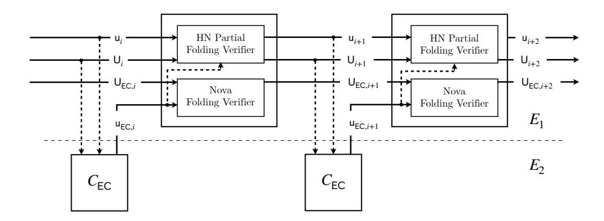

# CycleFold: Folding-scheme-based recursive arguments over a cycle of elliptic curves

Abhiram Kothapalli Srinath Setty Carnegie Mellon University Microsoft Research

#### Abstract.

This paper introduces CycleFold, a new and conceptually simple approach to instantiate folding-scheme-based recursive arguments over a cycle of elliptic curves, for the purpose of realizing incrementally verifiable computation (IVC). Existing approach to solve this problem originates from BCTV (CRYPTO'14) who describe their approach for a SNARK-based recursive argument, and it was adapted by Nova (CRYPTO'22) to a folding-scheme-based recursive argument. A downside of this approach is that it represents a folding scheme verifier as a circuit on both curves in the cycle. (e.g., with Nova, this requires ≈10,000 multiplication gates on both curves in the cycle).

CycleFold's starting point is the observation that folding-scheme-based recursive arguments can be efficiently instantiated without a cycle of elliptic curves—except for a few scalar multiplications in their verifiers (2 in Nova, 1 in HyperNova, and 3 in ProtoStar). Accordingly, CycleFold uses the second curve in the cycle to merely represent a single scalar multiplication (≈1,000–1,500 multiplication gates). CycleFold then folds invocations of that tiny circuit on the first curve in the cycle. This is nearly an order of magnitude improvement over the prior state-of-the-art in terms of circuit sizes on the second curve. CycleFold is particularly beneficial when instantiating folding-scheme-based recursive arguments over "half pairing" cycles (e.g., BN254/Grumpkin) as it keeps the circuit on the non-pairing-friendly curve minimal. The running instance in a CycleFold-based recursive argument consists of an instance on the first curve and a tiny instance on the second curve. Both instances can be proven using a zkSNARK defined over the scalar field of the first curve.

On the conceptual front, with CycleFold, an IVC construction and nor its security proof has to explicitly reason about the cycle of elliptic curves. Finally, due to its simplicity, CycleFold-based recursive argument can be more easily be adapted to support parallel proving with the so-called "binary tree" IVC.

# 1 Introduction

Incrementally verifiable computation (IVC) [\[Val08\]](#page-28-0) is a powerful cryptographic primitive that allows a prover to produce a proof of the correct execution of a "long running" computation in an incremental fashion. For example, it enables the following: The prover takes as input a proof πi proving the the first i steps of its computation and then update it to produce a proof πi+1 proving the correct execution of the first i + 1 steps. Crucially, the prover's work to update the proof does not depend on the number of steps executed thus far, and the verifier's work to verify a proof does not grow with the number of steps executed thus far. IVC has received recent, renewed interest as it enables a wide variety of applications in decentralized settings including verifiable delay functions [\[BBF18,](#page-27-0)[Wes19\]](#page-28-1), succinct blockchains [\[Lab20\]](#page-27-1), rollups [\[WGH](#page-28-2)+18[,LNS20,](#page-28-3)[OWB20\]](#page-28-4), verifiable state machines [\[SAGL18\]](#page-28-5), and proofs of machine executions (e.g., EVM, RISC-V).

Early realizations of IVC [\[Val08,](#page-28-0)[BCTV14a\]](#page-27-2) rely on recursive versions of succinct non-interactive arguments of knowledge (SNARKs) [\[Kil92,](#page-27-3)[Mic94,](#page-28-6)[GW11](#page-27-4)[,BCCT12\]](#page-27-5). At an incremental step i, the prover produces a SNARK proving that it has correctly applied a step of the specified computation using the output of step i−1 and that the SNARK verifier represented as a circuit has accepted a SNARK from step i − 1 [\[BCCT13](#page-27-6)[,BCTV14a\]](#page-27-2). These works require representing the SNARK verifier as a circuit. To reduce the size of the SNARK verifier when encoded as a circuit, [\[BCTV14a\]](#page-27-2) use a 2-cycle of elliptic curves: a 2-cycle of elliptic curves is a pair of elliptic curves (E1, E2) such that the scalar field of E1 equals the base field of E2 (i.e., the field over which points in E2 are defined over) and vice versa (Section [1.1](#page-1-0) provides details on how a 2-cycle of elliptic curves is used and how they help with concrete efficiency).

A flurry of works [\[BGH19,](#page-27-7)[BCMS20](#page-27-8)[,BDFG21,](#page-27-9)[BCL](#page-27-10)+21[,KST22,](#page-27-11)[KS22,](#page-27-12)[KS23,](#page-27-13)[BC23\]](#page-27-14) reduce reliance on SNARKs to construct IVC, culminating in the so-called folding schemes [\[KST22\]](#page-27-11), a primitive that is sufficient to construct IVC. A folding scheme reduces the task of checking two NP instances with the same "structure" (e.g., circuit description) into the task of checking a single NP instance. Naturally, a folding scheme is simpler and is generally far more efficient than a SNARK. Recent IVC schemes based on folding schemes include Nova [\[KST22\]](#page-27-11), HyperNova [\[KS23\]](#page-27-13), and ProtoStar [\[BC23\]](#page-27-14). Although these recent works replace SNARKs with folding schemes, the blueprint of [\[BCTV14a\]](#page-27-2) remains the only solution to instantiate them efficiently on a cycle of elliptic curves. Indeed, an implementation of Nova [\[nov\]](#page-28-7) adapts BCTV's approach [\[BCTV14a\]](#page-27-2) to the context of folding-scheme-based recursive arguments. This still requires representing the verifier of a folding scheme as a circuit on both curves in the cycle.

### 1.1 Details of the prior state-of-the-art

We first recall the 2-cycle approach to instantiate SNARK-based recursive arguments in [\[BCTV14a\]](#page-27-2). We then describe how Nova adapts this approach to the context of folding-scheme-based recursive arguments.

The 2-cycle approach in [\[BCTV14a\]](#page-27-2). The starting point for [\[BCTV14a\]](#page-27-2) is a pairing-based SNARK (e.g., [\[PGHR13](#page-28-8)[,BCTV14b\]](#page-27-15)) instantiated over a pairingfriendly elliptic curve E. The proof system can prove constraint systems defined over E's scalar field. Furthermore, verifying a proof requires a handful of pairing operations, which are naturally represented as operations over E's base field.

Let (Π1, Π2) denote two SNARK schemes (such as [\[PGHR13,](#page-28-8)[BCTV14b\]](#page-27-15)) defined respectively over (E1, E2). In particular, Π1 can "natively" (i.e., without field emulation) prove constraint systems (e.g., R1CS) defined over the scalar field of E1 and Π2 can prove constraint systems defined over the scalar field of E2. [1](#page-2-0) Naturally, proofs produced by Π1 can be efficiently verified by a constraint system supported by Π2 and vice versa. This is because the algorithm to verify proofs produced by Π1 involves operations over E1's base field, which, by design, equals the scalar field of E2. (When the fields do not match, one would need to emulate arithmetic of the desired field using another field, which entails significant costs in terms of the number of gates necessary to perform basic operations such as additions and multiplications over the desired field.) In other words, the constraint system supported by Π2 can efficiently encode the SNARK verifier of Π1.

To realize IVC, at step i, in [\[BCTV14a\]](#page-27-2), the prover proceeds as follows (for ease of exposition, we ignore the base case of i = 0).

- 1. Using Π1, the prover produces a SNARK π (1) i that proves that it has executed the step i of the desired computation and has successfully verified a SNARK π (2) i−1 from step i − 1.
- 2. Using Π2, the prover produces a SNARK π (2) i that it knows a SNARK π (1) i and has successfully verified it.

Note that π (2) i is the IVC proof at the end of step i. At step i + 1, the prover starts with π (2) i and repeats the above procedure for the (i + 1)th step of the computation. A key take-away is that this approach requires representing the SNARK verifier as a circuit on both curves in the cycle.

Nova's instantiation over a 2-cycle of elliptic curves. The Nova library [\[nov\]](#page-28-7) adapts [\[BCTV14a\]](#page-27-2)'s blueprint to the context of folding schemes, and obtains a concretely-efficient implementation of Nova [\[KST22\]](#page-27-11). Its approach is to essentially replace "SNARK verifier" with a "non-interactive folding scheme verifier". Specifically, an NP instance defined over the scalar field of the first curve can be efficiently folded using a circuit defined over the scalar field of the second curve and vice versa. Different from [\[BCTV14a\]](#page-27-2), Nova's IVC proof is a set of instances and witnesses defined over both curves in the cycle rather than a single SNARK.

1 [\[BCTV14a\]](#page-27-2) uses cycles of elliptic curves where both curves are pairing-friendly as they use pairing-based SNARKs to realize IVC. Unfortunately, such cycles of pairingfriendly elliptic curves require field sizes to be much larger than ordinary elliptic curves to achieve a "standard" 128 bits of security.

Nova additionally uses the public IO of circuits to track folded NP instances. A recent work [\[NBS23\]](#page-28-9) provides a rigorous and detailed description of Nova's instantiation on a 2-cycle of elliptic curves and proves its security. This work also exposes a vulnerability in the original implementation (which is now fixed).

Overall, Nova's approach, like in [\[BCTV14a\]](#page-27-2), still requires representing a verifier (which happens to be the the non-interactive folding scheme verifier) as a circuit on both curves in the cycle of curves. For Nova [\[KST22\]](#page-27-11), which provides the most efficient folding scheme verifier in the literature, the circuit defined over the second curve in the cycle is ≈10, 000 multiplication gates.

Remark 1. HyperNova [\[KS23\]](#page-27-13) and ProtoStar [\[BC23\]](#page-27-14) improve upon Nova, in terms of the degree of constraints supported and the costs incurred for supporting higher degree constraints. At the time this paper was written, there were no public implementations of these schemes, with support for recursion. Based on their reported efficiency, we expect their verifier circuit sizes to be at least as large as Nova's verifier circuit.[2](#page-3-0) Thus, if HyperNova or ProtoStar are implemented over a 2-cycle of elliptic curves using the approach used in Nova's implementation, they would require about 10,000 multiplication gates on both curves in the cycle, to encode their verifier circuits.

# 1.2 Our approach in a nutshell: CycleFold

CycleFold's starting point is the observation that folding-scheme-based recursive arguments (e.g., Nova, HyperNova, ProtoStar) can be efficiently instantiated without a cycle of elliptic curves—except for a few elliptic scalar multiplication operations (2 in Nova, 1 in HyperNova, 3 in ProtoStar) in their verifier circuits that must be handled with "wrong" field arithmetic (or non-native arithmetic). We further observe that this scalar multiplication operation can be verifiably delegated to the second curve with the following approach. We first represent the desired scalar multiplication operation as a circuit over the scalar field of the second curve. Crucially, this avoids non-native arithmetic for computing the scalar multiplication operation (as there is no need for field emulation). Then, by employing Nova's folding scheme verifier on the first curve, we fold that scalar multiplication circuit satisfiability instance into a running instance.

Figure [1](#page-4-0) depicts an overview of CycleFold's approach.

Note that CycleFold can be viewed as employing a 2-cycle of elliptic curves at a different level of abstraction than [\[BCTV14a\]](#page-27-2) or its adaptation in Nova [\[KST22,](#page-27-11)[nov,](#page-28-7)[NBS23\]](#page-28-9). Specifically, with CycleFold, the 2-cycle of elliptic curves is used at the level of a folding scheme. In particular, the specific way the 2-cycle of elliptic curves is used ensures that the folding scheme verifier can be efficiently represented as a circuit with a single curve in the cycle. Accordingly, the resulting IVC scheme nor its

2 ProtoStar performs more scalar multiplications and field operations than Nova, and HyperNova performs one fewer scalar multiplication than Nova but incurs higher hash computations and field operations than Nova.

Fig. 1. Two incremental steps in HyperNova's recursive argument instantiated with CycleFold. E1 represents the first curve in the elliptic curve cycle, and E2 represents the second curve in the cycle. ui attests to the computation at step i and Ui attests to all prior steps of the computation. UEC,i attests to all prior steps of the outsourced elliptic curve operations. CEC is a circuit which computes the outsourced elliptic curve operations on E2. ui and Ui are parsed to retrieve inputs for circuit CEC (represented with a dotted line). uEC,i represents the correct execution of CEC. The main computation on each step additionally runs the HyperNova folding scheme verifier (which folds claims regarding the main computation) by taking as auxiliary advice the result of the elliptic curve operation (read from uEC,i). The main computation additionally runs the Nova folding scheme verifier which folds claims about the outsourced elliptic curve operation. ui+1 represents the correctness of the latest step and (Ui, UEC,i) represents the correctness of all prior steps and outsourced computations.

proof of security has to reason about the 2-cycle of elliptic curves. Indeed, when we apply CycleFold to HyperNova, we apply it at the level of a folding scheme.

A preliminary design. CycleFold employs a 2-cycle of elliptic curves (E1, E2), but it instantiates a folding-scheme-based recursive argument (e.g., HyperNova) as if there is only a single elliptic curve E1 (e.g., on BN254). This means that the folding-scheme verifier is represented as a circuit, say CV, on the scalar field of E1. For the case of HyperNova [\[KS23\]](#page-27-13), CV performs finite field and hash operations, and a single scalar multiplication (more precisely, a scalar multiplication followed by a point addition). The finite field and hashing operations in CV are over E1's scalar field so they are represented efficiently in E1's scalar field. However, the scalar multiplication and point addition operations require arithmetic over E1's base field. Naively, one can perform those operations with non-native arithmetic inside CV. Unfortunately, this strategy will result in CV containing a million multiplication gates or more.

We now discuss how CycleFold avoids the non-native arithmetic to compute a scalar multiplication and a point addition—without using the 2-cycle approach of [\[BCTV14a\]](#page-27-2) or its adaptation in Nova [\[KST22,](#page-27-11)[nov,](#page-28-7)[NBS23\]](#page-28-9).

A "co-processor" circuit over the scalar field of E2. CycleFold creates a circuit CEC defined over the scalar field of the second curve in the cycle E2 (e.g., on Grumpkin). CEC performs the desired scalar multiplication and a point addition operation. Furthermore, the public IO of CEC contains the inputs and outputs of the scalar multiplication and point addition operation. Since CEC is defined over the scalar field of E2, which is the base field of E1 since (E1, E2) is a 2-cycle of elliptic curves. As a result, CEC does not require non-native arithmetic to compute the desired scalar multiplication and point addition. In particular, the size CEC is concretely small (e.g., with ≈1,000–1,500 multiplication gates).

Closing the loop. Instead of performing a scalar multiplication and a point addition with non-native arithmetic (which as noted above is untenable), the verifier circuit CV takes as non-deterministic input, among other things, a circuit satisfiability instance uEC (i.e., the public IO and a commitment to a purported satisfying witness to an instance of CEC). In addition to performing the rest of folding scheme verifier's work, CV simply consumes the claimed output from the public IO of uEC after checking that inputs to the scalar multiplication and point addition match its desired inputs. CV then folds uEC into a running instance, using Nova's folding scheme.

Remark 2. HyperNova's verifier circuit CV defined over E1's scalar field performs ≈10,000 multiplication gates (to encode Nova's verifier circuit on E1 to fold uEC), in addition to performing the rest of operations HyperNova's verifier circuit. We believe that this trade-off is beneficial in the context of half-pairing cycles as CycleFold effectively "moves" gates from the second curve in the cycle (which is not pairing-friendly) to the first curve in the cycle (which is pairing-friendly).

Remark 3. For simplicity, we assume that the circuit satisfiability instance uEC is encoded with R1CS and we use Nova's folding scheme to fold uEC into a running instance. One can customize the shape of CEC (since this circuit only performs simple elliptic curve operations) to lower its size and still use Nova's folding scheme (recent work [\[Moh23\]](#page-28-10) demonstrates that Nova's folding scheme generalizes to arbitrary degree-2 constraints). One may also use higher-degree constraints, but this may entail higher costs than 10,000 multiplication gates on E1 (see the above remark).

Summary. CycleFold's approach to instantiate a folding-scheme based recursive argument (e.g., HyperNova) results in a substantially smaller circuit on the second curve in the cycle. Specifically, CEC defined over E2's scalar field is ≈1,000– 1,500 gates (without any customization), which is nearly an order of magnitude improvement over having a folding scheme verifier circuit on the second curve in the cycle.

At the "end" or at any point during an incremental computation, the running instance consists of a circuit defined over the scalar field of E1 as well as a tiny relaxed R1CS instance (defined over the scalar field of E2) encoding a single scalar multiplication operation. The prover can prove both instances using a zkSNARK (e.g., Spartan) defined over the scalar field of E1.

Applying CycleFold to Nova and ProtoStar. The text above focuses on HyperNova, but CycleFold is not limited to HyperNova and it can be used to instantiate existing and new folding-scheme-based recursive arguments (e.g., Nova, ProtoStar). Unlike HyperNova, Nova's verifier circuit performs two scalar multiplications and ProtoStar's verifier circuit performs 3 scalar multiplications. When applying CycleFold, there are two options. First, uEC can perform all the desired scalar multiplications (which increases the size of the circuit defined over E2 by 3× in the case of ProtoStar), but it keeps the additional multiplication gates required on E1 to be ≈10,000 (as we make a single invocation of Nova's folding scheme verifier). Second, uEC performs only a single scalar multiplication (which keeps the circuit defined over E2 minimal), but, in the case of ProtoStar, it requires 3 invocations of Nova's folding scheme verifier (so an additional ≈30,000 multiplication gates on E1).

Comparison with Goblin Plonk [\[Wil23\]](#page-28-11). Goblin Plonk supports recursive proof composition in Plonk-type proof systems. It is instantiated over a 2-cycle of elliptic curves. Unlike BCTV14's approach, the second curve in the cycle is used to represent an "instruction machine" that can be invoked by the circuit on the first curve and when invoked performs the requested operation and places the results in a table (which is more like a read-write memory); the table can be read by the circuit on the first curve. Compared to CycleFold, there are downsides to this approach. First, the size of the table grows linearly with the number of recursive steps. In other words, the size of the recursive proof and the time to verify it grows with the number of recursive steps, which can be prohibitive for "long running" computations. Because of this, Goblin Plonk's approach does not lead to an IVC scheme.[3](#page-6-0) Note that if one wishes to compress a Goblin Plonk proof into a succinct proof, the prover must verify the correctness of the table entries, which can be expensive. Second, Goblin Plonk relies on complex machinery (e.g., to handle tables). In contrast, CycleFold provides an IVC scheme as the statement defined over the second curve in the cycle is limited to a single circuit encoding a scalar multiplication and a point addition. Furthermore, CycleFold does not require any table machinery to leverage the second curve in the cycle.

### 1.3 An organization of the rest of the paper

We provide the necessary preliminaries in Section [2](#page-7-0) and Appendix [A.](#page-29-0) In Section [3,](#page-12-0) we describe CycleFold applied to HyperNova [\[KST22\]](#page-27-11). We formalize this as a new folding scheme over a cycle of curves where the second curve performs delegated scalar multiplication and point addition operations. We prove the security of this modified scheme. We leave it to the future work to formalize CycleFold a compiler from any folding scheme described over a single curve to a folding scheme that uses a cycle to delegate certain operations. Finally, if we substitute this folding scheme in HyperNova's IVC (Construction 3, Section 6.1 in [\[KS23\]](#page-27-13)), we obtain an IVC scheme instantiated over 2-cycle of elliptic curves via CycleFold.

3 An IVC scheme requires the size of a recursive proof and the time to verify it to be independent of the number of steps in a computation.

### 2 Preliminaries

We use  $\lambda$  to denote the security parameter and  $\mathbb{F}$  to denote a finite field (e.g., the prime field  $\mathbb{F}_p$  for a large prime p). We use  $\mathsf{negl}(\lambda)$  to denote a negligible function in  $\lambda$ . Throughout the paper, the depicted asymptotics depend on  $\lambda$ , but we elide this for brevity. We use "PPT algorithms" to refer to probabilistic polynomial time algorithms. For relations  $\mathcal{R}_1$  and  $\mathcal{R}_2$ , we define the relation  $\mathcal{R}_1 \times \mathcal{R}_2$  as  $((u_1, u_2), (w_1, w_2)) \in \mathcal{R}_1 \times \mathcal{R}_2$  if and only if  $(u_1, w_1) \in \mathcal{R}_1$  and  $(u_2, w_2) \in \mathcal{R}_2$ . We write  $\mathbb{F}^d[X_1, \ldots, X_n]$  to denote multivariate polynomials over field  $\mathbb{F}$  in the variables  $X_1, \ldots, X_n$  with degree bound d for each variable. We omit the superscript if there is no degree bound.

Additional preliminaries are in Appendix A.

# 2.1 Incrementally Verifiable Computation

For a non-deterministic polynomial-time function F, an incrementally verifiable computation (IVC) scheme enables a prover to efficiently update a proof  $\Pi_i$  that attests to the claim that  $z_i = F^{(i)}(z_0)$  to a proof  $\Pi_{i+1}$  (of the same size as  $\Pi_i$ ) that attests to the claim that  $z_{i+1} = F^{(i+1)}(z_0)$ . Below, we formally define IVC.

**Definition 1 (Incrementally verifiable computation (IVC)).** An incrementally verifiable computation (IVC) scheme is defined by PPT algorithms  $(\mathcal{G}, \mathcal{P}, \mathcal{V})$  and deterministic  $\mathcal{K}$  denoting the generator, the prover, the verifier, and the encoder respectively, with the following interface

- $\mathcal{G}(1^{\lambda}) \to pp$ : on input security parameter  $\lambda$ , samples public parameters pp.
- $\mathcal{K}(pp, F) \to (pk, vk)$ : on input public parameters pp, and polynomial-time function F, deterministically produces a prover key pk and a verifier key vk.
- P(pk, (i, z0, zi), ωi, Πi) → Πi+1: on input a prover key pk, a counter i, an initial input z0, a claimed output after i iterations zi, a non-deterministic advice ωi, and an IVC proof Πi attesting to zi, produces a new proof Πi+1 attesting to zi+1 = F(zi, ωi).
- V(vk, (i, z0, zi), Πi) → {0,1}: on input a verifier key vk, a counter i, an initial input z0, a claimed output after i iterations zi, and an IVC proof Πi attesting to zi, outputs 1 if Πi is accepting, and 0 otherwise.

An IVC scheme  $(\mathcal{G}, \mathcal{K}, \mathcal{P}, \mathcal{V})$  satisfies the following requirements.

1. Perfect Completeness: For any PPT adversary A

$$\Pr\left[\begin{array}{l} \mathcal{V}(\mathsf{vk},(i+1,z_0,z_{i+1}),\boldsymbol{\varPi}_{i+1}) = 1 \left| \begin{array}{l} \mathsf{pp} \leftarrow \mathcal{G}(1^\lambda), \\ F,(i,z_0,z_i,\boldsymbol{\varPi}_i) \leftarrow \mathcal{A}(\mathsf{pp}), \\ (\mathsf{pk},\mathsf{vk}) \leftarrow \mathcal{K}(\mathsf{pp},F), \\ z_{i+1} \leftarrow F(z_i,\omega_i), \\ \mathcal{V}(\mathsf{vk},i,z_0,z_i,\boldsymbol{\varPi}_i) = 1, \\ \boldsymbol{\varPi}_{i+1} \leftarrow \mathcal{P}(\mathsf{pk},(i,z_0,z_i),\omega_i,\boldsymbol{\varPi}_i) \end{array} \right]$$

where F is a polynomial-time computable function.

2. Knowledge Soundness: Consider constant  $n \in \mathbb{N}$ . For all expected polynomial-time adversaries  $\mathcal{P}^*$  there exists an expected polynomial-time extractor  $\mathcal{E}$  such that over all randomness  $\mathbf{r}$ 

$$\Pr \begin{bmatrix} z_n = z \ where \\ z_{i+1} \leftarrow F(z_i, \omega_i) \\ \forall i \in \{0, \dots, n-1\} \end{bmatrix} \begin{vmatrix} \mathsf{pp} \leftarrow \mathcal{G}(1^{\lambda}), \\ (F, (z_0, z_i), \Pi) \leftarrow \mathcal{P}^*(\mathsf{pp}, \mathsf{r}), \\ (\mathsf{pk}, \mathsf{vk}) \leftarrow \mathcal{K}(\mathsf{pp}, F), \\ \mathcal{V}(\mathsf{vk}, (n, z_0, z), \Pi) = 1, \\ (\omega_0, \dots, \omega_{n-1}) \leftarrow \mathcal{E}(\mathsf{pp}, \mathsf{r}) \end{vmatrix} \approx 1.$$

3. Succinctness: The size of an IVC proof Π is independent of the number of iterations n.

### 2.2 Multi-folding schemes

A folding scheme [KST22] for a relation  $\mathcal{R}$  is a protocol between a prover and verifier in which the prover and the verifier reduce the task of checking two instances in  $\mathcal{R}$  with the same structure into the task of checking a single instance in  $\mathcal{R}$ . Kothapalli and Setty [KS23] introduce a generalization of folding schemes, which they refer to as multi-folding schemes. A multi-folding scheme is defined with respect to a pair of relations ( $\mathcal{R}_1, \mathcal{R}_2$ ) and size parameters  $\mu$  and  $\nu$ . It is an interactive protocol between a prover and a verifier in which the prover and the verifier reduce the task of checking a collection of  $\mu$  instances in  $\mathcal{R}_1$  with structure  $s_1$  and a collection of  $\nu$  instances in  $\mathcal{R}_2$  with structure  $s_2$  into the task of checking a single instance in  $\mathcal{R}_1$  with structure  $s_1$ —as long as  $s_1$  and  $s_2$  satisfy a predicate compat (e.g., compat might require that  $s_1 = s_2$ ).

Below, we provide a formal definition of multi-folding schemes.

**Definition 2** (Multi-folding schemes). Consider relations  $\mathcal{R}_1$  and  $\mathcal{R}_2$  over public parameters, structure, instance, and witness tuples, a predicate compat that structures for instances in  $\mathcal{R}_1$  and  $\mathcal{R}_2$  must satisfy, and size parameters  $\mu, \nu \in \mathbb{N}$ . A multi-folding scheme for  $(\mathcal{R}_1, \mathcal{R}_2, \mathsf{compat}, \mu, \nu)$  consists of a PPT generator algorithm  $\mathcal{G}$ , a deterministic encoder algorithm  $\mathcal{K}$ , and a pair of PPT algorithms  $\mathcal{P}$  and  $\mathcal{V}$  denoting the prover and the verifier respectively, with the following interface:

- $\mathcal{G}(1^{\lambda}) \to pp$ : on input security parameter  $\lambda$ , samples public parameters pp.
- $\mathcal{K}(\mathsf{pp},(\mathsf{s}_1,\mathsf{s}_2)) \to (\mathsf{pk},\mathsf{vk})$ : on input  $\mathsf{pp}$ , and structures  $\mathsf{s}_1$  and  $\mathsf{s}_2$  among the instances to be folded, outputs a prover key  $\mathsf{pk}$  and a verifier key  $\mathsf{vk}$ .
- $\mathcal{P}(\mathsf{pk}, (\vec{\mathsf{u}_1}, \vec{\mathsf{w}_1}), (\vec{\mathsf{u}_2}, \vec{\mathsf{w}_2})) \to (\mathsf{u}, \mathsf{w})$ : on input a vector of instances  $\vec{\mathsf{u}_1}$  in  $\mathcal{R}_1$  of size  $\mu$  with structure  $\mathsf{s}_1$  and a vector of instances  $\vec{\mathsf{u}_2}$  in  $\mathcal{R}_2$  of size  $\nu$  with structure  $\mathsf{s}_2$ , and corresponding witness vectors  $\vec{\mathsf{w}_1}$  and  $\vec{\mathsf{w}_2}$  outputs a folded instance-witness pair  $(\mathsf{u}, \mathsf{w})$  in  $\mathcal{R}_1$  with structure  $\mathsf{s}_1$ .
- $\mathcal{V}(vk, (\vec{u_1}, \vec{u_2})) \rightarrow u$ : on input a vector of instances  $\vec{u_1}$  and a vector of instances  $\vec{u_2}$  outputs a new instance u.

Let  $\langle \mathcal{P}, \mathcal{V} \rangle$  denote the interaction between  $\mathcal{P}$  and  $\mathcal{V}$ . We treat  $\langle \mathcal{P}, \mathcal{V} \rangle$  as a function that takes as input  $((\mathsf{pk}, \mathsf{vk}), (\vec{\mathsf{ui}_1}, \vec{\mathsf{wi}_1}), (\vec{\mathsf{ui}_2}, \vec{\mathsf{wi}_2}))$  and runs the interaction on prover input  $(\mathsf{pk}, (\vec{\mathsf{ui}_1}, \vec{\mathsf{wi}_1}), (\vec{\mathsf{ui}_2}, \vec{\mathsf{wi}_2}))$  and verifier input  $(\mathsf{vk}, (\vec{\mathsf{ui}_1}, \vec{\mathsf{ui}_2}))$ . At the end of interaction  $\langle \mathcal{P}, \mathcal{V} \rangle$  outputs (u, w) where u is the verifier's output folded instance, and w is the prover's output folded witness.

Let  $\mathcal{R}^{(n)}$  be the relation such that  $(pp, s, \vec{u}, \vec{w}) \in \mathcal{R}^{(n)}$  if and only if  $(pp, s, \vec{u}_i, \vec{w}_i) \in \mathcal{R}$  for all  $i \in [n]$ . A multi-folding scheme for  $(\mathcal{R}_1, \mathcal{R}_2, \mu, \nu)$  satisfies the following requirements.

1. Perfect Completeness: For all PPT adversaries A, we have that

$$\Pr\left[ \begin{array}{l} \left(\mathsf{pp},\mathsf{s}_1,\mathsf{u},\mathsf{w}\right) \in \mathcal{R}_1 \middle| \begin{array}{l} \mathsf{pp} \leftarrow \mathcal{G}(1^\lambda), \\ ((\mathsf{s}_1,\mathsf{s}_2),(\vec{\mathsf{u}_1},\vec{\mathsf{u}_2}),(\vec{\mathsf{w}_1},\vec{\mathsf{w}_2})) \leftarrow \mathcal{A}(\mathsf{pp}), \\ \mathsf{compat}(\mathsf{s}_1,\mathsf{s}_2) = \mathsf{true}, \\ (\mathsf{pp},\mathsf{s}_1,\vec{\mathsf{u}_1},\vec{\mathsf{w}_1}) \in \mathcal{R}_1^{(\mu)}, (\mathsf{pp},\mathsf{s}_2,\vec{\mathsf{u}_2},\vec{\mathsf{w}_2}) \in \mathcal{R}_2^{(\nu)}, \\ (\mathsf{pk},\mathsf{vk}) \leftarrow \mathcal{K}(\mathsf{pp},\mathsf{s}_1,\mathsf{s}_2), \\ (u,w) \leftarrow \langle \mathcal{P},\mathcal{V} \rangle ((\mathsf{pk},\mathsf{vk}),(\vec{\mathsf{u}_1},\vec{\mathsf{u}_2}),(\vec{\mathsf{w}_1},\vec{\mathsf{w}_2})) \end{array} \right] = 1.$$

 Knowledge Soundness: For any expected polynomial-time adversaries A and P\* there is an expected polynomial-time extractor E such that over all randomness r

$$\begin{split} & \Pr\left[ \begin{array}{l} (\mathsf{pp},\mathsf{s}_1,\vec{\mathsf{u}_1},\vec{\mathsf{w}_1}) \in \mathcal{R}_1^{(\mu)}, \\ (\mathsf{pp},\mathsf{s}_2,\vec{\mathsf{u}_2},\vec{\mathsf{w}_2}) \in \mathcal{R}_2^{(\nu)} \end{array}, \begin{vmatrix} \mathsf{pp} \leftarrow \mathcal{G}(1^\lambda), \\ ((\mathsf{s}_1,\mathsf{s}_2),(\vec{\mathsf{u}_1},\vec{\mathsf{u}_2}),\mathsf{st}) \leftarrow \mathcal{A}(\mathsf{pp},\mathsf{r}), \\ \mathsf{compat}(\mathsf{s}_1,\mathsf{s}_2) = \mathsf{true}, \\ (\vec{\mathsf{w}}_1,\vec{\mathsf{w}}_2) \leftarrow \mathcal{E}(\mathsf{pp},\mathsf{r}) \\ \end{vmatrix} \approx \\ & \Pr\left[ (\mathsf{pp},\mathsf{s}_1,u,w) \in \mathcal{R}_1 \middle| \begin{matrix} \mathsf{pp} \leftarrow \mathcal{G}(1^\lambda), \\ ((\mathsf{s}_1,\mathsf{s}_2),(\vec{\mathsf{u}_1},\vec{\mathsf{u}_2}),\mathsf{st}) \leftarrow \mathcal{A}(\mathsf{pp},\mathsf{r}), \\ \mathsf{compat}(\mathsf{s}_1,\mathsf{s}_2) = \mathsf{true}, \\ (\mathsf{pk},\mathsf{vk}) \leftarrow \mathcal{K}(\mathsf{pp},(\mathsf{s}_1,\mathsf{s}_2))), \\ (u,w) \leftarrow \langle \mathcal{P}^*,\mathcal{V} \rangle ((\mathsf{pk},\mathsf{vk}),(\vec{\mathsf{u}_1},\vec{\mathsf{u}_2}),\mathsf{st}) \end{matrix} \right] \end{split}$$

3. Efficiency: The communication costs and  $\mathcal{V}$ 's computation are lower in the case where  $\mathcal{V}$  participates in the multi-folding scheme and then checks a witness sent by  $\mathcal{P}$  for the folded instance than the case where  $\mathcal{V}$  checks witnesses sent by  $\mathcal{P}$  for each of the original instances.

A multi-folding scheme is secure in the random oracle model if the above requirements hold when all parties are provided access to a random oracle.

**Definition 3 (Non-interactive).** A multi-folding scheme  $(\mathcal{G}, \mathcal{K}, \mathcal{P}, \mathcal{V})$  is non-interactive if the interaction between  $\mathcal{P}$  and  $\mathcal{V}$  consists of a single message from  $\mathcal{P}$  to  $\mathcal{V}$ . This single message is denoted as  $\mathcal{P}$ 's output and as  $\mathcal{V}$ 's input.

**Definition 4 (Public coin).** A multi-folding scheme  $(\mathcal{G}, \mathcal{K}, \mathcal{P}, \mathcal{V})$  is called public coin if all the messages sent from  $\mathcal{V}$  to  $\mathcal{P}$  are sampled from a uniform distribution.

#### 2.3 Committed Relaxed R1CS

R1CS is an NP-complete problem implicit in the work of Gennero, Gentry, Parno, and Raykova [GGPR13]. For completeness we formally define R1CS in Appendix A.7. Below, we recall its folding-friendly variant, committed relaxed R1CS [KST22].

**Definition 5 (Committed relaxed R1CS).** Consider a finite field  $\mathbb{F}$  and a commitment scheme Commit over  $\mathbb{F}$ . Let the public parameters consist of size bounds  $m, n, \ell \in \mathbb{N}$  where  $m > \ell$ , and commitment parameters  $\mathsf{pp}_W$  and  $\mathsf{pp}_E$  for vectors of size m and  $m - \ell - 1$  respectively. The committed relaxed R1CS structure consists of sparse matrices  $A, B, C \in \mathbb{F}^{m \times m}$  with at most  $n = \Omega(m)$  non-zero entries in each matrix. A committed relaxed R1CS instance is a tuple  $(\overline{E}, u, \overline{W}, \mathsf{x})$ , where  $\overline{E}$  and  $\overline{W}$  are commitments,  $u \in \mathbb{F}$ , and  $\mathsf{x} \in \mathbb{F}^\ell$  are public inputs and outputs. An instance  $(\overline{E}, u, \overline{W}, \mathsf{x})$  is satisfied by a witness  $(E, r_E, W, r_W) \in (\mathbb{F}^m, \mathbb{F}, \mathbb{F}^{m-\ell-1}, \mathbb{F})$  if  $\overline{E} = \mathsf{Commit}(\mathsf{pp}_E, E, r_E)$ ,  $\overline{W} = \mathsf{Commit}(\mathsf{pp}_W, W, r_W)$ , and  $(A \cdot Z) \circ (B \cdot Z) = u \cdot (C \cdot Z) + E$ , where  $Z = (W, \mathsf{x}, u)$ .

### 2.4 Customizable constraint systems (CCS)

Setty et al. [STW23] recently introduced customizable constraint systems (CCS), a constraint system that simultaneously generalizes R1CS, Plonkish, and AIR without overheads. We first recall its definition and then describe variants that sections ahead will show are amenable to constructing multi-folding schemes. The definitions below are characterized by a finite field  $\mathbb{F}$ , but we leave this implicit.

**Definition 6 (CCS [STW23]).** We define the customizable constraint system (CCS) relation  $\mathcal{R}_{CCS}$  as follows. Let the public parameter consists of size bounds  $m, n, N, \ell, t, q, d \in \mathbb{N}$  where  $n > \ell$ .

An  $\mathcal{R}_{CCS}$  structure s consists of:

- a sequence of matrices  $M_1, \ldots, M_t \in \mathbb{F}^{m \times n}$  with at most  $N = \Omega(\max(m, n))$  non-zero entries in total;
- a sequence of q multisets  $[S_1, \ldots, S_q]$ , where an element in each multiset is from the domain  $\{1, \ldots, t\}$  and the cardinality of each multiset is at most d.
- a sequence of q constants  $[c_1, \ldots, c_q]$ , where each constant is from  $\mathbb{F}$ .

An  $\mathcal{R}_{CCS}$  instance consists of public input  $x \in \mathbb{F}^{\ell}$ . An  $\mathcal{R}_{CCS}$  witness consists of a vector  $w \in \mathbb{F}^{n-\ell-1}$ . An  $\mathcal{R}_{CCS}$  structure-instance tuple (s,x) is satisfied by an  $\mathcal{R}_{CCS}$  witness w if

$$\sum_{i=1}^{q} c_i \cdot \bigcirc_{j \in S_i} M_j \cdot z = \mathbf{0},$$

where  $z = (w, 1, \mathsf{x}) \in \mathbb{F}^n$ ,  $M_j \cdot z$  denotes matrix-vector multiplication,  $\bigcirc$  denotes the Hadamard product between vectors, and  $\mathbf{0}$  is an m-sized vector with entries equal to the the additive identity in  $\mathbb{F}$ .

#### Committed CCS

Consider a CCS structure  $s_{CCS} = (m, n, N, \ell, t, q, d, [M_1, \dots, M_t], [S_1, \dots, S_t], [c_1, \dots, c_t]).$ 

Let  $s = \log m$  and  $s' = \log n$ . We interpret each  $M_i$  (for  $i \in [t]$ ) as functions with the following signature:  $\{0,1\}^s \times \{0,1\}^{s'} \to \mathbb{F}$ . For  $i \in [t]$ , let  $\widetilde{M}_i$  denote the MLE of  $M_i$  i.e.,  $\widetilde{M}_i$  is the unique multilinear polynomial in  $\log m + \log n$  variables such that  $\forall x \in \{0,1\}^s, y \in \{0,1\}^{s'}, \widetilde{M}_i(x,y) = M_i(x,y)$ . Similarly, for a purported witness  $w \in \mathbb{F}^{n-\ell-1}$  let  $\widetilde{w}$  denote the unique MLE of w viewed as a function. WLOG, below, we let  $|w| = \ell + 1$ .

**Definition 7 (Committed CCS).** Let PC = (Gen, Commit, Open, Eval) denote an additively-homomorphic polynomial commitment scheme for multilinear polynomials over a finite field  $\mathbb{F}$ .

We define the committed customizable constraint system (CCCS) relation  $\mathcal{R}_{\mathsf{CCCS}}$  as follows. Let the public parameter consists of size bounds  $m, n, N, \ell, t, q, d \in \mathbb{N}$  where  $n = 2 \cdot (\ell + 1)$  and  $\mathsf{pp} \leftarrow \mathsf{Gen}(1^{\lambda}, s' - 1)$ . Let  $s = \log m$  and  $s' = \log n$ .

An  $\mathcal{R}_{CCCS}$  structure s consists of:

- a sequence of sparse multilinear polynomials in s + s' variables  $\widetilde{M}_1, \ldots, \widetilde{M}_t$  such that they evaluate to a non-zero value in at most  $N = \Omega(m)$  locations over the Boolean hypercube  $\{0,1\}^s \times \{0,1\}^{s'}$ ;
- a sequence of q multisets  $[S_1, \ldots, S_q]$ , where an element in each multiset is from the domain  $\{1, \ldots, t\}$  and the cardinality of each multiset is at most d.
- a sequence of q constants  $[c_1, \ldots, c_q]$ , where each constant is from  $\mathbb{F}$ .

An  $\mathcal{R}_{\mathsf{CCCS}}$  instance is  $(C, \mathsf{x})$ , where C is a commitment to a multilinear polynomial in s'-1 variables and  $\mathsf{x} \in \mathbb{F}^\ell$ . An  $\mathcal{R}_{\mathsf{CCCS}}$  witness consists of a multilinear polynomial  $\widetilde{w}$  in s'-1 variables. An  $\mathcal{R}_{\mathsf{CCCS}}$  structure-instance tuple is satisfied by an  $\mathcal{R}_{\mathsf{CCCS}}$  witness if  $\mathsf{Commit}(\mathsf{pp},\widetilde{w}) = C$  and if  $\forall x \in \{0,1\}^s$ ,

$$\sum_{i=1}^{q} c_i \cdot \left( \prod_{j \in S_i} \left( \sum_{y \in \{0,1\}^{\log m}} \widetilde{M}_j(x,y) \cdot \widetilde{z}(y) \right) \right) = 0,$$

where  $\tilde{z}$  is an s'-variate multilinear polynomial such that  $\tilde{z}(x) = (w, 1, x)(x)$  for all  $x \in \{0, 1\}^{s'}$ .

# Linearized committed CCS

**Definition 8 (Linearized committed CCS).** Let PC = (Gen, Commit, Open, Eval) denote an additively-homomorphic polynomial commitment scheme for multilinear polynomials over a finite field  $\mathbb{F}$ .

We define the linearized committed customizable constraint system (LCCS) relation  $\mathcal{R}_{LCCS}$  as follows. Let the public parameter consists of size bounds

 $m, n, N, \ell, t, q, d \in \mathbb{N}$  where  $n = 2 \cdot (\ell + 1)$  and  $\mathsf{pp} \leftarrow \mathsf{Gen}(1^{\lambda}, s' - 1)$ . Let  $s = \log m$  and  $s' = \log n$ .

An  $\mathcal{R}_{LCCCS}$  structure s consists of:

- a sequence of sparse multilinear polynomials in s + s' variables  $\widetilde{M}_1, \ldots, \widetilde{M}_t$  such that they evaluate to a non-zero value in at most  $N = \Omega(m)$  locations over the Boolean hypercube  $\{0, 1\}^s \times \{0, 1\}^{s'}$ ;
- a sequence of q multisets  $[S_1, \ldots, S_q]$ , where an element in each multiset is from the domain  $\{1, \ldots, t\}$  and the cardinality of each multiset is at most d.
- a sequence of q constants  $[c_1, \ldots, c_q]$ , where each constant is from  $\mathbb{F}$ .

An  $\mathcal{R}_{\mathsf{LCCCS}}$  instance is  $(C, u, \mathsf{x}, r, v_1, \ldots, v_t)$ , where  $u \in \mathbb{F}$ ,  $\mathsf{x} \in \mathbb{F}^\ell$ ,  $r \in \mathbb{F}^s$ ,  $v_i \in \mathbb{F}$  for all  $i \in [t]$ , and C is a commitment to a multilinear polynomial in s' - 1 variables. An  $\mathcal{R}_{\mathsf{LCCCS}}$  witness is a multilinear polynomial  $\widetilde{w}$  in s' - 1 variables.

An  $\mathcal{R}_{\mathsf{LCCCS}}$  structure-instance tuple is satisfied by an  $\mathcal{R}_{\mathsf{LCCCS}}$  witness if  $\mathsf{Commit}(\mathsf{pp},\widetilde{w}) = C$  and if for all  $i \in [t]$ ,  $v_i = \sum_{y \in \{0,1\}^{s'}} \widetilde{M}_i(r,y) \cdot \widetilde{z}(y)$ , where  $\widetilde{z}$  is an s'-variate multilinear polynomial such that  $z(x) = (w,u,\mathsf{x})(x)$  for all  $x \in \{0,1\}^{s'}$ .

# 3 A multi-folding scheme for CCS over a cycle of curves

This section describes a multi-folding scheme for CCS, instantiated over a cycle of elliptic curves. Our construction and proof strategy build upon HyperNova [KS23].

Let  $(E_1, E_2)$  denote a 2-cycle of elliptic curves, where each curve in the cycle can be used as cryptographic group (i.e. the discrete logarithm problem is hard). Let  $\mathbb{F}_p$  and  $\mathbb{F}_q$  respectively denote the scalar field and the base field of  $E_1$ . Naturally,  $\mathbb{F}_q$  and  $\mathbb{F}_p$  respectively denote the scalar field and the base field of  $E_2$ .

We provide a multi-folding scheme for  $\mathcal{R}_1 = \mathcal{R}_{LCCCS} \times \mathcal{R}_{CRR1CS}$  with structure  $s_1$  and  $\mathcal{R}_2 = \mathcal{R}_{CCCS}$  with structure  $s_2$ , when  $(s_1, s_2)$  satisfy the compat predicate defined below. Here,  $\mathcal{R}_{LCCCS}$  and  $\mathcal{R}_{CCCS}$  are both defined over  $\mathbb{F}_p$  (i.e., the scalar field of  $E_1$ ) and  $\mathcal{R}_{CRR1CS}$  is defined over  $\mathbb{F}_q$  (i.e., the scalar field of  $E_2$ ).

To keep the description of the multi-folding scheme simple, we describe and prove the case of  $\mu = \nu = 1$ . However, both the construction and proofs easily generalize to the case of arbitrary values of  $\mu$  and  $\nu$ . In particular, the generalized version simply uses more powers of a random challenge when combining claims.

A high-level overview. Our goal is to instantiate a folding scheme (e.g., HyperNova's folding scheme) on a cycle of elliptic curves.

Suppose that the prover and the verifier are given as input a tuple consisting of a linearized committed CCS instance and a committed relaxed R1CS instance  $(U_{LCCCS}, U_{CRR1CS})$ , and a committed CCS instance  $u_{CCCS}$ . The prover additionally takes as input witnesses  $(W_{LCCCS}, W_{CRR1CS})$  and  $w_{CCCS}$ .

HyperNova's folding scheme verifier folds the committed CCS instance  $u_{CCCS}$  into the the linearized committed CCS instance  $U_{LCCCS}$  to produce a new linearized

committed CCS instance  $\mathsf{U}'_{\mathsf{LCCCS}}$ . Internally, this involves finite field and hash operations. In addition, it involves one scalar multiplication and point addition. In particular, provided commitment  $C_1$  in the linearized committed CCS instance  $\mathsf{U}_{\mathsf{LCCCS}}$  and commitment  $C_2$  in the committed CCS instance  $\mathsf{u}_{\mathsf{CCCS}}$ , the HyperNova verifier, picks a random challenge  $\rho$ , and computes

$$C' \leftarrow C_1 + \rho \cdot C_2$$
.

Unfortunately, this computation makes it inefficient to represent the HyperNova verifier over the same curve that represents the computations that it verifies. To address this, we modify the HyperNova verifier to take the resulting value C' as non-deterministic advice. Of course, this advice must be verified.

To do so, the prover generates a relaxed R1CS instance that represents the random linear combination during the HyperNova folding protocol. In more detail, let  $s_{\mathsf{EC}} = (A, B, C)$  denote a committed relaxed R1CS structure defined over  $F_q$ . Its public IO consists of  $(\rho, C_1, C_2, C')$ , where  $\rho \in \mathbb{F}_p, C_1 \in E_1, C_2 \in E_1, C' \in E_1$ . This constraint system enforces that  $C' = C_1 + \rho \cdot C_2$ , where + is the elliptic curve point addition and + is the elliptic curve scalar multiplication operation in  $E_1$ . Since  $F_q$  is the base field of  $E_1$ ,  $\mathbf{s}_{\mathsf{EC}}$  computes the required point addition and scalar multiplication operations "natively" with a concise set of constraints (i.e., without the "wrong field" arithmetic).

We modify the HyperNova verifier to read the inputs and outputs of this relaxed R1CS instance (rather than computing the random linear combination itself). Instead of directly checking this instance, it is folded into a running relaxed R1CS instance using the folding scheme underlying Nova [KST22]. Note that this auxiliary computation is represented on the second curve in the cycle. Thus, the Nova verifier can be natively represented over the first curve alongside the rest of the HyperNova verifier.

Putting everything together, we achieve a folding scheme that takes a committed CCS instance and folds it into a linearized CCS instance and a relaxed R1CS instance to produce a new linearized CCS instance and a relaxed R1CS instance.

Construction 1 (A multi-folding scheme for CCS). We construct a multi-folding scheme for  $(\mathcal{R}_1 = \mathcal{R}_{\mathsf{LCCCS}} \times \mathcal{R}_{\mathsf{CRR1CS}}, \mathcal{R}_2 = \mathcal{R}_{\mathsf{CCCS}}, \mathsf{compat}, \mu = 1, \nu = 1)$ , where compat is defined as follows.

 $\mathsf{compat}(\mathsf{s}_1,\mathsf{s}_2) \to \{\mathsf{true},\mathsf{false}\}$ 

- 1. Parse  $s_1$  as  $(s_{LCCCS}, s_{RR1CS})$
- 2. Check that  $s_{LCCCS} = s_2$  and  $s_{RR1CS} = s_{EC}$

Let PC = (Gen, Commit, Open, Eval) denote an additively-homomorphic polynomial commitment scheme for multilinear polynomials over  $\mathbb{F}_p$ . Let VC = (Gen, Commit, Open) denote an additively-homomorphic commitment scheme with succinct commitments for vectors over  $\mathbb{F}_q$  (§A.1).

We define the generator and the encoder as follows.

$$\mathcal{G}(1^{\lambda}) \to \mathsf{pp}$$
:

- 1. Sample size bounds  $m, n, N, \ell, t, q, d \in \mathbb{N}$  with  $n = 2 \cdot (\ell + 1)$
- 2.  $pp_{PC} \leftarrow PC.Gen(1^{\lambda}, \log n 1)$
- 3.  $pp_{VC} \leftarrow VC.Gen(1^{\lambda}, |s_{EC}|)$ , where  $|s_{EC}|$  is the maximum among the number of constraints or the number of witness variables in  $s_{EC}$ .
- 4. Output  $(m, n, N, \ell, t, q, d, |s_{EC}|, pp_{PC}, pp_{VC})$

$$\mathcal{K}(\mathsf{pp},(([\widetilde{M}_1,\ldots,\widetilde{M}_t],[S_1,\ldots,S_q],[c_1,\ldots,c_q])),(A,B,C)) \to (\mathsf{pk},\mathsf{vk}):$$

1. 
$$\mathsf{pk} \leftarrow (\mathsf{pp}, (([\widetilde{M}_1, \dots, \widetilde{M}_t], [S_1, \dots, S_a], [c_1, \dots, c_a])), (A, B, C))$$

- 2.  $vk \leftarrow \bot$
- 3. Output (pk, vk)

The verifier  $\mathcal{V}$  takes a tuple consisting of a linearized committed CCS instance and a committed relaxed R1CS instance ( $\mathsf{U}_{\mathsf{LCCCS}}, \mathsf{U}_{\mathsf{CRR1CS}}$ ), where  $\mathsf{U}_{\mathsf{LCCCS}} = (C_1, u, \mathsf{x}_1, r_x, v_1, \ldots, v_t)$  and  $\mathsf{U}_{\mathsf{CRR1CS}} = (\overline{E}_1, u_1, \overline{W}_1, x_1)$ , and a committed CCS instance  $\mathsf{u}_{\mathsf{CCCS}} = (C_2, \mathsf{x}_2)$ . The prover  $\mathcal{P}$ , in addition to these instances, takes witnesses to all instances,  $\mathsf{W}_{\mathsf{LCCCS}} = \widetilde{w_1}, \mathsf{W}_{\mathsf{CRR1CS}} = (E_1, W_1)$ , and  $\mathsf{w}_{\mathsf{CCCS}} = \widetilde{w_2}$ .

Let 
$$s = \log m$$
 and  $s' = \log n$ . Let  $\widetilde{z_1} = (w_1, u, \mathsf{x}_1)$  and  $\widetilde{z_2} = (w_2, 1, \mathsf{x}_2)$ .

The prover and the verifier proceed as follows.

- 1.  $\mathcal{V} \to \mathcal{P}$ :  $\mathcal{V}$  samples  $\gamma \stackrel{\$}{\leftarrow} \mathbb{F}_p, \beta \stackrel{\$}{\leftarrow} \mathbb{F}_p^s$ , and sends them to  $\mathcal{P}$ .
- 2.  $\mathcal{V}$ : Sample  $r'_x \stackrel{\$}{\leftarrow} \mathbb{F}^s_p$ .
- 3.  $V \leftrightarrow \mathcal{P}$ : Run the sum-check protocol  $c \leftarrow \langle \mathcal{P}, \mathcal{V}(r_x') \rangle (g, s, d+1, \sum_{j \in [t]} \gamma^j \cdot v_j)$ , where:

$$\begin{split} g(x) &\coloneqq \left(\sum_{j \in [t]} \gamma^j \cdot L_j(x)\right) + \gamma^{t+1} \cdot Q(x) \\ L_j(x) &\coloneqq \widetilde{eq}(r_x, x) \cdot \left(\sum_{y \in \{0,1\}^{s'}} \widetilde{M}_j(x, y) \cdot \widetilde{z}_1(y)\right) \\ Q(x) &\coloneqq \widetilde{eq}(\beta, x) \cdot \left(\sum_{i=1}^q c_i \cdot \prod_{j \in S_i} \left(\sum_{y \in \{0,1\}^{s'}} \widetilde{M}_j(x, y) \cdot \widetilde{z}_2(y)\right)\right) \end{split}$$

4.  $\mathcal{P} \to \mathcal{V}$ :  $((\sigma_1, \dots, \sigma_t), (\theta_1, \dots, \theta_t))$ , where for all  $i \in [t]$ :

$$\sigma_i = \sum_{y \in \{0,1\}^{s'}} \widetilde{M}_i(r'_x, y) \cdot \widetilde{z}_1(y)$$

$$\theta_i = \sum_{y \in \{0,1\}^{s'}} \widetilde{M}_i(r'_x, y) \cdot \widetilde{z}_2(y)$$

5.  $\mathcal{V}$ : Compute  $e_1 \leftarrow \widetilde{eq}(r_x, r_x')$  and  $e_2 \leftarrow \widetilde{eq}(\beta, r_x')$ , and abort if:

$$c \neq \left(\sum_{j \in [t]} \gamma^j \cdot e_1 \cdot \sigma_j + \gamma^{t+1} \cdot e_2 \cdot \left(\sum_{i=1}^q c_i \cdot \prod_{j \in S_i} \theta_j\right)\right)$$

- 6.  $V \to \mathcal{P}$ : V samples  $\rho \stackrel{\$}{\leftarrow} \mathbb{F}_p$  and sends it to  $\mathcal{P}$ .
- 7.  $\mathcal{P} \to \mathcal{V}$ :  $\mathcal{P}$  computes a committed relaxed R1CS instance  $\mathsf{u}_{\mathsf{CRR1CS}} = (\overline{E}_2, u_2, \overline{W}_2, x_2)$  with structure  $\mathsf{s}_{\mathsf{EC}}$  and witness  $\mathsf{w}_{\mathsf{CRR1CS}} = (E_2, W_2)$  to compute the quantity  $C_1 + \rho \cdot C_2$ , such that the following hold: (1)  $u_2 = 1$ , (2)  $\overline{E}_1 = \overline{0}$ , and (3)  $x_2 = (\rho, C_1, C_2, C')$  for some  $C' \in E_1$ .  $\mathcal{P}$  then sends  $\mathsf{u}_{\mathsf{CRR1CS}}$  to  $\mathcal{V}$ .
- 8. V: Abort if  $\overline{E}_2 \neq \overline{0}$  or  $u_2 \neq 1$  or  $x_2 \neq (\rho, C_1, C_2, C')$  for some  $C' \in E_1$ .
- 9.  $\mathcal{P} \to \mathcal{V}$ : Send  $\overline{T} = \mathsf{VC.Commit}(\mathsf{pp}_{\mathsf{VC}}, T)$ , where  $T = AZ_1 \circ BZ_2 + AZ_2 \circ BZ_1 u_1 \cdot CZ_2 u_2 \cdot CZ_1$ ,  $Z_1 = (W_1, x_1, u_1)$ , and  $Z_2 = (W_2, x_2, u_2)$ .
- 10.  $V \to \mathcal{P}$ :  $\mathcal{V}$  samples  $\rho^* \xleftarrow{\$} \mathbb{F}_p$  and sends it to  $\mathcal{P}$ .
- 11.  $V, \mathcal{P}$ : Output the folded linearized committed CCS instance  $(C', u', x', r'_x, v'_1, \dots, v'_t)$  and the folded committed relaxed R1CS instance  $(\overline{E}^{\star}, u^{\star}, \overline{W}^{\star}, x^{\star})$ , where  $\forall i \in [t]$ :

$$u' \leftarrow u + \rho \cdot 1$$

$$x' \leftarrow x_1 + \rho \cdot x_2$$

$$v'_i \leftarrow \sigma_i + \rho \cdot \theta_i$$

$$\overline{E}^* \leftarrow \overline{E}_1 + \rho^* \cdot \overline{T}$$

$$u^* \leftarrow u_1 + \rho^* \cdot 1$$

$$\overline{W}^* \leftarrow \overline{W}_1 + \rho^* \cdot \overline{W}_2$$

$$x^* \leftarrow x_1 + \rho^* \cdot x_2$$

12.  $\mathcal{P}$ : Output the folded witnesses  $\mathsf{W}_{\mathsf{LCCCS}} = \widetilde{w}' \leftarrow \widetilde{w}_1 + \rho \cdot \widetilde{w}_2$  and  $\mathsf{W}_{\mathsf{CRR1CS}} = (E^\star, W^\star)$ , where  $E^\star \leftarrow E_1 + \rho^\star \cdot T$  and  $W^\star \leftarrow W_1 + \rho^\star \cdot W_2$ .

Theorem 1 (A multi-folding scheme for CCS). Construction 1 is a public-coin multi-folding scheme for  $(\mathcal{R}_1 = \mathcal{R}_{LCCCS} \times \mathcal{R}_{CRR1CS}, \mathcal{R}_2 = \mathcal{R}_{CCCS}, \text{compat}, \mu = 1, \nu = 1)$ . with perfect completeness and knowledge soundness.

Lemma 1 (Perfect Completeness). Construction 1 satisfies perfect completeness.

Proof. Consider public parameters  $pp = (m, n, N, \ell, t, q, d, |s_{EC}|, pp_{PC}, pp_{VC}) \leftarrow \mathcal{G}(1^{\lambda})$  and let  $s = \log m$  and  $s' = \log n$ . Let  $s_{EC} = (A, B, C)$  denote a committed relaxed R1CS structure defined over  $F_q$ , with public IO  $(\rho, C_1, C_2, C')$ , where  $\rho \in \mathbb{F}_p, C_1 \in E_1, C_2 \in E_1, C' \in E_1$ . This constraint system enforces that  $C' = C_1 + \rho \cdot C_2$ , where + is the elliptic curve point addition and  $\cdot$  is the elliptic curve scalar multiplication operation in  $E_1$ .

Consider arbitrary structures  $(s_1, s_2) \leftarrow \mathcal{A}(pp)$  such that  $\mathsf{compat}(s_1, s_2) = \mathsf{true}$ . Let  $s_1 = ((\widetilde{M}_1, \dots, \widetilde{M}_t), (S_1, \dots, S_q), (c_1, \dots, c_q))$ , and let  $s_2 = (A, B, C)$ . Consider prover and verifier keys  $(\mathsf{pk}, \mathsf{vk}) \leftarrow \mathcal{K}(\mathsf{pp}, (s_1, s_2))$ . Suppose that the prover and the verifier are provided with a linearized committed CCS instance and a committed relaxed R1CS instance

$$((C_1, u, \mathsf{x}_1, r_x, v_1, \dots, v_t), (\overline{E}_1, u_1, \overline{W}_1, x_1)),$$

and a committed CCS instance

$$(C_2, \mathsf{x}_2).$$

Suppose that the prover additionally is provided with the corresponding satisfying witnesses  $(\widetilde{w}_1, (E_1, W_1))$  and  $\widetilde{w}_2$ .

Because the input linearized committed CCS instance-witness pair is satisfying, we have, for  $\widetilde{z}_1 = (w_1, u, \mathsf{x}_1)$ , that

$$\begin{aligned} v_j &= \sum_{y \in \{0,1\}^{s'}} \widetilde{M}_j(r_x,y) \cdot \widetilde{z}_1(y) & \text{By precondition.} \\ &= \sum_{x \in \{0,1\}^s} \widetilde{eq}(r_x,x) \cdot \left(\sum_{y \in \{0,1\}^{s'}} \widetilde{M}_j(x,y) \cdot \widetilde{z}_1(y)\right) & \text{By Lemma 3} \\ &= \sum_{x \in \{0,1\}^s} L_j(x) & \text{By construction.} \end{aligned}$$

Furthermore, because the input committed relaxed R1CS instance-witness pair is also satisfying, we have for  $Z_1 = (W_1, u_1, x_1)$ ,  $AZ_1 \circ BZ_1 = u \cdot CZ_1 + E_1$ .

Moreover, because the input committed CCS instance-witness pair is satisfying, we have, for all  $x \in \{0,1\}^s$  and for  $\widetilde{z}_2(x) = (w_2, 1, \mathsf{x}_2)(x)$ , that

$$0 = \sum_{i=1}^{q} c_i \cdot \prod_{j \in S_i} \left( \sum_{y \in \{0,1\}^{s'}} \widetilde{M}_j(x,y) \cdot \widetilde{z}_2(y) \right)$$

Because the RHS vanishes on all x ∈ {0, 1} s , we have, for β sampled by the verifier, that

$$0 = \sum_{x \in \{0,1\}^s} \widetilde{eq}(\beta, x) \cdot \sum_{i=1}^q c_i \cdot \prod_{j \in S_i} \left( \sum_{y \in \{0,1\}^{s'}} \widetilde{M}_j(x, y) \cdot \widetilde{z}_2(y) \right) \quad \text{By Lemma 3.}$$

$$= \sum_{x \in \{0,1\}^s} Q(x) \quad \text{By construction.}$$

Therefore, for γ sampled by the verifier, by linearity, we have that

$$\sum_{j \in [t]} \gamma^j \cdot v_j = \sum_{x \in \{0,1\}^s} \left( \left( \sum_{j \in [t]} \gamma^j \cdot L_j(x) \right) + \gamma^{t+1} \cdot Q(x) \right)$$

$$= \sum_{x \in \{0,1\}^s} g(x)$$
By construction.

Therefore, by the perfect completeness of the sum-check protocol, we have for e1 = eqe (rx, r0 x ), e2 = eqe (β, r0 x ) and

$$\sigma_i = \sum_{y \in \{0,1\}^{s'}} \widetilde{M}_i(r_x', y) \cdot \widetilde{z}_1(y) \quad \text{and} \quad \theta_i = \sum_{y \in \{0,1\}^{s'}} \widetilde{M}_i(r_x', y) \cdot \widetilde{z}_2(y)$$

that

$$c = g(r'_x)$$

$$= \left( \left( \sum_{j \in [t]} \gamma^j \cdot L_j(r'_x) \right) + \gamma^{t+1} \cdot Q(r'_x) \right)$$

$$= \left( \left( \sum_{j \in [t]} \gamma^j \cdot e_1 \cdot \sigma_j \right) + \gamma^{t+1} \cdot e_2 \sum_{i \in [q]} c_i \cdot \prod_{j \in S_i} \theta_j \right).$$

This implies that the verifier will not abort on step [5.](#page-15-0)

By construction, the prover can construct uCRR1CS such that the verifier does not abort on step [8.](#page-15-1) Furthermore, the prover can construct uCRR1CS such that wCRR1CS is a satisfying witness under structure sEC. This implies that C 0 = C1 + ρ · C2, where C 0 is parsed from x2, which is the public IO of uCRR1CS.

Now, consider the linearized CCS instance

$$(C_2,1,\mathsf{x}_2,r_x',\theta_1,\ldots,\theta_t).$$

By the precondition that the committed CCS instance (C2, x2) is satisfied by we2 and by the definition of θ1, . . . , θt we have that this linearized CCS instance is satisfied by the witness we2.

Therefore, for random  $\rho$  sampled by the verifier, and for  $C' = C_1 + \rho \cdot C_2$ ,  $u' = u + \rho \cdot 1$ ,  $x' = x_1 + \rho \cdot x_2$ ,  $v'_i = \sigma_i + \rho \cdot \theta_i$ , we have that the output linearized CCS instance

$$(C', u', x', r'_x, v'_1, \dots, v'_t)$$

is satisfied by the witness  $\widetilde{w}' = \widetilde{w}_1 + \rho \cdot \widetilde{w}_2$  by the linearity and the additive homomorphism property of the commitment scheme.

Now, we argue that the the output committed relaxed R1CS instance  $(\overline{E}^{\star}, u^{\star}, \overline{W}^{\star}, x^{\star})$  is satisfying under the witness  $(E^{\star}, W^{\star})$ , for relaxed R1CS structure  $s_{\mathsf{EC}} = (A, B, C)$ . We need to establish the following. Let  $Z^{\star} = (W^{\star}, u^{\star}, x^{\star})$ .

$$AZ^{\star} \circ BZ^{\star} = u^{\star} \cdot CZ^{\star} + E^{\star} \tag{1}$$

$$\overline{W}^{\star} = VC.Commit(pp_{VC}, W^{\star}) \tag{2}$$

$$\overline{E}^{\star} = VC.Commit(pp_{VC}, E^{\star}) \tag{3}$$

The latter two requirements hold from the additive homomorphism of the commitment scheme. We now focus on proving the first requirement. We are given that the input committed relaxed R1CS instance  $(\overline{E}_1, u_1, \overline{W}_1, x_1)$  is satisfying under the witness  $(E_1, W_1)$  and structure  $s_{EC}$ . This implies that

$$AZ_1 \circ BZ_2 = u_1 \cdot CZ_1 + E_1$$

where  $Z_1 = (W_1, u_1, x_1)$ . As noted above, the committed relaxed R1CS instance sent by the prover  $(\overline{E}_2, u_2, \overline{W}_2, x_2)$  is satisfying under the witness  $(E_2, W_2)$  and structure  $s_{EC}$ . This implies that

$$AZ_2 \circ BZ_2 = CZ_2,$$

where  $Z_2 = (W_2, 1, x_2)$ . (This is because by construction  $u_2 = 1$  and  $E_2 = 0$ .)

Now, consider the LHS of the desired equality.

$$AZ^* \circ BZ^* = A(Z_1 + \rho^* \cdot Z_2) \circ B(Z_1 + \rho^* \cdot Z_2)$$

$$= AZ_1 \circ BZ_1 + \rho^* \cdot (AZ_1 \circ BZ_2 + AZ_2 \circ BZ_1) + (\rho^*)^2 \cdot (AZ_2 \circ BZ_2)$$

$$= u_1 \cdot CZ_1 + E_1 + \rho^* \cdot (AZ_1 \circ BZ_2 + AZ_2 \circ BZ_1) + (\rho^*)^2 \cdot CZ_2$$

Consider the RHS of the desired equality.

$$u^{\star} \cdot CZ^{\star} + E^{\star} = (u_1 + \rho^{\star}) \cdot C(Z_1 + \rho^{\star} \cdot Z_2) + E_1 + \rho^{\star} \cdot T$$

$$= (u_1 + \rho^{\star}) \cdot (CZ_1 + \rho^{\star} \cdot CZ_2) + E_1 + \rho^{\star} \cdot (AZ_1 \circ BZ_2 + AZ_2 \circ BZ_1 - u_1 \cdot CZ_2 - CZ_1)$$

$$= u_1 \cdot CZ_1 + \rho^{\star} \cdot (AZ_1 \circ BZ_2 + AZ_2 \circ BZ_1) + (\rho^{\star})^2 \cdot CZ_2$$

This establishes the desired requirements.

Some of our probabilistic analysis below is adapted from the proof of forking lemma for folding schemes [KST22], which itself builds on the proof of the forking lemma for interactive arguments  $[BCC^+16]$ .

Lemma 2 (Knowledge Soundness). Construction [1](#page-13-0) satisfies knowledge soundness.

Proof. Consider an adversary A that adaptively picks the structure and instances, and a malicious prover P ∗ that succeeds with probability . Let pp ← G(1λ ). Suppose on input pp and random tape r, the adversary A picks a structure (s1,s2) = (((Mf1, . . . , Mft),(S1, . . . , Sq),(c1, . . . , cq)),(A, B, C)) such that compat(s1,s2) = true, a pair of linearized committed CCS instance and a committed relaxed R1CS instance

$$\varphi_1 = ((C_1, u, \mathsf{x}_1, r_x, v_1, \dots, v_t), (\overline{E}_1, u_1, \overline{W}_1, x_1))$$

and a committed CCS instance

$$\varphi_2 = (C_2, \mathsf{x}_2),$$

and some auxiliary state st.

We construct an expected-polynomial time extractor E that succeeds with probability − negl(λ) in obtaining satisfying witnesses for the original instances as follows. Below, let R1 = RLCCCS × RCRR1CS and R2 = RCCCS.

# E(pp,r):

1. Obtain the output tuple from A:

$$(\mathsf{s}, \varphi_1, \varphi_2, \mathsf{st}) \leftarrow \mathcal{A}(\mathsf{pp}, \mathsf{r}).$$

- 2. Compute (pk, vk) ← K(pp,s).
- 3. Run the interaction

$$(\varphi^{(1,1)}, (\widetilde{w}, (E, W))^{(1,1)}) \leftarrow \langle \mathcal{P}^*, \mathcal{V} \rangle ((\mathsf{pk}, \mathsf{vk}), \varphi_1, \varphi_2, \mathsf{st})$$

once with the verifier's final challenges ρ (1) \$ ← F and ρ ?(1,1) \$ ← F.

- 4. Abort if (pp,s, ϕ(1,1) ,(w, e (E, W))(1,1)) 6∈ R1.
- 5. Rewind the interaction

$$(\varphi^{(1,2)}, (\widetilde{w}, (E, W))^{(1,2)}) \leftarrow \langle \mathcal{P}^*, \mathcal{V} \rangle ((\mathsf{pk}, \mathsf{vk}), \varphi_1, \varphi_2, \mathsf{st})$$

with a different verifier's challenge ρ ?(2,1) \$ ← F while maintaining the same prior randomness. Repeat until (pp,s, ϕ(1,2) ,(w, e (E, W))(1,2)) ∈ R1.

6. Rewind the interaction

$$(\varphi^{(2,1)}, (\widetilde{w}, (E, W))^{(2,1)}) \leftarrow \langle \mathcal{P}^*, \mathcal{V} \rangle ((\mathsf{pk}, \mathsf{vk}), \varphi_1, \varphi_2, \mathsf{st})$$

with different verifier's challenges ρ (2) \$ ← F and ρ ?(2,1) \$ ← F while maintaining the same prior randomness. Repeat until (pp,s, ϕ(2,1) ,(w, e (E, W))(2,1)) ∈ R1.

#### 7. Rewind the interaction

$$(\varphi^{(2,2)},(\widetilde{w},(E,W))^{(2,2)}) \leftarrow \langle \mathcal{P}^*,\mathcal{V} \rangle ((\mathsf{pk},\mathsf{vk}),\varphi_1,\varphi_2,\mathsf{st})$$

with a different verifier's challenge  $\rho^{\star(2,2)} \stackrel{\$}{\leftarrow} \mathbb{F}$  while maintaining the same prior randomness. Repeat until  $(\mathsf{pp},\mathsf{s},\varphi^{(2,1)},(\widetilde{w},(E,W))^{(2,2)}) \in \mathcal{R}_1$ .

- 8. Abort if  $\rho^{\star(1,1)} = \rho^{\star(1,2)}$ ,  $\rho^{(1)} = \rho^{(2)}$ , or  $\rho^{\star(2,1)} = \rho^{\star(2,2)}$ .
- 9. Interpolating points  $(\rho^{(1)}, \widetilde{w}^{(1,1)})$  and  $(\rho^{(2)}, \widetilde{w}^{(2,1)})$ , retrieve the witness polynomials  $\widetilde{w}_1$  and  $\widetilde{w}_2$  such that for  $i \in \{1, 2\}$

$$\widetilde{w}_1 + \rho^{(i)} \cdot \widetilde{w}_2 = \widetilde{w}^{(i,1)}. \tag{4}$$

10. Interpolating points  $(\rho^{\star(1,1)}, (E, W)^{(1,1)})$  and  $(\rho^{\star(1,2)}, (E, W)^{(1,2)})$ , retrieve  $(E_1, W_1)$  and  $(T, W_2)$  such that for  $j \in \{1, 2\}$ 

$$E_1 + \rho^{\star(1,j)} \cdot T = E^{(1,j)} \tag{5}$$

$$W_1 + \rho^{\star(1,j)} \cdot W_2 = W^{(1,j)} \tag{6}$$

11. Output  $((\widetilde{w_1}, (E_1, W_1)), \widetilde{w_2})$ .

We first demonstrate that the extractor  $\mathcal{E}$  runs in expected polynomial time. Observe that  $\mathcal{E}$  runs the interaction once, and if it does not abort, keeps rerunning the interaction until  $\mathcal{P}^*$  succeeds three additional times. Thus, the expected number of times  $\mathcal{E}$  runs the interaction is

$$1 + \Pr[\text{First call to } \langle \mathcal{P}^*, \mathcal{V} \rangle \text{ succeeds}] \cdot \frac{3}{\Pr[\langle \mathcal{P}^*, \mathcal{V} \rangle \text{ succeeds}]} = 1 + \epsilon \cdot \frac{3}{\epsilon} = 4.$$

Therefore, we have that the extractor runs in expected polynomial-time.

We now analyze  $\mathcal{E}$ 's success probability. We must demonstrate that  $\mathcal{E}$  succeeds in producing  $(\widetilde{w}_1, (E_1, W_1))$  and  $\widetilde{w}_2$  such that

$$(\mathsf{pp}, \mathsf{s}, \varphi_1, (\widetilde{w}_1, (E_1, W_1))) \in \mathcal{R}_1 \quad \text{and} \quad (\mathsf{pp}, \mathsf{s}_1, \varphi_2, \widetilde{w}_2) \in \mathcal{R}_2$$

with probability  $\epsilon - \text{negl}(\lambda)$ .

To do so, we first show that the extractor successfully produces some output (i.e., does not abort) in under  $|\mathbb{F}|$  rewinding steps with probability  $\epsilon - \mathsf{negl}(\lambda)$ . Note that  $|\mathbb{F}|$  is a worst case bound and we have already established that the extractor runs in expected polynomial time. By the malicious prover's success probability, we have that the extractor does not abort in step (4) with probability  $\epsilon$ . Given that the extractor does not abort in step (4), by Markov's inequality, we have that the extractor rewinds more than  $|\mathbb{F}|$  times with probability  $4/|\mathbb{F}|$ . Thus, the probability that the extractor does not abort in step (4) and requires less than  $|\mathbb{F}|$  rewinds is  $\epsilon \cdot (1 - 4/|\mathbb{F}|)$ .

Now, suppose that the extractor does not abort in step (4). Then, because the extractor randomly samples  $\rho^{\star(1,2)}$ , we have that  $\rho^{\star(1,1)} \neq \rho^{\star(1,2)}$  with probability  $1/|\mathbb{F}|$ . Similarly, we have that,  $\rho^{(1)} \neq \rho^{(2)}$  with probability  $1/|\mathbb{F}|$  and  $\rho^{\star(2,1)} = \rho^{\star(2,2)}$  with probability  $1/|\mathbb{F}|$ . Thus, we have that the probability the extractor successfully produces some output in under  $|\mathbb{F}|$  rewinding steps is

$$\epsilon \cdot \left(1 - \frac{4}{|\mathbb{F}|}\right) \cdot \left(1 - \frac{3}{|\mathbb{F}|}\right) = \epsilon - \mathsf{negl}(\lambda).$$

Next, if the extractor does not abort, we show that the extractor succeeds in producing satisfying witnesses with probability  $1 - \mathsf{negl}(\lambda)$ . This brings the overall extractor success probability to  $\epsilon - \mathsf{negl}(\lambda)$ .

We first show that the in the transcripts retrieved, the output witnesses for linearized committed CCS instances do not depend on the choice of  $\rho^*$ . More precisely, we show that, for  $i \in \{1, 2\}$ ,  $\widetilde{w}^{(i,1)} = \widetilde{w}^{(i,2)}$ .

For  $i \in \{1, 2\}$  and  $j \in \{1, 2\}$ , let

$$\varphi^{(i,j)} = ((C^{(i,j)}, u^{(i,j)}, \mathsf{x}^{(i,j)}, r_x^{(i,j)}, v_1^{(i,j)}, \dots, v_t^{(i,j)}), (\overline{E}^{(i,j)}, u^{\star(i,j)}, \overline{W}^{(i,j)}, x^{\star(i,j)})).$$

By the verifier's construction and because the transcripts share the same prefix prior to the choice of  $\rho^*$ , we have for  $i \in \{1, 2\}$  that

$$(C^{(i,1)}, u^{(i,1)}, \mathsf{x}^{(i,1)}, r_x^{(i,1)}, v_1^{(i,1)}, \dots, v_t^{(i,1)}) = (C^{(i,2)}, u^{(i,2)}, \mathsf{x}^{(i,2)}, r_x^{(i,2)}, v_1^{(i,2)}, \dots, v_t^{(i,2)}). \tag{7}$$

We are given that for  $i \in \{1, 2\}$  and  $j \in \{1, 2\}$ ,  $\widetilde{w}^{(i,j)}$  is a satisfying witness and hence a valid opening of the commitment  $C^{(i,j)}$ . By Equation 7, we have that for  $i \in \{1, 2\}$ ,  $C^{(i,1)} = C^{(i,2)}$ . Therefore, by the binding property of the polynomial commitment scheme, with probability  $1 - \mathsf{negl}(\lambda)$ , we have for  $i \in \{1, 2\}$  that

$$\widetilde{w}^{(i,1)} = \widetilde{w}^{(i,2)}. \tag{8}$$

Given this equality of commitments and the associated witnesses for the output linearized committed CCS instances, we drop the second index when appropriate.

We now show that the retrieved polynomials and vectors  $((\widetilde{w}_1, (E_1, W_1)), \widetilde{w}_2)$  are valid openings to the corresponding commitments in the instance.

For  $j \in \{1, 2\}$ , because  $(E, W)^{(1,j)}$  is a satisfying witness to the folded committed relaxed R1CS instance, by construction,

 $\mathsf{Commit}(\mathsf{pp}_{\mathsf{VC}}, W_1) + \rho^{\star(1,j)} \cdot \mathsf{Commit}(\mathsf{pp}_{\mathsf{VC}}, W_2)$ 

= Commit(
$$pp_{VC}$$
,  $W_1 + \rho^{\star(1,j)} \cdot W_2$ ) By additive homomorphism.

= Commit(
$$pp_{VC}$$
,  $W^{(1,j)}$ ) By Equation (6).

$$=\overline{W}^{(1,j)}$$
 Witness  $\widetilde{W}^{(1,j)}$  is a satisfying opening.

$$=\overline{W}_1+\rho^{\star(1,j)}\cdot\overline{W}_2$$
 By the verifier's computation.

Interpolating, we have that

$$\mathsf{Commit}(\mathsf{pp}_{\mathsf{VC}}, W_1) = \overline{W}_1 \tag{9}$$

$$\mathsf{Commit}(\mathsf{pp}_{\mathsf{VC}}, W_2) = \overline{W}_2 \tag{10}$$

Similarly,

Commit(ppVC, E1) + ρ ?(1,j) · Commit(ppVC, T)

= Commit(ppVC, E1 + ρ ?(1,j) · T) By additive homomorphism.

= Commit(ppVC, E(1,j) ) By Equation [\(5\)](#page-20-1).

= E (1,j) Witness Ee(1,j) is a satisfying opening.

= E1 + ρ ?(1,j) · T By the verifier's computation.

Interpolating, we have that

$$Commit(pp_{VC}, E_1) = \overline{E}_1 \tag{11}$$

For j ∈ {1, 2}, because (E, W) (1,j) is a satisfying witness to the committed relaxed R1CS instance (E (1,j) , u?(1,j) , W (1,j) , x?(1,j) ), we have the following, where Z (1,j) = (W(1,j) , u?(1,j) , x?(1,j) ).

$$AZ^{(1,j)} \circ BZ^{(1,j)} = u^{\star(1,j)} \cdot CZ^{(1,j)} + E^{(1,j)}$$

By Equation [\(6\)](#page-20-0), this implies that for j ∈ {1, 2}

$$A \cdot (Z_1 + \rho^{\star(1,j)} \cdot Z_2) \circ B \cdot (Z_1 + \rho^{\star(1,j)} \cdot Z_2)$$
  
=  $(u_1 + \rho^{\star(1,j)}) \cdot C \cdot (Z_1 + \rho^{\star(1,j)} \cdot Z_2) + (E_1 + \rho^{\star(1,j)} \cdot T),$ 

where Z1 = (W1, u1, x1), Z2 = (W2, 1, x2), and x2 is parsed from the transcripts and is identical across the two executions with the same ρ.

Because the prover commits to W1, W2, and T before the verifier sends the challenge ρ ?(1,j) , we have with probability 1 − negl(λ) that

$$AZ_1 \circ BZ_1 = u_1 \cdot CZ_1 + E_1 \tag{12}$$

$$AZ_2 \circ BZ_2 = CZ_2. \tag{13}$$

This implies that (E1, W1) and (~0, W2) meet the requirements of a satisfying witness for committed relaxed R1CS instances with structure (A, B, C). In particular, we have established that (E1, W1) is a satisfying witness to the committed relaxed R1CS instance in ϕ1.

Furthermore, since the verifier checks that x2 = (ρ (1), C1, C2, C0 ) for some C 0 ∈ E1, given that the we have have a witness satisfying Equation [13,](#page-22-0) this implies that for j ∈ {1, 2}

$$C^{(1,j)} = C_1 + \rho^{(1)} \cdot C_2 \tag{14}$$

With a similar reasoning via the accepting transcripts with  $\rho^{(2)}$  as the verifier's randomness, we can establish that for  $j \in \{1, 2\}$ :

$$C^{(2,j)} = C_1 + \rho^{(2)} \cdot C_2 \tag{15}$$

For  $i \in \{1, 2\}$  and  $j \in \{1, 2\}$ , because  $\widetilde{w}^{(i,j)}$  is a satisfying witness to the folded linearized CCS instance, by construction,

 $\mathsf{Commit}(\mathsf{pp}_{\mathsf{PC}}, \widetilde{w}_1) + \rho^{(i)} \cdot \mathsf{Commit}(\mathsf{pp}_{\mathsf{PC}}, \widetilde{w}_2)$ 

= Commit( $pp_{PC}$ ,  $\widetilde{w}_1 + \rho^{(i)} \cdot \widetilde{w}_2$ ) By additive homomorphism.

= Commit( $pp_{PC}$ ,  $\widetilde{w}^{(i,j)}$ ) By Equations (4) and (8).

 $=C^{(i,j)}$  Witness  $\widetilde{w}^{(i,j)}$  is a satisfying opening.

 $=C_1+\rho^{(i)}\cdot C_2$  By Equations 14 and 15

Interpolating, we have that

$$Commit(pp_{PC}, \widetilde{w}_1) = C_1 \tag{16}$$

$$\mathsf{Commit}(\mathsf{pp}_{\mathsf{PC}}, \widetilde{w}_2) = C_2. \tag{17}$$

Next, we must argue that  $\widetilde{w}_1$  and  $\widetilde{w}_2$  satisfy the remainder of the instances  $\varphi_1$  and  $\varphi_2$  respectively under the structure s.

Indeed, consider  $(\sigma_1, \ldots, \sigma_t)$  and  $(\theta_1, \ldots, \theta_t)$  sent by the prover which by the extractor's construction are identical across all executions of the interaction. By the verifier's computation we have that for  $i \in \{1, 2\}$  and all  $j \in [t]$ 

$$\sigma_j + \rho^{(i)} \cdot \theta_j = v_i^{(i)} \tag{18}$$

Now, because  $\widetilde{w}^{(i)}$  is a satisfying witness, for  $i \in \{1,2\}$  we have for all  $j \in [t]$  that

$$v_j^{(i)} = \sum_{y \in \{0,1\}^{s'}} \widetilde{M}_j(r_x', y) \cdot \widetilde{z}^{(i)}(y),$$

where  $\tilde{z}^{(i)} = (w^{(i)}, u^{(i)}, \mathsf{x}^{(i)}).$ 

However, by Equations (4) and (18), for  $i \in \{1, 2\}$  and  $j \in [t]$ , this implies that

$$\sigma_j + \rho^{(i)} \cdot \theta_j = \sum_{y \in \{0,1\}^{s'}} \widetilde{M}_j(r'_x, y) \cdot \widetilde{z}_1(y) + \rho^{(i)} \cdot \sum_{y \in \{0,1\}^{s'}} \widetilde{M}_j(r'_x, y) \cdot \widetilde{z}_2(y),$$

where  $\widetilde{z_1} = (w_1, u, \mathsf{x}_1)$  and  $\widetilde{z_2} = (w_2, 1, \mathsf{x}_2)$ . Interpolating, we have that, for all  $j \in [t]$ 

$$\sigma_j = \sum_{y \in \{0,1\}^{s'}} \widetilde{M}_j(r'_x, y) \cdot \widetilde{z}_1(y)$$

$$\theta_j = \sum_{y \in \{0,1\}^{s'}} \widetilde{M}_j(r'_x, y) \cdot \widetilde{z}_2(y)$$

Thus, because that the verifier does not abort, we have that

$$c = \left(\sum_{j \in t} \gamma^{j} \cdot e_{1} \cdot \sigma_{j}\right) + \left(\gamma^{t+1} \cdot e_{2} \cdot \sum_{i \in [q]} c_{i} \cdot \prod_{j \in S_{i}} \theta_{j}\right)$$

$$= \left(\sum_{j \in t} \gamma^{j} \cdot \widetilde{eq}(r_{x}, r'_{x}) \cdot \sigma_{j}\right) + \left(\gamma^{t+1} \cdot \widetilde{eq}(\beta, r'_{x}) \cdot \sum_{i \in [q]} c_{i} \cdot \prod_{j \in S_{i}} \theta_{j}\right)$$

$$= \left(\sum_{j \in t} \gamma^{j} \cdot \widetilde{eq}(r_{x}, r'_{x}) \cdot \sum_{y \in \{0,1\}^{s'}} \widetilde{M_{j}}(r'_{x}, y) \cdot \widetilde{z}_{1}(y)\right) + \left(\gamma^{t+1} \cdot \widetilde{eq}(\beta, r'_{x}) \cdot \sum_{i \in [q]} c_{i} \cdot \prod_{j \in S_{i}} \sum_{y \in \{0,1\}^{s'}} \widetilde{M_{j}}(r'_{x}, y) \cdot \widetilde{z}_{2}(y)\right)$$

$$= \sum_{j \in [t]} \gamma_{j} \cdot L_{j}(r'_{x}) + \gamma^{t+1} \cdot Q(r'_{x})$$

$$= g(r'_{x})$$

by the soundness of the sum-check protocol, this implies that with probability 1 − O(d · s)/|F| = 1 − negl(λ) over the choice of r 0 x ,

$$\sum_{j \in [t]} \gamma^j \cdot v_j + \gamma^{t+1} \cdot 0 = \sum_{x \in \{0,1\}^s} g(x)$$

$$= \sum_{x \in \{0,1\}^s} \left( \sum_{j \in [t]} \gamma^j \cdot L_j(x) + \gamma^{t+1} \cdot Q(x) \right)$$

$$= \sum_{j \in [t]} \gamma^j \cdot \left( \sum_{x \in \{0,1\}^s} L_j(x) \right) + \gamma^{t+1} \cdot \sum_{x \in \{0,1\}^s} Q(x)$$

By the Schwartz-Zippel lemma [\[Sch80\]](#page-28-13), this implies that with probability 1 − O(t)/|F| = 1 − negl(λ) over the choice of γ, we have

$$v_j = \sum_{x \in \{0,1\}^s} L_j(x)$$

for all j ∈ [t] and

$$0 = \sum_{x \in \{0,1\}^s} Q(x).$$

Now, for all j ∈ [t], we have

$$\begin{split} v_j &= \sum_{x \in \{0,1\}^s} L_j(x) \\ &= \sum_{x \in \{0,1\}^s} \widetilde{eq}(r_x, x) \cdot \left( \sum_{y \in \{0,1\}^{s'}} M_j(x, y) \cdot \widetilde{z}_1(y) \right) \\ &= \sum_{y \in \{0,1\}^{s'}} M_j(r_x, y) \cdot \widetilde{z}_1(y) \end{split}$$

This implies that wf1 is a satisfying witness to the linearized committed CCS instance in ϕ1.

Finally, we have that

$$0 = \sum_{x \in \{0,1\}^s} Q(x)$$

$$= \sum_{x \in \{0,1\}^s} \widetilde{eq}(\beta, x) \cdot \left( \sum_{i=1}^q c_i \cdot \prod_{j \in S_i} \left( \sum_{y \in \{0,1\}^{s'}} \widetilde{M}_j(x, y) \cdot \widetilde{z}_2(y) \right) \right)$$

$$= \sum_{i=1}^q c_i \cdot \prod_{j \in S_i} \left( \sum_{y \in \{0,1\}^{s'}} \widetilde{M}_j(\beta, y) \cdot \widetilde{z}_2(y) \right)$$

By the Schwartz-Zippel lemma, this implies that with probability 1 − s/|F| = 1 − negl(λ) over the choice of β, we have that for all x ∈ {0, 1} s

$$0 = \sum_{i=1}^{q} c_i \cdot \prod_{j \in S_i} \left( \sum_{y \in \{0,1\}^{s'}} \widetilde{M}_j(x,y) \cdot \widetilde{z}_2(y) \right)$$

This implies that wf2 is a satisfying witness to ϕ2.

Thus, if the extractor does not abort, it succeeds in producing satisfying witness (wf1, wf2) with probability 1 − negl(λ).

Assumption 1 (Non-Interactive Multi-Folding Scheme). There exists a non-interactive multi-folding scheme for (RLCCCS × RCRR1CS, RCCCS, 1, 1) in the plain model.

Justification. By applying the Fiat-Shamir transformation in [\[KS23,](#page-27-13) Construction 1] to the multi-folding scheme in Construction [1,](#page-13-0) we obtain a non-interactive multi-folding scheme for (RLCCCS × RCRR1CS, RCCCS, 1, 1) in the random oracle model. By instantiating the random oracle with an appropriate cryptographic hash function, we heuristically obtain a non-interactive multi-folding scheme for (RLCCCS × RCRR1CS, RCCCS, 1, 1) in the plain model.

# Acknowledgments

Special thanks to Justin Drake for helpful conversations on the efficiency of a 2-cycle instantiation of Nova and HyperNova.

# References

- BBF18. Dan Boneh, Benedikt B¨unz, and Ben Fisch. A survey of two verifiable delay functions. Cryptology ePrint Archive, Report 2018/712, 2018.
- BC23. Benedikt B¨unz and Binyi Chen. Protostar: Generic efficient accumulation/folding for special sound protocols. Cryptology ePrint Archive, Paper 2023/620, 2023.
- BCC+16. Jonathan Bootle, Andrea Cerulli, Pyrros Chaidos, Jens Groth, and Christophe Petit. Efficient zero-knowledge arguments for arithmetic circuits in the discrete log setting. In EUROCRYPT, 2016.
- BCCT12. Nir Bitansky, Ran Canetti, Alessandro Chiesa, and Eran Tromer. From extractable collision resistance to succinct non-interactive arguments of knowledge, and back again. In ITCS, 2012.
- BCCT13. Nir Bitansky, Ran Canetti, Alessandro Chiesa, and Eran Tromer. Recursive composition and bootstrapping for SNARKs and proof-carrying data. In STOC, 2013.
- BCL+21. Benedikt B¨unz, Alessandro Chiesa, William Lin, Pratyush Mishra, and Nicholas Spooner. Proof-carrying data without succinct arguments. In CRYPTO, 2021.
- BCMS20. Benedikt B¨unz, Alessandro Chiesa, Pratyush Mishra, and Nicholas Spooner. Proof-carrying data from accumulation schemes. In TCC, 2020.
- BCTV14a. Eli Ben-Sasson, Alessandro Chiesa, Eran Tromer, and Madars Virza. Scalable zero knowledge via cycles of elliptic curves. In CRYPTO, 2014.
- BCTV14b. Eli Ben-Sasson, Alessandro Chiesa, Eran Tromer, and Madars Virza. Succinct non-interactive zero knowledge for a von Neumann architecture. In USENIX Security, 2014.
- BDFG21. Dan Boneh, Justin Drake, Ben Fisch, and Ariel Gabizon. Halo Infinite: Recursive zk-SNARKs from any Additive Polynomial Commitment Scheme. In CRYPTO, 2021.
- BFS20. Benedikt B¨unz, Ben Fisch, and Alan Szepieniec. Transparent SNARKs from DARK compilers. In EUROCRYPT, 2020.
- BGH19. Sean Bowe, Jack Grigg, and Daira Hopwood. Halo: Recursive proof composition without a trusted setup. Cryptology ePrint Archive, Report 2019/1021, 2019.
- GGPR13. Rosario Gennaro, Craig Gentry, Bryan Parno, and Mariana Raykova. Quadratic span programs and succinct NIZKs without PCPs. In EU-ROCRYPT, 2013.
- GW11. Craig Gentry and Daniel Wichs. Separating succinct non-interactive arguments from all falsifiable assumptions. In STOC, pages 99–108, 2011.
- Kil92. Joe Kilian. A note on efficient zero-knowledge proofs and arguments (extended abstract). In STOC, 1992.
- KS22. Abhiram Kothapalli and Srinath Setty. SuperNova: Proving universal machine executions without universal circuits. Cryptology ePrint Archive, 2022.
- KS23. Abhiram Kothapalli and Srinath Setty. HyperNova: Recursive arguments for customizable constraint systems. Cryptology ePrint Archive, 2023.
- KST22. Abhiram Kothapalli, Srinath Setty, and Ioanna Tzialla. Nova: Recursive Zero-Knowledge Arguments from Folding Schemes. In CRYPTO, 2022.
- Lab20. O(1) Labs. Mina cryptocurrency, 2020. <https://minaprotocol.com>.
- LFKN90. Carsten Lund, Lance Fortnow, Howard Karloff, and Noam Nisan. Algebraic methods for interactive proof systems. In FOCS, October 1990.

- LNS20. Jonathan Lee, Kirill Nikitin, and Srinath Setty. Replicated state machines without replicated execution. In S&P, 2020.
- Mic94. Silvio Micali. CS proofs. In FOCS, 1994.
- Moh23. Nicolas Mohnblatt. Sangria: a folding scheme for PLONK. [https://](https://geometry.xyz/notebook/sangria-a-folding-scheme-for-plonk) [geometry.xyz/notebook/sangria-a-folding-scheme-for-plonk](https://geometry.xyz/notebook/sangria-a-folding-scheme-for-plonk), 2023.
- NBS23. Wilson Nguyen, Dan Boneh, and Srinath Setty. Revisiting the Nova proof system on a cycle of curves. Cryptology ePrint Archive, Paper 2023/969, 2023.
- nov. Nova: Recursive SNARKs without trusted setup. [https://github.com/](https://github.com/Microsoft/Nova) [Microsoft/Nova](https://github.com/Microsoft/Nova).
- OWB20. Alex Ozdemir, Riad S. Wahby, and Dan Boneh. Scaling verifiable computation using efficient set accumulators. In USENIX Security, 2020.
- PGHR13. Bryan Parno, Craig Gentry, Jon Howell, and Mariana Raykova. Pinocchio: Nearly practical verifiable computation. In S&P, May 2013.
- SAGL18. Srinath Setty, Sebastian Angel, Trinabh Gupta, and Jonathan Lee. Proving the correct execution of concurrent services in zero-knowledge. In OSDI, October 2018.
- Sch80. Jacob T Schwartz. Fast probabilistic algorithms for verification of polynomial identities. Journal of the ACM, 27(4), 1980.
- Set20. Srinath Setty. Spartan: Efficient and general-purpose zkSNARKs without trusted setup. In CRYPTO, 2020.
- STW23. Srinath Setty, Justin Thaler, and Riad Wahby. Customizable constraint systems for succinct arguments. Cryptology ePrint Archive, 2023.
- Tha13. Justin Thaler. Time-optimal interactive proofs for circuit evaluation. In CRYPTO, 2013.
- Val08. Paul Valiant. Incrementally verifiable computation or proofs of knowledge imply time/space efficiency. In TCC, pages 552–576, 2008.
- VSBW13. Victor Vu, Srinath Setty, Andrew J. Blumberg, and Michael Walfish. A hybrid architecture for verifiable computation. In S&P, 2013.
- Wes19. Benjamin Wesolowski. Efficient verifiable delay functions. In EUROCRYPT, pages 379–407, 2019.
- WGH+18. Barry WhiteHat, Alex Gluchowski, HarryR, Yondon Fu, and Philippe Castonguay. Roll up / roll back snark side chain ˜17000 tps. [https:](https://ethresear.ch/t/roll-up-roll-back-snark-side-chain-17000-tps/3675) [//ethresear.ch/t/roll-up-roll-back-snark-side-chain-17000-tps/](https://ethresear.ch/t/roll-up-roll-back-snark-side-chain-17000-tps/3675) [3675](https://ethresear.ch/t/roll-up-roll-back-snark-side-chain-17000-tps/3675), October 2018.
- Wil23. Zachary J. Williamson. Goblin Plonk: lazy recursive proof composition. <https://hackmd.io/@aztec-network/B19AA8812>, 2023.

# A Additional preliminaries

#### A.1 A commitment scheme for vectors

We first recall the syntax for commitment schemes and then define the required binding and hiding properties. Next, we define the required additively homomorphic and succinctness properties.

**Definition 9 (Commitment Scheme).** A commitment scheme for  $\mathbb{F}^m$  is a tuple of three protocols with the following syntax that satisfy the two properties listed below:

- pp  $\leftarrow$  Gen(1 $^{\lambda}$ , m): produces public parameters pp.
- $C \leftarrow \textit{Commit}(\mathsf{pp}, x, r)$ : takes as input  $x \in \mathbb{F}^m$  and  $r \in \mathbb{F}$ ; produces a public commitment C.
- $b \leftarrow Open(pp, C, x, r)$ : verifies the opening of commitment C to  $x \in \mathbb{F}^m$  and  $r \in \mathbb{F}$ ; outputs  $b \in \{0, 1\}$ .
- (1) Binding. For any PPT adversary A, the following probability is  $negl(\lambda)$ :

$$\Pr\left[ \begin{array}{l} b_0 = b_1 = 1, \\ x_0 \neq x_1 \end{array} \middle| \begin{array}{l} \mathsf{pp} \leftarrow \mathit{Gen}(1^\lambda, m), \\ (C, x_0 \in \mathbb{F}^m, x_1 \in \mathbb{F}^m, r_0 \in \mathbb{F}, r_1 \in \mathbb{F}) \leftarrow \mathcal{A}(\mathsf{pp}), \\ b_0 \leftarrow \mathit{Open}(\mathsf{pp}, C, x_0, r_0), \\ b_1 \leftarrow \mathit{Open}(\mathsf{pp}, C, x_1, r_1) \end{array} \right]$$

(2) **Hiding.** For all PPT adversaries  $A = (A_0, A_1)$ , the following probability is  $negl(\lambda)$ :

$$\left| \frac{1}{2} - \Pr \left[ b = \bar{b} \middle| \begin{matrix} (x_0, x_1, \mathsf{st}) \leftarrow \mathcal{A}_0(\mathsf{pp}), \\ b \overset{\$}{\leftarrow} \{0, 1\}, r \overset{\$}{\leftarrow} \mathbb{F}, \\ C \leftarrow \textit{Commit}(\mathsf{pp}, x_b, r), \\ \bar{b} \leftarrow \mathcal{A}_1(\mathsf{st}, C) \end{matrix} \right] \right|$$

If hiding holds for all adversaries, then the commitment is statistically hiding.

**Definition 10 (Additively Homomorphic).** A commitment scheme for vectors over  $\mathbb{F}^m$ , (Gen, Commit, Open), is additively homomorphic if for all public parameters pp produced from  $\text{Gen}(1^{\lambda}, m)$ , and for any  $x_1, x_2 \in \mathbb{F}^m$  and for any  $r_1, r_2 \in \mathbb{F}$ ,  $\text{Commit}(\mathsf{pp}, x_1, r_1) + \text{Commit}(\mathsf{pp}, x_2, r_2) = \text{Commit}(\mathsf{pp}, x_1 + x_2, r_1 + r_2)$ .

**Definition 11 (Succinctness).** A commitment scheme for vectors over  $\mathbb{F}^m$ , (Gen, Commit, Open), provides succinct commitments if for all public parameters pp produced from  $\text{Gen}(1^{\lambda}, m)$ , and any  $x \in \mathbb{F}^m$  and  $r \in \mathbb{F}$ ,  $|\text{Commit}(\mathsf{pp}, x, r)| = O_{\lambda}(\mathsf{polylog}(|x|))$ .

# A.2 Polynomials and low-degree extensions

We adapt this subsection from prior work [Set20]. We start by recalling several facts about polynomials.

**Definition 12 (Multilinear polynomial).** A multivariate polynomial is called a multilinear polynomial if the degree of the polynomial in each variable is at most one.

**Definition 13 (Low-degree polynomial).** A multivariate polynomial g over a finite field  $\mathbb{F}$  is called low-degree polynomial if the degree of g in each variable is exponentially smaller than  $|\mathbb{F}|$ .

**Low-degree extensions (LDEs).** Suppose  $g: \{0,1\}^{\ell} \to \mathbb{F}$  is a function that maps  $\ell$ -bit elements into an element of  $\mathbb{F}$ . A polynomial extension of g is a low-degree ell-variate polynomial  $\widetilde{g}$  such that  $\widetilde{g}(x) = g(x)$  for all  $x \in \{0,1\}^{\ell}$ .

A multilinear polynomial extension (or simply, a multilinear extension, or MLE) is a low-degree polynomial extension where the extension is a multilinear polynomial (i.e., the degree of each variable in  $\widetilde{g}$  is at most one). Given a function  $Z:\{0,1\}^{\ell}\to\mathbb{F}$ , the multilinear extension of Z is the unique multilinear polynomial  $\widetilde{Z}:\mathbb{F}^{\ell}\to\mathbb{F}$ . It can be computed as follows.

$$\widetilde{Z}(x_1, \dots, x_{\ell}) = \sum_{e \in \{0, 1\}^{\ell}} Z(e) \cdot \prod_{i=1}^{\ell} (x_i \cdot e_i + (1 - x_i) \cdot (1 - e_i)) 
= \sum_{e \in \{0, 1\}^{\ell}} Z(e) \cdot \widetilde{eq}(x, e) 
= \langle (Z(0), \dots, Z(2^{\ell} - 1)), (\widetilde{eq}(x, 0), \dots, \widetilde{eq}(x, 2^{\ell} - 1)) \rangle$$

Note that  $\widetilde{eq}(x,e) = \prod_{i=1}^{\ell} (e_i \cdot x_i + (1-e_i) \cdot (1-x_i))$ , which is the MLE of the following function:

$$eq(x,e) = \begin{cases} 1 & \text{if } x = e \\ 0 & \text{otherwise} \end{cases}$$

For any  $r \in \mathbb{F}^{\ell}$ ,  $\widetilde{Z}(r)$  can be computed in  $O(2^{\ell})$  operations in  $\mathbb{F}$  [VSBW13,Tha13].

**Dense representation for multilinear polynomials.** Since the MLE of a function is unique, it offers the following method to represent any multilinear polynomial. Given a multilinear polynomial  $g: \mathbb{F}^{\ell} \to \mathbb{F}$ , it can be represented uniquely by the list of tuples L such that for all  $i \in \{0,1\}^{\ell}$ , (to-field $(i),g(i)) \in L$  if and only if  $g(i) \neq 0$ , where to-field is the canonical injection from  $\{0,1\}^{\ell}$  to  $\mathbb{F}$ . We denote such a representation of g as  $\mathsf{DenseRepr}(g)$ .

**Definition 14.** A multilinear polynomial g in  $\ell$  variables is a sparse multilinear polynomial if  $|\mathsf{DenseRepr}(g)|$  is sub-linear in  $O(2^{\ell})$ . Otherwise, it is a dense multilinear polynomial.

As an example, suppose  $g: \mathbb{F}^{2s} \to \mathbb{F}$ . Suppose  $|\mathsf{DenseRepr}(g)| = O(2^s)$ , then  $g(\cdot)$  is a sparse multilinear polynomial because  $O(2^s)$  is sublinear in  $O(2^{2s})$ .

**Lemma 3 (Sums over evaluations).** Consider size  $\ell \in \mathbb{N}$ . For multilinear polynomial  $P \in \mathbb{F}[X_1, \dots, X_\ell]$  we have that

$$P(X) = \sum_{x \in \{0,1\}^\ell} \widetilde{eq}(X,x) \cdot P(x).$$

*Proof.* Let  $Q(X) = \sum_{x \in \{0,1\}^{\ell}} \widetilde{eq}(X,x) \cdot P(x)$  By the definition of  $\widetilde{eq}$ , we have that

$$P(x) = Q(x)$$

for all  $x \in \{0,1\}^{\ell}$ . However, because  $P \in \mathbb{F}[X_1,\ldots,X_{\ell}]$  is multilinear it is completely determined by  $2^{\ell}$  evaluation points. The same is holds for Q. Because P and Q agree on  $2^{\ell}$  points, they must be the same polynomial.

### A.3 Schwartz-Zippel lemma

**Lemma 4.** let  $g: \mathbb{F}^{\ell} \to \mathbb{F}$  be an  $\ell$ -variate polynomial of total degree at most d. Then, on any finite set  $S \subseteq \mathbb{F}$ ,

$$\Pr_{x \leftarrow S^{\ell}} \left[ g(x) = 0 \right] \le d/|S|$$

.

### A.4 The sum-check protocol

Suppose there is an  $\ell$ -variate low-degree polynomial, g, where the degree of each variable in g is at most d. Suppose that a verifier  $\mathcal{V}$  is interested in checking a claim of the following form by an untrusted prover  $\mathcal{P}$ :

$$T = \sum_{x_1 \in \{0,1\}} \sum_{x_2 \in \{0,1\}} \dots \sum_{x_\ell \in \{0,1\}} g(x_1, x_2, \dots, x_\ell)$$

Of course, given g,  $\mathcal{V}$  can deterministically evaluate the above sum and verify whether the sum is T. But, this computation takes time exponential in  $\ell$ . Lund et al. [LFKN90] describe the sum-check protocol that requires far less computation on  $\mathcal{V}$ 's behalf, but provides a probabilistic guarantee. In the protocol,  $\mathcal{V}$  takes as input randomness  $r \in \mathbb{F}^{\ell}$  and interacts with  $\mathcal{P}$  over a sequence of  $\ell$  rounds. At the end of this interaction,  $\mathcal{V}$  outputs a claim about the evaluation g(r). Let  $\langle \mathcal{P}, \mathcal{V}(r) \rangle$  denote the interaction between the prover and verifier with verifier randomness r. We treat  $\langle \mathcal{P}, \mathcal{V}(r) \rangle$  as a function that takes prover and verifier input  $(g, \ell, d, T)$  and outputs the claimed evaluation to be checked.

For any  $\ell$ -variate polynomial g with degree at most d in each variable, the sum-check protocol satisfies the following properties.

1. Completeness: If  $T = \sum_{x \in \{0,1\}^{\ell}} g(x)$ , then for all  $r \in \mathbb{F}^{\ell}$ ,

$$\Pr_{r}[\langle \mathcal{P}, \mathcal{V}(r) \rangle (g, \ell, d, T) = g(r)] = 1.$$

2. Soundness: If  $T \neq \sum_{x \in \{0,1\}^{\ell}} g(x)$ , then for any  $\mathcal{P}^{\star}$  and for all  $r \in \mathbb{F}^{\ell}$ ,

$$\Pr_r[\langle \mathcal{P}^{\star}, \mathcal{V}(r) \rangle (g, \ell, d, T) = c \wedge g(r) = c] \leq \ell \cdot d/|\mathbb{F}|.$$

3. Succinctness: The communication cost is  $O(\ell \cdot d)$  elements of  $\mathbb{F}$ .

# A.5 Arguments of knowledge and SNARKs

We adapt the definition provided in [KST22].

**Definition 15.** Consider a relation  $\mathcal{R}$  over public parameters, structure, instance, and witness tuples. A non-interactive argument of knowledge for  $\mathcal{R}$  consists of PPT algorithms  $(\mathcal{G}, \mathcal{P}, \mathcal{V})$  and deterministic  $\mathcal{K}$ , denoting the generator, the prover, the verifier and the encoder respectively with the following interface.

- $\mathcal{G}(1^{\lambda}) \to pp$ : On input security parameter  $\lambda$ , samples public parameters pp.
- $\mathcal{K}(pp,s) \to (pk,vk)$ : On input structure s, representing common structure among instances, outputs the prover key pk and verifier key vk.
- $\mathcal{P}(\mathsf{pk}, u, w) \to \pi$ : On input instance u and witness w, outputs a proof  $\pi$  proving that  $(\mathsf{pp}, \mathsf{s}, u, w) \in \mathcal{R}$ .
- V(vk, u, π) → {0,1}: On input the verifier key vk, instance u, and a proof π, outputs 1 if the instance is accepting and 0 otherwise.

A non-interactive argument of knowledge satisfies the following properties.

1. Completeness: If for any PPT adversary A

$$\Pr\left[ \begin{array}{c} \mathcal{V}(\mathsf{vk}, u, \pi) = 1 \, \left| \begin{array}{c} \mathsf{pp} \leftarrow \mathcal{G}(1^{\lambda}), \\ (\mathsf{s}, (u, w)) \leftarrow \mathcal{A}(\mathsf{pp}), \\ (\mathsf{pp}, \mathsf{s}, u, w) \in \mathcal{R}, \\ (\mathsf{pk}, \mathsf{vk}) \leftarrow \mathcal{K}(\mathsf{pp}, \mathsf{s}), \\ \pi \leftarrow \mathcal{P}(\mathsf{pk}, u, w) \end{array} \right] = 1.$$

2. Knowledge Soundness: if for all PPT adversaries  $\mathcal A$  there exists a PPT extractor  $\mathcal E$  such that for all randomness r

$$\Pr\left[ \begin{array}{l} \mathcal{V}(\mathsf{vk}, u, \pi) = 1, \\ (\mathsf{pp}, \mathsf{s}, u, w) \not\in \mathcal{R} \\ (\mathsf{pk}, \mathsf{vk}) \leftarrow \mathcal{K}(\mathsf{pp}, \mathsf{s}), \\ w \leftarrow \mathcal{E}(\mathsf{pp}, \mathsf{r}) \end{array} \right] = \mathsf{negl}(\lambda).$$

A non-interactive argument of knowledge is succinct if the size of the proof  $\pi$  and the time to verify it are at most polylogarithmic in the size of the statement proven.

#### A.6 Polynomial commitment scheme

We adapt the following definition from [BFS20].

**Definition 16.** An extractable polynomial commitment scheme for multilinear polynomials over finite field  $\mathbb{F}$  is a tuple of four protocols PC = (Gen, Commit, Open, Eval):

- $pp \leftarrow Gen(1^{\lambda}, \ell)$ : takes as input  $\ell$  (the number of variables in a multivariate polynomial); produces public parameters pp.
- $\mathcal{C} \leftarrow \textit{Commit}(\mathsf{pp}, g)$ : takes as input a  $\ell$ -variate multilinear polynomial  $g \in \mathbb{F}[X_1, \dots, X_\ell]$ ; produces a commitment  $\mathcal{C}$ .
- $b \leftarrow Open(pp, C, g)$ : verifies the opening of commitment C to the  $\ell$ -variate multilinear polynomial  $g \in \mathbb{F}[X_1, \dots, X_{\ell}]$ ; outputs  $b \in \{0, 1\}$ .
- $b \leftarrow \text{Eval}(\mathsf{pp}, \mathcal{C}, r, v, \ell, g)$  is a protocol between a PPT prover  $\mathcal{P}$  and verifier  $\mathcal{V}$ . Both  $\mathcal{V}$  and  $\mathcal{P}$  hold a commitment  $\mathcal{C}$ , the number of variables  $\ell$ , a scalar  $v \in \mathbb{F}$ , and  $r \in \mathbb{F}^{\ell}$ .  $\mathcal{P}$  additionally knows an  $\ell$ -variate multilinear polynomial  $g \in \mathbb{F}[\ell]$ .  $\mathcal{P}$  attempts to convince  $\mathcal{V}$  that g(r) = v. At the end of the protocol,  $\mathcal{V}$  outputs  $b \in \{0,1\}$ .

An extractable polynomial commitment scheme (Gen, Commit, Open, Eval) for multilinear polynomials over a finite field  $\mathbb{F}$  must satisfy the following conditions.

1. Completeness: For any  $\ell$ -variate multilinear polynomial  $g \in \mathbb{F}[X_1, \dots, X_\ell]$ ,

$$\Pr\left[ \textit{Eval}(\mathsf{pp}, \mathcal{C}, r, g(r), \ell, g) = 1 \left| \begin{matrix} \mathsf{pp} \leftarrow \textit{Gen}(1^{\lambda}, \ell), \\ \mathcal{C} \leftarrow \textit{Commit}(\mathsf{pp}, g) \end{matrix} \right] \geq 1 - \mathsf{negl}(\lambda).$$

2. Binding: For any PPT adversary A, size parameter  $\ell \geq 1$ ,

$$\Pr\left[ \begin{aligned} & \operatorname{Pr} \left[ \begin{aligned} b_0 &= b_1 \neq 0, \\ & g_0 \neq g_1 \end{aligned} \middle| \begin{aligned} & \operatorname{pp} \leftarrow \operatorname{Gen}(1^{\lambda}, \ell), \\ & (g_0, g_1) \in \mathbb{F}^1[X_1, \dots, X_{\ell}], \mathcal{C} \leftarrow \mathcal{A}(\operatorname{pp}), \\ & b_0 \leftarrow \operatorname{Open}(\operatorname{pp}, \mathcal{C}, g_0), \\ & b_1 \leftarrow \operatorname{Open}(\operatorname{pp}, \mathcal{C}, g_1) \end{aligned} \right] \leq \operatorname{negl}(\lambda).$$

3. Knowledge soundness: Eval is a succinct argument of knowledge for the following relation given  $pp \leftarrow Gen(1^{\lambda}, \ell)$ .

$$\mathcal{R}_{\textit{Eval}}(\mathsf{pp}) = \left\{ \left. ((\mathcal{C}, r, v), g) \, \middle| \, \begin{aligned} g \in \mathbb{F}^1[X_1, \dots, X_\ell], \\ g(r) = v, \\ \textit{Open}(\mathsf{pp}, \mathcal{C}, g) = 1 \end{aligned} \right\}$$

**Definition 17.** A polynomial commitment scheme for multilinear polynomials PC = (Gen, Commit, Open, Eval) is additively homomorphic if for all  $\ell$  and  $pp \leftarrow Gen(1^{\lambda}, \ell)$ , and for any  $g_1, g_2 \in \mathbb{F}^1[X_1, \ldots, X_{\ell}]$ ,

$$Commit(pp, g_1) + Commit(pp, g_2) = Commit(pp, g_1 + g_2).$$

# A.7 Rank-1 constraint satisfiability (R1CS)

R1CS is an NP-complete problem implicit in the work of GGPR [GGPR13]. Below, we recall its definition.

**Definition 18 (R1CS).** Consider a finite field  $\mathbb{F}$ . Let the public parameters consist of size bounds  $m, n, \ell \in \mathbb{N}$  where  $m > \ell$ . The R1CS structure consists of sparse matrices  $A, B, C \in \mathbb{F}^{m \times m}$  with at most  $n = \Omega(m)$  non-zero entries in each matrix. An instance  $x \in \mathbb{F}^{\ell}$  consists of public inputs and outputs and is satisfied by a witness  $W \in \mathbb{F}^{m-\ell-1}$  if  $(A \cdot Z) \circ (B \cdot Z) = C \cdot Z$ , where Z = (W, x, 1).