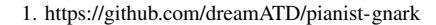
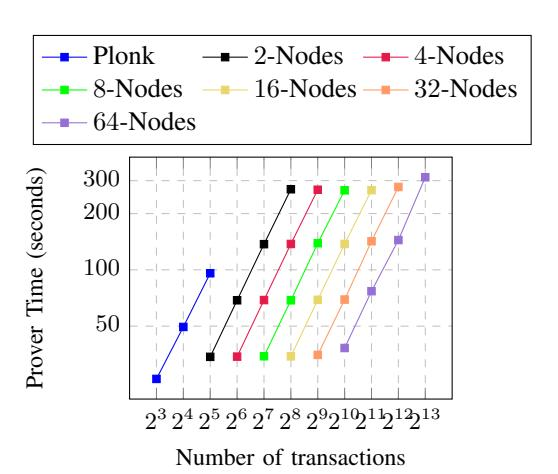
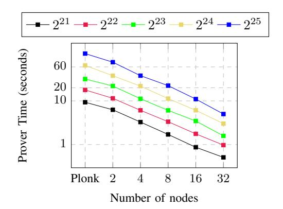
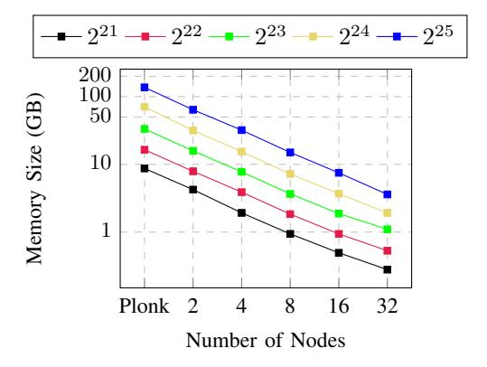
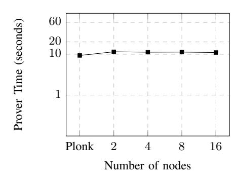

## **Pianist**: Scalable zkRollups via Fully Distributed Zero-Knowledge Proofs

Tianyi Liu∗ , Tiancheng Xie†‡, Jiaheng Zhang†‡, Dawn Song†‡, Yupeng Zhang∗‡

∗*University of Illinois Urbana-Champaign,* †*UC Berkeley,* ‡*Berkeley Center for Responsible, Decentralized Intelligence (RDI)*

*Abstract*—In the past decade, blockchains have seen various financial and technological innovations, with cryptocurrencies reaching a market cap of over 1 trillion dollars. However, scalability is one of the key issues hindering the deployment of blockchains in many applications. To improve the throughput of the transactions, zkRollups and zkEVM techniques using the cryptographic primitive of zero-knowledge proofs (ZKPs) have been proposed and many companies are adopting these technologies in the layer-2 solutions. However, in these technologies, the proof generation of the ZKP is the bottleneck and the companies have to deploy powerful machines with TBs of memory to batch a large number of transactions in a ZKP.

In this work, we improve the scalability of these techniques by proposing new schemes of fully distributed ZKPs. Our schemes can improve the efficiency and the scalability of ZKPs using multiple machines, while the communication among the machines is minimal. With our schemes, the ZKP generation can be distributed to multiple participants in a model similar to the mining pools. Our protocols are based on Plonk, an efficient zero-knowledge proof system with a universal trusted setup. The first protocol is for data-parallel circuits. For a computation of M sub-circuits of size T each, using M machines, the prover time is O(T log T + M log M), while the prover time of the original Plonk on a single machine is O(MT log(MT)). Our protocol incurs only O(1) communication per machine, and the proof size and verifier time are both O(1), the same as the original Plonk. Moreover, we show that with minor modifications, our second protocol can support general circuits with arbitrary connections while preserving the same proving, verifying, and communication complexity. The technique is general and may be of independent interest for other applications of ZKP.

We implement **Pianist** (Plonk vIA uNlimited dISTribution), a fully distributed ZKP system using our protocols. **Pianist** can generate the proof for 8192 transactions in 313 seconds on 64 machines. This improves the scalability of the Plonk scheme by 64×. The communication per machine is only 2.1 KB, regardless of the number of machines and the size of the circuit. The proof size is 2.2 KB and the verifier time is 3.5 ms. We further show that **Pianist** has similar improvements for general circuits. On a randomly generated circuit with 2 25 gates, it only takes 5 s to generate the proof using 32 machines, 24.2× faster than Plonk on a single machine.

## 1. Introduction

Blockchain technology has paved the way for innovative services such as decentralized finance, NFTs, and GameFi. The cryptocurrency market has experienced significant growth, surpassing 1 trillion USD in value since Bitcoin's inception 13 years ago [\[4\]](#page-13-0). Techniques like zkRollups and zkEVM have been proposed to boost blockchain efficiency and bridge the transaction throughput gap between digital and traditional scenarios. Implementing zkRollups could potentially increase transaction throughput by over 100 times, as estimated by Vitalik Buterin [\[1\]](#page-13-1). Numerous companies have incorporated these techniques into their products, including zkSync [\[11\]](#page-13-2), Starkware [\[10\]](#page-13-3), Hermez [\[7\]](#page-13-4), Aztec [\[2\]](#page-13-5), Scroll [\[9\]](#page-13-6), and others.

zkRollups and zkEVM rely on zero-knowledge proofs (ZKPs), a cryptographic primitive that allows a prover to convince a verifier the correctness of computations. More specifically, they use Zero-Knowledge Succinct Noninteractive Argument of Knowledge (ZK-SNARK) systems, which ensures that the proof size is significantly smaller than the size of computation and enables faster validation. By utilizing ZKPs, a single server can validate multiple transactions, compute state transitions, and generate a proof that is posted on the blockchain. Instead of re-executing all transactions, nodes can verify transactions and smart contracts by checking the proof and updating their status. This approach greatly increases the transaction throughput of the blockchain.

However, the proof generation remains a significant bottleneck for existing ZKP schemes when applied to largescale statements such as zkRollups and zkEVM. For instance, our experiments show that the Plonk system [\[31\]](#page-13-7), a widely-used ZKP protocol in the industry, can only scale to a circuit with 2 25 gates on a machine with 200 GB of memory. As a result, companies like Starkware [\[10\]](#page-13-3) and Scroll [\[9\]](#page-13-6) must deploy powerful clusters with terabytes of memory to generate proofs for zkRollups and zkEVM. In this paper, we tackle this issue by proposing fully distributed ZKP schemes that enhance both efficiency and scalability through distributed proof generation across multiple machines. Crucially, our schemes require minimal communication among machines, with each machine only exchanging a constant number of values with the master machine. This approach allows us to distribute ZKP generation in zkRollups and

zkEVM among multiple participants, in a similar model to existing mining pools. More transactions can be batched into a single ZKP within a fixed period, without necessitating participants to stay online and communicate with each other with high overhead. Participants can potentially share the reward for generating the ZKP, akin to miners in current proof-of-work blockchains. Furthermore, our scheme can be generalized to create proofs for arbitrary general circuits, leading us to the name "fully distributed ZKPs".

Our distributed schemes are built upon Plonk [31]. Instead of using univariate polynomials to represent the constraints of a computation, we devise a protocol based on a bivariate constraint system. First, we claim that this protocol can cater to data-parallel circuits, allowing each machine to generate the witness for its corresponding subcircuit. Second, we further generalize it to compute proofs for general circuits with aribitrary connections, assuming the witness has already been distributed among the machines. In both cases, our schemes demonstrate that the efficiency and scalability can be improved by a factor of M using M machines, the proof size remains O(1), and the communication complexity per machine is only O(1).

#### Our contributions. We have the following contributions:

- We propose two fully distributed ZKP protocols for dataparallel circuits and general circuits, respectively. To construct the schemes, we first propose a distributed polynomial interactive oracle proof (polynomial IOP) and then combine it with a polynomial commitment scheme (PCS) that is distributively computable as well. The polynomial IOP is a bivariate variant of Plonk's [31] constraint system. To "compile" both IOP schemes by polynomial commitments, we use the bivariate variant of the KZG [41] scheme and demonstrate that it is distributively computable. The use of the Lagrange polynomial in our scheme is inspired by a sub-scheme in Caulk [49]. The techniques can be used to accelerate any ZKP proof generations based on Plonk, and may be of independent interest to other ZKP applications beyond zkRollups and zkEVM.
- We further show that our protocols are robust in the presence of malicious machines. We formalize the notion as *Robust Collaborative Proving Scheme* (RCPS), for the collaborative generation of proofs among sub-provers in a malicious environment. In this setting, the master node is able to verify partial proofs and messages received from other machines before aggregating them to compute the final proof. We show that our protocols are robust under this definition with an additional step of verification. This property is crucial for the applications of distributed zkRollups and zkEVM to exclude malicious participants without ruining the distributed proof generation.
- We implement the fully distributed ZKP system, Pianist, for both data-parallel and general circuits. For the dataparallel version, we report experimental results for the blockchain application of zkRollups. Utilizing rollup circuits generated by the Circom compiler [3], we show that Pianist can scale to 8192 transactions on 64 machines

| Scheme       | $\mathcal{P}_i$ time | Comm. | $ \pi  \& \mathcal{V}$ time | Robust |
|--------------|----------------------|-------|-----------------------------|--------|
| DIZK [46]    | $O(T \log^2 T)$      | O(N)  | O(1)                        | Х      |
| deVirgo [48] | $O(T \log T)$        | O(N)  | $O(\log^2 N)$               | Х      |
| Pianist      | $O(T \log T)$        | O(M)  | O(1)                        | ✓      |

TABLE 1: Comparisons of our schemes to existing distributed ZKP protocols given M distributed machines on the circuit with M sub-circuits and total N gates, where each sub-circuit has  $T=\frac{N}{M}$  gates.  $\mathcal{P}_i$  time denotes the prover time per machine, Comm. denotes the total communication among machines,  $|\pi|$  denotes the proof size, and  $\mathcal{V}$  time denotes the verifier time.

with a prover time of 313 seconds. In comparison, the original Plonk scheme can only scale to 32 transactions with a prover time of 95 seconds on a single machine. The communication between each machine and the master machine is only 2144 bytes, and the proof size is 2208 bytes. We observe similar improvements for general circuits. On a circuit of size  $2^{25}$ , it only takes 5s to generate the proof using 32 machines, which is  $24.2\times$  faster than Plonk on a single machine, with 2336 Bytes communication and 2816 Bytes proof size.

Organization of the paper. We review the related work in Section 1.1 and present the preliminaries in Section 2. To explain our protocols, we first introduce our distributed polynomial IOP schemes in Section 3 for data-parallel circuits and general circuits. Then in Section 4, we present a bivariate variant of the polynomial commitment in [35], [41] to compile our polynomial IOP schemes to SNARKs. In Section 5, we formalize the notion of robust collaborative proving scheme (RCPS) and show that our scheme is able to detect malicious machines. We showcase the performance of our system in Section 6, and present additional discussions in Section 7.

#### 1.1. Related works

Zero-knowledge proofs (ZKP) were first introduced by Goldwasser, Micali, and Rackoff in their seminal paper [32]. Driven by real-world applications such as blockchains [16], [36], [48], there has been a rapid development of efficient zkSNARK systems in recent years [8], [13], [15], [17], [24], [26], [31], [33], [42], [44], [45], [47], [50], [51], [53]. Despite such progress, it remains challenging to scale ZKP protocols to large statements due to their high overhead on the prover running time and memory usage.

**Distributed ZKPs.** To scale existing ZKP protocols to large-scale circuits, distributed algorithms provide a promising direction. Wu et al. proposed the first distributed zero-knowledge proof protocol called DIZK in [46]. DIZK scales the pairing-based zkSNARK in [33] to handle circuits that are 100 times larger on 128 machines compared to a single machine. However, DIZK incurs a high communication cost that is linear in the total size of the circuit among different machines because the scheme runs a distributed number theoretic transformation (NTT) algorithm among the machines

using the Map-Reduce framework. Additionally, the recent work of zkBridge [48] proposed deVirgo, a distributed ZKP protocol based on the ZKP scheme in [51], to build bridges between two blockchains using ZKPs. The protocol achieves linear improvement on both the prover time and scalability in the number of machines. However, deVirgo also incurs a linear communication cost among the machines, and the proof size grows with the number of machines. This seems inevitable due to the use of the FRI protocol in [14] with Merkle trees [40]. By contrast, our schemes offer optimal linear scalability in prover time and minimal communication among distributed machines simultaneously. We provide a comparison in Table 1.

PCD and IVC Proof-Carrying Data (PCD [19], [28]) is a cryptographic technique that breaks down computation into a sequence of steps. In each step, the prover convinces the verifier not only of the current step's correctness but also of all previous steps. It is an alternative solution for dataparallel circuits when memory is limited. There are generally two ways to achieve PCD: one is from succinct verification, and the other is from accumulation. In the succinct verification approach, for each step, the prover generates a proof for the current step computation and verification for the proof generated from the previous step, as seen in [18], [19], [27], etc. The accumulation approach postpones and accumulates the verification of SNARK proofs (or some expensive part of it) at each recursion step and proves it all at once at the last step, as demonstrated in [6], [20], [25], [37], [38], etc. Although there is no direct correspondence for general circuits, some of these techniques, including but not limited to [37], [38], claim to achieve *Incremental Verifiable* Computation (IVC). IVC focuses on dividing long-running computations into stages that can be verified incrementally. For instance, Nova [38] supports proof generation when the computation involves a nondeterministic function f and the result of  $f^n(z_0)$ . These techniques are widely employed in various applications, however, we identify several drawbacks when compared to our proposed solution. See details in Section 7.

**Distributed computation from proof aggregation** Similar to our approach, aPlonk [12] is a distributed solution based on Plonk that requires prover nodes to share the same Fiat-Shamir randomness, necessitating synchronization several times during the proving process. In their scheme, they propose a multi-polynomial commitment to combine parties' polynomial commitments and attest to the batch opening using a generalized *Inner-Product Argument* (IPA) from [23]. Additionally, they delegate the verification of the constraint system through all evaluations to the prover. We also include the discussion for their protocol in Section 7.

## 2. Preliminaries

Our construction follows the framework proposed in [21] and achieves SNARK by first compiling a public-coin Polynomial IOP into a doubly-efficient public-coin interactive argument of knowledge using a polynomial com-

mitment scheme. Subsequently, the non-interactive property is achieved through the Fiat-Shamir transform. We present the notations and corresponding definitions below

#### 2.1. Notations

In our distributed setting, the size of the entire circuit is N, and there are M machines (or users acting as subprovers) participating in this protocol. Consequently, each party is responsible for generating a proof for a sub-circuit of size  $T = \frac{N}{M}$ .

We use bivariate polynomials to help construct the constraint system in the scheme. In our constraint system, for the i-th party, it holds its local witness vector  $\vec{a}_i = (a_{i,0}, a_{i,1}, \ldots, a_{i,T-1})$ . We can transform this witness vector into a univariate polynomial  $a_i(X) = \sum_{j=0}^{T-1} a_{i,j} L_j(X)$ , where  $L_j(X)$  is the Lagrange polynomial defined by the T-th roots of unity, with the close-form  $L_j(X) = \frac{\omega_j^X}{T} \cdot \frac{X^T-1}{X-\omega_X^J}$ . Furthermore, we aggregate the witness polynomial from all parties as a bivariate polynomial  $A(Y,X) = \sum_{i=0}^{M-1} a_i(X) R_i(Y)$ , where  $R_i(Y)$  is also the Lagrange polynomial defined by the M-th roots of unity, with the close-form  $R_i(Y) = \frac{\omega_j^i}{M} \cdot \frac{Y^M-1}{Y-\omega_Y^i}$ 

Unless specifically stated, for polynomials, we use lowercase letters such as a,b,c to denote the univariate polynomial storing local information, and uppercase letters A,B,Cto denote the bivariate polynomial aggregating information throughout the entire circuit. In addition, we use lowercase letters x,y to denote a specific assignment or evaluation for the polynomial, and uppercase letters X,Y to denote unassigned variables.

## 2.2. Interactive Argument

**Definition 1** (Interactive Argument). We say that ARG =  $(\mathcal{G}, \mathcal{P}, \mathcal{V})$  is an interactive argument of knowledge for a relation  $\mathcal{R}$  if it satisfies the following completeness and knowledge properties.

• Completeness: For every adversary A

$$\Pr\left[ \begin{pmatrix} (\mathtt{x}, \mathtt{w}) \not\in \mathcal{R} \ \textit{or} & \mathsf{pp} \leftarrow \mathcal{G}(1^{\lambda}) \\ \langle \mathcal{P}(\mathsf{pp}, \mathtt{x}, \mathtt{w}), \mathcal{V}(\mathsf{pp}, \mathtt{x}) \rangle = 1 \ : (\mathtt{x}, \mathtt{w}) \leftarrow \mathcal{A}(\mathsf{pp}) \\ \end{bmatrix} = 1$$

• Witness-extended emulation: ARG has witness-extended emulation with knowledge error  $\kappa$  if there exists an expected polynomial-time algorithm  $\mathcal E$  such that for every polynomial-size adversary  $\mathcal A$  it holds that

$$\begin{split} & \left| \Pr \left[ \begin{array}{c} \mathsf{pp} \leftarrow \mathcal{G}(1^{\lambda}) \\ \mathcal{A}(\mathsf{aux},\mathsf{tr}) = 1 \ : (\mathbb{x},\mathsf{aux}) \leftarrow \mathcal{A}(\mathsf{pp}) \\ & \mathsf{tr} \leftarrow \langle \mathcal{A}(\mathsf{aux}), \mathcal{V}(\mathsf{pp},\mathbb{x}) \rangle \end{array} \right] \\ & - \Pr \left[ \begin{array}{c} \mathcal{A}(\mathsf{aux},\mathsf{tr}) = 1 \quad \mathsf{pp} \leftarrow \mathcal{G}(1^{\lambda}) \\ \mathit{and if tr is accepting} \ : (\mathbb{x},\mathsf{aux}) \leftarrow \mathcal{A}(\mathsf{pp}) \\ \mathit{then} \ (\mathbb{x},\mathbb{w}) \in \mathcal{R} \quad (\mathsf{tr},\mathbb{w}) \leftarrow \mathcal{E}^{\mathcal{A}(\mathsf{aux})}(\mathsf{pp},\mathbb{x}) \end{array} \right] \right| \leq \kappa(\lambda) \end{split}$$

Above  $\mathcal{E}$  has oracle access to (the next-message functions of)  $\mathcal{A}(\mathsf{aux})$ .

If the interactive argument of knowledge protocol ARG is public-coin, is has been shown that by the Fiat-Shamir transformation [30], we can derive a non-interactive argument of knowledge from ARG. If the scheme further satisfies the following property:

• Succinctness. The proof size is  $|\pi| = \text{poly}(\lambda, \log |C|)$  and the verification time is  $\text{poly}(\lambda, |\mathbf{x}|, \log |C|)$ ,

then it is a Succinct Non-interactive Argument of Knowledge (SNARK).

For the applications of zkRollups and zkEVM, we only need a SNARK that is complete, sound, and succinct. Our constructions can be made zero-knowledge via known transformations with random masks and we omit the details in this paper.

### 2.3. Polynomial Interactive Oracle Proof

**Definition 2** (Public-coin Polynomial Interactive Oracle Proof [21]). Let  $\mathcal{R}$  be a binary relation and  $\mathbb{F}$  be a finite field. Let  $X = (X_1, \ldots, X_{\mu})$  be a vector of  $\mu$  indeterminates. A  $(\mu, d)$  Polynomial IOP for  $\mathcal{R}$  over  $\mathbb{F}$  with soundness error  $\epsilon$  and knowledge error  $\delta$  consists of two stateful PPT algorithms, the prover  $\mathcal{P}$ , and the verifier  $\mathcal{V}$ , that satisfy the following requirements:

• Protocol syntax. For each i-th round there is a prover state  $\operatorname{st}_i^{\mathcal{P}}$  and a verifier state  $\operatorname{st}_i^{\mathcal{V}}$ . For any common input x and R witness w, at round 0 the states are  $\mathsf{st}_0^{\mathcal{P}} = (x, w)$  and  $\mathsf{st}_0^{\mathcal{V}} = x$ . In the i-th round (starting at i = 1) the prover outputs a single proof oracle  $\mathcal{P}(\mathsf{st}_{i-1}^{\mathcal{P}}) \to \pi_i$ , which is a polynomial  $\pi_i(X) \in \mathbb{F}[X]$ . The verifier deterministically computes the query matrix  $i \in \mathbb{F}^{\mu \times \ell}$  from its state and a string of public random bits  $coins_i \leftarrow \{0,1\}^*$ , i.e,  $\mathcal{V}(\mathsf{st}_{i-1}^{\mathcal{V}}, \mathsf{coins}_i) \rightarrow \Sigma_i$ . This query matrix is interpreted as a list of  $\ell$  points in  $\mathbb{F}^{\mu}$  denoted  $(\sigma_{i,1},\ldots,\sigma_{i,\ell})$ . The oracle  $\pi_i$  is queried on all points in this list, producing the response vector  $(\pi_i(\sigma_{i,1}), \ldots, \pi_\ell(\sigma_{i,\ell})) = a_i \in \mathbb{F}^{1 \times \ell}$ . The updated prover state is  $\mathsf{st}_i^P \leftarrow (\mathsf{st}_{i-1}^P), \Sigma_i)$  and verifier state is  $\mathsf{st}_i^V \leftarrow (\mathsf{st}_{i-1}^V, \Sigma_i, a_i)$ . Finally,  $V(\mathsf{st}_t^V)$  returns 1 or 0. (Extensions: multiple and prior round oracles; various arity. The syntax can be naturally extended such that multiple oracles are sent in the i-th round; that the verifier may query oracles sent in the i-th round or earlier; or that some of the oracles are polynomials in fewer variables than  $\mu$ .)

Furthermore, a Polynomial IOP is stateless if for each  $i \in [t], \mathcal{V}(\mathsf{st}_{i-1}^{\mathcal{V}}, \mathsf{coins}_i) = \mathcal{V}(i, \mathsf{coins}_i)$ .

#### 2.4. Polynomial Commitment Scheme (PCS)

**Definition 3** (Polynomial commitment scheme (PCS)). A *Polynomial commitment scheme*  $\Gamma$  *is a tuple*  $\Gamma$  = (KeyGen, Commit, Open, Verify) *of PPT algorithms where:* 

- KeyGen $(1^{\lambda}, \mathcal{F}) \rightarrow pp$  generates public parameters pp;
- Commit $(f, pp) \to com_f$  takes a secret polynomial  $f(\mathbf{X})$  where  $X = (X_0, \dots, X_{\mu-1})$  and outputs a public commitment  $com_f$ ;

- Open(comf,  $\mathbf{x}$ , pp)  $\rightarrow (z, \pi_f)$  evaluates the polynomial  $y = f(\mathbf{X})$  on a point  $\mathbf{x}$  and generate a proof  $\pi_f$ ;
- Verify(comf,  $\mathbf{x}$ , z,  $\pi_f$ , pp)  $\rightarrow b \in \{1,0\}$  is a protocol between the prover  $\mathcal{P}$  and verifier  $\mathcal{V}$ , verifying whether  $f(\mathbf{x})$  is z through pp, comf and  $\pi_f$ ;

which satisfies the following properties:

• Completeness. For any polynomial  $f \in \mathcal{F}$  and  $\mathbf{x} \in \mathbb{F}^{\mu}$ , the following probability is 1.

$$\Pr \begin{bmatrix} \mathsf{pp} \leftarrow \mathsf{KeyGen}(1^\lambda, \mathcal{F}) \\ \mathsf{Verify}(\mathsf{com}_f, \mathbf{x}, z, \pi_h, \mathsf{pp}) = \mathbf{1} & : \mathsf{com}_f \leftarrow \mathsf{Commit}(f, \mathsf{pp}) \\ & (z, \pi_f) \leftarrow \mathsf{Open}(f, \mathbf{x}, \mathsf{pp}) \end{bmatrix}$$

• Knowledge soundness. For any PPT adversary  $\mathcal{P}^*$ , there exists a PPT extractor  $\mathcal{E}$  with access to  $\mathcal{P}^*$ 's messages during the protocol, the following probability is  $negl(\lambda)$ .

$$\Pr \begin{bmatrix} \mathsf{Verify}(\mathsf{com}^*, \mathbf{x}^*, z^*, \pi^*, \mathsf{pp}) = 1 & \mathsf{pp} \leftarrow \mathsf{KeyGen}(1^\lambda, \mathcal{F}) \\ \wedge \mathsf{com}^* = \mathsf{Commit}(f^*, \mathsf{pp}) : (z^*, \mathbf{x}^*) \leftarrow \mathcal{P}^*(1^\lambda, \mathsf{pp}) \\ \wedge f^*(\mathbf{x}^*) \neq z^* & (com^*, \pi^*) \leftarrow \mathcal{P}^*(1^\lambda, \mathsf{pp}) \\ f^* \leftarrow \mathcal{E}^{\mathcal{P}^*(\cdot)}(1^\lambda, \mathsf{pp}) \end{bmatrix}$$

It is worth noting that in [21], although they demonstrate that if the polynomial commitment protocol satisfies witness-extended emulation, the compiled interactive argument also inherits this knowledge property. However, they also point out that it has been proven in [39] that every knowledge sound protocol satisfies witness-extended emulation as well.

## 3. Distributed Polynomial IOP Protocols

In this and the following sections, we demonstrate how to construct our distributively computable SNARK for dataparallel circuits (which accommodate various sub-circuits) and arbitrary general circuits. In both settings, we distribute the input and computation across M machines, each capable of evaluating one sub-circuit  $C_i$  of size  $T = \frac{N}{M}$  locally. In this section, we first present the constraint system, and then design an IOP protocol proving the constraints. We prove that our IOP protocol has knowledge soundness and can be transformed into an interactive argument of knowledge after compiling with a bivariate PCS. In the next section, we will instantiate our protocol with bivariate KZG and provide a detailed analysis of proving time, verification time, proof size, and communication complexity.

Before diving into the details, we first explain our intuition. We opt for the distributed system to avoid the substantial overhead introduced by recursive proof (see Section 7 for a detailed discussion). PCD-and-IVC-based solutions rely on recursive proofs because they handle each sub-circuit in a separate proof waiting to be aggregated. Instead, we treat all sub-circuits as a whole and exploit the succinctness of SNARK, resulting in a small proof size and verification time. However, DIZK [46] shows that directly applying distribution techniques to the original univariate SNARK system leads to linear communication costs due to the significantly interleaving network required to run the NTT algorithm. Taking both hazards into account, we propose a solution leveraging bivariate polynomial constraints to both

"split" the NTT instances, avoiding substantial communication, and "combine" the proof for each sub-circuit as a whole, eliminating the need for expensive aggregation costs. The details are as follows.

#### 3.1. Arithmetic Constraint System for Each Party

Our constraint system inherits the original Plonk [31]. The original Plonk works for a fan-in-two arithmetic circuit, where each gate takes at most two inputs. In Plonk, the left input, the right input, and the output of each gate are encoded by three univariate polynomials respectively. The verifier can check the computation of each gate by a polynomial equation, which we refer to as the *gate constraint*. Additionally, the verifier also checks that the input and output of the gates are connected correctly as defined by the structure of the circuit, which we refer to as the *copy constraint*.

**3.1.1. Gate Constraint.** For the i-th party, let  $a_{i,j}, b_{i,j}$  and  $o_{i,j}$  be the left input, right input, and output of gate j of the sub-circuit  $C_i$ , for  $j=0,\ldots,T-1$ . We define a polynomials  $a_i(X)=\sum_{j=0}^{T-1}a_{i,j}L_j(X)$  where  $L_j(X)$  is the Lagrange polynomials defined by the T-th roots of unity. The coefficient representation of  $a_i(X)$  can be computed using polynomial interpolation and the complexity is  $O(T\log T)$  via the NTT algorithm. Similarly, we define polynomials  $b_i(X)$  and  $o_i(X)$  using  $b_{i,j}$  and  $o_{i,j}$ . If gate j is an addition gate, then  $a_{i,j}+b_{i,j}=o_{i,j}$ , and thus  $a_i(\omega_X^j)+b_i(\omega_X^j)=o_i(\omega_X^j)$ ; if gate j is a multiplication gate, then  $a_{i,j}\cdot b_{i,j}=o_{i,j}$ , and thus  $a_i(\omega_X^j)\cdot b_i(\omega_X^j)=o_i(\omega_X^j)$ . Following the design of Plonk, we can write the relationship of all gates as one polynomial in Equation 1.

$$g_i(X) := q_{a,i}(X)a_i(X) + q_{b,i}(X)b_i(X) + q_{o,i}(X)o_i(X) + q_{ab,i}(X)a_i(X)b_i(X) + q_{c,i}(X) = 0.$$
(1)

Here the polynomials  $q_{a,i}(X)$ ,  $q_{b,i}(X)$ ,  $q_{o,i}(X)$ ,  $q_{ab,i}(X)$ ,  $q_{c,i}(X)$  are defined by the structure of  $C_i$  satisfying

- Addition gate:  $q_{a,i}(\omega_X^j) = 1$ ,  $q_{b,i}(\omega_X^j) = 1$ ,  $q_{o,i}(\omega_X^j) = -1$ ,  $q_{ab,i}(\omega_X^j) = 0$ ,  $q_{c,i}(\omega_X^j) = 0$ .
- Multiplication gate:  $q_{a,i}(\omega_X^j)=0, \ q_{b,i}(\omega_X^j)=0, \ q_{o,i}(\omega_X^j)=-1, \ q_{ab,i}(\omega_X^j)=1, \ q_{c,i}(\omega_X^j)=0.$
- **Public input:**  $q_{a,i}(\omega_X^j) = 0$ ,  $q_{b,i}(\omega_X^j) = 0$ ,  $q_{o,i}(\omega_X^j) = -1$ ,  $q_{ab,i}(\omega_X^j) = 0$ ,  $q_{c,i}(\omega_X^j) = \inf_{i,j}$  if the j-th gate in  $C_i$  is a public input gate with the value of  $\inf_{i,j}$ .

In this way, the correct evaluation of the circuit is equivalent to Equation 1 being 0 for all  $X \in \Omega_X$ , where  $\Omega_X$  denotes the set  $\{\omega_X^0, \cdots, \omega_X^{T-1}\}$ .

**3.1.2.** Copy Constraint. In addition to checking the gate constraint, the verifier also needs to check that the connections of wires are correct as defined by the circuit. In particular, there are redundancies in the vectors  $a_{i,j}$ ,  $b_{i,j}$  and  $o_{i,j}$ , since the output of one gate is the input of other gates

in the circuit. The method used in Plonk is derived from a product argument, which can show that if a set of values  $\{f_j\}_{j\in\mathcal{J}}$  are identical, then the following two sets are equal:

$$\{(f_j, j)\}_{j \in \mathcal{J}} = \{(f_j, \sigma(j))\}_{j \in \mathcal{J}}$$

where  $\sigma$  defines a cycle connecting all indexes. The protocol reduces the argument to 2 polynomial equations.

The details of the permutation argument are as follows:  $\forall X \in \Omega_X, a_i(\sigma_i(X)) = a_i'(X)$ , where  $a_i(X)$  and  $a_i'(X)$  are two univariate polynomials in  $\mathbb F$  and  $\sigma_i$  is a public permutation from  $\Omega_X$  to  $\Omega_X$ . Particularly, in the protocol checking the consistency of  $a_i(X), b_i(X), o_i(X)$  in the gate constraint, given two random points  $\eta, \gamma \in \mathbb F$  from the verifier, the prover defines the running product polynomial  $z_i(X)$  on  $\mathbb F$  defined as follows:

$$z_i(\omega_X^j) := \prod_{k=0}^{j-1} \frac{f_i(\omega_X^k)}{f_i'(\omega_X^k)}$$
 (2)

where for simplicity, the notation of  $f_i(X)$  and  $f_i'(X)$  are used to indicate

$$f_{i}(X) := (a_{i}(X) + \eta \sigma_{a,i}(X) + \gamma)(b_{i}(X) + \eta \sigma_{b,i}(X) + \gamma)$$

$$(o_{i}(X) + \eta \sigma_{c,i}(X) + \gamma),$$

$$f'_{i}(X) := (a_{i}(X) + \eta k_{a}X + \gamma)(b_{i}(X) + \eta k_{b}X + \gamma)$$

$$(o_{i}(X) + \eta k_{o}X + \gamma),$$
(3)

where  $k_a=1$ ,  $k_b$  is any quadratic non-residue, and  $k_o$  is a quadratic non-residue not contained in  $k_b\Omega_X$ . The j-th cell in  $a_i$ ,  $b_i$ ,  $o_i$  is denoted by  $\omega_X^j$ ,  $k_1\omega_X^j$ ,  $k_2\omega_X^j$ , respectively, and  $\sigma_{a,i}(\omega_X^j)$  denotes the destination that the j-th cell in  $a_i$  is mapped to  $(\sigma_{b,i}$  and  $\sigma_{c,i}$  are defined similarly). The goal of the permutation argument is to prove  $\prod_{k=0}^{T-1} \frac{f_i(\omega_X^k)}{f_i'(\omega_X^k)} = 1$ , leading to the following constraints:

$$p_{i,0}(X) := L_0(X)(z_i(X) - 1) \tag{4}$$

$$p_{i,1}(X) := z_i(X)f_i(X) - z_i(\omega_X X)f_i'(X)$$
 (5)

which equals 0 when  $X \in \Omega_X$ .

Finally, since the constraints  $g_i(X)$ ,  $p_{i,0}(X)$  and  $p_{i,1}(X)$  all equal 0 when  $X \in \Omega_X$ , then given a random challenge  $\lambda$  from the verifier, there must exist a quotient polynomial  $h_i(X)$  satisfying

$$g_i(X) + \lambda p_{i,0}(X) + \lambda^2 p_{i,1}(X) = V_X(X)h_i(X),$$
 (6)  
where  $V_X(X) = X^T - 1.$ 

**Polynomial IOP protocol for Plonk.** In the original Plonk, the IOP process sends oracles to the verifier in three rounds. Suppose the verifier knows the structure of the circuit and has oracles of  $\{q_{\{a,b,o,ab,c\}}(X),\sigma_{\{a,b,o\}}(X)\}$ . In the first round, the prover sends the polynomial oracles for a(X),b(X),o(X). In the second round, after receiving random challenge  $\eta,\gamma$  from the verifier, the prover constructs the oracle z(X) for the verifier. In the remaining round, with the randomness  $\lambda$  from the verifier, the prover computes the quotient polynomial h(X) and sends its oracle to the verifier. After having access to all the oracles, the verifier queries them on a random point  $X=\alpha$  and an extra point

 $X = \omega_X \cdot \alpha$  for z(X). With the evaluation, the verifier can verify all the constraints.

#### 3.2. Constraint System for Data-parallel Circuit

In this section, we show how to aggregate the polynomials from all separated sub-circuits into a single bivariate polynomial and keep the constraint structure. Inheriting the general-purpose arithmetic constraints from Plonk, it is clear that we not only have a constraint system proving dataparallel circuits but also for a more general case: we allow the sub-circuits to be different.

Naively, we could use the powers of another variable Y to randomly combine the polynomials from different parties. For example  $A(Y,X) = \sum_{i=0}^{M-1} Y^i a_i(X)$ , where  $a_i(X)$  is held by the i-th party. However, when using this formula in the polynomial equations, such as  $\left(\sum_{i=0}^{M-1} Y^i a_i(X)\right) \left(\sum_{i=0}^{M-1} Y^i b_i(X)\right) - \left(\sum_{i=0}^{M-1} Y^i o_i(X)\right)$ , the cross-terms of the form  $Y^i a_i(X) \cdot Y^j b_j(X)$  for  $i \neq j$  in the expansion would be hard to deal with. To avoid the cross-terms, instead, we combine the polynomials using Lagrange polynomials  $R_i(Y)$ . This idea is inspired by a sub-scheme in the recent work Caulk [49]. In particular, for each univariate polynomial in Equation 1, Equation 4, Equation 5 and Equation 6, i.e.,  $s_i \in \{q_{a,i}, q_{b,i}, q_{o,i}, q_{ab,i}, q_{o,i}, \sigma_{a,i}, \sigma_{b,i}, \sigma_{o,i}, a_i, b_i, o_i, z_i, h_i\}$ , we define a bivariate polynomial as

$$S(Y,X) = \sum_{i=0}^{M-1} R_i(Y) s_i(X). \tag{7}$$

Then we have an aggregated gate constraint:

$$G(Y,X) := Q_{a}(Y,X)A(Y,X) + Q_{b}(Y,X)B(Y,X)$$

$$+ Q_{ab}(Y,X)A(Y,X)B(Y,X)$$

$$+ Q_{o}(Y,X)O(Y,X) + Q_{c}(Y,X)$$

$$P_{0}(Y,X) := L_{0}(X)(Z(Y,X) - 1)$$

$$P_{1}(Y,X) := Z(Y,X) \prod_{S \in \{A,B,O\}} (S(Y,X) + \eta \sigma_{a}(Y,X) + \gamma)$$

$$- Z(Y,\omega_{X}X) \prod_{S \in \{A,B,O\}} (S(Y,X) + \eta k_{s}X + \gamma)$$

$$(10)$$

Then after the random linear combination as in Equation 6, we have

$$G(Y,X) + \lambda P_0(Y,X) + \lambda^2 P_1(Y,X) - V_X(X) H_X(Y,X)$$

which equals 0 for all  $Y \in \Omega_Y$ . It is no hard to see that this is equivalent to Equation 6 being true for all  $i \in [M]$ , because by the definition of the Lagrange polynomial  $R_i(Y)$ , there is only one non-zero term  $g_i(X)$ ,  $p_{i,0}(X)$  and  $p_{i,1}(X)$  in Equation 6 when  $Y = \omega_Y^i$ . Therefore, evaluating Equation 11 at  $Y = \omega_Y^i$  is exactly the same as Equation 6 for  $C_i$ .

Finally, to check Equation 11 vanishes on  $Y \in \Omega_Y$ , we compute  $H_Y(Y, X)$  such that

$$G(Y,X) + \lambda P_0(Y,X) + \lambda^2 P_1(Y,X) - V_X(X) H_X(Y,X)$$
  
=  $V_Y(Y) H_Y(Y,X)$  (12)

where  $V_Y(Y) = Y^M - 1$ . This concludes the bivariate constraint system in our solution.

A sketch of the distributed IOP. In Protocol 1 (excluding the orange characters), we introduce the polynomial IOP protocol based on the constraint system above. From this protocol, we observe that, aside from sending and assisting the verifier with querying the polynomial oracles, the prover only needs to distributively maintain each oracle. We will later prove that this property is sufficient to construct a fully distributed ZKP. We also observe that this property trivially holds for all polynomials except  $H_Y(Y,X)$ . To circumvent this obstacle, the prover receives a random opening point  $\alpha$  from the verifier and only sends the univariate oracle  $H_Y(Y,\alpha)$ . We claim that after this modification, the protocol remains knowledge-sound and can be distributively computed. We provide the full proof in Section 3.4 after explaining the system for general circuits.

**Remark 1.** For the witness generation, since all sub-circuits are separated, each party can generate its witness locally.

**Remark 2.** Although we assume the sub-circuits are independent of each other, it is easy to observe that if we introduce custom gates and rotation along with the variable Y, then we can support some simple connections among different sub-circuits. In addition, we can also introduce local lookup arguments in our constraint system. Further discussion on custom gates and lookup arguments are in Section 7.

#### 3.3. Constraint System for General Circuit

In this section, we show the great potential of our system by generalizing it to generate proofs for arbitrary circuits. Recall that in the original Plonk, it leverages  $\sigma_a(X)$ ,  $\sigma_b(X)$ , and  $\sigma_c(X)$  to navigate the next wire in the circuit with equal value, and computes the running product polynomial z(X) as a helper polynomial to prove the product of  $\prod_{k=0}^{j-1} \frac{f(\omega_X^k)}{f'(\omega_X^k)} = 1$ . Similarly, we present how to indicate the position to the next wire and how to construct the product proof for the whole circuit.

Since we need to indicate which sub-circuit the next wire locates, we define  $\{(\sigma_{Y,s,i}(X),\sigma_{X,s,i}(X))\}_{s\in\{a,b,o\}}$  as: if for the i-th party, for the j-th entry in the polynomial s is mapped to the i'-th party, j'-th entry in the polynomial s' polynomial, then  $\left(\sigma_{Y,s,i}(\omega_X^j),\sigma_{X,s,i}(\omega_X^j)\right) = \left(\omega_Y^{i'},k_{s'}\omega_X^{j'}\right)$ . Therefore, we need to prove that

$$\prod_{i=0}^{M-1} \prod_{j=0}^{T-1} \frac{f_i(\omega_X^j)}{f_i'(\omega_X^j)} = 1$$
 (13)

where

$$f_{i}(X) := (a_{i}(X) + \eta_{Y}\sigma_{Y,a,i}(X) + \eta_{X}\sigma_{X,a,i}(X) + \gamma)$$

$$(b_{i}(X) + \eta_{Y}\sigma_{Y,b,i}(X) + \eta_{X}\sigma_{X,b,i}(X) + \gamma)$$

$$(o_{i}(X) + \eta_{Y}\sigma_{Y,o,i}(X) + \eta_{X}\sigma_{X,o,i}(X) + \gamma)$$

$$f'_{i}(X) := (a_{i}(X) + \eta_{Y}Y + \eta_{X}X + \gamma)$$

$$(b_{i}(X) + \eta_{Y}Y + \eta_{X}k_{1}X + \gamma)$$

$$(o_{i}(X) + \eta_{Y}Y + \eta_{X}k_{2}X + \gamma)$$

Then we show how to construct the constraints for the product argument. Similarly, each party keeps the running product  $z_i(X)$ , however for the one after the last entry,  $z_i^* = z_i(\omega_X^{T-1})\frac{f_i(\omega_X^{T-1})}{f_i'(\omega_X^{T-1})}$  no longer equals 1. Therefore, comparing with Equation 4 and Equation 5, we have the following constraints instead:

$$p_{i,0}(X) := L_0(X)(z_i(X) - 1) \tag{14}$$

$$p_{i,1}(X) := (1 - L_{T-1}(X))$$

$$(z_i(X)f_i(X) - z_i(\omega_X X)f_i'(X))$$
(15)

After constructing  $z_i$ , each party will send the product of their slices  $z_i^*$  to the master node, which then generates another helper polynomial W(X) to denote the running product through  $(z_0^*,\ldots,z_{M-1}^*)$ . Therefore, we have two more constraints that for  $0 \le i < M$ :

$$p_{i,2} := w_0 - 1$$
 which is 0 for all  $i$  (16)

$$p_{i,3}(X) := L_{T-1}(X)$$

$$\cdot \left( w_i z_i(X) f_i(X) - w_{(i+1)} \%_M f_i'(X) \right)$$
(17)

Therefore we compute  $h_i(X)$  and  $H_X(Y,X)$  through the following equation instead:

$$h_i(X) = \frac{g_i(X) + \lambda p_{i,0} + \lambda^2 p_{i,1} + \lambda^4 p_{i,3}}{X^T - 1}$$

$$H_X(Y, X) = \sum_{i=0}^{M-1} R_i(Y) h_i(X)$$
(18)

Finally, by multiplying polynomials with  $R_i(Y)$ , the permutation argument becomes

$$P_0(Y,X) := L_0(X)(Z(Y,X) - 1) \tag{19}$$

$$P_1(Y,X) := (1 - L_{T-1}(X)) \tag{20}$$

$$\cdot (Z(Y,X)F(Y,X) - Z(Y,\omega_XX)F'(Y,X))$$

$$P_2(Y) := R_0(Y)(W(Y) - 1) \tag{21}$$

$$p_3(Y,X) := L_{T-1}(X) \tag{22}$$

$$\cdot (W(Y)Z(Y,X)F(Y,X) - W(\omega_Y Y)F'(Y,X))$$

where F(Y,X) and F'(Y,X) are just notations to denote

$$\begin{split} F(Y,X) := \prod_{S \in \{A,B,O\}} (S(Y,X) + \eta_Y \sigma_{Y,s}(Y,X) \\ &+ \eta_X \sigma_{X,s}(Y,X) + \gamma) \\ F'(Y,X) := \prod_{S \in \{A,B,O\}} (S(Y,X) + \eta_Y Y + \eta_X k_s X + \gamma) \end{split}$$

By combining with the same gate constraint as for dataparallel circuits, we finally have the equation to define  $H_Y(Y,X)$ , which concludes our constraint system for general circuits.

$$G(Y,X) + \lambda P_0(Y,X) + \lambda^2 P_1(Y,X) + \lambda^3 P_2(Y) + \lambda^4 P_3(Y,X) = V_X(Y,X) H_X(Y,X) + V_Y(Y) H_Y(Y,X)$$
(23)

## **3.4. Distributedly Computable Polynomial IOP Protocol**

We present our polynomial IOP protocol in Protocol 1. The text in orange denotes the additional steps for general circuits. We have the following theorem:

**Theorem 1.** Protocol 1 is a polynomial IOP protocol for  $\mathbb{R}$  with negligible knowledge error.

The proof is in Appendix A.

**Theorem 2.** Protocol 1 is a Polynomial IOP protocol that can be compiled into a distributedly computable double efficient non-interactive proof that has witness-extended emulation, using a distributed computable PCS, with only a constant increase in communication and  $O(N \log T + M \log M)$  additional proving time compared to the PCS used.

*Proof.* We prove the theorem as follows:

**Security.** In [21], they provide a detailed proof demonstrating that if the polynomial commitment scheme  $\Gamma$  has witness-extended emulation, and if the t-round Polynomial IOP for a relation  $\mathcal R$  has negligible knowledge error, an interactive argument for  $\mathcal R$  with witness-extended emulation exists.

We present a sketch of the proof: for an arbitrary adversary prover  $\mathcal{P}_{\mathsf{IP}}$  for the IP scheme, we can construct an adversary prover  $\mathcal{P}_{\mathsf{IOP}}.$  With DKZG that guarantees witness-extended emulation, it enables  $\mathcal{P}^*_{\mathsf{IOP}}$  to simulate the transcript with  $\mathcal{P}^*_{\mathsf{IP}}$  to extract polynomials. After sending the oracles to  $\mathcal{V}_{\mathsf{IOP}}$  and receiving challenges,  $\mathcal{P}_{\mathsf{IOP}}$  can rewind the transcript with  $\mathcal{P}_{\mathsf{IP}}$  to insert the same randomness from  $\mathcal{V}_{\mathsf{IOP}}.$  Consequently, due to the knowledge soundness of PCS, the reduction succeeds with high probability. Then from the knowledge soundness proven in Theorem 1, an upper bound of the knowledge error for the IP protocol is achieved.

We kindly refer to [21] for the complete proof.

**Efficiency.** To analyze the extra communication, for all polynomials except  $H_Y(Y,X)$  and W(Y), it is divided into slices and stored by each party. Then with a PCS which can generate commitments and proofs in this setting, we can handle all oracle constructions and queries to those polynomials. As for W(Y), it is computed by  $\mathcal{P}_0$  from  $z_i^*$  received from the i-th parties. Therefore, it can be easily computed from the constant-size messages exchanged between each node and the master node. While the difficulty occurs when computing  $H_Y(Y,X)$ , instead of computing the full description,  $\mathcal{P}_0$  only deals with it after

receiving the first opening coordinate  $X = \alpha$  and computes  $H_{Y,\alpha}(Y) = H_Y(Y,\alpha)$ . Therefore, for  $0 \le i < M$ ,  $\mathcal{P}_i$  sends  $s_i(\alpha)$  for  $s \in \{q_a,q_b,q_o,q_{ab},q_c,a,b,c,z,h_x\}$  and recover the corresponding polynomial  $S(Y,\alpha)$ ,  $\mathcal{P}_0$  can compute  $G(Y,\alpha)$ ,  $P_{\{0,1,2,3\}}(Y,\alpha)$  and compute  $H_{Y,\alpha}(Y)$  according to Equation 23. Additionally considering the distribution of random challenges, the compiled polynomial IOP protocol only has a constant number of more communication than PCS.

As for the proving time, it requires at most  $O(T \log T)$  time to compute  $z_i(X), h_i(X)$  for each party and  $O(M \log M)$  for  $\mathcal{P}_0$  to compute W(Y) and  $H_{Y,\alpha}(Y)$ , the extra proving time is up to  $O(T \log T + M \log M)$  for a single machine and  $O(N \log T + M \log M)$  in total.  $\square$ 

## 4. Fully Distributed SNARK

In Theorem 2, we show that with a distributed PCS, we can build a fully distributed double-efficient interactive argument of knowledge protocol from distributed polynomial IOP. In this section, we instantiate Theorem 2 by a distributed bivariate KZG.

#### 4.1. Distributed KZG

In this section, we present a distributedly computable PCS based on a bivariate variant the KZG scheme in [35], [41]. In our distributed setting, the total size of the polynomial is N, and there are M machines of  $\mathcal{P}_0, \dots, \mathcal{P}_{M-1}$  with part of the polynomial on each machine of size T = N/M. The goal of the fully distributed polynomial commitments is to accelerate the prover time by B times while keeping the communication complexity among the machine's minimum. Moreover, both the proof size and the verifier time should remain the same as the original polynomial commitment schemes. We present the distributed protocol in Protocol 2.

**Theorem 3.** Given polynomial  $f(Y,X) \in \mathbb{F}^M \times \mathbb{F}^{\frac{N}{M}}$ , Protocol 2 is PCS satisfying completeness and knowledge soundness. The total proving computation consists of O(N) group operations, while  $O\left(\frac{N}{M}\right)$  group operations for each node and  $O\left(\frac{N}{M}+M\right)$  group operations for the master node. The total communication between  $\mathcal{P}_i$  and  $\mathcal{P}_0$  is O(1). The commitment and proof size are both O(1) group elements. The verification cost is O(1) group operations.

*Proof.* We prove the theorm as follows:

**For security.** We kindly refer to [52] for a full proof of the knowledge soundness for the multivariate KZG protocol.

For efficiency. For the proving complexity, to commit the polynomial f(Y,X), each prover node  $\mathcal{P}_i$  need to compute  $\mathrm{com}_{f_i}$ , which costs  $O\left(\frac{N}{M}\right)$  group operations, and the master prover products them up in O(M) group operations. To open the polynomial on a point  $(\beta,\alpha)$ , each node needs to evaluate  $f_i(\alpha)$  and compute  $\pi_0^{(i)}$ , from which the master node derives  $f(Y,\alpha)$ , and  $\pi_0$ , with the same number of group operations as computing the commitment. Finally  $P_0$  computes

 $\pi_1$  in O(M) group operations. For the communication,  $\mathcal{P}_i$  only sends  $\mathsf{com}_{f_i}$ ,  $f_i(\alpha)$  and  $\pi_0^{(i)}$  to  $\mathcal{P}_0$ , and receives random challenge  $\alpha$  from  $\mathcal{P}_0$ , thus the communication complexity is constant. It is easy to observe that the proof size and verification time are both constant.

### 4.2. Using DKZG to Compile Protocol 1

We show our full instantiation in Protocol 3. From this protocol, we have the following theorem for general circuits, which implies the security and efficiency of the data-parallel setting.

**Theorem 4.** Given a general circuit C with N gates, Protocol 3 is a double-efficient public-coin interactive argument of knowledge protocol with witness-extended emulation for the relation of C(x; w) = 1 when splitting C into M parts  $(C_0, \ldots, C_{M-1})$  each with  $T = \frac{N}{M}$  gates. The total proving computation consists of  $O(N \log T + M \log M)$  field operations and O(N) group operations, with each  $\mathcal{P}_i$  computes  $O(T \log T)$  field operations and O(T) group operations, while  $\mathcal{P}_0$  computes  $O(T \log T + M \log M)$  field operations plus O(M + T) group operations. The communication is O(1) per machine. The final proof size is O(1). The verification cost is O(1) given the access to the commitments of the public polynomials defined by the circuit in the preprocessing model.

*Proof.* We prove the theorem as follows:

**For security.** Following the security proof in Theorem 2, by combining the knowledge soundness of DKZG in Theorem 4.1 and polynomial IOP in Theorem 1, we prove that Protocol 3 is a double efficient public-coin interactive argument of knowledge protocol with negligible knowledge error.

**For efficiency.** The complexity for the efficiency is directly implied by Theorem 2 and Theorem 4.1.

Since Protocol 3 operates in the public-coin setting, it can be transformed into a SNARK protocol using the Fiat-Shamir transform.

# 5. Robust Collaborative Proving System for Data-parallel Circuits

In the previous sections, we propose a distributed ZKP protocol that divides the proving computation across multiple machines and generates a constant-size proof, with constant communication and minimal overhead in terms of proving and verification time. In this section, we introduce the definition of the *Robust Collaborative Proving System (RCPS)* scheme for data-parallel circuits and then propose a scheme in Protocol 3, demonstrating the potential of our protocol in a malicious environment where each prover node might sabotage the entire proof by intentionally generating a bad proof.

**Protocol 1 (Polynomial IOP for Data-parallel and General Circuits).** Suppose the circuit structure is known by  $\mathcal{P}$  and V, therefore, V knows the following oracles:

- $\{Q_a(Y,X), Q_b(Y,X), Q_o(Y,X), Q_{ab}(Y,X), Q_c(Y,X)\}.$
- $\{\sigma_{Y,a}(Y,X), \sigma_{Y,b}(Y,X), \sigma_{Y,o}(Y,X), \sigma_{X,a}(Y,X), \sigma_{X,b}(Y,X), \sigma_{X,o}(Y,X)\}.$

When generating proof for a new instance, P and V go through the following rounds:

- 1)  $\mathcal{P}$  sends the oracles of  $\{A(Y,X), B(Y,X), C(Y,X)\}$  to  $\mathcal{V}$ .
- 2) After receiving  $\eta_Y, \eta_X, \gamma$  from V,  $\mathcal{P}$  sends the oracle of Z(Y,X) and W(Y) to V. 3) After receiving  $\lambda$  from V,  $\mathcal{P}$  computes  $H_X(Y,X) = \sum_{i=0}^{M-1} R_i(Y) \cdot \frac{g_i(X) + \lambda p_{i,0}(X) + \lambda^2 p_{i,1}(X) + \lambda^4 p_{i,3}(X)}{X^T 1}$  and sends the
- 4) After receiving  $\alpha$  from  $\mathcal{V}$ ,  $\mathcal{P}$  computes  $H_{Y,\alpha}(Y) = \frac{G(Y,\alpha) + \lambda P_0(Y,\alpha) + \lambda^2 P_1(Y,\alpha) + \lambda^3 P_2(Y) + \lambda^4 P_3(Y,\alpha) (\alpha^T 1)H_X(Y,\alpha)}{Y^M 1}$  and sends the oracle to V.
- 5) V queries all oracles on  $X = \alpha$ ,  $Y = \beta$  and assign the evaluations to the corresponding polynomials in Equation 12 or Equation 23. If this equation holds, then V output 1, otherwise 0.

**Protocol 2** (Distributed Bivariate Polynomial Commitment). Suppose  $\mathcal{P}$  has M machines of  $\mathcal{P}_0, \cdots, \mathcal{P}_{M-1}$  and suppose  $\mathcal{P}_0$  is the master node. Given the bivariate polynomial  $f(Y,X) = \sum_{i=0}^{M-1} \sum_{j=0}^{T-1} f_{i,j} R_i(Y) L_j(X)$ , each machine holds  $f_i(X) = \sum_{j=0}^{M-1} \sum_{j=0}^{T-1} f_{i,j} R_j(Y) L_j(X)$  $\sum_{j=0}^{T-1} f_{i,j} L_j(X)$  The protocol proceeds as follows.

- DKZG.KeyGen $(1^{\lambda}, M, T)$ : Generate  $\mathsf{pp} = \left(g, g^{\tau_X}, g^{\tau_Y}, (U_{i,j})_{\substack{0 \leq i < M, \\ 0 \leq j < T}} = \left(g^{R_i(\tau_Y)L_j(\tau_X)}\right)_{\substack{0 \leq i < M, \\ 0 \leq i < T}}\right)$ , with trapdoor  $\tau_Y$  and  $\tau_X$ .
- DKZG.Commit(f, pp): In the commitment phase, each  $\mathcal{P}_i$  computes the commitment  $\mathsf{com}_{f_i} = \prod_{j=0}^{T-1} U_{i,j}^{f_{i,j}}$  and sends it to  $\mathcal{P}_0$ , where  $f_{i,j}$  is the j-th entry in the evaluation representation of  $f_i(X)$ . After receiving commitments from others,  $\mathcal{P}_0$  computes  $\mathsf{com}_f = \prod_{i=0}^{M-1} \mathsf{com}_{f_i}$ .
- $\mathsf{DKZG}.\mathsf{O}\mathsf{pen}(f,\beta,\alpha,\mathsf{pp})$  :
- 1) Each  $\mathcal{P}_i$  computes  $f_i(\alpha)$  and  $q_0^{(i)}(X) = \frac{f_i(X) - f_i(\alpha)}{X - \alpha}$ .  $\mathcal{P}_i$  computes  $\pi_0^{(i)} = g^{R_i(\tau_Y)}q_0^{(i)}(\tau_X)$  using the public parameters and sends
-  $f_{i}(\alpha), \pi_{0}^{(i)} \text{ to } \mathcal{P}_{0}.$ 2) After receiving  $\left\{ \left( f_{i}(\alpha), \pi_{0}^{(i)} \right) \right\}_{0 \leq i < M}$ ,  $\mathcal{P}_{0}$  computes  $\pi_{0} = \prod_{i=0}^{M-1} \pi_{0}^{(i)}$ , and also recover  $f(Y, \alpha) = \sum_{i=0}^{M-1} R_{i}(Y) f_{i}(\alpha)$ .

  3)  $\mathcal{P}_{0}$  computes  $f(\beta, \alpha)$  and  $q_{1}(Y) = \frac{f(Y, \alpha) - f(\beta, \alpha)}{Y - \beta}$ .  $\mathcal{P}_{0}$  computes  $\pi_{1} = g^{q_{1}(\tau_{Y})}$  and sends  $z = f(\beta, \alpha)$  and  $\pi_{f} = (\pi_{0}, \pi_{1})$  to  $\mathcal{V}$ .
- 
- DKZG. Verify $(\mathsf{com}_f, \beta, \alpha, z, \pi_f, \mathsf{pp})$ :  $\mathcal V$  parses  $\pi_f = (\pi_0, \pi_1)$ , and checks if  $e\left(\mathsf{com}_f/g^z, g\right) \stackrel{?}{=} e\left(\pi_0, g^{\tau_X \alpha}\right) e\left(\pi_1, g^{\tau_Y \beta}\right)$ . It outputs 1 if the check passes, and 0 otherwise.

**Definition 4** (Robust Collaborative Proving System for Data-parallel Circuits). For a circuit C, a Robust Collaborative Proving System (RCPS) with M participants has the following algorithms:

- Setup  $(1^{\lambda}) \to pp$ : Generate the public parameters pp.
- SplitCircuit  $(C, M) \to \mathcal{C} = (C_0, \dots, C_{M-1})$ : From the circuit C, define M sub-circuits covering its computation.
- MasterKeyGen  $(C, M, pp) \rightarrow (mpk, vk)$ : Generate the master proving key mpk and verifying key vk.
- KeyGeni  $(C_i, mpk) \rightarrow pk_i$ : From the master key mpk and  $C_i$ , generate the proving key for the *i*-th node.
- SplitInstance  $(\mathcal{C}, \mathbb{X}) \to ((\mathbb{X}_0, \mathbb{W}_0), \dots, (\mathbb{X}_{M-1}, \mathbb{W}_{M-1}))$ : From C and x, define the public input and witness pairs.
- CoProvei ( $x_i$ ,  $w_i$ ,  $pk_i$ ):  $P_i$  interacts with  $P_0$  and V, to prove the correctness of the computation for  $C_i$ .
- TestAndMerge  $(x, mpk) \rightarrow \{1, 0\}^M$ :  $\mathcal{P}_0$  interacts with  $\mathcal{P}_i$  for  $0 \leq i < M$ , outputs a vector **b**, with  $b_i \in \{1,0\}$ denoting whether to accept the messages from  $P_i$ .  $P_0$  also interacts with V to receive challenges and respond with merged messages.
- Verify  $(x, vk) \rightarrow \{1, 0\}$ : V interacts with the set of P and outputs whether to accept the interactive proof or not.

We define the transcript between  $\mathcal{P}_i$  and  $\mathcal{P}_0$  as

 $\mathsf{tr}_i \leftarrow \langle \mathsf{CoProve}_i \left( \mathbb{x}_i, \mathbb{w}_i, \mathsf{pk}_i \right), \mathsf{TestAndMerge} \left( \mathbb{x}, \mathsf{mpk} \right) \rangle$ and the transcript between P and V as

$$\mathsf{tr} \leftarrow \langle \mathsf{TestAndMerge} (x, \mathsf{mpk}), \mathsf{Verify} (x, \mathsf{vk}) \rangle$$
.

It satisfies the following properties: completeness, witnessextended emulation, partial completeness, and partial witness-extended emulation as follows:

• Partial completeness. Given pp and the circuit partition for C, for each  $0 \le i < M$ , if  $C_i(\mathbf{x}_i; \mathbf{w}_i) = 1$ , mpk and  $\mathsf{pk}_i$  are generated by MasterKeyGen and KeyGen, then the following probability is 1:

$$\Pr\left[\left\langle \mathsf{CoProve}_i\left(\mathbf{x}_i,\mathbf{w}_i,\mathsf{pk}_i\right),\mathsf{TestAndMerge}\left(\mathbf{x},\mathsf{mpk}\right)\right\rangle = \mathbf{1}\right].$$

• Completeness. Given pp, the circuit partition C, if for any  $(x, w), C_i(x_i, w_i) = 1, 0 \le i < M \text{ where } (x_i, w_i) \text{ is}$ generated from SplitInstance, and (mpk, vk) is generated from MasterKeyGen, then the following probability is 1:

$$\Pr\left[\left\langle \mathsf{TestAndMerge}\left(\mathbb{x},\mathsf{mpk}\right),\mathsf{Verify}\left(\mathbb{x},\mathsf{vk}\right)\right\rangle =1\right].$$

• Partial witness-extended emulation. With a valid pp, a circuit partition C for C, with |C| = M, and mpk  $\leftarrow$ 

Protocol 3 (Distributedly Computable Double-efficient Public-coin Interactive Argument of Knowledge).  $\mathcal{P}$  is a prover with M machines of  $\mathcal{P}_0, \dots, \mathcal{P}_{M-1}$ , with master node  $\mathcal{P}_0$ . Given a fan-in two arithmetic circuit C of size N with M sub-circuits, each of size T = N/M. P wants to convince V that  $C_i(\mathbb{X}^{(i)}; \mathbb{W}^{(i)}) = 1$  for all  $i \in [M]$ , where  $\mathbb{X}^{(i)}$  is the public input and  $w^{(i)}$  is the witness of  $C_i$ . Each  $P_i$  holds the sub-circuit  $C_i$ .

• Key generation and preprocessing procedure: Let  $(pk = \{pk_i\}_{0 \le i < M}, vk)$ . Run DKZG.KeyGen $(1^{\lambda}, M, T)$  and generate  $g, g^{\tau_X}, g^{\tau_Y}, \mathbf{U} = (\mathbf{U_i})_{0 \le i < M} = (g^{R_i(\tau_Y)L_j(\tau_X)})_{\substack{0 \le i < M \\ 0 \le j < T}}$ , and derive  $\mathbf{V} = (g^{R_i(\tau_Y)})_{0 \le i < M}$ . Compute commitments  $com_S$ for each of the following polynomial set  $S_{pp}$ 

 $\mathcal{S}_{\mathsf{pp}} = \left\{Q_a(Y, X), Q_b(Y, X), Q_o(Y, X), Q_{ab}(Y, X), Q_c(Y, X), \sigma_{Y, a}(Y, X), \sigma_{Y, b}(Y, X), \sigma_{Y, o}(Y, X), \sigma_{X, a}(Y, X), \sigma_{X, b}(Y, X), \sigma_{X, o}(Y, X)\right\}$ 

Let 
$$s_i(X)$$
 be defined by  $S(Y,X) = \sum_{i=0}^{M-1} R_i(Y) s_i(X)$ , we define  $\mathsf{pk}_0 = \left(\left(\mathbf{V}, \mathbf{U}_0, \{s_0(X)\}_{S \in \mathcal{S}_{\mathsf{pp}}}\right)\right)$ ,  $\mathsf{pk}_i = \left(\mathbf{U}_i, \{s_i(X)\}_{S \in \mathcal{S}_{\mathsf{pp}}}\right)$ ,  $\mathsf{vk} = \left(g^{\tau_X}, g^{\tau_Y}, \{\mathsf{com}_S\}_{S \in \mathcal{S}_{\mathsf{pp}}}\right)$ 

- 1) Each  $\mathcal{P}_i$  evaluates  $C_i$  and defines polynomials  $a_i(X)$ ,  $b_i(X)$ ,  $o_i(X)$ .  $\mathcal{P}$  invokes the distributed algorithm Commit in Protocol 2 to obtain comA, comB, comO as commitments of A(Y,X), B(Y,X), O(Y,X) and sends them to V.
- 2) After receiving random points  $\eta_Y, \eta_X$  and  $\gamma$  from V, each  $P_i$  computes  $z_i(X)$ , and sends the last entry  $z_{i,T-1}$  to the  $\mathcal{P}_0$ , from which  $\mathcal{P}_0$  computes  $W(Y) = \sum_{i=0}^{M-1} w_i R_i(Y)$ . Then,  $\mathcal{P}$  invokes the Commit algorithm in Protocol 2 to obtain  $com_Z, com_W$  and sends them to V.
- 3) After receiving  $\lambda$  from V,  $P_0$  shares it to  $P_i$ . Each  $P_i$  computes  $h_i(X)$  according to Equation 6 or Equation 18. Then,  $\mathcal{P}$  invokes algorithm Commit in Protocol 2 to obtain  $com_{H_X} = \left\{com_{H_{X,0}}, com_{H_{X,1}}, com_{H_{X,2}}, com_{H_{X,3}}\right\}$  as commitments of  $H_X(Y,X) = \sum_{i=0}^{M-1} R_i(Y)h_i(X)$ , and sends them to V. The form of  $com_{H_X}$  due to the fact that  $H_X(Y,X)$  has degree 3T-2 or 4T-2 with respect to X.
- 4) After receiving the random point  $\alpha$  from V,  $P_0$  sends  $\alpha$  to each  $P_i$ . We define  $S_{wit} = \{A, B, O, Z\}$  Then P process the following computation:
  - for each polynomial  $S \in \mathcal{S}_{pp} \cup \mathcal{S}_{wit}$ , run Step 1 & 2 in DKZG.Open function, computing  $S(Y, \alpha)$  and the first entry of  $\pi_S$  as  $\pi_S[0]$ .
  - Furthermore,  $\mathcal{P}_0$  also recovers  $Z(Y,\omega_X\cdot\alpha)$  and  $\pi_Z'[0]$  when running DKZG. Open for opening Z(Y,X) on X=
  - With all  $\{S(Y,\alpha)\}_{S\in\mathcal{S}_{wit}\cup\mathcal{S}_{pp}}$  and  $Z(Y,\omega_X\alpha)$ ,  $\mathcal P$  computes  $H_{Y,\alpha}(Y)$  according to Equation 12 or Equation 23 and the univariate commitment  $com_{H_Y} = \left\{com_{H_{Y,0}}, com_{H_{Y,1}}, com_{H_{Y,2}}, com_{H_{Y,3}}\right\}$  as commitments of  $H_{Y,\alpha}(Y) = \frac{1}{2} \left\{com_{H_{Y,0}}, com_{H_{Y,1}}, com_{H_{Y,2}}, com_{H_{Y,3}}\right\}$  $\sum_{i=0}^{M-1} h_{y,\alpha,i} R_i(Y)$ , and sends them to  $\mathcal{V}$ . The degree of  $H_{Y,\alpha}(Y)$  has degree 3T-2 or 4T-2 with respect to Y.
- - Finally,  $\mathcal{P}$  sends  $\{\pi_S[0]\}_{S \in \mathcal{S}_{wit} \cup \mathcal{S}_{pp}} \cup \{\pi_Z'[0], com_{h_Y}\}$  to  $\mathcal{V}$ .

  5) After receiving  $\beta$  from  $\mathcal{V}$ ,  $\mathcal{P}$  executes Step 3 in the Open algorithm in Protocol 2 to compute the evaluations on  $S(\beta, \alpha)$  and  $\pi_S[1]$  for  $S \in S_{\text{wit}} \cup S_{\text{pp}}$  and  $Z(\beta, \omega_X \alpha)$ ,  $H_X(\beta, \alpha)$ . P also computes  $H_Y(\beta)$ ,  $\pi_{H_Y}$  and  $W(\beta)$ ,  $\pi_W$ . In the end, P sends all the evaluations and proofs to V.
- Verification procedure: V verifies the following steps:
- 1) V verifies the evaluation and proof  $S(\beta, \alpha), \pi_S$  for  $S \in \mathcal{S}_{wit} \cup \mathcal{S}_{pp} \cup \{Z(Y, \omega_X X), H_X(Y, X)\}$ , together with  $H_Y(\beta)$ ,  $W(\beta)$  with corresponding proofs by invoking the Verify algorithm in Protocol 2.
- 2) With the evaluations, V outputs 1 if V successfully verifies the gate constraint and copy constraints through Equation 8, Equation 9, Equation 10, Equation 12 or Equation 19, Equation 20, Equation 21, Equation 22, and Equation 23.

MasterKeyGen (C, M, pp), an RCPS has partial witnessextended emulation if that: for each  $0 \le i < M$ , and any PPT adversary  $\mathcal{P}_i$ , there exists a PPT extractor  $\mathcal{E}_i$  with access to  $\tilde{\mathcal{P}}_i$ 's messages during the protocol such that  $(\mathbf{x}_i, \mathsf{aux}_i) \leftarrow \tilde{\mathcal{P}}_i(\mathsf{mpk}), \ (\mathbf{w}_i, \mathsf{tr}_i) \leftarrow \mathcal{E}_i^{\tilde{\mathcal{P}}_i(\mathsf{aux}_i)}(\mathbf{x}_i, \mathsf{mpk}),$ 

$$\begin{split} & \left| \Pr \left[ \tilde{\mathcal{P}}_i(\mathsf{aux}_i; \mathsf{tr}_i) = 1 \land \mathsf{TestAndMerge} \ \mathit{accepts} \ \mathsf{tr}_i \right. \right. \\ & \Rightarrow C_i(\mathbf{x}_i, \mathbf{w}_i) = 1] - \Pr \left[ \tilde{\mathcal{P}}_i(\mathsf{aux}_i; \mathsf{tr}_i) = 1 \right] \right| \leq \mathsf{negl}(\lambda) \end{split}$$

• Witness-extended emulation. With a valid pp, a circuit partition C for C, with |C| = M, and  $\forall k \leftarrow$  MasterKeyGen (C, M, pp), an RCPS has witness-extended emulation if for any b, any PPT adversary P, there exists a PPT extractor  $\mathcal{E}$  with access to  $\mathcal{P}$ 's messages during the protocol such that for  $(x, aux) \leftarrow \tilde{\mathcal{P}}(vk, b)$ ,  $(\mathbf{w},\mathsf{tr}) \leftarrow \mathcal{E}^{\tilde{\mathcal{P}}(\mathsf{aux})}(\mathbf{x},\mathsf{vk},\mathbf{b}), \ and \ (\mathbf{x}_i,\mathbf{w}_i) \ computed \ from$ SplitInstance, there is:

$$\begin{split} & \left| \Pr \left[ \tilde{\mathcal{P}}(\mathsf{aux};\mathsf{tr}) = \mathbf{1} \wedge \mathsf{Verify} \ \mathit{accepts} \ \mathsf{tr} \Rightarrow C_i(\mathbf{x}_i,\mathbf{w}_i) = \mathbf{1} \ \mathit{if} \ b_i = 1 \right] \\ & - \left. \Pr \left[ \tilde{\mathcal{P}}(\mathsf{aux};\mathsf{tr}) = \mathbf{1} \right] \right| \leq \mathsf{negl}(\lambda) \end{split}$$

We further show that with additional verification and sub-commitments recombination using an inner product argument [\[22\]](#page-13-41), our protocol for data-parallel circuits is an RCPS. The full protocol is presented in Appendix [B.](#page-15-0) We have the following theorem:

Theorem 5. *For a data-parallel circuit* C *consisting of* M *independent sub-circuits, the protocol in Appendix [B](#page-15-0) is an RCPS with completeness, witness-extended emulation, partial completeness, and partial witness-extended emulation.*

Please refer to the protocol and the proof sketch in Appendix [B.](#page-15-0)

## 6. Experiments

We have implemented the fully distributed ZKP system, Pianist[1](#page-10-1) and we present the implementation details and evaluation results in this section.

Software and hardware. Our implementation is based on the Gnark [\[5\]](#page-13-42) library written in Golang. Our scheme is implemented using 3700+ lines of code in Go. The bilinear map is instantiated using a BN254 curve. It provides around 100 bits of security and the pairing instruction is supported in Solidity, the programming language of Ethereum smart contracts. The experiments were executed on AWS m6i.16xlarge machines with 64 vCPUs and 256 GiB memory. We used the multi-threading enabled by the Gnark library. We opened 2–64 machines over the two regions of California and Oregon.

Design of the experiments. The goal of the experiments is to evaluate and demonstrate the following three advantages of Pianist:

- 1) Linear scalability: we measure the running time and memory usage and demonstrate that Pianist has linear scalability in the number of machines. The running time decreases linearly as the machine number grows. The maximum size of the circuit supported by the system grows linearly in the number of machines.
- 2) Minimum communication and synchronization: we measure the communication between the machines to demonstrate that Pianist only incurs O(1) communication per machine in O(1) round.
- 3) Constant proof size and verifier time: we report the proof size and the verifier time and show that they remain small in practice.

These three properties are critical for blockchain applications where with our new system, users can contribute to ZKP generations in these applications in a model similar to mining pools.

## 6.1. Evaluations of **Pianist** for zkRollups

We first present the performance of Pianist on dataparallel circuits in the application of zkRollups. We use the rollup circuit by Polygon Hermez [\[7\]](#page-13-4). The circuit is compiled using Circom [\[3\]](#page-13-9) and the output format is the rank-1-constraint-system (R1CS). As Pianist and the original

Figure 1: Prover time of Pianist for zkRollups transaction verification.

Plonk do not support R1CS directly, we further compile the R1CS to Gnark's Plonk constraint. The number of R1CS constraints is about 86k per transaction and the final Plonk circuit we use in our experiments is about 660k per transaction. This transformation introduces a big overhead compared to manually designed circuits. In practice, the size of the Plonk circuit can be reduced significantly with special gates and lookup arguments. For example, Scroll [\[9\]](#page-13-6) designed more than 2000 custom gates for the zkEVM circuit. Unfortunately, we could not find any open-source code of the Plonk circuit for zkRollups (even with custom gates). However, the big overhead of the transformation does not defeat the purpose of our experiments. No matter how many transactions can be supported on a single machine, we show that Pianist can scale it to M times more using M machines with small communication.

Prover time. We run our distributed proof generation on 2-64 machines and Figure [1](#page-10-2) shows the result. The x-axis is the number of transactions to batch in the zkRollups and the y-axis is the prover time. We report the prover time of each Pi in our scheme and the running time of the original Plonk scheme on a single machine as a baseline. We introduced additional optimizations to Plonk on a single machine to improve the memory usage, and the performance shown in all of our experiments are based on the optimized version. We run each case to the maximum number of transactions until the machines run out of memory. As shown in the figure, with 64 machines, Pianist can prove up to 8192 transactions in 313s, while the original Plonk can only scale to 32 transactions with a prover time of 95s. The number of transactions and thus the maximum circuit size scales linearly in the number of machines. Moreover, given a fixed number of transactions, the prover time is accelerated by the number of machines. For example, it only takes 17.5s to prove 32 transactions using 4 machines, 5.4× faster than on a single machine. In addition, the additional time on P0 to generate the final proof is only 2-16ms in all of our experiments, which is extremely fast compared to the prover time of each machine.

Constant communication, proof size, and verifier time.

In our experiments, each machine only sends 1984 bytes of messages for data-parallel circuits (or 2080 for general circuits) in 4 rounds to the master node and receives 160 bytes for data-parallel (or 256 for general) circuits from the master node, regardless of the total number of machines. Because of this, the bandwidth and the network delay of the machines do not affect the results at all. This feature enables large-scale zkRollups with the help of users globally in a model similar to a mining pool, as the nodes do not have to stay online and deal with massive communication with other nodes in a Map-Reduce framework as in [46]. The proof size is 27  $\mathbb{G}_1$  (or 34 for general circuits) and 15 (or 20 for general circuits)  $\mathbb{F}$  elements (2208 bytes or 2816 for general circuits) and the verifier time is 3.5ms in all cases regardless of the number of transactions. Compared to the original Plonk, we use bivariate polynomials, which increase the proof size by 18 (or 25 for general circuits)  $\mathbb{G}_1$ , 7 (or 12 for general circuits)  $\mathbb{F}$  elements, and the verifier time by two pairings.

#### 6.2. Evaluations on General Circuits

In this section, we further demonstrate that Pianist supports the distributed proof generation of general circuits with arbitrary connections. We vary the total size of the circuit from  $2^{21}$  to  $2^{25}$ , and randomly sample the type and the connection of each gate. The circuit is evaluated and the witness is distributed evenly to multiple machines. In practice, the memory usage of the circuit evaluation is not the bottleneck and the evaluation of the entire circuit can be executed on each machine individually.

**Prover time.** In Figure 2, the x-axis is the number of machines and the y-axis is the prover time of each machine  $P_i$ . As shown in the Figure, the running time is decreasing with the number of machines. In particular, for a random circuit of size  $2^{25}$ , it takes 121 s to generate the proof using Plonk on a single machine (with our optimizations), while it takes 76.9 s on 2 machines in Pianist,  $1.57 \times$  faster than Plonk. It is further reduced to 5 s using 32 machines, which is  $24.2 \times$  faster than Plonk.

In addition, Table 2 shows the additional time on  $P_0$  to merge proofs and messages from  $P_i$ s. As shown in the table, this step only takes several milliseconds in all instances.

**Overhead vs. Plonk** To show that the overhead of proving time between Pianist and Plonk, we illustrate the case with the same circuit size as  $2^{21}$  per instance in Figure 4. From this result, we show that the overhead of Pianist is negligible.

**Memory usage.** Figure 3 shows the memory usage of the machines. As shown in the figure, in Pianist, the memory usage on each machine decreases with the number of machines. For example, for a circuit of size  $2^{24}$ , it takes 70.7 GB of memory to run the original protocol on a single machine, while it only takes 31.7 GB on each machine to run Pianist using two machines. It is further improved to 1.92

Figure 2: Prover time of the random circuit

Figure 3: Memory consumption of the random circuit

GB using 32 machines, which is 36.8× smaller than Plonk. The improvement is critical for zkRollups and zkEVM as the memory consumption of existing ZKP systems is large. Pianist is able to increase the scalability of these schemes linearly in the number of machines, thus batching more transactions in one ZKP with the help of the fully distributed proof generations.

Communication, proof size, and verifier time. Similar to the case of data-parallel circuits, they all remain O(1) for general circuits. In particular, the communication is 2336 bytes per machine, the proof size is 2816 bytes and the verifier time is 3 ms.

### 7. Discussions

**Comparison with PCD and IVC** As highlighted in Section 1.1, *Proof-Carrying Data* (PCD) [19], [28] generates a proof at each step for newly received transactions. To ensure the correctness of previous proofs, there are two approaches:

| Circuit Size | 8 Nodes  | 16 Nodes | 32 Nodes |
|--------------|----------|----------|----------|
| $2^{21}$     | 2.764 ms | 3.576ms  | 4.629ms  |
| $2^{22}$     | 2.975 ms | 3.666ms  | 4.800ms  |
| $2^{23}$     | 3.073 ms | 3.687ms  | 5.009ms  |
| $2^{24}$     | 3.120 ms | 3.692ms  | 5.705ms  |

TABLE 2: Extra time to merge proofs on  $\mathcal{P}_0$ .

Figure 4: Comparison between the prover time of a single node in Pianist and Plonk for sub-circuit with the same size

either aggregating a recursive proof for the previous succinct verification circuits in the current proof [\[18\]](#page-13-29), [\[19\]](#page-13-27), [\[27\]](#page-13-30), or merging each proof into an accumulator and verifying them all at once [\[6\]](#page-13-31), [\[20\]](#page-13-32), [\[25\]](#page-13-33), [\[37\]](#page-13-34), [\[38\]](#page-13-35). By using either the aggregated verification circuit or the accumulator, the prover does not need to store the entire circuit, making these methods suitable alternatives when memory is limited.

Nonetheless, these techniques share some common drawbacks. First, they all utilize recursive proofs, which depend on the assumption that the *random oracle* (RO) used in the Fiat-Shamir transform can be efficiently instantiated. Second, their proofs are generated sequentially, potentially imposing an upper bound on TPS. Third, either the succinct verification aggregation or the accumulator demands extra effort from the prover, which will at least increase linearly as the number of steps grows, resulting in reduced practical performance. Our work, on the other hand, avoids these issues since we do not employ recursive proofs.

We also mentioned *Incremental Verifiable Computation* (IVC) for incrementally verifying stages of long-run computation, such as Nova [\[38\]](#page-13-35) and SuperNova [\[37\]](#page-13-34). While Nova and SuperNova are suitable for real-world applications like zkRollups and zkEVM, they expose the output of each stage, which cannot guarantee a zero-knowledge property throughout the entire process. We argue that our work not only supports general circuits, offering a more powerful computation model but can also achieve zero-knowledge properties using common techniques.

Comparison with aPlonk [\[12\]](#page-13-36) In Section [1.1,](#page-1-0) we mentioned an alternative solution, aPlonk, which is based on Plonk and generalized IPA under the same settings (distributed, shared Fiat-Shamir randomness) as our approach. However, due to the use of IPA, their final verification cost is logarithmic with respect to the number of parties. Additionally, they only propose a solution for data-parallel circuits and their solution involves recursive proofs. By contrast, our proof does not require recursive circuits, our verification cost is independent of the number of parties, and our approach is more flexible when generalizing to circuits with connections and general circuits. Consequently, our solution delivers better performance, both theoretically and practically.

Custom gates. A key advantage of the Plonk scheme lies

in its support for custom gates. Users can define their own gate constraints, differing from Equation [1,](#page-4-0) by altering term forms and introducing rotations. Custom gates may increase the degree and total number of terms in Equation [1,](#page-4-0) but typically reduce the overall gate count in the circuit, leading to significant improvements in prover time in practice. As mentioned earlier, Scroll [\[9\]](#page-13-6) designed over 2000 custom gates to enhance Plonk's performance in their zkEVM implementation. Our new schemes are fully compatible with custom gates by following the outline introduced in Section [3.](#page-3-0)

Additionally, as mentioned in Section [3,](#page-3-0) rotations can be introduced for the variable Y , and simple, regular connections among different sub-circuits can be established based on the data-parallel setting. For instance, in a zkEVM context, if we treat a block of instructions as a subcircuit, we can define the constraint Spc(X)fpc(Y, X) + ∆ = Spc(X)fpc(ωY Y, X) to represent the program counter change between the previous and current blocks, where Spc(X) serves as a selector to indicate the row recording the program counter.

Lookup arguments. Lookup arguments play a crucial role in the implementation of zkRollups and zkEVM, as they help construct proofs for RAM and chiplet computations. Since these lookup arguments are compiled into polynomial equations, we assert that they are compatible with our system. We can identify two primary use cases for lookup arguments:

- 1) Lookup arguments with local tables. In this scenario, each sub-circuit possesses its own lookup arguments, independent of other sub-circuits. This setup is wellsuited for situations where each machine runs a program with its local memory, for example.
- 2) Lookup arguments with global tables. This configuration allows applications to define global lookup tables, such as range tables or chiplet computing. We argue that, by leveraging the latest lookup argument research [\[29\]](#page-13-43), [\[34\]](#page-13-44) based on logarithmic derivatives, this can be easily implemented. These protocols eliminate the need for cumbersome permutations of input and table vectors, requiring only the counting of occurrences and the execution of a sumcheck protocol. Furthermore, by employing rotation on the variable Y , global tables can be distributed across different machines, thus reducing the workload for the master.

## Acknowledgments

This material is in part based upon work supported by the National Science Foundation (NSF) under Grant No. TWC-1518899 and Grant No. 2144625, DARPA under Contract No. HR001120C0087, the Center for Long-Term Cybersecurity (CLTC) and the Berkeley Center for Responsible, Decentralized Intelligence (RDI). Any opinions, findings, and conclusions or recommendations expressed in this material are those of the author(s) and do not necessarily reflect the views of these institutes.

## References

- [1] An Incomplete Guide to Rollups. [https://vitalik.ca/general/2021/01/](https://vitalik.ca/general/2021/01/05/rollup.html) [05/rollup.html](https://vitalik.ca/general/2021/01/05/rollup.html)
- [2] Aztec. <https://aztec.network/>
- [3] Circom. <https://github.com/iden3/circom>
- [4] Cryptocurrency prices, charts and market capitalizations, [https://](https://coinmarketcap.com/) [coinmarketcap.com/](https://coinmarketcap.com/)
- [5] gnark. <https://docs.gnark.consensys.net/en/latest/>
- [6] The halo2 book, <https://zcash.github.io/halo2/>
- [7] Hermez. <https://polygon.technology/solutions/polygon-hermez/>
- [8] libsnark. <https://github.com/scipr-lab/libsnark>
- [9] Scroll. <https://scroll.io/>
- [10] Starkware. <https://starkware.co/>
- [11] ZkSync. <https://zksync.io/>
- [12] Ambrona, M., Beunardeau, M., Schmitt, A.L., Toledo, R.R.: aplonk : Aggregated plonk from multi-polynomial commitment schemes. Cryptology ePrint Archive, Paper 2022/1352 (2022)
- [13] Ames, S., Hazay, C., Ishai, Y., Venkitasubramaniam, M.: Ligero: Lightweight sublinear arguments without a trusted setup. In: Proceedings of the ACM SIGSAC Conference on Computer and Communications Security (2017)
- [14] Ben-Sasson, E., Bentov, I., Horesh, Y., Riabzev, M.: Fast Reed-Solomon interactive oracle proofs of proximity. In: 45th international colloquium on automata, languages, and programming (icalp 2018) (2018)
- [15] Ben-Sasson, E., Bentov, I., Horesh, Y., Riabzev, M.: Scalable, transparent, and post-quantum secure computational integrity. Cryptology ePrint (2018)
- [16] Ben-Sasson, E., Chiesa, A., Garman, C., Green, M., Miers, I., Tromer, E., Virza, M.: Zerocash: Decentralized anonymous payments from bitcoin. In: Proceedings of the Symposium on Security and Privacy (SP), 2014 (2014)
- [17] Ben-Sasson, E., Chiesa, A., Riabzev, M., Spooner, N., Virza, M., Ward, N.P.: Aurora: Transparent succinct arguments for r1cs. In: Advances in Cryptology – EUROCRYPT 2019. pp. 103–128 (2019)
- [18] Ben-Sasson, E., Chiesa, A., Tromer, E., Virza, M.: Scalable zero knowledge via cycles of elliptic curves. Algorithmica 79, 1102–1160 (2017)
- [19] Bitansky, N., Canetti, R., Chiesa, A., Tromer, E.: Recursive composition and bootstrapping for snarks and proof-carrying data. In: Proceedings of the Forty-Fifth Annual ACM Symposium on Theory of Computing. p. 111–120. STOC '13, New York, NY, USA (2013)
- [20] Bunz, B., Chiesa, A., Lin, W., Mishra, P., Spooner, N.: Proof- ¨ carrying data without succinct arguments. In: Advances in Cryptology – CRYPTO 2021. pp. 681–710. Cham (2021)
- [21] Bunz, B., Fisch, B., Szepieniec, A.: Transparent snarks from dark ¨ compilers. In: Advances in Cryptology – EUROCRYPT 2020. pp. 677–706 (2020)
- [22] Bunz, B., Maller, M., Mishra, P., Tyagi, N., Vesely, P.: Proofs for ¨ inner pairing products and applications. In: Advances in Cryptology – ASIACRYPT 2021. pp. 65–97 (2021)
- [23] Bunz, B., Maller, M., Vesely, N.: Efficient proofs for pairing-based ¨ languages. Tech. rep., Cryptology ePrint Archive, Report 2019/1177 (2019)
- [24] Bunz, B., Bootle, J., Boneh, D., Poelstra, A., Wuille, P., Maxwell, G.: ¨ Bulletproofs: Short proofs for confidential transactions and more. In: Proceedings of the Symposium on Security and Privacy (SP), 2018. vol. 00, pp. 319–338

- [25] Bunz, B., Chiesa, A., Mishra, P., Spooner, N.: Proof-carrying ¨ data from accumulation schemes. Cryptology ePrint Archive, Paper 2020/499 (2020)
- [26] Chiesa, A., Hu, Y., Maller, M., Mishra, P., Vesely, N., Ward, N.: Marlin: Preprocessing zksnarks with universal and updatable srs. In: Advances in Cryptology – EUROCRYPT 2020. pp. 738–768 (2020)
- [27] Chiesa, A., Ojha, D., Spooner, N.: Fractal: Post-quantum and transparent recursive proofs from holography. In: Advances in Cryptology – EUROCRYPT 2020. pp. 769–793 (2020)
- [28] Chiesa, A., Tromer, E.: Proof-carrying data and hearsay arguments from signature cards. In: Innovations in Computer Science - ICS 2010, Tsinghua University, Beijing, China, January 5-7, 2010. Proceedings. pp. 310–331 (2010)
- [29] Eagen, L., Fiore, D., Gabizon, A.: cq: Cached quotients for fast lookups. Cryptology ePrint Archive, Paper 2022/1763 (2022)
- [30] Fiat, A., Shamir, A.: How to prove yourself: Practical solutions to identification and signature problems. In: Advances in Cryptology — CRYPTO' 86 (1987)
- [31] Gabizon, A., Williamson, Z.J., Ciobotaru, O.: Plonk: Permutations over lagrange-bases for oecumenical noninteractive arguments of knowledge. Cryptology ePrint Archive (2019)
- [32] Goldwasser, S., Micali, S., Rackoff, C.: The knowledge complexity of interactive proof-systems. In: STOC 1985. pp. 291–304
- [33] Groth, J.: On the size of pairing-based non-interactive arguments. In: Advances in Cryptology – EUROCRYPT 2016. pp. 305–326 (2016)
- [34] Habock, U.: Multivariate lookups based on logarithmic derivatives. ¨ Cryptology ePrint Archive, Paper 2022/1530 (2022)
- [35] Kate, A., Zaverucha, G.M., Goldberg, I.: Constant-size commitments to polynomials and their applications. In: Advances in Cryptology – ASIACRYPT 2010. pp. 177–194
- [36] Kosba, A., Miller, A., Shi, E., Wen, Z., Papamanthou, C.: Hawk: The blockchain model of cryptography and privacy-preserving smart contracts. In: Proceedings of Symposium on security and privacy (SP), 2016
- [37] Kothapalli, A., Setty, S.: Supernova: Proving universal machine executions without universal circuits. Cryptology ePrint Archive, Paper 2022/1758 (2022)
- [38] Kothapalli, A., Setty, S., Tzialla, I.: Nova: Recursive zero-knowledge arguments from folding schemes. In: Advances in Cryptology – CRYPTO 2022. pp. 359–388 (2022)
- [39] Lindell, Y.: Parallel coin-tossing and constant-round secure two-party computation. Cryptology ePrint Archive, Paper 2001/107 (2001)
- [40] Merkle, R.C.: A digital signature based on a conventional encryption function. In: Conference on the theory and application of cryptographic techniques (1987)
- [41] Papamanthou, C., Shi, E., Tamassia, R.: Signatures of correct computation. In: TCC 2013. pp. 222–242 (2013)
- [42] Parno, B., Howell, J., Gentry, C., Raykova, M.: Pinocchio: Nearly practical verifiable computation pp. 238–252 (2013)
- [43] Schwartz, J.T.: Fast probabilistic algorithms for verification of polynomial identities. Journal of the ACM (JACM) 27(4), 701–717 (1980)
- [44] Setty, S.: Spartan: Efficient and general-purpose zksnarks without trusted setup. In: Advances in Cryptology – CRYPTO 2020. pp. 704– 737 (2020)
- [45] Wahby, R.S., Tzialla, I., Shelat, A., Thaler, J., Walfish, M.: Doublyefficient zkSNARKs without trusted setup. In: 2018 IEEE Symposium on Security and Privacy (SP). pp. 926–943 (2018)
- [46] Wu, H., Zheng, W., Chiesa, A., Popa, R.A., Stoica, I.: Dizk: A distributed zero knowledge proof system. In: Proceedings of the 27th USENIX Conference on Security Symposium. p. 675–692. SEC'18, USA (2018)

- [47] Xie, T., Zhang, J., Zhang, Y., Papamanthou, C., Song, D.: Libra: Succinct zero-knowledge proofs with optimal prover computation. In: Advances in Cryptology – CRYPTO 2019. pp. 733–764 (2019)
- [48] Xie, T., Zhang, J., Cheng, Z., Zhang, F., Zhang, Y., Jia, Y., Boneh, D., Song, D.X.: zkbridge: Trustless cross-chain bridges made practical. Proceedings of the 2022 ACM SIGSAC Conference on Computer and Communications Security (2022)
- [49] Zapico, A., Buterin, V., Khovratovich, D., Maller, M., Nitulescu, A., Simkin, M., Fabra, U.P.: Caulk: Lookup arguments in sublinear time. Proceedings of the 2022 ACM SIGSAC Conference on Computer and Communications Security (2022)
- [50] Zhang, J., Wang, W., Zhang, Y., Zhang, Y.: Doubly efficient interactive proofs for general arithmetic circuits with linear prover time. Proceedings of the 2021 ACM SIGSAC Conference on Computer and Communications Security (2021)
- [51] Zhang, J., Xie, T., Zhang, Y., Song, D.X.: Transparent polynomial delegation and its applications to zero knowledge proof. 2020 IEEE Symposium on Security and Privacy (SP) pp. 859–876 (2020)
- [52] Zhang, Y., Genkin, D., Katz, J., Papadopoulos, D., Papamanthou, C.: vsql: Verifying arbitrary sql queries over dynamic outsourced databases. In: 2017 IEEE Symposium on Security and Privacy (SP). pp. 863–880. Los Alamitos, CA, USA (may 2017)
- [53] Zhang, Y., Genkin, D., Katz, J., Papadopoulos, D., Papamanthou, C.: A zero-knowledge version of vsql. IACR Cryptol. ePrint Arch. 2017, 1146 (2017)
- [54] Zippel, R.: Probabilistic algorithms for sparse polynomials. In: Symbolic and Algebraic Computation (1979)

## Appendix A. Proof of Theorem 1

**Theorem 1.** Protocol 1 is a Polynomial IOP protocol with negligible knowledge error.

*Proof.* For simplicity, we only prove the theorem in the general-circuit setting. We assume the adversary  $\mathcal{P}^*$  has unbounded power. At the beginning, both  $\mathcal{P}^*$  and  $\mathcal{V}$  hold the following precomputed polynomial set  $\mathcal{S}_{pp}$ :

1) 
$$\{Q_a(Y,X), Q_b(Y,X), Q_o(Y,X), Q_{ab}(Y,X), Q_c(Y,X)\}$$
  
2)  $\{\sigma_{Y,a}(Y,X), \sigma_{Y,b}(Y,X), \sigma_{Y,o}(Y,X) \sigma_{X,a}(Y,X), \sigma_{X,b}(Y,X), \sigma_{X,o}(Y,X)\}$ 

With arbitrary invalid witness  $\mathbf{a}^*, \mathbf{b}^*, \mathbf{o}^* \in \mathbb{F}^{M \times T}$  generated by  $\mathcal{P}^*$ , the possibility that  $\mathcal{V}$  outputs 1 is negligible.

- 1) For each  $\mathbf{f} \in \{\mathbf{a}^*, \mathbf{b}^*, \mathbf{o}^*\}$ ,  $\mathcal{P}^*$  define the polynomial  $F(Y,X) = \sum_{i=0}^{M-1} \sum_{j=0}^{T-1} f_{i,j} L_j(X) R_i(Y) = \sum_{i=0}^{M-1} f_{i,j} L_j(X)$ ,  $Z^*(Y,X)$  and  $W^*(Y)$  are derived from the witnesses.
- 2) In the round after  $\mathcal V$  sends  $\beta$  to  $\mathcal P^*$ , which is the last round,  $\mathcal V$  queries all oracles in  $\mathcal S_{pp}$  and  $\mathcal S_{wit} = \{A^*(Y,X),B^*(Y,X),O^*(Y,X),Z^*(Y,X),W^*(Y)\}$  with random challenge  $\alpha$  and  $\beta$  and verifies the Equation 23. Since  $\mathcal V$  has received all oracles before sending  $\beta$  to  $\mathcal P$ , by the Schwartz–Zippel Lemma [43], [54], it implies that there exists  $Q_0(Y) := 1$

$$\begin{split} G_{\alpha}(Y) &+ \sum_{i=0}^{3} \lambda^{i+1} P_{i,\alpha}(Y) - \left(\alpha^{T} - 1\right) H_{X}(Y,\alpha) \\ \text{where} \\ G_{\alpha}(Y) &:= Q_{a}(Y,\alpha) A^{*}(Y,\alpha) + Q_{b}(Y,\alpha) B^{*}(Y,\alpha) \\ &+ Q_{ab}(Y,\alpha) A^{*}(Y,\alpha) B^{*}(Y,\alpha) \\ &+ Q_{o}(Y,\alpha) O^{*}(Y,\alpha) + Q_{c}(Y,\alpha) \\ P_{0,\alpha}(Y) &:= L_{0}(\alpha) (Z^{*}(Y,\alpha) - 1) \\ P_{1,\alpha}(Y) &:= (1 - L_{T-1}(\alpha)) \\ & \cdot \left(Z^{*}(Y,\alpha) F_{\alpha}(Y) - Z_{\alpha,\text{nxt}}^{*}(Y) F_{\alpha}^{\prime}(Y)\right) \\ P_{2,\alpha}(Y) &:= R_{0}(Y) (W^{*}(Y) - 1) \\ P_{3,\alpha}(Y) &:= L_{T-1}(\alpha) \left(W^{*}(Y) Z^{*}(Y,\alpha) F_{\alpha}(Y) - W^{*}(\omega_{Y}Y) F_{\alpha}^{\prime}(Y)\right) \\ F_{\alpha}(Y) &:= \prod_{S \in \{A^{*},B^{*},O^{*}\}} (S(Y,\alpha) + \eta_{Y}Y + \eta_{X}k_{s}\alpha + \gamma) \\ F_{\alpha}^{\prime}(Y) &:= \prod_{\{A^{*},B^{*},O^{*}\}} (S(Y,\alpha) + \eta_{Y}Y + \eta_{X}k_{s}\alpha + \gamma) \end{split}$$

such that

$$Q_0(Y) = (Y^M - 1) H_{Y,\alpha}(Y)$$
(25)

which means, for  $0 \leq i < M$ ,  $Q(\omega_Y^i) = 0$ . From the form of  $F \in \{A^*, B^*, O^*, Z^*, H_X\}$ ,  $F(Y, X) = \sum_{i=0}^{M-1} f_i(X)R_i(Y)$  and  $W^*(Y) = \sum_{i=0}^{M-1} w_i^*R_i(Y)$ , we know that for  $0 \leq i < M$  after assigning the value  $a_i^*(\alpha), b_i^*(\alpha), o_i^*(\alpha), z_i^*(\alpha), z_i^*(\omega_X \alpha)$  and  $w_i$  to the corresponding polynomials of Y in Equation 24, we will derive  $q_{0,i} = Q_0(\omega_Y^i) = 0$ .

In the following rounds, we go through the proof for  $0 \le i < M$ .

3) In the round after  $\mathcal V$  sends  $\alpha$  to  $\mathcal P$ . Since  $\mathcal V^*$  has oracles for all polynomials, before sending  $\alpha$  to  $\mathcal P^*$ , which is equivalent to have oracles of  $s_i(X) \in (a_i^*(X), b_i^*(X), c_i^*(X), z_i^*(X), h_{X,i}(X))$  since  $s_i(r) = S(\omega_Y^i, r)$ . In addition,  $\mathcal V$  has the oracle W(Y) from which he can query  $w_i = W(\omega_Y^i)$ . Again from the Schwartz–Zippel Lemma, there exists  $q_i(X) := g_i(X) + \lambda p_{i,0}(X) + \lambda^2 p_{i,1}(X) + \lambda^4 p_{i,3}(X)$ , where

$$g_{i}(X) := q_{a,i}(X)a_{i}^{*}(X) + q_{b,i}(X)b_{i}^{*}(X) + q_{c,i}(X) + q_{ab,i}(X)a_{i}^{*}(X)b_{i}^{*}(X) + q_{o,i}(X)o_{i}^{*}(X)$$

$$p_{0,i}(X) := L_{0}(X)(z_{i}^{*}(X) - 1)$$

$$p_{1,i}(X) := (1 - L_{T-1}(X)) \cdot (z_{i}^{*}(X)f_{i}(X) - z_{i}^{*}(\omega_{X}X)f_{i}^{\prime}(X))$$

$$p_{3,i}(X) := L_{T-1}(X)(w_{i}z_{i}^{*}(X)f_{i}(X) - w_{i+1}f_{i}^{\prime}(X))$$

$$f_{i}(X) := \prod_{s \in \{a^{*},b^{*},o^{*}\}} (s_{i}(X) + \eta_{Y}\omega_{Y}^{i} + \eta_{X}k_{s}X + \gamma)$$

$$f_{i}^{\prime}(X) := \prod_{s \in \{a^{*},b^{*},o^{*}\}} (s_{i}(X) + \eta_{Y}\omega_{Y}^{i} + \eta_{X}k_{s}X + \gamma)$$

$$(26)$$

such that

$$q_i(X) = (X^T - 1) h_{X,i}(X)$$
 (27)

which means, for  $0 \le i < M$ ,  $Q(\omega_Y^i) = 0$ . From the form of  $f \in \{a^*, b^*, o^*, z^*, h_X\}$ ,  $f_i(Y, X) = \sum_{j=0}^{T-1} f_{i,j} L_j(X)$ , we know that for  $0 \le j < T$ after assigning the value  $a_{i,j}^*, b_{i,j}^*, o_{i,j}^*, z_{i,j}^*, z_{i,j+1}^*$  to the corresponding polynomials of X in Equation 26, we will derive  $q_{i,j} = q_i(\omega_X^j) = 0$ .

the round after 4) In sends to  $\mathcal{V}^*$ has received since oracles  $\left(a_i^*(X), b_i^*(X), c_i^*(X), z_i^*(X), w_i^*, w_{i+1}^*\right)$ before sending  $\lambda$  to  $\mathcal{P}$ , from Schwartz–Zippel Lemma, it implies for each  $0 \leq j < g_i(\omega_X^j) = p_{0,i}(\omega_X^j) = p_{1,i}(\omega_X^j) = p_{2,i}(\omega_X^j) = 0.$ 

After combine the claims for  $0 \le i < M$ , it implies  $(\mathbf{a}^*, \mathbf{b}^*, \mathbf{c}^*) \in (\mathbb{F}^{M \times T}, \mathbb{F}^{M \times T}, \mathbb{F}^{M \times T})$  is a valid witness for gate constraints. From the constraints related to Z and W, suppose  $(\sigma_{Y,i,j},\sigma_{X,i,j})$  correctly describe the permutation cycles similar to the permutation cycles in Plonk, we prove the argument that

$$\begin{pmatrix} (a_{i,j}, \sigma_{Y,a,i,j}, \sigma_{X,a,i,j}) \\ (b_{i,j}, \sigma_{Y,b,i,j}, \sigma_{X,b,i,j}) \\ (o_{i,j}, \sigma_{Y,o,i,j}, \sigma_{X,o,i,j}) \end{pmatrix} = \begin{pmatrix} (a_{i,j}, \omega_Y^i, k_a \omega_X^j) \\ (b_{i,j}, \omega_Y^i, k_b \omega_X^j) \\ (o_{i,j}, \omega_Y^i, k_o \omega_X^j) \end{pmatrix}$$

Therefore,  $(\mathbf{a}^*, \mathbf{b}^*, \mathbf{c}^*) \in (\mathbb{F}^{M \times T}, \mathbb{F}^{M \times T}, \mathbb{F}^{M \times T})$  also satisfies the copy constraints which is equivalent to the copy constraints in original Plonk. The possibility  $\mathcal{P}^*$  successfully cheats  $\mathcal{V}$  is bounded by  $\frac{5M+5T+O(1)}{|\mathbb{F}|}$ .

## Appendix B. **Proof of Theorem 5**

**Theorem 5.** For a data-parallel circuit C consisting of M independent sub-circuits, there exists an RCPS scheme with completeness, witness-extended emulation, partial correctness, and partial witness-extended emulation.

We prove this theorem by first utilizing Protocol 3 in a data-parallel setting to implement RCPS and subsequently demonstrating that the instantiation possesses the witnessextended emulation property.

**Implementation.** To achieve the robustness, we redefine the circuit C by replacing the Equation 12 with the following equation:

$$b(Y) \cdot (G(Y,X) + \lambda P_0(Y,X) + \lambda^2 P_1(Y,X) - V_X(X) H_X(Y,X)) = V_Y(Y) H_Y(Y,X)$$
(28)

where  $b(Y) = \sum_{i=0}^{M-1} b_i R_i(Y)$ , with  $b_i$  denoting whether  $\mathcal{P}_i$  generates the correct sub-proof or not. We implement the functionalities in Definition 4 as follows:

- Setup  $(1^{\lambda}) \rightarrow \text{pp: run DKZG.KeyGen}(1^{\lambda}, M_{\text{max}}, T_{\text{max}})$ and generate all bases needed for creating and verifying polynomial commitments.
- SplitCircuit  $(C, M) \to \mathcal{C} = (C_0, \dots, C_{M-1})$ : split C into M independent sub-circuits, denoted as  $C_0, \ldots, C_{M-1}$ .

Define the circuit  $C_{IPA}$  computing the inner product between **G** and **F**, where  $\mathbf{G} \in \mathbb{G}^M$  and  $\mathbf{F} \in \mathbb{F}^M$ .

- MasterKeyGen (C, M, pp) $\rightarrow$ (mpk, vk):  $\mathsf{DKZG}.\mathsf{Commit}(S,\mathsf{pp}) \text{ to compute } \{(\mathsf{com}_S,\mathsf{com}_{s_i})\}_{s \in \mathcal{S}_{\mathsf{np}}}.$ We choose a SNARK protocol to prove  $C_{IPA}$ , with key pair (pkIPA, vkIPA). A candidate SNARK is the inner product argument in [22]. We define  $\begin{array}{l} \mathsf{mpk} = \left( (\mathsf{com}_{s_i})_{\substack{s \in \mathcal{S}_\mathsf{pp} \\ 0 \leq i < M}, \mathsf{pp}}, \mathsf{pk}_\mathsf{IPA} \right) \!\! . \; \mathsf{Run} \; \mathbf{key} \; \mathbf{generation} \\ \mathbf{and} \; \; \mathbf{preprocessing} \; \; \mathbf{procedure} \; \; \mathsf{from} \; \; \mathsf{Protocol} \; \; 3 \; \; \mathsf{to} \end{array}$ compute vk and include vkIPA in it.
- KeyGeni  $(C_i, mpk) \rightarrow pk_i$ : generate  $pk_i$  for  $P_i$  following the key generation and preprocessing procedure in Protocol 3.
- SplitInstance  $(C, \mathbb{X}) \to ((\mathbb{X}_0, \mathbb{W}_0), \dots, (\mathbb{X}_{M-1}, \mathbb{W}_{M-1}))$ : each prover  $\mathcal{P}_i$  holds the instance-witness pair  $(\mathbf{x}_i, \mathbf{w}_i)$
- CoProvei  $(\mathbf{x}_i, \mathbf{w}_i, \mathsf{pk}_i) \rightarrow (\pi_0^{(i)}, b_i)$ : follow Protocol 3 from Step 1 to Step 4.
- TestAndMerge  $(x, mpk) \rightarrow b \in \{1, 0\}$ :
  - 1) Execute from Step 1 to Step 3 in the proving pro**cedure** in Protocol 3 between  $\mathcal{P}_0$  and other nodes. However in each step, instead of computing  $com_S$ directly for  $S \in \mathcal{S}_{\mathsf{wit}}$  and  $H_X$  generated in the current step,  $\mathcal{P}_0$  defines  $\mathbf{G}_s = (\mathsf{com}_{s_i})_{0 \leq i < M}$  and commits each of them with  $pk_{IPA}$  and send to V.
- 2) Execute Step 4 in the **proving procedure** in Protocol 3. Then  $\mathcal{P}_0$  needs to check whether the other nodes have sent malicious proof. Since  $\mathcal{P}_0$  has received the commitments  $(com_{s_i})_{0 \leq i < M}$  for each  $s \in$  $S_{\mathsf{wit}} \cup \{h_{X,0}, h_{X,1}, h_{X,2}\}$  when distributively committing polynomials, and the corresponding evaluations  $\{s_i(\alpha)\}\$  and opening proof  $\{\pi_{0,s}^{(i)}\}\$  when distributively opening the polynomials with  $\alpha$ ,  $\mathcal{P}_0$  can verify Equation 1, Equation 14, Equation 15, Equation 16, Equation 17 with evaluations and the following paring check:

$$e(\mathsf{com}_{s_i}/g^{s_i(\alpha)},g) \stackrel{?}{=} e(\pi_{0,s}^{(i)},g^{\tau_X-\alpha})$$

 $\mathcal{P}_0$  sets the vector **b** with  $b_i = 1$  if the check above is

- passed and  $b_i = 0$  otherwise. Then  $\mathcal{P}_0$  sends  $\mathbf{b}$  to  $\mathcal{V}$ .

  3) Define  $\bar{S} = \sum_{i=0}^{M-1} b_i s_i(X) R_i(Y)$  for  $S \in \mathcal{S}_{\mathsf{wit}} \cup \{H_X\}$ .  $\mathcal{P}_0$  computes  $\mathsf{com}_{\bar{S}} = \langle \mathsf{G}_s, \mathsf{b} \rangle$  for each  $s \in \mathcal{S}_{\mathsf{wit}}$  $S_{\text{wit}} \cup \{H_X\}$ , generates proofs according to  $C_{\text{IPA}}$  and sends them to  $\mathcal{V}$ .
- 4) Execute Step 5 with redefined  $S_{\text{wit}} = \{\bar{A}, \bar{B}, \bar{O}, \bar{Z}\}$
- Verify  $(x, vk) \rightarrow \{1, 0\}$ : After Step 4,  $\mathcal{V}$  verifies the correctness of  $C_{\mathsf{IPA}}$  applied on each  $G_s$  for  $s \in \mathcal{S}_{\mathsf{wit}} \cup \{H_X\}$ . Then V runs the **verification procedure** in Protocol 3 with redefined  $S_{wit} \cup \{H_X\}$ .

**Proof sketch.** Completeness is inherited from Protocol 3 as proven in Theorem 4 and the completeness of the SNARK protocol for IPA. Partial correctness is straightforward. Consequently, we only need to prove the partial witnessextended emulation and the witness-extended emulation.

**Lemma 1.** The protocol given above has the property of partial witness-extended emulation.

*Proof.* We note that the underlying polynomial IOP is derived from the constraints in Equation 1, Equation 4, and Equation 5, compiled with a variant of KZG protocol. As a result, we follow the same framework used in the proof for Theorem 2.

The knowledge error in the IOP. By replacing V with  $\mathcal{P}_0$ , we claim that the second part of the proof in Appendix A, which argues for  $0 \le i < M$ , provides evidence of the knowledge error in this implementation.

The knowledge soundness of PCS. We observe that the PCS scheme between  $\mathcal{P}_i$  and  $\mathcal{P}_0$  is a variant of the KZG protocol, with pp  $= \left(g^{R_i(\tau_Y)L_j(\tau_X)}\right) 0 \leq j < T$  instead of  $\left(g^{L_i(\tau_X)}\right)$  for the standard KZG protocol with pp in the Lagrange basis. To prove the knowledge soundness of the KZG variant, we proceed as follows: assuming pp  $= \left(g^{L_j(\tau_X)}\right) 0 \leq j < T$ , the adversary  $\mathcal{A}$  for the KZG protocol generates  $z^*, \mathbf{x}^*, \mathbf{com}^*, \pi^*$ . Then,  $\mathcal{A}$  creates pp'  $= \left(g^{R_i(\tau_Y)L_J(\tau_X)}\right)$  for the KZG variant using a randomly sampled  $\tau_Y$ . If an extractor  $\mathcal{E}^{\mathcal{A}'(\cdot)}(1^\lambda, \mathsf{pp}')$  can successfully compute  $f^*$  such that  $f^*(\mathbf{x}^*) = z^*$ , we can construct  $\mathcal{E}^{\mathcal{A}(\cdot)}(1^\lambda, \mathsf{pp})$  by invoking  $\mathcal{E}'$  and returning  $f^*$ . Therefore, we proved that the KZG variant also has knowledge soundness.

**Lemma 2.** The protocol given above has the property of witness-extended emulation.

*Proof sketch.* From the knowledge soundness of the SNARK protocol for IPA, we can extract  $(com_{s_i})$  for  $s \in S_{wit} \cup \{H_X\}$ . With the completeness of the SNARK protocol, we guarantee that  $com_{\bar{S}} = \langle \mathbf{G}_s, \mathbf{b} \rangle$  with the sub-circuit indicator b. Then by going through the similar process as in the the proof of Theorem 5, we can derive the knowledge soundness for the whole protocol.

By combining the completeness and the proof of Lemma 1 and Lemma 2, we can prove Theorem 5.