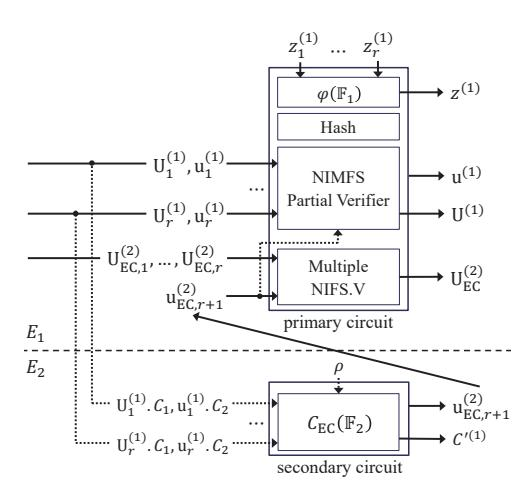
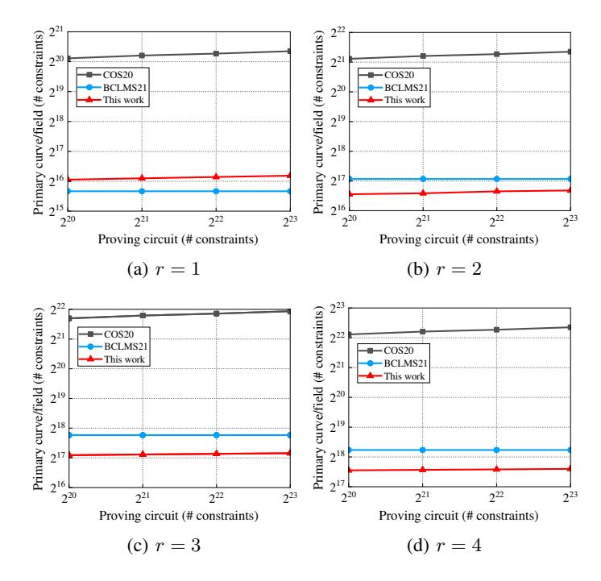
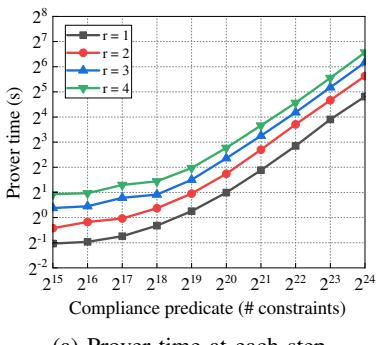
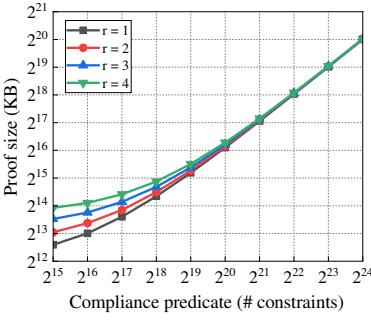
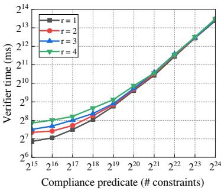
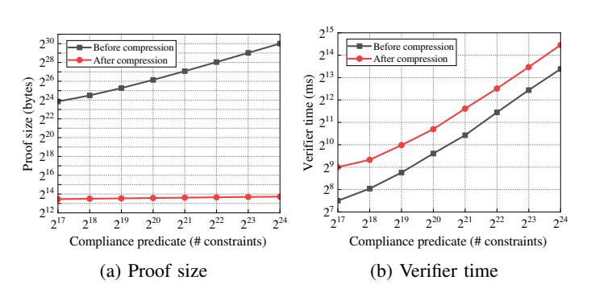

# Proof-Carrying Data from Multi-folding Schemes

Zibo Zhou Beihang University zbzhou@buaa.edu.cn Zongyang Zhang Beihang University zongyangzhang@buaa.edu.cn Zhiyu Zhang N Labs zknevermore@gmail.com Jin Dong BABEC dongjin@baec.org.cn

Abstract—Proof-carrying data (PCD) is a cryptographic primitive enabling mutually distrustful parties to perform distributed computations on directed acyclic graphs with efficient and incremental verification. Key performance metrics include the prover cost at each step and the recursion overhead, which measures the additional cost beyond proving the original computation. Despite substantial advancements in constructing efficient PCD schemes, these metrics continue to be bottlenecks hindering their widespread application.

In this paper, we advance the research by constructing a new PCD scheme based on a new generalized construction of multifolding schemes. Compared with the state-of-the-art PCD scheme by Bünz et al. (CRYPTO'21), our scheme reduces the prover cost at each step from 4r+6 multi-scalar multiplications (MSMs) of size O(|C|) to 1 MSM of the same size, and the recursion overhead from 6 MSMs of size  $2r-1,\,1$  MSM of size 6r-3 to 1 MSM of size  $2r-1,\,$  where r is the number of incoming edges at certain step and |C| is the proving computation size. Additionally, our PCD scheme supports a more expressive constraint system for encoding computations, namely the  $customizable\ constraint\ system$ , which supports high-degree constraints, in contrast to the  $rank-1\ constraint\ system$  adopted by existing PCD schemes that only supports quadratic constraints.

We implement our PCD scheme and report the concrete recursion overhead and practical efficiency for different values of r and |C|. Compared with Bünz et al. (CRYPTO'21), our PCD scheme achieves a 2.5 times lower recursion overhead when r=2 and  $|C|=2^{20}$ . Additionally, when r=2 and a proving computation size (excluding recursion overhead) of  $2^{24}$ , it takes 49 seconds to generate a PCD proof at each step. Using a SNARK to compress the proof reduces the proof size from 1031 MB to 13 KB, with a tradeoff in the verifier time, which increases from 10 seconds to 22 seconds.

## I. INTRODUCTION

Proof-carrying data (PCD), introduced by Chiesa and Tromer [17], is a powerful cryptographic primitive that enables mutually distrustful parties to perform distributed computations on directed acyclic graphs, while every intermediate state of the computation can be verified efficiently. It generalizes incrementally verifiable computation (IVC) [41] which enables a possibly infinite computation on path graphs such that the correctness can be verified efficiently at any point. PCD has found numerous applications in enforcing language semantics [19], verifiable MapReduce computations [18], image authentication [31], verifiable registries [40], privacy pools [1] and blockchains [6], [15], [25].

There has been tremendous interest and progress in designing efficient PCD schemes. A classic method for constructing PCD is via *recursive composition* of succinct non-interactive argument of knowledge (SNARK) [3], [2], [16]. Informally, at each step *i*, the prover uses a SNARK to prove that the *i*-th

step of the computation is executed correctly and the SNARK verifier expressed as a circuit has accepted the SNARK proof from step i-1. The performance of PCD schemes is mainly measured by the prover cost at each step and the *recursion overhead*. In particular, the recursion overhead indicates the verifier's operations expressed as a circuit that the prover must prove at each step besides proving the original computation. The SNARK-based method yields a secure PCD construction. However, the concrete efficiency is limited by the use of cycles of expensive pairing-friendly elliptic curves for pairing-based SNARKs [2] or heavy use of cryptographic hash functions for hash-based SNARKs [16].

Bünz et al. [10] introduced an alternative method for constructing PCD by formalizing a novel notion—atomic accumulation scheme from Halo [7]. Instead of expressing the entire SNARK verifier as a circuit, this approach requires only the verifier of the atomic accumulation scheme to be expressed as a circuit, significantly reducing its size. However, the prover at each step has to perform expensive fast Fourier transforms (FFTs) and the recursion overhead is still dominated by group operations that scale logarithmically with the computation size. Subsequently, Bünz et al. [9] extended the notion of atomic accumulation scheme to split accumulation scheme. By designing a non-interactive argument of knowledge (NARK) with a split accumulation scheme for rank-1 constraint system (R1CS) [23], they constructed a PCD scheme where the recursion overhead is dominated by a constant number of group operations. Despite this improvement, the prover at each step still has to generate a NARK proof, leading to relatively high prover cost and recursion overhead. Moreover, the computation at each step is encoded as R1CS which only supports degree-2 gates, limiting the PCD's capability to succinctly express complex computations.

Following [10], [9], Kothapalli et al. [29] introduced an elegant notion—folding scheme to construct an IVC scheme called Nova. Due to the simplicity of the folding scheme, Nova has significantly low prover cost and recursion overhead. However, the folding scheme and consequently Nova are specifically tailored to R1CS, which has limited expressivity. Later, Kothapalli and Setty [28] generalized the folding scheme to a multi-folding scheme and then constructed an IVC scheme named HyperNova. In particular, the multi-folding scheme is designed for *customizable constraint system (CCS)* [37] that captures not only R1CS but also Plonkish1, which supports more expressive high-degree gates, thereby allowing certain computations to be expressed with smaller circuit sizes. Nevertheless, both Nova and HyperNova are IVC schemes, which are a specialized case of PCD. How to adapt them to construct

&lt;sup>1https://zcash.github.io/halo2/concepts/arithmetization.html

a PCD scheme with high performance and expressivity remains an unsolved problem.

### A. Our Contributions

In this paper, we construct and implement a PCD scheme from the multi-folding scheme. Our concrete contributions are elaborated below.

A multi-folding scheme for an arbitrary number of instances. We extend the multi-folding scheme in Hyper-Nova [28], which originally folds two instances, to support folding an arbitrary number of instances. Our scheme could reduce the task of checking multiple instances to the task of checking a single instance. By using the Fiat-Shamir transformation [22] we could make it non-interactive, which is the basis of our PCD scheme.

An efficient PCD scheme supporting the customizable constraint system. We construct an efficient PCD scheme that supports the customizable constraint system with high expressivity. We provide a comparison of PCD schemes in Table I. For fairness, we treat CCS as R1CS here and report the corresponding efficiency measurements. The exact efficiency with CCS can be found in the efficiency analysis part in Section IV-B. For a proving computation of size |C| and PCD arity r (the number of incoming edges of a node), the recursion overhead of our PCD scheme is dominated by 1 multi-scalar multiplication (MSM)2 of size 2r-1,  $O(r \log |C|)$ field operations and  $O(\log |C|)$  hash operations. The prover cost at each step is dominated by 1 MSM of size O(|C|). Compared to the state-of-the-art PCD scheme BCLMS21 [9], these metrics are significantly improved3. Additionally, by using the SNARK called SuperSpartan [37] to compress the proof, our PCD scheme achieves a logarithmic proof size, with the verifier cost dominated by 1 MSM of size O(|C|).

TABLE I: Comparison of proof-carrying data schemes

|                            | BCTV14 [2]                           | COS20 [16]                                                   | BCLMS21 [9]                                                                                | This work                                                                                                         |
|----------------------------|--------------------------------------|--------------------------------------------------------------|--------------------------------------------------------------------------------------------|-------------------------------------------------------------------------------------------------------------------|
| Constraint system       | R1CS                                 | R1CS                                                         | R1CS                                                                                       | CCS                                                                                                               |
| Recursion overhead         | $3r \ \mathbb{P}$                    | $O(r \log^2  C ) \mathbb{F}$ $O(r \log^2  C ) \mathbb{H}$ | $\begin{array}{c} 6~(2r-1)\text{-MSM} \\ 1~(6r-3)\text{-MSM} \\ 5r~\mathbb{G} \end{array}$ | $\begin{array}{c} 1 \; (2r-1)\text{-MSM} \\ O(r \log  C ) \; \mathbb{F} \\ O(\log  C ) \; \mathbb{H} \end{array}$ |
| Prover cost (each step) | O( C )-FFT O( C )-MSM             | O( C )-FFT O( C )-MHT                                     | $4r+6\\O( C )\text{-MSM}$                                                                  | 0( C )-MSM                                                                                                        |
| Proof size                 | 2 G 1 1 G 2 | $O(\log^2  C ) \mathbb{F}$                                   | $O( C ) \mathbb{F}$ 15 $\mathbb{G}$                                                        | $O(\log  C ) \mathbb{F}$ $O(\log  C ) \mathbb{G}$                                                              |
| Verifier cost              | 3 ₽                                  | $O(\log^2  C ) \mathbb{F}$ $O(\log^2  C ) \mathbb{H}$     | O( C )-MSM                                                                                 | 0( C )-MSM                                                                                                        |

Notes: BCTV14 [2] is instantiated with [24]. R1CS denotes rank-1 constraint system. CCS denotes customizable constraint system. r denotes the PCD arity. |C| denotes the proving computation size.  $\mathbb G$  denotes group scalar multiplications when measuring proof size. Similarly,  $\mathbb F$  denotes field operations or field elements.  $\mathbb G_1, \mathbb G_2$  denote pairing-friendly group elements.  $\mathbb H$  denotes hash operations.  $\mathbb P$  denotes pairing operations. 1 O(|C|)-MSM denotes one multi-scalar multiplication of size O(|C|). O(|C|)-FFT denotes FFT over an O(|C|)-sized vector. O(|C|)-MHT denotes constructing Merkle tree over an O(|C|)-sized vector.

An efficient implementation of a PCD scheme from the multi-folding scheme. We implement our multi-folding scheme and PCD scheme by adapting CycleFold [27], a conceptually simple approach to implement folding-schemebased recursive arguments. We report experimental results for the concrete recursion overhead and PCD's efficiency before and after compression across different arities r and proving computation sizes |C|. With r=2 and |C| of  $2^{20}$ R1CS constraints, the concrete recursion overhead of our PCD scheme is 110,213 R1CS constraints, significantly smaller than the 274, 856 constraints in BCLMS21. Furthermore, with r=2 and the proving computation size (excluding recursion overhead) of 220 R1CS constraints, it takes 3.3 seconds to generate a PCD proof at each step. Using SuperSpartan to compress the proof reduces the proof size from 70MB to 12KB, with a tradeoff in the verifier time, increasing from 0.8 seconds to 1.6 seconds.

#### B. Related Work

Valiant [41] introduced incrementally verifiable computation (IVC), which allows a computation defined on path graphs to be verified incrementally. Chiesa and Tromer [17] generalized IVC to proof-carrying data (PCD) by enabling computations to be defined on arbitrary directed acyclic graphs. Subsequently, numerous works have advanced the theoretical foundations of IVC and PCD and studied their practical constructions.

**IVC/PCD from SNARKs.** Bitansky et al. [3] demonstrated that any SNARK for machine computation can be efficiently transformed into a PCD scheme via recursive composition. Ben-Sasson et al. [2] achieved the first implementation of PCD using pairing-based SNARKs instantiated with pairing-friendly cycles of elliptic curves. However, these curves require large fields due to their low embedding degrees, leading to poor concrete efficiency. Chiesa et al. [16] realized the first efficient post-quantum PCD, but its concrete efficiency is limited by the heavy use of hash functions in the circuit.

IVC/PCD from accumulation/folding schemes. Bünz et al. [10] developed and formalized a novel approach from Bowe et al. [7] to construct PCD, known as PCD from atomic accumulation schemes. Bünz et al. [9] further improved this approach by introducing split accumulation schemes to enhance PCD construction. Meanwhile, Boneh et al. [5] formalized a method for constructing PCD using additive polynomial commitment schemes with an aggregation scheme. Their method is closely related to PCD from atomic/split accumulation schemes. Kothapalli et al. [29] introduced a conceptually simpler notion of folding schemes and used them to construct an IVC scheme. Compared to the SNARK-based method, the accumulation/folding-based method achieves significantly better prove efficiency and lower recursion overhead.

To enhance IVC's support for expressive high-degree and lookup gates, Kothapalli and Setty [28] introduced the notion of multi-folding schemes designed for the customizable constraint system [37]. They also integrated SuperNova [26] to support non-uniform circuits and CycleFold [27] for efficient implementation. Bünz and Chen [12] introduced an approach for constructing accumulation and IVC schemes from any interactive public-coin protocol with an algebraic verifier,

&lt;sup>2For field elements  $a_1, \ldots a_r$  and elliptic curve group elements  $G_1, \ldots, G_r$ , the multi-scalar multiplication denotes the operation  $a_1G_1 + \cdots + a_rG_r$ . The group scalar multiplication denotes the operation  $a_1G_1$ .

&lt;sup>3The group operations are much more expensive than field or hash operations in the circuit.

resulting in an IVC scheme that supports multiple non-uniform circuits and enables high-degree and lookup gates. However, their accumulation scheme only handles two instances at once. Trivially extending it to accumulate multiple instances at once causes an exponential increase in the polynomial degree with the number of instances, which is undesirable for a PCD construction. Eagen and Gabizon [21] reduced this exponential growth to linear by leveraging the Lagrange base and sumcheck protocol. However, they did not provide explicit PCD constructions, which may face efficiency limitations due to the worse constants in their accumulation scheme.

Some recent works adapted accumulation/folding schemes to introduce new features and applications. Bünz and Chen [13] constructed an efficient memory-proving IVC scheme from accumulation schemes, which is particularly useful for machine computations with large memories and deterministic steps. Boneh and Chen [4] presented a lattice-based folding scheme based on the module short integer solution problem. Bünz et al. [14] constructed a bounded-depth accumulation scheme from non-homomorphic vector commitments and linear code, which implies a bounded-depth PCD and polynomial-depth IVC. However, their work is more focused on the theoretical aspect. Nguyen et al. [33] presented a framework for building efficient folding-based SNARKs. When estimating the performance of their SNARKs, they instantiated the generic PCD construction of [9] with their folding schemes for polynomial relations. The involved polynomial map has degree d, and thus the instantiated PCD supports degree-d gates. However, in their folding scheme, the number of group operations for the prover and verifier scales linearly with d, offering no significant benefits over using degree-2 gates. In contrast, the number of group operations for the prover and verifier in our PCD scheme is independent of d, making it more efficient when d is large.

# II. PRELIMINARIES

For  $t \in \mathbb{N}$ , let [t] denote the set  $\{1, 2, \dots, t\}$ . We use  $\mathbb{F}$  to denote a finite field,  $\mathbb{F}^t$  to denote a vector space of dimension t over  $\mathbb{F}$ , and  $\mathbb{F}[\ell]$  to denote the family of  $\ell$ -variate multilinear polynomials over  $\mathbb{F}$ . For  $x \in \mathbb{F}^t$ , let  $x_i$  denote the *i*-th element. We use  $y \stackrel{\$}{\leftarrow} S$  to denote the assignment of a uniformly random element in set S to y. We use y := c to denote the assignment of the variable c to y. When A is an algorithm, we use  $y \leftarrow$ A(x) to denote the assignment of the output of A on input x to y. We use  $\lambda$  to denote the security parameter and will drop it from the notation when it is implicit. We use  $negl(\lambda)$  to denote a negligible function in  $\lambda$ . Let PPT denote probabilistic polynomial time. A multiset is an extension of the concept of a set where every element has a positive multiplicity. All logarithms in this paper are to base 2. For a tuple containing a semicolon, those variables listed before the semicolon are public (known to both the prover and the verifier), and those listed after it are secret (known only to the prover).

**Lemma 1** (Multilinear Extension [20]). For every function  $f: \{0,1\}^{\ell} \to \mathbb{F}$ , there exists a unique  $\ell$ -variate multilinear polynomial  $\widetilde{f}:\mathbb{F}^\ell \to \mathbb{F}$  such that  $\widetilde{f}(x)=f(x)$  for all  $x\in$  $\{0,1\}^{\ell}$ . We call  $\widetilde{f}$  the multilinear extension (MLE) of function f, and  $\widetilde{f}$  can be expressed as

$$\widetilde{f}(\boldsymbol{X}) = \sum_{\boldsymbol{x} \in \{0,1\}^{\ell}} f(\boldsymbol{x}) \cdot \widetilde{eq}(\boldsymbol{X}, \boldsymbol{x}),$$

where
$$\widetilde{eq}(X, x) = \prod_{i=1}^{\ell} (x_i X_i + (1 - x_i)(1 - X_i))$$

**Lemma 2** (Schwartz-Zippel Lemma [36]). Let  $\widetilde{f}: \mathbb{F}^{\ell} \to \mathbb{F}$  be a non-zero  $\ell$ -variate polynomial of total degree d. Let S be any finite subset of  $\mathbb{F}$ . Then for  $\mathbf{r} \stackrel{\$}{\leftarrow} S^{\ell}$ ,  $\Pr[\widetilde{f}(\mathbf{r}) = 0] \leq \frac{d}{|S|}$ .

# A. The Sum-Check Protocol

We adapt the description from Kothapalli and Setty [28]. The sum-check protocol [30] is an interactive protocol allowing a prover  $\mathcal{P}$  to convince a verier  $\mathcal{V}$  of the validity of the statement

$$T = \sum_{x_1 \in \{0,1\}} \cdots \sum_{x_{\ell} \in \{0,1\}} \widetilde{f}(x_1, \dots, x_{\ell}),$$

where  $\widetilde{f}: \mathbb{F}^{\ell} \to \mathbb{F}$  is an  $\ell$ -variate polynomial over some finite field  $\mathbb{F}$ , and the degree of each variable is at most d. While  $\mathcal{V}$  could directly compute T using  $O(2^{\ell})$  evaluation of f, the sum-check protocol reduces  $\mathcal{V}$ 's complexity to be polynomial in  $\ell$ . In the protocol,  $\mathcal V$  takes as input randomness  $r\in\mathbb F^\ell$  and interacts with  $\mathcal{P}$  over a sequence of  $\ell$  rounds. At the end of this interaction, V outputs a claim about the evaluation f(r). Let  $\langle \mathcal{P}, \mathcal{V}(r) \rangle$  denote the interaction between  $\mathcal{P}$  and  $\mathcal{V}$  with  $\mathcal{V}$ 's randomness r. We treat  $\langle \mathcal{P}, \mathcal{V}(r) \rangle$  as a function that on input  $(f, \ell, d, T)$  outputs the claimed evaluation to be checked, i.e.,  $c \leftarrow \langle \mathcal{P}, \mathcal{V}(\boldsymbol{r}) \rangle$   $(f, \ell, d, T)$ . It satisfies the following properties.

- Completeness. If  $T = \sum_{\boldsymbol{x} \in \{0,1\}^{\ell}} \widetilde{f}(\boldsymbol{x})$ , then for an honest  $\mathcal{P}$  and for all  $\boldsymbol{r} \in \mathbb{F}^{\ell}$ ,  $\Pr[c \leftarrow \langle \mathcal{P}, \mathcal{V}(\boldsymbol{r}) \rangle \ (\widetilde{f}, \ell, d, T) \wedge \widetilde{f}(\boldsymbol{r}) =$
- Soundness. If  $T \neq \sum_{\boldsymbol{x} \in \{0,1\}^{\ell}} \widetilde{f}(\boldsymbol{x})$ , then for any adversary  $\mathcal{P}^*$  and for all  $\boldsymbol{r} \in \mathbb{F}^{\ell}$ ,  $\Pr[c \leftarrow \langle \mathcal{P}^*, \mathcal{V}(\boldsymbol{r}) \rangle (\widetilde{f}, \ell, d, T) \wedge$  $\widetilde{f}(r) = c ] \le \ell d/|\mathbb{F}|.$ • Succinctness. The communication is  $O(\ell d)$   $\mathbb{F}$  elements.

#### B. Polynomial Commitment Schemes

**Definition 1** (Polynomial Commitment Schemes [11]). A polynomial commitment scheme for multilinear polynomials is a tuple PCS = (Setup, Com, Open, Eval) where

- $pp_{pcs} \leftarrow Setup(1^{\lambda}, \ell)$ : on input the security parameter  $\lambda$ with the unary form and the number of variables  $\ell$  in a multilinear polynomial, outputs public parameters pppcs.
- $C \leftarrow \mathsf{Com}(\mathsf{pp}_{\mathsf{pcs}}, \widetilde{f})$ : on input  $\mathsf{pp}_{\mathsf{pcs}}$  and an  $\ell$ -variate multilinear polynomial  $\widetilde{f}$ , outputs a commitment C.
- $-1/0 \leftarrow \mathsf{Open}(\mathsf{pp}_{\mathsf{pcs}}, C, \widetilde{f})$ : on input  $\mathsf{pp}_{\mathsf{pcs}}, C, \widetilde{f}$ , outputs 1/0 to denote that C is indeed a commitment to  $\widetilde{f}$  or not.
- $-1/0 \leftarrow \text{Eval}(\text{pp}_{\text{pcs}}, \ell, C, r, v; \widetilde{f})$ : an interactive protocol between a PPT prover P and a verifier V. Both input  $\mathsf{pp}_{\mathsf{pcs}}, \ell, C, r \in \hat{\mathbb{F}}^{\ell}, v \in \mathbb{F}.$   $\mathcal{P}$  additionally inputs  $\widetilde{f}$  and attempts to convince V that  $\widetilde{f}(\mathbf{r}) = v$ . The outputs 1/0 denote that V accepts or not.

PCS is an extractable polynomial commitment scheme for multilinear polynomials if the following conditions hold.

• Completeness. PCS has completeness if for any  $\ell$ -variate multilinear polynomial  $\tilde{f} \in \mathbb{F}[\ell]$ ,

$$\begin{split} \Pr\left[ \begin{array}{c|c} \mathsf{Eval}(\mathsf{pp}_{\mathsf{pcs}},\ell,C,\pmb{r},v;\widetilde{f}) = 1 & \mathsf{pp}_{\mathsf{pcs}} \leftarrow \mathsf{Setup}(1^{\lambda},\ell); \\ \wedge \widetilde{f}(\pmb{r}) = v & C \leftarrow \mathsf{Com}(\mathsf{pp}_{\mathsf{pcs}},\widetilde{f}) \end{array} \right] \\ \geq 1 - \mathsf{negl}(\lambda). \end{split}$$

 Binding. PCS has binding if for any PPT adversary A, size parameter ℓ ≥ 1,

$$\Pr\left[\begin{array}{c}b_0 = b_1 \neq 0\\ \land \widetilde{f}_0 \neq \widetilde{f}_1\end{array}\middle| \begin{array}{c}\mathsf{pp}_{\mathsf{pcs}} \leftarrow \mathsf{Setup}(1^\lambda, \ell);\\ (C, \widetilde{f}_0, \widetilde{f}_1) \leftarrow \mathcal{A}(\mathsf{pp}_{\mathsf{pcs}});\\ b_0 \leftarrow \mathsf{Open}(\mathsf{pp}_{\mathsf{pcs}}, C, \widetilde{f}_0);\\ b_1 \leftarrow \mathsf{Open}(\mathsf{pp}_{\mathsf{pcs}}, C, \widetilde{f}_1)\end{array}\right] \leq \mathsf{negl}(\lambda).$$

• **Knowledge soundness.** PCS has knowledge soundness if given  $pp_{pcs} \leftarrow Setup(1^{\lambda}, \ell)$ , Eval is an argument of knowledge for NP relation  $\mathcal{R}_{Eval}(pp_{pcs})$  defined as

$$\big\{(C, \boldsymbol{r}, \boldsymbol{v}; \widetilde{f}): \widetilde{f} \in \mathbb{F}[\ell] \wedge \widetilde{f}(\boldsymbol{r}) = \boldsymbol{v} \wedge \mathsf{Open}(\mathsf{pp}_{\mathsf{pcs}}, C, \widetilde{f}) = 1\big\}.$$

 $\begin{array}{lll} \operatorname{PCS} & \textit{is additively homomorphic} & \textit{if for all} & \ell, \operatorname{pp_{pcs}} & \leftarrow \\ \operatorname{Setup}(1^{\lambda}, \ell) & \textit{and any} & \widetilde{f}_1, \widetilde{f}_2 & \in & \mathbb{F}[\ell], & \operatorname{Com}(\operatorname{pp_{pcs}}, \widetilde{f}_1) & + \\ \operatorname{Com}(\operatorname{pp_{pcs}}, \widetilde{f}_2) & = \operatorname{Com}(\operatorname{pp_{pcs}}, \widetilde{f}_1 + \widetilde{f}_2). \end{array}$

# C. Multi-folding Schemes

**Definition 2** (Multi-folding Schemes [28]). *Consider relations*  $\mathcal{R}_1$  and  $\mathcal{R}_2$  over public parameters, structure, instance, and witness tuples, a predicate compat that structures for instances in  $\mathcal{R}_1$  and  $\mathcal{R}_2$  must satisfy, and size parameters  $\mu, \nu \in \mathbb{N}$ . A multi-folding scheme for  $(\mathcal{R}_1, \mathcal{R}_2, \mathsf{compat}, \mu, \nu)$  is a tuple of algorithms MFS =  $(\mathcal{G}, \mathcal{K}, \mathcal{P}, \mathcal{V})$  where

- fpp  $\leftarrow \mathcal{G}\left(1^{\lambda},N\right)$  is a PPT generator algorithm. On input the security parameter  $\lambda$  with the unary form and size bounds N, it outputs public parameters fpp.
- (fpk, fvk)  $\leftarrow \mathcal{K}(\mathsf{fpp},(\mathsf{s}_1,\mathsf{s}_2))$  is a deterministic encoder algorithm. On input fpp and structures  $\mathsf{s}_1,\mathsf{s}_2$ , it outputs a prover key fpk and a verifier key fvk.
- $(u,w) \leftarrow \langle \mathcal{P}(fpk,\overrightarrow{w_1},\overrightarrow{w_2}), \mathcal{V}(fvk) \rangle (\overrightarrow{u_1},\overrightarrow{u_2})$  denotes the interaction between a PPT prover  $\mathcal{P}$  and a PPT verifier  $\mathcal{V}$ .  $\mathcal{P}$  inputs fpk, a vector of instances  $\overrightarrow{u_1}$  in  $\mathcal{R}_1$  of size  $\mu$  with structure  $s_1$ , a vector of instances  $\overrightarrow{u_2}$  in  $\mathcal{R}_2$  of size  $\nu$  with structure  $s_2$ , and corresponding witnesses  $\overrightarrow{w_1}, \overrightarrow{w_2}$ .  $\mathcal{V}$  inputs fvk,  $\overrightarrow{u_1}, \overrightarrow{u_2}$ . At the end of the interaction,  $\mathcal{P}$  outputs a folded instance-witness pair (u, w) in  $\mathcal{R}_1$  with structure  $s_1$ , and  $\mathcal{V}$  outputs a folded instance u in  $\mathcal{R}_1$  with structure  $s_1$ .

Let  $\mathcal{R}^{(n)}$  be the relation so that  $(\mathsf{fpp},\mathsf{s},\vec{\mathsf{u}},\vec{\mathsf{w}}) \in \mathcal{R}^{(n)}$  if and only if  $(\mathsf{fpp},\mathsf{s},\vec{\mathsf{u}}_i,\vec{\mathsf{w}}_i) \in \mathcal{R}$  for all  $i \in [n]$ . A multifolding scheme MFS should sastisfy perfect completeness and knowledge soundness defined below.

• **Perfect completeness.** MFS has perfect completeness if for all PPT adversaries A, the following probability is 1.

$$\Pr\left[\begin{array}{c} \left\{ \mathsf{fpp} \leftarrow \mathcal{G}\left(1^{\lambda}, N\right); \\ \left((\mathsf{s}_1, \mathsf{s}_2), (\overrightarrow{\mathsf{u}_1}, \overrightarrow{\mathsf{w}_1}), (\overrightarrow{\mathsf{u}_2}, \overrightarrow{\mathsf{w}_2})\right) \\ \leftarrow \mathcal{A}(\mathsf{fpp}); \\ \mathsf{compat}(\mathsf{s}_1, \mathsf{s}_2) = \mathsf{true}; \\ \left(\mathsf{fpp}, \mathsf{s}_1, \overrightarrow{\mathsf{u}_1}, \overrightarrow{\mathsf{w}_1}\right) \in \mathcal{R}_1^{(\mu)}; \\ \left(\mathsf{fpp}, \mathsf{s}_2, \overrightarrow{\mathsf{u}_2}, \overrightarrow{\mathsf{w}_2}\right) \in \mathcal{R}_2^{(\nu)}; \\ \left(\mathsf{fpk}, \mathsf{fvk}\right) \leftarrow \mathcal{K}(\mathsf{fpp}, (\mathsf{s}_1, \mathsf{s}_2)); \\ \left(\mathsf{u}, \mathsf{w}\right) \\ \leftarrow \left\langle \mathcal{P}(\mathsf{fpk}, \overrightarrow{\mathsf{w}_1}, \overrightarrow{\mathsf{w}_2}), \mathcal{V}(\mathsf{fvk}) \right\rangle \\ \left(\overrightarrow{\mathsf{u}_1}, \overrightarrow{\mathsf{u}_2}\right) \end{array}\right]$$

• **Knowledge soundness.** MFS has knowledge soundness if for any expected polynomial time adversary A and  $P^*$ , there exists an expected polynomial-time extractor E such that over all randomness  $\rho$ ,

$$\begin{split} \Pr\left[ \begin{array}{c} \left(\mathsf{fpp},\mathsf{s}_1,\overrightarrow{\mathsf{u}_1},\overrightarrow{\mathsf{w}_1}\right) \in \mathcal{R}_1^{(\mu)} \\ \wedge \\ \left(\mathsf{fpp},\mathsf{s}_2,\overrightarrow{\mathsf{u}_2},\overrightarrow{\mathsf{w}_2}\right) \in \mathcal{R}_2^{(\nu)} \\ \end{array} \right| \begin{array}{c} \mathsf{fpp} \leftarrow \mathcal{G}\left(1^\lambda,N\right); \\ \left((\mathsf{s}_1,\mathsf{s}_2),(\overrightarrow{\mathsf{u}_1},\overrightarrow{\mathsf{u}_2}),\mathsf{st}\right) \\ \leftarrow \mathcal{A}(\mathsf{fpp},\rho); \\ \mathsf{compat}(\mathsf{s}_1,\mathsf{s}_2) = \mathsf{true}; \\ (\overrightarrow{\mathsf{w}_1},\overrightarrow{\mathsf{w}_2}) \leftarrow \mathcal{E}(\mathsf{fpp},\rho) \\ \end{array} \right] \geq \\ \Pr\left[ \begin{array}{c} \mathsf{fpp} \leftarrow \mathcal{G}\left(1^\lambda,N\right); \\ \left((\mathsf{s}_1,\mathsf{s}_2),(\overrightarrow{\mathsf{u}_1},\overrightarrow{\mathsf{u}_2}),\mathsf{st}\right) \\ \leftarrow \mathcal{A}(\mathsf{fpp},\rho); \\ \mathsf{compat}(\mathsf{s}_1,\mathsf{s}_2) = \mathsf{true}; \\ \left(\mathsf{fpk},\mathsf{fvk}\right) \leftarrow \mathcal{K}(\mathsf{fpp},(\mathsf{s}_1,\mathsf{s}_2)); \\ \left(\mathsf{u},\mathsf{w}\right) \\ \leftarrow \left\langle \mathcal{P}^*(\mathsf{fpk},\mathsf{st}), \mathcal{V}(\mathsf{fvk}) \right\rangle \\ \left(\overrightarrow{\mathsf{u}_1},\overrightarrow{\mathsf{u}_2}\right) \\ - \mathsf{negl}(\lambda). \end{array} \right] \\ - \mathsf{negl}(\lambda). \end{split}$$

# D. (Linearized) Committed Customizable Constraint System

Setty et al. [37] introduced customizable constraint systems (CCS), a new constraint system that generalizes arithmetic circuits. Later, Kothapalli and Setty [28] described two variants of CCS, i.e., committed customizable constraint systems (CCCS) and linearized committed customizable constraint systems (LCCCS), that are amenable to construct their multifolding schemes. In particular, they let  $\mathcal{R}_1$  be the LCCCS relation  $\mathcal{R}_{LCCCS}$  and  $\mathcal{R}_2$  be the CCCS relation  $\mathcal{R}_{CCCS}$ , an NP-complete relation. We follow their work and adopt their definition of CCCS and LCCCS.

For a matrice  $M \in \mathbb{F}^{m \times n}$  where  $m, n \in \mathbb{N}$  and let  $s = \log m, s' = \log n$ , interpret it as a function  $\{0,1\}^s \times \{0,1\}^{s'} \to \mathbb{F}$ . That is, an input in  $\{0,1\}^s \times \{0,1\}^{s'}$  is interpreted as the binary representation of an index  $(i,j) \in \{0,\ldots,m-1\} \times \{0,\ldots,n-1\}$ , and the function outputs the (i,j)'th entry of the matrix M. Then we could define its unique multilinear extension  $\widetilde{M}$  as a multilinear polynomial in s+s' variables. Similarly, for a vector  $\boldsymbol{w} \in \mathbb{F}^m$ , interpret it as a function  $\{0,1\}^s \to \mathbb{F}$ . Then we let  $\widetilde{w}$  denote its unique multilinear extension.

**Definition 3** (Committed Customizable Constraint System [28]). A CCCS relation  $\mathcal{R}_{CCCS}$  consists of tuples containing public parameters, structure, instance and witness where

- public parameters consist of size bounds  $m, n, N, \ell, t, q, d \in \mathbb{N}$  and  $\mathsf{pp}_{\mathsf{pcs}}$ , where assume that  $n = 2 \cdot (\ell + 1)$  for simplicity,  $\mathsf{pp}_{\mathsf{pcs}} \leftarrow \mathsf{Setup}(1^{\lambda}, \log n 1)$ ;
- the structure consists of:
  - a sequence of sparse multilinear polynomials in s+s' variables  $\widetilde{M}_1, \ldots, \widetilde{M}_t$  such that they evaluate to a nonzero value in at most  $N = \Omega(\max(m,n))$  locations over the boolean hypercube  $\{0,1\}^s \times \{0,1\}^{s'}$ , where assume that  $s = \log m, s' = \log n$ ;
  - a sequence of q multisets  $(S_1, \ldots, S_q)$ , where an element in each multiset is from the set [t] and the cardinality of each multiset is at most d;
  - a sequence of q constants  $(c_1, \ldots, c_q)$ , where each constant is from  $\mathbb{F}$ ;
- the instance is  $(C, \mathbf{x})$ , where C is a commitment to a multilinear polynomial in s'-1 variables and  $\mathbf{x} \in \mathbb{F}^{\ell}$ ;
- the witness is a multilinear polynomial  $\widetilde{w}$  in s'-1 variables.

Given public parameters, a  $\mathcal{R}_{CCCS}$  structure-instance tuple is satisfied by a  $\mathcal{R}_{CCCS}$  witness if  $C = \mathsf{Com}(\mathsf{pp}_{\mathsf{pcs}}, \widetilde{w})$  and for all  $x \in \{0,1\}^s$ ,

$$\sum_{i=1}^{q} c_i \cdot \left( \prod_{j \in S_i} \left( \sum_{\boldsymbol{y} \in \{0,1\}^{s'}} \widetilde{M}_j(\boldsymbol{x}, \boldsymbol{y}) \cdot \widetilde{z}(\boldsymbol{y}) \right) \right) = 0,$$

where  $\widetilde{z}$  is an s'-variate multilinear polynomial such that  $\widetilde{z}(\mathbf{y}) = (\widetilde{\mathbf{w}}, u, \mathbf{x})(\mathbf{y})$  for all  $\mathbf{y} \in \{0, 1\}^{s'}$ .

**Definition 4** (Linearized Committed Customizable Constraint System [28]). A LCCCS relation  $\mathcal{R}_{LCCCS}$  consists of tuples containing public parameters, structure, instance and witness where the public parameters and structure are the same as those in a CCCS relation. The instance and witness are as follows:

- the instance is  $(C, u, \mathbf{x}, \mathbf{r}, v_1, \dots, v_t)$ , where  $u \in \mathbb{F}, \mathbf{x} \in \mathbb{F}^{\ell}, \mathbf{r} \in \mathbb{F}^{s}, v_i \in \mathbb{F}$  for all  $i \in [t]$ , and C is a commitment to a multilinear polynomial in s'-1 variables;
- the witness is a multilinear polynomial  $\widetilde{w}$  in s'-1 variables.

Given public parameters, a  $\mathcal{R}_{LCCCS}$  structure-instance tuple is satisfied by a  $\mathcal{R}_{LCCCS}$  witness if  $C = \mathsf{Com}\big(\mathsf{pp}_{\mathsf{pcs}}, \widetilde{w}\big)$  and for all  $i \in [t]$ ,

$$v_i = \sum_{\boldsymbol{y} \in \{0,1\}^{s'}} \widetilde{M}_i(\boldsymbol{r},\boldsymbol{y}) \cdot \widetilde{z}(\boldsymbol{y}),$$

where  $\widetilde{z}$  is an s'-variate multilinear polynomial such that  $\widetilde{z}(\boldsymbol{y}) = (\widetilde{\boldsymbol{w},u,\mathbf{x}})(\boldsymbol{y})$  for all  $\boldsymbol{y} \in \{0,1\}^{s'}$ .

# E. Proof-Carrying Data

Define a transcript T as a directed acyclic graph where each vertex  $v \in V(\mathsf{T})$  is labeled by local data  $z_{\mathsf{loc}}^{(v)}$  and each edge  $e \in E(\mathsf{T})$  is labeled by a message  $z^{(e)} \neq \perp$ . The output  $o(\mathsf{T})$  of

a transcript T is  $z^{(e)}$  where e=(v,v') is the lexicographically-first edge such that v' is a sink. For a class of compliance predicates F, define that a vertex  $v \in V(\mathsf{T})$  is  $\varphi$ -compliant for  $\varphi \in \mathsf{F}$  if for all outgoing edges  $e=(v,v') \in E(\mathsf{T})$ :

- (base case) if v has no incoming edges,  $\varphi(z^{(e)}, z_{\text{loc}}^{(v)}, \perp, \ldots, \perp)$  accepts;
- (recursive case) if v has incoming edges  $e_1,\ldots,e_r$ ,  $\varphi \left(z^{(e)},z_{\text{loc}}^{(v)},z^{(e_1)},\ldots,z^{(e_r)}\right)$  accepts.

We say that T is  $\varphi$ -compliant if all of its vertices are  $\varphi$ -compliant.

**Definition 5** (Proof-Carrying Data [9]). A proof-carrying data scheme for a class of compliance predicates F is a tuple of algorithms PCD = (G, K, P, V) where

- pp  $\leftarrow$  G  $(1^{\lambda})$  on input the security parameter  $\lambda$  with the unary form, outputs public parameters pp.
- (pk, vk) ← K(pp, φ) on input pp and a compliance predicate  $\varphi \in F$ , outputs a prover key pk and verifier key vk.
- $\Pi \leftarrow P(pk, z, z_{loc}, \{z_i, \Pi_i\}_{i=1}^r)$  on input pk, message z of the outgoing edge, local data  $z_{loc}$ , messages  $\{z_i\}_{i=1}^r$  of incoming edges and their corresponding proofs  $\{\Pi_i\}_{i=1}^r$ , outputs a new proof  $\Pi$  that attests to the correctness of z.
- $-1/0 \leftarrow V(vk, z, \Pi)$  on input  $vk, z, \Pi$ , outputs 1/0 to accept or reject.

A proof-carrying data scheme PCD should sastify perfect completeness and knowledge soundness defined below.

• **Perfect completeness.** PCD has perfect completeness if for every adversary A, the following probability is 1.

$$\Pr\left[ \begin{pmatrix} \varphi \in \mathsf{F} \land \\ \varphi(z, z_{\mathsf{loc}}, (z_i)_{i=1}^r) = 1 \\ \land \begin{pmatrix} \forall i \in [r], z_i = \bot \text{ or} \\ \mathsf{V}(\mathsf{vk}, z_i, \Pi_i) = 1 \end{pmatrix} \middle| \begin{matrix} \mathsf{pp} \leftarrow \mathsf{G}\left(1^\lambda\right); \\ \left(\varphi, z, z_{\mathsf{loc}}, \{z_i, \Pi_i\}_{i=1}^r\right) \\ \leftarrow \mathcal{A}(\mathsf{pp}); \\ \left(\mathsf{pk}, \mathsf{vk}\right) \leftarrow \mathsf{K}(\mathsf{pp}, \varphi); \\ \mathsf{pk}, \mathsf{vk}\right) \leftarrow \mathsf{F}(\mathsf{pk}, z, z_{\mathsf{loc}}, \{z_i, \Pi_i\}_{i=1}^r) \\ \mathsf{V}(\mathsf{vk}, z, \Pi) = 1 \end{pmatrix} \right].$$

• **Knowledge soundness.** PCD has knowledge soundness (w.r.t. an auxiliary input distribution  $\mathcal{D}$ ) if for every expected polynomial time adversary  $\mathsf{P}^*$ , there exists an expected polynomial time extractor  $\mathcal{E}_{\mathsf{P}^*}$  such that for every set Z,

$$\begin{split} &\Pr\left[\begin{array}{c} \varphi \in \mathsf{F} \ \land \\ (\mathsf{pp}, \mathsf{ai}, \varphi, \mathsf{o}(\mathsf{T}), \mathsf{ao}) \in Z \\ \land \mathsf{T} \ \mathsf{is} \ \varphi\text{-compliant} \end{array} \middle| \begin{array}{c} \mathsf{pp} \leftarrow \mathsf{G}\left(1^{\lambda}\right); \\ \mathsf{ai} \leftarrow \mathcal{D}(\mathsf{pp}); \\ (\varphi, \mathsf{T}, \mathsf{ao}) \\ \leftarrow \mathcal{E}_{\mathsf{P}^*}(\mathsf{pp}, \mathsf{ai}) \end{array} \right] \geq \\ &\Pr\left[\begin{array}{c} \varphi \in \mathsf{F} \ \land \\ (\mathsf{pp}, \mathsf{ai}, \varphi, \mathsf{o}, \mathsf{ao}) \in Z \\ \land \mathsf{V}(\mathsf{vk}, \mathsf{o}, \Pi) = 1 \end{array} \middle| \begin{array}{c} \mathsf{pp} \leftarrow \mathsf{G}\left(1^{\lambda}\right); \\ \mathsf{ai} \leftarrow \mathcal{D}(\mathsf{pp}); \\ (\varphi, \mathsf{o}, \Pi, \mathsf{ao}) \leftarrow \mathsf{P}^*(\mathsf{pp}, \mathsf{ai}); \\ (\mathsf{pk}, \mathsf{vk}) \leftarrow \mathsf{K}(\mathsf{pp}, \varphi) \end{array} \right] \\ &- \mathsf{negl}(\lambda). \end{split}$$

# III. A MULTI-FOLDING SCHEME FOR AN ARBITRARY NUMBER OF INSTANCES

Recall a multi-folding scheme for  $(\mathcal{R}_1,\mathcal{R}_2,\mathsf{compat},\mu,\nu)$  allows a prover and a verifier to reduce the task of checking  $\mu$  instances in  $\mathcal{R}_1$  with structure  $\mathsf{s}_1$  and  $\nu$  instances in  $\mathcal{R}_2$  with structure  $\mathsf{s}_2$  into the task of checking a single instance in  $\mathcal{R}_1$  with structure  $\mathsf{s}_1$ . In our case, we let  $\mathcal{R}_1 = \mathcal{R}_{LCCCS}$ ,  $\mathcal{R}_2 = \mathcal{R}_{CCCS}$ , and  $\mathsf{compat}(\mathsf{s}_1,\mathsf{s}_2)$  require  $\mathsf{s}_1 = \mathsf{s}_2$ . Kothapalli and Setty [28] constructed a multi-folding scheme for  $(\mathcal{R}_{LCCCS},\mathcal{R}_{CCCS},\mathsf{compat},1,1)$ . We continue their work and construct a multi-folding scheme for arbitrary values of  $\mu,\nu$ , which is the basis of our proof-carrying data scheme.

# A. Overview

Supposing that there are  $\mu$   $\mathcal{R}_{\mathrm{LCCCS}}$  instance-witness pairs  $\{\phi_k\}_{k\in[\mu]}$ ,  $\nu$   $\mathcal{R}_{\mathrm{CCCS}}$  instance-witness pairs  $\{\psi_{k'}\}_{k'\in[\nu]}$ , where  $\phi_k \coloneqq (C_1,u,\mathbf{x}_1,\underline{r}_x,v_1,\ldots,v_t;\widetilde{w}_1),\psi_{k'}\coloneqq (C_2,\underline{\mathbf{x}}_2;\widetilde{w}_2)$ . Let  $\phi_k.\widetilde{z}_1 \coloneqq (\phi_k.w_1,\phi_k.u,\phi_k.\mathbf{x}_1),\ \psi_{k'}.\widetilde{z}_2 \coloneqq (\psi_{k'}.w_2,1,\psi_{k'}.\mathbf{x}_2)$ . The prover  $\mathcal P$  and the verifier  $\mathcal V$  both input  $\mu$   $\mathcal R_{\mathrm{LCCS}}$  instances  $\{\phi_k.(C_1,u,\mathbf{x}_1,r_x,\ v_1,\ldots,v_t)\}_{k\in[\mu]}$  and  $\nu$   $\mathcal R_{\mathrm{CCS}}$  instances  $\{\psi_{k'}.(C_2,\mathbf{x}_2)\}_{k'\in[\nu]}$ .  $\mathcal P$  additionally inputs the corresponding witnesses  $\{\phi_k.\widetilde{w}_1\}_{k\in[\mu]},\{\psi_{k'}.\widetilde{w}_2\}_{k'\in[\nu]}$ . To obtain the folded instance and witness, we rely on the random linear combination technique.

For  $k \in [\mu]$ , according to  $\mathcal{R}_{LCCCS}$ , for  $i \in [t]$ , we have

$$\begin{split} \phi_k.v_i &= \sum_{\boldsymbol{y} \in \{0,1\}^{s'}} \widetilde{M}_i(\phi_k.\boldsymbol{r}_x,\boldsymbol{y}) \cdot \phi_k.\widetilde{z}_1(\boldsymbol{y}) \\ &= \sum_{\boldsymbol{x} \in \{0,1\}^s} \widetilde{eq}(\phi_k.\boldsymbol{r}_x,\boldsymbol{x}) \cdot \left(\sum_{\boldsymbol{y} \in \{0,1\}^{s'}} \widetilde{M}_i(\boldsymbol{x},\boldsymbol{y}) \cdot \phi_k.\widetilde{z}_1(\boldsymbol{y})\right) \end{split}$$

We first perform a random linear combination of these values  $\{\phi_k.v_i\}_{k\in[\mu],i\in[t]}$ , i.e., for  $\gamma \stackrel{\$}{\leftarrow} \mathbb{F}$ ,

$$\sum_{k=1}^{\mu} \sum_{i=1}^{t} \gamma^{(k-1)t+i} \phi_k \cdot v_i = \sum_{k=1}^{\mu} \sum_{i=1}^{t} \gamma^{(k-1)t+i} \cdot \sum_{\boldsymbol{x} \in \{0,1\}^s} L_{k,i}(\boldsymbol{x}),$$
(1)

where  $L_{k,i}(\boldsymbol{X}) := \widetilde{eq}(\phi_k.\boldsymbol{r}_x,\boldsymbol{X}) \cdot \left(\sum_{\boldsymbol{y} \in \{0,1\}^{s'}} \widetilde{M}_i(\boldsymbol{X},\boldsymbol{y}) \cdot \phi_k.\widetilde{z}_1(\boldsymbol{y})\right)$ .

For  $k' \in [\nu]$ , according to  $\mathcal{R}_{\text{CCCS}}$ , we have for all  $\boldsymbol{x} \in \{0,1\}^s$ ,

$$\sum_{i=1}^q c_i \cdot \prod_{j \in S_i} \left( \sum_{\boldsymbol{y} \in \{0,1\}^{s'}} \widetilde{M}_j(\boldsymbol{x}, \boldsymbol{y}) \cdot \psi_{k'}. \widetilde{z}_2(\boldsymbol{y}) \right) = 0.$$

Denoting the left-hand side of the above equation as a polynomial  $q_{k'}(\mathbf{X})$ , we have for  $\mathbf{x} \in \{0,1\}^s$ ,  $q_{k'}(\mathbf{x}) = 0$ . Then the polynomial

$$G_{k'}(\boldsymbol{X})\coloneqq\sum_{\boldsymbol{x}\in\{0,1\}^s}\widetilde{eq}(\boldsymbol{X},\boldsymbol{x})\cdot q_{k'}(\boldsymbol{x})$$

is multilinear and vanishes on all  $\boldsymbol{x} \in \{0,1\}^s$ . Hence, we have  $G_{k'}(\boldsymbol{X})$  is a zero polynomial. For  $\boldsymbol{\beta} \xleftarrow{\$} \mathbb{F}^s$ ,  $G_{k'}(\boldsymbol{\beta}) = 0$ . Let  $Q_{k'}(\boldsymbol{X}) := \tilde{eq}(\boldsymbol{\beta}, \boldsymbol{X}) \cdot q_{k'}(\boldsymbol{X})$ . We have for  $k' \in [\nu]$ ,

 $\sum_{x \in \{0,1\}^s} Q_{k'}(x) = G_{k'}(\beta) = 0$ . Then based on Equation (1), we further perform a random linear combination that

$$\sum_{k=1}^{\mu} \sum_{i=1}^{t} \gamma^{(k-1)t+i} \phi_k . v_i = \sum_{k=1}^{\mu} \sum_{i=1}^{t} \gamma^{(k-1)t+i} \cdot \sum_{\boldsymbol{x} \in \{0,1\}^s} L_{k,i}(\boldsymbol{x}) + \sum_{k'=1}^{\nu} \gamma^{\mu t+k'} \cdot \sum_{\boldsymbol{x} \in \{0,1\}^s} Q_{k'}(\boldsymbol{x}).$$

Let

$$g(X) := \sum_{k=1}^{\mu} \sum_{i=1}^{t} \gamma^{(k-1)t+i} \cdot L_{k,i}(X) + \sum_{k'=1}^{\nu} \gamma^{\mu t + k'} \cdot Q_{k'}(X).$$

We have

$$\sum_{\boldsymbol{x} \in \{0,1\}^s} g(\boldsymbol{x}) = \sum_{k=1}^{\mu} \sum_{i=1}^t \gamma^{(k-1)t+i} \phi_k.v_i,$$

which is exactly a statement that a sum-check protocol could prove. Therefore, the task of checking  $\mu$   $\mathcal{R}_{LCCCS}$  instances and  $\nu$   $\mathcal{R}_{CCCS}$  instances is reduced into the task of performing a sum-check protocol. With  $\mathbf{r}'_x \overset{\$}{\leftarrow} \mathbb{F}^s$ ,  $\mathcal{P}$  and  $\mathcal{V}$  run  $c \leftarrow \langle \mathcal{P}, \mathcal{V}(\mathbf{r}'_x) \rangle$   $(g, s, d+1, \sum_{k=1}^{\mu} \sum_{i=1}^{t} \gamma^{(k-1)t+i} \phi_k.v_i)$ . Now,  $\mathcal{V}$  has to check the equation  $g(\mathbf{r}'_x) = c$ . We let  $\mathcal{P}$  first compute some intermediate values and then  $\mathcal{V}$  compute  $g(\mathbf{r}'_x)$  using these values. Specifically,  $\mathcal{P}$  computes and sends  $\{\sigma_{k,i},\theta_{k',i}\}_{k\in [\mu],k'\in [\nu],i\in [t]}$  to  $\mathcal{V}$ , where

$$\sigma_{k,i} := \sum_{\boldsymbol{y} \in \{0,1\}^{s'}} \widetilde{M}_i(\boldsymbol{r}_x', \boldsymbol{y}) \cdot \phi_k.\widetilde{z}_1(\boldsymbol{y}),$$

$$\theta_{k',i} := \sum_{\boldsymbol{y} \in \{0,1\}^{s'}} \widetilde{M}_i(\boldsymbol{r}_x', \boldsymbol{y}) \cdot \psi_{k'}.\widetilde{z}_2(\boldsymbol{y}).$$
(2)

Then V computes

$$\begin{split} g(\boldsymbol{r}_x') \coloneqq & \sum_{k=1}^{\mu} \sum_{i=1}^{t} \gamma^{(k-1)t+i} \cdot \widetilde{eq}(\phi_k.\boldsymbol{r}_x, \boldsymbol{r}_x') \cdot \sigma_{k,i} \\ & + \sum_{k'=1}^{\nu} \gamma^{\mu t + k'} \cdot \widetilde{eq}(\boldsymbol{\beta}, \boldsymbol{r}_x') \cdot \left(\sum_{i=1}^{q} c_i \cdot \prod_{j \in S_i} \theta_{k',j}\right) \end{split}$$

and compares it with c. Nevertheless,  $\mathcal V$  still has to check the correctness of  $\{\sigma_{k,i},\theta_{k',i}\}_{k\in[\mu],k'\in[\nu],i\in[t]}$ . Observe that equations in (2) are exactly LCCS relations. Thus, for  $i\in[t]$ , we could first perform a random linear combination of  $\{\sigma_{k,i},\theta_{k',i}\}_{k\in[\mu],k'\in[\nu]}$  and then prove the correctness of the folded  $\mathcal R_{\mathrm{LCCCS}}$  instance. Now, the task of checking  $\mu$   $\mathcal R_{\mathrm{LCCCS}}$  instances and  $\nu$   $\mathcal R_{\mathrm{CCCS}}$  instances is reduced into the task of checking a single  $\mathcal R_{\mathrm{LCCCS}}$  instance.

#### B. Formal Description

Construction 1 (A Multi-folding Scheme for an Arbitrary Number of Instances). We formally present our multi-folding scheme as follows.

$$\mathsf{fpp} \leftarrow \mathcal{G}\left(1^{\lambda}, (m, n, N, \ell, t, q, d \in \mathbb{N})\right) :$$

- 1. Let  $n = 2 \cdot (\ell + 1)$ .
- 2. Compute  $\mathsf{pp}_{\mathsf{pcs}} \leftarrow \mathsf{Setup}(1^{\lambda}, \log n 1)$ , and output  $\mathsf{fpp} \coloneqq (m, n, N, \ell, t, q, d, \mathsf{pp}_{\mathsf{pcs}})$ .

 $(\mathsf{fpk},\mathsf{fvk}) \leftarrow \mathcal{K}(\mathsf{fpp},(\mathsf{s}_1,\mathsf{s}_2)) \text{:}$

- 1. Parse  $s_1 = s_2$  as  $((\widetilde{M}_1, \dots, \widetilde{M}_t), (S_1, \dots, S_q), (c_1, \dots, c_q))$ .
- 2. Output fpk := (fpp,  $s_1$ ), fvk := (fpp,  $s_1$ ).

$$\underline{(\mathsf{u},\mathsf{w})} \leftarrow \big\langle \mathcal{P}(\mathsf{fpk},\overrightarrow{\mathsf{w}_1},\overrightarrow{\mathsf{w}_2}), \mathcal{V}(\mathsf{fvk}) \big\rangle \big(\overrightarrow{\mathsf{u}_1},\overrightarrow{\mathsf{u}_2}\big)$$

- 1. Parse  $(\overrightarrow{\mathsf{u}_1}, \overrightarrow{\mathsf{w}_1})$  as  $\{\phi_k\}_{k \in [\mu]}, (\overrightarrow{\mathsf{u}_2}, \overrightarrow{\mathsf{w}_2})$  as  $\{\psi_{k'}\}_{k' \in [\nu]}$ .
- 2.  $\mathcal{V}$  samples  $\gamma \overset{\$}{\leftarrow} \mathbb{F}, \boldsymbol{\beta} \overset{\$}{\leftarrow} \mathbb{F}^s$  and sends them to  $\mathcal{P}$ .  $\mathcal{V}$  then samples  $r_x' \overset{\$}{\leftarrow} \mathbb{F}^s$ .
- 3.  $\mathcal{P}$  and  $\mathcal{V}$  run the sum-check protocol

$$c \leftarrow \left\langle \mathcal{P}, \mathcal{V}(\boldsymbol{r}_x') \right\rangle \left(g, s, d+1, \sum_{k=1}^{\mu} \sum_{i=1}^{t} \gamma^{(k-1)t+i} \phi_k.v_i \right).$$

 ${\cal V}$  aborts once he outputs "reject" in the sum-check.

- 4.  $\mathcal{P}$  computes and sends  $\{\sigma_{k,i}, \theta_{k',i}\}_{k \in [\mu], k' \in [\nu], i \in [t]}$  to  $\mathcal{V}$ .
- 5.  $\mathcal{V}$  computes  $\{e_{k,1} \coloneqq \widetilde{eq}(\phi_k.r_x,r_x')\}_{k\in[\mu]}$ ,  $e_2 \coloneqq \widetilde{eq}(\boldsymbol{\beta},r_x')$ , and aborts if

$$\begin{split} c \neq & \sum_{k=1}^{\mu} \sum_{i=1}^{t} \gamma^{(k-1)t+i} \cdot e_{k,1} \cdot \sigma_{k,i} \\ & + \sum_{k'=1}^{\nu} \gamma^{\mu t+k'} \cdot e_2 \cdot \left( \sum_{i=1}^{q} c_i \cdot \prod_{j \in S_i} \theta_{k',j} \right). \end{split}$$

- 6.  $\mathcal{V}$  samples  $\rho \stackrel{\$}{\leftarrow} \mathbb{F}$  and sends it to  $\mathcal{P}$ .
- 7.  $\mathcal{P}$  and  $\mathcal{V}$  output the folded  $\mathcal{R}_{LCCCS}$  instance  $u := (C', u', \mathbf{x}', \mathbf{r}'_x, v'_1, \dots, v'_t)$ , where for all  $i \in [t]$ ,

$$\begin{split} C' &\coloneqq \sum_{k=1}^{\mu} \rho^{k-1} \cdot \phi_k.C_1 + \sum_{k'=1}^{\nu} \rho^{\mu-1+k'} \cdot \psi_{k'}.C_2, \\ u' &\coloneqq \sum_{k=1}^{\mu} \rho^{k-1} \cdot \phi_k.u + \sum_{k'=1}^{\nu} \rho^{\mu-1+k'} \cdot 1, \\ \mathbf{x}' &\coloneqq \sum_{k=1}^{\mu} \rho^{k-1} \cdot \phi_k.\mathbf{x}_1 + \sum_{k'=1}^{\nu} \rho^{\mu-1+k'} \cdot \psi_{k'}.\mathbf{x}_2, \\ v_i' &\coloneqq \sum_{k=1}^{\mu} \rho^{k-1} \cdot \sigma_{k,i} + \sum_{k'=1}^{\nu} \rho^{\mu-1+k'} \cdot \theta_{k',i}. \end{split}$$

8.  $\mathcal{P}$  outputs the folded  $\mathcal{R}_{LCCCS}$  witness  $w \coloneqq \widetilde{w'}$ , where

$$\widetilde{w'} \coloneqq \sum_{k=1}^{\mu} \rho^{k-1} \cdot \phi_k.\widetilde{w_1} + \sum_{k'=1}^{\nu} \rho^{\mu-1+k'} \cdot \psi_{k'}.\widetilde{w_2}.$$

**Theorem 1.** Construction 1 is a public-coin multi-folding scheme for  $(\mathcal{R}_{LCCCS}, \mathcal{R}_{CCCS}, \mathsf{compat}, \mu, \nu)$  with perfect completeness and knowledge soundness.

*Proof sketch:* For perfect completeness, supposing that the inputs are satisfied instance-witness pairs, then by the completeness of the sum-check protocol,  $\mathcal V$  will not abort. By construction and the additive homomorphism property of the polynomial commitment scheme, we have that the output is a satisfied  $\mathcal R_{\mathrm{LCCCS}}$  instance-witness pair. For knowledge soundness, we construct an expected polynomial time extractor that rewinds the interaction between a malicious prover and a

verifier with fresh challenges to interpolate witnesses. By the soundness of the sum-check protocol and the Schwartz-Zippel lemma, we demonstrate that the extractor succeeds in obtaining satisfied witnesses for the input instances with a non-negligible probability. The formal proof is deferred to Appendix A.

A non-interactive multi-folding scheme. Since our multi-folding scheme is public-coin, we could transform it into a non-interactive multi-folding scheme NIMFS =  $(\mathcal{G}, \mathcal{K}, \mathcal{P}, \mathcal{V})$  for the tuple  $(\mathcal{R}_{LCCCS}, \mathcal{R}_{CCCS}, \text{compat}, \mu, \nu)$  using the Fiat-Shamir transformation, according to the Lemma 1 of Hyper-Nova [28].

**Efficiency.** Fot the prover's cost, the sum-check protocol requires the prover to generate some proof, which could be completed with  $O(\mu(N+tm)+\nu(N+tm+qmd\log^2d))$  field operations according to [37]. For  $\{\sigma_{k,i},\theta_{k',i}\}_{k\in[\mu],k'\in[\nu],i\in[t]}$ , we have that

$$\begin{split} \sigma_{k,i} &\coloneqq \sum_{\boldsymbol{y} \in \{0,1\}^{s'}} \widetilde{M}_i(\boldsymbol{r}_x',\boldsymbol{y}) \cdot \phi_k.\widetilde{z}_1(\boldsymbol{y}) \\ &= \sum_{\boldsymbol{y} \in \{0,1\}^{s'}} \left(\sum_{\boldsymbol{a} \in \{0,1\}^s} \sum_{\boldsymbol{b} \in \{0,1\}^{s'}} \widetilde{M}_i(\boldsymbol{a},\boldsymbol{b}) \cdot \widetilde{eq}\left((\boldsymbol{r}_x',\boldsymbol{y}),(\boldsymbol{a},\boldsymbol{b})\right)\right) \\ &\cdot \phi_k.\widetilde{z}_1(\boldsymbol{y}) \\ &= \sum_{\boldsymbol{y} \in \{0,1\}^{s'}} \left(\sum_{\boldsymbol{a} \in \{0,1\}^s} \widetilde{eq}(\boldsymbol{r}_x',\boldsymbol{a}) \sum_{\boldsymbol{b} \in \{0,1\}^{s'}} \widetilde{M}_i(\boldsymbol{a},\boldsymbol{b}) \cdot \widetilde{eq}(\boldsymbol{y},\boldsymbol{b})\right) \\ &\cdot \phi_k.\widetilde{z}_1(\boldsymbol{y}) \\ &= \sum_{\boldsymbol{a} \in \{0,1\}^s} \widetilde{eq}(\boldsymbol{r}_x',\boldsymbol{a}) \cdot \sum_{\boldsymbol{b} \in \{0,1\}^{s'}} \widetilde{M}_i(\boldsymbol{a},\boldsymbol{b}) \cdot \phi_k.\widetilde{z}_1(\boldsymbol{b}) \end{split}$$

According to [42],  $\left\{\widetilde{eq}(r'_x,a)\right\}_{a\in\{0,1\}^s}$  could be computed with O(m) field operations. Based on these values, the computation of  $\{\sigma_{k,i},\theta_{k',i}\}_{k\in[\mu],k'\in[\nu],i\in[t]}$  could be accomplished with  $O(m+(\mu+\nu)\cdot N)$  field operations. When instantiating the polynomial commitment scheme with Bulletproofs [8], the computation of C' and  $\widetilde{w'}$  requires one MSM of size  $\mu+\nu-1$  and  $O((\mu+\nu)\cdot n)$  field operations, respectively. Thus, the total cost is dominated by  $O(\mu(N+tm+n)+\nu(N+tm+n+qmd\log^2d))$  field operations and one MSM of size  $\mu+\nu-1$ .

For the verifier's cost, verification in the sum-check protocol requires  $O(d\log m)$  field operations [39]. The computation of  $\{e_{k,1}\}_{k\in [\mu]}, e_2$  and checking c require  $O(\mu\log m + \mu t + \nu dq)$  field operations. The computation of C' requires one MSM of size  $\mu + \nu - 1$ . Thus, the total cost is dominated by  $O(d\log m + \mu\log m + \mu t + \nu dq)$  field operations and one MSM of size  $\mu + \nu - 1$ .

The communication consists of elements sent from  $\mathcal P$  to  $\mathcal V$  in the sum-check protocol and  $\{\sigma_{k,i},\theta_{k',i}\}_{k\in[\mu],k'\in[\nu],i\in[t]}$ , which sums up to  $O(d\log m)+t\cdot(\mu+\nu)$  field elements.

# IV. PCD FROM NON-INTERACTIVE MULTI-FOLDING SCHEMES

Recall that PCD enables a set of parties to carry out an indefinitely long distributed computation where every step along the way is accompanied by a proof of correctness. We rely on our non-interactive multi-folding scheme to construct a PCD scheme.

### A. Overview

At each step of the long distributed computation, the prover P will receive r previous outputs  $\{z_i\}_{i\in[r]}$ , each accompanied by a proof  $\Pi_i$  that attests to its correctness. We define  $\Pi_i$  to contain a satisfied  $\mathcal{R}_{LCCCS}$  instance-witness pair  $(U_i, W_i)$  and a satisfied  $\mathcal{R}_{CCCS}$  instance-witness pair  $(u_i, w_i)$ . In addition, P has some local input  $z_{loc}$ . With  $z_{loc}, z_1, \ldots, z_r$ , P computes zsuch that  $\varphi(z, z_{loc}, z_1, \dots, z_r)$  accepts. Then P should provide a proof to the next party that attests not only to the correctness of his local computation, but also to the correctness of all his inputs  $\{z_i\}_{i\in[r]}$ . To this end, P first invokes the non-interactive multi-folding scheme to fold  $\{(U_i, W_i), (u_i, w_i)\}_{i \in [r]}$  into a single  $\mathcal{R}_{LCCS}$  instance-witness pair (U, W). To prove the correctness of the folding process, we define a circuit  $R_{\varphi}$ that represents the compliance predicate  $\varphi$  as well as the verifier of the non-interactive multi-folding scheme, which could be expressed as a  $\mathcal{R}_{CCCS}$  structure. Then P generates a satisfied  $\mathcal{R}_{CCCS}$  instance-witness pair (u, w) by computing  $R_{\omega}$ using the appropriate input values from his prior computations. Finally, P outputs a proof  $\Pi$  consisting of (U, W), (u, w).

By checking (u,w), we have that  $\varphi(z,z_{loc},z_1,\ldots,z_r)$  accepts and  $\{U_i,u_i\}_{i\in[r]}$  is correctly folded into U. By further checking (U,W) and the knowledge soundness of the multifolding scheme, we have that there exists satisfied witnesses  $\{W_i,w_i\}_{i\in[r]}$  for instances  $\{U_i,u_i\}_{i\in[r]}$ , which attests to the correctness of  $\{z_i\}_{i\in[r]}$ . Therefore, we maintain the invariant that if (U,W) is a satisfied  $\mathcal{R}_{LCCCS}$  instance-witness pair and (u,w) is a satisfied  $\mathcal{R}_{CCCS}$  instance-witness pair, then the distributed computation is correct up to this step.

However, the above description elides some subtlety. Since the proof  $\Pi$  passed to the next party includes U, the public IO of the circuit  $R_{\varphi}$ , i.e., u.x should include U. The next party will fold u, U into a new  $\mathcal{R}_{LCCCS}$  instance as described above. But now U is part of u, they can not be folded. To address this issue, inspired by Nova [29], we modify  $R_{\varphi}$  to additionally hash z, U and let the output be the circuit's public IO, which ensures that u.x does not contain U but still binds with it. To achieve recursion, we further modify  $R_{\varphi}$  to include the verifier's work of checking that the inputs satisfy the hash relation, i.e.,  $u_i$ .x is the hash of  $z_i$ ,  $U_i$  for  $i \in [r]$ .

Note that since the PCD proof includes the entire witnesses W, w, its size is linear in the size of the circuit. However, as in HyperNova [28], we could use a general SNARK such as SuperSpartan [37] to prove the knowledge of a valid PCD proof, which could reduce the proof size exponentially.

# B. Formal Description

Construction 2 (A PCD Scheme from Non-interactive Multi-folding Schemes). We formally present our PCD scheme as follows. Let  $(u_\perp, w_\perp)$  be a default trivially satisfied  $\mathcal{R}_{\mathrm{LCCCS}}$  instance-witness pair. Let NIMFS  $= (\mathcal{G}, \mathcal{K}, \mathcal{P}, \mathcal{V})$  denote the non-interactive multi-folding scheme transformed from our multi-folding scheme. Let hash be a collision-resistant hash function. Given a compliance predicate  $\varphi$ , the circuit  $R_\varphi$  that realizes the recursion is as follows.

$$0/1 \leftarrow R_{\varphi}(h; (z, z_{\mathsf{loc}}, \{z_i, \mathsf{U}_i, \mathsf{u}_i\}_{i=1}^r, \mathsf{fvk}, \mathsf{U}, \pi)):$$

- 1. Check that the compliance predicate  $\varphi(z,z_{\text{loc}},z_1,\ldots,z_r)$  accepts.
- 2. If  $z_i = \perp$  for all  $i \in [r]$ , then check that  $h = \mathsf{hash}(\mathsf{fvk}, z, \mathsf{u}_\perp)$ .

Else, check that

- a) for  $i \in [r]$ ,  $u_i.\mathbf{x} = \mathsf{hash}(\mathsf{fvk}, z_i, \mathsf{U}_i)$ , where  $u_i.\mathbf{x}$  is the public IO of  $u_i$ .
- b)  $U = NIMFS.\mathcal{V}(fvk, \{U_i\}_{i \in [r]}, \{u_i\}_{i \in [r]}, \pi).$
- c)  $h = \mathsf{hash}(\mathsf{fvk}, z, \mathsf{U}).$
- 3. If the above checks hold, output 1; otherwise, output 0.

Since  $R_{\varphi}$  can be computed in polynomial time, it can be represented as a  $\mathcal{R}_{CCCS}$  structure. Let

$$(\mathsf{u},\mathsf{w}) \leftarrow \mathsf{trace}\big(R_{\varphi}, \big(h, (z, z_{\mathsf{loc}}, \{z_i, \mathsf{U}_i, \mathsf{u}_i\}_{i=1}^r, \mathsf{fvk}, \mathsf{U}, \pi)\big)\big)$$

denote the satisfied  $\mathcal{R}_{\text{CCCS}}$  instance-witness pair for the execution of  $R_{\varphi}$  on input  $(h, (z, z_{\text{loc}}, \{z_i, U_i, u_i\}_{i=1}^r, \text{ fvk}, U, \pi))$ .

We construct our PCD scheme (G, K, P, V) as follows.

$$\mathsf{pp} \leftarrow \mathsf{G}\left(1^{\lambda}\right)$$
:

- 1. Sample size bounds  $m, n, N, \ell, t, q, d \in \mathbb{N}$ .
- 2. Compute fpp  $\leftarrow$  NIMFS. $\mathcal{G}\left(1^{\lambda}, (m, n, N, \ell, t, q, d)\right)$ , and output pp  $\coloneqq$  fpp.

$$(pk, vk) \leftarrow K(pp, \varphi)$$
:

1. Compute  $(fpk, fvk) \leftarrow NIMFS.\mathcal{K}(fpp, R_{\varphi})$ , and output (pk, vk) := (fpk, fvk).

$$\Pi \leftarrow \mathsf{P}\big(\mathsf{pk}, z, z_{\mathsf{loc}}, \{z_i, \Pi_i\}_{i=1}^r\big) :$$

- 1. For  $i \in [r]$ , parse  $\Pi_i$  as  $((U_i, W_i), (u_i, w_i))$ , where  $(U_i, W_i)$  is a satisfied  $\mathcal{R}_{LCCCS}$  instance-witness pair and  $(u_i, w_i)$  is a satisfied  $\mathcal{R}_{CCCS}$  instance-witness pair.
- 2. If  $z_i = \perp$  for all  $i \in [r]$ , then set  $(\mathsf{U}, \mathsf{W}, \pi) \coloneqq (\mathsf{u}_\perp, \mathsf{w}_\perp, \perp)$ . Else, compute  $(\mathsf{U}, \mathsf{W}, \pi) \leftarrow \mathsf{NIMFS}.\mathcal{P} \big(\mathsf{fpk}, \{(\mathsf{U}_i, \mathsf{W}_i)\}_{i \in [r]}, \{(\mathsf{u}_i, \mathsf{w}_i)\}_{i \in [r]} \big)$ .
- 3. Compute  $h \leftarrow \mathsf{hash}(\mathsf{fvk}, z, \mathsf{U})$ .
- 4.  $(\mathsf{u},\mathsf{w}) \leftarrow \mathsf{trace}\big(R_{\varphi},\big(h,(z,z_{\mathsf{loc}},\{z_i,\mathsf{U}_i,\mathsf{u}_i\}_{i=1}^r,\mathsf{fvk},\mathsf{U},\pi)\big)\big).$
- 5. Output  $\Pi := ((U, W), (u, w))$ .

# $1/0 \leftarrow V(vk, z, \Pi)$ :

- 1. Parse  $\Pi$  as ((U, W), (u, w)).
- 2. Check that  $u.\mathbf{x} = \mathsf{hash}(\mathsf{fvk}, z, \mathsf{U})$ .
- 3. Check that W is a satisfied  $\mathcal{R}_{\rm LCCCS}$  witness to U and w is a satisfied  $\mathcal{R}_{\rm CCCS}$  witness to u.
- 4. If the above checks hold, output 1; otherwise, output 0.

**Theorem 2.** Construction 2 is a PCD scheme with perfect completeness and knowledge soundness.

*Proof sketch:* The perfect completeness follows from the perfect completeness of the multi-folding scheme and the construction of circuit  $R_{\varphi}$ . For knowledge soundness, considering

an expected polynomial time adversary  $P^*$ , we construct an expected polynomial time extractor  $\mathcal{E}_{P^*}$  to extract the transcript T of depth d via an iterative process. In the base case, we use  $P^*$  to construct an extractor  $\mathcal{E}_0$  that extracts  $T_0$ , which consists of a single node. Then supposing the existence of  $\mathcal{E}_{i-1}$  that extracts  $T_{i-1}$ , we construct an adversary  $\mathcal{P}^*_{i-1}$  for the non-interactive multi-folding scheme. By the knowledge soundness of the multi-folding scheme, this implies the existence of an extractor  $\mathcal{E}_{\mathcal{P}^*_{i-1}}$  corresponding to  $\mathcal{P}^*_{i-1}$ . We then construct an extractor  $\mathcal{E}_i$  that extracts  $T_i$  using  $\mathcal{P}^*_{i-1}$ ,  $\mathcal{E}_{\mathcal{P}^*_{i-1}}$ . By repeating this iterative process, we construct an extractor  $\mathcal{E}_d$  that extracts  $T_d$ , which is exactly equal to  $\mathcal{E}_{P^*}$ . Finally, we demonstrate inductively the correctness of these extractors. The formal proof is deferred to Appendix B.

**Efficiency.** The recursion overhead, i.e., the computations that the prover must prove at each step in addition to proving the compliance predicate, involves r+1 calls to hash and one call to NIMFS. $\mathcal V$ . The cost of NIMFS. $\mathcal V$  is dominated by  $O\left(d\log m + r\cdot(\log m + t + dq)\right)$  field operations, one MSM of size 2r-1 and  $2\log m+2$  calls to the random oracle RO to achieve non-interactivity, where RO could be instantiated with an appropriate cryptographic hash function.

The prover's work at each step is dominated by invoking NIMFS.  $\mathcal{P}$ , and computing the satisfied  $\mathcal{R}_{\text{CCCS}}$  instancewitness pair  $(\mathbf{u},\mathbf{w})$  for the execution of  $R_{\varphi}$ . The cost of NIMFS.  $\mathcal{P}$  is dominated by  $O\left(r\cdot(N+tm+n+qmd\log^2d)\right)$  field operations, one MSM of size 2r-1, and  $2\log m+2$  calls to RO to achieve non-interactivity. The cost of computing  $(\mathbf{u},\mathbf{w})$  is dominated by computing the commitment C which requires one MSM of size O(n) when instantiating the polynomial commitment scheme with Bulletproofs [8].

The size of proof  $\Pi = ((\mathsf{U},\mathsf{W}),(\mathsf{u},\mathsf{w}))$  is linear in the size of  $R_\varphi$ . However, as in HyperNova [28], we could use a general SNARK to compress the proof. Specifically, the prover invokes  $(\mathsf{U}',\mathsf{W}',\pi') \leftarrow \mathsf{NIMFS}.\mathcal{P}(\mathsf{fpk},(\mathsf{U},\mathsf{W}),(\mathsf{u},\mathsf{w}))$ , and then uses a general SNARK to generate a proof  $\pi_{\mathsf{U}'}$  that proves the knowledge of  $\mathsf{W}'$ . Now  $\Pi$  consists of  $(\mathsf{U},\mathsf{u},\pi',\pi_{\mathsf{U}'})$ . When instantiating the SNARK with SuperSpartan [37] excluding the first sum-check invocation and using the polynomial commitment scheme based on Bulletproofs [8], the proof size is then dominated by  $O(d\log m + t + \log n)$  field elements and  $O(\log n)$  group elements.

The verifier's work is dominated by checking (U,W),(u,w) according to the CCCS and LCCCS relations. If the proof is compressed, then the verifier's work is dominated by performing  $U' \leftarrow \mathsf{NIMFS.}\mathcal{V}(\mathsf{fvk},\mathsf{U},\mathsf{u},\pi')$  and verifying  $\pi_{\mathsf{U'}}$ , whose cost is dominated by  $O(d\log m + t + dq + \log n + N)$  field operations,  $O(\log m + \log n)$  calls to RO, and one MSM of size O(n).

## V. IMPLEMENTATION AND EVALUATION

We have implemented our multi-folding scheme and PCD scheme to evaluate their practical efficiency. We present the implementation details and evaluation results in this section.

#### A. Implementation Methodology

Given an elliptic curve group  $\mathbb{G}$ , denote the *scalar field* of  $\mathbb{G}$  as the field  $\mathbb{F}_1$  whose order is  $|\mathbb{G}|$ , and the *base field* of  $\mathbb{G}$

as the field  $\mathbb{F}_2$  over which the elliptic curve group is defined. Typically,  $\mathbb{F}_1$  and  $\mathbb{F}_2$  are distinct; otherwise, the discrete logarithm assumption would not hold [38]. To implement our PCD scheme, we need to implement the circuit  $R_{\varphi}$  defined over the scalar field  $\mathbb{F}_1$ . However, since NIMFS. $\mathcal{V}'$  involves group operations over  $\mathbb{F}_2$ , directly encoding them within the circuit  $R_{\varphi}$  would require emulating  $\mathbb{F}_2$  operations via  $\mathbb{F}_1$  operations, which would significantly increase the circuit size.

To avoid a blowup in the circuit size, existing implementations of recursive arguments based on groups [2], [9], [29], [32] utilize a 2-cycle of elliptic curves  $(E_1, E_2)$ . This cycle induces a pair of elliptic curve groups  $(\mathbb{G}_1,\mathbb{G}_2)$ , where  $\mathbb{G}_1$  has scalar field  $\mathbb{F}_1$  and base field  $\mathbb{F}_2$  while  $\mathbb{G}_2$  has scalar field  $\mathbb{F}_2$  and base field  $\mathbb{F}_1$ . Kothapalli and Setty [27] introduced CycleFold, a conceptually simple approach to instantiate folding-schemebased recursive arguments over a cycle of elliptic curves for realizing IVC schemes. Instead of emulating non-native field operations within a primary circuit defined over  $E_1$ , CycleFold outsources these operations to a secondary circuit defined over  $E_2$ , generates an instance-witness pair to represent the correct execution of the secondary circuit, and then folds this instance along with some running instances within the primary circuit. Due to the properties of the 2-cycle of elliptic curves, the emulation overhead is significantly reduced.

We adapt CycleFold to implement our PCD scheme and provide an overview of the circuit implementation in Fig. 1, where superscripts (1) and (2) denote the elements defined over the elliptic curve  $E_1$  and  $E_2$ , respectively.

Fig. 1: PCD circuit implementation overview

We use a primary circuit defined over the scalar field  $\mathbb{F}_1$  of  $E_1$  to encode all parts of  $R_{\varphi}$  except for the group operation  $C'^{(1)} := \sum_{k=1}^r \rho^{k-1} \cdot \mathsf{U}_k^{(1)}.C_1 + \sum_{k'=1}^r \rho^{r-1+k'} \cdot \mathsf{u}_{k'}^{(1)}.C_2$  in NIMFS. $\mathcal{V}'$ . This operation is defined over  $\mathbb{F}_2$  and is thus nonnative to the primary circuit. Instead, we use a secondary circuit  $C_{\mathsf{EC}}$  defined over the scalar field  $\mathbb{F}_2$  of  $E_2$  to encode this group operation, which eliminates the need for field emulation. To complete NIMFS. $\mathcal{V}'$  in the primary circuit, we represent the secondary circuit as a R1CS structure and generate a satisfied instance-witness pair  $\left(\mathsf{u}_{\mathsf{EC},r+1}^{(2)},\mathsf{w}_{\mathsf{EC},r+1}^{(2)}\right)$  with the public IO  $\left\{\mathsf{U}_i^{(1)}.C_1,\mathsf{u}_i^{(1)}.C_2\right\}_{i=1}^r,\rho,C'^{(1)}$ . The primary circuit reads  $\mathsf{u}_{\mathsf{EC},r+1}^{(2)}$  and, after checking that the public IO in  $\mathsf{u}_{\mathsf{EC},r+1}^{(2)}$

matches the desired inputs, adds  $C'^{(1)}$  to  $\mathsf{U}^{(1)}$ .

Then different from Construction 2, the verifier now should additionally check the satisfiability of  $(\mathsf{u}_{\mathsf{EC},r+1}^{(2)},\mathsf{w}_{\mathsf{EC},r+1}^{(2)})$ , making the PCD proof  $\Pi_i^{(1)}$  for  $z_i^{(1)}$  now consist of  $(\mathsf{U}_i^{(1)},\mathsf{W}_i^{(1)}),(\mathsf{u}_i^{(1)},\mathsf{w}_i^{(1)}),(\mathsf{U}_{\mathsf{EC},i}^{(2)},\mathsf{W}_{\mathsf{EC},i}^{(2)})$ . The prover should additionally fold the inputs  $(\mathsf{U}_{\mathsf{EC},i}^{(2)},\mathsf{W}_{\mathsf{EC},i}^{(2)})$  and newly generated  $(\mathsf{u}_{\mathsf{EC},r+1}^{(2)},\mathsf{w}_{\mathsf{EC},r+1}^{(2)})$  into a single instance-witness pair  $(U_{EC}^{(2)},W_{EC}^{(2)})$ . Intuitively, this scenario aligns well with our multi-folding scheme. However, in this case, encoding the multi-folding scheme's verification in a circuit inevitably requires emulating the logarithmic field operations or the constant group operations within the verification algorithm, both of which are unacceptable. Instead, we turn our attention to the folding scheme in Nova [29]. While it is designed to fold two instances, it can be invoked multiple times to fold multiple instances. More importantly, since the folding scheme is invoked to fold instances from the secondary circuit, its verification is native to the primary circuit except for a few field operations. Thus, we could encode the folding scheme's verification within the primary circuit. Furthermore, the number of field operations in the verification that are nonnative to the primary circuit is roughly linear to the number of public IO of the secondary circuit. Notably, the public IO mainly consists of elliptic curve group elements. To reduce the emulation overhead, we adopt a compressed format to store these elements and decompress them when used in the circuit. This approach roughly halves the emulation overhead.

# B. Benchmark Configuration

We implement our proposed schemes in Rust based on the Nova library [34]. While our multi-folding scheme and PCD scheme support CCS, we limit our attention to R1CS, a specific instantiation of CCS, for a fair comparison with existing works. The experiments are conducted on Ubuntu 22.04 with an X86 architecture, equipped with a 12-core AMD Ryzen 9 5900X CPU running at 3.70GHz and 128GB of memory. We evaluate the following typical performance metrics of our PCD scheme.

- 1. The concrete recursion overhead. We measure the recursion overhead with the number of R1CS constraints over the scalar field of both primary curve  $(E_1)$  and secondary curve  $(E_2)$  across various arity parameters and proving circuit sizes 4. We compare the results with existing works to demonstrate the advantages.
- 2. The prover time at each step, as well as the proof size and verifier time without compression. We measure these performance metrics across various arity parameters and predicate sizes to illustrate the trends.
- The proof size and verifier time after compression. We apply a specific SNARK to compress the PCD proof and compare the proof size and verifier time before and after compression.

Similar to the Nova library, our implementation supports three typical cycles of elliptic curves: 1) Pallas/Vesta, 2) BN254/Grumpkin, and 3) secp/secq. We choose the Pallas/Vesta cycle of curves [35] as used in BCLMS21 [9] when reporting our evaluation results.

### C. Evaluation Results

Concrete recursion overhead. In Table II, we compare our recursion overhead with COS20 [16] and BCLMS21 [9] in detail for different r and a fixed proving circuit size of  $2^{20}$ . Note that COS20 and BCLMS21 both only report their recursion overheads for r = 1. For comparison, we estimate their recursion overheads for larger r based on the theoretical complexity analysis in Table I. Additionally, COS20 relies solely on symmetric primitives and thereby its recursion overhead is evaluated in a field independent of elliptic curves. Table II shows that our PCD scheme achieves the lowest recursion overhead. Although COS20 does not require cycles of elliptic curves, its recursion overhead is still approximately 20 times greater than ours summed on both the primary and secondary curves. BCLMS21 has slightly lower recursion overhead on the primary curve for r = 1, but the total overhead from both curves is still higher than ours. In other cases, our recursion overhead is approximately 1.5 times smaller on the primary curve and 9.8 times smaller on the secondary curve.

TABLE II: Comparison of concrete recursion overhead with proving circuit size of  $2^{20}$

| Schemes     | Arity $(r)$ | Primary curve/field (# constraints) | Secondary curve (# constraints) |
|-------------|-------------|----------------------------------------|------------------------------------|
|             | 1           | 1,132,666                              | N/A                                |
| COS20 [16]  | 2           | 2,265,332                              | N/A                                |
|             | 3           | 3,397,998                              | N/A                                |
| _           | 4           | 4,530,664                              | N/A                                |
| BCLMS21 [9] | 1           | 52,000                                 | 52,000                             |
|             | 2           | 137,428                                | 137,428                            |
|             | 3           | 222,857                                | 222,857                            |
| _           | 4           | 308,285                                | 308,285                            |
|             | 1           | 68,017                                 | 5,429                              |
| This work   | 2           | 96,202                                 | 14,011                             |
| _           | 3           | 139,573                                | 22,593                             |
| _           | 4           | 191,916                                | 31,175                             |

In Fig. 2, we depict the variations in recursion overhead on the primary curve/field5 across proving circuit sizes reported in COS20 and different arity r. The figure shows that the recursion overhead for COS20 is significantly higher than those for BCLMS21 and ours. The recursion overheads for COS20 and ours increase slowly as the proving circuit size increases, while that for BCLMS21 remains constant. However, BCLMS21's recursion overhead remains higher than ours except when r=1, and as r continues to increase, this gap gradually widens.

**Efficiency without compression.** In Fig. 3, we report the efficiency of our PCD scheme for different arity r and pred-

&lt;sup>4The proving circuit is actually the primary circuit in our benchmark.

&lt;sup>5The recursion overheads for BCLMS21 and our scheme on the secondary curve are independent of the proving circuit size.

Fig. 2: Comparison of recursion overhead on the primary curve for different arities and proving circuit sizes

icate sizes6. According to our benchmark, when the predicate size is below a certain threshold, the recursion overhead on the primary curve will exceed the predicate size7. Specifically, for r=1,2,3,4, the thresholds are roughly 61474, 91836, 137388, 189729, respectively. The prover time, proof size, and verifier time all depend on both the predicate size and the recursion overhead. Therefore, when the predicate size is near the threshold, these metrics scale sublinearly with the predicate size. When the predicate size significantly exceeds the threshold, they scale almost linearly.

Fig. 3a shows that the prover time increases with arity r when the predicate is fixed. For example, fixing the predicate size as  $2^{24}$ , the prover time is 28s, 49s, 71s, and 94s for r=1,2,3,4, respectively. This is because higher r requires the prover to fold more instance-witness pairs. Additionally, the folding cost is almost linear in the predicate size when the size is much larger than the corresponding threshold. Thus, as shown in Fig. 3a, the gap between different r nearly doubles as the predicate size doubles.

The proof size and verifier time depend on the sizes of the primary and secondary circuits. They also increase with r because a larger r leads to higher recursion overhead which in turn implies larger primary and secondary circuits. However, the increase in recursion overhead is minor compared to a large predicate size. As shown in Fig. 3b and Fig. 3c, when the

predicate size is doubled, the gap between different r remains almost the same, and the curves for different r gradually tend to overlap. We conclude that as the predicate circuit size increases, the impact of increasing r on proof size and verifier time diminishes.

Efficiency with compression. When instantiating our PCD scheme over a cycle of elliptic curves, the PCD proof consists of a LCCCS instance-witness pair  $(U^{(1)},W^{(1)})$ , a CCCS instance-witness pair  $(u^{(1)},w^{(1)})$  and a committed relaxed R1CS instance-witness pair  $(U_{EC}^{(2)},W_{EC}^{(2)})$ . To compress this proof, we first invoke the multi-folding scheme to fold  $(U^{(1)},W^{(1)}),(u^{(1)},w^{(1)})$  into a new LCCCS instance-witness pair  $(U'^{(1)},W'^{(1)})$ . We then invoke SuperSpartan [37] excluding the first sum-check invocation to prove the satisfiability of  $(U'^{(1)},W'^{(1)})$ . Next, we invoke the SNARK in Nova [29] to prove the satisfiability of  $(U_{EC}^{(2)},W_{EC}^{(2)})$ . In Fig. 4, we fix r=2 and compare the proof size and verifier time before and after compression.

Fig. 4a shows that the proof size is significantly reduced after compression. For a predicate size of  $2^{17}$ , the proof size is reduced from 14MB to 11KB, and for a predicate size of  $2^{24}$ , it is reduced from 1031MB to 13KB. However, this reduction comes at the cost of increased verifier time, as shown in Fig. 4b. For a predicate size of  $2^{17}$ , the verifier time increases from 211ms to 508ms, and for a predicate size of  $2^{24}$ , it increases from 11s to 22s.

# VI. TYPICAL APPLICATIONS

Enforcing language semantics in distributed computations.

Our PCD scheme can be naturally used in several scenarios.

# Sound reasoning about the behavior of programs relies on program execution adhering to the language semantics. However, in a distributed computation, verifying that a value from an untrusted source was computed according to language semantics can be difficult. Chong et al. [19] proposed a mechanism to enforce language semantics in distributed computations by leveraging PCD schemes. They first extended the COCO programming language to COCOCOMM by adding communication primitives and then developed a PCD compliance predicate that enforces COCOCOMM semantics. However, due to the lack of efficient PCD implementations at the time, Chong et al. did not report their approach's performance. In this case, our PCD scheme can be directly applied by instan-

tiating our PCD compliance predicate  $\varphi$  with their predicate.

**Privacy pools.** A privacy pool enables users to deposit funds into a shared pool, anonymously transfer funds within the pool, and later withdraw funds without linkage to their previous transactions. In August 2022, Tornado Cash, the largest Ethereum privacy pool, was sanctioned for purportedly laundering over \$9 billion worth of cryptocurrency since 2019, making it illegal for entities to use its funds and sparking a global privacy rights debate. Beal and Fisch [1] presented a system that institutions could use to request cryptographic attestations of fund origins rather than naively rejecting all privacy pool funds. They utilized PCD to propagate allowlist membership proofs through a privacy pool's transaction graph and instantiated their system with the PCD construction of BCLMS21 [9], which incurs high overhead. In contrast, our

&lt;sup>6We select the predicate as the *X*-axis since it represents the computations that the prover truly intends to prove. Moreover, since COS20 does not have open-source code and BCLMS21's library cannot be compiled due to lack of maintenance, we do not include a comparison with them.

&lt;sup>7The recursion overhead on the primary curve increases with the predicate size, though in a sublinear manner. This threshold is also called *recursion threshold* in [16], [9], [5].

- (a) Prover time at each step (b) Proof size without compression
- (c) Verifier time without compression

Fig. 3: PCD efficiency for different arities and predicate sizes

Fig. 4: Comparison of the proof size and verifier time before and after compression

PCD scheme has better efficiency and can be applied directly in this scenario.

Scalable folding-based SNARKs. SNARKs allow a prover to generate short and efficiently verifiable proofs attesting to computation correctness. Most SNARK constructions require the prover to record the entire computation trace, resulting in high memory overhead and limited scalability. Nguyen et al. [33] proposed a framework for building folding-based SNARKs that achieves constant-size prover memory efficiency while maintaining linear prover computation efficiency. Their framework largely relies on PCD schemes. To estimate their SNARK's performance, they used a PCD scheme that combines the PCD compiler of BCLMS21 [9] with their folding scheme for polynomial relations. This PCD scheme supports degree-d gates, enabling succinct representation of high-degree computations. However, the number of group operations required by the prover and verifier scales linearly with d, nearly eliminating the benefits of high-degree gates. In contrast, our PCD scheme's group operations for the prover and verifier are independent of d, making it ideal for handling high-degree computations within their framework.

# VII. CONCLUSION

PCD enables mutually distrustful parties to perform distributed computations on directed acyclic graphs in an efficiently verifiable manner. In this paper, we first construct a multi-folding scheme for an arbitrary number of instances,

which could reduce the task of checking multiple instances into the task of checking one. We then construct and implement a new PCD scheme based on our multi-folding scheme. Theoretical analysis and experimental results demonstrate that our PCD scheme achieves significantly lower recursion overhead and better practical efficiency. Additionally, our PCD scheme supports the customizable constraint system with high expressivity and can be naturally applied in various scenarios, including enforcing language semantics, privacy pools, and scalable folding-based SNARKs.

However, our PCD scheme does not currently achieve zero-knowledge. A recent update of HyperNova [28] introduced a new approach for randomizing IVC proofs with folding schemes to achieve zero-knowledge. We believe this approach can be applied to our PCD scheme and leave integrating it in future work.

## REFERENCES

- [1] J. Beal and B. Fisch, "Derecho: Privacy pools with proof-carrying disclosures," Cryptology ePrint Archive, Paper 2023/273, 2023.
- [2] E. Ben-Sasson, A. Chiesa, E. Tromer, and M. Virza, "Scalable zero knowledge via cycles of elliptic curves," in *CRYPTO*, ser. LNCS, J. A. Garay and R. Gennaro, Eds., vol. 8617. Springer, 2014, pp. 276–294.
- [3] N. Bitansky, R. Canetti, A. Chiesa, and E. Tromer, "Recursive composition and bootstrapping for SNARKS and proof-carrying data," in *Symposium on Theory of Computing Conference, STOC'13, Palo Alto, CA, USA, June 1-4, 2013*, D. Boneh, T. Roughgarden, and J. Feigenbaum, Eds. ACM, 2013, pp. 111–120.
- [4] D. Boneh and B. Chen, "LatticeFold: A lattice-based folding scheme and its applications to succinct proof systems," Cryptology ePrint Archive, Paper 2024/257, 2024.
- [5] D. Boneh, J. Drake, B. Fisch, and A. Gabizon, "Halo infinite: Proofcarrying data from additive polynomial commitments," in *CRYPTO*, ser. LNCS, T. Malkin and C. Peikert, Eds., vol. 12825. Springer, 2021, pp. 649–680.
- [6] J. Bonneau, I. Meckler, V. Rao, and E. Shapiro, "Coda: Decentralized cryptocurrency at scale," Cryptology ePrint Archive, Paper 2020/352, 2020.
- [7] S. Bowe, J. Grigg, and D. Hopwood, "Recursive proof composition without a trusted setup," Cryptology ePrint Archive, Paper 2019/1021, 2019.
- [8] B. Bünz, J. Bootle, D. Boneh, A. Poelstra, P. Wuille, and G. Maxwell, "Bulletproofs: Short proofs for confidential transactions and more," in S&P. IEEE Computer Society, 2018, pp. 315–334.
- [9] B. Bünz, A. Chiesa, W. Lin, P. Mishra, and N. Spooner, "Proof-carrying data without succinct arguments," in *CRYPTO*, ser. LNCS, T. Malkin and C. Peikert, Eds., vol. 12825. Springer, 2021, pp. 681–710.

- [10] B. Bünz, A. Chiesa, P. Mishra, and N. Spooner, "Recursive proof composition from accumulation schemes," in *TCC*, ser. LNCS, R. Pass and K. Pietrzak, Eds., vol. 12551. Springer, 2020, pp. 1–18.
- [11] B. Bünz, B. Fisch, and A. Szepieniec, "Transparent snarks from DARK compilers," in *EUROCRYPT*, ser. LNCS, A. Canteaut and Y. Ishai, Eds., vol. 12105. Springer, 2020, pp. 677–706.
- [12] B. Bünz and B. Chen, "Protostar: Generic efficient accumulation/folding for special sound protocols," Cryptology ePrint Archive, Paper 2023/620, 2023.
- [13] B. Bünz and J. Chen, "Proofs for deep thought: Accumulation for large memories and deterministic computations," Cryptology ePrint Archive, Paper 2024/325, 2024.
- [14] B. Bünz, P. Mishra, W. Nguyen, and W. Wang, "Accumulation without homomorphism," Cryptology ePrint Archive, Paper 2024/474, 2024.
- [15] W. Chen, A. Chiesa, E. Dauterman, and N. P. Ward, "Reducing participation costs via incremental verification for ledger systems," Cryptology ePrint Archive, Paper 2020/1522, 2020.
- [16] A. Chiesa, D. Ojha, and N. Spooner, "Fractal: Post-quantum and transparent recursive proofs from holography," in *EUROCRYPT*, ser. LNCS, A. Canteaut and Y. Ishai, Eds., vol. 12105. Springer, 2020, pp. 769–793.
- [17] A. Chiesa and E. Tromer, "Proof-carrying data and hearsay arguments from signature cards," in *ICS*, A. C. Yao, Ed. Tsinghua University Press, 2010, pp. 310–331.
- [18] A. Chiesa, E. Tromer, and M. Virza, "Cluster computing in zero knowledge," in *EUROCRYPT*, ser. LNCS, E. Oswald and M. Fischlin, Eds., vol. 9057. Springer, 2015, pp. 371–403.
- [19] S. Chong, E. Tromer, and J. A. Vaughan, "Enforcing language semantics using proof-carrying data," Cryptology ePrint Archive, Paper 2013/513, 2013.
- [20] G. Cormode, M. Mitzenmacher, and J. Thaler, "Practical verified computation with streaming interactive proofs," in *ITCS*, S. Goldwasser, Ed. ACM, 2012, pp. 90–112.
- [21] L. Eagen and A. Gabizon, "Protogalaxy: Efficient protostar-style folding of multiple instances," Cryptology ePrint Archive, Paper 2023/1106, 2023.
- [22] A. Fiat and A. Shamir, "How to prove yourself: Practical solutions to identification and signature problems," in *CRYPTO*, ser. LNCS, A. M. Odlyzko, Ed., vol. 263. Springer, 1986, pp. 186–194.
- [23] R. Gennaro, C. Gentry, B. Parno, and M. Raykova, "Quadratic span programs and succinct nizks without pcps," in *EUROCRYPT*, ser. LNCS, T. Johansson and P. Q. Nguyen, Eds., vol. 7881. Springer, 2013, pp. 626–645.
- [24] J. Groth, "On the size of pairing-based non-interactive arguments," in EUROCRYPT, ser. LNCS, M. Fischlin and J. Coron, Eds., vol. 9666. Springer, 2016, pp. 305–326.
- [25] A. Kattis and J. Bonneau, "Proof of necessary work: Succinct state verification with fairness guarantees," in FC, ser. LNCS, F. Baldimtsi and C. Cachin, Eds., vol. 13951. Springer, 2023, pp. 18–35.
- [26] A. Kothapalli and S. Setty, "Supernova: Proving universal machine executions without universal circuits," Cryptology ePrint Archive, Paper 2022/1758, 2022.
- [27] —, "CycleFold: Folding-scheme-based recursive arguments over a cycle of elliptic curves," Cryptology ePrint Archive, Paper 2023/1192, 2023.
- [28] —, "Hypernova: Recursive arguments for customizable constraint systems," Cryptology ePrint Archive, Paper 2023/573, 2023.
- [29] A. Kothapalli, S. T. V. Setty, and I. Tzialla, "Nova: Recursive zero-knowledge arguments from folding schemes," in *CRYPTO*, ser. LNCS, Y. Dodis and T. Shrimpton, Eds., vol. 13510. Springer, 2022, pp. 359–388.
- [30] C. Lund, L. Fortnow, H. J. Karloff, and N. Nisan, "Algebraic methods for interactive proof systems," in *FOCS*. IEEE Computer Society, 1990, pp. 2–10.
- [31] A. Naveh and E. Tromer, "Photoproof: Cryptographic image authentication for any set of permissible transformations," in *S&P*. IEEE Computer Society, 2016, pp. 255–271.
- [32] W. Nguyen, D. Boneh, and S. Setty, "Revisiting the nova proof system on a cycle of curves," Cryptology ePrint Archive, Paper 2023/969, 2023.

- [33] W. Nguyen, T. Datta, B. Chen, N. Tyagi, and D. Boneh, "Mangrove: A scalable framework for folding-based SNARKs," Cryptology ePrint Archive, Paper 2024/416, 2024.
- [34] Nova Contributors, "Nova implementation." [Online]. Available: https://github.com/microsoft/Nova
- [35] Pasta Contributors, "Pasta curves." [Online]. Available: https://github.com/zcash/pasta\_curves
- [36] J. T. Schwartz, "Fast probabilistic algorithms for verification of polynomial identities," *Journal of the ACM*, vol. 27, no. 4, pp. 701–717, 1980.
- [37] S. Setty, J. Thaler, and R. Wahby, "Customizable constraint systems for succinct arguments," Cryptology ePrint Archive, Paper 2023/552, 2023.
- [38] N. P. Smart, "The discrete logarithm problem on elliptic curves of trace one," *Journal of Cryptology*, vol. 12, no. 3, pp. 193–196, 1999.
- [39] J. Thaler, "Proofs, arguments, and zero-knowledge," Foundations and Trends in Privacy and Security, vol. 4, no. 2-4, pp. 117–660, 2022.
- [40] N. Tyagi, B. Fisch, A. Zitek, J. Bonneau, and S. Tessaro, "Versa: Verifiable registries with efficient client audits from RSA authenticated dictionaries," in CCS, H. Yin, A. Stavrou, C. Cremers, and E. Shi, Eds. ACM, 2022, pp. 2793–2807.
- [41] P. Valiant, "Incrementally verifiable computation or proofs of knowledge imply time/space efficiency," in *TCC*, ser. LNCS, R. Canetti, Ed., vol. 4948. Springer, 2008, pp. 1–18.
- [42] V. Vu, S. T. V. Setty, A. J. Blumberg, and M. Walfish, "A hybrid architecture for interactive verifiable computation," in S&P. IEEE Computer Society, 2013, pp. 223–237.

# APPENDIX A PROOF OF THEOREM 1

**Theorem 1.** Construction 1 is a public-coin multi-folding scheme for  $(\mathcal{R}_{LCCCS}, \mathcal{R}_{CCCS}, \mathsf{compat}, \mu, \nu)$  with perfect completeness and knowledge soundness.

Proof: We now describe the proof of Theorem 1. **Perfect completeness.** For public parameters fpp =  $(m, n, N, \ell, t, q, d, \mathsf{pp}_{\mathsf{pcs}})$  and  $s = \log m, s' = \log n, c$  consider arbitrary adversarially chosen structure  $\mathsf{s}_1 = \mathsf{s}_2 = \big((\widetilde{M}_1, \ldots, \widetilde{M}_t), (S_1, \ldots, S_q), (c_1, \ldots, c_q)\big), \ \mu$  satisfied  $\mathcal{R}_{\mathsf{LCCCS}}$  instance-witness pairs  $\{\phi_k\}_{k \in [\mu]}$  and  $\nu$  satisfied  $\mathcal{R}_{\mathsf{CCCS}}$  instance-witness pairs  $\{\psi_{k'}\}_{k' \in [\nu]}$ . We show  $\mathcal V$  will not abort and the folded  $\mathcal R_{\mathsf{LCCCS}}$  instance  $(C', u', \mathbf{x}', \mathbf{r}'_x, v'_1, \ldots, v'_t)$  is satisfied by the folded  $\mathcal R_{\mathsf{LCCCS}}$  witness  $\widetilde{w'}$ .

Firstly, since  $\{\phi_k\}_{k\in[\mu]}$  are satisfied  $\mathcal{R}_{\text{LCCCS}}$  instance-witness pairs, we have for  $k\in[\mu], i\in[t]$  and  $\phi_k.\widetilde{z_1}=(\phi_k.\boldsymbol{w_1},\phi_k.\boldsymbol{u},\phi_k.\boldsymbol{x_1})$ ,

$$\phi_k.v_i = \sum_{\boldsymbol{y} \in \{0,1\}^{s'}} \widetilde{M}_i(\phi_k.\boldsymbol{r}_x, \boldsymbol{y}) \cdot \phi_k.\widetilde{z}_1(\boldsymbol{y})$$

$$= \sum_{\boldsymbol{x} \in \{0,1\}^s} \widetilde{eq}(\phi_k.\boldsymbol{r}_x, \boldsymbol{x}) \cdot \left(\sum_{\boldsymbol{y} \in \{0,1\}^{s'}} \widetilde{M}_i(\boldsymbol{x}, \boldsymbol{y}) \cdot \phi_k.\widetilde{z}_1(\boldsymbol{y})\right)$$

$$= \sum_{\boldsymbol{x} \in \{0,1\}^s} L_{k,i}(\boldsymbol{x}).$$

Furthermore, since  $\{\psi_{k'}\}_{k'\in[\nu]}$  are satisfied  $\mathcal{R}_{\text{CCCS}}$  instance-witness pairs, we have for  $k'\in[\nu]$ ,  $\psi_{k'}.\tilde{z_2}=(\psi_{k'}.\boldsymbol{w_2},1,\psi_{k'}.\mathbf{x_2})$  and  $\boldsymbol{x}\in\{0,1\}^s$ ,

$$\sum_{i=1}^{q} c_i \cdot \prod_{j \in S_i} \left( \sum_{\boldsymbol{y} \in \{0,1\}^{s'}} \widetilde{M}_j(\boldsymbol{x}, \boldsymbol{y}) \cdot \psi_{k'}.\widetilde{z}_2(\boldsymbol{y}) \right) = 0.$$

Denoting the left-hand side of the above equation as a polynomial  $q_{k'}(\boldsymbol{X})$ , we have for  $\boldsymbol{x} \in \{0,1\}^s$ ,  $q_{k'}(\boldsymbol{x}) = 0$ . Then the polynomial  $G_{k'}(\boldsymbol{X}) := \sum_{\boldsymbol{x} \in \{0,1\}^s} \widetilde{eq}(\boldsymbol{X}, \boldsymbol{x}) \cdot q_{k'}(\boldsymbol{x})$  is multilinear and vanishes on all  $\boldsymbol{x} \in \{0,1\}^s$ . Hence, we have  $G_{k'}(\boldsymbol{X})$  is a zero polynomial. For  $\boldsymbol{\beta} \xleftarrow{\$} \mathbb{F}^s$ ,  $G_{k'}(\boldsymbol{\beta}) = 0$ . By construction, we have for  $k' \in [\nu]$ ,  $\sum_{\boldsymbol{x} \in \{0,1\}^s} Q_{k'}(\boldsymbol{x}) = G_{k'}(\boldsymbol{\beta}) = 0$ .

Therefore, for  $\gamma \stackrel{\$}{\leftarrow} \mathbb{F}$ , we have

$$\begin{split} &\sum_{k=1}^{\mu} \sum_{i=1}^{t} \gamma^{(k-1)t+i} \phi_{k}.v_{i} = \sum_{k=1}^{\mu} \sum_{i=1}^{t} \gamma^{(k-1)t+i} \Big( \sum_{\boldsymbol{x} \in \{0,1\}^{s}} L_{k,i}(\boldsymbol{x}) \Big) \\ &+ \sum_{k'=1}^{\nu} \gamma^{\mu t+k'} \sum_{\boldsymbol{x} \in \{0,1\}^{s}} Q_{k'}(\boldsymbol{x}) \\ &= \sum_{\boldsymbol{x} \in \{0,1\}^{s}} \Big( \sum_{k=1}^{\mu} \sum_{i=1}^{t} \gamma^{(k-1)t+i} L_{k,i}(\boldsymbol{x}) + \sum_{k'=1}^{\nu} \gamma^{\mu t+k'} Q_{k'}(\boldsymbol{x}) \Big) \\ &= \sum_{\boldsymbol{x} \in \{0,1\}^{s}} g(\boldsymbol{x}). \end{split}$$

Thus, by the completeness of the sum-check protocol,  $\mathcal V$  will not output "reject" inside it. Moreover, we have

$$\begin{split} c &= g(\mathbf{r}_x') = \sum_{k=1}^{\mu} \sum_{i=1}^{t} \gamma^{(k-1)t+i} L_{k,i}(\mathbf{r}_x') + \sum_{k'=1}^{\nu} \gamma^{\mu t + k'} Q_{k'}(\mathbf{r}_x') \\ &= \sum_{k=1}^{\mu} \sum_{i=1}^{t} \gamma^{(k-1)t+i} e_{k,1} \sigma_{k,i} + \sum_{k'=1}^{\nu} \gamma^{\mu t + k'} e_2 \Big( \sum_{i=1}^{q} c_i \prod_{j \in S_i} \theta_{k',j} \Big). \end{split}$$

We finally have that V will not abort.

Secondly, by construction, we have for  $k \in [\mu], k' \in [\nu]$ ,

$$(\phi_k.C_1, \phi_k.u, \phi_k.\mathbf{x}_1, \mathbf{r}'_x, \sigma_{k,1}, \dots, \sigma_{k,t}; \phi_k.\widetilde{w_1}), (\psi_{k'}.C_2, 1, \psi_{k'}.\mathbf{x}_2, \mathbf{r}'_x, \theta_{k',1}, \dots, \theta_{k',t}; \psi_{k'}.\widetilde{w_2})$$

are all satisfied  $\mathcal{R}_{\text{LCCCS}}$  instance-witness pairs. Therefore, for  $\widetilde{z'} = (\overrightarrow{w'}, \overrightarrow{u'}, \mathbf{x'})$  and  $i \in [t]$ , we have that

$$\begin{split} v_i' &= \sum_{k=1}^{\mu} \rho^{k-1} \cdot \sigma_{k,i} + \sum_{k'=1}^{\nu} \rho^{\mu-1+k'} \cdot \theta_{k',i} \\ &= \sum_{k=1}^{\mu} \rho^{k-1} \cdot \left( \sum_{\boldsymbol{y} \in \{0,1\}^{s'}} \widetilde{M}_i(\boldsymbol{r}_x', \boldsymbol{y}) \cdot \phi_k.\widetilde{z}_1(\boldsymbol{y}) \right) \\ &+ \sum_{k'=1}^{\nu} \rho^{\mu-1+k'} \cdot \left( \sum_{\boldsymbol{y} \in \{0,1\}^{s'}} \widetilde{M}_i(\boldsymbol{r}_x', \boldsymbol{y}) \cdot \psi_{k'}.\widetilde{z}_2(\boldsymbol{y}) \right) \\ &= \sum_{\boldsymbol{y} \in \{0,1\}^{s'}} \widetilde{M}_i(\boldsymbol{r}_x', \boldsymbol{y}) \cdot \left( \sum_{k=1}^{\mu} \rho^{k-1} \cdot \phi_k.\widetilde{z}_1(\boldsymbol{y}) \right) \\ &+ \sum_{k'=1}^{\nu} \rho^{\mu-1+k'} \cdot \psi_{k'}.\widetilde{z}_2(\boldsymbol{y}) \right) \\ &= \sum_{\boldsymbol{y} \in \{0,1\}^{s'}} \widetilde{M}_i(\boldsymbol{r}_x', \boldsymbol{y}) \cdot \widetilde{z}'(\boldsymbol{y}). \end{split}$$

By the additive homomorphism property of the polynomial commitment scheme, we have that  $C' = \mathsf{Com}(\mathsf{pp}_{\mathsf{pcs}}, \widetilde{w'})$ .

Therefore,  $(C', u', \mathbf{x}', r'_x, v'_1, \dots, v'_t)$  is a satisfied  $\mathcal{R}_{LCCCS}$  instance and  $\widetilde{w'}$  is the corresponding witness.

We conclude that Construction 1 has perfect completeness.

Knowledge soundness. Consider a malicious prover  $\mathcal{P}^*$  that succeeds with probability  $\epsilon$ . For public parameters fpp =  $(m, n, N, \ell, t, q, d, \mathsf{pp}_{\mathsf{pcs}})$  and  $s = \log m, s' = \log n$ . Consider an adversary  $\mathcal{A}$  that adaptively picks structures  $\mathsf{s}_1 = \mathsf{s}_2 = ((\widetilde{M}_1, \ldots, \widetilde{M}_t), (S_1, \ldots, S_q), (c_1, \ldots, c_q))$  that satisfy compat,  $\mu$   $\mathcal{R}_{\mathsf{LCCCS}}$  instances  $\{\phi_k.\mathsf{u}_1 := \phi_k.(C_1, u, \mathbf{x}_1, r_x, v_1, \ldots, v_t)\}_{k \in [\mu]}, \ \nu$   $\mathcal{R}_{\mathsf{CCCS}}$  instances  $\{\psi_{k'}.\mathsf{u}_2 := \psi_{k'}.(C_2, \mathbf{x}_2)\}_{k' \in [\nu]}$  and some auxiliary state st. We construct an expected polynomial time extractor  $\mathcal{E}$  that succeeds with probability  $\epsilon - \mathsf{negl}(\lambda)$  in obtaining satisfied witnesses for the original instances as follows.

$$\left(\{\phi_k.\widetilde{w_1}\}_{k\in[\mu]},\{\psi_{k'}.\widetilde{w_2}\}_{k'\in[\nu]}\right)\leftarrow \mathcal{E}\left(\mathsf{fpp},\rho\right)$$
:

- 1. Invoke  $\mathcal{A}$  to obtain the output tuple:  $((s_1, s_2), \{\phi_k. u_1\}_{k \in [\mu]}, \{\psi_{k'}. u_2\}_{k' \in [\nu]}, st) \leftarrow \mathcal{A}(\mathsf{fpp}, \rho)$ .
- 2. Compute  $(fpk, fvk) \leftarrow \mathcal{K}(fpp, (s_1, s_2))$ .
- 3. Run the interaction  $(\mathsf{u}^{(1)},\widetilde{w}^{(1)}) \leftarrow \langle \mathcal{P}^*(\mathsf{fpk},\mathsf{st}),\mathcal{V}(\mathsf{fvk})\rangle (\{\phi_k.\mathsf{u}_1\}_{k\in[\mu]},\{\psi_{k'}.\mathsf{u}_2\}_{k'\in[\nu]})$  once with the final verifier challenge  $\rho^{(1)} \stackrel{\$}{\leftarrow} \mathbb{F}$ .
- 4. Abort if  $\left(\mathsf{fpp},\mathsf{s}_1,\mathsf{u}^{(1)},\widetilde{w}^{(1)}\right) \notin \mathcal{R}_{\mathrm{LCCCS}}.$
- 5. Rerun the interaction  $(u^{(1)},\widetilde{w}^{(1)}) \leftarrow \langle \mathcal{P}^*(\mathsf{fpk},\mathsf{st}),\mathcal{V}(\mathsf{fvk}) \rangle (\{\phi_k.\mathsf{u}_1\}_{k\in[\mu]},\{\psi_{k'}.\mathsf{u}_2\}_{k'\in[\nu]})$  with different verifier's final challenges while maintaining the same prior randomness. Keep doing so until it obtains  $\mu + \nu 1$  folded  $\mathcal{R}_{\mathrm{LCCCS}}$  instance-witness pairs  $\{(\mathsf{u}^{(k'')},\widetilde{w}^{(k'')})\}_{k''\in[2,\ldots,\mu+\nu]}$  such that  $(\mathsf{fpp},\mathsf{s}_1,\mathsf{u}^{(k'')},\widetilde{w}^{(k'')}) \in \mathcal{R}_{\mathrm{LCCS}}$  for all  $k'' \in [2,\ldots,\mu+\nu]$ . Let  $\{\rho^{(k'')}\}$  denote the corresponding verifier's final challenges.
- 6. Abort if there exists a collision in the verifier's final challenges.
- 7. Interpolate points  $\{(\rho^{(k'')}, \widetilde{w}^{(k'')})\}_{k'' \in [\mu+\nu]}$  to retrieve witnesses  $(\{\phi_k.\widetilde{w_1}\}_{k \in [\mu]}, \{\psi_{k'}.\widetilde{w_2}\}_{k' \in [\nu]})$  such that for  $k'' \in [\mu+\nu]$ ,

$$\sum_{k=1}^{\mu} \rho^{(k'')k-1} \cdot \phi_k.\widetilde{w_1} + \sum_{k'=1}^{\nu} \rho^{(k'')\mu-1+k'} \cdot \psi_{k'}.\widetilde{w_2} = \widetilde{w}^{(k'')}.$$
(3)

8. Output  $(\{\phi_k.\widetilde{w_1}\}_{k\in[\mu]}, \{\psi_{k'}.\widetilde{w_2}\}_{k'\in[\nu]})$ .

We now demonstrate that the extractor  $\mathcal{E}$  runs in expected polynomial time and succeeds with probability  $\epsilon - \text{negl}(\lambda)$ .

Firstly, the extractor  $\mathcal E$  runs the interaction  $\langle \mathcal P^*, \mathcal V \rangle$  once, and if it does not abort, keeps rerunning the interaction until it obtains  $\mu + \nu - 1$  satisfied folded  $\mathcal R_{\rm LCCCS}$  instancewitness pairs. Thus, the expected number of times  $\mathcal E$  runs the

interaction is

 $\Pr[\text{First call to } \langle \mathcal{P}^*, \mathcal{V} \rangle \text{ fails}] \cdot 1 +$

$$\Pr[\text{First call to } \langle \mathcal{P}^*, \mathcal{V} \rangle \text{ succeeds}] \cdot \left(1 + \frac{\mu + \nu - 1}{\Pr[\langle \mathcal{P}^*, \mathcal{V} \rangle \text{ succeeds}]}\right)$$

$$= (1 - \epsilon) \cdot 1 + \epsilon \cdot \left(1 + \frac{\mu + \nu - 1}{\epsilon}\right) = \mu + \nu.$$

Assuming that  $\mu$ ,  $\nu$  are polynomial in the security parameter, we have that  $\mathcal{E}$  runs in expected polynomial time.

Secondly, let  $E_1$  denote the event that  $\mathcal{E}$  successfully produces some outputs in less than T times of running the interaction  $\langle \mathcal{P}^*, \mathcal{V} \rangle$ . Given  $E_1$ , let  $E_2$  denote the event that the outputs of  $\mathcal{E}$  are satisfied witnesses. We have that  $\Pr[\mathcal{E} \text{ succeeds}] = \Pr[E_1] \cdot \Pr[E_2]$ .

We now analyze  $\Pr[E_1]$  and  $\Pr[E_2]$ . By the success probability of  $\mathcal{P}^*$ , we have that  $\mathcal{E}$  does not abort in step (4) with probability  $\epsilon$ . Given that  $\mathcal{E}$  does not abort in step (4), by Markov's inequality, we have that  $\mathcal{E}$  runs the interaction  $\langle \mathcal{P}^*, \mathcal{V} \rangle$  more than T times with probability  $\frac{\mu + \nu}{T}$ . Given that  $\mathcal{E}$  runs the interaction less than T times, which has probability  $1 - \frac{\mu + \nu}{T}$ , we have  $\mathcal{E}$  tests at most T values for  $\rho$ . Thus, the probability that  $\mathcal{E}$  does not abort in step (6) is  $1 - \frac{T^2}{|\mathbb{F}|}$ . Thus, we have

$$\Pr[E_1] = \left(1 - \frac{\mu + \nu}{T}\right) \cdot \epsilon \cdot \left(1 - \frac{T^2}{|\mathbb{F}|}\right).$$

Setting  $T=\sqrt[3]{|\mathbb{F}|}$  and assuming  $T\geq \mu+\nu$ , we have that  $\Pr[E_1]=\epsilon-\operatorname{negl}(\lambda)$ .

To analyze  $\Pr[E_2]$ , we first show that the retrieved witnesses are valid openings to the corresponding polynomial commitments in the instance, and then show that they satisfy the remaining algebraic relations with some probability. For  $k'' \in [\mu + \nu]$ , let  $\mathbf{u}^{(k'')} = (C^{(k'')}, u^{(k'')}, \mathbf{x}^{(k'')}, r_x', v_1^{(k'')}, \ldots, v_t^{(k'')})$ . Since  $\widetilde{w}^{(k'')}$  is a satisfied  $\mathcal{R}_{\mathrm{LCCCS}}$  witness, we have that

$$\begin{split} &\sum_{k=1}^{\mu} \rho^{(k^{\prime\prime})k-1} \cdot \mathsf{Com} \big( \mathsf{pp}_{\mathsf{pcs}}, \phi_k.\widetilde{w_1} \big) \\ &+ \sum_{k^{\prime}=1}^{\nu} \rho^{(k^{\prime\prime})\mu-1+k^{\prime}} \cdot \mathsf{Com} \big( \mathsf{pp}_{\mathsf{pcs}}, \psi_{k^{\prime}}.\widetilde{w_2} \big) \\ &= &\mathsf{Com} \Big( \mathsf{pp}_{\mathsf{pcs}}, \sum_{k=1}^{\mu} \rho^{(k^{\prime\prime})k-1} \phi_k.\widetilde{w_1} + \sum_{k^{\prime}=1}^{\nu} \rho^{(k^{\prime\prime})\mu-1+k^{\prime}} \psi_{k^{\prime}}.\widetilde{w_2} \big) \\ &= &\mathsf{Com} \big( \mathsf{pp}_{\mathsf{pcs}}, \widetilde{w}^{(k^{\prime\prime})} \big) \\ &= &C^{(k^{\prime\prime})} \\ &= &\sum_{k=1}^{\mu} \rho^{(k^{\prime\prime})k-1} \cdot \phi_k.C_1 + \sum_{k=1}^{\nu} \rho^{(k^{\prime\prime})\mu-1+k^{\prime}} \cdot \psi_{k^{\prime}}.C_2 \end{split}$$

Treat the above equation as a univariate polynomial equation in  $\rho^{(k'')}$ . Since it holds for all  $k'' \in [\mu + \nu]$ , we must have that for  $k \in [\mu], k' \in [\nu]$ ,

$$\phi_k.C_1 = \mathsf{Com}\big(\mathsf{pp}_{\mathsf{pcs}}, \phi_k.\widetilde{w_1}\big), \quad \psi_{k'}.C_2 = \mathsf{Com}\big(\mathsf{pp}_{\mathsf{pcs}}, \psi_{k'}.\widetilde{w_2}\big),$$

which means that  $\left(\{\phi_k.\widetilde{w_1}\}_{k\in[\mu]},\{\psi_{k'}.\widetilde{w_2}\}_{k'\in[\nu]}\right)$  are valid openings.

Next, by the extractor's construction we have that  $\{\sigma_{k,i},\theta_{k',i}\}_{k\in[\mu],k'\in[\nu],i\in[t]}$  sent by the prover are identical across all executions of the interaction  $\langle \mathcal{P}^*,\mathcal{V}\rangle$ . By the verifier's computation, we have that for  $k''\in[\mu+\nu],i\in[t]$ ,

$$v_i^{(k'')} = \sum_{k=1}^{\mu} \rho^{(k'')k-1} \cdot \sigma_{k,i} + \sum_{k'=1}^{\nu} \rho^{(k'')\mu-1+k'} \cdot \theta_{k',i}. \quad (4)$$

Since  $\left\{\widetilde{w}^{(k'')}\right\}_{k''\in[\mu+\nu]}$  are satisfied  $\mathcal{R}_{\mathrm{LCCCS}}$  witnesses, we have that for  $k''\in[\mu+\nu], i\in[t]$ ,

$$v_i^{(k^{\prime\prime})} = \sum_{\boldsymbol{y} \in \{0,1\}^{s^\prime}} \widetilde{M}_i(\boldsymbol{r}_x^\prime, \boldsymbol{y}) \cdot \widetilde{z}^{(k^{\prime\prime})}(\boldsymbol{y}), \tag{5}$$

where  $\widetilde{z}^{(k'')} = (w^{(k'')}, \widetilde{u^{(k'')}}, \mathbf{x}^{(k'')})$ . By Equations (3), (4), (5) and the verifier's computation, we have that for  $k'' \in [\mu + \nu], i \in [t]$ ,

$$\begin{split} &\sum_{k=1}^{\mu} \rho^{(k'')k-1} \cdot \sigma_{k,i} + \sum_{k'=1}^{\nu} \rho^{(k'')\mu-1+k'} \cdot \theta_{k',i} \\ &= \sum_{\boldsymbol{y} \in \{0,1\}^{s'}} \widetilde{M}_i(\boldsymbol{r}_x',\boldsymbol{y}) \cdot \widetilde{\boldsymbol{z}}^{(k'')}(\boldsymbol{y}) \\ &= \sum_{\boldsymbol{y} \in \{0,1\}^{s'}} \widetilde{M}_i(\boldsymbol{r}_x',\boldsymbol{y}) \cdot \left(\sum_{k=1}^{\mu} \rho^{(k'')k-1} \cdot \phi_k.\widetilde{\boldsymbol{z}}_1(\boldsymbol{y}) \right. \\ &+ \sum_{k'=1}^{\nu} \rho^{(k'')\mu-1+k'} \cdot \psi_{k'}.\widetilde{\boldsymbol{z}}_2(\boldsymbol{y}) \right) \\ &= \sum_{k=1}^{\mu} \rho^{(k'')k-1} \cdot \sum_{\boldsymbol{y} \in \{0,1\}^{s'}} \widetilde{M}_i(\boldsymbol{r}_x',\boldsymbol{y}) \cdot \phi_k.\widetilde{\boldsymbol{z}}_1(\boldsymbol{y}) \\ &+ \sum_{k'=1}^{\nu} \rho^{(k'')\mu-1+k'} \cdot \sum_{\boldsymbol{y} \in \{0,1\}^{s'}} \widetilde{M}_i(\boldsymbol{r}_x',\boldsymbol{y}) \cdot \psi_{k'}.\widetilde{\boldsymbol{z}}_2(\boldsymbol{y}), \end{split}$$

where  $\phi_k.\widetilde{z_1} = (\phi_k.w_1, \phi_k.u, \phi_k.x_1)$  and  $\psi_{k'}.\widetilde{z_2} = (\psi_{k'}.w_2, 1, \psi_{k'}.x_2)$ . Treat the above equation as a univariate polynomial equation in  $\rho^{(k'')}$ . Since it holds for all  $k'' \in [\mu + \nu]$ , we must have that for  $k \in [\mu], k' \in [\nu], i \in [t]$ ,

$$\begin{aligned} \sigma_{k,i} &= \sum_{\boldsymbol{y} \in \{0,1\}^{s'}} \widetilde{M}_i(\boldsymbol{r}_x', \boldsymbol{y}) \cdot \phi_k. \widetilde{z}_1(\boldsymbol{y}), \ \theta_{k',i} &= \sum_{\boldsymbol{y} \in \{0,1\}^{s'}} \widetilde{M}_i(\boldsymbol{r}_x', \boldsymbol{y}) \cdot \psi_{k'}. \widetilde{z}_2(\boldsymbol{y}). \end{aligned}$$

Then since the verifier does not abort, we have that

$$\begin{split} c &= \sum_{k=1}^{\mu} \sum_{i=1}^{t} \gamma^{(k-1)t+i} \cdot e_{k,1} \cdot \sigma_{k,i} \\ &+ \sum_{k'=1}^{\nu} \gamma^{\mu t+k'} \cdot e_{2} \cdot \left( \sum_{i=1}^{q} c_{i} \cdot \prod_{j \in S_{i}} \theta_{k',j} \right) \\ &= \sum_{k=1}^{\mu} \sum_{i=1}^{t} \gamma^{(k-1)t+i} \cdot \tilde{eq}(\phi_{k}.\boldsymbol{r}_{x}, \boldsymbol{r}_{x}') \cdot \sigma_{k,i} \\ &+ \sum_{k'=1}^{\nu} \gamma^{\mu t+k'} \cdot \tilde{eq}(\boldsymbol{\beta}, \boldsymbol{r}_{x}') \cdot \left( \sum_{i=1}^{q} c_{i} \cdot \prod_{j \in S_{i}} \theta_{k',j} \right) \\ &= \sum_{k=1}^{\mu} \sum_{i=1}^{t} \gamma^{(k-1)t+i} \cdot L_{k,i}(\boldsymbol{r}_{x}') + \sum_{k'=1}^{\nu} \gamma^{\mu t+k'} \cdot Q_{k'}(\boldsymbol{r}_{x}') \\ &= g(\boldsymbol{r}_{x}'), \end{split}$$

which by the soundness of the sum-check protocol, implies that with probability  $1 - O(s \cdot d)/|\mathbb{F}| = 1 - \mathsf{negl}(\lambda)$  over the choice of  $r_x'$ ,

$$\begin{split} &\sum_{k=1}^{\mu} \sum_{i=1}^{t} \gamma^{(k-1)t+i} \phi_{k}.v_{i} = \sum_{\boldsymbol{x} \in \{0,1\}^{s}} g(\boldsymbol{x}) \\ &= \sum_{\boldsymbol{x} \in \{0,1\}^{s}} \left( \sum_{k=1}^{\mu} \sum_{i=1}^{t} \gamma^{(k-1)t+i} L_{k,i}(\boldsymbol{x}) + \sum_{k'=1}^{\nu} \gamma^{\mu t + k'} Q_{k'}(\boldsymbol{x}) \right) \\ &= \sum_{k=1}^{\mu} \sum_{i=1}^{t} \gamma^{(k-1)t+i} \sum_{\boldsymbol{x} \in \{0,1\}^{s}} L_{k,i}(\boldsymbol{x}) \\ &+ \sum_{k'=1}^{\nu} \gamma^{\mu t + k'} \sum_{\boldsymbol{x} \in \{0,1\}^{s}} Q_{k'}(\boldsymbol{x}). \end{split}$$

By the Schwartz-Zippel lemma [36], this implies that with probability  $1 - O(\mu \cdot t + \nu) / |\mathbb{F}| = 1 - \text{negl}(\lambda)$  over the choice of  $\gamma$ , we have for  $k \in [\mu], i \in [t]$ ,

$$\phi_k.v_i = \sum_{\boldsymbol{x} \in \{0,1\}^s} L_{k,i}(\boldsymbol{x}),\tag{6}$$

and for  $k' \in [\nu]$ ,

$$0 = \sum_{x \in \{0,1\}^s} Q_{k'}(x). \tag{7}$$

Expanding Equation (6), we have that

$$\begin{split} \phi_k.v_i &= \sum_{\boldsymbol{x} \in \{0,1\}^s} L_{k,i}(\boldsymbol{x}) \\ &= \sum_{\boldsymbol{x} \in \{0,1\}^s} \widetilde{eq}(\phi_k.\boldsymbol{r}_x,\boldsymbol{x}) \cdot \Big(\sum_{\boldsymbol{y} \in \{0,1\}^{s'}} \widetilde{M}_i(\boldsymbol{x},\boldsymbol{y}) \cdot \phi_k.\widetilde{z_1}(\boldsymbol{y})\Big) \\ &= \sum_{\boldsymbol{y} \in \{0,1\}^{s'}} \widetilde{M}_i(\phi_k.\boldsymbol{r}_x,\boldsymbol{y}) \cdot \phi_k.\widetilde{z_1}(\boldsymbol{y}). \end{split}$$

Since we have argued that  $\{\phi_k.\widetilde{w_1}\}_{k\in[\mu]}$  are valid openings, we have that they are satisfied  $\mathcal{R}_{LCCCS}$  witnesses with probability  $1-\mathsf{negl}(\lambda)$ .

Expanding Equation (7), we have that

$$0 = \sum_{\boldsymbol{x} \in \{0,1\}^s} Q_{k'}(\boldsymbol{x}) = \sum_{\boldsymbol{x} \in \{0,1\}^s} \widetilde{eq}(\boldsymbol{\beta}, \boldsymbol{x})$$

$$\cdot \left( \sum_{i=1}^q c_i \cdot \prod_{j \in S_i} \left( \sum_{\boldsymbol{y} \in \{0,1\}^{s'}} \widetilde{M}_j(\boldsymbol{x}, \boldsymbol{y}) \cdot \psi_{k'}.\widetilde{z}_2(\boldsymbol{y}) \right) \right)$$

$$= \sum_{i=1}^q c_i \cdot \prod_{j \in S_i} \left( \sum_{\boldsymbol{y} \in \{0,1\}^{s'}} \widetilde{M}_j(\boldsymbol{\beta}, \boldsymbol{y}) \cdot \psi_{k'}.\widetilde{z}_2\boldsymbol{y} \right).$$

By the Schwartz-Zippel lemma, this implies that with probability  $1 - O(s \cdot d)/|\mathbb{F}| = 1 - \mathsf{negl}(\lambda)$  over the choice of  $\beta$ , we have that for all  $x \in \{0,1\}^s$ ,

$$\sum_{i=1}^{q} c_i \cdot \prod_{j \in S_i} \left( \sum_{\boldsymbol{y} \in \{0,1\}^{s'}} \widetilde{M}_j(\boldsymbol{x}, \boldsymbol{y}) \cdot \psi_{k'}. \widetilde{z}_2(\boldsymbol{y}) \right) = 0.$$

Since we have argued that  $\{\psi_{k'}.\widetilde{w_2}\}_{k'\in[\nu]}$  are valid openings, we have that they are satisfied  $\mathcal{R}_{\text{CCCS}}$  witnesses with probability  $1 - \text{negl}(\lambda)$ . Hence, we have that  $\Pr[E_2] = 1 - \text{negl}(\lambda)$ .

Therefore, we have that

$$\Pr[\mathcal{E} \text{ succeeds}] = \Pr[E_1] \cdot \Pr[E_2]$$
$$= (\epsilon - \mathsf{negl}(\lambda)) \cdot (1 - \mathsf{negl}(\lambda)) = \epsilon - \mathsf{negl}(\lambda).$$

We conclude that Construction 1 has knowledge soundness. ■

# APPENDIX B PROOF OF THEOREM 2

**Theorem 2.** Construction 2 is a PCD scheme with perfect completeness and knowledge soundness.

*Proof:* We now describe the proof of Theorem 2.

**Perfect completeness.** For public parameter pp, consider arbitrary adversarially chosen  $(\varphi, z, z_{\text{loc}}, \{z_i, \Pi_i\}_{i=1}^r)$  such that the perfect completeness precondition is satisfied. We show that given  $\Pi \leftarrow \mathsf{P}(\mathsf{pk}, z, z_{\text{loc}}, \{z_i, \Pi_i\}_{i=1}^r), \, \mathsf{V}(\mathsf{vk}, z, \Pi) = 1$  with probability 1.

If  $z_i=\perp$  for all  $i\in[r]$ , by the construction of P, we have that  $(\mathsf{U},\mathsf{W})=(\mathsf{u}_\perp,\mathsf{w}_\perp)$  is a trivially satisfied  $\mathcal{R}_{\mathrm{LCCCS}}$  instance-witness pair, and  $h=\mathsf{hash}(\mathsf{fvk},z,\mathsf{U}).$  By the perfect completeness precondition, we have that  $\varphi(z,z_{\mathrm{loc}},z_1,\ldots,z_r)=1.$  Therefore, P could construct a satisfied  $\mathcal{R}_{\mathrm{CCCS}}$  instance-witness pair  $(\mathsf{u},\mathsf{w})$  that represents the correct computation of  $R_\varphi$ . Moreover, by the construction of  $R_\varphi$ , we have  $\mathsf{u}.\mathsf{x}=\mathsf{hash}(\mathsf{fvk},z,\mathsf{U}).$  Thus,  $\mathsf{V}(\mathsf{vk},z,\Pi)=1$  with probability 1.

If  $\exists i \in [r]$  such that  $z_i \neq \bot$ , by the perfect completeness precondition,  $\{(\mathsf{U}_i,\mathsf{W}_i)\}_{i\in[r]}$  included in  $\{\Pi_i\}_{i\in[r]}$  are satisfied  $\mathcal{R}_{\mathrm{LCCCS}}$  instance-witness pairs,  $\{(\mathsf{u}_i,\mathsf{w}_i)\}_{i\in[r]}$  included in  $\{\Pi_i\}_{i\in[r]}$  are satisfied  $\mathcal{R}_{\mathrm{CCCS}}$  instance-witness pairs, and  $\mathsf{u}_i.\mathsf{x} = \mathsf{hash}(\mathsf{fvk},z_i,\mathsf{U}_i).$  Then by the perfect completeness of the multi-folding scheme, we have that  $(\mathsf{U},\mathsf{W})$  is a satisfied  $\mathcal{R}_{\mathrm{LCCS}}$  intance-witness pair. Therefore, P could construct a satisfied  $\mathcal{R}_{\mathrm{CCCS}}$  instance-witness pair  $(\mathsf{u},\mathsf{w})$  that represents the correct computation of  $R_\varphi$ . Additionally, by the construction of  $R_\varphi$ , we have that  $\mathsf{u}.\mathsf{x} = \mathsf{hash}(\mathsf{fvk},z,\mathsf{U}).$  Therefore,  $\mathsf{V}(\mathsf{vk},z,\Pi) = 1$  with probability 1.

We conclude that Construction 2 has perfect completeness.

**Knowledge soundness.** We mainly refer to the proof of the PCD scheme of Bünz et al [9]. Fix a set Z, and for pp  $\leftarrow$  G  $(1^{\lambda})$ , ai  $\leftarrow$   $\mathcal{D}(pp)$ , consider an expected polynomial time adversary P\* that succeeds with probability  $\epsilon$ . We construct an expected polynomial time extractor  $\mathcal{E}_{P^*}$  that with input (pp, ai), outputs  $(\varphi, T, ao)$  such that  $\varphi \in F$ ,  $(pp, ai, \varphi, o(T), ao) \in Z$  and T is  $\varphi$ -compliant with probability  $\epsilon - \text{negl}(\lambda)$ .

Referring to existing works [10], [9], we assume that every node has a unique outgoing edge. Thus, the extracted transcript T will be a tree. Let every node v be labeled with a local data  $z_{\text{loc}}^{(v)}$ , the label  $z^{(v)}$  of its unique outgoing edge and a proof  $\Pi^{(v)}$  that proves the correctness of  $z^{(v)}$ . We first present the construction of  $\mathcal{E}_{\mathsf{P}^*}$  that extracts the labels of all the nodes in T, and then explain its correctness.

We construct  $\mathcal{E}_{\mathsf{P}^*}$  via an iterative process that constructs a sequence of extractors  $\mathcal{E}_0, \mathcal{E}_1, \dots, \mathcal{E}_d$ , where d is the depth of T and for  $i \in \{0,1,\dots,d\}$ ,  $\mathcal{E}_i$  outputs a tree  $\mathsf{T}_i$  of depth i+1. In particular, the nodes of  $\mathsf{T}_d$  at depth d+1 are all empty nodes. We argue later that the extractor  $\mathcal{E}_d$  is then equal to  $\mathcal{E}_{\mathsf{P}^*}$ .

In the base case, we define  $\mathcal{E}_0(\mathsf{pp},\mathsf{ai})$  to compute  $(\varphi,\mathsf{o},\Pi,\mathsf{ao})\leftarrow\mathsf{P}^*(\mathsf{pp},\mathsf{ai})$  and output  $(\varphi,\mathsf{T}_0,\mathsf{ao}),$  where  $\mathsf{T}_0$  is a single node labeled with  $(\mathsf{o},\Pi).$

Next, we construct the extractor  $\mathcal{E}_i$  inductively for each  $i \in [d]$ , given that we have already constructed  $\mathcal{E}_{i-1}$ . We denote  $S_{\mathsf{T}}(i)$  as the set of nodes of T at depth i. We first construct an adversary  $\mathcal{P}_{i-1}^*$  for the non-interactive multi-folding scheme using  $\mathcal{E}_{i-1}$ , which implies an extractor  $\mathcal{E}_{\mathcal{P}_{i-1}^*}$  corresponding to  $\mathcal{P}_{i-1}^*$  by the knowledge soundness of the multi-folding scheme, and then construct  $\mathcal{E}_i$  using  $\mathcal{P}_{i-1}^*$ ,  $\mathcal{E}_{\mathcal{P}_{i-1}^*}$ .

# $\mathcal{P}_{i-1}^*(\mathsf{pp},\mathsf{ai},\rho)$ :

- 1. Compute  $(\varphi, \mathsf{T}_{i-1}, \mathsf{ao}) \leftarrow \mathcal{E}_{i-1}(\mathsf{pp}, \mathsf{ai})$ . If  $\mathsf{T}_{i-1}$  is not a tree of depth i, abort.
- 2. For each node  $v \in S_{\mathsf{T}_{i-1}}(i)$ , denote its label as  $(z^{(v)},\Pi^{(v)})$ .
- 3. Parse  $\Pi^{(v)}$  as  $((\mathsf{U}^{(v)},\mathsf{W}^{(v)}),(\mathsf{u}^{(v)},\mathsf{w}^{(v)}))$ .
- 4. Obtain  $\left\{ \mathsf{U}_{j}^{(v)}, \mathsf{u}_{j}^{(v)}, z_{j}^{(v)} \right\}_{j \in [r]}, \pi^{(v)}$  from  $\mathsf{w}^{(v)}$ .
- 5. Let  $S_{i-1} := \{ v \in S_{\mathsf{T}_{i-1}}(i) \mid \exists j \in [r], z_j^{(v)} \neq \perp \}.$
- $\begin{aligned} &\text{6. Output } \left( \left\{ \left\{ \mathsf{U}_{j}^{(v)}, \mathsf{u}_{j}^{(v)} \right\}_{j \in [r]}, \mathsf{U}^{(v)}, \mathsf{W}^{(v)}, \pi^{(v)} \right\}_{v \in S_{i-1}}, \\ & (\varphi, \mathsf{T}_{i-1}, \mathsf{ao}) \right). \end{aligned}$

By the knowledge soundness of the multi-folding scheme, there exists an extractor  $\mathcal{E}_{\mathcal{P}_{i-1}^*}$  that for  $v \in S_{i-1}$ , outputs  $\left\{\mathsf{W}_j^{(v)}, \mathsf{w}_j^{(v)}\right\}_{j \in [r]}$  such that  $\left\{\left(\mathsf{U}_j^{(v)}, \mathsf{W}_j^{(v)}\right)\right\}_{j \in [r]}$  are satisfied  $\mathcal{R}_{\mathrm{LCCS}}$  instance-witness pairs and  $\left\{\left(\mathsf{u}_j^{(v)}, \mathsf{w}_j^{(v)}\right)\right\}_{j \in [r]}$  are satisfied  $\mathcal{R}_{\mathrm{CCCS}}$  instance-witness pairs.

Given  $\mathcal{P}_{i-1}^*, \mathcal{E}_{\mathcal{P}_{i-1}^*}$ , we construct  $\mathcal{E}_i$  as follows.

$$(\varphi,\mathsf{T}_i,\mathsf{ao})\leftarrow\mathcal{E}_i(\mathsf{pp},\mathsf{ai})$$
:

- $$\begin{split} \text{1. Compute } \left( \left\{ \left( \mathsf{U}_{j}^{(v)}, \mathsf{W}_{j}^{(v)} \right), \left( \mathsf{u}_{j}^{(v)}, \mathsf{w}_{j}^{(v)} \right) \right\}_{j \in [r], v \in S_{i-1}}, \\ \left( \varphi, \mathsf{T}_{i-1}, \mathsf{ao} \right) \right) \leftarrow \mathcal{E}_{\mathcal{P}_{i-1}^*}(\mathsf{pp}, \mathsf{ai}, \rho). \text{ If } \mathsf{T}_{i-1} \text{ is not a tree of depth } i, \text{ abort.} \end{split}$$
- 2. Retrieve  $\{\mathbf{w}^{(v)}\}_{v \in S_{\mathsf{T}_{i-1}}(i)}$  from the internal state of  $\mathcal{P}^*_{i-1}$ , and obtain  $z^{(v)}_{\mathsf{loc}}, \{z^{(v)}_j\}_{j \in [r]}$  from  $\mathbf{w}^{(v)}$ .
- 3. Append  $z_{loc}^{(v)}$  to the label of  $v \in S_{\mathsf{T}_{i-1}}(i)$ .
- 4. For each node  $v \in S_{i-1}$ , let  $S_v \coloneqq \left\{j \in [r] \mid z_j^{(v)} \neq \perp\right\}$ . Construct  $\mathsf{T}_i$  of depth i+1 from  $\mathsf{T}_{i-1}$  by adding, for each node  $v \in S_{i-1}$ ,  $\left(z_j^{(v)}, \Pi_j^{(v)}\right)$  to the label of its child  $j \in S_v$ , where  $\Pi_j^{(v)} = \left(\left(\mathsf{U}_j^{(v)}, \mathsf{W}_j^{(v)}\right), \left(\mathsf{u}_j^{(v)}, \mathsf{w}_j^{(v)}\right)\right)$ .
- 5. Output  $(\varphi, \mathsf{T}_i, \mathsf{ao})$ .

We now show inductively that the extractors are correct. We define the *inductive hypothesis* as that for  $i \in \{0,1,\ldots,d\}$ ,  $\mathcal{E}_i(\mathsf{pp},\mathsf{ai})$  outputs  $(\varphi,\mathsf{T}_i,\mathsf{ao})$  in expected polynomial time such that with probability  $\epsilon - \mathsf{negl}(\lambda)$ , 1)  $\varphi \in \mathsf{F}, (\mathsf{pp},\mathsf{ai},\varphi,\mathsf{o}(\mathsf{T}_i),\mathsf{ao}) \in Z$ , 2)  $\mathsf{T}_i$  is  $\varphi$ -compliant up to depth i, and 3) for all  $v \in S_{\mathsf{T}_i}(i+1)$ ,  $\mathsf{V}(\mathsf{vk},z^{(v)},\Pi^{(v)}) = 1$ .

In the base case, by the premise of  $P^*$ ,  $\mathcal{E}_0$  satisfies the inductive hypothesis.

Next, supposing that  $\mathcal{E}_{i-1}$  satisfies the inductive hypothesis, we show that  $\mathcal{E}_i$  also satisfies the inductive hypothesis. By the premise of  $\mathcal{E}_{i-1}$ , we have that with probability  $\epsilon - \operatorname{negl}(\lambda)$ ,  $\varphi \in \mathsf{F}, (\mathsf{pp}, \mathsf{ai}, \varphi, \mathsf{o}(\mathsf{T}_{i-1}), \mathsf{ao}) \in Z$ ,  $\mathsf{T}_{i-1}$  is  $\varphi$ -compliant up to depth i-1, and for all  $v\in S_{\mathsf{T}_{i-1}}(i),\;\mathsf{V}\big(\mathsf{vk},z^{(v)},\Pi^{(v)}\big)=1.$  By the check of V, we have that (1)  $\{(\mathsf{U}^{(v)}, \mathsf{W}^{(v)}), (\mathsf{u}^{(v)}, \mathsf{w}^{(v)})\}_{v \in S_{\mathsf{T}_{i-1}}(i)}$ are satisfied instance-witness pairs. Additionally by the construction of  $R_{\varphi}$  and the collision-resistant property of the hash function, we have that (2) for  $v \in S_{\mathsf{T}_{i-1}}(i)$ ,  $\varphi(z^{(v)}, z_{\text{loc}}^{(v)}, z_1^{(v)}, \dots, z_r^{(v)})$  accepts, (3) for  $v \in S_{i-1}$ ,  $\mathsf{U}^{(v)} =$ NIMFS. $\mathcal{V}(\mathsf{fvk}, \{\mathsf{U}_j^{(v)}\}_{j \in [r]}, \{\mathsf{u}_j^{(v)}\}_{j \in [r]}, \pi^{(v)})$ , and (4) for  $v \in S_{i-1}, j \in [r]$ ,  $\mathsf{u}_j^{(v)}$ .**x** = hash(fvk,  $z_j^{(v)}, \mathsf{U}_j^{(v)}$ ). Condition (2) implies that  $\mathsf{T}_i$  is  $\varphi$ -compliant up to depth i, and  $\varphi \in \mathsf{U}_i$  $\mathsf{F}, (\mathsf{pp}, \mathsf{ai}, \varphi, \mathsf{o}(\mathsf{T}_i), \mathsf{ao}) \in Z \text{ with probability } \epsilon - \mathrm{negl}(\lambda).$ Conditions (1)(3) imply that  $\mathcal{P}_{i-1}^*$  succeeds in producing satisfied folded instance-witness pairs  $\left\{\mathsf{U}^{(v)},\mathsf{W}^{(v)}\right\}_{v\in S_{i-1}}$  for instances  $\left\{\mathsf{U}_{j}^{(v)},\mathsf{u}_{j}^{(v)}\right\}_{j\in[r],v\in S_{i-1}}$  with probability  $\epsilon-\mathrm{negl}(\lambda)$ . Then by the knowledge soundness of the multi-folding scheme, we have that  $\mathcal{E}_{\mathcal{P}_{i-1}^*}$  succeeds in outputing satisfied witnesses  $\{\mathsf{W}_{j}^{(v)},\mathsf{w}_{j}^{(v)}\}_{j\in[r],v\in S_{i-1}}$  with probability  $\epsilon-\mathrm{negl}(\lambda)$ . Additionally by Condition (4), we have that  $V(vk, z^{(v)}, \Pi^{(v)}) = 1$ for all  $v \in S_{\mathsf{T}_i}(i+1)$  with probability  $\epsilon - \operatorname{negl}(\lambda)$ . Since  $\mathcal{E}_{i-1}$ runs in expected polynomial time,  $\mathcal{E}_{\mathcal{P}_{i-1}^*}$  also runs in expected polynomial time, and thereby so does  $\mathcal{E}_i$ . Therefore, we have that  $\mathcal{E}_i$  satisfies the inductive hypothesis.

We conclude that Construction 2 has knowledge soundness.