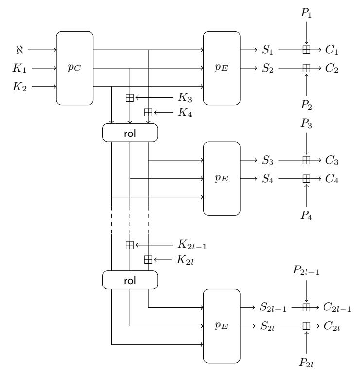
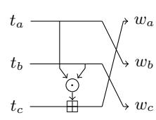
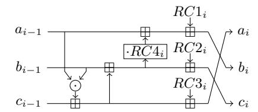
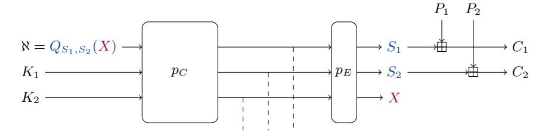
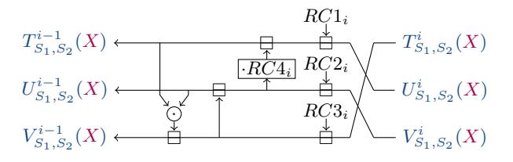
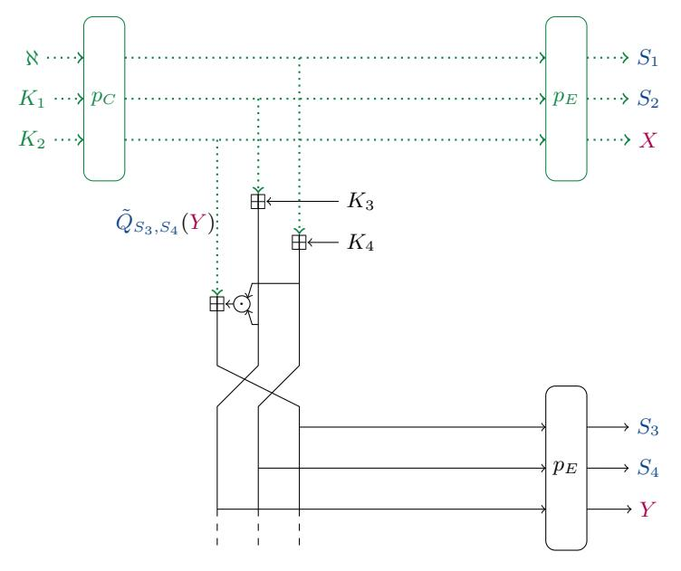
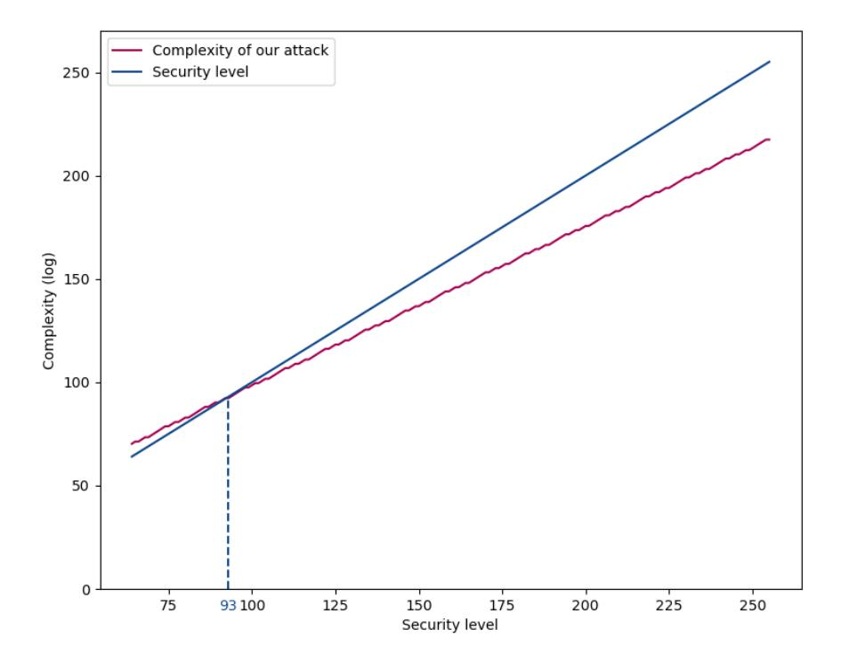

# A Univariate Attack against the Limited-Data Instance of Ciminion

Augustin Barian[t](https://orcid.org/0000-0003-0415-6785)

Inria, Paris, France ANSSI, Paris, France augustin.bariant@ssi.gouv.fr

Abstract. With the increasing interest for advanced protocols for Multi-Party Computation, Fully-Homomorphic Encryption or Zero-Knowledge proofs, a need for cryptographic algorithms with new constraints has emerged. These algorithms, called Arithmetization-Oriented ciphers, seek to minimize the number of field multiplications in large finite fields F2n or Fp. Among them, Ciminion is an encryption algorithm proposed by Dobraunig et al. at Eurocrypt 2021.

In this paper, we focus on the limited-data instance of Ciminion; the parameters of this instance were chosen to provide s-bit security against an attacker that has access to at most 2s/2 data. We present a new univariate modeling of Ciminion and show that the designers choice to reduce the number of rounds under this data constraint leads to fullround attacks for security levels s ≥ 93. We also propose some slight modifications of Ciminion that would overcome this vulnerability.

Keywords: Cryptanalysis · Algebraic attack · Univariate polynomial solving · Ciminion · Arithmetization-oriented

## 1 Introduction

Recent advanced protocols for applications such as Multi-Party Computation (MPC), Fully-Homomorphic Encryption (FHE) or Zero-Knowledge (ZK) proofs have become the object of attention in modern cryptography. Some ZK proof systems and MPC protocols operate on large finite fields Fq with q prime or power of 2 [\[10](#page-11-0)[,15,](#page-12-0)[16,](#page-12-1)[7\]](#page-11-1). In such protocols, the cost is tightly linked to the number of field multiplications required by the ZK proof or the MPC function to evaluate. Moreover, these protocols rely on different symmetric cryptography primitives: ZK proof protocols often involve cryptographic hash functions, and MPC protocols make use of symmetric-key encryptions to improve the data storage and transfer, as discussed in [\[22\]](#page-12-2). A first approach is to convert standard bit-oriented cryptography primitives to sequences of finite field operations over the native field Fq of the protocol under consideration, with a preferably low number of multiplications. In this context, multiple works were conducted to reduce the implementation cost of AES [\[14](#page-12-3)[,22\]](#page-12-2).

In 2015, LowMC was the first cryptographic design aiming at minimizing the number of boolean multiplications [\[3\]](#page-11-2). The next year, the family of block ciphers and hash functions MiMC [2] was introduced, operating directly on the native finite field  $\mathbb{F}_q$  (where  $q \geq 2^{64}$ ) of the protocol. This stategy allowed to significantly reduce the number of field multiplications; such primitives are now known as Arithmetization-Oriented (AO). This paved the way for a wide range of other AO families, such as Jarvis [5], Vision, Rescue [4], Poseidon [20], Ciminion [17], Anemoi [11], Griffin [19] or Hydra [21]. For most AO designs, the security relies on the large size q of the field, which is considered too big to be exhausted in practice. Their designers often claim a security level  $s \leq \log(q)$ , such that no attack with complexity less than  $2^s$  equivalent cipher encryptions exists.

AO primitives usually use finite field multiplications to provide non-linearity. Finite field multiplications are known to have strong differential and linear properties: for instance, for any  $2 \le \alpha \le q-1$ , the mapping  $x \to x^{\alpha}$  has a differential uniformity of at most  $\alpha-1$  on the large field. Consequently, statistical attacks often perform poorly against AO primitives, and the most threatening attacks become algebraic attacks, as highlighted by different works [1,6]. Algebraic attacks exploit the simple algebraic representation of AO primitives to derive algebraic relations in  $\mathbb{F}_q$  between the input, the output and sometimes the key. These relations form a polynomial system that the attacker can solve, for instance to find a preimage of a hash function or to recover the key of a cipher.

In this paper, we study an algebraic attack against the MPC-friendly AO stream cipher Ciminion [17], which was already subject to algebraic cryptanalysis in several works. Bariant et al. showed an algebraic representation of the cipher breaking security claims for very large security levels [6]. Zhang et al. provided a cryptanalysis of Ciminion against higher order differential and integral attacks [27]. In addition, they showed that under weak round constants, a subkey recovery attack can be mounted on Aiminion, an aggressive evolution of Ciminion.

**Contribution.** In this paper, we present a new univariate modeling of Ciminion, representing the nonce as a polynomial of the first unkown truncated output (in  $\mathbb{F}_q$ ). In the limited-data instance of Ciminion, an instance proposed by the designers where the security level is s up to  $2^{\frac{s}{2}}$  data queries, this polynomial is of degree roughly  $d \approx 2^{\frac{3s}{4}}$ . Unlike integral or higher-order attacks which usually require a large amount of data queries, we show that this new modeling leads to a low-data attack in complexity quasi-linear in d, using univariate solving. This attack breaks the security claims of the designers for  $s \geq 93$ . We then suggest a patch to apply to Ciminion in order to avoid the attack.

**Outline.** Section 2 presents the cipher Ciminion. Section 3 presents our univariate attack against Ciminion. We eventually present in Section 4 some modifications of Ciminion to avoid the attack.

### 2 Ciminion

Ciminion is an Arithmetization-Oriented stream cipher presented at Eurocrypt 2021 [17], operating on large fields  $\mathbb{F}_q$  with  $q \geq 2^{64}$ . Ciminion is based on a

**Fig. 1.** The Ciminion stream cipher over  $\mathbb{F}_p$  (replace + by  $\oplus$  over  $\mathbb{F}_{2^n}$ ).

modified version of the Farfalle construction [8]: it takes as input two master keys  $MK_1, MK_2 \in \mathbb{F}_q$ , a nonce  $\aleph \in \mathbb{F}_q$ , and outputs some keystream elements in  $S_1, S_2, \ldots$ , each in  $\mathbb{F}_q$  and of arbitrary length. These keystream elements are then added to plaintext elements to yield the ciphertext. As a precomputation, the master keys  $MK_1, MK_2$  are expanded into subkeys  $K_1, K_2, \ldots K_{2l}$ , which are stored and re-used directly with different nonces. Since this key expansion is performed only once, the designers used a strong and costly key expansion based on the Sponge construction [9]. The specification of Ciminion is highlighted in Figure 1.

The state of Ciminion is composed of three elements of  $\mathbb{F}_q$ . Two permutations are employed:  $p_C$  and  $p_E$ , both iterating the round function  $f_i$ . At round i,  $f_i$  uses the round constants  $RC1_i$ ,  $RC2_i$ ,  $RC3_i$ ,  $RC4_i$  in  $\mathbb{F}_q$ , where  $RC4_i$  is assumed to be different from 0 or 1.  $p_C = f_N \circ \cdots \circ f_1$  is composed of N rounds, and  $p_E = f_{R+N} \circ \cdots \circ f_{N+1}$  is composed of R rounds1. The round function and the rol function are based on Toffoli gates and are of degree 2. Because both these

For readability, the indexing of  $f_i$  and of the round constants slightly differs from the original specification of Ciminion.

Fig. 2. rolling function rol.

**Fig. 3.** Ciminion round function  $f_i$ .

| Instance                                 | N     | R |
|------------------------------------------|-------|---|
| Standard Limited-data Conservative | 1 3 1 |   |

**Table 1.** Number of rounds N of  $p_C$  and R of  $p_E$  for the instances proposed by the designers of Ciminion, for a security level of  $64 \le s \le \log(q)$ . The limited-data instance restricts the attacker to at most  $2^{s/2}$  data.

functions use Toffoli gates rather than low degree Sboxes, the inverse of these functions are also of degree 2. They are depicted in Figure 2 and Figure 3.

Ciminion truncates one output element of each permutation  $p_E$ , to prevent the recovery of intermediate states. Since the knowledge of a truncated element allows to recover the intermediate states and thus the round keys  $K_1$  and  $K_2$ , the security of Ciminion cannot exceed  $\log(q)$  by design. The designers claim a security level of  $64 \leq s \leq \log(q)$  for three instances presented in Table 1, where the numbers of rounds N and R depend on the security level s. In particular, the limited-data instance limits the attacker to at most  $2^{s/2}$  oracle queries and has fewer rounds than the standard and conservative instances.

As it is the case in other Arithmetization-Oriented ciphers, statistical attacks perform poorly because of the strong cryptographic properties (e.g. linear, differential ...) of the multiplication in large fields. The number of rounds of the Ciminion instances was therefore chosen to provide security against algebraic attacks, by ensuring that the best known algebraic attack exceeds  $2^s$  in time complexity.

On the security of the limited-data instance of Ciminion. In the security analysis of Ciminion in the limited-data instance [18, Appendix F], the designers derive the number of rounds from Gröbner basis and interpolation attacks. The Gröbner basis attack on Ciminion only requires a few keystream elements2, and involves only the 'right' part of the cipher, with the permutation  $p_E$ . For this reason, the designers apply the same analysis as in the standard instance, and choose the same number of rounds for  $p_E$  as in the standard instance. On the

In their analysis, the designers only use  $S_1, S_2, S_3, S_4$  to attack a modified Ciminion, while [6] use  $S_1, S_2, S_3, S_4$  under two different nonces to attack the real Ciminion.

other hand, in the interpolation attack, the attacker queries d keystream elements  $S_1^i$  under different nonces  $\aleph^i$ , for  $i \in \{1, \dots d\}$ . If  $S_1$  can be expressed with a keydependant polynomial of the nonce  $Q_K(\aleph)$  of degree at most d-1, the attacker can perform a Lagrange interpolation from d pairs  $(\aleph^i, Q_K(\aleph^i))$  to recover the coefficients of the polynomial  $Q_K$  and thus entirely know the mapping from the nonce to the first keystream element  $S_1$ . The drawback of this attack is the large number of data needed by the attacker to mount the attack. Because of this very reason, the designers of Ciminion suggested that if the attacker is limited to  $2^{s/2}$  data, the number of rounds can be reduced as long as the degree of the polynomial  $Q_K(\aleph)$  exceeds  $2^{s/2}$  [18, Appendix F], for a security level s. In the setting chosen by the designers, the polynomial  $Q_K(\aleph)$  (representing  $S_1$ ) is of degree  $2^{\lceil \frac{2(s+6)}{3} \rceil + \lceil \frac{s+37}{12} \rceil - 1} \approx 2^{\frac{3s}{4} + 7}$ ; it is less than  $2^s$  for large security levels s.

## 3 Our attack using univariate polynomial solving

Generally, a polynomial solving algebraic attack on an AO cipher can be decomposed into two main steps:

- **Modeling:** The attacker models the cipher with a system of polynomial equations in  $\mathbb{F}_q$ , such that a solution of the polynomial system contains secret data (e.g. the encryption key or an internal state).
- System solving: The attacker solves the polynomial system using state-ofthe-art techniques, such as root finding algorithms for univariate polynomials or Gröbner basis algorithms for multivariate systems.

Both steps should be carefully analyzed when mounting an algebraic attack. On the one hand, the modeling step is highly cipher dependant, and heavily impacts the complexity of the attack. Some ciphers might possess different modelings with different solving time complexities, such as Anemoi [11], or Griffin [19]. Efficient modelings are found through cryptanalysis. On the other hand, the system solving step often relies on existing generic algorithms and the complexity of such algorithms is hard to improve upon.

#### 3.1 Univariate polynomial solving attacks

In univariate polynomial systems, the system that we want to solve is a unique polynomial equation of degree d in  $\mathbb{F}_q$ :

$$P(X) = 0.$$

Advanced algorithms for polynomial operations. First, let us recall the complexity of the main operations on polynomials over an arbitrary field  $\mathbb{F}$ .

Let P, Q be two polynomials of degree d over a field  $\mathbb{F}$ . Naïvely, the elementwise multiplication  $P \times Q$  costs  $d^2$  multiplications over  $\mathbb{F}$ . However, faster polynomial multiplication algorithms exist, using Fast Fourier Transform (FFT) [25]. **Proposition 1** ([12]). Two polynomials of degree at most d over a field  $\mathbb{F}$  can be multiplied with  $\mathcal{O}(d \log(d))$  multiplications and  $\mathcal{O}(d \log(d) \log(\log(d)))$  additions in  $\mathbb{F}$ .

The fast polynomial multiplications can even be sped up to  $\mathcal{O}(d\log(d))$  operations if a primitive root of unity is known in  $\mathbb{F}$ , as discussed in [12]. Many other polynomial operations achieve quasi-linear complexities with the same techniques. They are all based on fast polynomial multiplication, which is why a factor  $\log(\log(d))$  appears in the complexity, in the case where no primitive root of unity is known in  $\mathbb{F}$ .

**Proposition 2** ([26]). The Euclidian division of two polynomials of degree at most d over a field  $\mathbb{F}$  can be performed in  $\mathcal{O}(d \log(d) \log(\log(d)))$  operations.

**Proposition 3 ([24, Corollary 2]).** The Greatest Common Divisor (GCD) of two polynomials of degree at most d over a field  $\mathbb{F}$  can be computed in  $\mathcal{O}(d\log(d)^2\log(\log(d)))$  operations.

In particular, all the algorithms mentioned above hold in finite fields  $\mathbb{F}_q$ . The following propositions only hold for finite fields  $\mathbb{F}_q$ .

**Proposition 4 ([13,23]).** A polynomial P of degree d over  $\mathbb{F}_q$  can be factored in  $\mathcal{O}(d^{1.815}\log(q))$  operations.

**Proposition 5.** Let P be a polynomial of degree d in  $\mathbb{F}_q$ . Let us suppose that P has a few roots in  $\mathbb{F}_q$ . The roots of P in  $\mathbb{F}_q$  can be recovered in

$$\mathcal{O}(d\log(d)(\log(d) + \log(q))\log(\log(d)))$$

operations.

*Proof.* The proof comes from the following well-known algorithm, described in [6].

- 1. Compute  $Q = X^q X \mod P$ . The computation is performed with a double-and-add algorithm to compute  $X^k \mod P$ . At each step, we multiply two polynomials of degree d with  $\mathcal{O}(d\log(d)\log(\log(d)))$  field operations (Proposition 1), and compute the remainder of a polynomial of degree 2d by P (of degree d) in  $\mathcal{O}(d\log(d)\log(\log(d)))$  field operations (Proposition 2). There are  $\log(q)$  steps, therefore this costs  $\mathcal{O}(d\log(q)\log(d)\log(\log(d)))$  field operations.
- 2. Compute  $R = \gcd(P, Q)$ . R has the same roots as P in the field  $\mathbb{F}_q$  since  $R = \gcd(P, X^q X)$ , but its degree is much lower (it is exactly the number of roots in  $\mathbb{F}_q$ ). This requires  $\mathcal{O}(d \log(d)^2 \log(\log(d)))$  field operations (Proposition 3).
- in  $\mathbb{F}_q$ ). This requires  $\mathcal{O}(d\log(d)^2\log(\log(d)))$  field operations (Proposition 3). 3. Factor R. This costs  $\deg(R)^{1.815}\log(q)$  operations (Proposition 4). Since the degree of R is exactly the number of roots of P in  $\mathbb{F}_q$ , as long as P has less than  $\left(\frac{d\log(d)^2}{\log(q)}\right)^{\frac{1}{1.815}}$  roots in  $\mathbb{F}_q$ , this step has a negligible complexity.

Proposition 5 gives a bound on the solving complexity of the univariate system composed of the equation P(X) = 0 in  $\mathbb{F}_q$ .

Fig. 4. Our modeling of Ciminion.

#### 3.2 Our attack

This attack breaks the security claims of the designers in the *limited-data* instance for large security levels, in which the attacker cannot query more than  $2^{s/2}$  data. It is an equivalent key-recovery attack in the sense that it allows to recover an arbitrary number of subkeys  $K_1, K_2...$  but does not allow to recover the master key  $MK_1, MK_2$ , since the subkey generation is performed with a non-invertible sponge construction. The recovery of the subkeys is enough for an attacker to compute keystream blocks under different nonces, and thus breaks the security of the cipher.

Attack principle. In the big picture, our univariate modeling is represented on Figure 4. This attack is a known-plaintext attack using two keystream blocks  $S_1$  and  $S_2$  under a nonce  $\aleph$ . The variable X represents the truncated output of the first branch  $p_E$ . Our attack is based on the observation that the nonce  $\aleph$  can be represented as a polynomial  $Q_{S_1,S_2}(X)$  of relatively small degree, whose coefficients only depend on the known keystream values  $S_1$  and  $S_2$ . Using the queried keystream values  $S_1$  and  $S_2$ , the attacker may compute and solve the polynomial equation  $Q_{S_1,S_2}(X)-\aleph=0$  in  $\mathbb{F}_q$  to recover a few possible candidates for X.

Generation of the polynomial  $Q_{S_1,S_2}(X)$ . The two first keystream blocks  $S_1$  and  $S_2$  are considered known to the attacker. First, let us note that  $p_E \circ p_C = f_{N+R} \circ \cdots \circ f_1$  is composed N+R round function iterations. We start from three polynomials representing the output of  $p_E \circ p_C$ :

$$T_{S_1,S_2}^{N+R}(\mathbf{X}) = S_1, \qquad U_{S_1,S_2}^{N+R}(\mathbf{X}) = S_2, \qquad V_{S_1,S_2}^{N+R}(\mathbf{X}) = \mathbf{X}.$$

Then, for  $i=N+R,\ldots 1$ , we compute the polynomials  $T^{i-1}_{S_1,S_2}(X),\, U^{i-1}_{S_1,S_2}(X)$ , and  $V^{i-1}_{S_1,S_2}(X)$  from  $T^i_{S_1,S_2}(X),\, U^i_{S_1,S_2}(X)$ , and  $V^i_{S_1,S_2}(X)$  using the algebraic representation of the round function  $f_i$ , as highlighted in Figure 5:

$$\begin{split} T_{S_1,S_2}^{i-1}(\textbf{\textit{X}}) &= U_{S_1,S_2}^{i}(\textbf{\textit{X}}) - RC1_i - RC4_i(V_{S_1,S_2}^{i}(\textbf{\textit{X}}) - RC2_i), \\ U_{S_1,S_2}^{i-1}(\textbf{\textit{X}}) &= V_{S_1,S_2}^{i}(\textbf{\textit{X}}) - RC2_i - T_{S_1,S_2}^{i}(\textbf{\textit{X}}) + RC3_i, \\ V_{S_1,S_2}^{i-1}(\textbf{\textit{X}}) &= T_{S_1,S_2}^{i}(\textbf{\textit{X}}) - RC3_i - T_{S_1,S_2}^{i-1}(\textbf{\textit{X}}) \times U_{S_1,S_2}^{i-1}(\textbf{\textit{X}}). \end{split}$$

**Fig. 5.** Modeling of the round function  $f_i$ .

By induction on  $i = N + R - 1, \dots 0$ , we can easily deduce the degrees of the polynomials:

$$\forall i \in \{0, \dots N+R-1\}, \qquad \begin{cases} \deg\left(T_{S_1, S_2}^i(X)\right) &= 2^{N+R-i-1}, \\ \deg\left(U_{S_1, S_2}^i(X)\right) &= 2^{N+R-i-1}, \\ \deg\left(V_{S_1, S_2}^i(X)\right) &= 2^{N+R-i}. \end{cases}$$

This implies that the polynomial  $Q_{S_1,S_2}(X) = T^0_{S_1,S_2}(X)$  is of degree  $2^{N+R-1}$ . At round i, the complexity of computing the polynomials is dominated by the multiplication  $T^{i-1}_{S_1,S_2}(X) \times U^{i-1}_{S_1,S_2}(X)$ , of two polynomials of degree  $2^{N+R-i}$ , which costs

$$\mathcal{O}(2^{N+R-i}(N+R-i)(\log(N+R-i)))$$

field operations (Proposition 1). In total, generating  $Q_{S_1,S_2}(X)$  costs:

$$\mathcal{O}\left(\sum_{i=1}^{N+R} 2^{N+R-i}(N+R-i)\log(N+R-i)\right) = \mathcal{O}(2^{N+R}(N+R)\log(N+R)).$$

This is negligible compared to the complexity of the rest of the attack.

Solving the univariate equation. The equation  $Q_{S_1,S_2}(X) - \aleph = 0$  is of degree  $2^{N+R-1}$  and we expect it to have a few roots in  $\mathbb{F}_q$ , therefore we can use Proposition 5 to bound the complexity of computing its roots in  $\mathbb{F}_q$  to:

$$\mathcal{O}\left(2^{N+R-1}(N+R-1)(N+R-1+\log(q))\log(N+R)\right)$$
.

**Recovery of the subkeys.** For each candidate for the truncated output X, the attacker can deduce candidates for  $K_1$  and  $K_2$  by inverting  $p_E \circ p_C$ :

$$(\aleph, K_1, K_2) = p_C^{-1} \circ p_E^{-1}(S_1, S_2, X).$$

The right candidate for  $(K_1, K_2)$  may be confirmed with an extra query under a different nonce. After the recovery of  $K_1$  and  $K_2$ , the attacker can query further keystream elements  $S_i$  for  $i \geq 3$ , under the same nonce  $\aleph$ . The inner state before the first branch  $p_E$  is known, as depicted in green and dotted in Figure 6. We denote Y the truncated output of the second branch  $p_E$ . We can compute the polynomial  $\tilde{Q}_{S_3,S_4}(Y)$  representing the first inner state element, which is known

**Fig. 6.** Recovery of keystream elements  $K_3$  and  $K_4$ . The green dotted wires denote the known internal state elements from the recovery of  $K_1$  and  $K_2$ .

from the recovery of  $K_1$  and  $K_2$ ; We denote its value  $\alpha$ . The truncated output of the second  $p_E$  is a root of  $\tilde{Q}_{S_3,S_4}(Y) - \alpha$ , which is a polynomial of degree  $2^R + 2^{R-1} \approx 2^{R+0.6}$ . The recovery of Y is of negligible complexity compared to the rest of the attack. This allows to recover the inner state before the second branch  $p_E$  and therefore to recover  $K_3$  and  $K_4$ .

Ultimately,  $(K_{2i+1}, K_{2i+2})$  for  $i \geq 2$  can be recovered in a similar manner if the keystream is long enough.

Complexity of our attack. For a security level of s, the designers chose the following parameters in the limited-data variant:

$$N = \lceil \frac{2(s+6)}{3} \rceil,$$
 
$$R = \lceil \frac{s+37}{12} \rceil,$$

which gives, asymptotically,  $N+R\approx \frac{3s}{4}+7$ . The complexity of our attack is dominated by the univariate polynomial solving. It has a time complexity of

$$T = 2^{N+R-1}(N+R-1)(N+R-1+\log(q))\log(N+R)$$

equivalent Ciminion encryptions3.

&lt;sup>3 It is a common assumption to consider that the constant behind the  $\mathcal{O}$  corresponds to a cipher encryption. In [6], the authors used the same algorithm to compute the roots of a polynomial of degree  $2^{28.5}$  in 23 hours on 1 core of an Intel XeonE7-4860, suggesting that the constant behind the  $\mathcal{O}$  is indeed relatively low.

**Fig. 7.** Complexity of our attack for different security levels s with  $s = \log(q)$ .

For large security levels s, our attack runs faster than  $2^s$  operations: the complexity is quasi-linear in  $2^{\frac{3s}{4}}$ , and we can verify that  $T \leq 2^s$  for  $s = \log(q) \geq 93$ . The complexity of our attack for different security levels is plotted on Figure 7. In particular,  $T = 2^{217.4}$  for  $s = \log(q) = 256$ , and  $T = 2^{120.3}$  for  $s = \log(q) = 128$ .

**Aiminion.** Aiminion is an aggressive evolution of Ciminion presented in appendix of the Ciminion paper [18]. Since it uses a key addition right before outputting the keystream, it is impossible to express the nonce only with the keystreams  $S_1$ ,  $S_2$  and the truncated element X. Instead, the unkown subkeys  $K_3$  and  $K_4$  would be involved in the formula. We did not manage to overcome this difficulty to mount an attack.

Comparison with other attacks. Our attack exploits the links between the nonce and the keystream elements, therefore it only holds if both  $p_C$  and  $p_E$  are weak permutations. The Gröbner basis attack of [6] instead derives relations between multiple keystream elements (under two different nonces) to recover the truncated outputs. Their attack only exploit the weakness of  $p_E$ . For that reason, their attack succeeds in the standard and limited-data instances which have the same number of rounds R for  $p_E$ , while ours only succeeds in the limited-data

| Attack type          | Generic N, R |          | Full-instance attacks |              | Reference |
|----------------------|--------------|----------|-----------------------|--------------|-----------|
|                      | Data         | Time     | Standard              | Limited-data |           |
| Gr¨obner basis (SKR) | 8            | O(24Rω)  | s ≥ 587               | s ≥ 587      | [6]       |
| Integral (dist.)     | O(2N+R)      | O(2N+R)  | -                     | -            | [27]      |
| Univariate (SKR)     | 2            | O˜(2N+R) | -                     | s ≥ 93       | Section 3 |

Table 2. Comparison of existing attacks against generic Ciminion parameters and full Ciminion instances with s-bit security. N and R are respectively the number of rounds of pC and pE. 2.41 ≤ ω ≤ 3 is the linear algebra exponent. SKR denotes subkey recovery.

instance, which has a lower number of round N for pC . The attack of [\[27\]](#page-13-0) use the low degree of the forward function pE ◦pC to derive an integral attack. However, the integral attack requires a large amount of data, which is the reason why they do not threaten the limited-data instance of Ciminion. These attacks are compared in [Table 2.](#page-10-2)

## 4 Suggested modifications of Ciminion

Protection against our attack. The univariate solving attack presented in [Section 3](#page-4-0) relies on the backward computation of pC from the single guess of the first truncated output value. To provide protection against this attack in the limited-data instance, a cheap modification is to perform a feedforward after pC , by XORing at least one key elements K0, K1 or both to one or several outputs of pC . A variant of this feedforward would be to add new key elements to the output of pC , although this costs extra key scheduling. This way, it is no longer possible to compute pC backward with the sole knowledge of the first truncated output value.

Another possible protection is to increase the number of rounds of pC , in which case we recommend to use the parameters of the standard Ciminion instance.

On the security of conservative and the standard instances. The security of the standard and conservative instances is not threatened by this attack, since the number of rounds is sufficient to guarantee that the degree of the involved univariate polynomial exceeds 2s .

Acknowledgement This work was supported by the French DGA. We would like to thank Ga¨etan Leurent for the insightful discussions regarding this result.

## References

1. Albrecht, M.R., Cid, C., Grassi, L., Khovratovich, D., L¨uftenegger, R., Rechberger, C., Schofnegger, M.: Algebraic cryptanalysis of STARK-friendly designs: Applica-

- tion to MARVELlous and MiMC. In: Galbraith, S.D., Moriai, S. (eds.) Advances in Cryptology – ASIACRYPT 2019, Part III. Lecture Notes in Computer Science, vol. 11923, pp. 371–397. Springer, Heidelberg, Germany, Kobe, Japan (Dec 8–12, 2019). [https://doi.org/10.1007/978-3-030-34618-8\\_13](https://doi.org/10.1007/978-3-030-34618-8_13)
- 2. Albrecht, M.R., Grassi, L., Rechberger, C., Roy, A., Tiessen, T.: MiMC: Efficient encryption and cryptographic hashing with minimal multiplicative complexity. In: Cheon, J.H., Takagi, T. (eds.) Advances in Cryptology – ASIACRYPT 2016, Part I. Lecture Notes in Computer Science, vol. 10031, pp. 191–219. Springer, Heidelberg, Germany, Hanoi, Vietnam (Dec 4–8, 2016). [https://doi.org/10.1007/](https://doi.org/10.1007/978-3-662-53887-6_7) [978-3-662-53887-6\\_7](https://doi.org/10.1007/978-3-662-53887-6_7)
- 3. Albrecht, M.R., Rechberger, C., Schneider, T., Tiessen, T., Zohner, M.: Ciphers for MPC and FHE. In: Oswald, E., Fischlin, M. (eds.) Advances in Cryptology – EUROCRYPT 2015, Part I. Lecture Notes in Computer Science, vol. 9056, pp. 430–454. Springer, Heidelberg, Germany, Sofia, Bulgaria (Apr 26–30, 2015). [https:](https://doi.org/10.1007/978-3-662-46800-5_17) [//doi.org/10.1007/978-3-662-46800-5\\_17](https://doi.org/10.1007/978-3-662-46800-5_17)
- 4. Aly, A., Ashur, T., Ben-Sasson, E., Dhooghe, S., Szepieniec, A.: Design of symmetric-key primitives for advanced cryptographic protocols. IACR Transactions on Symmetric Cryptology 2020(3), 1–45 (2020). [https://doi.org/10.](https://doi.org/10.13154/tosc.v2020.i3.1-45) [13154/tosc.v2020.i3.1-45](https://doi.org/10.13154/tosc.v2020.i3.1-45)
- 5. Ashur, T., Dhooghe, S.: MARVELlous: a STARK-friendly family of cryptographic primitives. Cryptology ePrint Archive, Report 2018/1098 (2018), [https://eprint.](https://eprint.iacr.org/2018/1098) [iacr.org/2018/1098](https://eprint.iacr.org/2018/1098)
- 6. Bariant, A., Bouvier, C., Leurent, G., Perrin, L.: Algebraic attacks against some arithmetization-oriented primitives. IACR Transactions on Symmetric Cryptology 2022(3), 73–101 (2022). <https://doi.org/10.46586/tosc.v2022.i3.73-101>
- 7. Ben-Sasson, E., Bentov, I., Horesh, Y., Riabzev, M.: Scalable, transparent, and post-quantum secure computational integrity. Cryptology ePrint Archive, Report 2018/046 (2018), <https://eprint.iacr.org/2018/046>
- 8. Bertoni, G., Daemen, J., Hoffert, S., Peeters, M., Assche, G.V., Keer, R.V.: Farfalle: parallel permutation-based cryptography. IACR Transactions on Symmetric Cryptology 2017(4), 1–38 (2017). <https://doi.org/10.13154/tosc.v2017.i4.1-38>
- 9. Bertoni, G., Daemen, J., Peeters, M., Van Assche, G.: Sponge functions. In: ECRYPT hash workshop. vol. 2007 (2007)
- 10. Bitansky, N., Canetti, R., Chiesa, A., Tromer, E.: From extractable collision resistance to succinct non-interactive arguments of knowledge, and back again. In: Goldwasser, S. (ed.) ITCS 2012: 3rd Innovations in Theoretical Computer Science. pp. 326–349. Association for Computing Machinery, Cambridge, MA, USA (Jan 8–10, 2012). <https://doi.org/10.1145/2090236.2090263>
- 11. Bouvier, C., Briaud, P., Chaidos, P., Perrin, L., Salen, R., Velichkov, V., Willems, D.: New design techniques for efficient arithmetization-oriented hash functions: ttAnemoi permutations and ttJive compression mode. In: Advances in Cryptology – CRYPTO 2023, Part III. pp. 507–539. Lecture Notes in Computer Science, Springer, Heidelberg, Germany, Santa Barbara, CA, USA (Aug 2023). [https://doi.org/10.1007/978-3-031-38548-3\\_17](https://doi.org/10.1007/978-3-031-38548-3_17)
- 12. Cantor, D.G., Kaltofen, E.L.: On fast multiplication of polynomials over arbitrary algebras. Acta Informatica 28(7), 693–701 (1991). [https://doi.org/10.](https://doi.org/10.1007/BF01178683) [1007/BF01178683](https://doi.org/10.1007/BF01178683), <https://doi.org/10.1007/BF01178683>
- 13. Cantor, D.G., Zassenhaus, H.: A new algorithm for factoring polynomials over finite fields. Mathematics of Computation 36(154), 587–592 (1981)

- 14. Damg˚ard, I., Lauritsen, R., Toft, T.: An empirical study and some improvements of the MiniMac protocol for secure computation. In: Abdalla, M., Prisco, R.D. (eds.) SCN 14: 9th International Conference on Security in Communication Networks. Lecture Notes in Computer Science, vol. 8642, pp. 398–415. Springer, Heidelberg, Germany, Amalfi, Italy (Sep 3–5, 2014). [https://doi.org/10.1007/](https://doi.org/10.1007/978-3-319-10879-7_23) [978-3-319-10879-7\\_23](https://doi.org/10.1007/978-3-319-10879-7_23)
- 15. Damg˚ard, I., Pastro, V., Smart, N.P., Zakarias, S.: Multiparty computation from somewhat homomorphic encryption. In: Safavi-Naini, R., Canetti, R. (eds.) Advances in Cryptology – CRYPTO 2012. Lecture Notes in Computer Science, vol. 7417, pp. 643–662. Springer, Heidelberg, Germany, Santa Barbara, CA, USA (Aug 19–23, 2012). [https://doi.org/10.1007/978-3-642-32009-5\\_38](https://doi.org/10.1007/978-3-642-32009-5_38)
- 16. Damg˚ard, I., Zakarias, S.: Constant-overhead secure computation of Boolean circuits using preprocessing. In: Sahai, A. (ed.) TCC 2013: 10th Theory of Cryptography Conference. Lecture Notes in Computer Science, vol. 7785, pp. 621–641. Springer, Heidelberg, Germany, Tokyo, Japan (Mar 3–6, 2013). [https://doi.org/](https://doi.org/10.1007/978-3-642-36594-2_35) [10.1007/978-3-642-36594-2\\_35](https://doi.org/10.1007/978-3-642-36594-2_35)
- 17. Dobraunig, C., Grassi, L., Guinet, A., Kuijsters, D.: Ciminion: Symmetric encryption based on Toffoli-gates over large finite fields. In: Canteaut, A., Standaert, F.X. (eds.) Advances in Cryptology – EUROCRYPT 2021, Part II. Lecture Notes in Computer Science, vol. 12697, pp. 3–34. Springer, Heidelberg, Germany, Zagreb, Croatia (Oct 17–21, 2021). [https://doi.org/10.1007/978-3-030-77886-6\\_1](https://doi.org/10.1007/978-3-030-77886-6_1)
- 18. Dobraunig, C., Grassi, L., Guinet, A., Kuijsters, D.: Ciminion: Symmetric encryption based on toffoli-gates over large finite fields. Cryptology ePrint Archive, Report 2021/267 (2021), <https://eprint.iacr.org/2021/267>
- 19. Grassi, L., Hao, Y., Rechberger, C., Schofnegger, M., Walch, R., Wang, Q.: Horst meets fluid-SPN: Griffin for zero-knowledge applications. In: Advances in Cryptology – CRYPTO 2023, Part III. pp. 573–606. Lecture Notes in Computer Science, Springer, Heidelberg, Germany, Santa Barbara, CA, USA (Aug 2023). [https://doi.org/10.1007/978-3-031-38548-3\\_19](https://doi.org/10.1007/978-3-031-38548-3_19)
- 20. Grassi, L., Khovratovich, D., Rechberger, C., Roy, A., Schofnegger, M.: Poseidon: A new hash function for zero-knowledge proof systems. In: Bailey, M., Greenstadt, R. (eds.) USENIX Security 2021: 30th USENIX Security Symposium. pp. 519–535. USENIX Association (Aug 11–13, 2021)
- 21. Grassi, L., Øygarden, M., Schofnegger, M., Walch, R.: From farfalle to megafono via ciminion: The PRF hydra for MPC applications. In: Hazay, C., Stam, M. (eds.) Advances in Cryptology – EUROCRYPT 2023, Part IV. Lecture Notes in Computer Science, vol. 14007, pp. 255–286. Springer, Heidelberg, Germany, Lyon, France (Apr 23–27, 2023). [https://doi.org/10.1007/978-3-031-30634-1\\_9](https://doi.org/10.1007/978-3-031-30634-1_9)
- 22. Grassi, L., Rechberger, C., Rotaru, D., Scholl, P., Smart, N.P.: MPC-friendly symmetric key primitives. In: Weippl, E.R., Katzenbeisser, S., Kruegel, C., Myers, A.C., Halevi, S. (eds.) ACM CCS 2016: 23rd Conference on Computer and Communications Security. pp. 430–443. ACM Press, Vienna, Austria (Oct 24–28, 2016). <https://doi.org/10.1145/2976749.2978332>
- 23. Kaltofen, E.L., Shoup, V.: Subquadratic-time factoring of polynomials over finite fields. Math. Comput. 67(223), 1179–1197 (1998). [https://doi.org/10.1090/](https://doi.org/10.1090/S0025-5718-98-00944-2) [S0025-5718-98-00944-2](https://doi.org/10.1090/S0025-5718-98-00944-2), <https://doi.org/10.1090/S0025-5718-98-00944-2>
- 24. Moenck, R.T.: Fast computation of gcds. In: Aho, A.V., Borodin, A., Constable, R.L., Floyd, R.W., Harrison, M.A., Karp, R.M., Strong, H.R. (eds.) Proceedings of the 5th Annual ACM Symposium on Theory of Computing, April 30 - May 2,

- 1973, Austin, Texas, USA. pp. 142–151. ACM (1973). [https://doi.org/10.1145/](https://doi.org/10.1145/800125.804045) [800125.804045](https://doi.org/10.1145/800125.804045), <https://doi.org/10.1145/800125.804045>
- 25. Nussbaumer, H.J., Nussbaumer, H.J.: The fast Fourier transform. Springer (1982)
- 26. Strassen, V.: Die berechnungskomplexit¨at der symbolischen differentiation von interpolationspolynomen. Theor. Comput. Sci. 1(1), 21–25 (1975). [https://doi.org/10.1016/0304-3975\(75\)90010-9](https://doi.org/10.1016/0304-3975(75)90010-9), [https://doi.org/10.1016/](https://doi.org/10.1016/0304-3975(75)90010-9) [0304-3975\(75\)90010-9](https://doi.org/10.1016/0304-3975(75)90010-9)
- 27. Zhang, L., Liu, M., Li, S., Lin, D.: Cryptanalysis of ciminion. In: Deng, Y., Yung, M. (eds.) Information Security and Cryptology. pp. 234–251. Springer Nature Switzerland, Cham (2023)