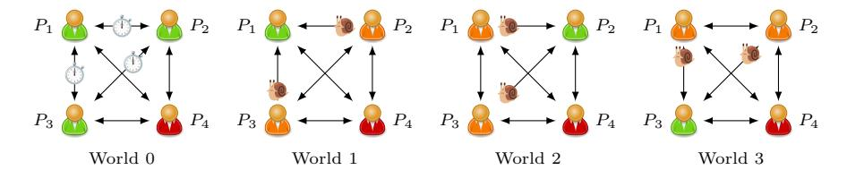
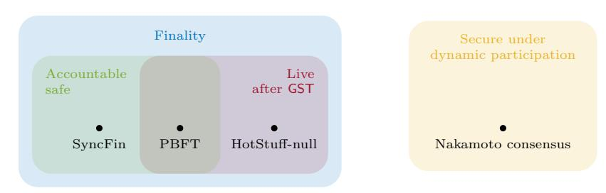

# Short Paper: Accountable Safety Implies Finality

Joachim Neu, Ertem Nusret Tas, and David Tse

Stanford University {jneu,nusret,dntse}@stanford.edu

Abstract. Motivated by proof-of-stake (PoS) blockchains such as Ethereum, two key desiderata have recently been studied for Byzantine-fault tolerant (BFT) state-machine replication (SMR) consensus protocols: Finality means that the protocol retains consistency, as long as less than a certain fraction of validators are malicious, even in partially-synchronous environments that allow for temporary violations of assumed network delay bounds. Accountable safety means that in any case of inconsistency, a certain fraction of validators can be identified to have provably violated the protocol. Earlier works have developed impossibility results and protocol constructions for these properties separately. We show that accountable safety implies finality, thereby unifying earlier results.

### 1 Introduction

Consensus. The purpose of a consensus protocol for state-machine replication (SMR) is for a set of parties to reach agreement on how to sequence incoming transactions into a linear order called a ledger. This task is non-trivial because communication between parties might be delayed, and some parties might deviate from the protocol in an arbitrary manner (Byzantine faults) with the goal to undermine consensus. A consensus protocol is secure if even in the presence of these disturbances, it guarantees two complementary properties: safety, meaning that the ledgers output by non-faulty parties across time are consistent, and liveness, meaning that transactions make it to the output ledger 'soon'. The protocol is then called Byzantine-fault tolerant (BFT), and the fraction of faulty parties it can tolerate while remaining secure is called its resilience.

Finality. This basic formulation has been extended in two directions. On the one hand, while some early consensus protocols [\[9\]](#page-8-0) assume that network communication always obeys a known delay upper-bound (i.e., synchronous network [\[17\]](#page-8-1)), later constructions [\[10,](#page-8-2)[5\]](#page-8-3) pushed to strengthen security to ensure consistency also under temporary network delay-bound violations (i.e., partially-synchronous network [\[10\]](#page-8-2)). Such periods of asynchrony might be caused, for instance, by temporary network partitions. The strengthened safety property that ensures consistency also under periods of asynchrony is called finality [\[3,](#page-8-4)[24\]](#page-9-0).

Accountable Safety. On the other hand, consensus protocols for proof-of-stake (PoS) blockchains such as Ethereum seek to strengthen safety to enable accountability [\[3](#page-8-4)[,4](#page-8-5)[,25](#page-9-1)[,24,](#page-9-0)[29,](#page-9-2)[21](#page-8-6)[,7,](#page-8-7)[2,](#page-8-8)[13,](#page-8-9)[14](#page-8-10)[,27\]](#page-9-3). In permissionless blockchains, parties

JN and ENT are listed alphabetically.

are no longer inanimate computers which might exhibit technical faults but are otherwise aligned under the control of one organizational entity. Instead, parties are controlled by different mutually distrusting self-interested players that might deviate from the protocol if they expect a profit from doing so. In this setting, it was proposed to strengthen safety to accountable safety, where besides ensuring consistency up to some adversarial resilience, if the adversary exceeds that resilience and causes a safety violation, then a certain fraction of parties can also be identified to have provably violated the protocol.

Prior Works. Various works have studied the fundamental limits of finality [\[11,](#page-8-11)[10,](#page-8-2)[12\]](#page-8-12) and of accountable safety [\[29\]](#page-9-2), as well as their relationships to other desiderata such as liveness under dynamic participation [\[16,](#page-8-13)[25\]](#page-9-1), and how protocols can be constructed that achieve various combinations of these properties [\[24,](#page-9-0)[25\]](#page-9-1). While finality and accountable safety 'feel similar', characterizing their exact relation has remained open. For instance, some protocols provide finality but do not provide accountable safety [\[29,](#page-9-2)[22\]](#page-8-14). On the other hand, we readily observe (details in Section [5\)](#page-6-0) that an additional round of voting to 'checkpoint' the output ledger of a consensus protocol[1](#page-1-0) designed for synchronous networks can also be used to upgrade that ledger to provide accountable safety, but does not yield a protocol for partially-synchronous networks. In particular, the so-extended protocol may not recover from liveness faults induced during a period of asynchrony (Section [5\)](#page-6-0).

Main Result. We show that accountable safety implies finality (Section [3\)](#page-3-0). To this end, on a high level, we show that for any given protocol, if there exists an adversary strategy that leads to a safety violation under partial synchrony, then there exists an adversary strategy that leads to a safety violation but not enough adversary parties can be identified as protocol violators, even if the network is delay-free, i.e., messages arrive instantly. Intuitively, the more constraints there are on network delays, the easier it is for a protocol to guarantee accountable safety. Our argument shows that even the weakest form of accountable safety, namely for delay-free networks, is still so strong that it implies finality.

Our result unifies prior works and directs future work (Section [4\)](#page-5-0): The availability–accountability dilemma [\[25\]](#page-9-1) turns out to be implied by the availability– finality dilemma [\[24\]](#page-9-0), a blockchain-variant of the CAP theorem [\[12,](#page-8-12)[16\]](#page-8-13). Impossibilities for accountability and liveness resiliences [\[29\]](#page-9-2) turn out to be implied by impossibilities for consensus under partial synchrony [\[10\]](#page-8-2). Upgrading a ledger to provide accountable safety [\[25,](#page-9-1)[21\]](#page-8-6) implies adding finality [\[3,](#page-8-4)[28,](#page-9-4)[31,](#page-9-5)[8,](#page-8-15)[30,](#page-9-6)[19\]](#page-8-16).

## 2 Model

Notation. For m ∈ N, let [m] ≜ {1, 2, ..., m}. An event happens with probability negligible in the security parameter λ if its probability is o(1/ poly(λ)).

Replicas and Clients. SMR consensus protocols have two types of participants: replicas and clients. Replicas are input transactions by the environment, interact

1 A 'lock and vote' add-on was contemporaneously used for the unrelated problems of resilience-optimal flexible consensus [\[20\]](#page-8-17) and of using Bitcoin as a staking asset [\[32\]](#page-9-7).

with each other towards agreeing on how these transactions should be ordered, and make some protocol messages (e.g., blocks, votes) available to clients upon request. Clients query replicas for these protocol messages, and, upon collecting messages from a sufficiently large subset of replicas, output a sequence of transactions called the *ledger* and denoted by LOG. The goal of the SMR protocol is to ensure that clients agree on a single ever-growing transaction sequence.

Environment and Adversary. Each of the n replicas has a (unique) cryptographic identity that is known to all parties. Up to f replicas can be corrupted at the beginning of the protocol execution by a computationally-bounded adversary A, which then obtains the internal state of these replicas, and can make them deviate from the protocol in arbitrary ways (Byzantine faults). The remaining (n-f) replicas are honest and follow the protocol as specified.

Time proceeds in slots. Replicas can exchange messages, subject to adversary delays. We consider a partially-synchronous network with adversary-environment tuple  $(A_{D}, \mathcal{Z}_{D})$ , where the adversary can delay messages arbitrarily until a global  $stabilization\ time\ \mathsf{GST}$  that can be chosen adaptively by the adversary. After GST,  $\mathcal{A}_{p}$  has to deliver messages within a delay upper-bound of  $\Delta$  which is known to the protocol. If GST is known and zero, then the network is said to be synchronous, and denoted by  $(A_s, \mathcal{Z}_s)$ . Furthermore, a network is called delayfree and denoted by  $(A_i, \mathcal{Z}_i)$  if all messages reach their recipients instantaneously, *i.e.*, the network is synchronous with  $\Delta = 0$ . The three network models are ordered in the sense that from partial synchrony to synchrony to delay-freeness, for fixed  $\Delta$ , the adversary's capabilities are strictly increasingly constrained. Safety and Liveness Resiliences. Let  $LOG_t^{cl}$  denote the ledger in the view of a

**Definition 1.** A consensus protocol is secure with confirmation time  $T_{conf}$  iff:

client cl at time slot t.

- Safety: For all t, t' and  $\operatorname{cl}, \operatorname{cl}'$ , either  $\operatorname{LOG}_t^{\operatorname{cl}}$  is a prefix of  $\operatorname{LOG}_{t'}^{\operatorname{cl}'}$ , or vice versa.

  Liveness: If some tx is input to an honest replica by some t, then, for all  $t' \geq \max(t, \operatorname{\mathsf{GST}}) + T_{\operatorname{conf}}$ , and all  $\operatorname{cl}, \operatorname{\mathsf{tx}} \in \operatorname{\mathsf{LOG}}_{t'}^{\operatorname{cl}}$ .

A protocol is said to provide f-safety (f-liveness) if the protocol satisfies safety (liveness), except with negligible probability, for any adversary controlling at most f replicas. Here, f is the protocol's safety (liveness) resilience.

**Definition 2.** A consensus protocol satisfies f-finality (i.e., is f-final) if it satisfies f-safety under a partially-synchronous network.

Note that f-finality does not imply f-liveness after GST. An f-final protocol may not be secure under partial synchrony due to liveness violations (cf. Section 5).

Accountable-Safety Resilience. Building on  $\alpha$ -accountable-safety [3,21], the accountablesafety resilience of a protocol is defined (see [25] for details on replica-client interaction and forensic algorithm, there called 'adjudication function'):

**Definition 3.** A consensus protocol provides accountable safety with resilience  $f_a$  (i.e., is  $f_a$ -accountable safe) iff whenever there is a safety violation, except with negligible probability, (i) at least  $f_a$  adversarial replicas are identified by a forensic algorithm as protocol violators, and (ii) no honest replica is identified.

**Fig. 1.** Execution of a consensus protocol with four replicas. World 0 is partially-synchronous, worlds 1, 2 and 3 are delay-free. Red replica  $P_4$  is adversary in all worlds. Orange replicas are adversary but do not violate the protocol rules other than delaying the sending/receiving of messages to/from the honest replica. Green replicas are honest.

Specifically, if clients  $\mathsf{cl}, \mathsf{cl}'$  at t, t' disagree on the output ledger, they exchange the protocol messages that led to their respective  $\mathsf{LOG}^{\mathsf{cl}}_t, \mathsf{LOG}^{\mathsf{cl}'}_t$ . Given a set of messages such that there are two subsets based on which a client would confirm two conflicting ledgers, each client can invoke the protocol's *forensic algorithm* to identify  $f_a$  replicas who have provably violated the protocol [29]. Note that the functioning of the forensic algorithm is not conditional on assumptions such as a fraction of replicas being honest, and it does not falsely accuse honest replicas.

#### 3 Accountability Implies Finality

By Definition 3, if a protocol provides (f+1)-accountable safety under partial synchrony (which is the strongest form of accountable safety, considering that among the models considered here, the adversary's capabilities are least constrained in the partially-synchronous model), then it also satisfies safety under partial synchrony with up to f adversary replicas, *i.e.*, it is f-final. (This is because if the number of adversary replicas is less than f+1, the forensic algorithm cannot identify at least f+1 adversary replicas, implying that the protocol must be safe.) Perhaps more surprisingly, Theorem 1 below proves that if a protocol provides (f+1)-accountable safety in a delay-free network (which is the weakest form of accountable safety, since the adversary's capabilities are most constrained in the delay-free network model), it must still be the case that the protocol is f-final. This immediately implies that for all network delay models, (f+1)-accountable safety of a protocol implies f-finality for that protocol.

**Theorem 1.** If a consensus protocol provides (f + 1)-accountable safety in a delay-free network, then it also satisfies f-finality.

Intuition. For intuition, consider the scenario with n=4, f=1. We argue the equivalent claim that without 1-finality, there is no 2-accountable safety. For contradiction, consider a consensus protocol executed by four replicas  $P_i$ ,  $i \in [4]$ , that is not 1-final, yet 2-accountable safe under a delay-free network.

Consider the following executions: In world 0 (Figure 1), the network is partially-synchronous, and  $P_4$  (red in Figure 1) is adversary. Besides protocol deviations of  $P_4$ , the adversary delays messages among honest replicas to cause

a safety violation (which is possible because the protocol is assumed not 1-final). In worlds 1, 2, and 3 (Figure [1\)](#page-3-2), the network is delay-free, and there are three adversary replicas. The replica P4 is adversary, and in all of these worlds behaves the same as in world 0. The remaining adversary replicas (orange in Figure [1\)](#page-3-2) behave like their honest counterparts in world 0, except they emulate the message delivery schedule an honest replica would have had in their place in world 0, by delaying the sending/receiving of messages to/from the honest replica. Clients observing the protocol cannot distinguish between any of the worlds 0, 1, 2, and 3. Therefore, there is a safety violation in worlds 1, 2, and 3 as well.

Finally, since the protocol is assumed to be 2-accountable safe in a delayfree network, the forensic algorithm called by the clients identifies 2 replicas as protocol violators in each of the worlds 1, 2 and 3. However, as these worlds are indistinguishable, there is a non-negligible probability that the forensic algorithm wrongly identifies an honest replica, which is a contradiction, as desired.

Proof (of Theorem [1\)](#page-3-1). We prove the contrapositive. For contradiction, suppose a protocol does not satisfy f-finality, yet provides (f + 1)-accountable safety under a delay-free network. We consider a world 0 with a partially-synchronous network, and n − f worlds indexed by i ∈ [n − f] with delay-free networks.

World 0: Consider clients cl, cl′ and n replicas. The network is partiallysynchronous and the adversary Ap controls f replicas, denoted by Pn−f+1, . . . , Pn. The remaining replicas are honest. Safety is violated and the clients cl and cl′ output conflicting ledgers with some non-negligible probability.

World i: Consider clients cl, cl′ and n replicas. The network is delay-free and the adversary A (i) s of world i corrupts all replicas except Pi . The f replicas that were adversary in world 0 behave the same as in world 0. The remaining adversary replicas behave like the corresponding honest replicas in world 0, except they also emulate the network delay of world 0: For each message sent by Pi , adversary replicas pretend as if the message was delivered at the time slot in which it was delivered in world 0, even though it was in fact delivered instantly in world i. Adversary replicas also send the same messages to Pi as in world 0, but they ensure that these messages are delivered to Pi at the same time slots within world i as they were delivered in world 0, by delaying the sending if necessary (after delayed sending, the delay-free network will deliver them instantly).

As Pi receives the same messages at the same time slots in world i and world 0, it cannot distinguish the worlds, and Pi shows the same behavior in both.

As the adversary replicas simulate their behavior from world 0 within world i, and Pi shows the same behavior in both worlds, cl and cl′ cannot distinguish the two worlds 0 and i. Thus, they output conflicting ledgers with non-negligible probability. In this case, by the assumed (f+1)-accountable safety of the protocol under delay-free networks, the forensic algorithm, invoked with the information received by these clients from the replicas, identifies at least f + 1 replicas as protocol violators in world i with non-negligible probability.

Finally, since the two worlds 0 and i are indistinguishable for cl and cl′ for all i, the worlds i ∈ [n − f] are indistinguishable as well for cl and cl′ . Thus, as long as n = O(poly(λ)), the forensic algorithm has a non-negligible probability to falsely accuse an honest replica, which is a contradiction. ⊓⊔

Theorem [1](#page-3-1) holds even if the forensic algorithm were to know whether the network is partially-synchronous or delay-free (while we block clients and replicas from learning this). In the proof above, indistinguishability between worlds 0 and i is used to infer that (i) safety is violated in world i as it is in world 0, and (ii) worlds i, j > 0 are indistinguishable, and thus an honest replica is likely falsely accused. The argument for (i) remains, but since the forensic algorithm can now distinguish worlds 0 and i, we must argue for (ii) directly. Indeed, as worlds i, j > 0 are all delay-free, and this is the only extra information given to forensic algorithm, worlds i, j still cannot be distinguished by the forensic algorithm.

#### 4 Simplification of Earlier Results

Impossibility of Finality =⇒ Impossibility of Accountability. Earlier work [\[29,](#page-9-2) Theorem B.1] shows that no protocol can be fa-accountable safe and fl-live for 2fl + fa > n under a synchronous or partially-synchronous network. This result follows directly from Theorem [1,](#page-3-1) combined with the safety–liveness bound under partial synchrony ([\[10,](#page-8-2) Theorem 4.4]) restated below:

Proposition 1 (From [\[10\]](#page-8-2), see also [\[23,](#page-9-8)[15](#page-8-18)[,18\]](#page-8-19)). No protocol can satisfy fsfinality, and fl-liveness under a delay-free network, for 2fl + fs ≥ n.

In other words, given fs, fl , 2fl+fs ≥ n, no protocol can simultaneously preserve its safety under asynchrony with fs adversary replicas, and remain live with fl adversary replicas, even if the network is delay-free. This is stronger than the claim that no protocol provides fs-safety and fl-liveness under partial synchrony, yet this stronger result directly follows from the proof of [\[10,](#page-8-2) Theorem 4.4]. Combining Proposition [1](#page-5-1) with Theorem [1,](#page-3-1) one readily obtains that no protocol can be fa-accountable safe and fl-live under a synchronous network for any ∆, including a delay-free network, if 2fl + fa > n:

Corollary 1. No protocol can be fa-accountable safe and fl-live, for 2fl+fa > n, under a synchronous or partially-synchronous network, for any ∆.

Availability–Finality Dilemma =⇒ Availability–Accountability Dilemma.

To state the availability–accountability dilemma, we recall the formal model for dynamic participation (i.e., temporary crash faults) [\[25](#page-9-1)[,26\]](#page-9-9). Before a global awake time GAT, the adversary A can determine for every honest replica and time slot, whether the replica is awake (i.e., online) or asleep (i.e., offline) in that slot. After GAT, all honest replicas are awake. Awake replicas follow the protocol. Asleep replicas have a temporary crash fault, and do not execute the protocol in the respective time slot. Adversary replicas are always awake. Messages sent to a replica while asleep are processed by the replica whenever it wakes up. The adversary-environment tuple (Apda, Zpda) models a partially-synchronous network with GST < ∞ and GAT ∈ [0, ∞) that can be adaptively chosen by Apda and which are not known by honest replicas or the protocol designer. Let β denote the largest fraction across all time slots, of adversary replicas among awake replicas. Below, βs-safety, βl-liveness, βf-finality, and βa-accountable safety are defined analogously to their definitions in Section [2.](#page-1-1) Using this model, we restate the blockchain CAP theorem ([\[16,](#page-8-13) Theorem 4.1]):

Proposition 2 (From [\[16\]](#page-8-13), see also [\[12\]](#page-8-12)). No protocol provides both βffinality and βl-liveness for any βf , βl ≥ 0 under (Apda, Zpda).

One readily obtains the availability–accountability dilemma of [\[25\]](#page-9-1) as a corollary of Theorem [1](#page-3-1) and Proposition [2.](#page-6-1)

Corollary 2. No protocol provides both βa-accountable safety and βl-liveness for any βa > 0, βl ≥ 0 under (Apda, Zpda).

## 5 Finality, Accountable Safety, and Security under Partial Synchrony

We clarify the relations among finality, accountable safety, and security under partial synchrony. Specifically, even though (f + 1)-accountable safety implies f-finality, it does not imply security under partial synchrony. To illustrate this, we consider n, f with n = 3f + 1, and construct a protocol called SyncFin that is (f + 1)-accountable safe (and f-safe under partial synchrony by Theorem [1\)](#page-3-1), yet cannot recover liveness after GST under partial synchrony, even though it is f-live under synchrony (the largest possible liveness resilience, cf. Corollary [1\)](#page-5-2).

The SyncFin protocol consists of (i) an underlay consensus protocol executed by the n replicas and secure under synchrony (e.g., Sync HotStuff [\[1\]](#page-8-20), Sync-Streamlet [\[6\]](#page-8-21)), and (ii) an add-on 'gadget' of 'finality signatures' on the ledgers output by the underlay protocol. The gadget works as follows: Once for the first time at some height h a block is confirmed by the underlay protocol in the view of a replica, the replica 'votes for' that respective chain in the gadget by broadcasting a finality signature on the block to all other replicas. A replica creates at most one finality signature per height, on the first block observed to be confirmed at that height by the underlay protocol. If it later observes a conflicting block become confirmed by the underlay protocol at the same height, it does not sign that block (or any descendent thereof). Clients confirm a block of this new protocol that is a composite of the underlay and finality-signature gadget, upon observing 2f + 1 finality signatures on a block and its prefix. A similar add-on was contemporaneously used for unrelated problems in [\[20,](#page-8-17)[32\]](#page-9-7).

Theorem 2. SyncFin is (f + 1)-accountable safe and f-live under synchrony.

Proof (Sketch). If clients output conflicting ledgers, they must have observed conflicting blocks at the same height, each with 2f + 1 finality signatures. Since signing different blocks at the same height is a protocol violation, the forensic algorithm then identifies f + 1 adversarial replicas by inspecting the doublesigners. Thus, SyncFin is (f + 1)-accountable safe. As the underlay protocol is

Fig. 2. Venn diagram of protocols satisfying finality, accountable safety, security under partial synchrony, and dynamic participation. The key Theorem [1](#page-3-1) of this work means that accountable safe protocols are contained in the set of final protocols.

f-safe and f-live under synchrony, SyncFin is live under synchrony if there are 2f + 1 or more honest replicas sending finality signatures. ⊓⊔

The SyncFin protocol is, however, not live under partial synchrony with any resilience. Before GST, the adversary can, with the help of a single adversary replica, cause two honest replicas to confirm conflicting, different blocks in the underlay, and send finality signatures on their respective blocks. After signing the blocks, the honest replicas refuse to sign any conflicting block, implying that even after GST, no block is guaranteed to receive finality signatures from 2f + 1 replicas. Hence, SyncFin is not live after GST.

We summarize the relation among protocols that satisfy finality, accountable safety, security under partial synchrony, and security under dynamic participation in Figure [2.](#page-7-0) The blue set contains protocols with n = 3f + 1 replicas that are f-final. The green set contains f + 1-accountable safe protocols, whereas the red one contains protocols that, in addition to being f-final, are also f-live after GST, i.e., they are f-secure under partial synchrony. Since (f + 1)-accountable safety implies f-finality (Theorem [1\)](#page-3-1), the green set is within the blue one. By Proposition [2,](#page-6-1) no protocol is βf-final and βl-live under a dynamically available network for any βf , βl ≥ 0, i.e., the blue and the yellow sets do not intersect (and as a consequence, the green and yellow sets do not intersect—the availability– accountability dilemma, Corollary [2\)](#page-6-2). Finally, Theorem [2](#page-6-3) shows that SyncFin is f-accountable safe and f-live under synchrony, but as we have seen above, it is not f-live after GST under partial synchrony, so it is not in the red set. PBFT [\[5\]](#page-8-3) is both f-accountable safe [\[29\]](#page-9-2) and f-safe and live under partial synchrony. An example of a protocol that is not accountable safe, yet secure under partial synchrony is HotStuff-null [\[29\]](#page-9-2).

#### Acknowledgment

We thank Orfeas Stefanos Thyfronitis Litos, David Mazi`eres, and Srivatsan Sridhar for fruitful discussions. JN, ENT and DT are supported by Ethereum Foundation and Input Output Global. JN is supported by the Protocol Labs PhD Fellowship. ENT is supported by the Stanford Center for Blockchain Research.

#### References

- 1. Abraham, I., Malkhi, D., Nayak, K., Ren, L., Yin, M.: Sync HotStuff: Simple and practical synchronous state machine replication. In: SP. pp. 106–118. IEEE (2020)
- 2. Buchman, E., Guerraoui, R., Komatovic, J., Milosevic, Z., Seredinschi, D., Widder, J.: Revisiting Tendermint: Design tradeoffs, accountability, and practical use. In: DSN (Supplements). pp. 11–14. IEEE (2022)
- 3. Buterin, V., Griffith, V.: Casper the friendly finality gadget. arXiv:1710.09437v4 [cs.CR] (2017), <http://arxiv.org/abs/1710.09437v4>
- 4. Buterin, V., Hernandez, D., Kamphefner, T., Pham, K., Qiao, Z., Ryan, D., Sin, J., Wang, Y., Zhang, Y.X.: Combining GHOST and Casper. arXiv:2003.03052v3 [cs.CR] (2020), <http://arxiv.org/abs/2003.03052v3>
- 5. Castro, M., Liskov, B.: Practical Byzantine fault tolerance. In: OSDI. pp. 173–186. USENIX Association (1999)
- 6. Chan, B.Y., Shi, E.: Streamlet: Textbook streamlined blockchains. In: AFT. pp. 1–11. ACM (2020)
- 7. Civit, P., Gilbert, S., Gramoli, V.: Polygraph: Accountable Byzantine agreement. In: ICDCS. pp. 403–413. IEEE (2021)
- 8. Dinsdale-Young, T., Magri, B., Matt, C., Nielsen, J.B., Tschudi, D.: Afgjort: A partially synchronous finality layer for blockchains. In: SCN. LNCS, vol. 12238, pp. 24–44. Springer (2020)
- 9. Dolev, D., Strong, H.R.: Authenticated algorithms for Byzantine agreement. SIAM J. Comput. 12(4), 656–666 (1983)
- 10. Dwork, C., Lynch, N.A., Stockmeyer, L.J.: Consensus in the presence of partial synchrony. J. ACM 35(2), 288–323 (1988)
- 11. Fischer, M.J., Lynch, N.A., Paterson, M.: Impossibility of distributed consensus with one faulty process. J. ACM 32(2), 374–382 (1985)
- 12. Gilbert, S., Lynch, N.A.: Brewer's conjecture and the feasibility of consistent, available, partition-tolerant web services. SIGACT News 33(2), 51–59 (2002)
- 13. Haeberlen, A., Kouznetsov, P., Druschel, P.: PeerReview: practical accountability for distributed systems. In: SOSP. pp. 175–188. ACM (2007)
- 14. Haeberlen, A., Kuznetsov, P.: The fault detection problem. In: OPODIS. LNCS, vol. 5923, pp. 99–114. Springer (2009)
- 15. Hirt, M., Kastrati, A., Liu-Zhang, C.: Multi-threshold asynchronous reliable broadcast and consensus. In: OPODIS. LIPIcs, vol. 184, pp. 6:1–6:16. Schloss Dagstuhl - Leibniz-Zentrum f¨ur Informatik (2020)
- 16. Lewis-Pye, A., Roughgarden, T.: Byzantine generals in the permissionless setting. In: FC (1). LNCS, vol. 13950, pp. 21–37. Springer (2023)
- 17. Lynch, N.A.: Distributed Algorithms. Morgan Kaufmann (1996)
- 18. Momose, A., Ren, L.: Multi-threshold Byzantine fault tolerance. In: CCS. pp. 1686– 1699. ACM (2021)
- 19. Nakamura, R.: Hierarchical finality gadget (2020), [https://ethresear.ch/t/](https://ethresear.ch/t/hierarchical-finality-gadget/6829) [hierarchical-finality-gadget/6829](https://ethresear.ch/t/hierarchical-finality-gadget/6829)
- 20. Neu, J., Sridhar, S., Yang, L., Tse, D.: Optimal flexible consensus and its application to Ethereum. In: SP. IEEE (2024), <https://eprint.iacr.org/2023/1211>
- 21. Neu, J., Tas, E.N., Tse, D.: Snap-and-chat protocols: System aspects. arXiv:2010.10447v1 [cs.CR] (2020), <http://arxiv.org/abs/2010.10447v1>
- 22. Neu, J., Tas, E.N., Tse, D.: The availability-accountability dilemma and its resolution via accountability gadgets. arXiv:2105.06075v3 [cs.CR] (2021), [http:](http://arxiv.org/abs/2105.06075v3) [//arxiv.org/abs/2105.06075v3](http://arxiv.org/abs/2105.06075v3)

- 23. Neu, J., Tas, E.N., Tse, D.: The availability-accountability dilemma and its resolution via accountability gadgets. arXiv:2105.06075v1 [cs.CR] (2021), [http:](http://arxiv.org/abs/2105.06075v1) [//arxiv.org/abs/2105.06075v1](http://arxiv.org/abs/2105.06075v1)
- 24. Neu, J., Tas, E.N., Tse, D.: Ebb-and-flow protocols: A resolution of the availabilityfinality dilemma. In: SP. pp. 446–465. IEEE (2021)
- 25. Neu, J., Tas, E.N., Tse, D.: The availability-accountability dilemma and its resolution via accountability gadgets. In: Financial Cryptography. LNCS, vol. 13411, pp. 541–559. Springer (2022)
- 26. Pass, R., Shi, E.: The sleepy model of consensus. In: ASIACRYPT (2). LNCS, vol. 10625, pp. 380–409. Springer (2017)
- 27. Ranchal-Pedrosa, A., Gramoli, V.: Blockchain is dead, long live blockchain! Accountable state machine replication for longlasting blockchain. arXiv:2007.10541v2 [cs.DC] (2020), <http://arxiv.org/abs/2007.10541v2>
- 28. Sankagiri, S., Wang, X., Kannan, S., Viswanath, P.: Blockchain CAP theorem allows user-dependent adaptivity and finality. In: Financial Cryptography (2). LNCS, vol. 12675, pp. 84–103. Springer (2021)
- 29. Sheng, P., Wang, G., Nayak, K., Kannan, S., Viswanath, P.: BFT protocol forensics. In: CCS. pp. 1722–1743. ACM (2021)
- 30. Skidanov, A.: Fast finality and resilience to long range attacks with proof of spacetime and Casper-like finality gadget (2019), [https://docs.near.org/vi/assets/](https://docs.near.org/vi/assets/files/PoST-dadcf9287d98201817066853315db91f.pdf) [files/PoST-dadcf9287d98201817066853315db91f.pdf](https://docs.near.org/vi/assets/files/PoST-dadcf9287d98201817066853315db91f.pdf)
- 31. Stewart, A., Kokoris-Kogia, E.: GRANDPA: a Byzantine finality gadget. arXiv:2007.01560v1 [cs.DC] (2020), <http://arxiv.org/abs/2007.01560v1>
- 32. The Babylon Team: Bitcoin staking: Unlocking 21M Bitcoins to secure the proofof-stake economy (2023), [https://docs.babylonchain.io/papers/btc\\_staking\\_](https://docs.babylonchain.io/papers/btc_staking_litepaper.pdf) [litepaper.pdf](https://docs.babylonchain.io/papers/btc_staking_litepaper.pdf)