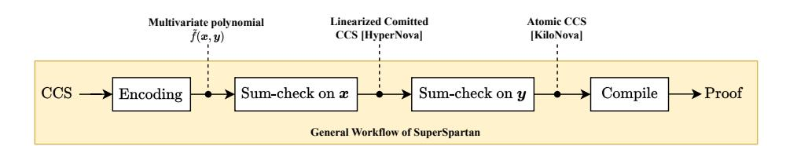
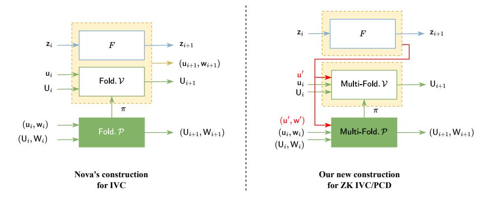
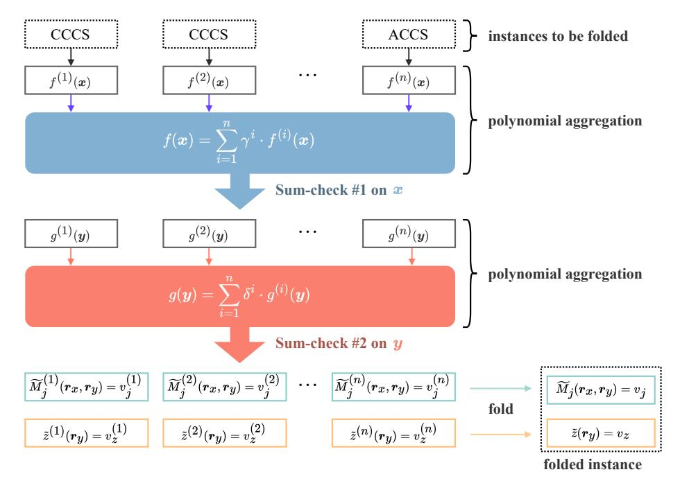
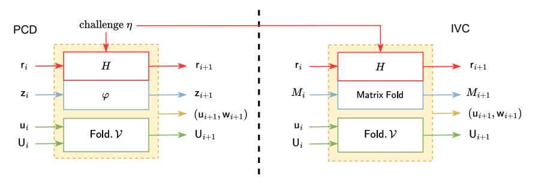

# KiloNova: Zero-Knowledge PCD from Non-Uniform Multi-Folding Schemes

Tianyu Zheng<sup>1</sup> , Shang Gao<sup>1</sup> , Yu Guo<sup>2</sup> , and Bin Xiao<sup>1</sup>

> <sup>1</sup> The Hong Kong Polytechnic University <sup>2</sup> SECBIT Labs

Abstract. Proof-Carrying Data (PCD) is a powerful cryptographic primitive generalizing Incrementally Verifiable Computation (IVC) to enable sequential computation by multiple distrusting parties. However, the more complex construction of PCD incurs efficiency problems. For instance, naively adopting existing folding schemes for IVC to PCD results in an "explosive cross terms" problem. Additionally, the development of virtual machines like EVM proposes new requirements of handling nonuniform circuits and providing zero knowledge. To address these challenges, we introduce KiloNova, a new construction of zero-knowledge PCD from non-uniform multi-folding schemes.

We first propose a generic folding scheme for multiple instances with non-uniform circuits. Inspired by HyperNova (Kothapalli et al. ePrint 2023), we employ sum-check protocols to linearize the CCS relation. This process yields a relaxed relation with linear claims on structures and instance-witness pairs, thereby avoiding cross terms in the folding operations. Based on the relaxed relation, we build a generic folding scheme with comparable performance to other advanced work. We also introduce an efficient approach to achieving zero knowledge for this folding scheme.

Next, we propose a novel construction for zero-knowledge PCD. Unlike previous works, our construction eliminates the need for a separate design of a zero-knowledge Non-Interactive Argument of Knowledge (NARK), allowing a zero-knowledge PCD to be constructed with only a zero-knowledge folding scheme. This theoretical improvement significantly reduces the work of building zero-knowledge PCD. Based on this, we construct KiloNova, the first zero-knowledge, non-uniform PCD based on folding schemes. Our PCD outperforms others according to the evaluation, with only a single multi-scalar multiplication dominating the prover cost at each step. Its recursive circuit is dominated by O(log(n)) random-oracle-like hashes and O(k) scalar multiplications, where n is the circuit input length and k is the instance number at each step. To address potential efficiency challenges in the real-world implementation of non-uniform PCD, we introduce a new technique for delegating the costly structure folds.

# 1 Introduction

Recently, there has been a surge of interest in the realization of Incrementally Verifiable Computation (IVC), a cryptographic primitive that runs sequential computations [34] while allowing efficient verification of the execution at any point. As a generalization of IVC to directed acyclic graphs, *Proof-Carrying Data* (PCD) allows multiple distrusting parties to perform computations sequentially. This property enables PCD in a wider range of applications such as distributed computation [3,18] and blockchain technology [1,6,7]. Meanwhile, the ability to handle multiple instances in each round provides a broader spectrum of trade-offs for system performance, as mentioned in [20].

Folding/Accumulation Schemes. The traditional approach to constructing IVC/PCD employs a general-purpose SNARK at each step i to attest the correctness of the proof output by step i-1 recursively. This construction requires implementing the whole verification logic in the SNARK proving circuit (specifically, the recursive circuit), which incurs a significant overhead as the verification may include costly non-native operations such as elliptic curve pairings [10]. A recent line of work proposes a more practical idea to "defer" the expensive operations in the proof verification and run them together at the end of IVC/PCD, including Halo [10], Halo infinite [5], BCMS20 [15], BCLMS21 [14], Nova [26], HyperNova [25], Protostar [13], etc. The fundamental concept behind these schemes is inspired by batch verification [2], which allows checking multiple proofs in a batch with almost the same cost as checking merely one proof. Concretely, instead of checking the SNARK/NARK proof from the prior step in the recursive circuit, the prover defers it by applying a so-called folding/accumulation scheme (we use them interchangeably in the following) and continues the incremental computations. As a result, the expensive SNARK/NARK verification in the recursive circuit is replaced with a cheaper verification of the folding scheme. Finally, the IVC verifier (or the decider), conducts a batch verification for all SNARK/NARK proofs deferred at each step.

Proof-Carrying Data. BCMS20 [15] introduces the first PCD construction based on accumulation schemes for SNARKs, such as Sonic [28] and Plonk [22]. This scheme utilizes the "additive" property of polynomial commitments as defined in [5], which allows accumulations on the evaluation proofs of existing polynomial IOPs. To further reduce the recursion overhead, BCLMS21 [14] introduces split accumulation schemes to accumulate only the statement part of evaluation proofs. However, they can only construct PCD for R1CS relations that can not express high-degree constraints. Although several folding/accumulation schemes [13, 25, 26] have been demonstrated as effective primitives for building IVC systems in recent years, directly applying them to PCD may cause severe efficiency problems. This is due to the different structures between IVC and PCD. Compared to IVC, which only folds two instances at each sequential step, PCD requires folding multiple instances. This main difference raises a problem of an exploding number of "cross terms" (also known as error terms in [13]).

Concretely, the cross terms are redundant elements generated when folding non-linear relations. For example, when folding two quadratic instances  $(w_i, t_i)$  such that  $w_i^2 = t_i$  for i = 1, 2, the folded instance  $(w, t) = (w_1 + rw_2, t_1 + rt_2)$  with a random challenge r does not satisfy  $w^2 = t$ . The prover has to compute and

send an extra cross term as 2w1w<sup>2</sup> for verification. As stated in [20], the number of cross terms grows in O(d s ) when folding s instances in d-degree relations with the techniques given by Protostar [13]. Most of other schemes improved on Nova [26] also encounter this problem more or less. Even worse, the "cross terms" problem also hinders us from proposing PCD constructions to satisfy the implementation of virtual machines with rich instruction sets (e.g., EVM, RISC-V, Wasm). This application requires the ability to handle non-uniform circuits. Providing zero knowledge may be required as well in privacy-preserving scenarios. Unfortunately, achieving both these properties may exacerbate the efficiency problem. We highlight their technical difficulties in detail as follows.

Challenge 1: Non-Uniform Circuits. To attest universal machine executions, SuperNova [24] realizes a non-uniform IVC by enhancing Nova [26] with a selector for the list of predefined functions (i.e., instructions). The downside is that the IVC proof at each step increases with the size of the instruction set. Protostar [13] introduces a more expressive folding/accumulation scheme for special sound protocols supporting Plonkish relations, which yields a nonuniform IVC. Its major drawback lies in the exponential growth of the number of cross terms when folding multiple high-degree instances, which hinders the construction of PCD. Protogalaxy [20] aims to reduce the number of cross terms in Protostar by leveraging the property of the Lagrange base, thus making the recursion overhead tolerable for multi-instance situations. Though Protogalaxy successfully reduced the exponential growth to linear in asymptotic, it causes a quasi-linear prover complexity due to the computation of Lagrange bases.

Challenge 2: Zero Knowledge PCD. In addition to the difficulties in supporting non-uniform circuits, adding zero knowledge to folding-based IVC/PCD is also challenging. Since most existing schemes focus on scenarios involving one prover, they only need to provide zero knowledge for the final verifier by applying a general-purpose zkSNARK at the end of IVC. While for IVC/PCD run by multiple distrusting parties, zero knowledge between each two parties is not guaranteed. Such defect prevents a wider range of applications in privacy-preserving scenarios, such as anonymous De-Fi, confidential transactions, and trustless crosschain bridges [12, 36, 38]. Based on the theorems given by B¨unz et al. [14], it is efficient to compile any Non-Interactive Argument of Knowledge (NARK) with a folding/accumulation scheme into PCD. Two more conditions are required for further constructing zero-knowledge PCD: (1) the folding/accumulation scheme is zero-knowledge, and (2) the NARK itself is zero-knowledge. The predicament here is that transforming NARK instances into zero-knowledge forms with masking values requires an extra inefficient process with expensive prover cost and cross terms. Section 4.3 elaborates on this predicament with concrete examples.

Our Motivation. Upon the research status described above, we develop our motivation in two steps. First, can we build a non-uniform multi-folding scheme without cross terms? If so, can we efficiently construct zero-knowledge PCD from the folding scheme?

# 1.1 Our Contributions

We answer all questions above positively and present KiloNova, a non-uniform zero-knowledge PCD from generic folding schemes. To achieve this, we make theory and systems contributions as follows. (1) We introduce a relaxed CCS relation with only linear claims on instance-witness pairs and structures. (2) We build a non-uniform multi-folding scheme without cross terms from the relaxed CCS relation. (3) We propose a new construction for zero-knowledge PCD and construct KiloNova based on the non-interactive folding scheme. We also mention some optimization techniques for enhancing the performance of the folding scheme and PCD. Each of these contributions is elaborated below.

- (1) Relaxed CCS Relations. Motivated by Nova [26], and HyperNova [25], we introduce a new relaxed CCS relation called Atomic CCS (ACCS) to enable our folding scheme to efficiently deal with non-uniform circuits. Similar to the linearized committed CCS relation in HyperNova, this new ACCS relation is also reduced from the original CCS relation [31] by partially running an "early stopping" version of SuperSpartan [25]. The difference is that our protocol runs an extra round of sum-check protocol than HyperNova, which stops right before compiling the polynomial Oracle queries for the second sum-check protocol, as illustrated in Figure 1. Thus, the obtained ACCS instances as input of the folding schemes contain independent linear claims on instance-witness pairs and structures, enabling an efficient protocol of folding multiple non-uniform instances without cross terms.
- (2) Generic Folding Schemes. Based on the atomic CCS relations, we design a multi-folding scheme for multiple non-uniform CCS instances, which is denoted as the generic folding scheme. Generally speaking, the generic folding scheme runs the SuperSpartan protocol for each CCS instance in parallel and aggregates their sum-check protocols into one, except for the final Oracle queries. The remaining expensive query operations are folded and formalized as one atomic CCS instance, and its verification is "deferred" to the final verifier. Therefore, the recursive circuit at each step only contains the cheap verification of folding, while does not include the expensive verification of the final atomic CCS instance. The following theorem captures its cryptographic and efficiency characteristics. Since the folding scheme is public coin, it can be transformed



Fig. 1: Illustrations for Atomic CCS relations. Assume the input CCS relation is encoded as a multi-variate polynomial on variables of vectors x, y. The ACCS relation is derived from the claims output by the second sum-check protocol on y.

into a non-interactive version in the random oracle model according to the Fiat-Shamir heuristic [21].

Theorem 1. There exists a constant-round, public-coin folding scheme for multiple N-sized CCS instances with non-uniform circuit "structures" (i.e., CCS coefficient matrices), the prover's work is Oλ(s · N), and the verifier's work and the communication are both Oλ(log N), assuming the existence of any additivelyhomomorphic commitment scheme that provides Oλ(1)-sized commitments to N-sized vectors over F (e.g., Pedersen's commitments), where λ is the security parameter and s is the number of instances.

For the purpose of building zero-knowledge PCD, we further derive a zeroknowledge version of the generic folding scheme with several existing techniques. First, we adopt an existing approach to ensure zero knowledge for sum-check protocols [17]. Second, for the intermediate non-linear claims in the folding schemes, we utilize the random padding technique in [9] to avoid extra computation and cross terms. Finally, we need an extra random instance for masking the output atomic CCS instance.

(3) New Constructions of Zero-Knowledge PCD. Based on the generic folding schemes, it is feasible to obtain a non-uniform PCD according to the previous constructions [15, 26], which enables runtime circuit selection with the proving cost and recursive overhead independent of the sizes of "uninvoked" circuits. However, the previous theorem in [15] additionally requires a zeroknowledge NARK for the construction of zero-knowledge PCD. As discussed above, it is inefficient to transform the CCS relation into zero-knowledge versions. To solve this problem, we modify the construction of PCD by splitting the task for each recursive step into two independent circuits as shown in Figure 2<sup>3</sup> . This modification allows the prover to first transform the CCS instances into zero-knowledge atomic CCS instances by reusing our generic folding scheme rather than introducing an extra costly protocol. This new approach removes the requirement of a zero-knowledge NARK in the construction of zero-knowledge PCD. It can also be applied to existing IVC systems to achieve zero-knowledge. We summarize the new construction model as a theorem below.

Theorem 2. (informal). There is an efficient construction that compiles any NARK with a zero-knowledge folding/accumulation scheme into zero-knowledge PCD. Additionally, if the folding/accumulation scheme is post-quantum secure, then PCD is also post-quantum secure.<sup>4</sup>

This new construction yields a zero-knowledge and non-uniform PCD as Kilo-Nova. Furthermore, we propose an optimization technique to solve a potential efficiency problem existing in the non-uniform PCD: the increasing cost of dealing with the non-uniform structures. Our technique delegates the computation

<sup>3</sup> In Nova's paper, the folding scheme prover does not output a proof π explicitly, while the cross term T can be equivalently regarded as a proof.

<sup>4</sup> Note that our new theorem does not conflict with [15] because we actually utilize the zero-knowledge folding scheme to build a zero-knowledge NARK.



Fig. 2: Comparison between previous construction (left) and our construction (right). The recursive circuit is split into two parts for incremental computation F and folding scheme verification Multi-Fold. V in the right-side construction. The first part of F is written into a new instance-witness pair as (u ′ , w ′ ), which is folded into zero-knowledge pair (Ui+1, Wi+1) by the Multi-Fold. P. Plus, the zero-knowledge folding scheme also ensures the pair (ui+1, wi+1) is zero-knowledge.

of structure folds (folding atomic CCS matrices) to a more powerful third party that runs an extra IVC in parallel, thereby reducing the proving and communication costs for nodes in the PCD.

# 1.2 Performance Evaluation

In this part, we present a comprehensive evaluation of our generic folding scheme and zero-knowledge PCD and compare them to related work.

Comparison with Existing Folding Schemes. We first compare features of our proposed generic folding scheme with other existing schemes in Table 1. Our scheme proves in the same CCS language as HyperNova [25], which is expressive to generalize Plonkish, R1CS, and AIR with high-degree constraints. Other expressive schemes, such as Protostar [13] and Protogalaxy [20], apply special sound protocols (SPS) to support high-degree constraints. In addition, our scheme efficiently supports both non-uniform circuits and multi-folding, which is only provided by Protogalaxy [20] currently. Although a recent work called UniPlonk [19] uniformizes the verifier's work in Plonk to allow Halo2 [11] and Nova [26] supporting non-uniform circuits, it is unknown whether it can be applied to systems based on multi-folding schemes. The last column indicates whether zero knowledge for IVC/PCD is achieved. Schemes that consider only one prover and apply zkSNARKs for proving the final IVC/PCD proofs, e.g., Nova [26], are not counted as zero-knowledge IVC/PCD. Therefore, BCLMS21 is the only scheme that provides zero knowledge among the schemes we compared. However, it does not support high-degree constraints and multi-folding.

Table 1: Features comparison between existing folding/accumulation schemes

| Schemes          | Language           | Non-uniform    | Multi-Folding  | ZK  |
|------------------|--------------------|----------------|----------------|-----|
| Nova [26]        | R1CS               | No/Yes in [19] | No             | No  |
| SuperNova [24]   | R1CS               | Yes            | No             | No  |
| HyperNova [25]   | CCS                | No             | No/Yes in [39] | No  |
| BCLMS21 [14]     | R1CS               | No             | No             | Yes |
| Protostar [13]   | Degree-d Plonk/CCS | Yes            | No/Expensive   | No  |
| Protogalaxy [20] | Degree-d Plonk/CCS | Yes            | Yes            | No  |
| KiloNova         | CCS                | Yes            | Yes            | Yes |

For the theoretical performance of our generic folding scheme, we only compare it with state-of-the-art schemes, including HyperNova [25] and Protostar [13] as shown in Table 2. Note that the performance of our solution is close to HyperNova. For degree d CCS instances with m × n circuit matrices, the prover needs to compute a multi-scalar multiplication with |w| G operations, where |w| denotes the number of non-zero elements in the witness. For the verifier cost, our scheme performs log m + log n times more random-oracle-like hashes than HyperNova due to the additional log n rounds in the second sum-check protocol. The performance of ProtoStar equals our computation, while its recursive overhead is minimal with only O(1) hashes. Moreover, KiloNova has more appealing features than the other two schemes, as we mentioned in Table 1. If we consider constructing non-uniform PCD that folds multiple instances with non-uniform structures, it is impractical to apply HyperNova and Protostar because their performance downgrades significantly.

Comparison with Existing PCDs. The above analysis demonstrates that our generic folding schemes outperform other schemes with more appealing features while retaining comparable complexity. Next, we compare the performance of the KiloNova built from this folding scheme with other PCDs.

Comparison with BCLMS21. B¨unz et al. introduce PCD in BCLMS21 [14] from the split accumulation scheme that accumulates the proof of a NARK for uniform R1CS relations. The verification cost of the obtained PCD is relatively high, requiring 10 multi-scalar multiplication (MSM) of size m, while KiloNova only requires 1 MSM. In terms of prover cost and recursive overhead, BCLM21 needs to handle O(r) group operations with a larger coefficient than our scheme. However, it avoids logarithmic random oracle queries. Notably, BCLM21 does not support d-degree circuits and lookup operations.

Comparison with Protogalaxy. Recently, another effective accumulation scheme named Protogalaxy [20] has been proposed. As the following-up work of Protostar [13], Protogalaxy reduces the cross terms from O(d s ) to O(ds) when folding s non-uniform instances and requires only O(1) random oracle queries. While Protogalaxy appears being a promising primitive for constructing non-uniform PCD, it faces challenges in explicit constructions. First, it needs to handle cross

| Table 2: Performance | comparison | hotwoon | different | folding  | /accumulation schome | 10 |
|----------------------|------------|---------|-----------|----------|----------------------|----|
| rable 2: Performance | comparison | between | amerent   | loiding/ | accumulation scheme  | S  |

| Criteria | KiloNova                                                                                         | HyperNova [25]                                                        | Protostar [13]                                                        |
|----------|--------------------------------------------------------------------------------------------------|-----------------------------------------------------------------------|-----------------------------------------------------------------------|
| Prover   | $ \mathbf{w}  \; \mathbb{G} \ O( \mathbf{w} d\log^2 d) \; \mathbb{F}$                            | $ \mathbf{w}  \; \mathbb{G} \ O( \mathbf{w} d\log^2 d) \; \mathbb{F}$ | $ \mathbf{w}  \; \mathbb{G} \ O( \mathbf{w} d\log^2 d) \; \mathbb{F}$ |
| Verifier | $ \begin{array}{c} 1  \mathbb{G} \\ \log m + \log n  RO \\ O(d \log m)  \mathbb{F} \end{array} $ | $1 \ \mathbb{G}$ $\log m \ RO$ $O(d \log m) \ \mathbb{F}$             | $3 \ \mathbb{G}$ $O(1) \ RO$ $(d+O(1)) \ \mathbb{F}$                  |

items with Lagrange bases, yielding a quasi-linear prover cost with instance number s and degree d while ours is  $linear^5$ . Besides, the prover cost is still constantly higher than our work because of computing extra s evaluations on  $\tilde{eq}(\cdot)$ . Second, Protogalaxy does not support circuit aggregation as we proposed in Section 5.2 since the instances being folded are still non-linear. Lastly, the authors of Protogalaxy neither provide constructions for non-uniform PCD nor add zero knowledge, whereas KiloNova presents explicit descriptions and solves the potential technical problems.

Concurrent work. In a paper concurrent with this work, Zhou et al. also construct a PCD with a multi-folding scheme extended on HyperNova. However, their work seems to be a complementary work for HyperNova<sup>6</sup> and thus lack theoretical contributions. Compared to KiloNova, their PCD supports neither non-uniform circuits nor zero knowledge.

## 2 Preliminaries

# 2.1 Notations

In this paper, we use  $\lambda$  to denote the security parameter. Accordingly,  $\operatorname{negl}(\lambda)$  denotes an unspecified function that is negligible in  $\lambda$ . We denote by [n] the set  $\{1,...,n\}\subseteq\mathbb{N}$ . Let  $\mathbb{F}$  denote a finite field, e.g.,  $\mathbb{F}_p$  is a prime field for a large prime p. The bold-type lower-case letters denote vectors, e.g.,  $\mathbf{a}\in\mathbb{F}^n$  is a vector of elements  $a_1,...,a_n\in\mathbb{F}$ .  $\mathbf{a}[i]$  is also used to denote the i-th element of  $\mathbf{a}$  when the element is not specified with a concrete value. To represent a set, we use  $\{a_i\}_{i=1}^n$  as a short-hand for  $\{a_1,...,a_n\}$ . For a finite set S, let  $x\leftarrow S$  denote sampling x from S uniformly at random. We use "PPT algorithms" to refer to "Probabilistic Polynomial Time Algorithms".

# 2.2 Definitions for Polynomials

We recall some basic definitions for polynomials from [30] as follows. Let  $f(\cdot)$ :  $\mathbb{F}^n \to \mathbb{F}$  be a multivariate polynomial with n input elements over  $\mathbb{F}$ , its total de-

<sup>&</sup>lt;sup>5</sup> To amend this problem, Protogalaxy proposes an alternative construction based on sum-check by replacing Lagrange bases with  $\widetilde{eq}(\cdot)$ . However, the sum-check protocol increases the number of RO queries to  $O(\log N)$ .

<sup>&</sup>lt;sup>6</sup> In fact, HyperNova is already claimed to realize multi-folding schemes in the original paper.

gree d is defined as the maximum degree over all monomials in  $f(\cdot)$ . Moreover, the degree of a polynomial in a specified variable  $x_i$  is the maximum exponent that  $x_i$  takes in any of the monomials in  $f(\cdot)$ . Particularly, a multivariate polynomial is a multilinear polynomial if the degree of the polynomial in each variable is at most one. To keep consistent with our notation of vectors, we use f(x) to denote the polynomial  $f(\cdot)$  with the specified input variable as vector x. Next, we state the lemmas used in our paper.

**Lemma 1 (Multilinear extensions [33]).** Let  $f(\cdot): \{0,1\}^n \to \mathbb{F}$  be a function that maps n-bit elements into an element of  $\mathbb{F}$ . The multilinear extension of  $f(\cdot)$  is a unique multilinear n-variate polynomial  $\tilde{f}(\cdot): \mathbb{F}^n \to \mathbb{F}$  such that  $\tilde{f}(\boldsymbol{x}) = f(\boldsymbol{x})$  for all  $\boldsymbol{x} \in \{0,1\}^n$ , which can be computed as follows.

$$\widetilde{f}(\boldsymbol{x}) = \sum_{\boldsymbol{e} \in \{0,1\}^n} f(\boldsymbol{e}) \cdot \widetilde{eq}(\boldsymbol{x}, \boldsymbol{e}),$$

where  $\widetilde{eq}(\boldsymbol{x}, \boldsymbol{e}) = \prod_{i=1}^{n} (x_i \cdot e_i + (1 - x_i) \cdot (1 - e_i)).$ 

**Lemma 2 (Schwartz-Zippel lemma [29]).** Assume  $f(\cdot): \mathbb{F}^n \to \mathbb{F}$  is a non-zero n-variate polynomial of degree at most d. Then on any finite set  $S \subseteq \mathbb{F}$ ,

$$\Pr_{\boldsymbol{x} \leftarrow \$S^n} [f(\boldsymbol{x} = 0) \le d/|S|],$$

where x is a randomly sampled vector from  $S^n$  and |S| denotes the size of S.

# 2.3 Sum-check Protocol

The sum-check protocol is an interactive proof proposed by Lund et al. [27]. It has long attracted the attention of practitioners for its desirable performance, especially in a recent study on proof systems with linear proving time [30, 37]. Here, we only briefly review it. More technical details can be referred to [30].

Assume  $f(\cdot): \mathbb{F}^n \to \mathbb{F}$  as an *n*-variate low-degree polynomial with the maximum degree of d for each variable. The prover wants to convince the verifier of the following claim:

$$\operatorname{sum} = \sum_{x_1 \in \{0,1\}} \sum_{x_2 \in \{0,1\}} \cdots \sum_{x_n \in \{0,1\}} f(x_1, ..., x_n). \tag{1}$$

To conduct this protocol with logarithmic verifier cost, the verifier chooses a random vector  $\mathbf{r} \in \mathbb{F}^n$  as the challenges for the n-round interactions with the prover. At the final step, the verifier outputs a claim about the evaluation  $f(\mathbf{r})$ , i.e.,  $c \leftarrow \Pi_{\rm sc}(f,n,d,\operatorname{sum},\mathbf{r})$ . If  $c=f(\mathbf{r})$  holds, then the verifier is convinced of the claim about the sum of  $f(\cdot)$  in Equation (1). According to previous work [27, 30], the sum-check protocol satisfies both completeness and soundness properties, and its communication cost takes  $O(n \cdot d)$  element of  $\mathbb{F}$ .

# 2.4 Polynomial Commitment Scheme

We adapt the definition of the polynomial commitment scheme from [BFS20].

**Definition 1 (Polynomial commitment (PC)).** A polynomial commitment (PC) scheme for multilinear polynomials is defined as a tuple of four protocols PC = (Gen, Commit, Open, Eval):

- $\operatorname{\mathsf{Gen}}(1^\lambda,\ell) \to \operatorname{\mathsf{pp}}$ : takes as input  $\ell$  (the number of variables in a multilinear polynomial); produces public parameters  $\operatorname{\mathsf{pp}}$ .
- Commit(pp, f)  $\to C$ : takes as input an  $\ell$ -variate multilinear polynomial f:  $\mathbb{F}^{\ell} \to \mathbb{F}$ ; produces a commitment C.
- $\mathsf{Open}(\mathsf{pp},C,f) \to b$ : verifies the opening of commitment C to the  $\ell$ -variate multilinear polynomial f; outputs  $b \in \{0,1\}$ .
- Eval(pp,  $C, \mathbf{x}, y, \ell, f$ )  $\to b$  is a protocol between a PPT prover  $\mathcal{P}$  and verifier  $\mathcal{V}$ . Both  $\mathcal{V}$  and  $\mathcal{P}$  hold a commitment C, the number of variables  $\ell$ , a scalar  $y \in \mathbb{F}$ , and  $\mathbf{x} \in \mathbb{F}^{\ell}$ .  $\mathcal{P}$  additionally knows an  $\ell$ -variate multilinear polynomial f.  $\mathcal{P}$  attempts to convince  $\mathcal{V}$  that  $f(\mathbf{x}) = y$ . At the end of the protocol,  $\mathcal{V}$  outputs  $b \in \{0, 1\}$ .

A PC is an extractable polynomial commitment scheme for multilinear polynomials over a finite field  $\mathbb{F}$  if it satisfies completeness, binding, and knowledge soundness properties as defined in Appendix A.1.

**Definition 2.** A polynomial commitment scheme for multilinear polynomials PC = (Setup, Commit, Open, Eval) is additively homomorphic if for all  $\ell$  and public parameters pp produced from Setup $(1^{\lambda}, \ell)$ , and for any  $f_1, f_2 : \mathbb{F}^{\ell} \to \mathbb{F}$ , Commit(pp,  $f_1$ ) + Commit(pp,  $f_2$ ) = Commit(pp,  $f_1 + f_2$ ).

# 2.5 Proof-Carrying Data

In this paper, we adopt the definition of PCD from [14,39]. We start with defining some necessary terminologies before presenting the definition.

**Definition 3.** A transcript T is a directed acyclic graph with each vertex  $u \in V(\mathsf{T})$  labeled by local data  $z_{\mathsf{loc}}^{(u)}$  and each edge  $e \in E(\mathsf{T})$  labeled by a message  $z^{(e)} \neq \bot$ . The output  $o(\mathsf{T})$  of a transcript T is a message  $z^{(e)}$  where e = (u, v) is the lexicographically-first edge such that v is a sink.

**Definition 4.** A vertex  $u \in V(T)$  is  $\varphi$ -compliant for  $\varphi \in F$  if for all outgoing edges  $e = (u, v) \in E(T)$ :

- (base case) if u has no incoming edges,  $\varphi(z^{(e)}, z_{\mathsf{loc}}^{(u)}, \bot, ..., \bot)$  accepts, - (recursive case) if u has incoming edges  $e_1, ..., e_m, \varphi(z^{(e)}, z_{\mathsf{loc}^{(u)}}, z^{(e_1)}, ..., z^{(e_m)})$ 

We say that T is  $\varphi$ -compliant if all of its vertices are  $\varphi$ -compliant.

**Definition 5 (Proof-Carrying Data [39]).** A proof-carrying data scheme for a class of compliance predicates F is a tuple of algorithms  $PCD = (\mathcal{G}, \mathcal{K}, \mathcal{P}, \mathcal{V})$  where

- $-\mathcal{G}(1^{\lambda}) \to pp$  on input security parameter  $\lambda$ , samples and outputs public parameter pp.
- $-\mathcal{K}(pp,\varphi) \to (pk,vk)$  on input public parameter pp and a compliance predicate  $\varphi \in F$ , outputs a prover key pk and a verifier key vk.
- $\mathcal{P}(\mathsf{pk}, z, z_{\mathsf{loc}}, \{z_i, \Pi_i\}_{i=1}^r) \to \Pi$  on input public key  $\mathsf{pk}$ , message z of an outgoing edge, local data  $z_{\mathsf{loc}}$ , messages  $\{z_i\}_{i \in [r]}$  of incoming edges and their corresponding proofs  $\{\Pi_i\}_{i \in [r]}$ , outputs a new proof  $\Pi$  to attest the correctness of z.
- $V(vk, z, \Pi) \rightarrow 0/1$  on input verifier key vk, message z and proof  $\Pi$ , outputs 0/1 to reject or accept.

A proof-carrying data scheme PCD should satisfy the perfect completeness, knowledge soundness, and zero-knowledge properties described in Appendix A.2.

# 2.6 Customizable Constraint Systems

The customizable constraint system (CCS) is an intermediate representation of arithmetic circuits introduced by Setty et al. [31], which can simultaneously generalize R1CS, Plonkish, and AIR without overheads. However, directly implementing the CCS relation into a zero-knowledge proof is neither straightforward nor efficient. For modern SNARKs, practitioners usually combine a polynomial IOP [16] with a polynomial commitment scheme [23]. Therefore, encoding the CCS relation into low-degree polynomials and committing them correspondingly will accommodate it to a more friendly form for building zero-knowledge proofs. To fulfill these requirements, we present the definitions of the CCS relation and committed CCS relation following HyperNova [25] in this part.

Consider a CCS structure  $\mathcal{S}=(m,n,N,l,t,q,d,\{M_j\}_{j\in[t]},\{S_i\}_{i\in[q]},\{c_i\}_{i\in[q]})$ . Let  $s_x=\log m$  and  $s_y=\log n$ . We interpret each  $M_j$  (for  $j\in[t]$ ) as functions with the following mapping:  $\{0,1\}^{s_x}\times\{0,1\}^{s_y}\to\mathbb{F}$ . For  $j\in[t]$ , let  $\widetilde{M}_j$  denote the multilinear extension (MLE) of  $M_j$  i.e.,  $\widetilde{M}_j$  is the unique multilinear polynomial in  $s_x+s_y$  variables such that

$$\widetilde{M}_j(\boldsymbol{x}, \boldsymbol{y}) = M_j(\boldsymbol{x}, \boldsymbol{y}), \forall \boldsymbol{x} \in \{0, 1\}^{s_x}, \boldsymbol{y} \in \{0, 1\}^{s_y}.$$

Similarly, for a purported witness  $\mathbf{w} \in \mathbb{F}^{n-l-1}$ , let  $\widetilde{w}$  denote the unique MLE of  $\mathbf{w}$  viewed as a function. WLOG, let  $|\mathbf{w}| = l + 1$ .

For ease of exposition, a CCS relation  $\mathcal{R}$  should be defined over public parameters, structure, instance, and witness tuples. Specifically, a structure  $\mathcal{S}$  describes constraints and an "instance" consisting of the public input and output where a "witness" should satisfy. We only define the committed CCS (CCCS) relation as below. The definition of the CCS relation is given in Appendix A.3.

**Definition 6 (Committed CCS).** Let PC = (Gen, Commit, Open, Eval) denote an additively-homomorphic polynomial commitment scheme for multilinear polynomials over a finite field  $\mathbb{F}$ . Denote the public parameters of size bounds as  $m, n, N, l, t, q, d \in \mathbb{N}$  where  $n = 2 \cdot (l+1)$  and  $\mathsf{pp} \leftarrow \mathsf{Gen}(1^{\lambda}, s_y)$ . The committed customizable constraint system (CCCS) relation  $\mathcal{R}_{\mathsf{CCCS}}$  is defined as follows.

- $A \mathcal{R}_{CCCS}$  structure  $\mathcal{S}$  consists of:
  - a sequence of sparse multilinear polynomials in  $s_x + s_y$  variables  $\{M_j\}_{j \in [t]}$  such that they evaluate to a non-zero value in at most  $N = \Omega(m)$  locations over the Boolean hypercube  $\{0,1\}^{s_x} \times \{0,1\}^{s_y}$ .
  - a sequence of q multisets  $\{S_i\}_{i\in[q]}$ , where an element in each multiset is from the domain  $\{1,...,t\}$  and the cardinality of each multiset is at most d.
  - a sequence of q constants  $\{c_i\}_{i\in[q]}$ , where each constant is from  $\mathbb{F}$ .
- A  $\mathcal{R}_{\mathsf{CCCS}}$  instance is  $(C, \mathbf{io})$  where C is a commitment to a multilinear polynomial in  $s_y 1$  variables and  $\mathbf{io} \in \mathbb{F}^l$ .
- A  $\mathcal{R}_{CCCS}$  witness consists of a multilinear polynomial  $\widetilde{\mathbf{w}}$  in  $s_y 1$  variables.

A  $\mathcal{R}_{\mathsf{CCCS}}$  instance with structure  $\mathcal{S}$  is satisfied by a  $\mathcal{R}_{\mathsf{CCCS}}$  witness if  $\mathsf{Commit}(\mathsf{pp}, \widetilde{\mathbf{w}}) = C$  and if for all  $\mathbf{x} \in \{0, 1\}^{s_x}$ ,

$$\sum_{i \in [q]} c_i \left( \prod_{j \in S_i} \left( \sum_{\boldsymbol{y} \in \{0,1\}^{s_y}} \widetilde{M}_j(\boldsymbol{x}, \boldsymbol{y}) \cdot \tilde{z}(\boldsymbol{y}) \right) \right) = 0, \tag{2}$$

where  $\tilde{z}(y)$  is an  $s_y$ -variate multilinear polynomial such that  $\tilde{z}(y) = (\mathbf{w}, 1, \mathbf{io})$  for all  $y \in \{0, 1\}^{s_y}$ .

## 3 Building Blocks

In this section, we describe several essential building blocks for the design of KiloNova. First, we extend the multi-folding scheme introduced in HyperNova [25] to support non-uniform circuit scenarios. The new model is called a *generic folding scheme*. Next, we derive a new "relaxed" relation called *atomic CCS relation* from the SuperSpartan protocol to remove the cross terms generated in the generic folding schemes.

#### 3.1 Generic Folding Schemes

Recall that a folding scheme [KST22] for a relation  $\mathcal{R}$  is a protocol between a prover and a verifier that reduces the task of checking two instances in  $\mathcal{R}$  with the *same* structure  $\mathcal{S}$  into the task of checking a single folded instance in  $\mathcal{R}$  also with structure  $\mathcal{S}$ . Then in HyperNova, the authors introduce a generalization of folding schemes as multi-folding schemes, which can fold two collections of instances in relations  $\mathcal{R}^{(1)}$  and  $\mathcal{R}^{(2)}$  with the *same* structure  $\mathcal{S}$  respectively.

This paper extends the multi-folding scheme to allow it to fold relations with different structures. Concretely, a generic folding scheme is defined with respect to a set of relations  $\{\mathcal{R}^{(i)}\}_{i=1}^{\ell}$  with different structures  $\{\mathcal{S}^{(i)}\}_{i=1}^{\ell}$  and size parameters  $\{s^{(i)}\}_{i=1}^{\ell}$  (the number of repetition for each  $\mathcal{S}^{(i)}$ ). It is an interactive protocol between a prover and a verifier that reduces the task of checking a collection of  $s^{(i)}$  instances in  $\mathcal{R}^{(i)}$  for all  $i \in [\ell]$  ( $\sum_{i \in [\ell]} s^{(i)}$  instances in total) into checking a single folded instance in  $\mathcal{R}^*$  with structure  $\mathcal{S}^*$ . We formally define it below.

**Definition 7 (Generic folding schemes).** Consider relations  $\{\mathcal{R}^{(i)}\}_{i=1}^{\ell}$  over public parameters, structures, instance, and witness tuples such that each  $\mathcal{R}^{(i)}$  has distinct structure  $\mathcal{S}^{(i)}$ . A generic folding scheme for  $\{(\mathcal{R}^{(i)}, s^{(i)})\}_{i=1}^{\ell}$  consists of a PPT generator algorithm  $\mathcal{G}$ , a deterministic encoder algorithm  $\mathcal{K}$ , and a pair of PPT algorithms  $\mathcal{P}$  and  $\mathcal{V}$  denoting the prover and the verifier respectively, with the following interface:

- $-\mathcal{G}(1^{\lambda}) \to pp$ : on input security parameter  $\lambda$ , samples public parameters pp.
- $-\mathcal{K}(\mathsf{pp}, \{\mathcal{S}^{(i)}\}_{i=1}^\ell) \to (\mathsf{pk}, \mathsf{vk})$ : on input  $\mathsf{pp}$ , and common structures  $\{\mathcal{S}^{(i)}\}_{i=1}^\ell$  among the instances to be folded, outputs a prover key  $\mathsf{pk}$  and a verifier key  $\mathsf{vk}$ .
- $\begin{array}{l} \ \mathcal{P}(\mathsf{pk}, \{\mathcal{S}^{(i)}, \mathbf{u}^{(i)}, \mathbf{w}^{(i)}\}_{i=1}^\ell) \ \rightarrow \ (\mathcal{S}^*, \mathbf{u}^*, \mathbf{w}^*) \colon \ on \ input \ \ell \ vectors \ of \ instances \\ \{\mathbf{u}^{(i)}\}_{i=1}^\ell, \ where \ each \ vector \ \mathbf{u}^{(i)} \ is \ in \ \mathcal{R}^{(i)} \ with \ a \ distinct \ structure \ \mathcal{S}^{(i)}, \ and \ corresponding \ vector \ of \ witnesses \ \mathbf{w}^{(i)} \ for \ i \in [\ell], \ outputs \ a \ folded \ instance- \ witness \ pair \ (\mathbf{u}^*, \mathbf{w}^*) \ in \ a \ new \ relations \ \mathcal{R}^* \ with \ structure \ \mathcal{S}^*. \end{array}$
- $\mathcal{V}(\mathsf{vk}, \{\mathcal{S}^{(i)}, \mathbf{u}^{(i)}\}_{i=1}^{\ell}) \to (\mathcal{S}^*, \mathbf{u}^*): \ on \ input \ \ell \ vectors \ of \ instances \ \{\mathbf{u}^{(i)}\}_{i=1}^{\ell}, \\ outputs \ a \ folded \ instance \ \mathbf{u}^* \ in \ a \ new \ relations \ \mathcal{R}^* \ with \ structure \ \mathcal{S}^*.$

Let  $\Pi_{\mathsf{fold}}$  denote the interaction between  $\mathcal{P}$  and  $\mathcal{V}$ . Then  $\Pi_{\mathsf{fold}}$  is a function that takes as input  $((\mathsf{pk},\mathsf{vk}),\{(\mathcal{S}^{(i)},\mathbf{u}^{(i)},\mathbf{w}^{(i)})\}_{i=1}^{\ell})$  and runs the interaction on prover input  $(\mathsf{pk},\{(\mathcal{S}^{(i)},\mathbf{u}^{(i)},\mathbf{w}^{(i)})\}_{i=1}^{\ell})$  and verifier input  $(\mathsf{vk},\{\mathcal{S}^{(i)},\mathbf{u}^{(i)}\}_{i=1}^{\ell})$ . At the end of interaction  $\Pi_{\mathsf{fold}}$  outputs  $(\mathbf{u}^*,\mathbf{w}^*)$  where  $\mathbf{u}^*$  is the verifier's output folded instance, and  $\mathbf{w}^*$  is the prover's output folded witness.

We slightly abuse the vector-from denotation  $(\mathsf{pp}, \mathcal{S}^{(i)}, \mathbf{u}^{(i)}, \mathbf{w}^{(i)}) \in \mathcal{R}^{(i)}$  to represent that  $(\mathsf{pp}, \mathcal{S}^{(i)}, \mathbf{u}^{(i)}_j, \mathbf{w}^{(i)}_j) \in \mathcal{R}^{(i)}$  for all  $j \in [s^{(i)}]$ . A generic folding scheme for  $\{\mathcal{R}^{(i)}\}_{i=1}^{\ell}$  satisfies the following requirements.

1. Perfect Completeness: For all PPT adversaries  $\mathcal{A}$ , we have that

$$\Pr \begin{bmatrix} \{(\mathsf{pp}, \mathcal{S}^{(i)}, \mathbf{u}^{(i)}, \mathbf{w}^{(i)}) \in \mathcal{R}^{(i)}\}_{i=1}^{\ell} & | \mathsf{pp} \leftarrow \mathcal{G}(1^{\lambda}), \\ \downarrow & \{\mathcal{S}^{(i)}, \mathbf{u}^{(i)}, \mathbf{w}^{(i)}\}_{i=1}^{\ell} \leftarrow \mathcal{A}(\mathsf{pp}), \\ (\mathsf{pk}, \mathsf{vk}) \leftarrow \mathcal{K}(\mathsf{pp}, \{\mathcal{S}^{(i)}\}_{i=1}^{\ell}), \\ (\mathcal{S}^*, \mathbf{u}^*, \mathbf{w}^*) \\ \leftarrow \varPi_{\mathsf{fold}}((\mathsf{pk}, \mathsf{vk}), \{\mathcal{S}^{(i)}, \mathbf{u}^{(i)}, \mathbf{w}^{(i)}\}_{i=1}^{\ell}) \end{bmatrix} = 1.$$

2. Knowledge Soundness: For any expected polynomial-time adversaries  $\mathcal{A}$  and  $\mathcal{P}^*$ ,  $\Pi_{\mathsf{fold}}^*$  is run by  $\mathcal{P}^*$ ,  $\mathcal{V}$ , there is an expected polynomial-time extractor

Ext such that for all randomness  $\rho$ 

$$\begin{split} & \text{Pr} \left[ \left\{ (\mathsf{pp}, \mathcal{S}^{(i)}, \mathbf{u}^{(i)}, \mathbf{w}^{(i)}) \in \mathcal{R}^{(i)} \right\}_{i=1}^{\ell} \left| \begin{matrix} \mathsf{pp} \leftarrow \mathcal{G}(1^{\lambda}), \\ (\{\mathcal{S}^{(i)}, \mathbf{u}^{(i)}\}_{i=1}^{\ell}, \mathsf{st}) \leftarrow \mathcal{A}(\mathsf{pp}, \rho), \end{matrix} \right] \approx \\ & \left\{ \mathbf{w}^{(i)} \right\}_{i \in [\ell]} \leftarrow \mathsf{Ext}(\mathsf{pp}, \rho) \\ \\ & \text{Pr} \left[ (\mathsf{pp}, \mathcal{S}^*, \mathbf{u}^*, \mathbf{w}^*) \in \mathcal{R}^* \left| \begin{matrix} \mathsf{pp} \leftarrow \mathcal{G}(1^{\lambda}), \\ (\{\mathcal{S}^{(i)}, \mathbf{u}^{(i)}\}_{i=1}^{\ell}, \mathsf{st}) \leftarrow \mathcal{A}(\mathsf{pp}, \rho), \\ (\mathsf{pk}, \mathsf{vk}) \leftarrow \mathcal{K}(\mathsf{pp}, \{\mathcal{S}^{(i)}\}_{i=1}^{\ell}), \\ (\mathcal{S}^*, \mathbf{u}^*, \mathbf{w}^*) \leftarrow \mathcal{H}_{\mathsf{fold}}^*((\mathsf{pk}, \mathsf{vk}), \{\mathcal{S}^{(i)}, \mathbf{u}^{(i)}\}_{i=1}^{\ell}, \mathsf{st}) \end{matrix} \right]. \end{split}$$

3. Efficiency: The communication costs and  $\mathcal{V}$ 's computation are lower in the case where  $\mathcal{V}$  participates in the generic folding scheme and then checks a witness sent by  $\mathcal{P}$  for the folded instance than in the case where  $\mathcal{V}$  checks witnesses sent by  $\mathcal{P}$  for each of the original instances.

A generic folding scheme is secure in the random oracle model if the above requirements hold when all parties are provided access to a random oracle.

**Definition 8 (Honest Verifier Zero-knowledge).** Let trace( $\Pi_{\text{fold}}$ , input) denote the non-deterministic function which takes as input an interaction function  $\Pi_{\text{fold}}$  and a prescribed input input, and produces an interaction transcript between  $\mathcal{P}$  and  $\mathcal{V}$  on input. A generic folding scheme  $(\mathcal{G}, \mathcal{K}, \mathcal{P}, \mathcal{V})$  for  $\{R^{(i)}, s^{(i)}\}_{i=1}^{\ell}$  satisfies honest verifier zero-knowledge if there exists a PPT simulator Sim such that for all PPT adversaries  $\mathcal{A}$ , the following distributions are (statistically/computationally) indistinguishable

$$\left\{ (\mathsf{pp}, \{\mathcal{S}^{(i)}, \mathbf{u}^{(i)}\}_{i=1}^\ell, \mathsf{tr}) \left| \begin{matrix} \mathsf{pp} \leftarrow \mathcal{G}(1^\lambda), \\ (\{\mathcal{S}^{(i)}, \mathbf{u}^{(i)}, \mathbf{w}^{(i)}\}_{i=1}^\ell) \leftarrow \mathcal{A}(\mathsf{pp}), \\ \{(\mathsf{pp}, \mathcal{S}^{(i)}, \mathbf{u}^{(i)}, \mathbf{w}^{(i)}) \in \mathcal{R}^{(i)}\}_{i=1}^\ell, \\ (\mathsf{pk}, \mathsf{vk}) \leftarrow \mathcal{K}(\mathsf{pp}, \{\mathcal{S}^{(i)}\}_{i=1}^\ell), \\ \mathsf{tr} \leftarrow \mathsf{trace}(\boldsymbol{\varPi}_{\mathsf{fold}}, ((\mathsf{pk}, \mathsf{vk}), \{\mathcal{S}^{(i)}, \mathbf{u}^{(i)}, \mathbf{w}^{(i)}\}_{i=1}^\ell) \end{matrix} \right\}$$

and

$$\left\{ (\mathsf{pp}, \{\mathcal{S}^{(i)}, \mathbf{u}^{(i)}\}_{i=1}^\ell, \mathsf{tr}) \left| \begin{array}{l} (\mathsf{pp}, \tau) \leftarrow \mathsf{Sim}(1^\lambda), \\ (\{\mathcal{S}^{(i)}, \mathbf{u}^{(i)}\}_{i=1}^\ell, \mathsf{st}) \leftarrow \mathcal{A}(\mathsf{pp}), \\ \{(\mathsf{pp}, \mathcal{S}^{(i)}, \mathbf{u}^{(i)}, \mathbf{w}^{(i)}) \in \mathcal{R}^{(i)}\}_{i=1}^\ell, \\ \mathsf{tr} \leftarrow \mathsf{Sim}(\mathsf{pp}, \{\mathcal{S}^{(i)}, \mathbf{u}^{(i)}\}_{i=1}^\ell, \tau) \end{array} \right\}.$$

**Definition 9 (Non-interactive).** A generic folding scheme  $(\mathcal{G}, \mathcal{K}, \mathcal{P}, \mathcal{V})$  is non-interactive if the interaction between  $\mathcal{P}$  and  $\mathcal{V}$  consists of a single message from  $\mathcal{P}$  to  $\mathcal{V}$ . This single message is denoted as  $\mathcal{P}$ 's output and as  $\mathcal{V}$ 's input.

**Definition 10 (Public coin).** A generic folding scheme  $(\mathcal{G}, \mathcal{K}, \mathcal{P}, \mathcal{V})$  is called public coin if all the messages sent from  $\mathcal{V}$  to  $\mathcal{P}$  are sampled from a uniform distribution.

#### 3.2 Atomic CCS Relations

In this part, we first introduce a relaxed CCS relation called *atomic CCS* that is amenable to constructing generic folding schemes. Different from the committed

CCS relations or linearized committed CCS in [25], this new variant is satisfied with linear constraints on structures (matrices) and instance-witness pairs, respectively. Therefore, folding multiple atomic CCS instances under different matrices does not produce any cross terms.

Motivations. Generally speaking, most of the current solutions reduce the cross terms with some "makeup" measures after the folding schemes, which adds extra cost for the prover and verifier sides. While we believe a more practical way is to take measures before the folding schemes to avoid the generation of cross terms. Inspired by this idea, we extend the approach in HyberNova [25], which linearizes the high-degree CCS relation by running an "early stopping" version of SuperSpartan. To state it clearly, we need to first give a review of SuperSpartan. On input as a committed CCS instance, the prover and verifier in SuperSpartan rewrite it into a sum-check statement:

$$\sum_{\boldsymbol{x} \in \{0,1\}^{s_{\boldsymbol{x}}}} \widetilde{eq}(\boldsymbol{\alpha}, \boldsymbol{x}) \cdot \sum_{i \in [q]} c_i \left( \prod_{j \in S_i} \left( \sum_{\boldsymbol{y} \in \{0,1\}^{s_{\boldsymbol{y}}}} \widetilde{M}_j(\boldsymbol{x}, \boldsymbol{y}) \cdot \tilde{z}(\boldsymbol{y}) \right) \right) = 0 \quad (3)$$

where α is a randomly sampled vector from F <sup>s</sup><sup>x</sup> and eq<sup>e</sup> (α, <sup>x</sup>) is added to reduce the s<sup>x</sup> constraints in RCCCS to one sum constraint above. To check Equation (3), the prover and verifier run two rounds of sum-check protocols recursively on x and y. After the first round of the sum-check protocol, the verifier can check the final evaluation on r<sup>x</sup> with the following claims given by the prover:

$$\sum_{\boldsymbol{y} \in \{0,1\}^{s_y}} \widetilde{M}_j(\boldsymbol{r}_x, \boldsymbol{y}) \cdot \tilde{z}(\boldsymbol{y}) = \sigma_j, \ \forall j \in [t].$$
(4)

where r<sup>x</sup> is the challenge vector generated among the protocol. These claims can be further checked by running t sum-check protocols in parallel, and prover sends t + 1 claims for the verifier to check the final evaluation:

$$\begin{cases} \widetilde{M}_{j}(\mathbf{r}_{x}, \mathbf{r}_{y}) = \theta_{j}, \ \forall j \in [t] \\ \widetilde{z}(\mathbf{r}_{y}) = \epsilon \end{cases}$$
 (5)

Note that Equation (4) only contains polynomial ˜z(y) with degree of 1. For two instances with same structures {Mf<sup>j</sup>} t <sup>j</sup>=1, folding their claims in Equation (4) produces no cross terms. Therefore, HyperNova formalizes these claims as a restricted form of CCS, i.e., linearized committed CCS. To prevent cross terms in generic folding schemes, folding with the above linearized committed CCS instances is not sufficient. We further run the second round of sum-check protocol and obtain Equation (5). Note that Equation (5) contains claims on <sup>M</sup>f<sup>j</sup> (rx, <sup>r</sup>y), j <sup>∈</sup> [t] and ˜z(ry) separately with degree at most 1. As a result, folding these claims produces no cross terms, even for instances with different structures. We denote this new variant of CCS as Atomic CCS and formalize it in the following definition.

**Definition 11 (Atomic CCS).** Let PC = (Gen, Commit, Open, Eval) denote an additively-homomorphic polynomial commitment scheme for multilinear polynomials over a finite field  $\mathbb{F}$ . Denote the public parameters of size bounds as  $m, n, N, l, t \in \mathbb{N}$  where  $n = 2 \cdot (l+1)$  and  $pp \leftarrow Gen(1^{\lambda}, s_y - 1)$ . The atomic customizable constraint system (ACCS) relation  $\mathcal{R}_{ACCS}$  is defined as follows.

- An  $\mathcal{R}_{ACCS}$  structure  $\mathcal{S}$  consists of a sequence of sparse multilinear polynomials in  $s_x + s_y$  variables  $\{\widetilde{M}_j\}_{j \in [t]}$  such that they evaluate to a non-zero value in at most  $N = \Omega(m)$  locations over the boolean hypercube  $\{0,1\}^{s_x} \times \{0,1\}^{s_y}$ .
- An  $\mathcal{R}_{\mathsf{ACCS}}$  instance is  $(C, v_0, \mathbf{io}, r_x, r_y, v_1, ..., v_t, v_z)$  where  $v_0 \in \mathbb{F}, \mathbf{io} \in \mathbb{F}^l, r_x \in \mathbb{F}^{s_x}, r_y \in \mathbb{F}^{s_y}, v_z \in \mathbb{F}, v_j \in \mathbb{F}$  for all  $j \in [t]$ , and C is a commitment to a multilinear polynomial in  $s_y 1$  variables.
- An  $\mathcal{R}_{ACCS}$  witness consists of a multilinear polynomial  $\widetilde{\mathbf{w}}$  in  $s_y 1$  variables.

An  $\mathcal{R}_{ACCS}$  instance (structure-instance tuple) is satisfied by an  $\mathcal{R}_{ACCS}$  witness if  $\mathsf{Commit}(\mathsf{pp},\widetilde{\mathbf{w}}) = C$ ,  $v_z = \tilde{z}(\mathbf{r}_y)$  and if for all  $j \in [t]$ , the equation  $v_j = \widetilde{M}_j(\mathbf{r}_x,\mathbf{r}_y)$  holds, where  $\widetilde{M}_j(\mathbf{x},\mathbf{y})$  is an  $(s_x+s_y)$ -variate multilinear polynomial,  $\tilde{z}(\mathbf{y})$  is an  $s_y$ -variate multilinear polynomial such that  $\tilde{z}(\mathbf{y}) = (\mathbf{w},v_0,\mathbf{io})$  for all  $\mathbf{y} \in \{0,1\}^{s_y}$ .

# 4 Generic Folding Scheme for CCS

## 4.1 High-level Ideas

This section describes a generic folding scheme for CCS. Its aim is folding the input instances into one atomic CCS instance. For better understanding, one can first imagine running the "early stopping" SuperSpartan for each instance independently and then applying aggregation techniques for their intermediate steps, e.g., sum-check protocols and claims. We use Figure 3 to further illustrate our idea. Given polynomials  $\{f^{(i)}(\boldsymbol{x})\}_{i=1}^n$  derived from the input committed CCS or atomic CCS instances, the prover can aggregate them into one polynomial f(x) by a challenge value  $\gamma$  given by the verifier. Then they can run the first sumcheck protocol for f(x) on the random vector  $r_x$ . By fixing the input x as value  $r_x$ , we further derive polynomials  $\{g^{(i)}(y)\}_{i=1}^n$ . Then, the prover and verifier run the same aggregation with challenge  $\delta$  and the sum-check protocol on  $r_y$ . Finally, the prover sends the claim to the evaluations of polynomials  $\{\widetilde{M}_{j}^{(i)}\}_{j\in[t]}$  and  $\widetilde{z}^{(i)}$ for each i-th instance. A folding operation is executed on all claims above to obtain a folded atomic CCS instance. To build such a folding scheme, our starting point is to consider the simplest case of folding two instances. Practically, there are three combinations of input instances to be folded:

- two committed CCS instances;
- one committed CCS instance and one atomic CCS instance;
- two atomic CCS instances.



Fig. 3: Workflow of Generic Folding Scheme. Take totally n committed CCS or atomic CCS instances as inputs, the prover and verifier encode them into one aggregated polynomial f(x) and run the "early stopping" SuperSpartan to obtain the n atomic CCS instances, which can be folded into one without cross terms.

Note that if two committed CCS instances share the same structure, it is trivial to run the "early stopping" SuperSpartan and fold their final atomic CCS instances. For cases including ACCS (case 2 or 3), we are not ready to build a folding scheme because they may not have the same random vectors  $\mathbf{r}_x, \mathbf{r}_y$ , and it is infeasible to directly fold them. To amend this, we further run "early stopping" SuperSpartan to "update" the random vectors of atomic CCS instances for new ones. We illustrate this with a simple example: assuming a claim (constraint)  $f(\mathbf{r}_x) = v$ , the prover writes a new polynomial as  $g(\mathbf{x}) = \tilde{eq}(\mathbf{r}_x, \mathbf{x}) \cdot f(\mathbf{x})$ , and engages in a sum-check protocol with the verifier to show  $\sum_{\mathbf{x} \in \{0,1\}^{s_x}} g(\mathbf{x}) = v$  with randomness  $\mathbf{r}'_x$ . This equation holds because the sum of  $g(\mathbf{x})$  can be regarded as an MLE of  $f(\cdot)$  as  $\tilde{f}(\mathbf{e}) = \sum_{\mathbf{x} \in \{0,1\}^{s_x}} \tilde{eq}(\mathbf{e}, \mathbf{x}) \cdot f(\mathbf{x})$  according to Lemma 1. By evaluating  $\tilde{f}(\mathbf{e})$  on  $\mathbf{e} = \mathbf{r}_x$ , we obtain

$$v = \tilde{f}(\boldsymbol{r}_x) = \sum_{\boldsymbol{x} \in \{0,1\}^{s_x}} \tilde{eq}(\boldsymbol{r}_x, \boldsymbol{x}) \cdot f(\boldsymbol{x}) = \sum_{\boldsymbol{x} \in \{0,1\}^{s_x}} g(\boldsymbol{x}).$$

As a result, the prover produces a new claim as  $g(\mathbf{r}'_x) = v'$  with updated  $\mathbf{r}'_x$ . And the evaluation of  $f(\mathbf{r}'_x)$  can be computed as v'/e, where  $e = \widetilde{eq}(\mathbf{r}_y, \mathbf{r}'_y)$ .

The validity of the original claim can be guaranteed by the soundness of the sum-check protocol.

For simplicity, we only present the folding scheme for case 2 in Section 4.2, details for other cases are left to Appendix B. Concretely, we provide a folding scheme for two instances in specific relations  $\mathcal R$  and  $\mathcal R'$ , where  $\mathcal R$  and  $\mathcal R'$  are ACCS and CCCS relations with different structures  $\mathcal S$  and  $\mathcal S'$  respectively. We assume  $\mathcal S$  and  $\mathcal S'$  share the same size bounds m,n,N,l,t, but contain different multilinear polynomials,  $\{\widetilde M_j\}_{j\in[t]}$  and  $\{\widetilde M_j'\}_{j\in[t]}$ . For structures with different size bounds, we can use a simple padding scheme to ensure they are the same size. According to protocols given in Appendix B, it is also efficient to build a folding scheme for multiple instances. We present the general process of the non-interactive generic folding scheme in Section 4.4.

#### 4.2 Main Protocol

Construction 1 (Folding scheme for two instances). Let PC = (Gen, Commit, Open, Eval) denote an additively homomorphic polynomial commitment scheme for multilinear polynomials. The generator and the encoder are defined as follows.

```
\mathcal{G}(1^{\lambda} \to \mathsf{pp}):
```

```
ı: Sample size bounds m,n,N,l,t,q,d\in\mathbb{N} with n=2\cdot(l+1).
```

```
2: pp_{PC} \leftarrow Gen(1^{\lambda}, \log n - 1).
```

3: Output  $(m, n, N, l, t, q, d, pp_{PC})$ .

# $\mathcal{K}(\mathsf{pp},\mathcal{S},\mathcal{S}') \to (\mathsf{pk},\mathsf{vk})$ :

```
1: Parse S to obtain \{\widetilde{M}_j\}_{j\in[t]}.
```

2: Parse S' to obtain  $\{\widetilde{M}'_i\}_{i \in [t]}, \{S'_i\}_{i \in [q]}, \{c'_i\}_{i \in [q]}.$ 

```
3: \quad \mathsf{pk} \leftarrow (\mathsf{pp}, (\{\widetilde{M}_j\}_{j \in [t]}, \{\widetilde{M}'_j\}_{j \in [t]}, \{S'_i\}_{i \in [q]}, \{c'_i\}_{i \in [q]})).
```

4:  $vk \leftarrow \bot$ .

5: Output (pk, vk).

To distinguish, we mark the parts corresponding to the committed CCS instance in blue text. The verifier  $\mathcal{V}$  takes as inputs an atomic CCS instance  $(C, v_0, \mathbf{io}, r_x, r_y, \{v_j\}_{j \in [t]}, v_z)$  and a committed CCS instance  $(C', \mathbf{io}')$ . The prover  $\mathcal{P}$ , in addition to the two instances, takes witnesses  $\widetilde{\mathbf{w}}$  and  $\widetilde{\mathbf{w}}'$ . Let  $s_x = \log m$ ,  $s_y = \log n$ ,  $\widetilde{z} = (\mathbf{w}, v_0, \mathbf{io})$ , and  $\widetilde{z}' = (\mathbf{w}', 1, \mathbf{io}')$ . The prover and the verifier proceed as follows.

```
1. \mathcal{V} \to \mathcal{P}: \mathcal{V} samples \gamma \leftarrow \$ \mathbb{F}, \alpha \leftarrow \$ \mathbb{F}^{s_x}, and sends them to \mathcal{P}.
```

- 2.  $\mathcal{V}$ : Sample  $\mathbf{r}'_x \leftarrow \mathbb{F}^{s_x}$ .
- 3.  $\mathcal{P}$ : Compute  $\tilde{z}(\boldsymbol{y}) = (\widetilde{\boldsymbol{w}}, v_0, i\boldsymbol{o}), \ \tilde{z}'(\boldsymbol{y}) = (\widetilde{\boldsymbol{w}}', 1, i\boldsymbol{o}').$

4.  $V \leftrightarrow \mathcal{P}$ : Run the sum-check protocol#1  $c_x \leftarrow \Pi_{sc}(f, s_x, d+1, \text{sum}_x, r'_x)$ , where  $\tilde{eq}(r_x, x)$ ,  $\tilde{eq}(r_y, y)$  in  $L_j(x)$  are used for updating challenge vectors:

$$\begin{split} & \operatorname{sum}_x := \sum_{j \in [t]} \gamma^j \cdot v_j, \\ & f(\boldsymbol{x}) := \left(\sum_{j \in [t]} \gamma^j \cdot L_j(\boldsymbol{x})\right) + \gamma^t \cdot Q(\boldsymbol{x}), \\ & L_j(\boldsymbol{x}) := \widetilde{eq}(\boldsymbol{r}_x, \boldsymbol{x}) \cdot \left(\sum_{\boldsymbol{y} \in \{0,1\}^{sy}} \widetilde{eq}(\boldsymbol{r}_y, \boldsymbol{y}) \cdot \widetilde{M}_j(\boldsymbol{x}, \boldsymbol{y})\right), \ j \in [t], \\ & Q(\boldsymbol{x}) := \widetilde{eq}(\boldsymbol{\alpha}, \boldsymbol{x}) \cdot \left(\sum_{i \in [q]} c_i' \cdot \prod_{j \in S_i} \left(\sum_{\boldsymbol{y} \in \{0,1\}^{sy}} \widetilde{M}_j'(\boldsymbol{x}, \boldsymbol{y}) \cdot \widetilde{z}'(\boldsymbol{y})\right)\right), \end{split}$$

5.  $\mathcal{P} \to \mathcal{V}$ :  $(\{\sigma_j\}_{j \in [t]}, \{\sigma'_j\}_{j \in [t]})$ , where:

$$\begin{split} &\sigma_j = \sum_{\boldsymbol{y} \in \{0,1\}^{s_y}} \widetilde{eq}(\boldsymbol{r}_y, \boldsymbol{y}) \cdot \widetilde{M}_j(\boldsymbol{r}_x', \boldsymbol{y}), \forall j \in [t], \\ &\sigma_j' = \sum_{\boldsymbol{y} \in \{0,1\}^{s_y}} \widetilde{M}_j'(\boldsymbol{r}_x', \boldsymbol{y}) \cdot \widetilde{z}'(\boldsymbol{y}), \forall j \in [t]. \end{split}$$

6. V: Compute  $e_1 \leftarrow \widetilde{eq}(\boldsymbol{r}_x, \boldsymbol{r}_x')$  and  $e_2 \leftarrow \widetilde{eq}(\boldsymbol{\alpha}, \boldsymbol{r}_x')$ , and abort if:

$$c_x \neq \left(\sum_{j \in [t]} \gamma^j \cdot e_1 \cdot \sigma_j\right) + \left(\gamma^t \cdot e_2 \cdot \sum_{i \in [q]} c_i' \cdot \prod_{j \in S_i} \sigma_j'\right).$$

- 7.  $\mathcal{V} \to \mathcal{P}$ :  $\mathcal{V}$  samples  $\delta \leftarrow \mathbb{F}$ , and sends it to  $\mathcal{P}$ .
- 8.  $\mathcal{V}$ : Sample  $\mathbf{r}'_{y} \leftarrow \mathbb{F}^{s_{y}}$ .
- 9.  $V \leftrightarrow \mathcal{P}$ : Run the sum-check protocol#2  $c_y \leftarrow \Pi_{sc}(g, s_y, 2, \mathsf{sum}_y, r_y')$ , where:

$$\begin{split} & \operatorname{sum}_y := \sum_{j \in [t]} \delta^j \cdot \sigma_j + \delta^{t+1} \cdot v_z + \delta^{t+1} \cdot \sum_{j \in [t]} \delta^j \cdot \sigma'_j, \\ & g(\boldsymbol{y}) := \sum_{j \in [t]} \delta^j \cdot R_j(\boldsymbol{y}) + \delta^{t+1} \cdot S(\boldsymbol{y}) + \delta^{t+1} \cdot \sum_{j \in [t]} \delta^j \cdot T_j(\boldsymbol{y}), \\ & R_j(\boldsymbol{y}) = \widetilde{eq}(\boldsymbol{r}_y, \boldsymbol{y}) \cdot \widetilde{M}_j(\boldsymbol{r}'_x, \boldsymbol{y}), \ \forall j \in [t], \\ & T_j(\boldsymbol{y}) = \widetilde{M}'_j(\boldsymbol{r}'_x, \boldsymbol{y}) \cdot \widetilde{z}'(\boldsymbol{y}), \ \forall j \in [t], \\ & S(\boldsymbol{y}) = \widetilde{eq}(\boldsymbol{r}_y, \boldsymbol{y}) \cdot \widetilde{z}(\boldsymbol{y}). \end{split}$$

10.  $\mathcal{P} \to \mathcal{V}$ :  $(\epsilon, \epsilon', \{\theta_j\}_{j \in [t]}, \{\theta'_j\}_{j \in [t]})$ , where:

$$\epsilon = \tilde{z}(\mathbf{r}'_y),$$
  
 $\epsilon' = \tilde{z}'(\mathbf{r}'_y),$ 

$$\theta_j = \widetilde{M}_j(\mathbf{r}'_x, \mathbf{r}'_y), \ \forall j \in [t],$$
  
$$\theta'_j = \widetilde{M}'_j(\mathbf{r}'_x, \mathbf{r}'_y), \ \forall j \in [t].$$

- 11.  $V \to \mathcal{P}$ : V samples  $\eta \leftarrow \mathbb{F}$  and sends it to  $\mathcal{P}$ .
- 12. V: Compute  $e_3 \leftarrow \widetilde{eq}(\boldsymbol{r}_y, \boldsymbol{r}'_y)$ , and abort if:

$$c_y \neq \sum_{j \in [t]} \delta^j \cdot e_3 \cdot \theta_j + \delta^{t+1} \cdot e_3 \cdot \epsilon + \delta^{t+1} \cdot \sum_{j \in [t]} \delta^j \cdot \theta'_j \cdot \epsilon'$$

13.  $\mathcal{V}, \mathcal{P}$ : Output the folded atomic CCS structure  $\mathcal{S}^*$  containing

$$M_i^* = M_j + \eta \cdot M_i'$$

for all  $j \in [t]$  and its instance  $(C^*, v_0^*, \mathbf{io}^*, r_x^*, r_y^*, \{v_j^*\}_{j \in [t]}, v_z^*)$ , where  $r_x^* = r_x', r_y^* = r_y'$ , and for all  $j \in [t]$ :

$$C^* \leftarrow C + \eta \cdot C',$$

$$io^* \leftarrow io + \eta \cdot io',$$

$$v_0^* \leftarrow v_0 + \eta \cdot 1,$$

$$v_j^* \leftarrow \theta_j + \eta \cdot \theta_j',$$

$$v_z^* \leftarrow \epsilon + \eta \cdot \epsilon'.$$

14.  $\mathcal{P}$ : Output the folded witness  $\mathbf{w} + \eta \cdot \mathbf{w}'$ .

**Theorem 3.** (Folding scheme for committed CCS). Construction 1 is a public coin folding scheme for  $(\mathcal{R}, \mathcal{R}')$  with perfect completeness and knowledge soundness.

Proof sketch. It is trivial to prove that Construction 1 satisfies completeness. For the knowledge soundness, we prove that Construction 1 is knowledge sound if the commitment scheme Commit() satisfies the binding property. Concretely, if there exists an adversary  $\mathcal A$  that succeeds in producing valid proof with nonnegligible probability, we show that a polynomial time extractor Ext that outputs the witness with non-negligible probability can be constructed. According to the conclusion in [8], given a  $2^{s_x+s_y}$ -tree of transcripts, we can either find a pair of commitments breaking the binding property or construct an expected extractor outputting the witness.

The detailed proof of Theorem 1 is given in Appendix B.3.

# 4.3 Adding Zero-knowledge

The above construction is proven to satisfy completeness and knowledge soundness properties. In this part, we further discuss adding zero knowledge to it. A straightforward idea is directly adding a masking value for the witness  $\mathbf{w}$ . That is, the prover runs the protocol with  $\rho \cdot \mathbf{w} + \mathbf{w}$  instead of  $\mathbf{w}$ , where  $\mathbf{w} \in \mathbb{F}^{n-l-1}$ . Although this technique can prove the validity of folding without leaking any

information about the witness, the prover needs to do the extra computation, especially when folding committed CCS instances. We illustrate this point with the following example. Assume the prover wants to run the sum-check#1 on a committed CCS instance with a masking vector  $\boldsymbol{w}$ . The target polynomial is written as:

$$f(\boldsymbol{x}) = \widetilde{eq}(\boldsymbol{\alpha}, \boldsymbol{x}) \cdot \left( \sum_{i \in [q]} c_i \cdot \prod_{j \in S_i} \left( \sum_{\boldsymbol{y} \in \{0,1\}^{s_y}} \widetilde{M}_j(\boldsymbol{x}, \boldsymbol{y}) \cdot \widetilde{Z}(\boldsymbol{y}) \right) \right),$$

where  $\widetilde{Z}(\boldsymbol{y}) = (\rho \cdot \boldsymbol{w} + \boldsymbol{w}, 1, i\boldsymbol{o})$ . Since the masking vector  $\boldsymbol{w}$  is sampled randomly, the above target polynomial no longer equals zero. To ensure the equation holds, the prover has to compute the sum of the new polynomial  $f(\boldsymbol{x})$ , which takes  $O(N+tm+qmd\log^2 d)$  F-ops dominated by the computation of non-linear part with degree d. When dealing with multiple committed CCS instances, the prover must execute the above computation for each independently. Moreover, the prover has to send  $O(2^d)$  cross terms for each instance to convince the verifier of the original relation on  $\boldsymbol{w}$ . To alleviate these problems, we propose a more efficient approach for our scheme by separating the zero-knowledge problem into three parts and solving them independently.

(1) Zero-knowledge for prover claims. We first consider shielding the witness  $\mathbf{w}$  among the verification of the claims. The verifier is expected to learn no information about  $\mathbf{w}$  except its validity to the CCS instance from steps 5, 6, and 10-12. As mentioned above, the non-linearity part of the CCS relation prevents us from directly masking the witness as  $\rho \cdot \mathbf{w} + \mathbf{w}$ . Here, we utilize an approach in [9] by Bootle et al. to randomize the claims, which will not introduce extra costs for non-linear parts. Generally speaking, the claims at steps 5 and 10 can be regarded as linear combinations of the values in  $\mathbf{w}$ . According to the result given by Bootle et al., if we pad the witness with as many non-zero random values as the number of combinations it receives, then all the responses will be uniformly random and leak no information.

Again, we take the committed CCS relation in Equation (6) as an example. With a randomly sampled vector  $\mathbf{r} = [\mathbf{r}_j]_{j=1}^t, \mathbf{r}_j \in \mathbb{F}^2$  added to the vector  $\mathbf{r}$ , the equation can be rewritten as

$$\sum_{i \in [q]} c_i \cdot \bigcirc_{j \in S_i} \begin{bmatrix} M_j & O \\ O & I_j \end{bmatrix} \cdot (\boldsymbol{z}, \boldsymbol{r}) = (\boldsymbol{0}, \sum_{i \in [q]} c_i \cdot \bigcirc_{j \in S_i} \boldsymbol{r}_j),$$

where O denotes zero matrix,  $I_j$  is a  $2 \times 2t$  matrix with an  $2 \times 2$  identity matrix I in the j-th position, i.e.,

$$I_j = [\underbrace{O, ..., O}_{j-1}, I, O, ..., O].$$

So far, the zero knowledge of the committed CCS instance is retained against 2t queries of the linear combination of **w**. To accommodate it to our folding scheme,

we denote extra two sets of variables as  $\boldsymbol{a} \in \{0,1\}, \boldsymbol{b} \in \{0,1\}^{\log(2t)}$  for representing  $I_j, \boldsymbol{r}_j$ . The above equation can be further written into the multilinear polynomial form as follows<sup>7</sup>:

$$\begin{split} & \sum_{i \in [q]} c_i \prod_{j \in S_i} \left( \sum_{\boldsymbol{y} \in \{0,1\}^{sy}, \boldsymbol{b} \in \{0,1\}^{\log(2t)}} (\widetilde{M}_j(\boldsymbol{x}, \boldsymbol{y}) + \widetilde{I}_j(\boldsymbol{a}, \boldsymbol{b})) \cdot (\widetilde{z}(\boldsymbol{y}) + \widetilde{r}(\boldsymbol{b})) \right) \\ &= \sum_{\boldsymbol{b} \in \{0,1\}^{\log(2t)}} \left( \sum_{i \in [q]} c_i \cdot \bigcirc_{j \in S_i} \widetilde{r}_j(\boldsymbol{b}) \right), \end{split}$$

for all  $\boldsymbol{x} \in \{0,1\}^{s_x}$ ,  $\boldsymbol{a} \in \{0,1\}$ , where  $\widetilde{I}_j(\boldsymbol{a},\boldsymbol{b})$ ,  $\widetilde{r}_j(\boldsymbol{b})$  are the MLE's for  $I_j, r_j$  on  $\boldsymbol{a}, \boldsymbol{b}$  and  $\widetilde{r}(\boldsymbol{b}) = \sum_{j=1}^t \widetilde{r}_j(\boldsymbol{b})$ .

- (2) Zero-knowledge for sum-check protocols. Preserving the privacy of  $\mathbf{w}$  among the claims sent by the prover is insufficient to ensure zero knowledge of the whole folding scheme. Note that the sum-check protocols#1 and #2 at steps 4 and 9 are not shielded. Thus, the transcripts in the protocol also leak the information of  $\mathbf{w}$ . To amend this problem, we refer to a previous work as Libra [35], which presents a zero-knowledge sum-check protocol by masking the coefficients of the target polynomial  $f(\mathbf{x})$  with a random polynomial  $f_r(\mathbf{x})$  of size O(d), where  $s_x = |\mathbf{x}|$  is logarithmic of the size of target polynomial  $f(\mathbf{x})$ . Briefly, the random polynomial can be constructed as  $f_r(\mathbf{x}) = r_0 + r_1(x_1) + r_2(x_2) + \cdots + r_{s_x}(x_{s_x})$ , where  $r_i(x_i) = r_{i,1}x_i + r_{i,2}x_i^2 + \cdots + r_{i,d}x_i^d$  is a random univariate polynomial of degree d. For simplicity, we denote the zero-knowledge sum-check protocol as  $c \leftarrow \Pi_{\mathsf{zksc}}(f, n, d, \mathsf{sum}, r)$ . The security is guaranteed accordingly by the results in [17].
- (3) Zero-knowledge for folded instances. The previous two techniques can guarantee zero knowledge of most processes in Construction 1 except the final folding operation at step 14. The prover outputs the folded witness  $\mathbf{w} + \eta \cdot \mathbf{w}'$  without randomization. To amend this, the masking value  $\mathbf{w} \in \mathbb{F}^{n-l-1}$  mentioned at the beginning has to be introduced. Differently, only one  $\mathbf{w}$  is needed this time because the privacy in the previous steps is already preserved. Therefore, the prover takes the masking value as another committed CCS instance, i.e., masking instance, with empty structure  $\mathcal{S}$ , empty io and commitment  $C = \mathsf{Commit}(\mathsf{pp}, \widetilde{\mathbf{w}})$ , and runs the folding scheme accordingly, where O denote  $m \times n$  zero matrix.

Besides, we also want to mention a trick for saving the computation of the sum of  $\tilde{\boldsymbol{w}}$ . The polynomial  $f(\boldsymbol{x})$  aggregates the masking value with all other instances. According to the proving algorithm for the sum-check protocol proposed in [32], it is handy to acquire the sum of  $f(\boldsymbol{x})$  from the bookkeeping table. Thus, we can obtain the sum of  $\tilde{\boldsymbol{w}}$  by subtracting sums of other instances, i.e.,

<sup>&</sup>lt;sup>7</sup> It is more efficient to write polynomials on  $\boldsymbol{x} \in \{0,1\}^{\log(m+2)}, \boldsymbol{y} \in \{0,1\}^{\log(n+2t)}$ , we omit this expression for simplicity. In fact, the extra variables may even be unnecessary in real-world implementation since most vector  $\boldsymbol{z}$  ends with a number of zeros, which can be replaced with randomness.

 $\sum_{j \in [t]} \gamma^j \cdot v_j \cdot v_z$  for atomic CCS instance and 0 for committed CCS instance, from  $\sum_{x \in \{0,1\}^{s_x}}$  without actually computing the concrete evaluations.

The final zero-knowledge generic folding schemes based on the above three techniques only require the prover to compute *one* additional polynomial sum for masking the folding instances in (3). Besides, there is no extra cross terms introduced in the scheme. Due to page limitations, we only integrate these techniques into the non-interactive folding scheme in the following subsection, rather than independently presenting a zero-knowledge version of construction 1.

# 4.4 Putting Everything Together

We present a non-interactive generic folding scheme with input as multiple committed CCS or atomic CCS instances in Construction 2. Zero knowledge is achieved as well by applying the techniques mentioned above. Guaranteed by the security of construction 1, it is not difficult to argue that construction 2 also satisfies completeness, knowledge soundness, and zero-knowledge. At the end of this part, we give a comprehensive evaluation of the performance, including the prover cost, verifier cost, and communication complexity. (While we do present the corresponding security proof of zero knowledge in Appendix B.3)

Construction 2 (Zero-knowledge non-interactive generic folding scheme). We construct a zero-knowledge non-interactive generic folding scheme as zk-NIFS, which consists of 4 PPT algorithms  $(\mathcal{G}, \mathcal{K}, \mathcal{P}, \mathcal{V})$ . Let  $\mathbb{H}$  be the random oracle, PC = (Gen, Commit, Open, Eval) denote an additively-homomorphic polynomial commitment scheme for multilinear polynomials. For generality, we assume the scheme takes input as multiple CCS instances, including

- $$\begin{split} &-\sum_{i\in[\ell_1]} s^{(i)} \text{ atomic CCS instances in a set of relations } \{\mathcal{R}^{(i)}\}_{i\in[\ell_1]} \text{ with different structures } \{\mathcal{S}^{(i)}\}_{i\in[\ell_1]}, \text{ where each relation } \mathcal{R}^{(i)} \text{ corresponds to } s^{(i)} \text{ instances.} \\ &\text{Let } s_1 = \sum_{i\in[\ell_1]} s^{(i)}, \text{ each atomic CCS instance consists of } (S^{(k)}, \mathbf{u}^{(k)}, \mathbf{w}^{(k)}), \\ &\text{where } \mathbf{u}^{(k)} = (C^{(k)}, v_0^{(k)}, \mathsf{io}^{(k)}, \mathbf{r}_x^{(k)}, \mathbf{r}_y^{(k)}, \{v_j^{(k)}\}_{j\in[t]}, v_z^{(k)}) \text{ for all } k=1, \ldots, s_1. \end{split}$$
- $-\sum_{i=\ell_1+1}^{\ell_1+\ell_2} s^{(i)} \text{ committed CCS instances in a set of relations } \{\mathcal{R}^{(i)}\}_{i=\ell_1+1}^{\ell_1+\ell_2} \text{ with different structures } \{\mathcal{S}^{(i)}\}_{i=\ell_1+1}^{\ell_1+\ell_2}, \text{ where each relation } \mathcal{R}^{(i)} \text{ corresponds to } s^{(i)} \text{ instances. Let } s_2 = \sum_{i=\ell_1+1}^{\ell_1+\ell_2} s^{(i)}, \text{ each committed CCS instance is consists of } (S^{(k)}, \mathbf{u}^{(k)}, \mathbf{w}^{(k)}), \text{ where } \mathbf{u}^{(k)} = (C^{(k)}, \mathsf{io}^{(k)}) \text{ for all } k = s_1 + 1, ..., s_1 + s_2$

Denote  $s=s_1+s_2$ , we use i,k to index the relations (structures)  $\{\mathcal{R}^{(i)}\}_{i\in[\ell]}$  and instances  $\{\mathbf{u}^{(k)}\}_{k\in[s]}$  respectively. By applying Fiat-Shamir transformation to the zero-knowledge sum-check protocol mentioned in Section 4.3, we obtain the proving algorithm  $\mathrm{FS}[\Pi_{\mathsf{zksc}}]$ .  $\mathcal{P}$  with output transcript as  $\mathsf{ts} = (c, \Delta \mathsf{sum}, \{m_j\}_{j\in[s]}, r)$  and the verifying algorithm  $\mathrm{FS}[\Pi_{\mathsf{zksc}}]$ .  $\mathcal{V}$  with output 1 for validity. We only present the concrete algorithms for  $\mathsf{zk-NIFS}$ .  $\mathcal{P}$ ,  $\mathsf{zk-NIFS}$ .  $\mathcal{V}$  below to highlight the differences compared to Section 4.2.

# $\frac{\mathsf{zk\text{-NIFS}}.\,\mathcal{P}((\mathsf{pk},\mathsf{vk}),\{S^{(i)}\}_{i\in[\ell]},\{\mathbf{u}^{(k)}\}_{k\in[s]},\{\mathbf{w}^{(k)}\}_{k\in[s]}):}{1: \;\; \text{Randomly sample}\; \{\boldsymbol{r}^{(k)}\in\mathbb{F}^{2t}\}_{k\in[s]},\boldsymbol{w}\in\mathbb{F}^{n-l-1}.}$

- Generate instance  $\mathbf{u}^{(0)}$  with  $\mathbf{w}$ .
- Pad each  $z^{(k)}$  with  $r^{(k)}$ , update sum<sub>x</sub>.
- Generate claims on sums of  $\widetilde{\boldsymbol{w}}(\boldsymbol{y}), \{\widetilde{\boldsymbol{r}}^{(k)}(\boldsymbol{y})\}_{k=0}^{s}$ .
- Pad each  $M_i^{(i)}$  with  $I_j$ .
- $\gamma, \alpha \leftarrow \mathbb{H}(\{\mathbf{u}^{(k)}\}_{k=0}^s)$ , construct polynomial f.
- 7: Run sum-check#1 as  $ts_x \leftarrow FS[\Pi_{zksc}] \cdot \mathcal{P}(f, s_x, d+1, sum_x)$
- Generate claims on  $\{\sigma_j^{(k)}\}_{k=0,j=1}^{s,t}$ .
- 9:  $\delta \leftarrow \mathbb{H}(\mathsf{ts}_x, \{\sigma_j^{(k)}\}_{k=0,j=1}^{s,t})$ , construct polynomial g..
- Run sum-check#2 as  $\mathsf{ts}_y \leftarrow \mathrm{FS}[\Pi_{\mathsf{zksc}}] . \mathcal{P}(g, s_y, d+1, \mathsf{sum}_y)$ .
- Generate claims on  $\{\epsilon^{(k)}\}_{k=0}^{s}, \{\theta_{i}^{(k)}\}_{k=0, i=1}^{s, t}$ .
- 12:  $\eta \leftarrow \mathbb{H}(\mathsf{ts}_y, \{\epsilon^{(k)}\}_{k=0}^s, \{\theta_j^{(k)}\}_{k=0, j=1}^{s, t}).$
- 13: Set vectors for each instance  $\mathbf{u}^{(k)}$ , k = 0, ..., s as

$$\mathbf{v}^{(k)} := (\{M_i^{(k)}\}_{j \in [t]}, C^{(k)}, v_0^{(k)}, \mathbf{io}^{(k)}, \{\theta_j^{(k)}\}_{j \in [t]}, \epsilon^{(k)}, \mathbf{w}^{(k)}).$$

14: 
$$\mathbf{v}^* := \sum_{k=0}^{s} \eta^k \cdot \mathbf{v}^{(k)}, M_j^* := \sum_{i \in [\ell]} \eta^i \cdot M_j^{(i)}, \forall j \in [t].$$

15: Set folding proof as

$$\mathsf{pf} := (\mathbf{u}^{(0)}, \gamma, \alpha, r_x', \mathsf{ts}_x, \{\sigma_i^{(k)}\}_{k=0, j=1}^{s, t}, \delta, r_y', \mathsf{ts}_y, \{\epsilon^{(k)}\}_{k=0}^{s}, \{\theta_i^{(k)}\}_{k=0, j=1}^{s, t}).$$

16: Output  $(\{M_j^*\}_{j \in [t]}, \mathbf{v}^*, \mathsf{pf}).$ 

# $\frac{\mathsf{zk\text{-NIFS}}.\,\mathcal{V}((\mathsf{pk},\mathsf{vk}),\{S^{(i)}\}_{i\in[\ell]},\{\mathbf{u}^{(k)}\}_{k\in[s]},\mathsf{pf}):}{1: \quad \text{Check the validity of } \mathsf{sum}_x \text{ with claims on } \widetilde{\boldsymbol{w}}(\boldsymbol{y}),\{\widetilde{\boldsymbol{r}}^{(k)}(\boldsymbol{y})\}_{k=0}^s.}$

- 2: Pad each  $M_j^{(i)}$  with  $I_j$ .
- 3:  $\gamma, \alpha \leftarrow \mathbb{H}(\{\mathbf{u}^{(k)}\}_{k=0}^s).$
- 4: Check sum-check#1 as  $1 \stackrel{?}{=} FS[\Pi_{zksc}]$ .  $V(ts_x, s_x, d+1, sum_x)$ .
- 5: Check claims on  $\{\sigma_i^{(k)}\}_{k=0,j=1}^{s,t}$  with  $c_x, \gamma, \alpha$ .
- 6:  $\delta \leftarrow \mathbb{H}(\mathsf{ts}_x, \{\sigma_i^{(k)}\}_{k=0, j=1}^{s, t}).$
- 7: Check sum-check#2 as  $1 \stackrel{?}{=} FS[\Pi_{zksc}]$ .  $\mathcal{V}(ts_u, s_u, d+1, sum_u)$ .
- 8: Check claims of  $\{\epsilon^{(k)}\}_{k=0}^s, \{\theta_i^{(k)}\}_{k=0,i=1}^{s,t} \text{ with } c_y, \delta.$
- 9:  $\eta \leftarrow \mathbb{H}(\mathsf{ts}_y, \{\epsilon^{(k)}\}_{k=0}^s, \{\theta_i^{(k)}\}_{k=0, j=1}^{s,t}).$

10: Set vectors for each instance  $\mathbf{u}^{(k)}, k = 0, ..., s$  as

$$\mathbf{v}^{(k)} := (\{M_i^{(k)}\}_{j \in [t]}, C^{(k)}, v_0^{(k)}, \mathbf{io}^{(k)}, \{\theta_i^{(k)}\}_{j \in [t]}, \epsilon^{(k)}, \mathbf{w}^{(k)}).$$

11: Check 
$$\mathbf{v}^* := \sum_{k=0}^s \eta^k \cdot \mathbf{v}^{(k)}, \, M_j^* := \sum_{i \in [\ell]} \eta^i \cdot M_j^{(i)}, \forall j \in [t].$$

**Complexity.** Denote the random oracle for sum-check protocol as  $\mathbb{H}_{sc}$ . The folding scheme prover

- asks  $\log m + \log n$  queries to  $\mathbb{H}_{sc}$  and  $\log m + 2$  queries to  $\mathbb{H}$ ;
- computes sum-check protocols (steps 7,8,10,11 in zk-NIFS.  $\mathcal{P}$ ) with  $O(s_1(N+tm)+s_2(N+tm+qmd\log^2d))$  F-ops for all  $s_1$  atomic CCS instances and  $s_2$  committed CCS instances where
  - for each atomic CCS instance, runs O(N+tm) F-ops according to the standard linear-time-sum-check techniques [32],
  - for each committed CCS instance, runs  $O(N + tm + qmd \log^2 d)$  F-ops according to the technique in SuperSpartan [31];
- performs O(s) G-ops to combine  $\{C^{(k)}\}_{k=0}^s$ ;
- performs  $O(\ell N + s(n+t))$  F-ops to combine  $\{M_j^{(i)}\}_{i,j=1}^{\ell,t}$  and  $\{\mathbf{v}^{(k)}\}_{k=0}^s$ .

The folding scheme verifier

- asks  $\log m + \log n$  queries to  $\mathbb{H}_{sc}$  and  $\log m + 2$  queries to  $\mathbb{H}$ ;
- checks sum-check protocols (steps 4,5,7,8 in zk-NIFS.  $\mathcal{V}$ ) with  $O(s_1(d \log m + \log n) + s_2(dq + d \log m + \log n))$  F-ops for all  $s_1$  atomic CCS instances and  $s_2$  committed CCS instances;
- performs O(s) G-ops to combine  $\{C^{(k)}\}_{k=0}^{s}$ ;
- performs  $O(\ell N + s(n+t))$  F-ops to combine  $\{M_j^{(i)}\}_{i,j=1}^{\ell,t}$  and  $\{\mathbf{v}^{(k)}\}_{k=0}^s$ .

We further mention a bonus feature of the ACCS relation for optimizing the performance above. In real-world implementations, instead of directly operating on the raw data of a matrix M, we prefer to first squeeze the  $m \cdot n$ field elements into a group element as Commit(M) with commitment schemes. Assume an output atomic CCS instance contains matrices  $\{M_i\}_{i\in[t]}$  and corresponding claim values  $\{v_j\}_{j=1}^t$  in the generic folding scheme, we observe that it is feasible to apply a batch verification of all claims: instead of checking each claim independently, we can check only one claim on the aggregated matrices and values. To achieve this, the prover needs to compute  $\sum_{j=1}^t \mathsf{Commit}(M_j)$  and  $\sum_{i=1}^{t} v_i$  if the discrete logarithm independence is satisfied among these commitments (If not, the prover needs to compute linear combinations). As a result, the t matrix commitments and values of an atomic CCS instance can be aggregated into one matrix and one value, respectively. The number of matrix commitments in the folded instance sent to the next node is reduced from t to 1. For input two instances, the communication complexity can be reduced from  $O(d \log m + \log n + tN)$  to  $O(d \log m + \log n + N)$ , while the prover and verifier need to perform extra st group additions to aggregate matrix commitments.

# 5 KiloNova: Non-uniform Zero-knowledge PCD

This section explains how to build non-uniform zero-knowledge PCD from the above-mentioned generic folding scheme. To begin with, we discuss the optimization technique used to reduce the overhead for handling structure folds in non-uniform PCD in Section 5.2. Based on this technique, we further construct zero-knowledge PCD from the zero-knowledge non-interactive generic folding scheme in Section 5.1.

# 5.1 New Constructions for Zero-knowledge PCD

This part constructs zero-knowledge PCD from our zero-knowledge non-interactive generic folding scheme. If zero knowledge is not considered, one can directly adapt the scheme in [39] to build a PCD from the folding scheme. However, a technical gap exists when we try to achieve zero knowledge of PCD. According to the conclusion in [15], a zero-knowledge PCD is built from an accumulation scheme (folding schemes in our paper) and an argument system (SNARK in [14] or NARK in [14]) for proving the recursive circuit, both of which are required to satisfy zero-knowledge. Unfortunately, in the construction of [39], PCD prover only computes and outputs a committed CCS instance for the recursive circuit without providing zero knowledge. Adding zero-knowledge to the committed CCS instance will introduce extra prover cost, as discussed in Section 4.3.

Therefore, we must find another efficient approach to realize the zero-knowledge PCD. The general idea is to reuse the zero-knowledge folding scheme to transform the committed CCS instance into a zero-knowledge atomic CCS instance. To achieve this, we need to redesign the original construction for PCD in [39]. To state the problem clearly, we describe the predicates represented by the recursive circuit as follows

- 1. Check that the compliance predicate φ(z, zloc, z1, ..., zs) satisfies.
- 2. Check that the hash values for all input instances with non-empty zk, k ∈ [s] are valid.
- 3. Run the zk-NIFS. V algorithm to check the validity of the folded instance.
- 4. Compute the hash value for the folded instance.

Note that predicates 3 and 4 will not leak information about zloc, z1, ..., z<sup>s</sup> since the generic folding scheme already achieves zero knowledge. Thus, we only need to preserve the privacy of the witness zloc, z1, ..., z<sup>s</sup> for predicates 1 and 2 (z is public). Thankfully, predicates 1 and 2 do not require the output of folding scheme zk-NIFS.P, which means that they can be checked before the prover runs zk-NIFS.P. We can split the circuit for the predicate into two parts as R0, R<sup>1</sup> and handle them respectively in different steps. As a result, the prover first computes the instance (u0, w0) for R0, then folds it with other input instances. In the circuit R1, the validity of the folded instances U is checked. And the prover computes another instance for R1.

Compared to the original construction, PCD prover only needs to run the folding scheme with one more instance for R0, which adds negligible cost to its asymptotic complexity. We also show that this modification does not contradict the securities of PCD in Appendix C. Moreover, the same modification can be applied to the construction of zero-knowledge IVC as long as they are built from a multi-folding scheme.

Construction 3 (A PCD from Generic Folding Schemes). Let zk-NIFS be the zero-knowledge non-interactive generic folding scheme for committed CCS and atomic CCS relations  $\{\mathcal{R}^{(i)}\}_{i\in[\ell]}$ . Let  $(\mathbf{u}_{\perp},\mathbf{w}_{\perp})$  be a default trivially satisfying atomic CCS instance-witness pair for any structure and public parameters. According to the definition of PCD, we can construct a scheme consisting of polynomial-time algorithms PCD =  $(\mathcal{G},\mathcal{K},\mathcal{P},\mathcal{V})$  for a class of compliance predicates F. Besides, we assume all the structures used below are valid, which is guaranteed by the extra IVC for proving the structure folds.

Denote a compliance predicate  $\varphi$  selected from F with a cryptographic hash function Hash, we first define the circuits  $R_0$  and  $R_1$  realizing the recursion on s inputs of  $\{z_k, \mathbf{U}_k, \mathbf{u}_k\}_{k=1}^s$ .

```
0/1 \leftarrow R_0(h; (z, z_{loc}, \{z_k, \mathbf{U}_k, \mathbf{u}_k\}_{k \in [s]}, \mathsf{vk'})):
```

- 1: Check that the compliance predicate  $\varphi(z, z_{\mathsf{loc}}, z_1, ..., z_s)$  accepts.
- 2: For all  $k \in [s]$  such that  $z_k \neq \bot$ , check that  $\mathbf{u}_k.\mathbf{io} = \mathsf{Hash}(\mathsf{vk}', z_k, \mathbf{U}_k)$ , where  $\mathbf{u}_k.\mathbf{io}$  is the public IO of  $\mathbf{u}_k$ .
- 3: If the above checks hold, output 1; otherwise, output 0.

Since  $R_0$  can be computed in polynomial time, it can be represented as a  $\mathcal{R}_{CCCS}$  structure  $s_0$ . Let

$$(\mathsf{s}_0, \mathsf{u}_0, \mathsf{w}_0) \leftarrow \mathsf{trace}(R_0, (h, (z, z_{\mathsf{loc}}, \{z_k, \mathsf{U}_k, \mathsf{u}_k\}_{k \in [s]}, \mathsf{vk}'))$$

denote the satisfied  $\mathcal{R}_{CCCS}$  instance for the execution of the circuit  $R_0$  on input  $(h, (z, z_{loc}, \{z_k, \mathbf{U}_k, \mathbf{u}_k\}_{k \in [s]}, \mathsf{vk}'))$ .

# $0/1 \leftarrow R_1(h; (\{\mathbf{U}_k, \mathbf{u}_k\}_{k \in [s]}, \mathbf{u}_0, \mathsf{vk}', \mathbf{U}, \Pi)):$

- 1: If  $z_k = \bot$  for all  $k \in [s]$ , check that  $h = \mathsf{Hash}(\mathsf{vk}', z, \mathbf{U})$  and  $\mathbf{u}_0 = \mathbf{U}$ , else check that (a)  $\mathbf{U} = \mathsf{zk-NIFS}$ .  $\mathcal{V}'(\mathsf{vk}', \{\mathbf{U}_k, \mathbf{u}_k\}_{k \in [s]}, \mathbf{u}_0, \Pi)$ .
  - (b)  $h = \mathsf{Hash}(\mathsf{vk}', z, \mathbf{U}).$
- 2: If the above checks hold, output 1; otherwise, output 0.

Since  $R_1$  can be computed in polynomial time, it can be represented as a  $\mathcal{R}_{CCCS}$  structure s. Let

$$(\mathsf{s}, \mathsf{u}, \mathsf{w}) \leftarrow \mathsf{trace}(R_0, (h, (\{\mathsf{U}_k, \mathsf{u}_k\}_{k \in [s]}, \mathsf{u}_0, \mathsf{vk}', \mathsf{U}, \Pi))$$

denote the satisfied  $\mathcal{R}_{CCCS}$  instance for the execution of the circuit  $R_1$  on input  $(h, (\{\mathbf{U}_k, \mathbf{u}_k\}_{k \in [s]}, \mathbf{u}_0, \mathsf{vk}', \mathbf{U}, \Pi)).$ 

Now, we can define the algorithms  $(\mathcal{G}, \mathcal{K}, \mathcal{P}, \mathcal{V})$  for PCD.

 $\frac{\mathsf{pp} \leftarrow \mathcal{G}(1^{\lambda}):}{1: \text{ Compute and output } \mathsf{pp}' \leftarrow \mathsf{zk-NIFS}.\mathcal{G}(1^{\lambda}).}$ 

# $(\mathsf{pk},\mathsf{vk}) \leftarrow \mathcal{K}(\mathsf{pp},\varphi) :$

- 1: Compute  $(\mathsf{pk_{fs}}', \mathsf{vk_{fs}}') \leftarrow \mathsf{zk-NIFS}.\mathcal{K}'(\mathsf{pp}', R_{\varphi}).$
- 2: Output  $(pk, vk) \leftarrow ((\varphi, pk_{fs}'), (\varphi, vk_{fs}')).$

# $\Pi \leftarrow \mathcal{P}(\mathsf{pk}, z, z_{\mathsf{loc}}, \{z_k, \Pi_k\}_{k=1}^s)$ :

- 1: For  $k \in [s]$ , parse  $\Pi_k$  as satisfied atomic CCS instance  $(S_k, U_k, W_k)$  and satisfied committed CCS instance  $(s_k, \mathbf{u}_k, \mathbf{w}_k)$ ).
- 2:  $(s_0, \mathbf{u}_0, \mathbf{w}_0) \leftarrow \operatorname{trace}(R_0, (h, (z, z_{loc}, \{z_k, \mathbf{U}_k, \mathbf{u}_k\}_{k \in [s]}, \mathsf{vk}'))$
- 3: If  $z_k = \bot$  for all  $k \in [s]$ , then set  $(\mathbf{U}, \mathbf{W}, \mathsf{pf}) := (\mathbf{u}_0, \mathbf{w}_0, \bot)$ , else compute  $(\mathsf{S}, \mathsf{U}, \mathsf{W}, \mathsf{pf}) \leftarrow \mathsf{zk}\text{-NIFS}.\,\mathcal{P}'(\mathsf{pk}_\mathsf{fs}, \{\mathsf{S}_k, \mathsf{U}_k, \mathsf{W}_k\}_{k \in [s]}, \{\mathsf{s}_k, \mathsf{u}_k, \mathsf{w}_k\}_{k=0}^s).$
- 4: Compute  $h \leftarrow \mathsf{Hash}(\mathsf{vk_{fs}}', z, \mathbf{U})$ .
- $5: (\mathbf{s}, \mathbf{u}, \mathbf{w}) \leftarrow \mathsf{trace}(R_1, (h, (\{\mathbf{U}_k, \mathbf{u}_k\}_{k \in [s]}, \mathbf{u}_0, \mathsf{vk_{fs}}', \mathbf{U}, \mathsf{pf}))).$
- 6: Output  $\Pi := ((S, \mathbf{U}, \mathbf{W}), (s, \mathbf{u}, \mathbf{w})).$

# $0/1 \leftarrow \mathcal{V}(\mathsf{vk}, z, \varPi) \colon$

- 1: Parse  $\Pi$  as ((S, U, W), (s, u, w)).
- 2: Check that  $\mathbf{u}.\mathbf{io} = \mathsf{Hash}(\mathsf{vk_{fs}}', z, \mathbf{U}).$
- 3: Check that  $\boldsymbol{W}$  is a satisfied  $\mathcal{R}_{ACCS}$  witness to  $\boldsymbol{U}$  and  $\boldsymbol{w}$  is a satisfied  $\mathcal{R}_{CCCS}$  witness to **u**.
- 4: If the above checks hold, output 1; otherwise, output 0.

**Theorem 4.**  $PCD = (\mathcal{G}, \mathcal{K}, \mathcal{P}, \mathcal{V})$  in Construction 3 for a class of compliance predicates F with constant depth in definition XX satisfies the perfect completeness, knowledge soundness, and zero knowledge in the random oracle.

The proof of Theorem 4 is presented in Appendix C. We present the evaluation of complexity below.

Complexity. Denote the random oracle for sum-check protocol as  $\mathbb{H}_{sc}$ .

The recursive cost at each step contains

- computing the compliance predicate  $\varphi$ :
- computing r times pf hash function Hash;
- invoking zk-NIFS.  $\mathcal{V}'$  with  $2 \log m + \log n$  random oracle queries, O(s(dq + $d \log m + \log n$ ) F-ops and s G-ops.

The native prover at each step cost contains

- invoking zk-NIFS.  $\mathcal{P}'$  with  $2 \log m + \log n$  random oracle queries, O(s(N + $tm + qmd \log^2 d$ )) F-ops and s G-ops;

- computing 1 time of hash function Hash;
- computing two satisfying committed CCS instances for the execution of  $\mathcal{R}_0, \mathcal{R}_1$ , which is dominated by computing the commitment of witness  $\mathbf{w}_0, \mathbf{w}$  with O(n)  $\mathbb{G}$ -ops.

The proof  $\Pi$  consists of an atomic CCS instance  $(S, \mathbf{U}, \mathbf{W})$  and a committed CCS instance  $(s, \mathbf{u}, \mathbf{w})$ , which are linear in the size of  $\mathcal{R}_{\varphi}$ . While according to previous work in Nova [26] and HyperNova [25], we can fold these two instances with zk-NIFS.  $\mathcal{P}$  and apply a general SNARK (the folded instance is already zero-knowledge) to prove their validity. For example, instantiating a polynomial IOP based on Bulletproofs polynomial commitment schemes [12] for  $(S, \mathbf{U}, \mathbf{W})$  and  $(s, \mathbf{u}, \mathbf{w})$  can reduce the proof size to  $O(\log m)$ .

The PCD verifier cost contains

- invoking zk-NIFS. V for two instances with  $2 \log m + \log n$  random oracle queries,  $O((dq + d \log m + \log n))$  F-ops and 2 G-ops;
- verification of polynomial commitments with  $O(\log n)$  random oracle queries and O(n)  $\mathbb{G}$ -ops;
- verification of the IVC system for structure folds with O(mn) F-ops.

The security of the folding scheme still holds. Here, we only give sketch proof of the knowledge soundness. Assume the original folding scheme zk-NIFS satisfies knowledge soundness. Thus, there exists an extractor Ext runs in polynomial time for zk-NIFS, which succeeds in extracting witness with non-negligible probability  $\epsilon$ . For the new aggregated folding scheme, an extractor Ext' can also be constructed by calling Ext. The extractor Ext' invokes Ext to obtain t transcripts, each with different challenge  $\zeta^{(i)}, i=1,...,t$ . By interpolating, the extractor can compute the matrices  $\{M_j^*\}_{j\in[t]}$  and values  $\{v_j^*\}_{j=1}^t$  from the linear combined  $M^*$  and  $v^*$ . It is naive to argue that Ext' runs in polynomial time. For the advantage Ext' succeeds with probability  $(\epsilon - \text{negl}(\lambda)) \cdot (1 - \text{negl}(\lambda))$ . This is because given that Ext does not abort, the probability that different challenges are sampled with less than  ${}^{d+1}\sqrt{|\mathbb{F}|}$  rewinds, i.e.,  $\zeta^{(1)} \neq \cdots \neq \zeta^{(t)}$ , is  $(1 - O(1)/{}^{d+1}\sqrt{|\mathbb{F}|}) \cdot \epsilon \cdot (1 - {}^{d+1}\sqrt{|\mathbb{F}|}^d/|\mathbb{F}|)$ .

#### 5.2 Delegation Schemes.

First, we explain the complexity problem caused by structure folds and highlight the necessity of applying our optimization techniques. In real-world implementations, the folding scheme verifier does not directly compute the linear combination of matrices as described in step 11 of zk-NIFS.  $\mathcal V$ . Instead, commitments on each matrix are used according to Protostar and Protogalaxy [13, 20], which incurs a large number of group scalar multiplications in the recursive circuits when handling multiple non-uniform instances. Take our generic foldings scheme as an example, the verifier zk-NIFS.  $\mathcal V$  needs to compute the linear combination of matrix commitments  $\{\mathsf{Commit}(M_j^{(i)})\}_{i\in[\ell]}$  for all j=[t], leading to  $O(\ell \cdot t)$   $\mathbb G$  operations in total. This raises complexity concerns for PCD, especially when the

prover needs to fold multiple instances with different structures among mutually distrustful nodes. On the one hand, the verification logic should be written into the recursive circuit, increasing the prover cost. On the other hand, the folded matrix commitments should be sent to the next node in PCD, incurring a high communication cost.

To alleviate this problem, we introduce an optimization technique for delegating the costly structure folds. In our folding scheme, the prover folds the structures by computing the linear combinations of public matrices, and the verifier repeats the same process. We observe that this subprotocol is independent of other steps in the folding scheme. Thus, the original prover can prove the structure folds by delegating to a third party<sup>8</sup> . This is because the matrices are selected from a public list, e.g., an instruction set. Such delegation is extremely useful for optimizing the performance of PCD because the delegated computation is an IVC executed by only one prover, which avoids communication between different nodes. As a result, we can safely remove the verification of structure folds from the original prover as long as ensuring the consistency of the challenge for folding. This observation also applies to other non-uniform folding schemes such as Protostar and Protogalaxy [13, 20]. Concretely, the prover runs another IVC system for iteratively computing the linear combination of matrix commitments for folding the structure. We believe an IVC system instantiated from Nova [26] is sufficient for this task. One thing left is to ensure the delegated prover uses the same challenge η as the original prover. To achieve this, we can instantiate an accumulator with the binding property in both parties. A naive approach is computing an extra function as r<sup>i</sup> = Hash(ri−1, ηi) at each step. Other existing accumulators, such as [4], can also be utilized. Since these accumulators are also incremental computations, it is natural to add this computation in the original function F in the IVC system. Figure 4 illustrate this construction in details.



Fig. 4: Delegation schemes for PCD. The structure folds are delegated to a third party running the IVC. To ensure the soundness property, an extra accumulation for the challenge η should be instantiated in the recursive circuits marked in the red box. The binding property guarantees that PCD and IVC always use the same η for folding.

<sup>8</sup> It is also practical to delegate this task directly to the final verifier (or decider) if it is not very frequent to run the verifier in PCD.

# Acknowledgement

We would like to thank Binyi Chen and Benedikt B¨unz from Espresso Systems for the inspiring discussions about the technical details of ProtoStar. We would also like to thank Yingfei from the Secbit zero-knowledge discussion group, Josh Beal from Yale University and Yanpei Guo from Beihang University for helping proofread our paper. This research has received partial support from HK RGC GRF under Grants PolyU 15216721, 15207522, 15202123, and NSFC Youth 62302418.

# References

- 1. Beal, J., Fisch, B.: Derecho: Privacy pools with proof-carrying disclosures. Cryptology ePrint Archive (2023)
- 2. Bellare, M., Garay, J.A., Rabin, T.: Fast batch verification for modular exponentiation and digital signatures. In: Advances in Cryptology—EUROCRYPT'98: International Conference on the Theory and Application of Cryptographic Techniques Espoo, Finland, May 31–June 4, 1998 Proceedings 17. pp. 236–250. Springer (1998)
- 3. Bitansky, N., Canetti, R., Chiesa, A., Tromer, E.: Recursive composition and bootstrapping for snarks and proof-carrying data. In: Proceedings of the forty-fifth annual ACM symposium on Theory of computing. pp. 111–120 (2013)
- 4. Boneh, D., B¨unz, B., Fisch, B.: Batching techniques for accumulators with applications to iops and stateless blockchains. In: Advances in Cryptology–CRYPTO 2019: 39th Annual International Cryptology Conference, Santa Barbara, CA, USA, August 18–22, 2019, Proceedings, Part I 39. pp. 561–586. Springer (2019)
- 5. Boneh, D., Drake, J., Fisch, B., Gabizon, A.: Halo infinite: Proof-carrying data from additive polynomial commitments. In: Advances in Cryptology–CRYPTO 2021: 41st Annual International Cryptology Conference, CRYPTO 2021, Virtual Event, August 16–20, 2021, Proceedings, Part I 41. pp. 649–680. Springer (2021)
- 6. Bonneau, J., Meckler, I., Rao, V.: Coda: Decentralized cryptocurrency at scale. Cryptology ePrint Archive (2020)
- 7. Bonneau, J., Meckler, I., Rao, V., Shapiro, E.: Mina: Decentralized cryptocurrency at scale. New York Univ. O (1) Labs, New York, NY, USA, Whitepaper pp. 1–47 (2020)
- 8. Bootle, J., Cerulli, A., Chaidos, P., Groth, J., Petit, C.: Efficient zero-knowledge arguments for arithmetic circuits in the discrete log setting. In: Advances in Cryptology–EUROCRYPT 2016: 35th Annual International Conference on the Theory and Applications of Cryptographic Techniques, Vienna, Austria, May 8-12, 2016, Proceedings, Part II 35. pp. 327–357. Springer (2016)
- 9. Bootle, J., Chiesa, A., Liu, S.: Zero-knowledge iops with linear-time prover and polylogarithmic-time verifier. In: Annual International Conference on the Theory and Applications of Cryptographic Techniques. pp. 275–304. Springer (2022)
- 10. Bowe, S., Grigg, J., Hopwood, D.: Recursive proof composition without a trusted setup. Cryptology ePrint Archive (2019)
- 11. Bowe, S., Grigg, J., Hopwood, D.: Halo2. https://github. com/zcash/halo2 (2020)
- 12. B¨unz, B., Bootle, J., Boneh, D., Poelstra, A., Wuille, P., Maxwell, G.: Bulletproofs: Short proofs for confidential transactions and more. In: 2018 IEEE symposium on security and privacy (SP). pp. 315–334. IEEE (2018)
- 13. B¨unz, B., Chen, B.: Protostar: Generic efficient accumulation/folding for special sound protocols. Cryptology ePrint Archive (2023)
- 14. B¨unz, B., Chiesa, A., Lin, W., Mishra, P., Spooner, N.: Proof-carrying data without succinct arguments. In: Advances in Cryptology–CRYPTO 2021: 41st Annual International Cryptology Conference, CRYPTO 2021, Virtual Event, August 16–20, 2021, Proceedings, Part I 41. pp. 681–710. Springer (2021)
- 15. B¨unz, B., Chiesa, A., Mishra, P., Spooner, N.: Proof-carrying data from accumulation schemes. Cryptology ePrint Archive (2020)
- 16. B¨unz, B., Fisch, B., Szepieniec, A.: Transparent snarks from dark compilers. In: Advances in Cryptology–EUROCRYPT 2020: 39th Annual International Conference on the Theory and Applications of Cryptographic Techniques, Zagreb, Croatia, May 10–14, 2020, Proceedings, Part I 39. pp. 677–706. Springer (2020)

- 17. Chiesa, A., Forbes, M.A., Spooner, N.: A zero knowledge sumcheck and its applications. arXiv preprint arXiv:1704.02086 (2017)
- 18. Chiesa, A., Tromer, E., Virza, M.: Cluster computing in zero knowledge. In: Advances in Cryptology-EUROCRYPT 2015: 34th Annual International Conference on the Theory and Applications of Cryptographic Techniques, Sofia, Bulgaria, April 26-30, 2015, Proceedings, Part II 34. pp. 371–403. Springer (2015)
- 19. Chu, S., Gomes, B.H., Iglesias, F.H., Norton, T., Tebbs, D.: Uniplonk: Plonk with universal verifier. Cryptology ePrint Archive (2023)
- 20. Eagen, L., Gabizon, A.: Protogalaxy: Efficient protostar-style folding of multiple instances. Cryptology ePrint Archive (2023)
- 21. Fiat, A., Shamir, A.: How to prove yourself: Practical solutions to identification and signature problems. In: Conference on the theory and application of cryptographic techniques. pp. 186–194. Springer (1986)
- 22. Gabizon, A., Williamson, Z.J., Ciobotaru, O.: Plonk: Permutations over lagrangebases for oecumenical noninteractive arguments of knowledge. Cryptology ePrint Archive (2019)
- 23. Kate, A., Zaverucha, G.M., Goldberg, I.: Constant-size commitments to polynomials and their applications. In: Advances in Cryptology-ASIACRYPT 2010: 16th International Conference on the Theory and Application of Cryptology and Information Security, Singapore, December 5-9, 2010. Proceedings 16. pp. 177–194. Springer (2010)
- 24. Kothapalli, A., Setty, S.: Supernova: Proving universal machine executions without universal circuits. Cryptology ePrint Archive (2022)
- 25. Kothapalli, A., Setty, S.: Hypernova: Recursive arguments for customizable constraint systems. Cryptology ePrint Archive (2023)
- 26. Kothapalli, A., Setty, S., Tzialla, I.: Nova: Recursive zero-knowledge arguments from folding schemes. In: Annual International Cryptology Conference. pp. 359– 388. Springer (2022)
- 27. Lund, C., Fortnow, L., Karloff, H., Nisan, N.: Algebraic methods for interactive proof systems. Journal of the ACM (JACM) 39(4), 859–868 (1992)
- 28. Maller, M., Bowe, S., Kohlweiss, M., Meiklejohn, S.: Sonic: Zero-knowledge snarks from linear-size universal and updatable structured reference strings. In: Proceedings of the 2019 ACM SIGSAC Conference on Computer and Communications Security. pp. 2111–2128 (2019)
- 29. Schwartz, J.T.: Fast probabilistic algorithms for verification of polynomial identities. Journal of the ACM (JACM) 27(4), 701–717 (1980)
- 30. Setty, S.: Spartan: Efficient and general-purpose zksnarks without trusted setup. In: Annual International Cryptology Conference. pp. 704–737. Springer (2020)
- 31. Setty, S., Thaler, J., Wahby, R.: Customizable constraint systems for succinct arguments. Cryptology ePrint Archive (2023)
- 32. Thaler, J.: Time-optimal interactive proofs for circuit evaluation. In: Annual Cryptology Conference. pp. 71–89. Springer (2013)
- 33. Thaler, J., et al.: Proofs, arguments, and zero-knowledge. Foundations and Trends® in Privacy and Security 4(2–4), 117–660 (2022)
- 34. Valiant, P.: Incrementally verifiable computation or proofs of knowledge imply time/space efficiency. In: Theory of Cryptography: Fifth Theory of Cryptography Conference, TCC 2008, New York, USA, March 19-21, 2008. Proceedings 5. pp. 1–18. Springer (2008)
- 35. Xie, T., Zhang, J., Zhang, Y., Papamanthou, C., Song, D.: Libra: Succinct zeroknowledge proofs with optimal prover computation. In: Advances in Cryptology– CRYPTO 2019: 39th Annual International Cryptology Conference, Santa Barbara,

- CA, USA, August 18–22, 2019, Proceedings, Part III 39. pp. 733–764. Springer (2019)
- Xie, T., Zhang, J., Cheng, Z., Zhang, F., Zhang, Y., Jia, Y., Boneh, D., Song,
   D.: zkbridge: Trustless cross-chain bridges made practical. In: Proceedings of the
   2022 ACM SIGSAC Conference on Computer and Communications Security. pp.
   3003–3017 (2022)
- 37. Xie, T., Zhang, Y., Song, D.: Orion: Zero knowledge proof with linear prover time. In: Annual International Cryptology Conference. pp. 299–328. Springer (2022)
- 38. Zheng, T., Gao, S., Song, Y., Xiao, B.: Leaking arbitrarily many secrets: Any-out-of-many proofs and applications to ringet protocols. In: 2023 IEEE Symposium on Security and Privacy (SP). pp. 2533–2550. IEEE (2023)
- 39. Zhou, Z., Zhang, Z., Dong, J.: Proof-carrying data from multi-folding schemes. Cryptology ePrint Archive (2023)

# A Formal Definitions

# A.1 Security Definitions for Polynomial Commitment

A PC is an extractable polynomial commitment scheme for multilinear polynomials over a finite field  $\mathbb{F}$  if it satisfies completeness, binding, and knowledge soundness properties as defined below.

1. Completeness. PC has completeness if for all  $\ell$ -variate multilinear polynomial  $g \in \mathbb{F}[\ell]$ ,

$$\Pr\left[\begin{array}{c|c} \mathsf{Eval}(\mathsf{pp}_{\mathsf{pc}}, C, \ell, r, v; f) = 1 & \mathsf{pp}_{\mathsf{pc}} \leftarrow \mathsf{Setup}(1^{\lambda}, \ell); \\ \wedge f(r) = v & C \leftarrow \mathsf{Commit}(\mathsf{pp}_{\mathsf{pc}}, f) \end{array}\right] = 1.$$

2. Binding. PC has binding if for any PPT adversary A, size parameter  $\ell > 1$ ,

$$\Pr\left[\begin{array}{c|c}b_0=b_1\neq 0 & \mathsf{pp_{pc}} \leftarrow \mathsf{Setup}(1^\lambda,\ell); (C,f_0,f_1) \leftarrow \mathcal{A}(\mathsf{pp_{pc}});\\ \land f_0\neq f_1 & b_0 \leftarrow \mathsf{Open}(\mathsf{pp_{pc}},C,f_0); b_1 \leftarrow \mathsf{Open}(\mathsf{pp_{pc}},C,f_1)\end{array}\right] \leq \mathsf{negl}(\lambda).$$

3. Knowledge soundness. PC has knowledge soundness if given  $pp_{pc} \leftarrow Setup(1^{\lambda}, \ell)$ , Eval is a succinct argument of knowledge for NP relation

$$\mathcal{R}_{\mathsf{Eval}}(\mathsf{pp}_{\mathsf{pc}}) = \{(C, r, v; f) : f \in \mathbb{F}[\ell] \land f(r) = v \land \mathsf{Open}(\mathsf{pp}_{\mathsf{pc}}, C, f) = 1\}.$$

#### A.2 Security Definitions for PCD

A proof-carrying data scheme PCD should satisfy the perfect completeness, knowledge soundness, and zero-knowledge properties.

1. Perfect Completeness. PCD has perfect completeness if for every adversary A,

$$\Pr\left[\begin{array}{c} \mathsf{pp} \leftarrow \mathcal{G}(1^{\lambda}); \\ (\varphi, z, z_{\mathsf{loc}}, \{z_i, \Pi_i\}_{i=1}^r) \leftarrow \mathcal{A}(\mathsf{pp}); \\ (\mathsf{pk}, \mathsf{vk}) \leftarrow \mathcal{K}(\mathsf{pp}, \varphi); \\ \varphi \in \mathsf{F}; \varphi(z, z_{\mathsf{loc}}, \{z_i\}_{i=1}^r) = 1; \\ \forall i \in [r], z_i = \bot \text{ or } \mathcal{V}(\mathsf{vk}, z_i, \Pi_i) = 1; \\ \Pi \leftarrow \mathcal{P}(\mathsf{pk}, z, z_{\mathsf{loc}}, \{z_i, \Pi_i\}_{i=1}^r) \end{array}\right] = 1.$$

2. Knowledge soundness. PCD has knowledge soundness (w.r.t. an auxiliary input distribution  $\mathcal{D}$ ) if for every expected polynomial time adversary  $\mathcal{P}^*$ , there exists an expected polynomial time extractor  $\mathsf{Ext}_{\mathcal{P}^*}$  such that for every set Z,

$$\begin{split} \Pr\left[ \begin{array}{c} \varphi \in \mathsf{F} & \mathsf{pp} \leftarrow \mathcal{G}(1^\lambda); \\ \wedge (\mathsf{pp}, \mathsf{ai}, \varphi, \circ (\mathsf{T}), \mathsf{ao}) \in Z \, \middle| \, & \mathsf{ai} \leftarrow \mathcal{D}(\mathsf{pp}); \\ \wedge \mathsf{T} \text{ is } \varphi\text{-compliant} & \middle| \, (\varphi, \mathsf{T}, \mathsf{ao}) \leftarrow \mathsf{Ext}_{\mathcal{P}^*}(\mathsf{pp}, \mathsf{ao}) \, \middle| \, \geq \\ \Pr\left[ \begin{array}{c} \varphi \in \mathsf{F} & \mathsf{pp} \leftarrow \mathcal{G}(1^\lambda); \\ \wedge (\mathsf{pp}, \mathsf{ai}, \varphi, \circ, \mathsf{ao}) \in Z \\ \wedge \mathcal{V}(\mathsf{vk}, \circ, \Pi) = 1 \end{array} \right] & \mathsf{pp} \leftarrow \mathcal{G}(1^\lambda); \\ (\varphi, \circ, \Pi, \mathsf{ao}) \leftarrow \mathcal{D}(\mathsf{pp}); \\ (\varphi, \circ, \Pi, \mathsf{ao}) \leftarrow \mathcal{P}^*(\mathsf{pp}, \mathsf{ai}); \\ (\mathsf{pk}, \mathsf{vk}) \leftarrow \mathcal{K}(\mathsf{pp}, \varphi) \\ \end{split} - \mathsf{negl}(\lambda). \end{split}$$

3. Zero Knowledge. PCD has (statistical) zero knowledge if there exists a probabilistic polynomial-time simulator  $\mathsf{Sim}$  such that for every polynomial-size honest adversary  $\mathcal A$  the distributions below are computationally indistinguishable:

$$\left\{ \begin{array}{c} \mathsf{pp} \leftarrow \mathcal{G}(1^{\lambda}); \\ (\mathsf{pp}, \Pi) \middle| \begin{array}{c} (\varphi, z, z_{\mathsf{loc}}, [z_i, \Pi_i]_{i=1}^r) \leftarrow \mathcal{A}(\mathsf{pp}); \\ (\mathsf{pk}, \mathsf{vk}) \leftarrow \mathcal{K}(\mathsf{pp}, \varphi); \\ \Pi \leftarrow \mathcal{P}(\mathsf{pk}, \varphi, z, z_{\mathsf{loc}}, [z_i, \Pi_i]_{i=1}^r) \end{array} \right\} \\ \mathsf{nd} \\ \left\{ \begin{array}{c} (\mathsf{pp}, \Pi) \middle| \begin{array}{c} (\mathsf{pp}, \tau) \leftarrow \mathsf{Sim}(1^{\lambda}); \\ (\varphi, z, z_{\mathsf{loc}}, [z_i, \Pi_i]_{i=1}^r) \leftarrow \mathcal{A}(\mathsf{pp}); \\ \Pi \leftarrow \mathsf{Sim}(\mathsf{pp}, \varphi, z, \tau) \end{array} \right\}. \end{array}$$

#### A.3 Definitions for CCS

**Definition 12 (CCS [31]).** We define the customizable constraint system (CCS) relation  $\mathcal{R}_{CCS}$  as follows. Let the public parameter consist of size bounds  $m, n, N, l, t, q, d \in \mathbb{N}$  where n > l.

An  $\mathcal{R}_{CCS}$  structure  $\mathcal{S}$  consists of:

- a sequence of matrices  $\{M_j \in \mathbb{F}^{m \times n}\}_{j \in [t]}$  with at most  $N = \Omega(\max(m, n))$  non-zero entries in total;
- a sequence of q multisets  $\{S_i\}_{i\in[q]}$ , where an element in each multiset is from the domain  $\{1,...,t\}$  and the cardinality of each multiset is at most d.
- a sequence of q constants  $\{c_i\}_{i\in[q]}$ , where each constant is from  $\mathbb{F}$ .

A  $\mathcal{R}_{\mathsf{CCS}}$  instance consists of public input and output  $\mathbf{io} \in \mathbb{F}^l$ .

A  $\mathcal{R}_{CCS}$  witness consists of a vector  $\mathbf{w} \in \mathbb{F}^{n-l-1}$ .

A  $\mathcal{R}_{CCS}$  instance io with structure  $\mathcal{S}$  is satisfied by a  $\mathcal{R}_{CCS}$  witness  $\boldsymbol{w}$  if

$$\sum_{i \in [q]} c_i \cdot \bigcirc_{j \in S_i} M_j \cdot \boldsymbol{z} = \boldsymbol{0}, \tag{6}$$

where  $\mathbf{z} = (\mathbf{w}, 1, \mathbf{io}) \in \mathbb{F}^n$ ,  $M_j \cdot \mathbf{z}$  denotes matrix-vector multiplication,  $\bigcirc$  denotes the Hadamard product between vectors, and  $\mathbf{0}$  is an m-sized vector with entries equal to the additive identity in  $\mathbb{F}$ .

# B Details for Generic Folding Schemes

We first present two special sound protocols for committed CCS and atomic CCS relations separately to illustrate how to run "early stopping" SuperSpartan for them. According to the workflow in Figure 3, one can first assume running the special sound protocol for each instance independently and then applying aggregation techniques for their intermediate steps, e.g., sum-check protocols and polynomial evaluations.

#### B.1 Special Sound Protocol for Committed CCS

This part describes special sound protocols for the committed CCS relation  $\mathcal{R}_{\mathsf{CCCS}}$ . The basic idea is to commit the special sound protocol in SuperSpartan [31]. Unlike the general-purpose protocol described in Protostar [13], the special sound protocol we used is specified for concrete CCS relations because the relation itself is already expressive enough. Note that Protostar also covers CCS relations with their special sound protocol to manifest expressiveness. While their protocols are not based on sum-check protocols. The performance of the final scheme is still restricted by the accumulation scheme they proposed.

We instantiate a protocol with a series of interactions between two parties  $(\mathcal{P}, \mathcal{V})$ , checking the validity of relation  $\mathcal{R}_{\mathsf{CCCS}}$  by running sum-check protocols on the target multi-variate polynomials. The running steps of the protocol are given in  $\Pi_{\mathsf{CCCS}}$  below. Specifically, the prover wants to convince that Equation (2) holds for all  $\mathbf{x} \in \{0, 1\}^{s_x}$ . To check this equation with sum-check protocol, a trick is introduced in Spartan [30]: if multiply each value with a corresponding term  $\widetilde{eq}(\boldsymbol{\alpha}, \boldsymbol{x})$  with random chosen  $\boldsymbol{\alpha}$ , then their sum equals to zero only when all values equal to zero with high probability. Formally, denote  $\widetilde{F}(\mathbf{x})$  as

$$\widetilde{F}(\boldsymbol{x}) = \sum_{i \in [q]} c_i \left( \prod_{j \in S_i} \left( \sum_{\boldsymbol{y} \in \{0,1\}^{s_y}} \widetilde{M}_j(\boldsymbol{x}, \boldsymbol{y}) \cdot \widetilde{z}(\boldsymbol{y}) \right) \right),$$

denote  $\widetilde{Q}(t)$  as

$$\widetilde{Q}(\boldsymbol{t}) = \sum_{\boldsymbol{x} \in \{0,1\}^{s_x}} \widetilde{F}(\boldsymbol{x}) \cdot \widetilde{eq}(\boldsymbol{t}, \boldsymbol{x}),$$

where  $\widetilde{eq}(\boldsymbol{t},\boldsymbol{x}) = \prod_{i=1}^{s_x} (t_i \cdot x_i + (1-t_i) \cdot (1-x_i))$ . Note that  $Q(\boldsymbol{t})$  is a multivariate polynomial evaluates to  $\widetilde{F}(\boldsymbol{t})$  for all  $\boldsymbol{t} \in \{0,1\}^{s_x}$ . Therefore,  $Q(\boldsymbol{t})$  is a zero-polynomial if and only if  $\widetilde{F}(\boldsymbol{x})$  evaluates to zero everywhere on  $\boldsymbol{x} \in \{0,1\}^{s_x}$  (that is, the CCS relation is satisfied). To check whether  $Q(\boldsymbol{t})$  is a zero-polynomial, it is sufficient to query its value on a random input  $\boldsymbol{t} = \boldsymbol{\alpha}$  with an acceptable soundness error.

Lemma 3. 
$$\Pr_{\alpha}\{Q(\alpha) = 0 \mid \exists x \in \{0,1\}^{s_x} \text{ s.t. } \widetilde{F}(x) \neq 0\} \leq \log m/|\mathbb{F}|.$$

*Proof.* Refers to the proof of Lemma 4.3 in Spartan [30].

As a result, the prover runs the first sum-check protocol at step 4 on the polynomial f(x) with the randomness α, r<sup>x</sup> given by the verifier at step 1 and 2, where sum<sup>x</sup> = 0.

# Special Sound Protocol ΠCCCS = (P, V) for relation RCCCS

- 1. V : Sample α ←\$ F <sup>s</sup><sup>x</sup> and send to P.
- 2. V : Sample r<sup>x</sup> ←\$ F sx .
- 3. <sup>P</sup> : Compute ˜z(y) = (w^, <sup>1</sup>, io).
- 4. Sum-check#1. Run c<sup>x</sup> ← Πsc(f, sx, d + 1, sumx, rx) where:

$$f(\boldsymbol{x}) = \widetilde{eq}(\boldsymbol{\alpha}, \boldsymbol{x}) \cdot \left( \sum_{i \in [q]} c_i \cdot \prod_{j \in S_i} \left( \sum_{\boldsymbol{y} \in \{0,1\}^{sy}} \widetilde{M}_j(\boldsymbol{x}, \boldsymbol{y}) \cdot \widetilde{z}(\boldsymbol{y}) \right) \right).$$

5. P : Compute {σj}j∈[t] and send to V, where for all j ∈ [t]:

$$\sigma_j = \sum_{\boldsymbol{y} \in \{0,1\}^{s_{\boldsymbol{y}}}} \widetilde{M}_j(\boldsymbol{r}_x, \boldsymbol{y}) \cdot \widetilde{z}(\boldsymbol{y}).$$

6. <sup>V</sup> : Compute <sup>e</sup> <sup>←</sup> eq<sup>e</sup> (α, <sup>r</sup>x), and abort if:

$$c_x \neq e \cdot \sum_{i \in [q]} c_i \cdot \prod_{j \in S_i} \sigma_j$$
.

- 7. V : Sample δ ←\$ F, and send to P.
- 8. V : Sample r<sup>y</sup> ←\$ F sy
- 9. Sum-check#2. Run c<sup>y</sup> ← Πsc(g, sy, 2, sumy, ry) where:

.

$$g(\boldsymbol{y}) = \sum_{j \in [t]} \delta^j \cdot \widetilde{M}_j(\boldsymbol{r}_x, \boldsymbol{y}) \cdot \widetilde{z}(\boldsymbol{y}).$$

10. P : Compute ϵ, {θj}j∈[t] and send to V, where for all j ∈ [t]:

$$\epsilon = \widetilde{z}(\boldsymbol{r}_y), \; \theta_j = \widetilde{M}_j(\boldsymbol{r}_x, \boldsymbol{r}_y).$$

11. V : Abort if:

$$c_y \neq \sum_{j \in [t]} \delta^j \cdot \theta_j \cdot \epsilon.$$

- 12. <sup>P</sup> : Open the witness <sup>w</sup>e.
- 13. V : Check that

(1) 
$$\mathsf{Commit}(\mathsf{pp}, \widetilde{\mathbf{w}}) = C$$

(2) 
$$\epsilon = \tilde{z}(\boldsymbol{r}_y), \ \theta_j = \widetilde{M}_j(\boldsymbol{r}_x, \boldsymbol{r}_y).$$

To evaluate f(rx), the verifier needs to know the value of P y∈{0,1} sy <sup>M</sup>f<sup>j</sup> (x, <sup>y</sup>) · z˜(y) for all j ∈ [t], which can be reduced to another sum-check problem. Thus, the prover makes t separate claims to the sums on y ∈ {0, 1} <sup>s</sup><sup>y</sup> to the verifier at step 5. The verifier checks two facts accordingly: (1) c<sup>x</sup> in sum-check#1 is consistent with the above claims (step 6), and (2) the t claims are valid.

The first fact is verified directly at step 6. For the second fact, a naive approach is to run t more times the sum-check protocol in parallel for t claims. A more elegant solution aggregates these claims by linear combination with weights  $[\delta^1, ..., \delta^t]$  generated from a random  $\delta$ . Consequently, the prover and verifier can run the sum-check protocol only once on the aggregated multi-variate polynomial  $g(\boldsymbol{y})$  at step 9 with the randomness  $\boldsymbol{r}_y$  and sum $_y = \sum_{j \in [t]} \delta^j \cdot \sigma_j$ . Likewisely, the prover makes claims to t evaluations  $\{M_j(\boldsymbol{r}_x, \boldsymbol{r}_y)\}_{j=1}^t$  and one evaluation  $\tilde{z}(\boldsymbol{r}_y)$  at steps 10. The verifier checks accordingly by running step 11 and computing the evaluations at step 13.

The security properties of the protocol  $\Pi_{CCCS}$  are guaranteed as follows:

- Completeness.  $\Pi_{\mathsf{CCCS}}$  satisfies perfect completeness.
- Knowledge Soundness.  $\Pi_{\text{CCCS}}$  is a knowledge sound protocol for  $\mathcal{R}_{\text{CCCS}}$  if the commitment scheme Commit() satisfies the binding property. To prove it, let  $\mathsf{Ext}_{\mathsf{CCCS}}$  be the PPT extractor for the protocol  $\Pi_{\mathsf{CCCS}}$ . By rewinding the malicious prover  $\mathcal{P}^*$  twice with different challenges  $\rho, \rho'$ ,  $\mathsf{Ext}_{\mathsf{CCCS}}$  can compute a witness  $\mathbf{w}'$  satisfying: (1) Commit( $\mathsf{pp}, \widetilde{\mathbf{w}}'$ ) = C guaranteed by the binding property of commitment scheme and (2) the CCS relation guaranteed by the soundness of sum-check protocol [27] and Schwartz-Zippel lemma. By applying the union bound, we claim that the soundness error of  $\Pi_{\mathsf{CCCS}}$  is at most  $O(d \cdot \log m + t + \log n)/|\mathbb{F}|$ .

#### B.2 Special Sound Protocols for Atomic CCS

Based on the observations above, we build a special sound protocol  $\Pi_{\mathsf{ACCS}}$  friendly for the folding schemes. The prover and verifier run a series of interactions in the protocol to substitute the random vectors  $\boldsymbol{r}_x, \boldsymbol{r}_y$  in the atomic CCS instance. First, the prover rewrites each  $\widetilde{M}_j(\boldsymbol{r}_x, \boldsymbol{r}_y), j \in [t]$  as

$$M_j(\boldsymbol{x}) = \widetilde{eq}(\boldsymbol{r}_x, \boldsymbol{x}) \cdot \left( \sum_{\boldsymbol{y} \in \{0,1\}^{s_y}} \widetilde{eq}(\boldsymbol{r}_y, \boldsymbol{y}) \cdot \widetilde{M}_j(\boldsymbol{x}, \boldsymbol{y}) \right)$$

Then the prover and verifier run the first sum-check protocol on  $\boldsymbol{x}$  for each  $M_j(\boldsymbol{x})$ . With the random challenge  $\gamma$  sampled by the verifier at step 1, the prover constructs an aggregated polynomial  $f(\boldsymbol{x})$  as the linear combinations of each  $M_j(\boldsymbol{x})$ . Then the prover and verifier run the sum-check#1 on  $f(\boldsymbol{x})$  at step 4 with the random vector  $\boldsymbol{r}'_x$ , where the sum<sub>x</sub> equals to  $\sum_{j \in [t]} \gamma^j \cdot v_j$ . If the sum-check#1 is correctly executed, the claims on matrices are updated to

$$\sigma_j = \sum_{\boldsymbol{y} \in \{0,1\}^{s_y}} \widetilde{eq}(\boldsymbol{r}_y, \boldsymbol{y}) \cdot \widetilde{M}_j(\boldsymbol{r}_x', \boldsymbol{y})$$

for  $j \in [t]$  with the new random vector  $\mathbf{r}'_x$  at step 5. Next, the prover rewrites for  $\widetilde{z}(\mathbf{r}_y)$  and each  $\widetilde{M}_j(\mathbf{r}_x, \mathbf{r}_y)$  as

$$M_j(\boldsymbol{y}) = \widetilde{eq}(\boldsymbol{r}_y, \boldsymbol{y}) \cdot \widetilde{M}_j(\boldsymbol{r}_x', \boldsymbol{y}), \quad z(\boldsymbol{y}) = \widetilde{eq}(\boldsymbol{r}_y, \boldsymbol{y}) \cdot \widetilde{z}(\boldsymbol{y})$$

the prover and verifier run the sum-check#2 on the aggregated  $g(\boldsymbol{y})$  at step 9 with the random vector  $\boldsymbol{r}'_y$ , where  $\sup_{\boldsymbol{y}} = \sum_{j \in [t]} \delta^j \cdot \sigma_j + \delta^{t+1} \cdot v_z$ . The remaining process runs similarly. Finally, the protocol transforms the original atomic CCS into a new one on  $\boldsymbol{r}'_x, \boldsymbol{r}'_y$ .

For the security of the proposed  $\Pi_{ACCS}$ , it retains completeness and soundness as the  $\Pi_{CCCS}$  does. We omit the security proof since it can be covered by the proofs for our generic folding scheme in Appendix B.3.

# Special Sound Protocol $\Pi_{ACCS} = (\mathcal{P}, \mathcal{V})$ for relation $\mathcal{R}_{ACCS}$

- 1.  $\mathcal{V}$ : Sample  $\gamma \leftarrow \mathbb{F}$ , and send to  $\mathcal{P}$ .
- 2.  $\mathcal{V}$ : Sample  $\mathbf{r}'_x \leftarrow \mathbb{F}^{s_x}$ .
- 3.  $\mathcal{P}$ : Compute  $\tilde{z}(y) = (\widetilde{\mathbf{w}}, 1, \mathbf{io})$ .
- 4. Sum-check#1.  $c_x \leftarrow \Pi_{sc}(f, s_x, 2, sum_x)$  with random  $r'_x$  where:

$$f(\boldsymbol{x}) = \sum_{j \in [t]} \gamma^j \cdot \widetilde{eq}(\boldsymbol{r}_x, \boldsymbol{x}) \cdot \left( \sum_{\boldsymbol{y} \in \{0,1\}^{sy}} \widetilde{eq}(\boldsymbol{r}_y, \boldsymbol{y}) \cdot \widetilde{M}_j(\boldsymbol{x}, \boldsymbol{y}) \right)$$

5.  $\mathcal{P}$ : Compute  $\{\sigma_i\}_{i\in[t]}$  and send to  $\mathcal{V}$ , where:

$$\sigma_j = \sum_{\boldsymbol{y} \in \{0,1\}^{sy}} \widetilde{eq}(\boldsymbol{r}_y, \boldsymbol{y}) \cdot \widetilde{M}_j(\boldsymbol{r}_x', \boldsymbol{y}), \text{ for all } j \in [t].$$

6. V: Compute  $e_1 \leftarrow \widetilde{eq}(\boldsymbol{r}_x, \boldsymbol{r}_x')$ , and abort if:

$$c_x \neq e_1 \cdot \sum_{j \in [t]} \gamma^j \cdot \sigma_j$$
.

- 7.  $\mathcal{V}$ : Sample  $\delta \leftarrow \mathbb{F}$ , and send to  $\mathcal{P}$ .
- 8.  $\mathcal{V}$ : Sample  $\mathbf{r}'_{y} \leftarrow \mathbb{F}^{s_{y}}$ .
- 9. Sum-check#2.  $c_y \leftarrow \Pi_{sc}(g, s_y, 2, sum_y)$  with random  $r'_y$  where:

$$g(\bm{y}) = \sum_{j \in [t]} \delta^j \cdot \widetilde{eq}(\bm{r}_y, \bm{y}) \cdot \widetilde{M}_j(\bm{r}_x', \bm{y}) + \delta^{t+1} \cdot \widetilde{eq}(\bm{r}_y, \bm{y}) \cdot \widetilde{z}(\bm{y}).$$

10.  $\mathcal{P}$ : Compute  $\epsilon, \{\theta_j\}_{j \in [t]}$  and send to  $\mathcal{V}$ , where for all  $j \in [t]$ :

$$\epsilon = \tilde{z}(\mathbf{r}'_y), \ \theta_j = \widetilde{M}_j(\mathbf{r}'_x, \mathbf{r}'_y).$$

11. V: Compute  $e_2 \leftarrow \widetilde{eq}(\boldsymbol{r}_y, \boldsymbol{r}_y')$ , and abort if:

$$c_y \neq e_2 \cdot (\sum_{j \in [t]} \delta^j \cdot \theta_j + \delta^{t+1} \cdot \epsilon).$$

- 12.  $\mathcal{P}$ : Open the witness  $\widetilde{\mathbf{w}}$ .
- 13. V: Check that

(1) Commit(pp, 
$$\widetilde{\mathbf{w}}$$
) =  $C$ 

(2) 
$$\epsilon = \tilde{z}(\mathbf{r}'_y), \ \theta_j = \widetilde{M}_j(\mathbf{r}'_x, \mathbf{r}'_y).$$

# **B.3** Security Proofs for Folding Scheme

In this section, we present the formal security proofs of our generic foldings scheme, including perfect completeness, knowledge soundness, and honest verifier

zero-knowledge. For the former two properties, we mainly refer to the proof of the HyperNova [25].

**Lemma 4.** (Perfect Completeness). Construction 1 satisfies perfect completeness.

*Proof.* Consider public parameters  $pp = (m, n, N, l, t, q, d, pp_{PC}) \leftarrow \mathcal{G}(1^{\lambda})$  and let  $s_x = \log m$  and  $s_y = \log n$ . Consider arbitrary structures

$$\begin{split} \mathcal{S} &= \{\widetilde{M}_j\}_{j \in [t]} \leftarrow \mathcal{A}(\mathsf{pp}), \\ \mathcal{S}' &= \{\widetilde{M}_j'\}_{j \in [t]}, \{S_i'\}_{i \in [q]}, \{c_i'\}_{i \in [q]} \leftarrow \mathcal{A}(\mathsf{pp}). \end{split}$$

Consider prover and verifier key  $(pk, vk) \leftarrow \mathcal{K}(pp, \mathcal{S}, \mathcal{S}')$ . Suppose the prover and verifier are provided an atomic CCS instance

$$(C, v_0, \mathsf{io}, r_x, r_y, \{v_j\}_{j \in [t]}, v_z),$$

and a committed CCS instance

$$(C', \mathsf{io}')$$
.

1. Sum-check protocol#1: suppose the prover is additionally provided the corresponding satisfying witnesses  $\widetilde{\mathbf{w}}$  and  $\widetilde{\mathbf{w}}'$ . Since the input atomic CCS instancewitness pair is satisfying, we have, for  $\widetilde{z} = (\mathbf{w}, v_0, \mathbf{io})$ , that

$$\begin{split} v_j &= \sum_{\boldsymbol{y} \in \{0,1\}^{sy}} \widetilde{eq}(\boldsymbol{r}_y, \boldsymbol{y}) \cdot \widetilde{M}_j(\boldsymbol{r}_x, \boldsymbol{y}) \\ &= \sum_{\boldsymbol{x} \in \{0,1\}^{sx}} \widetilde{eq}(\boldsymbol{r}_x, \boldsymbol{x}) \cdot \left( \sum_{\boldsymbol{y} \in \{0,1\}^{sy}} \widetilde{eq}(\boldsymbol{r}_y, \boldsymbol{y}) \cdot \widetilde{M}_j(\boldsymbol{x}, \boldsymbol{y}) \right) \\ &= \sum_{\boldsymbol{x} \in \{0,1\}^{sx}} L_j(\boldsymbol{x}), \forall j \in [t]. \end{split}$$

Moreover, since the input committed CCS instance-witness pair is satisfying, we have, for  $\tilde{z}'(y) = (\mathbf{w}', 1, \mathbf{io}')(y)$ , that

$$0 = \sum_{i \in [q]} c_i' \cdot \prod_{j \in S_i'} \left( \sum_{\boldsymbol{y} \in \{0,1\}^{s_{\boldsymbol{y}}}} \widetilde{M}_j'(\boldsymbol{x}, \boldsymbol{y}) \cdot \tilde{z}'(\boldsymbol{y}) \right), \forall \boldsymbol{x} \in \{0,1\}^{s_{\boldsymbol{x}}}.$$

Treating the right-hand side of the above equation as a polynomial in x, because it is multilinear and vanishes on all  $x \in \{0,1\}^{s_x}$ , we have that it must be the

zero polynomial. Therefore, we have, for α sampled by the verifier, that

$$0 = \sum_{i \in [q]} c'_i \cdot \prod_{j \in S'_i} \left( \sum_{\boldsymbol{y} \in \{0,1\}^{sy}} \widetilde{M}'_j(\boldsymbol{\alpha}, \boldsymbol{y}) \cdot \tilde{z}'(\boldsymbol{y}) \right)$$

$$= \sum_{\boldsymbol{x} \in \{0,1\}^{sx}} \widetilde{eq}(\boldsymbol{\alpha}, \boldsymbol{x}) \cdot \left( \sum_{i \in [q]} c'_i \prod_{j \in S'_i} \left( \sum_{\boldsymbol{y} \in \{0,1\}^{sy}} \widetilde{M}'_j(\boldsymbol{x}, \boldsymbol{y}) \cdot \tilde{z}'(\boldsymbol{y}) \right) \right)$$

$$= \sum_{\boldsymbol{x} \in \{0,1\}^{sx}} Q(\boldsymbol{x}).$$

For γ sampled by the verifier, by linearity, we have that

$$\sum_{j \in [t]} \gamma^j \cdot v_j = \sum_{\boldsymbol{x} \in \{0,1\}^{s_{\boldsymbol{x}}}} \left( \left( \sum_{j \in [t]} \gamma^j \cdot L_j(\boldsymbol{x}) \right) + \gamma^{t+1} \cdot Q(\boldsymbol{x}) \right)$$
$$= \sum_{\boldsymbol{x} \in \{0,1\}^{s_{\boldsymbol{x}}}} f(\boldsymbol{x}).$$

Therefore, by the perfect completeness of the sum-check protocol, we have for <sup>e</sup><sup>1</sup> <sup>=</sup> eq<sup>e</sup> (rx, <sup>r</sup> ′ x ), e<sup>2</sup> <sup>=</sup> eq<sup>e</sup> (α, <sup>r</sup> ′ x ) and

$$\begin{aligned} \sigma_j &= \sum_{\boldsymbol{y} \in \{0,1\}^{s_y}} \widetilde{eq}(\boldsymbol{r}_y, \boldsymbol{y}) \cdot \widetilde{M}_j(\boldsymbol{r}_x', \boldsymbol{y}), \forall j \in [t], \ \sigma_j' &= \sum_{\boldsymbol{y} \in \{0,1\}^{s_y}} \widetilde{M}_j'(\boldsymbol{r}_x', \boldsymbol{y}) \cdot \widetilde{z}'(\boldsymbol{y}), \forall j \in [t], \end{aligned}$$

that

$$\begin{aligned} c_x &= f(\mathbf{r}'_x) \\ &= \left(\sum_{j \in [t]} \gamma^j \cdot L_j(\mathbf{r}'_x)\right) + \gamma^{t+1} \cdot Q(\mathbf{r}'_x) \\ &= \left(\sum_{j \in [t]} \gamma^j \cdot e_1 \cdot \sigma_j\right) + \gamma^{t+1} \cdot e_2 \cdot \sum_{i \in [q]} c'_i \cdot \prod_{j \in S'_i} \sigma'_j. \end{aligned}$$

2. Sum-check protocol#2: According to the results of sum-check protocol#1, for  $\tilde{z}(\boldsymbol{x}), \tilde{z}'(\boldsymbol{x})$  and sampled  $r_x'$ , we have

$$\begin{aligned} \sigma_j &= \sum_{\boldsymbol{y} \in \{0,1\}^{s_y}} \widetilde{eq}(\boldsymbol{r}_y, \boldsymbol{y}) \cdot \widetilde{M}_j(\boldsymbol{r}_x', \boldsymbol{y}) \\ &= \sum_{\boldsymbol{y} \in \{0,1\}^{s_y}} R_j(\boldsymbol{y}), \forall j \in [t], \ v_z &= \sum_{\boldsymbol{y} \in \{0,1\}^{s_y}} \widetilde{eq}(\boldsymbol{r}_y, \boldsymbol{y}) \cdot \widetilde{z}(\boldsymbol{y}) \\ \sigma_j' &= \sum_{\boldsymbol{y} \in \{0,1\}^{s_y}} \widetilde{M}_j'(\boldsymbol{r}_x', \boldsymbol{y}) \cdot \widetilde{z}'(\boldsymbol{y}), \\ &= \sum_{\boldsymbol{y} \in \{0,1\}^{s_y}} T_j(\boldsymbol{y}), \forall j \in [t]. \end{aligned}$$

For  $\delta$  sampled by the verifier, by linearity, we have that

$$\begin{split} & \sum_{j \in [t]} \delta^j \cdot \sigma_j + \delta^{t+1} \cdot v_z + \delta^{t+1} \cdot \sum_{j \in [t]} \delta^j \cdot \sigma'_j \\ &= \sum_{j \in [t]} \delta^j \cdot R_j(\boldsymbol{y}) + \delta^{t+1} \cdot S(\boldsymbol{y}) + \delta^{t+1} \cdot \sum_{j \in [t]} \delta^j \cdot T_j(\boldsymbol{y}) \\ &= \sum_{j \in [t]} g(\boldsymbol{y}). \end{split}$$

Therefore, by the perfect completeness of the sum-check protocol, we have for

$$\begin{split} \epsilon &= \widetilde{z}(\boldsymbol{r}_y'), \\ \epsilon' &= \widetilde{z}'(\boldsymbol{r}_y'), \\ \theta_j &= \widetilde{M}_j(\boldsymbol{r}_x', \boldsymbol{r}_y'), \forall j \in [t], \\ \theta_j' &= \widetilde{M}_j'(\boldsymbol{r}_x', \boldsymbol{r}_y'), \forall j \in [t], \end{split}$$

that

$$c_y = g(\mathbf{r}'_y)$$

$$= \sum_{j \in [t]} \delta^j \cdot R_j(\mathbf{r}'_y) + \delta^{t+1} \cdot S(\mathbf{y}) + \delta^{t+1} \cdot \sum_{j \in [t]} \delta^j \cdot T_j(\mathbf{r}'_y)$$

$$= \sum_{j \in [t]} \delta^j \cdot e_3 \cdot \theta_j + \delta^{t+1} \cdot \epsilon + \delta^{t+1} \cdot \sum_{j \in [t]} \delta^j \cdot \theta_j \cdot \epsilon'.$$

The above two steps imply that the verifier will not abort. Now, consider the atomic CCS instance obtained from  $\mathcal{R}'$  as

$$(C', 1, \mathsf{io}', r_x', r_y', \{\theta_j'\}_{j \in [t]}, \epsilon').$$

By the precondition that the committed CCS instance  $(C', \mathbf{io}')$  is satisfied by  $\widetilde{\mathbf{w}}'$  and by the definition of  $\{\theta'_j\}_{j\in[t]}, \epsilon'$  we have that this new atomic CCS instance is satisfied by the witness  $\widetilde{\mathbf{w}}'$ .

Therefore, for random  $\eta$  sampled by the verifier, and folded structure  $\mathcal{S}^*$  with  $\{M_j^* = M_j + \eta \cdot M_j'\}_{j=1}^t$ , folded instance  $C^* = C + \eta \cdot C'$ ,  $v_0^* = v_0 + \eta \cdot 1$ ,  $\mathbf{io}^* = \mathbf{io} + \eta \cdot \mathbf{io}'$ ,  $v_j^* = \theta_j + \eta \cdot \theta_j'$ ,  $v_z^* = \epsilon_j + \eta \cdot \epsilon_j'$ , we have that the output folded atomic CCS instance

$$(C^*, v_0^*, \mathsf{io}^*, \mathbf{r}'_x, \mathbf{r}'_y, \{v_i^*\}_{i \in [t]}, v_z^*).$$

is satisfied by the witness  $\widetilde{\mathbf{w}}^* \leftarrow \widetilde{\mathbf{w}} + \eta \cdot \widetilde{\mathbf{w}}'$  under the structure  $\mathcal{S}^*$  by the linearity and the additive homomorphism property of the commitment scheme.

**Lemma 5.** (Knowledge Soundness). Construction 1 satisfies knowledge soundness.

*Proof.* Consider an adversary  $\mathcal{A}$  that adaptively picks the structures and instances, and a malicious prover  $\mathcal{P}^*$  that succeeds with probability  $\epsilon$ . Let  $\mathsf{pp} \leftarrow \mathcal{G}(1^{\lambda})$ . Suppose on input  $\mathsf{pp}$  and random tape  $\eta$ , the adversary  $\mathcal{A}$  picks two structures

$$S = \{\widetilde{M}_j\}_{j \in [t]},$$

$$S' = \{\widetilde{M}'_j\}_{j \in [t]}, \{S'_i\}_{i \in [q]}, \{c'_i\}_{i \in [q]}.$$

a new committed CCS instance

$$\mathbf{u} = (C, v_0, \mathrm{io}, \boldsymbol{r}_x, \boldsymbol{r}_y, \{v_j\}_{j \in [t]}, v_z),$$

and committed CCS instance

$$\mathbf{u}' = (C', \mathsf{io}'),$$

and some auxiliary state st.

1. Extraction Algorithm: we construct an expected-polynomial time extractor Ext that succeeds with probability  $\epsilon - \text{negl}(\lambda)$  in obtaining satisfying witnesses for the original instances as follows.

1: Obtain the output tuple from A:

$$(\mathcal{S}, \mathcal{S}', \mathbf{u}, \mathbf{u}', \mathsf{st}) \leftarrow \mathcal{A}(\mathsf{pp}, \rho).$$

- 2: Compute  $(pk, vk) \leftarrow \mathcal{K}(pp, \mathcal{S}, \mathcal{S}')$ .
- 3: Run the folding interaction#1

$$(\mathcal{S}_1^*, \mathbf{u}_1^*, \widetilde{\mathbf{w}}_1^*) \leftarrow \langle \mathcal{P}^*, \mathcal{V} \rangle ((\mathsf{pk}, \mathsf{vk}), \mathcal{S}, \mathcal{S}', \mathbf{u}, \mathbf{u}', \mathsf{st})$$

once with the final verifier challenge  $\eta_1 \leftarrow \mathbb{F}$ .

- 4: Abort if  $(pp, S_1^*, \mathbf{u}_1^*, \widetilde{\mathbf{w}}_1^*) \notin \mathcal{R}_{ACCS}$ .
- 5: Run the folding interaction#2

$$(\mathcal{S}_2^*, \mathbf{u}_2^*, \widetilde{\mathbf{w}}_2^*) \leftarrow \langle \mathcal{P}^*, \mathcal{V} \rangle ((\mathsf{pk}, \mathsf{vk}), \mathcal{S}, \mathcal{S}', \mathbf{u}, \mathbf{u}', \mathsf{st}))$$

with a different verifier's final challenge  $\eta_2 \leftarrow \mathbb{F}$  while maintaining the same prior randomness. Keep doing so until  $(pp, \mathcal{S}_2^*, \mathbf{u}_2^*, \widetilde{\mathbf{w}}_2^*) \in \mathcal{R}_{ACCS}$ .

- 6: Abort if  $\eta_1 = \eta_2$  or  $\mathcal{S}_1^* \neq \mathcal{S}_2^*$ .
- 7: Interpolating points  $(\eta_1, \widetilde{\mathbf{w}}_1^*)$  and  $(\eta_2, \widetilde{\mathbf{w}}_2^*)$ , retrieve the witness polynomials  $\widetilde{\mathbf{w}}$  and  $\widetilde{\mathbf{w}}'$  such that for  $i \in \{1, 2\}$

$$\widetilde{\mathbf{w}} + \eta_i \cdot \widetilde{\mathbf{w}}' = \widetilde{\mathbf{w}}_i^*$$
.

8: Output  $(\widetilde{\mathbf{w}}, \widetilde{\mathbf{w}}')$ .

We first demonstrate that the extractor Ext runs in expected polynomial time. Observe that Ext runs the folding interaction#1 once, and if it does not abort, keeps rerunning the folding interaction#2 until  $\mathcal{P}^*$  succeeds. Let W denote the event that the extractor does not abort at step 4, and  $\overline{W}$  denotes that the event W does not happen. Define the number of folding interactions Ext runs in total as a variable X (i.e., number of rewinds). We can calculate its expectation as

$$\mathbb{E}[X] = \Pr[W] \cdot (1 + \frac{1}{\Pr[\langle \mathcal{P}^*, \mathcal{V} \rangle \text{ succeeds}]}) + \Pr[\bar{W}] \cdot 1 = \epsilon \cdot (1 + \frac{1}{\epsilon}) + (1 - \epsilon) \cdot 1 = 2.$$

Therefore, we have that the extractor runs in the expected polynomial time. 2. Advantage Analysis: We now analyze Ext's success probability. We must demonstrate that Ext succeeds in producing  $\tilde{\mathbf{w}}$  and  $\tilde{\mathbf{w}}'$  such that

$$(pp, \mathcal{S}, \boldsymbol{u}, \widetilde{\boldsymbol{w}}) \in \mathcal{R}_{ACCS} \ \mathrm{and} \ (pp, \mathcal{S}', \boldsymbol{u}', \widetilde{\boldsymbol{w}}') \in \mathcal{R}_{CCCS}$$

, with probability  $\epsilon - \text{negl}(\lambda)$ .

To do so, we first show that the extractor successfully produces *some* output (i.e., does not abort) in less than  $\sqrt[3]{|\mathbb{F}|}$  rewinding steps with probability  $\epsilon$  – negl( $\lambda$ ). Indeed, by the malicious prover's success probability, we have that the extractor does not abort at step (4) with probability  $\epsilon$ . Given that the extractor does not abort at step (4), by Markov's inequality, we have that the extractor

rewinds more than  $\sqrt[3]{|\mathbb{F}|}$  times with probability

$$\Pr[X \geq \sqrt[3]{|\mathbb{F}|}] \leq \frac{\mathbb{E}[X]}{\sqrt[3]{|\mathbb{F}|}} = \frac{2}{\sqrt[3]{|\mathbb{F}|}},$$

where X is the random variable of the number of running folding interactions. Thus, the probability that the extractor does not abort at step (4) and requires less than  $\sqrt[3]{|\mathbb{F}|}$  rewinds is  $(1-2/\sqrt[3]{|\mathbb{F}|}) \cdot \epsilon$ .

Now, suppose that the extractor does not abort at step (4) and requires less than  $\sqrt[3]{|\mathbb{F}|}$  rewinds. This ensures that the extractor tests at most  $\sqrt[3]{|\mathbb{F}|}$  values for  $\eta$ . Since the challenges are sampled uniformly in random form  $|\mathbb{F}|$ , the probability that  $\rho^{(1)} \neq \rho^{(2)}$  is  $1 - \sqrt[3]{|\mathbb{F}|}^2/|\mathbb{F}|$ . Therefore, assuming  $\sqrt[3]{|\mathbb{F}|}^2 \geq 2$ , we have that the probability the extractor successfully produces some output under  $\sqrt[3]{|\mathbb{F}|}$  rewinding steps is

$$\Pr[X < \sqrt[3]{|\mathbb{F}|}] \cdot \Pr[\rho^{(1)} \neq \rho^{(2)}] = \left(1 - \frac{2}{\sqrt[3]{|\mathbb{F}|}}\right) \cdot \epsilon \cdot \left(1 - \frac{\sqrt[3]{|\mathbb{F}|}^2}{|\mathbb{F}|}\right)$$
$$= \left(1 - \frac{2}{\sqrt[3]{|\mathbb{F}|}} - \frac{\sqrt[3]{|\mathbb{F}|}^2}{|\mathbb{F}|} + \frac{2}{|\mathbb{F}|}\right)$$
$$= \epsilon - \operatorname{negl}(\lambda).$$

Next, if the extractor does not abort, we show that the extractor succeeds in producing satisfying witnesses with probability  $1 - \text{negl}(\lambda)$ . This brings the overall extractor success probability to  $(\epsilon - \text{negl}(\lambda)) \cdot (1 - \text{negl}(\lambda))$ .

For  $i \in \{1,2\}$ , let  $\mathbf{u}_i^* = (C_i^*, v_{0,i}^*, \mathbf{io}_i^*, r_{x,i}^*, v_{1,i}^*, ..., v_{t,i}^*, v_{z,i}^*)$ . We first show that the retrieved polynomials are valid openings to the corresponding commitments in the instance. For  $i \in \{1,2\}$ , since  $\widetilde{\mathbf{w}}_i^*$  is a satisfying witness, by construction,

$$\begin{split} & \mathsf{Commit}(\mathsf{pp}, \widetilde{\mathbf{w}}) + \eta_i \cdot \mathsf{Commit}(\mathsf{pp}, \widetilde{\mathbf{w}}') \\ &= \mathsf{Commit}(\mathsf{pp}, \widetilde{\mathbf{w}} + \eta_i \cdot \widetilde{\mathbf{w}}') \\ &= \mathsf{Commit}(\mathsf{pp}, \widetilde{\mathbf{w}}_i^*) \\ &= C_i^* \\ &= C + \eta_i \cdot C'. \end{split}$$

Interpolating, we have that

$$\mathsf{Commit}(\mathsf{pp}, \widetilde{\mathbf{w}}) = C, \tag{7}$$

$$\mathsf{Commit}(\mathsf{pp}, \widetilde{\mathbf{w}}') = C'. \tag{8}$$

Next, we must argue that  $\widetilde{\mathbf{w}}$  and  $\widetilde{\mathbf{w}}'$  satisfy the remainder of the instances  $(\mathcal{S}, \mathbf{u})$  and  $(\mathcal{S}', \varphi')$  respectively.

Consider  $\{\theta_j\}_{j\in[t]}, \{\theta_j'\}_{j\in[t]}$  and  $\epsilon, \epsilon'$  sent by the prover which by the extractor's construction are identical across all executions of the interaction. By the verifier's computation we have that for  $i\in\{1,2\}$  and all  $j\in[t]$ 

$$v_{j,i} = \theta_j + \eta_i \cdot \theta_j', \tag{9}$$

$$v_{z,i} = \epsilon + \eta_i \cdot \epsilon'. \tag{10}$$

Now, because  $\widetilde{\mathbf{w}}_i^*$  is a satisfying witness, for  $i \in \{1, 2\}$  we have for all  $j \in [t]$ that

$$\begin{aligned} v_{j,i} &= \widetilde{M}_{j,i}^*(\boldsymbol{r}_x', \boldsymbol{r}_y'), \\ v_{z,i} &= \tilde{z}_i^*(\boldsymbol{r}_y'), \end{aligned}$$

where  $\widetilde{M}_{j,i}^* = \widetilde{M}_j + \eta_i \cdot \widetilde{M}_j$ ,  $\widetilde{z}_i^* = (\mathbf{w}_i^*, \widetilde{v}_{0,i}^*, \mathbf{io}_i^*) = \widetilde{z} + \eta \cdot \widetilde{z}'$ . Meanwhile, according to equations (9) and (10), for  $i \in \{1,2\}$  and  $j \in [t]$ , we have

$$\theta_j + \eta_i \cdot \theta'_j = v_{j,i} = \widetilde{M}_j(\mathbf{r}'_x, \mathbf{r}'_y) + \eta_i \cdot \widetilde{M}'_j(\mathbf{r}'_x, \mathbf{r}'_y),$$
  

$$\epsilon + \eta_i \cdot \epsilon' = v_{z,i} = \widetilde{z}(\mathbf{r}'_y) + \eta_i \cdot \widetilde{z}'(\mathbf{r}'_y),$$

where  $\tilde{z} = (\mathbf{w}_i, v_{0,i}, \mathbf{io}_i)$  and  $\tilde{z}' = (\mathbf{w}', 1, \mathbf{io}')$ . Interpolating, we have that, for all  $j \in [t]$ 

$$\begin{aligned} \theta_j &= \widetilde{M}_j(\bm{r}_x', \bm{r}_y'), \ \theta_j' &= \widetilde{M}_j'(\bm{r}_x', \bm{r}_y'), \ \epsilon &= \tilde{z}(\bm{r}_y'), \ \epsilon' &= \tilde{z}'(\bm{r}_y'). \end{aligned}$$

Thus, because the verifier does not abort at step 11, we have that

$$\begin{split} c_y &= \sum_{j \in [t]} \delta^j \cdot e_3 \cdot \theta_j + \delta^{t+1} \cdot e_3 \cdot \epsilon + \delta^{t+1} \cdot \sum_{j \in [t]} \delta^j \cdot \theta'_j \cdot \epsilon' \\ &= \sum_{j \in [t]} \delta^j \cdot \widetilde{eq}(\boldsymbol{r}_y, \boldsymbol{r}'_y) \cdot \theta_j + \delta^{t+1} \cdot \widetilde{eq}(\boldsymbol{r}_y, \boldsymbol{r}'_y) \cdot \epsilon + \delta^{t+1} \cdot \sum_{j \in [t]} \delta^j \cdot \theta'_j \cdot \epsilon' \\ &= \sum_{j \in [t]} \delta^j \cdot \widetilde{eq}(\boldsymbol{r}_y, \boldsymbol{r}'_y) \cdot \widetilde{M}_j(\boldsymbol{r}'_x, \boldsymbol{r}'_y) + \delta^{t+1} \cdot \widetilde{eq}(\boldsymbol{r}_y, \boldsymbol{r}'_y) \cdot \widetilde{z}(\boldsymbol{r}'_y) + \delta^{t+1} \cdot \sum_{j \in [t]} \delta^j \cdot \widetilde{M}'_j(\boldsymbol{r}'_x, \boldsymbol{r}'_y) \cdot \widetilde{z}'(\boldsymbol{r}'_y) \\ &= \sum_{j \in [t]} \delta^j \cdot R_j(\boldsymbol{r}'_y) + \delta^{t+1} \cdot S(\boldsymbol{r}'_y) + \delta^{t+1} \cdot \sum_{j \in [t]} \delta^j \cdot T_j(\boldsymbol{r}'_y) \\ &= a(\boldsymbol{r}'). \end{split}$$

by the soundness of the sum-check protocol#2, this implies that with probability  $1 - O(d \cdot s_y) / |\mathbb{F}| = 1 - \text{negl}(\lambda)$  over the choice of  $r'_y$ ,

$$\begin{split} &\sum_{j \in [t]} \delta^{j} \cdot \sigma_{j} + \delta^{t+1} \cdot v_{z} + \delta^{t+1} \cdot \sum_{j \in [t]} \delta^{j} \cdot \sigma'_{j} \\ &= \sum_{\boldsymbol{y} \in \{0,1\}^{sy}} g(\boldsymbol{y}) \\ &= \sum_{\boldsymbol{y} \in \{0,1\}^{sy}} \left( \sum_{j \in [t]} \delta^{j} \cdot R_{j}(\boldsymbol{y}) + \delta^{t+1} \cdot S(\boldsymbol{y}) + \delta^{t+1} \cdot \sum_{j \in [t]} \delta^{j} \cdot T_{j}(\boldsymbol{y}) \right) \\ &= \sum_{j \in [t]} \delta^{j} \cdot \sum_{\boldsymbol{y} \in \{0,1\}^{sy}} R_{j}(\boldsymbol{y}) + \delta^{t+1} \cdot \sum_{\boldsymbol{y} \in \{0,1\}^{sy}} S(\boldsymbol{y}) + \delta^{t+1} \cdot \sum_{j \in [t]} \delta^{j} \cdot \sum_{\boldsymbol{y} \in \{0,1\}^{sy}} T_{j}(\boldsymbol{y}). \end{split}$$

By the Schwartz-Zippel lemma [Sch80], this implies that with probability 1 − O(t)/|F| = 1 − negl(λ) over the choice of δ, for all j ∈ [t], we have

$$\begin{split} &\sigma_j = \sum_{\boldsymbol{y} \in \{0,1\}^{s_y}} R_j(\boldsymbol{y}) = \sum_{\boldsymbol{y} \in \{0,1\}^{s_y}} \widetilde{eq}(\boldsymbol{r}_y, \boldsymbol{y}) \cdot \widetilde{M}_j(\boldsymbol{r}_x', \boldsymbol{y}), \\ &v_z = \sum_{\boldsymbol{y} \in \{0,1\}^{s_y}} S(\boldsymbol{y}) = \sum_{\boldsymbol{y} \in \{0,1\}^{s_y}} \widetilde{eq}(\boldsymbol{r}_y, \boldsymbol{y}) \cdot \widetilde{z}(\boldsymbol{y}), \\ &\sigma_j' = \sum_{\boldsymbol{y} \in \{0,1\}^{s_y}} T_j(\boldsymbol{y}) = \sum_{\boldsymbol{y} \in \{0,1\}^{s_y}} \widetilde{M}_j'(\boldsymbol{r}_x', \boldsymbol{y}) \cdot \widetilde{z}'(\boldsymbol{y}). \end{split}$$

Thus, because the verifier does not abort at step 5, we have that

$$\begin{split} c_{x} &= \left(\sum_{j \in [t]} \gamma^{j} \cdot e_{1} \cdot \sigma_{j}\right) + \left(\gamma^{t+1} \cdot e_{2} \cdot \sum_{i \in [q]} c'_{i} \cdot \prod_{j \in S_{i}} \sigma_{j}\right) \\ &= \left(\sum_{j \in [t]} \gamma^{j} \cdot \widetilde{eq}(\boldsymbol{r}_{x}, \boldsymbol{r}'_{x}) \cdot \sigma_{j}\right) + \left(\gamma^{t+1} \cdot \widetilde{eq}(\boldsymbol{\alpha}, \boldsymbol{r}'_{x}) \cdot \sum_{i \in [q]} c'_{i} \cdot \prod_{j \in S_{i}} \theta_{j}\right) \\ &= \left(\sum_{j \in [t]} \gamma^{j} \cdot \widetilde{eq}(\boldsymbol{r}_{x}, \boldsymbol{r}'_{x}) \cdot \sum_{\boldsymbol{y} \in \{0,1\}^{sy}} \widetilde{eq}(\boldsymbol{r}_{y}, \boldsymbol{y}) \cdot \widetilde{M}_{j}(\boldsymbol{r}'_{x}, \boldsymbol{y})\right) \\ &+ \left(\gamma^{t+1} \cdot \widetilde{eq}(\boldsymbol{\alpha}, \boldsymbol{r}'_{x}) \cdot \sum_{i \in [q]} c_{i} \cdot \prod_{j \in S_{i}} \sum_{\boldsymbol{y} \in \{0,1\}^{sy}} \widetilde{M}'_{j}(\boldsymbol{r}'_{x}, \boldsymbol{y}) \cdot \widetilde{z}'(\boldsymbol{y})\right) \\ &= \sum_{j \in [t]} \gamma^{j} \cdot L_{j}(\boldsymbol{r}'_{x}) + \gamma^{t+1} \cdot Q(\boldsymbol{r}'_{x}) \\ &= f(\boldsymbol{r}'_{x}), \end{split}$$

by the soundness of the sum-check protocol#1, this implies that with probability 1 − O(d · sx)/|F| = 1 − negl(λ) over the choice of r ′ x ,

$$\sum_{j \in [t]} \gamma^{j} \cdot v_{j} + \gamma^{t+1} \cdot 0 = \sum_{\boldsymbol{x} \in \{0,1\}^{s_{x}}} f(x) 
= \sum_{\boldsymbol{x} \in \{0,1\}^{s_{x}}} \left( \left( \sum_{j \in [t]} \gamma^{j} \cdot L_{j}(\boldsymbol{x}) \right) + \gamma^{t+1} \cdot Q(\boldsymbol{x}) \right) 
= \sum_{\boldsymbol{x} \in \{0,1\}^{s_{x}}} \gamma^{j} \cdot \left( \sum_{j \in [t]} L_{j}(\boldsymbol{x}) \right) + \gamma^{t+1} \cdot \sum_{\boldsymbol{x} \in \{0,1\}^{s_{x}}} Q(x).$$

By the Schwartz-Zippel lemma [Sch80], this implies that with probability  $1 - O(t)/|\mathbb{F}| = 1 - \text{negl}(\lambda)$  over the choice of  $\gamma$ , for all  $j \in [t]$ , we have

$$v_j = \sum_{\boldsymbol{x} \in \{0,1\}^{s_x}} L_j(\boldsymbol{x}),$$
  
$$0 = \sum_{\boldsymbol{x} \in \{0,1\}^{s_x}} Q(\boldsymbol{x}).$$

Therefore,

$$\begin{aligned} v_j &= \sum_{\boldsymbol{x} \in \{0,1\}^{s_x}} L_j(\boldsymbol{x}) \ &= \sum_{\boldsymbol{x} \in \{0,1\}^{s_x}} \widetilde{eq}(\boldsymbol{r}_x, \boldsymbol{x}) \cdot \left( \sum_{\boldsymbol{y} \in \{0,1\}^s} \widetilde{eq}(\boldsymbol{r}_y, \boldsymbol{y}) \cdot \widetilde{M}_j(\boldsymbol{x}, \boldsymbol{y}) \right) \ &= \widetilde{M}_j(\boldsymbol{r}_x, \boldsymbol{r}_y). \end{aligned}$$

This implies that  $\widetilde{\mathbf{w}}$  is a satisfying witness to  $(\mathcal{S}, \mathbf{u})$ . Finally, we have that

$$\begin{split} 0 &= \sum_{\boldsymbol{x} \in \{0,1\}^{s_{\boldsymbol{x}}}} Q(\boldsymbol{x}) \\ &= \sum_{\boldsymbol{x} \in \{0,1\}^{s_{\boldsymbol{x}}}} \widetilde{eq}(\boldsymbol{\alpha}, \boldsymbol{x}) \cdot \left( \sum_{i \in [q]} c_i' \cdot \prod_{j \in S_i} \left( \sum_{\boldsymbol{y} \in \{0,1\}^{s_{\boldsymbol{y}}}} \widetilde{M}_j'(\boldsymbol{x}, \boldsymbol{y}) \cdot \widetilde{z}'(\boldsymbol{y}) \right) \right) \\ &= \sum_{i \in [q]} c_i' \cdot \prod_{j \in S_i} \left( \sum_{\boldsymbol{y} \in \{0,1\}^{s_{\boldsymbol{y}}}} \widetilde{M}_j'(\boldsymbol{\alpha}, \boldsymbol{y}) \cdot \widetilde{z}'(\boldsymbol{y}) \right). \end{split}$$

By the Schwartz-Zippel lemma, this implies that with probability  $1 - s_x/|\mathbb{F}| = 1 - \text{negl}(\lambda)$  over the choice of  $\alpha$ , we have that for all  $x \in \{0,1\}^{s_x}$ 

$$0 = \sum_{i \in [q]} c'_i \cdot \prod_{j \in S_i} \left( \sum_{\boldsymbol{y} \in \{0,1\}^{s_y}} \widetilde{M}'_j(\boldsymbol{x}, \boldsymbol{y}) \cdot \tilde{z}'(\boldsymbol{y}) \right).$$

This implies that  $\widetilde{\mathbf{w}}'$  is a satisfying witness to  $(\mathcal{S}', \mathbf{u}')$ . Thus, if the extractor does not abort, it succeeds in producing satisfying witness  $\widetilde{\mathbf{w}}, \widetilde{\mathbf{w}}'$  with probability  $1 - \text{negl}(\lambda)$ .

**Lemma 6.** (Honest Verifier Zero Knowledge). Construction 1 satisfies honest verifier zero knowledge.

*Proof.* Consider an adversary  $\mathcal{A}$  that adaptively picks the structures and instances. Let  $pp \leftarrow \mathcal{G}(1^{\lambda})$ . Suppose on input pp, the adversary  $\mathcal{A}$  picks two structures

$$S = \{\widetilde{M}_j\}_{j \in [t]},$$

$$S' = \{\widetilde{M}'_j\}_{j \in [t]}, \{S'_i\}_{i \in [q]}, \{c'_i\}_{i \in [q]},$$

a new committed CCS instance-witness pair

$$(\mathbf{u}, \mathbf{w}) = (C, v_0, \mathsf{io}, r_x, r_y, \{v_i\}_{i \in [t]}, v_z, \mathbf{w}),$$

and committed CCS instance-witness pair

$$(\mathbf{u}', \mathbf{w}') = (C', io'.\mathbf{w}).$$

With the keys generated by  $(pk, vk) \leftarrow \mathcal{K}(pp, \mathcal{S}, \mathcal{S}')$ , the non-deterministic function trace produces an interaction transcript tr between honest  $\mathcal{P}$  and  $\mathcal{V}$  of  $\Pi_{fold}$  on input  $((pk, vk), (\boldsymbol{u}, \boldsymbol{u}'), (\boldsymbol{w}, \boldsymbol{w}'))$ .

Next, we construct a PPT simulator Sim producing the trace  $\hat{\mathbf{r}}$  with indistinguishable distribution from  $\mathbf{r}$  with the input of  $(pp, \{(\mathcal{S}, \mathcal{S}'), (\mathbf{u}, \mathbf{u}'), \rho)$ .

To begin with, the simulator inputs a random challenge  $\hat{\eta}$  to aggregate the structures and instances accordingly to obtain the folded structure  $\hat{S}^*$  containing

$$\hat{M_j}^* = \hat{\eta} \cdot M_j + \hat{\eta}^2 \cdot M_j'$$

for all  $j \in [t]$ , and part of the folded instance  $\hat{\mathbf{u}}^*$  containing

$$\begin{split} \hat{v_0}^* &\leftarrow \hat{\eta} \cdot v_0 + \hat{\eta}^2 \cdot 1, \\ \hat{\mathsf{io}}^* &\leftarrow \hat{\eta} \cdot \mathsf{io} + \hat{\eta}^2 \cdot \mathsf{io}'. \\ \hat{v_j}^* &\leftarrow \hat{\eta} \cdot v_j + \hat{\eta}^2 \cdot v_j' \ \forall j \in [t], \end{split}$$

To simulate the trace  $\hat{\mathbf{r}}$ , the simulator samples a random vector in  $\mathbb{F}n - l - 1$  as  $\hat{\mathbf{w}}^*$ , and compute the commitment on the random witness  $\mathbf{w}$  in the masking instance as

$$\hat{C}'' = \mathsf{Commit}(\mathsf{pp}, \hat{\mathbf{w}}^*) - \hat{\eta} \cdot C - \hat{\eta}^2 \cdot C'.$$

The commitment  $\hat{C}^* = \mathsf{Commit}(\mathsf{pp}, \hat{\mathbf{w}}^*)$  is added to the instance  $\hat{\mathbf{u}}^*$ .

By sampling another random value as  $\hat{v_z}^*$ , the simulator computes the value  $\hat{\epsilon}''$  for the claim on  $\hat{v_z}''$  of the masking instance as

$$\hat{\epsilon}'' = \hat{v_z}^* - \hat{\eta} \cdot \hat{\epsilon} - \hat{\eta}^2 \cdot \hat{\epsilon}',$$

where  $\hat{\epsilon} = v_z, \hat{\epsilon}' = v_z'$ . The  $\hat{v_z}^*$  is then added to the instance  $\hat{\mathbf{u}}^*$ .

Denote  $\hat{\theta_j} = v_j, \hat{\theta_j}' = v_j', \hat{\theta_j}'' = \bot$  Now, we have obtained the claims on matrices and instance-witness pairs for three instances as follows

$$\begin{split} \hat{\epsilon} &= \tilde{z}(\boldsymbol{r}_y'), \\ \hat{\epsilon}' &= \tilde{z}'(\boldsymbol{r}_y'), \\ \hat{\epsilon}'' &= \tilde{z}'(\boldsymbol{r}_y'), \\ \hat{\theta}_j &= \widetilde{M}_j(\boldsymbol{r}_x', \boldsymbol{r}_y'), \forall j \in [t], \\ \hat{\theta_j}' &= \widetilde{M}_j'(\boldsymbol{r}_x', \boldsymbol{r}_y'), \forall j \in [t]. \end{split}$$

Note that the matrices for making instance can be set equal to either  $\{M_j\}_{j\in[t]}$  or  $\{M'_j\}_{j\in[t]}$ . The above values are indistinguishable from those in tr.

According to the conclusion given by Chiesa et al. in [17], the Sim can invoke another efficient simulator  $Sim_{sc}$  to simulate an indistinguishable trace  $tr_2$  for sum-check#2 based on the claims above.

By running the similar process as above, the Sim can simulate another indistinguishable trace  $tr_1$  for sum-check#1 based on the claims given in  $tr_2$ .

Finally, the Sim outputs a valid trace  $\hat{\mathsf{tr}}$  constructed from  $\hat{\epsilon}, \hat{\epsilon}', \hat{\epsilon}'', \hat{\theta_j}', \hat{\theta_j}', \hat{\theta_j}'$  and  $\mathsf{tr}_1, \mathsf{tr}_2$ . Obviously, the Sim can be executed in polynomial time.

# C Security proofs for PCD

We refer to the security proofs of completeness and knowledge soundness to [39].

Lemma 7 (Perfect Completeness). Construction 3 satisfies perfect completeness.

*Proof.* For public parameter pp, consider arbitrary adversarially chosen messages  $(\varphi, z, z_{loc}, \{z_i, \Pi_i\}_{k \in [s]})$  satisfying

$$\begin{split} \varphi \in \mathsf{F}; & \varphi(z, z_{\mathsf{loc}}, \{z_k\}_{k \in [s]}) = 1; \\ \forall k \in [s], z_k = \bot \text{ or } \mathcal{V}(\mathsf{vk}, z_k, \Pi_k) = 1, \end{split}$$

such that the perfect completeness precondition is satisfied. We show that given  $\Pi \leftarrow \mathcal{P}(\mathsf{pk}, z, z_{\mathsf{loc}}, \{z_k, \Pi_k\}_{k \in [s]})$ , the verifier algorithm passes, i.e.,  $\mathcal{V}(\mathsf{vk}, z, \Pi) = 1$  with probability 1.

Specifically, there are two cases:

– If  $z_k = \bot$  for all  $k \in [s]$ , the prover runs the algorithm honestly, and the compliance  $\varphi(z, z_{\text{loc}}, z_1, ..., z_s)$  holds by the preconditions. The circuit  $\mathcal{R}_0$  can be constructed accordingly and a satisfied  $\mathcal{R}_{\text{CCCS}}$  instance is as

$$(\mathbf{s}_0, \mathbf{u}_0, \mathbf{w}_0) \leftarrow \operatorname{trace}(R_0, (h, (z, z_{\mathsf{loc}}, \{z_k, \mathbf{U}_k, \mathbf{u}_k\}_{k \in [s]}, \mathsf{vk'}))$$

Then the prover sets  $(\mathbf{U}, \mathbf{W}, \mathsf{pf})$  accordingly to  $(\mathbf{u}_0, \mathbf{w}_0, \bot)$  and computes  $h = \mathsf{Hash}(\mathsf{vk}'_{mathsffs}, z, \mathbf{U})$ . And the circuit  $\mathcal{R}_1$  can be constructed accordingly and a satisfied  $\mathcal{R}_{\mathsf{CCCS}}$  instance is as

$$(\mathbf{s}, \mathbf{u}, \mathbf{w}) \leftarrow \mathsf{trace}(R_1, (h, (\{\mathbf{U}_k, \mathbf{u}_k\}_{k \in [s]}, \mathbf{u}_0, \mathsf{vk}', \mathbf{U}, \Pi)).$$

Besides,  $\mathbf{u}.\mathbf{io} = \mathsf{H}(\mathsf{vk}', z, \mathbf{U})$ . As a result,  $\mathcal{V}(\mathsf{vk}, z, \Pi) = 1$  with probability 1. - If  $\exists k \in [s]$  such that  $z_k \neq \bot$ , by the perfect completeness precondition,  $\{\mathbf{U}_k, \mathbf{W}_k\}_{k \in [s]}$  are satisfied  $\mathcal{R}_{\mathsf{ACCS}}$  instance-witness pairs,  $\{\mathbf{u}_k, \mathbf{w}_k\}_{k \in [s]}$  are satisfied  $\mathcal{R}_{\mathsf{CCCS}}$  instance-witness pairs, and  $\mathbf{u}_k.\mathbf{io} = \mathsf{H}(\mathsf{vk}', z_k, \mathbf{U}_k)$ . The prover runs the algorithm honestly, and the compliance  $\varphi(z, z_{\mathsf{loc}}, z_1, ..., z_s)$  holds by the preconditions. The circuit  $\mathcal{R}_0$  can be constructed accordingly and a satisfied  $\mathcal{R}_{\mathsf{CCCS}}$  instance is as

$$(\mathsf{s}_0, \mathsf{u}_0, \mathsf{w}_0) \leftarrow \mathsf{trace}(R_0, (h, (z, z_\mathsf{loc}, \{z_k, \mathsf{U}_k, \mathsf{u}_k\}_{k \in [s]}, \mathsf{vk}'))$$

Then, the prover runs the generic foldings scheme for  $\{S_k, \mathbf{U}_k, \mathbf{W}_k\}_{k \in [s]}, \{s_k, \mathbf{u}_k, \mathbf{w}_k\}_{k=0}^s$ . By the perfect completeness of the generic folding scheme, we have that  $(\mathbf{U}, \mathbf{W})$  is a satisfied  $\mathcal{R}_{\mathsf{CCCS}}$  instance-witness pair. The circuit  $\mathcal{R}_1$  can be constructed accordingly and a satisfied  $\mathcal{R}_{\mathsf{CCCS}}$  instance is as

$$(\mathsf{s}, \mathsf{u}, \mathsf{w}) \leftarrow \mathsf{trace}(R_1, (h, (\{z_k, \mathsf{U}_k, \mathsf{u}_k\}_{k \in [s]}, \mathsf{u}_0, \mathsf{vk}', \mathsf{U}, \Pi)).$$

Besides,  $\mathbf{u}.\mathbf{io} = \mathsf{H}(\mathsf{vk}', z, \mathbf{U})$ . As a result,  $\mathcal{V}(\mathsf{vk}, z, \Pi) = 1$  with probability 1.

In conclusion, we show that Construction 3 has perfect completeness.  $\Box$ 

Lemma 8 (Knowledge Soundness). Construction 3 satisfies knowledge soundness.

*Proof.* Given a fixed set Z,  $pp \leftarrow \mathcal{G}(1^{\lambda})$  and auxiliary input  $ai \leftarrow \mathcal{D}(pp)$ , the polynomial time adversary  $\mathcal{P}^*$  succeeds in producing valid transcript  $(\varphi, \circ, \Pi, ao)$  with non-negligible probability  $\epsilon$ . We aim to show that it is feasible to construct an extractor  $\mathsf{Ext}_{\mathcal{P}^*}$  on input (pp, ai), succeeds in outputting  $(\varphi, \mathsf{T}, ao)$  with probability  $\epsilon - \mathsf{negl}(\lambda)$ , where  $\varphi \in \mathsf{F}$ ,  $(pp, ai, \varphi, ao) \in Z$  and  $\mathsf{T}$  is  $\varphi$ -compliant.

According to [14], it is convenient to assume the transcript T as a d-depth tree, where d is the depth of  $\varphi$ . Among the tree T, each node u with local data  $z(u)_{loc}$  has a unique outgoing edge labelled with  $z^{(u)}$  and a proof  $\Pi^{(u)}$  for the correctness of  $z^{(u)}$ . The extractor  $\operatorname{Ext}_{\mathcal{P}^*}$  is constructed inductively by constructing a sequence of extractors  $\operatorname{Ext}_0, ..., \operatorname{Ext}_d$ . For  $i \in 0, ..., d$ ,  $\operatorname{Ext}_i$  outputs a (i+1)-depth tree  $\mathsf{T}_i$ . Basically, we define  $\operatorname{Ext}_0(\mathsf{pp}, \mathsf{ai})$  runs  $(\varphi, \circ, \Pi, \mathsf{ao}) \leftarrow \mathcal{P}^*(\mathsf{pp}, \mathsf{ai})$  and outputs  $(\varphi, \mathsf{T}_0, \mathsf{ao})$ , where  $\mathsf{T}_0$  contains only one node labeled with  $(\circ, \Pi)$ .

Then assume we already have extractor  $\mathsf{Ext}_{i-1}$ . To construct  $\mathsf{Ext}_i$ , an adversary  $\mathcal{P}_{i-1}^*$  for the zero-knowledge non-interactive generic folding scheme needs to be constructed first.

# $\mathcal{P}_{i-1}^*(\mathsf{pp},\mathsf{ai},\rho)$ :

- 1: Compute  $(\varphi, \mathsf{T}_{i-1}, \mathsf{ao}) \leftarrow \mathsf{Ext}_{i-1}(\mathsf{pp}, \mathsf{ai})$ . If  $\mathsf{T}_{i-1}$  is not a tree of depth i, abort.
- 2: For each node  $u \in L_{\mathsf{T}_{i-1}}(i)$ , denote its label as  $(z^{(u)}, \Pi_{(u)})$ .
- 3: Parse  $\Pi^{(u)}$  as  $((\mathbf{U}^{(u)}, \mathbf{W}^{(u)}), (\mathbf{u}^{(u)}, \mathbf{w}^{(u)}))$ .
- 4: Obtain  $(\{\mathbf{U}_k^{(u)}, \mathbf{u}_k^{(u)}, z_i^{(u)}\}_{k \in [s]}, \mathbf{u}_0, \mathsf{pf}^{(u)})$  from  $\mathbf{w}^{(u)}$ .
- 5: Let  $L_{i-1} := \{ u \in L_{\mathsf{T}_{i-1}}(i) \mid \exists k \in [s], z_k^{(u)} \neq \bot \}.$

6: Output 
$$\left(\left\{\{\mathbf{U}_{k}^{(u)},\mathbf{u}_{k}^{(u)}\}_{k\in[s]},\mathbf{u}_{0}^{(u)},\mathbf{U}^{(u)},\mathbf{W}^{(u)},\mathsf{pf}^{(u)}\right\}_{u\in L_{i-1}},(\varphi,\mathsf{T}_{i-1},\mathsf{ao})\right)$$
.

where  $L_{\mathsf{T}_{i-1}}(i)$  denotes the set of nodes of T at depth i. According to the knowledge soundness of the generic folding scheme, we can construct another extractor  $\mathsf{Ext}_{\mathcal{P}^*_{i-1}}$ . On input  $v \in L_{i-1}$ ,  $\mathsf{Ext}_{\mathcal{P}^*_{i-1}}$  outputs  $\{\mathbf{W}_k^{(u)}, \mathbf{w}_k^{(u)}\}_{k \in [s]}$  and  $\mathbf{w}_0^{(u)}$  with non-negligible probability, where  $\{\mathbf{U}_k^{(u)}, \mathbf{W}_k^{(u)}\}_{k \in [s]}$  are satisfied atomic CCS instance-witness pairs and  $\{\mathbf{u}_k^{(u)}, \mathbf{w}_k^{(u)}\}_{k=0}^s$  are satisfied committed CCS instance-witness pairs.

Based on  $\mathcal{P}_{i-1}^*$ ,  $\mathsf{Ext}_{\mathcal{P}_{i-1}^*}$ , we can further construct  $\mathsf{Ext}_i$  as follows.

# $(\varphi, \mathsf{T}_i, \mathsf{ao}) \leftarrow \mathsf{Ext}_i(\mathsf{pp}, \mathsf{ai})$ :

- 1: Compute  $\left(\left\{\{\mathbf{U}_{k}^{(u)}, \mathbf{W}_{k}^{(u)}\}_{k \in [s]}, \{\mathbf{u}_{k}^{(u)}, \mathbf{w}_{k}^{(u)}\}_{k=0}^{s}\right\}_{u \in L_{s-1}}, (\varphi, \mathsf{T}_{i-1}, \mathsf{ao})\right)$  $\leftarrow \mathsf{Ext}_{\mathcal{P}_{i-1}^*}(\mathsf{pp},\mathsf{ai},\rho).$  If  $\mathsf{T}_{i-1}$  is not a tree of depth i, abort.
- 2: Retrieve  $\{\mathbf{w}^{(u)}\}_{u \in L_{\mathsf{T}_{i-1}}(i)}$  from the internal state of  $\mathcal{P}_{i-1}^*$  and obtain  $z_{\mathsf{loc}}^{(u)}, \{z_k^{(u)}\}_{k \in [s]}$ from  $\mathbf{w}^{(u)}$ .
- 3: Append  $z_{loc}^{(u)}$  to the label of  $u \in L_{\mathsf{T}_{i-1}(i)}$ .
- 4: For each node  $u \in L_{i-1}$ , let  $L_u := \{k \in [s] \mid z_k^{(u)} \neq \bot\}$ . Construct  $\mathsf{T}_i$  of depth i+1from  $T_{i-1}$  by adding, for each node  $u \in L_{i-1}$ ,  $(z_k^{(u)}, \Pi_k^{(u)})$  to the label of its child  $k \in L_u$ , where  $\boldsymbol{\varPi}_k^{(u)} = \Big((\mathbf{U}_k^{(u)}, \mathbf{W}_k^{(u)}), (\mathbf{u}_k^{(u)}, \mathbf{w}_k^{(u)})\Big).$
- 5: Output  $(\varphi, \mathsf{T}_i, \mathsf{ao})$ .

We claim that for  $i \in \{0, 1, ..., d\}$ , the extractor  $\mathsf{Ext}_i(\mathsf{pp}, \mathsf{ai})$  outputs  $(\varphi, \mathsf{T}_i, \mathsf{ao})$ in expected polynomial time such that with probability  $\epsilon - \text{negl}(\lambda)$ , the following conditions hold

- $-\varphi \in \mathsf{F}, (\mathsf{pp}, \mathsf{ai}, \varphi, \circ (\mathsf{T}_i), \mathsf{ao}) \in Z;$
- $\mathsf{T}_i$  is  $\varphi$ -compliant up to depth i; for all  $u \in L_{\mathsf{T}_i}(i+1), \, \mathcal{V}(\mathsf{vk}, z^{(u)}, \Pi^{(u)}) = 1$ .

The correctness of the above claim can be proved by induction.

- (Base case.) Since  $\mathsf{Ext}_0(\mathsf{pp},\mathsf{ai})$  runs  $(\varphi,\circ,\Pi,\mathsf{ao})\leftarrow\mathcal{P}^*(\mathsf{pp},\mathsf{ai})$ , it satisfies the conditions above.
- (Inductive hypothesis.) Assume that the extractor  $\mathsf{Ext}_{i-1}$  satisfies the abovementioned conditions.
- (Inductive step.) Based on the hypothesis, we show that  $\mathsf{Ext}_i$  also satisfies the conditions by the following discussion.

The inductive hypothesis ensures that  $\operatorname{Ext}_{i-1}$  satisfies with probability  $\epsilon$ -negl( $\lambda$ ), that  $\varphi \in F$ ,  $(pp, ai, \varphi, \circ (T_{i-1}), ao) \in Z$ ,  $T_{i-1}$  is  $\varphi$ -compliant up to the depth i-1, and for all  $u \in L_{\mathsf{T}_{i-1}}(i), \mathcal{V}(\mathsf{vk}, z^{(u)}, \Pi^{(u)}) = 1$ . By the correctness of algorithm  $\mathcal{V}$ , we have

$$-\ (1)\ \{({\bf U}^{(u)},{\bf W}^{(u)}),({\bf u}^{(u)},{\bf w}^{(u)})\}_{u\in L_{\mathsf{T}_{i-1}(i)}}\ \text{are satisfied instance-witness pairs}.$$

Since  $T_{i-1}$  is  $\varphi$ -compliant, by the construction of  $\mathcal{R}_0$ ,  $\mathcal{R}_1$  and hash function Hash, we have

- (2) for  $u \in L_{\mathsf{T}_{i-1}}(i), \varphi(z^{(u)}, z^{(u)}_{\mathsf{loc}}, z^{(u)}_1, ..., z^{(u)}_s)$  accepts;
- (3) for  $u \in L_{i-1}$ ,  $\mathbf{U}^{(u)} = \mathsf{zk-NIFS}$ .  $\mathcal{V}'(\mathsf{vk}', \{\mathbf{U}_{k}^{(u)}\}_{k \in [s]}, \{\mathbf{u}_{k}^{(u)}\}_{k=0}^{s}, \mathsf{pf}^{(u)});$
- (4) for  $u \in L_{i-1}$ ,  $\mathbf{u}_{k}^{(u)}$ .io = Hash(vk',  $z_{k}^{(u)}$ ,  $\mathbf{U}_{k}^{(u)}$ )  $\forall k \in [s]$ .

(2) implies that  $T_i$  is  $\varphi$ -compliant up to depth i and  $\varphi \in F$ ,  $(\mathsf{pp}, \mathsf{ai}, \varphi, \circ(\mathsf{T}_i), \mathsf{ao}) \in Z$ . (1) and (3) imply that there exists efficient construction of  $\mathcal{P}_{i-1}^*$  that succeeds in producing folded pairs  $\{\mathbf{U}^{(u)}, \mathbf{W}^{(u)}\}_{u \in L_{i-1}}$  with probability  $\epsilon - \mathrm{negl}(\lambda)$ . Then there exists an efficient extractor  $\mathsf{Ext}_{\mathcal{P}_{i-1}^*}$  outputting  $\{\{\mathbf{W}_k^{(u)}\}_{k \in [s]}, \{\mathbf{w}_k^{(u)}\}_{k=0}^s\}_{u \in L_{i-1}}$  guaranteed by the knowledge soundness of generic foldings scheme. (1)-(4) imply that  $\mathcal{V}(\mathsf{vk}, z^{(u)}, \mathcal{H}^{(u)}) = 1$  holds for all  $u \in L_{(T)_i}(i+1)$ . Therefore, the hypothesis for  $\mathsf{Ext}_i$  also holds.

In conclusion, we prove that Construction 3 is knowledge-sound.  $\Box$ 

# Lemma 9 (Zero Knowledge). Construction 3 satisfies zero knowledge.

 ${\it Proof.}$  We prove that PCD is zero-knowledge by constructing a probabilistic polynomial-time simulator  ${\sf Sim}$  as

# $Sim(1^{\lambda})$ :

- 1: Compute  $(pp_{fs}, \tau_{fs}) \leftarrow Sim_{fs}(1^{\lambda})$ .
- 2: Output  $(pp = pp_{fs}, \tau = \tau_{fs})$ .

# $Sim(pp, \varphi, z, \tau)$ :

- 1: Obtain  $\{S_k, \mathbf{U}_k\}_{k \in [s]}, \{s_k, \mathbf{u}_k\}_{k=0}^s$  from public  $\mathcal{R}_1$ .
- 2: Compute  $(S, U, W, pf) \leftarrow Sim_{fs}(pp_{fs}, \{S^{(k)}, U^{(k)}\}_{k \in [s]}, \{s^{(k)}, u^{(k)}\}_{k=0}^{s}, \tau).$

- 3: Compute  $h \leftarrow \mathsf{Hash}(\mathsf{vk}'_{\mathsf{fs}}, z, \mathbf{U})$ .
- 4: Output  $(s, \mathbf{u}, \mathbf{w}) \leftarrow \mathsf{trace}(\mathcal{R}_1, (h, (\{\mathbf{U}_k, \mathbf{u}_k\}_{k \in [s]}, \mathbf{u}_0, \mathsf{vk}_\mathsf{fs}', \mathbf{U}, \mathsf{pf}))).$