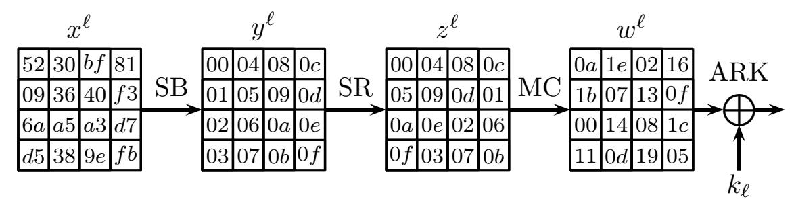

{0}------------------------------------------------

## Partial Sums Meet FFT: Improved Attack on 6-Round AES

Orr Dunkelman<sup>1</sup> , Shibam Ghosh<sup>1</sup> , Nathan Keller<sup>2</sup> , Gaetan Leurent<sup>3</sup> , Avichai Marmor<sup>2</sup> , and Victor Mollimard<sup>1</sup>

- <sup>1</sup> Computer Science Department, University of Haifa, Haifa, Israel orrd@cs.haifa.ac.il, sghosh03@campus.haifa.ac.il, victor.mollimard@gmail.com
- <sup>2</sup> Department of Mathematics, Bar Ilan University, Ramat Gan, Israel Nathan.Keller@biu.ac.il, avichai@elmar.co.il 3 Inria, Paris, France gaetan.leurent@inria.fr

Abstract. The partial sums cryptanalytic technique was introduced in 2000 by Ferguson et al., who used it to break 6-round AES with time complexity of 2 <sup>52</sup> S-box computations – a record that has not been beaten ever since. In 2014, Todo and Aoki showed that for 6-round AES, partial sums can be replaced by a technique based on the Fast Fourier Transform (FFT), leading to an attack with a comparable complexity.

In this paper we show that the partial sums technique can be combined with an FFT-based technique, to get the best of the two worlds. Using our combined technique, we obtain an attack on 6-round AES with complexity of about 2 46.4 additions. We fully implemented the attack experimentally, along with the partial sums attack and the Todo-Aoki attack, and confirmed that our attack improves the best known attack on 6-round AES by a factor of more than 32.

We expect that our technique can be used to significantly enhance numerous attacks that exploit the partial sums technique. To demonstrate this, we use our technique to improve the best known attack on 7-round Kuznyechik by a factor of more than 80, and to reduce the complexity of the best known attack on the full MISTY1 from 2 69.5 to 2 67 .

## 1 Introduction

The partial sums cryptanalytic technique was introduced by Ferguson et al. [\[22\]](#page-29-0) as a tool for enhancing the Square attack [\[17\]](#page-29-1) on AES [\[1\]](#page-28-0). Informally, the Square attack requires computing the XOR of 2 <sup>32</sup> 8-bit values extracted from partially decrypted ciphertexts under each of 2 <sup>40</sup> candidate subkeys, which amounts to 2 <sup>72</sup> operations. The partial sums technique divides the attack into several steps where at each step, the adversary guesses several key bits and computes a 'partial sum', which allows reducing the number of partially decrypted values whose XOR should be computed. As a result, the overall complexity of the attack is significantly reduced to 2 <sup>52</sup> operations.

In the 23 years since the introduction of the partial sums technique, it was shown to enhance not only the Square attack but also several other attacks 

{1}------------------------------------------------

(e.g., integral, linear, zero-correlation linear, and multi-set algebraic attacks, see [\[4,](#page-28-1)[6](#page-28-2)[,8](#page-28-3)[,12,](#page-28-4)[18\]](#page-29-2)) in various scenarios, and was applied to attack numerous ciphers (AES, Kuznyechik, MISTY1, CLEFIA, Skinny, Zorro, Midori, and LBlock, to mention a few). Yet, its best known application remained the original one – the attack on 6-round AES which remained the best attack on 6-round AES, despite many attempts to supersede it (see Table [2\)](#page-3-0).

In 2014, Todo and Aoki [\[36\]](#page-30-0) showed that an FFT-based technique can replace partial sums in enhancing the Square attack. The idea is to represent the XOR of the 2 <sup>32</sup> partially decrypted ciphertexts which the adversary has to compute as a convolution of two tailor-made functions and then to use the Fast Fourier Transform (FFT) in order to compute this value for all guessed subkeys at once, at the cost of about 4 · 2 32 · log(232) addition operations. While at a first glance, this technique seems clearly advantageous over partial sums, subtle practical difficulties counter its advantages, making the two techniques comparable. First, the technique can be applied only after guessing 8 bits of the key. Secondly, as the output of the FFT is an element in Z and not an element in the finite field GF(2<sup>8</sup> ), one has to repeat the procedure for each of the 8 bits in which the XOR should be computed. Thirdly, while partial sums can exploit partial knowledge of the subkeys the adversary needs to guess, it seems that the FFT-based technique does not gain anything from partial knowledge. According to the authors of [\[36\]](#page-30-0), the complexity of their attack on 6-round AES is 6 · 2 <sup>50</sup> addition operations, which is roughly equal to the complexity of the partial sums attack.

In the last decade, the Todo-Aoki technique was used as a comparable alternative of partial sums, with several authors mentioning advantages of each attack technique in different scenarios (see [\[4,](#page-28-1)[6,](#page-28-2)[16,](#page-29-3)[38\]](#page-30-1)). Yet, it seemed that one has to choose between the benefits of the two techniques in each application.

In this paper we show that one can combine partial sums with an FFT-based technique, getting the best of the two worlds in many cases. The basic idea behind our technique is to use the general structure of partial sums, but to replace particular key-guessing steps used in partial sums (or combinations of several such steps) by FFT-based steps, which include embedding finite field elements into Z. We show that this allows computing the XOR in all 8 output bits at once, exploiting partial key knowledge, and even packing several computations together in the same 64-bit word addition and multiplication operations. As a result, we obtain the speedup of FFT over key guessing, without the disadvantages it carries in the Todo-Aoki technique. In addition, the new technique allows for much more flexibility, as we may choose which steps we group together and in which steps we use FFT instead of key guessing. The choice depends on multiple step-dependent parameters, such as the number of subkey bits guessed in the step, the ability to pre-compute some of the operations required for the FFT, and partial knowledge of subkey bits. Thus, the flexibility may be very helpful.

We use our technique to mount an improved attack on 6-round AES. We obtain an attack which requires 2 <sup>33</sup> chosen plaintexts (compared to 2 34.5 in the partial sums attack of [\[22\]](#page-29-0)), time complexity of about 2 <sup>46</sup>.<sup>4</sup> additions (compared to 2 <sup>52</sup> S-box computations in partial sums), and memory complexity of 2 27

{2}------------------------------------------------

Attack (Source) AWS Instance Running Time Total Cost (in minutes) (in US\$) Square & Partial sums [\[22\]](#page-29-0) m6i.32xlarge 4859 497 Square & FFT [\[36\]](#page-30-0) r6i.32xlarge 3120 418 Square & Partial sums & FFT (Sect. [3.5\)](#page-23-0) m6i.32xlarge 48 5

<span id="page-2-0"></span>Table 1. Cost comparison of three best attacks on 6-Round AES in Amazon's AWS

128-bit blocks (roughly the same as in partial sums). As it is hard to compare additions with S-box applications, we compared the attacks experimentally, by fully implementing our attack, the partial sums attack, and the Todo-Aoki attack, using Amazon AWS servers. We optimized the instance which best fits the attacks (optimizing for performance/cost tradeoff). Our experiments show that our attack takes 48 minutes (and costs 5 US\$), the partial sums attack takes 4859 minutes (and costs 497 US\$), and the Todo-Aoki attack takes 3120 minutes (and costs 418 US\$). Thus, our attack provides a speedup by a factor of more than 65 over both the partial sums attack and Todo-Aoki's attack, and allows breaking 6-round AES in about 48 minutes at the cost of only 5 US\$. This breaks a 23-year old record in practical attacks on 6-round AES. Table [1](#page-2-0) summarizes the costs of running the attacks.

Our attack improves the partial sums attack of [\[22\]](#page-29-0) on 7-round AES by the same factor. In addition, it might be applicable to other primitives that use 6-round AES as a component like the tweakable block cipher TNT-AES [\[5\]](#page-28-5).

Due to the flexibility of our technique, it can be used to improve various attacks that use the partial sums technique. We demonstrate this applicability by presenting improved attacks on three ciphers:

- Kuznyechik [\[19\]](#page-29-4) the Russian Federation encryption standard. The bestknown attack on Kuznyechik is a multiset-algebraic attack on 7 rounds (out of 9) with the complexity of 2 154.5 encryptions, presented by Biryukov et al. [\[12\]](#page-28-4). We show that this attack can be improved by a factor of more than 80 to about 2 <sup>148</sup> encryptions, thus providing the best-known attack on Kuznyechik.
- MISTY1 [\[26\]](#page-29-5) a block cipher which is widely deployed in Japan, and is recognized internationally as a European NESSIE-recommended cipher and an ISO standard. In [\[34\]](#page-30-2), Todo used the division property-based integral attack to obtain the first attack on the full MISTY1 which is faster than an exhaustive key search. Bar-On and Keller [\[8\]](#page-28-3) reduced the complexity of Todo's attack to 2 <sup>69</sup>.<sup>5</sup> MISTY1 encryptions. We show that the complexity can be further reduced by a factor of 6 to 2 <sup>67</sup> encryptions.
- CLEFIA [\[32\]](#page-30-3) a block cipher which is widely used in Japan and is recognized internationally as an ISO standard. Several works [\[13,](#page-28-6)[25,](#page-29-6)[31\]](#page-30-4) presented partial sums attacks on 11, 12, and 14 rounds of CLEFIA, and we show that all these attacks can be improved using our technique. The improvement is most

{3}------------------------------------------------

#### 4 O. Dunkelman et al.

<span id="page-3-0"></span>Table 2. Comparison of our results with previous key recovery attacks on 6-Round AES, reduced Kuznyechik and full MISTY1. The results are listed in chronological order.

| Cipher     | Rounds Data |                | Time                | Technique and Source                    |
|------------|-------------|----------------|---------------------|-----------------------------------------|
| AES        | 6           | 32 CP<br>2     | 71 Enc.<br>2        | Square [17]                             |
|            |             | 32 CP<br>6 · 2 | 52 S-box Eval.<br>2 | Square & Partial sums [22]              |
|            |             | 71 ACPC<br>2   | 71 Enc.<br>2        | Boomerang [11]                          |
|            |             | 33 CP<br>2     | 52 S-box Eval.<br>2 | Square & Partial sums [37]              |
|            |             | 32 CP<br>6 · 2 | 52 Add.<br>2        | Square & FFT [36]                       |
|            |             | 26 CP<br>2     | 80 Enc.<br>2        | Mixture Differential [7]                |
|            |             | 55 ACPC<br>2   | 80 Enc.<br>2        | Retracing Boomerang [21]                |
|            |             | 79.7 ACPC<br>2 | 78 Enc.<br>2        | Boomeyong [30]                          |
|            |             | 59 ACPC<br>2   | 61 Enc.<br>2        | Truncated Boomerang [9]                 |
|            |             | 33 CP<br>2     | 46.4 Add.<br>2      | Square & Partial sums & FFT (Sect. 3)   |
| Kuznyechik | 7           | 128 KP<br>2    | 154.5 Enc.<br>2     | Integral & Partial sums [12]            |
|            | 6           | 120 KP<br>2    | 146.5 Enc.<br>2     | Integral & Partial sums [12]            |
|            | 7           | 128 KP<br>2    | 148 Enc.<br>2       | Integral & Partial sums & FFT (Sect. 4) |
|            | 6           | 120 KP<br>2    | 140.9 Enc.<br>2     | Integral & Partial sums & FFT (Sect. 4) |
| MISTY1     | 8           | 63.6 KP<br>2   | 121 Enc.<br>2       | Integral & Partial sums [34]            |
|            | (Full)      | 64 KP<br>2     | 69.5 Enc.<br>2      | Integral & Partial sums [8]             |
|            | (Full)      | 64 KP<br>2     | 67 Enc.<br>2        | Integral & Partial sums & FFT (App. A)  |

striking for 12-round CLEFIA, where our technique improves a partial sums attack of Sasaki and Wang [\[31\]](#page-30-4) by a factor of about 2 .

A comparison of our results on 6-round AES, on reduced Kuznyechik and full MISTY1 with previously known results is presented in Table [2.](#page-3-0)

The paper is organized as follows. In Section [2,](#page-3-1) we describe the structure of the AES, the Square attack, and the two previously known methods for enhancing it – partial sums and the Todo-Aoki FFT-based method. Section [3](#page-10-0) presents our new technique, along with its application to 6-round AES. Section [4](#page-24-0) presents application of the new technique to the cipher Kuznyechik. The applications of the new technique to MISTY1 and to CLEFIA are described in Appendices [A](#page-30-7) and [B.](#page-33-0)

## <span id="page-3-1"></span>2 Background

## 2.1 Description of AES

AES [\[1\]](#page-28-0) is a 128-bit block cipher, designed by Rijmen and Daemen in 1997 (originally, under the name Rijndael). In 2001, it was selected by the US National Institute of Standards (NIST) as the Advanced Encryption Standard, and since then, it has gradually become the most widely used block cipher worldwide.

AES is a Substitution-Permutation Network operating on a 128-bit state organized as a 4 × 4 array of 8-bit words. The encryption process is composed of 

{4}------------------------------------------------

10, 12, or 14 rounds (depending on the key length: 10 rounds for 128-bit keys, 12 rounds for 192-bit keys, and 14 rounds for 256-bit keys). Each round of AES is composed of four operations, presented in Figure 1:

**SUBBYTES**. Apply a known 8-bit S-box independently to the bytes of the state; **SHIFTROWS**. Shift each row of the state to the left by the position of the row; **MIXCOLUMNS**. Multiply each column by the same known invertible 4-by-4 matrix over the finite field  $GF(2^8)$ ;

ADDROUNDKEY. Add a 128-bit round key computed from the secret key to the state, using a bitwise XOR operation.

An additional Addroundkey operation is applied before the first round, and the last MixColumns operation is omitted. As properties of the key schedule of AES are not used in this paper, we refer the reader to [1] for its description.



<span id="page-4-1"></span><span id="page-4-0"></span>Fig. 1. An AES Round

The rounds are numbered from 0 to Nr-1, where Nr is the number of rounds. The subkey used in the ADDROUNDKEY operation of round  $\ell$  is denoted by  $k^{\ell}$ , and the j'th byte in its i'th row is denoted by  $k^{\ell}_{4j+i}$ . The whitening key added before the initial round is denoted by  $k^{-1}$ . The j'th byte in the i'th row of the state before the Subbytes, Shiftrows, MixColumns, Addroundkey operations of round  $\ell$  is denoted by  $x^{\ell}_{4j+i}, y^{\ell}_{4j+i}, z^{\ell}_{4j+i}$ , and  $w^{\ell}_{4j+i}$ , respectively. A set of bytes  $\{v_i, v_j, v_k\}$  is denoted by  $v_{i,j,k}$ .

#### 2.2 The Square Attack on AES

AES was designed as a modification of the block cipher Square [17], which came together with a dedicated attack, called 'the Square attack'. This attack, in its basic application to AES, uses the following observation.

**Lemma 1.** Consider the encryption by 3-round AES of a set of 256 plaintexts,  $P_0, P_1, \ldots, P_{255}$ , which are equal in all bytes except for a single byte, such that the single byte assumes each possible value exactly once. Then the corresponding ciphertexts  $C_0, C_1, \ldots, C_{255}$  satisfy  $\bigoplus_{i=0}^{255} C_i = 0$ .

As was shown in [17], this property can be used to attack 6-round Square, and also 6-round AES, with a complexity of about  $2^{80}$  S-box computations. The adversary asks for the encryption of  $2^{32}$  plaintexts which are equal in all bytes except for the main diagonal (i.e., bytes 0.5,10,15) and assume all  $2^{32}$  possible

{5}------------------------------------------------

values in the main diagonal. Then, he guesses bytes 0, 5, 10, 15 of  $k^{-1}$ , and for each guess, he partially encrypts the plaintexts through round 0 and finds a set of  $2^8$  inputs to round 1 which satisfy the assumption of Lemma 1. Then, he partially guesses the subkeys  $k^4, k^5$ , partially decrypts the  $2^8$  corresponding ciphertexts through rounds 4,5 and checks whether the XOR of the  $2^8$  corresponding values at the state  $x_0^4$  (i.e., at byte 0 before the Subbytes operation of round 4) is zero, as is stated by Lemma 1. If not, the subkey guess is discarded.

While it seems that in order to compute byte  $x_0^4$  from the ciphertext, the adversary must know 64 subkey bits (specifically, key bytes  $k_{0,7,10,13}^5$  and  $k_{0,1,2,3}^4$ ), in fact knowing 40 subkey bits is sufficient. Indeed, since MIXCOLUMNS is a linear operation, it can be interchanged with the Address operation after it, at the cost of replacing  $k^4$  with the equivalent subkey  $\bar{k}^4 = \text{MIXCOLUMNS}^{-1}(k^4)$ . The knowledge of the key bytes  $k_{0,7,10,13}^5$  and  $\bar{k}_0^4$  is sufficient for computing the state byte  $x_0^4$  from the ciphertext of 6-round AES. Each check whether  $2^8$  values XOR to zero provides an 8-bit filtering, and hence, checking several sets is sufficient for discarding all wrong subkey guesses. The attack recovers 9 subkey bytes  $(k_{0,5,10,15}^{-1}, \bar{k}_0^4, k_{0,7,10,13}^5)$  with complexity of about  $2^{32} \cdot 2^{40} \cdot 2^8 = 2^{80}$  S-box computations.

<span id="page-5-1"></span>In [22], Ferguson et al. observed that the Square attack can be improved by replacing Lemma 1 with the following lemma on 4-round AES.

**Lemma 2.** Consider the encryption by 4-round AES of a set of  $2^{32}$  plaintexts,  $P_0, P_1, \ldots, P_{2^{32}-1}$ , which are equal in all bytes except for the main diagonal (i.e., bytes 0,5,10,15), such that the diagonal assumes each possible value exactly once. Then the corresponding ciphertexts  $C_0, C_1, \ldots, C_{2^{32}-1}$  satisfy  $\bigoplus_{i=0}^{2^{32}-1} C_i = 0$ .

Lemma 2 can be used to attack 6-round AES using the same strategy described above. The adversary asks for the encryption of a few sets of  $2^{32}$  plaintexts which satisfy the assumption of Lemma 2. Then, for each set, he guesses subkey bytes  $\bar{k}_0^4, k_{0,7,10,13}^5$  and checks whether the XOR of the  $2^{32}$  intermediate values at the state byte  $x_0^4$  is zero, as is stated by Lemma 2. The attack recovers 5 subkey bytes  $(\bar{k}_0^4, k_{0,7,10,13}^5)$  and its complexity is about  $2^{32} \cdot 2^{40} = 2^{72}$  S-box computations.

## <span id="page-5-3"></span>2.3 The Partial Sums Attack

In the same paper [22], Ferguson et al. showed that the complexity of the Square attack described above can be significantly reduced, by dividing the key guessing and partial decryption into several steps and gradually reducing the number of values whose XOR should be computed. By the structure of AES, the state byte  $x_0^4$  is computed from the ciphertext C using the following formula:

<span id="page-5-2"></span>
$$x_0^4 = S^{-1}(\bar{k}_0^4 \oplus 0e_{\mathsf{x}} \cdot S^{-1}(C_0 \oplus k_0^5) \oplus 09_{\mathsf{x}} \cdot S^{-1}(C_7 \oplus k_7^5) \oplus \oplus 00_{\mathsf{x}} \cdot S^{-1}(C_{10} \oplus k_{10}^5) \oplus 00_{\mathsf{x}} \cdot S^{-1}(C_{13} \oplus k_{13}^5)),$$
(1)

<span id="page-5-0"></span>Here and in the sequel, we assume that in 6-round AES, the MIXCOLUMNS operation of round 5 is omitted. If this operation is not omitted, the attack works almost without change; we only have to replace the key  $k^5$  with the equivalent key  $\bar{k}^5 = \text{MIXCOLUMNS}^{-1}(k^5)$ .

{6}------------------------------------------------

where the coefficients  $0e_x$ ,  $0e_x$ ,  $0e_x$ ,  $0e_x$  come from the inverse MIXCOLUMNS operation and the multiplication is performed in the finite field  $GF(2^8)$ .

Note that the right hand side of (1) depends only on bytes 0,7,10,13 of the ciphertext. This means that if two ciphertexts are equal in these four bytes, then their contributions to the XOR of  $x_0^4$  values cancel each other. Thus, we may replace the list of ciphertexts with a list A of  $2^{32}$  binary indices which indicates whether each of the  $2^{32}$  possible values of bytes 0,7,10,13 of the ciphertext appears an even or an odd number of times in the list of ciphertexts. The goal of the subsequent steps is to reduce the number of needed binary indices, in parallel to guessing subkey bytes.

At the first step, the adversary guesses bytes 0.7 of  $k^5$ , and reduces the size of the list to  $2^{24}$ . Denote  $a_1 = 0e_x \cdot S^{-1}(C_0 \oplus k_0^5) \oplus 09_x \cdot S^{-1}(C_7 \oplus k_7^5)$ . Observe that if two ciphertexts are equal in the bytes  $a_1, C_{10}, C_{13}$ , then their contributions to the XOR of  $x_0^4$  values cancel each other. As the guess of bytes  $k_{0,7}^5$  allows computing  $a_1$  for each ciphertext, the adversary can construct a list  $A_1$  of  $2^{24}$  binary values which indicates whether each possible value of  $(a_1, C_{10}, C_{13})$  appears an even or an odd number of times in the list of intermediate values. The complexity of this step is about  $2^{16} \cdot 2^{32} = 2^{48}$  S-box evaluations.

At the second step, the adversary guesses the byte  $k_{10}^5$  and reduces the list to a list  $A_2$  of size  $2^{16}$  that corresponds to the possible values of  $(a_2, C_{13})$ , where  $a_2 = a_1 \oplus 0d_{\mathsf{x}} \cdot S^{-1}(C_{10} \oplus k_{10}^5)$ . At the third step, the adversary guesses the byte  $k_{13}^5$  and reduces the list to a list  $A_3$  of size  $2^8$  that corresponds to the possible values of  $a_3$ , where  $a_3 = a_2 \oplus 0b_{\mathsf{x}} \cdot S^{-1}(C_{13} \oplus k_{13}^5)$ . Finally, at the fourth step, the adversary guesses the byte  $\bar{k}_0^4$ , computes  $\bigoplus_{\{x \in \{0,1\}^8: A_3[x]=1\}} S^{-1}(\bar{k}_0^4 \oplus x)$ , which is equal to the right hand side of (1), and checks whether it is equal to zero. The complexity of each step is about  $2^{48}$  S-box computations, and thus, the overall complexity for a single set of  $2^{32}$  plaintexts is  $2^{50}$  S-box computations.

As the attack recovers 5 subkey bytes, six sets of  $2^{32}$  plaintexts are required to recover their value uniquely with a high probability. Note that after the check of the first set, only about  $2^{40} \cdot 2^{-8} = 2^{32}$  suggestions for the 40 subkey bits remain undiscarded. This means that for each possible value of  $k_{0,7,10,13}^5$ , at most a few values of  $\bar{k}_0^4$  that correspond to them are expected to remain. Hence, when examining the second set of  $2^{32}$  plaintexts, the complexity of the fourth step becomes negligible as it is performed only for a few values of  $\bar{k}_0^4$ . Similarly, when examining the third set, the two last steps become negligible, etc. In total, the complexity of checking all six plaintext sets of size  $2^{32}$  is equivalent to the cost of 4+3+2+1=10 steps, or  $2^{51.3}$  S-box computations.<sup>5</sup>

The attack is given as Algorithm 1. To simplify the notation, we rewrite equation (1) in a more generic way, using  $S_0$  for  $0e_x \cdot S^{-1}(\cdot)$ ,  $S_1$  for  $09_x \cdot S^{-1}(\cdot)$ ,  $S_2$  for  $0d_x \cdot S^{-1}(\cdot)$ ,  $S_3$  for  $0b_x \cdot S^{-1}(\cdot)$ , and renaming the keys and the ciphertext

<span id="page-6-0"></span><sup>&</sup>lt;sup>5</sup> We note that in [22], the authors performed a similar analysis and concluded that the complexity is 2<sup>52</sup> S-box computations. This value was used in all subsequent papers. For the sake of consistency, we use the same value in Table 2, but note that the actual complexity is lower, as is shown here, and use the lower estimate when comparing the partial sums attack with our new attack.

{7}------------------------------------------------

26:

bytes to  $k_0, k_1, k_2, k_3, k_4$  and  $c_0, c_1, c_2, c_3$ , respectively:

```
a_4 = S^{-1} (k_4 \oplus S_0(c_0 \oplus k_0) \oplus S_1(c_1 \oplus k_1) \oplus S_2(c_2 \oplus k_2) \oplus S_3(c_3 \oplus k_3)).  (2)
```

## <span id="page-7-0"></span>Algorithm 1 Partial-sum algorithm for key recovery [22]

```
1: Input: Array A of bits such that the j^{th} value of A denotes the parity of the number
     of occurrences of j in the list of ciphertexts
 2: for all k_0, k_1 do
         Declare an empty bit-array A_1 of size 2^{24}
 3:
 4:
         for all c_0, c_1, c_2, c_3 do
             if A[c_0, c_1, c_2, c_3] = 1 then
 5:
                  a_1 \leftarrow S_0(c_0 \oplus k_0) \oplus S_1(c_1 \oplus k_1)
 6:
                  A_1[a_1, c_2, c_3] \leftarrow A_1[a_1, c_2, c_3] \oplus 1
 7:
         for all k_2 do
 8:
             Declare an empty bit-array A_2 of size 2^{16}
 9:
              for all a_1, c_2, c_3 do
10:
                  if A_1[a_1, c_2, c_3] = 1 then
11:
12:
                       a_2 \leftarrow a_1 \oplus S_2(c_2 \oplus k_2)
                       A_2[a_2,c_3] \leftarrow A_2[a_2,c_3] \oplus 1
13:
              for all k_3 do
14:
                  Declare an empty bit-array A_3 of size 2^8
15:
16:
                  for all a_2, c_3 do
17:
                       if A_2[a_2, c_3] = 1 then
                            a_3 \leftarrow a_2 \oplus S_3(c_3 \oplus k_3)
18:
                            A_3[a_3] \leftarrow A_3[a_3] \oplus 1
19:
                  for all k_4 do
20:
                       a_4 \leftarrow 0
21:
                       for all a_3 do
22:
                           if A_3[a_3] = 1 then
23:
                                a_4 \leftarrow a_4 \oplus S^{-1}(k_4 \oplus a_3)
24:
                       if a_4 \neq 0 then
25:
```

Reducing the data complexity. In [37], Tunstall observed that the data complexity of the attack can be reduced to  $2^{33}$  chosen plaintexts by examining two sets of  $2^{32}$  plaintexts instead of six sets. The idea is to check an analogue of Equation (1) for three additional bytes  $-x_5^4, x_{10}^4$ , and  $x_{15}^4$  – using the same set of  $2^{32}$  plaintexts. Note that in order to compute each of these three bytes from the ciphertext, the adversary needs the subkey bytes  $k_{0,7,10,13}^5$  (which are the same as in Equation (1)), along with a different byte of  $\bar{k}^4$ . When two sets are checked at the same byte, they provide a 16-bit filtering, which in particular yields an 8-bit filtering on the value  $k_{0,7,10,13}^5$  which is common to all examined bytes. Hence, information from different bytes can be combined to recover  $k_{0,7,10,13}^5$  with a high probability.

 $k_0, k_1, k_2, k_3, k_4$  is not a valid key candidate

{8}------------------------------------------------

The data complexity can be further reduced to  $2^{32}$  by examining a single set and checking the XOR in all 16 bytes of  $x^4$ . The algorithm is more complex and uses a meet-in-the-middle procedure based on the properties of the AES key schedule. We omit the description here, as it will not be needed in the sequel.

In [37], it is claimed that when the same set of plaintexts is used to check the parity in several bytes, the complexity of checking the first byte is dominant, as some of the computations performed for computing the XOR in different bytes are identical. However, this claim seems incorrect, as in the variant of Equation (1) for other bytes, the order of the coefficients  $0e_x$ ,  $0e_x$ ,  $0e_x$ ,  $0e_x$ , which stems from the inverse MIXCOLUMNS operation is changed, and hence, the operations performed for different bytes are not identical and only knowledge of subkeys can be 'reused'. Therefore, the complexity of the attack that uses two sets is about  $(4+3+2+2+1+1) \cdot 2^{48} = 2^{51.7}$  S-box computations, and the attack that uses one set takes about  $16 \cdot 2^{50} = 2^{54}$  S-box computations.

The idea of using two sets of size  $2^{32}$  instead of six was independently suggested in [2] by Alda et al., who also verified it experimentally.

## <span id="page-8-0"></span>2.4 The FFT-Based Attack of Todo and Aoki

The general idea of using the Fast Fourier Transform (FFT) for speeding up cryptanalytic attacks on block ciphers goes back to Collard et al. [15] who used the FFT to speed up linear cryptanalysis. This idea was extended to several other techniques, including multi-dimensional linear attacks [28,29], zero-correlation attacks [13], differential-linear attacks [10], etc. In [36], Todo and Aoki proposed to replace the partial sums technique by an FFT-based technique. The basic idea behind the Todo-Aoki technique is that the sum of the values in the right hand side of Equation (1) which we want to compute can be written in the form of a convolution of tailor-made functions, as seen in Algorithm 2.

Consider a set S of  $2^{32}$  ciphertexts for which we want to compute the XOR of the intermediate values at the state byte  $x_0^4$ . Like in the partial sums attack, denote by A a bit array of size  $2^{32}$ , such that  $A(c_0, c_1, c_2, c_3) = 1$  if and only if  $C_{0,7,10,13} = (c_0, c_1, c_2, c_3)$  holds for an odd number of ciphertexts in S. Let  $f: \{0,1\}^{32} \to \{0,1\}$  be the indicator function of the array, that is,  $f(c_0, c_1, c_2, c_3) = 1(A(c_0, c_1, c_2, c_3) = 1)$ . Assume that the subkey  $k_4$  was guessed, and let  $g_i: \{0,1\}^{32} \to \{0,1\}$ , for  $0 \le i \le 7$ , be defined by

$$g_i(t_0, t_1, t_2, t_3) = \left[ S^{-1} \left( k_4 \oplus S_0(t_0) \oplus S_1(t_1) \oplus S_2(t_2) \oplus S_3(t_3) \right) \right]_i, \tag{3}$$

where  $[S^{-1}(t)]_i$  denotes the *i*'th bit of  $S^{-1}(t)$ . Then, denoting by  $[x(C, k_0, k_1, k_2, k_3)]_i$  the *i*'th bit of the value  $x_0^4$  corresponding to the ciphertext C for a given guess of  $k_0, k_1, k_2, k_3$  (see Equation (2)), we have

$$\bigoplus_{C \in S} [x(C, k_0, k_1, k_2, k_3)]_i = \bigoplus_{\{(c_0, c_1, c_2, c_3) : A[c_0, c_1, c_2, c_3] = 1\}} g_i(c_0 \oplus k_0, c_1 \oplus k_1, c_2 \oplus k_2, c_3 \oplus k_3)$$

$$= \bigoplus_{c_0, c_1, c_2, c_3} f(c_0, c_1, c_2, c_3) \cdot g_i(c_0 \oplus k_0, c_1 \oplus k_1, c_2 \oplus k_2, c_3 \oplus k_3)$$

$$= (f * g_i)(k_0, k_1, k_2, k_3).$$

{9}------------------------------------------------

<span id="page-9-0"></span>**Algorithm 2** FFT-based algorithm for key recovery [36].

The blue colored step has naive complexity  $2^{32} \times 2^{32}$ , but can be replaced by several Hadamard transformations of size  $2^{32}$  with complexity  $2^{37}$  each.

```
1: Input: Array A of bits such that the j^{\text{th}} value of A denotes the parity of the number of occurrences of j in the list of ciphertexts

2: for all k_4 do

3: for all k_0, k_1, k_2, k_3 do

4: A_1[k_1, k_2, k_3, k_4] \leftarrow \bigoplus_{c_0, c_1, c_2, c_3} A[c_0, c_1, c_2, c_3] \cdot S^{-1} \begin{pmatrix} k_4 \oplus S_0(c_0 \oplus k_0) \oplus S_1(c_1 \oplus k_1) \\ \oplus S_2(c_2 \oplus k_2) \oplus S_3(c_3 \oplus k_3) \end{pmatrix}

5: for all k_0, k_1, k_2, k_3 do

6: if A_1[k_0, k_1, k_2, k_3] \neq 0 then

7: k_0, k_1, k_2, k_3, k_4 is not a valid key candidate
```

Therefore, we can compute the sum for all  $2^{32}$  possible guesses of  $(k_0, k_1, k_2, k_3)$  at once by guessing the byte  $k_4$  and computing the convolution of two functions on 32 bits, that takes time of about  $4 \cdot 2^{32} \log_2(2^{32})$  additions, as was shown by Collard et al. [15]. As the summation is performed for each bit separately, the complexity of examining a single set S of  $2^{32}$  ciphertexts is  $8 \cdot 2^8 \cdot 4 \cdot 2^{32} \log_2(2^{32}) = 2^{50}$  additions, which is roughly equal to the number of operations required for examining a single set of ciphertexts in the partial sums attack.

A disadvantage of the Todo-Aoki technique, compared to the partial sums attack, is that it cannot use partial knowledge of the subkey to obtain a speedup. Indeed, as the computation is performed for all values of  $(k_0, k_1, k_2, k_3)$  at the same time, partial knowledge (e.g., knowledge of  $k_3$ ) cannot be exploited. As a result, when six sets of  $2^{32}$  ciphertexts are examined, the complexity of the Todo-Aoki attack becomes  $6 \cdot 2^{50} = 2^{52.6}$  additions, while the overall complexity of partial sums is only  $2^{51.3}$  S-box computations, as was shown above.

The question, whether there is a way to use partial knowledge of the key in an FFT-based attack, was explicitly mentioned as an open question in [36].

Using precomputation of the FFT to speed up the attack. In the eprint version of the same paper [33], Todo showed that the complexity of the attack can be reduced by precomputing some of the Fast Fourier Transforms that should be computed in the course of the attack.

Recall that the computation of the convolution of  $f, g : \{0, 1\}^n \to \{0, 1\}$  using the FFT consists of three stages:

- 1. Computing the Fourier transforms  $\hat{f}, \hat{g} : \{0, 1\}^n \to \mathbb{Z}$ .
- 2. Computing the pointwise product  $h: \{0,1\}^n \to \mathbb{Z}$  defined by  $h(x) = \hat{f}(x) \cdot \hat{g}(x)$ .
- 3. Computing the inverse Fourier transform (which is the same as computing the Fourier transform and dividing by  $2^n$ ) to obtain  $f * g = \hat{h} \cdot 2^{-n}$ .

Here, we use the convention that the Fourier transform  $\hat{f}$  is obtained from f by writing f as a  $2^n$ -dimensional vector and multiplying it by the Hadamard matrix  $H_n$ , defined recursively as  $H_n = \begin{pmatrix} H_{n-1} & H_{n-1} \\ H_{n-1} & -H_{n-1} \end{pmatrix}$ , where  $H_1 = \begin{pmatrix} 1 & 1 \\ 1 & -1 \end{pmatrix}$ .

{10}------------------------------------------------

The cost of each computation of the FFT is  $n2^n$  addition operations. In order to avoid overflow the additions should have at least 2n bits of precision, but since we only want one bit of the result the computation can be done with n+1 bits of precision. For the 6-round AES attack we have n=32 and the FFT will typically be implemented with 64-bit additions. The cost of the pointwise product is about  $2^n$  multiplication operations, which is not much more than the cost of  $2^n$  addition operations for small n (in particular for a software implementation with  $n \leq 32$ , as in the attack on 6-round AES). Hence, the overall cost of the convolution computation in our case is about  $3 \cdot 32 \cdot 2^{32}$  additions.

Todo observed that the Fourier transforms  $\hat{f}$  and  $\hat{g}$  can be precomputed. As the function f does not depend on the guess of  $k_4$ , one can compute it once, store the result (which requires at most  $2^{32}$  64-bit words), and re-use it for each value of  $k_4$ . As the cost of this FFT computation is  $32 \cdot 2^{32}$  additions, the amortization over guesses of  $k_4$  makes it negligible. The function g cannot be precomputed since it depends on  $k_4$ . On the other hand, as it does not depend on the ciphertexts, it can be reused for other sets of ciphertexts. Therefore, the complexity of computing the XOR for a single set of  $2^{32}$  ciphertexts is reduced to about  $8 \cdot 2^8 \cdot 2 \cdot 32 \cdot 2^{32} = 2^{49}$  addition operations, and the complexity of computing the XOR for six sets is reduced to about  $2^{49} + 5 \cdot 2^{48} = 2^{50.8}$  addition operations. If only two sets are examined and the XOR is computed in four bytes (as was described above), then the complexity becomes  $2^{49} + 7 \cdot 2^{48} = 2^{51.2}$  addition operations. This complexity seems a bit lower than the complexity of partial sums, but it is still quite close and the different types of operations make comparison between the techniques tricky.

## <span id="page-10-0"></span>3 The New Technique: Partial Sums Meet FFT

In this section, we describe our new technique which allows combining the advantages of the partial sums technique with those of the Todo-Aoki FFT-based technique. We begin with a basic variant of the technique in Section 3.1, then we show how the complexity can be reduced significantly by packing several FFT computations together in Section 3.2, afterward, we present several additional enhancements and other variants of the basic technique in Section 3.3, and we conclude this section with a comparison of our technique with partial sums and the Todo-Aoki technique in Section 3.4. For the sake of concreteness, we present the attack in the case of 6-round AES and reuse the notations of Section 2. It will be apparent from the description how our technique can be applied in general.

#### <span id="page-10-2"></span>3.1 The Basic Technique

Our basic observation is that we can follow the general structure of the partial sums attack, and replace each step by computing a convolution of properly

<span id="page-10-1"></span><sup>&</sup>lt;sup>6</sup> We note that in [36], the authors conservatively estimate that pointwise multiplication of two vectors of size  $2^n$  whose entries are n-bit integers takes  $n2^n$  addition operations. For the sake of consistency with [36] and fairness, we use the conservative estimate in the table of results and the less conservative estimate when we compare the Todo-Aoki technique to our technique.

{11}------------------------------------------------

chosen functions. This is shown in Algorithm 3 which is a rearrangement of the operations of Algorithm 1, making convolution appear. As we use somewhat different convolutions for different steps of the attack, we present them separately.

**First step.** As described in Section 2.3, before the first step of the partial sums attack, the list of ciphertexts is replaced with a list A of  $2^{32}$  binary indices which indicate whether each of the  $2^{32}$  possible values of the bytes  $c_0, c_1, c_2, c_3$  appears an even or an odd number of times in the list of ciphertexts. At the first step, the adversary guesses the bytes  $k_0, k_1$ , and replaces the list by a list  $A_1$  of size  $2^{24}$  which corresponds to the bytes  $a_1, c_2, c_3$ , where  $a_1 = S_0(c_0 \oplus k_0) \oplus S_1(c_1 \oplus k_1)$ .

We observe that the list  $A_1$  can be computed for all values  $k_0, k_1$  simultaneously by computing a convolution. Let  $\chi:\{0,1\}^{32} \to \{0,1\}$  be the indicator function of the list A. That is,  $\chi(c_0, c_1, c_2, c_3) = 1$  if and only if the value  $(C_0, C_7, C_{10}, C_{13}) = (c_0, c_1, c_2, c_3)$  appears an odd number of times in the list of ciphertexts. For any  $c_2, c_3 \in \{0,1\}^8$ , define  $\chi^1_{c_2,c_3}(c_0,c_1) = \chi(c_0,c_1,c_2,c_3)$ . For any  $a_1 \in \{0,1\}^8$ , let  $I^1_{a_1}(x,y) = \mathbb{1}(S_0(x) \oplus S_1(y) = a_1)$ . Both  $\chi^1_{c_2,c_3}$  and  $I^1_{a_1}$  are indicator functions on  $\{0,1\}^{16}$ . For any  $a_1,c_2,c_3 \in \{0,1\}^8$ , we have

$$(\chi_{c_2,c_3}^1 * I_{a_1}^1)(k_0,k_1) = \sum_{c_0,c_1 \in \{0,1\}^8} \chi_{c_2,c_3}^1(c_0,c_1) \cdot I_{a_1}^1(c_0 \oplus k_0,c_1 \oplus k_1)$$

$$= \sum_{c_0,c_1 \in \{0,1\}^8} \chi(c_0,c_1,c_2,c_3) \cdot \mathbb{1}(S_0(c_0 \oplus k_0) \oplus S_1(c_1 \oplus k_1) = a_1).$$

$$c_0,c_1 \in \{0,1\}^8$$

Therefore, the entry which corresponds to  $(a_1, c_2, c_3)$  in the list  $A_1[k_0, k_1]$  created for the subkey guess  $(k_0, k_1)$  is

$$A_1[k_0, k_1][a_1, c_2, c_3] = ((\chi_{c_2, c_3}^1 * I_{a_1}^1)(k_0, k_1)) \bmod 2. \tag{4}$$

(Note that formally, we define  $A_1$ , which is a list of size  $2^{24}$  that depends on two key bytes, as an array of size  $2^{16} \times 2^{24}$  which includes the guessed bytes.) As was shown in Section 2.4, the computation of this convolution requires  $3 \cdot 16 \cdot 2^{16}$  addition operations for each value of  $a_1, c_2, c_3$ , or a total of  $48 \cdot 2^{40}$  additions. This compares favorably with the first step of the partial sums attack which requires  $2^{48}$  S-box computations. As we shall see below, the actual advantage of our technique is significantly larger. However, this requires to store the full  $A_1$  for all values of  $(k_0, k_1)$ , of size  $2^{40}$  bits.

**Second step.** At the second step of the partial sums attack, the adversary guesses the byte  $k_2$  and reduces the list  $A_1$  to a list  $A_2$  of size  $2^{16}$  that corresponds to the possible values of  $(a_2, c_3)$ , where  $a_2 = a_1 \oplus S_2(c_2 \oplus k_2)$ .

We compute the entries of the list  $A_2$  using a convolution, as follows. For any  $k_0, k_1, c_3 \in \{0, 1\}^8$ , define

$$\chi^2_{k_0,k_1,c_3}(a_1,c_2) = \mathbb{1}(A_1[k_0,k_1][a_1,c_2,c_3])$$
  $I^2(x,y) = \mathbb{1}(x=S_2(y)).$ 

{12}------------------------------------------------

Both  $\chi^2_{k_0,k_1,c_3}$  and  $I^2$  are indicator functions on  $\{0,1\}^{16}$ . For any  $k_0,k_1,c_3 \in \{0,1\}^8$ , we have

$$(\chi_{k_0,k_1,c_3}^2 * I^2)(a_2,k_2) = \sum_{a_1,c_2 \in \{0,1\}^8} \chi_{k_0,k_1,c_3}^2(a_1,c_2) \cdot I^2(a_1 \oplus a_2,c_2 \oplus k_2)$$

$$= \sum_{a_1,c_2 \in \{0,1\}^8} \mathbb{1}(A_1[k_0,k_1][a_1,c_2,c_3]) \cdot \mathbb{1}(a_1 \oplus a_2 = S_2(c_2 \oplus k_2))$$

$$= \sum_{a_1,c_2 \in \{0,1\}^8} \mathbb{1}(A_1[k_0,k_1][a_1,c_2,c_3]) \cdot \mathbb{1}(a_2 = a_1 \oplus S_2(c_2 \oplus k_2)).$$

$$a_1,c_2 \in \{0,1\}^8$$

Therefore, the entry which corresponds to  $(a_2, c_3)$  in the list  $A_2$  created for the subkey guess  $(k_0, k_1, k_2)$  is

$$A_2[k_2][a_2, c_3] = ((\chi^2_{k_0, k_1, c_3} * I^2)(a_2, k_2)) \bmod 2.$$
 (5)

(Note that formally, we define  $A_2$ , which is a list of size  $2^{16}$  that depends on three key bytes, as an array of size  $2^8 \times 2^{16}$ , which depends on  $k_0, k_1$ ). As above, the complexity of this step is  $48 \cdot 2^{40}$  additions.

**Third step.** This step is similar to the second step. Thus, we present it briefly. At the third step of the partial sums attack, the adversary guesses the byte  $k_3$  and reduces the list  $A_2$  to a list  $A_3$  of size  $2^8$  that corresponds to the possible values of  $a_3$ , where  $a_3 = a_2 \oplus S_3(c_3 \oplus k_3)$ . We obtain the list  $A_3$  by defining

$$\chi^3_{k_0,k_1,k_2}(a_2,c_3) = \mathbb{1}(A_2[k_2][a_2,c_3])$$
 and  $I^3(x,y) = \mathbb{1}(x=S_3(y)),$ 

and setting

$$A_3[k_3][a_3] = ((\chi^3_{k_0, k_1, k_2} * I^3)(a_3, k_3)) \bmod 2.$$
(6)

(Note that formally, we define  $A_3$  as an array of size  $2^8 \times 2^8$ , which depends on  $k_0, k_1, k_2$ ). As above, the complexity of this step is  $48 \cdot 2^{40}$  additions.

**Fourth step.** At the fourth step of the partial sums attack, the adversary guesses the byte  $k_4$ , and computes  $\bigoplus_{\{x \in \{0,1\}^8: A_3[x]=1\}} S^{-1}(k_4 \oplus x)$ , which is equal to the right hand side of (2), and checks whether it is equal to zero.

We cannot compute this XOR directly using a convolution, since in order to apply the FFT we need functions whose output is an integer and not an element of  $GF(2^8)$ . A basic solution, that was adopted by Todo and Aoki [36], is to compute the XOR in each bit separately. To this end, we define the functions  $\chi_{k_0,k_1,k_2,k_3}^4$ ,  $I^{4,j}:\{0,1\}^8 \to \{0,1\}$  for  $j=0,1,\ldots,7$  by

$$\chi_{k_0,k_1,k_2,k_3}^4(a_3) = 1(A_3[k_3][a_3])$$
 and  $I^{4,j}(x) = [S^{-1}(x)]_j$ ,

{13}------------------------------------------------

where  $[S^{-1}(x)]_j$  denotes the j'th bit of  $S^{-1}(x)$ . We have

$$(\chi_{k_0,k_1,k_2,k_3}^4 * I^{4,j})(k_4) = \sum_{a_3 \in \{0,1\}^8} \chi_{k_0,k_1,k_2,k_3}^4(a_3) \cdot I^{4,j}(a_3 \oplus k_4)$$
$$= \sum_{a_3 \in \{0,1\}^8} \mathbb{1}(A_3[k_3][a_3]) \cdot [S^{-1}(a_3 \oplus k_4)]_j.$$

Therefore, the j'th bit of the XOR we would like to compute for the key guess  $(k_0, k_1, k_2, k_3, k_4)$  is equal to

<span id="page-13-1"></span>
$$((\chi_{k_0,k_1,k_2,k_3}^4 * I^{4,j})(k_4)) \bmod 2.$$
 (7)

Hence, we can check the XOR by initializing a list of  $2^{40}$  binary indicators which correspond to the possible values of  $(k_0, k_1, k_2, k_3, k_4)$ , computing the convolutions  $\chi^4_{k_0, k_1, k_2, k_3} * I^{4,j}$  for  $j = 0, 1, \ldots, 7$ , and discarding all keys  $(k_0, k_1, k_2, k_3, k_4)$  for which at least one of the results of (7) is not equal to zero modulo 2.

The complexity of this step is  $2^{32} \cdot 8 \cdot (3 \cdot 8 \cdot 2^8) = 192 \cdot 2^{40}$  additions, which is slightly better than the complexity of the fourth step of the partial sums technique. As we shall show below, the complexity can be reduced significantly, by using a new method to pack several FFT together, and exploiting enhancements from previous attacks based on the re-use of computations.

The basic algorithm is summarized in Algorithm 3.

#### <span id="page-13-0"></span>3.2 Packing Several FFTs Together by Embedding into $\mathbb{Z}$

We now show that the complexity of the basic attack can be significantly reduced by packing several convolution computations into a single convolution. We assume that the attack is implemented using 64-bit operations, which is typical for a software implementation. For reference, the 6-round AES attack of Todo and Aoki requires 64-bit additions to avoid overflow.

Improving the fourth step of the attack. Consider the fourth step of our basic attack described above. The step consists of computing the convolution of the function  $\chi^4_{k_0,k_1,k_2,k_3}$  with the eight functions  $I^{4,j}$   $(j=0,1,\ldots,7)$ . These eight convolutions can be replaced by a single computation of convolution.

Let s be a 'separation parameter' that will be determined below, and define a function  $I^4: \{0,1\}^8 \to \mathbb{Z}$  by  $I^4(x) = \sum_{j=0}^7 2^{js} [S^{-1}(x)]_j$ .

We claim that for an appropriate choice of s, the convolution  $\chi^4_{k_0,k_1,k_2,k_3} * I^4$  allows recovering the value of the XOR in all 8 bits we are interested in, with a high probability. Indeed, we have

{14}------------------------------------------------

<span id="page-14-0"></span>**Algorithm 3** The following is the Algorithm for key recovery. The function 1 is the indicator function. All the blue colored steps are of complexity  $2^{16} \times 2^{16}$  and can be replaced by a 3 Hadamard transformations of size  $2^{16}$  with total complexity  $3 \times 2^{20}$ . The red colored step has complexity  $2^8 \times 2^8$ , which can be replaced by 3 Hadamard transformations of size  $2^8$  with total complexity  $3 \times 2^{11}$ .

```
1: Input: Array A of bits such that the j^{th} value of A denotes the parity of ciphertext
     j
 2: Declare an empty 2D bit-array A_1 of size 2^{16} \times 2^{24};
                                                                                                      \triangleright 2^{40} memory
 3: for all a_1, c_2, c_3 do
          for all k_0, k_1 do
 4:
              A_1[k_0, k_1][a_1, c_2, c_3] \leftarrow \bigoplus_{c_0, c_1} A[c_0, c_1, c_2, c_3] \cdot \mathbb{1}(S_0(c_0 \oplus k_0) \oplus S_1(c_1 \oplus k_1) = a_1)
 5:
 6: for all k_0, k_1 do
          Declare an empty 2D bit-array A_2 of size 2^8 \times 2^{16};
 7:
          for all c_3 do
 8:
               for all k_2, a_2 do
 9:
                    A_2[k_2][a_2, c_3] \leftarrow \bigoplus_{a_1, c_2} A_1[k_0, k_1][a_1, c_2, c_3] \cdot \mathbb{1}(a_1 \oplus S_2(c_2 \oplus k_2) = a_2)
10:
11:
          for all k_2 do
               Declare an empty 2D bit-array A_3 of size 2^8 \times 2^8;
12:
13:
               for all k_3, a_3 do
                     A_3[k_3][a_3] \leftarrow \bigoplus_{a_2,c_3} A_2[k_2][a_2,c_3] \cdot \mathbb{1}(a_2 \oplus S_3(c_3 \oplus k_3) = a_3)
14:
15:
               for all k_3 do
                    Declare an empty 1D byte-array A_4 of size 2^8;
16:
17:
                    for all k_4 do
                          A_4[k_4] \leftarrow \bigoplus_{a_3} A_3[k_3][a_3] \cdot S^{-1}(a_3 \oplus k_4)
18:
                    for all k_4 do
19:
20:
                         if A_4[k_4] \neq 0 then
                              k_0, k_1, k_2, k_3, k_4 is not a valid key candidate
21:
```

$$(\chi_{k_0,k_1,k_2,k_3}^4 * I^4)(k_4) = \sum_{a_3 \in \{0,1\}^8} \chi_{k_0,k_1,k_2,k_3}^4(a_3) \cdot I^4(a_3 \oplus k_4)$$

$$= \sum_{a_3 \in \{0,1\}^8} \mathbb{1}(A_3[k_3][a_3]) \cdot \sum_{j=0}^7 2^{sj} [S^{-1}(a_3 \oplus k_4)]_j$$

$$= \sum_{j=0}^7 2^{sj} \sum_{a_3 \in \{0,1\}^8} \mathbb{1}(A_3[k_3][a_3]) \cdot [S^{-1}(a_3 \oplus k_4)]_j$$

$$= \sum_{j=0}^7 2^{sj} (\chi_{k_0,k_1,k_2,k_3}^4 * I^{4,j})(k_4),$$

{15}------------------------------------------------

where the penultimate equality uses the change of the order of summation.

Recall that for each value of  $k_4$ , we want to compute the eight parity bits  $(\chi_{k_0,k_1,k_2,k_3}^4 * I^{4,j}(k_4))$  mod 2. Let us reformulate our goal, for the sake of convenience. Denoting  $b_j = \chi_{k_0,k_1,k_2,k_3}^4 * I^{4,j}(k_4)$ , we have  $\chi_{k_0,k_1,k_2,k_3}^4 * I^4(k_4) = \sum_{j=0}^7 2^{sj}b_j$ . Thus, for nonnegative integers  $b_0,b_1,\ldots,b_7$ , we are given  $\sum_{j=0}^7 2^{sj}b_j$  and we want to compute from it the eight parity bits  $(b_j)$  mod 2.

Observe that if for all  $0 \le j \le 7$ , we have  $b_j < 2^s$ , then the multiplications by  $2^{sj}$  separate the values  $b_j$ , and thus, we can simply read the values  $(b_j)$  mod 2 from  $2^{sj}b_j$ , as in this case,

$$\forall j : \left[\sum_{j=0}^{7} 2^{sj} b_j\right]_{sj} = [2^{sj} b_j]_{sj} = (b_j) \bmod 2.$$

How large should s be so that  $b_j < 2^s$  holds with a high probability for all j's? Note that each  $b_j$  is the sum of 128 elements, which correspond to the 128 values of  $c_3$  such that  $[S^{-1}(c_3 \oplus k_4)]_j = 1$ . Each such element is  $\chi^4_{k_0,k_1,k_2,k_3}(c_3)$ , which can be viewed as a randomly distributed indicator. Hence,  $b_j$  is distributed like Bin(128,1/2). The expectation of such a variable is 64, and its standard deviation is  $4\sqrt{2}$ . This means that the values  $b_j$  are strongly concentrated around 64, and the probability  $Pr[b_j \geq 2^7]$  is extremely small. Therefore, by taking s = 7, we can derive the eight parity bits  $(b_j)$  mod 2 from the sum  $\sum_{j=0}^7 2^{sj}b_j$ , easily and with a very low error probability.

How small should s be in order to perform the entire computation with 64-bit words? For the sake of efficiency, we compute the convolution using 64-bit word operations and disregard overflow beyond the 64'th bit. If s is too large, this may cause an error in the computation of the sum  $\sum_{j=0}^{7} 2^{sj}b_j$ , and consequently, in the computation of the parity bits  $(b_j)$  mod 2.

To overcome this, note that in the computation of a convolution of f, g:  $\{0,1\}^n \to \mathbb{Z}$ , all operations are additions and multiplications, except for division by  $2^n$  at the last step. Hence, when we neglect overflow beyond the 64'th bit, this causes an additive error of  $m \cdot 2^{64}$  for some  $m \in \mathbb{Z}$  until the last step, and an additive error of  $m \cdot 2^{64-n}$  at the final result. Assuming that  $b_j < 2^s$  for all j, this error does not affect the parity bits as long as 7s < 64 - n (as the error affects only the top n bits of  $\sum_{j=0}^{7} 2^{sj}b_j$ ).

In our case, n = 8 and hence, for all  $s \le 7$ , the possible error does not affect the parity bits we compute.

Reducing s even further. Note that we can allow random errors in the convolution computations that do not correspond to the right subkey guess, as such random errors do not increase the probability of a wrong key guess to pass the filtering. Hence, we only have to make sure that for the right key, we obtain the correct value of the parity bits with a high probability.

As was explained above, the values  $b_j$  are concentrated around 64. Formally, by evaluating the cumulative distribution function of the binomial law, we have

{16}------------------------------------------------

 $\Pr[48 < b_j < 80] > 0.99$ , and thus,  $0 < b_j - 48 < 2^5$  with a very high probability. To make use of this concentration, we subtract from the value  $\sum_{j=0}^{7} 2^{sj} b_j$  the integer  $u = 48 \sum_{j=0}^{7} 2^{sj}$ , to obtain

$$\sum_{j=0}^{7} 2^{sj} b_j - \sum_{j=0}^{7} 48 \cdot 2^{sj} = \sum_{j=0}^{7} (b_j - 48) 2^{sj}.$$

Since  $0 < b_j - 48 < 2^5$ , we can compute the parity bits  $(b_j)$  mod 2 also for s = 6 and for s = 5, with a very low error probability.

Summary of improving the fourth step. To summarize, the eight convolutions can be computed using a single convolution of functions over  $\{0,1\}^8$ . This reduces the complexity of this step to  $2^{32} \cdot 3 \cdot 8 \cdot 2^8 = 24 \cdot 2^{40}$  operations.

Improving the other steps of the attack. Once we acquired the ability to compute several convolutions in parallel, we can use it at the other steps of the attack as well. The idea is to pack the convolutions that correspond to several subkey guesses into a single convolution. We exemplify this approach by showing how the first step of the attack can be improved; the improvement of the second and the third steps is similar.

Recall that at the first step of our attack, for any values  $c_2, c_3 \in \{0, 1\}^8$ , we compute the parity of the convolution  $(\chi^1_{c_2,c_3}*I^1_{a_1})(k_0,k_1)$ , for all  $k_0,k_1 \in \{0,1\}^8$ . We may pack up to seven such computations in parallel. For example, in order to pack four computations, we write  $c_2 = (c_2^h, c_2^l)$ , where  $c_2^h$  denotes the two most significant bits of  $c_2$  and is identified with an integer between 0 and 3, via the binary expansion. We define

$$\chi^1_{c_2^h, c_2^l, c_3}(c_0, c_1) = \chi(c_0, c_1, c_2, c_3), \text{ and } \bar{\chi}^1_{c_2^l, c_3} = \sum_{i=0}^3 2^{sj} \chi^1_{j, c_2^l, c_3}.$$

Then, for any  $c_2^l \in \{0,1\}^6$ , and  $k_0, k_1, c_3 \in \{0,1\}^8$ , we compute the convolution  $(\bar{\chi}_{c_2^l,c_3}^1 * I_{a_1}^1)(k_0,k_1)$ , and using the technique described above we derive from it the four parity bits  $((\chi_{c_2,c_3}^1 * I_{a_1}^1)(k_0,k_1))$  mod 2 with  $c_2 \in \{(0,c_2^l),\ldots,(3,c_2^l)\}$ .

To see what is the maximal value of s we may take, note that each convolution value  $b' = (\chi^1_{c_2,c_3}*I^1_{a_1})(k_0,k_1)$  is the sum of 256 elements, which correspond to the 256 values of  $(c_0,c_1)$  such that  $S_0(c_0 \oplus k_0) \oplus S_1(c_1 \oplus k_1) = a_1$ . Each such element can be viewed as a randomly distributed indicator. Hence, b' is distributed like Bin(256,1/2). When analyzing step 4, we could tolerate a low probability of errors for the right key, but in the first step, there are  $2^{24}$  values of  $A_1$  that are involved in the computation for the right key, and we want all of them to be correct. Therefore, we use  $s \geq 7$ , since  $\Pr[64 < b' < 192] > 1 - 2^{-50}$ . Hence, by subtracting  $64 \cdot \sum_{j=0}^3 2^{js}$  from the convolution value  $(\bar{\chi}^1_{c_2,c_3}*I^1_{a_1})(k_0,k_1)$ , we can compute the parity bits  $(\chi^1_{c_2,c_3}*I^1_{a_1})(k_0,k_1)$  mod 2 with a very high

{17}------------------------------------------------

probability for  $s \ge 7$ , and the  $2^{24}$  relevant values are simultaneously correct with probability at least  $1 - 2^{-26}$ .

Unfortunately, with s = 7 we can only pack 7 parallel convolutions within 64-bit words. Indeed, at this step, the convolution is computed for functions over  $\{0,1\}^{16}$  (instead of 8-bit functions in the fourth step), and thus, we would need 7s < 64 - 16 = 48 in order to pack 8 FFTs and avoid errors due to overflow. (We exemplified the idea of packing 4 parallel convolutions for the sake of convenience).

This reduces the complexity of the first step of the attack from  $2^{24} \cdot 3 \cdot 16 \cdot 2^{16} = 48 \cdot 2^{40}$  to  $48/7 \cdot 2^{40}$  addition operations. The complexity of the second step can be reduced similarly from  $48 \cdot 2^{40}$  to  $48/7 \cdot 2^{40}$ . For the third step, we can actually use s = 6 and pack 8 parallel convolutions within a 64-bit word, because we only need  $2^8$  correct computations, and we have  $\Pr[96 < b' < 160]^{256} > 0.98$ ; the complexity is reduced from  $48 \cdot 2^{40}$  to  $6 \cdot 2^{40}$ .

Improving the fourth step even further. Finally, we can reduce the complexity of the fourth step even further by packing 12 FFTs in a 64-bit word with s=5. This requires to change the way we do the packing: instead of packing 8 different  $I^{4,j}$  with a fixed  $\chi^4$  as was described above, we consider each function  $I^{4,j}$  separately and pack a fixed  $I^{4,j}$  with 12  $\chi^4$  functions corresponding to different key guesses. This reduces the complexity of the fourth step from  $24 \cdot 2^{40}$  to  $16 \cdot 2^{40}$ .

#### <span id="page-17-0"></span>3.3 Enhancements and Other Variants of the Basic Technique

In this section, we present two enhancements that reduce the complexity of the attack, along with another variant of the technique that provides us with flexibility that will be useful in the application of our technique to other ciphers.

Precomputing some of the FFT computations. At each step of the attack, we perform three FFT computations. As was described in Section 2.4 regarding the FFT-based attack of Todo and Aoki, some of these computations do not depend on the guessed key material, and hence, they can be precomputed at the beginning of the attack, thus reducing the overall time complexity.

Specifically, the functions  $I^2, I^3, I^4$ , and  $I^1_{a_1}$  (for all  $a_1 \in \{0, 1\}^8$ ) do not depend on any guessed subkey bits, and thus, their FFTs can be precomputed with overall complexity of about  $2^8 \cdot 16 \cdot 2^{16} = 2^{28}$  addition operations, which is negligible compared to other steps of the attack. The results can be stored in lists that require about  $2^{24}$  64-bit words of memory.

The function  $\chi^1_{c_2,c_3}$  does not depend on the value of  $a_1$ , and thus, its FFT can be computed once (for each value of  $(c_2,c_3)$ ) and reused for all values of  $a_1$ . This reduces the time complexity of this FFT computation (in total, for all values of  $c_2,c_3$ ) to  $2^{16} \cdot 16 \cdot 2^{16} = 2^{36}$  additions, which is negligible compared to other steps of the attack. As we need to store in memory at each time only the result of the FFT that corresponds to a single value of  $c_2,c_3$ , the memory requirement of this step is  $2^{16}$  64-bit words of memory.

{18}------------------------------------------------

These precomputations reduce the time complexity of the first step (in which two FFTs can be precomputed) from  $48/7 \cdot 2^{40}$  to  $16/7 \cdot 2^{40}$  additions, the time complexity of the second, third, and fourth steps (in which one FFT can be precomputed) to  $32/7 \cdot 2^{40}$ ,  $4 \cdot 2^{40}$ , and  $32/3 \cdot 2^{40}$  additions, respectively.

If the fourth step is implemented by packing 12  $\chi^4$  functions together, as was described above, we can reduce its complexity further by precomputing the FFT of the function  $\bar{\chi}^4$  which represents the 'packed' function and reusing it for computing convolutions with the eight functions  $I^{4,j}$   $(j=0,1,\ldots,7)$ . This reduces the time complexity of the fourth step to  $(16+(16/8))/3 \cdot 2^{40} = 6 \cdot 2^{40}$  additions.

Therefore, the time complexity of examining a set of  $2^{32}$  plaintexts is reduced to  $2^{40} \cdot (16/7 + 32/7 + 4 + 6) \approx 16.9 \cdot 2^{40} \approx 2^{44.1}$  additions.

Lower cost for examining additional sets of plaintexts. As was described in Section 2.3 regarding the partial sums attack, when we check the XOR of additional sets of  $2^{32}$  values at a byte which we already checked for one set, the complexity of the check is reduced. Indeed, after the first set was checked, we expect that for each value of  $(k_0^5, k_7^5, k_{10}^5, k_{13}^5)$ , only a few values of  $\bar{k}_0^4$  are not discarded. Hence, instead of performing the fourth step of the attack by computing a convolution, we can simply compute the sum directly for each of the remaining candidate subkeys. The average complexity of such a step is  $2^{32} \cdot 1 \cdot 2^7 = 2^{39}$  S-box evaluations and the same number of XORs, which is equivalent to about  $1 \cdot 2^{40}$  addition operations. Note that since the fourth step is the most time consuming step of our attack, this gain is more significant than the gain which the partial sums attack achieves in the same case.

After two sets were checked, we expect that for each value of  $(k_0^5, k_7^5, k_{10}^5)$ , only a few values of  $(k_{13}^5, \bar{k}_0^4)$  are not discarded. Hence, instead of performing the third and the fourth steps of the attack by computing convolutions, we can simply directly perform each of them for each of the remaining candidate subkeys. This reduces the complexity of the third step to  $2^{40}$  additions and the complexity of the fourth step to  $2^{32}$  additions.

Attack that examines six sets of  $2^{32}$  plaitexts. By continuing the reasoning in the same manner, we see that the complexity of considering six sets of  $2^{32}$  ciphertexts and computing the XOR of the values  $x_0^4$  that correspond to them, is about

$$2^{40} \cdot \left( \left( \frac{16+32}{7} + 4 + 6 \right) + \left( \frac{16+32}{7} + 4 + 1 \right) + \left( \frac{16+32}{7} + 1 \right) + \left( \frac{16}{7} + 1 \right) + 1 \right)$$

$$\approx 40.8 \cdot 2^{40} \approx 2^{45.4} \text{ additions.}$$

Attack that examines two sets of  $2^{32}$  plaitexts. If we consider two sets of  $2^{32}$  ciphertexts and examine 4 different bytes (as was suggested by Tunstall [37] for the partial sums attack), then we may begin with checking the XOR of both sets at the byte  $x_0^4$ , which requires  $2^{40}(16.9 + 11.9)$  additions as was described above. Then, we must move to another byte, and it seems that we have to pay a 'full

{19}------------------------------------------------

price' again. However, note that after the first two filterings, for each value of  $(k_0^5, k_7^5, k_{10}^5)$  we are left with one value of  $k_{13}^5$  on average. As these four subkey bytes are reused in the examination of the XOR in the byte  $x_5^4$  (along with a different byte from  $\bar{k}^4$ ), we can replace the third step by computing the sum directly for each remaining value of  $k_{13}^5$  and replace the fourth step by computing the sum directly for each remaining value of  $(k_{13}^5, \bar{k}_1^4)$ . This reduces the complexity of each of these two steps to  $2^{40}$  additions. When we examine the second set of  $2^{32}$  ciphertexts at the byte  $x_5^4$ , the complexity of the fourth step can be further reduced to  $2^{32}$  additions, since for any value of  $(k_0^5, k_7^5, k_{10}^5)$  we are left with one value of  $(k_{13}^5, \bar{k}_1^4)$  on average.

Continuing in the same manner, we see that the complexity of considering two sets of  $2^{32}$  ciphertexts and computing the XOR of the values  $x_{0,5,10,15}^4$  that correspond to them, is about

$$2^{40} \cdot \left( \left( \frac{16+32}{7} + 4 + 6 \right) + \left( \frac{16+32}{7} + 4 + 1 \right) + \left( \frac{16+32}{7} + 1 + 1 \right) + \left( \frac{16+32}{7} + 1 \right) + \left( \frac{16}{7} + 1 \right) + \left( \frac{16}{7} + 1 \right) + \left( \frac{16}{7} + 1 \right) + \left( \frac{16}{7} + 1 \right) + 1 \right) \approx 62.8 \cdot 2^{40} \approx 2^{46} \text{ additions.}$$

Attack that examines one set of  $2^{32}$  plaintexts. As was explained in Section 2.3, in this case we examine each byte with only a single set of ciphertexts, and thus, we do not obtain information that can be reused in other computations. Therefore, the complexity of our attack in this case is  $16 \cdot 16.9 \cdot 2^{40} = 2^{48.1}$  addition operations, which is 16 times the complexity of checking a single set of ciphertexts (like in the partial sums and the Todo-Aoki attacks with only a single set of  $2^{32}$  ciphertexts examined).

Alternative Way of Performing the First Step. Recall that at the first step we are given a list A of  $2^{32}$  binary indices which correspond to  $(c_0, c_1, c_2, c_3)$  and our goal is to compute the  $2^{24}$  entries of the list  $A_1$  which corresponds to triples of the form  $(a_1, c_2, c_3)$  where  $a_1 = S_0(c_0 \oplus k_0) \oplus S_1(c_1 \oplus k_1)$ , for all values of  $(k_0, k_1)$ . We may divide this step into two sub-steps as follows:

- Step 1.1: At this sub-step, we guess the subkey  $k_0$  and update the list A into a list  $A_0$  of  $2^{32}$  binary indices that correspond to  $(a_0, c_1, c_2, c_3)$ , where  $a_0 = S_0(c_0 \oplus k_0)$ . The complexity of this step is about  $2^{32} \cdot 2^8 = 2^{40}$  S-box computations.
- Step 1.2: At this sub-step, performed for each guess of  $k_0$ , our goal is to replace the list  $A_0$  with a list of size  $2^{24}$  that corresponds to the values  $(a_1, c_2, c_3)$  where  $a_1 = a_0 \oplus S_1(c_1 \oplus k_1)$ , for each value of  $k_1$ . This task is exactly the same as the task handled at the second and third steps of our attack described above, and hence, it can be performed in exactly the same way. Specifically, the convolution we have to compute is

$$A_1[k_0, k_1][a_1, c_2, c_3] = ((\bar{\chi}^1_{k_0, c_2, c_3} * \bar{I}^1)(a_1, k_1)) \bmod 2, \tag{8}$$

{20}------------------------------------------------

where

$$\bar{\chi}^1_{k_0,c_2,c_3}(a_0,c_1) = \mathbb{1}(A_0(a_0,c_1,c_2,c_3) = 1), \text{ and } \bar{I}^1(x,y) = \mathbb{1}(x = S_1(y)).$$

Like in the second step of our attack described above, we can precompute one FFT and perform the computation of 7 FFTs in parallel. Hence, the complexity of this sub-step is 32/7 · 2 <sup>40</sup> additions.

The alternative version of the attack is present in Algorithm [4.](#page-20-0)

## <span id="page-20-0"></span>Algorithm 4 Low-memory version of the attack.

```
1: Input: Array A of bits such that the j
                                  th value of A denotes the parity of ciphertext
   j
2: for all k0 do
3: Declare an empty 1D bit-array A0 of size 2
                                          32; ▷ 2
                                                              32 memory
4: for all c0, c1, c2, c3 do
5: a0 ← S0(c0 ⊕ k0)
6: A0[a0, c1, c2, c3] ← A[c0, c1, c2, c3]
7: Declare an empty 2D bit-array A1 of size 2
                                          8 × 2
                                              24; ▷ 2
                                                              32 memory
8: for all c2, c3 do
9: for all k1, a1 do
10: A1[k1][a1, c2, c3] ←
                            M
                           a0,c1
                               A0[a0, c1, c2, c3] · 1(a0 ⊕ S1(c1 ⊕ k1) = a1)
11: for all k1 do
12: Declare an empty 2D bit-array A2 of size 2
                                             8 × 2
                                                 16;
13: for all c3 do
14: for all k2, a2 do
15: A2[k2][a2, c3] ←
                            M
                            a1,c2
                               A1[k1][a1, c2, c3] · 1(a1 ⊕ S2(c2 ⊕ k2) = a2)
16: for all k2 do
17: Declare an empty 2D bit-array A3 of size 2
                                               8 × 2
                                                    8
                                                    ;
18: for all k3, a3 do
19: A3[k3][a3] ←
                          M
                          a2,c3
                             A2[k2][a2, c3] · 1(a2 ⊕ S3(c3 ⊕ k3) = a3)
20: for all k3 do
21: Declare an empty 1D byte-array A4 of size 2
                                                    8
                                                    ;
22: for all k4 do
23: A4[k4] ←
                          M
                           a3
                             A3[k3][a3] · S
                                        −1
                                          (a3 ⊕ k4)
24: for all k4 do
25: if A4[k4] ̸= 0 then
26: k0, k1, k2, k3, k4 is not a valid key candidate
```

Formally, the complexity of the alternative way is higher than the complexity of the original way of performing this step described above — 39/7 · 2 <sup>40</sup> additions instead of 16/7 · 2 <sup>40</sup> additions. As a result, the complexity of the attack with 

{21}------------------------------------------------

two sets of  $2^{32}$  plaintexts becomes about  $82.5 \cdot 2^{40} \approx 2^{46.4}$  additions (which is the complexity we mention in the introduction). However, this alternative has several advantages:

- 1. Lower memory complexity. In the attack described above, the most memory-consuming part is the first step which requires a list of  $2^{40}$  bit entries. Thus, its memory complexity is about  $2^{33}$  128-bit blocks.

  The alternative way reduces the memory complexity of the first step to  $2^{32}$  bits. We observe that all other steps of the attack can be performed with at most  $2^{34}$  bits of memory. Indeed, all ciphertexts can be transformed immediately into entries of the table A whose size is  $2^{32}$  bits. The table  $A_0$  (which should be stored for one value of  $k_0$  at a time) requires  $2^{32}$  bits. The subsequent tables used in the attack are smaller, and the arrays used in the FFTs are also smaller (as all FFTs are performed on 16-bit or 8-bit functions). By checking two sets of  $2^{32}$  plaintexts in parallel, we reduce the number of remaining keys after examining the byte  $x_0^4$  to  $2^{24}$ , and then the storage of these keys requires less than  $2^{30}$  bits of memory. Therefore, the total memory complexity of the attack is reduced to about  $2 \cdot 2^{32} + 2^{32} < 2^{34}$  bits, i.e.,  $2^{27}$  128-bit blocks.
- 2. Lower average-case time complexity. While it is common to measure the complexity of attacks using the worst-case scenario (e.g., the complexity of exhaustive search over an n-bit key is computed as  $2^n$ , although on average, the attack finds the key after  $2^{n-1}$  trials), the average-case complexity has clear practical significance. In the partial sums attack and in the Todo-Aoki attack, the average-case time complexity is half of the worst-case complexity, since the attack is applied for  $2^8$  'external' guesses of a subkey, and the right key is expected to be found after trying half of these subkeys. In the original version of our attack, since the last step is performed for all keys in parallel, our average-case complexity is no better than the worst-case complexity, and so, we lose a factor of 2. In the alternative way described here, the attack is performed for each guess of the subkey  $k_0^5$ , and hence, we regain the factor 2 loss in the average-case complexity.
- 3. Practical effect on the time complexity. The lower memory complexity of the alternative variant of the attack is expected to have an effect on the time complexity as well. Indeed, our experiments show that the memory accesses to the  $2^{40}$ -bit sized array slow down our attack considerably. As the alternative variant requires only  $2^{34}$  bits of memory, it may be even faster in practice than the original variant.

The alternative way of performing the first step is used in our improved attack on the full MISTY1 [26] presented in Appendix A.

#### <span id="page-21-0"></span>3.4 Our Technique vs. Partial Sums and the Todo-Aoki Technique

In this section, we present a comparison between our new technique and the partial sums technique and the Todo-Aoki FFT-based technique. First, we discuss the case of 6-round AES, and then we discuss applications to general ciphers.

{22}------------------------------------------------

#### The case of 6-round AES. Here, we considered three attacks:

- 1. Attack with 6 structures of  $2^{32}$  chosen plaintexs. The partial sums attack requires  $2^{51.3}$  S-box computations, the Todo-Aoki attack requires  $2^{50.8}$  additions, and our attack requires  $2^{45.4}$  additions. Hence, our attack is at least 32 times faster than both previous attacks. In the experiments presented in Section 3.5, the advantage of our attack was even bigger.
- 2. Attack with 2 structures of 2<sup>32</sup> chosen plaintexs. The partial sums attack requires 2<sup>51.7</sup> computations, the Todo-Aoki attack requires 2<sup>51.2</sup> additions, and our attack requires 2<sup>46</sup> additions. Hence, our attack is at least 32 times faster than both previous attacks.
- 3. Attack with 1 structure of  $2^{32}$  chosen plainters. The partial sums attack requires  $2^{54}$  S-box computations, the Todo-Aoki attack requires  $2^{53}$  additions, and our attack requires  $2^{48.1}$  additions. Hence, our attack is almost 32 times faster than both previous attacks.

General comparison. The speedup of our technique over the partial sums technique stems from two advantages: First, we replace key guessing steps with computation of convolutions. Second, we may pack the computation of several convolutions in a single convolution computation. The effect of the first advantage depends on the number of subkey bits guessed at the most time consuming steps of the attack: For a 4-bit subkey guess our gain is negligible, for an 8-bit key guess we get a speedup by a factor of more than 10 (without using packing), and for a 32-bit key guess our speedup factor may be larger than  $2^{25}$  as is demonstrated in our attack on CLEFIA [23] presented in Appendix B. The effect of the second advantage is also dependent on the number of guessed subkey bits (since it determines the size of the functions whose convolution we have to compute, which in turn affects the number of convolutions we may pack together). Usually, between 4 and 8 convolutions can be packed together, which leads to a speedup by a factor of at least 4. Interestingly, when the number of guessed subkey bits is small (e.g., 4 bits), more convolutions can be packed together, and hence, a stronger effect of the second advantage compensates for a weaker effect of the first advantage.

The speedup of our technique over the Todo-Aoki technique stems from two advantages: First, our attack provides us with more flexibility, meaning that instead of replacing the whole attack by a single FFT-based step, we can consider each step (or group of steps) of the partial sums procedure separately and decide whether it will be better to perform it with key guessing or with an FFT-based technique. Second, we may pack the computation of several convolutions in a single convolution computation. The first advantage allows us to make use of partial knowledge of the subkey. A particular setting in which this advantage plays a role is analysis of additional plaintext sets after one set was used to obtain some key filtering. While our technique and the partial sums technique can make use of this partial knowledge, the Todo-Aoki technique must repeat the entire procedure. In the case of 6-round AES, this makes our attack 6 times faster than the Todo-Aoki attack without using packing (see Appendix D). The

{23}------------------------------------------------

second advantage provides a speedup by a factor of at least 4, as was described above. Yet another advantage that is worth mentioning is that while the Todo-Aoki technique applies the FFT to functions in high dimensions (e.g., dimension 72 in the Todo-Aoki attack on 12-round CLEFIA-128 presented in [\[36\]](#page-30-0)), our technique applies the FFT to functions of a significantly lower dimension (e.g., dimension 16 in our improved attack on 12-round CLEFIA-128 presented in Appendix [B\)](#page-33-0). Computation of the FFT in high dimensions is quite cumbersome from the practical point of view, and hence, avoiding this is a practical advantage of our technique. Moreover, higher dimension FFTs require additions with more precision; without using packing the Todo-Aoki attack on 6-round AES requires 64-bit additions while our attack can use 32-bit additions.

Two advantages of the partial sums technique and the Todo-Aoki technique over our technique are a somewhat lower memory complexity (about 2 <sup>27</sup> 128-bit blocks for partial sums and about 2 <sup>31</sup> 128-bit blocks for Todo-Aoki) and the fact that on average, the attack finds the right key after trying half of the possible keys while our attack must try all keys. However, both advantages can be countered by implementing the first step of our attack in the alternative way presented in Section [3.3,](#page-17-0) which makes the memory complexity equal to that of the partial sums attack and regains the 'lower average-case complexity', as was explained in Section [3.3.](#page-17-0)

## <span id="page-23-0"></span>3.5 Experimental Verification of Our Attack on 6-round AES

We have experimentally verified our attack on Amazon's AWS infrastructure. For comparison, we also implemented the partial sums attack of [\[22\]](#page-29-0) and the Todo-Aoki attack [\[36\]](#page-30-0). All implementations in C are attached to the submission as part of the supplementary material, and will be made publicly available. We note that the FFT implementations were based on the "Fast Fast Hadamard Transform" library [\[3\]](#page-28-12).

The AWS instances used in the experiment. For each attack we had to pick the most optimal AWS instance, depending on the computational and memory requirements.

The partial sums attack is quite easy to parallelize, and its memory requirement is low. (Specifically, the memory requirement is 2 <sup>34</sup> bits, or 16GB, as was shown above. Furthermore, only an 2 <sup>32</sup>-bit list that stores the parities of (c0, c1, c2, c3) combinations should be stored in a memory readable by all threads). As a result, we took the Intel-based instance (that has the AES-NI instruction set) with the maximal number of cores per US\$. At the time the experiment was performed (January, 2023) this was the m6i.32xlarge instance.[7](#page-23-1)

For our attack (in its original variant) and for the Todo-Aoki attack, we needed instances that support a large amount of memory. The optimal choice for our attack was the same instance as the one for the partial sums attack —

<span id="page-23-1"></span><sup>7</sup> The m6i.32xlarge instance has 128 Intel-based vCPUs and 512GB of RAM.

{24}------------------------------------------------

the m6i.32xlarge instance. For the Todo-Aoki attack, we needed 64 GB of RAM for each thread of the attack. Hence, the optimal instance we found was the r6i.32xlarge instance.[8](#page-24-1) We note that in the Todo-Aoki attack, we do not exploit all the vCPUs, but we do exploit the whole memory space (of 1 TB of RAM).

Experimental results. The partial sums attack took 4859 minutes to complete, and its cost was 497 US\$ (we used the US-east-2 region (Ohio) which offered the cheapest cost-per-hour for a Linux machine of 6.144 US\$, before VAT). The Todo-Aoki approach took 3120 minutes to complete, and its cost was 418 US\$ (at 8.064 US\$ per hour). We note that due to the costs of these attacks, they were run only once, but none of those attacks (nor our attack) is expected to show high variance in the running time.

To evaluate the running time of our attack, we ran Algorithm [3](#page-14-0) and Algorithm [4](#page-20-0) ten times each. In both algorithms, we used only 4 FFTs packed in parallel at each of Steps 1,2,3 and 8 FFTs packed in parallel at Step 4, for ease of implementation. The average running time of Algorithm [3](#page-14-0) is 90 minutes, and its average cost is 9.21 US\$. The average running time of Algorithm [4](#page-20-0) is 48 minutes and its cost is 5 US\$. Hence, in the experiment our attack was 83-times cheaper and 65 times faster than both partial sums and Todo-Aoki's attacks.

## <span id="page-24-0"></span>4 Improved Attack on Kuznyechik

The flexibility of our techniques improves attacks against various other ciphers that use the partial sums technique. In this section, we demonstrate this by presenting an attack on 7-round Kuznyechik, which improves over the multisetalgebraic attack on the cipher presented in [\[12\]](#page-28-4) by a factor of more than 80. In the supplementary material, we present improved attacks on the full MISTY1 (App. [A\)](#page-30-7), and variants of CLEFIA-128 with 11 and 12 rounds (App. [B\)](#page-33-0). Our attacks on Kuznyechik and MISTY1 are the best known attacks on these ciphers.

## 4.1 The structure of Kuznyechik

The block cipher Kuznyechik [\[19\]](#page-29-4) is the current encryption standard of the Russian Federation. It is an SPN operating on a 128-bit state organized as a 4×4 array of 8-bit words. The key length is 256 bits, and the encryption process is composed of 9 rounds. Each round of Kuznyechik is composed of three operations:

Substitution. Apply an 8-bit S-box independently to every byte of the state; Linear Transformation. Multiply the state by an invertible 16-by-16 matrix M over GF(2<sup>8</sup> );

Key Addition. XOR a 128-bit round key computed from the secret key to the state.

An additional key addition operation is applied before the first round. As properties of the key schedule of Kuznyechik are not used in this paper, we omit its description and refer the reader to [\[19\]](#page-29-4).

<span id="page-24-1"></span><sup>8</sup> The r6i.32xlarge instance has 128 Intel-based vCPUs and 1024GB of RAM.

{25}------------------------------------------------

#### <span id="page-25-0"></span>4.2 The multiset-algebraic attack of Biryukov et al.

In [12], Biryukov et al. presented an algebraic attack on up to 7 rounds of Kuznyechik. The attack is based on the following observation:

**Lemma 3.** Consider the encryption by 4-round Kuznyechik of a set of  $2^{127}$  distinct plaintexts,  $P^0, P^1, \ldots, P^{2^{127}-1}$ , which form a subspace of degree 127 of  $\{0,1\}^{128}$ . Then the corresponding ciphertexts satisfy  $\bigoplus_{i=0}^{2^{127}-1} C^i = 0$ .

The attack uses Lemma 3 in the same way as the Square attack on AES uses Lemma 1. The adversary asks for the encryption of the entire codebook of  $2^{128}$  plaintexts. Then he guesses a single byte of the whitening subkey and for each guess, he finds a set of  $2^7$  values in that byte such that the corresponding values after the substitution operation form a 7-dimensional subspace of  $\{0,1\}^8$ . By taking these values along with all  $2^{120}$  possible values in the other 15 bytes, the adversary obtains a set of  $2^{127}$  plaintexts, whose corresponding intermediate values after one round satisfy the assumption of Lemma 3.

By the lemma, the XOR of the corresponding values at the end of the 5'th round is zero. In order to check this, the adversary guesses some subkey bytes in the last two rounds and partially decrypts the ciphertexts to compute the XOR in a single byte at the end of the 5'th round. The situation is similar to the AES, with the 'only' difference that since the linear transformation is a 16-by-16 matrix (and not a 4-by-4), one has to guess all 16 bytes of the last round subkey. The adversary guesses the last round subkey and one byte of the equivalent subkey of the penultimate round, partially decrypts the ciphertexts, and checks whether the values XOR to zero. Biryukov et al. suggested to significantly speed up this procedure using partial sums. Borrowing the notation from Section 2.3, the value of the byte in which the XOR should be computed can be written as:

<span id="page-25-1"></span>
$$x_0^5 = S^{-1}(\bar{k}_0^5 \oplus e_0 \cdot S^{-1}(C_0 \oplus k_0^6) \oplus e_1 \cdot S^{-1}(C_1 \oplus k_1^6) \oplus \dots \oplus e_{14} \cdot S^{-1}(C_{14} \oplus k_{14}^6) \oplus e_{15} \cdot S^{-1}(C_{15} \oplus k_{15}^6)),$$

$$(9)$$

where the constants  $e_0, e_1, \ldots, e_{15}$  are obtained from the matrix  $M^{-1}$  and the multiplication is defined over  $GF(2^8)$ . In the attack of Biryukov et al., the sum in the right hand side of (9) is computed using 16 steps of partial sums, where we begin with a list of  $2^{128}$  binary indices which indicate the parity of occurrence of each ciphertext value, and at each step, another subkey byte  $k_i^6$  is guessed and the size of the list is reduced by a factor of  $2^8$ . Like in the partial sums attack on the AES, the two outstanding steps are the first step in which two subkeys are guessed and the list is squeezed to a list of size  $2^{120}$ , and the last step in which the XOR of  $2^8$  values is computed under the guess of 17 subkey bytes.

The complexity of each step is  $2^{144}$  S-box computations, and hence, the complexity of the entire procedure is  $2^{148}$  S-box computations. Since the procedure provides only an 8-bit filtering, the adversary has to repeat it for each of the 16 bytes (and for each guess of the subkey byte at the first round). Therefore, the total time complexity of the attack is  $2^8 \cdot 16 \cdot 2^{148} = 2^{160}$  S-box computations, which are equivalent (according to [12]) to  $2^{154.5}$  encryptions.

{26}------------------------------------------------

The authors of [12] present also an attack on 6-round Kuznyechik. In this attack, they use the fact that for 3-round Kuznyechik, taking a vector space of degree 120 of plaintexts (instead of degree 127 above) is sufficient for guaranteeing that the ciphertexts XOR to zero. Hence, in order to attack 6-round Kuznyechik, an adversary can ask for the encryption of  $2^{120}$  plaintexts which are equal in a single byte and assume all possible values in the other bytes. The corresponding intermediate values after one round form a vector space of degree 120, and hence, the corresponding intermediate values after 4 rounds XOR to zero. This allows applying the same attack like above, where the overall complexity is reduced by a factor of  $2^8$  since there is no need to guess a subkey byte at the first round. Hence, the overall data complexity is  $2^{120}$  chosen plaintexts and the time complexity is  $2^{146.5}$  encryptions.

The attacks of [12] are the best known attacks on reduced-round Kuznyechik.

#### 4.3 Improvement using our technique

Just like for AES, we can replace each step of the partial sums procedure performed in [12] by computing a convolution. We can compute several convolutions in parallel by embedding into  $\mathbb{Z}$  as well as precompute two FFTs required for the first step and one FFT required for each subsequent step. However, we can only compute 6 FFTs in parallel rather than 7, as we need  $2^{120}$  values to be correct in the first step. This requires  $s \geq 8$  and cannot accommodate 7 parallel FFTs; instead we use 6 parallel FFTs with s = 9 which guarantees no overflow. The complexity of the first step is reduced to  $2^{120} \cdot 16 \cdot 2^{16}/6 = 8/3 \cdot 2^{136}$  additions and the complexity of the subsequent steps is reduced to  $2^{120} \cdot 2 \cdot 16 \cdot 2^{16} / 6 = 16/3 \cdot 2^{136}$ additions. At the last step (which computes the XOR of the values) we have to compute FFTs for the 8 bits of the SBox individually, but we use FFTs on 8-bit functions (instead of 16-bit ones), we can pack 8 computations in parallel, and we can precompute an additional FFT and reuse it for the computations of the eight bits. Hence, its amortized complexity is  $2^{128} \cdot (1 + (1/8)) \cdot 8 \cdot 2^8 = 9 \cdot 2^{136}$  additions. We conclude that the analysis of a single set of  $2^{127}$  ciphertexts, with a given guess of the whitening key, takes  $(8/3 + 14 \cdot 16/3 + 9)2^{136} = 259/3 \cdot 2^{136} = 2^{142.4}$ additions.

Instead of examining the other 15 bytes using the same set of  $2^{127}$  ciphertexts, we may construct additional sets of  $2^{127}$  ciphertexts by taking other 127-dimensional subspaces at the end of the first round (which is possible since we ask for the encryption of the entire codebook and guess a subkey byte at the first round) and examining their XOR at the same byte at the end of the 5'th round. Like in the case of AES, when we examine the XOR at the same byte for a second set of ciphertexts, the complexity of the last step becomes negligible (as it is performed only for a few possible values of the subkey). When a third set of ciphertexts is examined, the two last steps become negligible, etc. By using seven sets of  $2^{127}$  ciphertexts and examining each of them in three bytes, the

{27}------------------------------------------------

complexity of the attack becomes

```
2
 8
  · 2
     136
        · 1/3 ·

                (259 + 232 + 216 + 200 + 184 + 168 + 152)+
+ (136 + 136 + 120 + 104 + 88 + 72 + 56) + (40 + 40 + 24 + 8)
= 2144
       · 745 = 2153.5
```

additions, which are equivalent to about 2 <sup>148</sup> encryptions – a speedup by a factor of more than 80 compared to the attack of [\[12\]](#page-28-4).

The attack on 6-round Kuznyechik can be improved similarly. The only difference is that we cannot use additional sets of plaintexts without increasing the data complexity. Hence, for the same data complexity, the time complexity is reduced to 2 <sup>146</sup>.<sup>4</sup> additions, which are equivalent to 2 140.9 encryptions – a speedup by a factor of more than 40.

## 5 Summary

In this paper we showed that the partial sums technique of Ferguson et al. [\[22\]](#page-29-0) and the FFT-based technique of Todo and Aoki [\[36\]](#page-30-0) can be combined into a new technique that allows enjoying 'the best of the two worlds'. The combination improves over the best previously known attacks on 6-round AES by a factor of more than 32, as we verified experimentally.

Furthermore, the new technique allows improving other attacks — most notably, we improve the best known attack against Kuznyechik [\[19\]](#page-29-4) by a factor of more than 80, the best known attack against the full MISTY1 [\[26\]](#page-29-5) by a factor of 6, and the partial sums attacks against reduced-round CLEFIA [\[23\]](#page-29-11) by varying factors (including a huge factor of 2 <sup>30</sup>, on 12-round CLEFIA-128). We expect that our new technique will be used to improve other cryptanalytic attacks, and will (again) highlight the strength and potential of FFT-based techniques in improving cryptanalytic attacks.

## Acknowledgements

The research was conducted in the framework of the workshop 'New directions in the cryptanalysis of AES', supported by the European Research Council under the ERC starting grant agreement n. 757731 (LightCrypt). The authors thank all the participants of the workshop for valuable discussions and suggestions.

The first, second and sixth authors were supported in part by the Center for Cyber, Law, and Policy in conjunction with the Israel National Cyber Directorate in the Prime Minister's Office and by the Israeli Science Foundation through grants No. 880/18 and 3380/19. The third and the fifth authors were supported by the European Research Council under the ERC starting grant agreement n. 757731 (LightCrypt) and by the BIU Center for Research in Applied Cryptography and Cyber Security in conjunction with the Israel National Cyber Bureau in the Prime Minister's Office. The fourth author is partially supported by ANR grants ANR-20-CE48-001 and ANR-22-PECY-0010.

{28}------------------------------------------------

## References

- <span id="page-28-0"></span>1. Advanced Encryption Standard (AES). National Institute of Standards and Technology, NIST FIPS PUB 197, U.S. Department of Commerce (Nov 2001)
- <span id="page-28-10"></span>2. Aldà, F., Aragona, R., Nicolodi, L., Sala, M.: Implementation and improvement of the partial sum attack on 6-round aes. In: Physical and Data-Link Security Techniques for Future Communication Systems. pp. 181–195. Springer (2016)
- <span id="page-28-12"></span>3. Andoni, A., Indyk, P., Laarhoven, T., Razenshteyn, I., Schmidt, L.: Fast fast hadamard transform, available at <https://github.com/FALCONN-LIB/FFHT>
- <span id="page-28-1"></span>4. Ankele, R., Dobraunig, C., Guo, J., Lambooij, E., Leander, G., Todo, Y.: Zerocorrelation attacks on tweakable block ciphers with linear tweakey expansion. Cryptology ePrint Archive, Report 2019/185 (2019), [https://eprint.iacr.](https://eprint.iacr.org/2019/185) [org/2019/185](https://eprint.iacr.org/2019/185)
- <span id="page-28-5"></span>5. Bao, Z., Guo, C., Guo, J., Song, L.: TNT: how to tweak a block cipher. In: Canteaut, A., Ishai, Y. (eds.) EUROCRYPT 2020, Proceedings, Part II. Lecture Notes in Computer Science, vol. 12106, pp. 641–673. Springer (2020)
- <span id="page-28-2"></span>6. Bar-On, A., Dinur, I., Dunkelman, O., Lallemand, V., Keller, N., Tsaban, B.: Cryptanalysis of SP networks with partial non-linear layers. In: Oswald, E., Fischlin, M. (eds.) EUROCRYPT 2015, Part I. LNCS, vol. 9056, pp. 315–342. Springer, Heidelberg (Apr 2015)
- <span id="page-28-8"></span>7. Bar-On, A., Dunkelman, O., Keller, N., Ronen, E., Shamir, A.: Improved key recovery attacks on reduced-round AES with practical data and memory complexities. J. Cryptol. 33(3), 1003–1043 (2020)
- <span id="page-28-3"></span>8. Bar-On, A., Keller, N.: A 2 <sup>70</sup> attack on the full MISTY1. In: Robshaw, M., Katz, J. (eds.) CRYPTO 2016, Part I. LNCS, vol. 9814, pp. 435–456. Springer, Heidelberg (Aug 2016)
- <span id="page-28-9"></span>9. Bariant, A., Leurent, G.: Truncated boomerang attacks and application to AESbased ciphers. Cryptology ePrint Archive, Report 2022/701 (2022), [https://](https://eprint.iacr.org/2022/701) [eprint.iacr.org/2022/701](https://eprint.iacr.org/2022/701)
- <span id="page-28-11"></span>10. Beierle, C., Leander, G., Todo, Y.: Improved differential-linear attacks with applications to ARX ciphers. In: Micciancio, D., Ristenpart, T. (eds.) Advances in Cryptology - CRYPTO 2020 - 40th Annual International Cryptology Conference, CRYPTO 2020, Santa Barbara, CA, USA, August 17-21, 2020, Proceedings, Part III. Lecture Notes in Computer Science, vol. 12172, pp. 329–358. Springer (2020)
- <span id="page-28-7"></span>11. Biryukov, A.: The boomerang attack on 5 and 6-round reduced AES. In: Dobbertin, H., Rijmen, V., Sowa, A. (eds.) Advanced Encryption Standard - AES, 4th International Conference, AES 2004, Bonn, Germany, May 10-12, 2004, Revised Selected and Invited Papers. Lecture Notes in Computer Science, vol. 3373, pp. 11–15. Springer (2004)
- <span id="page-28-4"></span>12. Biryukov, A., Khovratovich, D., Perrin, L.: Multiset-algebraic cryptanalysis of reduced Kuznyechik, Khazad, and secret SPNs. IACR Trans. Symm. Cryptol. 2016(2), 226–247 (2016), [https://tosc.iacr.org/index.php/ToSC/](https://tosc.iacr.org/index.php/ToSC/article/view/572) [article/view/572](https://tosc.iacr.org/index.php/ToSC/article/view/572)
- <span id="page-28-6"></span>13. Bogdanov, A., Geng, H., Wang, M., Wen, L., Collard, B.: Zero-correlation linear cryptanalysis with FFT and improved attacks on ISO standards Camellia and CLEFIA. In: Lange, T., Lauter, K., Lisonek, P. (eds.) SAC 2013. LNCS, vol. 8282, pp. 306–323. Springer, Heidelberg (Aug 2014)
- <span id="page-28-13"></span>14. Boura, C., Lallemand, V., Naya-Plasencia, M., Suder, V.: Making the impossible possible. J. Cryptol. 31(1), 101–133 (2018)

{29}------------------------------------------------

- <span id="page-29-8"></span>15. Collard, B., Standaert, F., Quisquater, J.: Improving the time complexity of matsui's linear cryptanalysis. In: Nam, K., Rhee, G. (eds.) Information Security and Cryptology - ICISC 2007, 10th International Conference, Seoul, Korea, November 29-30, 2007, Proceedings. Lecture Notes in Computer Science, vol. 4817, pp. 77–88. Springer (2007)
- <span id="page-29-3"></span>16. Cui, J., Hu, K., Wang, Q., Wang, M.: Integral attacks on Pyjamask-96 and roundreduced Pyjamask-128. In: Galbraith, S.D. (ed.) CT-RSA 2022. LNCS, vol. 13161, pp. 223–246. Springer, Heidelberg (Mar 2022)
- <span id="page-29-1"></span>17. Daemen, J., Knudsen, L.R., Rijmen, V.: The block cipher square. In: Biham, E. (ed.) Fast Software Encryption, 4th International Workshop, FSE '97, Haifa, Israel, January 20-22, 1997, Proceedings. Lecture Notes in Computer Science, vol. 1267, pp. 149–165. Springer (1997)
- <span id="page-29-2"></span>18. Demirbaş, F., Kara, O.: Integral characteristics by keyspace partitioning. Designs, Codes and Cryptography 90(2), 443–472 (2022)
- <span id="page-29-4"></span>19. Dolmatov, V., e.: Gost r 34.12-2015: Block cipher "kuznyechik". https://www.rfceditor.org/rfc/rfc7801.html (2016)
- <span id="page-29-12"></span>20. Dunkelman, O., Keller, N.: Practical-time attacks against reduced variants of misty1. Designs, Codes and Cryptography 76(3), 601–627 (2015)
- <span id="page-29-7"></span>21. Dunkelman, O., Keller, N., Ronen, E., Shamir, A.: The retracing boomerang attack. In: Canteaut, A., Ishai, Y. (eds.) Advances in Cryptology - EUROCRYPT 2020 - 39th Annual International Conference on the Theory and Applications of Cryptographic Techniques, Zagreb, Croatia, May 10-14, 2020, Proceedings, Part I. Lecture Notes in Computer Science, vol. 12105, pp. 280–309. Springer (2020)
- <span id="page-29-0"></span>22. Ferguson, N., Kelsey, J., Lucks, S., Schneier, B., Stay, M., Wagner, D., Whiting, D.: Improved cryptanalysis of Rijndael. In: Schneier, B. (ed.) FSE 2000. LNCS, vol. 1978, pp. 213–230. Springer, Heidelberg (Apr 2001)
- <span id="page-29-11"></span>23. Katagi, M.: The 128-bit blockcipher clefia. https://www.rfc-editor.org/rfc/rfc6114 (2011)
- <span id="page-29-13"></span>24. Li, L., Jia, K., Wang, X., Dong, X.: Meet-in-the-middle technique for truncated differential and its applications to CLEFIA and camellia. In: Leander, G. (ed.) Fast Software Encryption - 22nd International Workshop, FSE 2015, Istanbul, Turkey, March 8-11, 2015, Revised Selected Papers. Lecture Notes in Computer Science, vol. 9054, pp. 48–70. Springer (2015)
- <span id="page-29-6"></span>25. Li, Y., Wu, W., Zhang, L.: Improved integral attacks on reduced-round CLEFIA block cipher. In: Jung, S., Yung, M. (eds.) WISA 11. LNCS, vol. 7115, pp. 28–39. Springer, Heidelberg (Aug 2012)
- <span id="page-29-5"></span>26. Matsui, M.: New block encryption algorithm MISTY. In: Biham, E. (ed.) Fast Software Encryption, 4th International Workshop, FSE '97, Haifa, Israel, January 20-22, 1997, Proceedings. Lecture Notes in Computer Science, vol. 1267, pp. 54–68. Springer (1997)
- <span id="page-29-14"></span>27. Maximov, A., Ekdahl, P.: New circuit minimization techniques for smaller and faster AES SBoxes. IACR TCHES 2019(4), 91–125 (2019), [https://tches.](https://tches.iacr.org/index.php/TCHES/article/view/8346) [iacr.org/index.php/TCHES/article/view/8346](https://tches.iacr.org/index.php/TCHES/article/view/8346)
- <span id="page-29-9"></span>28. Nguyen, P.H., Wei, L., Wang, H., Ling, S.: On multidimensional linear cryptanalysis. In: Steinfeld, R., Hawkes, P. (eds.) Information Security and Privacy - 15th Australasian Conference, ACISP 2010, Sydney, Australia, July 5-7, 2010. Proceedings. Lecture Notes in Computer Science, vol. 6168, pp. 37–52. Springer (2010)
- <span id="page-29-10"></span>29. Nguyen, P.H., Wu, H., Wang, H.: Improving the algorithm 2 in multidimensional linear cryptanalysis. In: Parampalli, U., Hawkes, P. (eds.) Information Security and Privacy - 16th Australasian Conference, ACISP 2011, Melbourne, Australia, July

{30}------------------------------------------------

- 11-13, 2011. Proceedings. Lecture Notes in Computer Science, vol. 6812, pp. 61–74. Springer (2011)
- <span id="page-30-6"></span>30. Rahman, M., Saha, D., Paul, G.: Boomeyong: Embedding yoyo within boomerang and its applications to key recovery attacks on AES and pholkos. IACR Trans. Symmetric Cryptol. 2021(3), 137–169 (2021)
- <span id="page-30-4"></span>31. Sasaki, Y., Wang, L.: Meet-in-the-middle technique for integral attacks against Feistel ciphers. In: Knudsen, L.R., Wu, H. (eds.) SAC 2012. LNCS, vol. 7707, pp. 234–251. Springer, Heidelberg (Aug 2013)
- <span id="page-30-3"></span>32. Shirai, T., Shibutani, K., Akishita, T., Moriai, S., Iwata, T.: The 128-bit blockcipher CLEFIA (extended abstract). In: Biryukov, A. (ed.) Fast Software Encryption, 14th International Workshop, FSE 2007, Luxembourg, Luxembourg, March 26-28, 2007, Revised Selected Papers. Lecture Notes in Computer Science, vol. 4593, pp. 181–195. Springer (2007)
- <span id="page-30-8"></span>33. Todo, Y.: FFT-based key recovery for the integral attack. Cryptology ePrint Archive, Report 2014/187 (2014), <https://eprint.iacr.org/2014/187>
- <span id="page-30-2"></span>34. Todo, Y.: Integral cryptanalysis on full MISTY1. In: Gennaro, R., Robshaw, M.J.B. (eds.) CRYPTO 2015, Part I. LNCS, vol. 9215, pp. 413–432. Springer, Heidelberg (Aug 2015)
- <span id="page-30-9"></span>35. Todo, Y.: Integral cryptanalysis on full MISTY1. Journal of Cryptology 30(3), 920–959 (Jul 2017)
- <span id="page-30-0"></span>36. Todo, Y., Aoki, K.: FFT key recovery for integral attack. In: Gritzalis, D., Kiayias, A., Askoxylakis, I.G. (eds.) CANS 14. LNCS, vol. 8813, pp. 64–81. Springer, Heidelberg (Oct 2014)
- <span id="page-30-5"></span>37. Tunstall, M.: Improved "partial sums"-based square attack on AES. In: Proceedings of the International Conference on Security and Cryptography - SECRYPT, (ICETE 2012). pp. 25–34. INSTICC, SciTePress (2012)
- <span id="page-30-1"></span>38. Yi, W., Chen, S., Wei, K.: Zero-correlation linear cryptanalysis of reduced round aria with partial-sum and fft. arXiv preprint arXiv:1406.3240 (2014)
- <span id="page-30-10"></span>39. Yi, W., Wu, B., Chen, S., Lin, D.: Improved integral and zero-correlation linear cryptanalysis of CLEFIA block cipher. In: Chen, K., Lin, D., Yung, M. (eds.) Information Security and Cryptology - 12th International Conference, Inscrypt 2016, Beijing, China, November 4-6, 2016, Revised Selected Papers. Lecture Notes in Computer Science, vol. 10143, pp. 33–46. Springer (2016)

## Supplementary Material

## <span id="page-30-7"></span>A Improved Attack on the Full MISTY1

In this appendix we improve the best known attack on the full version of the MISTY1 block cipher. The time complexity of the attack, presented in [\[8\]](#page-28-3), is improved by a factor of about 6.

## A.1 The structure of MISTY1

MISTY1 [\[26\]](#page-29-5) is a 64-bit block cipher with 128-bit keys designed in 1995 by Matsui for Mitsubishi Electric. It is widely used in Japan (where it was recommended for use by the Government CRYPTREC project between 2003 and 2013) and is recognized internationally as an ISO standard. In addition, a slight modification 

{31}------------------------------------------------

of MISTY1 called KASUMI is used by millions of customers worldwide as the cipher of the 3G cellular networks.

MISTY1 has an 8-round recursive Feistel structure, where the round function FO is in itself a 3-round Feistel construction, whose F-function FI is in turn a 3-round Feistel construction using 7-bit and 9-bit invertible S-boxes called  $S_9$  and  $S_7$ . In addition, after every two rounds a key-dependent linear function FL is applied independently to each of the two halves of the state. As the description of the cipher is somewhat complex, we present below the details required for our attack and refer the reader to [26] for the full details.

MISTY1 was the subject of dozens of cryptanalytic attacks (see, e.g., [8] and the references therein). Some of these attacks use the partial sums technique (e.g., [8,20,35]) and it seems that all of them can be improved using our technique. We present an improvement of the best known attack on the full MISTY1, and leave other improvements for further research.

## A.2 Previous attacks on the full MISTY1

In the first 20 years since its design, MISTY1 withstood numerous cryptanalytic attempts. At Crypto'15, Todo [34] presented the first attack on the full MISTY1, based on a novel variant of the integral attack called *division property*. The attack is based on the following (hard to prove) result:

<span id="page-31-0"></span>**Lemma 4.** Consider the encryption by 6-round MISTY1 of a set of  $2^{63}$  distinct plaintexts,  $P^0, P^1, \ldots, P^{2^{63}-1}$ , which form a subspace of degree 63 of  $\{0, 1\}^{64}$  of a specific form. Then the corresponding ciphertexts satisfy  $\bigoplus_{i=0}^{2^{127}-1} [C^i]_{57-63} = 0$  (i.e., the 7 most significant bits of the XOR are equal to zero).

In order to use Lemma 4 to attack the full 8-round MISTY1, the adversary asks for the encryption of almost the entire codebook and partially guesses the subkey of the initial FL layer, which allows him to find a set of  $2^{63}$  plaintexts whose corresponding intermediate values after the initial FL layer satisfy the assumption of Lemma 4. By the lemma, the XOR of the corresponding intermediate values at the end of the 6'th round equals 0 in the 7 most significant bits. To check this, the adversary partially guesses the subkey of the 8'th round and of the FL layers FL7, FL9, FL10, and partially decrypts the ciphertexts to the point where the XOR can be checked.

The main difficulty in this approach is that the amount of key material that should be guessed is very large. Todo [34] showed that the complexity can be reduced using the partial sums technique, and obtained an attack with time complexity of  $2^{107.3}$  encryptions.

In [8], Bar-On and Keller showed that the complexity can be significantly reduced to  $2^{69.5}$  encryptions by a very complex procedure, which incorporates into the partial sums attack a 'meet in the middle' ingredient along with other ingredients. As the description of the attack is rather complex, we refer the reader to [8] for the complete description of the attack, and present only the two most time consuming steps which essentially determine the time complexity of the

{32}------------------------------------------------

attack. These two steps, which are Steps 2.1 and 2.2 of the algorithm described in [8, Section 4.4] and are demonstrated in Figure 5 and Table 4 there, can be summarized as follows:

- Step 2.1: At the input of the step, the adversary possesses a list of  $2^{25}$  binary indices, which correspond to 16 bits at the input of  $FI_{8,1}$  (before the addition of the subkey  $K_8$ ) and 9 bits of the second half of the state. The adversary guesses the 16-bit subkey  $K_8$ , computes the first two rounds of the function  $FI_{8,1}$ , and reduces the list to a new list of  $2^{18}$  indices which correspond to 9 bits of the input to the third round of  $FI_{8,1}$  and an updated version of the 9 bits of the second half which incorporates XOR with the output of the second round of  $FI_{8,1}$ . In addition, a similar operation squeezes a list of  $2^{23}$  binary indices which correspond to 16 bits at the input of  $FI_{8,1}$  and 7 bits of the second half of the state, to a list of  $2^{16}$  indices.
- Step 2.2: The adversary guesses the 9-bit equivalent subkey  $EK_5^R$ , computes the third round of  $FI_{8,1}$ , and reduces the list to a new list of  $2^9$  indices which correspond to 9 bits of the input to the function  $FI_{8,3}$  (before the XOR with a subkey). In addition, a similar operation squeezes a list of  $2^{16}$  binary indices, to a list of  $2^7$  indices.

According to the analysis of [8], Step 2.1 requires  $2^{25} \cdot 2^{16} + 2^{23} \cdot 2^{16} = 2^{41.3}$  S-box computations (where we simply multiply the number of guessed subkey bits by the size of the lists), and Step 2.2 requires  $2^{16} \cdot 2^9 \cdot (2^{14} + 2^{16}) = 2^{41.3}$  S-box computations (where an additional trick allows 'paying'  $2^{14}$  instead of  $2^{18}$  for the size of the larger list). The two steps are performed for each guess of the 32-bit subkey used in FL10, and thus, the overall complexity of the attack is about  $2^{32} \cdot 2 \cdot 2^{41.3} = 2^{73.3}$  S-box computations, which are equivalent to about  $2^{69.5}$  encryptions.

#### A.3 Improvement using our technique

We show that Steps 2.1 and 2.2 presented above can be significantly improved using our technique.

First, we consider Step 2.1. We divide this step into two sub-steps. At the first sub-step, we guess 9 bits of the subkey  $K_8$  and compute the first round of  $FI_{8,1}$  for all  $2^{25}$  values in the list. This partial computation does not allow reducing the size of the list, but we update the list in a way that fully incorporates the effect of the computed round on the entries. As the complexity of this sub-step is  $2^9 \cdot 2^{25} = 2^{34}$  S-box computations, there is no further need to speed it up.

At the second sub-step, for each guess made at the first sub-step, we guess the 7 remaining bits of the subkey  $K_8$ , compute the second round of  $FI_{8,1}$  for all values of the list, and reduce the size of the list to  $2^{18}$ . Basically, the complexity of this sub-step is  $2^7 \cdot 2^9 \cdot 2^{25} = 2^{41}$  S-box computations. However, we may perform it by computing a convolution, exactly like in the second and the third steps of the attack on AES. Here, the convolution we have to compute is  $I * \chi(a, k)$ , where a denotes the updated value of the 7 bits taken from the second half of

{33}------------------------------------------------

the state, k denotes the guessed 7-bit subkey, and the convoluted functions are  $I(x,y) = 1(x = S_7(y))$ , and  $\chi(x,y)$  which is the indicator function of the list, like in the attack on AES. We may pack 8 FFT's into the same computation (and actually, even more than 8, since the FFT is computed over 14 bits and not over 16 bits), and we also can precompute the FFT of I(x,y). Hence, the complexity of this step is  $2^9 \cdot 2^{11} \cdot 2 \cdot 14 \cdot 2^{14}/8 = 2^{35.8}$  additions. The complexity of the second part of Step 2.1 (in which the same computation is performed for a list of size  $2^{23}$ ) is smaller by a factor of 4, like in the attack of [8]. Therefore, the complexity of Step 2.1 is reduced to about  $2^{36.3}$  additions (compared to  $2^{41.3}$  S-box computations in [8]).

Next, we consider Step 2.2. This step can be performed by computing a convolution just like the second sub-step of Step 2.1. The only differences are that the function I(x,y) is replaced by  $I'(x,y) = 1(x = S_9(y))$ , the function  $\chi(x,y)$  is updated to the corresponding list, and the convolution is performed for functions  $I', \chi : \{0,1\}^{18} \to \{0,1\}$ . This time, packing 8 FFTs into the same computation may be problematic (since the FFT is computed over 18 bits, instead of 16 bits), but 4 FFTs can still be packed together easily. The complexity of this step is  $2^{16} \cdot 2 \cdot 18 \cdot 2^{18}/4 = 2^{37.2}$  additions. The complexity of the second part of Step 2.2 (in which the same computation is performed for a list of size  $2^{16}$ ) is smaller by a factor of 4, like in the attack of [8]. Therefore, the complexity of Step 2.2 is reduced to about  $2^{37.5}$  additions (compared to  $2^{41.3}$  S-box computations in [8]).

Overall, the complexity of Steps 2.1 and 2.2 is reduced to less than  $2^{38}$  additions. As Steps 1,2 of the attack of [8] contain two other steps, each taking about  $2^{38}$  S-box computations (Steps 2.3 and 2.4+2.5), the overall complexity of these steps is reduced to about  $2^{40}$  S-box computations. Recalling that these steps are performed for each guess of the 32 subkey bits used in FL10, the time complexity of the attack is  $2^{32} \cdot 2^{40} = 2^{72}$  S-box computations, which are equivalent to about  $2^{67}$  MISTY1 encryptions.

This reduces the complexity of the attack of [8] by a factor of about 6. We note that in this case, the improvement is more modest than in other cases. The reason for this is that the attack of [8] contains steps which do not use the partial sums technique and whose complexity is not much lower than the complexity of the most time consuming partial sums steps.

## <span id="page-33-0"></span>B Improved Attacks on Reduced-Round CLEFIA

In this appendix we present improved attacks on 11-round and 12-round CLEFIA with 128-bit keys, which significantly improve previous attacks which used the partial sums technique. Among the known attacks on 12-round CLEFIA, our attack has the lowest time complexity, if encryption of the data is not taken into account. We note that due to the high data complexity and to the fact that there exist attacks faster than exhaustive key search on 13-round and 14-round CLEFIA-128 (see [14,24] and the references therein), the impact of our attacks on the security level of CLEFIA-128 is limited. The main purpose of the presentation here is to demonstrate the huge advantage our technique can

{34}------------------------------------------------

provide over partial sums in cases where the amount of subkey bits guessed in the most time consuming steps of the attack is large. In the case of 12-round CLEFIA-128, 32 subkey bits are guessed at once, which allows us speeding up the attack by a factor of about  $2^{30}$ .

Our attack can be also used to improve the time complexity of the partial sums attacks on 14-round CLEFIA-192 and on 15-round CLEFIA-256 presented in [13,39], by a factor of more than 32. As the improvement is similar to other applications of our technique, and since these attacks are superseded by other attacks on the same variants of CLEFIA (see [14,24]), we omit the description.

#### B.1 The structure of CLEFIA

CLEFIA [32] is a block cipher developed in 2007 by Shirai et al. for the Sony corporation. It is widely used in Japan (where it was recommended as a candidate by the Government CRYPTREC project in 2013) and is recognized internationally as an ISO standard.

CLEFIA is a generalized Feistel construction operating on a 128-bit state organized as a vector of four 32-bit words. We denote the vector at the input of round i by  $(W_0^i, W_1^i, W_2^i, W_3^i)$  Keys of 128, 192, and 256 bits are supported and the number of rounds is 18, 22, or 26 (for keys of 128, 192, and 256 bits, repsectively). CLEFIA with an n-bit key is commonly called CLEFIA-n. At each round of CLEFIA, the words  $W_0^i, W_2^i$  are fed into a round function  $(F_{i,0})$  and  $F_{i,1}$ , respectively), and the output of the round function is XORed to the next word  $(W_1^i)$  and  $W_3^i$ , respectively). Then, the words are shifted cyclically to the left. Hence, the state at the beginning of round i+1 is defined as

$$(W_0^{i+1}, W_1^{i+1}, W_2^{i+2}, W_3^{i+1}) = (W_1^i \oplus F_{i,0}(W_0^i), W_2^i, W_3^i \oplus F_{i,1}(W_2^i), W_0^i).$$

The round function  $F_{i,j}: \{0,1\}^{32} \to \{0,1\}^{32}$  is composed of three operations:

**Key Addition**. Add a 32-bit round key  $RK_{2i+j}$  computed from the secret key to the state, using a bitwise XOR operation;

**Substitution**. Apply one of two known 8-bit S-boxes  $S_0$ ,  $S_1$  independently to every byte of the state. For  $F_{i,0}$ , the order of the S-boxes is  $(S_0, S_1, S_0, S_1)$ , and for  $F_{i,1}$ , the order is reversed;

**Linear Transformation**. Multiply the state by an invertible 4-by-4 matrix  $M_i$  over the finite field  $GF(2^8)$ .

As properties of the key schedule of CLEFIA are not used in this paper, we omit its description and refer the reader to [32].

CLEFIA was the subject of many cryptanalytic attacks (see, e.g., [13,24] and the references therein). Some of these attacks use partial sums and all of those can be improved using our technique. We present the improvement of the attacks on 11-round and 12-round CLEFIA-128, presented in [31].

{35}------------------------------------------------

## B.2 Previous partial sums attacks on 11-round CLEFIA-128

In 2011, Li et al. [25] presented an integral attack on 11-round CLEFIA. The attack is based on the following observation:

**Lemma 5.** Consider the encryption by 9-round CLEFIA of a set of  $2^{112}$  distinct plaintexts,  $P^0, P^1, \ldots, P^{2^{112}-1}$ , in which the word  $W_2^0$  assumes the  $2^{16}$  values

<span id="page-35-0"></span>
$$\{(v \oplus w, 02_x \cdot v \oplus 08_x \cdot w, 04_x \cdot v \oplus 02_x \cdot w, 06_x \cdot v \oplus 0a_x \cdot w) : v, w \in \{0, 1\}^8\}$$

(where multiplication is taken in  $GF(2^8)$ ) and the words  $W_0^0, W_1^0, W_3^0$  assume all  $2^{96}$  possible values (for each value of  $W_2^0$ ). Then the corresponding ciphertexts satisfy  $\bigoplus_{i=0}^{2^{127}-1} C_1^i = 0$  (that is, the XOR of the word  $W_1$  in the ciphertexts is zero).

The attack uses Lemma 5 in a way which is similar to the way the Square attack on AES uses Lemma 1, but is a bit more complex due the generalized Feistel construction. The adversary asks for the encryption of a set of  $2^{112}$  chosen plaintexts that satisfies the assumption of Lemma 5. By the lemma, the XOR of the words  $W_1$  in the corresponding values at the end of the 9'th round is zero. In order to check this, the adversary guesses some subkey bytes in the last two rounds and partially decrypts the ciphertexts to compute the XOR in a single byte at the end of the 9'th round. Specifically, the adversary checks the XOR in the first byte of the word  $W_1^9$  by checking the following equation:

<span id="page-35-1"></span>
$$\bigoplus S_0(S_1(C_8 \oplus RK_{21,0}) \oplus 08_x \cdot S_0(C_9 \oplus RK_{21,1}) \oplus 02_x \cdot S_1(C_{10} \oplus RK_{21,2}) 
\oplus 0a_x \cdot S_0(C_{11} \oplus RK_{21,3}) \oplus C_{12} \oplus RK'_{18,0}) = \bigoplus C',$$
(10)

where  $C_i$  denotes the *i*'th byte of the ciphertext, the *j*'th byte of the word  $RK_{\ell}$  is denoted by  $RK_{\ell,j}$ , the equivalent subkey  $RK'_{18,0}$  is the XOR of  $RK_{18,0}$  with a byte of the final whitening key, and  $C' = C_0 \oplus 02_x \cdot C_1 \oplus 04_x \cdot C_2 \oplus 06_x \cdot C_3$  is the initial byte of  $M_0^{-1}(C_0, C_1, C_2, C_3)$  (see [31] for more details and a figure describing the attack).

The right hand side of (10) can be easily computed in time of  $2^{32}$  operations (since it depends on 32 ciphertext bits and does not depend on the key). Naively, the computation of the left hand side of (10) requires  $2^{80}$  operations, since it depends on 40 ciphertext bits and on 40 (equivalent) subkey bits. Li et al. [25] showed that the computation can be performed with complexity of  $2^{56}$  S-box computations, using partial sums. Sasaki and Wang [31] observed that actually  $2^{48}$  S-box computations are sufficient. In order to obtain the improved complexity, the computation is divided into five steps, where at each of the first four steps, a single subkey byte is guessed and the size of the list (which is initially  $2^{40}$ ) is reduced by 8 bits, and at the last step, the XOR of  $2^8$  values is computed. (Note that unlike the partial sums attack on AES, here at the first step, a single subkey byte  $RK_{21,0}$  is guessed, and the 'new variable' is defined as  $a_1 = S_1(C_8 \oplus RK_{21,0}) \oplus C_{12}$ , thus replacing the two variables  $C_8, C_{12}$  in the list

{36}------------------------------------------------

by the single variable  $a_1$ . As was shown in [31], this situation is typical in attacks on Feistel constructions that use the partial sums technique). The complexity of each step is  $2^{48}$  S-box computations, and hence, the complexity of checking the XOR for each structure is  $2^{50.3}$  S-box computations. Since the attack recovers 5 subkey bytes, six structures are needed, and hence, the overall complexity of the attack is  $2^{52.9}$  S-box computations, which are equivalent (according to [31]) to about  $2^{46}$  11-round CLEFIA-128 encryptions.

## B.3 Improved attack on 11-round CLEFIA-128

Just like in the case of AES, we can replace each step of the partial sums procedure performed in [31] by computation of a convolution. Here, at all steps but the last one, we may compute 8 convolutions in parallel by embedding into  $\mathbb{Z}$  and precompute one FFT, and hence, the complexity of each of the first four steps is reduced to  $2^{24} \cdot 2 \cdot 16 \cdot 2^{16}/8 = 4 \cdot 2^{40}$  additions. At the last step (which computes the XOR of the values), we have to compute the XOR in each bit separately (like in the attack on 6-round AES). On the other hand, we use FFT on 8-bit functions (instead of 16-bit functions), we can pack up to 12 computations in parallel, and we can precompute an additional FFT and reuse it in the computations of the eight bits. Hence, its average complexity is  $2^{32} \cdot (1 + (1/8)) \cdot 8/12 \cdot 8 \cdot 2^8 = 6 \cdot 2^{40}$  additions. Therefore, the complexity of examining a single set of ciphertexts (except for the initial encryption and ciphertext sorting step) is  $(4 \cdot 4 + 6)2^{40} = 2^{44.5}$  additions.

As in the case of AES, when we examine the XOR at the same byte using additional structures, the complexity of the last steps becomes negligible. Therefore, the overall complexity of checking six structures is  $2^{40}(22+16+12+8+4)=2^{46}$  additions, which are equivalent to about  $2^{39.1}$  11-round CLEFIA-128 encryptions. This improves the complexity of the attack of [31] by a factor of about 120.

## B.4 Previous partial sums attacks on 12-round CLEFIA-128

In [25], Li et al. presented a partial sums attack on 12-round CLEFIA-128 with data complexity of  $2^{115.7}$  chosen plaintexts and time complexity of about  $2^{120}$  encryptions. In [31], Sasaki and Wang improved the attack significantly, leaving the data complexity unchanged and reducing the time complexity to about  $2^{103.1}$  encryptions (except for the time required for encrypting and sorting the data). The technique of [31], based on incorporating a 'meet in the middle' component into the partial sums attack, is rather complex. Hence, we refer the reader to [31] for the complete description of the attack, and present only the most time consuming step which essentially determines the time complexity of the attack. At this step, the adversary has to compute

<span id="page-36-0"></span>
$$\bigoplus S_0(S_1(b_0 \oplus RK_{21,0}) \oplus 08_x \cdot S_0(b_1 \oplus RK_{21,1}) \oplus 02_x \cdot S_1(b_2 \oplus RK_{21,2}) 
\oplus 0a_x \cdot S_0(b_3 \oplus RK_{21,3}) \oplus C_8 \oplus RK_{18,0}),$$
(11)

{37}------------------------------------------------

where the 32-bit value  $(b_0, b_1, b_2, b_3)$  is defined as

$$(b_0, b_1, b_2, b_3) = (C_4, C_5, C_6, C_7) \oplus M_0 \cdot (S_0(C_0 \oplus RK_{22,0}), S_1(C_1 \oplus RK_{22,1}), S_0(C_2 \oplus RK_{22,2}), S_1(C_3 \oplus RK_{22,3})).$$

$$(12)$$

Note that (11) depends on the 9 ciphertext bytes  $C_0, C_1, \ldots, C_8$ . In the attack of [31], the adversary first guesses  $RK_{22}$  and computes  $(b_0, b_1, b_2, b_3)$ , and then he computes (11) by the same algorithm as in the 11-round attack. (Note that once  $(b_0, b_1, b_2, b_3)$  is known, the computation of (11) is indeed equivalent to the computation made in the 11-round attack described above). The complexity is dominated by computing  $(b_0, b_1, b_2, b_3)$ , which requires  $2^{32} \cdot 2^{72} = 2^{104}$  half-round computations. The attack recovers 13 key bits, and hence, the procedure is repeated for 13 plaintext sets. Therefore, the overall complexity of the attack is  $2^{107.7}$  half-round computations, which are equivalent to  $2^{103.1}$  12-round CLEFIA encryptions.

In [36], Todo and Aoki showed that the partial sums technique can be replaced by a single application of their FFT-based technique. As a result, the time complexity is significantly reduced to  $2^{87.5}$  additions.

#### B.5 Improved attack on 12-round CLEFIA-128

We show that using our technique, the time complexity of the attack (without the data collection step) can be further reduced to  $2^{75.7}$  encryptions.

First, we consider the step of computing  $(b_0, b_1, b_2, b_3)$ . We observe that this step can be reorganized and further subdivided into four steps. We can write

$$(b_0, b_1, b_2, b_3) = M_0 \cdot (M^{-1} \cdot (C_4, C_5, C_6, C_7) \oplus (S_0(C_0 \oplus RK_{22,0}), S_1(C_1 \oplus RK_{22,1}), S_0(C_2 \oplus RK_{22,2}), S_1(C_3 \oplus RK_{22,3})).$$

This allows replacing  $(C_4, C_5, C_6, C_7)$  by  $(C'_4, C'_5, C'_6, C'_7) = M^{-1} \cdot (C_4, C_5, C_6, C_7)$ , and then computing  $M_0^{-1} \cdot (b_0, b_1, b_2, b_3)$  in four steps. At the first step,  $RK_{22,0}$  is guessed, and  $C_0, C'_4$  are replaced by  $S_0(C_0 \oplus RK_{22,0}) \oplus C'_4$ . The same is done in three subsequent steps with  $RK_{22,1}, RK_{22,2}, RK_{22,3}$ . The vector we obtain at the end of the fourth step is  $M_0^{-1}(b_0, b_1, b_2, b_3)$ , which we then transform to  $(b_1, b_2, b_3, b_4)$ .

Even if these four steps are performed by naive key guessing, the time complexity of computing  $(b_0, b_1, b_2, b_3)$  is already reduced to  $4 \cdot 2^{72} \cdot 2^8 = 2^{82}$  S-box computations. Using our technique, we can perform each of these steps by computing a convolution, which reduces the complexity of each of them to  $2^{56} \cdot 2 \cdot 16 \cdot 2^{16}/8 = 2^{74}$  additions. (As usual, we can compute 8 convolutions in parallel and use 16-bit FFTs. Note that here we do not have the step of XORing the values). Thus, the complexity of this step is reduced to  $2^{76}$  additions.

Next, we consider the step of computing (11), given  $(b_0, b_1, b_2, b_3)$ . Here, we use the 11-round attack like was done in [31], but we can take advantage of the

{38}------------------------------------------------

improved attack we presented above. Hence, we obtain a total complexity of  $2^{32} \cdot 2^{45} = 2^{77}$  additions.

Combining the two steps, we obtain complexity of  $2^{76} + 2^{77}$  additions for checking each set of  $2^{112}$  plaintexts. When we check 13 sets of plaintexts, the complexity of the first step remains unchanged, while the complexity of the second step is gradually reduced (as was shown above for the 11-round attack). In total, we obtain complexity of  $13 \cdot 2^{76} + 2^{72}(22 + 16 + 12 + 8 + 4) = 2^{80}$  additions, which are equivalent to about  $2^{73}$  12-round CLEFIA-128 encryptions. This improves the partial sums attack of [31] by a factor of about  $2^{30}$  and the FFT-based attack of [36] by a factor of more than  $2^{7}$ .

This attack demonstrates the significant advantage achieved by our technique in cases where the number of subkey bits guessed in the most time consuming steps of the partial sums procedure is large.

## C Another Variant of Our Attack

In this appendix we present another variant of our 'Partial sums meet FFT' attack, in which we perform several steps of the attack at once by computing a single convolution. We demonstrate this idea by showing how the first two steps of the attack on 6-round AES can be computed by a single convolution computation. We use the notations of Section 3.

In the combined step, we are given a list A of  $2^{32}$  binary indices which correspond to  $(c_0, c_1, c_2, c_3)$  and our goal is to compute the  $2^{16}$  entries of the list  $A_2$  which corresponds to pairs of the form  $(a_2, c_3)$  where  $a_2 = S_0(c_0 \oplus k_0) \oplus S_1(c_1 \oplus k_1) \oplus S_2(c_2 \oplus k_2)$ , for all values of  $(k_0, k_1, k_2)$ . We may perform this step as a single convolution of 24-bit functions. For any  $c_3 \in \{0, 1\}^8$ , define  $\tilde{\chi}^1_{c_3}(c_0, c_1, c_2) = \chi(c_0, c_1, c_2, c_3)$ . For any  $a_2 \in \{0, 1\}^8$ , let  $\tilde{I}^1_{a_2}(x, y, z) = \mathbb{1}(S_0(x) \oplus S_1(y) \oplus S_2(z) = a_1)$ . Both  $\tilde{\chi}^1_{c_3}$  and  $\tilde{I}^1_{a_2}$  are indicator functions on  $\{0, 1\}^{24}$ . For any  $a_2, c_3 \in \{0, 1\}^8$ :

$$(\tilde{\chi}_{c_3}^1 * \tilde{I}_{a_2}^1)(k_0, k_1, k_2) = \sum_{c_0, c_1, c_2 \in \{0, 1\}^8} \tilde{\chi}_{c_3}^1(c_0, c_1, c_2) \cdot \tilde{I}_{a_2}^1(c_0 \oplus k_0, c_1 \oplus k_1, c_2 \oplus k_2)$$

$$= \sum_{c_0, c_1, c_2 \in \{0, 1\}^8} \chi(c_0, c_1, c_2, c_3) \cdot \mathbb{1}(S_0(c_0 \oplus k_0) \oplus S_1(c_1 \oplus k_1) \oplus S_2(c_2 \oplus k_2) = a_2).$$

$$c_0, c_1, c_2 \in \{0, 1\}^8$$

Therefore, the entry which corresponds to  $(a_2, c_3)$  in the list  $A_2[k_0, k_1, k_2]$  created for the subkey guess  $(k_0, k_1)$  is

$$A_2[k_2][a_2, c_3] = \left( (\tilde{\chi}_{c_3}^1 * \tilde{I}_{a_2}^1)(k_0, k_1, k_2) \right) \bmod 2. \tag{13}$$

As in the original variant of the attack, we can precompute two of the three FFTs required for computing this convolution. Since the FFT is performed on 24-bit functions, we cannot pack 8 computations in parallel, but 4 computations are possible (e.g., by taking s = 13). Therefore, the time complexity of this combined

{39}------------------------------------------------

step is 2 16 · 1 · 24 · 2 <sup>24</sup>/4 = 6 · 2 <sup>40</sup> additions, which is comparable to the sum of the complexities of the first two steps in the original attack.

In a similar way, one may combine the second and the third steps or all three first steps. These combinations do not improve over the original attack in the case of AES, but they may be advantageous in attacks on other ciphers.

## <span id="page-39-0"></span>D On the Impact of the Packing Technique

In order to show in more details the impact of the packing technique in our results, we compare our attack on 6-round AES with previous attacks, with and without using the packing technique. This shows more clearly what part of the improvement is due to the packing technique, and what part is due to the novel combination of partial sums and FFT.

## D.1 Comparison of our attack without packing with the previous attacks

Analysis of our attack without packing. If we disregard the packing technique but include the other improvements (in particular the precomputation of FFTs when possible), our attack has the following complexity to process one set of plaintexts:

- Step 1 requires 16 · 2 <sup>40</sup> additions
- Step 2 requires 32 · 2 <sup>40</sup> additions
- Step 3 requires 32 · 2 <sup>40</sup> additions
- Step 4 requires 72 · 2 <sup>40</sup> additions

When processing six sets of plaintexts to recover a single key candidate, the total complexity is:

$$2^{40} \cdot ((16+32+32+72) + (16+32+32+1) + (16+32+1) + (16+1) + 1)$$
 = 300 · 2<sup>40</sup> \approx 2<sup>48.2</sup> additions.

Comparison with the Todo-Aoki attack. When comparing with the Todo-Aoki attack [\[36\]](#page-30-0) with 2 <sup>50</sup>.<sup>8</sup> additions, we gain a factor 6. Moreover, the additions in our attack require fewer bits than in [\[36\]](#page-30-0), because the corresponding FFTs have a smaller dimension: [\[36\]](#page-30-0) requires FFTs of dimension 32, while we use FFTs of dimension 16 for steps 1 to 3, and of dimension 8 for step 4. In a naive implementation without packing, [\[36\]](#page-30-0) requires 64-bit additions, while our attack requires only 32-bit additions (and 16-bit additions for step 4). This provides a gain of a further factor 2 in terms of bit operations in a naive implementation. Therefore, when comparing attacks without using the packing technique, our attacks gains a factor 12 over the Todo-Aoki attack in terms of bit operations.

{40}------------------------------------------------

Comparison with the partial sums attack. Directly comparing with the partial sums attack [22] is more delicate because its complexity is dominated by  $2^{51.3}$ S-box look-ups; the relative cost of an S-box lookup and a 32-bit addition can vary depending on how the attack is implemented. In terms of bit operations, the best known implementations [27] of the AES S-box have between 100 and 120 gates. For comparison, a full adder requires 5 gates, therefore a 32-bit adder requires 160 gates; however we can drop the high bits and only keep 17 bits of precision when computing the FFT, leading to only 85 gates for a 17-bit adder. In a software implementation, on the other hand, additions (with 32-bit or 64-bit operands) are typically more efficient than S-boxes (implemented as table lookups). Moreover, in the attacks considered, most computations (S-boxes or additions) are followed by a memory access to a relatively large table (between  $2^{32}$  bits and  $2^{40}$  bits). In practice, memory accesses are likely to dominate the time complexity, and the difference between the complexity of an addition and the complexity of an S-box evaluation has a limited impact. Therefore, we assume that the complexity of an S-box lookup is similar to the complexity of an addition (with 32-bit or 64-bit operands). This makes comparing attacks easier, and has been used frequently in previous works. Under this assumption, we gain a factor 8 compared with the partial sum attack.

# D.2 Comparison of our attack with the previous attacks when they use packing

Analysis of the Todo-Aoki attack with packing. The packing technique can also be applied to the Todo-Aoki attack, assuming that we use 64-bit operations. We can pack 2 FFTs with a very small error rate, using s = 31. Indeed, the values  $b_j$  that we are computing are distributed like  $Bin(2^{31}, 1/2)$ , with expectation  $2^{30}$  and standard deviation  $2^{14.5}$ . Therefore, the probability to stay in a range of size  $2^{31}$  is extremely high. However, if we try to pack 3 FFTs, we can use at most s = 15, in order to keep 2s < 64 - 32. Unfortunately, the probability to stay in a range of size  $2^{15}$  is too low.

Therefore, the Todo-Aoki attack can be implemented with  $2^{49.8}$  64-bit additions rather than  $2^{50.8}$  using the packing technique. Our attack is more than 20 times faster.

Analysis of the partial sum attack with packing. Since the partial sum attack does not use any FFT computation, the packing technique cannot be directly applied. More generally, the attack is dominated by S-box computations and memory accesses. S-box computations could be parallelized using a dedicated circuit to compute S-boxes in parallel (like the AES-NI instructions), but the memory accesses cannot be packed together efficiently because they depend on the S-box output. Hence, our attack is about 60 times faster in this setting.