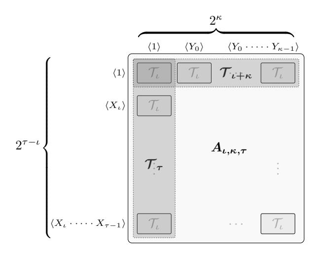

# Succinct Arguments over Towers of Binary Fields

Benjamin E. Diamond

Jim Posen

Irreducible

Irreducible

[bdiamond@irreducible.com](mailto:bdiamond@irreducible.com)

[jposen@irreducible.com](mailto:jposen@irreducible.com)

#### Abstract

We introduce an efficient SNARK for towers of binary fields. Adapting Brakedown (CRYPTO '23), we construct a multilinear polynomial commitment scheme suitable for polynomials over tiny fields, including that with just two elements. Our commitment scheme, unlike those of previous works, treats small-field polynomials with no embedding overhead. We further introduce binary-field adaptations of HyperPlonk (EUROCRYPT '23)'s product and permutation checks and of Lasso (EUROCRYPT '24)'s lookup. Our binary PLONKish variant captures standard hash functions—like Keccak-256 and Grøstl extremely efficiently. With recourse to thorough performance benchmarks, we argue that our scheme can efficiently generate precisely those Keccak-256-proofs which critically underlie modern efforts to scale Ethereum.

## 1 Introduction

Succinct noninteractive arguments of knowledge, or SNARKs, have recently surged in relevance. Though long hindered by poor prover performance, SNARKs now plausibly stand to make blockchains more scalable, thanks to a recent, renewed effort to make these schemes more concretely efficient.

Many modern SNARKs proceed according to a framework which compiles polynomial interactive oracle proofs into succinct arguments of knowledge using polynomial commitment schemes. This framework's formalization appears in B¨unz, Fisch and Szepieniec [\[BFS20\]](#page-44-0) and Chiesa et al. [\[Chi+20\]](#page-45-0). That latter work along with several previous works, like Maller, Bowe, Kohlweiss, and Meiklejohn's Sonic [\[MBKM19\]](#page-46-0) and Gabizon, Williamson, and Ciobotaru's PlonK [\[GWC19\]](#page-45-1), in which the polynomial IOP framework is implicit uses the celebrated polynomial commitment scheme of Kate, Zaverucha, and Goldberg (KZG) [\[KZG10\]](#page-45-2), which relies on the hardness of the discrete logarithm problem in elliptic curve groups.

Ben-Sasson et al.'s highly influential Fast Reed–Solomon IOP of Proximity (FRI) [\[BBHR18a\]](#page-43-0) has reenergized an alternative approach—dating originally to Kilian [\[Kil92\]](#page-45-3)—which, in contrast with that based on elliptic curves, achieves succinct arguments with the aid of linear error-correcting codes and collision-resistant hash functions. The most popular exemplar of this latter approach is the Scalable Transparent Arguments of Knowledge (STARK) protocol of Ben-Sasson, Bentov, Horesh, and Riabzev [\[BBHR18b\]](#page-43-1). Subsequent expositions of this line of work have reinterpreted STARKs in the polynomial IOP framework discussed above (see for example Hab¨ock [\[Hab22\]](#page-45-4)); in this light, we freely refer henceforth to the FRI polynomial commitment scheme (FRI-PCS).

FRI-PCS is not the sole polynomial commitment scheme that leverages linear codes and hash functions. Golovnev et al.'s Brakedown polynomial commitment scheme [\[Gol+23\]](#page-45-5), which distills ideas from Bootle, Chiesa, and Groth [\[BCG20\]](#page-43-2) and Ames, Hazay, Ishai, and Venkitasubramaniam [\[AHIV23\]](#page-43-3), also uses linear error-correcting codes, and operates within the IOP model. Asymptotically, Brakedown's verifier complexity and proof size both grow on the order of the square root of the size of the polynomial being evaluated. (We use terminology somewhat permissively in this work, by classifying as "SNARKs" those protocols whose verifiers scale merely sublinearly, as opposed to strictly polylogarithmically, in their witness sizes.) Diamond and Posen [\[DP24\]](#page-45-6) improve the concrete efficiency of Brakedown by a factor of roughly two. While Brakedown's asymptotic verifier complexity is inferior to FRI's, in many settings of practical interest, the concrete extent of this inferiority is mild, so that Brakedown's highly efficient prover makes it a practical alternative.

Recursive proof composition stands to further mitigate the impact of Brakedown's less-efficient verifier. Instead of proving an entire statement or virtual machine execution in a single SNARK, one can often split up the statement in such a manner that it may be verified incrementally. Valiant [Val08] shows that incrementally verifiable computation can be realized through recursive SNARK composition, so that a long virtual machine execution, say, might be proven with recourse just to SNARKs for circuits of bounded size. By composing a series of inner SNARKs with large proof sizes but fast proving times with an outer SNARK with a small proof and a relatively slower proving time, one might obtain a hybrid system that features both a small proof and a fast proving time.

Three major factors account for the performance advantage enjoyed by FRI-PCS and Brakedown-based SNARKs over those based on elliptic curve assumptions.

- Small fields. Elliptic curve groups must be large—on the order of 256 bits—to attain standard security levels. The ethSTARK [Sta21] and Plonky2 [Pol22] systems pioneer an alternative design, characterized by the use of smaller fields (specifically, of prime fields on the order of 64 bits). By leveraging the relative efficiency of small-field arithmetic, these systems achieve state-of-the-art proving performance. Moreover, these protocols' use only of small-field elements reduces their storage requirements, which in turn leads to better cache-efficiency on CPUs.
- Structured fields. These schemes tend to use fields that are not just small, but also computationally structured. Plonky2 [Pol22], for example, highlights the Goldilocks field  $\mathbb{F}_p$ , where  $p = 2^{64} 2^{32} + 1$ . This prime modulus is a Solinas prime—that is, a prime of the form  $\phi^2 \phi + 1$ , where here  $\phi = 2^{32}$ —and so admits an especially efficient modular reduction algorithm.
- Efficient primitives. Standard-issue collision-resistant hash functions are much faster than elliptic curve primitives.

As a rough comparison, the FRI-PCS scheme parameterized with Goldilocks and Keccak-256 commits 1 MiB of data about 7-fold faster than does KZG [KZG10] over the BN254 bilinear group. We note that polynomial commitment accounts for the bulk of the prover's cost in most SNARKs.

In view of the performance gains that smaller finite fields stand to unlock, in this work, we extend this trend to its logical conclusion: SNARKs over the smallest field,  $\mathbb{F}_2$ .

Binary fields. Finite fields of characteristic 2, or binary fields, have a rich history in cryptography. The AES block cipher and the GMAC message authentication code, standardized for use alongside AES, famously use the binary fields  $\mathbb{F}_{2^8}$  and  $\mathbb{F}_{2^{128}}$ , respectively. A further important line of research pertains to cryptographically secure elliptic curves over binary fields; these curves feature highly efficient circuit instantiations. We recall some basic properties of binary fields that account for their applicability in cryptography. The elements of the field  $\mathbb{F}_{2^k}$  can be unambiguously represented as k-bit strings; for example, there is a bijection between the set of bytes of data and the finite field  $\mathbb{F}_{2^8}$ . Field addition corresponds to the logical exclusive or (XOR) operation on these bit representations. Also, squaring elements of a binary field is significantly less expensive than multiplying two distinct elements is, thanks to the fact that  $(x+y)^2 = x^2 + y^2$  for each pair of elements x and y in these fields (an identity sometimes called the "freshman's dream").

In this work, we present a SNARK construction over the field  $\mathbb{F}_2$  which competes favorably with state-of-the-art systems built with prime fields. Moreover, we argue that when proving computations that depend heavily on bitwise operations, such as the SHA-256 and Keccak-256 hash functions, our system outperforms its prime field-based peers. We acknowledge that our work is not the first to consider SNARKs over characteristic-2 fields; it is the first we are aware of, however, which delivers an implementation-oriented SNARK construction over  $\mathbb{F}_2$  specifically, and which moreover avoids embedding overhead, a phenomenon we now explain. While [BBHR18b] develops a STARK construction over characteristic-2 fields, the naïve use of small field techniques cannot deliver superior concrete efficiency over  $\mathbb{F}_2$ , for a simple reason: the alphabet of each Reed-Solomon code must be at least as large as its block length. Separately from this limitation, which pertains to the FRI IOP of proximity, the ALI protocol in STARK—as well as the DEEP-ALI protocol of the successor work Ben-Sasson, Goldberg, Kopparty, and Saraf [BGKS19]—uses fast polynomial multiplication techniques. Fast multiplication techniques for polynomials over  $\mathbb{F}_2$  embed those polynomials  $\mathbb{F}_2$ -coefficients into an extension field, and so mandate the use of a field at least as large as the witness.

An influential line of recent works—which includes Spartan [Set20], HyperPlonk [CBBZ23], and CCS [STW23]—raises the prospect of overcoming these limitations. These works develop SNARKs that by-pass polynomial multiplication; instead, they leverage the classical multivariate sumcheck protocol of Lund, Fortnow, Karloff, and Nisan [LFKN92], developed further in key work of Goldwasser, Kalai and Rothblum [GKR15]. These protocols use multilinear polynomial IOPs and multilinear polynomial commitment schemes, as opposed to these objects' univariate analogues. Equipped with the polynomial commitment schemes of [Gol+23] and [DP24]—which do not mandate the use of Reed–Solomon codes, and in fact work for general linear codes—the multilinear regime stands to deliver efficient SNARKs over  $\mathbb{F}_2$  with no embedding overhead.

While Reed–Solomon codes represent far from the only available choice, they nonetheless remain attractive. They are efficiently encodable and maximum-distance separable, and, moreover, admit a proximity-gap result—due to Ben-Sasson et al. [Ben+23]—which strengthens the best-available analogues currently known for general linear codes.

We propose two concrete polynomial commitment schemes over  $\mathbb{F}_2$ , both based on Brakedown. We recall that Brakedown works roughly by shaping its input polynomial's coefficients into a two-dimensional matrix, encoding it row-wise, and then randomly testing the resulting matrix's columns for proximity to the code and for consistency with prover-supplied messages. One candidate  $\mathbb{F}_2$ -multilinear polynomial commitment would opt to instantiate Brakedown with a concatenated code, itself constructed using a Reed–Solomon outer code and an ad-hoc inner code (that inner code's message and block lengths are so small that it can be selected using ad-hoc techniques). Targeting prover efficiency and implementation simplicity, we propose a second option, which—in virtue of a technique we call block-level encoding—allows us to use Reed–Solomon codes simpliciter. Our second scheme draws inspiration from the concatenated code-based approach, but simplifies that approach by omitting its inner code. The idea is to pack the elements of each message into extension field elements, to encode each resulting message using a Reed–Solomon code, and finally to randomly sample and test blocks of contiguous columns from the encoded matrix—which themselves correspond to Reed–Solomon symbols in the extension field—as opposed to sampling and testing individual columns. Though this approach yields slightly larger proofs than the concatenated code-based method does, its implementation advantages compensate for that shortcoming.

Using this technique, our protocol attains the remarkable property whereby its commitment phase imposes zero embedding overhead. That is, the cost of committing an  $\ell$ -variate multilinear polynomial  $t(X_0, ..., X_{\ell-1})$  over  $\mathbb{F}_2$  is nearly identical under our scheme—i.e., aside from small data transposes—to that of committing an  $\ell - \kappa$ -variate polynomial  $t'(X_0, ..., X_{\ell-\kappa-1})$  over the extension field  $\mathbb{F}_{2^{2^{\kappa}}}$  (which contains the same quantity of information). On the other hand,  $t(X_0, ..., X_{\ell-1})$ 's evaluation proofs are still more expensive than  $t'(X_0, ..., X_{\ell-\kappa-1})$ 's are, for both the prover and the verifier. Finally, the sumcheck protocol also runs less efficiently on  $t(X_0, ..., X_{\ell-1})$  than it does on  $t'(X_0, ..., X_{\ell-\kappa-1})$ , a consequence of the fact that that protocol draws its challenges from a cryptographically-sized extension field (like  $\mathbb{F}_{2^{128}}$ ). This latter issue is remediated in part by certain optimizations to the sumcheck protocol available only in the small-field setting, which we discuss in Subsection 4.2.

For these reasons, we decline to end our investigation of binary SNARKs at  $\mathbb{F}_2$ . Rather, we push this approach further, by using a full tower of extensions over  $\mathbb{F}_2$ , of the form  $\mathbb{F}_2 \subset \mathbb{F}_{2^2} \subset \mathbb{F}_{2^4} \subset \mathbb{F}_{2^8} \subset \cdots \subset \mathbb{F}_{2^{128}}$ . In this way, we introduce a new sort of flexibility into our scheme's arithmetization procedure, whereby it may use finite fields that appropriately capture the respective data types that the high-level program it is arithmetizing uses.

One key illustration of the utility of tower fields at the constraint system level appears in connection with the hash function  $Gr \not o stl$  [Gau+11]. Gr ostl has undergone extensive cryptanalysis and was a finalist candidate in the SHA-3 competition. The hash function's design is based on AES's and uses the same  $Rijndael\ S$ -box as AES does. Like AES, Gr ostl is, in a sense, natively defined over  $\mathbb{F}_{2^8}$ , and so admits an efficient arithmetization in any constraint system that features native  $\mathbb{F}_{2^8}$ -operations. We believe that this fact makes Gr ostl an attractive candidate hash function for our SNARK system. This observation resembles one made by Ben-Sasson, Bentov, Horesh, and Riabzev [BBHR18b, § E], who note that hash functions based on the Rijndael-160 cipher possess simple arithmetic descriptions. Accordingly, we expect to encounter low recursion overheads in those SNARKs that use this work's techniques and are instantiated with Gr ostl. This fact marks a notable benefit over prime field-based SNARKs, which rely, for the sake of efficient recursive verification, on more recent—and less battle-tested—arithmetization-optimized hash functions like Poseidon [Gra+19].

Our use of binary towers serves us beyond the arithmetization layer. In Subsection 2.3 below, we resurface an explicit, iterated tower construction due to Wiedemann [Wie88]. That tower boasts remarkable computational advantages, as Fan and Paar [FP97] first noticed. In Wiedemann's tower level  $\mathbb{F}_{2^k}$ , multiplication, and even inversion, can be carried out with asymptotic complexity just  $O(k^{\log_2 3})$ , a consequence of Karatsuba-based techniques. The multiplication of field elements with subfield elements has still better computational complexity, as we explain in Subsection 2.3. Chen et al. [Che+18] have exploited precisely this property of tower fields to improve the performance of polynomial multiplication in binary fields. In our performance evaluation in Section 6 below, we discuss the implications of the recently introduced Intel Galois Field New Instructions (GFNI) instruction set extension on software implementations of Wiedemann's tower that target capable processors.

#### 1.1 Our Contributions

We summarize our contributions in this work as follows.

- 1. A formal definition of small-field polynomial commitment schemes. While small field techniques appear in several existing SNARKs—such as Plonky2 [Pol22] and RISC Zero [BGR23]—the security of these schemes depends on a certain undocumented soundness property, whereby the committed polynomial's coefficients actually reside in the required ground field, as opposed to in the extension field from which the polynomial's evaluation query is drawn. (See Definition 3.3.)
- 2. A proof that [DP24] achieves a small-field polynomial commitment scheme. We prove that the construction [DP24, Cons. 3]—with appropriate minor modifications—actually yields a small-field scheme in the strong sense outlined above, and so provides "better-than-advertised" security. (See Theorem 3.13.)
- 3. A generalization of [DP24] which uses block-level testing. Our construction yields an efficient small-field polynomial commitment scheme for  $\mathbb{F}_2$ -polynomials which uses Reed-Solomon codes alone, and which encounters zero embedding overhead during its commitment phase. (See Subsection 3.4.)
- 4. An efficient shift argument for polynomials over the boolean hypercube. We define an operator which, on input a multivariate polynomial t, yields a multilinear polynomial whose values on the cube are exactly t's, but circularly rotated by an arbitrary amount of steps. Our construction answers an open problem posed by HyperPlonk (see [CBBZ23, p. 52] of the full version). (See Subsection 4.3.)
- 5. An adaptation of the Lasso lookup argument [STW24] to the binary tower setting. Setty, Thaler and Wahby's Lasso [STW24] differs from prior lookup arguments—including that given in HyperPlonk [CBBZ23, § 3.7]—in that it explicitly exploits the relative cheapness of committing to small-valued elements. While the authors of [STW24] highlight this benefit only in the setting of elliptic curve-based polynomial commitments, we show how to capture it moreover in our tower setting. (See Subsection 4.4.)
- 6. An adaptation of *PLONKish* to the binary tower setting, and a SNARK for it. We adapt the *PLONKish* arithmetization relation of HyperPlonk [CBBZ23, Def. 4.1] to our setting, enriching it in various ways (we introduce a constraint system defined over a tower of fields, as opposed to just one). (See Subsection 5.1.)
- 7. An arithmetization of the Keccak-f[1600] permutation. This permutation resides at the core of the Keccak-256 hash function enshrined in the Ethereum protocol, and represents a key a bottleneck facing attempts to prove statements about the Ethereum blockchain. (See Subsection 5.4.)
- 8. A performance evaluation of field arithmetic, our polynomial commitment scheme, and the sumcheck protocol, all in the tower setting. We moreover compare our software implementation to those of state-of-the-art prime field SNARKs. Our multilinear polynomial commitment scheme can commit a  $2^{28}$ -coefficient  $\mathbb{F}_2$ -polynomial about 30-fold faster than can Plonky3's Baby Bear-based implementation of FRI-PCS, and about 40-fold faster than Hyrax [Wah+18]. (See Section 6.)

#### 1.2 Prior Works

We discuss various relevant previous works. We have already mentioned above the *ethSTARK* [Sta21] and *Plonky2* [Pol22] systems, which introduce the use of 64-bit prime fields (and extensions thereof). The ALI [BBHR18b] and DEEP-ALI [BGKS19] protocols—also discussed above—appear to work even over binary fields, albeit with embedding overhead.

The ECFFT sequence of works of Ben-Sasson, Carmon, Kopparty and Levit [BCKL23; BCKL22] presents an alternative to ALI and DEEP-ALI which makes applicable DEEP-ALI's cyclic-group-based approach in arbitrary fields (i.e., as opposed to merely in FFT-friendly prime fields). We note that ECFFT entails a form of embedding overhead twice as burdensome as that which DEEP-ALI imposes, as we now explain. Indeed, for a characteristic p (say, 2) and a witness size parameter k fixed, that work [BCKL22, Prop. 1] guarantees the existence of an acceptably sized elliptic curve E—that is, one whose group of  $\mathbb{F}_q$ -rational points contains an order-2<sup>k</sup> cyclic subgroup—only over a doubly large field extension of  $\mathbb{F}_p$ , of size  $q \geq \Omega(2^{2 \cdot k})$ . In other words, it requires that the curve's field of definition  $\mathbb{F}_q$  be roughly as large as the square of the witness. (This fact relates to the Hasse–Weil bound; we refer to the proof of [BCKL22, Cor. 1].) Moreover, the work's Reed–Solomon codewords (in the sense of [BCKL22, Thm. 12]) have  $\mathbb{F}_q$ -entries, in general. We see that messages with entries in  $\mathbb{F}_2$ , say, stand to yield codewords that are  $2 \cdot k$ -fold larger than rate considerations alone demand that they be. For this reason, we find that work unlikely to be competitive with ours.

An interesting work of Cascudo and Giunta [CG22] directly targets the use of Ligero on witnesses valued in  $\mathbb{F}_2$ . We briefly recall the approach of that work. Key to that work is the idea of a reverse multiplication-friendly embedding, a notion which originates with Cascudo, Cramer, Xing and Yuan [CCXY18]. In short—and we restrict our discussion to the case p := 2—a  $(k, e)_2$ -RMFE is a pair of  $\mathbb{F}_2$ -linear maps  $\varphi : \mathbb{F}_2^k \to \mathbb{F}_{2^e}$  and  $\psi : \mathbb{F}_{2^e} \to \mathbb{F}_2^k$  for which, for each pair of elements x and y of  $\mathbb{F}_2^k$ ,  $x * y = \psi(\varphi(x) \cdot \varphi(y))$  holds (here, we denote by \* componentwise multiplication, or bitwise AND). The insight of [CG22] is that RMFEs serve to export R1CSs relations defined over  $\mathbb{F}_2$  to related ones defined over  $\mathbb{F}_{2^e}$ ; crucially, in this latter field, e is sufficiently large that Ligero can be applied off-the-shelf. Specifically, that work replaces each R1CS relation  $A \cdot w * B \cdot w = C \cdot w + b$ , where  $w \in \mathbb{F}_2^n$  say, with a related relation defined on the image  $\widetilde{w} := \Phi(w) \in \mathbb{F}_{2^e}^{n/k}$  (here,  $\Phi$  denotes the block-wise extension of  $\varphi$ ). On the one hand, Ligero can be used to decide this latter relation. On the other, the latter relation moreover implies the former, provided that  $\widetilde{w}$  is indeed in the image of  $\Phi$ ; [CG22] describes further "lincheck" protocols which serve to convince the verifier of this fact.

The first key question is how small e can be taken, relative to k. Cascudo and Giunta [CG22, § 2.2] note, first of all, the lower bound  $e \ge 2k-1$ , so that a blowup of at least twofold is inevitable. On the positive side, using sophisticated techniques, [CCXY18, Thm. 5] shows that asymptotically,  $e = \Theta(k)$  can be achieved; moreover, when p := 2, the implicit constant can be taken to be less than 5 [CCXY18, Cor. 2]. Finally, [CG22, § A.1] presents practical constructions which show that, in essentially all parameter regimes of practical interest, e/k can be taken to be less than 4.

In any case, we find that [CG22] stands to induce a factor-of-4 blowup in the size of the statement upon which Ligero is run, as well as to impose further computational costs associated with its linchecks. Our work, on the other hand, adapts Ligero so as to make that work applicable "natively" to  $\mathbb{F}_2$ -elements, and induces no blowup. For these reasons, we find that work unlikely to compare favorably with ours.

We finally note various works which build zero-knowledge proofs specifically for the boolean circuit model of computation, and which moreover feature asymptotically linear-time provers. Ron-Zewi and Rothblum [RR22] and Holmgren and Rothblum [HR22] develop an interesting approach based on tensor codes and "code switching"; their approach internally invokes a sequence of Spielman codes respectively defined over successive extension fields of characteristic 2. A further line of work applies techniques from MPC; we refer for example to Weng, Yang, Katz and Wang's Wolverine [WYKW21], as well as to the survey of Baum, Dittmer, Scholl and Wang [BDSW23]. These works, while interesting, face various limits as far as practical usability is concerned. They feature either private-coin verifiers [WYKW21; RR22; BDSW23], linearly-sized proofs [WYKW21; RR22; BDSW23], non-negligible soundness error [RR22], or else unspecified large constants [HR22]. We note finally that our PLONKish arithmetization (see Subsection 5.1 below) exposes a computational model significantly richer than that made available by boolean circuits. Indeed, our arithmetization features native  $\mathbb{F}_{2^{2^k}}$ -operations (for arbitrary k), as well as custom gates, copy constraints, and lookups. For these reasons, our computational model can capture with much less overhead those statements of practical interest in blockchains.

#### 1.3 Technical Overview

We roughly sketch our work's main ideas. We begin with our polynomial commitment scheme. For simplicity, we sketch here only our scheme's behavior on  $\mathbb{F}_2$ -polynomials; in general, our protocol supports polynomials over arbitrary binary fields of power-of-two degree.

Review of Brakedown. To explain our scheme, we first recall the Ligero polynomial commitment scheme [AHIV23], as expressed by Brakedown [Gol+23], and further simplified by Diamond and Posen [DP24, § 4]. We fix an integer  $\ell \geq 0$  and an  $\ell$ -variate multilinear polynomial  $t(X_0,\ldots,X_{\ell-1}) \in \mathbb{F}_{2^{128}}[X_0,\ldots,X_{\ell-1}]^{\leq 1}$ . We moreover partition  $\ell = \ell_0 + \ell_1$ . For expository purposes, we in fact assume that  $\ell$  is even and that  $\ell_0 = \ell_1$  (the real-world considerations governing this partition are subtler). Brakedown begins by writing  $t(X_0,\ldots,X_{\ell-1})$ 's list  $(t(v))_{v\in\mathcal{B}_\ell}$  of Lagrange coefficients into a square,  $2^{\ell_0}\times 2^{\ell_1}$  matrix  $(t_i)_{i=0}^{m_0-1}$  in row-major order (we write  $m_0 \coloneqq 2^{\ell_0}$  and  $m_1 \coloneqq 2^{\ell_1}$ ). For each evaluation point  $(r_0,\ldots,r_{\ell-1}) \in \mathbb{F}_{2^{128}}^{\ell}$ , we recall the standard vector-matrix-vector identity:

$$t(r_0, \dots, r_{\ell-1}) = \begin{bmatrix} & \bigotimes_{i=\ell_0}^{\ell-1} (1 - r_i, r_i) & \end{bmatrix} \cdot \begin{bmatrix} - & t_0 & - \\ & \vdots & \\ - & t_{m-1} & - \end{bmatrix} \cdot \begin{bmatrix} & \bigotimes_{i=0}^{\ell_0-1} (1 - r_i, r_i) & \end{bmatrix}^T.$$

In light of this identity, it suffices for the verifier to obtain the row-product  $t' := \bigotimes_{i=\ell_0}^{\ell-1} (1-r_i, r_i) \cdot (t_i)_{i=0}^{m_0-1}$ ; given this value, the verifier may learn its desired quantity  $t(r_0, \ldots, r_{\ell-1}) = t' \cdot \bigotimes_{i=0}^{\ell_0-1} (1-r_i, r_i)$  using just  $O(m_0) = O\left(\sqrt{2^\ell}\right)$  further field operations. In Brakedown, the prover opts in fact to send the verifier t' directly (it computes t' immediately after receiving  $(r_0, \ldots, r_{\ell-1})$ ).

To make this procedure secure, Brakedown must bind its prover to its matrix  $(t_i)_{i=0}^{m_0-1}$  (that is, before it sees  $(r_0, \ldots, r_{\ell-1})$ ). To do this, Brakedown demands that its prover encode each row of  $(t_i)_{i=0}^{m_0-1}$  using a fixed, global error-correcting code. The prover finally Merkle-commits the resulting matrix, say  $(u_i)_{i=0}^{m_0-1}$ .

Upon choosing its evaluation point  $(r_0,\ldots,r_{\ell-1})$ , sending it to the prover, and receiving t' in return, the verifier, finally, launches its  $testing\ phase$ . In this phase, the verifier locally encodes t' itself, so obtaining the codeword u', say. The verifier begins selecting random codeword indices  $j\in\{0,\ldots,n-1\}$ , requesting in each instance the  $j^{\text{th}}$  column  $(u_{i,j})_{i=0}^{m_0-1}$  of the prover's Merkle-committed matrix  $(u_i)_{i=0}^{m_0-1}$ . Upon obtaining each such column—itself certified by an appropriate Merkle path—the verifier checks whether it relates as it should to its local codeword u'; that is, it checks whether  $u'_j \stackrel{?}{=} \bigotimes_{i=\ell_0}^{\ell-1} (1-r_i,r_i) \cdot (u_{i,j})_{i=0}^{m_0-1}$  holds. (By the linearity of the error-correcting code,  $u' = \bigotimes_{i=\ell_0}^{\ell-1} (1-r_i,r_i) \cdot (u_i)_{i=0}^{m_0-1}$  must hold if the prover is honest.) Each such check takes roughly  $O(m_1) = O\left(\sqrt{2^\ell}\right)$  work for the verifier. By means of coding-theoretic analyses, [AHIV23], [Gol+23] and [DP24, § 4] show that, if the code at hand is of constant relative distance, then, provided that it manages to successfully run  $\Theta(\lambda)$  checks of this form, the verifier may certify with confidence that  $(u_i)_{i=0}^{m_0-1}$  is interleaved-close to the code—so that  $(t_i)_{i=0}^{m_0-1}$ , and hence  $t(X_0,\ldots,X_{\ell-1})$  too, is well-defined—as well as that t' is correct, so that the verifier's final result  $t(r_0,\ldots,r_{\ell-1})$  also is. The total work for the verifier on the order of  $O(m_0+\lambda\cdot m_1)=O\left(\lambda\cdot\sqrt{2^\ell}\right)$ .

The small-field case. We turn our attention to the small-field case; in fact, we fix a polynomial  $t(X_0,\ldots,X_{\ell-1})$  with coefficients in  $\mathbb{F}_2$ . We attempt to recapitulate, in this latter setting, the recipe sketched above. The Lagrange vector  $(t(v))_{v\in\mathcal{B}_\ell}$  is now a vector of mere bits. We may well write these bits, as before, into a square matrix, provided we tacitly interpret each bit as an  $\mathbb{F}_{2^{128}}$ -element (here, we use the embedding  $\mathbb{F}_2\subset\mathbb{F}_{2^{128}}$ ). If, following Brakedown's prescription, we picked a generic error-correcting code over  $\mathbb{F}_{2^{128}}$ , we would impose upon our prover an extremely inefficient encoding procedure. Indeed, its messages would not be general elements of the message space  $\mathbb{F}_{2^{128}}^{m_1}$ ; rather, their symbols would reside exclusively in the much-smaller subfield  $\mathbb{F}_2\subset\mathbb{F}_{2^{128}}$ . The "information density" of these messages would be unusually low. On the other hand, the symbols of its resulting codewords would be general elements of  $\mathbb{F}_{2^{128}}$ . These codewords, then, would be huge, relative to the prover's initial messages; that is, those messages would expand, upon being encoded, not just by a factor of  $\frac{1}{\rho}$ , as is typical, but moreover by a further factor of 128.

One preliminary remedy would opt to choose a strictly binary code—that is, a code over the alphabet  $\mathbb{F}_2$ —and to proceed otherwise as in Brakedown where possible. In Subsection 3.3 below, we show that this approach can be made to work, granting some coding-theoretic effort (see Subsection 3.1). Indeed, despite beginning with messages  $(t_i)_{i=0}^{m_0-1}$  over  $\mathbb{F}_2$ , our prover—in this Brakedown variant—would obtain a row-sum t' defined rather over  $\mathbb{F}_{2^{128}}$ . By which device should the verifier "encode" this latter vector, whose symbols reside in not in the code's alphabet, but in a vector space over that alphabet? We resolve this matter by means of a coding-theoretic construction we call the *extension code* (see Definition 3.1); using that construction, we record our first, preliminary small-field Brakedown variant (see Construction 3.7). We moreover establish security notions appropriate for such "small-field polynomial commitment schemes" as ours; in short, we must demand that our emulator reliably extract a polynomial defined indeed over  $\mathbb{F}_2$ , as opposed to over some larger field (our security definitions are given in Subsection 3.2 below).

Binary codes of constant distance and rate are inconvenient. The most well-known construction of these objects uses *concatenated codes* (see e.g. Guruswami [Gur06, § 2.3]), which require that an ad-hoc "inner code" be supplied. In Subsection 3.4 below, we explain at length our insistence on developing a construction which supports polynomials over tiny fields and uses only standard Reed–Solomon codes.

Reed–Solomon codes over  $\mathbb{F}_2$  itself, of course, don't exist; those codes definitionally demand alphabets larger than or equal to their block lengths. One could, as in the straw-man solution above, pick rather a Reed–Solomon code whose alphabet was as small as circumstances allowed—say,  $\mathbb{F}_{2^{16}}$ —and once again apply Brakedown otherwise unchanged. This approach, however, would again induce embedding overhead, albeit of a more moderate sort; indeed, it would entail a message-expansion factor merely 16-fold too large, as opposed to 128-fold too large.

We present our main technical solution in Subsection 3.4 below (see specifically Construction 3.11). Our key idea involves a certain sort of data-casting operation, which we call packing. Given its usual binary,  $m_0 \times m_1$  matrix  $(t_i)_{i=0}^{m_0-1}$ —with rows each of  $m_1 = 2^{\ell_1}$  bits—our prover groups each such row's bits into 16-bit chunks. In this way, our prover may "pretend" that its matrix  $(t_i)_{i=0}^{m_0-1}$  were rather an  $m_0 \times \frac{m_1}{16}$  matrix over the field  $\mathbb{F}_{2^{16}}$ . Our prover then proceeds as in Brakedown on this matrix, using now a Reed–Solomon code over  $\mathbb{F}_{2^{16}}$ . We note that this commitment procedure again eliminates embedding overhead.

To attach to this commitment procedure a meaningful evaluation protocol, we must overcome various obstacles. We must first deal—as we had to above—with the verifier's encoding of t'. Indeed, it is simply not clear how the verifier should encode t'—itself a length- $m_1$  vector, with components in  $\mathbb{F}_{2^{128}}$ —so as to obtain a result u' which relates meaningfully to the prover's matrix  $(u_i)_{i=0}^{m_0-1}$ . The perhaps-most-direct route would observe simply that our packing procedure above is nothing other than that attached to Construction 3.7's specialization to a *certain* concatenated code—namely, to that built out of a Reed–Solomon outer code and a trivial inner code. On the other hand, that latter specialization would mandate that the verifier sample random bit-columns in the codeword index space  $\left\{0,\ldots,\frac{m_1}{\rho}-1\right\}$  during its testing phase. Our construction, rather, encourages the verifier to query and test random size-16 blocks of columns in the shortened index space  $\left\{0,\ldots,\frac{1}{16}\cdot\frac{m_1}{\rho}-1\right\}$ ; below, we call this idea *block-level testing*. Fascinatingly, our block-testing mechanism delivers smaller, sounder proofs than that based on independent bit-columns can; we explain this counterintuitive fact in Subsection 3.5 below (see also Examples 3.15 and 3.16).

By introducing a new algebraic object—which we call the *tower algebra* (see Definition 3.8)—we achieve a more conceptual, albeit technically trickier, characterization of our main Brakedown variant. The tower algebra is an algebraic object whose elements are, essentially, bundles of  $16 \mathbb{F}_{2^{128}}$ -elements. Its multiplicative structure, moreover, makes the prover's and verifier's row-combination and encoding steps both linear (albeit over different subfields of the algebra!). Most importantly, it captures the precisely the framework within which our security analysis might best proceed. In Theorem 3.10 below, we record the *proximity gap* at the heart of that analysis, which adapts a result of Diamond and Posen [DP24, Thm. 2].

The role of towers. Our discussion thus far has proceeded with heed just to the single base field  $\mathbb{F}_2$ . In applications, however, we must deal simultaneously with polynomials over multiple fields. To make these fields interoperate, we work with towers of binary fields, which we discuss at length in Subsection 2.3. Our tower-based approach allows us to view  $\mathbb{F}_{2^{128}}$  simultaneously as a vector space over each of its intermediate subfields, and to efficiently multiply elements of that field by elements of its subfields.

To showcase the utility of our tower-based approach, we develop a case study. We imagine using our

scheme to commit to two different multilinears, both  $\ell$ -variate, defined over  $\mathbb{F}_{2^8}$  and  $\mathbb{F}_{2^{16}}$ , respectively. In both commitments, we use the same matrix shape configuration  $\ell_0 + \ell_1 = \ell$ . Those polynomials' commitment procedures will begin by reshaping their respective Lagrange coefficient vectors into matrices of shape  $2^{\ell_0} \times 2^{\ell_1}$  (over  $\mathbb{F}_{2^8}$  and over  $\mathbb{F}_{2^{16}}$ , respectively). Finally, we imagine evaluating both committed polynomials at the single point  $(r_0, \ldots, r_{\ell-1}) \in \mathbb{F}_{2^{128}}$ . This situation is plausible, say after a batched sumcheck.

The prover's first step, in its two evaluation protocols, will be to tensor-expand the suffix  $(r_{\ell_0},\ldots,r_{\ell-1})$  and to independently row-combine both of its matrices using the single tensor vector  $\bigotimes_{i=\ell_0}^{\ell-1}(1-r_i,r_i)$ . These two row-combinations will involve  $\mathbb{F}_{2^{128}}\times\mathbb{F}_{2^8}$  operations and  $\mathbb{F}_{2^{128}}\times\mathbb{F}_{2^{16}}$  operations, respectively. In our tower-centric setting, the prover can do both of these sorts of operations efficiently, without conversions. That is, the prover can multiply elements of  $\mathbb{F}_{2^{128}}$  with elements of each of that field's subfields efficiently. The cost of each  $\mathbb{F}_{2^{128}}\times\mathbb{F}_{2^8}$  multiplication, in the tower setting, is exactly that of  $\frac{128}{8}=16$   $\mathbb{F}_{2^8}\times\mathbb{F}_{2^8}$  multiplications. The cost of each  $\mathbb{F}_{2^{128}}\times\mathbb{F}_{2^{16}}$  multiplication is that of  $\frac{128}{16}=8$   $\mathbb{F}_{2^{16}}\times\mathbb{F}_{2^{16}}$  multiplications.

If we didn't use towers, then there would be no way for the prover to do both of these row-combinations efficiently (i.e. without linear-algebraic conversions). The parties could always permanently express  $\mathbb{F}_{2^{128}}$  as a direct algebraic extension of  $\mathbb{F}_{2^8}$ , say. This representation would make the prover's  $\mathbb{F}_{2^{128}} \times \mathbb{F}_{2^8}$  multiplications efficient. Unfortunately, it would make its  $\mathbb{F}_{2^{128}} \times \mathbb{F}_{2^{16}}$  multiplications costly. To perform those, the prover would have two choices. On the one hand, it could first embed each right-hand operand along some field embedding  $\mathbb{F}_{2^{16}} \hookrightarrow \mathbb{F}_{2^{128}}$ , before performing its multiplications rather in that latter field. This approach would face the cost of these embeddings, for one, and moreover would fail to exploit fact of its right-hand operands' membership in the proper subfield  $\mathbb{F}_{2^{16}} \subset \mathbb{F}_{2^{128}}$ . On the other hand, it could re-express each left-hand  $\mathbb{F}_{2^{128}}$ -element in coordinates with respect to an appropriate  $\mathbb{F}_{2^{16}}$ -basis of  $\mathbb{F}_{2^{128}}$ , perform its multiplications componentwise, and then convert the results back. The resulting multiplications would be efficient, but the conversions would be costly (quadratic in the extension degree  $\deg(\mathbb{F}_{2^{128}} / \mathbb{F}_{2^8}) = 16$ ).

A similar problem afflicts the alternative approach in which  $\mathbb{F}_{2^{128}}$  is expressed as a direct algebraic extension of  $\mathbb{F}_{2^{16}}$ . In that setting,  $\mathbb{F}_{2^{128}} \times \mathbb{F}_{2^{16}}$  multiplications would become efficient. To carry out  $\mathbb{F}_{2^{128}} \times \mathbb{F}_{2^8}$  multiplications, on the other hand, the prover would have to first embed  $\mathbb{F}_{2^8} \hookrightarrow \mathbb{F}_{2^{16}}$ , and then carry out the resulting  $\mathbb{F}_{2^{128}} \times \mathbb{F}_{2^{16}}$  multiplications in the usual way. These embeddings again wouldn't be free, for one; moreover, the ensuing  $\mathbb{F}_{2^{128}} \times \mathbb{F}_{2^{16}}$  multiplications would fail to exploit their right-hand arguments' membership in the proper subfield  $\mathbb{F}_{2^8} \subset \mathbb{F}_{2^{16}}$ .

Multiplying an element of  $\mathbb{F}_{2^{128}}$  with an element of one of its subfields is efficient when  $\mathbb{F}_{2^{128}}$  is expressed as an explicit algebraic extension of that subfield. The only way to ensure this state of affairs simultaneously for all subfields of  $\mathbb{F}_{2^{128}}$  is to use towers. In fact, this is more-or-less the definition of a tower.

In practice, we use a particular tower construction, developed mathematically by Wiedemann [Wie88] and algorithmically by Fan and Paar [FP97]. That construction is even more efficient than general towers are; we discuss it in Subsection 2.3.

Beyond the PCS. In Section 4, we build a toolkit for multilinear polynomials in the binary setting. In Subsection 4.1, we define *virtual polynomials*, a crucial notion. A virtual polynomial is a polynomial assembled from raw, committed polynomials, which the verifier—given access to these underlying polynomials—can evaluate efficiently. While an important special case of this notion—namely, that of *composition* (see Example 4.9)—is implicit in prior work, our variant allows even virtual polynomials whose evaluation procedures are interactive (say, involving a sumcheck). This latter sort of flexibility proves essential in our Subsection 4.3, where we define various new virtual polynomials. These serve to *pack* and *shift* raw, committed polynomials. In fact, our shifting construction—itself a virtual polynomial of our more general variety—answers an open problem posed by HyperPlonk (see Remark 4.26). In Subsection 4.4, we develop a lookup argument, adapting Setty, Thaler and Wahby's *Lasso* [STW24] to the binary setting.

In Section 5, we put the pieces together, assembling a full SNARK for binary towers. We first describe a top-level IOP for our binary *PLONKish* variant (see Protocol 5.1). In Subsection 5.3, we describe various *gadgets*, designed to achieve unsigned integer arithmetic operations. Our addition gadget (see Protocol 5.3) effects a ripple-carry adder, using our shift construction internally. Our multiplication gadget (see Protocol 5.5) is still more complicated; it emulates the schoolbook algorithm on its arguments, using our lookup protocol to effect its limb-by-limb products and our addition gadget to accumulate its internal rows. Our gadgets stand to address the concerns of those who—citing the difficulty of unsigned integer arithmetic—have historically deemed implausible the prospect of concretely efficient, binary-field-based SNARKs.

**Performance and benchmarks.** In Section 6, we benchmark an end-to-end, Rust implementation of our protocol. Our benchmarks demonstrate that our protocol performs competitively against the state-of-the-art *Plonky3* and *Hyrax* polynomial commitment schemes, especially on polynomials over tiny fields. We moreover benchmark our scheme's performance on our binary-native arithmetization of the Keccak-f permutation (itself given in Subsection 5.4). On a benchmark task in which 8,192 independent Keccak-f permutations are proved valid, our scheme outperforms Plonky3 by roughly twofold in the singlethreaded setting and fourfold in the multithreaded setting (see Tables 5 and 6 below).

Acknowledgements. This work would not have been possible without the support of our colleagues at Irreducible. Their perspectives and insights regarding computational efficiency, as well as the thorough hardware prototypes they built, guided our investigation. We would like to gratefully acknowledge the contributions of Justin Thaler to this work, which arose throughout the course of many fruitful discussions. We would finally like to thank Eli Ben-Sasson for answering several questions pertaining to zk-STARKs over binary fields.

## 2 Background and Notation

We write  $\mathbb{N}$  for the set of nonnegative integers. For sets A and B, we write  $B^A$  for the set of maps  $A \to B$ . Below, we consider only finite fields. We fix an arbitrary finite field K (we focus on the case in which K is of characteristic 2). For each  $\ell \in \mathbb{N}$ , we write  $\mathcal{B}_{\ell}$  for the  $\ell$ -dimensional boolean hypercube  $\{0,1\}^{\ell} \subset K^{\ell}$ . We occasionally identify  $\mathcal{B}_{\ell}$  with the integer range  $\{0,\ldots 2^{\ell}-1\}$  lexicographically. That is, we identify each  $v=(v_0,\ldots,v_{\ell-1})$  in  $\mathcal{B}_{\ell}$  with the integer  $\sum_{i=0}^{\ell-1} 2^i \cdot v_i$ ; we moreover write  $\{v\}$  for this latter integer.

### <span id="page-8-0"></span>2.1 Polynomials

We recall certain basic facts pertaining to multivariate polynomials, referring throughout to Thaler [Tha22, § 3.5]. We recall the ring  $K[X_0,\ldots,X_{\ell-1}]$  of  $\ell$ -variate polynomials over K. We write  $K[X_0,\ldots,X_{\ell-1}]^{\preceq d}$  for the set of  $\ell$ -variate polynomials over K of individual degree at most d in each variable. Multilinear polynomials are multivariate polynomials of individual degree at most 1 in each variable (see [Tha22, Def. 3.4]); the set of all such polynomials is  $K[X_0,\ldots,X_{\ell-1}]^{\preceq 1}$ . A degree-d multivariate extension of a map  $t\in K^{\mathcal{B}_\ell}$  is a polynomial  $\hat{t}\in K[X_0,\ldots,X_{\ell-1}]^{\preceq d}$  for which  $\hat{t}(x)=t(x)$  holds for each  $x\in \mathcal{B}_\ell$ .

Each map  $t \in K^{\mathcal{B}_{\ell}}$  admits a unique degree-1 multivariate extension  $\hat{t} \in K[X_0, \dots, X_{\ell-1}]^{\leq 1}$  (see [Tha22, Fact 3.5]). We thus refer freely to the degree-1 multivariate extension of t; we write  $\tilde{t}$  for this polynomial and call it t's multilinear extension (MLE). We recall the equality indicator function  $eq : \mathcal{B}_{\ell} \times \mathcal{B}_{\ell} \to K$ , which sends  $(x, y) \mapsto x \stackrel{?}{=} y$ , as well as its MLE, the equality indicator polynomial (see [Tha22, Lem. 3.6]):

$$\widetilde{\operatorname{eq}}(X_0, \dots, X_{\ell-1}, Y_0, \dots, Y_{\ell-1}) = \prod_{i=0}^{\ell-1} (1-X_i) \cdot (1-Y_i) + X_i \cdot Y_i.$$

For each  $t \in K^{\mathcal{B}_{\ell}}$ , we have the following explicit representation of t's multilinear extension  $\widetilde{t} \in K[X_0, \dots, X_{\ell-1}]^{\leq 1}$ :

$$\widetilde{t}(X_0,\dots,X_{\ell-1}) = \sum_{v \in \mathcal{B}_\ell} t(v) \cdot \widetilde{\operatorname{eq}}(X_0,\dots,X_{\ell-1},v_0,\dots,v_{\ell-1}).$$

The proof that  $\widetilde{t}$  is t's multilinear extension is straightforward (see [Tha22, Lem. 3.6], for example). For each fixed  $(r_0, \ldots, r_{\ell-1}) \in K^{\ell}$ , the vector  $(\widetilde{eq}(r_0, \ldots, r_{\ell-1}, v_0, \ldots, v_{\ell-1}))_{v \in \mathcal{B}_{\ell}}$  takes the form

$$\left(\prod_{i=0}^{\ell-1} r_i \cdot v_i + (1-r_i) \cdot (1-v_i)\right)_{v \in \mathcal{B}_{\ell}} = ((1-r_0) \cdot \dots \cdot (1-r_{\ell-1}), \dots, r_0 \cdot \dots \cdot r_{\ell-1}).$$

We call this vector the tensor product expansion of the point  $(r_0,\ldots,r_{\ell-1})\in K^\ell$ , and denote it by  $\bigotimes_{i=0}^{\ell-1}(1-r_i,r_i)$ . We note the recursive description  $\bigotimes_{i=0}^{\ell-1}(1-r_i,r_i)=(1-r_0)\cdot\bigotimes_{i=1}^{\ell-1}(1-r_i,r_i)\parallel r_0\cdot\bigotimes_{i=1}^{\ell-1}(1-r_i,r_i)$ . This description yields a  $\Theta(2^\ell)$ -time algorithm which computes  $\bigotimes_{i=0}^{\ell-1}(1-r_i,r_i)$  (see e.g. [Tha22, Lem. 3.8]).

#### <span id="page-9-1"></span>2.2 Error-Correcting Codes

We adapt the notation of Diamond and Posen [DP24, § 2]. A code of block length n over the alphabet  $\Sigma$  is a subset of  $\Sigma^n$ . In  $\Sigma^n$ , we write d for the Hamming distance between two vectors (i.e., the number of components at which they differ). We again fix a field K. A linear [n, k, d]-code over K is a k-dimensional linear subspace  $C \subset K^n$  for which  $d(v_0, v_1) \geq d$  holds for each pair of unequal elements  $v_0$  and  $v_1$  of C.

Given a linear code  $C \subset K^n$  and an integer  $m \geq 1$ , we have C's m-fold interleaved code, defined as the subset  $C^m \subset (K^n)^m \cong (K^m)^n$ . We understand this latter set as a length-n block code over the alphabet  $K^m$ . In particular, its elements are naturally identified with those matrices in  $K^{m \times n}$  each of whose rows is a C-element. We write matrices  $(u_i)_{i=0}^{m-1} \in K^{m \times n}$  row-wise. By definition of  $C^m$ , two matrices in  $K^{m \times n}$  differ at a column if they differ at any of that column's components. That a matrix  $(u_i)_{i=0}^{m-1} \in K^{m \times n}$  is within distance e to the code  $C^m$ —in which event we write  $d^m \left( (u_i)_{i=0}^{m-1}, C^m \right) \leq e$ —thus entails precisely that there exists a subset  $D := \Delta^m \left( (u_i)_{i=0}^{m-1}, C^m \right)$ , say, of  $\{0, \dots, n-1\}$ , of size at most e, for which, for each  $i \in \{0, \dots, m-1\}$ , the row  $u_i$  admits a codeword  $v_i \in C$  for which  $u_i|_{\{0,\dots,n-1\}\setminus D} = v_i|_{\{0,\dots,n-1\}\setminus D}$ . We emphasize that the subset  $D \subset \{0,\dots,n-1\}$  is fixed, and does not vary as the row-index  $i \in \{0,\dots,m-1\}$  varies. In this circumstance, following the terminology of [Ben+23], we say that the vectors  $(u_i)_{i=0}^{m-1}$  feature correlated agreement outside of the set D, or that they feature e-correlated agreement. We note that the condition whereby the vectors  $(u_i)_{i=0}^{m-1}$  feature e-correlated agreement with  $C^m$  implies a fortiori that every element in  $(u_i)_{i=0}^{m-1}$ 's row-span is itself within distance at most e from C.

We recall Reed–Solomon codes. For each subset  $S = \{s_0, \ldots, s_{n-1}\}$  of K and message length  $k \leq n$ , the Reed–Solomon code  $\mathsf{RS}_{K,S}[n,k]$  is defined as  $\mathsf{RS}_{K,S}[n,k] = \{(p(s_0),\ldots,p(s_{n-1})) \mid p(X) \in K[X]^{\leq k}\}$ . In words,  $\mathsf{RS}_{K,S}[n,k]$  is the set of n-tuples which arise as the evaluations, over the n points of S, of some polynomial  $p(X) \in K[X]$  of degree less than k. Here, we identify  $K[X]^{\leq k}$  with  $K^k$  using the monomial K-basis  $1,X,\ldots,X^{k-1}$  of  $K[X]^{\leq k}$ . The code  $\mathsf{RS}_{K,S}[n,k]$  is of distance d=n-k+1 (see e.g. Guruswami [Gur06, Def. 2.3]). Lin, Chung, and Han show in recent work [LCH14] that, for K a binary field, and  $S \subset K$  an appropriately chosen  $\mathbb{F}_2$ -affine linear subspace, the encoding function of  $\mathsf{RS}_{K,S}[n,k]$ —or at least of a code isomorphic to it—can be computed in  $\Theta(n \cdot \log k)$  time. (The code  $C \subset K^n$  of [LCH14] differs from  $\mathsf{RS}_{K,S}[n,k]$  by precomposition with a K-isomorphism on  $K^k$ , and so inherits  $\mathsf{RS}_{K,S}[n,k]$ 's properties in full.)

#### <span id="page-9-0"></span>2.3 Binary Towers

We review towers of field extensions. The following explicit construction is due to Wiedemann [Wie88], and appears also in Cohen [Coh92] and Fan and Paar [FP97], for example; we refer to Blake et al. [Bla+93, § 3.4] for further historical remarks. We define a sequence of rings inductively, by setting  $\mathcal{T}_0 := \mathbb{F}_2$ ,  $\mathcal{T}_1 := \mathbb{F}_2[X_0] / (X_0^2 + X_0 + 1)$ , and, for each  $\iota > 1$ ,  $\mathcal{T}_\iota := \mathcal{T}_{\iota-1}[X_{\iota-1}] / (X_{\iota-1}^2 + X_{\iota-2} \cdot X_{\iota-1} + 1)$ . It is shown in [Wie88, Thm. 1] that, for each  $\iota > 1$ , the polynomial  $X_{\iota-1}^2 + X_{\iota-2} \cdot X_{\iota-1} + 1$  is irreducible in  $\mathcal{T}_{\iota-1}[X_{\iota-1}]$ . We conclude by induction that, for each  $\iota \geq 0$ , the ring  $\mathcal{T}_\iota$  is a field, isomorphic to  $\mathbb{F}_{2^2}$ .

For each  $\iota > 0$ ,  $\mathcal{T}_{\iota-1}$  arises naturally as the subfield of  $\mathcal{T}_{\iota}$  consisting of (the equivalence classes of) constant polynomials. Applying induction, we obtain a tower construction  $\mathcal{T}_0 \subset \mathcal{T}_1 \subset \cdots \subset \mathcal{T}_{\iota}$ . Moreover, for each  $\iota \geq 0$ , we have a straightforward identification of rings:

$$\mathcal{T}_{\iota} = \mathbb{F}_2[X_0, \dots, X_{\iota-1}] / (X_0^2 + X_0 + 1, \dots, X_{\iota-1}^2 + X_{\iota-2} \cdot X_{\iota-1} + 1).$$

This identification respects the tower structure in the obvious way; indeed,  $\mathcal{T}_{\iota-1} \subset \mathcal{T}_{\iota}$  is precisely the subring consisting of the equivalence classes of those polynomials in which only the variables  $X_0, \ldots, X_{\iota-2}$  appear.

It holds—say, by Gröbner basis considerations—that, for each  $\iota \geq 0$ , each equivalence class in  $\mathcal{T}_{\iota}$  has a unique multilinear representative. We conclude that the set of monomials  $1, X_0, X_1, X_0 \cdot X_1, \ldots, X_0 \cdot \cdots \cdot X_{\iota-1}$  gives a basis of  $\mathcal{T}_{\iota}$  as an  $\mathbb{F}_2$ -vector space; we call this basis the multilinear basis. For each  $u \in \mathcal{B}_{\iota}$ , with boolean components  $(u_0, \ldots, u_{\iota-1})$ , say, we write  $\beta_u := \prod_{i=0}^{\iota-1} ((1-u_i) + u_i \cdot X_i)$ ; that is,  $\beta_u$  is that basis vector corresponding to the product of precisely those indeterminates among the list  $X_0, \ldots, X_{\iota-1}$  indexed by u's components. More generally, for each pair of integers  $\iota \geq 0$  and  $\kappa \geq 0$ , the set  $1, X_{\iota}, X_{\iota+1}, X_{\iota} \cdot X_{\iota+1}, \ldots, X_{\iota} \cdot \cdots \cdot X_{\iota+\kappa-1}$  gives a  $\mathcal{T}_{\iota}$ -basis of  $\mathcal{T}_{\iota+\kappa}$ ; we again write  $(\beta_u)_{u \in \mathcal{B}_{\kappa}}$  for this basis. That is, for each  $u \in \mathcal{B}_{\kappa}$ , we write  $\beta_u := \prod_{i=0}^{\kappa-1} ((1-u_i) + u_i \cdot X_{\iota+i})$ .

We briefly survey the efficiency of tower-field arithmetic. In practice, we represent all  $\mathcal{T}_{\iota}$ -elements in coordinates with respect to the multilinear  $\mathbb{F}_2$ -basis, which we moreover sort in lexicographic order. In particular, each  $\mathcal{T}_{\iota}$ -element  $\alpha$  admits a length-2 $^{\iota}$  coordinate vector  $(a_0, \ldots, a_{2^{\iota}-1})$ , with components in  $\mathbb{F}_2$ ; we note, in light of our lexicographic basis-ordering, that this vector's 0<sup>th</sup> and 1<sup>st</sup> halves respectively define  $\mathcal{T}_{\iota-1}$ -elements  $\alpha_0$  and  $\alpha_1$  for which  $\alpha = \alpha_1 \cdot X_{\iota-1} + \alpha_0$  in fact holds.

Throughout, addition amounts to bitwise XOR. We multiply  $\mathcal{T}_{\iota}$ -elements in the following way. To multiply the elements  $\alpha_1 \cdot X_{\iota-1} + \alpha_0$  and  $\alpha'_1 \cdot X_{\iota-1} + \alpha'_0$  of  $\mathcal{T}_{\iota}$ , say, we first use the Karatsuba technique—that is, we use three recursive multiplications in  $\mathcal{T}_{\iota-1}$ —to obtain the expression  $\alpha_1 \cdot \alpha'_1 \cdot X^2_{\iota-1} + (\alpha_0 \cdot \alpha'_1 + \alpha_1 \cdot \alpha'_0) \cdot X_{\iota-1} + \alpha_0 \cdot \alpha'_0$ . We then reduce this latter polynomial by subtracting  $\alpha_1 \cdot \alpha'_1 \cdot \left(X^2_{\iota-1} + X_{\iota-2} \cdot X_{\iota-1} + 1\right)$  from it; this step itself entails computing the product  $\alpha_1 \cdot \alpha'_1 \cdot X_{\iota-2}$  in  $\mathcal{T}_{\iota-1}$ .

Fan and Paar [FP97, § III] show that, in the Wiedemann tower, each such "constant multiplication"—that is, each multiplication of a  $\mathcal{T}_{\iota}$ -element by the constant  $X_{\iota-1}$ —can be carried out in linear time  $\Theta(2^{\iota})$ . In light of this fact, and using the "master theorem" for recurrence relations (see e.g. Cormen, Leiserson, Rivest, and Stein [CLRS22, Thm. 4.1]), we conclude that this recursive, Karatsuba-based approach features complexity  $\Theta(2^{\log(3) \cdot \iota})$  (we refer also to [FP97, § IV] for a thorough analysis).

We finally record a further key property, whereby field-elements may be multiplied by subfield-elements especially efficiently. In slightly more detail, the complexity of multiplying a  $\mathcal{T}_{\iota}$ -element by a  $\mathcal{T}_{\iota+\kappa}$ -element grows just linearly in the extension degree of  $\mathcal{T}_{\iota+\kappa}$  over  $\mathcal{T}_{\iota}$ . We express this precisely as follows. For each element  $\alpha \in \mathcal{T}_{\iota+\kappa}$ , with coordinate representation  $(a_u)_{u \in \mathcal{B}_{\kappa}}$  with respect to the multilinear  $\mathcal{T}_{\iota}$ -basis of  $\mathcal{T}_{\iota+\kappa}$ , say, and each scalar  $b \in \mathcal{T}_{\iota}$ , the representation of  $b \cdot \alpha$  with respect to this basis is  $(b \cdot a_u)_{u \in \mathcal{B}_{\kappa}}$ . We conclude that the multiplication of a  $\mathcal{T}_{\iota+\kappa}$ -element by a  $\mathcal{T}_{\iota}$ -element can be carried out in  $2^{\kappa} \cdot \Theta(2^{\log(3) \cdot \iota})$  time. This property—whereby elements of differently-sized fields can be efficiently multiplied—has been noted by previous authors; we refer for example to Bernstein and Chou [BC14, § 2.4].

Comparison with classical binary fields. We contrast this work's tower-based approach with the classical, univariate treatment of binary fields. Informally, towers feature both efficient embeddings and efficient small-by-large multiplications; classical binary fields lack both of these properties. We record the details. For  $f_{\iota}(X) \in \mathbb{F}_2[X]$  irreducible of degree  $2^{\iota}$ , the quotient ring  $\mathbb{F}_2[X] / (f_{\iota}(X))$  is isomorphic to  $\mathbb{F}_{2^{2^{\iota}}}$ , and admits the  $\mathbb{F}_2$ -basis  $1, X, \ldots, X^{2^{\iota}-1}$ , which we call the (univariate) monomial basis. We again fix  $\iota$  and  $\kappa$  in  $\mathbb{N}$ . Clearly, there exists an embedding  $\mathbb{F}_{2^{2^{\iota}}} \hookrightarrow \mathbb{F}_{2^{2^{\iota+\kappa}}}$  of abstract fields (in fact, we have  $2^{\iota}$  choices, by Galois-theoretic considerations). Identifying these objects with  $\mathbb{F}_2^{2^{\iota}}$  and  $\mathbb{F}_2^{2^{\iota+\kappa}}$ , respectively—by means of their monomial bases—we obtain a mapping  $\mathbb{F}_2^{2^{\iota}} \hookrightarrow \mathbb{F}_2^{2^{\iota+\kappa}}$  of  $\mathbb{F}_2$ -vector spaces. What is the bit-complexity of this mapping? When  $\mathbb{F}_{2^{2^{\iota}}}$  and  $\mathbb{F}_{2^{2^{\iota+\kappa}}}$  are constructed as univariate quotients, the answer is complicated. (Informally, given  $a_0 + \cdots + a_{2^{\iota}-1} \cdot X^{2^{\iota}-1}$ , how do we determine the coefficients of its image in  $\mathbb{F}_{2^{2^{\iota+\kappa}}}$ ?) Obviously, in view of the complexity of binary matrix multiplication, we cannot do worse than  $O(2^{2^{\iota+\kappa}})$  bit-operations. Given irreducible polynomials  $f_{\iota}(X)$  and  $f_{\iota+\kappa}(X)$  sufficiently carefully chosen, one may be able to do better; we refer to Bosma, Cannon and Steel [BCS97] for a thorough treatment of this issue.

In our tower setting, the embedding  $\mathcal{T}_{\iota} \hookrightarrow \mathcal{T}_{\iota+\kappa}$  of fields again induces—via these fields' respective multilinear bases—a mapping  $\mathbb{F}_2^{2^{\iota}} \hookrightarrow \mathbb{F}_2^{2^{\iota+\kappa}}$  of  $\mathbb{F}_2$ -vector spaces. This latter mapping, on the other hand, is free! Indeed, it amounts to a trivial zero-padding operation.

A similar issue affects the multiplication of  $\mathbb{F}_{2^{2^{\iota}+\kappa}}$ -elements by  $\mathbb{F}_{2^{2^{\iota}}}$ -elements. Indeed, to multiply an element  $\alpha \in \mathbb{F}_{2^{2^{\iota}+\kappa}}$  by  $b \in \mathbb{F}_{2^{2^{\iota}}}$ , say (and in fact, even to give sense to this operation), we could fix a particular embedding  $\mathbb{F}_{2^{2^{\iota}}} \hookrightarrow \mathbb{F}_{2^{2^{\iota}+\kappa}}$ , and multiply  $\alpha$  by b's image under this embedding. The cost of this operation, however, would be—beyond that of embedding b—the same as that of a standard  $\mathbb{F}_{2^{2^{\iota}+\kappa}}$ -multiplication; in other words, it would fail to exploit the fact that b belongs to the proper subfield  $\mathbb{F}_{2^{2^{\iota}}} \subset \mathbb{F}_{2^{2^{\iota}+\kappa}}$ . Alternatively, we could pick an arbitrary  $\mathbb{F}_{2^{2^{\iota}}}$ -basis of  $\mathbb{F}_{2^{2^{\iota}+\kappa}}$ , express  $\alpha=(a_0,\ldots,a_{2^{\kappa}-1})$  in coordinates with respect to this basis, multiply  $\alpha$  by b componentwise, and finally convert the result back, let's say. This approach, however, would require two conversion operations, which could each cost as many as  $\Omega(2^{2^{\iota\kappa}})$  (i.e., quadratically many)  $\mathbb{F}_{2^{2^{\iota}}}$ -operations in the worst case. In fact, our tower approach, arguably, begins with precisely the insight whereby, by representing  $\mathbb{F}_{2^{2^{\iota+\kappa}}}$ -elements continually in coordinates with respect to some  $\mathbb{F}_{2^{2^{\iota}}}$ -basis, we might avoid these conversions.

A family of bases at multiple scales. To illustrate this point, we fix quantities  $\iota$  and  $\kappa$  as above, as well as an element  $\alpha \in \mathcal{T}_{\iota+\kappa}$ . Of course,  $\alpha = (a_0, \ldots, a_{2^{\kappa}-1})$  admits some representation with respect to the multilinear  $\mathcal{T}_{\iota}$ -basis of  $\mathcal{T}_{\iota+\kappa}$ ; on the other hand, both  $\mathcal{T}_{\iota}$  and  $\mathcal{T}_{\iota+\kappa}$  have their own respective multilinear  $\mathbb{F}_2$ -bases, so that both  $\alpha$  and its components  $(a_0, \ldots, a_{2^{\kappa}-1})$  in  $\mathcal{T}_{\iota}$  have corresponding representations as  $2^{\iota+\kappa}$ -bit and  $2^{\iota}$ -bit strings (respectively). We phrase the key compatibility property at hand as follows. Indeed, the respective  $\mathbb{F}_2$ -basis representations of  $\alpha$  itself and of its components  $(a_0, \ldots, a_{2^{\kappa}-1})$  are related by concatenation, so that the equality  $\alpha = a_0 \parallel \cdots \parallel a_{2^{\kappa}-1}$  of  $2^{\iota+\kappa}$ -bit strings holds (here, we interpret each symbol as a string of bits, using in each case the appropriate multilinear  $\mathbb{F}_2$ -basis). In other words, we may express each given  $\alpha \in \mathcal{T}_{\iota+\kappa}$ —given by its  $\mathbb{F}_2$ -coordinates—in coordinates with respect to  $\mathcal{T}_{\iota+\kappa}$ 's multilinear  $\mathcal{T}_{\iota}$ -basis simply by splitting its coordinate representation into  $2^{\iota}$ -bit substrings.

### 3 Small-Field Polynomial Commitments

In this section, we introduce *small-field polynomial commitment schemes*, and moreover supply several instantiations based on binary tower fields. In Subsection 3.2 below, we define the basic cryptographic abstraction. We then instantiate this abstraction in two different ways. In Subsection 3.3 below, we outline a simple instantiation, suitable for polynomials whose coefficient field coincides with the alphabet of an available code. In Subsection 3.4 below, we introduce a further variant, designed to support the commitment of polynomials over fields even smaller than the alphabet of the code selected for use. Both schemes follow the Brakedown-inspired scheme of Diamond and Posen [DP24, § 4], with appropriate adaptations.

### <span id="page-11-0"></span>3.1 The Extension Code

Before proceeding, we pause to record a certain key coding-theoretic construction, which figures prominently in what follows. Informally, given some fixed code, with symbols in a field, our construction "lifts" the code to one with symbols in a vector space over that field. The resulting object inherits many of the same properties—most essentially, the distance—of the original code.

<span id="page-11-1"></span>**Definition 3.1.** We fix an [n, k, d]-code  $C \subset K^n$ , with generator matrix  $M \in K^{n \times k}$ , say, and a K-vector space V over K. The extension code  $\widehat{C} \subset V^n$  of C is the image of the map  $V^k \to V^n$  which sends  $t \mapsto M \cdot t$ .

In other words, the code  $\widehat{C} \subset V^n$  simply reuses C's generator matrix; we note that the action of a K-matrix on a V-vector is well-defined.

The object  $\widehat{C} \subset V^n$  isn't, strictly speaking, a linear code; indeed, its symbols take values in V, which is not in general a field. On the other hand,  $\widehat{C}$  inherits C's distance, as the following theorem shows:

<span id="page-11-2"></span>**Theorem 3.2.** The extension code  $\widehat{C} \subset V^n$  has distance d.

Proof. We write  $\eta$  for the dimension of V over K, and fix a K-basis  $(\alpha_0, \ldots, \alpha_{\eta-1})$  of V, as well as two unequal messages  $t_0$  and  $t_1$  in  $V^k$ . Expressing these messages' components in coordinates with respect to this basis, we obtain corresponding vectors  $t_{0,h}$  and  $t_{1,h}$ , in  $K^k$ , for each index  $h \in \{0, \ldots, \eta - 1\}$ . Our hypothesis  $t_0 \neq t_1$  implies that, for at least one index  $h^* \in \{0, \ldots, \eta - 1\}$ , the slices  $t_{0,h^*}$  and  $t_{1,h^*}$  are unequal as elements of  $K^k$ . Since  $\widehat{C}$ 's generator matrix consists of K-elements, the encodings  $u_0 \coloneqq \mathsf{Enc}(t_0)$  and  $u_1 \coloneqq \mathsf{Enc}(t_1)$  of  $t_0$  and  $t_1$  are themselves given, slice-wise, by the respective encodings of the slices  $(t_{0,h})_{h=0}^{\eta-1}$  and  $(t_{1,h})_{h=0}^{\eta-1}$ . We conclude that the slices  $u_{0,h^*}$  and  $u_{1,h^*}$ , viewed as elements of  $K^n$ , differ at at least d positions, and thus finally that the elements  $u_0$  and  $u_1$  of  $V^n$  also do. We see that the distance of  $\widehat{C}$  is at least d. Conversely, we may easily construct unequal codewords in  $V^n$  of distance exactly d. Indeed, given unequal messages  $t_0$  and  $t_1$  in  $K^k$  whose encodings differ at exactly d positions, we embed both  $t_0$  and  $t_1$  componentwise into V along the basis vector  $\alpha_0$ . We see that the resulting messages' encodings  $u_0$  and  $u_1$  in  $V^n$  differ at exactly d positions; indeed, their discrepancies all arise from their respective  $0^{\text{th}}$ -indexed slices, since these codewords' positive-indexed slices are all identically zero. This completes the proof.

As V isn't necessarily itself a field,  $\widehat{C}$ 's "dimension" over V is of course not well-defined in general; we note, however, that  $\widehat{C} \subset V^n$  is a V-linear [n,k,d]-code whenever V / K is a degree- $\eta$  field extension.

#### <span id="page-12-1"></span>3.2 Definition of Small-Field Polynomial Commitment Schemes

We now define small-field polynomial commitment schemes, adapting the definitions [DP24, Defs. 1–3], which themselves closely follow Setty [Set20, § 2.4]. Our adaptation demands that each multilinear polynomial  $t(X_0, \ldots, X_{\ell-1})$  at hand reside in  $K[X_0, \ldots, X_{\ell-1}]$ , for a user-specified field K, allowed to be arbitrarily small. On the other hand, we allow each evaluation query point  $(r_0, \ldots, r_{\ell-1}) \in L^{\ell}$ , as well as each claimed evaluation result  $s \in L$ , to be defined over an extension L / K of K. Thus, in short, Definition 3.3 below yields a commitment scheme for polynomials over small fields, which can nonetheless be queried at points over large extension fields of the polynomial's field of definition.

<span id="page-12-0"></span>**Definition 3.3.** A small-field multilinear polynomial commitment scheme is a tuple of algorithms  $\Pi = (\mathsf{Setup}, \mathsf{Commit}, \mathsf{Open}, \mathsf{Prove}, \mathsf{Verify})$ , with the following syntax:

- params  $\leftarrow \Pi.\mathsf{Setup}(1^\lambda, \ell, K)$ . On input the security parameter  $\lambda$ , a size parameter  $\ell$ , and a field K,  $\Pi.\mathsf{Setup}$  samples params, which includes (possibly among other things) a field extension L / K.
- $(c,u) \leftarrow \Pi.\mathsf{Commit}(\mathsf{params},t)$ . On input a multilinear polynomial  $t(X_0,\ldots,X_{\ell-1}) \in K[X_0,\ldots,X_{\ell-1}]^{\leq 1}$ ,  $\Pi.\mathsf{Commit}$  returns a commitment c to t, together with an opening hint u.
- $b \leftarrow \Pi$ .Open(params, c; t, u). On input a commitment c, a multilinear polynomial  $t(X_0, \ldots, X_{\ell-1}) \in K[X_0, \ldots, X_{\ell-1}]^{\leq 1}$ , and an opening hint u,  $\Pi$ .Open verifies the claimed decommitment t of c, using u.
- $\pi \leftarrow \Pi$ .Prove(params,  $c, s, (r_0, \dots, r_{\ell-1}); t, u$ ). On input a commitment c, a purported evaluation  $s \in L$ , an evaluation point  $(r_0, \dots, r_{\ell-1}) \in L^{\ell}$ , a multilinear polynomial  $t(X_0, \dots, X_{\ell-1}) \in K[X_0, \dots, X_{\ell-1}]^{\leq 1}$ , and an opening hint u,  $\Pi$ .Prove generates an evaluation proof  $\pi$ .
- $b \leftarrow \Pi$ .Verify(params,  $c, s, (r_0, \dots, r_{\ell-1}), \pi$ ). On input a commitment c, a purported evaluation s, an evaluation point  $(r_0, \dots, r_{\ell-1}) \in L^{\ell}$ , and a proof  $\pi$ ,  $\Pi$ .Verify outputs a success bit  $b \in \{0, 1\}$ .

We note that, for  $\Pi$  to be efficiently computable, it's necessary that  $\ell = O(\log \lambda)$ , as well as that the sizes  $\log(|K|)$  and  $\log(|L|)$  grow at most polynomially in  $\lambda$ . We assume as much throughout what follows.

We define the security properties of *binding* and *extractability* for small-field multilinear polynomial commitment schemes, adapting [DP24, Def. 2] and [DP24, Def. 3], respectively.

**Definition 3.4.** For each small-field multilinear polynomial commitment scheme  $\Pi$ , size parameter  $\ell$ , input field K, and PPT adversary  $\mathcal{A}$ , we define the *binding experiment Binding*  $\Pi_{A}^{\Pi,\ell,K}(\lambda)$  as follows:

- 1. The experimenter samples params  $\leftarrow \Pi.\mathsf{Setup}(1^{\lambda}, \ell, K)$ , and gives params to  $\mathcal{A}$ .
- 2. The adversary outputs  $(c, t^0, t^1, u^0, u^1) \leftarrow \mathcal{A}(\mathsf{params})$ , where c is a commitment,  $t^0(X_0, \dots, X_{\ell-1})$  and  $t^1(X_0, \dots, X_{\ell-1})$  are multilinear polynomials in  $K[X_0, \dots, X_{\ell-1}]^{\leq 1}$ , and  $u^0$  and  $u^1$  are opening hints.
- 3. The output of the experiment is defined to be 1 if  $\Pi$ .Open(params, c;  $t^0$ ,  $u^0$ ),  $\Pi$ .Open(params, c;  $t^1$ ,  $u^1$ ), and  $t^0 \neq t^1$  all hold; otherwise, it is defined to be 0.

The scheme  $\Pi$  is said to be *binding* if, for each PPT adversary  $\mathcal{A}$ , there is a negligible function  $\mathsf{negl}(\lambda)$  for which, for each security parameter  $\lambda \in \mathbb{N}$  and each  $\ell$  and K, it holds that  $\mathsf{Pr}\left[\mathsf{Binding}_{\mathcal{A}}^{\Pi,\ell,K}(\lambda)\right] \leq \mathsf{negl}(\lambda)$ .

<span id="page-12-2"></span>**Definition 3.5.** For each small-field multilinear polynomial commitment scheme  $\Pi$ , security parameter  $\lambda$ , values  $\ell$  and K, PPT query sampler  $\mathcal{Q}$ , PPT adversary  $\mathcal{A}$ , expected PPT emulator  $\mathcal{E}$ , and PPT distinguisher  $\mathcal{D}$ , we define two random variables  $\mathsf{Real}_{\mathcal{Q},\mathcal{A},\mathcal{E},\mathcal{D}}^{\Pi,\ell,K}(\lambda)$  and  $\mathsf{Ideal}_{\mathcal{Q},\mathcal{A},\mathcal{E},\mathcal{D}}^{\Pi,\ell,K}(\lambda)$ , each valued in  $\{0,1\}$ , as follows:

- 1. The experimenter samples params  $\leftarrow \Pi.\mathsf{Setup}(1^{\lambda}, \ell, K)$ , and gives params to  $\mathcal{A}, \mathcal{Q}$  and  $\mathcal{E}$ .
- 2. The adversary outputs a commitment  $c \leftarrow \mathcal{A}(\mathsf{params})$ .
- 3. The query sampler outputs  $(r_0, \ldots, r_{\ell-1}) \leftarrow \mathcal{Q}(\mathsf{params})$ .
- 4. The experimenter proceeds in one of two separate ways:

- $\mathsf{Real}_{\mathcal{Q},\mathcal{A},\mathcal{E},\mathcal{D}}^{\Pi,\ell,K}(\lambda)$ :  $\mathsf{Run}\ (s,\pi) \leftarrow \mathcal{A}(r_0,\ldots,r_{\ell-1})$ . Output the single bit  $\mathcal{D}(c,s,\pi)$ .
- Ideal $_{\mathcal{Q},\mathcal{A},\mathcal{E},\mathcal{D}}^{\Pi,\ell,K}(\lambda)$ : Run  $(s,\pi;t,u)\leftarrow\mathcal{E}^{\mathcal{A}}(r_0,\ldots,r_{\ell-1})$ . Output the single bit  $\mathcal{D}(c,s,\pi)\wedge(\Pi.\mathsf{Verify}(\mathsf{params},c,s,(r_0,\ldots,r_{\ell-1}),\pi)\Longrightarrow(\Pi.\mathsf{Open}(\mathsf{params},c;t,u)\wedge t(r_0,\ldots,r_{\ell-1})=s)).$

The scheme  $\Pi$  is said to be *extractable* with respect to the query sampler  $\mathcal{Q}$  if, for each PPT adversary  $\mathcal{A}$ , there is an expected PPT emulator  $\mathcal{E}$  such that, for each PPT distinguisher  $\mathcal{D}$ , the distributions  $\left\{\mathsf{Real}_{\mathcal{Q},\mathcal{A},\mathcal{E},\mathcal{D}}^{\Pi,\ell,K}(\lambda)\right\}_{(\ell,K),\lambda}$  and  $\left\{\mathsf{Ideal}_{\mathcal{Q},\mathcal{A},\mathcal{E},\mathcal{D}}^{\Pi,\ell,K}(\lambda)\right\}_{(\ell,K),\lambda}$  are statistically close.

We note that, critically, the polynomial  $t(X_0, \ldots, X_{\ell-1})$  extracted by  $\mathcal{E}$  must reside in  $K[X_0, \ldots, X_{\ell-1}]$ , by definition of  $\Pi$ . Open.

The following definition is analogous to [DP24, Def. 4].

**Definition 3.6.** The query sampler  $\mathcal{Q}$  is admissible if, for each  $\lambda$ ,  $\ell$  and K, and each parameter set params  $\leftarrow$   $\Pi$ . Setup( $1^{\lambda}$ ,  $\ell$ , K), containing L/K, say, the evaluation point  $(r_0, \ldots, r_{\ell-1}) \leftarrow \mathcal{Q}(\mathsf{params})$  is uniform over  $L^{\ell}$ .

### <span id="page-13-0"></span>3.3 Basic Small-Field Construction

We now give our simple small-field construction. This construction generalizes [DP24, Cons. 3] in such a way as to make that scheme instantiate the small-field abstraction of Definition 3.3. In our generalization, we allow the polynomial's coefficient field and the code's alphabet to be small, though we require that these fields be equal to each other (cf. Subsection 3.4 below). We obtain security by the means of a cryptographically sized field extension. Our construction closely follows [DP24, Cons. 3], making only minor modifications throughout.

<span id="page-13-1"></span>**CONSTRUCTION 3.7** (Simple small-field polynomial commitment scheme). We define  $\Pi = (\mathsf{Setup}, \mathsf{Commit}, \mathsf{Open}, \mathsf{Prove}, \mathsf{Verify})$  as follows.

- params  $\leftarrow$   $\Pi.\mathsf{Setup}(1^\lambda,\ell,K)$ . On input  $1^\lambda,\ell$ , and K, choose integers  $\ell_0$  and  $\ell_1$  for which  $\ell_0+\ell_1=\ell$ , and write  $m_0 \coloneqq 2^{\ell_0}$  and  $m_1 \coloneqq 2^{\ell_1}$ . Return an extension field L / K for which  $|L| \ge 2^{\omega(\log \lambda)}$ , an  $[n,m_1,d]$ -code  $C \subset K^n$  for which  $n=2^{O(\ell)}$  and  $d=\Omega(n)$ , and a repetition parameter  $\gamma=\Theta(\lambda)$ .
- $(c,u) \leftarrow \Pi.\mathsf{Commit}(\mathsf{params},t)$ . On input  $t(X_0,\ldots,X_{\ell-1}) \in K[X_0,\ldots,X_{\ell-1}]^{\preceq 1}$ , express  $t=(t_0,\ldots,t_{2^\ell-1})$  in coordinates with respect to the Lagrange basis on  $\{0,1\}^\ell$ , collate the resulting vector into an  $m_0 \times m_1$  matrix  $(t_i)_{i=0}^{m_0-1}$ , and encode  $(t_i)_{i=0}^{m_0-1}$  row-wise, so obtaining a further matrix  $(u_i)_{i=0}^{m_0-1}$ . Output a Merkle commitment c to  $(u_i)_{i=0}^{m_0-1}$  and the opening hint  $u \coloneqq (u_i)_{i=0}^{m_0-1}$ .
- $b \leftarrow \Pi.\mathsf{Open}(\mathsf{params},c;t,u)$ . On input the root c, opening  $t(X_0,\ldots,X_{\ell-1}) \in K[X_0,\ldots,X_{\ell-1}]^{\preceq 1}$ , and opening hint a set of distinct Merkle paths against c, missing the columns  $M \subset \{0,\ldots,n-1\}$ , say, write t into a matrix  $(t_i)_{i=0}^{m_0-1}$  and check  $\left|\Delta^{m_0}\left((u_i)_{i=0}^{m_0-1},(\mathsf{Enc}(t_i))_{i=0}^{m_0-1}\right)\cup M\right| \stackrel{?}{<} \frac{d}{2}$ .

We define  $\Pi$ .Prove and  $\Pi$ .Verify by applying the Fiat-Shamir heuristic to the following interactive protocol, where  $\mathcal{P}$  has  $t(X_0,\ldots,X_{\ell-1})$  and  $(u_i)_{i=0}^{m_0-1}$ , and  $\mathcal{P}$  and  $\mathcal{V}$  have  $c,s\in L$ , and  $(r_0,\ldots,r_{\ell-1})\in L^\ell$ .

- $\mathcal{P}$  sends  $\mathcal{V}$  the matrix-vector product  $t' := \bigotimes_{i=\ell_1}^{\ell-1} (1 r_i, r_i) \cdot (t_i)_{i=0}^{m_0 1}$  in the clear.
- For each  $i \in \{0, \dots, \gamma 1\}$ ,  $\mathcal{V}$  samples  $j_i \leftarrow \{0, \dots, n 1\}$ .  $\mathcal{V}$  sends  $\mathcal{P}$  the set  $J \coloneqq \{j_0, \dots, j_{\gamma 1}\}$ .
- $\mathcal{P}$  sends  $\mathcal{V}$  the columns  $\left\{ (u_{i,j})_{i=0}^{m_0-1} \right\}_{j \in J}$ , each featuring an accompanying Merkle path against c.
- $\mathcal{V}$  computes  $u' \coloneqq \widehat{\mathsf{Enc}}(t')$ . For each  $j \in J$ ,  $\mathcal{V}$  verifies the Merkle path attesting to  $(u_{i,j})_{i=0}^{m_0-1}$ , and moreover checks  $\bigotimes_{i=\ell_1}^{\ell-1} (1-r_i,r_i) \cdot (u_{i,j})_{i=0}^{m_0-1} \stackrel{?}{=} u'_j$ . Finally,  $\mathcal{V}$  requires  $s \stackrel{?}{=} t' \cdot \bigotimes_{i=0}^{\ell_1-1} (1-r_i,r_i)$ .

In the last step, we write  $\widehat{\mathsf{Enc}}$  for the encoding function of the extension code  $\widehat{C} \subset L^n$  (see Subsection 3.1).

Though Construction 3.7 is both binding and extractable, we refrain from proving as much; instead, we defer our proofs of security to Subsection 3.4 below. The proof of security of Construction 3.7 above can be obtained by specializing that subsection's scheme's proof to the case  $\kappa := 0$ .

### <span id="page-14-0"></span>3.4 Block-Level Encoding

In this subsection, we describe a variant of the polynomial commitment scheme of Subsection 3.3 above suitable for polynomials over fields smaller than the alphabet of the linear block code selected for use. We refer throughout to Guruswami [Gur06].

The simple scheme given in Construction 3.7 mandates the internal use of a code  $C \subset K^n$  over the same field K as that passed into  $\Pi.\mathsf{Setup}(1^\lambda,\ell,K)$ . In other words, it requires that  $\Pi.\mathsf{Setup}$  return a code C whose alphabet K is identical to the coefficient field K of the commitment scheme's message space  $K[X_0,\ldots,X_{\ell-1}]^{\leq 1}$ . This restriction presents no obstacle in theory, since constant-distance, constant-rate families of codes exist even over arbitrarily small, fixed-size fields (this fact follows from the Gilbert-Varshamov bound; see [Gur06, § 2.1]). Moreover, concretely good codes over small alphabets may be obtained constructively using concatenated codes (see [Gur06, § 2.3]).

On the other hand, this restriction precludes the use of plain Reed–Solomon codes in Construction 3.7, at least for certain combinations  $\ell$  and K; indeed, a Reed–Solomon [n,k,d]-code over K can exist only when  $|K| \geq n$ . Reed–Solomon codes remain attractive, however, for various practical reasons. They attain the Singleton bound, and so maximally favorably negotiate the tension between distance and rate. Separately, they admit efficient encoding algorithms. Specifically, each code  $\mathsf{RS}_{K,S}[n,k]$ 's encoding function  $K^k \to K^n$  may be computed in  $\Theta(n \cdot \log k)$  time, at least for certain alphabets K and evaluation sets  $S \subset K$ . Crucially, we may number among these favorable alphabets the fields K of characteristic 2, due to relatively recent work of Lin, Chung and Han [LCH14] (in that work, the evaluation sets  $S \subset K$  are certain  $\mathbb{F}_2$ -affine linear subspaces of K). We specialize from this point onwards to the binary tower setting (see Subsection 2.3).

Concatenated codes. In order to develop certain intuitions essential to our packing scheme, we first examine the effect of instantiating Construction 3.7, as written, on a concatenated code. A concatenated code  $C \subset \mathcal{T}_{\iota}^{n}$  is defined in terms of an outer  $[n_{\text{out}}, k_{\text{out}}]$ -code  $C_{\text{out}} \subset \mathcal{T}_{\iota+\kappa}^{n_{\text{out}}}$ , say, where  $\kappa \in \mathbb{N}$ , and an inner  $[n_{\text{in}}, k_{\text{in}}, d_{\text{in}}]$ -code  $C_{\text{in}} \subset \mathcal{T}_{\iota}^{n_{\text{in}}}$ , where here we require  $k_{\text{in}} = 2^{\kappa}$ . The resulting concatenated code is an [n, k, d]-code over  $C \subset \mathcal{T}_{\iota}^{n}$ , where here we write  $n := n_{\text{out}} \cdot n_{\text{in}}$ ,  $k := k_{\text{out}} \cdot k_{\text{in}}$ , and  $d := d_{\text{out}} \cdot d_{\text{in}}$  (we refer to [Gur06, § 2.3] for further details). For example, upon concatenating the outer  $[2^{15}, 2^{14}, 2^{14} + 1]$ -code  $\mathsf{RS}_{\mathcal{T}_4}[2^{15}, 2^{14}]$  over  $\mathcal{T}_4$  with the inner  $[2^5, 2^4, 2^3]$ -code  $\mathsf{RM}_{\mathcal{T}_0}[2, 5]$  over  $\mathcal{T}_0$ , we would obtain a  $[2^{20}, 2^{18}, 2^{17} + 2^3]$ -code over  $\mathcal{T}_0$  (here,  $\mathsf{RM}_{\mathcal{T}_0}[2, 5]$  denotes a certain  $\mathit{Reed-Muller code}$ ).

The concatenated code construction requires that the inner code's message space coincide with the outer code's alphabet. Indeed, above, we leverage the natural identification  $\mathcal{T}_{\iota}^{2^{\kappa}} \cong \mathcal{T}_{\iota+\kappa}$  of  $\mathcal{T}_{\iota}$ -vector spaces (see Subsection 2.3). In different words, we may interpret blocks of adjacent tower-field elements as elements of a larger tower field. That is, given integers  $\iota$  and  $\kappa$  in  $\mathbb{N}$ , we may "pack" each block of  $2^{\kappa}$   $\mathcal{T}_{\iota}$ -elements into a single  $\mathcal{T}_{\iota+\kappa}$ -element.

We recall that the concatenated code  $C \subset \mathcal{T}_{\iota}^{n}$ 's encoding procedure entails the following steps:

- pack the initial message in  $\mathcal{T}_{\iota}^{k}$  into a vector in  $\mathcal{T}_{\iota+\kappa}^{k_{\text{out}}}$ ,
- encode the resulting vector using the outer code  $C_{\text{out}}$ 's encoder, so obtaining a codeword in  $\mathcal{T}_{\iota+\kappa}^{n_{\text{out}}}$ ,
- unpack each individual symbol of the resulting codeword into a message, in  $\mathcal{T}_{\iota}^{k_{\mathrm{in}}}$ , and finally
- encode each such message, using the inner code  $C_{\rm in}$ , into a codeword in  $\mathcal{T}_{\iota}^{n_{\rm in}}$ , and concatenate them.

Construction 3.7, upon being instantiated with a concatenated code  $C \subset \mathcal{T}_{\iota}^{n}$ , and with the extension field  $\mathcal{T}_{\tau} / \mathcal{T}_{\iota}$ , say, would stipulate that the verifier perform the encoding operation attached to the extension code  $\widehat{C} \subset \mathcal{T}_{\tau}^{n}$ . This code is clearly well-defined (we recall Subsection 3.1); on the other hand, its encoding procedure is significantly more complicated than C's is. We have already discussed above how one might pack blocks of  $2^{\kappa}$   $\mathcal{T}_{\iota}$ -elements into  $\mathcal{T}_{\iota+\kappa}$ -elements; in contrast, the corresponding packing operation on blocks of  $2^{\kappa}$   $\mathcal{T}_{\tau}$ -elements is more subtle.

The subtlety arises from the interplay of the three fields  $\mathcal{T}_{\iota}$ ,  $\mathcal{T}_{\iota+\kappa}$ , and  $\mathcal{T}_{\tau}$ . In a sense, the packing operation operates over a different dimension than does the field extension  $\mathcal{T}_{\tau} / \mathcal{T}_{\iota}$ ; that is, it acts across  $\mathcal{T}_{\iota}$ -elements, instead of extending them. For the sake of intuition, we suggest imagining the parameterization  $\iota := 0$ ,  $\kappa := 4$ , and  $\tau := 7$ , as well as the concatenated code sketched above, throughout our treatment below.

<span id="page-15-0"></span>**Sketch of our approach.** We explain the encoding procedure of a concatenated code's extension code in the following way. We again fix a concatenated code  $C \subset \mathcal{T}_{\iota}^{n}$  and write  $\widehat{C} \subset \mathcal{T}_{\tau}^{n}$  for its extension code. We define a certain data structure which "packs" a number of  $\mathcal{T}_{\iota}$ -elements into a rectangular array. This data structure is depicted in Figure 1 below.



Figure 1: A depiction of our "tower algebra" data structure.

Figure 1 depicts an array of  $2^{\tau-\iota}$  rows and  $2^{\kappa}$  columns (where, again, each cell is a  $\mathcal{T}_{\iota}$ -element). The extension code  $\widehat{C}$ 's encoding procedure would pack each block of  $2^{\kappa}$  consecutive  $\mathcal{T}_{\tau}$ -elements of its message into exactly such an array, apply the outer code (whose alphabet is  $\mathcal{T}_{\iota+\kappa}$ ) row-wise, and then finally apply the inner code, again row-wise, to each component of the result.

In pursuit of an even simpler construction, we simply omit the inner code—that is, we use the identity inner code—and use the Reed–Solomon outer code. Were we to instantiate Construction 3.7 naïvely on the resulting concatenated code, we would encounter a relatively inefficient verifier; indeed, that concatenated code features a relative distance  $k_{\rm in}$ -fold worse than the simple Reed–Solomon code's. Instead, though we do omit the inner code, we compensate by decreeing that the verifier test entire packed blocks of the prover's committed matrix, as opposed to testing individual columns. Crucially, we no longer view our code's encoding procedure as a  $\mathcal{T}_t$ -linear one; rather, our code's "symbols" are, now, packed chunks of  $\mathcal{T}_t$ -elements. To resuscitate our security analysis—which itself depends fundamentally on the proximity gap phenomenon exhibited by error-correcting codes—we must investigate the sense in which the rows of our committed matrix are, in fact, codewords of some different code. As it turns out, the array of Figure 1 can be endowed with a certain algebraic structure—which we describe thoroughly throughout what follows—which, serving in the capacity of the alphabet of a certain extension code, makes possible our adaptation of [DP24]'s security analysis.

Interestingly, our block-level testing scheme achieves a proof size profile close to that which Construction 3.7 can attain even on a nontrivial concatenated code. (Comparing these approaches is of course difficult—and in the limit, impossible—since the latter approach mandates the selection of an ad-hoc inner code for each statement size. We opt simply to select the highest-distance known inner code for each statement size we benchmark, and to avoid asymptotic comparisons.) At the same time, it's significantly simpler, as well as more efficient for the prover. These observations affirm our contention that, taken in full, this section's construction presents a compelling proposition. Indeed, we seek first of all to deliver a highly efficient prover; on the other hand, our approach imposes only a mild cost on the verifier. We thoroughly benchmark these schemes' proof sizes in Table 1 below.

The tower algebra. We discuss, first informally and then precisely, two distinct multiplication operations, defined on  $2^{\tau-\iota} \times 2^{\kappa}$ -sized arrays over  $\mathcal{T}_{\iota}$  like that in Figure 1. To multiply the entire array by a  $\mathcal{T}_{\iota}$ -element, we may simply proceed cell-wise. We may moreover coherently define multiplication operations involving elements of certain larger fields. For example, to multiply the entire array by a  $\mathcal{T}_{\tau}$ -element  $r \in \mathcal{T}_{\tau}$ , we may interpret the array's columns as  $\mathcal{T}_{\tau}$ -elements—respectively called  $\varsigma_0, \ldots, \varsigma_{2^{\kappa}-1}$ , say—and overwrite  $\varsigma_i \times = r$  for each column index  $i \in \{0, \ldots, 2^{\kappa}-1\}$ . On the other hand, we may moreover interpret each of the array's rows as a  $\mathcal{T}_{\iota+\kappa}$ -element. We thus further define multiplication by  $\mathcal{T}_{\iota+\kappa}$ -elements; that is, to multiply the entire matrix by an element  $s \in \mathcal{T}_{\iota+\kappa}$ , we interpret the array's rows as  $\mathcal{T}_{\iota+\kappa}$ -elements—called  $(\vartheta_0, \ldots, \vartheta_{2^{\tau-\iota}-1})$ , say—and overwrite  $\vartheta_i \times = s$  for each  $i \in \{0, \ldots, 2^{\tau-\iota}-1\}$ .

This "dual view" of the array—that is, either as an array of  $2^{\kappa} \mathcal{T}_{\tau}$ -elements, with a  $\mathcal{T}_{\tau}$ -vector space structure or as an array of  $2^{\tau-\iota} \mathcal{T}_{\iota+\kappa}$ -elements, with a  $\mathcal{T}_{\iota+\kappa}$ -vector space structure—will prove crucial throughout our exposition of the packing scheme. Essentially, our packing scheme entails packing  $\mathcal{T}_{\iota}$ -elements "horizontally", into  $\mathcal{T}_{\iota+\kappa}$ -elements, in order to encode them; in order to obtain cryptographic security, on the other hand, we moreover extend them "vertically", into  $\mathcal{T}_{\tau}$ -elements.

To make precise our packing scheme, we introduce a certain polynomial ring.

<span id="page-16-0"></span>**Definition 3.8.** For parameters  $\iota$ ,  $\kappa$ , and  $\tau$  in  $\mathbb{N}$ , where  $\tau \geq \iota$ , we define the tower algebra  $A_{\iota,\kappa,\tau}$  as:

$$A_{\iota,\kappa,\tau} := \mathcal{T}_{\tau}[Y_0,\ldots,Y_{\kappa-1}] / (Y_0^2 + X_{\iota-1} \cdot Y_0 + 1, Y_1^2 + Y_0 \cdot Y_1 + 1,\ldots,Y_{\kappa-1}^2 + Y_{\kappa-2} \cdot Y_{\kappa-1} + 1),$$

where we understand  $X_{\iota-1}$  as a  $\mathcal{T}_{\tau}$ -element (and slightly abuse notation by letting  $X_{-1} := 1$  in case  $\iota = 0$ ).

We note that  $A_{\iota,\kappa,\tau}$  admits a natural description as a  $2^{\kappa}$ -dimensional vector space over  $\mathcal{T}_{\tau}$ , via the basis  $1, Y_0, Y_1, Y_0 \cdot Y_1, \dots, Y_0 \cdot \dots \cdot Y_{\kappa-1}$ . This basis yields an isomorphism  $a_{\iota,\kappa,\tau} : \mathcal{T}_{\tau}^{2^{\kappa}} \to A_{\iota,\kappa,\tau}$  of  $\mathcal{T}_{\tau}$ -vector spaces, which we call the *natural embedding*. The restriction of this embedding to its domain's  $0^{\text{th}}$  factor  $\mathcal{T}_{\tau} \subset \mathcal{T}_{\tau}^{2^{\kappa}}$  maps  $\mathcal{T}_{\tau}$  isomorphically to the subring  $A_{\iota,0,\tau} \subset A_{\iota,\kappa,\tau}$  consisting of the constant polynomials in the indeterminates  $Y_0, \dots, Y_{\kappa-1}$ .

We understand the tower algebra in the following way. The formal variables  $Y_0, \ldots, Y_{\kappa-1}$  define "synthetic analogues" of the variables  $X_{\iota}, \ldots, X_{\iota+\kappa-1}$ , which would—upon being adjoined to  $\mathcal{T}_{\iota}$ —yield the field extension  $\mathcal{T}_{\iota} \subset \mathcal{T}_{\iota+\kappa}$ ; moreover, these synthetic variables are designed to behave like their genuine analogues (by means of the relations defining  $A_{\iota,\kappa,\tau}$ ). In fact, this design gives rise to a certain key property of the tower algebra, whereby the subring  $A_{\iota,\kappa,\iota} \subset A_{\iota,\kappa,\tau}$  consisting of those polynomials whose coefficients reside exclusively in the subfield  $\mathcal{T}_{\iota} \subset \mathcal{T}_{\tau}$  is precisely  $\mathcal{T}_{\iota+\kappa}$ . We restate this essential property as follows:

<span id="page-16-1"></span>**Theorem 3.9.** The restriction  $a_{\iota,\kappa,\tau}|_{\mathcal{T}_{\iota}^{2^{\kappa}}}: \mathcal{T}_{\iota}^{2^{\kappa}} \to A_{\iota,\kappa,\tau}$  of the natural embedding to the subset  $\mathcal{T}_{\iota}^{2^{\kappa}} \subset \mathcal{T}_{\tau}^{2^{\kappa}}$  is an injection of  $\mathcal{T}_{\iota}$ -vector spaces, whose image, the subring  $A_{\iota,\kappa,\iota} \subset A_{\iota,\kappa,\tau}$ , is isomorphic as a ring to  $\mathcal{T}_{\iota+\kappa}$ .

*Proof.* Indeed, the subring  $A_{\iota,\kappa,\iota} \subset A_{\iota,\kappa,\tau}$  is easily seen to be identical to  $\mathcal{T}_{\iota+\kappa}$ , albeit with the variables  $X_{\iota},\ldots,X_{\iota+\kappa-1}$  respectively renamed to  $Y_0,\ldots,Y_{\kappa-1}$ .

We implicitly, and unambiguously, understand  $A_{\iota,\kappa,\tau}$  as a  $\mathcal{T}_{\iota}$ -vector space in the first part of the statement of Theorem 3.9; indeed, this action arises from the subring  $\mathcal{T}_{\iota} \subset A_{\iota,\kappa,\tau}$  consisting of those constant polynomials in the indeterminates  $Y_0, \ldots, Y_{\kappa-1}$  whose constant—i.e., only—term resides in the subfield  $\mathcal{T}_{\iota} \subset \mathcal{T}_{\tau}$ .

On the other hand, Theorem 3.9 shows that, over certain fields strictly larger than  $\mathcal{T}_{\iota}$ , the ring  $A_{\iota,\kappa,\tau}$  admits multiple—and incompatible—vector space structures, a fact which we now take pains to explain carefully. Of course,  $A_{\iota,\kappa,\tau}$  has an obvious  $\mathcal{T}_{\tau}$ -action—already noted above—coming from the subring  $\mathcal{T}_{\tau} \cong A_{\iota,0,\tau} \subset A_{\iota,\kappa,\tau}$  consisting of constant polynomials in the indeterminates  $Y_0, \ldots, Y_{\kappa-1}$ . To distinguish this subring from Theorem 3.9's, we call it the constant subring throughout what follows. On the other hand, Theorem 3.9 further realizes the field  $\mathcal{T}_{\iota+\kappa} \cong A_{\iota,\kappa,\iota} \subset A_{\iota,\kappa,\tau}$  as the subring consisting of those arbitrary-degree polynomials in the indeterminates  $Y_0, \ldots, Y_{\kappa-1}$  whose coefficients, on the other hand, reside in  $\mathcal{T}_{\iota} \subset \mathcal{T}_{\tau}$ . We refer to Theorem 3.9's subring, throughout what follows, as the synthetic subring. We take care below, whenever we understand  $A_{\iota,\kappa,\tau}$  as an algebra or as a vector space, to carefully specify the particular field, and the particular vector space structure, that we intend. As a rule, whenever we speak of  $A_{\iota,\kappa,\tau}$  as a  $\mathcal{T}_{\tau}$ -algebra, we understand the constant subring; whenever we speak of it as a  $\mathcal{T}_{\iota+\kappa}$ -algebra, we understand the synthetic subring. (The constant and synthetic subrings appear in Figure 1 as the vertical and horizontal shaded regions, respectively.)

We write  $(\beta_u)_{u \in \mathcal{B}_{\tau-\iota}}$  for the multilinear  $\mathcal{T}_{\iota}$ -basis of  $\mathcal{T}_{\tau}$  (i.e., for the basis  $1, X_{\iota}, X_{\iota+1}, X_{\iota} \cdot X_{\iota+1}, \dots, X_{\iota} \cdot \dots \cdot X_{\tau-1}$ ). We finally note that  $(\beta_u)_{u \in \mathcal{B}_{\tau-\iota}}$  simultaneously yields a  $\mathcal{T}_{\iota+\kappa}$ -basis of  $A_{\iota,\kappa,\tau}$ —where we endow the latter ring with the synthetic  $\mathcal{T}_{\iota+\kappa}$ -vector space structure—provided that we identify each  $\beta_u$  with the constant polynomial  $\beta_u$  in the indeterminates  $Y_0, \dots, Y_{\kappa-1}$ .

For each  $\iota$ ,  $\kappa$ , and  $\tau$  in  $\mathbb{N}$ , each tower algebra  $A_{\iota,\kappa,\tau}$ , and each standard [n,k,d]-code  $C\subset\mathcal{T}^n_{\iota+\kappa}$  over the alphabet  $\mathcal{T}_{\iota+\kappa}$ , we recall the extension code construction of Definition 3.1. That is, in view of the synthetic  $\mathcal{T}_{\iota+\kappa}$ -vector space structure—i.e., that of Theorem 3.9—on  $A_{\iota,\kappa,\tau}$ , C's generator matrix induces a map  $\widehat{\mathsf{Enc}}:A^k_{\iota,\kappa,\tau}\to A^n_{\iota,\kappa,\tau}$  of  $\mathcal{T}_{\iota+\kappa}$ -vector spaces; we write  $\widehat{C}\subset A^n_{\iota,\kappa,\tau}$  for this map's image. (Equivalently, we may simply embed C's generator matrix entry-wise along the subring  $\mathcal{T}_{\iota+\kappa}\subset A_{\iota,\kappa,\tau}$  of Theorem 3.9, and view it as an  $A_{\iota,\kappa,\tau}$ -matrix.) It is shown in Theorem 3.2 above that  $\widehat{C}\subset A^n_{\iota,\kappa,\tau}$  has distance d.

Importantly, we note that  $\widehat{\mathsf{Enc}}$  is simultaneously  $\mathcal{T}_{\tau}$ -linear, where now we understand both  $A^k_{\iota,\kappa,\tau}$  and  $A^n_{\iota,\kappa,\tau}$  as  $\mathcal{T}_{\tau}$ -vector spaces (via the constant embedding on each component). To show this, we observe first that  $\widehat{\mathsf{Enc}}$  amounts to a matrix-vector product over the ring  $A_{\iota,\kappa,\tau}$  (where we again synthetically embed  $\mathcal{T}_{\iota+\kappa}\subset A_{\iota,\kappa,\tau}$ ). On the other hand, any  $\mathcal{T}_{\tau}$ -linear combination of  $A^k_{\iota,\kappa,\tau}$ -vectors can itself be expressed as a scalar-vector combination over the ring  $A_{\iota,\kappa,\tau}$  (where we now embed  $\mathcal{T}_{\tau}\subset A_{\iota,\kappa,\tau}$ ). The  $\mathcal{T}_{\tau}$ -linearity of  $\widehat{\mathsf{Enc}}$  thus amounts to a distributive matrix identity over  $A_{\iota,\kappa,\tau}$ ; on the other hand, matrix multiplication is certainly distributive for arbitrary commutative rings.

We finally prepare the ground for our packing construction by recording a proximity gap result—that is, an analogue of [DP24, Thm. 2]—for tower algebras. In the below theorem, we give meaning to the row-combination  $\bigotimes_{i=\ell_1}^{\ell-1}(1-r_i,r_i)\cdot(u_i)_{i=0}^{m_0-1}$  by means of the constant  $\mathcal{T}_{\tau}$ -vector space structure on  $A_{\iota,\kappa,\tau}$ . The key difference between [DP24, Thm. 2] and Theorem 3.10 below, then, is that the code at hand has symbols in the  $\mathcal{T}_{\tau}$ -vector space  $A_{\iota,\kappa,\tau}$ , though the combination vector  $\bigotimes_{i=\ell_1}^{\ell-1}(1-r_i,r_i)$  nonetheless still has entries in the ground field  $\mathcal{T}_{\tau}$ .

<span id="page-17-0"></span>**Theorem 3.10** (Diamond–Posen [DP24, Thm. 2]). Fix an arbitrary [n, k, d]-code  $C \subset \mathcal{T}_{\iota+\kappa}^n$ , with extension code  $\widehat{C} \subset A_{\iota,\kappa,\tau}^n$ , and a proximity parameter  $e \in \{0,\ldots, \left\lfloor \frac{d-1}{3} \right\rfloor\}$ . If elements  $u_0,\ldots,u_{m_0-1}$  of  $A_{\iota,\kappa,\tau}^n$  satisfy

$$\Pr_{(r_{\ell_1},\dots,r_{\ell-1})\in\mathcal{T}_{\tau}^{\ell_0}}\left[d\left(\left[\begin{array}{cc}\bigotimes_{i=\ell_1}^{\ell-1}(1-r_i,r_i)\end{array}\right]\cdot\begin{bmatrix}-&u_0&-\\&\vdots&\\&u_{m_0-1}&-\end{array}\right],\widehat{C}\right)\leq e\right]>2\cdot\log m_0\cdot\frac{e+1}{|\mathcal{T}_{\tau}|},$$

then
$$d^{m_0}((u_i)_{i=0}^{m_0-1}, \widehat{C}^{m_0}) \leq e$$
.

Proof. The proof goes through almost exactly as does that of [DP24, Thm. 2], with select modifications. Indeed, we require only a substitute for the Schwartz–Zippel-based argument given in [DP24, Lem. 3]. In our setting, each locus  $R_{b,j} \subset \mathcal{T}_{\tau}^{\ell_0-1}$  is, now, the vanishing locus in  $\mathcal{T}_{\tau}^{\ell_0-1}$  of a certain polynomial expression in the variables  $(r_{\ell_1}, \ldots, r_{\ell-1})$ , whose coefficients, on the other hand, reside in  $A_{\iota,\kappa,\tau}$  (and moreover are not all zero). Decomposing each such coefficient into a  $2^{\kappa}$ -tuple of  $\mathcal{T}_{\tau}$ -elements, using the natural  $\mathcal{T}_{\tau}$ -basis  $1, Y_0, Y_1, \ldots, Y_0 \cdots Y_{\kappa-1}$  of  $A_{\iota,\kappa,\tau}$ , we see that the vanishing locus  $R_{b,j}$  is the intersection in  $\mathcal{T}_{\tau}^{\ell_0-1}$  of  $2^{\kappa}$  vanishing loci, each itself the vanishing locus of a certain combination of the  $\ell_0$  – 1-variate, multilinear Lagrange basis polynomials in the standard polynomial ring  $\mathcal{T}_{\tau}[R_{\ell_1}, \ldots, R_{\ell-2}]$ . Moreover, at least one among these latter combinations features a nonzero combination vector. Applying Schwartz–Zippel to all  $2^{\kappa}$  loci, then, we see that at least one among these loci is bounded from above in mass by  $\frac{\ell_0-1}{|\mathcal{T}_{\tau}|}$ , so that their intersection also is. This completes the argument that  $\mu(R_{b,j}) \leq \frac{\ell_0-1}{|\mathcal{T}_{\tau}|}$ . We note that an identical adaptation, in the univariate setting, must also be made to the proof of [DP24, Thm. 1]. Up to these adjustments, the proof of [DP24, Thm. 2] otherwise goes through in our setting without change.

Our construction. We now record our packing-based construction, which adapts and extends Construction 3.7 above. Slightly restricting that construction's signature, we require that K take the form  $\mathcal{T}_{\iota}$ , for some  $\iota$  (and that  $\Pi$ .Setup directly accept the parameter  $\iota$ , instead of K).

<span id="page-18-0"></span>**CONSTRUCTION 3.11** (Block-level encoding-based polynomial commitment scheme). We define  $\Pi = (\mathsf{Setup}, \mathsf{Commit}, \mathsf{Open}, \mathsf{Prove}, \mathsf{Verify})$  as follows.

- params  $\leftarrow \Pi$ . Setup $(1^{\lambda}, \ell, \iota)$ . On input  $1^{\lambda}, \ell$ , and  $\iota$ , choose integers  $\ell_0$  and  $\ell_1$  for which  $\ell_0 + \ell_1 = \ell$ , and write  $m_0 := 2^{\ell_0}$  and  $m_1 := 2^{\ell_1}$ . Return an integer  $\kappa \geq 0$ , a tower height  $\tau \geq \log(\omega(\log \lambda))$ , an  $\left[n, \frac{m_1}{2^{\kappa}}, d\right]$ -code  $C \subset \mathcal{T}_{\iota+\kappa}^n$  for which  $n = 2^{O(\ell)}$  and  $d = \Omega(n)$ , and a repetition parameter  $\gamma = \Theta(\lambda)$ .
- $(c,u) \leftarrow \Pi.\mathsf{Commit}(\mathsf{params},t)$ . On input  $t(X_0,\ldots,X_{\ell-1}) \in \mathcal{T}_{\iota}[X_0,\ldots,X_{\ell-1}]^{\leq 1}$ , express  $t=(t_0,\ldots,t_{2^{\ell}-1})$  in coordinates with respect to the multilinear Lagrange basis and collate the result row-wise into an  $m_0 \times m_1$  matrix  $(t_i)_{i=0}^{m_0-1}$ . By grouping the column indices  $\{0,\ldots,m_1-1\}$  into  $2^{\kappa}$ -sized chunks and, for each row, applying the natural embedding chunk-wise, realize  $(t_i)_{i=0}^{m_0-1}$  as an  $m_0 \times \frac{m_1}{2^{\kappa}}$  matrix with entries in  $\mathcal{T}_{\iota+\kappa}$ . Apply C's encoding function row-wise to each of  $(t_i)_{i=0}^{m_0-1}$ 's rows; obtain in this way a further,  $m_0 \times n$  matrix  $(u_i)_{i=0}^{m_0-1}$ , again with entries in  $\mathcal{T}_{\iota+\kappa}$ . Output a Merkle commitment c to  $(u_i)_{i=0}^{m_0-1}$  and the opening hint  $u:=(u_i)_{i=0}^{m_0-1}$ .
- $b \leftarrow \Pi.\mathsf{Open}(\mathsf{params},c;t,u)$ . On input the root c, opening  $t(X_0,\ldots,X_{\ell-1}) \in \mathcal{T}_{\iota}[X_0,\ldots,X_{\ell-1}]^{\preceq 1}$ , and opening hint a set of distinct Merkle paths against c, missing the columns  $M \subset \{0,\ldots,n-1\}$ , say, write t into a matrix  $(t_i)_{i=0}^{m_0-1}$  and check  $\left|\Delta^{m_0}\left((u_i)_{i=0}^{m_0-1},(\mathsf{Enc}(t_i))_{i=0}^{m_0-1}\right)\cup M\right| \stackrel{?}{<} \frac{d}{2}$ .

We define  $\Pi$ .Prove and  $\Pi$ .Verify by applying the Fiat-Shamir heuristic to the following interactive protocol, where  $\mathcal{P}$  has  $t(X_0,\ldots,X_{\ell-1})$  and  $(u_i)_{i=0}^{m_0-1}$ , and  $\mathcal{P}$  and  $\mathcal{V}$  have c, s, and  $(r_0,\ldots,r_{\ell-1}) \in \mathcal{T}_{\tau}^{\ell}$ .

- $\mathcal{P}$  computes the matrix-vector product  $t' := \bigotimes_{i=\ell_1}^{\ell-1} (1 r_i, r_i) \cdot (t_i)_{i=0}^{m_0-1}$ , here interpreting the matrix  $(t_i)_{i=0}^{m_0-1}$  as an unpacked,  $m_0 \times m_1$  matrix with entries in  $\mathcal{T}_{\iota}$ .  $\mathcal{P}$  sends  $\mathcal{V}$  t' in the clear.
- For each  $i \in \{0, \ldots, \gamma 1\}$ ,  $\mathcal{V}$  samples  $j_i \leftarrow \{0, \ldots, n 1\}$ .  $\mathcal{V}$  sends  $\mathcal{P}$  the set  $J := \{j_0, \ldots, j_{\gamma 1}\}$ .
- For each  $j \in J$ ,  $\mathcal{P}$  sends  $\mathcal{V}$  the column  $(u_{i,j})_{i=0}^{m_0-1}$ , which it now interprets as a vector with entries in the subring  $A_{\iota,\kappa,\iota} \subset A_{\iota,\kappa,\tau}$ , as well as an accompanying Merkle authentication path against c.
- $\mathcal{V}$  requires  $s \stackrel{?}{=} t' \cdot \bigotimes_{i=0}^{\ell_1-1} (1-r_i, r_i)$  (i.e., a simple dot-product over  $\mathcal{T}_{\tau}$ ).  $\mathcal{V}$  then applies the natural embedding to the  $\mathcal{T}_{\tau}$ -vector t', chunk-wise, so realizing it as a length- $\frac{m_1}{2^{\kappa}}$  vector with entries in  $A_{\iota,\kappa,\tau}$ .  $\mathcal{V}$  encodes this latter vector under  $\widehat{C}$ , writing  $u' \coloneqq \widehat{\mathsf{Enc}}(t')$ , say. For each  $j \in J$ ,  $\mathcal{V}$  verifies the Merkle path attesting to  $(u_{i,j})_{i=0}^{m_0-1}$ , and moreover checks  $\bigotimes_{i=\ell_1}^{\ell-1} (1-r_i, r_i) \cdot (u_{i,j})_{i=0}^{m_0-1} \stackrel{?}{=} u'_j$ , where we use the constant  $\mathcal{T}_{\tau}$ -action on  $A_{\iota,\kappa,\tau}$  on the left, and the equality is one of  $A_{\iota,\kappa,\tau}$ -elements.

We again require that  $\iota = O(\log(\lambda))$ , lest the scheme fail to be efficiently computable; we moreover assume that  $\tau \geq \iota$ , so that the tower algebra  $A_{\iota,\kappa,\tau}$  is well-defined. We note that the growth requirement  $\tau \geq \log(\omega(\log \lambda))$  captures precisely the condition whereby  $\frac{1}{|\mathcal{T}_{\tau}|}$  is negligible in  $\lambda$ . Indeed, while requiring  $\tau \geq \Omega(\log \lambda)$ , say, would more-than-guarantee our scheme's asymptotic security, the more delicate allowance  $\tau \geq \log(\omega(\log \lambda))$  in fact suffices, and moreover figures centrally in our sharp asymptotic efficiency analysis below (see Theorem 3.14).

We emphasize that Construction 3.11's setup routine  $\Pi$ . Setup returns a code C over the alphabet  $\mathcal{T}_{\iota+\kappa}$ , which—in general—is larger than the coefficient field  $\mathcal{T}_{\iota}$  at hand. On the other hand, the efficiency of Construction 3.11's commitment phase is identical to that which Construction 3.7's would achieve if that construction were run on a  $\mathcal{T}_{\iota+\kappa}$ -matrix of size  $m_0 \times \frac{m_1}{2^{\kappa}}$ . In other words, Construction 3.11 makes possible the use of a code over an alphabet larger than  $\mathcal{T}_{\iota}$ , by  $2^{\kappa}$ -fold, say; it compensates for that expense by shrinking the prover's matrix  $2^{\kappa}$ -fold.

Construction 3.11's completeness amounts to the "commutativity" of a certain sequence of actions on the  $\mathcal{T}_{\iota}$ -matrix  $(t_i)_{i=0}^{m_0-1}$ ; that is,  $(t_i)_{i=0}^{m_0-1}$  either is combined, packed, and then encoded, or else is packed, encoded, and then combined. Since the natural embedding is  $\mathcal{T}_{\tau}$ -linear, the first pathway's combination and packing operations can be interchanged. On the other hand, the interchangability of the combination and encoding operations amounts exactly to the  $\mathcal{T}_{\tau}$ -linearity of  $\widehat{\mathsf{Enc}}$ , which we have already established.

The proofs of the security results below draw heavily from [DP24, § 4].

<span id="page-19-3"></span>**Theorem 3.12.** The scheme of Construction 3.11 is binding.

*Proof.* Deferred to Appendix A.

<span id="page-19-0"></span>**Theorem 3.13.** If the query sampler Q is admissible, then the scheme of Construction 3.11 is extractable.

Proof. Deferred to Appendix A.

### <span id="page-19-1"></span>3.5 Efficiency

In this subsection, we discuss the concrete efficiency of Construction 3.11; to do this, we must also examine its concrete soundness. A rudimentary treatment of this section's material appears in [DP24, § 4.3].

**Verifier cost.** Departing slightly from standard efficiency analyses, we analyze both *proof size* and *verifier runtime* under one banner; indeed, we view both metrics as disparate aspects of a unified *verifier cost*. (This approach reflects the cost structure of Ethereum, say, in which each transaction's *calldata size* and *verification complexity* contribute jointly to its gas cost.) We define the relevant variables as follows:

- b: The cost, to the verifier, of each bit transmitted to it.
- $\mathfrak{T}_{\iota}$ : The cost, to the verifier, of multiplying two  $\mathcal{T}_{\iota}$ -elements.
- $\mathfrak{T}_{\tau}$ : The cost, to the verifier, of multiplying two  $\mathcal{T}_{\tau}$ -elements.
- $\mathfrak{Enc}$ : The cost, to the verifier, of encoding a message in  $\mathcal{T}_{\iota+\kappa}^{m_1/2^{\kappa}}$ .
- $\mathfrak{Hash}$ . The cost, to the verifier, of hashing a single  $\mathcal{T}_{\iota+\kappa}$ -element.

We recall that a  $\mathcal{T}_{\tau}$ -element and a  $\mathcal{T}_{\iota}$ -element can be multiplied together with cost  $2^{\tau-\iota} \cdot \mathfrak{T}_{\iota}$ . Finally, we ignore throughout the cost of addition (which amounts to bitwise XOR).

We reckon the verifier's costs as follows. The prover must transmit to the verifier the message t', which consists of  $m_1$   $\mathcal{T}_{\tau}$ -elements, as well as the  $\gamma$   $m_0$ -element columns  $(u_{i,j})_{i=0}^{m_0-1}$ , for  $j \in J$ , each valued in  $\mathcal{T}_{\iota+\kappa}$ . The total proof size is thus  $2^{\tau} \cdot m_1 + 2^{\iota+\kappa} \cdot m_0 \cdot \gamma$  bits. Computationally, the verifier must first compute the tensor-expansions  $\bigotimes_{i=0}^{\ell_1-1} (1-r_i,r_i)$  and  $\bigotimes_{i=\ell_1}^{\ell-1} (1-r_i,r_i)$ . Using the algorithm [Tha22, Lem. 3.8], the verifier can compute these using  $m_1$  and  $m_0$   $\mathcal{T}_{\tau}$ -multiplications, respectively. To encode the message t', the verifier must perform  $C \subset \mathcal{T}_{\iota+\kappa}^n$ 's encoding operation  $2^{\tau-\iota}$  times. In addition, the verifier must perform  $\gamma \cdot 2^{\kappa} \mathcal{T}_{\tau}$ -by- $\mathcal{T}_{\iota}$  dot products, each of length  $m_0$ . The total cost of these latter dot-products equals that of  $m_0 \cdot \gamma \cdot 2^{\kappa} \cdot 2^{\tau-\iota}$   $\mathcal{T}_{\iota}$ -multiplications. Finally, the verifier must perform  $\gamma$  Merkle-path verifications. Each such verification entails hashing a column of  $m_0$   $\mathcal{T}_{\iota+\kappa}$ -elements (as well as performing  $l_1$  further hash evaluations, which we ignore).

Adding all of these components, we obtain the following total verifier costs:

- $\mathfrak{b}$ :  $2^{\tau} \cdot m_1 + 2^{\iota + \kappa} \cdot m_0 \cdot \gamma$ .
- $\mathfrak{T}_{\iota}$ :  $m_0 \cdot \gamma \cdot 2^{\tau \iota + \kappa}$ .
- $\mathfrak{T}_{\tau}$ :  $m_0 + m_1$ .
- $\mathfrak{Enc}$ :  $2^{\tau-\iota}$ .
- $\mathfrak{Hash}$ .  $\gamma \cdot m_0$ .

We pause to record to the following fundamental asymptotic guarantee:

<span id="page-19-2"></span>**Theorem 3.14.** For each fixed  $\iota \in \mathbb{N}$ , and arbitrary  $\ell$  and  $\lambda$  in  $\mathbb{N}$ , Construction 3.11 can be instantiated in such a way as to impose verifier cost  $\widetilde{O}\left(\sqrt{\lambda \cdot 2^{\ell}}\right)$ , counting both bits transferred and bit-operations performed.

Proof. Deferred to Appendix A.

The analyses of Brakedown [Gol+23, Thm. 1] and Diamond and Posen [DP24, § 4.3] both measure just field-elements transferred and field-operations. Theorem 3.14 performs a sharper asymptotic analysis; it shows that—provided that it chooses  $\tau$  sufficiently carefully—Construction 3.11 in fact attains square-root verifier efficiency, in both in the security parameter and the polynomial's size, even at the level of bits.

Concrete soundness. We identify and discuss, in concrete terms, the various sources of soundness error which arise throughout Theorem 3.13. We refer throughout to the parameters d, n,  $\gamma$ ,  $\iota$ ,  $\kappa$ ,  $\tau$ ,  $m_0$  and  $m_1$ , recalling their roles in  $\Pi$ .Setup.

- Tensor batching error  $\Xi_B$ . This is the probability, taken over the query sampler's choice of  $(r_0, \ldots, r_{\ell-1}) \leftarrow \mathcal{T}_{\tau}^{\ell}$ , that, though  $d^{m_0}\left((u_i)_{i=0}^{m_0-1}, \widehat{C}^{m_0}\right) \geq \frac{d}{3}$ , we nonetheless have  $d\left(u', \widehat{C}\right) < \frac{d}{3}$ , where we write  $u' \coloneqq \bigotimes_{i=\ell_1}^{\ell-1} (1-r_i, r_i) \cdot (u_i)_{i=0}^{m_0-1}$ . By Theorem 3.10 (see also Lemma A.1),  $\Xi_B \leq 2 \cdot \ell_0 \cdot \frac{d}{|\mathcal{T}_{\tau}|}$ .
- Non-proximal per-query error  $\Xi_N$ . This is the probability, taken over the verifier's choice of a single index  $j \leftarrow \{0, \dots, n-1\}$ , that, though  $d\left(u', \widehat{C}\right) \geq \frac{d}{3}$ , nonetheless  $u'_j = \mathsf{Enc}(t')_j$  holds. The analysis of Lemma A.1 shows that  $\Xi_N \leq 1 \frac{d}{3 \cdot n}$ .
- Proximal per-query error  $\Xi_P$ . This is the probability, taken over the verifier's choice of a single index  $j \leftarrow \{0, \ldots, n-1\}$ , that, in case  $d\left(u', \widehat{C}\right) < \frac{d}{3}$  but the message  $t' \neq \bigotimes_{i=\ell_1}^{\ell-1} (1-r_i, r_i) \cdot (t_i)_{i=0}^{m_0-1}$  is wrong, nonetheless  $u'_j = \operatorname{Enc}(t')_j$  holds. The analysis of Lemma A.2 shows that  $\Xi_P \leq 1 \frac{2 \cdot d}{3 \cdot n}$ .

Putting these three sources of error together, and following the analyses of Lemmas A.1 and A.2, we define the protocol's *total soundness error* as follows:

<span id="page-20-1"></span>
$$\Xi := \Xi(d, n, \gamma, \tau, \ell_0, \ell_1) = \max(\Xi_B + \Xi_N^{\gamma}, \Xi_P^{\gamma}). \tag{1}$$

We justify this definition in the following way (in fact, this is a very rough summary of the proof of Theorem 3.13). We note that either the prover's committed matrix  $(u_i)_{i=0}^{m_0-1}$  satisfies  $d^{m_0}\left((u_i)_{i=0}^{m_0-1}, \widehat{C}^{m_0}\right) < \frac{d}{3}$  or it doesn't, then the analysis of Lemma A.1 bounds the verifier's acceptance probability from above by  $\Xi_B + \Xi_N^{\gamma}$ . If it does, then the message list  $(t_i)_{i=0}^{m_0-1}$  is well-defined, so that t' is either correct or it's not; in that latter case, Lemma A.2 bounds the verifier's probability of acceptance by  $\Xi_P^{\gamma}$ . Barring all of these failure events, we indeed have that  $s = t(r_0, \dots, r_{\ell-1})$ . We note that we slightly simplify our treatment here by analyzing Construction 3.11 as an IOP, and ignoring the runtime of the emulator  $\mathcal{E}$ , as well as the probability that  $\mathcal{E}$  aborts on a successful proof (say, because it fails to extract  $(u_i)_{i=0}^{m_0-1}$ ). This simplification, in the setting of concrete analysis, is justified in Brakedown [Gol+23, p. 211], for example.

We define the bits of security obtained by Construction 3.11 as  $-\log(\Xi)$ .

Case studies. In order to concretely assess the performance characteristics of Construction 3.11, we study various instantiations of that scheme. For comparison, we also explore various approaches based on the use of concatenated codes in Construction 3.7. In each the following examples, we set  $\iota := 0$  (that is, we commit to  $\mathbb{F}_2$ -polynomials), as well as  $\ell := 32$ , so that the total size of the polynomial at hand is 512 MiB. Throughout each example, we attain 100 bits of security. To standardize the case studies' respective prover complexities, we consider only codes with the fixed rate  $\rho := \frac{1}{4}$ .

<span id="page-20-0"></span>Example 3.15 (Reed–Solomon code with block-level testing). We begin with the efficiency of Construction 3.11. We first remark that the alphabet size parameter  $\kappa \coloneqq 4$  makes available only those width parameters  $\ell_1$  at most 18; indeed, the Reed–Solomon requirement  $|K| \ge n$  amounts to  $2^{2^{\kappa}} = |\mathcal{T}_{\kappa}| \ge \frac{1}{\rho} \cdot \frac{2^{\ell_1}}{2^{\kappa}}$ , or in other words  $2^{\kappa} \ge 2 + \ell_1 - \kappa$ . In fact, we set  $\kappa \coloneqq 4$ ,  $\ell_0 \coloneqq 14$  and  $\ell_1 \coloneqq 18$  (these choices yield the smallest possible proofs). We thus have  $m_1 = 2^{18}$ ,  $k = 2^{14}$ , and  $n = 2^{16}$ . Setting  $\tau \coloneqq 7$ —and using  $d = n - k + 1 = 2^{16} - 2^{14} + 1 = 49{,}153$ —we compute  $\Xi_B \le 2 \cdot 14 \cdot \frac{d}{2^{128}} \approx 2^{-107.608}$ . Moreover, we compute the non-proximal per-query error  $\Xi_N \le 1 - \frac{d}{3 \cdot n} \approx 0.75$  and the proximal per-query error  $\Xi_P \le 1 - \frac{2 \cdot d}{3 \cdot n} \approx 0.5$ . Using a direct computation, we see that the total soundness error  $\Xi$  of equation (1) drops below  $2^{-100}$  just when the number of block-queries  $\gamma$  becomes 241 or greater. Using the expression for  $\mathfrak b$  given above, we compute directly the proof size of 11.531 MiB, or about  $2^{26.527}$  bits.

<span id="page-21-0"></span>**Example 3.16** (Concatenated code with trivial inner code). For reference, we compare Example 3.15 to the construction whereby a trivial concatenated code—i.e., with Reed–Solomon outer code and identity inner code—is used in Construction 3.7 (i.e., without block-level testing). We again set  $\kappa := 4$ ,  $\ell_0 := 14$  and  $\ell_1 := 18$ . In this setting, the resulting binary code has distance d = 49,153 identical to the code of the above construction; on the other hand, its message length  $k = 2^{18}$  and block length  $n = 2^{20}$  are both  $2^{\kappa}$ -fold higher. We thus obtain the identical batching error  $\Xi_B \approx 2^{-107,608}$ ; our non-proximal and proximal per-query errors, on the other hand, are  $\Xi_N = 1 - \frac{d}{3 \cdot n} \approx 0.984$  and  $\Xi_P = 1 - \frac{2 \cdot d}{3 \cdot n} \approx 0.969$ . Again calculating directly, we see that 4,402 single-column queries suffice to guarantee 100 bits of soundness. This scheme's queries are each 16-fold cheaper than Example 3.15's are; we obtain a total proof size of 12.598 MiB, or about  $2^{26.655}$  bits.

<span id="page-21-3"></span>Example 3.17 (Nontrivial concatenated code). We finally examine the efficiency of Construction 3.7's instantiation on a nontrivial concatenated code (i.e., with nonidentity inner code). In order to run an apples-to-apples comparison—i.e., between schemes whose prover costs are comparable—we set both our inner and our outer codes' rates to be  $\frac{1}{2}$ , so that our concatenated code has rate  $\frac{1}{4}$ . Specifically, we set  $\kappa := 4$ , and set  $C_{\text{out}} \subset \mathcal{T}_4^{n_{\text{out}}}$  to be the Reed–Solomon code  $\mathsf{RS}_{\mathcal{T}_4}[2^{15}, 2^{14}]$ ; for  $C_{\text{in}} \subset \mathcal{T}_0^{k_{\text{in}}}$ , we use the Reed–Muller [32, 16, 8]-code  $\mathsf{RM}_{\mathcal{T}_0}[2, 5]$ . (We note that 8 is actually the best possible distance that a binary [32, 16]-code can attain; we refer to the database of Grassl [Gra].) We see that our concatenated code satisfies  $k=2^{18}$  and  $n=2^{20}$ , and has distance  $d=8\cdot(2^{14}+1)=131,080$ . We accordingly compute  $\Xi_B \leq 2\cdot 14\cdot \frac{d}{2^{128}}\approx 2^{-106.193}$ , as well as  $\Xi_N=1-\frac{d}{3\cdot n}\approx 0.958$  and  $\Xi_P=1-\frac{2\cdot d}{3\cdot n}\approx 0.917$ . We calculate that 1,629 queries suffice to deliver 100 bits of soundness, and obtain a proof size of 7.182 MiB, or  $2^{25.844}$  bits.

<span id="page-21-2"></span>Remark 3.18. We find it plausible that, in the setting of Example 3.15, the stronger proximity gap result of Ben-Sasson, Carmon, Ishai, Kopparty, and Saraf [Ben+23, Thm. 4.1] could be brought to bear. That result guarantees that, in the Reed–Solomon setting, for  $e \in \{0, \dots, \left\lfloor \frac{d-1}{2} \right\rfloor\}$  up to the unique decoding radius, we obtain a proximity gap, albeit with the false witness probability  $\frac{n}{|\mathcal{T}_{\tau}|}$  slightly worse than that of  $\frac{e+1}{|\mathcal{T}_{\tau}|}$  guaranteed by [DP24, Thm. 1] (we refer to [DP24, § 2] for further comparison of these results). Of course, to apply that result to Example 3.15, we would need an analogue of Theorem 3.10 above; that is, we would need a result in the algebra setting which adapts [Ben+23, Thm. 4.1] precisely as Theorem 3.10 adapts [DP24, Thm. 2]. While we feel confident that such an adaptation should be possible, we have not undertaken it. Alternatively, a strengthening of the general result [DP24, Thm. 2] to the larger range  $e \in \{0, \dots, \left\lfloor \frac{d-1}{2} \right\rfloor\}$  would have the same effect (we note the conjecture [DP24, Conj. 1]). If either of these expedients were available, then, in Example 3.15, we would obtain the rather better proof size of 8.625 MiB, or  $2^{26.109}$  bits.

In Table 1, we record the benchmarks derived above, which pertain to the case  $\ell = 32$  (and thus 512 MiB of total data), as well as benchmarks for the further case  $\ell = 36$  (corresponding to 8 GiB of total data).

<span id="page-21-1"></span>

| Construction Used                                               | Num. Variables $\ell$ | Parameters $(\ell_0, \ell_1, \kappa)$ | Proof Size (MiB) |
|-----------------------------------------------------------------|-----------------------|---------------------------------------|------------------|
| Reed–Solomon with block-level testing.                          | 32                    | (14, 18, 4)                           | 11.598           |
| (See Example 3.15.)                                             | 36                    | (15, 21, 5)                           | 62.206           |
| Reed–Solomon, assum. prox-gap $\lfloor \frac{d-1}{2} \rfloor$ . | 32                    | (14, 18, 4)                           | 8.669            |
| (See Remark 3.18.)                                              | 36                    | (15, 21, 5)                           | 50.553           |
| Concatenated code w/ ad-hoc inner code.                         | 32                    | (14, 18, 4)                           | 7.278            |
| (See Example 3.17.)                                             | 36                    | (16, 20, 5)                           | 33.173           |

Table 1: Proof size benchmarks in the setting  $\rho = \frac{1}{4}$ .

In the final benchmark—that describing a concatenated code with  $\kappa := 5$ —we use the ad-hoc inner [64, 32, 12]-code of Grassl [Gra] (this code is a subcode of an *extended BCH code*). As Grassl's database indicates, we are able neither to construct nor to rule out the existence of a binary [64, 32, 16]-code. The existence of just such a code would further improve the benchmark given in the last row.

### <span id="page-22-0"></span>4 Polynomial IOPs for Binary Tower Fields

In this section, we review and develop several interactive protocols and polynomial IOPs, which we moreover specialize to the setting of binary tower fields. We refer throughout to Chen, Bünz, Boneh and Zhang's *HyperPlonk* [CBBZ23, Def. 4.1], though we modify rather significantly that work's formalisms.

### <span id="page-22-1"></span>4.1 Definitions and Notions

We fix throughout what follows a maximal tower height  $\tau \in \mathbb{N}$ ; we understand  $\tau \coloneqq \tau(\lambda)$  as depending on an available security parameter.

**Definition 4.1.** A polynomial IOP  $\Pi = (\mathcal{I}, \mathcal{P}, \mathcal{V})$  is an interactive protocol in which the parties may freely use a certain multilinear polynomial oracle, which operates as follows, on the security parameter  $\lambda \in \mathbb{N}$ :

#### FUNCTIONALITY 4.2 (polynomial oracle).

A tower height  $\tau := \tau(\lambda)$  and a binary tower  $\mathcal{T}_0 \subset \mathcal{T}_1 \subset \cdots \subset \mathcal{T}_{\tau}$  are fixed.

- On input (submit,  $\iota$ ,  $\ell$ , t) from  $\mathcal{I}$  or  $\mathcal{P}$ , where  $\iota \in \{0, \ldots, \tau\}$ ,  $\ell \in \mathbb{N}$ , and  $t \in \mathcal{T}_{\iota}[X_0, \ldots, X_{\ell-1}]^{\leq 1}$ , output (receipt,  $\iota$ ,  $\ell$ , [t]) to  $\mathcal{I}$ ,  $\mathcal{P}$  and  $\mathcal{V}$ , where [t] is some unique handle onto the polynomial t.
- On input (query, [t], r) from  $\mathcal{V}$ , where  $r \in \mathcal{T}_{\tau}^{\ell}$ , send  $\mathcal{V}$  (evaluation,  $t(r_0, \ldots, r_{\ell-1})$ ).

<span id="page-22-2"></span>**Definition 4.3.** The polynomial IOP  $\Pi = (\mathcal{I}, \mathcal{P}, \mathcal{V})$  for the indexed relation R is *secure* if, for each PPT adversary  $\mathcal{A}$ , there exists an expected PPT emulator  $\mathcal{E}$  and a negligible function negl, such that, for each security parameter  $\lambda \in \mathbb{N}$  and each pair (i, x), provided that the protocol is run on the security parameter  $\lambda$ , writing  $\mathsf{vp} := \mathcal{I}(i)$  and  $\mathsf{w} \leftarrow \mathcal{E}^{\mathcal{A}}(i, x)$ , we have  $|\Pr[\langle \mathcal{A}(i, x), \mathcal{V}(\mathsf{vp}, x) \rangle = 1] - \Pr[R(i, x, w) = 1]| \leq \mathsf{negl}(\lambda)$ .

We note that we grant  $\mathcal{E}$  full internal access to  $\mathcal{A}$ . In particular,  $\mathcal{E}$  may intercept all outbound messages sent by  $\mathcal{A}$ , including those messages (submit,  $\iota$ ,  $\ell$ , t)  $\mathcal{A}$  sends directly to the polynomial oracle, as well as, of course, those it sends to  $\mathcal{V}$ . We note that, in practice, our emulator  $\mathcal{E}$  will be *straight-line* (i.e., non-rewinding) and strict polynomial-time, though these latter properties aren't required by Definition 4.3.

It is shown by Bünz, Fisch and Szepieniec [BFS20,  $\S$  E] that, by inlining an extractable polynomial commitment scheme (in the sense of Definition 3.5) into a secure polynomial IOP (in the sense of Definition 4.3), one obtains a secure argument of knowledge for the relation R.

**Definition 4.4.** For parameters  $\iota$ ,  $\ell$ , and  $\mu$  in  $\mathbb{N}$ ,  $\ell$ -variate,  $\mu$ -ary polynomial predicate over  $\mathcal{T}_{\iota}$  is a boolean-valued function  $\Phi_{\iota,\ell}: \mathcal{T}_{\iota}[X_0,\ldots,X_{\ell-1}]^{\mu} \to \{0,1\}.$

**Example 4.5.** We record certain key polynomial predicates, roughly following HyperPlonk [CBBZ23].

- 1. Query. On parameters  $\iota$  and  $\ell$  in  $\mathbb{N}$ ,  $s \in \mathcal{T}_{\tau}$ , and  $r \in \mathcal{T}_{\tau}^{\ell}$ , sends  $\operatorname{Query}(r,s)_{\iota,\ell} : T \mapsto T(r_0,\ldots,r_{\ell-1}) = s$ .
- 2. Sum. On parameters  $\iota$  and  $\ell$  in  $\mathbb{N}$  and  $e \in \mathcal{T}_{\iota}$ , sends  $\mathsf{Sum}(e)_{\iota,\ell} : T \mapsto \sum_{v \in \mathcal{B}_{\ell}} T(v) = e$ .
- 3. **Zero.** On parameters  $\iota$  and  $\ell$  in  $\mathbb{N}$ , sends  $\mathsf{Zero}_{\iota,\ell}: T \mapsto \bigwedge_{v \in \mathcal{B}_{\ell}} T(v) = 0$ .
- 4. **Product.** On parameters  $\iota$  and  $\ell$  in  $\mathbb{N}$ , the binary product predicate sends  $\mathsf{Product}_{\iota,\ell}:(T,U)\mapsto \prod_{v\in\mathcal{B}_\ell}T(v)=\prod_{v\in\mathcal{B}_\ell}U(v)\wedge\bigwedge_{v\in\mathcal{B}_\ell}(T(v)=0\iff U(v)=0).$
- 5. **Multiset.** On parameters  $\iota$ ,  $\ell$ , and  $\mu$  in  $\mathbb{N}$ , the  $2 \cdot \mu$ -ary multiset predicate sends  $\mathsf{Multiset}(\mu)_{\iota,\ell} : (T_0, \ldots, T_{\mu-1}, U_0, \ldots, U_{\mu-1}) \mapsto \{(T_0(v), \ldots, T_{\mu-1}(v)) \mid v \in \mathcal{B}_\ell\} = \{(U_0(v), \ldots, U_{\mu-1}(v)) \mid v \in \mathcal{B}_\ell\},$  where we understand both objects on the right-hand side as multisets (counted with multiplicity).
- 6. **Permutation.** On parameters  $\iota$ ,  $\ell$ , and  $\mu$  in  $\mathbb{N}$ , and a bijection  $\sigma: \{0, \ldots, \mu 1\} \times \mathcal{B}_{\ell} \to \{0, \ldots, \mu 1\} \times \mathcal{B}_{\ell}$ , the  $\mu$ -ary permutation predicate sends  $\mathsf{Permutation}(\sigma)_{\iota,\ell}: (T_0, \ldots, T_{\mu-1}) \mapsto \bigwedge_{(i,v)\in\{0,\ldots,\mu-1\}\times\mathcal{B}_{\ell}} T_{i'}(v') = T_i(v)$ , where we write  $(i',v') \coloneqq \sigma(i,v)$  for each  $(i,v)\in\{0,\ldots,\mu-1\}\times\mathcal{B}_{\ell}$ .
- 7. Lookup. On parameters  $\iota$  and  $\ell$  in  $\mathbb{N}$ , sends Lookup<sub> $\iota,\ell$ </sub>:  $(T,U)\mapsto \bigwedge_{v\in\mathcal{B}_{\ell}}\exists v'\in\mathcal{B}_{\ell}:U(v)=T(v')$ .

We note that each predicate  $\mathsf{Query}(r,s)_{\iota,\ell}$  can be evaluated directly by the verifier, on any handle [t], by means of a single query to the polynomial oracle.

Our product predicate diverges from HyperPlonk's [CBBZ23, § 3.3] in various respects. Their predicate requires that the "denominator" U be everywhere-nonzero on the cube, as well as that the product  $\prod_{v \in \mathcal{B}_{\ell}} \frac{T(v)}{U(v)}$  equal a prescribed value. We simplify that predicate by specializing this prescribed value to 1; on the other hand, we also more correctly handle the case of "division by zero" (their protocol actually fails to assert that U is everywhere-nonvanishing on the cube). We discuss this matter further in Remark 4.15 below. Finally, we present a permutation predicate slightly more sophisticated than HyperPlonk's [CBBZ23, § 3.5]; specifically, ours supports permutations which act across multiple "columns".

The following notational abstraction figures extensively in what follows.

<span id="page-23-3"></span>**Definition 4.6.** An  $\ell$ -variate virtual polynomial over  $\mathcal{T}_{\iota}$  is a list  $[t_0], \ldots, [t_{\mu-1}]$  of handles, each representing a polynomial defined over  $\mathcal{T}_{\iota}$ , together with an arithmetic circuit, whose leaves are either indeterminates in the list  $X_0, \ldots X_{\ell-1}$  or else constants in  $\mathcal{T}_{\iota}$ , and in which we permit not just the binary gates + and  $\times$ , but moreover, for each  $i \in \{0, \ldots, \mu-1\}$ , the  $\ell_i$ -ary gate  $t_i(X_0, \ldots, X_{\ell_i-1})$  (assuming that  $t_i$  is  $\ell_i$ -variate). We write  $T \in \mathcal{T}_{\iota}[X_0, \ldots, X_{\ell-1}]$  for the polynomial represented by the circuit, and [T] for the virtual polynomial.

We note that each virtual polynomial [T] may be evaluated at any input in  $\mathcal{T}_{\iota}^{\ell}$ —albeit in general, not efficiently—by any machine that can query the handles  $[t_0], \ldots, [t_{\mu-1}]$ . We now treat efficient protocols for virtual polynomials.

<span id="page-23-1"></span>**Definition 4.7.** A virtual polynomial protocol for the  $\mu$ -ary polynomial predicate  $\Phi_{\iota,\ell}$  is an interactive protocol  $\Sigma = (\mathcal{P}, \mathcal{V})$  which takes as common input a list  $([T_0], \ldots, [T_{\mu-1}])$  of  $\ell$ -variate virtual polynomials. The protocol  $\Sigma$  is secure with respect to  $\Phi_{\iota,\ell}$  if, for each PPT adversary  $\mathcal{A}$ , there is a negligible function negl for which, for each  $\lambda \in \mathbb{N}$  and each input list  $([T_0], \ldots, [T_{\mu-1}])$ , if the protocol is run on the security parameter  $\lambda$ , then we have  $\Pr[\langle \mathcal{A}(T_0, \ldots, T_{\mu-1}), \mathcal{V}([T_0], \ldots, [T_{\mu-1}]) \rangle = 1 \land \Phi_{\iota,\ell}(T_0, \ldots, T_{\mu-1}) = 0] \leq \mathsf{negl}(\lambda)$ .

We highlight, in particular, the special case of Definition 4.7 in which  $\Phi_{\iota,\ell}$  takes the form  $\mathsf{Query}(r,s)_{\iota,\ell}$ .

**Definition 4.8.** An evaluation protocol for the  $\ell$ -variate virtual polynomial [T] over  $\mathcal{T}_{\iota}$  is a family of virtual polynomial protocols, parameterized by  $r \in \mathcal{T}_{\tau}^{\ell}$  and  $s \in \mathcal{T}_{\tau}$ , for the predicates  $\mathsf{Query}(r,s)_{\iota,\ell}$  on the input [T].

In practice, we often attach to each virtual polynomial T an appropriate evaluation protocol, and refer to the resulting bundle as an evaluable virtual polynomial.

<span id="page-23-0"></span>**Example 4.9** (Compositions). A certain simple sort of virtual polynomial arises from a list of  $\ell$ -variate handles  $[t_0], \ldots, [t_{\mu-1}]$  and a  $\mu$ -variate composition polynomial  $g \in \mathcal{T}_{\ell}[X_0, \ldots, X_{\mu-1}]$ . From these, we obtain the composition virtual polynomial  $T := g(t_0(X_0, \ldots, X_{\ell-1}), \ldots, t_{\mu-1}(X_0, \ldots, X_{\ell-1}))$ . We note that [T] admits an efficient evaluation protocol, at least if g is succinct; indeed, to decide the predicate Query $(r, s)_{\ell, \ell}$ ,  $\mathcal{V}$  may query each of the handles at r, evaluate g itself on the results, and finally compare the result to s.

<span id="page-23-2"></span>Example 4.10 (Piecewise multilinears). A further sort of virtual polynomial arises in the following way. For integers  $\iota$ ,  $\ell$ , and  $\mu$  in  $\mathbb{N}$ , where  $\mu = 2^{\alpha}$  is a power of 2, say, and  $\ell$ -variate handles  $[t_0], \ldots, [t_{\mu-1}]$  over  $\mathcal{T}_{\iota}$ , we introduce a piecewise function  $T \in \mathcal{T}_{\iota}^{\mathcal{B}_{\ell+\alpha}}$ , defined so that, for each  $v \in \mathcal{B}_{\ell}$  and  $u \in \mathcal{B}_{\alpha}$ ,  $T(u \parallel v) = t_{\{u\}}(v)$  holds (we recall the identification  $\{u\} \coloneqq \sum_{i=0}^{\alpha-1} 2^i \cdot u_i$ ). We finally identify T with its multilinear extension  $T(X_0, \ldots, X_{\ell+\alpha-1}) \in \mathcal{T}_{\iota}[X_0, \ldots, X_{\ell+\alpha-1}]^{\leq 1}$ . We note that T defines a valid virtual polynomial in the handles  $[t_0], \ldots, [t_{\mu-1}]$ ; moreover, T is evaluable, provided  $\mu$  is small. Indeed, to decide Query $(r, s)_{\iota,\ell+\alpha}$ , say,  $\mathcal{V}$  may destructure  $(r_0, \ldots, r_{\ell+\alpha-1}) \coloneqq r$ , query the polynomials  $[t_0], \ldots, [t_{\mu-1}]$  at  $(r_{\alpha}, \ldots, r_{\ell+\alpha-1})$ , obtaining the results  $s_0, \ldots, s_{\mu-1}$ , say, and finally output  $s \stackrel{?}{=} \bigotimes_{i=0}^{\alpha-1} (1-r_i, r_i) \cdot (s_i)_{i=0}^{\mu-1}$  (here,  $\bigotimes_{i=0}^{\alpha-1} (1-r_i, r_i)$  is a tensor product expansion in the sense of Subsection 2.2, and can be computed in  $\Theta(\mu)$  time). The correctness of this procedure is essentially [Tha22, Lem. 3.6]. We write  $[T] \coloneqq \mathtt{merge}([t_0], \ldots, [t_{\mu-1}])$  for this construction.

We finally note that virtual polynomials can be composed. Indeed, upon replacing some among the handles  $[t_0], \ldots, [t_{\mu-1}]$  of some virtual polynomial [T] with further virtual polynomials, we may nonetheless "unroll" the resulting object into a proper virtual polynomial [T'] in its own right. Finally, if [T] and all of the sub-virtual polynomials are efficiently evaluable, then the composed virtual polynomial [T'] also is.

#### <span id="page-24-0"></span>4.2 Prior Virtual Polynomial Protocols

We develop various virtual protocols, following Thaler [Tha22] and HyperPlonk [CBBZ23, § 3]. We adapt generally without great change that latter work's techniques, though we variously clarify and refine them.

**Sumcheck.** The sumcheck protocol is a virtual polynomial protocol for the predicate  $\mathsf{Sum}(e)_{\iota,\ell}: T \mapsto \sum_{v \in \mathcal{B}_\ell} T(v) = e$ . Internally, on input an evaluable,  $\ell$ -variate virtual polynomial [T], sumcheck invokes [T]'s implicit  $\mathsf{Query}(r,s)_{\iota,\ell}$  protocol, on parameters  $r \in \mathcal{T}^\ell_\tau$  and  $s \in \mathcal{T}_\tau$  derived during the course of the sumcheck. The definition of the sumcheck protocol, as well as a proof that it securely evaluates  $\mathsf{Sum}(e)_{\iota,\ell}$  in the sense of Definition 4.7, appear in Thaler [Tha22, § 4.1]. The protocol's soundness error is at most  $\frac{\ell \cdot d}{|\mathcal{T}_\tau|}$ , where d is the maximum individual degree exhibited by any of T's variables (plus the error inherent to [T]'s evaluation protocol). We emphasize that the known, highly-efficient algorithms for the sumcheck protocol's prover require that [T] take the particular form given in Example 4.9 (i.e., that [T] be a composition of multilinears); we refer to  $[\mathsf{Tha22}$ , Lem. 4.5] for a discussion of these algorithms.

**Zerocheck.** We recall the predicate  $\mathsf{Zero}_{\iota,\ell}: T \mapsto \bigwedge_{v \in \mathcal{B}_{\ell}} T(v) = 0$ , as well as the *zerocheck* protocol of HyperPlonk [CBBZ23, § 3.2] (see also *Spartan* [Set20]).

#### <span id="page-24-1"></span>PROTOCOL 4.11 (Zerocheck).

Parameters  $\iota$ ,  $\ell$ , and  $\tau$  in  $\mathbb{N}$  and an  $\ell$ -variate virtual polynomial [T] over  $\mathcal{T}_{\iota}$  is fixed.

- $\mathcal{V}$  samples  $r \leftarrow \mathcal{T}_{\ell}^{\tau}$ , and sends r to  $\mathcal{P}$ .
- $\mathcal{P}$  and  $\mathcal{V}$  run the sumcheck protocol, with statement 0, on the virtual polynomial  $[T'] := T(X_0, \ldots, X_{\ell-1}) \cdot \widetilde{eq}(r_0, \ldots, r_{\ell-1}, X_0, \ldots, X_{\ell-1}).$

We note first of all that [T'] is a valid virtual polynomial, which moreover admits its own evaluation protocol. Indeed, to decide  $\operatorname{Query}(r',s')_{\tau,\ell}(T')$ , say,  $\mathcal V$  may, after first locally evaluating  $a\coloneqq \widetilde{\operatorname{eq}}(r,r')$ —which takes  $O(\ell)$  work—immediately return  $s'\stackrel{?}{=}0$  in case a=0, and otherwise proceed with the appropriate protocol (i.e., that attached to [T]) deciding  $\operatorname{Query}\left(r',\frac{s'}{a}\right)_{r,\ell}(T)$ .

**Theorem 4.12.** Protocol 4.11 securely decides the predicate  $\mathsf{Zero}_{\iota,\ell}$  on T.

Proof. Assuming that  $\mathsf{Zero}_{\iota,\ell}(T) = 0$ , we show that  $\mathsf{Sum}(0)_{\tau,\ell}(T') = 1$  holds with negligible probability over  $\mathcal{V}$ 's random coins. Our hypothesis implies precisely that T's multilinear extension  $\widetilde{T}(X_0,\ldots,X_{\ell-1}) = \sum_{v \in \mathcal{B}_\ell} T(v) \cdot \widetilde{\mathsf{eq}}(X_0,\ldots,X_{\ell-1},v_0,\ldots,v_{\ell-1})$  is not identically zero. By the Schwartz-Zippel lemma, the probability, over  $\mathcal{V}$ 's choice of  $r \leftarrow \mathcal{T}_\tau^\ell$ , that  $\widetilde{T}(r) = 0$  is thus at most  $\frac{\ell}{|\mathcal{T}_\tau|}$ . On the other hand, if  $\widetilde{T}(r) \neq 0$ , then  $\sum_{v \in \mathcal{B}_\ell} T(v) \cdot \widetilde{\mathsf{eq}}(r_0,\ldots,r_{\ell-1},v_0,\ldots,v_{\ell-1}) \neq 0$  holds, so that  $\mathsf{Sum}(0)_{\tau,\ell}(T')$  is false, as required.  $\square$

The soundness error of the zerocheck protocol thus  $\frac{\ell}{|\mathcal{T}_{\tau}|} + \frac{(d+1)\cdot\ell}{|\mathcal{T}_{\tau}|}$ , where d, again, is the maximum individual degree exhibited by any of T's variables (plus, again, the error inherent to [T]'s implicit evaluation protocol). The first of these two terms is a zerocheck-specific soundness error; the term  $\frac{(d+1)\cdot\ell}{|\mathcal{T}_{\tau}|}$  arises from zerocheck's internal use of the sumcheck on [T'].

**Product check.** We now record a protocol for the product predicate  $\mathsf{Product}_{\iota,\ell}: (T,U) \mapsto \prod_{v \in \mathcal{B}_{\ell}} T(v) = \prod_{v \in \mathcal{B}_{\ell}} U(v) \land \bigwedge_{v \in \mathcal{B}_{\ell}} (T(v) = 0 \iff U(v) = 0)$  above, roughly following Setty and Lee's *Quarks* [SL20, § 5] and HyperPlonk [CBBZ23, § 3.3].

#### <span id="page-24-2"></span>PROTOCOL 4.13 (Product check).

Parameters  $\iota$  and  $\ell$  in  $\mathbb{N}$ , and  $\ell$ -variate virtual polynomials [T] and [U] over  $\mathcal{T}_{\iota}$ , are fixed.

•  $\mathcal{P}$  defines the function  $f \in \mathcal{T}_{\iota}^{\mathcal{B}_{\ell}}$  as follows. For each  $v \in \mathcal{B}_{\ell}$ ,  $\mathcal{P}$  sets  $f(v) := \frac{T(v)}{U(v)}$  if  $U(v) \neq 0$  and

f(v) := 1 otherwise.  $\mathcal{P}$  submits (submit,  $\iota, \ell + 1, f'$ ) to the oracle, where  $f' \in \mathcal{T}_{\iota}[X_0, \ldots, X_{\ell}]^{\leq 1}$  is such that, for each  $v \in \mathcal{B}_{\ell}$ , both  $f'(v \parallel 0) = f(v)$  and  $f'(v \parallel 1) = f'(0 \parallel v) \cdot f'(1 \parallel v)$  hold.

- Upon receiving (receipt,  $\iota$ ,  $\ell+1$ , [f']) from the oracle,  $\mathcal V$  submits (query, [f'],  $(0,1,\ldots,1)$ ) to the oracle;  $\mathcal V$  requires that the response (evaluation,  $f'(0,1,\ldots,1)$ ) satisfy  $f'(0,1,\ldots,1)\stackrel{?}{=}1$ .
- $\mathcal{P}$  and  $\mathcal{V}$  define an  $\ell + 1$ -variate virtual polynomial [T'] as follows:

$$[T'] \coloneqq \mathtt{merge}([T], [f'](\cdot \parallel 1)) - \mathtt{merge}([U], [f'](0 \parallel \cdot)) \cdot \mathtt{merge}([f'](\cdot \parallel 0), [f'](1 \parallel \cdot)).$$

 ${\mathcal P}$  and  ${\mathcal V}$  run a zerocheck on the virtual polynomial [T'].

Above, the virtual polynomial expression  $[f'](\cdot \parallel 0)$  denotes the  $\ell$ -variate partial evaluation of [f'] which specializes that polynomial's last variable to 0; its variants are analogous.

We modify the protocol given in [CBBZ23, § 3.3] in two distinct ways. On the one hand, our prover constructs the auxiliary function f in such a way as to appropriately handle the vanishing of the "denominator" U within the cube; we discuss this issue further in Remark 4.15. Separately, we define the virtual polynomial [T'] above—that is, the target of the zerocheck reduction—differently than does [CBBZ23, § 3.3], as we presently explain. The work [CBBZ23, § 3.3] sets (adapting their notation to ours)  $[T'] := \text{merge}([T] - [U] \cdot [f'](\cdot \parallel 0), [f'](\cdot \parallel 1) - [f'](0 \parallel \cdot) \cdot [f'](1 \parallel \cdot))$ . While this construction is correct—and in fact agrees with our [T'] identically on  $\mathcal{B}_{\ell+1}$ —it suffers from the defect whereby [T'] is not a composition of multilinears in the sense of Example 4.9 (even if T and U are themselves multilinear), and so fails to admit an obvious efficient sumcheck. Our construction remedies this issue, in that our [T'] is a composition of multilinears, at least if T and U are themselves multilinear. We emphasize that our protocol is correct and secure regardless of T and U; on the other hand, the efficiency of its implementation may require that T and U be multilinear (as they will be in our applications below).

### **Theorem 4.14.** Protocol 4.13 securely decides the predicate $Product_{\iota,\ell}$ on [T] and [U].

Proof. Assuming that  $\mathcal{V}$  accepts and that  $\mathsf{Zero}_{\iota,\ell+1}(T')=1$ , where T' is the virtual polynomial constructed during Protocol 4.13, we show that  $\mathsf{Product}_{\iota,\ell}(T,U)=1$  holds with probability 1. It follows directly from the definition of merge that, under our hypothesis  $\mathsf{Zero}_{\iota,\ell+1}(T')=1$  we have, for each  $v\in\mathcal{B}_\ell$ , that both  $T(v)=U(v)\cdot f'(v\parallel 0)$  and  $f'(v\parallel 1)=f'(0\parallel v)\cdot f'(1\parallel v)$  hold. This latter equality, in light of [SL20, Lem 5.1], implies that  $\prod_{v\in\mathcal{B}_\ell}f'(v\parallel 0)=f'(0,1,\ldots,1)$ , which in turn equals 1 whenever  $\mathcal V$  accepts. Taking the product of the former equality over all  $v\in\mathcal{B}_\ell$ , we thus conclude immediately that  $\prod_{v\in\mathcal{B}_\ell}T(v)=\prod_{v\in\mathcal{B}_\ell}U(v)$ . Separately, from the relation  $\prod_{v\in\mathcal{B}_\ell}f'(v\parallel 0)=1$ , we conclude that, for each  $v\in\mathcal{B}_\ell$ ,  $f'(v\parallel 0)$  is individually nonzero, so that the guarantee  $T(v)=U(v)\cdot f'(v\parallel 0)$  in particular implies  $T(v)=0\iff U(v)=0$ .

The product check protocol—once fully unrolled—makes just one query each to [T] and [U]. Its soundness error is thus that of the zerocheck protocol (when run on [T']), together with whatever error arises from [T] [U]'s respective implicit query protocols.

<span id="page-25-0"></span>Remark 4.15. We compare our treatment of the product and multiset predicates to HyperPlonk's [CBBZ23, §§ 3.3–3.4]. HyperPlonk's product protocol [CBBZ23, § 3.3] purports to securely decide the predicate  $(T,U)\mapsto \bigwedge_{v\in\mathcal{B}_\ell}U(v)\neq 0 \wedge \prod_{v\in\mathcal{B}_\ell}\frac{T(v)}{U(v)}=e$ , where  $e\in\mathcal{T}_\iota$  is a statement. In words, HyperPlonk's stated predicate requires that the denominator U be nowhere-vanishing on the cube, as well as that the product, over the cube, of the pointwise quotient between T and U equal e. In actuality, that protocol decides a more-complicated predicate, as we now explain. The predicate actually decided by that protocol allows U to vanish on the cube, albeit with caveats. Indeed, it requires in that case merely that the numerator T also vanish wherever U does, as well as that, if U happens to vanish anywhere, then T and U fulfill a weaker variant of the product relationship whereby, if  $e\neq 0$ , then T is nonzero wherever U is. In simple terms, by setting T and U both equal to 0 at  $v^*\in\mathcal{B}_\ell$ , say, the prover may cause the verifier to accept for arbitrary e (provided, again, that T is nonzero wherever U is, a circumstance which the prover can easily arrange). This attack breaks the security of [CBBZ23, § 3.3] as stated. We note that, in this situation, our relation  $\prod_{v\in\mathcal{B}_\ell}T(v)=\prod_{v\in\mathcal{B}_\ell}U(v)\wedge\bigwedge_{v\in\mathcal{B}_\ell}(T(v)=0\iff U(v)=0)$  does hold, while HyperPlonk's does not; the issue is an illegal "division by 0". In fact, our relation Product,  $\ell$  above is precisely the specialization of the "complicated" relation just described to the case  $\ell$ := 1 (where significant simplifications emerge).

<span id="page-26-1"></span>Remark 4.16. Were we to remove the conjunct  $\bigwedge_{v \in \mathcal{B}_{\ell}} (T(v) = 0 \iff U(v) = 0)$  from the predicate Product<sub> $\iota,\ell$ </sub> above, Protocol 4.13 would cease to be complete. Indeed, upon initiating Protocol 4.13 on polynomials T and U for which, at the point  $v^* \in \mathcal{B}_{\ell}$  let's say,  $U(v^*) \neq 0$  and  $T(v^*) = 0$  both held—and for which  $\prod_{v \in \mathcal{B}_{\ell}} T(v) = \prod_{v \in \mathcal{B}_{\ell}} U(v)$  moreover held, let's say (so that U(v) = 0 for some  $v \in \mathcal{B}_{\ell} \setminus \{v^*\}$ )— $\mathcal{P}$  would find itself unable to generate a passing proof. Indeed, to pass,  $\mathcal{P}$  would have to set  $f'(v^* \parallel 0) = 0$ ; this would necessitate, in turn, that  $\prod_{v \in \mathcal{B}_{\ell}} f'(v \parallel 0) = f'(0, 1, \ldots, 1) = 0$ . Separately, assuming  $U(v^*) = 0$  and  $T(v^*) \neq 0$ ,  $\mathcal{P}$  would become unable to select  $f'(v^* \parallel 0)$  so as to cause  $T(v^*) = U(v^*) \cdot f'(v^* \parallel 0)$  to hold.

**Multiset check.** We recall the  $2 \cdot \mu$ -ary multiset predicate  $\mathsf{Multiset}(\mu)_{\iota,\ell} : (T_0, \dots, T_{\mu-1}, U_0, \dots, U_{\mu-1}) \mapsto \{(T_0(v), \dots, T_{\mu-1}(v)) \mid v \in \mathcal{B}_\ell\} = \{(U_0(v), \dots, U_{\mu-1}(v)) \mid v \in \mathcal{B}_\ell\}, \text{ where the equality is of multisets. Hyper-Plonk [CBBZ23, § 3.4] defines a protocol for <math>\mathsf{Multiset}(\mu)_{\iota,\ell}$  in two steps, first by reducing  $\mathsf{Multiset}(1)_{\iota,\ell}$  to  $\mathsf{Product}_{\iota,\ell}$ , and then by reducing  $\mathsf{Multiset}(\mu)_{\iota,\ell}$ , for k > 1, to  $\mathsf{Multiset}(1)_{\iota,\ell}$ . Though our treatment is similar to HyperPlonk's, we reproduce the details for self-containedness.

<span id="page-26-0"></span>PROTOCOL 4.17 (1-dimensional multiset check [CBBZ23, § 3.4]).

Parameters  $\iota$ ,  $\ell$  and  $\tau$  in  $\mathbb{N}$ , and  $\ell$ -variate virtual polynomials  $[T_0]$  and  $[U_0]$  over  $\mathcal{T}_{\iota}$ , are fixed.

- $\mathcal{V}$  samples  $r \leftarrow \mathcal{T}_{\tau}$ , and sends r to  $\mathcal{P}$ .
- $\mathcal{P}$  and  $\mathcal{V}$  run a product check on the virtual polynomials  $[T'] := r [T_0]$  and  $[U'] := r [U_0]$ .

**Theorem 4.18.** Protocol 4.17 securely decides the predicate Multiset(1)<sub> $\iota,\ell$ </sub> on  $[T_0]$  and  $[U_0]$ .

Proof. We follow [CBBZ23, Thm. 3.4], with appropriate adaptations. Assuming Multiset(1)<sub> $\iota,\ell$ </sub>( $T_0,U_0$ ) = 0, we argue that  $\mathsf{Product}_{\tau,\ell}(T',U')=1$  holds with negligible probability over the verifier's random coins. Our hypothesis entails directly that the degree-2<sup> $\ell$ </sup>, univariate polynomials  $\widehat{T}(Y) \coloneqq \prod_{v \in \mathcal{B}_{\ell}} (Y - T_0(v))$  and  $\widehat{U}(Y) \coloneqq \prod_{v \in \mathcal{B}_{\ell}} (Y - U_0(v))$ , which we now view as elements of  $\mathcal{T}_{\tau}[Y]$ , are unequal. We see that the difference  $\widehat{T}(Y) - \widehat{U}(Y)$  is not identically zero, and moreover of degree at most 2<sup> $\ell$ </sup>; we write  $R \subset \mathcal{T}_{\tau}$  for its roots. If  $r \not\in R$ , then  $\prod_{v \in \mathcal{B}_{\ell}} (r - T_0(v)) \ne \prod_{v \in \mathcal{B}_{\ell}} (r - U_0(v))$ , so that  $\mathsf{Product}_{\tau,\ell}(T',U')=0$  necessarily holds.

Remark 4.19. The conjunct  $\bigwedge_{v \in \mathcal{B}_{\ell}}(T(v) = 0 \iff U(v) = 0)$  in our product predicate—which serves to make our product check Protocol 4.13 complete (see Remark 4.16)—unfortunately makes Protocol 4.17 incomplete, albeit with negligible probability. Indeed, assuming that  $T_0$  and  $U_0$  are such that Multiset,  $\ell(T_0, U_0) = 1$ , the polynomials T' and U' produced during Protocol 4.17 fail to satisfy Product,  $\ell$  if and only if, for some  $v^* \in \mathcal{B}_{\ell}$  for which  $T_0(v) \neq U_0(v)$ , the verifier's random scalar r satisfies  $r = T_0(v)$  or  $r = U_0(v)$ . This event in turn can happen with probability at most  $\frac{2^{\ell}}{|\mathcal{T}_{\tau}|}$ , which is negligible. An identical issue affects HyperPlonk's one-dimensional multiset check [CBBZ23, § 3.4] (and, in fact, does so regardless of whether that protocol's product predicate is amended along the lines suggested by Remark 4.15).

We now present the protocol for  $2 \cdot \mu$ -ary multiset check, exactly following [CBBZ23, § 3.4].

<span id="page-26-2"></span>**PROTOCOL 4.20** ( $\mu$ -dimensional multiset check [CBBZ23, § 3.4]). Parameters  $\iota$ ,  $\ell$ , and  $\tau$  in  $\mathbb{N}$ , as well as  $\ell$ -variate virtual polynomials  $[T_0], \ldots, [T_{\mu-1}]$  and  $[U_0], \ldots, [U_{\mu-1}]$  over  $\mathcal{T}_{\iota}$ , where  $\mu > 1$ , are fixed.

- V samples random scalars  $r_1, \ldots, r_{\mu-1}$  from  $\mathcal{T}_{\tau}$ , and sends them to  $\mathcal{P}$ .
- $\mathcal{P}$  and  $\mathcal{V}$  run a 1-dimensional multiset check on the virtual polynomials  $[T'] := [T_0] + r_1 \cdot [T_1] + \cdots + r_{\mu-1} \cdot [T_{\mu-1}]$  and  $[U'] := [U_0] + r_1 \cdot [U_1] + \cdots + r_{\mu-1} \cdot [U_{\mu-1}]$ .

**Theorem 4.21.** Protocol 4.20 securely decides the predicate  $\mathsf{Multiset}(\mu)_{\iota,\ell}$  on  $([T_i])_{i=0}^{\mu-1}$  and  $([U_i])_{i=0}^{\mu-1}$ .

*Proof.* Assuming that  $\mathsf{Multiset}(\mu)_{\iota,\ell}(T_0,\ldots,T_{\mu-1},U_0,\ldots,U_{\mu-1})=0$ , we show that  $\mathsf{Multiset}(1)_{\iota,\ell}(T',U')=1$  holds with negligible probability over  $\mathcal{V}$ 's random coins. We follow the proof strategy of [CBBZ23, Thm. 3.5]. We write  $T:=\{(T_0(v),\ldots,T_{\mu-1}(v))\mid v\in\mathcal{B}_\ell\}$  and  $U:=\{(U_0(v),\ldots,U_{\mu-1}(v))\mid v\in\mathcal{B}_\ell\}$  for the multisets at

hand, as well as  $\widehat{T} \coloneqq T \setminus U$  and  $\widehat{U} \coloneqq U \setminus T$ , which we understand as multiset differences. Since T and U are equally sized as multisets,  $\widehat{T}$  and  $\widehat{U}$  necessarily also are; moreover, our hypothesis entails precisely that  $\widehat{T}$  and  $\widehat{U}$  are nonempty. We fix an element  $t^* \in \widehat{T}$ . We write  $R \coloneqq \{(1, r_1, \dots, r_{\mu-1}) \mid (r_1, \dots, r_{\mu-1}) \in \mathcal{T}_{\tau}^{\mu-1}\}$ ; moreover, for each  $r \in R$ , we write  $\varphi_r : \mathcal{T}_{\tau}^{\mu} \to \mathcal{T}_{\tau}$  for the map  $\varphi_r : (a_0, \dots, a_{\mu-1}) \mapsto a_0 + r_1 \cdot a_1 + \dots + r_{\mu-1} \cdot a_{\mu-1}$ . Finally, for each  $u \in \widehat{U}$ , we set  $R_u \coloneqq \left\{r \in R \mid \varphi_r(t^*) \stackrel{?}{=} \varphi_r(u)\right\}$ . If the verifier's challenge  $r \notin \bigcup_{u \in \widehat{U}} R_u$ , then Multiset $(1)_{\iota,\ell}(T',U') = 0$  certainly holds; indeed, in this case, the count of the element  $\varphi_r(t^*)$  in the multiset  $\{\varphi_r(t) \mid t \in T\}$  necessarily exceeds by at least 1 the count of this element in  $\{\varphi_r(u) \mid u \in U\}$ , so that  $\{\varphi_r(t) \mid t \in T\} \neq \{\varphi_r(u) \mid u \in U\}$ . On the other hand, each  $R_u$  is precisely the intersection in  $\mathcal{T}_{\tau}^{\mu}$  between the affine hyperplane R and the normal hyperplane  $\{r \in \mathcal{T}_{\tau}^{\mu} \mid r \cdot (t^* - u) = 0\}$  (which is necessarily nondegenerate, by our choice of  $t^*$ ). Each  $R_u$  is thus a proper affine subspace of R, and so covers a proportion consisting of at most  $\frac{1}{|\mathcal{T}_{\tau}|}$  of R's points. The union  $\bigcup_{u \in \widehat{U}} R_u$  thus covers at most  $|\widehat{U}| \cdot \frac{1}{|\mathcal{T}_{\tau}|} \leq \frac{2^{\ell}}{|\mathcal{T}_{\tau}|}$  among R's points (where  $|\widehat{U}|$  here is a multiset cardinality). This completes the proof.

**Permutation check.** We finally describe a protocol for the predicate  $\mathsf{Permutation}(\sigma)_{\iota,\ell}: (T_0,\ldots,T_{\mu-1}) \mapsto \bigwedge_{(i,v)\in\{0,\ldots,\mu-1\}\times\mathcal{B}_\ell} T_{i'}(v') = T_i(v)$  above; here, as before, we fix a bijection  $\sigma:\{0,\ldots,\mu-1\}\times\mathcal{B}_\ell\to\{0,\ldots,\mu-1\}\times\mathcal{B}_\ell$ . Though we follow HyperPlonk [CBBZ23, § 3.5], our protocol decides an extension of that work's predicate, which allows multiple inputs, as well as permutations that act across these inputs.

Our protocol takes as common input a list  $[T_0], \ldots, [T_{\mu-1}]$  of virtual polynomials. It also—unlike the protocols already given above—makes use of the indexer; specifically, the protocol takes as further common input handles  $[s_{id}]$  and  $[s_{\sigma}]$ , which jointly capture the permutation  $\sigma: \{0, \ldots, \mu-1\} \times \mathcal{B}_{\ell} \to \{0, \ldots, \mu-1\} \times \mathcal{B}_{\ell}$ . We argue first that we may freely assume that  $\mu = 2^{\alpha}$  is a power of 2; indeed, we may always extend  $\sigma$  by the identity map, as well as pad the list  $[T_0], \ldots, [T_{\mu-1}]$  with further virtual polynomials (set to be identically zero, say). Clearly, the padded predicate holds if and only if the unpadded one does.

We fix an arbitrary injection  $s:\{0,\ldots,\mu-1\}\times\mathcal{B}_\ell\hookrightarrow\mathcal{T}_\tau$  (we assume without further comment that  $\tau$  is sufficiently large). For each  $i\in\{0,\ldots,\mu-1\}$ , we define mappings  $\mathrm{id}_i:\mathcal{B}_\ell\to\mathcal{T}_\tau$  and  $\sigma_i:\mathcal{B}_\ell\to\mathcal{T}_\tau$  by setting  $\mathrm{id}_i:v\mapsto s(i,v)$  and  $\sigma_i:v\mapsto s(\sigma(i,v))$ . We finally write  $s_{\mathrm{id}}\coloneqq \mathtt{merge}(\mathrm{id}_0,\ldots,\mathrm{id}_{\mu-1})$  and  $s_\sigma\coloneqq \mathtt{merge}(\sigma_0,\ldots,\sigma_{\mu-1})$ , following Example 4.10. We stipulate that the indexer output  $[s_{\mathrm{id}}]$  and  $[s_\sigma]$  directly as  $\ell+\alpha$ -variate handles (though this latter measure is not necessary, it improves efficiency).

```
PROTOCOL 4.22 (Permutation check [CBBZ23, § 3.4]).
```

Parameters  $\iota$ ,  $\ell$ , and  $\tau$  in  $\mathbb{N}$ , the handles  $[s_{id}]$  and  $[s_{\sigma}]$  constructed above, a bijection  $\sigma : \{0, \ldots, \mu - 1\} \times \mathcal{B}_{\ell} \to \{0, \ldots, \mu - 1\} \times \mathcal{B}_{\ell}$ , and  $\ell$ -variate polynomials  $[T_0], \ldots, [T_{\mu-1}]$  are fixed.

- $\mathcal{P}$  and  $\mathcal{V}$  construct the virtual polynomial  $[T] := merge(T_0, \dots, T_{\mu-1})$ .
- $\mathcal{P}$  and  $\mathcal{V}$  run a 4-ary multiset check on the  $\ell + \alpha$ -variate pairs ( $[s_{id}], [T]$ ) and ( $[s_{\sigma}], [T]$ ).

**Theorem 4.23.** Protocol 4.22 securely decides the predicate  $Permutation(\sigma)_{\iota,\ell}$  on  $[T_0], \ldots, [T_{\mu-1}]$ .

Proof. Assuming that  $\operatorname{Multiset}(2)_{\iota,\ell}(s_{\operatorname{id}},T,s_{\sigma},T)=1$ , we show that  $\operatorname{Permutation}(\sigma)_{\iota,\ell}(T_0,\ldots,T_{\mu-1})=1$  holds with probability 1. We write  $\widehat{T}_{\operatorname{id}}\coloneqq\{(s_{\operatorname{id}}(u),T(u))\mid u\in\mathcal{B}_{\ell+\alpha}\}$  and  $\widehat{T}_{\sigma}\coloneqq\{(s_{\sigma}(u),T(u))\mid u\in\mathcal{B}_{\ell+\alpha}\}$  (both viewed as multisubsets of  $\mathcal{T}_{\tau}^2$ ). We let  $(i,v)\in\{0,\ldots,\mu-1\}\times\mathcal{B}_{\ell}$  be arbitrary, and write  $(i',v')\coloneqq\sigma(i,v)$ . We note that the multisets  $\widehat{T}_{\operatorname{id}}$  and  $\widehat{T}_{\sigma}$  each admit precisely one element whose  $0^{\operatorname{th}}$  component equals s(i',v'); indeed, these elements are exactly  $(s(i',v'),T_{i'}(v'))$  and  $(s(i',v'),T_{i}(v))$ , respectively, by construction of  $s_{\operatorname{id}}$ ,  $s_{\sigma}$ , and T. By the assumed equality of  $\widehat{T}_{\operatorname{id}}$  and  $\widehat{T}_{\sigma}$  of multisets, we conclude that  $T_{i'}(v')=T_{i}(v)$ .

#### <span id="page-27-0"></span>4.3 New Virtual Polynomials

We now introduce a handful of new virtual polynomial constructions. Each of these constructions, on input a handle (or a virtual polynomial), materializes a further virtual polynomial, whose relationship to its input is prescribed.

The packing construction. We fix integers  $\iota$ ,  $\kappa$ ,  $\tau$ , and  $\ell$  in  $\mathbb{N}$ . We recall from Subsection 2.3 the multilinear  $\mathcal{T}_{\iota}$ -basis  $(\beta_u)_{u \in \mathcal{B}_{\kappa}}$  of  $\mathcal{T}_{\iota + \kappa}$ . We finally fix a vector  $t \in \mathcal{T}_{\iota}^{\mathcal{B}_{\ell}}$ .

We define the packing operator  $\operatorname{pack}_{\kappa}: \mathcal{T}_{\iota}^{\mathcal{B}_{\ell}} \to \mathcal{T}_{\iota+\kappa}^{\mathcal{B}_{\ell-\kappa}}$  by setting:

$$\mathrm{pack}_{\kappa}(t)(v) \coloneqq \sum_{u \in \mathcal{B}_{\kappa}} t(u \parallel v) \cdot \beta_u$$

for each  $v \in \mathcal{B}_{\ell-\kappa}$ .

Intuitively,  $pack_{\kappa}$  iteratively processes chunks consisting of  $2^{\kappa}$  lexicographically adjacent  $\mathcal{T}_{\iota}$ -elements; it assembles the constituents of each such chunk into a single  $\mathcal{T}_{\iota+\kappa}$ -element.

We now record a virtual polynomial materialization of  $\operatorname{pack}_{\kappa}(t)$ . For  $t \in \mathcal{T}^{\mathcal{B}_{\ell}}_{\iota}$  again as above, we write  $\widetilde{t} \in \mathcal{T}_{\iota}[X_0, \dots, X_{\ell-1}]^{\leq 1}$  for the MLE of t; we moreover write  $\mathsf{pack}_{\kappa}(t) \in \mathcal{T}_{\iota+\kappa}[X_0, \dots, X_{\ell-\kappa-1}]^{\leq 1}$  for the MLE of  $pack_{\kappa}(t)$ . We have the following explicit expression for  $pack_{\kappa}(t)$ :

$$\widetilde{\mathrm{pack}}_{\kappa}(t)(X_0,\ldots,X_{\ell-\kappa-1}) = \sum_{u\in\mathcal{B}_{\kappa}} \widetilde{t}(u_0,\ldots,u_{\kappa-1},X_0,\ldots,X_{\ell-\kappa-1}) \cdot \beta_u,$$

where we destructure  $(u_0, \ldots, u_{\kappa-1}) = u$  for each  $u \in \mathcal{B}_{\kappa}$ . Indeed, for each  $(v_0, \ldots, v_{\ell-\kappa-1}) = v \in \mathcal{B}_{\ell-\kappa}$  $\operatorname{pack}_{\kappa}(t)(v_0,\ldots,v_{\ell-\kappa-1}) = \operatorname{pack}_{\kappa}(t)(v)$ ; moreover, the polynomial above is multilinear.

When  $\widetilde{t}$  is given as a handle [t], the expression  $\widetilde{\mathsf{pack}}_{\kappa}(t)(X_0,\ldots,X_{\ell-\kappa-1})$  defines an  $\ell-\kappa$ -variate virtual polynomial, in the sense of Definition 4.6. In fact, this virtual polynomial admits an efficient evaluation protocol, as we now argue. We fix a query  $\operatorname{\mathsf{Query}}(r',s')_{\iota+\kappa,\ell-\kappa}$ . We note that the evaluation  $\operatorname{\mathsf{pack}}_{\kappa}(t)(r')=$  $\sum_{u\in\mathcal{B}_{\kappa}} t(u_0,\ldots,u_{\kappa-1},r'_0,\ldots,r'_{\ell-\kappa-1})\cdot\beta_u$  is itself the sum, over  $\mathcal{B}_{\kappa}$ , of the  $\kappa$ -variate polynomial:

$$\widetilde{\mathsf{pack}}_{\kappa}(t,r')(Y_0,\ldots,Y_{\kappa-1}) \coloneqq \widetilde{t}(Y_0,\ldots,Y_{\kappa-1},r'_0,\ldots,r'_{\ell-\kappa-1}) \cdot \widetilde{\beta}(Y_0,\ldots,Y_{\kappa-1});$$

here, we write  $\widetilde{\beta} \in \mathcal{T}_{\iota+\kappa}[Y_0,\ldots,Y_{\kappa-1}]^{\leq 1}$  for the MLE of  $(\beta_u)_{u\in\mathcal{B}_{\kappa}}$ . It thus suffices for the verifier to decide  $\operatorname{\mathsf{Sum}}(s')_{\tau,\kappa}$  on  $\widetilde{\mathsf{pack}}_{\kappa}(t,r')$ . Using the sumcheck protocol, the verifier may in turn reduce that predicate to Query $(r, s)_{\tau, \kappa}$ , say, on  $\widetilde{\mathsf{pack}}_{\kappa}(t, r')$ . To decide this latter predicate,  $\mathcal{V}$  may simply check  $\widetilde{t}(r \parallel r') \cdot \widetilde{\beta}(r) \stackrel{?}{=} s$ . We assume that  $\kappa$  is sufficiently small that  $\mathcal{V}$  may evaluate  $\widetilde{\beta}(r)$  itself; on the other hand,  $\mathcal{V}$  may ascertain  $t(r \parallel r')$  by means of one query to [t].

The shifting construction. We again write  $\mathcal{T}_{\ell} \subset \mathcal{T}_{\tau}$  for a tower subfield, and fix an integer  $\ell \in \mathbb{N}$ . We

recall the identification which, for each  $k \in \{0, \dots, \ell\}$ , maps  $v \in \mathcal{B}_k$  to  $\{v\} := \sum_{i=0}^{k-1} 2^i \cdot v_i$ . For each block size parameter  $b \in \{0, \dots, \ell\}$  and each shift offset  $o \in \mathcal{B}_b$ , the shift operator, on input  $t \in \mathcal{T}_{b}^{\mathcal{B}_{\ell}}$ , partitions t's index set  $\mathcal{B}_{\ell}$  into b-dimensional subcubes, and then circularly rotates each resulting sub-array by o steps (where we, implicitly, flatten each sub-array lexicographically). We make this precise in the following way. For each  $b \in \{0, \dots, \ell\}$  and  $o \in \mathcal{B}_b$  as above, we define the shift mapping  $s_{b,o} : \mathcal{B}_\ell \to \mathcal{B}_\ell$ by declaring, for each input  $v = (v_0, \ldots, v_{\ell-1}) \in \mathcal{B}_{\ell}$ , that  $s_{b,o}(v) := u$ , where  $u = (u_0, \ldots, u_{\ell-1})$  is such that the most-significant substrings  $(u_b, \ldots, u_{\ell-1})$  and  $(v_b, \ldots, v_{\ell-1})$  agree, and  $\{u\} + \{o\} \equiv \{v\} \pmod{2^b}$  moreover holds. We define the *shift operator*  $\mathtt{shift}_{b,o}: \mathcal{T}_{\iota}^{\mathcal{B}_{\ell}} \to \mathcal{T}_{\iota}^{\mathcal{B}_{\ell}}$  by mapping each  $t \in \mathcal{T}_{\iota}^{\mathcal{B}_{\ell}}$  to the vector  $\mathtt{shift}_{b,o}(t) \coloneqq (t(s_{b,o}(v)))_{v \in \mathcal{B}_{\ell}}$ . We note that, provided we flatten t and  $\mathtt{shift}_{b,o}(t)$  using the lexicographic identification  $v \mapsto \sum_{i=0}^{\ell-1} 2^i \cdot v_i$ , shift<sub>b,o</sub>(t) has precisely the effect of circularly rotating each contiguous  $2^b$ -sized block of t downward by  $\{o\}$  steps.

We initiate an arithmetic characterization of the shift operator, which expresses each shifted vector  $\mathtt{shift}_{b,o}(t)$  as a virtual polynomial on its input t. In fact, our construction moreover admits a linear-timethat is, a  $\Theta(b)$ -time—evaluation algorithm, as we explain below. Our approach is inspired by, and generalizes, the "adding 1 in binary" multilinear indicator of Setty, Thaler, and Wahby [STW23, § 5.1].

We first define the length-b, o-step shift indicator function  $s-ind_{b,o}: \mathcal{B}_b \times \mathcal{B}_b \to \{0,1\}$ :

$$\mathtt{s-ind}_{b,o}:(x,y)\mapsto \begin{cases} 1 & \text{if } \{y\}\stackrel{?}{\equiv} \{x\}+\{o\}\pmod{2^b}\\ 0 & \text{otherwise}. \end{cases}$$

For b and  $(o_0, \ldots, o_{b-1}) = o \in \mathcal{B}_b$  again fixed, we realize the shift indicator function s-ind<sub>b,o</sub> inductively, by means of a sequence of functions  $s-ind'_{k,o}$  and  $s-ind''_{k,o}$ , each mapping  $\mathcal{B}_k \times \mathcal{B}_k \to \{0,1\}$ , for  $k \in \{0,\ldots,b\}$ . That is, for each  $k \in \{0, \ldots, b\}$ , on arguments x and y in  $\mathcal{B}_k$ , we define the function  $\mathbf{s}\text{-ind}'_{k,o}(x,y)$  so as to detect the condition  $\{y\} \stackrel{?}{=} \{x\} + \{o\}$ , and define  $s-ind''_{k,o}(x,y)$  so as to detect the condition  $\{y\} \stackrel{?}{=}$  $\{x\}+\{o\}-2^k$ , where, in both expressions, we interpret  $o=(o_0,\ldots,o_{k-1})$  as an element of  $\mathcal{B}_k$  by truncating its bits. In words,  $s-ind'_{k,o}$  detects the condition whereby the k-bit strings x and y differ exactly by the binary addition of o's least-significant k bits, and without overflow no less;  $s-ind_{k,0}^{\prime\prime}$  detects the analogous condition, modulo an overflow into the  $k^{\text{th}}$ -indexed bit position. We finally note that  $s-\text{ind}_{b,o} := s-\text{ind}'_{b,o} \vee s-\text{ind}''_{b,o}$ .

We now present an inductive—and arithmetically friendly—description of the functions  $s-ind'_{k,o}$  and  $s-ind_{k,a}^{\prime\prime}$ , for  $k\in\{0,\ldots,b\}$ . For typographical convenience, we give meaning to expressions of the form  $s-ind'_{k-1,o}(x,y)$  and  $s-ind''_{k-1,o}(x,y)$ , for arguments x and y in  $\mathcal{B}_k$ —i.e., rather than in the domain of definition  $\mathcal{B}_{k-1}$ —by stipulating that the functions simply ignore their arguments' respective most-significant (that is, k-1-indexed) bits. Finally, below, we understand the expression  $x_{k-1} \stackrel{?}{=} o_{k-1} + y_{k-1}$  and its variants over the integers (i.e., as integer expressions over the arguments  $x_{k-1}, y_{k-1}$ , and  $o_{k-1}$  in  $\{0,1\} \subset \mathbb{Z}$ ).

case k=0.  $\mathtt{s-ind}_{0,o}'=1.$  $s-ind_{0,o}^{"}=0.$

$$\begin{split} \mathbf{s}\text{-}\!\operatorname{ind}_{k,o}'(x,y) &= \begin{cases} \mathbf{s}\text{-}\!\operatorname{ind}_{k-1,o}'(x,y) & \text{if } x_{k-1} + o_{k-1} \stackrel{?}{=} y_{k-1} \\ \mathbf{s}\text{-}\!\operatorname{ind}_{k-1,o}''(x,y) & \text{if } x_{k-1} + o_{k-1} + 1 \stackrel{?}{=} y_{k-1} \\ 0 & \text{otherwise.} \end{cases} \\ \mathbf{s}\text{-}\!\operatorname{ind}_{k,o}''(x,y) &= \begin{cases} \mathbf{s}\text{-}\!\operatorname{ind}_{k-1,o}'(x,y) & \text{if } x_{k-1} + o_{k-1} \stackrel{?}{=} y_{k-1} + 2 \\ \mathbf{s}\text{-}\!\operatorname{ind}_{k-1,o}''(x,y) & \text{if } x_{k-1} + o_{k-1} + 1 \stackrel{?}{=} y_{k-1} + 2 \\ 0 & \text{otherwise.} \end{cases} \end{split}$$

The correctness of this inductive description may be explicitly checked. We note that  $s-ind_{b,o}(x,y) =$  $s-ind'_{b,o}(x,y) + s-ind''_{b,o}(x,y)$  holds for each  $(x,y) \in \mathcal{B}_b \times \mathcal{B}_b$ .

Exploiting the inductive description just given, we now arithmetically characterize the MLEs in  $\mathcal{T}_{\iota}[X_0,\ldots,X_{k-1},Y_0,\ldots,Y_{k-1}]^{\leq 1}$  of the shift-indicator functions  $\mathtt{s-ind}'_{k,o}$  and  $\mathtt{s-ind}''_{k,o}$ .

$$\begin{array}{ccc} \mathbf{case} \ k = 0. \\ \widehat{\mathtt{s-ind}}_{0,o} = 1. \\ \widehat{\mathtt{s-ind}}_{0,o}'' = 0. \end{array}$$

$$\begin{aligned} & \operatorname{case} \, k > 0. \\ & \widetilde{\operatorname{s-ind}}_{k,o}'(X,Y) = \begin{cases} \widetilde{\operatorname{eq}}(X_{k-1},Y_{k-1}) \cdot \widetilde{\operatorname{s-ind}}_{k-1,o}'(X,Y) + (1-X_{k-1}) \cdot Y_{k-1} \cdot \widetilde{\operatorname{s-ind}}_{k-1,o}'(X,Y) & o_{k-1} \stackrel{?}{=} 0. \\ (1-X_{k-1}) \cdot Y_{k-1} \cdot \widetilde{\operatorname{s-ind}}_{k-1,o}'(X,Y) & o_{k-1} \stackrel{?}{=} 1. \end{cases} \\ & \widetilde{\operatorname{s-ind}}_{k,o}''(X,Y) = \begin{cases} X_{k-1} \cdot (1-Y_{k-1}) \cdot \widetilde{\operatorname{s-ind}}_{k-1,o}'(X,Y) & o_{k-1} \stackrel{?}{=} 0. \\ X_{k-1} \cdot (1-Y_{k-1}) \cdot \widetilde{\operatorname{s-ind}}_{k-1,o}'(X,Y) + \widetilde{\operatorname{eq}}(X_{k-1},Y_{k-1}) \cdot \widetilde{\operatorname{s-ind}}_{k-1,o}'(X,Y) & o_{k-1} \stackrel{?}{=} 1. \end{cases}$$

Above, we again make use of the multilinear equality function  $\widetilde{eq}$  (see Subsection 2.1), which we apply here only to pairs of 1-bit arguments. We again stipulate that the functions  $\widetilde{\mathbf{s-ind}}_{k-1,o}'$  and  $\widetilde{\mathbf{s-ind}}_{k-1,o}''$ , upon being fed k-variate arguments, simply ignore these arguments' respective last variables.

Finally, we define  $\widetilde{\mathtt{s-ind}}_{b,o} := \widetilde{\mathtt{s-ind}}'_{b,o} + \widetilde{\mathtt{s-ind}}''_{b,o}$ .

**Theorem 4.24.** The polynomial  $\widetilde{s\text{-ind}}_{b,o} \in \mathcal{T}_{\iota}[X_0,\ldots,X_{b-1},Y_0,\ldots,Y_{b-1}]$  just given is the MLE of  $s\text{-ind}_{b,o}$ .

Proof. The function  $\widehat{\mathbf{s}}$ - $\mathrm{ind}_{b,o}$ 's pointwise agreement with  $\mathbf{s}$ - $\mathrm{ind}_{b,o}$  over  $\mathcal{B}_b \times \mathcal{B}_b$  is self-evident. Its multilinearity holds by induction; indeed, for each  $k \in \{1,\ldots,b\}$ , we note that both  $\widehat{\mathbf{s}}$ - $\mathrm{ind}_{k,o}$  and  $\widehat{\mathbf{s}}$ - $\mathrm{ind}_{k,o}$  are sums of products between some multilinear function of  $X_{k-1}$  and  $Y_{k-1}$  and either  $\widehat{\mathbf{s}}$ - $\mathrm{ind}_{k-1,o}$  or  $\widehat{\mathbf{s}}$ - $\mathrm{ind}_{k-1,o}$ , functions which themselves are—by induction—multilinear in the variables  $(X_0,\ldots,X_{k-2},Y_0,\ldots,Y_{k-2})$ . Each such product expression is necessarily multilinear in the variables  $(X_0,\ldots,X_{k-1},Y_0,\ldots,Y_{k-1})$ .

We finally note that the polynomial  $\widetilde{\mathbf{s-ind}}_{b,o}$  admits a  $\Theta(b)$ -sized, layered arithmetic circuit; this circuit's description arises straightforwardly from the function's inductive characterization just given above.

We return to the shift operator  $\mathtt{shift}_{b,o}:\mathcal{T}_{\iota}^{\mathcal{B}_{\ell}}\to\mathcal{T}_{\iota}^{\mathcal{B}_{\ell}}$  already introduced. Leveraging the arithmetized shift-indicator functions just treated, we now present an arithmetical description of  $\mathtt{shift}_{b,o}$ . Indeed, for each  $t\in\mathcal{T}_{\iota}^{\mathcal{B}_{\ell}}$  and each  $v\in\mathcal{B}_{\ell}$ , we have the equality:

$$\mathtt{shift}_{b,o}(t)(v) = \sum_{u \in \mathcal{B}_b} t(u_0, \dots, u_{b-1}, v_b, \dots, v_{\ell-1}) \cdot \mathtt{s-ind}_{b,o}(u_0, \dots, u_{b-1}, v_0, \dots, v_{b-1}).$$

Finally, we write  $\widetilde{\mathtt{shift}}_{b,o}(t)(X_0,\ldots,X_{\ell-1})\in\mathcal{T}_{\iota}[X_0,\ldots,X_{\ell-1}]^{\leq 1}$  for the MLE of  $\mathtt{shift}_{b,o}(t)$ . We note the explicit expression:

$$\widetilde{\mathtt{shift}}_{b,o}(t)(X_0,\ldots,X_{\ell-1}) = \sum_{u \in \mathcal{B}_b} \widetilde{t}(u_0,\ldots,u_{b-1},X_b,\ldots,X_{\ell-1}) \cdot \widetilde{\mathtt{s-ind}}_{b,o}(u_0,\ldots,u_{b-1},X_0,\ldots,X_{b-1}).$$

Indeed, the polynomial above is clearly multilinear, and agrees pointwise with  $\mathtt{shift}_{b,o}(t)$  over  $\mathcal{B}_{\ell}$ .

When [t] is a handle, the expression  $\widetilde{\mathtt{shift}}_{b,o}(t)$  defines a virtual polynomial, which we again claim is efficiently evaluable. We fix a query  $\mathsf{Query}(r',s')_{\iota,\ell}$ . We note that the evaluation  $\widetilde{\mathtt{shift}}_{b,o}(t)(r')$  is itself the sum, over the cube  $\mathcal{B}_b$ , of the b-variate polynomial:

$$\widetilde{\mathtt{shift}}_{b,o}(t,r')(Y_0,\ldots,Y_{b-1}) \coloneqq \widetilde{t}(Y_0,\ldots,Y_{b-1},r'_b,\ldots,r'_{\ell-1}) \cdot \widetilde{\mathtt{s-ind}}_{b,o}\big(Y_0,\ldots,Y_{b-1},r'_0,\ldots,r'_{b-1}\big).$$

It thus suffices for  $\mathcal{V}$  to decide  $\mathsf{Sum}(s')_{\tau,b}$  on  $\widetilde{\mathsf{shift}}_{b,o}(t,r')$ ; using a sumcheck,  $\mathcal{V}$  may in turn reduce this predicate to  $\mathsf{Query}(r,s)_{\tau,b}$  on  $\widetilde{\mathsf{shift}}_{b,o}(t,r')$ , for values  $r \in \mathcal{T}^b_{\tau}$  and  $s \in \mathcal{T}_{\tau}$  derived during the sumcheck. As before,  $\mathcal{V}$  may decide this latter predicate itself, by querying  $t(r_0,\ldots,r_{b-1},r'_b,\ldots,r'_{\ell-1})$  and locally evaluating  $\widetilde{\mathsf{s-ind}}_{b,o}(r_0,\ldots,r_{b-1},r'_0,\ldots,r'_{b-1})$ .

We will occasionally find reason to insist on the nonexistence or the existence of an overflow. In these cases, respectively, we may simply replace the shift-indicator function  $\mathtt{s-ind}_{b,o}$  with its simpler analogues  $\mathtt{s-ind}'_{b,o}$  and  $\mathtt{s-ind}''_{b,o}$ , in the expression for  $\mathtt{shift}_{b,o}$  above. We write  $\mathtt{shift}'_{b,o}$  and  $\mathtt{shift}''_{b,o}$  for the resulting overflow-free and overflow-mandated shift operators.

**Example 4.25.** We set  $\iota := 0$  and b := 5, and fix  $\ell \geq 5$  and  $o := (o_0, \ldots, o_4) \in \mathcal{B}_5$  arbitrarily. For each vector  $t \in \mathcal{T}_0^{\mathcal{B}_\ell}$ —which we view as a length- $2^\ell$  column of bits, by means of the lexicographic flattening  $v \mapsto \sum_{i=0}^{\ell-1} 2^i \cdot v_i$ —the operator  $\mathfrak{shift}_{b,o}(t)$  breaks t into 32-elements chunks, and then circularly rotates each chunk downwards by  $\{o\}$  steps (or equivalently, upward by  $32 - \{o\}$  steps). On the other hand, the overflow-free shift operator  $\mathfrak{shift}_{b,o}'(t)$  rotates each chunk downwards by  $\{o\}$  steps, without rotation; that is, it 0-fills the first  $\{o\}$  components of each chunk. Finally, the operator  $\mathfrak{shift}_{b,o}'(t)$  acts by upwardly shifting t by  $32 - \{o\}$  steps, 0-filling the bottom  $32 - \{o\}$  elements of each chunk.

<span id="page-30-0"></span>Remark 4.26. Our shift construction answers affirmatively a problem posed by HyperPlonk [CBBZ23] (see p. 52 of the full version). Indeed, the construction [CBBZ23, Lem. 3.13] (that is, Lemma 3.9 of the full version) yields a virtual polynomial which does something like a one-step circular rotation; specifically, that construction's permutation leaves the origin fixed, and rotates the rest of the vector in some—not lexicographic—order (determined by the action of a multiplicative generator). Though that construction can be iterated, the complexity of the iterated virtual polynomial grows exponentially in the number of iterations (i.e., the number of rotation steps). Our shift construction, on the other hand, performs a true circular rotation—that is, without a degenerate orbit at the origin—and moreover operates in lexicographic order. Interestingly, our shift construction's complexity is completely independent of the rotation offset. Rather, our virtual polynomial grows only linearly in the block size; moreover, it admits an evaluation protocol—which leverages the sumcheck—whose complexity grows just logarithmically in the block size.

The saturation construction. We record a final, and very simple, virtual polynomial construction, which we use in our multiplication gadget below (see Subsection 5.3). For  $\ell \geq 0$  fixed, and given block size and offset parameters  $b \in \{0, \dots, \ell\}$  and  $o \in \mathcal{B}_b$  as above, the saturation operator, on input  $t \in \mathcal{T}^{\mathcal{B}_\ell}$ , partitions t's index set  $\mathcal{B}_{\ell}$  into b-dimensional subcubes, and "saturates" each resulting block with a single value (i.e., that which t takes at the block's  $o^{\text{th}}$  position). More precisely, we define the saturation mapping  $r_{b,o}: \mathcal{B}_{\ell} \to \mathcal{B}_{\ell}$ by setting  $r_{b,o}(v_0,\ldots,v_{\ell-1}):=(o_0,\ldots,o_{b-1},v_b,\ldots,v_{\ell-1})$ , for each  $v=(v_0,\ldots,v_{\ell-1})\in\mathcal{B}_\ell$ ; finally, we define the saturation operator  $\mathtt{sat}_{b,o}:\mathcal{T}_\iota^{\mathcal{B}_\ell}\to\mathcal{T}_\iota^{\mathcal{B}_\ell}$  by setting  $\mathtt{sat}_{b,o}(t):=(t(r_{b,o}(v)))_{v\in\mathcal{B}_\ell}$ .

We record a virtual polynomial realization of the saturation operator. Indeed, for  $b\in\{0,\ldots,\ell\}$  and

 $o \in \mathcal{B}_b$  as above, and for each  $t \in \mathcal{T}_t^{\mathcal{B}_\ell}$  and  $v \in \mathcal{B}_\ell$ , we have that:

$$\mathtt{sat}_{b,o}(t)(v) = t(o_0, \dots, o_{b-1}, v_b, \dots, v_{\ell-1});$$

writing  $\widetilde{\mathtt{sat}}_{b,o}(t) \in \mathcal{T}_{\iota}[X_0,\ldots,X_{\ell-1}]^{\leq 1}$  for the MLE of  $\mathtt{sat}_{b,o}(t)$ , we conclude that:

$$\widetilde{\mathtt{sat}}_{b,o}(t)(X_0,\ldots,X_{\ell-1})=\widetilde{t}(o_0,\ldots,o_{b-1},X_b,\ldots,X_{\ell-1}).$$

The polynomial above is clearly multilinear, and agrees pointwise with  $\mathsf{sat}_{b,o}(t)$  over  $\mathcal{B}_{\ell}$ .

When t is a virtual polynomial,  $sat_{b,o}(t)$  clearly also is, and can be evaluated as efficiently as t can.

#### <span id="page-31-0"></span>Binary-Field Lasso 4.4

In this subsection, we discuss the work Lasso of Setty, Thaler and Wahby [STW24] and adapt that work to our binary tower setting.

We develop a distilled, conceptually minimal approach to Lasso, by teasing apart its various components. Indeed, we contend that Lasso ultimately amounts to a combination of the following components:

- A virtual polynomial abstraction, which materializes large tables. Indeed, Lasso's "SOS tables" [STW24, § 4] can be viewed as composition virtual polynomials in the sense of Example 4.9 above, which, operating over subtables, virtually materialize large tables.
- A small-table lookup procedure. Lasso's core contribution is, arguably, its single-table lookup procedure [STW24, Lem. 3], a virtual polynomial protocol which—using offline memory-checking in the sense of Blum et al. [Blu+91]—proves that the values taken over the cube by one virtual polynomial represent a subset of the values taken over the cube by another virtual polynomial. More precisely, Lasso's lookup procedure reduces precisely this predicate to a multiset predicate on certain further virtual polynomials.
- A multiset-check. Finally, Lasso employs a virtual protocol which securely decides the multiset predicate [STW24, Lem. 4], in the sense already developed in Subsections 4.1 and 4.2 above.

Leveraging our abstractions, already developed above, for virtual polynomials and multisets, we thus record a minimal rendition of Lasso, which, in particular, isolates its memory-checking component. Importantly, we excise the table-virtualization process from the jurisdiction of the lookup itself, and subsume it into the constraint-satisfaction apparatus already furnished by our higher-level SNARK (see Section 5 below). This separation of concerns yields a conceptually simpler framework.

Separately, we adapt Lasso to the setting of binary fields. We note first of all that the key technical result [STW24, Lem. 2] assumes that the field at hand of large prime characteristic (i.e., larger than the length of the looked-up column). That restriction is moreover essential, in the sense that [STW24, Fig. 2] as written becomes insecure in the small-characteristic setting. We adapt that work by introducing a multiplicative version of it; that is, we stipulate that the prover and verifier jointly increment the protocol's various timestamps not by adding 1 to them, but rather by multiplying them by a multiplicative generator of an appropriate binary field. Our multiplicative adaptation, however, introduces further complications. Indeed, unlike the incrementation operation, the multiply-by-generator operation on a field induces an action which is not transitive, but rather features a singleton orbit (at 0, of course). Since this fact too can be used to attack the protocol, we must further require that the prover submit an everywhere-nonzero vector of read counts. We achieve this guarantee in our treatment below, at the cost of requiring that the prover commit to an additional polynomial (we discuss our remedy further in Remark 4.29 below).

We now record our protocol for the lookup predicate  $\mathsf{Lookup}_{\iota,\ell}: (T,U) \mapsto \bigwedge_{v \in \mathcal{B}_{\ell}} \exists v' \in \mathcal{B}_{\ell}: U(v) = T(v')$ .

#### <span id="page-32-0"></span>PROTOCOL 4.27 (Lasso-based lookup [STW24]).

Parameters  $\iota$  and  $\ell$  in  $\mathbb{N}$ , and  $\ell$ -variate virtual polynomials [T] and [U] over  $\mathcal{T}_{\iota}$ , are fixed.

- $\mathcal{P}$  and  $\mathcal{V}$  set  $\zeta \geq 0$  minimally so that  $|T_{\zeta}| 1 > 2^{\ell}$  holds (equivalently, they set  $\zeta \coloneqq \lceil \log(\ell + 1) \rceil$ );  $\mathcal{P}$  and  $\mathcal{V}$  moreover fix a generator  $\alpha \in \mathcal{T}_{\zeta}^*$  of  $\mathcal{T}_{\zeta}$ 's multiplicative group of units  $\mathcal{T}_{\zeta}^*$ .
- $\mathcal{P}$  defines arrays R and F in  $\mathcal{T}_{\zeta}^{\mathcal{B}_{\ell}}$  as follows.  $\mathcal{P}$  initializes  $F := (1)_{v \in \mathcal{B}_{\ell}}$ , and then executes:
  - 1: **for** each  $v \in \mathcal{B}_{\ell}$ , in any order, **do**
  - 2: pick an arbitrary  $v' \in \mathcal{B}_{\ell}$  for which U(v) = T(v') holds.
  - 3: assign R[v] := F[v'].
  - 4: overwrite  $F[v'] \times = \alpha$ .

 $\mathcal{P}$  sets  $R' \coloneqq \left(\frac{1}{R(v)}\right)_{v \in \mathcal{B}_{\ell}}$  to be the pointwise reciprocal of the vector R.  $\mathcal{P}$  submits the multilinear extensions  $\left(\mathtt{submit}, \zeta, \ell, \widetilde{R}\right)$ ,  $\left(\mathtt{submit}, \zeta, \ell, \widetilde{R'}\right)$ , and  $\left(\mathtt{submit}, \zeta, \ell, \widetilde{F}\right)$  to the oracle.

- $\mathcal{P}$  and  $\mathcal{V}$  run a zerocheck on the  $\ell$ -variate virtual polynomial  $R \cdot R' 1$  over  $\mathcal{T}_{\zeta}$ .
- $\mathcal{P}$  and  $\mathcal{V}$  define further  $\ell$ -variate virtual polynomials as follows. They set  $O:(X_0,\ldots,X_{\ell-1})\mapsto 1$  to be the identically-1 polynomial, and set  $W:=\alpha\cdot R$ .  $\mathcal{P}$  and  $\mathcal{V}$  finally run a 4-ary multiset check on the  $\ell+1$ -variate pairs  $(\mathtt{merge}(T,U),\mathtt{merge}(O,W))$  and  $(\mathtt{merge}(T,U),\mathtt{merge}(F,R))$ .

Above, our F corresponds to Lasso's array of "final counts", R correspond to its array of inline read counts, and W corresponds to its array of inline write counts. We refer to [STW24, Lem. 3]. Protocol 4.27's completeness amounts to a more-or-less straightforward, albeit subtle exercise, and essentially follows from [STW24, Lem. 2]. We suggest the following inductive proof. Indeed, assuming that R is initialized to the all-zero array  $(0)_{v \in \mathcal{B}_{\ell}}$ , we argue that the equality

<span id="page-32-1"></span>
$$\{(T(v), 1) \mid v \in \mathcal{B}_{\ell}\} \cup \{(U(v), \alpha \cdot R(v)) \mid v \in \mathcal{B}_{\ell}\} = \{(T(v), F(v)) \mid v \in \mathcal{B}_{\ell}\} \cup \{(U(v), R(v)) \mid v \in \mathcal{B}_{\ell}\}$$
(2)

of multisets is an algorithmic invariant of the main loop above (that is, it holds as of the beginning of each iteration). The base case is clear (both multisets at hand equal  $\{(T(v),1) \mid v \in \mathcal{B}_\ell\} \cup \{(U(v),0) \mid v \in \mathcal{B}_\ell\}$ ). We fix an iteration index  $v \in \mathcal{B}_\ell$  of the above loop. The assignment 3 entails removing (U(v),0) from both multisets, as well as adding  $(U(v),\alpha \cdot F[v'])$  to the left multiset and (U(v),F[v']) to the right. On the other hand, the update 4 entails removing (T(v'),F[v']) from the right multiset and adding  $(T(v'),\alpha \cdot F[v'])$  to the right multiset. Since T(v') = U(v), these changes balance; assuming that the equality held at the loop's beginning, we conclude that it likewise holds as of the loop's end. This completes the proof of completeness.

<span id="page-32-3"></span>**Theorem 4.28.** Protocol 4.27 securely decides the predicate Lookup<sub> $\iota,\ell$ </sub> on [T] and [U].

Proof. We adapt Setty, Thaler, and Wahby [STW24, Lem. 3] to the multiplicative setting. Assuming that  $\mathsf{Zero}_{\zeta,\ell}(R\cdot R'-1)=1$  and  $\mathsf{Multiset}(4)_{\tau,\ell+1}(\mathsf{merge}(T,U),\mathsf{merge}(O,W),\mathsf{merge}(T,U),\mathsf{merge}(F,R))=1$  both hold, we show that  $\mathsf{Lookup}_{\iota,\ell}(T,U)=1$  holds with probability 1. Our assumption  $\mathsf{Zero}_{\zeta,\ell}(R\cdot R'-1)=1$  immediately implies that, for each  $v\in\mathcal{B}_\ell$ ,  $R(v)\cdot R'(v)=1$ , so that  $R(v)\neq 0$ . Our second assumption is precisely the equality (2) of multisets. From it, we conclude a fortiori that

<span id="page-32-2"></span>
$$\{(U(v), R(v)) \mid v \in \mathcal{B}_{\ell}\} \subset \{(T(v), 1) \mid v \in \mathcal{B}_{\ell}\} \cup \{(U(v), \alpha \cdot R(v)) \mid v \in \mathcal{B}_{\ell}\}$$
(3)

as multisets. We suppose, for contradiction, that  $v_0 \in \mathcal{B}_\ell$ , say, were such that, for each  $v' \in \mathcal{B}_\ell$ ,  $U(v_0) \neq T(v')$  held. Our hypothesis on  $v_0$  implies that  $(U(v_0), R(v_0)) \notin \{(T(v), 1) \mid v \in \mathcal{B}_\ell\}$ ; we thus conclude from (3) that  $(U(v_0), R(v_0)) \in \{(U(v), \alpha \cdot R(v)) \mid v \in \mathcal{B}_\ell\}$ , so that  $v_1 \in \mathcal{B}_\ell$ , say, is such that  $(U(v_0), R(v_0)) = (U(v_1), \alpha \cdot R(v_1))$ . Since  $U(v_1) = U(v_2)$ , applying (3) again to the pair  $(U(v_1), R(v_1))$ , we find as before an element  $v_2 \in \mathcal{B}_\ell$ , say, for which  $(U(v_1), R(v_1)) = (U(v_2), \alpha \cdot R(v_2))$ . Proceeding in this way, we obtain a sequence of elements  $v_i \in \mathcal{B}_\ell$ , for  $i \in \{0, \dots, 2^\ell\}$ , for which, for each  $i \in \{0, \dots, 2^\ell - 1\}$ ,  $R(v_{i+1}) \cdot \alpha = R(v_i)$  holds. Since  $|\mathcal{B}_\ell| = 2^\ell$ , by the pigeonhole principle, we must have a collision  $v_i = v_j$ , for unequal indices i < j, say, in  $\{0, \dots, 2^\ell\}$ . We conclude that  $R(v_i) = \alpha^{j-i} \cdot R(v_j) = \alpha^{j-i} \cdot R(v_i)$ ; using our guarantee whereby  $R(v_i) \neq 0$ , we finally conclude that  $R(v_i) = (1, \dots, 2^\ell)$ , and  $R(v_i) = (1, \dots, 2^\ell)$ , and  $R(v_i) = (1, \dots, 2^\ell)$ , and  $R(v_i) = (1, \dots, 2^\ell)$ , and  $R(v_i) = (1, \dots, 2^\ell)$ , and  $R(v_i) = (1, \dots, 2^\ell)$ , and  $R(v_i) = (1, \dots, 2^\ell)$ , and  $R(v_i) = (1, \dots, 2^\ell)$ , and  $R(v_i) = (1, \dots, 2^\ell)$ , and  $R(v_i) = (1, \dots, 2^\ell)$ , and  $R(v_i) = (1, \dots, 2^\ell)$ , and  $R(v_i) = (1, \dots, 2^\ell)$ , and  $R(v_i) = (1, \dots, 2^\ell)$ , and  $R(v_i) = (1, \dots, 2^\ell)$ , and  $R(v_i) = (1, \dots, 2^\ell)$ , and  $R(v_i) = (1, \dots, 2^\ell)$ , and  $R(v_i) = (1, \dots, 2^\ell)$ , and  $R(v_i) = (1, \dots, 2^\ell)$ , and  $R(v_i) = (1, \dots, 2^\ell)$ , and  $R(v_i) = (1, \dots, 2^\ell)$ , and  $R(v_i) = (1, \dots, 2^\ell)$ , and  $R(v_i) = (1, \dots, 2^\ell)$ , and  $R(v_i) = (1, \dots, 2^\ell)$ , and  $R(v_i) = (1, \dots, 2^\ell)$ , and  $R(v_i) = (1, \dots, 2^\ell)$ , and  $R(v_i) = (1, \dots, 2^\ell)$ , and  $R(v_i) = (1, \dots, 2^\ell)$ , and  $R(v_i) = (1, \dots, 2^\ell)$ , and  $R(v_i) = (1, \dots, 2^\ell)$ , and  $R(v_i) = (1, \dots, 2^\ell)$ , and  $R(v_i) = (1, \dots, 2^\ell)$ , and  $R(v_i) = (1, \dots, 2^\ell)$ , and  $R(v_i) = (1, \dots, 2^\ell)$ , and  $R(v_i) = (1, \dots, 2^\ell)$ , and  $R(v_i) = (1, \dots, 2^\ell)$ , and  $R(v_i) = (1, \dots, 2^\ell)$ , and  $R(v_i) = (1, \dots, 2^\ell)$ ,

<span id="page-33-2"></span>Remark 4.29. The naïve multiplicative adaptation of Spark [STW24, Fig. 2] would neglect to include the pointwise reciprocal R' in Protocol 4.27 above. We argue that this reciprocal is necessary by exhibiting an attack on this simpler variant of Protocol 4.27 (i.e., that which omits R'). (In other words, the everywhere-nonvanishing of R—used in our proof of Theorem 4.28 above—is essential.) Indeed, to attack that protocol,  $\mathcal{P}$  may, on an arbitrarily chosen statement U, simply set R identically zero and F identically 1. Having begun in this way, and otherwise proceeding honestly (i.e., in the multiset check),  $\mathcal{P}$  will convince the verifier. Indeed, we see directly that, in this setting, W will likewise be identically zero, and that the equality (2) of multisets will hold. This attack's root cause is that the element  $0 \in \mathcal{T}_{\zeta}$  constitutes a degenerate orbit—of size 1—under the multiplicative  $\alpha$ -action on  $\mathcal{T}_{\zeta}$ . The pairs (U(v), 0) and  $(U(v), \alpha \cdot 0)$  thus balance the right and left multisets, respectively, regardless of U(v) (i.e., regardless of whether it equals T(v') for some  $v' \in \mathcal{B}_{\ell}$ ).

## <span id="page-33-1"></span>5 A SNARK over Binary Tower Fields

We now present a practical SNARK, suitable for general statements over binary tower fields. Its arithmetization scheme—that is, the method by which it algebraically captures general computations—refines the *PLONKish* scheme of Grigg, Bowe, Hopwood and Lai [GBHL22], and in particular its adaptation, due to Chen, Bünz, Boneh and Zhang's *HyperPlonk* [CBBZ23, Def. 4.1], to the multivariate setting. The PLONKish arithmetization arranges its witness data into a computational trace, called a *trace matrix*, of field elements. The scheme moreover makes use of a plurality of *gate constraints*; these are multivariate polynomials, to be evaluated over the rows of the trace matrix.

### <span id="page-33-0"></span>5.1 The PLONK relation

We define the indexed relation  $R_{\mathsf{PLONK}}$  on tuples of the form (i, x; w). The *index* i captures the public parameters of the constraint system, the *statement* x represents the circuit's public inputs, and the *witness* x includes further inputs to the circuit.

The index is defined to be a tuple of the form  $i = (\tau, \ell, \xi, n_{\varphi}, n_{\psi}, \iota, a, g, \sigma)$ , where:

- $\tau \in \mathbb{N}$  is the height of the maximally-indexed tower step  $\mathcal{T}_{\tau}$  in use,
- $\ell \in \mathbb{N}$  is the base-2 logarithm of the number of trace rows (we require  $\ell \leq 2^{\tau}$ ),
- $\xi \in \{0, \dots, \ell\}$  is the base-2 logarithm of the statement length,
- $n_{\varphi} \in \mathbb{N}$  is the number of fixed columns,
- $n_{\psi} \in \mathbb{N}$  is the number of witness columns,
- $\iota:\{0,\ldots,n_{\psi}-1\}\to\{0,\ldots,\tau\}$  is a mapping, which assigns to each witness column a tower field index,
- $a \in (\mathcal{T}_{\tau}^{\mathcal{B}_{\ell}})^{n_{\varphi}}$  is the array of fixed columns,
- $(g_0, \ldots, g_{\mu-1})$  is a list of  $\ell$ -variate virtual polynomials, each of which operates over  $n_{\varphi} + n_{\psi}$  handles,
- $\sigma: \{0, \dots, n_{\varphi} + n_{\psi}\} \times \mathcal{B}_{\ell} \to \{0, \dots, n_{\varphi} + n_{\psi}\} \times \mathcal{B}_{\ell}$  defines a plurality of global copy constraints.

The statement is  $\mathbf{x} \coloneqq x \in \mathcal{T}_{\tau}^{\mathcal{B}_{\xi}}$ , a vector of input values. The witness is  $\mathbf{w} \coloneqq w \in \left(\mathcal{T}_{\tau}^{\mathcal{B}_{\ell}}\right)^{n_{\psi}}$ , an array of witness columns.

We record several remarks. We assume throughout that  $\tau$  is sufficiently large that an injection s:  $\{0,\ldots,n_{\varphi}+n_{\psi}\}\times\mathcal{B}_{\ell}\hookrightarrow\mathcal{T}_{\tau}$  exists. Above, we slightly abuse notation by calling the objects  $(g_0,\ldots,g_{\mu-1})$  "virtual polynomials"; more properly, these are circuits which operate over "placeholder" handles (i.e., handles which don't exist yet). Once the relevant handles become available—i.e., after the indexer and prover commit to the fixed and witness columns, respectively—the verifier may, by "plugging in" the appropriate handles, create from each of these circuits a genuine virtual polynomial. On the other hand, upon being fed real polynomials (as opposed to handles), these virtual polynomials of course become standard polynomials.

For convenience, we write  $\operatorname{pad}_{\ell}(x) \in \mathcal{T}_{\tau}^{\mathcal{B}_{\ell}}$  for the zero-extension of the vector  $x \in \mathcal{T}_{\tau}^{\mathcal{B}_{\xi}}$  to the domain  $\mathcal{B}_{\ell}$ ; we moreover write  $c \in \left(\mathcal{T}_{\tau}^{\mathcal{B}_{\ell}}\right)^{n_{\varphi}+n_{\psi}}$  for the concatenation of columns  $c \coloneqq a \parallel w \parallel \operatorname{pad}_{\ell}(x)$ . The indexed relation  $\mathcal{R}_{\mathsf{PLONK}}$  holds, by definition, if and only if:

- 1. For each  $i \in \{0, \dots, \mu 1\}$ , the polynomial  $g_i(c_0, \dots, c_{n_{\varphi} + n_{\psi} 1})$  is identically zero over  $\mathcal{B}_{\ell}$ .
- 2. For each  $(i, v) \in \{0, \dots, n_{\varphi} + n_{\psi}\} \times \mathcal{B}_{\ell}$ , it holds that  $c_i(v) = c_{i'}(v')$ , where we write  $(i', v') := \sigma(i, v)$ .
- 3. For each  $(i, v) \in \{0, \dots, n_{\psi} 1\} \times \mathcal{B}_{\ell}$ , it holds that  $w_i(v) \in \mathcal{T}_{\iota(i)} \subset \mathcal{T}_{\tau}$ .

These three conditions capture, respectively, the witness's satisfaction of all gate constraints, its satisfaction of all global copy constraints, and finally its satisfaction of all subfield constraints. The first two conditions are standard across PLONKish variants (see e.g. [CBBZ23, Def. 4.1]); the third condition is new, and pertains specifically to our tower setting. We note that we do not isolate so-called *selector columns*, as prior formalizations do (see e.g. [CBBZ23, Sec. 4.1] and [STW23, Sec. 2.2]); instead, we subsume these into our fixed columns a.

### 5.2 Top-Level Protocol

We now present a tower field multilinear polynomial IOP for the indexed relation  $R_{\mathsf{PLONK}}$ . On the input i, the indexer  $\mathcal{I}$ , for each  $i \in \{0, \dots, n_{\varphi} - 1\}$ , submits (submit,  $\tau, \ell, \widetilde{a_i}$ ) to the oracle, where  $\widetilde{a_i}$  is the MLE of the fixed column  $a_i \in \mathcal{T}_{\tau}^{\mathcal{B}_{\ell}}$ , and receives (receipt,  $\tau, \ell, [a_i]$ ). Moreover,  $\mathcal{I}$  performs the permutation check's setup procedure—already described in detail in advance of Protocol 4.22 above—with respect to the permutation  $\sigma: \{0, \dots, n_{\varphi} + n_{\psi}\} \times \mathcal{B}_{\ell} \to \{0, \dots, n_{\varphi} + n_{\psi}\} \times \mathcal{B}_{\ell}$ ; in this way,  $\mathcal{I}$  obtains further handles  $[s_{\mathrm{id}}]$  and  $[s_{\sigma}]$ . Finally,  $\mathcal{I}$  outputs the list of handles  $\mathsf{vp} := ([a_0], \dots, [a_{n_{\varphi}-1}], [s_{\mathrm{id}}], [s_{\sigma}])$ .

### <span id="page-34-0"></span>**PROTOCOL 5.1** (main polynomial IOP for $R_{PLONK}$ ).

On the security parameter  $\lambda$ , and common input i and x,  $\mathcal{P}$  and  $\mathcal{V}$  proceed as follows.

- Both  $\mathcal{P}$  and  $\mathcal{V}$  compute the zero-extension  $pad_{\ell}(c_{\iota})$ , as well as its MLE  $\widetilde{pad}_{\ell}(c_{\iota})$ .
- For each  $i \in \{0, \dots, n_{\psi} 1\}$ ,  $\mathcal{P}$  sends (submit,  $\iota(i), \ell, w_i$ ) to the polynomial oracle.
- For each  $i \in \{0, \ldots, n_{\psi}-1\}$ , upon receiving (receipt,  $\iota_i, \ell, [w_i]$ ) from the oracle,  $\mathcal{V}$  checks  $\iota_i \stackrel{?}{=} \iota(i)$ .

We abbreviate  $([c_0], \dots, [c_{n_{\varphi}+n_{\psi}-1}]) := ([a_0], \dots, [a_{n_{\varphi}-1}], [w_0], \dots, [w_{n_{\psi}-1}]).$

- For each  $i \in \{0, \dots, \mu 1\}$ ,  $\mathcal{P}$  and  $\mathcal{V}$  zerocheck the virtual polynomial  $g_i([c_0], \dots, [c_{n_{\omega} + n_{\psi} 1}])$ .
- $\mathcal{P}$  and  $\mathcal{V}$  run a permutation check, with statement  $\sigma$ , on the input  $([c_0], \ldots, [c_{n_{\varphi}+n_{\psi}}])$ .

#### **Theorem 5.2.** Protocol 5.1 securely computes the relation $R_{PLONK}$ .

*Proof.* We construct an emulator  $\mathcal{E}$ . Our emulator  $\mathcal{E}$  operates as follows, given access to  $\mathcal{A}$ , and to i and x:

- 1.  $\mathcal{E}$  independently runs  $\mathsf{vp} := \mathcal{I}(i)$ , internally simulating the existence of the polynomial oracle.
- 2. Using vp, and playing the role of V,  $\mathcal{E}$  runs  $\mathcal{A}$  internally, and in particular intercepts its submissions (submit,  $\iota_i$ ,  $\ell$ ,  $w_i$ ) intended for the polynomial oracle. As V would,  $\mathcal{E}$  aborts if, for any index  $i \in \{0, \ldots, n_{\psi} 1\}$ , either  $\mathcal{A}$  fails to submit the expected witness  $w_i$  or the tower height  $\iota_i \neq \iota(i)$  is wrong.
- 3.  $\mathcal{E}$  continues to simulate the role of  $\mathcal{V}$  internally to  $\mathcal{A}$ , during the course of the virtual protocols prescribed by Protocol 5.1. If, at any point, the verifier  $\mathcal{V}$  in  $\mathcal{E}$ 's head aborts, then  $\mathcal{E}$  does too (i.e., it outputs  $\perp$ ).
- <span id="page-34-1"></span>4.  $\mathcal{E}$  outputs  $\mathbf{w} := (w_0, \dots, w_{n_{\psi}-1})$  and terminates.

We argue that  $\mathcal{E}$  fulfills the requirements of Definition 4.3 with respect to the relation  $R_{\mathsf{PLONK}}$ . We note first that  $\mathcal{E}$  outputs  $\mathbb{W}$  in step 4 above with the same probability with which  $\mathcal{V}$  accepts. It follows that the relevant discrepancy  $|\Pr[\langle \mathcal{A}(\mathbf{i}, \mathbb{X}), \mathcal{V}(\mathsf{vp}, \mathbb{X}) \rangle = 1] - \Pr[R(\mathbf{i}, \mathbb{X}, \mathbb{W}) = 1]|$  is equal to the probability with which  $\mathcal{A}$  submits a well-formed witness  $\mathbb{W}$  for which  $R(\mathbf{i}, \mathbb{X}, \mathbb{W}) = 0$  holds and  $\mathcal{V}$  nonetheless accepts. This latter probability is negligible precisely in virtue of the security—in the sense of Definition 4.7—of the zerocheck and permutation check virtual protocols which  $\mathcal{V}$  runs with  $\mathcal{A}$  in Protocol 5.1.

### <span id="page-35-0"></span>5.3 Gadgets

In this subsection, we record composable gadgets for various key operations, including unsigned integer addition and multiplication. In our setting, a "gadget" is a special sort of virtual polynomial protocol in which the predicate at hand may apply not just to input columns—that is, to polynomials known to both parties before the protocol begins—but moreover to further virtual polynomials which arise during the protocol. Informally, a gadget is a virtual protocol in which, if the verifier doesn't abort, the parties output a further virtual polynomial, which necessarily relates to the protocol's inputs in a prescribed way. This slight relaxation of Definition 4.7 doesn't change the spirit of that definition.

**Addition.** We record a simple gadget for the addition of unsigned integers. Our construction, informally, captures the raw relationship at the level of bits, using a few simple  $\mathbb{F}_2$ -constraints, as well as a shift (see Subsection 4.3); it then uses the packing operator to materialize the relevant bit-columns into virtual columns of blocks.

We fix a column size  $\ell \geq 0$  and a bit-width  $b \in \{0, \dots, \ell\}$ . On inputs X, Y, and Z in  $\mathcal{T}_0^{\mathcal{B}_\ell}$ , the addition predicate sends  $\mathsf{Add}_{\ell,b} : (X,Y,Z) \mapsto \bigwedge_{v \in \mathcal{B}_{\ell-b}} \{\mathsf{pack}_b(X)(v)\} + \{\mathsf{pack}_b(Y)(v)\} \equiv \{\mathsf{pack}_b(Z)(v)\} \pmod{2^{2^b}}$ . That is, the addition predicate requires that, for each  $v \in \mathcal{B}_{\ell-b}$ , the elements  $\mathsf{pack}_b(X)(v)$ ,  $\mathsf{pack}_b(Y)(v)$ , and  $\mathsf{pack}_b(Z)(v)$  of  $\mathcal{T}_b$  respectively have monomial basis representations  $x = (x_0, \dots, x_{2^b-1}), y = (z_0, \dots, z_{2^b-1}),$  and  $z = (z_0, \dots, z_{2^b-1})$  for which  $\{x\} + \{y\} \equiv \{z\} \pmod{2^{2^b}}$  holds (as usual, we write  $\{v\} := \sum_{i=0}^{2^b-1} 2^i \cdot v_i$ ).

#### <span id="page-35-1"></span>PROTOCOL 5.3 (Addition gadget).

Parameters  $\ell \in \mathbb{N}$  and  $b \in \{0, \dots, \ell\}$  and  $\ell$ -variate virtual polynomials [X] and [Y] over  $\mathcal{T}_0$  are fixed.

- By performing  $2^{\ell-b}$  independent  $2^b$ -bit ripple-carry additions,  $\mathcal{P}$  obtains the vector of carry-outs  $c_{\text{out}} \in \mathcal{T}_0^{\mathcal{B}_{\ell}}$ .  $\mathcal{P}$  submits (submit,  $0, \ell, \widetilde{c_{\text{out}}}$ ) to the oracle.
- $\mathcal{P}$  and  $\mathcal{V}$  define  $\ell$ -variate virtual polynomials  $c_{\text{in}} := \mathtt{shift}'_{b,1}(c_{\text{out}})$  and  $Z := X + Y + c_{\text{in}}$  over  $\mathcal{T}_0$ .
- $\mathcal{P}$  and  $\mathcal{V}$  zerocheck the  $\ell$ -variate virtual polynomial  $X \cdot Y + X \cdot c_{\text{in}} + Y \cdot c_{\text{in}} c_{\text{out}}$  over  $\mathcal{T}_0$ .
- $\mathcal{P}$  and  $\mathcal{V}$  output Z.

**Theorem 5.4.** Protocol 5.3 securely decides the predicate  $Add_{\ell,b}$  on [X], [Y] and [Z].

Proof. Indeed, assuming that  $\mathsf{Zero}_{0,\ell}(X \cdot Y + X \cdot c_{\mathsf{in}} + Y \cdot c_{\mathsf{in}} - c_{\mathsf{out}}) = 1$ , we show that  $\mathsf{Add}_{\ell,b}(X,Y,Z)$  holds with probability 1. Protocol 5.3 captures the action of a ripple-carry adder on each  $2^b$ -bit chunk of the inputs X and Y. Indeed, our hypothesis entails exactly that the  $\mathbb{F}_2$ -identity  $X \cdot Y + X \cdot c_{\mathsf{in}} + Y \cdot c_{\mathsf{in}} = c_{\mathsf{out}}$  holds identically over  $\mathcal{B}_\ell$ . This shows that, logically,  $c_{\mathsf{out}} = X \wedge Y \vee X \wedge c_{\mathsf{in}} \vee Y \wedge c_{\mathsf{in}}$  holds identically over  $\mathcal{B}_\ell$ , so that  $c_{\mathsf{out}}$  relates as required to X, Y and  $c_{\mathsf{in}}$ . On the other hand, the relationship between  $c_{\mathsf{in}}$  and  $c_{\mathsf{out}}$  is correct, by definition of  $\mathsf{shift}'_{b,1}$ . We conclude that  $Z \coloneqq X + Y + c_{\mathsf{in}}$  has the required property.  $\square$

**Multiplication.** We now describe a gadget which captures unsigned integer multiplication. For each  $\ell \geq 0$  and  $b \in \{0, \dots, \ell\}$ , we define the *multiplication predicate*  $\mathsf{Mult}_{\ell,b}(X,Y,Z) \mapsto \bigwedge_{v \in \mathcal{B}_{\ell-b}} \{\mathsf{pack}_b(X)(v)\} \cdot \{\mathsf{pack}_b(Y)(v)\} \equiv \{\mathsf{pack}_b(Z)(v)\} \pmod{2^{2^b}}.$

Informally, our multiplication gadget executes the schoolbook algorithm on a-bit words, where a, a tunable parameter, controls the size of a certain lookup table. We check the relevant word-by-word multiplications using lookups; the remaining work amounts to appropriately combining the results of the various word-wise multiplications.

We fix a lookup table size parameter  $a \in \{0, \dots, b-1\}$ . We recall the multilinear  $\mathcal{T}_a$ -basis  $1, X_a, X_{a+1}, X_a \cdot X_{a+1}$  of  $\mathcal{T}_{a+2}$ . We define the multiplication lookup table  $T \in \mathcal{T}_{a+2}^{\mathcal{B}_{2^a} \times \mathcal{B}_{2^a}}$  as follows:

$$T: (x,y) \mapsto x \cdot 1 + y \cdot X_a + z_0(x,y) \cdot X_{a+1} + z_1(x,y) \cdot X_a \cdot X_{a+1}.$$

Above, we first identify the  $\mathcal{B}_{2^a}$ -elements x and y with  $\mathcal{T}_a$ -elements, by means of the multilinear  $\mathbb{F}_2$ -basis of  $\mathcal{T}_a$ . Moreover, we write  $z_0(x,y)$  and  $z_1(x,y)$  for the unique  $\mathcal{T}_a$ -elements for which  $\{z_0(x,y)\}+2^{2^a}\cdot\{z_1(x,y)\}=1$

 $\{x\} \cdot \{y\}$  holds; here, the right-hand quantity is a simple product of integers. In words,  $z_0(x,y)$  and  $z_1(x,y)$ , on the level of bits, respectively give the lower and upper halves of the  $2 \cdot 2^a$ -bit integer product  $\{x\} \cdot \{y\}$ . Informally, the lookup table T takes, as its values over the  $2^a + 2^a$ -dimensional hypercube, precisely the concatenations  $x \parallel y \parallel x \cdot y$  of the "legal" multiplication triples (this concatenation takes place in  $\mathcal{T}_{a+2}$ ).

We how have the following virtual polynomial protocol:

#### <span id="page-36-0"></span>PROTOCOL 5.5 (Multiplication gadget).

Parameters  $\ell \in \mathbb{N}$ ,  $b \in \{0, \dots, \ell\}$ , and  $a \in \{0, \dots, b-1\}$ , as above, the lookup table  $T \in \mathcal{T}_{a+2}^{\mathcal{B}_{2a+1}}$ , and finally  $\ell$ -variate virtual polynomials [X] and [Y] over  $\mathcal{T}_0$  are fixed.

- $\mathcal{P}$  and  $\mathcal{V}$  initialize the identically-zero  $\ell$ -variate virtual column [Z] over  $\mathcal{T}_0$ .
- For each  $u \in \mathcal{B}_{b-a}$ ,  $\mathcal{P}$  and  $\mathcal{V}$  proceed as follows:
  - $\ \mathcal{P} \ \text{and} \ \mathcal{V} \ \text{abbreviate} \ X_u \coloneqq \mathtt{shift}'_{b-a,u}(\mathtt{pack}_a(X)) \ \text{and} \ Y_u \coloneqq \mathtt{sat}_{b-a,u}(\mathtt{pack}_a(Y)).$
  - $\mathcal{P}$  constructs the array  $\mathbf{cross}_u := (z_0(X_u(v), Y_u(v)) + z_1(X_u(v), Y_u(v)) \cdot X_a)_{v \in \mathcal{B}_{\ell-a}}$  in  $\mathcal{T}_{a+1}^{\mathcal{B}_{\ell-a}}$ , where  $z_0$  and  $z_1$  are as above, and submits (submit,  $a+1, \ell-a, \widetilde{\mathbf{cross}}_u$ ) to the oracle.
  - $-\mathcal{P}$  and  $\mathcal{V}$  perform a lookup on  $U_u := X_u \cdot 1 + Y_u \cdot X_a + \mathbf{cross}_u \cdot X_{a+1}$  against T.
  - For each parity bit  $j \in \{0,1\}$ ,  $\mathcal{P}$  defines  $\mathbf{aux}_{u,j} \in \mathcal{T}_0^{\mathcal{B}_\ell}$  by concatenating the bits of the  $2^{\ell-a-1}$   $\mathcal{T}_{a+1}$ -elements of the substring  $(\mathbf{cross}_u(j, v_1, \dots, v_{\ell-a-1}))_{v \in \mathcal{B}_{\ell-a-1}}$ .  $\mathcal{P}$  submits  $(\mathbf{submit}, 0, \ell, \widetilde{\mathbf{aux}}_0)$  and  $(\mathbf{submit}, 0, \ell, \widetilde{\mathbf{aux}}_1)$  to the oracle.  $\mathcal{P}$  and  $\mathcal{V}$  run a zerocheck on the  $\ell-a$ -variate polynomial  $\mathbf{merge}(\mathbf{pack}_{a+1}(\mathbf{aux}_{u,0}), \mathbf{pack}_{a+1}(\mathbf{aux}_{u,1})) \mathbf{cross}_u$  over  $\mathcal{T}_{a+1}$ .
  - By running the addition gadget twice, each time with block parameter b,  $\mathcal{P}$  and  $\mathcal{V}$  update  $Z += \mathbf{aux}_{u,0} + \mathbf{shift}'_{b,2^a}(\mathbf{aux}_{u,1})$ .
- $\mathcal{P}$  and  $\mathcal{V}$  output the virtual polynomial [Z].

In the last line of the main loop, we slightly abuse notation by writing  $\mathtt{shift}'_{b,2^a}$  to mean  $\mathtt{shift}'_{b,o}$ , where  $o := (0,\ldots,0,1,0,\ldots,0)$  (i.e.,  $\{o\} = 2^a$ ).

The completeness of Protocol 5.5 is a straightforward, though delicate, exercise. We note that, for each  $u \in \mathcal{B}_{b-a}$ , the elements  $\mathbf{aux}_0$  and  $\mathbf{aux}_1$  of  $\mathcal{T}_0^{\mathcal{B}_\ell}$  are defined precisely so that  $\mathbf{pack}_{a+1}(\mathbf{aux}_{u,0})$  and  $\mathbf{pack}_{a+1}(\mathbf{aux}_{u,1})$  respectively yield the even and odd substrings of  $\mathbf{cross}_u$ . In other words, the equality  $\mathbf{merge}(\mathbf{pack}_{a+1}(\mathbf{aux}_{u,0}), \mathbf{pack}_{a+1}(\mathbf{aux}_{u,1})) = \mathbf{cross}_u$  ensured during the zerocheck holds essentially by fiat. The completeness of the lookups follows directly from the construction of  $\mathbf{cross}_u$ .

**Theorem 5.6.** Protocol 5.5 securely decides the predicate  $Mult_{\ell,b}$  on [X], [Y] and [Z].

Proof. If  $\mathcal{V}$  accepts, then  $\mathsf{Lookup}(T, U_u) = 1$  holds for each  $u \in \mathcal{B}_{b-a}$ ; in particular, for each  $u \in \mathcal{B}_{b-a}$  and each  $v \in \mathcal{B}_{\ell-a}$ , we have the equality  $\{\mathsf{cross}_u(v)\} = \{\mathsf{shift}'_{b-a,u}(\mathsf{pack}_a(X))(v)\} \cdot \{\mathsf{sat}_{b-a,u}(\mathsf{pack}_a(Y))(v)\}$  of unsigned,  $2^{a+1}$ -bit integers. Unwinding the definitions of  $\mathsf{shift}'_{b-a,u}$  and  $\mathsf{sat}_{b-a,u}$ , we conclude further that, for each iteration  $u \in \mathcal{B}_{b-a}$  as above and each chunk index  $(v_{b-a},\ldots,v_{\ell-a-1})$ , the vector  $\mathsf{cross}_u$ , restricted to the chunk indexed by  $(v_{b-a},\ldots,v_{\ell-a-1})$ , contains exactly the  $2^{b-a}$  double-width cross terms  $\{\mathsf{pack}_a(X)(s_0,\ldots,s_{b-a-1},v_{b-a},\ldots,v_{\ell-a-1})\} \cdot \{\mathsf{pack}_a(Y)(u_0,\ldots,u_{b-a-1},v_{b-a},\ldots,v_{\ell-a-1})\}$ , where the strings  $s \coloneqq (s_0,\ldots,s_{b-a-1})$  are such that  $\{s\}$  ranges through the list  $(0,\ldots,0,1,2,\ldots,2^{b-a}-1-\{u\})$ . In words,  $(\mathsf{cross}_u(w_0,\ldots,w_{b-a-1},v_{b-a},\ldots,v_{\ell-a}))_{w\in\mathcal{B}_{b-a}}$  yields precisely the  $\{u\}^{\text{th}}$  row of the triangular array associated with the schoolbook multiplication of  $(\mathsf{pack}_a(X)(w_0,\ldots,w_{b-a-1},v_{b-a},\ldots,v_{\ell-a-1}))_{w\in\mathcal{B}_{b-a}}$  and  $(\mathsf{pack}_a(Y)(w_0,\ldots,w_{b-a-1},v_{b-a},\ldots,v_{\ell-a-1}))_{w\in\mathcal{B}_{b-a}}$ , which we understand  $2^{b-a}$ -limb integers. Each cell of this array, moreover, is double-width—that is,  $2^{a+1}$  bits—and needs to be reduced.

To "fold" the elements of this row, with carries, we use a trick. Working modulo  $2^{2^b}$ , we must add the  $2^{b-a}$   $2^{a+1}$ -bit elements of each chunk of  $\mathbf{cross}_u$ , after shifting each successive element moreover by  $2^a$  further positions (and truncating the most-significant  $2^a$  bits of the last-indexed element in each chunk).

Upon writing each integer in its proper place, we find that the even-indexed components of the chunk—corresponding to those indices  $(0, w_1, \ldots, w_{b-a-1}, v_{b-a}, \ldots, v_{\ell-a-1})$ , for  $(w_1, \ldots, w_{b-a-1}) \in \mathcal{B}_{b-a-1}$ —don't overlap; the odd-indexed components  $(1, w_1, \ldots, w_{b-a-1}, v_{b-a}, \ldots, v_{\ell-a-1})$  similarly lack overlaps. We thus "lift" both of these respective substrings to bit-vectors, so that we can add them. The bit-vectors  $\mathbf{aux}_{u,0}$  and  $\mathbf{aux}_{u,1}$ , we see, are defined to be the respective lifts to  $\mathcal{T}_0^{\mathcal{B}_\ell}$  of the even and odd substrings of  $\mathbf{cross}_u$ ; the verifier's zerocheck ensures that they take exactly this form. It thus remains only to show that, for each block index  $(v_{b-a}, \ldots, v_{\ell-a-1})$ , we have that  $\sum_{w \in \mathcal{B}_{b-a}} 2^{\{w\} \cdot a} \cdot \{\mathbf{cross}_u(w_0, \ldots, w_{b-a-1}, v_{b-a}, \ldots, v_{\ell-a-1})\} \equiv \{\mathbf{pack}_b(\mathbf{aux}_{u,0})(v_{b-a}, \ldots, v_{\ell-a-1})\} + \{\mathbf{pack}_b(\mathbf{shift}'_{b,2^a}(\mathbf{aux}_{u,1}))(v_{b-a}, \ldots, v_{\ell-a-1})\} \pmod{2^b}$ . We observe finally that the two terms on this expression's right-hand side correspond precisely to its left-hand sum's even-indexed and odd-indexed subset sums. This completes the proof.

We finally remark upon the efficiency of Protocol 5.5. Protocol 5.5 entails  $O(2^{b-a})$  executions of the addition gadget, as well as  $2^{b-a}$  lookups, each into tables T and  $U_u$  sized  $2^{2^{a+1}}$  and  $2^{\ell-a}$ , respectively. The parameter  $a \in \{0, \ldots, b-1\}$ , we see, mediates a tradeoff between *more lookups* and *more expensive lookups*; those choices of a for which these costs become similar appear to be the best.

<span id="page-37-1"></span>Example 5.7. In the case  $\ell := 20$  and b := 5, Protocol 5.5 yields a multiplication gadget for 32-bit integers. Setting a := 3, we obtain a *limb size* of  $2^3 = 8$  bits, as well as a lookup table T—of size  $2^{2^{3+1}} = 2^{16}$ —which contains all possible byte-by-byte products. Finally, each looked-up column  $U_u$  is of size  $2^{20-3} = 2^{17}$ . These sizes thus all-but balance, and seem to be optimal. In this setting, we see that Protocol 5.5 proceeds by performing the schoolbook method, chunk-wise, on pairs of 4-limb integers, using lookups to handle each individual product of bytes.

Remark 5.8. Protocol 5.5 works only for those limb size parameters a strictly smaller than the block size parameter b. In words, it requires that strictly more than one limb-by-limb product be performed throughout the course of each  $2^b$ -bit integer product. While a variant of Protocol 5.5 adapted to the extreme case a = b—that is, to the case of "one-shot" lookup-based products—should be possible (and in fact, should be somewhat simpler than that which we give), the tables therein required would be impracticably large in most interesting parameter regimes. (Specifically, they would be of size  $2^{2^{b+1}}$ ; we refer to Example 5.7 above.) We have opted not to pursue this line of inquiry.

### <span id="page-37-0"></span>5.4 Keccak-256 Arithmetization

In this subsection, we supply a PLONKish arithmetization (in the sense of Subsection 5.1 above) of the Keccak-f[1600] permutation [BDPV11, § 1.2], which resides at the heart of the Keccak family of sponge functions. The Keccak-256 hash function in particular represents a core bottleneck facing modern efforts to scale Ethereum using SNARKs. Our arithmetization captures the correct computation of Keccak-f[1600], and exploits the unique advantages of our tower-field setting.

We recall the full Keccak-f[b] permutation. We follow the treatment of that algorithm given in [BDPV11, § 1.2], as well as a pseudocode description given online. The permutation state consists of a b-bit-array  $A \in \mathbb{F}_2^{5 \times 5 \times w}$ , where  $w \coloneqq 2^{\ell}$  for some power  $\ell \in \{0, \dots, 6\}$  (below, we in fact fix  $\ell \coloneqq 6$ , so that b = 1600). We understand A throughout as a  $5 \times 5$  array of lanes, or w-bit words (see [BDPV11, Fig. 1.1]), and index into it accordingly. We define addition and multiplication on lanes componentwise; to avoid confusion, we denote using the symbol \* the componentwise multiplication of lanes (i.e., the bitwise AND operation). The intermediate value B below takes the same shape as A does; the objects C and D below are one-dimensional, length-5 arrays of lanes. We understand all indices into these arrays modulo 5. We moreover make use of various constants. That is, we have a number  $n_r$  of rounds (per Keccak's specification, we set  $n_r := 12 + 2 \cdot \ell = 24$ ); as well as a  $5 \times 5$  array  $r \in \{0, \dots, w-1\}^{5 \times 5}$  of rotation offsets, whose derivation is explained in [BDPV11, § 1.2]. We finally have an array RC of round constants, whose construction is again detailed in [BDPV11, § 1.2]; for each  $i_r \in \{0, \dots, n_r-1\}$ ,  $RC[i_r] \in \mathbb{F}_2^w$  is a single binary word. We reproduce the Keccak-f[b] permutation in full in Algorithm 1 below.

#### <span id="page-38-0"></span>**Algorithm 1** (Keccak-f[b] permutation [BDPV11].)

```
1: procedure Keccak-f[b](A)
        for i_{\rm r} \in \{0, \dots, n_{\rm r} - 1\} do
2:
             for x \in \{0, ..., 4\} do C[x] := A[x, 0] + A[x, 1] + A[x, 2] + A[x, 3] + A[x, 4].
                                                                                                                                \triangleright begin \theta step
3:
             for x \in \{0, ..., 4\} do D[x] := C[x-1] + rot(C[x+1], 1).
4:
             for (x,y) \in \{0,\ldots,4\} \times \{0,\ldots,4\} do A[x,y] += D[x].
5:
             for (x, y) \in \{0, \dots, 4\} \times \{0, \dots, 4\} do B[y, 2 \cdot x + 3 \cdot y] := rot(A[x, y], r[x, y]).
                                                                                                                              \triangleright \gamma and \pi steps
6:
             for (x,y) \in \{0,\ldots,4\} \times \{0,\ldots,4\} do A[x,y] = (B[x+1,y]+1) * B[x+2,y].
7:
                                                                                                                                        \triangleright \chi \text{ step}
             A[0,0] += RC[i_r].
8:
                                                                                                                                         \triangleright \iota \text{ step}
```

We build our PLONK constraint system for Keccak-f[1600] over two tower fields,  $\mathcal{T}_0$  and  $\mathcal{T}_6$ . We take the liberty of defining the constraint system over committed columns of different lengths, linking them by means of a packing argument (see Subsection 4.3). The constraint system has  $2^5$  rows, so that it can accommodate  $n_{\rm T}=24$  rounds; it uses one row per round. It uses two fixed columns:

- $q_{\text{round}} \in \mathcal{T}_0[X_0, ..., X_4]^{\leq 1}$  is the selector for the round computation. It takes the value 1 on those cube points lexicographically indexed  $\{0, ..., 23\}$  and 0 on the points indexed  $\{24, ..., 31\}$ . This polynomial has a simple description as a multilinear extension over the dimension-5 cube, and so can be efficiently evaluated locally by the verifier (i.e., without the aid of a commitment or an opening proof).
- $\mathbf{RC} \in \mathcal{T}_6[X_0,...,X_4]^{\leq 1}$  is the column of 64-bit round constants.

The permutation state is committed in the following group of columns:

- $\mathbf{A} \in (\mathcal{T}_0[X_0,...,X_{10}]^{\leq 1})^{5\times 5}$  captures the 25 lanes of state, as of the beginning of each successive round.
- $\mathbf{C} \in (\mathcal{T}_0[X_0,...,X_{10}]^{\leq 1})^5$  represents C in the  $\theta$  step above.
- $\mathbf{D} \in (\mathcal{T}_0[X_0,...,X_{10}]^{\leq 1})^5$  represents D in the  $\theta$  step above.
- $\mathbf{A}^{\chi} \in \left(\mathcal{T}_0[X_0,...,X_{10}]^{\leq 1}\right)^{5\times 5}$  captures the state of A as of the conclusion of the  $\chi$  step.

We further define a series of virtual polynomials:

- $\mathbf{A}^{\theta} \in (\mathcal{T}_0[X_0,...,X_{10}]^{\leq 1})^{5\times 5}$  represents the state of A as of the conclusion of the  $\theta$  step. For each  $x \in \{0,...,4\}$  and  $y \in \{0,...,4\}$ , we define  $\mathbf{A}^{\theta}_{x,y} \coloneqq \mathbf{A}_{x,y} + \mathbf{D}_x$ .
- $\mathbf{B} \in (\mathcal{T}_0[X_0, ..., X_{10}]^{\leq 1})^{5 \times 5}$  represents the state of B as of the conclusion of the  $\pi$  and  $\gamma$  steps. For each  $x \in \{0, ..., 4\}$  and  $y \in \{0, ..., 4\}$ , we define  $\mathbf{B}_{y,2x+3y} := \mathbf{shift}_{6,r(x,y)}(\mathbf{A}_{x,y}^{\theta})$ .

We impose the following gate constraints:

- For each  $x \in \{0, ..., 4\}$ ,  $\mathbf{C}_x \sum_{y=0}^4 \mathbf{A}_{x,y} = 0$ .
- For each  $x \in \{0, ..., 4\}$ ,  $\mathbf{C}_{x-1} + \mathtt{shift}_{6,1}(\mathbf{C}_{x+1}) \mathbf{D}_x = 0$ .
- For each  $(x,y) \in \{0,...,4\} \times \{0,...,4\}, \mathbf{A}_{x,y}^{\chi} ((1 \mathbf{B}_{x+1,y}) \cdot \mathbf{B}_{x+2,y}) = 0.$
- $\bullet \ q_{\mathrm{round}} \cdot \left( \mathtt{pack}_6 \big( \mathbf{A}_{0,0}^{\chi} \big) + \mathbf{RC} \mathtt{shift}_{5,-1}''(\mathtt{pack}_6 (\mathbf{A}_{0,0})) \right) = 0.$
- $\bullet \ \ \text{For each} \ (x,y) \in \{0,...,4\} \times \{0,...,4\} \setminus \{(0,0)\}, \ q_{\text{round}} \cdot \left( \texttt{shift}_{5,-1}''(\texttt{pack}_6(\mathbf{A}_{x,y})) \texttt{pack}_6(\mathbf{A}_{x,y}^\chi) \right) = 0.$

Provided that these constraints are fulfilled, the arrays  $(\operatorname{pack}_6(A_{x,y})(v))_{(x,y)\in\{0,\dots,4\}\times\{0,\dots,4\}}$ , for the rowindices  $\{v\}=0$  and  $\{v\}=24$  respectively, are related exactly by the KECCAK-f[1600] permutation.

### <span id="page-39-0"></span>6 Performance Evaluation

We describe this work's concrete performance, leveraging *Binius*, an open-source production-grade Rust implementation of our protocol.

We begin by benchmarking our protocol's polynomial commitment and sumcheck tasks, which jointly dominate our prover's overall computation. We further benchmark our protocol's end-to-end performance on the Keccak-f task, which entails proving the validity of a plurality of independent invocations of the Keccak-f[1600] permutation (see Subsection 5.4 above). This task represents a critical subroutine in SNARKs which prove the validity of Ethereum blocks. Our protocol beats the state-of-the-art in both of these tasks, as we demonstrate in our tables below.

Binius of course implements the requisite tower field arithmetic primitives. We use the Intel Galois Field New Instructions (GFNI) instruction set extension to accelerate the Wiedemann tower's fundamental multiplication and inversion operations. The GFNI extension includes the SIMD instruction GF2P8MULB, which multiplies elements of the field  $\mathbb{F}_{2^8} \cong \mathbb{F}_2[X]/(X^8+X^4+X^3+X+1)$ . This latter instruction assumes a monomial—as opposed to a tower— $\mathbb{F}_2$ -basis of  $\mathbb{F}_{2^8}$ ; we convert between these representations using the further instruction GF2P8AFFINEQB. That is, by using these instructions together, we obtain a short sequence of CPU instructions which multiplies  $\mathbb{F}_{2^8}$ -elements expressed in coordinates with respect to the multilinear basis. For those towers  $\mathcal{T}_{\iota}$  for which  $\iota > 3$ , we use the binary, recursive Karatsuba approach discussed above (see Subsection 2.3), though we terminate its recursion at the base case  $\iota = 3$ .

We benchmark our polynomial commitment scheme's performance on polynomials over 1-bit, 8-bit, and 32-bit binary fields. The scheme of Subsection 3.4 works with any collision-resistant hash function; we instantiate that scheme with Grøstl, which—as has been explained above—is both performant and recursion-friendly. We use the Reed–Solomon code with rate  $\frac{1}{4}$  throughout. We present benchmarks for both singlethreaded execution (in Table 2) and multithreaded execution (in Table 3).

We benchmark our protocol against two high-performance software implementations of alternative schemes. First, we benchmark against the Lasso open-source project's implementation of Wahby et al.'s Hyrax [Wah+18], using the BN254 elliptic curve. The latter library uses the well-known arkworks project [ark22], as well as certain further optimizations specific to the commitment of small-valued field elements. The Lasso project makes efficient use of multithreading during its commitment phase. We further benchmark against Plonky3, which implements FRI-PCS, itself parameterized so as to attain 100 bits of provable security (in the unique decoding regime). Though Plonky3's FRI-PCS is univariate—while the other schemes we benchmark here are multilinear—we find our comparison against it informative, in view of its highly-regarded performance. Like our construction, FRI-PCS can be used with any collision-resistant hash function, as well as with Reed-Solomon codes of arbitrary rate. We thus benchmark that scheme under both the Poseidon and Keccak-256 hash functions; we note that Poseidon, though slower, is often used in practice for its recursionfriendliness. We moreover use the rate- $\frac{1}{2}$  Reed-Solomon code, to match that used in our benchmarks of our own construction. Plonky3 also implements multithreading, but performs best on batched polynomial commitments (as opposed to on single polynomial commitments). To present a fairer comparison, we specialize that scheme to the batched case during both commitment and evaluation. Specifically, we benchmark that scheme on batches consisting of 256 polynomials. We find, as expected, that the FRI-PCS commits elements smaller than 31 bits no faster than it does 31-bit elements; we thus accordingly unify the results we present.

Table 4 describes our sumcheck prover's performance. The performance profile of the sumcheck protocol's prover depends on the form of the virtual polynomial upon which that protocol is applied. We adopt the standard course whereby we benchmark only multivariate polynomials defined as products of several multilinears. Specifically, we present results corresponding to the products of 2, 3, and 4 multilinears. We first benchmark our sumcheck prover in the tower field  $\mathcal{T}_7 \cong \mathbb{F}_{2^{128}}$ . We moreover benchmark the sumcheck prover's performance in the monomial-basis binary field  $\mathbb{F}_{2^{128}} \cong \mathbb{F}_2[X]/(X^{128} + X^{127} + X^{126} + X^{121} + 1)$ . This field—and in particular, its irreducible polynomial—appears in Gueron, Langley and Lindell's RFC 8452 [GLL19, § 3], and figures in that document's POLYVAL polynomial authenticator. That particular field makes available a certain highly optimized multiplication algorithm, which appears, for both the  $x86\_64$  and the ARM64 instruction sets, in Thomas Pornin's BearSSL (these implementations use the PCLMULQDQ and PMULL instructions, respectively). We note that each given sumcheck prover may, in practice, elect to internally convert between the tower field  $\mathcal{T}_7$  and the isomorphic monomial-basis field  $\mathbb{F}_{2^{128}}$ , for the sake computational efficiency (and without thereby necessitating that the relevant verifier change in any way).

Finally, we benchmark the sumcheck prover over the  $\mathrm{BN}254$  scalar field, using Lasso's implementation of that prover.

In Tables 5 and 6, we benchmark both Plonky3 and this work on the Keccak-f task, which entails proving the validity of 8,192 independent invocations of the Keccak-f[1600] permutation.

We ran all benchmarks on an Google Cloud c3-standard-22 cloud instance with a 4th-generation Intel Xeon Scalable ("Sapphire Rapids 8488C") processor, 22 virtual CPUs, and 88 GiB of RAM.

<span id="page-40-0"></span>

| Commitment Scheme  | Prob. Size | Coeff. Size | Pf. Size (MiB) | Commit (s) | Prove (s) | Verify (s) |
|--------------------|------------|-------------|----------------|------------|-----------|------------|
| Hyrax, BN254 $G_1$ | $2^{20}$   | 1           | 0.031          | 0.1969     | 0.01296   | 0.02664    |
|                    |            | 8           | 0.031          | 0.4760     | 0.03053   | 0.02647    |
|                    |            | 32          | 0.031          | 1.716      | 0.03061   | 0.02655    |
|                    | $2^{24}$   | 1           | 0.125          | 3.148      | 0.2058    | 0.08664    |
|                    |            | 8           | 0.125          | 6.157      | 0.4838    | 0.08610    |
|                    |            | 32          | 0.125          | 24.82      | 0.4882    | 0.08639    |
|                    | $2^{28}$   | 1           | 0.500          | 50.40      | 3.303     | 0.2962     |
|                    |            | 8           | 0.500          | 93.50      | 7.802     | 0.2943     |
|                    |            | 32          | 0.500          | 297.3      | 7.854     | 0.2942     |
| Plonky3            | $2^{20}$   | 31          | 0.990          | 0.1262     | 0.01577   | 0.06496    |
| Baby Bear          | $2^{24}$   | 31          | 1.500          | 2.125      | 0.2491    | 0.08464    |
| Poseidon           | $2^{28}$   | 31          | 2.100          | 35.00      | 4.092     | 0.1086     |
| Plonky3,           | $2^{20}$   | 31          | 0.990          | 0.05909    | 0.01485   | 0.03657    |
| Baby Bear          | $2^{24}$   | 31          | 1.500          | 1.033      | 0.2381    | 0.04277    |
| Keccak-256         | $2^{28}$   | 31          | 2.100          | 17.53      | 3.962     | 0.05078    |
| Our construction   | $2^{20}$   | 1           | 0.229          | 0.002260   | 0.003343  | 0.006843   |
|                    |            | 8           | 0.265          | 0.01904    | 0.004669  | 0.004186   |
|                    |            | 32          | 0.369          | 0.05717    | 0.01661   | 0.004562   |
|                    | $2^{24}$   | 1           | 0.906          | 0.02436    | 0.08347   | 0.02002    |
|                    |            | 8           | 0.942          | 0.2166     | 0.07961   | 0.01296    |
|                    |            | 32          | 1.326          | 0.8334     | 0.3536    | 0.01514    |
|                    | $2^{28}$   | 1           | 3.546          | 0.3979     | 1.553     | 0.07140    |
|                    |            | 8           | 4.058          | 3.345      | 1.855     | 0.03974    |
|                    |            | 32          | 5.081          | 20.51      | 10.63     | 0.07019    |

Table 2: Singlethreaded performance of commitment schemes in the  $\rho = \frac{1}{2}$  case.

<span id="page-41-0"></span>

| Commitment Scheme | Prob. Size | Coeff. Size | Pf. Size (MiB) | Commit (s) | Prove (s) | Verify (s) |
|-------------------|------------|-------------|----------------|------------|-----------|------------|
| Hyrax, BN254 G1   | 20<br>2    | 1           | 0.031          | 0.01591    | 0.001760  | 0.004896   |
|                   |            | 8           | 0.031          | 0.03882    | 0.003191  | 0.004693   |
|                   |            | 32          | 0.031          | 0.1404     | 0.003047  | 0.005291   |
|                   | 24<br>2    | 1           | 0.125          | 0.2266     | 0.01774   | 0.01291    |
|                   |            | 8           | 0.125          | 0.4451     | 0.04079   | 0.01173    |
|                   |            | 32          | 0.125          | 1.824      | 0.04035   | 0.01228    |
|                   | 28<br>2    | 1           | 0.500          | 3.531      | 0.2371    | 0.04023    |
|                   |            | 8           | 0.500          | 6.550      | 0.6231    | 0.03643    |
|                   |            | 32          | 0.500          | 21.42      | 0.6230    | 0.03895    |
| Plonky3           | 220        | 31          | 0.990          | 0.01873    | 0.007697  | 0.06262    |
| Baby Bear         | 224        | 31          | 1.500          | 0.2479     | 0.04761   | 0.08217    |
| Poseidon          | 228        | 31          | 2.100          | 4.142      | 0.6652    | 0.1062     |
| Plonky3           | 220        | 31          | 0.990          | 0.01133    | 0.007310  | 0.03462    |
| Baby Bear         | 224        | 31          | 1.500          | 0.1657     | 0.04306   | 0.04102    |
| Keccak-256        | 228        | 31          | 2.100          | 2.889      | 0.6542    | 0.04892    |
| Our construction  | 220        | 1           | 0.229          | 0.0009150  | 0.001191  | 0.005620   |
|                   |            | 8           | 0.265          | 0.003452   | 0.001584  | 0.003842   |
|                   |            | 32          | 0.369          | 0.007446   | 0.002126  | 0.003653   |
|                   | 24<br>2    | 1           | 0.906          | 0.003712   | 0.008356  | 0.01272    |
|                   |            | 8           | 0.942          | 0.04027    | 0.01007   | 0.008109   |
|                   |            | 32          | 1.326          | 0.1596     | 0.03096   | 0.009585   |
|                   | 28<br>2    | 1           | 3.546          | 0.09003    | 0.2212    | 0.04136    |
|                   |            | 8           | 4.058          | 0.8228     | 0.2604    | 0.02645    |
|                   |            | 32          | 5.081          | 3.327      | 0.8555    | 0.02902    |

Table 3: Multithreaded performance of commitment schemes in the ρ = 2 case.

<span id="page-42-0"></span>

| Field                      | Num. Variables ℓ | Num. Multilinears | Prove (s) | Verify (s) |
|----------------------------|------------------|-------------------|-----------|------------|
| BN254 Fr                   | 20               | 2                 | 0.09755   | 0.00006163 |
|                            |                  | 3                 | 0.1150    | 0.00007208 |
|                            |                  | 4                 | 0.1397    | 0.0001127  |
|                            | 24               | 2                 | 1.428     | 0.00007190 |
|                            |                  | 3                 | 1.670     | 0.00009728 |
|                            |                  | 4                 | 2.033     | 0.0001194  |
|                            | 28               | 2                 | 21.69     | 0.0001174  |
|                            |                  | 3                 | 26.07     | 0.0001058  |
|                            |                  | 4                 | 34.09     | 0.0001188  |
| T7, tower basis            | 20               | 2                 | 0.05234   | 0.00001903 |
|                            |                  | 3                 | 0.09794   | 0.00002047 |
|                            |                  | 4                 | 0.1502    | 0.00002332 |
|                            | 24               | 2                 | 0.7780    | 0.00002181 |
|                            |                  | 3                 | 1.420     | 0.00003230 |
|                            |                  | 4                 | 2.247     | 0.00004054 |
|                            | 28               | 2                 | 12.111    | 0.00003134 |
|                            |                  | 3                 | 22.36     | 0.00002818 |
|                            |                  | 4                 | 35.63     | 0.00003636 |
| F2<br>128 , monomial basis | 20               | 2                 | 0.01288   | 0.00003492 |
|                            |                  | 3                 | 0.01911   | 0.00002925 |
|                            |                  | 4                 | 0.02986   | 0.00003339 |
|                            | 24               | 2                 | 0.1295    | 0.00003063 |
|                            |                  | 3                 | 0.2285    | 0.00004113 |
|                            |                  | 4                 | 0.3566    | 0.00003888 |
|                            | 28               | 2                 | 1.877     | 0.00003508 |
|                            |                  | 3                 | 3.409     | 0.00005481 |
|                            |                  | 4                 | 5.538     | 0.00004534 |

Table 4: Multithreaded performance of the sumcheck prover on products of multilinear polynomials.

<span id="page-43-6"></span>

| Protocol         | Hash Used Internally | Proof Size (MiB) | Prove (s) | Verify (s) |
|------------------|----------------------|------------------|-----------|------------|
| Plonky3          | Poseidon             | 4.010            | 120       | 0.639      |
|                  | Keccak-256           | 4.010            | 71.2      | 0.527      |
| Our construction | Grøstl               | 5.574            | 65.3      | 0.156      |

Table 5: Singlethreaded performance on proving  $8{,}192~{\rm Keccak}$ -fs.

<span id="page-43-7"></span>

| Protocol         | Hash Used Internally | Proof Size (MiB) | Prove (s) | Verify (s) |
|------------------|----------------------|------------------|-----------|------------|
| Plonky3          | Poseidon             | 4.010            | 17.4      | 0.644      |
|                  | Keccak-256           | 4.010            | 13.8      | 0.525      |
| Our construction | Grøstl               | 5.574            | 5.90      | 0.100      |

Table 6: Multithreaded performance on proving 8,192 Keccak-fs.

## References

- <span id="page-43-3"></span>[AHIV23] Scott Ames, Carmit Hazay, Yuval Ishai, and Muthuramakrishnan Venkitasubramaniam. "Ligero: lightweight sublinear arguments without a trusted setup". In: *Designs, Codes and Cryptography* (2023). DOI: 10.1007/s10623-023-01222-8.
- <span id="page-43-9"></span>[ark22] arkworks contributors. arkworks zkSNARK ecosystem. 2022. URL: https://arkworks.rs.
- <span id="page-43-0"></span>[BBHR18a] Eli Ben-Sasson, Iddo Bentov, Yinon Horesh, and Michael Riabzev. "Fast Reed-Solomon Interactive Oracle Proofs of Proximity". In: International Colloquium on Automata, Languages, and Programming. Ed. by Ioannis Chatzigiannakis, Christos Kaklamanis, Dániel Marx, and Donald Sannella. Vol. 107. Leibniz International Proceedings in Informatics. Dagstuhl, Germany: Schloss Dagstuhl-Leibniz-Zentrum fuer Informatik, 2018, 14:1–14:17. DOI: 10.4230/LIPIcs.ICALP.2018.14.
- <span id="page-43-1"></span>[BBHR18b] Eli Ben-Sasson, Iddo Bentov, Yinon Horesh, and Michael Riabzev. Scalable, transparent, and post-quantum secure computational integrity. Cryptology ePrint Archive, Paper 2018/046. 2018. URL: https://eprint.iacr.org/2018/046.
- <span id="page-43-8"></span>[BC14] Daniel J. Bernstein and Tung Chou. "Faster Binary-Field Multiplication and Faster Binary-Field MACs". In: ed. by Antoine Joux and Amr Youssef. Cham: Springer International Publishing, 2014. ISBN: 978-3-319-13051-4. DOI: 10.1007/978-3-319-13051-4\_6.
- <span id="page-43-2"></span>[BCG20] Jonathan Bootle, Alessandro Chiesa, and Jens Groth. "Linear-Time Arguments with Sublinear Verification from Tensor Codes". In: *Theory of Cryptography*. Ed. by Rafael Pass and Krzysztof Pietrzak. Cham: Springer International Publishing, 2020, pp. 19–46. ISBN: 978-3-030-64378-2. DOI: 10.1007/978-3-030-64378-2\_2.
- <span id="page-43-5"></span>[BCKL22] Eli Ben-Sasson, Dan Carmon, Swastik Kopparty, and David Levit. "Scalable and Transparent Proofs over All Large Fields, via Elliptic Curves". In: *Theory of Cryptography*. Ed. by Eike Kiltz and Vinod Vaikuntanathan. Cham: Springer Nature Switzerland, 2022, pp. 467–496. ISBN: 978-3-031-22318-1. DOI: 10.1007/978-3-031-22318-1\_17.
- <span id="page-43-4"></span>[BCKL23] Eli Ben-Sasson, Dan Carmon, Swastik Kopparty, and David Levit. "Elliptic Curve Fast Fourier Transform (ECFFT) Part I: Low-degree Extension in Time  $O(n \log n)$  over all Finite Fields". In: ACM-SIAM Symposium on Discrete Algorithms. Society for Industrial and Applied Mathematics, Nov. 2023, pp. 700–737. DOI: doi:10.1137/1.9781611977554.ch30.

- <span id="page-44-13"></span>[BCS16] Eli Ben-Sasson, Alessandro Chiesa, and Nicholas Spooner. "Interactive Oracle Proofs". In: *International Conference on Theory of Cryptography*. Vol. 9986. Berlin, Heidelberg: Springer-Verlag, 2016, pp. 31–60. ISBN: 978-3-662-53644-5. DOI: 10.1007/978-3-662-53644-5\_2.
- <span id="page-44-10"></span>[BCS97] Wieb Bosma, John Cannon, and Allan Steel. "Lattices of Compatibly Embedded Finite Fields". In: Journal of Symbolic Computation 24.3 (1997), pp. 351-369. DOI: https://doi.org/10.1006/jsco.1997.0138. URL: https://www.sciencedirect.com/science/article/pii/S0747717197901383.
- <span id="page-44-12"></span>[BDPV11] Guido Bertoni, Joan Daemen, Michaël Peeters, and Gilles Van Assche. *The Keccak reference*. 2011. URL: https://keccak.team/files/Keccak-reference-3.0.pdf.
- <span id="page-44-8"></span>[BDSW23] Carsten Baum, Samuel Dittmer, Peter Scholl, and Xiao Wang. "SoK: Vector OLE-based zero-knowledge protocols". In: *Designs, Codes and Cryptography* 91.11 (2023), pp. 3527–3561. DOI: 10.1007/s10623-023-01292-8.
- <span id="page-44-3"></span>[Ben+23] Eli Ben-Sasson, Dan Carmon, Yuval Ishai, Swastik Kopparty, and Shubhangi Saraf. "Proximity Gaps for Reed–Solomon Codes". In: *Journal of the ACM* 70.5 (Oct. 2023). DOI: 10.1145/3614423.
- <span id="page-44-0"></span>[BFS20] Benedikt Bünz, Ben Fisch, and Alan Szepieniec. "Transparent SNARKs from DARK Compilers". In: *Advances in Cryptology – EUROCRYPT 2020*. Ed. by Anne Canteaut and Yuval Ishai. Cham: Springer International Publishing, 2020, pp. 677–706.
- <span id="page-44-1"></span>[BGKS19] Eli Ben-Sasson, Lior Goldberg, Swastik Kopparty, and Shubhangi Saraf. *DEEP-FRI: Sampling Outside the Box Improves Soundness*. Cryptology ePrint Archive, Paper 2019/336. 2019. URL: https://eprint.iacr.org/2019/336.
- <span id="page-44-5"></span>[BGR23] Jeremy Bruestle, Paul Gafni, and RISC Zero Team. RISC Zero zkVM: Scalable, Transparent Arguments of RISC-V Integrity. 2023. URL: https://dev.risczero.com/proof-system-in-detail.pdf (visited on 11/12/2023).
- <span id="page-44-9"></span>[Bla+93] Ian F. Blake, XuHong Gao, Ronald C. Mullin, Scott A. Vanstone, and Tomik Yaghoobian. Applications of Finite Fields. Ed. by Alfred J. Menezes. The Springer International Series in Engineering and Computer Science. Springer Science+Business Media, 1993.
- <span id="page-44-11"></span>[Blu+91] Manuel Blum, Will Evans, Peter Gemmell, Sampath Kannan, and Moni Naor. "Checking the Correctness of Memories". In: *Proceedings of the 32nd Annual Symposium on Foundations of Computer Science*. IEEE Computer Society, 1991, pp. 90–99. ISBN: 0818624450. DOI: 10.1109/SFCS.1991.185352.
- <span id="page-44-2"></span>[CBBZ23] Binyi Chen, Benedikt Bünz, Dan Boneh, and Zhenfei Zhang. "HyperPlonk: Plonk with Linear-Time Prover and High-Degree Custom Gates". In: Advances in Cryptology – EUROCRYPT 2023. Ed. by Carmit Hazay and Martijn Stam. Vol. 14005. Lecture Notes in Computer Science. Cham: Springer Nature Switzerland, 2023.
- <span id="page-44-7"></span>[CCXY18] Ignacio Cascudo, Ronald Cramer, Chaoping Xing, and Chen Yuan. "Amortized Complexity of Information-Theoretically Secure MPC Revisited". In: *Advances in Cryptology – CRYPTO 2018*. Ed. by Hovav Shacham and Alexandra Boldyreva. Cham: Springer International Publishing, 2018, pp. 395–426. ISBN: 978-3-319-96878-0. DOI: 10.1007/978-3-319-96878-0\_14.
- <span id="page-44-6"></span>[CG22] Ignacio Cascudo and Emanuele Giunta. "On Interactive Oracle Proofs for Boolean R1CS Statements". In: Financial Cryptography and Data Security. Ed. by Ittay Eyal and Juan Garay. Cham: Springer International Publishing, 2022, pp. 230–247. ISBN: 978-3-031-18283-9. DOI: 10.1007/978-3-031-18283-9\_11.
- <span id="page-44-4"></span>[Che+18] Ming-Shing Chen, Chen-Mou Cheng, Po-Chun Kuo, Wen-Ding Li, and Bo-Yin Yang. Faster Multiplication for Long Binary Polynomials. 2018. URL: https://arxiv.org/abs/1708.09746.

- <span id="page-45-0"></span>[Chi+20] Alessandro Chiesa, Yuncong Hu, Mary Maller, Pratyush Mishra, Noah Vesely, and Nicholas Ward. "Marlin: Preprocessing zkSNARKs with Universal and Updatable SRS". In: *Advances in Cryptology – EUROCRYPT 2020*. Ed. by Anne Canteaut and Yuval Ishai. Lecture Notes in Computer Science. Full version. Cham: Springer International Publishing, 2020, pp. 738–768. ISBN: 978-3-030-45721-1. DOI: 10.1007/978-3-030-45721-1\_26.
- <span id="page-45-14"></span>[CLRS22] Thomas H. Cormen, Charles E. Leiserson, Ronald L. Rivest, and Clifford Stein. *Introduction to Algorithms*. Fourth Edition. The MIT Press, 2022.
- <span id="page-45-13"></span>[Coh92] Stephen D. Cohen. "The Explicit Construction of Irreducible Polynomials Over Finite Fields". In: Designs, Codes and Cryptography 2.2 (1992), pp. 169–174.
- <span id="page-45-6"></span>[DP24] Benjamin E. Diamond and Jim Posen. "Proximity Testing with Logarithmic Randomness". In: IACR Communications in Cryptology 1.1 (2024). ISSN: 3006-5496. DOI: 10.62056/aksdkp10.
- <span id="page-45-10"></span>[FP97] John L. Fan and Christof Paar. "On efficient inversion in tower fields of characteristic two". In: Proceedings of IEEE International Symposium on Information Theory. 1997.
- <span id="page-45-8"></span>[Gau+11] Praveen Gauravaram, Lars R. Knudsen, Krystian Matusiewicz, Florian Mendel, Christian Rechberger, Martin Schläffer, and Søren S. Thomsen. *Grøstl – a SHA-3 candidate*. 2011. URL: https://www.groestl.info/Groestl.pdf (visited on 11/12/2023).
- <span id="page-45-16"></span>[GBHL22] Jack Grigg, Sean Bowe, Daira Hopwood, and Ying Tong Lai. *The halo2 Book.* 2022. URL: https://zcash.github.io/halo2.
- <span id="page-45-7"></span>[GKR15] Shafi Goldwasser, Yael Tauman Kalai, and Guy N. Rothblum. "Delegating Computation: Interactive Proofs for Muggles". In: *Journal of the ACM* 62.4 (Sept. 2015). ISSN: 0004-5411. DOI: 10.1145/2699436.
- <span id="page-45-17"></span>[GLL19] Shay Gueron, Adam Langley, and Yehuda Lindell. *AES-GCM-SIV: Nonce Misuse-Resistant Authenticated Encryption*. RFC 8452. Apr. 2019.
- <span id="page-45-5"></span>[Gol+23] Alexander Golovnev, Jonathan Lee, Srinath Setty, Justin Thaler, and Riad S. Wahby. "Brakedown: Linear-Time and Field-Agnostic SNARKs for R1CS". In: *Advances in Cryptology – CRYPTO 2023*. Ed. by Helena Handschuh and Anna Lysyanskaya. Cham: Springer Nature Switzerland, 2023, pp. 193–226. DOI: 10.1007/978-3-031-38545-2\_7.
- <span id="page-45-15"></span>[Gra] Markus Grassl. Bounds on the minimum distance of linear codes and quantum codes. http://www.codetables.de.
- <span id="page-45-9"></span>[Gra+19] Lorenzo Grassi, Dmitry Khovratovich, Christian Rechberger, Arnab Roy, and Markus Schofnegger. *Poseidon: A New Hash Function for Zero-Knowledge Proof Systems*. Cryptology ePrint Archive, Paper 2019/458. 2019. URL: https://eprint.iacr.org/2019/458.
- <span id="page-45-12"></span>[Gur06] Venkatesan Guruswami. Algorithmic Results in List Decoding. Vol. 2. Foundations and Trends in Theoretical Computer Science 2. now publishers, 2006. DOI: 10.1561/0400000007.
- <span id="page-45-1"></span>[GWC19] Ariel Gabizon, Zachary J. Williamson, and Oana Ciobotaru. *PLONK: Permutations over Lagrange-bases for Oecumenical Noninteractive arguments of Knowledge*. Cryptology ePrint Archive, Paper 2019/953. 2019. URL: https://eprint.iacr.org/2019/953.
- <span id="page-45-4"></span>[Hab22] Ulrich Haböck. A summary on the FRI low degree test. Cryptology ePrint Archive, Paper 2022/1216. 2022. URL: https://eprint.iacr.org/2022/1216.
- <span id="page-45-11"></span>[HR22] Justin Holmgren and Ron D. Rothblum. "Faster Sounder Succinct Arguments and IOPs". In: Advances in Cryptology – CRYPTO 2022. Ed. by Yevgeniy Dodis and Thomas Shrimpton. Cham: Springer Nature Switzerland, 2022, pp. 474–503. ISBN: 978-3-031-15802-5. DOI: 10.1007/978-3-031-15802-5\_17.
- <span id="page-45-3"></span>[Kil92] Joe Kilian. "A Note on Efficient Zero-Knowledge Proofs and Arguments (Extended Abstract)". In: *Proceedings of the Twenty-Fourth Annual ACM Symposium on Theory of Computing*. New York, NY, USA: Association for Computing Machinery, 1992, pp. 723–732.
- <span id="page-45-2"></span>[KZG10] Aniket Kate, Gregory M. Zaverucha, and Ian Goldberg. "Constant-Size Commitments to Polynomials and Their Applications". In: *Advances in Cryptology – ASIACRYPT 2010*. Ed. by Masayuki Abe. Berlin, Heidelberg: Springer Berlin Heidelberg, 2010, pp. 177–194. ISBN: 978-3-642-17373-8. DOI: 10.1007/978-3-642-17373-8.

- <span id="page-46-13"></span>[LCH14] Sian-Jheng Lin, Wei-Ho Chung, and Yunghsiang S. Han. "Novel Polynomial Basis and Its Application to Reed-Solomon Erasure Codes". In: *IEEE 55th Annual Symposium on Foundations of Computer Science*. 2014, pp. 316–325. DOI: 10.1109/FOCS.2014.41.
- <span id="page-46-6"></span>[LFKN92] Carsten Lund, Lance Fortnow, Howard Karloff, and Noam Nisan. "Algebraic Methods for Interactive Proof Systems". In: Journal of the ACM 39.4 (Oct. 1992), pp. 859–868. DOI: 10.1145/146585.146605. URL: https://doi.org/10.1145/146585.146605.
- <span id="page-46-0"></span>[MBKM19] Mary Maller, Sean Bowe, Markulf Kohlweiss, and Sarah Meiklejohn. "Sonic: Zero-Knowledge SNARKs from Linear-Size Universal and Updatable Structured Reference Strings". In: Proceedings of the 2019 ACM SIGSAC Conference on Computer and Communications Security. 2019, pp. 2111–2128. ISBN: 9781450367479. DOI: 10.1145/3319535.3339817.
- <span id="page-46-3"></span>[Pol22] Polygon Zero Team. Plonky2: Fast Recursive Arguments with PLONK and FRI. GitHub. 2022. URL: https://github.com/0xPolygonZero/plonky2/blob/main/plonky2/plonky2.pdf.
- <span id="page-46-10"></span>[RR22] Noga Ron-Zewi and Ron D. Rothblum. "Proving as Fast as Computing: Succinct Arguments with Constant Prover Overhead". In: *ACM SIGACT Symposium on Theory of Computing*. Association for Computing Machinery, 2022, pp. 1353–1363. ISBN: 9781450392648. DOI: 10.1145/3519935.3519956.
- <span id="page-46-4"></span>[Set20] Srinath Setty. "Spartan: Efficient and General-Purpose zkSNARKs Without Trusted Setup". In: Advances in Cryptology – CRYPTO 2020. Ed. by Daniele Micciancio and Thomas Ristenpart. Cham: Springer International Publishing, 2020, pp. 704–737. ISBN: 978-3-030-56877-1. DOI: 10.1007/978-3-030-56877-1\_25.
- <span id="page-46-14"></span>[SL20] Srinath Setty and Jonathan Lee. Quarks: Quadruple-efficient transparent zkSNARKs. Cryptology ePrint Archive, Paper 2020/1275. 2020. URL: https://eprint.iacr.org/2020/1275.
- <span id="page-46-2"></span>[Sta21] StarkWare. ethSTARK Documentation. Cryptology ePrint Archive, Paper 2021/582. 2021. URL: https://eprint.iacr.org/2021/582.
- <span id="page-46-5"></span>[STW23] Srinath Setty, Justin Thaler, and Riad Wahby. Customizable constraint systems for succinct arguments. Cryptology ePrint Archive, Paper 2023/552. 2023. URL: https://eprint.iacr.org/2023/552.
- <span id="page-46-8"></span>[STW24] Srinath Setty, Justin Thaler, and Riad Wahby. "Unlocking the Lookup Singularity with Lasso". In: Advances in Cryptology – EUROCRYPT 2024. Ed. by Marc Joye and Gregor Leander. Cham: Springer Nature Switzerland, 2024, pp. 180–209. ISBN: 978-3-031-58751-1. DOI: 10.1007/978-3-031-58751-1\_7.
- <span id="page-46-12"></span>[Tha22] Justin Thaler. *Proofs, Arguments and Zero-Knowledge*. Vol. 4. Foundations and Trends in Privacy and Security 2–4. now publishers, 2022.
- <span id="page-46-1"></span>[Val08] Paul Valiant. "Incrementally Verifiable Computation or Proofs of Knowledge Imply Time/Space Efficiency". In: *Proceedings of the 5th Conference on Theory of Cryptography*. New York, USA: Springer-Verlag, 2008, pp. 1–18. ISBN: 354078523X.
- <span id="page-46-9"></span>[Wah+18] Riad S. Wahby, Ioanna Tzialla, abhi shelat abhi, Justin Thaler, and Michael Walfish. "Doubly-Efficient zkSNARKs Without Trusted Setup". In: *IEEE Symposium on Security and Privacy*. 2018, pp. 926–943. DOI: 10.1109/SP.2018.00060.
- <span id="page-46-7"></span>[Wie88] Doug Wiedemann. "An Iterated Quadratic Extension of GF(2)". In: The Fibonacci Quarterly 26.4 (1988), pp. 290–295.
- <span id="page-46-11"></span>[WYKW21] Chenkai Weng, Kang Yang, Jonathan Katz, and Xiao Wang. "Wolverine: Fast, Scalable, and Communication-Efficient Zero-Knowledge Proofs for Boolean and Arithmetic Circuits". In: *IEEE Symposium on Security and Privacy.* 2021, pp. 1074–1091. DOI: 10.1109/SP40001. 2021.00056.

### <span id="page-47-0"></span>A Deferred Proofs

Proof of Theorem 3.12. We fix an adversary  $\mathcal{A}$  who outputs a commitment c and pairs  $(t^0, u^0)$  and  $(t^1, u^1)$ . Assuming that  $\Pi.\mathsf{Open}(\mathsf{params}, c; t^0, u^0)$  and  $\Pi.\mathsf{Open}(\mathsf{params}, c; t^1, u^1)$  both hold, we argue as follows. We write  $M^0$  and  $M^1$  for the subsets of  $\{0, \ldots, n-1\}$  respectively missing from the hints  $u^0$  and  $u^1$ . We moreover write:

$$X \coloneqq \Delta^{m_0} \Big( \big(u_i^0\big)_{i=0}^{m_0-1}, \big(\mathsf{Enc}(t_i^0)\big)_{i=0}^{m_0-1} \Big) \cup M^0 \cup \Delta^{m_0} \Big( \big(u_i^1\big)_{i=0}^{m_0-1}, \big(\mathsf{Enc}(t_i^1)\big)_{i=0}^{m_0-1} \Big) \cup M^1.$$

On the one hand, our hypothesis immediately implies that |X| < d. On the other hand, we claim that  $\Delta^{m_0}\left(\left(\operatorname{Enc}(t_i^0)\right)_{i=0}^{m_0-1},\left(\operatorname{Enc}(t_i^1)\right)_{i=0}^{m_0-1}\right) \subset X$ . Indeed, proceeding by contraposition, we fix an index  $j \notin X$ . Since  $j \notin M_0 \cup M_1$ , we see that the hints  $u^0$  and  $u^1$  respectively Merkle-open the columns  $\left(u_{i,j}^0\right)_{i=0}^{m_0-1}$  and  $\left(u_{i,j}^1\right)_{i=0}^{m_0-1}$  against c, so that—barring an oracle collision on the part of A—these columns are necessarily identical. On the other hand, since  $j \notin \Delta^{m_0}\left(\left(u_i^0\right)_{i=0}^{m_0-1},\left(\operatorname{Enc}(t_i^0)\right)_{i=0}^{m_0-1}\right) \cup \Delta^{m_0}\left(\left(u_i^1\right)_{i=0}^{m_0-1},\left(\operatorname{Enc}(t_i^1)\right)_{i=0}^{m_0-1}\right)$ , we see that  $\left(\operatorname{Enc}(t_i^0)_j\right)_{i=0}^{m_0-1} = \left(u_{i,j}^0\right)_{i=0}^{m_0-1}$  and  $\left(\operatorname{Enc}(t_i^1)_j\right)_{i=0}^{m_0-1} = \left(u_{i,j}^1\right)_{i=0}^{m_0-1}$ . Combining these facts, we see that  $\left(\operatorname{Enc}(t_i^0)_j\right)_{i=0}^{m_0-1} = \left(\operatorname{Enc}(t_i^1)_j\right)_{i=0}^{m_0-1}$ , so that  $j \notin \Delta^{m_0}\left(\left(\operatorname{Enc}(t_i^0)\right)_{i=0}^{m_0-1},\left(\operatorname{Enc}(t_i^1)\right)_{i=0}^{m_0-1}\right)$ , as desired. We conclude that  $\left(\operatorname{Enc}(t_i^0)_j\right)_{i=0}^{m_0-1} = \left(\operatorname{Enc}(t_i^1)_j\right)_{i=0}^{m_0-1}$ . Because Enc is injective, we finally conclude that  $t_0 = t_1$  as packed matrices; because the natural embedding is injective (see also Theorem 3.9 above), we finally deduce the equality of  $t_0$  and  $t_1$  as unpacked matrices, and hence as polynomials in  $\mathcal{T}_{\iota}[X_0,\ldots,X_{\ell-1}]$ .

*Proof of Theorem 3.13.* We define an emulator  $\mathcal{E}$ . Given access to  $\mathcal{A}$ , and on inputs params, c and  $(r_0, \ldots, r_{\ell-1})$ ,  $\mathcal{E}$  operates as follows.

- <span id="page-47-1"></span>1. Having observed and collected  $\mathcal{A}$ 's queries up until the point of its outputting c,  $\mathcal{E}$  initializes the empty matrix  $(u_i)_{i=0}^{m_0-1}$ .  $\mathcal{E}$  defines the following algorithm, which is essentially a slight simplification of an algorithm, called *Valiant's extractor*, given in Ben-Sasson, Chiesa and Spooner [BCS16, § A.1].
  - 1: **procedure** TreeBuilder(h, i, j)
  - 2: **if** i = 0 **and**  $h \stackrel{?}{=} H\left((x_i)_{i=0}^{m_0-1}\right)$  arises as some oracle output **then**
  - 3: overwrite the value of the  $j^{\text{th}}$  column  $(u_{i,j})_{i=0}^{m_0-1} \coloneqq (x_i)_{i=0}^{m_0-1}$ .
  - 4: **else if** i > 0 **and**  $h \stackrel{?}{=} H(h_0 \parallel h_1)$  arises as some oracle output **then**
  - 5: recursively kick off TREEBUILDER $(h_0, i-1, 2 \cdot j)$  and TREEBUILDER $(h_1, i-1, 2 \cdot j+1)$ .

 $\mathcal{E}$  executes TreeBuilder $(c, \log n, 0)$ .  $\mathcal{E}$  writes  $M \subset \{0, \dots, n-1\}$  for the set of never-assigned indices.

- <span id="page-47-2"></span>2.  $\mathcal E$  internally runs  $\mathcal A$  on the further input  $(r_0,\ldots,r_{\ell-1})$  in a straight-line manner, until  $\mathcal A$  outputs s and  $\pi$ . If  $\Pi.\mathsf{Verify}(\mathsf{params},c,s,(r_0,\ldots,r_{\ell-1}),\pi)=0$ , then  $\mathcal E$  outputs  $(s,\pi;\bot,\bot)$  and terminates.
- <span id="page-47-3"></span>3.  $\mathcal{E}$  defines:
  - 1: **procedure** EXTRACTPROOF()
  - 2: while true do
  - 3: freshly sample  $(r_0, \ldots, r_{\ell-1}) \leftarrow \mathcal{Q}(\mathsf{params})$ .
  - 4: run  $\mathcal{A}$  on  $(r_0, \ldots, r_{\ell-1})$ , with fresh verifier randomness, until it outputs  $(s, \pi)$ .
  - 5: rewind A to its initial point (i.e., immediately after outputting c).
  - 6: if  $\Pi$ . Verify(params,  $c, s, (r_0, \dots, r_{\ell-1}), \pi$ ) then return t' and  $(r_0, \dots, r_{\ell-1})$ .

 $\mathcal{E}$  writes  $(r_{0,0},\ldots,r_{0,\ell-1})$  for the randomness it used in  $\mathcal{A}$ 's initial proof above and  $t_0'$  for the message sent by  $\mathcal{A}$  during the course of its initial proof. By running the routine EXTRACTPROOF() above  $m_0-1$  further times,  $\mathcal{E}$  extends these quantities to matrices  $(t_i')_{i=0}^{m_0-1}$  and  $(r_{i,0},\ldots,r_{i,\ell-1})_{i=0}^{m_0-1}$ .

4.  $\mathcal{E}$  checks if the  $m_0 \times m_0$  matrix  $\left(\bigotimes_{j=\ell_1}^{\ell-1} (1-r_{i,j},r_{i,j})\right)_{i=0}^{m_0-1}$  is invertible. If it's not,  $\mathcal{E}$  outputs  $(s,\pi;\perp,u)$ .

<span id="page-48-1"></span>5. Otherwise, using the constant  $\mathcal{T}_{\tau}$ -vector space structure on  $A_{\iota, \kappa, \tau}$ ,  $\mathcal{E}$  performs the matrix operation:

$$\begin{bmatrix} - & t_0 & - \\ & \vdots & \\ - & t_{m_0-1} & - \end{bmatrix} := \begin{bmatrix} - & \bigotimes_{j=\ell_1}^{\ell-1} (1 - r_{0,j}, r_{0,j}) & - \\ & \vdots & \\ - & \bigotimes_{j=\ell_1}^{\ell-1} (1 - r_{m_0-1,j}, r_{m_0-1,j}) & - \end{bmatrix}^{-1} \cdot \begin{bmatrix} - & t'_0 & - \\ & \vdots & \\ - & t'_{m_0-1} & - \end{bmatrix}.$$

If the entries of  $(t_i)_{i=0}^{m_0-1}$  do not reside entirely in the subring  $A_{\iota,\kappa,\iota} \subset A_{\iota,\kappa,\tau}$ , then  $\mathcal{E}$  outputs  $(s,\pi;\perp,u)$ . Otherwise,  $\mathcal{E}$  recovers the unpacked matrix  $(t_i)_{i=0}^{m_0-1}$  by reversing the  $\mathcal{T}_{\iota}$ -isomorphism of Theorem 3.9, sets as  $t(X_0, \dots, X_{\ell-1}) \in \mathcal{T}_t[X_0, \dots, X_{\ell-1}]$  the polynomial whose coefficients (in the multilinear Lagrange basis) are given by the concatenation of  $(t_i)_{i=0}^{m_0-1}$ 's rows, and outputs  $(s, \pi; t, u)$ .

In the algorithm TreeBuilder, we understand the conditions 2 and 4 as demanding that the relevant preimages be well-formed. That is, in case h does arise as the output of a prior query, whose input, however, is malformed (in that it doesn't match the format demanded), we understand the relevant condition as failing to be fulfilled. If h arises as the output of multiple, distinct, well-formed preimages, then we stipulate that  $\mathcal{E}$  select arbitrarily among these preimages (this event can only occur if  $\mathcal{A}$  finds an oracle collision).

We now argue that  $\mathcal{E}$  runs in expected polynomial time in  $\lambda$ . We write  $\varepsilon$  for the probability that  $\mathcal{A}$  passes, conditioned on its state as of the point at which it first outputs c (this probability is taken over the coins of both  $\mathcal{Q}$  and  $\mathcal{V}$ , and over the further coins of  $\mathcal{A}$ ). We note that, for each fixed  $c, \mathcal{E}$  proceeds beyond step 2 above with probability exactly  $\varepsilon$ . Moreover, each execution of EXTRACTPROOF terminates in expected time exactly  $\frac{1}{\varepsilon}$ , since that algorithm's line 6 passes with probability exactly  $\varepsilon$  per iteration of that algorithm. Finally, TREEBUILDER is straight-line and polynomial time. We conclude that  $\mathcal{E}$ 's total expected runtime is at most that of TreeBuilder plus  $1 + \varepsilon \cdot \frac{m_0 - 1}{\varepsilon} = m$  times the time it takes to run Construction 3.11 once; this total time is thus polynomial in  $\lambda$  (and independent of c and  $\varepsilon$ ).

We now analyze the distribution returned by  $\mathcal{E}$ . We note that the outputs  $(c, s, \pi)$  upon which  $\mathcal{D}$ runs are identically distributed in the distributions  $\operatorname{Real}_{\mathcal{Q},\mathcal{A},\mathcal{E},\mathcal{D}}^{\Pi,\ell}(\lambda)$  and  $\operatorname{Ideal}_{\mathcal{Q},\mathcal{A},\mathcal{E},\mathcal{D}}^{\Pi,\ell}(\lambda)$ . It thus suffices to show that it holds in at most a negligible proportion of executions of  $\mathcal{A}$ ,  $\mathcal{Q}$  and  $\mathcal{E}$  that, simultaneously,  $\Pi$ . Verify(params,  $c, s, (r_0, \ldots, r_{\ell-1}), \pi$ ) = 1 and either  $\Pi$ . Open(params, t, c, u) = 0 or  $t(r_0, \ldots, r_{\ell-1}) \neq s$ . We write  $Q(\lambda)$  for a polynomial upper bound on the number of random oracle queries  $\mathcal{A}$  makes. We recall from [BCS16, § A.1] that it holds with probability at most  $\frac{Q(\lambda)^2+1}{2^{\lambda}}$ , which is negligible, that  $\mathcal{A}$  outputs—during any particular among its executions—either a valid Merkle path on a missing column  $j \in M$  or, for some  $j \notin M$ , a valid Merkle opening  $(u_{i,j})_{i=0}^{m_0-1}$  inconsistent with the matrix extracted by  $\mathcal{E}$  in step 1 above.

We recall the extension code  $\widehat{C} \subset A_{\iota,\kappa,\tau}$  of the code  $C \subset \mathcal{T}^n_{\iota+\kappa}$  output by  $\Pi.\mathsf{Setup}$  (i.e., see Subsection 3.1). The following lemma shows that we may, moreover, safely restrict our attention to the setting which the extracted matrix  $(u_i)_{i=0}^{m_0-1}$  features correlated agreement with  $\widehat{C}$ . Though the matrix  $(u_i)_{i=0}^{m_0-1}$  has, by definition, entries in the synthetic subring  $A_{\iota,\kappa,\iota} \subset A_{\iota,\kappa,\tau}$ , for the purposes of the below lemma, we temporarily view it as a matrix with entries in  $A_{\iota,\kappa,\tau}$ . We write  $\overline{C}$  for the puncturing of  $\widehat{C}$  at M.

<span id="page-48-0"></span>**Lemma A.1.** If  $\mathcal{E}$  's matrix satisfies  $d^{m_0}\left((u_i)_{i=0}^{m_0-1}, \overline{C}^{m_0}\right) \geq \frac{d}{3} - |M|$ , then  $\mathcal{A}$  passes with negligible probability.

Proof. We first argue that we may freely assume that  $|M| < \frac{d}{3}$ . Indeed, if  $|M| \ge \frac{d}{3}$ , then  $J \cap M = \emptyset$  holds with probability at most  $\left(1 - \frac{d}{3 \cdot n}\right)^{\gamma}$ , which is negligible, since  $d = \Omega(n)$  and  $\gamma = \Theta(\lambda)$ . On the other hand, A can pass in case  $J \cap M \ne \emptyset$  only by submitting valid a Merkle opening against a missing column. We thus assume that  $|M| < \frac{d}{3}$ , and moreover write  $e := \left\lfloor \frac{d-1}{3} \right\rfloor - |M|$ . Since the distance, say  $\overline{d}$ , of  $\overline{C}$  is at least d - |M|, which itself satisfies  $\left\lfloor \frac{\overline{d}-1}{3} \right\rfloor \ge \left\lfloor \frac{d-|M|-1}{3} \right\rfloor \ge \left\lfloor \frac{d-1}{3} \right\rfloor - |M| = e$ , we see that  $e \in \left\{0, \dots, \left\lfloor \frac{\overline{d}-1}{3} \right\rfloor\right\}$ . On the other hand, by our hypothesis,  $d^{m_0}\left((u_i)_{i=0}^{m_0-1}, \overline{C}^{m_0}\right) > e$ . We abbreviate  $u' := \bigotimes_{i=\ell_1}^{\ell-1} (1-r_i, r_i)$ .  $(u_i)_{i=0}^{m_0-1}$ . Applying the contraposition of Theorem 3.10 to the code  $\overline{C}$ , we conclude that, provided that the second part  $(r_{\ell_1},\ldots,r_{\ell-1})\in\mathcal{T}_{\tau}^{\ell_0}$  of the verifier's random point resides *outside* a set of mass at most  $2\cdot\ell_0\cdot\frac{e+1}{|\mathcal{T}_{\tau}|}$  in  $\mathcal{T}_{\tau}^{\ell_0}$ , we have  $d(u', \overline{C}) > e$ . In particular, for each such  $(r_{\ell_1}, \dots, r_{\ell-1})$ ,  $|\Delta(u', \mathsf{Enc}(t')) \cup M| > e + |M| = \left\lfloor \frac{d-1}{3} \right\rfloor$  in fact holds, since  $\mathsf{Enc}(t')$  is a codeword. We conclude that  $J \cap (\Delta(u', \mathsf{Enc}(t')) \cup M) = \varnothing$  holds with

probability at most  $\left(1-\frac{d}{3\cdot n}\right)^{\gamma}$ . On the other hand, if  $J\cap (\Delta(u',\operatorname{Enc}(t'))\cup M)\neq\varnothing$ , then we claim that  $\mathcal V$  accepts with negligible probability. Indeed,  $\mathcal A$  can pass on an index  $j\in M$  only by Merkle-opening a new column and on an index  $j\in\Delta(u',\operatorname{Enc}(t'))\setminus M$  only by Merkle-opening a column inconsistent with  $\mathcal E$ 's extracted column  $(u_{i,j})_{i=0}^{m_0-1}$ .

Putting the pieces together, we see that  $\mathcal{A}$ 's chance of passing is at most  $\frac{Q(\lambda)^2+1}{2^{\lambda}}+2\cdot\ell_0\cdot\frac{d}{|\mathcal{T}_{\tau}|}+\left(1-\frac{d}{3\cdot n}\right)^{\gamma}$  (here, we crudely upper-bound  $2\cdot\ell_0\cdot\frac{e+1}{|\mathcal{T}_{\tau}|}\leq 2\cdot\ell_0\cdot\frac{d}{|\mathcal{T}_{\tau}|}$ ). As  $|\mathcal{T}_{\tau}|\geq 2^{\omega(\log\lambda)}$  holds by construction, and d and  $\ell_0$  are polynomial in  $\lambda$ ,  $2\cdot\ell_0\cdot\frac{d}{|\mathcal{T}_{\tau}|}$  is negligible. On the other hand, we again have that  $\left(1-\frac{d}{3\cdot n}\right)^{\gamma}$  is negligible. This completes the proof of the lemma.

Applying Lemma A.1, we assume henceforth that  $d^{m_0}\Big((u_i)_{i=0}^{m_0-1}, \overline{C}^{m_0}\Big) < \frac{d}{3} - |M|$ . We conclude immediately that there exists an interleaved message  $(t_i)_{i=0}^{m_0-1}$  for which  $\Big|\Delta^{m_0}\Big((u_i)_{i=0}^{m_0-1}, (\operatorname{Enc}(t_i))_{i=0}^{m_0-1}\Big) \cup M\Big| < \frac{d}{3}$ . We note that, a fortiori,  $d^{m_0}\Big((u_i)_{i=0}^{m_0-1}, (\operatorname{Enc}(t_i))_{i=0}^{m_0-1}\Big) < \frac{d}{3}$  too holds. The following lemma shows that we may further restrict our attention to the case in which  $\mathcal A$  correctly outputs  $t' = \bigotimes_{i=\ell_1}^{\ell-1} (1-r_i, r_i) \cdot (t_i)_{i=0}^{m_0-1}$  during its initial proof.

<span id="page-49-0"></span>**Lemma A.2.** If its message  $t' \neq \bigotimes_{i=\ell_1}^{\ell-1} (1-r_i, r_i) \cdot (t_i)_{i=0}^{m_0-1}$ , then  $\mathcal{A}$  passes with negligible probability.

*Proof.* We write  $e := \lfloor \frac{d-1}{3} \rfloor$ , and abbreviate  $u' := \bigotimes_{i=\ell_1}^{\ell-1} (1-r_i,r_i) \cdot (u_i)_{i=0}^{m_0-1}$ ; we moreover write  $v' := \bigotimes_{i=\ell_1}^{\ell-1} (1-r_i,r_i) \cdot (\mathsf{Enc}(t_i))_{i=0}^{m_0-1}$ . By the argument just given, we may freely assume that  $d^{m_0}\left((u_i)_{i=0}^{m_0-1}, \hat{C}^{m_0}\right) \le e$  holds; in particular,  $d(u',v') \le e$ . On the other hand, our hypothesis implies that  $\mathsf{Enc}(t') \ne v'$ . By the reverse triangle inequality, we thus have:

$$d(u', \mathsf{Enc}(t')) \geq |d(\mathsf{Enc}(t'), v') - d(u', v')| \geq d - e.$$

We see that  $J \cap \Delta(u', \mathsf{Enc}(t')) = \varnothing$  holds with probability at most  $\left(1 - \frac{d-e}{n}\right)^{\gamma} \leq \left(1 - \frac{2 \cdot d}{3 \cdot n}\right)^{\gamma}$ , which is negligible. On the other hand, if  $\mathcal V$  queries any position  $j \in \Delta(u', \mathsf{Enc}(t'))$ , then either  $j \in M$  or  $j \in \Delta(u', \mathsf{Enc}(t')) \setminus M$ ; in these cases,  $\mathcal A$  can pass only by exhibiting an oracle collision (on a missing or on an existing column, respectively). This again completes the proof, in light of the guarantees  $d = \Omega(n)$  and  $\gamma = \Theta(\lambda)$ .

The following lemma is specific to our setting, and doesn't appear in [DP24]. We continue to assume that  $(u_i)_{i=0}^{m_0-1}$  has entries in the synthetic subring  $A_{\iota,\kappa,\iota} \subset A_{\iota,\kappa,\tau}$ , as well as that  $d^{m_0}\left((u_i)_{i=0}^{m_0-1},\widehat{C}^{m_0}\right) < \frac{d}{3}$ .

<span id="page-49-1"></span>**Lemma A.3.** The matrix of messages  $(t_i)_{i=0}^{m_0-1}$  also has entries in the subring  $A_{\iota,\kappa,\iota} \subset A_{\iota,\kappa,\tau}$ .

Proof. We assume for contradiction that the row  $t_{i^*}$ , say, where  $i^* \in \{0, \dots, m_0 - 1\}$ , satisfies  $t_{i^*,j^*} \notin A_{\iota,\kappa,\iota}$  for some component  $j^* \in \{0, \dots, \frac{m_1}{2^\kappa} - 1\}$ . We recall the  $\mathcal{T}_{\iota+\kappa}$ -basis  $(\beta_v)_{v \in \mathcal{B}_{\tau-\iota}}$  of  $A_{\iota,\kappa,\tau}$  introduced above. Expressing each component of  $t_{i^*}$  in coordinates with respect to this basis, we express  $t_{i^*}$  as a collection of  $2^{\tau-\iota}$  vectors  $t_{i^*,v} \in \mathcal{T}_{\iota+\kappa}^{m_1/2^\kappa}$ , for  $v \in \mathcal{B}_{\tau-\iota}$ . Our hypothesis on  $t_{i^*}$  entails precisely that at least one nonzero-indexed  $v^* \in \mathcal{B}_{\tau-\iota} \setminus \{(0,\dots,0)\}$ , say—is not identically zero (i.e., as  $\mathcal{T}_{\iota+\kappa}^{m_1/2^\kappa}$ -element).

Again exploiting the fact that  $\widehat{C}$ 's generator matrix has entries in  $\mathcal{T}_{\iota+\kappa}$ , we see that the encoding  $\mathsf{Enc}(t_{i^*}) \in A^n_{\iota,\kappa,\tau}$  is precisely given, slice-wise, by the respective slice-encodings  $\mathsf{Enc}(t_{i^*,v})$ , for  $v \in \mathcal{B}_{\tau-\iota}$ . Since  $t_{i^*,v^*}$  is not identically zero, we conclude that  $\mathsf{Enc}(t_{i^*,v^*}) \in \mathcal{T}^n_{\iota+\kappa}$  is necessarily nonzero at at least d positions.

Since  $u_{i^*}$  is defined over  $A_{\iota,\kappa,\iota}$ , its  $v^{*\text{th}}$  slice  $u_{i^*,v^*}$  is identically zero. We conclude that  $d(u_{i^*}, \mathsf{Enc}(t_{i^*})) \geq d$ ; this inequality contradicts our assumption  $d^{m_0}\left((u_i)_{i=0}^{m_0-1}, (\mathsf{Enc}(t_i))_{i=0}^{m_0-1}\right) < \frac{d}{3}$ , itself justified above.  $\square$

Lemma A.3 shows that, under the hypothesis  $d^{m_0}\Big((u_i)_{i=0}^{m_0-1}, \widehat{C}^{m_0}\Big) < \frac{d}{3}$ —and assuming, as usual, that  $(u_i)_{i=0}^{m_0-1}$  is defined over  $A_{\iota,\kappa,\iota} \subset A_{\iota,\kappa,\tau}$ —we actually obtain the stronger conclusion  $d^{m_0}\Big((u_i)_{i=0}^{m_0-1}, C^{m_0}\Big) < \frac{d}{3}$ . Indeed, for each  $i \in \{0,\ldots,m_0-1\}$ , since  $t_i \in A_{\iota,\kappa,\iota}^{m_1/2^{\kappa}}$  (by Lemma A.3), we conclude that  $\operatorname{Enc}(t_i) \in A_{\iota,\kappa,\iota}^{n}$ .

We thus restrict our attention to the case in which  $\mathcal{A}$ 's initial proof  $\pi$  passes and there exists a message  $(t_i)_{i=0}^{m_0-1}$  for which both  $\left|\Delta^{m_0}\left((u_i)_{i=0}^{m_0-1},(\mathsf{Enc}(t_i))_{i=0}^{m_0-1}\right)\cup M\right|<\frac{d}{3}$  and  $t'=\bigotimes_{i=\ell_1}^{\ell-1}(1-r_i,r_i)\cdot(t_i)_{i=0}^{m_0-1}$  hold. We denote:

 $\delta := \frac{Q(\lambda)^2 + 1}{2^{\lambda}} + \left(1 - \frac{2 \cdot d}{3 \cdot n}\right)^{\gamma} + \frac{\ell_0}{|\mathcal{T}_{\tau}|}.$

Since  $\delta$  is negligible in  $\lambda$ ,  $\sqrt{\delta}$  also is. In this light, we may simply ignore each execution for which  $\mathcal{A}$ 's probability of success  $\varepsilon \leq \sqrt{\delta}$ , since in that case  $\mathcal{E}$  proceeds into step 3 in the first place with negligible probability. We thus assume that  $\varepsilon > \sqrt{\delta}$  in what follows. In the following technical lemma, we write V for the event in which  $\mathcal{A}$  submits an accepting proof, and E for a further, arbitrary event.

<span id="page-50-0"></span>**Lemma A.4.** Assuming as above that  $\Pr[V] > \sqrt{\delta}$ , if  $\Pr[V \wedge E] \leq \delta$  moreover holds, then  $\Pr[E \mid V] \leq \sqrt{\delta}$ .

*Proof.* Assuming the hypotheses of the lemma, we see that

$$\Pr[E \mid V] = \frac{\Pr[V \wedge E]}{\Pr[V]} < \frac{\delta}{\sqrt{\delta}} = \sqrt{\delta},$$

as required.  $\Box$

<span id="page-50-1"></span>**Lemma A.5.** The probability that  $t'_i \neq \bigotimes_{j=\ell_1}^{\ell-1} (1-r_{i,j}, r_{i,j}) \cdot (t_i)_{i=0}^{m_0-1}$  for any  $i \in \{1, \dots, m_0-1\}$  is negligible.

Proof. For each  $i^* \in \{1, \dots, m_0 - 1\}$ , we write  $E_{i^*}$  for the event in which  $\mathcal{A}$ 's  $i^{*th}$  message  $t'_{i^*} \neq \bigotimes_{j=\ell_1}^{\ell-1} (1 - r_{i^*,j}, r_{i^*,j}) \cdot (t_i)_{i=0}^{m_0-1}$ . By the argument of Lemma A.2,  $\Pr[V \mid E_{i^*}]$  is at most  $\frac{Q(\lambda)^2 + 1}{2^{\lambda}} + \left(1 - \frac{2 \cdot d}{3 \cdot n}\right)^{\gamma} \leq \delta$ . We thus see that  $\Pr[V \wedge E_{i^*}] = \Pr[V \mid E_{i^*}] \cdot \Pr[E_{i^*}] \leq \delta$ , so that the hypothesis of Lemma A.4 is fulfilled, and  $\Pr[E_{i^*} \mid V] \leq \sqrt{\delta}$  holds. The probability that any among the events  $E_1, \dots, E_{m_0-1}$  holds is thus at most  $1 - \left(1 - \sqrt{\delta}\right)^{m_0-1} \leq (m_0-1) \cdot \sqrt{\delta}$ , which is negligible (here, we use a standard binomial approximation).  $\square$

<span id="page-50-2"></span>**Lemma A.6.** The probability that the rows  $\left(\bigotimes_{j=\ell_1}^{\ell-1}(1-r_{i,j},r_{i,j})\right)_{i=0}^{m_0-1}$  are linearly dependent is negligible.

Proof. We first argue that for  $A\subset \mathcal{T}_{\tau}^{m_0}$  an arbitrary proper linear subspace, and  $S\coloneqq \left\{(r_{\ell_1},\ldots,r_{\ell-1})\in\mathcal{T}_{\tau}^{\ell_0}\ \middle|\ \bigotimes_{i=\ell_1}^{\ell-1}(1-r_i,r_i)\in A\right\}$  its preimage under the tensor map, we have  $\mu(S)\le \frac{\ell_0}{|\mathcal{T}_{\tau}|}$ . It suffices to prove the result only in case A is a hyperplane. We write  $a=(a_0,\ldots,a_{m_0-1})\in\mathcal{T}_{\tau}^{m_0}$  for a vector of coefficients, not all zero, for which  $A=\{u\in\mathcal{T}_{\tau}^{m_0}\ |\ u\cdot a=0\}$  holds. By construction,  $(r_{\ell_1},\ldots,r_{\ell-1})\in S$  if and only if  $\bigotimes_{i=\ell_1}^{\ell-1}(1-r_i,r_i)\cdot a=0$ . We note that  $S\subset\mathcal{T}_{\tau}^{\ell_0}$  is nothing other than the vanishing locus of that combination of the  $\ell_0$ -variate multilinear Lagrange polynomials given by the coefficient vector a. Because a is not identically zero and these polynomials are linearly independent, we conclude that the combination is itself nonzero. Applying Schwartz–Zippel, we see that the vanishing locus  $S\subset\mathcal{T}_{\tau}^{\ell_0}$  is of mass at most  $\mu(S)\leq\frac{\ell_0}{|\mathcal{T}_{\tau}|}$ , as desired.

We note that  $\bigotimes_{j=\ell_1}^{\ell-1}(1-r_{0,j},r_{0,j})$  is not the zero vector, since its components necessarily sum to 1. For each  $i^* \in \{1,\ldots,m_0-1\}$ , we set as  $A_{i^*} \subset \mathcal{T}_{\tau}^{m_0}$  the span of  $\left(\bigotimes_{j=\ell_1}^{\ell-1}(1-r_{i,j},r_{i,j})\right)_{i=0}^{i^*-1}$ , and write  $E_{i^*}$  for the event in which  $\bigotimes_{j=\ell_1}^{\ell-1}(1-r_{i^*,j},r_{i^*,j}) \in A_{i^*}$ . The above argument implies exactly that  $\Pr[E_{i^*}] \leq \frac{\ell_0}{|\mathcal{T}_{\tau}|} \leq \delta$ ; we conclude in particular that  $\Pr[V \wedge E_{i^*}] = \Pr[V \mid E_{i^*}] \cdot \Pr[E_{i^*}] \leq \delta$ , and the hypothesis of Lemma A.4 is again fulfilled. Applying Lemma A.4 repeatedly, we conclude again that the probability that any of the events  $E_{i^*}$  holds, for  $i^* \in \{1,\ldots,m_0-1\}$ , is at most  $1-\left(1-\sqrt{\delta}\right)^{m_0-1} \leq (m_0-1) \cdot \sqrt{\delta}$ , which is negligible.  $\square$

We finally argue that the values t and  $u=(u_i)_{i=0}^{m_0-1}$  extracted by  $\mathcal E$  satisfy  $\Pi.\mathsf{Open}(\mathsf{params},c;t,u)$  and  $t(r_0,\ldots,r_{\ell-1})=s$ . Indeed, under the condition guaranteed by Lemma A.1, a matrix  $(t_i)_{i=0}^{m_0-1}$  for which  $\left|\Delta^{m_0}\left((u_i)_{i=0}^{m_0-1},(\mathsf{Enc}(t_i))_{i=0}^{m_0-1}\right)\cup M\right|<\frac{d}{3}$  exists. Under the conditions guaranteed by Lemmas A.5 and A.6,  $\mathcal E$  extracts precisely this matrix  $(t_i)_{i=0}^{m_0-1}$  in steps 3 and 5. By Lemma A.3, this matrix is a posteriori defined over  $A_{\iota,\kappa,\iota}$ , and thus—up to reversing Theorem 3.9's  $\mathcal T_\iota$ -isomorphism—defines a polynomial  $t(X_0,\ldots,X_{\ell-1})\in \mathcal T_\iota[X_0,\ldots,X_{\ell-1}]^{\preceq 1}$ , as required. Finally, Lemma A.2 guarantees that  $\mathcal A$ 's first message

satisfies  $t' = \bigotimes_{i=\ell_1}^{\ell-1} (1-r_i, r_i) \cdot (t_i)_{i=0}^{m_0-1}$ ; on the other hand,  $\Pi.\mathsf{Verify}(\mathsf{params}, c, s, (r_0, \dots, r_{\ell-1}), \pi)$  implies that  $s = t' \cdot \bigotimes_{i=0}^{\ell_1-1} (1-r_i, r_i)$ . We conclude that  $s = \bigotimes_{i=\ell_1}^{\ell-1} (1-r_i, r_i) \cdot (t_i)_{i=0}^{m_0-1} \cdot \bigotimes_{i=0}^{\ell_1-1} (1-r_i, r_i) = t(r_0, \dots, r_{\ell-1}),$  as required. This completes the proof of the theorem.  $\square$

Proof of Theorem 3.14. We recall first of all the guarantee  $\ell = O(\log \lambda)$ , which holds by assumption throughout Construction 3.11; we moreover assume that, for  $\iota \geq 0$  arbitrary, each  $\mathcal{T}_{\iota}$ -multiplication imposes a cost polynomial in the bit-length  $2^{\iota}$ .

We set  $\gamma \coloneqq \lambda$  and  $\tau \coloneqq \lceil \log(\log^2(\lambda)) \rceil$ , as well as as well as  $\ell_1 \coloneqq \lceil \frac{1}{2} \cdot (\ell + \log \gamma) \rceil$  and  $\ell_0 \coloneqq \ell - \ell_1$ , and finally write  $m_0 \coloneqq 2^{\ell_0}$  and  $m_1 \coloneqq 2^{\ell_1}$ . Since the statement is asymptotic and  $\iota$  is constant, we assume freely that  $\tau \ge \iota$ . We note that  $m_0$  and  $m_1$  differ by at most a factor of 2 from, respectively,  $\frac{1}{\sqrt{\gamma}} \cdot \sqrt{2^\ell}$  and  $\sqrt{\gamma} \cdot 2^\ell$ . We fix the rate  $\rho \coloneqq \frac{1}{2}$ , and moreover set  $\kappa \ge 0$  minimally so that  $|\mathcal{T}_{\iota+\kappa}| = 2^{2^{\iota+\kappa}} \ge \frac{1}{\rho} \cdot \frac{m_1}{2^\kappa}$  holds (equivalently, so that  $2^{\iota+\kappa} + \kappa \ge -\log \rho + \ell_1$  holds). We note that this minimal  $\kappa$  necessarily satisfies  $\kappa \le \ell_1$ . Indeed, the choice  $\kappa = \ell_1$  itself certainly satisfies  $2^{\iota+\ell_1} + \ell_1 \ge 1 + \ell_1 = -\log \rho + \ell_1$ , as required. We conclude that  $2^\kappa \le m_1$ ; we finally write  $k \coloneqq \frac{m_1}{2^\kappa}$  and  $n \coloneqq \frac{1}{\rho} \cdot k$ , and set as  $C \subset \mathcal{T}_{\iota+\kappa}^n$  the Reed–Solomon code  $\mathsf{RS}_{\mathcal{T}_{\iota+\kappa}}[n,k]$ . We note that, by our choice of  $\kappa$ , this code exists. On the other hand, by the minimality of  $\kappa$ , we moreover have the upper-bound  $2^{\iota+\kappa} \le 2 \cdot (-\log(\rho) + \ell_1 - \kappa) = O(\ell)$ . We note that the values  $\gamma, \tau, \kappa$ , and  $C \subset \mathcal{T}_{\iota+\kappa}^n$  chosen in this way fulfill the requirements of  $\Pi$ . Setup.

We assume that each bit received imposes constant cost; we see immediately that the protocol's total communication-attendant cost is  $2^{\tau} \cdot m_1 + 2^{\iota + \kappa} \cdot m_0 \cdot \gamma = O\left(\log^2(\lambda) \cdot \sqrt{\gamma \cdot 2^{\ell}} + \ell \cdot \sqrt{\frac{2^{\ell}}{\gamma}} \cdot \gamma\right) = \widetilde{O}(\sqrt{2^{\ell}}).$

Again by our choice of  $\tau$ , we see that each  $\mathcal{T}_{\tau}$ -operation costs polynomially in  $2^{\tau} = O(\log^2 \lambda)$ , and so costs  $\widetilde{O}(1)$ . We see that the total cost of all  $\mathcal{T}_{\tau}$ -operations is  $\widetilde{O}(m_0 + m_1) = \widetilde{O}\left(\sqrt{\lambda \cdot 2^{\ell}}\right)$ . We analyze the total cost of all  $\mathcal{T}_{\iota}$  operations in the following way. Since  $2^{\kappa} \leq 2^{\iota + \kappa} = O(\ell)$ , and since the cost of  $2^{\tau - \iota}$   $\mathcal{T}_{\iota}$ -operations is certainly at most that of one  $\mathcal{T}_{\tau}$ -operation, we see that the total cost imposed by  $2^{\kappa} \cdot 2^{\tau - \iota}$   $\mathcal{T}_{\iota}$ -operations is at most  $O(\ell) \cdot \widetilde{O}(1) = \widetilde{O}(1)$ . The total cost of all  $\mathcal{T}_{\iota}$ -operations is thus  $\widetilde{O}(\gamma \cdot m_0) = \widetilde{O}\left(\sqrt{\gamma \cdot 2^{\ell}}\right) = \widetilde{O}\left(\sqrt{\lambda \cdot 2^{\ell}}\right)$ .

Using the upper-bound  $2^{\iota+\kappa}=O(\ell)=O(\log\lambda)$ , we see that each  $\mathcal{T}_{\iota+\kappa}$ -operation costs  $\widetilde{O}(1)$ . On the other hand, the result [LCH14] ensures that the cost of  $\mathfrak{Enc}$  is equal to that of  $O(n\cdot\log k)=O\left(\frac{1}{\rho}\cdot\frac{m_1}{2^\kappa}\cdot\log(\frac{m_1}{2^\kappa})\right)=\widetilde{O}\left(\sqrt{2^\ell}\right)$   $\mathcal{T}_{\iota+\kappa}$ -operations, and so is itself  $\widetilde{O}\left(\sqrt{2^\ell}\right)$ . The total cost of all  $2^{\tau-\iota}$  encoding operations is thus  $O(\log^2\lambda)\cdot\widetilde{O}\left(\sqrt{2^\ell}\right)=\widetilde{O}\left(\sqrt{2^\ell}\right)$ , as required.

We assume, as Brakedown's analysis does (see [Gol+23, § 1]), that the cost  $\mathfrak{Hash}$  of hashing a  $\mathcal{T}_{\iota+\kappa}$ -element is comparable to that of performing a  $\mathcal{T}_{\iota+\kappa}$ -operation. The total cost of each  $\mathfrak{Hash}$  operation is thus  $\widetilde{O}(1)$ , so that the total cost of all  $\gamma \cdot m_0$   $\mathfrak{Hash}$ -operations is  $\widetilde{O}\left(\sqrt{\gamma \cdot 2^\ell}\right) = \widetilde{O}\left(\sqrt{\lambda \cdot 2^\ell}\right)$ .