{0}------------------------------------------------

# **Optimizing AES Threshold Implementation under the Glitch-Extended Probing Model**

Fu Yao<sup>1</sup>*,*<sup>2</sup> , Hua Chen<sup>1</sup> , Yongzhuang Wei<sup>3</sup> , Enes Pasalic<sup>4</sup> , Feng Zhou<sup>1</sup>*,*<sup>2</sup> and Limin Fan<sup>1</sup>

```
1 Trusted Computing and Information Assurance Laboratory, Institute of Software, Chinese
                           Academy of Sciences, Beijing, China
```

<sup>2</sup> University of Chinese Academy of Sciences, Beijing, China

yaofu2020@iscas.ac.cn, chenhua@iscas.ac.cn, zhoufeng2021@iscas.ac.cn, fanlimin@iscas.ac.cn

<sup>3</sup> Guilin University of Electronic Technology, Guilin, China walker\_wyz@guet.edu.cn

<sup>4</sup> [University](mailto:yaofu2020@iscas.ac.cn) [of Primorska, FAMNIT](mailto:chenhua@iscas.ac.cn), [Koper, Slovenia](mailto:zhoufeng2021@iscas.ac.cn) e[nes.pasalic6@gmail.co](mailto:fanlimin@iscas.ac.cn)m

**Abstract.** Threshold Imple[mentation \(TI\) is a well-k](mailto:walker_wyz@guet.edu.cn)nown Boolean masking technique that provides provabl[e security against side-chan](mailto:enes.pasalic6@gmail.com)nel attacks. In the presence of glitches, the probing model was replaced by the so-called glitch-extended probing model which specifies a broader security framework. In CHES 2021, Shahmirzadi *et al.* introduced a general search method for finding first-order 2-share TI schemes without fresh randomness (under the presence of glitches) for a given encryption algorithm. Although it handles well single-output Boolean functions, this method has to store output shares in registers when extended to vector Boolean functions, which results in more chip area and increased latency. Therefore, the design of TI schemes that have low implementation cost under the glitch-extended probing model appears to be an important research challenge. In this paper, we propose an approach to design the first-order glitch-extended probing secure TI schemes when quadratic functions are employed in the substitution layer. This method only requires a small amount of fresh random bits and a single clock cycle for its implementation. In particular, the random bits in our approach are reusable and compatible with the *changing of the guards* technique. Our dedicated TI scheme for the AES cipher gives 20*.*23% smaller implementation area and 4*.*2% faster encryption compared to the TI scheme of AES (without using fresh randomness) proposed in CHES 2021. Additionally, we propose a parallel implementation of two S-boxes that further reduces latency (about 39*.*83%) at the expense of increasing the chip area by 9%. We have positively confirmed the security of AES under the glitch-extended probing model using the verification tool - SILVER and the side-channel leakage assessment method - TVLA.

**Keywords:** Threshold Implementation · Changing of the Guards · AES · Practical Side-Channel Leakage Assessment

# **1 Introduction**

In the era of Internet of Things (IoT), embedded devices (including encryption algorithms) have been widely used in various applications and their implementation security is of great concern. Due to access to encryption devices (in many cases), an adversary can easily monitor physical characteristics of the embedded devices, such as power consumption [KJJ99], electromagnetic radiation [QS01], and execution time [Koc96] to name a few. Therefore,

{1}------------------------------------------------

the embedded devices for IoT applications are vulnerable to Side-channel analysis (SCA). Side-channel analysis (SCA) is considered to be the most powerful one, since it allows the adversary to recover the secret data of the embedded device without being detected. Along with the development of the side-channel analysis, different countermeasures have been introduced during the last two decades. At the algorithm level, masking is one of the most popular approaches for providing security against SCA attacks because it has precise theoretical foundations.

Boolean masking is one of the most common schemes used in practice for providing security against SCA. The basic idea of Boolean masking [GP99] is to randomize the secret data of the cryptographic algorithm with random numbers (bits). In CRYPTO 2003, Ishai *et al.* [ISW03] proposed a general method, named ISW, for constructing a masking scheme for an AND gate, achieving any security order *d*. However, this masking scheme is only applicable in software implementations, and the [presen](#page-24-0)ce of glitches in hardware can cause the information leakage [MPO05]. For example, Mangard *et al.* successfully recovered th[e secret](#page-24-1) key of the masked AES hardware implementation with the presence of (suitable) glitches [MPO05]. To address this problem, Nikova *et al.* [NRR06] proposed Threshold Implementation (TI), which makes a masked hardware implementation secure even if there are glitches in the circui[t. Typic](#page-24-2)ally, in TI schemes, the input secret variables are divided into several shares, and the target function is divided into several component functions by means [of Boolea](#page-24-2)n masking. Each component function u[ses only](#page-24-3) a portion of input shares in the computation, making the intermediate secret values impossible to be recovered through *d* intermediate shares, which theoretically ensures the security against *d*-order SCA in the presence of glitches. However, hardware implementations of cryptographic algorithms protected with TI schemes require larger hardware footprints, increased latency, and massive fresh randomness. Therefore, minimizing these parameters is of great importance, especially for resource-constrained applications.

The primary issue with hardware implementations of block ciphers that use TI schemes is a significantly increased chip area. The number of input shares in TI schemes satisfies the *td* + 1 rule, which requires that a function with algebraic degree *t* should be split into *td* + 1 shares [Bil15]. In this context, Moradi *et al.* [MPL+11] decomposed the S-box of AES (whose algebraic degree is 7) into subfunctions of algebraic degree 2. This strategy resulted in the first 3-share TI scheme of AES, which provides the first-order security against SCA, requiring 11*.*1 kGE of chip area and 266 clock cycles for each encryption. Subsequently, [Bilgin](#page-23-0) *et al.* [BGN<sup>+</sup>14, BGN+15] in[vestigated](#page-24-4) the relationship between uniformity and the implementation performance for TI schemes, and provided a more efficient design of a first-order 3-share TI scheme that requires 8*.*1 kGE of chip area and 246 clock cycles for each encryption. Because the number of input shares has a significant impact on the chip area of TI [schemes, i](#page-23-1)t [is necessa](#page-23-2)ry to use the minimum number of input shares - *d* + 1 - to construct a *d*-th order TI scheme for the target function. The works in [DRB<sup>+</sup>16, GMK16, GMK17, UHA17] demonstrated that designing a more compact *d*-order TI scheme of AES with *d*+ 1 shares is feasible. Among these works, the first-order 2-share TI scheme in [GMK17] gave rise to an efficient implementation of AES with the minimum chip area (approximately 6*.*1 kGE) without changing the latency.

[Although](#page-23-3) [the chip](#page-24-5) a[rea of TI](#page-24-6) [schemes](#page-25-0) could be significantly reduced, the known methods commonly require between 18 and 64 bits of fresh randomness per S-box in order to satisfy the uniformity [property](#page-24-6) of TI, as summarized in Table 2. A utilization of fresh randomness introduces additional complexity in the implementation as it requires either a pseudo-random number generator or a storage of these random numbers. Therefore, minimizing the use of random bits or avoiding it completely for TI schemes is a desirable strategy. In this context, Daemen [Dae17] relaxed th[e require](#page-22-0)ment for fresh random numbers using the strategy known as *changing of the guards*. It essentially employs independent shares of the shared cipher state as fresh randomness so that bijective S-boxes can

{2}------------------------------------------------

satisfy the uniformity property. Using this approach, Wegener *et al.* [WM18] proposed a first-order 4-share TI scheme for AES without fresh randomness, while sacrificing the latency (2804 clock cycles for each encryption). Also, Sugawara *et al.* [Sug18] introduced a certain generalization of Daemen's method, and proposed a first-order 3-share TI scheme for AES without fresh randomness, though increasing the chip area to [17](#page-25-1)*.*1 kGE.

The security of TI schemes mentioned above is theoretically evaluated by the probing model proposed in [ISW03]. In this model, the attacker can place *d* [probes](#page-25-2) in the circuit to simultaneously observe *d* intermediate values, where *d* represents the order of security. However, this abstract model does not cover the information leakage in hardware caused by glitches, and therefore the glitch-extended probing model was introduced by Faust *et al.* [FGP+18] to evalua[te the s](#page-24-1)ecurity of TI schemes in the presence of glitches and coupling errors. In this model, a probe placed at the output of a target gate is extended to multiple probes that sense all input signals driving this gate. Compared to the probing model, the glitch-extended probing model enables the attackers to observe more information [about the](#page-23-4) circuit when hardware implementations of encryption algorithms are considered. This sophisticated probing model inevitably required a re-examination of the theoretical assessment for the security of TI. Dhooghe *et al.* [DNR19] proved that TIs can provide firstorder and high-order univariate security in the glitch-extended probing model. Moreover, Knichel *et al.* [KSM20] reconfirmed the glitch-extended probing security of AES's TI schemes in [DRB+16, GMK17] with their proposed verification tool - SILVER.

Recently, Shahmirzadi *et al.* [SM21] propos[ed a gene](#page-23-5)ral search method for specifying first-order TI schemes using 2 shares under the glitch-extended probing model. Although it applies well to si[ngle-out](#page-24-7)put Boolean functions, this method cannot be extended directly to vectorial Bo[olean fun](#page-23-3)c[tions. Sp](#page-24-6)ecifically, for an *m*-output Boolean function *F* : *F n* <sup>2</sup> *→ F m* 2 , the glitch-extended probing mode[l requi](#page-25-3)res the joint outputs of some component functions (which themselves can be viewed as a collection of several component functions of each coordinate function) does not leak any information about the input variables. However, the search method in [SM21] could not find a TI scheme that satisfies these conditions for the *m*-output Boolean function. As a compromise, Shahmirzadi *et al.* opted for storing the output shares of each coordinate function to prevent a propagation of glitches between coordinate functions. This approach forces first-order TI schemes for *m*-output Boolean functions to utilize e[xtra s](#page-25-3)torage registers and it doubles the number of clock cycles. Therefore, the TI scheme of AES (without fresh randomness) in [SM21] requires more chip area (about 7*.*71 kGE) and has a larger latency (246 clock cycles). Consequently, more efficient TI schemes in the glitch-extended probing model with respect to chip area and latency are highly desirable.

*Our Contributions.* In this work, our contributions can be summ[arized](#page-25-3) in the following three main aspects.

- 1. We introduce an approach to construct first-order 2-share TI schemes for quadratic function *F* : *F n* <sup>2</sup> *→ F m* 2 (that implement S-boxes) that are secure in the glitchextended probing model, and additionally have a low hardware footprint and low latency. The fresh random numbers in our TI schemes are both reusable after one clock cycle, and the way of adding fresh random numbers is compatible with the method *changing of the guards*. This can greatly relax the need for fresh randomness in masked hardware implementations of encryption algorithms.
- 2. We have applied our method to design a first-order secure TI scheme for AES. We confirm the security of our shared S-boxes using the leakage verification tool - SILVER [KSM20]. For the sake of completeness, we practically verify the security of our shared AES using the Sakura\_G evaluation board. The implementation and verification code of the constructed Sboxes and full ciphers are given in the GitHub.
- 3. We provi[de the se](#page-24-7)rialization implementation structure for our shared AES scheme.

{3}------------------------------------------------

Compared to the TI scheme of AES without fresh randomness in [SM21], our shared AES implementation requires 20.23% smaller chip area and 4.2% less clock cycles for the encryption process. In addition, approximately 4 random bits per S-box are needed. Moreover, we propose an alternative approach by implementing a pair of S-boxes (instead of considering them separately) which then reduces the latency of AES (requiring only 148 clock cycles) at the price of increased implementation cost. More precisely, this implementation scheme has 39.83% lower latency (# of clock cycles) than the method in [SM21], whereas the chip area is slightly increased by 9%.

# 2 Preliminaries

In this section, we introduce some relevant definitions and notations. Apart from that, we briefly describe the decomposition of AES S-box, Threshold Implementation schemes, the method *changing of the guards*, and the technique masking with d + 1 shares.

#### 2.1 Definitions and Notations

The symbols  $\oplus$ , & and  $\times$  will stand for the Boolean addition, Boolean multiplication, and finite field multiplication, respectively. For convenience,  $\oplus$  is replaced by + and & is omitted, i.e. a&b=ab, in this article. We denote a binary variable with  $x\in F_2=\{0,1\}$ , a binary vector with  $X\in F_2^{n>1}$  and the i-th element of  $X=(x^0,\ldots,x^{n-1})\in F_2^n$  with  $x^i$ . Further, we use f(.) to denote a (coordinate) Boolean function, and represent  $F(.):F_2^n\to F_2^m$  as a collection of m coordinate Boolean functions  $F(.)=(f^0(.),\ldots,f^{m-1}(.))$ . In the d-th order Boolean masking, a secret variable x is represented by  $S_{in}$  shares  $\overline{x}=(x_0,\ldots,x_{S_{in}-1})$ , so that  $x=\bigoplus_{j=0}^{S_{in}-1}x_j$ . The i-th secret variable  $x^i$  in the secret variable vector  $X=(x^0,\ldots,x^{i-1})$  is represented by  $S_{in}$  shares  $\overline{x^i}=(x_0^i,\ldots,x_{S_{in}-1}^i)$ , so that  $x^i=\bigoplus_{j=0}^{S_{in}-1}x_j^i$ . The secret variable vector  $X=(x^0,\ldots,x^{n-1})$  can be represented by n share vectors  $\overline{X}=(x_0^{\overline{0}},\ldots,x_n^{\overline{n-1}})$  with the j-th share vector of the secret variable vector X as  $\overline{X_j}=(x_0^{\overline{0}},\ldots,x_j^{\overline{n-1}})$ . The (coordinate) Boolean function f(.) is represented by  $S_{out}$  masking Boolean functions  $\overline{f}(.)=(f_0(.),\ldots,f_{S_{out}-1}(.))$ , and hence  $f(.)=\bigoplus_{j=0}^{S_{out}-1}f_j(.)$ . Each masking Boolean function  $f_i(.)$  is called a component function. A vectorial Boolean function  $F(.)=(f^0(.),\ldots,f_{S_{out}-1}^{m-1}(.))$  can be represented using m masking coordinate vectorial Boolean functions of length  $S_{out}$ , thus  $\overline{F}(.)=(\overline{f^0}(.),\ldots,\overline{f^{m-1}}(.))=((f_0^0(.),\ldots,f_{S_{out}-1}^{m-1}(.)),\ldots,f_{S_{out}-1}^{m-1}(.))$ .

#### 2.2 S-box decomposition

Similar to several related works, e.g., [MPL<sup>+</sup>11, DRB<sup>+</sup>16, GMK16, SM21], we employ a tower-field approach to implement the S-box of AES. Figure 1 shows the composite-field architecture of unshared AES S-box in this article, where the red dashed lines indicate that the corresponding values should be stored in registers. The inversion over  $GF(2^4)$  is conducted over  $GF(2^2)$  subfield using the same tower-field approach. Although this increases the latency of S-boxes, the main benefit is that the algebraic degree of the arithmetic operations in each subfield is 2 which matches with our proposed approach in Section 3.

#### 2.3 Threshold Implementation

Threshold Implementation (TI) was proposed by Nikova et al. [NRR06] at ICICS 2006 to ensure the robustness of masking schemes against a d-th order SCA in the presence

{4}------------------------------------------------

<span id="page-4-0"></span>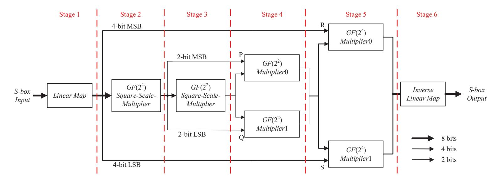

Figure 1: Operations in unshared AES S-box in this article

of glitches. Borrowing the ideas from secret sharing, threshold cryptography, and multiparty computation protocols, a TI scheme needs to fulfill three properties to achieve the mentioned security. Let the input variable of an unshared function  $F(.): F_2^n \to F_2^m$  be  $X = (x^0, \ldots, x^{n-1})$ , whose output variable is  $Y = (y^0, \ldots, y^{m-1})$ . Let also  $\overline{F}(.): F_2^{nS_{in}} \to F_2^{mS_{out}}$  denote the TI scheme for the function F(.). In the d-th order TI scheme, the input shares of the masking function  $\overline{F}(.)$  are  $\overline{X} = \left((x_0^0, \ldots, x_{S_{in}-1}^0), \ldots, (x_0^{n-1}, \ldots, x_{S_{in}-1}^{n-1})\right)$ , and the output shares are  $\overline{Y} = \left((y_0^0, \ldots, y_{S_{out}-1}^0), \ldots, (y_0^{m-1}, \ldots, y_{S_{out}-1}^{m-1})\right)$ , respectively. Then, the TI scheme  $\overline{F}(.)$  needs to satisfy the following three properties:

- 1. Correctness: XOR-ing  $S_{in}$  input shares  $(x_0^i, \ldots, x_{S_{in}-1}^i)$  of the masking function  $\overline{F}(.)$  gives back the input secret variable  $x^i$  of the unshared function F(.), that is,  $\bigoplus_{j=0}^{S_{in}-1} x_j^i = x^i$ . Similarly, XOR-ing  $S_{out}$  output shares  $(y_0^i, \ldots, y_{S_{out}-1}^i)$  of the masking function  $\overline{F}(.)$  recovers the output secret variable  $y_i$  of the unshared function F(.), that is,  $\bigoplus_{j=0}^{S_{out}-1} y_j^i = y^i$ .
- 2. d-th order non-completeness: In a TI scheme, each coordinate function  $f^i(.)$  of an unshared function F(.) is represented using  $S_{out}$  masking Boolean functions of the form  $(f_0^i(.), \ldots, f_{S_{out}-1}^i(.))$  (called a shared implementation). In order to resist a d-th order SCA in the presence of glitches, any d masking coordinate component functions of each coordinate function  $f^i(.)$  should be at least independent of one share for each binary secret variable.
- 3. Uniformity: In an iterative cryptographic primitive such as a block cipher, we need a threshold implementation of the target function that yields a uniformly shared output if its input is uniformly shared. Otherwise, feeding the non-uniform output shares into the subsequent masking function would lead to information leakage.

Note that the TI scheme of a binary linear function L(X) can be achieved by applying the same function on all shares as  $L(X) = \bigoplus_{j=0}^{S_{in}-1} L(\overline{X_j})$ . The difficulty lies in constructing the TI form for the nonlinear function F(.).

#### 2.4 Changing of the Guards

Uniformity of a TI scheme is of great importance when ensuring the security of an iterative block cipher that uses cascaded masking in its round functions. However, achieving uniformity of a TI scheme is not a trivial task. Daemen [Dae17] proposed a general technology *changing of the guards* that can ensure that a bijective S-box satisfies the property of uniformity, which we discuss below.

{5}------------------------------------------------

Let  $(S_0, S_1, S_2)$  be a 3-share non-uniform TI scheme of a bijective S-box y = S(x), where the input variables of  $S_0$ ,  $S_1$ , and  $S_2$  are the shares  $x_1$ ,  $x_2$ ;  $x_2$ ,  $x_0$ ; and  $x_0$ ,  $x_1$ , respectively. Non-completeness then follows from the fact that each  $S_i$  only takes two shares as inputs. Assume there are m parallel operations to be performed using the same bijective S-box y = S(x) in the round function of a cryptographic algorithm. The input shares of the i-th operation are  $x_0^i$ ,  $x_1^i$ ,  $x_2^i$  and the output shares are  $y_0^i$ ,  $y_1^i$ ,  $y_2^i$  (for  $i \in [1, m]$ ). Then, the j-th component function of the i-th operation is  $y_j^i = S_j(x_{(j+1) \mod 3}^i, x_{(j+2) \mod 3}^i)$ . Changing of the guards method, applied to these m parallel bijective S-boxes, can be defined as follows:

$$y_0^i = S_0(x_1^i, x_2^i) + x_1^{i-1} + x_2^{i-1} (i > 0)$$

$$y_1^i = S_1(x_2^i, x_0^i) + x_2^{i-1} (i > 0)$$

$$y_2^i = S_2(x_0^i, x_1^i) + x_1^{i-1} (i > 0)$$

$$y_1^0 = x_2^m$$

$$y_2^0 = x_1^m.$$
(1)

Firstly, we need to initialize  $x_1^0$  and  $x_2^0$  with the random numbers as the guards of the first S-box in the first round. Then, the guards for the subsequent S-boxes are inherited from the two input shares  $x_1^{i-1}$ ,  $x_2^{i-1}$  of the previous S-box. Then, the variables  $y_1^0$ ,  $y_2^1$  are used as guards for the first S-box in the subsequent round, and for more details we refer to the original article [Dae17].

# 2.5 Masking with d+1 Shares

Numerous studies [GMK16, SM21, RBN<sup>+</sup>15] have been devoted to proposing various d-th order TI schemes with the minimum number of d + 1 shares, relaxing the dependency of the target function's algebraic degree. Among them, the authors of [SM21] proposed a general method of constructing a first-order TI scheme without fresh randomness under the glitch-extended probing model.

The core idea of [SM21] is to search for special component functions of TI schemes for the target function to achieve the first-order glitch-extended probing security without fresh randomness. For example, a first-order secure TI scheme<sup>1</sup> for each coordinate function  $f^{i}(.)$  of the function  $(x, y) = F(b, c, d) = (b + bd + cd, c + bd)^{2}$ , with input shares  $b_{0}$ ,  $b_{1}$ ,  $c_{0}$ ,  $c_{1}$ ,  $d_{0}$ ,  $d_{1}$  and the output shares  $x_{0}$ ,  $x_{1}$ ,  $y_{0}$ ,  $y_{1}$ , can be implemented as follows,

<span id="page-5-1"></span>
$$\begin{cases}
f_0^0 = c_0 + b_0 d_0 + c_0 d_0 & \rightarrow [x_0']_r \\
f_1^0 = b_0 + c_0 + b_0 d_1 + c_0 d_1 & \rightarrow [x_1']_r & x_0' + x_1' = [x_0]_r \\
f_2^0 = c_1 + b_1 d_0 + c_1 d_0 & \rightarrow [x_2']_r & x_2' + x_3' = [x_1]_r \\
f_3^0 = b_1 + c_1 + b_1 d_1 + c_1 d_1 & \rightarrow [x_3']_r
\end{cases}$$

$$f_1^1 = b_0 + c_0 + b_0 d_0 & \rightarrow [y_0']_r \\
f_1^1 = b_0 + b_0 d_1 & \rightarrow [y_1']_r & y_0' + y_1' = [y_0]_r \\
\hline
f_2^1 = b_1 + c_1 + b_1 d_0 & \rightarrow [y_2']_r & y_2' + y_3' = [y_1]_r \\
f_3^1 = b_1 + b_1 d_1 & \rightarrow [y_3']_r
\end{cases}$$

$$(2)$$

Since the TI scheme designed with the method in [SM21] have no composability, the output shares  $x_0$ ,  $x_1$ ,  $y_0$ , and  $y_1$  can not be freely given to the next function. They have to be stored in registers (as shown as  $[.]_r$  in Equation 2) to prevent the glitches from propagating between different coordinate functions  $f^0(.)$  and  $f^1(.)$ , which leads to more area consumption and larger latency.

<sup>&</sup>lt;sup>1</sup>It is obtained with the search method in [SM21]

<span id="page-5-0"></span><sup>&</sup>lt;sup>2</sup>The second and third coordinate functions of  $\mathcal{Q}_{12}^4$  class in [BNN<sup>+</sup>12]

{6}------------------------------------------------

In this paper, assuming the glitch-extended probing model, we introduce an approach to construct first-order TI schemes for the quadratic functions of AES (using the subfield decomposition) using as less logic gates as possible. The reduction of hardware resources is achieved by minimizing the number of component functions. We adjust the mathematical properties of desirable component functions in the search process and add the same random number  $r_i$  to all component functions of each coordinate function  $f^i(.)$ , which can ensure the composability of TI schemes for different coordinate functions. Consequently, our TI implementation of AES minimizes the latency and requires a single clock to guarantee the security in the presence of glitches, which essentially provides a solution to the problem stated in [SM21]. Although our method employs some fresh random numbers, due to the employment of the *changing of the guards* technique their amount is quite low.

# 3 Masking AES S-box with 2 shares

<span id="page-6-0"></span>In this section, we first present our method to design a first-order secure TI scheme for each coordinate function of these quadratic functions. Then, we discuss requirements that these TI schemes of coordinate functions must fulfill when combined together, so that the entire TI scheme is resistant against first-order SCA cryptanalysis in the glitch-extended probing model. Having designed the TI schemes for each subfield operation, we present a method that ensure the resistance of the entire S-box against first-order SCA.

### 3.1 Masking single-output Boolean functions

#### 3.1.1 Masking structure

For convenience, we specify the coordinate functions of the operations over  $GF(2^4)$  and  $GF(2^2)$ , which are quadratic single-output Boolean functions of the form  $y=f(x^0,\ldots,x^{n-1})$ , where n=4 or 8. Each quadratic term of this function  $y=f(x^0,\ldots,x^{n-1})$  has always a variable from  $< x^0,\ldots,x^{\frac{n}{2}-1}>$  and the other one from  $< x^{\frac{n}{2}},\ldots,x^{n-1}>$ . Then, a detailed description of our first-order TI scheme for  $y=f(x^0,\ldots,x^{n-1})$  is provided.

In order to achieve first-order security, we split each input variable  $x^i$  into two shares  $x_0^i$ and  $x_1^i$ . A variant of  $y = f(x^0, \dots, x^{n-1})$  can be obtained by replacing each input variable  $x^i$  with  $x_0^i + x_1^i$ . Since the shared form of each quadratic term  $x^i x^j$  has quadratic terms  $x_0^i x_0^j$ ,  $x_0^i x_1^j$ ,  $x_1^i x_0^j$ , and  $x_1^i x_1^j$ , we use four component functions  $f_{0 \le k \le 3}(.)$  to design the TI scheme of  $y = f(x^0, \dots, x^{n-1})$ , which can minimize the number of component functions. Figure 2 illustrates our first-order TI scheme structure of  $y = f(x^0, \dots, x^{n-1})$ , which is divided into two parts with a register stage. In the first part, each component function  $f_k(.)$  only involves one share  $x_0^i$  or  $x_1^i$  of each input variable  $x^i$  to fulfill non-completeness of TI. Which shares are involved in each component function  $f_k(.)$  is an important question. A feasible approach is to use the three methods in Table 1 of assigning the input shares  $x_0^i$  and  $x_1^i$  of each input variable  $x^i$  to the component functions  $f_{0 \le k \le 3}(.)$  which are the shared form of  $y = f(x^0, \dots, x^{n-1})$  (used to ensure the correctness of TI). For more details about the Table 1, we can refer to the paper |SM21|. Then, the intermediate share  $y_k$  is calculated by performing an XOR operation on the component function  $f_k(.)$  and the same single-bit random number r, which is then stored in a register to prevent the glitches from propagating backward. This part, specifically devoted to the computation of the component functions  $f_{0 \le k \le 3}(.)$ , is referred to as the expansion layer. In the second part, the registered outputs  $y'_{0 \le k \le 3}$  are XORed to generate the output shares  $y_0$  and  $y_1$ , i.e.,  $y_0 = y_0' + y_1'$  and  $y_1 = y_2' + y_3'$ , to ensure that the number of next function's input shares remains 2. This part compresses four intermediate shares  $y_{0 < k < 3}^{'}$  into two output shares  $y_0, y_1$ , which is referred to as the *compression layer*.

{7}------------------------------------------------

<span id="page-7-0"></span>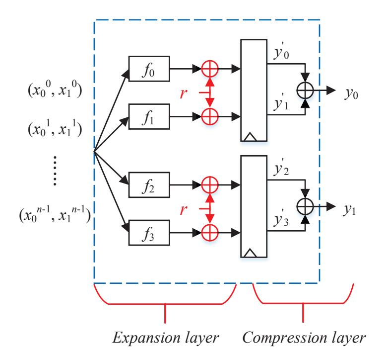

Figure 2: Our first-order TI scheme structure for  $y = f(x^0, \dots, x^{n-1})$  with 2 shares

<span id="page-7-1"></span>Table 1: Methods of assigning each input variable  $x^i$ 's two shares  $x_0^i$ ,  $x_1^i$ , used in the component functions  $f_{0 \le k \le 3}(.)$ 

| Method | $f_0(.)$ | $f_1(.)$ | $f_2(.)$ | $f_3(.)$ |
|--------|----------|----------|----------|----------|
| 1      | $x_0^i$  | $x_0^i$  | $x_1^i$  | $x_1^i$  |
| 2      | $x_0^i$  | $x_1^i$  | $x_0^i$  | $x_1^i$  |
| 3      | $x_0^i$  | $x_1^i$  | $x_1^i$  | $x_0^i$  |

#### 3.1.2 Security analysis

<span id="page-7-3"></span>We now analyze the security of our masking structure in the glitch-extended probing model, and specify certain mathematical properties that the component functions  $f_{0 \le k \le 3}(.)$  need to satisfy. In our first-order TI scheme, each function  $f_k(.)+r$  receives only one share  $x_0^i$  or  $x_1^i$  of each input variable  $x^i$  and follows a uniform distribution. As a consequence, a probe on any function  $f_k(.) + r$  does not reveal any useful information. In the glitch-extended probing model, a probe on an output share  $y_{l\in[0,1]}$  can be extended to two simultaneous probes on its corresponding inputs  $y'_{2l}$ ,  $y'_{2l+1}$ . This requires that the joint outputs of the functions  $f_{2l}(.)+r$ ,  $f_{2l+1}(.)+r$  are independent of the input variables  $(x^0,\ldots,x^{n-1})$ . Since they are XOR-ed with the same random number r instead of two different random numbers, the component functions  $f_{2l}(.)$ ,  $f_{2l+1}(.)$  should satisfy Proposition 1 to ensure the above requirements. Moreover, the output shares  $y_0$  and  $y_1$  serve as the input shares to the subsequent (shared) function, and therefore  $y_l$  should follow a uniform distribution. This is equivalent to requiring that  $f_0(.) + f_1(.)$  and  $f_2(.) + f_3(.)$  satisfy a uniform distribution, respectively. Since the functions  $f_0(.) + f_1(.)$  and  $f_2(.) + f_3(.)$  are not re-masked with the random number r, we should search suitable component functions  $f_{0 \le k \le 3}(.)$  to ensure that the output shares  $y_0$  and  $y_1$  follow the uniform distribution.

Note that we ensure the glitch-extended probing security of our first-order TI scheme with the mathematical properties of the component functions (i.e., Proposition 1) and the single bit random number r, and ensure the uniformity of the output share  $y_l$  with the mathematical properties of the functions  $f_{2l}(.) + f_{2l+1}(.)$ .

<span id="page-7-2"></span>**Proposition 1.** For masking a quadratic single-output Boolean function  $y = f(x^0, ..., x^{n-1})$  with 2 shares, where each component function  $f_l(.)$  is XOR-ed with the same random bit r, the joint outputs of the functions  $f_{2l}(.) + r$ ,  $f_{2l+1}(.) + r$  ( $l \in [0,1]$ ) are independent of the input variables  $X = (x^0, ..., x^{n-1})$  if and only if the following equation holds for all

{8}------------------------------------------------

possible values  $\gamma = (\gamma^0, \dots, \gamma^{n-1})$  of the input variables  $X = (x^0, \dots, x^{n-1})$ ,

<span id="page-8-0"></span>
$$P(f_{2l}(.) = 0, f_{2l+1}(.) = 0 | X = \gamma) + P(f_{2l}(.) = 1, f_{2l+1}(.) = 1 | X = \gamma) = \alpha_l$$

where  $\gamma^i \in [0,1]$  and  $\alpha_l$  is a constant.

*Proof.* The proof can be found in Appendix.

#### 3.1.3 A general search procedure

Based on the analysis in Subsubsection 3.1.2, our first-order glitch-extended probing secure TI scheme of  $y = f(x^0, ..., x^{n-1})$  should satisfy the following two conditions:

- 1.  $P(f_{2i}(.) = 0, f_{2i+1}(.) = 0) + P(f_{2i}(.) = 1, f_{2i}(.) = 1) = \alpha_i$  for all possible values of input variables  $(x^0, ..., x^{n-1})$ , where  $i \in [0, 1]$ .
- 2. The functions  $f_0(.) + f_1(.)$  and  $f_2(.) + f_3(.)$  follow the uniform distribution, respectively.

Performing an exhaustive search for finding TI schemes that satisfy the two conditions mentioned above for  $y = f(x^0, \dots, x^{n-1})$  is a computationally demanding task. Therefore, we develop a general search procedure, which is inspired by the method in [SM21].

Since there are many choices for the basis of each sub-field, the coordinate function  $y = f(x^0, \ldots, x^{n-1})$  may have a non-zero constant term  $f(0, \ldots, 0)$ . Our search procedure only takes the constant-free function  $y = f(x^0, \ldots, x^{n-1})$  into account. If the target function  $y = f(x^0, \ldots, x^{n-1}) + f(0, \ldots, 0)$  is not constant-free, the first-order glitch-extended probing secure TI scheme of  $y = f(x^0, \ldots, x^{n-1}) + f(0, \ldots, 0)$  can be obtained by adding the non-zero constant term  $f(0, \ldots, 0)$  to a component function  $f_i(.)$  of the constant-free function  $y = f(x^0, \ldots, x^{n-1})$ .

Let the four component functions of the constant-free function  $y = f(x^0, ..., x^{n-1})$  be  $f_{0 \le i \le 3}(.)$ . Then, achieving a first-order secure TI scheme in the glitch-extended probing model for  $y = f(x^0, ..., x^{n-1})$ , can be obtained following the five steps below:

- 1. Determine the assignment of two shares  $x_0^i$  and  $x_1^i$  (for each input variable  $x^i$ ) to the component functions  $f_{0 \le i \le 3}(.)$  with these three methods in Table 1. Selecting an appropriate assignment for each input variable  $x^i$  is of crucial importance in this context, for the purpose of filtering out unsatisfactory outcomes. For instance, using the first method to assign the two shares  $x_0^i$  and  $x_1^i$  of each input variable  $x^i$  to the component functions  $f_{0 \le i \le 3}(.)$  for the quadratic coordinate function  $y = f(x^0, x^1) = x^0 x^1$ , one obtains the four component functions  $f_0(x_0^0, x_0^1)$ ,  $f_1(x_0^0, x_0^1)$ ,  $f_2(x_1^0, x_1^1)$ , and  $f_3(x_1^0, x_1^1)$ , which do not involve the shared terms  $x_0^0 x_1^1$  and  $x_1^0 x_0^1$ .
- 2. Generate the sets  $\mathcal{F}_i$ , whose each element is the Algebraic Normal Form(ANF) of a candidate component function  $f_i(.)$ . By replacing any quadratic term  $x^i x^j$  of the original function f(.) with the input shares  $(x_0^i + x_1^i)$ , and  $(x_0^j + x_1^j)$ , four quadratic terms:  $x_0^i x_0^j$ ,  $x_0^i x_1^j$ ,  $x_1^i x_0^j$  and  $x_1^i x_1^j$  are created. These terms are then suitably assigned to the four component functions  $f_{0 \le i \le 3}(.)$ , respectively. Notice that an improper arrangement of these terms may imply that some component functions  $f_i(.)$  does not fulfill the d-th order non-completeness property of TI. Consequently, the quadratic terms in the ANF of each component function  $f_i(.)$  are the same as that of the original function f(.). Therefore, the set  $\mathcal{F}_i$  contains ANFs of all possible constant-free quadratic functions that have the same quadratic terms as the original function f(.).

{9}------------------------------------------------

- 3. Having specified the sets  $\mathcal{F}_i$ , a search for suitable tuples in  $\mathcal{F}_0 \times \mathcal{F}_1$  that satisfy a)  $P(f_0(.) = 0, f_1(.) = 0) + P(f_0(.) = 1, f_1(.) = 1) = \alpha_0$  for all possible values of input variables  $(x^0, \ldots, x^{n-1})$  and additionally that b) their XOR is a balanced function is then conducted. Those tuples that fulfill both conditions are added to the set  $\mathcal{F}_{0,1}$ . Note that the complexity of this search process is  $2^{2n}$ .
- 4. Similarly, a search for tuples in  $\mathcal{F}_2 \times \mathcal{F}_3$  which satisfy a)  $P(f_2(.) = 0, f_3(.) = 0) + P(f_2(.) = 1, f_3(.) = 1) = \alpha_1$  for all possible values of input variables  $(x^0, ..., x^{n-1})$  and b) their XOR is a balanced function is performed. The suitable tuples are added to the set  $\mathcal{F}_{2,3}$  and the complexity of this search process is also  $2^{2n}$ .
- 5. Finally, we search for tuples in  $\mathcal{F}_{0,1} \times \mathcal{F}_{2,3}$  that fulfill the correctness property of TI, so that  $f_0(.) + f_1(.) + f_2(.) + f_3(.) = f(.)$ . Only those tuples that satisfy this condition will be added to the set  $\mathcal{F}_{0,1,2,3}$ .

The search algorithm is specified in Algorithm 1.

**Algorithm 1** Search the first-order glitch-extended probing secure TI scheme for the quadratic single-output Boolean function  $y = f(x^0, ..., x^{n-1})$  with 2 shares

```
Input: y = f(x^0, ..., x^{n-1})

    ▶ target function

Output: \mathcal{F}_{0,1,2,3} : {f_0(.), f_1(.), f_2(.), f_3(.)}
                                                                                                     > component function
 1: for i \in \{0, 1, 2, 3\} do
          for j \in \{0, \dots, n-1\} do
 2:
                determine f_i(.) receive the share x_0^j or x_1^j
                                                                                                       Non-completeness
 3:
  4:
           end for
 5: end for
 6: for i \in \{0, 1, 2, 3\} do
          \mathcal{F}_i \leftarrow \forall f_i(.) : F_2^n \rightarrow F_2
                                                            \triangleright f_i(.) has same quadratic terms in ANF as f(.)
 7:
 8: end for
 9: for i \in \{0, 1\} do
          \mathcal{F}_{2i,2i+1} \leftarrow \emptyset
10:
          for (f_{2i}(.), f_{2i+1}(.)) \in \mathcal{F}_{2i} \times \mathcal{F}_{2i+1} do
11:
               if \exists \alpha_i, \forall (x^0, \dots, x^{n-1}): P(f_{2i}(.) = 0, f_{2i+1}(.) = 0) + P(f_{2i}(.) = 1, f_{2i+1}(.) = 0)
12:
     1) = \alpha_i then
                                                                                                              ▶ Proposition 1
                     if f_{2i}(.) + f_{2i+1}(.) is balanced function then
                                                                                                                  ▶ Uniformity
13:
                          \mathcal{F}_{2i,2i+1} \leftarrow \mathcal{F}_{2i,2i+1} \cup (f_{2i}(.), f_{2i+1}(.))
14:
                     end if
15:
                end if
16:
           end for
17:
18: end for
19: \mathcal{F}_{0,1,2,3} \leftarrow \emptyset
20: for ((f_0, f_1), (f_2, f_3)) \in \mathcal{F}_{0,1} \times \mathcal{F}_{2,3} do
          if \forall (x^0, \dots, x^{n-1}): (f_0(.) + f_1(.) + f_2(.) + f_3(.) = f(x^0, \dots, x^{n-1})) then
21:
                                                                                                                                    \triangleright
     Correctness
                \mathcal{F}_{0,1,2,3} \leftarrow \mathcal{F}_{0,1,2,3} \cup (f_0(.), f_1(.), f_2(.), f_3(.))
22:
          end if
23:
24: end for
```

#### 3.2 Extension to multi-output Boolean functions

#### 3.2.1 Masking structure

In this section, relevant mappings over  $GF(2^4)$  are considered to be 8-bit to 4-bit quadratic functions, whereas over  $GF(2^2)$  these mappings are 4-bit to 2-bit quadratic functions.

{10}------------------------------------------------

More precisely, our objective is to specify suitable quadratic multi-output Boolean functions  $F(.) = (f^0(x^0, ..., x^{n-1}), ..., f^{m-1}(x^0, ..., x^{n-1}))$ , where n = 8, m = 4 or n = 4, m = 2.

<span id="page-10-0"></span>For each coordinate function  $f^i(x^0, \ldots, x^{n-1})$  of F(.), with  $i = 0, \ldots, m-1$ , Algorithm Algorithm 1 can be used to conduct a search for secure first-order TI schemes. A TI scheme that uses m coordinate functions of F is shown in Figure 3. Here,  $f_i^i(.)$  represents the

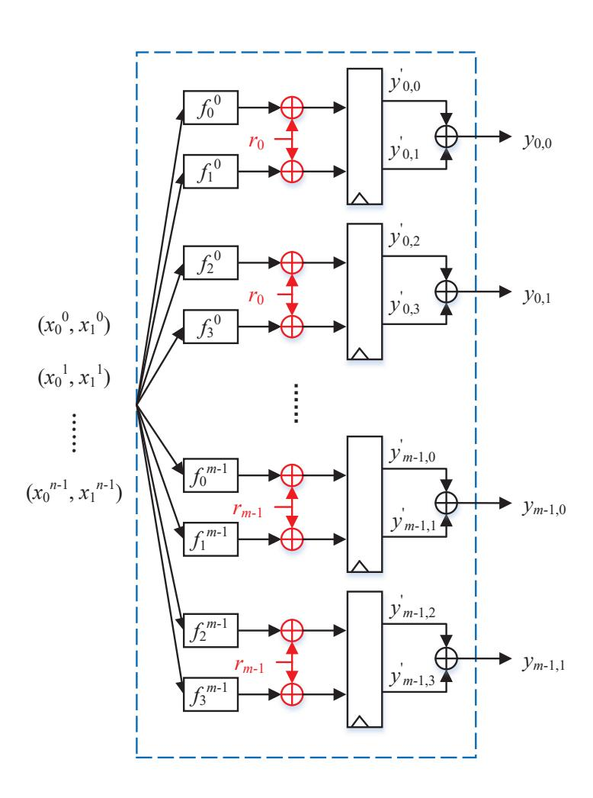

Figure 3: The structure of our first-order TI scheme for a quadratic function F(.) with 2 shares

j-th component function of the i-th coordinate function  $f^i(.)$ , where  $i \in [0, m-1]$  and  $j \in [0,3]$ .  $y'_{i,j}$  corresponds to XOR-ing the component function  $f^i_j(.)$  and the random number  $r_i$ . Similarly,  $y_{i,k}$  represents the k-th output share of the i-th coordinate function  $f^i(.)$ , where  $k \in [0,1]$ .

#### 3.2.2 Security analysis

Because the output shares of F(.) are not stored in registers, we need to analyze whether the TI schemes of coordinate functions satisfy the security criteria when these outputs are combined together. In the glitch-extended probing model, we assume that the attacker probes the output of a combinational gate of subsequent function, e.g. the gate z in Figure 4. More precisely, the information about the outputs of  $f_{2k}^i(.) + r_i$  and  $f_{2k+1}^i(.) + r_i$  (the coordinate function  $f^i(.)$ ) can be retrieved, where the output share  $y_{i,k}$  is associated with the probed gate, e.g. the gate  $x_0'$ ,  $x_1'$ ,  $y_0'$ ,  $y_1'$  in Figure 4. However, Algorithm Algorithm 1 can ensure that the joint outputs of the functions  $f_{2k}^i(.) + r_i$ ,  $f_{2k+1}^i(.) + r_i$  of each coordinate function  $f^i(.)$  are glitch-extended probing secure, e.g. the gates  $(x_0', x_1')$ ,  $(y_0', y_1')$  in Figure 4, respectively. Due to the special way of adding random numbers  $r_{0 \le i \le m-1}$ , it is not certain that the union of these functions  $f_{2k}^i(.) + r_i$ ,  $f_{2k+1}^i(.) + r_i$  ( $0 \le i \le m-1$ ), satisfy the security criteria related to this model, e.g. the gates  $(x_0', x_1', y_0', y_1')$  in Figure 4. In order to ensure that the TI schemes of the coordinate functions  $f^{0 \le i \le m-1}(.)$  remain jointly secure against first-order SCA in the presence of glitches, we need to fulfill the following requirement. More precisely, the joint outputs of arbitrary 2m functions

{11}------------------------------------------------

<span id="page-11-0"></span>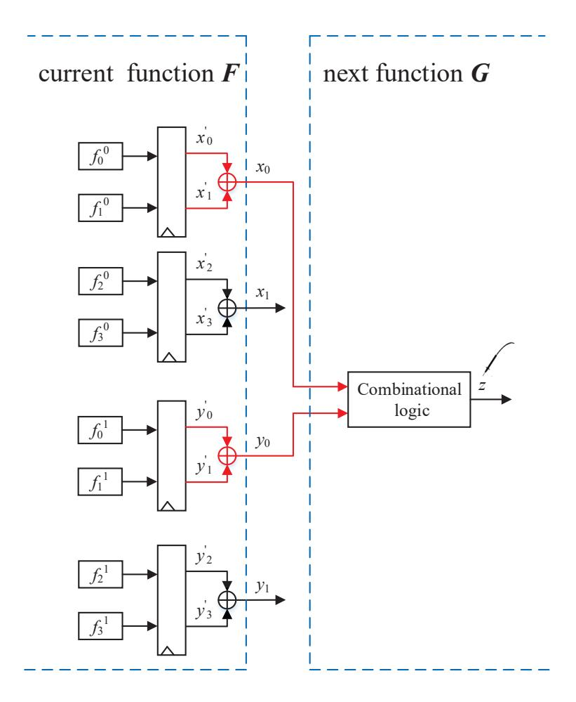

Figure 4: Effect of probing the output of a combinational logic in the glitch-extended probing model [SM21]

 $f_{2j_0}^0(.) + r_0, f_{2j_0+1}^0(.) + r_0, \ldots, f_{2j_{m-1}}^{m-1}(.) + r_{m-1}, f_{2j_{m-1}+1}^{m-1}(.) + r_{m-1} \ (j_0, \ldots, j_{m-1} \in [0, 1])$  should be independent of the input variables  $(x^0, \ldots, x^{n-1})$ , which can be ensured using Proposition 2. Moreover, since the output shares of the considered function F(.) will act as the input shares of the following shared function, it is necessary that these output shares follow a uniform distribution jointly.

<span id="page-11-1"></span>**Proposition 2.** For masking a quadratic function  $F(.): F_2^n \to F_2^m$  with 2 shares, where the TI scheme of each coordinate function  $f^i(.)$  is obtained with Algorithm Algorithm 1, the joint outputs for arbitrary 2m functions  $f^0_{2j_0}(.) + r_0$ ,  $f^0_{2j_0+1}(.) + r_0$ , ...,  $f^{m-1}_{2j_{m-1}}(.) + r_{m-1}$ ,  $f^{m-1}_{2j_{m-1}+1}(.) + r_{m-1}$   $(j_0, ..., j_{m-1} \in [0,1])$  are independent of the input variables  $X = (x^0, ..., x^{n-1})$  if and only if for each  $(\lambda^0_{2j_0}, \lambda^0_{2j_0+1}, ..., \lambda^{m-1}_{2j_{m-1}}, \lambda^{m-1}_{2j_{m-1}+1})$  the following equation holds for all possible values  $\gamma = (\gamma^0, ..., \gamma^{n-1})$  of the input variables  $X = (x^0, ..., x^{n-1})$ ,

$$P(\bigcap_{t=0}^{m-1} \bigcap_{s=0}^{1} f_{2j_t+s}^t(.) + r_t = \lambda_{2j_t+s}^t | X = \gamma)$$

$$= \alpha_{\lambda_{2j_0}^0, \lambda_{2j_0+1}^0, \dots, \lambda_{2j_{m-1}}^{m-1}, \lambda_{2j_{m-1}+1}^{m-1}}^{t}$$

where 
$$\lambda_{2j_i}^i \in [0,1], \ \lambda_{2j_i+1}^i \in [0,1], \ \alpha_{\lambda_{2j_0}^0, \lambda_{2j_0+1}^0, \dots, \lambda_{2j_{m-1}}^{m-1}, \lambda_{2j_{m-1}+1}^{m-1}}^{j_0, \dots, j_{m-1}}$$
 is a constant.

*Remark.* The proof of Proposition 2 follows from the security requirements of the glitch-extended probing model and can be viewed as a generalization of Proposition 1.

#### 3.2.3 A general search procedure

Based on the above analysis, the individual TI schemes of m coordinate functions (obtained using Algorithm Algorithm 1) has first-order glitch-extended probing security and additionally the following two conditions must be fulfilled:

{12}------------------------------------------------

- 1. For each  $(j_0, \ldots, j_{m-1})^3$ , the joint outputs of 2m functions  $f_{2j_0}^0(.) + r_0$ ,  $f_{2j_0+1}^0(.) + r_0$ ,  $\ldots$ ,  $f_{2j_{m-1}}^{m-1}(.) + r_{m-1}$ ,  $f_{2j_{m-1}+1}^{m-1}(.) + r_{m-1}$  should be independent of the input variables  $(x^0, \ldots, x^{m-1})$ .
- 2. The output shares should jointly follow a uniform distribution.

Let  $\mathcal{F}^i$  be a set containing the first-order TI schemes of each coordinate function  $f^i(.)$ . The most challenging task is to identify a suitable candidate from each  $\mathcal{F}^i$  (one for each coordinate function) that fulfill the above two conditions. Since the number of possibilities is very large, we propose a general search procedure (as shown in Algorithm Algorithm 2) for finding suitable TI schemes (in general there might exist many solutions). This search is performed by incrementing a set of suitable candidates, thus we first identify a pair of TI schemes for the first and second coordinate functions  $f^0(.)$ ,  $f^1(.)$  that satisfies the above two conditions (this corresponds to the lines 7-8 of Algorithm Algorithm 2). Then, a search for the third coordinate function  $f^2(.)$  is performed the TI schemes of  $f^0(.)$ ,  $f^1(.)$ ,  $f^2(.)$  satisfy the above two conditions, and so on. Moreover, we additionally need to ensure that these TI schemes jointly follow a uniform distribution, which is implemented at line 9 of Algorithm Algorithm 2.

**Algorithm 2** Search a first-order glitch-extended probing secure TI scheme for quadratic multi-output Boolean function  $F: F_2^n \to F_2^m$  with 2 shares

```
\frac{\text{multi-output Boolean function } F: F_2^n \to F_2^m \text{ with 2 shares}}{\mathbf{Input:} \ \mathcal{F}^0, \dots, \mathcal{F}^{m-1} \qquad \qquad \triangleright \text{ TI schemes set for each coordinate function } f^i(.)
Output: \overline{F}(.):(\overline{f_*^0},...,\overline{f_*^{m-1}}), \overline{f_*^i}=\{f_0^i(.),f_1^i(.),f_2^i(.),f_3^i(.)\}
                                                                                                                                                                                                                                                                                                                                                                                                                                                                                        ▶ TI scheme of target
quadratic function F(.)
        1: for i = 0 to m - 1 do
                                                  for \overline{f^i}(.) \in \mathcal{F}^i do
         2:
                                                                         \overline{f_*^i} \leftarrow \overline{f^i}(.)
        3:
                                                                         \mathcal{F}^i \leftarrow \mathcal{F}^i - \overline{f^i}(.)
         4:
                                                                          if i = 0 then
        5:
                                                                                                   break
        6:
                                                                         else if \forall (j_0, \dots, j_i), \exists \alpha_{\lambda_{2j_0}^0, \lambda_{2j_0+1}^0, \dots, \lambda_{2j_i}^i, \lambda_{2j_i+1}^i}^{j_0, \dots, j_i}, \forall (x^0, \dots, x^{n-1}), \forall (\lambda_{2j_0}^0, \lambda_{2j_0+1}^0, \lambda_{2j_0+1}^0, \lambda_{2j_0+1}^0, \lambda_{2j_0+1}^0, \lambda_{2j_0+1}^0, \lambda_{2j_0+1}^0, \lambda_{2j_0+1}^0, \lambda_{2j_0+1}^0, \lambda_{2j_0+1}^0, \lambda_{2j_0+1}^0, \lambda_{2j_0+1}^0, \lambda_{2j_0+1}^0, \lambda_{2j_0+1}^0, \lambda_{2j_0+1}^0, \lambda_{2j_0+1}^0, \lambda_{2j_0+1}^0, \lambda_{2j_0+1}^0, \lambda_{2j_0+1}^0, \lambda_{2j_0+1}^0, \lambda_{2j_0+1}^0, \lambda_{2j_0+1}^0, \lambda_{2j_0+1}^0, \lambda_{2j_0+1}^0, \lambda_{2j_0+1}^0, \lambda_{2j_0+1}^0, \lambda_{2j_0+1}^0, \lambda_{2j_0+1}^0, \lambda_{2j_0+1}^0, \lambda_{2j_0+1}^0, \lambda_{2j_0+1}^0, \lambda_{2j_0+1}^0, \lambda_{2j_0+1}^0, \lambda_{2j_0+1}^0, \lambda_{2j_0+1}^0, \lambda_{2j_0+1}^0, \lambda_{2j_0+1}^0, \lambda_{2j_0+1}^0, \lambda_{2j_0+1}^0, \lambda_{2j_0+1}^0, \lambda_{2j_0+1}^0, \lambda_{2j_0+1}^0, \lambda_{2j_0+1}^0, \lambda_{2j_0+1}^0, \lambda_{2j_0+1}^0, \lambda_{2j_0+1}^0, \lambda_{2j_0+1}^0, \lambda_{2j_0+1}^0, \lambda_{2j_0+1}^0, \lambda_{2j_0+1}^0, \lambda_{2j_0+1}^0, \lambda_{2j_0+1}^0, \lambda_{2j_0+1}^0, \lambda_{2j_0+1}^0, \lambda_{2j_0+1}^0, \lambda_{2j_0+1}^0, \lambda_{2j_0+1}^0, \lambda_{2j_0+1}^0, \lambda_{2j_0+1}^0, \lambda_{2j_0+1}^0, \lambda_{2j_0+1}^0, \lambda_{2j_0+1}^0, \lambda_{2j_0+1}^0, \lambda_{2j_0+1}^0, \lambda_{2j_0+1}^0, \lambda_{2j_0+1}^0, \lambda_{2j_0+1}^0, \lambda_{2j_0+1}^0, \lambda_{2j_0+1}^0, \lambda_{2j_0+1}^0, \lambda_{2j_0+1}^0, \lambda_{2j_0+1}^0, \lambda_{2j_0+1}^0, \lambda_{2j_0+1}^0, \lambda_{2j_0+1}^0, \lambda_{2j_0+1}^0, \lambda_{2j_0+1}^0, \lambda_{2j_0+1}^0, \lambda_{2j_0+1}^0, \lambda_{2j_0+1}^0, \lambda_{2j_0+1}^0, \lambda_{2j_0+1}^0, \lambda_{2j_0+1}^0, \lambda_{2j_0+1}^0, \lambda_{2j_0+1}^0, \lambda_{2j_0+1}^0, \lambda_{2j_0+1}^0, \lambda_{2j_0+1}^0, \lambda_{2j_0+1}^0, \lambda_{2j_0+1}^0, \lambda_{2j_0+1}^0, \lambda_{2j_0+1}^0, \lambda_{2j_0+1}^0, \lambda_{2j_0+1}^0, \lambda_{2j_0+1}^0, \lambda_{2j_0+1}^0, \lambda_{2j_0+1}^0, \lambda_{2j_0+1}^0, \lambda_{2j_0+1}^0, \lambda_{2j_0+1}^0, \lambda_{2j_0+1}^0, \lambda_{2j_0+1}^0, \lambda_{2j_0+1}^0, \lambda_{2j_0+1}^0, \lambda_{2j_0+1}^0, \lambda_{2j_0+1}^0, \lambda_{2j_0+1}^0, \lambda_{2j_0+1}^0, \lambda_{2j_0+1}^0, \lambda_{2j_0+1}^0, \lambda_{2j_0+1}^0, \lambda_{2j_0+1}^0, \lambda_{2j_0+1}^0, \lambda_{2j_0+1}^0, \lambda_{2j_0+1}^0, \lambda_{2j_0+1}^0, \lambda_{2j_0+1}^0, \lambda_{2j_0+1}^0, \lambda_{2j_0+1}^0, \lambda_{2j_0+1}^0, \lambda_{2j_0+1}^0, \lambda_{2j_0+1}^0, \lambda_{2j_0+1}^0, \lambda_{2j_0+1}^0, \lambda_{2j_0+1}^0, \lambda_{2j_0+1}^0, \lambda_{2j_0+1}^0, \lambda_{2j_0+1}^0, \lambda_{2j_0+1}^0, \lambda_{2j_0+1}^0, \lambda_{2j_0+1}^0, \lambda_{2j_0+1}^0, \lambda_{2j_0+1}^0, \lambda_{2j_0+1}^0, \lambda_{2j_0+1}^0, \lambda_{2j_0+1}^0, \lambda_{2j_0+1}^0, \lambda_{2
        7:
                          \ldots, \lambda_{2j_i}^i, \lambda_{2j_i+1}^i):
                                  P\left(\bigcap_{t=0}^{i}\bigcap_{s=0}^{1}f_{2j_{t}+s}^{t}(.)+r_{t}=\lambda_{2j_{t}+s}^{t}\right)=\alpha_{\lambda_{2j_{0}}^{0},\lambda_{2j_{0}+1}^{0},...,\lambda_{2j_{i}}^{i},\lambda_{2j_{i}+1}^{i}}^{j_{0}}\text{ then}\triangleright\text{Proposition 2}
\text{if }(f_{0}^{0}(.)+f_{1}^{0}(.),...,f_{0}^{i}(.)+f_{1}^{i}(.))\text{ is jointly uniform then}\qquad\triangleright\text{Uniformity}
        8:
        9:
                                                                                                                            break
 10:
                                                                                                   end if
 11:
                                                                           end if
 12:
                                                                           if \mathcal{F}^i = \emptyset then
 13:
                                                                                                   i = i - 1
 14:
                                                                          end if
 15:
                                                   end for
 16:
 17: end for
```

# 3.3 TI scheme of S-box

Since our first-order TI scheme of each operation is not a composable gadget, we now present solutions for combining the TI schemes of different operations in the S-box. Because of space limitations, we uploaded the specific masking expressions of each operation to the GitHub.

<span id="page-12-2"></span><span id="page-12-0"></span> $<sup>^3</sup>$ There are in total  $2^m$  possible cases.

{13}------------------------------------------------

Square-scale-multiplier over  $GF(2^4)$ : Applying Algorithm Algorithm 1 to each coordinate function  $f^i(.)$  leads to millions of first-order secure and uniform TI schemes (denoted as  $\mathcal{F}^i$ ). Then, to specify a TI scheme for the square-scale-multiplier over  $GF(2^4)$ , Algorithm Algorithm 2 is applied for identifying suitable TI schemes in the sets  $\mathcal{F}^{0\leq i\leq 3}$  (one for each coordinate function), which jointly follow a uniform distribution (added the random bits  $r_{0\leq j\leq 3}$ ). Several different quadruples of TI schemes that satisfy the security criteria have been found by Algorithm Algorithm 2. We mention that multi-threading technology has been employed to shorten the search time.

Square-scale-multiplier over  $GF(2^2)$ : We can apply Algorithm Algorithm 1 and Algorithm 2 to specify 917503 combinations (referred as  $\mathcal{F}^{0,1}$ ) for this operation. Based on the block diagram in Figure 1, as its input variables, the multipliers over  $GF(2^2)$  receive the outputs of square-scale-multiplier over  $GF(2^2)$  as well as either 2-bit MSB P or 2-bit LSB Q of the square-scale-multiplier over  $GF(2^4)$ 's outputs. Thus, output shares of the square-scale-multiplier over  $GF(2^4)$ 's output shares to ensure the uniform with the square-scale-multiplier over  $GF(2^4)$ 's output shares to ensure the uniform masking for the input variables of the multipliers over  $GF(2^2)$ . However, this is not covered by Algorithm Algorithm 1 and Algorithm 2, and therefore 4-bit fresh random numbers  $R_{0 \le i \le 3}$  are added. Let  $\overline{F}(.)$  be an element of the set  $\mathcal{F}^{0,1}$ . Thus,  $\overline{F_0}(.) = \begin{cases} (f_0^0(.) + r_4, f_1^0(.) + r_4, f_2^0(.) + r_4, f_3^0(.) + r_4) \\ (f_0^1(.) + r_5, f_1^1(.) + r_5, f_2^1(.) + r_5, f_3^1(.) + r_5) \end{cases}$  and  $\overline{F_1}(.) = \begin{cases} (f_0^0(.) + r_6, f_1^0(.) + r_6, f_2^0(.) + r_6, f_3^0(.) + r_6) \\ (f_0^1(.) + r_7, f_1^1(.) + r_7, f_2^1(.) + r_7, f_3^1(.) + r_7) \end{cases}$  are two glitch-extended probing secure and jointly-uniform TI schemes for the square-scale-multiplier over  $GF(2^2)$ . We have re-masked the functions  $f_0^0(.) + r_4, f_2^0(.) + r_4$  of the first coordinate function  $f^0(.)$  with the fresh random number  $R_0$  and the functions  $f_0^1(.) + r_5, f_2^1(.) + r_5$  of the second coordinate function  $f^1(.)$  with the fresh random number  $R_0$ . The TI scheme  $\overline{F_0}(.)$  after re-masking  $\overline{F_0}(.)$  with the random numbers  $R_0$ ,  $R_1$  is shown on Equation 3.

$$\begin{cases} y'_{0,0} = f_0^0(.) + r_4 + R_0 \\ y'_{0,1} = f_1^0(.) + r_4 & y'_{0,0} + y'_{0,1} = y_{0,0} \\ \hline y'_{0,2} = f_2^0(.) + r_4 + R_0 & y'_{0,2} + y'_{0,3} = y_{0,1} \\ y'_{0,3} = f_3^0(.) + r_4 & \\ \hline y'_{1,0} = f_0^1(.) + r_5 + R_1 \\ y'_{1,1} = f_1^1(.) + r_5 & y'_{1,0} + y'_{1,1} = y_{1,0} \\ \hline y'_{1,2} = f_2^1(.) + r_5 + R_1 & y'_{1,2} + y'_{1,3} = y_{1,1} \\ y'_{1,3} = f_3^1(.) + r_5 & \end{cases}$$

$$(3)$$

Using this approach, the output shares of the TI scheme  $\overline{F_0'}(.)$  and the output shares of the square-scale-multiplier over  $GF(2^4)$  are jointly-uniform. Similarly, another TI scheme  $\overline{F_1'}(.)$  after re-masking  $\overline{F_1}(.)$  with the random numbers  $R_2$ ,  $R_3$  is shown on Equation 4.

{14}------------------------------------------------

The input variables of multiplier over  $GF(2^2)$  are then uniformly shared.

$$\begin{cases} z'_{0,0} = f_0^0(.) + r_6 + R_2 \\ z'_{0,1} = f_1^0(.) + r_6 & z'_{0,0} + z'_{0,1} = z_{0,0} \\ \hline z'_{0,2} = f_2^0(.) + r_6 + R_2 & z'_{0,2} + z'_{0,3} = z_{0,1} \\ z'_{0,3} = f_3^0(.) + r_6 \\ \hline z'_{1,0} = f_0^1(.) + r_7 + R_3 \\ z'_{1,1} = f_1^1(.) + r_7 & z'_{1,0} + z'_{1,1} = z_{1,0} \\ \hline z'_{1,2} = f_2^1(.) + r_7 + R_3 & z'_{1,2} + z'_{1,3} = z_{1,1} \\ z'_{1,3} = f_3^1(.) + r_7 \end{cases}$$

$$(4)$$

<span id="page-14-0"></span>Multiplier over  $GF(2^2)$ : There are 917503 possibilities of specifying the multiplier over  $GF(2^2)$  using Algorithm Algorithm 2. The 2-bit fresh random numbers required for the TI schemes of the multiplier and multiplier over  $GF(2^2)$  are denoted by  $r_8$ ,  $r_9$  and  $r_{10}$ ,  $r_{11}$ , respectively. As the cascade of output shares of the multiplier and multiplier over  $GF(2^2)$  serves as the input shares of the multipliers over  $GF(2^4)$ , they should follow a jointly-uniform distribution. On the other hand, based on the block diagram in Figure 1, joint uniformity between the cascade of output shares of the multiplier0, multiplier1 over  $GF(2^2)$  and the output shares of the linear map operation should be preserved, in order to make the input variables of two multipliers over  $GF(2^4)$  uniformly shared. Let (a, b, c, d) be the 4-bit input variables of the multipliers over  $GF(2^2)$ , where (a, b) denotes the output of square-scale-multiplier over  $GF(2^4)$  and (c,d) denotes the output of squarescale-multiplier over  $GF(2^2)$ . The shares of (a,b) depend on the output shares of the linear map operation, whereas the shares of (c,d) are independent of the output shares of the linear map operation because of the re-masking operation with the four random numbers  $R_{0 \leq i \leq 3}$  in Equation 3 and Equation 4. Therefore, we search for a particular implementation of a multiplier over  $GF(2^2)$  among 917503 plausible candidates, such that its output shares are independent of the shares of input variables (a,b), which essentially implies that it only depends on the shares of input variables (c,d). Since the shares of input variables (c,d) of the multiplier over  $GF(2^2)$  are re-masked with the random numbers  $R_0$ ,  $R_1$  and that of the multiplier over  $GF(2^2)$  are re-masked with the random numbers  $R_2$ ,  $R_3$ , the cascade of output shares of the multiplier and multiplier over  $GF(2^2)$  jointly follow a uniform distribution. In addition, the cascade of output shares of the multiplier and multiplier over  $GF(2^2)$  is independent of the output shares of the linear map operation, ensuring that the multipliers over  $GF(2^4)$ 's input variables are uniformly shared.

Multiplier over  $GF(2^4)$ : We have found several suitable implementations of multipliers over  $GF(2^4)$  with Algorithm Algorithm 1 and Algorithm 2. The 4-bit fresh random numbers required for the TI schemes of the multiplier0 and multiplier1 over  $GF(2^4)$  are denoted as  $r_{12 \le j \le 15}$  and  $r_{16 \le j \le 19}$ , respectively. Since both multiplier0 and multiplier1 over  $GF(2^4)$  receive the outputs from the same operation (namely the cascaded output of the multiplier0 and multiplier1 over  $GF(2^2)$ ), the output shares of multiplier0 over  $GF(2^4)$  are not necessarily jointly-uniform with the shares of multiplier1 over  $GF(2^4)$ . We therefore search for a suitable combination for the multiplier over  $GF(2^4)$  within our pool of candidates, such that the output shares of multipliers over  $GF(2^4)$  are independent of its input shares that come from the multipliers over  $GF(2^4)$ . If this is satisfied, the output shares of multiplier0 and multiplier1 over  $GF(2^4)$  are jointly-uniform. Notice that Algorithm Algorithm 2 cannot guarantee the combined glitch security of multiplier0 and multiplier1 over  $GF(2^4)$  if the output shares of both operations are not stored in registers. Hence, we should store the output shares of the multiplier0 and multiplier1 over  $GF(2^4)$  in registers to prevent the propagation of glitches.

{15}------------------------------------------------

Employing the changing of the guards technique. A shared S-box requires 24-bit fresh random numbers  $R_{0 \le i \le 3}$ ,  $r_{0 \le j \le 19}$ , as discussed above, to guarantee its first-order security. Unlike regular applications of the changing of the guards method, to protect a specific S-box, we use an 8-bit input share of another shared S-box as guards for specifying the 20bit random numbers  $r_{0 \le j \le 19}$ . Let us denote the guards as two nibbles  $(P_{guards}, Q_{guards})$ . Based on Figure 5,  $Q_{guards}$  (as shown Stage 2) is used to replace the 4-bit fresh random numbers  $r_{0 \leq j \leq 3}$  for the square-scale-multiplier over  $GF(2^4)$ .  $P_{guards}$  (as shown in Stage 3) is used to replace the 4-bit fresh random numbers  $r_{4 \le j \le 7}$  for the square-scale-multiplier over  $GF(2^2)$ . The purpose of the fresh random numbers  $R_{0 \le i \le 3}$ , as shown in Stage 3, is to re-mask the output shares of square-scale-multiplier over  $GF(2^2)$ , ensuring that the input variables of the multiplier over  $GF(2^2)$  are uniformly shared. The input/output shares of the multipliers over  $GF(2^2)$  and  $GF(2^4)$ , respectively, are statistically dependent on these 4-bit fresh random numbers. It is worth of mentioning, that if the input shares of other shared S-boxes are used as guards instead of these 4-bit random numbers, the output shares of this shared S-box and of the other S-box under consideration do not necessarily jointly follow a uniform distribution, which then affects the security of the operation MixColumns. Therefore, we employ a PRNG (pseudo random number generator) to generate these 4-bit random numbers. Notice also that the nibble guards  $Q_{quards}$  of the square-scale-multiplier over  $GF(2^4)$  are removed by XOR operation in the compression layer. So we can reuse the  $Q_{guards}$  as a new guard to replace the fresh random numbers  $r_{8 \le i \le 11}$  of the multiplier over  $GF(2^2)$ , as shown Stage 4. The 4-bit input shares (from the linear map operation, denoted by S in Figure 5) of the multiplier over  $GF(2^4)$ , are independent of the input shares of multiplier over  $GF(2^4)$ , and therefore can be used as 4-bit guards to replace the 4-bit random number  $r_{12 \le j \le 15}$ , and vice versa. To summarize, each shared S-box only requires 4-bit fresh random numbers  $R_{0 \le i \le 3}$  to achieve the firstorder glitch-extended probing security.

<span id="page-15-0"></span>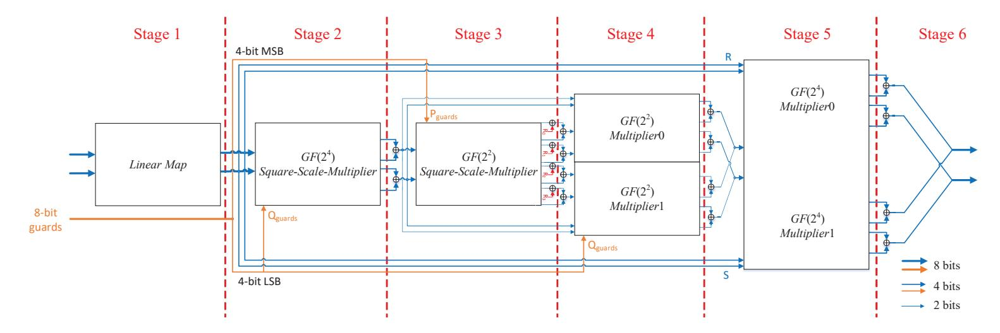

Figure 5: A single S-box implementation of the shared inversion over  $GF(2^8)$  with 2 shares

#### 4 IMPLEMENTATION AND ARCHITECTURE

In this section, we introduce two implementation structures for our shared AES based on single S-box and double S-boxes on hardware circuits.

# 4.1 A single S-box implementation of our TI scheme for AES

Similarly to the works in [MPL<sup>+</sup>11, BGN<sup>+</sup>14, DRB<sup>+</sup>16, GMK16], we implement our shared AES as a serialization of different operations. An overview of the data path, for a single S-box implementation of AES, is depicted in Figure 6. It consists of three main modules, that is, Key Register module, State Register module and  $GF(2^8)$  inversion module.

{16}------------------------------------------------

<span id="page-16-0"></span>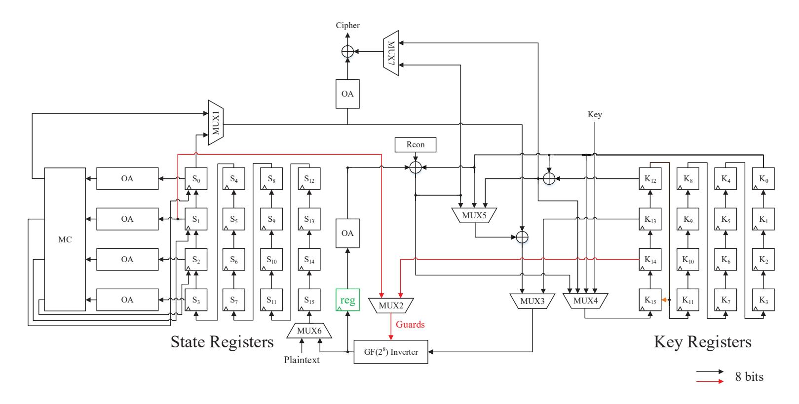

Figure 6: Hardware implementation for our shared AES based on single S-box

In this case, the encryption process of a plaintext block requires 236 clock cycles, and this process can be divided into two phases. In the first phase, the plaintext and keys are loaded during the first 16 clock cycles. Then, in the second phase, 10 shared round functions are executed from the 17th to the 236th clock cycle, using 22 clock cycles for implementing the operations in each round . Each (shared) round function executes two different operations, namely the encryption and key expansion schedule. More specifically, the first 16 clock cycles are used to perform the inversion over *GF*(2<sup>8</sup> ) for each plaintext byte, whereas four clock cycles (from 17th to 20th) are used for computing the inverse over *GF*(2<sup>8</sup> ) of the last four key bytes. Then, the 22nd clock cycle is used for the ShiftRows operation, which is not shown in Figure 6 for the sake of simplicity. Since the output isomorphism, affine transformation, MixColumns (MC for short in Figure 6) and AddRoundKey are linear operations, they can be performed with a combinational logic in the first 16 clock cycles of the next shared round function. Note that we store the output shares of the multiplier1 and multiplier2 over *[GF](#page-16-0)*(2<sup>4</sup> ) in either State Registers module or some extra registers (reg in Figure 6) before the OA(.) to prevent th[e propag](#page-16-0)ation of glitches. Moreover, for ease of implementation, we perform the ShiftRows operation before performing the OA(.).

# **4.2 A double S-box imp[lementa](#page-16-0)tion of our TI scheme for AES**

According to Subsection 3.3, each S-box needs an 8-bit input share of another S-box as guards to ensure its glitch-extended probing security. On the other hand, implementing two adjacent S-boxes as a single unit can be quite beneficial in terms of a reduced chip area for storing guards in the *GF*(2<sup>8</sup> ) inverter module and lower latency of the cipher. In this section, [we briefly discu](#page-12-2)ss a double S-box implementation of the shared AES, which is illustrated in Figure 7.

The proposed double S-box implementation of AES requires only 148 clock cycles to encrypt a single plaintext block . Initially, before the encryption process has started, two shares of the *i*-th (*i ∈* [0*,* 7]) portion of the plaintext block (consisting of two bytes, halfword) and of t[he key are](#page-17-0), respectively, stored in the cells (*S*2*<sup>i</sup>* , *S*2*i*+1) and (*K*2*<sup>i</sup>* , *K*2*i*+1) in Figure 7, which takes 8 clock cycles. Then, 10 shared round functions are executed during the next 140 clock cycles (14 clock cycles per round are needed). For a shared round function, the first 8 clock cycles are used to perform the *GF*(2<sup>8</sup> ) inversion for

{17}------------------------------------------------

<span id="page-17-0"></span>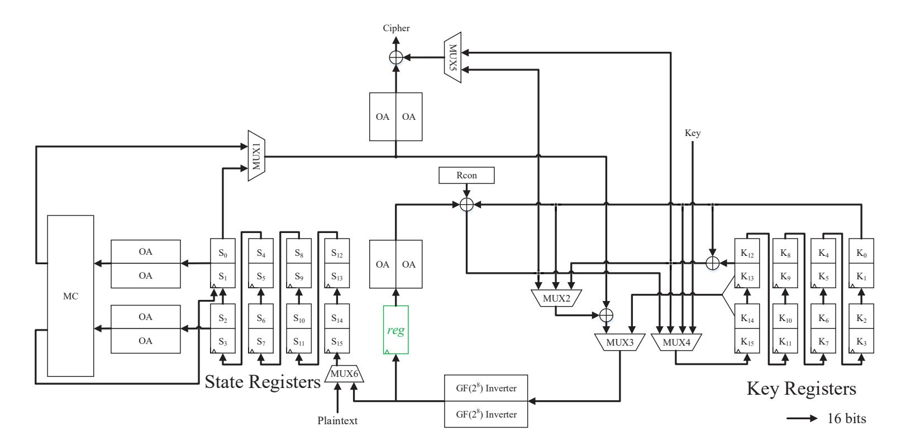

Figure 7: Hardware implementation for our shared AES based on double S-boxes

each intermediate data half-word (the implementation structure is shown in Figure 8), the 9th and 10th clock cycles are used to perform the  $GF(2^8)$  inversion for two key half-words  $(K_{13}, K_{14})$  and  $(K_{15}, K_{12})$ , and the 14th clock cycle is used to execute the ShiftRows operation. The output isomorphism, affine transformation, MixColumns, and

<span id="page-17-1"></span>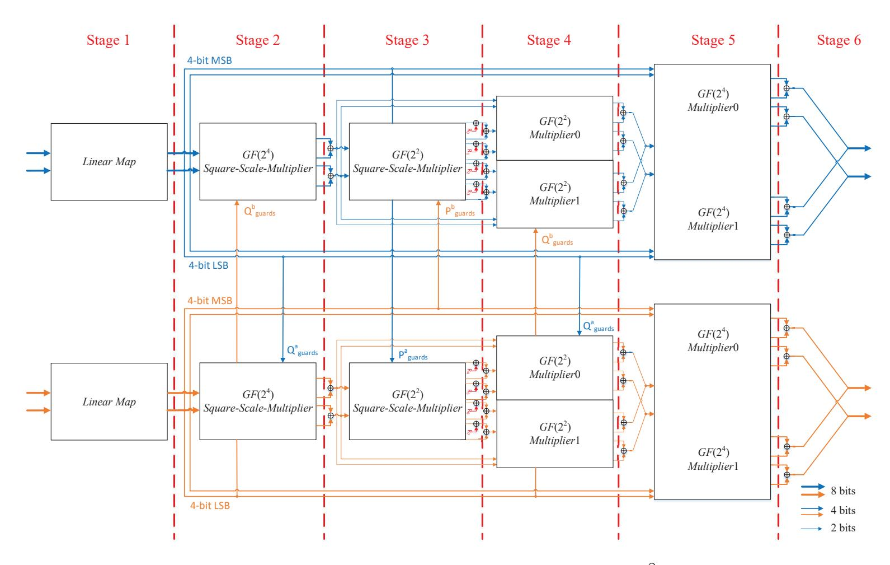

Figure 8: Our construction for the shared inversion over  $GF(2^8)$  with 2-share based on double S-boxes

AddRoundKey operations are performed using combinational logic during the first 8 clock cycles of the next shared round function.

{18}------------------------------------------------

# **5 SCA Evaluation and Implementation Cost**

This section presents a comprehensive evaluation of the proposed shared AES in the glitch-extended probing model, with a focus on its first-order security.

#### **5.1** *GF***(2<sup>8</sup> ) Inverter Module Verification Using SILVER**

We used the tool SILVER to verify the security of *GF*(2<sup>8</sup> ) inverter module based on single S-box (Figure 5) and double S-boxes (Figure 8). Synopsys Design Compiler with NanGate 45nm ASIC standard cell library to synthesize these designs and generate their gate-level netlists. We disabled any optimization within and across different modules in the process of synthesis to maintain the non-completeness property of TI.

For [the](#page-15-0) *GF*(2<sup>8</sup> ) inverter module b[ased on s](#page-17-1)ingle S-box, we configured the 8-bit guards and 4-bit random number as fresh random numbers. The verification process took about 42 minutes on a machine with 32 CPU cores and 128 GB of RAM. The evaluation results show that this module provides a first-order glitch-extended probing security and furthermore its output shares are jointly uniform, as shown in Figure 9(a).

However, SILVER is unable to directly handle the entire *GF*(2<sup>8</sup> ) inverter module when double S-box implementation is considered, due to the impractical computational complexities caused by high number of individual statistical test. Therefore, this module is divided into two parts. The first part encompasses all operat[ions from th](#page-19-0)e input shares of double S-boxes to the output shares of the multiplier over *GF*(2<sup>2</sup> ), as shown Stages 1*−*4 in Figure 8. We configured the 8-bit random number as fresh random numbers, and then verified the first-order glitch-extend probing security of this part. The verification process took about 1596 minutes on the same machine and the simulation results, as shown in Figure 9(b), show that the first-order glitch-extended probing security is attained for this pa[rt.](#page-17-1)

The second part encompasses four multipliers over *GF*(2<sup>4</sup> ), as shown in Stages 5, 6 in Figure 8. We first verified the joint uniformity of the input shares of the four multipliers [over](#page-19-1) *GF*(2<sup>4</sup> ), using the C programming language. Specifically, we have considered all possible values of the input shares for the double S-boxes, and verified that the union of input variables for the four multipliers over *GF*(2<sup>4</sup> ) has a uniform sharing. The compu[tational](#page-17-1) complexity for this verification is 2 <sup>40</sup>, and therefore we adopted multi-threading technology to shorten the verification time. The verification result shows that the input shares of the four multipliers over *GF*(2<sup>4</sup> ) have joint uniformity. In this case, the two multipliers over *GF*(2<sup>4</sup> ) of the top S-box in Figure 8 are unrelated to the two multipliers over *GF*(2<sup>4</sup> ) of the bottom S-box in Figure 8. Finally, the glitch-extended probing security and joint uniformity of the output shares of the multipliers over *GF*(2<sup>4</sup> ) had to be confirmed for individual S-boxes, which was validated in the case of single S-box implementation. The full verification code including the [Verilog re](#page-17-1)presentation of the shared inversion over *GF*(2<sup>8</sup> ) (for both the single an[d double](#page-17-1) S-box implementation) and the corresponding C Code mentioned above are given in the GitHub.

# **5.2 Round Security Analysis**

For the security of round function, we [should](https://github.com/GitHub-lancel/AESTIScheme.git) consider two aspects, namely uniformity and glitch-extended probing security.

1. **Uniformity:** The linear operations (MixColumns, ShiftRows, AddRoundKey) do not affect uniformity, so the uniformity of the round function depends on the uniformity of the masked S-box and the input uniformity of the MixColumns operation. In Subsection 5.1, we have verified the uniformity of the masked S-box using SILVER and our C Code. The guards of each S-box are XORed at the compression layer, so

{19}------------------------------------------------

(a) Single S-box construction

(b) Double S-box implementation without the multipliers over *GF*(2<sup>4</sup> )

<span id="page-19-1"></span>Figure 9: Evaluation results for *GF*(2<sup>8</sup> ) inverter module using single and double S-box implementation with SILVER

the outputs of ech S-box are independent. Since the outputs of each S-box satisfies uniformity, the outputs of different S-boxes satisfy joint uniformity. This ensures the inputs of MixColumns are uniformly shared.

2. **Glitch-extended probing security:** If the probe is placed in the masked S-box, the securiry comes from the first-order probing security of the S-box itself which was verifired by SILVER in Subsection 5.1. If the probe is placed in the linear operations, it is evidently secure because these operations work share-wise.

# **5.3 TVLA Evaluation**

SILVER has limitations in evaluating the security of large-scale circuits, such as the full AES circuit. As a supplement, we conduct a security assessment of our shared full AES hardware implementations (Figure 6 and Figure 7) on the Sakura\_G board.

#### **5.3.1 Experimental setup**

We implemented our fully-pi[pelined sh](#page-16-0)are[d AES enc](#page-17-0)ryption on the target Spartan-6 FPGA of the Sakura\_G board. We then monitored the voltage drop over a 1 ohm resistor placed in the Vdd path of the target board using a digital oscilloscope, and measured the power consumption traces. The sampling rate of digital oscilloscope was set to 500 MS/s, and the FPGA was clocked at a frequency of 3 MHz. To ensure the security of our shared design, we enabled the "keep\_hierarchy" constraint during synthesis, which prevents Xilinx ISE from optimizing over module boundaries.

### **5.3.2 Evaluation and Results**

*PRNG Off.* We collected 5 million power consumption traces for two implementation structures of our shared AES when the PRNG is inactive. A sample trace of each implementation structure is shown in Figure 10(a) and Figure 10(b), and each sample trace covers 10 rounds of AES. Figure 11(a) and Figure 11(b) show the result of first-order univariate TVLA applied on these two implementations, where the red line represents the confidence threshold of *±*4*.*5. The experimental results show that information leakage surpasses the confidence threshold of *±*4*.*[5, wh](#page-20-0)ich c[onfirms that t](#page-20-1)he experimental setup is sound.

{20}------------------------------------------------

<span id="page-20-0"></span>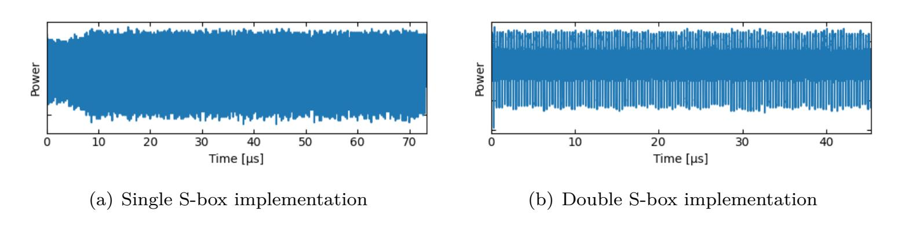

<span id="page-20-1"></span>Figure 10: Power trace of our shared AES implementation, PRNG inactive

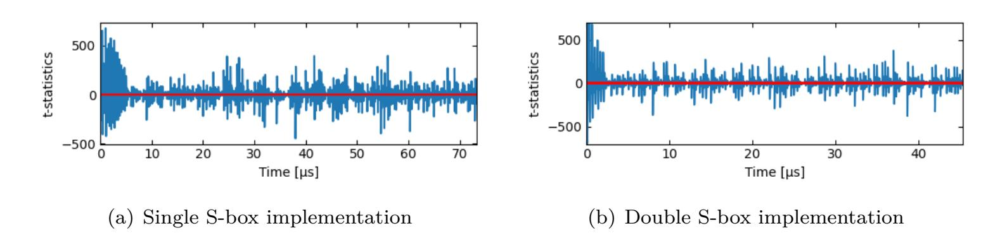

Figure 11: First-order TVLA of our shared AES implementation using 5 million traces, PRNG inactive

*PRNG on.* We turned on the PRNG and collected 100 million power consumption traces for these two implementation structures. A sample trace for each implementation is shown in Figure 12(a) and Figure 12(b). Combining Figure 10(a) and Figure 10(b), we discover that the power consumption traces of these two implementations are not affected by the PRNG which therefore does not interfere with the evaluation results. We conducted univariate TVLA to examine the first- and second-order security on the two sets of 100 million pow[er consumpti](#page-20-2)on t[races. As dep](#page-20-3)icted in Fig[ure 13\(a\)](#page-20-0) and Fig[ure 13\(b\), neit](#page-20-1)her single nor double S-box implementation of shared AES based has information leakage. However, as anticipated, both variants exhibit second-order information leakage, which is evident from Figure 14(a) and Figure 14(b). Concludingly, our AES with shares achieves first-order security when 100 million power consu[mption traces](#page-21-0) are [analyzed.](#page-21-1)

<span id="page-20-2"></span>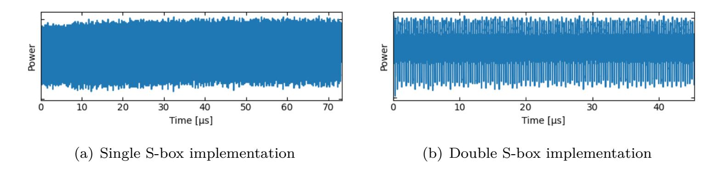

<span id="page-20-3"></span>Figure 12: Power trace of our shared AES implementation using 100 million traces, PRNG active

# **5.4 Implementation Cost**

In this section, we provide a hardware performance analysis of our shared AES, focusing on randomness, chip area, and latency. We estimated the area costs of the two hardware

{21}------------------------------------------------

<span id="page-21-0"></span>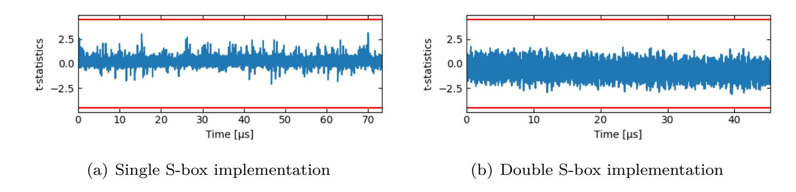

<span id="page-21-1"></span>Figure 13: First-order TVLA of our shared AES implementation using 100 million traces, PRNG active

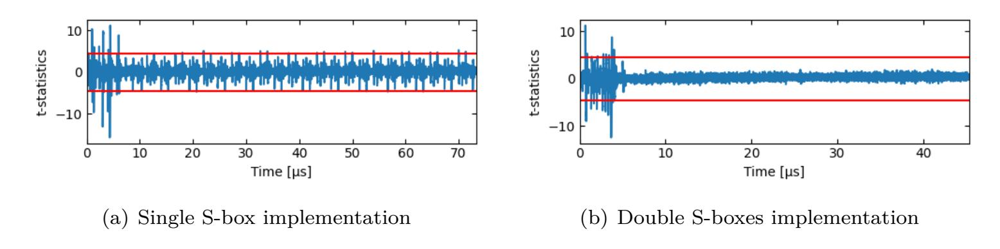

Figure 14: Second-order TVLA of our shared AES implementation using 100 million traces, PRNG active

implementations of our shared AES using Synopsys Design Compiler with the UMC 180nm standard cell library. We used a compile option to avoid any optimization across modules for security reasons. To provide a comprehensive comparison, Table 2 shows full hardware implementation costs of our shared AES and related state-of-the-art works (to the best of our knowledge).

**S-box Area.** For each operation of our shared S-boxes, we searched for a first-order TI scheme with as few terms as possible, but not exhaustivel[y. In add](#page-22-0)ition, (compared to [SM21]), our shared S-boxes do not need to store output shares of each relevant operation. Therefore, our shared single S-box structure (Figure 5) consumes 2*.*40 kGE chip area, which is 14*.*8% smaller than the one using a single-bit fresh mask in [SM21] and 31*.*6% smaller than another the scheme without fresh randomness in [SM21]. Compared to the [other m](#page-25-3)ethods in Table 2, only the implementation cost in [UHA17] is slightly smaller than ours. On the other hand, our approach [outperform](#page-15-0)s the other methods [MPL+11, BGN+14, BGN+15, DRB+16, GMK16] (by at least 6*.*25% and at most [42](#page-25-3)*.*9%).

**AES Area.** Since the joint outputs of both single and dou[ble S-b](#page-25-3)ox implementation are uniform, we ca[n use com](#page-22-0)binatorial logic to perform the ope[rations o](#page-25-0)utput isomorphism, affine transformation, MixColumns and AddRoundKey within one clock cycle. [Compared](#page-24-4) [to the im](#page-23-1)[plementat](#page-23-2)i[on in \[SM](#page-23-3)[21\], we re](#page-24-5)moved the 64-bit registers used to store the outputs of *β* matrix (see [SM21] with saving of about 384 GE), two OA*−*<sup>1</sup> (.) modules (with saving of about 65*.*67 GE). In short, our masked AES, with single S-box implementation, requires 6*.*15 kGE chip area. Compared to all works in Table 2, the chip area of our masked AES (single S[-box im](#page-25-3)plementation) is slightly smaller than the construction presented in [UHA17]. [Howe](#page-25-3)ver, we cannot ignore the differences caused by different standard cell libraries, i.e., the GE values vary greatly across different standard cell libraries. Compared to these works under the UMC 180nm standard cel[l library,](#page-22-0) our single S-box implementation is the best among all the methods with (at least 13*.*4% and at most 46*.*8% saving).

**Clock cycles and randomness.** Our shared AES based on single S-box requires 236

{22}------------------------------------------------

<span id="page-22-0"></span>

| Design                              | $\begin{array}{c} Area \\ [kGE]^1 \end{array}$ | $\frac{\text{S-box}}{[\text{kGE}]^1}$ | $\begin{array}{c} \text{Pipeline} \\ \text{phase}^2 \end{array}$ | v    | Randomness $[bits]^2$ |  |  |  |
|-------------------------------------|------------------------------------------------|---------------------------------------|------------------------------------------------------------------|------|-----------------------|--|--|--|
| Standard-cell library: UMC 180nm    |                                                |                                       |                                                                  |      |                       |  |  |  |
| $[BGN^{+}15]$                       | 11.56                                          | 3.65                                  | 3                                                                | 246  | 44                    |  |  |  |
| $[MPL^+11]$                         | 10.94                                          | 4.07                                  | 5                                                                | 266  | 48                    |  |  |  |
| $[BGN^+14]$                         | 9.10                                           | 3.71                                  | 3                                                                | 246  | 44                    |  |  |  |
| $[BGN^+15]$                         | 8.12                                           | 2.83                                  | 3                                                                | 246  | 32                    |  |  |  |
| [SM21]                              | 7.71                                           | $3.61^{3}$                            | 7                                                                | 246  | 0                     |  |  |  |
| [GMK16]                             | 7.60                                           | 2.80                                  | 5                                                                | 216  | 28                    |  |  |  |
| [WM18]                              | $7.60^{4}$                                     | 4.20                                  | 16                                                               | 2804 | 0                     |  |  |  |
| [SM21]                              | 7.14                                           | $2.90^{3}$                            | 7                                                                | 246  | 1                     |  |  |  |
| [GMK16]                             | 7.10                                           | 2.60                                  | 8                                                                | 246  | 18                    |  |  |  |
| $Design1^5$                         | 6.15                                           | 2.40                                  | 6                                                                | 236  | 4                     |  |  |  |
| $Design2^6$                         | 8.41                                           | 4.73                                  | 6                                                                | 148  | 8                     |  |  |  |
| Standard-cell library: NanGate 45nm |                                                |                                       |                                                                  |      |                       |  |  |  |
| [Sug18]                             | 17.10                                          | 3.50                                  | 4                                                                | 266  | 0                     |  |  |  |
| $[DRB^+16]$                         | 6.68                                           | $1.9/2.56^3$                          | 6                                                                | 276  | 54                    |  |  |  |
| [UHA17]                             | 6.32                                           | $1.43/1.99^3$                         | 4                                                                | 219  | 64                    |  |  |  |

Table 2: Performance comparison of different first-order TI schemes of AES

clock cycles to encrypt a block of plaintext, which is 9.26% more than that of [GMK16] and 7.76% more than that of [UHA17]. However, the methods in [GMK16] and [UHA17] require 24 and 60 extra bits of fresh randomness per S-box, respectively. Compared to the other methods in Table 2, our single S-box implementation of shared AES achieves a lower latency, since it needs at least 10 clock cycles less than other methods. In addition, this TI scheme only requires 4 bits of fresh random number per S-box. Finally, our double S-box hardware implementation is characterized by extremely low latency only 148 clock cycles are needed for the entire encryption process.

# 6 Conclusions

In this work, we have introduced a method of constructing first-order glitch-extended probing secure TI schemes for a quadratic function  $F(.):F_2^n\to F_2^m$  with 2 shares. Compared to the state-of-the-art related works, the advantage of our approach is that 1) it is suitable for quadratic functions  $F(.):F_2^n\to F_2^m$ , 2) randomness can be reused after one clock cycle, and 3) it is very compatible with changing of the guards technology in order to reduce the use of fresh randomness. We have applied this technique to design first-order glitch-extended probing secure hardware implementations of AES. More precisely, we have presented two hardware implementations of masked AES for two different application scenarios, namely aiming at low hardware footprint and low latency, respectively. The tables of comparison indicate that our TI schemes outperform state-of-the-art implementations with respect to area, latency, and fresh randomness. Moreover, our approach can be applied to other cryptographic algorithms, such as Midori, PRESENT, PRINCE, to name a few.

Apart from the above contributions, we would like to highlight that our approach can

<sup>&</sup>lt;sup>1</sup> Using compile option.

 $<sup>^2</sup>$  Per S-box

 $<sup>^3</sup>$  Synthesized with authors' implementation using UMC 180nm by ourselves.

<sup>&</sup>lt;sup>4</sup> Not include the area of the shared key schedule.

<sup>&</sup>lt;sup>5</sup> Our shared AES - single S-box strategy.

<sup>&</sup>lt;sup>6</sup> Our shared AES - double S-box strategy.

{23}------------------------------------------------

potentially be extended to cubic functions assuming that there are more constraints on component functions, which is an interesting topic for future research. Whether our TI scheme for a quadratic function  $F(.): F_2^n \to F_2^m$  fulfill the security requirements of Non-Interference (NI) [BBD<sup>+</sup>16], Probe-Isolating Non-Interference (PINI) [CS20] and Strong Non-Interference (SNI) [BBD<sup>+</sup>16] also needs to be investigated further.

# References

- [BBD<sup>+</sup>16] Gilles Barthe, Sonia Belaïd, François Dupressoir, Pierre-Alain Fouque, Benjamin Grégoire, Pierre-Yves Strub, and Rébecca Zucchini. Strong non-interference and type-directed higher-order masking. In Edgar R. Weippl, Stefan Katzenbeisser, Christopher Kruegel, Andrew C. Myers, and Shai Halevi, editors, ACM CCS 2016, pages 116–129. ACM Press, October 2016.
- <span id="page-23-7"></span>[BGN<sup>+</sup>14] Begül Bilgin, Benedikt Gierlichs, Svetla Nikova, Ventzislav Nikov, and Vincent Rijmen. A more efficient AES threshold implementation. In David Pointcheval and Damien Vergnaud, editors, AFRICACRYPT 14, volume 8469 of LNCS, pages 267–284. Springer, Heidelberg, May 2014.
- <span id="page-23-1"></span>[BGN<sup>+</sup>15] Begül Bilgin, Benedikt Gierlichs, Svetla Nikova, Ventzislav Nikov, and Vincent Rijmen. Trade-offs for threshold implementations illustrated on AES. In *IEEE Transactions on Computer-Aided Design of Integrated Circuits and Systems*, volume 34, pages 1188–1200, 2015.
- <span id="page-23-2"></span>[Bil15] Begül Bilgin. Threshold implementations: as countermeasure against higherorder differential power analysis. PhD thesis, University of Twente, Netherlands, May 2015.
- <span id="page-23-0"></span>[BNN<sup>+</sup>12] Begül Bilgin, Svetla Nikova, Ventzislav Nikov, Vincent Rijmen, and Georg Stütz. Threshold implementations of all  $3 \times 3$  and  $4 \times 4$  S-boxes. In Emmanuel Prouff and Patrick Schaumont, editors, *CHES 2012*, volume 7428 of *LNCS*, pages 76–91. Springer, Heidelberg, September 2012.
- [CS20] Gaëtan Cassiers and François-Xavier Standaert. Trivially and efficiently composing masked gadgets with probe isolating non-interference. *IEEE Transactions on Information Forensics and Security*, 15:2542–2555, 2020.
- [Dae17] Joan Daemen. Changing of the guards: A simple and efficient method for achieving uniformity in threshold sharing. In Wieland Fischer and Naofumi Homma, editors, *CHES 2017*, volume 10529 of *LNCS*, pages 137–153. Springer, Heidelberg, September 2017.
- <span id="page-23-6"></span>[DNR19] Siemen Dhooghe, Svetla Nikova, and Vincent Rijmen. Threshold implementations in the robust probing model. Cryptology ePrint Archive, Report 2019/1005, 2019. https://eprint.iacr.org/2019/1005.
- <span id="page-23-5"></span>[DRB<sup>+</sup>16] Thomas De Cnudde, Oscar Reparaz, Begül Bilgin, Svetla Nikova, Ventzislav Nikov, and Vincent Rijmen. Masking AES with d+1 shares in hardware. In Benedikt Gierlichs and Axel Y. Poschmann, editors, *CHES 2016*, volume 9813 of *LNCS*, pages 194–212. Springer, Heidelberg, August 2016.
- <span id="page-23-4"></span><span id="page-23-3"></span>[FGP<sup>+</sup>18] Sebastian Faust, Vincent Grosso, Santos Merino Del Pozo, Clara Paglialonga, and François-Xavier Standaert. Composable masking schemes in the presence of physical defaults & the robust probing model. *IACR TCHES*, 2018(3):89–120, 2018. https://tches.iacr.org/index.php/TCHES/article/view/7270.

{24}------------------------------------------------

- [GMK16] Hannes Gross, Stefan Mangard, and Thomas Korak. Domain-oriented masking: Compact masked hardware implementations with arbitrary protection order. Cryptology ePrint Archive, Report 2016/486, 2016. https://eprint.iacr. org/2016/486.
- <span id="page-24-5"></span>[GMK17] Hannes Groß, Stefan Mangard, and Thomas Korak. An efficient side-channel protected AES implementation with arbitrary prote[ction order. In Helena](https://eprint.iacr.org/2016/486) [Handschuh, ed](https://eprint.iacr.org/2016/486)itor, *CT-RSA 2017*, volume 10159 of *LNCS*, pages 95–112. Springer, Heidelberg, February 2017.
- <span id="page-24-6"></span>[GP99] Louis Goubin and Jacques Patarin. DES and differential power analysis (the "duplication" method). In Çetin Kaya Koç and Christof Paar, editors, *CHES'99*, volume 1717 of *LNCS*, pages 158–172. Springer, Heidelberg, August 1999.
- <span id="page-24-0"></span>[ISW03] Yuval Ishai, Amit Sahai, and David Wagner. Private circuits: Securing hardware against probing attacks. In Dan Boneh, editor, *CRYPTO 2003*, volume 2729 of *LNCS*, pages 463–481. Springer, Heidelberg, August 2003.
- <span id="page-24-1"></span>[KJJ99] Paul C. Kocher, Joshua Jaffe, and Benjamin Jun. Differential power analysis. In Michael J. Wiener, editor, *CRYPTO'99*, volume 1666 of *LNCS*, pages 388– 397. Springer, Heidelberg, August 1999.
- [Koc96] Paul C. Kocher. Timing attacks on implementations of Diffie-Hellman, RSA, DSS, and other systems. In Neal Koblitz, editor, *CRYPTO 1996*, pages 104– 113, Springer, Heidelberg, 1996.
- [KSM20] David Knichel, Pascal Sasdrich, and Amir Moradi. SILVER statistical independence and leakage verification. In Shiho Moriai and Huaxiong Wang, editors, *ASIACRYPT 2020, Part I*, volume 12491 of *LNCS*, pages 787–816. Springer, Heidelberg, December 2020.
- <span id="page-24-7"></span>[MPL+11] Amir Moradi, Axel Poschmann, San Ling, Christof Paar, and Huaxiong Wang. Pushing the limits: A very compact and a threshold implementation of AES. In Kenneth G. Paterson, editor, *EUROCRYPT 2011*, volume 6632 of *LNCS*, pages 69–88. Springer, Heidelberg, May 2011.
- <span id="page-24-4"></span>[MPO05] Stefan Mangard, Norbert Pramstaller, and Elisabeth Oswald. Successfully attacking masked AES hardware implementations. In Josyula R. Rao and Berk Sunar, editors, *CHES 2005*, volume 3659 of *LNCS*, pages 157–171. Springer, Heidelberg, August / September 2005.
- <span id="page-24-2"></span>[NRR06] Svetla Nikova, Christian Rechberger, and Vincent Rijmen. Threshold implementations against side-channel attacks and glitches. In Peng Ning, Sihan Qing, and Ninghui Li, editors, *ICICS 06*, volume 4307 of *LNCS*, pages 529– 545. Springer, Heidelberg, December 2006.
- <span id="page-24-3"></span>[QS01] Jean-Jacques Quisquater and David Samyde. Electromagnetic analysis (EMA): Measures and counter-measures for smart cards. In Isabelle Attali and Thomas Jensen, editors, *Smart Card Programming and Security*, volume 2140 of LNCS, pages 200–210, Berlin, Heidelberg, 2001.
- [RBN<sup>+</sup>15] Oscar Reparaz, Begül Bilgin, Svetla Nikova, Benedikt Gierlichs, and Ingrid Verbauwhede. Consolidating masking schemes. In Rosario Gennaro and Matthew J. B. Robshaw, editors, *CRYPTO 2015, Part I*, volume 9215 of *LNCS*, pages 764–783. Springer, Heidelberg, August 2015.

{25}------------------------------------------------

- [SM21] Aein Rezaei Shahmirzadi and Amir Moradi. Re-consolidating first-order masking schemes. *IACR TCHES*, 2021(1):305–342, 2021. https://tches.iacr. org/index.php/TCHES/article/view/8736.
- <span id="page-25-3"></span>[Sug18] Takeshi Sugawara. 3-share threshold implementation of AES S-box without fresh randomness. *IACR Transactions on Cryptograp[hic Hardware and Em](https://tches.iacr.org/index.php/TCHES/article/view/8736)bedded Systems*[, 2019\(1\):123–145, 2018.](https://tches.iacr.org/index.php/TCHES/article/view/8736)
- <span id="page-25-2"></span>[UHA17] Rei Ueno, Naofumi Homma, and Takafumi Aoki. Toward more efficient DPAresistant AES hardware architecture based on threshold implementation. In Sylvain Guilley, editor, *COSADE 2017*, volume 10348 of *LNCS*, pages 50–64. Springer, Heidelberg, April 2017.
- <span id="page-25-1"></span><span id="page-25-0"></span>[WM18] Felix Wegener and Amir Moradi. A first-order SCA resistant AES without fresh randomness. In Junfeng Fan and Benedikt Gierlichs, editors, *COSADE 2018*, volume 10815 of *LNCS*, pages 245–262. Springer, Heidelberg, April 2018.

{26}------------------------------------------------

# A The proof of Proposition 1

*Proof.* For each possible value  $\gamma = (\gamma^0, \dots, \gamma^{n-1})$  of the input variable  $X = (x^0, \dots, x^{n-1})$ , we denote that the corresponding output values of the functions  $f_{2l}(.) + r$ ,  $f_{2l+1}(.) + r$  by  $\lambda_0$  and  $\lambda_1$  respectively, where  $\lambda_0$ ,  $\lambda_1 \in [0, 1]$ .

**Necessity:** The joint outputs of the functions  $f_{2l}(.) + r$ ,  $f_{2l+1}(.) + r$  are independent of input variables X.

 $\Rightarrow \forall (\lambda_0, \lambda_1) \text{ and } \forall \gamma,$ 

$$P(f_{2l}(.) + r = \lambda_0, f_{2l+1}(.) + r = \lambda_1 | X = \gamma)$$

$$= 0.5 \cdot P(f_{2l}(.) = \lambda_0, f_{2l+1}(.) = \lambda_1 | X = \gamma)$$

$$+0.5 \cdot P(f_{2l}(.) = \lambda_0, f_{2l+1}(.) = \lambda_1 | X = \gamma)$$

$$= \alpha_{\lambda_0, \lambda_1}$$
(5)

 $\Rightarrow \exists (\lambda_0, \lambda_1) = (0, 0) \text{ and } \forall \gamma,$ 

$$P(f_{2l}(.) + r = 0, f_{2l+1}(.) + r = 0 | X = \gamma)$$

$$= 0.5 \cdot P(f_{2l}(.) = 0, f_{2l+1}(.) = 0 | X = \gamma)$$

$$+0.5 \cdot P(f_{2l}(.) = 1, f_{2l+1}(.) = 1 | X = \gamma)$$

$$= \alpha_{0,0}$$
(6)

 $\Rightarrow \forall \gamma$ ,

$$P(f_{2l}(.) = 0, f_{2l+1}(.) = 0 | X = \gamma) + P(f_{2l}(.) = 1, f_{2l+1}(.) = 1 | X = \gamma)$$

$$= 2\alpha_{0,0}$$

$$= \alpha_l$$
(7)

Sufficiency:

 $\forall (\lambda_0, \lambda_1) \text{ and } \forall \gamma,$ 

$$P(f_{2l}(.) + r = \lambda_0, f_{2l+1}(.) + r = \lambda_1 | X = \gamma)$$

$$= 0.5 \cdot P(f_{2l}(.) = \lambda_0, f_{2l+1}(.) = \lambda_1 | X = \gamma)$$

$$+0.5 \cdot P(f_{2l}(.) = \bar{\lambda_0}, f_{2l+1}(.) = \bar{\lambda_1} | X = \gamma)$$
(8)

if  $(\lambda_0, \lambda_1) = (0,0)$  and  $\forall \gamma$ , the Equation 8 can be written as

<span id="page-26-0"></span>
$$0.5 \cdot P(f_{2l}(.) = \lambda_0, f_{2l+1}(.) = \lambda_1 | X = \gamma) +0.5 \cdot P(f_{2l}(.) = \lambda_0, f_{2l+1}(.) = \lambda_1 | X = \gamma) = 0.5 \cdot P(f_{2l}(.) = 0, f_{2l+1}(.) = 0 | X = \gamma) +0.5 \cdot P(f_{2l}(.) = 1, f_{2l+1}(.) = 1 | X = \gamma) = 0.5 \cdot \alpha_l$$

$$(9)$$

if  $(\lambda_0, \lambda_1) = (1, 1)$  and  $\forall \gamma$ , the Equation 8 can be written as:

<span id="page-26-1"></span>
$$0.5 \cdot P(f_{2l}(.) = \lambda_0, f_{2l+1}(.) = \lambda_1 | X = \gamma) +0.5 \cdot P(f_{2l}(.) = \lambda_0, f_{2l+1}(.) = \lambda_1 | X = \gamma)$$

$$= 0.5 \cdot P(f_{2l}(.) = 1, f_{2l+1}(.) = 1 | X = \gamma) +0.5 \cdot P(f_{2l}(.) = 0, f_{2l+1}(.) = 0 | X = \gamma)$$

$$= 0.5 \cdot \alpha_l$$

$$(10)$$

From Equation 8, Equation 9, Equation 10, we conclude that  $\forall \gamma$ ,

$$P(f_{2l}(.) + r = 0, f_{2l+1}(.) + r = 0 | X = \gamma)$$

$$= P(f_{2l}(.) + r = 1, f_{2l+1}(.) + r = 1 | X = \gamma)$$

$$= 0.5 \cdot \alpha_l$$
(11)

The same holds for  $(\lambda_0, \lambda_1) = (0, 1)$  and  $(\lambda_0, \lambda_1) = (1, 0)$ .

{27}------------------------------------------------

Since

$$P(f_{2l}(.) + r = 0, f_{2l+1}(.) + r = 0 | X = \gamma)$$

$$+P(f_{2l}(.) + r = 1, f_{2l+1}(.) + r = 1 | X = \gamma)$$

$$+P(f_{2l}(.) + r = 0, f_{2l+1}(.) + r = 1 | X = \gamma)$$

$$+P(f_{2l}(.) + r = 1, f_{2l+1}(.) + r = 0 | X = \gamma)$$

$$= 1$$
(12)

holds, we conclude that *∀γ*,

$$P(f_{2l}(.) + r = 0, f_{2l+1}(.) + r = 1 | X = \gamma)$$

$$= P(f_{2l}(.) + r = 1, f_{2l+1}(.) + r = 0 | X = \gamma)$$

$$= 0.5 - \alpha_l$$
(13)

According to Equation 11, Equation 13, the joint outputs of the functions *f*2*l*(*.*) + *r*, *f*2*l*+1(*.*) + *r* are independent of input variables *X*.