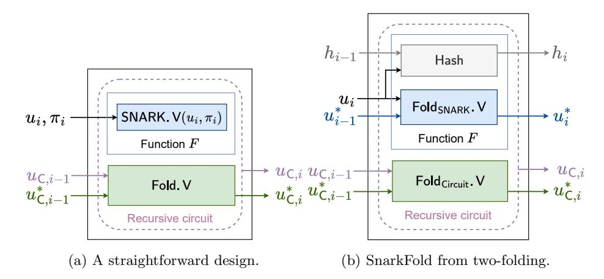
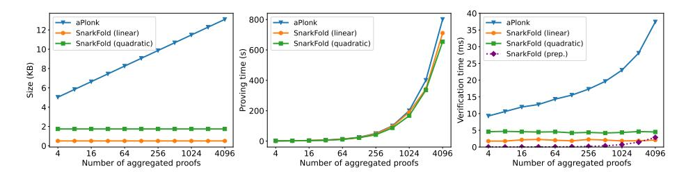

# SnarkFold: Efficient Proof Aggregation from Incrementally Verifiable Computation and Applications

Xun Liu<sup>1</sup> , Shang Gao<sup>1</sup> <sup>⋆</sup> , Tianyu Zheng<sup>1</sup> , Yu Guo<sup>2</sup> , and Bin Xiao<sup>1</sup>

<sup>1</sup> Department of Computing, The Hong Kong Polytechnic University <sup>2</sup> SECBIT Labs compxun.liu@connect.polyu.hk shanggao@polyu.edu.hk tian-yu.zheng@connect.polyu.hk yu.guo@secbit.io csbxiao@polyu.edu.hk

Abstract. The succinct non-interactive argument of knowledge (SNARK) technique has been extensively utilized in blockchain systems to replace the costly on-chain computation with the verification of a succinct proof. However, most existing applications verify each proof independently, resulting in a heavy load on nodes and high transaction fees for users. Currently, the mainstream proof aggregation schemes are based on generalized inner product argument, which has a logarithmic proof size and verification cost. To improve the efficiency of verifying multiple proofs, we introduce SnarkFold, a novel SNARK-proof aggregation scheme with constant verification time and proof size. SnarkFold is derived from incrementally verifiable computation (IVC) and is optimized further through the folding scheme. By folding multiple instance-proof pairs, SnarkFold defers the expensive SNARK verification (e.g., elliptic curve pairing) to the final step. Additionally, we propose a generic technique to enhance the verifier's efficiency by delegating instance aggregation tasks to the prover. The verifier only needs a simple preprocessing to check the validity of the delegation. We further introduce folding schemes for Groth16 and Plonk proofs. Experimental results demonstrate that SnarkFold offers significant advantages, with an aggregated Plonk proof size of just 0.5 KB and the verification time of only 4.5 ms for aggregating 4096 Plonk proofs.

Keywords: Succinct Non-interactive Argument of Knowledge, Incrementally Verifiable Computation, Proof Aggregation.

# 1 Introduction

The succinct non-interactive argument of knowledge (SNARK) is a crucial cryptographic technique that allows a prover to convince a verifier of the correctness

<sup>⋆</sup> Shang Gao is the corresponding author of this paper.

<span id="page-1-0"></span>Table 1: Complexity comparison of proof aggregations.  $\mathbb{G}_1$  indicates the scalar multiplication in the group  $\mathbb{G}_1$ .  $\mathbb{Z}_p$  indicates the field operation. H indicates hash operation.

|                  | Sotur | Proof Size    | Proving Time | Verification Time Proof Veri. Instance Agg. |                     |
|------------------|-------|---------------|--------------|---------------------------------------------|---------------------|
|                  | Setup | 7 1 1001 Size | Troving Time | Proof Veri.                                 | Instance Agg.       |
| TIPP [10]        | Yes   | $O(\log n)$   | O(n)         | $O(\log n)$                                 | $O(n) \mathbb{G}_1$ |
| SnarkPack [14]   | Yes   | $O(\log n)$   | O(n)         | $O(\log n)$                                 | $O(n) \mathbb{Z}_p$ |
| aPlonk [1]       | Yes   | $O(\log n)$   | O(n)         | $O(\log n)$                                 | $O(n) \mathbb{Z}_p$ |
| SnarkFold (this) | ) No  | O(1)          | O(n)         | O(1)                                        | O(n) H (prep.)      |
|                  |       |               |              |                                             | O(1) (online veri.) |

of a specific statement in a non-interactive way. This is achieved by the prover constructing a succinct proof that the verifier can efficiently verify. The zero-knowledge version of SNARK, zk-SNARK, further guarantees that the proofs reveal no additional information beyond the validity of the statement.

In recent years, (zk-)SNARKs have gained great attention in real-world applications, leading to the development of many new constructions and implementations [17] [13] [24] [34] [6] [3] [28] [11] [35] [15]. For example, in zero-knowledge rollups (zk-Rollups), a layer-2 network must provide a SNARK proof to the underlying layer-1 blockchain to show the validity of off-chain transactions [31]. The more general version, zero-knowledge Ethereum virtual machine (zk-EVM), further employs SNARK to demonstrate the correct execution of smart contracts [25]. Additionally, zk-SNARK has been extensively used in private scenarios such as anonymous cryptocurrencies [26] [18]. They can enhance blockchain privacy by allowing users to prove the validity of a transaction without disclosing sensitive information such as account address and account balance.

Although (zk-)SNARKs are promising for enhancing scalability and privacy, SNARK-based applications pose significant challenges for both the prover and the verifier, as verifying individual proofs can be time-consuming, thereby reducing the system's throughput. This issue is more pronounced in blockchain systems like Ethereum [33], where users (provers) are required to pay transaction fees to the blockchain miners (verifiers) based on the computational and storage resource usage of operations (the cost of proof verification). For instance, in Sept. 2024, a deposit operation in TornadoCash (a smart contract for anonymous transactions on Ethereum) required nearly 40 USD of transaction fees.

**Proof aggregation**. A SNARK-proof aggregation scheme (hereafter referred to as proof aggregation) can be utilized to mitigate these challenges. Informally, the aggregation prover compacts n SNARK proofs  $(\pi_i)_{i=1}^n$  into a single aggregated proof  $\pi^*$  and generates an aggregation proof  $\pi_{\mathsf{AGG}}$  to show the validity the aggregation process. The aggregation verifier computes an aggregated instance (i.e., the public input)  $u^*$  based on the corresponding instances  $(u_i)_{i=1}^n$ . The validity of  $\pi^*$  and  $\pi_{\mathsf{AGG}}$  implies the validity of all individual proofs. The aggregation time (proving time), verification time, and proof size are important metrics for

evaluating a proof aggregation scheme. Normally, we require the verification of π <sup>∗</sup> and πAGG to be much simpler than checking (πi) n <sup>i</sup>=1 individually. Proof aggregation schemes have been applied in many applications, such as Zcash [\[18\]](#page-28-7), and Filecoin [\[23\]](#page-28-8). Currently, the mainstream of proof aggregation schemes is derived from generalized inner product argument (GIPA) [\[10\]](#page-27-0) [\[14\]](#page-27-1), which transforms the verification of n SNARK proofs into an inner product form. These schemes further employ Bulletproofs-like compression [\[6\]](#page-27-4) and a KZG commitment [\[19\]](#page-28-9) to reduce the proof size and verification cost to O(log n). However, the verification cost remains substantial for real-world applications. Additionally, these GIPA-based schemes require a trusted setup.

Motivation. One major objective of this paper is to reduce the proof size and the verification cost of proof aggregation. To achieve this, we resort to a cryptographic primitive known as the incrementally verifiable computation (IVC) [\[32\]](#page-28-10), which provides an efficient framework to generate a proof for a "long-repeated" computation. IVC is a verification-friendly scheme as the verifier only needs to validate the proof of the final step in the incremental computation, thereby achieving constant verification time and proof size. Moreover, it does not require a trusted setup. These inspire us to incorporate IVC in proof aggregation, regarding the aggregation of each proof as a repeated computation in IVC.

#### 1.1 Our Contributions

We summarize the contributions of our paper as follows.

- A novel proof aggregation scheme. We propose SnarkFold, the first proof aggregation scheme based on IVC. Additionally, we introduce a general two-folding IVC structure for SNARK proof aggregation, which can completely remove the complex SNARK verification logic from the recursive circuit. Compared with existing GIPA-based approaches, SnarkFold has notable advantages that achieve constant-size aggregated proof and constant verification time without the trusted setup (see Table [1\)](#page-1-0).
- Instance delegation. In existing schemes, the verifier must aggregate instances (ui) n <sup>i</sup>=1 after receiving πAGG and π <sup>∗</sup> by itself, which may lead to an inefficient verifier. We propose a generic instance delegation technique, which allows the verifier to delegate the instance aggregation of all kinds of SNARKs to the prover with a simple preprocessing. By doing so, the verifier can complete the verification at a small cost.
- Folding schemes for Groth16 and Plonk proofs. To demonstrate the application of SnarkFold, we provide two detailed proof aggregation constructions for Groth16 [\[17\]](#page-28-0) and Plonk [\[13\]](#page-27-3), respectively. For Groth16, we introduce a new "relaxed Groth16 proof relation" and further improve the prover's efficiency with some variants. For Plonk, we present two constructions: one transforms a Plonk proof into a linear relation with a larger recursive circuit, and the other transforms into a quadratic relation but with a smaller circuit for a more efficient prover.

Experimental results. We conduct a performance comparison of Snark-Fold and other state-of-the-art aggregation schemes. SnarkFold has notable advantages in terms of proof size and verification time. Our proof size for aggregating Plonk proofs remains constant (0.5 KB for the linear version and 1.74 KB for the quadratic version) while aPlonk increases logarithmically with the number of proofs (13 KB for aggregating 4096 proofs). In terms of the verification time, SnarkFold's verifier only takes 4.5 ms for aggregating 4096 proofs, which outperforms the 38 ms of aPlonk.

#### 1.2 Technique Overview

In this section, we briefly provide some core techniques included in SnarkFold.

**Lightweight verifier from IVC.** The verification cost in proof aggregation is crucial for blockchain applications. However, the existing solutions' verification overhead is substantial. For example, in GIPA-based schemes [10] [14] [1], the verifier needs to perform  $O(\log n)$   $\mathbb{G}_T$  (the pairing group of elliptic curves) operations to aggregate n Groth16 proofs. Since elements in  $\mathbb{G}_T$  are 12 times larger and operations are 5 times slower than those in  $\mathbb{G}_1$  (the elliptic curve group), blockchain users face high transaction fees for verifying the aggregation process, which limits its applications in real-world scenarios. Unfortunately, there is no solution to reduce the costly  $\mathbb{G}_T$  operations in GIPA-based Groth16 aggregation. To ease the verifier's cost, we construct proof aggregation system based on IVC. The IVC verifier maintains a constant cost because it only needs to check the IVC proof of the final step. For example, at each step i, a straightforward design is to view the verification of each SNARK proof SNARK. $V(u_i, \pi_i)$  as a repeated computation. The correctness of the IVC proof  $\Pi_i$  demonstrates the validity of all SNARK proofs for the first i steps. Therefore, suppose we have n proofs that need to be aggregated; the prover performs n repeated computations to generate the final IVC proof  $\Pi_n$ . The verifier only needs to check  $\Pi_n$  to confirm the validity of all n SNARK proofs. The detailed descriptions are provided in Section 3.1 and the formal constructions are provided in Figure 3.

Instance delegation with preprocessing. In proof aggregation scenarios, the aggregation verifier conducts three key operations:  $\mathbf{0}$  receives an aggregation proof  $\pi_{\mathsf{AGG}}$  and  $\pi^*$  from the prover,  $\mathbf{0}$  computes an aggregated instance  $u^*$  based on  $u_1, ..., u_n$ , and  $\mathbf{0}$  verifies the validity of  $\pi_{\mathsf{AGG}}$  and  $\pi^*$ . In existing schemes, these steps are sequential, i.e., the verifier cannot precompute  $u^*$  before receiving  $\pi_{\mathsf{AGG}}$  and  $\pi^*$  from the prover. For example, in a Groth16 proof aggregation scheme proposed by Bünz et al. [10], the verifier computes  $u^*$  using some commitments provided in  $\pi_{\mathsf{AGG}}$ , which involves O(n) scalar-exponentiation in  $\mathbb{G}_1$ . Similarly, SnarkPack's verifier also relies on  $\pi_{\mathsf{AGG}}$  to aggregate instances with O(n)  $\mathbb{Z}_p$  operations [14]. This leaves us a space for reducing the verifier's cost by further delegating the computation of  $u^*$  to the prover. However, directly accepting an aggregated instance  $u^*$  from the prover incurs some security issues, even when the aggregation is done correctly. For instance, a malicious prover can replace  $(u_i, \pi_i)$  with a valid trivial instance-proof pair  $(u_i', \pi_i')$ . Thus, the verifier

needs to ensure that  $u^*$  is aggregated using the expected instances. To achieve this, we adopt a generic preprocessing process to allow the verifier to efficiently precompute a binding claim using all  $u_i$  locally with O(n) hash operations, which is much more efficient than the O(n)  $\mathbb{G}_1$  operations required by Bünz's scheme [10]. Specifically, performing 4096  $\mathbb{G}_1$  operations takes 100 ms, while the cost of 4096 hash operations is less than 5 ms. Note that our preprocessing process is applicable for all kinds of SNARKs and can be independently completed by the verifier in advance without relying on the  $\pi_{\mathsf{AGG}}$  and  $\pi^*$  from the prover. Meanwhile, the prover is required to integrate the precomputation logic into the recursive circuit, outputting the binding claim at the final step as a part of  $\pi_{\mathsf{AGG}}$ . By comparing the binding claim from the prover with the local one, the verifier can efficiently ensure  $u^*$  is aggregated from those expected  $u_i$ 's. We refer to this constant-cost comparison and the process of checking  $\pi_{\mathsf{AGG}}$  and  $\pi^*$  as online verification. The detailed descriptions are provided in Section 3.1.

Lightweight prover from the folding scheme. We further enhance the efficiency of the aggregation prover when using IVC for proof aggregation. In the straightforward design discussed in "lightweight verifier from IVC", at step i, the prover inputs a new SNARK instance-proof pair  $(u_i, \pi_i)$  and the previous IVC proof  $\Pi_{i-1}$ . The recursive circuit is required to show the validity of both the IVC proof  $\Pi_{i-1}$  and the SNARK proof  $\pi_i$ . Then, the prover generates a new IVC proof  $\Pi_i$  and feeds it into the next recursion step. However, there are certain limitations in the straightforward design since integrating complex verification algorithms such as elliptic curve pairing into recursive circuits incurs a significant cost. For instance, a single pairing operation requires up to 25 million gates, and the circuit compilation time for a single pairing operation can take up to 4.2 hours [30]. Recently, IVC has been developed from the folding schemes [9] [8] [22] [21] [7] [12] [36] [20] for a simpler recursion, which moves the verification of the previous step  $\Pi_{i-1}$  from the recursive circuit (replacing it with folding relaxed R1CS instances in Nova [22]). Unfortunately, the circuit still requires verifying the current SNARK proof  $\pi_i$ , which remains to be a large overhead. To improve the prover's efficiency, we propose a novel construction with two folding operations in the recursive circuit: one algebraic instance for folding SNARK proofs and one circuit instance for folding relaxed R1CS instances. In other words, we regard "folding each proof" as repeated computation (actually, we only fold each instance in the recursive circuit) rather than "verifying each proof". This can completely remove the pairing operations from the circuit. The detailed descriptions of the recursive circuit are provided in Section 3.2.

Folding schemes for Groth16 proofs. To implement our proof aggregation architecture, we require a folding scheme for the SNARK proof. We first consider the Groth16 proof, which consists of three group elements  $\pi_{\mathsf{Gro}} = (A, B, C)$ , with  $A, C \in \mathbb{G}_1$  and  $B \in \mathbb{G}_2$ . A straightforward way to obtain a folded proof  $(A^*, B^*, C^*)$  is to use a random combination between two proofs  $(A_1, B_1, C_1)$  and  $(A_2, B_2, C_2)$ , such as  $A^* = A_1 \cdot (A_2)^r$ . However, the folded proof can not pass the verifier's pairing check due to the cross-terms generated by the random combination. To solve this, we propose a "relaxed Groth16 proof relation" by

introducing two additional factors to absorb the cross terms generated by folding, and further enhance the prover's efficiency with some variants. The detailed descriptions are provided in Section [4.1.](#page-15-0)

Folding schemes for Plonk proofs. Unlike Groth16, Plonk is built from polynomial interactive oracle proofs (PIOPs), which require multiple rounds of interaction. The corresponding non-interactive version requires Fiat-Shamir transformations, which must be verified in the recursive circuit since they are not homomorphic. To address this problem, we introduce a preprocessing step in the recursive circuit that performs some simple hash checks and transforms the Plonk proof into a folding-friendly form. Note that all inputs of the preprocessing should be regarded as a part of the instance of the new relation, as the folding verifier also needs to run the preprocessing to ensure its correct execution. Specifically, we outline two methods: the first preprocesses a Plonk proof into a linear relation, supporting multi-folding without error terms but resulting in a larger recursive circuit due to the preprocessing process (similar to [\[9\]](#page-27-7)); the second employs a simpler preprocessing process (i.e., a smaller recursive circuit) to transform a Plonk proof into a quadratic relation, but only supports two-folding. The details are provided in Section [4.2.](#page-19-0)

# 1.3 Related Work

Proof aggregation. Some work focuses on designing cryptography accumulators for aggregating specific proofs, such as (non-)membership proofs. Srinivasan et al. [\[29\]](#page-28-15) propose a zero-knowledge (non-)membership proof aggregation in the bilinear pairing group settings. However, it is not suitable for aggregating general-purpose SNARK proofs such as Groth16 and Plonk. B¨unz et al. [\[10\]](#page-27-0) adopt GIPA for Groth16 proof aggregation. This approach converts the verification of n individual Groth16 proofs into the verification of a generalized inner product argument, which can utilize Bulletproofs folding to reduce the proof size to a logarithmic scale. Furthermore, they introduce an inner pairing product (TIPP) relation to regard the compressed argument as a polynomial and utilize the KZG commitment to reduce the verification cost further. B¨unz et al.'s scheme requires the verifier to conduct O(n) field operations and O(log n) cryptographic operations. SnarkPack [\[14\]](#page-27-1), an optimization of B¨unz et al.'s scheme, is designed to aggregate Groth16 proofs and reuses the public parameters from the trusted setup. Both B¨unz et al.'s scheme and SnarkPack achieve O(log n) proof size. aPlonk [\[1\]](#page-27-2) extends the techniques of SnarkPack to Plonk aggregation with a logarithmic proof size and verification time. Other approach for Groth16 proof aggregation rely on recursive composition. Bowe et al. [\[5\]](#page-27-11) construct an additional SNARK for n copies of the Groth16 verifier circuit. However, this scheme integrates pairing into the circuit and incurs a significant cost. For instance, calculating a pairing on the BLS12-377 curve requires approximately 15,000 constraints [\[10\]](#page-27-0).

Folding scheme. Traditionally, recursive SNARK required embedding a SNARK verifier in the circuit and implementing a full verification logic at every step,

which introduces a huge overhead. The folding scheme is an advanced technique for constructing efficient recursive SNARKs. Several folding protocols, such as Nova [22], Kilonova [36], and others, have been proposed recently. The folding scheme allows multiple instances to be folded into a single one. The validity of the folded instance implies the correctness of all instances. This eliminates the need for costly verification from the recursive circuit: the recursive circuit simply folds multiple instances into a folded "running instance" and outputs a "circuit instance" to demonstrate that the recursion function and folding are executed correctly. By verifying the correctness of the running instance and the circuit instance in the final step, the verifier can ensure the accuracy of all iterations.

#### 2 Preliminaries

#### 2.1 Notation

This work considers the security parameter as  $\lambda$ .  $\operatorname{negl}(\lambda)$  denotes a negligible function in  $\lambda$ . Let  $\mathbb{Z}_p$  denote the prime field for a large prime p, and  $\mathbb{Z}_p^{< d}[X]$  (or  $\mathbb{Z}_p^d[X]$ ) denote the set of univariate polynomials over  $\mathbb{Z}_p$  with a degree smaller than (or equals to) d. We use  $r \leftarrow \mathbb{Z}_p$  to denote sampling r from  $\mathbb{Z}_p$  uniformly at random and  $x \leftarrow a$  to denote variable assignment of a to x. For simplicity,  $(a_1, ..., a_n)$  is denoted as  $(a_i)_{i=1}^n$ .

**Relations.** For a nondeterministic polynomial time (NP) relation  $\mathcal{R}$ , we define it over *public parameters* pp (e.g., the groups and fields), *structure* s (e.g., R1CS coefficient matrices), *instance* u (i.e., the public inputs), and *witness* w (i.e., the secret) tuples,  $(pp, s, u, w) \in \mathcal{R}$ .

**Bilinear groups.** Let  $(\mathbb{G}_1, \mathbb{G}_2, \mathbb{G}_T, p, e)$  be a type II bilinear group of prime order p where  $e: \mathbb{G}_1 \times \mathbb{G}_2 \to \mathbb{G}_T$  is the bilinear map. Let  $g \in \mathbb{G}_1$  and  $h \in \mathbb{G}_2$  be the generators of  $\mathbb{G}_1$  and  $\mathbb{G}_2$  respectively. We define group elements  $[x]_1$  as  $g^x \in \mathbb{G}_1$ ,  $[x]_2$  as  $h^x \in \mathbb{G}_2$ , and  $[x]_T$  as  $e(g,h)^x \in \mathbb{G}_T$ .

#### <span id="page-6-0"></span>2.2 (zk-)SNARK and Proof Aggregation

Let  $\mathcal{R}$  be a NP relation. A SNARK is described by four algorithms (SNARK.G for public parameter generator, SNARK.K for key generator, SNARK.P for prover, SNARK.V for verifier), that work in a non-interactive way:

- pp  $\leftarrow$  SNARK.G(1 $^{\lambda}$ ): On input security parameter  $\lambda$ , sample public parameters pp.
- (pk, vk) ← SNARK.K(pp, s): Taking the public parameters pp and a structure s, generate the prover's proving key pk and the verifier's verification key vk.
- $-\pi \leftarrow \mathsf{SNARK.P}(\mathsf{pk}, u, w)$ : Given an instance-witness pair (u, w), output a succinct proof  $\pi$  with  $\mathsf{pk}$  proving that  $(\mathsf{pp}, \mathsf{s}, u, w) \in \mathcal{R}$ .
- $-0/1 \leftarrow \mathsf{SNARK.V}(\mathsf{vk}, u, \pi)$ : Given an instance u and the corresponding proof  $\pi$ , output either 1 by accepting the proof or 0 by rejecting it.

A SNARK satisfies completeness, knowledge soundness, and succinctness properties. Zk-SNARK is a variant of SNARK with zero-knowledge property: the proof  $\pi$  reveals nothing about w (formally defined in the Appendix A.1).

Given a SNARK system and n proofs  $\pi_1, ..., \pi_n$ , we call AGG a proof aggregation scheme, which includes four algorithms (AGG.G, AGG.K, AGG.P, AGG.V):

- $pp \leftarrow AGG.G(1^{\lambda})$ : On input of the security parameter  $\lambda$ , sample public parameters pp.
- $-(pk, vk) \leftarrow AGG.K(pp)$ : Taking the public parameters pp, generate the prover's proving key pk and the verifier's verification key vk for the aggregation scheme.
- $-(\pi^*, \pi_{\mathsf{AGG}}) \leftarrow \mathsf{AGG.P}(\mathsf{pk}, (u_i, \pi_i)_{i=1}^n)$ : Given n instance-proof pairs  $(u_i, \pi_i)_{i=1}^n$ , output an aggregated proof  $\pi^*$  and an aggregation proof  $\pi_{\mathsf{AGG}}$  that shows the correctness of the aggregation process.
- $-0/1 \leftarrow \mathsf{AGG.V}(\mathsf{vk}, n, (u_i)_{i=1}^n, \pi^*, \pi_{\mathsf{AGG}})$ : Given n instances  $(u_i)_{i=1}^n$ , an aggregated proof  $\pi^*$  and an aggregation proof  $\pi_{\mathsf{AGG}}$ , output either 1 by accepting the aggregation or 0 by rejecting.

A proof aggregation scheme satisfies *perfect completeness* and *knowledge soundness*, which are formally defined in Appendix A.2.

## 2.3 IVC and Folding Scheme

IVC allows efficient verification on repeated computation of F, i.e.,  $F(z_{i-1}, \omega_{i-1}) = z_i$  at step i, where  $\omega_{i-1}$  is an auxiliary input and  $z_{i-1}$  is the output in step i-1. IVC is constructed by a tuple of PPT algorithms (IVC.G, IVC.K, IVC.P, IVC.V) with the following interface:

- $-pp \leftarrow \mathsf{IVC.G}(1^{\lambda})$ : Given a security parameter  $\lambda$ , sample public parameters pp.
- $(pk, vk) \leftarrow IVC.K(pp, F)$ : Given the public parameter pp and the function F, generate a proving key pk and a verification key vk.
- $-\Pi_i \leftarrow \mathsf{IVC.P}(\mathsf{pk}, i, z_0, z_i, z_{i-1}, \omega_{i-1}, \Pi_{i-1})$ : Taking a counter of current step i, an initial input  $z_0$ , two claimed outputs of the previous and current steps  $z_{i-1}$  and  $z_i$ , an auxiliary input  $\omega_{i-1}$ , and a proof  $\Pi_{i-1}$  attesting to the correctness of  $z_{i-1}$ , output a proof  $\Pi_i$  for  $z_i = F(z_{i-1}, \omega_{i-1})$  with  $\mathsf{pk}$ .
- $-0/1 \leftarrow \text{IVC.V}(\text{vk}, i, z_0, z_i, \Pi_i)$ : On the input of a counter of current step i, an initial input  $z_0$ , a claimed output of the i-th iteration  $z_i$ , and a proof  $\Pi_i$  attesting to  $z_i$ , output 1 if  $\Pi_i$  is a valid proof and 0 otherwise with vk.

An IVC scheme satisfies perfect completeness, knowledge soundness, and succinctness, which are formally defined in Appendix A.3.

One approach to achieve IVC is from a folding scheme that allows the prover and verifier to transform the task of verifying two (or more) instances of relation  $\mathcal R$  into the task of verifying a single instance in  $\mathcal R$ . The folding scheme consists of four algorithms (Fold.G, Fold.K, Fold.P, Fold.V) with the following interface:

 $-pp \leftarrow Fold.G(1^{\lambda})$ : Given a security parameter  $\lambda$ , sample public parameters pp.

- $-(pk, vk) \leftarrow Fold.K(pp, s)$ : Given the public input pp and a common structure s between instances to be folded, output a prover key pk and a verifier key vk.
- $-(u, w) \leftarrow \mathsf{Fold.P}(\mathsf{pk}, (u_1, w_1), (u_2, w_2))$ : Given two instance-witness pairs  $(u_1, w_1)$  and  $(u_2, w_2)$ , generate a new folded instance-witness pair (u, w) of the same size.
- $-u \leftarrow \mathsf{Fold.V}(\mathsf{vk}, u_1, u_2)$ : Given the instance  $u_1$  and  $u_2$ , output a new folded instance u.

The above algorithms can also be generalized to multiple folding (e.g.,  $(u, w) \leftarrow Fold.P(pk, (u_i, w_i)_{i=1}^n)$ ). A folding scheme satisfies *perfect completeness* and *knowledge soundness*, which are formally defined in Appendix A.4. Given that our application is proof aggregation, where the instances are derived from zk-SNARK proofs, we do not require the folding schemes to have a zero-knowledge property.

#### 2.4 Groth16 Background

Groth16 is a pairing-based efficient zkSNARK [17]. We briefly present the algorithms of Groth16 (the details of each parameter are shown in Appendix B.1).

- $pp \leftarrow Groth16.G(1^{\lambda})$ : Based on  $\lambda$ , sample a type III bilinear group  $(\mathbb{G}_1, \mathbb{G}_2, \mathbb{G}_T, p, e)$  with  $g \in \mathbb{G}_1$  and  $h \in \mathbb{G}_2$  as generators. Output  $pp = (\mathbb{G}_1, \mathbb{G}_2, \mathbb{G}_T, p, e, g, h)$ .
- (pk, vk) ← Groth16.K(pp, s): Generate a common reference string crs which contains the necessary group elements for the prover and the verifier. Output pk = crs and vk = crs.
- $-\pi \leftarrow \text{Groth16.P(pk}, u, w)$ : Let (u, w) be a R1CS instance-proof pair with  $u := (a_1, ..., a_\ell) \in \mathbb{Z}_p^\ell$ . The algorithm outputs a Groth16 proof  $\pi = (A, B, C)$  consisting of three group elements  $A, C \in \mathbb{G}_1$  and  $B \in \mathbb{G}_2$  (more details in Appendix B.1).
- $-0/1 \leftarrow \text{Groth16.V(vk}, u, \pi)$ : Parse u as  $(a_1, ..., a_\ell)$  and obtain  $(S_i)_{i=0}^\ell = \left(\left[\frac{\beta u_i(x) + \alpha v_i(x) + w_i(x)}{\gamma}\right]_1\right)_{i=0}^\ell$  from crs. Compute  $D = e([\alpha]_1, [\beta]_2)$  and check

$$e(A, B) = e(C, [\delta]_2) \cdot e(\prod_{i=0}^{\ell} S_i^{a_i}, [\gamma]_2) \cdot D,$$

where  $u_i(X), v_i(X), w_i(X)$  are polynomials defined in circuit structure s and  $[\alpha]_1, [\beta]_2, [\gamma]_2, [\delta]_2, x$  are parameters defined in crs (details in Appendix B.1).

#### 2.5 Plonk Background

Plonk is an efficient zk-SNARK with a universal trusted setup. The verification only requires checking a KZG pairing equation. We briefly present the algorithms of Plonk (the details of each building block are provided in the Appendix B.2).

-  $pp \leftarrow \mathsf{Plonk.G}(1^{\lambda})$ : Given the parameter  $\lambda$ , select a bilinear group  $(\mathbb{G}_1, \mathbb{G}_2, \mathbb{G}_T, p, e)$  with generators  $g \in \mathbb{G}_1$  and  $h \in \mathbb{G}_2$ . Output  $pp = (\mathbb{G}_1, \mathbb{G}_2, \mathbb{G}_T, p, e, g, h)$ .

- (pk, vk)  $\leftarrow$  Plonk.K(pp, s): Generate a structured reference string srs that includes the required group elements for the prover and verifier. Compute and output pk and vk based on srs.
- $-\pi \leftarrow \mathsf{Plonk.P}(\mathsf{pk}, u, w)$ : Given a Plonkish instance-witness pair (u, w), output a Plonk proof

$$\pi = \begin{pmatrix} A, B, C, Z, T_l, T_{mi}, T_h, W, V, \\ \bar{a}, \bar{b}, \bar{c}, \bar{s}_{\sigma_1}, \bar{s}_{\sigma_2}, \bar{z}_{\omega} \end{pmatrix},$$

where the first line consists of  $\mathbb{G}_1$  elements and the second line consists of  $\mathbb{Z}_p$  elements (more details in Appendix B.2).

 $-0/1 \leftarrow \mathsf{Plonk.V}(\mathsf{vk}, u, \pi)$ : The verifier checks the pairing relation

$$e(W \cdot V^{\gamma}, [x]_2) = e(W^{\lambda} \cdot V^{\gamma \lambda \omega} \cdot M \cdot N \cdot F^{-1}, [1]_2),$$

where x is the trapdoor element from the srs,  $\lambda, \gamma$  are challenge points used in KZG evaluation and KZG batching,  $\omega \in \mathbb{F}$  is m-th root of unity of the subgroup  $\mathbb{H}$ , and  $M, N, F \in \mathbb{G}_1$  are commitments calculated from the Plonk proof  $\pi$  (more details in Appendix B.2).

#### 3 SnarkFold

We present our proof aggregation scheme, SnarkFold, which is built from folding-based IVC. We also construct two folding schemes for Groth16 and Plonk for real-world applications.

#### <span id="page-9-0"></span>3.1 Proof aggregation from IVC

In IVC, the recursive function F is performed sequentially with each step built upon the previous one, whereas the relationship among each SNARK proof is independent in proof aggregation, and there is no strict requirement to follow a step-by-step order. Thus, we first propose a straightforward construction shown in Figure 1a, which models the aggregation process as a n-step IVC (the witness part is omitted here for simplicity). The IVC prover iterates n steps, with each step receiving a new SNARK instance-proof pair  $(u_i, \pi_i)$  as input. The IVC proof of step i validates the SNARK proofs  $\pi_1, ..., \pi_i$ , and the final IVC proof validates all n SNARK proofs. Specifically, this design sets F to checking SNARK.V $(u_i, \pi_i) = 1$ . The recursive circuit is required to verify the correctness of F and Fold<sub>Circuit</sub>.V, transforming them into a circuit instance  $u_{C,i}$  (e.g., relaxed R1CS). Here, Fold<sub>Circuit</sub>.V folds the previous circuit instance  $u_{C,i-1}$  with the running instance  $u_{\mathsf{C},i-1}^*$  into a new running instance  $u_{\mathsf{C},i}^*$ , which serves as the input for the next step. The final verifier only needs to check  $u_{\mathsf{C},n}$  and  $u_{\mathsf{C},n}^*$  to accept all proofs. This design can enhance the verifier's efficiency. However, a major drawback is that SNARK.V may involve expensive non-native computations like elliptic curve pairings, which incur substantial overhead.

<span id="page-10-0"></span>

Fig. 1: Comparison of the straightforward design and the SnarkFold scheme.

SnarkFold: proof aggregation from two-folding. Different from the straightforward construction, which includes a full SNARK verification logic in the recursive circuit, we remove the verification (i.e., SNARK.V) from the circuit and replace it with folding SNARK proofs (i.e., Fold<sub>SNARK</sub>.V). This defers the costly verification such as pairing operations to the final step. As depicted in Figure 1b, we employ two running instances of different types in the recursive circuit:  $u_i^*$  for the SNARK and  $u_{C,i}^*$  for the circuit. One core idea of our construction is to view each  $\pi_i$  as a witness, folded locally rather than in the recursive circuit. The prover adopts a folding scheme Fold<sub>SNARK</sub>.V to fold the input SNARK instances to  $u_i^*$  and another folding scheme Fold<sub>Circuit</sub>.V to fold the circuit instance to  $u_{C,i}^*$ . The recursive circuit shows the correct execution of the two foldings by outputting a claim as a new circuit instance  $u_{C,i}$ . For example, assume  $(u_i, \pi_i) = (P_i, Q_i) \in \mathbb{G}_1 \times \mathbb{G}_1$ , with the verification relation  $e(P_i, [\alpha]_2) = e(Q_i, [\beta]_2)$ . The Fold<sub>SNARK</sub>.V simply computes  $P_i^* = P_{i-1}^* \cdot (P_i)^r$  $(r \text{ donates a random challenge from } \mathbb{Z}_p)$ . The proof  $Q_i$  is folded locally as  $Q_i^* = Q_{i-1}^* \cdot (Q_i)^r$  since we regard it as witness. Consequently, the recursive circuit only needs to transfer the correct execution of one  $\mathbb{G}_1$  operations (and  $\mathsf{Fold}_{\mathsf{Circuit}}.\mathsf{V}$ ) into a circuit instance  $u_{\mathsf{C},i}$ , without the need for the costly transformation of pairing. We provide the formal design in Section 3.2.

Instance delegation. In existing schemes, the verifier must combine instances  $(u_i)_{i=1}^n$  into an aggregated instance  $u^*$ , typically requiring at least O(n) operations. Furthermore, this step cannot be precomputed before receiving  $\pi^*$  and  $\pi_{AGG}$  from the prover. To reduce the verifier's online workload, we delegate the instance aggregation into the prover's recursive function F. As shown in Figure 1b, the running instance at step n,  $u_n^*$ , can be considered as  $u^*$ . However, there is a subtle issue if the verifier does not read all  $(u_i)_{i=1}^n$  as it can not ensure  $u^*$  is derived from the expected instances. For instance, a malicious prover can replace  $(u_i, \pi_i)$  with a valid trivial proof  $(u_i', \pi_i')$ . To address this issue, we

require the verifier to recursively precompute a binding claim h using  $(u_i)_{i=1}^n$  (i.e.,  $h_i = \text{Hash}(u_i, h_{i-1})$  and  $h = h_n$ ). Similarly, the prover performs the Hash operations as a part of recursive function (shown in the grey part in Figure 1b).  $h_n$  is the IVC output from the n-th step, which is included in the final IVC proof and sent to the verifier. By comparing the received claim with the local one, the verifier can ensure  $u^*$  is derived from those expected  $u_i$ 's.

### <span id="page-11-0"></span>3.2 IVC Design

To describe our techniques more precisely, we include the witness parts of our design in Figure 1b. As we described above, the recursive circuit only needs to show that " $u_i$  part is folded correctly", avoiding the cost of showing " $\pi_i$  part is folded correctly". Specifically, the recursive circuit takes two SNARK instances  $u_i$  and  $u_{i-1}^*$  and two circuit instances  $u_{C,i-1}$  and  $u_{C,i-1}^*$ , and derives two running instances  $u_i^*$  and  $u_{C,i}^*$ . Additionally, to compute the binding claim for the instance aggregation, the recursive circuit hashes  $u_i$  and  $h_{i-1}$  to generate a new binding claim  $h_i$ .

$$h_{i} \leftarrow \operatorname{Hash}(u_{i}, h_{i-1}),$$

$$u_{i}^{*} \leftarrow \operatorname{Fold}_{\operatorname{SNARK}}.V(\operatorname{vk}_{\operatorname{FS}}, u_{i}, u_{i-1}^{*}),$$

$$u_{\mathsf{C},i}^{*} \leftarrow \operatorname{Fold}_{\operatorname{Circuit}}.V(\operatorname{vk}_{\operatorname{FC}}, u_{\mathsf{C},i-1}, u_{\mathsf{C},i-1}^{*}).$$

$$(1)$$

<span id="page-11-1"></span>The recursive circuit will generate an instance-witness pair  $(u_{C,i}, w_{C,i})$  to show the correct execution of Equation (1). The prover folds instance-proof and instance-witness pairs and computes  $h_i$  locally:

<span id="page-11-2"></span>
$$h_{i} \leftarrow \text{Hash}(u_{i}, h_{i-1}),$$

$$(u_{i}^{*}, \pi_{i}^{*}) \leftarrow \text{Fold}_{\text{SNARK}}.P(\text{pk}_{\text{FS}}, (u_{i}, \pi_{i}), (u_{i-1}^{*}, \pi_{i-1}^{*})),$$

$$(u_{\text{C}.i}^{*}, w_{\text{C}.i}^{*}) \leftarrow \text{Fold}_{\text{Circuit}}.P(\text{pk}_{\text{FC}}, (u_{\text{C}.i-1}, w_{\text{C}.i-1}), (u_{\text{C}.i-1}^{*}, w_{\text{C}.i-1}^{*})).$$
(2)

The above construction has a subtle issue: since  $h_i$ ,  $u_i^*$  and  $u_{\mathsf{C},i}^*$  are outputs of the recursive circuit, they must be included in  $u_{\mathsf{C},i}$ 's public input (i.e.,  $u_{\mathsf{C},i}.x$ ). In other words,  $(h_i, u_i^*, u_{\mathsf{C},i}^*) \in u_{\mathsf{C},i}.x$ . This implies that the structures of  $u_{\mathsf{C},i}^*$  and  $u_{\mathsf{C},i}$  are different and cannot be folded in the next iteration. To address this inconsistency, we adopt the same idea as Nova [22], modifying the recursive circuit to output a collision-resistant hash of its inputs and outputs [22], i.e.,  $u_{\mathsf{C},i}.x \leftarrow \mathrm{Hash}(\mathsf{vk},i,h_i,u_i^*,u_{\mathsf{C},i}^*)$ . The detail design of the recursive circuit RC and IVC are shown in Figure 2 and Figure 3, respectively.

#### 3.3 SnarkFold Construction

**Proof aggregation with instance delegation.** We formally define the Snark-Fold scheme SF, which consists of a set of algorithms: SF.G, SF.K, SF.P, SF.VeriPrep and SF.V. Compared to the existing aggregation algorithm in Section 2.2, SF introduces a verifier preprocessing algorithm SF.VeriPrep for delegation. Additionally, SF.P and SF.V have been correspondingly adjusted.

```
\begin{array}{c} u_{\mathsf{C},i}.x \leftarrow \mathsf{RC}(\mathsf{vk},i,h_{i-1},u_i,u_{i-1}^*,u_{\mathsf{C},i-1},u_{\mathsf{C},i-1}^*) \\ 1: \quad \mathbf{if} \ i = 1, \mathbf{output} \ u_{\mathsf{C},i}.x \leftarrow \mathsf{Hash}(\mathsf{vk},1,h_{\perp},u_{\perp}^*,u_{\mathsf{C},\perp}^*); \\ 2: \quad \mathbf{else} \\ 3: \quad \quad \mathbf{check} \ u_{\mathsf{C},i-1}.x = \mathsf{Hash}(\mathsf{vk},i-1,h_{i-1},u_{i-1}^*,u_{\mathsf{C},i-1}^*), \\ 4: \quad \quad \mathbf{check} \ u_i \ \text{and} \ u_{\mathsf{C},i-1} \ \text{are non-relaxed instances}, \\ 5: \quad h_i \leftarrow \mathsf{Hash}(u_i,h_{i-1}), \\ 6: \quad u_i^* \leftarrow \mathsf{Fold}_{\mathsf{SNARK}}.\mathsf{V}(\mathsf{vk}_{\mathsf{FS}},u_i,u_{i-1}^*), \ u_{\mathsf{C},i}^* \leftarrow \mathsf{Fold}_{\mathsf{Circuit}}.\mathsf{V}(\mathsf{vk}_{\mathsf{FC}},u_{\mathsf{C},i-1},u_{\mathsf{C},i-1}^*), \\ 7: \quad \mathbf{output} \ u_{\mathsf{C},i}.x \leftarrow \mathsf{Hash}(\mathsf{vk},i,h_i,u_i^*,u_{\mathsf{C},i}^*). \end{array}
```

Fig. 2: The logic of recursive circuit in SnarkFold.

- $-pp \leftarrow SF.G(1^{\lambda})$ : Given security parameter  $\lambda$ , sample public parameters pp.
- $-(pk, vk) \leftarrow SF.K(pp)$ : Taking the public parameters pp, generate the prover's proving key pk and the verifier's verification key vk for the aggregation scheme.
- $-((u^*,\pi^*),\pi_{\mathsf{AGG}})\leftarrow\mathsf{SF.P}(\mathsf{pk},(u_i,\pi_i)_{i=1}^n)$ : Given n instance-proof pairs, output an aggregated instance-proof pair  $(u^*,\pi^*)$  and an aggregated proof  $\pi_{\mathsf{AGG}}$  that shows the correctness of the aggregation process.
- $-h \leftarrow \mathsf{SF.VeriPrep}(\mathsf{vk},(u_i)_{i=1}^n)$ : Given n instances  $u_1,...,u_n$ , output a binding claim h of all instances  $u_1,...,u_n$ .
- $-0/1 \leftarrow \mathsf{SF.V}(\mathsf{vk}, n, h, (u^*, \pi^*), \pi_{\mathsf{AGG}})$ : Given an aggregated instance-proof  $(u^*, \pi^*)$ , a binding claim h and the corresponding aggregation proof  $\pi_{\mathsf{AGG}}$ , output either 1 to accept the aggregation or 0 to reject it.

**Definition 1 (Perfect Completeness).** SnarkFold proof aggregation scheme SF for SNARK (with proving key  $pk_{SNARK}$  and verification key  $vk_{SNARK}$ ) satisfies perfect completeness if for any PPT adversary  $\mathcal{A}$ 

$$\Pr \begin{bmatrix} h \leftarrow \mathsf{SF.VeriPrep} \big( \mathsf{vk}, (u_i)_{i=1}^n \big) \land \\ \mathsf{SF.V} \big( \mathsf{vk}, n, h, (u^*, \pi^*), \pi_{\mathsf{AGG}} \big) = 1 \end{bmatrix} \begin{vmatrix} \mathsf{pp} \leftarrow \mathsf{SF.G}(1^{\lambda}), \\ (u_i, \pi_i)_{i=1}^n \leftarrow \mathcal{A}(\mathsf{pp}), \\ \forall i \ s.t \ \mathsf{SNARK.V} \big( \mathsf{vk}_{\mathsf{SNARK}}, u_i, \pi_i \big) = 1, \\ (\mathsf{pk}, \mathsf{vk}) \leftarrow \mathsf{SF.K}(\mathsf{pp}), \\ ((u^*, \pi^*), \pi_{\mathsf{AGG}}) \leftarrow \mathsf{SF.P} \big( \mathsf{pk}, (u_i, \pi_i)_{i=1}^n \big), \end{bmatrix} = 1.$$

**Definition 2 (Knowledge Soundness).** SnarkFold scheme satisfies knowledge soundness if for all PPT adversaries A and any randomness  $\rho$ 

$$\Pr \begin{bmatrix} h \leftarrow \mathsf{SF.VeriPrep}\big(\mathsf{vk}, (u_i)_{i=1}^n\big) \land \\ \mathsf{SF.V}(\mathsf{vk}, n, h, (u^*, \pi^*), \pi_{\mathsf{AGG}}) = 1, \\ \exists i \ s.t \ \mathsf{SNARK.V}\big(\mathsf{vk}_{\mathsf{SNARK}}, u_i, \pi_i\big) = 0 \end{bmatrix} \begin{vmatrix} \mathsf{pp} \leftarrow \mathsf{SF.G}(1^\lambda), \\ (\mathsf{pk}, \mathsf{vk}) \leftarrow \mathsf{SF.K}(\mathsf{pp}), \\ ((u_i)_{i=1}^n, u^*, \pi_{\mathsf{AGG}}) \leftarrow \mathcal{A}(\mathsf{pp}, \mathsf{pk}; \rho), \\ ((\pi_i)_{i=1}^n, \pi^*) \leftarrow \mathcal{E}(\mathsf{pp}, u; \rho) \end{bmatrix}$$
$$= \mathsf{negl}(\lambda).$$

```
pp \leftarrow IVC.G(1^{\lambda})
          \mathsf{pp}_{\mathsf{FS}} \leftarrow \mathsf{Fold}_{\mathsf{SNARK}}.\mathsf{G}(1^{\lambda}), \quad \mathsf{pp}_{\mathsf{FC}} \leftarrow \mathsf{Fold}_{\mathsf{Circuit}}.\mathsf{G}(1^{\lambda}),
 2: output pp \leftarrow (pp_{FS}, pp_{FC}).
(pk, vk) \leftarrow IVC.K(pp, V)
        (\mathsf{pk}_{\mathsf{FS}}, \mathsf{vk}_{\mathsf{FS}}) \leftarrow \mathsf{Fold}_{\mathsf{SNARK}}.\mathsf{K}(\mathsf{pp}_{\mathsf{FS}}, \mathsf{ss}), \quad (\mathsf{pk}_{\mathsf{FC}}, \mathsf{vk}_{\mathsf{FC}}) \leftarrow \mathsf{Fold}_{\mathsf{Circuit}}.\mathsf{K}(\mathsf{pp}_{\mathsf{FC}}, \mathsf{sc}),
        output (\mathsf{pk}, \mathsf{vk}) \leftarrow ((V, \mathsf{pk}_{\mathsf{FS}}, \mathsf{pk}_{\mathsf{FC}}), (V, \mathsf{vk}_{\mathsf{FS}}, \mathsf{vk}_{\mathsf{FC}})).
\Pi_i \leftarrow \mathsf{IVC.P}(\mathsf{pk}, i, (u_i, \pi_i), \Pi_{i-1})
          if i = 1
1 .
               (u_0^*, \pi_0^*) \leftarrow (u_\perp^*, \pi_\perp^*), \ (u_{\mathsf{C},0}^*, w_{\mathsf{C},0}^*) \leftarrow (u_{\mathsf{C},\perp}^*, w_{\mathsf{C},\perp}^*);
 2:
 3:
               parse \Pi_{i-1} as (h_{i-1}, (u_{i-1}^*, \pi_{i-1}^*), (u_{\mathsf{C},i-1}, w_{\mathsf{C},i-1}), (u_{\mathsf{C},i-1}^*, w_{\mathsf{C},i-1}^*)),
 4 .
               compute h_i, (u_i^*, \pi_i^*), (u_{C,i}^*, w_{C,i}^*) based on Equation (2),
 5:
               (u_{C,i}, w_{C,i}) \leftarrow \text{tr}(RC(vk, i, h_{i-1}, u_i, u_{i-1}^*, u_{C,i-1}, u_{C,i-1}^*)),
 6:
               output \Pi_i \leftarrow (h_i, (u_i^*, \pi_i^*), (u_{C,i}, w_{C,i}), (u_{C,i}^*, w_{C,i}^*)).
 7:
0/1 \leftarrow \mathsf{IVC.V}(\mathsf{vk}, i, \Pi_i)
                parse \Pi_i as (h_i, (u_i^*, \pi_i^*), (u_{C,i}, w_{C,i}), (u_{C,i}^*, w_{C,i}^*)),
1:
               check u_{C,i}.x = \text{Hash}(vk, i, h_i, u_i^*, u_{C,i}^*),
 2:
               check \pi_i^* is a satisfying proof to u_i^*,
 3:
 4:
               check w_{C,i}, w_{C,i}^* are satisfying witnesses to u_{C,i}, u_{C,i}^*,
               check u_{C,i} is a non-relaxed instance.
 5:
```

Fig. 3: The logic of the IVC in SnarkFold.  $(u, w) \leftarrow \mathsf{tr}(\mathsf{RC}(\mathsf{input}))$  represents the trace of the recursive circuit. i.e., converting the recursive circuit  $\mathsf{RC}(\mathsf{input})$  to an instance-witness pair (u, w).

**Construction.** Let  $(u_{\perp}^*, \pi_{\perp}^*)$  be a trivial satisfying instance-proof pair and  $(u_{\mathsf{C},\perp}^*, w_{\mathsf{C},\perp}^*)$  be a trivially satisfying instances-witness pair. We describe the construction of SnarkFold in Figure 4. The aggregation prover calls n times IVC.P to generate a final IVC proof  $\Pi_n$ , which includes the binding claim  $h_n$ , the aggregated SNARK instance-proof pair  $(u_n^*, \pi_n^*)$ , the circuit instance-witness pair  $(u_{\mathsf{C},n}, w_{\mathsf{C},n})$ , and the running circuit instance-witness pair  $(u_{\mathsf{C},n}^*, w_{\mathsf{C},n}^*)$ . The resulting aggregated SNARK instance-proof pair is  $(u^*, \pi^*) = (u_n^*, \pi_n^*)$  and the binding claim is  $h = h_n$ . To further improve efficiency, the prover can fold  $(u_{\mathsf{C},n},w_{\mathsf{C},n})$  and  $(u_{\mathsf{C},n}^*,w_{\mathsf{C},n}^*)$  into (u',w') and employ another SNARK for the recursive circuit (denoted as SNARK', which can be different from the SNARK to

be aggregated) to produce a proof  $\pi'$  showing the knowledge of w'. Accordingly, the aggregation proof  $\pi_{\mathsf{AGG}}$  is  $(h_n, u_{\mathsf{C},n}, u_{\mathsf{C},n}^*, \pi')$ .

**Theorem 1.** The construction of the SnarkFold scheme in Figure 4 satisfies perfect completeness and knowledge soundness if IVC and SNARK' has perfect completeness and knowledge soundness.

*Proof Sketch.* The perfect completeness of SnarkFold is directly inferred from the perfect completeness of IVC and SNARK'. The knowledge soundness of SnarkFold is also implied by the knowledge soundness of IVC and SNARK'. Guaranteed by the binding property of SF.VeriPrep (elaborated in Lemma 2), the  $(u_i)_{i=1}^n$  are expected instances with an overwhelming probability. (Appendix C.2)

```
pp \leftarrow SF.G(1^{\lambda})
                                                                 (pk, vk) \leftarrow SF.K(pp, s')
 1: pp_{IVC} \leftarrow IVC.G(1^{\lambda}),
                                                               1: V(\cdot) \leftarrow \mathsf{SNARK.V}(\mathsf{vk_{SNARK}}, \cdot),
 2: pp' \leftarrow SNARK'.G(1^{\lambda}),
                                                                  2: (\mathsf{pk}_{\mathsf{IVC}}, \mathsf{vk}_{\mathsf{IVC}}) \leftarrow \mathsf{IVC}.\mathsf{K}(\mathsf{pp}_{\mathsf{IVC}}, V),
                                                                  3: (pk_{SNARK'}, vk_{SNARK'}) \leftarrow SNARK'.K(pp_{SNARK'}, s'),
 3: pp \leftarrow (pp_{IVC}, pp'),
                                                                  4: pk \leftarrow (s', pk_{IVC}, pk_{SNARK'}), vk \leftarrow (s', vk_{IVC}, vk_{SNARK'}),
 4: output pp.
                                                                  5: output (pk, vk).
((u^*, \pi^*), \pi_{\mathsf{AGG}}) \leftarrow \mathsf{SF.P}(\mathsf{pk}, (u_i, \pi_i)_{i=1}^n)
 1: \Pi_0 \leftarrow \perp,
 2: for i = 1 to n
              \Pi_i \leftarrow \mathsf{IVC.P}(\mathsf{pk}_{\mathsf{IVC}}, i, (u_i, \pi_i), \Pi_{i-1});
 4: (h_n, (u_n^*, \pi_n^*), (u_{\mathsf{C},n}, w_{\mathsf{C},n}), (u_{\mathsf{C},n}^*, w_{\mathsf{C},n}^*)) \leftarrow \Pi_n, (u^*, \pi^*) \leftarrow (u_n^*, \pi_n^*),
 5: (u', w') \leftarrow \mathsf{Fold}_{\mathsf{Circuit}}.\mathsf{P}\big(\mathsf{pk}_{\mathsf{FC}}, (u_{\mathsf{C},n}, w_{\mathsf{C},n}), (u_{\mathsf{C},n}^*, w_{\mathsf{C},n}^*)\big),
 \mathbf{6}: \quad \boldsymbol{\pi}' \leftarrow \mathsf{SNARK}'.\mathsf{P}(\mathsf{pk}_{\mathsf{SNARK}'},\boldsymbol{u}',\boldsymbol{w}'), \ \ \boldsymbol{\pi}_{\mathsf{AGG}} \leftarrow (h_n,\boldsymbol{u}_{\mathsf{C},n},\boldsymbol{u}_{\mathsf{C},n}^*,\boldsymbol{\pi}'),
 7: output ((u^*, \pi^*), \pi_{AGG}).
h \leftarrow \mathsf{SF.VeriPrep} \big( \mathsf{vk}, (u_i)_{i=1}^n \big) \quad 0/1 \leftarrow \mathsf{SF.V} \big( \mathsf{vk}, n, h, (u^*, \pi^*), \pi_{\mathsf{AGG}} \big)
                                                                     1: parse \pi_{AGG} as (h_n, u_{C,n}, u_{C,n}^*, \pi'),
 1: h_0 = h_{\perp},
 2: for i = 1 to n
                                                                    2: check h = h_n,
 3: h_i \leftarrow \operatorname{Hash}(u_i, h_{i-1});
                                                                    3: check u_{\mathsf{C},n}.x = \mathrm{Hash}(\mathsf{vk}, n, h_n, u^*, u_{\mathsf{C},n}^*),
                                                                     4: u' \leftarrow \mathsf{Fold}_{\mathsf{Circuit}}.\mathsf{V}(\mathsf{vk}_{\mathsf{FC}}, u_{\mathsf{C},n}, u_{\mathsf{C},n}^*),
 4: h \leftarrow h_n,
 5: output h.
                                                                     5: check SNARK'.V(vk_{SNARK'}, u', \pi') = 1,
                                                                     6: check u_{C,n} is a non-relaxed instance.
```

Fig. 4: The SnarkFold scheme.

# 4 SNARK Folding Schemes

### <span id="page-15-0"></span>4.1 Folding Scheme for Groth16

To adopt SnarkFold in Groth16 aggregation, we need a folding scheme for Groth16. A straightforward approach is to perform a random exponential combination (e.g.,  $A^* = A_1 \cdot A_2^r$ ), but this leads to inconsistencies in folded verification due to cross-terms (i.e.,  $e(A^*, B^*) \neq e(C^*, [\delta]_2) \cdot e(\prod_{i=0}^{\ell} S_i^{a_i^*}, [\gamma]_2) \cdot D$ ).

First attempt: relaxed Groth16. We introduce our initial attempt at the folding scheme for Groth16. Specifically, we propose a variant of the Groth16 relation, called "relaxed" Groth16, which introduces some additional elements to ensure that the folded instance-proof pair is satisfiable.

**Definition 3 (Relaxed Groth16 Proof Relation).** Given the structure with  $([\delta]_2, [\gamma]_2, (S_i)_{i=0}^{\ell}, D) \in (\mathbb{G}_2, \mathbb{G}_2, \mathbb{G}_1^{\ell+1}, \mathbb{G}_T)$ , a relaxed Groth16 proof relation consists of an instance  $(\vec{a}, \mu, E) \in (\mathbb{Z}_p^{\ell+1}, \mathbb{Z}_p, \mathbb{G}_T)$  and a proof  $(A, B, C) \in (\mathbb{G}_1, \mathbb{G}_2, \mathbb{G}_1)$ , such that

<span id="page-15-1"></span>
$$e(A,B) \cdot e(C,[\delta]_2)^{-\mu} \cdot e(\prod_{i=0}^{\ell} S_i^{a_i}, [\gamma]_2)^{-\mu} \cdot D^{-\mu^2} = E,$$

where  $\vec{a} = (a_0, ..., a_\ell)$ .

The relaxed relation introduces two additional elements, E and  $\mu$ . Specifically, E is used to absorb the cross-term generated by folding, and  $\mu$  is used to absorb additional factors. For traditional (non-relaxed) Groth16 proof relations,  $\mu = 1$  and  $E = [0]_T$ .

We describe the folding scheme for relaxed Groth16 in more detail. Given two instance-proof pairs,  $(u_1, \pi_1) = ((\vec{a}_1, \mu_1, E_1), (A_1, B_1, C_1))$  and  $(u_2, \pi_2) = ((\vec{a}_2, \mu_2, E_2), (A_2, B_2, C_2))$  where  $\vec{a}_1 = (a_{1,i})_{i=0}^{\ell}$  and  $\vec{a}_2 = (a_{2,i})_{i=0}^{\ell}$ , the prover  $\mathcal{P}$  and verifier  $\mathcal{V}$  engage in the following protocol:

1.  $\mathcal{P} \to \mathcal{V}$ : Compute and send the cross-item T:

$$T \leftarrow e(A_1, B_2) \cdot e(A_2, B_1) \cdot e(C_1^{-\mu_2} C_2^{-\mu_1}, [\delta]_2)$$
$$\cdot e(\prod_{i=0}^{\ell} S_i^{-\mu_2 a_{1,i} - \mu_1 a_{2,i}}, [\gamma]_2) \cdot D^{-2\mu_1 \mu_2}.$$

- 2.  $\mathcal{V} \to \mathcal{P}$ : Sample and send a challenge  $r \leftarrow \$ \mathbb{Z}_p$ .
- 3.  $\mathcal{P}$  and  $\mathcal{V}$  Compute the folded relaxed Groth16 instance  $(\vec{a}^*, \mu^*, E^*)$ :

$$\vec{a}^* \leftarrow \vec{a}_1 + r \cdot \vec{a}_2, \quad \mu^* \leftarrow \mu_1 + r \cdot \mu_2, \quad E^* \leftarrow E_1 \cdot T^r \cdot E_2^{r^2}.$$

4.  $\mathcal{P}$ : Compute the folded relaxed Groth16 proof  $(A^*, B^*, C^*)$ :

$$A^* \leftarrow A_1 \cdot A_2^r$$
,  $B^* \leftarrow B_1 \cdot B_2^r$ ,  $C^* \leftarrow C_1 \cdot C_2^r$ .

Reducing pairings: augmented relaxed Groth16. In the above construction,  $\mathcal{P}$  is required to compute four pairings for T at step 1 in each iteration. Although the pairing is performed locally (not in the recursive circuit), it introduces a non-negligible cost. To improve efficiency,  $\mathcal{P}$  can compute and send  $T' = e(A_1, B_2) \cdot e(A_2, B_1)$ ,  $R = C_1^{-\mu_2} C_2^{-\mu_1}$ ,  $\vec{t} = \mu_2 \vec{a}_1 + \mu_1 \vec{a}_2$ , and  $\kappa = -2\mu_1 \mu_2$  with two pairings in step 1. Consequently, the  $E^*$  in step 3 becomes  $E^* = E_1 \cdot (T' \cdot e(R, [\delta]_2) \cdot e(\prod_{i=0}^l S_i^{t_i}, [\gamma]_2) \cdot D^{\kappa})^r \cdot E_2^{r^2}$ . This may not seem helpful since computing  $E^*$  requires two additional pairings, but we observe that R and  $\prod S_i^{t_i}$  (and  $\kappa$ ) parts can further be folded in each iteration, and the pairing operation (and  $\mathbb{G}_T$  operation) can be deferred to the final step. This indicates we only need 2n+2 pairings for folding n proofs instead of 4n pairings. To achieve this optimization, we formally introduce the concept of an "augmented relaxed Groth16 proof relation".

**Definition 4 (Augmented Relaxed Groth16 Proof Relation).** Given the structure with  $([\delta]_2, [\gamma]_2, (S_i)_{i=0}^{\ell}, D) \in (\mathbb{G}_2, \mathbb{G}_2, \mathbb{G}_1^{\ell+1}, \mathbb{G}_T)$ , an augmented relaxed Groth16 proof relation consists of an instance  $(\vec{a}, \mu, E, R, \vec{t}, \kappa) \in (\mathbb{Z}_p^{\ell+1}, \mathbb{Z}_p, \mathbb{G}_T, \mathbb{G}_1, \mathbb{Z}_p^{\ell+1}, \mathbb{Z}_p)$  and a proof  $(A, B, C) \in (\mathbb{G}_1, \mathbb{G}_2, \mathbb{G}_1)$ , such that

$$\begin{split} & e(A,B) \cdot e(C,[\delta]_2)^{-\mu} \cdot e(\prod_{i=0}^{\ell} S_i^{a_i},[\gamma]_2)^{-\mu} \cdot D^{-\mu^2} \\ = & E \cdot e(R,[\delta]_2) \cdot e(\prod_{i=0}^{\ell} S_i^{t_i},[\gamma]_2) \cdot D^{\kappa}. \end{split}$$

For traditional Groth16 proof relations, we can simply set  $\mu=1$ ,  $E=[0]_T$ ,  $R=[0]_1$ ,  $\vec{t}=\vec{0}$ , and  $\kappa=0$ . Given two instance-proof pairs  $(u_1,\pi_1)=((\vec{a}_1,\mu_1,E_1,R_1,\vec{t}_1,\kappa_1),(A_1,B_1,C_1))$  and  $(u_2,\pi_2)=((\vec{a}_2,\mu_2,E_2,R_2,\vec{t}_2,\kappa_2),(A_2,B_2,C_2))$ , we describe the construction for augmented relaxed Groth16 in the following protocol. The non-interactive version can be implemented by the Fiat-Shamir transformation.

1.  $\mathcal{P} \to \mathcal{V}$ : Compute  $T', R, \vec{t}, \kappa$ . Set and send the cross-item T:

$$T' \leftarrow e(A_1, B_2) \cdot e(A_2, B_1), \quad R \leftarrow C_1^{-\mu_2} C_2^{-\mu_1},$$
  
 $\vec{t} \leftarrow \mu_2 \vec{a}_1 + \mu_2 \vec{a}_2, \qquad \kappa \leftarrow -2\mu_1 \mu_2,$  (3)  
 $T \leftarrow (T', R, \vec{t}, \kappa).$ 

- 2.  $\mathcal{V} \to \mathcal{P}$ : Sample and send a challenge  $r \leftarrow \mathbb{Z}_n$ .
- <span id="page-16-0"></span>3.  $\mathcal{P}$  and  $\mathcal{V}$ : Compute the folded augmented relaxed Groth16 instance  $(\vec{a}^*, \mu^*, E^*, R^*, \vec{t}^*, \kappa^*)$ :

$$\vec{a}^* \leftarrow \vec{a}_1 + r \cdot \vec{a}_2, \qquad \mu^* \leftarrow \mu_1 + r \cdot \mu_2, E^* \leftarrow E_1 \cdot (T')^r \cdot (E_2)^{r^2}, \qquad R^* \leftarrow R_1 \cdot R^r \cdot (R_2)^{r^2}, \vec{t}^* \leftarrow \vec{t}_1 + r \cdot \vec{t} + r^2 \cdot \vec{t}_2, \qquad \kappa^* \leftarrow \kappa_1 + r \cdot \kappa + r^2 \cdot \kappa_2.$$
(4)

4.  $\mathcal{P}$ : Compute the folded augmented relaxed Groth16 proof  $(A^*, B^*, C^*)$ :

$$A^* \leftarrow A_1 \cdot A_2^r$$
,  $B^* \leftarrow B_1 \cdot B_2^r$ ,  $C^* \leftarrow C_1 \cdot C_2^r$ .

<span id="page-17-0"></span>**Theorem 2.** The construction of the folding scheme for augmented relaxed Groth16 satisfies perfect completeness and knowledge soundness under the random oracle model.

*Proof Sketch.* The perfect soundness holds trivially. For the knowledge soundness, we prove this interactive version of the protocol via the forking lemma in Lemma 1, which implies the knowledge soundness of the non-interactive construction under the Fiat-Shamir heuristic in the random oracle model. We present a formal proof in Appendix C.3.

Remark: soundness of augmented relaxed Groth16 proof relation. Since a folded Groth16 proof cannot pass the original Groth16 verification due to the cross-items, we propose the augmented relaxed Groth16 proof relation to absorb cross-items by introducing some extra factors. It is a relation specifically for folding and only needs to satisfy the knowledge soundness (and the perfect completeness) of the folding scheme (detailed proof provided in Appendix C.3), i.e., the validity of the folded relation implies the validity of the original relations. Note that we ensure  $\mu = 1$ ,  $E = [0]_T$ ,  $R = [0]_1$ ,  $\vec{t} = \vec{0}$ , and  $\kappa = 0$  for the input Groth16 instance-proof pair in the recursive circuit. Since we have not made any changes to the Groth16 zk-SNARK proof system, the knowledge soundness of each single Groth16 instance-proof pair  $(u_i, \pi_i)$  is ensured by the original Groth16 zk-SNARK proof system.

Large  $\ell$  case: committed augmented relaxed Groth16. The above construction requires  $O(\ell)$   $\mathbb{Z}_p$  operations within the recursive circuit. When  $\ell$  is significantly large, this cost can be further reduced. This is achieved by redefining Defination 4 as a committed version, where  $\vec{a}$  is incorporated as part of the proof and  $\prod S_i^{a_i}$  is integrated as part of the instance. Specifically, a committed Groth16 relation consists of an instance  $(H, \mu, E, R, S, \kappa) \in (\mathbb{G}_1, \mathbb{Z}_p, \mathbb{G}_T, \mathbb{G}_1, \mathbb{G}_1, \mathbb{Z}_p)$  and a proof  $(\vec{a}, A, B, C) \in (\mathbb{Z}_p^{\ell+1}, \mathbb{G}_1, \mathbb{G}_2, \mathbb{G}_1)$ , such that

$$\begin{split} &e(A,B)\cdot e(C,[\delta]_2)^{-\mu}\cdot e(H,[\gamma]_2)^{-\mu}\cdot D^{-\mu^2}\\ &=E\cdot e(R,[\delta]_2)\cdot e(S,[\gamma]_2)\cdot D^\kappa,\quad \wedge\quad H=\prod\nolimits_{i=0}^\ell S_i^{a_i}. \end{split}$$

We briefly describe the interactive version of the folding scheme. Given two committed augmented relaxed Groth16 instance-proof pairs  $((H_1, \mu_1, E_1, R_1, S_1, \kappa_1), (\vec{a}_1, A_1, B_1, C_1))$  and  $((H_2, \mu_2, E_2, R_2, S_2, \kappa_2), (\vec{a}_2, A_2, B_2, C_2))$ , the prover  $\mathcal{P}$  and verifier  $\mathcal{V}$  engage in the following protocol:

- 1.  $\mathcal{P} \to \mathcal{V}$ : Compute  $T', R, \kappa$  as in Equation (3). Compute  $S \leftarrow H_1^{-\mu_2} H_2^{-\mu_1}$ . Set and send the cross items  $T \leftarrow (T', R, S, \kappa)$ .
- 2.  $\mathcal{V} \to \mathcal{P}$ : Sample and send a challenge  $r \leftarrow \mathbb{Z}_p$ .

3.  $\mathcal{P}$  and  $\mathcal{V}$ : Compute  $\mu^*, E^*, R^*, \kappa^*$  as in Equation (4). Compute  $H^*$  and  $S^*$ :

$$H^* \leftarrow H_1 \cdot H_2^r, \quad S^* \leftarrow S_1 \cdot S^r \cdot S_2^{r^2}.$$

4.  $\mathcal{P}$ : Compute the folded proof  $(\vec{a}^*, A^*, B^*, C^*)$ :

$$\vec{a}^* \leftarrow \vec{a}_1 + r \cdot \vec{a}_2, \quad A^* \leftarrow A_1 \cdot A_2^r, \quad B^* \leftarrow B_1 \cdot B_2^r, \quad C^* \leftarrow C_1 \cdot C_2^r.$$

**Theorem 3.** The construction of the above folding scheme for committed Groth16 satisfies perfect completeness and knowledge soundness under the random oracle model.

Proof Sketch. For the perfect completeness,  $H^* = \prod S_i^{a_i^*}$  holds since  $H^* = H_1 \cdot H_2^r = \left(\prod_{i=0}^\ell S_i^{a_{1,i}}\right) \cdot \left(\prod_{i=0}^\ell S_i^{a_{1,i}}\right)^r = \prod_{i=0}^\ell S_i^{a_i^*}$ . The remaining parts are identical to the proof of Theorem 2. As for knowledge soundness, the extractor extracts  $\hat{\vec{a}}_1$  and  $\hat{\vec{a}}_2$  with two accepting  $\vec{a}_1^*$  and  $\vec{a}_2^*$  under different challenges through interpolation. Other parts are almost identical to that of Theorem 2.

Non-uniform structure for Groth16. The constructions we have presented so far are only applicable in cases of uniform structure, where different instance-proof pairs share the same structure ( $[\delta]_2, [\gamma]_2, (S_i)_{i=0}^{\ell}, D$ ). For non-uniform pairs with different structures, we can also construct a similar folding scheme at the cost of some additional pairing operations.

**Definition 5 (Non-uniform Committed Relaxed Groth16).** A non-uniform committed relaxed Groth16 proof consists of a structure  $([\delta]_2, [\gamma]_2, (S_i)_{i=0}^{\ell}, D) \in (\mathbb{G}_2, \mathbb{G}_2, \mathbb{G}_1^{\ell+1}, \mathbb{G}_T)$ , an instance  $(H, \mu, E, F) \in (\mathbb{G}_1, \mathbb{Z}_p, \mathbb{G}_T, \mathbb{G}_1)$ , and a proof  $(\vec{a}, A, B, C) \in (\mathbb{Z}_p^{\ell+1}, \mathbb{G}_1, \mathbb{G}_2, \mathbb{G}_1)$ , such that

$$e(A,B) \cdot e(C,[\delta]_2)^{-1} \cdot e(H,[\gamma]_2)^{-1} \cdot D^{-\mu} = E, \ \land \ H^{-\mu} \cdot \prod\nolimits_{i=0}^{\ell} S_i^{a_i} = F.$$

Given two non-uniform structure-instance-proof tuples  $(([\delta_1]_2, [\gamma_1]_2, (S_{1,i})_{i=0}^{\ell}, D_1), (H_1, \mu_1, E_1, F_1), (\vec{a}_1, A_1, B_1, C_1))$  and  $(([\delta_2]_2, [\gamma_2]_2, (S_{2,i})_{i=0}^{\ell}, D_2), (H_2, \mu_2, E_2, F_2), (\vec{a}_2, A_2, B_2, C_2)), \mathcal{P}$  and  $\mathcal{V}$  engage in the following protocol:

1.  $\mathcal{P} \to \mathcal{V}$ : Compute and send the cross-items  $T_1$  and  $T_2$ :

$$T_{1} \leftarrow e(A_{1}, B_{2}) \cdot e(A_{2}, B_{1}) \cdot e(C_{1}, [\delta_{2}]_{2}) \cdot e(C_{2}, [\delta_{1}]_{2})$$

$$\cdot e(H_{1}, [\gamma]_{2}) \cdot e(H_{2}, [\gamma]_{1}) \cdot D_{1}^{\mu_{2}} \cdot D_{2}^{\mu_{1}},$$

$$T_{2} \leftarrow H_{1}^{\mu_{2}} \cdot H_{2}^{\mu_{1}} \cdot \prod_{i=0}^{\ell} \left( S_{1,i}^{a_{2,i}} \cdot S_{2,i}^{a_{1,i}} \right).$$

2.  $\mathcal{V} \to \mathcal{P}$ : Sample and send a challenge  $r \leftarrow \mathbb{Z}_p$ .

3.  $\mathcal{P}$  and  $\mathcal{V}$ : Compute the folded committed Groth16 structure-instance pair  $(([\delta^*]_2, [\gamma^*]_2, (S_i^*)_{i=0}^{\ell}, D^*), (H^*, \mu^*, E^*, F^*))$ :

$$\begin{split} [\delta^*]_2 &\leftarrow [\delta_1]_2 \cdot [\delta_2]_2^r, & [\gamma^*]_2 \leftarrow [\gamma]_2 \cdot [\gamma]_2^r, \\ S_i^* &\leftarrow S_{1,i} \cdot S_{2,i}^r, & D^* \leftarrow D_1 \cdot D_2^r, \\ H^* &\leftarrow H_1 \cdot H_2^r, & \mu^* \leftarrow \mu_1 + r \cdot \mu_2, \\ E^* &= E_1 \cdot T_1^r \cdot E_2^{r^2}, & F^* &= F_1 \cdot T_2^r \cdot F_2^{r^2}. \end{split}$$

4.  $\mathcal{P}$ : Compute the folded relaxed Groth16 proof  $(\vec{a}^*, A^*, B^*, C^*)$ :

$$\vec{a}^* \leftarrow \vec{a}_1 + r \cdot \vec{a}_2, \quad A^* \leftarrow A_1 \cdot A_2^r, \quad B^* \leftarrow B_1 \cdot B_2^r, \quad C^* \leftarrow C_1 \cdot C_2^r.$$

The *perfect completeness* and *knowledge soundness* of the protocol can be proved with an approach similar to the proof of Theorem 2. We omit the details here due to space constraints.

### <span id="page-19-0"></span>4.2 Folding Scheme for Plonk

Unlike Groth16, the Plonk protocol is constructed from PIOPs, which require conversion into a non-interactive protocol using Fiat-Shamir transformations. The challenges of Fiat-Shamir are non-homomorphic and need to be verified within the circuit. To tackle this issue, we introduce a preprocessing step in the recursive circuit that conducts basic hash checks and converts the Plonk proof into a folding-friendly form. We outline two relations: linear relation and quadratic relation.

**Linear relation**. Observe that the final verification of Plonk is in a linear form of  $e(P, [x]_2) \stackrel{?}{=} e(Q, [1]_2)$ . We can preprocess the proof to  $P, Q \in \mathbb{G}_1$  and construct (multiple) folding without incurring any cross item. Specifically, the preprocessing procedure includes a Plonk verification except for the pairing check part, which is described in Figure 5.

**Definition 6 (Preprocessed Linear Plonk Relation).** Given a structure  $([x]_2, \mathsf{vk}_{\mathsf{Plonk}})$ , a preprocessed linear Plonk proof relation consists of an instance  $(P, Q, u_{\mathsf{Plonk}}, \pi_{\mathsf{Plonk}})$  and an empty witness  $\bot$  such that

$$e(P, [x]_2) = e(Q, [1]_2).$$

For non-folded instances, the verifier also needs to check  $(P,Q) = \mathsf{Preprocess}_{\mathsf{L}}(\mathsf{vk}_{\mathsf{Plonk}}, u_{\mathsf{Plonk}}, \pi_{\mathsf{Plonk}})$  to ensure P and Q are correctly generated. This is the reason to include  $\mathsf{vk}_{\mathsf{Plonk}}$ ,  $u_{\mathsf{Plonk}}$ , and  $\pi_{\mathsf{Plonk}}$  in the relation. However, they can be omitted in the folding scheme since all related parts are in  $\mathsf{Preprocess}_{\mathsf{L}}$ , whose validity is implied by the recursive circuit. Specifically, given two instances with  $(P_1,Q_1)$  and  $(P_2,Q_2)$ , we can fold them into  $P^*=P_1\cdot P_2^r$  and  $Q^*=Q_1\cdot Q_2^r$ 

<span id="page-19-1"></span><sup>&</sup>lt;sup>3</sup> The check of Preprocess<sub>L</sub> can be regarded as an auxiliary check for non-folded proofs, such as verifying  $\mu = 1$  and  $E = [0]_T$  for a non-relaxed Groth16 proof.

```
 \begin{array}{l} (P,Q) \leftarrow \mathsf{Preprocess}_{\mathsf{L}}(\mathsf{vk}_{\mathsf{Plonk}}, u_{\mathsf{Plonk}}, \pi_{\mathsf{Plonk}}) \\ \\ 1: \quad \beta \leftarrow \mathsf{Hash}(A,B,C), \ \theta \leftarrow \mathsf{Hash}(\beta), \ \alpha \leftarrow \mathsf{Hash}(\theta,Z), \ \lambda \leftarrow \mathsf{Hash}(\alpha,T_{l},T_{m},T_{h}), \\ 2: \quad v \leftarrow \mathsf{Hash}(\lambda,\bar{a},\bar{b},\bar{c},\bar{s}_{\sigma_{1}},\bar{s}_{\sigma_{2}},\bar{z}_{\omega}), \\ 3: \quad \gamma \leftarrow \mathsf{Hash}(v,W,V), \\ 4: \quad M \leftarrow A^{v} \cdot B^{v^{2}} \cdot C^{v^{3}} \cdot (S_{\sigma_{1}})^{v^{4}} \cdot (S_{\sigma_{2}})^{v^{5}}, \\ 5: \quad N \leftarrow (Q_{M})^{\bar{a}\bar{b}} \cdot (Q_{L})^{\bar{a}} \cdot (Q_{R})^{\bar{b}} \cdot (Q_{O})^{\bar{c}} \cdot Q_{C} \\ 6: \quad \cdot (Z)^{\alpha(\bar{a}+\beta\lambda+\theta)(\bar{b}+\beta k_{1}\lambda+\theta)(\bar{c}+\beta k_{2}\lambda+\theta)+\alpha^{2}L_{1}(\lambda)+\gamma} \\ 7: \quad \cdot (S_{\sigma_{3}})^{-\alpha(\bar{a}+\beta\bar{s}_{\sigma_{1}}+\theta)(\bar{b}+\beta\bar{s}_{\sigma_{2}}+\theta)\beta\bar{z}_{\omega}} \\ 8: \quad \cdot (T_{l})^{-z_{H}(\lambda)} \cdot (T_{mi})^{-z_{H}(\lambda)\cdot\lambda^{m}} \cdot (T_{h})^{-z_{H}(\lambda)\cdot\lambda^{2m}}, \\ 9: \quad r_{0} \leftarrow u(\lambda) - \alpha^{2}L_{1}(\lambda) - \alpha(\bar{a}+\beta\bar{S}_{\sigma_{1}}+\theta)(\bar{b}+\beta\bar{S}_{\sigma_{2}}+\theta)(\bar{c}+\theta)\bar{z}_{\omega}, \\ 10: \quad F \leftarrow [-r_{0}+v\bar{a}+v^{2}\bar{b}+v^{3}\bar{c}+v^{4}\bar{s}_{\sigma_{1}}+v^{5}\bar{s}_{\sigma_{2}}+\gamma\bar{z}_{\omega}]_{1}, \\ 11: \quad P \leftarrow W \cdot V^{\gamma}, \\ 12: \quad Q \leftarrow W^{\lambda} \cdot V^{\gamma\lambda\omega} \cdot M \cdot N \cdot F^{-1}, \\ 13: \quad \mathbf{return} \ (P,Q). \end{array}
```

Fig. 5: Preprocess a Plonk proof into a linear relation.

using a challenge r (the  $u_{\mathsf{Plonk}}^*$  and  $\pi_{\mathsf{Plonk}}^*$  parts can be set to  $\bot$ ). It is clear that  $e(P^*, [x]_2) = e(Q^*, [1]_2)$  still holds. This folding scheme also supports multiple folding, which allows for the folding of k instances within a single incremental step. Given k instances  $(P_i, Q_i, u_{\mathsf{Plonk},i}, \pi_{\mathsf{Plonk},i})_{i=1}^k$ , the detailed k-folding construction is shown as follows:

- 1.  $\mathcal{V} \to \mathcal{P}$ : Sample and send a challenge  $r \leftarrow \mathbb{Z}_p$ .
- 2.  $\mathcal{P}$ : Compute  $P^*$  and  $Q^*$  and return the folded instance-proof  $((P^*, Q^*, \bot, \bot), \bot)$ :

$$P^* \leftarrow \prod_{i=1}^k P_i^{r^{i-1}}, \qquad Q^* \leftarrow \prod_{i=1}^k Q_i^{r^{i-1}}.$$

3.  $\mathcal{V}$ : For i=1 to k, check

$$(P_i, Q_i) = \mathsf{Preprocess}_\mathsf{L}(\mathsf{vk}_{\mathsf{Plonk}}, u_{\mathsf{Plonk},i}, \pi_{\mathsf{Plonk},i})$$

and compute the folded instance  $(P^*, Q^*, \perp, \perp)$ :

$$P^* \leftarrow \prod_{i=1}^k P_i^{r^{i-1}}, \qquad Q^* \leftarrow \prod_{i=1}^k Q_i^{r^{i-1}}.$$

The non-interactive version can be implemented by Fiat-Shamir transformation.

<span id="page-20-1"></span>**Theorem 4.** The construction of the multiple folding scheme for Plonk in the linear Plonk relation satisfies perfect completeness and knowledge soundness under the random oracle model.

Proof Sketch. For each non-folded satisfying preprocessed linear Plonk instance, we have  $(P_i, Q_i) = \mathsf{Preprocess_L}(\mathsf{vk_{Plonk}}, u_{\mathsf{Plonk},i}, \pi_{\mathsf{Plonk},i})$ . Furthermore,  $e(P^*, [x]_2) = \prod_{i=1}^k e(P_i, [x]_2) = \prod_{i=1}^k e(Q_i, [1]_2) = e(Q^*, [1]_2)$ . For the knowledge soundness, the extractor can trivially set the extracted witnesses to  $\bot$ . As  $e(P^*, [x]_2) = e(Q^*, [1]_2)$ ,  $e(P_i, [x]_2) = e(Q_i, [1]_2)$  holds for  $i = \{1, ..., k\}$  by construction, which implies  $\left((P_i, Q_i, u_{\mathsf{Plonk},i}, \pi_{\mathsf{Plonk},i}), \bot\right)_{i=1}^k$  are satisfying instance-witness pairs for the preprocessed linear Plonk relation.

Quadratic relation. Preprocess<sub>L</sub> requires the prover to conduct many group operations in the recursive circuit. Alternatively, the preprocessing process can only conduct field operations and convert the proof into a quadratic relation with the cost of a single cross item in 2-folding cases, as depicted in Figure 6.

<span id="page-21-0"></span>Definition 7 (Relaxed Preprocessed Quadratic Plonk Relation). Given a Plonk proof  $\pi_{\mathsf{Plonk}}$  to the corresponding instance  $u_{\mathsf{Plonk}}$  and verification key  $\mathsf{vk}_{\mathsf{Plonk}}$ , a relaxed preprocessed quadratic Plonk proof relation consists of a structure ( $[x]_2$ ,  $\mathsf{vk}_{\mathsf{Plonk}}$ ), an instance ( $\lambda$ ,  $\gamma$ , v,  $\bar{a}$ ,  $\bar{b}$ ,  $\bar{c}$ ,  $\bar{t}$ ,  $u_{\mathsf{Plonk}}$ ,  $\pi_{\mathsf{Plonk}}$ ,  $\mu$ ,  $E_P$ ,  $E_Q$ ), and an empty witness  $\bot$  such that

$$\begin{split} M &\leftarrow A^v \cdot B^{t_1} \cdot C^{t_2} \cdot S^{t_3}_{\sigma_1} \cdot S^{t_4}_{\sigma_2}, \\ N &\leftarrow Q_M^{\bar{a}\bar{b}} \cdot Q_L^{\mu\bar{a}} \cdot Q_R^{\mu\bar{b}} \cdot Q_O^{\mu\bar{c}} \cdot Q_C^{\mu^2} \cdot Z^{t_5} \cdot S^{t_6}_{\sigma_3} \cdot T_l^{t_7} \cdot T^{t_8}_{mi} \cdot T_h^{t_9}, \\ P &\leftarrow W^{\mu} \cdot V^{\gamma}, \quad Q \leftarrow W^{\gamma} \cdot V^{t_{11}} \cdot M \cdot N \cdot [-\mu t_{10}]_1, \\ e(P, [x]_2) \cdot e(Q, [1]_2)^{-1} &= e(E_P, [x]_2) \cdot e(E_Q, [1]_2)^{-1}. \end{split}$$

Note that the last verification can be checked with two pairings. Similar to the preprocessed linear Plonk relation, the verifier also needs to check  $(\lambda, \gamma, v, \bar{a}, \bar{b}, \bar{c}, \vec{t})$  = Preprocess<sub>Q</sub>(vk<sub>Plonk</sub>,  $u_{Plonk}$ ,  $u_{Plonk}$ ) for non-folded instances. However, for the folding scheme, the prover and verifier also need to fold  $u_{Plonk}$  and  $\pi_{Plonk}$  parts as they are involved in the verification of the relaxed preprocessed quadratic Plonk proof relation.

We describe the interactive version of the folding scheme. Given two preprocessed quadratic Plonk instances,  $(\lambda_1, \gamma_1, v_1, \bar{a}_1, \bar{b}_1, \bar{c}_1, \bar{t}_1, u_{\mathsf{Plonk},1}, \pi_{\mathsf{Plonk},1})$  and  $(\lambda_2, \gamma_2, v_2, \bar{a}_2, \bar{b}_2, \bar{c}_2, \bar{t}_2, u_{\mathsf{Plonk},2}, \pi_{\mathsf{Plonk},2})$  where  $\bar{t}_i = (t_{1,i}, ..., t_{11,i})$  for  $i \in \{1, 2\}$ , the prover  $\mathcal{P}$  and verifier  $\mathcal{V}$  engage in the following protocol:

1.  $\mathcal{P} \to \mathcal{V}$ : Compute and send the cross-items  $T_P$  and  $T_Q$ :

$$\begin{split} T_M \leftarrow & A_1^{v_2} A_2^{v_1} \cdot B_1^{t_{1,2}} B_2^{t_{1,1}} \cdot C_1^{t_{2,2}} C_2^{t_{2,1}} \cdot S_{\sigma_{1,1}}^{t_{3,2}} S_{\sigma_{1,2}}^{t_{3,1}} \cdot S_{\sigma_{2,1}}^{t_{4,2}} S_{\sigma_{2,2}}^{t_{4,1}}, \\ T_N \leftarrow & Q_M^{\bar{a}_1 \bar{b}_2 + \bar{a}_2 \bar{b}_1} \cdot Q_L^{\mu_1 \bar{a}_2 + \mu_2 \bar{a}_1} \cdot Q_R^{\mu_1 \bar{b}_2 + \mu_2 \bar{b}_1} \cdot Q_O^{\mu_1 \bar{c}_2 + \mu_2 \bar{c}_1} \\ & \cdot Q_C^{2\mu_1 \mu_2} \cdot Z_1^{t_{5,2}} Z_2^{t_{5,1}} \cdot S_{\sigma_{3,1}}^{t_{6,2}} S_{\sigma_{3,2}}^{t_{6,1}} \cdot T_{l,1}^{t_{7,2}} T_{l,2}^{t_{7,1}} \cdot T_{mi,1}^{t_{8,2}} T_{mi,2}^{t_{8,1}} \cdot T_{h,1}^{t_{9,2}} T_{h,2}^{t_{9,1}}, \\ T_P \leftarrow & W_1^{\mu_2} W_2^{\mu_1} \cdot V_1^{\gamma_2} V_2^{\gamma_1}, \\ T_Q \leftarrow & W_1^{\gamma_2} W_2^{\gamma_1} \cdot V_1^{t_{11,2}} V_2^{t_{11,1}} \cdot T_M \cdot T_N \cdot [-\mu_1 t_{10,2} - \mu_2 t_{10,1}]_1. \end{split}$$

2.  $\mathcal{V} \to \mathcal{P}$ : Sample and send a challenge  $r \leftarrow \mathbb{Z}_p$ .

```
(\lambda, \gamma, v, \bar{a}, \bar{b}, \bar{c}, \bar{t}) \leftarrow \mathsf{Preprocess}_{\mathsf{Q}}(\mathsf{vk}_{\mathsf{Plonk}}, u_{\mathsf{Plonk}}, \pi_{\mathsf{Plonk}})
1: \quad \beta \leftarrow \mathsf{Hash}(A, B, C), \quad \theta \leftarrow \mathsf{Hash}(\beta), \quad \alpha \leftarrow \mathsf{Hash}(\theta, Z), \quad \lambda \leftarrow \mathsf{Hash}(\alpha, T_l, T_m, T_h),
2: \quad v \leftarrow \mathsf{Hash}(\lambda, \bar{a}, \bar{b}, \bar{c}, \bar{s}_{\sigma_1}, \bar{s}_{\sigma_2}, \bar{z}_{\omega}),
3: \quad \gamma \leftarrow \mathsf{Hash}(v, W, V),
4: \quad t_1 \leftarrow v^2, \quad t_2 \leftarrow v^3, \quad t_3 \leftarrow v^4, \quad t_4 \leftarrow v^5,
5: \quad t_5 \leftarrow \alpha(\bar{a} + \beta\lambda + \theta) \left(\bar{b} + \beta k_1 \lambda + \theta\right) (\bar{c} + \beta k_2 \lambda + \theta) + \alpha^2 L_1(\lambda) + \gamma,
6: \quad t_6 \leftarrow -\alpha \left(\bar{a} + \beta \bar{s}_{\sigma_1} + \theta\right) \left(\bar{b} + \beta \bar{s}_{\sigma_2} + \theta\right) \beta \bar{z}_{\omega},
7: \quad t_7 \leftarrow -z_H(\lambda), \quad t_8 \leftarrow -z_H(\lambda) \cdot \lambda^n, \quad t_9 \leftarrow -z_H(\lambda) \cdot \lambda^{2n},
8: \quad r_0 \leftarrow u(\lambda) - \alpha^2 L_1(\lambda) - \alpha(\bar{a} + \beta \bar{s}_{\sigma_1} + \theta) (\bar{b} + \beta \bar{s}_{\sigma_2} + \theta) (\bar{c} + \theta) \bar{z}_{\omega},
9: \quad t_{10} \leftarrow -r_0 + v\bar{a} + v^2\bar{b} + v^3\bar{c} + v^4\bar{s}_{\sigma_1} + v^5\bar{s}_{\sigma_2} + \gamma\bar{z}_{\omega},
10: \quad t_{11} \leftarrow \gamma \lambda \omega,
11: \quad \vec{t} \leftarrow (t_1, t_2, t_3, t_4, t_5, t_6, t_7, t_8, t_9, t_{10}, t_{11}),
12: \quad \mathbf{return} \quad (\lambda, \gamma, v, \bar{a}, \bar{b}, \bar{c}, \vec{t})
```

Fig. 6: Preprocess a Plonk proof into a quadratic relation.

3.  $\mathcal{P}$  and  $\mathcal{V}$  Compute the folded relaxed quadratic Plonk instance  $(\lambda^*, \gamma^*, v^*, \bar{a}^*, \bar{b}^*, \bar{c}^*, \bar{t}^*, u^*_{\mathsf{Plonk}}, \pi^*_{\mathsf{Plonk}}, \mu^*, E^*_P, E^*_O)$ :

$$\begin{split} \lambda^* \leftarrow \lambda_1 + r \cdot \lambda_2, \quad \gamma^* \leftarrow \gamma_1 + r \cdot \gamma_2, \quad v^* \leftarrow v_1 + r \cdot v_2, \\ \bar{a}^* \leftarrow \bar{a}_1 + r \cdot \bar{a}_2, \quad \bar{b}^* \leftarrow \bar{b}_1 + r \cdot \bar{b}_2, \quad \bar{c}^* \leftarrow \bar{c}_1 + r \cdot \bar{c}_2, \\ (u^*_{\mathsf{Plonk}}, \pi^*_{\mathsf{Plonk}}) \leftarrow \mathsf{Lin} \big( (u_{\mathsf{Plonk},1}, \pi_{\mathsf{Plonk},1}), (u_{\mathsf{Plonk},2}, \pi_{\mathsf{Plonk},2}) \big), \\ \bar{t}^* \leftarrow \bar{t}_1 + r \cdot \bar{t}_2, \qquad \mu^* \leftarrow \mu_1 + r \cdot \mu_2, \\ E^*_P \leftarrow E_{P,1} \cdot T^r_P \cdot E^{r^2}_{P,2}, \quad E^*_Q \leftarrow E_{Q,1} \cdot T^r_Q \cdot E^{r^2}_{Q,2}, \end{split}$$

where Lin is a function by conducting a scalar multiplication for each  $\mathbb{G}_1$  element and a linear combination for each  $\mathbb{Z}_p$  element (e.g.,  $A^* = A_1 \cdot A_2^r$  and  $\bar{z}_{\omega}^* = \bar{z}_{\omega,1} + r \cdot \bar{z}_{\omega,2}$ ).

<span id="page-22-1"></span>**Theorem 5.** The construction of the 2-folding scheme for Plonk satisfies perfect completeness and knowledge soundness under the random oracle model.

*Proof Sketch.* The perfect completeness and knowledge soundness of the protocol can be proved with an approach similar to the proof of Theorem 4. We present a formal proof in Appendix C.4.

Non-uniform structure for Plonk. The folding scheme for quadratic Plonk relations can be extended to support non-uniform Plonk proofs of different structures. To achieve this, we introduce an additional step in Preprocess<sub>Q</sub> to compute  $t_{12} \leftarrow \bar{a} \cdot \bar{b}$  and return  $t_{12}$  in  $\bar{t}$ . The new relation is as follows:

### Definition 8 (Non-uniform Preprocessed Quadratic Plonk Relation).

A non-uniform preprocessed quadratic Plonk proof relation consists of a structure ([x]<sub>2</sub>, vk<sub>Plonk</sub>), an instance ( $\lambda$ ,  $\gamma$ , v,  $\bar{a}$ ,  $\bar{b}$ ,  $\bar{c}$ ,  $\bar{t}$ , P,  $u_{Plonk}$ ,  $u_{Plonk}$ ,  $u_{Plonk}$ ,  $u_{Plonk}$ ,  $u_{Plonk}$ ,  $u_{Plonk}$ ,  $u_{Plonk}$ ,  $u_{Plonk}$ ,  $u_{Plonk}$ ,  $u_{Plonk}$ ,  $u_{Plonk}$ ,  $u_{Plonk}$ ,  $u_{Plonk}$ ,  $u_{Plonk}$ ,  $u_{Plonk}$ ,  $u_{Plonk}$ ,  $u_{Plonk}$ ,  $u_{Plonk}$ ,  $u_{Plonk}$ ,  $u_{Plonk}$ ,  $u_{Plonk}$ ,  $u_{Plonk}$ ,  $u_{Plonk}$ ,  $u_{Plonk}$ ,  $u_{Plonk}$ ,  $u_{Plonk}$ ,  $u_{Plonk}$ ,  $u_{Plonk}$ ,  $u_{Plonk}$ ,  $u_{Plonk}$ ,  $u_{Plonk}$ ,  $u_{Plonk}$ ,  $u_{Plonk}$ ,  $u_{Plonk}$ ,  $u_{Plonk}$ ,  $u_{Plonk}$ ,  $u_{Plonk}$ ,  $u_{Plonk}$ ,  $u_{Plonk}$ ,  $u_{Plonk}$ ,  $u_{Plonk}$ ,  $u_{Plonk}$ ,  $u_{Plonk}$ ,  $u_{Plonk}$ ,  $u_{Plonk}$ ,  $u_{Plonk}$ ,  $u_{Plonk}$ ,  $u_{Plonk}$ ,  $u_{Plonk}$ ,  $u_{Plonk}$ ,  $u_{Plonk}$ ,  $u_{Plonk}$ ,  $u_{Plonk}$ ,  $u_{Plonk}$ ,  $u_{Plonk}$ ,  $u_{Plonk}$ ,  $u_{Plonk}$ ,  $u_{Plonk}$ ,  $u_{Plonk}$ ,  $u_{Plonk}$ ,  $u_{Plonk}$ ,  $u_{Plonk}$ ,  $u_{Plonk}$ ,  $u_{Plonk}$ ,  $u_{Plonk}$ ,  $u_{Plonk}$ ,  $u_{Plonk}$ ,  $u_{Plonk}$ ,  $u_{Plonk}$ ,  $u_{Plonk}$ ,  $u_{Plonk}$ ,  $u_{Plonk}$ ,  $u_{Plonk}$ ,  $u_{Plonk}$ ,  $u_{Plonk}$ ,  $u_{Plonk}$ ,  $u_{Plonk}$ ,  $u_{Plonk}$ ,  $u_{Plonk}$ ,  $u_{Plonk}$ ,  $u_{Plonk}$ ,  $u_{Plonk}$ ,  $u_{Plonk}$ ,  $u_{Plonk}$ ,  $u_{Plonk}$ ,  $u_{Plonk}$ ,  $u_{Plonk}$ ,  $u_{Plonk}$ ,  $u_{Plonk}$ ,  $u_{Plonk}$ ,  $u_{Plonk}$ ,  $u_{Plonk}$ ,  $u_{Plonk}$ ,  $u_{Plonk}$ ,  $u_{Plonk}$ ,  $u_{Plonk}$ ,  $u_{Plonk}$ ,  $u_{Plonk}$ ,  $u_{Plonk}$ ,  $u_{Plonk}$ ,  $u_{Plonk}$ ,  $u_{Plonk}$ ,  $u_{Plonk}$ ,  $u_{Plonk}$ ,  $u_{Plonk}$ ,  $u_{Plonk}$ ,  $u_{Plonk}$ ,  $u_{Plonk}$ ,  $u_{Plonk}$ ,  $u_{Plonk}$ ,  $u_{Plonk}$ ,  $u_{Plonk}$ ,  $u_{Plonk}$ ,  $u_{Plonk}$ ,  $u_{Plonk}$ ,  $u_{Plonk}$ ,  $u_{Plonk}$ ,  $u_{Plonk}$ ,  $u_{Plonk}$ ,  $u_{Plonk}$ ,  $u_{Plonk}$ ,  $u_{Plonk}$ ,  $u_{Plonk}$ ,  $u_{Plonk}$ ,  $u_{Plonk}$ ,  $u_{Plonk}$ ,  $u_{Plonk}$ ,  $u_{Plonk}$ ,  $u_{Plonk}$ ,  $u_{Plonk}$ ,  $u_{Plonk}$ ,  $u_{Plonk}$ ,  $u_{Plonk}$ ,  $u_{Plonk}$ ,  $u_{Plonk}$ ,  $u_{Plonk}$ ,  $u_{Plonk}$ ,  $u_{Plonk}$ ,  $u_{Plonk}$ ,  $u_{Plonk}$ ,  $u_{Plonk}$ ,  $u_{Plonk}$ ,  $u_{Plonk}$ ,  $u_{Plonk}$ ,  $u_{P$ 

$$\begin{split} M &\leftarrow A^v \cdot B^{t_1} \cdot C^{t_2} \cdot S^{t_3}_{\sigma_1} \cdot S^{t_4}_{\sigma_2}, \\ N &\leftarrow Q^{t_{12}}_M \cdot Q^{\bar{a}}_L \cdot Q^{\bar{b}}_R \cdot Q^{\bar{c}}_O \cdot Q^{\mu}_C \cdot Z^{t_5} \cdot S^{t_6}_{\sigma_3} \cdot T^{t_7}_l \cdot T^{t_8}_{mi} \cdot T^{t_9}_h, \\ Q &\leftarrow W^{\gamma} \cdot V^{t_{11}} \cdot M \cdot N \cdot [-\mu t_{10}]_1, \\ P^{-\mu} \cdot W^{\mu} \cdot V^{\gamma} &= E_P, \\ e(P, [x]_2) \cdot e(Q, [1]_2)^{-1} &= E. \end{split}$$

We briefly describe the interactive version of the folding scheme for non-uniform Plonk proofs. Given two non-uniform preprocessed quadratic Plonk structure-instance-witness tuples  $(([x_1]_2, \mathsf{vk}_{\mathsf{Plonk},1}), (\lambda_1, \gamma_1, v_1, \bar{a}_1, \bar{b}_1, \bar{c}_1, \vec{t}_1, P_1, u_{\mathsf{Plonk},1}, \pi_{\mathsf{Plonk},1}, E_{P,1}, E_1), \bot)$  and  $(([x_2]_2, \mathsf{vk}_{\mathsf{Plonk},2}), (\lambda_2, \gamma_2, v_2, \bar{a}_2, \bar{b}_2, \bar{c}_2, \vec{t}_2, P_2, u_{\mathsf{Plonk},2}, \pi_{\mathsf{Plonk},2}, E_{P,2}, E_2), \bot)$ , the prover  $\mathcal P$  and verifier  $\mathcal V$  engage in the following protocol:

1.  $\mathcal{P} \to \mathcal{V}$ : Compute and send the cross-items  $T_P$  and T:

$$\begin{split} T_{M} \leftarrow & A_{1}^{v_{2}} A_{2}^{v_{1}} \cdot B_{1}^{t_{1,2}} B_{2}^{t_{1,1}} \cdot C_{1}^{t_{2,2}} C_{2}^{t_{2,1}} \cdot S_{\sigma_{1,1}}^{t_{3,2}} S_{\sigma_{1,2}}^{t_{3,1}} \cdot S_{\sigma_{2,1}}^{t_{4,2}} S_{\sigma_{2,2}}^{t_{4,1}}, \\ T_{N} \leftarrow & Q_{M,1}^{t_{12,2}} Q_{M,2}^{t_{12,1}} \cdot Q_{L,1}^{\bar{a}_{2}} Q_{L,2}^{\bar{a}_{1}} \cdot Q_{R,1}^{\bar{b}_{2}} Q_{R,2}^{\bar{b}_{1}} \cdot Q_{O,2}^{\bar{c}_{1}} \cdot Q_{O,2}^{\bar{c}_{2}} \cdot Q_{C,1}^{\mu_{2}} Q_{C,2}^{\mu_{2}}, \\ T_{Q} \leftarrow & W_{1}^{\gamma_{2}} W_{2}^{\gamma_{1}} \cdot V_{1}^{t_{11,2}} V_{2}^{t_{11,1}} \cdot T_{M} \cdot T_{N} \cdot [-\mu_{1} t_{10,2} - \mu_{2} t_{10,1}]_{1}, \\ T_{P} \leftarrow & P_{1}^{-\mu_{2}} P_{2}^{-\mu_{1}} \cdot W_{1}^{\mu_{2}} W_{2}^{\mu_{1}} \cdot V_{1}^{\gamma_{2}} V_{2}^{\gamma_{1}}, \\ T \leftarrow & e(P_{1}, [x_{2}]_{2}) \cdot e(P_{2}, [x_{2}]_{1}) \cdot e(T_{Q}, [1]_{2})^{-1}. \end{split}$$

- 2.  $\mathcal{V} \to \mathcal{P}$ : Sample and send a challenge  $r \leftarrow \mathbb{Z}_p$ .
- 3.  $\mathcal{P}$  and  $\mathcal{V}$ : Compute  $(\lambda^*, \gamma^*, v^*, \bar{a}^*, \bar{b}^*, \bar{c}^*, \vec{t}^*, u_{\mathsf{Plonk}}^*, \pi_{\mathsf{Plonk}}^*, \mu^*)$  part using the same method as in the folding scheme for quadratic relations, and  $(P^*, E_P^*, E^*)$  part as

$$P^* \leftarrow P_1 \cdot P_2^r$$
,  $E_P^* \leftarrow E_{P.1} \cdot T_P^r \cdot E_{P.2}^{r^2}$ ,  $E^* \leftarrow E_1 \cdot T^r \cdot E_2^{r^2}$ .

The perfect completeness and knowledge soundness of the non-uniform preprocessed quadratic plonk relation can be proved with an approach similar to the proof of Theorem 5. Therefore, we omit the detailed proof here due to the space constraints.

## 5 Performance Evaluation

#### 5.1 Theoretical Analysis

We first compare the performance of SnarkFold, TIPP [10], and SnarkPack [14] in folding Groth16 proofs, as shown in Table 2. Group operations  $\mathbb{G}_1, \mathbb{G}_2$  and  $\mathbb{G}_T$  indicate the scalar multiplication in the group. P indicates pairing operation, H indicates hash function, and RO indicates oracle query. The blue parts in this table represent the preprocessing (SF.VeriPrep) cost of SnarkFold and the instance aggregation cost of other methods. SNARK'.P, SNARK'.V and  $|\pi_{SNARK'}|$ stand for the proving time, verification time, and proof size of SNARK', respectively. SNARK' is generated in the final step of IVC.  $\ell$  represents the size of a Groth16 instance, which is a fixed value for a given circuit. In terms of proving/verification time, we ignore the cost of  $\mathbb{Z}_p$  operations for simplicity as it only constitutes a minor overhead (except for the instance aggregation part). Notably, "RC" does not refer to the logic of the recursive circuit itself (the logic of the recursive circuit should be divided by n). Among the three methods, our solution achieves a constant proof size, while the others are only logarithmic. Regarding proving cost, SnarkFold has the lowest local computation cost with only 2n pairing operations, while TIPP and SnarkPack require 17n and 21n pairings, respectively. However, a SnarkFold prover necessitates additional steps to demonstrate that the computation has been correctly executed with a recursive circuit. In terms of verification time, the SnarkFold verifier is the most efficient. It verifies the delegation process by preprocessing with a cost of n H. However, TIPP requires  $n\ell$   $\mathbb{G}_1$  operations for instance aggregation. SnarkPack needs  $n\ell$  $\mathbb{Z}_p$  and  $\ell \mathbb{G}_1$  operations. Neither TIPP nor SnarkPack supports preprocessing. Besides, SnarkFold requires a constant online verification time, while TIPP and SnarkFold are logarithmic. Additionally, our committed version is expected to exhibit superior efficiency with large  $\ell$  values.

We further compare the performance of SnarkFold and aPlonk in folding Plonk proofs, as illustrated in Table 3. aPlonk employs additional parameters,  $\zeta$ , and  $\eta$ , to denote the sizes of the circuit and meta-verification circuit, respectively (for more details, refer to [1]). SnarkFold maintains a constant proof size, while aPlonk's size is logarithmic. Snarkfold has a significant advantage in proof size, especially when the number of aggregated proofs is large. Regarding the proving time, both SnarkFold and aPlonk exhibit linear behavior. Specifically, SnarkFold does not require pairing operations but incurs the additional cost of the recursive circuit. We can employ quadratic preprocessing to reduce the number of  $\mathbb{G}_1$ operations from 22n to 13n. Moreover, if the proof is conducted over a cycle of elliptic curves, we can delegate  $\mathbb{G}_1$  operations to the other curve for enhanced efficiency, as demonstrated in Nova [22]. In terms of verification time, our scheme incurs a constant cost, while aPlonk's time is logarithmic. Our SnarkFold can greatly reduce the verifier's overhead in real-world applications. Moreover, our method supports instance preprocessing, while aPlonk does not support it and incurs an  $n\ell \log \ell$  complexity in  $\mathbb{Z}_p$ .

<span id="page-25-0"></span>Table 2: Efficiency comparisons for Groth16 proof aggregation schemes. "LC" and "RC" are the total cost of local computation and recursive circuit when aggregating n proofs. Group operations ( $\mathbb{G}_1, \mathbb{G}_2, \mathbb{G}_T$  in time columns) indicate the scalar multiplication in the group. P indicates pairing operation, H indicates hash function, and RO indicates oracle query. The blue parts represent SF.VeriPrep time of SnarkFold and the instance aggregation time of TIPP and SnarkPack.

|                       | Proof Size                                                                                     |                                                                                                          | Proving Time                                                                                                                                             | Verification Time                                                                                                                                                  |
|-----------------------|------------------------------------------------------------------------------------------------|----------------------------------------------------------------------------------------------------------|----------------------------------------------------------------------------------------------------------------------------------------------------------|--------------------------------------------------------------------------------------------------------------------------------------------------------------------|
| TIPP [10]             | $6 \mathbb{G}_1, 6 \mathbb{G}_2,$ $(12 \log n + 5) \mathbb{G}_T$                               | $(2\ell + 10n) \ \mathbb{G}_1, \ 8n \ \mathbb{G}_2,$<br>$(5n - 5) \ \mathbb{G}_T,$<br>$1 \ H, \ 17n \ P$ |                                                                                                                                                          | $\ell \mathbb{G}_1, 12 \log n \mathbb{G}_T,$ $1 \text{ H, } 18 \text{ P,}$ $n\ell \mathbb{G}_1$                                                                    |
| SnarkPack [14]        | $7  \mathbb{G}_1,  6  \mathbb{G}_2,$ $(12 \log n + 5)  \mathbb{G}_T$                           | $(2n + 4 \log n + 10)  \mathbb{G}_1,$ $7n  \mathbb{G}_2,  (\log n + 3)  RO,$ $2  H,  21n  P$             |                                                                                                                                                          | $(\ell + 5) \ \mathbb{G}_1, \ 5 \ \mathbb{G}_2,$ $12 \log n \ \mathbb{G}_T,$ $(\log n + 3) \ RO,$ $2 \ H, \ 18 \ P,$ $n\ell \ \mathbb{Z}_p, \ \ell \ \mathbb{G}_1$ |
| SnarkFold (augmented) | $(2\ell + 8) \mathbb{Z}_p, 7 \mathbb{G}_1,$ $1 \mathbb{G}_2, 1 \mathbb{G}_T,$ $ \pi_{SNARK'} $ | LC<br>RC                                                                                                 | $7n \ \mathbb{G}_1, \ n \ \mathbb{G}_2,$ $n \ \mathbb{G}_T, \ n \ RO,$ $2n \ P, \ SNARK'.P$ $3n \ \mathbb{G}_1, \ n \ \mathbb{G}_T,$ $n \ RO, \ 2n \ H$  | $(2\ell+2) \; \mathbb{G}_1, \; 1 \; RO, \ 1 \; H, \; 5 \; P, \ SNARK'.V, \; n \; H$                                                                                |
| SnarkFold (committed) | $9  \mathbb{G}_1,  1  \mathbb{G}_2, \ 1  \mathbb{G}_T,   \pi_{SNARK'} $                        | LC<br>RC                                                                                                 | $11n \ \mathbb{G}_1, \ n \ \mathbb{G}_2,$ $n \ \mathbb{G}_T, \ n \ RO,$ $2n \ P, \ SNARK'.P$ $6n \ \mathbb{G}_1, \ n \ \mathbb{G}_T,$ $n \ RO, \ 2n \ H$ | $(\ell+2) \ \mathbb{G}_1, \ 1 \ RO, \ 1 \ H, \ 5 \ P, \ SNARK'.V, \ n \ H$                                                                                         |

<span id="page-25-1"></span>Table 3: Efficiency comparisons for Plonk proof aggregation schemes. In a Plonk,  $\zeta$  represents the circuit size, and  $\eta=O(n+\ell)$  denotes the size of the meta-verification circuit. The blue parts represent SF. VeriPrep time of SnarkFold and the instance aggregation time of a Plonk.

|                       | Proof Size                                                                                                      |          | Proving Time                                                                                                                       | Verification Time                                                                                                                                                     |
|-----------------------|-----------------------------------------------------------------------------------------------------------------|----------|------------------------------------------------------------------------------------------------------------------------------------|-----------------------------------------------------------------------------------------------------------------------------------------------------------------------|
| aPlonk [1]            | 19 $\mathbb{Z}_p$ , 2 $\mathbb{G}_2$ ,<br>$(2\log_2 3n + 10) \mathbb{G}_1$ ,<br>$(2\log_2 3n + 3) \mathbb{G}_T$ | ` -      | $n + 6\zeta + 3n + 9\eta + 20) \mathbb{G}_1,$<br>$(3\log_2 3n - 2) \mathbb{G}_2,$<br>$(5\log_2 3n + 2) P,$<br>$(\log_2 3n + 10) H$ | $\begin{split} &(2\log_2 3n + 13) \ \mathbb{G}_1, \\ &(2\log_2 3n) \ \mathbb{G}_T, \\ &(\log_2 3n + 10) \ H, \\ &4 \ P, \ n\ell \log \ell \ \mathbb{Z}_p \end{split}$ |
| SnarkFold (linear)    | $4 \mathbb{Z}_p, 6 \mathbb{G}_1, \  \pi_{SNARK'} $                                                              | LC<br>RC | $22n \ \mathbb{G}_1, \ 7n \ RO,$ SNARK'.P $22n \ \mathbb{G}_1, \ 7n \ RO, \ 2n \ H$                                                | $2 \mathbb{G}_1, 1 \text{ RO}, 1 \text{ H},$<br>2  P, SNARK'.V, n  H                                                                                                  |
| SnarkFold (quadratic) | $(\ell+25) \mathbb{Z}_p, 15 \mathbb{G}_1,$ $ \pi_{SNARK'} $                                                     | LC<br>RC | $50n \ \mathbb{G}_1, \ 7n \ RO,$ SNARK'.P $13n \ \mathbb{G}_1, \ 7n \ RO, \ 2n \ H$                                                | $22  \mathbb{G}_1,  1  RO,  1  H,$ $2  P,  SNARK'.V,  n  H$                                                                                                           |

<span id="page-26-0"></span>

Fig. 7: Efficiency comparisons for aPlonk and SnarkFold.

#### 5.2 Implementation and Evaluation

We have implemented SnarkFold for Plonk in Rust based on Nova [27]. for Plonk in Rust based on Nova [27]. We adopt the BN254/Grumpkin [2], a half-pairing cycle of elliptic curves. For both random oracle and hash queries, we use Poseidon with 128-bit security [16], a hash function that is friendly to zero-knowledge proofs. The SNARK' in the final step is Spartan [28].

We evaluate the performance of SnarkFold and aPlonk when folding n Plonk proofs based on the BN254 curve. The experiments are conducted on a personal computer equipped with an Intel i7-12700KF CPU (3.6 GHz) and 32 GB of memory. The results are depicted in Figure 7. Our proof size remains constant (0.5 KB for the linear version and 1.74 KB for the quadratic version) while aPlonk increases logarithmically with the number of proofs. For the proving time, both SnarkFold and aPlonk scale linearly with the number of proofs, but SnarkFold performs about 10% to 20% better than aPlonk. Furthermore, our quadratic version performs about 10% better than the linear version, as we introduce fewer  $\mathbb{G}_1$  operations in the recursive circuit. However, this optimization is less significant as we use a cycle of elliptic curves in our implementation. If Plonk uses a curve that is different from our cycle curves, the optimization could reduce around 45% of the prover's cost. For the verification time, our solutions remain constant (around 2ms and 5ms, respectively), while aPlonk increases logarithmically. Besides, in aPlonk, the instance aggregation time becomes significant as the number of aggregations grows (e.g., 16ms for aggregating 4096 proofs). Our SnarkFold has more efficient pre-processing (2.9ms for aggregating 4096 instances), and the verifier only needs to perform one online verification. Therefore, both variants of SnarkFold consistently outperform aPlonk.

# References

- <span id="page-27-2"></span>1. Ambrona, M., Beunardeau, M., Schmitt, A.L., Toledo, R.R.: aPlonK: Aggregated PlonK from Multi-polynomial Commitment Schemes. IACR Cryptology ePrint Archive (2023), <https://eprint.iacr.org/2022/1352>
- <span id="page-27-12"></span>2. Aztec: Aztec Yellow Paper (2022), [https://hackmd.io/@aztec-network/](https://hackmd.io/@aztec-network/ByzgNxBfd) [ByzgNxBfd](https://hackmd.io/@aztec-network/ByzgNxBfd)
- <span id="page-27-5"></span>3. Ben-Sasson, E., Chiesa, A., Riabzev, M., Spooner, N., Virza, M., Ward, N.P.: Aurora: Transparent Succinct Arguments for R1CS. In: Proc. of the Annual International Conference on the Theory and Applications of Cryptographic Techniques (EUROCRYPT). pp. 103–128. Springer (2019), [https://doi.org/10.](https://doi.org/10.1007/978-3-030-17653-2_4) [1007/978-3-030-17653-2\\_4](https://doi.org/10.1007/978-3-030-17653-2_4)
- <span id="page-27-13"></span>4. Boneh, D., Shoup, V.: A graduate course in applied cryptography. Draft 0.5 (2020)
- <span id="page-27-11"></span>5. Bowe, S., Chiesa, A., Green, M., Miers, I., Mishra, P., Wu, H.: Zexe: Enabling decentralized private computation. In: 2020 IEEE Symposium on Security and Privacy (S&P). pp. 947–964. IEEE (2020), [https://doi.org/10.1109/SP40000.](https://doi.org/10.1109/SP40000.2020.00050) [2020.00050](https://doi.org/10.1109/SP40000.2020.00050)
- <span id="page-27-4"></span>6. B¨unz, B., Bootle, J., Boneh, D., Poelstra, A., Wuille, P., Maxwell, G.: Bulletproofs: Short Proofs for Confidential Transactions and More. In: Proc. of the IEEE Symposium on Security and Privacy (S&P). pp. 315–334. IEEE (2018), <https://doi.org/10.1109/SP.2018.00020>
- <span id="page-27-9"></span>7. B¨unz, B., Chen, B.: Protostar: Generic Efficient Accumulation/Folding for Special Sound Protocols. Proc. of the Annual International Conference on the Theory and Application of Cryptology and Information Security (ASIACRYPT) (2023), [https://doi.org/10.1007/978-981-99-8724-5\\_3](https://doi.org/10.1007/978-981-99-8724-5_3)
- <span id="page-27-8"></span>8. B¨unz, B., Chiesa, A., Lin, W., Mishra, P., Spooner, N.: Proof-Carrying Data without Succinct Arguments. In: Proc. of the Annual International Cryptology Conference (CRYPTO). pp. 681–710. Springer (2021), [https://doi.org/10.1007/](https://doi.org/10.1007/978-3-030-84242-0_24) [978-3-030-84242-0\\_24](https://doi.org/10.1007/978-3-030-84242-0_24)
- <span id="page-27-7"></span>9. B¨unz, B., Chiesa, A., Mishra, P., Spooner, N.: Recursive Proof Composition from Accumulation Schemes. In: Proc. of the Theory of Cryptography Conference (TCC) (2020), [https://doi.org/10.1007/978-3-030-64378-2\\_1](https://doi.org/10.1007/978-3-030-64378-2_1)
- <span id="page-27-0"></span>10. B¨unz, B., Maller, M., Mishra, P., Tyagi, N., Vesely, P.: Proofs for Inner Pairing Products and Applications. In: Proc. of the Annual International Conference on the Theory and Application of Cryptology and Information Security (ASIACRYPT). pp. 65–97. Springer (2021), [https://doi.org/10.1007/978-3-030-92078-4\\_3](https://doi.org/10.1007/978-3-030-92078-4_3)
- <span id="page-27-6"></span>11. Chen, B., B¨unz, B., Boneh, D., Zhang, Z.: Hyperplonk: Plonk with lineartime prover and high-degree custom gates. In: Proc. of the Annual International Conference on the Theory and Applications of Cryptographic Techniques (EUROCRYPT). pp. 499–530. Springer (2023), [https://doi.org/10.](https://doi.org/10.1007/978-3-031-30617-4_17) [1007/978-3-031-30617-4\\_17](https://doi.org/10.1007/978-3-031-30617-4_17)
- <span id="page-27-10"></span>12. Eagen, L., Gabizon, A.: ProtoGalaxy: Efficient ProtoStar-style Folding of Multiple Instances. IACR Cryptology ePrint Archive (2023), [https://eprint.iacr.org/](https://eprint.iacr.org/2023/1106) [2023/1106](https://eprint.iacr.org/2023/1106)
- <span id="page-27-3"></span>13. Gabizon, A., Williamson, Z.J., Ciobotaru, O.: Plonk: Permutations over Lagrangebases for Oecumenical Noninteractive Arguments of Knowledge. IACR Cryptology ePrint Archive (2019), <https://eprint.iacr.org/2019/953>
- <span id="page-27-1"></span>14. Gailly, N., Maller, M., Nitulescu, A.: SnarkPack: Practical SNARK Aggregation. In: Proc. of the Financial Cryptography and Data Security (FC). pp. 203–229. Springer (2022), [https://doi.org/10.1007/978-3-031-18283-9\\_10](https://doi.org/10.1007/978-3-031-18283-9_10)

- <span id="page-28-3"></span>15. Golovnev, A., Lee, J., Setty, S., Thaler, J., Wahby, R.S.: Brakedown: Linear-time and field-agnostic snarks for r1cs. In: Proc. of the Annual International Cryptology Conference (CRYPTO). pp. 193–226. Springer (2023), [https://doi.org/10.1007/](https://doi.org/10.1007/978-3-031-38545-2_7) [978-3-031-38545-2\\_7](https://doi.org/10.1007/978-3-031-38545-2_7)
- <span id="page-28-17"></span>16. Grassi, L., Khovratovich, D., Rechberger, C., Roy, A., Schofnegger, M.: Poseidon: A New Hash Function for Zero-Knowledge Proof Systems. In: Proc. of the USENIX Security Symposium (Security). pp. 519–535 (2021)
- <span id="page-28-0"></span>17. Groth, J.: On the Size of Pairing-based Non-interactive Arguments. In: Proc. of the Annual International Conference on the Theory and Applications of Cryptographic Techniques (EUROCRYPT). pp. 305–326. Springer (2016), [https://doi.org/10.](https://doi.org/10.1007/978-3-662-49896-5_11) [1007/978-3-662-49896-5\\_11](https://doi.org/10.1007/978-3-662-49896-5_11)
- <span id="page-28-7"></span>18. Hopwood, D., Bowe, S., Hornby, T., Wilcox, N., et al.: Zcash Protocol Specification. GitHub: San Francisco, CA, USA 4(220), 32 (2016)
- <span id="page-28-9"></span>19. Kate, A., Zaverucha, G.M., Goldberg, I.: Constant-size Commitments to Polynomials and their Applications. In: Proc. of the Annual International Conference on the Theory and Application of Cryptology and Information Security (ASIACRYPT). pp. 177–194. Springer (2010), [https://doi.org/10.1007/978-3-642-17373-8\\_11](https://doi.org/10.1007/978-3-642-17373-8_11)
- <span id="page-28-14"></span>20. Kothapalli, A., Setty, S.: SuperNova: Proving Universal Machine Executions without Universal Circuits. IACR Cryptology ePrint Archive (2022), [https://eprint.](https://eprint.iacr.org/2022/1758) [iacr.org/2022/1758](https://eprint.iacr.org/2022/1758)
- <span id="page-28-13"></span>21. Kothapalli, A., Setty, S.: Hypernova: Recursive arguments for customizable constraint systems. In: Proc. of the Annual International Cryptology Conference (CRYPTO). pp. 345–379. Springer (2024), [https://doi.org/10.1007/](https://doi.org/10.1007/978-3-031-68403-6_11) [978-3-031-68403-6\\_11](https://doi.org/10.1007/978-3-031-68403-6_11)
- <span id="page-28-12"></span>22. Kothapalli, A., Setty, S., Tzialla, I.: Nova: Recursive Zero-knowledge Arguments from Folding Schemes. In: Proc. of the Annual International Cryptology Conference (CRYPTO). pp. 359–388. Springer (2022), [https://doi.org/10.1007/](https://doi.org/10.1007/978-3-031-15985-5_13) [978-3-031-15985-5\\_13](https://doi.org/10.1007/978-3-031-15985-5_13)
- <span id="page-28-8"></span>23. Labs, P.: Filecoin (2018), <https://filecoin.io/filecoin.pdf>
- <span id="page-28-1"></span>24. Parno, B., Howell, J., Gentry, C., Raykova, M.: Pinocchio: Nearly Practical Verifiable Computation. Communications of the ACM 59(2), 103–112 (2016), [https:](https://doi.org/10.1109/SP.2013.47) [//doi.org/10.1109/SP.2013.47](https://doi.org/10.1109/SP.2013.47)
- <span id="page-28-5"></span>25. Polygon: Polygon zkEVM, <https://github.com/0xpolygonhermez>
- <span id="page-28-6"></span>26. Sasson, E.B., Chiesa, A., Garman, C., Green, M., Miers, I., Tromer, E., Virza, M.: Zerocash: Decentralized Anonymous Payments from Bitcoin. In: Proc. of the IEEE Symposium on Security and Privacy (S&P). pp. 459–474. IEEE (2014), [https:](https://doi.org/10.1109/SP.2014.36) [//doi.org/10.1109/SP.2014.36](https://doi.org/10.1109/SP.2014.36)
- <span id="page-28-16"></span>27. Setty, S.: Nova project, <https://github.com/microsoft/Nova>
- <span id="page-28-2"></span>28. Setty, S.: Spartan: Efficient and General-purpose zkSNARKs without Trusted Setup. In: Proc. of the Annual International Cryptology Conference (CRYPTO). pp. 704–737. Springer (2020), [https://doi.org/10.1007/978-3-030-56877-1\\_25](https://doi.org/10.1007/978-3-030-56877-1_25)
- <span id="page-28-15"></span>29. Srinivasan, S., Karantaidou, I., Baldimtsi, F., Papamanthou, C.: Batching, Aggregation, and Zero-Knowledge Proofs in Bilinear Accumulators. In: Proc. of the ACM Conference on Computer & Communications Security (CCS). pp. 2719–2733 (2022), <https://doi.org/10.1145/3548606.3560676>
- <span id="page-28-11"></span>30. Sun, Y.: zkPairing (2023), [https://github.com/yi-sun/circom-pairing#](https://github.com/yi-sun/circom-pairing#benchmarks) [benchmarks](https://github.com/yi-sun/circom-pairing#benchmarks)
- <span id="page-28-4"></span>31. Tech., S.: Scroll (2023), <https://github.com/scroll-tech>
- <span id="page-28-10"></span>32. Valiant, P.: Incrementally Verifiable Computation or Proofs of Knowledge Imply Time/Space Efficiency. In: Proc. of the Theory of Cryptography Conference (TCC). pp. 1–18. Springer (2008), [https://doi.org/10.1007/978-3-540-78524-8\\_1](https://doi.org/10.1007/978-3-540-78524-8_1)

- <span id="page-29-2"></span>33. Wood, G.: Ethereum: A Secure Decentralised Generalised Transaction Ledger. Ethereum project yellow paper 151(2014), 1–32 (2014)
- <span id="page-29-0"></span>34. Xie, T., Zhang, J., Zhang, Y., Papamanthou, C., Song, D.: Libra: Succinct Zeroknowledge Proofs with Optimal Prover Computation. In: Proc. of the Annual International Cryptology Conference (CRYPTO). pp. 733–764. Springer (2019), [https://doi.org/10.1007/978-3-030-26954-8\\_24](https://doi.org/10.1007/978-3-030-26954-8_24)
- <span id="page-29-1"></span>35. Xie, T., Zhang, Y., Song, D.: Orion: Zero knowledge proof with linear prover time. In: Proc. of the Annual International Cryptology Conference (CRYPTO). pp. 299– 328. Springer (2022), [https://doi.org/10.1007/978-3-031-15985-5\\_11](https://doi.org/10.1007/978-3-031-15985-5_11)
- <span id="page-29-3"></span>36. Zheng, T., Gao, S., Guo, Y., Xiao, B.: KiloNova: Non-Uniform PCD with Zero-Knowledge Property from Generic Folding Schemes. IACR Cryptology ePrint Archive (2023), <https://eprint.iacr.org/2023/1579>

# Supplementary Material

# **Appendix**

# A Formal Definitions

#### <span id="page-30-0"></span>A.1 (zk-)SNARK

**Definition 9 (Perfect Completeness).** A SNARK satisfies perfect completeness if for any PPT adversary A

$$\Pr\left[ \begin{array}{l} \mathsf{SNARK.V}(\mathsf{vk}, u, \pi) = 1 \, \left| \begin{array}{l} \mathsf{pp} \leftarrow \mathsf{SNARK.G}(1^\lambda), \\ (\mathsf{s}, (u, w)) \leftarrow \mathcal{A}(\mathsf{pp}), \\ (\mathsf{pp}, \mathsf{s}, u, w) \in \mathcal{R}, \\ (\mathsf{pk}, \mathsf{vk}) \leftarrow \mathsf{SNARK.K}(\mathsf{pp}, \mathsf{s}), \\ \pi \leftarrow \mathsf{SNARK.P}(\mathsf{pk}, u, w) \end{array} \right] = 1.$$

**Definition 10 (Knowledge Soundness).** A SNARK satisfies knowledge soundness if for all PPT adversaries A there exists a PPT extractor  $\mathcal{E}$  such that for any randomness  $\rho$ 

$$\Pr\left[ \begin{array}{l} \mathsf{SNARK.V}(\mathsf{vk},u,\pi) \!=\! 1, \\ (\mathsf{pp},\mathsf{s},u,w) \! \notin \! \mathcal{R} \end{array} \middle| \begin{array}{l} \mathsf{pp} \leftarrow \mathsf{SNARK.G}(1^\lambda), \\ (\mathsf{s},(u,w)) \leftarrow \mathcal{A}(\mathsf{pp};\rho), \\ (\mathsf{pk},\mathsf{vk}) \leftarrow \mathsf{SNARK.K}(\mathsf{pp},\mathsf{s}), \\ w \leftarrow \mathcal{E}(\mathsf{pp};\rho) \end{array} \right] = \mathsf{negl}(\lambda).$$

**Definition 11 (Succinctness).** A SNARK system is succinct if the size of the SNARK proof  $\pi$  is poly-logarithmic in the size of the witness w.

**Definition 12 (Zero-Knowledge).** A zk-SNARK satisfies zero-knowledge if there exists PPT simulator S such that for all PPT adversaries A

$$\left\{ \begin{aligned} &\left\{ (\mathsf{pp},\mathsf{s},u,\pi) \middle| & \begin{aligned} &\mathsf{pp} \leftarrow \mathsf{SNARK}.\mathsf{G}(1^\lambda), \\ &(\mathsf{s},(u,w)) \leftarrow \mathcal{A}(\mathsf{pp}), \\ &(\mathsf{pp},\mathsf{s},u,w) \in \mathcal{R}, \\ &(\mathsf{pk},\mathsf{vk}) \leftarrow \mathsf{SNARK}.\mathsf{K}(\mathsf{pp},\mathsf{s}), \\ &\pi \leftarrow \mathsf{SNARK}.\mathsf{P}(\mathsf{pk},u,w) \end{aligned} \right\} \approx \\ &\left\{ \begin{aligned} &\left\{ (\mathsf{pp},\mathsf{s},u,\pi) \middle| & \begin{aligned} &(\mathsf{pp},\tau) \leftarrow \mathcal{S}(1^\lambda), \\ &(\mathsf{s},(u,w)) \leftarrow \mathcal{A}(\mathsf{pp}), \\ &(\mathsf{pp},\mathsf{s},u,w) \in \mathcal{R}, \\ &(\mathsf{pk},\mathsf{vk}) \leftarrow \mathsf{SNARK}.\mathsf{K}(\mathsf{pp},\mathsf{s}), \\ &\pi \leftarrow \mathcal{S}(\mathsf{pp},u,\tau) \end{aligned} \right\}. \end{aligned} \right.$$

#### <span id="page-31-0"></span>A.2 Proof Aggregation

**Definition 13 (Perfect Completeness).** A proof aggregation scheme for SNARK (with proving key  $pk_{SNARK}$  and verification key  $pk_{SNARK}$ ) satisfies perfect completeness if for any PPT adversary  $\mathcal{A}$ 

$$\Pr\left[ \begin{array}{l} \mathsf{AGG.V}(\mathsf{vk}, n, (u_i)_{i=1}^n, \pi^*, \pi_{\mathsf{AGG}}) = 1 \\ \left[ \begin{array}{l} \mathsf{pp} \leftarrow \mathsf{AGG.G}(1^\lambda), \\ (u_i, \pi_i)_{i=1}^n \leftarrow \mathcal{A}(\mathsf{pp}), \\ \mathsf{SNARK.V}(\mathsf{vk}_{\mathsf{SNARK}}, u_i, \pi_i) = 1, \\ \forall i \in \{1, ..., n\}, \\ (\mathsf{pk}, \mathsf{vk}) \leftarrow \mathsf{AGG.K}(\mathsf{pp}), \\ (\pi^*, \pi_{\mathsf{AGG}}) \leftarrow \mathsf{AGG.P}(\mathsf{pk}, (u_i, \pi_i)_{i=1}^n) \end{array} \right] = 1,$$

**Definition 14 (Knowledge Soundness).** A proof aggregation satisfies knowledge soundness if for all PPT adversaries A and any randomness  $\rho$ 

$$\Pr\left[ \begin{array}{l} \mathsf{AGG.V}(\mathsf{vk}, n, (u_i)_{i=1}^n, \pi^*, \pi_{\mathsf{AGG}}) = 1, \\ \exists i \ s.t \ \mathsf{SNARK.V}(\mathsf{vk}_{\mathsf{SNARK}}, u_i, \pi_i) = 0 \end{array} \middle| \begin{array}{l} \mathsf{pp} \leftarrow \mathsf{AGG.G}(1^\lambda), \\ (\mathsf{pk}, \mathsf{vk}) \leftarrow \mathsf{AGG.K}(\mathsf{pp}), \\ ((u_i)_{i=1}^n, \pi^*, \pi_{\mathsf{AGG}}) \leftarrow \mathcal{A}(\mathsf{pp}, \mathsf{pk}; \rho), \\ (\pi_i)_{i=1}^n \leftarrow \mathcal{E}(\mathsf{pp}, u; \rho) \end{array} \right] = \mathsf{negl}(\lambda).$$

#### <span id="page-31-1"></span>A.3 Incrementally Verifiable Computation

**Definition 15 (Perfect Completeness).** An IVC satisfies perfect completeness if for any PPT adversary  $\mathcal{A}$ 

$$\Pr\left[ \begin{array}{l} \mathsf{IVC.V}(\mathsf{vk}, i, \\ z_0, z_i, \pi_i) = 1 \end{array} \middle| \begin{array}{l} \mathsf{pp} \leftarrow \mathsf{IVC.G}(1^\lambda), \\ (F, (i, z_0, z_i, z_{i-1}, \omega_{i-1}, \pi_{i-1})) \leftarrow \mathcal{A}(\mathsf{pp}), \\ (\mathsf{pk}, \mathsf{vk}) \leftarrow \mathsf{IVC.K}(\mathsf{pp}, F), \\ z_i = F(z_{i-1}, \omega_{i-1}), \\ \mathsf{IVC.V}(\mathsf{vk}, i-1, z_0, z_{i-1}, \pi_{i-1}) = 1, \\ \pi_i \leftarrow \mathsf{IVC.P}(\mathsf{pk}, i, z_0, z_i, z_{i-1}, \omega_{i-1}, \pi_{i-1}) \end{array} \right] = 1.$$

**Definition 16 (Knowledge Soundness).** An IVC satisfies knowledge soundness if for any constant  $n \in \mathbb{N}$  and all expected PPT adversaries A there exists an expected PPT extractor  $\mathcal{E}$  such that for any randomness  $\rho$ 

$$\Pr\left[ \begin{array}{l} z_n \neq z, \\ \mathsf{IVC.V(vk}, n, \\ z_0, z, \pi) = 1 \end{array} \middle| \begin{array}{l} \mathsf{pp} \leftarrow \mathsf{IVC.G}(1^\lambda), \\ (F, (z_0, z, \pi)) \leftarrow \mathcal{A}(\mathsf{pp}; \rho), \\ (\mathsf{pk}, \mathsf{vk}) \leftarrow \mathsf{IVC.K}(\mathsf{pp}, F), \\ (\omega_0, ..., \omega_{n-1}) \leftarrow \mathcal{E}(\mathsf{pp}, z_0, z; \rho), \\ z_i = F(z_{i-1}, \omega_{i-1}) \quad \forall i \in \{1, ..., n\} \end{array} \right] = \mathsf{negl}(\lambda).$$

**Definition 17 (Succinctness).** An IVC is succinct if the size of the IVC proof  $\pi_n$  does not grow with the number of iterations n.

#### <span id="page-32-0"></span>A.4 Folding Scheme

Consider a folding scheme between the prover  $\mathcal{P}$  and verifier  $\mathcal{V}$ . Let  $(u, w) \leftarrow \langle \mathcal{P}(\mathsf{pk}, w_1, w_2), \mathcal{V}(\mathsf{vk}) \rangle (u_1, u_2)$  denote the verifier's output instance u and the prover's output witness w from the interaction of the folding scheme on instance-witnesses pairs  $(w_1, u_1)$  and  $(w_2, u_2)$ , prover key  $\mathsf{pk}$ , and verifier key  $\mathsf{vk}$ . The following definitions can also be generalized to multiple folding.

**Definition 18 (Perfect Completeness).** A folding scheme satisfies perfect completeness if for any PPT adversary A

$$\Pr\left[ (\mathsf{pp},\mathsf{s},u,w) \in \mathcal{R} \left| \begin{matrix} \mathsf{pp} \leftarrow \mathsf{Fold}.\mathsf{G}(1^\lambda), \\ (\mathsf{s},(u_1,w_1),(u_2,w_2)) \leftarrow \mathcal{A}(\mathsf{pp}), \\ (\mathsf{pp},\mathsf{s},u_1,w_1),(\mathsf{pp},\mathsf{s},u_2,w_2) \in \mathcal{R}, \\ (\mathsf{pk},\mathsf{vk}) \leftarrow \mathsf{Fold}.\mathsf{K}(\mathsf{pp},\mathsf{s}), \\ (u,w) \leftarrow \langle \mathcal{P}(\mathsf{pk},w_1,w_2), \mathcal{V}(\mathsf{vk}) \rangle (u_1,u_2) \end{matrix} \right] = 1.$$

**Definition 19 (Knowledge Soundness).** A folding scheme satisfies knowledge soundness if for all expected PPT adversaries A, there exists an expected PPT extractor  $\mathcal{E}$  such that for any randomness  $\rho$ 

$$\begin{split} & \text{Pr} \left[ (\mathsf{pp}, \mathsf{s}, u, w) \in \mathcal{R} \left| \begin{matrix} \mathsf{pp} \leftarrow \mathsf{Fold}.\mathsf{G}(1^\lambda), \\ (\mathsf{s}, (u_1, u_2)) \leftarrow \mathcal{A}(\mathsf{pp}; \rho), \\ (\mathsf{pk}, \mathsf{vk}) \leftarrow \mathsf{Fold}.\mathsf{K}(\mathsf{pp}, \mathsf{s}), \\ (u, w) \leftarrow \langle \mathcal{A}(\mathsf{pk}; \rho), \mathcal{V}(\mathsf{vk}) \rangle (u_1, u_2) \end{matrix} \right] - \\ & \text{Pr} \left[ \begin{matrix} (\mathsf{pp}, \mathsf{s}, u_1, w_1) \in \mathcal{R}, \\ (\mathsf{pp}, \mathsf{s}, u_2, w_2) \in \mathcal{R} \end{matrix} \right| \begin{matrix} \mathsf{pp} \leftarrow \mathsf{Fold}.\mathsf{G}(1^\lambda), \\ (\mathsf{s}, (u_1, u_2)) \leftarrow \mathcal{A}(\mathsf{pp}; \rho), \\ (w_1, w_2) \leftarrow \mathcal{E}(\mathsf{pp}; \rho) \end{matrix} \right] \leq \mathsf{negl}(\lambda). \end{split}$$

#### B Details of zk-SNARKs

### <span id="page-32-1"></span>B.1 Groth16

Groth16 describes the circuit constraints as  $\mathcal{R}$ , which is defined over the public parameters  $\mathsf{pp} = (\mathbb{G}_1, \mathbb{G}_2, \mathbb{G}_T, p, e, g, h)$ , structure  $\mathsf{s} = (\ell, (u_i(X), v_i(X), w_i(X))_{i=1}^m, t(X))$ , instance  $u = (a_1, ..., a_\ell) \in \mathbb{Z}_p^\ell$ , and witness  $w = (a_{\ell+1}, ..., a_m) \in \mathbb{Z}_p^{m-\ell}$  with  $a_0 = 1$ , such that  $\sum_{i=0}^m a_i u_i(X) \cdot \sum_{i=0}^m a_i v_i(X) = \sum_{i=0}^m a_i w_i(X) + h(X)t(X)$  for some (n-2)-degree quotient polynomial h(X), where n is the degree of t(X). In Groth16.K, crs is set as follows with randomly sampled  $\alpha, \beta, \gamma, \delta, x \leftarrow \mathbb{Z}_n^*$ :

$$\left( [\alpha]_{1}, [\beta]_{1}, [\beta]_{2}, [\gamma]_{2}, [\delta]_{1}, [\delta]_{2}, ([x^{i}]_{1}, [x^{i}]_{2})_{i=0}^{n-1}, \left( \left[ \frac{x^{i}t(x)}{\delta} \right]_{1} \right)_{i=0}^{n-1}, \left( \left[ \frac{\beta u_{i}(x) + \alpha v_{i}(x) + w_{i}(x)}{\gamma} \right]_{1} \right)_{i=0}^{m}, \left( \left[ \frac{\beta u_{i}(x) + \alpha v_{i}(x) + w_{i}(x)}{\delta} \right]_{1} \right)_{i=\ell+1}^{m} \right).$$

In Groth16.P, A, B, C is computed as follows with randomly sampled  $r, s \leftarrow \mathbb{Z}_p$ :

$$A = \left[\alpha + \sum_{i=0}^{m} a_i u_i(x) + r\delta\right]_1, \quad B = \left[\beta + \sum_{i=0}^{m} a_i v_i(x) + s\delta\right]_2,$$

$$C = \left[\frac{\sum_{i=\ell+1}^{m} a_i \left(\beta u_i(x) + \alpha v_i(x) + w_i(x)\right) + h(x)t(x)}{\delta}\right]_1,$$

$$+ s\left(\alpha + \sum_{i=0}^{m} a_i u_i(x)\right) + r\left(\beta + \sum_{i=0}^{m} a_i v_i(x)\right) + rs\delta\right]_1.$$

In Groth16.V, D is computed as  $D = e([\alpha]_1, [\beta]_2)$ . The verifier checks

$$e(A, B) \stackrel{?}{=} e(C, [\delta]_2) \cdot e(\prod_{i=0}^{\ell} S_i^{a_i}, [\gamma]_2) \cdot D.$$

#### <span id="page-33-0"></span>B.2 Plonk

Plonk describes the circuit as a Plonkish relation  $\mathcal{R}$ , which is defined over the public parameters  $\mathsf{pp} = (\mathbb{G}_1, \mathbb{G}_2, \mathbb{G}_T, p, e, g, h)$ , structure  $\mathsf{s} = (\ell, \mathbb{H}, \omega, q_L(X), q_R(X), q_M(X), q_O(X), q_C(X), \sigma(X))$ , instance  $(u_i)_{i=1}^{\ell} \in \mathbb{Z}_p^{\ell}$ , and witness  $(a_i)_{i=1}^m, (b_i)_{i=1}^m, (c_i)_{i=1}^m \in \mathbb{Z}_p^m$  such that

$$f_a(X)f_b(X)q_M(X) + f_a(X)q_L(X) + f_b(X)q_R(X) + f_c(X)q_O(X) + (u(X) + q_C(X)) = z_H(X)h(X);$$
 and  $f(X) = f(\sigma(X)),$ 

where  $f_a(X)$ ,  $f_b(X)$ ,  $f_c(X)$ , u(X) are polynomials derived by Lagrange interpolations on  $(a_i)_{i=1}^m$ ,  $(b_i)_{i=1}^m$ ,  $(c_i)_{i=1}^m$ , and  $(u_i)_{i=1}^\ell$  respectively, f(X) is a polynomial derived by a Lagrange interpolation on  $(a_1, ..., a_m, b_1, ..., b_m, c_1, ..., c_m)$ ,  $z_H(X) = X^m - 1$ , and h(X) is a quotient polynomial.

**Setup.** In Plonk.K, the common input srs is set to  $([1]_1, [x]_1, [x^2]_1, ..., [x^{m+5}]_1, [1]_2, [x]_2)$ . Define  $\mathbb{H}' = \mathbb{H} \cup k_1 \mathbb{H} \cup k_2 \mathbb{H}$  and a permutation  $\sigma^*$  from  $\{1, ..., 3m\}$  to  $\mathbb{H}'$  derived from applying  $\sigma$  and an injective mapping  $i \to \omega^i, n+i \to k_1 \omega^i, 2n+i \to k_2 \omega^i$ . The proving key pk and and the verification key vk are set to

$$\begin{aligned} \text{pk} &= (q_L(X), q_R(X), q_M(X), q_O(X), q_C(X), s_{\sigma_1}(X), s_{\sigma_2}(X), s_{\sigma_3}(X)), \\ \text{vk} &= (Q_L, Q_R, Q_M, Q_O, Q_C, S_{\sigma_1}, S_{\sigma_2}, S_{\sigma_3}, m), \end{aligned}$$

where  $s_{\sigma_1}(X), s_{\sigma_2}(X), s_{\sigma_3}(X)$  are derived by Lagrange interpolation.  $Q_L = [q_L(x)]_1, \ Q_R = [q_R(x)]_1, \ Q_M = [q_M(x)]_1, \ Q_O = [q_O(x)]_1, \ Q_C = [q_C(x)]_1, \ S_{\sigma_1} = [s_{\sigma_1}(x)]_1, \ S_{\sigma_2} = [s_{\sigma_2}(x)]_1, \ S_{\sigma_3} = [s_{\sigma_3}(x)]_1.$ 

**Proving**. The prover conducts the following computations.

- 1. Compute wire polynomials a(X), b(X), c(X) and commitments A, B, C. Compute challenges  $\beta$ ,  $\theta$ .
- 2. Sample a quadratic polynomial  $r_p(X) \leftarrow \mathbb{Z}_p^2[X]$  and compute the permutation polynomial  $z(X) = r_p(X) \cdot z_H(X) + p(X)$  to prove the copy constraints, where p(X) is a polynomial derived by a Lagrange interpolation on  $(1, p_1, ..., p_{m-1})$  and  $p_i =$

$$\prod_{j=1}^{i} \frac{(a_j + \beta \omega^j + \theta)(b_j + \beta k_1 \omega^j + \theta)(c_j + \beta k_2 \omega^j + \theta)}{(a_j + \beta s_{\sigma_1}(\omega^j) + \theta)(b_j + \beta s_{\sigma_2}(\omega^j) + \theta)(c_j + \beta s_{\sigma_3}(\omega^j) + \theta)}.$$

- 3. Compute the commitment  $Z = [z(x)]_1$ .
- 4. Compute challenge  $\alpha$  and polynomial t(X):

$$t(X)z_{H}(X) = a(X)b(X)q_{M}(X) + a(X)q_{L}(X) + b(X)q_{R}(X) + c(X)q_{O}(X) + u(X) + q_{C}(X) + \alpha [(a(X) + \beta X + \theta) (b(X) + \beta k_{1}X + \theta) (c(X) + \beta k_{2}X + \theta)] z(X) - \alpha [(a(X) + \beta s_{\sigma_{1}}(X) + \theta) (b(X) + \beta s_{\sigma_{2}}(X) + \theta) (c(X) + \beta s_{\sigma_{3}}(X) + \theta)] z(X\omega) + \alpha^{2}(z(X) - 1)L_{1}(X).$$

- 5. Split t(X) into  $t_l(X), t_{mi}(X), t_h(X)$ , where each polynomial has a degree less than n such that  $t(X) = t_l(X) + X^m \cdot t_{mi}(X) + X^{2m} \cdot t_h(X)$ .
- 6. Compute commitments  $T_l = [t_l(x)]_1$ ,  $T_{mi} = [t_{mi}(x)]_1$  and  $T_h = [t_h(x)]_1$ .
- 7. Compute challenge  $\lambda = \text{Hash}(\alpha, T_l, T_{mi}, T_h)$ .
- 8. Compute opening evaluations  $\bar{a}=a(\lambda), \; \bar{b}=b(\lambda), \; \bar{c}=c(\lambda), \; \bar{s}_{\sigma_1}=s_{\sigma_1}(\lambda),$  $\bar{s}_{\sigma_2} = s_{\sigma_2}(\lambda)$  and  $\bar{z}_{\omega} = z(\lambda\omega)$ .
- 9. Compute challenge  $v = \text{Hash}(\lambda, \bar{a}, \bar{b}, \bar{c}, \bar{s}_{\sigma_1}, \bar{s}_{\sigma_2}, \bar{z}_{\omega})$ .
- 10. Compute linearisation polynomial:

$$r(X) = \bar{a}\bar{b} \cdot q_M(X) + \bar{a} \cdot q_L(X) + \bar{b} \cdot q_R(X)$$

$$+ \bar{c} \cdot q_O(X) + u(\lambda) + q_C(X)$$

$$+ \alpha \left[ (\bar{a} + \beta \lambda + \theta) (\bar{b} + \beta k_1 \lambda + \theta) (\bar{c} + \beta k_2 \lambda + \theta) \right] z(X)$$

$$- \alpha \left[ (\bar{a} + \beta \bar{s}_{\sigma_1} + \theta) (\bar{b} + \beta \bar{s}_{\sigma_2} + \theta) (\bar{c} + \beta s_{\sigma_3}(X) + \theta) \right] \bar{z}_{\omega}$$

$$+ \alpha^2 (z(X) - 1) L_1(\lambda) - z_H(\lambda) (t_l(X) + \lambda^m t_{mi}(X) + \lambda^{2m} t_h(X)).$$

11. Compute opening proof polynomial w(X):

$$w(X) = \frac{1}{X - \lambda} \begin{pmatrix} r(X) + v(a(X) - \bar{a}) \\ +v^2(b(X) - \bar{b}) + v^3(c(X) - \bar{c}) \\ +v^4(s_{\sigma_1}(X) - \bar{s}_{\sigma_1}) + v^5(s_{\sigma_2}(X) - \bar{s}_{\sigma_2}) \end{pmatrix}.$$

- 12. Compute opening proof polynomial  $v(X) = \frac{z(X) \bar{z}_{\omega}}{X \lambda \omega}$ . 13. Compute commitments  $W = [w(x)]_1$ ,  $V = [v(x)]_1$ .
- 14. Return Plonk proof  $\pi = (A, B, C, Z, T_l, T_{mi}, T_h, W, V, \bar{a}, \bar{b}, \bar{c}, \bar{s}_{\sigma_1}, \bar{s}_{\sigma_2}, \bar{z}_{\omega}).$

**Verification** The verifier performs as follows.

- 1. Compute challenges  $\beta, \theta, \alpha, \lambda, v, \gamma \in \mathbb{Z}_p$ , and evaluations  $u(\lambda), z_H(\lambda), L_1(\lambda)$ .
- 2. Compute polynomial r(X)'s constant term  $r_0 = u(\lambda) \alpha(\bar{a} + \beta \bar{s}_{\sigma_1} + \theta)(\bar{b} + \beta \bar{s}_{\sigma_2} + \theta)(\bar{c} + \theta)\bar{z}_{\omega} \alpha^2 L_1(\lambda)$ .
- 3. Compute batched commitment  $M, N, F \in \mathbb{G}_1$ :

$$\begin{split} M = & A^v \cdot B^{v^2} \cdot C^{v^3} \cdot (S_{\sigma_1})^{v^4} \cdot (S_{\sigma_2})^{v^5}, \\ N = & (Q_M)^{\bar{a}\bar{b}} \cdot (Q_L)^{\bar{a}} \cdot (Q_R)^{\bar{b}} \cdot (Q_O)^{\bar{c}} \cdot Q_C \\ & \cdot (Z)^{\alpha(\bar{a}+\beta\lambda+\theta)(\bar{b}+\beta k_1\lambda+\theta)(\bar{c}+\beta k_2\lambda+\theta)+\alpha^2 L_1(\lambda)+\gamma} \\ & \cdot (S_{\sigma 3})^{-\alpha(\bar{a}+\beta \bar{s}_{\sigma_1}+\theta)(\bar{b}+\beta \bar{s}_{\sigma_2}+\theta)\beta \bar{z}_{\omega}} \\ & \cdot (T_l)^{-Z_H(\lambda)} \cdot (T_{mi})^{-z_H(\lambda)\cdot \lambda^m} \cdot (T_h)^{-z_H(\lambda)\cdot \lambda^{2m}}, \\ F = & [-r_0 + v \cdot \bar{a} + v^2 \cdot \bar{b} + v^3 \cdot \bar{c} + v^4 \cdot \bar{s}_{\sigma_1} + v^5 \cdot \bar{s}_{\sigma_2} + \gamma \cdot \bar{z}_{\omega}]_1. \end{split}$$

4. Verify

$$e(W \cdot V^{\gamma}, [x]_2) \stackrel{?}{=} e(W^{\lambda} \cdot V^{\gamma \lambda \omega} \cdot M \cdot N \cdot F^{-1}, [1]_2).$$

## C Formal Proofs

#### C.1 Lemmas

<span id="page-35-1"></span>Lemma 1 (Forking Lemma for Folding Schemes [22]). Consider a (2k + 1)-move folding scheme Fold = (G; K; P; V). Fold satisfies knowledge soundness if there exists a PPT  $\mathcal{E}$  such that for all input instance pairs  $(u_1; u_2)$ , outputs satisfying witnesses  $(w_1; w_2)$  with probability  $1 - \text{negl}(\lambda)$ , given public parameters pp, a structure s, and an  $(n_1, ..., n_k)$ -tree of accepting transcripts and the corresponding folded instance-witness pairs (u; w). This tree comprises  $n_1$  transcripts (and the corresponding instance-witness pairs) with fresh randomness in the verifier's first message, and for each such transcript,  $n_2$  transcripts (and the corresponding instance-witness pairs) with fresh randomness in the verifier's second message; etc., for a total of  $\prod_{i=1}^k n_i$  leaves bounded by  $poly(\lambda)$ .

<span id="page-35-0"></span>Lemma 2 (Binding property of SF.VeriPrep.). The preprocessing algorithm SF.VeriPrep satisfies the binding property. Concretely, for all probabilistic polynomial time adversary A, the following probability is negligible assuming that Hash is a collision-resistant hash function,

$$\Pr\left[\begin{array}{l} h = h', \\ \exists j, \ s.t., u_j \neq u'_j \\ h \leftarrow \mathsf{SF}.\mathsf{VeriPrep}(\mathsf{vk}, (u_i)_{i=1}^n) \\ h' \leftarrow \mathsf{SF}.\mathsf{VeriPrep}(\mathsf{vk}, (u'_i)_{i=1}^n) \\ h' \leftarrow \mathsf{SF}.\mathsf{VeriPrep}(\mathsf{vk}, (u'_i)_{i=1}^n) \\ \end{array}\right] = negl(\lambda).$$

**Proof.** We show that if there exists such  $\mathcal{A}$  who can break the binding property, i.e., outputs required two sets of instances with non-negligible probability, then it is efficient to construct a collision finder  $\mathcal{B}$  against the hash function Hash. Specifically,  $\mathcal{B}$  first runs  $\mathcal{A}$  to obtain two different instances sets  $(u_i)_{i=1}^n, (u_i')_{i=1}^n$ , then  $\mathcal{B}$  can use these two sets to find collision in Hash. Since there must exist one pair of different instances  $(u_j, u_j'), j \in [1, n], \mathcal{B}$  can output  $(u_j, h_{j-1})$  and  $(u_j', h_{j-1})$  as the breaking case, where  $\operatorname{Hash}((u_j, h_{j-1})) = \operatorname{Hash}((u_j', h_{j-1})), h_{j-1}$  is computed with previous  $(u_i)_{i=1}^{j-1}$ . More detailed discussions can be referred to the security proofs for the Merkle-Damgård paradigm [4].

#### <span id="page-36-0"></span>C.2 Proof of IVC for proof aggregation

**Perfect completeness.** Consider a satisfying SNARK instance-proof pair  $(u_i, \pi_i)$  such that  $V(u_i, \pi_i) = 1$ , where V is derived from SNARK.V (since we adopt preprocessing to handle the non-homomorphic parts of SNARK.V, V may not equal to SNARK.V). Consider the IVC algorithm defined in Figure 3. Let  $pp \leftarrow IVC.G(1^{\lambda})$  and  $(pk, vk) \leftarrow IVC.K(pp, V)$ . Given a proof  $\Pi_{i-1}$  such that  $IVC.V(vk, i-1, \Pi_{i-1}) = 1$ , we prove  $\Pi_i \leftarrow IVC.P(pk, i, (u_i, \pi_i), \Pi_{i-1})$  such that  $IV.V(vk, i, \Pi_i) = 1$  by induction on i.

#### Base Case (i = 1):

Consider a satisfying instance-proof pair  $(u_1, \pi_1)$  such that  $V(u_1, \pi_1) = 1$ . Suppose the prover is provided  $H_0$  such that IV.V(vk,  $0, H_0) = 1$ . By the base case of IVC.P, we have  $H_1 = (h_1, (u_1^*, \pi_1^*), (u_{\mathsf{C},1}, w_{\mathsf{C},1}), (u_{\mathsf{C},1}^*, w_{\mathsf{C},1}^*))$ . By the construction of IVC.P, we have  $(u_1^*, \pi_1^*) = \mathsf{Fold}_{\mathsf{SNARK}}.\mathsf{P}(\mathsf{pk}_{\mathsf{FS}}, (u_1, \pi_1), (u_\perp^*, \pi_\perp^*))$ . Since  $(u_\perp^*, \pi_\perp^*)$  is a trivially satisfying instance-proof pair, we have  $(u_1^*, \pi_1^*)$  is a satisfying instance-proof pair (by the perfect completeness of  $\mathsf{Fold}_{\mathsf{SNARK}}$ ). Similarly, we can prove that  $(u_{\mathsf{C},1}^*, w_{\mathsf{C},1}^*)$  is a satisfying instance-witness pair. Moreover, by construction of the recursive circuit RC,  $(u_{\mathsf{C},1}, w_{\mathsf{C},1})$  must be satisfying and  $u_{\mathsf{C},1}$  is a non-relaxed instance. Additionally,  $u_{\mathsf{C},1}.x = \mathsf{Hash}(\mathsf{vk}, 1, h_1, u_1^*, u_{\mathsf{C},1}^*)$ . Therefore, we have  $\mathsf{IV.V}(\mathsf{vk}, 1, H_1) = 1$ .

# Inductive Step (i = 2 to n):

Consider a satisfying instance-proof pair  $(u_i, \pi_i)$  such that  $V(u_i, \pi_i) = 1$ . Suppose  $\Pi_{i-1}$  is a satisfying IVC proof such that IVC.V(vk,  $i-1, \Pi_{i-1}) = 1$ . Given  $\Pi_i = (h_i, (u_i^*, \pi_i^*), (u_{\mathsf{C},i}, w_{\mathsf{C},i}), (u_{\mathsf{C},i}^*, w_{\mathsf{C},i}^*))$ , by the construction of IVC.P, we have

$$\begin{split} &(u_i^*, w_i^*) \leftarrow \mathsf{Fold}_{\mathsf{SNARK}}.\mathsf{P} \big( \mathsf{pk_{FS}}, (u_i, \pi_i), (u_{i-1}^*, \pi_{i-1}^*) \big), \\ &(u_{\mathsf{C},i}^*, w_{\mathsf{C},i}^*) \leftarrow \mathsf{Fold}_{\mathsf{Circuit}} \big( \mathsf{pk_{FC}}, (u_{\mathsf{C},i-1}, w_{\mathsf{C},i-1}), (u_{\mathsf{C},i-1}^*, w_{\mathsf{C},i-1}^*) \big). \end{split}$$

<span id="page-36-1"></span>Since  $(u_{i-1}^*, \pi_{i-1}^*)$ ,  $(u_{\mathsf{C},i-1}, w_{\mathsf{C},i-1})$ , and  $(u_{\mathsf{C},i-1}^*, w_{\mathsf{C},i-1}^*)$  are satisfying pairs, and  $(u_i, \pi_i)$  is also a satisfying instance-proof pair, we have that  $(u_i^*, \pi_i^*)$  and  $(u_{\mathsf{C},i}^*, w_{\mathsf{C},i}^*)$  are satisfying pairs based on the perfect completeness of  $\mathsf{Fold}_{\mathsf{SNARK}}$  and  $\mathsf{Fold}_{\mathsf{Circuit}}$ . Moreover, since  $u_{\mathsf{C},i-1}.x = \mathsf{Hash}(\mathsf{vk}, i-1, h_{i-1}, u_{i-1}^*, u_{\mathsf{C},i-1}^*)$  and

 $u_{\mathsf{C},i-1}$  is a non-relaxed instance (implied by the correctness of IVC.V in the previous round), the  $(u_{\mathsf{C},i},w_{\mathsf{C},i})$  constructed by a claim of the recursive circuit  $\mathsf{tr}(\mathsf{RC}(\mathsf{vk},i,h_{i-1},u_i,u^*_{i-1},u_{\mathsf{C},i-1},u^*_{\mathsf{C},i-1}))$  is a satisfying pair and  $u_{\mathsf{C},i}$  non-relaxed, by the perfect correctness of the underlying folding schemes. Thus, we have  $\mathsf{IVC.V}(\mathsf{vk},i,\Pi_i)=1$ .

Knowledge soundness. Let  $pp \leftarrow \mathsf{IVC}.\mathsf{G}(1^\lambda)$ . Given adversarially chosen  $(V, (u_i)_{i=1}^n)$  by an expected PPT adversary  $\mathcal{A}$ , generate the keys with  $(\mathsf{pk}, \mathsf{vk}) \leftarrow \mathsf{IVC}.\mathsf{K}(\mathsf{pp}, V)$ .  $\mathcal{A}$  additionally outputs  $\Pi_n$  such that  $\mathsf{IVC}.\mathsf{V}(\mathsf{vk}, n, \Pi_n) = 1$  for a constant n with probability  $\epsilon$ . We construct an expected polynomial-time extractor  $\mathcal{E}$  that takes  $(\mathsf{pp}, (u_i)_{i=1}^n, \Pi_n)$  and outputs  $(\pi_i)_{i=1}^n$  such that  $V(u_i, \pi_i) = 1$  for all i = 1, ..., n with probability  $\epsilon - \mathsf{negl}(\lambda)$ . Specifically, we show  $\mathcal{E}$  can be constructed inductively by an expected polynomial-time extractor  $\mathcal{E}_i(\mathsf{pp}; \rho)$  that with probability  $\epsilon - \mathsf{negl}(\lambda)$  outputs  $((u_j, \pi_j)_{j=i+1}^n, \Pi_i)$  such that  $V(u_j, \pi_j) = 1$  for all  $j \in \{i+1, ..., n\}$  and  $\mathsf{IVC}.\mathsf{V}(\mathsf{vk}, i, \Pi_i) = 1$ . This implies  $(u_i, \pi_i)_{i=1}^n$  since  $(\pi_i)_{i=1}^n$  extracted by  $\mathcal{E}_0$  are satisfying proofs for the corresponding instances  $(u_i)_{i=1}^n$ .

To construct  $\mathcal{E}_{i-1}$ , we assume there exists an  $\mathcal{E}_i$  that satisfies the inductive hypothesis. Then we use  $\mathcal{E}_i$  to construct an adversary  $\mathcal{A}_{i-1}$  for the folding schemes. By further invoking two extractors for folding schemes, we can construct  $\mathcal{E}_{i-1}$  that satisfies the inductive hypothesis. The detailed construction is as follows. Base Case (i=n):  $\mathcal{E}_n$  outputs  $(\bot, \bot, \Pi_n)$  where  $\Pi_n = \Pi$  is the output of  $\mathcal{A}$ . By the premise,  $\mathcal{E}_n$  succeeds with probability  $\epsilon$  in expected polynomial-time. Inductive Step (i=n-1 to 1): Suppose we have constructed  $\mathcal{E}_i$  that outputs  $(\pi_j)_{j=i+1}^n$  and a  $\Pi_i$  satisfies the inductive hypothesis. We first construct an adversary  $\mathcal{A}_{i-1}$  for the folding schemes as follows:

```
\frac{\mathcal{A}_{i-1}(\mathsf{pp}; \rho)}{1: \quad ((\pi_{j})_{j=i+1}^{n}, \Pi_{i}) \leftarrow \mathcal{E}_{i}(\mathsf{pp}; \rho),} \\
2: \quad \mathbf{parse} \ \Pi_{i} \ \mathbf{as} \ (h_{i}, (u_{i}^{*}, \pi_{i}^{*}), (u_{\mathsf{C},i}, w_{\mathsf{C},i}), (u_{\mathsf{C},i}^{*}, w_{\mathsf{C},i}^{*})),} \\
3: \quad \mathbf{parse} \ w_{\mathsf{C},i} \ \text{to retrieve} \ (h_{i-1}, u_{i}, u_{i-1}^{*}, u_{\mathsf{C},i-1}, u_{\mathsf{C},i-1}^{*}, u_{\mathsf{C},i-1}^{*}),} \\
4: \quad \mathbf{output} \ ((h_{i-1}, u_{i}, u_{i-1}^{*}, u_{\mathsf{C},i-1}, u_{\mathsf{C},i-1}^{*}, (u_{i}^{*}, \pi_{i}^{*}), (u_{\mathsf{C},i}^{*}, w_{\mathsf{C},i}^{*})).
```

The third step is correct since  $(u_{\mathsf{C},i}, w_{\mathsf{C},i})$  is derived from  $\mathsf{tr}(\mathsf{RC}(*))$ . By the inductive hypothesis, we have  $\mathsf{IVC.V}(\mathsf{vk}, i, \Pi_i) = 1$ . This implies  $(u_{\mathsf{C},i}, w_{\mathsf{C},i})$  is a non-relaxed satisfying pair for  $\mathsf{RC}$  relation. Therefore,  $w_{\mathsf{C},i}$  must include  $u_i, u_{i-1}^*, u_{\mathsf{C},i-1}$ , and  $u_{\mathsf{C},i-1}^*$ . Based on the construction of  $\mathsf{RC}$  and the binding property of the hash function, we have

$$\begin{split} u_i^* \leftarrow \mathsf{Fold}_{\mathsf{SNARK}}.\mathsf{V}(\mathsf{vk_{FS}}, u_i, u_{i-1}^*), \\ u_{\mathsf{C},i}^* \leftarrow \mathsf{Fold}_{\mathsf{Circuit}}.\mathsf{V}(\mathsf{vk_{FC}}, u_{\mathsf{C},i-1}, u_{\mathsf{C},i-1}^*). \end{split}$$

Therefore,  $\mathcal{A}_{i-1}$  succeeds in producing satisfying folded pairs  $(u_i^*, \pi_i^*)$  and  $(u_{\mathsf{C},i}^*, w_{\mathsf{C},i}^*)$  for instances  $(u_i, u_{i-1}^*)$  and  $(u_{\mathsf{C},i-1}, u_{\mathsf{C},i-1}^*)$ , respectively.

Based on the knowledge soundness of the folding schemes  $Fold_{SNARK}$  and  $Fold_{Circuit}$ , we can further invoke the extractors of them,  $\mathcal{E}_S$  and  $\mathcal{E}_C$ , which will

output satisfying proofs  $(\pi_i, \pi_{i-1}^*)$  and witness  $(w_{\mathsf{C},i-1}, w_{\mathsf{C},i-1}^*)$  for RC respectively in (i-1)-th round. The detailed construction of  $\mathcal{E}_{i-1}$  is as follows:

```
\mathcal{E}_{i-1}(\mathsf{pp}; \rho) \\
1: \quad ((u_i, u_{i-1}^*, u_{\mathsf{C},i-1}, u_{\mathsf{C},i-1}^*), \\
2: \quad (u_i^*, w_i^*), (u_{\mathsf{C},i}^*, w_{\mathsf{C},i}^*)) \leftarrow \mathcal{A}_{i-1}(\mathsf{pp}; \rho), \\
3: \quad \text{retrive } ((\pi_j)_{j=i+1}^n, \pi_i) \text{ from } \mathcal{A}_{i-1}\text{'s internal states}, \\
4: \quad (\pi_i, \pi_{i-1}^*) \leftarrow \mathcal{E}_{\mathsf{S}}(\mathsf{pp}; \rho), \quad (w_{\mathsf{C},i-1}, w_{\mathsf{C},i-1}^*) \leftarrow \mathcal{E}_{\mathsf{C}}(\mathsf{pp}; \rho), \\
5: \quad \mathcal{H}_{i-1} \leftarrow ((u_{i-1}^*, \pi_{i-1}^*), (u_{\mathsf{C},i-1}, w_{\mathsf{C},i-1}), (u_{\mathsf{C},i-1}^*, w_{\mathsf{C},i-1}^*)), \\
6: \quad \mathbf{output} \ ((\pi_j)_{j=i}^n, \mathcal{H}_{i-1}^*).
```

Since  $\mathcal{E}_{S}$  and  $\mathcal{E}_{C}$  only incur a negligible soundness error,  $\mathcal{E}_{i-1}$  succeeds with probability  $\epsilon$ -negl( $\lambda$ ). Now, we argue the validity of the outputs. First,  $(\pi_{j})_{j=i+1}^{n}$  are valid by hypothesis,  $\pi_{i}$  is also a satisfying proof to  $u_{i}$  based on the knowledge soundness of  $\mathcal{E}_{S}$ . Besides,  $(u_{i}, \pi_{i})$  is a non-relaxed pair implied by the validity of  $(u_{C,i}, w_{C,i})$ . Therefore,  $(\pi_{j})_{j=i}^{n}$  are valid proofs.

Next, we argue  $\Pi_{i-1}$  is valid. Since  $(u_{\mathsf{C},i}, w_{\mathsf{C},i})$  satisfies RC in i-th round and  $u_{\mathsf{C},i-1}$  is retrieved from  $w_{\mathsf{C},i}$ , we have  $u_{\mathsf{C},i-1}.h = \mathrm{Hash}(\mathsf{vk},i-1,u^*_{i-1},u^*_{\mathsf{C},i-1})$  and  $u_{\mathsf{C},i-1}$  are non-relaxed instances. Since  $\mathcal{E}_{i-1}$  succeeds with probability  $\epsilon - \mathsf{negl}(\lambda)$ , we have  $\mathsf{IVC.V}(\mathsf{vk},i-1,\Pi_{i-1}) = 1$  with probability  $\epsilon - \mathsf{negl}(\lambda)$ .

**Succinctness.** The proof  $\Pi_i$  contains:  $h_i$ ,  $(u_i^*, \pi_i^*)$ ,  $(u_{\mathsf{C},i}, w_{\mathsf{C},i})$ , and  $(u_{\mathsf{C},i}^*, w_{\mathsf{C},i}^*)$ . By the definition of IVC.P,  $h_i$  is a hash value of fixed size. The folding schemes ensure  $(u_i^*, \pi_i^*)$  and  $(u_{\mathsf{C},i}^*, w_{\mathsf{C},i}^*)$  are of the size of one pair, which are independent of i.  $(u_{\mathsf{C},i}, w_{\mathsf{C},i})$  is also independent from i since it is a non-relaxed instance-witness pair. Therefore, the size of  $\Pi_i$  does not increase with i.

# <span id="page-38-0"></span>C.3 Proof of Theorem 2

**Perfect completeness.** Given two augmented relaxed Groth16 instance-proof pairs,  $((\mu_1, H_1, E_1, R_1, S_1), (A_1, B_1, C_1))$  and  $((\mu_2, H_2, E_2, R_2, S_2), (A_2, B_2, C_2))$ , the folded pair  $((\mu^*, H^*, E^*, R^*, S^*), (A^*, B^*, C^*))$  is a satisfying pair.

Knowledge soundness. Consider public parameters pp for Fold<sub>Gro16</sub>, an adversarially chosen augmented relaxed Groth16 proof structure  $([\delta]_2, [\gamma]_2, D) \in (\mathbb{G}_1, \mathbb{G}_2, \mathbb{G}_T)$ , and two adversarially chosen instances  $(\mu_1, H_1, E_1, R_1, S_1, \kappa_1)$  and  $(\mu_2, H_2, E_2, R_2, S_2, \kappa_2)$ . We prove knowledge soundness of the *interactive* version of the protocol via the forking lemma in Lemma 1 (the corresponding non-interactive version can be proved under the Fiat-Shamir heuristic in the random oracle model): there exists a PPT extractor  $\mathcal{E}$  such that when given pp,  $([\delta]_2, [\gamma]_2, D)$ , and a tree of accepting transcripts and the corresponding folded instance-proof pair, outputs two satisfying proofs with probability  $1 - \mathsf{negl}(\lambda)$ .

Specifically, when given 2 accepting transcripts with the same T,  $(T, r_i, (A_i^*, B_i^*, C_i^*))_{i=1}^2$ , interpolate points  $(\hat{A}_1, \hat{B}_1, \hat{C}_1)$  and  $(\hat{A}_2, \hat{B}_2, \hat{C}_2)$  such that for all  $i \in \{1, 2\}$ ,

$$\hat{A}_1 \cdot \hat{A}_2^{r_i} = A_i^*, \quad \hat{B}_1 \cdot \hat{B}_2^{r_i} = B_i^*, \quad \hat{C}_1 \cdot \hat{C}_2^{r_i} = C_i^*$$

Now we show that the extracted proofs  $(\hat{A}_1, \hat{B}_1, \hat{C}_1)$  and  $(\hat{A}_2, \hat{B}_2, \hat{C}_2)$  are valid proofs to the corresponding instances. Since  $(A_i^*, B_i^*, C_i^*)$  are satisfying proofs for  $i \in \{1, 2\}$ , we have

$$e(A_i^*, B_i^*) \cdot e(C_i^*, [\delta]_2)^{-\mu_i^*} \cdot e(H_i^*, [\gamma]_2)^{-\mu_i^*} \cdot D^{-(\mu_i^*)^2}$$

$$= E_i^* \cdot e(R_i^*, [\delta]_2) \cdot e(S_i^*, [\gamma]_2) \cdot D^{\kappa_i^*}, \quad \forall i \in \{1, 2\},$$
(5)

where  $(\mu_i^*, H_i^*, E_i^*, R_i^*, S_i^*, \kappa_i^*)_{i=1}^2$  are computed based on Fold<sub>Gro16</sub>.V by  $\mathcal{E}$ . The left-hand side of Equation (5) equals

<span id="page-39-1"></span>
$$\begin{split} &e(A_i^*,B_i^*)\cdot e(C_i^*,[\delta]_2)^{-\mu_i^*}\cdot e(H_i^*,[\gamma]_2)^{-\mu_i^*}\cdot D^{-(\mu_i^*)^2}\\ =&e(\hat{A}_1\hat{A}_2^{r_i},\hat{B}_1\hat{B}_2^{r_i})\cdot e(\hat{C}_1\hat{C}_2^{r_i},[\delta]_2)^{-(\mu_1+r_i\mu_2)}\cdot e(H_1H_2^{r_i},[\gamma]_2)^{-(\mu_1+r_i\mu_2)}\cdot D^{-(\mu_1+r_i\mu_2)^2}\\ =&e(\hat{A}_1,\hat{B}_1)\cdot e(\hat{C}_1,[\delta]_2)^{-\mu_1}\cdot e(H_1,[\gamma]_2)^{-\mu_1}\cdot D^{-\mu_1^2}\cdot \left(T'\cdot e(R,[\delta]_2)\cdot e(S,[\gamma]_2)\cdot D^\kappa\right)^{r_i}\\ &\cdot \left(e(\hat{A}_2,\hat{B}_2)\cdot e(\hat{C}_2,[\delta]_2)^{-\mu_2}\cdot e(H_2,[\gamma]_2)^{-\mu_2}\cdot D^{-\mu_2^2}\right)^{r_i^2}. \end{split}$$

The right-hand side of Equation (5) equals

$$\begin{split} E_i^* \cdot e(R_i^*, [\delta]_2) \cdot e(S_i^*, [\gamma]_2) \cdot D^{\kappa_i^*} \\ = & \Big( E_1(T')^{r_i} E_2^{r_i^2} \Big) \cdot e\Big( R_1 R^{r_i} R_2^{r_i^2}, [\delta]_2 \Big) \cdot e\Big( S_1 S^{r_i} S_2^{r_i^2}, [\gamma]_2 \Big) \cdot D^{\kappa_1 + r_i \kappa + r_i^2 \kappa_2} \\ = & E_1 \cdot e(R_1, [\delta]_2) \cdot e(S_1, [\gamma]_2) \cdot D^{\kappa_1} \cdot \Big( T' \cdot e(R, [\delta]_2) \cdot e(S, [\gamma]_2) \cdot D^{\kappa} \Big)^{r_i} \\ & \cdot \Big( E_2 \cdot e(R_2, [\delta]_2) \cdot e(S_2, [\gamma]_2) \cdot D^{\kappa_2} \Big)^{r_i^2}. \end{split}$$

Since Equation (5) holds for  $i \in \{1,2\}$ , by expanding and interpolating, we have the following relations hold with probability  $1 - \mathsf{negl}(\lambda)$ 

$$e(\hat{A}_{i}, \hat{B}_{i}) \cdot e(\hat{C}_{i}, [\delta]_{2})^{-\mu_{i}} \cdot e(H_{i}, [\gamma]_{2})^{-\mu_{i}} \cdot D^{-\mu_{i}^{2}}$$

$$= E_{i} \cdot e(R_{i}, [\delta]_{2}) \cdot e(S_{i}, [\gamma]_{2}), \quad \forall i \in \{1, 2\},$$

which implies the extracted proofs  $(\hat{A}_1, \hat{B}_1, \hat{C}_1)$  and  $(\hat{A}_2, \hat{B}_2, \hat{C}_2)$  are valid proofs to the corresponding instances.

#### <span id="page-39-0"></span>C.4 Proof of Theorem 5

**Perfect completeness.** Given two relaxed quadratic Plonk instance-proof pairs  $((\lambda_i, \gamma_i, v_i, \bar{a}_i, \bar{b}_i, \bar{c}_i, \vec{t}_i, u_{\mathsf{Plonk},i}, \pi_{\mathsf{Plonk},i}), \bot)_{i=1}^2$ , the folded pair  $((\lambda^*, \gamma^*, v^*, \bar{a}^*, \bar{b}^*, \bar{c}^*, \vec{t}^*, u_{\mathsf{Plonk}}^*, \pi_{\mathsf{Plonk}}^*), \bot)$  satisfies one for the quadratic relation.

Knowledge soundness. Consider public parameters pp for Fold<sub>Plonk</sub>, an adversarially chosen relaxed preprocessed quadratic Plonk proof structure  $([1]_2, [x]_2) \in (\mathbb{G}_2, \mathbb{G}_2)$ , and two adversarially chosen instances  $(\lambda_i, \gamma_i, v_i, \bar{a}_i, \bar{b}_i, \bar{c}_i, \bar{t}_i, u_{\text{Plonk},i}, \pi_{\text{Plonk},i})_{i=1}^2$ . We prove knowledge soundness of the *interactive* version of the protocol via the forking lemma in Lemma 1. The extractor  $\mathcal{E}$  outputs empty witness  $\bot$  for both instances. We further argue the input instances must be valid if the folded instance is valid. When given 2 accepting transcripts with the same  $T_P$  and  $T_Q$ , we have two satisfying folded instances  $(\lambda_i^*, \gamma_i^*, v_i^*, \bar{a}_i^*, \bar{b}_i^*, \bar{c}_i^*, \bar{t}_i^*, u_{\text{Plonk},i}^*, \pi_{\text{Plonk},i}^*)_{i=1}^2$  under two distinct challenges  $r_1$  and  $r_2$ , such that for  $i \in \{1, 2\}$ ,

$$e(P_i^*, [x]_2) \cdot e(Q_i^*, [1]_2)^{-1} = e(E_{P,i}^*, [x]_2) \cdot e(E_{Q,i}^*, [1]_2)^{-1},$$
 (6)

where  $P_i^*$  and  $Q_i^*$  are derived from the folded instance as with Defination 7. Since the folded instance is computed based on the logic of  $\mathcal{V}$ , we have the left-hand side of Equation (6) equals

$$\begin{split} &e(P_i^*,[x]_2)\cdot e(Q_i^*,[1]_2)^{-1}\\ =&e((W_i^*)^{\mu_i^*}(V_i^*)^{\gamma_i^*},[x]_2)\cdot e((W_i^*)^{\gamma_i^*}(V_i^*)^{t_{11,i}^*}M_i^*N_i^*[-\mu_i^*t_{10,i}^*]_1,[1]_2)^{-1}\\ =&e(W_1^{\mu_1}V_1^{\gamma_1},[x]_2)\cdot e(W_1^{\gamma_1}V_1^{t_{11,1}}M_1N_1[-\mu_1t_{10,1}]_1,[1]_2)^{-1}\\ &\cdot \left(e(T_P,[x]_2\cdot e(T_Q,[x]_2)^{-1})\right)^{r_i}\\ &\cdot \left(e(W_2^{\mu_2}V_2^{\gamma_2},[x]_2)\cdot e(W_2^{\gamma_2}V_2^{t_{11,2}}M_2N_2[-\mu_2t_{10,2}]_1,[1]_2)^{-1}\right)^{r_i^2}. \end{split}$$

The right-hand side of Equation (6) equals

$$e(E_{P,i}^*, [x]_2) \cdot e(E_{Q,i}^*, [1]_2)^{-1}$$

$$= e(E_{P,1}, [x]_2) \cdot e(E_{Q,1}, [1]_2)^{-1} \cdot \left(e(T_P, [x]_2) \cdot e(T_Q, [1]_2)^{-1}\right)^{r_i}$$

$$\cdot \left(e(E_{P,2}, [x]_2) \cdot e(E_{Q,2}, [1]_2)^{-1}\right)^{r_i^2}.$$

Since Equation (6) holds for both  $r_1$  and  $r_2$ , we have

$$e(W_i^{\mu_i}V_i^{\gamma_i}, [x]_2) \cdot e(W_i^{\gamma_i}V_i^{t_{11,i}}M_iN_i[-\mu_it_{10,i}]_1, [1]_2)^{-1}$$
  
= $e(E_{P,i}, [x]_2) \cdot e(E_{Q,i}, [1]_2)^{-1}, \quad \forall i \in \{1, 2\},$ 

which implies the input instances are satisfying ones.