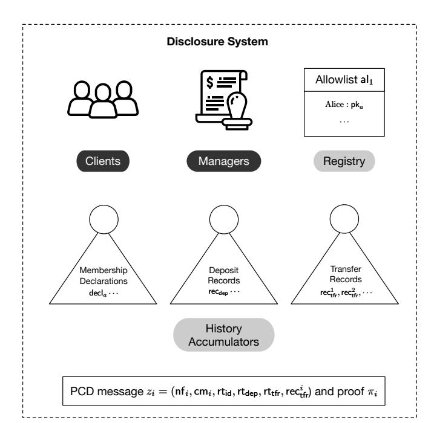
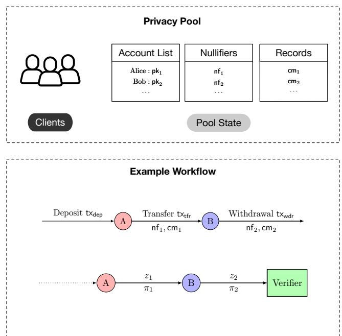
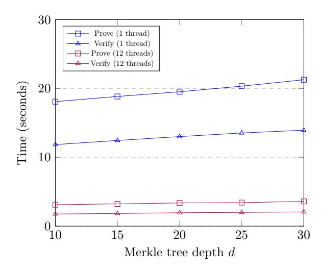

# **Derecho: Privacy Pools with Proof-Carrying Disclosures**

Josh Beal josh.beal@yale.edu Yale University New Haven, CT, United States Ben Fisch ben.fisch@yale.edu Yale University New Haven, CT, United States

#### **ABSTRACT**

A privacy pool enables clients to deposit units of a cryptocurrency into a shared pool where ownership of deposited currency is tracked via a system of cryptographically hidden records. Clients may later withdraw from the pool without linkage to previous deposits. Some privacy pools also support hidden transfer of currency ownership within the pool. In August 2022, the U.S. Department of Treasury sanctioned Tornado Cash, the largest Ethereum privacy pool, on the premise that it enables illicit actors to hide the origin of funds, citing its usage by the DPRK-sponsored Lazarus Group to launder over \$455 million dollars worth of stolen cryptocurrency. This ruling effectively made it illegal for U.S. persons/institutions to use or accept funds that went through Tornado Cash, sparking a global debate among privacy rights activists and lawmakers. Against this backdrop, we present Derecho, a system that institutions could use to request cryptographic attestations of fund origins rather than naively rejecting all funds coming from privacy pools. Derecho is a novel application of proof-carrying data, which allows users to propagate allowlist membership proofs through a privacy pool's transaction graph. Derecho is backwards-compatible with existing Ethereum privacy pool designs, adds no overhead in gas costs, and costs users only a few seconds to produce attestations.

#### 1 INTRODUCTION

Bitcoin, Ethereum, and other cryptocurrencies have achieved significant market capitalization and adoption over the past decade, yet the privacy guarantees of many popular blockchains remain lacking. The traceability of transactions in blockchains such as Bitcoin and Ethereum has been well-studied [1, 33], and even privacy-focused blockchains are subject to deanonymization attacks [29, 34, 45]. Privacy solutions can be designed as add-on components to an existing blockchain or as independent blockchains.

In this work, we focus on privacy pools that use *zero-knowledge proofs* to enable anonymous transfers of assets on account-based smart contract platforms such as Ethereum. These pools are based on the design of *Zerocash* [4], which is also the basis for the cryptocurrency Zcash [26]. In a nutshell, these privacy pools enable users to deposit funds into a shared pool, anonymously transfer funds within the pool, and later withdraw funds without linkage to their previous transactions.

Tornado Cash (Nova) was the most widely used Ethereum privacy pool until U.S. regulators took action against the service in August 2022. The Office of Foreign Assets Control (OFAC) added the Tornado Cash smart contract addresses to the Specially Designated Nationals (SDN) list, due to its purported usage for laundering more than \$9 billion worth of cryptocurrency since 2019, including by the DPRK state-sponsored Lazarus Group that was also sanctioned in 2019. This designation forbids U.S. users, including individuals and institutions, from interacting with the service [42]. It has resulted

in locked funds for U.S. users of the service and has limited the options for law-abiding users that seek to improve the privacy of their transactions on Ethereum. These sanctions have brought renewed attention to the clash between privacy and regulatory oversight on smart contract platforms. In October 2022, Coin Center filed a lawsuit arguing that OFAC exceeded its statutory authority in designating Tornado Cash [17]. It also sparked discussion among researchers and privacy advocates [11, 12, 21], questioning both the efficacy and necessity of privacy pool sanctions in addressing illicit finance, and seeking alternative solutions.

A simple solution would restrict deposits into and withdrawals from the privacy pool to accounts on a specific allowlist. For example, the allowlist might be the set of all public Ethereum addresses that are not on the U.S. Treasury's SDN list. However, allowlists are expected to vary by jurisdiction and may be updated dynamically. In practice, there are widely used "compliance-as-a-service" providers, such as Chainalysis and TRM Labs, that assess the risk of public Ethereum addresses, incorporating multiple risk factors such as interactions with government-sanctioned addresses and exploited smart contracts, and continuously update their risk assessments. Today, U.S. regulated exchanges utilize these risk scores for risk management, e.g., to decide whether or not to accept deposits from a given address. Allowlists can be viewed as binary risk scores.

An alternative solution to restricting deposits and withdrawals is for users of privacy pools to generate attestations when necessary, selectively disclosing information about the provenance of funds withdrawn from the pool. When cryptocurrency is deposited into a privacy pool like Tornado Cash, a digital receipt in the form of a cryptographic commitment is generated, and the depositor retains a secret key required to use this receipt later. A user withdraws x units of cryptocurrency from the pool by presenting a zero-knowledge proof that it knows the secret key of an unused receipt for this exact amount of cryptocurrency, and a keyed hash of the receipt called a nullifier. The nullifier still hides the receipt but prevents it from being used twice. While this zero-knowledge proof reveals little information by default (other than transaction validity), a user may choose to reveal more information about the origin of a withdrawal to an interested party (e.g., an exchange). In fact, zero-knowledge proofs can be used to selectively disclose information about the unique deposit receipt, such as membership of the depositing address on an allowlist or a risk score that a provider has assigned to that public address. Similar solutions were proposed more than a decade ago in the context of Tor and blocklisting of IP-addresses [3, 28, 39].

<span id="page-0-0"></span><sup>&</sup>lt;sup>1</sup>Alternatively, the usage of the privacy pool could be limited to accounts that are not on a specific blocklist and not newly generated at the time of deposit. The second criterion is important to prevent the situation where an attacker move funds to a fresh address in order to evade the restrictions.

However, this system of user-generated disclosures becomes more challenging in pools that support in-pool transfers. The recipient of funds must retain the ability to prove facts about its provenance, in particular, that the funds originated via deposits from accounts on a given set of allowlists. We solve this problem using proof-carrying data [16], a generalization of incrementally verifiable computation [43] that offers a powerful approach to recursive proof composition. When a user makes their first transaction within the privacy pool, the user generates membership proofs for a set of allowlists. Subsequent transactions within the privacy pool generate new membership proofs that are derived from (i.e., prove knowledge of) the previous membership proofs of the transaction inputs and the details of the current transaction. These membership proofs, which we call proof-carrying disclosures, can be verified efficiently and may be communicated directly to the recipient. While our solution focuses on allowlists, it can easily be generalized to handle non-binary risk scores.

#### 1.1 Our Contributions

To summarize, our main contributions are as follows:

- We formalize and present Derecho, a system for cryptographic attestation of funds originating from privacy pools.
   Our system addresses the key legal challenges of privacy pools through the usage of proof-carrying disclosures, a novel application of proof-carrying data.
- We show that our disclosure system achieves practical proving and verification times for a range of system parameters. For a typical configuration, the proving time was 3.4 seconds, and the verification time was 1.9 seconds. Since membership proofs are verified off-chain by the recipient, our system adds no overhead in gas costs.

#### 2 TECHNICAL OVERVIEW

#### 2.1 Design Goals

A key goal in the system design was to develop a solution that can be introduced as an add-on component to existing privacy pools on Ethereum and other smart contract platforms. To facilitate adoption of the system, the design should not require changes to the functionality of the privacy pool or introduce any gas costs to users. Furthermore, it should maintain the existing security properties of the privacy pool while optionally allowing for attestations of allowlist membership.

We rule out solutions that involve changes to the privacy pool or limitations on the number of allowlists. For instance, a naive solution to this problem would involve augmenting the coin commitment openings with a field storing the allowlist identifier and enforcing membership consistency in the transfer proofs of the privacy pool. However, this solution would not be backwards-compatible with existing privacy pools. Furthermore, if an arbitrary number of allowlists is supported, the increase in gas costs would be substantial. To support an unbounded number of allowlists in the naive solution, the privacy pool would need to let the allowlist field have unbounded size or restrict the size and make use of an on-chain set accumulator. While such a solution is appealing in its simplicity, it would face barriers to adoption due to the costs to users and the required changes to existing systems.

### 2.2 Initial Approach

Derecho assumes the existence of a set of allowlists that are maintained external to the system, where each allowlist contains a list of public Ethereum addresses, along with a dynamic accumulator A (e.g., a Merkle tree) which aggregates the allowlists. That is, for each address pk on allowlist with identifier all the element H(a||pk)is inserted into A, where H is a collision-resistant hash function. For simplicity, we restrict to privacy pools that manage only one cryptocurrency asset at a time, but the system easily generalizes to pools that manage multiple types of assets. The pool contract maintains an accumulator R of records, where each record is a hash digest (i.e., cryptographic commitment). When a user first deposits x units of cryptocurrency into the privacy pool from a public Ethereum address  $pk_s$ , a record of the form  $H(x||pk_1||r_1)$  is added to the accumulator R, where  $pk_1$  is the user's public key and  $r_1$  is a nonce that will later be used to nullify the record upon a transfer or withdrawal. A transfer transaction may create a new record  $H(x||pk_2||r_2)$ , a nullifier  $n = H(r_1)$ , and a zero-knowledge proof that a record  $c = H(x||pk_1||r_1)$  exists in R such that  $n = H(r_1)$ . The transfer may also create multiple output records of the form  $H(x_i||pk_i||r_i)$  for  $i \in [2, k]$ , and the zero-knowledge proof would additionally attest that  $\sum_{i} x_{i} = x$ . A withdrawal contains a similar zero-knowledge proof, but publicly reveals the output amount y and a destination Ethereum address  $pk_d$ , at which point y units are with drawn from the pool and delivered to  $pk_d$ . While this example references a concrete implementation of a privacy pool for illustrative purposes, the disclosure system does not assume a specific record format or nullifier creation algorithm.

We define membership of records on allowlists recursively as follows. The initial record created upon deposit is a member of allowlist al if and only if its source Ethereum address  $\mathsf{pk}_s$  is a member of al. A record created as the output of a transfer transaction is a member of al if and only if all the input records to the transfer are members of al. Similarly, we say that a withdrawal transaction is a member of al if and only if all the input records to this withdrawal are members of al. This final attestation refers to the withdrawal transaction itself rather than the Ethereum destination address  $\mathsf{pk}_d$ , which may or may not be on the allowlist for other reasons.

Since the initial record created upon deposit is publicly linked to the Ethereum source address pks via the on-chain deposit transaction, it is straightforward for a user to produce a membership proof of the deposit record on a list al by providing a membership proof for pk, using the accumulator A, which could be verified given the transaction log. Producing membership disclosure proofs for the output records of in-pool transactions is more subtle. If a user already has membership proofs for all the input records to a transfer transaction with respect to a list al, then it can create a membership proof for an output record of this transaction by proving its knowledge of valid al membership proofs for all the input records to the transaction. The same could be done for a withdrawal transaction. In more detail, since neither the output record nor the transaction log contains explicit references linking it to transaction inputs, but only nullifiers  $n_i$  for each input record, the zero-knowledge disclosure proof repeats the logic of the transfer proof: for each  $n_i$ , it proves knowledge of an input record  $c_i = H(x_i||pk_i||r_i)$  such that

<span id="page-2-0"></span>



Figure 1: Illustration of the proposed disclosure system and an example workflow.

 $n_i = H(r_i)$  and *additionally* proves knowledge of a valid membership proof  $\pi_i$  for  $c_i$ . This recursive proof of knowledge is possible via a proof-carrying data (PCD) scheme.

#### <span id="page-2-2"></span>2.3 Key Challenges

With this initial approach, a problem immediately arises: the validity of the membership proof  $\pi_i$  is not actually verifiable against the record commitment  $c_i$  alone. For example, verifying the initial membership proof of a deposit record c required checking against the blockchain transaction log to obtain the link between the record c and a source Ethereum address  $\mathsf{pk}_s$ . Naively, if the public input required to verify allowlist membership includes the entire transaction log of the privacy pool then the recursive zero-knowledge proof statement would become impractically large.

The standard trick around this problem is to replace the transaction log public input with an accumulator digest T: the membership disclosure proof for a deposit record c now includes both an accumulator membership proof for T of a transaction linking c to  $\mathsf{pk}_s$  and an accumulator membership proof for A showing that  $\mathsf{pk}_s$  is on the list al at the time of the deposit.

However, yet another subtle complication arises when attempting to produce recursive membership proofs for the output records of transfers. Suppose the user has a membership proof  $\pi$  for an input record c to a transfer creating an output record c'. Suppose further that the accumulator digest T commits to the transaction log state at the time t that  $\pi$  was created, and that the accumulator state T' commits to the transaction log state at the time t' that the new transfer is occurring. The value T is required as input to verify  $\pi$ , but is unknown to the recipient of the transfer at the time t'. Thus, T is not available as a public input to verify the recursive disclosure created for c', rather, the disclosure must prove knowledge of both

 $\pi$ , c and T against which  $\pi$  is valid. Moreover, without additional restrictions, the prover would be free to invent a malicious proof  $\pi^*$  valid against a  $T^*$  unrelated to the true blockchain state at any point in history.

To resolve this problem, we use history accumulators, which commit not only to the current state of a set but also to all historical states. History accumulators provide an efficient mechanism to prove that a digest T represents a valid historical state  $\sigma$ , which can be verified against the current digest T' of the history accumulator. In Section 4.2, we provide precise definitions of the disclosure system's three key data structures: membership declarations, deposit records, and transfer records. Each of these data structures has a corresponding history accumulator as illustrated above.

Altogether, these techniques result in a system that only requires a few seconds to produce attestations on a consumer-grade laptop. These attestations can be efficiently verified by the recipient of funds with respect to the current blockchain state. Due to the fact that these proofs do not need to be posted on-chain or verified by the smart contract, we were able to leverage recent developments in PCD that trade a larger proof size for faster proving times [9]. The membership proofs that are exchanged between users are large, but the final proof presented to an exchange can be compressed by a general-purpose SNARK as discussed in prior work [8, 31].

#### <span id="page-2-1"></span>2.4 Example Workflow

To highlight the main ideas of our construction, we describe a typical system workflow, which is illustrated in Figure 1. We consider a user named Alice, who has generated key pairs and registered these key pairs with the privacy pool. The manager for allowlist  $al_1$  authorizes membership for Alice's address  $pk_a$ . As a result, Alice

has an account with membership on allowlist al<sub>1</sub>, and a membership declaration will be created and accumulated. The manager can revoke the membership of Alice's account at any point. However, since disclosure creation is optional, Alice cannot be prevented from using the privacy pool. Funds may always be spent without producing an accompanying membership proof. Next, we will see an example of how these membership proofs are generated.

First, Alice deposits 1 ETH into the privacy pool. Based on the details of the deposit transaction, a deposit record rec<sub>dep</sub> will be created and accumulated. Second, Alice transfers 1 ETH to Bob using the anonymous transfer functionality of the pool. Asynchronously, Alice can create a membership proof for this transfer. This initial membership proof  $\pi_1$  will attest to the existence of a deposit record rec<sub>dep</sub> for the transaction input and the existence of a membership declaration  $decl_a$  for Alice's address  $pk_a$  with respect to allowlist al<sub>1</sub>. The proof ensures correspondence to a true blockchain state by attesting to the existence of an appropriate transfer record  $rec_{tfr}^1$ . Alice sends the proof  $\pi_1$  to Bob shortly after the transfer occurs. Subsequently, Bob withdraws 1 ETH from the privacy pool. Asynchronously, Bob can create a membership proof for this withdrawal. This proof  $\pi_2$  will attest to the existence of a proof  $\pi_1$  for the transaction input. As before, the proof also ensures correspondence to a true blockchain state by attesting to the existence of an appropriate transfer record  $rec_{tfr}^2$ . If Bob wishes to deposit the withdrawn funds with origin attestation at a regulated institution, he can present the final membership proof  $\pi_2$  directly to the recipient for verification.

#### 3 BUILDING BLOCKS

#### 3.1 Preliminaries

Notation. We let  $\lambda \in \mathbb{N}$  denote the security parameter with unary representation  $1^{\lambda}$ . We let negl denote the class of negligible functions. We let PPT denote probabilistic polynomial time. We let  $\mathcal{A}$  denote a computationally-bounded adversary modeled as a PPT algorithm. We let [l] denote the set of integers  $\{0,\ldots,l-1\}$ . We let  $x \leftarrow S$  denote that x is sampled uniformly at random from a set S. We let  $\mathbb{F}_q$  denote a finite field of order q. We consider collision-resistant hash functions of the form  $H_q: \{0,1\}^* \to \mathbb{F}_q$ .

History accumulator schemes. A history accumulator is an authenticated data structure that commits to a current set state  $\sigma_n$  and also to all previous set states  $\sigma_1,...,\sigma_{n-1}$ . When the accumulator digest  $\operatorname{rt}_n$  for  $\sigma_n$  is incrementally updated for a new state  $\sigma_{n+1}$ , the new digest  $\operatorname{rt}_{n+1}$  is a commitment to  $\sigma_{n+1}$  and all prior states accumulated by  $\operatorname{rt}_n$ . Some history accumulators support history proofs of additional invariants, e.g., that the current state  $\sigma'$  of a history accumulator with digest  $\operatorname{rt}'$  is a superset of all historical states. Specifically, a history accumulator scheme consists of a tuple of efficient algorithms HA = (Init, Update, Remove, PrvMem, VfyMem, PrvHist, VfyHist) where the algorithms work as follows:

- (rt, σ) ← Init(1<sup>λ</sup>) sets up the initial state σ and digest rt of the history accumulator.
- (rt', σ') ← Update(rt, σ, elem) inserts element elem into the set and outputs an updated state σ' and digest rt'.
- π ← PrvMem(σ, elem) outputs a set membership proof π for the element elem in the set.

- b ← VfyMem(rt, π, elem) outputs a bit b ∈ {0, 1} verifying whether π is a valid proof for the accumulation of elem in rt. The output is b = 1 if the proof is accepted as valid and b = 0 otherwise.
- (rt', σ') ← Remove(rt, σ, elem) removes element elem from the set and outputs updated state σ' and digest rt'.
- π ← PrvHist(rt, σ') given the current state σ' (which has a current digest rt') outputs a proof π that rt is a historical state of the history accumulator.
- $b \leftarrow VfyHist(rt, rt', \pi)$  outputs a bit  $b \in \{0, 1\}$  verifying whether  $\pi$  is a valid proof that rt is a digest of a historical state with respect to rt'. The output is b = 1 if the proof is accepted as valid and b = 0 otherwise.

Informally, a history accumulator scheme should also be correct and sound. Correctness ensures that for every element in the set, it should be easy to generate a membership proof, and for every historical state, it should be easy to generate a history proof. Soundness ensures that for every element not in the set, it should be infeasible to generate a membership proof, and for every state that is not a historical state, it should be infeasible to generate a history proof. This scheme can be instantiated by Merkle history trees [10, 19, 40], which are known to support efficient membership proofs and history proofs [18, 32].

<span id="page-3-1"></span>*Proof-Carrying Data.* Proof-carrying data (PCD) [16] enables a set of parties to carry out an arbitrarily long distributed computation where every step is accompanied by a proof of correctness.

Let V(G) and E(G) denote the vertices and edges of a graph G. A transcript T is a directed acyclic graph where each vertex  $u \in V(T)$  is labeled by local data  $z_{\text{loc}}^{(u)}$  and each edge  $e \in E(T)$  is labeled by a message  $z^{(e)} \neq \bot$ . The output of a transcript T, denoted o(T), is  $z^{(e')}$  where e' = (u, v) is the lexicographically-first edge such that v is a sink.

A vertex  $u \in V(\mathsf{T})$  is  $\varphi$ -compliant for a predicate  $\varphi \in \mathsf{F}$  if for all outgoing edges  $e = (u,v) \in E(\mathsf{T})$  either: (1) if u has no incoming edges,  $\varphi(z^{(e)}, z_{\mathrm{loc}}^{(u)}, \bot, \ldots, \bot)$  evaluates to true or (2) if u has m incoming edges  $e_1, \ldots, e_m, \, \varphi(z^{(e)}, z_{\mathrm{loc}}^{(u)}, z^{(e_1)}, \ldots, z^{(e_m)})$  evaluates to true. A transcript  $\mathsf{T}$  is  $\varphi$ -compliant if all of its vertices are  $\varphi$ -compliant.

A proof-carrying data system PCD for a class of compliance predicates F consists of a tuple of efficient algorithms ( $\mathbb{G}, \mathbb{I}, \mathbb{P}, \mathbb{V}$ ), known as the generator, indexer, prover, and verifier algorithms, for which the properties of completeness, knowledge soundness, and zero knowledge hold.

**Completeness.** PCD has perfect completeness if for every adversary  $\mathcal{A}$ , equation (1) holds under the following conditions: pp  $\leftarrow \mathbb{G}(1^{\lambda})$ ;  $(\varphi, z, z_{\text{loc}}, [z_i, \pi_i]_{i=1}^m) \leftarrow \mathcal{A}(\text{pp})$ ; (ipk, ivk)  $\leftarrow \mathbb{I}(\text{pp}, \varphi)$ ;  $\pi \leftarrow \mathbb{P}(\text{ipk}, z, z_{\text{loc}}, [z_i, \pi_i]_{i=1}^m)$ .

<span id="page-3-0"></span>
$$\Pr \left[ \begin{array}{c} \varphi \in \mathsf{F} \\ \wedge \varphi(z, z_{\mathsf{loc}}, z_1, \dots, z_m) = 1 \\ \wedge (\forall i, z_i = \bot \vee \forall i, \mathbb{V}(\mathsf{ivk}, z_i, \pi_i) = 1) \\ \downarrow \downarrow \\ \mathbb{V}(\mathsf{ivk}, z, \pi) = 1 \end{array} \right] = 1 \tag{1}$$

**Knowledge soundness.** PCD has knowledge soundness with respect to an auxiliary input distribution  $\mathcal{D}$  if for every expected

polynomial-time adversary  $\tilde{\mathbb{P}}$  there exists an expected polynomial-time extractor  $\mathbb{E}_{\tilde{\mathbb{P}}}$  such that for every set Z, the following two probabilities are negligibly close in probability:

$$\begin{aligned} &\Pr\left[ \begin{array}{c} \varphi \in \mathsf{F} \\ \land (\mathsf{pp}, \mathsf{ai}, \varphi, \mathsf{o}(\mathsf{T}), \mathsf{ao}) \in Z \\ \land \mathsf{T} \text{ is } \varphi\text{-compliant} \end{array} \right. & \begin{array}{c} \mathsf{pp} \leftarrow \mathbb{G}(1^\lambda) \\ \mathsf{ai} \leftarrow \mathcal{D}(\mathsf{pp}) \\ (\varphi, \mathsf{T}, \mathsf{ao}) \leftarrow \mathbb{E}_{\tilde{P}}(\mathsf{pp}, \mathsf{ai}) \end{array} \right] \\ &\Pr\left[ \begin{array}{c} \varphi \in \mathsf{F} \\ \land (\mathsf{pp}, \mathsf{ai}, \varphi, \mathsf{o}, \mathsf{ao}) \in Z \\ \land \mathbb{V}(\mathsf{ivk}, \mathsf{o}, \pi) = 1 \end{array} \right. & \begin{array}{c} \mathsf{pp} \leftarrow \mathbb{G}(1^\lambda) \\ \mathsf{ai} \leftarrow \mathcal{D}(\mathsf{pp}) \\ (\varphi, \mathsf{o}, \pi, \mathsf{ao}) \leftarrow \tilde{\mathbb{P}}(\mathsf{pp}, \mathsf{ai}) \\ (\mathsf{ipk}, \mathsf{ivk}) \leftarrow \mathbb{I}(\mathsf{pp}, \varphi) \end{aligned} \right. \end{aligned}$$

**Zero knowledge.** PCD has (statistical) zero knowledge if there exists a PPT simulator  $\mathbb S$  such that for every honest adversary  $\mathcal A$  the distributions below are statistically close:

$$\left\{ \begin{array}{c} \mathsf{pp} \leftarrow \mathbb{G}(1^{\lambda}) \\ (\mathsf{pp}, \varphi, z, \pi) & (\varphi, z, z_{\mathsf{loc}}, [z_i, \pi_i]_{i=1}^m) \leftarrow \mathcal{A}(\mathsf{pp}) \\ (\mathsf{ipk}, \mathsf{ivk}) \leftarrow \mathbb{I}(\mathsf{pp}, \varphi) \\ \pi \leftarrow \mathbb{P}(\mathsf{ipk}, z, z_{\mathsf{loc}}, [z_i, \pi_i]_{i=1}^m) \end{array} \right\}$$

$$\left\{ \begin{array}{c} (\mathsf{pp}, \varphi, z, \pi) \\ \end{array} \middle| \begin{array}{c} (\mathsf{pp}, \tau) \leftarrow \mathbb{S}(1^{\lambda}) \\ (\varphi, z, z_{\mathsf{loc}}, [z_i, \pi_i]_{i=1}^m) \leftarrow \mathcal{A}(\mathsf{pp}) \\ \pi \leftarrow \mathbb{S}(\tau, \varphi, z) \end{array} \right\}$$

An adversary is honest if their output results in the implicant of the completeness condition being satisfied with probability 1, i.e.,  $\varphi \in F$ ,  $\varphi(z, z_{\text{loc}}, z_1, \ldots, z_m) = 1$ , and either  $z_i = \bot$  or  $\mathbb{V}(\text{ivk}, z_i, \pi_i) = 1$  for each incoming edge  $z_i$ . A proof  $\pi$  has size  $\text{poly}(\lambda, |\varphi|)$ ; that is, the proof size is not allowed to grow with each application of the prover algorithm  $\mathbb{P}$ .

Our system uses the PCD construction of [9], which is based on split accumulation schemes. Nova [31] is a recent IVC construction based on folding schemes, however we require the more general notion of PCD to support multiple transaction inputs.

### 4 DEFINITIONS

#### 4.1 System Entities

The disclosure system consists of accounts, allowlists, clients, managers, and the registry. The system references the state of the privacy pool and user transactions, however it does not change the functionality of the privacy pool. Hence it is backwards-compatible with existing privacy pool designs.

- Account. An externally-owned account controls units of a cryptocurrency and has a corresponding public/private key pair. For simplicity, we refer to externally-owned accounts as accounts.
- Allowlist. A list of accounts that are not prohibited from financial interactions in certain settings, such as a geographical jurisdiction. Each list is managed by a trusted party and updated regularly.
- Client. A client operates one or more accounts and interacts with the privacy pool through deposits, transfers, and withdrawals. The client generates membership proofs on a set of allowlists when transferring or withdrawing funds.

- Manager. An allowlist manager is responsible for specifying the members of the allowlist. The manager may update the list over time by adding or removing members.
- Registry. The registry stores the current members of each
  of the allowlists in order to support generation of membership proofs by the clients.
- Privacy Pool Contract. The privacy pool contract supports deposits and withdrawals of coins from the pool and anonymous transfers of coins within the pool.

#### <span id="page-4-0"></span>4.2 Data Structures

The following data structures are introduced to support the disclosure system functionality. In Section 2.4, we described an example of how membership declarations, deposit records, and transfer records are produced in a typical workflow. These objects are managed by history accumulators.

- Public Parameters. In the setup of the disclosure system, a trusted party generates public parameters pp<sub>disc</sub> that are available to all participants in the system.
- Allowlists. An allowlist consists of a unique identifier al and a set of authorized addresses.
- Membership Proof Lists. A membership proof list  $\pi$  is a set of membership proofs for a coin commitment. Each membership proof asserts membership on a specific allowlist in the system.
- Membership Declarations. An allowlist membership declaration decl := H<sub>q</sub>(al||pk<sub>s</sub>) is a public reference to an allowlist identifier al and a user's Ethereum address pk<sub>s</sub>.
- Deposit Records. A deposit record rec<sub>dep</sub> is a public record for a deposit into the privacy pool that is derived from the value amount amt, the user's Ethereum address pk<sub>s</sub>, the coin commitment cm generated upon deposit, the unique identifier uid of the deposit, and the current digest of the membership declaration history accumulator rt<sub>id</sub>.
- Transfer Records. A transfer record rec<sub>tfr</sub> is a public record for a pool transfer that is derived from the nullifier nf for a transaction input and the coin commitment cm for a transaction output. A transfer record is generated for each input-output pair in a given transaction.
- History Accumulators. The disclosure system uses sparse
  Merkle history trees to efficiently prove set membership
  and ensure historical consistency. There are three history
  accumulators: the membership declaration history accumulator with digest rt<sub>id</sub>, the deposit record history accumulator with digest rt<sub>dep</sub>, and the transfer record history
  accumulator with digest rt<sub>ffr</sub>. These history accumulators
  are maintained off-chain using public data derived from the
  blockchain state.

The following definitions will be helpful for specifying the system's interface:

• **Asset.** An asset  $A = (\operatorname{cm}, I)$  consists of a coin commitment cm and auxiliary input  $I \in I$  containing details of the system's public state, where  $I = \{0, 1\}^*$  is the auxiliary input distribution. We let  $A = (A_i)_{i=1}^n$  denote a list of n assets where n is the number of transaction inputs.

• Transaction Parameter. A transaction parameter  $\gamma \in \{0,1\}^*$  consists of details of a deposit, transfer, or withdrawal transaction that are defined by the privacy pool construction and auxiliary information that is needed to prove asset membership. In our construction, this string contains information related to the membership declarations, deposit records, and history accumulators.

#### 4.3 System Operations

The disclosure system supports the operations below, including an initial setup and transaction processing methods to update the history accumulators. The update operations reference transactions that are produced by the privacy pool, whose interface is described in Appendix A.2.

- DisclosureSystemSetup( $1^{\lambda}$ )  $\rightarrow$  pp<sub>disc</sub>. This algorithm sets up the initial state of the disclosure system, including history accumulators and account lists. Returns the public parameters pp<sub>disc</sub>.
- ProcessDepositTx(pp<sub>disc</sub>, tx<sub>dep</sub>) → (b, rec<sub>dep</sub>, uid). This algorithm creates and accumulates the deposit record and generates a unique identifier for the deposit transaction. Returns accept/reject bit b, deposit record rec<sub>dep</sub>, and unique identifier uid for the deposit transaction.
- ProcessTransferTx<sub>n,m</sub>(pp<sub>disc</sub>, tx<sub>tfr</sub>) → (b, rec<sub>tfr</sub>). This algorithm creates and accumulates transfer records for inpool transfers. Returns accept/reject bit b and a list of transfer records rec<sub>tfr</sub>.
- ProcessWithdrawalTx<sub>n</sub>(pp<sub>disc</sub>, tx<sub>wdr</sub>) → (b, rec<sub>tfr</sub>). This
  algorithm creates and accumulates transfer records for pool
  withdrawals. Returns accept/reject bit b and a list of transfer
  records rec<sub>tfr</sub>.

The client supports the following operations for interacting with the disclosure system. When a client transfers funds within the privacy pool, the client will separately create a membership proof list for each of the output coin commitments. When a client withdraws from the privacy pool, the client generates a final membership proof list. The privacy pool contract checks for transaction validity, but the contract does not have access to the membership proofs. These proofs can be communicated through a direct channel to the recipient rather than being posted on the blockchain.

- CreateMembershipProof<sub>n,m</sub>(pp<sub>disc</sub>, A, γ, A<sub>in</sub>, π<sub>in</sub>, al) → (A<sub>out</sub>, π<sub>out</sub>). Given public parameters pp<sub>disc</sub>, a list of assets A, a list of transaction parameters γ, a list of input assets A<sub>in</sub>, a list of input membership proof lists π<sub>in</sub>, and a list of allowlists al, output a list of assets A<sub>out</sub> and a list of membership proof lists π<sub>out</sub>. A membership proof list is generated for each transaction output with respect to the allowlists al. This algorithm is run by the sender and parametrized by the number of transaction inputs n and the number of transaction outputs m.
- VerifyMembershipProof(pp<sub>disc</sub>, A,  $\pi$ , al)  $\rightarrow b$ . Given public parameters pp<sub>disc</sub>, an asset A, a membership proof  $\pi$ , and an allowlist al, return  $b \in \{0,1\}$ . This algorithm is run by the recipient.

The manager supports the following operations for interacting with the disclosure system. These operations result in the addition or removal of an address from the specified allowlists.

- AuthorizeAccount(pp<sub>disc</sub>, pk<sub>s</sub>, al) → (b, decl). Given public parameters pp, a user address pk<sub>s</sub>, and a set of allowlists al, the registry updates the user's membership on allowlists al if the user is not already a member of each allowlist. Membership declarations are created and added to the history accumulator. Returns accept/reject bit b and membership declaration list decl.
- RevokeMembership(pp<sub>disc</sub>, pk<sub>s</sub>, al) → b. Given public parameters pp, a user address pk<sub>s</sub>, and a set of allowlists al, the registry revokes the user's membership on allowlists al if the user is currently a member of each allowlist. Membership declarations are removed from the history accumulator. Returns accept/reject bit b.

### <span id="page-5-0"></span>4.4 Security Goals

The security goals of privacy pools consist of correctness, availability, confidentiality, and unlinkability.

Correctness ensures that a pool does not allow clients to spend coins that have already been spent or that they do not own. Availability ensures that clients cannot be prevented from using the privacy pool. Once coin commitments have been added to the contract state, clients cannot be prevented from spending coins that they own and have not previously spent. Confidentiality and unlinkability are the key privacy considerations. A pool ensures confidentiality of transactions if only the sender and recipient learn the value amount associated with each transaction. A pool ensures unlinkability of transfers and withdrawals if an adversary has a negligible advantage in guessing an input coin commitment associated with a given transfer or withdrawal transaction.

Derecho does not alter the functionality of the privacy pool and thus preserves these correctness and privacy properties. However, we also need to define additional correctness and privacy goals for *proof-carrying disclosures*. Correctness ensures that a client cannot attest membership of a transaction output on a given allowlist unless each of the transaction inputs has an attestation of membership on this allowlist or is a deposit from an address that is registered on this allowlist. Privacy ensures that the allowlist membership proof does not reveal anything besides the allowlist membership of the transaction output (e.g., it does not reveal the private transaction details such as the value amount and the sender/recipient).

In our construction, correctness will follow from the definition of the compliance predicate and privacy from the zero-knowledge property of the underlying PCD scheme. These properties are formalized below and are adapted from the general definition of PCD that is presented in Section 3.1.

#### <span id="page-5-1"></span>4.5 Private Asset Membership

*Definitions.* We require the following definitions to discuss the security of our construction.

 Historical State. The state of the system is represented with history accumulators S<sub>T</sub> for transactions in the privacy

pool and a history accumulator  $S_M$  for membership declarations. These history accumulators are managed offline and computed from the blockchain state.

- Transaction Validation. Let  $D_T$  be a decider for transaction correctness and acceptance. Let  $D_T(S_T, A, \gamma, (A_i)_{i=1}^n) = 1$  if there is a corresponding well-formed  $\mathsf{tx}_{\mathsf{tfr}}$  or  $\mathsf{tx}_{\mathsf{wdr}}$  object that has been accepted by the privacy pool operation ProcessTransferTx or ProcessWithdrawalTx, respectively, and has  $(A_i)_{i=1}^n$  corresponding to its inputs and has A corresponding to one of its outputs. Let  $D_T(S_T, A, \gamma, \bot) = 1$  if there is a corresponding well-formed  $\mathsf{tx}_{\mathsf{dep}}$  object that has been accepted by the privacy pool deposit operation ProcessDepositTx and has A as its output.
- Membership Validation. We let D<sub>M</sub>(S<sub>M</sub>, A, γ, al) be a decider that checks if the sender is a member of allowlist al at the time of deposit.
- Membership-Preserving Transaction. A membership-preserving transaction is one that satisfies the following rule. For a non-empty set of assets A and asset B such that A are inputs to the transaction and B is an output of the transaction, the asset B has membership on allowlist al if and only if for each  $A \in A$ , A has membership on allowlist al. We also consider a deposit transaction to be membership-preserving.
- **Transaction Graph.** A transaction graph G is a directed acyclic graph that consists of a set of vertices V(G) and a set of edges E(G) where each vertex  $v \in V(G)$  corresponds to a deposit, transfer, or withdrawal transaction and each edge  $e \in E(G)$  corresponds to a transaction output.
- **Provenance Transcript.** A provenance transcript PT is a transaction graph where each vertex  $u \in V(\mathsf{PT})$  is labeled by a transaction parameter  $\gamma^{(u)}$  and each edge  $e \in E(\mathsf{PT})$  is labeled by an asset  $A^{(e)} \neq \bot$ . The output of the provenance transcript, denoted  $o(\mathsf{PT})$ , is  $A^{(e')}$  where e' = (u, v) is the first edge such that v is a sink in the lexicographic ordering of the edges. We say that a provenance transcript is *compliant* if all of the transactions corresponding to the labels are correctly-formed, accepted by the privacy pool, and membership-preserving. We let  $D_C(S_T, S_M, \mathsf{PT})$  be a decider for whether a provenance transcript is compliant according to the labels and the historical state.

Algorithms. Given a privacy pool POOL, a disclosure system DISC, and a security parameter  $\lambda$ , a *Private Asset Membership* scheme is a tuple PAM =  $(\mathbb{G}, \mathbb{P}, \mathbb{V})$ , where  $\mathbb{G}$  is called the generator,  $\mathbb{P}$  is called the prover, and  $\mathbb{V}$  is called the verifier. These algorithms work as follows:

- The generator  $\mathbb{G}(1^{\lambda}) \to pp$ , given a security parameter  $\lambda$ , generates the public parameters pp. The public parameters contain global information such as the history accumulators  $S_T$  and  $S_M$ .
- The prover  $\mathbb{P}(\text{pp}, A, \gamma, A_{\text{in}}, \pi_{\text{in}}, \text{al}) \to \pi$ , given asset A, a transaction parameter  $\gamma$ , input assets  $A_{\text{in}} = (A_i)_{i \in [n]}$ , input proofs  $\pi_{\text{in}} = (\pi_i)_{i \in [n]}$ , and allowlist al, returns membership proof  $\pi$ .

• The verifier  $\mathbb{V}(\mathsf{pp}, A, \pi, \mathsf{al}) \to b$ , given asset A, membership proof  $\pi$ , and allowlist al, returns a decision  $b \in \{0, 1\}$  for whether asset A has membership on allowlist al.

*Properties.* The completeness, knowledge soundness, and zero knowledge properties must hold for  $\mathbb{G}$ ,  $\mathbb{P}$ , and  $\mathbb{V}$ . These properties are defined below.

**Completeness**. It must always be possible to prove the membership of an asset with membership on allowlist al. For every adversary  $\mathcal{A}$ , equation (2) holds under the conditions: pp  $\leftarrow \mathbb{G}(1^{\lambda})$ ;  $(A, \gamma, [A_i, \pi_i]_{i=1}^n$ , al)  $\leftarrow \mathcal{A}(pp)$ ;  $\pi \leftarrow \mathbb{P}(pp, A, \gamma, [A_i, \pi_i]_{i=1}^n$ , al).

<span id="page-6-0"></span>
$$\Pr\left[\begin{array}{c} (D_T(S_T,A,\gamma,\bot)=1 \land D_M(S_M,A,\gamma,\operatorname{al})=1) \\ \lor (D_T(S_T,A,\gamma,(A_i)_{i=1}^n)=1 \land \forall i,\mathbb{V}(\operatorname{pp},A_i,\pi_i,\operatorname{al})) \\ \Downarrow \\ \mathbb{V}(\operatorname{pp},A,\pi,\operatorname{al})=1 \end{array}\right]=1 \ (2)$$

**Knowledge soundness.** If the verifier accepts a proof  $\pi$  for an asset generated by some adversary, then the asset has membership on allowlist al, and moreover, the adversary "knows" a compliant provenance transcript PT with output A.

Formally, a PAM scheme PAM has the knowledge soundness property if, for every expected polynomial-time adversary  $\mathcal{A}$ , there exists an expected polynomial-time knowledge extractor  $\mathcal{E}$  that can output a provenance transcript PT such that, for every sufficiently large security parameter  $\lambda$ , the following value is negligibly small:

$$\Pr\left[\begin{array}{c} \mathbb{V}(\mathsf{pp},A,\pi,\mathsf{al}) = 1 \\ \wedge (o(\mathsf{PT}) \neq A \vee D_C(S_T,S_M,\mathsf{PT}) = 0) \\ \end{array} \right. \left. \begin{array}{c} \mathsf{pp} \leftarrow \mathbb{G}(1^\lambda) \\ (A,\pi,\mathsf{al}) \leftarrow \mathcal{A}(\mathsf{pp}) \\ \mathsf{PT} \leftarrow \mathcal{E}(\mathsf{pp}) \\ \end{array} \right]$$

**Zero knowledge**. The PAM proofs reveal nothing besides the allowlist membership of the assets. Formally, the proofs are (statistical) zero knowledge if there exists a PPT simulator  $\mathcal S$  such that for every honest adversary  $\mathcal A$  the distributions below are statistically indistinguishable.

$$\left\{ \begin{array}{l} (\mathsf{pp}, A, \pi, \mathsf{al}) & \mathsf{pp} \leftarrow \mathbb{G}(1^{\lambda}) \\ (A, \gamma, [A_i, \pi_i]_{i=1}^n, \mathsf{al}) \leftarrow \mathcal{A}(\mathsf{pp}) \\ \pi \leftarrow \mathbb{P}(\mathsf{pp}, A, \gamma, [A_i, \pi_i]_{i=1}^n, \mathsf{al}) \end{array} \right\}$$
 
$$\left\{ \begin{array}{l} (\mathsf{pp}, \tau) \leftarrow \mathcal{S}(1^{\lambda}) \\ (A, \gamma, [A_i, \pi_i]_{i=1}^m, \mathsf{al}) \leftarrow \mathcal{A}(\mathsf{pp}) \\ \pi \leftarrow \mathcal{S}(\tau, A, \mathsf{al}) \end{array} \right\}$$

#### 5 CONSTRUCTION

We now present the details of our construction. After outlining the building blocks of the system in Section 5.1, we precisely define the membership proof statement in Section 5.2. We include a detailed specification of the disclosure system algorithms in Appendix E and the formal construction of the Derecho Private Asset Membership scheme in Appendix F. We establish the security properties of our disclosure system in Section 5.4. Since our system does not involve any changes to the functionality of the privacy pool, we defer a detailed discussion of the privacy pool algorithms to Appendix D.

### <span id="page-7-0"></span>5.1 Building Block Algorithms

Below we describe how to compute each of the key objects of the disclosure system. These algorithms are used in updating the history accumulators and producing the membership proofs.

- Membership Declaration Creation. For an allowlist al and address pk<sub>s</sub>, the membership declaration is computed by decl := H<sub>q</sub>(al||pk<sub>s</sub>).
- Deposit Record Creation. A deposit record is computed using a hash function that is applied to the value amount amt, the source address pk<sub>s</sub>, the coin commitment cm generated upon deposit, the unique identifier uid of the deposit transaction, and the current digest of the membership declaration history accumulator rt<sub>id</sub>. The deposit record is computed by rec<sub>dep</sub> := DepositRecord(open, pk<sub>s</sub>, uid, rt<sub>id</sub>) = H<sub>q</sub>(Amt(open)||pk<sub>s</sub>||Com(open)||uid||rt<sub>id</sub>), where open is the opening of the coin commitment cm generated upon deposit, Com is a method that commits to the opening, and Amt is a method that extracts the value amount from the opening. For details on these methods, refer to Appendix A.2.
- Transfer Record Creation. A transfer record is computed using a hash function that is applied to an input nullifier f and an output coin commitment f. The transfer record is computed by f is f is f without reference to any private values associated with the transaction.

#### <span id="page-7-1"></span>5.2 Recursive Membership Proofs

This section defines the PCD system for attestations of allow list membership for a transaction output. Let n be the number of transaction inputs, m be the number of transaction outputs, and l be the number of allow lists. For simplicity, we fix the set of allow lists (al $_j$ ) $_{j \in [l]}$  to yield a set of compliance predicates ( $\varphi_j$ ) $_{j \in [l]}$ . We refer to Section 3.1 for a complete description of proof-carrying data.

The compliance predicate  $\varphi_j$  is a function of the message z, the local data  $z_{\text{loc}}$ , and the incoming messages  $(z_i)_{i \in [n]}$ . Each compliance predicate  $\varphi_j$  is defined with respect to a specific allowlist  $al_j$ . A message z consists of public data associated with the transaction output: the input nullifiers, the output coin commitment, and additional data related to the transfer records and history accumulators. The local data  $z_{\text{loc}}$  consists of private data associated with the transaction output: input and output coin commitment openings, auxiliary inputs for the nullifier computation, membership declarations, deposit information, membership witnesses for the accumulated elements (i.e., deposit records, transfer records, and membership declarations), and history proofs for these elements.

Each transfer transaction corresponds to a vertex in the proof-carrying data graph G. This vertex typically has n incoming edges and m outgoing edges. However, this vertex has no incoming edges when all transaction inputs consist of fresh deposits to the privacy pool. For a node with incoming edges, each message  $z_i$  corresponds to a message that was generated as the output of a previous transaction. If the node has no incoming edges,  $z_i = \bot$ . A vertex u is  $\varphi_j$ -compliant if for all outgoing edges with message z either: (1) if u has no incoming edges,  $\varphi_j(z, z_{\text{loc}}, \bot, \ldots, \bot)$  evaluates to true or (2) if u has n incoming edges,  $\varphi_j(z, z_{\text{loc}}, z_1, \ldots, z_n)$  evaluates to true. Note

that  $z_i = \bot$  or  $\mathbb{V}(\mathsf{ivk}_j, z_i, \pi_i) = 1$  for each incoming edge  $z_i$ . The prover generates an output proof  $\pi = \mathbb{P}(\mathsf{ipk}_j, z, z_{\mathsf{loc}}, [z_i, \pi_i]_{i=1}^m)$ .

If a vertex has no incoming edges, this indicates that each transaction input is a coin that was generated upon deposit to the pool. This is the base case of the compliance predicate. In this case, the predicate performs a series of checks for each transaction input. The predicate checks that the deposit record is correctly computed from the public data (i.e, the value amount, the user's address, the deposit coin commitment, the unique identifier of the deposit transaction, and the current digest of the membership declaration history accumulator) and verifies that the deposit record is accumulated. The predicate checks that the membership declaration is correctly computed from the allowlist identifier and the user's address and verifies that the membership declaration is accumulated. In this case, the prover is computing an attestation from public information in such a way that the initial attestation can be reused in subsequent attestations

If a vertex has *n* incoming edges, this indicates that each transaction input is a coin that was the output of a previous transfer transaction. In this case, the membership proof for this transaction will attest to the validity of previous membership proofs with respect to previous messages. However, a problem arises where the history accumulator digests of previous messages may be stale with respect to the current state of the history accumulator for the current message. We thus additionally need to prove that the prior history accumulator digests represent correct historical states with respect to the current history accumulator digest. Otherwise, there is no guarantee that the prior history accumulator digests correspond to valid prior contract states. The predicate will ensure consistency by verifying that the prior history accumulator digest of message  $z_i$  is a valid historical digest according to the current history accumulator digest of message z. The predicate will verify history proofs for three history accumulators: the membership declaration history accumulator, the deposit record history accumulator, and the transfer record history accumulator. The history accumulators store public information derived from the blockchain state that is useful for ensuring that the membership proofs are consistent with the current state of the blockchain.

In both cases, the predicate computes nullifiers for the transaction inputs based on the input coin commitment openings and auxiliary data. The predicate computes the output coin commitment from its opening. The details of this logic are determined by the privacy pool. The predicate ensures the consistency of the output coin commitments of the previous messages with the input coin commitment openings of the current local data. Finally, the predicate computes the transfer record for each pair of input nullifier and output coin commitment and verifies that the transfer record is accumulated.

While these computations reference the (private) local data, the resulting proofs can be verified with respect to the corresponding (public) message. Each transaction output corresponds to an outgoing edge in the PCD graph, so each transaction output has a corresponding membership proof.

From the recipient's perspective, it is important to check the validity of the public information in the message z with respect to the privacy pool contract state, in addition to verifying the proof  $\pi$ 

with respect to the message z. Otherwise, it is not guaranteed that the membership proof is meaningful. The recipient should be able to perform this check at any time with access to the current state.

Our design offers flexibility in combining coins with membership proofs on distinct sets of allowlists that have a non-empty intersection. For instance, a coin with membership proofs on allowlists al<sub>1</sub> and al<sub>2</sub> may be spent along with a coin with a membership proof on allowlist al<sub>1</sub> to produce a new coin with a membership proof on allowlist  $al_1$  only.

Recall that membership proof generation does not require changes to the functionality of the privacy pool. Membership proofs are generated alongside the privacy pool transactions and provided directly to recipients. There is no increase in the gas costs of these transactions, since membership proofs are not posted on the blockchain and the history accumulators are managed offline.

- Message  $z := (\mathbf{nf}, \mathsf{cm}, \mathsf{rt}_{\mathsf{id}}, \mathsf{rt}_{\mathsf{dep}}, \mathsf{rt}_{\mathsf{tfr}}, \mathbf{rec}_{\mathsf{tfr}})$ :
  - $\mathbf{nf} := (\mathsf{nf}_i)_{i \in [n]}$ : Nullifiers for transaction inputs.
  - cm: Output coin commitment.
  - rt<sub>id</sub>: Digest of membership declaration history accu-
  - rt<sub>dep</sub>: Digest of deposit record history accumulator.
  - rt<sub>tfr</sub>: Digest of transfer record history accumulator.
  - $\mathbf{rec_{tfr}} := (\mathbf{rec}_i^{\mathsf{tfr}})_{i \in [n]}$ : Transfer records derived from public information.
- Local data  $z_{loc} := (open_{in}, open_{out}, aux_{in}, decl, rec_{dep}, pk,$  $uid, w_{id}, c_{id}, w_{dep}, c_{dep}, w_{tfr}, c_{tfr}):$ 
  - **open**<sub>in</sub> :=  $(\text{open}_{i}^{\text{in}})_{i \in [n]}$ : Input coin commitment open-
  - open<sub>out</sub>: Output coin commitment opening.
  - $\mathbf{aux_{in}} := (\mathbf{aux_{i}^{in}})_{i \in [n]}$ : Auxiliary inputs for nullifier computation.
  - **decl** :=  $(decl_i)_{i \in [n]}$ : Membership declarations for the allowlist ali.
  - $\mathbf{rec_{dep}} := (\mathbf{rec}_i^{\mathrm{dep}})_{i \in [n]}$ : Deposit records for the deposit transactions.
  - $\mathbf{pk} := (\mathbf{pk}_i)_{i \in [n]}$ : Source addresses for the deposit transactions.
  - **uid** :=  $(uid_i)_{i \in [n]}$ : Unique identifiers for the deposit
  - $\mathbf{w_{id}} \coloneqq (\mathbf{w}_i^{id})_{i \in [n]}$ : Membership witnesses for membership declarations decl and digest rtid.
  - $\mathbf{c_{id}} := (\mathbf{c_i^{id}})_{i \in [n]}$ : History proofs for digest  $\mathsf{rt_{id}}$  with respect to previous digests  $\hat{\Pi}_i^{id}$ .
  - $\mathbf{w_{dep}} := (\mathbf{w}_i^{\text{dep}})_{i \in [n]}$ : Membership witnesses for deposit records  $\mathbf{rec_{dep}}$  and digest  $\mathsf{rt_{dep}}$ .
  - $\mathbf{c_{dep}} := (\mathbf{c}_i^{\text{dep}})_{i \in [n]}$ : History proofs for digest  $\mathsf{rt_{dep}}$ with respect to previous digests  $\hat{r}t_i^{\text{dep}}$ .
  - $\mathbf{w}_{\mathsf{tfr}} := (\mathbf{w}_i^{\mathsf{tfr}})_{i \in [n]}$ : Membership witnesses for transfer records  $\mathsf{rec}_{\mathsf{tfr}}$  and digest  $\mathsf{rt}_{\mathsf{tfr}}$ .
  - $\mathbf{c}_{\mathsf{tfr}} := (\mathbf{c}_{i}^{\mathsf{tfr}})_{i \in [n]}$ : History proofs for digest  $\mathsf{rt}_{\mathsf{tfr}}$  with respect to previous digests  $\hat{\mathbf{r}}_{i}^{\mathsf{tfr}}$ .
- Previous messages  $(z_i)_{i \in [n]}$ :
  - $z_i := (\hat{\mathbf{nf}}_i, \hat{\mathsf{cm}}_i, \hat{\mathsf{rt}}_i^{\mathsf{id}}, \hat{\mathsf{rt}}_i^{\mathsf{dep}}, \hat{\mathsf{rt}}_i^{\mathsf{ffr}}, \hat{\mathsf{rec}}_{\mathsf{tfr}})$
  - $z_i$  is a message for the *i*-th transaction input.

- Each message  $z_i$  has the same format as z.
- Previous proofs  $(\pi_i)_{i \in [n]}$ :
  - $\pi_i$  is a proof for the *i*-th transaction input.
  - Each proof  $\pi_i$  can be verified with respect to  $z_i$ .
- Compliance predicate  $\varphi_j(z, z_{loc}, z_1, ..., z_n)$  for allow ist al j:
  - For  $i \in [n]$ :
    - \* For base case  $(z_i = \bot)$ , check the following:
      - $\cdot \operatorname{decl}_i = H_q(\operatorname{al}_i || \operatorname{pk}_i)$
      - · HA.VfyMem( $\mathsf{rt}_{\mathsf{id}}, \mathsf{w}^{\mathsf{id}}_i, \mathsf{decl}_i$ )
      - $rec_{i}^{dep} = DepositRecord(open_{i}^{in}, pk_{i}, uid_{i}, rt_{id})$   $HA.VfyMem(rt_{dep}, w_{i}^{dep}, rec_{i}^{dep})$
    - \* Otherwise, check the consistency of messages:
      - $\cdot$  cm<sub>i</sub> = Com(open<sub>i</sub><sup>in</sup>)
      - · HA.VfyHist( $\hat{rt}_i^{id}$ ,  $rt_{id}$ ,  $c_i^{id}$ )
      - · HA.VfyHist( $\hat{\mathbf{r}}_{i}^{\text{dep}}$ ,  $\mathbf{rt}_{\text{dep}}$ ,  $\mathbf{c}_{i}^{\text{dep}}$ ) · HA.VfyHist( $\hat{\mathbf{r}}_{i}^{\text{tfr}}$ ,  $\mathbf{rt}_{\text{tfr}}$ ,  $\mathbf{c}_{i}^{\text{tfr}}$ )
  - For  $i \in [n]$ :
    - \*  $nf_i = Nullify(open_i^{in}, aux_i^{in})$
  - cm = Com(open<sub>out</sub>)

  - For  $i \in [n]$ :

    \*  $\operatorname{rec}_{i}^{\text{tfr}} = H_q(\operatorname{nf}_i || \operatorname{cm})$ \*  $\operatorname{HA.VfyMem}(\operatorname{rt}_{\text{tfr}}, \operatorname{w}_i^{\text{tfr}}, \operatorname{rec}_i^{\text{tfr}})$

### **Disclosure System Algorithms**

We present a detailed specification of the disclosure system algorithms in Figure 5 of Appendix E. An example implementation of the privacy pool interface is contained in Appendix D.

#### <span id="page-8-0"></span>**Disclosure System Security**

We present our formal construction of the Derecho Private Asset Membership (PAM) scheme in Appendix F. Below we present a security proof for the properties of proof-carrying disclosures that were discussed in Section 4.4.

Correctness of proof-carrying disclosures follows from the completeness and knowledge soundness of the PAM scheme. For privacy, we must show that the asset A and membership proof  $\pi$  do not reveal anything about the private transaction details. First, note that the corresponding message z for the asset A consists of public information that is already known by the recipient of the message. The nullifiers **nf** and output coin commitment cm are contained in the public state and linked by the corresponding transaction. The history accumulator digests (rtid, rtdep, rtfr) are part of the public state. The transfer records  $\mathbf{rec}_{\mathbf{tfr}}$  are determined by the nullifiers and output coin commitment. Hence, the asset A does not reveal private transaction details. The membership proof  $\pi$  does not reveal anything about these details according to the zero knowledge property of the PAM scheme.

We now sketch the proof that the DERECHO PAM scheme satisfies the desired properties. Recall that a PAM scheme PAM =  $(\mathbb{G}, \mathbb{P}, \mathbb{V})$ consists of generator, prover, and verifier algorithms with properties of completeness, knowledge soundness, and zero knowledge as defined in Section 4.5.

Completeness. We prove correctness of the compliance predicate in two parts. These parts correspond to the base case (deposit) and

the regular case (transfer/withdrawal) of the compliance predicate. To simplify the analysis, we let n=1, where n is the number of transaction inputs. It is easy to see that the case of n>1 follows directly from the proofs in these two parts.

First, let z be a message with local data  $z_{\rm loc}$  that corresponds to an accepted transaction that spends a deposit originating from an address  ${\sf pk}_1^{\sf in}$  on allowlist al. The correctness of the computation of membership declaration  ${\sf decl}_1$  and deposit record  ${\sf rec}_1^{\sf dep}$  follows from the logic of the ProcessDepositTx and AuthorizeAccount algorithms. Furthermore, the correctness of set membership verification follows from the correctness of the history accumulator scheme. The correctness of nullifier computation and output coin commitment computation follows from the acceptance of the transaction by the privacy pool. In particular, these computations are verified in the CreateTransferTx and ProcessTransferTx algorithms of the privacy pool, and the compliance predicate repeats this logic. The correctness of the Computation of transfer record  ${\sf rec}_{\sf tfr}$  follows from the logic of the ProcessTransferTx algorithm.

Second, let z be a message with local data  $z_{\rm loc}$  that corresponds to an accepted transaction that spends the output of a previous transfer transaction with membership on allowlist al. The correctness of historical state verification follows from the correctness of the history accumulator scheme. The correctness of the computation of the previous output coin commitment follows from the completeness of the PCD scheme. The correctness of the computation of the nullifier, the current output coin commitment, and the transfer record follows as above. Likewise, the correctness of set membership verification follows from the correctness of the history accumulator scheme.

The successful verification of the previous membership proof follows from the completeness of the PCD scheme. Hence the final proof will be convincing with probability 1.

Knowledge Soundness. The compliant provenance transcript can be viewed as a transcript in the PCD scheme, where the assets are the messages on the edges, and the transaction parameters are the local data at the nodes. The knowledge soundness of the PAM scheme then follows from the knowledge soundness of the PCD scheme.

Let  $\mathcal A$  be an adversary that is attacking the Derecho PAM scheme. To show knowledge soundness, we must find a polynomial-time extractor  $\mathcal E$  such that whenever a convincing proof  $\pi$  is found that A is an asset with membership on the allowlist al,  $\mathcal E$  produces the evidence  $\gamma$ .

Using  $\mathcal{A}$ , we construct  $\mathcal{A}_{PCD}$ , an adversary attacking the PCD scheme. Given the public parameters of the PAM scheme (including system state) as auxiliary input, the adversary  $\mathcal{A}_{PCD}$  will run the adversary  $\mathcal{A}$  to produce a PCD message o and a proof  $\pi$  corresponding to the output of  $\mathcal{A}$ . From an equivalent formulation of the PCD knowledge soundness property, there is an extractor  $\tilde{\mathbb{P}}$  such that (for sufficiently large  $\lambda$ ) and every (polynomial-length) auxiliary input ai, the following probability is negligibly small:

$$\Pr \left[ \begin{array}{c} \varphi \in \mathsf{F} \\ \wedge \ (o(\mathsf{T}) \neq o \lor \mathsf{T} \ \text{is not} \ \varphi\text{-compliant}) \\ \wedge \ \mathbb{V}(\mathsf{ivk}, o, \pi) = 1 \end{array} \right. \left. \begin{array}{c} \mathsf{pp}_{\mathsf{pcd}} \leftarrow \mathbb{G}(1^\lambda) \\ \mathsf{ai} \leftarrow \mathcal{D}(\mathsf{pp}_{\mathsf{pcd}}) \\ (\varphi, \mathsf{o}, \pi, \mathsf{ao}) \leftarrow \tilde{\mathbb{P}}(\mathsf{pp}_{\mathsf{pcd}}, \mathsf{ai}) \\ (\mathsf{ipk}, \mathsf{ivk}) \leftarrow \mathbb{I}(\mathsf{pp}_{\mathsf{pcd}}, \varphi) \end{array} \right.$$

The extractor  $\mathcal{E}$  works as follows. When  $\mathcal{A}$  outputs an asset A and a proof  $\pi$ , invoke the extractor  $\mathbb{P}$  and read off the compliant provenance transcript from the output transcript's labels. Since  $\mathcal{A}$  outputs a PCD proof, it follows that  $\mathbb{V}(A, \pi, al) = 1$  if the difference in the probability that T is  $\varphi$ -compliant and the probability that PT is compliant is negligible. Recall that a transcript T is  $\varphi$ -compliant if all of its vertices are  $\varphi$ -compliant. A vertex is  $\varphi$ -compliant for a predicate  $\varphi \in F$  if for all outgoing edges  $e = (u, v) \in E(T)$  in the transcript, either: (1) if u has no incoming edges,  $\varphi(z^{(e)}, z_{\text{loc}}^{(u)}, \bot, ..., \bot) = 1$  or (2) if u has m incoming edges  $e_1, ..., e_m, \varphi(z^{(e)}, z_{\text{loc}}^{(u)}, z^{(e_1)}, ..., z^{(e_m)}) = 1$ . Similarly, a provenance transcript PT is compliant if all of its vertices are compliant, i.e., all of the transactions that correspond to to the labels of the provenance transcript are correctly-formed, accepted by the pool, and membership-preserving. If T is  $\varphi$ -compliant but PT is not compliant, then the compliance predicate  $\varphi$  has not captured the desired security properties, i.e., an asset has an invalid attestation of allowlist membership.

To show these probabilities are negligibly close, we need to consider two cases for the transaction input logic in the compliance predicate. In the base case ( $z_i = \bot$ ), the difference in these probabilities is negligible according to the soundness of the history accumulator scheme, the collision-resistance of the hash function, and the binding property of the commitment scheme. Specifically, it is hard to find an invalid membership witness w that causes the VfyMem algorithm of the history accumulator to accept, and it is hard to find an invalid history proof *c* that causes the VfyHist algorithm of the history accumulator to accept. Likewise, it is hard to find a collision for the hash function or open the commitment to an invalid value. In the regular case  $(z_i \neq \bot)$ , the difference in these probabilities is negligible according to the soundness of the history accumulator scheme and the binding property of the commitment scheme. The transaction logic is sound as it simply repeats the transaction logic that is defined by the privacy pool. The transfer record logic is sound according to the collision-resistance of the hash function and the soundness of the history accumulator

Zero Knowledge. The (statistical) zero knowledge property of the PAM scheme follows directly from the zero knowledge property of the PCD scheme. In particular, the PCD simulator  $\mathbb S$  can be used to construct the PAM simulator  $\mathcal S$  needed to show that the PAM scheme is zero knowledge.

#### **6 EVALUATION**

We implement our construction of proof-carrying disclosures using Rust and the Arkworks ecosystem [2]. Our implementation consists of  $\approx 5500$  lines of code and is available open source. The implementation consists of the compliance predicate circuit and a system for generating proof-carrying disclosures for example transactions. The constraints and proof-carrying data primitives are implemented using Arkworks. We instantiate the PCD scheme

<span id="page-9-0"></span><sup>&</sup>lt;sup>2</sup>https://github.com/joshbeal/derecho

<span id="page-10-1"></span>

| Component       | Sub-component     | Constraints |
|-----------------|-------------------|-------------|
| Membership      | Value Computation | 1,258       |
|                 | Membership Proof  | 6,161       |
|                 | History Proof     | 6,161       |
| Deposit Record  | Value Computation | 7,142       |
|                 | Membership Proof  | 6,161       |
|                 | History Proof     | 6,161       |
| Transfer Record | Value Computation | 1,990       |
|                 | Membership Proof  | 6,161       |
|                 | History Proof     | 6,161       |
| Transaction     | Value Computation | 3,705       |
|                 | Value Consistency | 1           |
| Total           | -                 | 51,062      |

Table 1: Component-wise breakdown of R1CS constraints for the predicate in the recursive membership proof.

of [9] with the Pasta cycle of elliptic curves [25].<sup>3</sup> This scheme optimizes for prover efficiency and uses a transparent setup.

The compliance predicate circuit consists of 51,062 constraints. A component-wise breakdown of the constraints is provided in Table 1. The verification of the membership proofs and history proofs accounts for the majority of the constraints in the compliance predicate. The constraint count has been optimized by using the POSEIDON [23] hash function.

We evaluated the performance on a laptop with an Apple M1 Max processor. Figure 2 contains proving/verification times for a range of Merkle tree depth values. For a Merkle tree depth of 20 and single-threaded execution, the setup time was 5.5 seconds, the proving time was 19.5 seconds, and the verification time was 13.0 seconds. With multi-threaded execution, the setup time was 2.0 seconds, the proving time was 3.4 seconds, and the verification time was 1.9 seconds. The proof size was 6.3 MB for a tree depth of 20. For our application, it is beneficial to leverage a proof system that optimizes for proving time at the expense of proof size, since the resulting proofs are not posted on-chain. Other PCD schemes such as [5] could be used, resulting in different tradeoffs in the setup type, proving/verification time, and proof size. The scheme of [5] results in short proofs but yields a significantly higher proving time. As discussed in Section 2.3 and prior work [8, 31], the final membership proof upon withdrawal from the pool can be compressed. Since the proof no longer needs to be used by any party to continue running PCD, the proof can be compressed using a SNARK. For example, applying Groth16 [24] would result in short proofs ( $\approx$  200 bytes).

Our design does not introduce additional gas costs and does not change the functionality of the privacy pool contract. The registry containing the allowlists and the history accumulators can be maintained offline based on the blockchain state.

<span id="page-10-2"></span>

Figure 2: Recursive membership proof generation time and verification time for a range of system parameters.

#### 7 DISCUSSION

Extensions. Derecho supports attestations of membership on allowlists. Allowlists can also be used to implement blocklists by simply including every *unblocked* address on the allowlist. This is an appropriate solution in the context of our construction, but there are a couple caveats. First, the size of an allowlist could grow to include millions of Ethereum addresses. Since the scheme costs are logarithmic in the total size of the allowlists, this is still a practical solution, but efficiency is impacted. Second, an allowlist manager may be uncomfortable explicitly endorsing addresses that are freshly created due to regulatory reasons, though implicitly this approach is equivalent to a blocklist. As a result, one might wish to support blocklists more directly.

The key challenge with this approach is that a user can easily transfer funds from a blocklisted address  $\operatorname{pk}_s'$  to a fresh Ethereum address  $\operatorname{pk}_s'$  before depositing into the privacy pool. The funds might then be transfered several hops within the pool before the blocklist could be updated to include  $\operatorname{pk}_s'$ . At this stage, the output records of these hops would include valid proofs of non-membership. It would be infeasible to require these proofs to be updated relative to the newer states of the blocklists because the holders of those records do not have knowledge of the records' origin, only the non-membership attestations that were valid against the previous blocklist states. In the case of allowlists, users can be required to register new addresses on the allowlists so that freshly created addresses are not automatically included, preventing users from undermining the disclosure proof system by creating a fresh Ethereum address before depositing into the pool.

Given these considerations, it would be interesting to develop alternative constructions that more directly support blocklist nonmembership proofs, while preventing attacks of the nature described above. One solution is to require a proof of account age to avoid the issue with freshly created addresses. There are known solutions to efficiently proving account age using historical Ethereum

<span id="page-10-0"></span><sup>&</sup>lt;sup>3</sup> If the privacy pool uses a different curve for hash computation (e.g., the BN-254 curve), there will be overhead from non-native field arithmetic in verifying the nullifier and coin commitment computations. In this evaluation, we assume usage of the Poseidon hash function with the Pallas curve as in Zcash [26].

blockchain data [27]. Furthermore, there are circuit-friendly accumulators such as indexed Merkle trees [41] that support relatively efficient non-membership proofs.

Derecho addresses the common scenario where a sanctioned organization exploits a smart contract to steal cryptocurrency and launders the stolen funds through a privacy pool. However, a potential concern is that an entity who had funds in the pool before becoming sanctioned or receives funds through an in-pool transfer might subsequently transfer those funds to another person/entity. One solution to this problem, requiring minimal changes to the compliance predicate, is as follows. Users can additionally register their shielded addresses on allow lists. The shielded address pk can be computed by rerandomizing the public Ethereum address pks (e.g.,  $pk = H_q(sk||pk_s)$  where sk is the secret key). When creating a disclosure, the sender can additionally prove that its current shielded address is allowed. In this extension, the transfer record should reference the current state of the membership declaration accumulator rtid to enforce that the current state of the allowlist is used at each step. While it may be difficult to sanction an entity based on its actions inside a privacy pool, this is an independent concern. The allowlist manager may rely on other information for authorization.

Limitations. Under stricter circumstances, an exchange may wish to know that certain funds did not recently pass through newly sanctioned entities in the pool (even if they were allowed at the time of transfer). For instance, a user may be sanctioned immediately after transferring funds to a new recipient. While Derecho supports removal of addresses from allowlists to facilitate sanctions on previously approved entities, it may be desirable to additionally support revocation of allowlist membership proofs for existing transaction outputs. However, this would conflict with the privacy goals. Suppose there exists a construction where a single address may be removed from an allowlist al to create a new allowlist al' such that old membership proofs for al can be updated to support verification against al'. Then a membership proof that was previously valid against the old allowlist al but not the new allowlist al' can be used to break the privacy guarantee of unlinkability. More precisely, this implies that the party who is able to compute al' and the party who is able to update a membership proof  $\pi$  for funds stored at a given record within the privacy pool would be able to collude at any time to discover all addresses on al from which the funds originated. We leave exploration of relaxed privacy models that might be compatible with proof revocation for future work.

#### 8 RELATED WORK

Sander and Ta-Shma [37] and Camenisch et al. [13] established the foundations of accountable privacy for ecash systems. With the growing popularity of cryptocurrencies, several works have examined trade-offs between privacy and accountability/auditability in the design of decentralized payment systems. Garman et al. [22] demonstrates how to add privacy-preserving policy enforcement mechanisms to the Zerocash design. UTT [38] designs a decentralized payment system that limits the the amount of currency sent per month using the notion of an anonymity budget. Platypus [44] and PEReDi [30] explore the design of central bank digital currencies (CBDCs) with privacy-preserving regulatory functionality.

Platypus focuses on enforcement of anonymity budgets and total balance limits. PEReDi supports compliance with regulations such as Know Your Customer (KYC), Anti Money Laundering (AML), and Combating Financing of Terrorism (CFT). Their system aims to avoid a single point of failure by distributing the policy enforcement mechanism. CAP [20] introduces Configurable Asset Privacy schemes, which support private transfers of heterogeneous assets with custom viewing and freezing policies. ZEBRA [36] develops anonymous credentials that support auditability and revocation while enabling efficient on-chain verification. We refer to [14] for a more detailed study of these research challenges.

ZEXE [7] provides a general framework for privacy-preserving blockchain applications in which the application state is a system of records, transactions create and nullify records, and all records have birth and death predicates defining the conditions under which they can be created or nullified. Transactions contain zero-knowledge proofs that these predicates are satisfied. As the authors note, this captures membership proofs of records on allowlists/blocklists as a special case (described in detail through a "regulation-friendly private stablecoin" example). In terms of comparison to Derecho, the ZEXE regulation-friendly stablecoin example restricts users of the stablecoin to a single allowlist (or blocks users on a single blocklist), represented as a credential assigned to the public key of a user, while Derecho does not alter the functionality of privacypreserving cryptocurrencies, enabling users to separately disclose allowlist provenance off-chain. Unlike Derecho, ZEXE does not address how users can prove statements about the origin of records within a hidden transaction graph, nor the added challenge that the users themselves cannot see the full details of transaction history aside from membership proofs of their existing records.

Proof-carrying data [16] (PCD) generalizes the notion of incrementally verifiable computation [43] (IVC) from sequential computation to distributed computation over a directed acyclic graph. The initial paper proposing PCD proposed several applications to the integrity of distributed computations, including distributed program analysis, type safety, IT supply chains, and conjectured applications to financial systems. Naveh and Tromer [35] proposed an application of PCD to image authentication, i.e., proving the authenticity of photos even after they have been edited according to a permissible set of transformations. PCD (and IVC as a special case) has been used to construct authenticated data structures with richer invariants, such as append-only dictionaries [40] and incrementally verifiable ledger systems [6, 15].

The Privacy Pools [12] protocol enables membership and non-membership proofs for withdrawals from privacy pools that do not support in-pool transfers, such as Tornado Cash (Classic). Membership is defined with respect to association sets (i.e., collections of records), and the disclosure system is based on zk-SNARKs. The paper outlines extensions to support arbitrary denominations and in-pool transfers. To support arbitrary denominations, changes to the privacy pool are proposed (i.e., transfers must propagate commitments through transactions). To handle in-pool transfers, the sender must reveal secret information about the spent record to the recipient, who may be required to transmit this information to other parties. This weakens the privacy guarantees of the pool. On the other hand, our disclosure system requires no changes to the privacy pool or its security guarantees.

#### **ACKNOWLEDGMENTS**

This work was supported by the Algorand Centres of Excellence programme managed by Algorand Foundation. Any opinions, findings, and conclusions or recommendations expressed in this material are those of the author(s) and do not necessarily reflect the views of Algorand Foundation.

#### REFERENCES

- <span id="page-12-0"></span> Elli Androulaki, Ghassan Karame, Marc Roeschlin, Tobias Scherer, and Srdjan Capkun. 2013. Evaluating User Privacy in Bitcoin. In FC 2013 (LNCS, Vol. 7859), Ahmad-Reza Sadeghi (Ed.). Springer, Heidelberg, 34–51. https://doi.org/10.1007/ 978-3-642-39884-1
- <span id="page-12-23"></span>[2] arkworks contributors. 2022. arkworks zkSNARK ecosystem. https://arkworks.rs
- <span id="page-12-11"></span>[3] Stephanie Bayer and Jens Groth. 2013. Zero-Knowledge Argument for Polynomial Evaluation with Application to Blacklists. In EUROCRYPT 2013 (LNCS, Vol. 7881), Thomas Johansson and Phong Q. Nguyen (Eds.). Springer, Heidelberg, 646–663. https://doi.org/10.1007/978-3-642-38348-9\_38
- <span id="page-12-4"></span>[4] Eli Ben-Sasson, Alessandro Chiesa, Christina Garman, Matthew Green, Ian Miers, Eran Tromer, and Madars Virza. 2014. Zerocash: Decentralized Anonymous Payments from Bitcoin. In 2014 IEEE Symposium on Security and Privacy. IEEE Computer Society Press, 459–474. https://doi.org/10.1109/SP.2014.36
- <span id="page-12-26"></span>[5] Eli Ben-Sasson, Alessandro Chiesa, Eran Tromer, and Madars Virza. 2014. Scalable Zero Knowledge via Cycles of Elliptic Curves. In CRYPTO 2014, Part II (LNCS, Vol. 8617), Juan A. Garay and Rosario Gennaro (Eds.). Springer, Heidelberg, 276–294. https://doi.org/10.1007/978-3-662-44381-1 16
- <span id="page-12-40"></span>[6] Joseph Bonneau, Izaak Meckler, Vanishree Rao, and Evan Shapiro. 2020. Coda: Decentralized Cryptocurrency at Scale. Cryptology ePrint Archive, Report 2020/352. https://eprint.iacr.org/2020/352.
- <span id="page-12-38"></span>[7] Sean Bowe, Alessandro Chiesa, Matthew Green, Ian Miers, Pratyush Mishra, and Howard Wu. 2020. ZEXE: Enabling Decentralized Private Computation. In 2020 IEEE Symposium on Security and Privacy. IEEE Computer Society Press, 947–964. https://doi.org/10.1109/SP40000.2020.00050
- <span id="page-12-16"></span>[8] Benedikt Bünz and Binyi Chen. 2023. Protostar: Generic Efficient Accumulation/Folding for Special-Sound Protocols. In ASIACRYPT 2023, Part II (LNCS, Vol. 14439), Jian Guo and Ron Steinfeld (Eds.). Springer, Heidelberg, 77–110. https://doi.org/10.1007/978-981-99-8724-5
- <span id="page-12-15"></span>[9] Benedikt Bünz, Alessandro Chiesa, William Lin, Pratyush Mishra, and Nicholas Spooner. 2021. Proof-Carrying Data Without Succinct Arguments. In CRYPTO 2021, Part I (LNCS, Vol. 12825), Tal Malkin and Chris Peikert (Eds.). Springer, Heidelberg, Virtual Event, 681–710. https://doi.org/10.1007/978-3-030-84242-0 24
- <span id="page-12-18"></span>[10] Benedikt Bünz, Lucianna Kiffer, Loi Luu, and Mahdi Zamani. 2020. FlyClient: Super-Light Clients for Cryptocurrencies. In 2020 IEEE Symposium on Security and Privacy. IEEE Computer Society Press, 928–946. https://doi.org/10.1109/ SP40000.2020.00049
- <span id="page-12-8"></span>[11] Joseph Burleson, Michele Korver, and Dan Boneh. 2022. Privacy-Protecting Regulatory Solutions Using Zero-Knowledge Proofs. (2022). https://a16zcrypto.com/ wp-content/uploads/2022/11/ZKPs-and-Regulatory-Compliant-Privacy.pdf.
- <span id="page-12-9"></span>[12] Vitalik Buterin, Jacob Illum, Matthias Nadler, Fabian Schär, and Ameen Soleimani. 2023. Blockchain privacy and regulatory compliance: Towards a practical equilibrium. Blockchain: Research and Applications (2023), 100176.
- <span id="page-12-31"></span>[13] Jan Camenisch, Susan Hohenberger, and Anna Lysyanskaya. 2006. Balancing Accountability and Privacy Using E-Cash (Extended Abstract). In SCN 06 (LNCS, Vol. 4116), Roberto De Prisco and Moti Yung (Eds.). Springer, Heidelberg, 141–155. https://doi.org/10.1007/11832072\_10
- <span id="page-12-37"></span>[14] Panagiotis Chatzigiannis, Foteini Baldimtsi, and Konstantinos Chalkias. 2021. SoK: Auditability and Accountability in Distributed Payment Systems. In ACNS 21, Part II (LNCS, Vol. 12727), Kazue Sako and Nils Ole Tippenhauer (Eds.). Springer, Heidelberg, 311–337. https://doi.org/10.1007/978-3-030-78375-4\_13
- <span id="page-12-41"></span>[15] Weikeng Chen, Alessandro Chiesa, Emma Dauterman, and Nicholas P. Ward. 2020. Reducing Participation Costs via Incremental Verification for Ledger Systems. Cryptology ePrint Archive, Report 2020/1522. https://eprint.iacr.org/ 2020/1522.
- <span id="page-12-14"></span>[16] Alessandro Chiesa and Eran Tromer. 2010. Proof-Carrying Data and Hearsay Arguments from Signature Cards. In ICS 2010, Andrew Chi-Chih Yao (Ed.). Tsinghua University Press, 310–331.
- <span id="page-12-7"></span>[17] Coin Center. 2022. Tornado Cash complaint. https://www.coincenter.org/app/ uploads/2022/10/1-Complaint-Coin-Center-10-12-22.pdf.
- <span id="page-12-21"></span>[18] Scott Alexander Crosby. 2010. Efficient tamper-evident data structures for untrusted servers. Rice University.
- <span id="page-12-19"></span>[19] Scott A. Crosby and Dan S. Wallach. 2009. Efficient Data Structures For Tamper-Evident Logging. In USENIX Security 2009, Fabian Monrose (Ed.). USENIX Association, 317–334.

- <span id="page-12-35"></span>[20] Espresso Systems. 2022. Configurable Asset Privacy. (2022). https://github.com/ EspressoSystems/cap/blob/main/cap-specification.pdf.
- <span id="page-12-10"></span>[21] Ben Fisch. 2022. Privacy-Protecting Regulatory Solutions Using Zero-Knowledge Proofs. (2022). https://www.espressosys.com/blog/configurable-privacy-casestudy-partitioned-privacy-pools.
- <span id="page-12-32"></span>[22] Christina Garman, Matthew Green, and Ian Miers. 2016. Accountable Privacy for Decentralized Anonymous Payments. In FC 2016 (LNCS, Vol. 9603), Jens Grossklags and Bart Preneel (Eds.). Springer, Heidelberg, 81–98.
- <span id="page-12-25"></span>[23] Lorenzo Grassi, Dmitry Khovratovich, Christian Rechberger, Arnab Roy, and Markus Schofnegger. 2021. Poseidon: A New Hash Function for Zero-Knowledge Proof Systems. In USENIX Security 2021, Michael Bailey and Rachel Greenstadt (Eds.). USENIX Association, 519–535.
- <span id="page-12-27"></span>[24] Jens Groth. 2016. On the Size of Pairing-Based Non-interactive Arguments. In EUROCRYPT 2016, Part II (LNCS, Vol. 9666), Marc Fischlin and Jean-Sébastien Coron (Eds.). Springer, Heidelberg, 305–326. https://doi.org/10.1007/978-3-662-49896-5 11
- <span id="page-12-24"></span>[25] Daira Hopwood. 2020. The pasta curves for halo 2 and beyond. https://electriccoin.co/blog/the-pasta-curves-for-halo-2-and-beyond/.
- <span id="page-12-5"></span>[26] Daira Hopwood, Sean Bowe, Taylor Hornby, and Nathan Wilcox. 2022. Zcash protocol specification. (2022). https://zips.z.cash/protocol/protocol.pdf.
- <span id="page-12-28"></span>[27] Intrinsic Technologies. 2024. Axiom Documentation. (2024). https://docs.axiom.xyz/.
- <span id="page-12-12"></span>[28] Peter C. Johnson, Apu Kapadia, Patrick P. Tsang, and Sean W. Smith. 2007. Nymble: Anonymous IP-Address Blocking. In PET 2007 (LNCS, Vol. 4776), Nikita Borisov and Philippe Golle (Eds.). Springer, Heidelberg, 113–133. https://doi.org/ 10.1007/978-3-540-75551-7 8
- <span id="page-12-2"></span>[29] George Kappos, Haaroon Yousaf, Mary Maller, and Sarah Meiklejohn. 2018. An Empirical Analysis of Anonymity in Zcash. In USENIX Security 2018, William Enck and Adrienne Porter Felt (Eds.). USENIX Association, 463–477.
- <span id="page-12-34"></span>[30] Aggelos Kiayias, Markulf Kohlweiss, and Amirreza Sarencheh. 2022. PEReDi: Privacy-Enhanced, Regulated and Distributed Central Bank Digital Currencies. In ACM CCS 2022, Heng Yin, Angelos Stavrou, Cas Cremers, and Elaine Shi (Eds.). ACM Press, 1739–1752. https://doi.org/10.1145/3548606.3560707
- <span id="page-12-17"></span>[31] Abhiram Kothapalli, Srinath Setty, and Ioanna Tzialla. 2022. Nova: Recursive Zero-Knowledge Arguments from Folding Schemes. In CRYPTO 2022, Part IV (LNCS, Vol. 13510), Yevgeniy Dodis and Thomas Shrimpton (Eds.). Springer, Heidelberg, 359–388. https://doi.org/10.1007/978-3-031-15985-5\_13
- <span id="page-12-22"></span>[32] Ben Laurie, Adam Langley, and Emilia Kasper. 2013. RFC 6962: Certificate transparency. https://www.rfc-editor.org/rfc/rfc6962.
- <span id="page-12-1"></span>[33] Sarah Meiklejohn, Marjori Pomarole, Grant Jordan, Kirill Levchenko, Damon McCoy, Geoffrey M Voelker, and Stefan Savage. 2013. A fistful of bitcoins: characterizing payments among men with no names. In Proceedings of the 2013 conference on Internet measurement conference. 127–140.
- <span id="page-12-3"></span>[34] Malte Möser, Kyle Soska, Ethan Heilman, Kevin Lee, Henry Heffan, Shashvat Srivastava, Kyle Hogan, Jason Hennessey, Andrew Miller, Arvind Narayanan, and Nicolas Christin. 2018. An Empirical Analysis of Traceability in the Monero Blockchain. PoPETs 2018, 3 (July 2018), 143–163. https://doi.org/10.1515/popets-2018-0025
- <span id="page-12-39"></span>[35] Assa Naveh and Eran Tromer. 2016. PhotoProof: Cryptographic Image Authentication for Any Set of Permissible Transformations. In 2016 IEEE Symposium on Security and Privacy. IEEE Computer Society Press, 255–271. https://doi.org/10.1109/SP.2016.23
- <span id="page-12-36"></span>[36] Deevashwer Rathee, Guru Vamsi Policharla, Tiancheng Xie, Ryan Cottone, and Dawn Song. 2022. ZEBRA: Anonymous Credentials with Practical On-chain Verification and Applications to KYC in DeFi. Cryptology ePrint Archive, Report 2022/1286. https://eprint.iacr.org/2022/1286.
- <span id="page-12-30"></span>[37] Tomas Sander and Amnon Ta-Shma. 1999. Flow Control: A New Approach for Anonymity Control in Electronic Cash Systems. In FC'99 (LNCS, Vol. 1648), Matthew Franklin (Ed.). Springer, Heidelberg, 46–61.
- <span id="page-12-33"></span>[38] Alin Tomescu, Adithya Bhat, Benny Applebaum, Ittai Abraham, Guy Gueta, Benny Pinkas, and Avishay Yanai. 2022. UTT: Decentralized Ecash with Accountable Privacy. Cryptology ePrint Archive, Report 2022/452. https://eprint.iacr.org/2022/452.
- <span id="page-12-13"></span>[39] Patrick P Tsang, Apu Kapadia, Cory Cornelius, and Sean W Smith. 2009. Nymble: Blocking misbehaving users in anonymizing networks. IEEE Transactions on Dependable and Secure Computing 8, 2 (2009), 256–269.
- <span id="page-12-20"></span>[40] Nirvan Tyagi, Ben Fisch, Andrew Zitek, Joseph Bonneau, and Stefano Tessaro. 2022. VeRSA: Verifiable Registries with Efficient Client Audits from RSA Authenticated Dictionaries. In ACM CCS 2022, Heng Yin, Angelos Stavrou, Cas Cremers, and Elaine Shi (Eds.). ACM Press, 2793–2807. https://doi.org/10.1145/3548606.3560605
- <span id="page-12-29"></span>[41] Ioanna Tzialla, Abhiram Kothapalli, Bryan Parno, and Srinath Setty. 2021. Transparency Dictionaries with Succinct Proofs of Correct Operation. Cryptology ePrint Archive, Report 2021/1263. https://eprint.iacr.org/2021/1263.
- <span id="page-12-6"></span>[42] United States Department of the Treasury. 2022. U.S. Treasury Sanctions Notorious Virtual Currency Mixer Tornado Cash. (2022). https://home.treasury.gov/news/press-releases/jy0916.

- <span id="page-13-1"></span>[43] Paul Valiant. 2008. Incrementally Verifiable Computation or Proofs of Knowledge Imply Time/Space Efficiency. In TCC 2008 (LNCS, Vol. 4948), Ran Canetti (Ed.). Springer, Heidelberg, 1–18. https://doi.org/10.1007/978-3-540-78524-8\_1
- <span id="page-13-3"></span>[44] Karl Wüst, Kari Kostiainen, Noah Delius, and Srdjan Capkun. 2022. Platypus: A Central Bank Digital Currency with Unlinkable Transactions and Privacy-Preserving Regulation. In ACM CCS 2022, Heng Yin, Angelos Stavrou, Cas Cremers, and Elaine Shi (Eds.). ACM Press, 2947–2960. https://doi.org/10.1145/3548606.3560617
- <span id="page-13-0"></span>[45] Zuoxia Yu, Man Ho Au, Jiangshan Yu, Rupeng Yang, Qiuliang Xu, and Wang Fat Lau. 2019. New Empirical Traceability Analysis of CryptoNote-Style Blockchains. In FC 2019 (LNCS, Vol. 11598), Ian Goldberg and Tyler Moore (Eds.). Springer, Heidelberg, 133–149. https://doi.org/10.1007/978-3-030-32101-7\_9

#### A BACKGROUND

### A.1 Cryptographic Primitives

Hash functions. We use hash functions satisfying the standard collision resistance property. Our system samples hash functions of the form  $H_q:\{0,1\}^*\to \mathbb{F}_q$ . We use the arithmetic hash function Poseidon [23], which is commonly used in blockchain applications. Our disclosure system can be instantiated with any efficient construction of collision-resistant hash functions.

Commitment schemes. A commitment scheme C = (Com, Vfy) is a pair of efficient algorithms defined over a message space  $\mathcal{M}$  and a randomness space  $\mathcal{R}$  where:

- cm ← Com(m; r) is a commit algorithm that produces a commitment cm given the message m ∈ M to be committed and the randomness r ← \$ R.
- $b \leftarrow \text{Vfy(cm, m, } r)$  is a verification algorithm that checks whether (m, r) is the correct opening of the commitment cm and outputs a bit  $b \in \{0, 1\}$  representing accept if b = 1 and reject otherwise.

Informally, a commitment scheme is called binding if it is infeasible to open a commitment to a different message. It is called hiding if the commitments of any two messages are indistinguishable. Commitment schemes can be built from collision-resistant hash functions.

Accumulator schemes. An accumulator scheme consists of a tuple of efficient algorithms Acc = (Init, Update, PrvMem, VfyMem) where:

- (rt, σ) ← Init(1<sup>λ</sup>) sets up the initial state σ and digest rt of the accumulator.
- (rt', σ') ← Update(rt, σ, elem) inserts element elem into the set and outputs an updated state σ' and digest rt'.
- π ← PrvMem(σ, elem) outputs a set membership proof π for the element elem in the set.
- b ← VfyMem(rt, π, elem) outputs a bit b ∈ {0, 1} verifying whether π is a valid proof for the accumulation of elem in rt. The output is b = 1 if the proof is accepted as valid and b = 0 otherwise.

Informally, an accumulator scheme should be correct and sound. Correctness ensures that for every element in the set, it should be easy to prove membership. Soundness ensures that for every element not in the set, it should not be feasible to prove membership.

*Public-key encryption schemes.* A public-key encryption scheme is of a triple of efficient algorithms  $\mathcal{E} = (\text{Gen, Enc, Dec})$  where:

 (pk, sk) ← Gen(1<sup>λ</sup>) is a PPT key generation algorithm that outputs a key pair consisting of a public key pk and

- a private key sk. The public key defines a message space  $\mathcal{M}_{nk}$ .
- ct ← Enc(pk, msg) is a PPT encryption algorithm that outputs a ciphertext ct when given a public key pk and a message msg ∈ M<sub>pk</sub>.
- msg 
   — Dec(sk, ct) is a polynomial-time decryption algorithm that given a ciphertext ct and the secret key sk whose corresponding public key pk was used to generate the ciphertext, outputs the encrypted message in plaintext. The output msg is a special reject value if decryption failed.

We require that Pr[Dec(sk, Enc(pk, msg)) = msg] = 1 for all key pairs and messages. We require that the scheme has the IND-CPA and IK-CPA properties. The ElGamal scheme has these properties.

*zk-SNARKs*. A preprocessing zk-SNARK (zero-knowledge succinct non-interactive argument of knowledge) with universal SRS (structured reference string) consists of a tuple of efficient algorithms ARG =  $(\mathcal{G}, \mathcal{I}, \mathcal{P}, \mathcal{V})$  where:

- srs ← G(1<sup>λ</sup>, N) is a PPT generation algorithm that samples an SRS that supports indices of size up to N. This is the universal setup, which is carried out once and used across all future circuits.
- (ek, vk) ← I<sub>srs</sub>(i) is a polynomial-time indexing algorithm that outputs the proving key ek and verification key vk for a circuit with description i. This algorithm has oracle access to the SRS.
- π ← P(ek, x, w) is a PPT proving algorithm that outputs the proof given the instance x and the witness w.
- b ← V(vk, x, π) is a polynomial-time verification algorithm that outputs an accepting bit b ∈ {0,1} given the verification key vk, the instance x, and a proof π. The bit b = 1 denotes acceptance of the proof for the instance, while b = 0 denotes rejection of the proof.

We require the standard security properties of completeness, knowledge soundness, zero knowledge, and succinctness.

#### <span id="page-13-2"></span>A.2 Privacy Pools

The privacy pool needs to keep track of the shielded addresses, the created records, and the nullifiers that correspond to spent records. SNARK-friendly accumulators are used to support the privacy-preserving transaction functionality. Specifically, the following data structures are used:

- Public Parameters. In the setup of the privacy pool, a trusted party generates public parameters pppool that are available to all participants in the system.
- User Key Pairs. A user generates a key pair (sk, pk) when
  joining the privacy pool. The public key pk is used for
  receiving coins and the secret key sk is used for creating
  transactions. The public key is typically derived from the\nuser's Ethereum address addr and the generated secret key.
  The user generates a key pair (sk', pk') for encryption and
  decryption of owner memos.
- Account List. The user's public keys are stored in the account list of the privacy pool contract upon registration. This list supports the anonymous transfer functionality of the privacy pool.

- Coin Commitments. A coin commitment cm is a commitment to details of a transaction output, including the value amount amt and the recipient's public key pk. The opening of the coin commitment open is used in transaction creation and membership proof generation.
- Nullifier Sets. The privacy pool typically maintains a nullifier set to prevent double-spending attacks. A nullifier nf can be constructed from an opening of a coin commitment cm and auxiliary information aux.
- Owner Memos. An owner memo is used by the coin owner to create the coin commitment from the encryption of the opening of the commitment. The memo can be shared with the recipient directly. Alternatively, the memo can be posted on the public ledger as part of the transaction.
- Accumulators. The privacy pool typically uses sparse Merkle trees to efficiently prove set membership. For example, an on-chain accumulator rt<sub>c</sub> can maintain the set of coin commitments.

Some of these data structures may also be referenced by the disclosure system. For instance, it is necessary to reference the nullifiers and the coin commitments in creating the membership proof. The privacy pool interface is described below. The privacy pool supports an initial setup, account registration, and financial transactions. The initial setup is run by a trusted party, and the transaction processing is typically executed by a smart contract. Each of the transaction objects are created by the client. We provide a specific implementation of the privacy pool interface in Appendix D.

- PrivacyPoolSetup( $1^{\lambda}$ )  $\rightarrow$  pp<sub>pool</sub>. This algorithm sets up the initial state of the privacy pool, including the accumulator and configurable parameters. Returns the public parameters pp<sub>pool</sub>.
- ProcessDepositTx(pp<sub>pool</sub>, tx<sub>dep</sub>) → b. This algorithm validates the deposit amount and transfers funds from the sender address to the privacy pool contract address. Returns accept/reject bit b.
- ProcessTransferTx $_{n,m}$ (pp $_{pool}$ , tx $_{tfr}$ )  $\rightarrow b$ . This algorithm verifies the transfer proof and checks the value invariant. If the transaction is valid, input nullifiers are added to the nullifier set and output coin commitments are accumulated. Returns accept/reject bit b.
- ProcessWithdrawalTx<sub>n</sub>(pp<sub>pool</sub>, tx<sub>wdr</sub>) → b. This algorithm verifies the withdrawal proof and validates the input coin commitments. If the transaction is valid, input nullifiers are added to the nullifier set and funds are sent to the recipient. Returns accept/reject bit b.
- ProcessRegistrationTx(pp<sub>pool</sub>, tx<sub>reg</sub>) → b. The pool will store the public keys (pk, pk') for the user in the account list. Returns accept/reject bit b.

The client supports the following operations for interacting with the privacy pool:

GenerateKeyPair(pppool, addr) → (sk, pk, sk', pk'). Given public parameters pppool and an address addr, output a user key pair (sk, pk) and an encryption key pair (sk', pk').

- CreateRegistrationTx(pppool, pk) → txreg. Given public parameters pppool and the user's public keys (pk, pk'), output a registration transaction txreg = (pk, pk'). This transaction registers the public keys, which enables other users to send funds to the account using the key pk and encrypt the owner memos using the encryption key pk'.
- CreateDepositTx(pp<sub>pool</sub>, amt, pk) → tx<sub>dep</sub>. Given public parameters pp, a value amount amt, and a user public key pk, output a deposit transaction tx<sub>dep</sub> = (cm, amt). The deposit transaction will transfer amt units of value from the sender to the privacy pool contract address.
- CreateTransferTx<sub>n,m</sub>(...) → tx<sub>tfr</sub>. Given public parameters pp<sub>pool</sub>, a list of input user secret keys sk<sub>in</sub>, a list of openings of input coin commitments open<sub>in</sub>, a list of input addresses addr<sub>in</sub>, a list of openings of output coin commitments open<sub>out</sub>, and a list of encryption public keys pk', output a transaction tx<sub>tfr</sub> = (nf, cm, memo, rt<sub>c</sub>, π<sub>t</sub>) where π<sub>t</sub> is the transfer proof. This transaction will transfer value from the input coin owners to the output coin owners. This algorithm is parametrized by the number of transaction inputs n and the number of transaction outputs m.
- CreateWithdrawalTx<sub>n</sub>(...) → tx<sub>wdr</sub>. Given public parameters pp<sub>pool</sub>, a list of sender secret keys sk<sub>in</sub>, a list of openings of input coin commitments open<sub>in</sub>, a list of input addresses addr<sub>in</sub>, an opening of a placeholder output coin commitment open<sub>out</sub>, and an output address addr<sub>out</sub>, output a transaction tx<sub>wdr</sub> = (amt, addr<sub>out</sub>, nf, cm, rt<sub>c</sub>, π<sub>w</sub>) where π<sub>w</sub> is the withdrawal proof. The withdrawal transaction will transfer amt units of value from the input coins to the output address addr<sub>out</sub>. This algorithm is parametrized by the number of transaction inputs n.

The building blocks of the privacy pool must support the following interface:

- Coin Commitment Creation. A coin commitment cm is computed from its opening open. This operation is denoted by cm := Com(open).
- Nullifier Creation. A nullifier is computed from the opening of the coin commitment open and the auxiliary input aux. This operation is denoted by nf := Nullify(open, aux). Nullifiers must be binding and hiding. This is typically achieved by using commitment schemes.
- Amount Extraction. The coin commitment opening must support the field extraction operation amt := Value(open), which yields the value amount.

#### **B BUILDING BLOCK ALGORITHMS**

We provide a specific implementation of the building block algorithms of the privacy pool below. This is a basic implementation of the algorithms that illustrates the key ideas. Some minor changes, such as including a function of the secret key in the nullifier computation, may be needed for a production-ready implementation of the privacy pool. These algorithms may be generalized to support multiple types of assets.

Coin Commitment Creation. A coin commitment is computed using a hash function that is applied to the input elements and randomness. For a coin with value amt owned

by public key pk, the coin commitment cm is computed by Com(amt, pk; r) :=  $H_q$ (amt||pk||r). We may also write cm := Com(open) for the opening open = (amt, pk, r).

- **Nullifier Creation**. A nullifier is computed using a hash function that is applied to the randomness in the opening of the coin commitment. The nullifier for opening open = (amt, pk, r) and auxiliary input aux =  $\bot$  is computed by Nullify(open, aux) :=  $H_q(r)$ .
- Memo Encryption. ct ← Enc<sub>pk</sub>(m; r) denotes an ElGamal encryption algorithm that computes ciphertext ct from public key pk, message m, and randomness r.

#### C PRIVACY POOL PROOFS

For completeness, we provide a recap of the zk-SNARK statements for transactions within privacy pools. Unlike the recursive membership proofs, the proofs of these statements are verified by the smart contract, so it is more important to reduce verification costs.

Transfer Proofs. This is the zk-SNARK statement for the validity of an anonymous transfer in the privacy pool. The proof shows that the value amount is preserved in the transfer, the sender knows the secret keys for each of the input coin commitments, the input coin commitments are accumulated, the owner memo of each output is correctly encrypted, the nullifiers for the input coin commitments are correctly computed, and the output coin commitments are correctly computed. Let n be the number of transaction inputs and m be the number of transaction outputs. We allow placeholder coins with a placeholder public key and a zero amount.

#### • Statement:

```
\begin{split} &- \text{ For } i \in [n]: \\ &* \text{ pk}_i^{\text{in}} = H_q(\text{sk}_i^{\text{in}} \| \text{addr}_i^{\text{in}}) \\ &* \text{ null}_i = H_q(r_i^{\text{in}}) \\ &* \text{ Acc.VfyMem}(\text{rt}_c, \text{w}_i^{\text{in}}, \text{Com}(\text{amt}_i^{\text{in}}, \text{pk}_i^{\text{in}}; r_i^{\text{in}})) \\ &- \sum_{i \in [n]} \text{amt}_i^{\text{in}} = \sum_{i \in [m]} \text{amt}_i^{\text{out}} \\ &- \text{ For } i \in [m]: \\ &* \text{ cm}_i = \text{Com}(\text{amt}_i^{\text{out}}, \text{pk}_i^{\text{out}}; r_i^{\text{out}}) \\ &* \text{ memo}_i = \text{Enc}_{\text{pk}_i'}((\text{amt}_i^{\text{out}}, \text{pk}_i^{\text{out}}, r_i^{\text{out}}), \gamma_i) \end{split}
```

- Public inputs:
  - $(\text{null}_i)_{i \in [n]}$ : List of nullifiers for the transaction inputs.
  - $(cm_i)_{i \in [m]}$ : List of output coin commitments.
  - $(\text{memo}_i)_{i \in [m]}$ : List of output owner memos.
  - rt<sub>c</sub>: Digest of coin commitment accumulator.
- Private inputs:
  - $(\operatorname{amt}_{i}^{\operatorname{in}}, \operatorname{pk}_{i}^{\operatorname{in}}, r_{i}^{\operatorname{in}})_{i \in [n]}$ : List of openings of input coin commitments.
  - $(addr_i^{in})_{i \in [n]}$ : List of owner addresses for transaction inputs.
  - $(sk_i^{in})_{i \in [n]}$ : List of user secret keys for transaction inputs.
  - $(\mathbf{w}_i^{\text{in}})_{i \in [n]}$ : List of membership witnesses for transaction inputs.
  - $(\operatorname{amt}_i^{\operatorname{out}}, \operatorname{pk}_i^{\operatorname{out}}, r_i^{\operatorname{out}})_{i \in [m]}$ : List of openings of output coin commitments.
  - (pk<sub>i</sub>')<sub>i∈[m]</sub>: Public keys for encryption of transaction outputs.

-  $(\gamma_i)_{i \in [m]}$ : Encryption randomness values for transaction outputs.

Withdrawal Proofs. This is the zk-SNARK statement for the validity of a withdrawal from the privacy pool. The proof shows that the value amount is preserved in the withdrawal, the sender knows the secret keys for each of the input coin commitments, the input coin commitments are accumulated, and the nullifiers are correctly computed. Let n be the number of transaction inputs. As in the case of the transfer statement, we allow placeholder coins to support transaction padding. We include the recipient address in the public inputs to ensure that a front-running adversary cannot change the address in the withdrawal transaction.

#### • Statement:

```
\begin{split} & - \text{ For } i \in [n]: \\ & * \text{ pk}_i^{\text{in}} = H_q(\text{sk}_i^{\text{in}} \| \text{addr}_i^{\text{in}}) \\ & * \text{ null}_i = H_q(r_i^{\text{in}}) \\ & * \text{ Acc.VfyMem}(\text{rt}_{\text{c}}, \text{w}_i^{\text{in}}, \text{Com}(\text{amt}_i^{\text{in}}, \text{pk}_i^{\text{in}}; r_i^{\text{in}})) \\ & - \sum_{i \in [n]} \text{amt}_i^{\text{in}} = \text{amt}_{\text{out}} \end{split}
```

- Public inputs:
  - $(\text{null}_i)_{i \in [n]}$ : List of nullifiers for the transaction inputs.
  - addr<sub>out</sub>: Output recipient address.
  - amt<sub>out</sub>: Output value amount.
  - rt<sub>c</sub>: Digest of coin commitment accumulator.
- Private inputs:
  - $(\operatorname{amt}_{i}^{\hat{\mathsf{in}}}, \operatorname{pk}_{i}^{\hat{\mathsf{in}}}, r_{i}^{\hat{\mathsf{in}}})_{i \in [n]}$ : List of openings of input coin
  - $(addr_i^{in})_{i \in [n]}$ : List of owner addresses for transaction inputs.
  - $(sk_i^{in})_{i \in [n]}$ : List of user secret keys for transaction inputs.
  - $(\mathbf{w}_i^{\text{in}})_{i \in [n]}$ : List of membership witnesses for transaction inputs.

#### <span id="page-15-2"></span>D PRIVACY POOL ALGORITHMS

We present an example specification of the privacy pool algorithms in Figures 3 and 4.

#### <span id="page-15-0"></span>**E DISCLOSURE SYSTEM ALGORITHMS**

We present the disclosure system algorithms in Figure 5. Recall that the client may create deposit, transfer transactions and withdrawal transactions to the pool. Membership proofs are produced alongside transfer and withdrawal transactions.

#### <span id="page-15-1"></span>F PRIVATE ASSET MEMBERSHIP

We present our formal construction of the Derecho Private Asset Membership (PAM) scheme in Algorithms 1, 2 and 3. Recall that a PAM scheme PAM = ( $\mathbb{G}, \mathbb{P}, \mathbb{V}$ ) consists of generator, prover, and verifier algorithms as defined in Section 4.5. We present a security proof for the properties of this construction in Section 5.4.

```
GenerateKeyPair(pp_{pool}, addr)
                                                                           CreateDepositTx(pppool, amt, pk)
Generate encryption keys (pk', sk') \leftarrow \mathcal{E}.Gen(1^{\lambda})
                                                                           Sample r \leftarrow \$ \{0, 1\}^{\lambda}
                                                                           Compute coin commitment cm = H_q(\text{amt}||\text{pk}||r)
Generate secret key sk \leftarrow$ \{0, 1\}^{\lambda}
                                                                           Set open = (amt, pk, r)
Generate public key pk = H_a(sk||addr)
                                                                           Set tx_{dep} = (cm, amt, pk)
return (sk, pk, sk', pk')
                                                                           return tx<sub>dep</sub>
CreateTransferTx<sub>n,m</sub>(...)
                                                                           CreateWithdrawalTx<sub>n</sub>(...)
Inputs: pppool, skin, openin, addrin, openout, pk'
                                                                           Inputs: pppool, skin, openin, addrin, openout, addrout
Set null = [] and w_{in} = []
                                                                           Set null = [] and w_{in} = []
for i \in [n] do
                                                                           for i \in [n] do
  Set sk = sk_{in}[i]
                                                                              Set sk = sk_{in}[i]
  Parse (amt, pk, r) = open<sub>in</sub>[i]
                                                                              Parse (amt, pk, r) = open<sub>in</sub>[i]
  Compute coin commitment cm = H_q(\text{amt}||\text{pk}||r)
                                                                              Compute coin commitment cm = H_q(\text{amt}||\text{pk}||r)
  Compute nullifier null = H_q(r)
                                                                              Compute nullifier null = H_q(r)
  Compute w = Acc.PrvMem(\sigma_c, cm)
                                                                              Compute w = Acc.PrvMem(\sigma_c, cm)
  Add null to null, w to win
                                                                              Add null to null, w to win
                                                                           endfor
endfor
Set cm = [], memo = [], and \gamma = []
                                                                           Set cm = []
for i \in [m] do
                                                                           Parse (amt, pk, r) = open_{out}
  Parse (amt, pk, r) = open_{out}[i]
                                                                           Compute coin commitment cm = H_q(\text{amt}||\text{pk}||r)
  Compute coin commitment cm = H_q(\text{amt}||\text{pk}||r)
                                                                           Add cm to cm
  Sample \gamma \leftarrow \$ \{0, 1\}^{\lambda}
                                                                           Set instance x = (null, amt, addr_{out}, rt_c)
                                                                           Set witness w = (open_{in}, addr_{in}, sk_{in}, w_{in})
  Set pk' = pk'[i]
                                                                           Generate withdrawal proof \pi_w = ARG.\mathcal{P}(ek_w, x, w)
  Compute owner memo memo = Enc_{pk'}(amt||pk||r; \gamma)
                                                                           Set tx_{wdr} = (amt, addr_{out}, null, cm, rt_c, \pi_w)
  Add cm to cm, memo to memo, \gamma to \gamma
                                                                           return txwdr
endfor
Set instance x = (null, cm, memo, rt_c)
Set witness w = (open_{in}, addr_{in}, sk_{in}, w_{in}, open_{out}, pk', \gamma)
Generate transfer proof \pi_t = ARG.\mathcal{P}(ek_t, x, w)
Set tx_{tfr} = (null, cm, memo, rt_c, \pi_t)
return tx<sub>tfr</sub>
```

Figure 3: Privacy Pool Client Algorithms.

```
PrivacyPoolSetup(1^{\lambda})
                  Sample hash function H_q: \{0,1\}^* \to \mathbb{F}_q
                  Specify the maximum deposit amount \mathsf{amt}_{\mathsf{max}} \in \mathbb{N} and the Merkle tree depth d \in \mathbb{N}
                  Run universal setup for zk-SNARK: srs = ARG.\mathcal{G}(1^{\lambda})
                  Construct circuit descriptions t for transfer proof and w for withdrawal proof
                  Generate keys for circuit: ek_t, vk_t \leftarrow ARG.I_{srs}(t) and ek_w, vk_w \leftarrow ARG.I_{srs}(w)
                  Create (rt_c, \sigma_c) = Acc.Init(1^{\lambda})
                  Set NullifierList = \emptyset, DigestList = \emptyset, and AccountList = \{\}
                  \mathsf{Set}\;\mathsf{pp}_{\mathsf{pool}} = \{H_q, \mathsf{amt}_{\mathsf{max}}, d, \mathsf{rt}_\mathsf{c}, \sigma_\mathsf{c}, \mathsf{ek}_\mathsf{t}, \mathsf{vk}_\mathsf{t}, \mathsf{ek}_\mathsf{w}, \mathsf{vk}_\mathsf{w}, \mathsf{NullifierList}, \mathsf{DigestList}, \mathsf{AccountList}\}
                  \mathbf{return}\;\mathsf{pp}_\mathsf{pool}
ProcessRegistrationTx(pp_{pool},tx_{reg}) \\
                                                                                ProcessDepositTx(pp_{pool},\,tx_{dep})
Parse (pk, pk') = tx_{reg}
                                                                                Parse (cm, amt, pk) = tx_{dep}
                                                                                Check amt is less than or equal to amt_{max}
Set AccountList[tx_{reg}.sender] = (pk, pk')
                                                                                Update rt_c = Acc.Update(rt_c, \sigma_c, cm)
return 1
                                                                                Add rt<sub>c</sub> to DigestList
                                                                                Transfer amt units from tx_{dep}.sender to contract address
                                                                                return 1
{\tt ProcessTransferTx}_{n,m}({\tt pp}_{{\tt pool}},{\tt tx}_{{\tt tfr}})
                                                                                 {\tt ProcessWithdrawalTx}_n({\tt pp}_{\tt pool},{\tt tx}_{\tt wdr})
Parse (null, cm, memo, rt'_c, \pi_t) = tx_{tfr}
                                                                                 Parse (amt, addr, null, cm, rt'<sub>c</sub>, \pi_w) = tx<sub>wdr</sub>
Require rt'_c \in DigestList
                                                                                 Require \mathsf{rt}_c' \in \mathsf{DigestList}
for i \in [n] do
                                                                                 for i \in [n] do
   Set null = null[i]
                                                                                    Set null = null[i]
   Require null ∉ NullifierList
                                                                                    Require null ∉ NullifierList
   Add null to NullifierList
                                                                                    Add null to NullifierList
endfor
                                                                                 endfor
for i \in [m] do
                                                                                 Require ARG. \mathcal{V}(\mathsf{vk}_w, [\mathsf{null}, \mathsf{amt}, \mathsf{addr}, \mathsf{rt}_\mathsf{c}'], \pi_w)
   Set cm = \mathbf{cm}[i]
                                                                                 Transfer amt units from contract address to recipient addr
   Update rt_c = Acc.Update(rt_c, \sigma_c, cm)
                                                                                 return 1
   for j \in [n] do
      Set null = null[j]
   endfor
endfor
Add rtc to DigestList
Require ARG. V(vk_t, [null, cm, memo, rt'_c], \pi_t)
return 1
```

Figure 4: Privacy Pool Contract Algorithms.

```
DisclosureSystemSetup(1^{\lambda})
                                                                                        ProcessDepositTx(pp_{disc}, tx_{dep})
Sample hash function H_q: \{0,1\}^* \to \mathbb{F}_q
                                                                                        Parse (cm, amt) = tx_{dep}
                                                                                        Set pk_s = tx_{dep}.sender
Create (rt_{id}, \sigma_{id}) = HA.Init(1^{\lambda})
                                                                                        Compute unique identifier uid for deposit
Create (rt_{dep}, \sigma_{dep}) = HA.Init(1^{\lambda})
                                                                                        Compute rec_{dep} = H_q(amt \|pk_s\|cm\|uid\|rt_{id})
Create (rt_{fr}, \sigma_{fr}) = HA.Init(1^{\lambda})
                                                                                        Update rt_{dep} = HA.Update(rt_{dep}, \sigma_{dep}, rec_{dep})
Construct PCD compliance predicates (\varphi_i)_{i \in [l]}
                                                                                        return (1, rec<sub>dep</sub>, uid)
Perform PCD setup: pp_{pcd} = PCD.G(1^{\lambda})
for i \in [l] do
   Generate keys: \mathsf{ipk}_j, \mathsf{vpk}_j \leftarrow \mathsf{PCD}.\mathbb{I}(\mathsf{pp}_\mathsf{pcd}, \varphi_j)
Populate AuthAccountList for each allowlist al;
Set pp_{disc} = \{H_q, rt_{id}, \sigma_{id}, rt_{dep}, \sigma_{dep}, rt_{tfr}, \sigma_{tfr}, 
              (\mathsf{ipk}_j, \mathsf{vpk}_j)_{j \in [l]}, \mathsf{AuthAccountList}\}
\mathbf{return}\;\mathsf{pp}_{\mathsf{disc}}
                                                                                         ProcessWithdrawalTx<sub>n</sub>(pp<sub>disc</sub>, tx<sub>wdr</sub>)
ProcessTransferTx_{n,m}(pp_{disc}, tx_{tfr})
Parse (nf, cm, memo, rt_c, \pi_t) = tx_{tfr}
                                                                                         Parse (amt, addr<sub>out</sub>, nf, cm, rt<sub>c</sub>, \pi_w) = tx<sub>wdr</sub>
Set rec_{tfr} = []
                                                                                         Set rec_{tfr} = []
for i \in [m] do
                                                                                         for i \in [n] do
   for j \in [n] do
                                                                                             Set nf = \mathbf{nf}[i]
                                                                                             Create transfer record \operatorname{rec}_{\mathsf{tfr}} = H_q(\mathsf{nf} \| \mathsf{cm})
       Create transfer record rec_{tfr} = H_q(\mathbf{nf}[j] || \mathbf{cm}[i])
      Update \ rt_{tfr} = HA.Update(rt_{tfr}, \sigma_{tfr}, rec_{tfr})
                                                                                             Update \ rt_{tfr} = HA.Update(rt_{tfr}, \sigma_{tfr}, rec_{tfr})
       Add rectfr to rectfr
                                                                                             Add rectfr to rectfr
   endfor
                                                                                         endfor
endfor
                                                                                         return (1, rec<sub>tfr</sub>)
return (1, rec<sub>tfr</sub>)
                                                                                        VerifyMembershipProof(pp<sub>disc</sub>, A, \pi, al<sub>j</sub>)
CreateMembershipProof<sub>n,m</sub>(pp<sub>disc</sub>, A, \gamma, A_{in}, \pi_{in}, al)
Set A_{\text{out}} = [] and \pi_{\text{out}} = []
                                                                                        Parse message z from asset A
Parse z from A, z_{loc} from y, and z_{in} from A_{in}
                                                                                        Compute verification result b = PCD.V(ivk_j, z, \pi)
for al i \in al do
                                                                                         return b
   for i \in [m] do
       Compute \pi_{ji}^{\text{out}} = \text{PCD.P}(\text{ipk}_j, z_{ji}, z_{ji}^{\text{loc}}, [z_{jk}^{\text{in}}, \pi_{jk}^{\text{in}}]_{k=1}^n)
       Set A_{out}[j][i] = A and \pi_{out}[j][i] = \pi_{ii}^{out}
   endfor
endfor
return (A_{\text{out}}, \pi_{\text{out}})
                                                                                         RevokeMembership(pp<sub>disc</sub>, pk<sub>s</sub>, al)
AuthorizeAccount(ppdisc, pks, al)
Set decl = []
                                                                                         for al ∈ al do
for \ al \in al \ do
                                                                                             Require pk<sub>s</sub> is in AuthAccountList[al]
   Require pk<sub>s</sub> is not in AuthAccountList[al]
                                                                                             Compute decl = H_a(al||pk_s)
                                                                                             Update rt_{id} = HA.Remove(rt_{id}, \sigma_{id}, decl)
   Add pks to AuthAccountList[al]
   Compute decl = H_q(al||pk_s)
                                                                                         endfor
   Add decl to decl
                                                                                         return 1
   Update rt_{id} = HA.Update(rt_{id}, \sigma_{id}, decl)
endfor
return (1, decl)
```

Figure 5: Disclosure System Algorithms.

# <span id="page-19-0"></span>**Algorithm 1** Derecho generator $\mathbb{G}(1^{\lambda})$

# **Input:** security parameter $\lambda$

Output: public parameters pp

- 1:  $pp_{pool} \leftarrow POOL.PrivacyPoolSetup(\lambda)$
- 2:  $pp_{disc} \leftarrow DISC.DisclosureSystemSetup(\lambda)$
- 3:**return**  $(pp_{pool}, pp_{disc})$

# $\overline{\text{Algorithm 2}}$ Derecho prover $\mathbb{P}(pp, A, \gamma, A_{in}, \pi_{in}, al)$

**Input:** asset A, transaction parameter  $\gamma$ , input assets  $A_{in}$ , membership proofs  $\pi_{in}$ , allowlist al

Output: membership proof  $\pi$ 

- 1:  $(A_{out}, \pi_{out}) \leftarrow \mathsf{DISC}.\mathsf{CreateMembershipProof}($
- 2:  $pp_{disc}, [[A]], [[\gamma]], [A_{in}], [\pi_{in}], [al])$
- 3: Check  $A \stackrel{?}{=} A_{out}[0][0]$
- 4: return  $\pi_{out}[0][0]$

### **Algorithm 3** Derecho verifier $\mathbb{V}(pp, A, \pi, al)$

**Input:** asset A, membership proof  $\pi$ , allowlist al

**Output:** verification result  $b \in \{0, 1\}$ 

- 1:  $b \leftarrow \mathsf{DISC.VerifyMembershipProof}(\mathsf{pp}_{\mathsf{disc}}, A, \pi, [\mathsf{al}])$
- 2: return b