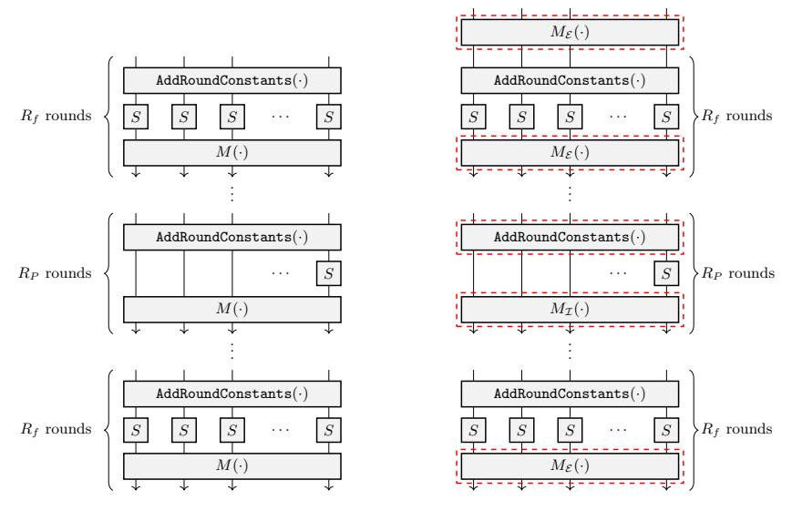
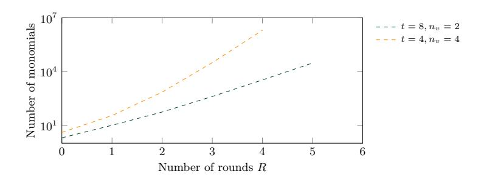
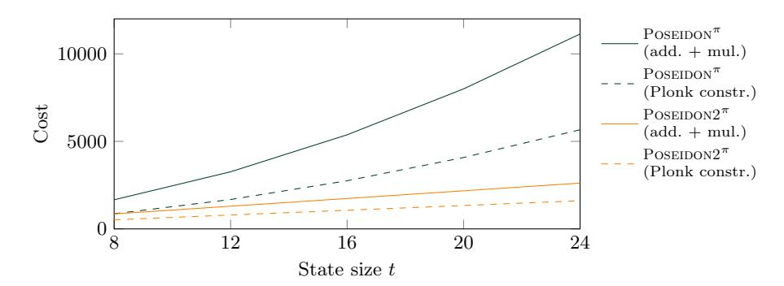
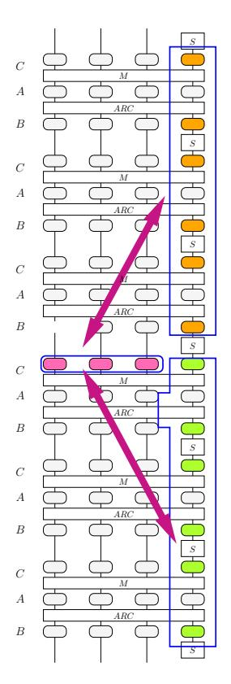

# Poseidon2: A Faster Version of the Poseidon Hash Function

Lorenzo Grassi1,<sup>2</sup> , Dmitry Khovratovich<sup>3</sup> , and Markus Schofnegger<sup>4</sup>

- <sup>1</sup> Ponos Technology (Switzerland)
- <sup>2</sup> Ruhr University Bochum (Germany)
- <sup>3</sup> Ethereum Foundation (Luxembourg)
  - <sup>4</sup> Horizen Labs (United States)

lorenzo@ponos.technology, khovratovich@gmail.com, mschofnegger@horizenlabs.io

Abstract. Zero-knowledge proof systems for computational integrity have seen a rise in popularity in the last couple of years. One of the results of this development is the ongoing effort in designing so-called arithmetization-friendly hash functions in order to make these proofs more efficient. One of these new hash functions, Poseidon, is extensively used in this context, also thanks to being one of the first constructions tailored towards this use case. Many of the design principles of Poseidon have proven to be efficient and were later used in other primitives, yet parts of the construction have shown to be expensive in real-word scenarios.

In this paper, we propose an optimized version of Poseidon, called Poseidon2. The two versions differ in two crucial points. First, Poseidon is a sponge hash function, while Poseidon2 can be either a sponge or a compression function depending on the use case. Secondly, Poseidon2 is instantiated by new and more efficient linear layers with respect to Poseidon. These changes allow to decrease the number of multiplications in the linear layer by up to 90% and the number of constraints in Plonk circuits by up to 70%. This makes Poseidon2 the currently fastest arithmetization-oriented hash function without lookups.

Besides that, we address a recently proposed algebraic attack and propose a simple modification that makes both Poseidon and Poseidon2 secure against this approach.

Keywords: Poseidon – Poseidon2 – ZK Application – Sponge/Compression Mode

# 1 Introduction

The area of zero-knowledge proof systems has seen a rise in popularity during the last couple of years. Arithmetization techniques such as R1CS used in Groth16 [\[37\]](#page-26-0), AIR used for FRI-based commitments [\[11,](#page-25-0)[12\]](#page-25-1), and Plonk [\[26\]](#page-26-1) and Plonkstyle arithmetizations (e.g., [\[25\]](#page-26-2) used in halo2 [\[56\]](#page-27-0)) make it possible to efficiently verify the correctness of a computation.

Most of these proof systems internally use hash functions for the purpose of polynomial (Merkle tree) commitments. These hash functions are rather different compared to more traditional primitives. Indeed, while the latter are often optimized for plain performance in software or hardware implementations, constructions for proof systems mostly focus on minimizing the number of *constraints* (similar to gates) when writing them down in a specific circuit language. This fact has led to new symmetric designs, exhibiting sometimes unusual symmetric building blocks (e.g., sacrificing plain performance in order to obtain a simpler description in a certain proof system).

In the literature, hash functions fulfilling these properties are often described as being arithmetization-oriented or circuit-friendly, which refers to their focus towards use cases of computational integrity. Besides Poseidon [30], examples of such constructions include MiMC/GMiMC [3,2], Friday [7], Rescue [4], Neptune [34], Anemoi [19], Griffin [27], and lookup-based primitives such as Reinforced Concrete [28] and Monolith [29]. In the last years, the knowledge of designing arithmetization-oriented hash functions has evolved, and more specific design goals are known today. For example, while minimizing the number of nonlinear operations was deemed the main target several years ago, many more performance metrics are taken into account now. Some of these metrics are the plain performance and the circuit complexity, which can play a significant role in the final proof composition.

The Origin of Poseidon. In this paper, we mostly focus on the Posei-DON hash function. First described in 2019 [32], it is heavily based on the HadesMiMC family of block ciphers [33]. The key property of HadesMiMC is that it uses two different round functions, one containing a full nonlinear layer with S-boxes applied to the entire state, and one containing a partial nonlinear layer with the S-boxes only affecting part of the state. This approach was chosen in order to provide convincing security arguments against statistical attacks using the full rounds while at the same time increasing the degree efficiently (i.e., by using a smaller number of S-boxes) using the partial rounds. However, HADESMiMC was designed with MPC use cases in mind, which has very different properties and optimization goals compared to modern proof systems. Most importantly, all linear operations can be computed locally by every party in an MPC protocol. Since the final efficiency of such a protocol depends on the number of communication rounds and no communication is needed for linear operations, the main optimization goal of HADESMiMC was to minimize the number of nonlinear operations. As a result, the final number of linear operations turned out to be comparatively high, mainly due to many multiplications with matrices of large sizes. In particular, each round of HADESMiMC contains a multiplication of a t-element state with a dense and unstructured  $t \times t$  matrix over  $\mathbb{F}_p$ , where p is a comparatively large prime. Hence, this operation results in a number of multiplications in  $\mathcal{O}(t^2)$  over  $\mathbb{F}_p$ .

Similar to MPC use cases, in some arithmetization techniques (e.g., R1CS used in Groth16 [37]), the number of nonlinear operations is also the main bot-

tleneck. Hence, building a hash function based on the HADESMIMC permutation seemed like an efficient approach. This idea led to the specification of POSEIDON, which is essentially a sponge hash function using an internal permutation similar to the one used in HADESMIMC (with minor differences such as the omission of a key addition). POSEIDON has since been implemented and used in many different proving frameworks, including e.g. Ginger-lib [38] and Plonky2 [49].

Plain Performance and the Plonk Arithmetization. Since the design of POSEIDON, various new optimization goals emerged. For example, it became clear that plain performance must not be neglected, since among other things it plays a crucial role when building the commitments outside of the respective circuits. Recent hash function designs in this area acknowledge this fact and try to also optimize for plain performance.

Moreover, the variety of different arithmetization techniques has increased in the last couple of years. While R1CS was the main target for the original POSEIDON, nowadays also the so-called algebraic intermediate representation (AIR) [13] for FRI-based proof systems [11] or Plonk [26] and "Plonkish" representations are popular approaches. Particularly, in Plonk linear operations also contribute to the final cost. Note that this is a clear distinction between Plonk and R1CS.

The Poseidon hash function, while widely used and arguably efficient in some use cases, exhibits a large number of linear operations. This makes it expensive in terms of plain performance and when considering a Plonk-style arithmetization.

#### 1.1 Our Goals

Our first goal for Poseidon2<sup> $\pi$ </sup> is to achieve a simpler and more efficient version of Poseidon<sup> $\pi$ </sup>. At the same time, we want to stay close to the original description, which allows us to benefit from years of third-party cryptanalysis applied to Poseidon<sup> $\pi$ </sup>. In particular, our modifications allow us to achieve significant performance improvements while keeping the same round numbers, i.e., the same number of nonlinear operations. This is beneficial in concrete use cases in computational integrity. Indeed, the number of constraints does not increase when choosing Poseidon2<sup> $\pi$ </sup> instead of Poseidon<sup> $\pi$ </sup>, while at the same time the plain performance is better. For example, Merkle trees, a prominent building block in many proof systems, can be computed significantly faster.

The updated Poseidon2<sup> $\pi$ </sup> will show similarities to other primitives, for example Neptune. Still, the algorithmic description is much closer to Poseidon<sup> $\pi$ </sup>. We chose this approach since Poseidon<sup> $\pi$ </sup> is widely used in practice, and reusing components from the original design reduces implementation efforts.

Remark 1. We emphasize that we do not propose changes to the original permutation, and we do not propose a new security analysis for it either. Instead, our modification  $POSEIDON2^{\pi}$  can be thought of as a new and optimized version of  $POSEIDON^{\pi}$ .

#### 1.2 Our Contributions and Results

Security Issue for Poseidon<sup> $\pi$ </sup>. We address a security problem with the original Poseidon<sup> $\pi$ </sup> permutation. Indeed, as has been observed in [10], the first two nonlinear layers can be skipped when mounting an algebraic attack on Poseidon<sup> $\pi$ </sup>. This results in equation systems of lower degrees and a more efficient attack. This approach can be mitigated by adding an additional linear layer to the beginning of the permutation. We discuss this issue in Section 7.3.

**Poseidon2**<sup> $\pi$ </sup>. As the main contribution, we consider various optimizations in order to make Poseidon faster and more efficient in recent proof systems. In particular, compared to the original Poseidon<sup> $\pi$ </sup> permutation, our modification called Poseidon2<sup> $\pi$ </sup> has

- (1) an additional linear layer at the beginning of the permutation,
- (2) different linear layer matrices,
- (3) round constants only applied to the first word in the internal rounds, and
- (4) the same number of rounds for many instantiations used in practice.

Regarding the last point, we compare the statistical and the algebraic security of  $POSEIDON2^{\pi}$  with that of  $POSEIDON^{\pi}$ . We also emphasize that our new modified permutation is very similar in nature to the original one, and thus inherits the trust gained from the third-party cryptanalysis of POSEIDON. A full specification of the new linear layers and of  $POSEIDON2^{\pi}$  is given in Section 5 and Section 6.

Modes of Operation. In many computational integrity proof systems, the construction of Merkle trees is a crucial part. For example, it is used to compute commitments to polynomials or to prove membership. When building a Merkle tree, the next hash is computed using a fixed number of previous (hash) outputs. For this purpose, the sponge function has often been used in the past, albeit with only one permutation call. In this paper, depending on the use case, we suggest to use either the classical sponge hash function or a generic compression function which computes a single new output using an arbitrary number of inputs and only one permutation call. In our practical use case, its main advantage regards the fact that it operates on a smaller size. For example, the inner part (capacity elements) of a sponge is not necessary, and thus the permutation can become smaller, with concrete advantages. We discuss both modes of operation specified for Poseidon2 $\pi$  in Section 3.1.

**Performance Comparison.** Following the description of our new permutation  $Poseidon 2^{\pi}$ , we discuss its performance characteristics in Section 8. We focus on the plain performance and on the number of Plonk constraints, and provide benchmarks from a Rust implementation for various state sizes. We also compare  $Poseidon 2^{\pi}$  to the original version and to other similar primitives, and we provide a new Plonkish arithmetization technique which is compatible with both  $Poseidon 2^{\pi}$  and  $Poseidon 2^{\pi}$ .

### 2 Preliminaries: Modern Arithmetization Techniques

Our focus in this paper is on use cases in the area of computational integrity proof systems. In such a scenario, a prover wants to convince a verifier to have correctly run an arbitrary computation, without making the verifier recompute the result. Many such proof systems exist in practice [\[37,](#page-26-0)[13,](#page-25-4)[26\]](#page-26-1), and they also allow for zero-knowledge versions where the verifier does not learn any private details of the provided proof.

In general, a proof can be split into two steps. First, the computation has to be represented as a number of polynomials, which is usually called arithmetization. Then, a polynomial commitment scheme is used in order to finalize the proof. In this paper, we focus on the arithmetization step, and for this purpose we briefly describe popular techniques. The aim when applying these is to keep the number of constraints as low as possible.

R1CS. A rank-1 constraint satisfaction system (R1CS) consists of n equations in the variables <sup>v</sup>0, v1, . . . , v<sup>m</sup> defined by P<sup>m</sup> <sup>i</sup>=0 a (n) i vi · P<sup>m</sup> <sup>i</sup>=0 b (n) i vi = P<sup>m</sup> <sup>i</sup>=0 c (n) i vi , where v<sup>i</sup> are elements from a finite field F, v<sup>0</sup> ∈ 0, 1, and a (n) i , b(n) i , c (n) i are field elements describing the n-th constraint.

Note that these equations are of degree 2 in {vi} m <sup>i</sup>=0. They are derived from the statement to prove, which in many cases is a hash function evaluation. Then, minimizing the number of constraints generally leads to more efficient proofs. As an example, using high-degree functions in the hash specification results in a larger number of constraints, which is why many recent arithmetization-oriented designs rely on low-degree components.

Plonk and Variants. The Plonk [\[26\]](#page-26-1) arithmetization results in a table-like representation for the execution trace. However, the constraints are not restricted to describe entire state transitions, and in general more freedom is offered to the designer. In particular, every constraint is of the form

$$q_{L_i} \cdot a_{L_i} + q_{R_i} \cdot a_{R_i} + q_{O_i} \cdot a_{O_i} + q_{M_i} \cdot (a_{L_i} a_{R_i}) + q_{C_i} = 0,$$

where aL<sup>i</sup> , aR<sup>i</sup> , aO<sup>i</sup> are witness variables describing two inputs and an output of a gate, and qL<sup>i</sup> , qR<sup>i</sup> , qO<sup>i</sup> , qM<sup>i</sup> , qC<sup>i</sup> are set such that a specific gate constraint (e.g., an addition or a multiplication) is enforced. Note that this is only a basic description of Plonk, and subsequent variants such as [\[25\]](#page-26-2) make it possible to increase the "width" of the gate (e.g., the number of inputs).

A notable difference in Plonk when compared to R1CS is that linear gates (e.g., additions) also require constraints of their own. Hence, linear operations are not "for free" anymore. This can make expensive linear operations, such as matrix multiplications, not only inefficient in a plain evaluation, but also with regards to the arithmetization.

Plonkish and AIR. Both Plonkish [56] and AIR [13] are more powerful representations compared to R1CS and regular Plonk. Like Plonk, both Plonkish and AIR describe a computation trace as a matrix, but allow high-degree polynomial relations to represent the state transformation.

The set of states is a  $T \times w$  matrix, where T is the number of states and w is the width (or the number of registers). Focusing on a hash function evaluation, for example w is set to the state size of the hash primitive and each new state describes the values obtained after applying a round function to the previous state. In contrast to R1CS, the constraint polynomials are not required to be of degree 2, but the efficiency of the arithmetization still depends on the maximum degree d in the constraint polynomials. The prover time is proportional to  $T \cdot w \cdot d$ , whereas the proof size is an affine function of the maximal number of variables q in the constraints. Hence, more efficient Plonkish/AIR proofs are delivered by smaller degrees and/or fewer variables in the constraints.

# 3 Preliminaries: ZK-Friendly Symmetric Primitives

### <span id="page-5-0"></span>3.1 Modes of Operation

Hash functions are crucial in the context of zero-knowledge protocols, e.g., to build Merkle trees for a polynomial commitment. Given a hash function  $\mathcal{H}: \mathbb{F}_p^{\star} \to \mathbb{F}_p^{\infty}$  for a prime  $p \geq 2$ , it must be computationally hard to find

```
(collision resistance) x, x' such that \mathcal{H}(x) = \mathcal{H}(x'), (preimage resistance) x given y such that \mathcal{H}(x) = y, (second-preimage resistance) x' given x \neq x' such that \mathcal{H}(x') = \mathcal{H}(x).
```

In this paper, we mainly focus on the sponge mode, which has also been used in many of the recent arithmetization-oriented designs.

While hash functions are perfectly usable and allow to make strong security arguments, they are often more generic. For many classical applications (e.g., ordinary hashing of arbitrary-length inputs) this is not a major issue. However, when building a Merkle tree with small fixed-size input lengths, we often only need a single permutation call to process the entire input and compute the desired output. In this case, the construction is not used as a hash function in a traditional sense, but rather as a compression function.

The concept of compression functions is well-known in cryptography, and they can also be used to build general-purpose hash functions [48,21]. For our use case, however, we focus on single calls to compression functions, precisely matching our need for building a Merkle tree and supporting so-called t-to-n compressions, i.e., compressing a vector of size t into one of size n. As for the case of hash functions, a compression function  $C: \mathbb{F}_p^t \to \mathbb{F}_p^n$  must guarantee resistance against collision and (second-)preimage attacks.

**Sponge Hash Functions.** A sponge hash function [14,15] is built using an internal cryptographic permutation or function. It accommodates for both arbitrarily sized inputs and arbitrarily sized outputs. Let  $\mathcal{P}$  be a permutation over  $\mathbb{F}_p^t$ , and let t = r + c, where c denotes the capacity and r the rate. A sponge function then works as follows.

- 1. The input message  $m \in \mathbb{F}_p^*$  is padded with 10\* such that its size is a multiple of r, that is,  $m = m_0 \mid \mid m_1 \mid \mid \cdots \mid \mid m_{\mu-1} \in (\mathbb{F}_p^r)^{\mu}$ .
- 2. The capacity is initialized with  $IV \in \mathbb{F}_n^c$ .
- 3. The message blocks are compressed one-by-one into a  $\mathbb{F}_p^t$  state such that

$$\forall i \in \{0, 1, \dots, \mu - 1\}: \quad h_i = h_{i-1} + P(m_i \mid\mid 0^c),$$

where  $0^c := 0 \mid \mid \cdots \mid \mid 0 \in \mathbb{F}_p^c$  and  $h_{-1} := 0^r \mid \mid IV \in \mathbb{F}_p^t$ .

4. After processing the last message block, the output is of the form  $\operatorname{Tr}_r(h_{\mu}) \mid | \operatorname{Tr}_r(h_{\mu+1}) \mid | \cdots$ , where the truncation function  $\operatorname{Tr}_r$  yields the first r elements of the input.

In this paper, we adapt the SAFE padding rule proposed in [9], consisting of adding the smallest number < r of zeroes such that the size of  $m \mid\mid 0^*$  is a multiple of r, where IV = H(IO, D) with H being a 128-bit hash function, IO being the pattern of absorbing to and squeezing elements to the sponge (for plain  $\ell$ -input hashing one sets  $IO = 2^{63} + \ell 2^{32} + 1$ ), and D being a domain separator.

Security. As proven in [15], if the inner permutation resembles a random one, the sponge construction is indifferentiable from a random oracle up to around  $p^{c/2}$  queries. Equivalently, in order to provide  $\kappa$  bits of security,  $p^{c/2} \geq 2^{\kappa}$ .

Cryptographic Compression Functions. Let  $\mathcal{P}$  be a permutation over  $\mathbb{F}_p^t$ . Several strategies can be used to construct a compression function. Here we focus on compression functions defined by combining the truncation function with the feed-forward operation, i.e.,

$$x \in \mathbb{F}_p^t \mapsto \mathcal{C}(x) := \operatorname{Tr}_n(\mathcal{P}(x) + x) \in \mathbb{F}_p^n,$$

where  $\operatorname{Tr}_n$  yields the first n elements of the inputs. Several schemes proposed in the literature reduce to this model, including Haraka [43] and the Jive mode of operation proposed in [19]. In such cases, the state x is multiplied via an invertible  $t \times t$  matrix  $M_C$  before being added to  $\mathcal{P}$ , that is,  $\mathcal{C}'(x) := \operatorname{Tr}_n(\mathcal{P}(x) + M_C \times x)$ . However, as discussed in [27], this multiplication does not have any effect on the security of the compression function in the case in which no constraint is imposed on the input x. For this reason, we simply consider the case  $M_C = I$  (i.e., identity matrix).

<span id="page-6-0"></span> $<sup>^5</sup>$  We assume that the output consists of at least  $2\kappa/\log_2(p)$  elements in order to prevent birthday bound attacks.

Security of  $\mathcal{C}$ . As discussed e.g. in [27], this approach can be seen as a permutation-based variant of the Davies-Meyer mode [50,18] which, like the latter, crucially relies on a feed-forward operation for one-wayness. For a security level of  $\kappa$  bits and assuming  $\mathcal{P}$  behaves like a pseudo-random (known) permutation,  $\mathcal{C}$  is a secure compression function with respect to collisions and (second-)preimages if

(1)  $p^n \geq 2^{2\kappa}$  due to the birthday bound attack whose cost is in  $\mathcal{O}(2^{-n/2} = 2^{-\kappa})$ , (2)  $p^{t-n} \geq 2^{\kappa}$  in order to avoid a guessing attack on the truncated part.

#### <span id="page-7-1"></span>3.2 The Poseidon<sup> $\pi$ </sup> Permutation

Since our optimization is strongly based on the Poseidon<sup> $\pi$ </sup> permutation, we recall its definition here. We refer to the original paper [30,32] for more details.

Remark 2. We emphasize that the round numbers given in the following are based on the updated security analysis proposed in [32], where the designers make corrections to the original bounds. This also includes the recent results from [6]. However, to the best of our knowledge, such results should not impact the round number of any instance of Poseidon<sup> $\pi$ </sup> (due to the restriction on the value of p, t and  $\kappa$ ). For this reason, we do not consider it in this work.

Let  $p>2^{30}$  be a prime number and let  $t\geq 2$  (in the following, let  $n\approx\log_2(p)$ ). The Poseidon<sup> $\pi$ </sup> permutation  $\mathcal P$  over  $\mathbb F_p^t$  is defined by

$$\mathcal{P}(x) = \mathcal{E}_{R_F-1} \circ \cdots \circ \mathcal{E}_{R_F/2} \circ \mathcal{I}_{R_P-1} \circ \cdots \circ \mathcal{I}_0 \circ \mathcal{E}_{R_F/2-1} \circ \cdots \circ \mathcal{E}_0(x),$$

where  $\mathcal{E}$  is an external (full) round,  $\mathcal{I}$  is an internal (partial) round,  $R_F$  is the number of external rounds, and  $R_P$  is the number of internal rounds. For a security level of  $\kappa$  bits with  $2^{80} \leq 2^{\kappa} \leq \min\{2^{256}, p^{t/3}\}$  (due to the security of the sponge hash function and compression function given before),

<span id="page-7-0"></span>
$$R_F = 2 \cdot R_f = 8,$$

$$R_P \ge \left\lceil 1.075 \cdot \left\lceil \max \left\{ \frac{\min\{\kappa, \log_2(p)\}}{\log_2(d)} + \log_d(t) - 5, R_{\text{GB}} \right\} \right\rceil \right\rceil, \tag{1}$$

where  $R_{\rm GB}$  is related to the Gröbner basis attack and given by

$$\begin{split} R_{\mathrm{GB}} \geq \max & \left\{ R_{\mathrm{GB}}', \log_d(2) \cdot \min\left\{\kappa, \log_2(p)\right\} - 6, \right. \\ & \left. t - 7 + \log_d(2) \cdot \min\left\{\frac{\kappa}{t+1}, \frac{\log_2(p)}{2}\right\}, \frac{\kappa}{2 \cdot \log_2(d)} - 5 \cdot t + 4 \right\}. \end{split}$$

where  $R'_{GB} \geq 1$  is the smallest integer that satisfies

$$\binom{4 \cdot t + 5 \cdot r + 2 \cdot R'_{GB} + d}{3r + R'_{GB} + d} \ge 2^{\kappa/2},$$

where d is the degree of the S-boxes and r is the rate.

The security level consists of 2 external/full rounds and 7.5% more internal/partial rounds. The external round  $\mathcal E$  is defined by

$$\mathcal{E}_i(x) = M \cdot \left( (x_0 + c_0^{(i)})^d, (x_1 + c_1^{(i)})^d, \dots, (x_{t-1} + c_{t-1}^{(i)})^d \right)$$

for  $i \in \{0, 1, ..., R_F - 1\}$ , where  $d \geq 3$  is the smallest positive integer that satisfies  $\gcd(d, p - 1) = 1$  and where  $c_j^{(i)}$  is the *j*-th round constant in the *i*-th external round. The internal round is defined by

$$\mathcal{I}_i(x) = M \cdot \left( (x_0 + c_0^{(i)})^d, x_1 + c_1^{(i)}, \dots, x_{t-1} + c_{t-1}^{(i)} \right)$$

for  $i \in \{0, 1, \dots, R_P - 1\}$ , where d is defined as before and where  $c_j^{(i)}$  is the j-th round constant in the i-th internal round.

In both cases, M is a  $t \times t$  MDS matrix fulfilling particular properties in order to prevent arbitrarily long subspace trails. We refer to [36] and to Section 5.3 for more details regarding the condition for preventing arbitrarily long subspace trails. Here we limit ourselves to recall that such a condition is satisfied if the minimal polynomials of  $M, M^2, \ldots, M^\ell$  are irreducible and of maximum degree. One way to set up an MDS matrix is by using a Cauchy matrix, whose element in the j-th column of the i-th row is defined by  $M_{i,j} = 1/(x_i + y_j)$  for pairwise distinct  $\{x_i\}_{i=1}^t$  and  $\{y_i\}_{i=1}^t$ , where  $x_i + y_j \neq 0$ .

Before going on, we recall the definition of an MDS matrix.

**Definition 1.** The branch number of a matrix over  $\mathbb{F}_p^t$  is defined as  $B(M) = \min_{x \in \mathbb{F}_p^t \setminus \{0\}} \{ \text{hw}(x) + \text{hw}(M(x)) \}$ , where  $\text{hw}(\cdot)$  is the bundle weight in wide trail terminology [20]. A matrix  $M \in \mathbb{F}_p^{t \times t}$  is a maximum distance separable (MDS) matrix if and only if B(M) = t + 1. Equally, a matrix M is MDS if and only if every submatrix of M is invertible.

**Efficient Implementation.** The Poseidon<sup> $\pi$ </sup> permutation allows for an optimized implementation, where the round constant additions and the matrix multiplications in the partial rounds can be replaced by more efficient equivalent operations. The approach is described in detail in [32, Appendix B]. We use this method in our benchmarks for Poseidon<sup> $\pi$ </sup>.

**Security Argument.** The security argument of  $POSEIDON^{\pi}$  is based on the HADES design strategy [33]. In particular, the external rounds together with the wide trail strategy are used to obtain simple and convincing arguments against statistical attacks. On the other hand, the internal rounds are mainly responsible for the security against algebraic attacks. The motivation is that the degree grows equally in the external and the internal round, but internal rounds are more efficient in the target use cases.

### <span id="page-9-1"></span>4 Security: Initial and Final Matrix Multiplications

In the case of a block cipher, it is well known that the initial and the final affine layer do not (usually) affect the security. Indeed, it is sufficient to swap the initial/final affine layer with the initial/final key addition. Having done that, one can simply consider an equivalent version of the cipher without the initial/final affine layer, which is applied directly to the plaintext/ciphertext.<sup>6</sup>

The situation is different for the case of a sponge function. In the following, we discuss the impact of the initial and final linear layers in the case of a permutation that instantiates a sponge hash function and/or a compression one.

Remark 3. The following considerations only hold for SPN schemes. They do not hold in general for schemes in which a nonlinear diffusion takes place.

Case: Sponge Hash Function. In the case of a sponge hash function, the inner part is initialized with an initial value IV. Since the S-boxes of the nonlinear layer work independently from each other over  $\mathbb{F}_p$ , it is sufficient to replace IV with the corresponding value IV' computed via the nonlinear layer in order to remove the first nonlinear layer. In this case, the collision/preimage found for the sponge hash function instantiated with the modified permutation without the initial nonlinear layer can be easily extended to a collision/preimage for the sponge hash function instantiated with the original permutation. This attack has been discussed in [10] for the case of Poseidon<sup> $\pi$ </sup> and Rescue. Interestingly, the recent sponge hash function Tip5 [55] exhibits a similar problem, since its internal SPN permutation starts with a nonlinear layer instead of a linear one.

A similar conclusion holds for the final linear layer as well. We recall that in the sponge hash function, a truncation takes place in the final step. The final linear layer guarantees that the truncated part depends on all the outputs of the final nonlinear layer. If the linear layer is omitted, then no diffusion takes place. Working in the same way just described for the initial layer, it is simple to observe that the final nonlinear layer does not have any impact on the security, and it can simply be removed.

Case: Compression Function. The situation for the compression function is slightly different. As discussed in [27], given invertible linear layers M',  $\hat{M}'$ , the security of the two constructions

$$x \mapsto M' \times \mathcal{P}(M^{"} \times x) + \hat{M} \times x$$
 and  $x' \mapsto \mathcal{P}'(x') + x'$

is identical for  $\mathcal{P}'(\cdot) := M' \times \mathcal{P}(M^{"} \times \hat{M}^{-1} \times \cdot)$  and  $x' := \hat{M} \times x$ . For this reason, we are not aware of any concrete impact of the initial and/or final linear layer on the security of the compression function  $x \mapsto \operatorname{Tr}_n(\mathcal{P}(x) + x)$ .

<span id="page-9-0"></span><sup>&</sup>lt;sup>6</sup> There are some cases in which this is not completely true, as e.g. attacks using details of the key schedule (see e.g. [22] for the AES case).

Conclusion. When designing an SPN permutation for a sponge hash function, it is paramount that it starts and finishes with a linear layer that provides diffusion. Since these linear layers do not decrease the security when used with a compression function, we suggest to do the same in this case.

### <span id="page-10-0"></span>5 More Efficient Linear Layers

Using the wide trail strategy and matrices with large branch numbers allows the designer to use convincing arguments regarding the statistical security of a permutation. However, Poseidon<sup>π</sup> is mostly used together with large prime numbers, which in combination with low-degree nonlinear functions provide strong statistical properties. Therefore, large branch numbers are not strictly needed in order to achieve the advertised level of security, and we can instead focus on more efficient matrices.

In this section, we propose several new linear layers to be used together with the Poseidon<sup>π</sup> permutation. All of these are built in order to provide the same security level as the original specification. However, we take into account the plain performance and the number of constraints in a Plonkish arithmetization (for the latter, recall that linear constraints are not free and are indeed part of the final cost). In particular,

- (1) for the plain performance, we want to minimize the number of constant multiplications, and
- (2) we aim for small matrix entries, such that multiplications can be replaced by addition chains in many cases.

Both of these optimizations also result in fewer reductions being necessary, further speeding up the computation. To summarize, our main goals are to provide the same security level of Poseidon<sup>π</sup> , while at the same time having linear layers which require significantly fewer operations to compute.

In the following, we show how to use non-MDS matrices for the external and internal rounds, denoted respectively by M<sup>E</sup> and MI. Since Poseidon<sup>π</sup> is defined to use MDS matrices and hence this goes against the original specification of Poseidon, we will later show that this modification has no impact regarding the final security. We also give the efficiency in terms of Plonk constraints, noting that even more efficient representations can be derived when supporting extended versions of Plonk (e.g., Plonkish).

### 5.1 Matrix for the External Round

Let us focus on the case t = 4 · t ′ for t ′ ∈ N (the cases t ∈ {2, 3} are discussed separately later). For the external rounds, we propose to instantiate M<sup>E</sup> via the efficient matrices proposed for Griffin-π in [\[27\]](#page-26-5) as

$$M_{\mathcal{E}} = \begin{cases} M_4 & \text{if } t = 4, \\ \operatorname{circ}(2 \cdot M_4, M_4, \dots, M_4) \in \mathbb{F}_p^{t \times t} & \text{if } t \ge 8, \end{cases}$$

where  $M_4$  is a  $4 \times 4$  MDS matrix defined as

$$M_4 = \begin{pmatrix} 5 & 7 & 1 & 3 \\ 4 & 6 & 1 & 1 \\ 1 & 3 & 5 & 7 \\ 1 & 1 & 4 & 6 \end{pmatrix},$$

which corresponds to the matrix  $M_{4,4}^{8,4}$  from [23], setting  $\alpha = 2$ . This matrix is MDS for all primes we consider (that is,  $p > 2^{31}$ ).

As shown in [23] (see also App. B), we can compute the multiplication of 4 input elements with  $M_4$  by using only 8 additions and 4 constant multiplications.

**Plonk Arithmetization.** We assume the use of 2-fan-in gates. The arithmetization in Plonk is then similar to the plain computation, with various small differences. First, only 8 constraints are needed for each  $M_4$  computation. Secondly, only t constraints are needed for the finalization of  $M_{\mathcal{E}}$ . In total, we need  $8 \cdot (t/4) + t = 3t$  constraints.

#### 5.2 Matrix for the Internal Round

In the original Poseidon<sup> $\pi$ </sup> specification, the security argument against statistical attacks purely takes into account the external rounds and the number of active S-boxes in these rounds. The main reason for this is that the wide trail design strategy [20] is only applicable if the number of S-boxes in each round is at least  $\lceil t/2 \rceil$  for a state size t. This is not the case for the partial rounds of Poseidon<sup> $\pi$ </sup>, where only a single S-box is used.

Hence, for the partial rounds, the MDS property is not required anymore, and we can set up the matrix  $M_{\mathcal{I}}$  focusing only on providing full diffusion, breaking arbitrarily long subspace trails, and ensuring that the polynomial representation of the scheme is dense. This is exactly the approach introduced in the Neptune scheme [34]. For this reason, we suggest to instantiate  $M_{\mathcal{I}}$  with the matrix proposed for Neptune, that is,

$$M_{\mathcal{I}} = \begin{pmatrix} \mu_0 & 1 & \cdots & 1 \\ 1 & \mu_1 & \cdots & 1 \\ \vdots & \vdots & \ddots & \vdots \\ 1 & 1 & \cdots & \mu_{t-1} \end{pmatrix},$$

where  $\mu_0, \mu_1, \dots, \mu_{t-1}$  are random elements from  $\mathbb{F}_p \setminus \{0, 1\}$  such that the matrix is invertible and no arbitrarily long subspace trails exist (see Section 5.3). We suggest to choose these elements in order to make the multiplications efficient (e.g., small values or powers of 2, which make multiplications fast).

**Plain Efficiency.** Note that we can store the sum of the input vector in a single variable, which needs t-1 additions. Then, storing  $\mu_i-1$  for  $i \in \{1, 2, ..., t-1\}$ ,

we can compute each vector element with one multiplication and one addition. In total, we need t-1+t=2t-1 additions and t multiplications. The performance benefit is significant especially for larger t, which is a popular choice in STARK-based proof systems (e.g., Plonky2 [49]).

**Plonk Arithmetization.** Again, we assume the use of 2-fan-in gates. The matrix multiplication with a vector  $(x_0, x_1, \ldots, x_{t-1})$  can be written down as

$$s = x_0 + x_1 + \dots + x_{t-1},$$


$$y_i = (\mu_i - 1)x_i + s \quad \text{for} \quad i \in \{0, 1, \dots, t - 1\},$$

where s represents the precomputed sum and  $(y_0, y_1, \ldots, y_{t-1})$  is the output vector. This method needs t-1+t=2t-1 constraints. Note that instead of storing  $\mu_0, \mu_1, \ldots, \mu_{t-1}$ , it is better to directly store  $\mu_0-1, \mu_1-1, \ldots, \mu_{t-1}-1$  as public constants.

### <span id="page-12-0"></span>5.3 Preventing Arbitrarily Long Subspace Trails

Before going on, we discuss which conditions the matrix  $M_{\mathcal{I}}$  must satisfy to prevent arbitrarily long subspace trails. We refer to [35] for a formal definition of (invariant) subspace trails and limit ourselves to recall the following definition here.<sup>7</sup>

**Definition 2 ([35]).** Let  $t \geq 2$  be an integer and let  $p \geq 2$  be a prime integer. Let  $\mathfrak{U}_0, \ldots, \mathfrak{U}_r \subseteq \mathbb{F}_p^t$  be r+1 subspaces such that  $\dim(\mathfrak{U}_i) \leq \dim(\mathfrak{U}_{i+1}) < t$  for each  $i \in \{0, 1, \ldots, r-1\}$ .  $(\mathfrak{U}_0, \ldots, \mathfrak{U}_r)$  is a subspace trail of length  $r \geq 1$  for a function  $\mathcal{F}$  over  $\mathbb{F}_p^t$  if for each  $i \in \{0, \ldots, r-1\}$  and for each  $\varphi_i \in \mathbb{F}_p^t$  there exists  $\varphi_{i+1} \in \mathbb{F}_p^t$  such that  $F(\mathfrak{U}_i + \varphi_i) \coloneqq \{\mathcal{F}(x) \mid \forall x \in \mathfrak{U}_i + \varphi_i\} \subseteq \mathfrak{U}_i + \varphi_{i+1}$ . We say that it is an invariant subspace trail if  $\mathfrak{U}_i = \mathfrak{U}_j$  for each  $i, j \in \{0, 1, \ldots, r\}$ .

Since the nonlinear layer in a partial round of Poseidon<sup> $\pi$ </sup> contains only a single nonlinear S-box, there exists a subspace that is invariant through it. More generally, independent of the details of the linear layer  $M_{\mathcal{I}}$ , there exists a subspace that is invariant for up to t-1 rounds. Depending on the details of the linear layer  $M_{\mathcal{I}}$ , such a subspace can be used as a starting point for a subspace trail over an arbitrary number of rounds. In this case, an attack can be set up, as concretely shown by Beyne et al. [16] at Crypto 2020, and by Keller et al. [41] at Eurocrypt 2021.

Hence, it is crucial to choose the linear layer correctly. For a complete analysis regarding this problem we refer to [36]. In there, the authors show that if the

<span id="page-12-1"></span><sup>&</sup>lt;sup>7</sup> The following definition is different from the one proposed in [44,45]. In there, the function  $\mathcal{F}$  depends on a secret key k, and the equality  $\mathcal{F}_k(\mathfrak{U}+\varphi)=\mathfrak{U}+\varphi'$  must hold for some  $\varphi,\varphi'\in\mathbb{F}_p^t$ . Since here we only deal with key-independent hash functions, the definition proposed in [35] is more suitable for our purposes.

minimal polynomials of the matrices  $M_{\mathcal{I}}, M_{\mathcal{I}}^2, M_{\mathcal{I}}^3, \dots$  are irreducible and of maximum degree, no arbitrarily long subspace trail exists.<sup>8</sup>

We emphasize that this is a sufficient condition, but not a necessary one. That is, there exist matrices that do not satisfy this condition, but for which no arbitrarily long subspace trail exists. In the following, we always assume that  $M_{\mathcal{I}}$  satisfies the given condition. In particular, we suggest to use the tools provided in [36] for a given  $M_{\mathcal{I}}$ . We note that a suitable matrix can be found within seconds.

# <span id="page-13-0"></span>6 Poseidon $2^{\pi}$ Specification

Poseidon $2^{\pi}$  is a permutation over  $\mathbb{F}_p^t$ , where p as in Poseidon $^{\pi}$  (that is,  $p > 2^{30}$ ) and  $t \in \{2, 3, 4, \dots, 4 \cdot t', \dots, 24\}$  for  $t' \in \mathbb{N}$ . These values are sufficient for our use case. The Poseidon $2^{\pi}$  permutation  $\mathcal{P}_2$  over  $\mathbb{F}_p^t$  is defined as

$$\mathcal{P}_2(x) = \mathcal{E}_{R_F-1} \circ \cdots \circ \mathcal{E}_{R_F/2} \circ \mathcal{I}_{R_P-1} \circ \cdots \circ \mathcal{I}_0 \circ \mathcal{E}_{R_F/2-1} \circ \cdots \circ \mathcal{E}_0(M_{\mathcal{E}} \cdot x),$$

where the number of rounds is the same as in  $POSEIDON^{\pi}$  (see Eq. (1)). We refer to Section 3.2 and the instance generation script provided by the authors. Similar to  $POSEIDON^{\pi}$ , the external round is defined by

$$\mathcal{E}_i(x) = M_{\mathcal{E}} \cdot \left( (x_0 + c_0^{(i)})^d, (x_1 + c_1^{(i)})^d, \dots, (x_{t-1} + c_{t-1}^{(i)})^d \right),\,$$

where  $d \geq 3$  is the smallest positive integer that satisfies  $\gcd(d, p-1) = 1$  and  $c_j^{(i)}$  is the j-th round constant in the i-th external round. The internal round is defined by

$$\mathcal{I}_i(x) = M_{\mathcal{I}} \cdot \left( (x_0 + \hat{c}_0^{(i)})^d, x_1, \dots, x_{t-1} \right),$$

where  $d \geq 3$  as before and  $\hat{c}_0^{(i)}$  is the round constant in the *i*-th internal round. All round constants are generated as in Poseidon<sup> $\pi$ </sup>.

Remark 4. In contrast to Poseidon<sup> $\pi$ </sup>, we are only applying a single round constant in the internal rounds. The motivation for this change comes from the fact that an optimized (equivalent) implementation of Poseidon<sup> $\pi$ </sup> also uses only one round constant during the internal rounds, and hence the security is not affected.

**Linear Layers.** The linear layers of Poseidon $2^{\pi}$  are defined as follows.

<span id="page-13-1"></span><sup>&</sup>lt;sup>8</sup> Let  $M \in \mathbb{F}_p^{t \times t}$  be an invertible matrix. The characteristic polynomial  $\Psi \in \mathbb{F}_p[x]$  is defined as  $\Psi(x) = \det(x \cdot I - M)$ . The minimal polynomial  $\Phi \in \mathbb{F}_p[x]$  is the monic polynomial of minimal degree such that (i)  $\Phi(M) \times v = 0^t = (0, 0, \dots, 0)^T \in \mathbb{F}_p^t$  for each  $v \in \mathbb{F}_p^t$ , and (ii), for each polynomial  $P \in \mathbb{F}_p[x]$  that is annihilating (in the sense that  $P(M) \times v = 0^t$  as before for each  $v \in \mathbb{F}_p^t$ ),  $\Phi$  divides P.

<span id="page-13-2"></span>https://extgit.iaik.tugraz.at/krypto/hadeshash/-/blob/master/code/generate\_params\_poseidon.sage

<span id="page-14-0"></span>

Fig. 1: Poseidon<sup> $\pi$ </sup> (left) and Poseidon2<sup> $\pi$ </sup> (right) with changes in red.

Case:  $t = 4 \cdot t' \geq 4$ . For t = 4k, the matrices  $M_{\mathcal{E}}$  and  $M_{\mathcal{I}}$  are set up using the approach described in Section 5. We emphasize that  $M_{\mathcal{I}}$  must be chosen in order to prevent arbitrarily long subspace trails, as described before.

Case:  $t \in \{2,3\}$ . For  $t \in \{2,3\}$  we first compute  $M_{\mathcal{I}}$  as before. By imposing the additional condition that  $M_{\mathcal{I}}$  is MDS, we can simply set  $M_{\mathcal{E}} = M_{\mathcal{I}}$ , which reduces code complexity. For  $M_{\mathcal{I}}$  to be MDS, we require all of its submatrices to be invertible. For t=2 this is achieved if  $\mu_0\mu_1 - 1 \neq 0$  and  $\mu_0, \mu_1 \neq 0$ . For t=3, this is achieved if  $\mu_0\mu_1\mu_2 - \mu_0 - \mu_1 - \mu_2 + 2 \neq 0$  and

$$\mu_0, \mu_1, \mu_2 \neq 0, \quad \mu_0 \mu_1 - 1 \neq 0, \quad \mu_0 \mu_2 - 1 \neq 0, \quad \mu_1 \mu_2 - 1 \neq 0.$$

By choosing  $\mu_i \in \{2, 3, \dots, p/4\}$ , the MDS condition is always fulfilled (indeed,  $xy \neq 1$  for  $x, y \in \{2, 3, \dots, p/4\}$ ).

**Poseidon**<sup> $\pi$ </sup> versus **Poseidon**2 $^{\pi}$ . Compared to the original Poseidon<sup> $\pi$ </sup> specification recalled in Section 3.2, three differences arise.

- 1. A linear layer  $M_{\mathcal{E}}$  is applied at the input of Poseidon2<sup> $\pi$ </sup> (see Section 4).
- 2. Two different linear layers are used in Poseidon2<sup> $\pi$ </sup> for  $t \geq 4$ .
- 3. Only one round constant is applied in each internal round.

A graphical overview of the differences between Poseidon and Poseidon  $2^\pi$  is given in Fig. 1.

From an implementation point of view, we emphasize that the optimized representation of the internal rounds, as used in  $POSEIDON^{\pi}$ , is not needed for  $POSEIDON2^{\pi}$ . Indeed, it would make the computation slightly more expensive. This makes  $POSEIDON2^{\pi}$  simpler and more memory-efficient than  $POSEIDON^{\pi}$ .

<span id="page-15-0"></span>Table 1: Some instantiations for Poseidon2<sup> $\pi$ </sup>, where  $n = \lceil \log_2(p) \rceil$ .

| (n,t,d)     | $R_F$ | $R_P$ |
|-------------|-------|-------|
| (31, 16, 5) | 8     | 14    |
| (31, 24, 5) | 8     | 22    |
| (64, 8, 7)  | 8     | 22    |
| (64, 12, 7) | 8     | 22    |
| (256, 2, 5) | 8     | 56    |
| (256, 3, 5) | 8     | 56    |

**Instances.** The round numbers of Poseidon<sup> $\pi$ </sup> and Poseidon2<sup> $\pi$ </sup> are the same for most instantiations. In Table 1 we give some example parameters, focusing on 2-to1 compressions.

# 7 Security Analysis

Changing the matrix, and especially removing the MDS requirement, may have an impact on the final security of the permutation. In this section, we assess the security level of the newly obtained  $Poseidon 2^{\pi}$  permutation.

Remark 5. Due to the similarities between  $POSEIDON^{\pi}$  and  $POSEIDON2^{\pi}$ , we emphasize that (almost) all the attacks work in the same way for the two schemes. This means that we are going to adapt the security analysis of  $POSEIDON^{\pi}$  and  $POSEIDON^{\pi}$ , focusing only on the possible differences that can arise between the two cases.

Remark 6. For the cases  $t \in \{2,3\}$ , Poseidon2<sup> $\pi$ </sup> is just a special case of Poseidon8<sup> $\pi$ </sup> in which the MDS matrix has been fixed for achieving optimal performances. For this reason, we only focus on the case  $t \geq 4$  in the following.

### 7.1 Statistical Attacks

**Differential Attacks.** Given pairs of inputs with some fixed input differences, differential cryptanalysis [17] considers the probability distribution of the corresponding output differences produced by the cryptographic primitive. Let  $\Delta_I, \Delta_O \in \mathbb{F}_p^t$  be respectively the input and the output differences through a permutation  $\mathcal{P}$  over  $\mathbb{F}_p^t$ . The differential probability (DP) of having a certain output difference  $\Delta_O$  given a particular input difference  $\Delta_I$  is equal to

$$\operatorname{Prob}(\Delta_I \to \Delta_O) = \max_{\Delta_I, \Delta_O \neq 0} \frac{|\{x \in \mathbb{F}_p^t \mid \mathcal{P}(x + \Delta_I) - \mathcal{P}(x) = \Delta_O\}|}{p^t}.$$

In the case of iterated schemes, a cryptanalyst searches for ordered sequences of differences over any number of rounds that are called differential characteristics/trails. Assuming the independence of the rounds, the DP of a differential trail is the product of the DPs of its one-round differences.

As in Poseidon<sup> $\pi$ </sup>, we make used of the wide trail design strategy on the external rounds of Poseidon2<sup> $\pi$ </sup> for ensuring security against this attack. As it is well known,  $\mathrm{DP_{max}}(x\mapsto x^d)=(d-1)/p$ . Based on the result proposed in [27, Prop. 1], the branch number of  $M_{\mathcal{E}}$  assuming an MDS matrix for  $M_4$  is  $b=t/4+4\equiv t'+4\geq 5$ . Hence, following the wide trail strategy at least b S-boxes are active in 2 consecutive external (full) rounds of the permutation. When considering two consecutive rounds three times,

$$\left(\frac{d-1}{p}\right)^{3(t'+4)} \le \frac{(d-1)^{3(t'+4)}}{p^{12}} \cdot 2^{-9/4\kappa} \ll 2^{-2\kappa},$$

where  $p^{-t/3} = p^{-4t'/3} \le 2^{-\kappa}$  and where  $d \ll p$  (usually,  $\log_2(d) \le 4$  compared to  $\log_2(p) > 30$ ). The factor 2 is crucial for avoiding clustering effects.

As a result, 6 external rounds of Poseidon2<sup> $\pi$ </sup> are sufficient for guaranteeing security against differential attacks, exactly as in Poseidon<sup> $\pi$ </sup>, where 2 external rounds are used as a security margin. Note that this is a pessimistic estimate. Indeed, as has been shown in previous works (e.g., [41]), the internal rounds can also be taken into account, which is ignored in this discussion.

Other Statistical Attacks. Due to the facts that no entry of  $M_{\mathcal{E}}$  is equal to zero and  $M_{\mathcal{E}}$  provides full diffusion after one round, a similar conclusion holds for other statistical attacks, such as linear attacks [46], truncated differential attacks [42], rebound attacks [47], among others.

### 7.2 Algebraic Attacks

Changing the matrices in the linear layers may have an impact on the density of the resulting polynomials. This may weaken the resistance against certain attacks like interpolation attacks and Gröbner basis attacks, which also depend on the number of monomials found in the final representations. For this purpose, we first investigate the density and the degrees of the equations generated. Then, we focus on the security with respect to Gröbner basis attacks.

Interpolation Attack: Degrees and Density. The interpolation attack [40] aims to construct an interpolation polynomial that describes the function. Such polynomial can be used in order to set up a distinguisher and/or an attack on the symmetric scheme. The attack does not work if the number of unknown monomials is sufficiently large (e.g., larger than the data available for the attack). In the MitM scenario, the attacker constructs two polynomials, one that involves the input(s) and one that involve the output(s), that must match in the middle.

The maximum possible degrees are reached for both Poseidon<sup> $\pi$ </sup> and Poseidon<sup> $2\pi$ </sup>. It remains to determine the density. For this purpose, we implemented both permutations (including the four different round functions) in Sage and tested the density after increasing numbers of rounds. The results of this experiment for Poseidon<sup> $2\pi$ </sup> are given in Fig. 2. We note that the reached number of

<span id="page-17-0"></span>

Fig. 2: The number of monomials reached in Poseidon2<sup> $\pi$ </sup> after R rounds, where d=3. We observed no significant difference between  $\mathcal{E}$  and  $\mathcal{I}$ . Moreover, the numbers reached match the maximum theoretical number of monomials.

monomials corresponds to the maximum number of possible monomials  $\#_{n_v,d}$  for  $n_v$  variables of total degree d, which is given by

$$\#_{n_v,d} = \sum_{i=1}^d \binom{n_v + i - 1}{i}.$$

As a result, the security of Poseidon<sup> $\pi$ </sup> and Poseidon2<sup> $\pi$ </sup> with respect to the interpolation attack is comparable.

**Gröbner Basis Attacks.** In a Gröbner basis attack, the adversary first writes down the function in consideration as an equation system and tries to solve this system for the unknowns. Like in the original Poseidon paper, here we focus on the CICO problem, and quickly recall it here.

**Definition 3.** A permutation  $\mathcal{P}$  is  $(\lambda, x_2, y_1)$ -secure with respect to the CICO problem if there is no algorithm with expected complexity less than  $\lambda$  that for given  $x_2, y_1$  finds  $x_1, y_2$  such that  $\mathcal{P}(x_1 \mid\mid x_2) = y_1 \mid\mid y_2$ .

Usually, we set the number of elements in the  $x_1$  part to be the same as the number of elements in the  $y_1$  part. In other words, we leave a certain size of the input variable and require the same size in the output to fulfill some property. Then, the expected complexity for a random permutation is proportional to the size of  $x_1$ . For the sponge mode using only a single permutation call, solving the CICO problem directly translates to a preimage attack on the sponge, and conversely a preimage attack on the sponge mode is a solution to the CICO problem. Solving CICO is also sufficient to break the compression mode, but an attack on the compression mode does not necessarily result in a solution to the CICO problem. Still, the CICO problem gives a good estimate of the strength of a cryptographic permutation, and of how much it deviates from a strong one.

The equations for the CICO problem can be written down in a straightforward way. First, we fix part of the input and use unknowns for the remainder.

Then, we apply the permutation to this input state, using an algebraic description of our choice. At the end, we enforce part of the output to fulfill a certain property, for example to be equal to a known value. Then the attacker has to follow three steps, which as a first step include computing the Gröbner basis (we refer to [1,52] for a more detailed description of these steps). As is customary in the literature [4,19] and has also been done in Poseidon, here we focus on this first step. For this purpose, we compare the degrees reached during Gröbner basis computations between Poseidon<sup> $\pi$ </sup> and Poseidon<sup> $\pi$ </sup>. Similar degrees imply a similar cost of the attacks for Poseidon<sup> $\pi$ </sup> and Poseidon<sup> $\pi$ </sup>.

In our experiments, we set  $p \approx 2^{16}$ , t = 12, and we use two input variables. We then apply two strategies. In the first one we represent the permutation with full-round equations, hence reaching a maximum equation degree of  $d^{R_F+R_P}$ . In the second one, we introduce intermediate variables for each S-box, hence reaching a maximum equation degree of only d. Further, we tested the external (full) and internal (partial) rounds separately, in order to get a better understanding of the impact of our new linear layers.

In none of the tested cases we could observe a significant difference between  $POSEIDON^{\pi}$  and  $POSEIDON2^{\pi}$ . In particular, the maximum degrees reached during the Gröbner basis computation were the same, the degrees of the final univariate polynomials (after conversion) were the same, and the FGLM [24] time differences were negligible. We also tried solving the system in Sage, and again the solving time differences we observed were negligible. This is particularly true when testing only the internal (partial) rounds and introducing intermediate variables in each step.

Following our experimental results from both the density and Gröbner basis tests, we conclude that  $POSEIDON2^{\pi}$  is no less secure against algebraic attacks than  $POSEIDON^{\pi}$ . This means that the strongest attack vector remains the interpolation one, and that security against this one implies security against Gröbner basis attacks also in the case of  $POSEIDON2^{\pi}$ .

### <span id="page-18-0"></span>7.3 Attack from Bariant et al. [10]

Finally, we point out a recent attack proposed by Bariant et al. [10] at ToSC 2022. In there, the authors propose a strategy for skipping the first round of Po-SEIDON<sup> $\pi$ </sup> when attempting to solve the CICO problem. The idea is the following. Given a permutation  $\mathcal{P}$ , we split it into two parts s.t.  $\mathcal{P}(\cdot) = \mathcal{P}_2 \circ \mathcal{P}_1(\cdot)$ . The idea is to find an affine subspace  $\mathfrak{Z} \subseteq \mathbb{F}_p^t$  s.t. for each entry  $z \in \mathfrak{Z}$ ,  $\mathcal{P}_1^{-1}(z)$  satisfies the input condition of the CICO problem with probability 1. Given such a subspace  $\mathfrak{Z}$ , it is possible to reduce the CICO problem from  $\mathcal{P}$  to  $\mathcal{P}_2$ . In an analogous way, this approach can be exploited to reduce the interpolation attack from  $\mathcal{P}$  to  $\mathcal{P}_2$ .

In the case of  $\mathsf{POSEIDON}^\pi$ , the authors present an attack if  $\mathcal{P}_1$  is equal to the first two rounds without the final linear operation (equivalently, the first full round plus the next nonlinear layer). To be precise, the first nonlinear layer is skipped by using the strategy recalled in Section 4. Hence, the attack reduces to the case of one round defined as one linear layer followed by one nonlinear layer.

One crucial condition for the attack to work is that the S-box S over  $\mathbb{F}_p$  satisfies

$$\forall x, y \in \mathbb{F}_p : S(x \cdot y) = S(x) \cdot S(y).$$

This is always the case if S is a power map, as for Poseidon and Rescue (but not e.g. for Neptune, whose S-box is constructed via the Lai-Massey scheme).

In order to prevent the attack, one possibility is to consider an S-box that is not a monomial. This includes S-boxes based on the Legendre functions and/or the powers  $(-1)^x$  described in [31], or a Dickson polynomial defined as

$$x \mapsto D_d(x,\alpha) = \sum_{i=0}^{\left\lfloor \frac{d}{2} \right\rfloor} \frac{d}{d-i} {d-i \choose i} (-\alpha)^i x^{d-2i},$$

where  $\alpha \in \mathbb{F}_p$ . Both options are not suitable for our goals. First of all, the S-boxes based on the Legendre functions and/or the powers  $(-1)^x$  are more expensive than simple power maps in ZK applications/protocols (see [54] for details). Moreover, a Dickson polynomial is invertible if  $\gcd(p^2-1,d)=1$ . Then, if  $\gcd(d,p-1)=\gcd(d,p+1)=1$ , the power map can be replaced by a Dickson polynomial of the same degree. However, its computation requires several additions which impact the cost in Plonk applications. If  $\gcd(d,p-1)=1$  and  $\gcd(d,p+1)\neq 1$ , the degree of the Dickson polynomial is higher than the corresponding degree of the power map, and then more constraints are needed.

The attack from [10] affects the security of both  $POSEIDON^{\pi}$  and  $POSEIDON2^{\pi}$ . However, since we apply an initial linear layer in  $POSEIDON2^{\pi}$ , its advantage decreases to only 1 round. Moreover, the security margin of  $POSEIDON2^{\pi}$  consists of two external rounds and 12.5% more internal rounds. Hence, even without increasing the number of rounds of  $POSEIDON^{\pi}$  or changing the nonlinear layer, the scheme remains secure. Therefore, we decided that modifications of the nonlinear layer are not needed in our case.

### <span id="page-19-0"></span>8 Performance Evaluation

Here we first give a theoretical comparison with the original  $POSEIDON^{\pi}$  permutation in terms of the number of additions, multiplications, and Plonk constraints. Since we only change the linear layers, we focus only on the linear layers, i.e., we ignore the impact of the nonlinear layer. Then, we present an implementation of both the original  $POSEIDON^{\pi}$  and our new  $POSEIDON^{\pi}$ , and we assess the impact of our optimizations. In all our comparisons we use the efficient representation of  $POSEIDON^{\pi}$  described in detail in [32, Appendix B].

We note that our main goal was to increase the performance in a plain implementation and with classical Plonk constraints. Indeed, Poseidon $2^{\pi}$  is similar to Poseidon<sup> $\pi$ </sup> when considering the cost in R1CS or AIR. We therefore omit these metrics and instead refer to recent comparisons given e.g. in [27].

<span id="page-20-0"></span>

Fig. 3: Number of operations and Plonk constraints needed for the linear layers of Poseidon<sup> $\pi$ </sup> and Poseidon2<sup> $\pi$ </sup>, where  $p \approx 2^{64}$ .

### 8.1 Theoretical Comparison

We first focus on the number of arithmetic operations and on the number of Plonk constraints needed to evaluate all linear layers of  $Poseidon2^{\pi}$  and its predecessor  $Poseidon2^{\pi}$ . The results are shown in Fig. 3. Taking these numbers, and considering for example an instance where  $\log_2(p) \approx 64$ , we observe that the number of operations in the linear layers can be reduced significantly. This is especially due to the larger number of operations needed for the external linear layers in the original  $Poseidon2^{\pi}$ .

### 8.2 Implementation and Benchmarks

We implemented the new Poseidon2<sup> $\pi$ </sup> in Rust and compared it with other similar permutations using efficient implementations from [39]. The code and an instance generation script are available online. For the larger instances of GMiMC we apply an optimization further explained in App. C. All benchmarks were run on an Intel i7-6700K CPU. Moreover, we focus only on primitives without any high-degree components. For example, *Rescue* needs the computation of  $x \mapsto x^{1/d}$  in its nonlinear layer, which is of high degree in large fields if d is small. Hence, these computations become the bottleneck in the plain performance, which makes *Rescue* significantly slower than Poseidon2<sup> $\pi$ </sup>. The same is also true for Anemoi and Griffin- $\pi$ .

In our benchmarks we focus on three different primes, namely the 255-bit BLS12 one  $p_{\text{BLS12}}$ , the 64-bit Goldilocks one  $p_{\text{Goldilocks}}$  (used in e.g. Plonky2 [49]), and the 31-bit Babybear one  $p_{\text{Babybear}}$  used in Risc0 [51].<sup>11</sup> The results for some instances are shown in Table 2, where we emphasize that we use the optimized representation of Poseidon<sup> $\pi$ </sup> described in detail in [32, Appendix B]. We chose often used compression ratios such as 2-to-1, 4-to1, and 8-to-1 for

<span id="page-20-1"></span><sup>10</sup> https://github.com/HorizenLabs/poseidon2

<span id="page-20-2"></span> $<sup>^{11}</sup>$   $p_{\rm BLS12} = 0$ x73eda753299d7d483339d80809a1d80553bda402fffe5bfefffffff00000001,  $p_{\rm Goldilocks} = 0$ xffffffff00000001,  $p_{\rm Babybear} = 0$ x78000001

<span id="page-21-0"></span>Table 2: Plain performance of various permutations in  $\mu s$  using Rust, where  $n = \lceil \log_2(p) \rceil$ .

| D + 1                           |       | , ,   |                     |                                           | , 10   | , 10   | 4 00   | . 0.   |
|---------------------------------|-------|-------|---------------------|-------------------------------------------|--------|--------|--------|--------|
| Permutation                     | t = 2 | t = 3 | t = 4               | t = 8                                     | t = 12 | t = 16 | t = 20 | t = 24 |
|                                 |       |       | $p_{\rm BLS12},$    | $\lceil \log_2(p) \rceil =$               | 255    |        |        |        |
| $\operatorname{Poseidon}^{\pi}$ | 11.78 | 16.99 | 22.26               | 53.46                                     | _      | _      | _      | _      |
| Neptune                         | _     | -     | 17.45               | 30.05                                     | _      | _      | _      | -      |
| GMiMC                           | 20.63 | 21.86 | 22.96               | 26.97                                     | _      | _      | _      | -      |
| Poseidon $2^{\pi}$              | 6.49  | 7.30  | 13.30               | 22.12                                     | _      | _      | _      | -      |
|                                 |       |       | $p_{\rm Goldilock}$ | $_{\rm s}, \lceil \log_2(p) \rceil$       | = 64   |        |        |        |
| $Poseidon^{\pi}$                | _     | _     | _                   | 4.25                                      | 7.00   | 12.03  | 15.33  |        |
| Neptune                         | _     | _     | _                   | 3.65                                      | 6.22   | 9.94   | 12.31  |        |
| GMiMC                           | _     | _     | _                   | 3.26                                      | 7.01   | 13.57  | 26.72  |        |
| Poseidon $2^{\pi}$              | _     | _     | _                   | 2.06                                      | 2.81   | 3.57   | 4.42   |        |
|                                 |       |       | $p_{\rm Babybea}$   | $_{\mathrm{r}},\lceil\log_{2}(p)\rceil$ = | = 31   |        |        |        |
| $Poseidon^{\pi}$                | _     | _     | _                   | _                                         | _      | 7.06   | _      | 15.0   |
| Neptune                         | _     | _     | _                   | _                                         | _      | 5.62   | _      | 10.1   |
| GMiMC                           | _     | _     | _                   | _                                         | _      | 10.33  | _      | 23.5   |
| $Poseidon2^{\pi}$               | _     | _     | _                   | _                                         | _      | 2.09   | _      | 3.5    |

the various field sizes. From this comparison, we can see that we can improve the performance of the original version by a factor of up to 4 for the 24-word instance. We emphasize that the advantage increases for larger state sizes, which is mainly due to the expensive matrix multiplication in the external rounds of  $Poseidon^{\pi}$ . However, even in the 3-word case we can observe an improvement by a factor of more than 2.

#### 8.3 Efficient Plonkish Version

There are many possible Plonk arithmetizations and many tradeoffs a circuit builder can choose, especially when extending the classical Plonk framework with custom gates. One such approach [5] has recently been applied to  $Poseidon^{\pi}$ , and potentially it can also be used for  $Poseidon2^{\pi}$ .

In this section, however, we revisit the Plonkish representation of Poseidon<sup> $\pi$ </sup> in [32, Appendix E]. We demonstrate a more optimal version which requires (t-1) polynomial equations to express the state variables that do not undergo S-boxes, in contrast to t equations in [32, Appendix E]. The resulting representation is suitable for both Poseidon<sup> $\pi$ </sup> and Poseidon2<sup> $\pi$ </sup> and makes the prover's work more efficient due to fewer polynomials being used.

Let us introduce auxiliary notation. For round r we denote

- (1) the input to AddRoundConstants by  $A_1^r, A_2^r, \ldots, A_t^r$
- (2) the output of AddRoundConstants by  $B_1^r, B_2^r, \dots, B_t^r$ , and
- (3) the input to M by  $C_1^r, C_2^r, \ldots, C_t^r$ .

Therefore we have that in full rounds  $C_i^r = S(B_i^r)$  and in partial rounds

$$C_i^r = \begin{cases} B_i^r & i < t, \\ S(B_i^r) & i = t. \end{cases}$$

Now we proceed as follows.

- 1. Note that  $C_i^{r-1}$  are linear functions of  $\{A_i^r\}$ . 2. Going through the constant layer we obtain that  $C_i^{r-1}$  are affine functions
- 3. Using the fact that  $B_i^r = C_i^r$  for i < t we get that

<span id="page-22-2"></span>
$$\{C_i^{r-1}\}_{1 \le i \le t}$$
 are affine functions of  $\{C_i^r\}_{1 \le i \le t-1}$  and  $B_t^r$ . (2)

4. Repeatedly apply the same statement to  $\{C_i^{r-1}\}_{1\leq i\leq t}$  and further up for  $k = 1, 2, \ldots, t - 1$ :

<span id="page-22-0"></span>
$$\{C_i^{r-k}\}_{1 \le i \le t}$$
 are affine functions of  $\{C_i^r\}_{1 \le i \le t-1}$  and  $\{B_t^j\}_{r-k < j \le r}$ . (3)

5. Restrict Eq. (3) to S-box outputs:

<span id="page-22-1"></span>
$$\{C_t^{r-k}\}_{1 \le k \le t-1}$$
 are affine functions of  $\{C_i^r\}_{1 \le i \le t-1}$  and  $\{B_t^{r-k}\}_{0 \le k < t-1}$ .

6. Now rearrange (t-1) equations Eq. (4) so that  $\{C_i^r\}_{1\leq i\leq t-1}$  are now expressed through the others:

<span id="page-22-6"></span>
$$\{C_i^r\}_{1 \le i \le t-1}$$
 are affine functions of  $\{C_t^{r-k}\}_{1 \le k \le t-1}$  and  $\{B_t^{r-k}\}_{0 \le k < t-1}$ . (5)

7. Now go further from round r. Similarly to Eq. (2), derive:

<span id="page-22-3"></span>
$$\{B_i^{r+1}\}_{1 \le i \le t}$$
 are affine functions of  $\{B_i^r\}_{1 \le i \le t-1}$  and  $\{C_t^r\}$ . (6)

8. Recursively applying Eq. (6), we get that for any r' > r

<span id="page-22-4"></span>
$$\{B_i^{r'}\}_{1 \le i \le t}$$
 are affine functions of  $\{B_i^r\}_{1 \le i \le t-1}$  and  $\{C_t^j\}_{r \le j \le r'}$ . (7)

9. Restraining Eq. (7) to i = t we get

<span id="page-22-5"></span>
$$\{B_t^{r+k}\}_{1 \le k \le t-1}$$
 are affine functions of  $\{B_i^r\}_{1 \le i \le t-1}$  and  $\{C_t^{r+k}\}_{0 \le k < t-1}$ . (8)

10. Now rearrange (t-1) equations Eq. (8) so that  $\{B_i^r\}_{1 \le i \le t-1}$  are now expressed through the others:

$$\{B_i^r\}_{1 \le i \le t-1}$$
 are affine functions of  $\{B_t^{r+k}\}_{1 \le k \le t-1}$  and  $\{C_t^{r+k}\}_{0 \le k < t-1}$ . (9)

11. As  $\{B_i^r\}_{1 \leq i \leq t-1}$  and  $\{C_i^r\}_{1 \leq i \leq t-1}$  are identical, we get

<span id="page-22-7"></span>
$$\{C_i^r\}_{1 \le i \le t-1}$$
 are affine functions of  $\{B_t^{r+k}\}_{1 \le k \le t-1}$  and  $\{C_t^{r+k}\}_{0 \le k < t-1}$ .

12. Combining Eq. (5) and Eq. (10) we get that

<span id="page-22-8"></span>
$$t-1$$
 affine equations of  $\{B_t^{r-k}, C_t^{r-k-1}, B_t^{r+k+1}, C_t^{r+k}\}_{0 \le k \le t-2}$ . (11)

13. Replacing  $C_t^i$  variables with degree-d power functions of  $B_t^i$  we get (t-1) equations of degree d over 2t-1 variables  $B_t^{r-t+1}, B_t^{r-t+2}, \ldots, B_t^{r+t-1}$ .

<span id="page-23-0"></span>

Fig. 4: Expressing the round state (pink) via S-box inputs and outputs as per Eq. (5) (orange) and Eq. (10) (green).

So we get a group of (t-1) constraints that link inputs and outputs of S-boxes over (2t-1) rounds. The process is illustrated in Fig. 4.

A reader should ask immediately whether we have derived Eq. (5) correctly, as it could have happened that the system does not have rank t-1 w.r.t.  $C_i^r$ .

**Proposition 1.** If the matrix  $\mathcal{M}$  of Poseidon2<sup> $\pi$ </sup> does not have an invariant subspace trail, then the state  $\{C_i^r\}_{1 \leq i \leq t}$  is uniquely determined by S-box inputs in t preceding rounds  $\{B_t^{r-k}\}_{0 \leq k < t}$ .

*Proof.* Obviously  $B_t^r$  bijectively maps to  $C_t^r$  as it is the S-box mapping. Now consider the rest of the state. Imagine the mapping is not bijective, then there exist two executions of Poseidon2<sup> $\pi$ </sup> with different substates  $\{C_i^r\}_{1 \leq i \leq t-1}$  and  $\{C_i^{r'}\}_{1 \leq i \leq t-1}$  but identical  $\{B_t^{r-k}\}_{0 \leq k < t}$ . Then the difference  $\delta \neq \mathbf{0}$  between the two states is contained in the elements  $1, 2, \ldots, t-1$ . Moreover, as there is no difference in  $\{B_t^{r-k}\}_{0 \leq k < t}$ , we get that all t-1 vectors

$$\mathcal{M}^{-1} \cdot \delta, \mathcal{M}^{-2} \cdot \delta, \dots, \mathcal{M}^{-t+1} \cdot \delta$$

are 0 in the t-th component. This only happens if  $\delta$  belongs to some invariant subspace, which is forbidden, so we get a contradiction. This concludes the proof.

The natural question is how the constraint groups should overlap in order to uniquely determine the state in Poseidon $2^{\pi}$  and Poseidon<sup> $\pi$ </sup>. For this we recall that by Eq. (10) any t consecutive S-box inputs and outputs determine all Cvariables in the round. Therefore, it is sufficient that constraint groups overlap by t variables  $B_t^i$ .

Putting everything together, in order to cover  $R_F$  full and  $R_P$  partial rounds we need (all constraints of degree d):

- $-tR_F/2$  constraints that link inputs and outputs of a single full round for the first group of full rounds. In the last round we replace  $C_j^{R_F/2}$  with degree-d functions of  $B_t^{R_F/2+1}, B_t^{R_F/2+2}, \ldots, B_t^{R_F/2+t-1}$  as per Eq. (10).

  -  $(t-1) \lceil \frac{R_P}{t-1} - 1 \rceil$  constraints Eq. (11) that link  $B_t^r, B_t^{r+1}, \ldots, B_t^{r+2t-1}$  for
- $r = R_F/2, R_F/2 + 2t 1, R_F/2 + 4t 2, \dots$
- $-tR_F/2$  constraints that link inputs and outputs of a single full round for the last group of full rounds. In the first round of those we replace  $A_i^{R_F/2+R_P+1}$ with degree-d functions of  $B_t^{R_F/2+R_P}, B_t^{R_F/2+R_P-1}, \dots, B_t^{R_F/2+R_P-t+1}$  as per Eq. (5).

In total we need about  $t \cdot R_F + R_P - t + 1$  constraints of degree d. Note that even though it is one constraint more than in [32, Appendix E], the constraints for the partial rounds depend on fewer variables and are thus cheaper to build overall.

**Acknowledgements.** We thank Nicholas Mainardi for making improvements to the original code. We also thank the anonymous reviewers for their helpful suggestions.

### References

- <span id="page-24-3"></span>1. Albrecht, M.R., Cid, C., Grassi, L., Khovratovich, D., Lüftenegger, R., Rechberger, C., Schofnegger, M.: Algebraic Cryptanalysis of STARK-Friendly Designs: Application to MARVELlous and MiMC. In: ASIACRYPT 2019. LNCS, vol. 11923, pp. 371-397 (2019)
- <span id="page-24-1"></span>2. Albrecht, M.R., Grassi, L., Perrin, L., Ramacher, S., Rechberger, C., Rotaru, D., Roy, A., Schofnegger, M.: Feistel Structures for MPC, and More. In: ESORICS 2019. LNCS, vol. 11736, pp. 151-171 (2019)
- <span id="page-24-0"></span>3. Albrecht, M.R., Grassi, L., Rechberger, C., Roy, A., Tiessen, T.: MiMC: Efficient Encryption and Cryptographic Hashing with Minimal Multiplicative Complexity. In: ASIACRYPT 2016. LNCS, vol. 10031, pp. 191-219 (2016)
- <span id="page-24-2"></span>4. Aly, A., Ashur, T., Eli Ben-Sasson, Dhooghe, S., Szepieniec, A.: Design of Symmetric-Key Primitives for Advanced Cryptographic Protocols. IACR Trans. Symmetric Cryptol. **2020**(3), 1–45 (2020)

- <span id="page-25-16"></span>5. Ambrona, M., Schmitt, A., Toledo, R.R., Willems, D.: New optimization techniques for PlonKˆa€™s arithmetization. IACR Cryptol. ePrint Arch. p. 462 (2022)
- <span id="page-25-11"></span>6. Ashur, T., Buschman, T., Mahzoun, M.: Algebraic cryptanalysis of POSEIDON. IACR Cryptol. ePrint Arch. p. 537 (2023)
- <span id="page-25-2"></span>7. Ashur, T., Dhooghe, S.: Marvellous: a stark-friendly family of cryptographic primitives. Cryptology ePrint Archive, Paper 2018/1098 (2018), [https://eprint.iacr.](https://eprint.iacr.org/2018/1098) [org/2018/1098](https://eprint.iacr.org/2018/1098), <https://eprint.iacr.org/2018/1098>
- <span id="page-25-17"></span>8. Ashur, T., Kindi, A., Meier, W., Szepieniec, A., Threadbare, B.: Rescue-prime optimized. IACR Cryptol. ePrint Arch. p. 1577 (2022)
- <span id="page-25-9"></span>9. Aumasson, J.P., Khovratovich, D., Mennink, B., Quine, P.: SAFE (sponge api for field elements) - a toolbox for zk hash applications (2022), [https://hackmd.io/](https://hackmd.io/bHgsH6mMStCVibM_wYvb2w) [bHgsH6mMStCVibM\\_wYvb2w](https://hackmd.io/bHgsH6mMStCVibM_wYvb2w)
- <span id="page-25-5"></span>10. Bariant, A., Bouvier, C., Leurent, G., Perrin, L.: Algebraic Attacks against Some Arithmetization-Oriented Primitives. IACR Trans. Symmetric Cryptol. 2022(3), 73–101 (2022)
- <span id="page-25-0"></span>11. Ben-Sasson, E., Bentov, I., Horesh, Y., Riabzev, M.: Fast Reed-Solomon Interactive Oracle Proofs of Proximity. In: 45th International Colloquium on Automata, Languages, and Programming (ICALP 2018). Leibniz International Proceedings in Informatics (LIPIcs), vol. 107, pp. 14:1–14:17. Schloss Dagstuhl–Leibniz-Zentrum fuer Informatik (2018)
- <span id="page-25-1"></span>12. Ben-Sasson, E., Bentov, I., Horesh, Y., Riabzev, M.: Scalable, transparent, and post-quantum secure computational integrity. Cryptology ePrint Archive, Report 2018/46 (2018)
- <span id="page-25-4"></span>13. Ben-Sasson, E., Bentov, I., Horesh, Y., Riabzev, M.: Scalable Zero Knowledge with No Trusted Setup. In: CRYPTO 2019. LNCS, vol. 11694, pp. 701–732 (2019)
- <span id="page-25-7"></span>14. Bertoni, G., Daemen, J., Peeters, M., Van Assche, G.: Sponge functions (2007), in: Ecrypt Hash Workshop 2007, [http://www.csrc.nist.gov/pki/HashWorkshop/](http://www.csrc.nist.gov/pki/HashWorkshop/Public Comments/2007_May.html) [PublicComments/2007\\_May.html](http://www.csrc.nist.gov/pki/HashWorkshop/Public Comments/2007_May.html)
- <span id="page-25-8"></span>15. Bertoni, G., Daemen, J., Peeters, M., Van Assche, G.: On the Indifferentiability of the Sponge Construction. In: EUROCRYPT 2008. LNCS, vol. 4965, pp. 181–197 (2008)
- <span id="page-25-14"></span>16. Beyne, T., Canteaut, A., Dinur, I., Eichlseder, M., Leander, G., Leurent, G., Naya-Plasencia, M., Perrin, L., Sasaki, Y., Todo, Y., Wiemer, F.: Out of Oddity - New Cryptanalytic Techniques Against Symmetric Primitives Optimized for Integrity Proof Systems. In: CRYPTO 2020. LNCS, vol. 12172, pp. 299–328 (2020)
- <span id="page-25-15"></span>17. Biham, E., Shamir, A.: Differential Cryptanalysis of DES-like Cryptosystems. In: CRYPTO 1990. LNCS, vol. 537, pp. 2–21 (1990)
- <span id="page-25-10"></span>18. Black, J., Rogaway, P., Shrimpton, T.: Black-Box Analysis of the Block-Cipher-Based Hash-Function Constructions from PGV. In: CRYPTO 2002. LNCS, vol. 2442, pp. 320–335 (2002)
- <span id="page-25-3"></span>19. Bouvier, C., Briaud, P., Chaidos, P., Perrin, L., Salen, R., Velichkov, V., Willems, D.: New Design Techniques for Efficient Arithmetization-Oriented Hash Functions: Anemoi Permutations and Jive Compression Mode. IACR Cryptol. ePrint Arch. p. 840 (2022)
- <span id="page-25-12"></span>20. Daemen, J., Rijmen, V.: The Wide Trail Design Strategy. In: Cryptography and Coding - IMA International Conference 2001. LNCS, vol. 2260, pp. 222–238 (2001)
- <span id="page-25-6"></span>21. Damg˚ard, I.: A Design Principle for Hash Functions. In: CRYPTO 1989. LNCS, vol. 435, pp. 416–427 (1989)
- <span id="page-25-13"></span>22. Dunkelman, O., Keller, N.: The effects of the omission of last round's MixColumns on AES. Inf. Process. Lett. 110(8-9), 304–308 (2010)

- <span id="page-26-12"></span>23. Duval, S., Leurent, G.: MDS Matrices with Lightweight Circuits. IACR Trans. Symmetric Cryptol. 2018(2), 48–78 (2018)
- <span id="page-26-16"></span>24. Faug`ere, J., Gianni, P.M., Lazard, D., Mora, T.: Efficient Computation of Zero-Dimensional Gr¨obner Bases by Change of Ordering. J. Symb. Comput. 16(4), 329–344 (1993)
- <span id="page-26-2"></span>25. Gabizon, A., Williamson, Z.J.: Turbo-PLONK (2022), [https://docs.zkproof.](https://docs.zkproof.org/pages/standards/accepted-workshop3/proposal-turbo_plonk.pdf) [org/pages/standards/accepted-workshop3/proposal-turbo\\_plonk.pdf](https://docs.zkproof.org/pages/standards/accepted-workshop3/proposal-turbo_plonk.pdf)
- <span id="page-26-1"></span>26. Gabizon, A., Williamson, Z.J., Ciobotaru, O.: PLONK: permutations over lagrange-bases for oecumenical noninteractive arguments of knowledge. Cryptology ePrint Archive, Report 2019/953 (2019)
- <span id="page-26-5"></span>27. Grassi, L., Hao, Y., Rechberger, C., Schofnegger, M., Walch, R., Wang, Q.: Horst Meets Fluid-SPN: Griffin for Zero-Knowledge Applications. In: CRYPTO (3). Lecture Notes in Computer Science, vol. 14083, pp. 573–606. Springer (2023)
- <span id="page-26-6"></span>28. Grassi, L., Khovratovich, D., L¨uftenegger, R., Rechberger, C., Schofnegger, M., Walch, R.: Reinforced Concrete: A Fast Hash Function for Verifiable Computation. In: CCS. pp. 1323–1335. ACM (2022)
- <span id="page-26-7"></span>29. Grassi, L., Khovratovich, D., L¨uftenegger, R., Rechberger, C., Schofnegger, M., Walch, R.: Monolith: Circuit-Friendly Hash Functions with New Nonlinear Layers for Fast and Constant-Time Implementations. IACR Cryptol. ePrint Arch. p. 1025 (2023)
- <span id="page-26-3"></span>30. Grassi, L., Khovratovich, D., Rechberger, C., Roy, A., Schofnegger, M.: Poseidon: A new hash function for zero-knowledge proof systems. In: USENIX Security Symposium. pp. 519–535. USENIX Association (2021)
- <span id="page-26-17"></span>31. Grassi, L., Khovratovich, D., Rønjom, S., Schofnegger, M.: The Legendre Symbol and the Modulo-2 Operator in Symmetric Schemes over F<sup>p</sup> <sup>n</sup> Preimage Attack on Full Grendel. IACR Trans. Symmetric Cryptol. 2022(1), 5–37 (2022)
- <span id="page-26-8"></span>32. Grassi, L., Khovratovich, D., Roy, A., Rechberger, C., Schofnegger, M.: Poseidon: A New Hash Function for Zero-Knowledge Proof Systems. IACR Cryptol. ePrint Arch. p. 458 (2019)
- <span id="page-26-9"></span>33. Grassi, L., L¨uftenegger, R., Rechberger, C., Rotaru, D., Schofnegger, M.: On a Generalization of Substitution-Permutation Networks: The HADES Design Strategy. In: EUROCRYPT 2020. LNCS, vol. 12106, pp. 674–704 (2020)
- <span id="page-26-4"></span>34. Grassi, L., Onofri, S., Pedicini, M., Sozzi, L.: Invertible Quadratic Non-Linear Layers for MPC-/FHE-/ZK-Friendly Schemes over F<sup>p</sup> <sup>n</sup> Application to Poseidon. IACR Trans. Symmetric Cryptol. 2022(3), 20–72 (2022)
- <span id="page-26-13"></span>35. Grassi, L., Rechberger, C., Rønjom, S.: Subspace Trail Cryptanalysis and its Applications to AES. IACR Trans. Symmetric Cryptol. 2016(2), 192–225 (2016)
- <span id="page-26-11"></span>36. Grassi, L., Rechberger, C., Schofnegger, M.: Proving Resistance Against Infinitely Long Subspace Trails: How to Choose the Linear Layer. IACR Trans. Symmetric Cryptol. 2021(2), 314–352 (2021)
- <span id="page-26-0"></span>37. Groth, J.: On the Size of Pairing-Based Non-interactive Arguments. In: EURO-CRYPT 2016. LNCS, vol. 9666, pp. 305–326 (2016)
- <span id="page-26-10"></span>38. Horizen Labs: ginger-lib: a RUST library for recursive SNARKs using Darlin (2022), <https://github.com/HorizenOfficial/ginger-lib>
- <span id="page-26-18"></span>39. IAIK: Hash functions for Zero-Knowledge applications Zoo. [https://extgit.](https://extgit.iaik.tugraz.at/krypto/zkfriendlyhashzoo) [iaik.tugraz.at/krypto/zkfriendlyhashzoo](https://extgit.iaik.tugraz.at/krypto/zkfriendlyhashzoo) (Aug 2021), IAIK, Graz University of Technology
- <span id="page-26-15"></span>40. Jakobsen, T., Knudsen, L.R.: The Interpolation Attack on Block Ciphers. In: FSE 1997. LNCS, vol. 1267, pp. 28–40 (1997)
- <span id="page-26-14"></span>41. Keller, N., Rosemarin, A.: Mind the Middle Layer: The HADES Design Strategy Revisited. In: EUROCRYPT 2021. LNCS, vol. 12697, pp. 35–63 (2021)

- <span id="page-27-9"></span>42. Knudsen, L.R.: Truncated and Higher Order Differentials. In: FSE 1994. LNCS, vol. 1008, pp. 196–211 (1994)
- <span id="page-27-3"></span>43. Kölbl, S., Lauridsen, M.M., Mendel, F., Rechberger, C.: Haraka v2 - efficient short-input hashing for post-quantum applications. IACR Trans. Symmetric Cryptol. **2016**(2), 1–29 (2016)
- <span id="page-27-6"></span>44. Leander, G., Abdelraheem, M.A., AlKhzaimi, H., Zenner, E.: A Cryptanalysis of PRINTcipher: The Invariant Subspace Attack. In: CRYPTO 2011. LNCS, vol. 6841, pp. 206–221 (2011)
- <span id="page-27-7"></span>45. Leander, G., Minaud, B., Rønjom, S.: A Generic Approach to Invariant Subspace Attacks: Cryptanalysis of Robin, iSCREAM and Zorro. In: EUROCRYPT 2015. LNCS, vol. 9056, pp. 254–283 (2015)
- <span id="page-27-8"></span>46. Matsui, M.: Linear Cryptanalysis Method for DES Cipher. In: EUROCRYPT 1993. LNCS, vol. 765, pp. 386–397 (1993)
- <span id="page-27-10"></span>47. Mendel, F., Rechberger, C., Schläffer, M., Thomsen, S.S.: The Rebound Attack: Cryptanalysis of Reduced Whirlpool and Grøstl. In: FSE 2009. LNCS, vol. 5665, pp. 260–276 (2009)
- <span id="page-27-2"></span>48. Merkle, R.C.: A Certified Digital Signature. In: CRYPTO 1989. LNCS, vol. 435, pp. 218–238 (1989)
- <span id="page-27-1"></span>49. Polygon: Introducing Plonky2 (2022), https://blog.polygon.technology/introducing-plonky2/
- <span id="page-27-4"></span>50. Preneel, B., Govaerts, R., Vandewalle, J.: Hash Functions Based on Block Ciphers: A Synthetic Approach. In: CRYPTO 1993. LNCS, vol. 773, pp. 368–378 (1993)
- <span id="page-27-13"></span>51. RISC Zero: RISC Zero: General-Purpose Verifiable Computing (2023), https://www.risczero.com/
- <span id="page-27-11"></span>52. Sauer, J.F., Szepieniec, A.: SoK: Gröbner Basis Algorithms for Arithmetization Oriented Ciphers. IACR Cryptol. ePrint Arch. p. 870 (2021)
- <span id="page-27-14"></span>53. Schneier, B., Kelsey, J.: Unbalanced Feistel Networks and Block Cipher Design. In: FSE. LNCS, vol. 1039, pp. 121–144. Springer (1996)
- <span id="page-27-12"></span>54. Szepieniec, A.: On the Use of the Legendre Symbol in Symmetric Cipher Design. IACR Cryptol. ePrint Arch. p. 984 (2021)
- <span id="page-27-5"></span> Szepieniec, A., Lemmens, A., Sauer, J.F., Threadbare, B.: The Tip5 Hash Function for Recursive STARKs. Cryptology ePrint Archive, Paper 2023/107 (2023), https://eprint.iacr.org/2023/107
- <span id="page-27-0"></span>56. Zcash: halo2 (2022), https://zcash.github.io/halo2/index.html

### A Efficient Circulant MDS Matrices

A  $t \times t$  circulant matrix is given by  $\operatorname{circ}(c_0, c_1, \dots, c_{t-1})$  and defined by

$$M = \begin{pmatrix} c_0 & c_1 \cdots c_{t-1} \\ c_{t-1} & c_0 \cdots c_{t-2} \\ \vdots & \vdots & \ddots & \vdots \\ c_1 & c_2 \cdots & c_0 \end{pmatrix}.$$

At first sight, the multiplication of a dense  $t \times t$  circulant matrix with a t-element vector may seem to need a number of operations in  $\mathcal{O}(t^2)$ . However, with  $R = \mathbb{F}_p[X]/(X^t-1)$  denoting the ring of univariate polynomials modulo  $X^t-1$ , note that there is an isomorphism between R and  $t \times t$  circulant matrices.

This link is also described in [8, Section 4], where the authors propose circulant matrices to make the *Rescue* hash function more efficient. In particular, the isomorphism is given by

$$a_{t-1}X^{t-1} + a_{t-2}X^{t-2} + \dots + a_1X + a_0 \longleftrightarrow \begin{pmatrix} a_0 & a_{t-1} \cdots a_1 \\ a_1 & a_0 & \cdots & a_2 \\ \vdots & \vdots & \ddots & \vdots \\ a_{t-1} & a_{t-2} \cdots & a_0 \end{pmatrix},$$

where  $a_i \in \mathbb{F}_p$ . Hence, a fast method for polynomial multiplication modulo  $X^t-1$  can be used to efficiently compute matrix-vector product for a circulant matrix. For example, using FFT (or NTT for a finite field) we obtain an algorithm with a complexity in  $\mathcal{O}(t\log_2(t))$ , which in total computes two FFTs (split into an NTT and an inverse NTT). We refer to [8, Section 4.2.1] for a description of various polynomial multiplication algorithms which can be used for this purpose.

# <span id="page-28-0"></span>B Efficient Computation of $M_{\mathcal{E}}$

Consider an input vector  $x = (x_0, x_1, x_2, x_3)$ . Let

$$t_0 = x_0 + x_1, \quad t_1 = x_2 + x_3,$$

$$t_2 = 2x_1 + t_1, \quad t_3 = 2x_3 + t_0,$$

$$t_4 = 4t_1 + t_3, \quad t_5 = 4t_0 + t_2,$$

$$t_6 = t_3 + t_5, \quad t_7 = t_2 + t_4,$$

then

$$x'_0 = t_6, \quad x'_1 = t_5,$$

 $x'_2 = t_7, \quad x'_3 = t_4$

for an output vector  $x'=(x'_0,x'_1,x'_2,x'_3)$ . This finalizes the computation of  $x'=M_4\cdot x$ .

Note that this only covers a 4-word input vector. For a state size t (where  $t/4 \in \mathbb{N}$ ), we need to repeat this step t/4 times. Moreover, to get the entire multiplication by  $M_{\mathcal{E}}$ , we need another 2t additions.

For example, let  $x' = (x'_0, x'_1, \dots, x'_{t-1})$  be the output after applying the matrix  $M_4$  individually to each 4-word part of the original t-word input  $x = (x_0, x_1, \dots, x_{t-1})$ . In this case, the multiplication by  $M_4$  is computed t/4 times. Then, the final output  $y = (y_0, y_1, \dots, y_{t-1})$  is given by

$$y_{i} = \begin{cases} 2x'_{i} + x'_{i+4} + \dots + x'_{i+(t-4)} & \text{if } i \in \{0, 1, 2, 3\}, \\ x'_{i-4} + 2x'_{i} + \dots + x'_{i+(t-8)} & \text{if } i \in \{4, 5, 6, 7\}, \\ \vdots & \vdots & \vdots \\ x'_{i-(t-4)} + x'_{i-(t-8)} + \dots + 2x'_{i} & \text{if } i \in \{t-4, t-3, t-2, t-1\}. \end{cases}$$

Note that in the method shown above, the only constant factors greater than 1 are 2 and 4. Given the circuit, the 4 multiplications can be replaced by 6 additions if this is deemed more appropriate.

# <span id="page-29-0"></span>C Optimized Feistel-ERF Implementation

In GMiMCerf [\[2\]](#page-24-1), an unbalanced Feistel network [\[53\]](#page-27-14) of the form

$$R(x_0, x_1, \dots, x_{t-1}) = (x_1 + f(x_0), x_2 + f(x_0), \dots, x_{t-1} + f(x_0), x_0),$$

is used. In other words, in each round the nonlinear S-box function f is applied to the first element of the state and the result of this computation is then added to all other elements. Since t − 1 additions are used in each round, the number of additions can become a bottleneck if t is large.

Instead of adding the result of f(x0) to each other element in each round, we apply the following approach. First, we initialize an accumulator a = 0 and an accumulator queue q with t − 1 zeroes defined by

$$q = (q_0, q_1, \dots, q_{t-2}) = \underbrace{(0, 0, \dots, 0)}_{t-1 \text{ zeroes}}.$$

Then, denoting the right rotation of a vector by n elements as RotateRightn, in each round we compute

$$\begin{split} s &\leftarrow f(x_0), \\ q &\leftarrow \mathtt{RotateRight}_1(q), \\ a &\leftarrow a - q_0, \\ q_0 &\leftarrow s, \\ a &\leftarrow a + s, \end{split}$$

followed by the Feistel rotation and the addition of a to the first state element. The idea behind this approach is to build a queue containing the accumulating results of the last t − 1 nonlinear operations, and to only add the most current accumulation to a state element before it enters the nonlinear operation in the next round. After the last Feistel round, all the remaining accumulations need to be added to the entire state, which takes a number of operations in O(t). This representation is equivalent to the original (unoptimized) representation of the GMiMCerf.

Using this approach, we can reduce the number of operations required for an unoptimized GMiMCerf round to a constant amount, independent of the state size t. For this purpose, all the operations used in the optimized description also need to be implemented efficiently. This particularly applies to the RotateRight operation, which for example can be done using a linked list.