{0}------------------------------------------------

# An Analysis of the Post Quantum and Classical Security of 4x4 and 16x4 S-Boxes and Their Implementations in Simplified-AES

Christopher Dunne<sup>1</sup>

Capitol Technology University, cdunne@captechu.edu

**Abstract.** Grover's algorithm is a quantum searching algorithm that poses a threat to symmetric cryptography. Due to their smaller key sizes, lightweight cryptographic algorithms such as Simplified-AES face a much more immediate threat from Grover's algorithm than traditional cryptographic algorithms. By analyzing different S-boxes, it was discovered that the S-box 946C753AE8FBD012 may be more quantum resistant than the S-box that Simplified-AES uses, 94ABD1856203CEF7. In addition to this, 16x4 S-boxes (or 4 4x4 S-boxes) showed to be significantly more quantum secure than 4x4 S-boxes. This is because the number of gates needed to model a  $2^nx4$  S-box increases at an exponential rate. It was also found that this property extends to  $2^nx8$  S-boxes, implying the existence of a more quantum secure 8x8 S-box that AES could use. However, an increase in quantum security does not equate to an increase in classical security, as some of the least quantum secure S-boxes analyzed displayed some of the best classical security. Finally, an alteration of Simplified-AES that used a 16x4 S-box was found that displayed better classical and quantum security than Simplified-AES and did not require an increase in key size.

Keywords: Grover's Algorithm, 16x4 S-box, Simplified-AES, Quantum Security

## 1 Introduction

Grover's algorithm is a quantum searching algorithm able to find values in  $\sqrt{N}$  steps, where N is the amount of unstructured data being searched. This differs from classical algorithms which need to make an average of  $\frac{N}{2}$  checks [20]. It can be used to perform brute force attacks to determine the key used in a symmetric encryption algorithm. To do this, one must implement the encryption algorithm used on a quantum computer. As such, the quantum cost of such an implementation directly impacts the cost of Grover's algorithm, wherein quantum cost refers to the number of gates needed to model said implementation.

This is especially true regarding lightweight cryptography. Lightweight cryptography is a branch of cryptography that aims at enabling devices with limited resources to perform cryptography. This is because many Internet of Things (IoT) devices have limited memory, power, and processing speed that can be dedicated to performing cryptographic algorithms [21]. Lightweight cryptography has become increasingly prevalent given the rise of IoT devices. In 2021 there were 11.28 billion IoT devices, and this figure is predicted to reach 29.42 billion by 2030 [22].

Given the limited resources, lightweight cryptography uses smaller keys than standard encryption algorithms. Not only does this reduce the security of lightweight cryptographic algorithms, but these algorithms will be the first algorithms that Grover's algorithm may pose a threat to. IonQ is currently working on IonQ Forte, a quantum computer with 32 quantum bits (qubits) [19], which is enough qubits to perform an attack via Grover's

{1}------------------------------------------------

algorithm on Simplified-AES (S-AES). It is because of this that lightweight cryptographic algorithms should be limited to ephemeral data with a short lifespan. As such, even minor increases in the security of lightweight cryptographic algorithms are greatly beneficial.

One aspect of symmetric encryption algorithms that can be modified is the construction and implementation of substitution boxes (S-boxes). These are precomputed tables that map an input value to an output value. This paper analyzes how the construction of an S-box impacts its respective quantum cost, and if the use of multiple variably assigned S-boxes provides better quantum security against Grover's algorithm.

### **1.1 Methodology**

The original plan was to modify the S-box used in S-AES and perform a brute force attack on this modified version of S-AES via Grover's algorithm. S-AES is a lightweight cryptographic algorithm whose structure is identical to AES. It has a key and block size of 16-bits and has two rounds [\[13\]](#page-81-0).

This would be achieved by modifying the work done by Kyung-Bae Jang, Gyeong-Ju Song, Hyun-Ji Kim, and Hwa-Jeong Seo in a paper entitled "Grover on Simplified AES". This paper managed to create an efficient quantum implementation of S-AES that only used 32 qubits for a 16-bit plaintext and 16-bit key. A tool called LIGHTER-R was used to generate the quantum circuit for the S-box that did not require the use of any ancilla qubits [\[5\]](#page-81-1).

LIGHTER-R was originally going to be used to generate the quantum circuits for the modified S-boxes which would then replace the substitution circuit and be run through Grover's algorithm. IBM Quantum (IBMQ) would be used in conjunction with Qiskit to model these results. However, LIGHTER-R produced inconsistent results that could not be replicated. In addition to this, memory constraints prevented the modified versions of S-AES from being run in Qiskit. As such, SageMath was used to generate the algebraic normal form (ANF) of various S-boxes which was then used to create a quantum circuit for said S-box. Grover's algorithm was then used to perform a known plaintext attack on a quantum circuit that XOR-ed a key with a plaintext before running said plaintext through the S-box. A known plaintext attack was performed instead of a brute force attack because it required less resources to simulate.

Afterwards, three possible full implementations of S-AES that use 16x4 S-boxes were tested. This was proceeded by classical analysis performed through the National Institute of Standards and Technology (NIST) statistical test suite on said algorithms and modified versions of S-AES that use different S-boxes. This process was then repeated on implementations using the three 16x4 randomly generated S-boxes that required the most quantum gates to model.

## **2 S-Box Construction**

Four sets of four S-boxes were created. They were broken into these groups because a 16x4 S-box would also be tested that consisted of each S-box in the set. This S-box would use two bits from the provided key to determine which S-box would be used on the plaintext. The first set of S-boxes were created using the same methodology as the S-boxes from S-AES and AES. They served as the base set of S-boxes that the other sets would modify to meet various criteria.

The S-box that S-AES uses was generated by inverting values as an element of GF(2 4 ) using the prime polynomial *x* <sup>4</sup> + *x* + 1. These values were then multiplied by a matrix and had a vector added to them. This produces the equation below, wherein *b<sup>n</sup>* is the *n*th bit of the inverted input [\[13\]](#page-81-0).

{2}------------------------------------------------

$$\begin{bmatrix} 1 & 0 & 1 & 1 \\ 1 & 1 & 0 & 1 \\ 1 & 1 & 1 & 0 \\ 0 & 1 & 1 & 1 \end{bmatrix} \begin{bmatrix} b_0 \\ b_1 \\ b_2 \\ b_3 \end{bmatrix} + \begin{bmatrix} 1 \\ 0 \\ 0 \\ 1 \end{bmatrix}$$

This process was used to create each of the S-boxes in the first set of S-boxes, with the prime polynomials used being  $x^4 + x + 1$  (i.e., the S-box that S-AES uses),  $x^4 + x^3 + 1$ , and  $x^4 + x^3 + x^2 + x + 1$ . Since there are only three prime polynomials in  $GF(2^4)$ , the fourth S-box was generated using a rotated matrix and the prime polynomial  $x^4 + x + 1$ . The 16x4 S-box formed from Set 1 can be seen in Table 2.

The second set that was created aimed at analyzing S-boxes that produced a unique output for any given input. This was achieved by progressively shifting each S-box in the first set of S-boxes to the left. Afterwards, repeat occurrences of an output for any given input were swapped with the next value in the S-box that would not cause a collision.

The third set aimed at analyzing S-boxes that had no collisions with the input, i.e., no output values are identical to the input values. This was done by taking the first set of S-boxes and swapping any values that resulted in a collision with the next value in the S-box that would not cause said collision. Finally, the fourth set of S-boxes aimed at analyzing S-boxes that had no collisions with each other or the plaintext. This was generated by repeating this process on the second set of S-boxes. The resulting set of S-boxes can be seen in Table 1.

<span id="page-2-0"></span>

|       | S-Box 1  | S-Box 2  | S-Box 3  | S-Box 4  |
|-------|----------|----------|----------|----------|
| Set 1 | 94ABD185 | 940756EB | 946C753A | 9E518BDA |
|       | 6203CEF7 | FD1C2A83 | E8FBD012 | 67F3C402 |
| Set 2 | 94ABD185 | 40756EBF | 6C573AE8 | 18BDA673 |
|       | 6203CEF7 | D1C2A839 | FBD01294 | CF4920E5 |
| Set 3 | 94ABD185 | 940756EB | 946C735A | 9E518BDA |
|       | 6203ECF7 | FD1C2A83 | E8FDB012 | 67F34C02 |
| Set 4 | 94ABD185 | 40756EBF | 6C573AE8 | 18BDA673 |
|       | 6203ECF7 | D1C2A839 | FBD01294 | CF49205E |

**Table 1**: Sets 1-4

#### 2.1 S-Box Quantum Circuit Construction

It is possible to express an S-box as a series of polynomials, or their ANF. This can be used to reduce the quantum cost needed to perform Boolean functions on a quantum computer [4]. SageMath was used to calculate the ANF of each S-box. The ANF of S-box 1 of Set 1 is depicted below, with  $y_n$  being the nth output bit and  $x_n$  being the nth input bit. The ANF of the other S-boxes can be found in Appendix A.

```
y_{0} = x_{0}x_{1}x_{2} \oplus x_{0}x_{1}x_{3} \oplus x_{0}x_{2}x_{3} \oplus x_{0}x_{2} \oplus x_{0}x_{3} \oplus x_{0} \oplus x_{1}x_{2}x_{3} \oplus x_{1}x_{3} \oplus x_{1} \oplus x_{3} \oplus 1
y_{1} = x_{0}x_{1}x_{3} \oplus x_{0}x_{2}x_{3} \oplus x_{1}x_{2}x_{3} \oplus x_{1}x_{2} \oplus x_{1} \oplus x_{2}x_{3} \oplus x_{3}
y_{2} = x_{0}x_{1}x_{2} \oplus x_{0}x_{1} \oplus x_{0}x_{2}x_{3} \oplus x_{0} \oplus x_{1}x_{2} \oplus x_{1}x_{3} \oplus x_{2}x_{3} \oplus x_{2} \oplus x_{3}
y_{3} = x_{0}x_{1}x_{2} \oplus x_{0}x_{1}x_{3} \oplus x_{0}x_{1} \oplus x_{0}x_{3} \oplus x_{0} \oplus x_{2}x_{3} \oplus x_{3} \oplus 1
```

This can be converted to a quantum circuit by using a multi-controlled X (MCX) gate whose target is the register  $y_n$  and whose controls are the registers in  $\{x_0, \ldots, x_n\}$ . The controls for each MCX gate are dictated by which x values are being multiplied together. Doing this for the equation above results in the quantum circuit depicted in Figure 1.

{3}------------------------------------------------

<span id="page-3-0"></span>**Table 2:** 16x4 S-box formed by Set 1

<span id="page-3-1"></span>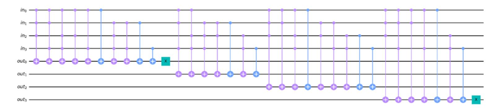

**Figure 1:** Quantum circuit for S-box 1 of Set 1 (94ABD1856203CEF7)

## **3 Quantum Cost of S-Boxes**

Quantum particles must be trapped in a low energy state to allow the performance of meaningful operations. Reducing the number of gates needed for a quantum algorithm reduces the cost of performing said algorithm, as it reduces the number of necessary quantum computations and therefore the time atoms need to stay in a specific state. This is important as it reduces the likelihood of the occurrence of decoherence. Decoherence can cause a spin flip of quantum particle and can cause trapped atoms to be excited into higher vibrational modes [\[16\]](#page-82-4).

Table [3](#page-4-0) depicts the resulting cost of the quantum circuit for the ANF of each S-box. It lists the number of MCX gates with *n* controls. An MCX gate with 0 controls is equivalent to an X gate. Table [4](#page-4-1) depicts the cost of a 16x4 S-box generated from each set. It should be noted that the quantum circuits depicted in Table [3](#page-4-0) require 8 qubits, while the circuits in Table [4](#page-4-1) require 10 qubits. This is because a 16x4 S-box requires 2 additional bits to determine what S-box should be used. It should also be noted that using a rotated matrix to generate S-box 4 in Set 1 had no impact on the cost of performing said S-box.

#### **3.1 Analyzing Quantum Cost of Random S-Boxes**

This process was repeated on a set of 1,500 randomly generated 4x4 S-boxes and a set of 800 randomly generated 16x4 S-boxes. Table [5](#page-5-0) and Table [6](#page-5-1) list the MCX gates needed

{4}------------------------------------------------

<span id="page-4-0"></span>

| MCX            | Set 1    |         |         |          | Set 2    |         |         |         |
|----------------|----------|---------|---------|----------|----------|---------|---------|---------|
| Controls       | S-Box 1  | S-Box 2 | S-Box 3 | S-Box 4  | S-Box 1  | S-Box 2 | S-Box 3 | S-Box 4 |
| 0              | 2        | 2       | 2       | 2        | 2        | 1       | 2       | 1       |
| 1              | 10       | 9       | 13      | 10       | 10       | 6       | 8       | 10      |
| 2              | 12       | 14      | 19      | 12       | 12       | 11      | 13      | 14      |
| 3              | 11       | 7       | 7       | 11       | 11       | 6       | 6       | 7       |
| Total<br>Gates | 35       | 32      | 41      | 35       | 35       | 24      | 29      | 32      |
| MCX            |          |         | Set 3   |          |          | Set 4   |         |         |
| Controls       | S-Box 1  | S-Box 2 | S-Box 3 | S-Box 4  | S-Box 1  | S-Box 2 | S-Box 3 | S-Box 4 |
|                |          |         |         |          |          |         |         |         |
|                |          |         |         |          |          |         |         |         |
| 0              | 2        | 2       | 2       | 2        | 2        | 1       | 2       | 1       |
| 1              | 10       | 9       | 13      | 10       | 10       | 6       | 8       | 10      |
| 2<br>3         | 11<br>10 | 14<br>7 | 17<br>7 | 11<br>10 | 11<br>10 | 11<br>6 | 13<br>6 | 14<br>6 |

**Table 3:** Cost of each S-box in Sets 1 through 4

<span id="page-4-1"></span>**Table 4:** Cost of each 16x4 S-box formed by Sets 1 through 4

| MCX Controls | Set 1 | Set 2 | Set 3 | Set 4 |
|--------------|-------|-------|-------|-------|
| 0            | 2     | 2     | 2     | 2     |
| 1            | 10    | 17    | 10    | 17    |
| 2            | 22    | 26    | 21    | 25    |
| 3            | 48    | 39    | 45    | 38    |
| 4            | 27    | 32    | 25    | 33    |
| 5            | 10    | 10    | 8     | 12    |
| Total Gates  | 119   | 126   | 111   | 127   |

to run the 3 most costly randomly generated 4x4 and 16x4 S-boxes respectively. The 16x4 S-boxes were created by combining 4 randomly generated 4x4 S-boxes. A list of all the S-boxes generated and their associated costs can be found in Appendix [B.](#page-40-0)

The most expensive randomly generated 4x4 S-box was 7FAC98B234516D0E, which required the same number of gates as the most expensive 4x4 S-box generated by hand (946C753AE8FBD012). The most expensive 16x4 S-box that was generated by hand was formed from Set 4, requiring 127 gates. However, the randomly generated S-box CB91D538E7A20F64A217C6534D8EBF09D14A58BF792C630E58B214C790E6DFA3 required 150 gates. This is approximately 3.659 times more gates than the most expensive 4x4 S-box found, and an increase of 23 gates compared to the 16x4 S-box generated from Set 4.

It should be noted that all the 16x4 S-boxes depicted in Table [6](#page-5-1) were more expensive than the hand generated 16x4 S-boxes depicted in Table [4.](#page-4-1) This is even though each 16x4 S-box in Table [6](#page-5-1) had at least one collision with the input, and at least one collision between the different 4x4 S-boxes used to generate the 16x4 S-box. This implies that reducing these collisions in 16x4 S-boxes does not increase said S-box's quantum security.

{5}------------------------------------------------

**Table 5:** Cost of the 3 most expensive randomly generated 4x4 S-boxes

<span id="page-5-0"></span>

|              |                  | S-Box            |                  |
|--------------|------------------|------------------|------------------|
| MCX Controls | 7FAC98B234516D0E | FD8716ABCE459320 | C2BA7FD51408E396 |
| 0            | 3                | 4                | 2                |
| 1            | 8                | 9                | 12               |
| 2            | 19               | 14               | 15               |
| 3            | 11               | 13               | 11               |
| Total Gates  | 41               | 40               | 40               |

**Table 6:** Cost of the 3 most expensive randomly generated 16x4 S-boxes

<span id="page-5-1"></span>

|              |                  | S-Box            |                  |
|--------------|------------------|------------------|------------------|
|              | CB91D538E7A20F64 | 70812A3B496DCEF5 | 6A543D18EC27F09B |
|              | A217C6534D8EBF09 | 89C62357BA4ED01F | 9ADC7F3E502816B4 |
|              | D14A58BF792C630E | 841CEAB73265DF09 | FC1BE0568A423D79 |
| MCX Controls | 58B214C790E6DFA3 | 0386F4127B95ECAD | 309C7BA2D8F4E651 |
| 0            | 2                | 3                | 2                |
| 1            | 10               | 19               | 13               |
| 2            | 42               | 38               | 38               |
| 3            | 48               | 44               | 52               |
| 4            | 36               | 37               | 34               |
| 5            | 12               | 8                | 8                |
| Total Gates  | 150              | 149              | 147              |

# **4 Using Grover's Algorithm to Perform a Known Plaintext Attack**

A known-plaintext attack is an attack wherein the attacker has access to both the ciphertext and plaintext of an encryption algorithm. Such an attack aims at figuring out the key used to encrypt the plaintext [\[15\]](#page-82-5). Performing a known plaintext attack with Grover's algorithm is cheaper than performing a brute force attack using Grover's algorithm. This is because Grover's algorithm will only need to search through the possible values of a key as opposed to the values for both the key and the plaintext.

Using Grover's algorithm, a known plaintext attack was performed on an algorithm that XOR-es a 4-bit key to a 4-bit plaintext that is then ran through an S-box (Algorithm 1). This performs the add round key and substitution steps of round 1 of S-AES on a 4-bit block. The shift rows, mix columns, and second add round key steps were excluded due to memory and time constraints. Two different implementations of a 16x4 S-box were tested. The first implementation (Algorithm 2) used the first and last bit of the key to determine what S-box to use (acting as *x*<sup>4</sup> and *x*5) and the second implementation (Algorithm 3) appended two bits to the key that determined what S-box to use (once again acting as *x*<sup>4</sup> and *x*5).

These algorithms serve as a simplified single round version of S-AES that requires fewer resources to model and operates on a single plaintext block. Below is the pseudocode for these algorithms, wherein BitToInt is a function that converts a bitstream to an integer value and *sbox* is a list of values between 0x0 and 0xF that represent the S-box being used.

{6}------------------------------------------------

#### **Algorithm 1**

```
Input: bitstream[4] pt, bitstream[4] key, list[16] sbox
bitstream[4] ct
i = 0
while i < 4 do
   ct[i] = pt[i] ⊕ key[i]
   i = i + 1
end while
ct = sbox[BitToInt(ct)]
```

#### **Algorithm 2**

```
Input: bitstream[4] pt, bitstream[4] key, list[64] sbox
bitstream[4] ct
i = 0
while i < 4 do
   ct[i] = pt[i] ⊕ key[i]
   i = i + 1
end while
bitstream[2] b
b = [key[0], key[3]]
box =BitToInt(b) ∗ 2
                  4 ▷ Which 4x4 S-box to use
ct = sbox[box+BitToInt(ct)]
```

#### **Algorithm 3**

```
Input: bitstream[4] pt, bitstream[6] key, list[64] sbox
bitstream[4] ct
i = 0
while i < 4 do
   ct[i] = pt[i] ⊕ key[i]
   i = i + 1
end while
bitstream[2] b
b = [key[4], key[5]]
box =BitToInt(b) ∗ 2
                  4 ▷ Which 4x4 S-box to use
ct = sbox[box+BitToInt(ct)]
```

{7}------------------------------------------------

## **5 Construction of Grover's Algorithm**

## **5.1 Oracle Construction**

To construct Grover's algorithm, one must create an oracle that is used to find a desired state [\[20\]](#page-82-0). The oracle for a known plaintext attack on a 4x4 S-box and a known ciphertext of 1100 is depicted in Figure [2](#page-7-0) registers key, plaintext (pt), ciphertext (ct), expected, and passed. Had LIGHTER-R been used to generate the oracle, the ciphertext register would not be necessary. This is because LIGHTER-R is able to construct quantum circuits for reversible ANF representations of S-boxes that do not need an ancilla register and require fewer gates, significantly reducing the cost associated with an S-box's quantum circuit [\[7\]](#page-81-3). The first thing the oracle does is XOR the key register with the plaintext register. This is done by using a series of controlled-X gates on the key and plaintext registers. An S-box is then used on the plaintext and ciphertext registers, with the plaintext register acting as *x*<sup>0</sup> through *x*<sup>3</sup> and the ciphertext register acting as *y*<sup>0</sup> through *y*3.

<span id="page-7-0"></span>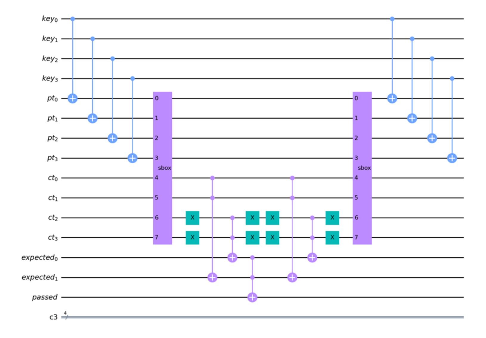

**Figure 2:** Quantum oracle for S-AES

The ciphertext register is then tested to see if it is in the randomly chosen state |1100〉. This is done using the 2-qubit expected register. The first qubit of this register is used to check the 0's of the ciphertext and the second qubit being used to check the 1's of the ciphertext. This is done by applying an X gate on qubits that should be in the state |0〉. A controlled-X gate is then applied, using these qubits as its control and the first qubit of the expected register as its target. It is then followed by another X gate on the ciphertext qubits in question. If the known ciphertext does not contain any zeroes, the first qubit of the expected register can either be removed or initialized to the state |1〉. Another controlled-X gate is then ran using the qubits that should be in the state |1〉 as the control, and the second qubit of the expected register being its target. If the known ciphertext does not contain any zeroes, the second qubit of the expected register can either

{8}------------------------------------------------

be removed or initialized to the state |1〉.

A controlled-X gate is then run using the expected register as its control and the passed register as its target to determine if the ciphertext register is in the desired state. The process of checking the 1's and 0's of the ciphertext, running the S-box, and XORing the key with the plaintext is then repeated. Doing this sets everything back to the state they were in originally.

This process was repeated for 16x4 S-boxes. Figure [3](#page-8-0) depicts the oracle for Algorithm 2, while Figure [4](#page-9-0) depicts the oracle for Algorithm 3. Once again, a known ciphertext of 1100 is being looked for. As seen in Figure [4,](#page-9-0) the two additional bits of the key in Algorithm 3 are not XORed with the plaintext.

<span id="page-8-0"></span>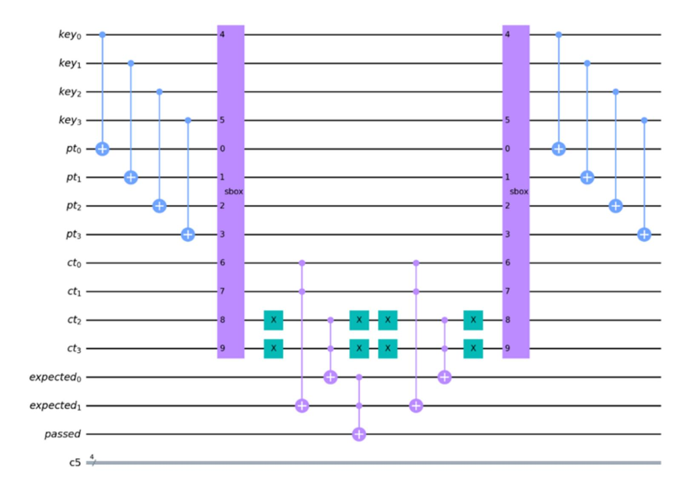

**Figure 3:** Quantum oracle for Algorithm 2

#### **5.2 Assembling Grover's Algorithm**

To find the 4 to 6-bit key used to generate the known ciphertext from a known plaintext, one must perform 2 searches. The plaintext register will also need to be initialized to its known value. This is done by applying a X gate on each plaintext qubit that is meant to be a |1〉. Finally, the passed register will need to be initialized to the state |–〉. An example of this is shown in Figure [5,](#page-9-1) wherein a known plaintext of 1101 is being looked for using a single 4x4 S-box. After the oracle is run, a diffuser is applied to the key register. The diffuser rotates the key register closer to the states that satisfy oracle [\[20\]](#page-82-0).

{9}------------------------------------------------

<span id="page-9-0"></span>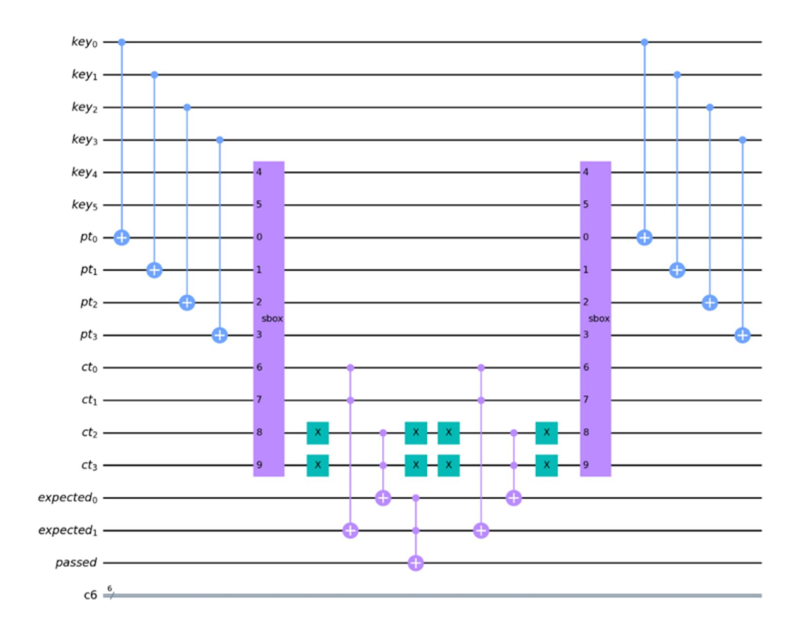

**Figure 4:** Oracle for Algorithm 3

<span id="page-9-1"></span>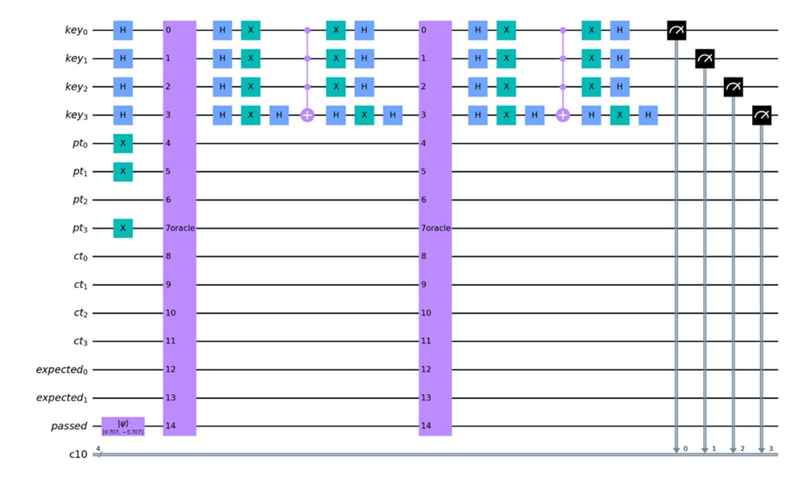

**Figure 5:** An example of Grover's algorithm that is looking through a 4x4 S-box to find what produces the plaintext 1101

{10}------------------------------------------------

## **6 Results**

Table [7](#page-10-0) lists 3 sets of randomly generated plaintext ciphertext pairs that were used to perform a known plaintext attack. Figures [6,](#page-10-1) [7,](#page-11-0) and [8](#page-11-1) show the results of performing a known plaintext attack via Grover's algorithm on Algorithms 1, 2, and 3 respectively with the randomly generated plaintext 0110 and randomly generated ciphertext 0100. These tests were performed using Qiskit via IBMQ. These figures only depict the results of performing the attack on Set 1. The rest of the results of each of these attacks on 16x4 S-box algorithms can be seen in Appendix [C.](#page-54-0) The results of a known plaintext attack on Algorithm 1 had an average of 932.146 out of 1024 shots being correct with a standard deviation of 8.636. Comparable results were present when performing this attack on Algorithm 2, having an average of 930.5 out of 1024 shots being correct with a standard deviation of 9.987. However, instead of finding only 1 valid key, it found 4. Such a result means that Algorithm 2 is unable to provide authentication.

<span id="page-10-0"></span>**Table 7:** Randomly generated plaintext ciphertext pairs

| Plaintext | Ciphertext |
|-----------|------------|
| 0000      | 0110       |
| 0011      | 1011       |
| 0110      | 0100       |
|           |            |

<span id="page-10-1"></span>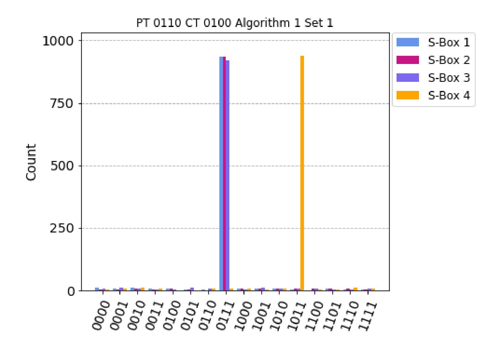

**Figure 6:** Results of performing a known plaintext via Grover's algorithm on Algorithm 1

{11}------------------------------------------------

<span id="page-11-0"></span>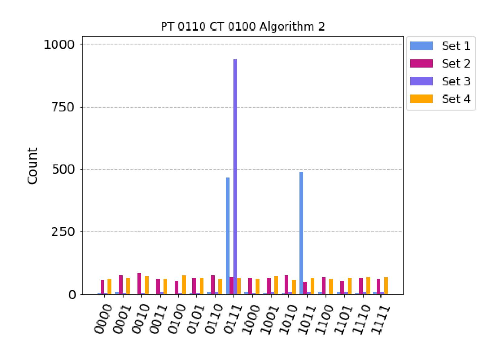

**Figure 7:** Results of performing a known plaintext via Grover's algorithm on Algorithm 2

<span id="page-11-1"></span>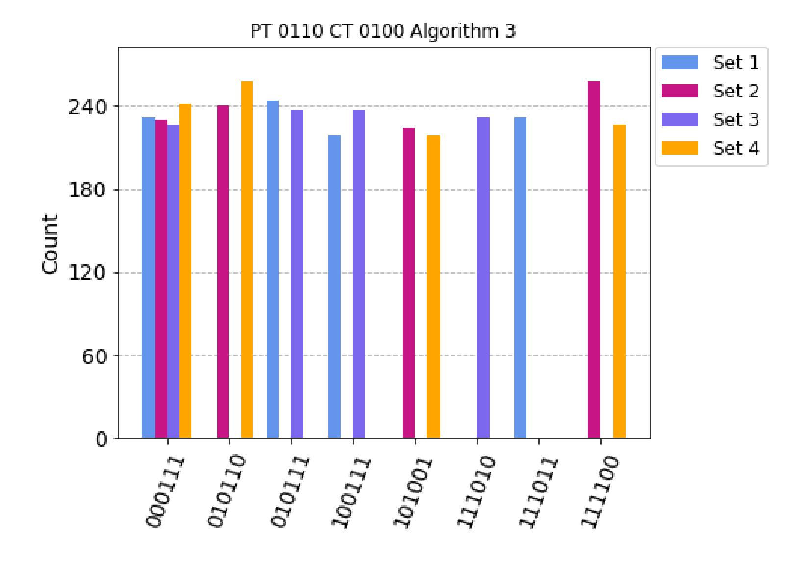

**Figure 8:** Results of performing a known plaintext via Grover's algorithm on Algorithm 3

{12}------------------------------------------------

#### 6.1 Analyzing ALG 2

However, when Grover's algorithm was run on Algorithm 2, results were very inconsistent. Figure 7 best demonstrates this, as the attack only found a valid key when using the S-boxes in Set 1 and 3. Furthermore, Set 1 yielded two possible keys (0111 and 1011) while Set 3 only yielded one possible key (0111). Sets 2 and 4 did not find any valid keys because no keys exist that could produce the ciphertext 0100 from the plaintext 0110. Since the value that is XORed with the plaintext also decides which S-box to use, the plaintext will only be XORed with one of 4 values before being put through a specific S-box. Table 8 depicts what key values correlate to each S-box for any particular set.

XORing a plaintext before putting it through an S-box serves to create permutations that are computationally indistinguishable from a random permutation. To do this, a function must map each n-bit input to exactly one random n-bit output, with the input being the key XORed with a 4-bit plaintext block [23]. However, ALG 2 fails at doing this. Table 9 shows the output of Algorithm 2 using Set 1 for any given key and a plaintext of 0x0. One can see that a ciphertext of 0x4, 0x7, and 0xD are produced multiple times, while a ciphertext of 0x0, 0x5, and 0xC are never produced. As such, it fails at providing a computationally random permutation.

S Roy Koy

**Table 8:** Keys applicable to nth S-box in Algorithm 2

<span id="page-12-0"></span>

| S-Box     | Key      |          |          |          |  |  |  |  |  |  |
|-----------|----------|----------|----------|----------|--|--|--|--|--|--|
| S-Box 1   | 0 (0000) | 2(0010)  | 4 (0100) | 6 (0100) |  |  |  |  |  |  |
| S-Box 2   | 1 (0001) | 3(0011)  | 5(0101)  | 7 (0111) |  |  |  |  |  |  |
| S-Box $3$ | 8 (1000) | A (1010) | C(1100)  | E (1110) |  |  |  |  |  |  |
| S-Box 4   | 9 (1001) | B (1011) | D (1101) | F (1111) |  |  |  |  |  |  |

<span id="page-12-1"></span>**Table 9:** Output of Algorithm 2 when using Set 1 for any given key and a plaintext of 0x0

|                     | S-Box 1 |   |   | S-Box 2 |   |   | S-Box 3 |   |              | S-Box 4      |              |              |   |   |   |              |
|---------------------|---------|---|---|---------|---|---|---------|---|--------------|--------------|--------------|--------------|---|---|---|--------------|
| Key                 | 0       | 2 | 4 | 6       | 1 | 3 | 5       | 7 | 8            | A            | $\mathbf{C}$ | $\mathbf{E}$ | 9 | В | D | $\mathbf{F}$ |
| $\operatorname{CT}$ | 9       | A | D | 8       | 4 | 7 | 6       | В | $\mathbf{E}$ | $\mathbf{F}$ | D            | 1            | 7 | 3 | 4 | 2            |

#### 6.2 Analyzing Algorithm 3

In contrast, Algorithm 3 supplies a computationally random permutation since each n-bit plaintext input has an equally likely chance of being mapped to any other n-bit ciphertext. However, each ciphertext generated has 4 possible keys that could be used to decrypt it. Ideally, given a key size of n-bits, an attacker should have a  $\frac{1}{2^n}$  chance of guessing the correct key. However, when Algorithm 3 is implemented, an attacker has a  $\frac{4}{2^4}$  or  $\frac{1}{16}$  probability of guessing the key instead of a  $\frac{1}{2^8}$  or  $\frac{1}{64}$  chance of guessing the key. While this does not provide ideal security, it provides the same amount of security as Algorithm 1, as an attacker would also have a  $\frac{1}{16}$  chance of guessing the correct key.

It is because of this that Grover's algorithm must run the same number of times for all three algorithms evaluated. As such, the only benefit that Algorithm 3 provides is an increased cost of the oracle used to perform Grover's algorithm. As depicted in Tables 3 and 4, if Algorithm 3 was ran using Set 4, the S-box subcircuit would require 127 gates. Whereas if Algorithm 1 was ran using S-box 3 of Set 4, the S-box subcircuit would only require 24 gates.

{13}------------------------------------------------

Since each oracle subcircuit applies two S-box subcircuits, and since the oracle had to be run twice, this meant that the S-box subcircuit had to be run a total of 4 times for each known plaintext attack performed. Therefore, given the scenario outlined above, Algorithm 3 would require 412 more gates in total than Algorithm 1. In addition to this, Algorithm 3 requires 2 more qubits to perform a known plaintext attack than an attack performed on Algorithm 1. However, this increase in gates and qubits can be circumvented by just testing on a single specific S-box, i.e., by using Algorithm 1.

## 7 Implementation in S-AES

It might be possible to overcome the security holes present in Algorithms 2 and 3 by implementing them in the full S-AES algorithm. To do this for Algorithm 2, the S-AES algorithm was largely unmodified. The key expansion algorithm was left unchanged, using the first S-box from the set to perform the key expansion. The only step that was changed was the substitution step, wherein the previous round key was used to determine which S-box to use (i.e.,  $W_0W_1$  was used in round 1 and  $W_2W_3$  was used in round 2 to determine which S-box to use). Figure 9 depicts this process. The high and low bits of  $K_0$  are used to determine which S-box to use on Block 1, while the high and low bits of  $K_1$  are used to determine which S-box to use on Block 0. This implementation will be referred to as ALG 2. It serves to perform a version of S-AES that uses a 16x4 S-box without increasing the key size.

#### 7.1 Implementing Algorithm 3 in S-AES

Implementing Algorithm 3 in S-AES required a lot more changes to S-AES. The first thing that had to be modified was the key expansion algorithm. Key expansion in S-AES operates by breaking the 16-bit key into 4 4-bit nibbles ( $K_0$  through  $K_3$ ) that are then used to form 6 8-bit words ( $W_0$  through  $W_5$ ). These nibbles are then rotated and put through a S-box before adding the round constant g. The first round of this process is depicted in Figure 10.

To implement Algorithm 3, the key size needed to be increased to 24 bits, with these additional bits forming the nibbles  $K_4$  and  $K_5$ .  $K_4$  and  $K_5$  are then used to form  $\alpha_0$ , which determines which S-box to apply on each plaintext nibble in round 1. Before performing the key expansion,  $K_0(\kappa_0\kappa_1)$  and  $K_2(\kappa_2\kappa_3)$  are swapped with  $K_4$  and  $K_5$  to form  $\alpha'_0$ .  $\kappa_0\kappa_1$  are then used to determine which S-box to use on  $W_1$ .

 $\alpha'_0$  is then expanded using a process that mirrors the original key expansion algorithm used by S-AES. 2 2-bit words ( $\omega$ ) are formed from  $\alpha'_0$ , with  $\omega_0$  being formed from  $\kappa_0\kappa_1$  and  $\omega_1$  being formed from the rotated  $\kappa_3\kappa_2$ . The substitution step is skipped and  $\omega_1$  is XORed with the constant  $\rho$  (0b1000) before being XORed with  $\omega_0$  to form  $\omega_2$ .  $\omega_2$  is then XORed with  $\omega_1$  to form  $\omega_3$ , with  $\omega_2\omega_3$  forming  $\alpha_1$ .  $\alpha_1$  is then used to determine which S-box to use on each plaintext nibble in round 2. Figure 11 depicts this process.

To calculate  $W_5W_6$ , this process, excluding the key expansion of  $\alpha_1$ , is repeated. This implementation is referred to as ALG 3 Double Swap. Another implementation was tested that did not swap  $K_4K_5$  with  $K_0K_2$  when calculating  $W_5W_6$ , with this implementation being referred to as ALG 3 Single Swap.

{14}------------------------------------------------

<span id="page-14-0"></span>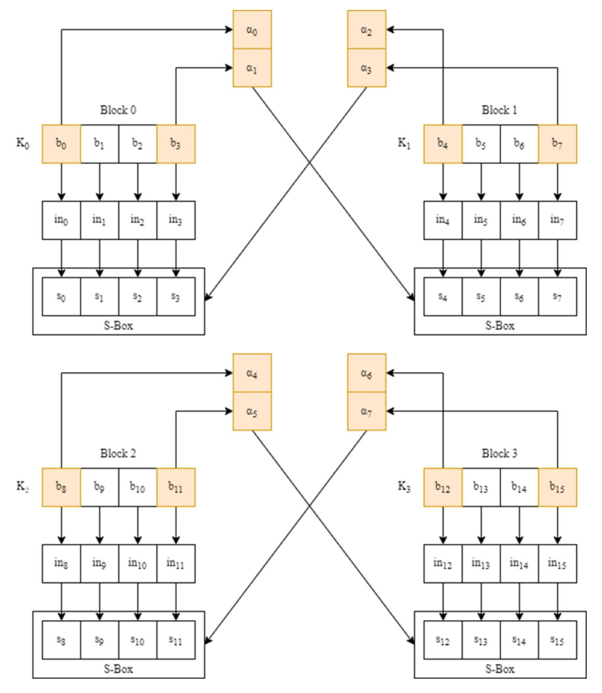

Figure 9: ALG 2

{15}------------------------------------------------

<span id="page-15-0"></span>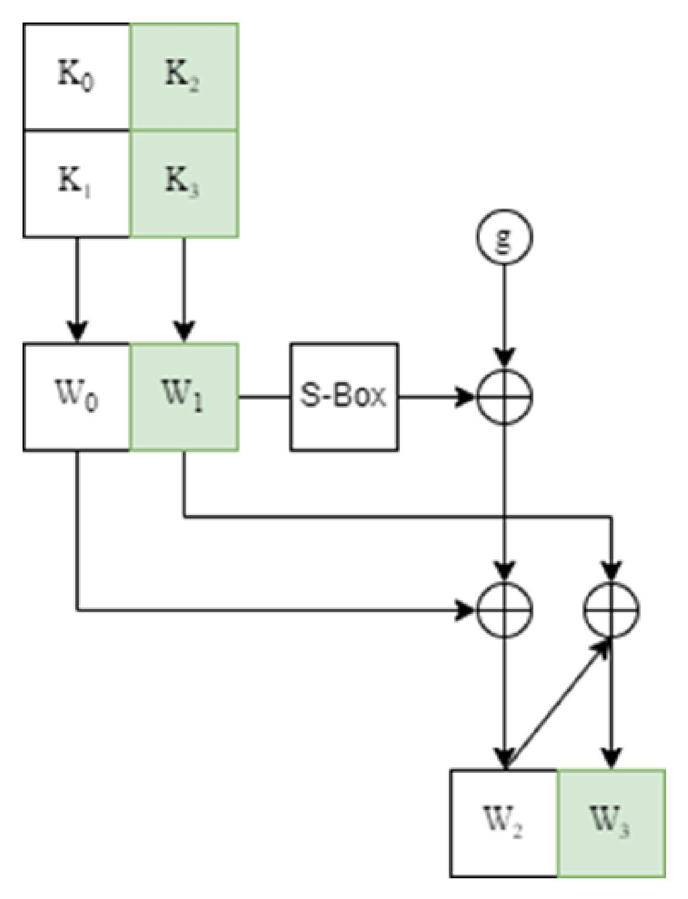

**Figure 10:** S-AES key expansion algorithm

{16}------------------------------------------------

<span id="page-16-0"></span>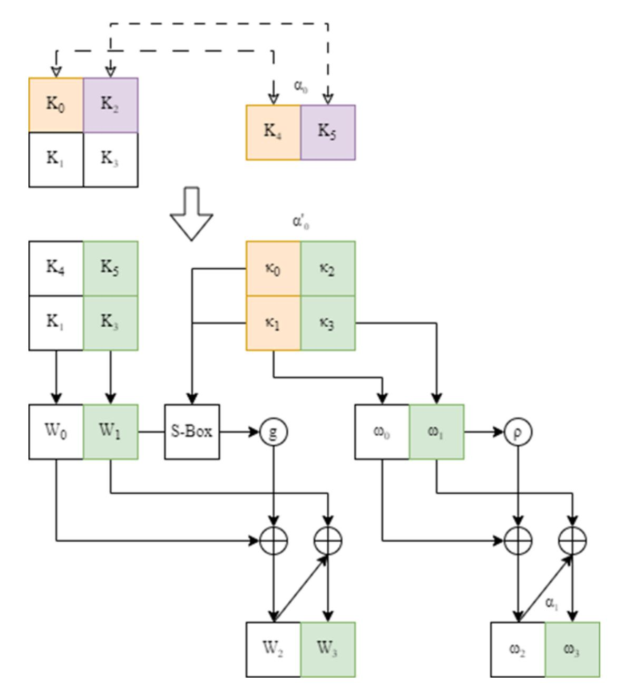

**Figure 11:** ALG 3

{17}------------------------------------------------

## **8 Analyzing Full S-AES Implementations of ALG 2 and 3**

Running Grover's algorithm on these modified versions of S-AES was too resource intensive. As such, every possible key was used on 3 randomly generated plaintexts (as well as the plaintext 0x0000) to determine how many keys generated the same ciphertext given a specific plaintext. When doing this, the S-box S-AES used was always set to the first S-box of the set being tested. This was done to see how resistant each implementation was to a known plaintext attack of an unmodified version of S-AES that uses the first S-box of a 16x4 S-box.

The average results of performing this test on each set is depicted in Figures [12](#page-17-0) and [13.](#page-18-0) Table [10](#page-18-1) provides the average minimum, maximum, mean, median, variance, and standard deviation of these tests.

The distribution of keys that correlated to identical outputs is statistically identical between S-AES and ALG 2. They were also statistically identical between ALG 3 Double Swap and ALG 3 Single Swap. Roughly 36.76% of the possible 2 <sup>16</sup> 16-bit outputs (or around 24,094) could not be generated by S-AES or ALG 2. Another 36.85% of the possible outputs (or around 24,149) could only be generated with a single key. On average, each ciphertext produced by ALG 3 could be generated with 256 different keys. This is because a 24-bit key is being applied to a 16-bit plaintext block that will produce a 16-bit plaintext block.

<span id="page-17-0"></span>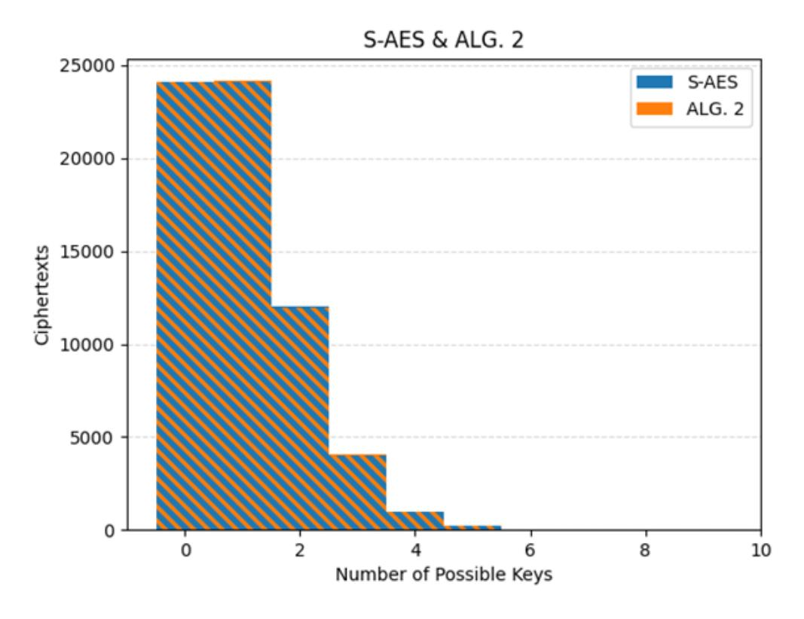

**Figure 12:** Key distribution of S-AES and ALG 2

#### **8.1 Effectiveness of ALG 3 Double Swap & Alg 3 Single Swap**

ALG 3 Double Swap and ALG 3 Single Swap were designed to prevent an attacker from being able to use any possible value for the additional 8 bits when attacking the algorithm. Five random ciphertexts that could be generated from the plaintext 0xD3AE with 256 possible keys were selected from ALG 3 Double Swap and ALG 3 Single Swap. Each key that could generate the ciphertext in question was then analyzed to see how many of the possible values for *K*4*K*<sup>5</sup> generated said ciphertext. If all 2 <sup>8</sup> of these values can be used, an attacker would be able to ignore these additional 8 bits.

Doing so revealed that ALG 3 Double Swap, on average, used 62.34% of the possible *K*4*K*<sup>5</sup> values. Doing this on ALG 3 Single Swap had similar results, with it using an

{18}------------------------------------------------

<span id="page-18-0"></span>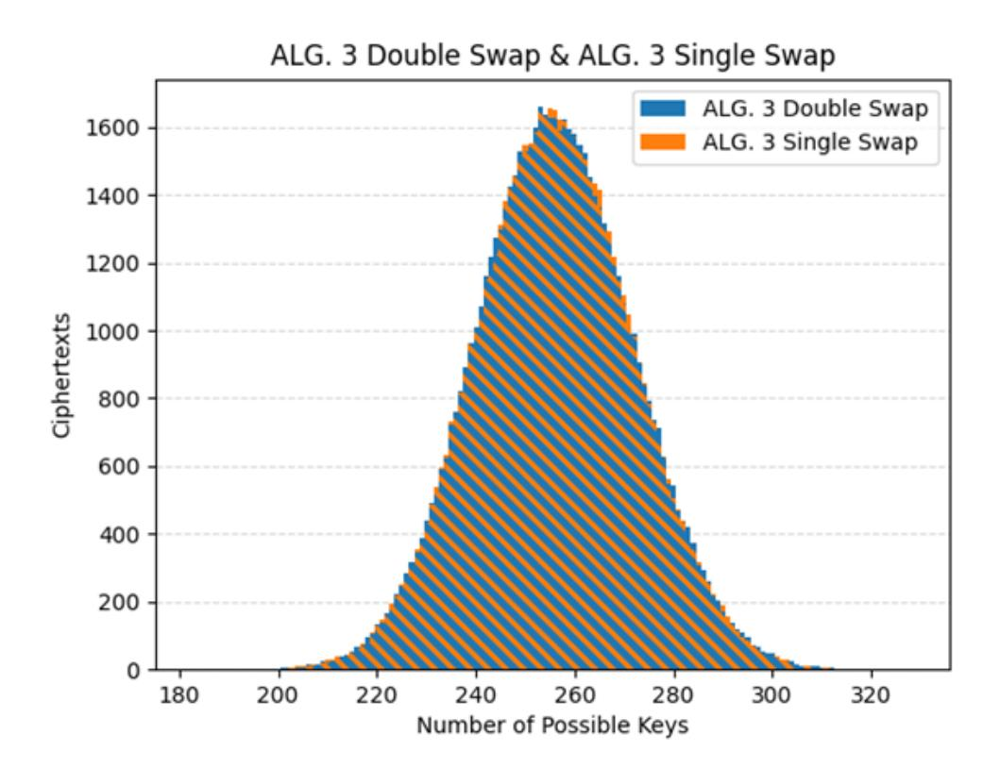

**Figure 13:** Key distribution of ALG 3 Double Swap and ALG 3 Single Swap

<span id="page-18-1"></span>

|                      | Average<br>Minimum | Average<br>Maximum | Average<br>Mean | Average<br>Median | Average<br>Variance | Average<br>Standard<br>Deviation |
|----------------------|--------------------|--------------------|-----------------|-------------------|---------------------|----------------------------------|
| S-AES                | 0                  | 7.75               | 1               | 1                 | 1                   | 1                                |
| ALG 2                | 0                  | 7.75               | 1               | 1                 | 1                   | 1                                |
| ALG 3<br>Double Swap | 192.5              | 325.25             | 256             | 256               | 255.805             | 15.993                           |
| ALG 3<br>Single Swap | 190                | 325                | 256             | 256               | 256.63              | 16.023                           |

**Table 10:** Keys per ciphertext

average of the 63.67% possible *K*4*K*<sup>5</sup> values. This difference is most likely due to the small sample size. It is likely that repeating this test on all the ciphertexts that could be generated with 256 different keys would result in a near identical ratio between the two algorithms.

#### **8.2 The Ability of S-AES, ALG 2, and ALG 3 to Provide Authentication**

IoT devices are found in many settings such as the military, industrial, and healthcare fields. Many of these devices are required to provide confidentiality, integrity, and authentication of transmitted data. Authentication is provided using shared keys that transform a plaintext into a ciphertext, wherein the same key must be used to decrypt the ciphertext to a valid plaintext value [\[10\]](#page-81-4). This is especially true for IoT devices in the medical field, as the security of patient data is a top priority. Due to the various applications and benefits provided by IoT devices, the healthcare industry has been quick to adopt IoT devices [\[8\]](#page-81-5).

Due to the distribution of keys, ALG 3 could never provide authentication. Since there will always be more keys than possible ciphertexts, there will always be more than one possible valid key that could be used to authenticate data. However, ALG 2 was equally as capable of providing authentication as S-AES was. This is because their key distributions 

{19}------------------------------------------------

were nearly identical.

To provide ideal authentication, each ciphertext should map to exactly one key given a specific plaintext. However, encryption algorithms can still provide authentication if they produce collisions such that it is difficult to find *x* values that compose of a key and plaintext that satisfy the equation *encryption*(*x*1) = *encryption*(*xn*). This is best done with hashing algorithms but can still be performed through the use of encryption algorithms [\[9\]](#page-81-6).

Due to the constraints of lightweight cryptographic algorithms (i.e., their limited computational costs and limited key space) any lightweight algorithm that has an *x* value that satisfies the above equation a collision in it would be easy to find. Seeing as there are only around 36.85% possible values of *x* that do not cause a collision in S-AES or ALG 2, both algorithms fail at providing adequate authentication. However, the lack of differentiation between the number of collisions amongst the two algorithms would imply that implementations of ALG 2 on algorithms such as AES would not impact their ability to provide authentication.

## **9 Statistical Analysis of These Implementations**

One of the criteria that encryption algorithms must provide is their ability to act as random number generators [\[18\]](#page-82-7). NIST has provided a statistical test suite that can be used to analyze random number generators and cryptographic algorithms. It works under the null hypothesis that the sequence being analyzed is random. This test suite performs 15 tests that measure the randomness of an algorithm to produce a P-value. This is the probability that a test statistic will produce values that are equal to or worse than the test statistic value. A P-value of 1 indicates perfect randomness, while a P-value of 0 indicates that the sequence analyzed is completely non-random [\[1\]](#page-81-7). Information about each test can be seen in [\[1\]](#page-81-7).

The implementations of ALG 2, ALG 3 Double Swap, and ALG 3 Single Swap were analyzed using this test suite. In addition to this, versions of S-AES that used each S-box in each set of S-boxes were also analyzed. The algorithms generated 60 bitstreams of 100,000 bits each. This was done by generating 60 random 32-bit input values for the different versions of S-AES and ALG 2, as well as 60 random 40-bit input values for ALG 3 Double Swap and ALG 3 Single Swap. These values were then fed into their respective algorithms, being incremented by one until each bitstream had the necessary number of bits.

Appendix [D](#page-57-0) lists the P-value associated with as well as the percentage of bitstreams that passed each test. Tables [11](#page-20-0) lists the results for implementations of S-AES that use S-box 1 and 3 of Set 1. S-box 1 of Set 1 is the S-box that S-AES uses, and S-box 3 of Set 1 was the most expensive 4x4 S-box found. Table [12](#page-21-0) lists the results of implementations of ALG 2, ALG 3 Single Swap, and ALG 3 Double Swap that use Set 4, as it composed the most expensive 16x4 handmade S-box.

## **9.1 Test Flaws**

Fine tuning each test performed was infeasible, as 49 different algorithms ended up being tested. As such, several tests produced questionable results. This is most apparent in the various tests that had a P-value of 0 despite having a very high pass rate. Furthermore, only 3 Random Excursions and Random Excursions Variant tests could be performed on each algorithm. In addition to this, the only Discrete Fourier Transform (FFT) tests that did not result in a P-value of 0 were the ones ran on ALG 2. Finally, only one Muarer's "Universal Statistical" test could be performed on each algorithm tested.

{20}------------------------------------------------

<span id="page-20-0"></span>

| Table 11: Statistical analysis results of S-AES using its default S-box (S-box 1 of Set 1) |
|--------------------------------------------------------------------------------------------|
| and the most quantum expensive 4x4 S-box found (S-box 3 of Set 1)                          |

|                    |       | S-Box 1 |       | S-Box 3 |  |
|--------------------|-------|---------|-------|---------|--|
|                    | P-val | Passed  | P-val | Passed  |  |
| Frequency          | 0     | 100%    | 0.299 | 100%    |  |
| Block Frequency    | 0.178 | 93.33%  | 0.016 | 98.33%  |  |
| Sums 1             | 0     | 100%    | 0.001 | 100%    |  |
| Sums 2             | 0     | 100%    | 0.01  | 100%    |  |
| Runs               | 0     | 100%    | 0.773 | 100%    |  |
| Longest Run        | 0.324 | 98.33%  | 0.706 | 98.33%  |  |
| Rank               | 0.437 | 100%    | 0.195 | 93.33%  |  |
| FFT                | 0     | 16.66%  | 0     | 71.66%  |  |
| Non-Overlapping    | 0.256 | 99.06%  | 0.247 | 98.96%  |  |
| Overlapping        | 0.804 | 98.33%  | 0.195 | 98.33%  |  |
| Universal          | 0.83  | —       | 0.886 | —       |  |
| Entropy            | 0.407 | 100%    | 0.02  | 100%    |  |
| Excursions         | —     | 100%    | —     | 96.87%  |  |
| Excursion Variants | —     | 100%    | —     | 93.05%  |  |
| Serial 1           | 0.74  | 100%    | 0.148 | 100%    |  |
| Serial 2           | 0.233 | 100%    | 0.773 | 100%    |  |
| Linear Complexity  | 0.773 | 100%    | 0.054 | 100%    |  |
| Average Pass Rate  |       | 94.0%   | 97.0% |         |  |
| 100% Pass Rate     |       | 11      | 10    |         |  |

#### **9.2 Analysis of Results**

Apart from the Binary Matrix Rank and FFT tests, each algorithm passed each test more than 80% of the time. ALG 3 Double Swap and ALG 3 Single Swap tended to have low pass rates of the rank test, with ALG 3 Double Swap consistently having a significantly lower pass rate than ALG 3 Single Swap when performing this test. ALG 3 Double Swap also tended to have lower pass rates than ALG 3 Single Swap across every test performed, implying that ALG 3 Single Swap is more secure than ALG 3 Double Swap. Finally, the only algorithm that consistently passed every single test, including FFT, was ALG 2. Each test performed on this algorithm had a pass rate of 90% or more, implying that ALG 2 was the most classically secure algorithm tested.

The Binary Matrix Rank test is used to look for linear dependencies among fixed length substrings of a binary stream [\[1\]](#page-81-7). Failure of this test implies that the various values produced by an encryption algorithm are dependent on each other and are therefore not random. Such a dependence makes algorithms susceptible to linear cryptanalysis that can be used to perform key recovery attacks [\[14\]](#page-81-8). The FFT test is used to find repetitive patterns that are near each other [\[1\]](#page-81-7). These patterns can be exploited by cryptanalysts to recover the plaintext [\[3\]](#page-81-9).

ALG 2 was also the algorithm that had the highest average pass rate of 99% of all tests performed passing when used in conjunction with Set 4. Despite this, the unmodified version of S-AES had the highest number of tests that had a 100% pass rate for each P-value generated, as 11 of the performed tests had a 100% pass rate. ALG 3 Double Swap using Set 4 performed the worst, having an average pass rate of 89% and with only 3 tests having a 100% pass rate.

{21}------------------------------------------------

<span id="page-21-0"></span>**Table 12:** Statistical analysis results of implementations of ALG 2 and 3 using the most expensive handmade 16x4 S-box (Set 4)

|                    |       |        |       | ALG 3       | ALG 3       |        |  |
|--------------------|-------|--------|-------|-------------|-------------|--------|--|
|                    | ALG 2 |        |       | Double Swap | Single Swap |        |  |
|                    | P-val | Passed | P-val | Passed      | P-val       | Passed |  |
| Frequency          | 0.378 | 98.33% | 0.111 | 95.0%       | 0.195       | 100%   |  |
| Block Frequency    | 0.001 | 98.33% | 0.254 | 98.33%      | 0.233       | 98.33% |  |
| Sums 1             | 0.276 | 96.66% | 0     | 91.66%      | 0.091       | 100%   |  |
| Sums 2             | 0.888 | 100%   | 0     | 91.66%      | 0.025       | 100%   |  |
| Runs               | 0.254 | 100%   | 0.834 | 98.33%      | 0.324       | 100%   |  |
| Longest Run        | 0     | 96.66% | 0.74  | 100%        | 0.067       | 98.33% |  |
| Rank               | 0.122 | 100%   | 0     | 58.33%      | 0.091       | 93.33% |  |
| FFT                | 0.804 | 96.66% | 0     | 0.0%        | 0           | 71.66% |  |
| Non-Overlapping    | 0.303 | 98.99% | 0.486 | 98.72%      | 0.498       | 98.96% |  |
| Overlapping        | 0.06  | 100%   | 0.135 | 98.33%      | 0.991       | 98.33% |  |
| Universal          | 0.461 | —      | 0.713 | —           | 0.621       | —      |  |
| Entropy            | 0.35  | 98.33% | 0.028 | 98.33%      | 0.005       | 100%   |  |
| Excursions         | —     | 93.75% | —     | 98.61%      | —           | 96.87% |  |
| Excursion Variants | —     | 100%   | —     | 96.28%      | —           | 93.05% |  |
| Serial 1           | 0.005 | 100%   | 0.534 | 100%        | 0.378       | 100%   |  |
| Serial 2           | 0.834 | 100%   | 0.888 | 100%        | 0.437       | 100%   |  |
| Linear Complexity  | 0.148 | 100%   | 0.35  | 95.0%       | 0.602       | 100%   |  |
| Average Pass Rate  | 99.0% |        | 89.0% |             | 97.0%       |        |  |
| 100% Pass Rate     | 8     |        |       | 3           | 8           |        |  |

## **9.3 Avalanche Criterion**

Another desirable property of encryption algorithms is their ability for small changes in an input to produce significant changes to the output. To achieve this effect, each output bit should have a 50% chance of changing when any individual bit of the input is flipped. This is known as the Strict Avalanche Criteria (SAC) [\[17\]](#page-82-8). While the SAC requires each bit to have an exactly 50% chance of changing, such a criterion is very hard to achieve, and it is more useful as a means of measuring a sample's divergence from the SAC. As such, algorithms are considered to meet the generalized SAC when each bit has a probability close to 50% of changing [\[12\]](#page-81-10).

This was tested by generating 2,500 random plaintexts and keys for each implementation. Each bit in the input was then iterated through to measure the ciphertext produced when said bit was flipped. Furthermore, this test was also applied on a version of S-AES that used each S-box from each set of generated S-boxes. Table [13](#page-22-0) lists the average chance that each bit had of changing, and Appendix [E](#page-71-0) contains charts depicting the chance of each individual bit changing for each implementation tested.

Across all four sets analyzed, the bits when running ALG 2 ranged from having a 47.76% to a 51.14% chance of changing. Results were near identical with ALG 3 Double Swap and ALG 3 Single Swap, with bits ranging from having a 48.89% to 51.17% chance of changing. Similarly, each modified version of S-AES produced results that ranged from 48.35% to 53.21%.

Overall, each bit across all the algorithms tested in Table [13](#page-22-0) ranged from having a 49.28% to a 50.63% average chance of changing when any given input bit is changed. As such, ALG 2, ALG 3 Double Swap, ALG 3 Single Swap, and each implementation of 

{22}------------------------------------------------

S-AES tested met the generalized SAC.

**Table 13:** SAC test results of Sets 1 through 4

<span id="page-22-0"></span>

|         |        |        |        | Set 1     |           |           |           |  |  |
|---------|--------|--------|--------|-----------|-----------|-----------|-----------|--|--|
|         |        | ALG 3  | ALG 3  |           |           |           |           |  |  |
|         |        | Double | Single | S-AES     | S-AES     | S-AES     | S-AES     |  |  |
|         | ALG 2  | Swap   | Swap   | (S-Box 1) | (S-Box 2) | (S-Box 3) | (S-Box 4) |  |  |
| Average | 49.65% | 49.28% | 49.98% | 49.76%    | 50.52%    | 49.78%    | 49.87%    |  |  |
|         |        |        |        | Set 2     |           |           |           |  |  |
|         |        | ALG 3  | ALG 3  |           |           |           |           |  |  |
|         |        | Double | Single | S-AES     | S-AES     | S-AES     | S-AES     |  |  |
|         | ALG 2  | Swap   | Swap   | (S-Box 1) | (S-Box 2) | (S-Box 3) | (S-Box 4) |  |  |
| Average | 49.60% | 50.02% | 50.04% | 49.72%    | 50.02%    | 49.92%    | 50.23%    |  |  |
|         |        | Set 3  |        |           |           |           |           |  |  |
|         |        | ALG 3  | ALG 3  |           |           |           |           |  |  |
|         |        | Double | Single | S-AES     | S-AES     | S-AES     | S-AES     |  |  |
|         | ALG 2  | Swap   | Swap   | (S-Box 1) | (S-Box 2) | (S-Box 3) | (S-Box 4) |  |  |
| Average | 49.83% | 49.94% | 49.93% | 49.63%    | 50.55%    | 49.90%    | 50.01%    |  |  |
|         |        |        |        | Set 4     |           |           |           |  |  |
|         |        | ALG 3  | ALG 3  |           |           |           |           |  |  |
|         |        | Double | Single | S-AES     | S-AES     | S-AES     | S-AES     |  |  |
|         | ALG 2  | Swap   | Swap   | (S-Box 1) | (S-Box 2) | (S-Box 3) | (S-Box 4) |  |  |
| Average | 49.65% | 50.04% | 49.87% | 49.80%    | 49.89%    | 49.98%    | 50.63%    |  |  |

## **10 Analyzing Randomly Generated 16x4 S-Boxes**

When analyzing the quantum cost of the ANF of the randomly generated 16x4 S-boxes, multiple S-boxes were found that were more expensive than the S-boxes analyzed in Sets 1 through 4. Table [6](#page-5-1) lists the three most expensive randomly generated 16x4 S-boxes. The individual 4x4 S-boxes that produced the three most expensive 16x4 S-boxes were categorized into Sets 5 through 7, as depicted in Table [14.](#page-22-1) Table [15](#page-23-0) depicts the cost of the quantum circuit for the ANF of each of these S-boxes. Appendix [A](#page-32-0) lists the ANF of each of these S-boxes.

**Table 14:** Sets 5-7

<span id="page-22-1"></span>

|       | S-Box 1  | S-Box 2  | S-Box 3  | S-Box 4  |
|-------|----------|----------|----------|----------|
| Set 5 | CB91D538 | A217C653 | D14A58BF | 58B214C7 |
|       | E7A20F64 | 4D8EBF09 | 792C630E | 90E6DFA3 |
| Set 6 | 70812A3B | 89C62357 | 841CEAB7 | 0386F412 |
|       | 496DCEF5 | BA4ED01F | 3265DF09 | 7B95ECAD |
| Set 7 | 6A543D18 | 9ADC7F3E | FC1BE056 | 309C7BA2 |
|       | EC27F09B | 502816B4 | 8A423D79 | D8F4E651 |

{23}------------------------------------------------

**Table 15:** Quantum costs of Sets 5 through 7

<span id="page-23-0"></span>

|            |   | Total |    |                   |    |    |       |
|------------|---|-------|----|-------------------|----|----|-------|
|            | 0 | 1     | 2  | MCX Controls<br>3 | 4  | 5  | Gates |
| Set 5      |   |       |    |                   |    |    |       |
| S-Box 1    | 2 | 7     | 19 | 9                 | 0  | 0  | 37    |
| S-Box 2    | 2 | 9     | 11 | 8                 | 0  | 0  | 30    |
| S-Box 3    | 3 | 7     | 10 | 7                 | 0  | 0  | 27    |
| S-Box 4    | 2 | 9     | 7  | 8                 | 0  | 0  | 26    |
| 16x4 S-Box | 2 | 10    | 42 | 48                | 36 | 12 | 150   |
| Set 6      |   |       |    |                   |    |    |       |
| S-Box 1    | 3 | 11    | 18 | 8                 | 0  | 0  | 40    |
| S-Box 2    | 1 | 6     | 10 | 3                 | 0  | 0  | 20    |
| S-Box 3    | 1 | 9     | 10 | 8                 | 0  | 0  | 28    |
| S-Box 4    | 0 | 10    | 14 | 9                 | 0  | 0  | 33    |
| 16x4 S-Box | 3 | 19    | 38 | 44                | 37 | 8  | 149   |
| Set 7      |   |       |    |                   |    |    |       |
| S-Box 1    | 2 | 7     | 13 | 11                | 0  | 0  | 33    |
| S-Box 2    | 2 | 8     | 10 | 11                | 0  | 0  | 31    |
| S-Box 3    | 4 | 9     | 11 | 8                 | 0  | 0  | 32    |
| S-Box 4    | 2 | 8     | 15 | 6                 | 0  | 0  | 31    |
| 16x4 S-Box | 2 | 13    | 38 | 52                | 34 | 8  | 147   |

# **11 Statistical Analysis of Randomly Generated 16x4 S-Boxes**

To see if Sets 5 through 7 also provided classical security, each of these S-boxes were analyzed using the NIST statistical test suite and tested to see if they met the generalized SAC. The same procedure used when analyzing Sets 1 through 4 was once again used on Sets 5 through 7. The NIST statistical test suite was ran on versions of S-AES that use S-box 1 of each set, ALG 2, ALG 3 Double Swap, and ALG 3 Single Swap. These algorithms (as well as versions of S-AES that use each S-box in Sets 5 through 7) were then analyzed to measure the likelihood of each bit changing in accordance to a single bit flip in the input to measure their compliance with the SAC. Table [16](#page-24-0) and Table [17](#page-25-0) contains the results of performing the NIST statistical test suite on Set 5, and Table [18](#page-25-1) contains the results for the SAC tests. Appendix [D](#page-57-0) lists the results of running the NIST statistical test suite on each implementation tested, and Appendix [E](#page-71-0) lists charts depicting the chance of each individual bit changing for each implementation tested.

#### **11.1 Analysis of Statistical Tests**

Table [19](#page-26-0) depicts the results of running implementations of ALG 2, ALG 3 Double Swap, and ALG 3 Single Swap using Set 5, the most expensive 16x4 S-box analyzed in terms of quantum gates. Table [20](#page-27-0) depicts the algorithms that performed the best and worst when running statistical tests using Sets 5 through 7. These results were generated using ALG 2 and ALG 3 Double Swap respectively, with both algorithms using Set 6.

Despite requiring the most gates, implementations of ALG 2, ALG 3 Double Swap, and ALG 3 Single Swap that used Set 5 tended to perform worse than implementations that used Sets 6 or 7. Using Set 6 in conjunction with ALG 3 Double Swap resulted in the worst performance with an average pass rate of 86% and only 3 P-values that had a

{24}------------------------------------------------

|                    | S-Box 1 |        | S-Box 2 |        | S-Box 3 |        | S-Box 4 |        |
|--------------------|---------|--------|---------|--------|---------|--------|---------|--------|
|                    | P-val   | Passed | P-val   | Passed | P-val   | Passed | P-val   | Passed |
| Frequency          | 0.074   | 100%   | 0       | 100%   | 0.378   | 100%   | 0.534   | 100%   |
| Block Frequency    | 0.001   | 100%   | 0       | 100%   | 0.602   | 100%   | 0       | 96.66% |
| Sums 1             | 0.001   | 100%   | 0       | 100%   | 0.233   | 100%   | 0.672   | 100%   |
| Sums 2             | 0.018   | 100%   | 0       | 100%   | 0.637   | 100%   | 0.637   | 100%   |
| Runs               | 0.039   | 100%   | 0.534   | 100%   | 0.672   | 100%   | 0.233   | 100%   |
| Longest Run        | 0.501   | 100%   | 0.672   | 100%   | 0.233   | 100%   | 0.254   | 100%   |
| Rank               | 0.407   | 98.33% | 0.862   | 96.66% | 0.706   | 100%   | 0.672   | 98.33% |
| FFT                | 0       | 16.66% | 0       | 21.66% | 0       | 30.0%  | 0       | 8.33%  |
| Non-Overlapping    | 0.303   | 99.15% | 0.333   | 99.03% | 0.314   | 99.14% | 0.305   | 98.86% |
| Overlapping        | 0.74    | 98.33% | 0.95    | 98.33% | 0.932   | 100%   | 0.911   | 98.33% |
| Universal          | 0.53    | —      | 0.3     | —      | 0.338   | —      | 0.898   | —      |
| Entropy            | 0.025   | 100%   | 0.001   | 100%   | 0.035   | 100%   | 0.501   | 100%   |
| Excursions         | 0.361   | 100%   | 0.016   | 97.36% | —       | 100%   | —       | 100%   |
| Excursion Variants | 0.293   | 100%   | 0.009   | 99.7%  | —       | 100%   | —       | 100%   |
| Serial 1           | 0.862   | 96.66% | 0.213   | 100%   | 0.469   | 100%   | 0       | 100%   |
| Serial 2           | 0.834   | 100%   | 0.195   | 100%   | 0.407   | 100%   | 0.862   | 100%   |
| Linear Complexity  | 0.911   | 98.33% | 0.991   | 98.33% | 0.672   | 100%   | 0.602   | 98.33% |
| Average Pass Rate  |         | 94.21% | 94.44%  |        | 95.57%  |        | 93.67%  |        |
| 100% Pass Rate     |         | 10     |         | 9      |         | 14     |         | 10     |

<span id="page-24-0"></span>**Table 16:** Statistical analysis results of implementations of S-AES using each S-box from Set 5.

100% pass rate. In contrast, using Set 6 in conjunction with ALG 2 resulted in the best performance. These results had an average pass rate of 99%, with 11 P-values that had a 100% pass rate.

#### **11.1.1 Analysis of S-Box 3 of Set 5**

When the NIST statistical test suite was ran on implementations of S-AES that used S-boxes from Sets 5 through 7, there was a massive outlier when S-box 3 of Set 5 was tested. The results of this test are depicted in Table [21.](#page-28-0) This test produced 14 P-values that had a 100% pass rate. This was the highest number of P-values out of the 49 different algorithms tested. It also had an average P-value of 0.442, which is the 4th highest average P-value.

This could be due to a poor choice of parameters, or it could be due to an anomaly from the inputs fed into the algorithm. However, if it is not, this would imply that the S-box D14A58BF792C630E was the most classically secure 4x4 S-box tested. This is even though this S-box only required 27 gates to create its quantum oracle. The ANF of this S-box is listed below, and Figure [14](#page-26-1) depicts what its quantum oracle would look like.

```
y0 = x0x1x2 ⊕ x0x1x3 ⊕ x0x1 ⊕ x0x2x3 ⊕ x0x3 ⊕ x1 ⊕ x3
                     y1 = x0x1x3 ⊕ x0x2x3 ⊕ x2 ⊕ x3
               y2 = x0x3 ⊕ x0 ⊕ x1x2x3 ⊕ x1x2 ⊕ x1x3 ⊕ x2
y3 = x0x1x2 ⊕ x0x2x3 ⊕ x0x2 ⊕ x0x3 ⊕ x0 ⊕ x1x2 ⊕ x1x3 ⊕ x1 ⊕ x2x3 ⊕ x3 ⊕ 1
```

{25}------------------------------------------------

<span id="page-25-0"></span>**Table 17:** Statistical analysis results of implementations of ALG 2, ALG 3 Double Swap, and ALG 3 Single Swap using Set 5

|                                     | ALG 2       |        |             | Double Swap | Single Swap |        |
|-------------------------------------|-------------|--------|-------------|-------------|-------------|--------|
|                                     | P-val       | Passed | P-val       | Passed      | P-val       | Passed |
| Frequency                           | 0.254       | 100%   | 0.009       | 91.66%      | 0.706       | 100%   |
| Block Frequency                     | 0.568       | 100%   | 0           | 91.66%      | 0.031       | 100%   |
| Sums 1                              | 0.299       | 100%   | 0           | 90.0%       | 0.437       | 100%   |
| Sums 2                              | 0.01        | 100%   | 0           | 86.66%      | 0.299       | 100%   |
| Runs                                | 0.011       | 100%   | 0.122       | 95.0%       | 0.834       | 98.33% |
| Longest Run                         | 0.035       | 100%   | 0.254       | 95.0%       | 0.195       | 98.33% |
| Rank                                | 0.74        | 98.33% | 0           | 28.33%      | 0           | 73.33% |
| FFT                                 | 0.009       | 90.0%  | 0           | 0.0%        | 0           | 45.0%  |
| Non-Overlapping                     | 0.303       | 98.94% | 0.462       | 98.59%      | 0.462       | 98.91% |
| Overlapping                         | 0.602       | 96.66% | 0.672       | 100%        | 0.534       | 98.33% |
| Universal                           | 0.79        | —      | 0.021       | —           | 0.956       | —      |
| Entropy                             | 0.011       | 100%   | 0.834       | 100%        | 0.888       | 100%   |
| Excursions                          | —           | 94.64% | —           | 98.42%      | —           | 97.91% |
| Excursion Variants                  | —           | 98.41% | —           | 100%        | —           | 99.07% |
| Serial 1                            | 0.082       | 100%   | 0.407       | 96.66%      | 0.888       | 100%   |
| Serial 2                            | 0.74        | 100%   | 0.568       | 100%        | 0.602       | 100%   |
| Linear Complexity                   | 0.163       | 96.66% | 0.568       | 98.33%      | 0.74        | 100%   |
| Average Pass Rate<br>100% Pass Rate | 98.35%<br>9 |        | 85.64%<br>4 |             | 94.32%<br>8 |        |

**Table 18:** SAC test results of Sets 5 through 7

<span id="page-25-1"></span>

|         | Set 5  |        |        |           |           |           |           |  |
|---------|--------|--------|--------|-----------|-----------|-----------|-----------|--|
|         |        | Double | Single | S-AES     | S-AES     | S-AES     | S-AES     |  |
|         | ALG 2  | Swap   | Swap   | (S-Box 1) | (S-Box 2) | (S-Box 3) | (S-Box 4) |  |
| Average | 49.78% | 49.86% | 49.88% | 50.19%    | 49.87%    | 49.94%    | 49.55%    |  |
|         |        |        |        | Set 6     |           |           |           |  |
|         |        | Double | Single | S-AES     | S-AES     | S-AES     | S-AES     |  |
|         | ALG 2  | Swap   | Swap   | (S-Box 1) | (S-Box 2) | (S-Box 3) | (S-Box 4) |  |
| Average | 49.48% | 50.06% | 50.12% | 50.07%    | 49.48%    | 50.36%    | 50.10%    |  |
|         |        |        |        | Set 7     |           |           |           |  |
|         |        | Double | Single | S-AES     | S-AES     | S-AES     | S-AES     |  |
|         | ALG 2  | Swap   | Swap   | (S-Box 1) | (S-Box 2) | (S-Box 3) | (S-Box 4) |  |
| Average | 49.49% | 49.48% | 49.95% | 49.83%    | 49.12%    | 50.26%    | 50.04%    |  |

#### **11.2 Analysis of SAC Tests**

While each bit had an average chance of changing that is close to 50% when using Sets 5 through 7, each individual bit did not have a near 50% chance of changing. This is best shown in Figure [15.](#page-27-1) When using S-AES with S-box 2 of Set 7, bits *b*<sup>7</sup> and *b*<sup>11</sup> only had a 44.76% and 44.93% chance of changing respectively. This is the lowest probability that a single bit had of changing across all the tests performed on implementations of S-AES with different S-boxes. When using ALG 2 with Set 6, bit *b*<sup>5</sup> only has a 46.61% chance

{26}------------------------------------------------

|                    | ALG 2 |        | Double Swap |        | Single Swap |        |
|--------------------|-------|--------|-------------|--------|-------------|--------|
|                    | P-val | Passed | P-val       | Passed | P-val       | Passed |
| Frequency          | 0.254 | 100%   | 0.009       | 91.66% | 0.706       | 100%   |
| Block Frequency    | 0.568 | 100%   | 0           | 91.66% | 0.031       | 100%   |
| Sums 1             | 0.299 | 100%   | 0           | 90.0%  | 0.437       | 100%   |
| Sums 2             | 0.01  | 100%   | 0           | 86.66% | 0.299       | 100%   |
| Runs               | 0.011 | 100%   | 0.122       | 95.0%  | 0.834       | 98.33% |
| Longest Run        | 0.035 | 100%   | 0.254       | 95.0%  | 0.195       | 98.33% |
| Rank               | 0.74  | 98.33% | 0           | 28.33% | 0           | 73.33% |
| FFT                | 0.009 | 90.0%  | 0           | 0.0%   | 0           | 45.0%  |
| Non-Overlapping    | 0.303 | 98.94% | 0.462       | 98.59% | 0.462       | 98.91% |
| Overlapping        | 0.602 | 96.66% | 0.672       | 100%   | 0.534       | 98.33% |
| Universal          | 0.79  | —      | 0.021       | —      | 0.956       | —      |
| Entropy            | 0.011 | 100%   | 0.834       | 100%   | 0.888       | 100%   |
| Excursions         | —     | 94.64% | —           | 98.42% | —           | 97.91% |
| Excursion Variants | —     | 98.41% | —           | 100%   | —           | 99.07% |
| Serial 1           | 0.082 | 100%   | 0.407       | 96.66% | 0.888       | 100%   |
| Serial 2           | 0.74  | 100%   | 0.568       | 100%   | 0.602       | 100%   |
| Linear Complexity  | 0.163 | 96.66% | 0.568       | 98.33% | 0.74        | 100%   |
| Average Pass Rate  |       | 98.35% |             | 85.64% |             | 94.32% |

100% Pass Rate 9 4 8

<span id="page-26-0"></span>**Table 19:** Statistical analysis results of ALG 2 and ALG 3 implementations using Set 5

<span id="page-26-1"></span>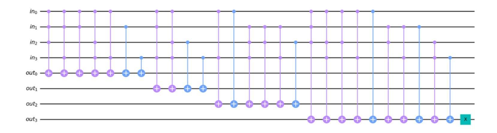

**Figure 14:** Quantum oracle of the ANF of S-box 3 of Set 5

of changing. This is the lowest probability that a single bit had of changing throughout all the tests performed on ALG 2, ALG 3 Double Swap, and ALG 3 Single Swap. The individual bits that had the highest chance of changing are not of concern, as across all 49 different algorithms analyzed the highest chance any single bit had of changing was only 51.28% (specifically bit *b*<sup>1</sup> of ALG 2 when using Set 7).

S-box 2 of Set 7 performed the worst in this test, which is not surprising as it was a randomly generated S-box. Furthermore, this S-box had the lowest quantum cost out of all 28 4x4 S-boxes analyzed, with it only needing 20 quantum gates for a quantum circuit of its ANF.

{27}------------------------------------------------

<span id="page-27-0"></span>**Table 20:** The best and worst performing algorithms across Sets 5 through 7, both of which are from Set 6

|                    | ALG 2 |        |       | Double Swap |
|--------------------|-------|--------|-------|-------------|
|                    | P-val | Passed | P-val | Passed      |
| Frequency          | 0.054 | 100%   | 0.378 | 96.66%      |
| Block Frequency    | 0.672 | 100%   | 0     | 100%        |
| Sums 1             | 0.031 | 100%   | 0.437 | 95.00%      |
| Sums 2             | 0.007 | 96.66% | 0.135 | 95.00%      |
| Runs               | 0.706 | 100%   | 0.005 | 93.33%      |
| Longest Run        | 0.049 | 98.33% | 0.672 | 98.33%      |
| Rank               | 0.082 | 100%   | 0     | 25.00%      |
| FFT                | 0.122 | 100%   | 0     | 0.00%       |
| Non-Overlapping    | 0.271 | 99.21% | 0.522 | 98.79%      |
| Overlapping        | 0.054 | 100%   | 0.637 | 100%        |
| Universal          | 0.213 | —      | 0.076 | —           |
| Entropy            | 0     | 96.66% | 0.091 | 98.33%      |
| Excursions         | —     | 100%   | —     | 100%        |
| Excursion Variants | —     | 100%   | —     | 93.05%      |
| Serial 1           | 0.074 | 100%   | 0.568 | 95.00%      |
| Serial 2           | 0.233 | 100%   | 0.932 | 96.66%      |
| Linear Complexity  | 0.276 | 98.33% | 0.932 | 98.33%      |
| Average Pass Rate  |       | 99.0%  |       | 86.0%       |
| 100% Pass Rate     |       | 11     |       | 3           |

<span id="page-27-1"></span>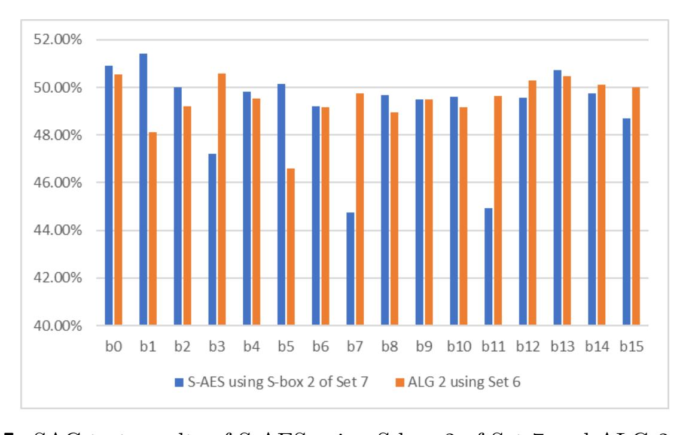

**Figure 15:** SAC test results of S-AES using S-box 2 of Set 7 and ALG 2 using Set 6

# **12 Overall Observations and the Correlation Between Quantum and Classical Security**

Table [22](#page-28-1) lists the range of average pass rates amongst the different implementations of S-AES, ALG 2, ALG 3 Double Swap, and ALG 3 Single Swap. Based on these results, it is clear that ALG 2 performed better than any of the other algorithms tested.

The most quantum secure 4x4 S-box found (S-box 3 of Set 1, or 946C753AE8FBD012) only had an average pass rate of 94%. The 4x4 S-box that produced the highest average pass rate, S-box 4 of Set 4, or 18BDA673CF49205E, was also the 4x4 S-box that had the

{28}------------------------------------------------

<span id="page-28-0"></span>

|                      | Table 21: Statistical analysis results of an implementation of S-AES using S-box 3 of Set |
|----------------------|-------------------------------------------------------------------------------------------|
| 5 (D14A58BF792C630E) |                                                                                           |

|                    | P-val | Passed |
|--------------------|-------|--------|
| Frequency          | 0.378 | 100%   |
| Block Frequency    | 0.602 | 100%   |
| Sums 1             | 0.233 | 100%   |
| Sums 2             | 0.637 | 100%   |
| Runs               | 0.672 | 100%   |
| Longest Run        | 0.233 | 100%   |
| Rank               | 0.706 | 100%   |
| FFT                | 0     | 30.00% |
| Non-Overlapping    | 0.314 | 99.14% |
| Overlapping        | 0.932 | 100%   |
| Universal          | 0.338 | —      |
| Entropy            | 0.035 | 100%   |
| Excursions         | —     | 100%   |
| Excursion Variants | —     | 100%   |
| Serial 1           | 0.469 | 100%   |
| Serial 2           | 0.407 | 100%   |
| Linear Complexity  | 0.672 | 100%   |
| Average Pass Rate  |       | 96.0%  |
| 100% Pass Rate     |       | 14     |

highest FFT pass rate of 80%. This is abnormally high, as the average FFT pass rate of S-AES was only 25.35%. S-box 3 of Set 5, or D14A58BF792C630E, had the highest number of P-values with a 100% pass rate. As such, these two 4x4 S-boxes were some of the most secure 4x4 S-boxes analyzed. This is even though they only required 27 to 31 gates to model their ANF. The 4x4 S-box that required the most quantum gates to model its ANF, S-box 3 of Set 1 (or 946C753AE8FBD012) only had an average pass rate of 94%.

<span id="page-28-1"></span>**Table 22:** Range of average pass rates for each implementation of each algorithm tested

| Algorithm         | Range of Average Pass Rates |
|-------------------|-----------------------------|
| S-AES             | 93 – 97%                    |
| ALG 2             | 98 – 99%                    |
| ALG 3 Single Swap | 94 – 97%                    |
| ALG 3 Double Swap | 86 – 89%                    |

The most quantum secure 16x4 S-box, or Set 5, had one of the worst performances when ran through the NIST statistical test suite when implemented in ALG 2. It was the only 16x4 S-box that had an average pass rate of 98%, as all the other 16x4 S-boxes had an average pass rate of 99% when implemented in ALG 2. Furthermore, Set 5 produced the worst results when implemented in ALG 3 Single Swap, but one of the best results when implemented in ALG 3 Double Swap.

This implies a lack of correlation between quantum security and classical security, i.e., better quantum security does not necessarily equate to better classical security. This is further supported by what happened to the Supersingular Isogeny Key Encapsulation (SIKE) algorithm. This was an algorithm that was believed to be quantum secure but was

{29}------------------------------------------------

cracked in about an hour using a nine-year-old Intel Xeon process [\[11\]](#page-81-11).

## **13 Analysis of** *n***-Length S-Boxes**

#### **13.1 Analysis of 2** *<sup>n</sup>***x4 S-Boxes**

To see how increasing the number of 4x4 S-boxes used to construct variably assigned S-boxes impacts the quantum security of an algorithm, S-boxes with the dimensions 2 *<sup>n</sup>*x4 were tested to see how increasing *n* impacted the quantum security of said S-box. Doing so enabled the analysis of S-boxes with dimensions ranging from 4x4 (*n* = 2) to 1024x4 (*n* = 10). Each S-box required *n* − 2 bits to determine which 4x4 S-box to use. Figure [16](#page-29-0) depicts the average number of gates needed to model each 2 *<sup>n</sup>*x4 S-box and Figure [17](#page-29-1) depicts the number of 4x4 S-boxes are needed to construct each 2 *<sup>n</sup>*x4 S-box.

<span id="page-29-0"></span>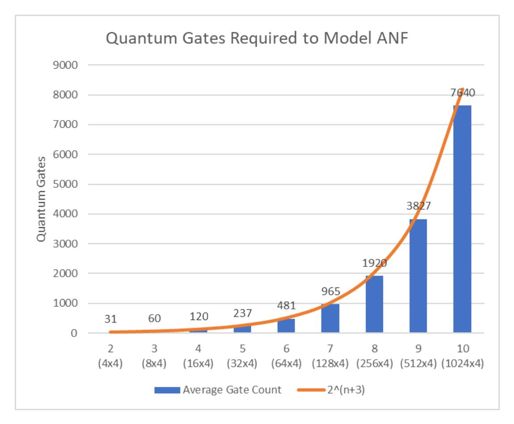

**Figure 16:** Number of gates needed to model the ANF of a 2 *<sup>n</sup>*x4 S-box

<span id="page-29-1"></span>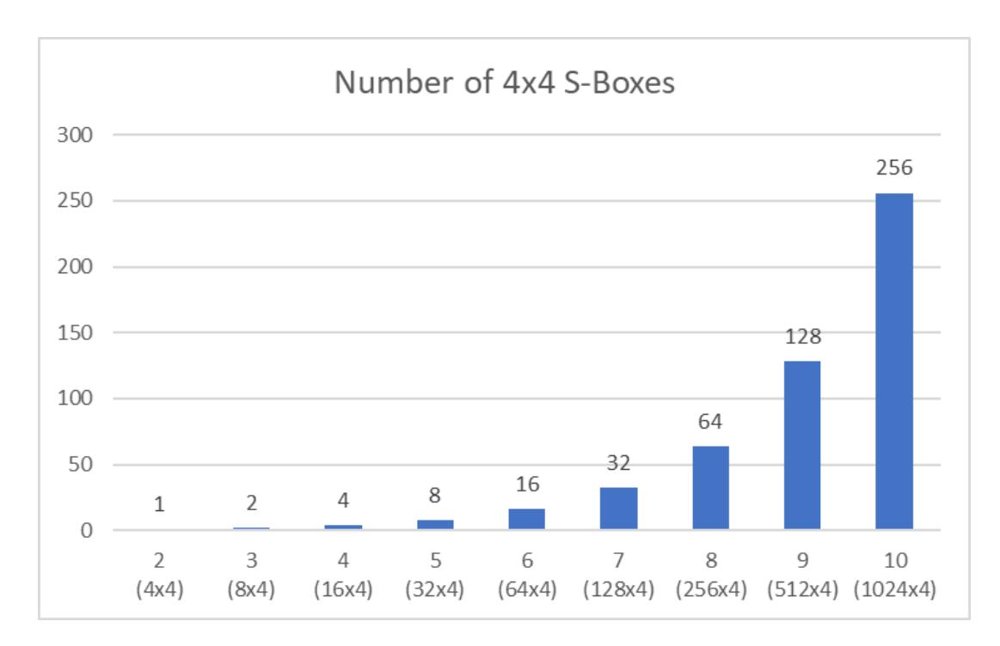

**Figure 17:** Number of 4x4 S-boxes required for a 2 *<sup>n</sup>*x4 S-box

{30}------------------------------------------------

As *n* increased, both the number of S-boxes and the number of gates required increased at an exponential rate, while the number of additional bits needed increased at a linear rate. The average number of necessary gates increased at a rate of approximately 2 *n*+3 , while the number of necessary S-boxes increased at a rate of 2 *n*−2 .

A regular 4x4 S-box maps a single input to one of 16 (*N*) values. As such, a classical device will need to perform an average of 8, or *N/*2, searches each time it runs something through an S-box during the encryption or decryption process. The value of *N* in a variably assigned S-box is equal to 2 *<sup>n</sup>*+2. Therefore, the average number of searches a classical device will need to make when performing said S-box will be 2 *n*+1 .

#### **13.2 Analysis of 2** *<sup>n</sup>***x8 S-Boxes**

AES uses an 8x8 S-box. As such, this test was repeated on 2 *<sup>n</sup>*x8 S-boxes. This was performed on 3 randomly generated S-boxes. The results of doing so are depicted in Figure [18.](#page-30-0) Due to computational costs, only 3 different values of *n* could be analyzed. Similar to 2 *<sup>n</sup>*x4 S-boxes, the number of gates required to model the ANF of an 2 *<sup>n</sup>*x8 S-box also increased at an exponential rate. This rate of increase was approximately equal to 2 *n*+7 .

<span id="page-30-0"></span>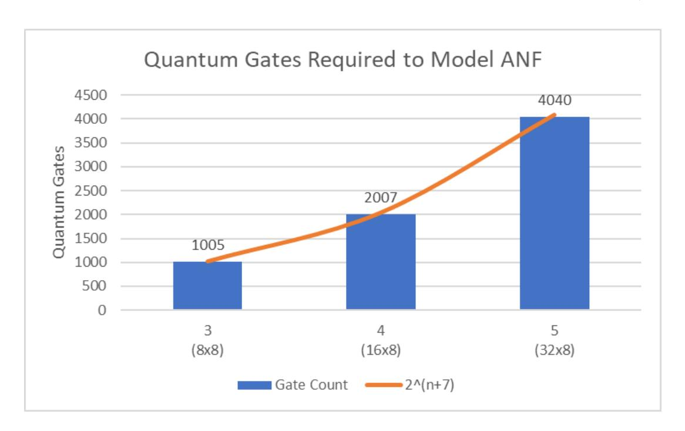

**Figure 18:** Number of gates needed to model the ANF of 2 *<sup>n</sup>*x8 S-boxes

#### **13.2.1 AES S-Box Implications**

The ANF of AES' S-box is depicted in Appendix [F,](#page-78-0) and the necessary gates required to model said S-box's ANF in a quantum environment is depicted in Table [23.](#page-31-0) Based on this, the S-box that AES uses requires slightly less than 1024 gates, which is the expected average number of gates necessary to model an 8x8 S-box. This implies that there is a more quantum secure 8x8 S-box that AES could use.

## **14 Conclusion**

Throughout this paper, an alteration to S-AES was tested that provided better classical and better quantum security. This algorithm, ALG 2, used a 16x4 S-box instead of a 4x4 S-box, using bits in the key to determine which S-box to use. While ALG 2 provided better classical and quantum security, quantum security does not necessarily result in classical security. This was demonstrated by how the most quantum secure 4x4 S-box (946C753AE8FBD012), as well as the most quantum secure 16x4 S-boxes tended to result in comparatively poor performances when analyzed with the NIST statistical test suite. The

{31}------------------------------------------------

<span id="page-31-0"></span>**Table 23:** MCX gates needed to model the ANF of AES' S-box

| MCX Controls | Amount |
|--------------|--------|
| 0            | 4      |
| 1            | 35     |
| 2            | 97     |
| 3            | 245    |
| 4            | 268    |
| 5            | 236    |
| 6            | 107    |
| 7            | 25     |
| Total Gates  | 1017   |
|              |        |

two S-boxes that displayed the best classical security were the S-boxes 18BDA673CF49205E and D14A58BF792C630E. These S-boxes required 31 and 27 gates respectively to model their ANF in a quantum environment. Both values are less than the expected average of 32 gates needed to model a 4x4 S-box.

When trying to optimize the quantum security of an S-box, it is important to select the S-box whose ANF requires the most XOR operations. Doing so will maximize the cost necessary to run Grover's algorithm on said S-box. This suggests that an S-box that uses the prime polynomial *x* <sup>4</sup> + *x* <sup>3</sup> + *x* <sup>2</sup> + *x* + 1 (specifically the S-box 946C753AE8FBD012) is more quantum secure than the prime polynomial that S-AES currently uses (*x* <sup>4</sup> + *x* + 1). This is because an ANF implementation of said S-box requires 41 quantum gates, whereas an ANF implementation of the S-box that S-AES uses only requires 35 quantum gates. While this is only a minor increase in security, it could be very beneficial in protecting ephemeral data with a short lifespan. This is especially true of lightweight cryptography, wherein security is compromised to allow devices with limited resources to provide partial protection to data [\[2\]](#page-81-12).

It was also demonstrated that the number of gates needed to model the ANF of variably assigned S-boxes increases at an exponential rate, as does the number of searches that need to be performed during the encryption and decryption process. Specifically, the rate of increase in the number of required quantum gates to model a 2 *<sup>n</sup>*x4 S-box increases at a rate approximately equal to 2 *<sup>n</sup>*+3 while the number of required quantum gates to model a 2 *<sup>n</sup>*x8 S-box increases at a rate approximately equal to 2 *<sup>n</sup>*+7. This implies that AES could use a more quantum secure S-box, as the S-box that it currently uses only requires 1017 gates to model instead of the expected 1024 gates. However, the methods used to construct the quantum circuits for the S-boxes analyzed throughout this paper could be greatly improved. Tools such as LIGHTER-R can generate quantum circuits of S-boxes that do not require additional qubits and use fewer gates. It does this by generating a reversible ANF [\[6\]](#page-81-13). As such, this expected rate of growth in quantum cost could probably be significantly reduced.

When designing these larger S-boxes, it is important to analyze the ANF of the Sbox as a whole instead of the ANF of each individual 4x4 S-box composing said larger S-box. Furthermore, reducing the collisions between an S-box and the plaintext or amongst the other S-boxes in a 16x4 S-box does not increase the quantum security of said S-box. The most quantum secure 16x4 S-box was found to be the randomly generated Sbox CB91D538E7A20F64A217C6534D8EBF09D14A58BF792C630E58B214C790E6DFA3, requiring a total of 150 quantum gates to model. Since 16x4 S-boxes have an *n* value of 4, they are expected to require an average of 128 quantum gates to model in a quantum environment. As such, this randomly generated 16x4 S-box is in the upper bounds of the

{32}------------------------------------------------

possible 16x4 S-boxes. Despite this, there could be an even more secure 16x4 S-box, as this S-box was found from a small sample size of only 800 randomly generated 16x4 S-boxes.

## **15 Further Work**

#### **15.1 Improved Quantum Circuit Construction**

While the ANF of an S-box was used to generate their respective quantum circuit, there are alternative and more efficient methods of doing so. Tools such as LIGHTER use a graph-based meet-in-the-middle approach to calculate the smallest implementation needed to implement an S-box. It then computes good implementations of the smaller functions to reduce the time and memory requirements of said implementation [\[7\]](#page-81-3). This approach has been built on through LIGHTER-R, which uses this approach to generate reversible ANF representations that do not need extra qubits and require fewer gates [\[6\]](#page-81-13). The S-boxes assessed throughout this paper should be analyzed to see if the strengths and weaknesses discovered still hold true when using this alternate approach. This alternate approach should also be analyzed to see how it impacts the rate of growth of the number of required gates needed to model 2 *<sup>n</sup>*x4 and 2 *<sup>n</sup>*x8 S-boxes in a quantum environment.

### **15.2 Improved & Alternate ALG 2 Implementations**

It might be possible to further increase the quantum security of ALG 2 by using the 16x4 S-box in the key expansion algorithm. Alternatively, instead of just using the first 4x4 S-box in ALG 2's 16x4 S-box, one could use the most expensive 4x4 S-box that composes said S-box. Doing so should increase its quantum security without increasing the cost associated with performing encryption and decryption. Finally, an implementation of ALG 2 on AES should be tested. Since S-AES and AES share the same structure, this should require minimal alterations to ALG 2.

#### **15.3 Analysis of Algorithms in a Quantum Environment**

The full S-AES, ALG 2, ALG 3 Double Swap, and ALG 3 Single Swap algorithms could not be implemented in a quantum environment due to computational and time constraints. Further analysis of the ALG 3 implementations is probably unnecessary as ALG 2 outperformed said algorithm and ALG 3 provided lackluster classical security. However, analyzing S-AES and ALG 2 in a quantum environment still holds merit and should be further investigated.

## <span id="page-32-0"></span>**A ANF of Each Set and Their Corresponding 4x4 S-Boxes**

#### **Algebraic Normal Form of 4x4 S-Boxes**

#### **Set 1 S-Box 1 (94ABD1856203CEF7)**

```
y0 = x0x1x2 ⊕ x0x1x3 ⊕ x0x2x3 ⊕ x0x2 ⊕ x0x3 ⊕ x0 ⊕ x1x2x3 ⊕ x1x3 ⊕ x1 ⊕ x3 ⊕ 1
y1 = x0x1x3 ⊕ x0x2x3 ⊕ x1x2x3 ⊕ x1x2 ⊕ x1 ⊕ x2x3 ⊕ x3
y2 = x0x1x2 ⊕ x0x1 ⊕ x0x2x3 ⊕ x0 ⊕ x1x2 ⊕ x1x3 ⊕ x2x3 ⊕ x2 ⊕ x3
y3 = x0x1x2 ⊕ x0x1x3 ⊕ x0x1 ⊕ x0x3 ⊕ x0 ⊕ x2x3 ⊕ x3 ⊕ 1
```

#### **Set 1 S-Box 2 (940756EBFD1C2A83)**

```
y0 = x0x1x3 ⊕ x0x3 ⊕ x0 ⊕ x1x3 ⊕ x1 ⊕ x2x3 ⊕ 1
y1 = x0x1 ⊕ x0x2 ⊕ x0x3 ⊕ x1x2x3 ⊕ x1x2 ⊕ x1x3 ⊕ x3
```

{33}------------------------------------------------

```
y2 = x0x1x2 ⊕ x0x1x3 ⊕ x0x2x3 ⊕ x0x2 ⊕ x0x3 ⊕ x0 ⊕ x1x2x3 ⊕ x1x3 ⊕ x2 ⊕ x3
y3 = x0x1x2 ⊕ x0x1 ⊕ x0x2 ⊕ x0x3 ⊕ x0 ⊕ x1 ⊕ x2 ⊕ 1
```

#### **Set 1 S-Box 3 (946C753AE8FBD012)**

```
y0 = x0x1x3 ⊕ x0x1 ⊕ x0x2 ⊕ x0x3 ⊕ x0 ⊕ x1x2 ⊕ x1 ⊕ x2x3 ⊕ x3 ⊕ 1
y1 = x0x1 ⊕ x0x2 ⊕ x0x3 ⊕ x1x2x3 ⊕ x1x2 ⊕ x1x3 ⊕ x1 ⊕ x2 ⊕ x3
y2 = x0x1x2 ⊕ x0x1x3 ⊕ x0x1 ⊕ x0x2x3 ⊕ x0x2 ⊕ x0 ⊕ x1x2x3 ⊕ x1x3 ⊕ x1 ⊕ x2x3 ⊕ x2 ⊕ x3
y3 = x0x1x2 ⊕ x0x2 ⊕ x0x3 ⊕ x0 ⊕ x1x2 ⊕ x1x3 ⊕ x1 ⊕ x2x3 ⊕ x2 ⊕ 1
```

#### **Set 1 S-Box 4 (9E518BDA67F3C402)**

```
y0 = x0x1x2 ⊕ x0x1 ⊕ x0x2x3 ⊕ x0 ⊕ x1x2 ⊕ x1x3 ⊕ x2x3 ⊕ x2 ⊕ x3 ⊕ 1
y1 = x0x1x2 ⊕ x0x1x3 ⊕ x0x1 ⊕ x0x3 ⊕ x0 ⊕ x2x3 ⊕ x3
y2 = x0x1x2 ⊕ x0x1x3 ⊕ x0x2x3 ⊕ x0x2 ⊕ x0x3 ⊕ x0 ⊕ x1x2x3 ⊕ x1x3 ⊕ x1 ⊕ x3
y3 = x0x1x3 ⊕ x0x2x3 ⊕ x1x2x3 ⊕ x1x2 ⊕ x1 ⊕ x2x3 ⊕ x3 ⊕ 1
```

#### **Set 2 S-Box 1 (94ABD1856203CEF7)**

```
y0 = x0x1x2 ⊕ x0x1x3 ⊕ x0x2x3 ⊕ x0x2 ⊕ x0x3 ⊕ x0 ⊕ x1x2x3 ⊕ x1x3 ⊕ x1 ⊕ x3 ⊕ 1
y1 = x0x1x3 ⊕ x0x2x3 ⊕ x1x2x3 ⊕ x1x2 ⊕ x1 ⊕ x2x3 ⊕ x3
y2 = x0x1x2 ⊕ x0x1 ⊕ x0x2x3 ⊕ x0 ⊕ x1x2 ⊕ x1x3 ⊕ x2x3 ⊕ x2 ⊕ x3
y3 = x0x1x2 ⊕ x0x1x3 ⊕ x0x1 ⊕ x0x3 ⊕ x0 ⊕ x2x3 ⊕ x3 ⊕ 1
```

#### **Set 2 S-Box 2 (940756EBFD1C2A83)**

```
y0 = x0x1x3 ⊕ x0x3 ⊕ x0 ⊕ x1x3 ⊕ x1 ⊕ x2x3 ⊕ 1
y1 = x0x1 ⊕ x0x2 ⊕ x0x3 ⊕ x1x2x3 ⊕ x1x2 ⊕ x1x3 ⊕ x3
y2 = x0x1x2 ⊕ x0x1x3 ⊕ x0x2x3 ⊕ x0x2 ⊕ x0x3 ⊕ x0 ⊕ x1x2x3 ⊕ x1x3 ⊕ x2 ⊕ x3
y3 = x0x1x2 ⊕ x0x1 ⊕ x0x2 ⊕ x0x3 ⊕ x0 ⊕ x1 ⊕ x2 ⊕ 1
```

#### **Set 2 S-Box 3 (946C753AE8FBD012)**

```
y0 = x0x1x3 ⊕ x0x1 ⊕ x0x2 ⊕ x0x3 ⊕ x0 ⊕ x1x2 ⊕ x1 ⊕ x2x3 ⊕ x3 ⊕ 1
y1 = x0x1 ⊕ x0x2 ⊕ x0x3 ⊕ x1x2x3 ⊕ x1x2 ⊕ x1x3 ⊕ x1 ⊕ x2 ⊕ x3
y2 = x0x1x2 ⊕ x0x1x3 ⊕ x0x1 ⊕ x0x2x3 ⊕ x0x2 ⊕ x0 ⊕ x1x2x3 ⊕ x1x3 ⊕ x1 ⊕ x2x3 ⊕ x2 ⊕ x3
y3 = x0x1x2 ⊕ x0x2 ⊕ x0x3 ⊕ x0 ⊕ x1x2 ⊕ x1x3 ⊕ x1 ⊕ x2x3 ⊕ x2 ⊕ 1
```

#### **Set 2 S-Box 4 (9E518BDA67F3C402)**

```
y0 = x0x1x2 ⊕ x0x1 ⊕ x0x2x3 ⊕ x0 ⊕ x1x2 ⊕ x1x3 ⊕ x2x3 ⊕ x2 ⊕ x3 ⊕ 1
y1 = x0x1x2 ⊕ x0x1x3 ⊕ x0x1 ⊕ x0x3 ⊕ x0 ⊕ x2x3 ⊕ x3
y2 = x0x1x2 ⊕ x0x1x3 ⊕ x0x2x3 ⊕ x0x2 ⊕ x0x3 ⊕ x0 ⊕ x1x2x3 ⊕ x1x3 ⊕ x1 ⊕ x3
y3 = x0x1x3 ⊕ x0x2x3 ⊕ x1x2x3 ⊕ x1x2 ⊕ x1 ⊕ x2x3 ⊕ x3 ⊕ 1
```

#### **Set 3 S-Box 1 (94ABD1856203ECF7)**

```
y0 = x0x1x2 ⊕ x0x1x3 ⊕ x0x2x3 ⊕ x0x2 ⊕ x0x3 ⊕ x0 ⊕ x1x2x3 ⊕ x1x3 ⊕ x1 ⊕ x3 ⊕ 1
y1 = x0x1x3 ⊕ x0x2x3 ⊕ x1x2 ⊕ x1 ⊕ x3
y2 = x0x1x2 ⊕ x0x1 ⊕ x0x2x3 ⊕ x0 ⊕ x1x2 ⊕ x1x3 ⊕ x2x3 ⊕ x2 ⊕ x3
y3 = x0x1x2 ⊕ x0x1x3 ⊕ x0x1 ⊕ x0x3 ⊕ x0 ⊕ x2x3 ⊕ x3 ⊕ 1
```

{34}------------------------------------------------

#### **Set 3 S-Box 2 (940756EBFD1C2A83)**

```
y0 = x0x1x3 ⊕ x0x3 ⊕ x0 ⊕ x1x3 ⊕ x1 ⊕ x2x3 ⊕ 1
y1 = x0x1 ⊕ x0x2 ⊕ x0x3 ⊕ x1x2x3 ⊕ x1x2 ⊕ x1x3 ⊕ x3
y2 = x0x1x2 ⊕ x0x1x3 ⊕ x0x2x3 ⊕ x0x2 ⊕ x0x3 ⊕ x0 ⊕ x1x2x3 ⊕ x1x3 ⊕ x2 ⊕ x3
y3 = x0x1x2 ⊕ x0x1 ⊕ x0x2 ⊕ x0x3 ⊕ x0 ⊕ x1 ⊕ x2 ⊕ 1
```

#### **Set 3 S-Box 3 (946C735AE8FDB012)**

```
y0 = x0x1x3 ⊕ x0x1 ⊕ x0x2 ⊕ x0x3 ⊕ x0 ⊕ x1x2 ⊕ x1 ⊕ x2x3 ⊕ x3 ⊕ 1
y1 = x0x1x3 ⊕ x0x1 ⊕ x0x3 ⊕ x1x2x3 ⊕ x1x3 ⊕ x1 ⊕ x2x3 ⊕ x2 ⊕ x3
y2 = x0x1x2 ⊕ x0x1 ⊕ x0x2x3 ⊕ x0 ⊕ x1x2x3 ⊕ x1x2 ⊕ x1x3 ⊕ x1 ⊕ x2 ⊕ x3
y3 = x0x1x2 ⊕ x0x2 ⊕ x0x3 ⊕ x0 ⊕ x1x2 ⊕ x1x3 ⊕ x1 ⊕ x2x3 ⊕ x2 ⊕ 1
```

#### **Set 3 S-Box 4 (9E518BDA67F34C02)**

```
y0 = x0x1x2 ⊕ x0x1 ⊕ x0x2x3 ⊕ x0 ⊕ x1x2 ⊕ x1x3 ⊕ x2x3 ⊕ x2 ⊕ x3 ⊕ 1
y1 = x0x1x2 ⊕ x0x1x3 ⊕ x0x1 ⊕ x0x3 ⊕ x0 ⊕ x2x3 ⊕ x3
y2 = x0x1x2 ⊕ x0x1x3 ⊕ x0x2x3 ⊕ x0x2 ⊕ x0x3 ⊕ x0 ⊕ x1x2x3 ⊕ x1x3 ⊕ x1 ⊕ x3
y3 = x0x1x3 ⊕ x0x2x3 ⊕ x1x2 ⊕ x1 ⊕ x3 ⊕ 1
```

#### **Set 4 S-Box 1 (94ABD1856203ECF7)**

```
y0 = x0x1x2 ⊕ x0x1x3 ⊕ x0x2x3 ⊕ x0x2 ⊕ x0x3 ⊕ x0 ⊕ x1x2x3 ⊕ x1x3 ⊕ x1 ⊕ x3 ⊕ 1
y1 = x0x1x3 ⊕ x0x2x3 ⊕ x1x2 ⊕ x1 ⊕ x3
y2 = x0x1x2 ⊕ x0x1 ⊕ x0x2x3 ⊕ x0 ⊕ x1x2 ⊕ x1x3 ⊕ x2x3 ⊕ x2 ⊕ x3
y3 = x0x1x2 ⊕ x0x1x3 ⊕ x0x1 ⊕ x0x3 ⊕ x0 ⊕ x2x3 ⊕ x3 ⊕ 1
```

#### **Set 4 S-Box 2 (40756EBFD1C2A839)**

```
y0 = x1 ⊕ x2x3 ⊕ x3
y1 = x0x1x2 ⊕ x0x1 ⊕ x0x2x3 ⊕ x1x2x3 ⊕ x1x2 ⊕ x1x3 ⊕ x1 ⊕ x2
y2 = x0x1x3 ⊕ x0x1 ⊕ x0x2 ⊕ x0 ⊕ x1x2x3 ⊕ x1x2 ⊕ x2x3 ⊕ 1
y3 = x0x1x2 ⊕ x0x2 ⊕ x0x3 ⊕ x1x2 ⊕ x3
```

#### **Set 4 S-Box 3 (6C573AE8FBD01294)**

```
y0 = x0x1x2 ⊕ x0x1x3 ⊕ x0x2 ⊕ x1x3 ⊕ x1 ⊕ x2x3 ⊕ x2 ⊕ x3
y1 = x0x1x2 ⊕ x0x2 ⊕ x0x3 ⊕ x0 ⊕ x1x2 ⊕ x1 ⊕ x2x3 ⊕ 1
y2 = x0x1x2 ⊕ x0x2x3 ⊕ x0x3 ⊕ x1x2x3 ⊕ x1x2 ⊕ x2 ⊕ 1
y3 = x0x1 ⊕ x0x3 ⊕ x0 ⊕ x1x2 ⊕ x2x3 ⊕ x3
```

## **Set 4 S-Box 4 (18BDA673CF49205E)**

```
y0 = x0x1x2 ⊕ x0x1x3 ⊕ x0x1 ⊕ x0x2 ⊕ x0 ⊕ x1x2 ⊕ x2x3 ⊕ x2 ⊕ x3 ⊕ 1
y1 = x0x1x2 ⊕ x0x1 ⊕ x0x3 ⊕ x1x2 ⊕ x1x3 ⊕ x1 ⊕ x2
y2 = x0x1x2 ⊕ x0x1 ⊕ x0x2x3 ⊕ x0x2 ⊕ x1x2 ⊕ x2x3 ⊕ x3
y3 = x0x1 ⊕ x0x3 ⊕ x0 ⊕ x1x2x3 ⊕ x1 ⊕ x2 ⊕ x3
```

#### **Set 5 S-Box 1 (CB91D538E7A20F64)**

```
y0 = x0x1 ⊕ x0x2x3 ⊕ x0x2 ⊕ x0 ⊕ x1x2x3 ⊕ x1x2 ⊕ x1x3 ⊕ x1 ⊕ x2x3 ⊕ x2
y1 = x0x1x3 ⊕ x0x1 ⊕ x0x2 ⊕ x0x3 ⊕ x0 ⊕ x1x2 ⊕ x2x3 ⊕ x3
y2 = x0x1x2 ⊕ x0x1x3 ⊕ x0x1 ⊕ x0x2 ⊕ x0x3 ⊕ x0 ⊕ x1 ⊕ x2x3 ⊕ 1
y3 = x0x1x2 ⊕ x0x1x3 ⊕ x0x1 ⊕ x0x2x3 ⊕ x0x2 ⊕ x0x3 ⊕ x1x2x3 ⊕ x1x2 ⊕ x2x3 ⊕ 1
```

{35}------------------------------------------------

#### **Set 5 S-Box 2 (A217C6534D8EBF09)**

```
y0 = x0x1x3 ⊕ x0x2x3 ⊕ x0x3 ⊕ x1x2x3 ⊕ x1x3 ⊕ x1 ⊕ x2x3
y1 = x0x1x2 ⊕ x0x1 ⊕ x0x2x3 ⊕ x0x2 ⊕ x1x2 ⊕ x1x3 ⊕ x1 ⊕ x2 ⊕ x3 ⊕ 1
y2 = x0x1 ⊕ x0x2x3 ⊕ x1x2x3 ⊕ x1x3 ⊕ x2 ⊕ x3
y3 = x0x1 ⊕ x0x2x3 ⊕ x0 ⊕ x1 ⊕ x2x3 ⊕ x3 ⊕ 1
```

#### **Set 5 S-Box 3 (D14A58BF792C630E)**

```
y0 = x0x1x2 ⊕ x0x2 ⊕ x1x2 ⊕ x1 ⊕ x2x3 ⊕ 1
y1 = x0x1x2 ⊕ x0x1x3 ⊕ x0x1 ⊕ x0x2x3 ⊕ x0x3 ⊕ x1x2 ⊕ x3
y2 = x0 ⊕ x1x2x3 ⊕ x1x2 ⊕ x1x3 ⊕ 1
y3 = x0x1x2 ⊕ x0x2x3 ⊕ x0 ⊕ x1x3 ⊕ x1 ⊕ x2x3 ⊕ x2 ⊕ x3 ⊕ 1
```

#### **Set 5 S-Box 4 (58B214C790E6DFA3)**

```
y0 = x0x1x3 ⊕ x0x2x3 ⊕ x0 ⊕ x1x2x3 ⊕ x1x2 ⊕ x1x3 ⊕ 1
y1 = x0x1x2 ⊕ x0x2x3 ⊕ x1x2x3 ⊕ x1x2 ⊕ x1
y2 = x0x1x3 ⊕ x0x1 ⊕ x0x3 ⊕ x0 ⊕ x1 ⊕ x2 ⊕ x3 ⊕ 1
y3 = x0x1x2 ⊕ x0x2 ⊕ x0 ⊕ x1x3 ⊕ x1 ⊕ x3
```

#### **Set 6 S-Box 1 (70812A3B496DCEF5)**

```
y0 = x0x2 ⊕ x0 ⊕ x1x2x3 ⊕ x1x3 ⊕ x1 ⊕ x2x3 ⊕ x2 ⊕ x3 ⊕ 1
y1 = x0x1x2 ⊕ x0x1 ⊕ x0x2 ⊕ x0x3 ⊕ x0 ⊕ x1x2x3 ⊕ x1x2 ⊕ x1 ⊕ x3 ⊕ 1
y2 = x0x1x2 ⊕ x0x1 ⊕ x0x2 ⊕ x0 ⊕ x1x2x3 ⊕ x1x2 ⊕ x1x3 ⊕ x1 ⊕ x2x3 ⊕ x2 ⊕ 1
y3 = x0x1x2 ⊕ x0x1x3 ⊕ x0x1 ⊕ x0x2 ⊕ x0x3 ⊕ x1x2x3 ⊕ x1x2 ⊕ x1x3 ⊕ x1 ⊕ x2x3
```

#### **Set 6 S-Box 2 (89C62357BA4ED01F)**

```
y0 = x0x1 ⊕ x0 ⊕ x1x2 ⊕ x1x3 ⊕ x3
y1 = x0x1 ⊕ x1x2 ⊕ x1x3 ⊕ x2 ⊕ x3
y2 = x0x2x3 ⊕ x1 ⊕ x2x3
y3 = x0x1x2 ⊕ x0x1 ⊕ x0x2x3 ⊕ x1x3 ⊕ x2x3 ⊕ x2 ⊕ 1
```

#### **Set 6 S-Box 3 (841CEAB73265DF09)**

```
y0 = x0x1x2 ⊕ x0x1x3 ⊕ x0x1 ⊕ x0x2x3 ⊕ x0x3 ⊕ x1 ⊕ x3
y1 = x0x1x3 ⊕ x0x2x3 ⊕ x2 ⊕ x3
y2 = x0x3 ⊕ x0 ⊕ x1x2x3 ⊕ x1x2 ⊕ x1x3 ⊕ x2
y3 = x0x1x2 ⊕ x0x2x3 ⊕ x0x2 ⊕ x0x3 ⊕ x0 ⊕ x1x2 ⊕ x1x3 ⊕ x1 ⊕ x2x3 ⊕ x3 ⊕ 1
```

#### **Set 6 S-Box 4 (0386F4127B95ECAD)**

```
y0 = x0x1x2 ⊕ x0x1x3 ⊕ x0x1 ⊕ x0x3 ⊕ x0 ⊕ x2 ⊕ x3
y1 = x0x2x3 ⊕ x0x3 ⊕ x0 ⊕ x1x2 ⊕ x1x3 ⊕ x2x3 ⊕ x2 ⊕ x3
y2 = x0x1x2 ⊕ x0x1x3 ⊕ x0x1 ⊕ x0x2x3 ⊕ x0x3 ⊕ x1x2x3 ⊕ x1x2 ⊕ x1x3 ⊕ x2x3 ⊕ x2 ⊕ x3
y3 = x0x1x3 ⊕ x0x1 ⊕ x0x2 ⊕ x0x3 ⊕ x1x2x3 ⊕ x1 ⊕ x2
```

#### **Set 7 S-Box 1 (6A543D18EC27F09B)**

```
y0 = x0x1 ⊕ x0x2x3 ⊕ x1x2x3 ⊕ x1x2 ⊕ x1x3 ⊕ x1 ⊕ x2
y1 = x0x1x2 ⊕ x0x1x3 ⊕ x0x2x3 ⊕ x0x2 ⊕ x0x3 ⊕ x1x2x3 ⊕ x1x3 ⊕ x1 ⊕ 1
y2 = x0x1 ⊕ x0x2x3 ⊕ x0x3 ⊕ x0 ⊕ x1x3 ⊕ x2x3 ⊕ x2 ⊕ 1
y3 = x0x1x2 ⊕ x0x1x3 ⊕ x0x1 ⊕ x0x2x3 ⊕ x0x3 ⊕ x0 ⊕ x1x2x3 ⊕ x1x3 ⊕ x3
```

{36}------------------------------------------------

#### **Set 7 S-Box 2 (9ADC7F3E502816B4)**

```
y0 = x0x1x2 ⊕ x0x1x3 ⊕ x0x2x3 ⊕ x0x2 ⊕ x0 ⊕ x1x2x3 ⊕ x1x3 ⊕ 1
y1 = x0x1x2 ⊕ x0x1 ⊕ x0x2 ⊕ x0x3 ⊕ x0 ⊕ x1x3 ⊕ x2x3 ⊕ x2
y2 = x0x1x2 ⊕ x0x1x3 ⊕ x0x3 ⊕ x1x2x3 ⊕ x1 ⊕ x2 ⊕ x3
y3 = x0x1x3 ⊕ x0x2x3 ⊕ x0x2 ⊕ x1x2x3 ⊕ x2x3 ⊕ x2 ⊕ x3 ⊕ 1
```

#### **Set 7 S-Box 3 (FC1BE0568A423D79)**

```
y0 = x0x1x3 ⊕ x0x1 ⊕ x0x2x3 ⊕ x0x2 ⊕ x0x3 ⊕ x0 ⊕ x1x2x3 ⊕ x1x2 ⊕ x2 ⊕ x3 ⊕ 1
y1 = x0 ⊕ x1x3 ⊕ x1 ⊕ x2x3 ⊕ x3 ⊕ 1
y2 = x0x1x2 ⊕ x0x1x3 ⊕ x0x2 ⊕ x1x2x3 ⊕ x1x2 ⊕ x1 ⊕ x3 ⊕ 1
y3 = x0x1x3 ⊕ x0x1 ⊕ x0x2 ⊕ x1x2x3 ⊕ x1 ⊕ x2x3 ⊕ 1
```

#### **Set 7 S-Box 4 (309C7BA2D8F4E651)**

```
y0 = x0x2 ⊕ x0 ⊕ x1x2 ⊕ x2x3 ⊕ 1
y1 = x0x1x2 ⊕ x0x1 ⊕ x0x2x3 ⊕ x0x2 ⊕ x0x3 ⊕ x0 ⊕ x1x2x3 ⊕ x1x2 ⊕ x1 ⊕ x2x3 ⊕ x3 ⊕ 1
y2 = x0x1 ⊕ x0x2 ⊕ x0x3 ⊕ x1x2x3 ⊕ x1x2 ⊕ x2x3 ⊕ x2 ⊕ x3
y3 = x0x1x3 ⊕ x0x2 ⊕ x1x2x3 ⊕ x1x3 ⊕ x1 ⊕ x3
```

#### **Algebraic Normal Form of 16x4 S-Boxes**

#### **Set 1**

*y*<sup>0</sup> = *x*0*x*1*x*2*x*<sup>4</sup> ⊕ *x*0*x*1*x*2*x*<sup>5</sup> ⊕ *x*0*x*1*x*<sup>2</sup> ⊕ *x*0*x*1*x*3*x*4*x*<sup>5</sup> ⊕ *x*0*x*1*x*<sup>3</sup> ⊕ *x*0*x*1*x*<sup>5</sup> ⊕ *x*0*x*2*x*3*x*<sup>4</sup> ⊕ *x*0*x*2*x*3*x*<sup>5</sup> ⊕ *x*0*x*2*x*<sup>3</sup> ⊕ *x*0*x*2*x*<sup>4</sup> ⊕ *x*0*x*<sup>2</sup> ⊕ *x*0*x*3*x*4*x*<sup>5</sup> ⊕ *x*0*x*<sup>3</sup> ⊕ *x*<sup>0</sup> ⊕ *x*1*x*2*x*3*x*4*x*<sup>5</sup> ⊕ *x*1*x*2*x*3*x*<sup>4</sup> ⊕ *x*1*x*2*x*3*x*<sup>5</sup> ⊕ *x*1*x*2*x*<sup>3</sup> ⊕ *x*1*x*2*x*<sup>5</sup> ⊕ *x*1*x*3*x*4*x*<sup>5</sup> ⊕ *x*1*x*3*x*<sup>5</sup> ⊕ *x*1*x*<sup>3</sup> ⊕ *x*1*x*4*x*<sup>5</sup> ⊕ *x*<sup>1</sup> ⊕ *x*2*x*3*x*4*x*<sup>5</sup> ⊕ *x*2*x*3*x*<sup>4</sup> ⊕ *x*2*x*3*x*<sup>5</sup> ⊕ *x*2*x*4*x*<sup>5</sup> ⊕ *x*3*x*4*x*<sup>5</sup> ⊕ *x*3*x*<sup>4</sup> ⊕ *x*<sup>3</sup> ⊕ 1

*y*<sup>1</sup> = *x*0*x*1*x*2*x*4*x*<sup>5</sup> ⊕ *x*0*x*1*x*3*x*<sup>4</sup> ⊕ *x*0*x*1*x*3*x*<sup>5</sup> ⊕ *x*0*x*1*x*<sup>3</sup> ⊕ *x*0*x*1*x*4*x*<sup>5</sup> ⊕ *x*0*x*1*x*<sup>4</sup> ⊕ *x*0*x*1*x*<sup>5</sup> ⊕ *x*0*x*2*x*3*x*4*x*<sup>5</sup> ⊕ *x*0*x*2*x*3*x*<sup>4</sup> ⊕ *x*0*x*2*x*3*x*<sup>5</sup> ⊕ *x*0*x*2*x*<sup>3</sup> ⊕ *x*0*x*2*x*<sup>4</sup> ⊕ *x*0*x*2*x*<sup>5</sup> ⊕ *x*0*x*3*x*4*x*<sup>5</sup> ⊕ *x*0*x*3*x*<sup>4</sup> ⊕ *x*0*x*3*x*<sup>5</sup> ⊕ *x*0*x*4*x*<sup>5</sup> ⊕ *x*1*x*2*x*3*x*4*x*<sup>5</sup> ⊕ *x*1*x*2*x*<sup>3</sup> ⊕ *x*1*x*2*x*4*x*<sup>5</sup> ⊕ *x*1*x*<sup>2</sup> ⊕ *x*1*x*3*x*<sup>4</sup> ⊕ *x*1*x*3*x*<sup>5</sup> ⊕ *x*1*x*<sup>4</sup> ⊕ *x*<sup>1</sup> ⊕ *x*2*x*3*x*<sup>4</sup> ⊕ *x*2*x*3*x*<sup>5</sup> ⊕ *x*2*x*<sup>3</sup> ⊕ *x*2*x*4*x*<sup>5</sup> ⊕ *x*2*x*<sup>5</sup> ⊕ *x*<sup>3</sup>

*y*<sup>2</sup> = *x*0*x*1*x*<sup>2</sup> ⊕*x*0*x*1*x*3*x*4*x*<sup>5</sup> ⊕*x*0*x*1*x*3*x*<sup>4</sup> ⊕*x*0*x*1*x*3*x*<sup>5</sup> ⊕*x*0*x*1*x*<sup>4</sup> ⊕*x*0*x*<sup>1</sup> ⊕*x*0*x*2*x*<sup>3</sup> ⊕*x*0*x*2*x*4*x*<sup>5</sup> ⊕ *x*0*x*2*x*4⊕*x*0*x*2*x*5⊕*x*0*x*3*x*4⊕*x*0⊕*x*1*x*2*x*3*x*4*x*5⊕*x*1*x*2*x*3*x*4⊕*x*1*x*2*x*3*x*5⊕*x*1*x*2*x*4*x*5⊕*x*1*x*2*x*4⊕ *x*1*x*2*x*<sup>5</sup> ⊕ *x*1*x*<sup>2</sup> ⊕ *x*1*x*<sup>3</sup> ⊕ *x*1*x*<sup>5</sup> ⊕ *x*2*x*3*x*<sup>4</sup> ⊕ *x*2*x*<sup>3</sup> ⊕ *x*2*x*4*x*<sup>5</sup> ⊕ *x*<sup>2</sup> ⊕ *x*<sup>3</sup>

*y*<sup>3</sup> = *x*0*x*1*x*2*x*4*x*5⊕*x*0*x*1*x*2⊕*x*0*x*1*x*3*x*4⊕*x*0*x*1*x*3*x*5⊕*x*0*x*1*x*3⊕*x*0*x*1*x*5⊕*x*0*x*1⊕*x*0*x*2*x*3*x*4*x*5⊕ *x*0*x*2*x*<sup>4</sup> ⊕ *x*0*x*2*x*<sup>5</sup> ⊕ *x*0*x*3*x*4*x*<sup>5</sup> ⊕ *x*0*x*<sup>3</sup> ⊕ *x*0*x*4*x*<sup>5</sup> ⊕ *x*<sup>0</sup> ⊕ *x*1*x*2*x*3*x*4*x*<sup>5</sup> ⊕ *x*1*x*2*x*<sup>5</sup> ⊕ *x*1*x*3*x*4*x*<sup>5</sup> ⊕ *x*1*x*3*x*5⊕*x*1*x*4*x*5⊕*x*1*x*4⊕*x*1*x*5⊕*x*2*x*3*x*4*x*5⊕*x*2*x*3*x*4⊕*x*2*x*3⊕*x*2*x*4⊕*x*2*x*5⊕*x*3*x*4⊕*x*3*x*5⊕*x*3⊕1

#### **Set 2**

*y*<sup>0</sup> = *x*0*x*1*x*2*x*<sup>4</sup> ⊕ *x*0*x*1*x*2*x*<sup>5</sup> ⊕ *x*0*x*1*x*<sup>2</sup> ⊕ *x*0*x*1*x*3*x*4*x*<sup>5</sup> ⊕ *x*0*x*1*x*<sup>3</sup> ⊕ *x*0*x*1*x*<sup>5</sup> ⊕ *x*0*x*2*x*3*x*<sup>4</sup> ⊕ *x*0*x*2*x*3*x*<sup>5</sup> ⊕ *x*0*x*2*x*<sup>3</sup> ⊕ *x*0*x*2*x*<sup>4</sup> ⊕ *x*0*x*<sup>2</sup> ⊕ *x*0*x*3*x*4*x*<sup>5</sup> ⊕ *x*0*x*<sup>3</sup> ⊕ *x*<sup>0</sup> ⊕ *x*1*x*2*x*3*x*4*x*<sup>5</sup> ⊕ *x*1*x*2*x*3*x*<sup>4</sup> ⊕ *x*1*x*2*x*3*x*<sup>5</sup> ⊕ *x*1*x*2*x*<sup>3</sup> ⊕ *x*1*x*2*x*<sup>5</sup> ⊕ *x*1*x*3*x*4*x*<sup>5</sup> ⊕ *x*1*x*3*x*<sup>5</sup> ⊕ *x*1*x*<sup>3</sup> ⊕ *x*1*x*4*x*<sup>5</sup> ⊕ *x*<sup>1</sup> ⊕ *x*2*x*3*x*4*x*<sup>5</sup> ⊕ *x*2*x*3*x*<sup>4</sup> ⊕ *x*2*x*3*x*<sup>5</sup> ⊕ *x*2*x*4*x*<sup>5</sup> ⊕ *x*3*x*4*x*<sup>5</sup> ⊕ *x*3*x*<sup>4</sup> ⊕ *x*<sup>3</sup> ⊕ 1

*y*<sup>1</sup> = *x*0*x*1*x*2*x*4*x*<sup>5</sup> ⊕ *x*0*x*1*x*3*x*<sup>4</sup> ⊕ *x*0*x*1*x*3*x*<sup>5</sup> ⊕ *x*0*x*1*x*<sup>3</sup> ⊕ *x*0*x*1*x*4*x*<sup>5</sup> ⊕ *x*0*x*1*x*<sup>4</sup> ⊕ *x*0*x*1*x*<sup>5</sup> ⊕ *x*0*x*2*x*3*x*4*x*<sup>5</sup> ⊕ *x*0*x*2*x*3*x*<sup>4</sup> ⊕ *x*0*x*2*x*3*x*<sup>5</sup> ⊕ *x*0*x*2*x*<sup>3</sup> ⊕ *x*0*x*2*x*<sup>4</sup> ⊕ *x*0*x*2*x*<sup>5</sup> ⊕ *x*0*x*3*x*4*x*<sup>5</sup> ⊕ *x*0*x*3*x*<sup>4</sup> ⊕ *x*0*x*3*x*<sup>5</sup> ⊕ *x*0*x*4*x*<sup>5</sup> ⊕ *x*1*x*2*x*3*x*4*x*<sup>5</sup> ⊕ *x*1*x*2*x*<sup>3</sup> ⊕ *x*1*x*2*x*4*x*<sup>5</sup> ⊕ *x*1*x*<sup>2</sup> ⊕ *x*1*x*3*x*<sup>4</sup> ⊕ *x*1*x*3*x*<sup>5</sup> ⊕ *x*1*x*<sup>4</sup> ⊕ *x*<sup>1</sup> ⊕ *x*2*x*3*x*<sup>4</sup> ⊕ *x*2*x*3*x*<sup>5</sup> ⊕ *x*2*x*<sup>3</sup> ⊕ *x*2*x*4*x*<sup>5</sup> ⊕ *x*2*x*<sup>5</sup> ⊕ *x*<sup>3</sup>

{37}------------------------------------------------

*y*<sup>2</sup> = *x*0*x*1*x*<sup>2</sup> ⊕*x*0*x*1*x*3*x*4*x*<sup>5</sup> ⊕*x*0*x*1*x*3*x*<sup>4</sup> ⊕*x*0*x*1*x*3*x*<sup>5</sup> ⊕*x*0*x*1*x*<sup>4</sup> ⊕*x*0*x*<sup>1</sup> ⊕*x*0*x*2*x*<sup>3</sup> ⊕*x*0*x*2*x*4*x*<sup>5</sup> ⊕ *x*0*x*2*x*4⊕*x*0*x*2*x*5⊕*x*0*x*3*x*4⊕*x*0⊕*x*1*x*2*x*3*x*4*x*5⊕*x*1*x*2*x*3*x*4⊕*x*1*x*2*x*3*x*5⊕*x*1*x*2*x*4*x*5⊕*x*1*x*2*x*4⊕ *x*1*x*2*x*<sup>5</sup> ⊕ *x*1*x*<sup>2</sup> ⊕ *x*1*x*<sup>3</sup> ⊕ *x*1*x*<sup>5</sup> ⊕ *x*2*x*3*x*<sup>4</sup> ⊕ *x*2*x*<sup>3</sup> ⊕ *x*2*x*4*x*<sup>5</sup> ⊕ *x*<sup>2</sup> ⊕ *x*<sup>3</sup>

*y*<sup>3</sup> = *x*0*x*1*x*2*x*4*x*5⊕*x*0*x*1*x*2⊕*x*0*x*1*x*3*x*4⊕*x*0*x*1*x*3*x*5⊕*x*0*x*1*x*3⊕*x*0*x*1*x*5⊕*x*0*x*1⊕*x*0*x*2*x*3*x*4*x*5⊕ *x*0*x*2*x*<sup>4</sup> ⊕ *x*0*x*2*x*<sup>5</sup> ⊕ *x*0*x*3*x*4*x*<sup>5</sup> ⊕ *x*0*x*<sup>3</sup> ⊕ *x*0*x*4*x*<sup>5</sup> ⊕ *x*<sup>0</sup> ⊕ *x*1*x*2*x*3*x*4*x*<sup>5</sup> ⊕ *x*1*x*2*x*<sup>5</sup> ⊕ *x*1*x*3*x*4*x*<sup>5</sup> ⊕ *x*1*x*3*x*5⊕*x*1*x*4*x*5⊕*x*1*x*4⊕*x*1*x*5⊕*x*2*x*3*x*4*x*5⊕*x*2*x*3*x*4⊕*x*2*x*3⊕*x*2*x*4⊕*x*2*x*5⊕*x*3*x*4⊕*x*3*x*5⊕*x*3⊕1

#### **Set 3**

*y*<sup>0</sup> = *x*0*x*1*x*2*x*<sup>4</sup> ⊕ *x*0*x*1*x*2*x*<sup>5</sup> ⊕ *x*0*x*1*x*<sup>2</sup> ⊕ *x*0*x*1*x*3*x*4*x*<sup>5</sup> ⊕ *x*0*x*1*x*<sup>3</sup> ⊕ *x*0*x*1*x*<sup>5</sup> ⊕ *x*0*x*2*x*3*x*<sup>4</sup> ⊕ *x*0*x*2*x*3*x*<sup>5</sup> ⊕ *x*0*x*2*x*<sup>3</sup> ⊕ *x*0*x*2*x*<sup>4</sup> ⊕ *x*0*x*<sup>2</sup> ⊕ *x*0*x*3*x*4*x*<sup>5</sup> ⊕ *x*0*x*<sup>3</sup> ⊕ *x*<sup>0</sup> ⊕ *x*1*x*2*x*3*x*4*x*<sup>5</sup> ⊕ *x*1*x*2*x*3*x*<sup>4</sup> ⊕ *x*1*x*2*x*3*x*<sup>5</sup> ⊕ *x*1*x*2*x*<sup>3</sup> ⊕ *x*1*x*2*x*<sup>5</sup> ⊕ *x*1*x*3*x*4*x*<sup>5</sup> ⊕ *x*1*x*3*x*<sup>5</sup> ⊕ *x*1*x*<sup>3</sup> ⊕ *x*1*x*4*x*<sup>5</sup> ⊕ *x*<sup>1</sup> ⊕ *x*2*x*3*x*4*x*<sup>5</sup> ⊕ *x*2*x*3*x*<sup>4</sup> ⊕ *x*2*x*3*x*<sup>5</sup> ⊕ *x*2*x*4*x*<sup>5</sup> ⊕ *x*3*x*4*x*<sup>5</sup> ⊕ *x*3*x*<sup>4</sup> ⊕ *x*<sup>3</sup> ⊕ 1

*y*<sup>1</sup> = *x*0*x*1*x*2*x*4*x*<sup>5</sup> ⊕ *x*0*x*1*x*3*x*4*x*<sup>5</sup> ⊕ *x*0*x*1*x*3*x*<sup>4</sup> ⊕ *x*0*x*1*x*<sup>3</sup> ⊕ *x*0*x*1*x*4*x*<sup>5</sup> ⊕ *x*0*x*1*x*<sup>4</sup> ⊕ *x*0*x*1*x*<sup>5</sup> ⊕ *x*0*x*2*x*3*x*4*x*<sup>5</sup> ⊕*x*0*x*2*x*3*x*<sup>4</sup> ⊕*x*0*x*2*x*3*x*<sup>5</sup> ⊕*x*0*x*2*x*<sup>3</sup> ⊕*x*0*x*2*x*4*x*<sup>5</sup> ⊕*x*0*x*2*x*<sup>4</sup> ⊕*x*0*x*3*x*4*x*<sup>5</sup> ⊕*x*0*x*3*x*<sup>4</sup> ⊕ *x*0*x*3*x*<sup>5</sup> ⊕ *x*0*x*4*x*<sup>5</sup> ⊕ *x*1*x*2*x*3*x*<sup>4</sup> ⊕ *x*1*x*2*x*3*x*<sup>5</sup> ⊕ *x*1*x*2*x*<sup>5</sup> ⊕ *x*1*x*<sup>2</sup> ⊕ *x*1*x*3*x*<sup>4</sup> ⊕ *x*1*x*3*x*<sup>5</sup> ⊕ *x*1*x*<sup>4</sup> ⊕ *x*<sup>1</sup> ⊕ *x*2*x*3*x*<sup>5</sup> ⊕ *x*2*x*4*x*<sup>5</sup> ⊕ *x*2*x*<sup>5</sup> ⊕ *x*<sup>3</sup>

*y*<sup>2</sup> = *x*0*x*1*x*<sup>2</sup> ⊕*x*0*x*1*x*3*x*<sup>4</sup> ⊕*x*0*x*1*x*<sup>4</sup> ⊕*x*0*x*<sup>1</sup> ⊕*x*0*x*2*x*<sup>3</sup> ⊕*x*0*x*2*x*<sup>4</sup> ⊕*x*0*x*3*x*<sup>4</sup> ⊕*x*<sup>0</sup> ⊕*x*1*x*2*x*3*x*4*x*<sup>5</sup> ⊕ *x*1*x*2*x*3*x*<sup>4</sup> ⊕ *x*1*x*2*x*3*x*<sup>5</sup> ⊕ *x*1*x*2*x*<sup>4</sup> ⊕ *x*1*x*<sup>2</sup> ⊕ *x*1*x*<sup>3</sup> ⊕ *x*1*x*<sup>5</sup> ⊕ *x*2*x*3*x*4*x*<sup>5</sup> ⊕ *x*2*x*3*x*<sup>4</sup> ⊕ *x*2*x*3*x*<sup>5</sup> ⊕ *x*2*x*<sup>3</sup> ⊕ *x*2*x*4*x*<sup>5</sup> ⊕ *x*<sup>2</sup> ⊕ *x*<sup>3</sup>

*y*<sup>3</sup> = *x*0*x*1*x*2*x*4*x*5⊕*x*0*x*1*x*2⊕*x*0*x*1*x*3*x*4⊕*x*0*x*1*x*3*x*5⊕*x*0*x*1*x*3⊕*x*0*x*1*x*5⊕*x*0*x*1⊕*x*0*x*2*x*3*x*4*x*5⊕ *x*0*x*2*x*4⊕*x*0*x*2*x*5⊕*x*0*x*3*x*4*x*5⊕*x*0*x*3⊕*x*0*x*4*x*5⊕*x*0⊕*x*1*x*2*x*5⊕*x*1*x*3*x*4*x*5⊕*x*1*x*3*x*5⊕*x*1*x*4*x*5⊕ *x*1*x*<sup>4</sup> ⊕ *x*1*x*<sup>5</sup> ⊕ *x*2*x*3*x*<sup>4</sup> ⊕ *x*2*x*<sup>3</sup> ⊕ *x*2*x*<sup>4</sup> ⊕ *x*2*x*<sup>5</sup> ⊕ *x*3*x*<sup>4</sup> ⊕ *x*3*x*<sup>5</sup> ⊕ *x*<sup>3</sup> ⊕ 1

## **Set 4**

*y*<sup>0</sup> = *x*0*x*1*x*2*x*4*x*<sup>5</sup> ⊕ *x*0*x*1*x*2*x*<sup>4</sup> ⊕ *x*0*x*1*x*<sup>2</sup> ⊕ *x*0*x*1*x*3*x*4*x*<sup>5</sup> ⊕ *x*0*x*1*x*3*x*<sup>4</sup> ⊕ *x*0*x*1*x*<sup>3</sup> ⊕ *x*0*x*1*x*4*x*<sup>5</sup> ⊕ *x*0*x*2*x*3*x*4*x*<sup>5</sup> ⊕ *x*0*x*2*x*3*x*<sup>4</sup> ⊕ *x*0*x*2*x*3*x*<sup>5</sup> ⊕ *x*0*x*2*x*<sup>3</sup> ⊕ *x*0*x*2*x*4*x*<sup>5</sup> ⊕ *x*0*x*2*x*<sup>4</sup> ⊕ *x*0*x*<sup>2</sup> ⊕ *x*0*x*3*x*4*x*<sup>5</sup> ⊕ *x*0*x*3*x*4⊕*x*0*x*3*x*5⊕*x*0*x*3⊕*x*0*x*4⊕*x*0*x*5⊕*x*0⊕*x*1*x*2*x*3*x*4*x*5⊕*x*1*x*2*x*3*x*4⊕*x*1*x*2*x*3*x*5⊕*x*1*x*2*x*3⊕ *x*1*x*2*x*4*x*5⊕*x*1*x*3*x*4⊕*x*1*x*3⊕*x*1*x*4*x*5⊕*x*1⊕*x*2*x*3*x*4*x*5⊕*x*2*x*3*x*4⊕*x*2*x*3*x*5⊕*x*2*x*5⊕*x*3⊕*x*4⊕*x*5⊕1

*y*<sup>1</sup> = *x*0*x*1*x*2*x*4*x*<sup>5</sup> ⊕*x*0*x*1*x*2*x*<sup>4</sup> ⊕*x*0*x*1*x*2*x*<sup>5</sup> ⊕*x*0*x*1*x*3*x*4*x*<sup>5</sup> ⊕*x*0*x*1*x*3*x*<sup>4</sup> ⊕*x*0*x*1*x*3*x*<sup>5</sup> ⊕*x*0*x*1*x*<sup>3</sup> ⊕ *x*0*x*1*x*4⊕*x*0*x*2*x*3*x*5⊕*x*0*x*2*x*3⊕*x*0*x*2*x*4*x*5⊕*x*0*x*2*x*5⊕*x*0*x*3*x*5⊕*x*0*x*4*x*5⊕*x*0*x*5⊕*x*1*x*2*x*3*x*4*x*5⊕ *x*1*x*2*x*3*x*<sup>4</sup> ⊕ *x*1*x*<sup>2</sup> ⊕ *x*1*x*3*x*<sup>4</sup> ⊕ *x*<sup>1</sup> ⊕ *x*2*x*3*x*4*x*<sup>5</sup> ⊕ *x*2*x*3*x*<sup>5</sup> ⊕ *x*2*x*<sup>4</sup> ⊕ *x*3*x*4*x*<sup>5</sup> ⊕ *x*3*x*<sup>4</sup> ⊕ *x*3*x*<sup>5</sup> ⊕ *x*<sup>3</sup> ⊕ *x*4*x*<sup>5</sup> ⊕ *x*<sup>5</sup>

*y*<sup>2</sup> = *x*0*x*1*x*2*x*4*x*<sup>5</sup> ⊕ *x*0*x*1*x*2*x*<sup>4</sup> ⊕ *x*0*x*1*x*<sup>2</sup> ⊕ *x*0*x*1*x*3*x*4*x*<sup>5</sup> ⊕ *x*0*x*1*x*3*x*<sup>4</sup> ⊕ *x*0*x*1*x*4*x*<sup>5</sup> ⊕ *x*0*x*1*x*<sup>5</sup> ⊕ *x*0*x*<sup>1</sup> ⊕ *x*0*x*2*x*3*x*4*x*<sup>5</sup> ⊕ *x*0*x*2*x*3*x*<sup>4</sup> ⊕ *x*0*x*2*x*<sup>3</sup> ⊕ *x*0*x*2*x*<sup>4</sup> ⊕ *x*0*x*3*x*4*x*<sup>5</sup> ⊕ *x*0*x*3*x*<sup>5</sup> ⊕ *x*0*x*<sup>5</sup> ⊕ *x*<sup>0</sup> ⊕ *x*1*x*2*x*3*x*<sup>4</sup> ⊕*x*1*x*2*x*3*x*<sup>5</sup> ⊕*x*1*x*<sup>2</sup> ⊕*x*1*x*3*x*4*x*<sup>5</sup> ⊕*x*1*x*3*x*<sup>4</sup> ⊕*x*1*x*3*x*<sup>5</sup> ⊕*x*1*x*<sup>3</sup> ⊕*x*2*x*3*x*4*x*<sup>5</sup> ⊕*x*2*x*3*x*<sup>5</sup> ⊕ *x*2*x*<sup>3</sup> ⊕ *x*2*x*<sup>4</sup> ⊕ *x*<sup>2</sup> ⊕ *x*3*x*<sup>4</sup> ⊕ *x*3*x*<sup>5</sup> ⊕ *x*<sup>3</sup> ⊕ *x*<sup>4</sup> ⊕ *x*<sup>5</sup>

*y*<sup>3</sup> = *x*0*x*1*x*2*x*<sup>5</sup> ⊕ *x*0*x*1*x*<sup>2</sup> ⊕ *x*0*x*1*x*3*x*4*x*<sup>5</sup> ⊕ *x*0*x*1*x*3*x*<sup>4</sup> ⊕ *x*0*x*1*x*3*x*<sup>5</sup> ⊕ *x*0*x*1*x*<sup>3</sup> ⊕ *x*0*x*1*x*4*x*<sup>5</sup> ⊕ *x*0*x*1*x*<sup>4</sup> ⊕*x*0*x*<sup>1</sup> ⊕*x*0*x*2*x*4*x*<sup>5</sup> ⊕*x*0*x*2*x*<sup>4</sup> ⊕*x*0*x*<sup>3</sup> ⊕*x*0*x*4*x*<sup>5</sup> ⊕*x*0*x*<sup>4</sup> ⊕*x*<sup>0</sup> ⊕*x*1*x*2*x*3*x*4*x*<sup>5</sup> ⊕*x*1*x*2*x*<sup>4</sup> ⊕ *x*1*x*2*x*<sup>5</sup> ⊕ *x*1*x*4*x*<sup>5</sup> ⊕ *x*2*x*3*x*<sup>4</sup> ⊕ *x*2*x*<sup>3</sup> ⊕ *x*2*x*4*x*<sup>5</sup> ⊕ *x*<sup>3</sup> ⊕ *x*4*x*<sup>5</sup> ⊕ *x*<sup>4</sup> ⊕ *x*<sup>5</sup> ⊕ 1

#### **Set 5**

*y*<sup>0</sup> = *x*0*x*1*x*2*x*4*x*5⊕*x*0*x*1*x*2*x*5⊕*x*0*x*1*x*3*x*4⊕*x*0*x*1*x*4*x*5⊕*x*0*x*1*x*4⊕*x*0*x*1*x*5⊕*x*0*x*1⊕*x*0*x*2*x*3*x*4*x*5⊕ *x*0*x*2*x*3*x*5⊕*x*0*x*2*x*3⊕*x*0*x*2*x*4⊕*x*0*x*2⊕*x*0*x*3*x*4*x*5⊕*x*0*x*3*x*4⊕*x*0*x*4⊕*x*0*x*5⊕*x*0⊕*x*1*x*2*x*3*x*4*x*5⊕

{38}------------------------------------------------

*x*1*x*2*x*3*x*<sup>5</sup> ⊕ *x*1*x*2*x*<sup>3</sup> ⊕ *x*1*x*2*x*4*x*<sup>5</sup> ⊕ *x*1*x*2*x*<sup>4</sup> ⊕ *x*1*x*<sup>2</sup> ⊕ *x*1*x*3*x*4*x*<sup>5</sup> ⊕ *x*1*x*3*x*<sup>5</sup> ⊕ *x*1*x*<sup>3</sup> ⊕ *x*1*x*4*x*<sup>5</sup> ⊕ *x*<sup>1</sup> ⊕ *x*2*x*3*x*4*x*<sup>5</sup> ⊕ *x*2*x*<sup>3</sup> ⊕ *x*2*x*4*x*<sup>5</sup> ⊕ *x*2*x*<sup>4</sup> ⊕ *x*2*x*<sup>5</sup> ⊕ *x*<sup>2</sup> ⊕ *x*<sup>5</sup>

*y*<sup>1</sup> = *x*0*x*1*x*2*x*4*x*<sup>5</sup> ⊕ *x*0*x*1*x*2*x*<sup>4</sup> ⊕ *x*0*x*1*x*2*x*<sup>5</sup> ⊕ *x*0*x*1*x*3*x*<sup>4</sup> ⊕ *x*0*x*1*x*<sup>3</sup> ⊕ *x*0*x*1*x*4*x*<sup>5</sup> ⊕ *x*0*x*<sup>1</sup> ⊕ *x*0*x*2*x*3*x*4*x*<sup>5</sup> ⊕ *x*0*x*2*x*3*x*<sup>4</sup> ⊕ *x*0*x*2*x*3*x*<sup>5</sup> ⊕ *x*0*x*2*x*<sup>5</sup> ⊕ *x*0*x*<sup>2</sup> ⊕ *x*0*x*3*x*<sup>4</sup> ⊕ *x*0*x*<sup>3</sup> ⊕ *x*0*x*4*x*<sup>5</sup> ⊕ *x*0*x*<sup>4</sup> ⊕ *x*0*x*5⊕*x*0⊕*x*1*x*2*x*3*x*4*x*5⊕*x*1*x*2⊕*x*1*x*3*x*4*x*5⊕*x*1*x*3*x*4⊕*x*1*x*4⊕*x*2*x*3*x*4*x*5⊕*x*2*x*3*x*4⊕*x*2*x*3*x*5⊕ *x*2*x*<sup>3</sup> ⊕ *x*2*x*4*x*<sup>5</sup> ⊕ *x*2*x*<sup>4</sup> ⊕ *x*3*x*4*x*<sup>5</sup> ⊕ *x*<sup>3</sup> ⊕ *x*4*x*<sup>5</sup> ⊕ *x*<sup>4</sup>

*y*<sup>2</sup> = *x*0*x*1*x*2*x*4*x*<sup>5</sup> ⊕ *x*0*x*1*x*2*x*<sup>4</sup> ⊕ *x*0*x*1*x*2*x*<sup>5</sup> ⊕ *x*0*x*1*x*<sup>2</sup> ⊕ *x*0*x*1*x*3*x*<sup>4</sup> ⊕ *x*0*x*1*x*3*x*<sup>5</sup> ⊕ *x*0*x*1*x*<sup>3</sup> ⊕ *x*0*x*1*x*4*x*<sup>5</sup> ⊕ *x*0*x*1*x*<sup>5</sup> ⊕ *x*0*x*<sup>1</sup> ⊕ *x*0*x*2*x*3*x*4*x*<sup>5</sup> ⊕ *x*0*x*2*x*3*x*<sup>4</sup> ⊕ *x*0*x*2*x*4*x*<sup>5</sup> ⊕ *x*0*x*2*x*<sup>4</sup> ⊕ *x*0*x*2*x*<sup>5</sup> ⊕ *x*0*x*<sup>2</sup> ⊕*x*0*x*3*x*<sup>4</sup> ⊕*x*0*x*3*x*<sup>5</sup> ⊕*x*0*x*<sup>3</sup> ⊕*x*0*x*4*x*<sup>5</sup> ⊕*x*0*x*<sup>4</sup> ⊕*x*<sup>0</sup> ⊕*x*1*x*2*x*3*x*<sup>4</sup> ⊕*x*1*x*2*x*3*x*<sup>5</sup> ⊕*x*1*x*2*x*4*x*<sup>5</sup> ⊕ *x*1*x*2*x*<sup>5</sup> ⊕ *x*1*x*3*x*<sup>4</sup> ⊕ *x*1*x*3*x*<sup>5</sup> ⊕ *x*1*x*<sup>4</sup> ⊕ *x*1*x*<sup>5</sup> ⊕ *x*<sup>1</sup> ⊕ *x*2*x*3*x*4*x*<sup>5</sup> ⊕ *x*2*x*3*x*<sup>4</sup> ⊕ *x*2*x*3*x*<sup>5</sup> ⊕ *x*2*x*<sup>3</sup> ⊕ *x*2*x*<sup>4</sup> ⊕ *x*3*x*<sup>4</sup> ⊕ *x*4*x*<sup>5</sup> ⊕ *x*<sup>4</sup> ⊕ 1

*y*<sup>3</sup> = *x*0*x*1*x*2*x*4*x*<sup>5</sup> ⊕ *x*0*x*1*x*2*x*<sup>4</sup> ⊕ *x*0*x*1*x*<sup>2</sup> ⊕ *x*0*x*1*x*3*x*4*x*<sup>5</sup> ⊕ *x*0*x*1*x*3*x*<sup>4</sup> ⊕ *x*0*x*1*x*3*x*<sup>5</sup> ⊕ *x*0*x*1*x*<sup>3</sup> ⊕ *x*0*x*1*x*<sup>5</sup> ⊕ *x*0*x*<sup>1</sup> ⊕ *x*0*x*2*x*3*x*4*x*<sup>5</sup> ⊕ *x*0*x*2*x*<sup>3</sup> ⊕ *x*0*x*2*x*<sup>4</sup> ⊕ *x*0*x*2*x*<sup>5</sup> ⊕ *x*0*x*<sup>2</sup> ⊕ *x*0*x*3*x*4*x*<sup>5</sup> ⊕ *x*0*x*3*x*<sup>4</sup> ⊕ *x*0*x*3*x*<sup>5</sup> ⊕ *x*0*x*<sup>3</sup> ⊕ *x*0*x*4*x*<sup>5</sup> ⊕ *x*0*x*<sup>4</sup> ⊕ *x*0*x*<sup>5</sup> ⊕ *x*1*x*2*x*3*x*4*x*<sup>5</sup> ⊕ *x*1*x*2*x*3*x*<sup>4</sup> ⊕ *x*1*x*2*x*3*x*<sup>5</sup> ⊕ *x*1*x*2*x*<sup>3</sup> ⊕ *x*1*x*2*x*4*x*<sup>5</sup> ⊕*x*1*x*2*x*<sup>4</sup> ⊕*x*1*x*2*x*<sup>5</sup> ⊕*x*1*x*<sup>2</sup> ⊕*x*1*x*3*x*<sup>5</sup> ⊕*x*1*x*4*x*<sup>5</sup> ⊕*x*1*x*<sup>4</sup> ⊕*x*1*x*<sup>5</sup> ⊕*x*2*x*3*x*4*x*<sup>5</sup> ⊕*x*2*x*<sup>3</sup> ⊕ *x*2*x*4*x*<sup>5</sup> ⊕ *x*2*x*<sup>5</sup> ⊕ *x*3*x*4*x*<sup>5</sup> ⊕ *x*3*x*<sup>4</sup> ⊕ *x*3*x*<sup>5</sup> ⊕ *x*4*x*<sup>5</sup> ⊕ 1

#### **Set 6**

*y*<sup>0</sup> = *x*0*x*1*x*2*x*<sup>5</sup> ⊕ *x*0*x*1*x*3*x*<sup>5</sup> ⊕ *x*0*x*1*x*4*x*<sup>5</sup> ⊕ *x*0*x*1*x*<sup>4</sup> ⊕ *x*0*x*1*x*<sup>5</sup> ⊕ *x*0*x*2*x*3*x*4*x*<sup>5</sup> ⊕ *x*0*x*2*x*3*x*<sup>5</sup> ⊕ *x*0*x*2*x*4*x*5⊕*x*0*x*2*x*4⊕*x*0*x*2*x*5⊕*x*0*x*2⊕*x*0*x*3*x*5⊕*x*0*x*4*x*5⊕*x*0*x*5⊕*x*0⊕*x*1*x*2*x*3*x*4*x*5⊕*x*1*x*2*x*3*x*4⊕ *x*1*x*2*x*3*x*5⊕*x*1*x*2*x*3⊕*x*1*x*2*x*4*x*5⊕*x*1*x*2*x*4⊕*x*1*x*3*x*5⊕*x*1*x*3⊕*x*1*x*4⊕*x*1⊕*x*2*x*3*x*4*x*5⊕*x*2*x*3*x*4⊕ *x*2*x*3*x*<sup>5</sup> ⊕ *x*2*x*<sup>3</sup> ⊕ *x*2*x*<sup>4</sup> ⊕ *x*2*x*<sup>5</sup> ⊕ *x*<sup>2</sup> ⊕ *x*<sup>3</sup> ⊕ *x*4*x*<sup>5</sup> ⊕ *x*<sup>4</sup> ⊕ *x*<sup>5</sup> ⊕ 1

*y*<sup>1</sup> = *x*0*x*1*x*2*x*4*x*<sup>5</sup> ⊕ *x*0*x*1*x*2*x*<sup>4</sup> ⊕ *x*0*x*1*x*2*x*<sup>5</sup> ⊕ *x*0*x*1*x*<sup>2</sup> ⊕ *x*0*x*1*x*3*x*4*x*<sup>5</sup> ⊕ *x*0*x*1*x*3*x*<sup>5</sup> ⊕ *x*0*x*1*x*<sup>5</sup> ⊕ *x*0*x*<sup>1</sup> ⊕*x*0*x*2*x*3*x*<sup>5</sup> ⊕*x*0*x*2*x*4*x*<sup>5</sup> ⊕*x*0*x*2*x*<sup>4</sup> ⊕*x*0*x*2*x*<sup>5</sup> ⊕*x*0*x*<sup>2</sup> ⊕*x*0*x*3*x*<sup>4</sup> ⊕*x*0*x*3*x*<sup>5</sup> ⊕*x*0*x*<sup>3</sup> ⊕*x*0*x*<sup>4</sup> ⊕ *x*0*x*<sup>5</sup> ⊕ *x*<sup>0</sup> ⊕ *x*1*x*2*x*3*x*4*x*<sup>5</sup> ⊕ *x*1*x*2*x*3*x*<sup>4</sup> ⊕ *x*1*x*2*x*3*x*<sup>5</sup> ⊕ *x*1*x*2*x*<sup>3</sup> ⊕ *x*1*x*2*x*4*x*<sup>5</sup> ⊕ *x*1*x*2*x*<sup>5</sup> ⊕ *x*1*x*<sup>2</sup> ⊕ *x*1*x*3*x*4⊕*x*1*x*4*x*5⊕*x*1*x*4⊕*x*1*x*5⊕*x*1⊕*x*2*x*3*x*4*x*5⊕*x*2*x*4*x*5⊕*x*2*x*4⊕*x*2*x*5⊕*x*3⊕*x*4*x*5⊕*x*4⊕*x*5⊕1

*y*<sup>2</sup> = *x*0*x*1*x*2*x*<sup>4</sup> ⊕*x*0*x*1*x*2*x*<sup>5</sup> ⊕*x*0*x*1*x*<sup>2</sup> ⊕*x*0*x*1*x*3*x*4*x*<sup>5</sup> ⊕*x*0*x*1*x*<sup>4</sup> ⊕*x*0*x*1*x*<sup>5</sup> ⊕*x*0*x*<sup>1</sup> ⊕*x*0*x*2*x*3*x*<sup>4</sup> ⊕ *x*0*x*2*x*4*x*<sup>5</sup> ⊕ *x*0*x*2*x*<sup>4</sup> ⊕ *x*0*x*2*x*<sup>5</sup> ⊕ *x*0*x*<sup>2</sup> ⊕ *x*0*x*3*x*<sup>5</sup> ⊕ *x*0*x*<sup>4</sup> ⊕ *x*<sup>0</sup> ⊕ *x*1*x*2*x*3*x*4*x*<sup>5</sup> ⊕ *x*1*x*2*x*3*x*<sup>4</sup> ⊕ *x*1*x*2*x*<sup>3</sup> ⊕*x*1*x*2*x*4*x*<sup>5</sup> ⊕*x*1*x*2*x*<sup>4</sup> ⊕*x*1*x*<sup>2</sup> ⊕*x*1*x*3*x*4*x*<sup>5</sup> ⊕*x*1*x*3*x*<sup>4</sup> ⊕*x*1*x*<sup>3</sup> ⊕*x*1*x*<sup>5</sup> ⊕*x*<sup>1</sup> ⊕*x*2*x*3*x*4*x*<sup>5</sup> ⊕ *x*2*x*3*x*<sup>5</sup> ⊕ *x*2*x*<sup>3</sup> ⊕ *x*2*x*4*x*<sup>5</sup> ⊕ *x*2*x*<sup>4</sup> ⊕ *x*<sup>2</sup> ⊕ *x*3*x*4*x*<sup>5</sup> ⊕ *x*4*x*<sup>5</sup> ⊕ *x*<sup>4</sup> ⊕ *x*<sup>5</sup> ⊕ 1

*y*<sup>3</sup> = *x*0*x*1*x*2*x*4*x*<sup>5</sup> ⊕ *x*0*x*1*x*<sup>2</sup> ⊕ *x*0*x*1*x*3*x*<sup>4</sup> ⊕ *x*0*x*1*x*3*x*<sup>5</sup> ⊕ *x*0*x*1*x*<sup>3</sup> ⊕ *x*0*x*1*x*4*x*<sup>5</sup> ⊕ *x*0*x*1*x*<sup>5</sup> ⊕ *x*0*x*<sup>1</sup> ⊕ *x*0*x*2*x*3*x*<sup>4</sup> ⊕ *x*0*x*2*x*3*x*<sup>5</sup> ⊕ *x*0*x*2*x*4*x*<sup>5</sup> ⊕ *x*0*x*2*x*<sup>4</sup> ⊕ *x*0*x*<sup>2</sup> ⊕ *x*0*x*3*x*4*x*<sup>5</sup> ⊕ *x*0*x*3*x*<sup>4</sup> ⊕ *x*0*x*<sup>3</sup> ⊕ *x*0*x*4*x*<sup>5</sup> ⊕ *x*0*x*<sup>5</sup> ⊕ *x*1*x*2*x*3*x*<sup>4</sup> ⊕ *x*1*x*2*x*3*x*<sup>5</sup> ⊕ *x*1*x*2*x*<sup>3</sup> ⊕ *x*1*x*2*x*<sup>4</sup> ⊕ *x*1*x*<sup>2</sup> ⊕ *x*1*x*3*x*4*x*<sup>5</sup> ⊕ *x*1*x*<sup>3</sup> ⊕ *x*1*x*4*x*<sup>5</sup> ⊕ *x*1*x*<sup>4</sup> ⊕ *x*<sup>1</sup> ⊕ *x*2*x*3*x*4*x*<sup>5</sup> ⊕ *x*2*x*<sup>3</sup> ⊕ *x*2*x*<sup>4</sup> ⊕ *x*3*x*4*x*<sup>5</sup> ⊕ *x*3*x*<sup>5</sup> ⊕ *x*<sup>4</sup> ⊕ *x*<sup>5</sup>

#### **Set 7**

*y*<sup>0</sup> = *x*0*x*1*x*2*x*4*x*<sup>5</sup> ⊕ *x*0*x*1*x*2*x*<sup>4</sup> ⊕ *x*0*x*1*x*3*x*<sup>4</sup> ⊕ *x*0*x*1*x*3*x*<sup>5</sup> ⊕ *x*0*x*1*x*<sup>4</sup> ⊕ *x*0*x*<sup>1</sup> ⊕ *x*0*x*2*x*3*x*4*x*<sup>5</sup> ⊕ *x*0*x*2*x*<sup>3</sup> ⊕ *x*0*x*2*x*4*x*<sup>5</sup> ⊕ *x*0*x*2*x*<sup>4</sup> ⊕ *x*0*x*2*x*<sup>5</sup> ⊕ *x*0*x*3*x*4*x*<sup>5</sup> ⊕ *x*0*x*3*x*<sup>5</sup> ⊕ *x*0*x*4*x*<sup>5</sup> ⊕ *x*0*x*<sup>4</sup> ⊕ *x*0*x*<sup>5</sup> ⊕ *x*1*x*2*x*3*x*4*x*<sup>5</sup> ⊕ *x*1*x*2*x*<sup>3</sup> ⊕ *x*1*x*2*x*4*x*<sup>5</sup> ⊕ *x*1*x*2*x*<sup>4</sup> ⊕ *x*1*x*<sup>2</sup> ⊕ *x*1*x*3*x*<sup>5</sup> ⊕ *x*1*x*<sup>3</sup> ⊕ *x*1*x*4*x*<sup>5</sup> ⊕ *x*1*x*<sup>4</sup> ⊕ *x*1*x*<sup>5</sup> ⊕ *x*<sup>1</sup> ⊕ *x*2*x*3*x*4*x*<sup>5</sup> ⊕ *x*2*x*<sup>4</sup> ⊕ *x*<sup>2</sup> ⊕ *x*3*x*4*x*<sup>5</sup> ⊕ *x*3*x*<sup>5</sup> ⊕ *x*4*x*<sup>5</sup> ⊕ *x*<sup>4</sup> ⊕ *x*<sup>5</sup>

*y*<sup>1</sup> = *x*0*x*1*x*2*x*4*x*<sup>5</sup> ⊕ *x*0*x*1*x*2*x*<sup>5</sup> ⊕ *x*0*x*1*x*<sup>2</sup> ⊕ *x*0*x*1*x*3*x*4*x*<sup>5</sup> ⊕ *x*0*x*1*x*3*x*<sup>4</sup> ⊕ *x*0*x*1*x*3*x*<sup>5</sup> ⊕ *x*0*x*1*x*<sup>3</sup> ⊕ *x*0*x*1*x*4⊕*x*0*x*2*x*3*x*4⊕*x*0*x*2*x*3*x*5⊕*x*0*x*2*x*3⊕*x*0*x*2*x*4*x*5⊕*x*0*x*2*x*5⊕*x*0*x*2⊕*x*0*x*3*x*4*x*5⊕*x*0*x*3*x*5⊕ *x*0*x*<sup>3</sup> ⊕ *x*0*x*4*x*<sup>5</sup> ⊕ *x*0*x*<sup>4</sup> ⊕ *x*0*x*<sup>5</sup> ⊕ *x*1*x*2*x*3*x*<sup>4</sup> ⊕ *x*1*x*2*x*3*x*<sup>5</sup> ⊕ *x*1*x*2*x*<sup>3</sup> ⊕ *x*1*x*2*x*4*x*<sup>5</sup> ⊕ *x*1*x*3*x*4*x*<sup>5</sup> ⊕ *x*1*x*3⊕*x*1*x*4*x*5⊕*x*1*x*4⊕*x*1⊕*x*2*x*3*x*4*x*5⊕*x*2*x*3*x*4⊕*x*2*x*3*x*5⊕*x*2*x*4*x*5⊕*x*2*x*4⊕*x*3*x*5⊕*x*4*x*5⊕*x*4⊕1 

{39}------------------------------------------------

*y*<sup>2</sup> = *x*0*x*1*x*2*x*4⊕*x*0*x*1*x*2*x*5⊕*x*0*x*1*x*3*x*4⊕*x*0*x*1*x*3*x*5⊕*x*0*x*1*x*4⊕*x*0*x*1*x*5⊕*x*0*x*1⊕*x*0*x*2*x*3*x*4*x*5⊕ *x*0*x*2*x*3*x*4⊕*x*0*x*2*x*3*x*5⊕*x*0*x*2*x*3⊕*x*0*x*2*x*5⊕*x*0*x*3*x*4*x*5⊕*x*0*x*3*x*5⊕*x*0*x*3⊕*x*0*x*4*x*5⊕*x*0*x*4⊕*x*0*x*5⊕ *x*<sup>0</sup> ⊕*x*1*x*2*x*3*x*4*x*<sup>5</sup> ⊕*x*1*x*2*x*3*x*<sup>4</sup> ⊕*x*1*x*2*x*3*x*<sup>5</sup> ⊕*x*1*x*2*x*<sup>5</sup> ⊕*x*1*x*3*x*4*x*<sup>5</sup> ⊕*x*1*x*3*x*<sup>4</sup> ⊕*x*1*x*3*x*<sup>5</sup> ⊕*x*1*x*<sup>3</sup> ⊕ *x*1*x*4⊕*x*1*x*5⊕*x*2*x*3*x*4⊕*x*2*x*3*x*5⊕*x*2*x*3⊕*x*2*x*4*x*5⊕*x*2*x*5⊕*x*2⊕*x*3*x*4*x*5⊕*x*3*x*4⊕*x*3*x*5⊕*x*4⊕1

*y*<sup>3</sup> = *x*0*x*1*x*2*x*4*x*<sup>5</sup> ⊕*x*0*x*1*x*2*x*<sup>4</sup> ⊕*x*0*x*1*x*2*x*<sup>5</sup> ⊕*x*0*x*1*x*<sup>2</sup> ⊕*x*0*x*1*x*<sup>3</sup> ⊕*x*0*x*1*x*<sup>4</sup> ⊕*x*0*x*<sup>1</sup> ⊕*x*0*x*2*x*3*x*<sup>5</sup> ⊕ *x*0*x*2*x*<sup>3</sup> ⊕ *x*0*x*2*x*4*x*<sup>5</sup> ⊕ *x*0*x*2*x*<sup>4</sup> ⊕ *x*0*x*2*x*<sup>5</sup> ⊕ *x*0*x*3*x*4*x*<sup>5</sup> ⊕ *x*0*x*3*x*<sup>4</sup> ⊕ *x*0*x*3*x*<sup>5</sup> ⊕ *x*0*x*<sup>3</sup> ⊕ *x*0*x*4*x*<sup>5</sup> ⊕ *x*0*x*<sup>4</sup> ⊕*x*0*x*<sup>5</sup> ⊕*x*<sup>0</sup> ⊕*x*1*x*2*x*<sup>3</sup> ⊕*x*1*x*3*x*<sup>4</sup> ⊕*x*1*x*3*x*<sup>5</sup> ⊕*x*1*x*<sup>3</sup> ⊕*x*1*x*<sup>5</sup> ⊕*x*2*x*3*x*<sup>4</sup> ⊕*x*2*x*3*x*<sup>5</sup> ⊕*x*2*x*4*x*<sup>5</sup> ⊕ *x*2*x*<sup>4</sup> ⊕ *x*3*x*4*x*<sup>5</sup> ⊕ *x*3*x*<sup>5</sup> ⊕ *x*<sup>3</sup> ⊕ *x*<sup>4</sup> ⊕ *x*<sup>5</sup>

{40}------------------------------------------------

Christopher Dunne 41

## <span id="page-40-0"></span>**B Randomly Generated 4x4 & 16x4 S-Boxes**

Randomly Generated 4x4 S-Boxes

| S-Box                                | Total<br>Gates | S-Box                                | Total<br>Gates | S-Box                                | Total<br>Gates | S-Box                                | Total<br>Gates |
|--------------------------------------|----------------|--------------------------------------|----------------|--------------------------------------|----------------|--------------------------------------|----------------|
| B9A53E18D2CF4706                     | 28             | 7F143A20B698E5CD                     | 29             | 9EBC678415DAF032                     | 31             | 92570F4E13D86BCA                     | 30             |
| EA86DC91B04732F5                     | 32             | 43A5B7DF6E2108C9                     | 32             | DB93F210A8EC6745                     | 26             | 645D9F73A0EBC182                     | 31             |
| F24B731DC9658E0A                     | 32             | 0B74D58E92613CFA                     | 26             | 15B3FEC8907D6A42                     | 27             | EB37094621FAD58C                     | 30             |
| E9D4A180B763C5F2<br>B358FA7ED12690C4 | 37<br>27       | 258C9EB0F146AD73<br>25EDF68174CB90A3 | 34<br>28       | FD501B48C7963E2A<br>A7960FBE2C31845D | 36<br>21       | 3956D018EA2F47BC<br>5AEBD63C2081F794 | 30<br>33       |
| DE2C0F7B9156A834                     | 37             | 0D5A7E29FC8134B6                     | 26             | AD6901C34B7285FE                     | 27             | 29DAB7F6C40E1358                     | 35             |
| D6310A495FB2EC78                     | 31             | C064B9135A2DF7E8                     | 35             | 23F0A1E4B6C859D7                     | 33             | 57FD810CE269AB34                     | 29             |
| E1C34B0765F928AD                     | 29             | 714C29853FDA6B0E                     | 29             | AD9C35284BE076F1                     | 29             | 9FE6C2758D431AB0                     | 30             |
| DA31C8F067EB2954                     | 33             | 689FB0DE2A1745C3                     | 30             | B3E81495A62D7FC0                     | 36             | 642BAC810DF573E9                     | 30             |
| FD2345CA98E60B71<br>57D01BC864A29FE3 | 31<br>26       | 9B41DCE052FA7386<br>2A9DF5EB374018C6 | 30<br>30       | 04DB62C9AE7531F8<br>FD9A1CB604E52873 | 23<br>34       | ED6F9814B7A0325C<br>68735F2DCB4AE910 | 36<br>28       |
| E1DFA06CB7824539                     | 36             | 568CB94327EDA1F0                     | 32             | 401B7FEC5DA69238                     | 31             | 32807A4D69CF1EB5                     | 28             |
| A7D4E98B23C510F6                     | 26             | 37F2809DBA6E1C45                     | 24             | 19E48D0F23C57B6A                     | 26             | B3C28190F5DA467E                     | 29             |
| CA196D7B05F48E23                     | 30             | 5260C78B9A14FE3D                     | 35             | D0A3E4FC86B91257                     | 31             | 60C93B71FEA482D5                     | 36             |
| 18DA6BE23FC47095                     | 32             | 2CA71B0465D9FE38                     | 29             | D648AC2953107EFB                     | 33             | 0F78E54AB126D9C3                     | 32             |
| B687F0C9D412A53E                     | 25             | A4D1806C9E32B57F                     | 30             | 68B091E45F3A7C2D                     | 37             | BE6CA19F70D45382                     | 35             |
| 15F260AE9B743DC8<br>2CADF5E06193B847 | 27<br>25       | CE1538926704BDFA<br>F78A30DE24BC1695 | 34<br>38       | 425BDE09A37186CF<br>89DCB435A71F206E | 30<br>27       | D7EA61280B45C3F9<br>48CDA09F625E7B13 | 34<br>32       |
| 1C9A3D60BF8E4572                     | 33             | E0F95872D63A4B1C                     | 30             | 6BA9E051C7D8F432                     | 31             | 9E403C2D71865ABF                     | 30             |
| 836CE49057D2ABF1                     | 27             | CE732804D915AB6F                     | 30             | 74B1FC860AD293E5                     | 24             | 3A9DB56417FEC802                     | 31             |
| E53D9A867BC1240F                     | 30             | 31589AC46F2EB70D                     | 29             | 68FDC132E0A79B45                     | 34             | 46F7BA98E13C502D                     | 31             |
| DF91045CEAB62387                     | 29             | 42F5BC31D96A8E07                     | 25             | CE3987621F40B5AD                     | 31             | A43D7B109CF8256E                     | 33             |
| D45BC96E38A7F012                     | 27             | 065A289C4DFE3B71                     | 29             | 47EADF92386B1C50                     | 36             | AD0479E63B8C2F51                     | 37             |
| 490DFC7AB16832E5<br>0589CA1DB37E24F6 | 32<br>28       | 1628DB4E7F0A53C9<br>D326C0A9FE5B4817 | 34<br>35       | 67F2548A9DBE130C<br>EA0CF25341D7B968 | 34<br>29       | A2EF6D5193CB4078<br>FD8716ABCE459320 | 25<br>40       |
| E0AD4762F13C85B9                     | 30             | 3DBC275A04F91E68                     | 31             | E1CBF96DA3458720                     | 32             | C4A0782963B1FDE5                     | 32             |
| 68BCA945307ED2F1                     | 33             | A0D74C581EB6329F                     | 30             | E4B62073C159DFA8                     | 31             | 9E8631F274DBA50C                     | 34             |
| C4169528FD3EAB70                     | 28             | 1DCA7B84E65F2039                     | 26             | 7FAC98B234516D0E                     | 41             | 48CA5F37E0912D6B                     | 31             |
| 02AE869B143F7D5C                     | 30             | ADBF0354E6C19287                     | 31             | E06FBC91AD238547                     | 29             | 970E26A53FDB14C8                     | 29             |
| 04F8273DC916E5AB                     | 25             | 7F30B564E1C829DA                     | 26             | A813FB645C92ED70                     | 32             | C31E84AD0F26579B                     | 33             |
| D314F9C82B76EA50<br>D3791FBAC652408E | 36<br>27       | C2BA7FD51408E396<br>A8F25197E6CD043B | 40<br>31       | F72A690B84DE1C53<br>2CBA67081FED4539 | 30<br>30       | 391BA7E82064CDF5<br>54B0AE789D26CF31 | 24<br>31       |
| 609F7DBC24A183E5                     | 30             | 4A05BE2F1D9863C7                     | 33             | 29AF7EC041D63B58                     | 29             | F21536A078BDEC94                     | 29             |
| 5E46FC2018A793DB                     | 27             | 4FD2510AE396B87C                     | 30             | 87B5AF0D92E136C4                     | 23             | 1BD264CA78950FE3                     | 24             |
| 2BD946158F0AE3C7                     | 29             | A5096842F1B7C3DE                     | 31             | 67DE9B42C305F1A8                     | 33             | 13F0A6EBD94257C8                     | 33             |
| 3E69015F7A48D2CB                     | 25             | B3E92405FD8A61C7                     | 33             | 328E51C406D79FBA                     | 36             | 6DEA8534170CF92B                     | 35             |
| 38A19546FD2BE7C0                     | 32             | DB96E8A0215734CF                     | 24             | 5B03A872C96E4DF1                     | 33             | BA3CDF2E96704158                     | 29             |
| EC6B3A24897DF051<br>B702149D53AF8CE6 | 31<br>38       | EBC13674A28590DF<br>E4C5B0D6327A891F | 26<br>32       | 2A41C63FE98D70B5<br>BA2E3C41F685097D | 32<br>35       | 65F8730B2A9CD4E1<br>378E0A49C2FB51D6 | 31<br>30       |
| 4862D5BF7C1AE903                     | 20             | C8D9612A0F3EB547                     | 25             | C69F5348EB072D1A                     | 32             | AE3017F9B85D64C2                     | 33             |
| 5DFB28C30A91764E                     | 27             | 3CFDA107964528BE                     | 25             | 9D8B35C217EA04F6                     | 30             | F9D10274BCEA6385                     | 32             |
| B07AD491CF5E8236                     | 32             | F702B3C61D4A598E                     | 21             | D21EF3954B8A607C                     | 24             | D3140FE56C9BA872                     | 31             |
| DFC0284BE573916A                     | 30             | DBEC37654A2F9108                     | 29             | EF4B216A7D09C835                     | 34             | 8405DAB9FE1267C3                     | 34             |
| 6853DF09C42E17BA                     | 32             | 9D8CF4A2B0E15763                     | 24             | 635DB1EC972A084F                     | 36             | 4586B0739F2DCEA1                     | 33             |
| CAE4798625D30BF1<br>DB7081AC3F29E654 | 31<br>33       | E3D2061A8F5BC497<br>A7E8C60D45F9B321 | 35<br>35       | 59184E0CB673D2AF<br>62C0E1FB549D83A7 | 26<br>29       | 84329E01CBA7D56F<br>17C620D5AF8E4B93 | 32<br>36       |
| 8E75BF2694130DAC                     | 28             | 4F3B7920156EDCA8                     | 33             | F9CEA1B80D274563                     | 30             | 514F278ABCE906D3                     | 30             |
| B827EF01D659C34A                     | 28             | FD0423B91CA7586E                     | 37             | 251DF04397E68BAC                     | 32             | E29D1A567C084FB3                     | 34             |
| 8AE761F2D0B5C439                     | 30             | 5AD48E06713BFC92                     | 27             | FB74038916C5DE2A                     | 32             | F7AB459180E62D3C                     | 30             |
| 39D0F26E417CBA58                     | 37             | 80CDF2613459BE7A                     | 34             | F396EA4207D5C1B8                     | 33             | 02E7536C48FA1BD9                     | 26             |
| E86F9B75C430D21A                     | 34             | 29ED0C87F6134BA5                     | 26             | 593F7AC01BDE4268                     | 27             | B197EFC43680D52A                     | 30             |
| 15948F6ED7BAC203<br>8AF379D1C4B260E5 | 28<br>30       | DF50671AC4E9328B<br>6BD875943CEA201F | 31<br>30       | 643E0F87DBC15A92<br>4C39B78D50F12AE6 | 31<br>28       | 8A71D0435CE2B9F6<br>97FBC1A62D5083E4 | 32<br>29       |
| 64B903187CEDF2A5                     | 24             | C28A314D9E5F760B                     | 29             | 6D3CB0174859EF2A                     | 30             | D053F8A4B91672EC                     | 36             |
| 83109725BCADE46F                     | 26             | 87AEC2DF354B1609                     | 28             | D7E24C965B038A1F                     | 28             | 9CB72A8140F3D56E                     | 25             |
| DA9185F42CE63B70                     | 34             | 517894DABF2C360E                     | 25             | 13BD64E789F0C2A5                     | 30             | 69FB7D03C154EA28                     | 31             |
| 493EA0572DB8F1C6                     | 28             | 68DA9FB2731E40C5                     | 32             | DAB34CE6912785F0                     | 36             | 680917EB4D3F2C5A                     | 30             |
| F7C149E5D3B0A286                     | 30             | B527FD6C81094E3A                     | 34             | 14D5CBE82309A7F6                     | 32             | 203BC57AD689E4F1                     | 31             |
| 7BCDEA6358021F49<br>9658FD43BC12A70E | 32<br>35       | 89A56DE12CB73F40<br>C70D519B86F423AE | 32<br>29       | B25A849EC76D130F<br>2AB47F36ED1C8590 | 34<br>30       | 90AF68C512E47B3D<br>2D985067EBA31FC4 | 31<br>31       |
| B839DF0526EA41C7                     | 25             | 54D9361FE7B2A80C                     | 30             | BF29C13ADE650478                     | 37             | 723DF860CAEB9145                     | 30             |
| 8A476ED0913BC52F                     | 28             | F160D7A48EC5B392                     | 31             | 79AC138BDF65E204                     | 29             | 72964EB3805CFDA1                     | 35             |
| C205361E8DA794BF                     | 38             | B576AFED841092C3                     | 28             | 70CDA483256FE9B1                     | 31             | 3580E6DAF179C42B                     | 33             |
| 1DC805F39476EB2A                     | 20             | 95AB76321FECD084                     | 33             | 78FA941C20BD563E                     | 33             | BC7F06A32951DE48                     | 29             |
| D0EFA59C3B714268                     | 29             | 3C145609287DABFE                     | 33             | 16BD025F7EA8349C                     | 32             | C1DF3AB59E048672                     | 35             |
| F51CE2038B79DA64<br>0C4D3F896E7A25B1 | 27<br>27       | 05E6C9A3BF8D7142<br>7F048CBD1E39256A | 23<br>32       | 3B71F62C40AED598<br>7C6035F94A18D2EB | 31<br>35       | 62F07D5C19EA834B<br>42A05961BE7FDC83 | 31<br>32       |
| 36792B4E018DCAF5                     | 30             | 74C3526D0EAF891B                     | 31             | FCA8467E30D5291B                     | 31             | 418EAD7025C6FB39                     | 26             |
| AF5BE872C1D43906                     | 32             | 8ED34F76B5A2C190                     | 28             | 436589AF1E7D2BC0                     | 20             | A9851E7BCD2F6043                     | 28             |
| D0284E6BA7C3F591                     | 33             | 9064A17DBF35EC82                     | 31             | 14CEAFBD73568902                     | 27             | D597A0FC3E21846B                     | 31             |
| 9CB84F23A156D7E0                     | 34             | FD14A09EB657C283                     | 32             | 0C678DF9342EA51B                     | 29             | 3947F2AC0B5D681E                     | 25             |
| 7D4FEB26CA085139                     | 36             | 18F9AB724E5C036D                     | 35             | CE6580B4DA19F327                     | 25             | A48921BD7FC3065E                     | 35             |
| 5EA83B769CD40F21                     | 37             | 85D7294B1F6AC3E0                     | 32             | 9FC850172DBE6A43                     | 24             | 2176DB5F93E840AC                     | 32             |
| 60F8D2E53791BA4C<br>D1A47293BE68FC05 | 32<br>36       | AD632E798FC1045B<br>92451EC7680FA3DB | 19<br>31       | 18CF942375E06ABD<br>EAD108946532CBF7 | 27<br>29       | 8AEC2F0369754B1D<br>186E309C4BFD25A7 | 31<br>29       |
| F9A84B3CE7D15062                     | 27             | B41A2586C937F0ED                     | 31             | 47369051B2DAEFC8                     | 33             | D019752B48AE63FC                     | 34             |
| A7491B3E506C82FD                     | 35             | 7CA34E2105BD689F                     | 36             | A5B813EC94D76F02                     | 33             | 15CDB9F826A734E0                     | 26             |
| 4A93B7EDC8F10562                     | 33             | C63E14F09582BDA7                     | 37             | 8F05E2D6B934C17A                     | 26             | 9E78C21F350AB46D                     | 29             |
| 62347FDBA5198EC0                     | 30             | E71A3598FBC0624D                     | 35             | 18BFDC3A2754069E                     | 31             | CA5BD2E348061F97                     | 27             |
| 3652E1A8C07F4D9B                     | 35             | 236FB8ADC740E519                     | 26             | B0CE51A9F67324D8                     | 35             | 9021ACB75F643D8E                     | 29             |
| 72CB01E843F56DA9                     | 28             | 95F8027B16E4AC3D                     | 33             | 056E398A4FBC271D                     | 29             | 5DEC403B62FA7819                     | 28             |
| 47CF62E839D105BA<br>86EC1FA29537DB40 | 22<br>28       | 1D0AB9547386FC2E<br>731D2A48E069CB5F | 31<br>28       | 4E7952683FC0AB1D<br>09426CDF78351BAE | 23<br>27       | 70C68B13FEDA5942<br>847ED2F0C9A6315B | 33<br>31       |
| 2B6E95D8401AC73F                     | 26             | C139A528F46D0BE7                     | 31             | 91C430B56827DAFE                     | 31             | 0672B5D8341CA9EF                     | 26             |
| 5EF8170A93CD42B6                     | 30             | DA145372C68B9EF0                     | 30             | 85C7F46D21A0B93E                     | 37             | 9AEB7D04163582CF                     | 28             |
| 75BCA30186942FED                     | 37             | F98130C25E6D7B4A                     | 34             | E8A3416C2D5B07F9                     | 32             | F01A4568DB92EC73                     | 34             |
| 3FA618527BD0C49E                     | 23             | 0651A24BDF893EC7                     | 23             | D91A7BC082E546F3                     | 34             | 7514C29DB86A30EF                     | 32             |
| 85641F2EAC307D9B                     | 37             | 01F2973A84BC5D6E                     | 33             | 54FE91A7C6308BD2                     | 25             | 80AE65FB179D324C                     | 32             |
| 5719A2364FB8C0ED                     | 31             | 4B072CF18395A6DE                     | 29             | 031CBAE468D7F952                     | 27             | 814E9D30AF62B75C                     | 20             |
|                                      | 27             | 023517CBF8D6EA94                     | 25             | 35A8406ECB7D2F19                     | 28             | 4ACE6B3591870F2D                     | 33             |
| 1F05968BA72C3D4E                     |                |                                      |                |                                      |                |                                      |                |
| 0937DF82BE541AC6<br>4916ECD8A0FB2537 | 34<br>29       | 718D3AC246B5E9F0<br>13ADC56B748F02E9 | 32<br>24       | 8CF5D1AB76E40923<br>86B1593472FA0DEC | 28<br>34       | B65F7AE014283CD9<br>56E74B01832D9FCA | 32<br>26       |

{41}------------------------------------------------

| 61D38542B7F09CEA                     | 36       | 18075EDBFC96A423                     | 30       | 0BC294DF71638A5E                     | 29       | 90475A136C8FB2DE                     | 33       |
|--------------------------------------|----------|--------------------------------------|----------|--------------------------------------|----------|--------------------------------------|----------|
| E2CAB638105F4D97<br>03B856F147E2ACD9 | 29<br>24 | FA90347852DEB6C1<br>F04159E7DA8C362B | 27<br>31 | 859742ED3AF6BC01<br>40D9BA815C276E3F | 31<br>26 | 8CBE546137092ADF<br>396FBCD4015278AE | 24<br>33 |
| 8DCB71A42E9605F3                     | 32       | 94D71E2F3068B5CA                     | 30       | 728E05F16ADB9C43                     | 26       | 536E98204ACFDB71                     | 33       |
| 23E7546BC0D1AF98                     | 29       | 78394FD0AB5E62C1                     | 37       | A4605DF8739E21CB                     | 33       | 16A794CF25ED38B0                     | 30       |
| 67D043FE9CB1852A<br>BFCDA60E39258417 | 28<br>31 | 5DE61CB427A9F380<br>ABD045E6F978213C | 28<br>32 | 8E021C9743ADB5F6<br>9CB81256D0AE4F37 | 24<br>25 | 137E4BF529086DAC<br>8CD791B620F35AE4 | 30<br>25 |
| 9F6AE014BDC35287                     | 25       | 9264FD105A837CBE                     | 29       | BDAF1590C46E7238                     | 35       | 6834F702ECBD159A                     | 28       |
| A4279FCE513860DB                     | 31       | 0FACE61978B523D4                     | 31       | 1FB3AD0846E5279C                     | 30       | B0C73E659D284F1A                     | 32       |
| AB7F48C539ED2061<br>D0F583CE14AB7629 | 31<br>30 | 7AB1D40F5E3692C8<br>B4FD20E83A96517C | 27<br>32 | 74D0263A8F9B1C5E<br>08153DA49F62E7CB | 39<br>27 | 14D29FC5B360EA78<br>B0CD579A3F8E4261 | 31<br>33 |
| 9A614E2D5830F7CB                     | 33       | EA318D7C2B64F950                     | 32       | 95E4278A610C3DBF                     | 34       | 984DA675F23E01CB                     | 23       |
| 3A745DB2FE0C6981                     | 35       | 03AEC76F84B521D9                     | 28       | ABF2193ED807645C                     | 30       | 728ED6FB1A54930C                     | 36       |
| 1A094FCD352EB786<br>6012D5F834AB9EC7 | 24<br>33 | 6A47CFB82D50391E<br>382C1D0ABF954E67 | 33<br>29 | 5E7B6093DF281CA4<br>48CD36215FBA9E07 | 37<br>31 | BD21C6FA0394E758<br>3659124EF0ABD7C8 | 31<br>27 |
| B75EAC380261F9D4                     | 35       | 50234A8FD9B71CE6                     | 28       | E39D6250AB1F874C                     | 30       | D75E016A9C48FB23                     | 34       |
| 2AC1E0BD6F598437                     | 27       | C12E76839DB04F5A                     | 32       | 768ADB320FC594E1                     | 33       | 415BC9EA3D7628F0                     | 26       |
| 01438C257BEA9DF6                     | 30       | A7234C0B856DE9F1                     | 31       | 4136BDEF972C5A08                     | 29       | A3F5B6148D902CE7                     | 33       |
| 83AFB4E52967DC10<br>A79CF801B64532DE | 30<br>29 | 8325AD106CFB74E9<br>D57E3A2694C8FB10 | 26<br>26 | 39E480C65AF7DB21<br>F0C7952D1A863EB4 | 31<br>31 | 6201FA5C398EDB74<br>92E37F4CD01B8A65 | 33<br>32 |
| 274EC30B51A68FD9                     | 32       | C9BD78A1EF340625                     | 32       | 91874F6023BD5ACE                     | 29       | D392A7C158640EBF                     | 28       |
| A840FD2B651379CE                     | 31       | 567FB4E8A139DC02                     | 33       | 34AD291E0C6FB578                     | 29       | 6B035A1D294F78EC                     | 30       |
| 6D503AF9E8B4271C<br>F29E5B04137D86AC | 32<br>34 | 8347C0A92B65DF1E<br>6D1EAF84C29703B5 | 27<br>30 | E2D41038B6CA7F95<br>86753F9B40C2EA1D | 32<br>29 | 269C03874F5B1DEA<br>8A4502F9E6C73DB1 | 30<br>25 |
| 502A6734B9DC18FE                     | 35       | 60AE5B317842F9CD                     | 31       | 1F98B4D732065EAC                     | 32       | 4BC72DAF3695E180                     | 28       |
| 6AC807BF214E9D35                     | 32       | 37FED105289BCA46                     | 26       | B2C50167FED943A8                     | 25       | 128653C9BDFEA704                     | 31       |
| A301D287C4B96FE5                     | 30       | DC69BA7142E05F83                     | 30       | FC3D95B1678A402E                     | 35       | 502AB4F791C38ED6                     | 34       |
| 78FDE4CB5A613092<br>C5490FB716E3AD28 | 31<br>33 | 2B536D7FAE4109C8<br>C6BE5719024DAF83 | 33<br>32 | 5C34D7601AEFB892<br>DE6A209CB3815F47 | 25<br>31 | 10DC4E26AB8F3795<br>7F24C981D605A3BE | 28<br>31 |
| 4EDF0A8BC2561379                     | 20       | 0476A2381CF59BED                     | 27       | 01ADE958C6B423F7                     | 29       | 2416DAEF9BC58073                     | 30       |
| 6B3C42DA107F985E                     | 33       | F69BD0E2714A3C58                     | 31       | DF439BC867E2501A                     | 24       | 530216849EABCFD7                     | 27       |
| 91BCF8A2D506E437<br>E7495210C8AD6B3F | 31<br>34 | 8FE1094BCD5A3627<br>6EFB0D5382C1749A | 31<br>32 | 2697AF8BD5E3C401<br>23FDB1579AE48C06 | 29<br>30 | AF89B2D05C47E136<br>ED0C8F54AB732916 | 26<br>34 |
| 71D86CB04A2F5E39                     | 26       | BA765F01432CE89D                     | 31       | 934D05CB761A82FE                     | 31       | 451FEBA79326C0D8                     | 33       |
| 96384C205DEB71AF                     | 36       | C7BA1362D0958FE4                     | 29       | A8E3C570B94F1D62                     | 31       | 2F9B3D64C05A187E                     | 31       |
| A723D854B9601CFE                     | 29       | C3975BEF68A2401D                     | 35       | 986AC237BE10D54F                     | 30       | 79CD12FEA84356B0                     | 38       |
| A369D8FC7BE20541<br>5C74DF08A326B9E1 | 29<br>27 | 21C3A964E58DBF70<br>E7A45BF836219C0D | 26<br>35 | 913C578DA02BEF64<br>DB8F23C07E59614A | 25<br>38 | 0CB3F7D528691EA4<br>4C3A61750FE8DB92 | 27<br>29 |
| EC140AD538769B2F                     | 34       | 6E3104D8C79B2FA5                     | 26       | 287F14B90C53AD6E                     | 27       | 50AB4E6F8CD19723                     | 32       |
| A5DBF68C049E2317                     | 33       | E28BA974D35FC160                     | 38       | 4BC91820F365E7DA                     | 28       | 19E2A60F84DC753B                     | 27       |
| E7AC50B2438DF961<br>7C0623A8D51FBE49 | 35<br>40 | B2D6E41C0F53A798<br>A716FC895B30D42E | 35<br>37 | BA0F59E8764CD321<br>856B2D9CF7E30A41 | 27<br>27 | 4ED70A869B21FC53<br>A286ED3150B9C7F4 | 16<br>33 |
| BDA908245FC3E716                     | 30       | 8C67B1E25D40A39F                     | 36       | 041EFA96C58372BD                     | 31       | D94F0BC5A2871E36                     | 36       |
| DE60BCF95473128A                     | 26       | 257D0C69F38BA14E                     | 33       | 476D03CE5B8F192A                     | 22       | 0C5A4F6293B8D17E                     | 29       |
| AB920F7DCE835164                     | 31       | A45F329CE708BD61                     | 29       | 81EFD5C6B3947A02                     | 25       | 352ACE6910B874FD                     | 33       |
| 276E90F3184AB5DC<br>DF9BAE7318C56240 | 26<br>24 | 6E89C1A457D02BF3<br>14E9235F807ACD6B | 32<br>31 | D74BEA2563F10C98<br>C397D45F6EA8B201 | 35<br>33 | 1D29A4CB05E736F8<br>A02F5796314EBDC8 | 31<br>33 |
| 950328D4716CFAEB                     | 33       | 6C47D2851FA3BE09                     | 34       | 8413C9D07AF2E56B                     | 31       | F8A2567419D0BCE3                     | 40       |
| DB04C938A5761FE2                     | 25       | 4E3F6570D91AC28B                     | 31       | 3C5F7A94B260ED18                     | 27       | D8E9724CB350AF16                     | 34       |
| A7F51DB8049C2E63<br>267E83094A1FCD5B | 32<br>29 | D7369EF42801AC5B<br>A365EF729B81CD04 | 31<br>29 | 1203C7854F69BEDA<br>9AF52D6174BE30C8 | 22<br>31 | EADC6B89F3410527<br>541C8AF0E26379DB | 25<br>27 |
| 65B97342DC8A01EF                     | 30       | 1BD874035AFE629C                     | 32       | 291B7C3406DAFE58                     | 27       | EB620D3847C5FA91                     | 31       |
| 56480F3C92EAD1B7                     | 29       | A9EFD852BC743106                     | 26       | E05D8FBA3C429761                     | 29       | 38BE71F625D9A0C4                     | 27       |
| 6F8C4315E7A92BD0                     | 32       | FD645E829CB1A703                     | 30       | 9DE31A87B54C06F2                     | 35       | B0F36D178A592C4E                     | 31       |
| C5E07DBA643F9218<br>15E87F2DB396A04C | 33<br>32 | 25D83E61BA7F094C<br>82A35B67EFCD1490 | 28<br>24 | 0E4C698F5A13BD72<br>9CE7D6F02B381A54 | 23<br>31 | 4F7836DE5C0B21A9<br>BE54AD3689C10F27 | 24<br>27 |
| B65E2CDA9083471F                     | 32       | 3E7256CB49F8D1A0                     | 34       | 5DBE42AF968C7103                     | 36       | F84A03D169B2C5E7                     | 35       |
| 8B4E7FA2C3D59610                     | 32       | 290C731BFD4E658A                     | 34       | B3A49F7E1DC65208                     | 29       | 8EC32957F064AB1D                     | 29       |
| CFBAD0926314785E<br>5D8BF6E13420CA97 | 23<br>31 | 8F96014DA52BCE37<br>1D7C90AE36B8F452 | 25<br>29 | 623154EF789BADC0<br>96732014BEA85CDF | 34<br>36 | 846BD9321CAF750E<br>FE05792BDA8C3416 | 25<br>36 |
| 93410F75D6CA8E2B                     | 27       | A178DB50943CF6E2                     | 35       | 4E013B56F879CD2A                     | 24       | 276FCAB03591E84D                     | 27       |
| E26F948703B1CAD5                     | 34       | 563E10A84FCDB792                     | 31       | B5ED186C2934A07F                     | 32       | 2058EF34B9DA17C6                     | 28       |
| DEA467530912F8CB                     | 33       | 6ACB3E012487F59D                     | 27       | E0AFC4153B962D78                     | 33       | C51EB94283A7F6D0                     | 26       |
| 8CAE61B27F9340D5<br>7BA0CEF4328D5961 | 32<br>37 | CD54109B37F6E8A2<br>6F1EC794328BD50A | 25<br>24 | 0CBE93AD746128F5<br>6FD23901E48C57BA | 32<br>30 | 89A5F23D04E16C7B<br>82FD015A439BC7E6 | 27<br>30 |
| 790B3A5ECF4D8612                     | 35       | 9AFBE51326D0748C                     | 36       | 983027B64D1CFA5E                     | 27       | 1279DC6AB48FE350                     | 26       |
| F5AC61934EB07D28                     | 31       | C290A54F17BDE386                     | 36       | 5CF6E20389AB417D                     | 27       | B12574E9DC03A68F                     | 34       |
| 3FE168B5A2D0794C<br>68B1947C0DF32EA5 | 24<br>30 | D5BE6A08372C941F<br>DC8703514B69EAF2 | 32<br>33 | CD1B89036F5AE724<br>920D5EF36CAB8471 | 27<br>27 | EC4280D1ABF93576<br>15EBFD370A49C286 | 34<br>30 |
| 6BE4A53280F197DC                     | 30       | 06FCA5D89437EB21                     | 33       | 3F0AD56BC879421E                     | 29       | DE1759A64B382F0C                     | 34       |
| BD950E182637F4CA                     | 30       | 56FBA2D4C18E9730                     | 36       | 419EFA02583C7DB6                     | 24       | D9F0415EC72BA863                     | 30       |
| BEAD53086C492F71                     | 31       | 6048B7E1ACD293F5                     | 30       | 0AE749516C238FBD                     | 27       | 43DBA08C71E259F6                     | 32       |
| 5807C213E49F6DAB<br>B6F28D0EA53C4791 | 29<br>25 | 9DA30B1C4F825E67<br>D45A9FB7E132806C | 39<br>28 | A9DBE6873FC12045<br>AD57340CB96FE128 | 28<br>33 | 86A1FCD720E9B534<br>D2B319745C0FE86A | 27<br>32 |
| 10683E4297FABCD5                     | 22       | 4C6F12B7DEA50938                     | 27       | D0F9A687EB2C4315                     | 28       | 2379C081EA56FD4B                     | 33       |
| B546E20D18F3A9C7                     | 33       | 87B19F423DC6AE50                     | 30       | F3E674D2B589C0A1                     | 33       | 4BC076EDAF983215                     | 30       |
| E5B79C1F06D43A82<br>6BFDC370E4912A58 | 35<br>31 | 29E68B430AFCD571<br>FC274AB5ED913806 | 27<br>32 | 15462E3D8CFA0B79<br>4E603A928D1FC75B | 24<br>33 | 4FCAE98612B705D3<br>1E360F5DCB79482A | 28<br>30 |
| 78E901F5C63D4AB2                     | 37       | A490D71FC258B36E                     | 29       | D2F9E786431ACB05                     | 34       | 4B5E98CF1DA03762                     | 31       |
| 8F35BA04E67C129D                     | 27       | 01387DACB9E5642F                     | 34       | 61A2375C40FEDB98                     | 31       | 14F90E67BA528DC3                     | 26       |
| 905C7D18B324FA6E                     | 29       | 0C61E592DBFA3478                     | 29       | 05F1D26C389A7B4E                     | 35       | 68A427D39CBE15F0                     | 34       |
| 704E89CD126B5FA3<br>4C391E8B5F6720AD | 40<br>29 | 1F63A72C59DE0B84<br>2543BFE76981A0DC | 35<br>26 | E90361D8F2C4BA75<br>01B628DE975C4FA3 | 28<br>34 | A3BD9EF6842C0715<br>2B914E0D75C63A8F | 34<br>30 |
| 7B1AC9FE6D304528                     | 35       | 8C5E42073F6D9A1B                     | 29       | 6D138A29BC45FE70                     | 36       | 81A6CB325F70E49D                     | 29       |
| 81D20346FC7AEB59                     | 28       | 6E48F1A50329D7BC                     | 28       | 0A2D1BF53E94C876                     | 26       | 87DC9361EFB5A042                     | 29       |
| CDB03F8E1A624975<br>BFEC149578A23D60 | 30<br>30 | F28D4E150BC97A63<br>251D96B47EFC083A | 38<br>32 | 4658FB9EC27103DA<br>DE7921B46803F5AC | 32<br>28 | D82EC6103A495FB7<br>F64521B7083ED9AC | 35<br>32 |
| E56F4A8237B901DC                     | 26       | A2B309F6874CD1E5                     | 26       | CD70E8635BF4A921                     | 31       | A5C64E2908D1B73F                     | 30       |
| F2389A7B6E0DC514                     | 35       | 9AF728C03B54ED16                     | 28       | 9683410CF2BA7D5E                     | 31       | 0A8563E2F94B1DC7                     | 31       |
| 25FDC143EB697A80                     | 34       | 5019E7FA823CD6B4                     | 35       | D48735012CE6BA9F                     | 32       | 36CAF702BE95D841                     | 31       |
| 543079CDBEF618A2<br>F17C82E965DA30B4 | 29<br>31 | 23D75AC0FB19864E<br>41AF809275EC3B6D | 29<br>31 | CD83157BA9E2064F<br>3147025BECF8AD69 | 22<br>28 | 20FBC618D9E3A475<br>E6092C8A437BFD15 | 32<br>34 |
| C1AE0BF4D2867395                     | 28       | D402C13BE86A79F5                     | 30       | 76A801E9423CBFD5                     | 28       | 3B769ADFE025481C                     | 22       |
| F43BA68E205DC917                     | 35       | A35ED9827C014F6B                     | 33       | FD4A12C69E8375B0                     | 28       | 6EFA2B0548D7C391                     | 25       |
| D9F670835E142CBA<br>62BD7854AC0F31E9 | 30<br>32 | 3465FA7B8D2901EC<br>4FDE0981C3A6275B | 32<br>23 | EBC34D09A56821F7<br>1025FDC3EAB94678 | 29<br>27 | 68F0E27359C4A1DB<br>2FE01BC9584A6D73 | 25<br>24 |
| 02481CDE6A573B9F                     | 24       | 0E9357B6F1D842AC                     | 34       | 9A4E8B5276C0DF13                     | 28       | E51A2784C3D96BF0                     | 34       |
| DE3165C27094ABF8                     | 29       | 1E5FC7A82D493B60                     | 26       | 738D9BFE5261CA40                     | 30       | FA86539DC7BE4102                     | 33       |
| 346B15E8CF0297AD                     | 33       | 7243AE10D698FB5C                     | 34       | 2B34FE18975DA0C6                     | 34       | 6821EBC5A7F0394D                     | 29       |
| E3D24F58901BCA76<br>FDA268E34071C5B9 | 30<br>30 | 826954C1B07EAF3D<br>E14C8F7B02DA9635 | 31<br>36 | 23D6E05A1BF4C978<br>86E14AB359D7FC20 | 29<br>32 | D35A7824F10EC6B9<br>AF14850D36BE792C | 26<br>22 |
| 20DEA6C1B583947F                     | 26       | EF14625BAD9780C3                     | 32       | 7A2586C0E19BD34F                     | 32       | 89E07354B26FDCA1                     | 35       |
| 8BFA5C9E032417D6                     | 30       | 45901DFE27A68B3C                     | 28       | 4528A3C90E6B17FD                     | 25       | 5C0DBE94738F61A2                     | 35       |
| 012E36A547BF8D9C                     | 28       | F74C9E635B8AD021                     | 31       | 27BCE94A6318D50F                     | 30       | A570C8E6B2149DF3                     | 32       |

{42}------------------------------------------------

| 7F264BA59C13DE80                     | 36       | 30976FED841C25AB                     | 35       | 8F5301C9D4AB2E67                     | 29       | FC960EB423751DA8                     | 37       |
|--------------------------------------|----------|--------------------------------------|----------|--------------------------------------|----------|--------------------------------------|----------|
| 9C378514DBA206FE                     | 29       | 690E54A3BDC278F1                     | 35       | 596408CE21A7BF3D                     | 35       | 8B7DA3C9641E5F02                     | 27       |
| 912CD65FA8B473E0                     | 32       | A49D38B7EC5F2601                     | 29       | 6A79C5F128E0DB43                     | 28       | 20AB5397D48CE1F6                     | 28       |
| 3A26B1E45CD7089F<br>CB9DF73A615E8402 | 28<br>31 | D83F659C702BA1E4<br>C16D3EBA089524F7 | 33<br>31 | 5DBC3706E82A4F19<br>70D86915B2EF34AC | 32<br>32 | 27F198EB4C63A05D<br>4930C8D5271BF6EA | 37<br>26 |
| 10D7C493F86E5A2B                     | 31       | 9A1C07542D836EBF                     | 30       | D1509F682AE3B47C                     | 32       | 258E7FB031694CAD                     | 31       |
| 34D20C951EFA7B68                     | 25       | 94C2B730FA6D18E5                     | 32       | FA8D93564E17BC02                     | 35       | 4A92C75BD6308EF1                     | 29       |
| 543F02D6A79B8C1E                     | 31       | 931B547AED0F2C86                     | 28       | 2506CA1849FE37BD                     | 31       | 6DCB78351F92E40A                     | 28       |
| FA891B6C3705E24D                     | 31       | 6F01C2ED35479A8B                     | 27       | D9734F0A2CE865B1                     | 33       | 314CD2EA597F860B                     | 35       |
| F310D6429C57A8EB                     | 31       | B53C84AF1D9E6072                     | 23       | 4D6F75EA91B2C308                     | 25       | C8E9B6A4705D132F                     | 24       |
| 15AFCB8630729ED4                     | 37       | B2C0D8496FAE5713                     | 34       | 2D90347816A5BCFE                     | 29       | B2D5841EF0639C7A                     | 34       |
| 3A4D572C80F61BE9<br>5E021D493B7F68CA | 26<br>26 | 7142B5D9AE68F0C3<br>678159DEAFC230B4 | 30<br>29 | BCA7452D8F3069E1<br>E92B3C45D167F0A8 | 31<br>37 | 780C2149ADB3E65F<br>95A708E46F31D2CB | 34<br>29 |
| 67E2D39B08A4C15F                     | 34       | 3E0954C61A28DF7B                     | 29       | E14BC87F09A3D265                     | 28       | 9C4FD316A5B2E870                     | 28       |
| B3D0CAEF57946812                     | 31       | 623ADF197B805C4E                     | 31       | 73DA851FCEB29604                     | 31       | D2A176BF38405C9E                     | 31       |
| 518BC37AEFD04926                     | 36       | EB5C317A60D2F948                     | 35       | 3C40DB2891765EFA                     | 34       | 3280E19C6A7BF4D5                     | 34       |
| 01FA7D582943CBE6                     | 30       | 0D9FAE6184325B7C                     | 28       | 6A9C5F720D348BE1                     | 31       | 15C6A38F92E7B0D4                     | 35       |
| 713A62BC0E8FD549                     | 28       | 79832CE16FB05D4A                     | 32       | 362B4D91A087E5FC                     | 36       | 107BF5D8432A96CE                     | 27       |
| 986025D7AB1F43CE                     | 25       | 2D3EF8B901C4A675                     | 32       | 1C72B6E4D59F0A38                     | 27       | BF35A24687DCE019                     | 30       |
| 2678013E5D49FBAC<br>7B5FC9A360E84D12 | 28<br>29 | 095CDBA4F17E2386<br>A68734DE0F92BC15 | 26<br>34 | A39081E2D47BF5C6<br>FDA8541EB6790C32 | 22<br>29 | 8A21BD6F079E4C53<br>19BD54FA23E860C7 | 30<br>25 |
| 7DCF2695EA40813B                     | 29       | 1DF9EC403268B75A                     | 36       | A8D9C6BE051F3427                     | 27       | 6BEF53A82701DC94                     | 29       |
| 482E5D360F7B9A1C                     | 22       | DFC673E21509A84B                     | 21       | 4DF8C261BE7035A9                     | 30       | 81506A9DC4EF273B                     | 25       |
| 5A2EC908F37BD164                     | 37       | 34E0FAB75926C18D                     | 29       | E8BA9C72504F163D                     | 33       | F524B1A60D8E397C                     | 34       |
| ABDEF8C163942570                     | 24       | A8D9F2106E4CB753                     | 32       | BDCA75E8460921F3                     | 32       | 4516723E08DB9FAC                     | 26       |
| 26EBA9D54C17F038                     | 27       | 70D91F25A63CB48E                     | 33       | 71F0CE594A326D8B                     | 29       | 672DEA1345908CBF                     | 22       |
| 760D3F1C8EB5A492                     | 33       | 1C5692AD4E7FB803                     | 36       | C827056D31ABF4E9                     | 26       | 327E4FAC8B0561D9                     | 30       |
| 70A53DB69EC1F248                     | 29       | F1CB608975423ADE                     | 31       | 7E86B15F4DA239C0                     | 28       | 6DB1F53C2479E80A                     | 26       |
| 8B29D1754C6EFA30<br>FBA967D8135C042E | 28<br>31 | 5E476DC0BA398F21<br>7CE49A183B526DF0 | 29<br>36 | 0816F3257D9CB4AE<br>04CB9D126E75A38F | 27<br>24 | 5D13E70AF649C28B<br>A417BE68C5D239F0 | 29<br>34 |
| 5470D9C12FBA63E8                     | 31       | B3806F7425E1D9AC                     | 28       | 4EC87BF916D2350A                     | 28       | 59EAC3F06B2487D1                     | 29       |
| EB9A720C1D63F548                     | 33       | 583017A49DFECB62                     | 29       | C607D2458A1FEB93                     | 28       | E85C97BAF613420D                     | 33       |
| A7D2C86F495B310E                     | 33       | C6F021473AB95DE8                     | 33       | E72051BCF6943A8D                     | 35       | 18FD746E0532C9BA                     | 34       |
| B47E6F2D59A0813C                     | 28       | 36FD94CA7EB85102                     | 25       | EA213C4896BF507D                     | 35       | E631D28C0BF54A79                     | 30       |
| C7EFD2B150A69438                     | 31       | B23A841ED97F6C50                     | 26       | 8FC619A32475B0ED                     | 31       | 81B47F9C6E5DA032                     | 31       |
| 43752FC0A6EB89D1                     | 33       | 0D359B4E12FC687A                     | 34       | BD6753C4218E0F9A                     | 32       | C475FE968D021BA3                     | 32       |
| 721DB8E903C6A5F4<br>49830EAFD16752CB | 31<br>29 | 79A3285EF10BCD64<br>5C8AE1702B496FD3 | 31<br>36 | 3A4058D9EB27CF61<br>A62043987CF1BED5 | 33<br>32 | D9A037B5C1E62F84<br>3480F16D9C5EA72B | 29<br>33 |
| 31A68F5B09C74ED2                     | 33       | 3B476A2C1ED8F059                     | 30       | 1FE30C6DB5A72948                     | 27       | 079BC6D523A481FE                     | 29       |
| 92D6F5BC718E03A4                     | 25       | 9D867FB15EC0342A                     | 28       | 6A8DC590F34B1E27                     | 29       | B9A0F142D5C7E863                     | 24       |
| E69B357F82D410AC                     | 30       | 9A87401F5E326CBD                     | 33       | C25E04379BA68D1F                     | 32       | 2C5DB7AF84361E90                     | 30       |
| EA02146FD3987BC5                     | 32       | 12E3CF5496708ADB                     | 31       | 1B2408CA79563EFD                     | 23       | B8D0C965374F1A2E                     | 29       |
| 2DAC789635FB104E                     | 31       | E2480F6B9D7A51C3                     | 28       | E89623D74CA1BF50                     | 32       | 67C1FE48B0D2593A                     | 26       |
| D0BCF3698E142A75                     | 36       | 1AF3784D6EB5092C                     | 28       | B710A9D64E382C5F                     | 40       | 175832FA6BCE4D90                     | 32       |
| 7E69452C8BD0A1F3<br>F264E03C57891ADB | 28<br>35 | E02B957CF46381DA<br>85604ABE391C27FD | 26<br>33 | 23B197D08F45EC6A<br>D5E34B6F917C08A2 | 34<br>27 | F2B690C4A5D7E138<br>A4F8BD2165370CE9 | 25<br>32 |
| 69DFE83C14B2A057                     | 31       | AE50B493C72F18D6                     | 34       | 0E8C5D72F4B6A319                     | 28       | 75408D92C3AE6FB1                     | 33       |
| 04D38CFB6A7592E1                     | 25       | 5DA791B4F0EC2638                     | 31       | ECB80F91462A3D75                     | 30       | 42ED8F1A396C075B                     | 33       |
| 02DE69547BF3CA18                     | 35       | 015A43F697CDBE28                     | 25       | 9E48F5C207DB316A                     | 32       | 7531D8C4E9B20FA6                     | 30       |
| 2610C97D5E843FAB                     | 29       | F5E3CB2718A04D96                     | 36       | F27981C5DE340A6B                     | 33       | 7142E3CA0D6F958B                     | 29       |
| 9C46F0EABD723185                     | 32       | C9A42F718D03BE65                     | 28       | 1908D2E5367ABC4F                     | 22       | FC1D36E5AB824907                     | 31       |
| 8DA2FB610439E75C                     | 28       | 4D3A96BF01C2758E                     | 31       | BD23EF76A8590C41                     | 33       | 25ABDC308E1F7469                     | 28       |
| 035DA9127E46CF8B<br>E024AFC3B798651D | 27<br>31 | 8FCB0519A46D237E<br>BE6CD8054F9312A7 | 23<br>33 | 416D9FEB7A53208C<br>BF924C71DE5306A8 | 28<br>31 | 804EC693DA127F5B<br>B3ED10597A6F48C2 | 27<br>29 |
| 29DE4C356B87A1F0                     | 28       | 2DF7C94AB163E085                     | 34       | 93F6875E1DA2B0C4                     | 33       | 3A512B869D47E0FC                     | 28       |
| D4F3A0EC18B52976                     | 26       | 3290AC7ED685F41B                     | 37       | 64EC579A1082BDF3                     | 24       | 42B57D19FA83C06E                     | 27       |
| 85C31709BEA264FD                     | 31       | 5C8B1E749D02F63A                     | 32       | 489B7ED5FA106C32                     | 35       | 9EF1B073D5C2A486                     | 34       |
| E8407F2635A1CBD9                     | 38       | B3FE8A4175DC0629                     | 28       | 9A06F1C8BD3752E4                     | 31       | 7CAE631804F529DB                     | 35       |
| AC3B95E0FD481762                     | 29       | 03724B6EC8FAD951                     | 29       | 41C69A32EB08DF57                     | 27       | A0B58C71FED43926                     | 32       |
| CA76EF95240318BD                     | 27       | 7514C6F0E3829ADB                     | 29       | 67CE08B493A25DF1                     | 29       | 83BC2F409156DAE7                     | 33       |
| 52CB30946DE871AF                     | 30       | 403B2E9678AF1CD5                     | 30       | C6B0219EFD5874A3                     | 32       | 6D8BE0FC759A2143                     | 30       |
| E8415B37A09D26FC<br>0D5348F7C9BEA261 | 30<br>29 | 2F8013C46DB5A97E<br>8795BD1A4FE623C0 | 37<br>32 | 546D37B01FE8AC29<br>0293EC4B6FA1758D | 32<br>27 | 1563DC07E2F8B4A9<br>76C918025B4AEF3D | 30<br>33 |
| 5A3E2B81640FD79C                     | 34       | 57982EDF6C134A0B                     | 31       | 5CDE03F629A47B18                     | 27       | 96B8C41A02EF573D                     | 39       |
| AB26E05D94CF8371                     | 31       | C9523068BA4E1FD7                     | 35       | C1BA568093247EFD                     | 35       | B64139D20E7A58CF                     | 36       |
| C4F6017D392BE8A5                     | 24       | 7A01824EC965B3DF                     | 38       | 0AFDE8C213746B59                     | 26       | 682C173DA09E5FB4                     | 27       |
| 270F983154EABC6D                     | 29       | 498DCEA3F5B61072                     | 31       | CD34A861B209F5E7                     | 27       | F1B65D78A30E924C                     | 30       |
| CD374BE596F201A8                     | 29       | 9A65DF1843EBC207                     | 27       | 405F3A689C1E72DB                     | 29       | C1254A70D8E3BF69                     | 30       |
| 9365DC8012BEA4F7                     | 33       | B34785C02AFE16D9                     | 28       | 4BE61C93A7582DF0                     | 26       | C75FE34891AD02B6                     | 30       |
| F37B0D26C981A5E4<br>42C3BD57E109FA86 | 31<br>34 | 39678DFCA5EB4102<br>4E5D6CFA38927B10 | 31<br>24 | 3D9256A1F4B8C7E0<br>7316DB2EAF5C4809 | 36<br>30 | 27B4E693F5DA0C81<br>0A53B8D6EC2947F1 | 35<br>25 |
| E8B592374C61A0FD                     | 39       | 3502E8A6BC1D974F                     | 30       | 546A3FC091D8BE27                     | 27       | BA3E260C759481DF                     | 28       |
| EA8902B4617DC3F5                     | 32       | 7D180C9E5AF4B263                     | 30       | F6493E0175B28DCA                     | 30       | 9D80471632FBEAC5                     | 26       |
| B67DC05A31F2E498                     | 31       | D8EAF570B6C34291                     | 29       | 7601A4BCE8D2935F                     | 32       | 84BED19F253C60A7                     | 25       |
| 69BC03178A524DFE                     | 35       | 517B08249A3CEF6D                     | 23       | BE5894A3D027C6F1                     | 27       | A4B81F750C29E63D                     | 27       |
| B9C07416EA85F2D3                     | 30       | 781B0DE2F495C36A                     | 24       | 81AFB94C605E7D32                     | 31       | 35E09BC268DF741A                     | 26       |
| 4DBAE5629831F07C<br>C12763985AEFDB04 | 32<br>27 | 975C2A3EB8F140D6<br>F604C175BE38DA29 | 28<br>32 | D96B74821EAC05F3<br>7EB64923DCFA8105 | 26<br>24 | 9CF267E58A1B04D3<br>561E398C2DFA74B0 | 30<br>32 |
| 29E05FA684BD1C73                     | 34       | 2CAE97D8304FB561                     | 29       | 3BCAF9E175D08426                     | 32       | 70981D6BCFA24E53                     | 36       |
| C1D93BA56E478F20                     | 28       | F197248ADBC635E0                     | 26       | 9678FC1B425AE03D                     | 31       | 2910EBD7F6384CA5                     | 32       |
| 4CE1B3D7A8596F02                     | 31       | B970D256F8E3C41A                     | 30       | 71BC235E806D94AF                     | 32       | D47652CF0AB9E813                     | 28       |
| 980742A3C1FD5BE6                     | 32       | 2B8EA056473F9C1D                     | 29       | 2EC869301A45F7DB                     | 27       | C358B17DAFE29046                     | 32       |
| E40BD729183AC6F5                     | 26       | 2670FCEA39B1584D                     | 29       | DC56F120ABE87349                     | 30       | FC601B87359DE4A2                     | 31       |
| 4138C50ADB9F2E76                     | 34       | CA2198E53FD074B6                     | 32       | F78356940BAC2D1E                     | 39       | B2F8013ED7694AC5                     | 32       |
| B4C6253F0D7E98A1<br>982D6FA473C01EB5 | 27<br>32 | F357142B9ACD08E6<br>5846ADE92C7013FB | 36<br>37 | 1FB084DC2967EA53<br>C59E3F70A1D8462B | 32<br>25 | 2D9A8437FB65E1C0<br>B4F29D05E817AC63 | 32<br>34 |
| 61DF20C9854B3A7E                     | 35       | 70216D3EFCB48A95                     | 24       | A213ED08C54FB679                     | 28       | C1E52F6D38B0A794                     | 31       |
| 20FCE647D1A35B89                     | 30       | 8C652AB9D3E1047F                     | 34       | 2BC310D78A6E495F                     | 32       | 5C2B89014A673FDE                     | 31       |
| FB0D893CE6524A71                     | 33       | 2145D3A9B76E8C0F                     | 34       | 9F30A657BD2C48E1                     | 27       | 410CAEF9657D2B83                     | 26       |
| B6DF3E7A92184C05                     | 34       | 6B32048579C1DEFA                     | 32       | D1032C94BE5F78A6                     | 32       | 960BEC1D24735AF8                     | 31       |
| 564AB1097C28E3DF                     | 32       | 874CD29FA510E6B3                     | 28       | 2F1E7053CBD498A6                     | 26       | 8DC12EB906A5F734                     | 29       |
| EB25A38F96407C1D                     | 29       | 81E3D49056ACBF72                     | 25       | 6A37DB4E9052C81F                     | 34       | FB3C6AED71490825                     | 28       |
| 05CA7F34B892D1E6<br>AEC7B8259034D61F | 30<br>34 | 4D8E09F136725ABC<br>50F892A73614DCEB | 28<br>23 | B8EF6AD519720C43<br>91D0CABE285473F6 | 38<br>26 | 4D0BC685AE13F297<br>0A9B684CF5ED3217 | 29<br>27 |
| 2D0491E68F573CBA                     | 34       | 5AF610C289E7B34D                     | 39       | C823D04AF1EB7659                     | 32       | BAD87195CE2F3460                     | 30       |
| 5CDA9EFB72134086                     | 36       | 84D7F690125AECB3                     | 28       | 6A019C4ED528F73B                     | 35       | CB7EF54D329860A1                     | 35       |
| 51034FE92B68DAC7                     | 33       | 4A9026BCDE8513F7                     | 33       | DE257FC830B964A1                     | 31       | 0F56BE2137A8DC49                     | 34       |
| DB9A20C534F681E7                     | 29       | 92F8D541E3CAB076                     | 30       | 4C8A9F6E20B371D5                     | 24       | A3F4D28BE501C697                     | 29       |
| EB20D9FC6815473A                     | 32       | D4CE830A67B512F9                     | 26       | 710693AC4D25FE8B                     | 31       | 9C30EB457D8A261F                     | 30       |
| 0714BFDAE2986C53                     | 32       | 5BE790382614CFDA                     | 30       | 541ADE723B068FC9                     | 28       | 70A4925EBF16C38D                     | 37       |
| 53F10E7984DB2A6C<br>D492CAE5F137068B | 32<br>31 | 3AD50742FEB6918C<br>0FC5A7819E2463DB | 32<br>29 | DEA9574063BCF218<br>41C9D8BA3F256E70 | 27<br>26 | 9FE3B1A0625C78D4<br>2D6E04AF75B8C193 | 35<br>32 |
| 45FD9BA38E21C076                     | 28       | 94378BF1DACE0562                     | 31       | ACE5D6208FB34197                     | 33       | 35F6D19784ECA02B                     | 33       |
| 501D9CEA7824F6B3                     | 20       | 2DC875E69A314BF0                     | 32       | AFB174982E3DC560                     | 32       | 71CE58A23940FBD6                     | 28       |
|                                      |          |                                      |          |                                      |          |                                      |          |

{43}------------------------------------------------

| 431A2FD9B58607EC | 34 | D4E3786CAF9521B0 | 24 | B872EA53C9D6F014 | 33 | 02AEC7D9153648FB | 25 |
|------------------|----|------------------|----|------------------|----|------------------|----|
| 78B9F4E021A5D63C | 32 | CB70D25F3A19648E | 31 | 79453DB81E26F0AC | 26 | 5CA19D7FB80E3264 | 37 |
| 2B487C9F56ED13A0 | 26 | F5BE31DCA4960827 | 35 | 2B3A1E0F6975CD48 | 19 | 1FEA0CB794D63582 | 31 |
| 7985ABD301E62FC4 | 39 | 6F9AC2DE73B01485 | 36 | 9D45EF03B8A1762C | 36 | E2A4D3B1F58976C0 | 28 |
| F5123BAE67C4098D | 31 | B3E16D0248F795CA | 34 | EF69AC407DB31825 | 28 | A4F2E85D6079CB13 | 30 |
|                  |    |                  |    |                  |    |                  |    |
| 6E7C2DB309514AF8 | 21 | E57F9DB38602C14A | 40 | 712D83B9CAE405F6 | 34 | B21AF964C80D57E3 | 34 |
| 27E8FCDA1964B035 | 34 | 67BEF12AD09C5843 | 30 | BE5D14679A0F8C32 | 33 | 0CF674ED9B21A835 | 32 |
| 46EA8DC70F39521B | 31 | AFB60E2D389C5174 | 31 | 0DF7A32B98E654C1 | 29 | E4879D063A1BC5F2 | 37 |
| D238CF679BE154A0 | 34 | 4C2DF56B901E78A3 | 28 | D486F71C93E052BA | 28 | 1DE9B3270AC8F465 | 30 |
| 8B421390DFC7AE65 | 30 | 8FE24BD0A3965C71 | 33 | 08DF7B2CE64A3951 | 25 | 7DAB460159FE2C83 | 30 |
| 4FAD3E5C09618B27 | 27 | B50AD81764293EFC | 40 | F1C4BD236A9E8075 | 30 | BEDF826703459CA1 | 35 |
| 495EB2DFA806317C | 34 | AF482D7360C519EB | 31 | 21F38B05A4C9D67E | 31 | 6CB891A74FD2E503 | 30 |
| 1B286A95743DCEF0 | 30 | 43B5ADC2F768E910 | 40 | 1AD6B80E24C593F7 | 31 | F850ED439B127CA6 | 30 |
|                  |    |                  |    |                  |    |                  |    |
| C8AF43D56179EB20 | 26 | E378654D10AB92FC | 28 | 89B16EA0DF435C27 | 31 | 57FE10A6B82C49D3 | 30 |
| 397405C6DE1A2B8F | 30 | 6FA72CEBD3054198 | 31 | B1ECA96035724DF8 | 29 | 4C0A729FB6D3518E | 25 |
| A254D90813BF6CE7 | 29 | DA5B4F60931287CE | 25 | F8756D91240BE3CA | 34 | 625971E4BA08FC3D | 23 |
| 0C43F5AE819672BD | 27 | B84235A6E70DCF19 | 34 | 1D8B45F03A762EC9 | 28 | 3F2C6195ABDE0478 | 33 |
| C9341A06FED2B587 | 37 | 4E3B7FAC029165D8 | 25 | 9B1625A0F783CE4D | 31 | 5AD3F4879C0E6B21 | 29 |
| 8CFD503A96E2B417 | 27 | 9FC265A0718E4D3B | 27 | 2153769FA08CEBD4 | 27 | 01E7F39C48BAD256 | 30 |
| 29631B07E54FDCA8 | 27 | 6BDEA53479F0C218 | 33 | 86127DECF9A4B530 | 32 | F2AB3E0D7C548196 | 30 |
| E207D931CA84FB56 | 28 | EBD4A93581CF0627 | 31 | 80D2B9E47356CA1F | 30 | B8407C26A1DF935E | 31 |
|                  |    |                  |    |                  |    |                  |    |
| A163F458B702D9CE | 27 | 2F7ADBE58104936C | 32 | 0F7C2ED68A95413B | 29 | 31B587E0D42F6C9A | 34 |
| 059F7D8BCA3612E4 | 29 | 0276A1E4CF538BD9 | 30 | 1672495E80DC3BFA | 34 | 10F82A94E6C35D7B | 29 |
| 79581CFA36ED2B40 | 38 | 6109D2EB853A4C7F | 36 | AC980D6E372B41F5 | 32 | 4095B632A1C87EFD | 35 |
| 7F092BCDE63514A8 | 31 | 240F3D5C9AEB7681 | 31 | D3E29108745CFAB6 | 26 | AF2475DE986C1B03 | 28 |
| 62DFA71EB903C458 | 27 | 86247CE5AB1D390F | 32 | 869FBE134C7DA025 | 30 | 48F19367D05B2CEA | 24 |
| 07A9C24B31F58E6D | 27 | 17E928D4A53F06CB | 27 | 985B371A42FC6DE0 | 32 | E8721C39054D6FBA | 38 |
| 28410CAD35769EBF | 26 | DAE7B9F85061342C | 30 | 89105EBCFD746A32 | 25 | 0B5827FC3AE9D461 | 25 |
| 847D9F5B60E1AC32 | 35 | 31DE0764BAC985F2 | 23 | 6EB9D874F30C152A | 32 | 3F1905B42C76ADE8 | 27 |
|                  |    |                  |    |                  |    |                  |    |
| 81CA526E0D4F97B3 | 26 | A5D089731F64C2BE | 33 | 65BCD84970FEA321 | 25 | 2D5041E7CAB38F69 | 30 |
| F423079DE5BCA186 | 32 | 0729B1C5834FDEA6 | 34 | 4F8190CDB3AE5276 | 34 | 9C6A703F5128DB4E | 29 |
| D4235FB068AE9C71 | 31 | 4CE65B301DA287F9 | 20 | 4D1CEAF6529830B7 | 25 | E3C4FAD280675B91 | 29 |
| 0A8F1DCB253746E9 | 30 | C7DAE38905126B4F | 26 | 1B6AEDFC97803245 | 26 | BAE29178D40C65F3 | 30 |
| CB3218E76FAD4590 | 34 | D9EC104A7BF26853 | 34 | 306487915AC2BEFD | 27 | 1275FCE0A8B943D6 | 28 |
| 5B09321746DFAEC8 | 31 | 35EB17FD628C09A4 | 29 | 9B56D7F83024ECA1 | 27 | 5AD3C016928E47FB | 31 |
| 9C148F2AD6075B3E | 27 | 07BA19258E36C4FD | 23 | B71839CFEDA45062 | 29 | 145D8BFA69732EC0 | 32 |
| 1BCA8DE3F4076529 | 26 | 47E59F8361CB0DA2 | 29 | A98D3F72B5E4061C | 32 | 3B952701E846DAFC | 20 |
| 89D071E563AC4FB2 | 35 | 025F3DBCA96E8741 | 23 | 10E8F42CB35769AD | 29 | 04C9FBEA3586127D | 25 |
|                  |    |                  |    |                  |    |                  |    |
| E09435BCDFA72186 | 30 | 8716C492E5B3AF0D | 29 | 3F74ECD126A0B598 | 29 | 9BCF367D01E42A85 | 30 |
| 86A57E40FCD39B12 | 31 | 6F45E89A72B10DC3 | 34 | 09E5243C67A8FD1B | 31 | 43DA0EBC9768F521 | 23 |
| 52F9EC7B34681A0D | 33 | 37B5F9EAC284160D | 27 | 093EC2A8D1B47F65 | 28 | 856397EB0F1DC24A | 28 |
| A054F267C3B1E9D8 | 37 | 0F74A21C85963DBE | 29 | E7B6A2D4C89013F5 | 26 | 6BD593817E0C2F4A | 32 |
| BEC1FD345728609A | 32 | 51A37D80CEF9642B | 33 | D342A980CB76F1E5 | 30 | 4871CA90E26D5B3F | 26 |
| 7AE59F2B04D1863C | 32 | 3FEC1A58490D27B6 | 32 | A86051E3274FBCD9 | 32 | 5B0F6378CA2E9D14 | 31 |
| 7C19DF6E8A54B203 | 34 | F820EC417AD596B3 | 36 | 8A29130F6BCD57E4 | 29 | 5C63D7B094F2E18A | 30 |
|                  |    |                  |    |                  |    |                  |    |
| D3A7BEF82C145609 | 30 | E381756BF4CDA209 | 36 | 89031BE24DA75CF6 | 26 | 297DA14E68BC5F30 | 20 |
| C1E2079F3485BD6A | 32 | CD56832EA40FB791 | 29 | A6D47B8FE15923C0 | 30 | F034716CA59DB28E | 35 |
| 1ADE8743C6F5B290 | 26 | 4E83DB20C17F5A96 | 26 | 68F3E051C2A94B7D | 25 | 125A4B6CF908DE73 | 30 |
| A72FBDE94036C815 | 32 | 3E984C0B2567A1FD | 39 | 2EBC4056F1DA9873 | 26 | C2E67F583B1DA490 | 24 |
| AFD0849E53C261B7 | 27 | 4856C91E23D7ABF0 | 28 | 3A8DBF917426E50C | 28 | 94F80761CEB53A2D | 29 |
| 31045ABDF8726EC9 | 36 | 0FD6E8453AC9B721 | 29 | 07F854CEAB63192D | 31 | 63BE812540D97FAC | 26 |
| 65C9DA02F3E8B741 | 35 | 34692A1BDF8EC075 | 26 | 378D4162BFAC095E | 25 | F430DC865BEA7912 | 29 |
| 072CE849ABF1D563 | 26 | BFD03794E521AC86 | 26 | 5C6BA9284F13E70D | 29 | 23FDE647A9810C5B | 27 |
|                  |    |                  |    |                  |    |                  |    |
| D20BC589761EAF34 | 33 | B647089F3ECAD512 | 27 | 82BAE63419D7CF50 | 32 | 7CA53FD4620E189B | 35 |
| 2AFB67D3C984105E | 31 | 9DB8AF415237C6E0 | 26 | D2B16E4ACF705398 | 31 | 7C96248150DEA3BF | 32 |
| B1F83674A50CDE29 | 34 | 75E0219ABF6843DC | 26 | 96E8D7450F1AB2C3 | 32 | 69CA140D7F53EB28 | 35 |
| 6D8E92375BF14A0C | 30 | 0523D7B9CE46F8A1 | 29 | 4E109623AD587FCB | 31 | B1395E640C2A8D7F | 28 |
| 07ACB5924836E1DF | 26 | B9D4A26E817530CF | 28 | 18BF40329AD57CE6 | 30 | B6719FA3802C54DE | 37 |
| F7893E05BCA2D461 | 33 | EB2A89F1D047C356 | 32 | 3058ED7ACFB29146 | 28 | B1687495FA320ECD | 29 |
| 47902A8CF536BD1E | 31 | 97F8B31540CD6A2E | 29 | EF48653D7201ACB9 | 28 | 475AD69FE1CB3028 | 23 |
| D35CA672498B0EF1 | 31 | 58CA7BD2F3146E09 | 30 | 1C04B8D32A7F9E65 | 28 | E2BF861A3D074C95 | 26 |
|                  |    |                  |    |                  |    |                  |    |
| 235FC1AE749D068B | 29 | 1792C0A3FEB654D8 | 31 | 54E3DBA8C072196F | 26 | DF7C3925841AE06B | 31 |
| 4CB26D95AE807F13 | 32 | 61B9A23854CE0D7F | 32 | 8FBC50A4D23761E9 | 30 | 9E1F750B36C28DA4 | 29 |
| EB3F07859DA6421C | 30 | 30E975FB8D6C24A1 | 29 | 781A0F52ED46B9C3 | 30 | A3986FE4D071C5B2 | 29 |
| E23ADB4FC5170869 | 32 | CD279BA4135E680F | 34 | D2785E6301F9BC4A | 32 | AF04CBD836E75129 | 26 |
| 52EF468CBD01A397 | 27 | 1A80943B2CD7E6F5 | 28 | AD069B3EFC574281 | 21 | 3F8BA1CD9E642507 | 33 |
| BA70419CE6D3258F | 30 | F5ABD263C90714E8 | 37 | 7D3B4C6928F10EA5 | 24 | F6ADC57402E983B1 | 37 |
| 1BE03C5974AD6F28 | 27 | 0F6745EC1293BAD8 | 33 | D1895CFB73064AE2 | 33 | 4C8D71E5FAB60932 | 27 |
|                  |    |                  |    |                  |    |                  |    |
| 4BD1ECAF78326905 | 36 | 7A6C1B523F948ED0 | 34 | B84F0EC93761A52D | 35 | 18AE76B0F5324CD9 | 34 |
| 68E3BACF517920D4 | 33 | ACD2E49850FB6371 | 31 | 270B16DE539FC48A | 32 | 123F65BD80E7A4C9 | 34 |
| 16A24F5ED9C7B380 | 30 | 9BD1C7E3540A86F2 | 25 | E084C61FA7DB2395 | 28 | 5C6F7D08921EAB34 | 23 |
| 8BAF5134E72D609C | 28 | 24968D3A17B5CFE0 | 24 | FE0C1326B458A7D9 | 38 | 78BF0C964231DE5A | 38 |
| DC3F0BA8297E4561 | 35 | 298BD031A546FEC7 | 27 | B791D5E0A43F86C2 | 23 | 6E1AC0B729F5D384 | 23 |
| A935C176D42FB0E8 | 27 | 31E8CA4D2F750B69 | 32 | 948A1FE7D6C0B523 | 28 | D7A89E30542F6C1B | 31 |
|                  |    |                  |    |                  |    |                  |    |

#### Randomly Generated 16x4 S-Boxes

| S-Box                                                                                            | Total<br>Gates | S-Box                                                                                            | Total<br>Gates | S-Box                                                                                            | Total<br>Gates | S-Box                                                                                            | Total<br>Gates |
|--------------------------------------------------------------------------------------------------|----------------|--------------------------------------------------------------------------------------------------|----------------|--------------------------------------------------------------------------------------------------|----------------|--------------------------------------------------------------------------------------------------|----------------|
| 69DE7C85FA41320B<br>376E5084BA1C29FD<br>CE24F10A387DB956                                         |                | 9721F380A6ECBD45<br>DC5417E3FA8209B6<br>B76C03948DE52F1A                                         |                | 21CEB59A67DF0348<br>A5DBE46093C1F827<br>D438FA6CBE570291                                         |                | 5A3042198DFCB76E<br>7D580B3EF4912C6A<br>63DE2C405178BFA9                                         |                |
| 871ABE20C5F493D6                                                                                 | 128            | C35B46DE02971A8F                                                                                 | 126            | F80B1E4A25C79D36                                                                                 | 122            | 59E84C3B176A0D2F                                                                                 | 112            |
| 38D6E4B02C9A751F<br>0A57B3DE19FC4628<br>5D9B4078621CA3EF                                         |                | EBDC26A45803197F<br>4ED0CFA7395B2186<br>108D3E62CB7A594F                                         |                | 0B728F3CA5D41E96<br>B3285D76E41AC9F0<br>9087F15A3E2DB46C                                         |                | 90CF1DE2847635AB<br>426F7ECA91053DB8<br>4F9D586A7C23B1E0                                         |                |
| 24F5E1D6073A8B9C<br>4856EF7A21C39D0B<br>3A569D4081E7CF2B<br>A5C7FE94316B0D82<br>5D21349C870EAF6B | 126<br>133     | 64E829FDC5A1B730<br>682C13AEFD495B70<br>5E71948CB63F20DA<br>863209A4C1B57FDE<br>C345E0D9AF78B216 | 124<br>134     | 1EBCDA7F29403568<br>F9CE2A57483B0D61<br>98AB57F346C1E02D<br>E1F807BD95A2C643<br>931FDA2B4E5807C6 | 115<br>112     | 12BFD98673EA54C0<br>2CA049D7635F81EB<br>45A69BDE3C827F01<br>1549EC80DF27A36B<br>EB6783CA421905FD | 118<br>115     |
| 6930E5182BA47DCF<br>1482B5EF0D6C379A                                                             |                | C0495261F3DB8EA7<br>CA289E7B04F5D361                                                             |                | F16E9D582A7B40C3<br>4B7DCE95A368F120                                                             |                | 604F5A712CB983DE<br>08E46FC9DA3B7125                                                             |                |

{44}------------------------------------------------

| EF3DBAC852604917<br>A60FD427CB3E5891                                         | 123 | 3F628D1A0749C5BE<br>43AECB8D7026591F                                         | 130 | 709B6AFC4381DE25<br>FC81B73AD9540E26                                         | 124 | 94C75E68D3F21A0B<br>12A0F84DC93B576E                                         | 121 |
|------------------------------------------------------------------------------|-----|------------------------------------------------------------------------------|-----|------------------------------------------------------------------------------|-----|------------------------------------------------------------------------------|-----|
| AE4B2C8D06F35719<br>46B7CF298A0315DE<br>328AD60BE1CF9457<br>D6054132B78CA9FE | 119 | 869D1ECA57023F4B<br>120D437AC8B5EF69<br>F9BE75CD12430A68<br>796A8E1DB24F53C0 | 118 | E6413D27B9C8A0F5<br>870CEBF2394A61D5<br>4B2851FAD63C097E<br>78BA91C3ED504F62 | 135 | 5032D6A9C71EB8F4<br>B814DC6E5F09273A<br>3A90E542CF1B8D67<br>6897E510FDBA432C | 116 |
| 3178E29FA65BC0D4<br>4CADE209F573681B<br>4A6BE132DC0879F5<br>58204C1B69E37DFA | 134 | 5DC7FEA68B430291<br>B6D387A540F2EC91<br>7B9C04E13F85A2D6<br>784C5A0F3BD6192E | 115 | 09B5CA6ED14F8732<br>7F01E639C5B24AD8<br>3BD20A561C8EF947<br>082F43751A9DBEC6 | 116 | 1BCE6FA897235D40<br>CEF48921D0B5A376<br>C3158AF72609ED4B<br>D8B349E72F6AC105 | 120 |
| 8C3F70D612AB945E<br>6BE13F872CAD9405<br>2017A4C59DBE386F<br>429137AC0DFB6E85 | 116 | C2156F4B3AD9E078<br>C9834AF517E60D2B<br>4DA9F67E02CB3581<br>9453E2A8F7B601CD | 123 | FEC596307B2A14D8<br>1CFB53E0AD829476<br>40BDA5286F73E9C1<br>86FD29CB4750A3E1 | 115 | 25D3CB18076A9FE4<br>37F150BC4A9E862D<br>DE12A36F9C7B5480<br>516BEFCA97D42038 | 113 |
| 52D740B869C1EFA3<br>FA984C52E3D601B7<br>275BDAEF4106C983<br>29D31A8CF4705E6B | 125 | FB6C87921EA403D5<br>3D8B7C2A156F49E0<br>6F14E902C3AD587B<br>7A98F2D63540BEC1 | 137 | 179F25ACD60B38E4<br>701DB6F2A48E593C<br>4ABF02E17839D56C<br>34E7CBD658AF0129 | 122 | 6170FA9B2C54D3E8<br>647B2FC8E03195DA<br>D507C684931F2EAB<br>54A68F17BD3C209E | 115 |
| 5E173CD6092B4F8A<br>98425D301FB7AEC6<br>F49D3EA275086BC1<br>A7B59F0CED638412 | 115 | 8BD713294056CEFA<br>5C8723D0469EBA1F<br>34F971C8D05EB62A<br>87ED062C4593B1FA | 114 | 80E19CD6AF273B45<br>13EAFD65894B2C70<br>30479EDB6851AF2C<br>5D2EFA94B017836C | 130 | 5A6DF0172BCE4893<br>DC15BA42E9F70638<br>8D069A2E15B74F3C<br>9CF35407ED681BA2 | 125 |
| 0BA915C2E8F73D64<br>9A2FECD45086B137<br>CBDA38045F6719E2<br>D14B85029F36EC7A | 128 | 45A07B1FC9D6E832<br>1ABCF58934726E0D<br>F270534861DABE9C<br>1435EC78BA029F6D | 115 | 45738CE9FBA0216D<br>20C8793E1A4DFB56<br>56217FBC9E03A4D8<br>FCBA9538D60417E2 | 113 | B80D1752EAC9F463<br>2A4C0EFD51863B79<br>2CE9BA1564D7038F<br>362980EBC1D4AF57 | 131 |
| DAEC60735182FB49<br>7F369E01B2C84AD5<br>F6CEB57213A4D809<br>B4E29D6A10735C8F | 126 | 8763CDE429BAF015<br>E65D729A43801FCB<br>ED78C10634F2B59A<br>FB7302CE8D95461A | 112 | E4A3F08D25B1769C<br>D8AEF7B926035C41<br>1B6753E29C48FAD0<br>361780EFBD4259CA | 110 | DA5C71E34029FB86<br>CD0F6A354E81B729<br>06E19A47FB385C2D<br>C6EF107DB329845A | 100 |
| 36E052FD8B794AC1<br>6BD93280A715E4FC<br>458BEFC69D7A2031<br>7290C543A1FDE68B | 125 | EF98ABD6723154C0<br>A3C9B568E02D174F<br>9C34B7E50FD682A1<br>C378B4D601AEF295 | 118 | 98DC7E04B15FA362<br>94E2AB07F31CD685<br>FD24A7C08563E91B<br>D31F5690784BECA2 | 107 | 7DF0B15CA43E6892<br>9C365E4B7FD2A810<br>51E97B420ADC3F68<br>704A1ED63285FB9C | 112 |
| B3258A640D9FEC17<br>CB789F6D245E301A<br>0ACD584E1379F6B2<br>916B7F0D8C253E4A | 122 | 51CD8B796AE3024F<br>47EC8F0B59A613D2<br>1359E8047D6CFAB2<br>B106CEF97243D5A8 | 111 | 0F416E28CAB9D357<br>4C916F58E03BD2A7<br>3278BDCF4E05A961<br>13F9E7BDC42508A6 | 122 | 7DF6259CEB03A841<br>38C6420A5BEDF791<br>E1AF35B0287946CD<br>E2F74A36509DB8C1 | 111 |
| 8AE645C209FB73D1<br>9C83A0E5B217F6D4<br>21D9E4C768B0F53A<br>BA4F2675019E83DC | 120 | BD5F7108AEC63294<br>D9F68351E0A7CB24<br>158F607EC4A29DB3<br>E7125A9D60CFB843 | 118 | 3F410DE756AB8C29<br>398EB521A47C06FD<br>B3A4D6E8C927015F<br>2C571F63A48E0D9B | 123 | 31E087FDAC49B265<br>9AC0352746EFD18B<br>4B5C0763DA1F982E<br>F02D14C8E9A36B75 | 120 |
| F93517428ED06CAB<br>4BD7C56A912FE038<br>18BA23E60CF9D475<br>2E08A71934B56FCD | 121 | 657FD913CE8042BA<br>A978ECBF416D5203<br>4BA105C26E87F3D9<br>1C3F74AB590E86D2 | 119 | 265E137CA4BF089D<br>85A6C7EB2FD94310<br>A7EF84C2610BD359<br>428B9CF761AED350 | 110 | ED2B6F850A17C439<br>197B50843DA62ECF<br>D835AB2C6049F7E1<br>10937FA64CB25ED8 | 121 |
| 104A639FB7CE528D<br>E0B6C5F3987DA241<br>FCB574A08132E69D<br>8BC920AF7ED16543 | 126 | 9D48E6B31FA5C072<br>F461CB039875EDA2<br>5A3F68497BE210CD<br>3D1AB850CEF72469 | 116 | 86E23F10DA745B9C<br>3ECDF60A758B9241<br>E824B536F1C0D9A7<br>56A8134D7E9C2B0F | 106 | F93AD2085B1E47C6<br>C84A06F37D2195EB<br>473581C2A0BD9E6F<br>E3C5DA0F9276841B | 115 |
| C176F28BE59AD340<br>671F9A40D2C53BE8<br>0A3179D542E6C8FB<br>503C2AF948167BDE | 103 | 57F64E20983DA1CB<br>25D7689E43A1F0BC<br>2AEB01493CD86F57<br>CFD809E32A146B57 | 109 | FD35704BC19A82E6<br>BF63CD7A98405E12<br>C206DB579A834F1E<br>89327D41BC5A60EF | 112 | 37A8BD195C46E02F<br>9B350246EFA817CD<br>804F325E916CDA7B<br>1F3C45E69A87B2D0 | 118 |
| 1BD0F86C2E379A45<br>1E385D4B0C7629FA<br>B9A064137D2E85FC<br>BF53E7D8419A062C | 124 | 95476E20FB1CAD38<br>E0DA91845C37B62F<br>7D94EF52BAC60381<br>7E8921A6FD5B430C | 130 | E795A4B3F2801C6D<br>F590BA21846E3CD7<br>6034F5ABC987DE21<br>EF0249B37A6C581D | 115 | 0C1F386BE924DA75<br>05219E78CD4F36BA<br>503B1F96C2EDA478<br>684CF729015EDBA3 | 118 |
| 927A543DF0B861EC<br>7B8F65DC10AE4329<br>DF6A98E1750B2C34<br>AF71B6043E85DC92 | 109 | EB4C20D76A518F93<br>85DE93A4F1B62C07<br>AD6E89104C7FB523<br>C34920FA17E8D65B | 119 | 40531D7E2A9CF86B<br>0CF316B59E2A4D87<br>A7D10CF5389E642B<br>DF10EB452CA78936 | 126 | F3DBC407A5E19286<br>3190C6F845AEDB72<br>B062C7ED983F15A4<br>26C7E1B09A4DF358 | 119 |
| E4592CFDA6B38701<br>4AFEB72069D8C531<br>53260AC7419EBFD8<br>AD274E539B8CF106 | 124 | 3BA71D25C9640E8F<br>CB1E63247A5FD809<br>39B265AFE8C0417D<br>027BA8C46913E5DF | 134 | 8A47F5E209DC36B1<br>016F3A8C7E25DB49<br>6DC4A395E087B1F2<br>371E6ADF5948B0C2 | 113 | 4AD6C27E59BF8310<br>BE0516892AD743FC<br>14E9F56D78BC320A<br>48A013E695B27FCD | 117 |
| 1C0AB92D45F8E763<br>23BDE9C4F1A65708<br>BE82F793A16C4D50<br>6538AC21D9470BEF | 112 | BC20D46E5A8173F9<br>90E543261ACBF87D<br>27FC86DBA53041E9<br>68A7940C5E3F1DB2 | 115 | B9137DC5E68F024A<br>70E9631C2D4F8A5B<br>BF5402ECAD671938<br>90F5B64D32A71CE8 | 119 | E9D281657F4CA03B<br>B2307A64C59F81ED<br>7A4028E35FC96B1D<br>FC1A374895206BED | 127 |
| 7F06D1495EC2A3B8<br>401FD853CE927B6A<br>81D2E960FBA754C3<br>96C723BD5A184F0E | 121 | 56FA9BE72C48D301<br>5B216F8EDA790C34<br>D028EAC4756BF391<br>52B9063CDAEF7184 | 123 | 326E4B7FAC815D09<br>AF30C9D52468E17B<br>9F3A172B8D560C4E<br>0D739CEF8A24B516 | 119 | 86ECAF3470D1B259<br>A80CBE7423F6159D<br>78EF52D4A9BC3601<br>3F162A7D0C8E94B5 | 134 |
| 2830C4AFE61BD957<br>74E6C2AD309F51B8<br>D3F2CA91E46057B8                     |     | 3DAF68B4507EC912<br>32A065EDB179C84F<br>32A16C5B98FE0D47<br>374961C5F2DAEB08 |     | 7B05F4AE8D2C3169<br>E2AF04983CB5167D<br>73809C1EA26F54BD                     |     | C5B729F38A14D60E<br>1069B85E2A4DF73C<br>F46CDB8AE3021795                     |     |
| 06CB4EA58D3F7129<br>0F4DB3965218CA7E<br>AD3F704E9512BC68<br>10DEC28679A54F3  | 112 | 1F650CE3D2B97A84<br>C7A65E1830F2D9B4<br>720E68934FD5AC1B                     | 101 | C8DB192A5E7403F6  598EBA701DFC3642 DF3B7A681204C95E BAFC154E2068739D         | 112 | 4D693BA1528F7E0C<br>C0B7A32EF156D849<br>1E39B8750CF46A2D<br>7B6293AE1D045FC8 | 122 |
| 124F0E5C697BA38D<br>84EF13A592C6DB07<br>036F179CEA4B852D<br>4569182CB07AD3FE | 117 | 59CAD7031EB426F8<br>F2567A3C0DE9B481<br>A4709CF1BDE52836<br>CBD6723EF981045A | 117 | 867DE402B19FA5C3<br>F682BC930AED7514<br>FC2795B106ED834A<br>637E4B529F01CA8D | 112 | D1C26AE074839FB5<br>C5DF78910326AE4B<br>9EA512BF6034C87D<br>B2E753F048A61DC9 | 130 |
| F8C92350B71AD4E6                                                             | 122 | 4F5ACDE60189327B                                                             | 127 | 0DF86C7A54E912B3                                                             | 110 | 45C8ABD176FE2093                                                             | 126 |

{45}------------------------------------------------

| BD27E1539C8FA604<br>9E1834A062C7F5BD<br>DCF18B4A0693E257<br>87A4D5BFC120E963 | 118 | E978450A631DCF2B<br>17EF3280A69BDC45<br>D3F20A7C195B684E<br>F06E285BC91374AD | 107 | ACDF450972368BE1<br>B2345C18760F9EDA<br>98F2E17C4D5BA063<br>685130DBE427AFC9 | 116 | 872EB0A4165DFC93<br>AB0618F52934ED7C<br>1F9E425AB08C7D63<br>92D08375CA4B6EF1 | 113 |
|------------------------------------------------------------------------------|-----|------------------------------------------------------------------------------|-----|------------------------------------------------------------------------------|-----|------------------------------------------------------------------------------|-----|
| 7195BD46E2AF8C03<br>843296DA5EF107BC<br>5A7D0C6FEB128493<br>E5D61CA984037F2B | 129 | 7A93C284EDB105F6<br>2B8FE1C074D59A63<br>EC318B2760D5FA49<br>E0DBF74A9C358162 | 125 | F104B78C5EA3D692<br>F81562ADE437B09C<br>FED5693A2140BC87<br>1D80427B96C5AE3F | 118 | 80B4AF96751DE3C2<br>97085FB1E3A6D4C2<br>B0D7FA5C6231498E<br>A15F826039E47CBD | 111 |
| 50E7FD418932A6BC<br>D3AC2158F74960EB<br>3495C2FE10AD876B<br>0C1856EAB7D34F92 | 121 | 84E976A51B3DF20C<br>B9F682C1A4D75E03<br>95F70BC83E12AD46<br>201A98DBF6E75C34 | 113 | 205BCA78F19DE463<br>1A790E6C52B843FD<br>3C1E02D97F5A86B4<br>AFB6291078435EDC | 108 | 0A532E7419BF86DC<br>6A9C758024FDE1B3<br>13A0E965BF2D4C78<br>34579CDE1A2B0F68 | 117 |
| 7956F2401CD8BE3A<br>FCB92D516AE87340<br>7A38BD2509CE461F<br>75B89160FDE324CA | 126 | 7ACED59F23604B81<br>310FD5276A849CEB<br>1D4B68F7A209E35C<br>BD09FA5C8761E234 | 131 | F47B0A5D692138EC<br>85E7C3AB9142D06F<br>75269B3ED14C8F0A<br>874DEB5F63029A1C | 120 | B5FC3A7D91E48206<br>3B5AC82074DE9F16<br>85B92D463C0F1EA7<br>534D82F16AE079BC | 118 |
| F0AC941BD63287E5<br>36875DCF94B1E0A2<br>DE4095A7B2F1683C<br>BD136F2A450C89E7 | 131 | BF795D804A3EC126<br>E3C416FD20BA8957<br>1260BCA7DE38495F<br>A42C1657EDF98B03 | 122 | D2973CAFB8056E14<br>3F6C49D1085EA2B7<br>F95DCA2673B1408E<br>F23DE6C4790B58A1 | 133 | 4B50A3C61F9278ED<br>3CB742A8F109DE56<br>4DAF5197CE28B306<br>CB536D42908FE7A1 | 129 |
| 6312FDC80AB75E49<br>3AB27E6104F859DC<br>56C4182E3A70D9FB<br>D6F3B8540CE127A9 | 130 | A52B43968D17EF0C<br>EA8D5C612F3B9047<br>C278D61F43A9E0B5<br>5C72F984DE3A6B10 | 118 | 9C8EDBF253614A07<br>6D0AB2E9714835CF<br>8B4A317F2C09E5D6<br>0E98DC7F3B4621A5 | 132 | 15A2FD07984B3CE6<br>1C9F4AE0D6375B82<br>84E379126B0DACF5<br>7401B362F9C8ED5A | 106 |
| E2F9A14CD8B56307<br>92EC547F1D086BA3<br>6FB21037DCA8954E<br>E4931CB8670AF5D2 | 121 | 5D612490F3C8A7BE<br>AFC36E4957D8120B<br>F9EC0A2DB5481736<br>26BEFC98D5347A01 | 129 | 648F593CB1AED720<br>BA901D354E7F2C68<br>E5601BA98723FC4D<br>8312E5B0AD746CF9 | 126 | B7948F0C52AE13D6<br>A938726B40EF1C5D<br>274035D9A1C6BE8F<br>4021E637C8B5D9AF | 122 |
| 0E1CD3BF75A89642<br>6C512FD347BA809E<br>249FC38D56E71A0B<br>EA3F602C74B9518D | 119 | 072EBF4C96D351A8<br>3A6E92CB0F4D7158<br>F15CA8463B970DE2<br>3C417D689EF25A0B | 127 | 14C0F8A9E62D3B57<br>C9E730F14D56AB82<br>EB890DC7F5A41632<br>150A48DE936FC7B2 | 119 | F54702963ADC18EB<br>59EF0C137D2846AB<br>BE6520D17F9483CA<br>E6FCA4173B2D9085 | 120 |
| EAF37C45160B982D<br>9FCA7183DEB64520<br>97B8EC25360A4DF1<br>09D3271CFE86AB54 | 115 | 196AFD35CE4270B8<br>CA9BF071E36482D5<br>453B867FA0C29DE1<br>D7B2E0CF5386149A | 124 | 9C35E4F02A6D7B81<br>D05A719682F3BCE4<br>5BD9867E4F2A301C<br>9B27C06DF4A5831E | 117 | DC158F073B9E4A26<br>D674F5B2CA80139E<br>F279B4513CADE086<br>DCB1975460FAE382 | 111 |
| BE179D53026FA8C4<br>0983F2E7156DB4CA<br>4BC5A927EF0618D3<br>7FEA503BC492D168 | 123 | 938D26FBA5470E1C<br>C6A1F480E95237DB<br>58210AEDFB4C3796<br>7F1C98B3402E65DA | 128 | 5C496E0D712AF8B3<br>7635D2409B81CFEA<br>6857F102CBAD94E3<br>0A548C637E9D1BF2 | 113 | 8561A2F73DE40BC9<br>FB7AC06421D359E8<br>287EF9B53C60DA41<br>E2C58D3A0916B7F4 | 129 |
| 7E50926814FCA3BD<br>D4AF586BCE721093<br>0C123875D9BF4A6E<br>E210C5973FBD48A6 | 118 | 5ADE64FC192B0873<br>3BFD04798651C2AE<br>4F70185E36CBD92A<br>F0E39A1B6DC72485 | 124 | CF0A6948ED1327B5<br>10478F6E5BA3D92C<br>B85231A649DE7F0C<br>C73FD9065E8B214A | 110 | 871AC4BF6D0E2953<br>F4379A20E5C1D8B6<br>ED14BF9235AC0768<br>953CD48AB607F21E | 113 |
| 43F208AB967CD15E<br>0E63BF8542C1A9D7<br>F3AC104B97DE5286<br>7C09D1E324FA5B86 | 120 | EBA2C0F7931654D8<br>8DF19A50247EB3C6<br>6AB0157D3EF8C249<br>B784C6F5A0D39E12 | 125 | 0471FB6A39E25D8C<br>5AC4F2E18DB37690<br>FD5C7A46928B1E30<br>D2EC0731A4F59B68 | 133 | 42E768F03DBC95A1<br>60DB137C85AE492F<br>A03E4DC5B916F278<br>5F7C9DB416AE3028 | 117 |
| DEF1809A723B45C6<br>C63ED190B57428AF<br>5B7684CF9A0312DE<br>6ADF3257C0B9481E | 123 | 8A243FEB60C7D591<br>3B64A5FD980EC127<br>70BC65EFD2318A94<br>70259F361ACED8B4 | 121 | 2CF9B8E4175A60D3<br>C128706439BF5ADE<br>B3F4E28A96C17D50<br>EBC176FD983A2054 | 127 | E5041CD627983FBA<br>36F79B204DA81CE5<br>6AFB8CE410253D97<br>71C0DF968AB52E34 | 133 |
| F6439752B108ECDA<br>109B3AE6C74D28F5<br>E64BA38CF109D752<br>E0D2AFC3719865B4 | 133 | 386AF5204179CDBE<br>1A89BF02DC7E3654<br>5DBC0F876E3912A4<br>7EA3185BC42DF609 | 118 | BD1A50C6943728EF<br>32D8FE9540CB716A<br>279F1ED8C40B6A53<br>579F428DA603EBC1 | 119 | 2AF316E5B7408CD9<br>925EC613BD04AF87<br>5DCA8F321974BE60<br>2590DC6A834E17BF | 106 |
| BE365DC4081FA792<br>791BA5D4CFE36028<br>F6B87912D4A0E3C5<br>5A87C10B2E43F69D | 117 | 749EFD803B52AC16<br>7EB2C950A1634DF8<br>1F705ED2A49C8B36<br>DAC4E812F7096B35 | 116 | 59E8A1D627F034CB<br>12FCAD03B46879E5<br>2A34E1DBC587960F<br>B976A4D520F8C13E | 119 | 7138BADF05249CE6<br>0D91F762B3A84E5C<br>9DE6F07245B13C8A<br>B9C0A4E7F16358D2 | 129 |
| 823C4917BFDA0E65<br>94F6A1257CBD8E30<br>D697582A1BEC0F34<br>693AF1E4DC025B87 | 139 | C5671B90AE3F842D<br>DF85B20643A71EC9<br>79CB105E823D4F6A<br>9ED3BC5F471A0826 | 130 | 7F4A5E10D6C39B82<br>5AC763F810D42EB9<br>5430E17AD2CB9F86<br>9DFC0E874253A1B6 | 124 | 2F61D50B8ECA7349<br>DC4201E368B7A95F<br>84762059DAE3FBC1<br>F36947015ED28BAC | 122 |
| 36ECB0D12857FA94<br>A326B0EF91C74D58<br>76C04BF891E53AD2<br>D8619FA753C240BE | 121 | F1B75AD8023C496E<br>347C91DA0B2F65E8<br>A2B4F7CE9610853D<br>B13A79F0D842E65C | 126 | BEAF6370D8142C95<br>0D2FC5BA7469E138<br>CF53698D27E01BA4<br>1A208CB3FE7D9654 | 101 | 0DA4C219F657E8B3<br>A0819E356D2B7C4F<br>E24D5B7310FA9C86<br>074E18B639DF25CA | 122 |
| F6B25D7830149ECA<br>15A836FBCE24079D<br>A0317BDC4862E9F5<br>51C4679E20DB8AF3 | 112 | 6C0E9D7AF15423B8<br>E158702D349AFB6C<br>D84012EAB679F35C<br>2083CE5A974BD16F | 136 | E7F230C46BD58A91<br>6BEC8AF4571903D2<br>B719F580C62EDA43<br>BEF20437D68C195A | 122 | 9580AEB36D4C71F2<br>9FBED5480A12367C<br>30B1624CE95A87FD<br>59F0B1348E6D2AC7 | 117 |
| 8A402519DBF7C3E6<br>480DFC27E3591BA6<br>E912CDB63580A4F7<br>E5A721603D9B4FC8 | 121 | B23A8C1475FD609E<br>7ACD03FE6928541B<br>7C8FE0214DB3596A<br>89364CEBF7A2510D | 111 | E9CB1F8A3560D427<br>2E74C3F0D8A5619B<br>319AD02C7B548F6E<br>6E8F4BD02A39C715 | 122 | 285701EDB63F9C4A<br>5964EA1783B0CDF2<br>7385F940ED2C6A1B<br>3F102D7A45BE8C69 | 108 |
| B2F9108DE7AC5634<br>A587F0DE49CB6132<br>AB6590C43E81F72D<br>F7A134B596D802EC | 120 | 72801536D4EBFC9A<br>6A3FB4895DE702C1<br>961C32DF7AEB4508<br>6B3CD0A29F71E458 | 129 | 2A8DCE93B06F5147<br>7B6C1382A4E0DF59<br>0C87FD49152EAB36<br>2EAB04CD395F6187 | 119 | 7C152A08F93EBD46<br>B46D512E3AF790C8<br>2F1DAB64583E7C09<br>B9425D876FEC0A31 | 141 |
| 71CD2AB5E096843F<br>51746E8BC29FD03A<br>48F962B3C1D07EA5                     |     | 7F342609B58C1EDA<br>81B3C9F45A062D7E<br>E3DFB0C94175286A                     |     | 754F1B3CD09E8A26<br>7A2EDB9014F56C38<br>EC213A498D60B7F5                     |     | 7349DEC526A8BF01<br>4562B937CA1DF0E8<br>BE68013A4DF29C75                     |     |
| DCAEB5F460219783<br>E573864BFA0129DC<br>80E472B9FC531D6A<br>BA6CD42E9057381F | 114 | 057A498C126EF3DB<br>6DA0924ECF3758B1<br>5C13F47DA62BE980<br>E1CD5679A3802F4B | 119 | F9D621C84053EB7A<br>703DC86519A4BF2E<br>96C53AB08EDF4217<br>942EBC8D70F6A351 | 120 | 573CD16490B82EAF<br>C13BD52A8967E40F<br>9D2CB76810E4F35A<br>FEC4D23B758619A0 | 116 |

{46}------------------------------------------------

| 3E190F482C3DAB57                                                             |     | 17C460AD58E3BF29                                                             |     | BA7F842CD39601E5                                                             |     | 053FDB2417E9C68A                                                             |     |
|------------------------------------------------------------------------------|-----|------------------------------------------------------------------------------|-----|------------------------------------------------------------------------------|-----|------------------------------------------------------------------------------|-----|
| 268971AFC35E4B0D<br>849EF125BDA63C07<br>FDAC7054BE392681<br>34D13AE05278FB9C | 122 | AC0FB7E653498D12<br>75862409D1ACB3FE<br>E6BDC7F942815A03<br>839E5BCFA62D1740 | 134 | 8A6FE3D7419B0C52<br>92C3B76AFE10584D<br>624FA987D50BC1E3<br>C17A64B90D8E5F32 | 119 | 2BAE734C8FD96105<br>FC29ED60BA781354<br>8BF276DC4A3E1905<br>6B508CEF213D479A | 132 |
| 4B607298DAF3E5C1<br>63AFCBD52108E794<br>145E736C9D8FA20B<br>D9A28E1F460C357B | 121 | 41E3DAFCB5927086<br>5C6ED17F23A4B098<br>6E154B390A287DCF<br>AD527B06913C8F4E | 117 | 9A30DE48612FBC57<br>91A4675D0CF32E8B<br>D6C57E40A29B318F<br>7C3206189ABD4F5E | 107 | DE0561972B8C34FA<br>B870F5469A3DC2E1<br>4539CDAB827106FE<br>EC7862B135A4F9D0 | 128 |
| 63F0CD542BA78E9<br>D98F5B74A1E20C36<br>E52AF0186CD34B7<br>BF6E87921D0A543C   | 114 | 96C28EA07BFD1453<br>650A8731FBE94CD2<br>8A46E320B75D9CF1<br>2FD9B1E5874A036C | 130 | 91F72805CB4DE3A6<br>0782EF195A6D34CB<br>A729C8ED0F561B43<br>0DBA9CE54132687F | 134 | 6B5DFAC12E983704<br>693B0C78EF254A1D<br>5B2F9ADE0C637814<br>C0D46E9B21F358A7 | 103 |
| 5DA032B87C1F9E4<br>187AB4F965C0E2D<br>15F827C30DAE496<br>A596147EDFB38C0     | 114 | D3C4758FB9210EA6<br>DC8670A4B9E123F5<br>BAEFD029481653C7<br>08DFB96214357CEA | 120 | F1C532D4A86907BE<br>429B5A3DF60178CE<br>64ECD89B7A5F3021<br>90741EAB3C56DF82 | 143 | 73A6B415C8FD20E9<br>26731D9B5CA840FE<br>C5D60FB47A2189E3<br>AD5FB8C407213E69 | 112 |
| 9364A81BCE52F70<br>F1B6AD3C8E20759<br>66D1BA03C7429EF<br>A5E6B18F24079C3     | 120 | 3F1E5B4D70CA9286<br>AC14F52D067E38B9<br>C348B76A2D91EF50<br>34D96B5A107F2EC8 | 113 | A21063FB4D857CE9<br>048A96CBED21F573<br>B3C219DAF7E54068<br>F7E862503C1DB49A | 130 | 6EBCF04A385179D2<br>E21083759C4B6DFA<br>047BCFE528961DA3<br>3201B467F9AEDC58 | 123 |
| 8E561D39CFA270B<br>B0E75D1463F28A9<br>60C82D351BA74E9<br>ED43890A276B1C5     | 126 | 7FD21498EC0BA563<br>53C61290ADFB4E87<br>B9023F457AC86E1D<br>BED547921AC8063F | 112 | 2A839E5D7140C6BF<br>9F085D1C37EA4B26<br>6054C2173EBDA9F8<br>046FCDBA5E713829 | 122 | 9C4DB68F0537EA21<br>E7D430892B61AFC5<br>40CD76EF2391AB85<br>20B5ECAF3D468971 | 127 |
| 039B8F4AE65D2C1<br>1240EC73856A9DB<br>E42DA81397F065B<br>D972E4F0513A86C     | 128 | D64ECA235FB18097<br>1E6058943AB7DFC2<br>A3FBED1045296C87<br>5FC20E8BA6137D49 | 122 | 2B9045761F8A3EDC<br>C17069D5B8FE23A4<br>541830D9AE67CF2B<br>2FCBD135A7E96840 | 112 | 7D68A3E20CB5149F<br>2ABC746380F5DE91<br>F2403B9CE8D6175A<br>714B59EF8A6C30D2 | 117 |
| 13D9F04A8E62BC5<br>D0E8F6537A921BC<br>29EC15DB68704AF<br>CEA47B3D829F5601    | 121 | 4C6FD18B597302AE<br>397B4DFC561208EA<br>4261A503E8FB79CD<br>1405FA23D98CB7E6 | 120 | 89C24310F7A6BD5E<br>AEC035641FBD7928<br>1A39756BC4ED08F2<br>7CA6FEBD12439850 | 116 | EC3B40ADF1287965<br>CE4B8F57962AD103<br>3C9B74A86012FD5E<br>B6AEF9C138745D02 | 123 |
| 93587A4D20CF6B1<br>BAF1E62D84973C5<br>297B08FE365D1A4<br>334A718E695DB02F    | 124 | 976CD5EA38F04B12<br>962840BA1DEC3F75<br>D59F2781E6CB4A30<br>EF4C3A056812D7B9 | 120 | C514068AD3BF9E72<br>E05A6DB479FC8123<br>91CB5EDF2A603478<br>54E0DCA2691BF837 | 115 | 2915CD68FA47BE30<br>5B9C781E63A420DF<br>FE46A1C57BD83092<br>65F0B3E1782CD94A | 130 |
| 05E9648071BC2F3A<br>2B76DA0E593FC14<br>BE40F9C2A76385D<br>1E9FB52D304C86A    | 134 | 17D0FE5689AB42C3<br>B738A19E5D0C4F26<br>DA047F6B3921EC58<br>FC7B2054631ED9A8 | 109 | 4EDA6892C035F7B1<br>0B1859F4CD32AE67<br>9A6D483527FBE0C1<br>AE72D8B60C451F93 | 114 | 96E75DA80FB23C14<br>97FBE0C52D6483A1<br>DA60C51824B9E7F3<br>D30425B1679ECA8F | 122 |
| 3750AD91E2B6C84<br>03CFD6A74E89215<br>974A5B3C18FD0E6<br>AB19F07352C46E8     | 129 | 0D82FA1B67E5394C<br>32C80A7EB496D51F<br>83BD2A670E4F51C9<br>8B729D651AEC40F3 | 136 | 7C1980FD43265AEB<br>EB02D9814A3F75C6<br>D5C6B0138927AFE4<br>8C40F165739BDA2E | 119 | A067DE284953CF1B<br>B0A9D1C7E43528F6<br>B402D8617E5ACF39<br>4CD8290B17F3A56E | 129 |
| F5A196BDCE70384<br>315A89F274DC0BE<br>0AC8B156E3DF947<br>5724A80691BDF3C     | 120 | 3ABED05891274C6F<br>795E86ADC204B1F3<br>F7689E41235CB0AD<br>FA8B72C03D49615E | 105 | 2E7613B48C09AFD5<br>CE2F680A7934D5B1<br>F132D94CB68E70A5<br>DE629AC87B3045F1 | 119 | 94EB53D0C68A172F<br>E832A47B0C96F15D<br>85FCBE7A692014D3<br>1543C7AFB2089E6D | 129 |
| B5148E69A0273FC<br>0C1BEA256F374D9<br>49A607512FDCE83<br>510C3AE498FB6D2     | 125 | 3BFA8149C6E07D52<br>7BDC6FEA81302945<br>BC52081467E3ADF9<br>93B5170EA48D6FC2 | 111 | 46B0F13D7E89A2C5<br>B4FA0351D9E86C72<br>910F754D8ACB62E3<br>40695372B1D8EAFC | 118 | CD13590A72684BEF<br>4BDEC9126A3F5708<br>68052C3D19B7FEA4<br>02DCAF1546E93B78 | 133 |
| 8DB741A936CFE05<br>723A1DBE06CF498<br>8A294FDCB176350<br>C6ED79F1B34A528     | 117 | 5FBC9761A280D4E3<br>420E7AF5986BD3C1<br>B31D45AFE908C726<br>342018DF975ACE6B | 117 | 0CFA3E9B2857641D<br>3F67EA5C8194D0B2<br>98F56C710EAD243B<br>97D8C06BF4E123A5 | 114 | 74E69DA530CB28F1<br>7DA059623C4E18FB<br>C6E0FB94D73A2851<br>39FCB701485DE6A2 | 121 |
| 1C28AD03F96E457<br>3CB24671EFD9A58<br>B1E0328D759A4CF<br>19B3D0F45A7C286     | 126 | 906DF45231CE8B7A<br>A4703195826BFEDC<br>1D06AF7359C4EB82<br>C83295B704DFAE16 | 130 | 4901FB635C2A8DE7<br>3098EC1246BDF7A5<br>7C26D15F8E94A0B3<br>56F914EAB73C820D | 121 | 4CAB85160FED7392<br>371B650D8CA2E9F4<br>D94675F1EB0AC382<br>EA30F42C8967BD51 | 123 |
| 573BF60A8E492D1<br>CB9A28D0415E37F<br>AE93D8B5471F0C6<br>A58074DF6C129E3     | 126 | 0F1725B43CDA698E<br>749B8FCE6A215D30<br>2E1C40B3ADF67859<br>5A1F89B42C60DE37 | 111 | D8C15FB036274E9A<br>27EB3DC91645A08F<br>1D57389C06FB2E4A<br>20FE1CB4AD938756 | 118 | 754A82BF93C06DE1<br>3C0F54DEB69A1872<br>ADF657280391BC4E<br>347E89B5F0C6D2A1 | 109 |
| BA3FDC16E708945<br>93B8652FD4A1C70<br>1B78396054EFCA2<br>E96AFC871452D0B     | 123 | AB415F0793CED862<br>2A9ECF70DB814356<br>F359EA84670C12DB<br>F5320A17E94B8DC6 | 124 | 2CAFED0763189B45<br>A297F1B06E3C854D<br>C13680F574EBA9D2<br>0A78E465C1D3F29B | 129 | CD7B2EA56F039418<br>30F76D5C4A2E189B<br>B5C9F8D176023E4A<br>EAC836742FB915D0 | 140 |
| C52904B1A7DF6E8<br>CE6A9DF4208753B<br>FC1764EBD0A3825<br>82D47EC16B30AF9     | 110 | B6485F09C12E3DA7<br>F2EA9D506BC78341<br>95067BAC3E148F2D<br>CA69DFB3E8542017 | 115 | 6A34BE821C95F07D<br>2E4063B8F795A1CD<br>6C75DEF180293BA4<br>F9BE46715238ACD0 | 112 | 257F6ED4BC83A910<br>D386EA1C20957BF4<br>F9748B1DCA3E5620<br>C8930AF4D752B1E6 | 132 |
| 98B1A30DF5E24C7<br>56BC1DE78029F3A<br>97485DC60EF231A<br>36B140DA895FE72     | 121 | 57B1A3CFE68D9402<br>F735A602CE14B8D9<br>2908A34D57BFE6C1<br>F4B172C869503EDA | 118 | FE6D7910A8B43C52<br>E496CD518B32F70A<br>A809ED621FBC3745<br>D1A259E847063CBF | 124 | 6CE09F143BD78A25<br>AB78DC5F6914203E<br>97F65D81342BA0CE<br>F01389D5A24BCE67 | 115 |
| 73821BD95CA046E<br>AEB3F906528D147<br>BF26D31E795408A<br>E04AC752B3F68D1     | 121 | 78AB0CFE514D6293<br>0814AE739F2CB5D6<br>10A2D3C5FB6948E7<br>C568EF3B91A047D2 | 137 | 30D1E2768ABC94F5<br>35248FA7EC09B1D6<br>B69C8E72A45FD031<br>C321B0E67AF5D489 | 118 | 4DF8C125A0EB9673<br>C6D1A39B28754F0E<br>04FC351D289EBA67<br>9CD063A5B4F27E18 | 123 |
| 46A2B5EC1D83970<br>8321C4EFD9765A0<br>5B9306FA2D81E4C<br>6B4738219FD5ECA     | 130 | D7C3E90BF518642A<br>12CF348590E7AB6D<br>93FCD156B087A42E<br>12C9EB83FAD56470 | 120 | 36A80D2BE4F1597C<br>0A2CD651E8BF9473<br>F198C246D3075ABE<br>4C8135DBA26E70F9 | 126 | 93FA81DC0E256B74<br>BA3F476C95D20E81<br>8C324D07B96A15FE<br>E0BD7F695132AC48 | 117 |
| 40815B9F6DCE23A                                                              | 130 | 456EDC9B3A07182F                                                             | 114 | EF0CA7821694BD53                                                             | 134 | C35A41D2670EF98B                                                             | 131 |

{47}------------------------------------------------

| 23647B50D91E8FCA<br>F927D830E54BCA61<br>40FB6DA97C85E321                     | 115 | 7095C41FBE32DA68<br>28695C703F4EAB1D<br>6D8C7015AF9B342E                     | 113 | 624F9AE875BDC130<br>D3E6C507F28B41A9<br>A1769DEF243CB058                     | 125 | E83CFD2A6140B957<br>BD32F456891AEC70<br>8BE79623D50A14CF                     | 122 |
|------------------------------------------------------------------------------|-----|------------------------------------------------------------------------------|-----|------------------------------------------------------------------------------|-----|------------------------------------------------------------------------------|-----|
| D73B45EC198A2F06<br>F532E4107B98DA6C<br>79D0FE5B8A632C14<br>BA62370DF45E81C9 | 114 | 8502A34167C9FBED<br>13658B9FA47CE20D<br>A259ED7381C4F06B<br>E9B7A15D2CF40836 | 122 | 28A90ED1B67C3F45<br>1F39C0A482D6B57E<br>140ACF8D325B69E7<br>A72ED38F94065C1B | 119 | 09CB3624D7A81E5F<br>E897A4DFB032C156<br>0F9B36D7142AC8E5<br>70289FED3A65B4C1 | 131 |
| 7604F89CAD3E5B12<br>162A9703BDEF45C8<br>42C7EFA8D106B953<br>1FB48E369D57A20C | 130 | 34BDFA71E5892C06<br>6BA09375281DC4EF<br>487FB569C203D1AE<br>C74A59036FD8E2B1 | 119 | FE4789A2C16B53D0<br>4097CF6E1285AD3B<br>1FC4AD0B53279E68<br>5C8AB30E21647F9D | 137 | 93062CBE7F15DA48<br>B9A451F03DC7E826<br>5A62DB1C3798F04E<br>B897C46A3E52DF01 | 115 |
| C1A260E379D854BF<br>BA2F3D16058E794C<br>9CD12356E47AB0F8<br>8BE5AC7362F091D4 | 123 | 6E8A0357FB19D2C4<br>67D8A902BF415E3C<br>50148F2ABD7E69C3<br>1C39A405B7862FED | 115 | 0A4F923C5D867E1B<br>2F071A8E39B6DC54<br>018EDB325FA69C74<br>1B936E0ACD8F5742 | 105 | A32F0851B4C97ED6<br>312E685CBD0F9A47<br>928BCA0F754D13E6<br>42F37EDC56098B1A | 124 |
| 3AB9C7FE8641502D<br>E47038BD1A62F5C9<br>E90CD81BF23A5467<br>BC408DFE967123A5 | 110 | F698120DBA453CE7<br>36BEF10C8A79542D<br>AE749C5621BFD380<br>BA69D840E325C71F | 124 | 3869F0142EBD7C5A<br>3D47589C2F61B0EA<br>9C20F6473EAB518D<br>3B1A62D5980E7C4F | 124 | 65BAF4E328D09C71<br>F634C8DA15702E9B<br>082C149E6FA357BD<br>859670F13AE2DC4B | 99  |
| C82943E07FAD65B1<br>A8C3E5BF7D296104<br>70BD2E916CF85A43<br>A0D7F49E26C8351B | 115 | 1274389FD6E5BC0A<br>64A5F203B98DC1E7<br>3E0B87964DF51CA2<br>276CB045F8D391AE | 121 | D70FE591A6C4283B<br>8AE19C3F25760BD4<br>64CDE85F30A17B92<br>D086375EB9AF1C42 | 123 | 5F362E089D4BC71A<br>984ACFE675B310D2<br>EC38F4A56B7192D0<br>1D09FE326BA8745C | 124 |
| E3CA290641F87D5B<br>F6097AE23CD81B45<br>498EBC71D6A320F5<br>B6A9DC071254E38F | 110 | B05E68312AF7D94C<br>C4B9E7365F2A801D<br>628195FEA430D7CB<br>63AE4D7C81F905B2 | 123 | 137D9A2EB0F45C68<br>35FD0C64A178BE92<br>7095E2D61A83FC4B<br>8F07C6E9B42D5A31 | 109 | 96B20C34EA185D7F<br>840AFE13D9B56C27<br>10A3569B784FCE2D<br>6245907C8FDBEA13 | 126 |
| 3FE8AC7B41206D95<br>F62C0E39AD54B781<br>632BF0C14DAE9578<br>B9185CFE7026A43D | 119 | CDF401A36792E5B8<br>6AB05DF984E273C1<br>4FA65B8EC1D02397<br>95A71FBEC348D620 | 122 | 2EF03648ABCD9517<br>D68EF0B15349C2A7<br>97058E3641AB2DCF<br>8932B0E4CFA157D6 | 108 | FE412CD6A359087B<br>89203546EF7DCBA1<br>C26A493E0F817DB5<br>D5B39ECA2F147068 | 117 |
| 546AFED2901C8B37<br>6FE0958A2B41D3C7<br>98201FA7BDE643C5<br>B56C0FEA49D78132 | 119 | 9C1E385B74602AFD<br>B369F1D2870A4CE5<br>7B5E1492A0F38DC6<br>FB251CA7340E9D86 | 130 | D310AC74E9BF8256<br>4FD23BA0E81956C7<br>C68B315E7D4A209F<br>C80A79DB14EF5326 | 122 | D106C48FE2975B3A<br>574C86DEA90123FB<br>E095672AF3CDB841<br>6FC4A879EB31D250 | 108 |
| EFD7B458C1A96320<br>8C76DBE01A935F42<br>C7F98EA125430D6B<br>0983CB51D4F6E27A | 118 | 1A435C72D0FB9E86<br>D08BEA7659243FC1<br>6182FD93EA0547CB<br>5AEFC68D9372041B | 117 | 02D573C8F96E14BA<br>20364C5EA9B7F18D<br>C6F4792E10A5DB38<br>E51D3AB470F8926C | 114 | C4A6F3B871DE2509<br>9FCDB65410EA3872<br>10F4B8C7E3296A5D<br>06E1A7C832BF9D45 | 110 |
| 4EF2B971C6A3D508<br>4CD2581FE9A03B76<br>8B2E30975DFAC614<br>3586F2ADE4719B0C | 110 | 02B8AD6C397FE415<br>8206DCBA9F7E3514<br>B32F60195ACD784E<br>FE284516DA379B0C | 122 | 5E80AFD629174B3C<br>8E76F534A1B2C09D<br>09C651FA27E3B8D4<br>7B3902C416A8D5FE | 123 | 8CD52B73AE0F4916<br>57C0FB1A2D6489E3<br>ED8B43AF05C27619<br>4F978312ABD0C5E6 | 116 |
| 731E2F6C5B904D8A<br>08ED1A4F759C23B6<br>D52B86E7F431A0C9<br>1AEF9C7243B5D086 | 112 | 9FB18C7540EDA362<br>E4FC185207D6AB39<br>08DB261C4F5A973E<br>75B8DEAF09C13246 | 124 | 4DA78F2C03569BE1<br>A614B9D70EC28F35<br>92685CBA4EF173D0<br>76EFD0135B2C948A | 124 | BECF9D0317A86254<br>E3ACD42187B9F056<br>1FDA34BE896275C0<br>3D59BC72A684E01F | 118 |
| F196D83E0C4B27A5<br>49C75F63DA08BE12<br>058BA4C67F31E92D<br>B01EF876CA943D52 | 127 | 7814A9320E6CBDF5<br>763F409DAC82BE51<br>310AB2F76C9E58D4<br>B2916AF043E5C7D8 | 121 | 09BF27E3468A1CD5<br>B7319650A82FCDE4<br>42B3EA0C7D6F8951<br>D52B10AE3946F78C | 118 | EDB2365FA781C940<br>FA0E7CB135D82964<br>A1B73546CEF0D892<br>8EFD73B9542A60C1 | 117 |
| 053DAE927FB81C46<br>93D0A15CEB284F76<br>3D902B46AEC8F715<br>6D98E1534B70CA2F | 120 | E6B19340A72FC5D8<br>53A9847C61D0BEF2<br>408967FBDCEA5231<br>9AE146F580CD723B | 117 | 69D8CA014375BF2E<br>7A930214E56C8FDB<br>CB5F762E140A9D38<br>64AD2E9CF1730B85 | 132 | E3C762A59840BD1F<br>FC1867B30245E9AD<br>C5D36EA810247B9F<br>3D6B89E0517F24CA | 120 |
| 0365EFB129478DCA<br>DA90EF6B413C2758<br>895EAF21D067B4C3<br>C29D10AB34E6875F | 120 | 92DF680C345EB17A<br>EB6DF7180C4A3925<br>3D04E8F7251B69AC<br>DA428E7C3B0F6951 | 117 | 54827EC3B01DA69F<br>C45D062E1783B9FA<br>1CEB629540738FDA<br>AC415908236BED7F | 122 | 5EF9DC7021463B8A<br>DBF624918037ACE5<br>7D246EBAF153C809<br>B13F25D9C87E0A46 | 122 |
| 98F5CA7621B04D3E<br>DE52F198C60BA473<br>9735028CE1F4B6AD<br>FB69752031DEAC48 | 127 | C3587241FBE690AD<br>31CA6705D9BE8F42<br>3764120CAF89E5DB<br>719CB485ED0F63A2 | 145 | 6A3C7B5192D4E80F<br>E690BAF8D71235C4<br>A801CE3B5F6479D2<br>0DC792EB658F134A | 114 | 4D59386107EBCFA2<br>3C06D2478B91E5AF<br>5A348CB9E0FD7261<br>AC4961F2E835BD70 | 130 |
| BF904DC32AE71865<br>850B3D1AC62F4E79<br>2063D1594FAE8C7B<br>FC04E832B76AD519 | 134 | 4156A2B8CED79F03<br>D728150ABE93FC64<br>496123FE7C05D8BA<br>A36B14D5EFC29087 | 119 | B734C1D8F09625EA<br>DE1B70F5493A862C<br>1A98C6D2370B54FE<br>F43C0A51B2697DE8 | 123 | 7CF134A2DE980B56<br>476B3052C18D9EAF<br>AEFBD23C14097658<br>E8CB9402F7A156D3 | 122 |
| 6B1ECFDA07249538<br>C50D91A23B87FE64<br>EF012DA97B6C8345<br>27ABE6F1D38095C4 | 119 | ADB93487152EF6C0<br>BC9D537EA1806F42<br>87A614FBE59C02D3<br>6E9F1C72AD48B305 | 122 | C730A8EF1B49526D<br>6ADE345BF8712C90<br>42B59C3A6E7F08D1<br>C1405E8B3FA7269D | 129 | CDB0E92147F85A63<br>7D3A24B98065FCE1<br>0FB286DA9431EC57<br>EB7C4302F61A598D | 117 |
| D9E1F0625C87BA34<br>F5073D8A6CEB9421<br>B1FC5A0263ED7948<br>BA7685DE243F01C9 | 126 | 6FD78EC9420A5B31<br>853C219EBFDA6704<br>7E1FDA85C239B460<br>018B6C4A7FE9D235 | 120 | 4F8B706DEC9125A3<br>B81F0AE94C65D327<br>3F5DB162C7E89A04<br>85D6C34E179F2B0A | 130 | EB2A15F809C673D4<br>D0B5273CA6984FE1<br>3F291B6E0A8754CD<br>740EA8129DC35BF6 | 134 |
| 8F0CE7BD9624A513<br>AB6E1DC574238F90<br>AB9260FE435CD871<br>C528E4B3A1076FD9 | 118 | 95D64CFB38A2E170<br>572A6941D8B0E3CF<br>6A42E1D3F90578BC<br>67354AF08B92D1EC | 116 | DE281536B90ACF47<br>01BDE8763924FAC5<br>E1DFA2B03496587C<br>503C4D9E1FAB8762 | 123 | A9F6B05DCE147823<br>147CA60E9B83FD52<br>7A013D98E4BFC652<br>384DBF6271905ECA | 124 |
| 3529A1E70FC4D68B<br>1B0DA268E5937CF4<br>197E52D80A6F34CB                     |     | DAFB817530E46C92<br>3267DCB01AFE5984<br>BDAF07542E83916C                     |     | 913F0E4C6B7528AD<br>3F64D21B590CE78A<br>53E0918BFC6274DA                     |     | 2D13FA60B5879CE4<br>15CA98E03F64BD72<br>84B76DC301F9E2A5                     |     |
| 6B84DE9AC571023F<br>F890235CEDBA1746<br>A37C0415D9F268BE<br>2A6CE958BD13740F | 130 | 8150CDB46E23FA97<br>8630DEBA47C1925F<br>63D7B4890E2A51FC<br>6C310E5872ADFB49 | 127 | 1AC0FD5B98E63427<br>F74D051AC68E39B2<br>0386F94E25D1CBA7<br>2F1B5D9360A7E8C4 | 123 | 5F2B716094EC8A3D<br>DB1946057A23FEC8<br>57F063E2AB8D4C91<br>736A95FCDB42018E | 137 |

{48}------------------------------------------------

| 85406FAEDB2C3197                                                | 123  | 65D3AE2C7498BF10                        | 126 | E42CD19B5837A6F0                     | 126      | 15DAC038742EFB96                                       | 120      |
|-----------------------------------------------------------------|------|-----------------------------------------|-----|--------------------------------------|----------|--------------------------------------------------------|----------|
| E10C4D2AF569B387                                                |      | B7EA1863942D5CF0                        |     | A19863FC57ED402B                     |          | 4305AFD8E16CB927                                       |          |
| 7CF9A103254BE86D<br>267A1905EFBD438C                            |      | FE1465DC79B8A320<br>E6B0A51839DFC247    |     | D2A3481B605F7EC9<br>F1B75DEAC4893026 |          | C04B72FED6A18539<br>8021C6AD3B9FE457                   |          |
| D82453A17E09C6BF                                                | 130  | 217EC56BAF3894D0                        | 116 | 29C8D1F47306EAB5                     | 116      | D9A1CFE84B207563                                       | 120      |
| A9D0B41C6F7E3852<br>A1260EF984C75B3D                            |      | 25A370416EC8FDB9<br>504B8E3F19AD76C2    |     | 0582AB3D76FEC914<br>1A38C627FB509E4D |          | C17FA90EB6D32548<br>A5C8061372EDB49F                   |          |
| A51396F4BCED7802                                                | 100  | 8B70C1AFE362459D                        | 100 | 51A0B39DE8F627C4                     | 110      | 69DBC2FE7154830A                                       | 100      |
| D26AE37058CBF419                                                | 132  | AB5CDE64019328F7                        | 109 | D0E47326B19CF5A8                     | 119      | F2D18AE37560B49C                                       | 120      |
| 90EC7D2F138645AB<br>FCB92E18574D6A30                            |      | 94CE175D3FA8260B<br>5F89B13C6D0742EA    |     | C3D1869B4AE250F7<br>139FC8EBA26057D4 |          | 41AC79B23865F0DE<br>39B4FC518276DEA0                   |          |
| 7129FA0CE3856B4D<br>6ED1A8B720954C3F                            | 126  | 7B3FD825CA460E19<br>28D53E71A04BC9F6    | 116 | FC1957AE8460DB32<br>4AC01B68E2F73D59 | 122      | BE1F48902D67C35A<br>12C39F765AEB8D04                   | 129      |
| D9A150F42863ECB7                                                |      | 610CA872BF53D94E                        |     | 0FBE198C634A5D72                     | <b>_</b> | 64E07F3DBC2A5918                                       |          |
| 3B01C87529EAD46F                                                |      | B71853D9F62AC4E0                        |     | 7BA2EC140F85D369                     |          | $8241 {\rm CBD} 5 {\rm E3F} 097 {\rm A6}$              |          |
| 3F29E5DB84A6071C<br>C214DA0E35867FB9                            | 126  | 13E89A0DFB576C24<br>2147E9F35CABD608    | 135 | D34B8561F0EC79A2<br>C8BF6904D1A3E527 | 113      | 297AC065F1B38E4D<br>51479AE2BC0D683F                   | 116      |
| 6D19CF8E473502AB                                                |      | 0F9B2D8E735C164A                        |     | CE7A6D4325890BF1                     |          | 15FDEC4B6892A370                                       | _        |
| 4CB1D3502EF87A69<br>5A1ED8F63C497B02                            |      | F4C361BAE2709D58<br>5C12B73F864AE09D    |     | 7590ED4A86F2C3B1<br>913FCB560A8E27D4 |          | DFA4E3769815B20C<br>83105AB96F2DE74C                   |          |
| F7DE8CB10452639A                                                | 106  | 39FAEB6548C2D701                        | 129 | 8B1DE706952CFA43                     | 118      | D5B069C78E2314FA                                       | 126      |
| 981F4B6C72A0D53E<br>7FBC589ED34120A6                            |      | EB32D90C1A84657F<br>50E8F4D91C67BA23    |     | 0D35F497B621C8AE<br>E1AB87562CF340D9 |          | 74BEA60D25C839F1<br>98027F6DC1A45BE3                   |          |
| BAE4F8156D9073C2                                                |      | A5674C02F931EB8D                        |     | 2E0ACB165FD78349                     |          | 2A04C69EB17F853D                                       |          |
| A739D0EC41F6825B                                                | 117  | C136B2FE07459D8A                        | 112 | EB5D6A12FC478093                     | 120      | 806C9D51E4A2B7F3                                       | 122      |
| B79FD0382C1EA465<br>02DB695EFA4731C8                            |      | 15FA2B9EC047D836<br>692F83DA01B57C4E    |     | 320FD961E58A7BC4<br>5D94F382C176AB0E |          | 7C53910B482EAD6F<br>F8BA1E6D253479C0                   |          |
| ED4BF25139860AC7<br>7CB5D6F931A042E8                            | 125  | B1C9308F247AE56D<br>6E5714089C3ABD2F    | 118 | B67D03C28A5F41E9<br>DC3681B5AE74029F | 124      | F7380ED4A9C21B56<br>3108769F4AEDC25B                   | 117      |
|                                                                 | 120  |                                         | 110 |                                      | 124      |                                                        | 111      |
| E01C653874F9DB2A<br>2E75A49D0368BFC1                            |      | 608F194B72E35CDA<br>90EC15B32F8746AD    |     | ECA682015D4937FB<br>E2DA0CF348B59761 |          | A2B051D4FC396E87<br>26B5F981E3DCA470                   |          |
| A570BCFED3841629<br>15D803EB7A2F49C6                            | 130  | 4C15BD83F0679E2A<br>1F720B5E86CA34D9    | 122 | 81259EA73F640CBD<br>8BFC764D3E19A520 | 108      | 5A34F09867B21CDE<br>E2A53CF7491B806D                   | 137      |
| AF14EC3D7082B596                                                |      | 8FA9D37E12CB5046                        |     | E8712A6F3D95C4B0                     |          | 7F59461BE2830DCA                                       |          |
| $1\mathrm{AE}435\mathrm{BF}6\mathrm{D}29\mathrm{C}087$          |      | DB368A0471FCE295                        |     | C42A9E530B8D6F71                     |          | 1C09A83ED7BF6542                                       |          |
| 3174F6E90ABD528C<br>64705132C98BAEFD                            | 117  | 7DE9F1634A208C5B<br>734FE5A21BC968D0    | 120 | D9F274A05B13CE68<br>39D6B1FE8A254C07 | 109      | 628D71EC4A95F3B0<br>AED9F01C8472356B                   | 113      |
| 13D0594C86B2A7FE                                                |      | 74B0FC8E936D1A25                        |     | 60E3FCA4981D75B2                     |          | 1340F8AEC62795DB                                       |          |
| D584B3F29C76EA10<br>4E720B3A568F1CD9                            |      | F10B983C26D745EA<br>38FB1A9DCE452670    |     | 4FBDC28E63795A10<br>8FB645C2903AE1D7 |          | CE15436A8F7B0D29<br>4F5783C2DE1A9B06                   |          |
| 4CF5290D7A8B316E                                                | 127  | B013F892DC54EA67                        | 117 | 150B948267FACE3D                     | 131      | DE6C2F07891B5A43                                       | 108      |
| C0F195EB7A36482D                                                |      | 6A1749DB308FC5E2                        |     | 2A96CF3081DBE475                     |          | BEAF07D85C419362                                       |          |
| 5794A2E1D8FB60C3<br>945DFE6CA0B31278                            |      | E0FCB7568A239D41<br>C9AE713062F854BD    |     | C2F387051ADB469E<br>632C19FD08E75B4A |          | 1653B89AEC407F2D<br>AF27E1698D0C53B4                   |          |
| 8AF742E650D91C3B                                                | 111  | 05FB3D16E74A89C2                        | 137 | D3C9F642B80E5A17                     | 123      | 2A163D0F87BCE549                                       | 110      |
| 9B2658CD0314EF7A<br>7CB26D1AF0E53894                            |      | 654E07829CB1D3FA<br>C950B78FD164A3E2    |     | C372D9B5E01F84A6<br>B401276F8D3C5E9A |          | 7208AD1F9ECB6354<br>C894256A137EDBF0                   |          |
| 62D380EFC1A79B54                                                | 4.0- | 2109 B6 E58 F4A7 C3D                    |     | FCB546E9031A27D8                     |          | EF71BC2AD5904368                                       | 4.0.0    |
| 25CE1A7BD603F849                                                | 122  | 2F41789B3560ECDA                        | 124 | 76FC2AD345B891E0                     | 120      | 0CDB782319AE5F46                                       | 126      |
| AB419F2ED6C58307<br>7F50D16E2B948CA3                            |      | 7956102D8CFBA4E3<br>F4BC159AD32687E0    |     | DC9BFE7482A63510<br>50DF9A82E1C6743B |          | 05C9861DEFAB2437<br>B4A6EFC2D9831705                   |          |
| 2A059B437EDC8F16<br>B1359A04FCE86D72                            | 121  | 8FB5619E7A0C423D<br>A7E3F021D58B9C64    | 125 | A25B8EC3F49701D6<br>2F7E5B9306CA48D1 | 115      | C7E1D46A2F0859B3<br>E9D5A14C607F2B38                   | 111      |
|                                                                 | 121  |                                         | 120 |                                      | 110      |                                                        | 111      |
| 26A4D09F7E51B3C8<br>18BAE426F0573DC9                            |      | 64C5EB208D17A93F<br>9F8BEA6C7132D405    |     | 2A58039BC14FD67E<br>DBC5E096187A43F2 |          | 60FC9AB5731E284D<br>3E92FCA7B5614D80                   |          |
| 2F80D19B56CAE734<br>752146CB93A8F0DE                            | 113  | 6E4809A7DFB3251C<br>C3715208F9AD4B6E    | 125 | 8EB91A052F3D764C<br>4819B72EA60C5D3F | 126      | 8E0BF7936C4A251D<br>BA32EC645FD17098                   | 125      |
| FE16A958C4207D3B                                                | -    | F6572A8EC49D3B10                        | -   | 3C91B840F56ED72A                     | -        | A538E40C17B96F2D                                       | <u> </u> |
| D2E0C518AB3496F7                                                |      | 50AB43E82F6D7C91                        |     | FD29BC173EA56480                     |          | 1FACD29637580E4B                                       |          |
| 590FACB1E4863D72<br>18FCBD4E976520A3                            | 126  | 364FCE278D190B5A<br>81E2AC9543D6BF70    | 110 | 8946B523DC01F7EA<br>D23869CA5B71FE40 | 126      | CF19D4253E7680BA<br>AC109B7E8D56324F                   | 120      |
| 93ADE7B481C506F2                                                |      | 2F8EC4395D7160BA                        |     | B4A209165ED38F7C                     |          | D26FAB50E49C8173                                       |          |
| 3A1CB87F05D2E469<br>6F52D73849EA0B1C                            |      | A10896DECF5237B4<br>40CE7DB1839562FA    |     | 6F0C312954ED8BA7<br>F6CDE5970183BA42 |          | 4F205386AE7DB91C<br>D60F3A5B1C9E2748                   |          |
| A2041BF7DC683E95                                                | 122  | 91246B7DAECF0538                        | 121 | F6DB3C801E4279A5                     | 116      | 519C8FBA074E6D32                                       | 133      |
| 9DA42F831E06B7C5                                                |      | E09FBA128647D5C3                        |     | 1AC0F9678D4BE523                     |          | B5A8D276E3901CF4                                       |          |
| 95462C73EB1A80FD<br>86514AB903ED2C7F                            |      | 8F40CDBE2576139A<br>D2F8A6B1E73C0549    |     | 3F91A84E2C6D57B0<br>3687E90DA1C45F2B |          | 9DA13C07EF25B468<br>CB4712A9FD865E30                   |          |
| 9A27DB84EF1063C5                                                | 116  | 32A7684F50B1DEC9                        | 114 | EC37480A592BFD61                     | 109      | A84761F35B20D9CE                                       | 117      |
| 94650E2C137ABFD8<br>8A41B720D5ECF396                            |      | F750A28413BEC96D<br>293B54C6FD0A18E7    |     | AB5410E3F72DC689<br>20678E931DAFB45C |          | 9CD4B21A53E0F687<br>B3E6F2C0A871549D                   |          |
| 79F342056DA81ECB                                                |      | 0A17F69C3ED85B42                        |     | D024F58AB73C6E19                     |          | 48 DE2F710C9563AB                                      |          |
| B8A2103FE7965D4C                                                | 132  | CF8AB9160435D72E                        | 117 | 6D81EC023FB479A5                     | 120      | DE413F86BA7C9502                                       | 133      |
| DB3FE76C2859A104<br>4701AE5FC63D28B9                            |      | C0E12B9AD378456F<br>28D6C9405B173EFA    |     | A4F20D593EC167B8<br>0C1FA2485D73EB69 |          | CBEA826540391F7D<br>0DC53827A6E9FB41                   |          |
| ADF2E64B031C5897<br>DF95BE12087C43A6                            | 122  | A8C76DB293E4F150<br>5EFCB0642A97813D    | 110 | 5F287ED6A93BC041<br>290768BA5EDC34F1 | 115      | CF45392B86E1AD70<br>49AECF0315D672B8                   | 101      |
|                                                                 | 122  |                                         | 119 |                                      | 115      |                                                        | 121      |
| 7EC08F9A54263D1B<br>8F563C1AEB0274D9                            |      | 9042DCA65F3B7E81<br>7EDF2516CA3409B8    |     | C7D6A4823B01F59E<br>93CF586D20BE4A71 |          | 64BD80AC571F293E<br>264E5F1DC8A3B097                   |          |
| BA0CE16827F4953D<br>895CDA0461FB23E7                            | 119  | F76BD98AC341E520<br>F165AE47C938DB02    | 123 | 1E2C93854F6BAD07<br>453F7B91AE280CD6 | 112      | 1BFEA658D2903C47<br>62BA4C715E908F3D                   | 111      |
| 0B53E47618DAC9F2                                                |      | 5E46F78193B2C0AD                        |     | AE489F217D60C3B5                     | <b>-</b> | 3B9AEC81257604DF                                       |          |
| $1\mathrm{CD}098\mathrm{E}76\mathrm{A}254\mathrm{F}3\mathrm{B}$ |      | 85 CB 9367 AED 4F 012                   |     | F3710E25DA9BC846                     |          | $50\mathrm{CD}839146\mathrm{FA}7\mathrm{B}2\mathrm{E}$ |          |
| F831C7D0A24569BE<br>589A6BD730CE2F41                            | 125  | 84156A9FE2DC70B3<br>E5F30C697B8241AD    | 123 | ED2AC7385F9B0164<br>B168703FCEA2D954 | 125      | D7F8519EB63204CA<br>5E98CD016A3FB427                   | 119      |
| FCEDB69A47083512                                                |      | 128AFB094DC76E53                        |     | 0B64A517C3DFE289                     |          | 316E927CB58DF40A                                       |          |
|                                                                 |      | ======================================= |     |                                      |          |                                                        |          |

{49}------------------------------------------------

| B693A48071FD2CE5<br>49B7E283CA15FD06<br>672EB8391DFC0A45                     | 132 | 2483EDAC57916FB0<br>EC38179BF20564DA<br>8709A314DF265CEB                     | 111 | E9620F58C14A3DB7<br>23FDE48690C51AB7<br>095873ABF1EDC426                     | 130 | 18AEFD623B54970C<br>3B96D0871AF4EC52<br>DE82407AF1C3B569                     | 114 |
|------------------------------------------------------------------------------|-----|------------------------------------------------------------------------------|-----|------------------------------------------------------------------------------|-----|------------------------------------------------------------------------------|-----|
| 2E4530B67DF9AC81<br>609C5D72E4F38AB1<br>FBA31ED548729C06<br>3E0F7C4AB89D6215 | 122 | 48D52F6B9AC1E370<br>105E8F7B436D2AC9<br>79C6513DE824B0AF<br>6D1A39E4BC078F25 | 116 | 95D4B68A20CEF173<br>7FE0B291DA43658C<br>95C846EF1B2DA073<br>564B12098AF7CE3D | 113 | 42F3E1087BD5A6C9<br>C41079853FAEBD26<br>28B0731ED4CA95F6<br>2CF94518ED7BA360 | 128 |
| AB75FD2461930C8E<br>B153C6D29F84E0A7<br>20A91EB743D8F6C5<br>9821B30AD5C4F6E7 | 127 | F09814B7C25EAD63<br>3A8761EFC2D945B0<br>75CA6418DF039BE2<br>D026E839C1A7B5F4 | 135 | F2BD0A398CE76145<br>3FE4D718CA96B025<br>AB2F174E95D806C3<br>7EDB2F45A9C80631 | 125 | 2E8CAD9615F437B0<br>8547FDA32B10CE69<br>593D2470186BEFCA<br>3E2164A90D85B7CF | 120 |
| 9F0E65327A4D8B1C<br>4F732B1AEC6590D8<br>078E5AD2C4619F3B<br>978C14AB35EDF602 | 109 | C2AD6951E08F437B<br>A76098345CDBEF21<br>1D59FACE78630B42<br>7410ECD5F36BA298 | 95  | FE82BA15734C69D0<br>012D947836F5ABEC<br>5BEF1AC27864903D<br>91A36B45F07E82CD | 123 | 08C5712DE3F9BA64<br>56EC81A092F4B37D<br>743C8650FBE91DA2<br>3CDB84AE16F27590 | 114 |
| 74BC0F85291A63ED<br>681A7F5E43C9DB20<br>1365720BD4ECFA89<br>B0EC715A2683D4F9 | 124 | 1C53408AF976E2BD<br>0B26CF395E1A4D87<br>20ACEF38591D67B4<br>82F6E0AB143C57D9 | 124 | BA4D6738C10F592E<br>8A2F4BE6305719CD<br>C80AE174F62359BD<br>860CD2715AB394FE | 127 | 7BC48AE9D20365F1<br>FC542E8A1BD03679<br>B0EA8F267451C39D<br>C5A2F1B40369E78D | 115 |
| 2E5C08B739DF1A64<br>E386DA7F02915BC4<br>09D682F1C4B573AE<br>E2183947FCDB65A0 | 112 | 53CB7098D1A46FE2<br>3A2EFB0156798CD4<br>E34C6F29A501B7D8<br>74E19D6FA30C852B | 119 | 127D3BF5496CAE80<br>3FC186B4A0ED7592<br>BD52079AFE164C38<br>897CE46D3512AB0F | 114 | 74D13ABF8E259C06<br>04673E21ACB5D98F<br>DA53B81FC2E67409<br>E357B816C29FD04A | 118 |
| D23CBA7F5098E146<br>61E74FA3B89025DC<br>D1EB08F6537C2A94<br>A1C8E4BF6D023795 | 112 | D86AE3F924C71B05<br>3078BA2154F9ECD6<br>35179426ACDEF08B<br>86C795FD2E34A1B0 | 122 | 70812A3B496DCEF5<br>89C62357BA4ED01F<br>841CEAB73265DF09<br>0386F4127B95ECAD | 149 | 184F0639A7CED2B5<br>9D1C567F8ABE3402<br>26570FAE84CB193D<br>8D6F47B093A2EC51 | 111 |
| 46025BEDF739AC18<br>E3084A2D579BC61F<br>2EC9D43061F7A5B8<br>1A53D4607CE2BF89 | 116 | AC57E01DB649F823<br>0CD8456A39BE12F7<br>DE9583A7B06142CF<br>9A20FCDBE4156837 | 117 | 2C4BF0D6871EA539<br>2C1D5684BE7390FA<br>CEB954213A8F7D60<br>7BC5923A01FDE648 | 111 | 4A160CFB527389DE<br>84C05372EF16DB9A<br>0F58CB14DEA79632<br>23640EA9CD5B7F81 | 103 |
| 8A6049B5FC23ED71<br>C7A8123D065B9FE4<br>F0EBA21D86479C35<br>C93AB51F62D47E80 | 128 | 4B0DC285E1A3F769<br>5DBA7390248E6FC1<br>A13269F78D0CB45E<br>6C345A70F8D2EB91 | 115 | DAB65FE402917C38<br>5A948B16D0CF732E<br>DA84526E7B31C0F9<br>3FB08271C6AE495D | 105 | 54CD723A9EF806B1<br>9F07B28C63E15DA4<br>13EA7D0246985CFB<br>8D64E0CF137AB925 | 106 |
| 7A54DB98F021EC36<br>BEDA30967FC14258<br>0AD43C918562BF7E<br>A627E04F1BCD9835 | 130 | 4AC187D3E0925B6F<br>95C0742ED13A6B8F<br>182647F5B3CA9E0D<br>72BA51E30698DCF4 | 119 | 68F3B1D740CE259A<br>F078E463B2C9A15D<br>89137CE04B5D2F6A<br>9085ECAB213D7F46 | 108 | 8FEA0B791253C46D<br>0F76E1B53AC4D982<br>E7823109A5FCD4B6<br>3D98140B5C67AEF2 | 111 |
| 39E05A6F4DC812B7<br>A94E60F537B1D8C2<br>E2F5C6741308A9DB<br>1D5AC9BFE2038467 | 121 | 896307ED12A4C5FB<br>E3DCF57649821AB0<br>C6FE13A547892BD0<br>19E6435DB0AC782F | 112 | 4D680159FACE27B3<br>2E954B78AF6CD301<br>6A584FD91E3C70B2<br>A7501C39BE2D648F | 118 | 6A51239FD84ECB07<br>86410C359FE7AB2D<br>6ABDEC12370F8594<br>04BA6E92D8C5F317 | 121 |
| DC0F763129BAE845<br>EF08CAD926517B43<br>E632F5C4908DAB71<br>5C7B93D0FE12A486 | 124 | B493A18C62E05D7F<br>34D6E5F9B2087AC1<br>CF46798BD3150EA2<br>378D2640F9B5CEA1 | 123 | D9A7F8B10C26453E<br>4A6EC87290B15F3D<br>78BF1E59D43A260C<br>83A6E017F5CB492D | 129 | 784956A1E30BFD2C<br>183D046AFE257C9B<br>9C547BFED0236A81<br>92E4608F1CD7AB35 | 120 |
| 5AE79C0B81F2D643<br>F9632D4EA5B087C1<br>470F56DEACB93128<br>EB5A9C41F2D60783 | 120 | 6908E5F24A1D7B3C<br>63DB471F258A9CE0<br>EB3F6708249DCA15<br>FA3E2C8DB4075169 | 116 | 2CEB5397FD64081A<br>870F3D9A2CB4156E<br>23BFEC89174D065A<br>B6F8C134D072AE95 | 120 | F1AD5680E329CB47<br>81A694E2B50C3F7D<br>0364F89A1D5BEC72<br>7E5348AF9B1CD206 | 116 |
| 10AB873F529CD64E<br>CF8159B3D06427AE<br>A6950ECD47F328B1<br>9702361CAFD45BE8 | 115 | 2D65FEC4B9801A73<br>D9E170642BC3FA85<br>827640DCABF53E91<br>68E3A7D9045B2FC1 | 129 | A2381950CB7DEF46<br>BD9F5743128C0A6E<br>B032789AD645CF1E<br>C4EF023B5AD87196 | 120 | FEB2DA304195C786<br>05368B4FA712E9DC<br>D02E1CB34F69A857<br>3D0752814CAF96EB | 113 |
| E32C681D9A475FB0<br>9D8B71CF0E256A43<br>FA4E065732C891BD<br>381C5DFA47620B9E | 119 | 1C703B4F8A9DE625<br>C039AD4B681E572F<br>8CA5D7F0614E239B<br>30C96AF45B817D2E | 129 | DB432F18A9C06E75<br>7A854E310DC96B2F<br>7A249B0DF13E86C5<br>02614AB3978DEFC5 | 130 | 4A6BC8132057F9ED<br>AFD9E856B132C470<br>B63091845DFAC72E<br>106E5B87D4CF29A3 | 126 |
| 94FC7E0218B65D3A<br>5A8B4601FEDC7239<br>7B654F13C802AE9D<br>C2ABE30F9D685174 | 115 | 86AB354E7091CFD2<br>AEBC3647D0F58192<br>CDA2968B1FE34750<br>C5183D47F2E09BA6 | 114 | 48167FDC205EA93B<br>1740F582B3E96CAD<br>D963C4EFBA102785<br>A4E32FD7B98061C5 | 114 | C8D749051E36F2BA<br>DA58E2B069C31F74<br>68F1AD9053724BCE<br>C3A290E864FD7B15 | 120 |
| 82150E3D6AB9FC74<br>BE53A172CDF09684<br>DC7BE82F1A543096<br>A3985D6CBF0421E7 | 125 | A1D73BE946C8F250<br>C697E0D4A8BF3251<br>9E06A4DBF52137C8<br>89BFD146237AC50E | 127 | 871D0AC92F354E6B<br>C27EDA318F0B6549<br>4309B1576DFA82CE<br>06D2A957F8C134EB | 109 | 615DE4BFA0792C38<br>5C471063D2F8EBA9<br>C4A835F0B26197ED<br>D2CA5B608417F9E3 | 130 |
| A9C2D145076F38BE<br>EF67B41D5AC03928<br>1B926D3FAEC58740<br>901F8C43B567D2AE | 113 | 065AC8492E7B1D3F<br>923487AED56BCF01<br>EF9653BC078214DA<br>790FD8623AE15CB4 | 121 | 6ECD29B3584AF710<br>BF169C0E32874A5D<br>3A9FC48B52E0671D<br>69817D4BC523EF0A | 112 | E47D0AC986F23B15<br>A5084D32E6C17F9B<br>F503249816AEBCD7<br>740E659A2CFD13B8 | 99  |
| 94B2ED6F183A70C5<br>A128C4FB6E503D79<br>8F25A149CB7306DE<br>7E06F825CBD134A9 | 122 | 0748CF952EADB361<br>2806FA973DC1EB54<br>DAFB906CE5432781<br>AE71F3925680C4DB | 111 | D8C61AE35B09F427<br>E7F5641C30B9A28D<br>87D341A265BFE09C<br>7A23ECF915B0846D | 119 | 7F412CED903B86A5<br>591BEA64CD32F087<br>7D2C58F3091BE4A6<br>60958DE41AB2F73C | 112 |
| D20E379CBA615F48<br>25EBC346D7A80F19<br>1DCB65A8274E9F30<br>1FD6A94CE305728B | 121 | 92FEC78430A15DB6<br>576B39420DCE18FA<br>2CBFA0174985E3D6<br>084AE162D9C7FB35 | 118 | 97583FEA6DB1C204<br>207B83E5194CDF6A<br>DF6AB94E50C87213<br>621E43FC0B57AD89 | 116 | 5A3FC4B89DE10762<br>7C0415369AE28DFB<br>BA0415D638CF927E<br>0E34D659A1C8F27B | 101 |
| F085DB214A639EC7<br>91D035EAF6CB8274<br>456DF0913E78CA2B                     |     | 0915FA3DE67824CB<br>45ACE0D3769BF218<br>F3C219A8DE750B64                     |     | 7D98125ACE340B6F<br>ADF930C784625B1E<br>AC4502F7B863ED91                     |     | 31B9E5A026C784DF<br>ED68C1435907FB2A<br>215F3E09AB6D7C48                     |     |
| 1DCB9563A2048E7F<br>B9845ADC103F762E<br>7B06281E4FA93D5C<br>4F236DBC8E75A901 | 126 | 894361DC7E0BA25F<br>19B367FE2C48A5D0<br>DC0E39F8B14576A2<br>3E42F7951C086ABD | 114 | BC87F019E6A25D43<br>3A25147E6FCD09B8<br>785394BFEDC6A012<br>209FB6E84C513AD7 | 130 | 7214A03EBF869CD5<br>F7A3C6512D94E08B<br>1D27F95BEA6C8304<br>348BC0A12F695D7E | 126 |

{50}------------------------------------------------

| 115 | C20E A 21 8 D 7 D 06 4 E E                                                     | 110                                                                                                                                                                                                                                                                                                                                                                                                                                                                                                                                                                                                                                                                                                                                                                                                                                                                                                                                                                                                                                                                                                                                                                                                                                                                                                                                                                                                                                                                                                                                                                                                                                                                                                                                                                                                                                                                                                                                                                                                                                                                                                                          | D06979E1A0D49E5C                                                                                                                                                                                                                                                                                                                                                                                                                                                                                                                                                                                                                                                                                                                                                                                                                                                                                                                                                                                                                                                                                                                                                                                                                                                                                                                                                                                                                                                                                                                                                                                                                                                                                                                                                                                                                                                                                                                                                                                                                                                                                                            | 120             | 946 A DEK122DE70C0                                                                                                                                                                                                                                                                                                                                                                                                                                                                                                                                                                                                                                                                                                                                                                                                                                                                                                                                                                                                                                                                                                                                                                                                                                                                                                                                                                                                                                                                                                                                                                                                                                                                                                                                                                                                                                                                                                                                                                                                                                                                                                           | 1.9                                                          |
|-----|--------------------------------------------------------------------------------|------------------------------------------------------------------------------------------------------------------------------------------------------------------------------------------------------------------------------------------------------------------------------------------------------------------------------------------------------------------------------------------------------------------------------------------------------------------------------------------------------------------------------------------------------------------------------------------------------------------------------------------------------------------------------------------------------------------------------------------------------------------------------------------------------------------------------------------------------------------------------------------------------------------------------------------------------------------------------------------------------------------------------------------------------------------------------------------------------------------------------------------------------------------------------------------------------------------------------------------------------------------------------------------------------------------------------------------------------------------------------------------------------------------------------------------------------------------------------------------------------------------------------------------------------------------------------------------------------------------------------------------------------------------------------------------------------------------------------------------------------------------------------------------------------------------------------------------------------------------------------------------------------------------------------------------------------------------------------------------------------------------------------------------------------------------------------------------------------------------------------|-----------------------------------------------------------------------------------------------------------------------------------------------------------------------------------------------------------------------------------------------------------------------------------------------------------------------------------------------------------------------------------------------------------------------------------------------------------------------------------------------------------------------------------------------------------------------------------------------------------------------------------------------------------------------------------------------------------------------------------------------------------------------------------------------------------------------------------------------------------------------------------------------------------------------------------------------------------------------------------------------------------------------------------------------------------------------------------------------------------------------------------------------------------------------------------------------------------------------------------------------------------------------------------------------------------------------------------------------------------------------------------------------------------------------------------------------------------------------------------------------------------------------------------------------------------------------------------------------------------------------------------------------------------------------------------------------------------------------------------------------------------------------------------------------------------------------------------------------------------------------------------------------------------------------------------------------------------------------------------------------------------------------------------------------------------------------------------------------------------------------------|-----------------|------------------------------------------------------------------------------------------------------------------------------------------------------------------------------------------------------------------------------------------------------------------------------------------------------------------------------------------------------------------------------------------------------------------------------------------------------------------------------------------------------------------------------------------------------------------------------------------------------------------------------------------------------------------------------------------------------------------------------------------------------------------------------------------------------------------------------------------------------------------------------------------------------------------------------------------------------------------------------------------------------------------------------------------------------------------------------------------------------------------------------------------------------------------------------------------------------------------------------------------------------------------------------------------------------------------------------------------------------------------------------------------------------------------------------------------------------------------------------------------------------------------------------------------------------------------------------------------------------------------------------------------------------------------------------------------------------------------------------------------------------------------------------------------------------------------------------------------------------------------------------------------------------------------------------------------------------------------------------------------------------------------------------------------------------------------------------------------------------------------------------|--------------------------------------------------------------|
| 127 | 519A7C6D40B8F3E2<br>65F7840C1392BAED<br>70A5C4163D8FE2B9<br>0C786BAD915342FE   | 123                                                                                                                                                                                                                                                                                                                                                                                                                                                                                                                                                                                                                                                                                                                                                                                                                                                                                                                                                                                                                                                                                                                                                                                                                                                                                                                                                                                                                                                                                                                                                                                                                                                                                                                                                                                                                                                                                                                                                                                                                                                                                                                          | D5940A812EC36FB7<br>02A64F78139BECD5<br>849FD013E7B2AC56<br>6E830CB7F1A92D45                                                                                                                                                                                                                                                                                                                                                                                                                                                                                                                                                                                                                                                                                                                                                                                                                                                                                                                                                                                                                                                                                                                                                                                                                                                                                                                                                                                                                                                                                                                                                                                                                                                                                                                                                                                                                                                                                                                                                                                                                                                | 132             | 7CE283B0615A4FD9<br>CEAF86347291BD50<br>B192DA476538CFE0<br>D21C30E5F7BA4896                                                                                                                                                                                                                                                                                                                                                                                                                                                                                                                                                                                                                                                                                                                                                                                                                                                                                                                                                                                                                                                                                                                                                                                                                                                                                                                                                                                                                                                                                                                                                                                                                                                                                                                                                                                                                                                                                                                                                                                                                                                 | 13<br>13                                                     |
| 116 | 6D3F59E10748AB2C<br>CBA0D7298E6F5341<br>691A2E4D7C5B3F80<br>C3DF481A6027B95E   | 111                                                                                                                                                                                                                                                                                                                                                                                                                                                                                                                                                                                                                                                                                                                                                                                                                                                                                                                                                                                                                                                                                                                                                                                                                                                                                                                                                                                                                                                                                                                                                                                                                                                                                                                                                                                                                                                                                                                                                                                                                                                                                                                          | 3A56B9F72DC1048E<br>B7DAE5628F143C09<br>5962FD3A4CEB8701<br>8A156B47C2EF930D                                                                                                                                                                                                                                                                                                                                                                                                                                                                                                                                                                                                                                                                                                                                                                                                                                                                                                                                                                                                                                                                                                                                                                                                                                                                                                                                                                                                                                                                                                                                                                                                                                                                                                                                                                                                                                                                                                                                                                                                                                                | 111             | F5CBA9E3061742D8<br>625F8C039DB7E4A1<br>29653D1E4FC8BA07<br>3EB751C26D9F0A48                                                                                                                                                                                                                                                                                                                                                                                                                                                                                                                                                                                                                                                                                                                                                                                                                                                                                                                                                                                                                                                                                                                                                                                                                                                                                                                                                                                                                                                                                                                                                                                                                                                                                                                                                                                                                                                                                                                                                                                                                                                 | 12                                                           |
| 128 | 896FCB3D025A741E<br>6BAE850D1274F39C<br>601FD782C9A45BE3<br>F3A0D8E1C2B79645   | 112                                                                                                                                                                                                                                                                                                                                                                                                                                                                                                                                                                                                                                                                                                                                                                                                                                                                                                                                                                                                                                                                                                                                                                                                                                                                                                                                                                                                                                                                                                                                                                                                                                                                                                                                                                                                                                                                                                                                                                                                                                                                                                                          | 0BE3927864FD51AC<br>F6970CA8D213B4E5<br>4F7C6ADE2950183B<br>D3E54A09B126F87C                                                                                                                                                                                                                                                                                                                                                                                                                                                                                                                                                                                                                                                                                                                                                                                                                                                                                                                                                                                                                                                                                                                                                                                                                                                                                                                                                                                                                                                                                                                                                                                                                                                                                                                                                                                                                                                                                                                                                                                                                                                | 118             | B3F2671A0C4E598D<br>0BED9C21457F36A8<br>6FB84215E73CA9D0<br>6FD3A50429CB1E87                                                                                                                                                                                                                                                                                                                                                                                                                                                                                                                                                                                                                                                                                                                                                                                                                                                                                                                                                                                                                                                                                                                                                                                                                                                                                                                                                                                                                                                                                                                                                                                                                                                                                                                                                                                                                                                                                                                                                                                                                                                 | 1:                                                           |
| 122 | BE1D6C40738F25A9<br>6F45D9A381C07B2E<br>4859B27A31E6FD0C<br>EF6C32D7A15B8094   | 117                                                                                                                                                                                                                                                                                                                                                                                                                                                                                                                                                                                                                                                                                                                                                                                                                                                                                                                                                                                                                                                                                                                                                                                                                                                                                                                                                                                                                                                                                                                                                                                                                                                                                                                                                                                                                                                                                                                                                                                                                                                                                                                          | 43A80D2E6B571C9F<br>B7AD513C09F48E62<br>C472DE1869F3B05A<br>F764D3981BEC205A                                                                                                                                                                                                                                                                                                                                                                                                                                                                                                                                                                                                                                                                                                                                                                                                                                                                                                                                                                                                                                                                                                                                                                                                                                                                                                                                                                                                                                                                                                                                                                                                                                                                                                                                                                                                                                                                                                                                                                                                                                                | 136             | BFDCAE5974061823<br>1475BFEC092A8D36<br>5DAE4719FB3C0682<br>1E73CA6902D84B5F                                                                                                                                                                                                                                                                                                                                                                                                                                                                                                                                                                                                                                                                                                                                                                                                                                                                                                                                                                                                                                                                                                                                                                                                                                                                                                                                                                                                                                                                                                                                                                                                                                                                                                                                                                                                                                                                                                                                                                                                                                                 | 1:                                                           |
| 121 | 5398CFDA641B720E<br>BDCE08F1562A3749<br>29F304E85DBA7C16<br>05D2F9317A864CEB   | 129                                                                                                                                                                                                                                                                                                                                                                                                                                                                                                                                                                                                                                                                                                                                                                                                                                                                                                                                                                                                                                                                                                                                                                                                                                                                                                                                                                                                                                                                                                                                                                                                                                                                                                                                                                                                                                                                                                                                                                                                                                                                                                                          | 7BF2D815E09463AC<br>30DF279C641E8AB5<br>76D9A48B13C52EF0<br>7CA0592EB186D34F                                                                                                                                                                                                                                                                                                                                                                                                                                                                                                                                                                                                                                                                                                                                                                                                                                                                                                                                                                                                                                                                                                                                                                                                                                                                                                                                                                                                                                                                                                                                                                                                                                                                                                                                                                                                                                                                                                                                                                                                                                                | 114             | B6CE13072AD8945F<br>0B17C9D56FE2348A<br>ED641F387952ABC0<br>30D8E9162CBAF547                                                                                                                                                                                                                                                                                                                                                                                                                                                                                                                                                                                                                                                                                                                                                                                                                                                                                                                                                                                                                                                                                                                                                                                                                                                                                                                                                                                                                                                                                                                                                                                                                                                                                                                                                                                                                                                                                                                                                                                                                                                 | 1                                                            |
| 134 | 5E03B9A476C182DF<br>BF8EA92D0163547C<br>5B0C89F14D72A3E6<br>42DA609B31E7C5F8   | 125                                                                                                                                                                                                                                                                                                                                                                                                                                                                                                                                                                                                                                                                                                                                                                                                                                                                                                                                                                                                                                                                                                                                                                                                                                                                                                                                                                                                                                                                                                                                                                                                                                                                                                                                                                                                                                                                                                                                                                                                                                                                                                                          | 625084CB7DAF319E<br>ED941A27CF53086B<br>12F38B5D46079ACE<br>A0B8435C691FE2D7                                                                                                                                                                                                                                                                                                                                                                                                                                                                                                                                                                                                                                                                                                                                                                                                                                                                                                                                                                                                                                                                                                                                                                                                                                                                                                                                                                                                                                                                                                                                                                                                                                                                                                                                                                                                                                                                                                                                                                                                                                                | 121             | EBC2306F8D7A5149<br>4A59BD628730E1FC<br>4C25FB10963E87DA<br>ADF30712846C5BE9                                                                                                                                                                                                                                                                                                                                                                                                                                                                                                                                                                                                                                                                                                                                                                                                                                                                                                                                                                                                                                                                                                                                                                                                                                                                                                                                                                                                                                                                                                                                                                                                                                                                                                                                                                                                                                                                                                                                                                                                                                                 | 1                                                            |
| 127 | EF9837C4B20D1A65<br>BF1E5A4680327DC9<br>69EB07413ADF825C<br>85E1F937BA402CD6   | 122                                                                                                                                                                                                                                                                                                                                                                                                                                                                                                                                                                                                                                                                                                                                                                                                                                                                                                                                                                                                                                                                                                                                                                                                                                                                                                                                                                                                                                                                                                                                                                                                                                                                                                                                                                                                                                                                                                                                                                                                                                                                                                                          | 720AD58391B6C4EF<br>C0712563BDEA498F<br>3E0A4D518C72F69B<br>962370F18D45AECB                                                                                                                                                                                                                                                                                                                                                                                                                                                                                                                                                                                                                                                                                                                                                                                                                                                                                                                                                                                                                                                                                                                                                                                                                                                                                                                                                                                                                                                                                                                                                                                                                                                                                                                                                                                                                                                                                                                                                                                                                                                | 123             | E7BF36912845C0AD<br>07F2B945CAD6E318<br>C4B296085173DEAF<br>BACDF1476085E932                                                                                                                                                                                                                                                                                                                                                                                                                                                                                                                                                                                                                                                                                                                                                                                                                                                                                                                                                                                                                                                                                                                                                                                                                                                                                                                                                                                                                                                                                                                                                                                                                                                                                                                                                                                                                                                                                                                                                                                                                                                 | 1                                                            |
| 118 | F48E9D7A620BC135<br>36B870E512CF4D9A<br>8F63C207DE9B4A15<br>2F4C6AE70D9815B3   | 132                                                                                                                                                                                                                                                                                                                                                                                                                                                                                                                                                                                                                                                                                                                                                                                                                                                                                                                                                                                                                                                                                                                                                                                                                                                                                                                                                                                                                                                                                                                                                                                                                                                                                                                                                                                                                                                                                                                                                                                                                                                                                                                          | 8F4EA573D901C2B6<br>7ED4569AB0FC8132<br>6780512CA93DBF4E<br>1284057EBA9CFD36                                                                                                                                                                                                                                                                                                                                                                                                                                                                                                                                                                                                                                                                                                                                                                                                                                                                                                                                                                                                                                                                                                                                                                                                                                                                                                                                                                                                                                                                                                                                                                                                                                                                                                                                                                                                                                                                                                                                                                                                                                                | 108             | D7A9E8F235B64C10<br>C0FE79643A152DB8<br>BF019D256EA348C7<br>3AF46B82EC157D90                                                                                                                                                                                                                                                                                                                                                                                                                                                                                                                                                                                                                                                                                                                                                                                                                                                                                                                                                                                                                                                                                                                                                                                                                                                                                                                                                                                                                                                                                                                                                                                                                                                                                                                                                                                                                                                                                                                                                                                                                                                 | 1                                                            |
| 115 | EBD3A26C9F175480<br>58073CB14F69E2AD<br>A0D967B83F2CE415<br>F8ADCB27591306E4   | 129                                                                                                                                                                                                                                                                                                                                                                                                                                                                                                                                                                                                                                                                                                                                                                                                                                                                                                                                                                                                                                                                                                                                                                                                                                                                                                                                                                                                                                                                                                                                                                                                                                                                                                                                                                                                                                                                                                                                                                                                                                                                                                                          | 26379B0A8C5ED14F<br>83154B906AEDF2C7<br>732F904DAC8561EB<br>6A4EF5B39C7281D0                                                                                                                                                                                                                                                                                                                                                                                                                                                                                                                                                                                                                                                                                                                                                                                                                                                                                                                                                                                                                                                                                                                                                                                                                                                                                                                                                                                                                                                                                                                                                                                                                                                                                                                                                                                                                                                                                                                                                                                                                                                | 120             | 8C479A126F3E0D5B<br>4ACFE520B1D96837<br>CE84A6213D5F97B0<br>8FE31976BADC5420                                                                                                                                                                                                                                                                                                                                                                                                                                                                                                                                                                                                                                                                                                                                                                                                                                                                                                                                                                                                                                                                                                                                                                                                                                                                                                                                                                                                                                                                                                                                                                                                                                                                                                                                                                                                                                                                                                                                                                                                                                                 | 1                                                            |
| 132 | 6C1E83D50FB92A74<br>F1A8043ECD57B269<br>4A59EF7B12DC6083<br>BCD3960EA12587F4   | 105                                                                                                                                                                                                                                                                                                                                                                                                                                                                                                                                                                                                                                                                                                                                                                                                                                                                                                                                                                                                                                                                                                                                                                                                                                                                                                                                                                                                                                                                                                                                                                                                                                                                                                                                                                                                                                                                                                                                                                                                                                                                                                                          | C562A70FE18DB439<br>30E9C2F68715DB4A<br>0F2689EB75CA3D14<br>89D65FAC402B13E7                                                                                                                                                                                                                                                                                                                                                                                                                                                                                                                                                                                                                                                                                                                                                                                                                                                                                                                                                                                                                                                                                                                                                                                                                                                                                                                                                                                                                                                                                                                                                                                                                                                                                                                                                                                                                                                                                                                                                                                                                                                | 111             | 1E964F735BAD8C02<br>0765183D29EABFC4<br>5184DCF036B297AE<br>2FE58A9C70614DB3                                                                                                                                                                                                                                                                                                                                                                                                                                                                                                                                                                                                                                                                                                                                                                                                                                                                                                                                                                                                                                                                                                                                                                                                                                                                                                                                                                                                                                                                                                                                                                                                                                                                                                                                                                                                                                                                                                                                                                                                                                                 | 1                                                            |
| 134 | A37F4B9E861CD205<br>E38691A5C72D04BF<br>6A7CFE1B9D382450<br>65C3D1B7A4298F0E   | 117                                                                                                                                                                                                                                                                                                                                                                                                                                                                                                                                                                                                                                                                                                                                                                                                                                                                                                                                                                                                                                                                                                                                                                                                                                                                                                                                                                                                                                                                                                                                                                                                                                                                                                                                                                                                                                                                                                                                                                                                                                                                                                                          | 3C2570EFA1468B9D<br>E2801C54D693AFB7<br>86A5EDFB29037C14<br>912F0DB54C376AE8                                                                                                                                                                                                                                                                                                                                                                                                                                                                                                                                                                                                                                                                                                                                                                                                                                                                                                                                                                                                                                                                                                                                                                                                                                                                                                                                                                                                                                                                                                                                                                                                                                                                                                                                                                                                                                                                                                                                                                                                                                                | 115             | 671ED93F250C4BA8<br>39A05F24C1D8E6B7<br>82D47EBC196A05F3<br>D7C3FE9A462B5108                                                                                                                                                                                                                                                                                                                                                                                                                                                                                                                                                                                                                                                                                                                                                                                                                                                                                                                                                                                                                                                                                                                                                                                                                                                                                                                                                                                                                                                                                                                                                                                                                                                                                                                                                                                                                                                                                                                                                                                                                                                 | 1                                                            |
| 121 | 43DAF165097E2C8B<br>06E542A897FCBD31<br>91A0DF75C63B4E28<br>E27A51809F3DB46C   | 126                                                                                                                                                                                                                                                                                                                                                                                                                                                                                                                                                                                                                                                                                                                                                                                                                                                                                                                                                                                                                                                                                                                                                                                                                                                                                                                                                                                                                                                                                                                                                                                                                                                                                                                                                                                                                                                                                                                                                                                                                                                                                                                          | AFBD5E38917C4260<br>F031846C9EB2AD57<br>91ED746083B5FCA2<br>DCE2054A9BF17638                                                                                                                                                                                                                                                                                                                                                                                                                                                                                                                                                                                                                                                                                                                                                                                                                                                                                                                                                                                                                                                                                                                                                                                                                                                                                                                                                                                                                                                                                                                                                                                                                                                                                                                                                                                                                                                                                                                                                                                                                                                | 115             | 1A25BE497CD03F86<br>A476E8FC90B5312D<br>3958CE4AB26D7F10<br>70F1523B9DEA48C6                                                                                                                                                                                                                                                                                                                                                                                                                                                                                                                                                                                                                                                                                                                                                                                                                                                                                                                                                                                                                                                                                                                                                                                                                                                                                                                                                                                                                                                                                                                                                                                                                                                                                                                                                                                                                                                                                                                                                                                                                                                 | 1                                                            |
| 105 | 8FE2B9513D0CA467<br>8F14652BC37E0D9A<br>4BE8259CF7DA1063<br>F02EA798BCD13654   | 117                                                                                                                                                                                                                                                                                                                                                                                                                                                                                                                                                                                                                                                                                                                                                                                                                                                                                                                                                                                                                                                                                                                                                                                                                                                                                                                                                                                                                                                                                                                                                                                                                                                                                                                                                                                                                                                                                                                                                                                                                                                                                                                          | F160528BE3C97A4D<br>5CB39128AD6F7E04<br>F2C468A73DBE1095<br>6C07FDA132B485E9                                                                                                                                                                                                                                                                                                                                                                                                                                                                                                                                                                                                                                                                                                                                                                                                                                                                                                                                                                                                                                                                                                                                                                                                                                                                                                                                                                                                                                                                                                                                                                                                                                                                                                                                                                                                                                                                                                                                                                                                                                                | 122             | 0E23ADF9B67185C4<br>753042D1BF896EAC<br>DA71865EBC320F94<br>6E1FC9405B827DA3                                                                                                                                                                                                                                                                                                                                                                                                                                                                                                                                                                                                                                                                                                                                                                                                                                                                                                                                                                                                                                                                                                                                                                                                                                                                                                                                                                                                                                                                                                                                                                                                                                                                                                                                                                                                                                                                                                                                                                                                                                                 | 1                                                            |
| 117 | EF8A95CB462713D0<br>463D01CFE7A2B958<br>ADCBF19E25873460<br>04E7539CD61AFB28   | 99                                                                                                                                                                                                                                                                                                                                                                                                                                                                                                                                                                                                                                                                                                                                                                                                                                                                                                                                                                                                                                                                                                                                                                                                                                                                                                                                                                                                                                                                                                                                                                                                                                                                                                                                                                                                                                                                                                                                                                                                                                                                                                                           | AF036ED174B9C528<br>58A203E691CFDB74<br>4F013EC782DBA659<br>BE28361790FDA4C5                                                                                                                                                                                                                                                                                                                                                                                                                                                                                                                                                                                                                                                                                                                                                                                                                                                                                                                                                                                                                                                                                                                                                                                                                                                                                                                                                                                                                                                                                                                                                                                                                                                                                                                                                                                                                                                                                                                                                                                                                                                | 124             | 51E0BD492CA6783F<br>E23DB15CF67A9084<br>51A6D8E47023CB9F<br>1A98B07D4FE235C6                                                                                                                                                                                                                                                                                                                                                                                                                                                                                                                                                                                                                                                                                                                                                                                                                                                                                                                                                                                                                                                                                                                                                                                                                                                                                                                                                                                                                                                                                                                                                                                                                                                                                                                                                                                                                                                                                                                                                                                                                                                 | 1                                                            |
| 125 | F0BD357129E6AC84<br>EF71598364CBD02A<br>C0896D15EFA473B2<br>94F28DC01E36B75A   | 128                                                                                                                                                                                                                                                                                                                                                                                                                                                                                                                                                                                                                                                                                                                                                                                                                                                                                                                                                                                                                                                                                                                                                                                                                                                                                                                                                                                                                                                                                                                                                                                                                                                                                                                                                                                                                                                                                                                                                                                                                                                                                                                          | 5C2AB13DF8749E06<br>DBA58410F7C3E296<br>A143D9F72E058CB6<br>D40CA3F6597BE182                                                                                                                                                                                                                                                                                                                                                                                                                                                                                                                                                                                                                                                                                                                                                                                                                                                                                                                                                                                                                                                                                                                                                                                                                                                                                                                                                                                                                                                                                                                                                                                                                                                                                                                                                                                                                                                                                                                                                                                                                                                | 121             | 8DB731A4E2F5960C<br>7B493A8DEF2C0561<br>914C85BF6A27E03D<br>BF054E7D92CA8163                                                                                                                                                                                                                                                                                                                                                                                                                                                                                                                                                                                                                                                                                                                                                                                                                                                                                                                                                                                                                                                                                                                                                                                                                                                                                                                                                                                                                                                                                                                                                                                                                                                                                                                                                                                                                                                                                                                                                                                                                                                 | 1                                                            |
| 116 | FE684A1CD532097B<br>9527830B6CD1F4AE<br>8C71A594BFE632D0<br>FC5297BD64810EA3   | 128                                                                                                                                                                                                                                                                                                                                                                                                                                                                                                                                                                                                                                                                                                                                                                                                                                                                                                                                                                                                                                                                                                                                                                                                                                                                                                                                                                                                                                                                                                                                                                                                                                                                                                                                                                                                                                                                                                                                                                                                                                                                                                                          | CFE7A561320B49D8<br>9EABD73C610425F8<br>8FECA4D359B67021<br>6B29DAE048CF5713                                                                                                                                                                                                                                                                                                                                                                                                                                                                                                                                                                                                                                                                                                                                                                                                                                                                                                                                                                                                                                                                                                                                                                                                                                                                                                                                                                                                                                                                                                                                                                                                                                                                                                                                                                                                                                                                                                                                                                                                                                                | 106             | 5BCF49E8D7A26103<br>41A6DC5237FEB089<br>3DE17046A259CB8F<br>D1954EF02B78A36C                                                                                                                                                                                                                                                                                                                                                                                                                                                                                                                                                                                                                                                                                                                                                                                                                                                                                                                                                                                                                                                                                                                                                                                                                                                                                                                                                                                                                                                                                                                                                                                                                                                                                                                                                                                                                                                                                                                                                                                                                                                 | 1                                                            |
| 113 | 58219DAE340FBC76<br>FDEC5B869043A271<br>A6154FD89E0327CB<br>69A4EB73C0F8D512   | 119                                                                                                                                                                                                                                                                                                                                                                                                                                                                                                                                                                                                                                                                                                                                                                                                                                                                                                                                                                                                                                                                                                                                                                                                                                                                                                                                                                                                                                                                                                                                                                                                                                                                                                                                                                                                                                                                                                                                                                                                                                                                                                                          | FA7E294103B6DC85<br>76B8D93EFC14A052<br>ABC7F180629534ED<br>1CE532A4D76F89B0                                                                                                                                                                                                                                                                                                                                                                                                                                                                                                                                                                                                                                                                                                                                                                                                                                                                                                                                                                                                                                                                                                                                                                                                                                                                                                                                                                                                                                                                                                                                                                                                                                                                                                                                                                                                                                                                                                                                                                                                                                                | 112             | B26845C901DEFA73<br>B920F8D367E154CA<br>164B0A389E2CF57D<br>3C74DFB8E51209A6                                                                                                                                                                                                                                                                                                                                                                                                                                                                                                                                                                                                                                                                                                                                                                                                                                                                                                                                                                                                                                                                                                                                                                                                                                                                                                                                                                                                                                                                                                                                                                                                                                                                                                                                                                                                                                                                                                                                                                                                                                                 | 1                                                            |
| 132 | 54EB0A13F98C26D7<br>F4A2CE307B16895D<br>0E47695B1A83F2CD<br>50B37F21C6D89A4E   | 125                                                                                                                                                                                                                                                                                                                                                                                                                                                                                                                                                                                                                                                                                                                                                                                                                                                                                                                                                                                                                                                                                                                                                                                                                                                                                                                                                                                                                                                                                                                                                                                                                                                                                                                                                                                                                                                                                                                                                                                                                                                                                                                          | FB5CD01A3649872E<br>3247B6E8DA5C0F19<br>F02938BAC56DE174<br>97BD6CE1F3A58204                                                                                                                                                                                                                                                                                                                                                                                                                                                                                                                                                                                                                                                                                                                                                                                                                                                                                                                                                                                                                                                                                                                                                                                                                                                                                                                                                                                                                                                                                                                                                                                                                                                                                                                                                                                                                                                                                                                                                                                                                                                | 125             | 0ED62A519BC83F74<br>E472B369DF80CA51<br>E6BAC92843D57F10<br>D87162FCE0A9B543                                                                                                                                                                                                                                                                                                                                                                                                                                                                                                                                                                                                                                                                                                                                                                                                                                                                                                                                                                                                                                                                                                                                                                                                                                                                                                                                                                                                                                                                                                                                                                                                                                                                                                                                                                                                                                                                                                                                                                                                                                                 | 1                                                            |
| 127 | 8B12ED5397A40CF6<br>28EAD5410F679B3C<br>B0745E168F9D23CA<br>24ED1805CA6F397B   | 103                                                                                                                                                                                                                                                                                                                                                                                                                                                                                                                                                                                                                                                                                                                                                                                                                                                                                                                                                                                                                                                                                                                                                                                                                                                                                                                                                                                                                                                                                                                                                                                                                                                                                                                                                                                                                                                                                                                                                                                                                                                                                                                          | 850DA127B9FE4C36<br>F84A6D0B17E5329C<br>2137A0FC8EBD6549<br>0E46A3F81C9B52D7                                                                                                                                                                                                                                                                                                                                                                                                                                                                                                                                                                                                                                                                                                                                                                                                                                                                                                                                                                                                                                                                                                                                                                                                                                                                                                                                                                                                                                                                                                                                                                                                                                                                                                                                                                                                                                                                                                                                                                                                                                                | 127             | 3A6FD452BCE90781<br>6EB2541FA07983CD<br>360EBFD5A294781C<br>13450CBFD978E2A6                                                                                                                                                                                                                                                                                                                                                                                                                                                                                                                                                                                                                                                                                                                                                                                                                                                                                                                                                                                                                                                                                                                                                                                                                                                                                                                                                                                                                                                                                                                                                                                                                                                                                                                                                                                                                                                                                                                                                                                                                                                 | ,                                                            |
| 102 | 5940CAFB1D27E386<br>F8D25A0E19B34C67<br>6F3095B284E71CDA<br>642E187CA9DB0F53   | 104                                                                                                                                                                                                                                                                                                                                                                                                                                                                                                                                                                                                                                                                                                                                                                                                                                                                                                                                                                                                                                                                                                                                                                                                                                                                                                                                                                                                                                                                                                                                                                                                                                                                                                                                                                                                                                                                                                                                                                                                                                                                                                                          | E6C74F38B219A50D<br>DF2793A806EB514C<br>E946D15CBA728F03<br>FEA361870B4295CD                                                                                                                                                                                                                                                                                                                                                                                                                                                                                                                                                                                                                                                                                                                                                                                                                                                                                                                                                                                                                                                                                                                                                                                                                                                                                                                                                                                                                                                                                                                                                                                                                                                                                                                                                                                                                                                                                                                                                                                                                                                | 113             | 7208D5163B49ACEF<br>1C278AB5349DF06E<br>F302E4CA59D78B16<br>8F5C4D21E3AB6709                                                                                                                                                                                                                                                                                                                                                                                                                                                                                                                                                                                                                                                                                                                                                                                                                                                                                                                                                                                                                                                                                                                                                                                                                                                                                                                                                                                                                                                                                                                                                                                                                                                                                                                                                                                                                                                                                                                                                                                                                                                 | 1                                                            |
|     | 682F9731C4EBA05D<br>4AEC1F208796B35D<br>6085CED2BF14739A                       |                                                                                                                                                                                                                                                                                                                                                                                                                                                                                                                                                                                                                                                                                                                                                                                                                                                                                                                                                                                                                                                                                                                                                                                                                                                                                                                                                                                                                                                                                                                                                                                                                                                                                                                                                                                                                                                                                                                                                                                                                                                                                                                              | 2C78564EB0A9D31F<br>BF1243D0C96A785E<br>743A0158D26FEB9C                                                                                                                                                                                                                                                                                                                                                                                                                                                                                                                                                                                                                                                                                                                                                                                                                                                                                                                                                                                                                                                                                                                                                                                                                                                                                                                                                                                                                                                                                                                                                                                                                                                                                                                                                                                                                                                                                                                                                                                                                                                                    |                 | 5810CEA67F39DB24<br>B1D5CF460879AE23<br>039C651AB4D27EF8                                                                                                                                                                                                                                                                                                                                                                                                                                                                                                                                                                                                                                                                                                                                                                                                                                                                                                                                                                                                                                                                                                                                                                                                                                                                                                                                                                                                                                                                                                                                                                                                                                                                                                                                                                                                                                                                                                                                                                                                                                                                     |                                                              |
|     | 116  128  122  121  134  127  118  115  132  134  121  105  117  125  116  113 | 127   519A7C6D40B8F3E2   65F7840C1392BAED   70A5C4163D8FE2B9   127   0C786BAD915342FE   6D3F59E10748AB2C   CBA0D7298E6F5341   691A2E4D7C5B3F80   116   C3DF481A6027B95E   896FCB3D025A741E   6BAE850D1274F39C   601FD782C9A45BE3   128   F3A0D8E1C2B79645   859B27A31E6FD0C   122   EF6C32D7A15B8094   EF6C32D7A15B8094   29F304E85DBA7C16   121   05D2F9317A864CEB   5203B9A476C182DF   585B27C4B20D1A65   585B27C4B20D1A65   585B27C4B20D1A65   585B27C4B20D1A65   585B27C4B20D1A65   585B27C4B20D1A65   585B27C4B20D1A65   585B27C4B20D1A65   585B27C4B20D1A65   585B27C4B20D1A65   585B27C4B20D1A65   585B27C4B20D1A65   585B27C4B20D1A65   585B27C4B20D1A65   585B27C4B20D1A65   585B27C4B20D1A65   585B27C4B20D1A65   585B27C4B20D1A65   585B27C4B20BC135   585B27C4B20BC135   585B27C4B20BC135   585B27C4B20BC135   585B27C4B20BC135   585B27C4B20BC135   585B27C4B20BC135   585B27C4B20BC135   585B27C4B20BC135   585B27C4B20BC135   585B27C4B20BC135   585B27C4B20BC135   585B27C4B20BC135   585B27C4B20BC135   585B27C4B20BC135   585B27C4B20BC135   585B27C4B20BC135   585B27C4B20BC135   585B27C4B20BC135   585B27C4B20BC135   585B27C4B20BC135   585B27C4B20BC135   585B27C4B20BC135   585B27C4B20BC135   585B27C4B20BC135   585B27C4B20BC135   585B27C4B20BC135   585B27C4B20BC135   585B27C4B20BC135   585B27C4B20BC135   585B27C4B20BC135   585B27C4B20BC135   585B27C4B20BC135   585B27C4B20BC135   585B27C4B20BC135   585B27C4B20BC135   585B27C4B20BC135   585B27C4B20BC135   585B27C4B20BC135   585B27C4B20BC135   585B27C4B20BC135   585B27C4B20BC135   585B27C4B20BC135   585B27C4B20BC135   585B27C4B20BC135   585B27C4B20BC135   585B27C4B20BC135   585B27C4B20BC135   585B27C4B20BC135   585B27C4B20BC135   585B27C4B20BC135   585B27C4B20BC135   585B27C4B20BC135   585B27C4B20BC135   585B27C4B20BC135   585B27C4B20BC135   585B27C4B20BC135   585B27C4B20BC135   585B27C4B20BC135   585B27C4B20BC135   585B27C4B20BC135   585B27C4B20BC135   585B27C4B20BC135   585B27C4B20BC135   585B27C4B20BC135   585B27C4B20BC135   585B27C4B20BC135   585B27C4B20BC135   585B27C4B20BC135   585B25C4B20BC1 | 134   150   150   150   150   150   150   150   150   150   150   150   150   150   150   150   150   150   150   150   150   150   150   150   150   150   150   150   150   150   150   150   150   150   150   150   150   150   150   150   150   150   150   150   150   150   150   150   150   150   150   150   150   150   150   150   150   150   150   150   150   150   150   150   150   150   150   150   150   150   150   150   150   150   150   150   150   150   150   150   150   150   150   150   150   150   150   150   150   150   150   150   150   150   150   150   150   150   150   150   150   150   150   150   150   150   150   150   150   150   150   150   150   150   150   150   150   150   150   150   150   150   150   150   150   150   150   150   150   150   150   150   150   150   150   150   150   150   150   150   150   150   150   150   150   150   150   150   150   150   150   150   150   150   150   150   150   150   150   150   150   150   150   150   150   150   150   150   150   150   150   150   150   150   150   150   150   150   150   150   150   150   150   150   150   150   150   150   150   150   150   150   150   150   150   150   150   150   150   150   150   150   150   150   150   150   150   150   150   150   150   150   150   150   150   150   150   150   150   150   150   150   150   150   150   150   150   150   150   150   150   150   150   150   150   150   150   150   150   150   150   150   150   150   150   150   150   150   150   150   150   150   150   150   150   150   150   150   150   150   150   150   150   150   150   150   150   150   150   150   150   150   150   150   150   150   150   150   150   150   150   150   150   150   150   150   150   150   150   150   150   150   150   150   150   150   150   150   150   150   150   150   150   150   150   150   150   150   150   150   150   150   150   150   150   150   150   150   150   150   150   150   150   150   150   150   150   150   150   150   150   150   150   150   150   150   150   150   150   150   150 | 19A7C6D40B8F3E2 | 127   OCT-56BADD15312FE   123   OCT-56BADD15312FE   124   OCT-56BADD15312FE   125   OCT-56BADD15312FE   126   OCT-56BADD15312FE   127   OCT-56BADD15312FE   127   OCT-56BADD15312FE   128   OCT-56BADD15312FE   127   OCT-56BADD15312FE   127   OCT-56BADD15312FE   127   OCT-56BADD15312FE   127   OCT-56BADD15312FE   127   OCT-56BADD15312FE   127   OCT-56BADD15312FE   127   OCT-56BADD15312FE   127   OCT-56BADD1274F30C   OCT-56BADD1274F30C   OCT-56BADD1274F30C   OCT-56BADD1274F30C   OCT-56BADD1274F30C   OCT-56BADD1274F30C   OCT-56BADD1274F30C   OCT-56BADD1274F30C   OCT-56BADD1274F30C   OCT-56BADD1274F30C   OCT-56BADD1274F30C   OCT-56BADD1376FAD   OCT-56BADD1274F30C   OCT-56BADD1376FAD   OCT-56BADD1274F30C   OCT-56BADD1376FAD   OCT-56BADD1274FAD   OCT-56BADD1376FAD   OCT-56BADD1376FAD   OCT-56BADD1376FAD   OCT-56BADD1376FAD   OCT-56BADD1376FAD   OCT-56BADD1376FAD   OCT-56BADD1376FAD   OCT-56BADD1376FAD   OCT-56BADD1376FAD   OCT-56BADD1376FAD   OCT-56BADD1376FAD   OCT-56BADD1376FAD   OCT-56BADD1376FAD   OCT-56BADD1376FAD   OCT-56BADD1376FAD   OCT-56BADD1376FAD   OCT-56BADD1376FAD   OCT-56BADD1376FAD   OCT-56BADD1376FAD   OCT-56BADD1376FAD   OCT-56BADD1376FAD   OCT-56BADD1376FAD   OCT-56BADD1376FAD   OCT-56BADD1376FAD   OCT-56BADD1376FAD   OCT-56BADD1376FAD   OCT-56BADD1376FAD   OCT-56BADD1376FAD   OCT-56BADD1376FAD   OCT-56BADD1376FAD   OCT-56BADD1376FAD   OCT-56BADD1376FAD   OCT-56BADD1376FAD   OCT-56BADD1376FAD   OCT-56BADD1376FAD   OCT-56BADD1376FAD   OCT-56BADD1376FAD   OCT-56BADD1376FAD   OCT-56BADD1376FAD   OCT-56BADD1376FAD   OCT-56BADD1376FAD   OCT-56BADD1376FAD   OCT-56BADD1376FAD   OCT-56BADD1376FAD   OCT-56BADD1376FAD   OCT-56BADD1376FAD   OCT-56BADD1376FAD   OCT-56BADD1376FAD   OCT-56BADD1376FAD   OCT-56BADD1376FAD   OCT-56BADD1376FAD   OCT-56BADD1376FAD   OCT-56BADD1376FAD   OCT-56BADD1376FAD   OCT-56BADD1376FAD   OCT-56BADD1376FAD   OCT-56BADD1376FAD   OCT-56BADD1376FAD   OCT-56BADD1376FAD   OCT-56BADD1376FAD   OCT-56BADD1376FAD   OCT-56BADD1376FAD   OCT-56BADD1376FAD   OCT-56BADD1376FAD   OCT-56BADD1376F | SIDATOSDIDENERSE   ORFORDIA ADDRESS   DESADA ADDRESS   TOTAL |

{51}------------------------------------------------

| 1862DF753E4BCA09<br>0FA3D5BE164872C9<br>49B102567CAFDE83                     | 124 | 9B6EC5247A1F83D0<br>64257D3FC9ABE810<br>BD0389AE17F654C2                     | 105 | 51E9F8B4630CDA27<br>E5DC3076A89B241F<br>9058AF46E1DB3C72                     | 127 | 8CD2915BEF376A04<br>C7451AE38026DB9F<br>3902C4F658BD17EA                     | 126 |
|------------------------------------------------------------------------------|-----|------------------------------------------------------------------------------|-----|------------------------------------------------------------------------------|-----|------------------------------------------------------------------------------|-----|
| 9348CE12075B6FDA<br>5B62CDAE891073F4<br>5F9A82B347C01E6D<br>3476E0D82C5F91AB | 121 | C2607EB894F3A5D1<br>A08C4DE967231BF5<br>0E2B76F5381D9A4C<br>50AF1247B3968ECD | 115 | C216B9A73F5ED084<br>7CFDBA2943805E61<br>6A1E0489F2C7D35B<br>F9EAD80C236147B5 | 130 | 391E60B8FC745AD2<br>B8D731C069EAF425<br>F753D2C98140A6BE<br>E0D2C65798FB431A | 126 |
| 94A7F608EB31CD25<br>DE179A52CBF08634<br>845EBC0A9176DF23<br>02348A1BF9C675ED | 113 | 1FA32C57DB0E6849<br>AC682E094BF573D1<br>294E18035AC7BF6D<br>9170CBD2A46538FE | 113 | F591D3BA0284E76C<br>CB63D78EF24091A5<br>DB8C532076E4A91F<br>2E79601A48D53CBF | 124 | 1C9B2AD87354F06E<br>3C164DE57F90A2B8<br>09E74CDBAF863512<br>FB0D239C7AE81546 | 126 |
| D3C4A9F162B70E85<br>6FA9D2C80137EB54<br>4305FA128ED7CB96<br>4DCE705812BF369A | 130 | 0EA18FD653C429B7<br>F1E9805A632D74BC<br>D9A80F6C357B42E1<br>708C316A2F9B4D5E | 127 | 7DC01283BAF4E695<br>36ACF01BD9E25487<br>0A5836F4CD1279EB<br>2605B8743AF9C1DE | 117 | 0A93FE271D6C5B48<br>B30F8C7E691D45A2<br>61CF2B34D8E7A509<br>9265BEA478DF0C13 | 126 |
| 48CEFDA5B2791063<br>78AE19FB03DC5624<br>564A08DECB239F71<br>7EF30962DA14C8B5 | 120 | 45260D3ACB81E9F7<br>81A27453EBD69CF0<br>1A5F480E79C3B26D<br>7A5EC2B0318F64D9 | 110 | 2E56A49DCF170B83<br>6F12539EA48DC70B<br>3E7BC4859061AF2D<br>C60BF5479D3A2E81 | 109 | 9F4B7513C2AD068E<br>D5F3E48791C60A2B<br>B61FD54709EC283A<br>78D56AB2F901C34E | 119 |
| 9D7CAEB21804563F<br>E74D165CF3B8902A<br>0C37DBFE1856A942<br>CA0E69F5B4713D28 | 133 | 1ED58B6932AF74C0<br>01D74C95E8B3A62F<br>13B7FDE0A596842C<br>78BCA2ED65F43901 | 121 | 9C27B35A0E1F8D64<br>E1A570DF4B26389C<br>062D5479CE8A3B1F<br>24FBEC5187A9D063 | 116 | BD9E6537C8402AF1<br>75E219AFBD86C034<br>A67D80C4BE25F931<br>C503E6A78B2F914D | 131 |
| 69E185D3A70CF42B<br>C76023D985E1FB4A<br>4FE87C29A6013DB5<br>CDB8026E1F9734A5 | 116 | BD14E5607ACF9283<br>354B0C8912D7EF6A<br>934BA1DCF2087E65<br>16B873ECFAD95420 | 120 | 0923DC1AE4576BF8<br>EF23AD479156BC80<br>C908172AF34B65ED<br>EB3169D80CA5472F | 118 | E37C1AF54B89620D<br>4603BFEC2D859A17<br>30BE9C168D47A52F<br>BF1A0C3745D29E68 | 127 |
| A613BF8D72CE0549<br>78FBAD52C43169E0<br>043E19582DCA6FB7<br>760EC8235BF91AD4 | 125 | F3C285BA791E04D6<br>56BF07438C9EAD12<br>0913EBF25D48A7C6<br>4FE9A87510DCB362 | 121 | 836A91FDE540C72B<br>ED13C594708BA62F<br>A80C931274E5FB6D<br>C6B4FD3021A7985E | 111 | 38BD0AC74921E5F6<br>A51C42E3D68B79F0<br>426A9BCD3E1570F8<br>3E627B98C51F04AD | 123 |
| 546238F0DBC17E9A<br>78CBA25EF4069D13<br>DB3025E4CA61879F<br>821EBCA45D739F60 | 130 | DFAC2341E8690B57<br>BACD06394758E21F<br>26E5AC89B37DF401<br>4908BD2E6A715C3F | 118 | 356CF12E9B0AD874<br>732B8195AEDC406F<br>4E28D9F1AC30B675<br>485F1AE9BCD36270 | 110 | AB096D7EF452831C<br>70DBA1954C26EF83<br>9E5F34B02A67D81C<br>D96A7120B8CE4F35 | 112 |
| E4DC270A536B1F98<br>471FB2CE9DA85603<br>6E5CD18B73A0924F<br>4357B9CEA1D6028F | 122 | 920BA4EC7D568F31<br>35AECDF0296B7148<br>B42EC3150DAF8967<br>6E70891A43B2DCF5 | 112 | 6D8E342B57C901AF<br>325AB6019EF84CD7<br>08672EBAC1D9F543<br>830DC41F6A5B7E29 | 122 | FD20736C5148AEB9<br>0AF156874CE2B39D<br>2DE608A794F3CB51<br>6E342AD07BCF9158 | 125 |
| 3B1FDA04C96E2785<br>D96540CA2BE8173F<br>6371A8B02F954DCE<br>821E7F46095B3DAC | 126 | 96EB54A13D82FC07<br>A54C29F76B0381ED<br>C65A1F3924E087BD<br>9A01E7D32456B8CF | 122 | 5E3024CA6D8BF791<br>9A170D45E3B682CF<br>FED2C8AB91765043<br>6C8547EDAFB29103 | 118 | 65420718ABD9EFC3<br>BC763DE9F2A05418<br>EC245738B9A6F1D0<br>AC86E1D2F05794B3 | 102 |
| 5CF16ADB3942078E<br>AB38152970D4EF6C<br>B913EC67F28A5D04<br>1A63EFDC870425B9 | 126 | 51B8AD207C364E9F<br>7501A28D43BE6F9C<br>0258B93D6F74AEC1<br>624018CD3EBF75A9 | 116 | 346CD751B8FA9E02<br>547F8A069E1D2C3B<br>AC8F14D65297B30E<br>275F4DE3A9BC1806 | 126 | E73A8C4102695FDB<br>6EC4BF2A50893D71<br>951A632E7C840FBD<br>1023F7DAB5984CE6 | 122 |
| 06E458B2CF13D9A7<br>F5E31A0D8697CB42<br>08D126CF7BAE9345<br>85293AC607DEBF14 | 117 | 2BC4A35F79618DE0<br>4E2BF801597C63AD<br>25FA698E47BDC310<br>7D92A8BE65C41F30 | 126 | C0E5B736FD92814A<br>6E531F79DC8BA024<br>3BF4195CD82067EA<br>C03F726E5BA918D4 | 115 | 4BCDF6701235E89A<br>4AD2BEC9380F7561<br>3241D07E8AF69B5C<br>29108E354BC7AFD6 | 126 |
| AF9D7123850B6E4C<br>87F1EADC95B24360<br>07ED6341AC8F592B<br>74A36B59C2ED801F | 112 | 3DB05CF62E814A79<br>6D3EBA1F8C240597<br>0ED16397C58B24AF<br>ECF048A62B53D719 | 116 | CB91D538E7A20F64<br>A217C6534D8EBF09<br>D14A58BF792C630E<br>58B214C790E6DFA3 | 150 | 4508EBCA7F3D2691<br>15EC4D6B0798A23F<br>8623DC0417EFB95A<br>52C6B4980EA3DF17 | 125 |
| FBEA537DC6402819<br>BF0D569E8134A2C7<br>93526A7D14BFC8E0<br>3A6CB5908FED2174 | 109 | 9703FDE1C4825BA6<br>CD746E1A802F9B35<br>70524B316EAF9DC8<br>2913D5AEFB86C740 | 128 | 9CB1FA436E58D720<br>7492D18A05B3E6FC<br>7DB614CF9E8A5023<br>C58F71B49E30DA26 | 128 | 938E42705B6D1CFA<br>217950E3CFD46B8A<br>6EB12FA49C3D0785<br>2F501EB473A986DC | 118 |
| A4DC203B9F5E8671<br>76308D9CF1ABE452<br>F7E2351C80B4AD96<br>45CB0E1268AD93F7 | 133 | 8D5E0B6A71F9432C<br>26A984C1FD73E5B0<br>0C6853FBD942A17E<br>A150B2FD4796C8E3 | 128 | 8627AE514F0D9BC3<br>7D32F61CAE9845B0<br>D328B714EF0C96A5<br>435027ABED91C8F6 | 126 | 49EA5638C170B2DF<br>0F2E817CB36D945A<br>137C896A402DE5FB<br>569417A8E0FCDB23 | 108 |
| C061A792B5D83EF4<br>AC35710649EBDF82<br>EDF10328657BAC49<br>0DE7CB2384AF6159 | 126 | A4ED89307FB52C16<br>9D5A8CF6403E7B21<br>528DB17A39C4FE06<br>F63825D7091BC4EA | 126 | 3B145A86D729FCE0<br>D56B27C84FA0913E<br>6D1F2B3708EC9A45<br>7A0CF859D4EB2631 | 109 | B29A486DE105C3F7<br>B594C6703E1AD2F8<br>9E8416FCB5D307A2<br>E4750263AD8FBC91 | 119 |
| 4A2F9B8013CD6E57<br>876B913F0CA25DE4<br>D5AE3984061B2CF7<br>E86D453A0C7B92F1 | 129 | BD43E28A17560FC9<br>E3B05C97482FA6D1<br>64B80D3592AE1FC7<br>87F2B0659C1DEA43 | 114 | 3476C09FBE52AD81<br>16F742A9CB80DE35<br>2E8963A14B75DFC0<br>793CD215EF60AB84 | 119 | 31C65FDA08274EB9<br>2543ED0AC1F698B7<br>9D18B306F4A5C2E7<br>47625AC8E1B903DF | 110 |
| 4567EA3F9C8D102B<br>26D8C5B9437EA0F1<br>1BC4E3D7F98A0625<br>53CB18AE9DF42067 | 117 | E0D3894C5F1672AB<br>DF25EB08A96437C1<br>D6FC304E81BA7529<br>DF61984CAE520B73 | 122 | DF61E039B852A74C<br>301B9CA7EFD58264<br>6391CF54DE70A2B8<br>547198F3ED2BCA06 | 128 | 72341CF90EAD586B<br>802F759346BECD1A<br>C03A291D75F68B4E<br>687BDCE5A9302F41 | 125 |
| BA673DE25C01F948<br>EFB9463201D758CA<br>376149A0CD2EB5F8<br>09315426B87EDCFA | 108 | C3E4D728B9A16F05<br>8042BF36DEAC5917<br>659C420B3FA18D7E<br>F8BC531D046A92E7 | 131 | 1ECD259BF63A4780<br>14C280D9E5FA3B76<br>62B5078EF4C31AD9<br>56C209AE3DF18B74 | 113 | 862B43F951E70DAC<br>E5160CF794283DAB<br>3D1EA8027F5C49B6<br>A69B81EDF32C4570 | 120 |
| 59B6A0D41C2E78F3<br>35C8A90EDF71264B<br>92475C3BD6F0E8A1<br>F8CD536407AB1E92 | 115 | 654073BCF982DE1A<br>A9413B0C7D2856FE<br>3E41AFD7C2806B95<br>231D0A948F65B7EC | 120 | 657DEFA804C391B2<br>7EBC390421586FAD<br>354CB6FE207891DA<br>D0AF6794B832C1E5 | 128 | 891A7EC4D306FB25<br>0AD37E814925BF6C<br>762F95DC81AB34E0<br>0B4C351F82A6E79D | 119 |
| 36928A7D45CFEB01<br>2A90BD36E7C4185F<br>879AC4132E056FBD                     |     | F12587DC4A9EB306<br>CDE286547B0F91A3<br>7204EA9518F6D3CB                     |     | E0547FA2C83DB916<br>A910D2375EF84CB6<br>9E63D02B4C175FA8                     |     | 06524DB1AFEC3897<br>348E1DC26BFA9507<br>763DB4F9E2C0815A                     |     |

{52}------------------------------------------------

| D3A415C867F92E0B                                                             | 117 | 8CD73014A6E5B29F                                                             | 120 | FE07A3C5864D2B19                                                             | 130 | 7B854ED3F2AC6019                                                             | 118 |
|------------------------------------------------------------------------------|-----|------------------------------------------------------------------------------|-----|------------------------------------------------------------------------------|-----|------------------------------------------------------------------------------|-----|
| FDCE561437B809A2<br>BD9E1F37A804265C<br>F421D638ECA7B059<br>E9036BDCF74A8152 | 109 | 15790286BACDEF34<br>1BC7F96308DE5A24<br>06A51E7D923CB4F8<br>C8F30179B5AED462 | 115 | 412B3780EAF5DC69<br>4B358EA20D9FC716<br>590EA271D638B4FC<br>AEBF06C81539D247 | 111 | 8D0F3C6472B91A5E<br>AF3E01596D247CB8<br>7214EC9BAFD86035<br>2C4D30E6718A9BF5 | 110 |
| 6D73A915842FECB0<br>EF1935CD6AB48720<br>243E60597A18CFDB<br>52A8DF1BE479603C | 112 | D1906F27485AC3EB<br>F19584BAD2760E3C<br>476B1C23F8095DAE<br>142360A5798EBDFC | 126 | 3CB08962DE51F47A<br>AD92C60E745B183F<br>1268A75D09F4E3CB<br>8139DAF56E2047CB | 115 | F9E65BA8071234CD<br>A49B53608CD1EF72<br>FCA9E147B36D0528<br>3EF175D4069BC28A | 112 |
| 6D89EAB3C410572F<br>E6FC132AB0D97584<br>1034E582F7D6B9AC<br>B1963EADCF482057 | 121 | 40E78DAC15F296B3<br>2AFD5C791064E83B<br>703182A6DCE4FB95<br>28EA5063FC149DB7 | 119 | 6F39E874BAC52D01<br>EF91563BA2CD7408<br>B691F35A27DCE804<br>D4630829B5E7AFC1 | 113 | 5F769DEB83C0A124<br>31D746EB5CF0892A<br>FEB289D5A016347C<br>856419EA7C3FB02D | 129 |
| F73CB16A40D925E8<br>C215E0439DB87F6A<br>29D784C60E51F3AB<br>AE6940573CB1DF82 | 121 | DAB09354FE167C82<br>94A257C18EF0DB36<br>1470F96D38ACBE52<br>E87A92B016FDC543 | 112 | 9768CD1AFEB30254<br>C7BE43A0129F56D8<br>1FA34DB9E28650C7<br>6917483EF2AB5D0C | 114 | 4B7CDE95806A12F3<br>E68BC3F4A10275D9<br>04FA86D2C537E9B1<br>E8FD9542B03A176C | 116 |
| 8E3C60B1F2579DA4<br>47508DCAE6F1B329<br>8A4197C0DE2653BF<br>61E08AD3C97F524B | 113 | FC81BAD02795E364<br>182409D57A3CF6EB<br>42FAC3675109BE8D<br>B2308F4615EAD9C7 | 117 | 327DFA4058BE9C16<br>9280CB14AE63F57D<br>7A0E893546D2F1CB<br>127E536DAB80C49F | 110 | 62BE3A04C978D51F<br>4FD37A29B1EC5680<br>BE2015C8A4963D7F<br>61B27CD8E905F4A3 | 126 |
| BF53A9E0274C6D18<br>402E953D6CAF178B<br>F9E3C8165D04A72B<br>E5C24179AF036DB8 | 135 | EAF30781B49DC625<br>A96FED83B25170C4<br>0B7D8259F641AEC3<br>D7BF691A2E35408C | 114 | 6234AE0FC5971BD8<br>B64D103F7EAC8592<br>1F2B670E8A34CD59<br>1AF28B634CD790E5 | 122 | 7D05B362C1FE9A84<br>3A5B26F7D01E9C84<br>6734AC92F8ED501B<br>9FCD062BE3A84517 | 115 |
| EBA0F27186CD4359<br>1E74D85B0CA239F6<br>F40C5791E6AB3D28<br>A91D780256FCBE43 | 124 | 0EB9257A4D1F6C38<br>12FBC5D97E6A4308<br>248F07C6DB3E1A59<br>ED74AF1836259BC0 | 118 | B109F27E586AC3D4<br>46C1859B7A0E2DF3<br>B6EA74CF1D520398<br>C7316AE0B94DF852 | 115 | A73D08145C29EB6F<br>FD0681E425BCA973<br>C9E0D61F35A4278B<br>B2F6E381CD95A074 | 117 |
| 8FB1260D93AE745C<br>61709CDE8A35F2B4<br>2B86AD03F15C749E<br>BF2647E9C1D8053A | 116 | 4F95DCE2716A830B<br>69D58CA407F3BE12<br>C691D530E8F74B2A<br>C98241AB506FD37E | 123 | B1DEC495FA320867<br>25B46E378CFD019A<br>8B532F7E046C1DA9<br>0B576CEFD9A24813 | 132 | 67E40CB139D5A28F<br>2613EFA904C875BD<br>820671AEB4D59C3F<br>EA4B570CF3962D81 | 131 |
| 8C7FE36542DAB019<br>5D231F7A4096BCE8<br>231F609DB78A5E4C<br>B9E305D64C8A2F17 | 129 | 129A6CD3F058EB74<br>4580E31672BAC9FD<br>78D6FE9213540ABC<br>237C4B91A5068DEF | 120 | B51E69D4A270CF38<br>6F7A0D9B5832C1E4<br>128E4B5D37FC9A06<br>F8AE913BD574602C | 122 | 24810F95EADC7B36<br>A4E2150DF7CB6389<br>3B0EDF91C768452A<br>1EFC42358B60AD97 | 121 |
| 45CA1E36DF097B28<br>973481F6205BDECA<br>A52DBF46E18C7309<br>3E2851FCBD9670A4 | 127 | 12D843AFC9076BE5<br>E3F25BCAD1087469<br>8B053DC14E92AF76<br>91DAF2405CE6B873 | 126 | F38B5027D46AC1E9<br>7D340BECF5821A69<br>D3BA6710E85CF429<br>EBDC28F35471A096 | 122 | 5E6F37B8AD29140C<br>E6B38920A4DC1F75<br>1EA2CB6D508749F3<br>2C9D16E5734B8AF0 | 128 |
| 98E453B1DCF7A620<br>F9472ED053CAB168<br>98B32145CE67AD0F<br>AB0F849EDC617325 | 120 | 21974E0DAB3F658C<br>32516BD9A04C8EF7<br>B9E50A23CD1F6784<br>9A602E4D183F5CB7 | 115 | 7124BE8A6F03D59C<br>2B95A03D8C1E76F4<br>2CE743A8FD6519B0<br>90721FEDA4583B6C | 120 | 02897CAEF6B4D315<br>48AF0EB962C1537D<br>034CBA2856EFD719<br>EC4FB570216A98D3 | 120 |
| DB1532FC490E76A8<br>ED98CB6A250147F3<br>1B69F0C3A4E2D875<br>149AC87E6235FBD0 | 124 | 152B076EF4D3C9A8<br>0AC2571EBF49D836<br>C0D4726AB31E59F8<br>DE0738C2BFA91564 | 105 | FE18CB92057A63D4<br>86EF9D15307CA2B4<br>0EC238FAB59D1746<br>40736EFAC92B5D18 | 131 | 89B3F0A671245EDC<br>52EF0A7BC34869D1<br>0D68514A932FCBE7<br>CB4F2073D96E185A | 122 |
| 074B6EC9823DA15F<br>D529FCBE0A784163<br>759DE4FCA0B38126<br>AE8C9625D0134FB7 | 133 | 8A9E3F470C652D1B<br>3AB6E19C8D5407F2<br>F16E3B94DA8C0572<br>20C1598743D6FABE | 121 | F91C8625A074EB3D<br>BC82456F90E71DA3<br>8F9A7150C3B26DE4<br>AB5839DFE024C617 | 123 | E6908AF25D31CB47<br>92E10FB8D37C654A<br>FB2CED037586941A<br>D18A37BF46EC2095 | 120 |
| 25F40B93DE718C6A<br>86DAFC1420E359B7<br>1DC63B20FA4798E5<br>DEB375C8F209164A | 116 | 837F05CEDA42619B<br>176E3BF428C5DA09<br>7C81596AD4BF302E<br>D2AC650FE34971B8 | 131 | 62B9F4A10DCE8537<br>E2CD954FB78013A6<br>B4C2F30D8795E16A<br>8539C1D72A0B6F4E | 133 | 681B904ADCF2E357<br>C61E39F27BD5480A<br>A984B57C062EF31D<br>BD928C13FE5A7604 | 121 |
| 64259F37AC80DEB1<br>4670C9BAD31E528F<br>CF1394680BED72A5<br>467E582FBD091CA3 | 112 | F8D769A3B415E20C<br>5B6EC028D79FA413<br>B9FE1AC78364205D<br>75891EDF4362BCA0 | 118 | 01D97EF24CA6B583<br>EFA19560D73BC428<br>CF0568A7BE139D42<br>3E8C6F94251D07BA | 110 | D305B2C9A8E4F617<br>3D0A596E27C48FB1<br>8F749063CA2B5E1D<br>A5B3F026491ED7C8 | 131 |
| 5E4067DCB398AF12<br>54FE86B291D073AC<br>3EFA048D275C91B6<br>621FAC7B83E549D0 | 128 | 51D8FB2A4E76C039<br>4671D9583BCF0EA2<br>72FAB8091C34D6E5<br>5A2C6BF4D187E903 | 110 | 09DFBC83E651472A<br>CF129DB43E07A856<br>9CD17852AFE3046B<br>B2DC41F5A38790E6 | 128 | C5AB24803F716ED9<br>C479861BDA2F5E30<br>FDBE9523A68107C4<br>0B4C2631F7D859AE | 125 |
| 2D3B974CA08E651F<br>74BDEF2C9A083165<br>7D1C8AB62F95E430<br>91253CFB76D8E40A | 122 | A1C936DB47E502F8<br>639FA04B5E18D7C2<br>04ED8C3A9F72B651<br>E8A7B532D91CF604 | 131 | 548F713A0B2CE69D<br>83FD2B1047C6A9E5<br>23B6E18C45A907DF<br>CA2DB7801F4E5396 | 114 | ABED741C03F65982<br>21CF73654D9A0BE8<br>E2FAC759B81D4036<br>3C897B2FEA601D54 | 109 |
| 473E69D0AF8BC125<br>13BDFA2E87945C06<br>63B9F2017EC8A54D<br>BD0369C42817EFA5 | 118 | F9B6D08A7532C1E4<br>1293E6408B57FACD<br>9374A01DF2CE685B<br>D90357E824CBA1F6 | 110 | 5DA7E021F96BC483<br>4130F5E8B97CD2A6<br>91EC0F7B28456D3A<br>7E8D195B432CF6A0 | 122 | AB42D7C5613E8F09<br>F75E4962DCB138A0<br>3F74BC69581E2AD0<br>42E78C9B013A56DF | 128 |
| F4A2CBD985E10763<br>8A46073FB9E5D2C1<br>31482AEB95D76F0C<br>C0DF9E82653147AB | 131 | 9B8C3102E7A5F4D6<br>E6951247CDBA0F83<br>D01248EF9CAB7356<br>EC9AF7281BD64305 | 106 | 209B84F1CD37E5A6<br>8015E2936ADCBF47<br>0B3FE9AD172468C5<br>1760F9E3AB5D42C8 | 111 | C9A15B04786D32FE<br>0D849E2567FB1C3A<br>3EADB5C72F068914<br>871A05BF3EDC9264 | 127 |
| A16B0725C49DE38F<br>8ADB670EFC952341<br>4EAF20D7598BC613<br>E865317AB04DFC29 | 122 | 2A54D1B80E9C76F3<br>05FB284E61A3D7C9<br>381F4BC57AE9D620<br>8DA21C4F06539B7E | 109 | 8341D95E02ABC7F6<br>C45E1603B7F8D9A2<br>167CB48EF5032A9D<br>E5843B0A9FC71D62 | 123 | 170F5329B684DACE<br>FCB503E286194A7D<br>92F518E0746AD3BC<br>092E5C1A476B38FD | 105 |
| 95B0CD83AF641E72<br>12F36085BEDC47A9<br>914A5BDF7036CE82<br>927C18DBEF536A40 | 118 | 8A01E9536CDB247F<br>39F5871D460EC2BA<br>BC2D8E653A4F1079<br>94258AF61DBE307C | 118 | 6A543D18EC27F09B<br>9ADC7F3E502816B4<br>FC1BE0568A423D79<br>309C7BA2D8F4E651 | 147 | 065B43E791C8AFD2<br>45A7C3DB06F8E192<br>2F7B4C81D3E569A0<br>9A2F4E51D6B83C07 | 117 |
| 14703258BC9ADF6E                                                             |     | 6D507491FAE38C2B                                                             |     | 092BF5DAC8E43176                                                             |     | B5687E12F4AC39D0                                                             |     |

{53}------------------------------------------------

#### 54 An Analysis of the Post Quantum and Classical Security of 4x4 and 16x4 S-Boxes and Their Implementations in Simplified-AES

| 610D3FC54AE2B978<br>A4E829750CD31BF6<br>0389DF52BE14C7A6                     | 114 | 5827D6E3AC4B1F09<br>7C54D3E9BF826A01<br>A901F5D78BC4E362                     | 117 | FAE194D52638B70C<br>2493CB687F0AD1E5<br>0E42AB8D7613FC59                     | 114 | F1759804EBD6CA32<br>78DF032C541A6EB9<br>125ADF83460E9C7B                     | 117 |
|------------------------------------------------------------------------------|-----|------------------------------------------------------------------------------|-----|------------------------------------------------------------------------------|-----|------------------------------------------------------------------------------|-----|
| 18B74AC2D3E96F05<br>E7405268BF9CA3D1<br>7C84FBD9605123EA<br>A1C6842BF3E9D705 | 108 | FAC4E329BD710685<br>BDC23169E045AF87<br>4982D160F5BC3AE7<br>3DA8C7FB0164295E | 127 | 83941F6CE0B5A27D<br>A67FBE08429D3C51<br>1F2C8DBE34A60579<br>C7B69F58E203D4A1 | 111 | B8A0C41DF567E932<br>72D46EA10C39F85B<br>40E159B8CD3F7A26<br>3FE6C7AD4250B891 | 115 |
| 249085EBF6CA31D7<br>8C71EF42509B3DA6<br>BD8172F59E360AC4<br>5F37A469E2D80C1B | 121 | 31DE572CBF689A04<br>E249B7CA851FD603<br>F8CBD61E403529A7<br>9BA3687F5D4E2C01 | 111 | 57C834DBA10F926E<br>083CBA265471FE9D<br>587FD1690CBA34E2<br>073C1648DEAF5B29 | 116 | 9D7B602AFE154C83<br>1ADE08769B54C32F<br>7BDEC284A91036F5<br>17E9B0AC4F683D52 | 117 |

{54}------------------------------------------------

Christopher Dunne 55

# <span id="page-54-0"></span>**C Results of Using Grover's Algorithm to Perform a Known Plaintext Attack on Implementations of S-AES That Use a 16x4 S-Box**

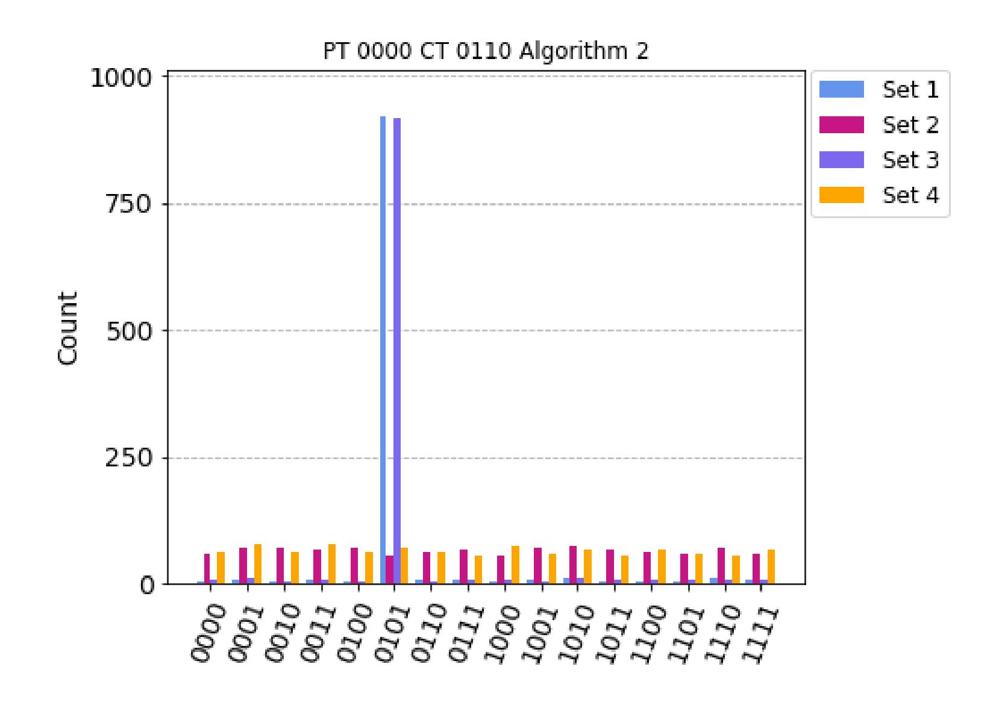

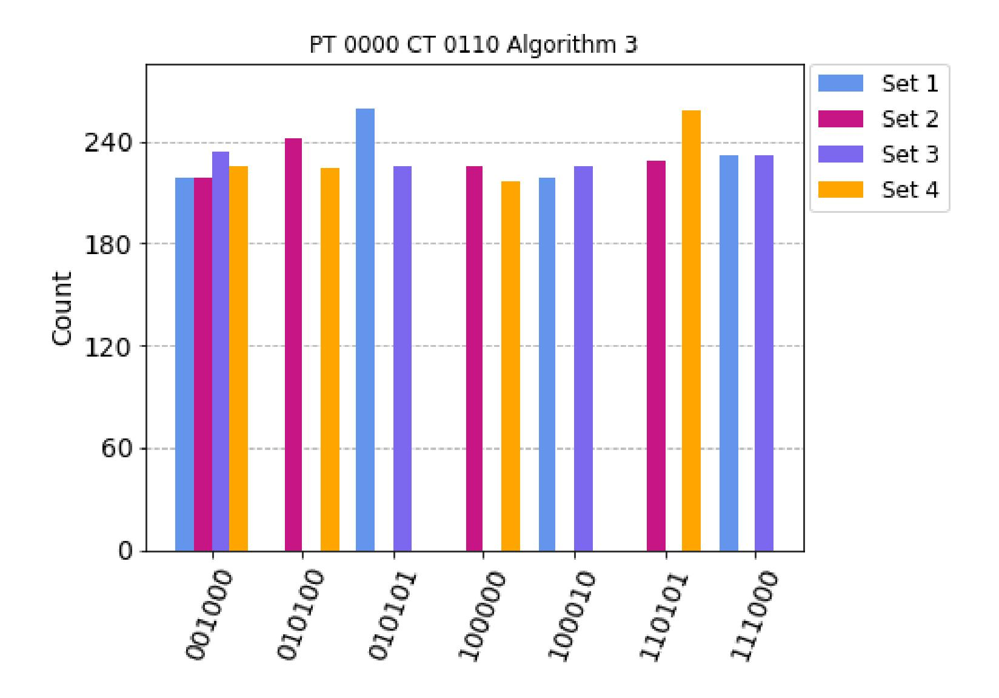

{55}------------------------------------------------

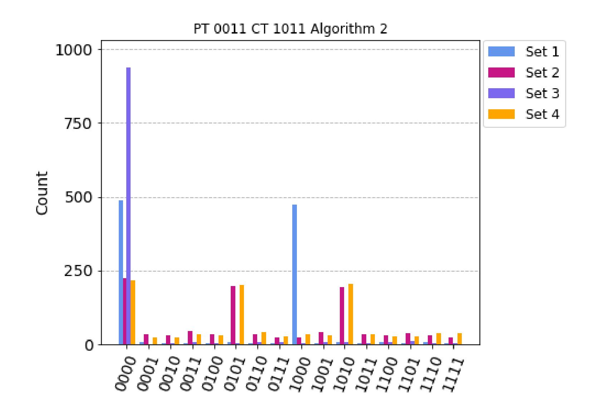

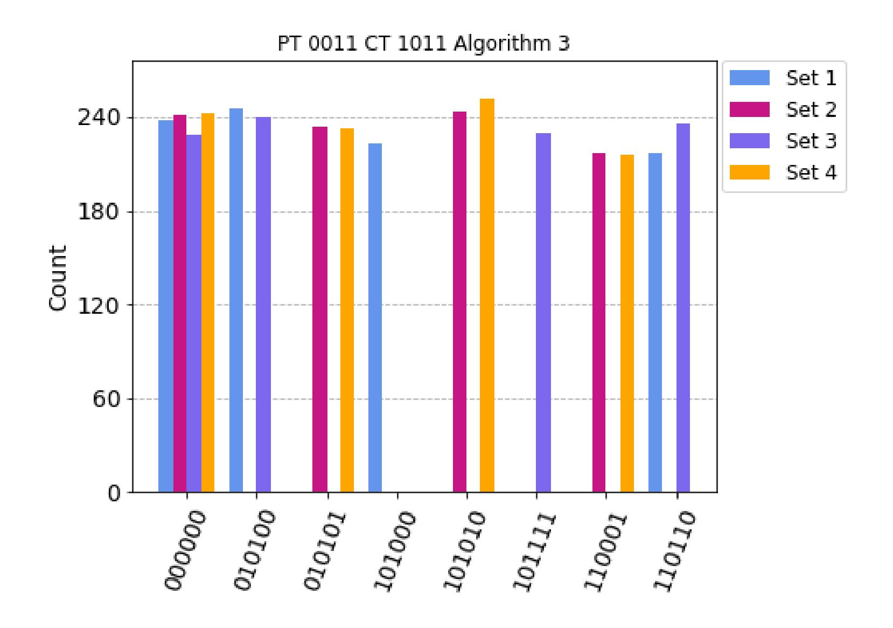

{56}------------------------------------------------

Christopher Dunne 57

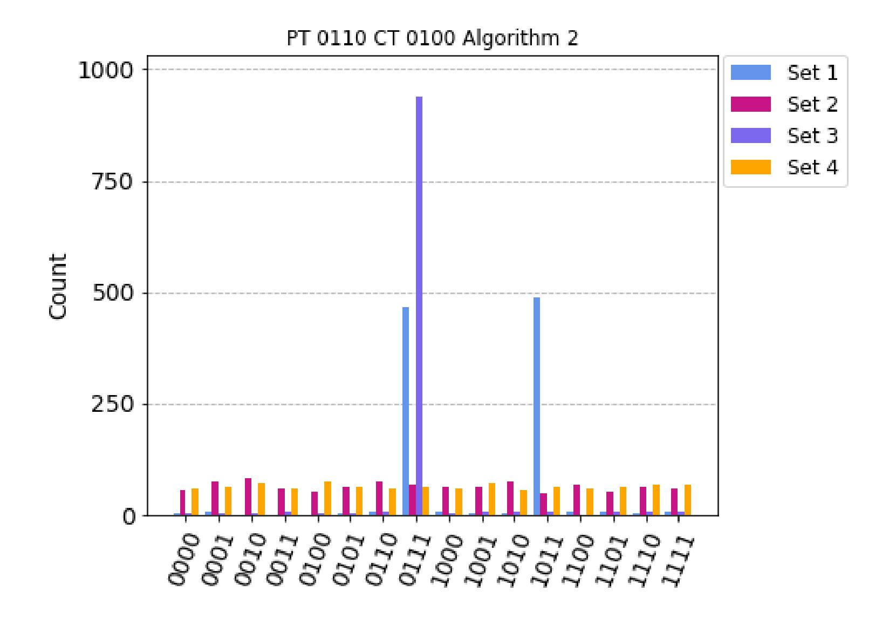

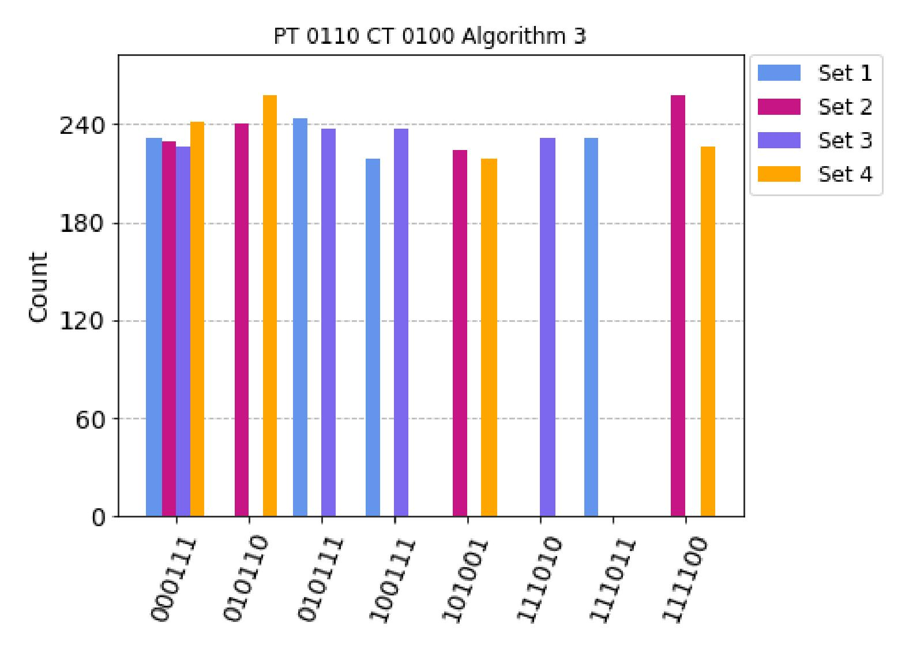

{57}------------------------------------------------

## <span id="page-57-0"></span>**D Statistical Analysis Results**

#### **Set 1**

|                    | ALG 2 |        | Double Swap |        | Single Swap |        |
|--------------------|-------|--------|-------------|--------|-------------|--------|
|                    | P-val | Passed | P-val       | Passed | P-val       | Passed |
| Frequency          | 0.276 | 100%   | 0           | 93.33% | 0.254       | 100%   |
| Block Frequency    | 0.378 | 98.33% | 0           | 98.33% | 0.299       | 100%   |
| Sums 1             | 0.672 | 100%   | 0           | 90.0%  | 0.437       | 98.33% |
| Sums 2             | 0.111 | 100%   | 0           | 88.33% | 0.254       | 100%   |
| Runs               | 0.006 | 95.0%  | 0.501       | 96.66% | 0.773       | 98.33% |
| Longest Run        | 0.082 | 100%   | 0.276       | 95.0%  | 0.213       | 98.33% |
| Rank               | 0.091 | 96.66% | 0           | 35.0%  | 0           | 78.33% |
| FFT                | 0.888 | 100%   | 0           | 0.0%   | 0           | 70.0%  |
| Non-Overlapping    | 0.304 | 99.32% | 0.445       | 98.36% | 0.499       | 98.98% |
| Overlapping        | 0.035 | 100%   | 0.74        | 100%   | 0.804       | 100%   |
| Universal          | 0.041 | —      | 0.054       | —      | 0.001       | —      |
| Entropy            | 0.005 | 98.33% | 0           | 86.66% | 0.976       | 98.33% |
| Excursions         | —     | 100%   | —           | 100%   | —           | 98.61% |
| Excursion Variants | —     | 100%   | —           | 96.28% | —           | 98.76% |
| Serial 1           | 0.054 | 98.33% | 0.091       | 98.33% | 0.637       | 100%   |
| Serial 2           | 0.834 | 100%   | 0.706       | 100%   | 0.534       | 100%   |
| Linear Complexity  | 0.324 | 98.33% | 0.74        | 100%   | 0.862       | 100%   |
| Average            | 0.273 | 99.01% | 0.237       | 86.01% | 0.436       | 96.12% |
| 100% Pass Rate     |       | 9      |             | 4      |             | 7      |

{58}------------------------------------------------

## **S-AES (Set 1)**

|                    | S-Box 1 |        | S-Box 2 |        | S-Box 3 |        | S-Box 4 |        |
|--------------------|---------|--------|---------|--------|---------|--------|---------|--------|
|                    | P-val   | Passed | P-val   | Passed | P-val   | Passed | P-val   | Passed |
| Frequency          | 0       | 100%   | 0.324   | 100%   | 0.299   | 100%   | 0.082   | 100%   |
| Block Frequency    | 0.178   | 93.33% | 0.276   | 98.33% | 0.016   | 96.66% | 0.01    | 98.33% |
| Sums 1             | 0       | 100%   | 0.111   | 100%   | 0.001   | 100%   | 0.091   | 100%   |
| Sums 2             | 0       | 100%   | 0.35    | 100%   | 0.01    | 100%   | 0.091   | 100%   |
| Runs               | 0       | 100%   | 0.213   | 100%   | 0.773   | 100%   | 0.004   | 100%   |
| Longest Run        | 0.324   | 98.33% | 0.163   | 100%   | 0.706   | 100%   | 0.324   | 100%   |
| Rank               | 0.437   | 100%   | 0.804   | 100%   | 0.195   | 98.33% | 0.025   | 100%   |
| FFT                | 0       | 16.66% | 0       | 33.33% | 0       | 20.0%  | 0       | 23.33% |
| Non-Overlapping    | 0.256   | 99.06% | 0.342   | 99.06% | 0.247   | 98.88% | 0.269   | 99.07% |
| Overlapping        | 0.804   | 98.33% | 0.028   | 91.66% | 0.195   | 98.33% | 0.135   | 100%   |
| Universal          | 0.83    | —      | 0.826   | —      | 0.886   | —      | 0.98    | —      |
| Entropy            | 0.407   | 100%   | 0       | 98.33% | 0.02    | 100%   | 0.001   | 100%   |
| Excursions         | —       | 100%   | —       | 98.21% | —       | 100%   | 0.35    | 98.86% |
| Excursion Variants | —       | 100%   | —       | 100%   | —       | 97.22% | 0.46    | 100%   |
| Serial 1           | 0.74    | 100%   | 0.834   | 100%   | 0.148   | 100%   | 0.135   | 100%   |
| Serial 2           | 0.233   | 100%   | 0.672   | 100%   | 0.773   | 100%   | 0       | 100%   |
| Linear Complexity  | 0.773   | 100%   | 0.602   | 98.33% | 0.054   | 100%   | 0.407   | 100%   |
| Average            | 0.332   | 94.10% | 0.37    | 94.82% | 0.288   | 94.33% | 0.198   | 94.97% |
| 100% Pass Rate     | 11      |        | 9       |        | 10      |        | 12      |        |

{59}------------------------------------------------

**Set 2**

|                    | ALG 2 |        |       | Double Swap |       | Single Swap |  |
|--------------------|-------|--------|-------|-------------|-------|-------------|--|
|                    | P-val | Passed | P-val | Passed      | P-val | Passed      |  |
| Frequency          | 0.95  | 100%   | 0.067 | 96.66%      | 0.568 | 100%        |  |
| Block Frequency    | 0.002 | 98.33% | 0.437 | 98.33%      | 0.74  | 98.33%      |  |
| Sums 1             | 0.031 | 100%   | 0     | 95.0%       | 0.163 | 100%        |  |
| Sums 2             | 0.437 | 100%   | 0     | 96.66%      | 0.074 | 100%        |  |
| Runs               | 0.378 | 96.66% | 0.911 | 98.33%      | 0.122 | 100%        |  |
| Longest Run        | 0.018 | 96.66% | 0.568 | 100%        | 0.233 | 100%        |  |
| Rank               | 0.378 | 100%   | 0     | 53.33%      | 0.044 | 86.66%      |  |
| FFT                | 0.067 | 98.33% | 0     | 0.0%        | 0     | 73.33%      |  |
| Non-Overlapping    | 0.306 | 98.59% | 0.529 | 98.82%      | 0.515 | 98.95%      |  |
| Overlapping        | 0.004 | 98.33% | 0.35  | 100%        | 0.437 | 96.66%      |  |
| Universal          | 0.66  | —      | 0.404 | —           | 0.222 | —           |  |
| Entropy            | 0.534 | 100%   | 0.195 | 95.0%       | 0.95  | 98.33%      |  |
| Excursions         | —     | 100%   | —     | 100%        | 0.382 | 98.86%      |  |
| Excursion Variants | —     | 100%   | —     | 100%        | 0.43  | 98.14%      |  |
| Serial 1           | 0.003 | 96.66% | 0.378 | 100%        | 0.773 | 100%        |  |
| Serial 2           | 0.101 | 100%   | 0.276 | 98.33%      | 0.233 | 100%        |  |
| Linear Complexity  | 0.195 | 100%   | 0.378 | 100%        | 0.834 | 100%        |  |
| Average            | 0.271 | 98.97% | 0.3   | 89.40%      | 0.395 | 96.82%      |  |
| 100% Pass Rate     | 9     |        | 6     |             | 8     |             |  |

{60}------------------------------------------------

## **S-AES (Set 2)**

|                    | S-Box 1 |        | S-Box 2 |        | S-Box 3 |        | S-Box 4 |        |
|--------------------|---------|--------|---------|--------|---------|--------|---------|--------|
|                    | P-val   | Passed | P-val   | Passed | P-val   | Passed | P-val   | Passed |
| Frequency          | 0       | 100%   | 0.111   | 100%   | 0.013   | 100%   | 0.163   | 100%   |
| Block Frequency    | 0.178   | 93.33% | 0.002   | 98.33% | 0.111   | 96.66% | 0.001   | 91.66% |
| Sums 1             | 0       | 100%   | 0.002   | 100%   | 0       | 100%   | 0.06    | 100%   |
| Sums 2             | 0       | 100%   | 0.018   | 100%   | 0       | 100%   | 0.007   | 100%   |
| Runs               | 0       | 100%   | 0.135   | 95.0%  | 0.054   | 100%   | 0.082   | 100%   |
| Longest Run        | 0.324   | 98.33% | 0.178   | 100%   | 0.672   | 98.33% | 0.049   | 100%   |
| Rank               | 0.437   | 100%   | 0.74    | 98.33% | 0.773   | 98.33% | 0.233   | 98.33% |
| FFT                | 0       | 16.66% | 0       | 10.0%  | 0       | 41.66% | 0       | 43.33% |
| Non-Overlapping    | 0.256   | 99.06% | 0.269   | 99.2%  | 0.231   | 99.0%  | 0.251   | 99.03% |
| Overlapping        | 0.804   | 98.33% | 0.602   | 98.33% | 0.437   | 100%   | 0.049   | 100%   |
| Universal          | 0.83    | —      | 0.131   | —      | 0.768   | —      | 0.413   | —      |
| Entropy            | 0.407   | 100%   | 0.074   | 100%   | 0.035   | 100%   | 0.039   | 100%   |
| Excursions         | —       | 100%   | 0.364   | 98.75% | —       | 98.42% | 0.231   | 99.1%  |
| Excursion Variants | —       | 100%   | 0.398   | 99.44% | —       | 100%   | 0.204   | 100%   |
| Serial 1           | 0.74    | 100%   | 0.001   | 98.33% | 0.407   | 96.66% | 0.031   | 100%   |
| Serial 2           | 0.233   | 100%   | 0.469   | 100%   | 0.469   | 96.66% | 0.254   | 100%   |
| Linear Complexity  | 0.773   | 100%   | 0.148   | 98.33% | 0.998   | 98.33% | 0.804   | 98.33% |
| Average            | 0.332   | 94.10% | 0.214   | 93.37% | 0.331   | 95.25% | 0.169   | 95.61% |
| 100% Pass Rate     |         | 11     |         | 6      |         | 7      |         | 10     |

{61}------------------------------------------------

**Set 3**

|                    |       | ALG 2  |       | Double Swap | Single Swap |        |  |
|--------------------|-------|--------|-------|-------------|-------------|--------|--|
|                    | P-val | Passed | P-val | Passed      | P-val       | Passed |  |
| Frequency          | 0.437 | 100%   | 0.035 | 90.0%       | 0.637       | 100%   |  |
| Block Frequency    | 0.773 | 100%   | 0     | 98.33%      | 0.637       | 100%   |  |
| Sums 1             | 0.74  | 100%   | 0.067 | 83.33%      | 0.016       | 100%   |  |
| Sums 2             | 0.233 | 100%   | 0.006 | 88.33%      | 0.111       | 100%   |  |
| Runs               | 0.299 | 100%   | 0.637 | 98.33%      | 0.178       | 100%   |  |
| Longest Run        | 0.005 | 96.66% | 0.773 | 100%        | 0.534       | 100%   |  |
| Rank               | 0.602 | 100%   | 0     | 38.33%      | 0           | 71.66% |  |
| FFT                | 0.407 | 96.66% | 0     | 0.0%        | 0           | 60.0%  |  |
| Non-Overlapping    | 0.265 | 99.05% | 0.443 | 98.22%      | 0.531       | 98.87% |  |
| Overlapping        | 0.213 | 100%   | 0.501 | 100%        | 0.148       | 100%   |  |
| Universal          | 0.074 | —      | 0.433 | —           | 0.584       | —      |  |
| Entropy            | 0.001 | 95.0%  | 0     | 90.0%       | 0.324       | 96.66% |  |
| Excursions         | —     | 100%   | —     | 100%        | 0.532       | 97.72% |  |
| Excursion Variants | —     | 100%   | —     | 100%        | 0.531       | 100%   |  |
| Serial 1           | 0.049 | 100%   | 0.378 | 91.66%      | 0.276       | 100%   |  |
| Serial 2           | 0.091 | 95.0%  | 0.178 | 95.0%       | 0.534       | 100%   |  |
| Linear Complexity  | 0.299 | 95.0%  | 0.834 | 100%        | 0.932       | 96.66% |  |
| Average            | 0.299 | 98.58% | 0.286 | 85.72%      | 0.383       | 95.09% |  |
| 100% Pass Rate     |       | 10     | 5     |             | 10          |        |  |

{62}------------------------------------------------

## **S-AES (Set 3)**

|                    | S-Box 1 |        | S-Box 2 |        | S-Box 3 |        | S-Box 4 |        |
|--------------------|---------|--------|---------|--------|---------|--------|---------|--------|
|                    | P-val   | Passed | P-val   | Passed | P-val   | Passed | P-val   | Passed |
| Frequency          | 0       | 100%   | 0.111   | 100%   | 0.035   | 100%   | 0.254   | 100%   |
| Block Frequency    | 0.804   | 93.33% | 0.276   | 98.33% | 0.054   | 98.33% | 0       | 98.33% |
| Sums 1             | 0       | 100%   | 0.148   | 100%   | 0.067   | 100%   | 0.178   | 100%   |
| Sums 2             | 0       | 100%   | 0.299   | 100%   | 0.009   | 100%   | 0.163   | 100%   |
| Runs               | 0.101   | 100%   | 0.804   | 100%   | 0.002   | 98.33% | 0.568   | 100%   |
| Longest Run        | 0.534   | 96.66% | 0.233   | 100%   | 0.672   | 100%   | 0.054   | 98.33% |
| Rank               | 0.602   | 100%   | 0.534   | 100%   | 0.122   | 100%   | 0.135   | 100%   |
| FFT                | 0       | 20.0%  | 0       | 40.0%  | 0       | 45.0%  | 0       | 13.33% |
| Non-Overlapping    | 0.296   | 99.02% | 0.343   | 99.05% | 0.27    | 99.14% | 0.285   | 99.13% |
| Overlapping        | 0.025   | 100%   | 0.254   | 95.0%  | 0.028   | 100%   | 0       | 100%   |
| Universal          | 0.085   | —      | 0.118   | —      | 0.041   | —      | 0.222   | —      |
| Entropy            | 0.039   | 100%   | 0       | 100%   | 0.932   | 100%   | 0.501   | 100%   |
| Excursions         | —       | 100%   | —       | 98.21% | —       | 100%   | —       | 100%   |
| Excursion Variants | —       | 100%   | —       | 100%   | —       | 100%   | —       | 99.38% |
| Serial 1           | 0.003   | 96.66% | 0.074   | 96.66% | 0.008   | 100%   | 0.407   | 100%   |
| Serial 2           | 0       | 100%   | 0.049   | 100%   | 0.804   | 96.66% | 0.407   | 100%   |
| Linear Complexity  | 0.501   | 95.0%  | 0.911   | 100%   | 0.706   | 96.66% | 0.862   | 100%   |
| Average            | 0.199   | 93.79% | 0.277   | 95.45% | 0.25    | 95.88% | 0.269   | 94.28% |
| 100% Pass Rate     |         | 10     |         | 10     |         | 10     |         | 11     |

{63}------------------------------------------------

**Set 4**

|                    | ALG 2 |        |       | Double Swap | Single Swap |        |  |
|--------------------|-------|--------|-------|-------------|-------------|--------|--|
|                    | P-val | Passed | P-val | Passed      | P-val       | Passed |  |
| Frequency          | 0.378 | 98.33% | 0.111 | 95.0%       | 0.195       | 100%   |  |
| Block Frequency    | 0.001 | 98.33% | 0.254 | 98.33%      | 0.233       | 98.33% |  |
| Sums 1             | 0.276 | 96.66% | 0     | 91.66%      | 0.091       | 100%   |  |
| Sums 2             | 0.888 | 100%   | 0     | 91.66%      | 0.025       | 100%   |  |
| Runs               | 0.254 | 100%   | 0.834 | 98.33%      | 0.324       | 100%   |  |
| Longest Run        | 0     | 96.66% | 0.74  | 100%        | 0.067       | 98.33% |  |
| Rank               | 0.122 | 100%   | 0     | 58.33%      | 0.091       | 93.33% |  |
| FFT                | 0.804 | 96.66% | 0     | 0.0%        | 0           | 71.66% |  |
| Non-Overlapping    | 0.303 | 98.99% | 0.486 | 98.72%      | 0.498       | 98.96% |  |
| Overlapping        | 0.06  | 100%   | 0.135 | 98.33%      | 0.991       | 98.33% |  |
| Universal          | 0.461 | —      | 0.713 | —           | 0.621       | —      |  |
| Entropy            | 0.35  | 98.33% | 0.028 | 98.33%      | 0.005       | 100%   |  |
| Excursions         | —     | 93.75% | —     | 98.61%      | —           | 96.87% |  |
| Excursion Variants | —     | 100%   | —     | 96.28%      | —           | 93.05% |  |
| Serial 1           | 0.005 | 100%   | 0.534 | 100%        | 0.378       | 100%   |  |
| Serial 2           | 0.834 | 100%   | 0.888 | 100%        | 0.437       | 100%   |  |
| Linear Complexity  | 0.148 | 100%   | 0.35  | 95.0%       | 0.602       | 100%   |  |
| Average            | 0.326 | 98.60% | 0.338 | 88.66%      | 0.304       | 96.80% |  |
| 100% Pass Rate     |       | 8      | 3     |             | 8           |        |  |

{64}------------------------------------------------

## **S-AES (Set 4)**

|                    | S-Box 1 |        | S-Box 2 |        | S-Box 3 |        | S-Box 4 |        |
|--------------------|---------|--------|---------|--------|---------|--------|---------|--------|
|                    | P-val   | Passed | P-val   | Passed | P-val   | Passed | P-val   | Passed |
| Frequency          | 0       | 100%   | 0.005   | 100%   | 0.035   | 100%   | 0.276   | 100%   |
| Block Frequency    | 0.804   | 93.33% | 0       | 98.33% | 0.501   | 100%   | 0.054   | 95.0%  |
| Sums 1             | 0       | 100%   | 0       | 100%   | 0       | 100%   | 0.888   | 100%   |
| Sums 2             | 0       | 100%   | 0       | 100%   | 0.004   | 100%   | 0.74    | 100%   |
| Runs               | 0.101   | 100%   | 0.135   | 100%   | 0.122   | 100%   | 0.049   | 100%   |
| Longest Run        | 0.534   | 96.66% | 0.501   | 100%   | 0.602   | 98.33% | 0       | 96.66% |
| Rank               | 0.602   | 100%   | 0.95    | 100%   | 0.028   | 98.33% | 0.002   | 100%   |
| FFT                | 0       | 20.0%  | 0       | 5.0%   | 0       | 55.00% | 0       | 80.0%  |
| Non-Overlapping    | 0.296   | 99.02% | 0.259   | 99.09% | 0.269   | 99.26% | 0.32    | 98.92% |
| Overlapping        | 0.025   | 100%   | 0.378   | 100%   | 0.501   | 98.33% | 0.01    | 100%   |
| Universal          | 0.085   | —      | 0.028   | —      | 0.971   | —      | 0.583   | —      |
| Entropy            | 0.039   | 100%   | 0.378   | 100%   | 0.932   | 100%   | 0.082   | 100%   |
| Excursions         | —       | 100%   | 0.546   | 100%   | 0.311   | 100%   | —       | 92.85% |
| Excursion Variants | —       | 100%   | 0.23    | 100%   | 0.574   | 98.98% | —       | 98.41% |
| Serial 1           | 0.003   | 96.66% | 0.023   | 100%   | 0.082   | 100%   | 0       | 100%   |
| Serial 2           | 0       | 100%   | 0.101   | 100%   | 0.501   | 100%   | 0       | 100%   |
| Linear Complexity  | 0.501   | 95.0%  | 0.378   | 95.0%  | 0.082   | 98.33% | 0.469   | 96.66% |
| Average            | 0.199   | 93.79% | 0.23    | 93.58% | 0.324   | 96.66% | 0.232   | 97.40% |
| 100% Pass Rate     |         | 10     |         | 12     |         | 9      |         | 9      |

{65}------------------------------------------------

**Set 5**

|                    |       | ALG 2  |       | Double Swap | Single Swap |        |  |
|--------------------|-------|--------|-------|-------------|-------------|--------|--|
|                    | P-val | Passed | P-val | Passed      | P-val       | Passed |  |
| Frequency          | 0.254 | 100%   | 0.009 | 91.66%      | 0.706       | 100%   |  |
| Block Frequency    | 0.568 | 100%   | 0     | 91.66%      | 0.031       | 100%   |  |
| Sums 1             | 0.299 | 100%   | 0     | 90.0%       | 0.437       | 100%   |  |
| Sums 2             | 0.01  | 100%   | 0     | 86.66%      | 0.299       | 100%   |  |
| Runs               | 0.011 | 100%   | 0.122 | 95.0%       | 0.834       | 98.33% |  |
| Longest Run        | 0.035 | 100%   | 0.254 | 95.0%       | 0.195       | 98.33% |  |
| Rank               | 0.74  | 98.33% | 0     | 28.33%      | 0           | 73.33% |  |
| FFT                | 0.009 | 90.0%  | 0     | 0.0%        | 0           | 45.0%  |  |
| Non-Overlapping    | 0.303 | 98.94% | 0.462 | 98.59%      | 0.462       | 98.91% |  |
| Overlapping        | 0.602 | 96.66% | 0.672 | 100%        | 0.534       | 98.33% |  |
| Universal          | 0.79  | —      | 0.021 | —           | 0.956       | —      |  |
| Entropy            | 0.011 | 100%   | 0.834 | 100%        | 0.888       | 100%   |  |
| Excursions         | —     | 94.64% | —     | 98.42%      | —           | 97.91% |  |
| Excursion Variants | —     | 98.41% | —     | 100%        | —           | 99.07% |  |
| Serial 1           | 0.082 | 100%   | 0.407 | 96.66%      | 0.888       | 100%   |  |
| Serial 2           | 0.74  | 100%   | 0.568 | 100%        | 0.602       | 100%   |  |
| Linear Complexity  | 0.163 | 96.66% | 0.568 | 98.33%      | 0.74        | 100%   |  |
| Average            | 0.308 | 98.35% | 0.261 | 85.64%      | 0.505       | 94.32% |  |
| 100% Pass Rate     |       | 9      | 4     |             | 8           |        |  |

{66}------------------------------------------------

## **S-AES (Set 5)**

|                    | S-Box 1 |        | S-Box 2 |        | S-Box 3 |        | S-Box 4 |        |
|--------------------|---------|--------|---------|--------|---------|--------|---------|--------|
|                    | P-val   | Passed | P-val   | Passed | P-val   | Passed | P-val   | Passed |
| Frequency          | 0.074   | 100%   | 0       | 100%   | 0.378   | 100%   | 0.534   | 100%   |
| Block Frequency    | 0.001   | 100%   | 0       | 100%   | 0.602   | 100%   | 0       | 96.66% |
| Sums 1             | 0.001   | 100%   | 0       | 100%   | 0.233   | 100%   | 0.672   | 100%   |
| Sums 2             | 0.018   | 100%   | 0       | 100%   | 0.637   | 100%   | 0.637   | 100%   |
| Runs               | 0.039   | 100%   | 0.534   | 100%   | 0.672   | 100%   | 0.233   | 100%   |
| Longest Run        | 0.501   | 100%   | 0.672   | 100%   | 0.233   | 100%   | 0.254   | 100%   |
| Rank               | 0.407   | 98.33% | 0.862   | 96.66% | 0.706   | 100%   | 0.672   | 98.33% |
| FFT                | 0       | 16.66% | 0       | 21.66% | 0       | 30.0%  | 0       | 8.33%  |
| Non-Overlapping    | 0.303   | 99.15% | 0.333   | 99.03% | 0.314   | 99.14% | 0.305   | 98.86% |
| Overlapping        | 0.74    | 98.33% | 0.95    | 98.33% | 0.932   | 100%   | 0.911   | 98.33% |
| Universal          | 0.53    | —      | 0.3     | —      | 0.338   | —      | 0.898   | —      |
| Entropy            | 0.025   | 100%   | 0.001   | 100%   | 0.035   | 100%   | 0.501   | 100%   |
| Excursions         | 0.361   | 100%   | 0.016   | 97.36% | —       | 100%   | —       | 100%   |
| Excursion Variants | 0.293   | 100%   | 0.009   | 99.7%  | —       | 100%   | —       | 100%   |
| Serial 1           | 0.862   | 96.66% | 0.213   | 100%   | 0.469   | 100%   | 0       | 100%   |
| Serial 2           | 0.834   | 100%   | 0.195   | 100%   | 0.407   | 100%   | 0.862   | 100%   |
| Linear Complexity  | 0.911   | 98.33% | 0.991   | 98.33% | 0.672   | 100%   | 0.602   | 98.33% |
| Average            | 0.347   | 94.21% | 0.299   | 94.44% | 0.442   | 95.57% | 0.472   | 93.67% |
| 100% Pass Rate     | 10      |        | 9       |        | 14      |        | 10      |        |

{67}------------------------------------------------

**Set 6**

|                    | ALG 2 |        |       | Double Swap | Single Swap |        |  |
|--------------------|-------|--------|-------|-------------|-------------|--------|--|
|                    | P-val | Passed | P-val | Passed      | P-val       | Passed |  |
| Frequency          | 0.054 | 100%   | 0.378 | 96.66%      | 0.054       | 100%   |  |
| Block Frequency    | 0.672 | 100%   | 0     | 100%        | 0.911       | 100%   |  |
| Sums 1             | 0.031 | 100%   | 0.437 | 95.0%       | 0.378       | 100%   |  |
| Sums 2             | 0.007 | 96.66% | 0.135 | 95.0%       | 0.067       | 100%   |  |
| Runs               | 0.706 | 100%   | 0.005 | 93.33%      | 0.862       | 100%   |  |
| Longest Run        | 0.049 | 98.33% | 0.672 | 98.33%      | 0.932       | 98.33% |  |
| Rank               | 0.082 | 100%   | 0     | 25.0%       | 0           | 68.33% |  |
| FFT                | 0.122 | 100%   | 0     | 0.0%        | 0           | 56.66% |  |
| Non-Overlapping    | 0.271 | 99.21% | 0.522 | 98.79%      | 0.508       | 98.94% |  |
| Overlapping        | 0.054 | 100%   | 0.637 | 100%        | 0.299       | 100%   |  |
| Universal          | 0.213 | —      | 0.076 | —           | 0.031       | —      |  |
| Entropy            | 0     | 96.66% | 0.091 | 98.33%      | 0.074       | 98.33% |  |
| Excursions         | —     | 100%   | —     | 100%        | —           | 98.21% |  |
| Excursion Variants | —     | 100%   | —     | 93.05%      | —           | 100%   |  |
| Serial 1           | 0.074 | 100%   | 0.568 | 95.0%       | 0.501       | 100%   |  |
| Serial 2           | 0.233 | 100%   | 0.932 | 96.66%      | 0.06        | 96.66% |  |
| Linear Complexity  | 0.276 | 98.33% | 0.932 | 98.33%      | 0.324       | 98.33% |  |
| Average            | 0.19  | 99.32% | 0.359 | 86.46%      | 0.333       | 94.61% |  |
| 100% Pass Rate     |       | 11     | 3     |             |             | 8      |  |

{68}------------------------------------------------

## **S-AES (Set 6)**

|                    | S-Box 1 |        | S-Box 2 |        | S-Box 3 |        | S-Box 4 |        |
|--------------------|---------|--------|---------|--------|---------|--------|---------|--------|
|                    | P-val   | Passed | P-val   | Passed | P-val   | Passed | P-val   | Passed |
| Frequency          | 0.031   | 100%   | 0       | 100%   | 0.025   | 100%   | 0.011   | 100%   |
| Block Frequency    | 0.054   | 95.0%  | 0       | 90.0%  | 0.003   | 100%   | 0.091   | 100%   |
| Sums 1             | 0       | 100%   | 0       | 100%   | 0.003   | 100%   | 0.122   | 100%   |
| Sums 2             | 0       | 100%   | 0       | 100%   | 0.005   | 100%   | 0       | 100%   |
| Runs               | 0.06    | 100%   | 0.407   | 100%   | 0.163   | 100%   | 0.044   | 100%   |
| Longest Run        | 0.049   | 95.0%  | 0.233   | 98.33% | 0.091   | 100%   | 0.233   | 100%   |
| Rank               | 0.888   | 100%   | 0.534   | 100%   | 0.773   | 100%   | 0.706   | 100%   |
| FFT                | 0       | 0.0%   | 0       | 5.0%   | 0       | 25.0%  | 0       | 36.66% |
| Non-Overlapping    | 0.292   | 99.21% | 0.295   | 99.03% | 0.29    | 99.17% | 0.331   | 99.13% |
| Overlapping        | 0.049   | 95.0%  | 0.672   | 100%   | 0.299   | 100%   | 0.195   | 100%   |
| Universal          | 0       | —      | 0.098   | —      | 0.593   | —      | 0.012   | —      |
| Entropy            | 0.254   | 100%   | 0.101   | 100%   | 0.049   | 98.33% | 0.035   | 100%   |
| Excursions         | 0.168   | 98.07% | —       | 100%   | —       | 100%   | —       | 100%   |
| Excursion Variants | 0.247   | 99.2%  | —       | 100%   | —       | 100%   | —       | 98.88% |
| Serial 1           | 0.049   | 100%   | 0.016   | 100%   | 0.035   | 96.66% | 0.101   | 100%   |
| Serial 2           | 0.111   | 100%   | 0.178   | 96.66% | 0.005   | 100%   | 0.74    | 100%   |
| Linear Complexity  | 0.014   | 100%   | 0.324   | 100%   | 0.082   | 100%   | 0.706   | 100%   |
| Average            | 0.133   | 92.59% | 0.191   | 93.06% | 0.161   | 94.94% | 0.222   | 95.91% |
| 100% Pass Rate     | 9       |        | 11      |        | 12      |        | 13      |        |

{69}------------------------------------------------

**Set 7**

|                    | ALG 2 |        |       | Double Swap | Single Swap |        |  |
|--------------------|-------|--------|-------|-------------|-------------|--------|--|
|                    | P-val | Passed | P-val | Passed      | P-val       | Passed |  |
| Frequency          | 0.74  | 98.33% | 0.911 | 95.0%       | 0.706       | 98.33% |  |
| Block Frequency    | 0.082 | 100%   | 0     | 86.66%      | 0.195       | 98.33% |  |
| Sums 1             | 0.035 | 96.66% | 0.008 | 93.33%      | 0.834       | 100%   |  |
| Sums 2             | 0.74  | 96.66% | 0.016 | 91.66%      | 0.602       | 100%   |  |
| Runs               | 0.018 | 100%   | 0.834 | 98.33%      | 0.082       | 100%   |  |
| Longest Run        | 0.178 | 98.33% | 0.985 | 100%        | 0.602       | 100%   |  |
| Rank               | 0.672 | 98.33% | 0     | 31.66%      | 0           | 75.0%  |  |
| FFT                | 0.534 | 98.33% | 0     | 0.0%        | 0           | 73.33% |  |
| Non-Overlapping    | 0.313 | 99.0%  | 0.471 | 98.65%      | 0.469       | 98.98% |  |
| Overlapping        | 0.501 | 100%   | 0.35  | 96.66%      | 0.324       | 96.66% |  |
| Universal          | 0.279 |        | 0.937 |             | 0.224       |        |  |
| Entropy            | 0.122 | 100%   | 0.178 | 98.33%      | 0.804       | 100%   |  |
| Excursions         | —     | 100%   | —     | 100%        | —           | 100%   |  |
| Excursion Variants | —     | 100%   | —     | 100%        | —           | 100%   |  |
| Serial 1           | 0.023 | 98.33% | 0.568 | 100%        | 0.35        | 100%   |  |
| Serial 2           | 0.324 | 100%   | 0.862 | 100%        | 0.324       | 100%   |  |
| Linear Complexity  | 0.407 | 100%   | 0.672 | 98.33%      | 0.233       | 100%   |  |
| Average            | 0.331 | 98.99% | 0.453 | 86.78%      | 0.383       | 96.28% |  |
| 100% Pass Rate     |       | 8      | 5     |             |             | 10     |  |

{70}------------------------------------------------

Christopher Dunne 71

## **S-AES (Set 7)**

|                    | S-Box 1 |        | S-Box 2 |        | S-Box 3 |        | S-Box 4 |        |
|--------------------|---------|--------|---------|--------|---------|--------|---------|--------|
|                    | P-val   | Passed | P-val   | Passed | P-val   | Passed | P-val   | Passed |
| Frequency          | 0.773   | 100%   | 0.018   | 100%   | 0.074   | 100%   | 0.082   | 100%   |
| Block Frequency    | 0       | 93.33% | 0.213   | 100%   | 0       | 98.33% | 0.005   | 96.66% |
| Sums 1             | 0.834   | 100%   | 0       | 100%   | 0.067   | 100%   | 0.001   | 100%   |
| Sums 2             | 0.862   | 100%   | 0.004   | 100%   | 0       | 100%   | 0.002   | 100%   |
| Runs               | 0.007   | 100%   | 0.35    | 100%   | 0.018   | 100%   | 0.013   | 100%   |
| Longest Run        | 0.195   | 100%   | 0.35    | 100%   | 0.534   | 100%   | 0.35    | 98.33% |
| Rank               | 0.213   | 100%   | 0.122   | 100%   | 0.008   | 100%   | 0.637   | 100%   |
| FFT                | 0       | 11.66% | 0       | 28.33% | 0       | 13.33% | 0       | 30.0%  |
| Non-Overlapping    | 0.321   | 98.99% | 0.312   | 98.98% | 0.248   | 98.98% | 0.297   | 99.22% |
| Overlapping        | 0.101   | 100%   | 0.163   | 100%   | 0.95    | 100%   | 0.378   | 95.0%  |
| Universal          | 0.103   | —      | 0.669   | —      | 0.807   | —      | 0.832   | —      |
| Entropy            | 0.013   | 100%   | 0       | 96.66% | 0.002   | 100%   | 0.888   | 100%   |
| Excursions         | —       | 100%   | 0.337   | 98.86% | —       | 97.91% | 0.558   | 98.95% |
| Excursion Variants | —       | 100%   | 0.427   | 100%   | —       | 100%   | 0.478   | 99.53% |
| Serial 1           | 0       | 100%   | 0.002   | 100%   | 0.008   | 100%   | 0.35    | 100%   |
| Serial 2           | 0.06    | 100%   | 0.568   | 100%   | 0.163   | 100%   | 0.195   | 100%   |
| Linear Complexity  | 0.637   | 96.66% | 0.706   | 100%   | 0.706   | 96.66% | 0.637   | 100%   |
| Average            | 0.275   | 93.78% | 0.249   | 95.17% | 0.239   | 94.07% | 0.335   | 94.85% |
| 100% Pass Rate     | 12      |        | 12      |        | 11      |        | 9       |        |

{71}------------------------------------------------

## <span id="page-71-0"></span>**E Avalanche Criterion Analysis Results**

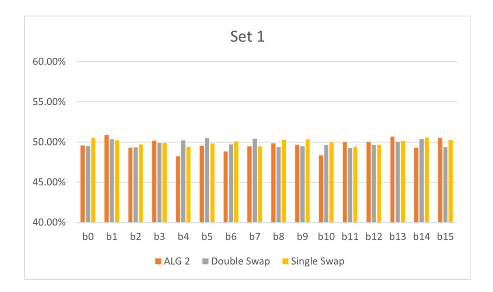

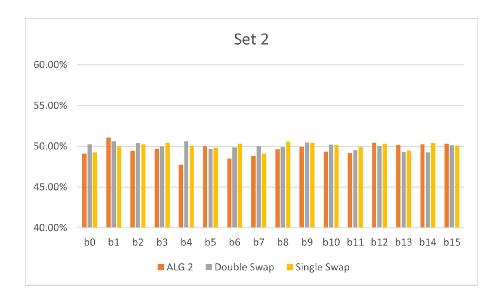

{72}------------------------------------------------

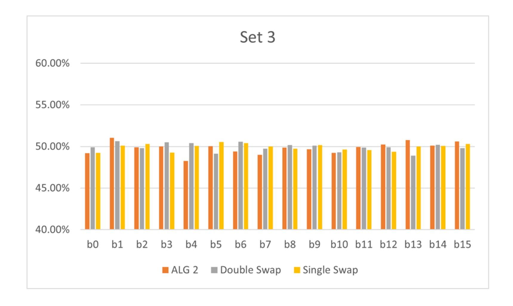

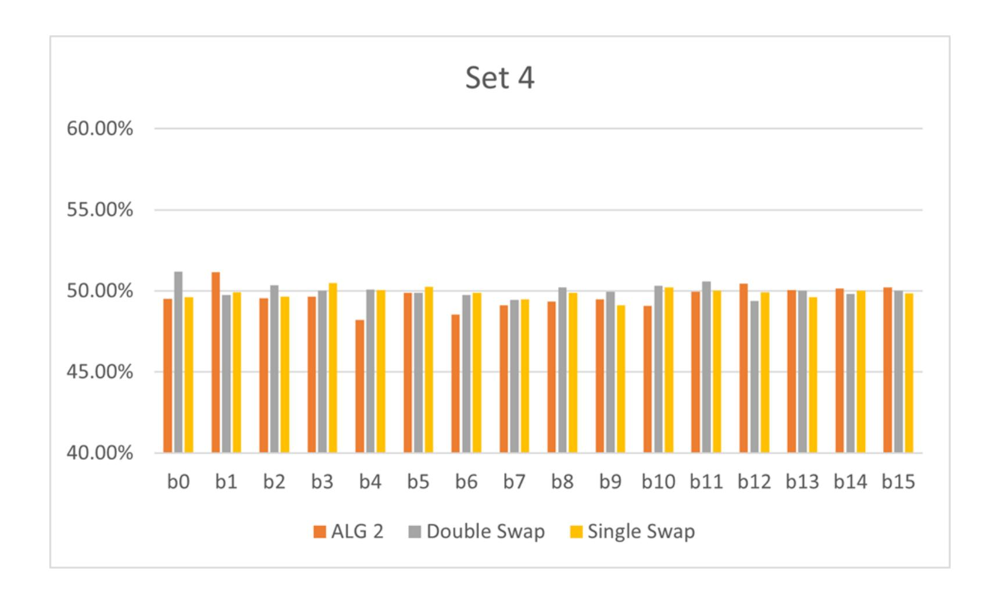

{73}------------------------------------------------

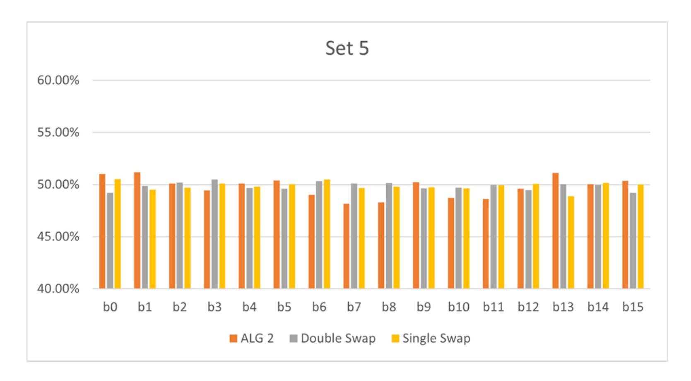

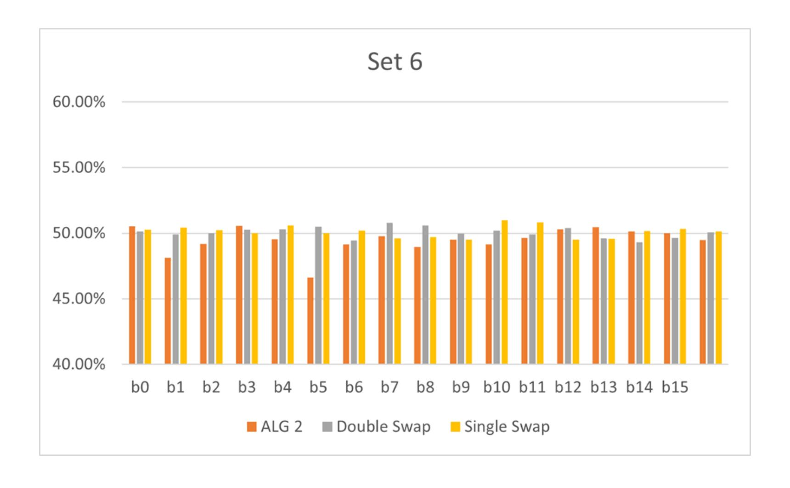

{74}------------------------------------------------

Christopher Dunne 75

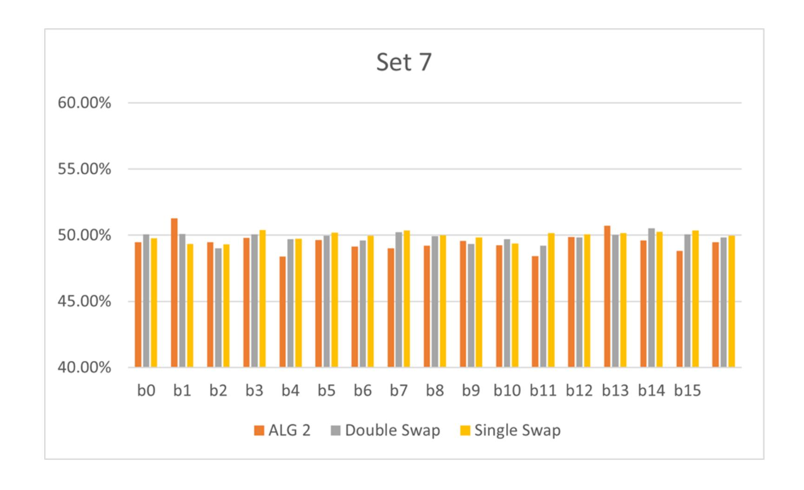

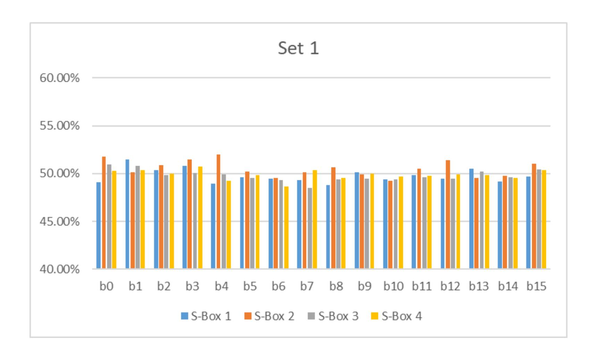

{75}------------------------------------------------

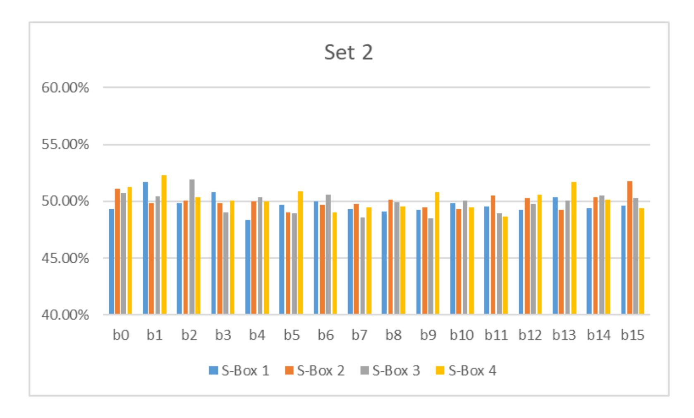

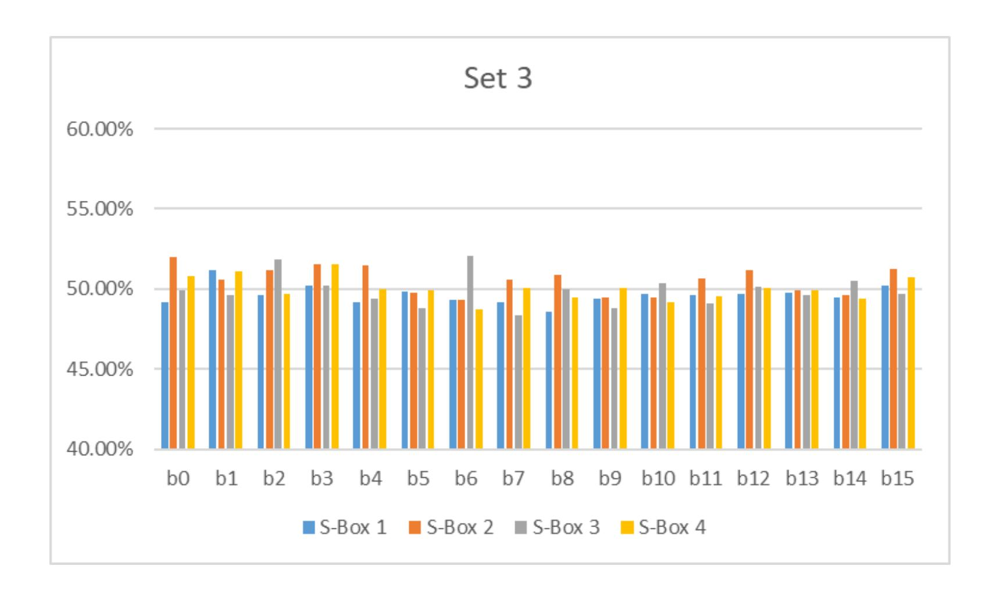

{76}------------------------------------------------

Christopher Dunne 77

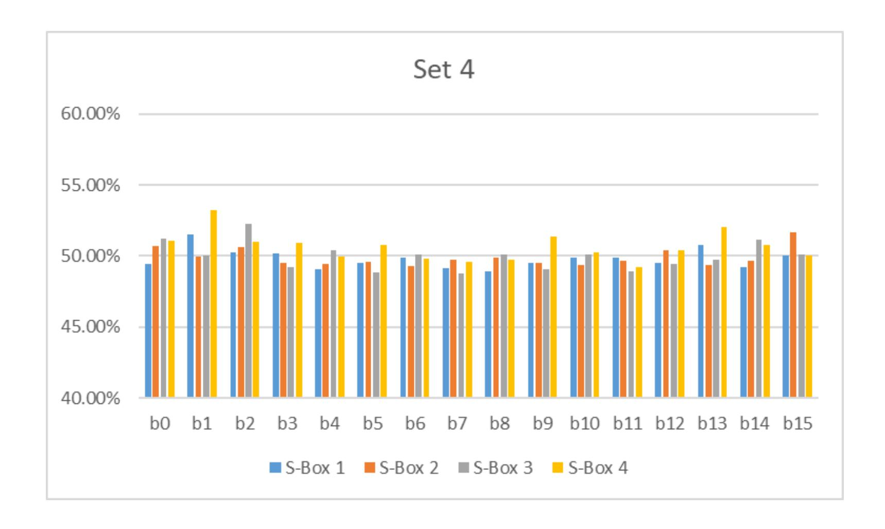

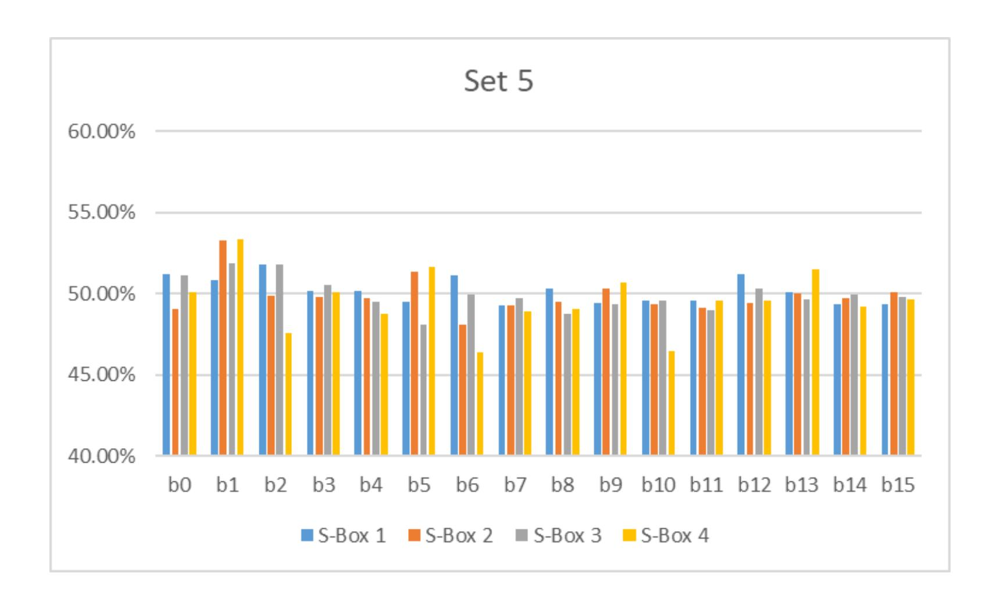

{77}------------------------------------------------

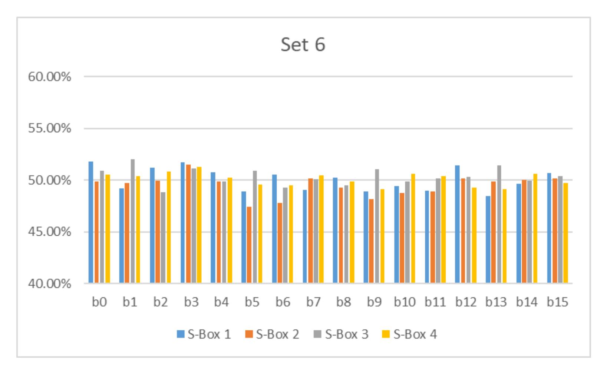

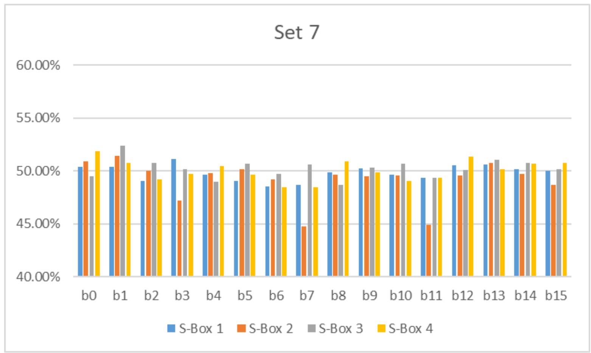

{78}------------------------------------------------

## <span id="page-78-0"></span>**F ANF of AES**

*y*<sup>0</sup> = *x*0*x*1*x*2*x*3*x*4*x*6*x*<sup>7</sup> ⊕ *x*0*x*1*x*2*x*3*x*4*x*<sup>6</sup> ⊕ *x*0*x*1*x*2*x*3*x*4*x*<sup>7</sup> ⊕ *x*0*x*1*x*2*x*3*x*<sup>4</sup> ⊕ *x*0*x*1*x*2*x*3*x*5*x*<sup>7</sup> ⊕ *x*0*x*1*x*2*x*3*x*6*x*7⊕*x*0*x*1*x*2*x*3*x*6⊕*x*0*x*1*x*2*x*3*x*7⊕*x*0*x*1*x*2*x*3⊕*x*0*x*1*x*2*x*4*x*5*x*6*x*7⊕*x*0*x*1*x*2*x*4*x*5*x*7⊕ *x*0*x*1*x*2*x*4*x*<sup>5</sup> ⊕ *x*0*x*1*x*2*x*4*x*<sup>7</sup> ⊕ *x*0*x*1*x*2*x*5*x*6*x*<sup>7</sup> ⊕ *x*0*x*1*x*2*x*5*x*<sup>7</sup> ⊕ *x*0*x*1*x*2*x*<sup>5</sup> ⊕ *x*0*x*1*x*2*x*6*x*<sup>7</sup> ⊕ *x*0*x*1*x*2*x*6⊕*x*0*x*1*x*2*x*7⊕*x*0*x*1*x*3*x*4*x*6*x*7⊕*x*0*x*1*x*3*x*4*x*6⊕*x*0*x*1*x*3*x*5*x*6⊕*x*0*x*1*x*3*x*5*x*7⊕*x*0*x*1*x*3*x*6*x*7⊕ *x*0*x*1*x*4*x*5*x*6*x*<sup>7</sup> ⊕ *x*0*x*1*x*4*x*5*x*<sup>6</sup> ⊕ *x*0*x*1*x*4*x*<sup>5</sup> ⊕ *x*0*x*1*x*4*x*<sup>7</sup> ⊕ *x*0*x*1*x*<sup>4</sup> ⊕ *x*0*x*1*x*5*x*6*x*<sup>7</sup> ⊕ *x*0*x*1*x*<sup>6</sup> ⊕ *x*0*x*1*x*7⊕*x*0*x*1⊕*x*0*x*2*x*3*x*4*x*5*x*6*x*7⊕*x*0*x*2*x*3*x*4*x*5*x*6⊕*x*0*x*2*x*3*x*4*x*5*x*7⊕*x*0*x*2*x*3*x*4*x*5⊕*x*0*x*2*x*3*x*4*x*6⊕ *x*0*x*2*x*3*x*5*x*6*x*7⊕*x*0*x*2*x*3*x*5⊕*x*0*x*2*x*3*x*7⊕*x*0*x*2*x*4*x*5*x*7⊕*x*0*x*2*x*4*x*5⊕*x*0*x*2*x*4*x*6*x*7⊕*x*0*x*2*x*4*x*7⊕ *x*0*x*2*x*<sup>4</sup> ⊕*x*0*x*2*x*5*x*<sup>6</sup> ⊕*x*0*x*2*x*5*x*<sup>7</sup> ⊕*x*0*x*2*x*<sup>5</sup> ⊕*x*0*x*2*x*<sup>6</sup> ⊕*x*0*x*2*x*<sup>7</sup> ⊕*x*0*x*3*x*4*x*5*x*<sup>6</sup> ⊕*x*0*x*3*x*4*x*5*x*<sup>7</sup> ⊕ *x*0*x*3*x*4*x*6*x*7⊕*x*0*x*3*x*4*x*6⊕*x*0*x*3*x*4⊕*x*0*x*3*x*5*x*6*x*7⊕*x*0*x*3*x*5*x*6⊕*x*0*x*3*x*5⊕*x*0*x*3*x*6⊕*x*0*x*4*x*5*x*6⊕ *x*0*x*4*x*5*x*<sup>7</sup> ⊕ *x*0*x*4*x*6*x*<sup>7</sup> ⊕ *x*0*x*4*x*<sup>6</sup> ⊕ *x*0*x*4*x*<sup>7</sup> ⊕ *x*0*x*<sup>4</sup> ⊕ *x*0*x*<sup>5</sup> ⊕ *x*0*x*<sup>6</sup> ⊕ *x*<sup>0</sup> ⊕ *x*1*x*2*x*3*x*4*x*6*x*<sup>7</sup> ⊕ *x*1*x*2*x*3*x*5*x*<sup>6</sup> ⊕*x*1*x*2*x*3*x*5*x*<sup>7</sup> ⊕*x*1*x*2*x*3*x*<sup>5</sup> ⊕*x*1*x*2*x*3*x*<sup>6</sup> ⊕*x*1*x*2*x*3*x*<sup>7</sup> ⊕*x*1*x*2*x*<sup>3</sup> ⊕*x*1*x*2*x*4*x*5*x*6*x*<sup>7</sup> ⊕ *x*1*x*2*x*4*x*5*x*<sup>6</sup> ⊕ *x*1*x*2*x*4*x*6*x*<sup>7</sup> ⊕ *x*1*x*2*x*4*x*<sup>6</sup> ⊕ *x*1*x*2*x*4*x*<sup>7</sup> ⊕ *x*1*x*2*x*<sup>4</sup> ⊕ *x*1*x*2*x*5*x*6*x*<sup>7</sup> ⊕ *x*1*x*2*x*6*x*<sup>7</sup> ⊕ *x*1*x*2*x*<sup>6</sup> ⊕*x*1*x*<sup>2</sup> ⊕*x*1*x*3*x*4*x*5*x*6*x*<sup>7</sup> ⊕*x*1*x*3*x*4*x*5*x*<sup>7</sup> ⊕*x*1*x*3*x*4*x*<sup>6</sup> ⊕*x*1*x*3*x*<sup>4</sup> ⊕*x*1*x*3*x*6*x*<sup>7</sup> ⊕*x*1*x*3*x*<sup>7</sup> ⊕ *x*1*x*3⊕*x*1*x*4*x*5*x*6⊕*x*1*x*4*x*5*x*7⊕*x*1*x*4*x*6⊕*x*1*x*4⊕*x*1*x*5*x*6*x*7⊕*x*1*x*5*x*6⊕*x*1*x*6⊕*x*2*x*3*x*4*x*5*x*6*x*7⊕ *x*2*x*3*x*4*x*5*x*6⊕*x*2*x*3*x*4*x*5*x*7⊕*x*2*x*3*x*5*x*7⊕*x*2*x*3*x*5⊕*x*2*x*3*x*6*x*7⊕*x*2*x*3*x*7⊕*x*2*x*3⊕*x*2*x*4*x*5*x*6*x*7⊕ *x*2*x*4*x*5*x*<sup>6</sup> ⊕ *x*2*x*4*x*5*x*<sup>7</sup> ⊕ *x*2*x*4*x*<sup>7</sup> ⊕ *x*2*x*<sup>4</sup> ⊕ *x*2*x*5*x*<sup>6</sup> ⊕ *x*2*x*5*x*<sup>7</sup> ⊕ *x*2*x*6*x*<sup>7</sup> ⊕ *x*2*x*<sup>6</sup> ⊕ *x*2*x*<sup>7</sup> ⊕ *x*<sup>2</sup> ⊕ *x*3*x*4*x*<sup>7</sup> ⊕*x*3*x*5*x*6*x*<sup>7</sup> ⊕*x*3*x*5*x*<sup>7</sup> ⊕*x*3*x*6*x*<sup>7</sup> ⊕*x*<sup>3</sup> ⊕*x*4*x*5*x*<sup>6</sup> ⊕*x*4*x*<sup>6</sup> ⊕*x*<sup>4</sup> ⊕*x*5*x*6*x*<sup>7</sup> ⊕*x*5*x*<sup>6</sup> ⊕*x*5*x*<sup>7</sup> ⊕ *x*6*x*<sup>7</sup> ⊕ 1

*y*<sup>1</sup> = *x*0*x*1*x*2*x*3*x*4*x*6*x*<sup>7</sup> ⊕*x*0*x*1*x*2*x*3*x*4*x*<sup>6</sup> ⊕*x*0*x*1*x*2*x*3*x*4*x*<sup>7</sup> ⊕*x*0*x*1*x*2*x*3*x*<sup>4</sup> ⊕*x*0*x*1*x*2*x*3*x*5*x*6*x*<sup>7</sup> ⊕ *x*0*x*1*x*2*x*3*x*5*x*6⊕*x*0*x*1*x*2*x*3*x*6⊕*x*0*x*1*x*2*x*3*x*7⊕*x*0*x*1*x*2*x*4*x*5*x*6*x*7⊕*x*0*x*1*x*2*x*4*x*5*x*7⊕*x*0*x*1*x*2*x*4*x*5⊕ *x*0*x*1*x*2*x*4*x*6*x*<sup>7</sup> ⊕ *x*0*x*1*x*2*x*4*x*<sup>6</sup> ⊕ *x*0*x*1*x*2*x*4*x*<sup>7</sup> ⊕ *x*0*x*1*x*2*x*5*x*6*x*<sup>7</sup> ⊕ *x*0*x*1*x*2*x*6*x*<sup>7</sup> ⊕ *x*0*x*1*x*2*x*<sup>6</sup> ⊕ *x*0*x*1*x*3*x*4*x*5*x*6*x*7⊕*x*0*x*1*x*3*x*4*x*5*x*6⊕*x*0*x*1*x*3*x*4*x*6*x*7⊕*x*0*x*1*x*3*x*4*x*6⊕*x*0*x*1*x*3*x*4*x*7⊕*x*0*x*1*x*3*x*4⊕ *x*0*x*1*x*3*x*5*x*<sup>6</sup> ⊕*x*0*x*1*x*3*x*5*x*<sup>7</sup> ⊕*x*0*x*1*x*3*x*6*x*<sup>7</sup> ⊕*x*0*x*1*x*3*x*<sup>6</sup> ⊕*x*0*x*1*x*<sup>3</sup> ⊕*x*0*x*1*x*4*x*5*x*<sup>6</sup> ⊕*x*0*x*1*x*4*x*<sup>5</sup> ⊕ *x*0*x*1*x*4*x*7⊕*x*0*x*1*x*4⊕*x*0*x*1*x*5*x*6*x*7⊕*x*0*x*1*x*5*x*6⊕*x*0*x*1*x*6⊕*x*0*x*1⊕*x*0*x*2*x*3*x*4*x*5*x*6⊕*x*0*x*2*x*3*x*4*x*5*x*7⊕ *x*0*x*2*x*3*x*4*x*<sup>5</sup> ⊕*x*0*x*2*x*3*x*4*x*6*x*<sup>7</sup> ⊕*x*0*x*2*x*3*x*4*x*<sup>7</sup> ⊕*x*0*x*2*x*3*x*5*x*6*x*<sup>7</sup> ⊕*x*0*x*2*x*3*x*5*x*<sup>7</sup> ⊕*x*0*x*2*x*3*x*6*x*<sup>7</sup> ⊕ *x*0*x*2*x*3*x*<sup>6</sup> ⊕*x*0*x*2*x*<sup>3</sup> ⊕*x*0*x*2*x*4*x*5*x*<sup>6</sup> ⊕*x*0*x*2*x*4*x*<sup>5</sup> ⊕*x*0*x*2*x*5*x*6*x*<sup>7</sup> ⊕*x*0*x*2*x*5*x*<sup>6</sup> ⊕*x*0*x*2*x*<sup>7</sup> ⊕*x*0*x*<sup>2</sup> ⊕ *x*0*x*3*x*4*x*5*x*7⊕*x*0*x*3*x*4*x*5⊕*x*0*x*3*x*4*x*6⊕*x*0*x*3*x*4⊕*x*0*x*3*x*5*x*6*x*7⊕*x*0*x*3⊕*x*0*x*4*x*5*x*6*x*7⊕*x*0*x*4*x*5*x*6⊕ *x*0*x*4*x*5*x*<sup>7</sup> ⊕*x*0*x*4*x*<sup>5</sup> ⊕*x*0*x*4*x*6*x*<sup>7</sup> ⊕*x*0*x*4*x*<sup>6</sup> ⊕*x*0*x*4*x*<sup>7</sup> ⊕*x*0*x*<sup>4</sup> ⊕*x*0*x*5*x*<sup>7</sup> ⊕*x*0*x*6*x*<sup>7</sup> ⊕*x*0*x*<sup>7</sup> ⊕*x*<sup>0</sup> ⊕ *x*1*x*2*x*3*x*4*x*5*x*<sup>6</sup> ⊕*x*1*x*2*x*3*x*4*x*6*x*<sup>7</sup> ⊕*x*1*x*2*x*3*x*4*x*<sup>6</sup> ⊕*x*1*x*2*x*3*x*5*x*6*x*<sup>7</sup> ⊕*x*1*x*2*x*3*x*5*x*<sup>6</sup> ⊕*x*1*x*2*x*3*x*<sup>5</sup> ⊕ *x*1*x*2*x*3⊕*x*1*x*2*x*4*x*5*x*6⊕*x*1*x*2*x*4*x*7⊕*x*1*x*2*x*4⊕*x*1*x*2*x*5*x*6⊕*x*1*x*2*x*5*x*7⊕*x*1*x*2*x*6*x*7⊕*x*1*x*3*x*4*x*5*x*6*x*7⊕ *x*1*x*3*x*4*x*5*x*<sup>6</sup> ⊕ *x*1*x*3*x*4*x*5*x*<sup>7</sup> ⊕ *x*1*x*3*x*4*x*<sup>5</sup> ⊕ *x*1*x*3*x*4*x*<sup>7</sup> ⊕ *x*1*x*3*x*<sup>4</sup> ⊕ *x*1*x*3*x*5*x*<sup>6</sup> ⊕ *x*1*x*3*x*5*x*<sup>7</sup> ⊕ *x*1*x*3*x*<sup>5</sup> ⊕ *x*1*x*3*x*<sup>6</sup> ⊕ *x*1*x*3*x*<sup>7</sup> ⊕ *x*1*x*<sup>3</sup> ⊕ *x*1*x*4*x*5*x*<sup>7</sup> ⊕ *x*1*x*4*x*6*x*<sup>7</sup> ⊕ *x*1*x*4*x*<sup>7</sup> ⊕ *x*1*x*<sup>4</sup> ⊕ *x*1*x*5*x*<sup>6</sup> ⊕ *x*1*x*<sup>7</sup> ⊕*x*2*x*3*x*4*x*5*x*<sup>7</sup> ⊕*x*2*x*3*x*4*x*<sup>5</sup> ⊕*x*2*x*3*x*4*x*6*x*<sup>7</sup> ⊕*x*2*x*3*x*4*x*<sup>7</sup> ⊕*x*2*x*3*x*<sup>4</sup> ⊕*x*2*x*3*x*5*x*<sup>7</sup> ⊕*x*2*x*3*x*<sup>5</sup> ⊕ *x*2*x*3*x*<sup>6</sup> ⊕ *x*2*x*<sup>3</sup> ⊕ *x*2*x*4*x*5*x*6*x*<sup>7</sup> ⊕ *x*2*x*4*x*5*x*<sup>7</sup> ⊕ *x*2*x*4*x*6*x*<sup>7</sup> ⊕ *x*2*x*5*x*<sup>7</sup> ⊕ *x*2*x*6*x*<sup>7</sup> ⊕ *x*2*x*<sup>6</sup> ⊕ *x*2*x*<sup>7</sup> ⊕ *x*3*x*4*x*5*x*<sup>6</sup> ⊕*x*3*x*4*x*5*x*<sup>7</sup> ⊕*x*3*x*4*x*6*x*<sup>7</sup> ⊕*x*3*x*4*x*<sup>6</sup> ⊕*x*3*x*4*x*<sup>7</sup> ⊕*x*3*x*5*x*<sup>6</sup> ⊕*x*3*x*5*x*<sup>7</sup> ⊕*x*3*x*6*x*<sup>7</sup> ⊕*x*3*x*<sup>7</sup> ⊕ *x*<sup>3</sup> ⊕ *x*4*x*<sup>5</sup> ⊕ *x*4*x*<sup>6</sup> ⊕ *x*5*x*6*x*<sup>7</sup> ⊕ *x*<sup>6</sup> ⊕ *x*<sup>7</sup> ⊕ 1

*y*<sup>2</sup> = *x*0*x*1*x*2*x*3*x*4*x*<sup>5</sup> ⊕ *x*0*x*1*x*2*x*3*x*4*x*6*x*<sup>7</sup> ⊕ *x*0*x*1*x*2*x*3*x*4*x*<sup>6</sup> ⊕ *x*0*x*1*x*2*x*3*x*4*x*<sup>7</sup> ⊕ *x*0*x*1*x*2*x*3*x*<sup>4</sup> ⊕ *x*0*x*1*x*2*x*3*x*5*x*6*x*7⊕*x*0*x*1*x*2*x*3*x*5*x*6⊕*x*0*x*1*x*2*x*3*x*5⊕*x*0*x*1*x*2*x*3*x*6⊕*x*0*x*1*x*2*x*3*x*7⊕*x*0*x*1*x*2*x*4*x*5*x*6⊕ *x*0*x*1*x*2*x*4*x*5*x*<sup>7</sup> ⊕ *x*0*x*1*x*2*x*4*x*<sup>5</sup> ⊕ *x*0*x*1*x*2*x*4*x*<sup>7</sup> ⊕ *x*0*x*1*x*2*x*5*x*<sup>7</sup> ⊕ *x*0*x*1*x*2*x*<sup>5</sup> ⊕ *x*0*x*1*x*2*x*6*x*<sup>7</sup> ⊕ *x*0*x*1*x*2*x*7⊕*x*0*x*1*x*3*x*4*x*5*x*6*x*7⊕*x*0*x*1*x*3*x*4*x*5*x*7⊕*x*0*x*1*x*3*x*4*x*6*x*7⊕*x*0*x*1*x*3*x*4*x*6⊕*x*0*x*1*x*3*x*4*x*7⊕ *x*0*x*1*x*3*x*<sup>4</sup> ⊕*x*0*x*1*x*3*x*5*x*6*x*<sup>7</sup> ⊕*x*0*x*1*x*3*x*5*x*<sup>7</sup> ⊕*x*0*x*1*x*3*x*<sup>5</sup> ⊕*x*0*x*1*x*3*x*6*x*<sup>7</sup> ⊕*x*0*x*1*x*3*x*<sup>6</sup> ⊕*x*0*x*1*x*<sup>3</sup> ⊕ *x*0*x*1*x*4*x*5*x*6*x*7⊕*x*0*x*1*x*4*x*6*x*7⊕*x*0*x*1*x*4*x*6⊕*x*0*x*1*x*4⊕*x*0*x*1*x*5*x*6⊕*x*0*x*1*x*5⊕*x*0*x*1*x*6⊕*x*0*x*1*x*7⊕ *x*0*x*2*x*3*x*4*x*5*x*6*x*7⊕*x*0*x*2*x*3*x*4*x*5*x*6⊕*x*0*x*2*x*3*x*4*x*6*x*7⊕*x*0*x*2*x*3*x*4*x*7⊕*x*0*x*2*x*3*x*4⊕*x*0*x*2*x*3*x*5*x*6*x*7⊕ *x*0*x*2*x*3*x*5*x*<sup>7</sup> ⊕*x*0*x*2*x*3*x*<sup>5</sup> ⊕*x*0*x*2*x*3*x*<sup>7</sup> ⊕*x*0*x*2*x*<sup>3</sup> ⊕*x*0*x*2*x*4*x*5*x*6*x*<sup>7</sup> ⊕*x*0*x*2*x*4*x*5*x*<sup>6</sup> ⊕*x*0*x*2*x*4*x*<sup>6</sup> ⊕ *x*0*x*2*x*4*x*<sup>7</sup> ⊕ *x*0*x*2*x*<sup>4</sup> ⊕ *x*0*x*2*x*5*x*6*x*<sup>7</sup> ⊕ *x*0*x*2*x*<sup>5</sup> ⊕ *x*0*x*2*x*<sup>7</sup> ⊕ *x*0*x*<sup>2</sup> ⊕ *x*0*x*3*x*4*x*5*x*<sup>7</sup> ⊕ *x*0*x*3*x*4*x*<sup>6</sup> ⊕ *x*0*x*3*x*4*x*7⊕*x*0*x*3*x*4⊕*x*0*x*3*x*5*x*6*x*7⊕*x*0*x*3*x*5*x*6⊕*x*0*x*3*x*5*x*7⊕*x*0*x*3*x*5⊕*x*0*x*3*x*6⊕*x*0*x*3*x*7⊕*x*0*x*3⊕ *x*0*x*4*x*5*x*6*x*7⊕*x*0*x*4*x*5⊕*x*0*x*4*x*6⊕*x*0*x*4*x*7⊕*x*0*x*4⊕*x*0*x*5*x*7⊕*x*0*x*5⊕*x*0*x*6*x*7⊕*x*0*x*6⊕*x*0*x*7⊕*x*0⊕ *x*1*x*2*x*3*x*4*x*5*x*6*x*7⊕*x*1*x*2*x*3*x*4*x*5*x*7⊕*x*1*x*2*x*3*x*4*x*5⊕*x*1*x*2*x*3*x*4*x*6*x*7⊕*x*1*x*2*x*3*x*4*x*6⊕*x*1*x*2*x*3*x*4⊕ *x*1*x*2*x*3*x*5⊕*x*1*x*2*x*3*x*6*x*7⊕*x*1*x*2*x*3*x*6⊕*x*1*x*2*x*4*x*5*x*6⊕*x*1*x*2*x*4*x*5*x*7⊕*x*1*x*2*x*4*x*6*x*7⊕*x*1*x*2*x*4*x*7⊕

{79}------------------------------------------------

*x*1*x*2*x*<sup>4</sup> ⊕*x*1*x*2*x*5*x*<sup>7</sup> ⊕*x*1*x*2*x*<sup>5</sup> ⊕*x*1*x*2*x*6*x*<sup>7</sup> ⊕*x*1*x*2*x*<sup>6</sup> ⊕*x*1*x*2*x*<sup>7</sup> ⊕*x*1*x*3*x*4*x*5*x*<sup>6</sup> ⊕*x*1*x*3*x*4*x*6*x*<sup>7</sup> ⊕ *x*1*x*3*x*4⊕*x*1*x*3*x*5*x*6*x*7⊕*x*1*x*3*x*5*x*7⊕*x*1*x*3*x*5⊕*x*1*x*3*x*6*x*7⊕*x*1*x*3*x*7⊕*x*1*x*4*x*5*x*6*x*7⊕*x*1*x*4*x*5*x*7⊕ *x*1*x*4*x*5⊕*x*1*x*4*x*7⊕*x*1*x*4⊕*x*1*x*5*x*6*x*7⊕*x*1*x*5*x*6⊕*x*1*x*5*x*7⊕*x*1⊕*x*2*x*3*x*4*x*5*x*6*x*7⊕*x*2*x*3*x*4*x*6*x*7⊕ *x*2*x*3*x*4*x*<sup>6</sup> ⊕ *x*2*x*3*x*4*x*<sup>7</sup> ⊕ *x*2*x*3*x*<sup>4</sup> ⊕ *x*2*x*3*x*5*x*6*x*<sup>7</sup> ⊕ *x*2*x*3*x*5*x*<sup>6</sup> ⊕ *x*2*x*3*x*<sup>6</sup> ⊕ *x*2*x*3*x*<sup>7</sup> ⊕ *x*2*x*<sup>3</sup> ⊕ *x*2*x*4*x*5*x*6⊕*x*2*x*4*x*5*x*7⊕*x*2*x*4*x*5⊕*x*2*x*4*x*6*x*7⊕*x*2*x*5*x*6*x*7⊕*x*2*x*6*x*7⊕*x*3*x*4*x*5*x*6*x*7⊕*x*3*x*4*x*5*x*6⊕ *x*3*x*4*x*<sup>5</sup> ⊕ *x*3*x*4*x*<sup>6</sup> ⊕ *x*3*x*<sup>4</sup> ⊕ *x*3*x*5*x*6*x*<sup>7</sup> ⊕ *x*3*x*5*x*<sup>6</sup> ⊕ *x*4*x*5*x*6*x*<sup>7</sup> ⊕ *x*4*x*6*x*<sup>7</sup> ⊕ *x*4*x*<sup>7</sup> ⊕ *x*5*x*<sup>6</sup> ⊕ *x*<sup>5</sup> ⊕ *x*6*x*<sup>7</sup> ⊕ *x*<sup>7</sup>

*y*<sup>3</sup> = *x*0*x*1*x*2*x*3*x*4*x*5*x*<sup>6</sup> ⊕*x*0*x*1*x*2*x*3*x*4*x*<sup>6</sup> ⊕*x*0*x*1*x*2*x*3*x*4*x*<sup>7</sup> ⊕*x*0*x*1*x*2*x*3*x*<sup>4</sup> ⊕*x*0*x*1*x*2*x*3*x*5*x*6*x*<sup>7</sup> ⊕ *x*0*x*1*x*2*x*3*x*5*x*<sup>6</sup> ⊕*x*0*x*1*x*2*x*3*x*5*x*<sup>7</sup> ⊕*x*0*x*1*x*2*x*3*x*<sup>5</sup> ⊕*x*0*x*1*x*2*x*3*x*6*x*<sup>7</sup> ⊕*x*0*x*1*x*2*x*3*x*<sup>7</sup> ⊕*x*0*x*1*x*2*x*<sup>3</sup> ⊕ *x*0*x*1*x*2*x*4*x*5*x*<sup>7</sup> ⊕ *x*0*x*1*x*2*x*4*x*6*x*<sup>7</sup> ⊕ *x*0*x*1*x*2*x*4*x*<sup>7</sup> ⊕ *x*0*x*1*x*2*x*<sup>4</sup> ⊕ *x*0*x*1*x*2*x*5*x*<sup>6</sup> ⊕ *x*0*x*1*x*2*x*5*x*<sup>7</sup> ⊕ *x*0*x*1*x*2*x*<sup>5</sup> ⊕*x*0*x*1*x*3*x*4*x*5*x*6*x*<sup>7</sup> ⊕*x*0*x*1*x*3*x*4*x*5*x*<sup>7</sup> ⊕*x*0*x*1*x*3*x*4*x*<sup>5</sup> ⊕*x*0*x*1*x*3*x*4*x*<sup>6</sup> ⊕*x*0*x*1*x*3*x*4*x*<sup>7</sup> ⊕ *x*0*x*1*x*3*x*5*x*<sup>6</sup> ⊕ *x*0*x*1*x*3*x*<sup>6</sup> ⊕ *x*0*x*1*x*<sup>3</sup> ⊕ *x*0*x*1*x*4*x*5*x*<sup>7</sup> ⊕ *x*0*x*1*x*4*x*<sup>6</sup> ⊕ *x*0*x*1*x*<sup>4</sup> ⊕ *x*0*x*1*x*5*x*6*x*<sup>7</sup> ⊕ *x*0*x*1*x*5*x*<sup>6</sup> ⊕ *x*0*x*1*x*<sup>5</sup> ⊕ *x*0*x*1*x*6*x*<sup>7</sup> ⊕ *x*0*x*1*x*<sup>6</sup> ⊕ *x*0*x*1*x*<sup>7</sup> ⊕ *x*0*x*2*x*3*x*4*x*5*x*6*x*<sup>7</sup> ⊕ *x*0*x*2*x*3*x*4*x*<sup>5</sup> ⊕ *x*0*x*2*x*3*x*4*x*6*x*<sup>7</sup> ⊕ *x*0*x*2*x*3*x*5*x*6*x*<sup>7</sup> ⊕ *x*0*x*2*x*3*x*5*x*<sup>6</sup> ⊕ *x*0*x*2*x*3*x*5*x*<sup>7</sup> ⊕ *x*0*x*2*x*3*x*6*x*<sup>7</sup> ⊕ *x*0*x*2*x*3*x*<sup>7</sup> ⊕ *x*0*x*2*x*<sup>3</sup> ⊕ *x*0*x*2*x*4*x*5*x*<sup>6</sup> ⊕ *x*0*x*2*x*4*x*5*x*<sup>7</sup> ⊕ *x*0*x*2*x*4*x*<sup>6</sup> ⊕ *x*0*x*2*x*4*x*<sup>7</sup> ⊕ *x*0*x*2*x*<sup>4</sup> ⊕ *x*0*x*2*x*5*x*6*x*<sup>7</sup> ⊕ *x*0*x*2*x*5*x*<sup>6</sup> ⊕ *x*0*x*2*x*6*x*<sup>7</sup> ⊕ *x*0*x*2*x*<sup>6</sup> ⊕ *x*0*x*2*x*<sup>7</sup> ⊕ *x*0*x*3*x*4*x*5*x*<sup>6</sup> ⊕ *x*0*x*3*x*4*x*5*x*<sup>7</sup> ⊕ *x*0*x*3*x*4*x*6*x*<sup>7</sup> ⊕ *x*0*x*3*x*4*x*<sup>6</sup> ⊕ *x*0*x*3*x*<sup>4</sup> ⊕ *x*0*x*3*x*5*x*6*x*<sup>7</sup> ⊕ *x*0*x*3*x*6*x*<sup>7</sup> ⊕ *x*0*x*3*x*<sup>6</sup> ⊕ *x*0*x*3*x*<sup>7</sup> ⊕ *x*0*x*<sup>3</sup> ⊕ *x*0*x*4*x*5*x*6*x*<sup>7</sup> ⊕ *x*0*x*4*x*5*x*<sup>6</sup> ⊕ *x*0*x*4*x*<sup>5</sup> ⊕ *x*0*x*4*x*<sup>6</sup> ⊕ *x*0*x*5*x*6*x*<sup>7</sup> ⊕ *x*0*x*<sup>7</sup> ⊕ *x*<sup>0</sup> ⊕ *x*1*x*2*x*3*x*4*x*5*x*<sup>6</sup> ⊕ *x*1*x*2*x*3*x*4*x*5*x*<sup>7</sup> ⊕ *x*1*x*2*x*3*x*4*x*6*x*7⊕*x*1*x*2*x*3*x*5*x*6*x*7⊕*x*1*x*2*x*3*x*5*x*6⊕*x*1*x*2*x*3*x*5⊕*x*1*x*2*x*3*x*6⊕*x*1*x*2*x*3*x*7⊕*x*1*x*2*x*3⊕ *x*1*x*2*x*4*x*5*x*6*x*<sup>7</sup> ⊕*x*1*x*2*x*4*x*5*x*<sup>6</sup> ⊕*x*1*x*2*x*4*x*<sup>5</sup> ⊕*x*1*x*2*x*4*x*<sup>7</sup> ⊕*x*1*x*2*x*5*x*6*x*<sup>7</sup> ⊕*x*1*x*2*x*5*x*<sup>7</sup> ⊕*x*1*x*2*x*<sup>5</sup> ⊕ *x*1*x*2*x*6*x*<sup>7</sup> ⊕ *x*1*x*2*x*<sup>6</sup> ⊕ *x*1*x*2*x*<sup>7</sup> ⊕ *x*1*x*<sup>2</sup> ⊕ *x*1*x*3*x*4*x*<sup>5</sup> ⊕ *x*1*x*3*x*4*x*6*x*<sup>7</sup> ⊕ *x*1*x*3*x*4*x*<sup>6</sup> ⊕ *x*1*x*3*x*4*x*<sup>7</sup> ⊕ *x*1*x*3*x*4⊕*x*1*x*3*x*5*x*6*x*7⊕*x*1*x*3*x*5*x*6⊕*x*1*x*4*x*5*x*6⊕*x*1*x*4*x*5*x*7⊕*x*1*x*4*x*6*x*7⊕*x*1*x*5*x*6*x*7⊕*x*1*x*5*x*6⊕ *x*1*x*7⊕*x*2*x*3*x*4*x*5*x*6*x*7⊕*x*2*x*3*x*4*x*5*x*6⊕*x*2*x*3*x*4*x*5*x*7⊕*x*2*x*3*x*4*x*5⊕*x*2*x*3*x*4⊕*x*2*x*3*x*5⊕*x*2*x*3*x*7⊕ *x*2*x*<sup>3</sup> ⊕*x*2*x*4*x*5*x*6*x*<sup>7</sup> ⊕*x*2*x*4*x*5*x*<sup>6</sup> ⊕*x*2*x*4*x*5*x*<sup>7</sup> ⊕*x*2*x*4*x*<sup>5</sup> ⊕*x*2*x*4*x*6*x*<sup>7</sup> ⊕*x*2*x*5*x*<sup>7</sup> ⊕*x*3*x*4*x*5*x*6*x*<sup>7</sup> ⊕ *x*3*x*4*x*5*x*<sup>6</sup> ⊕*x*3*x*4*x*6*x*<sup>7</sup> ⊕*x*3*x*4*x*<sup>7</sup> ⊕*x*3*x*5*x*6*x*<sup>7</sup> ⊕*x*3*x*5*x*<sup>6</sup> ⊕*x*3*x*5*x*<sup>7</sup> ⊕*x*3*x*<sup>6</sup> ⊕*x*3*x*<sup>7</sup> ⊕*x*4*x*5*x*6*x*<sup>7</sup> ⊕ *x*4*x*<sup>5</sup> ⊕ *x*<sup>4</sup> ⊕ *x*5*x*6*x*<sup>7</sup> ⊕ *x*5*x*<sup>6</sup> ⊕ *x*5*x*<sup>7</sup> ⊕ *x*6*x*<sup>7</sup> ⊕ *x*<sup>6</sup> ⊕ *x*<sup>7</sup>

*y*<sup>4</sup> = *x*0*x*1*x*2*x*3*x*4*x*5*x*<sup>7</sup> ⊕*x*0*x*1*x*2*x*3*x*4*x*<sup>5</sup> ⊕*x*0*x*1*x*2*x*3*x*4*x*6*x*<sup>7</sup> ⊕*x*0*x*1*x*2*x*3*x*4*x*<sup>7</sup> ⊕*x*0*x*1*x*2*x*3*x*<sup>4</sup> ⊕ *x*0*x*1*x*2*x*3*x*5*x*<sup>6</sup> ⊕*x*0*x*1*x*2*x*3*x*<sup>6</sup> ⊕*x*0*x*1*x*2*x*3*x*<sup>7</sup> ⊕*x*0*x*1*x*2*x*4*x*5*x*<sup>6</sup> ⊕*x*0*x*1*x*2*x*4*x*<sup>5</sup> ⊕*x*0*x*1*x*2*x*5*x*<sup>7</sup> ⊕ *x*0*x*1*x*2*x*6*x*7⊕*x*0*x*1*x*2*x*6⊕*x*0*x*1*x*3*x*4*x*5*x*6⊕*x*0*x*1*x*3*x*4*x*6⊕*x*0*x*1*x*3*x*5*x*7⊕*x*0*x*1*x*3*x*5⊕*x*0*x*1*x*3*x*6*x*7⊕ *x*0*x*1*x*3*x*<sup>6</sup> ⊕ *x*0*x*1*x*3*x*<sup>7</sup> ⊕ *x*0*x*1*x*4*x*5*x*<sup>6</sup> ⊕ *x*0*x*1*x*4*x*<sup>5</sup> ⊕ *x*0*x*1*x*4*x*<sup>6</sup> ⊕ *x*0*x*1*x*5*x*6*x*<sup>7</sup> ⊕ *x*0*x*1*x*5*x*<sup>6</sup> ⊕ *x*0*x*1*x*5*x*7⊕*x*0*x*1*x*6*x*7⊕*x*0*x*1⊕*x*0*x*2*x*3*x*4*x*5*x*6*x*7⊕*x*0*x*2*x*3*x*4*x*5*x*7⊕*x*0*x*2*x*3*x*4*x*5⊕*x*0*x*2*x*3*x*4*x*6⊕ *x*0*x*2*x*3*x*<sup>4</sup> ⊕ *x*0*x*2*x*3*x*5*x*<sup>6</sup> ⊕ *x*0*x*2*x*3*x*5*x*<sup>7</sup> ⊕ *x*0*x*2*x*<sup>3</sup> ⊕ *x*0*x*2*x*4*x*6*x*<sup>7</sup> ⊕ *x*0*x*2*x*5*x*<sup>7</sup> ⊕ *x*0*x*2*x*<sup>6</sup> ⊕ *x*0*x*3*x*4*x*5*x*6*x*<sup>7</sup> ⊕*x*0*x*3*x*4*x*<sup>5</sup> ⊕*x*0*x*3*x*4*x*6*x*<sup>7</sup> ⊕*x*0*x*3*x*4*x*<sup>6</sup> ⊕*x*0*x*3*x*4*x*<sup>7</sup> ⊕*x*0*x*3*x*<sup>4</sup> ⊕*x*0*x*3*x*5*x*6*x*<sup>7</sup> ⊕ *x*0*x*3*x*5*x*6⊕*x*0*x*3*x*5*x*7⊕*x*0*x*3*x*5⊕*x*0*x*3*x*6*x*7⊕*x*0*x*4*x*5*x*6*x*7⊕*x*0*x*4*x*5*x*6⊕*x*0*x*4*x*5⊕*x*0*x*4*x*6*x*7⊕ *x*0*x*4*x*6⊕*x*0*x*4*x*7⊕*x*0*x*4⊕*x*0*x*5⊕*x*0*x*6*x*7⊕*x*0*x*6⊕*x*0*x*7⊕*x*0⊕*x*1*x*2*x*3*x*4*x*5*x*6⊕*x*1*x*2*x*3*x*4*x*5*x*7⊕ *x*1*x*2*x*3*x*4*x*6*x*<sup>7</sup> ⊕ *x*1*x*2*x*3*x*4*x*<sup>6</sup> ⊕ *x*1*x*2*x*3*x*<sup>4</sup> ⊕ *x*1*x*2*x*3*x*5*x*6*x*<sup>7</sup> ⊕ *x*1*x*2*x*3*x*5*x*<sup>6</sup> ⊕ *x*1*x*2*x*3*x*5*x*<sup>7</sup> ⊕ *x*1*x*2*x*3*x*<sup>5</sup> ⊕ *x*1*x*2*x*4*x*5*x*<sup>6</sup> ⊕ *x*1*x*2*x*4*x*5*x*<sup>7</sup> ⊕ *x*1*x*2*x*4*x*<sup>6</sup> ⊕ *x*1*x*2*x*<sup>4</sup> ⊕ *x*1*x*2*x*5*x*6*x*<sup>7</sup> ⊕ *x*1*x*2*x*5*x*<sup>7</sup> ⊕ *x*1*x*2*x*6*x*<sup>7</sup> ⊕ *x*1*x*3*x*4*x*5*x*<sup>6</sup> ⊕ *x*1*x*3*x*4*x*5*x*<sup>7</sup> ⊕ *x*1*x*3*x*4*x*<sup>5</sup> ⊕ *x*1*x*3*x*4*x*<sup>7</sup> ⊕ *x*1*x*3*x*5*x*6*x*<sup>7</sup> ⊕ *x*1*x*3*x*<sup>5</sup> ⊕ *x*1*x*4*x*5*x*6*x*<sup>7</sup> ⊕ *x*1*x*4*x*<sup>5</sup> ⊕ *x*1*x*<sup>4</sup> ⊕ *x*1*x*5*x*<sup>7</sup> ⊕ *x*1*x*<sup>5</sup> ⊕ *x*1*x*6*x*<sup>7</sup> ⊕ *x*1*x*<sup>6</sup> ⊕ *x*<sup>1</sup> ⊕ *x*2*x*3*x*4*x*5*x*<sup>6</sup> ⊕ *x*2*x*3*x*4*x*5*x*7⊕*x*2*x*3*x*4*x*6*x*7⊕*x*2*x*3*x*4*x*7⊕*x*2*x*3*x*4⊕*x*2*x*3*x*5*x*6⊕*x*2*x*3*x*5*x*7⊕*x*2*x*3*x*5⊕*x*2*x*3*x*6⊕ *x*2*x*<sup>3</sup> ⊕ *x*2*x*4*x*5*x*6*x*<sup>7</sup> ⊕ *x*2*x*4*x*<sup>5</sup> ⊕ *x*2*x*4*x*<sup>7</sup> ⊕ *x*2*x*5*x*<sup>6</sup> ⊕ *x*2*x*<sup>5</sup> ⊕ *x*2*x*6*x*<sup>7</sup> ⊕ *x*<sup>2</sup> ⊕ *x*3*x*4*x*5*x*6*x*<sup>7</sup> ⊕ *x*3*x*4*x*5*x*<sup>7</sup> ⊕*x*3*x*4*x*<sup>5</sup> ⊕*x*3*x*4*x*6*x*<sup>7</sup> ⊕*x*3*x*4*x*<sup>6</sup> ⊕*x*3*x*4*x*<sup>7</sup> ⊕*x*3*x*<sup>4</sup> ⊕*x*3*x*5*x*6*x*<sup>7</sup> ⊕*x*3*x*5*x*<sup>6</sup> ⊕*x*3*x*5*x*<sup>7</sup> ⊕ *x*3*x*<sup>5</sup> ⊕ *x*3*x*6*x*<sup>7</sup> ⊕ *x*3*x*<sup>7</sup> ⊕ *x*<sup>3</sup> ⊕ *x*4*x*5*x*<sup>7</sup> ⊕ *x*4*x*<sup>5</sup> ⊕ *x*4*x*6*x*<sup>7</sup> ⊕ *x*4*x*<sup>6</sup> ⊕ *x*5*x*6*x*<sup>7</sup> ⊕ *x*5*x*<sup>7</sup> ⊕ *x*<sup>5</sup> ⊕ *x*6*x*<sup>7</sup>

*y*<sup>5</sup> = *x*0*x*1*x*2*x*3*x*4*x*<sup>5</sup> ⊕ *x*0*x*1*x*2*x*3*x*<sup>4</sup> ⊕ *x*0*x*1*x*2*x*3*x*5*x*6*x*<sup>7</sup> ⊕ *x*0*x*1*x*2*x*3*x*5*x*<sup>6</sup> ⊕ *x*0*x*1*x*2*x*3*x*5*x*<sup>7</sup> ⊕ *x*0*x*1*x*2*x*3*x*<sup>5</sup> ⊕*x*0*x*1*x*2*x*3*x*<sup>6</sup> ⊕*x*0*x*1*x*2*x*3*x*<sup>7</sup> ⊕*x*0*x*1*x*2*x*<sup>3</sup> ⊕*x*0*x*1*x*2*x*4*x*5*x*6*x*<sup>7</sup> ⊕*x*0*x*1*x*2*x*4*x*5*x*<sup>6</sup> ⊕ *x*0*x*1*x*2*x*4*x*5*x*7⊕*x*0*x*1*x*2*x*4*x*5⊕*x*0*x*1*x*2*x*4*x*6⊕*x*0*x*1*x*2*x*5⊕*x*0*x*1*x*2*x*6*x*7⊕*x*0*x*1*x*2⊕*x*0*x*1*x*3*x*4⊕ *x*0*x*1*x*3*x*5*x*<sup>7</sup> ⊕*x*0*x*1*x*3*x*<sup>7</sup> ⊕*x*0*x*1*x*<sup>3</sup> ⊕*x*0*x*1*x*4*x*5*x*<sup>6</sup> ⊕*x*0*x*1*x*4*x*5*x*<sup>7</sup> ⊕*x*0*x*1*x*4*x*<sup>5</sup> ⊕*x*0*x*1*x*4*x*6*x*<sup>7</sup> ⊕ *x*0*x*1*x*4*x*<sup>6</sup> ⊕*x*0*x*1*x*4*x*<sup>7</sup> ⊕*x*0*x*1*x*<sup>4</sup> ⊕*x*0*x*1*x*5*x*6*x*<sup>7</sup> ⊕*x*0*x*1*x*5*x*<sup>6</sup> ⊕*x*0*x*1*x*5*x*<sup>7</sup> ⊕*x*0*x*1*x*<sup>5</sup> ⊕*x*0*x*1*x*<sup>6</sup> ⊕ *x*0*x*1*x*7⊕*x*0*x*2*x*3*x*4*x*6*x*7⊕*x*0*x*2*x*3*x*4*x*7⊕*x*0*x*2*x*3*x*4⊕*x*0*x*2*x*3*x*5*x*7⊕*x*0*x*2*x*3*x*5⊕*x*0*x*2*x*3*x*6*x*7⊕ 

{80}------------------------------------------------

*x*0*x*2*x*4*x*5*x*6*x*<sup>7</sup> ⊕*x*0*x*2*x*4*x*5*x*<sup>7</sup> ⊕*x*0*x*2*x*4*x*<sup>5</sup> ⊕*x*0*x*2*x*<sup>4</sup> ⊕*x*0*x*2*x*<sup>6</sup> ⊕*x*0*x*3*x*4*x*5*x*<sup>6</sup> ⊕*x*0*x*3*x*4*x*5*x*<sup>7</sup> ⊕ *x*0*x*3*x*4*x*<sup>7</sup> ⊕ *x*0*x*3*x*<sup>5</sup> ⊕ *x*0*x*<sup>3</sup> ⊕ *x*0*x*4*x*5*x*6*x*<sup>7</sup> ⊕ *x*0*x*4*x*6*x*<sup>7</sup> ⊕ *x*0*x*4*x*<sup>7</sup> ⊕ *x*0*x*5*x*6*x*<sup>7</sup> ⊕ *x*0*x*5*x*<sup>6</sup> ⊕ *x*1*x*2*x*3*x*4*x*6*x*<sup>7</sup> ⊕ *x*1*x*2*x*3*x*4*x*<sup>6</sup> ⊕ *x*1*x*2*x*3*x*4*x*<sup>7</sup> ⊕ *x*1*x*2*x*3*x*5*x*6*x*<sup>7</sup> ⊕ *x*1*x*2*x*3*x*<sup>5</sup> ⊕ *x*1*x*2*x*3*x*<sup>6</sup> ⊕ *x*1*x*2*x*4*x*5*x*6*x*7⊕*x*1*x*2*x*4*x*5*x*6⊕*x*1*x*2*x*4*x*5⊕*x*1*x*2*x*4*x*7⊕*x*1*x*2*x*4⊕*x*1*x*2*x*5⊕*x*1*x*2*x*6⊕*x*1*x*3*x*4*x*5*x*6⊕ *x*1*x*3*x*4*x*6*x*<sup>7</sup> ⊕*x*1*x*3*x*4*x*<sup>6</sup> ⊕*x*1*x*3*x*4*x*<sup>7</sup> ⊕*x*1*x*3*x*5*x*<sup>6</sup> ⊕*x*1*x*3*x*5*x*<sup>7</sup> ⊕*x*1*x*3*x*<sup>5</sup> ⊕*x*1*x*3*x*<sup>6</sup> ⊕*x*1*x*3*x*<sup>7</sup> ⊕ *x*1*x*4*x*5*x*<sup>7</sup> ⊕ *x*1*x*4*x*<sup>6</sup> ⊕ *x*1*x*4*x*<sup>7</sup> ⊕ *x*1*x*5*x*<sup>6</sup> ⊕ *x*1*x*5*x*<sup>7</sup> ⊕ *x*1*x*<sup>5</sup> ⊕ *x*1*x*6*x*<sup>7</sup> ⊕ *x*1*x*<sup>6</sup> ⊕ *x*2*x*3*x*4*x*5*x*<sup>6</sup> ⊕ *x*2*x*3*x*4*x*5⊕*x*2*x*3*x*4*x*6⊕*x*2*x*3*x*4*x*7⊕*x*2*x*3*x*5*x*6*x*7⊕*x*2*x*3*x*5*x*6⊕*x*2*x*3*x*6⊕*x*2*x*3*x*7⊕*x*2*x*4*x*5*x*6*x*7⊕ *x*2*x*4*x*5*x*<sup>7</sup> ⊕*x*2*x*4*x*<sup>5</sup> ⊕*x*2*x*4*x*<sup>7</sup> ⊕*x*2*x*<sup>4</sup> ⊕*x*2*x*5*x*<sup>7</sup> ⊕*x*2*x*6*x*<sup>7</sup> ⊕*x*3*x*4*x*5*x*<sup>6</sup> ⊕*x*3*x*4*x*5*x*<sup>7</sup> ⊕*x*3*x*4*x*<sup>5</sup> ⊕ *x*3*x*4*x*6*x*<sup>7</sup> ⊕ *x*3*x*<sup>4</sup> ⊕ *x*3*x*5*x*<sup>7</sup> ⊕ *x*4*x*5*x*<sup>7</sup> ⊕ *x*4*x*<sup>6</sup> ⊕ *x*<sup>4</sup> ⊕ *x*5*x*6*x*<sup>7</sup> ⊕ *x*5*x*<sup>7</sup> ⊕ *x*<sup>6</sup> ⊕ *x*<sup>7</sup> ⊕ 1

*y*<sup>6</sup> = *x*0*x*1*x*2*x*3*x*4*x*7⊕*x*0*x*1*x*2*x*3*x*5*x*6⊕*x*0*x*1*x*2*x*3*x*5⊕*x*0*x*1*x*2*x*3*x*6⊕*x*0*x*1*x*2*x*3*x*7⊕*x*0*x*1*x*2*x*4*x*5*x*6*x*7⊕ *x*0*x*1*x*2*x*4*x*5*x*<sup>6</sup> ⊕*x*0*x*1*x*2*x*4*x*5*x*<sup>7</sup> ⊕*x*0*x*1*x*2*x*4*x*6*x*<sup>7</sup> ⊕*x*0*x*1*x*2*x*<sup>4</sup> ⊕*x*0*x*1*x*2*x*5*x*6*x*<sup>7</sup> ⊕*x*0*x*1*x*2*x*<sup>5</sup> ⊕ *x*0*x*1*x*3*x*4*x*5*x*6*x*7⊕*x*0*x*1*x*3*x*4*x*5*x*6⊕*x*0*x*1*x*3*x*4*x*5*x*7⊕*x*0*x*1*x*3*x*4*x*5⊕*x*0*x*1*x*3*x*4*x*6*x*7⊕*x*0*x*1*x*3*x*4⊕ *x*0*x*1*x*3*x*5*x*6*x*<sup>7</sup> ⊕ *x*0*x*1*x*3*x*6*x*<sup>7</sup> ⊕ *x*0*x*1*x*3*x*<sup>6</sup> ⊕ *x*0*x*1*x*3*x*<sup>7</sup> ⊕ *x*0*x*1*x*<sup>3</sup> ⊕ *x*0*x*1*x*4*x*5*x*<sup>7</sup> ⊕ *x*0*x*1*x*<sup>4</sup> ⊕ *x*0*x*1*x*<sup>5</sup> ⊕ *x*0*x*1*x*6*x*<sup>7</sup> ⊕ *x*0*x*2*x*3*x*4*x*<sup>5</sup> ⊕ *x*0*x*2*x*3*x*5*x*<sup>6</sup> ⊕ *x*0*x*2*x*3*x*<sup>5</sup> ⊕ *x*0*x*2*x*3*x*<sup>6</sup> ⊕ *x*0*x*2*x*3*x*<sup>7</sup> ⊕ *x*0*x*2*x*4*x*5*x*<sup>7</sup> ⊕ *x*0*x*2*x*4*x*<sup>5</sup> ⊕ *x*0*x*2*x*4*x*6*x*<sup>7</sup> ⊕ *x*0*x*2*x*4*x*<sup>6</sup> ⊕ *x*0*x*2*x*<sup>4</sup> ⊕ *x*0*x*2*x*5*x*6*x*<sup>7</sup> ⊕ *x*0*x*2*x*5*x*<sup>7</sup> ⊕ *x*0*x*2*x*<sup>5</sup> ⊕*x*0*x*2*x*<sup>6</sup> ⊕*x*0*x*3*x*4*x*6*x*<sup>7</sup> ⊕*x*0*x*3*x*4*x*<sup>6</sup> ⊕*x*0*x*3*x*4*x*<sup>7</sup> ⊕*x*0*x*3*x*<sup>5</sup> ⊕*x*0*x*3*x*<sup>6</sup> ⊕*x*0*x*4*x*5*x*6*x*<sup>7</sup> ⊕ *x*0*x*4*x*5⊕*x*0*x*4*x*6*x*7⊕*x*0*x*4*x*6⊕*x*0*x*4*x*7⊕*x*0*x*4⊕*x*0*x*5*x*6⊕*x*0*x*5*x*7⊕*x*0*x*5⊕*x*0*x*7⊕*x*1*x*2*x*3*x*4*x*5⊕ *x*1*x*2*x*3*x*4*x*<sup>7</sup> ⊕*x*1*x*2*x*3*x*<sup>4</sup> ⊕*x*1*x*2*x*3*x*5*x*<sup>7</sup> ⊕*x*1*x*2*x*3*x*<sup>5</sup> ⊕*x*1*x*2*x*3*x*<sup>6</sup> ⊕*x*1*x*2*x*4*x*5*x*<sup>6</sup> ⊕*x*1*x*2*x*4*x*<sup>5</sup> ⊕ *x*1*x*2*x*4*x*<sup>7</sup> ⊕ *x*1*x*2*x*5*x*6*x*<sup>7</sup> ⊕ *x*1*x*2*x*<sup>5</sup> ⊕ *x*1*x*2*x*<sup>6</sup> ⊕ *x*1*x*2*x*<sup>7</sup> ⊕ *x*1*x*3*x*4*x*5*x*6*x*<sup>7</sup> ⊕ *x*1*x*3*x*4*x*5*x*<sup>6</sup> ⊕ *x*1*x*3*x*4*x*5*x*<sup>7</sup> ⊕*x*1*x*3*x*4*x*<sup>6</sup> ⊕*x*1*x*3*x*4*x*<sup>7</sup> ⊕*x*1*x*3*x*<sup>4</sup> ⊕*x*1*x*3*x*5*x*<sup>7</sup> ⊕*x*1*x*3*x*<sup>6</sup> ⊕*x*1*x*<sup>3</sup> ⊕*x*1*x*4*x*5*x*6*x*<sup>7</sup> ⊕ *x*1*x*4*x*5*x*7⊕*x*1*x*4*x*6*x*7⊕*x*1*x*4*x*6⊕*x*1*x*4*x*7⊕*x*1*x*5*x*6⊕*x*1*x*6*x*7⊕*x*1*x*7⊕*x*2*x*3*x*4*x*5⊕*x*2*x*3*x*4*x*6*x*7⊕ *x*2*x*3*x*4*x*<sup>6</sup> ⊕ *x*2*x*3*x*<sup>4</sup> ⊕ *x*2*x*3*x*5*x*6*x*<sup>7</sup> ⊕ *x*2*x*3*x*5*x*<sup>6</sup> ⊕ *x*2*x*3*x*5*x*<sup>7</sup> ⊕ *x*2*x*3*x*<sup>7</sup> ⊕ *x*2*x*<sup>3</sup> ⊕ *x*2*x*4*x*<sup>6</sup> ⊕ *x*2*x*4*x*7⊕*x*3*x*4*x*5*x*6*x*7⊕*x*3*x*4*x*6⊕*x*3*x*5*x*7⊕*x*3*x*5⊕*x*3*x*6*x*7⊕*x*3*x*7⊕*x*3⊕*x*4*x*5*x*6*x*7⊕*x*4*x*5*x*6⊕ *x*4*x*<sup>6</sup> ⊕ *x*5*x*6*x*<sup>7</sup> ⊕ *x*5*x*<sup>7</sup> ⊕ *x*<sup>5</sup> ⊕ *x*<sup>6</sup> ⊕ 1

*y*<sup>7</sup> = *x*0*x*1*x*2*x*3*x*4⊕*x*0*x*1*x*2*x*3*x*6*x*7⊕*x*0*x*1*x*2*x*3*x*6⊕*x*0*x*1*x*2*x*3⊕*x*0*x*1*x*2*x*4*x*5*x*7⊕*x*0*x*1*x*2*x*4*x*6⊕ *x*0*x*1*x*2*x*4⊕*x*0*x*1*x*2*x*5*x*7⊕*x*0*x*1*x*2*x*5⊕*x*0*x*1*x*2*x*6*x*7⊕*x*0*x*1*x*2*x*7⊕*x*0*x*1*x*3*x*4*x*5*x*6*x*7⊕*x*0*x*1*x*3*x*4*x*5*x*7⊕ *x*0*x*1*x*3*x*4*x*<sup>5</sup> ⊕ *x*0*x*1*x*3*x*4*x*6*x*<sup>7</sup> ⊕ *x*0*x*1*x*3*x*4*x*<sup>7</sup> ⊕ *x*0*x*1*x*3*x*<sup>4</sup> ⊕ *x*0*x*1*x*3*x*5*x*6*x*<sup>7</sup> ⊕ *x*0*x*1*x*3*x*<sup>6</sup> ⊕ *x*0*x*1*x*4*x*5*x*6⊕*x*0*x*1*x*4*x*5*x*7⊕*x*0*x*1*x*4*x*7⊕*x*0*x*1*x*4⊕*x*0*x*1*x*5*x*6*x*7⊕*x*0*x*1*x*5⊕*x*0*x*1*x*6⊕*x*0*x*2*x*3*x*4*x*5*x*6*x*7⊕ *x*0*x*2*x*3*x*4*x*5*x*6⊕*x*0*x*2*x*3*x*4*x*5*x*7⊕*x*0*x*2*x*3*x*4*x*5⊕*x*0*x*2*x*3*x*4*x*6*x*7⊕*x*0*x*2*x*3*x*4*x*6⊕*x*0*x*2*x*3*x*4*x*7⊕ *x*0*x*2*x*3*x*5*x*6*x*<sup>7</sup> ⊕*x*0*x*2*x*3*x*<sup>5</sup> ⊕*x*0*x*2*x*3*x*<sup>6</sup> ⊕*x*0*x*2*x*3*x*<sup>7</sup> ⊕*x*0*x*2*x*<sup>3</sup> ⊕*x*0*x*2*x*4*x*5*x*6*x*<sup>7</sup> ⊕*x*0*x*2*x*4*x*<sup>6</sup> ⊕ *x*0*x*2*x*4*x*<sup>7</sup> ⊕*x*0*x*2*x*<sup>5</sup> ⊕*x*0*x*2*x*<sup>7</sup> ⊕*x*0*x*<sup>2</sup> ⊕*x*0*x*3*x*4*x*5*x*<sup>6</sup> ⊕*x*0*x*3*x*4*x*6*x*<sup>7</sup> ⊕*x*0*x*3*x*4*x*<sup>6</sup> ⊕*x*0*x*3*x*4*x*<sup>7</sup> ⊕ *x*0*x*3*x*5*x*6*x*<sup>7</sup> ⊕ *x*0*x*3*x*5*x*<sup>6</sup> ⊕ *x*0*x*3*x*5*x*<sup>7</sup> ⊕ *x*0*x*3*x*<sup>5</sup> ⊕ *x*0*x*3*x*6*x*<sup>7</sup> ⊕ *x*0*x*3*x*<sup>6</sup> ⊕ *x*0*x*3*x*<sup>7</sup> ⊕ *x*0*x*4*x*<sup>5</sup> ⊕ *x*0*x*4*x*6*x*7⊕*x*0*x*5*x*6⊕*x*0*x*6*x*7⊕*x*0*x*6⊕*x*0*x*7⊕*x*1*x*2*x*3*x*4⊕*x*1*x*2*x*3*x*5*x*6⊕*x*1*x*2*x*3*x*5⊕*x*1*x*2*x*3*x*7⊕ *x*1*x*2*x*3⊕*x*1*x*2*x*4*x*5*x*6⊕*x*1*x*2*x*4*x*5⊕*x*1*x*2*x*4*x*6*x*7⊕*x*1*x*2*x*4*x*6⊕*x*1*x*2*x*5*x*6*x*7⊕*x*1*x*2*x*6⊕*x*1*x*2⊕ *x*1*x*3*x*4*x*5*x*6*x*<sup>7</sup> ⊕ *x*1*x*3*x*4*x*<sup>7</sup> ⊕ *x*1*x*3*x*5*x*6*x*<sup>7</sup> ⊕ *x*1*x*3*x*<sup>5</sup> ⊕ *x*1*x*3*x*6*x*<sup>7</sup> ⊕ *x*1*x*3*x*<sup>6</sup> ⊕ *x*1*x*4*x*5*x*6*x*<sup>7</sup> ⊕ *x*1*x*4*x*5*x*<sup>7</sup> ⊕ *x*1*x*4*x*6*x*<sup>7</sup> ⊕ *x*1*x*4*x*<sup>7</sup> ⊕ *x*1*x*5*x*6*x*<sup>7</sup> ⊕ *x*1*x*<sup>7</sup> ⊕ *x*2*x*3*x*4*x*5*x*<sup>6</sup> ⊕ *x*2*x*3*x*4*x*<sup>7</sup> ⊕ *x*2*x*3*x*<sup>5</sup> ⊕ *x*2*x*4*x*6*x*<sup>7</sup> ⊕ *x*2*x*4*x*<sup>6</sup> ⊕ *x*2*x*<sup>4</sup> ⊕ *x*2*x*5*x*6*x*<sup>7</sup> ⊕ *x*2*x*5*x*<sup>6</sup> ⊕ *x*2*x*6*x*<sup>7</sup> ⊕ *x*2*x*<sup>6</sup> ⊕ *x*<sup>2</sup> ⊕ *x*3*x*4*x*5*x*6*x*<sup>7</sup> ⊕ *x*3*x*4*x*5*x*<sup>6</sup> ⊕ *x*3*x*4*x*<sup>5</sup> ⊕ *x*3*x*5*x*<sup>7</sup> ⊕ *x*3*x*<sup>5</sup> ⊕ *x*4*x*5*x*6*x*<sup>7</sup> ⊕ *x*4*x*5*x*<sup>6</sup> ⊕ *x*4*x*5*x*<sup>7</sup> ⊕ *x*4*x*6*x*<sup>7</sup> ⊕ *x*4*x*<sup>6</sup> ⊕ *x*<sup>4</sup> ⊕ *x*5*x*<sup>7</sup> ⊕ *x*<sup>5</sup> ⊕ *x*<sup>7</sup>

{81}------------------------------------------------

## **References**

- <span id="page-81-7"></span>[1] Lawrence Bassham, Andrew Rukhin, Juan Soto, James Nechvatal, Miles Smid, Stefan Leigh, M Levenson, M Vangel, Nathanael Heckert, and D Banks. A statistical test suite for random and pseudorandom number generators for cryptographic applications, 2010-09-16 2010.
- <span id="page-81-12"></span>[2] William J. Buchanan, Shancang Li, and Rameez Asif. Lightweight cryptography methods. Journal of Cyber Security Technology, 1(3-4):187–201, 2017.
- <span id="page-81-9"></span>[3] Chris Christensen. Monoalphabetic substitution ciphers (mascs). [https:](https://www.nku.edu/~christensen/1901%20cscmat%20483%20section%201%20introduction%20and%20MASCs.pdf) [//www.nku.edu/~christensen/1901%20cscmat%20483%20section%201%](https://www.nku.edu/~christensen/1901%20cscmat%20483%20section%201%20introduction%20and%20MASCs.pdf) [20introduction%20and%20MASCs.pdf](https://www.nku.edu/~christensen/1901%20cscmat%20483%20section%201%20introduction%20and%20MASCs.pdf), 2019.
- <span id="page-81-2"></span>[4] Thomas Häner and Mathias Soeken. The multiplicative complexity of interval checking. IACR Cryptol. ePrint Arch., page 91, 2022.
- <span id="page-81-1"></span>[5] Kyung-Bae Jang, Gyeong-Ju Song, Hyun-Ji Kim, and Hwa-Jeong Seo. Grover on simplified aes. In 2021 IEEE International Conference on Consumer Electronics-Asia (ICCE-Asia), pages 1–4, 2021.
- <span id="page-81-13"></span>[6] Kyungbae Jang, Gyeongju Song, Hyunjun Kim, Hyeokdong Kwon, Hyunji Kim, and Hwajeong Seo. Efficient implementation of present and gift on quantum computers. Applied Sciences, 11(11), 2021.
- <span id="page-81-3"></span>[7] Jérémy Jean, Thomas Peyrin, Siang Meng Sim, and Jade Tourteaux. Optimizing implementations of lightweight building blocks. IACR Transactions on Symmetric Cryptology, 2017(4):130–168, Dec. 2017.
- <span id="page-81-5"></span>[8] Mohammad Ayoub Khan, Mohammad Tabrez Quasim, Norah Saleh Alghamdi, and Mohammad Yahiya Khan. A secure framework for authentication and encryption using improved ecc for iot-based medical sensor data. IEEE Access, 8:52018–52027, 2020.
- <span id="page-81-6"></span>[9] Ilan Komargodski, Moni Naor, and Eylon Yogev. Collision resistant hashing for paranoids: Dealing with multiple collisions. In Jesper Buus Nielsen and Vincent Rijmen, editors, Advances in Cryptology – EUROCRYPT 2018, pages 162–194, Cham, 2018. Springer International Publishing.
- <span id="page-81-4"></span>[10] Carlos Andres Lara-Nino, Arturo Diaz-Perez, and Miguel Morales-Sandoval. Energy and area costs of lightweight cryptographic algorithms for authenticated encryption in WSN. Security and Communication Networks, 2018:14, 2018.
- <span id="page-81-11"></span>[11] Ryan Morrison. Post-quantum cryptography algorithm used by aws cracked "in about an hour", Aug 2022.
- <span id="page-81-10"></span>[12] Yusuf Moosa Motara and Barry Irwin. SHA-1 and the strict avalanche criterion. In Hein S. Venter, Marianne Loock, Marijke Coetzee, Mariki M. Eloff, and Jan H. P. Eloff, editors, 2016 Information Security for South Africa, ISSA 2016, Johannesburg, South Africa, August 17-18, 2016, pages 35–40. IEEE, 2016.
- <span id="page-81-0"></span>[13] Mohammad A. Musa, Edward F. Schaefer, and Stephen Wedig. A simplified aes algorithm and its linear and differential cryptanalyses. Cryptologia, 27(2):148–177, 2003.
- <span id="page-81-8"></span>[14] Kaisa Nyberg. Statistical and linear independence of binary random variables. IACR Cryptol. ePrint Arch., page 432, 2017.

{82}------------------------------------------------

- <span id="page-82-5"></span>[15] Sudheesh K. Rajput and Naveen K. Nishchal. Known-plaintext attack on encryption domain independent optical asymmetric cryptosystem. Optics Communications, 309:231–235, 2013.
- <span id="page-82-4"></span>[16] Stefan Scheel, Jiannis Pachos, E. A. Hinds, and Peter L. Knight. Quantum gates and decoherence, 2004.
- <span id="page-82-8"></span>[17] Mister Serge and Adams Carlisle. Practical s-box design. 03 1997.
- <span id="page-82-7"></span>[18] Juan Soto and Lawrence Bassham. Randomness testing of the advanced encryption standard finalist candidates, 2000-04-01 00:04:00 2000.
- <span id="page-82-3"></span>[19] IonQ Staff. Unveiling IonQ Forte: The First Software-Configurable Quantum Computer — ionq.com. [https://ionq.com/posts/may-17-2022-ionq-forte](https://ionq.com/posts/may-17-2022-ionq-forte ), 2022. [Accessed 23-Feb-2023].
- <span id="page-82-0"></span>[20] The Qiskit Team. Grover's algorithm, Nov 2022.
- <span id="page-82-1"></span>[21] Okamura Toshihiko. Lightweight cryptography applicable to various iot devices. NEC, 12(1), 2017.
- <span id="page-82-2"></span>[22] Lionel Sujay Vailshery. IoT connected devices worldwide 2019-2030 | Statista — statista.com. [https://www.statista.com/statistics/1183457/](https://www.statista.com/statistics/1183457/iot-connected-devices-worldwide/) [iot-connected-devices-worldwide/](https://www.statista.com/statistics/1183457/iot-connected-devices-worldwide/), 2022. [Accessed 23-Feb-2023].
- <span id="page-82-6"></span>[23] David Wagner, Nicholas Weaver, Peyrin Kao, Fuzail Shakir, Andrew Law, and Nicholas Ngai. Symmetric-key cryptography. In Computer Security, chapter 6. Berkely, 2023.