## **Nakamoto Consensus under Bounded Processing Capacity**

Lucianna Kiffer ETH Zürich Zurich, Switzerland lkiffer@ethz.ch Joachim Neu Stanford University Stanford, CA, USA jneu@stanford.edu Srivatsan Sridhar Stanford University Stanford, CA, USA svatsan@stanford.edu

Aviv Zohar
The Hebrew University
Jerusalem, Israel
avivz@cs.huji.ac.il

David Tse Stanford University Stanford, CA, USA dntse@stanford.edu

#### **ABSTRACT**

For Nakamoto's longest-chain consensus protocol, whose proofof-work (PoW) and proof-of-stake (PoS) variants power major blockchains such as Bitcoin and Cardano, we revisit the classic problem of the security-performance tradeoff: Given a network of nodes with finite communication- and computation-resources. against what fraction of adversary power is Nakamoto consensus (NC) secure for a given block production rate? State-of-the-art analyses of NC fail to answer this question, because their boundeddelay model does not capture the rate limits to nodes' processing of blocks, which cause congestion when blocks are released in quick succession. We develop a new analysis technique to prove a refined security-performance tradeoff for PoW NC in a boundedcapacity model. In this model, we show that, in contrast to the classic bounded-delay model, Nakamoto's private attack is no longer the worst attack, and a new attack we call the teasing strategy, that exploits congestion, is strictly worse. In PoS, equivocating blocks can exacerbate congestion, making traditional PoS NC insecure except at very low block production rates. To counter such equivocation spamming, we present a variant of PoS NC we call Blanking NC (BlaNC), which achieves the same resilience as PoW NC.

#### **CCS CONCEPTS**

• Security and privacy → Distributed systems security.

#### **KEYWORDS**

Nakamoto; consensus; blockchain; capacity; bandwidth; spamming.

#### ACM Reference Format:

Lucianna Kiffer, Joachim Neu, Srivatsan Sridhar, Aviv Zohar, and David Tse. 2024. Nakamoto Consensus under Bounded Processing Capacity. In *Proceedings of the 2024 ACM SIGSAC Conference on Computer and Communications Security (CCS '24), October 14–18, 2024, Salt Lake City, UT, USA*. ACM, New York, NY, USA, 26 pages. https://doi.org/10.1145/3658644.3670347

LK, JN, SS and AZ are listed alphabetically.

Permission to make digital or hard copies of all or part of this work for personal or classroom use is granted without fee provided that copies are not made or distributed for profit or commercial advantage and that copies bear this notice and the full citation on the first page. Copyrights for components of this work owned by others than the author(s) must be honored. Abstracting with credit is permitted. To copy otherwise, or republish, to post on servers or to redistribute to lists, requires prior specific permission and/or a fee. Request permissions from permissions@acm.org.

CCS '24, October 14–18, 2024, Salt Lake City, UT, USA

© 2024 Copyright held by the owner/author(s). Publication rights licensed to ACM. ACM ISBN 979-8-4007-0636-3/24/10

https://doi.org/10.1145/3658644.3670347

<span id="page-0-1"></span>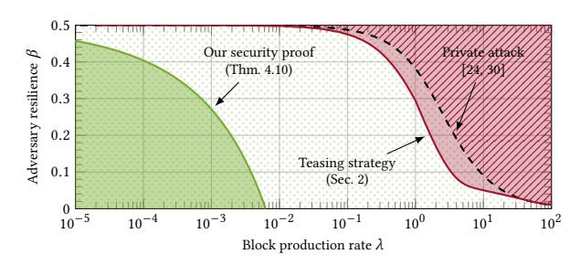

<span id="page-0-0"></span>Figure 1: Regions of fraction  $\beta$  of adversary nodes and block production rate  $\lambda$  with security proofs ( $\square$ ) and attacks ( $\square$ ) for NC under a fixed processing capacity of C=1 block per second. Analysis in the bounded-delay model [24, 30] (with  $\Delta=1$  s) proves that the private attack (---) succeeds ( $(\wedge)$ ) iff  $\beta \geq \frac{1-\beta}{1+(1-\beta)\lambda}$ , and that for all other values of  $\beta, \lambda$ , no attack succeeds ( $(\wedge)$ ). Our teasing strategy exploits congested block processing and succeeds at lower adversary  $\beta$  than the private attack ( $(\square, \wedge)$ ). Our analysis in a bounded-capacity model yields a security region ( $(\square)$ ) for PoW NC.

## 1 INTRODUCTION

In order to remain secure against adversaries controlling up to 50% of the network, blockchains that utilize Nakamoto's proof-of-work (PoW) longest-chain consensus protocol [28, 45] have been parameterized to leave a security margin between the throughput under normal operation and each node's capacity limits. For instance, in expectation, Bitcoin produces only one block of transactions every ten minutes, though it usually only takes a few seconds for a node to download and verify a block's contents [23]. On the other hand, Bitcoin Cash forked off to increase the block size for better throughput, a proposal whose security implications were hotly debated [1]. The fundamental question that protocol designers face is: What is the security-performance trade-off between the block production rate (relative to the nodes' capacity limit) and the fraction of adversary power that the protocol tolerates? In this work, we show the inadequacy of the bounded-delay model that most previous works utilized to analyze the security of Nakamoto consensus (NC) [24, 28, 30, 35, 37, 50, 52, 55], and instead provide security analysis in a bounded-capacity model that better captures real-world effects such as congestion due to a backlog of blocks that need to be communicated and validated by nodes.

In PoW NC, collectively starting with a well-known "genesis" block, each node continuously works to solve a computational puzzle to extend the longest chain of blocks it sees with a new block containing pending transactions ("mining a new block"). When successful, the node pushes the new block's header to the network, and makes its content available for download. In order to extend a chain, nodes must first process, i.e., download and verify, the content of blocks in that chain, to ensure that the content is both available and valid. Downloading blocks may take time, especially if blocks are extremely large [23], but in systems that contain smart contracts, even smaller blocks may take a while to process—mostly due to the time it takes to execute and validate smart contracts [42].

In PoW, block production occurs at random times, which makes the processing load of the network bursty. Moreover, the adversary can selectively withold its own mined blocks and release them opportunistically. Both these factors further stress the processing (communication, computation, ...) capacities of nodes. With limited processing capacity, during times of high load, blocks will be queued for processing. Since nodes cannot mine new blocks extending chains that they have not yet fully processed, queueing further delays the growth of the honest nodes' chain. As the security of NC is based on the honest chain outgrowing any adversary chain, the reduced growth of the honest nodes' chain makes it easier for an adversary to attack the system. To analyze security under such effects, it is important to consider the scheduling policy that nodes use in deciding which blocks to download and verify first, given a set of new block headers. Since a node extends its longest chain to produce new blocks, an obvious policy is to first process blocks along the longest header chain that the node has seen. Indeed, this policy can be found in the Bitcoin implementation [9].

**Limitations of the Bounded-Delay Model.** Previous work has focused on the security analysis of Bitcoin in the synchronous setting: All messages are assumed to arrive after a maximum delay of  $\Delta$  [24, 28, 30, 35, 37, 50, 52, 55]. Using this model, [24, 30] calculate a tight bound on the fraction  $\beta$  of adversary nodes, for given block production rate  $\lambda$  and delay bound  $\Delta$ , for which the protocol is secure against all attacks. However, the  $\Delta$ -delay model assumes that the delay is the same *irrespective of the total processing load*, and specifically, that the adversary cannot manipulate the load to its advantage. Thus, the model fails to capture the security implications of bursty release of blocks by an adversary or due to the stochastic nature of PoW mining even by honest nodes alone.

The bounded-delay analysis [24, 30] concludes that the well-known private attack [45] (along with delaying every message by  $\Delta$ ) is the worst-case attack strategy since its attack threshold matches the security threshold, *i.e.*, under parameters where the private attack fails, the analysis concludes that all other attacks must fail, too. If we only consider the private attack and low block production rates, then the bounded-delay analysis, with  $\Delta$  taken as the time to process one block, is a good approximation to calculate the fraction of adversary power with which the attack succeeds (see Fig. 1, validated by simulations in Sec. 2). This is because during the private attack, the adversary does not release any blocks (only "benign" random congestion), and the effect of bursty honest mining is less significant at low block rates.

However, there are other strategies in which the adversary adds to the processing load to increase queuing delays. We simulate one such strategy, the teasing strategy (Sec. 2), that is stronger than the private attack, *i.e.*, it succeeds in regions of  $(\lambda, \beta)$  where the private attack does not (Fig. 1). In the teasing strategy, the adversary "teases" honest nodes to process a longer chain it announces, but makes this effort "useless" by not releasing the block contents for the entire chain. The adversary effectively doubles the processing load and queuing delays, thus slowing the growth of the honest nodes' chain, while the adversary builds a longer chain to break security. This halves the maximum secure block rate  $\lambda$  for any given  $\beta$  (Fig. 1). While the concrete *quantitative* impact of this attack may be considered modest, it highlights conceptual limitations of earlier analyses and emphasizes the need for security analysis under more realistic network models, especially to rule out that unbeknown to us there could be even more serious queuing-based attacks.

Security Bounds under Bounded Processing Capacity. To reestablish the security of NC in a more realistic model, we adopt the bounded-capacity model from [48]. Under this model, we consider the scheduling policy as a part of the protocol description as it affects the security of the protocol. Henceforth, we continue to use the verb "to process" to abstract a variety (or combination) of tasks (communication/download, computation/execution/verification, input-output/storage access, ...) that are typically subject to rate constraints in real-world systems, and we refer to the corresponding rate limit abstractly as "(processing) capacity".

**Result 1.** Using the bounded-capacity model and a novel analysis technique, we characterize a region of block mining rate  $\lambda$  and adversary fraction  $\beta$  for which we prove that PoW NC, with a wide range of suitable scheduling policies, is secure (Thm. 4.10). This region is shown in Fig. 1. Specifically, this analysis expands the set of adversary strategies captured by earlier bounded-delay analyses to include adversary strategies that exploit effects from bounded capacity.

In Fig. 2, we plot the adversary resilience versus bandwidth requirement for PoW NC with cautious (*e.g.* Bitcoin) and ambitious (*e.g.* Bitcoin Cash) parameters. It shows the importance of modeling and studying congestion effects on security, in particular, for protocols that aim for maximum performance, and our analysis provides tools to do so. While our work demonstrates that earlier analyses have failed to capture some security-critical phenomena, the quantitative gap between our best-known attack (Fig. 1 ) and our best-known security analysis (Fig. 1 ) points to a need for future work.

**Proof-of-Stake (PoS) NC.** Nakamoto consensus has been adapted to proof-of-stake in protocols of the Ouroboros [4, 22, 35] and Sleepy Consensus [19, 52] families. In PoS NC, the block production lottery is independent of the block's content or parent [5]. This, unlike in PoW NC, allows an adversary to *reuse* a "winning PoS lottery ticket" to create infinitely many valid blocks (called *equivocations*). As observed in [48], the adversary can *spam* nodes with many

<span id="page-1-0"></span> $<sup>^1\</sup>text{We}$  focus on the security–throughput tradeoff of NC, i.e., for what tuples  $(\lambda,\beta)$  does the consensus-failure probability  $\varepsilon$  decay exponentially to zero under some appropriate scaling of the confirmation latency  $T_{\text{live}}$ . On a finer point, in our bounded-capacity analysis, latency scales  $T_{\text{live}} \sim (\log(1/\varepsilon))^2$  (Thm. 4.10), in contrast to earlier bounded-delay analyses that required only  $T_{\text{live}} \sim \log(1/\varepsilon)$  [10, 30, 55]. Exploring the possibility of tighter latency scaling under bounded capacity requires future work.

<span id="page-2-0"></span>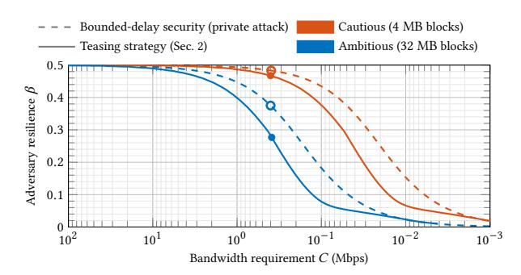

<span id="page-2-1"></span>Figure 2: For cautiously parameterized PoW NC (e.g., Bitcoin's = 1/600 blocks/s, block size 4 MB, recommended min. per-node bandwidth 0.4 Mbps [\[8,](#page-13-14) [18\]](#page-13-15)), earlier analyses assuming bounded delay ( ) predicted security against any adversary controlling u[p to 4](#page-2-1)8% of hash power [\(](#page-2-1) ), including Nakamoto's private attack [\[45\]](#page-14-0), which was concluded to be worst-case. The teasing strategy still requires 46% adversary [\(](#page-2-1) a, [\)](#page-2-1). In contrast, PoW NC parameterized ambitiously (e.g., Bitcoin Cash's same , but max. block size 32 MB, same bandwidth [\[54\]](#page-14-5)) withstands only a 37% private attacker [\(](#page-2-1) ), while the teasing strategy resilience drops to 27% ( [\)](#page-2-1).

equivocating blocks, aggravating the problem of congestion. While slashing [\[11,](#page-13-16) [12,](#page-13-17) [49,](#page-14-6) [59\]](#page-14-7) may deter rational adversaries to some extent, protocols need to tolerate equivocations to handle plausibly irrational Byzantine adversaries [\[48\]](#page-14-4).

Analytical work [\[48\]](#page-14-4) gives a security proof for PoS NC in the bounded-capacity model. However, [\[48\]](#page-14-4) proves security only when nodes have enough capacity so that for each block, they can process potentially different versions of its predecessors, where is the confirmation depth chosen for the chain. This increases the network load by times, thus reducing the maximum secure block rate by times [\(Fig. 3\)](#page-2-2). Decreasing the probability of consensus failure requires increasing , which means that for security with overwhelming probability, the throughput must approach zero. This is not merely an artifact of the security analysis of [\[48\]](#page-14-4): Augmenting our teasing strategy with equivocations demonstrates this behavior (we discuss this in [Sec. 2](#page-4-0) and [App. B.2\)](#page-15-0). On the other hand, PoW NC does not suffer from such vanishing throughput [\(Fig. 1\)](#page-0-1).

Result 2. We propose and prove the security of a new PoS protocol we call Blanking NC (BlaNC), a variant of PoS NC, that is secure in the same region of block production rate and adversary fraction as PoW NC. Thus, similar to PoW NC, security with overwhelming probability requires increasing the confirmation depth, which affects latency, but not decreasing the block production rate, which affects throughput (see [Fig. 3\)](#page-2-2).

On a high level, in BlaNC, honest nodes establish consensus on PoS lottery tickets for which they have seen equivocations. The contents of blocks from those equivocating PoS lottery tickets are then blanked, i.e., all blocks from those tickets are treated as empty blocks. This absolves honest nodes from processing more than one block per PoS lottery ticket, restoring the non-equivocation

<span id="page-2-2"></span>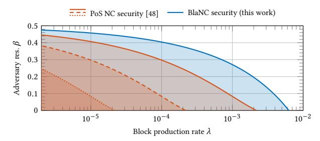

Figure 3: The region of fraction of adversary nodes and block production rate where PoS NC is secure according to [\[48\]](#page-14-4) ( ) shrinks as the NC confirmation depth increases, i.e., the desired consensus failure probability decreases (in order: to ). Thus, for the PoS NC protocol of [\[48\]](#page-14-4), security requires vanishing throughput. In contrast, our new BlaNC protocol achieves a security region ( ) that is independent of the desired consensus failure probability. Thus, BlaNC is secure with non-vanishing constant throughput. (For all lines, processing capacity is fixed to = 1 block/s.)

behavior of PoW from a capacity point of view. From there, the security proof closely follows that of PoW NC.[2](#page-2-3)

Blanking block contents undermines predictability of transaction validity (cf. [Sec. 1.2.3\)](#page-4-1). In particular, it is harder to ensure, at the time of composing a block, whether transactions are able to pay their fees. Many modern consensus protocols share this problem (e.g., [\[2,](#page-13-18) [20,](#page-13-19) [43,](#page-13-20) [61,](#page-14-8) [63\]](#page-14-9)). We suggest some solutions in [Sec. 5.2.](#page-12-0)

## 1.1 Related Works

Earlier works have analyzed the security of PoW [\[24,](#page-13-0) [28,](#page-13-2) [30,](#page-13-1) [37,](#page-13-6) [45,](#page-14-0) [50,](#page-14-1) [55\]](#page-14-3) and PoS [\[4,](#page-13-9) [5,](#page-13-12) [19,](#page-13-11) [22,](#page-13-10) [24,](#page-13-0) [35,](#page-13-5) [52\]](#page-14-2) NC in the bounded-delay model. Our analysis builds on tools from several of these works, primarily pivots [\[52\]](#page-14-2) (Nakamoto blocks [\[24\]](#page-13-0)) and convergence opportunities [\[37,](#page-13-6) [50,](#page-14-1) [52\]](#page-14-2) (or similar [\[24,](#page-13-0) [55\]](#page-14-3)). Markov decision processes were used [\[31,](#page-13-21) [60\]](#page-14-10) to computationally find optimal attack strategies, assuming honest nodes do not suffer any delay.

Limitations of the bounded-delay model have been observed in previous work [\[6,](#page-13-22) [27,](#page-13-23) [48\]](#page-14-4). To use the bounded-delay model to set the protocol's block production rate, one needs to find the value of the bound Δ. This is tricky because unlike the capacity limit, which is a physical limit of the hardware used, delay depends on the network load. One approach is to set the delay to the time taken to process one block, i.e., Δ = 1/. While this may be reasonable at rates much smaller than the capacity (as processing queues are mostly empty), queuing delay breaks this bound otherwise. In [\[27\]](#page-13-23), a queuing model is used to calculate a delay bound that holds throughout the execution with overwhelming probability. However, such a tail bound is too pessimistic because the queuing delays cannot always be large, due to limited block production. In contrast, our finergrained analysis captures limited block production. Another work [\[57\]](#page-14-11) analyzes security in a random (iid) delay model. However, the network load, hence queuing delay, is not purely a random process, but is controlled by the adversary. Network experiments [\[23,](#page-13-3) [38,](#page-13-24) [56\]](#page-14-12)

<span id="page-2-3"></span><sup>2</sup>The confirmation latency of BlaNC under bounded capacity scales quadratically with the security parameter, just like PoW NC's latency.

help estimate the delay distribution but cannot show us the impact of all possible adversary manipulations.

In analytical work [48], the bounded-capacity model captures adversarial manipulations. Our paper's bounded-capacity model is that of [48]. Our paper differs from [48] two-fold: (a) Only PoS is studied in [48]. Due to equivocations in PoS, the security bounds of [48] are too pessimistic for PoW NC. We develop *new analysis machinery* (cf. Sec. 1.2.1) to prove security *for PoW*. Furthermore, the attack in [48] does not apply to PoW, while our teasing strategy does. (b) PoS NC with the freshest-block policy proposed in [48] is secure only when its throughput approaches zero. In contrast, our *new PoS protocol*, BlaNC, is secure *with non-vanishing throughput*.

Concurrently, [62] analyzes specific congestion-based attacks on PoW DAG protocols but does not provide a security proof against all attacks. Propagation delays also exacerbate selfish mining strategies [41], and congestion is another way to increase propagation delays. However, the goal of this work is to analyze *security* under bounded capacity, and selfish mining does not affect the two security properties of consensus: safety and liveness. It affects incentives and fairness, which are orthogonal.

Capacity limits apply not only to downloads but also to execution of transactions and smart contracts. For instance, earlier works [53] have shown that execution times can vary by orders of magnitude between benign and maliciously crafted transactions (with equal gas consumption). While download and execution are similar in that the time taken increases with the number of transactions, they are different in some aspects. Execution is harder to parallelize due to transactions that depend on each other. Methods to parallelize execution of smart contracts are studied in [25, 58]. Additionally, executing transactions can be delayed until after confirmation, such as in [2, 21], but delaying downloads could lead to data availability attacks (cf. Sec. 5.1).

## 1.2 Overview of Key Ideas and Methods

<span id="page-3-0"></span>1.2.1 New Analysis Technique. Our key contribution is a new analysis technique for PoW NC under bounded capacity. Traditional NC security analysis (Fig. 4(a)) is based on the notion of a pivot [52]. Pivots are special honest blocks ( $\Rightarrow$  liveness) which by a combinatorial argument remain in the chain forever ( $\Rightarrow$  safety), and by a probabilistic argument happen frequently. Safety and liveness of NC with suitable parameters follow swiftly.

Under bounded delay, the qualities required for the probabilistic and combinatorial argument, respectively, are equivalent. As a result, it has not been widely noted that these properties are not identical. Under bounded capacity, these properties are no longer equivalent. Our **first** conceptual **contribution** is to decompose pivots' probabilistic/combinatorial qualities into *ppivots* and *cpivots* (Fig. 4(b)). Ppivots are honest block production events where in every time interval around them there are more honest than adversary block production opportunities (same as pivots in the bounded-delay analysis). Cpivots are honest block production events where in every time interval around them there are more *chain growth* events than non-chain-growth events (chain growth occurs only when an honest block is produced *and soon processed* by honest nodes).

<span id="page-3-1"></span>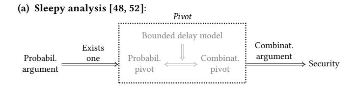

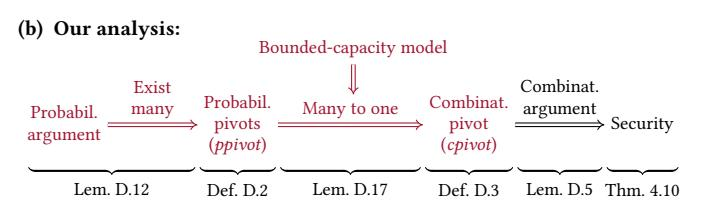

Figure 4: (a) Sleepy analysis [52] is based on *pivots*. Pivots are special *honest* blocks ( $\Rightarrow$  liveness) which by a combinatorial argument remain in the chain forever ( $\Rightarrow$  safety), and by a probabilistic argument happen frequently. Equivalence of the pivot qualities required for each of both arguments follows from bounded delay [51, Fact 1]. The bounded-capacity analysis of [48] also follows the same procedure by choosing a large enough delay parameter. (b) We (red) decompose pivots' probabilistic vs. combinatorial qualities into *ppivots* vs. *cpivots*. These are no longer equivalent under bounded capacity, but of *many* consecutive ppivots *one* is a cpivot (new combinatorial argument), and ppivots are abundant (new probabilistic argument).

Some ppivots no longer turn into cpivots under bounded capacity, because adversary block release can delay the processing of honestly produced blocks, and thus some honest block production opportunities might not translate to chain growth. Previous bounded-capacity analysis [48] side-stepped this difference by choosing a specific scheduling policy and such a low block production rate that every ppivot becomes a cpivot. Instead, our **second** technical **contribution** is a combinatorial argument to show that if there is a sufficiently *high density* of ppivots over a long time interval, then at least one of these ppivots is typically a cpivot. This relies on the adversary's limited budget of blocks it can spam with, and holds for a wide range of scheduling policies (including longest-header-chain and freshest-block [48]).

The original probabilistic argument of [52] guarantees only a fairly *low density* of ppivots. Proving a high density is challenging because the occurrence of ppivots are dependent events, so standard Chernoff-style tail bounds are not enough. Our **third** technical **contribution** is to show, by leveraging the weak dependence of ppivot occurrences, that long time intervals typically have a *high density* of ppivots. This completes the analysis for PoW NC.

1.2.2 Blanking Nakamoto Consensus. In BlaNC, every honest node processes at most one out of several equivocations, and instead considers equivocating blocks to be blank. This makes honest nodes immune to the effects of equivocation spamming. However, we need to ensure that honest nodes can still switch from one chain to another longer chain, both of which might contain different equivocating blocks. For this, note that headers of two equivocating

blocks from the same PoS lottery can serve as a *succinct equivocation proof* to convince other nodes that an equivocation was committed. Therefore, in BlaNC, if an honest node sees an equivocation for a block in its longest chain, it publishes an equivocation proof in the block that it produces, which allows all nodes to consistently treat the equivocating block's content as *blank* without processing it.

A caveat so far is that an adversary could reveal an equivocation late and cause inconsistent ledgers across honest nodes and/or time. To avoid this, we enforce a deadline for how late an equivocation proof can be included in the chain. Our security proof shows how to parameterize the deadline and the protocol's confirmation depth such that if any honest node has blanked the content of any equivocating block on its longest chain, then an appropriate equivocation proof is timely included on-chain, and all honest nodes blank the block's content before it reaches the output ledger.

<span id="page-4-1"></span>1.2.3 Ensuring Fees Get Paid despite Lack of Predictable Validity. Blanking of blocks in BlaNC leads to lack of predictable transaction validity, i.e., honest nodes do not know whether transactions they include in their block will be valid, since the content of blocks in the prefix may later be blanked due to an equivocation. Many modern consensus protocols in which consensus proceeds without executing transactions [2, 20, 43, 61, 63] also lack predictable transaction validity. This risks that the adversary gets to spam the ledger with invalid transactions for free. In one solution to prevent this, we focus on guaranteeing transaction fees are always paid regardless of equivocations, by introducing gas deposit accounts that can only be used to pay transaction fees. Any deposit to such an account takes effect only after the deadline has passed for the inclusion of any equivocation proof that might lead to removal of transactions from the deposit's prefix. This gives honest block producers a lower bound on the account's balance which they can use to reliably determine whether a transaction can pay fees.

## <span id="page-4-0"></span>2 THE TEASING STRATEGY

We begin by exploring a strategy that the attacker can adopt which forces honest nodes to waste capacity on blocks that do not contribute to chain growth. This strategy demonstrates that the well-studied *private attack* [24, 45] is not the worst case behavior of the attacker, and that the previously established security bounds of the bounded-delay model do not hold in the bounded-capacity setting. We go on to simulate our teasing strategy and to show how it compares to the private attack (summarized in Fig. 5).

Previous analyses concluded that the private attack (Fig. 5) is worst-case based on the false assumption that delays, and hence the honest chain growth rate, do not depend on whether the adversary releases blocks and causes congestion. We exploit congestion to develop the teasing strategy.

**Description of the Teasing Strategy.** The key idea in the teasing strategy (summarized in Fig. 6) is that the adversary can strategically time the release of blocks it had mined in order to take up some of the capacity of honest nodes.<sup>3</sup> In a nutshell, while the adversary continues to mine a private chain, every time an honest node announces a block at a new height, the adversary releases the

<span id="page-4-2"></span>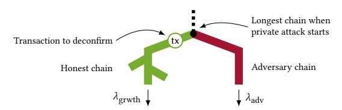

Figure 5: Private attack (recap): Based on the tip of the longest chain when the private attack starts, the adversary mines a private adversary chain, while honest nodes jointly grow a public honest chain. The adversary's goal is to deconfirm a transaction tx included on the honest chain just below where the adversary chain forks off. Adversary mining is perfectly coordinated so that the adversary chain grows at the adversary block production rate  $\lambda_{\rm adv}$ . Honest nodes suffer from forking due to network delay so that the honest chain grows at a lower rate  $\lambda_{\rm grwth} < \lambda_{\rm hon}$  than the total block production rate  $\lambda_{\rm hon}$  of honest nodes. The attack succeeds if the adversary chain grows faster than the honest chain  $(\lambda_{\rm adv} > \lambda_{\rm grwth})$  and thus, irrespective of the confirmation depth  $k_{\rm conf}$  chosen for NC, the adversary chain can eventually displace the honest chain as the longest chain and with that deconfirm tx.

headers of a segment of its longer withheld chain and the contents of only the first block. Due to longest-header-chain scheduling, honest nodes prioritize processing blocks on the chain announced by the adversary. Only after an honest node has processed the first adversary block and realizes that the content for the remaining blocks in the announced adversary chain segment are unavailable, does the longest-header-chain rule switch back to processing the newly created honest block. Therefore, the adversary 'teased' the honest nodes to spend some of their resources processing the adversary chain, but without actually gaining a longer chain of blocks compared to the chain they already possessed. The result of this strategy is delayed processing of honest blocks that extend the longest honest chain. Processing is delayed by a factor of 2 compared to the private attack. This in turn results in more honest blocks forking, thus slowing down the honest chain growth rate (Fig. 7 •) to  $\lambda_{\text{grwth}}^{\text{teaser}} < \lambda_{\text{grwth}}^{\text{privt}}$ 

Conditions for success of the teasing strategy. Formally, in both the private attack and the teasing strategy, the length difference between the adversary chain and the honest chain is a random walk [24] which increases at the rate  $\lambda_{\rm adv}$  and decreases at the rate  $\lambda_{\rm grwth}$ . If  $\lambda_{\rm adv}>\lambda_{\rm grwth}$ , the random walk has a positive drift, so in the long run, the adversary chain will outgrow the honest chain indefinitely and the attack succeeds. Conversely, if  $\lambda_{\rm adv}<\lambda_{\rm grwth}$ , the random walk has a negative drift and the attack will eventually fail. Thus,  $\lambda_{\rm grwth}$  determines the fraction  $\beta$  of total mining power that the adversary needs for the attack, *i.e.*, the attack succeeds if

<span id="page-4-4"></span>
$$\beta \triangleq \frac{\lambda_{\rm adv}}{\lambda_{\rm adv} + \lambda_{\rm hon}} > \frac{\lambda_{\rm grwth}}{\lambda_{\rm grwth} + \lambda_{\rm hon}}.$$
 (1)

Note that the teasing strategy requires the adversary to maintain a lead of at least two blocks with respect to the honest chain at all times (to proceed in steps (a), (e) in Fig. 6). If this fails, then the adversary must give up and try the attack again. We show a

<span id="page-4-3"></span><sup>&</sup>lt;sup>3</sup>While similar to the BDoS attack of [44], we note that while they exploit miner incentives to depress honest mining, our teasing strategy exploits network and processing congestion to attack safety.

<span id="page-5-1"></span>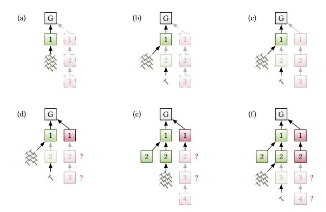

Figure 6: Teasing strategy: Green/red are honest/adversary blocks, and numbers on blocks indicate height in the blockchain. Semi-transparent blocks have been announced (i.e., headers released) but were not vet processed by honest nodes. Blocks with a dashed outline are mined privately by the adversary but not announced. (a) The adversary begins with a short private lead, while honest nodes attempt to extend the honest block 1. (b) An honest node mines a block at height h = 2, and announces it. Until this block is processed, all honest nodes (except the one who mined block h) continue to mine on top of the block at height h-1. (c) The adversary announces its chain with height h + 1, and the honest nodes prioritize its processing beginning with block 1. (d) Honest nodes keep mining as before while requesting the content of the longest chain (the adversary's chain). When honest nodes request the adversary's block of height h = 2, they find it to be unavailable ('?'), i.e., the adversary did not release its content. Honest nodes then resume processing the honest block of height h = 2. (e) Eventually, all honest nodes process some block at height 2. The delay in this processing means new blocks by honest nodes could have been mined at height 2, thereby not growing the chain. Meanwhile, if the adversary mined another block, then they are back to step (a), i.e., the adversary has a 2 block lead and can repeat steps (b)-(e) at the next height h + 1, as shown in step (f).

sample plot of the adversary's lead for different mining rates in Fig. 8. For a large enough adversary (if  $\lambda_{\rm adv} > \lambda_{\rm grwth}^{\rm privt}$ ), it is clear the lead has a positive drift and eventually stays positive. However, the teasing strategy succeeds even when the lead has a negative drift initially (e.g. for  $\lambda_{\rm grwth}^{\rm teaser} < \lambda_{\rm adv} < \lambda_{\rm grwth}^{\rm privt}$ ), as it only needs a random lucky short burst to kickstart step (a). The resulting congestion then decreases the average growth rate of the honest chain to  $\lambda_{\rm grwth}^{\rm teaser}$ , and the adversary with mining power  $\lambda_{\rm adv} > \lambda_{\rm grwth}^{\rm teaser}$  can positively bias the random walk, thus eventually maintaining a positive lead, and succeed. We see this process in Fig. 8 ——: the adversary's lead rises and drops to zero a few times, causing the adversary to try again. However, eventually, the adversary manages to maintain a permanent lead. On the other hand, when  $\lambda_{\rm adv} < \lambda_{\rm grwth}^{\rm teaser}$ , the adversary's lead has a negative drift even after the congestion

<span id="page-5-0"></span>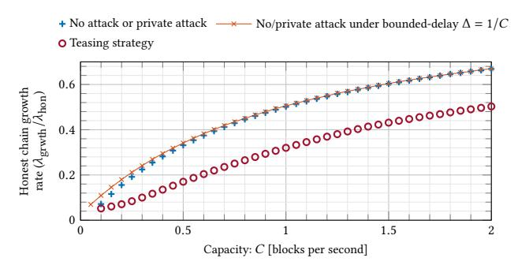

<span id="page-5-4"></span>Figure 7: Results of a simulation showing that attackers can slow the growth of the honest chain using the teasing strategy. Shown, is the rate of chain growth relative to honest block production rate, when nodes prioritize processing towards the longest header chain, for various capacity limits. When the attacker does not release any blocks (no attack or private attack), we already see  $\lambda_{\rm grwth} < \lambda_{\rm hon}$  due to natural congestion (\*). The honest chain growth rate under the private attack is approximately the same for a network with finite processing capacity C (\*), or for an idealized network with bounded delay  $\Delta = 1/C$  (——). With a teasing strategy, processing is slowed roughly by a factor of 2, which lowers the growth rate of the chain further (o). This lowers security compared to a private attack, cf. Fig. 1.

<span id="page-5-2"></span>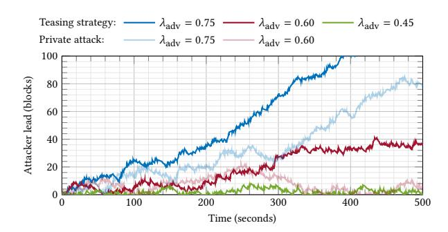

<span id="page-5-3"></span>Figure 8: Adversary lead (difference between adversary and honest chain lengths) under private attack and teasing strategy. The simulation consists of 100 honest nodes with capacity C=2 blocks per second, collectively mining  $\lambda_{\rm hon}=1$  block per second, and one adversary node with variable mining rate  $\lambda_{\rm adv}$  blocks per second. With these parameters,  $\lambda_{\rm grwth}^{\rm privt}=0.67$  and  $\lambda_{\rm grwth}^{\rm teaser}=0.50$  (from Fig. 7). A weak adversary ( $\lambda_{\rm adv}=0.45$ , —) is unable to mine fast enough to gain a lead on the network. A stronger adversary ( $\lambda_{\rm adv}=0.60$ ) fails to gain a permanent lead through the private attack (——). But, through the teasing strategy, after repeatedly retrying during the first 200 seconds, eventually manages to maintain a lead (——). An even stronger adversary ( $\lambda_{\rm adv}=0.75$ ) succeeds almost at once under both strategies (——,——).

effects kick in (Fig. 8 ——), and therefore the teasing strategy is bound to run out of blocks and fail.

With the combined mining rate  $\lambda \triangleq \lambda_{\text{hon}} + \lambda_{\text{adv}}$  of honest nodes and adversary, and the honest chain growth rates from Fig. 7, we use eqn. (1) to calculate the adversary fraction  $\beta$  required for each attack and plot it in Fig. 1.

**Simulation details.** We simulate<sup>4</sup> both the private attack and the teasing strategy on a network of 100 nodes. Honest nodes collectively mine blocks at a rate  $\lambda_{\text{hon}} = 1$  block per second. Each node has a limited processing rate of C blocks per second. Blocks consist of content (transactions) and a header (PoW and parent block pointer). Since the header contains all information necessary to verify the PoW, nodes only process validly created blocks. All honest nodes and the adversary can directly send valid block headers to one another. Given a tree of valid block headers, nodes run the *longest-header-chain policy*, *i.e.*, nodes attempt to process (download and verify) the first unprocessed block along the longest header chain. If the longest chain is already processed, or if the content of any block on that chain is unavailable or invalid, then the rule considers the next longest header chain, and so on. We further elaborate on the setup and other simulation details in App. A.

Practical aspects of the teasing strategy. The teasing strategy may not acutely break specific real-world implementations of PoW NC, mainly because miners have over-provisioned capacity. Although the teasing strategy is specific to the longest-header-chain policy, it is possible to devise attacks that exploit congestion even for other policies (see App. B.1). We also note that in basic PoS NC, the adversary can exacerbate the teasing strategy by equivocating the whole adversary chain every time before it releases a block. As the attack goes on, the length of the new announced chain increases. This increases the time honest nodes spend processing this chain, and decelerates the honest chain growth until it comes to a halt. As a result, the chain growth rate under the equiv-teasing attack is nearly zero (details in App. B.2). The key takeaway from the teasing strategy is that exploiting congestion results in attacks that are more severe than the private attack, even in PoW where the block production is limited, and even when the block production rate is below the capacity of nodes. This invalidates the bounded-delay model's predictions and emphasizes the need for a security analysis under models that capture the effects of congestion, especially for protocols that aim to saturate physical performance limits.

Effect of SPV miners. Rational miners in PoW NC face a verifier's dilemma [15, 21, 42]: there is no incentive to download and verify a block's content before mining to extend it. Some so called SPV miners (named after simple-payment-verification clients who download only block headers) mine empty blocks without verifying the parent block's content first, and thus get more time to mine, increasing their chances of being rewarded for mining the next block. Since SPV miners are immune to congestion (as they do not process block content), how does their presence affect the teasing strategy? Under the teasing strategy, SPV miners would mine on the adversary's longer header chain (red block 3 in Fig. 6(d)) without waiting for its contents. However, the remaining honest miners (who we assume still outnumber the SPV miners) still do not consider this chain valid (due to unavailable content). They continue mining on the honest chain, and would still be slowed down by the teasing strategy just as before. We added SPV miners to our simulation and

<span id="page-6-1"></span>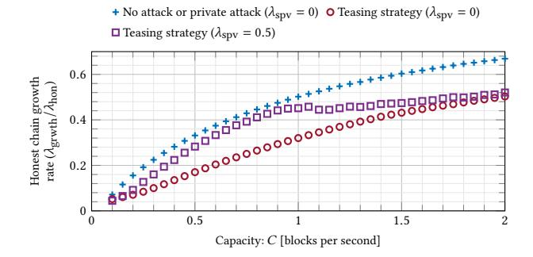

Figure 9: Teasing strategy in the presence of SPV miners, compared with teasing strategy and private attack without SPV miners (same as in Fig. 7). Total mining rate of SPV miners is  $\lambda_{\rm SPV}$  blocks per second. Total mining rate of honest miners is  $\lambda_{\rm hon}=1$  block per second. SPV miners are not counted as honest. Teasing strategy still succeeds with lower adversary power than private attack (Fig. 9).

verified that the teasing strategy still succeeds with lower adversary power than the private attack (Fig. 9). Thus, the qualitative insight from the teasing strategy, that congestion enables worse attacks than the private attack, persists.

## <span id="page-6-2"></span>3 PROTOCOL & MODEL

We briefly recap Nakamoto consensus (NC) and the bounded-capacity model of [48]. Detailed pseudocode of the protocol is provided in App. C.1. Technical details about the model are provided in App. C.3. For ease of exposition, the execution features a *static* set of *N* equipotent nodes, each of which runs an independent instance of the protocol. Temporary crash faults ('sleepiness') of nodes, heterogeneous distribution of hash power, or difficulty adjustment are left to be addressed with techniques from [28, 29, 52]. We are interested in the large system regime  $N \to \infty$ . Nodes interact with each other and with the adversary  $\mathcal A$  through an environment  $\mathcal Z$  that models the network.  $\mathcal A$  and  $\mathcal Z$  are summarized below.

Nakamoto's Longest Chain Consensus Protocol. For ease of analysis, we consider the protocol (pseudocode in Alg. 1) to proceed in discrete *slots* of duration  $\tau$ . Consider  $\tau$  to be a small quantum of time where  $\tau \to 0$ . At each slot t, the protocol queries the PoW block production ('mining') oracle (idealized functionality in Alg. 2) in an attempt to extend the *longest processed chain* dC in the node's view with a new block of pending transactions txs. Each block production attempt is committed to a parent block and block content, and only a single block is produced when the attempt is successful. Per slot, each node can make one block production attempt that will be successful with probability  $\rho/N$  where  $\rho = \Theta(\tau)$ , independently of other nodes and slots. If successful, the node disseminates both the resulting (block) header C' and the associated (block) content txs via the environment  ${\mathcal Z}$  to all nodes. Finally, the protocol identifies the  $k_{\text{conf}}$ -deep prefix d $C^{\lceil k_{\text{conf}} \rceil}$  containing all but the last  $k_{\text{conf}}$  blocks of dC. The transactions along d $C^{\lceil k_{\text{conf}} \rceil}$  are concatenated to produce the output ledger  $LOG^t$ .

When a node p receives a new valid block header C from Z (push-based header broadcasting), then p adds C to its header tree

<span id="page-6-0"></span><sup>&</sup>lt;sup>4</sup>Source code: https://github.com/avivz/finitebwlc

 $h\mathcal{T}$  and relays C to all other nodes via  $\mathcal{Z}$ . Throughout the execution, the protocol requests from  $\mathcal{Z}$  (pull-based content downloading) the content for block headers decided by a *scheduling policy*. As a concrete example, we use the longest-header-chain rule (pseudocode in Alg. 3) in which a node downloads content for the first block header with unknown content on the longest header chain it sees. Once a block's content is received and verified by executing its transactions, the node makes it available to other nodes via  $\mathcal{Z}$ , and updates its dC.

**Bounded-Capacity Network.** We borrow the bounded-capacity network model of [48] (see Fig. 16 for an illustration). In this model,  $\mathcal{Z}$  abstracts *push-based flooding of 'small' block headers* and *pull-based downloading of 'large' block contents* from peers. Broadcasted block header chains are delivered by  $\mathcal{Z}$  to every node, with a pernode per-header delay determined by  $\mathcal{A}$ , up to a commonly known delay upper bound  $\Delta_h$ . Block content made available for download is kept by  $\mathcal{Z}$  in what can be thought of as a 'cloud'. Nodes can request the content associated with a particular header. If content matching the header is available, then it is delivered by  $\mathcal{Z}$  to the node. Content download and verification is subject to a per-node capacity constraint of C. Blocks have a fixed maximum size, hence C is measured in blocks per second. See App. C.3 for a more formal description of  $\mathcal{Z}$ .

The 'cloud' captures key properties of pull-based peer-to-peer downloading. At first, content matching a particular header might not be available (e.g.,  $\mathcal{A}$  produced a block and disseminated its header, but withheld its content). Later, such content can become available (e.g.,  $\mathcal{A}$  releases the content to one node). Thus, the 'cloud' ensures neither data availability nor strong consistency of query outcomes, unlike stronger primitives such as verifiable information dispersal [13, 33, 46, 63]. However, once content for a header does become available, it is unique and remains available. This captures the header's binding commitment to the content, and the fact that honest nodes share content with peers. Requests for unavailable content do not count towards the processing budget.

Also note that the adversary can push additional headers and contents to nodes at will. This models non-uniform capacity (higher than the lower bound C) and non-uniform delay (lower than the upper bound  $\Delta_h$ ) across nodes (analogous to adversary delay up to maximum  $\Delta$  in the bounded-delay model).

The Adversary. The *static* adversary  $\mathcal{A}$  chooses a set of nodes (up to a fraction  $\beta$  of all N nodes, where  $\beta$  is common knowledge) to corrupt before the randomness of the execution is drawn and the execution commences. Uncorrupted *honest* nodes follow the protocol at all times. Corrupted *adversary* nodes have arbitrary computationally-bounded *Byzantine* behavior, coordinated by  $\mathcal{A}$  in an attempt to break consensus. Among other things, the adversary can: withhold block headers and contents, or release them late or selectively to honest nodes; push headers and contents to nodes while bypassing the delay and capacity constraints; break ties in the chain selection and schdeuling policy. Note that all miners that deviate from the honest protocol (including crash faults and SPV miners) are modeled as adversary.

**Security.** For an execution of PoW NC where every honest node p at every slot t outputs a ledger LOG $_p^t$ , we recall the security desiderata

- *Safety:* For all adversary strategies, all slots t, t', and all honest nodes p, q (same or different):  $\mathsf{LOG}_p^t \preceq \mathsf{LOG}_q^{t'}$  or  $\mathsf{LOG}_q^{t'} \preceq \mathsf{LOG}_p^t$ .
- $T_{\text{live}}$ -Liveness: For all adversary strategies, if a transaction tx is received by all honest nodes by slot t, then for every honest node p and for all slots  $t' \ge t + T_{\text{live}}$ , tx  $\in \mathsf{LOG}_p^{t'}$ .

Note that since blocks have a fixed maximum size, liveness is expected only if transactions are received at a bounded rate. The following definition captures this.

Definition 3.1. The environment  $\mathcal{Z}$  is  $(\theta, T_{\text{txlim}})$ -tx-limited, if the cumulative size of all transactions received by honest nodes during any interval of  $T_{\text{txlim}}$  slots is at most  $\theta \cdot T_{\text{txlim}}$  times the maximum block size.

Liveness will be proved under transaction-limited environments. The parameter  $\theta$  is thus the worst-case throughput ( $\lambda$  being the best-case throughput). The burstiness of transaction arrival is measured by  $T_{\rm txlim}$ ; large  $T_{\rm txlim}$  may increase confirmation latency  $T_{\rm live}$ .

A consensus protocol is secure over time horizon  $T_{\rm hrzn}$  slots with transaction rate  $\theta$  iff for some finite  $T_{\rm txlim}$ ,  $T_{\rm live}$ , for all  $(\theta, T_{\rm txlim})$ -tx-limited environments, it satisfies safety, and  $T_{\rm live}$ -liveness with overwhelming probability<sup>5</sup> over executions of time horizon  $T_{\rm hrzn}$  slots. The properties can also be redefined in terms of real-time units instead of slots.

#### <span id="page-7-1"></span>4 SECURITY PROOF

Due to space constraints, we focus on the intuition for the proof. The security theorem for PoW NC is Thm. 4.10. The detailed full proof is provided in App. D.

## 4.1 Definitions

For any sequence  $\{X_k\}$  and index set I, let  $X_I \triangleq \sum_{k \in I} X_k$ .

**Probabilistic Model for PoW NC Executions.** A *block production opportunity* (BPO) is a pair (p,t) where according to the PoW block production lottery, node p is eligible to produce a block in slot t. A BPO is *honest* (resp. *adversary*) if p is honest (resp. adversary). Since  $N \to \infty$ , and mining power is homogeneous, honest (resp. adversary) BPOs per slot are Poisson distributed with parameter  $(1-\beta)\rho$  (resp.  $\beta\rho$ ). An *execution* refers to a particular realization of the block production lottery for all slots.

**Good, Bad, and Empty Slots.** Slots without a BPO are called *'empty'*. A slot is *'good'* iff it has exactly one honest BPO and no adversary BPOs, and is followed by  $\nu$  empty slots (inspired by convergence opportunities [37, 50, 52], loners [24], and laggers [55]). Here,  $\nu$  is an analysis parameter. We define another analysis parameter  $\widetilde{C}$  which is related to  $\nu$  as  $(\nu+1)\tau\triangleq\Delta_{\rm h}+\widetilde{C}/C$ . Thus,  $\nu,\widetilde{C}$  are chosen so that for a good slot, every honest node can receive the block header for the honest BPO, and process content for  $\widetilde{C}$  blocks, before the next BPO. Any non-empty slot which is not good is called *'had'*.

We denote by  $t_k$  the k-th non-empty slot. Then, we can introduce random processes over *indices*, with index k corresponding to the

<span id="page-7-0"></span><sup>&</sup>lt;sup>5</sup>As is customary, we denote by  $\kappa$  the security parameter. Event  $\mathcal{E}_{\kappa}$  occurs with overwhelming probability if Pr  $[\mathcal{E}_{\kappa}] \ge 1 - \operatorname{negl}(\kappa)$ . Here, a function  $f(\kappa)$  is negligible  $\operatorname{negl}(\kappa)$ , if for all n > 0, there exists  $\kappa_n^*$  such that for all  $\kappa > \kappa_n^*$ ,  $f(\kappa) < \frac{1}{\kappa^n}$ .

k-th non-empty slot  $t_k$ . Considering only indices simplifies notation considerably. The process  $\{G_k\}$  ('G' for good) counts good slots, with  $G_k \triangleq \mathbb{1}_{\{Good(t_k)\}}$ . Correspondingly, let  $\overline{G}_k \triangleq 1 - G_k$ . The following fact shows the distribution of good indices.

Proposition 4.1. The  $\{G_k\}$  are independent and identically distributed (iid) with  $\Pr\left[G_k=1\right]\triangleq p_{\rm G}=(1-\beta)\frac{\rho e^{-\rho(\nu+1)}}{1-e^{-\rho}}$ .

Throughout the analysis, we assume  $p_{\rm G} > \frac{1}{2}$  ('honest majority' assumption).

**Some Good Slots Imply Growth.** A special role is played by good slots  $t_k$  with the additional property that the block produced at  $t_k$  is 'soon' processed by all honest nodes. Intuitively, these lead to chain growth, the cornerstone of NC security [24, 52]. We count these slots with  $\{D_k\}$  ('D' for downloaded). Specifically,  $D_k \triangleq 1$  if  $t_k$  is good and the block produced at  $t_k$  has been processed by all honest nodes by the end of slot  $t_k + v$ ,  $D_k \triangleq 0$  otherwise, and  $\overline{D}_k \triangleq 1 - D_k$ . Note that  $\{G_k\}$  are iid, and not affected by adversary action, while  $\{D_k\}$  do depend on the adversary action and are thus in particular not iid.

#### <span id="page-8-5"></span>Probabilistic and Combinatorial Pivots.

Definition 4.2. We call an index k a ppivot (probabilistic pivot), denoted as  $\mathsf{PPivot}(k)$ , iff  $\mathsf{PPivot}(k) \triangleq (\forall (i,j] \ni k : G_{(i,j]} > \overline{G}_{(i,j]}).^6$ 

<span id="page-8-4"></span>Definition 4.3. We call an index k a cpivot (combinatorial pivot), denoted as  $\mathsf{CPivot}(k)$ , iff  $\mathsf{CPivot}(k) \triangleq (\forall (i,j] \ni k \colon D_{(i,j]} > \overline{D}_{(i,j]})$ .

This definition of ppivots and cpivots decouples [52, Def. 5] into its *probabilistic* aspects [52, Sec. 5.6.3] and *combinatorial* aspects [52, Sec. 5.6.2], and casts them as conditions on a random walk, inspired by [24, 40], to simplify the analysis. The decoupling is one of the key differences from the analysis in [52] (see Fig. 4). Note that a cpivot is also a ppivot because  $D_i = 1$  implies  $G_i = 1$ .

## 4.2 Analysis in the Probabilistic Model

We follow Fig. 4(b). First, we show (Sec. 4.2.1) that blocks from cpivots stabilize, i.e., they are in the longest processed chain of all nodes forever (Lem. 4.5). This is useful because if we know that cpivots occur frequently, then honest nodes can confirm transactions that must lie in the prefix of a cpivot's block (safety), and cpivots' blocks (being produced by honest nodes) bring any outstanding transactions onto chain (liveness). We then show that cpivots occur frequently: We show with a new probabilistic argument (Sec. 4.2.2) that ppivots are abundant, i.e., in every 'sufficiently long' interval (i.e., of length  $\Omega(\kappa^2)$ ), a constant fraction of the slots are poivots (Lem. 4.6). Due to the decoupling of cpivots and ppivots, the proof up to this point does not depend on the capacity constraint and the scheduling policy. Then, we show with a new combinatorial argument (Sec. 4.2.3) that the adversary cannot prevent all ppivots from becoming cpivots, i.e., in every 'sufficiently long' interval, there is at least one cpivot (Lem. 4.8). As a result, if honest nodes confirm transactions that are still on their longest processed chain after 'sufficiently long' time (i.e., confirmation latency  $\Omega(\kappa^2)$ ), then PoW NC is safe and live under bounded capacity (Sec. 4.3).

<span id="page-8-6"></span>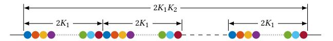

Figure 10: An illustration for the proof of abundance of ppivots (Prop. D.11). Given a long interval of size  $2K_1K_2$ , we partition it into  $K_2$  intervals of size  $2K_1$  each, and we group the indices as indicated by different colors. All indices of the same color are at least  $2K_1$  apart, so that intervals of size at most  $K_1$  surrounding two indices from the same group are disjoint, and hence the corresponding ppivot conditions are independent (conditioned on the fact that the ppivot condition holds for all long intervals).

<span id="page-8-1"></span>4.2.1 Combinatorial Pivots Stabilize. We now show that the honest block produced in a slot corresponding to a cpivot persists in the longest processed chain of all honest nodes forever after  $\nu$  slots after it was produced. Towards this, we first show:

Proposition 4.4 (Formal Version: Prop. D.4). At every index k with  $D_k = 1$ , the length of the "shortest (across honest nodes) longest processed chain" grows.

That is, good slots where all honest nodes process the produced block are *chain growth events*. Due to this and since, by Def. 4.3, all intervals around a cpivot contain more indices with  $D_k = 1$  than those with  $D_k = 0$ , there are not enough blocks for any other chain to outnumber the chain growth events that contributed to the growth of the processed chain containing the cpivot's block. Thus, we show the following (proven analogously to the combinatorial argument of [52]):

<span id="page-8-2"></span>LEMMA 4.5 (FORMAL VERSION: Lem. D.5). Let  $b^*$  be the block produced in a non-empty slot  $t_k$  such that CPivot(k). Then, for all slots  $t \ge t_k + v$ :  $b^*$  is in the longest processed chains of all honest nodes.

<span id="page-8-3"></span>4.2.2 Probabilistic Pivots Are Abundant. Previous analyses of NC [24, 52] show that sufficiently long intervals contain at least *one ppivot* (Fig. 4(a)). This was enough for the bounded-delay analysis because in the bounded-delay setting, every ppivot is also a cpivot [51, Fact 1]. However, in the bounded-capacity setting, not every cpivot is a ppivot, because not every good slot results in growth of the longest processed chain of honest nodes (Fig. 4(b)). Thus, existence of one ppivot in every large interval is not enough to conclude existence of one cpivot in every large interval. Instead, we prove, using a concentration bound on the number of ppivots, that long intervals of indices in fact contain a number of ppivots proportional to the interval length (Lem. 4.6). Then, in Sec. 4.2.3, we prove that out of those many ppivots, at least one must also be a cpivot, which allows us to continue with the safety and liveness proofs from [52].

The key challenge in proving that there are many ppivots is that for two indices  $k_1, k_2$ , the events that  $k_1$  is a ppivot and that  $k_2$  is a ppivot are dependent, because both events depend on overlapping intervals. But a key observation is that since the ppivot condition (Def. 4.2) already holds for large intervals with high probability ( Prop. D.8), we only need to look at the small intervals. Then, for two indices  $k_1, k_2$  that are sufficiently far apart, these short intervals are disjoint, and thus the corresponding ppivot conditions are independent. Therefore, we decompose a long interval of indices

<span id="page-8-0"></span><sup>&</sup>lt;sup>6</sup>We denote intervals as  $(i, j] \triangleq \{i + 1, ..., j\}$ , with  $(i, j] \triangleq \emptyset$  if  $j \leq i$ .

into several groups of far-apart indices. This is illustrated in Fig. 10, each group indicated by a different color. Within each group, by a concentration bound for iid random variables, there are many ppivots. Further, by a union bound, the concentration holds in all the groups simultaneously with high probability (Prop. D.11). Using this, we show:

<span id="page-9-0"></span>Lemma 4.6 (Formal version: Lem. D.12). For  $K_{cp} = \Omega(\kappa^2)$ , with overwhelming probability, in every interval of size at least  $K_{cp}$ , at least  $(1 - \delta)p_{ppivot}$  fraction of the indices in the interval are poivots.

<span id="page-9-1"></span>4.2.3 Many Probabilistic Pivots Imply One Combinatorial Pivot. The longest-header-chain rule  $\mathcal{D}_{long}$  (Alg. 3) has a few useful properties. Nodes using this rule

- (P1) process a BPO's block's content at most once,
- (P2) either process the most recent honest block, or fully utilize their capacity to process other blocks (i.e., do not stay idle), and
- (P3) prioritize blocks that were produced 'recently'.

(P1) holds by construction. (P2) holds because this rule is never idle, and will always process towards an honest block when it has processed all longer chains and there is capacity remaining. Moreover, we expect that in a secure execution, (P3) holds because a node's longest header chain cannot fork off too much from its longest processed chain. More precisely, due to Lem. 4.5, any longest header chain in any honest node's view must extend the block produced in the most recent cpivot, and therefore blocks with the highest process priority must have been produced after the most recent cpivot. Thus, if the adversary wants to prevent honest nodes from processing the block produced at a good index k, so that  $G_k = 1$  but  $D_k = 0$ , then it can only "distract" them by providing  $\widetilde{C}$  blocks produced after the most recent cpivot (Prop. 4.7).

While we subsequently use  $\mathcal{D}_{long}$  as a concrete example, the proofs only use (P1), (P2), (P3), and thus apply to several other simple scheduling policies, including the freshest-block rule of [48].

<span id="page-9-3"></span>PROPOSITION 4.7. If  $G_k = 1$  and  $D_k = 0$ , then during slots  $[t_k, t_k + v]$ , all honest nodes using the longest-header-chain scheduling policy process content of at least  $\widetilde{C}$  blocks that are produced in (i, k], where i < k is the largest index such that  $\mathsf{CPivot}(i)$  (if such an i does not exist, i = 0).

PROOF. In slot  $t_k$ , there is exactly one block b produced by an honest node, the block header is made public at the beginning of the slot, and is seen by all honest nodes within  $\Delta_{\rm h}$  time. Thereafter, each node has enough time to process  $\widetilde{C}$  blocks during slots  $[t_k, t_k + \nu]$ .

Under the longest-header-chain scheduling policy, if  $D_k=0$ , *i.e.* an honest node did not process content for the block b before the end of slot  $t_k+v$ , then that honest node must process the content for at least  $\widetilde{C}$  blocks on chains longer than the height of the block b or in the prefix of the block b. Since honest nodes produce blocks extending their longest chain, b extends the longest processed chain of some honest node at slot  $t_k-1$ . Let  $b^*$  be the block produced in slot  $t_i$  where  $\mathsf{CPivot}(i)$  (suppose i exists).  $\mathsf{CPivot}(i) \Longrightarrow Y_i=1$ , therefore this block is unique, and also  $t_k>t_i+v$ . Due to Lem. 4.5, any valid header chain longer than b (which is some node's longest processed chain) at time slot  $t_k$  must contain  $b^*$ . Therefore, the only blocks that are processed by an honest node during slots  $[t_k,t_k+v]$ 

<span id="page-9-4"></span>(a) 
$$\begin{bmatrix} - & + & + & - & + & + & + & - & + & + &$$

Figure 11: (a) Example realization of BPOs in  $(0, K_{\rm cp}]$ , with good (+) and bad (-) indices, and resulting ppivots (O). (b) To prevent a ppivot from being a cpivot, the adversary needs to prevent timely processing (×) of some blocks produced at good indices, so that around the respective ppivot there is an interval (C) in which the cpivot condition (cf. Def. 4.3) is violated. Here, the first two ppivots are not cpivots. To prevent timely processing of a block from a good index, the adversary must 'spend'  $\widetilde{C}$  blocks. Once the adversary runs out of blocks, a ppivot remains a cpivot (here the third ppivot).

- (1) must be produced after  $t_i$  because they extend  $b^*$ , and
- (2) must be produced no later than  $t_k$  because there are no blocks produced in  $(t_k, t_k + v]$ .

In case a cpivot i < k does not exist, the claim is trivial.  $\Box$ 

Given the above properties of the scheduling policy, we now want to show that cpivots occur once in a while. Fig. 11 illustrates the key argument for this. To start, let us show that there is at least one cpivot in  $(0, K_{cp}]$ . From Lem. 4.6, there are many ppivots in  $(0, K_{cp}]$ . If there were no cpivots in  $(0, K_{cp}]$ , then the adversary must prevent each ppivot from turning into a cpivot. We know that in any interval around a ppivot, good indices outnumber bad indices by a margin proportional to the interval size (Prop. D.8, see top row in Fig. 11). Therefore, for a ppivot to not be a cpivot, the adversary must prevent an honest node from processing the most recent honest block in several of these good indices (so that the corresponding  $G_k = 1$  indices have  $D_k = 0$ ). Fig. 11 shows an example where the adversary prevented processing of the honest block in one good index, and as a result, two of the ppivots fail to become a cpivot. From Prop. 4.7, for each such index, the adversary must 'spend' at least  $\widetilde{C}$  blocks that the honest node processes. These blocks come from a 'limited budget'. In Lem. D.13, through a combinatorial argument, we show that this 'budget' falls short of the number of blocks required to overthrow all cpivots. Thus, there must be at least one cpivot in  $(0, K_{cp}]$ . Next, we would like to show that there is at least one cpivot in  $(mK_{cp}, (m+1)K_{cp})$  for all  $m \ge 0$  (by induction, where we just saw the base case m = 0). Here, one may be concerned that the adversary could save up many blocks from the past and attempt to make honest nodes process these blocks at a particular target slot  $t_k$ . But, given that one cpivot occurred in  $((m-1)K_{cp}, mK_{cp}]$  (by induction hypothesis), Prop. 4.7 ensures that honest nodes will only process blocks that are produced after  $(m-1)K_{cp}$ . This allows us to bound the 'budget' of blocks that the adversary can use to prevent ppivots from becoming cpivots, and we can complete the induction and conclude:

<span id="page-9-2"></span>Lemma 4.8 (Formal version: Lem. D.17). If honest nodes use the longest-header-chain scheduling policy, and in every interval of size at least  $K_{\rm cp}$ , at least a certain fraction of BPOs are ppivots (which holds for  $\rho$ ,  $\lambda$  chosen as a function of the model and analysis parameters, as per eqn. (3)), then for all  $m \geq 0$ , the interval  $(mK_{\rm cp}, (m+1)K_{\rm cp})$ 

has at least one cpivot. It follows that any arbitrary interval of length  $2K_{CD}$  contains at least one cpivot.

## <span id="page-10-2"></span>4.3 Security of Proof-of-Work Nakamoto Consensus

From Lems. 4.6 and 4.8, we conclude that for suitable  $\lambda$ , with overwhelming probability, cpivots occur in every  $2K_{\rm cp}$ -interval. This allows us, together with Lem. 4.5 (cpivots stabilize), to prove safety and liveness of the protocol for a confirmation depth  $k_{\rm conf} = \Theta(K_{\rm cp})$ . The key arguments are in the proof of the following lemma.

LEMMA 4.9. If for some  $K_{cp} > 0$ ,

$$\forall k \colon \exists k^* \in (k, k + 2K_{\text{CD}}] \colon \text{CPivot}(k^*), \tag{2}$$

then the PoW Nakamoto consensus protocol  $\Pi^{\rho,\tau,k_{\rm conf}}$  with  $k_{\rm conf}=2K_{\rm cp}+1$  satisfies safety. Further, if the environment is  $((\frac{1}{2}-\beta)\rho,2K_{\rm cp}/\rho)-tx$ -limited, then  $\Pi^{\rho,\tau,k_{\rm conf}}$  also satisfies liveness with  $T_{\rm live}=\Theta(K_{\rm cp})$ .

PROOF. *Safety:* Denote the longest processed chain of node p at slot t as  $\mathrm{d}C_p(t)$  and its  $k_{\mathrm{conf}}$ -deep prefix as  $\mathrm{d}C_p(t)^{\lceil k_{\mathrm{conf}}}$ . For an arbitrary slot t, let k be the largest index such that  $t_k \leq t$ . From Lem. 4.8, every interval of  $2K_{\mathrm{Cp}}$  indices contains at least one cpivot. Therefore, there exists  $k^* \in (k-2K_{\mathrm{Cp}}-1,k-1]$  such that  $\mathrm{CPivot}(k^*)$ . Let  $b^*$  be the block from index  $k^*$ . Due to Lem. 4.5, for all honest nodes p,q and  $t' \geq t, b^* \in \mathrm{d}C_p(t)$  and  $b^* \in \mathrm{d}C_q(t')$ . But  $k^* \geq k - k_{\mathrm{conf}}$ , so the block  $b^*$  cannot be  $k_{\mathrm{conf}}$ -deep in any chain at slot t. Therefore,  $\mathrm{LOG}_p^t$  is a prefix of  $b^*$  which in turn is a prefix of  $\mathrm{d}C_q(t')$ . We can thus conclude that either  $\mathrm{LOG}_p^t \preceq \mathrm{LOG}_q^{t'}$  or  $\mathrm{LOG}_q^{t'} \preceq \mathrm{LOG}_p^{t'}$ . Therefore, safety holds.

Liveness (proof sketch, details in App. D.4): Recall that since indices count slots with block production, T slots corresponds to roughly  $\rho T$  indices. Again let k be the largest index such that  $t_k \leq t$ . We will first prove that all transactions received between indices  $k-2K_{\rm cp}$ and k, which are of total size at most  $(1-2\beta)K_{\rm cp}$  as per the tx-limited environment, will be added to the longest processed chains of all nodes by index  $k+2K_{cp}$ . We know that there exists  $k^* \in (k, k+2K_{cp}]$ such that  $CPivot(k^*)$ . Since  $k^*$  is a cpivot, there are more indices jwith  $D_i = 1$  than indices with  $D_i = 0$  in the interval  $(k, k + 2K_{cp})$ (by Def. 4.3). Since each index with  $D_i = 1$  leads to chain growth, every honest node's longest processed chain grows by at least  $K_{\rm cp}$  between indices k and  $k + 2K_{\rm cp}$ . There are at most  $\beta \cdot 2K_{\rm cp}$ adversary block productions in the interval  $(k, k + 2K_{cp})$ , hence every honest node's longest processed chain grows by at least  $K_{\rm cp} - 2\beta K_{\rm cp}$  honest blocks. These honest blocks will include pending transactions, whose size is at most  $(1 - 2\beta)K_{cp}$ . Moreover, in the interval  $(k + 2K_{cp}, k + 2K_{cp} + 2k_{conf})$ , every honest node's longest processed chain grows by at least  $k_{\rm conf}$ . Thus, the newly added transactions are  $k_{\mathrm{conf}}$ -deep, hence confirmed, by all nodes by index  $k + 2K_{\rm cp} + 2k_{\rm conf}$ , which is a latency of  $T_{\rm live} = \frac{6K_{\rm cp} + 2}{\rho}$  slots.

<span id="page-10-0"></span>Subsequently, we take  $\tau \to 0$  and  $\lambda \triangleq \rho/\tau$  in order to model PoW accurately. Finally, since  $\widetilde{C}, \nu$  were analysis parameters chosen arbitrarily, we maximize over these parameters to find the best possible security–performance tradeoff (Thm. 4.10). The result is plotted for  $\Delta_{\rm h} \approx 0$  (reasonable approximation for large block content relative to headers) in Fig. 1.

Theorem 4.10. For all  $\beta$  < 1/2,  $\lambda$  > 0, such that

<span id="page-10-3"></span>
$$\lambda < \max_{\widetilde{C}} \frac{1}{\Delta_{\rm h} + \widetilde{C}/C} \ln \left( \frac{2(1 - \beta)\widetilde{C}}{\widetilde{C} + 4 + \sqrt{8\widetilde{C} + 16}} \right), \tag{3}$$

the PoW Nakamoto consensus protocol with the longest-header-chain scheduling policy,  $\tau \to 0$ ,  $\rho = \lambda \tau$ , and  $k_{conf} = \Theta(\kappa^2)$  is secure with transaction rate  $(\frac{1}{2} - \beta)\lambda$ , confirmation latency  $\Theta(\kappa^2)$  over a time horizon of  $T_{hrzn} = poly(\kappa)$ .

Thm. 4.10 is proved in App. D.4.

#### 5 PROOF-OF-STAKE NAKAMOTO CONSENSUS

Nakamoto consensus has been adapted to proof-of-stake in protocols of the Ouroboros [4, 22, 35] and Sleepy Consensus [19, 52] families. The protocol is identical to what was described in Sec. 3 and formalized in Alg. 1, except for a few key differences. The block production oracle for proof-of-stake (idealized in Alg. 4) behaves differently. As in PoW, each node can make one block production attempt per slot that will be successful with probability  $\rho/N$ , independently of other nodes and slots<sup>7</sup>, modeling uniform stake. In PoS, however, (even past) block production opportunities can be 'reused' to produce multiple blocks with different parents and/or content, *i.e.*, to equivocate.

## <span id="page-10-1"></span>5.1 Blanking Nakamoto Consensus (BlaNC)

In the classic bounded-delay analysis, the tradeoff between  $\beta$  and  $\lambda$ is the same for PoW and PoS NC [24, 30], because, conceptually, NC security depends only on a race between the honest chain and adversary chains. Even in PoS, the adversary cannot use equivocations to boost its chain growth rate, because blocks within one chain must be from strictly increasing slots, i.e., different BPOs. Under bounded capacity, however, as observed in [48], honest nodes may waste their limited capacity processing equivocations rather than staying up-to-date with the longest chain. Thus, blocks they produce may not contribute to honest chain growth. As a result, the honest chain growth rate decreases, and with it PoS NC security [48] (compared to PoW). The key idea in BlaNC is to modify the scheduling policy of PoS NC such that per BPO at most one block is processed. This restores the one assumption of the bounded-capacity PoW NC analysis (Sec. 4.2.3 (P1)) that was previously violated in PoS NC due to equivocations. With the modification of BlaNC, the analysis from Sec. 4 carries over to PoS.

One may consider this alternative: defer content processing until after consensus has been reached on a header chain. This, however, requires ensuring that the contents belonging to headers will be available for download. Sampling-based approaches [3] to check *data availability* come with various challenges [47] and VID-based approaches [17, 63] do not scale to the large *N* found in PoS NC.

5.1.1 Protocol. BlaNC is PoS NC (cf. [35, 52]), with the following modifications.

**The Scheduling Policy in BlaNC.** BlaNC uses any scheduling policy that is secure for PoW NC (such as longest-header-chain), modified as follows: a node does not process content for a header

<span id="page-10-4"></span> $<sup>^7\</sup>mathrm{There}$  may be multiple blocks in one slot, as in the Ouroboros [4, 22, 35] and Sleepy Consensus [19, 52] protocols.

(denoted by the corresponding header chain C) if it has seen another equivocating header from the same BPO as C. Instead, the node *pretends* that content was "processed" and sets it to be empty. The node can then continue processing content for headers that extend C, and these blocks will be candidates for the node's longest processed chain. With only the above scheduling policy, one honest node may process the real content for a header while another may set it to be empty (depending on when each node saw an equivocating header). In order to output a consistent transaction ledger, reaching consensus on the header chain is no longer enough. Instead, we ensure that honest nodes also agree on which blocks had an equivocation, through equivocation proofs, so that they can consistently blank their contents.

**Equivocation Proofs.** An equivocation proof consists of two headers C, C' from the same BPO. Whenever a node produces a new block header extending its longest processed chain, it includes an equivocation proof for any header C among the last  $k_{\rm epf}$  headers (on the new block's prefix) for which it has seen an equivocating header C' but no equivocation proof was recorded on chain yet.

**Equivocation Proof Deadline.** The deadline  $k_{\rm epf}$  for adding equivocation proofs ensures that the adversary cannot use equivocations or equivocation proofs to make honest nodes blank the content of an old block whose transactions they have already confirmed. A header C is thus invalid if it contains an equivocation proof against a block that is not within  $k_{\rm epf}$  blocks above C.

**Ledger Construction in BlaNC.** At the end of each slot, each node confirms all blocks on its longest processed chain that are  $k_{\text{conf}}$ -deep, except it blanks the contents of blocks against which there is an equivocation proof on chain.

5.1.2 Security Proof. The scheduling policy of BlaNC ensures that, just like in PoW NC, honest nodes process at most one block per BPO. This eliminates additional block processing delays caused by equivocations, allowing the honest chain growth rate to match that of PoW NC. Given this, the security proof of PoW NC in Sec. 4 can be adapted to BlaNC to show that the  $k_{\rm conf}$ -deep header chains of all nodes are consistent.

To ensure that their ledgers are consistent, and complete the security proof, we need two more steps. First, liveness of BlaNC follows easily because the contents of blocks produced by honest nodes will never be blanked. Second, for safety, we show (a) honest nodes have processed the content for all blocks against which there is no equivocation proof on chain (these blocks must not be blanked), and (b) honest nodes blank content in their ledger consistently, that is, any honest node blanks the contents of a block in its ledger iff all honest nodes do so. We prove (a) and (b) in Thm. 5.1 by choosing appropriate values for  $k_{\rm conf}$  and  $k_{\rm epf}$ .

Since the analysis of PoW NC from Sec. 4 (details in App. D) applies to BlaNC as well, Lem. 4.5 (cpivots stabilize the longest processed chains of all nodes) and Lem. 4.8 (cpivots recur) hold for BlaNC. Thus, eqn. (3) also determines the parameters under which BlaNC is secure, *i.e.*, the security–throughput tradeoff of BlaNC. In Fig. 3, we plot the solutions of eqn. (3) with C = 1 and  $\Delta_h \approx 0$ 

All honest nodes have processed  $\boldsymbol{b}$  or seen an equivocation

<span id="page-11-2"></span>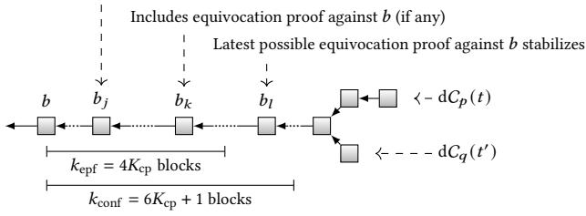

Figure 12: Illustration for the security proof of BlaNC (Thm. 5.1). Consider a block b that is  $k_{\rm conf}$ -deep in the longest processed chain of a node. Indices j,k,l are cpivots. Since cpivots stabilize (Lem. 4.5), the corresponding blocks  $b_j,b_k,b_l$  are in all honest nodes' processed longest chains. At cpivot j, we know for sure that all honest nodes either processed b's content or saw an equivocation for it, because they have processed b 's content. At cpivot k, we know for sure that if b had an equivocation, preventing processing of its content, then an equivocation proof against b must have entered the chain. At cpivot l, we know for sure that the last block that can add an equivocation proof against b has stabilized (as the deadline of  $k_{\rm epf}$  blocks has passed). Thus, a ledger formed from  $k_{\rm conf}$ -deep blocks (sufficient to obtain three cpivots) will remain safe.

(approximation for block content much larger than headers). Since eqn. (3) does not depend on  $\kappa$ , for any given  $\beta$ , the block rate  $\lambda$  is non-vanishing. Only latency scales with  $\kappa$ , similar to PoW NC.

In both Thm. 5.1 (for BlaNC) and Thm. 4.10 (for PoW NC), we prove an upper bound on the confirmation latency that scales with the security parameter  $\kappa$  as  $O(\kappa^2)$ . Concretely, our bound on BlaNC's latency (Thm. 5.1) is  $3\times$  our bound for PoW NC (Lem. D.20).

<span id="page-11-0"></span>Theorem 5.1. For all  $\beta < 1/2$ , C,  $\Delta_h$ ,  $\rho$ ,  $\tau$  satisfying eqn. (3), there exists  $k_{\rm epf}$ ,  $k_{\rm conf} = \Theta(\kappa^2)$  such that the BlaNC protocol is secure with transaction rate  $(1-2\beta)\lambda$ , confirmation latency  $T_{\rm live} = \Theta(\kappa^2)$  slots over a time horizon of  $T_{\rm hrzn} = {\rm poly}(\kappa)$ .

PROOF. Set  $k_{\text{conf}} \triangleq 6K_{\text{cp}} + 1$ ,  $k_{\text{epf}} \triangleq 4K_{\text{cp}}$ . Denote the longest processed chain of node p at slot t as  $\mathrm{d}C_p(t)$  and its  $k_{\text{conf}}$ -deep prefix as  $\mathrm{d}C_p(t)^{\lceil k_{\text{conf}} \rceil}$ . Safety holds if the following three properties hold for all slots  $t \leq t'$  and for all honest nodes p,q: (1)  $\mathrm{d}C_p(t)^{\lceil k_{\text{conf}} \rceil} \preceq \mathrm{d}C_q(t')^{\lceil k_{\text{conf}} \rceil}$  or  $\mathrm{d}C_q(t')^{\lceil k_{\text{conf}} \rceil} \preceq \mathrm{d}C_p(t)^{\lceil k_{\text{conf}} \rceil}$ . (2) If  $b \in \mathrm{d}C_p(t)^{\lceil k_{\text{conf}} \rceil}$  and there is no equivocation proof in a block header following it, then node p must have processed the content of b before slot t. (3) If  $b \in \mathrm{d}C_p(t)^{\lceil k_{\text{conf}} \rceil}$  and  $b \in \mathrm{d}C_q(t')^{\lceil k_{\text{conf}} \rceil}$ , then p blanks the content of b in  $\mathrm{LOG}_p^t$  iff q blanks it in  $\mathrm{LOG}_q^{t'}$ .

Consider an arbitrary block  $b_i$  (produced at some index i) that is confirmed by an honest node p at slot t, i.e.,  $b_i \in \mathrm{d}C_p(t)^{\lceil k_{\mathrm{conf}}}$ . Since  $b_i$  is  $k_{\mathrm{conf}}$ -deep, there must have been at least  $6K_{\mathrm{cp}}+1$  indices after i. Due to Lem. 4.8, there must have been at least three cpivots j,k,l after index i. Due to Lem. 4.5, the blocks produced at these indices,  $b_j, b_k, b_l$  are in  $\mathrm{d}C_q(t')$  for all  $t' \geq t$  and for all q (see Fig. 12). Therefore,  $\mathrm{d}C_p(t)^{\lceil k_{\mathrm{conf}} \rceil} \leq \mathrm{d}C_q(t')$ , and from this, we can prove (1).

To prove (2), suppose that node p did not process the content of block  $b_i$ . Since block  $b_j$ , and hence also  $b_i$ , is in every honest node's

<span id="page-11-1"></span> $<sup>^8</sup>$ Technically, since PoS protocols run in slots of fixed duration, unlike PoW,  $\tau$  must match the slot duration. If  $\tau$  is small relative to the block production and processing times (such as 1 second in Cardano), we can still use the approximation  $\tau \to 0$ , just like in PoW. We calculate the parameters for general  $\tau$  in App. D.3.3.

longest processed chain at slot  $t_{k+1}-1$  (Lem. 4.5), it must have been that p saw an equivocation for  $b_i$  before slot  $t_{k+1}-1$  (otherwise it must have actually processed the content of  $b_i$ ). Due to synchrony, all honest nodes see the headers of  $b_i$  and its equivocation. Since the block  $b_k$  is produced by an honest node, and  $k < i + 4K_{\rm cp} = i + k_{\rm epf}$ ,  $b_k$  must contain an equivocation proof against  $b_i$  (see Fig. 12).

To prove (3), we show that while confirming the block  $b_i$ , either all nodes see an equivocation proof against  $b_i$  or none of them do. The latest that an equivocation proof against  $b_i$  can be included is  $k_{\rm epf}$  blocks below  $b_i$ . Since  $k_{\rm conf} > k_{\rm epf} + 2K_{\rm cp}$ , due to Lem. 4.8, the cpivot l must have occurred after  $b_i$  became  $k_{\rm epf}$ -deep and before it became  $k_{\rm conf}$ -deep (see Fig. 12). Thus, for all p and t, if  $b_i \in {\rm d}C_p(t)^{\lceil k_{\rm conf} \rceil}$ , then  $b_l \in {\rm d}C_p(t)$ , hence all nodes agree on whether or not an equivocation proof was included.

Liveness follows similarly to PoW NC: Within  $2K_{\rm cp}$  indices, there are enough honestly produced blocks to include new transactions, and their contents will never be blanked. In  $\Theta(K_{\rm cp})$  slots, these blocks will become  $k_{\rm conf}$ -deep and will be confirmed.

## <span id="page-12-0"></span>5.2 Handling Loss of Predictable Validity

<span id="page-12-3"></span>5.2.1 Predictable Transaction Validity. In UTXO-based chains like Bitcoin (account-based like Ethereum), a transaction is *valid* iff its inputs are unspent (its execution succeeds and fees are paid).

<span id="page-12-1"></span>Definition 5.2. A transaction has *predictable validity* iff: validity at the time an honest node adds it to a block implies validity when that block gets executed.

The blanking in BlaNC leads to a loss of *predictable transaction validity*. An honest block *B* may include a transaction that depends on the contents of a previous block *A* whose equivocations were not known at the time. After block *B* is produced, the adversary could release an equivocation for the block *A*, forcing honest nodes to blank block *A*'s contents, which may invalidate the transaction in block *B*. Such invalidated transactions take up free space in honest blocks and lower the effective throughput (valid confirmed transactions) of the ledger.

We propose a simple solution to recover predictable validity for BlaNC: If nodes limit transactions they include in a block to those that don't depend on any *recently changed* state, then they can be sure that all equivocations that could affect the validity of a transaction already have a corresponding equivocation proof included on chain. This is because at the time of creating a block, honest nodes have seen all transactions which will be executed, however, not all transactions nodes have seen will be executed. The following lemma follows easily.

Lemma 5.3. If a node produces a block whose transactions do not share state with any transaction included in the last  $k_{\rm epf}$  blocks, then the block satisfies Def. 5.2.

<span id="page-12-4"></span><span id="page-12-2"></span>5.2.2 Predictable Fee Validity. In practice, in popular DeFi-ecosystems, which consist of very interdependent transactions [16, 32], it may not always be practical to limit the interaction between transactions. We propose instead preserving the minimum requirement that each transaction pays its fee, regardless of the outcome of its execution. This guarantees that miners are compensated for space used in their blocks, and also makes it costly for the adversary to take up space with invalid transactions.

Definition 5.4. A transaction has *predictable fees* iff: ability to pay fees when an honest node adds it to a block implies ability to pay fees when the block executes.

In systems like Ethereum, transactions have a max gas value set by the sender which limits the computation allowed by the transaction and ultimately its fee. We consider a protocol with this gas mechanism, as well as a base transaction cost that covers the block space taken up by the transaction. We introduce a notion of gas deposit accounts to BlaNC that can only be used for transaction fees (transactions internally do not have access to these accounts). When a miner includes a transaction, it checks that the account funding the transaction has enough funds to cover the maximum gas, even if all transactions in its recent ancestor blocks make it to the blanked ledger and consume their maximum gas. Users thus need to maintain a balance proportional to the complexity and frequency of the transactions they make. We also require that any deposit to the account is not considered in the balance until  $k_{\rm epf}$ blocks after the deposit transaction. Withdrawals can take place immediately, as direct transactions.

Lemma 5.5. If a node produces a block whose transactions are funded by gas deposit accounts with sufficient balance (balance before  $k_{\rm epf}$  blocks minus any fees since), then all transactions in the block satisfy Def. 5.4.

The solutions in Secs. 5.2.1 and 5.2.2 are complementary and could each be adopted as per-validator heuristics (*i.e.*, not a consensus rule), or by the system based on the use-case (*e.g.*, expected inter-dependency of transactions).

## 6 DISCUSSION

**Tightening the Analysis.** Our teasing strategy and security analysis (cf. Fig. 1) serve as the first lower and upper bounds on nodes' minimum capacity required to ensure security in the bounded-capacity PoW setting. A question remains on how to tighten the gap. One avenue for future work is whether the adversary has better strategies than the teasing strategy, which we believe may be optimal in the bounded-capacity model.

Conjecture 6.1. For the PoW NC protocol with the longest-header-chain scheduling policy, for all  $\beta < 1/2$ ,  $\lambda$  for which the teasing strategy is unsuccessful, the protocol is secure (against all attacks).

Conversely, we expect that the security analysis can be improved in multiple ways. The current analysis uses only a few basic properties (P1), (P2), (P3) of the scheduling policy. As a result, we assume that any valid block can be used by the adversary to spam honest nodes. However, when using the longest-header-chain policy, the adversary can only force honest nodes to process blocks that are on their longest header chain, which is already hard for the adversary given that the honest chain has been growing so far. An improved analysis should account not just for the number of block productions in the adversary's budget but also their blocktree structure. Further, good slots are sufficient but not necessary for chain growth. Improved analysis of the chain growth rate using techniques such as blocktree partitioning [24] can further tighten the analysis.

Variable Difficulty. In practice, PoW blockchains implement a difficulty adjustment algorithm (DAA) to maintain the target block rate as players join and leave the system. This introduces new avenues for attack [\[7\]](#page-13-37). The variable difficulty protocol has so far been proven secure only in the lock-step synchronous model (i.e., messages delivered in exactly one round) [\[29\]](#page-13-29). Security in the bounded-delay and bounded-capacity models remains an open problem. We note, however, that the DAA seems to apply even more stress to limited capacity nodes, as it would lower the difficulty to compensate for chain growth rate lost due to congestion, leading to an increase in the overall block rate of the system. In turn, this would increase congestion, in particular if honestly produced orphaned blocks are processed by honest parties, leading to a vicious cycle. Under the longest-header-chain scheduling policy that we consider in this work, honest nodes do not prioritize processing orphaned blocks, but this appears to be the case for scheduling policies that allow for processing multiple blocks in parallel. The nuance in this analysis is left for future work.

## ACKNOWLEDGMENT

We thank Lei Yang, Mohammad Alizadeh, Sundararajan Renganathan, David Mazières, Ertem Nusret Tas, Ghassan Karame, Florian Tschorsch, and George Danezis for fruitful discussions. The work of LK, JN, and AZ was conducted in part during Dagstuhl Seminar #22421. LK is supported by the armasuisse Science and Technology CYD Distinguished Postdoctoral Fellowship. JN is supported by the Protocol Labs PhD Fellowship. JN and SS are supported by a gift from the Ethereum Foundation and by a research hub funded by Input Output Global Inc. SS is suported by NSF grant CCF-1563098. AZ is supported by grant #1443/21 from the Israel Science Foundation.

## REFERENCES

- <span id="page-13-4"></span>[1] [n. d.]. Block size limit controversy. [https://en.bitcoin.it/wiki/Block\\_size\\_limit\\_](https://en.bitcoin.it/wiki/Block_size_limit_controversy) [controversy](https://en.bitcoin.it/wiki/Block_size_limit_controversy)
- <span id="page-13-18"></span>[2] Mustafa Al-Bassam. 2019. LazyLedger: A Distributed Data Availability Ledger With Client-Side Smart Contracts. arXiv[:1905.09274v4](https://arxiv.org/abs/1905.09274v4) [cs.CR]
- <span id="page-13-33"></span>[3] Mustafa Al-Bassam, Alberto Sonnino, Vitalik Buterin, and Ismail Khoffi. 2021. Fraud and Data Availability Proofs: Detecting Invalid Blocks in Light Clients. In Financial Cryptography (2) (LNCS, Vol. 12675). Springer, 279–298.
- <span id="page-13-9"></span>[4] Christian Badertscher, Peter Gazi, Aggelos Kiayias, Alexander Russell, and Vassilis Zikas. 2018. Ouroboros Genesis: Composable Proof-of-Stake Blockchains with Dynamic Availability. In CCS. ACM, 913–930.
- <span id="page-13-12"></span>[5] Vivek Bagaria, Amir Dembo, Sreeram Kannan, Sewoong Oh, David Tse, Pramod Viswanath, Xuechao Wang, and Ofer Zeitouni. 2019. Proof-of-Stake Longest Chain Protocols: Security vs Predictability. arXiv[:1910.02218v3](https://arxiv.org/abs/1910.02218v3) [cs.CR]
- <span id="page-13-22"></span>[6] Vivek Kumar Bagaria, Sreeram Kannan, David Tse, Giulia Fanti, and Pramod Viswanath. 2019. Prism: Deconstructing the Blockchain to Approach Physical Limits. In CCS. ACM, 585–602.
- <span id="page-13-37"></span>[7] Lear Bahack. 2013. Theoretical Bitcoin Attacks with less than Half of the Computational Power (draft). arXiv[:1312.7013v1](https://arxiv.org/abs/1312.7013v1) [cs.CR]
- <span id="page-13-14"></span>[8] Bitcoin Project. [n. d.]. Running A Full Node — Bitcoin. [https://bitcoin.org/en/full](https://bitcoin.org/en/full-node#minimum-requirements)[node#minimum-requirements](https://bitcoin.org/en/full-node#minimum-requirements)
- <span id="page-13-8"></span>[9] Bitcoin Project. 2020. Bitcoin Developer Guide – P2P Network – Initial Block Download – Headers-First. [https://web.archive.org/web/20230314181737/https:](https://web.archive.org/web/20230314181737/https://developer.bitcoin.org/devguide/p2p_network.html#headers-first) [//developer.bitcoin.org/devguide/p2p\\_network.html#headers-first](https://web.archive.org/web/20230314181737/https://developer.bitcoin.org/devguide/p2p_network.html#headers-first)
- <span id="page-13-13"></span>[10] Erica Blum, Aggelos Kiayias, Cristopher Moore, Saad Quader, and Alexander Russell. 2020. The Combinatorics of the Longest-Chain Rule: Linear Consistency for Proof-of-Stake Blockchains. In SODA. SIAM, 1135–1154.
- <span id="page-13-16"></span>[11] Vitalik Buterin. [n. d.]. Proof of Stake: How I Learned to Love Weak Subjectivity. [https://blog.ethereum.org/2014/11/25/proof-stake-learned-love-weak](https://blog.ethereum.org/2014/11/25/proof-stake-learned-love-weak-subjectivity)[subjectivity](https://blog.ethereum.org/2014/11/25/proof-stake-learned-love-weak-subjectivity)
- <span id="page-13-17"></span>[12] Vitalik Buterin and Virgil Griffith. 2017. Casper the Friendly Finality Gadget. arXiv[:1710.09437v4](https://arxiv.org/abs/1710.09437v4) [cs.CR]
- <span id="page-13-30"></span>[13] Christian Cachin and Stefano Tessaro. 2005. Asynchronous Verifiable Information Dispersal. In DISC (LNCS, Vol. 3724). Springer, 503–504.
- <span id="page-13-41"></span>[14] Clément Canonne. [n. d.]. A short note on Poisson tail bounds. [https://github.com/ccanonne/probabilitydistributiontoolbox/blob/master/](https://github.com/ccanonne/probabilitydistributiontoolbox/blob/master/poissonconcentration.pdf) [poissonconcentration.pdf](https://github.com/ccanonne/probabilitydistributiontoolbox/blob/master/poissonconcentration.pdf)

- <span id="page-13-28"></span>[15] Tong Cao, Jérémie Decouchant, and Jiangshan Yu. 2023. Leveraging the Verifier's Dilemma to Double Spend in Bitcoin. In FC (LNCS, Vol. 13951). Springer, 149–165.
- <span id="page-13-35"></span>[16] Ting Chen, Zihao Li, Yuxiao Zhu, Jiachi Chen, Xiapu Luo, John Chi-Shing Lui, Xiaodong Lin, and Xiaosong Zhang. 2020. Understanding Ethereum via Graph Analysis. ACM Trans. Internet Techn. 20, 2 (2020), 18:1–18:32.
- <span id="page-13-34"></span>[17] Shir Cohen, Guy Goren, Lefteris Kokoris-Kogias, Alberto Sonnino, and Alexander Spiegelman. 2023. Proof of Availability and Retrieval in a Modular Blockchain Architecture. In FC (LNCS, Vol. 13951). Springer, 36–53.
- <span id="page-13-15"></span>[18] Kyle Croman, Christian Decker, Ittay Eyal, Adem Efe Gencer, Ari Juels, Ahmed E. Kosba, Andrew Miller, Prateek Saxena, Elaine Shi, Emin Gün Sirer, Dawn Song, and Roger Wattenhofer. 2016. On Scaling Decentralized Blockchains - (A Position Paper). In Financial Cryptography Workshops (LNCS, Vol. 9604). Springer, 106–125.
- <span id="page-13-11"></span>[19] Phil Daian, Rafael Pass, and Elaine Shi. 2019. Snow White: Robustly Reconfigurable Consensus and Applications to Provably Secure Proof of Stake. In Financial Cryptography (LNCS, Vol. 11598). Springer, 23–41.
- <span id="page-13-19"></span>[20] George Danezis, Lefteris Kokoris-Kogias, Alberto Sonnino, and Alexander Spiegelman. 2022. Narwhal and Tusk: a DAG-based mempool and efficient BFT consensus. In EuroSys. ACM, 34–50.
- <span id="page-13-27"></span>[21] Sourav Das, Nitin Awathare, Ling Ren, Vinay J. Ribeiro, and Umesh Bellur. 2021. Tuxedo: Maximizing Smart Contract Computation in PoW Blockchains. Proc. ACM Meas. Anal. Comput. Syst. 5, 3 (2021), 41:1–41:30.
- <span id="page-13-10"></span>[22] Bernardo David, Peter Gazi, Aggelos Kiayias, and Alexander Russell. 2018. Ouroboros Praos: An Adaptively-Secure, Semi-synchronous Proof-of-Stake Blockchain. In EUROCRYPT (2) (LNCS, Vol. 10821). Springer, 66–98.
- <span id="page-13-3"></span>[23] Christian Decker and Roger Wattenhofer. 2013. Information propagation in the Bitcoin network. In P2P. IEEE, 1–10.
- <span id="page-13-0"></span>[24] Amir Dembo, Sreeram Kannan, Ertem Nusret Tas, David Tse, Pramod Viswanath, Xuechao Wang, and Ofer Zeitouni. 2020. Everything is a Race and Nakamoto Always Wins. In CCS. ACM, 859–878.
- <span id="page-13-26"></span>[25] Thomas D. Dickerson, Paul Gazzillo, Maurice Herlihy, and Eric Koskinen. 2020. Adding concurrency to smart contracts. Distributed Comput. 33, 3-4 (2020), 209–225.
- <span id="page-13-39"></span>[26] John Duchi. [n. d.]. Hoeffding's inequality. [http://cs229.stanford.edu/extra](http://cs229.stanford.edu/extra-notes/hoeffding.pdf)[notes/hoeffding.pdf](http://cs229.stanford.edu/extra-notes/hoeffding.pdf)
- <span id="page-13-23"></span>[27] Matthias Fitzi, Peter Gaži, Aggelos Kiayias, and Alexander Russell. 2020. Proof-of-Stake Blockchain Protocols with Near-Optimal Throughput. Cryptology ePrint Archive, Paper 2020/037. <https://eprint.iacr.org/2020/037>
- <span id="page-13-2"></span>[28] Juan A. Garay, Aggelos Kiayias, and Nikos Leonardos. 2015. The Bitcoin Backbone Protocol: Analysis and Applications. In EUROCRYPT (2) (LNCS, Vol. 9057). Springer, 281–310.
- <span id="page-13-29"></span>[29] Juan A. Garay, Aggelos Kiayias, and Nikos Leonardos. 2017. The Bitcoin Backbone Protocol with Chains of Variable Difficulty. In CRYPTO (1) (LNCS, Vol. 10401). Springer, 291–323.
- <span id="page-13-1"></span>[30] Peter Gazi, Aggelos Kiayias, and Alexander Russell. 2020. Tight Consistency Bounds for Bitcoin. In CCS. ACM, 819–838.
- <span id="page-13-21"></span>[31] Arthur Gervais, Ghassan O. Karame, Karl Wüst, Vasileios Glykantzis, Hubert Ritzdorf, and Srdjan Capkun. 2016. On the Security and Performance of Proof of Work Blockchains. In CCS. ACM, 3–16.
- <span id="page-13-36"></span>[32] Dongchao Guo, Jiaqing Dong, and Kai Wang. 2019. Graph structure and statistical properties of Ethereum transaction relationships. Inf. Sci. 492 (2019), 58–71.
- <span id="page-13-31"></span>[33] James Hendricks, Gregory R. Ganger, and Michael K. Reiter. 2007. Verifying distributed erasure-coded data. In PODC. ACM, 139–146.
- <span id="page-13-38"></span>[34] Wassily Hoeffding. 1963. Probability Inequalities for Sums of Bounded Random Variables. J. Amer. Statist. Assoc. 58, 301 (1963), 13–30. [https://doi.org/10.1080/](https://doi.org/10.1080/01621459.1963.10500830) [01621459.1963.10500830](https://doi.org/10.1080/01621459.1963.10500830)
- <span id="page-13-5"></span>[35] Aggelos Kiayias, Alexander Russell, Bernardo David, and Roman Oliynykov. 2017. Ouroboros: A Provably Secure Proof-of-Stake Blockchain Protocol. In CRYPTO (1) (LNCS, Vol. 10401). Springer, 357–388.
- [36] Lucianna Kiffer, Joachim Neu, Srivatsan Sridhar, Aviv Zohar, and David Tse. 2023. Nakamoto Consensus under Bounded Processing Capacity. Cryptology ePrint Archive, Paper 2023/381. <https://eprint.iacr.org/2023/381>
- <span id="page-13-6"></span>[37] Lucianna Kiffer, Rajmohan Rajaraman, and Abhi Shelat. 2018. A Better Method to Analyze Blockchain Consistency. In CCS. ACM, 729–744.
- <span id="page-13-24"></span>[38] Lucianna Kiffer, Asad Salman, Dave Levin, Alan Mislove, and Cristina Nita-Rotaru. 2021. Under the Hood of the Ethereum Gossip Protocol. In Financial Cryptography (2) (LNCS, Vol. 12675). Springer, 437–456.
- <span id="page-13-40"></span>[39] Andreas Lenz. [n. d.]. Random walk with positive drift. [https://math.](https://math.stackexchange.com/q/4449213) [stackexchange.com/q/4449213](https://math.stackexchange.com/q/4449213)
- <span id="page-13-32"></span>[40] Jing Li, Dongning Guo, and Ling Ren. 2021. Close latency-security trade-off for the Nakamoto consensus. In AFT. ACM, 100–113.
- <span id="page-13-25"></span>[41] Zhichun Lu and Ren Zhang. 2023. When is Slower Block Propagation More Profitable for Large Miners?. In ESORICS (3) (LNCS, Vol. 14346). Springer, 285– 305.
- <span id="page-13-7"></span>[42] Loi Luu, Jason Teutsch, Raghav Kulkarni, and Prateek Saxena. 2015. Demystifying Incentives in the Consensus Computer. In CCS. ACM, 706–719.
- <span id="page-13-20"></span>[43] Andrew Miller, Yu Xia, Kyle Croman, Elaine Shi, and Dawn Song. 2016. The Honey Badger of BFT Protocols. In CCS. ACM, 31–42.

- <span id="page-14-17"></span>[44] Michael Mirkin, Yan Ji, Jonathan Pang, Ariah Klages-Mundt, Ittay Eyal, and Ari Juels. 2020. BDoS: Blockchain Denial-of-Service. In CCS. ACM, 601–619.
- <span id="page-14-0"></span>[45] Satoshi Nakamoto. 2008. Bitcoin: A Peer-to-Peer Electronic Cash System. [https:](https://bitcoin.org/bitcoin.pdf) [//bitcoin.org/bitcoin.pdf.](https://bitcoin.org/bitcoin.pdf)
- <span id="page-14-20"></span>[46] Kamilla Nazirkhanova, Joachim Neu, and David Tse. 2022. Information Dispersal with Provable Retrievability for Rollups. In AFT. ACM, 180–197.
- <span id="page-14-21"></span>[47] Joachim Neu. 2022. Data Availability Sampling: From Basics to Open Problems. <https://www.paradigm.xyz/2022/08/das>
- <span id="page-14-4"></span>[48] Joachim Neu, Srivatsan Sridhar, Lei Yang, David Tse, and Mohammad Alizadeh. 2022. Longest Chain Consensus Under Bandwidth Constraint. In AFT. ACM, 126–147.
- <span id="page-14-6"></span>[49] Joachim Neu, Ertem Nusret Tas, and David Tse. 2022. The Availability-Accountability Dilemma and Its Resolution via Accountability Gadgets. In Financial Cryptography (LNCS, Vol. 13411). Springer, 541–559.
- <span id="page-14-1"></span>[50] Rafael Pass, Lior Seeman, and Abhi Shelat. 2017. Analysis of the Blockchain Protocol in Asynchronous Networks. In EUROCRYPT (2) (LNCS, Vol. 10211). 643– 673.
- <span id="page-14-16"></span>[51] Rafael Pass and Elaine Shi. 2016. The Sleepy Model of Consensus. Cryptology ePrint Archive, Paper 2016/918. <https://eprint.iacr.org/2016/918>
- <span id="page-14-2"></span>[52] Rafael Pass and Elaine Shi. 2017. The Sleepy Model of Consensus. In ASIACRYPT (2) (LNCS, Vol. 10625). Springer, 380–409.
- <span id="page-14-14"></span>[53] Daniel Perez and Benjamin Livshits. 2020. Broken Metre: Attacking Resource Metering in EVM. In NDSS. The Internet Society.
- <span id="page-14-5"></span>[54] Jamie Redman. [n. d.]. Running Bitcoin Cash: An Introduction to Operating a Full Node. [https://news.bitcoin.com/running-bitcoin-cash-an-introduction-to](https://news.bitcoin.com/running-bitcoin-cash-an-introduction-to-operating-a-full-node/)[operating-a-full-node/](https://news.bitcoin.com/running-bitcoin-cash-an-introduction-to-operating-a-full-node/)
- <span id="page-14-3"></span>[55] Ling Ren. 2019. Analysis of Nakamoto Consensus. Cryptology ePrint Archive, Paper 2019/943. <https://eprint.iacr.org/2019/943>
- <span id="page-14-12"></span>[56] Muhammad Saad, Afsah Anwar, Srivatsan Ravi, and David Mohaisen. 2024. Revisiting Nakamoto Consensus in Asynchronous Networks: A Comprehensive Analysis of Bitcoin Safety and Chain Quality. IEEE/ACM Trans. Netw. 32, 1 (2024), 844–858.
- <span id="page-14-11"></span>[57] Suryanarayana Sankagiri, Shreyas Gandlur, and Bruce Hajek. 2023. The Longest-Chain Protocol Under Random Delays. Stochastic Systems (2023), 13(4):457–458.
- <span id="page-14-15"></span>[58] Vikram Saraph and Maurice Herlihy. 2019. An Empirical Study of Speculative Concurrency in Ethereum Smart Contracts. In Tokenomics (OASIcs, Vol. 71). Schloss Dagstuhl - Leibniz-Zentrum für Informatik, 4:1–4:15.
- <span id="page-14-7"></span>[59] Peiyao Sheng, Gerui Wang, Kartik Nayak, Sreeram Kannan, and Pramod Viswanath. 2021. BFT Protocol Forensics. In CCS. ACM, 1722–1743.
- <span id="page-14-10"></span>[60] Yonatan Sompolinsky and Aviv Zohar. 2016. Bitcoin's Security Model Revisited. arXiv[:1605.09193v2](https://arxiv.org/abs/1605.09193v2) [cs.CR]
- <span id="page-14-8"></span>[61] Alexander Spiegelman, Neil Giridharan, Alberto Sonnino, and Lefteris Kokoris-Kogias. 2022. Bullshark: DAG BFT Protocols Made Practical. In CCS. ACM, 2705–2718.
- <span id="page-14-13"></span>[62] Shichen Wu, Puwen Wei, Ren Zhang, and Bowen Jiang. 2023. Security-Performance Tradeoff in DAG-based Proof-of-Work Blockchain Protocols. Cryptology ePrint Archive, Paper 2023/1089. <https://eprint.iacr.org/2023/1089>
- <span id="page-14-9"></span>[63] Lei Yang, Seo Jin Park, Mohammad Alizadeh, Sreeram Kannan, and David Tse. 2022. DispersedLedger: High-Throughput Byzantine Consensus on Variable Bandwidth Networks. In NSDI. USENIX Association, 493–512.

## <span id="page-14-18"></span>A SIMULATION DETAILS

Nodes in our simulation[9](#page-14-22) generate blocks in a Poisson process with rate proportional to their mining power. We assume the mining difficulty is fixed, and do not include any adjustment by a difficulty adjustment algorithm. In fact, difficulty adjustment algorithms tend to worsen processing problems as they increase the block creation rate if the chain does not grow fast enough—which in turn requires more processing from nodes.

Nodes process blocks one at a time according to the priority dictated by the processing policy, at a rate determined by their capacity. They are allowed to preempt their current task if new information (headers that are published, blocks that they mined) presents them with a higher priority target. Since queues can grow large if nodes do not manage to process all blocks in a timely manner, we maintain priority queues of bounded size (typically 100) and evict low priority tasks from the queue as needed. As preemption of

tasks may cause nodes to alternate between tasks, we allow nodes to retain partial work in an LRU cache of size 10.

Except where we note otherwise, headers are assumed to propagate instantly in the simulations. To simulate an idealized boundeddelay network, where needed, we set the header propagation delay to Δ and the capacity of each node to be ∞. Block headers contain the relevant lottery information which can be easily validated. We therefore assume the adversary never publishes headers it did not actually mine.

To remain close to the theoretical analysis, we model all processing tasks as dependent only on the resources available to the node itself. In reality, things are much more complex: nodes typically propagate blocks in a peer-to-peer network, which means both the overlay network topology and the underlying internet topology both greatly impact block download rates and performance. Our simplified setting allows us to focus more on the congestion effects in isolation from the effects of topology and other peer-to-peer related issues.

## B OTHER CONGESTION-BASED ATTACKS

## <span id="page-14-19"></span>B.1 Forking Attack

The teasing strategy relied on the fact that the adversary could entice nodes with a long header chain that is later discovered to be unavailable for processing. It is natural in this case to consider adjusting the scheduling policy to one that prefers the proverbial 'bird in the hand over two birds in the bush', i.e., to extend the blocks we already processed over the illusive promise of a longer chain that the adversary may withhold from us.

Greedy policy. This policy prioritizes processing blocks that extend the chain a node has already processed. If a header of a block at height ℎ is announced, and we already have ℎ blocks from that chain, we set the priority of the block to be (ℎ , ℎ) and compare between the two priorities lexicographically.

While the greedy policy performs well at high processing rates, we unfortunately find that it performs poorly in the low processing rate regime. Specifically, if a fork in the chain occurs, and nodes are split evenly between the two alternatives, the fork may never resolve. This is because nodes extend their own chain, and prioritize processing on their side of the split while having insufficient processing power to catch up with the other alternative chain. A fork in the chain can result from a deliberate attack by an adversary that releases blocks selectively to different nodes, by a network split, or worse, by an unlucky timing of honest node mining events. In this case, the blockchain fails even for small adversaries. Importantly, a fork that never resolves is either a safety or a liveness failure, as no transaction on either side of the split can be safely accepted.

To demonstrate this scheduling policy in action, we simulate a network of 100 nodes that are split evenly between two partitions for only 15 seconds, i.e., for an expected time required to produce 15 blocks.[10](#page-14-23) Once the network split ends, the simulation continues for another 4000 seconds, allowing nodes the opportunity to converge on a chain. We measure the height of the latest block all nodes agree upon. If nodes do not recover from the partition, this block will be

<span id="page-14-22"></span><sup>9</sup> Source code: <https://github.com/avivz/finitebwlc>

<span id="page-14-23"></span><sup>10</sup>Such short splits are relatively easy to induce in reality (transient problems with Internet routing, denial-of-service on the network, etc.) and thus a practical scheduling rule must recover from such splits.

<span id="page-15-3"></span>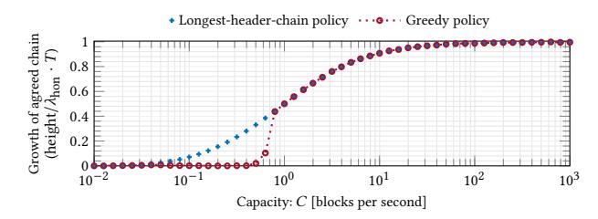

<span id="page-15-2"></span>Figure 13: The rate nodes grow the agreed chain after the network splits into two sets of 50 nodes for 15 secs, when the scheduling policy is "longest-header-chain" (\*) or "greedy" (.....). Nodes using the greedy policy prioritize processes on their current chain. Under low capacity, they do not recover from the split, resulting in two chains forking at genesis, providing no growth of the agreed chain. Thus, longest chain is insecure without an adversary (cf. Fig. 1(c)).

<span id="page-15-5"></span>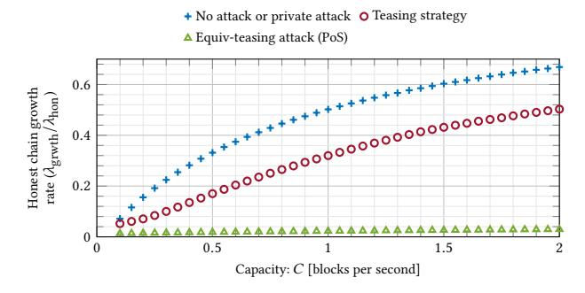

<span id="page-15-1"></span>Figure 14: Results of a simulation of the Equiv-teasing attack comparing the rate of chain growth relative to honest block production rate, when nodes prioritize processing towards the longest header chain, for various capacity limits. The honest chain growth rate falls to almost zero as the adversary spams honest nodes with longer chains. The teasing strategy is shown for comparison.

the genesis and the liveness of the protocol has failed. Otherwise, nodes quickly agree on the main chain and the height of the latest agreed block is just a little behind the longest tip of the chain.

We simulate the evolution after a brief partition for both the longest-header-chain policy as well as for the greedy policy. Our results (Fig. 13) show that in settings where capacity is greater than 1/2, nodes manage to catch up with the chain and the rate of growth matches for both scheduling policies. In lower capacity settings, however, nodes never catch up. Note that this attack requires no adversary mining, yet the protocol is insecure (cf. Fig. 1(c)). This is in stark contrast to the bounded-delay analysis which suggests that the protocol retains security against a non-mining adversary at any capacity (cf. Fig. 1(a)), and highlights again the need to study the security of blockchains at capacity.

## <span id="page-15-0"></span>**B.2** The Equiv-Teasing Attack (PoS)

In PoS, the adversary can greatly increase the network's processing load using equivocations. The equiv-teasing attack, described in Fig. 15, uses equivocations to announce a whole new chain at every

<span id="page-15-4"></span>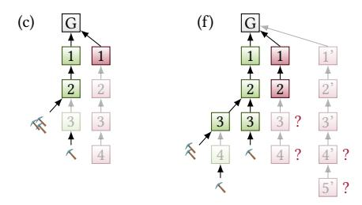

Figure 15: Equiv-teasing attack: Steps (a)-(e) are the same as in the teasing strategy (Fig. 6). Recall that in (c), to delay the processing of the honest block at height h=3, the adversary announces a block at height h+1 which it was withholding. Since this is the longest announced chain, honest nodes prioritize processing block 2 on this chain. New steps: (f) Once an honest node produces a block at height 4, the adversary announces equivocations 1', 2', ... of its withheld chain of length 5 instead of announcing one new block extending the chain 1, 2, ... Therefore, honest nodes have to process blocks 1', 2' even though they processed 1, 2 earlier. The adversary makes content available for only 1', 2', 3'. As the attack goes on, the adversary's announced chain gets longer, and it consumes even more of the honest node's processing capacity.

instance when the teasing strategy would have announced a single new block. As the attack goes on, the length of the new announced chain increases. This increases the time honest nodes spend processing this chain, and *decelerates* the honest chain growth until it comes to a halt. As a result, in Fig. 14, the chain growth rate under the equiv-teasing attack is nearly zero.

As in the teasing strategy, the adversary starts by producing a private chain. Assuming the adversary's block production rate  $\lambda_{\rm adv}$ is less than the honest chain growth rate before the attack ( $\lambda_{\mathrm{grwth}}^{\mathrm{privt}}$ ), the probability that the adversary produces a chain of length kbefore the honest chain reaches length k is  $e^{-O(k)}$  [24, 45]. This means that with probability  $\epsilon$ , the adversary eventually produces a private chain of length  $k = O(\log(1/\epsilon))$ , of which it can announce equivocations during the attack. Since this chain is longer than the honest chain, it has higher scheduling priority. It takes honest nodes k/C time to process such a chain, during which time, honest nodes do not process blocks on the honest chain. So, any honest blocks produced within k/C time after the first honest block at height h do not grow the honest chain (Fig. 6(e)). If  $\lambda_{hon}k/C$  is large, then there are many honest blocks that do not lead to chain growth, causing the chain growth rate  $\lambda_{\mathrm{grwth}}$  to drop (Fig. 14). As in the teasing strategy, if the adversary's block production rate  $\lambda_{\rm adv}$  exceeds  $\lambda_{\rm grwth}$ , then the adversary succeeds in maintaining the number of block productions required for the attack to go on forever. This eventually slows honest chain growth to a halt. Thus, if  $\lambda_{\text{hon}}k/C$  is large, i.e.,  $\lambda_{\text{hon}} = \Omega(1/k) = \Omega\left(\frac{1}{\log(1/\epsilon)}\right)$ , then the attack succeeds with probability  $\epsilon$ .

<span id="page-16-2"></span>**Algorithm 1** Idealized NC protocol  $\Pi^{\rho,\tau,k_{\mathrm{conf}}}$  with scheduling policy (helper functions: App. C.2, environment  $\mathcal{Z}$ : App. C.3, functionality  $\mathcal{F}_{\mathrm{hdrtree}}^{\mathrm{PoW},\rho,\tau}$ : Alg. 2)

```
1: \rightharpoonup Global counter of slots t \leftarrow 1, 2, \dots of duration \tau (\tau \rightarrow 0 for PoW)
       on INIT (genesis C, genesis Txs)
            ▶ Initialize header tree hT, longest processed chain dC, and mappings from block header to
        content blkTxs
            h\mathcal{T}, d\mathcal{C} \leftarrow \{genesis\mathcal{C}\}, genesis\mathcal{C}
            blkTxs[genesisC] \leftarrow genesisTxs
                                                                                 ▶ Unset entries of blkTxs are UNKNOWN
  6: on RECEIVEDHEADERCHAIN(C)
                                                                                                          ▶ Called by Z or A
            \mathbf{assert} \, \mathcal{F}_{\mathrm{hdrtree}}^{\mathrm{PoW},\rho,\tau}.\mathrm{verify}(C) \\ \mathbf{h}\mathcal{T} \leftarrow \mathbf{h}\mathcal{T} \cup \mathrm{prefixChainsOf}(C)
  7:
                                                                                                      ▶ Validate header chain
                                                                                             ▶ Add C and its prefixes to hT
  Q.
             Z.BROADCASTHEADERCHAIN(C)
10: on receivedContent(C, txs)
                                                                                                           ▶ Called by Z or A
            ▶ Defer processing the content until all prefixes' contents are processed defer until \forall C' \prec C: blkTxs[C'] \neq UNKNOWN
11:
12:
            assert C.txsHash = Hash(txs)
14:
            RECEIVEDHEADERCHAIN(C)
                                                                                                       ▶ Validate header chair
             assert AreTxsValid(txs)
                                                                                                   ▶ Validate content of chain
            blkTxs[C] \leftarrow txs
16:
17:
             Z.uploadContent(C, txs)
             ▶ Update the longest processed chain
            \mathcal{T}' \leftarrow \{C' \in h\mathcal{T} \mid blkTxs[C'] \neq UNKNOWN\}

dC \leftarrow arg \max_{C' \in \mathcal{T}'} |C'|
20:
21: at slot t \leftarrow 1, 2, ...
                                                                                                     ▶ NC protocol main loop
22:
            txs \leftarrow \mathcal{Z}.receivePendingTxs()
23:
            ▶ Produce and disseminate a new block if eligible
            if C' \neq \bot with C' \leftarrow \mathcal{F}_{\text{hdrtree}}^{\text{PoW},\rho,\tau}.extend(dC, txs)
24:
                  Z.BROADCASTHEADERCHAIN(C')
Z.UPLOADCONTENT(C', txs)
25:
26:
27:
            \triangleright Confirm all but the last k_{conf} blocks on the longest processed chain
            \mathsf{LOG}^t \leftarrow \mathsf{txsLedger}(\mathsf{blkTxs}, \mathsf{d}C^{\lceil k_\mathsf{conf}})
28:
                                                                                            \triangleright Ledger of node p at t: LOG_{n}^{t}
29:
30:
             Download content for some C chosen by scheduling policy (e.g. Alg. 3)
```

<span id="page-16-3"></span>**Algorithm 2** Idealized functionality  $\mathcal{F}_{hdrtree}^{PoW,\rho,\tau}$ : block production lottery and header chain structure for PoW (helper functions: App. C.2)

```
on INIT (genesis C, numNodes)
           N \leftarrow \text{numNodes}
\mathcal{T} \leftarrow \{\text{genesis}C\}
 3:
                                                                                 ▶ Global set of valid header chains
      on extend ( C , txs) from node P (possibly adversary) at slot t
 4.
 5:
          > Abstraction of proof-of-work lottery: each node can call this once per slot and produces a
       block with probability \rho/N independently of other nodes and slots
 6:
           if lottery[P, t] \neq \bot return \bot
                                                                                ▶ Only one ticket per node and slot
           lottery[P, t] \stackrel{\$}{\leftarrow} (true with probability \rho/N, else false)
           if C \in \mathcal{T} \land lottery[P, t] \rightarrow P

Produce a new block header extending C
 8:
                                                                 ▶ Parent chain C is valid and lottery was won?
               C' \leftarrow C \parallel newBlock(txsHash: Hash(txs))

\mathcal{T} \leftarrow \mathcal{T} \cup \{C'\}
11.
                                                                        ▶ Register new header chain in header tree
               return C'
12:
13:
           return 1
14:
           VERIFY(C)
15:
           return C \in \mathcal{T}
                                                     ▶ Header chain is valid if previously added to header tree
```

## <span id="page-16-4"></span> $\overline{\text{Algorithm 3 Longest-header-chain rule } \mathcal{D}_{\text{long}}$

```
1: function dlLongestHdrChain(h\mathcal{T}, blkTxs)
2: \mathcal{T}' \leftarrow \{C \in \mathcal{T}' \mid \text{blkTxs}[C] = \text{UNKNOWN}\} \Rightarrow Ignore processed chains
3: C \leftarrow \arg \max_{C' \in \mathcal{T}'} |C'| \Rightarrow Select the longest chain
4: C' \leftarrow \arg \min_{C'' \preceq C: \text{blkTxs}[C''] = \text{UNKNOWN}} |C'''| \Rightarrow First unknown block on that chain (if non-existent: \bot)
5: return C'
```

#### C PROTOCOL & MODEL DETAILS

#### <span id="page-16-0"></span>C.1 Nakamoto Consensus Pseudocode

Pseudocode of an idealized NC protocol  $\Pi^{\rho,\tau,k_{\mathrm{conf}}}$  is provided in Alg. 1. Details of the PoW-based block production lottery, *i.e.*, of production and verification of blocks, are abstracted through an idealized functionality  $\mathcal{F}_{\mathrm{hdrtree}}^{\mathrm{PoW},\rho,\tau}$  whose pseudocode is provided in

<span id="page-16-5"></span>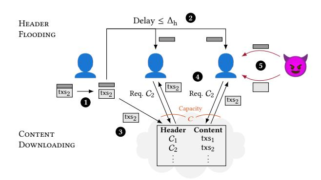

Figure 16: Bounded-capacity network model [48, Fig. 4]: 
Honest node produces a block, made of header and content. 
A hash in the header commits to the content. 
Header is flooded (Z.BroadcastHeaderChain), and arrives at all nodes ( $\Pi^{\rho,\tau,k_{\rm conf}}$ .ReceivedHeaderChain) with at most  $\Delta_h$  delay. 
Content is made available for peer-to-peer pull-based download (Z.UPLOADCONTENT). 
Content associated with the header is processed (i.e., downloaded and verified) ( $\Pi^{\rho,\tau,k_{\rm conf}}$ .ReceivedContent), subject to a maximum rate of C. 
The adversary can push headers and content to nodes, bypassing the delay and capacity constraints.

Alg. 2 (cf. [52, Fig. 2], [48, Alg. 3]). Pseudocode for the longest-header-chain scheduling policy  $\mathcal{D}_{long}$  is provided in Alg. 3. Helper functions used in the pseudocode are detailed in App. C.2.

## <span id="page-16-6"></span>C.2 Helper Functions for Nakamoto Consensus Pseudocode

- Hash(txs): Cryptographic hash function to produce a binding commitment to txs (modelled as a random oracle)
- $C' \leq C$ ,  $C \succeq C'$ : Relation that C' is a prefix of C
- $C \parallel C'$ : Concatenation of C and C'
- |C|: Length of C
- (true with probability *x*, else false): Bernoulli random variable with success probability *x*
- prefixChainsOf(C): Set of prefixes of C, i.e., all C' with  $C' \leq C$
- newBlock(txsHash: Hash(txs)) and
   newBlock(time: t, node: P, txsHash: Hash(txs)): Produce a
   new PoW and PoS block header with given parameters, respectively
- txsLedger(blkTxs, C): Concatenates the block contents stored in blkTxs for the blocks along the chain C, to obtain the corresponding transaction ledger

## <span id="page-16-1"></span>C.3 Bounded-Capacity Model Environment $\mathcal{Z}$

We study PoW NC (App. C.1) using the following model for a network Z with finite capacity (Fig. 16), and for the powers and limits of an adversary  $\mathcal{A}$ .

The environment  $\mathcal Z$  initializes N nodes and lets  $\mathcal A$  corrupt up to  $\beta N$  nodes at the beginning of the execution. Corrupted nodes are controlled by the adversary. Honest nodes run  $\Pi^{\rho,\tau,k_{\mathrm{conf}}}$ . The environment maintains a mapping  $\mathcal Z$ .blkTxs from block headers to the block content (transactions). This mapping is referred to as

the 'cloud' in Fig. 16.  ${\cal Z}$  also maintains for each node a queue of pending block headers to be delivered after a delay determined by the adversary. If  ${\cal A}$  has not instructed  ${\cal Z}$  to deliver a header  $\Delta_h$  real time after it was added to the queue of pending block headers, then  ${\cal Z}$  delivers it to the node.

Honest nodes and  $\mathcal{A}$  interact with  $\mathcal{Z}$  via the following functions:

- Z.BroadcastHeaderChain(C):
  - If called by an honest node,  $\mathcal{Z}$  enqueues  $\mathcal{C}$  in the queue of pending block headers for each node, and notifies  $\mathcal{A}$ . Then, for each node P, on receiving Deliver( $\mathcal{C}, P$ ) from  $\mathcal{A}$ , or when  $\Delta_h$  time has passed since  $\mathcal{C}$  was added to the queue of pending headers,  $\mathcal{Z}$  triggers P.received Header Chain( $\mathcal{C}$ ).
- Z.UPLOADCONTENT(C, txs):
   Z stores a mapping from the header chain C to the content txs of its last block by setting Z.blkTxs[C] = txs. Z only stores the content txs if Hash(txs) = C.txsHash.
- Z.receivePendingTxs():
  - ${\mathcal Z}$  generates a set of pending transactions and returns them.
- If node P at slot t requests the content associated with a block header C, Z acts as follows. If Z.blkTxs[C] is set, then let txs = Z.blkTxs[C] (if not, Z ignores the request). If the request was received from an honest node P, if Z has recently triggered P.receivedContent(C) at a rate below C, then Z triggers P.receivedContent(C, txs) (else, Z ignores the request). If the request was received from A, C sends C, txs) to C.

At all times,  $\mathcal{A}$  can trigger P.RECEIVEDHEADERCHAIN(C) and P.RECEIVEDCONTENT(C, txs) for honest nodes P (bypassing header delay and capacity constraint in an adversarially chosen way).

## <span id="page-17-0"></span>**D FULL SECURITY PROOF**

This section provides a self-contained proof of the argument developed in Sec. 4.

Nodes are identified using p,q. We distinguish between three notions of 'time': Slots of  $\Pi^{\rho,\tau,k_{conf}}$  are indicated by r,s,t. Slots in which one or more blocks are produced form a sub-sequence  $\{t_k\}$ , defined in App. D.2. Indices into this sub-sequence are denoted by i,j,k. The physical parameters of our model, header propagation delay  $\Delta_h$  and capacity C, as well as the mining rate  $\lambda$ , are specified in units of  $real\ time$ .

We denote by  $\mathrm{d}C_p(t)$  the longest fully processed chain of an honest node p at the end of slot t, and let |b| denote the height of a block b. We use the same notation |C| to denote the length of a chain C, define  $L_p(t) = \left|\mathrm{d}C_p(t)\right|$  and  $L_{\min}(t) = \min_p L_p(t)$  (where " $\min_p$ " ranges only over honest nodes).

We denote intervals of indices (or slots) as  $(i,j] \triangleq \{i+1,...,j\}$ , with the convention that  $(i,j] \triangleq \emptyset$  for  $j \leq i$ . We study executions over a finite horizon of  $T_{\text{hrzn}}$  slots (or  $K_{\text{hrzn}}$  indices), and any interval (i,j] with i < 0 or  $j > K_{\text{hrzn}}$  considered truncated accordingly. The notation (i,j] > K (resp.  $\succeq, \prec, \preceq, \asymp$ ) is short for j-i>K (resp.  $\succeq, \prec, \le, =$ ). In the analysis, we denote with upper-case Latin letters several random processes over indices  $(e.g., X_k)$  or slots  $(e.g., H_t)$ . For any set I of indices (analogously for slots), we define  $X_I \triangleq \sum_{k \in I} X_k$ .

We denote by  $\kappa$  the security parameter. An event  $\mathcal{E}_{\kappa}$  occurs with overwhelming probability if  $\Pr\left[\mathcal{E}_{\kappa}\right] \geq 1 - \operatorname{negl}(\kappa)$ . Here, a function  $f(\kappa)$  is negligible  $\operatorname{negl}(\kappa)$ , if for all n > 0, there exists  $\kappa_n^*$  such that for all  $\kappa > \kappa_n^*$ ,  $f(\kappa) < \frac{1}{\kappa^n}$ .

## D.1 Probabilistic Model for PoW NC Executions

Recall that the protocol runs in slots of duration  $\tau$ . A block production opportunity (BPO) is a pair (p,t) where according to the PoW block production lottery, node p is eligible to produce a block in slot t. A BPO is called honest (resp. adversary) if node p is honest (resp. adversary). The random variables  $H_t$  and  $A_t$  denote the number of honest and adversary BPOs in slot t, respectively. When the number of nodes  $N \to \infty$  and each node holds an equal rate of block production, by the Poisson approximation of a binomial random variable, we have  $H_t \stackrel{\text{i.i.d.}}{\sim}$  Poisson $((1-\beta)\rho)$  and  $A_t \stackrel{\text{i.i.d.}}{\sim}$  Poisson $(\beta\rho)$ , independent of each other and across slots. The total number of BPOs per slot is  $Q_t \triangleq H_t + A_t$ . An execution refers to a particular realization of the random process  $\{(H_t, A_t)\}$ .

#### <span id="page-17-1"></span>**D.2** Definitions

**Good, Bad, and Empty Slots.** Slots without a BPO are called '*empty*'. A slot is '*good*' iff it has exactly one honest BPO and no adversary BPOs, and is followed by  $\nu$  empty slots. This definition is inspired by convergence opportunities [37, 50, 52], loners [24], and laggers [55]. Here,  $\nu$  is an analysis parameter. We define another analysis parameter  $\widetilde{C}$  which is related to  $\nu$  as

$$(\nu+1)\tau \triangleq \Delta_{\rm h} + \widetilde{C}/C. \tag{4}$$

Thus,  $v, \widetilde{C}$  are chosen such that for a good slot, every honest node can receive the block header for the honest BPO, and process content for  $\widetilde{C}$  blocks, before the next BPO. Any non-empty slot which is not good is called 'bad'.

Definition D.1. We call a slot t good, bad, empty, respectively, denoted as Good(t), Bad(t), Empty(t), respectively, iff:

Good(t) 
$$\triangleq (H_t = 1) \land (A_t = 0)$$
  
  $\land (H_{(t,t+v)} + A_{(t,t+v)} = 0)$  (5)

$$Bad(t) \triangleq (H_t + A_t > 0) \land \neg Good(t)$$
 (6)

$$Empty(t) \triangleq (H_t + A_t = 0). \tag{7}$$

Note that  $\text{Empty}(t) = \neg \text{Good}(t) \land \neg \text{Bad}(t)$ .

We denote by  $t_k$  the k-th non-empty slot. Then, we can introduce random processes over indices, with index k corresponding to the k-th non-empty slot  $t_k$ . Considering only indices simplifies analysis by not having to deal with empty slots. The process  $\{G_k\}$  counts good slots, with  $G_k \triangleq \mathbbm{1}_{\{\text{Good}(t_k)\}}$ . Correspondingly,  $\{\overline{G}_k\}$  counts bad slots,  $\overline{G}_k \triangleq 1 - G_k$ .

The following fact shows the distribution of good indices.

Proposition 4.1. The  $\{G_k\}$  are independent and identically distributed (iid) with  $\Pr\left[G_k=1\right]\triangleq p_{\mathrm{G}}=(1-\beta)\frac{\rho e^{-\rho(\nu+1)}}{1-e^{-\rho}}.$ 

PROOF. First, for any k,

$$\Pr\left[G_k = 1\right] = \Pr\left[\operatorname{Good}(t_k) \mid \neg \operatorname{Empty}(t_k)\right] \tag{8}$$

$$= \frac{\Pr\left[\operatorname{Good}(t_k)\right]}{\Pr\left[\neg\operatorname{Empty}(t_k)\right]} = \frac{(1-\beta)\rho e^{-\rho(\nu+1)}}{1-e^{-\rho}}.$$
 (9)

Let  $p_{\rm E} \triangleq \Pr\left[H_t + A_t = 0\right]$ . Take an iid random process  $\{T_k\}$  with  $\Pr\left[T_k = t\right] = (1 - p_{\rm E})p_{\rm E}^t$  for  $t \geq 0$ . The random variables  $\{T_k\}$  describe the inter-arrival times between non-empty slots. Take another iid random process  $\{G_{L}'\}$ , independent of  $\{T_k\}$ , such that

 $G_k'=1$  with probability  $\Pr\left[H_t=1 \land A_t=0 \mid H_t+A_t>0\right]$  and  $G_k'=0$  otherwise. The random process  $\{G_k\}$  can be equivalently defined as  $G_k=1$  iff  $G_k'=1$  and  $T_k\geq \nu$ . The independence of the random variables  $\{G_k\}$  then follows from the independence of the random variables  $\{(T_k,G_k')\}$ .

Throughout the analysis, we assume  $p_{\rm G} > \frac{1}{2}$  ('honest majority' assumption).

**Some Good Slots Imply Growth.** A special role is played by good slots  $t_k$  with the additional property that the block produced at  $t_k$  is 'soon' processed by all honest nodes. Intuitively, these lead to *chain growth*, the cornerstone of NC security [24, 52]. We count these slots with  $\{D_k\}$ , and all other non-empty slots with  $\{\overline{D}_k\}$ . Specifically,  $D_k \triangleq 1$  if  $\operatorname{Good}(t_k)$  and the block produced at  $t_k$  has been processed by all honest nodes by the end of slot  $t_k + v$ ,  $D_k \triangleq 0$  otherwise, and  $\overline{D}_k \triangleq 1 - D_k$ . Finally, we define two random walks on indices of non-empty slots with increments  $\{X_k\}$  and  $\{Y_k\}$  that are handy for the definition of probabilistic and combinatorial pivots:

$$X_k \triangleq G_k - \overline{G}_k \qquad Y_k \triangleq D_k - \overline{D}_k \tag{10}$$

Note that the increments  $\{X_k\}$  are iid, and not affected by adversary action, while the increments  $\{Y_k\}$  do depend on the adversary action and are thus in particular *not* iid. Also note that  $\forall k\colon Y_k \leq X_k$  since  $D_k = 1 \implies G_k = 1$ .

## <span id="page-18-0"></span>Probabilistic and Combinatorial Pivots.

Definition D.2. We call an index k a ppivot (short for probabilistic pivot), denoted as PPivot(k), iff:

$$\mathsf{PPivot}(k) \triangleq (\forall (i, j] \ni k : X_{(0,i]} < X_{(0,k]} \le X_{(0,j]}) \tag{11}$$

<span id="page-18-1"></span>Definition D.3. We call an index k a *cpivot* (short for *combinato-rial pivot*), denoted as  $\mathsf{CPivot}(k)$ , iff:

$$\mathsf{CPivot}(k) \triangleq (\forall (i, j] \ni k \colon Y_{(0,i]} < Y_{(0,k]} \le Y_{(0,j]}) \tag{12}$$

This definition of ppivots and cpivots decouples [52, Def. 5] into its *probabilistic* aspects [52, Sec. 5.6.3] and *combinatorial* aspects [52, Sec. 5.6.2], and casts them as conditions on a random walk, inspired by [24, 40], to simplify the analysis. The decoupling is one of the key differences from the analysis in [52] (see Fig. 4). Note that a cpivot is also a ppivot because  $Y_i \leq X_i$ . Also, Def. D.2 is equivalent to Def. 4.2, and Def. D.3 is equivalent to Def. 4.3 (cf. proof of Prop. D.7).

## D.3 Analysis in the Probabilistic Model

We now develop the tools needed to prove safety and liveness of PoW NC in the bounded-capacity model, following Fig. 4. First, analogously to the combinatorial argument of [52], we show (App. D.3.1) that blocks from cpivots *stabilize*, *i.e.*, they remain in the longest processed chain of all honest nodes forever. This is useful because *if we know that cpivots occur frequently*, then honest nodes can confirm transactions that must lie in the prefix of a cpivot's block (*safety*), and cpivots' blocks (being produced by honest nodes) bring any outstanding transactions onto chain (*liveness*). We then show that cpivots do indeed occur frequently: We show with a new probabilistic argument (App. D.3.2) that *ppivots are abundant*, *i.e.*, in every 'sufficiently long' interval (*i.e.*, of length  $\Omega(\kappa^2)$ ), a constant fraction of the slots are ppivots (Lem. D.12). Then, we show with a new combinatorial argument (App. D.3.3) that *the adversary cannot* 

prevent all ppivots from becoming cpivots, i.e., in every 'sufficiently long' interval, there is at least one cpivot (Lem. D.17). As a result, if honest nodes confirm transactions that are still on their longest processed chain after 'sufficiently long' time (i.e., confirmation latency  $\Omega(\kappa^2)$ ), then PoW NC  $\Pi^{\rho,\tau,k_{\rm conf}}$  is safe and live under bounded capacity.

<span id="page-18-4"></span>D.3.1 Combinatorial Pivots Stabilize. We now show that the honest block produced in a slot corresponding to a cpivot persists in the longest processed chain of all honest nodes forever after  $\nu$  slots after it was produced. Towards this, we first show that if  $D_k = 1$ , i.e., if all honest nodes process the block produced in the good slot  $t_k$ , then the length of the longest processed chain of honest nodes increases, i.e., a chain growth event (made precise in Prop. D.4). Due to this, since, by Def. D.3, all intervals around a cpivot contain more indices with  $D_k = 1$  than those with  $D_k = 0$ , there can never be some honest node with a longest processed chain that does not contain the block corresponding to the cpivot (Lem. D.5). This is because there are not enough blocks for any other chain to outnumber the chain growth events that contributed to the growth of the processed chain containing the cpivot's block. Thus, the block corresponding to the cpivot remains in all honest nodes' longest processed chains forever. Lem. D.5 is proven analogously to the combinatorial argument of [52].

<span id="page-18-6"></span>Recall that  $\mathrm{d}C_p(t)$  is the longest processed chain of node p at the end of slot t, |C| denotes the length of chain C,  $L_p(t) = \left|\mathrm{d}C_p(t)\right|$  and the length of the "shortest (across honest nodes) longest processed chain" is  $L_{\min}(t) = \min_p L_p(t)$  (where " $\min_p$ " ranges only over honest nodes). The following proposition says that  $L_{\min}(t)$  grows for every index k with  $D_k = 1$ , i.e., these are "chain growth events".

<span id="page-18-3"></span>Proposition D.4. If 
$$D_k = 1$$
, then  $L_{\min}(t_k + v) \ge L_{\min}(t_k - 1) + 1$ .

PROOF. Since  $D_k=1$ , slot  $t_k$  is a good slot. Let b be the unique honest block produced in slot  $t_k$ , and let honest node p be its producer. Since honest nodes produce blocks on their longest processed chain,  $|b|=L_p(t_k-1)+1\geq L_{\min}(t_k-1)+1$ . Further,  $D_k=1$  means that the block b is processed by all honest nodes by the end of slot  $t_k+v$ . Therefore,  $L_{\min}(t_k+v)\geq |b|$ .

<span id="page-18-2"></span>LEMMA D.5. Let  $b^*$  be the block produced in a non-empty slot  $t_k$  such that  $\mathsf{CPivot}(k)$ . Then, for all header chains C' that are valid at slot  $t \geq t_k + v$  and  $|C'| \geq L_{\min}(t) \colon b^* \in C'$ . Also then, for all honest nodes p and for all slots  $t \geq t_k + v \colon b^* \in \mathsf{dC}_p(t)$ .

The following proposition is helpful for proving Lem. D.5.

<span id="page-18-5"></span>Proposition D.6. For any i < j,

$$L_{\min}(t_j + \nu) \ge L_{\min}(t_{i+1} - 1) + D_{(i,j]}. \tag{13}$$

PROOF. By noting that if  $D_k = 1$ , then  $t_{k+1} > t_k + v$ , and adding the result of Prop. D.4 for each index with  $D_k = 1$ .

PROOF OF LEM. D.5. Note that  $\mathrm{d}C_p(t)$  is a valid chain at slot t and  $\left|\mathrm{d}C_p(t)\right|=L_p(t)\geq L_{\min}(t)$ . Therefore, it suffices to show the first claim of the lemma.

For contradiction, let  $s \ge t_k + v$  be the first slot in which there is a valid header chain C' such that  $|C'| \ge L_{\min}(s)$  and  $b^* \notin C'$ .

Let b' be the block with maximum height on the chain C', such that b' was produced in a slot  $t_i$  with  $D_i = 1$ . For C' to be a valid chain at slot s, we need  $t_i \leq s$ . Since the block b' is produced by an honest node, b' extends  $\mathrm{d}C_q(t_i-1)$  for some honest node q. Therefore,  $\mathrm{d}C_q(t_i-1)$  is a prefix of C'. This means that  $b^* \notin \mathrm{d}C_q(t_i-1)$ . Moreover,  $|\mathrm{d}C_q(t_i-1)| = L_q(t_i-1) \geq L_{\min}(t_i-1)$ . If i > k, then  $t_i-1 \geq t_k+v$  (since  $D_k=1$ ) and  $t_i-1 < s$  (shown above). This is a contradiction because we assumed that s is the first slot such that  $s \geq t_k+v$  and  $b^* \notin C'$  and  $|C'| \geq L_{\min}(s)$  for some valid chain C'. Since  $b^*$  is the only block produced in slot  $t_k$ , i=k is also not possible. We conclude that i < k.

Since  $D_i = 1$  and b' is produced in slot  $t_i$ ,

<span id="page-19-3"></span><span id="page-19-2"></span>
$$L_{\min}(t_i + \nu) \ge |b'|. \tag{14}$$

By assumption,

$$|C'| \ge L_{\min}(s). \tag{15}$$

Let  $t_j$  be the last non-empty slot such that  $t_j \le s$ . Note that  $j \ge k > i$ . We must consider two cases:

(1) Case 1:  $s \ge t_j + v$  or  $D_j = 0$ . If  $D_j = 0$ , we don't have to worry about whether the block from slot  $t_j$  was processed by all honest nodes. If  $D_j = 1$  but  $s \ge t_j + v$ , then we know that all honest nodes have processed the block from slot  $t_j$  before the end of slot s. That is,

$$L_{\min}(s) \ge L_{\min}(t_i + \nu) \tag{16}$$

$$\geq L_{\min}(t_{i+1} - 1) + D_{(i,j]}$$
 (from Prop. D.6) (17)

$$\geq L_{\min}(t_i + v) + D_{(i,j]}.$$
 (18)

By definition of b', all blocks in C' appearing after b' correspond to indices l with  $D_l = 0$ . These blocks must be from distinct indices greater than i but at most j. So,

$$\left|C'\right| \le \left|b'\right| + \overline{D}_{(i,i]}.\tag{19}$$

From eqns. (14), (15), (18) and (19), we derive

$$D_{(i,j]} \leq \overline{D}_{(i,j]} \implies Y_{(i,j]} \leq 0 \implies Y_{(0,i]} < Y_{(0,j]}$$
 (20)

where  $i < k \le j$ .

(2) Case 2:  $t_j \le s < t_j + v$  and  $D_j = 1$ . In this case, the block from slot  $t_j$  may not have enough time to be processed by all honest nodes before the end of slot s. However, for any l < j such that  $D_l = 1$ ,  $t_l + v < t_j \le s$ , so there is enough time to process the block from slot  $t_l$ . Let  $l \in (i, j-1]$  be the greatest index such that  $D_l = 1$ . Then,  $t_j > t_l + v$ , and  $D_{(i,l)} = D_{(i,j-1)}$ .

$$L_{\min}(s) \ge L_{\min}(t_i) \tag{21}$$

$$\geq L_{\min}(t_l + \nu) \tag{22}$$

$$\geq L_{\min}(t_{i+1} - 1) + D_{(i,l)}$$
 (from Prop. D.6) (23)

$$\geq L_{\min}(t_i + v) + D_{(i,j-1]}.$$
 (24)

Note that since  $D_j = 1$ ,  $\overline{D}_{(i,j]} = \overline{D}_{(i,j-1]}$ . Therefore, as in the previous case,

<span id="page-19-10"></span><span id="page-19-7"></span>
$$\left|C'\right| \le \left|b'\right| + \overline{D}_{(i,j-1]}.\tag{25}$$

From eqns. (14), (15), (21) and (25),

$$D_{(i,j-1]} \le \overline{D}_{(i,j-1]} \implies Y_{(i,j-1]} \le 0$$
  
$$\implies Y_{(0,i]} < Y_{(0,j-1]}.$$
 (26)

<span id="page-19-11"></span>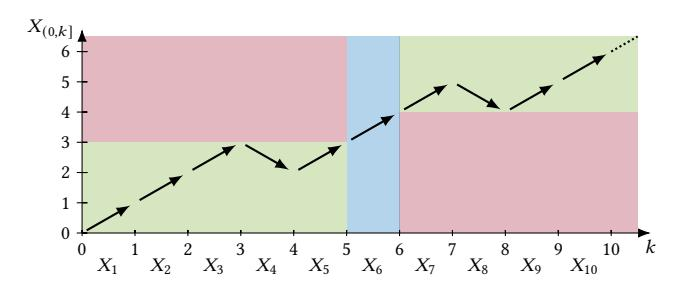

Figure 17: Illustration of ppivot (eqn. (29)): A ppivot as an index k so that  $X_k = 1$  ( ) and  $X_{(0,.]}$  is strictly below  $X_{(0,k]}$  left of k and weakly above  $X_{(0,k]}$  right of k ( ).

Note that since we assumed  $s \ge t_k + v$  and  $s < t_j + v$ , we know that j > k. Therefore,  $i < k \le j - 1$ .

In either case, eqn. (20) or eqn. (26) contradict the assumption  $\mathsf{CPivot}(k)$  (Def. D.3).

<span id="page-19-4"></span><span id="page-19-1"></span>D.3.2 Probabilistic Pivots Are Abundant. Previous analyses of NC [24, 52] show that sufficiently long intervals contain at least one ppivot (Fig. 4(a)). This was enough for the bounded-delay analysis because in the bounded-delay setting, every ppivot is also a cpivot. However, in the bounded-capacity setting, not every cpivot is a ppivot, because not every good slot results in growth of the longest processed chain of honest nodes (Fig. 4(b)). Thus, existence of one ppivot in every large interval is not enough to conclude existence of one cpivot in every large interval. Instead, we prove, using a concentration bound on the number of ppivots (Prop. D.11), that long intervals of indices in fact contain a number of ppivots proportional to the interval length (Lem. D.12). Then, in App. D.3.3, we prove that out of those many ppivots, at least one must also be a cpivot, which allows us to continue with the safety and liveness proofs from [52].

<span id="page-19-9"></span><span id="page-19-5"></span>The key challenge in proving that there are many ppivots is that for two indices  $k_1, k_2$ , the events that  $k_1$  is a poivot and that  $k_2$  is a ppivot are dependent, because both events depend on overlapping intervals. But a key observation is that since the ppivot condition ( Def. D.2) already holds for large intervals with high probability ( Prop. D.8), we only need to look at the small intervals. Then, for two indices  $k_1$ ,  $k_2$  that are sufficiently far apart, these short intervals are disjoint, and thus the corresponding ppivot conditions are independent. Therefore, we decompose a long interval of indices into several groups of far-apart indices. This is illustrated in Fig. 10, each group indicated by a different color. Within each group, by a concentration bound for iid random variables, there are many ppivots. Further, by a union bound, the concentration holds in all the groups simultaneously with high probability. This summarizes the proof of Prop. D.11, which culminates in Lem. D.12 showing that with overwhelming probability, there are many ppivots in every long enough interval.

<span id="page-19-6"></span>We first identify insightful alternative characterizations of ppivots, and a few propositions to help prove Prop. D.11. Lem. D.12 follows from there.

<span id="page-19-12"></span><span id="page-19-0"></span>Proposition D.7.

$$\mathsf{PPivot}(k) \iff (\forall (i, j] \ni k \colon X_{(i, j]} > 0) \tag{27}$$

<span id="page-19-8"></span>
$$\iff (\forall (i,j] \ni k \colon G_{(i,j]} > \overline{G}_{(i,j]}) \tag{28}$$

$$\iff (X_k = 1) \land (\forall j \ge k : X_{(k,j]} \ge 0)$$
$$\land (\forall i < (k-1) : X_{(i,k-1]} \ge 0) \tag{29}$$

PROOF. Elementary, using 
$$X_{(i,j]} = X_{(0,j]} - X_{(0,i]}$$
.

In particular, eqn. (29) characterizes a ppivot as an index k such that  $G_k = 1$  and the simple random walks  $\ell \mapsto X_{(k,k+\ell]}$  and  $\ell \mapsto X_{(k-1-\ell,k-1]}$  starting at 0 remain non-negative forever (Fig. 17). Due to this, we easily see that the probability that any given index is a ppivot is the probability that the index is good and the two random walks never return to zero (Prop. D.10). In Prop. D.8 by a simple concentration bound over iid random variables, we show that in all large intervals, with high probability, the random walk  $X_k$  advances proportionally to the interval length (due to its positive drift).

Throughout this section, assume that  $p_G = \frac{1}{2} + \varepsilon_G$  with  $\varepsilon_G \in (0, 1/2]$ .

<span id="page-20-2"></span>Proposition D.8. With  $\alpha_2 \triangleq 2\varepsilon_G^2$ ,  $\forall (i, j], \forall \delta \geq 0$ :

$$\Pr\left[X_{(i,j)} \le (1-\delta)2\varepsilon_{G}(j-i)\right] \le \exp(-\alpha_{2}\delta^{2}(j-i)). \tag{30}$$

<span id="page-20-8"></span>PROPOSITION D.9 (HOEFFDING'S INEQUALITY [34] [26, Thm. 4]). Let  $Z_1, ..., Z_n$  be independent bounded random variables with  $\forall i: Z_i \in [a, b]$ , where  $-\infty < a \le b < \infty$ . Then,  $\forall t \ge 0$ :

$$\Pr\left[\left(\sum_{i=1}^{n} Z_i\right) \ge \mathbb{E}\left[\sum_{i=1}^{n} Z_i\right] + tn\right] \le \exp\left(\frac{-2nt^2}{(b-a)^2}\right) \tag{31}$$

$$\Pr\left[\left(\sum_{i=1}^{n} Z_i\right) \le \mathbb{E}\left[\sum_{i=1}^{n} Z_i\right] - tn\right] \le \exp\left(\frac{-2nt^2}{(b-a)^2}\right) \tag{32}$$

<span id="page-20-7"></span>Proposition D.10.

$$\forall k$$
:  $\Pr\left[\mathsf{PPivot}(k)\right] \ge (2p_{\mathsf{G}} - 1)^2 / p_{\mathsf{G}} \triangleq p_{\mathsf{ppivot}}$  (33)

PROOF. In eqn. (29), PPivot(k) is characterized as the intersection of three independent events:

$$\mathcal{E}_1 \triangleq \{X_k = 1\} \tag{34}$$

$$\mathcal{E}_2 \triangleq \{ \forall \ell \colon X_{(k,k+\ell]} \ge 0 \} \tag{35}$$

$$\mathcal{E}_3 \triangleq \{ \forall \ell \colon X_{(k-1-\ell,k-1)} \ge 0 \} \tag{36}$$

Their probabilities are easily calculated [39]:

$$\Pr[\mathcal{E}_1] = p_G \qquad \Pr[\mathcal{E}_2] = \Pr[\mathcal{E}_3] = (2p_G - 1)/p_G$$
 (37)

The process  $\{P_k\}$  counts privots, with  $P_k \triangleq \mathbb{1}_{\{PPivot(k)\}}$ .

<span id="page-20-1"></span>Proposition D.11. With  $\alpha_3 \triangleq 2p_{\text{ppivot}}^2$ ,

$$\forall (i, j] \approx 2K_1K_2$$
:  $\Pr\left[P_{(i, j]} \le (1 - \delta)p_{\text{ppivot}}2K_1K_2\right]$   
 $\le 2K_1 \exp(-\alpha_3 \delta^2 K_2) + K_{\text{bran}}^2 \exp(-\alpha_2 K_1).$  (38)

Proof. Let  $\mathcal{E} \triangleq \{ \forall (i, j] \succeq K_1 \colon X_{(i, j]} > 0 \}$ . From Prop. D.8 with  $\delta = 1$ , and a union bound over all intervals ( $\leq K_{\text{hrzn}}^2$  many), we get

$$\Pr\left[\neg \mathcal{E}\right] \le K_{\text{hrzn}}^2 \exp(-\alpha_2 K_1). \tag{39}$$

For any given index k, we can partition the intervals of eqn. (27) into 'long' and 'short' intervals (length at least vs. less than  $K_1$ ):

$$\mathcal{E}_{k} \triangleq \{ \mathsf{PPivot}(k) \} = \mathcal{E}_{k}^{\mathsf{L}} \wedge \mathcal{E}_{k}^{\mathsf{S}}$$
 (40)

$$\mathcal{E}_{\nu}^{L} \triangleq \{ \forall (i, j] \ni k, (i, j] \succeq K_1 : X_{(i, j]} > 0 \}$$
 (41)

$$\mathcal{E}_{L}^{S} \triangleq \{ \forall (i, j] \ni k, (i, j] \prec K_{1} : X_{(i, j]} > 0 \}.$$
 (42)

Note that  $\mathcal{E}_k^{\mathrm{L}} \supseteq \mathcal{E}$ . Also, for any two given indices  $k_1, k_2$  that are 'far apart', i.e., if  $|k_1 - k_2| \ge 2K_1$ , then  $\mathcal{E}_{k_1}$  and  $\mathcal{E}_{k_2}$  are conditionally independent given  $\mathcal{E}$  (since  $\mathcal{E}_{k_1}^{\mathrm{S}}$  and  $\mathcal{E}_{k_2}^{\mathrm{S}}$  are).

We decompose 
$$I^* \triangleq (i, j] = (i, i + 2K_1K_2] = \bigcup_{\ell=1}^{2K_1} I_{\ell}$$
:

$$\forall \ell \in \{1, ..., 2K_1\}: I_{\ell} \triangleq \{i + 0 \cdot 2K_1 + \ell, ... ..., i + (K_2 - 1) \cdot 2K_1 + \ell\}.$$
 (43)

See Fig. 10 for illustration. We define corresponding events,  $\forall \ell \in \{1, ..., 2K_1\}$ :

$$\mathcal{E}^* \triangleq \left\{ P_{I^*} \le (1 - \delta) p_{\text{ppivot}} 2K_1 K_2 \right\} \tag{44}$$

$$\mathcal{E}_{\ell} \triangleq \left\{ P_{I_{\ell}} \le (1 - \delta) p_{\text{ppivot}} K_2 \right\}. \tag{45}$$

Clearly,  $\mathcal{E}^* \subseteq \bigcup_{\ell=1}^{2K_1} \mathcal{E}_{\ell}$ . Thus, by a union bound,

$$\Pr\left[\mathcal{E}^* \middle| \mathcal{E}\right] \le \sum_{\ell=1}^{2K_1} \Pr\left[\mathcal{E}_\ell \middle| \mathcal{E}\right]. \tag{46}$$

Furthermore,  $\forall \ell \in \{1, ..., 2K_1\}$ , and with  $\mu_{\ell} \triangleq \mathbb{E}\left[P_{I_{\ell}} \middle| \mathcal{E}\right]$ :

$$\Pr\left[\mathcal{E}_{\ell} \mid \mathcal{E}\right] = \Pr\left[P_{I_{\ell}} \le (1 - \delta)p_{\text{ppivot}}K_{2} \mid \mathcal{E}\right] \tag{47}$$

$$\stackrel{\text{(a)}}{\leq} \Pr\left[P_{I_{\ell}} \leq (1 - \delta)\mu_{\ell} \,\middle|\, \mathcal{E}\right] \tag{48}$$

$$\stackrel{\text{(b)}}{\leq} \exp(-2\delta^2 \mu_\ell^2 / K_2) \stackrel{\text{(c)}}{\leq} \exp(-2p_{\text{pnivot}}^2 \delta^2 K_2), \tag{49}$$

where (a) and (c) use

П

$$\mu_{\ell} = K_2 \mathbb{E} \left[ \mathbb{1}_{\{ \text{PPivot}(k) \}} \middle| \mathcal{E} \right] \ge K_2 \mathbb{E} \left[ \mathbb{1}_{\{ \text{PPivot}(k) \}} \middle|$$

$$\ge K_2 p_{\text{ppivot}}$$
(50)

(Prop. D.10), and (b) uses that  $\{\mathsf{PPivot}(k_1)\}$  and  $\{\mathsf{PPivot}(k_2)\}$  are conditionally independent given  $\mathcal{E}$  for  $k_1, k_2 \in I_\ell$ , and Hoeffding's inequality (Prop. D.9).

To complete the proof, with  $\alpha_3 = 2p_{\text{ppivot}}^2$ ,

$$\Pr\left[\mathcal{E}^*\right] = \Pr\left[\mathcal{E}^* \cap \mathcal{E}\right] + \Pr\left[\mathcal{E}^* \cap \neg \mathcal{E}\right] \tag{51}$$

$$\leq \Pr\left[\mathcal{E}^* \middle| \mathcal{E}\right] + \Pr\left[\neg \mathcal{E}\right] \tag{52}$$

$$\leq 2K_1 \exp(-\alpha_3 \delta^2 K_2) + K_{\text{hrzn}}^2 \exp(-\alpha_2 K_1).$$
 (53)

<span id="page-20-0"></span>LEMMA D.12. For  $K_{\rm CD} = \Omega(\kappa^2)$ , and  $K_{\rm hrzn} = {\rm poly}(\kappa)$ ,

$$\Pr\left[\forall (i, j] \ge K_{\text{cp}} \colon P_{(i, j]} \ge (1 - \delta) p_{\text{ppivot}} K_{\text{cp}}\right]$$

$$\ge 1 - \exp(-\Omega(\kappa)) = 1 - \operatorname{negl}(\kappa). \tag{54}$$

PROOF. From Prop. D.11 by setting  $K_1, K_2 = \Omega(\kappa)$  and  $K_{cp} = K_1 K_2$ .

<span id="page-20-6"></span>D.3.3 Many Probabilistic Pivots Imply One Combinatorial Pivot. The longest-header-chain rule  $\mathcal{D}_{long}$  (Alg. 3) has a few useful properties. Intuitively, nodes using this rule

- <span id="page-20-3"></span>(P1) process a BPO's block's content at most once,
- <span id="page-20-4"></span>(P2) either process the most recent honest block, or fully utilize their capacity to process other blocks (i.e., do not stay idle), and
- <span id="page-20-5"></span>(P3) prioritize blocks that were produced 'recently'.

(P1) holds by construction. (P2) holds because the scheduling policy  $\mathcal{D}_{long}$  is never idle, and will always process towards an honest block when it has processed all longer chains and there is capacity remaining. Moreover, we expect that in a secure execution, (P3) holds because the longest header chain cannot fork off too much from the longest processed chain of an honest node, otherwise it would imply a safety violation. More precisely, due to Lem. D.5, any longest header chain in any honest node's view must extend the block produced in the most recent cpivot, and therefore blocks with the highest processing priority must have been produced after the most recent cpivot. If the adversary wants to prevent honest nodes from processing the block produced at a good index k, so that  $G_k = 1$  but  $D_k = 0$ , then it can only "distract" them by providing  $\widetilde{C}$  blocks produced after the most recent cpivot (Prop. 4.7).

PROPOSITION 4.7. If  $G_k = 1$  and  $D_k = 0$ , then during slots  $[t_k, t_k + v]$ , all honest nodes using the longest-header-chain scheduling policy process content of at least  $\widetilde{C}$  blocks that are produced in (i, k], where i < k is the largest index such that CPivot(i) (if such an i does not exist, i = 0).

PROOF. In slot  $t_k$ , there is exactly one block b produced by an honest node, the block header is made public at the beginning of the slot, and is seen by all honest nodes within  $\Delta_h$  time. Thereafter, each node has enough time to process  $\widetilde{C}$  blocks during slots  $[t_k, t_k + v]$ .

Under the scheduling policy  $\mathcal{D}_{long}$ , if  $D_k = 0$ , i.e. an honest node did not process content for the block b before the end of slot  $t_k + v$ , then that honest node must process the content for at least  $\widetilde{C}$  blocks on chains longer than the height of the block b or in the prefix of the block b. Since honest nodes produce blocks extending their longest chain, b extends  $\mathrm{d}C_p(t_k-1)$  for some p. Let  $b^*$  be the block produced in slot  $t_i$  where  $\mathrm{CPivot}(i)$  (suppose i exists).  $\mathrm{CPivot}(i) \implies Y_i = 1$ , therefore this block is unique, and also  $t_k > t_i + v$ . Due to Lem. D.5, any valid header chain longer than b at time slot  $t_k$  must contain  $b^*$ . Therefore, the only blocks that are processed by an honest node during slots  $[t_k, t_k + v]$ 

- (1) must be produced after  $t_i$  because they extend  $b^*$ , and
- (2) must be produced no later than  $t_k$  because there are no blocks produced in  $(t_k, t_k + v]$ .

In case a cpivot i < k does not exist, the claim is trivial.  $\Box$ 

Given the above properties of the scheduling policy, we now want to show that cpivots occur once in a while. Fig. 11 illustrates the key argument for this. To start, let us show that there is at least one cpivot in  $(0, K_{cp}]$ . From Lem. D.12, there are many ppivots in  $(0, K_{cp}]$ . If there were no cpivots in  $(0, K_{cp}]$ , then the adversary must prevent each ppivot from turning into a cpivot. We know that in any interval around a ppivot, there are more good indices than bad indices (see top row in Fig. 11). In fact, good indices outnumber bad indices by a margin that increases linearly with the size of the interval (Prop. D.8). Therefore, for a ppivot to not be a cpivot, the adversary must prevent an honest node from processing the most recent honest block in several of these good indices (so that the corresponding  $G_k = 1$  indices have  $D_k = 0$ ). Fig. 11 shows an example where the adversary prevented processing of the honest block in one good index, and as a result, two of the ppivots fail to become a cpivot. In Lem. D.13, through a combinatorial argument,

we show that to prevent all of n ppivots in  $(0, K_{\rm cp}]$  from becoming cpivots, the adversary must prevent processing of the honest block in at least n/4 good indices in  $(0, 2K_{\rm cp}]$ . From Prop. 4.7, for each such index, the adversary must 'spend' at least  $\widetilde{C}$  blocks that the honest node processs. These blocks must come from a 'budget' that can contain at most all blocks mined during  $(0, 2K_{\rm cp}]$ . If this 'budget' falls short of the number of blocks required to overthrow all cpivots, then there must be at least one cpivot in  $(0, K_{\rm cp}]$ .

Next, we would like to show that there is at least one cpivot in  $(mK_{\rm cp}, (m+1)K_{\rm cp}]$  for all  $m \geq 0$  (where we just saw the base case m=0). Here, one may be concerned that the adversary could save up many blocks from the past and attempt to make honest nodes process these blocks at a particular target slot  $t_k$ . But given that one cpivot occurred in  $((m-1)K_{\rm cp}, mK_{\rm cp}]$ , Prop. 4.7 ensures that honest nodes will only process blocks that are produced after  $(m-1)K_{\rm cp}$ . This allows us to bound the 'budget' of blocks that the adversary can use to overthrow cpivots, and therefore show that there is at least one cpivot in  $(mK_{\rm cp}, (m+1)K_{\rm cp}]$ . This argument is formalized in Lem. D.17.

Below, we first show the proof for the base case (*i.e.* for the interval  $(0, K_{\rm cp}]$ ) to highlight the key techniques. Here,  $Q_{(...]}$  is the total number of blocks mined in an interval (bounds the adversary's block budget), and the expressions on the left in eqns. (73) and (74) are the minimum number of blocks the adversary needs to produce to ensure that there are no cpivots, in terms of the number of ppivots  $P_{(...]}$  and number of good indices  $G_{(...]}$ .

<span id="page-21-0"></span>Lemma D.13. If honest nodes use the scheduling policy  $\mathcal{D}_{\mathsf{long}}$  and

<span id="page-21-5"></span><span id="page-21-4"></span>
$$\forall (i, j] \succeq K_{\text{cp}}, i < K_{\text{cp}}: \quad \frac{\widetilde{C}}{2} \left( G_{(i, j]} - \overline{G}_{(i, j]} \right) > Q_{(0, j]}, \qquad (55)$$

$$\frac{\widetilde{C}}{4} P_{(0, K_{\text{cp}}]} > Q_{(0, 2K_{\text{cp}}]}, \qquad (56)$$

then  $\exists k_1^* \in (0, K_{cp}] : CPivot(k_1^*).$ 

Towards proving Lem. D.13, we show two simple corollaries of the cpivot conditions (Props. D.14 and D.15) and show that in any interval, good indices outnumber bad indices by at least the number of ppivots in that interval.

<span id="page-21-1"></span>Proposition D.14.

$$\neg \mathsf{CPivot}(k) \implies \exists (i,j] \ni k \colon Y_{(i,j)} \le 0.$$
 (57)

Proof. From Def. D.3.

<span id="page-21-2"></span>Proposition D.15. If  $Y_{(i,j)} \leq 0$ , then

$$\overline{D}_{(i,j]} \ge D_{(i,j]}, \qquad G_{(i,j]} - D_{(i,j]} \ge \frac{1}{2} \left( G_{(i,j]} - \overline{G}_{(i,j]} \right).$$
 (58)

PROOF. We obtain eqn. (58) from the definition  $Y_i = D_i - \overline{D}_i$ . Then,

<span id="page-21-3"></span>
$$G_{(i,j]} + \overline{G}_{(i,j]} = D_{(i,j]} + \overline{D}_{(i,j]}$$
 (59)

$$G_{(i,j]} + \overline{G}_{(i,j]} \ge 2D_{(i,j]}$$
 (60)

П

$$2G_{(i,j]} - 2D_{(i,j]} \ge G_{(i,j]} - \overline{G}_{(i,j]}. \tag{61}$$

<span id="page-21-6"></span>Proposition D.16. If  $P_{(i,j]} > 0$ , then  $G_{(i,j]} - \overline{G}_{(i,j]} \ge P_{(i,j]}$ .

<span id="page-22-5"></span>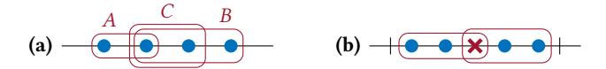

Figure 18: Blue circles represent ppivots, red crosses represent indices with  $G_k=1$  and  $D_k=0$ . (a) Given intervals A,B,C all containing the 2nd blue circle from left, interval C is redundant. (b) Given n blue circles, the adversary needs at least n/4 red crosses to draw a set of intervals satisfying eqns. (62) and (63). Here is a placement of red crosses relative to blue circles that achieves the minimum number of red crosses.

PROOF. Let  $n=P_{(i,j]}$ . First, consider n=1. There is exactly one ppivot  $k\in (i,j]$ . From Def. D.2,  $X_{(0,i]}< X_{(0,j]}$ . Therefore,  $X_{(i,j]}>0$ , hence  $G_{(i,j]}-\overline{G}_{(i,j]}\geq 1$ . For the general case, let  $k_1,...,k_n$  be the ppivots in (i,j]. Then, we apply the n=1 case on the disjoint intervals  $(i,k_1]$ ,  $(k_1,k_2]$ , ...,  $(k_{n-1},j]$  and then sum up.

PROOF OF LEM. D.13. Due to eqn. (56), there is at least one ppivot in  $(0, K_{\rm cp}]$  (otherwise  $P_{(0,K_{\rm cp}]}=0$ ). Suppose for contradiction that there is no cpivot in  $(0,K_{\rm cp}]$ . Since cpivots are also ppivots, it is enough to consider that none of the ppivots is a cpivot. Then around each ppivot, there must be at least one interval which violates the combinatorial pivot condition. Formally, there is a set of intervals I such that:

<span id="page-22-3"></span>
$$\bigcup_{k \in \mathcal{L}} I \supseteq \left\{ k \in \left(0, K_{\text{cp}}\right] : \mathsf{PPivot}(k) \right\} \tag{62}$$

$$\forall I \in \mathcal{I}: \quad Y_I \le 0 \quad \text{(by Prop. D.14)}.$$
 (63)

Without loss of generality, each interval  $I \in \mathcal{I}$  contains at least one ppivot (removing all intervals that do not contain a ppivot maintains eqns. (62) and (63)). Then if  $(i, j] \in \mathcal{I}$ ,  $i < K_{cp}$ .

First, consider the large intervals with  $|I| \ge K_{\rm cp}$ . Consider indices  $k \in I$  for which  $G_k = 1$  (good) but  $D_k = 0$  (block not processed). From Prop. 4.7, for each such index, all honest nodes process  $\widetilde{C}$  blocks that are produced no later than  $t_k$ . The number of indices  $k \in I$  with  $G_k = 1$  and  $D_k = 0$  is  $G_I - D_I$ . For each such index, there must exist  $\widetilde{C}$  distinct blocks produced in or before the interval I. Therefore, if I = (i, j],

$$Q_{(0,j]} \ge \widetilde{C} \left( G_{(i,j]} - D_{(i,j]} \right) \tag{64}$$

$$\geq \frac{\widetilde{C}}{2} \left( G_{(i,j]} - \overline{G}_{(i,j]} \right)$$
 (by Prop. D.15). (65)

This contradicts eqn. (55). Therefore, all intervals  $I \in \mathcal{I}$  are small  $(|I| < K_{\rm cp})$ . Then for each  $I \in \mathcal{I}$ ,  $I \subset (0, 2K_{\rm cp}]$ . Also,

$$G_I - D_I \ge \frac{1}{2} \left( G_I - \overline{G}_I \right) \ge \frac{1}{2} P_I$$
 (by Props. D.15 and D.16). (66)

Consider the indices  $k \in (0, 2K_{\rm Cp}]$  with  $G_k = 1$  and  $D_k = 0$ . Let  $I_k = \{I \in I : k \in I\}$  be the set of intervals that contain k. Let  $I_k^L$  be an interval in  $I_k$  that stretches farthest to the left, and let  $I_k^R$  be an interval that stretches farthest to the right (these may also be the same). Note that all other intervals in  $I_k$  are contained in  $I_k^L \cup I_k^R$ . Therefore, all intervals in  $I_k$  except  $I_k^L$  and  $I_k^R$  can be removed from I while maintaining eqns. (62) and (63) (see Fig. 18(a)). This process is repeated for all  $k \in (0, 2K_{\rm Cp}]$  with  $G_k = 1$  and  $D_k = 0$ , so that in

the resulting set I, each such index k is contained in at most two intervals. Then,

$$\sum_{k \in (0, 2K_{\text{cp}}]: G_k = 1, D_k = 0} |I_k| \le \sum_{k \in (0, 2K_{\text{cp}}]: G_k = 1, D_k = 0} 2$$
(67)

<span id="page-22-7"></span><span id="page-22-6"></span>
$$= 2 \left( G_{(0,2K_{cp}]} - D_{(0,2K_{cp}]} \right). \tag{68}$$

This sum can be rewritten as

$$\sum_{k \in (0, 2K_{\text{cp}}]: G_k = 1, D_k = 0} |I_k| = \sum_{I \in I} (G_I - D_I)$$
(69)

$$\geq \sum_{I \in I} \frac{1}{2} P_I \geq \frac{1}{2} P_{(0,K_{cp}]}$$
 (by eqn. (62)). (70)

From eqns. (68) and (70),

$$G_{(0,2K_{cp}]} - D_{(0,2K_{cp}]} \ge \frac{1}{4} P_{(0,K_{cp}]}.$$
 (71)

This can also be seen from Fig. 18(b). Finally, as shown before, for each k with  $G_k = 1$  and  $D_k = 0$ , all honest nodes process at least  $\widetilde{C}$  distinct blocks produced in or before index k (Prop. 4.7). This gives

$$Q_{(0,2K_{cp}]} \ge \widetilde{C}\left(G_{(0,2K_{cp}]} - D_{(0,2K_{cp}]}\right) \ge \frac{\widetilde{C}}{4}P_{(0,K_{cp}]}$$
 (72)

which is a contradiction to eqn. (56).

Lem. D.17 proves that at least one cpivot exists in successive intervals of  $K_{\rm cp}$  length. Lem. D.17 is proved by induction, where the base case is Lem. D.13.

<span id="page-22-4"></span><span id="page-22-0"></span>Lemma D.17. If honest nodes use the scheduling policy  $\mathcal{D}_{long}$  and

<span id="page-22-1"></span>
$$\forall (i,j] \succeq K_{\text{cp}}: \quad \frac{\widetilde{C}}{2} \left( G_{(i,j]} - \overline{G}_{(i,j]} \right) > Q_{\left(i-2K_{\text{cp}},j\right]}, \tag{73}$$

$$\forall m \ge 0: \quad \frac{\widetilde{C}}{4} P_{(mK_{cp}, (m+1)K_{cp}]} > Q_{((m-2)K_{cp}, (m+2)K_{cp}]}, \quad (74)$$

then 
$$\forall m \geq 0 : \exists k_m^* \in (mK_{cp}, (m+1)K_{cp}] : CPivot(k_m^*)$$

PROOF. This will be proved through induction. For the base case (m = 0), Lem. D.13 shows that  $\exists k_1^* \in (0, K_{cp}]$ : CPivot $(k_1^*)$ .

For  $m \ge 1$ , assume that  $\exists k_{m-1}^* \in ((m-1)K_{\operatorname{cp}}, mK_{\operatorname{cp}}]$  such that  $\mathsf{CPivot}(k_{m-1}^*)$ . Now we want to show that  $\exists k_m^* \in (mK_{\operatorname{cp}}, (m+1)K_{\operatorname{cp}}]$  such that  $\mathsf{CPivot}(k_m^*)$ . Suppose for contradiction that there is no cpivot in  $(mK_{\operatorname{cp}}, (m+1)K_{\operatorname{cp}}]$ . As in the proof of Lem. D.13, there is a set of intervals I such that:

$$\bigcup_{I \in \mathcal{I}} I \supseteq \left\{ k \in \left( mK_{\text{cp}}, (m+1)K_{\text{cp}} \right] : \mathsf{PPivot}(k) \right\} \tag{75}$$

<span id="page-22-2"></span>
$$\forall I \in \mathcal{I}: \quad Y_I \le 0. \tag{76}$$

Without loss of generality, each interval  $I \in \mathcal{I}$  contains at least one ppivot. Then if  $(i, j] \in \mathcal{I}$ ,  $i < (m+1)K_{\text{cp}}$  and  $j > mK_{\text{cp}}$ .

First, consider the large intervals with  $|I| \ge K_{\rm cp}$ . Consider indices  $k \in I$  for which  $G_k = 1$  (good) but  $D_k = 0$  (block not processed). From Prop. 4.7, for each such index k, all honest nodes process  $\widetilde{C}$  blocks that are produced in the interval  $\binom{k^*}{m-1}, k$ . The number of indices  $k \in I$  with  $G_k = 1$  and  $D_k = 0$  is exactly  $G_I - D_I$ . For each such index, there must exist  $\widetilde{C}$  distinct blocks from distinct BPOs that are processed by honest nodes. Therefore if I = (i, j],

$$Q_{\left(k_{m-1}^{*},j\right]} \ge \widetilde{C}\left(G_{(i,j]} - D_{(i,j]}\right) \tag{77}$$

$$\geq \frac{\widetilde{C}}{2} \left( G_{(i,j]} - \overline{G}_{(i,j]} \right)$$
 (from Prop. D.15). (78)

But  $k_{m-1}^* > (m-1)K_{\text{cp}}$  and  $i < (m+1)K_{\text{cp}}$ . Therefore  $Q_{\left(k_{m-1}^*,j\right]} \leq Q_{\left(i-2K_{\text{cp}},j\right]}$ . Then we have a contradiction to eqn. (73). Therefore all intervals  $I \in I$  are small ( $|I| < K_{cp}$ ). Then for each  $I \in I$ ,  $I \subset ((m-1)K_{cp}, (m+1)K_{cp}].$  Also,

$$G_I - D_I \ge \frac{1}{2} \left( G_I - \overline{G}_I \right) \ge \frac{1}{2} P_I$$
 (Props. D.15 and D.16) (79)

Consider the indices  $k \in ((m-1)K_{cp}, (m+1)K_{cp}]$  with  $G_k = 1$ and  $D_k = 0$ . Following the arguments in the proof of Lem. D.13, we can reduce the set  $\mathcal{I}$  so that in the resulting set  $\mathcal{I}$ , each such index k is contained in at most two intervals. Then,

$$\sum_{k \in ((m-1)K_{cp}, (m+1)K_{cp}]: G_k = 1, D_k = 0} |I_k|$$

$$\leq 2 \left( G_{((m-1)K_{cp}, (m+1)K_{cp}]} - D_{((m-1)K_{cp}, (m+1)K_{cp}]} \right).$$
(80)

This sum can be rewritten as

$$\sum_{k \in ((m-1)K_{cp}, (m+1)K_{cp}]: G_k = 1, D_k = 0} |\mathcal{I}_k|$$
(81)

$$=\sum_{I=I} (G_I - D_I) \tag{82}$$

$$\geq \sum_{I \in I} \frac{1}{2} P_I \tag{83}$$

$$\geq \frac{1}{2} P_{(mK_{cp}, (m+1)K_{cp}]}. \tag{84}$$

Therefore,

$$G_{((m-1)K_{cp},(m+1)K_{cp}]} - D_{((m-1)K_{cp},(m+1)K_{cp}]}$$

$$\geq \frac{1}{4} P_{(mK_{cp},(m+1)K_{cp}]}.$$
(85)

Finally, for each k with  $G_k = 1$  and  $D_k = 0$ , all honest nodes process at least  $\widetilde{C}$  distinct blocks produced in or before the most recent cpivot before  $(m-1)K_{\rm cp}$ . By induction assumption, we have a cpivot  $k_{m-2}^* \in ((m-2)K_{cp}, (m-1)K_{cp}]$ . This gives

$$Q_{((m-2)K_{cp},(m+1)K_{cp}]}$$

$$\geq \widetilde{C} \left( G_{((m-1)K_{cp},(m+1)K_{cp}]} - D_{((m-1)K_{cp},(m+1)K_{cp}]} \right)$$

$$\geq \frac{\widetilde{C}}{4} P_{(mK_{cp},(m+1)K_{cp}]}$$
(86)

Finally, using the fact that, with overwhelming probability, a constant fraction of indices are ppivots, we calculate the condition on the parameters  $\rho$ ,  $\tau$  in terms of  $\nu$ ,  $\widetilde{C}$  for which the conditions eqns. (73) and (74) in Lem. D.17 hold with overwhelming probability. Precisely, we show that, with overwhelming probability, for any index k throughout the time horizon, there is at least one cpivot in the interval  $(k, k + 2K_{cp})$ .

<span id="page-23-1"></span>Lemma D.18. If  $\frac{\widetilde{C}}{16} \frac{(2p_{\rm G}-1)^2}{p_{\rm G}} > 1$ , then for  $K_{\rm cp} = \Theta(\kappa^2)$ ,  $K_{\rm hrzn} = {\rm poly}(\kappa)$ , with overwhelming probability, for all  $k < K_{\rm hrzn} - 2K_{\rm cp}$ ,  $\exists k^* \in (k, k + 2K_{cp}] : \mathsf{CPivot}(k^*).$ 

PROOF. Define the event 
$$\mathcal{E}_1 = \{ \forall (i,j] \geq K_{\text{cp}} : P_{(i,j]} > (1-\delta)p_{\text{ppivot}}(j-i) \}$$
. Suppose that

 $\mathcal{E}_1$  occurs, and  $\frac{C}{16}p_{\text{ppivot}}(1-\delta) > 1$  for some  $\delta \in (0,1)$ . Then,

$$\forall (i,j] \succeq K_{\text{cp}} : \frac{\widetilde{C}}{4} P_{(i,j]} > \frac{\widetilde{C}}{4} (1-\delta) p_{\text{ppivot}} (j-i)$$

$$> 4(j-i)$$
(88)

$$>4(j-i) \tag{89}$$

$$\stackrel{\text{(a)}}{=} Q_{\left(i-2K_{\text{cp}},j+K_{\text{cp}}\right]} \tag{90}$$

where (a) is because as  $\tau \to 0$ , each non-empty slot has exactly one BPO. This satisfies eqn. (74) in Lem. D.17. Further,

$$\frac{\widetilde{C}}{2}\left(G_{(i,j]} - \overline{G}_{(i,j]}\right) \ge \frac{\widetilde{C}}{2}P_{(i,j]} > 3(j-i) > Q_{\left(i-2K_{\mathrm{cp}},j\right]} \tag{91}$$

which satisfies condition eqn. (73) in Lem. D.17. Therefore there is at least one cpivot in every interval of the form  $(mK_{cp}, (m+1)K_{cp})$ . It also follows that for all k, there is at least one cpivot in the interval  $(k, k + 2K_{cp}]$ . By choosing  $K_{cp} = \Omega(\kappa^2)$ ,  $K_{hrzn} = poly(\kappa)$ , and using Lem. D.12 and a union bound, the probability of failure of  $\mathcal{E}_1$  is  $negl(\kappa)$ .

While the analysis above is for the scheduling policy  $\mathcal{D}_{\mathsf{long}}$ , the proofs only use properties (P1), (P2), (P3) and thus apply to several other simple scheduling policies. Another such scheduling policy is "process only blocks that are consistent with the node's confirmed chain". In this work, we did not adopt this rule because it would fail to recover from a network split, as demonstrated in the forking attack mentioned in App. B.1.

## <span id="page-23-0"></span>Security of Proof-of-Work Nakamoto Consensus

In Lem. D.18, we showed that under the longest-header-chain scheduling policy, cpivots occur in every  $K_{cp}$ -interval. This allows us, together with Lem. D.5 (cpivots stabilize), to prove safety and liveness of the protocol for a suitable confirmation depth  $k_{conf}$ . Subsequently, we take  $\tau \to 0$  and  $\lambda \triangleq \rho/\tau$  in order to model PoW accurately. We then identify the values of  $\lambda$  for which given an adversary fraction  $\beta$ , the conditions required in Lem. D.17 for cpivots to occur hold with overwhelming probability. Finally, since C was an analysis parameter chosen arbitrarily, we maximize over this parameter to find the best possible security-performance tradeoff (Thm. 4.10). The result is plotted for  $\Delta_h\approx 0$  (reasonable approximation for large block sizes) in Fig. 1.

THEOREM 4.10. For all  $\beta$  < 1/2,  $\lambda$  > 0, such that

$$\lambda < \max_{\widetilde{C}} \frac{1}{\Delta_{h} + \widetilde{C}/C} \ln \left( \frac{2(1 - \beta)\widetilde{C}}{\widetilde{C} + 4 + \sqrt{8\widetilde{C} + 16}} \right), \tag{3}$$

the PoW Nakamoto consensus protocol with the longest-header-chain scheduling policy,  $\tau \to 0$ ,  $\rho = \lambda \tau$ , and  $k_{conf} = \Theta(\kappa^2)$  is secure with transaction rate  $(\frac{1}{2} - \beta)\lambda$ , confirmation latency  $\Theta(\kappa^2)$  over a time *horizon of*  $T_{\text{hrzn}} = \text{poly}(\kappa)$ .

<span id="page-23-2"></span>For PoW, we take  $\tau \to 0$ , and we would like to express parameters such as mining rate, confirmation latency, and execution time horizon in terms of real-time rather than the fictitious slots or indices. We use Prop. D.19 to bridge from indices to units of real-time, which uses a Poisson tail bound to show that the inter-arrival time between BPOs cannot be too large or too small.

Proposition D.19.

$$\forall k, K \in \mathbb{N} \colon \Pr\left[\tau(t_{k+K} - t_k) \ge \frac{K}{\lambda(1 - \delta)}\right] \le e^{\frac{-K\delta^2}{2(1 + \delta)}}, \tag{92}$$

$$\Pr\left[\tau(t_{k+K} - t_k) \le \frac{K}{\lambda(1 + \delta)}\right] \le e^{\frac{-K\delta^2}{2(1 + \delta)}}. \tag{93}$$

PROOF. This results from a Poisson tail bound [14] for the number of BPOs in real time  $K/\lambda$ , and noting that non-empty slots have exactly one BPO for  $\tau \to 0$ .

To prove Thm. 4.10, we recall that there is at least one cpivot in the interval  $(k, k+2K_{cp}]$  (Lem. D.18). Given this, we prove safety and liveness of PoW NC in Lem. D.20. Finally, in Thm. 4.10, we calculate for given  $\beta$ , C,  $\Delta_h$ , the protocol parameters  $\rho$ ,  $\tau$  for which PoW NC is secure. In doing so, since  $\widetilde{C}$  is just an analysis parameter, we optimize over  $\widetilde{C}$  to find the maximum  $\lambda$ .

<span id="page-24-0"></span>Lemma D.20. If for some  $K_{cp} > 0$ ,

<span id="page-24-1"></span>
$$\forall k \colon \exists k^* \in (k, k + 2K_{\rm cp}] \colon \mathsf{CPivot}(k^*), \tag{94}$$

then the PoW Nakamoto consensus protocol  $\Pi^{\rho,\tau,k_{conf}}$  with  $k_{conf} = 2K_{cp} + 1$  satisfies safety. Further, if the environment is  $(\theta,T_{txlim})$ -tx-limited with  $\theta = (1+\delta)\left(\frac{1}{2} - \frac{1-e^{-\beta\rho}}{1-e^{-\rho}}(1+\delta)\right)\lambda\tau$  and  $T_{txlim} = \frac{2K_{cp}}{\lambda\tau(1+\delta)}$ , and

<span id="page-24-2"></span>
$$\forall k \in \mathbb{N}, K \ge K_{\text{cp}} \colon \quad \frac{K}{\lambda \tau (1+\delta)} < t_{k+K} - t_k < \frac{K}{\lambda \tau (1-\delta)}, \quad (95)$$

then it also satisfies liveness with  $T_{live} = \max \left\{ T_{txlim}, \frac{2K_{cp}}{\lambda \tau (1-\delta)} \right\} + \frac{4K_{cp}+2}{\lambda \tau (1-\delta)}$ .

PROOF. *Safety:* For an arbitrary slot t, let k be the largest index such that  $t_k \leq t$ . From eqn. (94), every interval of  $2K_{\rm Cp}$  indices contains at least one cpivot. Therefore, there exists  $k^* \in (k-2K_{\rm Cp}-1,k-1]$  such that  ${\sf CPivot}(k^*)$ . Let  $b^*$  be the block from index  $k^*$ . Due to Lem. D.5, for all honest nodes p,q and  $t' \geq t$ ,  $b^* \in {\sf dC}_p(t)$  and  $b^* \in {\sf dC}_q(t')$ . But  $k^* \geq k - k_{\rm conf}$ , so the block  $b^*$  cannot be  $k_{\rm conf}$ -deep in any chain at slot t Therefore,  ${\sf LOG}_p^t$  is a prefix of  $b^*$  which in turn is a prefix of  ${\sf dC}_q(t')$ . We can thus conclude that either  ${\sf LOG}_p^t \preceq {\sf LOG}_q^{t'}$  or  ${\sf LOG}_q^{t'} \preceq {\sf LOG}_p^t$ . Therefore, safety holds.

For an arbitrary slot t, let k be the largest index such that  $t_k \leq t$ . We will first prove that all transactions received in slots  $t-T_{\rm txlim}$  to t, which are of total size at most  $\theta T_{\rm txlim}$  as per the tx-limited environment, will be added to the longest processed chains of all nodes by the slot corresponding to index  $k+2K_{\rm cp}$ . Let  $K_{\rm txlim}=\max\{2K_{\rm cp},\lambda\tau(1+\delta)T_{\rm txlim}\}$ . We know that there exists  $k^*\in(k,k+2K_{\rm txlim}]$  such that  ${\rm CPivot}(k^*)$ . Since  $k^*$  is a cpivot, for all  $(i,j]\ni k^*$ ,  $D_{(i,j]}>\overline{D}_{(i,j]}$  (Def. D.3 and eqn. (10)), and hence  $D_{(i,j]}>\frac{j-i}{2}$ . Particularly,

$$\implies D_{(k,k+K_{\text{txlim}}-1]} > \frac{K_{\text{txlim}}-1}{2}.$$
 (96)

Then from Prop. D.6,

$$L_{\min}(t_{k+K_{\text{txlim}}-1} + \nu) - L_{\min}(t_{k+1} - 1) \ge D_{(k,k+K_{\text{txlim}}-1]}$$

$$\ge \frac{K_{\text{txlim}}}{2}. \tag{97}$$

This means that the  $K_{\rm txlim}/2$  last blocks in any node's longest processed chain at slot  $t_{k+K_{\rm txlim}-1+\nu}$  are from the indices  $(k,k+K_{\rm txlim}-1]$ . Among these, the number of blocks produced by the adversary can be, by a concentration bound, at most  $\frac{1-e^{-\beta\rho}}{1-e^{-\rho}}(1+\delta)K_{\rm txlim}$ . Therefore, at least  $\left(\frac{1}{2}-\frac{1-e^{-\beta\rho}}{1-e^{-\rho}}(1+\delta)\right)K_{\rm txlim}$  blocks are produced by honest nodes. The cumulative size of pending transactions is at most  $\theta T_{\rm txlim}$ , which fits in these honest blocks. Finally, we use Prop. D.6 again to show:

$$L_{\min}(t_{k+K_{\text{tylim}}+2k_{\text{conf}}-1} + \nu) - L_{\min}(t_{k+2k_{\text{conf}}+1} - 1) \ge k_{\text{conf}}.$$
 (98)

Thus, the newly added transactions are  $k_{\rm conf}$ -deep, hence confirmed, by all nodes by index  $k + 2K_{\rm cp} + 2k_{\rm conf}$ . Finally, with eqn. (95),

$$\begin{aligned} t_{k+K_{\text{txlim}}+2k_{\text{conf}}-1} + \nu - t &\leq t_{k+K_{\text{txlim}}+4K_{\text{cp}}+1} + \nu - t_{k} \\ &\leq t_{k+6K_{\text{cp}}+2} - t_{k} \\ &< \frac{K_{\text{txlim}} + 4K_{\text{cp}} + 2}{\lambda \tau (1 - \delta)}. \end{aligned} \tag{99}$$

Therefore,  $tx \in LOG_p^{t'}$  for all  $t' \ge t + T_{live}$ .

PROOF OF THM. 4.10. From Lem. D.18, assuming

<span id="page-24-3"></span>
$$\frac{\widetilde{C}}{16} \frac{(2p_{\rm G} - 1)^2}{p_{\rm G}} (1 - \delta) > 1,\tag{100}$$

and from a union bound over horizon  $K_{\rm hrzn}={\rm poly}(\kappa)$  on the result of Prop. D.19, the conditions required for Lem. D.20 are satisfied with overwhelming probability. Then Lem. D.20 guarantees safety and liveness with  $k_{\rm conf}=2K_{\rm cp}=\Theta(\kappa^2)$  and  $T_{\rm live}=\frac{6K_{\rm cp}+2}{\lambda\tau(1-\delta)}=\Theta(\kappa^2)$ .

Indices are mapped to real time as  $T_{\mathrm{live}}^{\mathrm{real}} \triangleq T_{\mathrm{live}}\tau$ . Further, the event  $\{\tau t_{\mathrm{Khrzn}} > \frac{K_{\mathrm{hrzn}}}{\lambda(1+\delta)}\}$  also occurs except with negligible probability (Prop. D.19), and therefore the time horizon  $K_{\mathrm{hrzn}}$  indices corresponds to at least a time horizon of  $T_{\mathrm{hrzn}} \triangleq \frac{K_{\mathrm{hrzn}}}{\lambda(1+\delta)}$  real-time units.

Finally, we take the limit  $\tau \to 0$ . With the relations  $\lambda = \rho/\tau$ ,  $(\nu + 1)\tau \ge \Delta_{\rm h} + \widetilde{C}/C$ , and  $p_{\rm ppivot} = (2p_{\rm G} - 1)^2/p_{\rm G}$ ,

<span id="page-24-4"></span>
$$p_{\rm G} = (1 - \beta) \frac{\rho e^{-\rho(\nu + 1)}}{1 - e^{-\rho}} \to (1 - \beta) e^{-\lambda \left(\Delta_{\rm h} + \widetilde{C}/C\right)}. \tag{101}$$

Moreover, the value of  $\theta$  from Lem. D.20 converges to  $(1+\delta)(\frac{1}{2}-\beta(1+\delta))\lambda$  in real-time units.

Note that  $\widetilde{C}$  is an analysis parameter whose value is arbitrary. To find the maximum block production rate  $\lambda$  that the protocol can achieve, we optimize over  $\widetilde{C}$ . To find the maximum achievable  $\lambda$ , we can take  $\delta \to 0$  as we can increase the latency through increasing  $K_{\rm cp}$  to still satisfy the error bounds. Maximizing over  $\widetilde{C}$  from eqns. (100) and (101) gives the resulting threshold.

#### E PROOF-OF-STAKE MODEL DETAILS

Details of the PoS-based block production and verification are abstracted through an idealized functionality  $\mathcal{F}_{\mathrm{hdrtree}}^{\mathrm{PoS},\rho,\tau}$  whose pseudocode is provided in Alg. 2 (cf. Alg. 2, [52, Fig. 2], [48, Alg. 3]).

As in PoW, each node can make one block production attempt per slot that will be successful with probability  $\rho/N$ , independently

# <span id="page-25-1"></span><span id="page-25-0"></span>**Algorithm 4** Idealized functionality $\mathcal{F}_{\text{hdrtree}}^{\text{PoS},\rho,\tau}$ : block production lottery and header chain structure for PoS (helper functions: App. C.2)

```
1: ▷ INIT(genesis C, numNodes) and VERIFY(C) same as in Alg. 2
2: on ISLEADER(P, t) from 𝔄 (only for adversarial node P) or 𝑃<sup>POS,ρ,τ</sup> hadrice
3: ▷ Abstraction of proof-of-stake lottery: each node is chosen leader in each slot with probability ρ/N independently of other nodes and slots
4: if lottery[P, t] = ⊥
5: lottery[P, t]
```

of other nodes and slots (Alg. 4, l. 5)<sup>11</sup>, modeling uniform stake. In PoS, however, (even past) block production opportunities can be 'reused' to produce multiple blocks with different parents and/or content, *i.e.*, to equivocate (Alg. 4, ll. 2 and 7).

<span id="page-25-2"></span> $<sup>\</sup>overline{\ }^{11}$ There may be multiple blocks in one slot, as in the Ouroboros [4, 22, 35] and Sleepy Consensus [19, 52] protocols.