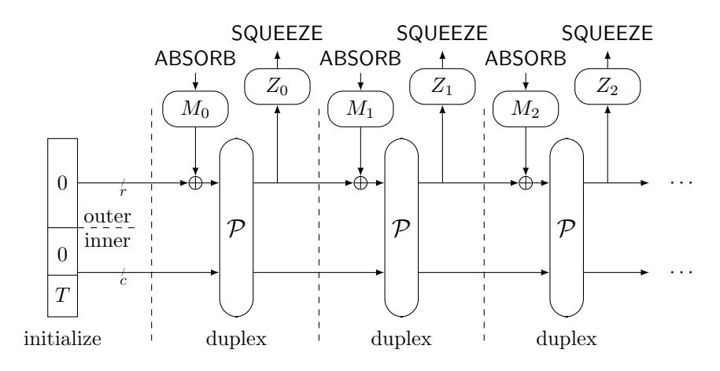
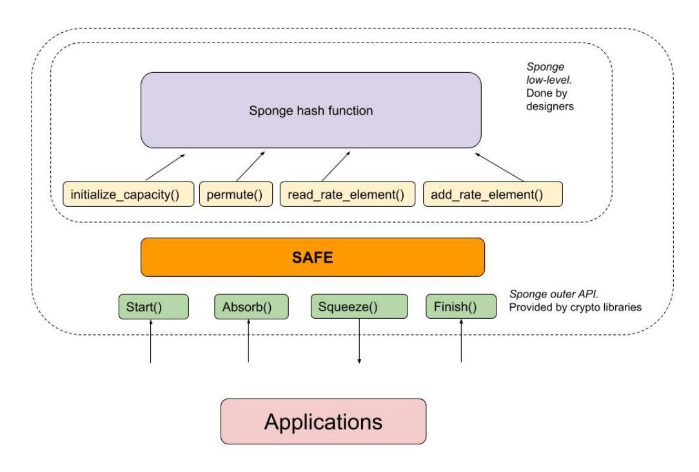

# SAFE: Sponge API for Field Elements

JP Aumasson<sup>1</sup> , Dmitry Khovratovich<sup>2</sup> , Bart Mennink<sup>3</sup> , and Por¸cu Quine<sup>4</sup>

> Taurus SA and Inference AG Ethereum Foundation and Dusk Network Radboud University Lurk Lab and Protocol Labs

> > April 11, 2023

#### Abstract

From hashing and commitment schemes to Fiat-Shamir and encryption, hash functions are everywhere in zero-knowledge proofsystems (ZKPs), and minor performance changes in "vanilla" implementations can translate in major discrepancies when the hash is processed as a circuit within the proofsystem. Protocol designers have resorted to a number of techniques and custom modes to optimize hash functions for ZKPs settings, but so far without a single established, well-studied construction. To address this need, we define the Sponge API for Field Elements (SAFE), a unified framework for permutation-based schemes (including AEAD, Sigma, PRNGs, and so on). SAFE eliminates the performance overhead, is pluggable in any field-oriented protocol, and is suitable for any permutation algorithm. SAFE is implemented in Filecoin's Neptune[1](#page-0-0) hash framework, which is our reference implementation (in Rust). SAFE is also being integrated in other prominent ZKP projects. This report specifies SAFE and describes use cases.

Among other improvements, our construction is among the first to store the protocol metadata in the sponge inner part in a provably secure way, which may be of independent interest to the sponge use cases outside of ZKP.

## 1 Introduction

Sponge functions [\[BDPV07\]](#page-8-0) are the basis of permutation-based symmetric primitives' design, as studied by Daemen et al.: hash functions, MACs, authenticated encryption schemes, PRNGs, and others. When operating in Duplex mode (Fig. [1\)](#page-2-0) [\[BDPV11\]](#page-8-1), a sponge can be seen as stateful object that can ingest input ("absorb") and produce output ("squeeze") at any time and in arbitrary order.

The duplex specification sees the input and output as raw bits, and leaves application-specific encoding to the users. However, in zero-knowledge proofsystems (ZKPs) specifications, hash functions often process field elements (with respect to some canonical encoding), rather than raw bits. Performance being critical to reduce the proof generation and verification cost, dedicated "field-friendly", algebraic hash functions were designed, most of which are sponges. These include for example Poseidon [\[GKR](#page-8-2)<sup>+</sup>21], Rescue [\[AAB](#page-8-3)<sup>+</sup>20], MiMC [\[AGR](#page-8-4)<sup>+</sup>16], and Reinforced Concrete [\[LRG](#page-8-5)<sup>+</sup>22].

A typical sponge function makes one call to the inner permutation P per r input bits (or other base units) to be hashed (absorbed) or outputted (squeezed), with r called rate. Despite its relative simplicity, sponge-like constructions can and have been "misused", or misimplemented, particularly when working with prime field arithmetic, for which constructions are less established and specifications not as rigorous as the generic one. Here we outline the most common misuse patterns we have observed, based on our experience contributing to and auditing ZKP projects (excluding trivial failures such as overwriting the full state):

- Domain separation: When the input data fills the full rate, no padding or any other length-dependent separator is applied. A classical example is hashing two field elements inside a Merkle tree with r = 2 field elements, where only 1 call to P is made to reduce costs.
- Cross-protocol collisions: Two protocols with one being an extension of the other start with the same state. As a result, they output the same prefix on the same inputs.

<span id="page-0-0"></span><sup>1</sup><https://github.com/filecoin-project/neptune/tree/master/src/sponge>.

- Superfluous permutations: Making an extra call between squeezing out data and absorbing it.
- Custom constructions: Using nested sponge calls (instead of chaining squeeze-absorb calls) in multi-round non-interactive protocols obtained via Fiat-Shamir heuristic. This unnecessarily increases the complexity, and may jeopardize the provable security guarantees.

Whereas the last two issues are just extra work for a caller, the former two may breach not only security proofs but also the concrete security of real protocols. The API presented below solves all those and offers secure and efficient usage patterns for many use cases. It also reduces the workload of developers and makes a step towards a unified cross-platform interface.

Contribution. We propose SAFE, a generic API for sponge functions, as well as a production-ready reference implementation. SAFE comes with a security proof, which is available as a separate report. As its main features, SAFE:

- Does not use any padding, thus not wasting an extra call to the sponge permutation in any circumstances.
- Is independent of an underlying permutation and thus can be used with almost every design on the market (including Poseidon's).
- Eliminates a number of misuse patterns by limiting the set of operations callable at sponge and by binding a protocol designer to a specific order of these operations.
- Is provably secure in the random permutation model in a number of settings, including the overlooked but frequently required cross-protocol security.
- Is among the first constructions to store the protocol's metadata in the sponge inner part, provably losing no security.

SAFE is suitable for a variety of use cases encountered in real-world ZK proofsystems, including:

- Hashing with fixed-length input, as found in commitment schemes, Merkle trees, and signatures.
- Fiat-Shamir transforms and other stateful oracle simulations, where the sequence and size of input values is fixed and known in advance.
- Authenticated encryption (in the ZK setting, also verifiable encryption) of predetermined-length messages. A classical example is an encryption of a coin secret on recipient's public key in privacy-preserving cryptocurrencies [\[HBHW22\]](#page-8-6).
- Pseudo-random generation of field elements from a seed, with a reseeding mechanism.

SAFE however does not support variable-length hashing when the length of data hashed is unknown in advance. This sacrifice is inevitable for a drastic performance and simplicity improvement, and did not prove problematic when we surveyed ZK projects' engineers.

# 2 Sponges

A (duplexed) sponge is a stateful object parameterized by a capacity c and a rate r where c + r = n is the inner state's width. As Fig. [1](#page-2-0) shows, state changes are driven by three operations:

- Permutation of the width-n state by P.
- Injection of input data M<sup>i</sup> ("absorption"), by chunks of up to r elements.
- Extraction of output data Z<sup>i</sup> ("squeezing"), by chunks of up to r elements.

The original sponge was defined for bitstring states, but all the security results carry over to field-element states, as long these use a sound, fixed-size encoding. When defined over field elements, sponge parameters (c, r, n) are usually expressed in terms of field elements, which lead to the notion of arithmetic capacity.

A sponge is traditionally initialized to the full-zero state. Input data then overwrites up to r given state elements at time, whereas the c-wide inner part is never touched nor outputted. This construction provides security up to c/2 bits in the random permutation model in the indifferentiability framework [\[MRH04,](#page-8-7) [CDMP05\]](#page-8-8). This result means that it behaves like a random oracle and, among others, achieves this level of preimage and collision resistance provided the output size is large enough. It is widely believed that concrete instances such as SHA-3 keep the same security level.



<span id="page-2-0"></span>Figure 1: Duplex sponge.

# 3 The SAFE API

## 3.1 API Overview

We assume a sponge width of n = r+c field elements, where r is the rate and c the capacity. Here F is the finite field type, thus elements of F <sup>L</sup> are vectors of L field elements. Length is the length type, an unsigned integer properly bounded counting the number field elements. State is the type of the internal state, consisting of field elements and other variables.

A SAFE sponge object should expose the following operations to protocol designers (details appear in Section [3.3](#page-3-0) and Section [3.4\)](#page-4-0):

- START(IOPattern, DomainSeparator): This initializes the inner state of the sponge, modifying up to c/2 field elements of the state. It's done once in the lifetime of a sponge.
- ABSORB(Length : L, F <sup>L</sup> : X[L]): This injects L field elements to the state from the array X, interleaving calls to the permutation. It also checks if the current call matches the IO pattern.
- SQUEEZE(Length : L) → F <sup>L</sup>: This extracts L field elements from the state, interleaving calls to the permutation as defined in Section [3.4.](#page-4-0) It also checks if the current call matches the IO pattern.
- FINISH(Length) → Result: This marks the end of the sponge life, preventing any further operation. In particular, the state is erased from memory. The result is 'OK', or an error.

The general workflow of a sponge prescribed by SAFE is then as follows:

- 1. The consumer protocol initializes the sponge: START(IO[], D) where IO is a sequence of future calls and their respective lengths (what we call "IO pattern") and D is a domain separator. One can also start from a precomputed state, but said state must come from a properly initialized sponge.
- 2. The protocol makes a chain of calls C1, C2, . . . , Cℓ, whose input lengths and types correspond to S. Each C<sup>i</sup> is either an ABSORB or a SQUEEZE call.
- 3. The protocol closes the sponge with a FINISH() call.

The most important element of the design is IOPattern, which is a compact encoding of the pattern of ABSORB and SQUEEZE calls during the sponge lifetime. An implementation must forbid to finish the sponge usage if this pattern is violated (see below). In particular, the output from SQUEEZE calls must not be used if the IO pattern is not followed.

Remark 1. Several IO patterns can belong to the same equivalence class, and thus leading to identical instances. This is because consecutive calls of a same type (ABSORB or SQUEEZE) are aggregated to define the initial state. An application that needs to absorb L > 1 elements in a row can thus do it one by one (with L calls to ABSORB), or with a single call including the L elements.

Important notes:



Figure 2: SAFE API as in-between the low-level sponge calls and application layer.

- Dealing with non-field elements: The API assumes that the input is (represented as) field elements, however applications may need to process other data types. It is the responsibility of users to properly encode such inputs as field elements. If objects of different types are processed by multiple runs of a same instance, at the same position, then some signalling of the input type is required to avoid collisions between different elements of distinct types encoded identically (incurring a performance overhead).
- Precomputed state: Multiple "forks" of a sponge can be created, by storing the state after a given number of operations, and restarting from it with distinct ABSORB calls in distinct branches. Note that all forks must do the same calls sequence, as specified to the START call.

## <span id="page-3-1"></span>3.2 Security

The security of SAFE API is captured by the following theorem, which essentially says that the SAFE outputs are indistinguishable from that of a random oracle.

Theorem 1. Let P be a cryptographic protocol that employs random oracles R1, R2, . . . , R<sup>k</sup> and is secure in the random oracle model against adversaries that make up to 2 λ queries to the oracles. Then, the implementation of this protocol with oracle R<sup>i</sup> instantiated with the SAFE API using a field of size at least 2 <sup>2</sup><sup>λ</sup> and a domain separator D<sup>i</sup> (pairwise distinct) is secure agains adversaries that make up to 2 λ queries to underlying hash H and permutation P.

It implies that whenever SAFE is used in one or multiple (with different IO patterns or domain separators) protocols, at least c log<sup>2</sup> |F| bits of security is guaranteed against collision, preimage, or distinguishing attacks. Details are provided in a separate report.

## <span id="page-3-0"></span>3.3 From IO Patterns to Tags to Instances

Let c < n be the number of capacity elements. The SAFE sponge state consists of the following elements:

- Permutation state V ∈ F n.
- Absorb position absorb pos ≤ n − c.
- Squeeze position squeeze pos ≤ n − c.
- IO pattern expected (as defined by START).

The sponge updates itself by calling inner permutation P. It is also able to compute parameter tag T using H, a cryptographic hash function producing 256-bit digests, by default the SHA3-256.

An instance is characterized by a tag derived from an IO pattern, which is a sequence of absorb phases and squeeze phases and their respective number of field elements. The tag is used as an initial value, to ensure that distinct instances behave differently. Using distinct tags for different, non-equivalent usage patterns avoids trivial collisions between input sequences of different length, where a "non-input" element is replaced by a zero element in the colliding message (this would lead to a collision because of the lack of padding). Furthermore, for applications that need to distinguish equivalent IO patterns, a domain separator can be set.

A tag is calculated from an IO pattern and a domain separator as follows:

- 1. Encode the IO pattern as a list of 32-bit words, whose MSB set to 1 for ABSORB calls and to 0 for SQUEEZE calls. For example, an instance that does 2 ABSORB calls with 3 elements each and then does one SQUEEZE call with 3 elements is described by the three words [0x80000003, 0x80000003, 0x00000003].
- 2. Aggregate any contiguous ABSORB or SQUEEZE calls within a single call: in our example, we would replace [0x80000003, 0x80000003] with a single 0x80000006.
- 3. Serialize the list of words into a byte string and append to it the domain separator D: for example, if D is the two-byte sequence 0x4142, then the example above would yield the string (if big-endian convention is used): 0x80000006000000034142.
- 4. Hash the string obtained with the hasher H to a 256-bit tag T (truncating the hash if needed).

Given its tag string, an instance admits an arbitrary number of executions, which are in addition characterized by an input Y ∈ (F r ) ⋆ . In other words, a tag is not like an execution-specific nonce; it is a characterization of the expected usage in terms of IO pattern, and of a domain separator (which can be use to create different instances/tags for a same IO pattern).

Remark 2. The 32-bit encoding restricts the number of elements absorbed or squeezed to 2 <sup>31</sup> − 1 per call. For applications that need to absorb or squeeze such a large number of elements, the operation must therefore be done via multiple calls, rather than a single one.

Remark 3. If the hash function used to create the tag received field elements rather than byte strings, and can directly process calls 32-bit integers as field elements, then the serialization mechanism (incl. endianness aspects) is not needed.

## <span id="page-4-0"></span>3.4 Detailed API

Everything begins with START, which computes a tag from the IO pattern and domain separator. This operation is unique as it writes the tag into the inner part of the state, which makes us to use a new security proof (Section [3.2\)](#page-3-1). Each call to ABSORB or SQUEEZE both:

- Writes to or read the outer part of the permutation state and calls the permutation P.
- Verifies its own parameters against the initially supplied IO pattern ("early abort" misuse detection).

When all calls are done, the FINISH operation verifies that no call is left undone.

We describe the reference implementation of all the four operations in Algorithms [1](#page-5-0) and [2.](#page-5-1)

### Algorithm 1 START and FINISH operations.

If field elements are 248 bit or more, T is converted to a field element. Otherwise T is parsed as two or more field elements (but at most c/2 elements, if c is the arithmetic capacity).

### <span id="page-5-0"></span>START:

- 1: Given an IO pattern IO (as a list of calls with the respective number of elements) and a byte string D used as domain separator, compute the tag T as described in Section [3.3.](#page-3-0)
- 2: Set the permutation state to all zeros and add T to the first min(256, log<sup>2</sup> |F|) bits of the inner part of the state (with respect to the field's addition).
- 3: Set both absorb and squeeze positions to zero: absorb pos = squeeze pos = 0.
- 4: Set the IO count to zero: io count = 0.
- 5: Set the IO pattern expected to IO[L].

### FINISH:

- 1: Check that io count equals the length of the IO pattern expected. Return an error otherwise.
- 2: Erase the state and its variables.

## Algorithm 2 ABSORB and SQUEEZE operations.

## <span id="page-5-1"></span>ABSORB:

- 1: If L == 0, return.
- 2: For i = 0, 1, .., L − 1
  - If absorb pos == (n − c) then
    - Set V = P(V ), to permute the state.
    - Set absorb pos = 0, to restart writing at the zero offset.
  - Add X[i] to the state element at absorb pos.
  - Do absorb pos + +.
- 3: Compute the 32-bit encoding of L to the IO pattern.
- 4: Verify that the word obtained is equal to the io countth word of the IO pattern expected, abort upon mismatch (and erase the state).
- 5: Do io count + +.
- 6: Set squeeze pos = (n − c), to force a permute at the start of the next SQUEEZE.

## SQUEEZE:

- 1: If L == 0, return.
- 2: For i = 0, 1, .., L − 1
  - If squeeze pos == (n − c) then
    - Set V = P(V ), to permute the state.
    - Set squeeze pos = 0, to restart reading output at the zero offset.
    - Set absorb pos = 0, to start writing at the zero offset in the next ABSORB.
  - Set Y [i] to the state element at position squeeze pos: Y [i] = V [squeeze pos]
  - Do squeeze pos + +.
- 3: Compute the 32-bit encoding of L + 2<sup>31</sup> with the IO pattern.
- 4: Verify that the word obtained is equal to the io countth word of the IO pattern expected, abort upon mismatch (and erase the state).
- 5: Do io count + +.

Remark 4. We do not set absorb pos to (n − c) as in ABSORB as we may want the state to absorb at the same positions that have been squeezed, for example in example is authenticated encryption.

# 4 SAFE Applications

SAFE among others supports the following use cases:

- Hashing example of L elements is given in Algorithm [3.](#page-6-0) Note that if the L elements are absorbed using more than one call – for example, via ABSORB(1, X1) followed by ABSORB(L − 1,(X2, . . . , XL)) – then the resulting hash will not change. We stress that no padding is required here.
- Merkle tree (Algorithm [4\)](#page-6-1). Consider a binary tree whose leaves and nodes are field elements, for example from a 256-bit field F. Again, the two ABSORB calls can be replaced by a single ABSORB(2,(X1, X2)), which will yield the same result. This construction generalizes to binary trees whose elements are tuples, in some F <sup>L</sup>, L > 1. Again, no padding is required.

- Commitment scheme example with three 2-field elements is given in Algorithm [5.](#page-6-2) Note that the tag will be the same for committing six 1-field elements. If this difference matters for an application, a domain separator should be used.
- An example of a two-round interactive Sigma protocol is given in Algorithm [6.](#page-7-0) Here Prover sends a proof of knowledge in three steps while getting Verifier's challenges in between. Note that the sponge absorbs exactly those elements that Prover sends to Verifier. Thus a protocol designer can use a simple rule of thumb just absorb everything that is sent out.
- Authenticated encryption with SAFE is a simplification of the SpongeWrap mode [\[BDPV11\]](#page-8-1). The encryption example, where we encrypt b blocks of data of different lengths, is given in Algorithm [7.](#page-7-1) This construction is the most efficient when L<sup>i</sup> ≡ 0 mod r, that is, all blocks fit the rate parameter of the sponge. This mode can be adapted to supported associated data (authenticated but not encrypted), in the same vein as the SpongeWrap mode. Note that there is no padding overhead, nor we spend unneeded calls to P.
- Stream cipher and PRNG example is given in Algorithm [8.](#page-7-2) A stream cipher generates a pseudo-random stream from a secret key and a not necessarily secret nonce, while a PRNG generates a pseudo-random stream from a seed.

### Algorithm 3 SAFE for fixed-length hashing

<span id="page-6-0"></span>

| Protocol:                              | Sponge calls via SAFE:                                |
|----------------------------------------|-------------------------------------------------------|
| 1: Select X1, X2, , XL<br>for hashing; | 1: START(IO[2], D) with IO be the encoding of the fol |
| 2: Get hash T.                         | lowing calls, and D an arbitrary domain separator;    |
|                                        | 2: ABSORB(L, X[]);                                    |
|                                        | 3: T ← SQUEEZE(1);                                    |
|                                        | 4: FINISH().                                          |
|                                        |                                                       |

If the L elements are absorbed using more than one call – for example, via ABSORB(1, X1) followed by ABSORB(L − 1,(X2, . . . , XL)) – then the resulting hash will not change.

```
Algorithm 4 SAFE for Merkle tree of arity 2
Pseudocode:
 1: Select child node hashes X1, X2;
 2: Get parent hash T.
                                                         Sponge calls via SAFE:
                                                          1: START(IO[2], D);
                                                          2: ABSORB(2, X[]);
                                                          3: T ← SQUEEZE(1);
                                                          4: FINISH().
```

### Algorithm 5 SAFE for Commitment schemes

```
Pseudocode:
 1: Select values for commitment X1, X2, X3 ∈ F
                                               2
                                                ;
 2: Get commmitment C.
                                                        Sponge calls via SAFE:
                                                          1: START(IO[4], D);
                                                          2: ABSORB(2, X1[]);
                                                          3: ABSORB(2, X2[]);
                                                          4: ABSORB(2, X3[]);
                                                          5: C ← SQUEEZE(1);
                                                          6: FINISH().
```

### **Algorithm 6** SAFE for Sigma protocols

#### <span id="page-7-0"></span>Interactive form:

- 1: Parties agree on the common input  $Z \in \mathbb{F}^z$ ;
- 2: Prover prepares and sends proof elements  $\pi_1 \in \mathbb{F}^{L_1}$  and  $\pi_2 \in \mathbb{F}^{L_2}$ ;
- 3: Verifier responds with challenge  $c_1 \in \mathbb{F}$ ;
- 4: Prover prepares and sends proof element  $\pi_3 \in \mathbb{F}^{L_3}$ ;
- 5: Verifier responds with challenges  $c_2, c_3 \in \mathbb{F}$ ;
- 6: Prover sends final proof  $\pi_4$ .

### Sponge calls via SAFE:

- 1:  $\mathsf{START}(IO[6], D)$  with IO be the encoding of the following calls, and D an arbitrary domain separator;
- 2: ABSORB(z, Z);
- 3: ABSORB $(L_1, \pi_1)$ ;
- 4: ABSORB $(L_2, \pi_2)$ ;
- 5:  $c_1 \leftarrow \mathsf{SQUEEZE}(1)$ ;
- 6: ABSORB $(L_3, \pi_3)$ ;
- 7:  $c_2 \leftarrow \mathsf{SQUEEZE}(1)$ ;
- 8:  $c_3 \leftarrow \mathsf{SQUEEZE}(1);$
- 9: FINISH().

## Algorithm 7 SAFE for authenticated encryption

### <span id="page-7-1"></span>Pseudocode:

- 1: Get key  $K \in \mathbb{F}^k$ ;
- 2: Get nonce  $N \in \mathbb{F}^m$ ;
- 3: Encrypt data blocks  $D_1, D_2, \ldots, D_b$ , where  $D_i \in \mathbb{F}^{L_i}$ ;
- 4: Get ciphertext C.

## Sponge calls via SAFE:

- 1: START(IO[2b+2], D);
- 2: ABSORB(k, K);
- $3: \mathsf{ABSORB}(m, N);$
- 4:  $C_1 \leftarrow \mathsf{SQUEEZE}(L_1);$
- 5: ABSORB $(L_1, D_1)$ ;
- 6:  $C_2 \leftarrow \mathsf{SQUEEZE}(L_2);$
- 7: ABSORB $(L_2, D_2)$ ;
- 8: ...
- 9:  $C_b \leftarrow \mathsf{SQUEEZE}(L_b);$
- 10: ABSORB $(L_b, D_b)$ ;
- 11:  $S \leftarrow \mathsf{SQUEEZE}(1)$ ;
- 12: FINISH(). Upon success of FINISH() and of previous calls, the string  $(C_1 + D_1)||(C_2 + D_2)||\cdots||(C_b + D_b)||S$  will be the ciphertext, where "+" denotes addition in  $\mathbb{F}$ .

### Algorithm 8 SAFE for stream cipher and PRNG

#### <span id="page-7-2"></span>Protocol:

- 1: if PRNG then
- 2: Get seed  $S \in \mathbb{F}^s$ ;
- 3: **else**Stream cipher
- 4: Get key  $K \in \mathbb{F}^k$ ;
- 5: Get nonce  $N \in \mathbb{F}^m$ ;
- 6: end if
- 7: Generate L stream elements C[];
- 8: **if** Stream cipher **then**
- 9: Encrypt data D[] with C[].
- 10: end if

#### Sponge calls via SAFE:

- 1: if PRNG then
- 2: ABSORB(s, S);
- 3: **else**Stream cipher
- 4: ABSORB(k, K);
- 5: ABSORB(m, N);
- 6: end if
- 7:  $C_1 \leftarrow \mathsf{SQUEEZE}(L_1)$ ;
- 8:  $C_2 \leftarrow \mathsf{SQUEEZE}(L_2);$
- 9: ...
- 10:  $C_b \leftarrow \mathsf{SQUEEZE}(L_b)$ ;
- 11: FINISH(). For the stream cipher case, the plaintext  $D_1, \ldots, D_b$  with  $D_i$  consists of  $L_i$  field elements is then encrypted to  $(C_1 + D_1)||(C_2 + D_2)||\cdots||(C_b + D_b)$ .

## References

- <span id="page-8-3"></span>[AAB+20] Abdelrahaman Aly, Tomer Ashur, Eli Ben-Sasson, Siemen Dhooghe, and Alan Szepieniec. Design of Symmetric-Key Primitives for Advanced Cryptographic Protocols. IACR ToSC, (3):1–45, 2020.
- <span id="page-8-4"></span>[AGR+16] Martin R. Albrecht, Lorenzo Grassi, Christian Rechberger, Arnab Roy, and Tyge Tiessen. MiMC: Efficient Encryption and Cryptographic Hashing with Minimal Multiplicative Complexity. In ASIACRYPT, 2016.
- <span id="page-8-0"></span>[BDPV07] Guido Bertoni, Joan Daemen, Micha¨el Peeters, and Gilles Van Assche. Sponge functions. Ecrypt Hash Workshop 2007, May 2007.
- <span id="page-8-1"></span>[BDPV11] Guido Bertoni, Joan Daemen, Micha¨el Peeters, and Gilles Van Assche. Duplexing the sponge: Singlepass authenticated encryption and other applications. In SAC, 2011.
- <span id="page-8-8"></span>[CDMP05] Jean-S´ebastien Coron, Yevgeniy Dodis, C´ecile Malinaud, and Prashant Puniya. Merkle-Damg˚ard revisited: How to construct a hash function. In CRYPTO, 2005.
- <span id="page-8-2"></span>[GKR+21] Lorenzo Grassi, Dmitry Khovratovich, Arnab Roy, Christian Rechberger, and Markus Schofnegger. Poseidon: A new hash function for zero-knowledge proof systems. USENIX Security, 2021.
- <span id="page-8-6"></span>[HBHW22] Daira Hopwood, Sean Bowe, Taylor Hornby, and Nathan Wilcox. ZCash protocol specification, 2022. <https://github.com/zcash/zips/blob/master/protocol/protocol.pdf>.
- <span id="page-8-5"></span>[LRG+22] Reinhard L¨uftenegger, Christian Rechberger, Lorenzo Grassi, Markus Schofnegger, Roman Walch, and Dmitry Khovratovich. Reinforced Concrete: A fast hash function for verifiable computation. In ACM CCS, 2022.
- <span id="page-8-7"></span>[MRH04] Ueli M. Maurer, Renato Renner, and Clemens Holenstein. Indifferentiability, impossibility results on reductions, and applications to the random oracle methodology. In TCC, 2004.