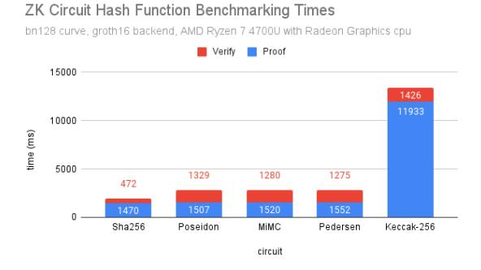
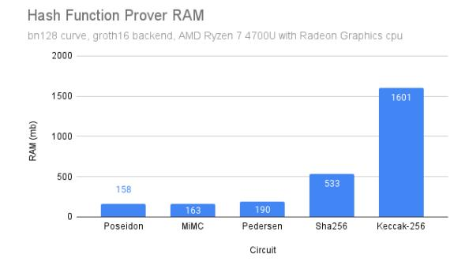
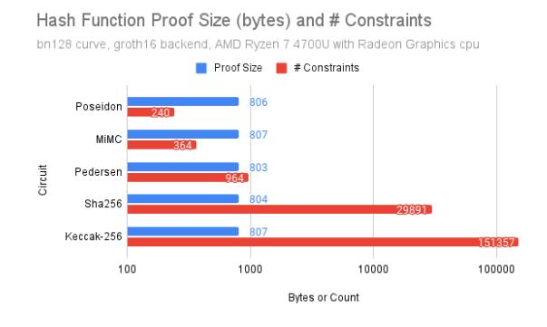
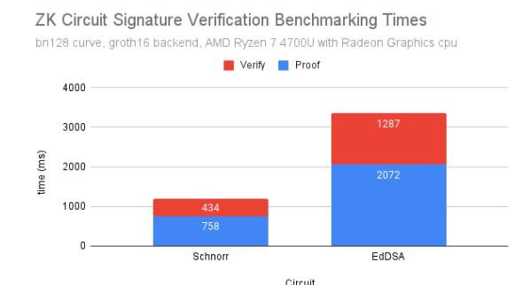
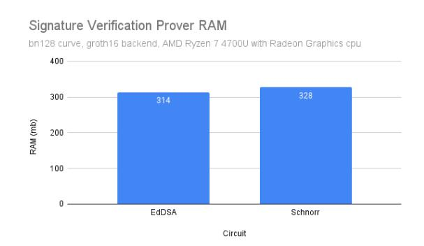
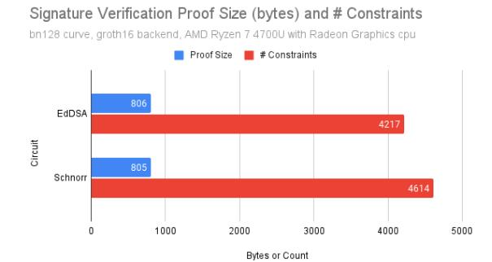

# Benchmarking ZK-Circuits in Circom

Sanjay Gollapudi, Colin Steidtmann, University of California, Berkeley May 2023

#### 1 Abstract

Zero-knowledge proofs and arithmetic circuits are essential building blocks in modern cryptography, but comparing their efficiency across different implementations can be challenging. In this paper, we address this issue by presenting comprehensive benchmarking results for a range of signature schemes and hash functions implemented in Circom, a popular circuit language that has not been extensively benchmarked before. Our benchmarking statistics include prover time, verifier time, and proof size, and cover a diverse set of schemes including Poseidon, Pedersen, MiMC, SHA-256, ECDSA, EdDSA, Sparse Merkle Tree, and Keccak-256. We also introduce a new Circom circuit and a full JavaScript test suite for the Schnorr signature scheme. Our results offer valuable insights into the relative strengths and weaknesses of different schemes and frameworks, and confirm the theoretical predictions with precise real-world data. Our findings can guide researchers and practitioners in selecting the most appropriate scheme for their specific applications, and can serve as a benchmark for future research in this area.

### 2 Introduction

The efficiencies and pros of cons of the hash functions and signature schemes that Zero-Knowledge circuits rely on has only been known because of theoretical work. However, as the field of Zero-Knowledge becomes larger, it's more important than ever that these theoretical findings get confirmed by real world tests on modern CPUs. Additionally, there has been a rise of frameworks and languages to write Zero-Knowledge circuits; we have Circom, Gnark, Halo2, Plonky2, Jellyfish, and more. While some of these are still being sponsored by small nonprofits, others are the works of industry titans like Polygon, so there are large stakes at play for having the best framework or language to write circuits in. As students at a public university, we want to create a project that evaluates these circuits on fair playing field and put our findings online for future researchers and engineers to use when making key decisions.

Our work is part of the larger "ZK-Harness" benchmarking project which has been co-written by our peers at UC Berkeley. ZK-Harness is python based and has a structure that lets anyone contribute. Contributors write code in the framework they choose for the circuits they want to include in the benchmarking effort. They then update ZK-Harness's configuration file and provide example circuit inputs that the framework can use when running the benchmarks. If contributors then make a GitHub pull request that gets approved by ZK-Harness's maintainers, then their circuit contribution will appear on the website.

We contributed to ZK-Harness by adding circuits written in Circom's domain specific language; we added Poseidon, Pedersen, MiMC, SHA-256, ECDSA, EdDSA, Sparse Merkle Tree, Keccak-256, and Schnorr. These circuits are representative of common hash functions and signature schemes being used in Zero-Knowledge circuits today and previously well discussed in literature. By adding these circuits to ZK-Harness, we now have specific metrics on their performance: proof time, verifier time, proof size, and number of circuit constraints (Circom is R1CS). Our metrics confirm what's been discussed in theory discussions and expand upon them by giving specific quantitative data for how the circuits compare.

#### 3 Related Works

Practical implementations and research into Zero-Knowledge circuit performance is still very new so we didn't find many related projects, yet here's a few articles and unofficial GitHub projects we found:

- https://hackmd.io/@0xMonia/benchmarks. They provide the prover and verifier's runtime to generate the Poseidon hash function circuit using Circom, Halo-2, and Plonky2.
- https://github.com/Sladuca/sha256-prover-comparison. They provide the prover's runtime for the SHA-256 hash function circuit. They compared the prover's runtime using 3 different languages: Circom, Halo2, and Plonky2.
- https://ethresear.ch/t/benchmarking-zkp-development-frameworks-the-pantheon-of-zkp/14943. They provide the prover's runtime, number of constraints, and proof size to generate the SHA-256 hash function circuit. They compared the prover's runtime in: Circom, Halo2, Plonky2, Gnark, Arkworks, and Starky.

The most prominent and recent project out of the above-mentioned is the work done by Eth Research. While valuable contributions, these benchmarking efforts above are not comprehensive because they only compare certain hash function circuits implemented in a few frameworks/languages. Since our contributions are part of the larger ZK-Harness effort, we'll have more circuits and frameworks to compare to. Additionally, the data will be more easily accessible online and it's easier for anyone to contribute to.

It's also important to note that we won't be writing all of our circuits from scratch. Since Cirom is one the most used languages for writing circuits, there are many open-source works for the common hash functions and signature schemes that we're integrating into ZK-Harness; it would be unreasonable to ignore them. For Poseidon, Pedersen, MiMC, SHA-256, EdDSA, and Sparse Merkle Tree, we're using Circom's own open-source implementations. For ECDSA, we're using an implementation by 0xPARC, a nonprofit research organization. For Keccak-256, we're using Vocdoni's open-source work. Lastly, for Schnorr, we couldn't find an open-source implantation so we'll be making a significant contribution to the field by creating our open-source version. For the circuits that we aren't writing ourselves, we're helping by integrating them into ZK-Harness so that their authors and the general public can learn about their performance.

### 4 Approach

We integrated the following signature schemes and hash functions into ZK-Harness: Poseidon, Pedersen, MiMC, SHA-256, ECDSA, EdDSA, Sparse Merkle Tree, Keccak-256, and Schnorr. We documented our code, updated ZK-Harness's configuration file, and found inputs needed to benchmark them. Further, we generated correct and sound proofs for the circuits and wrote tests to ensure Schnorr's correctness.

For the circuits that we added their open-source implementations, we copied over all their relevant files into ZK-Harness and wrote wrapper functions in Circom that used their circuits as imports. This lets us use their code while being consistent with ZK-Harness's structure. Next, to find their correct inputs, we downloaded their projects locally and ran their accompanying test code that outputted the inputs we could use.

We then wrote a circuit that verifies a Schnorr signature. An important note is the underlying group/curve we used to implement Schnorr was the Baby Jub curve. The Schnorr protocol works as follows, we have a private key x ∈ Z × q (where q is the order of the Baby Jub group) and we convert it to a public key y = g x where g is the generator of the Baby Jub curve. For our purposes, we let g be the base point of Baby Jub which is publically available.

To create a signature for a message M, we do the following steps:

- 1. Choose a random k ∈ Z x q .
- 2. Let r = g k .
- 3. Calculate e = H(r||M) and s = k − xe. Note that H can be any hash function, but we chose the Poseidon hash function.

4. The signature is (s, e) (|| means concatenation).

Now to create the verification message we do the following steps:

- 1. Calculate rv = g sy e .
- 2. Calculate ev = H(rv||M).
- 3. Verify that e = ev.

It is easy to see that if rv = g sy e = g k−xeg xe = g k = r then ev = H(rv||M) = H(r||M) = e. This concludes the Schnorr signature scheme. We wrote the constraints for the circuit by taking advantage of the built-in Circomlib functions like BabyJubAdd(), EScalarMulAny(), and CompConstant().

Finally, to integrate the circuits into the benchmarking framework, we added their JSON input files and updated the Circom configuration file so that when ZK-Harness's maintainers ran the code to build the benchmarking project it would include our new contributions and would appear on the website. We also improved upon ZK-Harness itself by resolving some of the issues we came across and bringing up concerns we had to the relevant maintainers.

Our contributions give us new performance metrics to evaluate circuits written in Circom. For hash function circuits, we confirmed SHA-256 is the fastest for the verification step, Poseidon consumes the least prover RAM, and while all hash circuits have roughly the same proof size, the "zk-friendly" circuits use considerably less constraints. For signature schemes, we compared EdDSA to the Schnorr circuit we wrote; both circuits used the Poseidon hash function. We found Schnorr is approximately 2x faster than EdDSA in both the proof generation and verification steps, which translates to almost a 3x speedup when combining both steps. The circuits are almost equal on all other dimensions (prover RAM, proof size, and number of constraints). All of our findings are presented in the [Appendix.](#page-0-0)

#### 5 Evaluation

Our project is a huge success for us, ZK-Harness, and future scholars and engineers that can learn from our findings on ZK-Harness's website. Going into this project, we identified 11 circuits that should be in ZK-Harness and we implemented 9 of them, only leaving out the Blake2 hash and BLS signature. When we started, we didn't have another project or group to aspire to as ZK-Harness only had one or two circuits in it and the projects we found online were small in size and hard to find. We expected that we could integrate many open-source circuits we found online except we didn't think there would be an open-source version of ECDSA. To our surprise we found one and we're happy it made it into the project. We're most proud of our Schnorr implementation and were surprised we couldn't find an open-source version. When we compare our findings to what we learned in school and read online, we're happy that our findings agree but more importantly excited about the specific metrics we're bringing to the field.

#### 6 Conclusion

We implemented Poseidon, Pedersen, MiMC, SHA-256, ECDSA, EdDSA, Sparse Merkle Tree, and Keccak-256, and Schnorr in Circom; we tied it in with the ZK-Harness benchmarking project so that we have metrics on prover time, verifier time, prover RAM, proof size, and the number of constraints each circuit uses. Zero-Knowledge protocols, while existing for decades in theory, are now being put into practice with the rise blockchains that are using them to increase their scale and transaction throughput. These protocols depend on the primitive hash function and signature circuits that we benchmarked, yet no formal study has released real-world performance metrics of these circuits before. Our contributions give the benchmarking project a large head start so that others who find value from it will choose to contribute to the standard we're developing, instead of releasing a small report that gets lost on the internet. Going forwards, there's still a few circuits of interest to benchmark in Circom, such as Blake2 and BLS, but more importantly we need to benchmark these circuits in other languages and frameworks such as Gnark, Arkworks, Halo2, Plonky2, Jellyfish, and more as new frameworks are developed. Additionally, the standard benchmarking project we're developing needs to establish guidelines for circuit specific parameters. For example, our MiMC implementation uses 128 rounds of recursive hash computations so it'll be important that future implementations of MiMC in other frameworks do the same. At the moment, ZK-Harness isn't fully setup and it's missing these contribution guidelines but that should be fixed soon. We'd like to thank our graduate student instructor, Deevashwer Rathee, who helped us throughout our project, from finding the important circuits that should be benchmarked, to helping us debug our Schnorr implementation.

#### 7 Division of Labor

The work was divided evenly. Sanjay Gollapudi wrote Schnorr's Circom code as well as part of its respective JavaScript test files. Colin Steidtmann took care of the rest, letting Sanjay focus on implementing Schnorr by finding open-source implementations of the other 8 circuits, writing part of Schnorr's testing script, and integrating everything smoothly into ZK-Harness. .

#### 8 Bibliography

- [Sch91] Claus-Peter Schnorr. "Efficient signature generation by smart cards". In: Journal of cryptology 4 (1991), pp. 161–174.
- [JMV01] Don Johnson, Alfred Menezes, and Scott Vanstone. "The elliptic curve digital signature algorithm (ECDSA)". In: International journal of information security 1 (2001), pp. 36–63.
- [GJW11] Shay Gueron, Simon Johnson, and Jesse Walker. "SHA-512/256". In: 2011 Eighth International Conference on Information Technology: New Generations. IEEE. 2011, pp. 354–358.
- [Aum+13] Jean-Philippe Aumasson et al. "BLAKE2: simpler, smaller, fast as MD5". In: Applied Cryptography and Network Security: 11th International Conference, ACNS 2013, Banff, AB, Canada, June 25-28, 2013. Proceedings 11. Springer. 2013, pp. 119–135.
- [Ber+13] Guido Bertoni et al. "Keccak". In: Advances in Cryptology–EUROCRYPT 2013: 32nd Annual International Conference on the Theory and Applications of Cryptographic Techniques, Athens, Greece, May 26-30, 2013. Proceedings 32. Springer. 2013, pp. 313–314.
- [Alb+16] Martin Albrecht et al. "MiMC: Efficient encryption and cryptographic hashing with minimal multiplicative complexity". In: Advances in Cryptology–ASIACRYPT 2016: 22nd International Conference on the Theory and Application of Cryptology and Information Security, Hanoi, Vietnam, December 4-8, 2016, Proceedings, Part I. Springer. 2016, pp. 191–219.
- [DPP16] Rasmus Dahlberg, Tobias Pulls, and Roel Peeters. "Efficient sparse merkle trees: Caching strategies and secure (non-) membership proofs". In: Secure IT Systems: 21st Nordic Conference, NordSec 2016, Oulu, Finland, November 2-4, 2016. Proceedings 21. Springer. 2016, pp. 199– 215.
- [JL17] Simon Josefsson and Ilari Liusvaara. Edwards-curve digital signature algorithm (EdDSA). Tech. rep. 2017.
- [Gra+21] Lorenzo Grassi et al. "Poseidon: A New Hash Function for Zero-Knowledge Proof Systems." In: USENIX Security Symposium. Vol. 2021. 2021.
- [23] Feb. 2023. url: [https://en.wikipedia.org/wiki/Schnorr\\_signature](https://en.wikipedia.org/wiki/Schnorr_signature).
- [0xM] 0xMonia. Benchmark results. url: [https : / / hackmd . io / @0xMonia / benchmarks](https://hackmd.io/@0xMonia/benchmarks). (accessed: 05.11.2023).
- [0xP] 0xPARC. circom-ecdsa. url: <https://github.com/0xPARC/circom-ecdsa>. (accessed: 05.11.2023).
- [Ber] UC Berkeley. ZK-Harness. url: <https://www.zk-bench.org/>. (accessed: 05.11.2023).
- [Col] Sanjay Gollapudi Colin Steidtmann. Source Code. url: [https://github.com/colinsteidtmann/](https://github.com/colinsteidtmann/zk-Harness/tree/main/circom) [zk-Harness/tree/main/circom](https://github.com/colinsteidtmann/zk-Harness/tree/main/circom). (accessed: 05.12.2023).
- [Con] Consensys. Gnark. url: <https://docs.gnark.consensys.net/>. (accessed: 05.11.2023).

- [Duc] Sebastien La Duca. sha256 prover comparison. url: [https://github.com/Sladuca/sha256](https://github.com/Sladuca/sha256-prover-comparison) [prover-comparison](https://github.com/Sladuca/sha256-prover-comparison). (accessed: 05.11.2023).
- [Ide] Iden3. Pedersen Hash. url: [https://iden3-docs.readthedocs.io/en/latest/iden3\\_repos/](https://iden3-docs.readthedocs.io/en/latest/iden3_repos/research/publications/zkproof-standards-workshop-2/pedersen-hash/pedersen.html) [research/publications/zkproof-standards-workshop-2/pedersen-hash/pedersen.html](https://iden3-docs.readthedocs.io/en/latest/iden3_repos/research/publications/zkproof-standards-workshop-2/pedersen-hash/pedersen.html). (accessed: 05.11.2023).
- [Ope] Open-Source. Arkworks. url: <http://arkworks.rs/>. (accessed: 05.11.2023).
- [Pro] Mir Protocol. Plonky2. url: [https : / / github . com / mir - protocol / plonky2](https://github.com/mir-protocol/plonky2). (accessed: 05.11.2023).
- [Res] Eth Research. Benchmarking ZKP Development Frameworks: the Pantheon of ZKP. url: [https:](https://ethresear.ch/t/benchmarking-zkp-development-frameworks-the-pantheon-of-zkp/14943) [/ / ethresear . ch / t / benchmarking - zkp - development - frameworks - the - pantheon - of](https://ethresear.ch/t/benchmarking-zkp-development-frameworks-the-pantheon-of-zkp/14943)  [zkp/14943](https://ethresear.ch/t/benchmarking-zkp-development-frameworks-the-pantheon-of-zkp/14943). (accessed: 05.11.2023).
- [Sys] Espresso Systems. Jellyfish. url: <https://github.com/EspressoSystems/jellyfish>. (accessed: 05.11.2023).
- [Voc] Vocdoni. keccak256-circom. url: [https : / / github . com / vocdoni / keccak256 - circom](https://github.com/vocdoni/keccak256-circom). (accessed: 05.11.2023).
- [ZCa] ZCash. Halo2. url: <https://zcash.github.io/halo2/>. (accessed: 05.11.2023).

# 9 Appendix

.

## List of Figures

| 1 | SHA-256 is The Fastest Hash                                               | 5 |
|---|------------------------------------------------------------------------------|---|
| 2 | Poseidon is Most RAM Efficient Hash                                       | 6 |
| 3 | Same Proof Size But Less Constraints For Snark-Friendly Hash Functions    | 6 |
| 4 | Schnorr is 3x faster than EdDSA                                           | 6 |
| 5 | Schnorr and EdDSA Have Approx. Same Prover Ram                            | 6 |
| 6 | Schnorr and EdDSA Have Approx. Same Proof Size and Number of Constraints  | 7 |

|  | Figure 1: SHA-256 is The Fastest Hash |  |  |  |
|--|---------------------------------------|--|--|--|
|--|---------------------------------------|--|--|--|

|            | Proof (ms) | Verify (ms) |
|------------|------------|-------------|
| SHA-256    | 1470       | 472         |
| Poseidon   | 1507       | 1329        |
| MiMC       | 1520       | 1280        |
| Pedersen   | 1552       | 1275        |
| Keccak-256 | 11933      | 1426        |

Table 1: Comparison of Hash Function Proof and Verify Time (ms)

Figure 2: Poseidon is Most RAM Efficient Hash

|            | Prover (mb) |
|------------|-------------|
| Poseidon   | 158         |
| MiMC       | 163         |
| Pedersen   | 190         |
| SHA-256    | 533         |
| Keccak-256 | 1601        |

Table 2: Comparison of Hash Function Proof Size (mb)

Figure 3: Same Proof Size But Less Constraints For Snark-Friendly Hash Functions

|            | Proof Size (bytes) | Constraints Count |
|------------|--------------------|-------------------|
| Poseidon   | 806                | 240               |
| MiMC       | 807                | 364               |
| Pedersen   | 803                | 964               |
| SHA-256    | 804                | 29891             |
| Keccak-256 | 807                | 151357            |

Table 3: Comparison of Hash Function Proof Size (B) and Number of Constraints

Figure 4: Schnorr is 3x faster than EdDSA

|         | Proof (ms) | Verify (ms) |
|---------|------------|-------------|
| Schnorr | 758        | 434         |
| EdDSA   | 2072       | 1287        |

Table 4: Comparison of Signature Schemes Proof and Verify Time (ms)

Figure 5: Schnorr and EdDSA Have Approx. Same Prover Ram

|         | Prover (mb) |
|---------|-------------|
| EdDSA   | 314         |
| Schnorr | 328         |

Table 5: Comparison of Signature Verification Proof Size (mb)

Figure 6: Schnorr and EdDSA Have Approx. Same Proof Size and Number of Constraints

|         | Proof Size (bytes) | Constraints Count |
|---------|--------------------|-------------------|
| EdDSA   | 806                | 4217              |
| Schnorr | 805                | 4614              |

Table 6: Comparison of Signature Verification Proof Size (B) and Number of Constraints

[\[Gra+21\]](#page-3-0) [\[Ide\]](#page-4-1) [\[Sch91\]](#page-3-1) [\[JMV01\]](#page-3-2) [\[0xP\]](#page-3-3) [\[Ope\]](#page-4-2) [\[Aum+13\]](#page-3-4) [\[JL17\]](#page-3-5) [\[Res\]](#page-4-3) [\[Duc\]](#page-4-4) [\[Con\]](#page-3-6) [\[0xM\]](#page-3-7) [\[ZCa\]](#page-4-5) [\[Sys\]](#page-4-6) [\[Ber+13\]](#page-3-8) [\[Voc\]](#page-4-7) [\[Alb+16\]](#page-3-9) [\[Pro\]](#page-4-8) [\[Sch91\]](#page-3-1) [\[GJW11\]](#page-3-10) [\[DPP16\]](#page-3-11) [\[23\]](#page-3-12) [\[Ber\]](#page-3-13) [\[Col\]](#page-3-14)