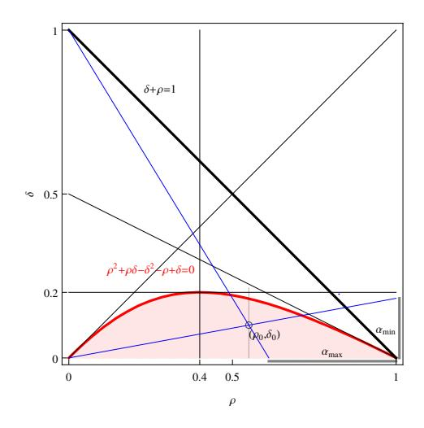
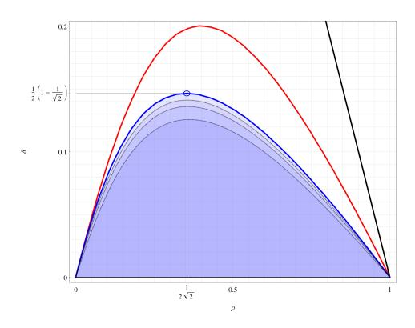
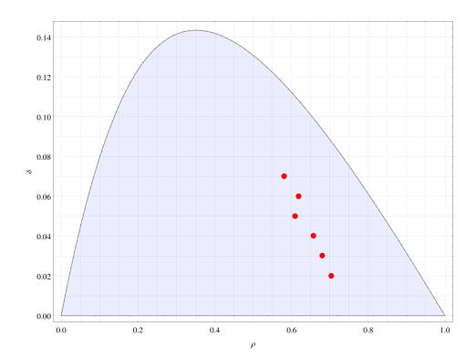
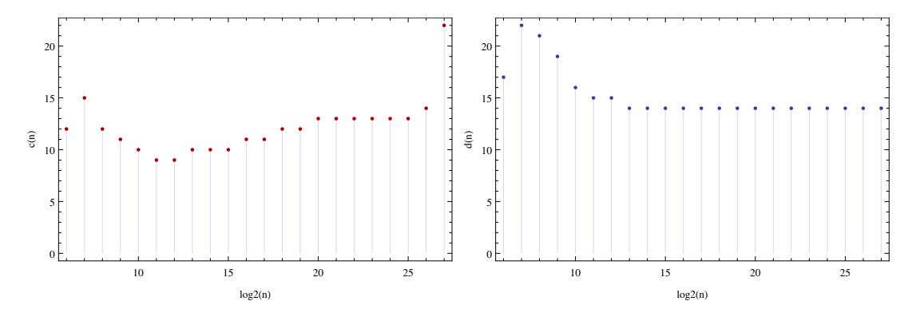
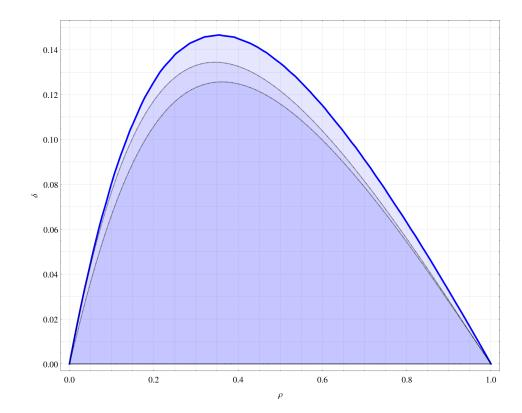

# Brakedown's expander code

### Ulrich Hab¨ock

### Polygon Zero uhaboeck@polygon.technology

May 26, 2023

#### **Abstract**

This write-up summarizes the sampling analysis of the expander code from [\[GLS](#page-19-0)+21]. We elaborate their convexity argument for general linear expansion bounds, and we combine their approach with the one from Spielman [\[Spi96\]](#page-19-1) to achieve asymptotic linear-time under constant field size. Choosing tighter expansion bounds we obtain more efficient parameters than [\[GLS](#page-19-0)+21] for their 128 bit large field, reducing the encoding costs by 25% and beyond, and we provide a similar parameter set for the Mersenne prime field with modulus *p* = 231 − 1, optimized by the combined Spielman-Brakedown approach.

# **Contents**

| 1             | Introduction                                         | 2  |  |  |  |  |  |  |  |  |  |  |
|---------------|------------------------------------------------------|----|--|--|--|--|--|--|--|--|--|--|
| 2 Notation |                                                      |    |  |  |  |  |  |  |  |  |  |  |
| 3             | Recursive linear encoding                            | 3  |  |  |  |  |  |  |  |  |  |  |
|               | 3.1 Trivial parameter bounds                   | 4  |  |  |  |  |  |  |  |  |  |  |
| 4             | Brakedown's sampling analysis                        | 5  |  |  |  |  |  |  |  |  |  |  |
|               | 4.1 Expander graph sampling                    | 7  |  |  |  |  |  |  |  |  |  |  |
|               | 4.2 Matrix entry sampling                      | 9  |  |  |  |  |  |  |  |  |  |  |
|               | 4.3 Putting the pieces together                | 11 |  |  |  |  |  |  |  |  |  |  |
|               | 4.4 Tight parameter bounds                        | 11 |  |  |  |  |  |  |  |  |  |  |
|               | 4.5 A note on the asymptotics                     | 14 |  |  |  |  |  |  |  |  |  |  |
| 5             | Achieving strict linear time                         | 14 |  |  |  |  |  |  |  |  |  |  |
|               | 5.1 Minor change of the sample space              | 15 |  |  |  |  |  |  |  |  |  |  |
|               | 5.2 Linear asymptotics under fixed field size  | 16 |  |  |  |  |  |  |  |  |  |  |
| 6             | Example parameters                                   | 18 |  |  |  |  |  |  |  |  |  |  |
|               | 6.1 Brakedown's 128 bit large field            | 18 |  |  |  |  |  |  |  |  |  |  |
|               | = 231 − 6.2 Parameters for p 1           | 19 |  |  |  |  |  |  |  |  |  |  |
| A             | The tangent case for `B(x)                        | 22 |  |  |  |  |  |  |  |  |  |  |

# **1 Introduction**

Spielman codes [\[Spi96\]](#page-19-1) are binary linear-time encodable and decodable linear codes, which are constructed from expander graphs, i.e. bipartite graphs with good vertex expansion properties. Random regular graphs have such properties with high probability and for cryptographic applications it remains to concretely bound this probability as cryptgraphically overwhelming. The work of Sipser and Spielman [\[SS96,](#page-20-0) [Spi96\]](#page-19-1) is built on *lossless* expanders, in the sense that sets of size smaller than a given threshold are expanded by at least the half of the vertex degree. Such expansion property yields asymptotic linear complexity, but quite impractical minimum distances and vertex degrees. There is manifold literature improving the distance of expander codes while still being efficiently (e.g. linear-time) encodable and/or decodable. As we are not experts in that field, we refer to [\[GI05,](#page-19-2) [DI14\]](#page-19-3) or the manuscript [\[GRS22\]](#page-19-4) and the references therein.

The expander code of Golevnev et al. [\[GLS](#page-19-0)+21], in the sequel referred to as the *Brakedown* code, generalizes the [\[Spi96\]](#page-19-1) construction to arbitrary finite fields, while focusing solely on the properties needed in the context of succinct arguments (for NP-complete languages) with a nearly time-optimal prover: Efficient decoding does not play a role in this context, and the alphabet/field size grows naturally with the message size[1](#page-1-2) , leading to relaxed asymptotic requirements compared to [\[SS96\]](#page-20-0) and [\[Spi96\]](#page-19-1). Brakedown's sampling analysis is much more elementary than that of Sipser and Spielman. Their expansion properties leverage the field size and yield significantly better parameters, as long as the underlying field is not too small, or the message size not too large. However, the presentation in [\[GLS](#page-19-0)+21] is somewhat hard to comprehend, at least for readers like us, with no solid background in coding theory. For this reason, and in particular for proposing optimized parameters over smaller fields, this write-up is devoted to an extensive description of the Brakedown expander code and its sampling analysis. In particular,

- we elaborate the convexity argument for general linear bounds (with non-vanishing constant term, as indicated in [\[GLS](#page-19-0)+21]), unify the treatment of the expansion bounds for the two types of matrices, and choose tighter tangent bounds. Applied to the example configurations from [\[GLS](#page-19-0)+21], these bounds reduce the overall encoding cost by about 25% and in some cases beyond (see Section [6.1\)](#page-17-1). Furthermore,
- we combine the approach of Spielman [\[Spi96\]](#page-19-1) with that of Brakedown in order to obtain lineartime encoding under the stricter assumption of a fixed finite field. While the possibility of such a combination and its asymptotics are probably obvious to the advanced reader, we observe that in practice that combined approach yields better parameters over small fields. Last but not least,
- we give an extensive discussion of the admissible parameter choices. We obtain a general hyperbolic bound on rate-distance pairs (*ρ, δ*) which is inherent with the recursive construction of expander codes (a bound that is perhaps known to experts), and tight bounds for those (*ρ, δ*) for which (our variant of) the sampling analysis is applicable (Section [4.4,](#page-10-1) Theorem [3\)](#page-12-0).

Eventually, we adapt the [\[GLS](#page-19-0)+21] example parameters for the Mersenne prime field with modulus *p* = 2 31 − 1, a candidate field for our next generation proving system Plonky3 [\[Tea\]](#page-20-1). We plan to publicly share our parameter generation scripts once they are translated to Sage.

# **2 Notation**

Let *F* be a finite field. A linear code (over *F*) of word length *N* and rate *ρ* = *n N* is an *n*-dimensional linear subspace of L ⊆ *F N* . A linear code is said to be *systematic*, if its code words are obtained from an

1We would like to thank Srinath Setty and Justin Thaler for clarifying their notion of linear time.

encoding  $E: F^n \to F^N$  of the form  $E(x) = (x, x \cdot L)$ , where  $L \in F^{n \times (N-n)}$ . We call the first part x of the code word the *message*. The minimal relative distance of the code is

$$\delta = \frac{1}{N} \cdot \min_{w \in \mathcal{L}, w \neq 0} \|w\|_0,$$

where  $\| \cdot \|_0$  denotes the absolute Hamming weight.

Given  $n, m \geq 1$ , an (n, m)-bipartite graph  $\Gamma$  is a non-directed graph with vertices split into two disjoint sets L and R of size n and m,  $V(\Gamma) = L \cup R$ , and which only has edges across partition borders, i.e.  $E(\Gamma) \subseteq L \times R$ . For a vertex p in L (or R) its set of neighbours from R (or L) is denoted by  $\Gamma(p)$ , and for any subset  $S \subseteq L$  (or R), the set of neighbours  $\Gamma(S)$  is the union of all neighbours N(p) over  $p \in L$  (or R, respectively). We say that  $\Gamma$  is left-sided regular with vertex degree d, if every node in L has exactly d neighbours in R. For simplicity, we will take the integer intervals  $[1, n] = \{1, 2, \ldots, n\}$  and  $[1, m] = \{1, 2, \ldots, m\}$  as model for L and R, and use the relational notation  $\Gamma \subseteq [1, n] \times [1, m]$  for an (n, m)-bipartite graph.

**Definition 1** (b(k)-expander). Let  $\Gamma \subseteq [1, n] \times [1, m]$  be a bipartite graph, and  $b : [k_1, k_2] \to \mathbb{R}$  any function satisfying  $b(k) \geq 1$  for each k. We say that  $\Gamma$  is a b(k)-expander for every k in  $I = [k_1, k_2]$ , if for every k in that range, k-sets are expanded into sets of size larger than b(k). Concretely, for every  $k \in I$  and subset  $S \subseteq [1, n]$  of size |S| = k, its set of neighbours  $\Gamma(S) \subseteq [1, m]$  is of size  $|\Gamma(S)| > b(k)$ .

We shall call b(k) the expansion bound for k, although it captures a rather additive notion of expansion, contrary to the expansion factor  $\frac{b(k)}{k}$  used by [SS96, Spi96]. For given expansion bounds  $b:[k_1,k_2]\to\mathbb{R}$  of a bipartite graph  $\Gamma\subseteq[1,n]\times[1,m]$  it will be often convenient to use the normalized, or grand ensemble representation

$$\ell\left(\frac{k}{n}\right) := \frac{b(k)}{m}$$

and we will not distinguish  $\ell$  with its analytic continuation to the full real interval  $\left[\alpha_1,\alpha_2\right]=\left[\frac{k_1}{n},\frac{k_2}{n}\right]$ .

# 3 Recursive linear encoding

Expander codes are recursively defined linear codes. We start with an arbitrary linear code  $E_0: F^{n_0} \to F^{N_0}$  of minimal distance  $> \delta$  (the code can be systematic, or not), and extend it recursively in the following "systematic" manner. In each step, the current code  $E_k: F^{n_k} \to F^{N_k}$  is extended to a larger code  $E_{k+1} = F^{n_{k+1}} \to F^{N_{k+1}}$  by means of a factor mapping  $\pi_k$ , which projects the larger input space onto the smaller, and a further outer encoding  $\tau_k$ , which translates the smaller codeword of length  $N_k$  into one of length  $N_{k+1} - n_{k+1}$ . Explicitly,

$$E_{k+1}(x) = (x, \tau_k \circ E_k \circ \pi_k(x)),$$

where

$$\pi_i : F^{n_{k+1}} \to F^{n_k}, \quad x \mapsto x \cdot A_k,$$

$$\tau_k : F^{N_k} \to F^{N_{k+1}-n_k}, y \mapsto (y, y \cdot B_k),$$

with a given factor matrix  $A_k \in F^{n_{k+1} \times n_i}$  and an outer matrix  $B_k \in F^{N_k \times (N_{k+1} - n_{k+1} - N_k)}$ . Both matrices  $A_k$ ,  $B_k$  will be typically sparsely populated, with a fixed number of non-zero entries per row. We call these numbers row weights, and denote them by  $c_k$  and  $d_k$ .

In practice one often chooses the spatial parameters

$$\alpha_k = \frac{N_k}{N_{k+1}}, \quad k \ge 0,$$

and

$$\rho_k = \frac{n_k}{N_k}, \quad k \ge 0,$$

constant [Spi96, GLS+21], denoted by  $\alpha$  and  $\rho$ , and for the simplicity of our exposition so do we. However, a more flexible choice of domain sizes is possible and in certain situations desirable.

The main target of the recursive construction is to let the minimal distance not drop to zero. For this it is sufficient that the matrices are subject to the following two properties:

**Proposition 1** ([GLS+21]). Assume that  $E_k$  has minimal relative distance  $> \delta$ . For that  $E_{k+1}$  has minimal relative distance  $> \delta$  it is sufficient that

- 1.  $x \cdot A_k \neq 0$  for every  $x \in F^{n_{k+1}}$  with  $1 \leq ||x||_0 \leq \delta \cdot N_{k+1}$ ,
- 2.  $||y \cdot B_k||_0 > \delta \cdot (N_{k+1} - N_k)$  for every  $y \in F^{N_k}$  with  $\delta \cdot N_k \leq ||y||_0 \leq \delta \cdot N_{k+1}$ .

Remark 2. [GLS+21] uses a slightly stronger version of Condition 2, equivalent to  $||y \cdot B_k||_0 \ge \delta \cdot N_{k+1}$ .

#### 3.1 Trivial parameter bounds

Let us give a first, rough discussion of the relationship between the parameters  $\rho$ ,  $\alpha$  and  $\delta$  imposed by the recursive construction. In order that Condition 2 of Proposition 1 is satisfiable, it is necessary that  $N_{k+1} - n_{k+1} - N_k \ge \delta \cdot (N_{k+1} - N_k)$ , which leads to the trivial bound that

$$\delta + \frac{1}{1 - \alpha} \cdot \rho \le 1. \tag{1}$$

Hence for approaching the Singleton bound, one would want to choose the scaling factor  $\alpha$  as small as possible. However,  $\alpha$  is bounded from below by Condition 1, which demands that  $\delta \cdot N_{k+1} \leq n_k$ , yielding the trivial bound

$$\frac{\delta}{\rho} \le \alpha. \tag{2}$$

The two constraints (1) and (2) together imply that

$$\delta + \frac{1}{1 - \frac{\delta}{\rho}} \cdot \rho \le \delta + \frac{1}{1 - \alpha} \cdot \rho \le 1,$$

and hence the hyperbolic inequality

$$\rho^2 + \rho \cdot \delta - \delta^2 - \rho + \delta \le 0. \tag{3}$$

We shall call this inequality the trivial bound on the parameters  $\rho$  and  $\delta$ .

The region imposed by the trivial bound (3) is depicted in Figure 1. Its boundary is a hyperbola, which has only one branch within the domain of interest  $(\rho, \delta) \in [0, 1) \times [0, 1)$ , and this branch goes through the two points (0,0) and (1,0). The tangent slope is equal to 1 at  $(\rho, \delta) = (0,0)$  and to  $-\frac{1}{2}$  at  $(\rho, \delta) = (1,0)$ , and the branch attains its maximum value  $\delta_{max} = \frac{1}{5}$  at  $\rho = \frac{2}{5}$ . That maximum value has an important implication: There is no expander code with distances larger than  $\delta_{max} = 0.2$ . We will see in Section 4.4 that for Brakedown type of expander codes this upper bound is far from being tight.

Given a candidate point  $(\rho_0, \delta_0)$  from below the hyperbola, the range  $[\alpha_{min}, \alpha_{max}]$  of possible  $\alpha$  values is determined as follows. The minimum  $\alpha_{min}$  is given by inequality (2),  $\alpha_{min} = \alpha_0 = \frac{\delta_0}{\rho_0}$ , and can be geometrically constructed by intersecting the line through the origin and  $(\rho_0, \delta_0)$  with the right border of the unit square. The maximum  $\alpha_{max}$  can be derived from

$$\delta_0 + \frac{1}{1 - \alpha_0} \cdot \rho_0 \le \delta_0 + \frac{1}{1 - \alpha_{max}} \cdot \rho_0 = 1 = \delta' + \frac{1}{1 - \alpha'} \cdot \rho_0,$$

Figure 1: The trivial bounds for the parameters of an expander code (red region). The region boundary is the hyperbola  $\rho^2 + \rho \cdot \delta - \delta^2 - \rho + \delta = 0$ , the black line  $\delta + \rho = 1$  depicts the Singleton bound. The necessity range  $[\alpha_{min}, \alpha_{max}]$  for a given point  $(\rho_0, \delta_0)$ , with  $\alpha_{min} = \frac{\delta_0}{\rho_0}$  and  $\alpha_{max} = 1 - \frac{\rho_0}{1 - \delta_0}$  is geometrically constructed by two blue lines.

where  $(\rho_0, \delta')$  is the hyperbola point above  $(\rho_0, \delta_0)$ , and  $\alpha' = \frac{\delta'}{\rho_0}$ . Thus

$$\frac{1}{1 - \alpha_{max}} - \frac{1}{1 - \alpha'} = \frac{\delta' - \delta_0}{\rho_0}$$

from which  $\alpha_{max}$  is easily extracted:

$$\frac{1}{1 - \alpha_{max}} = \frac{\delta' - \delta_0}{\rho_0} + \frac{\rho_0}{\rho_0 - \delta'} = \frac{\delta' \cdot \rho_0 - \delta'^2 - \delta_0 \cdot (\rho_0 - \delta') + \rho_0^2}{\rho_0 \cdot (\rho_0 - \delta')},$$

and using that  $\rho_0^2 + \rho_0 \cdot \delta' - \delta'^2 - \rho_0 + \delta' = 0$ , we obtain that the latter term equals

$$\frac{\delta' \cdot \rho_0 - \delta_0 \cdot (\rho_0 - \delta') - \rho_0 \cdot \delta' + \rho_0 - \delta'}{\rho_0 \cdot (\rho_0 - \delta')} = \frac{1 - \delta_0}{\rho_0}.$$

After all, we get  $\alpha_{max} = 1 - \frac{\rho_0}{1 - \delta_0}$ . Again, this value can be geometrically constructed by taking the intersection of the line through (0, 1) and  $(\rho_0, \delta_0)$  with the lower border of the unit square, see Figure 1.

# 4 Brakedown's sampling analysis

Both matrix conditions in Proposition 1 are closely related to expansion properties of their support graphs, which describe which input coordinates influence which output coordinates. In fact, random matrices satisfy them with cryptographically overwhelming probability, if the row-weights are chosen appropriately. In both cases, whether a factor matrix A or an outer matrix B, the sampling of a Brakedown random matrix  $M \in F^{n \times m}$  of desired row weight d is done in two steps:

1. (Graph sampling.) Given  $1 \leq d \leq m$ , draw a random left-sided d-regular bipartite graph  $\Gamma \subseteq [1, n] \times [1, m]$ .

2. (Entry sampling.) For every  $(i, j) \in \Gamma$  sample the matrix entry  $m_{i,j}$  uniformly from F. (All other matrix elements are set to zero.2)

The sampling analysis is devoted to determine the expansion bounds b and the row-weight d as small as possible, but so that the probability that M does not satisfy the wished property from Prop. 1 is bounded by  $2^{-\lambda}$ , where  $\lambda$  is a given security parameter. As sampling is done in two steps, its analysis is split into that of their soundness errors which are as follows:

- 1. The probability  $\varepsilon_1(n, m, d)$  such that the random left-sided d-regular graph with partition sizes n and m, is not a b(k)-expander for every required k,
- 2. The probability  $\varepsilon_2(n,m)$  that, given  $\Gamma \subseteq [1,n] \times [1,m]$  which is a b(k)-expander for every required k, the random matrix sampled in Step 2 does not satisfy the wished property of Proposition 1.

Bounding the soundness error  $\varepsilon_2(n, m)$  leads to the specific choice of the expansion bounds b(k) for k from the required range I. Depending on the type of matrix (factor, or outer), the bounds are chosen so that the probability for all (or a fraction) of the coordinates in x.M being zero is negligible. That type of argument leads to a union bound of the form

$$\binom{n}{k} \cdot \frac{|F|^k}{|F|^{b(k)}},$$

summed over the demanded range for k. Then, bounding the probability  $\varepsilon_1(n, m, d)$  will yield the specific choice of d. For estimating the probability that a random left-sided d-regular graph  $\Gamma$  is not a b(k)-expander, Brakedown uses the double-union bound

$$\Pr[\exists S \subseteq [1, n] \text{ of size } k, \text{ s.t. } |\Gamma(S)| \le b(k)] \le \binom{n}{k} \cdot \binom{m}{b(k)} \cdot \frac{\binom{b(k)}{d}^k}{\binom{m}{d}^k}. \tag{4}$$

Depending on k we choose different strategies to determine lower bounds for the vertex degree d:

- The case of "small" k below a given threshold  $k_0$ , i.e.  $k < k_0$ , in which b(k) and a lower bound for d are determined by exhaustive search from the combinatorial union bounds. In practice choosing  $k_0$  between 15 and 100 (depending on the field size) seems to be good enough.
- The case of "large" k, i.e.  $k \geq k_0$ . Here, one takes the estimate

$$\frac{\binom{b(k)}{d}}{\binom{m}{d}} \le \left(\frac{b(k)}{m}\right)^d,$$

and uses convexity for obtaining a compact expression for the interval maximum, from which a lower bound for d is extractible. However, in order that the convexity argument is applicable, the expander bound b needs to be a linear function.

This two-case treatment leads to an expansion bound function  $b: I \to [1, m]$ , which is "arbitrary" on  $I \cap [0, k_0)$ , but affine-linear on  $I \cap [k_0, \infty)$ .

&lt;sup>2We point out that different to Spielman codes, a sampled matrix entry  $m_{i,j}$  is allowed to be zero. See Section 5.

#### 4.1 Expander graph sampling

Given n, m and expansion bound function  $b: I \to \mathbb{R}$  we wish to bound

$$\varepsilon_1(n, m, d) = \Pr[\Gamma \subseteq [1, n] \times [1, m] \text{ is not a } b(k) - \text{expander for some } k \in I] \le 2^{-\lambda_1},$$
 (5)

where  $\lambda_1$  is the target security parameter. To that end we demand that

$$\sum_{k \in I} \Pr[\exists k \text{-set } S \subseteq [1, n] \text{ s.t. } |\Gamma(S)| \le b(k)] \le 2^{-\lambda_1},$$

which is achieved by bounding the component probabilities

$$p_{n,m,k} = \Pr[\exists k\text{-set } S \subseteq [1, n] \text{ s.t. } |\Gamma(S)| \le b(k)] \le 2^{-\lambda}$$

uniformly for every k in I, with  $\lambda$  chosen small enough. (Choosing  $\lambda = \lambda_1 + \log_2 |I|$  is sufficient.) As already mentioned above, we take the double union bound (4) for  $p_{n,m,k}$ , and split its treatment into the case of "small" k, i.e.  $k < k_0$ , and "large" k, i.e.  $k \ge k_0$ .

#### The case of small k: Exhaustive search

Notice that for fixed n, m, k and target expansion bound  $b(k) \leq m$  the double union bound (4) is decreasing in d. Hence for each k in the targeted range  $I \cap [0, k_0)$ , we simply search incrementally for the smallest value  $d \in [1, m]$  for which

$$p_{n,m,k} \le \binom{n}{k} \cdot \binom{m}{b(k)} \cdot \frac{\binom{b(k)}{d}^k}{\binom{m}{d}^k} \le 2^{-\lambda},$$

starting with d=1. If none exist, we consider the expansion bound as non-admissible.

#### The case of large k: The convexity argument

We assume that for all k in the interval  $I \cap [k_0, \infty) = [k_1, k_2]$ , the bound b is linear, i.e.

$$b(k) = b_0 + b_1 \cdot k,$$

where  $b_0, b_1 \ge 0$ , and  $b(k) \le m$  for every k in that interval. Instead of directly working with the combinatorial terms, the double-union bound (4) is estimated by

$$p_{n,m,k} \le \binom{n}{k} \cdot \binom{m}{b(k)} \cdot \left(\frac{b(k)}{m}\right)^{k \cdot d} \le 2^{n \cdot H\left(\frac{k}{n}\right) + m \cdot H\left(\frac{b(k)}{m}\right) + d \cdot k \cdot \log_2 \frac{b(k)}{m}},$$

where  $H(x) = -x \cdot \log_2(x) - (1-x) \cdot \log_2(1-x)$  is the binary entropy function. (This estimate is quite tight for n, m large enough.) We therefore obtain the sufficient condition that

$$n \cdot H\left(\frac{k}{n}\right) + m \cdot H\left(\frac{b(k)}{m}\right) + d \cdot k \cdot \log_2 \frac{b(k)}{m} \le -\lambda$$

for all k within  $[k_1, k_2]$ . Normalizing by the partition sizes, i.e. writing  $x = \frac{k}{n}$  and  $\ell(x) := \frac{b(n \cdot x)}{m}$ , we get that

$$f(x) := \underbrace{\frac{\lambda}{n} + H(x) + \frac{m}{n} \cdot H\left(\ell(x)\right)}_{=:f_1(x)} - d \cdot \underbrace{\left(-x \cdot \log_2\left(\ell(x)\right)\right)}_{=:f_2(x)} \le 0 \tag{6}$$

for every x in  $[\gamma_1, \gamma_2] = \left[\frac{k_1}{n}, \frac{k_2}{n}\right]$ . The entropy function H is concave, and so is  $H(\ell(x))$  since the slope of  $\ell$  is  $\geq 0$ . Thus  $f_1(x)$  is concave. The same is true for  $f_2(x)$ , as is easily seen. We summarize these facts by the following lemma, and leave a proof of it to the reader.

**Lemma 1.** Let  $\ell(x) = \ell_0 + \ell_1 \cdot x$  be a linear function such that both  $\ell_0, \ell_1 \geq 0$ , and  $0 < \ell(x) < 1$  for all x from some interval I. Then

$$H(\ell(x))'' = -\frac{\ell_1^2}{\ln 2} \cdot \frac{1}{\ell(x) \cdot (1 - \ell(x))} \le 0$$

and

$$(-x \cdot \log_2(\ell(x)))'' = -\frac{1}{\ln 2} \cdot \frac{\ell_1}{\ell(x)} \cdot \left(1 + \frac{\ell_0}{\ell(x)}\right) \le 0$$

for all x in I.

Now, to determine those d for which f(x) in (6) is convex over the interval  $[\gamma_1, \gamma_2]$ , we use Lemma 1 and that

$$\ln 2 \cdot f(x)'' = -\frac{1}{x \cdot (1-x)} - \frac{m}{n} \cdot \ell_1^2 \cdot \frac{1}{\ell(x) \cdot (1-\ell(x))} + d \cdot \frac{\ell_1}{\ell(x)} \cdot \left(1 + \frac{\ell_0}{\ell(x)}\right) \ge 0 \tag{7}$$

over that interval. Multiplying by x yields

$$d \cdot \underbrace{\ell_1 \cdot \frac{x}{\ell(x)} \cdot \left(1 + \frac{\ell_0}{\ell(x)}\right)}_{=:g_2(x)} \ge \underbrace{\frac{1}{(1-x)} + \frac{m}{n} \cdot \ell_1^2 \cdot \frac{x}{\ell(x)} \cdot \frac{1}{1 - \ell(x)}}_{=:g_1(x)},$$

where both  $g_1(x)$  and  $g_2(x)$  are non-decreasing on  $[\gamma_1, \gamma_2]$ . In fact,  $\frac{1}{1-x}$  and  $\frac{1}{1-\ell(x)}$  are, and since  $\left(\frac{x}{\ell(x)}\right)' = \frac{\ell(x)-x\cdot\ell_1}{\ell(x)^2} = \frac{\ell_0}{\ell(x)^2} \geq 0$ , we see that  $g_1(x)$  is non-decreasing. In regards of  $g_2(x)$  we have that

$$g_2(x)' = \left(\frac{x}{\ell(x)} + \ell_0 \cdot \frac{x}{\ell(x)^2}\right)' = \frac{\ell_0}{\ell(x)^2} + \ell_0 \cdot \frac{\ell(x) - 2 \cdot \ell_1 \cdot x}{\ell(x)^3} =$$

$$= \frac{\ell_0}{\ell(x)^3} \cdot (2 \cdot \ell(x) - 2 \cdot \ell_1 \cdot x) = 2 \cdot \frac{\ell_0^2}{\ell(x)^3} \ge 0,$$

and thus also  $g_2(x)$  is non-decreasing. With these observations we obtain the following theorem.

**Proposition 2** (Brakedown's convexity argument). Let  $n, m \ge 1$ , and assume that b is a linear function on  $[k_1, k_2] \subseteq [1, n]$  with non-negative coefficients, and such that  $0 < b(k) \le m$  for all k. For that the double-union bound  $p_{n,m,k} \le 2^{-\lambda}$  for every k in the range  $[k_1, k_2]$  it is sufficient that the vertex degree d satisfies

$$d \ge \max \left\{ \frac{g_1(\gamma_1)}{g_2(\gamma_0)}, \frac{f_1(\gamma_0)}{f_2(\gamma_0)}, \frac{f_1(\gamma_1)}{f_2(\gamma_1)} \right\},\,$$

where  $\gamma_0 = \frac{k_0}{n}$  and  $\gamma_1 = \frac{k_1}{n}$ .

*Proof.* Given the monotonicity of  $g_1(x)$  and  $g_2(x)$ , we conclude that if  $d \geq \frac{g_1(\gamma_1)}{g_2(\gamma_0)}$  then function f(x) as defined in inequality (6) is convex. Thus it attains its maximum at one of the boundary points  $\gamma_1$  or  $\gamma_2$ , leading to the other two quotients.

Notice that in the case of that b(k) has a vanishing constant part, the convexity constraint reduces to  $d \ge g_1(\gamma_1)$ , since  $g_2(x) = 1$ . This is the case elaborated in the proof of Claim 2 in [GLS+21]. In practice, applied to the linear bounds we obtain in Section 4.2, any of the three quotients may dominate (even in the case of outer matrices B), if one does not impose further constraints on the parameters.

### **4.2 Matrix entry sampling**

#### **Factor matrix expansion bounds**

Let us determine the target expansion bound function *b* for a factor matrix, i.e. a matrix *A* ∈ *F n*×*m* which is supposed to satisfy that with overwhelming probability,

$$x \cdot A \neq 0 \text{ for all } x \in F^n \text{ with } 1 \leq ||x||_0 \leq \gamma_1 \cdot n,$$
 (8)

where *n*, *m* and *γ*1 are chosen according to Property [1](#page-3-3) in Proposition [1.](#page-3-2) Given security parameter *λ*2, we wish to bound the soundness error of the matrix entry sampling,

$$\varepsilon_2^{(A)}(n,m) = \Pr[\text{Condition (8) is not satisfied} | \Gamma \text{ is a } b(k) - \text{expander for } \forall k \in [1, \gamma_1 \cdot n]] \le 2^{-\lambda_2}.$$
 (9)

We do this by demanding the union bound

$$\sum_{k=1}^{\gamma_1 \cdot n} \Pr[\exists x \text{ with } ||x||_0 = k \text{ s.t. } x \cdot A = 0 |\Gamma \text{ is a } b(k) - \text{expander for given } k] \leq 2^{-\lambda_2},$$

and uniformly bounding the component probabilities

$$q_{n,m,k} = \Pr[\exists x \text{ with } ||x||_0 = k \text{ s.t. } x \cdot A = 0 | \Gamma \text{ is a } b(k) - \text{expander for given } k ] \leq 2^{-\lambda}$$

for *k* in *I* = [1*, γ*1 · *n*], with *λ* = *λ*2 + log2 |*I*|.

As the entries of *A* are sampled independently and uniformly from *F*, the probability that *x* · *A* = 0 for a given vector *x* with a *k*-set support *S* is

$$\frac{1}{|F|^{|\Gamma(S)|}} \le \frac{1}{|F|^{b(k)}}.$$

Taking the union bound over all *x* from *F k* and all subsets *S* of size *k* we obtain that

$$q_{n,m,k} \le \binom{n}{k} \cdot \frac{1}{|F|^{b(k)-k}},\tag{10}$$

which is the bound we use to determine *b*(*k*) in the "small" *k* case. For "large" *k*, i.e. beyond the given threshold *k*0 = *γ*0 · *n*, we need to choose a the linear function for *b*. This is done by means of the entropy estimate

$$q_{n,m,k} \le 2^{n \cdot H\left(\frac{k}{n}\right) - (b(k) - k) \cdot \log_2 |F|},$$

which we bound by 2−*λ* , and obtain the sufficient condition that

$$b(k) \ge k + \frac{1}{\log_2 |F|} \cdot \left(\lambda + n \cdot H\left(\frac{k}{n}\right)\right) \tag{11}$$

for all *k* ∈ [*γ*0 · *n, γ*1 · *n*]. In normalized notation, i.e. writing *x* = *k n* , *`*(*x*) = *b*(*n*·*x*) *m* , we have

$$\ell(x) \ge f(x) := \frac{n}{m} \cdot x + \frac{n}{m \cdot \log|F|} \cdot \left(\frac{\lambda}{n} + H(x)\right) \tag{12}$$

for every *x* ∈ [*γ*0*, γ*1]. As *f*(*x*) is concave, any dominating linear function may be taken for *`*(*x*). In practice we observe that in most situations a tangent close to *γ*0 leads to optimal results.

#### **Outer matrix expansion bounds**

We now determine the needed expansion bound function for an outer matrix, i.e. a matrix *B* ∈ *F n*×*m* which satisfies

$$||y \cdot B||_0 \ge \beta \cdot n \text{ for every } y \in F^n \text{ with } ||y||_0 \in I = [\gamma_1 \cdot n, \gamma_2 \cdot n],$$
 (13)

where *n, m* and *γ*1, *γ*2 are set according to Property [2](#page-3-1) in Proposition [1.](#page-3-2) That is, given security parameter *λ*2 we want to find the values of *b* such that the soundness error of the second step of the matrix sampling,

$$\varepsilon_2^{(B)}(n,m) = \Pr[\text{Condition (13) is not satisfied } | \Gamma \text{ is a } b(k) - \text{expander over } I] \le 2^{-\lambda_2}.$$
 (14)

As before, this is done by means of the union bound

$$\sum_{k \in I} \Pr[\exists x \text{ with } ||x||_0 = k \text{ s.t. } ||x \cdot B||_0 < \beta \cdot n |\Gamma \text{ is a } b(k) - \text{expander for this } k] \le 2^{-\lambda_2},$$

and hence uniformly bounding

$$q_{n,m,k} = \Pr[\exists x \text{ with } ||x||_0 = k \text{ s.t. } ||x \cdot B||_0 < \beta \cdot n |\Gamma \text{ is a } b(k) - \text{expander for this } k] \le 2^{-\lambda}$$

for every *k* ∈ *I*, where *λ* = *λ*2 + log2 |*I*|.

This case is similar to that of a factor matrix. Given that Γ is a expands *k*-sets to sets of size larger than *b*(*k*), the probability that for a given vector *x* with weight *k* the image *x*·*B* has more than |Γ(*S*)|−*β*·*n* zeroes is bounded by

$$\frac{1}{|F|^{b(k)-\beta \cdot n}} \cdot A(m,b(k)-\beta \cdot n)$$

where *A*(*m, s*) denotes the number of subsets of [1*, m*] of size ≥ *s*, for which Brakedown uses the trivial upper bound *A*(*m, s*) ≤ 2 *m*. Taking the union bound over all *x* from *F k* and all *k*-sets we obtain

$$q_{m,n,k} \le \binom{n}{k} \cdot \frac{2^m}{|F|^{b(k)-k-\beta \cdot n}},\tag{15}$$

which is the bound we use to determine *b*(*k*) in the "small" *k* case. For "large" *k*, i.e. beyond the given threshold *k*0 = *γ*0 · *n*, we take *b* linear by means of the analytic bound

$$q_{m,n,k} \le 2^{n \cdot H\left(\frac{k}{n}\right) + m - (b(k) - k - \beta \cdot n) \cdot \log_2 |F|},$$

which yields the sufficient condition that

$$n \cdot H\left(\frac{k}{n}\right) + m - (b(k) - k - \beta \cdot n) \cdot \log_2|F| \le -\lambda,$$

or equivalently

$$b(k) \ge k + \beta \cdot n + \frac{1}{\log_2 |F|} \cdot \left(\lambda + m + n \cdot H\left(\frac{k}{n}\right)\right),\tag{16}$$

for all *k* ∈ [*n* · *γ*0*, n* · *γ*2]. Using the normalized notation *x* = *k n* and *`*(*x*) = *b*(*n*·*x*) *m* , we get

$$\ell(x) \ge f(x) := \frac{n}{m} \cdot \left( x + \beta + \frac{1}{\log_2 |F|} \cdot \left( \frac{\lambda}{n} + H(x) \right) \right) + \frac{1}{\log_2 |F|},\tag{17}$$

for every *x* ∈ [*γ*0*, γ*2]. As *f*(*x*) is concave, any dominating linear function may be taken for *`*(*x*). In practice we choose any tangent over the interval. The specific point does not have much impact.

#### 4.3 Putting the pieces together

We assume a code with constant rate  $\rho = \frac{n_k}{N_k}$  and  $K \geq 1$  recursion steps with constant scaling factor  $\alpha = \frac{N_k}{N_{k+1}}$ , starting from an arbitrary linear code  $E_0: F^{n_0} \to F^{N_0}$  of rate  $\rho$  and minimal distance  $> \delta$ . Given security parameter  $\lambda$  we determine the row-weights  $c_k$ ,  $d_k$  for the matrices  $A_k, B_k, k = 1, \ldots, K$ , such that

$$\sum_{k=0}^{K-1} \sum_{i=1,2} \varepsilon_i^{(A)}(n_k^{(A)}, m_k^{(A)}, c_k) + \varepsilon_i^{(B)}(n_k^{(B)}, m_k^{(B)}, d_k) \le 2^{-\lambda}, \tag{18}$$

where

$$(n_k^{(A)}, m_k^{(A)}) = (n_{k+1}, n_k)$$
  
$$(n_k^{(B)}, m_k^{(B)}) = (N_k, N_{k+1} - N_k - n_{k+1}).$$

This is done by uniformly bounding each component probability in (18) by  $2^{-\lambda'}$ , where  $\lambda' = \lambda + \log_2(K) + 1$ , and selecting the row weights by a separate treatment of the "small" cases and the "large" cases as described in the previous sections.

#### 4.4 Tight parameter bounds

In a similar way as the trivial inequalities (2) and (1) yield a hyperbolic bound for rate  $\rho$  and distance  $\delta$ , we are able to derive a "quasi-hyperbolic" bound from demanding that both linear functions (12) and (17) do not exceed the maximum space available. This quasi-hyperbolic bound turns out to be tight in regards of the existence of suitable parameters  $\alpha$  and vertex degrees  $c_n$  and  $d_n$  for which the matrix sampling analysis is applicable.

Putting the factor matrix expander bound (12) into the context of Proposition 1, and writing  $n = n_{k+1}$ ,  $m = n_k = \alpha \cdot n$ , the linear bound  $\ell_A(x)$  is subject to

$$\ell_A(x) \ge \frac{1}{\alpha} \cdot \left( x + \frac{1}{\log_2 |F|} \cdot \left( \frac{\lambda}{n} + H(x) \right) \right) \tag{19}$$

for all  $x \in \left[\gamma_0, \frac{\delta}{\rho}\right]$ , and has a non-negative slope. Bounding  $\ell_A(x)$  at the right point  $x = \frac{\delta}{\rho}$  of the interval,

$$\ell_A(x)\Big|_{x=\frac{\delta}{\rho}} \le 1,\tag{20}$$

yields the following lower bound3 for  $\alpha$ ,

$$\frac{\delta}{\rho} + \frac{1}{\log_2 |F|} \cdot \left(\frac{\lambda}{n} + H\left(\frac{\delta}{\rho}\right)\right) \le \alpha. \tag{21}$$

Conversely if (21) holds, and assuming that

$$\frac{\delta}{\rho} \le \frac{|F|}{1 + |F|},\tag{22}$$

then there exists a suitable tangent  $\ell_A(x)$  of non-negative slope, satisfying (20). Indeed, condition (22) implies that derivative of the right hand side of (19) at  $x = \frac{\delta}{\rho}$  is non-negative. By convexity the tangent  $\ell_A(x)$  at that point satisfies the demanded inequality (19) over the demanded interval, and by definition the space bound (20) holds.

&lt;sup>3Notice that inequality (21) is in fact an improvement of the trivial bound (2).

Likewise, we do for the outer matrix expansion bound: Equation (17) put into the context of Proposition 1 corresponds to taking  $N_k = \frac{\alpha}{\rho} \cdot n_{k+1}$  and  $(1-\rho) \cdot N_{k+1} - N_k = \frac{1-\rho-\alpha}{\rho} \cdot n_{k+1}$  for n and m therein, and  $\beta = \delta \cdot \frac{N_{k+1}-N_k}{N_k} = \delta \cdot \frac{1-\alpha}{\alpha}$ . Thus

$$\ell_B(x) - \frac{1}{\log_2|F|} \ge \frac{\alpha}{1 - \rho - \alpha} \cdot \left(x + \delta \cdot \frac{1 - \alpha}{\alpha} + \frac{1}{\log_2|F|} \cdot \left(\frac{\lambda}{n} + H(x)\right)\right),\tag{23}$$

for every x in  $[\gamma_0, \gamma_2] = [\delta, \frac{\delta}{\alpha}]$ , and where we again used n for  $n_{k+1}$ . For the sake of simplicity, we take  $\ell_B(x)$  using the secant of H(x) at  $x = \gamma_0 = \delta$ . The tangent version is similar, see Appendix A. Then, the equation for  $\ell_B(x)$  is

$$\begin{split} \ell_B(x) - \frac{1}{\log_2 |F|} &= \frac{\alpha}{1 - \rho - \alpha} \cdot \left( x + \delta \cdot \frac{1 - \alpha}{\alpha} + \frac{1}{\log_2 |F|} \cdot \left( \frac{\lambda}{n} + \frac{H(\delta)}{\delta} \cdot x \right) \right) \\ &= \frac{\alpha}{1 - \rho - \alpha} \cdot \left( x \cdot \left( 1 + \frac{H(\delta)}{\delta \cdot \log_2 |F|} \right) + \delta \cdot \frac{1 - \alpha}{\alpha} + \frac{1}{\log_2 |F|} \cdot \frac{\lambda}{n} \right), \end{split}$$

and bounding  $\ell_B(x)$  at the right point  $x = \frac{\delta}{\alpha}$  of the interval,

$$\ell_B(x)\Big|_{x=\frac{\delta}{\alpha}} \le 1,\tag{24}$$

yields the following upper bound for  $\alpha$ ,

$$\alpha \cdot \left(1 - \frac{1}{\log_2|F|} \cdot \left(1 - \frac{\lambda}{n}\right) - \delta\right) \le \left(1 - \frac{1}{\log_2|F|}\right) \cdot (1 - \rho) - 2 \cdot \delta - \frac{1}{\log_2|F|} \cdot H(\delta). \tag{25}$$

Chaining the two bounds (21) and (25) eventually leads to a constraint on  $\rho$  and  $\delta$  only,

$$\left(\frac{\delta}{\rho} + \frac{1}{\log|F|} \cdot \left(\frac{\lambda}{n} + H\left(\frac{\delta}{\rho}\right)\right)\right) \cdot \left(1 - \frac{1}{\log_2|F|} \cdot \left(1 - \frac{\lambda}{n}\right) - \delta\right) \\
\leq \left(1 - \frac{1}{\log_2|F|}\right) \cdot (1 - \rho) - 2 \cdot \delta - \frac{1}{\log_2|F|} \cdot H(\delta), \quad (26)$$

and multiplying both sides with  $\rho$  gives us the quasi-hyperbolic representation

$$c_{1} \cdot \rho^{2} + c_{2} \cdot \rho \cdot \delta - c_{3} \cdot \delta^{2} - d_{1} \cdot \rho + d_{2} \cdot \delta + \frac{1}{\log_{2}|F|} \cdot \left(\rho \cdot \left(1 - \frac{1}{\log_{2}|F|} \cdot \left(1 - \frac{\lambda}{n}\right) - \delta\right) \cdot H\left(\frac{\delta}{\rho}\right) + H(\delta)\right) \leq 0, \quad (27)$$

with

$$c_1 = 1 - \frac{1}{\log_2 |F|}, \quad c_2 = 2 - \frac{1}{\log_2 |F|} \cdot \frac{\lambda}{n}, \quad c_3 = 1,$$

and

$$d_1 = \left(1 - \frac{1}{\log_2 |F|}\right) \cdot \left(1 - \frac{1}{\log_2 |F|} \cdot \frac{\lambda}{n}\right) - \left(\frac{1}{\log_2 |F|} \cdot \frac{\lambda}{n}\right)^2,$$

$$d_2 = 1 - \frac{1}{\log_2 |F|} \cdot \left(1 - \frac{\lambda}{n}\right).$$

Let us discuss some properties of the bound (27). First of all, together with (22) the bound is a tight existence bound in the following sense: As soon as (26) holds, any choice of  $\alpha$  between

$$\alpha_{min} = \frac{\delta}{\rho} + \frac{1}{\log|F|} \cdot \left(\frac{\lambda}{n} + H\left(\frac{\delta}{\rho}\right)\right) \tag{28}$$

and

$$\alpha_{max} = \frac{\left(1 - \frac{1}{\log_2|F|}\right) \cdot (1 - \rho) - 2 \cdot \delta - \frac{1}{\log_2|F|} \cdot H(\delta)}{1 - \frac{1}{\log_2|F|} \cdot \left(1 - \frac{\lambda}{n}\right) - \delta}$$
(29)

implies that, on the one hand the secant  $\ell_B(x)$  does fulfill the space bound (24), and on the other hand, that (21) holds, which together with (22) implies the existence of a suitable linear bound  $\ell_A(x)$ . Hence, choosing  $c_n$  and  $d_n$  the maximum possible vertex degree yields almost surely (i.e. with probability equal to one) "space filling" expanders in the graph sampling step, for which the soundness error of the subsequent entry sampling is bounded as required4. Second, it is immediate from the form of the involved expressions that the constraints (21) and (24) become less strict by either

- 1. increasing the field size |F|, or
- 2. increasing the message size n,

and vice-versa (i.e., they become stricter when decreasing |F| or n). In particular, the obtained regions form an increasing chain of sets with increasing field size (or increasing n). The chain is dominated by the region given by the limit  $\log_2 |F| \to \infty$  in (27),

$$\rho^2 + 2 \cdot \rho \cdot \delta - \delta^2 - \rho + \delta \le 0, \tag{30}$$

which we call the *field limit bound*. The field limit bound is again hyperbolic, and differs from the trivial bound (3) only by an additional  $\rho \cdot \delta$  term. Again, only a single branch is within  $(\rho, \delta) \in [0, 1) \times [0, 1)$ , and this branch has slope 1 at (0,0), slope  $-\frac{1}{3}$  at (1,0), and attains its maximum  $\delta_{max} = \frac{1}{2} \left(1 - \frac{1}{\sqrt{2}}\right)$  at  $\rho_{max} = \frac{1}{2\cdot\sqrt{2}}$ .

We summarize our findings in the following theorem.

**Theorem 3.** Given a finite field F, message size n, and security parameter  $\lambda$ . Then inequality (27) together with (22) form a tight bound for those  $(\rho, \delta)$  for which there exists a scaling parameter  $\alpha \in (0, 1)$  and vertex degrees  $c_n$ ,  $d_n$  so that the sampling analysis for both matrices A and B of a recursive step with message size n yields a soundness error  $\leq 2^{-\lambda}$ . In particular, every such  $(\delta, \rho)$  satisfies the field limit bound (30), and therefore the minimal distance  $\delta$  is at most

$$\delta_{max} = \frac{1}{2} \cdot \left( 1 - \frac{1}{\sqrt{2}} \right) \approx 0.146.$$

The interval  $[\alpha_{min}, \alpha_{max}]$  of possible choices for  $\alpha$  is given by (28) and (29).

Remark 4. Taking the tangent instead of the secant for  $\ell_B(x)$  leads to a slightly improved bound. See Appendix A for details. The theorem also holds in this case, with (27) replaced by (43), and (29) replaced by (44).

Figure 2 shows that for large fields (such as Brakedown's 128 bit sized) the field limit hyperbola is a quite well approximation of the region of admissible  $(\rho, \delta)$ -combinations. For smaller fields the gap increases, leading to smaller maximum distances. However, for the choice of practical parameters the quasi-hyperbolic bound (as well as its improvement from Appendix A) provides only a rough direction for selecting  $(\rho, \delta)$ .

&lt;sup>4However, whether there exist graphs with smaller, practical vertex degrees, with sufficiently high probability, is subject to the graph sampling soundness analysis, which is not incorporated at all in the quasi-hyperbolic bound.

Figure 2: The quasi-hyperbolic parameter bound (27) for message size  $n=2^{25}$ ,  $\lambda=110$ , and different field sizes. The thick blue line is the field limit bound (30), the other regions are, from top to bottom, for field size  $\log_2 |F| = 128$ , 64 and 31. For comparison, the red hyperbola is the trivial bound from Section 3.1.

#### 4.5 A note on the asymptotics

We quickly point out an important difference of Brakedown's expander code to that of Spielman. Whereas Spielman codes are linear-time encodable in the strict sense, consuming O(n) field operations over a fixed finite field F (namely the binary field  $F_2$ ), Brakedown requires the field size to grow with the message size,  $|F| = \Omega(n)$ , in order to achieve O(n) field operations. This is due to the expansion bound b(k) of matrix A, which is is subject to

$$\binom{n}{k} \cdot \frac{1}{|F|^{b(k)-k}} \le 2^{-\lambda},$$

for every k in the interval  $[1, \frac{\delta}{\rho} \cdot n]$ , which requires b(k)/k and therefore the row-weights  $c_n$  to grow with the message size, given a fixed field size |F|. As a consequence, when providing practical parameters for a fixed field F the messages domains are restricted to a certain maximum size. While for 128 bit large fields this maximum size is far above  $2^{30}$  (the limit chosen in [GLS+21]), we observe significantly smaller sizes for 31 bit fields, see Section 6.2.

# 5 Achieving strict linear time

In this section we combine the original Spielman argument [Spi96] with the one of Brakedown, yielding asymptotic linear-time encoding under constant field size. While this combination is an obvious step and asymptotic linearity not surprising, we emphasize that we do so for practical reasons: For our small target field size the combined strategy in fact leads to improved parameters for practical message sizes.

**Definition 5** (Spielman expander). Given  $n, m \ge 1$  and  $\gamma \in (0,1)$  a *Spielman expander* is d-left regular bi-partite graph  $\Gamma \subseteq [1,n] \times [1,m]$  satisfying the linear expansion bound  $b(k) = \frac{d}{2} \cdot k$ , for every k in  $[1,\gamma \cdot n]$ . In other words, any set  $S \subseteq [1,n]$  of fractional size up to  $\gamma$  is expanded at least by the factor  $\frac{d}{2}$ , i.e.  $|\Gamma(S)| > \frac{d}{2} \cdot |S|$ .

Again, random graphs  $\Gamma \leftarrow_{\$} [1, n] \times [1, m]$  satisfy the Spielman expansion property over a sufficiently small interval  $(0, \gamma)$  with overwhelming probability (see the analysis below). The expansion property allows to argue the non-kernel condition  $x \cdot A \neq 0$  for every x of weight below the threshold  $\gamma \cdot n$  using Spielman's

original argument: As the support S of x is of fractional size less than  $\gamma$ , there exists at least one neighbour vertex r in [1,m] with a single edge connecting with S. (Otherwise, each vertex in  $\Gamma(S)$  is "hit" at least twice, contradicting that  $|\Gamma(S)| > \frac{d}{2} \cdot |S|$ .) Thus, if the matrix entries are sampled from  $F \setminus \{0\}$  instead of F, we assure that with probability one, at least one coordinate of  $x \cdot A$  (namely the one that corresponds to r) is non-zero.

#### 5.1 Minor change of the sample space

Changing the sample space for matrix entries from F to  $F \setminus \{0\}$  demands to reconsider the bound (10) beyond the Spielman threshold  $\gamma \cdot n$ , as now for fixed x the distribution of each coordinate of  $x \cdot A$  is not uniform over F. However, it is easy to see that the distribution is bounded by  $\frac{|F|}{|F|-1}$  times the uniform distribution, leading to

$$\left(\frac{1}{|F|-1}\right)^{b(k)}$$

as upper bound for the probability that  $x \cdot A = 0$  for any x of weight k, and hence we end up with the slightly modified union bound

$$q_{n,m,k} \le \binom{n}{k} \cdot \frac{|F|^k}{(|F|-1)^{b(k)}}$$

instead of (10). The impact on the constraint for b(k) is negligible,

$$b(k) \ge \frac{\log_2|F|}{\log_2(|F|-1)} \cdot \left(k + \frac{1}{\log_2|F|} \cdot \left(\lambda + n \cdot H\left(\frac{k}{n}\right)\right)\right),\tag{31}$$

for all k in  $[\gamma \cdot n, \gamma_1 \cdot n]$ , which is almost identical to the original bound (11).

The analysis below the Spielman threshold is as for the Brakedown expansion bound. The only difference is that the expansion bound  $b(k) = \frac{d}{2} \cdot k$  now depends on the vertex degree d.

- For the "small" cases, i.e.  $k \in [1, \gamma_0 \cdot n]$ , the double union bound (4) with  $b(k) = \frac{d}{2} \cdot k$  is not throughout monotonically decreasing in d. We determine the admissible d by testing exhaustively over a given range  $[1, d_{max}]$ .
- For the "large" cases, the convexity argument for

$$n \cdot H\left(\frac{k}{n}\right) + m \cdot H\left(\frac{b(k,d)}{m}\right) + d \cdot k \cdot \log_2\left(\frac{b(k,d)}{m}\right) \le -\lambda,$$
 (32)

for all  $k \in [\gamma_0 \cdot n, \gamma \cdot n]$ , or in normalized notation  $x = \frac{k}{n}$ ,  $\ell(x) = \frac{b(n \cdot x, d)}{m} = \frac{d}{2 \cdot \alpha} \cdot x$ ,

$$f(x) := \frac{\lambda}{n} + H(x) + \frac{m}{n} \cdot H(\ell(x, d)) + d \cdot x \log_2(\ell(x, d)) \le 0,$$
(33)

for  $x \in [\gamma_0, \gamma]$ . Since b(k, d) is without a constant term, the convexity condition simplifies to

$$d \cdot \left(1 - \frac{1}{2 \cdot (1 - \ell(x, d))}\right) \ge \frac{1}{1 - x}$$

over the interval  $[\gamma_0, \gamma]$ , which by monotonicity holds if and only if that is the case at the right boundary of the interval,

$$d \cdot \left(1 - \frac{1}{2 \cdot \left(1 - \frac{d}{2\alpha} \cdot \gamma\right)}\right) \ge \frac{1}{1 - \gamma}.\tag{34}$$

This is a quadratic equation in d, yielding a bounded interval of admissible values for d. For each d from this interval we test whether (33) is satisfied at the boundary  $x = \gamma_0$  and  $x = \gamma$ .

#### 5.2 Linear asymptotics under fixed field size

Although not of practical relevance in terms of its explicit bound, we nevertheless provide a proof of lineartime encoding under a fixed field F. The key for it is the following proposition, which adapts the graph sampling analysis of Brakedown to the case of Spielman expansion bounds.

**Proposition 3** (Spielman expander sampling). Let  $\alpha \in (0,1)$  and assume that  $\gamma \in (0,\frac{1}{2})$  is small enough, so that

$$\frac{\lambda}{n} + H(\gamma) + \frac{1}{2} \cdot \frac{g_{max}}{x_{max}} \cdot \gamma \le \alpha \cdot g_{max}, \tag{35}$$

where  $(x_{max}, g_{max}) \approx (0.161, 0.212)$  is the maximum of the function  $g(x) = -x \cdot \log_2 x + (1-x) \cdot \log_2 (1-x)$  over the interval  $[0, \frac{1}{2}]$ .  $(\frac{g_{max}}{x_{max}} \approx 1.312.)$  Then for large enough n,

$$d = \max\left\{5, \left\lceil \frac{2 \cdot x_{max}}{\gamma \cdot g_{max}} \cdot \left(\frac{\lambda}{n} + H(\gamma)\right) \right\rceil \right\}$$
 (36)

is a sufficient choice for the vertex degree, so that with probability of at least  $1-2^{-\lambda}$ , a random (n,m)-partite left-regular graph with vertex degree d and partition ratio  $\frac{m}{n}=\alpha$  satisfies the Spielman expansion bound  $b(k)=\frac{d}{2}\cdot k$  for every  $1\leq k\leq \gamma\cdot n$ .

Remark 6. We point out the different sign of the terms in  $g(x) = x \cdot \log_2 \frac{1}{x} - (1-x) \cdot \log_2 \frac{1}{1-x}$ , which is not the entropy function. The function g(x) is non-negative and concave on  $(0, \frac{1}{2})$ , where it is zero at the boundaries of the interval. The concrete expressions for  $x_{max}$  and  $g_{max}$  are given by  $x_{max} = \frac{1-\sqrt{1-4\cdot e^{-2}}}{2}$  and  $g_{max} = \frac{1}{\ln 2} \cdot \left(\operatorname{ArcCoth}\left(\frac{1}{\sqrt{1-4\cdot e^{-2}}}\right) - \sqrt{1-4\cdot e^{-2}}\right)$ .

Remark 7. The condition (35) enforces  $\gamma$  to be significantly smaller than the distances of the Breakdown example parameters in Section 6, which range from  $\delta = 0.02$  to  $\delta = 0.07$ . There,  $\alpha$  is between 0.11 and 0.238, for which the corresponding Spielman threshold is between 0.001 and 0.004.

*Proof.* Since  $b(k,d) = \frac{d}{2} \cdot k$ , bounding f(x) as in (33) over  $\left[\frac{1}{n},\gamma\right]$  is equivalent to

$$\frac{\lambda}{n} + H(x) \le \alpha \cdot g\left(\frac{d}{2 \cdot \alpha} \cdot x\right),\tag{37}$$

for x in  $[\frac{1}{n}, \gamma]$ , with g(x) as declared above. Bounding  $\frac{d}{2 \cdot \alpha} \cdot \gamma \leq x_{max}$  in the convexity constraint (34) yields the stricter condition that

$$d \cdot \left(1 - \frac{1}{1 + \sqrt{1 - 4 \cdot e^{-2}}}\right) \ge \frac{1}{1 - \gamma},$$

and thus

$$d \ge 2 \cdot \frac{1 + \sqrt{1 - 4 \cdot e^{-2}}}{\sqrt{1 - 4 \cdot e^{-2}}} \approx 4.95,\tag{38}$$

since  $\gamma < \frac{1}{2}$ . This explains the lower bound  $d \ge 5$  in our claim (36). Demanding (37) at the left boundary  $x = \frac{1}{n}$  leads to

$$\frac{\lambda}{n} + H\left(\frac{1}{n}\right) \le g\left(c \cdot \frac{1}{n}\right),$$

with  $c = \frac{d}{2 \cdot \alpha} > \frac{5}{2} > 1$ . Since for  $x \to 0$ , we have  $g(c \cdot x) - H(x) = -(c-1) \cdot x \cdot \log_2(x) - t(x)$  with a non-negative term t(x) of order O(x), we see that

$$\lambda + \frac{t(x)}{x} \le -(c-1) \cdot \log_2(x),$$

which obviously holds for x small enough, or n large enough. (A closer look at the term t(x) yields that  $\log_2(n) \ge \frac{2}{3} \cdot \lambda + 2$  is sufficient, but again a "small cases" treatment using the explicit union bound yields much better results.)

For achieving (37) at the right boundary  $x = \gamma$ , we take the secant through the origin and  $(x_{max}, g_{max})$  with slope  $\kappa = \frac{g_{max}}{x_{max}}$  as lower bound for g, and obtain the sufficient condition

$$\frac{\lambda}{n} + H(\gamma) \le \kappa \cdot \frac{d}{2} \cdot \gamma.$$

Together with the convexity interval constraint, we have

$$\frac{2}{\gamma \cdot \kappa} \cdot \left(\frac{\lambda}{n} + H(\gamma)\right) \le d \le \frac{2 \cdot \alpha}{\gamma \cdot \kappa} \cdot g_{max},\tag{39}$$

which allows an integer solution if and only if the difference of right-hand side and left-hand side is  $\geq 1$ , which is expressed by the presumption (35). Together with the lower bound  $d \geq 5$  we thus obtain (36), and the proof of the Lemma is complete.

Together with the Brakedown analysis over the restricted interval  $[\gamma \cdot n, \frac{\delta}{\rho} \cdot n]$ , it is easy to obtain asymptotic bounds for the row-weights of a factor matrix. For simplicity, we state the following theorem in its most raw setting, with no further analysis on which of the quotients in the convexity argument is dominating.

**Theorem 8** (Asymptotic bound for  $c_n$ ). Let  $(\alpha, \rho, \delta)$  with  $\alpha \leq \frac{1}{2}$  satisfy the space bound  $\ell_A(\frac{\rho}{\delta}) \leq 1 - \varepsilon$  for a tangent  $\ell_A(x) = \ell_1 \cdot x + \ell_0$  in (19) with constant term  $\ell_0 \leq 2 \cdot \varepsilon \cdot x_{max} \approx 0.322 \cdot \varepsilon$ , where  $\varepsilon \in (0, \frac{1}{2})$ . (The latter holds for any tangent point  $x_0$  sufficiently close to 0.) Then for sufficiently small  $\gamma$ , we have that for all large enough n, taking

$$c_n = \max\left\{5, \left\lceil \frac{2 \cdot x_{max}}{\gamma \cdot g_{max}} \cdot \left(\frac{\lambda}{n} + H(\gamma)\right) \right\rceil, d\right\},\tag{40}$$

where

$$d = \max \left\{ \left\lceil \frac{\frac{1}{(1-x)} + \alpha \cdot \ell_1^2 \cdot \frac{x}{\ell_A(x)} \cdot \frac{1}{1-\ell_A(x)} \Big|_{x = \frac{\delta}{\rho}}}{\ell_1 \cdot \frac{x}{\ell_A(x)} \cdot \left(1 + \frac{\ell_0}{\ell_A(x)}\right) \Big|_{x = \gamma}}, \right\rceil, \left\lceil \frac{\frac{\lambda}{n} + H(x) + \alpha \cdot H(\ell_A(x))}{-x \cdot \log_2(\ell_A(x))} \right\rceil_{x = \gamma, \frac{\delta}{\rho}} \right\}$$

is the optimal bound for the Brakedown convexity argument over  $[\gamma, \frac{\delta}{\rho}]$ , guarantees the following: With probability of at least  $1-2\cdot 2^{-\lambda}$ , the randomly sampled matrix  $A\in F^{n\times n}$  with row-weight  $c_n$  satisfies the factor matrix criterion from Proposition 1, i.e.  $x\cdot A\neq 0$  for every  $x\in F^n$  with  $1\leq \|x\|_0\leq \frac{\delta}{\rho}\cdot n$ .

*Proof.* The missing piece to show, is that we can choose  $\gamma$  small enough so that the optimal d as determined by the convexity argument Proposition 2 allows the Spielman analysis over  $[0, \gamma)$ , i.e.  $\frac{d}{2 \cdot \alpha} \cdot \gamma \leq x_{max}$ .

For the convexity quotient we require that

$$\ell_A(\gamma) \cdot \frac{\frac{1}{(1-x)} + \alpha \cdot \ell_1^2 \cdot \frac{x}{\ell_A(x)} \cdot \frac{1}{1-\ell_A(x)} \Big|_{x = \frac{\delta}{\rho}}}{\ell_1 \cdot \gamma \cdot \left(1 + \frac{\ell_0}{\ell_A(\gamma)}\right)} \le \frac{2 \cdot x_{max} \cdot \alpha}{\gamma} - 1.$$

Multiplying both sides of the inequality by  $\gamma$ , and taking the limit for  $\gamma \to 0$ , we get the sufficient condition that

$$\left. \frac{\ell_0}{2 \cdot \ell_1} \cdot \left( \frac{1}{1-x} + \alpha \cdot \ell_1 \cdot \frac{\ell_1 \cdot x}{\ell_A(x)} \cdot \frac{1}{1-\ell_A(x)} \right) \right|_{x=\frac{\delta}{\rho}} < 2 \cdot x_{max} \cdot \alpha.$$

Given that  $\ell_A(\frac{\delta}{\rho}) \leq \frac{1}{2}$ ,  $\frac{\delta}{\rho} \leq \alpha \leq \frac{1}{2}$ ,  $\ell_1 > \frac{1}{\alpha}$ , and  $\varepsilon < \frac{1}{2}$ , we see that the left-hand side is bounded by

$$\frac{\ell_0}{2 \cdot \ell_1} \cdot \left( \frac{1}{1 - \alpha} + \alpha \cdot \frac{\ell_1}{\varepsilon} \right) < \frac{\ell_0}{2} \cdot \left( \frac{\alpha}{1 - \alpha} + \frac{\alpha}{\varepsilon} \right) < \left( 1 + \frac{1}{2 \cdot \varepsilon} \right) \cdot \ell_0 \cdot \alpha < \frac{\ell_0}{\varepsilon} \cdot \alpha,$$

which by our assumption on  $\ell_0$  is bounded by  $2 \cdot x_{max} \cdot \alpha$ .

For the quotients at the boundary of the convexity interval, we require that

$$\left. \frac{\frac{\lambda}{n} + H(x) + \alpha \cdot H(\ell_A(x))}{-x \cdot \log_2(\ell_A(x))} \right|_{x = \gamma, \frac{\delta}{\rho}} \le \frac{2 \cdot \alpha}{\gamma} \cdot x_{max} - 1.$$

For  $x = \frac{\delta}{\rho}$  this is trivial, given that  $\gamma$  is small enough. For  $x = \gamma$  we obtain that

$$\frac{\lambda}{n} + H(\gamma) + \alpha \cdot H(\ell_A(\gamma)) \le -(2 \cdot \alpha \cdot x_{max} - \gamma) \cdot \log_2(\ell_A(\gamma)).$$

Since the constant part  $\ell_0$  of  $\ell_A(x)$  is positive, taking the limit for  $\gamma \to 0$  yields the sufficient condition

$$\frac{\lambda}{n} + \alpha \cdot H(\ell_0) < -2 \cdot \alpha \cdot x_{max} \cdot \log_2(\ell_0).$$

Therefore, if  $H(\ell_0) < -2 \cdot x_{max} \cdot \log_2(\ell_0)$ , which is the case for  $\ell_0 \le x_{max}$  (and beyond), the inequality is satisfied whenever n is large enough. This completes the proof of the theorem.

### 6 Example parameters

#### 6.1 Brakedown's 128 bit large field

As a first example, we compare the results of our formulas with the example parameters from [GLS+21]. We approximate the relative overall cost, in field operations per domain size n, by the formula

$$\frac{T(n)}{n} \approx \frac{1}{1 - \alpha} \cdot \left( c_n + \frac{\alpha}{\rho} \cdot d_n \right) \cdot (\mathsf{M} + \mathsf{A}),\tag{41}$$

where M and A denote field multiplications and additions, respectively. Whereas the vertex degrees  $c_n$  largely coincide with those in [GLS+21], showing no significant benefit of tangent bounds over secant bounds, this picture changes for the outer matrices B: Here, choosing the tangent at the left side of the interval results in vertex degrees  $d_n$  of about the half of [GLS+21], yielding an about 25% speedup of the overall cost, see Table 1.

However, even though choosing a tangent bound for matrix A does not have much impact it still can yield a slight improvement. For the first two configurations in Table 1 we are able to take different scaling factors  $\alpha$ , and obtain reduced  $c_n$  as well  $d_n$ :

| $\alpha$ | $\rho$ | δ    | $\log_2(n)$ | $c_n$ | $d_n$ | $T_n/n$ |
|----------|--------|------|-------------|-------|-------|---------|
| 0.138    | 0.704  | 0.02 | 16 - 30     | 5     | 14    | 8.89    |
| 0.15     | 0.680  | 0.03 | 14 - 30     | 6     | 14    | 10.69   |

As a rough comparison5 with Reed-Solomon codes, we take the encoding cost of a code of rate  $\frac{1}{2}$ , which costs two (fast Fourier transforms (FFTs) of size n (more precisely, one FFT and another inverse coset FFT), i.e.

$$\frac{T_{\mathsf{RS}}(n)}{n} = 2 \cdot \left(\frac{\log_2(n)}{2} \cdot \mathsf{M} + \log_2(n) \cdot \mathsf{A}\right),$$

&lt;sup>5We emphasize that this comparison completely neglects that the Reed-Solomon code has a significant larger distance.

Figure 3: The example parameters from [GLS+21] and the quasihyperbolic bounds from Section A for field size  $2^{128}$ , message size  $n = 2^{30}$ . ( $\lambda = 110$ .)

Table 1: Comparing our sampling soundness analysis with [GLS+21], using  $\log_2 |F| = 128$  and  $\lambda = 110$ . Below the provided range for the message size n the vertex degrees  $c_n$  and  $d_n$  are typically larger, until they decrease again for very small message sizes. (This behaviour holds also over the smaller field  $p = 2^{31} - 1$ , and is illustrated in Figure 4.)

|          |        |          | this survey |       |       | $[GLS^+21]$ |       |       |         |
|----------|--------|----------|-------------|-------|-------|-------------|-------|-------|---------|
| $\alpha$ | $\rho$ | $\delta$ | $\log_2(n)$ | $c_n$ | $d_n$ | $T_n/n$     | $c_n$ | $d_n$ | $T_n/n$ |
| 0.120    | 0.704  | 0.02     | 14 - 30     | 6     | 16    | 9.90        | 6     | 33    | 13.17   |
| 0.138    | 0.680  | 0.03     | 13 - 30     | 7     | 15    | 11.65       | 7     | 26    | 14.24   |
| 0.178    | 0.657  | 0.04     | 14 - 30     | 7     | 13    | 12.80       | 7     | 22    | 15.76   |
| 0.2      | 0.610  | 0.05     | 14 - 30     | 7     | 12    | 13.67       | 8     | 19    | 17.79   |
| 0.211    | 0.619  | 0.06     | 13 - 30     | 8     | 13    | 15.76       | 9     | 21    | 20.48   |
| 0.238    | 0.581  | 0.07     | 15 - 30     | 9     | 12    | 18.26       | 10    | 20    | 23.87   |

under the assumption of a sufficiently smooth multiplicative group. Given the quite large field size, multiplications clearly dominate additions, and we estimate that the high-throughput configuration (i.e. the first row in Table 1) about twice as fast for message size  $n = 2^{20}$ , approaching a speedup factor of 3 at message size  $n = 2^{30}$ . The large-distance configuration instead (the last row in Table 1) is about 2 times slower than the fast configuration, still leading to a significant advantage over Reed-Solomon.

# **6.2** Parameters for $p = 2^{31} - 1$

As a first set of examples we adapt the  $(\rho, \delta)$ -configurations from Table 1 to the Mersenne field with prime modulus  $p = 2^{31} - 1$ . Due to the smaller field size, we obtain an about 30% increase in the number of field operations, see Table 2. Using solely the Brakedown strategy, we observe a significant increase of the  $c_n$  beyond  $n = 2^{25} - 2^{27}$ , letting us decide for  $2^{25}$  as the maximum message size. For message size n = 25 the approximate overall costs are now about the half (for the high-throughput configuration) and about the same (for the large-distance configuration) of that of Reed-Solomon encoding at rate  $\frac{1}{2}$ . When combining with the Spielman approach, see Table 3, we are able to extend the parameters to larger message sizes, and for the larger distance configurations we even obtain better results below  $2^{25}$ . Two further large distance configurations, for  $\delta = 0.08$  and  $\delta = 0.09$ , are given in Table 4.

Table 2: The (*ρ, δ*)–parameters from [\[GLS](#page-19-0)+21] adapted to *p* = 231−1, using solely the Brakedown strategy.

| α     | ρ     | δ    | log2 (n) | cn | dn | Tn/n  |
|-------|-------|------|-------------|----|----|-------|
| 0.11  | 0.704 | 0.02 | 14 – 25     | 8  | 21 | 12.67 |
| 0.145 | 0.680 | 0.03 | 15 – 25     | 8  | 14 | 12.84 |
| 0.20  | 0.657 | 0.04 | 15 – 25     | 8  | 14 | 15.32 |
| 0.23  | 0.610 | 0.05 | 14 – 25     | 9  | 13 | 18.05 |
| 0.23  | 0.619 | 0.06 | 15 – 25     | 10 | 15 | 20.22 |
| 0.238 | 0.581 | 0.07 | 13 – 25     | 13 | 14 | 24.58 |

Table 3: Domain extension of the configurations from Table [2,](#page-19-5) by combining with the Spielman approach. In the last three configurations we obtain better results even for message sizes below 225 .

| α     | ρ     | δ    | γ              | (n) log2 | cn | dn | Tn/n  |
|-------|-------|------|----------------|-------------|----|----|-------|
| 0.11  | 0.704 | 0.02 | · 0.01 δ | 26 – 28     | 8  | 21 | 12.67 |
|       |       |      |                | 29 – ∞   | 7  |    | 11.55 |
| 0.145 | 0.680 | 0.03 | 0.01 · δ | 26 – 28     | 8  | 14 | 12.84 |
|       |       |      |                | 29 – ∞   | 7  |    | 11.68 |
| 0.20  | 0.657 | 0.04 | 0.01 · δ | 26 – 27     | 8  | 14 | 15.32 |
|       |       |      |                | ∞ 28 –   | 7  |    | 14.07 |
| 0.23  | 0.610 | 0.05 | 0.01 · δ | 24 – 27     | 8  | 13 | 16.76 |
|       |       |      |                | 28 – ∞   | 7  |    | 15.45 |
| 0.23  | 0.619 | 0.06 | · 0.04 δ | 21 – 23     | 9  | 15 | 18.92 |
|       |       |      |                | 24 – ∞   | 8  |    | 17.63 |
|       |       | 0.07 | · 0.04 δ | 17          | 12 |    | 23.27 |
| 0.238 | 0.581 |      |                | 18          | 11 | 14 | 21.96 |
|       |       |      |                | ∞ 19 –   | 10 |    | 20.64 |

# **References**

- [DI14] Erez Druk and Yuval Ishai. Linear-time encodable codes meeting the Gilbert-Varshamov bound and their cryptographic applications. In *Innovations in Theoretical Commputer Science ITCS'14*, 2014.
- [GI05] Venkatesan Guruswami and Piotr Indyk. Linear time encodable/decodable codes with nearoptimal rate. In *IEEE Trans. on Information Theory*, volume 51(10), 2005.
- [GLS+21] Alexander Golovnev, Jonathan Lee, Srinath Setty, Justin Thaler, and Riad S. Wahby. Brakedown: Linear-time and post-quantum SNARKs for R1CS. Cryptology ePrint Archive, Paper 2021/1043, 2021. <https://eprint.iacr.org/2021/1043>.
- [GRS22] Venkatesan Guruswami, Atri Rudra, and Madhu Sudan. Essential coding theory. 2022. [https:](https://cse.buffalo.edu/faculty/atri/courses/coding-theory/book/) [//cse.buffalo.edu/faculty/atri/courses/coding-theory/book/](https://cse.buffalo.edu/faculty/atri/courses/coding-theory/book/).
- [Spi96] Daniel A. Spielman. Linear-time encodable and decodable error-correcting codes. In *IEEE Transactions of Information Theory*, volume 42(6), 1996.

Table 4: Two example configurations for larger distances, using the Brakedown-Spielman combination. For message size *n* = 225, the first configuration is comparable performant with a rate 1 2 Reed-Solomon code.

| α    | ρ    | δ    | γ               | log2 (n) | cn | dn | Tn/n  |
|------|------|------|-----------------|-------------|----|----|-------|
| 0.24 | 0.55 | 0.08 | · 0.035 δ | ∞ 15 –   | 14 | 13 | 25.89 |
| 0.25 | 0.5  | 0.09 | 0.03 · δ  | 15 – ∞   | 28 | 13 | 45.05 |

Figure 4: The row weights for the large distance configuration (*α, ρ, δ*) = (0*.*238*,* 0*.*581*,* 0*.*07) over the Mersenne field, using the pure Brakedown approach. (Again, *λ* = 110, threshold and tangent point *k*0 = 100.) Between message size of 226 and 227 the vertex degree *cn* for the matrix *A* increases drastically.

[SS96] Michael Sipser and Daniel A. Spielman. Expander codes. In *IEEE Transactions of Information Theory*, volume 42(6), 1996.

[Tea] Polygon Zero Team. Plonky3: A toolkit for implementing polynomial IOPs such as Plonk and STARKs. <https://github.com/Plonky3/Plonky3>.

## A The tangent case for $\ell_B(x)$

Let us derive the quasi-hyperbolic parameter bound, choosing the expander bound  $\ell_B(x)$  in (23) as the tangent at the left boundary  $x = \delta$  of the demanded interval, i.e.

$$\ell_B(x) - \frac{1}{\log_2 |F|} = \frac{\alpha}{1 - \rho - \alpha} \cdot \left( x + \delta \cdot \frac{1 - \alpha}{\alpha} + \frac{1}{\log_2 |F|} \cdot \left( \frac{\lambda}{n} + H(\delta) + H'(\delta) \cdot (x - \delta) \right) \right)$$

$$= \frac{\alpha}{1 - \rho - \alpha} \cdot \left( x \cdot \left( 1 + \frac{H'(\delta)}{\log_2 |F|} \right) + \delta \cdot \frac{1 - \alpha}{\alpha} + \frac{1}{\log_2 |F|} \cdot \left( \frac{\lambda}{n} + H(\delta) - H'(\delta) \cdot \delta \right) \right).$$

Notice that by the trivial bound, we know that  $\delta \leq \frac{1}{5}$  und therefore the slope of the tangent is positive. Bounding  $\ell_B(x)$  at the right point  $x = \frac{\delta}{\alpha}$  of the interval,

$$\left. \ell_B(x) \right|_{x = \frac{\delta}{\alpha}} \le 1,$$

gives us

$$\frac{\alpha}{1 - \rho - \alpha} \cdot \left(\frac{\delta}{\alpha} \cdot \left(1 + \frac{H'(\delta)}{\log_2 |F|}\right) + \delta \cdot \frac{1 - \alpha}{\alpha} + \frac{1}{\log_2 |F|} \cdot \left(\frac{\lambda}{n} + H(\delta) - H'(\delta) \cdot \delta\right)\right) \le 1 - \frac{1}{\log_2 |F|},$$

or

$$\delta \cdot \left(1 + \frac{H'(\delta)}{\log_2 |F|}\right) + \delta \cdot (1 - \alpha) + \alpha \cdot \frac{\frac{\lambda}{n} + H(\delta) - H'(\delta) \cdot \delta}{\log_2 |F|} \le \left(1 - \frac{1}{\log_2 |F|}\right) \cdot (1 - \rho - \alpha).$$

Collecting the  $\alpha$  terms on one side of the inequality gives us

$$\alpha \cdot \left(1 - \frac{1}{\log_2 |F|} \cdot \left(1 - \frac{\lambda}{n}\right) + \frac{H(\delta)}{\log_2 |F|} - \left(1 + \frac{H'(\delta)}{\log_2 |F|}\right) \cdot \delta\right) \\ \leq \left(1 - \frac{1}{\log_2 |F|}\right) \cdot (1 - \rho) - 2 \cdot \delta - \frac{1}{\log_2 |F|} \cdot \delta \cdot H'(\delta), \quad (42)$$

which again bounds  $\alpha$  from above.

Chaining the two bounds (21) and (42) yields

$$\begin{split} \left(\delta + \frac{\rho}{\log|F|} \cdot \left(\frac{\lambda}{n} + H\left(\frac{\delta}{\rho}\right)\right)\right) \cdot \left(1 - \frac{1}{\log_2|F|} \cdot \left(1 - \frac{\lambda}{n}\right) + \frac{H(\delta)}{\log_2|F|} - \left(1 + \frac{H'(\delta)}{\log_2|F|}\right) \cdot \delta\right) \\ & \leq \left(1 - \frac{1}{\log_2|F|}\right) \cdot (1 - \rho) \cdot \rho - 2 \cdot \rho \cdot \delta - \frac{1}{\log_2|F|} \cdot \rho \cdot \delta \cdot H'(\delta), \end{split}$$

which can be written as

$$c_{1} \cdot \rho^{2} + c_{2} \cdot \rho \cdot \delta - c_{3} \cdot \delta^{2} - d_{1} \cdot \rho + d_{2} \cdot \delta$$

$$+ e_{0} \cdot \rho \cdot H\left(\frac{\delta}{\rho}\right) + \left(e_{1} \cdot \rho \cdot \delta + e_{2} \cdot \delta^{2} + e_{3} \cdot \rho \cdot \delta \cdot H\left(\frac{\delta}{\rho}\right)\right) \cdot \frac{H'(\delta)}{\log_{2}|F|}$$

$$+ \left(f_{1} \cdot \rho + f_{2} \cdot \delta + f_{3} \cdot \rho \cdot H\left(\frac{\delta}{\rho}\right)\right) \cdot \frac{H(\delta)}{\log_{2}|F|} \leq 0, \quad (43)$$

where the constants of the purely quadratic terms are exactly as in (27), and

$$e_{0} = 1 - \frac{1}{\log_{2}|F|} \cdot \left(1 - \frac{\lambda}{n}\right), \quad e_{1} = 1 - \frac{1}{\log_{2}|F|} \cdot \frac{\lambda}{n}, \quad e_{2} = -1, \qquad e_{3} = -\frac{1}{\log|F|},$$

$$f_{1} = \frac{1}{\log_{2}|F|} \cdot \frac{\lambda}{n}, \qquad f_{2} = 1, \qquad f_{3} = \frac{1}{\log|F|}.$$

Figure 5: Comparison of the parameter bounds for field size  $\log_2 |F| = 31$ , message size  $n = 2^{25}$  and  $\lambda = 110$ . Again, the thick blue line is the field limit bound (30).

Even for small field sizes as  $p=2^{31}-1$ , the regions defined by (43) and (27) differ only slightly. The interval  $[\alpha_{min}, \alpha_{max}]$  of admissible  $\alpha$  changes by the modified upper bound

$$\alpha_{max} = \frac{\left(1 - \frac{1}{\log_2|F|}\right) \cdot (1 - \rho) - 2 \cdot \delta - \frac{1}{\log_2|F|} \cdot \delta \cdot H'(\delta)}{1 - \frac{1}{\log_2|F|} \cdot \left(1 - \frac{\lambda}{n}\right) + \frac{H(\delta)}{\log_2|F|} - \left(1 + \frac{H'(\delta)}{\log_2|F|}\right) \cdot \delta}.$$

$$(44)$$