{0}------------------------------------------------

# Classical and Quantum Meet-in-the-Middle Nostradamus Attacks on AES-like Hashing

Zhiyu Zhang1,3, Siwei Sun2,4 ⊠, Caibing Wang1,3 and Lei Hu1,3

State Key Laboratory of Information Security, Institute of Information Engineering, Chinese Academy of Sciences, Beijing, China. {zhangzhiyu,wangcaibing,hulei}@iie.ac.cn

2 School of Cryptology, University of Chinese Academy of Sciences, Beijing, China.

siweisun.isaac@gmail.com

**Abstract.** At EUROCRYPT 2006, Kelsey and Kohno proposed the so-called chosen target forced-prefix (CTFP) preimage attack, where for any challenge prefix P, the attacker can generate a suffix S such that H(P||S) = y for some hash value y published in advance by the attacker. Consequently, the attacker can pretend to predict some event represented by P she did not know before, and thus this type of attack is also known as the Nostradamus attack. At ASIACRYPT 2022, Benedikt et al. convert Kelsey et al.'s attack to a quantum one, reducing the time complexity from  $\mathcal{O}(\sqrt{n} \cdot 2^{2n/3})$  to  $\mathcal{O}(\sqrt[3]{n} \cdot 2^{3n/7})$ . CTFP preimage attack is less investigated in the literature than (second-)preimage and collision attacks and lacks dedicated methods. In this paper, we propose the first dedicated Nostradamus attack based on the meet-in-the-middle (MITM) attack, and the MITM Nostradamus attack could be up to quadratically accelerated in the quantum setting. According to the recent works on MITM preimage attacks on AES-like hashing, we build an automatic tool to search for optimal MITM Nostradamus attacks and model the tradeoff between the offline and online phases. We apply our method to AES-MMO and WHIRLPOOL, and obtain the first dedicated attack on round-reduced version of these hash functions. Our method and automatic tool are applicable to other AES-like hashings.

**Keywords:** Meet-in-the-middle Attack · Chosen Target Forced-Prefix Preimage Attack · Hash Funtion · Quantum Attack

#### 1 Introduction

A cryptographic hash function is a primitive that maps a binary string of arbitrary length into a short fixed-length digest, and is widely used in digital signatures, verification of data integrity, and other cryptographic protocols. For a secure hash function, it has several basic security requirements: collision resistance, preimage resistance, and second-preimage resistance. At EUROCRYPT 2006, Kelsey and Kohno [KK06] introduced a new kind of security property of hash function which is associated with the so-called chosen target forced-prefix (CTFP) preimage attack or the Nostradamus attack. In the Nostradamus attack, we assume that the attacker knows the length of the prefix P. The attacker first chooses a hash value y, after which the challenger gives a prefix P. For any given P, the attacker can generate a suffix S such that H(P||S) = y. This scenario can be seen as a hash-function-based commitment scheme: The attacker uses the hash value y to commit a prediction of some event P in the future, and the attacker forges a message P||S to make the hash value H(P||S) equal to y.

&lt;sup>3 School of Cyber Security, University of Chinese Academy of Sciences, Beijing, China.
4 State Key Laboratory of Cryptology, P.O. Box 5159, Beijing 100878, China.

{1}------------------------------------------------

Kelsey and Kohno [\[KK06\]](#page-21-0) proposed the herding attack, which was the first Nostradamus attack. The herding attack is a generic attack on any iterated hash function. For an n-bit output hash function, the attack can find a CTFP preimage with a short suffix in approximately O(22*n/*3 ) evaluations of the compression function. It is shown that finding a CTFP preimage is harder than finding a collision but is easier than finding a preimage of a cryptographic hash function based on Merkle-Damgård construction.

At ASIACRYPT 2022, Benedikt et al. [\[BFH22\]](#page-20-0) investigated the security against Nostradamus attacks for quantum attackers and proposed generic quantum Nostradamus attacks on iterated hash functions, which is a herding attack in the quantum setting. They use quantum algorithms to speed up both the offline and online phases of the herding attack, when the quantum random access memory (QRAM) is available.

**Meet-in-the-middle Nostradamus attack.** Unlike the collision attack and (second) preimage attack, the resistance against the Nostradamus attack is rarely analyzed on round-reduced hash functions. Inspired by recent work of meet-in-the-middle preimage attacks on AES-like hashing [\[BDG](#page-20-1)+21, [DHS](#page-20-2)+21, [BGST22,](#page-20-3) [SS22\]](#page-22-0), we propose a meetin-the-middle herding attack on iterated hash functions, which is the first dedicated Nostradamus attack that utilizes the details of the compression function. Under our framework, we can evaluate the security against the Nostradamus attack on round-reduced primitives. Following Schrottenloher and Stevens' work [\[SS22\]](#page-22-0), we also convert our attack into the quantum setting, finding that our attack can be up to quadratically accelerated and attack more rounds.

**Related works.** In 2011, the MITM technique was introduced by Sasaki [\[Sas11\]](#page-21-1) for the first time to perform preimage attacks on AES-like hashing. At EUROCRYPT 2021, MILP-based automatic tools were applied to MITM preimage attack [\[BDG](#page-20-1)+21], which improved several previous results. At CRYPTO 2021, MILP-based MITM automatic tools were applied not only to preimage attacks but also collision attacks on hash functions and key-recovery attacks on block ciphers [\[DHS](#page-20-2)+21]. At CRYPTO 2022, Schrottenloher and Stevens [\[SS22\]](#page-22-0) proposed a simpler MITM modeling for permutations and the construction of MITM preimage attacks in both the classic and quantum settings. Dedicated quantum attacks on round-reduced hash functions exploiting the details of the underlying round functions have been popular in recent years, including quantum rebound attacks [\[HS20,](#page-21-2) [DSS](#page-20-4)+20, [DZS](#page-21-3)+21, [DGLP22\]](#page-20-5), and quantum collision attacks on SHA2 [\[HS21\]](#page-21-4) and SHA3 [\[GLST22\]](#page-21-5).

Kelsey and Kohno [\[KK06\]](#page-21-0) showed that for Merkle-Damgård-based hash functions, the Nostradamus attack is easier than the preimage attack but harder than the collision attack. However, compared to the MITM preimage attack on AES-like hashing, our MITM Nostradamus attack reaches fewer rounds. The reason is that the complexity of generic herding attack is lower than the one of preimage attack. Since the dedicated herding attack should be faster than the generic attack, the MITM configurations of the herding attack is more strict than the preimage attack and the dedicated herding attack reaches fewer rounds. Any valid configuration of a MITM herding attack can be converted to a valid MITM preimage attack, while the converse does not work. We refer to [Subsection 3.1](#page-9-0) for more details.

**Our contributions.** In this paper, we propose the framework of the meet-in-the-middle Nostradamus attack in both the classic and quantum settings. Based on previous works on automatic tools for MITM attack [\[BDG](#page-20-1)+21, [DHS](#page-20-2)+21, [BGST22,](#page-20-3) [SS22\]](#page-22-0), we introduce an MILP model to search for the optimal MITM Nostradamus attack on round-reduced hash functions. To our knowledge, this is the first dedicated Nostradamus attack that utilizes the details of the compression function. In addition, if the parameters are chosen properly, 

{2}------------------------------------------------

our attack can be quadratically accelerated in the quantum setting which is better than the generic herding attack. Though our quantum attack need QRAM as well, it uses less QRAM than the generic attack. Furthermore, we apply our method to AES-like hash functions AES-MMO. We find a 6-round classic MITM Nostradamus attack and a 7-round quantum MITM Nostradamus attack on AES-MMO.

**Organization.** Section 2 briefly introduces the generic Nostradamus attack and the MITM preimage attack on AES-like hashing. The framework of our MITM Nostradamus attack and its MILP model are described in Section 3. We apply our method to AES-MMO in Section 5. Finally, we conclude our work in Section 6.

| Target    | Rounds                             | Time                                             | C-Mem                             | QRAM                                                             | Setting                                             | Ref.                                                                           |
|-----------|------------------------------------|--------------------------------------------------|-----------------------------------|------------------------------------------------------------------|-----------------------------------------------------|--------------------------------------------------------------------------------|
| AES-MMO   | 6/10 7/10 7/10 any any | $ 2^{82.7} 2^{56} 2^{54.1} 2^{88.8} 2^{57.2} $   | 2 48 2 42.6 | - 2 8 2 14 - 2 18.3 | Classic Quantum Quantum Classic Quantum | Subsection 5.1 Subsection 5.2 Subsection 5.3 [KK06, BSU12] [BFH22] |
| WHIRLPOOL | 4/10 6/10 any any         | $2^{320} \\ 2^{216.7} \\ 2^{351.8} \\ 2^{226.3}$ | $2^{192}$ $2^{170.6}$             | $2^{64}$ - $2^{73.1}$                                            | Classic Quantum Classic Quantum            | Subsection B.1 Subsection B.2 [KK06, BSU12] [BFH22]                   |

Table 1: Results of Nostradamus attacks.

# 2 Preliminary

#### 2.1 Hash functions

The hash functions discussed in this paper are iterated hash functions, especially Merkle-Damgård-based hash function. For an n-bit hash function  $H: \mathbb{F}_2^* \to \mathbb{F}_2^n$ , it is based on Merkle-Damgård construction with a compression function  $CF: \mathbb{F}_2^B \times \mathbb{F}_2^n \to \mathbb{F}_2^n$ , where B is the size of the message blocks and n is the size of the hash value and intermediate hash states. The hash algorithm usually pads the message with a string associated with the input length |M|, such that the length of  $M\|pad(|M|)$  is a multiple of B bits. For example, for SHA2  $pad(|M|) = 10^d \|\langle |M| \rangle$ , where  $\langle |M| \rangle$  is a fixed-length binary encoding of the integer |M|. For an iterated hash function with public initialization vector IV, the hash value of a padded message  $M\|pad(|M|) = m_1 m_2 \cdots m_l$  is defined as:

$$H(M) = y_l$$
, where  $y_i = CF(m_i, y_{i-1})$  for  $i = 1, 2, \dots, l$  and  $y_0 = IV$ .

For hash functions, three security notions are classically considered to be important:

- 1. Collision resistance. Given a hash function H, it is computationally infeasible to find two distinct messages  $M_1$  and  $M_2$  such that  $H(M_1) = H(M_2)$ ;
- 2. **Preimage resistance.** Given a hash value y, it is computationally infeasible to find a message M such that H(M) = y;
- 3. **Second-preimage resistance.** Given a message  $M_1$ , it is computationally infeasible to find another message  $M_2$  such that  $H(M_1) = H(M_2)$ .

Given a hash value y, if a message M satisfies H'(M) = y (H' is a hash function that uses compression function of H and a different initialization vector IV'), then M is called a pseudo-preimage of y. If a message M satisfies H(M) = y', where t (t < n) bits of y' are equal to y's bits, then M is called a t-bit partial preimage of y.

{3}------------------------------------------------

AES-like hashing is a kind of hash function that plugs an AES-like block cipher into one of the twelve secure PGV modes [PGV94] to build the compression function, and then iterate it with the Merkle-Damgård paradigm [Mer90, Dam90]. The AES-like block cipher is a kind of iterated block cipher using AES-like round functions. The state of an AES-like block cipher is a  $N_{row} \cdot N_{column}$  matrix of w-bit cells. The round function consists of the following four operations:

- **SubByte** Each cell is substituted according to an S-box  $S: \mathbb{F}_2^w \to \mathbb{F}_2^w$ ;
- ShiftRow Each row is shifted cyclically with different offsets;
- MixColumn Each column is multiplied by an  $N_{row} \cdot N_{column}$  MDS matrix;
- AddRoundKey The state is XORed with a round key and a round constant. Some unkeyed designs only use a round-dependent round constants.

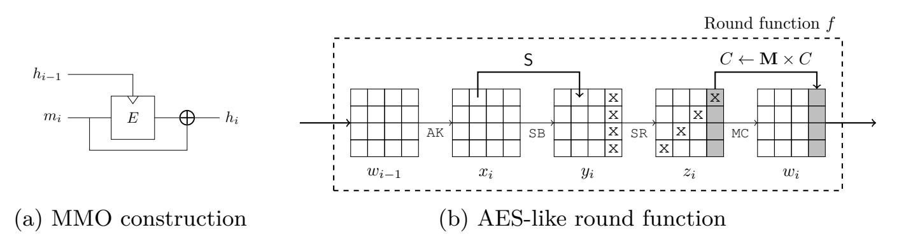

Figure 1: AES-like hashing

In this work, we focus on MITM Nostradamus attack on AES-like hashing, especially AES-MMO, a hash function that plugs AES block cipher into the Matyas-Meyer-Oseas (MMO) mode (Figure 1a). Furthermore, AES-MMO is standardized in Zigbee [SM06] and is widely considered for practical use.

#### 2.2 Nostradamus Attack

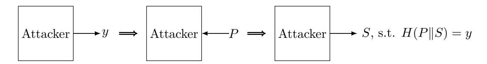

Figure 2: The procedure of the Nostradamus attack

The Nostradamus attack was introduced by Kelsey and Kohno in EUROCRYPT 2006 [KK06], which is a chosen target forced prefix (CTFP) attack. They proposed the herding attack, which is a Nostradamus attack on iterated hash functions. As shown in Figure 2, the attacker first performs some precomputation and chooses a target hash value y. Then the challenger selects a prefix P and supplies it to the attacker. The attacker then outputs a string S such that H(P||S) = y. Kelsey and Kohno proposed a CTFP attack with total time complexity  $\mathcal{O}(\sqrt{n} \cdot 2^{2n/3})$  and memory complexity  $\mathcal{O}(\sqrt{n} \cdot 2^{n/3})$ , which is called the herding attack. The attack can be divided into the following two phases:

1. **Offline phase:** In the offline phase, the attacker builds a diamond structure, which is a hash tree with  $2^k$  leaves, and Figure 3 shows a diamond structure with k = 3. Node  $y_{i,j}$  is an intermediate state of the iterated hash function, and edge  $(y_{i,j}, m_{i,j}, y_{i-1,\lceil j/2\rceil})$  represents a transition from an intermediate state to another state with the application of the underlying compression function, that

{4}------------------------------------------------

- is,  $y_{i-1,\lceil j/2\rceil} = CF(m_{i,j}, y_{i,j})$ . The attacker first arbitrarily chooses  $2^k$  leaves and uses a collision-finding algorithm to construct the father nodes, building the tree level by level. The attacker can build the diamond structure in  $\mathcal{O}(\sqrt{k} \cdot 2^{(n+k)/2})$  time [BSU12].
- 2. **Online phase:** In the online phase, the attacker is presented with a prefix P. We denote  $H^*(P)$  as the hash state after processing the prefix P. The attacker searches for a linking message  $m_{\text{link}}$  such that  $H^*(P||m_{\text{link}})$  is a leaf of the diamond structure. In other words, it tries to find a linking message  $m_{\text{link}}$  that satisfies  $CF(m_{\text{link}}, H^*(P)) \in L$ , where L is the set of leaves of the diamond structure constructed in the offline phase. Thus, by connecting the path from the leaf to the root  $m_{\text{path}}$ , the attacker can find a suffix  $S = m_{\text{link}} || m_{\text{path}}$  such that H(P||S) = y. As the diamond structure has  $2^k$  leaves, the attacker can find a linking message  $m_{\text{link}}$  in  $\mathcal{O}(2^{n-k})$  time.

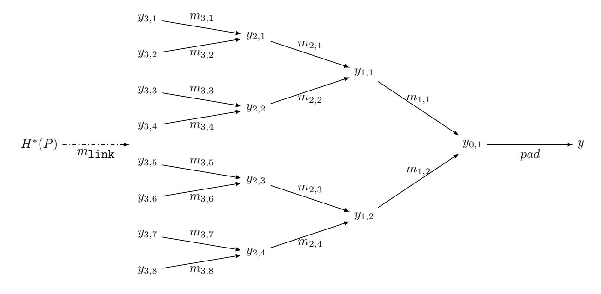

Figure 3: An example of diamond structure with height 3.

Choosing  $k = \frac{n}{3}$  then yields an overall effort of  $\mathcal{O}(\sqrt{n} \cdot 2^{2n/3})$  for both phases together.

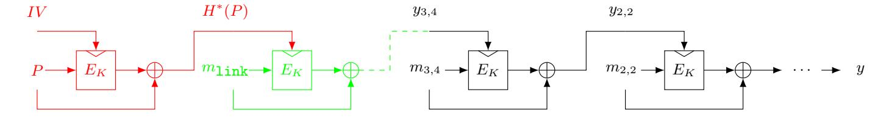

Figure 4: An example of computation path in the herding attack.

We focus on AES-like hashing, especially AES-MMO in this paper. Thus, we take AES-MMO as an example. Figure 4 shows a computation path of a Nostradamus attack on AES-MMO, where  $E_K$  represents AES-128. The diamond structure is built with height k=3, and the set of leaves is  $L=\{y_{3,1},y_{3,2},\ldots,y_{3,8}\}$ . In the offline phase, the attacker generates the diamond structure in Figure 3 and publishes y. The challenger then gives a prefix P (the red part of Figure 4). The attacker searches for a linking message  $m_{\text{link}}$  that links  $H^*(P)$  to a leaf of the diamond structure (the green part of Figure 4). By combining the linking message  $m_{\text{link}}$  and the path in the diamond structure (the black part of Figure 4), the attacker can derive a CTFP preimage of AES-MMO from the computation path Figure 4.

Quantum Nostradamus attack. At ASIACRYPT 2022, Benedikt et al. [BFH22] proposed a generic quantum herding attack on iterated hash functions. They follow the framework of [KK06] and use quantum algorithms to accelerate both offline and online phases. In

{5}------------------------------------------------

the offline phase, they perform a Grover-based method to generate a diamond structure with  $2^k$  leaves under  $\mathcal{O}(\sqrt[3]{k} \cdot 2^{(n+2k)/3})$  evaluations of the compression function. In the online phase, they use the Grover algorithm directly to find a linking message  $m_{\text{link}}$  in  $\mathcal{O}(2^{(n-k)/2})$  time. In particular, for  $k = \frac{n}{7}$ , the total time complexity is  $\mathcal{O}(\sqrt[3]{n} \cdot 2^{3n/7})$  and the quantum memory complexity is  $\mathcal{O}(2^{n/7})$ . We refer to [BFH22] for more details.

# 2.3 A Brief Description of the Meet-in-the-Middle (pseudo-)Preimage Attack

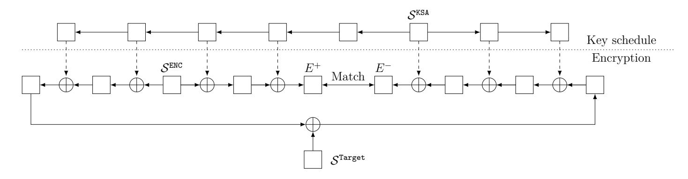

Figure 5: A high-level overview of the MITM (pseudo-)Preimage attacks [DHS+21]

A brief overview The general idea of an MITM attack is to split the cipher (or compression function) state into two independent chunks, which can be computed independently from each other. Thus, the brute force search of the whole cipher could be separated into two small independent searches, and each search generate a list of candidates of partial solution. A pair combined from the two independent lists forms a candidate solution, and we perform an extra computation of the cipher to check if it is a real solution. The MITM attack converts the computation of a large set to two small sets, so it could reduce the time complexity with external memory. To clarify the attack framework, we introduce some terms to describe the two chunks. The cells in the cipher state are called neutral cells if and only if the cells affect only one chunk. In an MITM attack, an intermediate state (called the initial state) is often divided into two chunks: one is computed forward (called the forward chunk), and the other is computed backward (called the backward chunk). Each chunk is computed from the initial state to another intermediate state (called the matching point).

The framework of the Meet-in-the-Middle (pseudo-)preimage attack At CRYPTO 2021, Dong et al. [DHS+21] described the MITM attacks in a unified way as MITM attacks on the so-called closed computation path. We follow their framework and combine them with several techniques of Bao et al. [BGST22]. In previous work [BDG+21, DHS+21], the computation path is divided into two parts: one part is computed forward, and another one is computed backward. Thus, two parts were named forward chunk and backward chunk. However, we can compute blue cells or red cells in both directions. Bao et al. introduced the bi-direction attribute-propagation and cancellation (BiDir) technique in [BGST22], modeled the propagation in both directions, which enlarged the search space of the MILP model. We discard the name of the forward/backward chunk and use the blue/red chunk instead. In the blue/red chunk, we compute only the value of the blue/red cells. Furthermore, if a cell is constant in both blue and red chunk, we denote it as gray cell. A high-level overview of MITM attacks is shown in Figure 5. We follow the notation of MITM attack in [DHS+21] and [HDS+22]:

•  $\mathcal{S}^{\text{ENC}}$ : initial state in the encryption computation path (containing n w-bit cells);

{6}------------------------------------------------

- S KSA: initial state in the key schedule computation path (containing *n w* ¯ bit cells);
- S Target: initial state of the target (contains *n w*-bit cells);
- *E*+*/E*−: ending state of the forward/backward direction;
- B ENC*/*B Target*/*B KSA: subset of N = {0*,* 1*,* · · · *, n* − 1}*/*N = {0*,* 1*,* · · · *, n*¯ − 1}, index of blue cells in S ENC*/*S Target*/*S KSA;
- RENC*/*RTarget*/*RKSA: subset of N */*N , index of red cells in S ENC*/*S Target*/*S KSA;
- G ENC*/*G Target*/*G KSA: subset of N */*N , index of gray cells in S ENC*/*S Target*/*S KSA;
- M+*/*M−: subset of N , index of cells that can be computed in *E*+*/E*−;
- *λ* B: *λ* B =| BENC | + | BTarget | + | BKSA |, the initial degrees of freedom for the blue cells;
- *λ* R: *λ* R =| RENC | + | RTarget | + | RKSA |, the initial degrees of freedom for the red cells;
- DoM: the degrees of matching;
- S[BG]: blue and gray cells in the initial state, all other blue cells can be derived from them, in detail S[BG] is

$$(\mathcal{S}^{\mathtt{ENC}}[\mathcal{G}^{\mathtt{ENC}}], \mathcal{S}^{\mathtt{Target}}[\mathcal{G}^{\mathtt{Target}}], \mathcal{S}^{\mathtt{KSA}}[\mathcal{G}^{\mathtt{KSA}}], \mathcal{S}^{\mathtt{ENC}}[\mathcal{B}^{\mathtt{ENC}}], \mathcal{S}^{\mathtt{Target}}[\mathcal{B}^{\mathtt{Target}}], \mathcal{S}^{\mathtt{KSA}}[\mathcal{B}^{\mathtt{KSA}}]).$$

S[G], S[B], S[R], and S[RG] follow similar definitions;

- *f* B *i* : a function that maps S[BG] to a word;
- *f* R *i* : a function that maps S[RG] to a word;
- *f* **B**: *f* **B** = (*f* B 1 *,* · · · *, f* B *l*B ), *l* B constraints on the neutral blue cells in the initial state;
- *f***R**: *f***R** = (*f* R 1 *,* · · · *, f*R *l*R ), *l* R constraints on the neutral red cells in the initial state;
- DoFB : DoFB = *λ* B − *l* B, the degrees of freedom for the blue cells in the initial state;
- DoFR: DoFR = *λ* R − *l* R, the degrees of freedom for the red cells in the initial state;
- *d*B*/d*R*/d*M: *d*B = *w* · DoFB , *d*R = *w* · DoFR nd *d*M = *w* · DoM, the degrees of freedom in bits.

For (pseudo-)preimage attacks, the target state S Target is a constant value, but in multi-target (pseudo-)preimage attacks, it plays a same role as S ENC. The cells of (S ENC *,* S KSA *,* S Target) are divided into different subsets with different meanings, such that B ENC ∩ RENC = ∅, B KSA ∩ RKSA = ∅, B Target ∩ RTarget = ∅, G ENC = N − BENC ∪ RENC , G KSA = N − BKSA ∪ RKSA and G Target = N − BTarget ∪ RTarget. As the notation introduced before, a coloring system is introduced to visualize these subsets and the attack. The cells S[B] are visualized by cells, the cells S[R] are visualized by cells. The blue and red cells divide the computation path into two parts that can be computed independently, that is, we can compute the value of any blue/red cells in the computation path from the initial state S[BG]/S[RG] independently. The initial degrees of freedom for the blue and red chunks are defined as *λ* B =| BENC | + | BKSA | + | BTarget | and *λ* R =| RENC | + | RKSA | + | RTarget | respectively, which is the number of blue and red cells in the initial states. Moreover, S[G] are visualized as gray cells. In addition, the cells of the ending states that can be computed in the forward and backward directions are denoted by *E*+[M+] and *E*−[M−] respectively. The degrees of matching are denoted by DoM and DoM = *m* if *E*+[M+] and *E*−[M−] form an *m*-cell filter.

{7}------------------------------------------------

To compute blue cells independently, we need to introduce a sequence of  $l^{\mathcal{B}}$  constraints  $f^{\mathcal{B}} = (f_1^{\mathcal{B}}, \dots, f_{l^{\mathcal{B}}}^{\mathcal{B}})$  whose values can be computed with the knowledge of gray and blue cells in the initial states  $\mathcal{S}[\mathcal{BG}]$ , where

$$f_i^{\mathcal{B}}: \mathbb{F}_2^{w\cdot (|\mathcal{G}^{\mathtt{ENC}}| + |\mathcal{G}^{\mathtt{KSA}}| + |\mathcal{G}^{\mathtt{Target}}| + |\mathcal{B}^{\mathtt{ENC}}| + |\mathcal{B}^{\mathtt{KSA}}| + |\mathcal{B}^{\mathtt{Target}}|)} \to \mathbb{F}_2^w$$

is a function mapping  $\mathcal{S}[\mathcal{BG}]$  to a w-bit word. For red cells, there are  $l^{\mathcal{R}}$  constraints  $f^{\mathcal{R}} = (f_1^{\mathcal{R}}, \cdots, f_{l^{\mathcal{R}}}^{\mathcal{R}})$ .  $f^{\mathcal{B}}$  and  $f^{\mathcal{R}}$  ensure that the blue and red cells in initial states can be computed independently to the ending state both forward and backward. In other words, under the constraints  $f^{\mathcal{B}}$  and  $f^{\mathcal{R}}$ , changing the value of blue cells does not affect the red cells and vice versa. The degrees of freedom for blue and red chunk computations are denoted by  $\mathrm{DoF}^{\mathcal{B}} = \lambda^{\mathcal{B}} - l^{\mathcal{B}}$  and  $\mathrm{DoF}^{\mathcal{R}} = \lambda^{\mathcal{R}} - l^{\mathcal{R}}$ .

**Procedure of the attack framework.** The procedure and complexities of the MITM pseudo-preimage attack depend on the configurations of chunk separation, neutral bytes, and matching. With determined configurations, an attack can be mounted as follows.

- 1. Assign arbitrary compatible values to S[G];
- 2. For given values of  $\mathcal{S}[\mathcal{G}]$ , we solve the constraints  $f^{\mathcal{B}}$  and  $f^{\mathcal{R}}$  thus obtaining possible values of the neutral bytes  $\mathcal{S}[\mathcal{B}]$  and  $\mathcal{S}[\mathcal{R}]$ . Suppose that there are  $2^{d_{\mathcal{B}}}$  values for  $\mathcal{S}[\mathcal{B}]$ , and  $2^{d_{\mathcal{R}}}$  for  $\mathcal{S}[\mathcal{R}]$ ;
- 3. For all  $2^{d_{\mathcal{B}}}$  values of  $\mathcal{S}[\mathcal{B}]$ , compute from the initial structure to the matching point to get a table  $L^{\mathcal{B}}$ , whose indices are the values for matching, and the elements are the values of  $\mathcal{S}[\mathcal{B}]$ ;
- 4. For all  $2^{d_{\mathcal{R}}}$  values of  $\mathcal{S}[\mathcal{R}]$ , compute from the initial structure to the matching point to get a table  $L^{\mathcal{R}}$ , whose indices are the values for matching, and the elements are the values of  $\mathcal{S}[\mathcal{R}]$ ;
- 5. Check whether there is a partial match on indices between  $L^{\mathcal{B}}$  and  $L^{\mathcal{R}}$ .
- 6. In case of partial-matching exists in the above step, for the surviving pairs, check for a full-state match. If none of them is fully matched, repeat the procedure by changing the values of fixed bytes until a full match is found.

Attack complexity. Denote the size of the internal state and output by n. In step 3, to get the table  $L^{\mathcal{B}}$ , we perform  $2^{d_{\mathcal{B}}}$  computations of the blue chunk, while we perform  $2^{d_{\mathcal{R}}}$  computations of the red chunk in step 4. In step 5, the partial match between  $L^{\mathcal{B}}$  and  $L^{\mathcal{R}}$  requires  $2^{\max(d_{\mathcal{B}},d_{\mathcal{R}})}$  memory access which is usually ignored.  $2^{d_{\mathcal{B}}+d_{\mathcal{R}}-d_{\mathcal{M}}}$  values of the initial state pass the partial match, and we check all values if there is a full match. From step 2 to 5, we check  $2^{d_{\mathcal{B}}+d_{\mathcal{R}}}$  values of the initial state. Thus,  $2^{n-(d_{\mathcal{B}}+d_{\mathcal{R}})}$  repetitions are required to get a full match. The time complexity of the attack is:

$$2^{n-(d_{\mathcal{B}}+d_{\mathcal{R}})} \cdot \left(2^{\max(d_{\mathcal{B}},d_{\mathcal{R}})} + 2^{(d_{\mathcal{B}}+d_{\mathcal{R}}-d_{\mathcal{M}})}\right)$$

$$\simeq 2^{n-\min(d_{\mathcal{B}},d_{\mathcal{R}},d_{\mathcal{M}})}.$$

$$(1)$$

### 2.4 Meet-in-the-middle Attack in the Quantum Setting

At Crypto 2022, Schrottenloher and Stevens [SS22] proposed a method that converts a classical MITM attack to a quantum MITM attack. They found that a classic MITM attack can be quadratically accelerated in the quantum setting when the parameters of the attack are chosen properly. Though the notations used in [SS22] is different from the one in this paper, we can derive a similar formula. In this subsection, we follow the quantum

{8}------------------------------------------------

MITM attack proposed by Schrottenloher and Stevens [SS22], and give the details of the quantum MITM attack using our notations.

We use the standard quantum circuit model in this paper, and we refer to [NC02] for further details. When we estimate the time complexity of an attack on a cryptographic primitive, we assume the unit of time to be the time of running the primitive once. When we estimate the memory complexity, we assume the unit to be the memory of storing a state of the primitive.

In our quantum MITM attack, we use quantum amplitude amplification [BHMT02] to speed up the attack.

**Theorem 1** (Quadratic speedup [BHMT02], Theorem 2). Let  $\mathcal{A}$  be any quantum algorithm that uses no measurements, and let  $f: \mathbb{Z} \to \{0,1\}$  be any Boolean function that tests if an output of  $\mathcal{A}$  is "good". Let  $O_0$  be the operator that changes the sign of the amplitude if and only if the state is zero state  $|0\rangle$ , and  $O_f$  be a quantum oracle for  $f: O_f |x\rangle = (-1)^{f(x)} |x\rangle$ . Let a be the initial success probability of  $\mathcal{A}$ . Suppose  $a \leq 0$ , and set  $m = \lfloor \frac{\pi}{4\theta_a} \rfloor$ , where  $\theta_a$  is defined so that  $\sin^2(\theta_a) = a$  and  $0 \leq \theta_a \leq \pi/2$ . Then if we compute  $(\mathcal{A}O_0\mathcal{A}^{\dagger}O_f)^m\mathcal{A}|0\rangle$  and measure the system, the outcome is good with probability at least  $\max(1-a,a)$ .

Brassard et al. gave two methods that make the algorithm succeed with probability 1 when a is known. One of their methods only needs to apply two more  $\mathcal{A}$  and O operations [BHMT02].

**Theorem 2** (Quadratic speedup with known a [BHMT02], Theorem 4). In the same set of Theorem 1 and a is known, there exists a quantum algorithm running in less than  $\frac{\pi}{4\sqrt{a}} + 1$  iterations that obtains a good result with probability 1.

**Quantum Memory** In classic attacks, the attackers could store and access data in the random access memory (RAM). In the quantum setting, a quantum random access memory (QRAM) is needed. The QRAM used in this paper is quantum random-access quantum memory (QRAQM). For a list of qubit registers  $L = \{x_0, \dots, x_{2^n-1}\}$ , where  $x_i$  is a registers with n qubits, the QRAM for L is modeled as an unitary transformation  $\mathcal{U}_{\mathsf{QRAM}}^L$  such that

$$\mathcal{U}_{\mathsf{QRAM}}^L \left( \sum_i a_i \ket{i} \otimes \ket{y} \right) = \sum_i a_i \ket{i} \otimes \ket{y \oplus x_i}.$$

In this paper, we assume the QRAM operation can be efficiently implemented. Currently, it is unknown how a large QRAM can be built. Therefore, a quantum attack with less QRAM is more significant.

Quantum meet-in-the-middle attack Assume we have a configuration of a classical MITM attack ( $DoF^{\mathcal{B}}$ ,  $DoF^{\mathcal{R}}$ , DoM) on an n-bit hash function. Let us assume for now that  $\mathcal{S}[\mathcal{G}] = C$  is chosen from a set of size  $2^g = 2^{n-d_{\mathcal{B}}-d_{\mathcal{R}}}$ . Without loss of generality, we assume that the table  $L^{\mathcal{B}}$  is not larger than  $L^{\mathcal{R}}$ , i.e.  $DoF^{\mathcal{B}} \leq DoF^{\mathcal{R}}$ . Our goal is to determine if there is a value of  $\mathcal{S}[\mathcal{GBR}]$  that causes a full-state match. Let  $U_{inner}$  be the unitary operator that computes this:

$$U_{\text{inner}} |C\rangle|b\rangle = |C\rangle|b\oplus f(C)\rangle$$
, where  $f(C) = \begin{cases} 1 \text{ if a full match occurs} \\ 0 \text{ otherwise} \end{cases}$ 

 $U_{\text{inner}}$  tests  $2^{d_{\mathcal{B}}+d_{\mathcal{R}}}$  values of  $\mathcal{S}[\mathcal{GBR}]$  if there is a full match. Thus, the success probability of  $U_{\text{inner}}$  is  $2^{d_{\mathcal{B}}+d_{\mathcal{R}}-n}$ .

Since we assume a single solution exactly, we do an Exact Amplitude Amplification (Theorem 2) on C to find the choice of guesses that yields it.

{9}------------------------------------------------

**Lemma 1.** Assume that there exists an implementation of  $U_{inner}$  with time complexity T. Then there is a quantum MITM attack of complexity:  $(\frac{\pi}{4} \cdot 2^{g/2} + 1) \times T$ .

*Proof.* Because the success probability of  $U_{\text{inner}}$  is  $2^{d_{\mathcal{B}}+d_{\mathcal{R}}-n}$ , we apply Theorem 2 then we could find a good solution with  $\frac{\pi}{4\sqrt{2^{d_{\mathcal{B}}+d_{\mathcal{R}}-n}}}+1=\frac{\pi}{4}\cdot 2^{g/2}+1$  evaluations of  $U_{\text{inner}}$ .  $\square$ 

We now consider the time complexity of  $U_{inner}$ .

**Lemma 2.** Let S[G] = C be a good guess. Let T' be the time required to compute the encryption once, so the time of computing an element in  $L^{\mathcal{B}}$  or  $L^{\mathcal{R}}$  is less than T'. Then there is an implementation of  $U_{inner}$  with the time complexity at most:

$$2T' \cdot (2^{d_{\mathcal{B}}} + (\frac{\pi}{4}\sqrt{2^{d_{\mathcal{R}}}} + 1)(\pi\sqrt{2^{d_{\mathcal{B}}-d_{\mathcal{M}}}} + 6)). \tag{2}$$

*Proof.* We use the following implementation:

- 1. We compute  $L^{\mathcal{B}}$  and store its elements in QRAM. We index them by the partial match value, and then order them in a radix tree. Each subtree has  $2^{d_{\mathcal{B}}-d_{\mathcal{M}}}$  elements.
- 2. We do quantum search in  $L^{\mathcal{R}}$ : we use an Exact Amplitude Amplification, as the size of  $L^{\mathcal{R}}$  is exactly known in advance, and we assume a single solution at most. After the search, we test the state, which gives the result of  $U_{\text{inner}}$ .

Thus the time complexity of the above procedure is :

$$2(2^{d_{\mathcal{B}}} \times T' + (\frac{\pi}{4}\sqrt{2^{d_{\mathcal{R}}}} + 1) \times (2(\frac{\pi}{4}\sqrt{2^{d_{\mathcal{B}}-d_{\mathcal{M}}}} + 1) \times 2T' + 2T'))$$

$$= 2T'(2^{d_{\mathcal{B}}} + (\frac{\pi}{4}\sqrt{2^{d_{\mathcal{R}}}} + 1)(\pi\sqrt{2^{d_{\mathcal{B}}-d_{\mathcal{M}}}} + 6)).$$

**Theorem 3.** The time complexity of the full quantum MITM attack is

$$2T'(\frac{\pi}{4} \times 2^{g/2} + 1)(2^{d_{\mathcal{B}}} + (\frac{\pi}{4}\sqrt{2^{d_{\mathcal{R}}}} + 1)(\pi\sqrt{2^{d_{\mathcal{B}}-d_{\mathcal{M}}}} + 6)).$$

If we remove the constant factor, we obtain the simplified formula for the quantum time complexity  $2^{t_q}$ , where

$$t_{q} = \frac{n - d_{\mathcal{B}} - d_{\mathcal{R}}}{2} + \max\left(\min\left(d_{\mathcal{B}}, d_{\mathcal{R}}\right), \frac{1}{2}\max(d_{\mathcal{B}}, d_{\mathcal{R}}, d_{\mathcal{B}} + d_{\mathcal{R}} - d_{\mathcal{M}})\right)$$
$$= \frac{1}{2}\left(n - \min\left(\left|d_{\mathcal{B}} - d_{\mathcal{R}}\right|, d_{\mathcal{B}}, d_{\mathcal{R}}, d_{\mathcal{M}}\right)\right).$$

Thus, the MITM attack could be quadratically accelerated in the quantum setting if and only if

$$\left| \operatorname{DoF}^{\mathcal{B}} - \operatorname{DoF}^{\mathcal{R}} \right| \ge \min \left( \operatorname{DoF}^{\mathcal{B}}, \operatorname{DoF}^{\mathcal{B}}, \operatorname{DoM} \right).$$

### 3 Meet-in-the-Middle Nostradamus Attack

#### 3.1 The Framework of the Meet-in-the-Middle Nostradamus Attack

In the generic herding attack, the attacker builds a diamond structure first. After given a prefix P, the attacker searches for a linking message that links the prefix to one of the leaves of the diamond structure. The procedure of finding a linking message is searching for a message  $m_{\text{link}}$  that satisfies  $CF(m_{\text{link}}, H^*(P)) \in L$  (L is the set of leaves), which can be seen as a multi-target preimage attack on the compression function CF.

In this section, we propose the meet-in-the-middle Nostradamus attack, using a multitarget preimage attack to speed up the online phase of the herding attack. Similarly to the generic attack, the meet-in-the-middle Nostradamus attack can be divided into the following two phases:

{10}------------------------------------------------

- 1. Offline phase: Before the attacker builds a diamond structure, it searches a configuration of multi-target MITM preimage attack on the hash function. The attacker generates  $2^k$  targets following the neutral bytes in  $\mathcal{S}^{\mathsf{Target}}$ . The value of the leaves are constant on bytes  $\mathcal{S}^{\mathsf{Target}}[\mathcal{G}^{\mathsf{Target}}]$ , and take all value on bytes  $\mathcal{S}^{\mathsf{Target}}[\mathcal{B}^{\mathsf{Target}}]$  and  $\mathcal{S}^{\mathsf{Target}}[\mathcal{R}^{\mathsf{Target}}]$ . The attacker could build a diamond structure using the same method as the generic herding attack, and the time complexity of this phase is  $2^{(n+k)/2}$ . The set of leaves is L and  $|L| = 2^k$ .
- 2. **Online phase:** In the online phase, the attacker receives a prefix P. Then the attacker mounts a meet-in-the-middle attack on the compression function CF to find a linking message  $m_{\text{link}}$  that satisfies  $CF(m_{\text{link}}, H^*(P)) \in L$ . The time complexity of this phase is  $2^{n-\min(d_{\mathcal{B}}, d_{\mathcal{R}}, d_{\mathcal{M}})}$ . This phase is the same as a multi-target MITM preimage attack on the compression function CF with  $2^k$  targets.

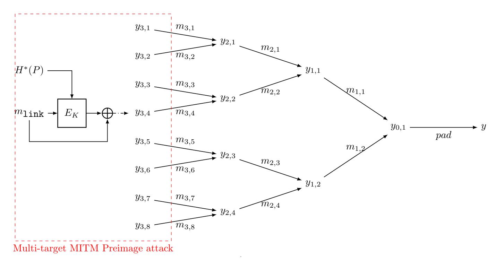

Figure 6: An example of meet-in-the-middle Nostradamus attack.

We take AES-MMO as an example (Figure 6). The attacker is given a prefix P and then mounts a meet-in-the-middle attack on  $E_K$  to find a linking message  $m_{\text{link}}$  that satisfies  $CF(m_{\text{link}}, H^*(P)) \in L$ .

**Attack complexity.** The time complexity of this attack is

$$\max\left(2^{n-\min(d_{\mathcal{B}},d_{\mathcal{R}},d_{\mathcal{M}})},\sqrt{k}\cdot 2^{(n+k)/2}\right),$$

and the memory complexity is  $\max (2^k, \min(2^{d_{\mathcal{B}}}, 2^{d_{\mathcal{R}}}))$ . To perform a faster attack than the generic attack, we need (we omit the factor  $\sqrt{k}$  here.)

$$k < \frac{n}{3}$$
 and min  $(d_{\mathcal{B}}, d_{\mathcal{R}}, d_{\mathcal{M}}) > \frac{n}{3}$ .

We can see that, in classic attacks, once our MITM attack is faster than the generic attack, it uses more memory. The reason is that the memory used in the MITM procedure is  $2^{\min(d_{\mathcal{B}},d_{\mathcal{R}})}$ , which is larger than the size of the diamond structure  $2^{n/3}$ . Compared to (multitarget) preimage attack, which only needs min  $(d_{\mathcal{B}}, d_{\mathcal{R}}, d_{\mathcal{M}}) > 0$ , MITM Nostradamus attack cannot attack as many rounds as MITM preimage attack.

**Remark.** We should note that our MITM attack only improves the online phase of the generic herding attack, and the offline phase of our attack is the same as the generic

{11}------------------------------------------------

method. Several novel dedicated collision attack were proposed in recent years, especially the rebound attack [\[HS20,](#page-21-2) [DSS](#page-20-4)+20, [DZS](#page-21-3)+21, [DGLP22\]](#page-20-5). We have considered improving the offline phase using dedicated collision attack, but the presented collision attacks are mostly based on differential attack whose input pairs should fit a specific differential. When building the diamond structure, only the nodes in the first level of the tree can be freely chosen. Thus, the dedicated collision attacks only could be applied to construct the first level of the diamond structure. When searching for collisions in the offline phase, the chain values of two compression functions are different, which could not be controlled by the attacker. This attack scenario is different from the recently proposed attack, which focused on semi-free-start or free-start collision attack. We think it is an interesting work to search for collisions of a compression function with a set of forced chain values.

#### **3.2 Quantum Meet-in-the-Middle Nostradamus Attack**

We can use the method in [Subsection 2.4](#page-7-0) to convert our classic MITM Nostradamus attack to a quantum one. In the quantum setting, the time complexity of our MITM Nostradamus attack is

$$\max(2^{\frac{1}{2}(n-\min(|d_{\mathcal{B}}-d_{\mathcal{R}}|,d_{\mathcal{B}},d_{\mathcal{R}},d_{\mathcal{M}}))},\sqrt[3]{k}\cdot 2^{(n+2k)/3}).$$

We can see that, in the quantum setting, to perform a faster attack than the generic attack, we need (we omit the factor √3 *k* here.)

$$k \leq \frac{n}{7}, \min(|d_{\mathcal{B}} - d_{\mathcal{R}}|, d_{\mathcal{B}}, d_{\mathcal{R}}, d_{\mathcal{M}}) \geq \frac{n}{7}.$$

The limitation of the quantum MITM Nostradamus attack is looser than the classical one. Thus, we could attack more rounds in the quantum setting than in the classical setting. Schrottenloher and Stevens applied their method to the MITM preimage attack, and showed that the quantum attack cannot attack more rounds than classical attack. However, our MITM Nostradamus attack could attack more rounds in the quantum setting.

# **4 The MILP Model for the MITM Nostradamus Attacks**

At EUROCRYPT 2021, MILP-based automatic tools were applied to MITM preimage attack [\[BDG](#page-20-1)+21] for the first time. A series of following works [\[DHS](#page-20-2)+21, [HDS](#page-21-8)+22, [BGST22\]](#page-20-3) improved several previous results.

Based on their model of the MITM preimage attack, we add some extra constraints to model the MITM Nostradamus attack. Firstly, in the MITM Nostradamus attack, the degree of freedom in S KSA is 0, because the attacker cannot control the value of *H*∗ (*P*) or *H*∗ (*P*∥*m*link1) at low cost. It means that we cannot utilize the degree of freedom in S KSA; on the other hand, our MILP model could be simpler because we treat the key state as constants.

**Basic Notations.** We use two binary variables (*x, y*) to encode the attribute of an individual state cell. *x* = 1 if and only if the value of this cell can be known when computing blue cells; *y* = 1 if and only if the value of this cell can be known when computing red cells. Thus, there are four kinds of cell in total:

- Gray, (*xi , yi*) = (1*,* 1). A cell is gray if and only if its value is a predefined constant, and thus is known in the computations of both blue and red cells.
- Blue, (*xi , yi*) = (1*,* 0). A cell is blue if and only if its value is dependent on the value of gray cells and blue neutral cells. It is known in the computations of blue cells, but it is unknown in the computations of red cells.

{12}------------------------------------------------

- Red,  $(x_i, y_i) = (0, 1)$ . A cell is red if and only if its value is dependent on gray cells and red neutral cells. It is known in the computations of red cells, but unknown in the computations of blue cells.
- $\square$  White,  $(x_i, y_i) = (0, 0)$ . A cell is white if and only if its value depends on both blue and red neutral cells. It is unknown in the computations of both blue and red cells.

Since the degree of freedom in  $\mathcal{S}^{\text{KSA}}$  is 0 and we treat the key state as constants, the initial states are  $(\mathcal{S}^{\text{ENC}}, \mathcal{S}^{\text{Target}})$ . We introduce two variables  $\alpha_i$  and  $\beta_i$  for each cell in the initial states:

$$\alpha_i = \begin{cases} 1, & \text{if } (x_i, y_i) = (1, 0), \\ 0, & \text{if } (x_i, y_i) \neq (1, 0). \end{cases} \quad \beta_i = \begin{cases} 1, & \text{if } (x_i, y_i) = (0, 1), \\ 0, & \text{if } (x_i, y_i) \neq (0, 1). \end{cases}$$

We compute the initial degrees of freedom for blue and red cells by  $\lambda^{\mathcal{B}} = \sum_{i} \alpha_{i}^{\text{ENC}} + \sum_{i} \beta_{i}^{\text{Target}}$  and  $\lambda^{\mathcal{R}} = \sum_{i} \beta_{i}^{\text{ENC}} + \sum_{i} \beta_{i}^{\text{Target}}$ . For the ending state, as we focus on AES-like hashing, the matching happens at the MixColumn, and thus  $E^{+}$  and  $E^{-}$  are the input and output states of a MixColumn operation. We introduce a variable  $m_{i}$  for the i-th column in  $E^{+}$  and  $E^{-}$  to indicate the degrees of matching. The total degree of matching of  $E^{+}$  and  $E^{-}$  is the sum of each column  $\text{DoM} = \sum_{i} m_{i}$ .

Rules for Propagation. The initial degrees of freedom are consumed to ensure the validity of the independent computation of the blue and red cells. In our MITM Nostradamus attack, only the MixColumn operation and the XOR operation of the input, the output and the target consume degrees of freedom. We use MC-RULE and XOR-RULE with the BiDir technique introduced in [BGST22] to model attribute propagation and the consumption of degrees of freedom. Without loss of generality, we assume that the degrees of freedom consumed are  $l^{\mathcal{B}}$  for blue cells and  $l^{\mathcal{R}}$  for red cells. Thus, we can compute the remaining degrees of freedom for the computation of blue and red cells by  $\mathrm{DoF}^{\mathcal{B}} = \lambda^{\mathcal{B}} - l^{\mathcal{B}}$  and  $\mathrm{DoF}^{\mathcal{R}} = \lambda^{\mathcal{R}} - l^{\mathcal{R}}$ .

The concrete XOR-RULE is as follows:

- A white cell XORed with a cell of any attribute results in a white cell:  $(\Box \oplus \blacksquare) \rightarrow \Box$ ;
- A gray cell XORed with a cell of any attribute results in the cell of the same attribute:  $(\blacksquare \oplus \blacksquare) \rightarrow \blacksquare$ ;
- A couple of blue and red cells results in a cell deteriorated to white:  $(\blacksquare \oplus \blacksquare) \rightarrow \Box$ ;
- A couple of blue cells can keep the attributes without consuming or evolve to gray by consuming a degree of freedom of Blue:  $(\blacksquare \oplus \blacksquare) \to \blacksquare$  or  $(\blacksquare \oplus \blacksquare) \xrightarrow{-1 \times \blacksquare} \blacksquare$ ;
- A couple of red cells can keep the attributes without consuming or evolve to gray by consuming a degree of freedom of Red:  $(\blacksquare \oplus \blacksquare) \to \blacksquare$  or  $(\blacksquare \oplus \blacksquare) \xrightarrow{-1 \times \blacksquare} \blacksquare$ ;

The concrete MC-RULE is as follows:

- Any white cell in an input column results in all cells in the output column deteriorated to white:  $MC(i \times \square, j \times \blacksquare) \to (N_{row} \times \square)$ , where  $i \ge 1$  and  $i + j = N_{row}$ ;
- The gray attribute inherits to the output without consuming degrees of freedom only if all cells in the input column are gray:  $MC(N_{row} \times \blacksquare) \to (N_{row} \times \blacksquare)$ ;
- If no white cell in an input column, a column of i blue, j red, and k gray cells propagate to a column of i' blue, j' red, k' gray, and l' white cells by consuming j' + k' degree of freedom from blue, and i' + k' from red:

$$\operatorname{MC}(i \times \blacksquare, j \times \blacksquare, k \times \blacksquare) \xrightarrow[-(i'+k') \times \blacksquare, \text{ if } i \neq 0]{} (i' \times \blacksquare, j' \times \blacksquare, k' \times \blacksquare, l' \times \square),$$

{13}------------------------------------------------

where  $i + j + k = i' + j' + k' + l' = N_{row}$ , and

$$\begin{cases} j' + k' < i \le N_{\text{row}} & \text{if } i \ne 0 \\ j' + k' = N_{\text{row}} & \text{otherwise} \end{cases}, \begin{cases} i' + k' < j \le N_{\text{row}} & \text{if } j \ne 0 \\ i' + k' = N_{\text{row}} & \text{otherwise} \end{cases}.$$

Rules for Match. According to the property of the MDS matrix, if the number of input and output cells we know is greater than  $N_{\text{row}}$ , we can filter the pair that does not satisfy the relationship of the MDS matrix, where  $N_{\text{row}}$  is the number of state rows. The technique is known as partial matching. The degree of matching for the *i*-th column  $m_i$  can be determined as follows: suppose that the number of cells whose value we know in  $E^+$  and  $E^-$  is  $m_i^k$ , then we have

$$m_i = \max(0, m_i^k - N_{\text{row}})$$

For more details on the MILP model, we refer to Appendix A and [BGST22].

Rules for Herding Attack and the Objective Function. The total time complexity of the MITM Nostradamus attack is the sum of the time complexities of the offline and online phases. The online phase is our MITM procedure, and we generate the targets used in the MITM procedure in the offline phase. To optimize the total time complexity of the MITM Nostradamus attack and search for a valid attack, we need to consider the offline phase.

We introduce a variable k which denotes the height of the diamond structure built in the offline phase. Because the number of targets used in the online phase is at most  $2^k$ , the initial degrees of freedom in  $\mathcal{S}^{\mathsf{Target}}$  are bounded by k:

$$w \cdot \sum_{i} \alpha_{i}^{\mathtt{Target}} + w \cdot \sum_{i} \beta_{i}^{\mathtt{Target}} \leq k.$$

According to Subsection 3.1, the time complexity of the MITM Nostradamus attack is

$$\max \left(2^{n-w\cdot\min\left(\operatorname{DoF}^{\mathcal{B}}, \operatorname{DoF}^{\mathcal{R}}, \operatorname{DoM}\right)}, 2^{(n+k)/2}\right).$$

We want to minimize the time complexity of the MITM Nostradamus attack, so we introduce two variables  $O_{\text{mitm}}$  and  $O_{\text{total}}$  that satisfy:

$$\begin{cases} O_{\mathtt{mitm}} & \leq & \mathrm{DoF}^{\mathcal{B}}, \\ O_{\mathtt{mitm}} & \leq & \mathrm{DoF}^{\mathcal{R}}, \\ O_{\mathtt{mitm}} & \leq & \mathrm{DoM}, \end{cases} \quad \begin{cases} O_{\mathtt{total}} & \geq & \frac{n+k}{2}, \\ O_{\mathtt{total}} & \geq & n-w \cdot O_{\mathtt{mitm}}. \end{cases}$$

For quantum MITM Nostradamus attack, the time complexity is

$$\max(2^{\frac{1}{2}\left(n-\min\left(|d_{\mathcal{B}}-d_{\mathcal{R}}|,d_{\mathcal{B}},d_{\mathcal{R}},d_{\mathcal{M}}\right)\right)},\sqrt[3]{k}\cdot 2^{(n+2k)/3})$$

Thus, we set

$$\begin{cases} O_{\texttt{mitm}} & \leq & \frac{\text{DoF}^{\mathcal{B}}}{2}, \\ O_{\texttt{mitm}} & \leq & \frac{\text{DoF}^{\mathcal{R}}}{2}, \\ O_{\texttt{mitm}} & \leq & \frac{\text{max}\left(\text{DoF}^{\mathcal{B}} - \text{DoF}^{\mathcal{R}}, \text{DoF}^{\mathcal{R}} - \text{DoF}^{\mathcal{B}}\right)}{2}, \\ O_{\texttt{mitm}} & \leq & \frac{\text{DoM}}{2}, \end{cases} \qquad \begin{cases} O_{\texttt{total}} & \geq & \frac{n+2\cdot k}{3}, \\ O_{\texttt{total}} & \geq & \frac{n}{2} - w \cdot O_{\texttt{mitm}}, \end{cases}$$

in the quantum setting.

The total time complexity of the MITM Nostradamus attack is  $2^{O_{total}}$ , thus our objective function is to minimize the value of  $O_{total}$ .

{14}------------------------------------------------

**Remark.** Guess-and-determine technique is also considered in our model; however, the optimal attacks on AES-MMO we searched do not guess any byte. Thus, we do not introduce the guess-and-determine technique in the above model. This fact is similar to the preimage attack and collision attack on AES in [\[BGST22\]](#page-20-3), which also did not guess any bytes. There are several other techniques in [\[BGST22\]](#page-20-3) such as superposition states, separate attribute-propagation, and multiple ways of AddRoundKey. Our model does not consider these techniques because these methods utilize the degree of freedom in key schedule, which are constants in our model. The source code of our model is available at [https://github.com/zzy32677/Nostradamus\\_MILP](https://github.com/zzy32677/Nostradamus_MILP).

# **5 Application to AES-MMO**

We apply our method to AES hashing modes. With our tool, we mount a classical Nostradamus attack on 6-round AES-MMO and a quantum Nostradamus attack on 7-round AES-MMO.

#### **5.1 MITM Nostradamus Attack on 6-round AES-MMO**

**MITM Nostradamus attack on 6-round AES-MMO in classic setting.** The configuration of the MITM attack on 6-round AES-MMO is shown in [Figure 7.](#page-16-0) The initial state is *S*(*X*1) and the matching point is between *Y*3 and *Z*3.

- 1. To compute blue and red bytes independently, neutral bytes in one chunk should not affect bytes in another chunk. In other words, the initial neutral bytes must have a constant impact on bytes marked by *C* and *C* to guarantee the independence of MixColumn computations. Therefore, we derive 4 constraints on blue neutral bytes and 4 constraints on red neutral bytes, which are two systems of equation [\(Equation 3](#page-14-2) and [Equation 4\)](#page-14-3). Thus, the degree of freedom in the blue neutral bytes is 4 and the degree of freedom in the red neutral bytes is 4. By taking the degree of freedom in the target state, the degree of freedom of blue cells and red cells in the starting state (S ENC *,* S Target) are 6 and 6.
- 2. We fix the value of *C*1 *. . . C*8 in the following steps. First, we randomly choose the value of *C*1 *. . . C*8, then solve [Equation 3](#page-14-2) and [Equation 4](#page-14-3) and store the solutions of (S ENC[B]*,* S Target[B]) and (S ENC[R]*,* S Target[R]) in two tables *T*B and *T*R. The constraints on the initial neutral bytes are linear, so we can get *T*B and *T*R efficiently.

$$\begin{cases}
2 \cdot S(X_1)[10] \oplus S(X_1)[0] = C_1 \\
2 \cdot S(X_1)[3] \oplus S(X_1)[9] = C_2 \\
2 \cdot S(X_1)[8] \oplus S(X_1)[2] = C_3 \\
2 \cdot S(X_1)[1] \oplus S(X_1)[11] = C_4
\end{cases} \tag{3}$$

$$\begin{cases}
2 \cdot S(X_1)[5] \oplus S(X_1)[15] = C_5 \\
2 \cdot S(X_1)[14] \oplus S(X_1)[4] = C_6 \\
2 \cdot S(X_1)[7] \oplus S(X_1)[13] = C_7 \\
2 \cdot S(X_1)[12] \oplus S(X_1)[6] = C_8
\end{cases} \tag{4}$$

3. For each value in *T*B, we compute both forward and backward with the knowledge of *C*1 *. . . C*8 to the matching point *Y*3 and *Z*3. For the first column of *Y*3 and *Z*3, we 

{15}------------------------------------------------

have two linear equations:

$$Y_3[2] = 0xe * Z_3[2] + 0xb * Z_3[3] + 0xd * Z_3[0] + 0x9 * Z_3[1],$$
  

$$Y_3[3] = 0xe * Z_3[3] + 0xb * Z_3[0] + 0xd * Z_3[1] + 0x9 * Z_3[2].$$
(5)

We move the terms with the same color to the same side:

$$Y_3[2] + 0xb * Z_3[3] + 0x9 * Z_3[1] = 0xe * Z_3[2] + 0xd * Z_3[0],$$
  

$$0xe * Z_3[3] + 0xd * Z_3[1] = Y_3[3] + 0xb * Z_3[0] + 0x9 * Z_3[2].$$
(6)

We denote  $(Y_3[2] + 0xb * Z_3[3] + 0x9 * Z_3[1], 0xe * Z_3[3] + 0xd * Z_3[1])$  by  $C_{red}^0$  and denote  $(0xe * Z_3[2] + 0xd * Z_3[0], Y_3[3] + 0xb * Z_3[0] + 9 * Z_3[2])$  by  $C_{blue}^0$ . For the other three columns, we can compute  $C_{red}^i$  and  $C_{blue}^i$  (i = 1, 2, 3) similarly. Then we let

$$C_{red} = (C_{red}^{0}, C_{red}^{1}, C_{red}^{2}, C_{red}^{3}),$$

$$C_{blue} = (C_{blue}^{0}, C_{blue}^{1}, C_{blue}^{2}, C_{blue}^{3}).$$
(7)

For the blue cells in  $Y_3$  and  $Z_3$ , we compute the value of  $C_{blue}$ , and then store  $S(X_1)[0,1,2,3,8,9,10,11]$  in  $L[C_{blue}]$ .

4. For each value in  $T_{\mathcal{R}}$ , we compute both forward and backward with the knowledge of  $C_1 \ldots C_8$  to the matching point  $Y_3$  and  $Z_3$ . For the red cells in  $Y_3$  and  $Z_3$ , we compute the value of  $C_{red}$ . For each value in  $L[C_{red}]$ , we can combine the knowledge of  $S(X_1)$ , compute forward and backward to the matching point, and test the full match in the 128-bit state. If there is not a full match, we go back to step 2 and choose new  $C_1 \ldots C_8$ .

**Complexity.** The size of  $T_{\mathcal{B}}$  is  $2^{(8-4+2)\times 8} = 2^{48}$  and the size of  $T_{\mathcal{R}}$  is  $2^{(8-4+2)\times 8} = 2^{48}$ . In step 4, it is expected to find  $2^{(6+6-8)\times 8} = 2^{32}$  matches on 8 bytes(64 bits). To find a full match on 128-bit state, it is expected to repeat the step 2 to 4 about  $2^{128-64-32} = 2^{32}$  times. Thus, the time complexity of the MITM attack is  $2^{48} \times 2^{32} = 2^{80}$ . The memory complexity is  $2^{48}$ . The number of targets used in the MITM procedure is  $2^{32}$ , so the time complexity of the offline phase is  $\sqrt{32} \cdot 2^{(128+32)/2} = 2^{82.5}$ , thus the total time complexity is  $2^{82.7}$ .

#### 5.2 Quantum MITM Nostradamus Attack on 7-round AES-MMO

MITM Nostradamus attack on 7-round AES-MMO in quantum setting The configuration of the MITM attack on 7-round AES-MMO is shown in Figure 8. The initial state is  $X_4$  for blue cells and  $S(x_4)$  for red cells. The matching point is between  $Y_1$  and  $Z_1$ . We derive 3 constraints on blue neutral bytes and 8 constraints on red neutral bytes (Equation 8 and Equation 9), so the degree of freedom in blue neutral bytes is 1 and the degree of freedom in red neutral bytes is 4. By taking the degree of freedom in the target state, the degrees of freedom of blue and red cells in the starting state ( $S^{\text{ENC}}$ ,  $S^{\text{Target}}$ ) are 2 and 4.

$$\begin{cases}
2 \cdot X_4[0] \oplus 3 \cdot X_4[1] \oplus X_4[2] \oplus X_4[3] = C_1 \\
2 \cdot X_4[1] \oplus 3 \cdot X_4[2] \oplus X_4[3] \oplus X_4[0] = C_2 \\
2 \cdot X_4[3] \oplus 3 \cdot X_4[0] \oplus X_4[1] \oplus X_4[2] = C_3
\end{cases} \tag{8}$$

{16}------------------------------------------------

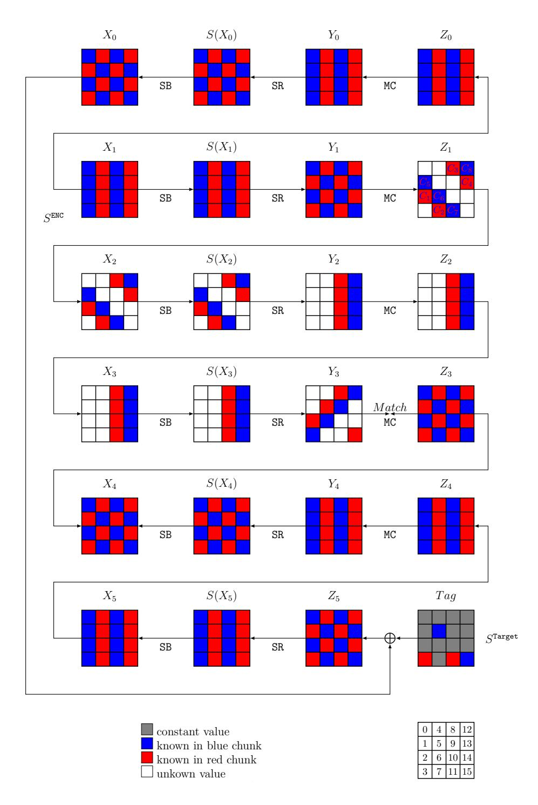

Figure 7: An MITM Nostradamus attack on 6-round AES-MMO

$$\begin{cases} 3 \cdot S(X_4)[5] \oplus S(X_4)[10] \oplus S(X_4)[15] = C_4 \\ 2 \cdot S(X_4)[10] \oplus 3 \cdot S(X_4)[15] \oplus S(X_4)[5] = C_5 \\ 2 \cdot S(X_4)[9] \oplus 3 \cdot S(X_4)[14] \oplus S(X_4)[4] = C_6 \\ 3 \cdot S(X_4)[4] \oplus S(X_4)[9] \oplus S(X_4)[14] = C_7 \\ 2 \cdot S(X_4)[8] \oplus 3 \cdot S(X_4)[13] \oplus S(X_4)[7] = C_8 \\ 3 \cdot S(X_4)[7] \oplus S(X_4)[8] \oplus S(X_4)[13] = C_9 \\ 3 \cdot S(X_4)[6] \oplus S(X_4)[11] \oplus S(X_4)[12] = C_{10} \\ 2 \cdot S(X_4)[11] \oplus 3 \cdot S(X_4)[12] \oplus S(X_4)[6] = C_{11} \end{cases}$$

$$(9)$$

In [Figure 8,](#page-17-0) the matching point is between *Y*1 and *Z*1. For the first column of *Y*1 and *Z*1, we have two linear equations:

$$Y_1[0] = 0xe * Z_3[0] + 0xb * Z_3[1] + 0xd * Z_3[2] + 0x9 * Z_3[3],$$
  

$$Y_1[2] = 0xe * Z_3[2] + 0xb * Z_3[3] + 0xd * Z_3[0] + 0x9 * Z_3[1].$$
(10)

We eliminate the terms of white cells and move the terms with the same color to the same side:

$$0xe * Y_1[0] + 0xd * Y_1[2] = 0x5 * Z_1[0] + 0x7 * Z_1[1] + 0x7 * Z_1[3].$$
(11)

{17}------------------------------------------------

We denote  $(0x5*Z_1[0]+0x7*Z_1[1]+0x7*Z_1[3])$  by  $C_{red}^0$  and denote  $(0xe*Y_1[0]+0xd*Y_1[2])$  by  $C_{blue}^0$ . Applying similar methods to the other three columns, we can get the values of  $C_{red}$  and  $C_{blue}$ . The rest of the 7-round MITM attack is the same as the 6-round attack.

**Complexity.** Following the similar procedure in Subsection 5.1, we could mount an MITM attack in the classical setting with time complexity  $2^{112}$  and memory complexity  $2^{16}$ , but we cannot convert the MITM attack to a Nostradamus attack due to the high time complexity. However, using the quantum MITM technique introduced in Subsection 2.4, we can mount a quantum MITM attack with time complexity  $2^{56}$  and memory complexity  $2^{16}$ , which can be converted to a quantum Nostradamus attack. The number of targets used in the MITM procedure is  $2^8$ , so the time complexity of the offline phase is  $\sqrt[3]{8} \cdot 2^{(128+2\times8)/3} = 2^{50}$ . Thus, the total complexity of the quantum Nostradamus attack is  $2^{56}$ , and the memory complexity is  $2^{16}$ .

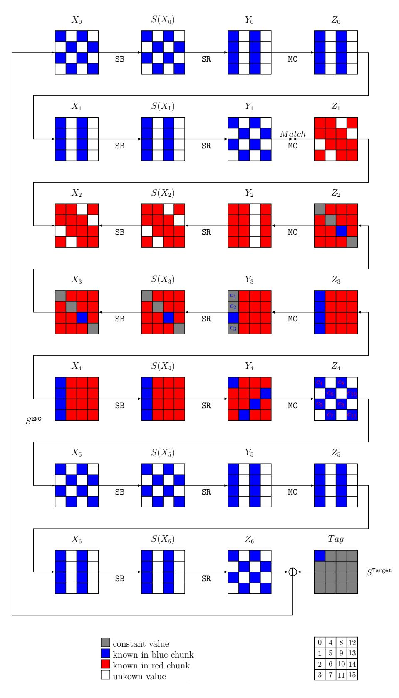

Figure 8: A quantum MITM Nostradamus attack on 7-round AES-MMO

{18}------------------------------------------------

#### 5.3 Improving the Attack on 7-round AES-MMO

In Subsection 5.2, we mount a quantum MITM Nostradamus attack on 7-round AES-MMO with time complexity  $2^{56}$  based on a multi-target MITM preimage attack with time complexity  $2^{112}$ . We should note that the time complexity of the best classical multi-target MITM preimage attack on 7-round AES-MMO searched by our model is  $2^{104}$ . For example, assume we have  $2^{16}$  targets instead of  $2^{8}$  in Figure 8, then we have

$$DoF^{\mathcal{B}} = 3$$
,  $DoF^{\mathcal{R}} = 4$ , and  $DoM = 4$ .

The time complexity of that attack is  $2^{128-8 \times \min(3,4,4)} = 2^{104}$ . However, due to  $DoF^{\mathcal{R}} - DoF^{\mathcal{B}} = 1 < DoF^{\mathcal{B}}$  and Theorem 3, this attack cannot be quadratically accelerated and its quantum time complexity is  $2^{60}$ , which is slower than the generic quantum Nostradamus attack.

Our quantum MITM attack includes two parts: the outer loop (Lemma 1) and the inner search (Lemma 2). The outer loop is quadratically accelerated by QAA directly, while the inner search could be quadratically accelerated if and only if

$$\max \left( \mathrm{DoF}^{\mathcal{B}} - \mathrm{DoF}^{\mathcal{R}}, \mathrm{DoF}^{\mathcal{R}} - \mathrm{DoF}^{\mathcal{B}} \right) \leq \min \left( \mathrm{DoF}^{\mathcal{B}}, \mathrm{DoF}^{\mathcal{R}}, \mathrm{DoM} \right).$$

Thus if we carefully choose the parameters of the inner search, the time complexity could be improved. Firstly, we convert the MITM preimage attack in Figure 8 to a partial preimage attack in Figure 9. We search for partial preimages of a 64-bit target (yellow cells in Figure 9). For randomly chosen  $c_1 
ldots c_{11} c_{11}$ , we could build  $T_B$  and  $T_R$  with  $2^8$  and  $2^{32}$  evaluations. The number of partial matched pairs is  $2^{32+8-32} = 2^8$ . For a partial matched pair, we compute  $Z_1$  with the full knowledge of  $X_4$  and check whether the blue cells in  $Y_1$  are compatible with  $Z_1$ . Once there is no contradiction between  $Y_1$  and  $Z_1$ , the partial matched pair leads to a partial preimage. The success probability of the above step is  $2^{-32}$  (the probability that four white cells in  $Z_1$  is compatible with blue and red cells). Thus in the classical setting, the time complexity of this partial preimage attack is  $\frac{2^{32}}{2^8} \times 2^{\max(32,8,8)} = 2^{56}$ . This MITM attack could be quadratically accelerated in the quantum setting, and its time complexity is  $2^{28}$ .

We use  $U_{\text{partial}}$  to denote the above partial preimage attack. We run QAA on  $U_{\text{partial}}$  to search for a full preimage of the leaves in a diamond structure. Assume the diamond structure has  $2^k$  leaves, the quantum algorithm will output a preimage with  $(\frac{\pi}{4} \cdot 2^{(64-k)/2} + 1)$  evaluations of  $U_{\text{partial}}$ . The total time complexity to find a preimage of  $2^k$  targets is  $2^{32-k/2+28} = 2^{60-k/2}$ . We choose k = 14, then the time complexity of the offline phase is  $2^{\sqrt[3]{14} \cdot (128+2\times14)/3} = 2^{53.3}$  and the time complexity of the online phase is  $2^{53}$ . The total complexity of the quantum MITM Nostradamus attack is  $2^{54.1}$ , and memory complexity is  $2^{14}$ .

#### 6 Conclusion and Future Work

In this paper, we propose the MITM Nostradamus attack based on the framework of herding attack and MITM preimage attack, which is the first dedicated Nostradamus attack utilizing the details of the compression function. Our framework can be used in both classical and quantum settings. To search for an optimal MITM Nostradamus attack, we study the MILP-based MITM automatic method and model the trade-off between the offline and online phases. As applications of our attack, we mount a classical MITM Nostradamus attack on 6-round AES-MMO and a quantum MITM Nostradamus attack on 7-round AES-MMO. In addition, our method and automatic tool are applicable to other AES-like hashings, e.g., Skinny-Hash [BJK+20] and Grøstl [GKM+09].

{19}------------------------------------------------

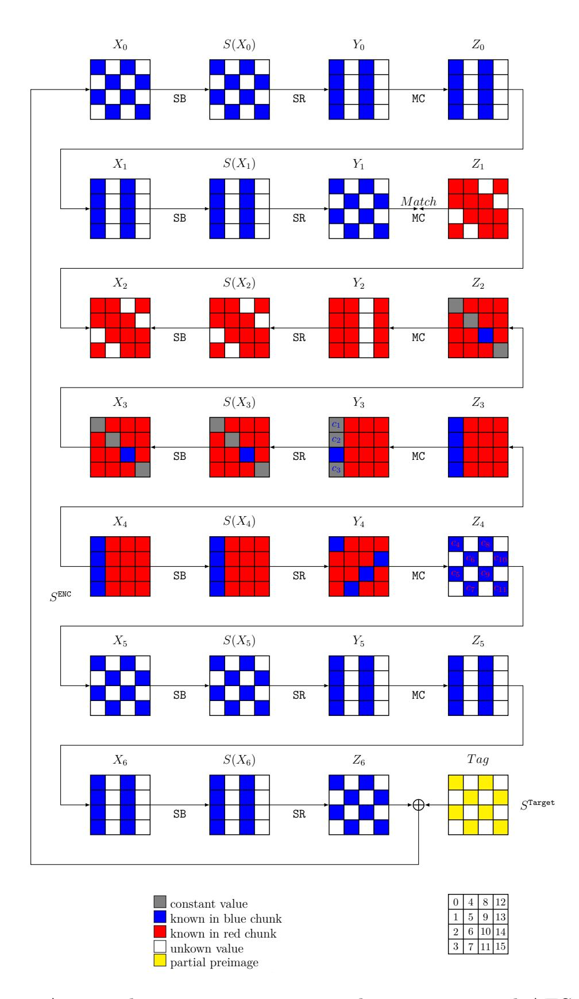

Figure 9: A partial target preimage attack on on 7-round AES-MMO

In this work, we only use a dedicated method in the online phase of the herding attack. As dedicated quantum and classical collision attacks on AES-like hashing have been proposed in recent years, it is interesting to study how to combine dedicated collision attacks with the herding attack, accelerate the offline phase or reduce the memory complexity. Furthermore, as Benedikt et al. [\[BFH22\]](#page-20-0) mentioned in their conclusion, several techniques that reduce the quantum memory may be applicable to the herding attack. If the quantum memory-less herding attack is realized, our framework can be adjusted to search for a quantum memory-less MITM Nostradamus attack.

**Acknowledgment.** We thank the reviewers and our shepherd Akinori Hosoyamada for their valuable comments and suggestions. This research is supported by the Natural Science Foundation of China (Grants No.62202460, 62032014, 62172410), the National Key Research and Development Program of China (Grants No.2018YFA0704704, 2022YFB2701900), and the Fundamental Research Funds for the Central Universities.

{20}------------------------------------------------

# **References**

- [BDG+21] Zhenzhen Bao, Xiaoyang Dong, Jian Guo, Zheng Li, Danping Shi, Siwei Sun, and Xiaoyun Wang. Automatic search of meet-in-the-middle preimage attacks on AES-like hashing. In Anne Canteaut and François-Xavier Standaert, editors, *EUROCRYPT 2021, Part I*, volume 12696 of *LNCS*, pages 771–804. Springer, Heidelberg, October 2021.
- [BFH22] Barbara Jiabao Benedikt, Marc Fischlin, and Moritz Huppert. Nostradamus goes quantum. In Shweta Agrawal and Dongdai Lin, editors, *ASI-ACRYPT 2022, Part III*, volume 13793 of *LNCS*, pages 583–613. Springer, Heidelberg, December 2022.
- [BGST22] Zhenzhen Bao, Jian Guo, Danping Shi, and Yi Tu. Superposition meet-inthe-middle attacks: Updates on fundamental security of AES-like hashing. In Yevgeniy Dodis and Thomas Shrimpton, editors, *CRYPTO 2022, Part I*, volume 13507 of *LNCS*, pages 64–93. Springer, Heidelberg, August 2022.
- [BHMT02] Gilles Brassard, Peter Hoyer, Michele Mosca, and Alain Tapp. Quantum amplitude amplification and estimation. *Contemporary Mathematics*, 305:53– 74, 2002.
- [BJK+20] Christof Beierle, Jeremy Jean, Stefan Kölbl, Gregor Leander, Amir Moradi, Thomas Peyrin, Yu Sasaki, Pascal Sasdrich, and Siang Meng Sim. SKINNY-AEAD and SKINNY-hash. *IACR Trans. Symm. Cryptol.*, 2020(S1):88–131, 2020.
- [BR+00] PSLM Barreto, Vincent Rijmen, et al. The whirlpool hashing function. In *First open NESSIE Workshop, Leuven, Belgium*, volume 13, page 14. Citeseer, 2000.
- [BSU12] Simon R. Blackburn, Douglas R. Stinson, and Jalaj Upadhyay. On the complexity of the herding attack and some related attacks on hash functions. *Des. Codes Cryptogr.*, 64(1-2):171–193, 2012.
- [Dam90] Ivan Damgård. A design principle for hash functions. In Gilles Brassard, editor, *CRYPTO'89*, volume 435 of *LNCS*, pages 416–427. Springer, Heidelberg, August 1990.
- [DGLP22] Xiaoyang Dong, Jian Guo, Shun Li, and Phuong Pham. Triangulating rebound attack on AES-like hashing. In Yevgeniy Dodis and Thomas Shrimpton, editors, *CRYPTO 2022, Part I*, volume 13507 of *LNCS*, pages 94–124. Springer, Heidelberg, August 2022.
- [DHS+21] Xiaoyang Dong, Jialiang Hua, Siwei Sun, Zheng Li, Xiaoyun Wang, and Lei Hu. Meet-in-the-middle attacks revisited: Key-recovery, collision, and preimage attacks. In Tal Malkin and Chris Peikert, editors, *CRYPTO 2021, Part III*, volume 12827 of *LNCS*, pages 278–308, Virtual Event, August 2021. Springer, Heidelberg.
- [DSS+20] Xiaoyang Dong, Siwei Sun, Danping Shi, Fei Gao, Xiaoyun Wang, and Lei Hu. Quantum collision attacks on AES-like hashing with low quantum random access memories. In Shiho Moriai and Huaxiong Wang, editors, *ASI-ACRYPT 2020, Part II*, volume 12492 of *LNCS*, pages 727–757. Springer, Heidelberg, December 2020.

{21}------------------------------------------------

- [DZS+21] Xiaoyang Dong, Zhiyu Zhang, Siwei Sun, Congming Wei, Xiaoyun Wang, and Lei Hu. Automatic classical and quantum rebound attacks on AES-like hashing by exploiting related-key differentials. In Mehdi Tibouchi and Huaxiong Wang, editors, *ASIACRYPT 2021, Part I*, volume 13090 of *LNCS*, pages 241–271. Springer, Heidelberg, December 2021.
- [GKM+09] Praveen Gauravaram, Lars R Knudsen, Krystian Matusiewicz, Florian Mendel, Christian Rechberger, Martin Schläffer, and Søren S Thomsen. Grøstl-a sha-3 candidate. In *Dagstuhl Seminar Proceedings*. Schloss Dagstuhl-Leibniz-Zentrum für Informatik, 2009.
- [GLST22] Jian Guo, Guozhen Liu, Ling Song, and Yi Tu. Exploring SAT for cryptanalysis: (quantum) collision attacks against 6-round SHA-3. Cryptology ePrint Archive, Report 2022/184, 2022. <https://eprint.iacr.org/2022/184>.
- [HDS+22] Jialiang Hua, Xiaoyang Dong, Siwei Sun, Zhiyu Zhang, Lei Hu, and Xiaoyun Wang. Improved MITM cryptanalysis on Streebog. *IACR Trans. Symm. Cryptol.*, 2022(2):63–91, 2022.
- [HS20] Akinori Hosoyamada and Yu Sasaki. Finding hash collisions with quantum computers by using differential trails with smaller probability than birthday bound. In Anne Canteaut and Yuval Ishai, editors, *EUROCRYPT 2020, Part II*, volume 12106 of *LNCS*, pages 249–279. Springer, Heidelberg, May 2020.
- [HS21] Akinori Hosoyamada and Yu Sasaki. Quantum collision attacks on reduced SHA-256 and SHA-512. In Tal Malkin and Chris Peikert, editors, *CRYPTO 2021, Part I*, volume 12825 of *LNCS*, pages 616–646, Virtual Event, August 2021. Springer, Heidelberg.
- [KK06] John Kelsey and Tadayoshi Kohno. Herding hash functions and the Nostradamus attack. In Serge Vaudenay, editor, *EUROCRYPT 2006*, volume 4004 of *LNCS*, pages 183–200. Springer, Heidelberg, May / June 2006.
- [Mer90] Ralph C. Merkle. One way hash functions and DES. In Gilles Brassard, editor, *CRYPTO'89*, volume 435 of *LNCS*, pages 428–446. Springer, Heidelberg, August 1990.
- [NC02] Michael A Nielsen and Isaac Chuang. Quantum computation and quantum information, 2002.
- [PGV94] Bart Preneel, René Govaerts, and Joos Vandewalle. Hash functions based on block ciphers: A synthetic approach. In Douglas R. Stinson, editor, *CRYPTO'93*, volume 773 of *LNCS*, pages 368–378. Springer, Heidelberg, August 1994.
- [Sas11] Yu Sasaki. Meet-in-the-middle preimage attacks on AES hashing modes and an application to Whirlpool. In Antoine Joux, editor, *FSE 2011*, volume 6733 of *LNCS*, pages 378–396. Springer, Heidelberg, February 2011.
- [SHW+14] Siwei Sun, Lei Hu, Peng Wang, Kexin Qiao, Xiaoshuang Ma, and Ling Song. Automatic security evaluation and (related-key) differential characteristic search: Application to SIMON, PRESENT, LBlock, DES(L) and other bit-oriented block ciphers. In Palash Sarkar and Tetsu Iwata, editors, *ASIACRYPT 2014, Part I*, volume 8873 of *LNCS*, pages 158–178. Springer, Heidelberg, December 2014.

{22}------------------------------------------------

- [SM06] Stanislav Safaric and Kresimir Malaric. Zigbee wireless standard. In *Proceedings ELMAR 2006*, pages 259–262. IEEE, 2006.
- [SS22] André Schrottenloher and Marc Stevens. Simplified MITM modeling for permutations: New (quantum) attacks. In Yevgeniy Dodis and Thomas Shrimpton, editors, *CRYPTO 2022, Part III*, volume 13509 of *LNCS*, pages 717–747. Springer, Heidelberg, August 2022.

{23}------------------------------------------------

#### A Details of the MILP model

#### A.1 Inequalities for Propagation and Match Rules

Inequalities for MC-RULE Inequalities 12, 13, 14 are inequalities for MC-RULE, which are the same as the inequalities in [BGST22]. Several auxiliary variables are introduced in these inequalities.  $(x_i^I, x_i^O)$  and  $(y_i^I, y_i^O)$  encode the attribute of the *i*-th input and output cell of the MixColumn operation.  $\omega_i^I = 1$  if and only if the *i*-th input cell is white and  $\vec{\omega} = 1$  if and only if there is at least one cell in the input column.  $\vec{x} = 1$  if and only if any cell in the input column is not red or white.  $\vec{y} = 1$  if and only if any cell in the input column is not blue or white.  $c_{\vec{x}}$  and  $c_{\vec{y}}$  are the number of degrees of freedom of the blue and red cells consumed in this MixColumn operation.

$$\begin{cases}
\vec{\omega} = \max_{i=0}^{N_{\text{row}} - 1} \left(\omega_{i}^{I}\right) \\
N_{\text{row}} - 1 \\
\sum_{i=0}^{N_{\text{row}} - 1} x_{i}^{I} - N_{\text{row}} \cdot \vec{x} \ge 0, \\
\sum_{i=0}^{N_{\text{row}} - 1} x_{i}^{I} - \vec{x} \le N_{\text{row}} - 1. \\
\sum_{i=0}^{N_{\text{row}} - 1} y_{i}^{I} - N_{\text{row}} \cdot \vec{y} \ge 0, \\
\sum_{i=0}^{N_{\text{row}} - 1} y_{i}^{I} - \vec{y} \le N_{\text{row}} - 1.
\end{cases} (12)$$

$$\begin{cases}
\sum_{i=0}^{N_{\text{row}}-1} x_{i}^{O} + N_{\text{row}} \cdot \vec{\omega} \leq N_{\text{row}} \\
\sum_{i=0}^{N_{\text{row}}-1} \left( x_{i}^{I} + x_{i}^{O} \right) - 2 \cdot N_{\text{row}} \cdot \vec{x} \geq 0, \\
\sum_{i=0}^{N_{\text{row}}-1} \left( x_{i}^{I} + x_{i}^{O} \right) - \text{Br}_{n} \cdot \vec{x} \leq (2 \cdot N_{\text{row}} - \text{Br}_{n}) \\
\sum_{i=0}^{N_{\text{row}}-1} y_{i}^{O} + N_{\text{row}} \cdot \vec{\omega} \leq N_{\text{row}} \\
\sum_{i=0}^{N_{\text{row}}-1} \left( y_{i}^{I} + y_{i}^{O} \right) - 2 \cdot N_{\text{row}} \cdot \vec{y} \geq 0 \\
\sum_{i=0}^{N_{\text{row}}-1} \left( y_{i}^{I} + y_{i}^{O} \right) - \text{Br}_{n} \cdot \vec{y} \leq (2 \cdot N_{\text{row}} - \text{Br}_{n})
\end{cases}$$
(13)

$$\begin{cases}
\sum_{i=0}^{N_{\text{row}}-1} y_i^O - N_{\text{row}} \cdot \vec{y} - c_{\vec{x}} = 0 \\
\sum_{i=0}^{N_{\text{row}}-1} x_i^O - N_{\text{row}} \cdot \vec{x} - c_{\vec{y}} = 0
\end{cases}$$
(14)

{24}------------------------------------------------

Inequalities for XOR-RULE Our XOR-RULE is the same as [BGST22]. Though they did not give the inequalities in their paper, we use Sun et al.'s method [SHW+14] to generate inequalities of XOR-RULE.  $(x_1, y_1)$  and  $(x_2, y_2)$  encode the attribute of the two input cells of the XOR operation.  $(x_3, y_3)$  encode the attribute of the output cell.  $c_x$  and  $c_y$  are the number of degrees of freedom of the blue and red cells consumed in this XOR operation. All the variables above are binary variables.

$$\begin{cases}
-y_1 - y_2 + 2 \cdot y_3 - 3 \cdot c_x - c_y + 1 \ge 0 \\
-x_1 - x_2 + 2 \cdot x_3 - c_x - 3 \cdot c_y + 1 \ge 0 \\
y_1 + y_2 - 2 \cdot y_3 + 2 \cdot c_x \ge 0 \\
x_1 + x_2 - 2 \cdot x_3 + 2 \cdot c_y \ge 0 \\
2 \cdot x_1 + 2 \cdot y_1 - x_3 - y_3 \ge 0
\end{cases}$$
(15)

Constraints for MATCH-RULE We introduce two auxiliary variables  $k_i^I$  and  $k_i^O$  such that

$$k_i^I = \begin{cases} 1, & \text{if } (x_i^I, y_i^I) \neq (0, 0), \\ 0, & \text{if } (x_i^I, y_i^I) = (0, 0). \end{cases} \quad k_i^O = \begin{cases} 1, & \text{if } (x_i^O, y_i^O) \neq (0, 0), \\ 0, & \text{if } (x_i^O, y_i^O) = (0, 0). \end{cases}$$
(16)

Thus  $k_i = 1$  if and only if  $k_i$  is known. Then the constraints on the degree of match is

$$m_i = max(0, \sum_{i=0}^{N_{\text{row}}-1} (k_i^I + k_i^O) - N_{\text{row}}).$$
 (17)

# A.2 MILP Models for MITM Nostradamus Attack based on Partial Preimage Attack

In Subsection 5.3, we show that the MITM Nostradamus attack based on partial preimage attack can achieve lower complexities than the multi-target attack. In this subsection, we give the MILP models for the MITM Nostradamus attack based on partial preimage attack.

The rules for propagation and match is the same as the rules in Section 4, we only modify the objective function in this subsection. Assume the number of targets used in the online phase is  $2^k$ , and the initial degrees of freedom in  $\mathcal{S}^{\mathsf{Target}}$  are bounded by  $k_1$ :

$$w \cdot \sum_{i} \alpha_{i}^{\mathtt{Target}} + w \cdot \sum_{i} \beta_{i}^{\mathtt{Target}} \leq k_{1}.$$

Let  $k_2 = k - k_1$ , and t be the length of the partial preimage. If we could find a partial preimage in time T, then we can find a preimage of a leaf in the diamond structure in time  $2^{n-t-k_2} \times T$  in the classical setting or  $2^{\frac{n-t-k_2}{2}} \times T$  in the quantum setting.

We want to minimize the time complexity of the MITM Nostradamus attack, so we introduce three variables  $O_{\tt mitm}$ ,  $O_{\tt partial}$  and  $O_{\tt total}$ . In classical setting, the variables satisfy:

$$\begin{cases} O_{\mathtt{mitm}} & \leq & \mathrm{DoF}^{\mathcal{B}}, \\ O_{\mathtt{mitm}} & \leq & \mathrm{DoF}^{\mathcal{R}}, \\ O_{\mathtt{mitm}} & \leq & \mathrm{DoM}, \end{cases} \quad O_{\mathtt{partial}} = t - w \cdot O_{\mathtt{mitm}}, \quad \begin{cases} O_{\mathtt{total}} & \geq & \frac{n+k}{2}, \\ O_{\mathtt{total}} & \geq & n-t-k_2 + O_{\mathtt{partial}}. \end{cases}$$

In quantum setting, we set

$$\begin{cases} O_{\mathtt{mitm}} & \leq \frac{\mathrm{DoF}^{\mathcal{B}}}{2}, \\ O_{\mathtt{mitm}} & \leq \frac{\mathrm{DoF}^{\mathcal{B}}}{2}, \\ O_{\mathtt{mitm}} & \leq \frac{\mathrm{DoF}^{\mathcal{B}}}{2}, \\ O_{\mathtt{mitm}} & \leq \frac{\mathrm{max}\left(\mathrm{DoF}^{\mathcal{B}}-\mathrm{DoF}^{\mathcal{R}},\mathrm{DoF}^{\mathcal{R}}-\mathrm{DoF}^{\mathcal{B}}\right)}{2}, \\ O_{\mathtt{mitm}} & \leq \frac{\mathrm{DoM}}{2}, \end{cases}$$
  $O_{\mathtt{partial}} = t/2 - w \cdot O_{\mathtt{mitm}},$ 

{25}------------------------------------------------

$$\begin{cases} O_{\text{total}} & \geq \frac{n+2 \cdot k}{3}, \\ O_{\text{total}} & \geq \frac{n-t-k_2}{2} + O_{\text{partial}}, \end{cases}$$

The total time complexity of the MITM Nostradamus attack is  $2^{O_{\text{total}}}$ , thus our objective function is to minimize the value of  $O_{\text{total}}$ .

## **B** Application to Whirlpool

WHIRLPOOL is an AES-like hash function with 512-bit output, which was designed by Barreto and Rijmen [BR $^+$ 00]. The state of WHIRLPOOL consists 64 8-bit cells, which can be seen as an  $8 \times 8$  matrix. The round function of WHIRLPOOL is shown in Figure 10.

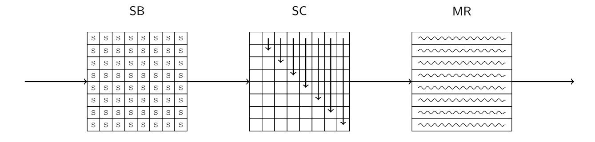

Figure 10: The round function of Whirlpool

We apply our method to Whirlpool in this section. With our tool, we mount a classical Nostradamus attack on 4-round Whirlpool and a quantum Nostradamus attack on 6-round Whirlpool.

#### **B.1 MITM Nostradamus Attack on 4-round Whirlpool**

MITM Nostradamus attack on 4-round Whirlpool in classic setting. The configuration of the MITM attack on 4-round Whirlpool is shown in Figure 11. The initial state is  $X_2$  and the matching point is between  $Y_0$  and  $Z_0$ .

- 1. We derive 24 constraints on red neutral bytes which is a system of equations created from the MR operation and 24 constants  $C_1, \dots, C_{24}$ . Thus, the degree of freedom in the blue neutral bytes is 16 and the degree of freedom in the red neutral bytes is 24. By taking the degree of freedom in the target state, the degree of freedom of blue cells and red cells in the starting state ( $\mathcal{S}^{\text{ENC}}, \mathcal{S}^{\text{Target}}$ ) are 24 and 24.
- 2. We fix the value of  $C_1 
  ldots C_{24}$  in the following steps. First, we randomly choose the value of  $C_1 
  ldots C_{24}$ , then solve the equations. The solutions of  $(\mathcal{S}^{\text{ENC}}[\mathcal{B}], \mathcal{S}^{\text{Target}}[\mathcal{B}])$  and  $(\mathcal{S}^{\text{ENC}}[\mathcal{R}], \mathcal{S}^{\text{Target}}[\mathcal{R}])$  are stored in two tables  $T_{\mathcal{B}}$  and  $T_{\mathcal{R}}$ . The constraints on the initial neutral bytes are linear constraints, so we can get  $T_{\mathcal{B}}$  and  $T_{\mathcal{R}}$  efficiently.
- 3. For each value  $v_{\mathcal{B}}$  in  $T_{\mathcal{B}}$ , we compute both forward and backward to the matching point  $Y_3$  and  $Z_3$ . Utilizing the MR operation, we could get several equations like Equation 6, and two variables  $C_{red}$  and  $C_{blue}$ . We compute the values of  $C_{red}$  of each column and store  $v_{\mathcal{B}}$  in  $L[C_{blue}]$ .
- 4. For each value  $v_{\mathcal{R}}$  in  $T_{\mathcal{R}}$ , we compute both forward and backward with the knowledge of  $C_1 \dots C_{24}$  to the matching point  $Y_0$  and  $Z_0$ . For the red cells in  $Y_0$  and  $Z_0$ , we compute the values of  $C_{red}$  of each column. For each value in  $L[C_{red}]$ , we can combine every  $v_{\mathcal{B}}$  in  $L[C_{red}]$  with  $v_{\mathcal{R}}$ , then compute forward and backward to the matching point, and test the full match in the 512-bit state. If there is not a full match, we go back to step 2 and choose new  $C_1 \dots C_{24}$ .

{26}------------------------------------------------

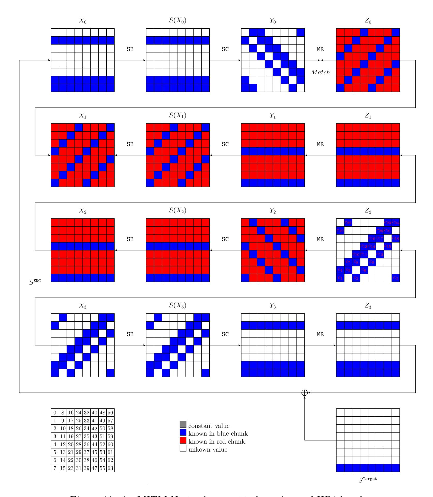

Figure 11: An MITM Nostradamus attack on 4-round Whirlpool

**Complexity.** The size of  $T_{\mathcal{B}}$  is  $2^{(16+8)\times 8} = 2^{192}$  and the size of  $T_{\mathcal{R}}$  is  $2^{(48-24)\times 8} = 2^{192}$ . In step 4, it is expected to find  $2^{(24+24-24)\times 8} = 2^{192}$  matches on 24 bytes (192 bits). To find a full match on 512-bit state, it is expected to repeat step 2 to 4 about  $2^{512-192-192} = 2^{128}$  times. Thus, the time complexity of the MITM attack is  $2^{128} \times 2^{192} = 2^{320}$ . The memory complexity is  $2^{192}$ . The number of targets used in the MITM procedure is  $2^{64}$ , so the time complexity of the offline phase is  $\sqrt{64} \cdot 2^{(128+64)/2} = 2^{102}$ , thus the total time complexity is  $2^{320}$ .

{27}------------------------------------------------

#### **B.2 Quantum MITM Nostradamus Attack on 6-round Whirlpool**

MITM Nostradamus attack on 6-round Whirlpool in quantum setting. We follow the idea of Subsection 5.3 to mount a quantum MITM Nostradamus attack on 6-round Whirlpool based on a partial target preimage attack. The configuration of the MITM attack on 6-round Whirlpool is shown in Figure 12. This attack searches a preimage of a 48-bit preimage. The initial state is  $X_3$  and the matching point is between  $Y_5$  and  $Z_5$ . We derive 8 constraints on blue neutral bytes and 16 constraints on red neutral bytes, so the degree of freedom in blue neutral bytes is 2 and the degree of freedom in red neutral bytes is 4. The degree of match is 2.

The sizes of  $T_{\mathcal{B}}$  and  $T_{\mathcal{R}}$  are  $2^{16}$  and  $2^{32}$ . The matching ability is  $d_{\mathcal{M}} = 16$ , so the number of partial matched pairs is  $2^{16+32-16} = 2^{32}$ . For a partial matched pair, it leads to a partial preimage with probability  $2^{-32}$ . Thus, the time complexity of partical preimage attack is  $\frac{2^{32}}{2^{32}} \times 2^{\max(32,16,16)} = 2^{32}$ . Because of  $|d_{\mathcal{B}} - d_{\mathcal{R}}| = 16$ , the partical preimage attack could be quadratically accelerated in quantum setting. Then we use QAA to search for a full preimage.

**Complexity.** We choose k = 64. The complexity of the quantum multi-target preimage attack is  $2^{(512-64-48)/2} \times 2^{32/2} = 2^{216}$  and the time complexity of the offline phase is  $2^{\sqrt[3]{64} \cdot 2^{(128+2\times64)/3}} = 2^{215.3}$ . The total complexity of the quantum MITM Nostradamus attack is  $2^{216.7}$ , and the memory complexity is  $2^{64}$ .

{28}------------------------------------------------

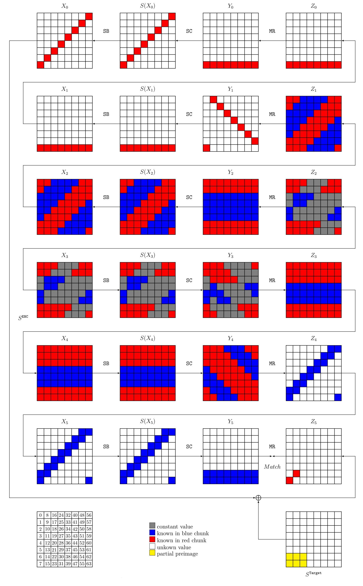

Figure 12: A partial target preimage attack on 6-round Whirlpool