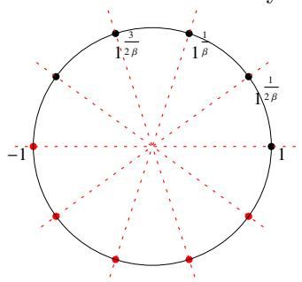

# Reed-Solomon codes over the circle group

Ulrich Hab¨ock and Daniel Lubarov and Jacqueline Nabaglo

Polygon Labs / Polygon Zero {uhaboeck,daniel.l,jnabaglo}@polygon.technology

June 2, 2023

#### **Abstract**

In this note we discuss Reed-Solomon codes with domain of definition within the unit circle of the complex extension C(*F*) of a Mersenne prime field *F*. Within this unit circle the interpolants of "real", i.e. *F*-valued, functions are again almost real, meaning that their values can be rectified to a real representation at almost no extra cost. Second, using standard techniques for the FFT of real-valued functions, encoding can be sped up significantly. Due to the particularly efficient arithmetic of Mersenne fields, we expect these "almost native" Reed-Solomon codes to perform as native ones based on prime fields with high two-adicity, but less processor-friendly arithmetic.

## **Contents**

| 1 | Introduction                                         | 1 |
|---|------------------------------------------------------|---|
| 2 | The complex extension and real FFTs                  | 2 |
| 3 | Interpolants over S1                              | 5 |
| 4 | Almost native Reed-Solomon codes for Mersenne fields | 6 |

## **1 Introduction**

The performance of STARKs [\[BSBHR18b\]](#page-7-0), i.e. scalable and transparent arguments of knowledge based on Reed-Solomon codes and the FRI [\[BSBHR18a,](#page-7-1) [BSCI](#page-7-2)+20] proof of proximity, is largely determined by the finite field in which the witness trace is represented. While StarkWare's implementation of their Cairo zeroknowledge virtual machine [\[GPR21\]](#page-7-3) still uses cryptographically large prime fields, Plonky2 [\[Tea\]](#page-7-4) leverages the 64 bit small prime field with modulus

$$p = 2^{64} - 2^{32} + 1,$$

commonly referred to as the *Goldilocks* field. While the size of the modulus enables efficient implementations for standard computer architectures, its multiplicative group is smooth enough to support efficient Fast Fourier transform (FFT) Reed-Solomon encoding, with two-adic subgroups up to size 232. The Goldilocks field has subsequently been adopted by many other projects, such as Polygon Hermez [\[Her\]](#page-7-5) and Polygon Miden [\[Mid\]](#page-7-6).

However, from the point of view of both efficient field implementation as well as arithmetic circuits, even smaller fields are desirable. At the time of writing, Risc Zero [BG] is the only project known to us which goes in this direction, using the 31 bit small Baby Bear prime

$$p = 2^{31} - 2^{27} + 1$$

as the native modulus for the witnesses. As with Goldilocks, the multiplicative group of Baby Bear is sufficiently smooth for most practical applications,  $p-1=2^{27}\cdot 3\cdot 5$ . There exist primes of similar form as Baby Bear, for example  $p=2^{31}+2^{30}+1$ , which have comparable smooth multiplicative groups and efficient field arithmetic.

The most efficient fields for arithmetic seem to be Mersenne fields, defined by primes of the form  $p = 2^e - 1$ . In particular, the prime

$$p = 2^{31} - 1$$

enables very efficient arithmetic on 32 bit architectures. Since  $2^{32} = 2 \pmod{p}$ , a widened product encoded as  $2^{32} \cdot x_{\text{hi}} + x_{\text{lo}}$  is trivially reduced to a much smaller quantity,  $2 \cdot x_{\text{hi}} + x_{\text{lo}}$ . However, as  $p - 1 = 2 \cdot 3^2 \cdot 7 \cdot 11 \cdot 31 \cdot 151 \cdot 331$ , the multiplicative group lacks two-adic subgroups, which are useful for efficient Cooley-Tukey Fast Fourier Transforms (FFTs).

In this write-up we describe almost native Reed-Solomon codes for Mersenne fields, which leverage FFT encoding over the circle group  $S_1$  of the complex extension. Moving to the complex does not seem beneficial at first glance. First of all, extension field arithmetic is significantly more expensive than that of the base field, and secondly, code words become complex-valued, effectively halving the rate of our code. However, it turns out that for real, i.e. basefield-valued functions defined on a subgroup of  $S_1$ , the interpolant over the rest of the circle group is again almost real, meaning that its values are within a real linear subspace which (essentially) depends only on the coset of the subgroup. Furthermore, using standard techniques for improving the FFT of real-valued functions, the cost of interpolation can be more than halved. Based on these facts we obtain Reed-Solomon codes which are "almost native" in the following sense:

- for real functions, the encoding costs are comparable to that of Cooley-Tukey-based encoding over an equally sized field with high two-adicty, and
- the resulting codewords can be compressed to a wholly real-valued representation, causing essentially the same commitment costs as in the native case.

Given the particularly efficient arithmetics of our target prime  $p = 2^{31} - 1$  (see Table 1) we expect that almost native Reed-Solomon codes are equally performing as native solutions over fields like Baby Bear, while enjoying the benefits of faster field arithmetic at all other places, such as trace computation and arithmetic hashing.

The structure of the document is as follows. Section 2 is of preliminary character. It summarizes elementary properties on the complex extension and the unit circle group, and recaps facts on the FFT for real-valued functions. Section 3 is the core chapter and describes interpolants of real functions within the unit circle, yielding the aforementioned native representation of codewords. In Section 4, we apply our findings and introduce almost native Reed-Solomon codes. An implementation of our approach will be provided in a future version of the document.

## 2 The complex extension and real FFTs

Although our main target are Mersenne fields, the results of this section hold for every prime field  $F = F_p$  with modulus  $p = 3 \mod 4$ . That condition on p is equivalent to demand that  $\frac{p-1}{2}$  is odd, or -1 is not a

quadratic residue. In this case the polynomial  $X^2 + 1$  is irreducible over F and we can build the *complex* extension field  $\mathbb{C}(F) = F[X]/(X^2 + 1)$ . The extension is obtained by adjoining the formal root  $i := \sqrt{-1}$ ,

$$\mathbb{C}(F) = \{x + i \cdot y : x, y \in F\},\$$

and its field operations are imposed by the algebraic constraint  $i^2 = -1$  on that root. The *unit circle* over F is the algebraic set  $S_1 = \{(x, y) \in F^2 : x^2 + y^2 = 1\}$ , or in complex representation

$$S_1 = \{ z \in \mathbb{C}(F)^* : z \cdot \bar{z} = 1 \},$$

where  $\bar{z}$  denotes the conjugate  $\bar{z} = x - i \cdot y$  of  $z = x + i \cdot y$ . Since conjugation is a field automorphism,  $S_1$  is closed under complex multiplication, forming a subgroup of the complex multiplicative group  $\mathbb{C}(F)^*$ , the *(unit) circle group.* 

**Lemma 1** (Circle group). Let  $F = F_p$  be a prime field with  $p = 3 \mod 4$ . Then the circle group  $S_1$  over F equals the group of (p+1)-th roots of unity in  $\mathbb{C}(F)^*$ , and has order p+1.

*Proof.* 1The Lemma is a simple consequence of the fact that conjugation equals the Frobenius isomorphism,  $\overline{z} = z^p$ . With this  $x^2 + y^2 = z \cdot \overline{z} = z^{p+1}$ , and together with  $(p+1)|(p^2-1)$  we conclude that the circle group is equal to the order p+1 sugroup of the (p+1)-th roots of unity.

The geometry of the complex plane over F is similar to the classical case known from calculus. Although not needed in the sequel, we quickly cite the analogue of the polar form of complex numbers.

**Proposition 1.** Let  $F = F_p$  be a prime field with  $p = 3 \mod 4$ . The multiplicative subgroup of all complex squares  $Q_{\mathbb{C}} = \{z^2 : z \in \mathbb{C}(F)^*\}$  decomposes into

$$Q_{\mathbb{C}} = Q_F \otimes S_1$$
,

where  $Q_F$  are the  $\frac{p-1}{2}$  many quadratic residues in the base field F, and  $S_1$  is the unit circle group over F of order p+1.

Remark 1. In terms of group orders, we have  $|Q_{\mathbb{C}(F)}| = \frac{p^2-1}{2} = \frac{(p-1)\cdot(p+1)}{2}$ . The real quadratic residues  $Q_F$  correspond to the odd  $\frac{p-1}{2}$ -term, and the unit circle group  $S_1$  to the coprime factor (p+1).

Remark 2. The entire multiplicative group  $\mathbb{C}(F)^*$  decomposes into

$$\mathbb{C}(F)^* = Q_F \otimes S_{+1},$$

where  $S_{\pm 1} = \{z \in \mathbb{C}(F)^* : z \cdot \bar{z} \in \{\pm 1\}\}$  is the subgroup formed by the unit circle and the *anti-unit circle*  $S_{-1} = \{z \in \mathbb{C}(F)^* : z \cdot \bar{z} = -1\}$ . In terms of group orders  $S_{\pm 1}$  corresponds to the  $2 \cdot (p+1)$  term in  $|\mathbb{C}(F)^*| = 2 \cdot (p+1) \cdot \frac{p-1}{2}$ .

### Fourier transform and real FFTs

Suppose that H is a multiplicative subgroup of an (arbitrary) finite field K with order |H| = N, and let g be a generator of H. The (discrete) Fourier transform  $\hat{f}$  of a function  $f: H \to K$  is the function on H defined by

$$\hat{f}(g^k) := \frac{1}{N} \cdot \sum_{j=0}^{N-1} f(g^j) \cdot g^{-k \cdot j}, \tag{1}$$

&lt;sup>1We would like to thank William Borgeaut for pointing out this simple proof, which is much elegant than our argument in previous version of the document.

where k = 0, ..., N - 1. Its values are the coefficients of the *interpolant* of f, i.e. the unique polynomial p(X) of degree less than N which interpolates f over H,

$$f(g^{i}) = \sum_{k=0}^{N-1} \hat{f}(g^{k}) \cdot g^{k \cdot i}, \tag{2}$$

for all  $i=0,\ldots,N-1$ . The right-hand side of (2) is the *inverse* Fourier transform of  $\hat{f}:H\to K$ .

The standard algorithm for computing the Fourier transform is the Cooley-Tukey algorithm. The algorithm leverages the group structure of H and computes (1) (and likewise the inverse (2)) using overall

$$|H| \cdot \log |H| \cdot \left(\frac{1}{2} \cdot \mathsf{M} + \mathsf{A}\right),$$
 (3)

where M and A denote multiplications and additions/substractions in K. (For a detailed description see any standard textbook such as [vzGG13] or [CLRS09].)

In the case of  $K = \mathbb{C}(F)$ , the complex extension of a finite field F with prime modulus  $p = 3 \mod 4$ , one may make use of the simple form of the roots of unity up to order 8, which are

$$c \cdot (1+i)$$
,  $i$ ,  $c \cdot (-1+i)$ ,  $-1$ ,  $c \cdot (-1-i)$ ,  $-i$ ,  $c \cdot (1-i)$ ,

and 1, where c is a real quadratic root of either  $+\frac{1}{2}$  or  $-\frac{1}{2}$ , depending on which of the two is a quadratic residue modulo p. Multiplication with these roots involve fewer real multiplications, if any at all. This yields more efficient higher radix variants of the FFT such as radix-4 and radix-8 [Ber68], or even better the *split-radix* variant [Yav68, DH84, SHB86], a mixture of radix 2 and radix 4. The split-radix algorithm costs slightly less than radix-8, consuming at most

$$|H| \cdot \log |H| \cdot (1 \cdot \mathsf{M}_F + 3 \cdot \mathsf{A}_F)$$

in the 3/3-regime, where one complex multiplication counts 3 real multiplications  $M_F$  and 3 real additions  $A_F$  (c.f. [SJHB87]). Compared to the Cooley-Tukey radix-2 FFT this is 33% less multiplications and 20% less additions. Furthermore, all these different radix FFTs can be sped up for real-valued functions  $f: H \to F$  by leveraging Hermitian symmetry of the Fourier transform, i.e.

$$\hat{f}(\bar{\omega}) = \overline{\hat{f}(\omega)},$$

for every  $\omega \in H$ . That symmetry may used to halve the number of computations in each step of the algorithms, and the same can be done for the inverse transforms of Hermitian symmetric functions. Although described for the classical case of the complex extension of the reals  $\mathbb{R}$ , the algorithms and their cost analysis carry over verbatim to finite fields. We summarize the discussion by the following Proposition.

**Theorem 3** ([SJHB87]). Let  $K = \mathbb{C}(F)$  be the complex extension of a finite field F with prime modulus  $p = 3 \mod 4$ , and H be a two-adic multiplicative subgroup of K. The Fourier transform of a real-valued function  $f: H \to F$ , as well as the inverse transform of a conjugate Hermitian function  $\hat{f}: H \to K$  can be computed in less than

$$|H| \cdot \log |H| \cdot \left(\frac{1}{2} \cdot \mathsf{M} + \frac{3}{2} \cdot \mathsf{A}\right),$$
 (4)

where M and A denote field multiplications and additions over the base field F.

Remark 4. In our target Mersenne field with modulus  $p=2^{31}-1$ , the 8-th primitive root of unity is  $\frac{1}{\sqrt{2}} \cdot (1+i) = 2^{15} \cdot (1+i)$ . Thus multiplications by 8-th roots of unity involve merely shifts, additions and subtractions. For this reason one obtains similar operation counts by using the packing trick and a radix-8 transform: One splits the function into functions of half the size (corresponding to the values over the two cosets of an index 2 subgroup), packs them into a single complex one and applies a radix-8 algorithm. From the result one extracts the Fourier transforms of the two half-sized functions, which are then combined in the Cooley-Tukey sense to the requested one.

### 3 Interpolants over $S_1$

The following proposition is the key for our real representation of Reed Solomon code words over the unit circle group. Although our main target are Mersenne prime fields, our observations solely assume that  $F = F_p$  is a prime field with  $p = 3 \mod 4$ .

**Proposition 2.** Let  $F = F_p$  be a prime field with  $p = 3 \mod 4$ , and H be a subgroup of  $S_1$  the unit circle group in the complex extension  $\mathbb{C}(F)$ , having even order  $|H| \geq 2$ . Then for every F-valued function f over H, the values of its interpolant  $p(X) = c_0 + \sum_{k=1}^{|H|-1} c_k \cdot X^k$  over a coset  $\tau \cdot H$ ,  $\tau \in S_1$ , are in a real linear subspace of  $\mathbb{C}(F)$  determined by  $c_0$  and  $\tau$ , i.e.

$$p(x) - c_0 \in \phi(\tau) \cdot F,\tag{5}$$

for all  $x \in \tau \cdot H$ , where

$$\phi(\tau) = \tau^{\frac{|H|}{2}}.\tag{6}$$

Furthermore, the mapping  $\phi$  defines an injective homomorphism  $\phi: S_1/H \to S_1/\{\pm 1\}$ , the image of which is equal to the "projective" cyclic subgroup  $C_{2\cdot\beta}/\{\pm 1\}$ , with  $\beta = |S_1|/|H|$ .

Remark 5. For subgroups H of odd order a similar result holds, but one needs to do a more careful proof since  $\sqrt{\tau}$  might be in the anti-unit circle  $S_{-1}$ , and thus conjugate-equals-inverse relation breaks,  $\sqrt{\tau} \cdot \sqrt{\tau} = -1$ . As we will not make use of this special case, we omit the details.

*Proof.* As f is real over H, the coefficients of its interpolant  $p(X) = \sum_{k=0}^{|H|-1} c_k \cdot X^k$  are Hermitian symmetric with respect to conjugation, i.e.  $c_0 = \bar{c}_0$ , and  $c_{|H|-k} = \bar{c}_k$  for  $k = 1, \ldots, |H| - 1$ . Let us now consider the values of  $p(X) - c_0$  over  $\tau \cdot H$ , where  $\tau \in S_1$ :

$$p(\tau \cdot X) - c_0 = \sum_{k=1}^{|H|-1} c_k \cdot \tau^k \cdot X^k = \sum_k d_k \cdot X^k,$$

with

$$d_k = \begin{cases} c_k \cdot \tau^k & \text{for } 1 \le k \le |H| - 1, \\ 0 & \text{otherwise.} \end{cases}$$

Scaling the function by  $\tau^{-\frac{|H|}{2}}$  leads to coefficients  $d_k' := \tau^{-\frac{|H|}{2}} \cdot d_k$  which satisfy the Hermitian symmetry

$$d'_{|H|-k} = \tau^{-\frac{|H|}{2}} \cdot \tau^{|H|-k} \cdot c_{|H|-k} = \tau^{\frac{|H|}{2}} \cdot \tau^{-k} \cdot \bar{c}_k = \overline{\tau^{-\frac{|H|}{2}} \cdot \tau^k \cdot c_k} = \bar{d}'_k,$$

for k = 1, ..., |H| - 1. We therefore conclude that  $\tau^{-\frac{|H|}{2}} \cdot (p(\tau \cdot x) - c_0) \in F$ , for every  $x \in H$ , which proves the first claim of the proposition.

The second claim is seen easily from the fact that, for every  $x \in H$  we have  $x^{\frac{|H|}{2}} \in \{\pm 1\}$  and thus  $(\tau \cdot x)^{\frac{|H|}{2}} \in \tau^{\frac{|H|}{2}} \cdot \{\pm 1\}$ . Thus  $\phi$  projects to an isomorphism from  $S_1/H$  into  $S_1/\{\pm 1\}$ , and the kernel of that isomorphism is trivial since  $\tau^{\frac{|H|}{2}} \in \{\pm 1\}$  is equivalent to  $\tau^{|H|} = 1$ . As  $S_1$  is cyclic, so is the projective unit circle  $S_1/\{\pm 1\}$  and the image of  $\phi$  is the unique subgroup of order  $\beta = |S_1/H|$ , which is equal to the subgroup  $C_{2\cdot\beta}/\{\pm 1\}$ .

Figure 1: Illustration of the coset correction factors and their linear subspaces for a subgroup H of index  $\beta$ . Assuming that the powers of  $\tau$  enumerate the cosets of H, i.e.  $S_1 = H \cup \tau \cdot H \cup \tau^2 \cdot H \cup \ldots \cup \tau^{\beta-1} \cdot H$ , and for simplicity that  $c_0 = 0$ , then the values over the first coset  $\tau \cdot H$  are located on the line spanned by the  $\phi(\tau)$  which is the  $(2 \cdot \beta)$ -th primitive root of unity  $g = 1^{\frac{1}{2\beta}}$ . The values over the second coset  $\tau^2 \cdot H$  are within the line spanned by its second power  $g^2$ , the values over  $\tau^3 \cdot H$  within the subspace spanned by  $g^3$ , and so on. In the general case  $c_0 \neq 0$  the lines are shifted by the real value  $c_0$ .

### 4 Almost native Reed-Solomon codes for Mersenne fields

Let us now apply our findings to the case of Mersenne fields  $F = F_p$ , with prime modulus  $p = 2^e - 1$ . By Lemma 1 the unit circle group  $S_1$  is a purely two-adic subgroup of  $\mathbb{C}(F)^*$ ,

$$|S_1| = p + 1 = 2^e$$
.

amenable for the FFT algorithms outlined in Section 2. In the context of STARKs which use Lagrange representations of witness polynomials, such as algebraic intermediate representations (AIR) [BSBHR18b, BSGKS20, Sta21] or Plonkish arithmetization [GWC19], one faces the following issue. Given the values of the witness polynomial over a witness domain H, interpolate it to some larger sampling domain D, of size  $|D| = \beta \cdot |H|$ , with integer  $\beta$ , and commit the obtained values via a Merkle hash. If both H and D can be placed within the unit circle group  $S_1$  we obtain what we like to call an almost native Reed-Solomon code:

 By leveraging the mixed-radix FFT for real-valued functions (Proposition 3), computing the interpolant and its demanded coset values costs about the same as native over an equally sized field with high two-adicity.

First, one computes the Fourier transform of the real witness function  $w: H \to F$ . Then, for each coset  $\tau \cdot H \subseteq D$ , one multiplies the Fourier transform of w (minus its constant term) by the gauged shift factors  $\tau^{k-\frac{|H|}{2}}$ ,  $k=1,\ldots,|H|-1$ , and then uses the inverse FFT for Hermitian symmetric functions to obtain the real values of the rectified  $\tau^{-\frac{|H|}{2}} \cdot (w(X) - c_0)$  over  $\tau \cdot H$ .

• The native representation of the codeword consists of the real coset evaluations

$$\tau^{-\frac{|H|}{2}} \cdot (w(x) - c_0)\Big|_{x \in \tau \cdot H},\tag{7}$$

where  $\tau \cdot H \subseteq D$ , together with the constant term  $c_0 = \sum_{x \in H} w(x)$ .

Instead of committing  $w(x)|_{x\in D}$ , one may commit only to rectified values (7), and additionally announce (or, commit to) the scalar  $c_0$ . We note that in many applications one can even assume that  $c_0 = 0$ : Often, not all of the domain H is consumed by witness data and one can use an unused value to adjust the domain sum to zero. 2

Table 1: Benchmarks for field operations on an Apple M1 and an Intel Ice Lake, using NEON or AVX-512 vector instructions. On both architectures the M31 field with prime *p* = 231 − 1 improves over the rather generically structured Baby bear prime (using Montogomery arithmetic for the latter).

| ARM (NEON) | ops / cycle cycles/op |      |      | x86 (AVX-512) | ops / cycle |      | cycles/op |      |      |
|------------|--------------------------|------|------|---------------|-------------|------|-----------|------|------|
|            | mul                      | add  | mul  | add           |             | mul  | add       | mul  | add  |
| M31        | 3.2                      | 5.33 | 0.31 | 0.19          | M31         | 2.91 | 10.67     | 0.34 | 0.09 |
| Baby bear  | 2                        | 5.33 | 0.5  | 0.19          | Baby bear   | 2.29 | 10.67     | 0.44 | 0.09 |

In the non-zero-knowledge setting, our target Mersenne prime *p* = 231 − 1 enables almost native Reed-Solomon codes for witness domains *H* up to size 230, considering a sampling domain *D* = *S*1 of size 231 , which corresponds to a blow-up factor *β* = 2. When targeting zero-knowledge, the largest possible size for *H* is 229, using a disjoint sampling domain *D* within *S*1 of double the size of *H*.

On standard computer architectures we expect the benefit of Mersenne arithmetics balances out the overhead in the number of additions introduced by the mixed-radix FFT over the complex extension. This expectation is supported by our benchmarks in Table [1,](#page-6-1) together with the operation counts [\(3\)](#page-3-2) and [\(4\)](#page-3-3), according to which a mixed-radix real FFT over M31 would cost

$$\begin{split} |H| \cdot \log |H| \cdot \left(\frac{1}{2} \cdot 0.31 + \frac{3}{2} \cdot 0.19\right) &\approx 0.44 \cdot |H| \cdot \log |H|, \\ |H| \cdot \log |H| \cdot \left(\frac{1}{2} \cdot 0.34 + \frac{3}{2} \cdot 0.09\right) &\approx 0.31 \cdot |H| \cdot \log |H| \end{split}$$

clock cycles on an Apple M1 ARM processor and an Intel Ice Lake x86 processor, respectively, versus

$$|H| \cdot \log|H| \cdot \left(\frac{1}{2} \cdot 0.5 + 1 \cdot 0.19\right) \approx 0.44 \cdot |H| \cdot \log|H|,$$

$$|H| \cdot \log|H| \cdot \left(\frac{1}{2} \cdot 0.44 + 1 \cdot 0.09\right) \approx 0.31 \cdot |H| \cdot \log|H|$$

clock cycles for the Cooley-Tukey algorithm over Baby Bear, again for Apple M1 and Intel Ice Lake.[3](#page-6-4) All in all, we believe that almost native Reed-Solomon codes over Mersenne fields are performing as native ones over highly two-adic fields of the same size, while providing the benefits of exceptionally fast field arithmetic. A proof of concept, including benchmarks, will be provided in a future update of this note.

## **References**

[Ber68] Glenn David Bergland. A fast Fourier transform algorithm using base 8 iterations. In *Mathematics of Computation*, volume 22, 1968.

[BG] Jeremy Bruestle and Paul Gafni. RISC Zero zkVM: scalable, transparent arguments of RISC-V integrity. <https://www.risczero.com/proof-system-in-detail.pdf>.

2We further point out, that the native representation [\(7\)](#page-5-1) may be used to speed up the computation of the overall quotient polynomial, assuming the case *c*0 = 0. Evaluating the constraints and the overall polynomial can be done in a most greedy manner, by computing the terms of same absolute degree using throughout native representations, and converting to the more expensive complex representation as late as possible.

3We are surprised that we obtain as good as identical operation counts for the two fields. If anyone believes that this is not a coincident, please tell us.

- [BSBHR18a] Eli Ben-Sasson, Iddo Bentov, Yinon Horesh, and Michael Riabzev. Fast Reed-Solomon interactive oracle proofs of proximity. In *ICALP 2018*, 2018. Full paper: [https://eccc.](https://eccc.weizmann.ac.il/report/2017/134/) [weizmann.ac.il/report/2017/134/](https://eccc.weizmann.ac.il/report/2017/134/).
- [BSBHR18b] Eli Ben-Sasson, Iddo Bentov, Yinon Horesh, and Michael Riabzev. Scalable, transparent, and post-quantum secure computational integrity. In *IACR ePrint Archive 2018/046*, 2018. <https://eprint.iacr.org/2018/046>.
- [BSCI+20] Eli Ben-Sasson, Dan Carmon, Yuval Ishai, Swastik Kopparty, and Shubhangi Saraf. Proximity gaps for Reed-Solomon codes. In *FOCS 2020*, 2020. Full paper: [https://eprint.iacr.](https://eprint.iacr.org/2020/654) [org/2020/654](https://eprint.iacr.org/2020/654).
- [BSGKS20] Eli Ben-Sasson, Lior Goldberg, Swastik Kopparty, and Shubhangi Saraf. DEEP-FRI: Sampling outside the box improves soundness. In *ITCS 2020*, 2020. Full paper: [https:](https://eprint.iacr.org/2019/336) [//eprint.iacr.org/2019/336](https://eprint.iacr.org/2019/336).
- [CLRS09] Thomas H. Cormen, Charles E. Leiserson, Ronald L. Rivest, and Cifford Stein. Introduction to algorithms (3rd ed.). MIT Press, 2009.
- [DH84] Pierre Duhamel and Henk D.L. Hollman. Split radix FFT algorithm. In *Electorn. Lett.*, volume 20, 1984.
- [GPR21] Lior Goldberg, Shahar Papini, and Michael Riabzev. Cairo – a Turing-complete STARKfriendly CPU architecture. In *IACR ePrint Archive 2021/1063*, 2021. [https://eprint.](https://eprint.iacr.org/2021/1063) [iacr.org/2021/1063](https://eprint.iacr.org/2021/1063).
- [GWC19] Ariel Gabizon, Zachary J. Williamson, and Oana Ciobotaru. PLONK: Permutations over Lagrange-bases for oecumenical non-interactive arguments of knowledge. In *IACR ePrint Archive 2019/953*, 2019. <https://eprint.iacr.org/2019/953>.
- [Her] Polygon Hermez. <https://github.com/orgs/0xPolygonHermez/repositories>.
- [Mid] Polygon Miden: A STARK-based virtual machine. [https://github.com/maticnetwork/](https://github.com/maticnetwork/miden) [miden](https://github.com/maticnetwork/miden).
- [SHB86] Henrik V. Sorensen, Michael T. Heideman, and C. Sidney Burrus. On computing the splitradix FFT. In *IEEE Transactions on Acoustics, Speech and Signal Processing*, volume 34(1), 1986.
- [SJHB87] Henrik V. Sorensen, Douglas L. Jones, Michael T. Heideman, and C. Sidney Burrus. Realvalued fast Fourier transform algorithms. In *IEEE Transactions on Acoustics, Speech and Signal Processing*, volume 35(6), 1987.
- [Sta21] StarkWare Team. ethSTARK documentation – version 1.1. In *IACR preprint archive 2021/582*, 2021. <https://eprint.iacr.org/2021/582>.
- [Tea] Polygon Zero Team. Plonky2: Fast recursive arguments with PLONK and FRI. [https:](https://github.com/mir-protocol/plonky2/blob/main/plonky2/plonky2.pdf) [//github.com/mir-protocol/plonky2/blob/main/plonky2/plonky2.pdf](https://github.com/mir-protocol/plonky2/blob/main/plonky2/plonky2.pdf).
- [vzGG13] Joachim von zur Gathen and J¨urgen Gerhard. Modern computer algebra (3rd ed.). Cambridge Univ. Press, 2013.
- [Yav68] R. Yavne. An economical method for calculating the discrete Fourier transform. In *Proc. of AFIPS'68 Fall Joint Computer Conference*, volume 1, 1968.