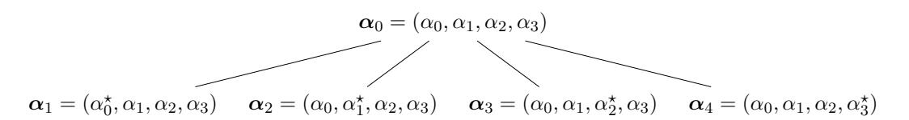

# <span id="page-0-0"></span>Lattice-Based Polynomial Commitments: Towards Asymptotic and Concrete Efficiency

Giacomo Fenzi giacomo.fenzi@epfl.ch EPFL

Hossein Moghaddas hossein.moghaddas@epfl.ch EPFL

Ngoc Khanh Nguyen khanh.nguyen@epfl.ch EPFL

#### **Abstract**

Polynomial commitments schemes are a powerful tool that enables one party to commit to a polynomial *p* of degree *d*, and prove that the committed function evaluates to a certain value *z* at a specified point *u*, i.e. *p*(*u*) = *z*, without revealing any additional information about the polynomial. Recently, polynomial commitments have been extensively used as a cryptographic building block to transform polynomial interactive oracle proofs (PIOPs) into efficient succinct arguments.

In this paper, we propose a lattice-based polynomial commitment that achieves succinct proof size and verification time in the degree *d* of the polynomial. Extractability of our scheme holds in the random oracle model under a natural ring version of the BASIS assumption introduced by Wee and Wu (EUROCRYPT 2023). Unlike recent constructions of polynomial commitments by Albrecht et al. (CRYPTO 2022), and by Wee and Wu, we do not require any expensive preprocessing steps, which makes our scheme particularly attractive as an ingredient of a PIOP compiler for succinct arguments. We further instantiate our polynomial commitment, together with the Marlin PIOP (Eurocrypt 2020), to obtain a publicly-verifiable trusted-setup succinct argument for Rank-1 Constraint System (R1CS). Performance-wise, we achieve 17MB proof size for 2 <sup>20</sup> constraints, which is 15X smaller than currently the only publicly-verifiable lattice-based SNARK proposed by Albrecht et al.

**Keywords**: lattices, polynomial commitments, succinct arguments,zero-knowledge

## **Contents**

| 1 |     | Introduction                                                  | 4  |
|---|-----|---------------------------------------------------------------|----|
|   | 1.1 | Our Contributions<br>                                         | 5  |
|   | 1.2 | Technical Overview                                            | 6  |
|   | 1.3 | BASIS Commitment Scheme<br>                                   | 6  |
|   | 1.4 | Framework for Proving Polynomial Evaluations                  | 9  |
|   | 1.5 | Polynomial Commitments over Finite Fields                     | 15 |
|   | 1.6 | Related Works<br>                                             | 16 |
|   | 1.7 | Concurrent and Subsequent Works<br>                           | 17 |
| 2 |     | Preliminaries                                                 | 19 |
|   | 2.1 | Lattices<br>                                                  | 19 |
|   | 2.2 | Power-of-Two Cyclotomic Rings                                 | 20 |
|   | 2.3 | Discrete Gaussian Distributions                               | 21 |
|   | 2.4 | NTRU Lattices<br>                                             | 23 |
|   | 2.5 | Gadget Trapdoors<br>                                          | 23 |
|   | 2.6 | Commitment Scheme                                             | 25 |
|   | 2.7 | Polynomial Commitment Scheme                                  | 26 |
|   | 2.8 | Interactive Proofs                                            | 27 |
|   | 2.9 | Coordinate-Wise Special Soundness                             | 28 |
| 3 |     | Power-BASIS Assumption                                        | 30 |
|   | 3.1 | Hardness of BASIS for Low Dimensions<br>                      | 31 |
|   | 3.2 | Higher Dimensions<br>                                         | 34 |
| 4 |     | Power-BASIS Commitment Scheme                                 | 36 |
|   | 4.1 | Security Analysis                                             | 38 |
| 5 |     | Efficient Proofs of Polynomial Evaluation                     | 40 |
|   | 5.1 | Framework for Proving Evaluations                             | 40 |
|   | 5.2 | Monomial Protocol                                             | 46 |
|   | 5.3 | Large Sampling Set                                            | 48 |
|   | 5.4 | Batching Evaluations                                          | 54 |
|   |     | 5.4.1<br>Multiple Evaluations at a Single Point               | 54 |
|   |     | 5.4.2<br>Multiple Evaluations at Distinct Points<br>          | 56 |
|   | 5.5 | Honest-Verifier Zero-Knowledge                                | 59 |
|   | 5.6 | Polynomial Commitments over Finite Fields                     | 65 |
| 6 |     | Concrete Instantiation and Applications to<br>Marlin          | 67 |
| 7 |     | Coordinate-Wise Special Soundness Implies Knowledge Soundness | 69 |
|   | 7.1 | Σ-Protocols<br>                                               | 70 |
|   | 7.2 | Multi-Round Protocols                                         | 71 |
|   | 7.3 | Comparison with the Generic Extractor<br>                     | 72 |

| 8 |            | Knowledge Soundness of a Fiat-Shamir-transformed Coordinate-Wise Special |    |
|---|------------|--------------------------------------------------------------------------|----|
|   |            | Sound Multi-Round Protocol                                               | 74 |
|   | 8.1        | Analysis of the Abstract Sampling Game                                   | 74 |
|   | 8.2        | The Knowledge Extractor<br>                                              | 82 |
|   | References |                                                                          | 82 |

## <span id="page-3-0"></span>1 Introduction

Due to the significant progress in building quantum computers by various industry leaders, e.g. IBM and Google, there has been a tremendous amount of interest in post-quantum cryptography. This is highly evidenced by the NIST PQC Competition for standardising quantum-safe key encapsulation mechanisms and signatures, where the vast majority of the selected algorithms are based on algebraic lattices. Indeed, not only do the lattice-based constructions offer relatively small key and signature sizes [Bos+18; Duc+18; Fou+20], but they are also renowned for their very fast implementation [LS19; Sei18]. Consequently, lattices seem to be a natural candidate to build more complex quantum-safe primitives, such as non-interactive zero-knowledge proofs (NIZKs).

The last several years have seen enormous progress in constructing practically efficient NIZKs for lattice relations [ALS20; ENS20; LNP22] which can produce proofs of size a few dozen kilobytes. This has led to rather compact and practical constructions of privacy-preserving primitives, such as ring signatures [LN22], blind signatures [AKSY22] and anonymous credentials [JRLS22; BLNS23]. Unfortunately, the aforementioned protocols suffer the following limitations – both the proof size and verification time are linear in the length of the witness. Hence, for proving more complex statements, efficient NIZKs with succinct proof size and verification complexity are desired, i.e. zero-knowledge succinct non-interactive arguments of knowledge (zk-SNARKs).

Polynomial commitment schemes [KZG10] have been getting more and more spotlight in the SNARKs community. The main reason is that, in combination with Polynomial Interactive Oracle Proofs (PIOPs) [BFS20; CHMMVW20], this cryptographic primitive can be used to obtain succinct arguments with concrete efficiency (see e.g. [Set20; BCHO22; GLSTW21]). In a polynomial commitment scheme, one can commit to any polynomial  $f := \sum_{i=0}^{d} f_i X^i$  of bounded degree d over a ring R, and then later prove that f evaluated at some public point  $u \in R$  is equal to a public image  $z \in R$ , i.e.

<span id="page-3-1"></span>
$$f(u) = z (1)$$

In the context of PIOPs, we require both the proof  $\pi$  and the verification time to be succinct (i.e. polylogarithmic in the degree d), even if the evaluation point is chosen adaptively by a verifier. Further, to obtain a SNARK, we need  $\pi$  to be a proof of knowledge; thus we call such a polynomial commitment extractable.

Recently, various lattice-based polynomial commitments [ACLMT22; WW23b; CP22; PPS21; BCFL22] were introduced<sup>1</sup>, mainly as a direct application of functional commitments [LRY16] over standard cyclotomic rings  $R := \mathbb{Z}_q[X]/(X^N+1)$  where N is a power-of-two. Indeed, (1) can be seen as a degree-one multivariate polynomial

<span id="page-3-2"></span>
$$\begin{bmatrix} 1 & u & u^2 & \cdots & u^d \end{bmatrix} \begin{bmatrix} f_0 \\ f_1 \\ \vdots \\ f_d \end{bmatrix} = z .$$
 (2)

Unfortunately, the aforementioned constructions suffer several limitations when applied in the context of PIOPs. Firstly, succinct verification requires a preprocessing step, meaning that the evaluation point u must be known when public parameters are generated and cannot be chosen

<sup>&</sup>lt;sup>1</sup>We excluded generic constructions which simply commit to a polynomial and use a general-purpose SNARK to prove correctness of the evaluation.

<span id="page-4-1"></span>

| scheme                          | commit   | •              |                       | crs size |      |                       | $\operatornamewithlimits{commitment}_{\cdot}$ |            |  |
|---------------------------------|----------|----------------|-----------------------|----------|------|-----------------------|-----------------------------------------------|------------|--|
|                                 | time     | time time time |                       |          | size | proof size            | size                                          | proof size |  |
| Construction 1 (Section 5.2)    | $O(d^2)$ | O(d)           | $O(\log d)$           | $O(d^2)$ | O(1) | $O(\log d)$           | 480 KB                                        | 105MB      |  |
| (Section 5.2)                   | . ,      | ` '            | ( 0 ,                 | ` ′      | ` /  | , ,                   |                                               |            |  |
| Construction 2<br>(Section 5.3) | $O(d^2)$ | O(d)           | $d^{O(1/\log\log d)}$ | $O(d^2)$ | O(1) | $d^{O(1/\log\log d)}$ | $209~\mathrm{KB}$                             | 3MB        |  |

**Table 1:** Efficiency overview of our polynomial commitment scheme. In this setting, we commit to polynomials of degree at most d over the ring  $R := \mathbb{Z}_q[X]/(X^N+1)$ . We count the runtime (resp. sizes) in the number of ring operations (resp. elements), which take time (resp. size) polylog(d) each. For clarity, we ignore the terms related to the security parameter  $\lambda$ . When computing concrete proof sizes, we set  $\lambda = 128$  and  $d = 2^{20}$ . We also include the Fiat-Shamir loss of  $Q = 2^{64}$  random oracle queries.

adaptively. Further, only [ACLMT22; BCFL22] offer extractable polynomial commitments which unfortunately suffer from the following limitations: (i) they rely on a knowledge assumption, which now seems to be at least "morally" broken [WW23a], (ii) message space can only consist of short vectors, and (iii) they only support linear functions with short coefficients. This makes proving relations as in (2) cumbersome for large degrees d. Even though one of the issues was circumvented by a promising recent work from Wee and Wu [WW23b], which allows committing to vectors of arbitrarily large coefficients, their knowledge soundness analysis is left for future work. Therefore, constructing extractable polynomial commitments with succinct verification from lattices still remains an open problem.

## <span id="page-4-0"></span>1.1 Our Contributions

In this work we propose a lattice-based PIOP-friendly polynomial commitment scheme. Concretely, our construction supports committing to arbitrary polynomials  $f \in R[X]$  of bounded degree d over R, and proving evaluations for any point  $u \in R$  with no preprocessing necessary. Extractability holds in the random oracle model via the Fiat-Shamir transformation [FS86] under a variant of the BASIS assumption defined recently by Wee and Wu [WW23b], which we call PowerBASIS.

At the core of our construction lie two split-and-fold interactive protocols for proving polynomial evaluations. The first one, which brings resemblance to lattice Bulletproofs [BLNS20; ACK21; AL21], enjoys proof size and verification complexity polylogarithmic in the degree d. Unfortunately, due to certain restrictions on the challenge space, which are inherited from the aforementioned works, the protocol achieves only  $1/\text{poly}(\lambda)$  knowledge soundness error. Even though soundness can be amplified via parallel repetition [AF22] for the interactive protocol, this is not necessarily the case in the non-interactive setting when applying the Fiat-Shamir transformation, as discussed in [AFK22]. To this end, we propose the second protocol, which achieves negligible soundness error in one-shot at the cost of quasi-polylogarithmic  $d^{O(1/\log\log d)}$  proof size and verification runtime. Furthermore, the non-interactive version of the scheme can be proven secure in the random oracle using the framework by Attema et al. [AFK22]. Last but not least, we show how to upgrade the evaluation proof to achieve zero-knowledge using the standard Fiat-Shamir-with-aborts paradigm [Lyu09; Lyu12; BTT22]. We summarise the efficiency of both schemes in Table 1.

As a direct application, we combine our polynomial commitment scheme, which includes batch evaluation proofs, with the Marlin Polynomial IOP [CHMMVW20] to obtain a trusted-setup (zero-knowledge) succinct non-interactive arguments of knowledge for Rank-1 Constraint System (R1CS).

<span id="page-5-2"></span>

| scheme                                     | assumptions          | ТР           | NI           |                       | ime<br>verifier            | c           | size<br>rs proof           | concrete<br>proof size |
|--------------------------------------------|----------------------|--------------|--------------|-----------------------|----------------------------|-------------|----------------------------|------------------------|
| [BBCPGL18]                                 | (M-)SIS, RO          | <b>√</b>     | ✓            | $O(\ell)$             | $O(\ell)$                  | O(1)        | $O(\sqrt{\ell})$           | -                      |
| [BLNS20]                                   | (M-)SIS, RO          | $\checkmark$ | $\checkmark$ | $O(\ell)$             | $O(\ell)$                  | O(1)        | $O(\ell^{\varepsilon})$    | -                      |
| Lattice Bulletproofs [BLNS20; AL21; ACK21] | M-SIS                | ✓            | X            | $O(\ell)$             | $O(\ell)$                  | O(1)        | $O(\log \ell)$             | -                      |
| [BF22]                                     | (M)-SIS, RO          | $\checkmark$ | $\checkmark$ | $O(\ell)$             | $O(\ell)$                  | O(1)        | $O(\log \ell)$             | -                      |
| [NS22]                                     | M-SIS, RO            | $\checkmark$ | $\checkmark$ | $O(\ell)$             | $O(\ell)$                  | O(1)        | $O(\sqrt{\ell})$           | 6MB                    |
| Labrador [BS23]                            | M-SIS, RO            | $\checkmark$ | $\checkmark$ | $O(\ell)$             | $O(\ell)$                  | O(1)        | $O(\log \ell)$             | 49KB                   |
| [ACLMT22]                                  | Knowledge $k$ -M-SIS | X            | ✓            | $O(\ell^4 \log \ell)$ | $O(\log \ell)$             | $O(\ell^2)$ | $O(\log \ell)$             | 261MB                  |
| This Work                                  | PowerBASIS, RO       | Х            | <b>√</b>     | $O(\ell^2)$           | $\ell^{O(1/\log\log\ell)}$ | $O(\ell^2)$ | $\ell^{O(1/\log\log\ell)}$ | 17MB                   |

Table 2: Comparison of lattice-based publicly verifiable proof systems for NP relations of size  $\ell$  with sublinear communication complexity. We count the runtime (resp. sizes) in the number of ring operations (resp. elements), which take time (resp. size) polylog(d) each, and we ignore the terms related polynomially in the security parameter  $\lambda$ . We exclude the preprocessing step from the verifier runtime. Here  $0 < \varepsilon < 1$  is a constant. The "TP" column specifies whether the scheme has transparent setup, and "NI" means whether the protocol can be made non-interactive with negligible soundness error. The concrete proof sizes correspond to proving R1CS with  $\ell = 2^{20}$  as reported in the respective works.

Practically, for  $\approx 2^{20}$  constraints our construction achieves proofs of size 17MB, which is around 15X smaller than the only concretely instantiated lattice-based proof system with succinct verification by Albrecht et al. [ACLMT22]. Moreover, we obtain a square-root improvement over [ACLMT22] in terms of the prover runtime. In comparison with other lattice-based arguments which admit linear verification time, our scheme produces comparable proofs to the recent "square-root" protocol by Nguyen and Seiler [NS22] for bigger R1CS instances, such as  $2^{30}$  constraints, but still more than two orders of magnitude larger than the current state-of-the-art by Beullens and Seiler [BS23]. We refer to Table 2 for full comparison and Section 6 for more details on sizes.

#### <span id="page-5-0"></span>1.2 Technical Overview

We provide a brief overview of our techniques. Let  $\lambda$  be a security parameter, q be an odd prime, and N be a power-of-two. Define the polynomial rings  $\mathcal{R} := \mathbb{Z}[X]/(X^N+1)$  and  $\mathcal{R}_q := \mathbb{Z}_q[X]/(X^N+1)$ . Let  $\mathcal{R}_q^{\times}$  be the set of invertible elements in  $\mathcal{R}_q$ . For a base  $\delta \geq 2$  and  $n \geq 1$ , we define the gadget matrix as  $\mathbf{G}_n := \begin{bmatrix} 1 & \delta & \cdots & \delta^{\tilde{q}} \end{bmatrix} \otimes \mathbf{I}_n \in \mathcal{R}_q^{n \times n \tilde{q}}$  where  $\tilde{q} := \lfloor \log_{\delta} q \rfloor + 1$ . For simplicity, we omit the subscript n and write  $\mathbf{G} := \mathbf{G}_n$  when it is clear from the context. Further, for a fixed matrix  $\mathbf{T} \in \mathcal{R}_q^{n \times k}$  and matrix  $\mathbf{A} \in \mathcal{R}_q^{n \times m}$ , we denote by  $\mathbf{S} \leftarrow \mathbf{A}_\sigma^{-1}(\mathbf{T})$  sampling  $\mathbf{S} \in \mathcal{R}_q^{m \times k}$  from the discrete Gaussian distribution with Gaussian parameter  $\sigma > 0$  conditioned on  $\mathbf{AS} = \mathbf{T}$  over  $\mathcal{R}_q$ .

#### <span id="page-5-1"></span>1.3 BASIS Commitment Scheme

Until lately, lattice-based commitment schemes were split into two disjoint classes: Hashed-Message Commitments [Ajt96] and Unbounded-Message Commitments [BDLOP18]. The former one has the property that the sizes of commitments are almost independent of the sizes of the committed values, and thus the commitments are *compressing*. This comes at the cost of the restricted message space

being only vectors of small norm. On the other hand, the main characteristic of the latter class is the unbounded message space, but the commitment size is linear in the size of the message.

Recently, Wee and Wu [WW23b] proposed the first lattice-based commitment scheme which is compressing, and simultaneously supports arbitrarily large messages over  $\mathcal{R}_q$ . The downside of the construction is a requirement on having a trusted setup, which was not necessary in prior works, as well as the quadratic committing time in the message length. In the following, we describe the main intuition behind the construction by Wee and Wu. To this end, we recall the BASIS assumption<sup>2</sup>, which lies at the core of the binding property of the commitment.

**BASIS** assumption. As in the (Module-)SIS problem [LS15], the adversary's final goal is to find a non-zero vector  $\mathbf{s}$  of small norm such that  $\mathbf{A}\mathbf{s}=\mathbf{0}$  for a uniformly random matrix  $\mathbf{A}\leftarrow \mathcal{R}_q^{n\times m}$ . However, in the BASIS setting the adversary is given more information. Namely, let  $(\mathbf{B},\mathsf{aux})\leftarrow\mathsf{Samp}(\mathbf{A})$  be an efficient algorithm, which given matrix  $\mathbf{A}$  as input, outputs another matrix  $\mathbf{B}\in\mathcal{R}_q^{n'\times m'}$  along with some auxiliary information aux. Then, in addition to the challenge matrix  $\mathbf{A}$ , the adversary is given a tuple  $(\mathbf{B},\mathsf{aux},\mathbf{T})$ , where  $\mathbf{T}$  is a trapdoor<sup>3</sup> for  $\mathbf{B}$ . In particular,  $\mathbf{T}$  can be used to efficiently emulate sampling from  $\mathbf{B}_{\sigma}^{-1}(\mathbf{t})$  for any image  $\mathbf{t}\in\mathcal{R}_q^{n'}$  under certain conditions on the parameter  $\sigma>0$ .

Note that hardness of the BASIS assumption heavily depends on the Samp algorithm. For instance, if  $\mathsf{Samp}(\mathbf{A})$  is an identity function and simply outputs  $\mathbf{B} \coloneqq \mathbf{A}$ , then using the trapdoor  $\mathbf{T}$  we can find a short non-zero solution to  $\mathbf{A}$  by sampling  $\mathbf{s} \leftarrow \mathbf{B}_{\sigma}^{-1}(\mathbf{0})$ . In this paper, we consider the following three instantiations of the  $\mathsf{Samp}$  algorithm:

■ StructBASIS: The sampling algorithm  $\mathsf{Samp}(\mathbf{A})$  first generates a row  $\mathbf{a}^\intercal \leftarrow \mathcal{R}_q^\ell$  and sets

<span id="page-6-0"></span>
$$\mathbf{A}^{\star} \coloneqq \begin{bmatrix} \mathbf{a}^{\mathsf{T}} \\ \mathbf{A} \end{bmatrix} \in \mathcal{R}_q^{(n+1) \times \ell} \ . \tag{3}$$

Next, it samples square matrices  $\mathbf{W}_1, \dots, \mathbf{W}_{\ell} \in \mathcal{R}_q^{(n+1) \times (n+1)}$  and outputs

$$\mathbf{B}_{\ell} \coloneqq \begin{bmatrix} \mathbf{W}_1 \mathbf{A}^{\star} & & & -\mathbf{G}_{n+1} \ & \ddots & & \vdots \ & \mathbf{W}_{\ell} \mathbf{A}^{\star} & -\mathbf{G}_{n+1} \end{bmatrix} \quad \text{and} \quad \mathsf{aux} \coloneqq (\mathbf{W}_1, \dots, \mathbf{W}_{\ell}) \enspace .$$

■ PowerBASIS: Samp(A) generates a row  $\mathbf{a}^{\intercal} \leftarrow \mathcal{R}_q^{\ell}$  and sets  $\mathbf{A}^{\star}$  as in (3). Then, it samples a single square matrix  $\mathbf{W} \leftarrow \mathcal{R}_q^{(n+1)\times(n+1)}$  and outputs

<span id="page-6-1"></span>
$$\mathbf{B}_{\ell} \coloneqq \begin{bmatrix} \mathbf{W}^{0} \mathbf{A}^{\star} & & -\mathbf{G}_{n+1} \\ & \ddots & & \vdots \\ & \mathbf{W}^{\ell-1} \mathbf{A}^{\star} & -\mathbf{G}_{n+1} \end{bmatrix} \quad \text{and} \quad \mathsf{aux} \coloneqq \mathbf{W} . \tag{4}$$

<sup>&</sup>lt;sup>2</sup>BASIS stands for Basis-Augmented Shortest Integer Solution.

<sup>&</sup>lt;sup>3</sup>In [WW23b], the trapdoor **T** is generated by sampling  $\mathbf{T} \leftarrow \mathbf{B}_{\sigma}^{-1}(\mathbf{G})$ . Since the matrix  $\mathbf{T} \in \mathcal{R}_{q}^{m' \times n' \tilde{q}}$  is short and  $\mathbf{BT} = \mathbf{G}$ , it can be used in Micciancio-Peikert trapdoor sampling [MP12] to efficiently generate preimages under **B**.

■ PRISIS<sup>4</sup>: Samp(A) samples a row  $\mathbf{a}^{\intercal} \leftarrow \mathcal{R}_q^{\ell}$  and sets  $\mathbf{A}^{\star}$  as in (3). Then, it samples a uniformly random polynomial  $w \leftarrow \mathcal{R}_q$  and outputs

$$\mathbf{B}_{\ell} \coloneqq \begin{bmatrix} w^0 \mathbf{A}^{\star} & & & | & -\mathbf{G}_{n+1} \\ & \ddots & & & \vdots \\ & & w^{\ell-1} \mathbf{A}^{\star} & | & -\mathbf{G}_{n+1} \end{bmatrix} \quad \text{and} \quad \mathsf{aux} \coloneqq w \enspace .$$

Observe that the only difference between these variants is how the square matrices  $\mathbf{W}_1, \dots, \mathbf{W}_\ell$  are generated. For StructBASIS they are picked independently and uniformly at random, while for PowerBASIS (resp. PRISIS) each matrix  $\mathbf{W}_i$  is defined as  $\mathbf{W}_i := \mathbf{W}^{i-1}$  for  $i \in [\ell]$ , where  $\mathbf{W} \leftarrow \mathcal{R}_q^{(n+1)\times(n+1)}$  (resp.  $\mathbf{W} := w \cdot \mathbf{I}_{n+1}$  for  $w \leftarrow \mathcal{R}_q$ ). Not to mention the fact that the functional commitment from [WW23b] can be built on top of all three BASIS instantiations <sup>5</sup>.

In this work, we analyse hardness of the three newly introduced assumptions for  $\ell = 2$ . Concretely, we prove that under a certain parameter selection

StructBASIS 
$$\stackrel{\text{Lemma } 3.5}{\longleftrightarrow}$$
 PowerBASIS and PRISIS  $\stackrel{\text{lemma } 3.6}{\longleftrightarrow}$  MSIS .

Unfortunately, the techniques do not translate well for larger values of  $\ell$ , as we argue in Section 3.2. Therefore, hardness of the BASIS assumption for  $\ell > 2$  is left as an open problem.

**Commitment construction.** We describe a commitment scheme based on the PowerBASIS assumption. Trivial modifications can be made in order to make the scheme secure under the StructBASIS or PRISIS assumptions.

Consider a message space of arbitrary vectors in  $\mathcal{R}_q^{d+1}$  of length d+1. The setup algorithm generates a (pseudo-)random matrix  $\mathbf{A} \in \mathcal{R}_q^{n \times m}$ , along with a uniformly random invertible matrix  $\mathbf{W} \in \mathcal{R}_q^{n \times n}$ . Further, it computes a trapdoor  $\mathbf{T}$  for the matrix

$$\mathbf{B} \coloneqq \begin{bmatrix} \mathbf{W}^0 \mathbf{A} & & -\mathbf{G} \\ & \ddots & & \vdots \\ & \mathbf{W}^d \mathbf{A} & -\mathbf{G} \end{bmatrix} . \tag{5}$$

Then, the common reference string is crs := (A, W, T).

In order to commit to a vector  $\mathbf{f} = (f_0, f_1, \dots, f_d) \in \mathcal{R}_q^{d+1}$ , one uses the trapdoor  $\mathbf{T}$  to sample short  $\mathbf{s}_0, \dots, \mathbf{s}_d \in \mathcal{R}_q^m$  and  $\hat{\mathbf{t}} \in \mathcal{R}_q^{n\tilde{q}}$  as follows:

$$\begin{bmatrix} \mathbf{s}_0 \\ \vdots \\ \mathbf{s}_d \\ \hat{\mathbf{t}} \end{bmatrix} \leftarrow \mathbf{B}_{\sigma}^{-1} \begin{pmatrix} -f_0 \mathbf{W}^0 \mathbf{e}_1 \\ -f_1 \mathbf{W}^1 \mathbf{e}_1 \\ \vdots \\ -f_d \mathbf{W}^d \mathbf{e}_1 \end{bmatrix}$$

<sup>&</sup>lt;sup>4</sup>The name stands for Power-Ring-BASIS.

<sup>&</sup>lt;sup>5</sup>A reader familiar with the work of [WW23b] can notice a difference between StructBASIS and the original BASIS<sub>struct</sub> from [WW23b, Assumption 3.3]. Namely, the latter one directly sets the matrix  $\mathbf{A}^{\star} := \mathbf{A}$  without appending an additional row  $\mathbf{a}^{\mathsf{T}}$  at the top (as in BASIS<sub>rand</sub> [WW23b, Assumption 3.3]). Note that it is possible to build a commitment scheme based on such a variant, as described in [WW23b, Section 4], but this would increase the commitment, as well the opening sizes, by a factor of  $n\tilde{q}$ . Hence, for efficiency we consider the modified version of BASIS<sub>struct</sub> as presented here.

where  $\mathbf{e}_1 := (1,0,\ldots,0)^{\mathsf{T}} \in \mathcal{R}_q^n$ . The commitment becomes  $\mathbf{t} := \mathbf{G}\hat{\mathbf{t}}$ , and the opening consists of  $(\mathbf{s}_i)_{i \in [0,d]}$ . The opening algorithm, given the common reference string crs, commitment  $\mathbf{t} \in \mathcal{R}_q^n$  and openings  $(\mathbf{s}_i)_{i \in [0,d]}$  as input, checks whether for all  $i = 0, 1, \ldots, d$ :

$$\mathbf{A}\mathbf{s}_i + f_i\mathbf{e}_1 = \mathbf{W}^{-i}\mathbf{t}$$
 and  $\|\mathbf{s}_i\| \le \beta$ 

for some norm parameter  $\beta > 0$ .

**Security properties.** In this paper, we consider the notion of relaxed binding [ALS20]. Namely, we say that a relaxed opening for a commitment  $\mathbf{t}$  consists of (i) a vector of openings  $\mathbf{s} = (\mathbf{s}_0, \dots, \mathbf{s}_d)$ , (ii) a message  $\mathbf{f} = (f_0, \dots, f_d) \in \mathcal{R}_q^{d+1}$ , and (iii) a vector of relaxation factors  $\mathbf{c} := (c_0, \dots, c_d) \in \mathcal{R}_q^{d+1}$ , which together satisfy:

$$\mathbf{A}\mathbf{s}_i + f_i\mathbf{e}_1 = \mathbf{W}^{-i}\mathbf{t}, \quad \|c_i \cdot \mathbf{s}_i\| \le \beta, \quad \|c_i\|_1 \le \kappa \quad \text{and} \quad c_i \in \mathcal{R}_q^{\times}$$

for i = 0, 1, ..., d and some  $\kappa \geq 1$ . In particular, vectors  $\mathbf{s}_i$  do not need to be short.

Now, we show that the commitment scheme is binding w.r.t. relaxed openings under the PowerBASIS assumption. Indeed, let  $\mathcal{B}$  be the following adversary for the PowerBASIS security game, which is given as input a tuple  $(\mathbf{A}, \mathbf{B}, \mathbf{W}, \mathbf{T})$  from the challenger, where  $\mathbf{B}$  is defined as in (4) for  $\ell = d+1$ , and  $\mathbf{A}^*$  is constructed as in (3). First,  $\mathcal{B}$  aborts if  $\mathbf{W}$  is not invertible<sup>6</sup>. Otherwise,  $\mathcal{B}$  passes  $\operatorname{crs} := (\mathbf{A}^*, \mathbf{W}, \mathbf{T})$  to the adversary  $\mathcal{A}$  against the relaxed binding game. Suppose  $\mathcal{A}$  comes up with two relaxed openings  $(\mathbf{s}, \mathbf{f}, \mathbf{c})$  and  $(\mathbf{s}', \mathbf{f}', \mathbf{c}')$  for the same commitment  $\mathbf{t}$  and  $\mathbf{f} \neq \mathbf{f}'$ . Thus, for some index i we have  $f_i \neq f'_i$ . Then, by definition of relaxed openings we have

$$\mathbf{A}^{\star}(\mathbf{s}_i - \mathbf{s}_i') + (f_i - f_i')\mathbf{e}_1 = \mathbf{0} .$$

Since  $f_i - f_i' \neq 0$ , we must have  $\bar{\mathbf{s}}_i := \mathbf{s}_i - \mathbf{s}_i' \neq 0$ . Hence by definition of  $\mathbf{A}^*$ ,  $\bar{\mathbf{s}}_i$  is a non-zero solution for the matrix  $\mathbf{A}$ , but not necessarily a short one. To conclude the proof, note that  $c_i c_i' \bar{\mathbf{s}}_i$  is still a non-zero vector, due to the invertibility property of  $c_i, c_i'$ , and at the same time:

<span id="page-8-1"></span>
$$||c_i c_i' \bar{\mathbf{s}}_i|| \le ||c_i'(c_i \mathbf{s}_i)|| + ||c_i(c_i' \mathbf{s}_i')|| \le 2\kappa\beta . \tag{6}$$

Thus,  $c_i c_i' \bar{\mathbf{s}}_i$  is a valid solution for the PowerBASIS problem.

Finally, the statistical hiding property is directly inherited from the original construction of the BASIS commitment by Wee and Wu [WW23b].

#### <span id="page-8-0"></span>1.4 Framework for Proving Polynomial Evaluations

We use the construction above to build our polynomial commitment scheme. Namely, given a polynomial  $f \in \mathcal{R}_q[X]$  of degree at most d over  $\mathcal{R}_q$ , we commit to f by committing to its coefficient vector  $\mathbf{f} = (f_0, f_1, \dots, f_d) \in \mathcal{R}_q^{d+1}$ , as described in Section 1.3, to obtain a commitment  $\mathbf{t} \in \mathcal{R}_q^n$  along with a short opening  $(\mathbf{s}_0, \mathbf{s}_1, \dots, \mathbf{s}_d)$ , where each  $\mathbf{s}_i \in \mathcal{R}_q^m$ .

<sup>&</sup>lt;sup>6</sup>Unlike in PowerBASIS, the commitment construction requires that matrix **W** is invertible. However, by carefully choosing parameters q and N, one can argue that the probability of  $\mathbf{W} \leftarrow \mathcal{R}_q^{n \times n}$  not being invertible is negligible (c.f. [BTT22, Appendix C.3] and [EZSLL19, Appendix C]).

## <span id="page-9-1"></span> $\Sigma$ -Protocol for $R_{d,\beta}$

$$\begin{array}{ll} & \underline{ \text{Prover } \mathcal{P}(\text{crs}, (\mathbf{t}, u, z), (f, (\mathbf{s}_i)_{0 \leq i \leq d})) } \\ f(\mathsf{X}) = \sum_{t=1}^k f_t(\mathsf{X}^k) \mathsf{X}^{t-1} \\ z_t = f_t(u^k) \text{ for } t = 1, \dots k \\ & \underline{z_1, \dots, z_k} \\ & \underline{\alpha_1, \dots, \alpha_k} \\ \end{array} \\ g(\mathsf{X}) = \sum_{t=1}^k \alpha_t f_t(\mathsf{X}) \\ \mathbf{z}_i = \sum_{t=1}^k \alpha_t \mathbf{s}_{ki+t-1} \text{ for } i = 0, \dots, d' \\ & \underline{g, (\mathbf{z}_i)_{i \in [0,d']}} \\ \\ & \underline{c}_{t-1} \\ & \underline{c}_{t-1} \\ & \underline{c}_{t-1} \\ & \underline{c}_{t-1} \\ & \underline{c}_{t-1} \\ & \underline{c}_{t-1} \\ & \underline{c}_{t-1} \\ & \underline{c}_{t-1} \\ & \underline{c}_{t-1} \\ & \underline{c}_{t-1} \\ & \underline{c}_{t-1} \\ & \underline{c}_{t-1} \\ & \underline{c}_{t-1} \\ & \underline{c}_{t-1} \\ & \underline{c}_{t-1} \\ & \underline{c}_{t-1} \\ & \underline{c}_{t-1} \\ & \underline{c}_{t-1} \\ & \underline{c}_{t-1} \\ & \underline{c}_{t-1} \\ & \underline{c}_{t-1} \\ & \underline{c}_{t-1} \\ & \underline{c}_{t-1} \\ & \underline{c}_{t-1} \\ & \underline{c}_{t-1} \\ & \underline{c}_{t-1} \\ & \underline{c}_{t-1} \\ & \underline{c}_{t-1} \\ & \underline{c}_{t-1} \\ & \underline{c}_{t-1} \\ & \underline{c}_{t-1} \\ & \underline{c}_{t-1} \\ & \underline{c}_{t-1} \\ & \underline{c}_{t-1} \\ & \underline{c}_{t-1} \\ & \underline{c}_{t-1} \\ & \underline{c}_{t-1} \\ & \underline{c}_{t-1} \\ & \underline{c}_{t-1} \\ & \underline{c}_{t-1} \\ & \underline{c}_{t-1} \\ & \underline{c}_{t-1} \\ & \underline{c}_{t-1} \\ & \underline{c}_{t-1} \\ & \underline{c}_{t-1} \\ & \underline{c}_{t-1} \\ & \underline{c}_{t-1} \\ & \underline{c}_{t-1} \\ & \underline{c}_{t-1} \\ & \underline{c}_{t-1} \\ & \underline{c}_{t-1} \\ & \underline{c}_{t-1} \\ & \underline{c}_{t-1} \\ & \underline{c}_{t-1} \\ & \underline{c}_{t-1} \\ & \underline{c}_{t-1} \\ & \underline{c}_{t-1} \\ & \underline{c}_{t-1} \\ & \underline{c}_{t-1} \\ & \underline{c}_{t-1} \\ & \underline{c}_{t-1} \\ & \underline{c}_{t-1} \\ & \underline{c}_{t-1} \\ & \underline{c}_{t-1} \\ & \underline{c}_{t-1} \\ & \underline{c}_{t-1} \\ & \underline{c}_{t-1} \\ & \underline{c}_{t-1} \\ & \underline{c}_{t-1} \\ & \underline{c}_{t-1} \\ & \underline{c}_{t-1} \\ & \underline{c}_{t-1} \\ & \underline{c}_{t-1} \\ & \underline{c}_{t-1} \\ & \underline{c}_{t-1} \\ & \underline{c}_{t-1} \\ & \underline{c}_{t-1} \\ & \underline{c}_{t-1} \\ & \underline{c}_{t-1} \\ & \underline{c}_{t-1} \\ & \underline{c}_{t-1} \\ & \underline{c}_{t-1} \\ & \underline{c}_{t-1} \\ & \underline{c}_{t-1} \\ & \underline{c}_{t-1} \\ & \underline{c}_{t-1} \\ & \underline{c}_{t-1} \\ & \underline{c}_{t-1} \\ & \underline{c}_{t-1} \\ & \underline{c}_{t-1} \\ & \underline{c}_{t-1} \\ & \underline{c}_{t-1} \\ & \underline{c}_{t-1} \\ & \underline{c}_{t-1} \\ & \underline{c}_{t-1} \\ & \underline{c}_{t-1} \\ & \underline{c}_{t-1} \\ & \underline{c}_{t-1} \\ & \underline{c}_{t-1} \\ & \underline{c}_{t-1} \\ & \underline{c}_{t-1} \\ & \underline{c}_{t-1} \\ & \underline{c}_{t-1} \\ & \underline{c}_{t-1} \\ & \underline{c}_{t-1} \\ & \underline{c}_{t-1} \\ & \underline{c}_{t-1} \\ & \underline{c}_{t-1} \\ & \underline{c}_{t-1} \\ & \underline{c}_{t-1} \\ & \underline{c}_{t-1} \\ & \underline{c}_{t-1} \\ & \underline{c}_{t-1} \\ & \underline{c}_{t-1}$$

Figure 1: Compressed  $\Sigma$ -protocol for the relation  $R_{d,\beta}$  from (7). Here,  $\operatorname{crs} = (\mathbf{A}, \mathbf{W}, \mathbf{T})$  is the common reference string for our polynomial commitment scheme and  $d+1=k^h$ . We denote d' := (d+1)/k - 1 to be degree of the polynomial g, and  $w := \max_{\alpha \in \mathcal{C}} \|\alpha\|_1$ .

An essential property of polynomial commitments is being able to prove that the committed polynomial was evaluated correctly, i.e. f(u) = z for public u and z in  $\mathcal{R}_q$ . In the setting of our commitment scheme, we are interested in the following ternary relation<sup>7</sup>:

<span id="page-9-0"></span>
$$\mathsf{R}_{d,\beta} \coloneqq \left\{ ((\mathbf{A}, \mathbf{W}, \mathbf{T}), (\mathbf{t}, u, z), (f, (\mathbf{s}_i)_{0 \le i \le d})) \, \middle| \, \begin{array}{c} \forall 0 \le i \le d, \mathbf{A}\mathbf{s}_i + f_i \mathbf{e}_1 = \mathbf{W}^{-i} \mathbf{t} \wedge ||\mathbf{s}_i|| \le \beta \\ \wedge f(u) = z \end{array} \right\} . (7)$$

The key ingredient for proving such relations efficiently will be the compressed  $\Sigma$ -protocol in Figure 1, which we will use recursively.

We take inspiration from a common split-and-fold technique used by prior works, e.g. FRI [BBHR19] and DARK [BFS20]. Concretely, take  $k \in \mathbb{N}$  and suppose  $d+1=k^h$  for some  $h \in \mathbb{N}$ . Let us write the polynomial  $f(\mathsf{X}) = \sum_{i=0}^d f_i \mathsf{X}^i$  as

$$f(\mathsf{X}) = \sum_{t=1}^{k} f_t(\mathsf{X}^k) \mathsf{X}^{t-1}, \quad \text{where } f_t(\mathsf{X}) \coloneqq \sum_{i=0}^{\frac{d+1}{k}-1} f_{ki+t-1} \mathsf{X}^i \quad \text{for } t = 1, 2, \dots, k \ .$$

<sup>&</sup>lt;sup>7</sup>We use the standard notation that the first entry corresponds to the common reference string, the second one is the statement, and the last one is the witness. Also, **T** is not going to be used by the prover, nor by the verifier.

Then, we want to prove that  $f(u) = \sum_{t=1}^{k} f_t(u^k)u^{t-1} = z$ . To this end, we let the prover send these partial evaluations  $z_t := f_t(u^k)$  for  $t \in [k]$ , and the verifier manually checks whether

<span id="page-10-0"></span>
$$\sum_{t=1}^{k} z_t u^{t-1} = z . {8}$$

Further, the verifier returns a challenge  $\boldsymbol{\alpha} := (\alpha_1, \dots, \alpha_k)$  from a challenge space  $\mathcal{C} \subseteq \mathcal{R}_q^k$ . We denote  $\mathbf{w} := \max_{\boldsymbol{\alpha} \in \mathcal{C}} \|\boldsymbol{\alpha}\|_1$ . Later we will discuss concrete instantiations for  $\mathcal{C}$ .

Now, consider the folded polynomial  $g(X) = \sum_{t=1}^{k} \alpha_t f_t(X)$  which is of degree at most  $d' := (d+1)/k - 1 = k^{h-1} - 1$ . The crucial observation here is that using the structure of the PowerBASIS commitment<sup>8</sup> from Section 1.3 we get for every  $i = 0, 1, \ldots, d'$ :

$$(\mathbf{W}^k)^{-i} \left( \sum_{t=1}^k \alpha_t \mathbf{W}^{-(t-1)} \right) \mathbf{t} = \sum_{t=1}^k \alpha_t \mathbf{W}^{-(ki+t-1)} \mathbf{t}$$

$$= \mathbf{A} \left( \sum_{t=1}^k \alpha_i \mathbf{s}_{ki+t-1} \right) + \left( \sum_{t=1}^k \alpha_i f_{ki+t-1} \right) \mathbf{e}_1$$

$$= \mathbf{A} \mathbf{z}_i + g_i \mathbf{e}_1$$

where  $\mathbf{z}_i \coloneqq \sum_{t=1}^k \alpha_t \mathbf{s}_{ki+t-1}$  satisfies  $\|\mathbf{z}_i\| \le \beta' \coloneqq \mathbf{w} \beta$ . In other words,  $\mathbf{t}' \coloneqq (\sum_{t=1}^k \alpha_t \mathbf{W}^{-(t-1)}) \cdot \mathbf{t}$ , which can be computed by the verifier in time O(k), is a commitment to the polynomial g with the opening  $(\mathbf{z}_j)_{j \in [0,d']}$  w.r.t. the new common reference string  $\operatorname{crs}' \coloneqq (\mathbf{A}, \mathbf{W}^k, \mathbf{T})$ . Further, by definition of g:

$$g(u^k) = \sum_{t=1}^k \alpha_t f_t(u^k) = \sum_{t=1}^k \alpha_t z_t$$
.

Thus, we can conclude that:

<span id="page-10-1"></span>
$$\left( (\mathbf{A}, \mathbf{W}^k, \mathbf{T}), \left( \sum_{t=1}^k \alpha_t \mathbf{W}^{-(t-1)} \mathbf{t}, u^k, \sum_{t=1}^k \alpha_t z_t \right), \left( g, (\mathbf{z}_i)_{i \in [0, d']} \right) \right) \in \mathsf{R}_{d', \mathbf{w} \beta} . \tag{9}$$

In our  $\Sigma$ -protocol, the prover directly outputs  $(g, (\mathbf{z}_i)_{j \in [0,d']})$  to the verifier, who checks Equations (8) and (9). To achieve succinct proofs and verification, we let the prover recursively run the  $\Sigma$ -protocol on the new instance tuple (9) until the degree of the folded polynomial is zero<sup>9</sup>. Overall, the protocol has 2h + 1 rounds and the last prover message is a pair of the form  $(g, \mathbf{z}) \in \mathcal{R}_q \times \mathcal{R}_q^m$ , where  $\|\mathbf{z}\| \leq \beta' := \mathbf{w}^h \beta$ . Performance-wise (excluding the poly( $\lambda$ ) factors), the prover sends O(hk) elements in  $\mathcal{R}_q$ , while the verifier makes in total O(hk) operations in  $\mathcal{R}_q$ .

We now focus on knowledge soundness. As common in the lattice setting, we aim to extract a witness with respect to the relaxed relation:

$$\tilde{\mathsf{R}}_{d,\beta,\kappa} \coloneqq \left\{ ((\mathbf{A},\mathbf{W},\mathbf{T}), (\mathbf{t},u,z), (f,(\mathbf{s}_i)_{0 \le i \le d}, (c_i)_{0 \le i \le d})) \,\middle| \, \begin{array}{l} \forall 0 \le i \le d, \mathbf{A}\mathbf{s}_i + f_i\mathbf{e}_1 = \mathbf{W}^{-i}\mathbf{t} \\ \wedge \|c_i \cdot \mathbf{s}_i\| \le \beta \wedge \|c_i\|_1 \le \kappa \\ \wedge c_i \in \mathcal{R}_q^{\times} \wedge f(u) = z \end{array} \right\} \; .$$

<sup>&</sup>lt;sup>8</sup>We note that a similar result could be obtained using PRISIS.

<sup>&</sup>lt;sup>9</sup>For concrete efficiency, it might be more beneficial to apply the protocol recursively until the degree of the folded polynomial is *sufficiently* small, instead of going down to zero.

In other words, the witness is now a *relaxed opening* for the commitment **t**. Note that the relation is still meaningful as long as the commitment scheme is binding w.r.t. relaxed openings.

The knowledge extraction strategy for  $R_{\beta,\kappa}$  will strongly depend on the instantiation of the challenge space C. In this work, we consider two variants described below.

Construction 1: Monomial protocol. As the name suggests, we will make use of certain invertibility properties of the set of signed monomials in  $\mathcal{R}_q$ , following the approach from lattice Bulletproofs [BLNS20; ACK21; AL21]. Namely, we set  $(k, h) = (2, \log(d+1))$  and define the challenge space

 $\mathcal{C} \coloneqq \left\{ (1, X^i) : i \in \mathbb{Z} \right\} \subseteq \mathcal{R}_q^k .$ 

By construction, w = 2 and  $|\mathcal{C}| = 2N$ . Now, we show that for the challenge space  $\mathcal{C}$  above, the  $\Sigma$ -protocol in Figure 1 is special sound w.r.t. the relaxed relation  $\tilde{R}$ . The methodology can then be extended to show that our recursive protocol is  $(2, \ldots, 2)$ -special sound. Thus, the general parallel repetition results [AF22], as well as security of the Fiat-Shamir transformation in the random oracle model [AFK22] would directly apply here.

To this end, suppose we are given two transcripts

$$\mathsf{tr}_j \coloneqq ((z_1, z_2), (1, \alpha_j), (g_j, (\mathbf{z}_{j,i})_{i \in [0,d']})) \quad \text{for } j = 0, 1$$

with the same first message  $(z_1, z_2)$  and two distinct challenges  $(1, \alpha_0) \neq (1, \alpha_1)$  in  $\mathcal{C}$  such that

$$\begin{cases} \left( (\mathbf{A}, \mathbf{W}^2, \mathbf{T}), \left( (\mathbf{I}_n + \alpha_j \mathbf{W}^{-1}) \mathbf{t}, u^2, z_1 + \alpha_j z_2 \right), \left( g_j, (\mathbf{z}_{j,i})_{i \in [0,d']} \right) \right) \in \mathsf{R}_{d',\beta'} \\ z_1 + uz_2 = z \end{cases}$$

where  $\beta' := w \beta = 2\beta$ . Observing that  $\alpha_0 - \alpha_1 \in \mathcal{R}_q^{\times}$ , we define for  $i = 0, 1, \dots, d' := (d-1)/2$ 

<span id="page-11-0"></span>
$$\bar{f}_{2i+1} := \frac{g_{0,i} - g_{1,i}}{\alpha_0 - \alpha_1}, \quad \bar{f}_{2i} := \frac{\alpha_1 g_{0,i} - \alpha_0 g_{1,i}}{\alpha_1 - \alpha_0}$$
 (10)

and similarly

$$\bar{\mathbf{s}}_{2i+1} \coloneqq \frac{\mathbf{z}_{0,i} - \mathbf{z}_{1,i}}{\alpha_0 - \alpha_1}, \quad \bar{\mathbf{s}}_{2i} \coloneqq \frac{\alpha_1 \mathbf{z}_{0,i} - \alpha_0 \mathbf{z}_{1,i}}{\alpha_1 - \alpha_0} \ .$$

Denote  $\mathbf{2} := (2, \dots, 2) \in \mathcal{R}_q^{d+1}$ . We claim that

$$\left( (\mathbf{A}, \mathbf{W}, \mathbf{T}), (\mathbf{t}, u, z), \left( \bar{f}, (\bar{\mathbf{s}}_i)_{i \in [0, d]}, \mathbf{2} \right) \right) \in \tilde{\mathsf{R}}_{d, 2N\beta', 2}$$

Let us start with proving correctness of the relaxed opening. By careful inspection:

$$\mathbf{A}\bar{\mathbf{s}}_{2i+1} + \bar{f}_{2i+1}\mathbf{e}_1 = \frac{1}{\alpha_0 - \alpha_1} \left( (\mathbf{A}\mathbf{z}_{0,i} + g_{0,i}\mathbf{e}_1) - (\mathbf{A}\mathbf{z}_{1,i} + g_{1,i}\mathbf{e}_1) \right)$$
$$= \frac{\mathbf{W}^{-2i}}{\alpha_0 - \alpha_1} \left( (\mathbf{I}_n + \alpha_0 \mathbf{W}^{-1})\mathbf{t} - (\mathbf{I}_n + \alpha_1 \mathbf{W}^{-1})\mathbf{t} \right)$$
$$= \mathbf{W}^{-(2i+1)}\mathbf{t}$$

and similarly  $\mathbf{A}\bar{\mathbf{s}}_{2i} + \bar{f}_{2i}\mathbf{e}_1 = \mathbf{W}^{-2i}\mathbf{t}$ . As for shortness, we use the result from [BCKLN14] which says that  $\|\frac{2}{\alpha_0 - \alpha_1}\|_{\infty} = 1$  for any distinct  $\alpha_0, \alpha_1 \in \{X^i : i \in \mathbb{Z}\}$ . Thus, for any  $i \in [0, d']$  we have

$$\|2 \cdot \bar{\mathbf{s}}_{2i+1}\| \le \left\| \frac{2}{\alpha_0 - \alpha_1} \cdot (\mathbf{z}_{0,i} - \mathbf{z}_{1,i}) \right\| \le \left\| \frac{2}{\alpha_0 - \alpha_1} \right\|_1 \cdot \|\mathbf{z}_{0,i} - \mathbf{z}_{1,i}\| \le 2N\beta'$$

and similarly

$$\|2 \cdot \bar{\mathbf{s}}_{2i}\| \leq \left\|\frac{2}{\alpha_1 - \alpha_0} \cdot (\alpha_1 \mathbf{z}_{0,i} - \alpha_0 \mathbf{z}_{1,i})\right\| \leq \left\|\frac{2}{\alpha_1 - \alpha_0}\right\|_1 \cdot \|\alpha_1 \mathbf{z}_{0,i} - \alpha_0 \mathbf{z}_{1,i}\| \leq 2N\beta'.$$

Finally, we need to prove that the extracted polynomial  $\bar{f}$  satisfies  $\bar{f}(u) = z$ . From the verification equations we know that  $g_0(u^2) = z_1 + \alpha_0 z_2$  and  $g_1(u^2) = z_1 + \alpha_1 z_2$ . Hence,

$$\bar{f}(u) = \sum_{i=0}^{d'} \bar{f}_{2i} u^{2i} + \sum_{i=0}^{d'} \bar{f}_{2i+1} u^{2i+1}$$

$$= \sum_{i=0}^{d'} \frac{\alpha_1 g_{0,i} - \alpha_0 g_{1,i}}{\alpha_1 - \alpha_0} \cdot u^{2i} + \sum_{i=0}^{d'} \frac{g_{0,i} - g_{1,i}}{\alpha_0 - \alpha_1} \cdot u^{2i+1}$$

$$= \frac{\alpha_1 g_0(u^2) - \alpha_0 g_1(u^2)}{\alpha_1 - \alpha_0} + \frac{g_0(u^2) - g_1(u^2)}{\alpha_0 - \alpha_1} \cdot u$$

$$= z_1 + u z_2$$

$$= z$$

which concludes the proof of the claim.

An almost identical strategy can be applied to our recursive protocol when given a general  $(2, \ldots, 2)$ -tree of transcripts [ACK21]. In this case, we can extract a relaxed opening  $(\bar{f}, (\bar{\mathbf{s}}_i)_{i \in [0,d]}, \mathbf{2^h})$  to the commitment  $\mathbf{t}$  which satisfies

$$\left( (\mathbf{A}, \mathbf{W}, \mathbf{T}), (\mathbf{t}, u, z), \left( \bar{f}, (\bar{\mathbf{s}}_i)_{i \in [0, d]}, \mathbf{2^h} \right) \right) \in \tilde{\mathsf{R}}_{d, (2N)^h \beta', 2^h}$$

where  $\beta' := 2^h \beta$  and  $\mathbf{2^h} := (2^h, \dots, 2^h)$ . In terms of performance, the communication complexity and the verifier runtime (in terms of operations in  $\mathcal{R}_q$ ) are  $O(\log d)$ .

Using the knowledge soundness result from [ACK21], we deduce that the soundness error for our protocol is  $h/|\mathcal{C}| = h/(2N)$ . Since  $N = \mathsf{poly}(\lambda)$ , we only manage to obtain an inverse-polynomial soundness error. Even though this can be further reduced via parallel repetition in the interactive case [AF22], such amplification does not combine with the Fiat-Shamir transformation [AFK22]. Our second construction circumvents this issue by achieving negligible soundness error in one-shot.

Construction 2: Large sampling set protocol. In this scenario, we define the challenge space as

$$\mathcal{C} := \{(\alpha_1, \dots, \alpha_k) : \forall i \in [k], \|\alpha_i\|_{\infty} \leq \beta_{\mathcal{C}}\}$$

for some suitable parameter  $\beta_{\mathcal{C}} \geq 1$ . Hence, by construction  $\mathbf{w} \leq k\beta_{\mathcal{C}}N$ .

One could naively adapt the strategy from Construction 1 to prove knowledge soundness of the  $\Sigma$ -protocol as follows. To begin with, we aim to extract k accepting transcripts with k pairwise distinct challenges  $\alpha_j \in \mathcal{C}$  for j = 1, ..., k. Further, we compute the extracted polynomial f by inverting the  $k \times k$  matrix  $\mathbf{C}$ , where the j-th row corresponds to the challenge  $\alpha_j$  in the j-th transcript. Unfortunately, this approach contains a few critical issues. Firstly, it is unclear whether the matrix  $\mathbf{C}$  is invertible. But even if it is, the resulting polynomial f may contain large coefficients, or in the context of relaxed openings, there might be no sufficiently short element  $v \in \mathcal{R}_q$  such that  $v \cdot f_i$  is short for all coefficients  $f_i$ .

<span id="page-13-0"></span>

**Figure 2:** Visualisation of the notion of coordinate-wise special soundness (CWSS) for k = 4 coordinates. Here,  $\alpha_i^* \neq \alpha_i$  for all  $i \in [4]$ .

We propose an alternative approach which relies on a notion, called *coordinate-wise special* soundness<sup>10</sup> (CWSS). As in special soundness, it says that given k+1 valid transcripts  $\operatorname{tr}_j = (\mathsf{a}_j, \alpha_j, \mathsf{z}_j)$  for  $j=0,1,\ldots,d$ , such that  $\alpha_0,\ldots,\alpha_k \in \mathcal{C}$  satisfy a certain relation, then one can extract the witness. The relation is defined as follows: for every  $j \in [k]$ , vectors  $\alpha_0 = (\alpha_{0,1},\ldots,\alpha_{0,k})$  and  $\alpha_j = (\alpha_{j,1},\ldots,\alpha_{j,k})$  differ exactly in the j-th coordinate, i.e.  $\forall i \in [k] \setminus \{j\}, \alpha_{j,i} = \alpha_{0,i}$  and  $\alpha_{j,j} \neq \alpha_{0,j}$  (see Figure 2 for visualisation). We prove that for multi-round protocols CWSS implies knowledge soundness both in the interactive and non-interactive setting where the Fiat-Shamir transformation is applied.

In the following, we show that our  $\Sigma$ -protocol satisfies CWSS. Suppose we are given k+1 valid transcripts

$$\operatorname{tr}_{j} := ((z_{1}, \dots, z_{k}), \boldsymbol{\alpha}_{j} = (\alpha_{j,1}, \dots, \alpha_{j,k}), (g_{j}, (\mathbf{z}_{j,i})_{i \in [0,d']})) \quad \text{for } j = 0, 1, \dots, k$$
.

Let us fix  $j \in [k]$  and consider the transcripts  $\mathsf{tr}_0$  and  $\mathsf{tr}_j$ . From the verification equations we have for  $i = 0, \ldots, d'$ :

$$\mathbf{A}\mathbf{z}_{0,i} + g_{0,i}\mathbf{e}_1 = \mathbf{W}^{-ki} \left( \sum_{t=1}^k \alpha_{0,t} \mathbf{W}^{-(t-1)} \right) \mathbf{t}$$

$$\mathbf{A}\mathbf{z}_{j,i} + g_{j,i}\mathbf{e}_1 = \mathbf{W}^{-ki} \left( \sum_{t=1}^k \alpha_{j,t} \mathbf{W}^{-(t-1)} \right) \mathbf{t}.$$

Since  $\alpha_0$  and  $\alpha_j$  are the same in all coordinates apart from the j-th one, by subtracting the two equations we obtain

$$\mathbf{A}(\mathbf{z}_{0,i} - \mathbf{z}_{i,i}) + (g_{0,i} - g_{i,i})\mathbf{e}_1 = (\alpha_{0,i} - \alpha_{i,i})\mathbf{W}^{-(ki+j-1)}\mathbf{t}$$
.

Now, by choosing parameters  $q, N, \beta_{\mathcal{C}}$  appropriately, and using the result by Lyubashevsky and Seiler that short elements in  $\mathcal{R}_q$  are invertible [LS18], we deduce that  $\alpha_{0,j} - \alpha_{j,j} \in \mathcal{R}_q^{\times}$  and thus can define the extracted openings

$$\bar{\mathbf{s}}_{ki+j-1} \coloneqq \frac{\mathbf{z}_{0,i} - \mathbf{z}_{j,i}}{\alpha_{0,j} - \alpha_{j,j}} \quad \text{and} \quad \bar{f}_{ki+j-1} \coloneqq \frac{g_{0,i} - g_{j,i}}{\alpha_{0,j} - \alpha_{j,j}}$$

and the partial vector of relaxation factors  $\mathbf{c}_j := (\alpha_{0,j} - \alpha_{j,j}, \dots, \alpha_{0,j} - \alpha_{j,j}) \in \mathcal{R}_q^{d'+1}$ . Then, by construction we have  $\mathbf{A}\bar{\mathbf{s}}_{ki+j-1} + \bar{f}_{ki+j-1}\mathbf{e}_1 = \mathbf{W}^{-(ki+j-1)}\mathbf{t}$ , and further

$$\|(\alpha_{0,j} - \alpha_{j,j}) \cdot \bar{\mathbf{s}}_{ki+j-1}\| \le 2 \le \beta \quad \text{and} \quad \|\alpha_{0,j} - \alpha_{j,j}\| \le 2\beta_{\mathcal{C}} N \enspace .$$

<sup>&</sup>lt;sup>10</sup>As far as we are aware, this strategy was first introduced by Baum et al. [BBCPGL18] in the context of amortised lattice-based zero-knowledge proofs.

From the other verification checks we similarly conclude that P*<sup>d</sup>* ′ *i*=0 ¯*fki*+*j*−1*u ki* = *z<sup>j</sup>* .

Eventually, by running the argument above for *j* = 1*,* 2*, . . . , k*, we reconstruct a polynomial *f* ∈ R≤*<sup>d</sup> q* [X], along with (**s***i*)*i*∈[0*,d*] , and the vector **c** := (**c**1*, . . . ,* **c***k*) of relaxation factors so that

$$\left( (\mathbf{A}, \mathbf{W}, \mathbf{T}), (\mathbf{t}, u, z), \left( \bar{f}, (\bar{\mathbf{s}}_i)_{i \in [0, d]}, \mathbf{c} \right) \right) \in \tilde{\mathsf{R}}_{d, 2 \le \beta, 2\beta_{\mathcal{C}} N} \ .$$

In terms of security, we show that the knowledge soundness error of our Σ-protocol is bounded by *k/*(2*β*<sup>C</sup> + 1)*<sup>N</sup>* , where (2*β*<sup>C</sup> + 1)*<sup>N</sup>* is the number of all possible choices for a single coordinate in C. Consequently, by picking *k, β*<sup>C</sup> ≥ 1 and *N* = poly(*λ*) appropriately, we achieve negligible soundness error in one-shot.

This strategy can be further applied in our recursive protocol. That is, analogously as for special soundness, we first generalise the notion of coordinate-wise special soundness in the multi-round setting, and then prove that our protocol satisfies CWSS as above. By following the methodology from [\[ACK21;](#page-81-2) [AFK22\]](#page-82-2), we obtain the knowledge soundness error equal to *hk/*(2*β*<sup>C</sup> + 1)*<sup>N</sup>* , while the knowledge extractor runs the prover expected (*k* + 1)*<sup>h</sup>* times, and outputs a relaxed opening ( ¯*f,*(¯**s***i*)*i*∈[0*,d*] *,* **c**) such that

$$\left( (\mathbf{A}, \mathbf{W}, \mathbf{T}), (\mathbf{t}, u, z), \left( \bar{f}, (\bar{\mathbf{s}}_i)_{i \in [0, d]}, \mathbf{c} \right) \right) \in \tilde{\mathsf{R}}_{d, \gamma, \xi}$$

where *γ* := (2*<sup>h</sup>* (2*β*C*N*) 2 *<sup>h</sup>*−*h*−<sup>1</sup> w *h* )·*β* and *ξ* := 2*β*C(2*β*C*N*) 2 *<sup>h</sup>*−2*N*. We highlight that the norm blow-up is much larger here than in the monomial case due to certain technical differences[11](#page-0-0). As a result, we cannot pick *k* = 2 and *h* = *O*(log *d*) since then one would require log *q* = *O*(*d*) for relaxed binding to hold (c.f. Equation [\(6\)](#page-8-1)); thus making the proof size and verifier time polynomial in *d*. Instead, we instantiate the protocol by choosing *k* = *O*(*d* 1 log log *<sup>d</sup>* ) and *h* = *O*(log log *d*). In this case, log *q* = polylog(*d*), and the proof size and verifier complexity, in terms of operations over R*q*, become *O*(*d* log log *<sup>d</sup>* log log *d*) = *d O*(1*/* log log *d*) .

## <span id="page-14-0"></span>**1.5 Polynomial Commitments over Finite Fields**

Until now, we were focusing on polynomial commitments over the ring R*<sup>q</sup>* := Z*q*[*X*]*/*(*X<sup>N</sup>* + 1). Here, we sketch how to obtain a polynomial commitment over a *finite field*, which is required by Polynomial IOPs [\[BFS20;](#page-84-2) [CHMMVW20\]](#page-84-3) to compile into succinct arguments. The key ingredient, which allows us to do that is the ability to commit to *arbitrarily* large elements in R*q*.

Let *l* ≥ 1 be a divisor of *N*. It is a well-known fact [\[LS18\]](#page-86-10) that if *q* ≡ 2*N/l* + 1 (mod 4*N/l* + 1), then there exists a ring isomorphism *φ* from F *N/l* to R*q*, where F is a finite field of size *q l* . Thus, we define a map *φ*<sup>F</sup> : F → R*<sup>q</sup>* as *x* 7→ *φ*(*x,* 0*, . . . ,* 0), and denote the image of *φ*<sup>F</sup> as S*q*. We will make use of the fact that S*<sup>q</sup>* is an ideal of R*q*.

Suppose we want to commit to a polynomial *F* ∈ F ≤*d* [X] and prove that *F*(*x*) = *y* for *x, y* ∈ F. Using the homomorphic property of *φ*F, it is easy to see that this is equivalent to proving *f*(*u*) = *z* over R*q*, where *f*[X] := P*<sup>d</sup> <sup>i</sup>*=0 *φ*F(*Fi*)X *<sup>i</sup>* ∈ S*q*[X], *u* = *φ*F(*x*) ∈ S*<sup>q</sup>* and *z* = *φ*F(*y*) ∈ S*q*. Therefore, we commit to the polynomial *f* ∈ R*q*[X] and prove evaluation of *u* at the point *z* as before.

What we need to take care of is proving that all coefficients of *f* indeed lie in S*q*. This allows us to extract the polynomial *F*¯ ∈ F[X] by taking the inverse of *φ*<sup>F</sup> coefficient-wise. Looking at our

<sup>11</sup>Roughly speaking, in Construction 1 we managed to keep the norm growth smaller due to the fact that the relaxation factors **2 h** are independent of the extracted transcripts, which is not the case for the relaxation factors **c** in Construction 2. We refer to Section [5.3](#page-47-0) for more details.

underlying Σ protocol in Figure [1,](#page-9-1) the additional proof comes without any change on the prover's side, while the verifier also checks whether *g* ∈ S*q*[X], which is the case since S*<sup>q</sup>* is an ideal. To see why this modification is sufficient, consider the extraction strategy in Equation [\(10\)](#page-11-0). Since now *g*0*,i, g*1*,i* ∈ S*q*, we again use the fact that S*<sup>q</sup>* is an ideal and conclude that ¯*f*2*i*+1 = (*g*0*,i*−*g*1*,i*)*/*(*α*0−*α*1) also lies in S*q*. Identical reasoning follows for both Construction 1 and 2.

## <span id="page-15-0"></span>**1.6 Related Works**

The first lattice-based interactive proof with sublinear communication complexity for arithmetic *ℓ*-gate circuit satisfiability was formally proposed by Baum et al. [\[BBCPGL18\]](#page-83-5), where the authors achieve *O*( √ *ℓ*) size proofs. The construction was later generalised by Bootle et al. [\[BLNS20\]](#page-84-5) who define so-called "levelled commitments" and give *O*(*ℓ* <sup>1</sup>*/k*) size proofs for proving knowledge of a commitment opening with *k* = *O*(1) levels. The main drawback of the scheme is that the modulus for the proof system increases exponentially in *k* and thus considering more than 2-3 levels seems impractical. Recently, Nguyen and Seiler [\[NS22\]](#page-87-5) combined the square-root approach from [\[BBCPGL18\]](#page-83-5) with the CRT-packing technique from [\[ENS20\]](#page-85-2) to obtain a practically efficient square-root NIZK, with 6MB proofs for circuits of size *ℓ* = 2<sup>20</sup> .

Bootle et al. [\[BLNS20\]](#page-84-5) also proposed the first lattice adaptation of the Bulletproofs protocol [\[BCCGP16;](#page-83-9) [BBBPWM18\]](#page-83-10) over polynomial rings R*<sup>q</sup>* = Z*q*[*X*]*/*(*X<sup>N</sup>* + 1) which offers polylog(*ℓ*) proof sizes. This approach was later improved independently by Attema et al. [\[ACK21\]](#page-81-2) and Albrecht and Lai [\[AL21\]](#page-83-4) in terms of tighter soundness analysis, and also generalised to a more abstract setting by Bootle et al. [\[BCS21\]](#page-83-11). While the *split-and-fold* strategy from Bulletproofs is very attractive in the discrete logarithm setting and keeps asymptotic efficiency in the lattice scenario, it does not mix well with the shortness condition required in lattice-based cryptography. Consequently, this leads to a concrete blow-up of the parameters as well as the proof size. Roughly speaking, for the knowledge soundness argument it must be possible to invert the folding in the extraction such that the extracted solution vector is still short. To this end, one needs a challenge space of the underlying compressed Σ-protocol to have a property that (a scaled) inverse of a difference of any two distinct challenges is still short - such sets are called *subtractive*. Hence, Bootle et al. [\[BLNS20\]](#page-84-5) picked the challenge space to consist of monomial challenges C := {*X<sup>i</sup>* : *i* ∈ Z} ⊆ R*q*, which is indeed subtractive as shown in [\[BCKLN14\]](#page-83-8). Since the Σ-protocol is 3-special sound, norm of the extracted solution vector grows by a factor of *O*(*N*<sup>3</sup> ) for *every* level of folding. Then, the parameters must be chosen such that Module-SIS is hard with respect to the norm of the extracted solution vector, resulting in the need for a huge modulus *q*. Note that a similar issue occurs in our Construction 1 (c.f. Section [5.2\)](#page-45-0). However, since our underlying compressed Σ-protocol is only 2-special sound, norm of the extracted vector grows by only a factor of *O*(*N*) for each folding level (but at the price of having a trusted setup).

In addition to the norm growth of the extracted witness, the restriction on the challenges has a negative impact on the soundness error. Indeed, since the challenge space C in [\[BLNS20\]](#page-84-5) has size 2*N*, the soundness error becomes only 1*/*poly(*λ*). Furthermore, it was proven by Albrecht and Lai [\[AL21\]](#page-83-4) that *all* subtractive set over R*<sup>q</sup>* have size *O*(*N*). This becomes problematic especially in the non-interactive setting due to the result by Attema et al. [\[AFK22\]](#page-82-2), who showed that the Fiat-Shamir transformation of a parallel repetition of special sound protocols *does not* necessarily decrease the soundness error. A promising solution to circumvent this limitation was recently proposed by Bünz and Fisch [\[BF22\]](#page-84-7), who suggested a new knowledge extraction strategy, i.e. the notion of *almost special soundness*, which does not require subtractive sets. Instead, the challenges are picked from the exponential-sized set of integers [0*,* 2 *λ*−1 ). Unfortunately, the former issue with the norm growth for each folding level is still present in [\[BF22\]](#page-84-7).

Recently, Beullens and Seiler [\[BS23\]](#page-84-8) showed that by combining a split-and-fold approach with algebraic techniques introduced in linear-sized lattice-based NIZKs [\[LNP22\]](#page-86-1), it is possible to achieve negligible soundness error whilst controlling the norm growth. This is evidenced with impressive 50KB proofs for circuits of size *ℓ* = 2<sup>20</sup> .

Major downside of all the aforementioned works is a linear verification time, which can be the main efficiency bottleneck when proving satisfiability of large circuits. Until now, the only lattice-based publicly verifiable succinct argument of knowledge with efficient verification (excluding the preprocessing step) was proposed by Albrecht et al. [\[ACLMT22\]](#page-82-0). The construction is obtained as a direct application of functional commitments [\[LRY16\]](#page-86-5) and soundness holds under a knowledge assumption. However, similar to our scheme, a trusted setup is required, and more importantly, the prover algorithm runs in time *O*(*ℓ* 4 log *ℓ*) which makes it unappealing to implement in practice.

Prior to [\[ACLMT22\]](#page-82-0), all lattice-based zk-SNARKs were in the designated-verifier setting [\[GMNO18;](#page-85-6) [ISW21;](#page-85-7) [SSEK22\]](#page-87-6). The constructions use the Linear-PCP compiler [\[BCIOP13\]](#page-83-12) to transform into succinct arguments. Notably, the most recent work by Steinfeld et al. [\[SSEK22\]](#page-87-6) achieves proofs of size 6KB for *ℓ* = 2<sup>20</sup> constraints at the cost of very large crs (in the order of tens of gigabytes).

Naturally, there is a line of research focusing on the security of lattice-based zero-knowledge proofs against *quantum adversaries* [\[DFM20;](#page-85-8) [Kat21;](#page-86-11) [LMS22\]](#page-86-12). Particularly, Lai et al. [\[LMS22\]](#page-86-12) show that any multi-round protocol, which satisfies special soundness and *collapsing*, is knowledge sound in the post-quantum setting. As a special case, they demonstrate that the lattice Bulletproofs protocol [\[BLNS20\]](#page-84-5) is knowledge sound against quantum provers. Since our constructions not only satisfy (coordinate-wise) special soundness but also follow the split-and-fold strategy from [\[BLNS20\]](#page-84-5), we believe that the general result from [\[LMS22\]](#page-86-12) can be adapted to our setting.

Interestingly, lattice assumptions are not only used to build lattice-based commitments, but also to construct non-interactive arguments in the standard model, i.e. without the random oracle. For instance, there is a line of works [\[Can+19;](#page-85-9) [HLR21;](#page-85-10) [HJKS22\]](#page-85-11) which focuses on instantiating the Fiat-Shamir transformation with a correlation intractable hash function [\[CGH04\]](#page-84-10), that itself can be built from the Learning with Errors (LWE) problem [\[HLR21\]](#page-85-10). Following this template, Choudhuri, Jain and Jin [\[CJJ21\]](#page-84-11) built a SNARG for languages in P only based on the LWE problem with polynomial modulus. Moreover, the LWE assumption can be used to construct non-interactive succinct (and batched) arguments without the Fiat-Shamir transformation, but via somewhat extractable hash functions [\[DGKV22;](#page-85-12) [KLVW23\]](#page-86-13). We believe that naturally, due to relying on more assumptions, constructions based on the random oracle model should perform much better in terms of concrete efficiency.

## <span id="page-16-0"></span>**1.7 Concurrent and Subsequent Works**

Recently, Bootle et al. [\[BCS23\]](#page-84-12) and Cini et al. [\[CLM23\]](#page-84-13) independently proposed variants of the lattice Bulletproofs protocol that achieve polylogarithmic verification time. The former work proposes a new delegation algorithm inspired from [\[Lee21\]](#page-86-14), which requires an additional pre-processing step. The latter one introduces more (power-like) structure on the Ajtai commitment [\[Ajt96\]](#page-83-6) which allows for fast verification, at the cost of relying on a new assumption called Vanishing-SIS (vSIS). We note that there is a close similarity between vSIS and the PRISIS, and we leave the concrete relationship between the two for the future work. Nevertheless, the aforementioned work inherit the issue from

the original construction [\[BLNS20\]](#page-84-5) that the soundness error is non-negligible and parallel repetitions are required.

Fisch et al. [\[FLV23\]](#page-85-13) recently presented a polynomial commitment scheme, as an application of their linear functional commitment. Following the work of [\[ACLMT22\]](#page-82-0), the construction relies on the knowledge *k*-*M*-ISIS assumption, which appears to be morally invalidated in [\[WW23a\]](#page-87-4).

As a subsequent work, Albrecht et al. [\[AFLN23\]](#page-82-3) proposed a new polynomial commitment scheme with polylogarithmic communication and verification complexity *under standard assumptions*. To this end, the authors construct a new commitment scheme that combines our PowerBASIS construction together with the Merkle tree paradigm. Consequently, the committing runtime becomes quasilinear in the length of the message, while the size crs shrinks to only polylogarithmic. The binding property of the commitment relies on a "multi-instance" version of the PRISIS assumption. Finally, using the exact strategy from Lemma [3.6,](#page-32-0) security of the aforementioned assumption is further reduced to Module-SIS.

**Acknowledgements.** We thank Martin Albrecht and Sasha Lapiha for discussion on the PowerBASIS assumption. Ngoc Khanh Nguyen is supported by the Protocol Labs RFP-013: Cryptonet network grant.

## <span id="page-18-0"></span>2 Preliminaries

**Notation.** We denote the security parameter by  $\lambda$ , which is implicitly given to all algorithms unless specified otherwise. Further, we write  $\mathsf{negl}(\lambda)$  (resp.  $\mathsf{poly}(\lambda)$ ) to denote an unspecified negligible function (resp. polynomial) in  $\lambda$ . In this work, we implicitly assume that the vast majority of the key parameters, e.g. the ring dimension, and the dimensions of matrices and vectors, are  $\mathsf{poly}(\lambda)$ . However, the modulus used in this work may be super-polynomial in  $\lambda$ .

For  $a, b \in \mathbb{N}$  with a < b, write  $[a, b] := \{a, a + 1, \dots, b\}, [a] := [1, a]$ . For  $q \in \mathbb{N}$  write  $\mathbb{Z}_q$  for the integers modulo q. We denote vectors with lowercase boldface (i.e.  $\mathbf{u}, \mathbf{v}$ ) and matrices with uppercase boldface (i.e.  $\mathbf{A}, \mathbf{B}$ ). For a vector  $\mathbf{x}$  we write  $x_i$  or  $\mathbf{x}[i]$  for its i-th entry.

**Norms.** We define the  $\ell_p$  norm on  $\mathbb{C}^n$  as  $\|\mathbf{x}\|_p = (\sum_i |x_i|^p)^{1/p}$  for  $p < \infty$  and  $\|\mathbf{x}\|_{\infty} := \max_i |x_i|$ . Unless otherwise specified, we use  $\|\cdot\|$  for the  $\ell_2$  norm. We let the norm of a matrix be defined as the norm taken over the concatenation of columns of the matrix.

**Linear algebra.** We let  $\mathbf{e}_i$  be the vector with 1 in its *i*-th entry, 0 everywhere else. For  $\mathbf{B} \in \mathbb{R}^{n \times m}$  we let  $s_1(\mathbf{B}) = \sup\{\|\mathbf{B}\mathbf{v}\| : \mathbf{v} \in \mathbb{R}^m \wedge \|\mathbf{v}\| = 1\}$  be the **spectral norm** of  $\mathbf{B}$ . We also denote by  $\tilde{\mathbf{B}}$  the Gram-Schmidt orthonormalization of  $\mathbf{B}$ . The Gram-Schmidt norm of  $\mathbf{B}$  is defined as

$$\|\tilde{\mathbf{B}}\|\coloneqq \max_{i\in[m]}\|\tilde{\mathbf{b}}_i\|$$

where  $\tilde{\mathbf{b}}_i$  is the *i*-th column of  $\tilde{\mathbf{B}}$ .

For a ring R, we define  $\mathsf{GL}(n,R)$  to be the group of  $n \times n$  invertible matrices over R.

## <span id="page-18-1"></span>2.1 Lattices

A subset  $\Lambda \subseteq \mathbb{R}^m$  is a lattice if the following conditions hold:

- $0 \in \Lambda$ , and for  $\mathbf{x}, \mathbf{y} \in \Lambda$ ,  $\mathbf{x} + \mathbf{y} \in \Lambda$ .
- For every  $\mathbf{x} \in \Lambda$ , there exists  $\epsilon > 0$  such that  $\{\mathbf{y} \in \mathbb{R}^m : \|\mathbf{x} \mathbf{y}\| < \epsilon\} \cap \Lambda = \{\mathbf{x}\}.$

We say  $\mathbf{B} \in \mathbb{R}^{m \times k}$  is a basis for  $\Lambda$  if its columns are linearly independent and  $\Lambda = \mathcal{L}(\mathbf{B}) := \{\mathbf{Bz} : \mathbf{z} \in \mathbb{Z}^k\}$ . If k = m then we say that  $\Lambda$  is full-rank. The span (as a vector space) of the basis of a lattice is the span of a lattice denoted as  $\mathrm{Span}(\Lambda)$ . We also let  $\Lambda^*$  be the dual lattice defined as  $\Lambda^* = \{\mathbf{w} \in \mathrm{Span}(\Lambda) : \langle \Lambda, \mathbf{w} \rangle \subseteq \mathbb{Z} \}$ . If  $\Lambda \subseteq \mathbb{Z}^m$ , we call it an integral lattice. For I an ideal of  $\mathbb{R}^m$ , we let  $I \cdot \Lambda = \{i \cdot \mathbf{x} : i \in I, \mathbf{x} \in \Lambda\}$ , which is also a lattice. For a lattice  $\Lambda$  we denote

$$\lambda_1(\Lambda) \coloneqq \min_{0 \neq \mathbf{x} \in \Lambda} \lVert \mathbf{x} \rVert \quad \text{and} \quad \lambda_1^{\infty}(\Lambda) \coloneqq \min_{0 \neq \mathbf{x} \in \Lambda} \lVert \mathbf{x} \rVert_{\infty} .$$

For  $\mathbf{t} \in \operatorname{Span}(\Lambda)$ , we also define the shifted lattice  $\mathbf{t} + \Lambda := \{\mathbf{t} + \mathbf{x} : \mathbf{x} \in \Lambda\}$ . We also consider q-ary lattices, namely those with  $q\mathbb{Z} \subseteq \Lambda$ . For an arbitrary  $\mathbf{A} \in \mathbb{Z}_q^{n \times m}$  we define the full rank q-ary lattice

$$\Lambda^{\perp}(\mathbf{A}) = \{ \mathbf{z} \in \mathbb{Z}^m : \mathbf{A}\mathbf{z} = 0 \pmod{q} \}$$
$$\Lambda(\mathbf{A}) = \{ \mathbf{z} \in \mathbb{Z}^m : \exists \mathbf{s} \in \mathbb{Z}_q^n, \mathbf{A}\mathbf{z} = \mathbf{s} \pmod{q} \}$$

For any  $\mathbf{u} \in \mathbb{Z}_q^n$  such that there exists  $\mathbf{x}$  with  $\mathbf{A}\mathbf{x} = \mathbf{u}$ , we define  $\Lambda_{\mathbf{u}}^{\perp}(\mathbf{A}) := \{\mathbf{z} \in \mathbb{Z}^m : \mathbf{A}\mathbf{z} = \mathbf{u} \pmod{q}\} = \Lambda^{\perp}(\mathbf{A}) + \mathbf{x}$ .

## <span id="page-19-0"></span>2.2 Power-of-Two Cyclotomic Rings

Let N be a power-of-two and  $\mathcal{K} = \mathbb{Q}[X]/(X^N+1)$  be the 2N-th cyclotomic field. Denote  $\mathcal{R} = \mathbb{Z}[X]/(X^N+1)$  to be the ring of integers of  $\mathcal{K}$ . For an odd prime q, we write  $\mathcal{R}_q := \mathcal{R}/(q)$ . We denote  $\mathcal{R}_q^{\times}$  to be the set of invertible elements in  $\mathcal{R}_q$ .

We recall the following inequality, which allows to bound norms on products in the ring  $\mathcal{R}$ .

<span id="page-19-2"></span>**Lemma 2.1.** Let  $u, v \in R$ . Then  $||uv|| \le ||u||_1 \cdot ||v||$ .

*Proof.* Let  $u := u_0 + u_1 X + \ldots + u_{N-1} X^{N-1} \in \mathcal{R}$ . Then, by the triangle inequality we get

$$||uv|| \le \sum_{i=0}^{N-1} ||u_i v \cdot X^i|| = \sum_{i=0}^{N-1} ||u_i v|| = \sum_{i=0}^{N-1} |u_i| \cdot ||v|| = ||u||_1 \cdot ||v||.$$

Coefficient embedding. For  $x \in \mathcal{K}$ , we can consider the additive group isomorphism

$$\operatorname{vec}: \mathcal{K} \to \mathbb{Q}^N$$

$$a_0 + a_1 X + \dots + a_{N-1} X^{N-1} \mapsto (a_0, \dots, a_{N-1})^\top$$

and we refer this as the coefficient embedding of  $\mathcal{K}$ . Note that, for  $f,g \in \mathcal{K}$ ,  $\langle f,g \rangle = \langle \mathsf{vec}(f), \mathsf{vec}(g) \rangle$  and thus  $\|\mathsf{vec}(f)\| = \|f\|$ . Furthermore, vec restricts to an isomorphism between  $\mathcal{R}_q \cong \mathbb{Z}_q^N$  and  $\mathcal{R} \cong \mathbb{Z}^N$ . We also extend this to a mapping  $\mathcal{K}^m \to \mathbb{Q}^{mN}$  by applying it component-wise. For  $f \in \mathcal{K}$ , we let

$$\mathrm{rot}(f) \coloneqq (\mathrm{vec}(f), \mathrm{vec}(X \cdot f), \dots, \mathrm{vec}(X^{N-1} \cdot f)) \in \mathbb{Q}^{N \times N} \enspace,$$

noting that rot(f)vec(g) := vec(fg) and rot(f)rot(g) = rot(fg). We extend this to matrices  $\mathbf{B} \in \mathcal{K}^{m \times n}$  by writing

$$\operatorname{rot}(\mathbf{B}) \coloneqq \begin{bmatrix} \operatorname{rot}(b_{1,1}) & \dots & \operatorname{rot}(b_{1,n}) \\ \vdots & \ddots & \vdots \\ \operatorname{rot}(b_{m,1}) & \dots & \operatorname{rot}(b_{m,n}) \end{bmatrix} \in \mathbb{Q}^{mN \times nN} \ .$$

 $\textbf{Module lattices.} \quad \text{For } \mathbf{A} \in \mathcal{R}_q^{n \times m}, \, \mathbf{x} \in \mathcal{R}_q^m, \, \mathbf{u} = \mathbf{A}\mathbf{x}, \, \text{define}$ 

$$\Lambda^{\perp}(\mathbf{A}) \coloneqq \{\mathbf{z} \in \mathcal{R}^m : \mathbf{A}\mathbf{z} = \mathbf{0} \bmod q\}$$
  
$$\Lambda^{\perp}_{\mathbf{u}}(\mathbf{A}) \coloneqq \{\mathbf{z} \in \mathcal{R}^m : \mathbf{A}\mathbf{z} = \mathbf{u} \bmod q\} = \Lambda^{\perp}(\mathbf{A}) + \mathbf{x} .$$

Then, 
$$\Lambda^{\perp}(\mathbf{A}) = \mathsf{vec}^{-1}(\Lambda^{\perp}(\mathsf{rot}(\mathbf{A})))$$
 and  $\Lambda^{\perp}_{\mathbf{u}}(\mathbf{A}) = \mathsf{vec}^{-1}(\Lambda^{\perp}_{\mathsf{vec}(\mathbf{u})}(\mathsf{rot}(\mathbf{A}))).$ 

**Spectral norm.** Let  $s_1(\mathbf{R}) := \sup\{\|\mathbf{R}\mathbf{v}\| : \mathbf{v} \in \mathcal{K}^w \wedge \|\mathbf{v}\| = 1\}$  be the spectral norm of  $\mathbf{R} \in \mathcal{R}^{m \times w}$ . Clearly,  $s_1(\mathsf{rot}(\mathbf{R})) = s_1(\mathbf{R})$ , where the spectral norm of the left-hand side is over  $\mathbb{R}$ . Here, we recall a simple bound.

<span id="page-19-1"></span>Lemma 2.2. Let  $\mathbf{R} \in \mathcal{R}_q^{m \times t}$ . Then  $s_1(\mathbf{R}) \leq \sqrt{N} \cdot \|\mathbf{R}\|$ .

*Proof.* Let  $\mathbf{r}_1, \dots, \mathbf{r}_m$  be the rows of  $\mathbf{R}$ . Note that by the Cauchy-Schwarz inequality, for any  $\mathbf{u}$  with  $\|\mathbf{u}\| = 1$  we have that

$$\|\langle \mathbf{r}_i, \mathbf{u} \rangle\|^2 \le \left( \sum_{j \in [t]} \|r_{i,j} s_j\| \right)^2 \le N \left( \sum_{j \in [t]} \|r_{i,j}\| \cdot \|s_j\| \right)^2 \le N \|\mathbf{r}_i\|^2 \cdot \|\mathbf{u}\|^2 \le N \|\mathbf{r}_i\|^2 .$$

Thus,  $\|\mathbf{R}\mathbf{u}\|^2 \leq N\|\mathbf{R}\|^2$  which concludes the proof.

In this work we will work with  $q \equiv 5 \pmod{8}$ . In this setting, the probability that a uniformly random matrix is full-rank is overwhelming.

<span id="page-20-1"></span>**Lemma 2.3** (Appendix C.3 of [BTT22]). Let  $q \equiv 5 \pmod{8}$  be prime,  $N = O(\lambda)$  and  $m \ge n \ge 1$ . Then, for a uniformly random matrix  $\mathbf{A} \leftarrow \mathcal{R}_q^{n \times m}$ , the probability that  $\mathbf{A}$  is not full-rank is  $\text{negl}(\lambda)$ .

## <span id="page-20-0"></span>2.3 Discrete Gaussian Distributions

Let  $\sigma > 0$  be a parameter and  $\Lambda$  be a m-dimensional lattice. We then define the discrete Gaussian distribution  $\mathcal{D}_{\sigma,\mathbf{c},\Lambda}$  over a lattice coset  $\mathbf{c} + \Lambda$  as follows.

$$\rho_{\sigma, \mathbf{c}}(\mathbf{z}) \coloneqq \exp\left(-\frac{\pi \|\mathbf{z} - \mathbf{c}\|^2}{\sigma^2}\right) \text{ and } \mathcal{D}_{\sigma, \mathbf{c}, \Lambda}(\mathbf{z}) \coloneqq \frac{\rho_{\sigma, \mathbf{c}}(\mathbf{z})}{\sum_{\mathbf{x} \in \Lambda} \rho_{\sigma, \mathbf{c}}(\mathbf{x})}.$$

When  $\mathbf{c} = \mathbf{0}$  or  $\Lambda = \mathbb{Z}^m$ , we will omit it from the notation. We naturally extend this notion for lattices over the ring of integers  $\mathcal{R}$ , and for matrices by sampling column-wise.

**Smoothing parameter.** The smoothing parameter  $\eta_{\epsilon}(\Lambda)$  of a lattice is the smallest s > 0 such that  $\rho_{1/s}(\Lambda^*) \leq 1 + \epsilon$ . Below we recall the standard upper-bounds on the smoothing parameter [MR07; GPV08].

**Lemma 2.4.** Let  $\Lambda \subseteq \mathbb{R}^m$  be a lattice, and let  $\epsilon > 0$ . Then,

$$\eta_{\epsilon}(\Lambda) \leq \frac{1}{\lambda_1^{\infty}(\Lambda^*)} \cdot \sqrt{\frac{\ln(2m(1+1/\epsilon))}{\pi}}$$

and in fact, for every basis **B** of  $\Lambda$ ,

$$\eta_{\epsilon}(\Lambda) \leq \|\tilde{\mathbf{B}}\| \cdot \sqrt{\frac{\ln(2m(1+1/\epsilon))}{\pi}}$$
.

We also recall the bound from [GPV08, Lemma 5.3] and [WW23b, Lemma 2.5] for the block-diagonal matrices. Here, we consider the ring setting which can be easily adapted from the aforementioned results.

<span id="page-20-2"></span>**Lemma 2.5.** Let  $\ell, \delta > 1$  and suppose q is prime and  $m \geq 2n \log_{\delta} q$ . Then, there exists a negligible function  $\varepsilon$  such that for all  $\mathbf{A}_2, \ldots, \mathbf{A}_{\ell} \in \mathcal{R}_q^{n \times m}$ :

$$\Pr\left[\eta_{\varepsilon}(\Lambda^{\perp}(\mathsf{diag}(\mathbf{A}_1,\mathbf{A}_2,\ldots,\mathbf{A}_{\ell})) \leq \delta \cdot \log(\ell m N) : \mathbf{A}_1 \leftarrow \mathcal{R}_q^{n \times m}\right] \geq 1 - q^{nN} \ .$$

Further, we recall the regularity lemma from [LPR13].

<span id="page-21-1"></span>**Lemma 2.6** (Regularity Lemma). Let  $q \equiv 5 \pmod{8}$  be a prime,  $N = \mathsf{poly}(\lambda)$  and k, n be positive integers such that  $\mathsf{poly}(\lambda) \geq m \geq n$ . Take  $\mathfrak{s} > 2N \cdot q^{n/m+2/(Nm)}$ . Then, the following distributions are statistically close:

$$\left\{ (\mathbf{A}, \mathbf{A}\mathbf{x}) \middle| \begin{matrix} \mathbf{A} \leftarrow \mathcal{R}_q^{n \times m} \\ \mathbf{x} \leftarrow \mathcal{D}_{\mathfrak{s}}^{mN} \end{matrix} \right\} \ and \ \left\{ (\mathbf{A}, \mathbf{u}) \middle| \begin{matrix} \mathbf{A} \leftarrow \mathcal{R}_q^{n \times m} \\ \mathbf{u} \leftarrow \mathcal{R}_q^n \end{matrix} \right\} \ .$$

This is slightly modified from the original result in [LPR13, Corollary 7.5] and [BTT22, Lemma 4.2] in a sense that **A** might not be full-rank. However, Lemma 2.3 makes sure the event happens with negligible probability.

**Tail bounds.** When sampling over a sufficiently wide discrete Gaussian distribution, a small portion of the probability mass will be in the tail of the distribution, and thus with overwhelming probability the sampled lattice elements will have short norm. The following lemma from [MR07] formalises this intuition.

<span id="page-21-2"></span>**Lemma 2.7.** For any  $0 < \epsilon < 1$ , lattice  $\Lambda \subseteq \mathbb{R}^m$ , center  $\mathbf{c} \in \operatorname{Span}(\Lambda)$  and  $\sigma > \eta_{\epsilon}(\Lambda)$ ,

$$\Pr\left[\|\mathbf{z}\| \ge \sigma \cdot \sqrt{m} : \mathbf{z} \leftarrow \mathcal{D}_{\sigma,\Lambda,\mathbf{c}}\right] \le \frac{1+\epsilon}{1-\epsilon} 2^{-m} .$$

We also recall the tail bounds for the regular discrete Gaussian distribution over integers [Lyu12].

<span id="page-21-0"></span>**Lemma 2.8.** Let 
$$\mathbf{z} \leftarrow D_{\mathfrak{s}}^m$$
. Then  $\Pr\left[\|\mathbf{z}\| > t \cdot \mathfrak{s}\sqrt{\frac{m}{2\pi}}\right] < \left(te^{\frac{1-t^2}{2}}\right)^m$ .

By setting  $t = \sqrt{2\pi}$ , the right-hand side can be upper-bounded by  $2^{-2m}$ .

**Preimage sampling for module lattices.** Let  $\mathbf{A} \in \mathcal{R}_q^{n \times m}$  be a matrix over  $\mathcal{R}_q$  and take any  $\mathbf{u} \in \mathcal{R}_q^n$ . We write  $\mathbf{s} \leftarrow \mathbf{A}_{\sigma}^{-1}(\mathbf{u})$  to denote sampling  $\mathbf{s} \leftarrow \mathcal{D}_{\sigma}^{mN}$  conditioned on  $\mathbf{A}\mathbf{s} = \mathbf{u}$ . Assuming there is some  $\mathbf{x} \in \mathcal{R}_q^m$  which satisfies  $\mathbf{A}\mathbf{x} = \mathbf{u}$ , this is the same as sampling  $\mathbf{s} \leftarrow \mathcal{D}_{\sigma,\mathbf{x},\Lambda^{\perp}(\mathbf{A})}$ .

We will need the following lemma from [WW23b, Lemma 2.7] for proving hiding property of the commitment scheme.

<span id="page-21-3"></span>**Lemma 2.9.** Let n, m, q > 0. Take any matrices  $\mathbf{A} \in \mathcal{R}_q^{n \times m}$ ,  $\mathbf{B} \in \mathcal{R}_q^{n \times \ell}$  where  $\ell = \mathsf{poly}(n, \log q)$ . Suppose the columns of  $\mathbf{A}$  generate  $\mathcal{R}_q$  and let  $\mathbf{C} := [\mathbf{A} \mid \mathbf{B}]$ . Then, for every target vector  $\mathbf{t} \in \mathcal{R}_q^n$  and any  $\sigma \geq \eta_{\epsilon}(\Lambda^{\perp}(\mathbf{A}))$  for some  $\epsilon = \mathsf{negl}(\lambda)$ , the following distributions are statistically close:

$$\left\{ \mathbf{v} \middle| \mathbf{v} \leftarrow \mathbf{C}_{\sigma}^{-1}(\mathbf{t}) \right\} \ and \left\{ \begin{bmatrix} \mathbf{v}_1 \\ \mathbf{v}_2 \end{bmatrix} \middle| \mathbf{v}_2 \leftarrow \mathcal{D}_{\sigma}^{\ell N}, \mathbf{v}_1 \leftarrow \mathbf{A}_{\sigma}^{-1}(\mathbf{t} - \mathbf{B}\mathbf{v}_2) \right\}.$$

Module-SIS. We recall the standard lattice-based Module-SIS assumption [LS15]

**Definition 2.10** (Module-SIS). Let  $q = q(\lambda)$ ,  $n = n(\lambda)$ ,  $m = m(\lambda)$ ,  $\beta = \beta(\lambda)$  and  $N = N(\lambda)$ . We say that the MSIS<sub>n,m,N,q,\beta</sub> assumption holds if for any PPT adversary A, the following holds:

$$\Pr\left[\begin{array}{c|c} \mathbf{A}\mathbf{s} = \mathbf{0} \land 0 < \|\mathbf{x}\| \le \beta & \mathbf{A} \leftarrow \mathcal{R}_q^{n \times m} \\ \mathbf{s} \leftarrow \mathcal{A}(\mathbf{A}) \end{array}\right] \le \mathsf{negl}(\lambda) \ .$$

## <span id="page-22-0"></span>2.4 NTRU Lattices

As defined before, let N be a power of two, q a positive integer and  $h \in \mathcal{R}_q$ . The NTRU lattice associated to h is defined as

$$\Lambda_h := \{(u, v) \in \mathcal{R}^2 : u + vh = 0 \bmod q\} .$$

Recall that there is an efficient algorithm NTRU.TrapGen [HHGPSW03; SS13; DLP14; Fou+20], which given modulus q, the ring dimension N and the parameter  $\mathfrak{s}$ , outputs  $h \in \mathcal{R}_q$  and a short basis of  $\Lambda_h$ . Below, we assume that  $X^N + 1$  splits into two factors modulo q and we apply the main result of Stehlé and Steinfeld [SS13].

<span id="page-22-4"></span>**Lemma 2.11** (NTRU Trapdoor Generation). Let  $q = \omega(N)$  be a prime such that  $q \equiv 5 \pmod{8}$ . Take  $\epsilon \in (0,1/3)$  and  $\mathfrak{s} \geq \max(\sqrt{N \ln(8Nq)} \cdot q^{1/2+\epsilon}, \omega(N^{3/2} \ln^{3/2} N))$ . Then, there is a PPT algorithm NTRU.TrapGen $(q,N,\mathfrak{s})$  which with an overwhelming probability outputs  $h \in \mathcal{R}_q$  and a basis  $\mathbf{T}_{\mathsf{NTRU}}$  of  $\Lambda_h$  such that  $\|\tilde{\mathbf{T}}_{\mathsf{NTRU}}\| \leq N\mathfrak{s}$ . Further, the statistical distance between the distribution of h and uniform over  $\mathcal{R}_q^{\times}$  is at most  $2^{10N}q^{-\lfloor \epsilon N \rfloor}$ .

## <span id="page-22-1"></span>2.5 Gadget Trapdoors

In this section, we recall the notion of gadget trapdoors as in [MP12], reformulate them for the module setting and state the key results on efficient sampling preimages using trapdoors.

We say that a matrix  $\mathbf{G} \in \mathcal{R}_q^{n \times t}$  is primitive if its columns generate  $\mathcal{R}_q^n$ , i.e. if  $\mathbf{G} \cdot \mathcal{R}^t = \mathcal{R}_q^n$ . Note that if  $\mathbf{G}$  is primitive, then  $\mathsf{rot}(\mathbf{G})$  also is w.r.t.  $\mathbb{Z}_q^{nN}$  (i.e.  $\mathsf{rot}(\mathbf{G})\mathbb{Z}^{tN} = \mathbb{Z}_q^{nN}$ ). We also recall the notion of a gadget trapdoor.

**Definition 2.12.** Let  $\mathbf{A} \in \mathcal{R}_q^{n \times m}$ ,  $\mathbf{H} \in \mathcal{R}_q^{n \times n}$ ,  $\mathbf{G} \in \mathcal{R}_q^{n \times t}$  with  $t \geq n$  and  $\mathbf{H}$  invertible over  $\mathcal{R}_q$ . A  $\mathbf{G}$ -trapdoor for  $\mathbf{A}$  with tag  $\mathbf{H}$  is a matrix  $\mathbf{R} \in \mathcal{R}_q^{m \times t}$  with  $\mathbf{A}\mathbf{R} = \mathbf{H}\mathbf{G}$ . The quality of a trapdoor is  $s_1(\mathbf{R})$ .

When not specified, we set the tag  $\mathbf{H} \coloneqq \mathbf{I}$ . In fact, all the theorems in this section can be generalised with a tag.

In this work, we consider one particular primitive matrix that naturally represents  $\delta$ -base decomposition which we call the gadget matrix.

<span id="page-22-2"></span>**Definition 2.13** (Gadget Matrix). Let  $\delta \geq 2$ . We set  $\tilde{q} := \lfloor \log_{\delta} q \rfloor + 1$ , and  $\mathbf{g}^{\top} = [1, \delta, \dots, \delta^{\tilde{q}-1}] \in \mathcal{R}_{q}^{1 \times \tilde{q}}$  and  $\mathbf{G}_{n} := \mathbf{I}_{n} \otimes \mathbf{g}^{\top} \in \mathcal{R}_{q}^{n \times n\tilde{q}}$ . When the dimension are clear from context we simply write  $\mathbf{G}$ . Write  $\mathbf{G}_{n}^{-1} : \mathcal{R}_{q}^{n \times t} \to \mathcal{R}_{q}^{n\tilde{q} \times t}$  for the inverse function that takes a matrix of entries in  $\mathcal{R}_{q}$ , and decomposes each entry w.r.t. the base  $\delta$ . We also write  $\mathbf{g}^{-1}$  for  $\mathbf{G}_{1}^{-1}$ .

[MP12, Lemma 5.3] says that having a G-trapdoor for some matrix A enables to translate any nice basis of G's induced lattice into one for A's, whose shortness is proportional to the quality of the trapdoor.

<span id="page-22-3"></span>**Lemma 2.14.** Let  $\mathbf{A} \in \mathcal{R}_q^{n \times m}$ ,  $\mathbf{G} \in \mathcal{R}_q^{n \times t}$  be the gadget matrix with decomposition base  $\delta$ , and suppose there exists a  $\mathbf{G}$ -trapdoor  $\mathbf{R}$  for  $\mathbf{A}$ . Then, there is a basis  $\mathbf{S}_{\mathbf{A}}$  of  $\Lambda^{\perp}(\mathbf{A})$  which satisfies  $\|\tilde{\mathbf{S}}_{\mathbf{A}}\| \leq (s_1(\mathbf{R}) + 1)\sqrt{\delta^2 + 1}$ . In particular, if  $\|\mathbf{R}\| \leq \beta$  then for  $\epsilon = \mathsf{negl}(\lambda)$ :

$$\eta_{\epsilon}(\Lambda^{\perp}(\mathbf{A})) \leq \beta \delta \cdot \omega(\sqrt{N \log mN})$$
.

We now give crucial properties about the trapdoor generation from [MP12].

<span id="page-23-0"></span>**Lemma 2.15** (Trapdoor Generation). Let  $q \equiv 5 \pmod{8}$  be a prime,  $N, n > 0, t = n\tilde{q}$  and  $\mathbf{G}_n \in \mathcal{R}_q^{n \times t}$  be the gadget matrix. Take m > t + n. Then, there is a PPT algorithm  $\mathsf{TrapGen}(n, m)$  that with an overwhelming probability returns two matrices  $(\mathbf{A}, \mathbf{R}) \in \mathcal{R}_q^{n \times m} \times \mathcal{R}_q^{m \times t}$  such that  $\mathbf{A}\mathbf{R} = \mathbf{G}_n$  and  $\|\mathbf{R}\| \leq \mathfrak{s}\sqrt{2t(m-t)N}$  where  $\mathfrak{s} > 2N \cdot q^{\frac{n}{m-t} + \frac{2}{N(m-t)}}$ . Moreover,  $\mathbf{A}$  is statistically close to a uniformly random matrix in  $\mathcal{R}_q^{n \times m}$ .

*Proof.* Let m' = m - t. Consider the following algorithm [MP12, Alg 1]:

- 1. Sample  $\bar{\mathbf{A}} \leftarrow \mathcal{R}_q^{n \times m'}$ .
- 2. Sample a matrix  $\bar{\mathbf{R}} \leftarrow \mathcal{D}_{\mathfrak{s}}^{m'N \times tN}$  from a discrete Gaussian distribution.
- 3. Return  $\mathbf{A} \coloneqq [\bar{\mathbf{A}}|\mathbf{G}_n \bar{\mathbf{A}}\bar{\mathbf{R}}]$  and  $\mathbf{R} \coloneqq \begin{bmatrix} \bar{\mathbf{R}} \\ \mathbf{I}_t \end{bmatrix}$

First,  $\mathbf{A}\mathbf{R} = \mathbf{G}$  as desired and  $\|\mathbf{R}\| \leq \sqrt{t(\mathfrak{s}^2m'N+1)} \leq \mathfrak{s}\sqrt{2t(m-t)N}$  with an overwhelming probability by Lemma 2.8 for  $t = \sqrt{2\pi}$ . To argue pseudorandomness, we apply Lemma 2.6 and the hybrid argument to get that  $\bar{\mathbf{A}}\bar{\mathbf{R}}$  is statistically close to uniform over  $\mathcal{R}_q^{n\times t}$ , and thus so is  $\mathbf{A}$ .  $\square$ 

The next lemma states that given a short G-trapdoor matrix R for A, one can efficiently sample preimages of A according to the discrete Gaussian distribution.

<span id="page-23-1"></span>**Lemma 2.16** (Preimage Sampling). Let N, n, m > 0 and  $t = n\tilde{q}$ . Then, there exists a PPT algorithm SamplePre( $\mathbf{A}, \mathbf{R}, \mathbf{v}, \sigma$ ) that takes as input a matrix  $\mathbf{A} \in \mathcal{R}_q^{n \times m}$ , a  $\mathbf{G}_n$ -trapdoor  $\mathbf{R} \in \mathcal{R}_q^{m \times t}$  for  $\mathbf{A}$  with a tag  $\mathbf{H}$ , a target vector  $\mathbf{v} \in \mathcal{R}_q^n$  in the column-span of  $\mathbf{A}$ , and a Gaussian parameter  $\sigma$ , and outputs a vector  $\mathbf{s} \in \mathcal{R}_q^m$  such that  $\mathbf{A}\mathbf{s} = \mathbf{v}$ . Further, if  $\sigma \geq \delta s_1(\mathbf{R}) \cdot \omega(\sqrt{\log nN})$ , then the statistical distance between the following distributions is negligible:

$$\left\{\mathbf{s} \leftarrow \mathsf{SamplePre}(\mathbf{A}, \mathbf{R}, \mathbf{v}, \sigma)\right\} \ \ and \ \left\{\mathbf{s} \leftarrow \mathbf{A}_{\sigma}^{-1}(\mathbf{v})\right\} \ \ .$$

We extend this algorithm for matrices, i.e. for a matrix  $\mathbf{V} \in \mathcal{R}_q^{n \times \ell}$  with columns  $\mathbf{v}_1, \dots, \mathbf{v}_\ell$ , we define SamplePre( $\mathbf{A}, \mathbf{R}, \mathbf{V}, \sigma$ ) to be the algorithm which returns a matrix  $\mathbf{S} \in \mathcal{R}_q^{m \times \ell}$ , where the i-th column is the output of SamplePre( $\mathbf{A}, \mathbf{R}, \mathbf{v}_i, \sigma$ ).

Subtractive sets for monomials. We recall the following widely-used result from [BCKLN14], which says that the (scaled) inverse of two distinct monomials in  $\mathcal{R}$  has coefficients in  $\{-1,0,1\}$ .

<span id="page-23-2"></span>**Lemma 2.17.** Let  $C := \{X^i : i \in \mathbb{Z}\} \subseteq \mathcal{R}$ . Then, for any two distinct  $x, y \in C$ , we have  $\|\frac{2}{x-y}\|_{\infty} = 1$ .

Short elements are invertible. For  $\kappa > 0$ , we define  $S_{\kappa} := \{x \in \mathcal{R}_q : ||x||_{\infty} \leq \kappa\}$  to be the set of ring elements in  $\mathcal{R}_q$  with infinity norm at most  $\kappa$ . We recall the following invertibility result by Lyubashevsky and Seiler [LS18].

<span id="page-23-3"></span>**Lemma 2.18.** Let  $1 \le l < N$  be a power-of-two and suppose  $q \equiv 2N/l + 1 \pmod{4N/l}$ . Then, every non-zero element in  $S_{\kappa}$  is invertible over  $\mathcal{R}_q$  as long as  $\kappa < \sqrt{l/N} \cdot q^{l/N}$ .

We will use this lemma for  $q \equiv 5 \pmod{8}$ .

<span id="page-24-1"></span>

| RejSamp:                                                                                                                                                                                       | SimRS:                                                                           |
|------------------------------------------------------------------------------------------------------------------------------------------------------------------------------------------------|----------------------------------------------------------------------------------|
| 1: $(\mathbf{u}, \mathbf{v}) \leftarrow h$                                                                                                                                                     | 1: $(\mathbf{u}, \mathbf{v}) \leftarrow h$                                       |
| 2: $\mathbf{z} \leftarrow \mathcal{D}_{\sigma, \mathbf{v} + \mathbf{u}, \Lambda}^{mN}$                                                                                                         | 2: $\mathbf{z} \leftarrow \mathcal{D}_{\sigma, \mathbf{u}, \Lambda}^{mN}$        |
| 3: <b>return</b> $(\mathbf{u}, \mathbf{v}, \mathbf{z})$ with prob. min $\left(\frac{\mathcal{D}_{\sigma}^{m}(\mathbf{z})}{M \cdot \mathcal{D}_{\sigma, \mathbf{v}}^{m}(\mathbf{z})}, 1\right)$ | 3: <b>return</b> $(\mathbf{u}, \mathbf{v}, \mathbf{z})$ with prob. $\frac{1}{M}$ |

Figure 3: Rejection sampling [BTT22].

**Rejection sampling.** A crucial component in proving the *zero-knowledge* property of lattice-based (non-interactive) arguments is a rejection sampling procedure [Lyu12]. We recall the generalised version introduced recently by Boschini et al. [BTT22] for discrete Gaussian over arbitrary lattices (here we omit the case for ellipsoidal Gaussians).

<span id="page-24-2"></span>Lemma 2.19 (Rejection Sampling [BTT22]). Take any  $\alpha, T > 0$  and  $\varepsilon \leq 1/2$ . Let  $\Lambda \subseteq \mathcal{R}^m$  be a lattice over  $\mathcal{R}$  and  $\sigma \geq \max(\alpha T, \eta_{\varepsilon}(\Lambda))$  be a parameter. Let  $h: \mathcal{R}^m \times \mathcal{R}^m \to [0,1]$  be a probability distribution which returns  $(\mathbf{u}, \mathbf{v})$  where the vector  $\mathbf{v}$  satisfies  $\|\mathbf{v}\| \leq T$ . Further, define  $M \coloneqq \exp(\frac{\pi}{\alpha^2} + 1)$  and  $\epsilon \coloneqq 2\frac{1+\varepsilon}{1-\varepsilon} \exp(-\alpha^2 \cdot \frac{\pi-1}{\pi^2})$ . Then, the statistical distance between distributions RejSamp and SimRS defined in Figure 3 is at most  $\frac{\epsilon}{2M} + \frac{2\varepsilon}{M}$ . Moreover, the probability that RejSamp outputs something is at least  $\frac{1-\epsilon}{M} \left(1 - \frac{4\varepsilon}{(1+\varepsilon)^2}\right)$ .

#### <span id="page-24-0"></span>2.6 Commitment Scheme

We recall the notion of a commitment scheme, which is a crucial component of various proof systems. As folklore in lattice-based cryptography, we introduce the slack space, which has a role in the binding property.

**Definition 2.20.** Let CM = (Setup, Commit, Open) be a triple of PPT algorithms. We say that CM is a commitment scheme over M with slack space S if it has the following syntax:

- Setup(1<sup>λ</sup>) → crs takes a security parameter λ (specified in unary) and outputs a common reference string crs.
- Commit(crs, m)  $\rightarrow$  (C, st) takes a common reference string crs a message  $m \in \mathcal{M}$  and outputs a commitment C and decommitment state st.
- Open(crs, C, m, st, c) takes a common reference string crs, a commitment C, a message m ∈ M, a decommitment state st and a relaxation factor <sup>12</sup> c ∈ S and outputs a bit indicating whether C is a valid commitment to m under crs.

We define the key properties of the commitment scheme: correctness, (relaxed) binding and hiding. In the following, we denote the message space as  $\mathcal{M}$  and the slack space as  $\mathcal{S}$ .

**Definition 2.21** (Completeness). We say that a commitment scheme CM = (Setup, Commit, Open) satisfies completeness if there exists a global relaxation factor  $c^* \in S$  such that for every  $m \in M$ :

$$\Pr\left[\mathsf{Open}(\mathsf{crs}, C, m, \mathsf{st}, c^*) = 1 \middle| \begin{array}{c} \mathsf{crs} \leftarrow \mathsf{Setup}(1^\lambda) \\ C, \mathsf{st} \leftarrow \mathsf{Commit}(\mathsf{crs}, m) \end{array} \right] \geq 1 - \mathsf{negl}(\lambda) \enspace .$$

 $<sup>^{12}</sup>$  We implicitly assume that if  $c \not\in \mathcal{S}$  then Open automatically returns 0.

**Definition 2.22** (Relaxed Binding). A commitment scheme CM = (Setup, Commit, Open) satisfies relaxed binding if for every PPT adversary A:

$$\Pr\left[\begin{array}{c|c} m \neq m' \land m, m' \in \mathcal{M} \land \\ \mathsf{Open}(\mathsf{crs}, C, m, \mathsf{st}, c) = 1 \land \\ \mathsf{Open}(\mathsf{crs}, C, m', \mathsf{st}', c') = 1 \end{array} \middle| \begin{array}{c} \mathsf{crs} \leftarrow \mathsf{Setup}(1^\lambda) \\ \begin{pmatrix} C, & (m, \mathsf{st}, c), \\ (m', \mathsf{st}', c') \end{pmatrix} \leftarrow \mathcal{A}(\mathsf{crs}) \end{array} \right] = \mathsf{negl}(\lambda) \enspace .$$

**Definition 2.23** (Hiding). A commitment scheme CM = (Setup, Commit, Open) satisfies hiding if for every (stateful) PPT adversary A:

$$\Pr\left[b' = b \middle| \begin{array}{c} \operatorname{crs} \leftarrow \operatorname{Setup}(1^{\lambda}), (m_0, m_1) \leftarrow \mathcal{A}(\operatorname{crs}) \\ b \leftarrow \{0, 1\} \\ C, \operatorname{st} \leftarrow \operatorname{Commit}(\operatorname{crs}, m_b) \\ b' \leftarrow \mathcal{A}(C) \end{array} \right] \leq \frac{1}{2} + \operatorname{negl}(\lambda) \enspace .$$

## <span id="page-25-0"></span>2.7 Polynomial Commitment Scheme

We also recall the notion of polynomial commitment schemes [KZG10]. Polynomial commitment schemes extend commitments with the ability to prove evaluations of the committed polynomial.

**Definition 2.24.** Let PC = (Setup, Commit, Open, Eval, Verify) be a tuple of algorithms. PC is a polynomial commitment scheme over a ring R with degree bound d and slack space S if:

• (Setup, Commit, Open) is a commitment scheme over

$$\mathcal{M} := \left\{ (f_0, f_1, \dots, f_d) \in R^{d+1} : \sum_{i=0}^d f_i \mathsf{X}^i \in R[\mathsf{X}] \right\}$$

with slack space S.

- Eval(crs, C, u, st)  $\to \pi$  takes a common reference string crs, a commitment C, an evaluation point  $u \in R$ , auxiliary state st and outputs an evaluation proof  $\pi$ .
- Verify(crs, C, u, z, π) → 0/1 takes a common reference string crs, a commitment C, an evaluation point u ∈ R, a claimed image z ∈ R, an evaluation proof π, and outputs a bit indicating whether π is a valid evaluation proof that the polynomial committed to in C evaluates to z at the point u. We also consider a setting in which Eval and Verify are replaced with an interactive two-party protocol between a prover and a verifier, and refer to that setting as an interactive polynomial commitment scheme.

Additionally, we require that the evaluations procedure satisfy some additional properties that we detail next. For simplicity, we give these definitions for non-interactive polynomial commitments, the interactive variant follows similarly.

**Definition 2.25** (Evaluation Completeness). We say that a polynomial commitment scheme PC = (Setup, Commit, Open, Eval, Verify) satisfies completeness if for every polynomial  $f \in R^{\leq d}[X]$  and any evaluation point  $u \in R$ :

$$\Pr\left[\begin{array}{c|c} \operatorname{Verify}(\operatorname{crs}, C, u, f(u), \pi) = 0 & \operatorname{crs} \leftarrow \operatorname{Setup}(1^{\lambda}) \\ C, \operatorname{st} \leftarrow \operatorname{Commit}(\operatorname{crs}, f) \\ \pi \leftarrow \operatorname{Eval}(\operatorname{crs}, C, u, \operatorname{st}) \end{array}\right] = \operatorname{negl}(\lambda) \enspace .$$

**Definition 2.26** (Knowledge Soundness). We say that a polynomial commitment scheme PC = (Setup, Commit, Open, Eval, Verify) is knowledge sound with knowledge error  $\kappa$  if for all stateful PPT adversaries  $\mathcal{P}^*$ , there exists an expected PPT extractor  $\mathcal{E}$  such that

$$\Pr\left[b = 1 \land \left(\begin{array}{c} \mathsf{Open}(\mathsf{crs}, C, f, \mathsf{st}, c) \neq 1 \lor \\ f(u) \neq z \end{array}\right) \middle| \begin{array}{c} \mathsf{crs} \leftarrow \mathsf{Setup}(1^\lambda) \\ (C, u, z, \pi) \leftarrow \mathcal{P}^*(\mathsf{crs}) \\ b = \mathsf{Verify}(\mathsf{crs}, C, u, z, \pi) \\ (f, \mathsf{st}, c) \leftarrow \mathcal{E}^{\mathcal{P}^*}(\mathsf{crs}, C, u, z, \pi) \end{array}\right] \leq \kappa(\lambda) \enspace .$$

Here, the extractor  $\mathcal{E}$  has a black-box oracle access to the (malicious) prover  $\mathcal{P}^*$  and can rewind it to any point in the interaction.

## <span id="page-26-0"></span>2.8 Interactive Proofs

Let  $R \subseteq \{0,1\}^* \times \{0,1\}^* \times \{0,1\}^*$  be a ternary relation. If  $(i, x, w) \in R$ , we say that i is an index, x is a statement and w is a witness for x. We denote  $R(i, x) = \{w : R(i, x, w) = 1\}$ . In this work, we only consider NP relations R for which a witness w can be verified in time poly(|i|, |x|) for all  $(i, x, w) \in R$ .

A proof system  $\Pi = (\mathsf{Setup}, \mathcal{P}, \mathcal{V})$  for relation R consists of three PPT algorithms: the  $\mathsf{Setup}$  algorithm, prover  $\mathcal{P}$ , and the verifier  $\mathcal{V}$ . The latter two are interactive and stateful. We write  $(tr,b) \leftarrow \langle \mathcal{P}(\mathfrak{i},\mathfrak{x},\mathfrak{w}), \mathcal{V}(\mathfrak{i},\mathfrak{x}) \rangle$  for running  $\mathcal{P}$  and  $\mathcal{V}$  on inputs  $\mathfrak{i},\mathfrak{x}$ ,  $\mathfrak{w}$  and  $\mathfrak{i},\mathfrak{x}$  respectively and getting communication transcript tr and the verifier's decision bit b. We use the convention that b=0 means reject and b=1 means accept the prover's claim of knowing  $\mathfrak{w}$  such that  $(\mathfrak{x},\mathfrak{w}) \in R$ . If tr contains a  $\bot$  then we say that  $\mathcal{P}$  aborts. Unless stated otherwise, we will assume that the first and the last message are sent from a prover. Hence, the protocol between  $\mathcal{P}$  and  $\mathcal{V}$  has an odd number of rounds. A  $\Sigma$ -protocol is a three-round protocol. Further, we say a protocol is  $public\ coin$  if the verifier's challenges are chosen uniformly at random independently of the prover's messages.

We recall a few basic properties of interactive proof systems: completeness and knowledge soundness.

**Definition 2.27** (Completeness). A proof system  $\Pi = (\mathsf{Setup}, \mathcal{P}, \mathcal{V})$  for the relation R has statistical completeness with correctness error  $\epsilon$  if for all adversaries  $\mathcal{A}$ ,

$$\Pr\left[ b = 0 \land (\mathbf{i}, \mathbf{x}, \mathbf{w}) \in \mathsf{R} \middle| \begin{array}{c} \mathbf{i} \leftarrow \mathsf{Setup}(1^{\lambda}) \\ (\mathbf{x}, \mathbf{w}) \leftarrow \mathcal{A}(\mathbf{i}) \\ (tr, b) \leftarrow \langle \mathcal{P}(\mathbf{i}, \mathbf{x}, \mathbf{w}), \mathcal{V}(\mathbf{i}, \mathbf{x}) \rangle \end{array} \right] \leq \epsilon(\lambda) \enspace .$$

**Definition 2.28** (Knowledge Soundness). A proof system  $\Pi = (\mathsf{Setup}, \mathcal{P}, \mathcal{V})$  for the relation R is knowledge sound with knowledge error  $\kappa$  if there exists an expected PPT extractor  $\mathcal{E}$  such that for any stateful PPT adversary  $\mathcal{P}^*$ :

$$\Pr \left[ b = 1 \land (i, x, w) \not \in \mathsf{R} \middle| \begin{array}{c} i \leftarrow \mathsf{Setup}(1^{\lambda}) \\ (x, \mathsf{st}) \leftarrow \mathcal{P}^*(i) \\ (tr, b) \leftarrow \langle \mathcal{P}^*(i, x, \mathsf{st}), \mathcal{V}(i, x) \rangle \\ w \leftarrow \mathcal{E}^{\mathcal{P}^*}(i, x) \end{array} \right] \leq \kappa(\lambda) \ .$$

Here, the extractor  $\mathcal{E}$  has a black-box oracle access to the (malicious) prover  $\mathcal{P}^*$  and can rewind it to any point in the interaction.

## <span id="page-27-0"></span>2.9 Coordinate-Wise Special Soundness

We generalise the notion of *special soundness* in the following way. Let S be a set and  $\ell \in \mathbb{N}$ . Namely, take two vectors  $\mathbf{x} := (x_1, \dots, x_\ell), \mathbf{y} := (y_1, \dots, y_\ell) \in S^\ell$ . Then, we define the following relation " $\equiv_i$ " for fixed  $i \in [\ell]$  as:

$$\mathbf{x} \equiv_i \mathbf{y} \iff x_i \neq y_i \land \forall i \in [\ell] \setminus \{i\}, x_i = y_i$$
.

That is, vectors  $\mathbf{x}$  and  $\mathbf{y}$  have the same values in all coordinates apart from the *i*-th one. For  $\ell = 1$ , the relations boil down to checking whether two elements are distinct. Further, we can define the set

$$\mathsf{SS}(S,\ell,k) \coloneqq \left\{ \{\mathbf{x}_1, \dots, \mathbf{x}_K\} \subseteq (S^\ell)^K : \exists e \in [K], \forall i \in [\ell], \\ \exists J = \{j_1, \dots, j_{k-1}\} \subseteq [K] \setminus \{e\}, \\ \forall j \in J, \mathbf{x}_e \equiv_i \mathbf{x}_j \end{cases} \right\} ,$$

where  $K := \ell(k-1) + 1$ . To develop an intuition of the meaning of  $SS(S, \ell, k)$ , consider a set  $X = \{\mathbf{x}_1, \dots, \mathbf{x}_K\} \in SS(S, \ell, k)$ . There is a "central" vector  $\mathbf{x}_e \in X$  such that for each coordinate of  $\mathbf{x}_e$ , there are k-1 other vectors in X that differ from  $\mathbf{x}_e$  only in that coordinate. In other words, for each coordinate, there are k vectors in X that differ from each other only in that coordinate, and  $\mathbf{x}_e$  is always one of them. As a simple example,

$$\{(2,0,0),(0,1,0),(0,0,0),(0,0,5),(0,0,4),(0,2,0),(3,0,0)\} \in SS(\mathbb{Z}_7,3,3)$$

- the "central" vector (0,0,0) differs in, and only in, each coordinate from two other vectors in the set. Note that for  $\ell = 1$ , this set simply contains k-sets of distinct elements in S.

We are ready to define the notion of coordinate-wise special soundness. We start with the case for  $\Sigma$ -protocols.

**Definition 2.29** (CWSS for  $\Sigma$ -protocols). Let  $\Pi = (\mathsf{Setup}, \mathcal{P}, \mathcal{V})$  be public-coin three-round interactive proof system for relation  $\mathsf{R}$ , and suppose the challenge space of  $\mathcal{V}$  is  $\mathcal{C} = S^\ell$ . We say that  $\Pi$  is  $\ell$ -coordinate-wise k-special sound if there exists a polynomial time algorithm that on input an index i, statement x and  $\ell(k-1)+1$  accepting transcripts  $(a,\mathbf{c}_i,z_i)_{i\in[\ell(k-1)+1]}$ , with  $\{\mathbf{c}_1,\ldots,\mathbf{c}_{\ell(k-1)+1}\}\in\mathsf{SS}(S,\ell,k)$  and common first message a, outputs a witness  $w\in\mathsf{R}(i,x)$ .

Clearly, we obtain the standard k-special soundness property if  $\ell = 1$ . Next, we extend this notion to multi-round protocols via a tree of transcripts. For simplicity, we assume that in each round the verifier picks challenge uniformly at random from the same challenge space  $S^{\ell}$ , which will be the case for most of our protocols.

<span id="page-27-1"></span>**Definition 2.30** (CWSS for Multi-Round Protocols). Let  $\Pi = (\mathsf{Setup}, \mathcal{P}, \mathcal{V})$  be public-coin  $(2\mu + 1)$ -round interactive proof system for relation R, where in each round the verifier picks a uniformly random challenge from  $S^{\ell}$ . A tree of transcripts is a set of  $K = (\ell(k-1)+1)^{\mu}$  arranged in the following tree structure. The nodes in the tree correspond to the prover's messages and the edges correspond to the verifier's challenges. Each node at depth i has exactly  $\ell(k-1)+1$  children corresponding to  $\ell(k-1)+1$  distinct challenges which, as a set of vectors, lie in  $\mathsf{SS}(S,\ell,k)$ . Every transcript corresponds to exactly one path from the root to a leaf node.

We say that  $\Pi$  is  $\ell$ -coordinate-wise k-special sound if there is a polynomial time algorithm that given an index i, statement x and the tree of transcripts, outputs a witness  $w \in R(i, x)$ .

In this paper, we only focus on  $\ell$ -coordinate-wise 2-special sound protocols, which we will call  $\ell$ -coordinate-wise special sound.

We prove in Section 7 that coordinate-wise special soundness implies knowledge soundness in the interactive setting.

<span id="page-28-0"></span>**Lemma 2.31.** Let  $\Pi = (\mathsf{Setup}, \mathcal{P}, \mathcal{V})$  be public-coin  $(2\mu + 1)$ -round interactive proof system for relation R and suppose the challenge space of  $\mathcal{V}$  in each round is  $S^{\ell}$ . If  $\Pi$  is  $\ell$ -coordinate-wise k-special sound and  $(\ell(k-1))^{\mu} = \mathsf{poly}(\lambda)$ , then it is knowledge sound with knowledge error  $\mu\ell(k-1)/|S|$ .

The resulting knowledge extractor runs the malicious prover  $(\ell(k-1)+1)^{\mu}$  times in expectation. Hence, in order to keep the knowledge extractor expected PPT, we need  $(\ell(k-1))^{\mu} = \mathsf{poly}(\lambda)$ .

The result can be easily extended to the case, where in each *i*-th round the challenges from the verifier are picked from  $S^{\ell_i}$  for  $\ell_i > 0$ . Then, the knowledge error becomes  $(\ell_1 + \ldots + \ell_{\mu})(k-1)/|S|$  and the extractor runs the malicious prover at most  $\prod_{i=1}^{\mu} (\ell_i(k-1)+1)$  times.

Finally, using the exact methodology as in [AFK22], in Section 8 we show that coordinate-wise special soundness implies (adaptive) knowledge soundness of the Fiat-Shamir transformed protocol in the random oracle model.

**Lemma 2.32** (Informal). Let  $\Pi = (\mathsf{Setup}, \mathcal{P}, \mathcal{V})$  be public-coin  $(2\mu+1)$ -round interactive proof system for relation R and suppose the challenge space of  $\mathcal{V}$  in each round is  $S^{\ell}$ . If  $\Pi$  is  $\ell$ -coordinate-wise k-special sound and  $(\ell(k-1))^{\mu} = \mathsf{poly}(\lambda)$ , then the Fiat-Shamir transformation of  $\Pi$  is knowledge sound in the random oracle model with knowledge error  $(Q+1)\mu\ell(k-1)/|S|$ , where Q is the number of random oracle queries made by an adversary.

## <span id="page-29-0"></span>3 Power-BASIS Assumption

Our construction of the polynomial commitment will rely on a new lattice-based assumption PowerBASIS which is a special case of the BASIS assumption<sup>13</sup> introduced by Wee and Wu [WW23b]. We begin by adapting the latter assumption to the ring setting. Recall that  $\mathbf{G}_n$  is a gadget matrix with base  $\delta$  as in Definition 2.13. We fix the prime modulus  $q \equiv 5 \pmod{8}$  and set  $\tilde{q} \coloneqq |\log_{\delta} q| + 1$ .

**Definition 3.1** (BASIS). Let  $q, n, m, n', m', \ell, N, \sigma, \beta$  be lattice parameters. Let Samp be a PPT algorithm, which given a matrix  $\mathbf{A} \in \mathcal{R}_q^{n \times m}$ , outputs a matrix  $\mathbf{B} \in \mathcal{R}_q^{n' \times m'}$  along with auxiliary information aux. We say the BASIS<sub> $n,m,n',m',N,q,\ell,\sigma,\beta$ </sub> assumption holds w.r.t. Samp if for any PPT adversary  $\mathcal{A}$ :

$$\Pr\left[\begin{array}{c|c} \mathbf{A}\mathbf{s} = \mathbf{0} & \mathbf{A} \leftarrow \mathcal{R}_q^{n \times m}, (\mathbf{B}, \mathsf{aux}) \leftarrow \mathsf{Samp}(\mathbf{A}) \\ 0 < \|\mathbf{s}\| \leq \beta & \mathbf{T} \leftarrow \mathbf{B}_\sigma^{-1}(\mathbf{G}_{n'}) \\ & \mathbf{s} \leftarrow \mathcal{A}(\mathbf{A}, \mathbf{B}, \mathbf{T}, \mathsf{aux}) \end{array}\right] \leq \mathsf{negl}(\lambda) \ .$$

Intuitively, the BASIS assumption says that it is hard to find a short solution for  $\mathbf{A}$ , even when given a trapdoor for a matrix  $\mathbf{B}$  related to  $\mathbf{A}$ . The trapdoor allows the adversary to sample preimages of  $\mathbf{B}$ , and thus it is easy to break the assumption if  $\mathbf{B}$  contains too much information about  $\mathbf{A}$ , e.g. when  $\mathbf{B} = \mathbf{A}$ .

Furthermore, we provide three concrete instantiations of the sampling algorithm Samp.

**Definition 3.2** (BASIS Instantiations). We consider three concrete instantiations of the BASIS assumption:

• StructBASIS<sub> $n,m,N,q,\ell,\sigma,\beta$ </sub>: The sampling algorithm Samp(**A**) first generates a row  $\mathbf{a}^{\intercal} \leftarrow \mathcal{R}_q^m$  and sets

<span id="page-29-1"></span>
$$\mathbf{A}^{\star} \coloneqq \begin{bmatrix} \mathbf{a}^{\mathsf{T}} \\ \mathbf{A} \end{bmatrix} \in \mathcal{R}_q^{(n+1) \times m} \ . \tag{11}$$

Further, it samples  $\mathbf{W}_i \leftarrow \mathsf{GL}(n+1, \mathcal{R}_q)$  for all  $i \in [\ell]$ , and outputs

$$\mathbf{B}_{\ell} \coloneqq \begin{bmatrix} \mathbf{W}_1 \mathbf{A}^{\star} & & & -\mathbf{G}_{n+1} \\ & \ddots & & \vdots \\ & \mathbf{W}_{\ell} \mathbf{A}^{\star} & -\mathbf{G}_{n+1} \end{bmatrix} \quad and \quad \mathsf{aux} \coloneqq (\mathbf{W}_1, \dots, \mathbf{W}_{\ell}) \ .$$

• PowerBASIS<sub> $n,m,N,q,\ell,\sigma,\beta$ </sub>: Here, Samp(**A**) generates a row  $\mathbf{a}^{\intercal} \leftarrow \mathcal{R}_q^{\ell}$  and sets  $\mathbf{A}^{\star}$  as in (11). Then, it samples  $\mathbf{W} \leftarrow \mathsf{GL}(n+1,\mathcal{R}_q)$ , and outputs

$$\mathbf{B}_{\ell} \coloneqq \begin{bmatrix} \mathbf{W}^0 \mathbf{A}^{\star} & & & -\mathbf{G}_{n+1} \ & \ddots & & \vdots \ & \mathbf{W}^{\ell-1} \mathbf{A}^{\star} & -\mathbf{G}_{n+1} \end{bmatrix} \quad and \quad \mathsf{aux} \coloneqq \mathbf{W} \ .$$

• PRISIS<sub> $n,m,N,q,\ell,\sigma,\beta$ </sub>: Samp(**A**) samples a row  $\mathbf{a}^{\intercal} \leftarrow \mathcal{R}_q^{\ell}$  and sets  $\mathbf{A}^{\star}$  as in (11). Then, it samples  $w \leftarrow \mathsf{GL}(1,\mathcal{R}_q)$ , and outputs

$$\mathbf{B}_{\ell} \coloneqq \begin{bmatrix} w^0 \mathbf{A}^{\star} & & & & -\mathbf{G}_{n+1} \\ & \ddots & & \vdots \\ & & w^{\ell-1} \mathbf{A}^{\star} & -\mathbf{G}_{n+1} \end{bmatrix} \quad and \quad \mathsf{aux} \coloneqq w \ .$$

<sup>&</sup>lt;sup>13</sup>BASIS stands for Basis-Augmented Shortest Integer Solution

Informally, the StructBASIS variant corresponds to the structured version of the BASIS assumption used to build functional commitments [\[WW23b\]](#page-87-2). PowerBASIS is the special case, where instead of picking *ℓ* uniformly random invertible matrices **W***<sup>i</sup>* , one takes a single invertible matrix, and sets **W***<sup>i</sup>* := **W***i*−<sup>1</sup> for *i* ∈ [*ℓ*]. Finally, PRISIS is the instance where each **W***<sup>i</sup>* := *w i*−1 **I***n*+1 for *i* ∈ [*ℓ*] and *w* ∈ R*<sup>q</sup>* is an invertible element.

Intuitively, StructBASIS seems to be the hardest variant to break out of the three since it carries the least structure. Then, PowerBASIS should be an easier problem due to the very specific relation between matrices **W***<sup>i</sup>* . Finally, PRISIS carries a lot of structure, since it introduces commutativity between the matrices **W***<sup>i</sup>* and **A***<sup>⋆</sup>* , i.e. *w <sup>i</sup>*−1**A***<sup>⋆</sup>* = **A***<sup>⋆</sup>* (*w i*−1 · **I***m*), which can somehow be useful for the adversary to break the assumption.

**Remark 3.3.** To simplify reductions in the paper, we explicitly require the matrices **W***<sup>i</sup>* to be invertible (unlike in [\[WW23b\]](#page-87-2)). Note that this condition can be dropped by arguing that, depending on the parameters *q* and *N*, with overwhelming probability a uniformly random matrix **W** is invertible over R*<sup>q</sup>* (cf. Lemma [2.3\)](#page-20-1).

## <span id="page-30-0"></span>**3.1 Hardness of BASIS for Low Dimensions**

We analyse the relationship between the three newly introduced instantiations for the dimension *ℓ* = 2. To this end, we analyse the following technical lemma which will be used in all our results of this section. Intuitively, it says that if one can find a short solution to a specific linear equation, then one can also build a BASIS trapdoor.

<span id="page-30-1"></span>**Lemma 3.4.** *Let n, m, N >* 0 *and α* ≥ 1*. Denote t* = *nq*˜*. Then, there exists an efficient deterministic algorithm, that given as input a matrix* **A***<sup>⋆</sup>* ∈ R*n*×*<sup>m</sup> q , invertible* **W**1*,***W**2*,* **H** ∈ GL(*n,* R*q*) *and two matrices* **T**1*,* **T**<sup>2</sup> ∈ R*m*×*<sup>t</sup> q , which satisfy* ∥(**T**1*,* **T**2)∥ ≤ *α for i* = 1*,* 2 *and*

$$\mathbf{W}_1 \mathbf{A}^* \mathbf{T}_1 - \mathbf{W}_2 \mathbf{A}^* \mathbf{T}_2 = \mathbf{H} \mathbf{G}_n ,$$

*outputs a tag* **H**<sup>∗</sup> ∈ GL(2*n,* R*q*) *and a* **G**2*n-trapdoor* **S** *for the matrix* **B** *defined as:*

$$\mathbf{B} \coloneqq \begin{bmatrix} \mathbf{W}_1 \mathbf{A}^\star & \mathbf{0} & -\mathbf{G} \\ \mathbf{0} & \mathbf{W}_2 \mathbf{A}^\star & -\mathbf{G} \end{bmatrix}$$

*with a tag* **H**<sup>∗</sup> *, where* ∥**S**∥ ≤ p 2(*α*<sup>2</sup> + *t* <sup>2</sup>*N*)*.*

*Proof.* Define the following matrices:

$$\mathbf{S}_{1,3} \coloneqq \mathbf{G}^{-1}(\mathbf{W}_1 \mathbf{A}^* \mathbf{T}_1 - \mathbf{H} \mathbf{G}_n) = \mathbf{G}^{-1}(\mathbf{W}_2 \mathbf{A}^* \mathbf{T}_2)$$
  
$$\mathbf{S}_{2,3} \coloneqq \mathbf{G}^{-1}(-\mathbf{W}_1 \mathbf{A}^* \mathbf{T}_2 - \mathbf{H} \mathbf{G}_n) = \mathbf{G}^{-1}(-\mathbf{W}_1 \mathbf{A}^* \mathbf{T}_1).$$

Then, by construction we get:

$$\begin{bmatrix} \mathbf{W}_1 \mathbf{A}^{\star} & \mathbf{0} & -\mathbf{G} \\ \mathbf{0} & \mathbf{W}_2 \mathbf{A}^{\star} & -\mathbf{G} \end{bmatrix} \begin{bmatrix} \mathbf{T}_1 & -\mathbf{T}_1 \\ \mathbf{T}_2 & -\mathbf{T}_2 \\ \mathbf{S}_{1,3} & \mathbf{S}_{2,3} \end{bmatrix} = \begin{bmatrix} \mathbf{H}\mathbf{G} & \mathbf{0} \\ \mathbf{0} & \mathbf{H}\mathbf{G} \end{bmatrix} = \begin{bmatrix} \mathbf{H} & \mathbf{0} \\ \mathbf{0} & \mathbf{H} \end{bmatrix} \cdot \begin{bmatrix} \mathbf{G} & \mathbf{0} \\ \mathbf{0} & \mathbf{G} \end{bmatrix}.$$

By setting

$$\mathbf{S}\coloneqq\begin{bmatrix} \mathbf{T}_1 & -\mathbf{T}_1 \ \mathbf{T}_2 & -\mathbf{T}_2 \ \mathbf{S}_{1,3} & \mathbf{S}_{2,3} \end{bmatrix} \quad \text{and} \quad \mathbf{H}^*\coloneqq\begin{bmatrix} \mathbf{H} & \mathbf{0} \ \mathbf{0} & \mathbf{H} \end{bmatrix} \;,$$

we observe that **S** is a  $\mathbf{G}_{2n}$ -trapdoor for **B** with a tag  $\mathbf{H}^*$  and  $\|\mathbf{S}\|^2 \leq 2\alpha^2 + 2t^2N$ , which concludes the proof.

Our first result says that StructBASIS and PowerBASIS are equivalent for the dimension  $\ell=2$ .

<span id="page-31-0"></span>**Lemma 3.5** (StructBASIS  $\iff$  PowerBASIS). Let  $n, N, \beta \geq 1$  and  $t \coloneqq (n+1)\tilde{q}$ . Suppose m > t+n and  $\mathfrak{s} > 2N \cdot q^{\frac{n+1}{m-t} + \frac{2}{N(m-t)}}$ . If  $\sigma_0, \sigma_1$  satisfy the following inequalities:

$$\sigma_0 \ge \delta \mathfrak{s} N \cdot \omega(\sqrt{t(m-t)\log mN}), \quad \sigma_1 \ge \delta \sqrt{2tN(\sigma_1^2 m' + t)} N \cdot \omega(\sqrt{\log nN}),$$

where m' = 2m + t, then the following statements are true:

- 1. StructBASIS<sub> $n,m,N,q,2,\sigma_0,\beta$ </sub> assumption holds under the PowerBASIS<sub> $n,m,N,q,2,\sigma_1,\beta$ </sub> assumption.
- 2. PowerBASIS<sub> $n,m,N,q,2,\sigma_0,\beta$ </sub> assumption holds under the StructBASIS<sub> $n,m,N,q,2,\sigma_1,\beta$ </sub> assumption.

*Proof.* We only show the first statement since the other direction follows identically. Let  $\mathcal{A}$  be a PPT adversary for the  $\mathsf{StructBASIS}_{n,m,N,q,2,\sigma,\beta}$  problem and suppose it wins with probability  $\epsilon$ . We provide a PPT algorithm  $\mathcal{B}$  for solving  $\mathsf{PowerBASIS}_{n,m,N,q,2,\sigma,\beta}$  which does the following. First,  $\mathcal{B}$  is given a tuple  $(\mathbf{A}, \mathbf{B}, \mathbf{T}, \mathbf{W})$  where

$$\mathbf{B} \coloneqq \begin{bmatrix} \mathbf{A}^\star & \mathbf{0} & -\mathbf{G} \ \mathbf{0} & \mathbf{W}\mathbf{A}^\star & -\mathbf{G} \end{bmatrix} \quad \text{and} \quad \mathbf{T} \coloneqq \begin{bmatrix} \mathbf{T}_{1,1} & \mathbf{T}_{1,2} \ \mathbf{T}_{2,1} & \mathbf{T}_{2,2} \ \mathbf{T}_{3,1} & \mathbf{T}_{3,2} \end{bmatrix}.$$

First, we claim that the following probability is negligible:

$$\epsilon_{\mathsf{smooth}} \coloneqq \Pr \left[ \sigma_0 < \eta_{\epsilon}(\Lambda^{\perp}(\mathbf{B})) \middle| \mathbf{A}^{\star} \leftarrow \mathcal{R}_q^{(n+1) \times m} \right] .$$

Indeed, note that by Lemma 2.15 we obtain:

$$\Pr\left[\sigma_0 < \eta_{\epsilon}(\Lambda^{\perp}(\mathbf{B})) \middle| (\mathbf{A}^{\star}, \mathbf{R}) \leftarrow \mathsf{TrapGen}(n+1, m) \right] \geq \epsilon_{\mathsf{smooth}} - \mathsf{negl}(\lambda) \ .$$

If  $(\mathbf{A}^*, \mathbf{R}) \leftarrow \mathsf{TrapGen}(n+1, m)$  then the following matrix  $\mathbf{R}^*$  is a  $\mathbf{G}_{2n}$ -trapdoor for  $\mathbf{B}$  with a tag  $\mathbf{H}^*$ , where:

$$\mathbf{R}^* \coloneqq \begin{bmatrix} \mathbf{R} & \mathbf{0} \ \mathbf{0} & \mathbf{R} \ \mathbf{0} & \mathbf{0} \end{bmatrix} \quad \text{and} \quad \mathbf{H}^* \coloneqq \begin{bmatrix} \mathbf{I}_{n+1} & \mathbf{0} \ \mathbf{0} & \mathbf{W} \end{bmatrix} \; .$$

Moreover,  $\|\mathbf{R}^*\| \leq 2\mathfrak{s}\sqrt{t(m-t)N}$  with an overwhelming probability. If this is the case then by assumption  $\sigma_0 \geq \delta \cdot \|\mathbf{R}^*\| \cdot \omega(\sqrt{t(m-t)\log mN})$ . Then, by combining Lemma 2.14 with Lemma 2.2, we obtain

$$\mathsf{negl}(\lambda) = \Pr\left[\sigma_0 < \eta_\epsilon(\Lambda^\perp(\mathbf{B})) \middle| (\mathbf{A}^\star, \mathbf{R}) \leftarrow \mathsf{TrapGen}(n+1, m) \right] \geq \epsilon_{\mathsf{smooth}} - \mathsf{negl}(\lambda)$$

and thus  $\sigma_0 \ge \eta_{\epsilon}(\Lambda^{\perp}(\mathbf{B}))$  with an overwhelming probability, where  $\mathbf{B}$  is the matrix received by  $\mathcal{B}$ . Thus, we can apply Lemma 2.7 to deduce that with an overwhelming probability<sup>14</sup>

$$\left\| \begin{bmatrix} \mathbf{T}_{1,1} \\ \mathbf{T}_{1,2} \end{bmatrix} \right\| \le \alpha := \sigma_0 \sqrt{m'tN} .$$

Further, by simple calculation we can deduce that

$$\mathbf{A}^{\star}\mathbf{T}_{1.1} - \mathbf{W}\mathbf{A}^{\star}\mathbf{T}_{1.2} = \mathbf{G} .$$

The reduction  $\mathcal{B}$  now samples a uniformly random  $\mathbf{W}_1 \leftarrow \mathsf{GL}(n+1,\mathcal{R}_q)$  and defines  $\mathbf{W}_2 \coloneqq \mathbf{W}_1 \mathbf{W}$ . Thus

$$W_1 A^* T_{1,1} - W_2 A^* T_{1,2} = W_1 G$$
.

By applying Lemma 3.4,  $\mathcal{B}$  can obtain a  $\mathbf{G}_{2(n+1)}$ -trapdoor  $\mathbf{S}$  for

$$\mathbf{B}' \coloneqq \begin{bmatrix} \mathbf{W}_1 \mathbf{A}^\star & \mathbf{0} & -\mathbf{G} \ \mathbf{0} & \mathbf{W}_2 \mathbf{A}^\star & -\mathbf{G} \end{bmatrix}$$

with the tag  $\mathbf{H}^* := \mathbf{I}_2 \otimes \mathbf{W}_1$  where  $\|\mathbf{S}\| \leq \sqrt{2(\alpha^2 + t^2 N)} \leq \sqrt{2tN(\sigma_1^2 m' + t)}$ . Then, the algorithm  $\mathcal{B}$  runs  $\mathbf{T}' \leftarrow \mathsf{SamplePre}(\mathbf{B}', \mathbf{S}, \mathbf{G}_{2(n+1)}, \sigma_1)$ . Finally,  $\mathcal{B}$  sends  $(\mathbf{A}, \mathbf{B}', \mathbf{T}', \mathsf{aux}' := (\mathbf{W}_1, \mathbf{W}_2))$  to  $\mathcal{A}$  and returns what  $\mathcal{A}$  outputs.

To argue correctness of the reduction, first note that  $\mathsf{aux}'$  and  $\mathbf{B}'$  are correctly generated. Further, by assumption we have  $\sigma_1 \geq \delta \|\mathbf{S}\| \cdot \omega(\sqrt{N\log nN})$  and thus by Lemma 2.16, the distribution of  $\mathsf{SamplePre}(\mathbf{B}', \mathbf{S}, \mathbf{G}_{2(n+1)}, \sigma_1)$  is statistically close to  $\mathbf{B}'^{-1}_{\sigma_1}(\mathbf{G}_{2(n+1)})$ . Consequently,  $\mathcal{A}$  outputs a valid answer to  $\mathcal{B}$  with probability  $\epsilon - \mathsf{negl}(\lambda)$ . Finally, a valid solution for  $\mathsf{StructBASIS}$  implies a valid solution for  $\mathsf{PowerBASIS}$ , which concludes the proof.

The next result focuses on the PRISIS variant. It turns out that the commutative property of the assumption allows to reduce to standard assumptions.

<span id="page-32-0"></span>**Lemma 3.6** (PRISIS  $\Longrightarrow$  MSIS). Let  $n > 0, m \ge n$  and denote  $t = (n+1)\tilde{q}$ . Let  $q = \omega(N)$ . Take  $\epsilon \in (0,1/3)$  and  $\mathfrak{s} \ge \max(\sqrt{N \ln(8Nq)} \cdot q^{1/2+\epsilon}, \omega(N^{3/2} \ln^{3/2} N))$  such that  $2^{10N}q^{-\lfloor \epsilon N \rfloor}$  is negligible. Let

$$\sigma \geq \delta \sqrt{tN \cdot (N^2 \mathfrak{s}^2 m + 2t)} \cdot \omega(\sqrt{N \log nN}).$$

Then,  $PRISIS_{n,m,N,q,2,\sigma,\beta}$  is hard under the  $MSIS_{n,m,N,q,\beta}$  assumption.

*Proof.* Suppose there is a PPT algorithm  $\mathcal{A}$  which wins  $\mathsf{PRISIS}_{n,m,N,q,2,\sigma,\beta}$  with probability  $\epsilon$ . We revisit the  $\mathsf{PRISIS}$  security game and introduce a single game hop. The purpose of the hybrid argument will be to plug in the NTRU trapdoor inside the auxiliary information w. We define  $\varepsilon_i$  to be the probability that  $\mathcal{A}$  wins  $\mathsf{Game}\ i$ .

Game 1: This is the standard PRISIS security game. To recall, the challenger samples  $\mathbf{a} \leftarrow \mathcal{R}_q^m$ ,  $\mathbf{A} \leftarrow \mathcal{R}_q^{n \times m}$  and sets  $\mathbf{A}^*$  as in (11). Then, it generates an invertible element  $w \leftarrow \mathcal{R}_q^{\times}$  and computes the matrix:

$$\mathbf{B} \coloneqq \begin{bmatrix} \mathbf{A}^\star & \mathbf{0} & -\mathbf{G} \\ \mathbf{0} & \mathbf{W}\mathbf{A}^\star & -\mathbf{G} \end{bmatrix} \ .$$

<sup>&</sup>lt;sup>14</sup>We note that the bound is not tight.

where  $\mathbf{W} := w \cdot \mathbf{I}_{n+1}$ . Then, it samples  $\mathbf{T} \leftarrow \mathbf{B}_{\sigma_1}^{-1}(\mathbf{G}_{2(n+1)})$  and outputs  $(\mathbf{A}, \mathbf{B}, \mathbf{T}, w)$  to the adversary  $\mathcal{A}$ . By definition,  $\varepsilon_1 = \epsilon$ .

Game 2: In this game, we obtain w by running  $(w, \mathbf{T}_{\mathsf{NTRU}}) \leftarrow \mathsf{NTRU}.\mathsf{TrapGen}(q, N, \mathfrak{s})$  algorithm. By Lemma 2.11,  $\varepsilon_2 \geq \varepsilon_1 - 2^{10N} q^{-\lfloor \varepsilon N \rfloor}$ .

Suppose there is an adversary which wins  $\mathsf{Game}_2$ . We now show how to build a PRISIS trapdoor  $\mathbf{T}$  given the Module-SIS matrix  $\mathbf{A}$  and the NTRU trapdoor  $\mathbf{T}_{\mathsf{NTRU}}$ . To this end, we will show how to find short matrices  $\mathbf{S}_1, \mathbf{S}_2$  such that:

$$\mathbf{A}^{\star}\mathbf{S}_1 - w\mathbf{A}^{\star}\mathbf{S}_2 = \mathbf{G} .$$

Let  $\mathbf{g}_i$  be the *i*-th column of  $\mathbf{G}$ . Assuming that  $\mathbf{A}^*$  is full-rank (cf. Lemma 2.3) and using linear algebra, we can find a (possibly large) vector  $\mathbf{t}$  such that  $\mathbf{A}^*\mathbf{t} = \mathbf{g}_i$ . Now, using the NTRU trapdoor  $\mathbf{T}_{\mathsf{NTRU}}$  (such that  $\|\tilde{\mathbf{T}}_{\mathsf{NTRU}}\| \leq N\mathfrak{s}$  by Lemma 2.11) and the nearest plane algorithm [LLL82], we can find vectors  $(\mathbf{s}_{1,i},\mathbf{s}_{2,i}) \in \mathcal{R}_q^m \times \mathcal{R}_q^m$  such that:

$$\mathbf{s}_{1,i} - w\mathbf{s}_{2,i} = \mathbf{t}$$
 and  $\|(\mathbf{s}_{1,i}, \mathbf{s}_{2,i})\| \leq N\mathfrak{s}\sqrt{mN/2}$ .

Therefore

$$\mathbf{A}^{\star}\mathbf{s}_{1,i} - w\mathbf{A}^{\star}\mathbf{s}_{2,i} = \mathbf{A}^{\star}(\mathbf{s}_{1,i} - w\mathbf{s}_{2,i}) = \mathbf{A}^{\star}\mathbf{t} = \mathbf{g}_{i}.$$

Thus, we obtain the matrices  $S_1, S_2$  by concatenation where

$$\left\| \begin{bmatrix} \mathbf{S}_1 \\ \mathbf{S}_2 \end{bmatrix} \right\| \le \alpha := N \mathfrak{s} \sqrt{mtN/2} .$$

Consequently, by Lemma 3.4, we can build a  $G_{2(n+1)}$ -trapdoor **S** for **B** such that

$$\|\mathbf{S}\| \le \sqrt{2(\alpha^2 + t^2 N)} = \sqrt{tN \cdot (N^2 \mathfrak{s}^2 m + 2t)} \ .$$

Hence, the reduction  $\mathcal{B}$  can construct the trapdoor  $\mathbf{S}$  as above and then randomise the trapdoor for  $\mathbf{B}$  by running  $\mathbf{T} \leftarrow \mathsf{SamplePre}(\mathbf{B}, \mathbf{S}, \mathbf{G}_{2(n+1)}, \sigma)$ . Finally it sends the tuple to  $\mathcal{A}$  and returns what it outputs. By Lemma 2.16,  $\mathcal{B}$  wins the Module-SIS game with probability at least  $\varepsilon_2 - \mathsf{negl}(\lambda)$ , which concludes the proof.

## <span id="page-33-0"></span>3.2 Higher Dimensions

One could hope that the techniques to analyse hardness of the BASIS assumption can be translated to higher dimensions. This could be promising especially for the PRISIS assumption, which we managed to reduce to standard lattice assumptions for the  $\ell=2$  case. Unfortunately, the reduction falls flat when considering higher dimensions.

We showcase this for  $\ell = 3$ . Following the approach for the smaller dimension, the goal is to find short matrices  $\mathbf{S}_1, \mathbf{S}_2, \mathbf{S}_3$  such that

<span id="page-33-1"></span>
$$\mathbf{A}^* \mathbf{S}_1 - w \mathbf{A}^* \mathbf{S}_2 = \mathbf{Z}_1$$

$$\mathbf{A}^* \mathbf{S}_2 - w \mathbf{A}^* \mathbf{S}_3 = \mathbf{Z}_2$$
(12)

for any  $\mathbf{Z}_1, \mathbf{Z}_2$  given the NTRU trapdoor for w. If this is possible, we could set  $\mathbf{Z}_1 = \mathbf{G}$  and  $\mathbf{Z}_2 = \mathbf{0}$  which would give us:

$$\mathbf{A}^* \mathbf{S}_1 - w \mathbf{A}^* \mathbf{S}_2 = \mathbf{G}$$
$$w \mathbf{A}^* \mathbf{S}_2 - w^2 \mathbf{A}^* \mathbf{S}_3 = \mathbf{0}.$$

Set  $\mathbf{S}_4 \coloneqq \mathbf{G}^{-1}(\mathbf{A}^*\mathbf{S}_1 - \mathbf{G})$ . Then, we have:

$$\begin{bmatrix} \mathbf{A}^{\star} & \mathbf{0} & \mathbf{0} & -\mathbf{G} \\ \mathbf{0} & w\mathbf{A}^{\star} & \mathbf{0} & -\mathbf{G} \\ \mathbf{0} & \mathbf{0} & w^{2}\mathbf{A}^{\star} & -\mathbf{G} \end{bmatrix} \begin{bmatrix} \mathbf{S}_{1} \\ \mathbf{S}_{2} \\ \mathbf{S}_{3} \\ \mathbf{S}_{4} \end{bmatrix} = \begin{bmatrix} \mathbf{G} \\ \mathbf{0} \\ \mathbf{0} \end{bmatrix} .$$

We proceed similarly for

$$(\mathbf{Z}_1, \mathbf{Z}_2) = (-\mathbf{G}, w^{-1}\mathbf{G})$$
 and  $(\mathbf{Z}_1, \mathbf{Z}_2) = (\mathbf{0}, -w^{-1}\mathbf{G})$ .

Thus, we managed to build a  $G_{3(n+1)}$ -trapdoor for **B**. What is left to do is to produce short  $S_1, S_2, S_3$  which satisfy (12). To this end, consider the q-ary lattice

$$\Lambda = \left\{ (s_1, s_2, s_3) : \begin{bmatrix} 1 & -w & 0 \\ 0 & w & -w^2 \end{bmatrix} \begin{bmatrix} s_1 \\ s_2 \\ s_3 \end{bmatrix} = \mathbf{0} \bmod q \right\} .$$

Suppose we can build a short basis for  $\Lambda$  given the NTRU trapdoor for w. Let  $\mathbf{z}_{1,i}, \mathbf{z}_{2,i}$  be the i-th column of  $\mathbf{Z}_1$  and  $\mathbf{Z}_2$ . Now, assuming that  $\mathbf{A}^*$  is full-rank, we can find (possibly large)  $\mathbf{t}_1$  and  $\mathbf{t}_2$  such that  $\mathbf{A}^*\mathbf{t}_j = \mathbf{z}_{j,i}$  for j = 1, 2. Now, using the short basis for  $\Lambda$ , we can sample short vectors  $\mathbf{s}_{1,i}, \mathbf{s}_{2,i}, \mathbf{s}_{3,i}$  such that:

$$\mathbf{s}_{1,i} - w\mathbf{s}_{2,i} = \mathbf{t}_1$$
$$\mathbf{s}_{2,i} - w\mathbf{s}_{3,i} = \mathbf{t}_2.$$

Hence,

$$\mathbf{A}^* \mathbf{s}_{1,i} - w \mathbf{A}^* \mathbf{s}_{2,i} = \mathbf{A}^* (\mathbf{s}_{1,i} - w \mathbf{s}_{2,i}) = \mathbf{A}^* \mathbf{t}_1 = \mathbf{z}_{1,i}$$
  
 $\mathbf{A}^* \mathbf{s}_{2,i} - w \mathbf{A}^* \mathbf{s}_{3,i} = \mathbf{A}^* (\mathbf{s}_{2,i} - w \mathbf{s}_{3,i}) = \mathbf{A}^* \mathbf{t}_2 = \mathbf{z}_{2,i}.$ 

Therefore, we obtain the matrices  $S_1, S_2, S_3$  by concatenation.

Unfortunately, we are only aware of the following two bases of  $\Lambda$ :

$$\begin{bmatrix} w^2 & w & 1 \\ q & 0 & 0 \\ 0 & q & 0 \end{bmatrix} \quad \text{and} \quad \begin{bmatrix} u^2 & uv & v^2 \\ \bar{u}^2 & \bar{u}\bar{v} & \bar{v}^2 \\ \bar{u}u & \bar{u}v & \bar{v}v \end{bmatrix} ,$$

where  $\mathbf{T}_{\mathsf{NTRU}} := ((u,v),(\bar{u},\bar{v}))$  is the short NTRU basis. Since  $||u||,||v|| \approx \sqrt{q}$ , the latter basis cannot have short coefficients. We leave further analysis of this approach for future work.

## <span id="page-35-0"></span>4 Power-BASIS Commitment Scheme

In this section we define a compressing commitment scheme which stems from the vector commitment construction of Wee and Wu [WW23b]. We inherit a crucial property from the aforementioned work that we support committing to arbitrarily large ring elements. Let  $\ell := d+1$  be the length of the committed vectors over  $\mathcal{R}_q$ . Thus, the message space is  $\mathcal{M} := \mathcal{R}_q^{d+1}$ . We let  $\gamma, \beta_s$  be the parameters controlling the norm of various vectors. Further, we define the slack space as the vector of short polynomials:

$$\mathcal{S} := \{(c_0, \dots, c_d) : \forall i \in [0, d], c_i \in \mathcal{R}_a^{\times} \land ||c_i||_1 \leq \beta_s \}.$$

Informally, we say that a slack is a single element  $c \in \mathcal{R}_q$  if  $(c, \ldots, c) \in \mathcal{S}$ . Finally, we define  $t = n\tilde{q}$  and  $\mathbf{G} := \mathbf{G}_n \in \mathcal{R}_q^{n \times t}$ .

We now give intuition on the construction, and provide a formal description in Figure 4. The setup algorithm uses the TrapGen and SamplePre algorithms defined in Section 2.5. Namely, it first generates the two matrices  $(\mathbf{A}, \mathbf{R}) \leftarrow \mathsf{TrapGen}(n, m)$  along with a uniformly random invertible  $\mathbf{W} \leftarrow \mathsf{GL}(n, \mathcal{R}_q)$ . Then,  $\mathbf{AR} = \mathbf{G}$ , where  $\|\mathbf{R}\| \leq \mathfrak{s}\sqrt{2t(m-t)N}$  and  $\mathfrak{s} > 2N \cdot q^{\frac{n}{m-t} + \frac{2}{N(m-t)}}$  (c.f. Lemma 2.6). Further, it computes  $\mathbf{R}_i \coloneqq \mathbf{RG}^{-1}(\mathbf{W}^{-i}\mathbf{G})$  for  $i = 0, 1, \ldots, d$ . Note that

$$\mathbf{W}^{i}\mathbf{A}\mathbf{R}_{i} = \mathbf{W}^{i}\mathbf{A}\mathbf{R}\mathbf{G}^{-1}(\mathbf{W}^{-i}\mathbf{G}) = \mathbf{W}^{i}\mathbf{G}\mathbf{G}^{-1}(\mathbf{W}^{-i}\mathbf{G}) = \mathbf{G}$$

and thus  $\mathbf{R}_i$  is a **G**-trapdoor for  $\mathbf{W}^i\mathbf{A}$  and by Lemma 2.2:

$$\|\mathbf{R}_i\| \le \|\mathbf{R}\| \cdot N\sqrt{nt} \le \mathfrak{s}Nt\sqrt{2n(m-t)N}.$$

Then, the algorithm computes the PowerBASIS matrix along with its trapdoor:

$$\mathbf{B} := \begin{bmatrix} \mathbf{A} & & & | & -\mathbf{G} \\ & \ddots & & & | & \vdots \\ & & \mathbf{W}^d \mathbf{A} & | & -\mathbf{G} \end{bmatrix}, \quad \tilde{\mathbf{R}} := \begin{bmatrix} \mathbf{R}_0 & & & & \\ & \ddots & & & \\ & & \mathbf{R}_d & & \\ & & \mathbf{0} & & \end{bmatrix} . \tag{13}$$

Indeed, one can check that  $\mathbf{B}\tilde{\mathbf{R}} = \mathbf{G}_{n(d+1)}$  and  $\|\tilde{\mathbf{R}}\| \leq \mathfrak{s}Nt\sqrt{2(d+1)n(m-t)N}$ . Finally, the setup algorithm re-randomises the trapdoor  $\tilde{\mathbf{R}}$  by running

$$\mathbf{T} \leftarrow \mathsf{SamplePre}(\mathbf{B}, \tilde{\mathbf{R}}, \mathbf{G}_{n(d+1)}, \sigma_0)$$
,

and thus  $\mathbf{BT} = \mathbf{G}_{n(d+1)}$ . Finally, the public parameters  $\mathsf{crs} \coloneqq (\mathbf{A}, \mathbf{W}, \mathbf{T})$  are returned.

Suppose we want to commit to a vector  $(f_0, f_1, \ldots, f_d)$  of length d + 1. To this end, we use crs to compute

$$\begin{bmatrix} \mathbf{s}_0 \\ \vdots \\ \mathbf{s}_d \\ \hat{\mathbf{t}} \end{bmatrix} \leftarrow \mathsf{SamplePre} \left( \begin{bmatrix} \mathbf{A} & & & & | & -\mathbf{G} \\ & \ddots & & & | & \vdots \\ & & \mathbf{W}^d \mathbf{A} & | & -\mathbf{G} \end{bmatrix}, \begin{bmatrix} -f_0 \mathbf{W}^0 \mathbf{e}_1 \\ \vdots \\ -f_d \mathbf{W}^d \mathbf{e}_1 \end{bmatrix}, \mathbf{T}, \sigma_1 \right) \ .$$

By definition, this means that  $\mathbf{s}_0, \mathbf{s}_1, \dots, \mathbf{s}_d \in \mathcal{R}_q^m$  and  $\mathbf{t} \coloneqq \mathbf{G}\hat{\mathbf{t}}$  satisfy:

<span id="page-35-1"></span>
$$\mathbf{A}\mathbf{s}_i + f_i \mathbf{e}_1 = \mathbf{W}^{-i} \mathbf{t} \quad \text{for } i = 0, 1, \dots, d . \tag{14}$$

## <span id="page-36-0"></span>PowerBASIS Commitment Scheme

## $\mathsf{Setup}(1^{\lambda})$

- 1. Sample  $(\mathbf{A}, \mathbf{R}) \leftarrow \mathsf{TrapGen}(n, m)$ .
- 2. Sample  $\mathbf{W} \leftarrow \mathsf{GL}(n, \mathcal{R}_q)$
- 3. Let  $\mathbf{R}_i := \mathbf{R}\mathbf{G}^{-1}(\mathbf{W}^{-i}\mathbf{G})$  for  $i \in [0, d]$ .
- 4. Set

$$\mathbf{B}\coloneqq\begin{bmatrix}\mathbf{A}&&&&|&-\mathbf{G}\ &\ddots&&&&\vdots\ &&\mathbf{W}^d\mathbf{A}&|&-\mathbf{G}\end{bmatrix},&&\tilde{\mathbf{R}}\coloneqq\begin{bmatrix}\mathbf{R}_0&&&&\ &\ddots&&&\ &&&\mathbf{R}_d&&\ &&&\mathbf{O}\end{array}$$

- 5. Sample  $\mathbf{T} \leftarrow \mathsf{SamplePre}(\mathbf{B}, \tilde{\mathbf{R}}, \mathbf{G}_{n(d+1)}, \sigma_0)$ .
- 6. Return  $crs := (\mathbf{A}, \mathbf{W}, \mathbf{T})$ .

## $\mathsf{Commit}(\mathsf{crs},\mathbf{f}\in\mathcal{R}_q^{d+1})$

2. Set 
$$\mathbf{u} \coloneqq \begin{bmatrix} -f_0 \mathbf{W}^0 \mathbf{e}_1 \\ \vdots \\ -f_d \mathbf{W}^d \mathbf{e}_1 \end{bmatrix}$$

- 1. Parse  $\mathbf{f} := (f_0, f_1, \dots, f_d)$ 2. Set  $\mathbf{u} := \begin{bmatrix} -f_0 \mathbf{W}^0 \mathbf{e}_1 \\ \vdots \\ -f_d \mathbf{W}^d \mathbf{e}_1 \end{bmatrix}$ 3. Sample  $\begin{bmatrix} \mathbf{s}_0 \\ \vdots \\ \mathbf{s}_d \\ \hat{\mathbf{t}} \end{bmatrix} \leftarrow \mathsf{SamplePre}(\mathbf{B}, \mathbf{u}, \mathbf{T}, \sigma_1).$
- 5. Return  $(C := \mathbf{t}, \mathsf{st} := (\mathbf{s}_i)_{i \in [0,d]})$ .

## $\mathsf{Open}(\mathsf{crs}, C, \mathbf{f} \in \mathcal{R}_q^{d+1}, \mathsf{st}, \mathbf{c} \in \mathcal{R}_q^{d+1})$

- 1. Parse  $\mathbf{f} := (f_0, f_1, \dots, f_d)$  and  $\mathbf{c} := (c_0, \dots, c_d)$ .
- 2. Parse  $C := \mathbf{t} \in \mathcal{R}_q^n$  and  $\mathsf{st} := (\mathbf{s}_i)_{d \in [0,d]}$ .
- 3. Return 1 if and only if for all  $i \in [0, d]$ ,
  - $\mathbf{A}\mathbf{s}_i + f_i\mathbf{e}_1 = \mathbf{W}^{-i}\mathbf{t}$ .
  - $||c_i \mathbf{s}_i|| \leq \gamma$ .

Figure 4: PowerBASIS commitment scheme for arbitrary messages in the message space  $\mathcal{M} = \mathcal{R}_q^{d+1}$  with the slack space  $\mathcal{S} := \{(c_0, \dots, c_d) : \forall i \in [0, d], c_i \in \mathcal{R}_q^{\times} \land ||c_i||_{\infty} \leq \beta_s\}$ . Here,  $\mathbf{G} \in \mathcal{R}_q^{n \times n\tilde{q}}$  is the gadget matrix of height n.

The commitment and the decommitment state are  $C := \mathbf{t}$  and  $\mathbf{st} := (\mathbf{s}_i)_{i \in [0,d]}$ .

Finally, the opening function takes the public parameters crs, the commitment  $\mathbf{t}$ , a message vector  $\mathbf{f} := (f_0, \dots, f_d)$ , the decommitment state  $(\mathbf{s}_i)_{i \in [0,d]}$  and a relaxation factor  $(c_0, \dots, c_d) \in \mathcal{S}$ , and accepts if and only if (14) holds and  $||c_i\mathbf{s}_i|| \leq \gamma$  for all  $i = 0, 1, \dots, d$ .

## <span id="page-37-0"></span>4.1 Security Analysis

In the following, we show that the PowerBASIS commitment scheme satisfies completeness, relaxed binding and hiding. As before, we assume  $q \equiv 5 \pmod{8}$  is a prime.

<span id="page-37-1"></span>**Lemma 4.1** (Completeness). Suppose  $n, N, \beta_s \geq 1$  and denote  $t \coloneqq n\tilde{q}$ . Let m > t + n,  $m' \coloneqq m(d+1) + n\tilde{q}$ ,  $n' \coloneqq n\tilde{q}(d+1)$  and  $t' \coloneqq \max(n', m')$ . Take  $\mathfrak{s} > 2N \cdot q^{\frac{n}{m-t} + \frac{2}{N(m-t)}}$ ,

$$\sigma_0 \ge \delta \mathfrak{s} N t \omega (\sqrt{2(d+1)n(m-t)N\log t'N})$$
 and  $\sigma_1 \ge \delta \sigma_0 N \cdot \omega (\sqrt{m'n'\log t'N})$ .

If  $\gamma \geq \sigma_1 \sqrt{m'N}$  then the PowerBASIS commitment scheme satisfies completeness.

*Proof.* In the discussion above, we already showed that Equation (14) is true. We will show that  $\|\mathbf{s}_i\| \leq \gamma$  for all i, and thus we can pick the global relaxation to be  $(1, \ldots, 1) \in \mathcal{S}$ .

First, note that the matrix  $\tilde{\mathbf{R}} \in \mathcal{R}_q^{m' \times n'}$  satisfies  $\|\tilde{\mathbf{R}}\| \leq \mathfrak{s}Nt\sqrt{2(d+1)n(m-t)N}$  with high probability by Lemma 2.8. Hence  $\sigma_0 \geq \delta \|\tilde{\mathbf{R}}\| \cdot \omega(\sqrt{N\log t'N})$  for  $t' = \max(n', m')$  and thus we can apply both Lemma 2.16 and Lemma 2.7 to deduce that with an overwhelming probability  $\|\mathbf{T}\| \leq \sigma_0 \sqrt{m'n'N}$ . Similarly, we have  $\sigma_1 \geq \delta \|\mathbf{T}\| \cdot \omega(\sqrt{N\log t'N})$  and thus  $\|\mathbf{s}_i\| \leq \sigma_1 \sqrt{m'N} \leq \gamma$  with an overwhelming probability for all  $i = 0, 1, \ldots, d$ , which concludes the proof.

Based on the parameters above, we would require  $\sigma_0 = \tilde{O}(\sqrt{d})$  and  $\sigma_1 = \tilde{O}(d^{3/2})$ , ignoring the polynomial factors related to the security parameter.

<span id="page-37-2"></span>**Lemma 4.2** (Relaxed Binding). Let  $t = n\tilde{q}$ , m > t + n and  $n' = n\tilde{q}(d+1)$ . Take  $\mathfrak{s} > 2N \cdot q^{\frac{n}{m-t} + \frac{2}{N(m-t)}}$ . If  $\sigma_0 \geq \delta \mathfrak{s} Nt\omega(\sqrt{2(d+1)n(m-t)N\log n'N})$  then under the PowerBASIS<sub>n-1,m,N,q,d+1,\sigma\_0,2\beta\_s\gamma} assumption, PowerBASIS commitment scheme satisfies relaxed binding.</sub>

*Proof.* Let  $\mathcal{A}$  be an adversary for the relaxed binding game which succeeds with probability  $\epsilon$ . We prove the statement using an hybrid argument. We define  $\varepsilon_i$  to be the probability that  $\mathcal{A}$  wins Game i.

Game 0: This is the standard relaxed binding game. By definition  $\varepsilon_0 = \epsilon$ .

Game 1: Here, we swap the SamplePre algorithm with sampling truly from a discrete Gaussian distribution. Since  $\sigma_0 \geq \delta \mathfrak{s} Nt \omega(\sqrt{2(d+1)n(m-t)N\log n'N})$ , we can argue as in Lemma 4.1 that  $\varepsilon_1 \geq \varepsilon_0 - \mathsf{negl}(\lambda)$ .

Game 2: In this game we do not run TrapGen anymore, but instead the matrix  $\mathbf{A} \leftarrow \mathcal{R}_q^{n \times m}$  is selected uniformly at random. By Lemma 2.6, we deduce that  $\varepsilon_2 \geq \varepsilon_1 - \mathsf{negl}(\lambda)$ .

We claim that  $\varepsilon_2 = \mathsf{negl}(\lambda)$  under the PowerBASIS assumption. First, by definition of the PowerBASIS assumption, our goal is to extract a short non-zero solution for the matrix  $\mathbf{A}^*$ , where

$$\mathbf{A}\coloneqq \begin{bmatrix} \mathbf{a}^{\top} \ \mathbf{A}^* \end{bmatrix}$$
 .

Denote the tuple  $\mathcal{A}$  outputs as:

$$\mathbf{t}, (\mathbf{f}, (\mathbf{v}_0, \dots, \mathbf{v}_d), (c_0, \dots, c_d)), (\mathbf{f}', (\mathbf{v}'_0, \dots, \mathbf{v}'_d), (c'_0, \dots, c'_d)).$$

By definition, whenever  $\mathcal{A}$  wins, it must be that openings are valid and  $\mathbf{f} \neq \mathbf{f}'$ , which implies there is at least an index j with  $f_j \neq f'_j$ . Thus, by subtracting the verification equations, we have that

$$\mathbf{A}(\mathbf{v}_j - \mathbf{v}'_j) = \begin{bmatrix} f'_j - f_j \\ 0 \\ \vdots \\ 0 \end{bmatrix} .$$

Since  $f'_j - f_j \neq 0$ , this implies that  $\bar{\mathbf{v}} := (\mathbf{v}_j - \mathbf{v}'_j) \neq \mathbf{0}$ . Consequently,  $\mathbf{A}^* \bar{\mathbf{v}} = \mathbf{0}$ . Now,  $\bar{\mathbf{v}}$  might not be short. Hence, we consider  $c_j c'_j \bar{\mathbf{v}}$  instead. Clearly, this is still a non-zero solution for  $\mathbf{A}^*$  since  $c_j, c'_j$  are invertible. Further,

$$||c_j c_j' \bar{\mathbf{v}}|| \le ||c_j' (c_j \mathbf{v})|| + ||c_j (c_j' \mathbf{v}')|| \le 2\beta_s \gamma$$
.

Therefore,  $c_j c'_j \bar{\mathbf{v}}$  is a valid solution to PowerBASIS.

**Lemma 4.3** (Hiding). Suppose  $n, N \ge 1$  and denote  $t := n\tilde{q}$ . Let m > t + n,  $m' := m(d+1) + n\tilde{q}$ ,  $n' := n\tilde{q}(d+1)$  and  $t' := \max(n', m')$ . Take

$$\sigma_0 \ge \delta \mathfrak{s} N t \omega (\sqrt{2(d+1)n(m-t)N \log t' N}),$$
  
$$\sigma_1 \ge \delta \cdot \max \left( \log((d+1)mN), \sigma_0 N \cdot \omega (\sqrt{m'n' \log t' N}) \right).$$

Then, the PowerBASIS commitment scheme satisfies hiding.

*Proof.* Take an unbounded adversary  $\mathcal{A}$  which wins the hiding game with probability  $\epsilon$ . We prove the statement via a sequence of games, where in each game we change the algorithm of Commit. Let  $\epsilon_i$  be the advantage of the adversary against Game i.

Game 1: This is the original hiding game where Commit is defined in Figure 4. For the purpose of the proof, we assume Commit does not output st. Then, by definition  $\epsilon_1 = \epsilon$ .

Game 2: In this game, Commit (inefficiently) samples

$$\begin{bmatrix} \mathbf{s}_0 \\ \vdots \\ \mathbf{s}_d \\ \hat{\mathbf{t}} \end{bmatrix} \leftarrow \mathbf{B}_{\sigma_1}^{-1} \begin{pmatrix} -f_0 \mathbf{W}^0 \mathbf{e}_1 \\ \vdots \\ -f_d \mathbf{W}^d \mathbf{e}_1 \end{bmatrix} \end{pmatrix}$$

and outputs  $\mathbf{t} := \mathbf{G}\hat{\mathbf{t}}$ . By our assumption on  $\sigma_0, \sigma_1$  we can argue similarly as in Lemma 4.1 to deduce that  $|\epsilon_2 - \epsilon_1| = \mathsf{negl}(\lambda)$ .

Game 3: Here we make use of the fact that  $\mathbf{B} := [\mathbf{E} \mid \mathbf{F}]$  where

$$\mathbf{E} \coloneqq \begin{bmatrix} \mathbf{A} & & & & & \\ & \ddots & & & & \\ & & \mathbf{W}^d \mathbf{A} \end{bmatrix} \quad \text{and} \quad \mathbf{F} \coloneqq \begin{bmatrix} -\mathbf{G} \ \vdots \ -\mathbf{G} \end{bmatrix} \; .$$

Concretely, the Commit algorithm first samples  $\hat{\mathbf{t}} \leftarrow \mathcal{D}_{\sigma_1}^{tN}$ , sets

$$\begin{bmatrix} \mathbf{t} \ \vdots \ \mathbf{t} \end{bmatrix}\coloneqq \mathbf{F}\hat{\mathbf{t}}$$

and then generates

$$\begin{bmatrix} \mathbf{s}_1 \\ \vdots \\ \mathbf{s}_d \end{bmatrix} \leftarrow \mathbf{E}_{\sigma_1}^{-1} \left( \begin{bmatrix} -f_0 \mathbf{W}^0 \mathbf{e}_1 \\ \vdots \\ -f_d \mathbf{W}^d \mathbf{e}_1 \end{bmatrix} - \begin{bmatrix} \mathbf{t} \\ \vdots \\ \mathbf{t} \end{bmatrix} \right) .$$

Finally, the algorithm outputs  $\mathbf{t}$ .

By Lemma 2.5, there is a negligible function  $\varepsilon$  such that  $\sigma_1 \geq \eta_{\varepsilon}(\Lambda^{\perp}(\mathbf{E}))$ . Further, by Lemma 2.3 the matrix **A** is full-rank (and so is **E**) with an overwhelming probability. Hence, we can apply Lemma 2.9 to conclude  $|\epsilon_3 - \epsilon_2| = \mathsf{negl}(\lambda)$ .

Game 4: The Commit algorithm simply samples  $\hat{\mathbf{t}} \leftarrow \mathcal{D}_{\sigma_1}^{tN}$  and outputs  $\mathbf{t} := \mathbf{G}\hat{\mathbf{t}}$ . Clearly, there is no difference between the outputs of Game 3 and 4, thus  $\epsilon_4 = \epsilon_3$ .

Finally, the output of Commit in Game 4 does not depend on the challenge messages  $m_0, m_1$  from  $\mathcal{A}$ . Hence, we get that  $\epsilon_4 = 1/2$ . By the hybrid argument we obtain  $\epsilon = 1/2 + \mathsf{negl}(\lambda)$ , which concludes the proof.

**Efficiency.** The main bottleneck of the Commit algorithm is the trapdoor sampling procedure, which asymptotically takes  $O(d^2)$  operations over  $\mathcal{R}_q$ . On the other hand, the opening algorithm makes O(d) operations in  $\mathcal{R}_q$ .

Remark 4.4. Wee and Wu [WW23b] proposed an alternative approach, which allows for linear-time commitment generation. This comes at the cost of (i) losing the hiding property, and (ii) the message space inherently must only contain short vectors. Since both properties are important in our polynomial commitment scheme, we do not describe the more efficient method in this work and refer to [WW23b, Remark 4.12] for more details.

## <span id="page-39-0"></span>5 Efficient Proofs of Polynomial Evaluation

In this section we illustrate how to prove evaluations of a polynomial that is committed using the PowerBASIS commitment scheme from Figure 4. We start by presenting a general framework for proving polynomial evaluations in Section 5.1, and then we describe two distinct instantiations in Sections 5.2 and 5.3. For clarity, we give an overview of frequently used parameters in Table 3. We implicitly assume that lattice dimension parameters, such as n, m, N, are  $poly(\lambda)$ .

#### <span id="page-39-1"></span>5.1 Framework for Proving Evaluations

The main intuition can be described as follows. We design a relation that captures statements of the form: "the commitment **t** has an opening  $f \in \mathcal{R}_q^{d+1}$  (with respect to a given **crs**) such that f(u) = v, where  $f \in \mathcal{R}_q^{\leq d}[X]$  is now interpreted as polynomial". The core observation is that there

<span id="page-40-0"></span>

| Parameter             | Explanation                                                          |
|-----------------------|----------------------------------------------------------------------|
| q                     | proof system modulus                                                 |
| N                     | degree of the cyclotomic ring $\mathcal{R} := \mathbb{Z}[X]/(X^N+1)$ |
| l                     | power-of-two such that $q \equiv 2N/l + 1 \pmod{4N/l}$               |
| d                     | degree of the committed polynomial $f \in \mathcal{R}_q[X]$          |
| $\overline{n}$        | height of the matrix <b>A</b>                                        |
| m                     | width of the matrix $\mathbf{A}$                                     |
| $\delta$              | decomposition base of the gadget matrix $G$                          |
| $\tilde{q}$           | $\lfloor \log_{\delta} q \rfloor + 1$                                |
| n'                    | $n\tilde{q}(d+1)$                                                    |
| m'                    | $m\tilde{q}(d+1)+n\tilde{q}$                                         |
| t'                    | $\max(n',m')$                                                        |
| k                     | folding factor of the folding protocol                               |
| h                     | 2h+1 is the number of rounds                                         |
| $\beta$               | initial norm of the witness openings                                 |
| W                     | $L_1$ norm of elements in the challenge space $\mathcal C$           |
| $\beta_{\mathcal{C}}$ | $L_{\infty}$ of elements in $\mathcal{C}$ (used in Section 5.3)      |
| $\beta_h$             | norm of the opening vectors sent in the last round                   |
| $\beta_s$             | infinity norm of the extracted relaxation factors                    |
| $\gamma$              | extracted norm                                                       |

**Table 3:** Overview of parameters and notation.

exists a  $\Sigma$ -protocol that interactively reduces an instance of that relation to a related one, in which the size of the committed polynomial is decreased. This new relation is with respect to a different common reference string, that can be efficiently computed from the previous one. We then exploit this recursion to shrink to a commitment with a constant-size opening.

We formalise this discussion by introducing the opening relation below

<span id="page-40-1"></span>
$$\mathsf{R}_{d,\beta} \coloneqq \left\{ ((\mathbf{A}, \mathbf{W}), (\mathbf{t}, u, z), (f, (\mathbf{s}_i)_i)) \middle| \begin{array}{c} f(u) = z \\ \forall i \in [0, d], \mathbf{A}\mathbf{s}_i + f_i\mathbf{e}_1 = \mathbf{W}^{-i}\mathbf{t} \end{array} \right\} . \tag{15}$$

We describe the  $\Sigma$ -protocol, upon which our main evaluation protocol is built, in Figure 5. Roughly speaking, the prover divides the initial polynomial f of degree at most d into k polynomials  $g_1, \ldots, g_k$  of degree at most d' := (d+1)/k - 1 by writing

$$f(\mathsf{X}) := \sum_{t \in [k]} \mathsf{X}^{t-1} g_t(\mathsf{X}^k) . \tag{16}$$

Then, it "commits" to the partial polynomials by providing their evaluations at the point u, say

*zi* := *gi*(*u k* ). Thus, by construction

<span id="page-41-0"></span>
$$z = f(u) = \sum_{t \in [k]} u^{t-1} g_t(u^k) = \sum_{t=1}^k z_t u^{t-1} .$$
 (17)

Next, the verifier outputs a challenge (*α*1*, . . . , αk*) ← C ⊆ R*<sup>k</sup> q* . Note that by considering the folded polynomial *g* = P*<sup>k</sup> <sup>t</sup>*=1 *αtg<sup>t</sup>* of degree at most *d* ′ , we obtain a new polynomial evaluation statement about *g*:

<span id="page-41-1"></span>
$$g(u^k) = \sum_{t=1}^k \alpha_t z_t . (18)$$

The main strength of the PowerBASIS commitment from Figure [4](#page-36-0) is that the commitment (resp. openings) to *g* can be efficiently computed from the commitment **t** (resp. openings **s***i*) of *f* given *α*1*, . . . , α<sup>k</sup>* in time *O*(*k*). This is the key idea for achieving succinct verification. Hence, the prover outputs the polynomial *g* in the clear, along with its opening vectors. The verifier eventually checks correctness of the openings with respect to the message *g*, as well as [\(17\)](#page-41-0) and [\(18\)](#page-41-1).

We first prove that this protocol transforms an instance of R*d,β* into a smaller one of R*<sup>d</sup>* ′ *,β*′.

<span id="page-41-2"></span>**Lemma 5.1** (Completeness)**.** *Let* Π := *Σ*[*d, k,* C*, β*] *as in Figure [5.](#page-42-0) Then,* Π *is an interactive protocol with perfect completeness for* R*d,β.*

*Proof.* Let (i*,* x*,* w) = ((**A***,***W**)*,*(**t***, u, z*)*,*(*f,*(**s***i*)*i*∈[0*,d*] )) ∈ R*d,β*. Since *f*(*u*) = *z*, the first verification check always succeeds by Equation [\(17\)](#page-41-0). We are left to show that the new instance is valid. First, *g*(*u k* ) = P *<sup>t</sup>*∈[*k*] *αtgt*(*u k* ) = P *<sup>t</sup>*∈[*k*] *αtz<sup>t</sup>* . Further, recall that for *i* ∈ [0*, d*′ ] and *t* ∈ [*k*] we have

$$\mathbf{s}_{t,i} = \mathbf{s}_{ki+t-1}$$
 and  $g_{t,i} = f_{ki+t-1}$ ,

where *gt,i* is the *i*-th coefficient of the polynomial *g<sup>t</sup>* . Hence, the *i*-th coefficient of *g* satisfies *g<sup>i</sup>* = P *<sup>t</sup>*∈[*k*] *αtgt,i* = P *<sup>t</sup>*∈[*k*] *αtfki*+*t*−1. Therefore,

$$\mathbf{A}\mathbf{z}_{i} + g_{i}\mathbf{e}_{1} = \mathbf{A} \left( \sum_{t \in [k]} \alpha_{t}\mathbf{s}_{t,i} \right) + \left( \sum_{t \in [k]} \alpha_{i}f_{ki+t-1} \right) \cdot \mathbf{e}_{1}$$

$$= \sum_{t \in [k]} \alpha_{t} \left( \mathbf{A}\mathbf{s}_{ki+t-1} + f_{ki+t-1}\mathbf{e}_{1} \right)$$

$$= \sum_{t \in [k]} \alpha_{t} \left( \mathbf{W}^{-(ki+t-1)}\mathbf{t} \right)$$

$$= \left( \sum_{t \in [k]} \alpha_{t}\mathbf{W}^{-(ki+t-1)} \right) \cdot \mathbf{t}$$

$$= (\mathbf{W}^{k})^{-i} \left( \sum_{t \in [k]} \alpha_{t}\mathbf{W}^{-(t-1)} \right) \cdot \mathbf{t}.$$

Finally, by Lemma [2.1](#page-19-2) for *α* ∈ C, ∥**z***i*∥ ≤ P *t*∈[*k*] ∥*αt***s***t,i*∥ ≤ P *t*∈[*k*] ∥*αt*∥<sup>1</sup> · *β* ≤ w *β* where w := max*α*∈C∥*α*∥<sup>1</sup> . This shows that the new instance is in R*<sup>d</sup>* ′ *,β*′, and thus the verifier accepts.

#### <span id="page-42-0"></span>*Σ***-Protocol for** R*d,β* **Prover Verifier** X *t*∈[*k*] X *t*−1 *gt*(X *k* ) =: *f*(X) *zt* := *gt*(*u k* ) for *t* ∈ [*k*] (*zt*)*t*∈[*k*] *α* ← C ⊆ R*<sup>k</sup> q α g* := X *t*∈[*k*] *αtg<sup>t</sup>* **z***i* := X *t*∈[*k*] *αt***s***t,i* for *i* ∈ [0*, d*′ ] *g,*(**z***i*)*i*∈[0*,d*′ *β* ′ := w *β* **t** ′ := X *t*∈[*k*] *<sup>α</sup>t***W**<sup>−</sup>(*t*−1) · **<sup>t</sup>** i ′ := (**A***,***W***<sup>k</sup>* ) x ′ := **t** ′ *, u<sup>k</sup> ,* X *t*∈[*k*] *αtz<sup>t</sup>* w ′ := (*g,*(**z***i*)*i*∈[0*,d*′ ]) Check: *z* = X *t*∈[*k*] *u t*−1 *zt*

**Figure 5:** The *Σ*-protocol *Σ*[*d, k,* C*, β*] for relation R*d,β* in Equation [\(15\)](#page-40-1). Here, *d* ′ := (*d* + 1)*/k* − 1, w := max*α*∈C∥*α*∥<sup>1</sup> and **s***t,i* := **s***ki*+*t*−<sup>1</sup> for *i* ∈ [0*, d*′ ] and *t* ∈ [*k*].

(i ′ *,* x ′ *,* w ′ ) ∈ R*d*′ *,β*′ We now apply the  $\Sigma$ -protocol recursively h times, reducing the final opening size to  $(d+1)/k^h$ , while increasing the final norm for verification by a factor  $\mathbf{w}^h$ .

<span id="page-43-0"></span>Construction 5.2. Let k, h be integers, and let  $\mathcal{C} \subseteq \mathcal{R}_q^k$ . We let  $\mathsf{Eval}[d, k, h, \mathcal{C}, \beta] \coloneqq (\mathcal{P}, \mathcal{V})$  be the protocol that we describe in Figure 6.

Completeness of the protocol is easily shown by applying Lemma 5.1 h times.

**Lemma 5.3** (Completeness). Let  $\Pi := \text{Eval}[d, k, h, C, \beta]$ . Then,  $\Pi$  is an interactive protocol with perfect completeness for  $R_{d,\beta}$ .

*Proof.* Denote by  $(\dot{\mathbf{i}}_r, \mathbf{x}_r, \mathbf{w}_r) := ((\mathbf{A}, \mathbf{W}_r), (\mathbf{t}_r, u_r, z_r), (f_r, (\mathbf{s}_{r,i})_{i \in [d_r]}))$  for  $r \in [h]$ . By Lemma 5.1,  $(\dot{\mathbf{i}}_r, \mathbf{x}_r, \mathbf{w}_r) \in \mathsf{R}_{d_r,\beta_r}$  implies  $(\dot{\mathbf{i}}_{r+1}, \mathbf{x}_{r+1}, \mathbf{w}_{r+1}) \in \mathsf{R}_{d_{r+1},\beta_{r+1}}$  with probability 1. Since  $(\dot{\mathbf{i}}_0, \mathbf{x}_0, \mathbf{w}_0) \in \mathsf{R}_{d,\beta_0}$ , then  $(\dot{\mathbf{i}}_h, \mathbf{x}_h, \mathbf{w}_h) \in \mathsf{R}_{d_h,\beta_h}$ , and thus the verifier final checks accept.

<span id="page-43-2"></span>**Remark 5.4.** The protocol that we have described has folding factor k constant across every round of interaction. In fact, we can gain more flexibility by allowing each round to use a different folding factor. This can be beneficial, for example, to obtain a constant polynomial in the last round of the protocol when the original degree is not a h-power.

We analyse the communication complexity of  $Eval[d, k, h, C, \beta]$  in the next lemma.

<span id="page-43-1"></span>**Lemma 5.5** (Efficiency). The total communication complexity of  $\text{Eval}[d, k, h, C, \beta]$  (in bits) can be bounded by

$$h \cdot (kN\lceil \log q \rceil + \lceil \log |\mathcal{C}| \rceil) + \frac{d+1}{k^h} \left( N\lceil \log q \rceil + mN\lceil \log(2 w^h \beta) \rceil \right) .$$

Further, the prover makes O(md) operations in  $\mathcal{R}_q$  while the verifier makes  $O\left((n+m)^2(hk+d/k^h)\right)$  operations in  $\mathcal{R}_q$ .

*Proof.* In each round the prover sends k elements of  $\mathcal{R}_q$  to the verifier, and the verifier sends 1 element of  $\mathcal{C}$ . In the final round, the prover sends a polynomial with  $d_h = (d+1)/k^h$  coefficients, and  $d_h + 1$  opening vectors, each of which has norm at most  $\beta_h$ .

We turn to the prover complexity and first consider Step 2. Every r-th round out of [h], the prover makes  $O(mkd_r) = O(md_{r-1})$  operations in  $\mathcal{R}_q$ . Since  $d_0 = O(d)$  and in general  $d_r = O(d/k^r)$ , the total runtime of the prover can be bounded by

$$O\left(\sum_{r=0}^{h-1} m d_r\right) = O\left(m \sum_{r=0}^{h-1} d/k^r\right) = O\left(m d \cdot \frac{1 - 1/k^h}{1 - 1/k}\right) = O(m d) .$$

We move to the verifier analysis. In Step 2, for every round  $r \in [h]$ , the verifier makes at most  $O(kn^2)$  operations. Hence, the total cost of Step 2 is  $O(hkn^2)$ . The rest of the algorithm takes  $O(d_h(nm+n^2))$  steps. Thus, the total runtime can be bounded by  $O\left((n+m)^2(hk+d/k^h)\right)$  ring operations.

Next, we provide two instantiations of the protocol in Figure 6 which will differ in the selection of the challenge space C. This has direct impact on the knowledge extraction strategy.

## <span id="page-44-0"></span>Interactive Protocol for $R_{d,\beta}$ $\mathcal{P}((\mathbf{A}, \mathbf{W}), (\mathbf{t}, u_0, z_0), (f_0, (\mathbf{s}_{0,i})_{i \in [0,d]}))$ 1. Set $d_0 := d$ . 2. For $r \in [h]$ : (a) Set $d_r := (d_{r-1} + 1)/k - 1$ . (b) Write $f_{r-1}(X) := \sum_{t \in [k]} X^{t-1} f_{r-1,t}(X^k)$ for $f_{r-1,1}, \dots f_{r-1,k} \in \mathcal{R}_q^{\leq d_r}[X]$ . (c) Set $z_{r-1,t} := f_{r-1,t}(u_{r-1}^k)$ for $t \in [k]$ . (d) Send $(z_{r-1,t})_{t\in[k]}$ to the verifier. (e) Receive $\alpha_r$ from the verifier. (f) Compute $f_r := \sum_{t \in [k]} \alpha_{r,t} f_{r-1,t}$ . (g) Compute $\mathbf{s}_{r,i} := \sum_{t \in [k]} \alpha_{r,t} \mathbf{s}_{r-1,ki+t-1}$ for $i \in [0, d_r]$ . (h) Compute $u_r := u_{r-1}^k$ . 3. Send $(f_h, (\mathbf{s}_{h,i})_{i \in [0,d_h]})$ to the verifier. $\mathcal{V}((\mathbf{A},\mathbf{W}_0),(\mathbf{t}_0,u_0,z_0))$ $1. \ \beta_0 := \beta.$ 2. For $r \in [h]$ : (a) Receive $(z_{r-1,t})_{t\in[k]}$ from the prover. (b) Check $z_{r-1} = \sum_{t \in [k]} u_{r-1}^{t-1} z_{r-1,t}$ . (c) Sample $\alpha_r \leftarrow \mathcal{C}$ and send it to the prover. (d) Set $\mathbf{W}_r \coloneqq \mathbf{W}_{r-1}^k$ . (e) Set $\mathbf{t}_r \coloneqq \left(\sum_{t \in [k]} \alpha_{r,t} \mathbf{W}_{r-1}^{-(t-1)}\right) \cdot \mathbf{t}_{r-1}$ . (f) Set $\beta_r := \mathbf{w} \cdot \beta_{r-1}$ . (g) Set $u_r := u_{r-1}^k$ . (h) Set $z_r := \sum_{t \in [k]} \alpha_{r,t} z_{r-1,t}$ . 3. Receive $(f_h, (\mathbf{s}_{h,i})_{i \in [0,d_h]})$ from the prover. 4. Check: (a) $f_h(u_h) = z_h$ . (b) $\mathbf{As}_{h,i} + f_{h,i}\mathbf{e}_1 = \mathbf{W}_h^{-i}\mathbf{t}_h \text{ for } i \in [0, d_h].$

Figure 6: The protocol Eval $[d, k, h, C, \beta]$  for  $R_{d,\beta}$ . As before, we denote  $w := \max_{\alpha \in C} \|\alpha\|_1$ .

(c)  $\|\mathbf{s}_{h,i}\| \leq \beta_h$  for  $i \in [0, d_h]$ .

#### <span id="page-45-0"></span>5.2Monomial Protocol

In the following, we describe a so-called *monomial* variant of the protocol, where the name comes from the description of the challenge space  $\mathcal{C}$ . Fix k := 2, and  $\mathcal{C} := \{1\} \times \{X^i : i \in \mathbb{Z}\}$ . Note that by definition w = 2, and  $\alpha, \alpha' \in \mathcal{C}$  with  $\alpha \neq \alpha'$  implies that  $\alpha_2 - \alpha_2' \in \mathcal{R}_q^{\times}$ . In this section, we also assume that  $2 \in \mathcal{R}_q^{\times}$  (which can be enforced if gcd(2, q) = 1).

We aim to show that  $\Pi := \mathsf{Eval}[d, 2, h, \mathcal{C}, \beta]$  is 2-special sound. In fact, we will not be able to show this exactly, as the extraction will introduce some slack. Rather we show that  $\Pi$  is special sound for the *relaxed* opening relation that we describe next:

<span id="page-45-2"></span>
$$\tilde{\mathsf{R}}_{d,c,\gamma} := \left\{ \left( (\mathbf{A}, \mathbf{W}), (\mathbf{t}, u, z), (f, (\mathbf{s}_i)_{i \in [0,d]}) \right) \middle| \begin{array}{c} \forall i \in [0,d], \mathbf{A}\mathbf{s}_i + f_i \mathbf{e}_1 = \mathbf{W}^{-i} \mathbf{t} \land \\ \land c \in \mathcal{R}_q^{\times} \land \|c \cdot \mathbf{s}_i\| \le \gamma \\ \land f(u) = z \end{array} \right\} .$$
(19)

We will directly show that Eval is special sound, which also implies special soundness of the  $\Sigma$ protocol by noting that the two protocols are equivalent when h=1. To argue soundness we will first prove that there exists an extractor that is able to extract witnesses of the higher layer of the transcript tree from the children.

<span id="page-45-1"></span>**Lemma 5.6** (Special Soundness for  $\Sigma$ ). Let  $c \in \mathcal{R}_q^{\times}$ , and let  $i = (\mathbf{A}, \mathbf{W})$ ,  $\mathbf{x} = (\mathbf{t}, u, z)$ . There exists an algorithm that, given two transcripts  $tr_j$  of the following form

$$\operatorname{tr}_j \coloneqq \left( (z_1, z_2), \boldsymbol{\alpha}_j \coloneqq (1, \alpha_j) \in \mathcal{C}, \mathbf{w}_j' \coloneqq (g_j, (\mathbf{z}_{j,i})_i) \right) \quad \textit{for } j = 0, 1$$

where  $\alpha_0 \neq \alpha_1$ , outputs  $\mathbf{w} := (\bar{f}, (\bar{\mathbf{s}}_i)_i)$ . Furthermore, let  $d', \mathbf{i}', \mathbf{x}'_0, \mathbf{x}'_1$  be obtained as in Figure 5. If, for  $i \in \{0,1\}$ ,  $(i', \mathbf{x}'_i, \mathbf{w}'_i) \in \tilde{\mathsf{R}}_{d',c,\beta}$ , and  $z = z_1 + uz_2$ , then  $(i, \mathbf{x}, \mathbf{w}) \in \tilde{\mathsf{R}}_{d,2c,\gamma}$  where  $\gamma \coloneqq 2N\beta$ .

*Proof.* Consider the following algorithm:

- 1. Set  $\bar{\mathbf{s}}_{2i} \coloneqq \frac{\alpha_1 \mathbf{z}_{0,i} \alpha \mathbf{z}_{1,i}}{\alpha_1 \alpha_0}$ ,  $\bar{\mathbf{s}}_{2i+1} \coloneqq \frac{\mathbf{z}_{0,i} \mathbf{z}_{1,i}}{\alpha_0 \alpha_1}$  for  $i \in [0, (d-1)/2]$ . 2. Set  $\bar{f}_1 \coloneqq \frac{\alpha_1 g_0 \alpha_0 g_1}{\alpha_1 \alpha_0}$ ,  $\bar{f}_2 \coloneqq \frac{g_0 g_1}{\alpha_0 \alpha_1}$ . 3. Set  $\bar{f} \coloneqq f_1(\mathsf{X}^2) + \mathsf{X}\bar{f}_2(\mathsf{X}^2)$ .

- 4. Return  $\bar{f}$ ,  $(\bar{\mathbf{s}}_i)_{i \in [0,d]}$ .

Let now  $(\bar{f}, (\bar{\mathbf{s}}_i)_i) \leftarrow \mathcal{E}(\mathsf{tr})$ . Note that

$$\mathbf{A}\bar{\mathbf{s}}_{2i} + \bar{f}_{2i}\mathbf{e}_1 = \mathbf{W}^{-2i}\mathbf{t}$$
$$\mathbf{A}\bar{\mathbf{s}}_{2i+1} + \bar{f}_{2i+1}\mathbf{e}_1 = \mathbf{W}^{-(2i+1)}\mathbf{t} .$$

Now, we have that:

$$\bar{f}(u) = \bar{f}_1(u^2) + u\bar{f}_2(u^2)$$

$$= \frac{\alpha_1 g_0(u^2) - \alpha_0 g_1(u^2)}{\alpha_1 - \alpha_0} + u \frac{g_0(u^2) - g_1(u^2)}{\alpha_0 - \alpha_1}$$

$$= z_1 + uz_2$$

$$= z .$$

Finally, we set  $c^* := 2c$ . First, note that  $c^* \in \mathcal{R}_q^{\times}$  since  $2 \in \mathcal{R}_q^{\times}$ . Now, for  $i \in [0, d']$ , we have:

$$\begin{aligned} \|c^* \cdot \bar{\mathbf{s}}_{2i}\| &= \left\| \frac{2}{\alpha_1 - \alpha_0} \cdot c \cdot (\alpha_1 \mathbf{z}_{0,i} - \alpha_0 \mathbf{z}_{1,i}) \right\| \\ &\leq \left\| \frac{2}{\alpha_1 - \alpha_0} \right\|_{\infty} \left\| c(\alpha_1 \mathbf{z}_{0,i} - \alpha_0 \mathbf{z}_{1,i}) \right\|_1 \\ &= \left\| c(\alpha_1 \mathbf{z}_{0,i} - \alpha_0 \mathbf{z}_{1,i}) \right\|_1 \\ &\leq \sqrt{N} (\|\alpha_1 c \mathbf{z}_{0,i}\| + \|\alpha_0 c \mathbf{z}_{1,i}\|) \\ &\leq N(\|\alpha_1\| \cdot \|c \mathbf{z}_{0,i}\| + \|\alpha_0\| \cdot \|c \mathbf{z}_{1,i}\|) \\ &\leq 2N\beta = \gamma \end{aligned}$$

where the second equality follows by Lemma 2.17 and the last inequality by  $\|\alpha\| = 1$  for  $(1, \alpha) \in \mathcal{C}$ . Similarly,  $\|c^* \cdot \bar{\mathbf{s}}_{2i+1}\| \leq \gamma$ .

Using this extractor, we show that  $\Pi$  is (2, ..., 2)-special sound. The new extractor will start from the leaves of the tree of transcripts, applying the extractor described in Lemma 5.6 to obtain witnesses <sup>15</sup> for the upper layer.

<span id="page-46-0"></span>**Lemma 5.7** (Special Soundness for Eval). Let  $\mathcal{C} := \{1\} \times \{X^i : i \in \mathbb{Z}\}$  and let  $\Pi := \text{Eval}[d, 2, h, \mathcal{C}, \beta]$  be as in Construction 5.2. Set  $\gamma := (2N)^h \cdot \beta_h$ . Then  $\Pi$  is a special sound proof system for  $\tilde{\mathsf{R}}_{d,2^h,\gamma}$ .

*Proof.* Let tr be a tree of transcripts, which we index as follows.

- $\alpha_{(r,j)}$  for  $(r,j) \in [h] \times [2^r]$  is the j-th challenge in the r-th layer of the transcript.
- $(z_{(r,j),1},z_{(r,j),2})$  for  $(r,j)\in[0,h-1]\times[2^r]$  is the j-th response in the r-th layer of the transcript.
- $(\bar{f}_{(h,j)},(\bar{\mathbf{s}}_{(h,j),i})_i)$  for  $j \in [2^h]$  is the final message sent by the prover.

We introduce the following notation as in the verifier algorithm:

- $d_0 := d, d_r := d_{r-1}/2 \text{ for } r \in [h]$
- $\mathbf{W}_0 \coloneqq \mathbf{W}, \, \mathbf{W}_r \coloneqq \mathbf{W}_{r-1}^2 \text{ for } r \in [h].$
- $\mathbf{t}_{(0,1)} \coloneqq \mathbf{t}, \ \mathbf{t}_{(r,2j-1)} \coloneqq (1 + \alpha_{(r,2j-1)} \mathbf{W}_{r-1}^{-1}) \mathbf{t}_{(r-1,j)}, \ \mathbf{t}_{(r,2j)} \coloneqq (1 + \alpha_{(r,2j)} \mathbf{W}_{r-1}^{-1}) \mathbf{t}_{(r-1,j)} \text{ for } (r,j) \in [h] \times [2^r].$
- $\beta_0 := \beta$ ,  $\beta_r := 2N \cdot \beta_{r-1}$  for  $r \in [h]$ .
- $u_0 \coloneqq u, u_r \coloneqq u_{r-1}^2 \text{ for } r \in [h].$
- $z_{(r,2j-1)} := z_{(r-1,j),1} + \alpha_{(r,2j-1)} z_{(r-1,j),2}, z_{(r,2j)} := z_{(r-1,j),1} + \alpha_{(r,2j)} z_{(r-1,j),2} \text{ for } (r,j) \in [h] \times [2^r 1].$

Denote with  $\mathcal{E}^{(1)}$  the extractor of Lemma 5.6.

$$\mathcal{E}(\mathsf{tr})$$
:

- $\overline{1}$ . Set  $d_0 := d$ ,  $d_r := d_{r-1}/2$  for  $r \in [h]$ .
- 2. For r := h, ..., 1:

<sup>&</sup>lt;sup>15</sup>We also implicitly collect the corresponding relaxation factors, which are the same across the same layer.

(a) Set, for  $j \in [2^{r-1}]$ ,

$$\mathsf{tr}_{(r-1,j)} \coloneqq \left( (z_{(r-1,j),1}, z_{(r-1,j),2}), \begin{array}{l} \alpha_{(r,2j-1)}, (\bar{f}_{(r,2j-1)}, (\bar{\mathbf{s}}_{(r,2j-1),i})_i) \\ \alpha_{(r,2j)}, (\bar{f}_{(r,2j)}, (\bar{\mathbf{s}}_{(r,2j),i})_i) \end{array} \right) \ .$$

- (b) Compute  $\bar{f}_{(r-1,j)}, (\bar{\mathbf{s}}_{(r-1,j),i})_{i \in [0,d_{r-1}]} \leftarrow \mathcal{E}^{(1)}(\mathsf{tr}_{(r-1,j)})$  for  $j \in [2^{r-1}]$
- 3. Return  $f_{(0,1)}, (\bar{\mathbf{s}}_{(0,1),i})_{i \in [d]}$ .

We prove that this extractor yields a valid witness by induction on r. First note that, by the verifier checks, for  $(r, j) \in [h] \times [2^r]$ 

$$z_{(r-1,j)} = z_{(r-1,j),1} + u_{r-1}z_{(r-1,j),2}$$
.

Write  $\dot{\mathbf{i}}_{(r,j)} := (\mathbf{A}, \mathbf{W}_r)$ ,  $\mathbf{x}_{(r,j)} := (\mathbf{t}_{(r,j)}, u_{(r,j)}, z_{(r,j)})$ ,  $\mathbf{w}_{(r,j)} := (\bar{f}_{(r,j)}, (\bar{\mathbf{s}}_{(r,j),i})_i)$  for  $(r,j) \in [h] \times [2^r]$ . For r = h, since the transcripts are accepting,  $(\dot{\mathbf{i}}_{(h,j)}, \mathbf{x}_{(h,j)}, \mathbf{w}_{(h,j)}) \in \mathsf{R}_{d_h,\beta_h} = \tilde{\mathsf{R}}_{d_h,1,\beta_h}$  for  $j \in [2^h]$ . Thus, by Lemma 5.6,  $(\dot{\mathbf{i}}_{(h-1,j)}, \mathbf{x}_{(h-1,j)}, \mathbf{w}_{(h-1,j)}) \in \tilde{\mathsf{R}}_{d_{h-1},2,2N\beta_h}$ .

We can continue with the induction, and this yields that for the extracted witness  $\mathbf{w}_{(0,1)} := (\bar{f}_{(0,1)}, (\bar{\mathbf{s}}_{(0,1),i})_{i \in [d]})$  we have that:

$$(i_{(0,1)}, \mathbf{x}_{(0,1)}, \mathbf{w}_{(0,1)}) \in \tilde{\mathsf{R}}_{d,2^h,(2N)^h\beta_h}$$
.

Setting  $\gamma := (2N)^h \beta_h$ , and noting that  $2^h \in \mathcal{R}_q^{\times}$ , this concludes our proof.

We can use Eval to construct a polynomial commitment scheme. We detail the construction in Theorem 5.8 and summarise the parameters and efficiency features in Table 4.

<span id="page-47-1"></span>**Theorem 5.8.** Let PC = (Setup, Commit, Open,  $\mathcal{P}^t$ ,  $\mathcal{V}^t$ ) where Setup, Commit, Open are as in Figure 4 and  $\mathcal{P}^t$ ,  $\mathcal{V}^t$  are the t-parallel repetitions of the prover and verifier of Eval. Then PC is an interactive polynomial commitment scheme with the efficiency properties and parameters shown in Table 4. In particular, when  $h = O(\log d)$  and  $t > \frac{\lambda}{\log N + 1 - \log h}$  we obtain an interactive polynomial commitment scheme with negligible knowledge soundness error, polylogarithmic communication complexity, and polylogarithmic verifier time.

*Proof.* Completeness and relaxed binding follow from Lemmata 4.1 and 4.2. Perfect evaluation completeness follows from Lemma 5.1. For evaluation knowledge soundness, we apply [AF22, Theorem 4] to Lemma 5.7. Communication complexity follows from Lemma 5.5. Additionally, claims about the prover and verifier runtime hold by Lemma 5.5 and the fact that both  $\log q$  and N are polynomial in  $\lambda$ .

## <span id="page-47-0"></span>5.3 Large Sampling Set

We present a second instantiation which allows us to obtain negligible knowledge soundness error without parallel repetition, using coordinate-wise special soundness (c.f. Section 2.9) and a large challenge space. We let  $t, k \in \mathbb{N}$ . Fix also  $\beta_{\mathcal{C}} > 0$ . Recall that  $S_{\kappa} := \{\alpha \in \mathcal{R}_q : \|\alpha\|_{\infty} \leq \kappa\}$ . We define the challenge space and the slack space as

$$\mathcal{C} \coloneqq S_{\beta_{\mathcal{C}}}^k \quad \text{and} \quad \mathcal{S}_t \coloneqq \left\{ \prod_{i \in [t]} \alpha_i - \alpha_i' : \alpha_i, \alpha_i' \in S_{\beta_{\mathcal{C}}}, \alpha_i \neq \alpha_i' \right\} .$$

<span id="page-48-0"></span>

| Parameters               | Instantiation                                                                                                                  |
|--------------------------|--------------------------------------------------------------------------------------------------------------------------------|
| m                        | $\geq n(1+\widetilde{q})$                                                                                                      |
| l                        | N/2                                                                                                                            |
| δ                        | $q^{1/O(1)}$                                                                                                                   |
| $\mathfrak s$            | $>2Nq^{\frac{n}{m-n\tilde{q}}+\frac{2}{N(m-n\tilde{q})}}$                                                                      |
| $\sigma_0$               | $\geq \delta \mathfrak{s} N n \tilde{q} \cdot \omega(\sqrt{2(d+1)n(m-n\tilde{q})N\log t'N})$                                   |
| $\sigma_1$               | $\geq \delta \sigma_0 N \cdot \omega(\sqrt{m'n'\log t'N})$                                                                     |
| $\beta$                  | $\geq \sigma_1 \sqrt{m'N}$                                                                                                     |
| k                        | 2                                                                                                                              |
| $\mathcal{C}$            | $\{1\} \times \{X^i : i \in \mathbb{Z}\}$                                                                                      |
| w                        | 2                                                                                                                              |
| $\beta_h$                | $\mathrm{w}^h \cdot \beta$                                                                                                     |
| $\gamma$                 | $(2N)^h \cdot \beta_h$                                                                                                         |
| $\beta_{\bm{s}}$         | $2^h$                                                                                                                          |
| Soundness                | $\left(\frac{h}{2N}\right)^\ell$                                                                                               |
| Commitment size          | $n N \log q$                                                                                                                   |
| Communication complexity | $\ell \cdot \left(\begin{array}{c} h(2N\log q + \log N + 1) + \\ \frac{d+1}{2^h}(N\log q + mN\log \beta_h) \end{array}\right)$ |
| Prover time              | $O(\ell \cdot md)$                                                                                                             |
| Verifier time            | $O(\ell \cdot (n+m)^2 \cdot (2h+d/2^h))$                                                                                       |

**Table 4:** Parameters for the interactive polynomial commitment scheme obtained from Figure 4 and running the  $\ell$ -parallel repetition of  $\mathsf{Eval}[d,2,h,\mathcal{C},\beta]$  for proofs of evaluation. We compute the prover and verifier runtime in terms of operations in  $\mathcal{R}_q$ .

Note that  $|\mathcal{C}| = (2\beta_{\mathcal{C}} + 1)^{kN}$  and  $w \leq \beta_{\mathcal{C}} kN$ . We also let  $\beta_{s,t} := \max_{c \in \mathcal{S}_t} \|c\|_{\infty}$ . Note that, for  $c \in \mathcal{S}_t$ ,

$$\|c\|_{\infty} \leq \left\| \prod_{i} (\alpha_{i} - \alpha'_{i}) \right\|_{\infty} \leq \|\alpha_{1} - \alpha'_{1}\|_{\infty} \cdot \prod_{i \neq 1} \|\alpha_{i} - \alpha'_{i}\|_{1} \leq 2\beta_{\mathcal{C}} \cdot (2\beta_{\mathcal{C}}N)^{t-1} ,$$

and thus  $||c||_1 \leq (2\beta_{\mathcal{C}}N)^t$ .

We show a simple invertibility result that will be useful in the proof of soundness.

<span id="page-48-1"></span>**Lemma 5.9.** Let  $1 \le l < N$  be a power of two, and suppose that  $q \equiv 2N/l + 1 \pmod{4N/l}$ . If  $2\beta_{\mathcal{C}} < \sqrt{l/N}q^{l/N}$ , then for any  $t \ge 1$ ,  $\mathcal{S}_t \subseteq \mathcal{R}_q^{\times}$ .

*Proof.* Let  $\alpha \neq \alpha' \in S_{\beta_{\mathcal{C}}}$ . Then,  $\alpha - \alpha' \neq 0$ , and  $\|\alpha - \alpha'\|_{\infty} \leq 2\beta_{\mathcal{C}}$ . Thus, by Lemma 2.18,  $\alpha - \alpha' \in \mathcal{R}_q^{\times}$ . Elements of  $\mathcal{S}_t$  are products of elements of that form, and since the product of invertible elements is itself invertible, the result follows.

We will assume thereafter that we are in the regime in which Lemma 2.18 holds (as in Table 3).

We again aim to show that  $\text{Eval}[d, k, h, \mathcal{C}, \beta]$  is knowledge sound. As before, we define an opening relation, which will differ from Equation (19) in that the relaxation factors will not be the same across openings, but rather will be included as part of the witness. This will reflect the fact that the extracted opening will have different slack derived from the challenges.

<span id="page-49-1"></span>
$$\tilde{\mathsf{R}}_{d,\beta,t} := \left\{ ((\mathbf{A}, \mathbf{W}), (\mathbf{t}, u, z), (f, (\mathbf{s}_i)_i, (c_i)_i)) \middle| \begin{array}{l} \forall i \in [0, d], \mathbf{A}\mathbf{s}_i + f_i \mathbf{e}_1 = \mathbf{W}^{-i} \mathbf{t} \land \\ \land c_i \in \mathcal{S}_t \land ||c_i \cdot \mathbf{s}_i|| \le \beta \\ \land f(u) = z \end{array} \right\} .$$
(20)

As before, to argue that the protocol is knowledge sound, we will first show an extractor to be used to move between layers of the transcript tree. In this case however, we will argue using coordinate-wise special soundness instead of special soundness.

<span id="page-49-0"></span>**Lemma 5.10** (Coordinate-Wise Special Soundness for  $\Sigma$ ). Let  $c \in \mathcal{R}_q^{\times}$ , and let  $i = (\mathbf{A}, \mathbf{W})$ ,  $\mathbf{x} = (\mathbf{t}, u, z)$ . There exists an algorithm that, given k+1 transcripts  $(\mathsf{tr}_j)_{j \in [0,k]}$  of the following form:

$$\mathsf{tr}_j \coloneqq \left( \begin{array}{c} (z_1, \dots, z_k) \\ \boldsymbol{\alpha}_j \\ (g_j, (\mathbf{s}_{j,i})_{i \in [0,d']}) \end{array} \right) \ \textit{with} \ (\boldsymbol{\alpha}_j)_j \in \mathsf{SS}(S_{\beta_C}, k) \ ,$$

and slack  $(c_{j,i})_{j,i}$  outputs  $\mathbf{w} := (\bar{f}, (\bar{\mathbf{s}}_i)_i, (\bar{c}_i)_i)$ . Furthermore, let  $\mathbf{i}'$ ,  $(\mathbf{x}'_j)_{j \in [k]}$  be obtained as in Figure 5 (where  $\mathbf{x}'_j$  is obtained from the j-th leaf of the transcript) and  $\mathbf{w}'_j := (g_j, (s_{j,i})_i, (c_{j,i})_i)$ . If, for  $i \in [0, k]$ ,  $(i', x'_i, w'_i)$ ,  $\in \tilde{R}_{d', \beta, t}$ , and  $z = \sum_{t \in [k]} u^{t-1} z_t$ , then  $(i, x, w) \in \tilde{R}_{d, \gamma, 2t+1}$  where  $\gamma := 2\beta$  if t = 0 and  $\gamma := 2N\beta_{s,t}\beta$  otherwise.

*Proof.* Assume, without loss of generality, that the transcripts are arranged so that, for  $j \in [k]$ ,  $\alpha_0 \equiv_j \alpha_j$ . We thus can write  $\alpha_0 = (\alpha_1, \dots, \alpha_k)$  and  $\alpha_j \coloneqq (\alpha_1, \dots, \alpha_j', \dots \alpha_k)$  with  $\alpha_j \neq \alpha_j'$ . Consider the extractor

$$\begin{split} \frac{\mathcal{E}(\mathsf{tr} = (\mathsf{tr}_0, \dots, \mathsf{tr}_k), (\tilde{c}_{j,i})_{j,i})}{1. \ \text{For} \ j \in [k]:} \\ \text{(a)} \ \text{Set} \ \bar{f}_j &\coloneqq \frac{g_0 - g_j}{\alpha_j - \alpha'_j}. \end{split}$$

i. Set 
$$\bar{\mathbf{s}}_{ki+j-1} \coloneqq \frac{\mathbf{z}_{0,i} - \mathbf{z}_{j,i}}{\alpha_j - \alpha'_j}$$
.

(b) For 
$$i \in [0, d']$$
:  
\ni. Set  $\bar{\mathbf{s}}_{ki+j-1} \coloneqq \frac{\mathbf{z}_{0,i} - \mathbf{z}_{j,i}}{\alpha_j - \alpha'_j}$ .  
\nii. Set  $\bar{c}_{ki+j-1} \coloneqq (\alpha_j - \alpha'_j)c_{0,i}c_{j,i}$ .

2. Set  $\bar{f} := \sum_{j \in [k]} \mathsf{X}^{j-1} \bar{f}_j(\mathsf{X}^k)$ .

3. Return  $(\bar{f}, (\bar{\mathbf{s}}_i)_{i \in [0,d]}), (\bar{c}_i)_{i \in [0,d]}$ .

Since the transcript is accepting, for  $j \in [0, k], i \in [0, d']$  we have that

$$\mathbf{Az}_{j,i} + g_{j,i}\mathbf{e}_1 = (\mathbf{W}^k)^{-i} \left( \sum_{t \in [k]} \alpha_{j,t} \mathbf{W}^{t-1} \right) \mathbf{t} .$$

Subtracting the equation for j=0 from the equation for  $j \in [k]$  yields that, for  $i \in [0,d']$ :

$$\mathbf{A}\left(\frac{\mathbf{z}_{0,i}-\mathbf{z}_{j,i}}{\alpha_j-\alpha'_j}\right) + \left(\frac{g_{0,i}-g_{j,i}}{\alpha_j-\alpha'_j}\right)\mathbf{e}_1 = \mathbf{W}^{-(ki+j-1)}\mathbf{t} .$$

To show that the extracted f evaluates to z at u, note that:

$$\bar{f}(u) = \sum_{j \in [k]} u^{j-1} \bar{f}_j(u^k)$$

$$= \sum_{j \in [k]} u^{j-1} \frac{g_0(u^k) - g_j(u^k)}{\alpha_j - \alpha'_j}$$

$$= \sum_{j \in [k]} u^{j-1} \frac{\sum_{t \in [k]} (\alpha_{0,t} - \alpha_{j,t}) z_t}{\alpha_j - \alpha'_j}$$

$$= \sum_{j \in [k]} u^{j-1} z_j = z .$$

Where in the third equality we have used that the verifier check accepts, and for the fourth  $\sum_{t \in [k]} (\alpha_{0,t} - \alpha_{j,t}) z_t = (\alpha_j - \alpha'_j) z_j$ . We argue that the extracted  $\bar{\mathbf{s}}_i$  are (relaxed) short.

$$\|\bar{c}_{ki+j-1} \cdot \bar{\mathbf{s}}_{ki+j-1}\| = \left\| (\alpha_j - \alpha'_j) c_{0,i} c_{j,i} \frac{\mathbf{z}_{0,i} - \mathbf{z}_{j,i}}{\alpha_j - \alpha'_j} \right\|$$

$$= \|c_{0,i} c_{j,i} (\mathbf{z}_{0,i} - \mathbf{z}_{j,i})\|$$

$$\leq \|c_{j,i} c_{0,i} \mathbf{z}_{0,i}\| + \|c_{0,i} c_{j,i} \mathbf{z}_{j,i})\|$$

$$\leq \sqrt{N} \beta_{s,t} (\|c_{0,i} \mathbf{z}_{0,i}\|_1 + \|c_{j,i} \mathbf{z}_{j,i}\|_1)$$

$$\leq 2N \beta_{s,t} \beta = \gamma .$$

If t = 0, then the slacks must have been 1, and thus  $\|\bar{c}_{ki+j-1}\bar{\mathbf{s}}_{ki+j-1}\| \leq \|\mathbf{z}_{0,i} - \mathbf{z}_{j,i}\| \leq 2\beta$  as desired. Finally, what is left to show is that the new slack is in the prescribed slack space. This is easy to show as the previous two slacks are a product of t differences of challenges, that we then multiply with a new difference, leading to a product of 2t+1 differences of challenges. Lemma 5.9 guarantees that this new slack is invertible as long as  $\beta_{\mathcal{C}}$  is small enough.

<span id="page-50-0"></span>We then use this extractor recursively to show that Eval is coordinate-wise special sound.

**Lemma 5.11** (Coordinate-Wise Special Soundness for Eval). Let  $k, h \in \mathbb{N}$ ,  $\beta_{\mathcal{C}} > 0$ . Let  $\Pi := \text{Eval}[d, k, h, \mathcal{C}, \beta]$  be as in Construction 5.2. Then,  $\Pi$  is a k-coordinate-wise special sound proof system for the relation  $\tilde{\mathsf{R}}_{d,\gamma,t}$  where

$$\gamma := 2^h \cdot (2\beta_{\mathcal{C}} N)^{2^h - h - 1} \cdot \beta_h$$
  
$$t := 2^h - 1 .$$

*Proof.* We index the transcript as in Lemma 5.7. Denote by  $\mathcal{E}^{(1)}$  the extractor of Lemma 5.10. Consider the new extractor

 $\mathcal{E}(\mathsf{tr})$ :

- 1. Set  $\bar{c}_{(h,j)} = 1$  for  $j \in [(k+1)^h]$ .
- 2. For  $r := h, \dots, 1$ :
  - (a) Set for  $j \in [(k+1)^{r-1}]$ :

$$\mathsf{tr}_{(r-1,j)} \coloneqq \begin{pmatrix} (\boldsymbol{\alpha}_{(r,(j-1)(k+1)+1)}, (\bar{f}_{(r,(j-1)(k+1)+1)}, (\bar{\mathbf{s}}_{(r,(j-1)(k+1)+1),i})_i)) \\ \vdots \\ (\boldsymbol{\alpha}_{(r,j(k+1))}, (\bar{f}_{(r,j(k+1))}, (\bar{\mathbf{s}}_{(r,j(k+1)),i})_i)) \end{pmatrix} \; .$$

(b) Compute 
$$(\bar{f}_{(r-1,j)}, (\bar{\mathbf{s}}_{(r-1,j),i})_i, (\bar{c}_{(r-1,j),i})_i) \leftarrow \mathcal{E}^{(1)}(\mathsf{tr}_{(r-1,j)}, (\bar{c}_{(r,(j-1)(k+1)+t),i})_{t,i})$$
.

3. Return  $\bar{f}_{(0,1)}, (\bar{\mathbf{s}}_{(0,1),t}), (\bar{c}_{(0,1),t})_t$ .

We argue that the extractor yields a valid witness inductively. We again note that for  $(r, j) \in [h] \times [(k+1)^r]$ , since the transcripts are accepting,

$$z_{(r-1,j)} = \sum_{t \in [k]} u_{r-1}^{k-1} z_{(r-1,j),t} .$$

Write  $\dot{\mathbf{i}}_{(r,j)} \coloneqq (\mathbf{A}, \mathbf{W}_r), \, \mathbf{x}_{(r,j)} \coloneqq (\mathbf{t}_{(r,j)}, u_r, (z_{(r,j),i})_i)$  and  $\mathbf{w}_{(r,j)} \coloneqq (\bar{f}_{(r,j)}, (\bar{\mathbf{s}}_{(r,j),i})_i, (\bar{c}_{(r,j),i})_i)$ . Since the leaves are accepting (and the relaxed relation is equivalent to the exact one when the relaxation factors are one),  $(\dot{\mathbf{i}}_{(h,j)}, \mathbf{x}_{(h,j)}, \mathbf{w}_{(h,j)}) \in \tilde{\mathsf{R}}_{d_h,\beta_h,0}$ . Thus, Lemma 5.10 (in the case t=0) implies that  $(\dot{\mathbf{i}}_{(h-1,j)}, \mathbf{x}_{(h-1,j)}, \mathbf{w}_{(h-1,j)}) \in \tilde{\mathsf{R}}_{d_{h-1},2\beta_h,1}$ . Now, we define the recurrence relations:

$$t_r \coloneqq \begin{cases} 1 & \text{if } r = 1 \\ 2t_{r-1} + 1 & \text{otherwise} \end{cases} \text{ and } \gamma_r \coloneqq \begin{cases} 2\beta & \text{if } r = 1 \\ 2N\beta_{s,t_{r-1}}\gamma_{r-1} & \text{otherwise} \end{cases}.$$

Lemma 5.10 implies exactly that, if  $(i_{(r,j)}, \mathbf{x}_{(r,j)}, \mathbf{w}_{(r,j)}) \in \tilde{\mathsf{R}}_{d_{r-i},\gamma_r,t_r}$ , then the extracted witness  $(i_{(r+1,j)}, \mathbf{x}_{(r+1,j)}, \mathbf{w}_{(r+1,j)}, \mathbf{w}_{(r+1,j)}) \in \tilde{\mathsf{R}}_{d_{k-r-1},\gamma_{r+1},t_{r+1}}$ . Unfolding the recurrence relations, we note that  $t_r = 2^r - 1$  and

$$\gamma_{r} = 2^{r} N^{r-1} \left( \prod_{i=1}^{r-1} \beta_{s,t_{i}} \right) \beta_{h}$$

$$\leq 2^{r} N^{r-1} \left( \prod_{i=1}^{r-1} 2\beta_{\mathcal{C}} (2\beta_{\mathcal{C}} N)^{2^{i}-2} \right) \beta_{h}$$

$$= 2^{r} N^{r-1} (2\beta_{\mathcal{C}})^{r-1} (2\beta_{\mathcal{C}} N)^{\sum_{i=1}^{r-1} 2^{i}-2} \cdot \beta_{h}$$

$$= 2^{j} N^{r-1} (2\beta_{\mathcal{C}})^{r-1} (2\beta_{\mathcal{C}} N)^{2^{r}-2r} \cdot \beta_{h}$$

$$= 2^{r} (2\beta_{\mathcal{C}} N)^{2^{r}-r-1} \cdot \beta_{h}$$

Taking this to its natural conclusion:

$$(i_{(0,1)}, \mathbf{x}_{(0,1)}, \mathbf{w}_{(0,1)}) \in \tilde{\mathsf{R}}_{d,\gamma_h,t_h}$$
,

and setting  $\gamma := \gamma_h$ ,  $t := t_h$  implies the result.

<span id="page-51-0"></span>Again, we can use Eval to construct a polynomial commitment scheme.

**Theorem 5.12.** Let PC = (Setup, Commit, Open, Eval, Verify) where Setup, Commit, Open are as in Figure 4 and Eval, Verify are obtained by applying the Fiat-Shamir transform to  $Eval[d, k, h, C, \beta]$  when  $k^h = poly(d)$ . Then, PC is an polynomial commitment scheme with the efficiency properties and parameters shown in Table 4.

*Proof.* Completeness and relaxed binding follow from Lemmata 4.1 and 4.2. Perfect evaluation completeness follows from Lemma 5.1. Communication complexity and runtimes follow from Lemma 5.5. Knowledge soundness follows from Lemma 2.31 and Lemma 5.11, noting that when  $k^h = \mathsf{poly}(d)$  and thus the extractor runs in expected polynomial time.

<span id="page-52-0"></span>

| Parameters            | Instantiation                                                                                |
|-----------------------|----------------------------------------------------------------------------------------------|
| m                     | $\geq n(1+\tilde{q}) + \omega(\log \lambda)$                                                 |
| l                     | N/2                                                                                          |
| δ                     | $q^{1/O(1)}$                                                                                 |
| s                     | $> 2Nq^{\frac{n}{m-n\tilde{q}}+\frac{2}{N(m-n\tilde{q})}}$                                   |
| $\sigma_0$            | $\geq \delta \mathfrak{s} N n \tilde{q} \cdot \omega(\sqrt{2(d+1)n(m-n\tilde{q})N\log t'N})$ |
| $\sigma_1$            | $\geq \delta \sigma_0 N \cdot \omega(\sqrt{m'n'\log t'N})$                                   |
| β                     | $\geq \sigma_1 \sqrt{m'N}$                                                                   |
| $\mathcal{C}$         | $S^k_{\beta_{\mathcal{C}}}$                                                                  |
| $\beta_{\mathcal{C}}$ | $<\frac{1}{2}\sqrt{l/N}q^{l/N}$                                                              |
| W                     | $kN\beta_{\mathcal{C}}$                                                                      |
| $\beta_h$             | $\mathrm{w}^h \cdot \beta$                                                                   |
| $\gamma$              | $2^h \cdot (2\beta_{\mathcal{C}}N)^{2^h-h-1} \cdot \beta_h$                                  |
| $\beta_s$             | $(2\beta_{\mathcal{C}}N)^{2^h-1}$                                                            |
| Soundness             | $\frac{(Q+1)\cdot hk}{(2\beta_C+1)^N}$                                                       |
| Commitment size       | $nN\log q$                                                                                   |
| Proof size            | $h(kN\log q) + \frac{d+1}{k^h}(N\log q + mN\log \beta_h)$                                    |
| Prover time           | O(md)                                                                                        |
| Verifier time         | $O((n+m)^2 \cdot (hk + d/k^h))$                                                              |

**Table 5:** Parameters for the polynomial commitment scheme obtained from Figure 4 and the Fiat-Shamir transform of  $\text{Eval}[d, k, h, \mathcal{C}, \beta]$  for proofs of evaluation. We let Q be an upper bound on the number of queries an adversary can make to the random oracle.

At this point, one might be tempted to instantiate the scheme in Theorem 5.12 with  $h = O(\log d)$  and k = O(1) to obtain a protocol with logarithmic communication complexity as in Theorem 5.8 and small soundness error. This unfortunately does not succeed, as the extracted norm in this case grows  $\exp(d)$  and thus  $\log q \ge \operatorname{poly}(d)$ . The resulting protocol will communicate logarithmically many elements of  $\mathcal{R}_q$ , but the overall communication complexity will thus be polynomial in d. Thus, h must be at most  $O(\log \log d)$ . In fact, let  $0 < \epsilon < 1$  be a constant and set  $h = 1/\epsilon = O(1)$ ,  $k = d^{\epsilon}$ . It is easy to see from Table 5 that then the communication complexity will be  $O(d^{1/\epsilon})$  elements of  $\mathcal{R}_q$  and we can set  $\log q = \operatorname{polylog}(d)$  to obtain overall sublinear communication complexity. Accordingly, the verifier time will also be sublinear. In fact, we can further improve on this. Set now  $h \approx \log \log d$ , and  $k \approx d^{1/\log \log d}$ . It can be easily verified that in this case we obtain

$$\log q = O\left(\frac{\log^2 d}{\log\log d}\right),\,$$

and in terms of communication complexity:  $O((\log \log d) \cdot d^{1/\log \log d})$  elements of  $\mathcal{R}_q$  or  $\operatorname{polylog}(d) \cdot d^{1/\log \log d}$  bits (similarly for the verifier complexity). As such, we can conclude that Theorem 5.12 gives rise to a *quasi-polylogarithmic* non-interactive polynomial commitment scheme from lattice assumptions.

## <span id="page-53-0"></span>5.4 Batching Evaluations

## <span id="page-53-1"></span>5.4.1 Multiple Evaluations at a Single Point

We show a simple approach to amortise the cost of proving evaluations of multiple evaluations at a single point. More concretely, we have a list of (committed) polynomials  $f_1, \ldots, f_r$  and want to show that  $f_i(u) = z_i$ . First we define the corresponding relation, namely:

$$\mathsf{R}^r_{d,\beta} \coloneqq \left\{ (\mathbf{A},\mathbf{W}), ((\mathbf{t}_j)_j, u, (z_j)_j), ((f_j)_j, (\mathbf{s}_{j,i})_{j,i}) \middle| \begin{array}{c} \forall j \in [r], \\ ((\mathbf{A},\mathbf{W}), (\mathbf{t}_j, u, z_j), (f_j, (\mathbf{s}_{j,i})_i)) \in \mathsf{R}_{d,\beta} \end{array} \right\}$$

The intuition of the protocol that we design is to take a random linear combinations of the polynomials  $f_1, \ldots, f_r$ , and prove that its evaluation at u is equal to the linear combination of the claimed evaluations. The protocol that we describe in Figure 7 takes this idea and combines it with one round of Figure 5, which is useful for better concrete efficiency.

**Lemma 5.13** (Completeness). Let  $\Pi := \mathsf{multiEval}[d, r, k, \mathcal{C}, \beta]$  be the protocol in Figure 7. Then,  $\Pi$  is a  $\Sigma$ -protocol with perfect completeness for  $\mathsf{R}^r_{d,\beta}$ .

*Proof.* It is easy to see that  $g(u^k) = \sum_{\iota,t} \alpha_{\iota,t} g_{\iota,t}(u^k) = \sum_{\iota,t} \alpha_{\iota,t} z_{\iota,t}$ . Also, for  $i \in [0,d']$ ,

$$\mathbf{A}\mathbf{z}_{i} + g_{i}\mathbf{e}_{1} = \sum_{\iota,t \in [r] \times [k]} \alpha_{\iota,t} \left(\mathbf{A}\mathbf{s}_{\iota,t,i} + g_{\iota,t,i}\mathbf{e}_{1}\right)$$

$$= \sum_{\iota,t \in [r] \times [k]} \alpha_{\iota,t} \left(\mathbf{A}\mathbf{s}_{\iota,ki+t-1} + g_{\iota,ki+t-1}\mathbf{e}_{1}\right)$$

$$= \sum_{\iota,t \in [r] \times [k]} \alpha_{\iota,t} \mathbf{W}^{-(ki+t-1)} \mathbf{t}_{\iota}.$$

Finally,  $\|\mathbf{z}_i\| = \left\| \sum_{\iota,t} \alpha_{\iota,t} \mathbf{s}_{\iota,t,i} \right\| \leq \mathbf{w} \, \beta = \beta'$  as desired.

As before, we define a relaxed opening relation (we use the definition of  $\tilde{R}$  from Equation (20)):

$$\tilde{\mathsf{R}}^r_{d,\beta,t} \coloneqq \left\{ \left( \begin{array}{c} (\mathbf{A},\mathbf{W}), \\ ((\mathbf{t}_\iota)_\iota, u, (z_\iota)_\iota), \\ ((f_\iota)_\iota, (\mathbf{s}_{\iota,i})_{\iota,i}, (c_{\iota,i})_{\iota,i}) \end{array} \right) \middle| \begin{array}{c} \forall \iota \in [r], \\ ((\mathbf{A},\mathbf{W}), (\mathbf{t}_\iota, u, z_j), (f_\iota, (\mathbf{s}_{\iota,i})_i), (c_{\iota,i})_i)) \in \tilde{\mathsf{R}}_{d,\beta,t} \end{array} \right\} \ .$$

We now prove coordinate-wise special soundness for the set  $\mathcal{C} := S_{\beta c}^{rk} \subseteq \mathcal{R}_q^{rk}$ , where each element has rk coordinates. Then, it is easy to show (e.g. using the composition results as in [BS23, Section 3]) that composing multiEval with Eval yields a knowledge sound protocol for this relaxed relation.

<span id="page-53-2"></span>**Lemma 5.14** (Coordinate-Wise Special Soundness). Let  $\Pi := \mathsf{multiEval}[d, r, k, \mathcal{C}, \beta]$  be the protocol in Figure 7. Let  $i := (\mathbf{A}, \mathbf{W})$ ,  $\mathbf{x} := ((\mathbf{t}_{\iota})_{\iota}, u, (z_{\iota})_{\iota})$ . There exists an algorithm that, given rk + 1 transcripts  $(\mathsf{tr}_j)_{j \in [0, rk]}$  of the following form:

$$\mathsf{tr}_j \coloneqq \left( \begin{array}{c} (z_{\iota,t})_{\iota,t} \\ \boldsymbol{\alpha}_j \\ (g_j, (\mathbf{z}_{j,i})_{i \in [0,d]}) \end{array} \right) \ with \ (\boldsymbol{\alpha}_j)_j \in \mathsf{SS}(S_{\beta_{\mathcal{C}}}, rk) \ ,$$

and relaxation factors  $(c_{j,i})_{j,i}$ , outputs  $\mathbf{w} \coloneqq ((\bar{f}_{\iota})_{\iota}, (\bar{\mathbf{s}}_{\iota,i})_{\iota,i}, (\bar{c}_{\iota,i})_{\iota,i})$ . Now, set  $\mathbf{i}' \coloneqq (\mathbf{A}, \mathbf{W}^k)$ ,  $\mathbf{x}_j \coloneqq (\sum_{\iota,t} \alpha_{j,\iota,t} \mathbf{t}_{\iota}, u^k, \sum_{\iota,t} \alpha_{j,\iota,t} z_{\iota,t})$ ,  $\mathbf{w}_j \coloneqq (g_j, (\mathbf{z}_{j,i})_i, (c_{j,i})_i)$ . If for  $j \in [0,r]$ ,  $(\mathbf{i}', \mathbf{x}_j, \mathbf{w}_j) \in \tilde{\mathsf{R}}_{d,\beta,t}$ , and  $z_{\iota} = \sum_{t \in [k]} u^{t-1} z_{\iota,t}$  for  $\iota \in [r]$ , then  $(\mathbf{i}, \mathbf{x}, \mathbf{w}) \in \tilde{\mathsf{R}}_{d,\gamma,t'}^r$  where  $\gamma \coloneqq 2N\beta_{s,t}\beta$ ,  $t' \coloneqq 2t+1$ .

# <span id="page-54-0"></span>Proving Multiple Evaluations at a Single Point Verifier $\sum_{t \in [k]} \mathsf{X}^{t-1} g_{\iota,t}(\mathsf{X}^k) \eqqcolon f_\iota(\mathsf{X}) \text{ for } \iota \in [r]$ $z_{\iota,t} \coloneqq g_{\iota,t}(u^k) \text{ for } (\iota,t) \in [r] \times [k]$ $\boldsymbol{\alpha} = (\boldsymbol{\alpha}_1, \dots, \boldsymbol{\alpha}_r) \leftarrow \mathcal{C} \coloneqq S_{\beta_{\mathcal{C}}}^{rk}$ $g\coloneqq \sum_{(\iota,t)\in[r]\times[k]}\alpha_{\iota,t}g_{\iota,t}$ $\mathbf{z}_i \coloneqq \sum_{(\iota,t) \in [r] \times [k]} \alpha_{\iota,t} \mathbf{s}_{\iota,t,i} \text{ for } i \in [0,d']$ $\beta' \coloneqq w \beta$ $\mathbf{t}' \coloneqq \left(\sum_{(\iota,t) \in [r] \times [k]} \alpha_{\iota,t} \mathbf{W}^{-(t-1)} \cdot \mathbf{t}_{\iota} \right)$ $\mathbf{x}' \coloneqq \left(\mathbf{t}', u^k, \sum_{(\iota, t) \in [r] \times [k]} \alpha_{\iota, t} z_{\iota, t}\right)$ $\mathbf{w}'\coloneqq(g,(\mathbf{z}_i)_{i\in[0,d']})$ $z_{\iota} = \sum_{t \in [k]} u^{t-1} z_{\iota,t} \text{ for } \iota \in [r]$ $(i', x', w') \in R_{d',\beta'}$

Figure 7: The protocol multiEval $[d, r, k, \mathcal{C}, \beta]$  for proving evaluations of r polynomials at a single point. In the above  $\mathbf{w} \coloneqq \max_{\alpha \in \mathcal{C}} \|\alpha\|_1$ . As before, we define  $d' \coloneqq (d+1)/k - 1$  and  $\mathbf{s}_{\iota,t,i} \coloneqq \mathbf{s}_{\iota,ki+t-1}$  for  $\iota \in [r]$ .

*Proof.* Again, assume without loss of generality that  $\alpha_0 \equiv_i \alpha_i$  for  $i \in [rk]$ . Now, reindex  $\alpha_1 \ldots, \alpha_{rk}$ into a  $r \times k$  matrix  $\alpha_{1,1}, \ldots, \alpha_{r,k}$ . We write  $\alpha_0 = (\alpha_{1,1}^*, \ldots, \alpha_{r,k}^*)$  and thus assume that  $\alpha_{v,w} =$  $(\alpha_{1,1}^*,\ldots,\alpha_{v,w}',\ldots,\alpha_{r,k}^*)$  with  $\alpha_{v,w}'\neq\alpha_{v,w}^*$ . We also reindex  $(g_j)_j,(\mathbf{z}_{j,i})$  accordingly so that  $g_{v,w}$ corresponds the  $\alpha_{v,w}$  challenge (note that we skip the 0-th challenge  $\alpha_0$ ).

With these conventions, we let the extractor be the following.  $\mathcal{E}(\mathsf{tr})$ :

- $\overline{1.} \text{ For } \iota \in [r], t \in [k]: \\
  \text{(a) Let } \overline{f_{\iota,t}} \coloneqq \frac{g_0 g_{\iota,t}}{\alpha_{\iota,t}^* \alpha_{\iota,t}'}. \\
  \text{(b) Let } \overline{\mathbf{s}}_{\iota,ki+t-1} \coloneqq \frac{\mathbf{z}_{0,i} \mathbf{z}_{\iota,t,i}}{\alpha_{\iota,t}^* \alpha_{\iota,t}'} \text{ for } i \in [0,d'].$ 
  - (c) Let  $\bar{c}_{l,ki+t-1} := (\alpha_{l,t}^* \alpha_{l,t}') c_{0,i} c_{l,t,i}$  for  $i \in [0, d']$ .
- 2. Set  $\bar{f}_{\iota} := \sum_{t \in [k]} \mathsf{X}^{t-1} f_{\iota,t}$  for  $\iota \in [r]$ .
- 3. Return  $(\bar{f}_{\iota})_{\iota}$ ,  $((\bar{\mathbf{s}}_{\iota,i})_{i})_{\iota}$ ,  $((\bar{c}_{\iota,i})_{i})_{\iota}$ .

First note that by assumption,  $g_0(u^k) = \sum_{l,t} \alpha_{l,t}^* z_{l,t}$  and  $g_{v,w}(u^k) = \alpha'_{v,w} z_{v,w} + \sum_{(l,t) \neq (v,w)} \alpha_{l,t}^* z_{l,t}$ . Thus,  $\bar{f}_{v,w}(u^k) = \frac{g_0 - g_{v,w}}{\alpha_{v,w}^* - \alpha_{v,w}'}(u^k) = z_{v,w}$ . Thus, for  $\iota \in [r]$ :

$$\bar{f}_{\iota}(u) = \sum_{t \in [k]} u^{t-1} \bar{f}_{\iota,t}(u^k) = \sum_{t \in [k]} u^{t-1} \frac{g_0 - g_{\iota,t}}{\alpha_{\iota,t} - \alpha'_{\iota,t}}(u^k) = \sum_{t \in [k]} u^{t-1} z_{\iota,t} = z_{\iota} .$$

Now, also by assumption:

$$\mathbf{A}\mathbf{z}_{0,i} + g_{0,i}\mathbf{e}_{1} = \mathbf{W}^{-i} \left( \sum_{(\iota,t)} \alpha_{\iota,t}^{*} \mathbf{t}_{\iota} \right)$$

$$\mathbf{A}\mathbf{z}_{v,w,i} + g_{v,w,i}\mathbf{e}_{1} = \mathbf{W}^{-i} \left( \alpha_{v,w}' \mathbf{t}_{v} + \sum_{(\iota,t) \neq (v,w)} \alpha_{\iota,t}^{*} \mathbf{t}_{\iota} \right)$$

$$\downarrow \qquad \qquad \downarrow$$

$$\mathbf{A} \left( \frac{\mathbf{z}_{0,i} - \mathbf{z}_{v,w,i}}{\alpha_{v,w}^{*} - \alpha_{v,w}'} \right) + \left( \frac{g_{0,i} - g_{v,w,i}}{\alpha_{v,w}^{*} - \alpha_{v,w}'} \right) \cdot \mathbf{e}_{1} = \mathbf{W}^{-(ki+w-1)} \mathbf{t}_{v}$$

$$\downarrow \qquad \qquad \downarrow$$

$$\mathbf{A}\bar{\mathbf{s}}_{v,ki+w-1} + \bar{f}_{v,ki+w-1}\mathbf{e}_{1} = \mathbf{W}^{-(ki+w-1)} \mathbf{t}_{v} \quad .$$

Finally, note that  $\|\bar{c}_{\iota,i}\bar{\mathbf{s}}_{\iota,i}\| \leq 2N\beta_{s,t}\beta$  by exactly the same reasoning as in Lemma 5.10. 

#### <span id="page-55-0"></span>5.4.2 Multiple Evaluations at Distinct Points

Next, we consider the dual problem, namely amortising proving many statements of the form  $f_{\iota}(u_{\iota}) = z_{\iota}$  for  $\iota \in [r]$  where  $u_1, \ldots, u_r$  can be potentially distinct. Looking at Lemma 5.5, a large part of the communication complexity is represented by the last round, where the prover has to send openings  $\mathbf{s}_0, \dots, \mathbf{s}_{d_h}$ . We amortise this by taking a random linear combination of these openings. As before, for concrete efficiency reasons, we integrate this within a round of compression.

The relation that we consider is the following:

$$\mathsf{R}^r_{d,\beta} \coloneqq \left\{ \left( \begin{array}{c} (\mathbf{A}, \mathbf{W}), \\ (\mathbf{t}_\iota, u_\iota, z_\iota)_\iota \\ (f_\iota, \mathbf{s}_{\iota,i})_{\iota,i} \end{array} \right) \middle| \begin{array}{c} \forall \iota \in [r] \\ ((\mathbf{A}, \mathbf{W}), (\mathbf{t}_\iota, u_\iota, z_\iota), (f_\iota, \mathbf{s}_{\iota,i})_{\iota,i}) \in \mathsf{R}_{d,\beta} \end{array} \right\} \ .$$

## <span id="page-56-0"></span>Proving Multiple Evaluations at Distinct Points

Prover 
$$\sum_{t \in [k]} \mathbf{X}^{t-1} h_{t,t}(\mathbf{X}^k) \coloneqq f_{\iota}(\mathbf{X}) \text{ for } l \in [r]$$

$$\sum_{t,t} \mathbf{X}^{t-1} h_{t,t}(u_t^k)$$

$$\alpha \leftarrow \mathcal{C} \coloneqq S_{\beta c}^{rk}$$

$$\mathbf{\alpha}$$

$$g_t \coloneqq \sum_{t \in [k]} \alpha_{t,t} h_{t,t} \text{ for } \iota \in [r]$$

$$\mathbf{z}_i \coloneqq \sum_{t,t \in [r] \times [k]} \alpha_{t,t} \mathbf{s}_{t,t,i} \text{ for } i \in [d']$$

$$\mathbf{Check:}$$

$$z_t = \sum_{t \in [k]} u_t^{t-1} z_{t,t} \text{ for } \iota \in [r]$$

$$g_t(u_t^k) = \sum_{t \in [k]} \alpha_{t,t} z_{t,t} \text{ for } \iota \in [r]$$

$$\mathbf{Az}_i + \left(\sum_{t \in [r]} g_{t,i}\right) \mathbf{e}_1 = \mathbf{W}^{-ki} \left(\sum_{t,t} \alpha_{t,t} \mathbf{t}_i\right)$$

$$\|\mathbf{z}_i\| \le \mathbf{w} \beta \text{ for } i \in [0,d']$$

Figure 8: The protocol evalMulti $[d, r, k, C, \beta]$  for proving evaluations of multiple polynomials at multiple points. In the above  $\mathbf{w} \coloneqq \max_{\alpha \in \mathcal{C}} \|\alpha\|_1$  and  $d' \coloneqq (d+1)/k - 1$ .

The protocol is then described in Figure 8. Now, we show evalMulti has perfect completeness..

**Lemma 5.15** (Completeness). Let  $\Pi := \text{evalMulti}[d, r, k, \mathcal{C}, \beta]$ . Then  $\Pi$  is a  $\Sigma$ -protocol with perfect completeness for  $\mathsf{R}^r_{d,\beta}$ .

*Proof.* For the first verifier check,

$$z_{\iota} = f_{\iota}(u_{\iota}) = \sum_{t \in [k]} u_{\iota}^{t-1} h_{\iota,t}(u_{\iota}^{k}) = \sum_{t \in [k]} u_{\iota}^{t-1} z_{\iota,t} .$$

Next, we check that  $g_{\iota}$  evaluates to the correct value.

$$g_{\iota}(u_{\iota}^k) = \sum_{t \in [k]} \alpha_{\iota,t} h_{\iota,t}(u_{\iota}^k) = \sum_{t \in [k]} \alpha_{\iota,t} z_{\iota,t} .$$

Checking validity of the openings is similarly straightforward:

$$\mathbf{A}\mathbf{z}_i + \left(\sum_{\iota} g_{\iota,i}\right)\mathbf{e}_1 = \mathbf{A}\left(\sum_{\iota,t} \alpha_{\iota,t}\mathbf{s}_{\iota,t,i}\right) + \left(\sum_{\iota,t} \alpha_{\iota,t}h_{\iota,t,i}\right)\mathbf{e}_1$$

$$= \sum_{\iota,t} \alpha_{\iota,t} \left( \mathbf{A} \mathbf{s}_{\iota,t,i} + h_{\iota,t,i} \mathbf{e}_{1} \right)$$

$$= \sum_{\iota,t} \alpha_{\iota,t} \left( \mathbf{A} \mathbf{s}_{\iota,ki+t-1} + f_{\iota,ki+t-1} \mathbf{e}_{1} \right)$$

$$= \sum_{\iota,t} \alpha_{\iota,t} \left( \mathbf{W}^{-(ki+t-1)} \mathbf{t}_{\iota} \right)$$

$$= (\mathbf{W}^{k})^{-i} \cdot \left( \sum_{\iota,t} \alpha_{\iota,t} \mathbf{W}^{-(t-1)} \mathbf{t}_{\iota} \right) .$$

Finally,  $\|\mathbf{z}_i\| = \|\sum_{\iota,t} \alpha_{\iota,t} \mathbf{s}_{\iota,t,i}\| \le \mathbf{w} \beta$ .

For knowledge soundness, we again define a relaxed opening relation, namely:

$$\tilde{\mathsf{R}}^r_{d,\beta} \coloneqq \left\{ \left( \begin{array}{c} (\mathbf{A}, \mathbf{W}), \\ (\mathbf{t}_{\iota}, u_{\iota}, z_{\iota})_{\iota} \\ (f_{\iota}, \mathbf{s}_{\iota, i}, c_{\iota, i})_{\iota, i} \end{array} \right) \middle| \begin{array}{c} \forall \iota \in [r] \\ ((\mathbf{A}, \mathbf{W}), (\mathbf{t}_{\iota}, u_{\iota}, z_{\iota}), (f_{\iota}, \mathbf{s}_{\iota, i}, c_{\iota, i})_{\iota, i}) \in \tilde{\mathsf{R}}_{d,\beta, 1} \end{array} \right\} \ .$$

**Lemma 5.16** (Coordinate-Wise Special Soundness). Let  $\Pi := \mathsf{multiEval}[d, r, k, \mathcal{C}, \beta]$  be the protocol in Figure 7. Then,  $\Pi$  is a rk-coordinate-wise knowledge sound proof system for  $\mathsf{R}^r_{d,2\beta}$ .

*Proof.* For  $j \in [0, rk]$ , consider transcripts of the following form:

$$\mathsf{tr}_j \coloneqq \left( \begin{array}{c} (z_{\iota,t})_{\iota,t} \\ \boldsymbol{\alpha}_j \\ ((g_{j,\iota})_{\iota}, (\mathbf{z}_{j,i})_i) \end{array} \right) \text{ with } (\boldsymbol{\alpha}_j)_j \in \mathsf{SS}(S_{\beta_{\mathcal{C}}}, rk) \enspace,$$

and again assume, without loss of generality, that the transcripts are arranged so that, for  $j \in [r]$ ,  $\alpha_0 \equiv_i \alpha_i$ . Reindex and arrange the challenges as in the proof of Lemma 5.14

Consider the following extractor:

 $\mathcal{E}(\mathsf{tr}_0,\ldots,\mathsf{tr}_{rk})$ :

- $\frac{\mathcal{E}(\mathbf{u}_0, \dots, \mathbf{u}_{rk})}{1. \text{ For } \iota \in [r], t \in [k]} :$ (a) Set  $\bar{f}_{\iota,t} \coloneqq \frac{g_0 g_{\iota,t}}{\alpha_{\iota,t}^* \alpha_{\iota,t}'}$ .

  (b) Set  $\bar{\mathbf{s}}_{\iota,ki+t-1} \coloneqq \frac{\mathbf{z}_{0,i} \mathbf{z}_{\iota,t,i}}{\alpha_{\iota,t}^* \alpha_{\iota,t}'} \text{ for } i \in [0, d']$ .
- (c) Set  $\bar{c}_{\iota,ki+t-1} := \alpha^{\star}_{\iota,t} \alpha'_{\iota,t}$  for  $i \in [0,d']$ . 2. Set  $\bar{f}_{\iota} := \sum_{t \in [k]} \mathsf{X}^{t-1} \bar{f}_{\iota,t}$  for  $\iota \in [r]$ .
- 3. Return  $(\bar{f}_t)_t, (\bar{\mathbf{s}}_{t,i})_{t,i}, (\bar{c}_{t,i})_{t,i}$ .

Since the transcripts are accepting, we have that  $z_{\iota} = \sum_{t \in [k]} u_{\iota}^{t-1} z_{\iota,t}$  for  $\iota \in [r]$ . Also,  $g_{0,\iota}(u_{\iota}^k) = \sum_{t \in [k]} u_{\iota}^{t-1} z_{\iota,t}$  $\sum_{t \in [k]} \alpha_{i,t}^* z_{i,t}$  and  $g_{v,w,\iota}(u_i^k) = \alpha'_{v,w} z_{v,w} + \sum_{t \neq w} \alpha_{i,t}^* z_{i,t}$ . Thus,  $\frac{g_{0,\iota} - g_{v,w}}{\alpha_{v,w}^* - \alpha'_{v,w}} (u_i^k) = z_{v,w}$ . Now,

$$\bar{f}_{\iota}(u_{\iota}) = \sum_{t \in [k]} u_{\iota}^{t-1} \bar{f}_{\iota,t}(u_{\iota}^{k}) = \sum_{t \in [k]} u_{\iota}^{t-1} \frac{g_{0} - g_{\iota,t}}{\alpha_{\iota,t}^{*} - \alpha_{\iota,t}'}(u_{\iota}^{k}) = \sum_{t \in [k]} u_{\iota}^{t-1} z_{\iota,t} = z_{\iota} \ .$$

We also have that

$$\mathbf{A}\mathbf{z}_{0,i} + \left(\sum_{\iota} g_{0,\iota,i}\right)\mathbf{e}_1 = \mathbf{W}^{-ki} \left(\sum_{\iota,t} \alpha_{\iota,t}^* \mathbf{W}^{-(t-1)} \mathbf{t}_{\iota}\right)$$

<span id="page-58-1"></span>

| Parameters            | Instantiation                                                                                                                                            |
|-----------------------|----------------------------------------------------------------------------------------------------------------------------------------------------------|
| m                     | $\geq n(1+\tilde{q}) + \omega(\log \lambda)$                                                                                                             |
| $\delta$              | $q^{1/O(1)}$                                                                                                                                             |
| s                     | $>2Nq^{\frac{n}{m-n\tilde{q}}+\frac{2}{N(m-n\tilde{q})}}$                                                                                                |
| $\sigma_0$            | $\geq \delta \mathfrak{s} N n \tilde{q} \cdot \omega(\sqrt{2(d+1)n(m-n\tilde{q})N\log t'N})$                                                             |
| $\sigma_1$            | $\geq \delta \sigma_0 N \cdot \omega(\sqrt{m'n'\log t'N})$                                                                                               |
| $\beta$               | $\geq \sigma_1 \sqrt{m'N}$                                                                                                                               |
| $\beta_{\mathcal{C}}$ | $<\frac{1}{2}\sqrt{l/N}q^{l/N}$                                                                                                                          |
| $\mathrm{W}_{S}$      | $sN\beta_{\mathcal{C}}$                                                                                                                                  |
| $\beta_h$             | $(\max_\iota \operatorname{w}_{r_\iota k})\operatorname{w}_k^h\operatorname{w}_{rk}\cdot\beta$                                                           |
| $\gamma$              | $2^{h+2} \cdot (2\beta_{\mathcal{C}}N)^{2^{h+2}-h-3} \cdot \beta_h$                                                                                      |
| $\beta_s$             | $(2\beta_{\mathcal{C}}N)^{2^{h+2}-1}$                                                                                                                    |
| Soundness             | $(Q+1)\cdot\left(\frac{(\max_{\iota}r_{\iota}+h+r)k}{(2\beta_{\mathcal{C}}+1)^N}\right)$                                                                 |
| Commitment size       | $nN\log q\cdot\sum_{\iota}r_{\iota}$                                                                                                                     |
| Proof size            | $\left(\sum_{\iota} r_{\iota} k N \log q\right) + r(h+1) \cdot \left(k N \log q\right) + \frac{d+1}{k^{h+2}} \left(r N \log q + m N \log \beta_h\right)$ |

**Table 6:** Parameters and complexity of the multi-evaluation protocol.

$$\mathbf{A}\mathbf{z}_{v,w,i} + \left(\sum_{\iota} g_{v,w,\iota,i}\right)\mathbf{e}_{1} = \mathbf{W}^{-ki}\left(\alpha'_{v,w}\mathbf{W}^{-(w-1)}\mathbf{t}_{v} + \sum_{\iota,t\neq(v,w)} \alpha^{*}_{\iota,t}\mathbf{W}^{-(t-1)}\mathbf{t}_{\iota}\right)$$

$$\downarrow \mathbf{A}\left(\frac{\mathbf{z}_{0,i} - \mathbf{z}_{v,w,i}}{\alpha^{*}_{v,w} - \alpha'_{v,w}}\right) + \bar{f}_{v,w,i}\mathbf{e}_{1} = \mathbf{W}^{-ki}\left(\mathbf{W}^{-(w-1)}\mathbf{t}_{v}\right)$$

$$\downarrow \mathbf{A}\bar{\mathbf{s}}_{v,ki+w-1} + \bar{f}_{v,ki+w-1}\mathbf{e}_{1} = \mathbf{W}^{-(ki+w-1)}\mathbf{t}_{v} .$$

Finally,  $\|\bar{c}_{\iota,ki+t-1}\bar{\mathbf{s}}_{\iota,ki+t-1}\| \leq \|\mathbf{z}_{0,i}\| + \|\mathbf{z}_{\iota,t,i}\| \leq 2\beta$  as desired.

We can combine these two newly presented protocols with Eval to obtain a protocol for multiple evaluations. Let  $u_1, \ldots, u_r \in \mathcal{R}_q$ , and suppose we want to show that  $f_{\iota,m}(u_\iota) = z_{\iota,m}$  for  $\iota \in [r], m \in [r_\iota]$  for committed polynomials  $(f_{\iota,m})_{\iota,m}$ . Write  $\mathbf{w}_s \coloneqq \max_{\alpha \leftarrow S^s_{\beta_{\mathcal{C}}}} \|\alpha\|_1$ . The combined protocol runs (in parallel) multiEval $[d, r_\iota, k, S^{r_\iota, k}_{\beta_{\mathcal{C}}}, \beta]$  with input  $(f_{\iota,m})_{m \in [r_\iota]}$  for  $\iota \in [r]$ . This outputs r claims, which we handle by running Eval $[d/k, k, S^k_{\beta_{\mathcal{C}}}, \mathbf{w}_{r_\iota k} \cdot \beta]$  r-times into parallel. Finally, we run a single instance of multiEval $[d/k^{h+1}, r, k, S^{rk}_{\beta_{\mathcal{C}}}, (\max_\iota \mathbf{w}_{r_\iota k}) \cdot \mathbf{w}^k_k \beta]$ . The final complexity of this protocol is summarised in Table 6.

## <span id="page-58-0"></span>5.5 Honest-Verifier Zero-Knowledge

We provide a linear-sized  $\Sigma$ -protocol for the relation  $R_{d,\beta}$  (c.f. Equation (15)) which satisfies honest-verifier zero-knowledge. Combined with the recursive methodology described above, we can achieve zero-knowledge succinct proofs of polynomial evaluation. The strategy can identically be applied when proving knowledge of multiple polynomials at the same query point, which brings resemblance to [BBCPGL18].

Recall that we want to prove knowledge of the polynomial  $f \in \mathcal{R}_q[X]$  of degree at most d, and the openings  $(\mathbf{s}_i)_{i \in [0,d]}$  such that f(u) = z and  $\mathbf{A}\mathbf{s}_i + f_i\mathbf{e}_1 = \mathbf{W}^{-i}\mathbf{t}$  and  $\|\mathbf{s}_i\| \leq \beta$  for  $i = 0, 1, \dots, d$ . In addition to the public matrices  $(\mathbf{A} \in \mathcal{R}_q^{n \times m}, \mathbf{W} \in \mathcal{R}_q^{n \times n})$ , this time the index i contains a short basis  $\mathbf{T}$  such that  $\mathbf{B}\mathbf{T} = \mathbf{G}_{n(d+1)}$  where <sup>16</sup>

<span id="page-59-2"></span>
$$\mathbf{B} \coloneqq \begin{bmatrix} \mathbf{A} & & | & -\mathbf{G} \\ & \ddots & & | & \vdots \\ & & \mathbf{W}^d \mathbf{A} & | & -\mathbf{G} \end{bmatrix} \quad \text{and} \quad \|\mathbf{T}\| \le \beta_T \quad . \tag{21}$$

This is the case when generating the PowerBASIS commitment in Section 4 since the public parameters are indeed of the form crs := (A, W, T).

We present the protocol in Figure 10. The strategy follows the Fiat-Shamir with Aborts paradigm [Lyu09] using the generalised rejection sampling from [BTT22]. That is, the prover starts by sampling uniformly random  $\mathbf{g} := (g_0, \dots, g_d) \leftarrow \mathcal{R}_q^{d+1}$ , which corresponds to coefficients of a uniformly random polynomial  $g \in \mathcal{R}_q[X]$  of degree at most d. Then, the prover runs the PowerBASIS commitment algorithm for  $\mathbf{g}$  (c.f. Figure 4). Namely, it samples

$$\begin{bmatrix} \mathbf{y}_0 \\ \vdots \\ \mathbf{y}_d \\ \hat{\mathbf{t}}_y \end{bmatrix} \leftarrow \mathsf{SamplePre}(\mathbf{B}, \mathbf{u}, \mathbf{T}, \sigma), \quad \text{where } \mathbf{u} \coloneqq \begin{bmatrix} -g_0 \mathbf{W}^0 \mathbf{e}_1 \\ \vdots \\ -g_d \mathbf{W}^d \mathbf{e}_1 \end{bmatrix} ,$$

and sets  $\mathbf{t}_y := \mathbf{G}\hat{\mathbf{t}}_y$ . The first message sent by the prover is  $(\mathbf{t}_y, v)$  where  $v := \sum_{i=0}^d g_i u^i$  is the evaluation of g at the point u. Then, the verifier picks a challenge  $\alpha$  from the challenge space  $\mathcal{C} := S_{\beta_{\mathcal{C}}}$  of short polynomials of infinity norm at most  $\beta_{\mathcal{C}}$ .

Next, given a challenge  $\alpha \leftarrow \mathcal{C}$  from the verifier, the prover computes

$$\mathbf{z}_i \coloneqq \mathbf{y}_i + \alpha \mathbf{s}_i$$
 and  $h_i \coloneqq g_i + \alpha f_i$  for  $i = 0, 1, \dots, d$ ,

and outputs  $(\mathbf{z}_i, \mathbf{h}_i)$  after performing the rejection sampling procedure. Note that the distribution of  $\mathbf{z}_i$  can be written alternatively as:

<span id="page-59-0"></span>
$$\begin{bmatrix} \mathbf{z}_0 \\ \vdots \\ \mathbf{z}_d \\ \hat{\mathbf{t}}_z \end{bmatrix} = \begin{bmatrix} \mathbf{y}_0 \\ \vdots \\ \mathbf{y}_d \\ \hat{\mathbf{t}}_y \end{bmatrix} + \alpha \begin{bmatrix} \mathbf{s}_0 \\ \vdots \\ \mathbf{s}_d \\ \hat{\mathbf{t}} \end{bmatrix}$$
(22)

where

<span id="page-59-1"></span>
$$\begin{bmatrix} \mathbf{y}_0 \\ \vdots \\ \mathbf{y}_d \\ \hat{\mathbf{t}}_u \end{bmatrix} \leftarrow \mathsf{SamplePre} \begin{pmatrix} \begin{bmatrix} \mathbf{A} & & & & & -\mathbf{G} \\ & \ddots & & & \vdots \\ & & \mathbf{W}^d \mathbf{A} & -\mathbf{G} \end{bmatrix}, \begin{bmatrix} -g_0 \mathbf{W}^0 \mathbf{e}_1 \\ \vdots \\ -g_d \mathbf{W}^d \mathbf{e}_1 \end{bmatrix}, \mathbf{T}, \sigma \end{pmatrix}$$
(23)

<sup>&</sup>lt;sup>16</sup>See Lemma 4.1 on how to obtain the bound on  $\|\mathbf{T}\|$ . For presentation, we assume the bound  $\beta_T$  is known.

and  $\hat{\mathbf{t}} = \mathbf{G}^{-1}(\mathbf{t})$ . Hence, this vector comes from a shifted discrete Gaussian distribution (over a coset of  $\Lambda^{\perp}(\mathbf{B})$ ), where the norm of the shifted vector can be bounded by:

<span id="page-60-0"></span>
$$\left\| \alpha \begin{bmatrix} \mathbf{s}_0 \\ \vdots \\ \mathbf{s}_d \\ \hat{\mathbf{t}} \end{bmatrix} \right\| \le \beta_{\mathcal{C}} N \cdot \sqrt{(d+1)\beta^2 + n\tilde{q}N} . \tag{24}$$

This interpretation will be useful when analysing the rejection sampling algorithm.

Finally, the verifier checks whether

$$\mathbf{A}\mathbf{z}_{i} + \mathbf{h}_{i}\mathbf{e}_{1} = \mathbf{W}^{-i}(\mathbf{t}_{y} + \alpha\mathbf{t}) \quad \text{for } i = 0, 1, \dots, d$$
$$\|z_{i}\| \leq \beta_{z} \quad \text{for } i = 0, 1, \dots, d$$
$$\sum_{i=0}^{d} h_{i}u^{i} = v + \alpha z.$$

In the following, we give a brief reasoning about completeness, special soundness and honest-verifier zero-knowledge.

**Completeness.** By careful inspection, we can deduce from the third verification check:

$$\sum_{i=0}^{d} h_i u^i = \sum_{i=0}^{d} g_i u^i + \alpha \sum_{i=0}^{d} f_i u^i = v + \alpha z ,$$

and from the second verification check:

$$\mathbf{A}\mathbf{z}_i + \mathbf{h}_i \mathbf{e}_1 = \mathbf{A}\mathbf{y}_i + \mathbf{g}_i \mathbf{e}_1 + \alpha(\mathbf{A}\mathbf{s}_i + \mathbf{f}_i \mathbf{e}_1) = \mathbf{W}^{-i}\mathbf{t}_y + \alpha\mathbf{W}^{-i}\mathbf{t} = \mathbf{W}^{-i}(\mathbf{t}_y + \alpha\mathbf{t}).$$

What we have left to show is shortness of  $\mathbf{z}_i$ . Take the standard deviation

<span id="page-60-1"></span>
$$\sigma \ge \max\left(O(\sqrt{\lambda}) \cdot \beta_{\mathcal{C}} N \cdot \sqrt{(d+1)\beta^2 + n\tilde{q}N}, \beta_T \cdot \omega(\sqrt{N\log tN})\right)$$
 (25)

where  $t = \max(n, m)$ . By Lemma 2.16, we can swap the SamplePre algorithm with truly sampling from a discrete Gaussian. Further, since  $\sigma$  is larger than the shifted vector in (24) by a factor of  $O(\sqrt{\lambda})$ , using rejection sampling (c.f. Lemma 2.19) we enforce the distribution of  $(\mathbf{z}_0, \dots, \mathbf{z}_d, \hat{\mathbf{t}}_z)$  from (22) to be from a discrete Gaussian on  $\Lambda^{\perp}_{\mathbf{u}}(\mathbf{B})$  where

$$\mathbf{u} := \begin{bmatrix} -(g_0 + \alpha f_0) \mathbf{W}^0 \mathbf{e}_1 \\ \vdots \\ -(g_d + \alpha f_d) \mathbf{W}^d \mathbf{e}_1 \end{bmatrix} .$$

Thus, by Lemma 2.8, we can set  $\beta_z := \sigma \sqrt{(d+1)mN + n\tilde{q}N}$ . The correctness error becomes  $\approx 1/M$ .

# <span id="page-61-0"></span>HVZK $\Sigma$ -Protocol for $R_{d,\beta}$ Prover Verifier $\mathbf{s} \coloneqq (\mathbf{s}_0, \dots, \mathbf{s}_d, \hat{\mathbf{t}}) \text{ where } \hat{\mathbf{t}} \coloneqq \mathbf{G}^{-1}(\mathbf{t})$ $\mathbf{g} \coloneqq (g_0, \dots, g_d) \leftarrow \mathcal{R}_q^{d+1}$ $v \coloneqq g_0 + g_1 u + \ldots + g_d u^d$ Sample $\begin{bmatrix} \mathbf{y}_0 \\ \vdots \\ \mathbf{y}_d \\ \hat{\mathbf{f}} \end{bmatrix}$ as in (23) $\mathbf{t}_y\coloneqq\mathbf{G}\hat{\mathbf{t}}_y$ $\alpha \leftarrow \mathcal{C} \coloneqq S_{\beta_{\mathcal{C}}}$ $\hat{\mathbf{t}}_z \coloneqq \hat{\mathbf{t}}_y + \alpha \hat{\mathbf{t}}$ for i = 0, 1, ..., d: $\mathbf{z}_i \coloneqq \mathbf{y}_i + \alpha \mathbf{s}_i$ $h_i \coloneqq g_i + \alpha f_i$ $\mathbf{z} \coloneqq (\mathbf{z}_1, \dots, \mathbf{z}_d, \hat{\mathbf{t}}_z)$ $\rho \leftarrow [0,1)$ if $\rho > \min \left( \frac{\mathcal{D}_{\sigma}^{m'N}(\mathbf{z})}{M \cdot \mathcal{D}_{\sigma,\alpha s}^{m'N}(\mathbf{z})}, 1 \right)$ : $\mathbf{z}\coloneqq\bot$ Check: $\sum_{i \in [0,d]} h_i u^{i-1} = v + \alpha z$ $\forall i, \mathbf{A}\mathbf{z}_i + \mathbf{h}_i \mathbf{e}_1 = \mathbf{W}^{-i}(\mathbf{t}_y + \alpha \mathbf{t})$ $\forall i, \|\mathbf{z}_i\| \leq \beta_z$

**Figure 9:** The honest-verifier zero-knowledge  $\Sigma$ -protocol for  $R_{d,\beta}$ . Here,  $m' := (d+1)m + n\tilde{q}$  is the width of the matrix **B** in (21).

**special soundness.** Given two valid transcripts  $(\mathbf{t}_y, v, \alpha, (z_i, h_i)), (\mathbf{t}_y, v, \alpha', (z'_i, h'_i))$  with distinct challenges  $\alpha, \alpha' \in \mathcal{C}$ , we can define

$$\bar{\mathbf{s}}_i := \frac{\mathbf{z}_i - \mathbf{z}_i'}{\alpha - \alpha'}$$
 and  $\bar{f}_i := \frac{h_i - h_i'}{\alpha - \alpha'}$  for  $i = 0, 1, \dots, d$ .

Note that  $\|\alpha - \alpha'\|_{\infty} \leq 2\beta_{\mathcal{C}}$ . If  $\beta_{\mathcal{C}}$  is chosen according to Lemma 2.18 then we deduce that the difference is invertible over  $\mathcal{R}_q$ . Further, by construction

$$\bar{f}(u) = \sum_{i=0}^{d} \bar{f}_i u^i = \frac{1}{\alpha - \alpha'} \sum_{i=0}^{d} (h_i - h'_i) u^i = \frac{\alpha z - \alpha' z}{\alpha - \alpha'} = z$$
.

Furthermore, for i = 0, 1, ..., d we have  $\|(\alpha - \alpha')\mathbf{s}_i\| \leq 2\beta_z$  and

$$\mathbf{A}\bar{\mathbf{s}}_i + \bar{f}_i\mathbf{e}_1 = \frac{1}{\alpha - \alpha'}\left(\mathbf{A}\mathbf{z}_i + h_i\mathbf{e}_1 - (\mathbf{A}\mathbf{z}_i' + h_i'\mathbf{e}_1)\right) = \frac{1}{\alpha - \alpha'}\left(\alpha\mathbf{W}^{-i}\mathbf{t} - \alpha'\mathbf{W}^{-i}\mathbf{t}\right) = \mathbf{W}^{-i}\mathbf{t}.$$

Thus,  $(\bar{\mathbf{s}}_0, \dots, \bar{\mathbf{s}}_d)$  along with the message  $(\bar{f}_0, \dots, \bar{f}_d)$  is a relaxed opening for the PowerBASIS commitment  $\mathbf{t}$  with the relaxation factor  $\alpha - \alpha'$ . Hence, we can extract the witness for the relaxed relation  $\tilde{\mathsf{R}}_{d,2\beta_z,1}$  in (20).

**Honest-verifier zero-knowledge.** We show how to simulate the transcripts when the verifier behaves honestly. To this end, we prove the following lemma which is almost analogous to [BTT22, Lemma B.8].

**Lemma 5.17** (Honest-Verifier Zero-Knowledge). Let  $\sigma$  be chosen as in (25) where  $t = \max(n, m)$ . Then, the output distributions of  $\mathcal{T}$  and  $\mathcal{S}$  in Figure 10 are statistically indistinguishable.

*Proof.* We prove the statement via a standard hybrid argument.

- $\mathsf{Hyb}_0$  is identical to  $\mathcal{T}$  as in Figure 10.
- Hyb<sub>1</sub> is identical to Hyb<sub>0</sub>, but now we define  $\hat{\mathbf{t}}_z := \hat{\mathbf{t}}_y + \alpha \hat{\mathbf{t}}$ , where  $\hat{\mathbf{t}} := \mathbf{G}^{-1}(\mathbf{t})$ , and compute  $\mathbf{t}_y := \mathbf{G}\hat{\mathbf{t}}_z \alpha \mathbf{t}$ . By construction, the output distribution of Hyb<sub>1</sub> is identical to Hyb<sub>0</sub> and

$$\begin{bmatrix} \mathbf{z}_0 \\ \vdots \\ \mathbf{z}_d \\ \hat{\mathbf{t}}_z \end{bmatrix} = \begin{bmatrix} \mathbf{y}_0 \\ \vdots \\ \mathbf{y}_d \\ \hat{\mathbf{t}}_y \end{bmatrix} + \alpha \begin{bmatrix} \mathbf{s}_0 \\ \vdots \\ \mathbf{s}_d \\ \hat{\mathbf{t}} \end{bmatrix} \quad \text{where } \begin{bmatrix} \mathbf{y}_0 \\ \vdots \\ \mathbf{y}_d \\ \hat{\mathbf{t}}_y \end{bmatrix} \leftarrow \mathsf{SamplePre} \left( \begin{bmatrix} \mathbf{A} & & & & | & -\mathbf{G} \\ & \ddots & & & | & \vdots \\ & & \mathbf{W}^d \mathbf{A} & | & -\mathbf{G} \end{bmatrix}, \begin{bmatrix} -g_0 \mathbf{W}^0 \mathbf{e}_1 \\ \vdots \\ -g_d \mathbf{W}^d \mathbf{e}_1 \end{bmatrix}, \mathbf{T}, \sigma \right) .$$

• Hyb<sub>2</sub> is identical to Hyb<sub>1</sub>, but now we compute

$$\begin{bmatrix} \mathbf{z}_0 \\ \vdots \\ \mathbf{z}_d \\ \hat{\mathbf{t}}_z \end{bmatrix} = \begin{bmatrix} \mathbf{y}_0 \\ \vdots \\ \mathbf{y}_d \\ \hat{\mathbf{t}}_y \end{bmatrix} + \alpha \begin{bmatrix} \mathbf{s}_0 \\ \vdots \\ \mathbf{s}_d \\ \hat{\mathbf{t}} \end{bmatrix} \quad \text{where } \begin{bmatrix} \mathbf{y}_0 \\ \vdots \\ \mathbf{y}_d \\ \hat{\mathbf{t}}_y \end{bmatrix} \leftarrow \begin{bmatrix} \mathbf{A} \\ & \ddots \\ & \mathbf{W}^d \mathbf{A} \end{bmatrix} - \mathbf{G} \end{bmatrix}_{\sigma}^{-1} \begin{pmatrix} -g_0 \mathbf{W}^0 \mathbf{e}_1 \\ \vdots \\ -g_d \mathbf{W}^d \mathbf{e}_1 \end{bmatrix} \end{pmatrix} .$$

By Lemma 2.16,  $\mathsf{Hyb}_1$  and  $\mathsf{Hyb}_2$  are statistically close.

```
\mathcal{T}((\mathbf{A}, \mathbf{W}, \mathbf{T}), (\mathbf{s}_0, \dots, \mathbf{s}_d), (f_0, \dots, f_d), \mathbf{t}, u, z)
    1: \mathbf{s} := (\mathbf{s}_0, \dots, \mathbf{s}_d, \hat{\mathbf{t}} := \mathbf{G}^{-1}(\mathbf{t}))
   2: \mathbf{g} \coloneqq (g_0, \dots, g_d) \leftarrow \mathcal{R}_q^{d+1}
   3: v \coloneqq g(u)
                 \begin{vmatrix} \mathbf{y}_0 \\ \vdots \\ \mathbf{y}_d \\ \hat{\mathbf{r}} \end{vmatrix} \leftarrow \mathsf{SamplePre} \left( \begin{bmatrix} \mathbf{A} & & & & -\mathbf{G} \\ & \ddots & & & \vdots \\ & & \mathbf{W}^d \mathbf{A} & -\mathbf{G} \end{bmatrix}, \begin{bmatrix} -g_0 \mathbf{W}^0 \mathbf{e}_1 \\ \vdots \\ -g_d \mathbf{W}^d \mathbf{e}_1 \end{bmatrix}, \mathbf{T}, \sigma \right) 
   5: \mathbf{t}_y \coloneqq \mathbf{G}\hat{\mathbf{t}}_y
   6: \alpha \leftarrow C
   7: for i = 0, 1, \dots, d:
   8: \mathbf{z}_i \coloneqq \mathbf{y}_i + \alpha \mathbf{s}_i
9: h_i := g_i + \alpha f_i
10: \mathbf{z} := (\mathbf{z}_0, \dots, \mathbf{z}_d, \hat{\mathbf{t}}_y + \alpha \hat{\mathbf{t}})
11: \rho \leftarrow [0, 1)
12: if \rho > \min\left(\frac{\mathcal{D}_{\sigma}^{m'N}(\mathbf{z})}{M \cdot \mathcal{D}_{\sigma,os}^{m'N}(\mathbf{z})}, 1\right):
14: return (\mathbf{t}_y, v, \alpha, (h_i, \mathbf{z}_i)_{i \in [0,d]})
 2: \begin{bmatrix} \mathbf{z}_0 \\ \vdots \\ \mathbf{z}_d \\ \mathbf{\hat{t}}_z \end{bmatrix} \leftarrow \mathsf{SamplePre} \left( \begin{bmatrix} \mathbf{A} & & & & -\mathbf{G} \\ & \ddots & & & \vdots \\ & & \mathbf{W}^d \mathbf{A} & -\mathbf{G} \end{bmatrix}, \begin{bmatrix} -h_0 \mathbf{W}^0 \mathbf{e}_1 \\ \vdots \\ -h_d \mathbf{W}^d \mathbf{e}_1 \end{bmatrix}, \mathbf{T}, \sigma \right)
   4: \mathbf{t}_{u} \coloneqq \mathbf{G}\hat{\mathbf{t}}_{z} - \alpha \mathbf{t}
   5: v \coloneqq h(u) - \alpha z
   6: \rho \leftarrow [0, 1)
   7: if \rho > 1/M:
   8: \mathbf{z} := \bot
   9: return (\mathbf{t}_y, v, \alpha, (h_i, \mathbf{z}_i)_{i \in [0,d]})
```

**Figure 10:** Simulating the transcripts from the  $\Sigma$ -protocol described in Figure 10.

• Hyb<sub>3</sub> is identical to Hyb<sub>2</sub>, but here we directly sample

$$\begin{bmatrix} \mathbf{z}_0 \\ \vdots \\ \mathbf{z}_d \\ \hat{\mathbf{t}}_z \end{bmatrix} \leftarrow \begin{bmatrix} \mathbf{A} & & & & & -\mathbf{G} \\ & \ddots & & & \vdots \\ & & \mathbf{W}^d \mathbf{A} & -\mathbf{G} \end{bmatrix}_{\sigma}^{-1} \begin{pmatrix} \begin{bmatrix} -(g_0 + \alpha f_0) \mathbf{W}^0 \mathbf{e}_1 \\ \vdots \\ -(g_d + \alpha f_d) \mathbf{W}^d \mathbf{e}_1 \end{bmatrix} \end{pmatrix}$$

and with probability 1 - 1/M we output  $\mathbf{z} := \bot$ . By the generalised rejection sampling (c.f. Lemma 2.19),  $\mathsf{Hyb}_3$  and  $\mathsf{Hyb}_2$  are statistically close.

• Hyb<sub>4</sub> is identical to Hyb<sub>3</sub>, except now we efficiently sample:

$$\begin{bmatrix} \mathbf{z}_0 \\ \vdots \\ \mathbf{z}_d \\ \hat{\mathbf{t}}_z \end{bmatrix} \leftarrow \mathsf{SamplePre} \left( \begin{bmatrix} \mathbf{A} & & & & | & -\mathbf{G} \\ & \ddots & & & | & \vdots \\ & & \mathbf{W}^d \mathbf{A} & | & -\mathbf{G} \end{bmatrix}, \begin{bmatrix} -(g_0 + \alpha f_0) \mathbf{W}^0 \mathbf{e}_1 \\ & \vdots \\ -(g_d + \alpha f_d) \mathbf{W}^d \mathbf{e}_1 \end{bmatrix}, \mathbf{T}, \sigma \right) \ .$$

As before, by Lemma 2.16 we deduce that  $\mathsf{Hyb}_4$  and  $\mathsf{Hyb}_3$  are statistically close.

• Hyb<sub>5</sub> is identical to Hyb<sub>4</sub>, except now we define  $h_i := g_i - \alpha f_i$  for  $i = 0, 1, \dots, d$ . Thus,

$$\begin{bmatrix} \mathbf{z}_0 \\ \vdots \\ \mathbf{z}_d \\ \hat{\mathbf{t}}_z \end{bmatrix} \leftarrow \mathsf{SamplePre} \left( \begin{bmatrix} \mathbf{A} & & & & | & -\mathbf{G} \\ & \ddots & & & | & \vdots \\ & & \mathbf{W}^d \mathbf{A} & | & -\mathbf{G} \end{bmatrix}, \begin{bmatrix} -h_0 \mathbf{W}^0 \mathbf{e}_1 \\ \vdots \\ -h_d \mathbf{W}^d \mathbf{e}_1 \end{bmatrix}, \mathbf{T}, \sigma \right) \ .$$

Furthermore, we set  $v := h(v) - \alpha z$ . Clearly, the output distributions of  $\mathsf{Hyb}_5$  and  $\mathsf{Hyb}_4$  are identical.

• Hyb<sub>6</sub> is identical to Hyb<sub>5</sub>, but now we sample each  $h_i \leftarrow \mathcal{R}_q$  uniformly at random. Since in Hyb<sub>5</sub> each  $g_i$  was sampled uniformly at random from  $\mathcal{R}_q$ , we conclude that the output distributions of Hyb<sub>6</sub> and Hyb<sub>5</sub> are identical.

Finally, the output distribution of  $\mathsf{Hyb}_6$  is identical to the one by  $\mathcal S$  which ends the proof.  $\square$ 

**Remark 5.18.** Similarly as in Section 5.4, we can combine the HVZK protocol with one round of folding to minimise the total round complexity, and thus the extracted norm growth. This yields an almost identical protocol as in [BBCPGL18].

## <span id="page-64-0"></span>5.6 Polynomial Commitments over Finite Fields

So far we showed how to commit and prove evaluations of polynomials over the cyclotomic ring  $\mathcal{R}_q$ . We now present how to build polynomial commitments over finite fields of specific form. This will be useful when combining with Polynomial IOPs to obtain succinct arguments of knowledge.

Suppose q is a prime which satisfies  $q \equiv 2N/l + 1 \pmod{4N/l}$  for some positive divisor l of N. Then by [LS18, Corollary 1.2], the polynomial  $X^N + 1$  factors as:

$$X^N + 1 \equiv \prod_{i=1}^{N/l} (X^l - r_i) \pmod{q}$$

for distinct  $r_i \in \mathbb{Z}_q^*$  where all  $X^l - r_i$  are irreducible in the ring  $\mathbb{Z}_q[X]$ . Further, by the Chinese Remainder Theorem, there exists a ring isomorphism  $\varphi : \mathbb{F}^{N/l} \to \mathcal{R}_q$  where  $\mathbb{F}$  is a finite field of size  $q^l$ . Consider the restricted function:

$$\varphi_{\mathbb{F}} : \mathbb{F} \to \mathcal{R}_q$$

$$x \mapsto \phi(x, 0, \dots, 0).$$

By construction, the image of  $\varphi_{\mathbb{F}}$  can be described as

$$S_q := \operatorname{Im}(\varphi_{\mathbb{F}}) = \{\phi(x, 0, \dots, 0) : x \in \mathbb{F}\}\$$
.

The following simple lemma states that  $\mathcal{S}_q$  is an ideal of  $\mathcal{R}_q$ .

<span id="page-65-0"></span>**Lemma 5.19.** The set  $S_q \subseteq \mathcal{R}_q$  defined above is an ideal.

*Proof.* The fact that  $S_q$  is an additive subgroup of  $\mathcal{R}_q$  follows directly from the additively homomorphic properties of  $\varphi$ . Now let  $a \in S_q$ , i.e.  $\varphi(x,0,\ldots,0) = a$  for some  $x \in \mathbb{F}$ . Further, take arbitrary  $\gamma \in \mathcal{R}_q$  and let  $(\gamma_1,\ldots,\gamma_{N/l}) := \varphi^{-1}(\gamma)$ . Then, by the multiplicative homomorphism of  $\varphi$  we get

$$\gamma \cdot a = \varphi(\gamma_1, \dots, \gamma_{N/l}) \cdot \varphi(x, 0, \dots, 0) = \varphi(\gamma_1 x, 0, \dots, 0) = \varphi_{\mathbb{F}}(\gamma_1 x) \in \mathcal{S}_q$$

which concludes the proof.

Suppose we want to commit to a polynomial  $F := \sum_{i=0}^d F_i \mathsf{X}^i \in \mathbb{F}[\mathsf{X}]$  of degree at most d, and prove evaluation F(x) = y for  $x, y \in \mathbb{F}$ . By the homomorphic property of  $\varphi_{\mathbb{F}}$ , this is equivalent to proving f(u) = z over  $\mathcal{R}_q$  where

$$\begin{cases} f[\mathsf{X}] = \sum_{i=0}^{d} \varphi_{\mathbb{F}}(F_i) \mathsf{X}^i \in \mathcal{S}_q[\mathsf{X}] \\ u = \varphi_{\mathbb{F}}(x) \in \mathcal{S}_q \\ z = \varphi_{\mathbb{F}}(y) \in \mathcal{S}_q \end{cases}$$

Hence, we can commit to the polynomial  $f \in \mathcal{R}_q[X]$  and prove evaluation of u at the point z as before. What is new is that we additionally need to prove that coefficients of f indeed lie in  $\mathcal{S}_q$ . Therefore, we are interested in a stronger relation:

$$\left\{ ((\mathbf{A}, \mathbf{W}), (\mathbf{t}, u, z), (f, (\mathbf{s}_i)_i)) \middle| \begin{array}{c} f(u) = z \land f \in \mathcal{S}_q[\mathsf{X}] \\ \forall i \in [0, d], \mathbf{A}\mathbf{s}_i + f_i\mathbf{e}_1 = \mathbf{W}^{-i}\mathbf{t} \\ \land \|\mathbf{s}_i\| \le \beta \end{array} \right\} .$$
(26)

We show how to modify the protocol in Figure 6 to accommodate for this change. Actually, the interaction between the prover and the verifier stays the same but the verifier additionally performs a check whether the final polynomial  $f_h \in \mathcal{R}_q[X]$  sent by the prover has coefficients in  $\mathcal{S}_q$ .

Completeness follows by induction. We start with the initial polynomial  $f_0 := f \in \mathcal{S}_q[X]$ . Then for each  $r \in [h]$ , the prover computes the polynomial  $f_r \in \mathcal{R}_q[X]$  as a linear combination of "partial terms" of  $f_{r-1}$ :

$$f_r \coloneqq \sum_{t \in [k]} \alpha_{r,t} f_{r-1,t}$$
.

If  $f_{r-1} \in \mathcal{S}_q[X]$ , then by Lemma 5.19 we deduce that  $f_r \in \mathcal{S}_q[X]$ .

To argue (coordinate-wise) special soundness, consider the extractor in the proof of Lemma 5.6. The coefficients of the extracted polynomial f are computed as

$$f_{2i} := \frac{\alpha_1 g_{0,i} - \alpha_0 g_{1,i}}{\alpha_1 - \alpha_0}, \quad f_{2i+1} := \frac{g_{0,i} - g_{1,i}}{\alpha_0 - \alpha_1} \quad \text{for } i \in [0, d/2] .$$

If polynomials  $g_0$  and  $g_1$  have coefficients in  $S_q$ , then again by Lemma 5.19 we can deduce that  $f \in S_q[X]$ . Identical argument holds when analysing Lemma 5.10.

Finally, to support honest-verifier zero-knowledge in Figure 9, we let the prover pick uniformly random elements  $g_i$  from  $\mathcal{S}_q$  instead of  $\mathcal{R}_q$  in order to fully mask the coefficients  $f_i$ . Thus, by construction and Lemma 5.19,  $h_i = g_i + \alpha f_i \in \mathcal{S}_q$  for all  $i = 0, \ldots, d$ . Hence, the verifier additionally performs the check whether coefficients  $h_i$  lie in  $\mathcal{S}_q$ .

## <span id="page-66-0"></span>6 Concrete Instantiation and Applications to Marlin

Hardness of PowerBASIS. In parameter selection, we make a heuristic assumption that PowerBASIS is exactly as hard as MSIS. Hence, one should treat our computed sizes only as intuition on how practical the polynomial commitment is.

In the literature, hardness of the MSIS problems is often analysed identically as the plain SIS since, so far, the best known attacks do not make use of the algebraic structure of the polynomial ring [ADPS16]. We follow the methodology from Dilithium [Duc+18, Appendix C]. That is, MSIS<sub>n,m,N,q,\beta</sub> for matrix **A** is equivalent to finding a non-trivial vector of norm smaller than  $\beta$  in the lattice  $\Lambda := \Lambda^{\perp}(\mathbf{A})$ . In order to find short non-trivial vectors in  $\Lambda$ , we apply the Block-Korkine-Zolotarev algorithm (BKZ) [SE94; CN11]. As a subroutine, BKZ uses an algorithm for the shortest vector problem (SVP) in lattices of dimension b, where b is called the block size. If we apply the best known algorithm for solving SVP with no memory constraints by Becker et al. [BDGL16], the time required by BKZ to run on the mN-dimensional lattice  $\Lambda$  with block size b is given by  $8mN \cdot 2^{0.292b+16.4}$  (one also considers a more conservative variant with runtime  $2^{0.292b}$ ). The algorithm outputs a vector of norm  $\delta_{\text{rhf}}^{mN} \det(\Lambda)^{\frac{1}{mN}}$  where  $\delta_{\text{rhf}}$  is the root Hermite factor and it is given by

<span id="page-66-1"></span>
$$\delta_{\mathsf{rhf}} = \left(\frac{b(\pi b)^{1/b}}{2\pi e}\right)^{\frac{1}{2(b-1)}} .$$
(27)

For our usual parameter selection, the probability that a random matrix  $\mathbf{A} \in \mathcal{R}_q^{n \times m}$  is of full rank is overwhelming (see [EZSLL19, Appendix C]) and thus  $\det(\Lambda) = q^{nN}$ . Next, Micciancio and Regev [MR09] show that

$$\delta_{\mathsf{rhf}}^{mN} \det(\Lambda)^{\frac{1}{mN}} = \delta_{\mathsf{rhf}}^{mN} q^{\frac{nN}{mN}} \geq 2^{2\sqrt{nN\log q\log \delta}}$$

and the equality holds when  $mN = \sqrt{nN\log q/\log \delta}$ . Hence, given a bound  $\beta < q$  we compute  $\delta_{\mathsf{rhf}}$  from the equation  $\beta = 2^{2\sqrt{nN\log q\log \delta}}$ . Next, we calculate the minimum block size b from Equation (27), and thus we get the total time for BKZ to solve  $\mathsf{MSIS}_{n,m,N,q,\beta}$ . Hereafter, we will refer to the "aggressive strategy" to set PowerBASIS as the one using the estimate from Becker et al. [BDGL16], and to the the "conservative strategy" as the one using  $2^{0.292b}$ .

Parameters. Using a combination of randomised and exhaustive search, we found parameters for the schemes in Theorem 5.8 and Theorem 5.12. In Table 7 we detail the parameters obtained for the scheme presented in Theorem 5.12 and in Table 8 for that in Theorem 5.8. We also make use of the techniques in [AFLN23, Sec 5.5, Sec 6] to further optimise the parameters. Namely, we use the transformation therein to convert our polynomial commitment scheme to one that supports prime order fields, and we use deterministic preimage sampling (since in this section we are not concerned with zero-knowledge). We stress that these parameters are presented to give the reader an indication of the concrete efficiency of the scheme. The commitments have sizes on the order of hundreds of kilobytes, while evaluation proofs are on the order of a few megabytes, and so are larger than desirable in most applications. We also emphasise that the assumption that the hardness of PowerBASIS is as hard as MSIS is an heuristic, and thus, until this heuristic is backed or disproved by sufficient cryptanalysis, the sizes should be considered as an optimistic lower bound.

**Applications to Polynomial IOPs.** Marlin [CHMMVW20] is a widely deployed preprocessing zkSNARK. As many modern constructions, Marlin is constructed by combining two ingredients:

<span id="page-67-0"></span>

| k   | h | d        | λ   | Q  | n   | m    | N  | δ  | $\log q$ | $2\gamma\beta_s$ | β   | 5  | $\beta_{\mathcal{C}}$ | $\beta_h$ |     | $ \mathbf{t} $ |     | $ \pi $    |
|-----|---|----------|-----|----|-----|------|----|----|----------|------------------|-----|----|-----------------------|-----------|-----|----------------|-----|------------|
| 128 | 2 | $2^{14}$ | 80  | 64 | 87  | 1697 | 64 | 17 | 204      | 203              | 148 | 34 | 1                     | 166       | 139 | KB             | 2.6 | MB         |
| 256 | 3 | $2^{30}$ | 80  | 64 | 139 | 2919 | 64 | 24 | 322      | 322              | 196 | 49 | 1                     | 225       | 350 | KΒ             | 6.9 | ${\rm MB}$ |
| 128 | 2 | $2^{20}$ | 128 | 64 | 117 | 2106 | 64 | 20 | 229      | 222              | 163 | 42 | 2                     | 182       | 209 | KB             | 3.4 | MB         |
| 256 | 3 | $2^{30}$ | 128 | 64 | 168 | 3528 | 64 | 25 | 339      | 338              | 202 | 53 | 2                     | 234       | 445 | KB             | 8.3 | MB         |

**Table 7:** Parameters and concrete sizes for the polynomial commitment described in Theorem 5.12.  $\delta$ , norms and standard deviation given in log form.

<span id="page-67-1"></span>

| h  | d        | λ   | n  | m   | N    | δ  | $\log q$ | $2\gamma\beta_s$ | β   | 5  | $\beta_h$ | t  | <b>t</b>           | cc       |
|----|----------|-----|----|-----|------|----|----------|------------------|-----|----|-----------|----|--------------------|----------|
|    |          |     |    |     |      |    |          |                  |     |    |           |    |                    | 64.1 ME  |
| 21 | $2^{30}$ | 80  | 27 | 608 | 512  | 38 | 548      | 523              | 249 | 78 | 291       | 15 | $925~\mathrm{KB}$  | 183.7 ME |
| 8  | $2^{20}$ | 128 | 3  | 54  | 4096 | 27 | 320      | 320              | 191 | 65 | 207       | 13 | 480 KB             | 105.4 ME |
| 20 | $2^{30}$ | 128 | 17 | 408 | 1024 | 33 | 515      | 515              | 234 | 72 | 274       | 20 | $1.07~\mathrm{MB}$ | 324.4 ME |

**Table 8:** Parameters and concrete sizes for the interactive polynomial commitment in Theorem 5.8.  $\delta$ , norms and standard deviation given in log form.

<span id="page-67-2"></span>

| k                   | h | d        | $\lambda$ | Q  | n   | m    | N  | δ  | $\log q$ | $2\gamma\beta_s$ | β   | $\mathfrak{s}$ | $\beta_{\mathcal{C}}$ | $\beta_h$ | $ \mathbf{t} $ | $ \pi $ |
|---------------------|---|----------|-----------|----|-----|------|----|----|----------|------------------|-----|----------------|-----------------------|-----------|----------------|---------|
| [32, 32, 48]        | 1 | $2^{20}$ | 80        | 64 | 138 | 2691 | 64 | 27 | 324      | 321              | 181 | 50             | 1                     | 224       | 6.1 MB         | 6.6 MB  |
| [32, 128, 128, 192] | 2 | $2^{30}$ | 80        | 64 | 224 | 5376 | 64 | 34 | 517      | 517              | 231 | 66             | 1                     | 292       | 15.9 MB        | 19.6 MB |
|                     |   |          |           |    |     |      |    |    |          |                  |     |                |                       |           |                | 8.6 MB  |
| [32, 128, 128, 192] | 2 | $2^{30}$ | 128       | 64 | 271 | 6504 | 64 | 36 | 562      | 552              | 244 | 74             | 2                     | 309       | 20.9 MB        | 23.6 MB |

**Table 9:** Parameters and concrete sizes for Marlin when instantiated with the commitment described in Theorem 5.12 with amortisation as in Table 6.  $\delta$ , norms and standard deviation given in log form. Folding factor varies across rounds as mentioned in Remark 5.4

- a polynomial interactive oracle proof (PIOP) (therein a algebraic holographic proof);
- and a polynomial commitment scheme.

An interactive oracle proof (IOP) is a generalisation of both probabilistically checkable proofs and interactive proofs. Informally, they are interactive protocols between a prover and a verifier, in which the prover sends *oracle messages*, which the verifier is allowed to not read in their entirety. A PIOP is simply an IOP where the prover messages are guaranteed to be (low degree) polynomials. IOPs and PIOPs are *information theoretic object*, and as such inherit a number of efficiency limitations (for example, IOP proof length are required to be at least linear in the size of the instance), but can be compiled using cryptography (see [\[BCS16\]](#page-83-13)) to obtain arguments that are both asymptotically and concretely efficient. Informally, to compile a PIOP into an interactive argument, the prover can commit to each polynomial oracle using a polynomial commitment scheme, and then prove to the verifier that the evaluations (at points chosen by the verifier) are as claimed. Then, to obtain a NARK, we can apply the Fiat-Shamir transformation to this interactive protocol. We can thus aim to use our polynomial commitment scheme in Theorem [5.12](#page-51-0) as an ingredient of Marlin to obtain a zkSNARK for R1CS. Let *d* denote the size of the R1CS instance that we aim to prove. As detailed in [\[CHMMVW20,](#page-84-3) Section 9], Marlin after compilation has commitments to 19 total polynomials of degree at most 6*d*. The prover has then to produce 19 evaluations proofs for these polynomials, at three distinct points. We can thus apply the techniques in Section [5.4](#page-53-0) to batch evaluations together and amortise the cost of the last round. In Table [9](#page-67-2) we compute parameters for Marlin instantiated using our polynomial commitment scheme and the PIOP therein described. Again, these sizes are meant to give a rough estimate of the concrete efficiency of the scheme, and the same caveats apply as with the polynomial commitment scheme. We also note that Marlin operates over fields with a large multiplicative (or additive) subgroup with smooth order, which imposes an additional requirement on the size of *q*. Since our moduli are again quite large, this additional requirement is immaterial.

**Falsifiable version of** PowerBASIS**.** Note that the challenger in the PowerBASIS game from Section [3](#page-29-0) is not efficient since it needs to sample a random trapdoor **T** according to a discrete Gaussian distribution. In order to make the assumption falsifiable, one could let the challenger sample efficiently using the SamplePre algorithm, e.g. as in the Setup algorithm of Figure [4.](#page-36-0) Further, for efficiency we can ensure that the sampled matrix **A** from (**A***,* **R**) ← TrapGen(*n, m*) is *computationally* indistinguishable from random[17](#page-0-0). However, we do not apply this heuristic in our parameter selection.

## <span id="page-68-0"></span>**7 Coordinate-Wise Special Soundness Implies Knowledge Soundness**

In this section we show that coordinate-wise special soundness implies knowledge soundness for multi-round protocols by extending the techniques presented in [\[ACK21;](#page-81-2) [Att23\]](#page-83-14) (cf. Lemma [2.31\)](#page-28-0). We also show that our knowledge extractor is exponentially more efficient than the generic extractor introduced by Attema et al. [\[AFR23\]](#page-82-5). The intuition behind this efficiency is that the extractor samples challenges in a certain way that is the most plausible for having a monotone structure. For reference, we will use identical terminology as in [\[Att23,](#page-83-14) Section 6.4]. In the following, we define a

<sup>17</sup>Concretely, in the proof of Lemma [2.15](#page-23-0) we would rely on the argument that **A**¯ **R**¯ is pseudorandom based on Module-LWE [\[LS15\]](#page-86-8) rather than Lemma [2.6.](#page-21-1)

challenge space  $\mathcal{C} := S^{\ell}$ .

## <span id="page-69-0"></span>7.1 $\Sigma$ -Protocols

We start by considering three-round public coin interactive proofs, i.e.  $\Sigma$ -protocols. Namely, let  $\mathcal{A}: \mathcal{C} \to \{0,1\}^*$  be an arbitrary (probabilistic) algorithm, and  $V: \mathcal{C} \times \{0,1\}^* \to \{0,1\}$  be the verification function. Then,  $\mathcal{A}$  has naturally defined success probability:

$$\epsilon^{V}(\mathcal{A}) := \Pr_{\mathbf{c} \leftarrow \mathcal{C}}[V(\mathbf{c}, \mathcal{A}(\mathbf{c})) = 1].$$

The standard interpretation is that A is a malicious prover, which tries to convince the verifier of the underlying  $\Sigma$ -protocol.

The following lemma describes how to extract from CWSS  $\Sigma$ -protocols. The proof methodology is identical to [Att23, Lemma 6.5].

<span id="page-69-1"></span>**Lemma 7.1.** Let  $k, \ell \in \mathbb{N}$ , and S be a finite set of cardinality N. Define  $C := S^{\ell}$  and take any verification function  $V : C \times \{0,1\}^* \to \{0,1\}$ . Then there exists an oracle algorithm  $\mathcal{E}$  with the following properties: the algorithm  $\mathcal{E}^{\mathcal{A}}$ , given oracle access to a (probabilistic) algorithm  $\mathcal{A} : C \to \{0,1\}^*$ , requires an expected number of at most  $\ell(k-1)+1$  queries to  $\mathcal{A}$  and with probability at least

$$\epsilon^V(\mathcal{A}) - \frac{\ell(k-1)}{N}$$

outputs  $\ell(k-1) + 1$  pairs  $(\mathbf{c}_0, y_0), \dots, (\mathbf{c}_{\ell(k-1)}, y_{\ell(k-1)})$  such that  $V(\mathbf{c}_i, y_i) = 1$  for all  $i \in [0, \ell(k-1)]$  and  $\{\mathbf{c}_0, \dots, \mathbf{c}_{\ell(k-1)}\} \in \mathsf{SS}(S, \ell, k)$ .

*Proof.* The extractor  $\mathcal{E}^{\mathcal{A}}$  is defined in Figure 11. We denote by  $\mathbf{C}_0 := (C_{0,1}, \dots, C_{0,\ell})$  the random variable for the first challenge sampled by  $\mathcal{E}$ . Also, we denote  $\Gamma = V(\mathbf{C}_0, \mathcal{A}(\mathbf{C}_0))$ . In particular,  $\Pr[\Gamma = 1] = \epsilon^V(\mathcal{A})$ .

Let T be the number of  $\mathcal{A}$ -queries made by  $\mathcal{E}$ . For  $i \in [\ell]$ , define  $T_i$  to be the number of queries made during the i-th iteration of the loop. By linearity of expectation, we have  $\mathbb{E}[T] = 1 + \sum_{i=1}^{\ell} \mathbb{E}[T_i]$ . Also, if  $\Gamma = 0$  then  $T_i = 0$ .

Further, define the random variable  $X_i := |\{x \in S : V(\mathbf{C}(x), \mathcal{A}(\mathbf{C}(x)) = 1\}|, \text{ where } \mathbf{C}(x) := (C_{0,1}, \ldots, C_{0,i-1}, x, C_{0,i+1}, \ldots, C_{0,\ell}).$  Then, for  $l \geq 0$  we have

$$\mathbb{E}[T_i|X_i=l] = \Pr[\Gamma=1|X_i=l] \cdot \mathbb{E}[T_l|\Gamma=1 \land X_i=l].$$

First, note that  $\Pr[\Gamma = 1 | X_i = l] = l/N$ . Moreover, assume that the first query to  $\mathcal{A}$  was successful, i.e.  $\Gamma = 1$ . Then, assuming that  $X_i = l$ , each *i*-th iteration of the loop in Step 4 can be modelled as a negative hypergeometric distribution, i.e. challenges are drawn (without replacement) from a set of size N-1 containing l-1 correct responses. Therefore  $\mathbb{E}[T_l|\Gamma=1 \land X_i=l] \leq (k-1)N/l$ . Thus

$$\mathbb{E}[T_i] \le l/N \cdot (k-1)N/l = k-1,$$

and consequently  $\mathbb{E}[T] \leq \ell(k-1) + 1$ .

We now move to the success probability of  $\mathcal{E}^{\mathcal{A}}$ . Note that the extractor succeeds with probability  $\Pr[\Gamma = 1 \land (\land_{i=1}^{\ell} X_i \ge k)]$ . Now, by the union bound we have

$$\Pr[\Gamma = 1 \wedge (\wedge_{i=1}^\ell X_i \geq 2)] = \Pr[\Gamma = 1] - \Pr[\Gamma = 1 \wedge (\vee_{i=1}^\ell X_i \leq k-1)]$$

## <span id="page-70-1"></span>**Knowledge Extractor for CWSS** Σ**-Protocols**

$$\mathcal{E}^{\mathcal{A}}$$

- 1. **c**<sup>0</sup> := (*c*0*,*1*, . . . , c*0*,ℓ*) ← C
- 2. *y*<sup>0</sup> ← A(**c**0)
- 3. If *V* (**c**0*, y*0) = 0, then abort
- 4. For *i* = 1*, . . . , ℓ*, repeat:
  - (a) Sample *c* ∗ *<sup>i</sup>* ← *S*\{*c*0*,i*} without replacement
  - (b) **c***<sup>i</sup>* := (*c*0*,*1*, . . . , c*0*,i*−1*, c*<sup>∗</sup> *i , c*0*,i*+1*, . . . , c*0*,ℓ*)
  - (c) *y<sup>i</sup>* ← A(**c***i*)
  - (d) If *V* (**c***<sup>i</sup> , yi*) = 0, go to Step 4(a)

until *k* − 1 pairs (**c***i,j , yi,j* )*j*∈[*k*−1] s.t. *V* (**c***i,j , yi,j* ) = 1 are collected, or until all *c* ∗ *<sup>i</sup>* have been tried (in the latter case abort)

5. Return the corresponding (**c**0*, y*0)*,*(**c***i,j , yi,j* )*i*∈[*ℓ*]*,j*∈[*k*−1]

**Figure 11:** Knowledge extractor for the proof of Lemma [7.1.](#page-69-1)

$$\geq \Pr[\Gamma = 1] - \sum_{i=1}^{\ell} \Pr[\Gamma = 1 \land X_i \leq k - 1]$$

$$\geq \Pr[\Gamma = 1] - \sum_{i=1}^{\ell} \sum_{j=1}^{k-1} \Pr[\Gamma = 1 \land X_i = j]$$

$$\geq \Pr[\Gamma = 1] - \sum_{i=1}^{\ell} \sum_{j=1}^{k-1} \frac{j}{N}$$

$$\geq \Pr[\Gamma = 1] - \frac{\ell(k-1)}{N}.$$

The statement follows by recalling that Pr[Γ = 1] = *ϵ V* (A).

## <span id="page-70-0"></span>**7.2 Multi-Round Protocols**

Next, we move on to (2*µ* + 1)-round interactive proofs. To this end, we consider an arbitrary probabilistic algorithm A : C×· · ·×C → {0*,* 1} ∗ , and a verification function *V* : C×· · ·×C×{0*,* 1} <sup>∗</sup> → {0*,* 1}. Similarly as before, we define

$$\epsilon^{V}(\mathcal{A}) := \Pr\left[V(\bar{\mathbf{c}}, \mathcal{A}(\bar{\mathbf{c}}))\right],$$

where **c**¯ ← C*<sup>µ</sup>* .

Now, the goal of the extractor is, given oracle access to A, to efficiently extract a tree of transcripts, as in Definition [2.30.](#page-27-1) We will follow the footsteps of [\[Att23,](#page-83-14) Lemma 6.6] and recursively use Lemma [7.1](#page-69-1) for the Σ-protocol case.

<span id="page-70-2"></span>**Lemma 7.2.** *Let k, ℓ, µ* ∈ N*, and S be a finite set of cardinality N. Define* C := *S <sup>ℓ</sup> and take any verification function V* : C × · · · × C × {0*,* 1} <sup>∗</sup> → {0*,* 1}*. Then there exists an oracle algorithm* E with the following properties: the algorithm  $\mathcal{E}^{\mathcal{A}}$ , given oracle access to a (probabilistic) algorithm  $\mathcal{A}: \mathcal{C} \times \cdots \times \mathcal{C} \to \{0,1\}^*$ , requires an expected number of at most  $K := (\ell(k-1)+1)^{\mu}$  queries to  $\mathcal{A}$  and with probability at least

$$\epsilon^V(\mathcal{A}) - \mu \cdot \frac{\ell(k-1)}{N}$$

outputs K pairs  $(\mathbf{c}_i, y_i)_{i \in [K]}$  such that  $V(\mathbf{c}_i, y_i) = 1$  for all  $i \in [K]$  and  $(\mathbf{c}_i)_{i \in [K]}$  form a tree of challenges as described in Definition 2.30.

*Proof.* We prove the statement by induction on  $\mu \geq 1$ . For  $\mu = 1$ , we can apply Lemma 7.1. Hence, assume the lemma holds for  $\mu = M \geq 1$  and focus on the case  $\mu = M + 1$ .

For  $\mathbf{c} \in \mathcal{C}$ , we define  $\mathcal{A}_{\mathbf{c}}$  to be the algorithm, which takes input  $(\mathbf{c}^{(2)}, \dots, \mathbf{c}^{(\mu)}) \in \mathcal{C}^{\mu-1}$ , and outputs  $\mathcal{A}(\mathbf{c}, \mathbf{c}^{(2)}, \dots, \mathbf{c}^{(\mu)})$ . We similarly define a verification function  $V_{\mathbf{c}}$  as  $V_{\mathbf{c}}(\mathbf{c}^{(2)}, \dots, \mathbf{c}^{(\mu)}, y) := V(\mathbf{c}, \mathbf{c}^{(2)}, \dots, \mathbf{c}^{(\mu)}, y)$ . By the induction hypothesis, there exists an extractor  $\mathcal{E}_{\mu_{\mathbf{c}}}^{\mathcal{A}_{\mathbf{c}}}$ , that given oracle access to  $\mathcal{A}_{\mathbf{c}}$ , outputs a set  $\mathcal{Y}$  of  $K' := (\ell(k-1)+1)^{\mu-1}$  pairs  $(\mathbf{c}_i, y_i) \in \mathcal{C}^{\mu-1} \times \{0, 1\}^*$ , such that  $V_{\mathbf{c}}(\mathbf{c}_i, y_i) = 1$  for all  $i \in [K']$  and  $(\mathbf{c}_i)_{i \in [K']}$  form a tree of challenge vectors of level  $\mu - 1$ , with probability at least

$$\epsilon^{V_{\mathbf{c}}}(\mathcal{A}_{\mathbf{c}}) - (\mu - 1) \cdot \frac{\ell(k-1)}{N},$$

and makes at most K' queries to  $\mathcal{A}_{\mathbf{c}}$ . Now, we define  $W: \mathcal{C} \times \{0,1\}^* \to \{0,1\}$  as  $W(\mathbf{c},\mathcal{Y}) = 1$  if and only if  $\mathcal{Y}$  satisfies all the properties above. Further, define  $\mathcal{B}^{\mathcal{A}}: \mathcal{C} \to \{0,1\}^*$  to be the algorithm, which takes as input  $\mathbf{c} \in \mathcal{C}$ , and runs  $\mathcal{E}_{\mu-1}^{\mathcal{A}_{\mathbf{c}}}$ . By Lemma 7.1, there is an extractor  $\mathcal{E}_1^{\mathcal{B}^{\mathcal{A}}}$  that aims to output  $\ell(k-1)+1$  pairs  $(\mathbf{c}_0^{(1)},\mathcal{Y}_0),\ldots,(\mathbf{c}_{\ell(k-1)}^{(1)},\mathcal{Y}_{\ell(k-1)})$  such that  $W(\mathbf{c}_i^{(1)},\mathcal{Y}_i)=1$  for  $i\in[0,\ell(k-1)]$  and  $(\mathbf{c}_i^{(1)})_{i\in[0,\ell(k-1)]}\in\mathsf{SS}(S,\ell,k)$ . Note that such a set of  $\ell(k-1)+1$  trees of challenges is also a tree of challenges of level  $\mu$ . Thus, we define the extractor  $\mathcal{E}^{\mathcal{A}}$  to simply run  $\mathcal{E}_1^{\mathcal{B}^{\mathcal{A}}}$ .

We first discuss the expected number of queries to  $\mathcal{A}$  made by  $\mathcal{E}$ . By Lemma 7.1,  $\mathcal{E}_{\mu-1}^{\mathcal{A}_{\mathbf{c}}}$  makes at most  $\ell(k-1)+1$  queries to  $\mathcal{B}^{\mathcal{A}}$  in expectation. Then, by induction hypothesis,  $\mathcal{B}^{\mathcal{A}}$  makes at most K' calls to  $\mathcal{A}$  in expectation. Hence, the total expected number of  $\mathcal{A}$ -queries is at most  $(\ell(k-1)+1)K'=(\ell(k-1)+1)^{\mu}$ . As for the success probability, we know from Lemma 7.1 and induction hypothesis that  $\mathcal{E}_{1}^{\mathcal{B}^{\mathcal{A}}}$  succeeds with probability at least  $\epsilon'$  where

$$\epsilon' \geq \epsilon^{W}(\mathcal{B}^{\mathcal{A}}) - \frac{\ell(k-1)}{N}$$

$$\geq \mathbb{E}_{\mathbf{c}} \left[ \Pr[\mathcal{E}_{\mu-1}^{\mathcal{A}_{\mathbf{c}}} \neq \bot] \right] - \frac{\ell(k-1)}{N}$$

$$\geq \mathbb{E}_{\mathbf{c}} \left[ \epsilon^{V_{\mathbf{c}}}(\mathcal{A}_{\mathbf{c}}) - (\mu-1) \frac{\ell(k-1)}{N} \right] - \frac{\ell(k-1)}{N}$$

$$\geq \epsilon^{V}(\mathcal{A}) - \mu \frac{\ell(k-1)}{N},$$

which concludes the proof.

Finally, Lemma 2.31 follows straightforwardly from Lemma 7.2.

## <span id="page-71-0"></span>7.3 Comparison with the Generic Extractor

The notion of coordinate-wise special soundness is a specific case of general notion of  $\Gamma$ -out-of- $\mathcal{C}$  special soundness introduced by Attema et al. [AFR23]. We refer to their notation and definitions

in this section. In their work, a generic knowledge extractor for  $\Gamma$ -out-of- $\mathcal{C}$  special-sound protocols is presented. As they note, as long as the expected runtime of the generic knowledge extractor is polynomial,  $\Gamma$ -out-of- $\mathcal{C}$  special soundness implies knowledge soundness. Although the generic extractor can be useful in many settings, we show that, for  $\ell > 1, k > 0$ , when the generic extractor runs to get a set of accepting challenges  $C \in \Gamma \subseteq 2^{\mathcal{C}}$ , where  $\mathcal{C} := S^{\ell}$  and

$$\Gamma := \{C \colon \exists X \in \mathsf{SS}(S, \ell, k), X \subseteq C\}$$
,

it cannot output the witness in expected polynomial time. Notice that  $\Gamma$  denotes the monotone structure here.

To that end, let us first recall two crucial definitions from [AFR23]: the set of useful elements and t-value. Then, we prove a lower bound on t-value, which gives us a lower bound for the expected runtime of the generic extractor.

**Definition 7.3** (Useful Elements, [AFR23]). For a monotone structure  $(\Gamma, \mathcal{C})$ , we define the following function:

$$U_{\Gamma}: 2^{\mathcal{C}} \to 2^{\mathcal{C}}, S \mapsto \{c \in \mathcal{C} \setminus S : \exists A \in \Gamma \ s.t. \ S \subset A \land A \setminus \{c\} \notin \Gamma\}$$
.

**Definition 7.4** (t-value, [AFR23]). Let  $(\Gamma, \mathcal{C})$  be a monotone structure and  $S \subseteq \mathcal{C}$ . Then

$$t_{\Gamma}(S) := \max \left\{ t \in \mathbb{N}_0 \colon \begin{array}{c} \exists c_1, \dots, c_t \in \mathcal{C} \ s.t. \\ \forall i, c_i \in U_{\Gamma}(S \cup \{c_1, \dots, c_{i-1}\}) \end{array} \right\} .$$

Further,

$$t_{\Gamma} := t_{\Gamma}(\emptyset)$$
.

Lemma 5 from [AFR23] states that the expected runtime of the generic extractor is  $2t_{\Gamma} - 1$ . Therefore, we need to find a bound for  $t_{\Gamma}$ . For simplicity, let k = 2. We claim that  $t_{\Gamma} \geq |S|^{\ell-1} + 1$ . For  $d, d' \in S, d \neq d'$ , and  $\mathbf{v} = (v_2, \dots, v_{\ell}) \in S^{\ell-1}$ , consider the sets

$$\mathcal{A}_d := \{ \mathbf{c} = (c_1, \dots, c_\ell) \in \mathcal{C} \colon c_1 = d \} \text{ and}$$

$$\mathcal{B}_{d', \mathbf{v}} := \{ \mathbf{c} = (c_1, \dots, c_\ell) \in \mathcal{C} \colon c_1 = d', \exists \mathbf{c}' \in \mathcal{A}_{d'}, \forall 2 \le i \le \ell, c_i' = v_i \} .$$

We note that although  $\mathcal{B}_{d',\mathbf{v}}$  has only one member, it is convenient for our proof to use set notation. Now, notice that  $t_{\Gamma}$  is defined on the longest possible sequence of challenges such that each challenge is in the set of useful elements of all the previous ones. We argue that, for  $d, d' \in S, d \neq d'$ , and  $\mathbf{v} = (v_2, \ldots, v_{\ell}) \in S^{\ell-1}$ , the sequence

$$\mathbf{c}_1, \dots, \mathbf{c}_t, \quad \forall i \in [t-1], \ \mathbf{c}_i \in \mathcal{A}_d, \quad \mathbf{c}_t \in \mathcal{B}_{d', \mathbf{v}},$$

fulfills the mentioned conditions, where  $t := |\mathcal{A}_d| + 1$ . This implies that  $t_{\Gamma} \ge |\mathcal{A}_d| + 1 = |S|^{\ell-1} + 1$ . We are left to prove that the specified sequence meets the constraint in the definition of  $t_{\Gamma}$ . First, observe that for  $d, d' \in S, d \ne d'$ ,

$$\forall \mathbf{c} = (d, \mathbf{v}) \in \mathcal{A}_d, \quad \mathcal{A}_d \cup \mathcal{B}_{d', \mathbf{v}} \in \Gamma \land \mathcal{A}_d \cup \mathcal{B}_{d', \mathbf{v}} \setminus \{\mathbf{c}\} \notin \Gamma.$$

Hence,  $\mathcal{A}_d \subseteq U_{\Gamma}(\emptyset)$ . Similarly, for any  $T \subseteq \mathcal{A}_d$ ,

$$\forall \mathbf{c} = (d, \mathbf{v}) \in \mathcal{A}_d \setminus T, \quad \mathcal{A}_d \cup \mathcal{B}_{d', \mathbf{v}} \in \Gamma \wedge \mathcal{A}_d \cup \mathcal{B}_{d', \mathbf{v}} \setminus \{\mathbf{c}\} \notin \Gamma .$$

So,  $\mathcal{A}_d \setminus T \subseteq U_{\Gamma}(T)$ . Finally, given that  $|\mathcal{B}_{d',\mathbf{v}}| = 1$ , for any  $\mathbf{v} \in S^{\ell-1}$ ,

$$\mathcal{A}_d \cup \mathcal{B}_{d',\mathbf{v}} \in \Gamma \wedge \mathcal{A}_d \notin \Gamma$$
.

Therefore,  $\mathcal{B}_{d',\mathbf{v}} \subseteq U_{\Gamma}(\mathcal{A}_d)$ .

In summary, we proved that the expected runtime of the generic extractor is exponential in  $\ell$ , while our extractor is linear in  $\ell$ . Consequently, we cannot prove knowledge soundness of the protocol by leveraging  $\Gamma$ -out-of- $\mathcal{C}$  special soundness and the generic extractor.

## <span id="page-73-0"></span>8 Knowledge Soundness of a Fiat-Shamir-transformed Coordinate-Wise Special-Sound Multi-Round Protocol

In this section, we show there is an efficient knowledge extractor for the non-interactive protocol obtained by applying Fiat-Shamir transformation on a  $\ell$ -coordinate-wise k-special-sound multi-round protocol.

In the following, we leverage the approach presented by Attema et al. [AFK22]. Namely, we define and analyze an abstract sampling game where the extractor plays the role of a sampler who tries to find "good" entries. In the meantime, we elaborate on how this game relates to knowledge extraction. For reference, we use notation from [AFK22]. Furthermore, we prove a slightly different version of Lemmata 2 and 5 from [AFK22] for our specific reprogramming of the random oracle. As Lemmata 3 and 6 from [AFK22] are independent of how random oracle gets reprogrammed, we only use them as they are.

## <span id="page-73-1"></span>8.1 Analysis of the Abstract Sampling Game

Figure 12 shows the mentioned sampling game. Similar to [AFK22], the sequence of  $j_1, \ldots, j_U \in \{1, \ldots, N\}^\ell$  specifies the function table of the random oracle. Notice that the cardinality of the input space of the random oracle is U. Each entry of M determines what the first message chosen by the deterministic prover would be and if it would be an accepting transcript. For a given sequence of  $j_1, \ldots, j_U$ , we can extract when the following happens. First,  $M(j_1, \ldots, j_U) = (1, i)$  for some  $i \in \{1, \ldots, U\}$ , and second, by reprogramming  $j_i$  to some  $j_i'$  (which is different from  $j_i$  coordinate-wisely) for enough many times,  $M(j_1, \ldots, j_U', \ldots, j_U) = (1, i)$ . In other words, the prover chooses the same first message when given each of these different functional tables of the random oracle, and by coordinate-wise special soundness, it is feasible to extract.

Similar to [AFK22], we define the functions  $a_i, a_{i,l} : (\{1, \dots, N\}^{\ell})^U \to \mathbb{N}_{\geq 0}$  where

$$a_{i,l}: j \mapsto \left| \left\{ j' : \left( \forall (i', l') \in [N] \times [\ell] \setminus \{(i, l)\}, j'_{i', l'} = j_{i', l'} \right) \land M(j') = (1, i) \right\} \right| \text{ and } (28)$$

<span id="page-73-3"></span><span id="page-73-2"></span>
$$a_i: j \mapsto \left| \left\{ j': \left( \forall (i', l') \in [N] \times [\ell], i' \neq i, j'_{i', l'} = j_{i', l'} \right) \land M(j') = (1, i) \right\} \right|$$
 (29)

The value of  $a_{i,l}(j)$  shows how many "good" entries there are on a 1-dimensional subarray of M where only  $j_{i,l}$  is not fixed. Similarly,  $a_{i,l}(j)$  determines how many "good" entries there are on a

## <span id="page-74-0"></span>**Abstract Sampling Game**

**Parameters:**  $\ell, k, N, U \in \mathbb{N}$ , and a  $U\ell$ -dimensional array M with entries in  $M(j_1, \ldots, j_U) \in \{0, 1\} \times \{1, \ldots, U\}$  for all tuples  $j_1, \ldots, j_U \in \{1, \ldots, N\}^{\ell}$ .

- Sample  $(j_1, \ldots, j_U) \in (\{1, \ldots, N\}^{\ell})^U$  uniformly at random and set  $(v, i) = M(j_1, \ldots, j_U)$ .
- If v = 0, abort.
- Else, for  $1 < l < \ell$ , repeat
  - sample  $j'_l \in \{1, \dots, N\} \setminus \{j_{i,l}\}$  (without replacement),
  - set  $j' = (j_{i,1}, \dots, j_{i,l-1}, j'_l, j_{i,l+1}, \dots, j_{i,\ell})$
  - compute  $(v', i') = M(j_1, \dots, j_{i-1}, j', j_{i+1}, \dots, j_U),$

until either k-1 additional entries equal to (1,i) have been found or until all indices  $j'_l$  have been tried.

Figure 12: Abstract sampling game.

 $\ell$ -dimensional subarray of M where the entire tuple of  $j_i$  is not fixed. Having these two functions, in the following lemma, we find two essential properties of this game: the probability of "success" and the expected runtime (i.e., number of samples).

<span id="page-74-1"></span>**Lemma 8.1** (Abstract Sampling Game). Consider the game in Figure 12. Let  $J=(J_1,...,J_U)$  be uniformly distributed in  $(\{1,...,N\}^\ell)^U$ , indicating the first entry sampled, and let  $(V,I)=M(J_1,...,J_U)$ . Further, for all  $1 \le i \le U$  and  $1 \le l \le \ell$ , let  $A_{i,l}=a_{i,l}(J)$  and  $A_i=a_i(J)$ . Moreover, let X be the number of entries of the form (1,i) with i=I sampled (including the first one), and let  $\Lambda$  be the total number of entries sampled in this game. Then,

$$\mathbb{E}\left[\Lambda\right] \leq 1 + \ell(k-1)P$$
 and

$$\Pr\left[X=k\right] \geq \frac{N}{N-k+1} \left( \Pr\left[V=1\right] - P \cdot \frac{\ell(k-1)}{N} \right) \ ,$$

where  $P = \sum_{i=1}^{U} \Pr[A_i > 0]$ .

Proof (of Lemma 8.1). Expected Number of Samples. Let us first derive the upper bound on the expected value of  $\Lambda$ . To this end, let  $X'_l$  be the number of sampled entries of the form (1,i) with i=I in the  $l^{th}$  iteration of the for loop. Similarly, let  $Y'_l$  denote the number of sampled entries of the form (v,i) with v=0 or  $i \neq I$ , again in the  $l^{th}$  iteration. Then  $\Lambda=1+\sum_{l=1}^{\ell}X'_l+\sum_{l=1}^{\ell}Y'_l$  and for all  $1 \leq l \leq \ell$ 

$$\Pr\left[X_l' = 0 \,|\, V = 0\right] = \Pr\left[Y_l' = 0 \,|\, V = 0\right] = 1 \ .$$

Hence, for all  $1 \leq l \leq \ell$ ,  $\mathbb{E}[X_l' | V = 0] = \mathbb{E}[Y_l' | V = 0] = 0$ . Let us consider the expected value  $\mathbb{E}[Y_l' | V = 1]$  for any  $1 \leq l \leq \ell$ . Notice that, conditioned on the event  $V = 1 \wedge I = i \wedge A_{i,l} = a$  with

a > 0,  $Y'_l$  follows a negative hypergeometric distribution with parameters N - 1, a - 1, and k - 1. Hence, using Lemma 1 from [AFK22],

$$\mathbb{E}\left[Y_l' \mid V = 1 \land I = i \land A_{i,l} = a\right] \le (k-1)\frac{N-a}{a} ,$$

and thus, using that  $\Pr[X_l' \le k - 1 | V = 1] = 1$ ,

$$\mathbb{E}\left[X_{l}' + Y_{l}' \mid V = 1 \land I = i \land A_{i,l} = a\right] \le (k-1) + (k-1)\frac{N-a}{a} = (k-1)\frac{N}{a}.$$

On the other hand,

$$\Pr[V = 1 \land I = i \,|\, A_{i,l} = a] = \frac{a}{N}$$
,

and thus,

<span id="page-75-0"></span>
$$\Pr[V = 1 \land I = i \land A_{i,l} = a] = \Pr[A_{i,l} = a] \frac{a}{N}$$
 (30)

Since  $\Pr[V = 1 \land I = i \land A_{i,l} = 0] = 0$ , we write

$$\Pr[V = 1] \cdot \mathbb{E}[X'_l + Y'_l \mid V = 1] = \sum_{i=1}^{U} \sum_{a=1}^{N} \Pr[V = 1 \land I = i \land A_{i,l} = a]$$

$$\cdot \mathbb{E}[X'_l + Y'_l \mid V = 1 \land I = i \land A_{i,l} = a]$$

$$\leq \sum_{i=1}^{U} \sum_{a=1}^{N} \Pr[A_{i,l} = a] (k-1)$$

$$= (k-1) \sum_{i=1}^{U} \Pr[A_{i,l} > 0] .$$

Consequently,

$$\mathbb{E}[A] = \mathbb{E}\left[1 + \sum_{l=1}^{\ell} (X'_l + Y'_l)\right]$$

$$= 1 + \sum_{l=1}^{\ell} (\Pr[V = 0] \cdot \mathbb{E}[X'_l + Y'_l \mid V = 0] + \Pr[V = 1] \cdot \mathbb{E}[X'_l + Y'_l \mid V = 1])$$

$$\leq 1 + (k-1) \sum_{l=1}^{\ell} \sum_{i=1}^{U} \Pr[A_{i,l} > 0]$$

$$\leq 1 + \ell(k-1) \sum_{i=1}^{U} \Pr[A_i > 0]$$

$$\leq 1 + \ell(k-1)P,$$

where we used the fact that for all  $1 \le l \le \ell$ ,  $\Pr[A_{i,l} > 0] \le \Pr[A_i > 0]$ . Hence, the claimed upper bound on  $\mathbb{E}[\Lambda]$  is proven.

Success Probability. Success happens when for all  $1 \le l \le \ell$ , we have  $X'_l = k - 1$ . For all  $1 \le l \le \ell$ , let  $X_l$  be the number of sampled entries of the form (1, i) in the  $l^{th}$  iteration of for loop and the single sampled entry outside of the loop. Notice that if V = 1, for all  $1 \le l \le \ell$ , we have

 $X_l \ge 1$  even if we do not sample any other entries of the form (1,i) in the for loop. We are interested in finding a lower bound for  $\Pr\left[\bigwedge_{l=1}^{\ell} X_l = k\right]$ .

For all  $1 \leq l \leq \ell$ , V = 0 implies  $X_l = 0$ . Therefore, using k > 0, for all  $1 \leq l \leq \ell$ , we write  $\Pr[X_l = k] = \Pr[X_l = k \land V = 1]$  and  $\Pr\left[\bigwedge_{l=1}^{\ell} X_l = k\right] = \Pr\left[\bigwedge_{l=1}^{\ell} X_l = k \land V = 1\right]$ . Therefore, we have

<span id="page-76-1"></span>
$$\Pr\left[\bigwedge_{l=1}^{\ell} X_l = k \middle| V = 1\right] = \frac{\Pr\left[\bigwedge_{l=1}^{\ell} X_l = k\right]}{\Pr\left[V = 1\right]} \quad \text{and}$$

$$\Pr\left[X_l = k \middle| V = 1\right] = \frac{\Pr\left[X_l = k\right]}{\Pr\left[V = 1\right]} . \tag{31}$$

Furthermore, since we sample at most k-1 entries of the form (1,i) in each iteration, we can write

$$\Pr\left[\bigwedge_{l=1}^{\ell} X_{l} = k \middle| V = 1\right] = \left(1 - \Pr\left[\bigvee_{l=1}^{\ell} X_{l} < k \middle| V = 1\right]\right)$$

$$\geq \left(1 - \sum_{l=1}^{\ell} \Pr\left[X_{l} < k \middle| V = 1\right]\right)$$

$$= \left(1 - \sum_{l=1}^{\ell} \left(1 - \Pr\left[X_{l} = k \middle| V = 1\right]\right)\right)$$

$$= \left(1 - \sum_{l=1}^{\ell} \left(1 - \frac{\Pr\left[X_{l} = k\right]}{\Pr\left[V = 1\right]}\right)\right), \tag{32}$$

where we obtain the first inequality by using a union bound. We need to find a lower bound on  $\Pr[X_l = k]$  for all  $1 \le l \le \ell$ . Since we have Equation (30), we can reuse the bound shown by Attema et al. [AFK22]. Hence,

<span id="page-76-0"></span>
$$\Pr\left[X_{l}=k\right] \geq \frac{N}{N-k+1} \left(\Pr\left[V=1\right] - P_{l} \cdot \frac{k-1}{N}\right) ,$$

where  $P_l = \sum_{i=1}^{U} \Pr[A_{i,l} > 0]$ . By putting this bound back into Equation (32), we obtain

$$\Pr\left[\bigwedge_{l=1}^{\ell} X_{l} = k \,\middle|\, V = 1\right] \geq \left(1 - \sum_{l=1}^{\ell} \left(\frac{P_{l} \cdot (k-1)}{\Pr\left[V = 1\right] \cdot (N - k + 1)} - \frac{k - 1}{N - k + 1}\right)\right)$$

$$\geq \left(\frac{N + (\ell - 1)(k - 1)}{N - k + 1} - \frac{\ell \cdot P \cdot (k - 1)}{\Pr\left[V = 1\right] \cdot (N - k + 1)}\right)$$

$$\geq \left(\frac{N}{N - k + 1} - \frac{\ell \cdot P \cdot (k - 1)}{\Pr\left[V = 1\right] \cdot (N - k + 1)}\right)$$

$$\geq \frac{N}{N - k + 1} \left(1 - P \frac{\ell(k - 1)}{\Pr\left[V = 1\right] \cdot N}\right),$$

where  $P = \sum_{i=1}^{U} \Pr[A_i > 0]$ . To get the second inequality, we use that for all  $1 \leq l \leq \ell$ ,  $\Pr[A_{i,l} > 0] \leq \Pr[A_i > 0]$ , and consequently,  $P_l \leq P$ . Also,  $(\ell - 1)(k - 1) \geq 0$  leads us to the third inequality. Using Equation (31), we have

$$\Pr\left[\bigwedge_{l=1}^{\ell} X_l = k\right] \ge \frac{N}{N-k+1} \left(\Pr\left[V = 1\right] - P\frac{\ell(k-1)}{N}\right) ,$$

which completes the proof.

Lemma 8.1 states bounds that are sufficient for bounding the knowledge error and the runtime of the knowledge extractor in the case of a Fiat-Shamir-transformed  $\Sigma$ -protocol. However, as noted by Attema et al. [AFK22], to show the knowledge extractor of a Fiat-Shamir-transformed multi-round protocol runs in expected polynomial time, we need a refined analysis of expected runtime of the game. The sub-tree knowledge extractor may have an expensive runtime  $\Gamma$  or a cheap runtime  $\gamma$ . We now prove a better bound on runtime for the weighted version of this game which models the cost of sub-tree extractors.

<span id="page-77-0"></span>**Lemma 8.2** (Abstract Sampling Game - Weighted Version). Consider the game in Figure 12, as well a cost function  $\Gamma: (\{1, ..., N\}^{\ell})^U \to \mathbb{R}_{\geq 0}$  and a constant cost  $\gamma \in \mathbb{R}_{\geq 0}$ . Let  $J = (J_1, ..., J_U)$  be uniformly distributed in  $(\{1, ..., N\}^{\ell})^U$ , indicating the first entry sampled, and let (V, I) = M(J). Further, for all  $1 \leq i \leq U$ , let  $A_i = a_i(J)$ , where the function  $a_i$  is as defined in Equation (29).

We define the cost of sampling an entry M(j) = (v, i) with i = I to be  $\Gamma(j)$  and the cost of an entry M(j) = (v, i) with  $i \neq I$  to be  $\gamma$ . Let  $\Delta$  be the total cost of playing this game. Then

$$\mathbb{E}\left[\Delta\right] \le \left(1 + \ell(k-1)\right) \cdot \mathbb{E}\left[\Gamma(J)\right] + \ell(k-1) \cdot T \cdot \gamma ,$$

where  $T = \sum_{i=1}^{U} \Pr[I \neq i \land A_i > 0] \leq P$ .

Proof. Let us break the cost  $\Delta$  down to  $\Delta_1$ ,  $\Delta_2$ , and  $\Delta_3$ , defined as follows.  $\Delta_1$  denotes cost of sampling entries of the form (1,i) with i=I, and  $X_l$  denotes the number of such entries in the  $l^{th}$  iteration. Similarly,  $\Delta_2$  denotes cost of sampling entries of the form (0,i) with i=I, and  $Y_l$  denotes the number of such entries in the  $l^{th}$  iteration. Finally,  $\Delta_3$  denotes cost of (v,i) where  $i \neq I$ , and  $Z_l$  denotes the number of such entries in the  $l^{th}$  iteration. We use  $\Delta'_{1,l}$  (resp.  $\Delta'_{2,l}$ ) for denoting the part of  $\Delta_1$  (resp.  $\Delta_2$ ) that is added during the  $l^{th}$  iteration. Clearly,  $\Delta = \Delta_1 + \Delta_2 + \Delta_3$ .

For  $1 \le i \le U$  and  $1 \le l \le \ell$ , let us write

$$J_i^* = (J_1, \dots, J_{i-1}, J_{i+1}, \dots, J_U)$$
 and  $J_{i,l}^{\dagger} = (J_{i,1}, \dots, J_{i,l-1}, J_{i,l+1}, \dots, J_{i,\ell})$ ,

which are respectively uniformly random with support  $\{1,\ldots,N\}^{(U-1)\ell}$  and  $\{1,\ldots,N\}^{\ell-1}$ . Moreover, for all  $1 \leq i \leq U, 1 \leq \ell \leq \ell$ ,

$$j^* = (j_1^*, \dots, j_{i-1}^*, j_{i+1}^*, \dots, j_U^*) \in \{1, \dots, N\}^{(U-1)\ell} , \text{ and } j^{\dagger} = (j_1^{\dagger}, \dots, j_{l-1}^{\dagger}, j_{l+1}^{\dagger}, \dots, j_{\ell}^{\dagger}) \in \{1, \dots, N\}^{\ell-1} ,$$

let  $\Lambda(i, j^*)$  denote the event

$$\Lambda(i, j^*) = [I = i \wedge J_i^* = j^*]$$

and  $\Theta(i, j^*, j^{\dagger})$  denote the event

$$\Theta(i, j^*, j^{\dagger}) = [\Lambda(i, j^*) \wedge J_{i,l}^{\dagger} = j^{\dagger}]$$
.

Notice that conditioned on the event  $\Lambda(i,j^*)$ , all samples are picked from subarray

$$M(j_1^*,\ldots,j_{i-1}^*,\cdot,j_{i+1}^*,\ldots,j_U^*)$$
;

the first one uniformly at random subject to the index I being i, and the remaining ones (if V=1) uniformly at random (without replacement) for each coordinate. Similarly, conditioned on the event  $\Theta(i, j^*, j^{\dagger})$ , the sampling process follows the same criteria, with samples drawn from subarray

$$M\left(j_{1}^{*},\ldots,j_{i-1}^{*},\left(j_{1}^{\dagger},\ldots,j_{l-1}^{\dagger},\cdot,j_{l+1}^{\dagger},\ldots,j_{\ell}^{\dagger}\right),j_{i+1}^{*},\ldots,j_{U}^{*}\right)$$
.

Let us first look into  $\mathbb{E}\left[\Delta_1 \mid \Lambda(i, j^*)\right]$ . We notice that for all i, and  $j^*$  with  $\Pr\left[\Lambda(i, j^*)\right] > 0$ ,

$$\mathbb{E} \left[ \Delta_{1} \mid \Lambda(i, j^{*}) \right] = \Pr \left[ V = 1 \mid \Lambda(i, j^{*}) \right] \cdot \mathbb{E} \left[ \Delta_{1} \mid \Lambda(i, j^{*}) \wedge V = 1 \right] 
+ \Pr \left[ V = 0 \mid \Lambda(i, j^{*}) \right] \cdot \mathbb{E} \left[ \Delta_{1} \mid \Lambda(i, j^{*}) \wedge V = 0 \right] 
= \Pr \left[ V = 1 \mid \Lambda(i, j^{*}) \right] \cdot \mathbb{E} \left[ \Delta_{1} \mid \Lambda(i, j^{*}) \wedge V = 1 \right] 
= \Pr \left[ V = 1 \mid \Lambda(i, j^{*}) \right] \cdot \mathbb{E} \left[ \sum_{l} \Delta'_{1, l} \mid \Lambda(i, j^{*}) \wedge V = 1 \right] 
+ \Pr \left[ V = 1 \mid \Lambda(i, j^{*}) \right] \cdot \mathbb{E} \left[ \Gamma(J) \mid \Lambda(i, j^{*}) \wedge V = 1 \right] 
= \sum_{l} \left( \Pr \left[ V = 1 \mid \Lambda(i, j^{*}) \right] \cdot \mathbb{E} \left[ \Gamma(J) \mid \Lambda(i, j^{*}) \wedge V = 1 \right] \right) 
+ \Pr \left[ V = 1 \mid \Lambda(i, j^{*}) \right] \cdot \mathbb{E} \left[ \Gamma(J) \mid \Lambda(i, j^{*}) \wedge V = 1 \right] 
= \sum_{l} \mathbb{E} \left[ \Delta'_{1, l} \mid \Lambda(i, j^{*}) \right] 
+ \Pr \left[ V = 1 \mid \Lambda(i, j^{*}) \right] \cdot \mathbb{E} \left[ \Gamma(J) \mid \Lambda(i, j^{*}) \wedge V = 1 \right] .$$
(33)

In the above, we use linearity of expectation and  $\mathbb{E}\left[\Delta'_{1,l} \mid \Lambda(i,j^*) \wedge V = 0\right] = 0$ . Moreover, by conditioning on the value of  $X_l$ , we have

<span id="page-78-2"></span>
$$\mathbb{E}\left[\Delta'_{1,l} \mid \Lambda(i,j^*)\right] = \sum_{x_l=0}^{N-1} \Pr\left[X_l = x_l \mid \Lambda(i,j^*)\right] \cdot \mathbb{E}\left[\Delta'_{1,l} \mid \Lambda(i,j^*) \land X_l = x_l\right] . \tag{34}$$

Also,

<span id="page-78-1"></span><span id="page-78-0"></span>
$$\mathbb{E}\left[\Delta'_{1,l} \mid \Lambda(i,j^*) \wedge X_l = x_l\right] = \sum_{j^{\dagger}} \Pr\left[J_{i,l}^{\dagger} = j^{\dagger} \mid \Lambda(i,j^*) \wedge X_l = x_l\right] \cdot \mathbb{E}\left[\Delta'_{1,l} \mid \Theta(i,j^*,j^{\dagger}) \wedge X_l = x_l\right] . \tag{35}$$

Let us try to understand  $\mathbb{E}\left[\Delta'_{1,l} \middle| \Theta(i,j^*,j^\dagger) \land X_l = x_l\right]$ . The condition means that we are sampling only on coordinate l, the rest of the tuple is fixed on  $j^\dagger$ , and we sample  $x_l$  entries of the form (1,i). In other words, we are looking for a subset of entries of the form (1,i) with size  $x_l$ , and also, since J is not fixed, the sampling process is uniform among such entries. Notice that the probability of choosing any of them is  $x_l$  times bigger than the probability of choosing the same entry when the size of subset was one. Therefore, the expected total cost is  $x_l$  times the expected cost of sampling only one such entry. We can write the expected cost of only one such entry as  $\mathbb{E}\left[\Gamma(J) \middle| \Theta(i,j^*,j^\dagger) \land V=1\right]$ . So, we have

$$\mathbb{E}\left[\Delta'_{1,l} \middle| \Theta(i,j^*,j^\dagger) \land X_l = x_l\right] = \mathbb{E}\left[\Gamma(J) \middle| \Theta(i,j^*,j^\dagger) \land V = 1\right] \cdot x_l.$$

Putting this expression back into Equation (35) and Equation (34), we get

<span id="page-79-1"></span><span id="page-79-0"></span>
$$\mathbb{E}\left[\Delta_{1,l}' \middle| \Lambda(i,j^*)\right] = \mathbb{E}\left[X_l \middle| \Lambda(i,j^*)\right] \cdot \mathbb{E}\left[\Gamma(J) \middle| \Lambda(i,j^*) \wedge V = 1\right] . \tag{36}$$

Similarly, for  $\Delta_2$ , we have

$$\mathbb{E}\left[\Delta_{2} \mid \Lambda(i, j^{*})\right] = \sum_{l} \mathbb{E}\left[\Delta'_{2, l} \mid \Lambda(i, j^{*})\right] +$$

$$\Pr\left[V = 0 \mid \Lambda(i, j^{*})\right] \cdot \mathbb{E}\left[\Gamma(J) \mid \Lambda(i, j^{*}) \wedge V = 0\right] \quad \text{and}$$

$$\mathbb{E}\left[\Delta'_{2, l} \mid \Lambda(i, j^{*})\right] = \mathbb{E}\left[Y_{l} \mid \Lambda(i, j^{*})\right] \cdot \mathbb{E}\left[\Gamma(J) \mid \Lambda(i, j^{*}) \wedge V = 0\right] \quad .$$

$$(38)$$

Now, our goal is to upper bound  $\mathbb{E}[X_l | \Lambda(i, j^*)]$  and  $\mathbb{E}[Y_l | \Lambda(i, j^*)]$ . Knowing that V = 0 implies  $X_l = 0$  and V = 1 implies  $X_l \leq k$ , we write

<span id="page-79-3"></span><span id="page-79-2"></span>
$$\mathbb{E}\left[X_{l} \mid \Lambda(i, j^{*})\right] = \Pr\left[V = 0 \mid \Lambda(i, j^{*})\right] \cdot \mathbb{E}\left[X_{l} \mid \Lambda(i, j^{*}) \wedge V = 0\right]$$

$$+ \Pr\left[V = 1 \mid \Lambda(i, j^{*})\right] \cdot \mathbb{E}\left[X_{l} \mid \Lambda(i, j^{*}) \wedge V = 1\right]$$

$$\leq (k - 1) \cdot \Pr\left[V = 1 \mid \Lambda(i, j^{*})\right] .$$

Hence, and using Equation (33) and Equation (36), we have

$$\mathbb{E}\left[\Delta_{1} \mid \Lambda(i, j^{*})\right] \leq \sum_{l} (k - 1) \cdot \Pr\left[V = 1 \mid \Lambda(i, j^{*})\right] \cdot \mathbb{E}\left[\Gamma(J) \mid \Lambda(i, j^{*}) \wedge V = 1\right]$$

$$+ \Pr\left[V = 1 \mid \Lambda(i, j^{*})\right] \cdot \mathbb{E}\left[\Gamma(J) \mid \Lambda(i, j^{*}) \wedge V = 1\right]$$

$$\leq (1 + \ell(k - 1)) \cdot \Pr\left[V = 1 \mid \Lambda(i, j^{*})\right] \cdot \mathbb{E}\left[\Gamma(J) \mid \Lambda(i, j^{*}) \wedge V = 1\right] . \tag{39}$$

Bounding  $\mathbb{E}[Y_l \mid \Lambda(i, j^*)]$  is more involved and we need to leverage the functions defined in Equation (28) and Equation (29). For the fixed choice of the index  $1 \leq i \leq U$  and of  $j^* = (j_1^*, \ldots, j_{i-1}^*, j_{i+1}^*, \ldots, j_U^*) \in \{1, \ldots, N\}^{\ell(U-1)}$ , and for all  $1 \leq l \leq \ell$  and  $j^{\dagger} \in \{1, \ldots, N\}^{\ell-1}$ , we define new parameters

<span id="page-79-4"></span>
$$a := \left| \left\{ j : (v_{j}, i_{j}) = M(j_{1}^{*}, \dots, j_{i-1}^{*}, j, j_{i+1}^{*}, \dots, j_{U}^{*}) = (1, i) \right\} \right| ,$$

$$b := \left| \left\{ j : (v_{j}, i_{j}) = M(j_{1}^{*}, \dots, j_{i-1}^{*}, j, j_{i+1}^{*}, \dots, j_{U}^{*}) = (0, i) \right\} \right| ,$$

$$a_{l, j^{\dagger}} := \left| \left\{ j : (v_{j}, i_{j}) = M \begin{pmatrix} j_{1}^{*}, \dots, j_{i-1}^{*}, \\ j_{1}^{*}, \dots, j_{U}^{*}, \\ j_{l+1}^{*}, \dots, j_{U}^{*} \end{pmatrix} \right. \right| = (1, i) \right\} \right| , \text{ and}$$

$$b_{l, j^{\dagger}} := \left| \left\{ j : (v_{j}, i_{j}) = M \begin{pmatrix} j_{1}^{*}, \dots, j_{l-1}^{*}, \\ j_{1}^{*}, \dots, j_{U}^{*}, \\ j_{l+1}^{*}, \dots, j_{U}^{*} \end{pmatrix} \right. = (0, i) \right\} \right| . \tag{40}$$

Notice that  $\Pr[V = 1 \mid \Lambda(i, j^*)] = \frac{a}{a+b}$  and  $\Pr[V = 0 \mid \Lambda(i, j^*)] = \frac{b}{a+b}$  for all i and  $j^*$  with  $\Pr[\Lambda(i, j^*)] > 0$ . Observe that if we condition on the event  $V = 1 \land \Lambda(i, j^*)$  (resp.  $V = 1 \land \Theta(i, j^*, j^{\dagger})$ ), we

implicitly assume that a > 0 (resp.  $a_{l,j^{\dagger}} > 0$ ). Moreover,  $\sum_{j^{\dagger}} a_{l,j^{\dagger}} = a$  and  $\sum_{j^{\dagger}} b_{l,j^{\dagger}} = b$ . Using the fact that  $\mathbb{E}\left[Y_l \mid V = 0 \land \Lambda(i,j^*)\right] = 0$ , we have

$$\mathbb{E}\left[Y_l \mid \Lambda(i, j^*)\right] = \frac{a}{a+b} \cdot \mathbb{E}\left[Y_l \mid V = 1 \land \Lambda(i, j^*)\right] .$$

Conditioned on  $V = 1 \land \Theta(i, j^*, j^{\dagger})$ ,  $Y_l$  follows a negative hypergeometric distribution with parameters a + b - 1, a - 1, and k - 1. We write

$$\begin{split} \mathbb{E}\left[Y_l \,|\, V = 1 \land \varLambda(i,j^*)\right] &= \sum_{j^\dagger} \Pr\left[J_{i,l}^\dagger = j^\dagger \,\Big|\, V = 1 \land \varLambda(i,j^*)\right] \cdot \mathbb{E}\left[Y_l \,\Big|\, V = 1 \land \varTheta(i,j^*,j^\dagger)\right] \\ &= \sum_{j^\dagger} \frac{a_{l,j^\dagger}}{a} \cdot \mathbb{E}\left[Y_l \,\Big|\, V = 1 \land \varTheta(i,j^*,j^\dagger)\right] \\ &\leq \sum_{j^\dagger} \frac{a_{l,j^\dagger}}{a} \cdot (k-1) \frac{b_{l,j^\dagger}}{a_{l,j^\dagger}} \text{ (by [AFK22, Lemma 1])} \\ &= (k-1) \frac{b}{a} \ . \end{split}$$

This implies that

$$\mathbb{E}\left[Y_l \mid \Lambda(i, j^*)\right] \le (k - 1) \cdot \Pr\left[V = 0 \mid \Lambda(i, j^*)\right].$$

Using Equation (37) and Equation (38), we have

$$\begin{split} \mathbb{E}\left[\Delta_{2} \mid \varLambda(i,j^{*})\right] &\leq \sum_{l} (k-1) \cdot \Pr\left[V = 0 \mid \varLambda(i,j^{*})\right] \cdot \mathbb{E}\left[\Gamma(J) \mid \varLambda(i,j^{*}) \wedge V = 0\right] \\ &+ \Pr\left[V = 0 \mid \varLambda(i,j^{*})\right] \cdot \mathbb{E}\left[\Gamma(J) \mid \varLambda(i,j^{*}) \wedge V = 0\right] \\ &\leq \left(1 + \ell(k-1)\right) \cdot \Pr\left[V = 0 \mid \varLambda(i,j^{*})\right] \cdot \mathbb{E}\left[\Gamma(J) \mid \varLambda(i,j^{*}) \wedge V = 0\right]. \end{split}$$

Combining with Equation (39), we have

$$\mathbb{E}\left[\Delta_1 + \Delta_2 \mid \Lambda(i, j^*)\right] \le (1 + \ell(k - 1)) \cdot \mathbb{E}\left[\Gamma(J) \mid \Lambda(i, j^*)\right].$$

We can remove the condition  $\Lambda(i, j^*)$  since this inequality holds for all i and  $j^*$  with  $\Pr[\Lambda(i, j^*)] > 0$ . Therefore,

$$\mathbb{E}\left[\Delta_1 + \Delta_2\right] \le (1 + \ell(k-1)) \cdot \mathbb{E}\left[\Gamma(J)\right] .$$

The final step is to show  $\mathbb{E}[\Delta_3] \leq \ell(k-1)T\gamma$ , or equivalently,  $\mathbb{E}[Z] \leq \ell(k-1)T$ , where  $Z = \sum_l Z_l$ . Again, we follow the approach we used previously. We fix a choice of i and  $j^*$  and set the parameters  $a, b, a_{l,j^{\dagger}}$ , and  $b_{l,j^{\dagger}}$  as defined in Equation (40). Consequently, we observe that conditioning on the event  $V = 1 \wedge \Theta(i, j^*, j^{\dagger})$ ,  $Z_l$  follows a negative hypergeometric distribution with parameters N - b - 1, a - 1, and k - 1. Therefore, using the bound in Lemma 1 from [AFK22], we have

$$\begin{split} \mathbb{E}\left[Z_l \mid V = 1 \land \varLambda(i, j^*)\right] = \\ \sum_{j^{\dagger}} \Pr\left[J_{i,l}^{\dagger} = j^{\dagger} \mid V = 1 \land \varLambda(i, j^*)\right] \cdot \mathbb{E}\left[Z_l \mid V = 1 \land \varTheta(i, j^*, j^{\dagger})\right] \\ = \sum_{j^{\dagger}} \frac{a_{l,j^{\dagger}}}{a} \cdot \mathbb{E}\left[Y_l \mid V = 1 \land \varTheta(i, j^*, j^{\dagger})\right] \end{split}$$

$$\leq \sum_{j^{\dagger}} \frac{a_{l,j^{\dagger}}}{a} \cdot (k-1) \frac{N - a_{l,j^{\dagger}} - b_{l,j^{\dagger}}}{a_{l,j^{\dagger}}}$$
$$= (k-1) \frac{N - a - b}{a} .$$

Also, since  $\mathbb{E}\left[Z_l \mid V = 0 \land \Lambda(i, j^*)\right] = 0$ , we write

$$\mathbb{E}\left[Z_l \mid \Lambda(i, j^*)\right] \le \frac{a}{a+b} \cdot \mathbb{E}\left[Z_l \mid V = 1 \land \Lambda(i, j^*)\right] = (k-1)\frac{N-a-b}{a+b} .$$

Using  $\Pr\left[I=i\,|\,J_i^*=j^*\right]=\frac{a+b}{N},$  we have

$$\mathbb{E}\left[Z_l \mid \Lambda(i, j^*)\right] \le (k - 1) \cdot \left(\frac{\Pr\left[I \ne i \land J_i^* = j^*\right]}{\Pr\left[\Lambda(i, j^*)\right]}\right) ,$$

and since  $Z = \sum_{l} Z_{l}$ ,

$$\mathbb{E}\left[\Delta_3 \mid \Lambda(i, j^*)\right] \le \ell(k-1)\gamma \cdot \left(\frac{\Pr\left[I \ne i \land J_i^* = j^*\right]}{\Pr\left[\Lambda(i, j^*)\right]}\right) .$$

From this point, using the exact same argument by Attema et al. [AFK22, Lemma 5], we have  $\mathbb{E}\left[\Delta_3\right] \leq \ell(k-1) \cdot \gamma \cdot T$ , and the proof is complete.

Now, the analysis of the game is complete, and we move forward to knowledge extraction.

## <span id="page-81-0"></span>8.2 The Knowledge Extractor

This section introduces our knowledge extractor for a Fiat-Shamir-transformed  $\ell$ -coordinate-wise k-special-sound  $\Sigma$ -protocol. One can generalize this extractor for multi-round protocols as done by Attema et al. [AFK22, Section 6]. In the following, we use the notation of Section 4 from [AFK22]. Figure 13 demonstrates our knowledge extractor  $\mathcal{E}$ . Instead of, for example, answering the query on the first message with a fresh random value in  $\mathcal{C} := S^{\ell}$ ,  $\mathcal{E}$  uses new values coordinate by coordinate. Notice that this manner of answering query on the first message is analogous to our abstract sampling game in Figure 12.

Having Lemmata 8.1 and 8.2 along with [AFK22, Lemmata 3 and 6] at hand, and using the bounds in Section 7, we deduce that the knowledge error and the expected runtime of the extractor for a  $\ell$ -coordinate-wise k-special-sound multi-round protocol degrades by a factor of Q+1 after applying Fiat-Shmair transformation, and it is independent from the number of rounds.

We note that one can easily generalize this conclusion for a  $(\ell_1, \ldots, \ell_{\mu})$ -coordinate-wise  $(k_1, \ldots, k_{\mu})$ -special-sound  $(2\mu + 1)$ -move protocol and the corresponding Fiat-Shamir-transformed protocol. We omit the details here because they do not contain any novel aspects.

## <span id="page-81-1"></span>References

<span id="page-81-2"></span>[ACK21] Thomas Attema, Ronald Cramer, and Lisa Kohl. "A Compressed  $\Sigma$ -Protocol Theory for Lattices". In: CRYPTO (2). Vol. 12826. Lecture Notes in Computer Science. Springer, 2021, pp. 549–579.

## <span id="page-82-6"></span>**Extractor** E

**Parameters:** *ℓ, k, Q* ∈ N **Black-box access to:** A

- Run A to get (*I, y*1*, v*) in the following manner: answer all (distinct) random oracle queries with uniformly random values in C := *S ℓ* . Set *i* := *I,* let *c<sup>i</sup>* be the response to query *i*.
- If *v* = 0, abort.
- Else, for 1 ≤ *l* ≤ *ℓ*, repeat
  - **–** sample *c* ′ *i,l* ∈ *S* \ {*ci,l*} (without replacement),
  - **–** set *c* ′ *<sup>i</sup>* = *ci,*1*, . . . , ci,l*−1*, c*′ *i,l, ci,l*+1*, . . . , ci,ℓ*
  - **–** run A to get (*I* ′ *, y*′ *, v*′ ) in the following manner: answer the query to *i* with *c* ′ *i* , while answering all other queries consistently if the query was performed by A already on a previous run, and otherwise, with a fresh random value in C.

until either *k* − 1 additional challenges with *v* ′ = 1 and *I* ′ = *I* have been found or until all challenges *c* ′ *i,l* ∈ *S* have been tried.

• If the former happens for all 1 ≤ *l* ≤ *ℓ*, output the *ℓ*(*k* − 1) + 1 accepting transcripts *y*1*, . . . , yℓ*(*k*−1)+1.

**Figure 13:** Knowledge Extractor E.

<span id="page-82-0"></span>

| [ACLMT22] | Martin R. Albrecht, Valerio Cini, Russell W. F. Lai, Giulio Malavolta, and Sri Aravinda |
|-----------|-----------------------------------------------------------------------------------------|
|           | Krishnan Thyagarajan. "Lattice-Based SNARKs: Publicly Verifiable, Preprocessing, and    |
|           | Recursively Composable - (Extended Abstract)". In: CRYPTO (2). Vol. 13508. Lecture      |
|           | Notes in Computer Science. Springer, 2022, pp. 102–132.                                 |

- <span id="page-82-4"></span>[ADPS16] Erdem Alkim, Léo Ducas, Thomas Pöppelmann, and Peter Schwabe. "Post-quantum Key Exchange - A New Hope". In: *USENIX Security Symposium*. USENIX Association, 2016, pp. 327–343.
- <span id="page-82-1"></span>[AF22] Thomas Attema and Serge Fehr. "Parallel Repetition of (*k*1*, . . . , kµ*)-Special-Sound Multi-Round Interactive Proofs". In: *CRYPTO (1)*. Vol. 13507. Lecture Notes in Computer Science. Springer, 2022, pp. 415–443.
- <span id="page-82-2"></span>[AFK22] Thomas Attema, Serge Fehr, and Michael Klooß. *Fiat-Shamir Transformation of Multiround Interactive Proofs*. 2022.
- <span id="page-82-3"></span>[AFLN23] Martin R. Albrecht, Giacomo Fenzi, Oleksandra Lapiha, and Ngoc Khanh Nguyen. *SLAP: Succinct Lattice-Based Polynomial Commitments from Standard Assumptions*. Cryptology ePrint Archive, Paper 2023/1469. <https://eprint.iacr.org/2023/1469>. 2023. url: <https://eprint.iacr.org/2023/1469>.
- <span id="page-82-5"></span>[AFR23] Thomas Attema, Serge Fehr, and Nicolas Resch. *A Generalized Special-Soundness Notion and its Knowledge Extractors*. Cryptology ePrint Archive, Paper 2023/818. [https://eprint.](https://eprint.iacr.org/2023/818) [iacr.org/2023/818](https://eprint.iacr.org/2023/818). 2023. url: <https://eprint.iacr.org/2023/818>.

- <span id="page-83-1"></span>[AKSY22] Shweta Agrawal, Elena Kirshanova, Damien Stehlé, and Anshu Yadav. "Practical, Round-Optimal Lattice-Based Blind Signatures". In: *CCS*. ACM, 2022, pp. 39–53.
- <span id="page-83-4"></span>[AL21] Martin R. Albrecht and Russell W. F. Lai. "Subtractive Sets over Cyclotomic Rings - Limits of Schnorr-Like Arguments over Lattices". In: *CRYPTO (2)*. Vol. 12826. Lecture Notes in Computer Science. Springer, 2021, pp. 519–548.
- <span id="page-83-0"></span>[ALS20] Thomas Attema, Vadim Lyubashevsky, and Gregor Seiler. "Practical Product Proofs for Lattice Commitments". In: *CRYPTO (2)*. Vol. 12171. Lecture Notes in Computer Science. Springer, 2020, pp. 470–499.
- <span id="page-83-6"></span>[Ajt96] Miklós Ajtai. "Generating hard instances of lattice problems". In: *Proceedings of the 28th Annual ACM Symposium on the Theory of Computing*. STOC '96. 1996, pp. 99–108.
- <span id="page-83-14"></span>[Att23] Thomas Attema. *Compressed Sigma-protocol theory*. PhD Thesis. 2023. url: [https://](https://scholarlypublications.universiteitleiden.nl/access/item%3A3619598/view) [scholarlypublications.universiteitleiden.nl/access/item%3A3619598/view](https://scholarlypublications.universiteitleiden.nl/access/item%3A3619598/view).
- <span id="page-83-10"></span>[BBBPWM18] Benedikt Bünz, Jonathan Bootle, Dan Boneh, Andrew Poelstra, Pieter Wuille, and Gregory Maxwell. "Bulletproofs: Short Proofs for Confidential Transactions and More". In: *IEEE Symposium on Security and Privacy*. 2018, pp. 315–334.
- <span id="page-83-5"></span>[BBCPGL18] Carsten Baum, Jonathan Bootle, Andrea Cerulli, Rafaël del Pino, Jens Groth, and Vadim Lyubashevsky. "Sub-linear Lattice-Based Zero-Knowledge Arguments for Arithmetic Circuits". In: *CRYPTO*. 2018, pp. 669–699.
- <span id="page-83-7"></span>[BBHR19] Eli Ben-Sasson, Iddo Bentov, Yinon Horesh, and Michael Riabzev. "Scalable Zero Knowledge with No Trusted Setup". In: *Proceedings of the 39th Annual International Cryptology Conference*. CRYPTO '19. 2019, pp. 733–764.
- <span id="page-83-9"></span>[BCCGP16] Jonathan Bootle, Andrea Cerulli, Pyrros Chaidos, Jens Groth, and Christophe Petit. "Efficient Zero-Knowledge Arguments for Arithmetic Circuits in the Discrete Log Setting". In: *EUROCRYPT*. 2016, pp. 327–357.
- <span id="page-83-3"></span>[BCFL22] David Balbás, Dario Catalano, Dario Fiore, and Russell W. F. Lai. *Functional Commitments for Circuits from Falsifiable Assumptions*. Cryptology ePrint Archive, Paper 2022/1365. <https://eprint.iacr.org/2022/1365>. 2022. url: [https://eprint.iacr.org/2022/](https://eprint.iacr.org/2022/1365) [1365](https://eprint.iacr.org/2022/1365).
- <span id="page-83-2"></span>[BCHO22] Jonathan Bootle, Alessandro Chiesa, Yuncong Hu, and Michele Orrù. "Gemini: Elastic SNARKs for Diverse Environments". In: *Proceedings of the 41st Annual International Conference on the Theory and Applications of Cryptographic Techniques*. EUROCRYPT '22. 2022, pp. 427–457.
- <span id="page-83-12"></span>[BCIOP13] Nir Bitansky, Alessandro Chiesa, Yuval Ishai, Rafail Ostrovsky, and Omer Paneth. "Succinct Non-Interactive Arguments via Linear Interactive Proofs". In: *Proceedings of the 10th Theory of Cryptography Conference*. TCC '13. 2013, pp. 315–333.
- <span id="page-83-8"></span>[BCKLN14] Fabrice Benhamouda, Jan Camenisch, Stephan Krenn, Vadim Lyubashevsky, and Gregory Neven. "Better Zero-Knowledge Proofs for Lattice Encryption and Their Application to Group Signatures". In: *ASIACRYPT*. 2014, pp. 551–572.
- <span id="page-83-13"></span>[BCS16] Eli Ben-Sasson, Alessandro Chiesa, and Nicholas Spooner. "Interactive Oracle Proofs". In: *Proceedings of the 14th Theory of Cryptography Conference*. TCC '16-B. 2016, pp. 31–60.
- <span id="page-83-11"></span>[BCS21] Jonathan Bootle, Alessandro Chiesa, and Katerina Sotiraki. "Sumcheck Arguments and Their Applications". In: *CRYPTO (1)*. Vol. 12825. Lecture Notes in Computer Science. Springer, 2021, pp. 742–773.

- <span id="page-84-12"></span>[BCS23] Jonathan Bootle, Alessandro Chiesa, and Katerina Sotiraki. "Lattice-Based Succinct Arguments for NP with Polylogarithmic-Time Verification". In: *Advances in Cryptology - CRYPTO 2023*. Ed. by Helena Handschuh and Anna Lysyanskaya. Vol. 14082. Lecture Notes in Computer Science. Springer, 2023, pp. 227–251. DOI: 10.1007/978-3-031-38545-2\\_8. URL: https://doi.org/10.1007/978-3-031-38545-2\\_8.
- <span id="page-84-15"></span>[BDGL16] Anja Becker, Léo Ducas, Nicolas Gama, and Thijs Laarhoven. "New directions in nearest neighbor searching with applications to lattice sieving". In: SODA. SIAM, 2016, pp. 10–24.
- <span id="page-84-9"></span>[BDLOP18] Carsten Baum, Ivan Damgård, Vadim Lyubashevsky, Sabine Oechsner, and Chris Peikert. "More Efficient Commitments from Structured Lattice Assumptions". In: SCN. 2018, pp. 368–385.
- <span id="page-84-7"></span>[BF22] Benedikt Bünz and Ben Fisch. Multilinear Schwartz-Zippel mod N with Applications to Succinct Arguments. Cryptology ePrint Archive, Paper 2022/458. https://eprint.iacr.org/2022/458. 2022. URL: https://eprint.iacr.org/2022/458.
- <span id="page-84-2"></span>[BFS20] Benedikt Bünz, Ben Fisch, and Alan Szepieniec. "Transparent SNARKs from DARK Compilers". In: *EUROCRYPT* (1). Vol. 12105. Lecture Notes in Computer Science. Springer, 2020, pp. 677–706.
- <span id="page-84-5"></span>[BLNS20] Jonathan Bootle, Vadim Lyubashevsky, Ngoc Khanh Nguyen, and Gregor Seiler. "A Non-PCP Approach to Succinct Quantum-Safe Zero-Knowledge". In: *CRYPTO (2)*. Vol. 12171. Lecture Notes in Computer Science. Springer, 2020, pp. 441–469.
- <span id="page-84-1"></span>[BLNS23] Jonathan Bootle, Vadim Lyubashevsky, Ngoc Khanh Nguyen, and Alessandro Sorniotti. *A Framework for Practical Anonymous Credentials from Lattices*. To appear at CRYPTO 2023. https://eprint.iacr.org/2023/560. 2023. URL: https://eprint.iacr.org/2023/560.
- <span id="page-84-8"></span>[BS23] Ward Beullens and Gregor Seiler. "LaBRADOR: Compact Proofs for R1CS from Module-SIS". In: *CRYPTO* (5). Vol. 14085. Lecture Notes in Computer Science. Springer, 2023, pp. 518–548.
- <span id="page-84-6"></span>[BTT22] Cecilia Boschini, Akira Takahashi, and Mehdi Tibouchi. "MuSig-L: Lattice-Based Multi-Signature With Single-Round Online Phase". In: https://eprint.iacr.org/2022/1036.

  2022. URL: https://eprint.iacr.org/2022/1036.
- <span id="page-84-0"></span>[Bos+18] Joppe W. Bos et al. "CRYSTALS - Kyber: A CCA-Secure Module-Lattice-Based KEM". In: 2018 IEEE European Symposium on Security and Privacy, EuroS&P. 2018, pp. 353–367.
- <span id="page-84-10"></span>[CGH04] Ran Canetti, Oded Goldreich, and Shai Halevi. "The random oracle methodology, revisited". In: J. ACM 51.4 (2004), pp. 557–594.
- <span id="page-84-3"></span>[CHMMVW20] Alessandro Chiesa, Yuncong Hu, Mary Maller, Pratyush Mishra, Noah Vesely, and Nicholas Ward. "Marlin: Preprocessing zkSNARKs with Universal and Updatable SRS". In: Proceedings of the 39th Annual International Conference on the Theory and Applications of Cryptographic Techniques. EUROCRYPT '20. 2020, pp. 738–768.
- <span id="page-84-11"></span>[CJJ21] Arka Rai Choudhuri, Abhishek Jain, and Zhengzhong Jin. "SNARGs for \$\mathcal{P}\$ from LWE". In: FOCS. IEEE, 2021, pp. 68–79.
- <span id="page-84-13"></span>[CLM23] Valerio Cini, Russell W. F. Lai, and Giulio Malavolta. "Lattice-Based Succinct Arguments from Vanishing Polynomials". In: *Advances in Cryptology – CRYPTO 2023*. Ed. by Helena Handschuh and Anna Lysyanskaya. Cham: Springer Nature Switzerland, 2023, pp. 72–105.
- <span id="page-84-14"></span>[CN11] Yuanmi Chen and Phong Q. Nguyen. "BKZ 2.0: Better Lattice Security Estimates". In: ASIACRYPT. Vol. 7073. Lecture Notes in Computer Science. Springer, 2011, pp. 1–20.
- <span id="page-84-4"></span>[CP22] Leo de Castro and Chris Peikert. "Functional Commitments for All Functions, with Transparent Setup". In: IACR Cryptol. ePrint Arch. (2022), p. 1368.

- <span id="page-85-9"></span>[Can+19] Ran Canetti, Yilei Chen, Justin Holmgren, Alex Lombardi, Guy N. Rothblum, Ron D. Rothblum, and Daniel Wichs. "Fiat-Shamir: from practice to theory". In: *STOC*. ACM, 2019, pp. 1082–1090.
- <span id="page-85-8"></span>[DFM20] Jelle Don, Serge Fehr, and Christian Majenz. "The Measure-and-Reprogram Technique 2.0: Multi-round Fiat-Shamir and More". In: *CRYPTO (3)*. Vol. 12172. Lecture Notes in Computer Science. Springer, 2020, pp. 602–631.
- <span id="page-85-12"></span>[DGKV22] Lalita Devadas, Rishab Goyal, Yael Kalai, and Vinod Vaikuntanathan. "Rate-1 Non-Interactive Arguments for Batch-NP and Applications". In: *FOCS*. IEEE, 2022, pp. 1057– 1068.
- <span id="page-85-16"></span>[DLP14] Léo Ducas, Vadim Lyubashevsky, and Thomas Prest. "Efficient Identity-Based Encryption over NTRU Lattices". In: *ASIACRYPT*. 2014, pp. 22–41.
- <span id="page-85-0"></span>[Duc+18] Léo Ducas, Eike Kiltz, Tancrède Lepoint, Vadim Lyubashevsky, Peter Schwabe, Gregor Seiler, and Damien Stehlé. "CRYSTALS-Dilithium: A Lattice-Based Digital Signature Scheme". In: *IACR Trans. Cryptogr. Hardw. Embed. Syst.* 2018.1 (2018), pp. 238–268.
- <span id="page-85-2"></span>[ENS20] Muhammed F. Esgin, Ngoc Khanh Nguyen, and Gregor Seiler. "Practical Exact Proofs from Lattices: New Techniques to Exploit Fully-Splitting Rings". In: *ASIACRYPT (2)*. 2020, pp. 259–288.
- <span id="page-85-5"></span>[EZSLL19] Muhammed F. Esgin, Raymond K. Zhao, Ron Steinfeld, Joseph K. Liu, and Dongxi Liu. "MatRiCT: Efficient, Scalable and Post-Quantum Blockchain Confidential Transactions Protocol". In: *CCS*. ACM, 2019, pp. 567–584.
- <span id="page-85-13"></span>[FLV23] Ben Fisch, Zeyu Liu, and Psi Vesely. "Orbweaver: Succinct Linear Functional Commitments from Lattices". In: *Advances in Cryptology – CRYPTO 2023*. Ed. by Helena Handschuh and Anna Lysyanskaya. Cham: Springer Nature Switzerland, 2023, pp. 106–131.
- <span id="page-85-4"></span>[FS86] Amos Fiat and Adi Shamir. "How to Prove Yourself: Practical Solutions to Identification and Signature Problems". In: *CRYPTO*. 1986, pp. 186–194.
- <span id="page-85-1"></span>[Fou+20] Pierre-Alain Fouque et al. *Falcon: Fast-Fourier Lattice-based Compact Signatures over NTRU*. Tech. rep. https:/https://falcon-sign.info/falcon.pdf. 2020.
- <span id="page-85-3"></span>[GLSTW21] Alexander Golovnev, Jonathan Lee, Srinath T. V. Setty, Justin Thaler, and Riad S. Wahby. "Brakedown: Linear-time and post-quantum SNARKs for R1CS". In: *IACR Cryptol. ePrint Arch.* (2021), p. 1043.
- <span id="page-85-6"></span>[GMNO18] Rosario Gennaro, Michele Minelli, Anca Nitulescu, and Michele Orrù. "Lattice-Based zk-SNARKs from Square Span Programs". In: *Proceedings of the 25th ACM Conference on Computer and Communications Security*. CCS '18. 2018, pp. 556–573.
- <span id="page-85-14"></span>[GPV08] Craig Gentry, Chris Peikert, and Vinod Vaikuntanathan. "Trapdoors for hard lattices and new cryptographic constructions". In: *STOC*. 2008, pp. 197–206.
- <span id="page-85-15"></span>[HHGPSW03] Jeffrey Hoffstein, Nick Howgrave-Graham, Jill Pipher, Joseph H. Silverman, and William Whyte. "NTRUSIGN: Digital Signatures Using the NTRU Lattice". In: *CT-RSA*. 2003, pp. 122–140.
- <span id="page-85-11"></span>[HJKS22] James Hulett, Ruta Jawale, Dakshita Khurana, and Akshayaram Srinivasan. "SNARGs for P from Sub-exponential DDH and QR". In: *EUROCRYPT (2)*. Vol. 13276. Lecture Notes in Computer Science. Springer, 2022, pp. 520–549.
- <span id="page-85-10"></span>[HLR21] Justin Holmgren, Alex Lombardi, and Ron D. Rothblum. "Fiat-Shamir via list-recoverable codes (or: parallel repetition of GMW is not zero-knowledge)". In: *STOC*. ACM, 2021, pp. 750–760.
- <span id="page-85-7"></span>[ISW21] Yuval Ishai, Hang Su, and David J. Wu. "Shorter and Faster Post-Quantum Designated-Verifier zkSNARKs from Lattices". In: *CCS*. ACM, 2021, pp. 212–234.

- <span id="page-86-3"></span>[JRLS22] Corentin Jeudy, Adeline Roux-Langlois, and Olivier Sanders. *Lattice Signature with Efficient Protocols, Application to Anonymous Credentials*. Cryptology ePrint Archive, Paper 2022/509. <https://eprint.iacr.org/2022/509>. 2022. url: [https://eprint.iacr.org/](https://eprint.iacr.org/2022/509) [2022/509](https://eprint.iacr.org/2022/509).
- <span id="page-86-13"></span>[KLVW23] Yael Kalai, Alex Lombardi, Vinod Vaikuntanathan, and Daniel Wichs. "Boosting Batch Arguments and RAM Delegation". In: *STOC*. ACM, 2023, pp. 1545–1552.
- <span id="page-86-4"></span>[KZG10] Aniket Kate, Gregory M. Zaverucha, and Ian Goldberg. "Constant-Size Commitments to Polynomials and Their Applications". In: *ASIACRYPT*. Vol. 6477. Lecture Notes in Computer Science. Springer, 2010, pp. 177–194.
- <span id="page-86-11"></span>[Kat21] Shuichi Katsumata. "A New Simple Technique to Bootstrap Various Lattice Zero-Knowledge Proofs to QROM Secure NIZKs". In: *CRYPTO (2)*. Vol. 12826. Lecture Notes in Computer Science. Springer, 2021, pp. 580–610.
- <span id="page-86-16"></span>[LLL82] Arjen Lenstra, Hendrik Lenstra Jr., and Laszlo Lovasz. "Factoring polynomials with rational coefficients". In: *Mathematische Annalen* 261 (1982), pp. 513–534.
- <span id="page-86-12"></span>[LMS22] Russell W. F. Lai, Giulio Malavolta, and Nicholas Spooner. "Quantum Rewinding for Many-Round Protocols". In: *TCC (1)*. Vol. 13747. Lecture Notes in Computer Science. Springer, 2022, pp. 80–109.
- <span id="page-86-2"></span>[LN22] Vadim Lyubashevsky and Ngoc Khanh Nguyen. "BLOOM: Bimodal Lattice One-outof-Many Proofs and Applications". In: *ASIACRYPT (4)*. Vol. 13794. Lecture Notes in Computer Science. Springer, 2022, pp. 95–125.
- <span id="page-86-1"></span>[LNP22] Vadim Lyubashevsky, Ngoc Khanh Nguyen, and Maxime Plançon. "Lattice-Based Zero-Knowledge Proofs and Applications: Shorter, Simpler, and More General". In: *CRYPTO (2)*. Vol. 13508. Lecture Notes in Computer Science. Springer, 2022, pp. 71–101.
- <span id="page-86-15"></span>[LPR13] Vadim Lyubashevsky, Chris Peikert, and Oded Regev. "A Toolkit for Ring-LWE Cryptography". In: *EUROCRYPT*. 2013, pp. 35–54.
- <span id="page-86-5"></span>[LRY16] Benoît Libert, Somindu C. Ramanna, and Moti Yung. "Functional Commitment Schemes: From Polynomial Commitments to Pairing-Based Accumulators from Simple Assumptions". In: *ICALP*. Vol. 55. LIPIcs. Schloss Dagstuhl - Leibniz-Zentrum für Informatik, 2016, 30:1–30:14.
- <span id="page-86-8"></span>[LS15] Adeline Langlois and Damien Stehlé. "Worst-case to average-case reductions for module lattices". In: *Des. Codes Cryptogr.* 75.3 (2015), pp. 565–599.
- <span id="page-86-10"></span>[LS18] Vadim Lyubashevsky and Gregor Seiler. "Short, Invertible Elements in Partially Splitting Cyclotomic Rings and Applications to Lattice-Based Zero-Knowledge Proofs". In: *EUROCRYPT (1)*. Springer, 2018, pp. 204–224.
- <span id="page-86-0"></span>[LS19] Vadim Lyubashevsky and Gregor Seiler. "NTTRU: Truly Fast NTRU Using NTT". In: *IACR Trans. Cryptogr. Hardw. Embed. Syst.* 2019.3 (2019), pp. 180–201.
- <span id="page-86-14"></span>[Lee21] Jonathan Lee. "Dory: Efficient, Transparent Arguments for Generalised Inner Products and Polynomial Commitments". In: *TCC (2)*. Vol. 13043. Lecture Notes in Computer Science. Springer, 2021, pp. 1–34.
- <span id="page-86-6"></span>[Lyu09] Vadim Lyubashevsky. "Fiat-Shamir with Aborts: Applications to Lattice and Factoring-Based Signatures". In: *ASIACRYPT*. 2009, pp. 598–616.
- <span id="page-86-7"></span>[Lyu12] Vadim Lyubashevsky. "Lattice Signatures Without Trapdoors". In: *EUROCRYPT*. 2012, pp. 738–755.
- <span id="page-86-9"></span>[MP12] Daniele Micciancio and Chris Peikert. "Trapdoors for Lattices: Simpler, Tighter, Faster, Smaller". In: *EUROCRYPT*. 2012, pp. 700–718.

- <span id="page-87-7"></span>[MR07] Daniele Micciancio and Oded Regev. "Worst-Case to Average-Case Reductions Based on Gaussian Measures". In: SIAM Journal on Computing 37 (1 2007), pp. 267–302.
- <span id="page-87-10"></span>[MR09] Daniele Micciancio and Oded Regev. "Lattice-based Cryptography". In: Post-Quantum Cryptography. Ed. by Daniel J. Bernstein, Johannes Buchmann, and Erik Dahmen. Berlin, Heidelberg: Springer Berlin Heidelberg, 2009, pp. 147–191. ISBN: 978-3-540-88702-7. DOI: 10.1007/978-3-540-88702-7\_5. URL: https://doi.org/10.1007/978-3-540-88702-7\_5.
- <span id="page-87-5"></span>[NS22] Ngoc Khanh Nguyen and Gregor Seiler. "Practical Sublinear Proofs for R1CS from Lattices". In: *CRYPTO (2)*. Vol. 13508. Lecture Notes in Computer Science. Springer, 2022, pp. 133–162.
- <span id="page-87-3"></span>[PPS21] Chris Peikert, Zachary Pepin, and Chad Sharp. "Vector and Functional Commitments from Lattices". In: TCC (3). Vol. 13044. Lecture Notes in Computer Science. Springer, 2021, pp. 480–511.
- <span id="page-87-9"></span>[SE94] Claus-Peter Schnorr and M. Euchner. "Lattice basis reduction: Improved practical algorithms and solving subset sum problems". In: *Math. Program.* 66 (1994), pp. 181–199.
- <span id="page-87-8"></span>[SS13] Damien Stehlé and Ron Steinfeld. "Making NTRUEncrypt and NTRUSign as Secure as Standard Worst-Case Problems over Ideal Lattices". In: *IACR Cryptol. ePrint Arch.* (2013), p. 4.
- <span id="page-87-6"></span>[SSEK22] Ron Steinfeld, Amin Sakzad, Muhammed F. Esgin, and Veronika Kuchta. *Private Re-Randomization for Module LWE and Applications to Quasi-Optimal ZK-SNARKs*. Cryptology ePrint Archive, Paper 2022/1690. https://eprint.iacr.org/2022/1690. 2022. URL: https://eprint.iacr.org/2022/1690.
- <span id="page-87-0"></span>[Sei18] Gregor Seiler. "Faster AVX2 optimized NTT multiplication for Ring-LWE lattice cryptography". In: *IACR Cryptology ePrint Archive* 2018 (2018). http://eprint.iacr.org/2018/039, p. 39.
- <span id="page-87-1"></span>[Set20] Srinath Setty. "Spartan: Efficient and general-purpose zkSNARKs without trusted setup". In: Proceedings of the 40th Annual International Cryptology Conference. CRYPTO '20. Referencing Cryptology ePrint Archive, Report 2019/550, revision from 2020.02.28. 2020, pp. 704–737.
- <span id="page-87-4"></span>[WW23a] Hoeteck Wee and David J. Wu. "Lattice-Based Functional Commitments: Fast Verification and Cryptanalysis". In: Springer-Verlag, 2023.
- <span id="page-87-2"></span>[WW23b] Hoeteck Wee and David J. Wu. "Succinct Vector, Polynomial, and Functional Commitments from Lattices". In: *EUROCRYPT* (3). Vol. 14006. Lecture Notes in Computer Science. Full version: https://eprint.iacr.org/2022/1515. Springer, 2023, pp. 385-416.