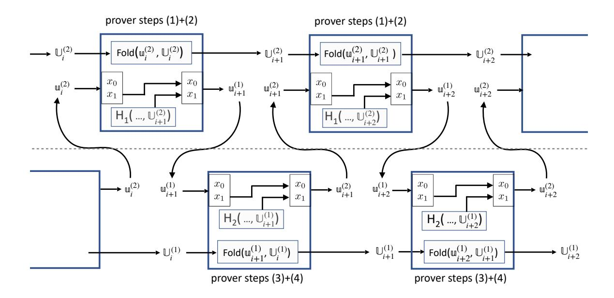

## Revisiting the Nova Proof System on a Cycle of Curves

Wilson Nguyen Dan Boneh Srinath Setty Stanford University Microsoft Research {wdnguyen, dabo}@cs.stanford.edu srinath@microsoft.com

Abstract. Nova is an efficient recursive proof system built from an elegant folding scheme for (relaxed) R1CS statements. The original Nova paper (CRYPTO'22) presented Nova using a single elliptic curve group of order p. However, for improved efficiency, the implementation of Nova alters the scheme to use a 2-cycle of elliptic curves. This altered scheme is only described in the code and has not been proven secure. In this work, we point out a soundness vulnerability in the original implementation of the 2-cycle Nova system. To demonstrate this vulnerability, we construct a convincing Nova proof for the correct evaluation of 275 rounds of the Minroot VDF in only 1.46 seconds. We then present a modification of the 2-cycle Nova system and formally prove its security. The modified system also happens to be more efficient than the original implementation. In particular, the modification eliminates an R1CS instance-witness pair from the recursive proof. The implementation of Nova has now been updated to use our optimized and secure system. We also show that Nova's IVC proofs are malleable and discuss several mitigations.

## 1 Introduction

In a recent work, Kothapalli, Setty, and Tzialla introduced an elegant folding scheme for relaxed R1CS statements [\[11\]](#page-22-0). The scheme leads to the Nova proof system: an efficient succinct proof system for incrementally verifiable computation, or IVC [\[18\]](#page-22-1). The description and analysis of Nova in [\[11\]](#page-22-0) restricts itself to a single chain of incremental computation, namely a series of identical computation steps that produce an output which is fed directly into the next step. At every step, a single application of some function F is applied, and a statement about the validity of the prior step is folded into an ongoing statement of validity. We refer to this as a single IVC chain.

To improve efficiency, the implementation of Nova [\[13\]](#page-22-2) uses a 2-cycle of elliptic curves. This leads to a proof system that uses two parallel IVC chains that must be linked together. Until this work, the 2-cycle Nova system was only described in the implementation code and there was no public proof of security.

In this short note, we begin by formally describing the two IVC chains approach used in the Nova implementation. Instead of describing the original scheme, we present in Sections [4](#page-6-0) and [5](#page-8-0) a modified version of Nova that results in shorter IVC proofs. As detailed later, the modification eliminates an R1CS instancewitness pair from IVC proofs. In [Section 6](#page-12-0) we prove knowledge soundness of this modified system. The Nova implementation has now been updated [\[17\]](#page-22-3) to use this optimized system. In [Section 8](#page-18-0) we show that Nova's IVC proofs are malleable, which can lead to a security vulnerability in some applications. We discuss strategies to mitigate this concern in [Section 8.2.](#page-20-0) Sections [2](#page-0-0) and [3](#page-4-0) establish the terminology needed to describe Nova on a cycle of elliptic curves.

In [Appendix B](#page-23-0) we describe an attack on the original implementation. The attack is able to produce proofs for false statements. For example, we compute a convincing proof for an evaluation of 275 rounds of the Minroot VDF [\[9\]](#page-22-4) in only 1.46 seconds on a single laptop. The core issue that this attack exploits is that the original 2-cycle Nova system produces an IVC proof that contains an additional R1CS instance-witness pair that is not sufficiently constrained by the verifier.

## 2 Preliminaries

## 2.1 Incrementally Verifiable Computation (IVC)

Incrementally verifiable computation, or IVC, was introduced by Valiant [\[18\]](#page-22-1). For a function F : {0, 1} a × {0, 1} b → {0, 1} a , and some public values z0, zi ∈ {0, 1} a , an IVC scheme lets a prover generate a succinct proof that it knows auxiliary values  $\mathsf{aux}_0, \dots, \mathsf{aux}_{i-1} \in \{0,1\}^b$  such that

$$\begin{array}{cccccccccccccccccccccccccccccccccccc$$

The following definition gives the syntax and security properties for an IVC scheme. The prover  $\mathcal{P}$  in this definition computes a proof for one step in the IVC chain. Iterating the prover will produce a proof  $\pi_i$  for the entire chain of length i.

**Definition 1 (IVC [18]).** An **IVC Scheme** is a tuple of efficient algorithms (Setup,  $\mathcal{P}, \mathcal{V}$ ) with the following interface:

- Setup $(1^{\lambda}, n) \to pp$ : Given a security parameter  $1^{\lambda}$ , a poly-size bound  $n \in \mathbb{N}$ , outputs public parameters pp.
- $-\mathcal{P}(\mathsf{pp},\mathsf{F},(i,z_0,z_i),\mathsf{aux}_i,\pi_i) \to \pi_{i+1}$ : Given public parameters  $\mathsf{pp},\ a\ function\ \mathsf{F}:\{0,1\}^a \times \{0,1\}^b \to \{0,1\}^a$  computable by a circuit of size at most  $n,\ an\ index\ i\in\mathbb{N},\ an\ initial\ input\ z_0\in\{0,1\}^a,\ a\ claimed\ output\ z_i\in\{0,1\}^a,\ advice\ \mathsf{aux}_i\in\{0,1\}^b,\ and\ an\ IVC\ proof\ \pi_i,\ outputs\ a\ new\ IVC\ proof\ \pi_{i+1}.$
- $-V(pp, F, (i, z_0, z_i), \pi_i) \rightarrow 0/1$ : Given public parameters pp, a function F, an index i, an initial input  $z_0$ , a claimed output  $z_i$ , and an IVC proof  $\pi_i$ , outputs 0 (accept) or 1 (reject).

An IVC Scheme satisfies the following properties:

Completeness: For every poly-size bound  $n \in \mathbb{N}$ , for every pp in the output space of  $\mathsf{Setup}(1^\lambda, n)$ , for every function  $\mathsf{F} : \{0,1\}^a \times \{0,1\}^b \to \{0,1\}^a$  computable by a circuit within the poly-size bound n, for every collection of elements  $(i \in \mathbb{N}, z_0, z_i \in \{0,1\}^a)$ ,  $\mathsf{aux}_i \in \{0,1\}^b$ , and IVC proof  $\pi_i$ ,

$$\Pr\left[\begin{array}{c} \mathcal{V}(\mathsf{pp},\mathsf{F},(i,z_0,z_i),\pi_i) = 1 \\ \Downarrow \\ \mathcal{V}(\mathsf{pp},\mathsf{F},(i+1,z_0,z_{i+1}),\pi_{i+1}) = 1 \end{array}\right. : \begin{array}{c} \pi_{i+1} \leftarrow \mathcal{P}(\mathsf{pp},\mathsf{F},(i,z_0,z_i),\mathsf{aux}_i,\pi_i), \\ z_{i+1} \leftarrow F(z_i,\mathsf{aux}_i) \end{array}\right] = 1$$

Knowledge Soundness: Let  $n \in \mathbb{N}$  be a poly-size bound and  $\ell(\lambda)$  be a polynomial in the security parameter. Let  $\mathcal{F}$  be an efficient function sampling adversary that outputs a function  $F: \{0,1\}^a \times \{0,1\}^b \to \{0,1\}^a$  computable by a circuit within the poly-size bound n. Then for every efficient IVC prover  $P^*$ , there exists an efficient extractor  $\mathcal{E}$  such that

$$\Pr\left[\begin{array}{c} \mathcal{V}(\mathsf{pp},\mathsf{F},(i,z_0,z_i),\pi_i) = 1 \\ & \qquad \qquad \qquad \mathsf{pp} \leftarrow \mathsf{Setup}(1^\lambda,n), \\ \downarrow \qquad \qquad \qquad \qquad \qquad \rho \leftarrow \{0,1\}^{\ell(\lambda)}, \\ z_i = \mathsf{F}(\mathbf{z}_{i-1},\mathsf{aux}_{i-1}) \ \land \qquad \qquad \vdots \quad \mathsf{F} \leftarrow \mathcal{F}(\mathsf{pp};\rho), \\ (i = 1 \ \Rightarrow \ \mathbf{z}_{i-1} = z_0) \ \land \qquad \qquad \qquad (i,z_0,z_i,\pi_i) \leftarrow P^*(\mathsf{pp};\rho), \\ (i > 1 \ \Rightarrow \ \mathcal{V}(\mathsf{pp},\mathsf{F},(i-1,z_0,\mathbf{z}_{i-1}),\pi_{i-1}) = 1) \end{array}\right] \geq 1 - \mathsf{negl}(\lambda)$$

Remark 1 (Full Extraction). Our definition of knowledge soundness implies other notions of IVC knowledge soundness, which require the extraction of all the auxiliary values in the execution chain [1, 2, 10, 11]. Informally, consider some  $\rho$  and pp sampled at random, and an adversary  $P^*(pp; \rho)$  that outputs a proof for i iterations of the IVC. Then the knowledge extractor  $\mathcal{E}$  can be used to construct an IVC prover for a proof of i-1 iterations. Applying the definition again to the prover derived from  $\mathcal{E}$  implies that there is a knowledge extractor  $\mathcal{E}'$  that outputs a valid  $(z_{i-2}, \mathsf{aux}_{i-2})$ ,  $\pi_{i-2}$  with all but negligible probability. We can repeat this argument inductively to extract a vector of auxiliary values  $(\mathsf{aux}_{i-1}, \ldots, \mathsf{aux}_0)$  that shows that the  $z_i$  output by  $P^*$  is computed correctly from  $z_0$ . Note that if  $\mathsf{time}(\mathcal{E}) > c \cdot \mathsf{time}(P^*)$  for some constant c > 1, then this argument only works for  $O(\log \lambda)$  steps before the running time of the extractor becomes super-polynomial in  $\lambda$ . We use this sequential IVC model for consistency with the original Nova [11, 13]. In certain applications, a tree-like IVC proof system might be preferable.

Remark 2 (Succinct Verifier). The verifier in [Definition 1](#page-1-0) takes as input the description of the function F which implies that its running time must be at least linear in the size of F. One can include an additional Keygen algorithm that outputs a prover-verifier key pair (pk, vk) specialized to a function F, where the size of vk is sub-linear in the size of F. This shifts the work of processing the description of F to a preprocessing phase. The verifier then takes vk as input, instead of F, which may lead to a faster online verifier. In fact, Nova [\[11\]](#page-22-0) includes a Keygen algorithm that enables a succinct verifier.

Remark 3 (Zero Knowledge). In some settings one also wants the IVC scheme to be zero knowledge, but in this writeup we focus on knowledge soundness of the scheme.

## 2.2 Committed Relaxed R1CS over a Ring

The Nova Proof system over a cycle of curves makes use of two finite fields 1 and 2 simultaneously. As such, it is convenient to treat the primitives used in Nova as operating on the finite commutative ring R := 1 ×2, where addition and multiplication are defined component wise. That is, for a = (a1, a2) and b = (b1, b2) in R, we define a + b = (a1 + a2, b1 + b2) and a · b = (a1b1, a2b2).

Definition 2. (Commitment Scheme) Let R be a finite commutative ring. A commitment scheme for vectors over R is a pair of efficient algorithms (Setupcom, Commit) with the following interface:

- Setupcom(1λ , R, n) → ppcom: Given a security parameter 1 λ ∈ 1 ℕ, a description of a ring R, and a poly-size bound n ∈ ℕ, outputs public parameters ppcom.
- Commit(ppcom, x) → c: Given public parameters ppcom and input x ∈ Rn, outputs a commitment c.

These algorithms need to satisfy the following properties,

– Binding: Let n ∈ ℕ be a poly-size bound. For every efficient adversary A and for every finite commutative ring R whose size is at most exponential in λ,

$$\Pr\left[ \begin{array}{c} \mathsf{Commit}(\mathsf{pp}_{\mathsf{com}}, x_0) = \mathsf{Commit}(\mathsf{pp}_{\mathsf{com}}, x_1) \ \land \\ x_0 \neq x_1 \end{array} \right. : \quad \begin{array}{c} \mathsf{pp}_{\mathsf{com}} \leftarrow \mathsf{Setup}_{\mathsf{com}}(1^\lambda, \mathbf{R}, n) \\ (x_0, x_1) \leftarrow \mathcal{A}(\mathsf{pp}_{\mathsf{com}}) \end{array} \right] \leq \mathsf{negl}(\lambda)$$

- Additively Homomorphic: Given two commitments c ← Commit(ppcom, x), c′ ← Commit(ppcom, x′ ) to vectors x, x′ ∈ Rn (not necessarily distinct), there is an efficient homomorphism ⊕ on commitments such that c ⊕ c ′ = Commit(ppcom, x + x ′ ).
- Succinct: For any x ∈ Rn, the commitment c ← Commit(ppcom, x) must have size |c| ≤ poly(λ, log(n)).

Definition 3. (Committed Relaxed R1CS over a Ring) Consider m, n, ℓ ∈ ℕ where m > ℓ and a finite commutative ring R. Further, consider a commitment scheme Commit for vectors over R, where ppW and ppE are commitment parameters for vectors of size m − ℓ − 1 and n respectively.

- A committed relaxed R1CS instance is a tuple := (E, s, ¯ W , x ¯ ), where E¯ and W¯ are commitments, s ∈ R, and x ∈ Rℓ .
- A committed relaxed R1CS instance = (E, s, ¯ W , x ¯ ) is satisfiable with respect to an R1CS constraint system R1CS := (A, B, C ∈ Rn×m) if there exist a relaxed witness := (E ∈ Rn, W ∈ Rm−ℓ−1 ) such that

$$\bar{E} = \mathsf{Commit}(\mathsf{pp}_E, E), \quad \bar{W} = \mathsf{Commit}(\mathsf{pp}_W, W), \quad and \quad (A \cdot Z) \circ (B \cdot Z) = s \cdot (C \cdot Z) + E(A \cdot Z) \circ (B \cdot Z) = S \cdot (C \cdot Z) + E(A \cdot Z) \circ (B \cdot Z) = S \cdot (C \cdot Z) + E(A \cdot Z) \circ (B \cdot Z) = S \cdot (C \cdot Z) + E(A \cdot Z) \circ (B \cdot Z) = S \cdot (C \cdot Z) + E(A \cdot Z) \circ (B \cdot Z) = S \cdot (C \cdot Z) + E(A \cdot Z) \circ (B \cdot Z) = S \cdot (C \cdot Z) + E(A \cdot Z) \circ (B \cdot Z) = S \cdot (C \cdot Z) + E(A \cdot Z) \circ (B \cdot Z) = S \cdot (C \cdot Z) + E(A \cdot Z) \circ (B \cdot Z) = S \cdot (C \cdot Z) + E(A \cdot Z) \circ (B \cdot Z) = S \cdot (C \cdot Z) + E(A \cdot Z) \circ (B \cdot Z) = S \cdot (C \cdot Z) + E(A \cdot Z) \circ (B \cdot Z) = S \cdot (C \cdot Z) + E(A \cdot Z) \circ (B \cdot Z) = S \cdot (C \cdot Z) + E(A \cdot Z) \circ (B \cdot Z) = S \cdot (C \cdot Z) + E(A \cdot Z) \circ (B \cdot Z) = S \cdot (C \cdot Z) + E(A \cdot Z) \circ (B \cdot Z) = S \cdot (C \cdot Z) + E(A \cdot Z) \circ (B \cdot Z) = S \cdot (C \cdot Z) + E(A \cdot Z) \circ (B \cdot Z) = S \cdot (C \cdot Z) + E(A \cdot Z) \circ (B \cdot Z) = S \cdot (C \cdot Z) + E(A \cdot Z) \circ (B \cdot Z) = S \cdot (C \cdot Z) + E(A \cdot Z) \circ (B \cdot Z) = S \cdot (C \cdot Z) + E(A \cdot Z) \circ (B \cdot Z) = S \cdot (C \cdot Z) = S \cdot (C \cdot Z) + E(A \cdot Z) \circ (C \cdot Z) = S \cdot (C \cdot Z) = S \cdot (C \cdot Z) = S \cdot (C \cdot Z) = S \cdot (C \cdot Z) = S \cdot (C \cdot Z) = S \cdot (C \cdot Z) = S \cdot (C \cdot Z) = S \cdot (C \cdot Z) = S \cdot (C \cdot Z) = S \cdot (C \cdot Z) = S \cdot (C \cdot Z) = S \cdot (C \cdot Z) = S \cdot (C \cdot Z) = S \cdot (C \cdot Z) = S \cdot (C \cdot Z) = S \cdot (C \cdot Z) = S \cdot (C \cdot Z) = S \cdot (C \cdot Z) = S \cdot (C \cdot Z) = S \cdot (C \cdot Z) = S \cdot (C \cdot Z) = S \cdot (C \cdot Z) = S \cdot (C \cdot Z) = S \cdot (C \cdot Z) = S \cdot (C \cdot Z) = S \cdot (C \cdot Z) = S \cdot (C \cdot Z) = S \cdot (C \cdot Z) = S \cdot (C \cdot Z) = S \cdot (C \cdot Z) = S \cdot (C \cdot Z) = S \cdot (C \cdot Z) = S \cdot (C \cdot Z) = S \cdot (C \cdot Z) = S \cdot (C \cdot Z) = S \cdot (C \cdot Z) = S \cdot (C \cdot Z) = S \cdot (C \cdot Z) = S \cdot (C \cdot Z) = S \cdot (C \cdot Z) = S \cdot (C \cdot Z) = S \cdot (C \cdot Z) = S \cdot (C \cdot Z) = S \cdot (C \cdot Z) = S \cdot (C \cdot Z) = S \cdot (C \cdot Z) = S \cdot (C \cdot Z) = S \cdot (C \cdot Z) = S \cdot (C \cdot Z) = S \cdot (C \cdot Z) = S \cdot (C \cdot Z) = S \cdot (C \cdot Z) = S \cdot (C \cdot Z) = S \cdot (C \cdot Z) = S \cdot (C \cdot Z) = S \cdot (C \cdot Z) = S \cdot (C \cdot Z) = S \cdot (C \cdot Z) = S \cdot (C \cdot Z) = S \cdot (C \cdot Z) = S \cdot (C \cdot Z) = S \cdot (C \cdot Z) = S \cdot (C \cdot Z) = S \cdot (C \cdot Z) = S \cdot (C \cdot Z) = S \cdot (C \cdot Z) = S \cdot (C \cdot Z) = S \cdot (C \cdot Z) = S \cdot (C \cdot Z) = S \cdot (C \cdot Z) = S \cdot (C \cdot Z) = S \cdot (C \cdot Z) = S \cdot (C \cdot Z) = S \cdot (C \cdot Z) = S \cdot (C \cdot Z) = S \cdot (C \cdot Z) = S \cdot (C \cdot Z) = S \cdot (C \cdot Z) = S \cdot (C \cdot Z) = S \cdot (C \cdot Z) = S \cdot (C \cdot Z) = S$$

where Z = (W, x, s). We refer to E as the error vector and W as the extended witness.

– An instance-witness pair (, ) satisfies a constraint system R1CS if is a satisfying relaxed witness for . An instance-witness pair (,) pair strictly satisfies an R1CS constraint system R1CS if (1) the pair satisfies R1CS and (2) .E¯ = ¯0 is the commitment to the zero vector and s = 1.

Remark 4 (Trivially Satisfiable Instance-Witness Pairs). A committed instance-witness pair (⊥, ⊥) will denote a trivially satisfying pair for an R1CS constraint system R1CS over R. In Nova [\[11\]](#page-22-0), this pair is constructed by setting E, W, and x to appropriately sized zero vectors, E, ¯ W¯ to be commitments to the zero vectors, and s equal to 0.

### 2.3 A Folding Scheme for Committed Relaxed R1CS over a Ring

Folding schemes give an efficient approach to IVC. In recent years, several works [1, 2, 10–12, 15] constructed efficient folding schemes for different problems. Nova [11] introduces an elegant folding scheme, for folding two committed relaxed R1CS instances and their witnesses. Nova's folding scheme is a public-coin, one-round interactive protocol that is made non-interactive in the random oracle model using the Fiat-Shamir transform. Additionally, Nova heuristically instantiates the random oracle with a concrete hash function and assumes that this heuristic produces a protocol that is knowledge sound. A similar assumption is used in other recursive proof systems [1, 2, 10].

Definition 4. A Non-Interactive Folding Scheme for Committed Relaxed R1CS consists of an underlying commitment scheme (Setupcom, Commit) (Definition 2) for committed relaxed instances (Definition 3) and a tuple of efficient algorithms (FoldSetup, FoldK, FoldK, FoldK, FoldK) with the following interface:

- FoldSetup $(1^{\lambda}, n) \to pp$ : Given a security parameter  $1^{\lambda} \in 1^{\mathbb{N}}$ , a poly-size bound  $n \in \mathbb{N}$ , outputs public parameters pp which contain the description of a finite commutative ring R and commitment parameters  $pp_{com}$  for vectors over R within the size bound n.
- FoldK(pp, R1CS) → (pk, vk) Given public parameters pp, an R1CS constraint system R1CS over R within the poly-size bound n, outputs proving key pk and verifier key vk.
- FoldP (pk, (u, w), (U, W)) → (T̄, (U', W')): Given a proving key pk, two committed relaxed R1CS instance-witness pairs (u, w), (U, W), outputs a folding proof T̄ in the commitment space, and a new committed relaxed R1CS instance-witness pair (U', W').
- $\mathsf{Fold}_{\mathcal{V}}(\mathsf{vk}, \mathbf{u}, \mathbb{U}, \bar{\mathsf{T}}) \to \mathbb{U}'$ : Given a verification key  $\mathsf{vk}$ , two committed relaxed R1CS instances  $\mathbf{u}, \mathbb{U}$ , and a folding proof  $\bar{\mathsf{T}}$ , outputs a new committed relaxed R1CS instance  $\mathbb{U}'$ .

These algorithms need to satisfy the following properties:

Completeness: For every poly-size bound  $n' \in \mathbb{N}$ , for every pp in the output space of  $\mathsf{Fold}_{\mathsf{Setup}}(1^\lambda, n')$ , for every poly-size  $m, n, \ell \in \mathbb{N}$  where  $m > \ell$ ,  $n' > m - \ell - 1$ , n' > n, for every R1CS constraint system  $\mathsf{R1CS} := (A, B, C \in \mathbb{R}^{n \times m})$ , for every committed relaxed instance-witness pair  $(\mathfrak{u}, \mathfrak{w}), (\mathbb{U}, \mathbb{W})$  for R1CS,

$$\Pr \left[ \begin{array}{c} \mathbb{U}' = \mathbb{U}'' \\ \wedge \\ (\mathbb{u}, \mathbb{w}), (\mathbb{U}, \mathbb{W}) \text{ satisfy R1CS} \\ \Rightarrow (\mathbb{U}', \mathbb{W}') \text{ satisfies R1CS} \end{array} \right. : \left. \begin{array}{c} (\mathsf{pk}, \mathsf{vk}) \leftarrow \mathsf{Fold}_{\mathcal{K}}(\mathsf{pp}, \mathsf{R1CS}), \\ \vdots \\ (\bar{\mathsf{T}}, (\mathbb{U}', \mathbb{W}')) \leftarrow \mathsf{Fold}_{\mathcal{P}}\left(\mathsf{pk}, (\mathbb{u}, \mathbb{w}), (\mathbb{U}, \mathbb{W})\right), \\ \mathbb{U}'' \leftarrow \mathsf{Fold}_{\mathcal{V}}\left(\mathsf{vk}, \mathbb{u}, \mathbb{U}, \bar{\mathsf{T}}\right) \end{array} \right] = 1$$

Knowledge Soundness: Let  $n \in \mathbb{N}$  be a poly-size bound and  $\ell(\lambda)$  be a polynomial in the security parameter. For every efficient adversary  $\mathcal{P}^*$ , there exist an efficient extractor  $\mathcal{E}$  such that

$$\Pr \begin{bmatrix} \mathbb{U}' = \mathsf{Fold}_{\mathcal{V}}(\mathsf{vk}, \mathbb{u}, \mathbb{U}, \bar{\mathsf{T}}) \; \wedge & \mathsf{pp} \leftarrow \mathsf{Fold}_{\mathsf{Setup}}(1^{\lambda}, n), \\ (\mathbb{U}', \mathbb{W}') \; \mathsf{satisfies} \; \mathsf{R1CS} & \rho \leftarrow \{0, 1\}^{\ell(\lambda)}, \\ & \downarrow & (\mathsf{R1CS}, (\mathbb{u}, \mathbb{U}, \bar{\mathsf{T}}), (\mathbb{U}', \mathbb{W}')) \leftarrow \mathcal{P}^*(\mathsf{pp}; \rho), \\ (\mathbb{u}, \mathbb{w}), (\mathbb{U}, \mathbb{W}) \; \mathsf{satisfy} \; \mathsf{R1CS} & (\mathsf{pk}, \mathsf{vk}) \leftarrow \mathsf{Fold}_{\mathcal{K}}(\mathsf{pp}, \mathsf{R1CS}), \\ & (\mathbb{w}, \mathbb{W}) \leftarrow \mathcal{E}(\mathsf{pp}; \rho) \end{bmatrix} \geq 1 - \mathsf{negl}(\lambda)$$

In words, the definition of knowledge soundness states that if an adversary  $\mathcal{P}^*$  can create a folded statement  $\mathbb{U}'$  of two statements  $\mathbb{U}$  and a satisfying witness  $\mathbb{W}'$  for  $\mathbb{U}'$ , then an extractor  $\mathcal{E}$  for  $\mathcal{P}^*$  can produce satisfying witnesses  $\mathbb{W}$  for  $\mathbb{U}$ .

Collision resistance. The Nova construction also uses collision resistant hash functions. To be comprehensive, we define these next.

**Definition 5 (Collision Resistant Hash Functions).** Let R be a finite commutative ring such that  $|R| \approx 2^{\lambda}$ . A hash function for R is a pair of efficient algorithms (SetupH, H) with the following interface:

- $\mathsf{Setup}_\mathsf{H}(1^\lambda,R) \to \mathsf{pp}_\mathsf{H}$ : Given a security parameter  $1^\lambda \in 1^\mathbb{N}$  and a description of R, outputs public parameters  $\mathsf{pp}_\mathsf{H}$ .
- $H(pp_H, x) \rightarrow h$ : Given public parameters  $pp_H$  and input  $x \in \mathbb{R}^*$ , outputs a hash  $h \in \mathbb{R}$ .

A hash function is **collision resistant** if for every efficient adversary A,

$$\Pr \begin{bmatrix} \mathsf{H}(\mathsf{pp}_\mathsf{H}, m_0) = \mathsf{H}(\mathsf{pp}_\mathsf{H}, m_1) \ \land \\ m_0 \neq m_1 \end{bmatrix} : \quad \begin{aligned} \mathsf{pp}_\mathsf{H} \leftarrow \mathsf{Setup}_\mathsf{H}(1^\lambda, \mathbf{R}) \\ (m_0, m_1) \leftarrow \mathcal{A}(\mathsf{pp}_\mathsf{H}) \end{bmatrix} \leq \mathsf{negl}(\lambda) \end{aligned}$$

## 3 The Nova Proof System over a Cycle of Curves: Preliminary Details

In this section and the next, we describe details about the underlying primitives in the Nova Proof System [13]. Section 5 describes the explicit operation of the modified IVC verifier and modified IVC prover.

Cycle of Elliptic Curves To reduce the number of constraints related to group operations, the implementation of Nova uses a cycle of elliptic curves for which the discrete log problem is hard. Specifically, the Nova implementation is generic over any cycle of elliptic curves that implements certain Rust traits (Nova implements those traits for the pasta cycle of two curves [14]). We denote the elliptic curve groups as  $\mathbb{G}_1$  and  $\mathbb{G}_2$ . We refer to the scalar field of an elliptic curve group  $\mathbb{G}$  as the field  $\mathbb{F}$  whose order is  $|\mathbb{G}|$ , and the base field of  $\mathbb{G}$  as the field  $\mathbb{F}'$  over which the elliptic curve is defined (i.e. the points have the form  $(x, y) \in \mathbb{F}' \times \mathbb{F}'$ ).

The group  $\mathbb{G}_1$  has scalar field  $\mathbb{F}_1$  and base field  $\mathbb{F}_2$ , while  $\mathbb{G}_2$  has scalar field  $\mathbb{F}_2$  and base field  $\mathbb{F}_1$ . Group operations for  $\mathbb{G}_1$  can be efficiently expressed as constraints over the base field  $\mathbb{F}_2$ . Symmetrically, group operations for  $\mathbb{G}_2$  can be efficiently expressed as constraints over the base field  $\mathbb{F}_1$ . The groups  $\mathbb{G}_1$  and  $\mathbb{G}_2$  will be the commitment spaces for Pedersen vector commitments for vectors over  $\mathbb{F}_1$  and  $\mathbb{F}_2$  respectively.

Groups and Rings We define the ring  $R := \mathbb{F}_1 \times \mathbb{F}_2$  as the set of tuples with one element in  $\mathbb{F}_1$  and another in  $\mathbb{F}_2$ . We can naturally define the ring operations as the component-wise field operations. Similarly, define the group  $\mathbb{G} := \mathbb{G}_1 \times \mathbb{G}_2$  and it's group operation as the component-wise group operation.

Commitments In Nova, the folding procedure requires additively homomorphic commitments to vectors over a field  $\mathbb{F}$ . Their specific construction [11] uses Pedersen vector commitments belonging to a group  $\mathbb{G}$  of order  $|\mathbb{F}|$ , for which the discrete log problem is hard. Nova's implementation [13] is generic over the commitment scheme and one can supply a different commitment scheme for vectors, but we restrict our attention to Pedersen vector commitments in this paper.

We generalize the Pedersen vector commitment to the ring  $\mathbf{R} := \mathbb{F}_1 \times \mathbb{F}_2$  by composing a Pedersen vector commitment over  $\mathbb{F}_1$  with commitment space  $\mathbb{G}_1$  and a Pedersen vector commitment over  $\mathbb{F}_2$  with commitment space  $\mathbb{G}_2$ . We write  $x^{(1)} \in \mathbb{F}_1^n$  and  $x^{(2)} \in \mathbb{F}_2^n$  for the left and right projections of a vector  $x \in \mathbb{R}^n$ . Then, the commitment to x is a pair of commitments: a commitment to  $x^{(1)} \in \mathbb{F}_1^n$  and a commitment to  $x^{(2)} \in \mathbb{F}_2^n$ . Concretely, this commitment to the vector  $x \in \mathbb{R}^n$  will be an element in  $\mathbb{G} := \mathbb{G}_1 \times \mathbb{G}_2$ .

Committed relaxed instances Consider two R1CS constraint systems

$$\mathsf{R1CS}^{(1)} := (A_1, B_1, C_1 \in \mathbb{F}_1^{n_1 \times m_1})$$
 and  $\mathsf{R1CS}^{(2)} := (A_2, B_2, C_2 \in \mathbb{F}_1^{n_2 \times m_2})$ 

defined over  $\mathbb{F}_1$  and  $\mathbb{F}_2$ , respectively. A committed relaxed instance for  $\mathsf{R1CS}^{(1)}$  is a tuple

$$\mathbb{U}^{(1)} := \left(\bar{\mathsf{E}}^{(1)}, \ s^{(1)}, \ \overline{\mathsf{W}}^{(1)}, \ x^{(1)}\right) \qquad \text{where} \qquad \bar{\mathsf{E}}^{(1)}, \overline{\mathsf{W}}^{(1)} \in \mathbb{G}_1, \quad s^{(1)} \in \mathbb{F}_1, \quad x^{(1)} \in \mathbb{F}_1^{\ell_1}.$$

The corresponding relaxed witness  $\mathbb{W}^{(1)} = (E^{(1)}, W^{(1)})$  has an error vector  $E^{(1)} \in \mathbb{F}_1^{n_1}$  and extended witness  $W^{(1)} \in \mathbb{F}_1^{m_1-\ell_1-1}$ . Symmetrically, a committed relaxed instance for  $\mathsf{R1CS}^{(2)}$  is a tuple

$$\mathbb{U}^{(2)} := (\bar{\mathsf{E}}^{(2)}, \ s^{(2)}, \ \bar{\mathsf{W}}^{(2)}, \ x^{(2)}) \qquad \text{where} \qquad \bar{\mathsf{E}}^{(2)}, \bar{\mathsf{W}}^{(2)} \in \mathbb{G}_2, \quad s^{(2)} \in \mathbb{F}_2, \quad x^{(2)} \in \mathbb{F}_2^{\ell_2}.$$

The corresponding relaxed witness  $\mathbb{W}^{(2)} = (E^{(2)}, W^{(2)})$  has error vector  $E^{(2)} \in \mathbb{F}_2^{n_2}$  and  $W^{(2)} \in \mathbb{F}_2^{m_2 - \ell_2 - 1}$ .

The two constraint systems  $\mathsf{R1CS}^{(1)}$  over  $\mathbb{F}_1$  and  $\mathsf{R1CS}^{(2)}$  over  $\mathbb{F}_2$  can be treated as a single constraint system R1CS :=  $(A, B, C \in \mathbb{R}^{n \times m})$  over  $\mathbb{R} := \mathbb{F}_1 \times \mathbb{F}_2$ . The constraint systems R1CS(1) and R1CS(2) are simply the left and right projections of R1CS. A strict projection of R1CS would require the dimensions of  $R1CS^{(1)}$  and  $R1CS^{(2)}$  to be identical to the dimensions of R1CS. In practice,  $R1CS^{(1)}$  and  $R1CS^{(2)}$  can have different dimensions. When abstractly combining the constraint systems to obtain R1CS, we can pad the systems with dummy rows and columns so that R1CS(1) and R1CS(2) have the same dimension. In particular,  $m = \max(m_1, m_2)$ ,  $n = \max(n_1, n_2)$ , and  $l = \max(l_1, l_2)$ . Similarly, we can treat instance-witness pairs  $(\mathbb{U}^{(1)}, \mathbb{W}^{(1)})$ ,  $(\mathbb{U}^{(2)}, \mathbb{W}^{(2)})$  as the left and right projection of an instance-witness pair  $(\mathbb{U}, \mathbb{W})$  for R1CS.

Hash Functions Hash functions  $H_1: \mathbb{F}_1^* \to \mathbb{F}_1$  and  $H_2: \mathbb{F}_2^* \to \mathbb{F}_2$  are collision resistant hash functions that take as input an arbitrary number of field elements and output a single field element which encodes the hash. In Nova, this single field element can be represented as a scalar whose bit representation is at most 250 bits long. Thus, the output hash has a unique representation in both fields, whose elements are 256 bits. 1

Concretely, define  $h_1 := H_1(\dots)$  as the output of  $H_1$  for some arbitrary input elements  $(\dots) \in \mathbb{F}_1^*$ . The hash can be expressed as  $h_1 = \sum_{i \le 250} b_i^{(1)} \cdot (2^{(1)})^i$  where  $2^{(1)} \in \mathbb{F}_1$  and for all  $i \le 250$ ,  $b_i^{(1)} \in \mathbb{F}_1$  are bits in  $\{0,1\}$ . The hash output  $h_1 := \sum_{i \le 250} b_i^{(1)} \cdot (2^{(1)})^i$  in  $\mathbb{F}_1$  can be represented as an element  $h_1'$  in  $\mathbb{F}_2$ . To do so, define  $h'_1 := \sum_{i < 250} b_i^{(2)} \cdot (2^{(2)})^i$  where for all i, the bit  $b_i^{(2)} \in \mathbb{F}_2$  is the same the bit  $b_i^{(1)} \in \mathbb{F}_1$  (i.e. if  $b_i^{(1)} = 1^{(1)}$ , we define  $b_i^{(2)} = 1^{(2)}$  otherwise  $b_i^{(2)} = 0^{(2)}$ ). Symmetrically, a hash output  $h_2 := \sum_{i < 250} b_i^{(2)} \cdot (2^{(2)})^i$  in  $\mathbb{F}_2$  can be represented as an element  $h_2'$  in  $\mathbb{F}_1$  in the same way.

Similarly, the hash function  $H:\{0,1\}^* \to \{0,1\}^{\lambda}$  is a collision resistant hash function whose outputs can be represented uniquely in both fields. We omit the hash parameters for H for ease of presentation. The Nova implementation [13] uses the Poseidon hash function [7] for  $H_1$  and  $H_2$  and SHA-3 [5] for H.

#### Folding over a Cycle of Curves 3.1

In Nova [11], a non-interactive folding scheme in the random oracle model is constructed by applying the Fiat-Shamir transform [6] to an interactive folding scheme. By instantiating the random oracle with an appropriate cryptographic hash function, they heuristically obtain a non-interactive folding scheme in the plain model. The construction described in [11] is limited to an R1CS constraint system R1CS defined over a field  $\mathbb{F}$  with commitments belonging to a group  $\mathbb{G}$  (with scalar field  $\mathbb{F}$ ).

We extend the construction to R1CS constraint systems R1CS defined over a ring  $R := \mathbb{F}_1 \times \mathbb{F}_2$  by composing a folding scheme for R1CS constraint systems defined over  $\mathbb{F}_1$  and a folding scheme for R1CS constraint systems defined over  $\mathbb{F}_2$ . When we fold committed relaxed instances for  $R1CS^{(1)}$ , we implicitly mean run the folding scheme for systems over  $\mathbb{F}_1$ . Symmetrically, when we fold committed relaxed instances for  $R1CS^{(2)}$ , we implicitly mean run the folding scheme for systems over  $\mathbb{F}_2$ . However, the random oracle calls used in both folding scheme will need to take in an argument vk, which is derived from both systems. We describe this in more detail in the description of  $\mathsf{Fold}_{\mathcal{K}}$ .

## Folding Setup FoldSetup takes in as input:

- A security parameter  $1^{\lambda}$ .
- A poly-size bound  $n \in \mathbb{N}$ .

The algorithm performs the following steps:

- 1. Sample a cycle of elliptic curves  $(\mathbb{G}_1, \mathbb{F}_1, \mathbb{G}_2, \mathbb{F}_2) \leftarrow \mathsf{SampleCycle}(1^{\lambda})$ .
- 2. Sample collision resistant hash parameters  $\mathsf{pp}_{\mathsf{H}_1} \leftarrow \mathsf{Setup}_{\mathsf{H}}(1^{\lambda}, \mathbb{F}_1), \, \mathsf{pp}_{\mathsf{H}_2} \leftarrow \mathsf{Setup}_{\mathsf{H}}(1^{\lambda}, \mathbb{F}_2).$ 3. Sample commitment parameters  $\mathsf{pp}_{\mathsf{com}_1} \leftarrow \mathsf{Setup}_{\mathsf{com}}(1^{\lambda}, \mathbb{F}_1, n) \text{ and } \mathsf{pp}_{\mathsf{com}_2} \leftarrow \mathsf{Setup}_{\mathsf{com}}(1^{\lambda}, \mathbb{F}_2, n).$
- 4. Output  $pp := ((\mathbb{G}_1, \mathbb{F}_1, \mathbb{G}_2, \mathbb{F}_2), pp_{\mathsf{H}_1}, pp_{\mathsf{H}_2}, pp_{\mathsf{H}}, pp_{\mathsf{com}_1}, pp_{\mathsf{com}_2}).$

&lt;sup>1The size of a digest is configurable, but a digest length of 250 bits was chosen to support a variety of popular curve cycles e.g., secp/secq, pallas/vesta (pasta curves), BN254/Grumpkin.

&lt;sup>2The commitment parameters  $pp_E$ ,  $pp_W$  will be prefixes of  $pp_{com}$  where the length is max(|E|, |W|).

Folding Keygen FoldK takes in as input:

- Public parameters pp
- An R1CS constraint system R1CS over R within the poly-size bound n.

The algorithm performs the following steps:

1. Assign the verification key vk to a hash digest of the public parameters and constraint systems

$$vk \leftarrow H(pp, R1CS := (R1CS^{(1)}, R1CS^{(2)}))$$

$$\tag{1}$$

- 2. Assign the proving key  $pk \leftarrow (pp, R1CS)$  to be the public parameters and constraint systems.
- 3. Output (pk, vk).

The Verification Key The Nova folding scheme is derived from an interactive protocol via the Fiat-Shamir transform [6]. As such, queries to the random oracle must include a description of the entire environment. Concretely, let H be an appropriate cryptographic hash function that heuristically instantiates a random oracle and whose outputs can be represented uniquely in both fields. The vk element (assigned in (1)) denotes a hash digest of the environment. FoldV incorporates the elements vk,  $\mathbb{U}, \overline{\mathbb{I}}$  as arguments to its random oracle. We stress that this is needed to preserve the soundness of the Fiat-Shamir transform [3], as these digest elements represent inputs to the folding verifier when viewed as an interactive protocol.

## 4 The Augmented Constraint Systems Used in Nova

The Nova IVC Scheme operates on a pair of functions  $\mathsf{F}_1$  and  $\mathsf{F}_2$ , one for each field. Abstractly, one can treat Nova as an IVC scheme for the combined function  $\mathsf{F}: (\mathbb{F}_1^{a_1} \times \mathbb{F}_2^{a_2}) \times (\mathbb{F}_1^{b_1} \times \mathbb{F}_2^{b_2}) \to (\mathbb{F}_1^{a_1} \times \mathbb{F}_2^{a_2})$  of the form

$$\left((z^{(1)},\ z^{(2)}),\ (\mathsf{aux}^{(1)},\ \mathsf{aux}^{(2)})\right)\ \stackrel{\mathsf{F}}{\longmapsto}\ \left(\mathsf{F}_1(z^{(1)},\ \mathsf{aux}^{(1)}),\ \mathsf{F}_2(z^{(2)},\ \mathsf{aux}^{(2)})\right)$$

where  $\mathsf{F}_1:\mathbb{F}_1^{a_1}\times\mathbb{F}_1^{b_1}\to\mathbb{F}_1^{a_1}$  and  $\mathsf{F}_2:\mathbb{F}_2^{a_2}\times\mathbb{F}_2^{b_2}\to\mathbb{F}_2^{a_2}$  are poly-size arithmetic circuits over  $\mathbb{F}_1$  and  $\mathbb{F}_2$  respectively.

The Nova IVC scheme aims to prove that  $(z_i^{(1)}, z_i^{(2)})$  is the result of iterating the function  $\mathsf{F} = (\mathsf{F}_1, \mathsf{F}_2)$  a total of i times starting from the input  $(z_0^{(1)}, z_0^{(2)})$  and using some auxiliary inputs. Every iteration of the IVC uses two R1CS constraint systems, one over  $\mathbb{F}_1$  and one over  $\mathbb{F}_2$ , to verify that the functions  $\mathsf{F}_1$  and  $\mathsf{F}_2$  were evaluated correctly in that iteration. However, Nova augments these core constraint systems with additional constraints to verify that folding is done correctly at every iteration, and that the outputs of the previous iteration are properly forward to the current iteration. In this section we describe the two augmented constraint systems in detail.

The augmented constraint systems Nova defines two augmented R1CS constraint systems R1CS(1) and R1CS(2) over  $\mathbb{F}_1$  and  $\mathbb{F}_2$ . As noted in Section 3, a group operation for  $\mathbb{G}_1$  can be efficiently expressed as constraints in the base field  $\mathbb{F}_2$ . Since the folding operation requires group operations in  $\mathbb{G}_1$ , the Nova implementation does the folding of the committed instances  $\mathfrak{w}^{(1)}$  and  $\mathbb{U}^{(1)}$  for R1CS(1) in the constraints of R1CS(2). Symmetrically, the Nova implementation does the folding of the committed instances  $\mathbb{w}^{(2)}$  and  $\mathbb{U}^{(2)}$  for R1CS(2) in the constraints of R1CS(1).

The constraint systems  $R1CS^{(1)}$  and  $R1CS^{(2)}$  are defined as follows:

- let  $R1CS^{(1)}$  be the R1CS constraint system for the relation  $\mathcal{R}_1$  defined in Figure 1a.
- let  $R1CS^{(2)}$  be the R1CS constraint system for the relation  $\mathcal{R}_2$  defined in Figure 1b.

Intuitively, each constraint system applies one step of its function  $z_{i+1} := F(z_i, aux_i)$ , folds a prior committed instance  $\mathbb{U}$  into a running committed instance  $\mathbb{U}$  for the opposite constraint system, maintains the original inputs  $z_0$ , and updates the iteration index i. We will explain these constraint systems in more detail when we describe the operation of the prover in Section 5.3.

$$\mathcal{R}_1 := \left\{ \begin{array}{l} \left( \begin{array}{l} \mathbb{U}_{i+1}^{(1)}.x := (x_0, x_1 \in \mathbb{F}_1) \ ; \\ \hat{w}_{i+1}^{(1)} := \left( \mathsf{vk} \in \mathbb{F}_1, \quad i^{(1)} \in \mathbb{F}_1, \quad z_0^{(1)}, z_i^{(1)} \in \mathbb{F}_1^{a_1}, \quad \mathsf{aux}_i^{(1)} \in \mathbb{F}_1^{b_1}, \quad \mathbb{U}_i^{(2)}, \mathbb{U}_i^{(2)} \in \mathcal{U}^{(2)}, \quad \bar{\mathsf{T}}_i^{(2)} \in \mathbb{G}_2 \right) \\ \text{where } \mathcal{U}^{(2)} := \mathbb{G}_2 \times \mathbb{F}_2 \times \mathbb{G}_2 \times \mathbb{F}_2^2 \\ & \text{If } i^{(1)} = 0^{(1)} : \\ & \text{Then set } \mathbb{U}_{i+1}^{(2)} := \mathbb{U}_1^{(2)} \\ & \text{Else set } \mathbb{U}_{i+1}^{(2)} := \mathsf{Fold}_{\mathcal{V}} \big( \mathsf{vk}, \mathbb{U}_i^{(2)}, \mathbb{U}_i^{(2)}, \bar{\mathsf{T}}_i^{(2)} \big) \\ & \text{Accept if :} \\ & \text{If } i^{(1)} = 0^{(1)} \text{ then } z_i^{(1)} = z_0^{(1)} \\ & \mathbb{U}_i^{(2)}.\bar{E} = \bar{0}^{(2)} \\ & \mathbb{U}_i^{(2)}.s = 1^{(2)} \\ & \mathbb{U}_i^{(2)}.x_0 = \mathbb{H}_1 \big( \mathsf{vk}, \ i^{(1)}, \ z_0^{(1)}, \ z_i^{(1)}, \ \mathbb{U}_i^{(2)} \big) \\ & x_0 = \mathbb{U}_i^{(2)}.x_1 \\ & x_1 = \mathbb{H}_1 \big( \mathsf{vk}, \ (i+1)^{(1)}, \ z_0^{(1)}, \ z_{i+1}^{(1)} := \mathbb{F}_1(z_i^{(1)}, \ \mathsf{aux}_i^{(1)}), \ \mathbb{U}_{i+1}^{(2)} \big) \end{array} \right.$$

(a) The relation R1 defining the R1CS constraint system R1CS(1) on instance-witness pairs (1) i+1.x ; ˆw (1) i+1

$$\mathcal{R}_2 := \left\{ \begin{array}{l} \begin{pmatrix} \mathbb{U}_{i+1}^{(2)}.x := (x_0, x_1 \in \mathbb{F}_2) \ ; \\ \hat{w}_{i+1}^{(2)} := (\mathsf{vk} \in \mathbb{F}_2, \quad i^{(2)} \in \mathbb{F}_2, \quad z_0^{(2)}, z_i^{(2)} \in \mathbb{F}_2^{a_2}, \quad \mathsf{aux}_i^{(2)} \in \mathbb{F}_2^{b_2}, \quad \mathbb{U}_i^{(1)}, \mathbb{u}_{i+1}^{(1)} \in \mathbb{U}^{(1)}, \quad \bar{\mathsf{T}}_i^{(1)} \in \mathbb{G}_1) \end{pmatrix} \\ \vdots \\ \text{where } \mathcal{U}^{(1)} := \mathbb{G}_1 \times \mathbb{F}_1 \times \mathbb{G}_1 \times \mathbb{F}_1^2 \\ \text{If } i^{(2)} = 0^{(2)} : \\ \text{Then set } \mathbb{U}_{i+1}^{(1)} := \mathbb{u}_{i+1}^{(1)} \\ \text{Else set } \mathbb{U}_{i+1}^{(1)} := \mathsf{Fold}_{\mathcal{V}} \big( \mathsf{vk}, \mathbb{u}_{i+1}^{(1)}, \mathbb{U}_i^{(1)}, \bar{\mathsf{T}}_i^{(1)} \big) \\ \text{Accept if :} \\ \text{If } i^{(2)} = 0^{(2)} \text{ then } z_i^{(2)} = z_0^{(2)} \\ \mathbb{u}_{i+1}^{(1)}.\bar{E} = \bar{0}^{(1)} \\ \mathbb{u}_{i+1}^{(1)}.s = 1^{(1)} \\ \mathbb{u}_{i+1}^{(1)}.x_0 = \mathbb{H}_2 \big( \mathsf{vk}, \ i^{(2)}, \ z_0^{(2)}, \ z_i^{(2)}, \ \mathbb{U}_i^{(1)} \big) \\ x_0 = \mathbb{u}_{i+1}^{(1)}.x_1 \\ x_1 = \mathbb{H}_2 \big( \mathsf{vk}, \ (i+1)^{(2)}, \ z_0^{(2)}, \ z_{i+1}^{(2)} := \mathbb{F}_2(z_i^{(2)}, \ \mathsf{aux}_i^{(2)}), \ \mathbb{U}_{i+1}^{(1)} \big) \end{array} \right. \\ \end{array} \right.$$

(b) The relation R2 defining the R1CS constraint system R1CS(2) on instance-witness pairs (2) i+1.x ; ˆw (2) i+1 Representation of Non-native Field elements and Arithmetic Folding two committed instances  $\mathbf{u}^{(1)}$  and  $\mathbf{U}^{(1)}$  requires not only group operations over  $\mathbb{G}_1$ , but also field operations over  $\mathbb{F}_1$ . However, the R1CS constraint system R1CS(2) over  $\mathbb{F}_2$  has to encode the folding operation as constraints over  $\mathbb{F}_2$ . To account for this,  $\mathbb{F}_1$  elements are encoded appropriately as  $\mathbb{F}_2$  elements such that non-native arithmetic can be expressed as  $\mathbb{F}_2$  constraints. The same strategy is symmetrically applied for folding constraints in R1CS(1).

Hash parameters  $pp_{H_1}$  and  $pp_{H_2}$  for  $H_1$  and  $H_2$  are hard-coded in the respective constraint systems. We omit the hash parameters in our paper for ease of notation, but implicitly call the hash function with their respective parameters generated in the IVC Setup.

Symmetry If we omit the base case constraints,  $R1CS^{(1)}$  and  $R1CS^{(2)}$  are essentially symmetric constraint systems. The difference in indexing,  $\mathbf{w}_{i}^{(2)}$  versus  $\mathbf{w}_{i+1}^{(1)}$ , is a notional choice that does not affect the symmetry. Additionally, we want to highlight that the only constraint on  $\mathbf{w}_{i+1}^{(1)}.x_0$  and  $\mathbf{w}_{i+1}^{(2)}.x_0$  are that they equal  $\mathbf{w}_{i}^{(2)}.x_1$  and  $\mathbf{w}_{i+1}^{(1)}.x_1$  respectively. As described in Section 3, hash values can be represented in both fields uniquely; thus, this equality is well-defined. Essentially, these copy constraints pass along the hashes meant for the public IO of the opposite instance. We will describe this strategy in more detail in Section 5.3.

## 5 The Modified Nova IVC Scheme

This section describes a modification to the prior (vulnerable) Nova proof system on a two-cycle of curves. In Section 5.2, our modifications are highlighted in red text. In Section 6, we prove that this modified Nova System is knowledge sound (Definition 1). In Section 7 we describe two approaches to further shrink the Nova proof.

### 5.1 Setup

The Nova Setup algorithm Setup takes in as input:

- A security parameter  $1^{\lambda}$ .
- A poly-size bound  $n \in \mathbb{N}$ .

The algorithm outputs  $pp \leftarrow \mathsf{Fold}_{\mathsf{Setup}}(1^{\lambda}, n)$ .

### 5.2 The Modified Nova Verifier

The Nova Verifier  $\mathcal{V}$  takes in as input:

- IVC public parameters pp,
- $-\text{ a description of functions} \quad \mathsf{F}_1:\mathbb{F}_1^{a_1}\times\mathbb{F}_1^{b_1}\to\mathbb{F}_1^{a_1} \quad \text{and} \ \ \mathsf{F}_2:\mathbb{F}_2^{a_2}\times\mathbb{F}_2^{b_2}\to\mathbb{F}_2^{a_2},$
- an index  $i \in \mathbb{N}$ ,
- starting values  $z_0^{(1)} \in \mathbb{F}_1^{a_1}$  and  $z_0^{(2)} \in \mathbb{F}_2^{a_2}$ ,
- claimed evaluations  $z_i^{(1)} \in \mathbb{F}_1^{a_1}$  and  $z_i^{(2)} \in \mathbb{F}_2^{a_2}$ , and
- an IVC Proof for iteration *i*, namely  $\pi_i := ((\mathbb{U}_i^{(2)}, \mathbb{W}_i^{(2)}), (\mathbb{U}_i^{(1)}, \mathbb{W}_i^{(1)}), (\mathbb{U}_i^{(2)}, \mathbb{W}_i^{(2)})).$

The verifier first runs the following initial procedure, which can be treated as a preprocessing phase (as discussed in Remark 2):

1. Given functions  $F_1$  and  $F_2$ , deterministically generate augmented R1CS constraint systems  $R1CS^{(1)}$  and  $R1CS^{(2)}$  which implement relations  $\mathcal{R}_1$  and  $\mathcal{R}_2$  from Figures 1a and 1b

2. Compute the folding verification key

$$(\cdot, \mathsf{vk}) \leftarrow \mathsf{Fold}_{\mathcal{K}}(\mathsf{pp}, \mathsf{R1CS} := (\mathsf{R1CS}^{(1)}, \mathsf{R1CS}^{(2)}))$$

Then, the verifier accepts if the following six conditions are met:

- 1. The index i must be greater than 0.
- 2.  $\mathbf{u}_{i}^{(2)}.x_{0} = \mathsf{H}_{1}(\mathsf{vk}, i^{(1)}, z_{0}^{(1)}, z_{i}^{(1)}, \mathbb{U}_{i}^{(2)})$
- 3.  $\mathbf{u}_{i}^{(2)}.x_{1} = \mathsf{H}_{2}(\mathsf{vk}, i^{(2)}, z_{0}^{(2)}, z_{i}^{(2)}, \mathbb{U}_{i}^{(1)})$
- 4. The pair  $(\mathbb{U}_i^{(1)}, \mathbb{W}_i^{(1)})$  satisfies R1CS(1).
- 5. The pair  $(\mathbb{U}_i^{(2)}, \mathbb{W}_i^{(2)})$  satisfies R1CS(2).
- 6. The pair  $(\mathbf{w}_i^{(2)}, \mathbf{w}_i^{(2)})$  strictly satisfies R1CS(2).

Vulnerability in Nova The old IVC proof  $\pi_i$  contained an additional instance-witness pair  $(\mathbf{u}_i^{(1)}, \mathbf{w}_i^{(1)})$ .

$$\pi_i := ((\mathbf{u}_i^{(1)}, \mathbf{w}_i^{(1)}), (\mathbf{U}_i^{(1)}, \mathbf{W}_i^{(1)}), (\mathbf{u}_i^{(2)}, \mathbf{w}_i^{(2)}), (\mathbf{U}_i^{(2)}, \mathbf{W}_i^{(2)}))$$

Here we denote modifications to the verifier in red font. The old verifier checked that  $(\mathbf{u}_i^{(1)}, \mathbf{w}_i^{(1)})$  strictly satisfied R1CS(1), and that  $\mathbf{u}_i^{(1)}.x_1 = \mathsf{H}_1(\mathsf{vk},i^{(1)},z_0^{(1)},z_i^{(1)},\mathbb{U}_i^{(2)})$  instead of  $\mathbf{u}_i^{(2)}.x_0 = \mathsf{H}_1(\mathsf{vk},i^{(1)},z_0^{(1)},z_i^{(1)},\mathbb{U}_i^{(2)})$ . An assumption made in the implementation was that the instance  $\mathbf{u}_i^{(1)}$  was folded into  $\mathbb{U}_i^{(1)}$ . However, there were no checks that guaranteed this to be true. With the additional symmetry of the relations  $\mathcal{R}_1$  and  $\mathcal{R}_2$ , an attacker could generate adversarial instances  $\mathbf{u}_i^{(1)}$ ,  $\mathbf{u}_i^{(2)}$  that were trivially satisfiable for any choice of i > 2. The attack required only two iterations of the IVC prover. To demonstrate the attack, we generated a convincing IVC proof of  $2^{75}$  iterations of the Minroot VDF [9] in 1.46 seconds on a laptop, which should be impossible for a secure IVC scheme.

To remediate this issue, we removed the pair  $(\mathbf{u}_i^{(1)}, \mathbf{w}_i^{(1)})$  from the IVC proof. Additionally, we shifted the hash check to  $\mathbf{u}_i^{(2)}.x_0 = \mathsf{H}_1(\mathsf{vk},i^{(1)},z_0^{(1)},z_i^{(1)}, \cup_i^{(2)})$ . This change also pleasantly reduces the IVC proof size. For a complete description of the old Nova verifier see Appendix A. Additionally, a complete description of the vulnerability can be found in Appendix B, along with a proof of concept attack on Nova's implementation of the Minroot VDF.

### 5.3 The Modified Nova Prover

In this section, we describe a modified Nova prover. The algorithm is similar to the old Nova prover, but the generated IVC proof  $\pi_{i+1}$  omits the pair  $(\mathbf{u}_{i+1}^{(1)}, \mathbf{w}_{i+1}^{(1)})$ , which caused the original vulnerability (Appendix B). We first describe an initial procedure, then the base case step of the Nova prover, and then the recursive step as illustrated in Figure 2.

Initial Procedure The prover performs an initial procedure identical to the initial procedure of the verifier:

- 1. Given functions  $F_1$  and  $F_2$ , deterministically generate augmented R1CS constraint systems  $R1CS^{(1)}$  and  $R1CS^{(2)}$  which implement relations  $\mathcal{R}_1$  and  $\mathcal{R}_2$ .
- 2. Compute the folding prover and verifier key

$$(pk, vk) \leftarrow Fold_{\mathcal{K}}(pp, R1CS := (R1CS^{(1)}, R1CS^{(2)}))$$

Fig. 2: An illustration of the key parts of the prover's operation in the non-base case.

The Base Case The Nova Prover  $\mathcal{P}$  takes in as input:

- IVC public parameters pp.
- $\text{ A description of functions} \quad \mathsf{F}_1: \mathbb{F}_1^{a_1} \times \mathbb{F}_1^{b_1} \to \mathbb{F}_1^{a_1} \quad \text{and} \ \ \mathsf{F}_2: \mathbb{F}_2^{a_2} \times \mathbb{F}_2^{b_2} \to \mathbb{F}_2^{a_2}.$
- Starting values  $z_0^{(1)} \in \mathbb{F}_1^{a_1}$  and  $z_0^{(2)} \in \mathbb{F}_2^{a_2}$ .
- Auxiliary inputs  $\mathsf{aux}_0^{(1)} \in \mathbb{F}_1^{b_1}$  and  $\mathsf{aux}_0^{(2)} \in \mathbb{F}_2^{b_2}$ .

The prover proceeds as follows:

- Compute New Pair for  $R1CS^{(1)}$ : Compute the new committed pair  $(\mathbf{w}_1^{(1)}, \mathbf{w}_1^{(1)})$  for  $R1CS^{(1)}$  as follows:
  - Define an initial dummy instance as  $\mathbb{u}_0^{(2)} := (\bar{0}^{(2)}, 1^{(2)}, \bar{0}^{(2)}, x := (x_0, x_1))$  where

$$x_0 := \mathsf{H}_1 \big( \mathsf{vk}, \ 0^{(1)}, \ z_0^{(1)}, \ z_0^{(1)}, \ \mathbb{U}_{|}^{(2)} \big) \qquad \text{and} \qquad x_1 := \mathsf{H}_2 \big( \mathsf{vk}, \ 0^{(2)}, \ z_0^{(2)}, \ z_0^{(2)}, \ \mathbb{U}_{|}^{(1)} \big)$$

This instance will not be folded into any running instance.

- Define  $\hat{w}_1^{(1)} := (\mathsf{vk}, 0^{(1)}, z_0^{(1)}, z_0^{(1)}, \mathsf{aux}_0^{(1)}, \mathbb{U}_\perp^{(2)}, \mathbb{u}_0^{(2)}, \bar{0}^{(2)})$  as the relation witness for  $\mathcal{R}_1$ . Then, compute the extended witness  $w_1^{(1)}$  by performing the computation on  $\hat{w}_1^{(1)}$  required to satisfy the constraints expressed in  $\mathsf{R1CS}^{(1)}$ .
- Commit to the extended witness  $\bar{\mathbf{w}}_1^{(1)} \leftarrow \mathsf{Commit}(\mathbf{pp}_W^{(1)}, w_1^{(1)})$ .
- Define  $\mathbb{U}_{1}^{(2)} := \mathbb{U}_{1}^{(2)}$  and  $\mathbb{W}_{1}^{(2)} := \mathbb{W}_{1}^{(2)}$ .
- $\bullet \ \ \text{Define} \ \ x_0 := \mathbf{U}_0^{(2)}.x_1 \ \ \text{and compute} \ \ x_1 := \mathsf{H}_1\big(\mathsf{vk}, 1^{(1)}, z_0^{(1)}, z_1^{(1)} := \mathsf{F}_1(z_0^{(1)}, \mathsf{aux}_0^{(1)}), \mathbb{U}_1^{(2)}\big).$
- Assign  $\mathbf{w}_1^{(1)} := (\bar{\mathbf{0}}^{(1)}, \mathbf{1}^{(1)}, \bar{\mathbf{w}}_1^{(1)}, (x_0, x_1))$  and  $\mathbf{w}_1^{(1)} := (\bar{\mathbf{0}}^{(1)}, w_1^{(1)})$ .
- Compute New Pair for R1CS(2): Compute the new committed pair  $(\mathbb{w}_1^{(2)}, \mathbb{w}_1^{(2)})$  for R1CS(2) as follows:

- Define  $\hat{w}_1^{(2)} := (\mathsf{vk}, 0^{(2)}, z_0^{(2)}, z_0^{(2)}, \mathsf{aux}_0^{(2)}, \mathbb{U}_{\perp}^{(1)}, \mathbb{u}_1^{(1)}, \bar{0}^{(2)})$  as the relation witness for  $\mathcal{R}_2$ . Then, compute the extended witness  $w_1^{(2)}$  by performing the computation on  $\hat{w}_1^{(2)}$  required to satisfy the constraints expressed in  $\mathsf{R1CS}^{(2)}$ .
- Commit to the extended witness  $\bar{\mathbf{w}}_1^{(2)} \leftarrow \mathsf{Commit}(\mathbf{pp}_W^{(2)}, w_1^{(2)}).$
- Define  $\mathbb{U}_1^{(1)} := \mathbb{U}_1^{(1)}$  and  $\mathbb{W}_1^{(1)} := \mathbb{W}_1^{(1)}$ .
- Define  $x_0 := \mathbf{u}_1^{(1)}.x_1$  and compute  $x_1 := \mathsf{H}_2\big(\mathsf{vk}, 1^{(2)}, z_0^{(2)}, z_1^{(2)} := \mathsf{F}_2(z_0^{(2)}, \mathsf{aux}_0^{(2)}), \mathbb{U}_1^{(1)}\big).$
- Assign  $\mathbf{w}_1^{(2)} := (\bar{0}^{(2)}, 1^{(2)}, \bar{\mathbf{w}}_1^{(2)}, (x_0, x_1))$  and  $\mathbf{w}_1^{(2)} := (\bar{0}^{(2)}, w_1^{(2)})$ .
- Output Prover State: Output IVC Proof for step 1

$$\pi_1 := \left( (\mathbf{w}_1^{(2)}, \mathbf{w}_1^{(2)}), \ (\mathbb{U}_1^{(1)}, \mathbb{W}_1^{(1)}), \ (\mathbb{U}_1^{(2)}, \mathbb{W}_1^{(2)}) \right)$$

along with new evaluations  $z_1^{(1)} := \mathsf{F}_1(z_0^{(1)},\mathsf{aux}_0^{(1)})$  and  $z_1^{(2)} := \mathsf{F}_2(z_0^{(2)},\mathsf{aux}_0^{(2)})$ . These outputs are sufficient to execute another step of the Nova prover for iteration 1.

## The Non-Base Case The Nova Prover $\mathcal{P}$ takes in as input:

- IVC public parameters pp.
- Constraint Systems R1CS(1) and R1CS(2).
- An index  $i \in \mathbb{N}$ , where  $i \geq 1$ .
- Starting values  $z_0^{(1)} \in \mathbb{F}_1^{a_1}$  and  $z_0^{(2)} \in \mathbb{F}_2^{a_2}$ .
- Evaluations  $z_i^{(1)} \in \mathbb{F}_1^{a_1}$  and  $z_i^{(2)} \in \mathbb{F}_2^{a_2}$ .
- Auxiliary inputs  $\mathsf{aux}_i^{(1)} \in \mathbb{F}_1^{b_1}$  and  $\mathsf{aux}_i^{(2)} \in \mathbb{F}_2^{b_2}$ .
- An IVC Proof for Iteration  $i = \pi_i := ((\mathbb{U}_i^{(2)}, \mathbb{W}_i^{(2)}), (\mathbb{U}_i^{(1)}, \mathbb{W}_i^{(1)}), (\mathbb{U}_i^{(2)}, \mathbb{W}_i^{(2)}))$

The prover proceeds as follows (see also Figure 2):

1. Fold Prior Pairs for R1CS(2): Fold the committed pairs  $(\mathbf{w}_i^{(2)}, \mathbf{w}_i^{(2)})$  and  $(\mathbf{U}_i^{(2)}, \mathbf{W}_i^{(2)})$  for R1CS(2).

$$\mathsf{Fold}_{\mathcal{P}}\big(\mathsf{pk}, (\mathbf{u}_{i}^{(2)}, \mathbf{w}_{i}^{(2)}), (\mathbb{U}_{i}^{(2)}, \mathbb{W}_{i}^{(2)})\big) \to \big(\bar{\mathsf{T}}_{i}^{(2)}, (\mathbb{U}_{i+1}^{(2)}, \mathbb{W}_{i+1}^{(2)})\big)$$

Obtain a folding proof  $\bar{\mathsf{T}}_i^{(2)}$  and new committed relaxed instance-witness pair  $(\mathbb{U}_{i+1}^{(2)},\mathbb{W}_{i+1}^{(2)})$ .

- 2. Compute New Pair for R1CS(1): Compute the new committed pair  $(\mathbf{w}_{i+1}^{(1)}, \mathbf{w}_{i+1}^{(1)})$  for R1CS(1) as follows:
  - Define  $\hat{w}_{i+1}^{(1)} := (\mathsf{vk}, i^{(1)}, z_0^{(1)}, z_i^{(1)}, \mathsf{aux}_i^{(1)}, \bigcup_i^{(2)}, \mathsf{w}_i^{(2)}, \bar{\mathsf{T}}_i^{(2)})$  as the relation witness for  $\mathcal{R}_1$ . Then, compute the extended witness  $w_{i+1}^{(1)}$  by performing the computation on  $\hat{w}_{i+1}^{(1)}$  required to satisfy the constraints expressed in  $\mathsf{R1CS}^{(1)}$ .
  - Commit to the extended witness  $\bar{\mathbf{w}}_{i+1}^{(1)} \leftarrow \mathsf{Commit}(\mathbf{pp}_W^{(1)}, w_{i+1}^{(1)})$ .
  - $\text{ Define } x_0 := \mathbf{u}_i^{(2)}.x_1 \text{ and compute } x_1 := \mathsf{H}_1 \big(\mathsf{vk}, (i+1)^{(1)}, z_0^{(1)}, z_{i+1}^{(1)} := \mathsf{F}_1(z_i^{(1)}, \mathsf{aux}_i^{(1)}), \mathbb{U}_{i+1}^{(2)} \big).$
  - $-\text{ Assign } \mathtt{w}_{i+1}^{(1)} \coloneqq \left(\bar{0}^{(1)}, 1^{(1)}, \bar{\mathtt{w}}_{i+1}^{(1)}, (x_0, x_1)\right) \text{ and } \mathtt{w}_{i+1}^{(1)} \coloneqq \left(\vec{0}^{(1)}, w_{i+1}^{(1)}\right).$
- 3. Fold Pairs for R1CS(1): Fold the newly computed pair  $(\mathbf{w}_{i+1}^{(1)}, \mathbf{w}_{i+1}^{(1)})$  with the committed pair  $(\mathbf{U}_i^{(1)}, \mathbf{W}_i^{(1)})$  for R1CS(1).

$$\mathsf{Fold}_{\mathcal{P}} \big( \mathsf{pk}, ( \mathbf{w}_{i+1}^{(1)}, \mathbf{w}_{i+1}^{(1)}), ( \mathbb{U}_{i}^{(1)}, \mathbb{W}_{i}^{(1)}) \big) \to \big( \bar{\mathsf{T}}_{i}^{(1)}, ( \mathbb{U}_{i+1}^{(1)}, \mathbb{W}_{i+1}^{(1)}) \big)$$

Obtain a folding proof  $\bar{\mathsf{T}}_i^{(1)}$  and new committed relaxed instance-witness pair  $(\mathbb{U}_{i+1}^{(1)},\mathbb{W}_{i+1}^{(1)})$ .

- 4. Compute New Pair for R1CS(2): Compute the new committed pair  $(\mathbf{w}_{i+1}^{(2)}, \mathbf{w}_{i+1}^{(2)})$  for R1CS(2) as follows:

   Define  $\hat{w}_{i+1}^{(2)} := (\mathsf{vk}, i^{(2)}, z_0^{(2)}, z_i^{(2)}, \mathsf{aux}_i^{(2)}, \mathbb{U}_i^{(1)}, \mathbf{w}_{i+1}^{(1)}, \bar{\mathsf{T}}_i^{(1)})$  as the relation witness for  $\mathcal{R}_2$ . Then, compute the extended witness  $w_{i+1}^{(2)}$  by performing the computation on  $\hat{w}_{i+1}^{(2)}$  required to satisfy the constraints expressed in  $R1CS^{(2)}$ .
  - Commit to the extended witness  $\bar{\mathbf{w}}_{i+1}^{(2)} \leftarrow \mathsf{Commit}(\mathbf{pp}_W^{(2)}, w_{i+1}^{(2)})$ .
  - Define  $x_0 := \mathbf{u}_{i+1}^{(1)}.x_1$  and compute  $x_1 := \mathsf{H}_2\big(\mathsf{vk}, (i+1)^{(2)}, z_0^{(2)}, z_{i+1}^{(2)} := \mathsf{F}_2(z_i^{(2)}, \mathsf{aux}_i^{(2)}), \mathbb{U}_{i+1}^{(1)}\big)$
  - $-\text{ Assign } \mathtt{w}_{i+1}^{(2)} := \left(\bar{\mathbf{0}}^{(2)}, \mathbf{1}^{(2)}, \bar{\mathtt{w}}_{i+1}^{(2)}, (x_0, x_1)\right) \text{ and } \mathtt{w}_{i+1}^{(2)} := \left(\vec{\mathbf{0}}^{(2)}, w_{i+1}^{(2)}\right).$
- 5. Output Prover State: Output IVC Proof for step i + 1

$$\pi_{i+1} := \left( (\mathbf{w}_{i+1}^{(2)}, \mathbf{w}_{i+1}^{(2)}), \ (\mathbb{U}_{i+1}^{(1)}, \mathbb{W}_{i+1}^{(1)}), \ (\mathbb{U}_{i+1}^{(2)}, \mathbb{W}_{i+1}^{(2)}) \right)$$

along with new evaluations  $z_{i+1}^{(1)} := \mathsf{F}_1(z_i^{(1)},\mathsf{aux}_i^{(1)})$  and  $z_{i+1}^{(2)} := \mathsf{F}_2(z_i^{(2)},\mathsf{aux}_i^{(2)})$ . These outputs are sufficient to execute another step of the Nova prover for iteration i+1.

This completes our description of the prover.

## Proof of security

**Theorem 1.** If the non-interactive folding scheme is knowledge sound (Definition 4) and the hash function is collision resistant (Definition 5), then our modified Nova IVC scheme is knowledge sound (Definition 1).

*Proof* Let  $n \in \mathbb{N}$  be a poly-size bound and  $\ell(\lambda)$  be a polynomial in the security parameter. Let pp and  $\rho$ be public parameters and randomness sampled as  $pp \leftarrow \mathsf{Setup}(1^{\lambda})$  and  $\rho \leftarrow \{0,1\}^{\ell(\lambda)}$ . Consider an adversary  $\mathcal{F}(pp;\rho)$  that outputs functions  $(F_1,F_2)$ , and a malicious prover  $P^*(pp;\rho)$  that outputs a tuple  $(i, (z_0^{(1)}, z_0^{(2)}), (z_i^{(1)}, z_i^{(2)}), \pi_i)$  with

$$\pi_i := ((\mathbf{w}_i^{(2)}, \mathbf{w}_i^{(2)}), \ (\mathbf{U}_i^{(1)}, \mathbf{W}_i^{(1)}), \ (\mathbf{U}_i^{(2)}, \mathbf{W}_i^{(2)})). \tag{2}$$

We assume that  $\mathcal{V}(\mathsf{pp}, (\mathsf{F}_1, \mathsf{F}_2), (i, (z_0^{(1)}, z_0^{(2)}), (z_i^{(1)}, z_i^{(2)})), \pi_i) = 1$ . We need to construct an efficient extractor  $\mathcal{E}(\mathsf{pp}; \rho)$  that outputs valid  $(z_{i-1}^{(1)}, \mathsf{aux}_{i-1}^{(1)}), \ (z_{i-1}^{(2)}, \mathsf{aux}_{i-1}^{(2)}), \text{ and } \pi_{i-1} \text{ with high probability.}$ 

Since the verifier accepts the proof  $\pi_i$  in equation (2) the following conditions must hold:

Condition 1. The index i must be greater than 0.

Condition 2.  $\mathbf{w}_{i}^{(2)}.x_{0} = \mathsf{H}_{1}(\mathsf{vk}, i^{(1)}, z_{0}^{(1)}, z_{i}^{(1)}, \cup_{i}^{(2)})$ Condition 3.  $\mathbf{w}_{i}^{(2)}.x_{1} = \mathsf{H}_{2}(\mathsf{vk}, i^{(2)}, z_{0}^{(2)}, z_{i}^{(2)}, \cup_{i}^{(1)})$ 

Condition 4. The pair  $(\mathbb{U}_i^{(1)}, \mathbb{W}_i^{(1)})$  satisfies R1CS(1). Condition 5. The pair  $(\mathbb{U}_i^{(2)}, \mathbb{W}_i^{(2)})$  satisfies R1CS(2).

Condition 6. The pair  $(\mathbf{w}_{i}^{(2)}, \mathbf{w}_{i}^{(2)})$  strictly satisfies R1CS(2).

#### 6.1 The case i = 1

Here we consider the case when **i** is equal to 1.

By (Condition 6), the pair  $(\mathbf{w}_1^{(2)}, \mathbf{w}_1^{(2)})$  strictly satisfies R1CS(2) which implements relation  $\mathcal{R}_2$ . This implies that the extended witness  $\mathbf{w}_{1}^{(2)}.w^{(2)}$  contains an  $\mathcal{R}_{2}$  witness  $\hat{w}_{1}^{(2)}$  of the form

$$\hat{w}_1^{(2)} := \big( \mathsf{vk'} \in \mathbb{F}_2, \quad j \in \mathbb{F}_2, \quad z, z' \in \mathbb{F}_2^{a_2}, \quad \mathsf{aux}_0^{(2)} \in \mathbb{F}_2^{b_2}, \quad \mathbb{U}_0^{(1)}, \mathbb{u}_1^{(1)} \in \mathcal{U}^{(1)}, \quad \bar{\mathsf{T}}_0^{(1)} \in \mathbb{G}_1 \big).$$

The relation R2 enforces that

$$\mathbf{u}_{1}^{(2)}.x_{1} = \mathsf{H}_{2}\big(\mathsf{vk'},\ j+1^{(2)},\ z,\ \mathsf{F}_{2}(z',\mathsf{aux}_{0}^{(2)}),\ \mathbb{U}\big) \tag{3}$$

for some instance ∈ U(1) (dependent on j). By [\(Condition 3\)](#page-12-3), we know that

$$\mathbf{u}_{1}^{(2)}.x_{1} = \mathsf{H}_{2}\big(\mathsf{vk}, 1^{(2)}, z_{0}^{(2)}, z_{1}^{(2)}, \mathbb{U}_{1}^{(1)}\big). \tag{4}$$

Therefore, by equations [\(3\)](#page-13-0) and [\(4\)](#page-13-1) and the collision resistance of H2, we can conclude that

$$\left(\mathsf{vk'},\ j+1^{(2)},\ z,\ \mathsf{F}_2(z',\mathsf{aux}_0^{(2)}),\ \mathbb{U}\right) = \left(\mathsf{vk},1^{(2)},z_0^{(2)},z_1^{(2)},\mathbb{U}_1^{(1)}\right),\tag{5}$$

otherwise there is an explicit collision finder on the hash function H2. By equation [\(5\)](#page-13-2), we can conclude that

$$j = 0^{(2)}, \quad z = z_0^{(2)}, \quad \mathsf{F}_2(z',\mathsf{aux}_0^{(2)}) = z_1^{(2)}, \quad \mathbb{U} = \mathbb{U}_1^{(1)}$$
 (6)

Since j = 0(2), the relation R2 enforces that

$$z = z' \quad \text{and} \quad \mathbb{U} = \mathbf{u}_1^{(1)} \tag{7}$$

By equation [\(6\)](#page-13-3) and [\(7\)](#page-13-4), we can conclude

$$z_1^{(2)} = \mathsf{F}_2(z_0^{(2)},\mathsf{aux}_0^{(2)}) \tag{8}$$

$$\mathbb{U}_{1}^{(1)} = \mathbf{w}_{1}^{(1)} \tag{9}$$

Furthermore, R2 enforces that

$$\mathbf{w}_{1}^{(1)}.\bar{E} = \bar{0}^{(1)} \quad \text{and} \quad \mathbf{w}_{1}^{(1)}.s = 1^{(1)}$$
 (10)

By [\(Condition 4\)](#page-12-4) and equations [\(9\)](#page-13-5) and [\(10\)](#page-13-6), the pair ( (1) 1 , (1) 1 ) strictly satisfies R1CS(1) which implements the relation R1. This implies that the extended witness (1) 1 .w(1) contains an R1 witness ˆw (1) 1 of the form

$$\hat{w}_1^{(1)} := \left( \mathsf{vk'} \in \mathbb{F}_1, \quad j \in \mathbb{F}_1, \quad z, z' \in \mathbb{F}_1^{a_1}, \quad \mathsf{aux}_0^{(1)} \in \mathbb{F}_1^{b_1}, \quad \mathbb{U}_0^{(2)}, \mathbf{u}_0^{(2)} \in \mathcal{U}^{(2)}, \quad \bar{\mathsf{T}}_0^{(2)} \in \mathbb{G}_2 \right). \tag{11}$$

The relation R1 enforces that

$$\mathbf{w}_{1}^{(1)}.x_{1} = \mathsf{H}_{1}\big(\mathsf{vk'}, \ j+1^{(1)}, \ z, \ \mathsf{F}_{1}(z',\mathsf{aux}_{0}^{(1)}), \ \mathbb{U}\big) \tag{12}$$

for some instance ∈ U(2) (dependent on j). By [\(Condition 2\)](#page-12-5), we know

$$\mathbf{u}_{1}^{(2)}.x_{0} = \mathsf{H}_{1}\big(\mathsf{vk}, 1^{(1)}, z_{0}^{(1)}, z_{1}^{(1)}, \mathbb{U}_{1}^{(2)}\big). \tag{13}$$

The relation R2 enforces that

$$\mathbf{w}_{1}^{(2)}.x_{0} = \mathbf{w}_{1}^{(1)}.x_{1} \tag{14}$$

By equations [\(13\)](#page-13-7) and [\(14\)](#page-13-8), we can conclude that

$$\mathbf{u}_{1}^{(1)}.x_{1} = \mathsf{H}_{1}\big(\mathsf{vk}, 1^{(1)}, z_{0}^{(1)}, z_{1}^{(1)}, \mathbb{U}_{1}^{(2)}\big). \tag{15}$$

Therefore, by equations [\(12\)](#page-13-9) and [\(15\)](#page-13-10) and the collision resistance of H1, we can conclude that

$$\left(\mathsf{vk'},\ j+1^{(1)},\ z,\ \mathsf{F}_1(z',\mathsf{aux}_0^{(1)}),\ \mathbb{U}\right) = \left(\mathsf{vk},1^{(1)},z_0^{(1)},z_1^{(1)},\mathbb{U}_1^{(2)}\right),\tag{16}$$

otherwise there is an explicit collision finder on the hash function H1. By [\(16\)](#page-13-11), we can conclude that

$$j = 0^{(1)}, \quad z = z_0^{(1)}, \quad \mathsf{F}_1(z', \mathsf{aux}_0^{(1)}) = z_1^{(1)}.$$
 (17)

Since  $j = 0^{(1)}$ , the relation  $\mathcal{R}_1$  enforces that

$$z = z' \tag{18}$$

By equations (17) and (18), we can conclude that

$$z_1^{(1)} = \mathsf{F}_1(z_0^{(1)}, \mathsf{aux}_0^{(1)}). \tag{19}$$

In summary, the extractor  $\mathcal{E}$  outputs the elements  $(z_0^{(1)}, \mathsf{aux}_0^{(1)}), \ (z_0^{(2)}, \mathsf{aux}_0^{(2)}),$  and any IVC proof  $\pi_0$ . We argued that

$$\begin{array}{l} - \text{ By (8) we have } z_1^{(2)} = \mathsf{F}_2(z_0^{(2)},\mathsf{aux}_0^{(2)}). \\ - \text{ By (19) we have } z_1^{(1)} = \mathsf{F}_1(z_0^{(1)},\mathsf{aux}_0^{(1)}) \end{array}$$

Therefore, these output elements satisfy the requirements for the IVC extractor.

### 6.2 The case i > 1

Here we consider the case when i is greater than 1.

By (Condition 6), the pair  $(\mathbf{w}_i^{(2)}, \mathbf{w}_i^{(2)})$  strictly satisfies R1CS(2) which implements relation  $\mathcal{R}_2$ . This implies that the extended witness  $\mathbf{w}_i^{(2)}.w^{(2)}$  contains an  $\mathcal{R}_2$  witness  $\hat{w}_i^{(2)}$  of the form

$$\hat{w}_i^{(2)} := \left( \mathsf{vk'} \in \mathbb{F}_2, \quad j \in \mathbb{F}_2, \quad z, z_{i-1}^{(2)} \in \mathbb{F}_2^{a_2}, \quad \mathsf{aux}_{i-1}^{(2)} \in \mathbb{F}_2^{b_2}, \quad \mathbb{U}_{i-1}^{(1)}, \, \mathbb{u}_i^{(1)} \in \mathcal{U}^{(1)}, \quad \bar{\mathsf{T}}_{i-1}^{(1)} \in \mathbb{G}_1 \right)$$

The relation  $\mathcal{R}_2$  enforces that

$$\mathbf{u}_{i}^{(2)}.x_{1} = \mathsf{H}_{2}\big(\mathsf{vk'}, \ j+1^{(2)}, \ z, \ \mathsf{F}_{2}(z_{i-1}^{(2)}, \mathsf{aux}_{i-1}^{(2)}), \ \mathbb{U}\big) \tag{20}$$

for some instance  $\mathbb{U} \in \mathcal{U}^{(1)}$  (dependent on j). By (Condition 3), we also know

$$\mathbf{u}_{i}^{(2)}.x_{1} = \mathsf{H}_{2}\big(\mathsf{vk}, i^{(2)}, z_{0}^{(2)}, z_{i}^{(2)}, \mathbb{U}_{i}^{(1)}\big). \tag{21}$$

Therefore, by equations (20) and (21) and the collision resistance of  $H_2$ , we can conclude that

$$\left(\mathsf{vk}',\ j+1^{(2)},\ z,\ \mathsf{F}_2(z_{i-1}^{(2)},\mathsf{aux}_{i-1}^{(2)}),\ \mathbb{U}\right) = \left(\mathsf{vk},i^{(2)},z_0^{(2)},z_i^{(2)},\mathbb{U}_i^{(1)}\right), \tag{22}$$

otherwise there is an explicit collision finder on the hash function  $H_2$ . By equation (22), we can conclude that

$$\mathsf{vk'} = \mathsf{vk}, \quad j = (i-1)^{(2)}, \quad z = z_0^{(2)}, \quad \mathsf{F}_2(z_{i-1}^{(2)}, \mathsf{aux}_{i-1}^{(2)}) = z_i^{(2)}, \quad \mathbb{U} = \mathbb{U}_i^{(1)} \tag{23}$$

Since i > 1 and j = (i - 1), we must have  $j \neq 0^{(2)}$ . Thus, the relation  $\mathcal{R}_2$  enforces that

$$\mathbb{U} = \mathsf{Fold}_{\mathcal{V}} \big( \mathsf{vk}, \ \mathbb{U}_{i-1}^{(1)}, \ \mathbf{w}_{i}^{(1)}, \ \bar{\mathsf{T}}_{i-1}^{(1)} \big). \tag{24}$$

Now, by equations (23) and (24), we must have

$$\hat{w}_i^{(2)} = \left( \text{vk}, \ (i-1)^{(2)}, \ z_0^{(2)}, z_{i-1}^{(2)}, \ \text{aux}_{i-1}^{(2)}, \ \mathbb{U}_{i-1}^{(1)}, \mathbb{U}_i^{(1)}, \ \bar{\mathsf{T}}_{i-1}^{(1)} \right) \tag{25}$$

for which we know

$$z_i^{(2)} = \mathsf{F}_2(z_{i-1}^{(2)}, \mathsf{aux}_{i-1}^{(2)}) \tag{26}$$

$$\mathbb{U}_{i}^{(1)} = \mathsf{Fold}_{\mathcal{V}} \big( \mathsf{vk}, \ \mathbb{U}_{i-1}^{(1)}, \ \mathbf{u}_{i}^{(1)}, \ \bar{\mathsf{T}}_{i-1}^{(1)} \big) \tag{27}$$

By [\(Condition 4\)](#page-12-4), equation [\(27\)](#page-14-7), and knowledge soundness of the folding scheme, we can extract satisfying witnesses

$$\mathbf{w}_{i}^{(1)} \text{ for } \mathbf{u}_{i}^{(1)} \quad \text{and} \quad \mathbf{W}_{i-1}^{(1)} \text{ for } \mathbf{U}_{i-1}^{(1)}$$
 (28)

with respect to R1CS(1). Otherwise, we could use the prover P ∗ to construct an adversary that breaks the knowledge soundness of the folding scheme. The relation R2 enforces that

$$\mathbf{u}_{i}^{(1)}.\bar{E} = \bar{0}^{(1)} \quad \text{and} \quad \mathbf{u}_{i}^{(1)}.s = 1^{(1)}$$
 (29)

Thus, by [\(28\)](#page-15-0) and [\(29\)](#page-15-1), the extracted pair ( (1) i , (1) i ) must strictly satisfy R1CS(1) which implements the relation R1. This implies that the extended witness (1) i .w(1) contains an R1 witness ˆw (1) i of the form

$$\hat{w}_i^{(1)} := \left( \mathsf{vk}' \in \mathbb{F}_1, \quad j \in \mathbb{F}_1, \quad z, z_{i-1}^{(1)} \in \mathbb{F}_1^{a_1}, \quad \mathsf{aux}_{i-1}^{(1)} \in \mathbb{F}_1^{b_1}, \quad \mathbb{U}_{i-1}^{(2)}, \mathbb{u}_{i-1}^{(2)} \in \mathcal{U}^{(2)}, \quad \bar{\mathsf{T}}_{i-1}^{(2)} \in \mathbb{G}_2 \right).$$

The relation R1 enforces that

$$\mathbf{w}_{i}^{(1)}.x_{1} = \mathsf{H}_{1}\big(\mathsf{vk'},\ j+1^{(1)},\ z,\ \mathsf{F}_{1}(z_{i-1}^{(1)},\mathsf{aux}_{i-1}^{(1)}),\ \mathbb{U}\big) \tag{30}$$

for some instance ∈ U(2) (dependent on j). By [\(Condition 2\)](#page-12-5), we know

$$\mathbf{u}_{i}^{(2)}.x_{0} = \mathsf{H}_{1}\big(\mathsf{vk}, i^{(1)}, z_{0}^{(1)}, z_{i}^{(1)}, \mathbb{U}_{i}^{(2)}\big). \tag{31}$$

The relation R2 enforces that

$$\mathbf{u}_{i}^{(2)}.x_{0} = \mathbf{u}_{i}^{(1)}.x_{1} \tag{32}$$

By equations [\(31\)](#page-15-2) and [\(32\)](#page-15-3), we can conclude

$$\mathbf{u}_{i}^{(1)}.x_{1} = \mathsf{H}_{1}\big(\mathsf{vk}, i^{(1)}, z_{0}^{(1)}, z_{i}^{(1)}, \mathbb{U}_{i}^{(2)}\big). \tag{33}$$

Therefore, by equations [\(30\)](#page-15-4) and [\(33\)](#page-15-5) and the collision resistance of H1, we can conclude that

$$\left(\mathsf{vk'},\ j+1^{(1)},\ z,\ \mathsf{F}_1(z_{i-1}^{(1)},\mathsf{aux}_{i-1}^{(1)}),\ \mathbb{U}\right) = \left(\mathsf{vk},i^{(1)},z_0^{(1)},z_i^{(1)},\mathbb{U}_i^{(2)}\right), \tag{34}$$

otherwise there is an explicit collision finder on the hash function H1. By equation [\(34\)](#page-15-6), we can conclude that

$$\mathsf{vk'} = \mathsf{vk}, \quad j = (i-1)^{(1)}, \quad z = z_0^{(1)}, \quad \mathsf{F}_1(z_{i-1}^{(1)}, \mathsf{aux}_{i-1}^{(1)}) = z_i^{(1)}, \quad \mathbb{U} = \mathbb{U}_i^{(2)} \tag{35}$$

Since i > 1 and j = (i − 1), we must have j ̸= 0(1). Thus, the relation R1 enforces that

$$\mathbb{U} = \mathsf{Fold}_{\mathcal{V}} \left( \mathsf{vk}, \ \mathbb{U}_{i-1}^{(2)}, \ \mathbb{u}_{i-1}^{(2)}, \ \bar{\mathsf{T}}_{i-1}^{(2)} \right) \tag{36}$$

Thus, by equations [\(35\)](#page-15-7) and [\(36\)](#page-15-8), we must have

$$\hat{w}_i^{(1)} = \left( \text{vk}, \ (i-1)^{(1)}, \ z_0^{(1)}, z_{i-1}^{(1)}, \ \text{aux}_{i-1}^{(1)}, \ \mathbb{U}_{i-1}^{(2)}, \underline{\mathbf{u}}_{i-1}^{(2)}, \ \bar{\mathbf{T}}_{i-1}^{(2)} \right) \tag{37}$$

for which we know

$$z_i^{(1)} = \mathsf{F}_1 \left( z_{i-1}^{(1)}, \mathsf{aux}_{i-1}^{(1)} \right) \tag{38}$$

$$\mathbb{U}_{i}^{(2)} = \mathsf{Fold}_{\mathcal{V}} \left( \mathsf{vk}, \ \mathbb{U}_{i-1}^{(2)}, \ \mathbb{u}_{i-1}^{(2)}, \ \bar{\mathsf{T}}_{i-1}^{(2)} \right) \tag{39}$$

By [\(Condition 5\)](#page-12-6), equation [\(39\)](#page-15-9), and knowledge soundness of the folding scheme, we can extract satisfying witnesses

$$\mathbf{w}_{i-1}^{(2)} \text{ for } \mathbf{u}_{i-1}^{(2)} \text{ and } \mathbf{W}_{i-1}^{(2)} \text{ for } \mathbf{U}_{i-1}^{(2)}$$
 (40)

with respect to  $R1CS^{(2)}$ . Otherwise, we could use the prover  $P^*$  to construct an adversary that breaks the knowledge soundness of the folding scheme. The relation  $\mathcal{R}_1$  enforces that

$$\mathbf{u}_{i-1}^{(2)}.\bar{E} = \bar{0}^{(2)} \quad \text{and} \quad \mathbf{u}_{i-1}^{(2)}.s = 1^{(2)}$$
(41)

Thus, by (40) and (41), the extracted pair  $(\mathbf{u}_{i-1}^{(2)}, \mathbf{w}_{i-1}^{(2)})$  must **strictly satisfy** R1CS(2) which implements relation  $\mathcal{R}_2$ . By equation (37), the relation  $\mathcal{R}_1$  enforces that

$$\mathbf{u}_{i-1}^{(2)}.x_0 = \mathsf{H}_1(\mathsf{vk},\ (i-1)^{(1)},\ z_0^{(1)}, z_{i-1}^{(1)},\ \mathbb{U}_{i-1}^{(2)}) \tag{42}$$

$$\mathbf{u}_{i}^{(1)}.x_{0} = \mathbf{u}_{i-1}^{(2)}.x_{1} \tag{43}$$

By equation (25), the relation  $\mathcal{R}_2$  enforces that

$$\mathbf{u}_{i}^{(1)}.x_{0} = \mathsf{H}_{2}\big(\mathsf{vk},\ (i-1)^{(2)},\ z_{0}^{(2)},z_{i-1}^{(2)},\ \mathbb{U}_{i-1}^{(1)}\big). \tag{44}$$

Thus, by equations (43) and (44), we can conclude that

$$\mathbf{U}_{i-1}^{(2)}.x_1 = \mathsf{H}_2\big(\mathsf{vk},\ (i-1)^{(2)},\ z_0^{(2)}, z_{i-1}^{(2)},\ \mathbb{U}_{i-1}^{(1)}\big). \tag{45}$$

In summary, the extractor  $\mathcal{E}$  works as follows:

- It parses witness  $w_i^{(2)}$  to obtain the  $\mathcal{R}_2$  witness in (25).
   It runs the folding extractor on a folding prover derived from  $P^*$  to obtain the relaxed witnesses in (28).
- It parses witness  $\mathbf{w}_{i}^{(1)}$  to obtain the  $\mathcal{R}_{1}$  witness in (37).
- It runs the folding extractor on a folding prover derived from  $P^*$  to obtain the relaxed witnesses in (40).

   It then outputs the elements  $(z_{i-1}^{(1)}, \mathsf{aux}_{i-1}^{(1)}), (z_{i-1}^{(2)}, \mathsf{aux}_{i-1}^{(2)}),$  and  $\pi_{i-1}$  where

$$\pi_{i-1} := \left( (\mathbf{w}_{i-1}^{(2)}, \mathbf{w}_{i-1}^{(2)}), \ (\mathbb{U}_{i-1}^{(1)}, \mathbb{W}_{i-1}^{(1)}), \ (\mathbb{U}_{i-1}^{(2)}, \mathbb{W}_{i-1}^{(2)}) \right)$$

We argued that

- By (38) we have  $z_i^{(1)} = \mathsf{F}_1 \big( z_{i-1}^{(1)}, \mathsf{aux}_{i-1}^{(1)} \big)$  By (26) we have  $z_i^{(2)} = \mathsf{F}_2 \big( z_{i-1}^{(2)}, \mathsf{aux}_{i-1}^{(2)} \big)$
- By assumption, the index i-1 is greater than 0.
- By (42) we have  $\mathbf{w}_{i-1}^{(2)}.x_0 = \mathsf{H}_1(\mathsf{vk},\ (i-1)^{(1)},\ z_0^{(1)},z_{i-1}^{(1)},\ \mathbb{U}_{i-1}^{(2)})$ .

  By (45) we have  $\mathbf{w}_{i-1}^{(2)}.x_1 = \mathsf{H}_2(\mathsf{vk},\ (i-1)^{(2)},\ z_0^{(2)},z_{i-1}^{(2)},\ \mathbb{U}_{i-1}^{(1)})$ .
- By (28), the pair  $(\mathbb{U}_{i-1}^{(1)}, \mathbb{W}_{i-1}^{(1)})$  satisfies R1CS(1).
- By (40), the pair  $(\mathbb{U}_{i-1}^{(2)}, \mathbb{W}_{i-1}^{(2)})$  satisfies R1CS(2).
- By (40) and (41), the pair  $(\mathbf{w}_{i-1}^{(2)}, \mathbf{w}_{i-1}^{(2)})$  strictly satisfies R1CS(2).

Therefore, we must have  $\mathcal{V}\Big(\mathsf{pp}, (\mathsf{F}_1, \mathsf{F}_2), (i-1, (z_0^{(1)}, z_0^{(2)}), (z_{i-1}^{(1)}, z_{i-1}^{(2)})), \pi_{i-1}\Big) = 1$ . This shows that the elements of the elements of the elements of the elements of the elements of the elements of the elements of the elements of the elements of the elements of the elements of the elements of the elements of the elements of the elements of the elements of the elements of the elements of the elements of the elements of the elements of the elements of the elements of the elements of the elements of the elements of the elements of the elements of the elements of the elements of the elements of the elements of the elements of the elements of the elements of the elements of the elements of the elements of the elements of the elements of the elements of the elements of the elements of the elements of the elements of the elements of the elements of the elements of the elements of the elements of the elements of the elements of the elements of the elements of the elements of the elements of the elements of the elements of the elements of the elements of the elements of the elements of the elements of the elements of the elements of the elements of the elements of the elements of the elements of the elements of the elements of the elements of the elements of the elements of the elements of the elements of the elements of the elements of the elements of the elements of the elements of the elements of the elements of the elements of the elements of the elements of the elements of the elements of the elements of the elements of the elements of the elements of the elements of the elements of the elements of the elements of the elements of the elements of the elements of the elements of the elements of the elements of the elements of the elements of the elements of the elements of the elements of the elements of the elements of the elements of the elements of the elements of the elements of the elements of the elements of the elements of the elements of the elements of the el ments output by the extractor  $\mathcal{E}$  satisfy the requirements for the IVC extractor.

## Further IVC Proof Compression

In this section, we informally describe two additional strategies to compress IVC proofs. The combination of both strategies is used in the original Nova paper and its implementation to produce a compressed IVC proof  $\pi_i''$  (49). We highlight that even without a SNARK (Section 7.2) an IVC proof  $\pi_i$  (46) can be compressed and still maintain an incremental property.

### 7.1 Compression without SNARKs

Prover The prover given a convincing proof

$$\pi_i := ((\mathbf{u}_i^{(2)}, \mathbf{w}_i^{(2)}), \ (\mathbf{U}_i^{(1)}, \mathbf{W}_i^{(1)}), \ (\mathbf{U}_i^{(2)}, \mathbf{W}_i^{(2)})). \tag{46}$$

can perform the following procedure to produced a compressed proof  $\pi_i'$ 

1. Fold Pairs for R1CS(2): Fold the committed pairs  $(\mathbf{w}_i^{(2)}, \mathbf{w}_i^{(2)})$  and  $(\mathbf{U}_i^{(2)}, \mathbf{W}_i^{(2)})$  for R1CS(2).

$$\mathsf{Fold}_{\mathcal{P}}\big(\mathsf{pk},(\mathsf{w}_{i}^{(2)},\mathsf{w}_{i}^{(2)}),(\mathsf{U}_{i}^{(2)},\mathsf{W}_{i}^{(2)})\big) \to \big(\bar{\mathsf{T}}_{i}^{(2)},\;(\;\cdot\;,\;\mathsf{W}_{i+1}^{(2)})\big)$$

2. Output New Compressed Proof: Output the following compressed proof

$$\pi_i' := \left(\mathbb{U}_i^{(2)}, \ \mathbb{U}_i^{(2)}, \ (\bar{\mathsf{T}}_i^{(2)}, \mathbb{W}_{i+1}^{(2)}), \ (\mathbb{U}_i^{(1)}, \mathbb{W}_i^{(1)})\right) \tag{47}$$

Verifier Then, the verifier given a compressed proof  $\pi'_i$  (47) performs an initial folding procedure

$$\mathbb{U}_{i+1}^{(2)} := \mathsf{Fold}_{\mathcal{V}}\big(\mathsf{vk}, \mathbf{u}_i^{(2)}, \mathbb{U}_i^{(2)}, \bar{\mathsf{T}}_i^{(2)}\big)$$

and accepts if the following six conditions are met:

- 1. The index i must be greater than 0.
- 2.  $\mathbf{u}_{i}^{(2)}.x_{0} = \mathbf{H}_{1}\left(\mathbf{vk}, i^{(1)}, z_{0}^{(1)}, z_{i}^{(1)}, \mathbb{U}_{i}^{(2)}\right)$
- 3.  $\mathbf{u}_{i}^{(2)}.x_{1} = \mathsf{H}_{2}(\mathsf{vk}, i^{(2)}, z_{0}^{(2)}, z_{i}^{(2)}, \mathbb{U}_{i}^{(1)})$
- 4. The pair  $(\mathbb{U}_i^{(1)}, \mathbb{W}_i^{(1)})$  satisfies R1CS(1).
- 5. The pair  $(\mathbb{U}_{i+1}^{(2)}, \mathbb{W}_{i+1}^{(2)})$  satisfies  $\mathsf{R1CS}^{(2)}$ .
- 6.  $\mathbf{u}_{i}^{(2)}.\bar{E} = \bar{0}^{(2)}$  and  $\mathbf{u}_{i}^{(2)}.s = \bar{1}^{(2)}$

*Knowledge Soundness* We omit the proof of knowledge soundness as the proof in Section 6 can be trivially extended to cover this additional folding step.

Incremental Operation with Compressed Proofs The compressed proof  $\pi'_i$  (47) along with evaluations  $z_{i+1}^{(1)} := \mathsf{F}_1(z_i^{(1)},\mathsf{aux}_i^{(1)})$  and  $z_{i+1}^{(2)} := \mathsf{F}_2(z_i^{(2)},\mathsf{aux}_i^{(2)})$  are sufficient to execute another step of the Nova prover for iteration i+1. In our paper, we describe the IVC scheme using the non-compressed proof  $\pi_i$  (46) instead of the compressed proof  $\pi'_i$ . However, we could also describe the IVC scheme with  $\pi'_i$  being the IVC proof instead. We decided to describe the IVC scheme with  $\pi_i$  because our construction is easier to understand without the additional compression step.

In Nova (Construction 4 in Section 5.2 of [11]), this approach is used in tandem with a SNARK to produced a compressed proof  $\pi_i''$ . However, we highlight that this final folding step without a SNARK also produces a valid IVC proof that is compressed and readily incremental.

### 7.2 Compression with SNARKs

A generic SNARK for the relation  $\mathcal{R}_{sat}$  (48) can be used to compress the IVC proof further. Nova uses the Spartan SNARK [16] in the original paper [11] and implementation [13].

Prover The prover given a compressed IVC proof  $\pi'_i$  (47) as produced in Section 7.1

$$\pi'_i := (\mathbb{U}_i^{(2)}, \ \mathbb{U}_i^{(2)}, \ (\bar{\mathsf{T}}_i^{(2)}, \mathbb{W}_{i+1}^{(2)}), \ (\mathbb{U}_i^{(1)}, \mathbb{W}_i^{(1)}))$$

can perform the following procedure to produce a new compressed proof  $\pi_i''$ 

1. Compress Witnesses with SNARK proof: Produce a SNARK proof  $\pi_{sat}$  for the following relation

$$\mathcal{R}_{\mathsf{sat}} := \left\{ \left( \mathbb{U}_{i+1}^{(2)}, \ \mathbb{U}_{i}^{(1)} \ ; \ \mathbb{W}_{i+1}^{(2)}, \ \mathbb{W}_{i}^{(1)} \right) \ : \ \begin{pmatrix} \mathbb{U}_{i}^{(1)}, \mathbb{W}_{i}^{(1)} \end{pmatrix} \text{ satisfies R1CS}^{(1)} \\ \wedge \ (\mathbb{U}_{i+1}^{(2)}, \mathbb{W}_{i+1}^{(2)}) \text{ satisfies R1CS}^{(2)} \end{pmatrix} \right\}$$
(48)

2. Output New Compressed Proof: Output the following new compressed proof

$$\pi_i'' := (\mathbf{u}_i^{(2)}, \ \mathbf{U}_i^{(2)}, \ \mathbf{U}_i^{(1)}, \ \bar{\mathbf{T}}_i^{(2)}, \ \pi_{\mathsf{sat}}) \tag{49}$$

Verifier Then, the verifier given compressed proof  $\pi_i''$  (49) performs an initial folding procedure

$$\mathbb{U}_{i+1}^{(2)} := \mathsf{Fold}_{\mathcal{V}}\big(\mathsf{vk}, \mathbf{u}_i^{(2)}, \mathbb{U}_i^{(2)}, \bar{\mathsf{T}}_i^{(2)}\big)$$

and accepts if the following five conditions are met:

- 1. The index i must be greater than 0.
- 2.  $\mathbf{u}_{i}^{(2)}.x_{0} = \mathsf{H}_{1}\left(\mathsf{vk}, i^{(1)}, z_{0}^{(1)}, z_{i}^{(1)}, \mathbb{U}_{i}^{(2)}\right)$
- 3.  $\mathbf{u}_{i}^{(2)}.x_{1} = \mathsf{H}_{2}(\mathsf{vk}, i^{(2)}, z_{0}^{(2)}, z_{i}^{(2)}, \mathbb{U}_{i}^{(1)})$
- 4.  $\pi_{\mathsf{sat}}$  is a convincing SNARK proof for the relation  $\mathcal{R}_{\mathsf{sat}}$  (48) with instance  $(\mathbb{U}_{i+1}^{(2)}, \mathbb{U}_{i}^{(1)})$ .
- 5.  $\mathbf{u}_{i}^{(2)}.\bar{E} = \bar{0}^{(2)}$  and  $\mathbf{u}_{i}^{(2)}.s = \bar{1}^{(2)}$

Knowledge Soundness We defer to Nova [11] for the construction of a SNARK for relation  $\mathcal{R}_{\mathsf{sat}}$  (48).

Compression in Nova's Implementation Nova's implementation [13] performs the compression step described in Section 7.2 using Spartan [16]. They refer to the composition of the IVC Scheme and both compression steps (Section 7.1 and Section 7.2) as the CompressedSNARK.

## 8 Malleability of Nova's IVC proofs

In this section, we show that the Nova's IVC proofs, described in Section 5 are malleable. This readily applies to the original Nova construction as well [11]. We first explain the issue and then present several mitigations.

Suppose an adversary is given a valid Nova IVC proof  $\pi_i$  with respect to the following parameters

- IVC public parameters pp,
- a description of functions  $\mathsf{F}_1: \mathbb{F}_1^{a_1} \times \mathbb{F}_1^{b_1} \to \mathbb{F}_1^{a_1}$  and  $\mathsf{F}_2: \mathbb{F}_2^{a_2} \times \mathbb{F}_2^{b_2} \to \mathbb{F}_2^{a_2}$ ,
- an index  $i \in \mathbb{N}$ ,
- starting values  $z_0^{(1)} \in \mathbb{F}_1^{a_1}$  and  $z_0^{(2)} \in \mathbb{F}_2^{a_2}$ , and
- claimed evaluations  $z_i^{(1)} \in \mathbb{F}_1^{a_1}$  and  $z_i^{(2)} \in \mathbb{F}_2^{a_2}$ .

We show in Section 8.1 that the adversary can construct a proof  $\pi_{\text{prime}}$  for the same iteration i, but for some  $z_{\text{prime}}^{(2)}$  different from  $z_i^{(2)}$ . In particular, running the IVC verifier with arguments

$$\left(\mathsf{pp},\; (\mathsf{F}_1,\mathsf{F}_2),\; i,\; (z_0^{(1)},z_0^{(2)}),\; (z_i^{(1)},z_{\mathsf{prime}}^{(2)}),\; \pi_{\mathsf{prime}}\; \right)$$

causes the verifier to accept. We stress that our adversary does not need to know the auxiliary values  $(\mathsf{aux}_0^{(2)}, \mathsf{aux}_1^{(2)}, \dots, \mathsf{aux}_{i-1}^{(2)})$  used to compute  $z_i^{(2)}$ . By choosing an alternate final auxiliary value  $\mathsf{aux}_{\mathsf{prime}}^{(2)} \neq \mathsf{aux}_{i-1}^{(2)}$ , our adversary can construct a proof  $\pi_{\mathsf{prime}}$  for an alternate value  $z_{\mathsf{prime}}^{(2)}$  for i iterations, without knowledge of the first i-1 auxiliary values.

**Discussion.** Why does malleability matter? A malleable proof system [4] can lead to a real world security vulnerability. Suppose Alice uses her secret auxiliary values to compute  $z_i^{(2)}$  and this  $z_i^{(2)}$  encodes her payment address. She sends the  $z_i^{(2)}$  and the proof to a payment contract. An attacker could intercept her message and maul  $z_i^{(2)}$  to a  $z_{\text{prime}}^{(2)}$  which encodes the attackers payment address instead, along with a valid proof  $\pi_{\text{prime}}$ . The payment contract will then send the funds to the attacker instead of Alice. Concretely, if Tornado Cash had used a proof system that were malleable on statements, it would have been possible to steal funds.

Remark 5 (Non-malleability does not apply to deterministic functions). Our malleability attack in Section 8.1 does not apply when the function F is deterministic, namely it does not take an auxiliary argument as input. The reason is that in this case the value  $z_i$  at the *i*-th iteration of F is determined by the starting value  $z_0$ , and the adversary is committed to  $z_0$ . Hence, the adversary cannot cause a different  $z_i$  to be accepted at iteration *i* when starting at  $z_0$ . There are several widely used examples where IVC is applied to a deterministic function. One example, is the MinRoot construction [9] for a Verifiable Delay Function. Another example is when repeatedly applying a simple state machine to an initial state  $z_0$ .

Mitigations. Applications that use Nova IVC with auxiliary inputs often require non-malleability. In Section 8.2 we present three mitigation strategies to ensure that Nova IVC is non-malleable:

- Compression: The prover in Section 5 outputs the final folded instance along with a satisfying witness. Instead, the prover could output a final folded instance along with a zkSNARK proof that it has a valid witness for this folded instance. If the zkSNARK is simulation extractable [8] then the final proof is non-malleable. In fact, the current Nova implementation uses this approach, which has the additional benefit of compressing the final proof. However, this is not compatible with the notion of IVC: with post compression, it is no longer possible for another party to further extend the IVC chain efficiently via folding. Consequently, the entire computation of the IVC chain has to be done by a single party.
- Context: A different mitifation is to expand the verification key vk to include an additional context element ctx, as defined in Section 8.2. This ensures non-malleability, but this approach is again incompatible with IVC. The additional context element contains the very last step of the computation, and this prevents another party from further extending the IVC chain using folding.
- Incremental context: To ensure non-malleability while supporting the incremental aspect of IVC we describe a third strategy that extends the context method in the previous bullet. Our approach is to update the verification key vk on every hand-off from one party to the next as they extend the IVC chain.

We discuss these in more detail in Section 8.2. First, let us see the details of the malleability attack.

## 8.1 The Malleability Attack

We present a mall eability attack on the last step of the IVC chain. Recall that the Nova IVC proof  $\pi_i$  contains the following elements

$$\pi_i := \big( (\mathbf{u}_i^{(2)}, \mathbf{w}_i^{(2)}), \ (\mathbb{U}_i^{(1)}, \mathbb{W}_i^{(1)}), \ (\mathbb{U}_i^{(2)}, \mathbb{W}_i^{(2)}) \big).$$

The malleability attack proceeds as follows:

1. Parse witness: In Section 6, we argued that we can parse the witness  $w_i^{(2)}$  to obtain relational witness

$$\hat{w}_i^{(2)} = \left( \mathsf{vk}, \ (i-1)^{(2)}, \ z_0^{(2)}, z_{i-1}^{(2)}, \ \mathsf{aux}_{i-1}^{(2)}, \ \mathbb{U}_{i-1}^{(1)}, \mathbb{U}_i^{(1)}, \ \bar{\mathsf{T}}_{i-1}^{(1)} \right)$$

for which we know

$$\begin{split} z_i^{(2)} &= \mathsf{F}_2\big(z_{i-1}^{(2)}, \mathsf{aux}_{i-1}^{(2)}\big) \\ \mathbb{U}_i^{(1)} &= \mathsf{Fold}_{\mathcal{V}}\big(\mathsf{vk}, \ \mathbb{U}_{i-1}^{(1)}, \ \mathbb{u}_i^{(1)}, \ \bar{\mathsf{T}}_{i-1}^{(1)}\big) \end{split}$$

Thus, we parse  $\mathbf{w}_{i}^{(2)}$  to obtain  $\hat{w}_{i}^{(2)}$ .

2. Find a different auxiliary value: Using  $z_{i-1}^{(2)}$ , choose some  $\mathsf{aux}_{\mathsf{prime}}^{(2)}$  such that

$$z_{\mathsf{prime}}^{(2)} := \mathsf{F}_2\big(z_{i-1}^{(2)}, \ \mathsf{aux}_{\mathsf{prime}}^{(2)}\big) \quad \neq \quad \mathsf{F}_2\big(z_{i-1}^{(2)}, \ \mathsf{aux}_{i-1}^{(2)}\big) = z_i^{(2)}$$

We assume that finding such an  $\mathsf{aux}_{\mathsf{prime}}^{(2)}$  is efficient for  $\mathsf{F}_2$ .

- 3. Compute a new pair for R1CS(2): Compute the pair  $(\mathbb{U}_{\mathsf{prime}}^{(2)}, \mathbb{W}_{\mathsf{prime}}^{(2)})$  for R1CS(2) as follows:

   Define  $\hat{w}_{\mathsf{prime}}^{(2)} := (\mathsf{vk}, (i-1)^{(2)}, z_0^{(2)}, z_{i-1}^{(2)}, \mathsf{aux}_{\mathsf{prime}}^{(2)}, \mathbb{U}_{i-1}^{(1)}, \mathbb{U}_{i}^{(1)}, \bar{\mathsf{T}}_{i-i}^{(1)})$  as the relation witness for  $\mathcal{R}_2$ . Then, compute the extended witness  $w_{\mathsf{prime}}^{(2)}$  by performing the computation on  $\hat{w}_{\mathsf{prime}}^{(2)}$  required to satisfy the constraints expressed in  $R1CS^{(2)}$ .
  - Commit to the extended witness  $\bar{\mathbf{w}}_{\mathsf{prime}}^{(2)} \leftarrow \mathsf{Commit}(pp_W^{(2)}, w_{\mathsf{prime}}^{(2)})$ .
  - Define  $x_0 := \mathbf{U}_i^{(1)}.x_1$  and compute  $x_1 := \mathsf{H}_2 \big(\mathsf{vk}, i^{(2)}, z_0^{(2)}, z_{\mathsf{prime}}^{(2)} := \mathsf{F}_2(z_{i-1}^{(2)}, \mathsf{aux}_{\mathsf{prime}}^{(2)}), \mathbb{U}_i^{(1)} \big)$ .
  - $-\text{ Assign } \mathbf{w}_{\mathsf{prime}}^{(2)} := \left(\bar{\mathbf{0}}^{(2)}, \mathbf{1}^{(2)}, \bar{\mathbf{w}}_{\mathsf{prime}}^{(2)}, (x_0, x_1)\right) \text{ and } \mathbf{w}_{\mathsf{prime}}^{(2)} := \left(\vec{\mathbf{0}}^{(2)}, w_{\mathsf{prime}}^{(2)}\right).$
- 4. Output the mauled new proof: Output  $\pi_{\mathsf{prime}} := ((\mathbb{U}_{\mathsf{prime}}^{(2)}, \mathbb{W}_{\mathsf{prime}}^{(2)}), \ (\mathbb{U}_i^{(1)}, \mathbb{W}_i^{(1)}), \ (\mathbb{U}_i^{(2)}, \mathbb{W}_i^{(2)}))$

By construction, the proof  $\pi_{\mathsf{prime}}$  is convincing.

Remark 6 (Generalizing the Malleability Attack). Consider an IVC proof system where the final proof for validity of  $z_i$  contains enough information to reconstruct a valid pre-image  $z_{i-1}$  to  $z_i$  along with a proof of validity for  $z_{i-1}$ . Then an attacker can re-execute the last step of the IVC prover with a different choice of the final auxiliary value  $\mathsf{aux}_{i-1}$  and obtain a  $z_i'$  that is likely different from  $z_i$ , along with a validity proof for  $z_i'$ . The attacker thus obtains a validity proof for  $z_i' \neq z_i$  despite having no knowledge of the first i-1 auxiliary values. Using this generalized view we can readily show that IVC proofs in the original Nova construction [11] are also malleable.

### Preventing This Malleability Attack

In this section we present three strategies to defend Nova IVC against the malleability attack from Section 8.1. First, recall that an important property of IVC is that it is incremental, hence the 'I' in IVC. This means that one party can start at  $z_0$  and compute  $z_i$ , the i-th iteration of a function F, along with a proof  $\pi_i$  that  $z_i$  is valid. Another party can then continue the computation and produce  $z_i$  which is the j-th iteration of F, for some j > i, along with a proof  $\pi_j$  that  $z_j$  is valid. A third party can then take over, and so on. We refer to the points along the IVC chain, where one party hands off the computation to another party, as the hand-off point. With this incremental property in mind, let us consider three strategies to make the Nova folding scheme non-malleable.

(1) Compression The most direct mitigation strategy is to use the compressed IVC proof  $\pi_i^{"}$  defined in (49), namely

$$\pi_i^{\prime\prime} := \left( \mathbf{U}_i^{(2)}, \ \mathbf{U}_i^{(2)}, \ \mathbf{U}_i^{(1)}, \ \bar{\mathbf{T}}_i^{(2)}, \ \pi_{\mathrm{sat}} \right)$$

Here the SNARK must be zero knowledge so that  $\pi_{\mathsf{sat}}$  contains no information about the underlying witnesses. Similarly, the witness commitment  $\bar{\mathsf{w}}_i^{(2)}$  in  $\mathsf{w}_i^{(2)}$  must be a hiding commitment. Furthermore, the SNARK should also be simulation extractable [8].

While this approach prevents our non-malleability attack, it also ruins the ability of the first prover (Fiona) to hand off the computation to a second prover (Sam) to continue the folding process. Sam does not see the witness for the final folding instance computed by Fiona, and consequently Sam cannot fold further iterations of F into this instance. Note that Fiona must apply compression to her proof, otherwise Sam could use the malleability attack before doing his part of the computation. As a result, when applying this strategy to Nova folding, the entire IVC chain must be computed by a single party. Hence, again, this approach is incompatible with efficiently incremental IVC.

(2) Incorporating Context Elements in the Verification Key A very different mitigation strategy is to expand the verification key vk to include a context string ctx defined as follows:

$$(\cdot, \mathsf{vk}) \leftarrow \mathsf{Fold}_{\mathcal{K}}(\mathsf{pp}, (\mathsf{R1CS}^{(1)}, \mathsf{R1CS}^{(2)}), \mathsf{ctx}) \quad \mathsf{where} \quad \mathsf{ctx} \leftarrow (i, z_i^{(1)}, z_i^{(2)}).$$

This inductively binds the proof to a particular choice of  $(i, z_i^{(1)}, z_i^{(2)})$ . However, this again breaks the incremental property because the prover cannot hand off this proof to another prover to continue folding to some iteration j > i. Note also that the first (and only) IVC prover must compute the final  $(z_i^{(1)}, z_i^{(2)})$  before starting to construct the IVC proof.

(3) Incremental context Our third mitigation strategy prevents the malleability attack while preserving the incremental property of Nova folding. We do so by updating the verification key at every hand off point in the IVC chain.

Consider two provers:  $\mathcal{P}_{\mathsf{prior}}$  and  $\mathcal{P}_{\mathsf{curr}}$ . The prover  $\mathcal{P}_{\mathsf{prior}}$  was given a proof at position a in the IVC chain and continued the computation to position b > a. The prover  $\mathcal{P}_{\mathsf{curr}}$  is given the proof produced by  $\mathcal{P}_{\mathsf{prior}}$  and continues the computation to position c > b in the IVC chain. Both provers incorporate private auxiliary data into their respective portions of the computation. Prover  $\mathcal{P}_{\mathsf{curr}}$  wants to produce an IVC proof  $\pi_c$  for c executions of  $\mathsf{F}$  with the same auxiliary values that the previous provers used in the first b iterations while using its own auxiliary values for the remaining c-b iterations.

Briefly, to enable this while preventing a malleability attack, we introduce the notion of a range parameter range which is incorporated into the verification key. This range parameter enables  $\mathcal{P}_{curr}$  to specify when a verification key should be swapped for a new one. In more detail, we define a new digest parameter dig which is identical to the old verification key vk:

$$dig := H(pp, (R1CS^{(1)}, R1CS^{(2)})).$$

Furthermore, for a given a < b < c define

$$\mathsf{range}_{\mathsf{prior}} := \left( (a, z_a^{(1)}, z_a^{(2)}), \ (b, z_b^{(1)}, z_b^{(2)}) \right), \qquad \qquad \mathsf{vk}_{\mathsf{prior}} := \mathsf{H} \big( \mathsf{dig}, \ \mathsf{range}_{\mathsf{prior}} \big), \tag{50}$$

and

$$\mathsf{range}_{\mathsf{curr}} := \big( (b, z_h^{(1)}, z_h^{(2)}), \ (c, z_c^{(1)}, z_c^{(2)}) \big), \qquad \mathsf{vk}_{\mathsf{curr}} := \mathsf{H} \big( \mathsf{dig}, \ \mathsf{range}_{\mathsf{curr}} \big), \tag{51}$$

where  $(a, z_a^{(1)}, z_a^{(2)})$  is the claimed evaluation after a iterations of F, and similarly for b and c.

To verify the computation after c iterations, the IVC verifier is explicitly given the evaluations  $(b, z_b^{(1)}, z_b^{(2)})$  and  $(c, z_c^{(1)}, z_c^{(2)})$ . It verifies that b < c and computes parameters dig and  $\mathsf{vk}_{\mathsf{curr}}$ . In addition, the relations  $\mathcal{R}_1$  and  $\mathcal{R}_2$  from Figures 1a and 1b will take in additional witness inputs dig,  $(a, z_a^{(1)}, z_a^{(2)})$ , and  $(b, z_b^{(1)}, z_b^{(2)})$  and incorporate these additional constraints:

- The indices respect a < b < i, where i is the input iteration index.
- If input iteration index  $i \neq b$ , proceed as usual. The verification key included in the input committed instance  $u_i$  is identical to the one included in  $u_{i+1}$ .
- If input iteration index i = b, then the relation swaps the verification keys. Check that the input instance  $\mathbb{U}_b$  contains the verification key  $\mathsf{vk}_{\mathsf{prior}}$  as computed in (50). Additionally, compute the verification key  $\mathsf{vk}_{\mathsf{curr}}$  as computed in (51). Use  $\mathsf{vk}_{\mathsf{curr}}$  in the fold operation and include  $\mathsf{vk}_{\mathsf{curr}}$  in the output hash contained in the instance  $\mathbb{U}_{b+1}$ .

As explained above, this approach prevents the mall eability attack while preserving the incremental property using Nova folding. The cost is a slightly larger IVC proof which includes, as usual, the final evaluation values  $(c, z_c^{(1)}, z_c^{(2)})$ , but now also needs to include the second-to-last handoff values, namely  $(b, z_b^{(1)}, z_b^{(2)})$ . Of course, the very last prover in the IVC chain can still apply a zkSNARK to compress the final proof.

**Acknowledgments.** This work was partially funded by NSF, DARPA, the Simons Foundation, and NTT Research. Opinions, findings, and conclusions or recommendations expressed in this material are those of the authors and do not necessarily reflect the views of DARPA.

## Bibliography

- [1] B. B¨unz and B. Chen. ProtoStar: Generic efficient accumulation/folding for special sound protocols, 2023. <https://eprint.iacr.org/2023/620>.
- [2] B. B¨unz, A. Chiesa, W. Lin, P. Mishra, and N. Spooner. Proof-carrying data without succinct arguments. Advances in Cryptology – CRYPTO 2021, Part I, 2021.
- [3] Q. Dao, J. Miller, O. Wright, and P. Grubbs. Weak Fiat-Shamir attacks on modern proof systems, 2023. <https://eprint.iacr.org/2023/691>.
- [4] A. De Santis, G. Di Crescenzo, R. Ostrovsky, G. Persiano, and A. Sahai. Robust non-interactive zero knowledge. Advances in Cryptology – CRYPTO 2001, 2001.
- [5] M. Dworkin. SHA-3 standard: Permutation-based hash and extendable-output functions, 2015.
- [6] A. Fiat and A. Shamir. How to prove yourself: Practical solutions to identification and signature problems. Advances in Cryptology – CRYPTO'86, 1987.
- [7] L. Grassi, D. Khovratovich, C. Rechberger, A. Roy, and M. Schofnegger. Poseidon: A new hash function for zero-knowledge proof systems. USENIX Security 2021: 30th USENIX Security Symposium, 2021.
- [8] J. Groth. Simulation-sound NIZK proofs for a practical language and constant size group signatures. Advances in Cryptology – ASIACRYPT 2006, 2006.
- [9] D. Khovratovich, M. Maller, and P. R. Tiwari. MinRoot: Candidate sequential function for Ethereum VDF, 2022. <https://eprint.iacr.org/2022/1626>.
- [10] A. Kothapalli and S. Setty. HyperNova: Recursive arguments for customizable constraint systems, 2023. <https://eprint.iacr.org/2023/573>.
- [11] A. Kothapalli, S. Setty, and I. Tzialla. Nova: Recursive zero-knowledge arguments from folding schemes. Advances in Cryptology – CRYPTO 2022, Part IV, 2022.
- [12] N. Mohnblatt. Sangria: A folding scheme for PLONK, 2023. [link.](https://github.com/geometryresearch/technical_notes/blob/main/sangria_folding_plonk.pdf)
- [13] Nova Contributors. Nova implementation, 2022. <https://github.com/Microsoft/Nova>.
- [14] Pasta Contributors. Pasta curves, 2020. [https://github.com/zcash/pasta\\_curves](https://github.com/zcash/pasta_curves).
- [15] C. R`afols and A. Zacharakis. Folding schemes with selective verification, 2022. [https://eprint.iacr.](https://eprint.iacr.org/2022/1576) [org/2022/1576](https://eprint.iacr.org/2022/1576).
- [16] S. Setty. Spartan: Efficient and general-purpose zkSNARKs without trusted setup. Advances in Cryptology – CRYPTO 2020, Part III, 2020.
- [17] S. Setty. Nova pull request 167, 2023. <https://github.com/Microsoft/Nova/pull/167>.
- [18] P. Valiant. Incrementally verifiable computation or proofs of knowledge imply time/space efficiency. TCC 2008: 5th Theory of Cryptography Conference, 2008.

# Appendix

In this Appendix, we describe the prior implementation of the Nova Verifier and the vulnerability in detail. At the end, we provide a proof of concept attack against the Minroot VDF [9] Nova verifier.

####  $\mathbf{A}$ The Old Nova Verifier

The old Nova Verifier  $\mathcal{V}$  takes in as input:

- Constraint Systems R1CS(1) and R1CS(2).

- $\begin{array}{l} \text{ An index } i \in \mathbb{N}. \\ \text{ Starting values } z_0^{(1)} \in \mathbb{F}_1, \ z_0^{(2)} \in \mathbb{F}_2. \\ \text{ Claimed evaluations } z_i^{(1)} \in \mathbb{F}_1, \ z_i^{(2)} \in \mathbb{F}_2 \end{array}$
- $\text{ An IVC Proof for iteration } i \text{ is } \pi_i \coloneqq \left( (\mathbf{w}_i^{(1)}, \mathbf{w}_i^{(1)}), \ (\mathbf{\mathbb{U}}_i^{(1)}, \mathbf{\mathbb{W}}_i^{(1)}), \ (\mathbf{w}_i^{(2)}, \mathbf{w}_i^{(2)}), \ (\mathbf{\mathbb{U}}_i^{(2)}, \mathbf{\mathbb{W}}_i^{(2)}) \right)$

The verifier performs an initial procedure:

- 1. Given functions  $F_1$  and  $F_2$ , deterministically generate augmented R1CS constraint systems R1CS(1) and  $\mathsf{R1CS}^{(2)}$  which implement relations  $\mathcal{R}_1$  and  $\mathcal{R}_2$  from Figures 1a and 1b
- 2. Compute the folding verification key

$$(\cdot, \mathsf{vk}) \leftarrow \mathsf{Fold}_{\mathcal{K}}(\mathsf{pp}, \ \mathsf{R1CS} := (\mathsf{R1CS}^{(1)}, \mathsf{R1CS}^{(2)}))$$

The verifier accepts if the following conditions are met:

- 1. The index i must be greater than 0.
- 2.  $\mathbf{u}_{i}^{(1)}.x_{1} = \mathsf{H}_{1}\left(\mathsf{vk}, i^{(1)}, z_{0}^{(1)}, z_{i}^{(1)}, \mathbb{U}_{i}^{(2)}\right)$
- 3.  $\mathbf{u}_{i}^{(2)}.x_{1} = \mathsf{H}_{2}\left(\mathsf{vk}, i^{(2)}, z_{0}^{(2)}, z_{i}^{(2)}, \mathbb{U}_{i}^{(1)}\right)$
- 4. Pair  $(\mathbb{U}_i^{(1)}, \mathbb{W}_i^{(1)})$  satisfies R1CS(1).
- 5. Pairs  $(\mathbb{U}_{i}^{(2)}, \mathbb{W}_{i}^{(2)})$  satisfies R1CS(2).
- 6. Pair (wi(1), wi(1)) strictly satisfies R1CS(1).
  7. Pair (wi(2), wi(2)) strictly satisfies R1CS(2).

#### В The Vulnerability

In this section we first break down the implications of the verifier checks. Then, we explore a vulnerability with the approach. Finally, we describe a process to forge convincing IVC proofs in two stages.

Informally, for i > 2, the security argument for Nova IVC proceeds as follows:

- $-\text{ The verifier checks that } \boldsymbol{\mathrm{u}}_i^{(1)}.\boldsymbol{x}_1 = \mathsf{H}_1\left(\mathsf{vk}, i^{(1)}, \boldsymbol{z}_0^{(1)}, \boldsymbol{z}_i^{(1)}, \boldsymbol{\mathrm{U}}_i^{(2)}\right). \text{ This ensures that } \boldsymbol{\mathrm{u}}_i^{(1)}.\boldsymbol{x}_1 \text{ is derived from the verifier checks}$ the inputs  $z_i^{(1)}$  and  $\mathbb{U}_i^{(2)}$  that are provided to the verifier.
- The verifier checks that the pair  $(\mathbf{u}_i^{(1)}, \mathbf{w}_i^{(1)})$  satisfies R1CS(1) which implements the relation  $\mathcal{R}_1$ . This implies two things:
  - First,  $\mathbb{U}_i^{(2)}$  is the result of folding the instances  $\mathbb{U}_{i-1}^{(2)}$  and  $\mathbb{U}_{i-1}^{(2)}$  specified in  $\mathbb{W}_i^{(1)}$ ,
  - Second,  $\mathbf{u}_{i-1}^{(2)}.x_0 = \mathsf{H}_1\left(\mathsf{vk},\ (i-1)^{(1)},\ z_0^{(1)},\ z_{i-1}^{(1)},\ \mathbb{U}_{i-1}^{(2)}\right) \text{ where } z_i^{(1)} = \mathsf{F}_1(z_{i-1}^{(1)},\ \mathsf{aux}_{i-1}^{(1)}) \text{ for some } z_i^{(1)}$ element  $\mathsf{aux}_{i-1}^{(1)}$ .

- The verifier checks that  $(\mathbb{U}_i^{(2)}, \mathbb{W}_i^{(2)})$  satisfies R1CS(2), which implements the relation  $\mathcal{R}_2$ . Then by knowledge soundness of the folding scheme, one can extract valid witnesses  $\mathbf{w}_{i-1}^{(2)}$  for  $\mathbf{u}_{i-1}^{(2)}$  and  $\mathbf{W}_{i-1}^{(2)}$  for  $\mathbf{U}_{i-1}^{(2)}$ with respect to  $R1CS^{(2)}$ .
- Now, since  $\mathbf{w}_{i-1}^{(2)}$  is a valid witness for  $\mathbf{u}_{i-1}^{(2)}$ , there are instances  $\mathbf{u}_{i-1}^{(1)}$  and  $\mathbf{U}_{i-2}^{(1)}$  specified in  $\mathbf{w}_{i-1}^{(2)}$ . By definition of  $\mathcal{R}_2$ , the instance  $\mathbf{u}_{i-1}^{(1)}$  must satisfy  $\mathbf{u}_{i-1}^{(1)}.x_1 = \mathbf{u}_{i-1}^{(2)}.x_0 = \mathsf{H}_1\left(\mathsf{vk},(i-1)^{(1)},z_0^{(1)},z_{i-1}^{(1)},\mathbb{U}_{i-1}^{(2)}\right)$ .

We would now like to conclude that both  $u_{i-1}^{(1)}$  and  $\mathbb{U}_{i-2}^{(1)}$  are satisfiable for  $\mathsf{R1CS}^{(1)}$ . However, none of the verifier checks or invariants induced by the relations imply that either  $u_{i-1}^{(1)}$  or  $U_{i-2}^{(1)}$  are satisfiable with respect to  $\mathsf{R1CS}^{(1)}$ . To see why, observe that  $\mathcal{R}_2$  verifies that  $\mathfrak{u}_{i-1}^{(1)}$  and  $\mathbb{U}_{i-2}^{(1)}$  fold into some  $\mathbb{U}_{i-1}^{(1)}$ . Then this  $\mathbb{U}_{i-1}^{(1)}$  is hashed into  $\mathbb{U}_{i-1}^{(2)}.x_1$ , which gets copied to  $\mathbb{U}_{i}^{(1)}.x_0$ . The verifier is given an instance  $\mathbb{U}_{i}^{(1)}$  that it expects to be the result of folding  $u_i^{(1)}$  and  $U_{i-1}^{(1)}$ , but this need not be the case. In fact,  $U_i^{(1)}$  can be the result of folding entirely different  $\mathbf{u}^{(1)}$  and  $\mathbf{U}^{(1)}$ .

Our attack exploits this by running the honest Nova prover for two stages. The first stage generates a satisfiable instance  $u_{i-1}^{(2)}$  with  $x_0$  containing our own adversarially chosen values of  $(i-1)^{(1)}$  and  $z_{i-1}^{(1)}$ . Then, the second stage generates pairs  $(\mathbf{u}_i^{(1)}, \mathbf{w}_i^{(1)}), \ (\mathbb{U}_i^{(2)}, \mathbb{W}_i^{(2)})$  by running the honest prover again with  $\mathbb{U}_{\perp}^{(2)}, \ \mathbf{u}_{i-1}^{(2)}$ as relational witness inputs. The attack proceeds symmetrically to generate pairs  $(\mathbf{u}_{i}^{(2)}, \mathbf{w}_{i}^{(2)}), \ (\mathbf{U}_{i}^{(1)}, \mathbf{W}_{i}^{(1)}).$ 

#### Attack Procedure B.1

Our adversary  $\mathcal{A}$  takes in as input:

- Constraint Systems R1CS(1) and R1CS(2).

- An attack index  $i > 2 \in \mathbb{N}$ .

   Arbitrary starting values  $z_0^{(1)} \in \mathbb{F}_1$  and  $z_0^{(2)} \in \mathbb{F}_2$ .

   Arbitrary claimed evaluations  $z_i^{(1)} \in \mathbb{F}_1$  and  $z_i^{(2)} \in \mathbb{F}_2$ .

   Preimages  $(z_{i-1}^{(1)}, \mathsf{aux}_{i-1}^{(1)}) \in \mathbb{F}_1$  and  $(z_{i-1}^{(2)}, \mathsf{aux}_{i-1}^{(2)}) \in \mathbb{F}_2$  such that  $z_i^{(1)} = \mathsf{F}_1(z_{i-1}^{(1)}, \mathsf{aux}_{i-1}^{(1)})$  and  $z_i^{(2)} = \mathsf{F}_1(z_{i-1}^{(2)}, \mathsf{aux}_{i-1}^{(2)})$  $F_2(z_{i-1}^{(2)}, aux_{i-1}^{(2)}).$

 $\mathcal{A}$  will produce a false but convincing IVC proof  $\pi_i$  that the elements  $z_i^{(1)} = \mathsf{F}_1^{(i)}(z_0^{(1)}, \cdot)$  and  $z_i^{(2)} = \mathsf{F}_2^{(i)}(z_0^{(2)}, \cdot)$  are produced by iteratively applying the non-deterministic functions  $\mathsf{F}_1$ ,  $\mathsf{F}_2$  *i*-times on  $z_0^{(1)}$ ,  $z_0^{(2)}$  for some collection of auxillary values  $\{\mathsf{aux}_j^{(1)}, \; \mathsf{aux}_j^{(2)}\}_{0 \leq j < i}$ .

Stage One A will imitate an honest Nova Prover to produce a satisfying pair  $(\mathbf{w}_{i-1}^{(2)}, \mathbf{w}_{i-1}^{(2)})$  for R1CS(2), but with adversarial inputs.

- 1. Produce Adversarial Instance: We will produce an adversarial  $u_{i-1}^{(1)}$  by performing the following
  - (a) Compute  $x_0 := \mathsf{H}_2\left(\mathsf{vk}, (i-2)^{(2)}, z_0^{(2)}, z_{i-2}^{(2)}, \mathbb{U}_{\perp}^{(1)}\right)$ , where  $z_{i-2}^{(2)}$  can be set to anything, such as  $\vec{0}^{(2)}$ . (b) Compute  $x_1 := \mathsf{H}_1\left(\mathsf{vk}, (i-1)^{(1)}, z_0^{(1)}, z_{i-1}^{(1)}, \mathbb{U}_{\perp}^{(2)}\right)$ .

  - (c) Commit to the extended witness  $\bar{\mathbf{w}}_{i-1}^{(1)} \leftarrow \mathsf{Commit}(\mathbf{pp}_{W}^{(1)}, w_{i-1}^{(1)})$ , where the extended witness  $w_{i-1}^{(1)}$  can be set to anything, such as  $\vec{0}^{(2)}$ .
  - $\text{(d) Assign } \boldsymbol{\mathbb{w}}_{i-1}^{(1)} := \left(\bar{\vec{0}}^{(1)}, \boldsymbol{1}^{(1)}, \bar{\boldsymbol{\mathbb{w}}}_{i-1}^{(1)}, (x_0, x_1)\right) \text{ and } \boldsymbol{\mathbb{w}}_{i-1}^{(1)} := \left(\bar{\vec{0}}^{(1)}, w_{i-1}^{(1)}\right).$
- 2. Fold Pair for R1CS(1): Fold the newly computed pair  $(\mathbf{w}_{i-2}^{(1)}, \mathbf{w}_{i-2}^{(1)})$  with the trivially satisfiable pair  $(\mathbb{U}_{+}^{(1)}, \mathbb{W}_{+}^{(1)})$  for R1CS(1).

$$\mathsf{Fold}_{\mathcal{P}}\left(\mathsf{pk}, (\mathbf{w}_{i-1}^{(1)}, \mathbf{w}_{i-1}^{(1)}), (\mathbb{U}_{\perp}^{(1)}, \mathbb{W}_{\perp}^{(1)})\right) \to \left(\bar{\mathsf{T}}_{i-2}^{(1)}, (\mathbb{U}_{i-1}^{(1)}, \mathbb{W}_{i-1}^{(1)})\right)$$

Obtain a folding proof  $\bar{\mathsf{T}}_{i-2}^{(1)}$  and new committed relaxed instance-witness pair  $(\mathsf{U}_{i-1}^{(1)}, \mathsf{W}_{i-1}^{(1)})$ .

- 3. Compute New Pair for R1CS(2): Compute the new committed pair  $(\mathbf{w}_{i-1}^{(2)}, \mathbf{w}_{i-1}^{(2)})$  for R1CS(2) as follows: Define  $\hat{w}_{i-1}^{(2)} := (\mathsf{vk}, (i-2)^{(2)}, z_0^{(2)}, z_{i-2}^{(2)}, \mathsf{aux}_{i-2}^{(2)}, \mathbb{U}_{\perp}^{(1)}, \mathbf{w}_{i-1}^{(1)}, \bar{\mathsf{T}}_{i-2}^{(1)})$  as the relation witness for  $\mathcal{R}_2$ , where  $\mathsf{aux}_{i-2}^{(2)}$  can be set to anything, such as  $\vec{0}^{(2)}$ . Then, compute the extended witness  $w_{i-1}^{(2)}$  by performing the computation on  $\hat{w}_{i-1}^{(2)}$  required to satisfy the constraints expressed in R1CS(2).
  - Commit to the extended witness  $\bar{\mathbf{w}}_{i-1}^{(2)} \leftarrow \mathsf{Commit}(pp_W^{(2)}, w_{i-1}^{(2)})$ .
  - Define  $x_0 = \mathbf{w}_{i-1}^{(1)}.x_1$  and compute  $x_1 = \mathsf{H}_2\left(\mathsf{vk}, (i-1)^{(2)}, z_0^{(2)}, \mathsf{F}_2^{(2)}(z_{i-2}^{(2)}, \mathsf{aux}_{i-2}^{(2)}), \mathbb{U}_{i-1}^{(1)}\right)$ .
  - Assign  $\mathbf{w}_{i-1}^{(2)} := (\bar{0}^{(2)}, 1^{(2)}, \bar{\mathbf{w}}_{i-1}^{(2)}, (x_0, x_1))$  and  $\mathbf{w}_{i-1}^{(2)} := (\bar{0}^{(2)}, w_{i-1}^{(2)}).$

This new committed instance-witness pair  $(\mathbf{u}_{i-1}^{(2)},\mathbf{w}_{i-1}^{(2)})$  is valid, because the computation performed above explicitly satisfies the constraints of R1CS(2). Furthermore,  $\mathbf{u}_{i-1}^{(2)}.x_0 = \mathbf{u}_{i-1}^{(1)}.x_1$ , which is maliciously set to  $\mathsf{H}_1\left(\mathsf{vk},(i-1)^{(1)},z_0^{(1)},z_{i-1}^{(1)},\mathbb{U}_\perp^{(2)}\right)$ 

Stage Two  $\mathcal{A}$  will imitate an honest Nova Prover for R1CS(1), but with witness input derived in stage one.

1. Fold Pair for R1CS(2): Fold the newly computed pair  $(\mathbf{w}_{i-1}^{(2)}, \mathbf{w}_{i-1}^{(2)})$  with the trivially satisfiable pair  $(\mathbb{U}_{\perp}^{(2)}, \mathbb{W}_{\perp}^{(2)})$  for R1CS(2).

$$\mathsf{Fold}_{\mathcal{P}}\left(\mathsf{pk},( \mathbf{U}_{i-1}^{(2)}, \mathbf{W}_{i-1}^{(2)}), ( \mathbb{U}_{\perp}^{(2)}, \mathbb{W}_{\perp}^{(2)}) \right) \to \left(\bar{\mathsf{T}}_{i-1}^{(2)}, (\mathbb{U}_{i}^{(2)}, \mathbb{W}_{i}^{(2)}) \right)$$

Obtain a folding proof  $\bar{\mathsf{T}}_{i-1}^{(2)}$  and new committed relaxed instance-witness pair  $(\mathsf{U}_i^{(2)}, \mathsf{W}_i^{(2)})$ . Note that since both pairs are satisfiable, this new pair  $(\mathbb{U}_i^{(2)}, \mathbb{W}_i^{(2)})$  is also satisfiable.

- 2. Compute New Pair for R1CS(1): Compute the new committed pair  $(\mathbf{w}_{i}^{(1)}, \mathbf{w}_{i}^{(1)})$  for R1CS(1) as follows:

   Define  $\hat{w}_{i}^{(1)} := (\mathsf{vk}, (i-1)^{(1)}, z_{0}^{(1)}, z_{i-1}^{(1)}, \mathsf{aux}_{i-1}^{(1)}, \mathbb{U}_{\perp}^{(2)}, \mathbf{w}_{i-1}^{(2)}, \overline{\mathsf{T}}_{i-1}^{(2)})$  as the relation witness for  $\mathcal{R}_{1}$ . Then, compute the extended witness  $w_i^{(1)}$  by performing the computation on  $\hat{w}_i^{(1)}$  required to satisfy the constraints expressed in  $R1CS^{(1)}$ .

  - $\begin{array}{l} \text{ Commit to the extended witness } \bar{\mathbf{w}}_i^{(1)} \leftarrow \mathsf{Commit}(\mathbf{p}_W^{(1)}, w_i^{(1)}). \\ \text{ Define } x_0 = \mathbf{w}_{i-1}^{(2)}.x_1 \text{ and compute } x_1 = \mathsf{H}_1\left(\mathsf{vk}, i^{(1)}, z_0^{(1)}, z_i^{(1)} := \mathsf{F}_1(z_{i-1}^{(1)}, \mathsf{aux}_{i-1}^{(1)}), \mathbb{U}_i^{(2)}\right). \end{array}$
  - Assign  $\mathbf{w}_i^{(1)} := (\bar{\mathbf{0}}^{(1)}, \mathbf{1}^{(1)}, \bar{\mathbf{w}}_i^{(1)}, (x_0, x_1))$  and  $\mathbf{w}_i^{(1)} := (\bar{\mathbf{0}}^{(1)}, w_i^{(1)}).$

This new committed instance-witness pair  $(\mathbf{u}_i^{(1)}, \mathbf{w}_i^{(1)})$  is satisfiable, because the computation performed above explicitly satisfies the constraints of  $\mathsf{R1CS}^{(1)}$ . Furthermore,  $\mathsf{w}_i^{(1)}.x_1 = \mathsf{H}_1\left(\mathsf{vk},i^{(1)},z_0^{(1)},z_i^{(1)}, \mathsf{U}_i^{(2)}\right)$ . To recap, after these two stages we obtained pairs  $(\mathbf{u}_i^{(1)}, \mathbf{w}_i^{(1)})$  and  $(\mathbf{U}_i^{(2)}, \mathbf{W}_i^{(2)})$  such that the following hold:

- $-\mathbb{U}_{i}^{(1)}.x_{1} = \mathsf{H}_{1}\left(\mathsf{vk}, i^{(1)}, z_{0}^{(1)}, z_{i}^{(1)}, \mathbb{U}_{i}^{(2)}\right)$
- $(\mathbf{w}_i^{(1)}, \mathbf{w}_i^{(1)})$  strictly satisfies R1CS(1).  $(\mathbf{U}_i^{(2)}, \mathbf{W}_i^{(2)})$  satisfies R1CS(2).

Symmetry Since the relations expressed by the augmented constraint systems  $\mathsf{R1CS}^{(1)}$  and  $\mathsf{R1CS}^{(2)}$  are symmetry metric (Section 4) when i > 2. We can repeat both stages above symmetrically to produce pairs  $(\mathbf{w}_i^{(2)}, \mathbf{w}_i^{(2)})$ and  $(\mathbb{U}_i^{(1)}, \mathbb{W}_i^{(1)})$  such that the following hold:

- $\mathbf{u}_{i}^{(2)}.x_{1} = \mathsf{H}_{2}\left(\mathsf{vk}, i^{(2)}, z_{0}^{(2)}, z_{i}^{(2)}, \mathbb{U}_{i}^{(1)}\right)$
- $\begin{array}{l} (\mathbf{w}_i^{(2)}, \mathbf{w}_i^{(2)}) \text{ strictly satisfies R1CS}^{(2)}. \\ (\mathbf{\mathbb{U}}_i^{(1)}, \mathbf{\mathbb{W}}_i^{(1)}) \text{ satisfies R1CS}^{(1)}. \end{array}$

Finally, adversary  $\mathcal{A}$  outputs an IVC proof  $\pi_i := \left( (\mathbf{u}_i^{(1)}, \mathbf{w}_i^{(1)}), \ (\mathbf{U}_i^{(1)}, \mathbf{W}_i^{(1)}), \ (\mathbf{u}_i^{(2)}, \mathbf{w}_i^{(2)}), \ (\mathbf{U}_i^{(2)}, \mathbf{W}_i^{(2)}) \right)$ . By construction,  $\pi_i$  is a convincing IVC proof (i.e. all the verifier checks pass).

## B.2 Proof of Concept Attack Against the Minroot Verifier

We implement our attack against the Nova Proof System generically for any choice of F1 and F2 and parameters specified in [Section B.1.](#page-24-0) Our implementation can be found in our repo [MercysJest/NovaBreak](https://github.com/MercysJest/NovaBreakingTheCycleAttack/blob/4c691527089bc680123f2360e5a75b954d656ac0/src/lib.rs#L186)[ingTheCycleAttack,](https://github.com/MercysJest/NovaBreakingTheCycleAttack/blob/4c691527089bc680123f2360e5a75b954d656ac0/src/lib.rs#L186) which is a direct fork of the original [microsoft/Nova](https://github.com/microsoft/Nova) repo. To demonstrate the attack, we can compute a convincing Nova proof for the correct evaluation of 275 rounds of the Minroot VDF in only 1.46 seconds on a Macbook. The demonstration code can be found in [examples/vuln.rs.](https://github.com/MercysJest/NovaBreakingTheCycleAttack/blob/4c691527089bc680123f2360e5a75b954d656ac0/examples/vuln.rs#L145)

========================================================================

Demonstrating exploit against Nova-based VDF with MinRoot delay function

========================================================================

Producing public parameters...

PublicParams::setup, took 49.787099416s

...

Each IVC Step Performs 4096 iterations of Minroot.

Generating fake proof of 9223372036854775808 IVC Steps.

In total, faking 37778931862957161709568 Minroot iterations.

Generating fake proof took 1.462871375s

Verifying a RecursiveSNARK...

RecursiveSNARK::verify: true, took 110.942375ms

Generating a CompressedSNARK using Spartan with IPA-PC...

CompressedSNARK::prove: true, took 24.981085s

CompressedSNARK::len 9713 bytes Verifying a CompressedSNARK...

CompressedSNARK::verify: true, took 194.277833ms