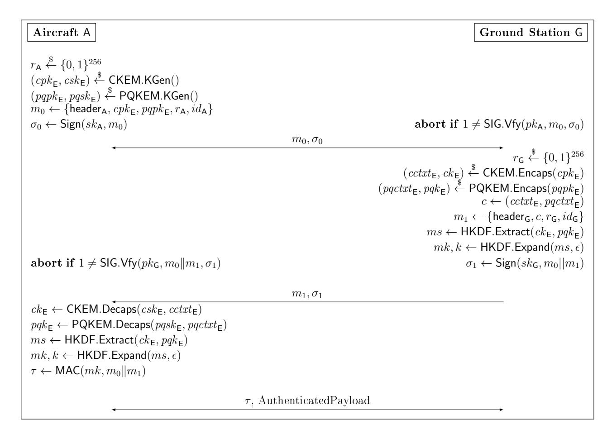

{0}------------------------------------------------

## Quantum-Secure Hybrid Communication for Aviation Infrastructure

Benjamin Dowling<sup>1</sup> and Bhagya Wimalasiri<sup>1</sup>

Department of Computer Science, The University of Sheeld. b.dowling@sheffield.ac.uk, b.m.wimalasiri@sheffield.ac.uk

Abstract. The rapid digitization of aviation communication and its dependent critical operations demand secure protocols that address domainspecic security requirements within the unique functional constraints of the aviation industry. These secure protocols must provide sucient security against current and possible future attackers, given the inherent nature of the aviation community, that is highly complex and averse to frequent upgrades as well as its high safety and cost considerations. In this work we propose a pair of quantum-secure hybrid key exchange protocols (PQAG-KEM and PQAG-SIG) to secure communication between aircrafts in-ight and ground stations. PQAG-KEM leverages post-quantum and classical Key Encapsulation Mechanisms (KEMs) to ensure the hybrid security of the protocol against classical as well as future quantum adversaries. PQAG-SIG, alternatively, uses quantum-safe digital signatures to achieve authentication security. We provide an implementation of both PQAG-KEM and PQAG-SIG, and compare favourably with current stateof-the-art secure avionic protocols. Finally, we provide a formal analysis of our new PQAG protocols in a strong hybrid key exchange framework.

Keywords: Authenticated key exchange, hybrid key exchange, provable security, protocol analysis, avionics

## 1 Introduction

The state of the aviation communications (avionics) in the 1980s was characterised by channel isolation, and operated through the use of analog and legacy infrastructures of military origin. Over time this has gradually shifted towards commercial and digital communication technologies. This shift has been fairly slow owing to the lengthy standardization processes, but at the time of writing multiple state organizations in Europe (EUROCONTROL) and the US (Federal Aviation Administration-FAA) are actively involved in the standardisation and structuring of future communication infrastructures (FCI) for the aviation industry with digital communication as its central component. This transformation is in part due to drastic increases in air-trac load, global ATC sta shortages, adverse environmental eects of the aviation industry, cost eectiveness and advanced surveillance and safety capabilities. However, by replacing 

{1}------------------------------------------------

legacy military-grade infrastructures with digital products both onboard aircrafts (ACs) as well as in ground systems (GSs) the communication of the aviation industry is no longer isolated, and thus the threat of an eavesdropper or even an active attacker is no longer unrealistic. Thus, integrating digital technologies into critical communications without carefully considering their security will drastically undermine the safety of such avionics. Further exacerbating the situation is the highly-dependent nature of the aviation industry: attacks on a single component may cascade and cripple its entire infrastructure, ending in catastrophic failures. Such attacks are not unrealistic: EUROCONTROL reports that such cyberattacks against aviation systems are on the rise [\[8\]](#page-28-0).

Controller-Pilot Data Link Communications (CPDLC) is a protocol that facilitates communication between the Air Trac Control (ATC) stations and ACs over a datalink medium. CPDLC was designed to reduce communication loads on the Very High Frequency (VHF) band, in order to handle large numbers of ACs communicating with ATCs simultaneously in congested air trac zones. CPDLC communication has multiple applications, ranging from route change and clearances to level assignments and crossing constraints [\[10\]](#page-28-1). At present all CPDLC communications are carried out over unencrypted and unauthenticated datalinks. Thus, there is a need to develop a future-proof secure communication protocol that both ensures condentiality and authenticity of communication, while withstanding the evolving threat landscape.

At the time of writing, NIST's Post Quantum Cryptography (PQC) Standardization Process has concluded and chosen its winners for key encapsulation and digital signatures categories. This process standardizes post-quantum public key cryptographic primitives to potentially replace existing quantum-vulnerable primitives currently in widespread use. In addition, the White House recently published a memorandum [\[25\]](#page-29-0), introducing a plan to increase resources and collaborative eorts for the multi-year process of migrating vulnerable computer systems to quantum-resistant cryptography.

However, almost all PQC increases computation and key sizes compared to quantum-vulnerable counterparts, complicating their practical adoption, especially in resource-constrained environments. For instance, the novel LDACS media for GS-to-AC communication provides a throughput of 303.33 kbps (forwardlink) and 199.73 kbps (reverse-link) [\[2\]](#page-28-2), and the average throughput of data-links used in avionic communication is 31.5kbps across the globe. Moreover, security analysis of PQC is relatively immature and constantly evolving compared to their classical counterparts [\[7\]](#page-28-3)corroborated by recent attacks undermining the security of digital signature scheme Rainbow [\[3\]](#page-28-4) and the KEM SIKE [\[4\]](#page-28-5)both candidates previously shortlisted as NIST PQC nalists. Within this context, adopting a hybrid approach [\[7\]](#page-28-3) combining classical and PQC primitives presents a realistic equilibrium, providing security guarantees against potentially undiscovered vulnerabilities (both algorithmic and in-code) in novel PQC and security against future quantum adversaries.

In this paper we propose two hybrid key exchange protocols to secure CPDLC communication between ground stations (GS) and aircrafts (AC). We provide a 

{2}------------------------------------------------

formal proof of security for the proposed protocols against both quantum and classical adversaries. We instantiate our proposed protocols with dierent postquantum algorithms to understand the real-world applicability of our protocols to the resource-constrained ecosystem of avionic communication. We compare our proposals to existing work and demonstrate that we provide satisfactory performance with the added benet of heightened (hybrid) security.

Organisation: In Section [3](#page-4-0) we describe our protocols, followed by details of implementation in Section [4.](#page-7-0) Sections [5](#page-13-0) and [6](#page-17-0) explain our security framework in detail and formally prove our protocols' security, respectively. The paper closes with conclusions and directions for future work in Section [7.](#page-27-0)

## 2 Related Work

Here we discuss pre-existing literature related to classical and post-quantum avionic communication protocols.

The Automatic Dependent Surveillance-Broadcast is a mandatory broadcast system for all aircrafts, where an aircraft periodically broadcasts its position, allowing it to be tracked. Wesson et. al. [\[27\]](#page-29-1) discuss the security of the ADS-B protocol and lays out specic considerations required when designing the security of aviation communication; interoperability with existing policies and laws, bandwidth and interference constraints and how ADS-B operates in a cryptographically untrusted environment. Their work primarily evaluates symmetric and asymmetric settings, concluding that maintaining the secrecy of symmetric keys across multiple untrusted global domains is unsuitable for the purpose of secure communication in aviation.

Given the safety-critical nature of the aviation industry, complete encryption of critical communication is problematic, due to the non-negligible likelihood of system or human error resulting in decryption failures in a prompt real-time capacity. In fact, the federal aviation administration (FAA) has strongly recommended maintaining clear datalinks for aviation communication in order to keep critical surveillance data, such as positional information of aircraft, openly accessible [\[28\]](#page-29-2). Moreover, the use of shared keys also complicates key revocation scenarios in the event of key compromise, since it requires replacing keys across all parties involved. The novel ADS-B proposal [\[28\]](#page-29-2) is based on symmetric-key primitives, specically Format-Preserving Encryption for obscuring ight identity and the TESLA protocol [\[17\]](#page-29-3) for authentication. While less computationally expensive, as previously discussed it is not a scalable solution in the global airspace. In addition, their work heavily relies on a Trusted Third Party for key management and distribution on a frequent basis. Furthermore, the use of TESLA protocol introduces additional latency to the scheme given how decryption keys are sent after sending the encrypted messages. Our protocols (presented in Section [3\)](#page-4-0) avoid these issues, as they are constructed from asymmetric-key primitives, require only a single round for key establishment, and secure CPDLC communications specically, not addressing ADS-B.

{3}------------------------------------------------

#### 4 Anonymised Submission

Other approaches to securing communication in aviation rely on asymmetric encryption schemes, introducing communication overhead compared to symmetric encryption, due to large public-key and ciphertext sizes. For instance, to achieve the symmetric-key equivalent strength of 112 bits (ADS-B packet size), which NIST claims is cryptographically secure until 2030, the ECDSA signature length is 448 bits, four times greater than an ADS-B message [\[27\]](#page-29-1). Since ECDSA generates the shortest signature for a given key length it has been proposed as a suitable scheme for securing ACARS messages by the ACARS message security standard [\[1\]](#page-28-6) but is rarely adopted by any major airlines.

Khan et. al. [\[10\]](#page-28-1) propose a lightweight protocol for securing CPDLC using elliptic-curve cryptography and Schnorr signature schemes. Their method provides authenticated communication while preserving condentiality and nonrepudiation properties against a classical adversary, but fails to achieve security against a quantum adversary. Mäurer et. al. [\[15\]](#page-29-4) also propose an alternative to CPDLC, an LDACS-based protocol using dierent avours of Die-Hellman key exchange (DHKE) to establish keys, and evaluate the practicality of their proposals. They modify the Station-to-Station (STS) protocol with distinct DHKE instantiations, comparing Elliptic Curve DHKE (ECDH) and Supersingular Isogeny DHKE (SIDH) as the underlying key exchange. Their work concludes while STS-ECDH provides the most resource ecient performance, STS-SIDH (believed at the time to provide post-quantum security) was the better option for long-term security. We implement our solution in Section [4,](#page-7-0) and compare with Mäurer et. al.'s STS-(C)SIDH protocol [\[15\]](#page-29-4), demonstrating our protocol's relative practicality while also achieving stronger notions of security.

Finally, Bellido-Mangenell et. al. [\[2\]](#page-28-2) and Mielke et. al. [\[16\]](#page-29-5) propose a secure protocol for CPDLC over the LDACS medium, and simulate their protocol's communication between aircrafts and ground stations. Their proposal combines an asymmetric post-quantum public-key encryption scheme (McEliece, using code-based cryptography) and symmetric encryption (AES-256-GCM). The authors [\[16\]](#page-29-5) highlight that the protocol does not guarantee security against potential man-in-the-middle attackers since the exchanged (ephemeral) public keys are not authenticated. Finally, neither provide any formal proof of security.

#### 2.1 KEMTLS

KEMTLS [\[21\]](#page-29-6) is a key exchange protocol, proposed to transition TLS 1.3 handshakes to a post-quantum setting. KEMTLS proposes the use of KEMs instead of digital signatures for server authentication, as post-quantum signature public keys and signatures tend to be larger than their post-quantum KEM counterparts. While TLS 1.3 commonly runs in unilateral (server-only) authentication, there are many scenarios which require mutual client-server authentication, which includes our air-to-ground communication setting. Schwabe et al.[\[22\]](#page-29-7) propose a mutually-authenticated variant of KEMTLS, called KEMTLS-PDK, relying on pre-distributed server public keys prior to the protocol initiation.

While TLS 1.3's setting and requirements are similar to our own, the avionic communication media places signicant restraints on both bandwidth and com

{4}------------------------------------------------

putation, as it abhors congestion and communication must complete within a restricted timeframe, necessitating the introduction of a custom protocol. Our two proposed protocols, PQAG-SIG and PQAG-KEM, supercially resemble TLS 1.3 and KEMTLS-PDK respectively, but our design has been specically tailored to the domain constraints of avionic communication. Our key schedule is signi cantly simplied, avoiding the complexity introduced in TLS 1.3. In addition, we achieve 1.5 round-trip times for both variants. The PQAG-SIG protocol, introduced to take advantage of existing certicate-based infrastructures, mutually authenticates aircrafts and ground-control stations using certicates (classical or post-quantum) and derives a post-quantum hybrid shared key. Concurrently, the PQAG-KEM variant of our protocol provides post-quantum hybrid implicit mutual authentication and derives a post-quantum hybrid shared key.

## <span id="page-4-0"></span>3 PQAG Key Exchange Protocols

In this section we describe two variants of our proposed post-quantum air-toground communications protocol PQAG, PQAG-KEM and PQAG-SIG, executed between an Aircraft A and a Ground Station G. We give the detailed cryptographic operations in Figures [1](#page-5-0) and [2.](#page-5-1) Note that PQAG-KEM and PQAG-SIG have slightly dierent infrastructure requirements, as well as dierent communication and computational overheads. In PQAG-SIG, we require no predistribution of public keys, but imposes higher communication costs due to large public-key sizes. Overheads added by PQAG-SIG are particularly high if the implementation utilizes post-quantum digital signatures (see Tables [6](#page-12-0) and [5\)](#page-11-0). In PQAG-KEM, we assume that A already knows G's public keys, reducing communication and computational overhead, but may be a realistic (and scalable) assumption in avionics, where travel paths (and thus, G partners) can be known ahead of time.

#### 3.1 PQAG-KEM

Broadly, PQAG-KEM executes a series of post-quantum and classical KEMs between A and G, combining the outputs into symmetric keys mk and k. A and G maintain two long-term KEM key pairs, one classical and one post-quantum. We assume that G has pre-distributed their public KEM key pairs to A prior to the protocol execution, and that public keys can be validated by some PKI, outside the scope of our protocol. The MAC tags, computed using mk (itself computed using outputs of the long-term KEMs), provide mutual authentication, and the ephemeral KEMs provide forward secrecy for the derived session key k.

A begins by generating post-quantum and classical KEM ephemeral public keys (pqpk<sup>E</sup> , cpk<sup>E</sup> respectively) and a random nonce rA. Next, A encapsulates secrets under the long-term key pairs of G (cpk <sup>G</sup> and pqpk <sup>G</sup>), computing ciphertexts cctxt<sup>G</sup> and pqctxtG. Afterwards, A forms a message m<sup>0</sup> by concatenating some (arbitrary) header information headerA, with rA, idA, cctxtG, pqctxtG,cpk<sup>E</sup> , pqpk<sup>E</sup> and the long-term public-keys of A cpk <sup>A</sup>, pqpk <sup>A</sup>, sending m<sup>0</sup> to G.

{5}------------------------------------------------

#### 6 Anonymised Submission

```
Aircraft AC
                                                                                                                                                                                                                                                                               Ground Station GS
                   \mathrm{static}\ \mathsf{CKEM}_{\mathsf{A}} : (\mathit{cpk}_{\mathsf{A}}, \mathit{csk}_{\mathsf{A}})
                                                                                                                                                                                                                                    \operatorname{static}\,\mathsf{CKEM}_\mathsf{G}:(\mathit{cpk}_\mathsf{G},\mathit{csk}_\mathsf{G})
                   \operatorname{static}\,\mathsf{PQKEM}_\mathsf{A} : (pqpk_\mathsf{A}, pqsk_\mathsf{A})
                                                                                                                                                                                                                          \operatorname{static}\,\mathsf{PQKEM}_\mathsf{G}:(pqpk_\mathsf{G},pqsk_\mathsf{G})
                   Knows cpkg, pqpkg
                   r_{\mathsf{A}} \xleftarrow{\$} \{0,1\}^{256}
                   (cpk_{\mathsf{E}}, csk_{\mathsf{E}}) \xleftarrow{\$} \mathsf{CKEM.KGen}()
                   (pqpk_{\mathsf{E}}, pqsk_{\mathsf{E}}) \stackrel{\$}{\leftarrow} \mathsf{PQKEM.KGen}()
                   (cctxt_{\mathsf{G}}, ck_{\mathsf{G}}) \overset{\$}{\leftarrow} \mathsf{CKEM}.\mathsf{Encaps}(cpk_{\mathsf{G}})
                   \begin{array}{l} (pqctxt_{\mathsf{G}},pqk_{\mathsf{G}}) \xleftarrow{\$} \mathsf{PQKEM.Encaps}(pqpk_{\mathsf{G}}) \\ m_0 \leftarrow \{\mathsf{header_A},r_{\mathsf{A}},id_{\mathsf{A}},cctxt_{\mathsf{G}},pqctxt_{\mathsf{G}},cpk_{\mathsf{A}},pqpk_{\mathsf{A}},cpk_{\mathsf{E}},pqpk_{\mathsf{E}}\} \end{array} 
                                                                                                                                                           m_0
                                                                                                                                                                                                                                                                    r_{\mathsf{G}} \stackrel{\$}{\leftarrow} \{0,1\}^{256}
                                                                                                                                                                                                                    ck_{\mathsf{G}} \leftarrow \mathsf{CKEM.Decaps}(cctxt_{\mathsf{G}}, csk_{\mathsf{G}})
                                                                                                                                                                                                       pqk_{\mathsf{G}} \leftarrow \mathsf{PQKEM}.\mathsf{Decaps}(pqctxt_{\mathsf{G}},pqsk_{\mathsf{G}})
                                                                                                                                                                                                              (cctxt_A, ck_A) \stackrel{\$}{\leftarrow} \mathsf{CKEM}.\mathsf{Encaps}(cpk_A)
                                                                                                                                                                                                   (pqctxt_{\mathsf{A}}, pqk_{\mathsf{A}}) \overset{\$}{\leftarrow} \mathsf{PQKEM.Encaps}(pqpk_{\mathsf{A}})
                                                                                                                                                                                                    \begin{array}{c} (cctxt_{\mathsf{E}},ck_{\mathsf{E}}) \stackrel{\$}{\leftarrow} \mathsf{CKEM}.\mathsf{Encaps}(cpk_{\mathsf{E}}) \\ (pqctxt_{\mathsf{E}},pqk_{\mathsf{E}}) \stackrel{\$}{\leftarrow} \mathsf{PQKEM}.\mathsf{Encaps}(pqpk_{\mathsf{E}}) \end{array} 
                                                                                                                                                       ms \leftarrow \mathsf{HKDF}.\mathsf{ChainExtract}(\hat{c}k_\mathsf{G} || pqk_\mathsf{G} || ck_\mathsf{A} || pqk_\mathsf{A} || ck_\mathsf{E} || pqk_\mathsf{E})
                                                                                                                                                                m_1 \leftarrow \{\mathsf{header}_\mathsf{G}, r_\mathsf{G}, id_\mathsf{G}, cctxt_\mathsf{E}, pqctxt_\mathsf{E}, cctxt_\mathsf{A}, pqctxt_\mathsf{A}\}
                                                                                                                                                                         mk, k \leftarrow \mathsf{HKDF}.\mathsf{Expand}(ms, \mathsf{H}(m_0 || m_1), \mathsf{"PQAGKEM"})
                                                                                                                                                                                                                                                \tau \leftarrow \mathsf{MAC}(mk, m_0 || m_1)
                                                                                                                                                        m_1, \tau
                   ck_{\mathsf{E}} \leftarrow \mathsf{CKEM.Decaps}(\mathit{cctxt}_{\mathsf{E}}, \mathit{csk}_{\mathsf{E}})
                   pqk_{\mathsf{E}} \leftarrow \mathsf{PQKEM}.\mathsf{Decaps}(pqctxt_{\mathsf{E}},pqsk_{\mathsf{E}})
                   ck_A \leftarrow \mathsf{CKEM.Decaps}(cctxt_A, csk_A)
                   pqk_{\mathsf{A}} \leftarrow \mathsf{PQKEM}.\mathsf{Decaps}(pqctxt_{\mathsf{A}},pqsk_{\mathsf{A}})
                   ms \leftarrow \mathsf{HKDF}.\mathsf{ChainExtract}(ck_\mathsf{G} \| pqk_\mathsf{G} \| ck_\mathsf{A} \| pqk_\mathsf{A} \| ck_\mathsf{E} \| pqk_\mathsf{E})
                   mk, k \leftarrow \mathsf{HKDF}.\mathsf{Expand}(ms, \mathsf{H}(m_0 || m_1), \mathsf{"PQAGKEM"})
                   abort if MAC(mk, m_0 || m_1) \neq \tau
                   \tau' \leftarrow \mathsf{MAC}(mk, m_0 \| m_1 \| \tau)
                                                                                                                               \tau', Authenticated Payload
                                                                                                                                                                                                                 abort if MAC(mk, m_0 || m_1 || \tau) \neq \tau'
```

Fig. 1: The PQAG-KEM key exchange protocol. Note that HKDF.ChainExtract (a||b||...||n) = HKDF.Extract(...HKDF.Extract(HKDF.Extract(a,0),b)...,n).

<span id="page-5-1"></span>

Fig. 2: The PQAG-SIG key exchange protocol.

{6}------------------------------------------------

Upon receiving m0, G decapsulates post-quantum and classical ciphertexts pqctxt<sup>G</sup> and cctxtG, deriving keys pqk <sup>G</sup> and ck <sup>G</sup>. Next, G encapsulates secrets under the ephemeral public keys cpk<sup>E</sup> , pqpk<sup>E</sup> , generating cctxt<sup>E</sup> and pqctxt<sup>E</sup> respectively. G further encapsulates secrets under A's long-term public keys cpk <sup>A</sup>, pqpk <sup>A</sup>, generating cctxt<sup>A</sup> and pqctxtA. The key outputs of KEM encapsulations and decapsulations are used to derive a master key ms = HKDF.ChainExtract(ck <sup>G</sup>∥pqk <sup>G</sup>∥ck <sup>A</sup>∥pqk <sup>A</sup>∥ckE∥pqk<sup>E</sup> ). G forms message m<sup>1</sup> by concatenating some (arbtitrary) header headerG, with rG, idG, cctxtE, pqctxt<sup>E</sup> , cctxt<sup>A</sup> with pqctxtA. G derives a nal session key k and MAC key mk by computing mk, k = HKDF.Expand(ms, H(m0∥m1), "PQAGKEM′′). The G further computes τ ← MAC(mk, m0∥m1), sending m<sup>1</sup> and τ to A.

A decapsulates cctxtE, pqctxt<sup>E</sup> , cctxt<sup>A</sup> and pqctxt<sup>A</sup> and derives the shared keys mk, k. Next, A veries τ under mk aborts the session if it fails. Finally, A computes τ ′ ← MAC(mk, m0∥m1∥τ ) and returns τ ′ to G for authentication, and can immediately use k establish secure communications with G. G nally veries τ ′ , aborting the session if it fails.

#### 3.2 PQAG-SIG

PQAG-SIG proceeds similarly to PQAG-KEM by combining ephemeral postquantum and classical KEM outputs into a single session key k, achieving forward secrecy. However, authentication is achieved by post-quantum signature schemes SIG. Unlike PQAG-KEM, we do not assume any pre-distribution of public keys, but similarly assume that long-term public keys can be validated through some PKI outside the scope of our protocol.

A begins by generating post-quantum and classical KEM public keys cpk<sup>E</sup> , pqpk<sup>E</sup> respectively and a random nonce rA. A straightforwardly computes a message m<sup>0</sup> by concatenating header information headerA, cpk<sup>E</sup> , pqpk<sup>E</sup> , r<sup>A</sup> and its unique identier idA. A signs m<sup>0</sup> using its long-term secret key sk<sup>A</sup> (outputting σ0), sending m<sup>0</sup> and σ<sup>0</sup> to G.

G veries σ0, aborting the session if it fails. G then encapsulates post-quantum and classical secrets under pqpk<sup>E</sup> , cpk<sup>E</sup> , outputting pqctxt<sup>E</sup> and cctxt<sup>E</sup> respectively, which are concatenated into c. G forms message m<sup>1</sup> by concatenating headerB, ciphertext c, random nonce r<sup>G</sup> and its unique identier idG. G derives an intermediate value ms = HKDF.Extract(ck, pqk), and derives the session key k and MAC key mk by computing mk, k = HKDF.Expand(ms, ϵ). G generates its own signature σ<sup>1</sup> ← Sign(skG, m0∥m1) sending σ<sup>1</sup> and m<sup>1</sup> to A.

A veries σ<sup>1</sup> using G's long-term public key skG, and upon failure will abort the session. A then decapsulates cctxt<sup>E</sup> and pqctxt<sup>E</sup> , and derives the shared keys mk, k. Finally, A computes τ ← MAC(mk, m0∥m1) and returns τ to G, immediately using k to communicate securely with G.

.

{7}------------------------------------------------

## <span id="page-7-0"></span>4 Implementation of PQAG

In this section we discuss our instantiation and reference implementation of the PQAG protocols. We implement PQAG-KEM and PQAG-SIG in Python, and benchmarked their performance on a Raspberry Pi to demonstrate practicality on constrained devices (and for uniform comparisons with previously existing protocols), and a standard desktop system. We compare our results with existing works [\[2](#page-28-2)[,15\]](#page-29-4). We modied the STS-SIDH protocol [\[15\]](#page-29-4) with CSIDH, due to SIDH weaknesses [\[4\]](#page-28-5), using the post-quantum sibc library for CSIDH [\[20\]](#page-29-8) and Ed25519 for digital signatures. It must be noted that [\[2\]](#page-28-2) does not provide performance metrics, only network performance results. We begin by discussing our choices of instantiations for cryptographic primitives.

Instantiation PQAG aims for 128-bit post-quantum security against a quantum-equipped attacker. The eciency of PQAG within resource-constrained environments was a critical consideration during instantiation. We instantiate PQAG-SIG with Kyber as the post-quantum KEM and Dilithium as the digital signature (which we denote PQAG-SIG-Ky-Di). To compare with classical signatures, we instantiate PQAG-SIG with either McEliece (PQAG-SIG-Mc) or Kyber (PQAG-SIG-Ky) as the underlying post-quantum KEM, but with classical signature scheme (EC)DSA. For all three variants, the nal derived shared keys were 256-bits long. Thus our choices of cryptographic algorithms for PQAG-SIG are:

- Classic CKEM: Elliptic-curve DH key exchange using curve P384 [\[9\]](#page-28-7).
- Post-Quantum PQKEM: McEliece with parameter set 348864f [\[24\]](#page-29-9) and Kyber-512 [\[24\]](#page-29-9), both achieving 128-bit quantum security.
- SIG: EdDSA using curve P-384 [\[9\]](#page-28-7) For PQAG-SIG-Ky-Di with NIST level 2 security claimed [\[18,](#page-29-10)[26\]](#page-29-11).
- MAC: HMAC-SHA-256 [\[12\]](#page-28-8) using 256-bit keys.
- KDF: HKDF-SHA-256 [\[11\]](#page-28-9) using 256-bit keys.

We instantiate PQAG-KEM with Kyber as the post-quantum KEM (which we denote PQAG-KEM-Hy). To check how much our hybrid approach impacts performs, we also implemented a variant of PQAG-KEM that does not include any of the CKEM operations, instead simply performing PQKEM steps, which we denote PQAG-KEM-FQ. For both variants, the nal derived shared keys were 256-bits long. Thus our choices of cryptographic algorithms for PQAG-KEM are:

- Classic CKEM: Elliptic-curve DH key exchange using curve P384 [\[9\]](#page-28-7).
- Post-Quantum PQKEM: Kyber-512 [\[24\]](#page-29-9), achieving 128-bit quantum security.
- MAC: HMAC-SHA-256 [\[12\]](#page-28-8) using 256-bit keys.
- KDF: HKDF-SHA-256 [\[11\]](#page-28-9) using 256-bit keys.

Implementation We require the use of the Python cryptography library [\[24\]](#page-29-9) for implementing CKEM and KDF, and PyNaCl [\[23\]](#page-29-12) libraries for SIG cryptographic primitives. For PQAG-SIG-Ky, PQAG-SIG-Mc and PQAG-SIG-Ky-Di we require the use of the Python pqcrypto [\[18\]](#page-29-10) library.

{8}------------------------------------------------

#### 4.1 PQAG-SIG Computational Costs

We now prole the performance of the underlying cryptographic functions in terms of average execution times (for 100 iterations per cryptographic functions). Our benchmarking experiments are designed to provide a comparative evaluation of the PQAG protocols among their dierent initiations as well as existing literature, and also evaluate the cost of dierent post-quantum algorithms used in PQAG-SIG and PQAG-KEM respectively. Table [1](#page-8-0) compares the performance of the cryptographic components of PQAG-SIG-Mc, PQAG-SIG-Ky and PQAG-SIG-Ky-Di when run on two separate testbeds. Our experiments were performed on a Raspberry Pi 3 B+ running Raspberry Pi OS with a 1.4GHz quad core and 1GB RAM; and an Intel Core 1.80GHz i7-10510U CPU with 16GB RAM, running Windows 10 Home.

<span id="page-8-0"></span>

|               | PQAG   | PQAG   | PQAG   | PQAG   | PQAG   | PQAG   |
|---------------|--------|--------|--------|--------|--------|--------|
| Operation (A) | McE    | Ky     | Di     | McE    | Ky     | Di     |
|               | Pi     | Pi     | Pi     | Intel  | Intel  | Intel  |
| PQKEM.KGen    | 1.1530 | 0.0015 | 0.0007 | 0.2814 | 0.0006 | 0.0002 |
| CKEM.KGen     | 0.0178 | 0.0268 | 0.0201 | 0.0036 | 0.0027 | 0.0011 |
| SIG.Sign      | 0.0051 | 0.0024 | 0.0072 | 0.0020 | 0.0003 | 0.0003 |
| SIG.Vfy       | 0.0058 | 0.0014 | 0.0015 | 0.0021 | 0.0003 | 0.0001 |
| KEM.Decaps    | 0.0216 | 0.0191 | 0.0190 | 0.0044 | 0.0028 | 0.0012 |
| MAC           | 0.0053 | 0.0001 | 0.0002 | 0.0013 | 0.0001 | 0.0001 |
|               | PQAG   | PQAG   | PQAG   | PQAG   | PQAG   | PQAG   |
| Operation (G) | McE    | Ky     | Di     | McE    | Ky     | Di     |
|               | Pi     | Pi     | Pi     | Intel  | Intel  | Intel  |
| CKEM.KGen     | 0.0177 | 0.0205 | 0.0194 | 0.0035 | 0.0027 | 0.0040 |
| SIG.Sign      | 0.0056 | 0.0011 | 0.0056 | 0.0022 | 0.0003 | 0.0011 |
| SIG.Vfy       | 0.0054 | 0.0019 | 0.0016 | 0.0022 | 0.0003 | 0.0004 |
| KEM.Encaps    | 0.0194 | 0.0193 | 0.0192 | 0.0046 | 0.0031 | 0.0047 |
| MAC           | 0.0047 | 0.0002 | 0.0002 | 0.0013 | 0.0001 | 0.0001 |

Table 1: Performance evaluation for cryptographic primitives (in seconds) on Raspberry Pi 3 B+ (left-hand side) and on Intel Core i7-10510U CPU @ 1.80GHz. (right-hand side). KEM.Encaps and KEM.Decaps combines PQKEM, CKEM and KDF operations into a single function. Note that McE, Ky and Di refer to PQAG-SIG-Mc, PQAG-SIG-Ky and PQAG-SIG-Ky-Di, respectively, and A contains results for aircraft operations and G results for ground stations.

Both PQAG-SIG-Ky and PQAG-SIG-Ky-Di achieve signicantly better performance than PQAG-SIG-Mc, and as expected the desktop testbed was better for all performance metrics than the Raspberry Pi testbed. In general, the McEliece key generation had the highest average time per operation for both the test environments. Kyber key generation, on the other hand, was faster even when 

{9}------------------------------------------------

compared to the classical ECDH key generation. In addition, the SIG.Sign and SIG.Vfy operations of PQAG-SIG-Ky outperformed PQAG-SIG-Mc, due to the drastically smaller public keys. This also applies to the MAC execution on both A and G: due to the smaller key sizes the MAC operations were signicantly faster for PQAG-SIG-Ky. Between PQAG-SIG-Ky's SIG.Sign operations performed faster than PQAG-SIG-Ky-Di's due to its smaller key sizes. However, for both the instantiations the dierence in SIG.Vfy performance was negligible, conrming the faster verication times of Dilithium. For the desktop testbed, all cryptographic operations averaged well under a single second, whereas in the the Raspberry Pi 3 B+ testbed, all operations except the McEliece key generation averaged under a second. These results are promising for practical integration of PQAG-SIG-Ky into the constrained environments used in aviation infrastructure.

<span id="page-9-0"></span>

| Variant | PQAG-SIG-Mc<br>Pi | PQAG-SIG-Ky<br>Pi | PQAG-SIG-Mc<br>Intel | PQAG-SIG-Ky<br>Intel |
|---------|-------------------|-------------------|----------------------|----------------------|
| Online  | 1.17584           | 0.03074           | 0.28688              | 0.00355              |
| Oine    | 0.04528           | 0.02557           | 0.00624              | 0.00286              |

Table 2: Aircraft walltime (in seconds) with online and oine post-quantum key generation on Raspberry Pi 3 B+ (left-hand side) and Intel Core i7-10510U CPU @ 1.80GHz (right-hand side).

We also implemented optimised variants of both PQAG-SIG-Ky and PQAG-SIG-Mc that perform some oine computation to improve the online runtime of the protocol execution. Since aircrafts will have oine travel time between communication with dierent ground stations, the protocol can reduce online key generation by pre-computing and storing the post-quantum public keys prior to the session initialisation by A. For both the original real-time protocol and the precomputed protocols we proled the wall-time performance of the average A execution times (for 100 executions of PQAG-SIG-Ky and PQAG-SIG-Mc respectively), and give the results in Table [2.](#page-9-0) For both test environments, of ine key generation reduced PQAG-SIG-Mc's and PQAG-SIG-Mc's computational overhead, but it signicantly decreased the total walltime of PQAG-SIG-Mc. This is because key generation in Kyber is signicantly faster than McEliece, so the impact is not quite as high. We did not implement an oine version of PQAG-SIG-Ky-Di since it would not have impacted the signing operations.

#### 4.2 PQAG-KEM Computational Costs

Tables [3](#page-10-0) compares the computational overhead of each cryptographic primitive of PQAG-KEM-Hy, PQAG-KEM-FQ when run on our two testbeds.

The performance results of PQAG-KEM-Hy and PQAG-KEM-FQ are shown in Table [3.](#page-10-0) It is clear that PQAG-KEM-Hy has higher computational overhead, due to the additional CKEM operations and key derivation steps. However, it is

{10}------------------------------------------------

<span id="page-10-0"></span>

|               | PQAG    | PQAG     | PQAG    | PQAG     |
|---------------|---------|----------|---------|----------|
| Operation (A) | Hy      | FQ       | Hy      | FQ       |
|               | Pi      | Pi       | Intel   | Intel    |
| PQKEM.KGenE   | 0.00090 | 0.00115  | 0.00028 | 0.00028  |
| CKEM.KGenE    | 0.00301 | NA       | 0.00068 | NA       |
| PQKEM.EncapsG | 0.00127 | 0.00243  | 0.00064 | 0.00029  |
| CKEM.EncapsG  | 0.00313 | NA       | 0.00082 | NA       |
| CKEM.DecapsE  | 0.00292 | NA       | 0.00066 | NA       |
| PQKEM.DecapsA | 0.00133 | 0.00160  | 0.00021 | 0.000092 |
| PQKEM.DecapsE | 0.00270 | 0.00135  | 0.00058 | 0.00011  |
| MAC           | 0.00003 | 0.000061 | 0.00008 | 0.00007  |
|               | PQAG    | PQAG     | PQAG    | PQAG     |
| Operation (G) | Hy      | FQ       | Hy      | FQ       |
|               | Pi      | Pi       | Intel   | Intel    |
| CKEM.EncapsE  | 0.00579 | NA       | 0.00129 | NA       |
| PQKEM.EncapsE | 0.00144 | 0.00090  | 0.00069 | 0.00019  |
| CKEM.DecapsG  | 0.00293 | NA       | 0.00068 | NA       |
| PQKEM.EncapsA | 0.00124 | 0.00089  | 0.00065 | 0.00018  |
| PQKEM.DecapsG | 0.00321 | 0.00190  | 0.00069 | 0.00017  |
| MAC           | 0.00003 | 0.000061 | 0.00010 | 0.00007  |

Table 3: Performance evaluation for cryptographic primitives used in PQAG-SIG variants (in seconds) on Raspberry Pi 3 B+ (left-hand side) and Intel Core i7-10510U CPU @ 1.80GHz (right-hand side). Note that Hy and FQ refers to the (hybrid secure) PQAG-SIG-Ky, and (purely post-quantum) PQAG-KEM-FQ, respectively, and A contains results for aircraft operations and G results for ground stations.

clear that the computational performance of the two instantiations is negligibly dierent, and we argue that the added hybrid layer of security in PQAG-KEM-Hy justies the slight increase in computation time.

In Table [4](#page-11-1) we compare the performance of all instantiations of PQAG against STS-SIDH [\[15\]](#page-29-4). For all protocols we proled the walltime performance of the entire AC and GS execution (for 100 executions of PQAG-KEM, PQAG-SIG and STS-SIDH). Both the AC and the GS are running on the same machine, and communication is exchanged via localhost.

In general STS-CSIDH proved computationally most expensive, averaging at signicantly higher performance times in both testbeds. Particularly, within the Raspberry Pi testbed STS-CSIDH struggled to perform, and with occasionally lengthy hang" times between subsequent operations and periodic restarts. The original STS-SIDH [\[15\]](#page-29-4) is instantiated with SIDH which is around 10x times faster compared to CSIDH. However, since the publication of [\[15\]](#page-29-4), SIDH has been proven insecure [\[4\]](#page-28-5) and thus we instantiated STS-CSIDH [\[15\]](#page-29-4) with CSIDH to guarantee its post-quantum security while maintaining its SIDH basis. Fur-

{11}------------------------------------------------

<span id="page-11-1"></span>

| Testbed | STS<br>CSIDH | PQAG<br>KEM<br>FQ | PQAG<br>KEM<br>Hy | PQAG<br>SIG<br>McE | PQAG<br>SIG<br>Ky | PQAG<br>SIG<br>Di |
|---------|--------------|-------------------|-------------------|--------------------|-------------------|-------------------|
| Pi      | 312.8312     | 0.0103            | 0.0300            | 1.2513             | 0.0169            | 0.0947            |
| Intel   | 57.5576      | 0.0013            | 0.0087            | 0.3059             | 0.0024            | 0.0133            |

Table 4: Comparison of walltime executions (in seconds).

thermore, STS-CSIDH requires an additional message from the ground station to the aircraft, adding to communication latency. In comparison PQAG-SIG-Mc fared signicantly better in both testbeds, even when performance is aected by the large KEM public keys. Overall, among all the PQAG-SIG instantiations, PQAG-SIG-Ky oered the most competitive performance in the constrained Raspberry Pi testbed. Between PQAG-SIG-Ky and PQAG-SIG-Ky-Di, PQAG-SIG-Ky performed better due to the faster signing operations and smaller signature sizes of ECDSA compared to Dilithium.

Between the two implementations of PQAG-KEM, PQAG-KEM-FQ had a slight edge in performance, compared to PQAG-KEM-Hy. This was due to the fact that PQAG-KEM-FQ only uses post-quantum Kyber for all KEMs, whereas for PQAG-KEM-Hy we use hybrid KEMs, combining Kyber with ECDH to provide hybrid security. We conclude that the negligible increase in the computation times of PQAG-KEM-Hy is oset by the additional layer of security.

<span id="page-11-0"></span>

| Protocol<br>Datalink        | STS<br>CSIDH   | PQAG-KEM-FQ    | PQAG-KEM-Hy    |
|-----------------------------|----------------|----------------|----------------|
| VDLm2/31.5kbps              | 0.660+∆        | 0.998+∆        | 1.170+∆        |
| AeroMACS/1.8 − 9.2Mbps      | 0.001-0.0002+∆ | 0.018-0.003+∆  | 0.0201-0.004+∆ |
| LDACS/0.6 − 2.8Mbps         | 0.003-0.0007+∆ | 0.052-0.011+∆  | 0.062-0.013+∆  |
| InmarsatSB/432kbps          | 0.005+∆        | 0.072+∆        | 0.085+∆        |
| IridiusmCertus/22 − 704kbps | 0.094-0.003+∆  | 1.42-0.044+∆   | 1.665-0.0521+∆ |
| Protocol<br>Datalink        | PQAG-SIG-Mc    | PQAG-SIG-Ky    | PQAG-SIG-Ky-Di |
| VDLm2/31.5kbps              | 66.940+∆       | 0.560+∆        | 1.554+∆        |
| AeroMACS/1.8 − 9.2Mbps      | 1.164-0.2274+∆ | 0.01-0.0019+∆  | 0.028-0.006+∆  |
| LDACS/0.6 − 2.8Mbps         | 3.492-0.7483+∆ | 0.029-0.0062+∆ | 0.082-0.018+∆  |
| InmarsatSB/432kbps          | 4.85+∆         | 0.041+∆        | 0.113+∆        |
| IridiusmCertus/22 − 704kbps | 95.237-2.976+∆ | 0.797-0.025+∆  | 2.225-0.07+∆   |

Table 5: Comparison of transmission times (in seconds) per round-trip.

Communication Cost For all our instantiations, Table [5](#page-11-0) compares the transmission times per round-trip, for all frequently used data-links in ground-to-air

{12}------------------------------------------------

<span id="page-12-0"></span>

| Implementation | Hello  | Response |
|----------------|--------|----------|
| STS-CSIDH      | 128    | 128      |
| PQAG-KEM-FQ    | 2384   | 1520     |
| PQAG-KEM-Hy    | 2740   | 1844     |
| PQAG-SIG-Mc    | 261447 | 455      |
| PQAG-SIG-Ky    | 1090   | 1026     |
| PQAG-SIG-Ky-Di | 3075   | 3043     |

Table 6: Hello and Response message sizes (in bytes) for each implementation.

avionic communication. This was calculated by dividing the packet size of each instantiation (Table [6\)](#page-12-0) by the expected bandwidth for each medium. For each calculated transmission time we have an additional ∆ value to account for various factors aecting the round-trip time, such as latency. This ∆ value is controlled by the specics constraints of the communication links and the setting in which its used. For instance, the expected ∆ of STS-CSIDH is extremely high due to the long computational times (10× slower than the now defunct SIDH). For PQAG-McEliece, the ∆ unacceptably increases due to the large public keys (261,120 bytes). Satellite data-links have a longer RTT due to the distance between nodes, which in turn will aect the ∆.

<span id="page-12-1"></span>

| Component    | PQAG-SIG<br>McE | PQAG-SIG<br>Ky | PQAG-SIG<br>Di | PQAG-KEM<br>FQ | PQAG-KEM<br>Ky |
|--------------|-----------------|----------------|----------------|----------------|----------------|
| PQKEM pqpk   | 261120          | 800            | 800            | 800            | 800            |
| PQKEM pqctxt | 112             | 736            | 736            | 736            | 736            |
| CKEM cpk     | 215             | 215            | 215            | N/A            | 215            |
| SIG σ        | 96              | 96             | 2044           | N/A            | N/A            |
| MAC τ        | 32              | 32             | 32             | 32             | 32             |

Table 7: Communication cost of the underlying cryptographic components of PQAG-KEM and PQAG-KEM respectively (in bytes).

Table [7](#page-12-1) compares the communication complexity of all our PQAG instantiations. We consider the length of the cryptographic components of each message, in particular we do not capture header sizes, nor nonce or id values, as they are either constant or setting-specic. The McEliece public key is the most bandwidth-consuming component of PQAG-SIG-Mc at 261Kb. However, the PQKEM ciphertext size of McEliece was smaller than that of Kyber, which may prove advantageous in certain circumstances, such as in the case of datalinks with asymmetric bandwidths for forward-and-return links. Moreover, the signature size of Dilithium (2044B) is signicantly larger compared to the classical counterpart EdDSA (96B), which will add to the communication overhead. 

{13}------------------------------------------------

Additionally, it must be noted that although the output of ECC-P384R1 is 384 bits, due to additional encodings of the Python library used, the resulting nal output produces ECC keys that are 215-bytes long, which can be optimised.

## <span id="page-13-0"></span>5 Hybrid Security Framework

In this section we detail the hybrid authenticated key exchange (HAKE) security framework HAKE (mostly verbatim [\[7\]](#page-28-3)) for the analysis of the PQAG key exchange protocols. As in the original model [\[7\]](#page-28-3), the modied HAKE model is based on Bellare-Rogaway-based AKE models, and captures adversaries of diering strength (quantum and classical) via a detailed key compromise interface. Specically, we model quantum adversaries by allowing them to compromise non-post-quantum key establishment primitives (for instance, elliptic curve-based algorithms to establish a shared secret key). The majority of our modications from the original HAKE model are simplications since HAKE explicitly captures the use of preshared symmetric keys, not used within our new PQAG protocols. We give a high-level description of the modied HAKE framework in Section [5.2](#page-14-0) (and detail the dierences between our variant and the original HAKE framework). We then describe cleanness and partnering denitions in Section [5.4](#page-16-0) as well as Section [5.5.](#page-16-1)

#### 5.1 Secret Key Generation

Recall that HAKE addresses secret key generation (the output of a KGen algorithm) of individual key establishment primitives explicitly, and categorises them into long-term (i.e. generated once and used in every execution of the protocol), and ephemeral (i.e. generated on a per-stage basis) secret generation. We simplify the HAKE model by only including the following sub-categories:

- Post-quantum asymmetric secret generation long-term post-quantum asymmetric secrets (for example, signature secret keys), are generated by LQKeyGen, whereas ephemeral post-quantum asymmetric secrets (such as KEM secret keys) are generated by EQKeyGen.
- Classical asymmetric secrets long-term classical asymmetric secrets (for example, ECDSA secret keys) are generated by LCKeyGen, whereas ephemeral classical asymmetric secrets (for example, ECDH secret keys) are generated by ECKeyGen.

In addition, our proposed PQAG protocols are not a multi-stage key exchange protocols, which establishes multiple keys throughout protocol execution. Thus, we remove all multi-stage specic state and indexing in the HAKE execution environment. With this context, we now formally dene the HAKE execution environment, capturing how an adversary can interact with a hybrid AKE protocol.

{14}------------------------------------------------

#### <span id="page-14-0"></span>5.2 Execution Environment

Consider an experiment  $\mathsf{Exp}^{\mathsf{HAKE},\mathsf{clean},\mathcal{A}}_{\Pi,n_P,n_S}(\lambda)$  played between a challenger  $\mathcal{C}$  and an adversary  $\mathcal{A}$ .  $\mathcal{C}$  maintains a set of  $n_P$  parties  $P_1,\ldots,P_{n_P}$  (representing users interacting with each other in protocol executions), each capable of running up to (potentially parallel)  $n_S$  sessions of a probabilistic key exchange protocol  $\Pi$ . Each session is an execution of the key exchange protocol  $\Pi$ , represented as a tuple of algorithms  $\Pi=(f,\mathsf{EQKeyGen},\mathsf{ECKeyGen},\mathsf{LQKeyGen},\mathsf{LCKeyGen})$ . We use  $\pi_i^s$  to refer to both the identifier of the s-th instance of the  $\Pi$  being run by party  $P_i$  and the collection of per-session variables maintained for the s-th instance of  $\Pi$  run by  $P_i$ , and f is a algorithm capturing the honest execution of the protocol  $\Pi$  by protocol participants. We describe generically these algorithms below:

 $\Pi.f(\lambda, \vec{pk_i}, \vec{sk_i}, ps\vec{kid_i}, ps\vec{k_i}, \pi, m) \stackrel{\$}{\to} (m', \pi')$  is a (potentially) probabilistic algorithm that takes a security parameter  $\lambda$ , the set of long-term asymmetric key pairs  $\vec{pk_i}, \vec{sk_i}$  of the party  $P_i$ , a collection of per-session variables  $\pi$  and an arbitrary bit string  $m \in \{0, 1\}^* \cup \{\emptyset\}$ . f outputs a response  $m' \in \{0, 1\}^* \cup \{\emptyset\}$  and an updated per-session state  $\pi'$ , behaving as an honest protocol implementation.

We describe a set of algorithms  $\Pi$ .XYKGen $(\lambda) \stackrel{\$}{\to} (pk, sk)$ , where  $X \in \{\mathsf{E}, \mathsf{L}\}$  and  $Y \in \{\mathsf{C}, \mathsf{Q}\}$ .  $\Pi$ .XYKGen is a probabilistic post-quantum ephemeral (if XY = EQ), post-quantum long-term (if XY = LQ), classic ephemeral (if XY = EC), or classic long-term (if XY = LC) asymmetric key generation algorithms, taking a security parameter  $\lambda$  and outputting a public-key/secret-key pair (pk, sk).

 $\mathcal{C}$  runs  $\Pi$ .LQKeyGen( $\lambda$ ) and  $\Pi$ .LCKeyGen( $\lambda$ )  $n_P$  times to generate long-term post-quantum and long-term classical asymmetric key pairs (which we denote with  $\vec{pk_i}, \vec{sk_i}$  for each party  $P_i \in \{P_1, \dots, P_{n_P}\}$ , and delivers all public-keys  $\vec{pk_i}$ for  $i \in \{1, \ldots, n_P\}$  to  $\mathcal{A}$ . The challenger  $\mathcal{C}$  then randomly samples a bit  $b \stackrel{\$}{\leftarrow} \{0, 1\}$ and interacts with A via the queries listed in Section 5.3, also maintaining a set of corruption registers, representing a list of ephemeral and long-term secrets that have been compromised by A via Reveal, Corrupt and Compromise queries. Eventually,  $\mathcal{A}$  issues a Test query, to which  $\mathcal{C}$  responds with  $k_b$ , either the real session key generated by the **Test** session (when b=0), or a random key from the same distribution (when b=1). C now interacts with A via the queries listed in Section 5.3 (except the Test query), and eventually terminates and outputs a guess d of the challenger bit b. The adversary  $\mathcal{A}$  wins the HAKE keyindistinguishability experiment if d=b, and additionally if the test session  $\pi$ satisfies a cleanness predicate clean, which we discuss in more detail in Section 5.5. We give an algorithmic description of this experiment in Figure 3 in Section B. Each session maintains a set of per-session variables:

 $\rho \in \{\text{init}, \text{resp}\}$ : The role of the party in the current session. Note that parties can be directed to act as init or resp in concurrent or subsequent sessions.  $pid \in \{1, \ldots, n_P, \star\}$ : The intended communication partner, represented with  $\star$  if unspecified. Note that the identity of the partner session may be set during the protocol execution, in which case pid can be updated once.

 $\alpha \in \{ \text{active}, \text{accept}, \text{reject}, \bot \}$ : The status of the session, initialised with  $\bot$ .

{15}------------------------------------------------

- $\mathbf{m}_i \in \{0,1\}^* \cup \{\bot\}$ , where  $i \in \{\mathbf{s},\mathbf{r}\}$ : The concatenation of messages sent (if  $i = \mathbf{s}$ ) or received (if  $i = \mathbf{r}$ ) by the session in each stage, initialised by  $\bot$ .
- $\mathbf{k} \in \{0,1\}^* \cup \{\bot\}$ : The session key, or  $\bot$  if no session key has yet been computed.  $\mathbf{exk} \in \{0,1\}^* \cup \{\bot\}$ , where  $\mathbf{x} \in \{\mathbf{q},\mathbf{c}\}$ : The post-quantum ephemeral asymmetric (if  $\mathbf{x} = \mathbf{q}$ ), or classic ephemeral asymmetric (if  $\mathbf{x} = \mathbf{c}$ ) secret key generated by the session, initialised by  $\bot$ .
- $\mathbf{st} \in \{0,1\}^*$ : Any additional state used by the session in each stage.

#### <span id="page-15-0"></span>5.3 Adversarial Interaction

Our HAKE framework considers a traditional AKE adversary, in complete control of the communication network, able to modify, inject, delete or delay messages. They are able to compromise several layers of secrets: (a) long-term private keys, allowing our model to capture forward-secrecy notions and quantum adversaries. (b) ephemeral private keys, modelling the leakage of secrets due to the use of bad randomness generators, or potentially bad cryptographic primitives or quantum adversaries. (c) session keys, modelling the leakage of keys by their use in bad cryptographic algorithms. The adversary interacts with the challenger  $\mathcal C$  via the queries below:

- Create $(i, j, role) \rightarrow \{(s), \bot\}$ : Allows the adversary  $\mathcal{A}$  to initialise a new session owned by party  $P_i$ , where the role of the new session is role, and intended communication partner party  $P_j$ . If a session  $\pi_i^s$  has already been created,  $\mathcal{C}$  returns  $\bot$ . Otherwise,  $\mathcal{C}$  returns (s) to  $\mathcal{A}$ .
- Send $(i, s, m) \to \{m', \bot\}$ : Allows  $\mathcal{A}$  to send messages to sessions for protocol execution and receive the output. If the session  $\pi_i^s.\alpha \neq \mathtt{active}$ , then  $\mathcal{C}$  returns  $\bot$  to  $\mathcal{A}$ . Otherwise,  $\mathcal{C}$  computes  $\Pi.f(\lambda, p\vec{k}_i, s\vec{k}_i, \pi_i^s, m) \to (m', \pi_i^{s'})$ , sets  $\pi_i^s \leftarrow \pi_i^{s'}$ , updates transcripts  $\pi_i^s.\mathbf{m}_r$ ,  $\pi_i^s.\mathbf{m}_s$  and returns m' to  $\mathcal{A}/\mathcal{Q}$ .
- Reveal(i,s): Allows  $\mathcal{A}$  access to the session keys computed by a session.  $\mathcal{C}$  checks if  $\pi_i^s.\alpha = \mathsf{accept}$  and if so, returns  $\pi_i^s.\mathbf{k}$  to  $\mathcal{A}$ . In addition, the challenger checks if there exists another session  $\pi_j^t$  that matches with  $\pi_i^s$ , and also sets  $\mathsf{SK}_j^r \leftarrow \mathsf{corrupt}$ . Otherwise,  $\mathcal{C}$  returns  $\bot$  to  $\mathcal{A}$ .
- Test $(i,s) \to \{k_b, \bot\}$ : Allows  $\mathcal{A}$  access to a real-or-random session key  $k_b$  used in determining the success of  $\mathcal{A}$  in the key-indistinguishability game. If a session  $\pi_i^s$  exists such that  $\pi_i^s.\alpha = \mathsf{accept}$ , then the challenger  $\mathcal{C}$  samples a key  $k_0 \stackrel{\$}{\leftarrow} \mathcal{D}$  where  $\mathcal{D}$  is the distribution of the session key, and sets  $k_1 \leftarrow \pi_i^s.\mathbf{k}$ .  $\mathcal{C}$  then returns  $k_b$  (where b is the random bit sampled during set-up) to  $\mathcal{A}$ . Otherwise  $\mathcal{C}$  returns  $\bot$  to  $\mathcal{A}$ .
- CorruptXK( $\{i,j\}$ )  $\to \{k_i, \bot\}$ : Allows  $\mathcal{A}$  access to the secret post-quantum longterm key  $pqsk_i$  (if X = Q) or the secret classical long-term key  $csk_i$  (if X = C), generated for the party  $P_i$  (and  $P_j$ , in the preshared case) prior to protocol execution. If the secret long-term key has already been corrupted previously, then  $\mathcal{C}$  returns  $\bot$  to  $\mathcal{A}$ .
- CompromiseYK $(i, s) \to \{eqk, eck, \bot\}$ : Allows  $\mathcal{A}$  access to the secret ephemeral post-quantum key  $\pi_i^s.eqk$  (if Y = Q), or the secret ephemeral classical key

{16}------------------------------------------------

 $\pi_i^s.\mathbf{eck}$  (if Y = C) generated for the session  $\pi_i^s$  prior to protocol execution. If  $\pi_i^s.\mathbf{eqk}/\pi_i^s.\mathbf{eck}$  has already been corrupted previously, then C returns  $\bot$  to A.

#### <span id="page-16-0"></span>5.4 Partnering Definition

To determine which secrets  $\mathcal{A}$  can reveal without trivially breaking the security of a given session, our model must define how sessions are partnered. In our work, we use the notion of matching sessions [13], and origin sessions [6]. On a high level,  $\pi_i^s$  is an origin session of  $\pi_j^t$  if  $\pi_i^s$  has received the messages that  $\pi_j^t$  sent without modification, even if the reply that  $\pi_i^s$  sent back has not been received by  $\pi_j^t$ . If all messages sent and received by  $\pi_i^s$  and  $\pi_j^t$  are identical, then the sessions match. We give detailed definitions and a precise pseudocode description of these functions in Appendix B. We give detailed definitions and a precise pseudocode description of these functions in Appendix B.

#### <span id="page-16-1"></span>5.5 Cleanness Predicates

Cleanness predicates in authenticated key exchange protocols detail the exact restrictions on adversarial powers. For instance, in protocols that are not post-compromise secure, the leakage of the long-term key of a party trivially allows the adversary to impersonate that party. Thus, it follows that sessions established after that corruption (with that party as the communicating peer) cannot be secure. We note that the cleanness predicates defined below are specific to PQAG-KEM and PQAG-SIG.

The PQAG protocols defend against a quantum adversary. Thus, a successful adversary is allowed to compromise the long-term and ephemeral classical asymmetric secrets (via CorruptCK and CompromiseCK, respectively) without penalty. Since the PQAG protocols authenticate with post-quantum primitives, and aim to achieve perfect forward secrecy, we allow a successful adversary to issue a CorruptQK(j) query (where the  $\pi_i^s.pid = j$  and Test(i,s) was queried), as long as  $\pi_i^s$  was completed before the CorruptQK(j) query was issued.

Thus, a "clean" session has not had  $\mathcal{A}$  compromise: (a) the ephemeral post-quantum secrets of the Test session and its matching partner in the tested stage, (b) the long-term post-quantum secrets of the Test session's partner before the Test session completes. We formalise this intuition as  $\mathsf{clean}_{\mathsf{PQAG}}$  in Definition 8, in Appendix B.

It may also be desirable to determine the security guarantees that PQAG provides against classical adversaries in the event of a new vulnerability discovered in the underlying post-quantum key establishment primitive, as demonstrated by the recent attacks against Rainbow [3], or SIDH [5,14,19].

In such a case, a "clean" session has not had the adversary compromise: Thus, a "clean" session has not had  $\mathcal{A}$  compromise: (a) either the ephemeral classic secrets of the Test session and its matching partner in the tested stage, or (b) the ephemeral post-quantum secrets of the Test session and its matching partner in the tested stage, and (c) the long-term post-quantum secrets of the

{17}------------------------------------------------

Test session's partner before the Test session completes. In order to capture this scenario, we formalise this intuition as  $clean_{cHAKE}$  in Definition 8, in Appendix B, and provide a second analysis against a PPT adversary A.

Finally, we formalise the advantage of an adversary A in winning the HAKE key indistinguishability experiment in the following way:

**Definition 1** (HAKE **Key Indistinguishability**). Let Π be a key-exchange protocol, and  $n_P$ ,  $n_S \in \mathbb{N}$ . For a particular given predicate clean, a QPT algorithm  $\mathcal{A}$ , we define the advantage of  $\mathcal{A}$  in the HAKE key-indistinguishability game to be  $\operatorname{Adv}_{\Pi,n_P,n_S}^{\operatorname{HAKE},\operatorname{clean},\mathcal{A}}(\lambda) = 2 \cdot \left| \operatorname{Pr} \left[ \operatorname{Exp}_{\Pi,n_P,n_S}^{\operatorname{HAKE},\operatorname{clean},\mathcal{A}}(\lambda) = 1 \right] - \frac{1}{2} \right|$ . We say that  $\Pi$  is post-quantum HAKE-secure if, for all QPT algorithms  $\mathcal{A}$ ,  $\operatorname{Adv}_{\Pi,n_P,n_S}^{\operatorname{HAKE},\operatorname{clean},\mathcal{A}}(\lambda)$  is negligible in the security parameter  $\lambda$ . We say that  $\Pi$  is classically HAKE-secure if, for all PPT algorithms  $\mathcal{A}$ ,  $\operatorname{Adv}_{\Pi,n_P,n_S}^{\operatorname{HAKE},\operatorname{clean},\mathcal{A}}(\lambda)$  is negligible in the security parameter  $\lambda$ .

## <span id="page-17-0"></span>6 Security Analysis

In this section we analyse our proposed PQAG-SIG and PQAG-KEM protocols, by utilising the simplified HAKE model presented in Section 5. We begin by presenting our first result, the security of PQAG-SIG, in Theorem 1.

<span id="page-17-1"></span>**Theorem 1** (PQAG-SIG Security). The PQAG-SIG protocol presented in Section 3 is post-quantum secure under cleanness predicate  $\operatorname{clean}_{q\mathsf{HAKE}}$  (capturing perfect forward security and resilience to KCI attacks against  $\mathcal{A}$ ). That is, for any QPT algorithm  $\mathcal{A}$  against the key-indistinguishability game (defined in Figure 3),  $\operatorname{Adv}_{\mathsf{PQAG-SIG},n_P,n_S}^{\mathsf{HAKE},\mathsf{clean}_{q\mathsf{HAKE}},\mathcal{A}}(\lambda)$  is negligible under the prf, dual-prf, ind-cpa, eufcma and eufcma security of the PRF, PRF, KEM, MAC and SIG primitives respectively.

*Proof.* We now turn to proving our result. We split our analysis into three mutually-exclusive cases:

- 1. Case 1 assumes that the test session  $\pi_i^s$  (such that  $\mathcal{A}$  issued  $\mathsf{Test}(i,s)$ ) is an initiator session, and that  $\pi_i^s$  has no matching partner (as in Figure 4). We define the QPT algorithm  $\mathcal{A}$ 's advantage in  $\mathsf{Case}\ 1$  as  $\mathsf{Adv}^{\mathsf{HAKE},\mathsf{clean},\mathcal{A},\mathsf{C1}}_{\mathsf{PQAG-SIG},n_P,n_S}(\lambda)$ .
- 2. Case 2 assumes that the test session  $\pi_i^s$  is a responder, and that  $\pi_i^s$  has no matching partner. We define  $\mathcal{A}$ 's advantage in Case 2 as  $\mathsf{Adv}_{\mathsf{POAG}}^{\mathsf{HAKE},\mathsf{clean},\mathcal{A},\mathbf{C2}}(\lambda)$ .
- Adv<sub>PQAG-SIG,n<sub>P</sub>,n<sub>S</sub></sub> ( $\lambda$ ).

  3. Case 3 assumes that the test session  $\pi_i^s$  has a matching partner. We define  $\mathcal{A}$ 's advantage in Case 3 as Adv<sub>PQAG-SIG,n<sub>P</sub>,n<sub>S</sub></sub> ( $\lambda$ ).

It is clear that:  $\mathsf{Adv}_{\mathsf{PQAG}\mathsf{-SIG},n_P,n_S}^{\mathsf{HAKE},\mathsf{clean},\mathcal{A}}(\lambda) \leq \mathsf{Adv}_{\mathsf{PQAG}\mathsf{-SIG},n_P,n_S}^{\mathsf{HAKE},\mathsf{clean},\mathcal{A},\mathbf{C1}}(\lambda) + \mathsf{Adv}_{\mathsf{PQAG}\mathsf{-SIG},n_P,n_S}^{\mathsf{HAKE},\mathsf{clean},\mathcal{A},\mathbf{C3}}(\lambda) + \mathsf{Adv}_{\mathsf{PQAG}\mathsf{-SIG},n_P,n_S}^{\mathsf{HAKE},\mathsf{clean},\mathcal{A},\mathbf{C3}}(\lambda), \text{ thus we bound } \mathcal{A}\text{'s advantage in each case separately.}$ 

In Case 1 and Case 2 we show that  $\mathcal{A}$ 's advantage in causing the test session  $\pi_i^s$  to accept without a matching partner is negligible, and thus the  $\mathcal{A}$ 's

{18}------------------------------------------------

advantage in winning the key-indistinguishability game is negligible (since the experiment does not differ based on the challenge bit b, as the  $\pi_i^s$  does not compute a real-or-random session key).

In Case 3 we replace the computation of the real session key by the test session  $\pi_i^s$  with a uniformly random key. Thus, the distribution of the keys returned by  $\pi_i^s$  are identical, regardless of the value of the challenge bit b, and we can show that  $\mathcal{A}$ 's advantage in winning the key-indistinguishability game is negligible. We now begin with the first case.

Case 1: Test init session without origin session We begin by showing that  $\mathcal{A}$  has negligible change in causing  $\pi_i^s$  to reach an accept state without a matching session. We do so via the following sequence of game hops:

- **Game 0** This is the HAKE security game and  $\mathsf{Adv}_{\mathsf{PQAG-SIG},n_P,n_S}^{\mathsf{HAKE},\mathsf{clean}_{q\mathsf{HAKE}},\mathcal{A},\mathbf{C1}}(\lambda) = \Pr(break_0).$
- **Game 1** In this game, we guess the index (i,s) and the intended partner j and abort if, during the execution of the experiment, a query  $\mathsf{Test}(i',s')$  is received to a session  $\pi_{i'}^{s'}$  such that  $\pi_{i'}^{s'}.pid = j'$  and  $(i,s,j) \neq (i',s',j')$ . Thus:  $\Pr(break_0) \leq n_P^2 \cdot n_S \cdot \Pr(break_1)$ .
- **Game 2** In this game we abort if the test session  $\pi_i^s$  sets the status  $\pi_i^s.\alpha \leftarrow \text{reject}$ . Note that by the previous game we abort if the Test query is issued to a session that is not  $\pi_i^s$ , and if  $\pi_i^s.pid \neq j$ . If the session  $\pi_i^s$  ever reaches the status  $\pi_i^s.\alpha \leftarrow \text{reject}$ , then the challenger will respond to the Test(i,s) query with  $\bot$ , and thus the difference in  $\mathcal{A}$ 's advantage between **Game 2** and **Game 3** is 0. Thus:  $\Pr(break_1) \leq \Pr(break_2)$ .
- Game 3 In this game we define an abort event  $\mathbf{abort}_{\alpha}$  that triggers if the test session  $\pi_i^s$  sets the status  $\pi_i^s.\alpha \leftarrow \mathbf{accept}$ . We note that the response to  $\mathsf{Test}(i,s)$  issued by  $\mathcal{A}$  is always  $\bot$ , (since the challenger aborts the game if  $\pi_i^s$  accepts, and  $\mathsf{Test}(i,s) = \bot$  when  $\pi_i^s$  rejects the protocol execution), and thus  $\Pr(break_3) = 0$ . In **Game 4** and **Game 5** we prove that the probability of  $\mathcal{A}$  in causing  $\mathbf{abort}_{\alpha}$  to trigger is negligible. Thus:  $\Pr(break_2) \le \Pr(\mathbf{abort}_{\alpha})$ .
- Game 4 In this game we abort if the test session  $\pi_i^s$  receives a signature  $\sigma_1$  (signed over  $m_0 \| m_1$ ) that verifies correctly but there exists no honest session  $\pi_j^t$  that has output  $\sigma_1$ . Specifically, in **Game 4** we define a reduction  $\mathcal{B}_1$  against the eufcma security of the signature scheme SIG. At the beginning of the experiment, when  $\mathcal{B}_1$  receives the list of public-keys  $(pk_1, \ldots, pk_{n_P})$  from  $\mathcal{C}$ ,  $\mathcal{B}_1$  initialises a eufcma challenger  $\mathcal{C}_{\text{eufcma}}$ , and replaces  $pk_j$  with pk output by  $\mathcal{C}_{\text{eufcma}}$ . Whenever  $\mathcal{A}$  initialises a session owned by  $P_j$ , then  $\mathcal{B}_1$  generates  $m_0$  as usual, but queries  $\mathcal{C}_{\text{eufcma}}$  with  $m_0$  to get a signature  $\sigma_0$  over  $m_0$ . Similarly, whenever  $\mathcal{A}$  issues Send(j,t,m) to a session  $\pi_j^t$  owned by  $P_j$ , then  $\mathcal{B}_1$  verifies m and computes  $m_1$  as usual, but queries  $\mathcal{C}_{\text{eufcma}}$  with  $m \| m_1$  to receive  $\sigma_1$  over  $m \| m_1$ . These changes are indistinguishable to  $\mathcal{A}$ , as  $\mathcal{C}_{\text{eufcma}}$  generates public-keys and signatures identically to  $\mathcal{C}$ , so  $\mathcal{A}$  cannot detect this replacement. Note that if  $\mathcal{A}$  has issued a CorruptQK(j) query before  $\pi_i^s$  receives  $\sigma_1$ , then clean  $\sigma_1$  then clean  $\sigma_2$  false for  $\sigma_3$  and  $\sigma_3$  returns  $\sigma_3$  returns  $\sigma_3$  for  $\sigma_3$  receives  $\sigma_3$ , then clean  $\sigma_3$  has issued a CorruptQK( $\sigma_3$ ) query before

{19}------------------------------------------------

regardless of the challenge bit b. Thus, any  $\mathcal{A}$  with non-negligible advantage must not yet have issued CorruptQK(j). Also, as the result of **Game 2** and **Game 3**, the game aborts after  $\pi_i^s$  receives  $m_1, \sigma_1$ , so  $\mathcal{A}$  cannot later issue a CorruptQK(j) query.

By the definition of Case 1,  $\pi_i^s$  sets the status  $\pi_i^s$ . $\alpha \leftarrow$  accept despite there being no honest session that outputs  $m_1, \sigma_1$ . Thus,  $\mathcal{B}_1$  never queried  $m_0 \| m_1$  to  $\mathcal{C}_{\text{eufcma}}$ , and it follows that  $m_1, \sigma_1$  is a forged message. Thus, if  $\pi_i^s$  receives a signature  $\sigma_1$  (signed over  $m_0 \| m_1$ ) that verifies correctly but there exists no honest session  $\pi_j^t$  that has output  $\sigma_1$ , then  $\mathcal{B}_1$  wins the eufcma security game against the signature scheme SIG, and  $\Pr(\mathbf{abort}_{\alpha}) = \mathsf{Adv}_{\mathsf{SIG},\mathcal{B}_1}^{\mathsf{eufcma}}(\lambda)$ . Since  $\pi_i^s$  now aborts when verifying  $\sigma_1$ , it cannot trigger  $\mathbf{abort}_{\alpha}$  and thus we have:  $\mathsf{Adv}_{\mathsf{PQAG-SIG},n_P,n_S}^{\mathsf{HAKE,clean}_{q\mathsf{HAKE}},\mathcal{A},\mathbf{C1}}(\lambda) \leq n_P^2 n_S \cdot \mathsf{Adv}_{\mathsf{SIG},\mathcal{B}_1}^{\mathsf{eufcma}}(\lambda)$ .

Case 2: Test responder session without origin session We now show that  $\mathcal{A}$  has negligible change in causing  $\pi_i^s$  (with  $\pi_i^s.\rho = \text{responder}$ ) to reach an accept state without an origin session. As the proof of Case 2 follows analogously to Case 1 with a minor change in notation up to Game 3, we omit these game hops and proceed from Game 5.

**Game 4** In this game we abort if the test session  $\pi_i^s$  receives a signature  $\sigma_0$ (signed over  $m_0$ ) that verifies correctly but there exists no honest session  $\pi_i^t$  that has output  $\sigma_0$ . Specifically, in **Game 4** we define a reduction  $\mathcal{B}_2$ against the eufcma security of the signature scheme SIG. At the beginning of the experiment, when  $\mathcal{B}_2$  receives the list of public-keys  $(pk_1, \ldots, pk_{n_P})$  from  $\mathcal{C}, \mathcal{B}_1$  initialises a eufcma challenger  $\mathcal{C}_{\mathsf{eufcma}}$ , and replaces  $pk_j$  with pk output by  $\mathcal{C}_{\mathsf{eufcma}}$ . Whenever  $\mathcal{A}$  initialises a session owned by  $P_j$ , then  $\mathcal{B}_2$  generates  $m_0$  as usual, but queries  $\mathcal{C}_{\mathsf{eufcma}}$  with  $m_0$  to get a signature  $\sigma_0$  over  $m_0$ . Similarly, whenever  $\mathcal{A}$  issues  $\mathsf{Send}(j,t,m)$  to a session  $\pi_j^t$  owned by  $P_j$ , then  $\mathcal{B}_2$  verifies m and computes  $m_1$  as usual, but queries  $\mathcal{C}_{\mathsf{eufcma}}$  with  $m||m_1|$  to receive  $\sigma_1$  over  $m||m_1$ . These changes are indistinguishable to  $\mathcal{A}$ , as  $\mathcal{C}_{\mathsf{eufcma}}$ generates public-keys and signatures identically to  $\mathcal{C}$ , so  $\mathcal{A}$  cannot detect this replacement. Note that if A has issued a CorruptQK(j) query before  $\pi_i^s$  receives  $\sigma_0$ , then  $\text{clean}_{q\mathsf{HAKE}} = \texttt{false}$  for  $\pi_i^s$ , and  $\mathcal{C}$  returns  $b^* \xleftarrow{\$} \{0,1\}$ regardless of the challenge bit b. Thus, any  $\mathcal{A}$  with non-negligible advantage must not yet have issued CorruptQK(j). Also, as the result of Game 2 and **Game 3**, the game aborts after  $\pi_i^s$  receives  $\tau$ , so  $\mathcal{A}$  cannot later issue a CorruptQK(j) query.

By the definition of the abort event,  $\mathcal{B}_2$  never queried  $m_0$  to  $\mathcal{C}_{\mathsf{eufcma}}$ , and it follows that  $m_0, \sigma_0$  is a forged message. Thus, if  $\pi_i^s$  receives a signature  $\sigma_0$  that verifies correctly but there exists no honest session  $\pi_j^t$  that has output  $\sigma_0$ , then  $\mathcal{B}_2$  wins the eufcma security game against the signature scheme SIG, and  $\Pr(\mathbf{abort}_{\alpha}) = \mathsf{Adv}_{\mathsf{SIG},\mathcal{B}_2}^{\mathsf{eufcma}}(\lambda) + \Pr(break_4)$ .

**Game 5** In this game, we replace the key  $pqk_{\mathsf{E}}$  derived in the test session  $\pi_i^s$  with the uniformly random and independent value pqk. We define a reduction  $\mathcal{B}_3$  that interacts with a ind-cpa KEM challenger (as described in Definition

{20}------------------------------------------------

4) and replaces the  $pqpk_{\mathsf{E}}$  value sent in  $m_0$ , and the ciphertext  $pqctxt_{\mathsf{E}}$  sent in  $m_1$  with the public-key pk and the ciphertext c received from the ind-cpa KEM challenger. By **Game 4**, we know that  $pqpk_{\mathsf{E}}$  sent in  $m_0$  must have been sent from an honest session  $\pi_j^t$  owned by  $P_j$  without modification. Any adversary that can detect the replacement of  $pqk_{\mathsf{E}}$  with a uniformly random value pqk implies an efficient distinguishing algorithm  $\mathcal{B}_3$  against the ind-cpa security of KEM. Thus:  $\Pr(break_4) \leq \mathsf{Adv}_{\mathsf{KEM},\mathcal{B}_3}^{\mathsf{ind-cpa}}(\lambda) + \Pr(break_5)$ .

Game 6 In this game we replace the computation of the extracted key  $ms = PRF(ck_E, pqk)$  with a uniformly random and independent value  $\widetilde{ms} \stackrel{\$}{\leftarrow} \{0,1\}^{\mathsf{PRF}}$  (where  $\{0,1\}^{\mathsf{PRF}}$  is the output space of the PRF) used in the protocol execution of the test session  $\pi_i^s$ , and (potentially) its matching session  $\pi_j^t$ . We define a reduction  $\mathcal{B}_4$  that initialises a dual-prf challenger  $\mathcal{C}_{\mathsf{dual-prf}}$  when  $\pi_i^s$  needs to compute  $\mathsf{PRF}(ck_\mathsf{E},pqk)$  and instead queries  $ck_\mathsf{E}$ to  $\mathcal{C}_{\mathsf{dual-prf}}$ .  $\mathcal{B}_4$  uses the output of the query  $\widetilde{ms}$  to replace the computation of ms. Since pqk is uniformly random and independent by **Game 5**, and A cannot issue CompromiseQK(i, s) or CompromiseQK(j, t) (since the communicating partner has sent a message  $m_0$  that was received without modification by  $\mathcal{A}$ ), this is a sound replacement. If the test bit sampled by  $\mathcal{C}_{\mathsf{dual-prf}}$  is 0, then  $\widetilde{ms} = \mathsf{PRF}(ck_{\mathsf{E}}, \widetilde{pqk})$  and we are in **Game 5**. If the test bit sampled by  $\mathcal{C}_{\mathsf{dual-prf}}$  is 1, then  $\widetilde{ms} \stackrel{\$}{\leftarrow} \{0,1\}^{\mathsf{PRF}}$  and we are in **Game 6**. Thus any adversary  $\mathcal{A}$  capable of distinguishing this change can be turned into a successful adversary  $\mathcal{B}_4$  against the dual-prf security of PRF, and we find:  $\Pr(break_5) \leq \mathsf{Adv}^{\mathsf{dual-prf}}_{\mathsf{PRF},\mathcal{B}_4}(\lambda) + \Pr(break_6).$ 

Game 7 In this game we replace the computation of the expanded keys  $mk, k = \mathsf{PRF}(\widetilde{ms}, \epsilon)$  with a uniformly random and independent values  $\widetilde{mk}, \widetilde{k} \stackrel{\$}{\leftarrow} \{0,1\}^{\mathsf{PRF}}$  (where  $\{0,1\}^{\mathsf{PRF}}$  is the output space of the  $\mathsf{PRF}$ ) used in the protocol execution of the test session  $\pi_i^s$ , and (potentially) its matching session  $\pi_j^t$ . We define a reduction  $\mathcal{B}_5$  that initialises a prf challenger  $\mathcal{C}_{\mathsf{prf}}$  when  $\pi_i^s$  needs to compute  $\mathsf{PRF}(\widetilde{ms},\epsilon)$  and instead queries  $\epsilon$  to  $\mathcal{C}_{\mathsf{prf}}$ .  $\mathcal{B}_5$  uses the output  $\widetilde{mk}, \widetilde{k}$  to replace the computation of mk, k. Since  $\widetilde{ms}$  is already uniformly random and independent by  $\mathbf{Game}\ \mathbf{6}$ , this is a sound replacement. If the test bit sampled by  $\mathcal{C}_{\mathsf{prf}}$  is 0, then  $\widetilde{mk}, \widetilde{k} = \mathsf{PRF}(\widetilde{ms}, \epsilon)$  and we are in  $\mathbf{Game}\ \mathbf{6}$ . If the test bit sampled by  $\mathcal{C}_{\mathsf{prf}}$  is 1, then  $\widetilde{mk}, \widetilde{k} \stackrel{\$}{\leftarrow} \{0,1\}^{\mathsf{PRF}}$  and we are in  $\mathbf{Game}\ \mathbf{7}$ . Thus any adversary  $\mathcal{A}$  capable of distinguishing this change can be turned into a successful distinguishing adversary  $\mathcal{B}_5$  against the  $\mathsf{prf}$  security of  $\mathsf{PRF}$ , and we find  $\mathsf{Pr}(break_6) \leq \mathsf{Adv}_{\mathsf{PRF},\mathcal{B}_5}^{\mathsf{prf}}(\lambda) + \mathsf{Pr}(break_7)$ .

Game 8 In this game we abort if the test session  $\pi_i^s$  receives a message  $\tau$  (computed over  $m_0 \| m_1$ ) that verifies correctly but there exists no honest session  $\pi_j^t$  that has output  $\tau$ . Specifically, in **Game 8** we define a reduction  $\mathcal{B}_6$  against the eufcma security of the Message Authentication Code MAC. When  $\mathcal{B}_6$  needs to compute a MAC over  $m_0 \| m_1$  using  $\widetilde{mk}$ ,  $\mathcal{B}_6$  computes the MAC by initialising a eufcma challenger  $\mathcal{C}_{\text{eufcma}}$  and querying  $m_0 \| m_1$ . No changes to the experiment occur, as  $\mathcal{C}_{\text{eufcma}}$  computes MACs identically to

{21}------------------------------------------------

 $\mathcal{C}$ , so  $\mathcal{A}$  cannot detect this replacement. Also, as the result of **Game 7**,  $\overline{mk}$  is a uniformly random and independent value, so this replacement is sound. By the definition of **Case 2**,  $\pi_i^s$  sets the status  $\pi_i^s$ .  $\alpha \leftarrow \text{accept}$  despite there being no honest session that matches  $\pi_i^s$ . Thus,  $\mathcal{B}_6$  never queried  $m_0 \| m_1$  to  $\mathcal{C}_{\text{eufcma}}$ , and it follows that  $\tau$  is a forged message. Thus, if  $\pi_i^s$  receives a MAC tag  $\tau$  (over  $m_0 \| m_1$ ) that verifies correctly but there exists no honest session  $\pi_j^t$  that matches  $\pi_i^s$ , then  $(m_0 \| m_1, \tau)$  represents a valid forgery and  $\mathcal{B}_6$  wins the eufcma security game against MAC, and  $\Pr(break_8) = \mathsf{Adv}_{\mathsf{MAC},\mathcal{B}_6}^{\mathsf{eufcma}}(\lambda)$ . Since  $\pi_i^s$  now aborts when verifying  $\tau$ , it cannot trigger  $\mathsf{abort}_{\alpha}$  and thus:

$$\mathsf{Adv}^{\mathsf{HAKE},\mathsf{clean},\mathcal{A},\mathbf{C2}}_{\mathsf{PQAG-SIG},n_P,n_S}(\lambda) \leq n_P^{\ 2} n_S \cdot \left(\mathsf{Adv}^{\mathsf{eufcma}}_{\mathsf{SIG},\mathcal{B}_2}(\lambda) + \mathsf{Adv}^{\mathsf{ind-cpa}}_{\mathsf{KEM},\mathcal{B}_3}(\lambda) + \mathsf{Adv}^{\mathsf{dual-prf}}_{\mathsf{PRF},\mathcal{B}_4}(\lambda) \right. \\ \left. + \left. \mathsf{Adv}^{\mathsf{prf}}_{\mathsf{PRF},\mathcal{B}_5}(\lambda) + \mathsf{Adv}^{\mathsf{eufcma}}_{\mathsf{MAC},\mathcal{B}_6}(\lambda) \right).$$

We now complete our proof by bounding A's advantage in Case 3.

#### Case 3: Test session with matching session

In Case 3, we show that if  $\mathcal{A}$  that has issued a Test(i,s) query to a clean session  $\pi_i^s$ , then  $\mathcal{A}$  has negligible advantage in guessing the test bit b. In what follows, we note that for the cleanness predicate  $\mathsf{clean}_{q\mathsf{HAKE}}$  to be upheld by  $\pi_i^s$ , then CompromiseQK(i,s), CompromiseQK(j,t) cannot be queried (where  $\pi_j^t$  matches  $\pi_i^s$ ). Thus, we can assume in what follows that  $\mathcal{A}$  has not compromised the post-quantum ephemeral KEM secrets. We now show that  $\mathcal{A}$  has negligible advantage in guessing the test bit b, via the following series of game hops:

**Game 0** This is the HAKE security game, and  $\mathsf{Adv}_{\mathsf{PQAG-SIG},n_P,n_S}^{\mathsf{HAKE},\mathsf{clean}_{q\mathsf{HAKE}},\mathcal{A},\mathbf{C3}}(\lambda) = \Pr(break_0).$ 

**Game 1** In this game, we guess the index (i, s) and the matching session (j, t) and abort if, during the execution of the experiment, a query  $\mathsf{Test}(i', s')$  is received to a session  $\pi_{i'}^{s'}$  such that  $\pi_{t'}^{j'}$  matches  $\pi_{i'}^{s'}$  and  $(i, s), (j, t) \neq (i', s'), (j', t')$ . Thus  $\Pr(break_0) \leq n_P^2 \cdot n_S^2 \cdot \Pr(break_1)$ .

Game 2 In this game, we replace the key  $pqk_{\mathsf{E}}$  derived in the test session  $\pi_i^s$  with the uniformly random and independent value pqk. We define a reduction  $\mathcal{B}_7$  that interacts with a ind-cpa KEM challenger (as described in Definition 4) and replaces the  $pqpk_{\mathsf{E}}$  value sent in  $m_0$ , and the ciphertext  $pqctxt_{\mathsf{E}}$  sent in  $m_1$  with the public-key pk and the ciphertext c received from the ind-cpa KEM challenger. By the definition of Case 3, we know that  $pqpk_{\mathsf{E}}$  (or  $pqctxt_{\mathsf{E}}$ , respectively) sent in  $m_0$  (resp.  $m_1$ ) must have been sent from an honest session  $\pi_j^t$  owned by  $P_j$  without modification if  $\pi_i^s.\rho = \mathsf{resp}$  (resp. init). Any adversary that can detect the replacement of  $pqk_{\mathsf{E}}$  with a uniformly random value pqk implies an efficient distinguishing algorithm  $\mathcal{B}_7$  against the ind-cpa security of KEM. Thus:  $\Pr(break_1) \leq \mathsf{Adv}_{\mathsf{KEM},\mathcal{B}_7}^{\mathsf{ind-cpa}}(\lambda) + \Pr(break_2)$ .

**Game 3** In this game we replace the computation of the extracted key  $ms = \mathsf{PRF}(ck_\mathsf{E}, \widetilde{pqk})$  with a uniformly random and independent value  $\widetilde{ms} \xleftarrow{\$} \{0,1\}^{\mathsf{PRF}}$  (where  $\{0,1\}^{\mathsf{PRF}}$  is the output space of the  $\mathsf{PRF}$ ) used in the

{22}------------------------------------------------

protocol execution of the test session  $\pi_i^s$ , and (potentially) its matching session  $\pi_j^t$ . We define a reduction  $\mathcal{B}_8$  that initialises a dual-prf challenger  $\mathcal{C}_{\mathsf{dual-prf}}$  when  $\pi_i^s$  needs to compute  $\mathsf{PRF}(ck_\mathsf{E}, pqk)$  and instead queries  $ck_\mathsf{E}$  to  $\mathcal{C}_{\mathsf{dual-prf}}$ .  $\mathcal{B}_8$  uses the output of the query ms to replace the computation of ms. Since pqk is uniformly random and independent by  $\mathbf{Game}\ 2$ , and  $\mathcal{A}$  cannot issue  $\mathsf{CompromiseQK}(i,s)$  or  $\mathsf{CompromiseQK}(j,t)$ , this is a sound replacement. If the test bit sampled by  $\mathcal{C}_{\mathsf{dual-prf}}$  is 0, then  $ms = \mathsf{PRF}(ck_\mathsf{E},pqk)$  and we are in  $\mathsf{Game}\ 2$ . If the test bit sampled by  $\mathcal{C}_{\mathsf{dual-prf}}$  is 1, then  $ms \stackrel{\$}{\leftarrow} \{0,1\}^{\mathsf{PRF}}$  and we are in  $\mathsf{Game}\ 3$ . Thus any adversary  $\mathcal{A}$  capable of distinguishing this change can be turned into a successful adversary  $\mathcal{B}_8$  against the dual-prf security of  $\mathsf{PRF}$ , and we find:  $\mathsf{Pr}(break_2) \leq \mathsf{Adv}_{\mathsf{PRF},\mathcal{B}_8}^{\mathsf{dual-prf}}(\lambda) + \mathsf{Pr}(break_3)$ .

Game 4 In this game we replace the computation of the expanded keys  $mk, k = \mathsf{PRF}(ms, \epsilon)$  with a uniformly random and independent values  $\widetilde{mk}, \widetilde{k} \stackrel{\$}{\leftarrow} \{0,1\}^{\mathsf{PRF}}$  (where  $\{0,1\}^{\mathsf{PRF}}$  is the output space of the PRF) used in the protocol execution of the test session  $\pi_i^s$ , and its matching session  $\pi_i^t$ . We define a reduction  $\mathcal{B}_9$  that initialises a prf challenger  $\mathcal{C}_{\mathsf{prf}}$  when  $\pi_i^s$  needs to compute  $\mathsf{PRF}(\widetilde{ms}, \epsilon)$  and instead queries  $\epsilon$  to  $\mathcal{C}_{\mathsf{prf}}$ .  $\mathcal{B}_9$  uses the output mk, k to replace the computation of mk, k. Since  $\widetilde{ms}$  is already uniformly random and independent by **Game 3**, this is a sound replacement. If the test bit sampled by  $C_{prf}$  is 0, then  $mk, k = PRF(\widetilde{ms}, \epsilon)$  and we are in **Game 3**. If the test bit sampled by  $\mathcal{C}_{\mathsf{prf}}$  is 1, then  $\widetilde{mk}, \widetilde{k} \xleftarrow{\$} \{0,1\}^{\mathsf{PRF}}$  and we are in **Game 4.** Thus any adversary  $\mathcal{A}$  capable of distinguishing this change can be turned into a successful distinguishing adversary  $\mathcal{B}_9$  against the prf security of PRF, and we find  $\Pr(break_3) \leq \mathsf{Adv}^{\mathsf{prf}}_{\mathsf{PRF},\mathcal{B}_9}(\lambda) + \Pr(break_4)$ . Since  $\widetilde{k}$  is now uniformly random and independent of the protocol flow regardless of the test bit b,  $\mathcal{A}$  has no advantage in guessing the test bit and thus:  $\mathsf{Adv}^{\mathsf{HAKE},\mathsf{clean}_{q\mathsf{HAKE}},\mathcal{A},\mathbf{C3}}_{\mathsf{PQAG-SIG},n_P,n_S}(\lambda) \ \leq \ n_P^2 n_S^{-2} \ \cdot \ \left(\mathsf{Adv}^{\mathsf{ind-cpa}}_{\mathsf{KEM},\mathcal{B}_7}(\lambda) \ + \ \mathsf{Adv}^{\mathsf{dual-prf}}_{\mathsf{PRF},\mathcal{B}_8}(\lambda) \ + \ \mathsf{Adv}^{\mathsf{dual-prf}}_{\mathsf{PRF},\mathcal{B}_8}(\lambda) \ + \ \mathsf{Adv}^{\mathsf{dual-prf}}_{\mathsf{PRF},\mathcal{B}_8}(\lambda) \ + \ \mathsf{Adv}^{\mathsf{dual-prf}}_{\mathsf{PRF},\mathcal{B}_8}(\lambda) \ + \ \mathsf{Adv}^{\mathsf{dual-prf}}_{\mathsf{PRF},\mathcal{B}_8}(\lambda) \ + \ \mathsf{Adv}^{\mathsf{dual-prf}}_{\mathsf{PRF},\mathcal{B}_8}(\lambda) \ + \ \mathsf{Adv}^{\mathsf{dual-prf}}_{\mathsf{PRF},\mathcal{B}_8}(\lambda) \ + \ \mathsf{Adv}^{\mathsf{dual-prf}}_{\mathsf{PRF},\mathcal{B}_8}(\lambda) \ + \ \mathsf{Adv}^{\mathsf{dual-prf}}_{\mathsf{PRF},\mathcal{B}_8}(\lambda) \ + \ \mathsf{Adv}^{\mathsf{dual-prf}}_{\mathsf{PRF},\mathcal{B}_8}(\lambda) \ + \ \mathsf{Adv}^{\mathsf{dual-prf}}_{\mathsf{PRF},\mathcal{B}_8}(\lambda) \ + \ \mathsf{Adv}^{\mathsf{dual-prf}}_{\mathsf{PRF},\mathcal{B}_8}(\lambda) \ + \ \mathsf{Adv}^{\mathsf{dual-prf}}_{\mathsf{PRF},\mathcal{B}_8}(\lambda) \ + \ \mathsf{Adv}^{\mathsf{dual-prf}}_{\mathsf{PRF},\mathcal{B}_8}(\lambda) \ + \ \mathsf{Adv}^{\mathsf{dual-prf}}_{\mathsf{PRF},\mathcal{B}_8}(\lambda) \ + \ \mathsf{Adv}^{\mathsf{dual-prf}}_{\mathsf{PRF},\mathcal{B}_8}(\lambda) \ + \ \mathsf{Adv}^{\mathsf{dual-prf}}_{\mathsf{PRF},\mathcal{B}_8}(\lambda) \ + \ \mathsf{Adv}^{\mathsf{dual-prf}}_{\mathsf{PRF},\mathcal{B}_8}(\lambda) \ + \ \mathsf{Adv}^{\mathsf{dual-prf}}_{\mathsf{PRF},\mathcal{B}_8}(\lambda) \ + \ \mathsf{Adv}^{\mathsf{dual-prf}}_{\mathsf{PRF},\mathcal{B}_8}(\lambda) \ + \ \mathsf{Adv}^{\mathsf{dual-prf}}_{\mathsf{PRF},\mathcal{B}_8}(\lambda) \ + \ \mathsf{Adv}^{\mathsf{dual-prf}}_{\mathsf{PRF},\mathcal{B}_8}(\lambda) \ + \ \mathsf{Adv}^{\mathsf{dual-prf}}_{\mathsf{PRF},\mathcal{B}_8}(\lambda) \ + \ \mathsf{Adv}^{\mathsf{dual-prf}}_{\mathsf{PRF},\mathcal{B}_8}(\lambda) \ + \ \mathsf{Adv}^{\mathsf{dual-prf}}_{\mathsf{PRF},\mathcal{B}_8}(\lambda) \ + \ \mathsf{Adv}^{\mathsf{dual-prf}}_{\mathsf{PRF},\mathcal{B}_8}(\lambda) \ + \ \mathsf{Adv}^{\mathsf{dual-prf}}_{\mathsf{PRF},\mathcal{B}_8}(\lambda) \ + \ \mathsf{Adv}^{\mathsf{dual-prf}}_{\mathsf{PRF},\mathcal{B}_8}(\lambda) \ + \ \mathsf{Adv}^{\mathsf{dual-prf}}_{\mathsf{PRF},\mathcal{B}_8}(\lambda) \ + \ \mathsf{Adv}^{\mathsf{dual-prf}}_{\mathsf{PRF},\mathcal{B}_8}(\lambda) \ + \ \mathsf{Adv}^{\mathsf{dual-prf}}_{\mathsf{PRF},\mathcal{B}_8}(\lambda) \ + \ \mathsf{Adv}^{\mathsf{dual-prf}}_{\mathsf{PRF},\mathcal{B}_8}(\lambda) \ + \ \mathsf{Adv}^{\mathsf{dual-prf}}_{\mathsf{PRF},\mathcal{B}_8}(\lambda) \ + \ \mathsf{Adv}^{\mathsf{dual-prf}}_{\mathsf{PRF},\mathcal{B}_8}(\lambda) \ + \ \mathsf{Adv}^{\mathsf{dual-prf}}_{\mathsf{PRF},\mathcal{B}_8}(\lambda) \ + \ \mathsf{Adv}^{\mathsf{dual-prf}}_{\mathsf{PRF},\mathcal{B}_8}(\lambda) \ + \ \mathsf{Adv}^{\mathsf{dual-prf}}_{\mathsf{PRF},\mathcal{B}_8}(\lambda) \ + \ \mathsf{Adv}^{\mathsf{dual-prf}}_{\mathsf{PRF},\mathcal{B}_8}(\lambda) \ + \ \mathsf{Adv}^{\mathsf{dual-prf}}_{\mathsf{PRF},\mathcal{B}_8}(\lambda) \ + \ \mathsf{Adv}^{\mathsf{dual-prf}}_{\mathsf{PRF},\mathcal{B}_8}(\lambda) \ + \ \mathsf{Adv}^{\mathsf{dual-prf}}_{\mathsf{PRF},\mathcal{B}_8}(\lambda) \ + \ \mathsf{Adv}^{\mathsf{d$  $\mathsf{Adv}^{\mathsf{prf}}_{\mathsf{PRF},\mathcal{B}_9}(\lambda)$ ).

Next we present the security of PQAG-SIG against purely classical adversaries, i.e.  $\mathcal{A}$  is a PPT algorithm, with cleanness predicate clean<sub>cHAKE</sub> in Theorem 2.

<span id="page-22-0"></span>Theorem 2 (PQAG-SIG Classical Security). The PQAG-SIG protocol presented in Section 3 is secure under cleanness predicate clean<sub>cHAKE</sub> (capturing perfect forward security and resilience to KCI attacks against a classical adversary  $\mathcal{A}$ ). That is, for any PPT algorithm  $\mathcal{A}$  against the key-indistinguishability game (defined in Figure 3),  $\operatorname{Adv}_{PQAG-SIG, n_P, n_S}^{HAKE, clean_{cHAKE}, \mathcal{A}}(\lambda)$  is negligible under the dual-prf, prf, ind-cpa, eufcma and eufcma security of the PRF, PRF, KEM, MAC and SIG primitives respectively.

Due to space restrictions, we provide the full proof (which closely follows the proof of Theorem 1) in Appendix C.

Now we turn to proving the security of PQAG-KEM. We note that the proof of PQAG-KEM follows closely the proof of Theorem 1, with minor changes in Case 1 and Case 2, where we demonstrate that a session will not accept without

{23}------------------------------------------------

a matching partner due to the use of post-quantum KEMs. As such, we mainly detail the proof of Case 1, and leave the full proof details to the appendix.

<span id="page-23-0"></span>Theorem 3 (PQAG-KEM Security). The PQAG-KEM protocol presented in Section 3 is post-quantum secure under cleanness predicate  $\operatorname{clean}_{q\mathsf{HAKE}}$  (capturing perfect forward security and resilience to KCI attacks against  $\mathcal{A}$ ). That is, for any QPT algorithm  $\mathcal{A}$  against the key-indistinguishability game (defined in Figure 3),  $\operatorname{Adv}_{\mathsf{PQAG-KEM},n_P,n_S}^{\mathsf{HAKE},\mathsf{clean}_{q\mathsf{HAKE}},\mathcal{A}}(\lambda)$  is negligible under the dual-prf, prf, ind-cpa, ind-cca and eufcma security of the PRF, PRF, KEM, KEM and MAC primitives respectively.

*Proof.* We now turn to proving our result. We split our analysis into three mutually-exclusive cases:

- 1. Case 1 assumes that the test session  $\pi_i^s$  (such that  $\mathcal{A}$  issued  $\mathsf{Test}(i,s)$ ) is an initiator session, and that  $\pi_i^s$  has no matching partner (as in Figure 4). We define the QPT algorithm  $\mathcal{A}$ 's advantage in  $\mathsf{Case}\ \mathbf{1}$  as  $\mathsf{Adv}^{\mathsf{HAKE},\mathsf{clean},\mathcal{A},\mathbf{C1}}_{\mathsf{PQAG-KEM},n_P,n_S}(\lambda)$ .
- 2. Case 2 assumes that the test session  $\pi_i^s$  is a responder, and that  $\pi_i^s$  has no matching partner. We define  $\mathcal{A}$ 's advantage in Case 2 as  $\mathsf{Adv}^{\mathsf{HAKE},\mathsf{clean},\mathcal{A},\mathbf{C2}}_{\mathsf{PQAG-KEM},n_P,n_S}(\lambda)$ .
- 3. Case 3 assumes that the test session  $\pi_i^s$  has a matching partner. We define  $\mathcal{A}$ 's advantage in Case 3 as  $\mathsf{Adv}^{\mathsf{HAKE},\mathsf{clean},\mathcal{A},\mathbf{C3}}_{\mathsf{PQAG-KEM},n_P,n_S}(\lambda)$ .

It is clear that:  $\mathsf{Adv}^{\mathsf{HAKE},\mathsf{clean},\mathcal{A}}_{\mathsf{PQAG}\mathsf{-}\mathsf{KEM},n_P,n_S}(\lambda) \leq \mathsf{Adv}^{\mathsf{HAKE},\mathsf{clean},\mathcal{A},\mathbf{C1}}_{\mathsf{PQAG}\mathsf{-}\mathsf{KEM},n_P,n_S}(\lambda) + \mathsf{Adv}^{\mathsf{HAKE},\mathsf{clean},\mathcal{A},\mathbf{C2}}_{\mathsf{PQAG}\mathsf{-}\mathsf{KEM},n_P,n_S}(\lambda) + \mathsf{Adv}^{\mathsf{HAKE},\mathsf{clean},\mathcal{A},\mathbf{C3}}_{\mathsf{PQAG}\mathsf{-}\mathsf{KEM},n_P,n_S}(\lambda), \text{ thus we bound } \mathcal{A}\text{'s advantage in each case separately.}$ 

In Case 1 and Case 2 we show that  $\mathcal{A}$ 's advantage in causing the test session  $\pi_i^s$  to accept without a matching partner is negligible, and thus the  $\mathcal{A}$ 's advantage in winning the key-indistinguishability game is negligible (since the experiment does not differ based on the challenge bit b, as the  $\pi_i^s$  does not compute a real-or-random session key).

In Case 3 we replace the computation of the real session key by the test session  $\pi_i^s$  with a uniformly random key. Thus, the distribution of the keys returned by  $\pi_i^s$  are identical, regardless of the value of the challenge bit b, and we can show that  $\mathcal{A}$ 's advantage in winning the key-indistinguishability game is negligible. We now begin with the first case.

Case 1: Test init session without origin session We begin by showing that  $\mathcal{A}$  has negligible advantage in causing  $\pi_i^s$  to reach an accept state without a matching session. We do so via the following sequence of game hops:

**Game 0** This is the HAKE security game and  $\mathsf{Adv}_{\mathsf{PQAG-KEM},n_P,n_S}^{\mathsf{HAKE},\mathsf{clean}_{q\mathsf{HAKE}},\mathcal{A},\mathbf{C1}}(\lambda) = \Pr(break_0).$ 

**Game 1** In this game, we guess the index (i, s) and the intended partner j and abort if, during the execution of the experiment, a query  $\mathsf{Test}(i', s')$  is received to a session  $\pi_{i'}^{s'}$  such that  $\pi_{i'}^{s'}.pid = j'$  and  $(i, s, j) \neq (i', s', j')$ . Thus:  $\Pr(break_0) \leq n_P^2 \cdot n_S \cdot \Pr(break_1)$ .

{24}------------------------------------------------

**Game 2** In this game we abort if the test session  $\pi_i^s$  sets the status  $\pi_i^s.\alpha \leftarrow$  reject. Note that by the previous game we abort if the Test query is issued to a session that is not  $\pi_i^s$ , and if  $\pi_i^s.pid \neq j$ . If the session  $\pi_i^s$  ever reaches the status  $\pi_i^s.\alpha \leftarrow$  reject, then the challenger will respond to the Test(i,s) query with  $\bot$ , and thus the difference in  $\mathcal{A}$ 's advantage between **Game 2** and **Game 3** is 0. Thus:  $\Pr(break_1) \leq \Pr(break_2)$ .

Game 3 In this game we define an abort event  $\mathbf{abort}_{\alpha}$  that triggers if the test session  $\pi_i^s$  sets the status  $\pi_i^s.\alpha \leftarrow \mathbf{accept}$ . We note that the response to  $\mathsf{Test}(i,s)$  issued by  $\mathcal{A}$  is always  $\bot$ , (since the challenger aborts the game if  $\pi_i^s$  accepts, and  $\mathsf{Test}(i,s) = \bot$  when  $\pi_i^s$  rejects the protocol execution), and thus  $\Pr(break_3) = 0$ . In **Game 4** and **Game 5** we prove that the probability of  $\mathcal{A}$  in causing  $\mathbf{abort}_{\alpha}$  to trigger is negligible. Thus:  $\Pr(break_2) \le \Pr(\mathbf{abort}_{\alpha})$ .

**Game 4** In this game, we replace the key  $pqk_{\mathsf{G}}$  derived in the test session  $\pi_i^s$  with the uniformly random and independent value  $pqk_{\mathsf{G}}$ . We define a reduction  $\mathcal{B}_1$  that interacts with a post-quantum ind-cca KEM challenger  $\mathcal{C}_{\mathsf{ind-cca}}$  (as described in Definition 4), and replaces G's long-term KEM public key  $pqpk_{\mathsf{G}}$  with the public key output from  $\mathcal{C}_{\mathsf{ind-cca}}$ . Note that  $\mathcal{B}_1$  can do so at the beginning of the game, by guessing the identity of the partner session of Test in Game 2, A knows  $pqpk_{\mathsf{G}}$  prior to protocol execution. When  $\pi_i^s$ should compute  $pqctxt_{\mathsf{G}}$ ,  $\mathcal{B}_1$  instead replaces the computation of  $pqctxt_{\mathsf{G}}$  and  $pqk_{\mathsf{G}}$  with the outputs of  $\mathcal{C}_{\mathsf{ind-cca}}$ , pqctxt and pqk respectively (and similarly for the (potential) partner session  $\pi_i^t$ ). Whenever party j requires the use of the secret key to decapsulate a ciphertext  $pqctxt' \neq pqctxt$ ,  $\mathcal{B}_1$  simply queries pqctxt' to  $C_{ind-cca}$ , and replaces the computation of pqk' with the output of  $\mathcal{C}_{\mathsf{ind-cca}}$ . Detecting the replacement of  $pqk_{\mathsf{G}}$  with a uniformly random value pqk implies an efficient distinguishing QPT algorithm  $\mathcal{B}_1$  against the post-quantum ind-cca security of KEM. Thus:  $\Pr(\mathbf{abort}_{\alpha}) \leq \mathsf{Adv}^{\mathsf{ind-cca}}_{\mathsf{KEM},\mathcal{B}_1}(\lambda) +$  $Pr(break_4)$ .

Game 5-9 Due to space constraints, we consolidate many PRF replacement hops into a single game. In this game we replace the computation of intermediate ms values  $ms_1 = \mathsf{PRF}(ms_0, pqk)$  (where  $ms_0 = \mathsf{HKDF}.\mathsf{Extract}(ck_{\mathsf{E}}, \epsilon)$ ),  $ms_2 = \mathsf{PRF}(\widetilde{ms_1}, ck_\mathsf{A}), \ ms_3 = \mathsf{PRF}(\widetilde{ms_2}, pqk_\mathsf{A}), \ ms_4 = \mathsf{PRF}(\widetilde{ms_3}, ck_\mathsf{E}),$  $ms_5 = \mathsf{PRF}(\widetilde{ms_4}, pqk_\mathsf{E})$  with a uniformly random and independent values  $\widetilde{ms_1}, \widetilde{ms_2}, \widetilde{ms_3}, \widetilde{ms_4}, \widetilde{ms_5} \stackrel{\$}{\leftarrow} \{0,1\}^{\mathsf{PRF}} \text{ (where } \{0,1\}^{\mathsf{PRF}} \text{ is the output space}$ of the PRF) used in the protocol execution of the test session  $\pi_i^s$ , and (potentially) its matching session  $\pi_j^t$ . We define reductions  $\mathcal{B}_2, \mathcal{B}_3, \mathcal{B}_4, \mathcal{B}_5, \mathcal{B}_6$ that initialises a dual-prf/prf challenger  $\mathcal{C}_{\mathsf{dual-prf/prf}}$  when  $\pi_i^s$  needs to compute  $\mathsf{PRF}(\widetilde{ms_i}, k_X)$  and instead queries  $k_X$  to  $\mathcal{C}_{\mathsf{dual-prf/prf}}$ .  $\mathcal{B}_i$  uses the output of the query  $\widetilde{ms_i}$  to replace the computation of  $ms_i$ . Since  $\widetilde{ms_{i-1}}$ is uniformly random and independent by Game 4, and  $\mathcal{A}$  cannot issue CompromiseQK(i, s) or CompromiseQK(j, t), this is a sound replacement. If the test bit sampled by  $C_{\mathsf{dual-prf/prf}}$  is 0, then  $\widetilde{ms_i} = \mathsf{PRF}(\widetilde{ms_{i-1}}, k_X)$ and we are in Game 4. If the test bit sampled by  $\mathcal{C}_{\mathsf{dual-prf/prf}}$  is 1, then  $\widetilde{ms_i} \stackrel{\$}{\leftarrow} \{0,1\}^{\mathsf{PRF}}$  and we are in **Game 4+i**. Thus any adversary  $\mathcal{A}$  ca

{25}------------------------------------------------

pable of distinguishing this change can be turned into a successful adversary  $\mathcal{B}_i$  against the dual-prf/prf security of PRF, and we find:  $\Pr(break_4) \leq \mathsf{Adv}^{\mathsf{dual-prf}}_{\mathsf{PRF},\mathcal{B}_2}(\lambda) + \mathsf{Adv}^{\mathsf{prf}}_{\mathsf{PRF},\mathcal{B}_3,\mathcal{B}_4,\mathcal{B}_5,\mathcal{B}_6}(\lambda) + \Pr(break_9)$ . Game 10 In this game we replace the computation of the MAC and session

Game 10 In this game we replace the computation of the MAC and session key  $mk, k = \mathsf{HKDF}.\mathsf{Expand}(\widetilde{ms_5}, \mathsf{H}(m_0 \| m_1), \text{"PQAGKEM"})$  with a uniformly random and independent value  $\widetilde{mk}, \widetilde{k} \overset{\$}{\leftarrow} \{0,1\}^{\mathsf{PRF}}$  used in the protocol execution of the test session  $\pi_i^s$ , and (potentially) its matching session  $\pi_j^t$ . We do so by initialising a prf challenger and querying the hash value  $\mathsf{H}(m_0 \| m_1)$ , and use the output  $\widetilde{mk}, \widetilde{k}$  from the prf challenger to replace the computation of mk, k. Since  $\widetilde{ms_5}$  is uniformly random and independent by  $\mathbf{Game} \ \mathbf{9}$ , and  $\mathcal{A}$  cannot issue  $\mathbf{CompromiseQK}(i,s)$  or  $\mathbf{CompromiseQK}(j,t)$ , this is a sound replacement. If the test bit sampled by the prf challenger is 0, then  $\widetilde{mk}, \widetilde{k} = \mathsf{HKDF}.\mathsf{Expand}(\widetilde{ms_5}, \mathsf{H}(m_0 \| m_1), \text{"PQAGKEM"})$  and we are in  $\mathbf{Game} \ \mathbf{9}$ . If the test bit sampled by the prf challenger is 1, then  $\widetilde{mk}, \widetilde{k} \overset{\$}{\leftarrow} \{0,1\}^{\mathsf{PRF}}$  and we are in  $\mathbf{Game} \ \mathbf{10}$ . Thus any adversary  $\mathcal{A}$  capable of distinguishing this change can be turned into a successful QPT adversary  $\mathcal{B}_7$  against the post-quantum prf security of PRF, and we find:  $\mathrm{Pr}(break_9) \leq \mathsf{Adv}_{\mathsf{PRF},\mathcal{B}_7}^{\mathsf{prf}}(\lambda) + \mathrm{Pr}(break_{10})$ .

Game 11 In this game we abort if the test session  $\pi_i^s$  receives a message  $\tau$  (computed over  $m_0 \| m_1$ ) that verifies correctly but there exists no honest session  $\pi_j^t$  that has output  $\tau$ . Specifically, in **Game 11** we define a reduction  $\mathcal{B}_8$  against the eufcma security of the Message Authentication Code MAC. When  $\mathcal{B}_8$  needs to compute a MAC over  $m_0 \| m_1$  using  $m_k$ ,  $\mathcal{B}_8$  computes the MAC by initialising a eufcma challenger  $\mathcal{C}_{\text{eufcma}}$  and querying  $m_0 \| m_1$ . No changes to the experiment occur, as  $\mathcal{C}_{\text{eufcma}}$  computes MACs identically to  $\mathcal{C}$ , so  $\mathcal{A}$  cannot detect this replacement. In addition,  $m_k$  is a uniformly random and independent value, by **Game 10**.

By the definition of Case 1,  $\pi_i^s$  sets the status  $\pi_i^s.\alpha \leftarrow \text{accept}$  despite there being no honest session that matches  $\pi_i^s$ . Thus,  $\mathcal{B}_8$  never queried  $m_0 \| m_1$  to  $\mathcal{C}_{\text{eufcma}}$ , and it follows that  $\tau$  is a forged message. Thus, if  $\pi_i^s$  receives a MAC tag  $\tau$  (over  $m_0 \| m_1$ ) that verifies correctly but there exists no honest session  $\pi_j^t$  that matches  $\pi_i^s$ , then  $(m_0 \| m_1, \tau)$  represents a valid forgery and  $\mathcal{B}_8$  wins the eufcma security game against MAC, and  $\Pr(break_{10}) = \mathsf{Adv}_{\mathsf{MAC},\mathcal{B}_8}^{\mathsf{eufcma}}(\lambda)$ . Since  $\pi_i^s$  now aborts when verifying  $\tau$ , it cannot trigger  $\mathsf{abort}_\alpha$  and thus we have:  $\mathsf{Adv}_{\mathsf{PQAG-KEM},n_P,n_S}^{\mathsf{HAKE},\mathsf{clean}_q\mathsf{HAKE},\mathcal{A},\mathsf{C1}}(\lambda) \leq n_P^2 n_S \cdot \left(\mathsf{Adv}_{\mathsf{KEM},\mathcal{B}_1}^{\mathsf{ind-cca}}(\lambda) + \mathsf{Adv}_{\mathsf{PRF},\mathcal{B}_2}^{\mathsf{dual-prf}}(\lambda) + 5 \cdot \mathsf{Adv}_{\mathsf{PRF},\mathcal{B}_3,\mathcal{B}_4,\mathcal{B}_5,\mathcal{B}_6,\mathcal{B}_7}^{\mathsf{prf}}(\lambda) + \mathsf{Adv}_{\mathsf{MAC},\mathcal{B}_8}^{\mathsf{eufcma}}(\lambda) + \right)$ .

Case 2: Test responder session without origin session We now show that  $\mathcal{A}$  has negligible change in causing  $\pi_i^s$  (with  $\pi_i^s.\rho = \text{responder}$ ) to reach an accept state without an origin session. As the proof of Case 2 follows analogously to Case 1 with minor changes (notation to account for changes in role, and minor changes in Game 11 to account for authenticating  $m_0 || m_1 || \tau$ ) instead of  $m_0 || m_1$ ), we omit these game hops and proceed to Case 3.

{26}------------------------------------------------

#### Case 3: Test session with matching session

In Case 3, we show that if  $\mathcal{A}$  that has issued a Test(i,s) query to a clean session  $\pi_i^s$ , then  $\mathcal{A}$  has negligible advantage in guessing the test bit b. In what follows, we note that for the cleanness predicate  $\mathsf{clean}_{q\mathsf{HAKE}}$  to be upheld by  $\pi_i^s$ , then CompromiseQK(i,s), CompromiseQK(j,t) cannot be queried (where  $\pi_j^t$  matches  $\pi_i^s$ ). Thus, we can assume in what follows that  $\mathcal{A}$  has not compromised the post-quantum ephemeral KEM secrets. We now show that  $\mathcal{A}$  has negligible advantage in guessing the test bit b, via the following series of game hops:

**Game 0** This is the HAKE security game, and  $\mathsf{Adv}^{\mathsf{HAKE},\mathsf{clean}_{q\mathsf{HAKE}},\mathcal{A},\mathbf{C3}}_{\mathsf{PQAG-KEM},n_P,n_S}(\lambda) = \Pr(break_0).$ 

**Game 1** In this game, we guess the index (i, s) and the matching session (j, t) and abort if, during the execution of the experiment, a query  $\mathsf{Test}(i', s')$  is received to a session  $\pi_{i'}^{s'}$  such that  $\pi_{t'}^{j'}$  matches  $\pi_{i'}^{s'}$  and  $(i, s), (j, t) \neq (i', s'), (j', t')$ . Thus  $\Pr(break_0) \leq n_P^2 \cdot n_S^2 \cdot \Pr(break_1)$ .

Game 2 In this game, we replace the key  $pqk_{\mathsf{E}}$  derived in the test session  $\pi_i^s$  with the uniformly random and independent value pqk. We do so by interacting with a post-quantum ind-cpa KEM challenger (as described in Definition 4) and replace the  $pqpk_{\mathsf{E}}$  value sent in  $m_0$ , and the ciphertext pqctxt sent in  $m_1$  with the public-key pqpk and the ciphertext pqctxt received from the post-quantum ind-cpa KEM challenger. Since  $\pi_i^s$  matches  $\pi_j^t$ , we know that the public-key and ciphertext sent in  $m_0$  and  $m_1$  respectively were received by the sessions without modification. Detecting the replacement of  $pqk_{\mathsf{E}}$  with a uniformly random value pqk implies an efficient distinguishing QPT algorithm  $\mathcal{B}_9$  against the post-quantum ind-cpa security of KEM. Thus:  $\Pr(break_1) \leq \mathsf{Adv}_{\mathsf{KEM},\mathcal{B}_9}^{\mathsf{ind-cpa}}(\lambda) + \Pr(break_2)$ .

Game 3 In this game we replace the computation of intermediate ms  $ms_5 = \mathsf{PRF}(ms_4, pqk)$  with a uniformly random and independent value  $ms_5 \overset{\$}{\leftarrow} \{0,1\}^{\mathsf{PRF}}$  (where  $\{0,1\}^{\mathsf{PRF}}$  is the output space of the PRF) used in the protocol execution of the test session  $\pi_i^s$ , and (potentially) its matching session  $\pi_j^t$ . We define a reduction  $\mathcal{B}_{10}$  that initialises a dual-prf challenger  $\mathcal{C}_{\mathsf{dual-prf}}$  when  $\pi_i^s$  needs to compute  $\mathsf{PRF}(ms_4, pqk)$  and instead queries  $ms_4$  to  $\mathcal{C}_{\mathsf{dual-prf}}$ .  $\mathcal{B}_{10}$  uses the output of the query  $ms_5$  to replace the computation of  $ms_5$ . Since pqk is uniformly random and independent by pqk and pqk cannot issue CompromiseQK(pqk) or CompromiseQK(pqk), this is a sound replacement. If the test bit sampled by pqk and we are in pqk and we are in pqk and we are in pqk and we are in pqk and pqk and we are in pqk and we find: pqk and pqk capable of distinguishing this change can be turned into a successful adversary pqk against the pqk and pqk security of pqk, and we find: pqk and pqk and pqk and pqk and pqk and pqk and pqk and pqk and pqk and pqk and pqk and pqk and pqk and pqk and pqk and pqk and pqk and pqk and pqk and pqk and pqk and pqk and pqk and pqk and pqk and pqk and pqk and pqk and pqk and pqk and pqk and pqk and pqk and pqk and pqk and pqk and pqk and pqk and pqk and pqk and pqk and pqk and pqk and pqk and pqk and pqk and pqk and pqk and pqk and pqk and pqk and pqk and pqk and pqk and pqk and pqk and pqk and pqk and pqk and pqk and pqk and pqk and pqk and pqk and pqk and pqk and pqk and pqk and pqk and pqk and pqk and pqk and pqk and pqk and pqk and pqk and pqk and pqk and pqk and pqk and pqk and pqk and pqk and pqk and pqk and pqk and pqk and pqk and pqk and pqk and pqk and pqk and pqk and pqk and pqk and pqk a

**Game 4** In this game we replace the computation of the MAC and session key  $mk, k = \mathsf{HKDF}.\mathsf{Expand}(\widetilde{ms_5}, \mathsf{H}(m_0 \| m_1), \text{"PQAGKEM"})$  with a uniformly random and independent value  $\widetilde{mk}, \widetilde{k} \xleftarrow{\$} \{0,1\}^{\mathsf{PRF}}$  used in the protocol execution of the test session  $\pi_i^s$ , and (potentially) its matching session  $\pi_i^t$ . We

{27}------------------------------------------------

do so by initialising a prf challenger and querying the hash value  $\mathsf{H}(m_0 \| m_1)$ , and use the output  $\widetilde{mk}, \widetilde{k}$  from the prf challenger to replace the computation of mk, k. Since  $\widetilde{ms}_5$  is uniformly random and independent by **Game 3**, and  $\mathcal{A}$  cannot issue CompromiseQK(i,s) or CompromiseQK(j,t), this is a sound replacement. If the test bit sampled by the prf challenger is 0, then  $\widetilde{mk}, \widetilde{k} = \mathsf{HKDF}.\mathsf{Expand}(\widetilde{ms}_5, \mathsf{H}(m_0 \| m_1), \text{"PQAGKEM"})$  and we are in **Game 3**. If the test bit sampled by the prf challenger is 1, then  $\widetilde{mk}, \widetilde{k} \xleftarrow{\$} \{0,1\}^{\mathsf{PRF}}$  and we are in **Game 4**. Thus any adversary  $\mathcal{A}$  capable of distinguishing this change can be turned into a successful QPT adversary  $\mathcal{B}_{11}$  against the post-quantum prf security of PRF, and we find:  $\mathsf{Pr}(break_3) \le \mathsf{Adv}_{\mathsf{PRF},\mathcal{B}_{11}}^{\mathsf{prf}}(\lambda) + \mathsf{Pr}(break_4)$ . Since  $\widetilde{k}$  is now uniformly random and independent value of the protocol flow regardless of the value of the test bit b,  $\mathcal{A}$  has no advantage in guessing the test bit and thus:

test bit and thus:  $\mathsf{Adv}^{\mathsf{HAKE},\mathsf{clean}_{q\mathsf{HAKE}},\mathcal{A},\mathbf{C3}}_{\mathsf{PQAG-KEM},n_P,n_S}(\lambda) \leq n_P^2 n_S^2 \cdot \left(\mathsf{Adv}^{\mathsf{ind-cpa}}_{\mathsf{KEM},\mathcal{B}_9}(\lambda) + \mathsf{Adv}^{\mathsf{dual-prf}}_{\mathsf{PRF},\mathcal{B}_{10}}(\lambda) + \mathsf{Adv}^{\mathsf{prf}}_{\mathsf{PRF},\mathcal{B}_{11}}(\lambda)\right).$ 

Next we present the security of PQAG-KEM against purely classical adversaries, i.e.  $\mathcal{A}$  is a probabilistic polynomial-time algorithm, in Theorem 4.

<span id="page-27-1"></span>Theorem 4 (PQAG-KEM Classical Security). The PQAG-KEM protocol presented in Section 3 is secure under cleanness predicate clean<sub>cHAKE</sub> (capturing perfect forward security and resilience to KCI attacks against classical adversaries). That is, for any PPT algorithm  $\mathcal{A}$  against the key-indistinguishability game (defined in Figure 3),  $\operatorname{Adv}_{PQAG-KEM,n_P,n_S}^{HAKE,clean_{cHAKE},\mathcal{A}}(\lambda)$  is negligible under the dual-prf, prf, ind-cpa, ind-cca and eufcma security of the PRF, PRF, KEM, KEM, and MAC primitives respectively.

Due to space restrictions, we provide the full proof (which closely follows the proof of Theorem 3) in the Supplementary Materials.

## <span id="page-27-0"></span>7 Conclusion and Future Work

In this work we have proposed a pair of quantum-secure hybrid key exchange protocols PQAG-KEM and PQAG-SIG for securing communication in avionic infrastructure. We formally verify the security of both protocols against future-quantum as well as classical attackers, highlighting its suitability to provide long-term security within critical national infrastructures. We benchmarked our protocols with different post-quantum algorithms and compared their performance against other state-of-the-art avionic communication protocols and illustrated that our protocols combines tight security with fast performance even within resource-constrained environments.

PQAG opens up many avenues for future work. First, instantiating PQAG with other post-quantum and classical cryptographic schemes to explore even more efficient combinations suitable for resource-constrained real-world application. For instance, combining Kyber with gap-Diffie-Hellman is likely to produce significantly faster performance even with real-time key generation. This

{28}------------------------------------------------

combination will also aid in reducing the communication cost by further shortening the size of the classical key exchange components. Moreover, comparing PQAG-KEM and PQAG-SIG with STS-SIDH by simulating all protocols within a realistic network environment, capturing the constraints of data links deployed within aviation infrastructures would further demonstrate the practicality of post-quantum cryptography within aviation infrastructure. In addition, PQAG needs to be extended so that it can also facilitate the verication of transcript consistency between AC and GS as the ight moves from one GS to another. The primary purpose of this extension would be to assist the hand-over of communication between ACs and GSs as an aircraft moves from one geographical location to another.

## References

- <span id="page-28-6"></span>1. ARINC. DATALINK SECURITY PART 1 ACARS MESSAGE SECU-RITY, 2007. [https://standards.globalspec.com/std/1039315/ARINC%](https://standards.globalspec.com/std/1039315/ARINC%20823P1) [20823P1](https://standards.globalspec.com/std/1039315/ARINC%20823P1).
- <span id="page-28-2"></span>2. M. A. Bellido-Manganell, T. Gräupl, O. Heirich, N. Mäurer, A. Filip-Dhaubhadel, D. M. Mielke, L. M. Schalk, D. Becker, N. Schneckenburger, and M. Schnell. Ldacs ight trials: Demonstration and performance analysis of the future aeronautical communications system. IEEE Transactions on Aerospace and Electronic Systems, 2021.
- <span id="page-28-4"></span>3. W. Beullens. Breaking rainbow takes a weekend on a laptop. Cryptology ePrint Archive.
- <span id="page-28-5"></span>4. W. Castryck and T. Decru. An ecient key recovery attack on sidh (preliminary version). Cryptology ePrint Archive, 2022.
- <span id="page-28-12"></span>5. W. Castryck and T. Decru. An ecient key recovery attack on sidh (preliminary version). Cryptology ePrint Archive, 2022.
- <span id="page-28-11"></span>6. C. Cremers and M. Feltz. Beyond eck: Perfect forward secrecy under actor compromise and ephemeral-key reveal. In European Symposium on Research in Computer Security, pages 734751. Springer, 2012.
- <span id="page-28-3"></span>7. B. Dowling, T. B. Hansen, and K. G. Paterson. Many a mickle makes a muckle: A framework for provably quantum-secure hybrid key exchange. In International Conference on Post-Quantum Cryptography, pages 483502. Springer, 2020.
- <span id="page-28-0"></span>8. EUROCONTROL. Cybersecurity in aviation. Think Paper #3, 2019. [https://www.eurocontrol.int/sites/default/files/2020-01/](https://www.eurocontrol.int/sites/default/files/2020-01/eurocontrol-think-paper-3-cybersecurity-aviation.pdf) [eurocontrol-think-paper-3-cybersecurity-aviation.pdf](https://www.eurocontrol.int/sites/default/files/2020-01/eurocontrol-think-paper-3-cybersecurity-aviation.pdf).
- <span id="page-28-7"></span>9. C. F. Kerry and P. D. Gallagher. Digital signature standard (dss). FIPS PUB, pages 1864, 2013.
- <span id="page-28-1"></span>10. S. Khan, A. Gurtov, A. Braeken, and P. Kumar. A Security Model for Controller-Pilot Data. In Integrated Communications Navigation and Surveillance Conference (ICNS), pages 110, 2021.
- <span id="page-28-9"></span>11. H. Krawczyk. Cryptographic extraction and key derivation: The hkdf scheme. In Annual Cryptology Conference, pages 631648. Springer, 2010.
- <span id="page-28-8"></span>12. H. Krawczyk, M. Bellare, and R. Canetti. Hmac: Keyed-hashing for message authentication, 1997.
- <span id="page-28-10"></span>13. B. LaMacchia, K. Lauter, and A. Mityagin. Stronger security of authenticated key exchange. In International conference on provable security, pages 116. Springer, 2007.

{29}------------------------------------------------

- <span id="page-29-13"></span>14. L. Maino and C. Martindale. An attack on sidh with arbitrary starting curve. Cryptology ePrint Archive, 2022.
- <span id="page-29-4"></span>15. N. Mäurer, T. Gräupl, C. Gentsch, and C. Schmitt. Comparing dierent diehellman key exchange avors for ldacs. In 2020 AIAA/IEEE 39th Digital Avionics Systems Conference (DASC), pages 110. IEEE, 2020.
- <span id="page-29-5"></span>16. D. M. Mielke, N. Mäurer, T. Gräupl, and M. A. Bellido-Manganell. 1. quantum applications-fachbeitrag: Getting civil aviation ready for the post quantum age with ldacs. Digitale Welt, 5(4):28, 2021.
- <span id="page-29-3"></span>17. A. Perrig, R. Canetti, J. D. Tygar, and D. Song. The TESLA Broadcast Authentication Protocol. CryptoBytes, 5(2):213, 2002.
- <span id="page-29-10"></span>18. Phil Demetriou. pqcrypto 0.1.3, 2020. [https://pypi.org/project/](https://pypi.org/project/pqcrypto/) [pqcrypto/](https://pypi.org/project/pqcrypto/).
- <span id="page-29-14"></span>19. D. Robert. Breaking sidh in polynomial time. Cryptology ePrint Archive, 2022.
- <span id="page-29-8"></span>20. F. Rodríguez-Henríquez. Sibc: A python-3 library for designing and implementing ecient isogeny-based protocols. 2021.
- <span id="page-29-6"></span>21. P. Schwabe, D. Stebila, and T. Wiggers. Post-quantum tls without handshake signatures. In Proceedings of the 2020 ACM SIGSAC Conference on Computer and Communications Security, pages 14611480, 2020.
- <span id="page-29-7"></span>22. P. Schwabe, D. Stebila, and T. Wiggers. More ecient post-quantum kemtls with pre-distributed public keys. In European Symposium on Research in Computer Security, pages 322. Springer, 2021.
- <span id="page-29-12"></span>23. The PyNaCl developers. PyNaCl 1.5.0, 2022. [https://pypi.org/project/](https://pypi.org/project/PyNaCl/) [PyNaCl/](https://pypi.org/project/PyNaCl/).
- <span id="page-29-9"></span>24. The Python Cryptographic Authority. cryptography 37.0.2. 2022. [https://](https://pypi.org/project/cryptography/) [pypi.org/project/cryptography/](https://pypi.org/project/cryptography/).
- <span id="page-29-0"></span>25. The White House. National security memorandum on promoting united states leadership in quantum computing while mitigating risks to vulnerable cryptographic systems. 2022. [https://www.](https://www.whitehouse.gov/briefing-room/statements-releases/2022/05/04/national-security-memorandum-on-promoting-united-states-\leadership-in-quantum-computing-while-mitigating-risks-to-\vulnerable-cryptographic-systems/) [whitehouse.gov/briefing-room/statements-releases/2022/05/](https://www.whitehouse.gov/briefing-room/statements-releases/2022/05/04/national-security-memorandum-on-promoting-united-states-\leadership-in-quantum-computing-while-mitigating-risks-to-\vulnerable-cryptographic-systems/) [04/national-security-memorandum-on-promoting-united-states-\](https://www.whitehouse.gov/briefing-room/statements-releases/2022/05/04/national-security-memorandum-on-promoting-united-states-\leadership-in-quantum-computing-while-mitigating-risks-to-\vulnerable-cryptographic-systems/) [leadership-in-quantum-computing-while-mitigating-risks-to-\](https://www.whitehouse.gov/briefing-room/statements-releases/2022/05/04/national-security-memorandum-on-promoting-united-states-\leadership-in-quantum-computing-while-mitigating-risks-to-\vulnerable-cryptographic-systems/) [vulnerable-cryptographic-systems/](https://www.whitehouse.gov/briefing-room/statements-releases/2022/05/04/national-security-memorandum-on-promoting-united-states-\leadership-in-quantum-computing-while-mitigating-risks-to-\vulnerable-cryptographic-systems/).
- <span id="page-29-11"></span>26. L. D. E. K. T. L. P. S. G. S. D. S. Vadim Lyubashevsky, Shi Bai. Crystalsdilithium. 2022. [https://openquantumsafe.org/liboqs/algorithms/](https://openquantumsafe.org/liboqs/algorithms/sig/dilithium) [sig/dilithium](https://openquantumsafe.org/liboqs/algorithms/sig/dilithium).
- <span id="page-29-1"></span>27. K. D. Wesson, T. E. Humphreys, and B. L. Evans. Can Cryptography Secure Next Generation Air Trac Surveillance. IEEE Security & Privacy, 2014.
- <span id="page-29-2"></span>28. H. Yang, Q. Zhou, M. Yao, R. Lu, H. Li, and X. Zhang. A practical and compatible cryptographic solution to ADS-B security. IEEE Internet of Things Journal, 2019.

{30}------------------------------------------------

#### Supplementary Materials

#### A Preliminaries

In this section we introduce the cryptographic primitives and assumptions that we used to build our PQAG construction and prove its security, respectively. We describe a pseudorandom function and its prf security game as well as the dual-prf security game against both classical and post-quantum algorithms. Next, we discuss digital signatures and eufcma notions of security, as well as key encapsulation mechanisms and ind-cpa notions of security. Finally, we detail key derivation functions and kdf security. We begin by introducing PRF and prf security.

**Definition 2** (prf Security). A pseudo-random function family is a collection of deterministic functions PRF = {PRF}\_{\lambda}:  $\mathcal{K} \times \mathcal{I} \to \mathcal{O}: \lambda \in \mathbb{N}$ }, one function for each value of  $\lambda$ . Here,  $\mathcal{K}, \mathcal{I}, \mathcal{O}$  all depend on  $\lambda$ , but we suppress this for ease of notation. Given a key k in the keyspace  $\mathcal{K}$  and a bit string  $m \in \mathcal{M}$ , PRF $_{\lambda}$  outputs a value y in the output space  $\mathcal{O} = \{0,1\}^{\lambda}$ . We define the security of a pseudo-random function family in the following game between a challenger  $\mathcal{C}$  and a PPT adversary  $\mathcal{A}$ , with  $\lambda$  as an implicit input to both algorithms:

- 1. C samples a key  $k \stackrel{\$}{\leftarrow} \mathcal{K}$  and a bit b uniformly at random.
- 2. A can now query C with polynomially-many distinct  $m_i$  values, and receives either the output  $y_i \leftarrow \mathsf{PRF}_{\lambda}(k, m_i)$  (when b = 0) or  $y_i \xleftarrow{\$} \{0, 1\}^{\lambda}$  (when b = 1).
- 3. A terminates and outputs a bit b'.

We say that  $\mathcal{A}$  wins the PRF security game if b'=b and define the advantage of a algorithm  $\mathcal{A}$  in breaking the pseudo-random function security of a PRF family PRF as  $\operatorname{Adv}_{\mathsf{PRF},\mathcal{A}}^{\mathsf{prf}}(\lambda) = |2 \cdot \Pr(b'=b) - 1|$ . We say that PRF is post-quantum prf-secure if for all QPT algorithms  $\mathcal{A}$ ,  $\operatorname{Adv}_{\mathsf{PRF},\mathcal{A}}^{\mathsf{prf}}(\lambda)$  is negligible in the security parameter  $\lambda$ . We say that PRF is secure if for all PPT algorithms  $\mathcal{A}$ ,  $\operatorname{Adv}_{\mathsf{PRF},\mathcal{A}}^{\mathsf{prf}}(\lambda)$  is negligible in the security parameter  $\lambda$ .

We now turn to describe dual-prf security for pseudorandom functions. On a high-level, a PRF achieves dual-prf security if the PRF retains its prf security when keyed with either the k input or the m.

**Definition 3** (dual-prf **Security**). Let PRF be a PRF family. We define a second PRF family PRF<sup>dual</sup> = {PRF}<sup>dual</sup> :  $\mathcal{I} \times \mathcal{K} \to \mathcal{O}$  :  $\lambda \in \mathbb{N}$ } by setting PRF $^{\text{dual}}_{\lambda}(m,k) = \text{PRF}_{\lambda}(k,m)$ . We define the advantage of  $\mathcal{A}$  in breaking the dual-prf security of PRF as  $\text{Adv}^{\text{dual-prf}}_{\text{PRF},\mathcal{A}}(\lambda) = \max\{\text{Adv}^{\text{prf}}_{\text{PRF},\mathcal{A}}(\lambda), \text{Adv}^{\text{prf}}_{\text{PRF},\mathcal{A}}(\lambda)\}$ . We say that PRF is post-quantum dual-prf-secure PRF family if, for all QPT algorithms  $\mathcal{A}$ ,  $\text{Adv}^{\text{dual-prf}}_{\text{PRF},\mathcal{A}}(\lambda)$  is negligible in the security parameter  $\lambda$ , and PRF is dual-prf-secure PRF family if, for all PPT algorithms  $\mathcal{A}$ ,  $\text{Adv}^{\text{dual-prf}}_{\text{PRF},\mathcal{A}}(\lambda)$  is negligible in the security parameter  $\lambda$ .

{31}------------------------------------------------

Next we define key encapsulation mechanisms and ind-cpa-security against both classical and post-quantum algorithms.

<span id="page-31-0"></span>**Definition 4 (Key Encapsulation Mechanism).** A key encapsulation mechanism (KEM) is a triple of algorithms  $KEM = \{KGen, Encaps, Decaps\}$  with an associated keyspace K. We describe the algorithms below:

- $\mathsf{KGen}(\lambda) \stackrel{\$}{\to} (pk, sk)$ :  $\mathsf{KGen}$  is a probabilistic algorithm that takes as input the security parameter  $\lambda$  and returns a public/secret key pair (pk, sk).
- Encaps $(pk) \stackrel{\$}{\to} (c,k)$ : Encaps is a probabilistic algorithm that takes as input a public key pk and outputs a ciphertext c as well as a key  $k \in \mathcal{K}$ .
- $\mathsf{Decaps}(sk,c) \to (k)$ :  $\mathsf{Decaps}\ is\ a\ deterministic\ algorithm\ that\ takes\ as\ input\ a\ secret\ key\ sk\ and\ a\ ciphertext\ c\ and\ outputs\ a\ key\ k\in\mathcal{K},\ or\ a\ failure\ symbol\ \bot.$

KEM is correct if  $\forall (pk, sk)$  such that  $\mathsf{KGen}(\lambda) \stackrel{\$}{\to} (pk, sk)$ , and (c, k) such that  $\mathsf{Encaps}(pk) \stackrel{\$}{\to} (c, k)$ , it holds that  $\mathsf{Decaps}(sk, c) = k$ . We define the ind-cpa security of a key encapsulation mechanism in the following game played between a challenger  $\mathcal C$  and an adversary  $\mathcal A$ .

- 1. C generates a public-key pair  $KGen(\lambda) \xrightarrow{\$} (pk, sk)$
- 2. C generates a ciphertext and key  $Encaps(pk) \xrightarrow{\$} (c, k_0)$
- 3. C samples a key  $k_1 \stackrel{\$}{\leftarrow} \mathcal{K}$  and a bit b uniformly at random.
- 4. A is given  $(pk, c, k_b)$  and outputs a guess bit b'

We say that  $\mathcal{A}$  wins the ind-cpa security game if b'=b and define the advantage of an algorithm  $\mathcal{A}$  in breaking the ind-cpa security of a key encapsulation mechanism KEM as  $\operatorname{Adv}_{\mathsf{KEM},\mathcal{A}}^{\mathsf{ind-cpa}}(\lambda) = |2 \cdot \Pr(b'=b) - 1|$ . We say that KEM is post-quantum ind-cpa-secure if for all QPT algorithms  $\mathcal{A}$ ,  $\operatorname{Adv}_{\mathsf{KEM},\mathcal{A}}^{\mathsf{ind-cpa}}(\lambda)$  is negligible in the security parameter  $\lambda$ . We say that KEM is ind-cpa-secure if for all PPT algorithms  $\mathcal{A}$ ,  $\operatorname{Adv}_{\mathsf{KEM},\mathcal{A}}^{\mathsf{ind-cpa}}(\lambda)$  is negligible in the security parameter  $\lambda$ .

Now we strengthen our assumptions by defining ind-cca security for KEMa:

**Definition 5 (Key Encapsulation Mechanism).** A key encapsulation mechanism (KEM) is a triple of algorithms  $KEM = \{KGen, Encaps, Decaps\}$  with an associated keyspace K, as described above.

We define the ind-cca security of a key encapsulation mechanism in the following game played between a challenger  $\mathcal C$  and an adversary  $\mathcal A$ .

- 1. C generates a public-key pair  $KGen(\lambda) \stackrel{\$}{\rightarrow} (pk, sk)$
- 2. C generates a ciphertext and key  $Encaps(pk) \stackrel{\$}{\rightarrow} (c, k_0)$
- 3. C samples a key  $k_1 \stackrel{\$}{\leftarrow} \mathcal{K}$  and a bit b uniformly at random.
- 4. A is given  $(pk, c, k_b)$
- 5. The adversary may adaptively query the challenger; for each query value  $ctxt_i$  the challenger responds with  $k_i = Decaps(sk, ctxt_i)$

{32}------------------------------------------------

6. The adversary outputs a guess bit b'

We say that  $\mathcal{A}$  wins the ind-cca security game if b'=b and define the advantage of an algorithm  $\mathcal{A}$  in breaking the ind-cca security of a key encapsulation mechanism KEM as  $\operatorname{Adv}_{\mathsf{KEM},\mathcal{A}}^{\mathsf{ind-cca}}(\lambda) = |2 \cdot \Pr(b'=b) - 1|$ . We say that KEM is post-quantum ind-cca-secure if for all QPT algorithms  $\mathcal{A}$ ,  $\operatorname{Adv}_{\mathsf{KEM},\mathcal{A}}^{\mathsf{ind-cca}}(\lambda)$  is negligible in the security parameter  $\lambda$ . We say that KEM is classically ind-cca-secure if for all PPT algorithms  $\mathcal{A}$ ,  $\operatorname{Adv}_{\mathsf{KEM},\mathcal{A}}^{\mathsf{ind-cca}}(\lambda)$  is negligible in the security parameter  $\lambda$ .

Next, we turn to defining classical and post-quantum eufcma security for message authentication codes (MACs).

**Definition 6 (Message Authentication Code (MAC) security).** A message authentication code (MAC) scheme is a tuple of algorithms MAC = {KGen, Tag} where:

- KGen is a probabilistic key generation algorithm taking input a security parameter  $\lambda$  and returning a symmetric key k.
- Tag is a deterministic algorithm that takes as input a symmetric key k and an arbitrary message m from the message space  $\mathcal{M}$  and returns a tag  $\tau$ .

Security is formulated via the following game that is played between a challenger C and an algorithm A:

- 1. The challenger samples  $k \stackrel{\$}{\leftarrow} \mathcal{K}$
- 2. The adversary may adaptively query the challenger; for each query value  $m_i$  the challenger responds with  $\tau_i = \mathsf{Tag}(k, m_i)$
- 3. The adversary outputs a pair of values  $(m^*, \tau^*)$  such that  $(m^*, \tau^*) \notin \{(m_0, \sigma_0), \dots (m_i, \sigma_i)\}$

The adversary A wins the game if  $Tag(k, m^*) = \tau^*$ , producing a tag forgery. We define the advantage of A in breaking the existential unforgeability property of a MAC MAC under chosen-message attack to be:

$$\mathsf{Adv}^{\mathsf{eufcma}}_{\mathsf{MAC},\mathcal{A}}(\lambda) = \Pr\left(\mathsf{Tag}\left(k,m^*\right) = \tau^*\right)$$

We say that MAC is post-quantum eufcma-secure if, for all QPT algorithms  $\mathcal{A}$ ,  $\mathsf{Adv}^{\mathsf{eufcma}}_{\mathsf{MAC},\mathcal{A}}(\lambda)$  is negligible in the security parameter  $\lambda$ , and is classically eufcmasecure if, for all PPT algorithms  $\mathcal{A}$ ,  $\mathsf{Adv}^{\mathsf{eufcma}}_{\mathsf{MAC},\mathcal{A}}(\lambda)$  is negligible in the security parameter  $\lambda$ .

Finally, we turn to defining classical and post-quantum eufcma security for digital signatures.

**Definition 7 (Digital Signature** eufcma-signature). A digital signature (SIG) scheme is a tuple of algorithms SIG = {KGen, Sign, Vfy} where:

– KGen is a probabilistic key generation algorithm taking input a security parameter  $\lambda$  and returning a public key pk and a secret key sk.

{33}------------------------------------------------

- Sign is a probabilistic algorithm that takes as input a secret key sk and an arbitrary message m from the message space  $\mathcal{M}$  and returns a signature  $\sigma$ .
- Vfy is a deterministic algorithm that takes as input a public key pk, an message m and a signature  $\sigma$  and returns bit  $b \in \{0, 1\}$ .

We require correctness of a digital signature scheme SIG. Specifically, for all  $(pk, sk) \stackrel{\$}{\leftarrow} \text{SIG.KGen}$ , we have SIG.Vfy(pk, m, SIG.Sign(sk, m)) = 1. Security is formulated via the following game that is played between a challenger  $\mathcal C$  and an algorithm  $\mathcal A$ :

- 1. The challenger samples  $pk, sk \stackrel{\$}{\leftarrow} \mathcal{K}$
- 2. The adversary may adaptively query the challenger; for each query value  $m_i$  the challenger responds with  $\sigma_i = \text{Sign}(sk, m_i)$
- 3. The adversary outputs a pair of values  $(m^*, \sigma^*)$  such that  $(m^*, \sigma^*) \notin \{(m_0, \sigma_0), \dots (m_i, \sigma_i)\}$

The adversary A wins the game if  $Vfy(pk, m^*, \sigma) = 1$ , producing a signature forgery. We define the advantage of A in breaking the existential unforgeability property of a digital signature scheme SIG under chosen-message attack to be:

$$\mathsf{Adv}^{\mathsf{eufcma}}_{\mathsf{SIG},\mathcal{A}}(\lambda) = \Pr\left(\mathsf{Vfy}\left(pk,m^*,\sigma^*\right) = 1\right)$$

We say that SIG is post-quantum eufcma-secure if, for all QPT algorithms  $\mathcal{A}$ ,  $\mathsf{Adv}^{\mathsf{eufcma}}_{\mathsf{SIG},\mathcal{A}}(\lambda)$  is negligible in the security parameter  $\lambda$ , and is eufcma-secure if, for all PPT algorithms  $\mathcal{A}$ ,  $\mathsf{Adv}^{\mathsf{eufcma}}_{\mathsf{MAC},\mathcal{A}}(\lambda)$  is negligible in the security parameter  $\lambda$ .

#### <span id="page-33-0"></span>B Detailed HAKE Security Experiment

In this section we give the algorithmic description of the HAKE security experiment. We also provide an exact pseudocode definition for matching sessions [13] and origin sessions [6], as well as our future-quantum cleanness predicate  $clean_{gHAKE}$  and classical cleanness predicate  $clean_{cHAKE}$ .

Finally, we provide our formal cleanness predicate against future quantum adversaries in Definition 8, and our formal cleanness predicate against classical adversaries in Definition 9.

<span id="page-33-1"></span>**Definition 8** (clean<sub>qHAKE</sub>). A session  $\pi_i^s$  such that  $\pi_i^s.\alpha = \text{accept and } \pi_i^s.pid = j$  in the security experiment defined in Figure 3 is clean<sub>qHAKE</sub> if all of the following conditions hold:

- 1. The query Reveal(i, s) has not been issued.
- 2. For all  $(j,t) \in n_P \times n_S$  such that  $\pi_i^s$  matches  $\pi_j^t$ , the query Reveal(j,t) has not been issued.
- 3. If there exists a session  $\pi_j^t$  such that  $\pi_j^t$  matches  $\pi_i^s$ , then the following sets of queries has not been issued:

{34}------------------------------------------------

```
\overline{\mathrm{Exp}^{\mathsf{HAKE},\mathsf{clean},\mathcal{A}\text{-}\mathcal{Q}}_{\Pi,n_P,n_S}(\lambda)}:
                                                                                                                        Create(i, j, t, role):
                                                                                                                         1: let s = min\{s : \pi_i^s . \rho = \bot\}
 1: b \stackrel{\$}{\leftarrow} \{0, 1\}
                                                                                                                         2: \pi_i^s.\rho = role
 2 \colon \operatorname{\varPi.LQKeyGen}(\lambda) \overset{\$}{\to} \operatorname{pqpk}_i, \operatorname{pqsk}_i \ \forall i \in [n_P]
                                                                                                                         3: \pi_i^s.pid = j
 3: \ \varPi.\mathsf{LCKeyGen}(\lambda) \overset{\$}{\to} cpk_i, csk_i \ \forall i \in [n_P]
                                                                                                                         4: \Pi.EQKeyGen(\lambda) \rightarrow pqpk, pqsk
                                                                                                                         5: \Pi.ECKeyGen(\lambda) \rightarrow cpk, csk
 4: \ \vec{pk_i} \leftarrow (pqpk_i, cpk_i)
                                                                                                                          6: \pi_i^s.\mathbf{eqk} \leftarrow pqsk, \pi_i^s.\mathbf{eck} \leftarrow pqsk
 5: \mathsf{LQK}_i, \mathsf{LCK}_i \leftarrow \mathsf{clean} \ \forall i \in [n_P], j \in [n_P]
 6: \vec{\mathsf{EQK}}_i^s, \vec{\mathsf{ECK}}_i^s \leftarrow \mathsf{clean} \ \forall i \in [n_P], s \in [n_S]
                                                                                                                         7: return s
  \begin{array}{ll} 7: & ctr \leftarrow 0 \\ 8: & d \xleftarrow{\$} \mathcal{A}(\vec{pk})^{\mathsf{Send},\mathsf{Create}\star,\mathsf{Corrupt}\star,\mathsf{Compromise}\star,\mathsf{Reveal}} \end{array} 
                                                                                                                        CorruptCK(i):
                                                                                                                                                                        CorruptQK(i):
 9: if clean(\pi_b) then
                                                                                                                         1: if LCK_i = corrupt 1: if LQK_i = corrupt
10: return (d = b)
                                                                                                                              _{\rm then}
                                                                                                                                                                              _{\rm then}
11: else
                                                                                                                          2: return \perp
                                                                                                                                                                          2: return ⊥
12: return d \stackrel{\$}{\leftarrow} \{0,1\}
                                                                                                                         3: end if
                                                                                                                                                                         3: end if
13: end if
                                                                                                                          4: \mathsf{LCK}_i \leftarrow \mathsf{corrupt}
                                                                                                                                                                         4: LQK_i \leftarrow corrupt
                                                                                                                          5: return csk_i
                                                                                                                                                                          5: return pqsk_i
\mathsf{Send}(i, s, m):
1: if \pi_i^s.\alpha \neq active then
                                                                                                                        CompromiseQK(i, s):
                                                                                                                                                                        CompromiseCK(i, s):
 2: return \perp
 3: end if
                                                                                                                         1: if EQK_i^s = corrupt 1: if ECK_i^s = corrupt
 4: \Pi.f(\lambda, \vec{pk_i}, \vec{sk_i}, \pi_i^s, m) \to (\pi_i^s, m')
                                                                                                                             _{\rm then}
                                                                                                                                                                              _{\rm then}
 5: if \pi_i^s.\alpha = reject then
                                                                                                                          2: return \perp
                                                                                                                                                                          2: return \perp
 6: \mathbf{return} \perp
                                                                                                                         3: end if
                                                                                                                                                                         3: end if
 7: end if
                                                                                                                                                                         4: \vec{\mathsf{ECK}}_i^s \leftarrow \mathsf{corrupt}
                                                                                                                         4: \mathsf{EQK}_i^s \leftarrow \mathsf{corrupt}
 8: \pi_i^s.\mathbf{m}_r \leftarrow \pi_i^s.\mathbf{m}_r || m
                                                                                                                          5: return \pi_i^s.eqk
                                                                                                                                                                          5: return \pi_i^s.eck
 9: \pi_i^s.\mathbf{m}_s \leftarrow \pi_i^s.\mathbf{m}_s || m'
10: return m'
Reveal(i, s):
                                                         \mathsf{Test}(i,s):
 1: if \pi_i^s.\alpha \neq \text{accept then}
                                                          1: if \pi_b \neq \bot then
 2: return ⊥
                                                         2: return \perp
                                                         3: end if
 3: end if
 4: S\vec{\mathsf{K}}_i^s \leftarrow \mathsf{corrupt}
                                                         4: if \pi_i^s.\alpha \neq \text{accept then}
                                                         5: return \perp
 5: if \exists (j,t) s.t. \mathsf{match}(\pi_i^s, \pi_j^t)
     _{\rm then}
                                                          6: end if
                                                          7: k_0 \stackrel{\$}{\leftarrow} \mathcal{D}, k_1 \leftarrow \pi_i^s.\mathbf{k}
 6: \vec{\mathsf{SK}}_i^t \leftarrow \mathsf{corrupt}
 7: end if
                                                          8: \vec{\mathsf{SK}}_i^s \leftarrow \mathsf{tested}
 8: return \pi_i^s.k
                                                         9: \pi_b \leftarrow \pi_i^s
                                                        10: return k_b
```

Fig. 3: HAKE experiment for an adversary  $\mathcal{A}$  against the key-indistinguishability security of protocol  $\Pi$ . Note that the values  $\vec{pk}$  given as input to  $\mathcal{A}$  and  $\mathcal{Q}$  represent the vector  $\vec{pk}_i$  for all  $n_P$  parties. The function match takes as input two sessions  $\pi_i^s$  and  $\pi_j^t$  and determines if they are matching according to some matching definition. For the definition of the matching sessions function used in our HAKE experiment, see Section 5.4.

- CompromiseQK(i, s), CompromiseQK(j, t) have not been issued, where  $\pi_j^t$  matches  $\pi_i^s$ .
- 4. If there exists no  $(j,t) \in n_P \times n_S$  such that  $\pi_j^t$  is an origin session of  $\pi_i^s$ , then CorruptQK(j) has not been issued before  $\pi_i^s.\alpha \leftarrow accept$ .

<span id="page-34-1"></span>**Definition 9** (clean<sub>cHAKE</sub>). A session  $\pi_i^s$  such that  $\pi_i^s.\alpha = \text{accept and } \pi_i^s.pid = j$  in the security experiment defined in Figure 3 is  $\text{clean}_{q\mathsf{HAKE}}$  if all of the following conditions hold:

- 1. The query Reveal(i, s) has not been issued.
- 2. For all  $(j,t) \in n_P \times n_S$  such that  $\pi_i^s$  matches  $\pi_j^t$ , the query Reveal(j,t) has not been issued.
- 3. If there exists a session  $\pi_j^t$  such that  $\pi_j^t$  matches  $\pi_i^s$ , then at least one of the following sets of queries has not been issued:

{35}------------------------------------------------

```
\mathsf{match}(\pi_i^s, \pi_j^t) \to \{0, 1\}:
 1: if (\pi_i^s.\mathbf{m}_s \neq \pi_j^t.\mathbf{m}_r)
           \forall (\pi_i^s.\mathbf{m}_r \neq \pi_j^t.\mathbf{m}_s) 
 \forall (\pi_i^s.\rho = \pi_j^t.\rho) \ \forall (\pi_i^s.pid \neq
        j)
             \vee(\pi_i^t.pid \neq i) then
             return 0
  2:
  3: end if
  4: return 1
\operatorname{origin}(\pi_i^s, \pi_j^t) \xrightarrow{} \{0, 1\}:
 1: if (\pi_i^s.\mathbf{m}_r \neq \pi_j^t.\mathbf{m}_s) \vee
       (\pi_i^s.\mathbf{m}_r' \neq \pi_j^t.\mathbf{m}_s: \pi_i^s.\mathbf{m}_r'
                  = trunc(\pi_i^s.\mathbf{m}_r,|\pi_j^t.\mathbf{m}_s|)
        _{\rm then}
             return 0
  2:
  3: end if
  4: return 1
```

Fig. 4: A pseudocode description of the matching session and origin session functions.

- CompromiseQK(i, s), CompromiseQK(j, t) have not been issued, where  $\pi_j^t$  matches  $\pi_i^s$ .
- CompromiseCK(i, s), CompromiseCK(j, t) have not been issued, where  $\pi_j^t$  matches  $\pi_i^s$ .
- 4. If there exists no  $(j,t) \in n_P \times n_S$  such that  $\pi_j^t$  is an origin session of  $\pi_i^s$ , then CorruptQK(j) has not been issued before  $\pi_i^s.\alpha \leftarrow accept$ .

## <span id="page-35-1"></span>C Full Classical Proofs

Next we prove the security of PQAG-SIG against purely classical adversaries, i.e.  $\mathcal{A}$  is a PPT algorithm.

Theorem 5 (PQAG-SIG Classical Security). The PQAG-SIG protocol presented in Section 3 is secure under cleanness predicate clean<sub>cHAKE</sub> (capturing perfect forward security and resilience to KCI attacks against a classical adversary  $\mathcal{A}$ ). That is, for any PPT algorithm  $\mathcal{A}$  against the key-indistinguishability game (defined in Figure 3),  $\operatorname{Adv}_{PQAG-SIG,n_P,n_S}^{HAKE,clean_{cHAKE},\mathcal{A}}(\lambda)$  is negligible under the dual-prf, prf, ind-cpa, eufcma and eufcma security of the PRF, PRF, KEM, MAC and SIG primitives respectively.

*Proof.* We now turn to proving our result. We split our analysis into three mutually-exclusive cases:

{36}------------------------------------------------

- Case 1 assumes that the test session π<sub>i</sub><sup>s</sup> (such that A issued Test(i, s)) is an initiator session, and that π<sub>i</sub><sup>s</sup> has no matching partner (as in Figure 4). We define the PPT algorithm A's advantage in Case 1 as Adv<sub>PQAG-SIG,n<sub>P</sub>,n<sub>S</sub></sub>
   Case 2 assumes that the test session π<sub>i</sub><sup>s</sup> is a responder, and that
- 2. Case 2 assumes that the test session  $\pi_i^s$  is a responder, and that  $\pi_i^s$  has no matching partner. We define  $\mathcal{A}$ 's advantage in Case 2 as  $\mathsf{Adv}_{\mathsf{PQAG-SIG},n_P,n_S}^{\mathsf{HAKE},\mathsf{clean}_{c\mathsf{HAKE}},\mathcal{A},\mathsf{C2}}(\lambda)$ .
- 3. Case 3 assumes that the test session  $\pi_i^s$  has a matching partner. We define the PPT algorithm  $\mathcal{A}$ 's advantage in Case 3 as  $\mathsf{Adv}^{\mathsf{HAKE},\mathsf{clean}_{c\mathsf{HAKE}},\mathcal{A},\mathbf{C3}}_{\mathsf{PQAG-SIG},n_P,n_S}(\lambda)$ .

It is clear that:  $\mathsf{Adv}^{\mathsf{HAKE},\mathsf{clean}_{c\mathsf{HAKE}},\mathcal{A}}_{\Pi,n_P,n_S}(\lambda) \leq \mathsf{Adv}^{\mathsf{HAKE},\mathsf{clean}_{c\mathsf{HAKE}},\mathcal{A},\mathbf{C1}}_{\mathsf{PQAG-SIG},n_P,n_S}(\lambda) + \mathsf{Adv}^{\mathsf{HAKE},\mathsf{clean}_{c\mathsf{HAKE}},\mathcal{A},\mathbf{C2}}_{\mathsf{PQAG-SIG},n_P,n_S}(\lambda) + \mathsf{Adv}^{\mathsf{HAKE},\mathsf{clean}_{c\mathsf{HAKE}},\mathcal{A},\mathbf{C3}}_{\mathsf{PQAG-SIG},n_P,n_S}(\lambda), \text{ thus we bound } \mathcal{A}\text{'s advantage in each case separately.}$ 

In Case 1 and Case 2 we show that  $\mathcal{A}$ 's advantage in causing the test session  $\pi_i^s$  to accept without a matching partner is negligible, and thus the  $\mathcal{A}$ 's advantage in winning the key-indistinguishability game is negligible (since the experiment does not differ based on the challenge bit b, as the  $\pi_i^s$  does not compute a real-or-random session key). As the analysis of Case 1 and Case 2 follows identically the corresponding analysis of Theorem 1, we omit the details here, and point the reader to Section 6.

In Case 3 we replace the computation of the real session key by the test session  $\pi_i^s$  with a uniformly random key. Thus, the distribution of the keys returned by  $\pi_i^s$  are identical, regardless of the value of the challenge bit b, and we can show that  $\mathcal{A}$ 's advantage in winning the key-indistinguishability game is negligible. We now begin with the third case.

Case 3: Test session with matching session In Case 3, we show that if  $\mathcal{A}$  that has issued a Test(i, s) query to a clean session  $\pi_i^s$ , then  $\mathcal{A}$  has negligible advantage in guessing the test bit b. In what follows, we split our analysis of Case 3 into the following sub-cases, each corresponding to a condition necessary for the cleanness predicate clean<sub>cHAKE</sub> to be upheld by  $\pi_i^s$ . These are the subcases (where  $\pi_j^t$  matches  $\pi_i^s$ ):

- **Subcase 3.1**: CompromiseQK(i, s), CompromiseQK(j, t) were not queried.
- Subcase 3.2: CompromiseCK(i, s), CompromiseCK(j, t) were not queried.

It is straightforward to see that the advantage of  $\mathcal{A}$  in Case 3 is bound by the sum of the advantages of  $\mathcal{A}$  in all subcases. It is also straightforward to see that the proof of **Subcase 3.1** follows identically the corresponding analysis of **Case 3** of Theorem 1, and so we omit the details here, and point the reader to Section 6. We now treat the second subcase (**Subcase 3.2**), where  $\mathcal{A}$  has not compromised the *classic ephemeral* KEM secrets.

3.2: CompromiseCK(i, s), CompromiseCK(j, t) have not been issued, where  $\pi_j^t$  matches  $\pi_i^s$ .

{37}------------------------------------------------

**Game 0** This is the HAKE security game, and  $Adv_{PQAG-SIG, n_P, n_S}^{HAKE, clean_{cHAKE}, \mathcal{A}, \mathbf{C3.2}}(\lambda) = \Pr(break_0)$ .

**Game 1** In this game, we guess the index (i,s) and the matching session (j,t) and abort if, during the execution of the experiment, a query  $\mathsf{Test}(i',s')$  is received to a session  $\pi_{i'}^{s'}$  such that  $\pi_{t'}^{j'}$  matches  $\pi_{i'}^{s'}$  and  $(i,s),(j,t) \neq (i',s'),(j',t')$ . Thus  $\Pr(break_0) \leq n_P^2 \cdot n_S^2 \cdot \Pr(break_1)$ .

Game 2 In this game, we replace the key  $ck_{\mathsf{E}}$  derived in the test session  $\pi_i^s$  with the uniformly random and independent value  $\widetilde{ck}$ . We define a reduction  $\mathcal{B}_{10}$  that interacts with a ind-cpa KEM challenger (as described in Definition 4) and replaces the  $cpk_{\mathsf{E}}$  value sent in  $m_0$ , and the ciphertext  $ctxt_{\mathsf{E}}$  sent in  $m_1$  with the public-key pk and the ciphertext c received from the ind-cpa KEM challenger. By the definition of Case 3, we know that  $cpk_{\mathsf{E}}$  (or  $cctxt_{\mathsf{E}}$ , respectively) sent in  $m_0$  (resp.  $m_1$ ) must have been sent from an honest session  $\pi_j^t$  owned by  $P_j$  without modification if  $\pi_i^s.\rho = \mathsf{resp}$  (resp. init). Any adversary that can detect the replacement of  $ck_{\mathsf{E}}$  with a uniformly random value  $ck_{\mathsf{E}}$  implies an efficient distinguishing algorithm  $\mathcal{B}_{10}$  against the ind-cpa security of KEM. Thus:  $\Pr(break_1) \leq \mathsf{Adv}_{\mathsf{KEM},\mathcal{B}_{10}}^{\mathsf{ind-cpa}}(\lambda) + \Pr(break_2)$ .

Game 3 In this game we replace the computation of the extracted key  $ms = \mathsf{PRF}(\widetilde{ck}, pqk_{\mathsf{E}})$  with a uniformly random and independent value  $\widetilde{ms} \stackrel{\$}{\leftarrow} \{0,1\}^{\mathsf{PRF}}$  (where  $\{0,1\}^{\mathsf{PRF}}$  is the output space of the PRF) used in the protocol execution of the test session  $\pi_i^s$ , and (potentially) its matching session  $\pi_j^t$ . We define a reduction  $\mathcal{B}_{11}$  that initialises a prf challenger  $\mathcal{C}_{\mathsf{prf}}$  when  $\pi_i^s$  needs to compute  $\mathsf{PRF}(\widetilde{ck}, pqk_{\mathsf{E}})$  and instead queries  $pqk_{\mathsf{E}}$  to  $\mathcal{C}_{\mathsf{prf}}$ .  $\mathcal{B}_{11}$  uses the output of the query  $\widetilde{ms}$  to replace the computation of ms. Since  $\widetilde{ck}$  is uniformly random and independent by  $\mathsf{Game}\ 2$ , and  $\mathcal{A}$  cannot issue CompromiseCK(i,s) or CompromiseCK(j,t), this is a sound replacement. If the test bit sampled by  $\mathcal{C}_{\mathsf{prf}}$  is 0, then  $\widetilde{ms} = \mathsf{PRF}(\widetilde{ck}, pqk_{EP})$  and we are in  $\mathsf{Game}\ 2$ . If the test bit sampled by  $\mathcal{C}_{\mathsf{prf}}$  is 1, then  $\widetilde{ms} \stackrel{\$}{=} \{0,1\}^{\mathsf{PRF}}$  and we are in  $\mathsf{Game}\ 3$ . Thus any adversary  $\mathcal{A}$  capable of distinguishing this change can be turned into a successful adversary  $\mathcal{B}_{11}$  against the prf security of  $\mathsf{PRF}$ , and we find:  $\mathsf{Pr}(break_2) \leq \mathsf{Adv}_{\mathsf{PRF},\mathcal{B}_{11}}^{\mathsf{prf}}(\lambda) + \mathsf{Pr}(break_3)$ .

Game 4 In this game we replace the computation of the expanded keys  $mk, k = \mathsf{PRF}(\widetilde{ms}, \epsilon)$  with a uniformly random and independent values  $\widetilde{mk}, \widetilde{k} \overset{\$}{\leftarrow} \{0,1\}^{\mathsf{PRF}}$  (where  $\{0,1\}^{\mathsf{PRF}}$  is the output space of the PRF) used in the protocol execution of the test session  $\pi_i^s$ , and its matching session  $\pi_j^t$ . We define a reduction  $\mathcal{B}_{12}$  that initialises a prf challenger  $\mathcal{C}_{\mathsf{prf}}$  when  $\pi_i^s$  needs to compute  $\mathsf{PRF}(\widetilde{ms}, \epsilon)$  and instead queries  $\epsilon$  to  $\mathcal{C}_{\mathsf{prf}}$ .  $\mathcal{B}_{12}$  uses the output  $\widetilde{mk}, \widetilde{k}$  to replace the computation of mk, k. Since  $\widetilde{ms}$  is already uniformly random and independent by  $\mathsf{Game}\ 3$ , this is a sound replacement. If the test bit sampled by  $\mathcal{C}_{\mathsf{prf}}$  is 0, then  $\widetilde{mk}, \widetilde{k} = \mathsf{PRF}(\widetilde{ms}, \epsilon)$  and we are in  $\mathsf{Game}\ 3$ . If the test bit sampled by  $\mathcal{C}_{\mathsf{prf}}$  is 1, then  $\widetilde{mk}, \widetilde{k} \overset{\$}{\leftarrow} \{0,1\}^{\mathsf{PRF}}$  and we are in  $\mathsf{Game}\ 4$ . Thus any adversary  $\mathcal{A}$  capable of distinguishing this change can be turned into a successful distinguishing adversary  $\mathcal{B}_{12}$  against the  $\mathsf{prf}$  security

{38}------------------------------------------------

of PRF, and we find  $\Pr(break_3) \leq \mathsf{Adv}^{\mathsf{prf}}_{\mathsf{PRF},\mathcal{B}_{12}}(\lambda) + \Pr(break_4)$ . Since  $\widetilde{k}$  is now uniformly random and independent of the protocol flow regardless of the test bit b,  $\mathcal{A}$  has no advantage in guessing the test bit and thus:  $\mathsf{Adv}^{\mathsf{HAKE},\mathsf{clean}_{\mathsf{cHAKE}},\mathcal{A},\mathbf{C3.2}}_{\mathsf{PQAG-SIG},n_P,n_S}(\lambda) \leq n_P^2 n_S^2 \cdot \left(\mathsf{Adv}^{\mathsf{ind-cpa}}_{\mathsf{KEM},\mathcal{B}_{10}}(\lambda) + \mathsf{Adv}^{\mathsf{prf}}_{\mathsf{PRF},\mathcal{B}_{11}}(\lambda) + \mathsf{Adv}^{\mathsf{prf}}_{\mathsf{PRF},\mathcal{B}_{12}}(\lambda)\right)$ .

Theorem 6 (PQAG-KEM Classical Security). The PQAG-KEM protocol presented in Section 3 is secure under cleanness predicate clean<sub>cHAKE</sub> (capturing perfect forward security and resilience to KCI attacks against classical adversaries). That is, for any PPT algorithm  $\mathcal{A}$  against the key-indistinguishability game (defined in Figure 3),  $\operatorname{Adv}_{PQAG-KEM,n_P,n_S}^{HAKE,clean_{cHAKE},\mathcal{A}}(\lambda)$  is negligible under the prf, ind-cpa, ind-cca and eufcma security of the PRF, KEM, KEM, and MAC primitives respectively.

*Proof.* We now turn to proving our result. We split our analysis into three mutually-exclusive cases:

- 1. Case 1 assumes that the test session  $\pi_i^s$  (such that  $\mathcal{A}$  issued  $\mathsf{Test}(i,s)$ ) is an initiator session, and that  $\pi_i^s$  has no matching partner (as in Figure 4). We define the PPT algorithm  $\mathcal{A}$ 's advantage in  $\mathsf{Case}\ 1$  as  $\mathsf{Adv}^{\mathsf{HAKE},\mathsf{clean}_{c\mathsf{HAKE}},\mathcal{A},\mathsf{C1}}_{\mathsf{PQAG-KEM},n_P,n_S}(\lambda)$ .
- 2. Case 2 assumes that the test session  $\pi_i^s$  is a responder, and that  $\pi_i^s$  has no matching partner. We define  $\mathcal{A}$ 's advantage in Case 2 as  $\mathsf{Adv}_{\mathsf{PQAG-KEM},n_P,n_S}^{\mathsf{HAKE},\mathsf{Clean}_{c\mathsf{HAKE}},\mathcal{A},\mathsf{C2}}(\lambda)$ .
- 3. Case 3 assumes that the test session  $\pi_i^s$  has a matching partner. We define the PPT algorithm  $\mathcal{A}$ 's advantage in Case 3 as  $\mathsf{Adv}^{\mathsf{HAKE},\mathsf{clean}_{c\mathsf{HAKE}},\mathcal{A},\mathbf{C3}}_{\mathsf{PQAG-KEM},n_P,n_S}(\lambda)$ .

It is clear that:  $\mathsf{Adv}^{\mathsf{HAKE},\mathsf{clean}_{c\mathsf{HAKE}},\mathcal{A}}_{\mathsf{PQAG-KEM},n_P,n_S}(\lambda) \leq \mathsf{Adv}^{\mathsf{HAKE},\mathsf{clean}_{c\mathsf{HAKE}},\mathcal{A},\mathbf{C1}}_{\mathsf{PQAG-KEM},n_P,n_S}(\lambda) + \mathsf{Adv}^{\mathsf{HAKE},\mathsf{clean}_{c\mathsf{HAKE}},\mathcal{A},\mathbf{C2}}_{\mathsf{PQAG-KEM},n_P,n_S}(\lambda) + \mathsf{Adv}^{\mathsf{HAKE},\mathsf{clean}_{c\mathsf{HAKE}},\mathcal{A},\mathbf{C3}}_{\mathsf{PQAG-KEM},n_P,n_S}(\lambda), \text{ thus we bound } \mathcal{A}\text{'s advantage in each case separately.}$ 

In Case 1 and Case 2 we show that  $\mathcal{A}$ 's advantage in causing the test session  $\pi_i^s$  to accept without a matching partner is negligible, and thus the  $\mathcal{A}$ 's advantage in winning the key-indistinguishability game is negligible (since the experiment does not differ based on the challenge bit b, as the  $\pi_i^s$  does not compute a real-or-random session key). As the analysis of Case 1 and Case 2 follows identically the corresponding analysis of Theorem 3, we omit the details here, and point the reader to Section 6.

In Case 3 we replace the computation of the real session key by the test session  $\pi_i^s$  with a uniformly random key. Thus, the distribution of the keys returned by  $\pi_i^s$  are identical, regardless of the value of the challenge bit b, and we can show that  $\mathcal{A}$ 's advantage in winning the key-indistinguishability game is negligible. We now begin with the third case.

Case 3: Test session with matching session In Case 3, we show that if  $\mathcal{A}$  that has issued a Test(i, s) query to a clean session  $\pi_i^s$ , then  $\mathcal{A}$  has negligible

{39}------------------------------------------------

advantage in guessing the test bit b. In what follows, we split our analysis of Case 3 into the following sub-cases, each corresponding to a condition necessary for the cleanness predicate clean<sub>cHAKE</sub> to be upheld by  $\pi_i^s$ . These are the subcases (where  $\pi_j^t$  matches  $\pi_i^s$ ):

- CompromiseQK(i, s), CompromiseQK(j, t) were not queried.
- CompromiseCK(i, s), CompromiseCK(j, t) were not queried.

It is straightforward to see that the advantage of  $\mathcal{A}$  in Case 3 is bound by the sum of the advantages of  $\mathcal{A}$  in all subcases. It is also straightforward to see that the proof of **Subcase 3.1** follows identically the corresponding analysis of **Case 3** of Theorem 3, and so we omit the details here, and point the reader to Section 6. We now treat the second subcase (**Subcase 3.2**), where  $\mathcal{A}$  has not compromised the *classic ephemeral* KEM secrets.

# 3.2: CompromiseCK(i, s), CompromiseCK(j, t) have not been issued, where $\pi_j^t$ matches $\pi_i^s$ .

**Game 0** This is the HAKE security game, and  $\mathsf{Adv}_{\mathsf{PQAG-KEM},n_P,n_S}^{\mathsf{HAKE},\mathsf{clean}_{c\mathsf{HAKE}},\mathcal{A},\mathbf{C3.2}}(\lambda) = \Pr(break_0).$ 

**Game 1** In this game, we guess the index (i,s) and the matching session (j,t) and abort if, during the execution of the experiment, a query  $\mathsf{Test}(i',s')$  is received to a session  $\pi_{i'}^{s'}$  such that  $\pi_{t'}^{j'}$  matches  $\pi_{i'}^{s'}$  and  $(i,s),(j,t) \neq (i',s'),(j',t')$ . Thus  $\Pr(break_0) \leq n_P^2 \cdot n_S^2 \cdot \Pr(break_1)$ .

Game 2 In this game, we replace the key  $ck_{\mathsf{E}}$  derived in the test session  $\pi_i^s$  with the uniformly random and independent value  $\widetilde{ck}$ . We do so by interacting with a classical ind-cpa KEM challenger (as described in Definition 4) and replace the  $cpk_{\mathsf{E}}$  value sent in  $m_0$ , and the ciphertext cctxt sent in  $m_1$  with the public-key  $\widetilde{cpk}$  and the ciphertext  $\widetilde{cctxt}$  received from the classical ind-cpa KEM challenger. Since  $\pi_i^s$  matches  $\pi_j^t$ , we know that the public-key and ciphertext sent in  $m_0$  and  $m_1$  respectively were received by the sessions without modification. Detecting the replacement of  $ck_{\mathsf{E}}$  with a uniformly random value  $\widetilde{ck}$  implies an efficient distinguishing PPT algorithm  $\mathcal{B}_{12}$  against the classical ind-cpa security of KEM. Thus:  $\Pr(break_1) \leq \mathsf{Adv}_{\mathsf{KEM},\mathcal{B}_{12}}^{\mathsf{ind-cpa}}(\lambda) + \Pr(break_2)$ .

Game 3 In this game we replace the computation of intermediate ms  $ms_4 = \mathsf{PRF}(ms_3,\widetilde{ck})$  with a uniformly random and independent value  $\widetilde{ms_4} \overset{\$}{\leftarrow} \{0,1\}^{\mathsf{PRF}}$  (where  $\{0,1\}^{\mathsf{PRF}}$  is the output space of the PRF) used in the protocol execution of the test session  $\pi_i^s$ , and (potentially) its matching session  $\pi_j^t$ . We define a reduction  $\mathcal{B}_{13}$  that initialises a dual-prf challenger  $\mathcal{C}_{\mathsf{dual-prf}}$  when  $\pi_i^s$  needs to compute  $\mathsf{PRF}(ms_3,\widetilde{ck})$  and instead queries  $ms_3$  to  $\mathcal{C}_{\mathsf{dual-prf}}$ .  $\mathcal{B}_{13}$  uses the output of the query  $\widetilde{ms_4}$  to replace the computation of  $ms_4$ . Since  $\widetilde{ck}$  is uniformly random and independent by  $\mathbf{Game}\ \mathbf{2}$ , and  $\mathcal{A}$  cannot issue  $\mathsf{CompromiseCK}(i,s)$  or  $\mathsf{CompromiseCK}(j,t)$ , this is a sound replacement. If the test bit sampled by  $\mathcal{C}_{\mathsf{dual-prf}}$  is 0, then  $\widetilde{ms_4} = \mathsf{PRF}(ms_3,\widetilde{ck})$  and we are

{40}------------------------------------------------

in **Game 2**. If the test bit sampled by  $C_{\mathsf{dual-prf}}$  is 1, then  $\widetilde{ms_4} \xleftarrow{\$} \{0,1\}^{\mathsf{PRF}}$  and we are in **Game 3**. Thus any adversary  $\mathcal{A}$  capable of distinguishing this change can be turned into a successful adversary  $\mathcal{B}_{13}$  against the  $\mathsf{dual-prf}$  security of PRF, and we find:  $\Pr(break_2) \leq \mathsf{Adv}^{\mathsf{dual-prf}}_{\mathsf{PRF},\mathcal{B}_{13}}(\lambda) + \Pr(break_3)$ . **Game 4** In this game we replace the computation of intermediate ms  $ms_5 =$ 

PRF( $\widetilde{ms_4}, pqk_E$ ) with a uniformly random and independent value  $\widetilde{ms_5} \stackrel{\$}{\leftarrow} \{0,1\}^{\mathsf{PRF}}$  (where  $\{0,1\}^{\mathsf{PRF}}$  is the output space of the PRF) used in the protocol execution of the test session  $\pi_i^s$ , and (potentially) its matching session  $\pi_j^t$ . We define a reduction  $\mathcal{B}_{14}$  that initialises a prf challenger  $\mathcal{C}_{\mathsf{prf}}$  when  $\pi_i^s$  needs to compute  $\mathsf{PRF}(\widetilde{ms_4}, pqk_E)$  and instead queries  $pqk_E$  to  $\mathcal{C}_{\mathsf{prf}}$ .  $\mathcal{B}_{14}$  uses the output of the query  $\widetilde{ms_5}$  to replace the computation of  $ms_5$ . Since  $\widetilde{ms_4}$  is uniformly random and independent by  $\mathbf{Game}\ \mathbf{3}$ , this is a sound replacement. If the test bit sampled by  $\mathcal{C}_{\mathsf{prf}}$  is 0, then  $\widetilde{ms_5} = \mathsf{PRF}(\widetilde{ms_4}, pqk_E)$  and we are in  $\mathbf{Game}\ \mathbf{3}$ . If the test bit sampled by  $\mathcal{C}_{\mathsf{prf}}$  is 1, then  $\widetilde{ms_5} \stackrel{\$}{\leftarrow} \{0,1\}^{\mathsf{PRF}}$  and we are in  $\mathbf{Game}\ \mathbf{4}$ . Thus any adversary  $\mathcal{A}$  capable of distinguishing this change can be turned into a successful adversary  $\mathcal{B}_{14}$  against the  $\mathsf{prf}$  security of  $\mathsf{PRF}$ , and we find:  $\mathsf{Pr}(break_3) \leq \mathsf{Adv}_{\mathsf{PRF},\mathcal{B}_{14}}^{\mathsf{prf}}(\lambda) + \mathsf{Pr}(break_4)$ .

Game 5 In this game we replace the computation of the MAC and session key  $mk, k = \mathsf{HKDF}.\mathsf{Expand}(\widetilde{ms_5}, \mathsf{H}(m_0\|m_1), \text{"PQAGKEM"})$  with a uniformly random and independent value  $\widetilde{mk}, \widetilde{k} \stackrel{\$}{\leftarrow} \{0,1\}^{\mathsf{PRF}}$  used in the protocol execution of the test session  $\pi_i^s$ , and (potentially) its matching session  $\pi_j^t$ . We do so by initialising a prf challenger and querying the hash value  $\mathsf{H}(m_0\|m_1)$ , and use the output  $\widetilde{mk}, \widetilde{k}$  from the prf challenger to replace the computation of mk, k. Since  $\widetilde{ms_5}$  is uniformly random and independent by **Game 4**, this is a sound replacement. If the test bit sampled by the prf challenger is 0, then  $\widetilde{mk}, \widetilde{k} = \mathsf{HKDF}.\mathsf{Expand}(\widetilde{ms_5}, \mathsf{H}(m_0\|m_1), \text{"PQAGKEM"})$  and we are in **Game 4**. If the test bit sampled by the prf challenger is 1, then  $\widetilde{mk}, \widetilde{k} \stackrel{\$}{\leftarrow} \{0,1\}^{\mathsf{PRF}}$  and we are in **Game 5**. Thus any adversary  $\mathcal{A}$  capable of distinguishing this change can be turned into a successful PPT adversary  $\mathcal{B}_{15}$  against the post-quantum prf security of PRF, and we find:  $\Pr(break_4) \leq \mathsf{Adv}_{\mathsf{PRF},\mathcal{B}_{15}}^{\mathsf{prf}}(\lambda) + \Pr(break_5)$ .

Since  $\widetilde{k}$  is now uniformly random and independent value of the protocol flow regardless of the value of the test bit b,  $\mathcal{A}$  has no advantage in guessing the test bit and thus:

 $\begin{array}{l} \mathsf{Adv}^{\mathsf{HAKE},\mathsf{clean}_{c\mathsf{HAKE}},\mathcal{A},\mathbf{C3.2}}_{\mathsf{PQAG-KEM},n_P,n_S}(\lambda) \leq n_P{}^2n_S{}^2 \cdot \left(\mathsf{Adv}^{\mathsf{ind-cpa}}_{\mathsf{KEM},\mathcal{B}_{12}}(\lambda) + \mathsf{Adv}^{\mathsf{dual-prf}}_{\mathsf{PRF},\mathcal{B}_{13}}(\lambda) + 2 \cdot \mathsf{Adv}^{\mathsf{prf}}_{\mathsf{PRF},\mathcal{B}_{14},\mathcal{B}_{15}}(\lambda)\right). \end{array}$