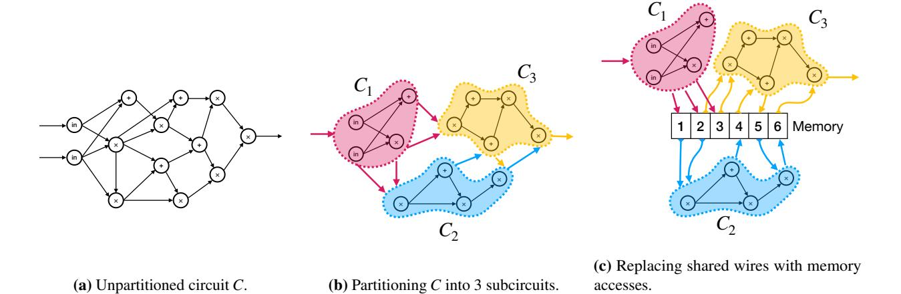
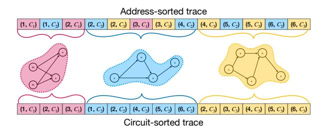
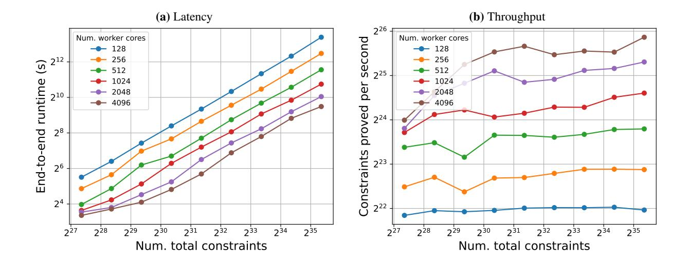
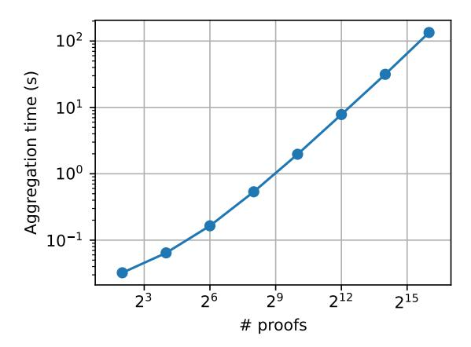
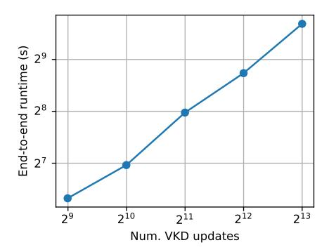
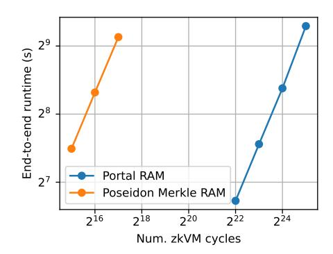

# <span id="page-0-0"></span>HEKATON: Horizontally-Scalable zkSNARKs via Proof Aggregation

Michael Rosenberg

Tushar Mopuri

Hossein Hafezi

micro@umd.edu UMD

tmopuri@upenn.edu UPenn

h.hafezi@nyu.edu NYU

Ian Miers

Pratyush Mishra

imiers@umd.edu UMD

prat@upenn.edu UPenn

August 9, 2024

### Abstract

Zero-knowledge Succinct Non-interactive ARguments of Knowledge (zkSNARKs) allow a prover to convince a verifier of the correct execution of a large computation in private and easily-verifiable manner. These properties make zkSNARKs a powerful tool for adding accountability, scalability, and privacy to numerous systems such as blockchains and verifiable key directories. Unfortunately, existing zkSNARKs are unable to scale to large computations due to time and space complexity requirements for the prover algorithm. As a result, they cannot handle real-world instances of the aforementioned applications.

In this work, we introduce HEKATON, a zkSNARK that overcomes these barriers and can efficiently handle arbitrarily large computations. We construct HEKATON via a new "distribute-and-aggregate" framework that breaks up large computations into small chunks, proves these chunks in parallel in a distributed system, and then aggregates the resulting chunk proofs into a single succinct proof. Underlying this framework is a new technique for efficiently handling data that is shared between chunks that we believe could be of independent interest.

We implement a distributed prover for HEKATON, and evaluate its performance on a compute cluster. Our experiments show that HEKATON achieves strong horizontal scalability (proving time decreases linearly as we increase the number of nodes in the cluster), and is able to prove large computations quickly: it can prove computations of size 2<sup>35</sup> gates in under an hour, which is much faster than prior work.

Finally, we also apply HEKATON to two applications of real-world interest: proofs of batched insertion for a verifiable key directory and proving correctness of RAM computations. In both cases, HEKATON is able to scale to handle realistic workloads with better efficiency than prior work.

# Contents

| 1 | Introduction                                                         | 1  |
|---|----------------------------------------------------------------------|----|
|   | 1.1<br>Our contributions<br>                                         | 1  |
|   | 1.2<br>Related work<br>                                              | 3  |
|   |                                                                      |    |
| 2 | Techniques                                                           | 6  |
|   | 2.1<br>Partition-friendly memory checking<br>                        | 6  |
|   | 2.2<br>Aggregating heterogeneous commit-carrying zkSNARKs            | 8  |
|   | 2.3<br>Our aggregation scheme for Mirage<br>                         | 8  |
|   | 2.4<br>Optimizations                                                 | 10 |
|   |                                                                      |    |
| 3 | Preliminaries                                                        | 11 |
|   | 3.1<br>Commitment schemes                                            | 11 |
|   | 3.2<br>Commit-carrying zkSNARKs                                      | 11 |
|   | 3.3<br>Aggregation schemes<br>                                       | 12 |
|   |                                                                      |    |
| 4 | Partitioning circuits via memory checking                            | 14 |
|   | 4.1<br>Notation                                                      | 14 |
|   | 4.2<br>Eliminating shared wires with ROM circuits                    | 15 |
|   | 4.3<br>Reducing partitioned ROM circuits to committable circuits<br> | 15 |
|   |                                                                      |    |
| 5 | Aggregation scheme for Mirage                                        | 20 |
|   | 5.1<br>Background                                                    | 20 |
|   | 5.2<br>Proving multiple pairing products simultaneously<br>          | 22 |
|   | 5.3<br>Construction                                                  | 24 |
|   |                                                                      |    |
| 6 | Divide-and-aggregate zkSNARKs                                        | 26 |
|   | 6.1<br>Construction                                                  | 26 |
|   | 6.2<br>Distributed prover workflow<br>                               | 27 |
|   | 6.3<br>Optimizations                                                 | 27 |
|   |                                                                      |    |
| 7 | Implementation                                                       | 29 |
|   |                                                                      |    |
| 8 | Evaluation                                                           | 30 |
|   | 8.1<br>Experimental setup<br>                                        | 30 |
|   | 8.2<br>Scaling experiments                                           | 30 |
|   | 8.3<br>Application: verifiable key directories<br>                   | 33 |
|   | 8.4<br>Application: verifiable RAM computation<br>                   | 34 |
|   |                                                                      |    |
|   | Acknowledgements                                                     | 36 |
|   |                                                                      |    |
| A | Design choices and cluster architecture                              | 37 |
|   |                                                                      |    |
| B | Additional definitions and lemmas                                    | 37 |
|   | B.1<br>Zero-finding lemma                                            | 38 |
|   |                                                                      |    |
| C | Proof of Theorem 6.1                                                 | 39 |
|   | C.1<br>Completeness                                                  | 39 |
|   | C.2<br>Knowledge soundness                                           | 40 |
|   | C.3<br>Zero-knowledge                                                | 43 |
|   | C.4<br>Efficiency<br>                                                | 44 |
|   |                                                                      |    |
|   | References                                                           | 45 |

# <span id="page-2-0"></span>1 Introduction

*Zero-knowledge Succinct Non-interactive ARguments of Knowledge* (zkSNARKs) are cryptographic proofs that allow a prover to convince a verifier that, given a function *F* and public input x, there is a private witness w such that *F*(x,w) = 1. zkSNARKs hide all information about w, and are *small* and *easy to verify* regardless of the complexity of *F*. Recent efficient constructions of zkSNARKs [\[GGPR13;](#page-47-0) [Gro16;](#page-47-1) [GWC19;](#page-47-2) [CHMMVW20;](#page-47-3) [Set20\]](#page-48-0) have enabled a range of applications and industrial deployments that rely on zkSNARKs to improve efficiency and privacy characteristics. However, zkSNARKs cannot currently scale to prove useful computations on realistic problem sizes. Indeed, many proposed applications of zkSNARKs, such as verifiable key transparency [\[TFZBT22\]](#page-48-1), proofs of program execution or vulnerability [\[BCGTV13;](#page-46-1) [ZGKPP18\]](#page-48-2), or machine learning inference [\[LXZ21\]](#page-48-3), are limited to toy problem sizes due to zkSNARK scalability limitations.

In more detail, in typical zkSNARKs, to prove the correctness of a computation *F* on inputs (x,w), we must first express *F* as an arithmetic circuit *CF*. The size of the latter is often much larger than the description of *F*, leading to two scalability issues:

- Poor parallelization: zkSNARK provers perform a number of expensive operations whose cost grows linearly with the circuit size |*CF*|. Unfortunately, these operations have diminishing parallelizability, particularly for real implementations that must account for inter-process communication costs between cores, processors, and even compute clusters.
- Large memory overheads The space complexity of the prover also tends to scale linearly with |*CF*|. As a result, memory often ends up being the key bottleneck for proving complex computations: while one can always wait longer for a proof, one cannot always add more RAM to the prover's machine.

These problems are not merely asymptotic, but lead to high concrete costs even for relatively simple computations. For instance, a circuit for proving the multiplication of two 700×700 matrices requires 685 million gates. Prior work [\[WZCPS18\]](#page-48-4) reports that using even a 64-threaded machine to prove this circuit requires hundreds of minutes and a prohibitive 1.7TB of RAM.

Moreover, these problems are exacerbated for many exciting SNARKs applications which, frequently, are RAM Programs (e.g., proofs of vulnerability, zkRollups, etc.). This poses two challenges. First, representing a RAM program as a bare circuit requires all branches be taken and loops be unrolled, drastically increasing circuit size. Second, circuits do not, natively, provide memory access and the methods for providing memory either offer high overhead or, as we will see, place constraints how we can address the space and time complexity.

Distributed proving: a path forward? A promising approach to scale zkSNARKs up to large circuits is to distribute the proving algorithm across a set of workers in a way that ensures that the proof computation is parallelized across the workers, and which ensures that each worker's local memory requirements are low. In this work, we revisit this approach and design HEKATON, a new *horizontally-scalable* zkSNARK whose prover algorithm can be distributed over large compute clusters much more efficiently than all prior work [\[WZCPS18;](#page-48-4) [Xie+22;](#page-48-5) [LXZSZ24\]](#page-48-6). We detail the technical contributions underlying HEKATON next.

# <span id="page-2-1"></span>1.1 Our contributions

HEKATON is the result of several contributions:

(1) Scalable proving via divide-and-aggregate. We distill a generic framework for constructing scalable zkSNARKs that we call *divide-and-aggregate*, or DNA for short. Our framework proceeds as follows:

<span id="page-3-0"></span>

Figure 1: Partitioning circuits for use with our divide-and-aggregate zkSNARK.

to prove the execution of a function *F* represented as a circuit *CF*, partition *C<sup>F</sup>* into smaller *subcircuits C*1,...,*Cn*, and have each cluster machine use a simpler "inner" zkSNARK to prove the satisfaction of an individual subcircuit separately. Then, invoke a *proof aggregation* protocol [\[BMMTV21;](#page-47-4) [GMN22;](#page-47-5) [ABST23\]](#page-46-2) to relatively cheaply aggregate these subcircuit proofs into a single succinctly-verifiable proof.

Instantiating the foregoing blueprint requires addressing two challenges: aggregating proofs for different subcircuits, and sharing wires between subcircuits.

- (2) Multi-circuit aggregation. We generalize prior proof aggregation schemes [\[BMMTV21;](#page-47-4) [GMN22\]](#page-47-5) to efficiently aggregate proofs for *different* circuits. This allows our framework to handle computations with *arbitrary* subcircuit structure. In contrast, schemes implicit in prior work [\[BMMTV21\]](#page-47-4) are only able to handle *uniform* circuits that just repeat the same subcircuit many times.
- (3) Shared wires via efficient global memory. All known aggregation schemes (including ours) are only able to achieve succinct verification when proofs for neighbouring subcircuits share a small constant amount of data. However, this is incompatible with our goal of designing a proof system for *arbitrary* circuits where subcircuits might share many wires.

We overcome this challenge via a new low-overhead technique for providing subcircuits with efficient access to a *global memory bank*. This allows subcircuits to share wire values by accessing them from the memory bank, rather than directly passing them between subcircuits. To efficiently prove correctness of memory accesses, we design a new memory-checking circuit that can itself be partitioned into subcircuits that share just a constant number of wires. The resulting workflow is illustrated in Fig. [1.](#page-3-0)

On a technical level, our approach extends recent work on permutation-based memory checking techniques [\[ZGKPP18;](#page-48-2) [BCGJM18\]](#page-46-3) that uses commit-carrying SNARKs by extending our aggregation scheme into one that supports a commit-carrying mode.

(4) Efficient instantiation and implementation. We instantiate our DNA zkSNARK blueprint by choosing Mirage [\[KPPS20\]](#page-48-7) as the inner zkSNARK, and designing a new "commit-carrying" aggregation scheme for Mirage. We call the resulting system HEKATON.

We implement HEKATON in a Rust library that supports distributed proving. Our implementation also provides a novel framework for writing partitioned circuits that enables us to minimize communication (in distributed mode) and memory requirements (in both modes). We provide details in Section [7.](#page-30-0)

(5) Applications and evaluation. As noted above, our evaluation of HEKATON demonstrates that it can prove computations that are orders-of-magnitude larger than prior work, while requiring a fraction of the time. We provide details in Section 8. To showcase the improvements HEKATON offers over state of the art provers, we implement two real world applications. In the first application, we use HEKATON to prove the correctness of batched updates to a Verifiable Key Directory [TFZBT22], whose configuration, for the first time, matches that of deployed systems, i.e., using a sparse Merkle Tree and SHA256 as a hash function. In the second application, we adapt our memory-checking techniques to build a proof for RAM execution that achieves a throughput of 50kHz. Our system is able to prove a large execution trace of 2<sup>25</sup> instructions via a circuit of 2<sup>35</sup> constraints.

### <span id="page-4-0"></span>1.2 Related work

**Lookup tables.** Our global memory technique is reminiscent of recent work on lookup arguments [GW20; ZBKMNS22]. Indeed, one could consider constructing a large lookup table containing the shared wire values. However, a key difference is that most lookup arguments assume that the commitment to the table is constructed honestly in an offline phase (often over public values), and hence optimize their proving algorithm for this regime. In our setting, the "table" is for secret wire values unique to the witness and therefore must be constructed online during the proving phase by the untrusted prover. To use a lookup argument, we would first need to check that the table commitment was generated honestly, and would need to design a proving algorithm optimized for this regime.

**Partitioning circuits.** Assuming sufficient resources, HEKATON's latency is determined by the size of the largest subcircuit and the number of shared wires between subcircuits. Because handling shared wires costs only 13 constraints per wire, in practice partitioning the circuit into equal-sized subcircuits leads to good performance, because these circuits that arise in practice tend to be partitionable in a manner that results in a small number of shared wires. We leave the problem of optimal circuit partitioning to future work, but note that HEKATON is compatible with prior automatic circuit partitioning schemes [Cos+15; San+23].

#### 1.2.1 Distributed zkSNARKs

Like HEKATON, all prior works on distributed zkSNARKs use a coordinator which gets as input the circuit C, the public input x, and the witness w, and is responsible for distributing these to the worker nodes, who in turn jointly compute the zkSNARK proof. Existing protocols differ in how these workers perform the latter computation. We provide an asymptotic comparison between the above systems in Table 1, and focus below on qualitative differences.

<span id="page-4-1"></span>

| system            | supported computation | proof<br>size | per-worker<br>time | total comm. | verifier<br>time | SRS size     |
|-------------------|-----------------------|---------------|--------------------|-------------|------------------|--------------|
| DIZK [WZCPS18]    | arbitrary             | O(1)          | $\tilde{O}( C /n)$ | O( C )      | O(1)             | O( C )       |
| DeVirgo [Xie+22]  | data-parallel         | O(n)          | $\tilde{O}( C /n)$ | O( C )      | $O(\log n)$      | $O(\lambda)$ |
| Pianist [LXZSZ24] | arbitrary             | O(1)          | $\tilde{O}( B )$   | O(1)        | O(1)             | O( C )       |
| HEKATON           | arbitrary             | $O(\log n)$   | $\tilde{O}( B )$   | O(1)        | $O(\log n)$      | O(n+k B )    |

**Table 1:** Comparison of distributed zkSNARKs. Here C is the circuit being proved, n is the number of subcircuits, k is the number of *unique* subcircuits, and B is the largest unique subcircuit.

**DIZK** [WZCPS18] initiated the study of distributed algorithms for zkSNARK provers, focusing on the zkSNARK in [Gro16] (though the techniques are applicable to other proof systems as well). In more detail,

the core contributions of DIZK are the design and implementation of efficient distributed algorithms for the core operations performed in zkSNARK provers, namely FFTs and multi-scalar multiplications. The primary drawback of DIZK is its need for a *linear* amount of inter-worker communication. In practice, this greatly increases the latency of proving: the per-gate cost is 10× worse than local proving. In contrast, HEKATON requires only *constant* inter-worker communication, and is able to achieve per-gate costs that are very similar to local proving.

DeVirgo [\[Xie+22\]](#page-48-5) is a SNARK with a distributed prover that focuses on supporting only *data-parallel* computations, i.e., the circuit being proved consists of repeated copies of a single subcircuit. DeVirgo's prover requires the primary node to perform cryptographic work that scales with the size of the subcircuit, and requires linear inter-worker communication. In contrast, as noted above, HEKATON supports arbitrary computations, requires only constant inter-worker communication, and ensures that the cryptographic work performed by the primary node scales only with the number of workers.

Pianist [\[LXZSZ24\]](#page-48-6) is a very recent work that designs a distributed proving algorithm for the Plonk zk-SNARK [\[GWC19\]](#page-47-2). At a high level, Pianist relies on the elegant observation that using *bivariate* polynomial commitments allows one to decompose Plonk's global permutation check, which is used for circuit wiring correctness, into local per-worker permutation checks. The resulting protocol, produces constant proof size and verifier time, whereas the latter costs scale logarithmically for HEKATON. [1](#page-0-0)

However, Pianist, as instantiated, requires an SRS whose size scales linearly with circuit size. To be precise, the SRS for the bivariate polynomial commitment in Pianist depends on the degree of the variables. The degree of the first variable corresponds to subcircuit size, and that of the other to the number of workers. As a result, Pianist's SRS size is *O*(|*C*|). In contrast, because HEKATON's SRS consists of the SRS(es) for subcircuits and a small SRS for aggregation, its SRS size is dominated by the number of unique subcircuits. For many circuits of interest (e.g., RAM programs), the number and size of the unique subcircuits is much smaller than the total circuit size, leading to substantial SRS size savings for HEKATON. We provide a thorough experimental comparison of HEKATON and Pianist in Section [8.2.](#page-31-2)

Mangrove [\[NDCTB24\]](#page-48-10) is a concurrent theoretical work that uses similar commit-and-prove-based permutationchecking techniques as us. Unlike us, however, Mangrove only reports estimated performance numbers, and does not provide a full implementation or evaluation. Furthermore, applying Mangrove's techniques to distributed proving would lead to a prover that requires linear inter-worker communication.

Distributed proving based via recursive proofs. A promising idea for distributed proving is to use recursive verification, where the system uses recursive proofs to aggregate subcircuit proofs. The idea would be to replace the custom aggregation scheme in HEKATON with a system that verifies batches of subcircuit proofs recursively in a tree-like manner. However, this approach has several drawbacks.

First, even assuming state-of-the-art folding-based techniques [\[BCLMS21;](#page-46-4) [KST22\]](#page-48-11) that have reduced the cost of recursive verification, a back-of-the-envelope calculation shows that such an approach would have over 2×-worse aggregation time than HEKATON. This is even when we assume that the aggregation step is *also* distributed; without this assumption, the recursive verification approach would have much worse aggregation time.

Second, even a state-of-the-art recursive aggregation scheme, would still need to support shared wires between subcircuits, and as discussed in Section [2.1.1,](#page-7-2) existing approaches for this would incur much higher overhead than HEKATON. Adapting the memory-checking techniques in HEKATON to a recursive verification setting is a non-trivial research problem, and indeed formed a key component of concurrent work [\[NDCTB24\]](#page-48-10).

<sup>1</sup>Note that one can generically reduce HEKATON's proof sizes via depth-1 recursive proof composition [\[Cos+15;](#page-47-7) [BCGMMW20\]](#page-46-5).

Finally, scalable implementation of these approaches would be challenging due to the need for complex multi-round communication and straggler management.

# <span id="page-7-0"></span>2 Techniques

We construct our divide-and-aggregate zkSNARK via the blueprint outlined in Section 1.1, which we recall next. To prove a circuit C, (a) partition C into subcircuits  $(C_1, \ldots, C_n)$ , (b) replace shared wires with accesses to a global memory, (c) construct augmented subcircuits  $(C'_1, \ldots, C'_n)$  that additionally check memory accesses, (d) prove each  $C'_i$  using via an inner zkSNARK (denoted ARG), and (e) aggregate the resulting proofs using an aggregation scheme for ARG proofs (denoted Agg).

In the rest of this section, we will expand on each of these steps, focusing on our novel memory checker (Section 2.1) and our new commit-carrying aggregation scheme (Section 2.2) that supports this memory checker.

### <span id="page-7-1"></span>2.1 Partition-friendly memory checking

To check the consistency of these memory accesses, one can design a "memory-checker" circuit M using standard memory checking techniques [BEGKN91]. However, integrating this into our blueprint requires that the memory checker M can be partitioned into n subcircuits  $M_1, \ldots, M_n$ , such that (a)  $M_i$  checks the memory accesses made by  $C_i$ , and (b)  $M_i$  and  $M_{i+1}$  share just a constant number of wires. Given such an M, we can obtain a DNA zkSNARK for arbitrary circuits by invoking our blueprint on *augmented* subcircuits  $C_i'$  that invoke  $C_i$  and  $M_i$  together. Let us thus focus on constructing such a partitioning-friendly memory checker.

#### <span id="page-7-2"></span>2.1.1 Limitations of existing memory checkers

**Attempt 1: Online memory checkers.** In *online memory checking* [BEGKN91], memory is committed to via a Merkle tree and read/write operations consist of checking/updating the Merkle path for that location. This requires sharing only a single wire value (the Merkle root) between subcircuits, and is used in all prior divide-and-aggregate SNARKs [BCTV14a; CTV15]. However, online memory checking creates both asymptotic and concrete bottlenecks.

Asymptotically, Merkle path checking imposes a logarithmic overhead: if  $s_i$  is the number of shared wires in the i-th subcircuit  $C_i$ , then checking  $C_i$ 's memory accesses requires  $s_i \cdot O(\log s)$  hash function invocations, where  $s = \sum_i s_i$  is the size of the global memory. Since in the worst case the number of shared wires can be as large as the circuit size  $|C_i|$ , the size of the memory checker subcircuit  $M_i$ , and hence that of the augmented subcircuit  $C_i'$ , can be as large as  $O(|C_i|\log|C_i|)$ . Concretely, even with zkSNARK-friendly [AABDS20; GKRRS21] hash functions that require  $\sim 300$  gates, each memory access costs  $300 \log |s|$  gates, which results in unacceptable slowdowns in practice.

Attempt 2: Memory trace checkers. A second approach [BCGT13] verifies memory operations by recording them in a *memory trace*, and performing cheap checks on the trace entries. In more detail, a memory trace logs each memory operation as (subcircuit-number, op = read/write, addr, value). The checker then considers two versions of this trace: one sorted by address (denoted A), and another sorted by subcircuit number (denoted T), and performs both local and global checks on these traces. As we will show later, the local checks are easily partitioned across subcircuits, but the global check requires verifying that the two traces contain the same entries, and are hence permutations of each other. Efficiently implementing this "permutation check" in a manner amenable to partitioning is a challenge, as we explain next.

**Permutation checking.** State-of-the-art permutation checking techniques [ZGKPP18; BCGJM18; KPPS20] require the optimal O(s) gates to check permutations between s-sized traces. They achieve this low cost by relying on randomized Reed–Solomon fingerprinting [Lip89; Lip90], which performs the following randomized check to ensure that two traces  $T := (t_1, \ldots, t_s)$  and  $A := (a_1, \ldots, a_s)$  are permutations:

- 1. construct trace polynomials  $T(X) := \prod_{i=1}^{s} (X t_i)$  and  $A(X) := \prod_{i=1}^{s} (X a_i)$ ;
- 2. sample a random field element  $r \leftarrow \mathbb{F}$ ; and
- 3. check that T(r) = A(r).

This check can be realized quite efficiently via a circuit that witnesses T, A, and r, computes the products  $\prod_{i=1}^{s} (r-t_i)$  and  $\prod_{i=1}^{s} (r-a_i)$ , and checks that these are equal. We now show that this computation can also be partitioned easily across subcircuits in a way that ensures that each subcircuit only pays for the accesses it makes to the memory.

#### <span id="page-8-0"></span>2.1.2 Partitioning polynomial evaluation

Our partitioning strategy relies on the simple but crucial observation that **the trace polynomials can be evaluated incrementally**. In more detail, notice that for every  $j \in [s]$ , if we are given the running products  $\tau := \prod_{i=1}^{j} (r-t_i)$  and  $\alpha := \prod_{i=1}^{j} (r-a_i)$ , and the j+1-th trace entries  $t_{j+1}$  and  $a_{j+1}$ , we can easily compute the next running products  $\tau' := \tau \cdot (r-t_{j+1})$  and  $\alpha' := \alpha \cdot (r-a_{j+1})$ . We can then iterate this process to eventually compute T(r) and A(r). We leverage this observation to construct memory-checking subcircuits  $M_1, \ldots, M_n$  as follows.

**Notation.** Denote by  $s_i$  the number of memory accesses in the *i*-th subcircuit  $C_i$ , by  $k_i = \sum_{j=1}^{i-1} s_j$  the total number of accesses in the previous subcircuits  $C_1, \ldots, C_{i-1}$ , and finally by  $S_i$  the set  $\{k_i + 1, \ldots, k_i + s_i\}$ .

Let  $T = (t_1, ..., t_s)$  and  $A = (a_1, ..., a_s)$  be the memory traces as defined in Section 2.1.1. We split these traces up into n subtraces, one for each subcircuit, as follows. The i-th subtrace of T is defined to contain those entries access by  $C_i$ , i.e.,  $T_i := \{t_j \mid j \in S_i\}$ . The i-th subtrace of A is defined analogously as  $A_i := \{a_j \mid j \in S_i\}$ . Finally, denote by  $\tau_i$  and  $\alpha_i$  the running products up to (but excluding) the i-th subcircuit, i.e.,  $\tau_i := \prod_{j \in [k_i]} (r - t_j)$  and  $\alpha_i := \prod_{j \in [k_i]} (r - a_j)$ .

Construction. We are now ready to describe how our construction of the memory-checking subcircuits  $M_i$ .

- $M_i$  receives as **public input** the random challenge r, the last entries t and a of  $T_{i-1}$  and  $A_{i-1}$  respectively, as well as the running products  $\tau_i$  and  $\alpha_i$ .
- The **public output** of  $M'_i$  consists of the last entries t' and a' of  $T_i$  and  $A_i$  respectively, as well as the updated running evaluations  $\tau_{i+1}$  and  $\alpha_{i+1}$ .
- $M_i$  receives as *additional* witness the subtraces  $T_i$  and  $A_i$ .
- $M_i$  performs the following computations:
  - $M_i$  replaces each memory gate with with a 'read' from the value in the corresponding entry in  $T_i$ .
  - $M_i$  checks that entries in  $T_i$  all have the subcircuit number set to i, and that  $A_i$  is sorted by address.
  - $M_i$  checks that consecutive entries in  $A_i$  are consistent: if they have the same address, then they must contain the same value.
  - $M_i$  computes the new running products  $\tau_{i+1} := \tau_i \cdot \prod_{j \in S_i} (r t_j)$  and  $\alpha_{i+1} := \alpha_i \cdot \prod_{j \in S_i} (r a_j)$

This approach, illustrated in Fig. 2, achieves the desired performance: the *i*-th memory-checking circuit processes exactly an  $s_i/s$ -fraction of the traces in just  $O(s_i)$  gates, as required, and the hidden constants are great: just 13 gates per shared wire. We provide formal details and analyses of this construction in Section 4.2.

We note that our full construction in Section 4.2 incorporates the optimizations mentioned in Section 2.4 to further simplify and reduce the cost of memory-checking.

<sup>&</sup>lt;sup>2</sup>Note that  $A_i$  can be entirely disjoint from  $T_i$ , i.e., it might contain no entries corresponding to  $C_i$ 's memory accesses.

<span id="page-9-2"></span>

Figure 2: Memory traces are partitioned across subcircuits.

#### <span id="page-9-0"></span>2.2 Aggregating heterogeneous commit-carrying zkSNARKs

A question left open by the description of the memory-checker construction in Section 2.1 is that of how to derive the challenge r for the trace polynomial evaluation. An approach taken by prior work [ZGKPP18; KPPS20] is to derive the random challenge r by hashing (via a random oracle  $\rho$ ) commitments to the traces. This requires the SNARK proof for each subcircuit to additionally ensure that the witnessed traces are consistent with their claimed commitments. Prior work achieves this consistency check efficiently by using special commit-carrying zkSNARKs (cc-zkSNARK) [CFQ19] where the commitment scheme is co-designed with the SNARK so that the contents of the commitment are "natively" available as witnesses in the proven circuit.

We briefly recall their high-level strategy here, and then explain why it does not work in our setting. First, the prover commits to the traces, obtaining commitments tcm and acm; then, it derives the challenge  $r := \rho(\text{tcm}, \text{acm})$ ; and finally, it invokes the zkSNARK's proving algorithm on the augmented subcircuits  $C_i'$  to prove that the committed traces are valid memory traces. Unfortunately, the natural extension to our setting where the prover derives the challenge r by hashing the individual subcircuit commitments fails to meet our goals because the proof is no longer succinct.

**Our approach: commit-carrying aggregation schemes.** We resolve this issue by defining a new notion of *commit-carrying aggregation schemes* that support aggregating not only the proofs the underlying inner cc-zkSNARK, but also their commitments. Our notion also naturally supports *multi-circuit* aggregation that allows the prover to aggregate proofs for multiple circuits into a single combined proof.

With this new tool in hand, we can augment our blueprint construction as follows. Given an inner cc-zkSNARK ARG and a commit-carrying aggregation scheme Agg for ARG, to prove a partitioned circuit  $C = (C_1, ..., C_n)$ ,

- 1. construct augmented subcircuits  $(C'_1, \ldots, C'_n)$  and memory subtraces  $(T_1, \ldots, T_n)$  and  $(A_1, \ldots, A_n)$ ;
- 2. compute trace commitments  $(tcm_1,...,tcm_n)$  and  $(acm_1,...,acm_n)$  using ARG's commitment scheme;
- 3. aggregate these with Agg to obtain succinct commitments (tcm, acm), and derive  $r := \rho(\text{tcm}, \text{acm})$ ;
- 4. prove each circuit  $C'_i$  with ARG and aggregate the resulting inner proofs with Agg.

This approach achieves succinctness while preserving soundness. We provide details of our construction in Section 6.

#### <span id="page-9-1"></span>2.3 Our aggregation scheme for Mirage

To instantiate the foregoing blueprint, we choose the Mirage cc-zkSNARK [KPPS20] as our inner zkSNARK. Mirage is a commit-carrying variant of the Groth16 zkSNARK [Gro16], and inherits the succinctness and prover efficiency of the latter. In more detail, a Mirage proof, like a Groth16 one, consists of three group elements (A, B, C), while the commitment is another group element D. The verifying key, like that of Groth16,

contains elements  $\alpha \in \mathbb{G}_1$  and  $\beta, \delta, \in \mathbb{G}_2$ , as well as an extra element  $\eta \in \mathbb{G}_2$ . To check a proof  $\pi = (A, B, C)$  with respect to a commitment D, the verifier checks that the following pairing equation is satisfied.

$$e(A,B) = e(\alpha,\beta)e(C,\delta)e(D,\eta)$$
.

**Background for** Mirage. To construct an aggregation scheme for Mirage, we follow existing work on aggregation schemes for Groth16 [BMMTV21; GMN22] by relying on *inner-pairing product* argument systems [BMMTV21]. The latter generalize inner-product argument systems [BCCGP16; BBBPWM18] to enable proving more general bilinear products. Two variants are relevant for our purposes: "MIPPs", which prove the inner product  $\sum_i a_i \cdot B_i$  for (committed) vectors  $\mathbf{a} \in \mathbb{F}^n$ ,  $\mathbf{B} \in \mathbb{G}^n$ , and "TIPPs", which prove the pairing product  $\prod_i e(r^i \cdot A_i, B_i)$  for a scalar r and (committed) vectors  $\mathbf{A} \in \mathbb{G}_1^n$ ,  $\mathbf{B} \in \mathbb{G}_2^n$ .

To construct an aggregation scheme for Mirage that proves the correctness of a batch of Mirage proofs (A, B, C) with respect to commitments D, we will use the above ingredients to prove the following randomized pairing check with respect to a random challenge r:

$$\prod_{i} e(r^{i} \cdot A_{i}, B_{i}) = e(\alpha, \beta)^{\sum r^{i}} \prod_{i} e(r^{i} \cdot C_{i}, \delta) \prod_{i} e(r^{i} \cdot D_{i}, \eta) .$$

To aggregate these proofs, the aggregation prover first commits to the A, B, C, D using a "structure-preserving" commitment scheme [AFGHO16], hashes these to obtain r, and then proves the above equation using MIPPs and TIPPs. Clearly, the left hand side can be proven using a TIPP, while the remaining terms can be proven using MIPPs. Unfortunately, we are not done yet, as our setting requires us to aggregate proofs for multiple circuits simultaneously.

**Multi-circuit aggregation.** When aggregating multiple circuits, the  $\delta$  and  $\eta$  components of the verifying key differ across circuits, meaning our randomized check changes to the following:

$$\prod_{i} e(r^{i} \cdot A_{i}, B_{i}) = e(\alpha, \beta)^{\sum r^{i}} \prod_{i} e(r^{i} \cdot C_{i}, \delta_{i}) \prod_{i} e(r^{i} \cdot D_{i}, \eta_{i}) .$$

While all the pairing checks can now be proven using TIPPs, preserving succinctness requires care. To see this, let us inspect the two kinds of TIPPs performed in the above equation. Notice that in the TIPP for the left-hand-side check  $(\prod_i e(r^i \cdot A_i, B_i))$ , both arguments are prover-supplied, and hence it is fine for the prover to provide commitments to  $\boldsymbol{A}$  and  $\boldsymbol{B}$ . The TIPPs on the right-hand side, however, involve one prover-supplied argument  $(\boldsymbol{C}$  and  $\boldsymbol{D})$  and one verifier-supplied argument  $(\boldsymbol{\delta}$  and  $\boldsymbol{\eta})$ . While the prover can provide commitments to  $\boldsymbol{C}$  and  $\boldsymbol{D}$ , it would be *unsound* for it to do the same for  $\boldsymbol{\delta}$  and  $\boldsymbol{\eta}$ , as it could commit to arbitrary elements that cause the checks to pass.

Therefore, the verifier must obtain these commitments itself. The straightforward solution of having the verifier compute them itself would violate succinctness. To resolve this issue, we leverage the fact that the subcircuit structure is known at setup time, which in turn means that the vectors  $\delta$  and  $\eta$  are also known at setup time. This means that commitments to the latter can be computed then and included in the verifying key, thus preserving succinctness.

**Reducing the number of TIPPs.** The aggregation scheme proposed so far is sound and relatively efficient. However, it requires the prover to prove multiple TIPPs, worsening prover complexity and proof size. Because aggregation is performed on a single machine (and is not parallelized), improving its prover complexity is important. We do so by devising a method for batching multiple TIPP instances together into a single TIPP instance, and providing a single TIPP proof for the latter.

**Our aggregation scheme for** Mirage. The sketch above omits details, including how we handle public inputs. We provide these details in Section 5.

#### <span id="page-11-0"></span>2.4 Optimizations

The foregoing discussions omit a number of optimizations that we developed to improve the efficiency of our construction. We describe these next.

**Read-only memory.** Notice that we can assume that the memory is read-only, as the prover can initialize the memory with values of all the shared wires, and subcircuits which access these wires can simply check that the memory contains the correct value. This optimization greatly reduces the concrete cost of the local checks performed on the memory traces.

**Reducing SRS size.** The description in the foregoing sections obscures the fact that, as described, each augmented subcircuit  $C_i$  is unique, even if the topology of the underlying subcircuit  $C_i$  is shared with other subcircuits. This is because we need to embed into  $C_i$  information about (a) its circuit number i (so that it can check the trace entries correspond to its own memory access), and (b) the addresses it reads from (so that it reads the appropriate shared wires). Because of this, each subcircuit becomes unique, leading to a blowup in SRS size when we instantiate HEKATON with the Mirage cc-zkSNARK [KPPS20] as the latter has circuit-specific setup (we would need to generate a separate SRS for each subcircuit).

To resolve this issue, we observe that the aforementioned information (circuit number and addresses) is not dependent on the prover's witness, and can be committed to via Mirage's commitment scheme in a preprocessing phase. We provide details in Section 6.3.

**Homogenizing public inputs via Merkle trees.** Recall from Section 2.1.2 that each memory-checking subcircuit  $M_i$  receives as public input the triple  $\mathsf{in}_i = (r, (t, a), (\tau_{k_i}, \alpha_{k_i}))$ , and outputs the pair  $\mathsf{out}_i = ((t', a'), (\tau_{k_{i+1}}, \alpha_{k_{i+1}}))$ . This means that each  $M_i$ 's public input is necessarily different. Existing constructions of aggregation schemes [BMMTV21] can handle such heterogeneous public inputs, but incur prover complexity and proof size overheads. Instead, we propose to homogenize the public inputs of all the subcircuits by careful and selective use of *online* memory checking: we commit to  $(\mathsf{in}_i, \mathsf{out}_i)$  in the i-th leaf of a Merkle tree, and use the corresponding path to verifiably access the i-th leaf in the i-th subcircuit. This allows us to eschew the complex public input handling mechanisms of prior aggregation schemes.

**Batch setup optimization.** We perform a common setup for all circuits simultaneously. This helps us improve efficiency by reducing the number of TIPPs by 1.

### <span id="page-12-0"></span>3 Preliminaries

**Indexed relations.** An *indexed relation*  $\mathscr{R}$  is a set of triples (i, x, w) where i is the index, x is the instance, and w is the witness; the corresponding *indexed language*  $\mathscr{L}(\mathscr{R})$  is the set of pairs (i, x) for which there exists a witness w such that  $(i, x, w) \in \mathscr{R}$ . An indexed relation is said to be *committable* if the witness can be split into two parts,  $w = (w_1, w_2)$ .

**Definition 3.1** (circuit satisfiability). The committable indexed relation CSAT is the set of triples  $(i, x, w) = ((\mathbb{F}, \ell, m, n, C), x, (w_1, w_2))$  where  $\mathbb{F}$  is a finite field,  $\ell$ , m, and n are natural numbers,  $x \in \mathbb{F}^{\ell}$ ,  $w_1 \in \mathbb{F}^m$ , and  $w_2 \in \mathbb{F}^n$  are vectors, and  $C : \mathbb{F}^{\ell+m+n} \to \mathbb{F}$  is an arithmetic circuit over  $\mathbb{F}$  such that  $C(x, w_1, w_2) = 0$ .

To obtain the usual notion of circuit satisfiability we can set m = 0 and  $w_1 = \bot$ .

**Security parameters.** For simplicity of notation, we assume that all public parameters have length at least  $\lambda$ , so that algorithms which receive such parameters can run in time poly( $\lambda$ ).

**Random oracles.** We denote by  $\mathcal{U}(\lambda)$  the set of all functions that map  $\{0,1\}^*$  to  $\{0,1\}^{\lambda}$ . A *random oracle* with security parameter  $\lambda$  is a function  $\rho: \{0,1\}^{\lambda}$  sampled uniformly at random from  $\mathcal{U}(\lambda)$ .

**Bilinear groups.** We denote groups by  $\mathbb{G}$ . A bilinear function  $e: \mathbb{G}_1 \times \mathbb{G}_2 \to \mathbb{G}_T$  is a *type-3 bilinear pairing* if there is no efficiently computable group homomorphism from  $\mathbb{G}_2$  to  $\mathbb{G}_1$ . e is *degenerate* if there is a non-identity  $G \in \mathbb{G}_1$  such that e(G,H) = 1 for all  $H \in \mathbb{G}_2$ . We use additive notation for  $\mathbb{G}_1$  and  $\mathbb{G}_2$ , and multiplicative notation for  $\mathbb{G}_T$ . As shorthand we sometimes write  $[a]_1$  for  $a \cdot G$  and  $[b]_2$  for  $b \cdot H$ .

#### <span id="page-12-1"></span>3.1 Commitment schemes

A commitment scheme CM = (Setup, Commit) over a universe of message spaces  $\{\mathcal{M}_i\}_{i\in\mathbb{N}}$  enables a party to generate a (perfectly) hiding and (computationally) binding commitment to a given message  $m \in \mathcal{M}$ .

- *Setup:* on input a security parameter and a description of the message space  $\mathcal{M}$ , CM.Setup samples a commitment key ck.
- Commitment: on input public parameters ck, message  $m \in \mathcal{M}$ , and randomness r, CM. Commit outputs a commitment C to m.

#### <span id="page-12-2"></span>3.2 Commit-carrying zkSNARKs

A tuple of algorithms ARG =  $(\mathcal{G}, \mathcal{C}, \mathcal{P}, \mathcal{V})$  is a commit-carrying succinct non-interactive argument of knowledge (cc-SNARK) [CFQ19] in the random oracle model (ROM) for a committable indexed relation  $\mathscr{R}$  if it satisfies the following syntax and properties:

- **Setup.** On input a security parameter  $\lambda$  and a set of indices  $[\dot{i}_i]_{i=1}^n$ ,  $\mathcal{G}$  outputs corresponding proving keys  $[ipk_i]_{i=1}^n$ , commitment keys  $[ick_i]_{i=1}^n$ , and verification keys  $[ivk_i]_{i=1}^n$ . When n=1, we omit indices.
- Commitment. On input a commitment key ick, a message  $w_1$ , and commitment randomness r, C outputs a commitment cm.
- **Proving.** On input a proving key ipk, an instance x, a witness  $w = (w_1, w_2)$ , and commitment randomness r,  $\mathcal{P}$  outputs a proof  $\pi$ .
- **Verifying.** On input a verification key ivk, an instance x, a commitment cm, and a proof  $\pi$ ,  $\mathcal{V}$  outputs a bit indicating whether  $\pi$  is a valid proof.

Throughout, we assume without loss of generality that the proving key ipk contains ick, ivk and i. These algorithms must satisfy the following properties:

• Multi-instance completeness. For every set of indices  $[i_i]_{i=1}^n$  and every efficient adversary  $\mathcal{A}$ , the following probability is 1.

$$\Pr\left[\begin{array}{c} \forall i \in [n]: \\ \begin{pmatrix} (\mathbb{i}_i, \mathbb{x}_i, \mathbb{w}_i) \in \mathscr{R} \\ \downarrow \\ \mathcal{V}^{\rho}(\mathrm{ivk}_i, \mathbb{x}_i, \mathsf{cm}_i, \pi_i) = 1 \end{pmatrix} \right. \left. \begin{array}{c} \rho \leftarrow \mathcal{U}(\lambda) \\ ([\mathrm{ipk}_i]_{i=1}^n, [\mathrm{ick}_i]_{i=1}^n, [\mathrm{ivk}_i]_{i=1}^n) \leftarrow \mathcal{G}^{\rho}(1^{\lambda}, [\mathbb{i}_i]_{i=1}^n) \\ ([\mathbb{x}_i]_{i=1}^n, [\mathbb{w}_i]_{i=1}^n, [\mathbb{w}_i]_{i=1}^n) \leftarrow \mathcal{A}^{\rho}([\mathrm{ipk}_i]_{i=1}^n) \\ \forall i \in [n]: \mathsf{cm}_i \leftarrow \mathcal{C}^{\rho}(\mathrm{ick}_i, \mathbb{w}_i, 1; r_i) \\ \forall i \in [n]: \pi_i \leftarrow \mathcal{P}^{\rho}(\mathrm{ipk}_i, \mathbb{x}_i, \mathbb{w}_i; r_i) \end{array} \right.$$

• Multi-instance knowledge soundness. For every efficient adversary  $\tilde{\mathcal{P}}$  and auxiliary input distribution  $\mathcal{D}$ , there exists an efficient extractor  $\mathcal{E}_{\tilde{\mathcal{P}}}$  such that for every set of indices  $[\dot{\imath}_i]_{i=1}^n$ , the following probability is negligible:

$$\Pr\left[\begin{array}{c} \exists i \in [n]: \\ \begin{pmatrix} (\mathbb{i}_i, \mathbb{x}_i, \mathbb{w}_i) \not\in \mathscr{R} \\ \vee \\ \mathcal{C}^{\rho}(\mathrm{ipk}_i, \mathbb{w}_{i,1}; r_i) \neq \mathrm{cm} \end{pmatrix} \right. \\ \begin{pmatrix} (\mathbb{i}pk_i]_{i=1}^n, [\mathrm{ick}_i]_{i=1}^n, [\mathrm{ivk}_i]_{i=1}^n \end{pmatrix} \leftarrow \mathcal{G}^{\rho}(1^{\lambda}, [\mathbb{i}_i]_{i=1}^n) \\ - \mathrm{aux} \leftarrow \mathcal{D}^{\rho}(1^{\lambda}, [\mathrm{ipk}_i]_{i=1}^n) \\ - \mathrm{implies}(\mathbb{i}pk_i)_{i=1}^n \leftarrow \mathcal{P}^{\rho}([\mathrm{ipk}_i]_{i=1}^n, \mathrm{aux}) \\ - \mathrm{implies}(\mathbb{i}pk_i)_{i=1}^n \leftarrow \mathcal{E}_{\tilde{\mathcal{P}}}([\mathrm{ipk}_i]_{i=1}^n, \mathrm{aux}) \\ - \mathrm{implies}(\mathbb{i}pk_i)_{i=1}^n, \mathrm{aux}) \end{pmatrix}$$

• Multi-instance zero-knowledge. There exists an efficient simulator  $S = (S_1, S_2)$  such that for every efficient stateful adversary  $\tilde{V} = (\tilde{V}_1, \tilde{V}_2, \tilde{V}_3)$ , the following probabilities are negligibly close:

$$\Pr\left[\begin{array}{c} \forall i \in [n]: \\ \forall i \in [n]: \\ (\mathbb{i}_i, \mathbb{x}_i, \mathbb{w}_i) \in \mathscr{R} \\ \wedge \\ \tilde{\mathcal{V}}_3^{\rho}([\operatorname{ipk}_i]_{i=1}^n, [\operatorname{cm}_i]_{i=1}^n, [\pi_i]_{i=1}^n, \operatorname{st}) = 1 \end{array}\right. \left( \begin{array}{c} \rho \leftarrow \mathcal{U}(\lambda) \\ [\mathbb{i}_i]_{i=1}^n \leftarrow \tilde{\mathcal{V}}_1^{\rho}(1^{\lambda}) \\ ([\operatorname{ipk}_i]_{i=1}^n, [\operatorname{ick}_i]_{i=1}^n, [\operatorname{ivk}_i]_{i=1}^n) \leftarrow \mathcal{G}^{\rho}(1^{\lambda}, [\mathbb{i}_i]_{i=1}^n) \\ ([\mathbb{x}_i]_{i=1}^n, [\mathbb{w}_i]_{i=1}^n) \leftarrow \tilde{\mathcal{V}}_2^{\rho}(1^{\lambda}, [\operatorname{ipk}_i]_{i=1}^n) \\ \forall i \in [n]: \operatorname{cm}_i \leftarrow \mathcal{C}^{\rho}(\operatorname{ick}_i, \mathbb{w}_{i,1}) \\ \forall i \in [n]: \pi_i \leftarrow \mathcal{P}^{\rho}(\operatorname{ipk}_i, \mathbb{x}_i, \mathbb{w}_i) \end{array}\right]$$

and

$$\Pr\left[\begin{array}{c} \forall i \in [n]: \\ (\mathbf{i}_i, \mathbf{x}_i, \mathbf{w}_i) \in \mathscr{R} \\ \tilde{\mathcal{V}}_3^{\rho[\mu]}([\mathbf{ipk}_i]_{i=1}^n, [\mathbf{cm}_i]_{i=1}^n, \mathbf{st}) = 1 \end{array}\right. \left[\begin{array}{c} \rho \leftarrow \mathcal{U}(\lambda) \\ (\mathbf{i}_i)_{i=1}^n \leftarrow \tilde{\mathcal{V}}_1^{\rho}(1^{\lambda}) \\ (([\mathbf{ipk}_i]_{i=1}^n, \tau) \leftarrow \mathcal{S}_1^{\rho}(1^{\lambda}, [\mathbf{i}_i]_{i=1}^n) \\ (([\mathbf{x}_i]_{i=1}^n, [\mathbf{w}_i]_{i=1}^n) \leftarrow \tilde{\mathcal{V}}_2^{\rho}(1^{\lambda}, [\mathbf{ipk}_i]_{i=1}^n) \\ (([\mathbf{cm}_i]_{i=1}^n, [\mathbf{\pi}_i]_{i=1}^n, \mu) \leftarrow \mathcal{S}_2^{\rho}([\mathbf{ipk}_i]_{i=1}^n, [\mathbf{x}_i]_{i=1}^n, \tau) \end{array}\right]$$

In the foregoing,  $\rho[\mu]$  is the function that, on input x, equals  $\mu(x)$  if  $\mu$  is defined on x, or  $\rho(x)$  otherwise. This definition uses explicitly-programmable random oracles [BR93]. Note that we can recover the definition of a standard zkSNARK by setting the commitment algorithm  $\mathcal{C}$  to be a no-op and considering n = 1.

#### <span id="page-13-0"></span>3.3 Aggregation schemes

Let ARG =  $(\mathcal{G}, \mathcal{C}, \mathcal{P}, \mathcal{V})$  be a ccSNARK for CSAT. Then, at a high level, an aggregation scheme for ARG is a ccSNARK that proves the validity of a batch of ARG proofs (for possibly different circuits). Formally, an aggregation scheme for ARG is a ccSNARK for the committable indexed relation  $\mathscr{R}_{Agg}$  defined below.

**Definition 3.2** (aggregation relation). The committable indexed relation  $\mathcal{R}_{Agg}$  is the set of triples

$$(i, x, (w_1, w_2)) = ([ivk_i]_{i=1}^n, x, ([cm_i]_{i=1}^n, [\pi_i]_{i=1}^n))$$

where, for each  $i \in [n]$ ,

- $ivk_i$  is an honestly-generated verification key under ARG for some index  $i_i$  for CSAT,
- x is a valid instance for CSAT with respect to  $i_i$  (i.e.,  $(i_i,x) \in \mathcal{L}(CSAT)$ ),
- $cm_i$  is a commitment, and
- $\pi_i$  is a valid proof under  $ivk_i$  for x, i.e.,  $V(ivk_i, x, cm_i, \pi_i) = 1$ .

# <span id="page-15-0"></span>4 Partitioning circuits via memory checking

We now describe our transformation that partitions a circuit C into augmented subcircuits via the memory-checking infrastructure described in Section 2.1. Our transformation can be decomposed into two steps. First, in Section 4.2, we show how to augment a partitioned circuit C into a 'ROM'-circuit where wires between subcircuits are replaced with memory accesses. Then, in Section 4.3, we show how to check these memory accesses with a memory checker, and how to split the checks performed by the latter across subcircuits.

The resulting transformation, which we denote by  $f = (f_i, f_{w_1}, f_{x,w_2})$ , maps a partitioned circuit instance  $(i, x, w) \in k$ -CSAT (Definition 4.3) to a batch of CSAT instances  $[(i_i, x', (w_{i,1}, w_{i,2}))]_{i=1}^k$  such that x' is of the form  $(1, rt, \alpha, \beta)$ , where  $(\alpha, \beta)$  are field elements, and rt is the root of a Merkle tree. The reduction satisfies the following lemma.

<span id="page-15-3"></span>**Lemma 4.1.** There exists an efficient transformation  $f = (f_1, f_{w_1}, f_{x,w_2})$  satisfying the following properties:

- Completeness: For all  $\alpha, \beta \in \mathbb{F}$ , if  $(i, x, w) \in k$ -CSAT, then x is the 0-th leaf of rt and  $(i_i, x', (w_{i,1}, w_{i,2})) \in CSAT$  for all  $i \in [k]$ .
- **Knowledge soundness:** Let CM = (Setup, Commit) be a commitment scheme whose message spaces are indexed by k-CSAT indices i. Then there exists an efficient extractor  $\mathcal{E}$  such that for every k-CSAT index i, every efficient adversary  $\mathcal{W}$ , and every benign auxiliary-input distribution  $\mathcal{D}$ , the following probability is negligible:

$$\Pr\left[\begin{array}{c} (\texttt{i}, \texttt{x}, \texttt{w}) \notin \textit{k-CSAT} \\ (\texttt{i}, \texttt{x}, \texttt{w}) \notin \textit{k-CSAT} \\ & & (\texttt{i}, \texttt{x}', (\texttt{w}_{i,1}, \texttt{w}_{i,2})) \in \texttt{CSAT} \\ & & & (\texttt{w} \in [k]: \\ (\texttt{i}_i, \texttt{x}', (\texttt{w}_{i,1}, \texttt{w}_{i,2})) \in \texttt{CSAT} \\ & & & (\texttt{w} \in \texttt{CM.Setup}(\texttt{1}^{\lambda}, \mathcal{M}_{\texttt{i}})) \\ & & & (\texttt{w} \in \texttt{CM.Setup}(\texttt{1}^{\lambda}, \mathcal{M}_{\texttt{i}})) \\ & & (\texttt{w}_i]_{i=1}^n, \mathsf{rt}) \leftarrow \mathcal{W}^{\rho}(\texttt{i}, \mathsf{aux}_{\mathcal{W}}) \\ & & (\texttt{m} \leftarrow \texttt{CM.Commit}(\mathsf{ck}, [\texttt{w}_{i,1}]_{i=1}^n) \\ & & (\texttt{m}, \texttt{m}) \leftarrow \rho(\mathsf{cm}) \\ \hline & & & (\texttt{x}, \texttt{w}) \leftarrow \mathcal{E}^{\rho}_{\mathcal{W}}(\texttt{i}, \mathsf{aux}_{\mathcal{W}}) \\ \end{array}\right.$$

We now describe the components of the transformation f, beginning with some notation.

#### <span id="page-15-1"></span>4.1 Notation

We begin by defining a notion of graph and circuit partitions.

**Definition 4.2.** A labelled k-partition V of a graph G = (V, E) is a list  $\{V_1, \ldots, V_k\}$  that partitions the vertex set V. Specifically, V is a k-partition of G if and only if the sets in V are non-empty and mutually disjoint, and the union of these sets equals V.

In the following, let G = (V, E) be a directed acyclic graph, and  $\mathcal{V}$  a k-partition of G. The cut-set of two vertex subsets  $V_1, V_2 \subseteq V$  is defined as the set of edges originating in  $V_1$  and terminating in  $V_2$ . That is,  $cut(V_1, V_2) := \{(u, v) \in E \mid u \in V_1, v \in V_2\}$ . The reduced cut-set of  $V_1, V_2$  (denoted d-cut $(V_1, V_2)$ ) is obtained from  $cut(V_1, V_2)$  by removing all edges with the same source vertex except the lexicograpically first one. That is, for all  $e = (u, v) \in cut(V_1, V_2)$ ,  $e \in d$ -cut $(V_1, V_2)$  if and only if there is no v' such that  $(u, v') \in d$ -cut $(V_1, V_2)$ .

<span id="page-15-2"></span>We often identify circuits with their underlying graphs. If If  $C = \{C_1, ..., C_k\}$  is a partition of the graph underlying a circuit C, then we say that C partitions C itself. Each  $C_i \in C$  is called a *subcircuit* of C. This identification allows us to define the following relation.

**Definition 4.3** (*k*-partitioned circuit satisfiability). The committable indexed relation *k*-CSAT is the set of triples  $(i, x, w) = ((i_{CSAT} = (\mathbb{F}, \ell, m, n, C), C), x_{CSAT}, w_{CSAT})$  where  $(i_{CSAT}, x_{CSAT}, w_{CSAT}) \in CSAT$  and  $C = \{C_1, \dots, C_k\}$  is a *k*-partition of C.

Notice that the set of wires shared between two subcircuits  $C_i, C_j \in \mathcal{C}$  is exactly the reduced cut-set d-cut( $C_i, C_j$ ). We will denote by S the set of all shared wires, i.e.,  $S = \bigcup_{i \neq j} \text{d-cut}(C_i, C_j)$ .

#### <span id="page-16-0"></span>4.2 Eliminating shared wires with ROM circuits

We introduce a new circuit model: circuits with read-only access to a memory bank. We call such circuits **ROM circuits**.

**Definition 4.4.** A **ROM circuit** over the field  $\mathbb{F}$  is an arithmetic circuit over  $\mathbb{F}$  equipped with access to a **memory** M, which is an array of  $\mathbb{F}$  elements that is indexed by the elements of  $\mathbb{F}$ . A ROM circuit, in addition to the standard addition and multiplication gates, contains a read gate that takes as input an index i and outputs the value M[i].

Throughout this section, we will use s to denote the size of a memory bank M.

**Definition 4.5** (*k*-partitioned ROM circuit satisfiability). The indexed relation *k*-RCSAT is the set of all triples  $(i, x, w) = ((\mathbb{F}, k, \ell, n, s, C, C), x, (w, M))$  where  $\mathbb{F}$  is a finite field,  $\ell$ , n, and s are natural numbers,  $x \in \mathbb{F}^{\ell}$  and  $w \in \mathbb{F}^n$  are vectors over  $\mathbb{F}$ , M is a memory bank of size s over  $\mathbb{F}$ , and  $C : \mathbb{F}^{\ell+n} \to \mathbb{F}$  is a ROM circuit over  $\mathbb{F}$  with respect to M, such that  $C^M(x, w) = 0$  and  $C = \{C_1, \ldots, C_k\}$  is a k-partition of C.

In Figure 3, we provide a formal description of our reduction  $c2r = (c2r_i, c2r_x, c2r_w)$  from *k*-CSAT to *k*-RCSAT that removes shared wires between subcircuits. The following lemma follows from the construction of the reduction.

**Lemma 4.6.** The function  $c2r = (c2r_{i}, c2r_{x}, c2r_{w})$  defined in Fig. 3 is a reduction from k-CSAT to k-RCSAT. That is,  $(i, x, w) \in k$ -CSAT if and only if  $(i_{M}, x_{M}, w_{M}) \in k$ -RCSAT, where  $i_{M} = c2r_{i}(i)$ ,  $x_{M} = c2r_{x}(x)$ , and furthermore, there are no shared wires between the subcircuits in  $i_{M}$ .

#### <span id="page-16-1"></span>4.3 Reducing partitioned ROM circuits to committable circuits

We now show how to reduce the problem of checking satisfiability of an instance of k-RCSAT to that of checking simultaneous satisfaction of k instances of CSAT. For this we use the notion of a memory trace [BCGT13; BCGTV13; BCTV14b; ZGKPP18]. Informally, a memory trace is a list of entries recording memory reads performed by a ROM circuit.

**Definition 4.7.** A memory trace entry is a tuple e = (t, i, v), where  $t \in [s]$  is the index of the subcircuit that performed this operation, i is the memory address accessed, and v is the value read from M[i]. A memory trace is a list of memory trace entries, one for each read gate in a ROM circuit.

We will consider memory traces whose entries are sorted by subcircuit index (denoted T), and by memory address (denoted A).

**Notation.** We now introduce some notation for partitioning memory traces arising from a k-partitioned ROM CSAT instance  $(\mathbb{F}, \ell, n, s, R, \mathcal{R} = \{R_1, \dots, R_k\})$ . Denote by  $s_i$  the number of read gates in the i-th subcircuit  $R_i$ , by  $k_i = \sum_{j=1}^{i-1} s_j$  the cumulative number of read gates in circuits  $R_1, \dots, R_{i-1}$ , and by  $S_i = \{k_i + 1, \dots, k_{i+1}\}$  the set of (indices of) all read gates in  $R_i$ .

```
c2r_{i}(i = (\mathbb{F}, k, \ell, n, C, C)) \rightarrow i_{M}:
1. Parse C as \{C_1, ..., C_k\}.
2. Initialize an empty memory bank M and a counter t := 0.
3. For each i \in [k], initialize new ROM subcircuits R_i := C_i.
4. For each pair of distinct subcircuits C_i, C_j \in \mathcal{C}, and for each shared wire w = (u, v) \in \text{d-cut}(C_i, C_j):
     (a) Append a new entry to M containing the value of w, and increment t.
    (b) Add read gates to R_i and R_j that read index t of the memory M.
    (c) Add to R_i a new equality check between u and the output of the new read gate.
    (d) For every wire w' = (u, v') \in \text{cut}(C_i, C_i) with the same source u as w:
             i. Remove w' from R_i and R_j.
            ii. Add to R_i a new equality check between v' and the output of the new read gate.
5. Denote by R the circuit whose partition is \mathcal{R} = \{R_1, \dots, R_k\}.
6. Denote by s the size of M, and by \ell' and n' the number of public input and witness wires in R, respectively.
7. Output (\mathbb{F}, \ell', n', s, R, \mathcal{R}).
c2r_{\mathbb{X}}(\mathbb{X}) \to \mathbb{X}_M: Output \mathbb{X}_M := \mathbb{X}.
c2r_{\mathbb{W}}(\mathbb{i},\mathbb{x},\mathbb{w}) \to \mathbb{w}_{M}:
1. Use c2r_i(i) to obtain the ROM circuit R.
2. Use x and w to compute the witness w_M for R (i.e., the wires w_M and the contents of M).
3. Output \mathbf{w}_{M}.
```

**Figure 3:** Reduction from *k*-CSAT to *k*-RCSAT.

Let  $T = (T_1, ..., T_s)$  and  $A = (A_1, ..., A_s)$  denote the subcircuit-sorted and the address-sorted memory traces respectively. Then the *i*-th subcircuit-sorted subtrace  $T_i$  is defined as  $T_i := (T_{k_i+1}, ..., T_{k_i+s_i})$ . Note that, by construction, the subcircuit index of each entry in  $T_i$  equals *i*, i.e.  $T_i$  contains only those trace entries that correspond to the memory reads made by  $R_i$ . Denote by  $t_i$  the last entry in  $T_i$ . Similarly, the *i*-th address-sorted subtrace is defined as  $A_i := (A_{k_i+1}, ..., A_{k_i+s_i})$ , and  $A_i$  denotes the last entry in  $A_i$ .

**Construction intuition.** We begin by noting that valid memory traces for ROM circuits produced by the reduction in Section 4.2 should satisfy the following properties:

- <span id="page-17-1"></span>1. **Values are consistent:** If consecutive entries (t, i, v) and (t', i', v') in the trace **A** have the same address (i.e. i = i'), they must have the same values (v = v').
- 2. Every subcircuit reads: Consecutive entries (t, i, v) and (t', i', v') in T satisfy the constraint that either t = t' or t = t' + 1. If t = t', then it must be that  $i \le i'$ .
- <span id="page-17-2"></span>3. Every address is read: Consecutive entries (t, i, v) and (t', i', v') in **A** must satisfy the constraint that either i = i' or i = i' + 1. If i = i', then it must be that  $t \le t'$ .
- <span id="page-17-3"></span>4. Traces are consistent: T and A are permutations of each other.

We now describe the intuition behind our reduction  $f^k = (f_i^k, f_{w_1}^k, f_{x,w_2}^k)$  from k-RCSAT to k-CSAT, deferring to Figure 4 the formal pseudocode of the reduction.

The function  $f_i^k$  constructs a set of k 'commit-carrying' circuits  $R_i'$  by relying on the following observations. Checks 1 to 3 are entirely local as they inspect only consecutive entries in  $T_i$  and  $A_i'$ , and can thus be enforced by each subcircuit  $R_i$  independently. Check 4, on the other hand, is a global property that requires coordination between the subcircuits. To enable this coordination, we store the running trace evaluations (as well as the last entries of the sorted traces) in a Merkle tree, and give to each subcircuit the root of this tree as public

<sup>&</sup>lt;sup>3</sup>Note that  $A_i$  can be entirely disjoint from  $T_i$ , i.e., it might contain no entries corresponding to  $C_i$ 's memory accesses.

input. In more detail, each circuit  $R'_i$  is constructed as follows.

- $R'_i$  takes as public input  $x' = (1, rt, \alpha, \beta)$  where  $\alpha, \beta \in \mathbb{F}$  are field elements, and rt is a Merkle tree root. (We will specify how these are obtained below.)
- $R'_i$  takes as input a witness that can be split two parts,  $w_{i,1}$  and  $w_{i,2}$ , where the first contains the subtraces  $T_i$  and  $A_i$ , while the second contains the witness wires of  $R_i$  and two Merkle paths.
- $R_i'$  enforces (a) that the input Merkle paths are valid paths for the i-1-th and the i-th leaves in a Merkle tree with root rt; (b) that the i-th leaf of the Merkle tree contains the last entries  $t_i$  and  $a_i$  of  $T_i$  and  $A_i$  respectively; (c) the correctness of running trace evaluations  $T_i(\alpha,\beta)$  and  $A_i(\alpha,\beta)$ , where  $T_i(X,Y) := \prod_{j=1}^{k_{i+1}} (X (t_j^T + Y \cdot i_j^T + Y^2 \cdot v_j^T))$  and  $A_i(X,Y) := \prod_{j=1}^{k_{i+1}} (X (t_j^A + Y \cdot i_j^A + Y^2 \cdot v_j^A))$ ; and (d) that the 0-th leaf holds the public input x of R.

```
f_{\mathbf{i}}^k(\mathbf{i}) \to [\mathbf{i}_i]_{i=1}^k:
```

Parse  $i = (\mathbb{F}, \ell, n, s, R, \mathcal{R} = \{R_1, \dots, R_k\})$  and construct circuits  $[C_i]_{i=1}^k$  by augmenting  $[R_i]_{i=1}^k$  as follows:

- 1. Each  $C_i$  takes as public input x' and takes as witness  $w_{i,1}$  and  $w_{i,2}$ . The contents of these are as described in the construction intuition.
- 2. For each  $i \in [k] \setminus \{1\}$ , augment  $C_i$  further as follows:
  - (a) Replace the output wire of the j-th read gate in  $R_i$  with a wire carrying the value of the j-th entry in  $T_i$ .
  - (b)  $C_i$  parses  $\mathbb{W}_{i,2}$  as Merkle proofs  $\pi_{\mathsf{rt}}^{i-1}$  and  $\pi_{\mathsf{rt}}^i$ , and checks that:
    - For each  $j \in \{i-1,i\}$ ,  $\pi_{rt}^J$  is a valid path with respect to rt for the j-th leaf with value  $(t_j, a_j, T_j(\alpha, \beta), A_j(\alpha, \beta))$ .
    - The trace  $(\boldsymbol{t}_{i-1}, \boldsymbol{T}_i)$  is sorted by the label  $t_i^T$ , and the trace  $(\boldsymbol{a}_{i-1}, \boldsymbol{A}_i)$  is sorted by the address  $t_i^A$ .
    - Entries of  $(\mathbf{a}_{i-1}, \mathbf{A}_i)$  with the same address  $i_j^A$  contain the same value  $v_j^A$ , and that consecutive values of  $i_i^A$  differ by at most 1.
    - The running products are computed correctly:  $T_i(\alpha, \beta) = T_{i-1}(\alpha, \beta) \cdot \prod_{j \in \mathcal{S}_i} (\alpha (t_j^T + \beta \cdot i_j^T + \beta^2 \cdot v_j^T)), \text{ and } A_i(\alpha, \beta) = A_{i-1}(\alpha, \beta) \cdot \prod_{j \in \mathcal{S}_i} (\alpha (t_i^A + \beta \cdot i_j^A + \beta^2 \cdot v_j^A)).$
    - The entries  $t_i$  and  $a_i$  are the last entries of  $T_i$  and  $A_i$  respectively.
- 3.  $C_1$  is augmented to perform analogous checks on leaf 1 of the Merkle tree and to additionally check that x in leaf 0 is consistent with its wires.
- 4. For each  $i \in [k]$ , compute  $\ell'_i, n'_i, m'_i$  to be the sizes of  $x'_i$ ,  $w_{i,1}$  and  $w_{i,2}$  respectively. Output  $[(\mathbb{F}, \ell'_i, n'_i, m'_i, C_i)]_{i=1}^k$ .

```
f_{\mathbb{W}_1}^k(\mathbb{i},\mathbb{X},(\mathbb{W},M)) \to [\mathbb{W}_{i,1}]_{i=1}^k:
1. Parse \mathbb{i} as ((\mathbb{F},\ell,n,s,R),\mathcal{R}).
```

- 2. Construct the memory traces T and A by executing  $R^M(x, w)$ , and partition them to obtain  $[T_i]_{i=1}^k$  and  $[A_i]_{i=1}^k$ .
- 3. Output  $[w_{i,1} = (T_i, A_i)]_{i=1}^k$ .

```
f^k_{\mathtt{x}, \mathtt{w}_2}(\mathtt{i}, \mathtt{x}, (\mathtt{w}, M), \alpha, \beta) \to (\mathtt{x}', [\mathtt{w}_{i, 2}]_{i = 1}^k) \colon
```

- 1. Parse i as  $((\mathbb{F}, \ell, n, s, R), \mathcal{R})$ .
- 2. Compute the augmented indices  $[\mathbf{i}_{i}^{\prime}]_{i=1}^{k} := f_{\mathbf{i}}^{k}(\mathbf{i})$ .
- 3. Construct the memory traces T and A by executing  $R^M(x, w)$ .
- 4. Use x,  $\alpha$ ,  $\beta$ , T and A to construct a Merkle tree with root rt with the 0-th leaf containing x and the i-th leaf containing  $(t_i, a_i, T_i(\alpha, \beta), A_i(\alpha, \beta))$ .
- 5. Partition w into disjoint subwitnesses  $w_1, \ldots, w_k$ , corresponding to  $R_1, \ldots, R_k$  respectively.
- 6. For each  $i \in [k]$ , construct  $w_{i,2}$  to contain  $w_i$  and the Merkle paths for leaves i-1 and i of the Merkle tree.
- 7. Output  $(x' := (1, rt, \alpha, \beta), [w_{i,2}]_{i=1}^k)$ .

**Figure 4:** Reduction from *k*-RCSAT to *k* instances of CSAT.

The reduction satisfies the following lemma, which roughly says that when the inputs  $\alpha, \beta$  are chosen by hashing commitments to the memory traces, the output circuits are satisfiable if and only if the input ROM circuit is satisfiable.

**Lemma 4.8.** The reduction  $f^k = (f^k_{i}, f^k_{\mathbb{W}_1}, f^k_{\mathbb{X}, \mathbb{W}_2})$  defined in Fig. 4, on input  $(i, \mathbb{X}, (\mathbb{W}, M), \alpha, \beta)$ , outputs  $([i_i]^k_{i=1}, \mathbb{X}', [\mathbb{W}_{i,1}]^k_{i=1}, [\mathbb{W}_{i,2}]^k_{i=1})$  such that the following properties hold:

• Completeness: For all  $\alpha, \beta \in \mathbb{F}$ , if  $(i, \mathbb{X}, (\mathbb{W}, M)) \in k$ -RCSAT, then  $(i_i, \mathbb{X}', (\mathbb{W}_{i,1}, \mathbb{W}_{i,2})) \in CSAT$  for all

- $i \in [k]$  and x is the 0-th leaf of rt.
- **Knowledge soundness:** Let CM = (Setup, Commit) be a commitment scheme whose message space Mconsists of the memory traces T and A. There exists an efficient extractor  $\mathcal E$  such that for every efficient adversary W, the following probability is negligible:

$$\Pr\left[\begin{array}{c} (\texttt{i}, \texttt{x}, (\texttt{w}, M)) \notin \textit{k-RCSAT} \\ (\texttt{i}, \texttt{x}, (\texttt{w}, M)) \notin \textit{k-RCSAT} \\ & & (\texttt{i}_{i}, \texttt{x}', (\texttt{w}_{i,1}, \texttt{w}_{i,2})) \in \texttt{CSAT} \\ & & (\texttt{w}_{i}, \texttt{x}', (\texttt{w}_{i,1}, \texttt{w}_{i,2})) \in \texttt{CSAT} \\ & & (\texttt{w}_{i}, \texttt{w}', (\texttt{w}_{i,1}, \texttt{w}_{i,2})) \in \texttt{CSAT} \\ & & (\texttt{w}_{i}, \texttt{w}', (\texttt{w}_{i,1}, \texttt{w}_{i,2})) \in \texttt{CSAT} \\ & & (\texttt{w}_{i}, \texttt{w}_{i,1}, \texttt{w}_{i,2}) \\ & & (\texttt{w}, \#) \leftarrow \mathsf{CM.Commit}(\texttt{ck}, [\texttt{w}_{i,1}]_{i=1}^k) \\ & & (\texttt{w}, \#) \leftarrow \mathsf{CM.Commit}(\texttt{ck}, \texttt{w}_{i,1}]_{i=1}^k) \\ & & (\texttt{w}, \#) \leftarrow \mathsf{CM.Commit}(\texttt{ck}, \texttt{w}_{i,1}, \texttt{w}_{i,2}) \\ & & (\texttt{w}, \#) \leftarrow \mathsf{CM.Commit}(\texttt{ck}, \texttt{w}_{i,1}, \texttt{w}_{i,2}) \\ & & (\texttt{w}, \#) \leftarrow \mathsf{CM.Commit}(\texttt{ck}, \texttt{w}_{i,1}, \texttt{w}_{i,2}) \\ & & (\texttt{w}, \#) \leftarrow \mathsf{CM.Commit}(\texttt{ck}, \texttt{w}_{i,1}, \texttt{w}_{i,2}) \\ & & (\texttt{w}, \#) \leftarrow \mathsf{CM.Commit}(\texttt{ck}, \texttt{w}_{i,1}, \texttt{w}_{i,2}) \\ & & (\texttt{w}, \#) \leftarrow \mathsf{CM.Commit}(\texttt{ck}, \texttt{w}_{i,1}, \texttt{w}_{i,2}) \\ & & (\texttt{w}, \#) \leftarrow \mathsf{CM.Commit}(\texttt{ck}, \texttt{w}_{i,1}, \texttt{w}_{i,2}) \\ & & (\texttt{w}, \#) \leftarrow \mathsf{CM.Commit}(\texttt{ck}, \texttt{w}_{i,1}, \texttt{w}_{i,2}) \\ & & (\texttt{w}, \#) \leftarrow \mathsf{CM.Commit}(\texttt{ck}, \texttt{w}_{i,1}, \texttt{w}_{i,2}) \\ & & (\texttt{w}, \#) \leftarrow \mathsf{CM.Commit}(\texttt{ck}, \texttt{w}_{i,1}, \texttt{w}_{i,2}) \\ & & (\texttt{w}, \#) \leftarrow \mathsf{CM.Commit}(\texttt{ck}, \texttt{w}_{i,1}, \texttt{w}_{i,2}) \\ & & (\texttt{w}, \#) \leftarrow \mathsf{CM.Commit}(\texttt{ck}, \texttt{w}_{i,1}, \texttt{w}_{i,2}) \\ & & (\texttt{w}, \#) \leftarrow \mathsf{CM.Commit}(\texttt{ck}, \texttt{w}_{i,1}, \texttt{w}_{i,2}) \\ & & (\texttt{w}, \#) \leftarrow \mathsf{CM.Commit}(\texttt{ck}, \texttt{w}_{i,1}, \texttt{w}_{i,2}) \\ & & (\texttt{w}, \#) \leftarrow \mathsf{CM.Commit}(\texttt{ck}, \texttt{w}_{i,1}, \texttt{w}_{i,2}) \\ & & (\texttt{w}, \#) \leftarrow \mathsf{CM.Commit}(\texttt{ck}, \texttt{w}_{i,1}, \texttt{w}_{i,2}) \\ & & (\texttt{w}, \#) \leftarrow \mathsf{CM.Commit}(\texttt{ck}, \texttt{w}_{i,1}, \texttt{w}_{i,2}) \\ & & (\texttt{w}, \#) \leftarrow \mathsf{CM.Commit}(\texttt{ck}, \texttt{w}_{i,1}, \texttt{w}_{i,2}) \\ & & (\texttt{w}, \texttt{w}, \texttt{w}_{i,1}, \texttt{w}_{i,2}) \\ & & (\texttt{w}, \texttt{w}, \texttt{w}_{i,1}, \texttt{w}_{i,2}, \texttt{w}_{i,2}) \\ & & (\texttt{w}, \texttt{w}, \texttt{w}, \texttt{w}_{i,2}, \texttt{w}_{i,2}, \texttt{w}_{i,2}) \\ & & (\texttt{w}, \texttt{w}, \texttt{w}, \texttt{w}_{i,2}, \texttt{w}_{i,2}, \texttt{w}_{i,2}, \texttt{w}_{i,2}, \texttt{w}_{i,2}) \\ & & (\texttt{w}, \texttt{w}, \texttt{w}, \texttt{w}_{i,2}, \texttt{w}_{i,2}, \texttt{w}_{i,2}, \texttt{w}_{i,2}, \texttt{w}_{i,2}, \texttt{w}_{i,2}, \texttt{w}_{i,2}) \\ & & (\texttt{w}, \texttt{w}, \texttt{w}, \texttt{w}_{i,2}, \texttt{w}_{i,2}, \texttt{w}_{i,2}, \texttt{w}_{i,2}, \texttt{w}_{i,2}, \texttt{w}_{$$

*Proof.* Completeness. Let  $\alpha, \beta$  be arbitrary elements of  $\mathbb{F}$  and parse i as  $(\mathbb{F}, k, \ell, n, s, R, \mathcal{R})$  and x' as  $(1, rt, \alpha, \beta)$ . By construction, x is the 0-th leaf of the Merkle tree with root rt.

If  $(i, x, (w, M)) \in k$ -RCSAT, then  $R^M(x, w) = 0$ , which in turn implies that we can construct appropriate memory sub-traces  $[\mathbf{w}_{i,1} = (\boldsymbol{T}_i, \boldsymbol{A}_i)]_{i=1}^k$  and witnesses  $[\mathbf{w}_{i,2}]_{i=1}^k$  such that  $(\mathbf{i}_i, \mathbf{x}', (\mathbf{w}_{i,1}, \mathbf{w}_{i,2})) \in CSAT$  for all

**Knowledge soundness.** We construct an extractor  $\mathcal{E}$  such that if  $(\mathbf{i}_i, \mathbf{x}', (\mathbf{w}_{i,1}, \mathbf{w}_{i,2})) \in CSAT$  for all  $i \in [k]$ , the probability that  $\mathcal{E}$  fails to produce  $(\mathbf{x}, (\mathbf{w}, M))$  such that  $(\mathbf{i}, \mathbf{x}, (\mathbf{w}, M)) \in k$ -RCSAT and  $\mathbf{x}$  is the 0-th leaf of rt is negligible.  $\mathcal{E}$  works as follows:

```
\mathcal{E}^{\rho}_{\mathcal{W}}(\mathtt{i},\mathsf{aux}_{\mathcal{W}}) \to (\mathtt{x},(\mathtt{w},\mathit{M})):
```

- 1. Parse  $\mathbf{i}$  as  $(\mathbb{F}, k, \ell, n, s, R, \mathcal{R})$  and compute  $[\mathbf{i}'_i]_{i=1}^k = f_{\mathbf{i}}^k(\mathbf{i})$ . 2. Obtain  $([(\mathbf{w}_{i,1}, \mathbf{w}_{i,2})]_{i=1}^k, \mathsf{rt}) \leftarrow \mathcal{W}^\rho(\mathbf{i}, \mathsf{aux}_\mathcal{W})$ . 3. Compute  $(\alpha, \beta) \leftarrow \rho(\mathsf{CM}.\mathsf{Commit}(\mathsf{ck}, [\mathbf{w}_{i,1}]_{i=1}^k))$ .

- 5. For all i in  $\{1,\ldots,k\}$  parse  $w_{i,1}$  as  $(\boldsymbol{T}_i,\boldsymbol{A}_i)$  and construct  $\boldsymbol{T}=\boldsymbol{T}_1||\cdots||\boldsymbol{T}_k$  and  $\boldsymbol{A}=\boldsymbol{A}_1||\cdots||\boldsymbol{A}_k$ .
- 6. For all  $i \in [k] \setminus \{1\}$ , check that the values read from the *i*-th leaf of the Merkle tree with root rt are consistent in  $w_{i-1,2}$  and  $w_{i,2}$ .
- 7. Check that T is sorted by subcircuit index, A is sorted by address, and that T and A are permutations of each
- 8. Construct the memory M from T and A.
- 9. For all  $i \in [k]$ , parse  $w_{i,2}$  to obtain  $w_i$  corresponding to  $R_i$  and the Merkle paths for leaves i-1 and i of the tree corresponding to rt.
- 10. Use  $[w_i]_{i=1}^k$  to reconstruct w.
- 11. Use the merkle path from  $w_{1,2}$  to set x to be the value in the 0-th leaf of the Merkle tree.
- 12. Output (x,(w,M)).

We prove the following claim about the extractor  $\mathcal{E}$ .

**Claim 4.9.** Given that  $(i_i, x', (w_{i,1}, w_{i,2})) \in \text{CSAT}$  for all  $i \in [k]$ , if the extractor  $\mathcal{E}$  does not abort, it outputs a valid (x, (w, M)) such that  $(i, x, (w, M)) \in k\text{-RCSAT}$ .

*Proof.* Since the public input of R is used only in the first subcircuit  $R_1$ , the fact that  $(i_1, x', (w_{1,1}, w_{1,2})) \in CSAT$  and the extracted x is exactly the 0-th leaf of rt implies that the public input of R is consistent with x, by construction of  $C_1$ .

Since  $\mathcal{E}$  does not abort, this implies that all the values read from the Merkle tree are consistent amongst all k subcircuits and T and A are permutations of each other.

By construction of each index  $[i]_{i=1}^k$ , and because for each i,  $(i_i, x', (w_{i,1}, w_{i,2})) \in CSAT$ , we have that the witness w and memory M extracted by  $\mathcal{E}$  are such that  $R^M(x, w) = 1$ .

It is now sufficient to prove that the extractor aborts with negligible probability, which we do in the following claim.

**Claim 4.10.** Given that  $(i_i, x', (w_{i,1}, w_{i,2})) \in CSAT$  for all  $i \in [k]$ , the extractor  $\mathcal{E}$  aborts with negligible probability.

*Proof.* The extractor only aborts if the values read from the Merkle tree are not consistent amongst all k subcircuits, or if T and A are not permutations of each other.

The probability that the adversary can open the same leaf to two different values is negligible due to collision resistance of the underlying hash function, and so it must be the case that, except with negligible probability, the values read from the Merkle tree are consistent amongst all *k* subcircuits.

Now,  $(\dot{\imath}_i, \mathbf{x}', (\mathbf{w}_{i,1}, \mathbf{w}_{i,2})) \in \text{CSAT}$  for all  $i \in [k]$  implies that  $\mathbf{T}$  is a valid subcircuit-sorted trace,  $\mathbf{A}$  is a valid address-sorted trace, and  $T(\alpha, \beta) = A(\alpha, \beta)$ , where  $T(X, Y) := \prod_{j=1}^s (X - (t_j^T + Y \cdot i_j^T + Y^2 \cdot v_j^T))$  and  $A(X, Y) := \prod_{j=1}^s (X - (t_j^A + Y \cdot i_j^A + Y^2 \cdot v_j^A))$ . Lemma B.1 now implies that, except with negligible probability, T(X, Y) = A(X, Y), thus implying that  $\mathbf{T}$  and  $\mathbf{A}$  are permutations of each other. Thus overall the probability of abort is negligible.

# <span id="page-21-0"></span>5 Aggregation scheme for Mirage

We now describe our aggregation scheme for the Mirage commit-carrying zkSNARK (Section 5.1.1). We describe the aggregation scheme and prove it secure in Section 5.3. A key building block of our construction is a method to prove the correctness of multiple pairing products simultaneously. We describe this building block in Section 5.2.

Throughout this section we assume that the public inputs to each subcircuit are of the form  $(1, rt, \alpha, \beta)$  as this is what the reduction in Section 4 mandates. We also assume Agg.  $\mathcal{C}$  does not take any randomness as input as Agg does not have to be hiding.

#### <span id="page-21-1"></span>5.1 Background

We begin by recalling some results from prior work [BMMTV21; GMN22] that we will use in our construction.

**Commitment schemes.** The commitment scheme  $CM_D$  [GMN22] is defined as follows.

```
 \begin{array}{l} \mathsf{CM}_{D}.\mathsf{Setup}(\mathbb{G}^{n}_{1},\mathbb{G}^{n}_{2}) \colon \\ 1. \ \mathsf{Sample} \ a,b \leftarrow \mathbb{F}. \\ 2. \ \mathsf{Set} \ \mathbf{v}_{1} \coloneqq [a^{i}H]_{i=0}^{n-1}, \ \mathsf{and} \ \mathbf{v}_{2} \coloneqq [b^{i}H]_{i=0}^{n-1}. \\ 3. \ \mathsf{Set} \ \mathbf{w}_{1} \coloneqq [a^{i}G]_{i=n}^{2n-1}, \ \mathsf{and} \ \mathbf{w}_{2} \coloneqq [b^{i}G]_{i=n}^{2n-1}. \\ 4. \ \mathsf{Output} \ \mathsf{ck}_{D} \coloneqq (\mathbf{v}_{1},\mathbf{v}_{2},\mathbf{w}_{1},\mathbf{w}_{2}). \\ 5. \ \mathsf{Set} \ T \coloneqq \prod_{i=0}^{n-1} e(A_{i},a^{i}H) \cdot \prod_{i=0}^{n-1} e(a^{n+i}G,B_{i}). \\ 6. \ \mathsf{Set} \ U \coloneqq \prod_{i=0}^{n-1} e(A_{i},b^{i}H) \cdot \prod_{i=0}^{n-1} e(b^{n+i}G,B_{i}). \\ 7. \ \mathsf{Output} \ C \coloneqq (T,U). \end{array}
```

We will also use  $CM_1$  and  $CM_2$ , two special cases of the above commitment scheme. In the former, the  $\mathbb{G}_2$  component of the message is ignored, while in the latter, the  $\mathbb{G}_1$  component is ignored. That is,  $CM_1$  is a commitment scheme with message space  $\mathbb{G}_1^n$ , while  $CM_2$  is a commitment scheme with message space  $\mathbb{G}_2^n$ . In fact,  $CM_1$  is the same as the commitment scheme  $CM_S$  from [GMN22].

We now define two relations associated with the above commitment schemes. These are slightly modified versions of the relation  $\mathcal{R}_{TIPP}$  defined in [BMMTV21]:

**Definition 5.1** (seprate pairing product relation). The indexed relation  $\mathcal{R}_{SPP}$  is the set of triples

$$(i, x, w) = (\mathsf{ck}_D, (\mathsf{cm}_A^1, \mathsf{cm}_B^2, Z, r), (\boldsymbol{A}', \boldsymbol{B}))$$

where  $\mathsf{ck}_D$  is a commitment key for the commitment schemes  $\mathsf{CM}_1$  and  $\mathsf{CM}_2$  (Section 3.1),  $\mathsf{cm}_A^1$  and  $\mathsf{cm}_B^2$  are commitments under  $\mathsf{CM}_1$  and  $\mathsf{CM}_2$ , Z is the claimed pairing product of A' and B, C is a field element, and C is a field element, and C is a field element, and C is a field element, and C is a field element, and C is a field element, and C is a field element, and C is a field element, and C is a field element, and C is a field element, and C is a field element, and C is a field element, and C is a field element, and C is a field element, and C is a field element, and C is a field element, and C is a field element, and C is a field element, and C is a field element, and C is a field element, and C is a field element, and C is a field element, and C is a field element, and C is a field element, and C is a field element, and C is a field element, and C is a field element, and C is a field element, and C is a field element, and C is a field element, and C is a field element, and C is a field element, and C is a field element, and C is a field element, and C is a field element, and C is a field element, and C is a field element, and C is a field element, and C is a field element, and C is a field element, and C is a field element, and C is a field element element.

$$\mathsf{cm}_A^1 = \mathsf{CM}_1.\mathsf{Commit}(\mathsf{ck}_D, \pmb{r}^{-1} \circ \pmb{A}')$$
 $\mathsf{cm}_B^2 = \mathsf{CM}_2.\mathsf{Commit}(\mathsf{ck}_D, \pmb{B})$ 
 $Z = \pmb{A}' * \pmb{B}$ 

**Definition 5.2** (combined pairing product relation). The indexed relation  $\mathcal{R}_{CPP}$  is the set of triples

$$(\mathbf{i},\mathbf{x},\mathbf{w}) = (\mathsf{ck}_D,(\mathsf{cm}^D,Z,r),(\pmb{A}',\pmb{B}))$$

where  $ck_D$  is a commitment key for the commitment scheme  $CM_D$  (Section 3.1),  $cm^D$  is a commitment under  $\mathsf{CM}_D$ , Z is the claimed pairing product of  $\mathbf{A}'$  and  $\mathbf{B}$ , r is a field element, and  $\mathbf{A}' \in \mathbb{G}_1^n$  and  $\mathbf{B} \in \mathbb{G}_2^n$  are vectors of group elements such that

$$cm^D = CM_D.Commit(ck_D, \mathbf{r}^{-1} \circ \mathbf{A}', \mathbf{B})$$
  
 $Z = \mathbf{A}' * \mathbf{B}$ 

#### <span id="page-22-0"></span>Mirage: commit-carrying Groth16

Below we describe the commit-carrying zkSNARK Mirage [CFQ19; KPPS20]. We note that while [KPPS20] does not have a formal statement regarding the binding property of Mirage, the ccGro16 construction in [CFQ19] is morally the same as Mirage, except that the latter handles public inputs as well. As a result, Theorem H.1 from [CFQ19] can easily be extended to prove knowledge soundness for Mirage. For simplicity, in our use case, we use a construction of ARG where  $ipk_i = ick_i$  for all  $i \in [n]$ .

 $\mathsf{Mirage}.\mathsf{Setup}(\lambda,[\mathtt{i}_i]_{i=1}^n) \to ([\mathsf{ipk}_i]_{i=1}^n,[\mathsf{ick}_i]_{i=1}^n,[\mathsf{ivk}_i]_{i=1}^n) :$ 

- 1. For each i in  $\{1,\ldots,n\}$ , parse  $i_i$  as  $(\mathbb{F},\ell_i,m_i,n_i,C_i)$  and construct from it the QAP index  $(\mathbb{F},t_i(X),\boldsymbol{a}_i(X),\boldsymbol{b}_i(X),\boldsymbol{c}_i(X))$ .
- 2. Sample  $\alpha, \beta, [\gamma_i]_{i=1}^n, [s_i]_{i=1}^n \leftarrow \mathbb{F}$  and  $[\delta_i]_{i=1}^n, [\eta_i]_{i=1}^n \leftarrow \mathbb{F}$ .
- 3. For each  $i \in [n]$  and  $j \in [\ell_i + m_i + n_i]$ , define  $p_{i,j}(X) := \beta a_{i,j}(X) + \alpha b_{i,j}(X) + c_{i,j}(X)$ .
- 4. For each i in [n], construct the verifying, committing, and proving keys, and output these:

$$\begin{split} \mathrm{ivk}_i &:= \left( e([\alpha]_1, [\beta]_2), [\gamma_i]_2, [\delta_i]_2, [\eta_i]_2, \left\{ \left[ p_{i,j}(s_i)/\gamma_i \right]_1 \right\}_{j=0}^{\ell_i-1} \right); \quad \mathsf{ck}_i := \left( \left[ \delta_i \right]_1, \left\{ \left[ p_{i,j}(s_i)/\eta_i \right]_1 \right\}_{j=\ell_i}^{\ell_i+m_i-1} \right) \\ \mathrm{ipk}_i &:= \left( \mathsf{ck}_i, \mathrm{ivk}_i, \left\{ \left[ s_i^j \right]_1, \left[ s_i^j \right]_2 \right\}_{j=0}^{\ell_i+m_i+n_i-1}, \left\{ \left[ p_{i,j}(s)/\delta_i \right]_1 \right\}_{j=\ell_i+m_i}^{\ell_i+m_i+n_i-1}, \left\{ \left[ s_i^j t_i(s_i)/\delta_i \right]_1 \right\}_{j=0}^{\ell_i+m_i+n_i-1} \right); \quad \mathrm{ick}_i := \mathrm{ipk}_i \end{split}$$

5. Output  $([ipk_i]_{i=1}^n, [ick_i]_{i=1}^n, [ivk_i]_{i=1}^n)$ .

Mirage.Commit(ick,  $\mathbf{w}'_C, \kappa_D) \to D$ :

- 1. Obtain ck from ick and parse ck  $([\delta]_1, \{[p_i(s)/\eta]_1\}_{i=\ell}^{\ell+m-1}).$
- 2. Obtain partial QAP witness  $\mathbf{w}' = [w_i]_{i=\ell}^{\ell+m-1}$  from  $\mathbf{w}'_C$ .
- 3. Define  $V_1(X) := \sum_{i=\ell}^{\ell+m-1} w_i \cdot p_i(X)$ .
- 4. Output  $D := [V_1(s)/\eta]_1 + [\kappa_D \delta]_1$ .

Mirage. Verify (ivk,  $x_C$ , D,  $\pi$ )  $\rightarrow$  {0, 1}:

- 1. Obtain the QAP instance x from  $x_C$ .
- 2. Parse proof  $\pi$  as (A,B,C).
- 3. Check that e(A,B) =

$$e([\alpha]_1, [\beta]_2)e(\left[\sum_{i=0}^{\ell-1} \frac{x_i p_i(s)}{\gamma}\right]_1, [\gamma]_2)e(C, [\delta]_2)e(D, [\eta]_2).$$

Mirage.Prove(ipk,  $\mathbb{x}_C$ , ( $\mathbb{w}'_C$ ,  $\mathbb{w}_C$ ),  $\kappa_D$ )  $\to \pi$ :

- 1. Parse ipk as  $\left(\mathsf{ck}, \mathsf{ivk}, \left\{ \left[ s^i \right]_1, \left[ s^i \right]_2 \right\}_{i=0}^{\ell+m+n-1}, \left\{ \left[ p_i(s)/\delta \right]_1 \right\}_{i=\ell+m}^{\ell+m+n-1}, \left\{ \left[ s^i t(s)/\delta \right]_1 \right\}_{i=0}^{\ell+m+n-2} \right)$ .
- 2. Obtain the QAP instance x from  $x_C$  and the QAP witness (w', w) from  $(w'_C, w_C)$ .
- 3. Parse  $\mathbb{X}$  as the public input variables  $[w_i]_{i=0}^{\ell-1}$ ,  $\mathbb{W}'$  as  $[w_i]_{i=\ell}^{\ell+m-1}$  and  $\mathbb{W}$  as  $[w_i]_{i=\ell+m}^{\ell+m+n-1}$ . 4. Sample randomizers  $\kappa_A, \kappa_B \leftarrow \mathbb{F}$ , and set

(a) 
$$p_A(X) := \sum_{i=0}^{\ell+m+n-1} w_i \cdot a_i(X)$$
.

- $\begin{array}{lll} \text{(a)} & p_A(X) := \sum_{i=0}^{\ell+m+n-1} w_i \cdot a_i(X). & \text{(d)} & p_A'(X) := \alpha + p_A(X) + \kappa_A \delta. & \text{(f)} & V_2(X) := \sum_{i=\ell+m}^{\ell+m+n-1} w_i \cdot p_i(X). \\ \text{(b)} & p_B(X) := \sum_{i=0}^{\ell+m+n-1} w_i \cdot b_i(X). & \text{(e)} & p_B'(X) := \beta + p_B(X) + \kappa_B \delta. & \text{(g)} & h(X) := \frac{p_A(X) \cdot p_B(X) p_C(X)}{t(X)}. \\ \text{(c)} & p_C(X) := \sum_{i=0}^{\ell+m+n-1} w_i \cdot c_i(X). & \text{(g)} & h(X) := \frac{p_A(X) \cdot p_B(X) p_C(X)}{t(X)}. \end{array}$ 5. Compute  $A := [p'_A(s)]_1$ ,  $B := [p'_B(s)]_2$ , and  $C := \left[\frac{h(s)t(s)}{\delta}\right]_1 + [V_2(s)/\delta]_1 + \kappa_B A + \kappa_A [p'_B(s)]_1 - [\kappa_A \kappa_B \delta]_1 - [\kappa_D \eta]_1$ .
- 6. Output  $\pi := (A, B, C)$ .

### <span id="page-23-0"></span>Proving multiple pairing products simultaneously

We now describe our protocol for showing the correctness of multiple pairing products, where the inputs to each pairing product are vectors of group elements committed under the commitment schemes described in Section 5.1. Concretely, we describe a protocol for the following relation.

**Definition 5.3** (multiple pairing product relation). The indexed relation  $\mathcal{R}_{MPP}$  is the set of triples

$$\begin{pmatrix} \dot{\mathbf{i}} & = & \mathsf{ck} \\ \mathbf{x} & = & \begin{pmatrix} \mathsf{cm}_{AB}^{D} \\ Z_{AB} \end{pmatrix}, & \begin{pmatrix} \mathsf{cm}_{S}^{1}, \mathsf{cm}_{\gamma}^{2} \\ Z_{S\gamma} \end{pmatrix}, & \begin{pmatrix} \mathsf{cm}_{C}^{1}, \mathsf{cm}_{\delta}^{2} \\ Z_{C\delta} \end{pmatrix}, & \begin{pmatrix} \mathsf{cm}_{D}^{1}, \mathsf{cm}_{\eta}^{2} \\ Z_{D\eta} \end{pmatrix}, & r \end{pmatrix}$$

$$\mathbf{w} = & \begin{pmatrix} \mathbf{A}', \mathbf{B} \end{pmatrix}, & \begin{pmatrix} \mathbf{S}', \boldsymbol{\gamma} \end{pmatrix}, & \begin{pmatrix} \mathbf{C}', \boldsymbol{\delta} \end{pmatrix}, & \begin{pmatrix} \mathbf{D}', \boldsymbol{\eta} \end{pmatrix}$$

where ck is a commitment key for the commitment schemes  $CM_D$ ,  $CM_1$ , and  $CM_2$  (Section 3.1), and

- $(\mathsf{ck}, (\mathsf{cm}_{AB}^D, Z_{AB}, r), (\mathbf{A}', \mathbf{B})) \in \mathscr{R}_{\mathsf{CPP}},$
- $\bullet \ \, (\mathsf{ck}, (\mathsf{cm}_S^1, \mathsf{cm}_\gamma^2, Z_{S\gamma}, r), (\boldsymbol{S}', \boldsymbol{\gamma})) \in \mathscr{R}_{\mathsf{SPP}},$
- $(\mathsf{ck}, (\mathsf{cm}_C^1, \mathsf{cm}_{\delta}^2, Z_{C\delta}, r), (\boldsymbol{C}', \boldsymbol{\delta})) \in \mathcal{R}_{\mathrm{SPP}}, and$   $(\mathsf{ck}, (\mathsf{cm}_D^1, \mathsf{cm}_{\eta}^2, Z_{D\eta}, r), (\boldsymbol{D}', \boldsymbol{\eta})) \in \mathcal{R}_{\mathrm{SPP}}.$

**Theorem 5.4.** Given a SNARK TIPP for the  $\mathcal{R}_{CPP}$  NP relation, the construction MPP in Fig. 5 is a SNARK for the  $\mathcal{R}_{MPP}$  relation. MPP achieves the following efficiency properties:

- *The prover's running time is the cost of running* TIPP.Prove *once.*
- The proof size  $|\pi|$  is  $|\pi_{\text{TIPP}}| + 12|\mathbb{G}_T|$ .

*Proof.* Completeness. Completeness follows from the completeness of TIPP.

**Knowledge soundness.** We reduce to the knowledge soundness of the underlying TIPP protocol by using any successful adversary  $\mathcal{A}$  against MPP to construct an adversary  $\mathcal{B}$  against TIPP. We then use the extractor for the latter to construct an extractor  $\mathcal{E}_{\mathcal{A}}$  for  $\mathcal{A}$ .

```
\mathcal{B}^{\rho'}(\mathsf{pk}_{\mathsf{TIPP}},\mathsf{aux}) \to (\mathbb{x}_{\mathsf{TIPP}},\pmb{\pi}_{\mathsf{TIPP}}):
1. Set \mathsf{pk}_{\mathsf{MPP}} = \mathsf{pk}_{\mathsf{TIPP}}.

2. Obtain (x,\pi) \leftarrow \mathcal{A}^{\rho'}(\mathsf{pk}_{\mathsf{MPP}},\mathsf{aux}).

3. Construct x_{\mathsf{TIPP}} := ((\mathsf{cm}_{LR}^D, Z_{LR}), r) as in MPP.Prove.
 4. Output (x_{TIPP}, \pi_{TIPP}).
```

Now we construct  $\mathcal{E}_{\mathcal{A}}$  as follows. The high level idea is to have  $\mathcal{E}_{\mathcal{A}}$  rewind  $\mathcal{A}$  with the same  $\mathbb{X}$ , but obtaining TIPP proofs for x with respect to 4 different random challenges  $(s_1, t_1)$ ,  $(s_2, t_2)$ ,  $(s_3, t_3)$  and  $(s_4, t_4)$ . We then use the TIPP extractor  $\mathcal{E}_{\mathcal{B}}$  to extract witnesses for each of these TIPP instances, and interpolate to obtain a valid witness w for  $\mathcal{R}_{MPP}$ .

```
\mathcal{E}^{\rho}_{\mathcal{A}}(\mathsf{pk}_{MPP},\mathsf{aux}) \to \mathbb{w}:
1. Set pk_{TIPP} = pk_{MPP}.
2. Compute (x, \pi = (\mathcal{Z}_{CP}, \pi_{TIPP})) \leftarrow \mathcal{A}^{\rho}(\mathsf{pk}_{MPP}, \mathsf{aux}).
        (a) If i \neq 1, sample (s_i, t_i) \leftarrow \mathbb{F}^2 and program \rho to return (s_i, t_i) at (\mathsf{vk}_{\mathsf{TIPP}}, \mathbb{X}, \mathcal{Z}_{\mathsf{CP}}).
         (b) Extract TIPP witness (\boldsymbol{L}_i, \boldsymbol{R}_i) \leftarrow \mathcal{E}_{\mathcal{B}}^{\rho}(\mathsf{pk}_{\mathsf{TIPP}}, \mathsf{aux}).
```

```
MPP.Setup(\lambda, i) \rightarrow (pk_{MPP}, vk_{MPP}):
1. \ \ \mathsf{Sample} \ (\mathsf{pk}_{TIPP}, \mathsf{vk}_{TIPP}) \leftarrow \mathsf{TIPP}.\mathsf{Setup}(\lambda, \mathtt{i}).
2. Set (pk_{MPP} := (pk_{TIPP}, vk_{TIPP}), vk_{MPP} := vk_{TIPP})
```

 $\mathsf{MPP}.\mathsf{Prove}^{\rho}(\mathsf{pk}_{\mathsf{MPP}}, \mathbb{x}, \mathbb{w}) \to \pi$ 

- 1. Parse  $pk_{MPP}$  as  $(pk_{TIPP}, vk_{TIPP})$ .
- 2. Parse  $\mathbb{X}$  as  $(\mathsf{cm}_{AB}^D, (\mathsf{cm}_S^1, \mathsf{cm}_\gamma^2), (\mathsf{cm}_C^1, \mathsf{cm}_\delta^2), (\mathsf{cm}_D^1, \mathsf{cm}_\eta^2), \mathcal{Z}_{\mathsf{IP}}, r)$  and  $\mathbb{X}$  as  $((\mathbf{A}', \mathbf{B}), (\mathbf{S}', \boldsymbol{\gamma}), (\mathbf{C}', \boldsymbol{\delta}), (\mathbf{D}', \boldsymbol{\eta}))$ .
- 3. Parse the claimed inner products  $\mathcal{Z}_{IP}$  as  $(Z_{AB}, Z_{S\gamma}, Z_{C\delta}, Z_{D\eta})$ .
- 4. Compute the cross-products  $\mathcal{Z}_{\mathsf{CP}} := \{Z_{XY} = X' * Y : X \in \{A, S, C, D\}, Y \in \{B, \gamma, \delta, \eta\}\} \setminus \mathcal{Z}_{\mathsf{IP}}.$
- 5. Compute random linear combination challenges  $(s,t) := \rho(\mathsf{vk}_{\mathsf{TIPP}}, \mathbb{x}, \mathcal{Z}_{\mathsf{CP}}).$
- 6. Compute linear combinations of left and right inputs:  $\mathbf{L} = \mathbf{A}' + s \cdot \mathbf{S}' \cdot s^2 \cdot \mathbf{C}' + s^3 \cdot \mathbf{D}'$  and  $\mathbf{R} = \mathbf{B} + t \cdot \mathbf{\gamma} + t^2 \cdot \mathbf{\delta} + t^3 \cdot \mathbf{\eta}$ .

  7. Commit to combined left and right inputs:  $\operatorname{cm}_{LR}^D = \operatorname{cm}_{AB}^D \cdot (\operatorname{cm}_L^T)^s \cdot (\operatorname{cm}_L^T)^{s^3} \cdot (\operatorname{cm}_L^2)^{t^3} \cdot (\operatorname{cm}_L^2)^{t^3}$ .
- 8. Compute inner product of combined left and right inputs:

$$Z_{LR} = L * R = \prod_{\substack{X \in \{A, S, C, D\}, \\ Y \in \{B, \gamma, \delta, \eta\}}} Z_{XY}^{s(X)t(Y)} \quad \text{where} \quad \begin{array}{c} s(A) = 1 & s(S) = s & s(C) = s^2 & s(D) = s^3 \\ t(B) = 1 & t(\gamma) = t & t(\delta) = t^2 & t(\eta) = t^3 \end{array}$$

- 9. Assemble the  $\mathscr{R}_{CPP}$  instance and witness:  $\mathbf{x}' := ((\mathsf{cm}_{LR}^D, Z_{LR}), r)$  and  $\mathbf{w}' := (\boldsymbol{L}, \boldsymbol{R})$ .
- 10. Run the TIPP prover to obtain  $\pi_{\text{TIPP}} := \text{TIPP.Prove}(\mathsf{pk}_{\text{TIPP}}, \mathbf{x}', \mathbf{w}')$ .
- 11. Output  $\pi := (\mathcal{Z}_{CP}, \pi_{TIPP})$ .

MPP. Verify  $\rho(\mathsf{vk}_{\mathsf{MPP}}, x, \pi) \to \{0, 1\}$ :

- 1. Parse vk<sub>MPP</sub> as vk<sub>TIPP</sub>.
- 2. Parse  $\mathbf{x}$  as  $(\mathsf{cm}_{AB}^D, (\mathsf{cm}_S^1, \mathsf{cm}_\gamma^2), (\mathsf{cm}_C^1, \mathsf{cm}_\delta^2), (\mathsf{cm}_D^1, \mathsf{cm}_\eta^2), \mathcal{Z}_{\mathsf{IP}}, r)$ .
- 3. Parse  $\pi$  as  $(\mathcal{Z}_{CP}, \pi_{TIPP})$ .
- 4. Parse  $\mathcal{Z}_{CP}$  as  $\{Z_{XY} = \mathbf{X}' * \mathbf{Y} : X \in \{A, S, C, D\}, Y \in \{B, \gamma, \delta, \eta\}\} \setminus \mathcal{Z}_{IP}$ .
- 5. Compute random linear combination challenges  $(s,t) := \rho(\mathsf{vk}_{\mathsf{TIPP}}, \mathsf{x}, \mathcal{Z}_{\mathsf{CP}}).$
- $\text{6. Reconstruct commitment: } \mathsf{cm}^D_{\mathit{LR}} = \mathsf{cm}^D_{\mathit{AB}} \cdot (\mathsf{cm}^1_\mathit{S})^s \cdot (\mathsf{cm}^1_\mathit{C})^{s^2} \cdot (\mathsf{cm}^1_\mathit{D})^{s^3} \cdot (\mathsf{cm}^2_\gamma)^t \cdot (\mathsf{cm}^2_\delta)^{t^2} \cdot (\mathsf{cm}^2_\eta)^{t^3}.$
- 7. Reconstruct inner product of combined left and right inputs:

$$Z_{LR} = \prod_{\substack{X \in \{A, S, C, D\}, \\ Y \in \{B, \gamma, \delta, \eta\}}} Z_{XY}^{s(X)t(Y)}$$

- 8. Assemble the  $\mathscr{R}_{CPP}$  instance:  $\mathbf{x}' := ((\mathsf{cm}_{LR}^D, Z_{LR}), r)$ .
- 9. Output TIPP. Verify  $(vk_{TIPP}, x', \pi_{TIPP})$ .

Figure 5: The MPP Protocol

4. Interpolate the extracted TIPP witnesses to obtain  $w := (\boldsymbol{A}, \boldsymbol{B}, \boldsymbol{C}, \boldsymbol{D})$ .

The correctness of the extractor  $\mathcal{E}^{\rho}_{A}$  follows from Lemma B.1.

**Efficiency.** The efficiency claims follow from inspection:

- MPP.Prove runs TIPP.Prove once.
- $\pi_{\text{MPP}}$  is of the form  $(\mathcal{Z}_{\text{CP}}, \pi_{\text{TIPP}})$ , where  $\mathcal{Z}_{\text{CP}}$  consists of 12  $\mathbb{G}_T$  elements.

#### <span id="page-25-0"></span>5.3 Construction

We present the full construction of our aggregation scheme for Mirage in Fig. 6.

#### **5.3.1** Completeness and knowledge soundness proofs

**Completeness.** Completeness follows from the completeness of MPP and  $CM_D$ . Commit.

**Knowledge Soundness.** Knowledge soundness reduces to the knowledge soundness of MPP and the binding property of  $CM_D$ . Commit. That is, given a successful adversary  $\mathcal{A}$  against Agg, we will construct an adversary  $\mathcal{B}$  against MPP. We will then use the knowledge soundness of the latter to construct an extractor  $\mathcal{E}_{\mathcal{A}}$  for  $\mathcal{A}$ . We begin by constructing  $\mathcal{B}$  for MPP as follows:

```
\mathcal{B}^{\rho}(\mathsf{pk}_{\mathsf{MPP}},\mathsf{aux}_{\mathcal{B}}) \to (\mathsf{x}_{\mathsf{MPP}},\pi_{\mathsf{MPP}}):
1. Parse \mathsf{aux}_{\mathcal{B}} as (\mathsf{aux}_{\mathcal{A}},\mathsf{pk}_{\mathsf{Agg}}).
2. Parse \mathsf{pk}_{\mathsf{Agg}} as (\mathsf{pk}_{\mathsf{MPP}},\mathsf{vk}_{\mathsf{Agg}},\tilde{\boldsymbol{S}},\boldsymbol{S}_{2},\boldsymbol{S}_{3},\boldsymbol{\gamma},\boldsymbol{\delta},\boldsymbol{\eta}).
3. Parse verification key \mathsf{vk}_{\mathsf{Agg}} = (\mathsf{vk}_{\mathsf{MPP}},\mathsf{cm}_{S_{1}}^{1},\mathsf{cm}_{S_{2}}^{1},\mathsf{cm}_{S_{3}}^{1},\mathsf{cm}_{\gamma}^{2},\mathsf{cm}_{\delta}^{2},\mathsf{cm}_{\eta}^{2}).
4. Obtain (\mathsf{x},\mathsf{cm}_{\mathsf{Agg}},\pi) \leftarrow \mathcal{A}(\mathsf{pk}_{\mathsf{Agg}},\mathsf{aux}).
5. Parse public input \mathsf{x} as (1,\mathsf{rt},\alpha,\beta), commitment \mathsf{cm}_{\mathsf{Agg}} as \mathsf{cm}_{D}^{1}, and proof \pi as (\mathsf{cm}_{AB}^{D},\mathsf{cm}_{C}^{1},(Z_{AB},Z_{S\gamma},Z_{C\delta},Z_{D\eta}),\pi_{\mathsf{MPP}}).
6. Construct \mathsf{x}_{\mathsf{MPP}} and \pi_{\mathsf{MPP}} as in \mathsf{Agg}.\mathcal{P}, and output these.
```

Agg.  $\mathcal V$  accepting implies that the batched SNARK verification equation holds and MPP. Verify accepts. The latter implies that  $\mathcal E_{\mathcal B}$  outputs a valid witness  $\mathbb W_{MPP} = \left( (\mathbf A', \mathbf B), (\mathbf S', \boldsymbol \gamma), (\mathbf C', \boldsymbol \delta), (\mathbf D', \boldsymbol \eta) \right)$  for  $\mathbb X_{MPP}$ , except with negligible probability.

After rescaling  $\mathbf{A} = \mathbf{r}^{-1} \circ \mathbf{A}'$ ,  $\mathbf{S} = \mathbf{r}^{-1} \circ \mathbf{S}'$ ,  $\mathbf{C} = \mathbf{r}^{-1} \circ \mathbf{C}'$  and  $[\mathsf{cm}_i]_{i=1}^n = \mathbf{r}^{-1} \circ \mathbf{D}'$ , the batched SNARK verification equation  $Z_{AB} = (e([\alpha]_1, [\beta]_2))^{\sigma} \cdot Z_{S\gamma} \cdot Z_{C\delta} \cdot Z_{D\eta}$  implies that, except with negligible probability, for all  $i \in [n]$ , Mirage. Verify(ivk<sub>i</sub>,  $(1, \mathsf{rt}, \alpha), \mathsf{cm}_i, (A_i, B_i, C_i)) = 1$  (by Lemma B.1).

This allows us to argue the success of the extractor  $\mathcal{E}_{\mathcal{A}}$  constructed below:

```
\mathcal{E}_{\mathcal{A}}^{\rho}(\mathsf{pk}_{\mathsf{Agg}},\mathsf{aux}_{\mathcal{A}}) \to \mathsf{w}_{\mathsf{Agg}}:
1. Set \mathsf{aux}_{\mathcal{B}} := (\mathsf{aux}_{\mathcal{A}},\mathsf{pk}_{\mathsf{Agg}}).
2. Obtain \mathsf{w}_{\mathsf{MPP}} \leftarrow \mathcal{E}_{\mathcal{B}}^{\rho}(\mathsf{pk}_{\mathsf{MPP}},\mathsf{aux}_{\mathcal{B}}).
3. Parse \mathsf{w}_{\mathsf{MPP}} as ((\mathbf{A}',\mathbf{B}),(\mathbf{S}',\boldsymbol{\gamma}),(\mathbf{C}',\boldsymbol{\delta}),(\mathbf{D}',\boldsymbol{\eta})).
4. Rescale \mathbf{A} = \mathbf{r}^{-1} \circ \mathbf{A}', \mathbf{S} = \mathbf{r}^{-1} \circ \mathbf{S}', \mathbf{C} = \mathbf{r}^{-1} \circ \mathbf{C}' and [\mathsf{cm}_{i}]_{i=1}^{n} = \mathbf{r}^{-1} \circ \mathbf{D}'. c
5. Output (\mathsf{w}_{1} := \mathbf{D}, \mathsf{w}_{2} := (A_{i}, B_{i}, C_{i})_{i=1}^{n}).
```

**Efficiency.** The efficiency claims follow from inspection:

- Agg.  $\mathcal{P}$  runs MPP. Prove once, CM<sub>D</sub>. Commit once, and CM<sub>1</sub>. Commit once.
- $\pi_{Agg}$  is of the form  $(cm_{AB}^D, cm_C^1, Z_{IP}, \pi_{MPP})$ , where  $\mathcal{Z}_{IP}$  consists of  $4 \, \mathbb{G}_T$  elements and  $cm_{AB}^D$  and  $cm_C^1$  are  $2 \, \mathbb{G}_T$  elements each.

```
1. Sample public parameters for MPP: (pk_{MPP}, vk_{MPP}) \leftarrow MPP.Setup(\lambda).
  2. For all i \in [n] parse ivk_i as \left(e([\alpha]_1, [\beta]_2), [\gamma_i]_2, [\delta_i]_2, [\eta_i]_2, \left\{ [p_{i,j}(s)/\gamma_i]_1 \right\}_{i=1}^4 \right).
  3. For each j in \{1,2,3,4\}, set \mathbf{S}_j := ([p_{1,j}(s)/\gamma_1]_1, \dots, [p_{n,j}(s)/\gamma_n]_1) and commit to \mathbf{S}_j : \mathsf{cm}_{S_j}^1 \leftarrow \mathsf{CM}_1.\mathsf{Commit}(\mathsf{ck}_D, \mathbf{S}_j).
   4. Set \boldsymbol{\gamma} := ([\gamma_1]_2, \dots, [\gamma_n]_2), \boldsymbol{\delta} := ([\delta_1]_2, \dots, [\delta_n]_2), and \boldsymbol{\eta} := ([\eta_1]_2, \dots, [\eta_n]_2).
   5. Commit to \gamma, \delta, \eta: \operatorname{cm}^2_{\gamma} \leftarrow \operatorname{CM}_2. Commit(\operatorname{ck}_D, \gamma), \operatorname{cm}^2_{\delta} \leftarrow \operatorname{CM}_2. Commit(\operatorname{ck}_D, \delta), \operatorname{cm}^2_{\eta} \leftarrow \operatorname{CM}_2. Commit(\operatorname{ck}_D, \eta).
   6. Parse pk_{MPP} as ((ck_D, ck_{KZG}), vk_{TIPP}).
   7. Set ck_{Agg} := ck_D.
   8. Set \mathsf{vk}_{\mathsf{Agg}} := (\mathsf{vk}_{\mathsf{MPP}}, \mathsf{cm}_{S_1}^1, \mathsf{cm}_{S_2}^1, \mathsf{cm}_{S_3}^1, \mathsf{cm}_{S_4}^1, \mathsf{cm}_{\gamma}^2, \mathsf{cm}_{\delta}^2, \mathsf{cm}_{\eta}^2).
   9. Set pk_{Agg} := (pk_{MPP}, ck_{Agg}, vk_{Agg}, S_1, S_2, S_3, S_4, \gamma, \delta, \eta).
10. Output (pk_{Agg}, ck_{Agg}, vk_{Agg}).
   \mathsf{Agg.}\mathcal{C}^{\rho}(\mathsf{ck}_{\mathsf{Agg}},[\mathsf{cm}_i]_{i=1}^n) \to \mathsf{cm}_{\mathsf{Agg}}:
   1. Parse commitment key \operatorname{ck}_{\operatorname{Agg}} as \operatorname{ck}_D and commitments [\operatorname{cm}_i]_{i=1}^n as \boldsymbol{D}.
   2. Output cm_{Agg} := CM_1.Commit(ck_D, \mathbf{D}).
   \mathsf{Agg}.\mathcal{P}^{\rho}(\mathsf{pk}_{\mathsf{Agg}}, \mathbb{x}, \mathbb{w}, \mathsf{cm}_{\mathsf{Agg}}) \to \pi\text{:}
   1. Parse pk_{Agg} as (pk_{MPP}, ck_{Agg}, vk_{Agg}, S_1, S_2, S_3, S_4, \gamma, \delta, \eta),
   2. Parse ck_{Agg} as ck_D and vk_{Agg} as (vk_{MPP}, cm_{S_1}^1, cm_{S_2}^1, cm_{S_3}^1, cm_{S_4}^1, cm_{\gamma}^2, cm_{\delta}^2, cm_{\eta}^2).
   3. Parse \mathbb{X} as (1, \mathsf{rt}, \alpha, \beta) and \mathbb{X} as (\mathbf{D}, (A_i, B_i, C_i)_{i=1}^n).
   4. Parse cm_{Agg} as cm_D^1.
   5. Commit to \boldsymbol{A} and \boldsymbol{B}: \operatorname{cm}_{AB}^D \leftarrow \operatorname{CM}_D. Commit (\operatorname{ck}_D, \boldsymbol{A}, \boldsymbol{B}).
   6. Commit to \boldsymbol{C}: \operatorname{cm}_C^1 \leftarrow \operatorname{CM}_1. Commit(\operatorname{ck}_D, \boldsymbol{C}).
   7. Compute public input vector \mathbf{S} = \mathbf{S}_1 + \text{rt} \cdot \mathbf{S}_2 + \alpha \cdot \mathbf{S}_3 + \beta \cdot \mathbf{S}_4.
   8. Compute public input commitment \mathsf{cm}_S^1 := (\mathsf{cm}_{S_1}^1) \cdot (\mathsf{cm}_{S_2}^1)^{\mathsf{rt}} \cdot (\mathsf{cm}_{S_3}^1)^{\alpha} \cdot (\mathsf{cm}_{S_s}^1)^{\beta}.
   9. Compute random linear combination challenge r := \rho(\mathsf{vk}_{\mathsf{Agg}}, \mathbb{X}, \mathsf{cm}_{AB}^D, (\mathsf{cm}_S^1, \mathsf{cm}_\gamma^2), (\mathsf{cm}_C^1, \mathsf{cm}_\delta^2), (\mathsf{cm}_D^1, \mathsf{cm}_n^2)).
10. Construct \mathbf{r} := (1, r^1, r^2, \dots, r^{n-1}).
11. Rescale \mathbf{A}' = \mathbf{r} \circ \mathbf{A}, \mathbf{S}' = \mathbf{r} \circ \mathbf{S}, \mathbf{C}' = \mathbf{r} \circ \mathbf{C} and \mathbf{D}' = \mathbf{r} \circ \mathbf{D}.
12. Compute the claimed inner products Z_{\mathsf{IP}} = (Z_{AB} := \mathbf{A}' * \mathbf{B}, Z_{S\gamma} := \mathbf{S}' * \mathbf{\gamma}, Z_{C\delta} := \mathbf{C}' * \mathbf{\delta}, Z_{D\eta} := \mathbf{D}' * \mathbf{\eta}).
13. Assemble the \mathcal{R}_{MPP} instance and witness:
                                                      \begin{pmatrix} \mathbf{x}_{\mathrm{MPP}} & := & \begin{pmatrix} \mathsf{cm}_{AB}^D \\ Z_{AB} \end{pmatrix} & \begin{pmatrix} \mathsf{cm}_{S}^1, \mathsf{cm}_{\gamma}^2 \\ Z_{S\gamma} \end{pmatrix} & \begin{pmatrix} \mathsf{cm}_{C}^1, \mathsf{cm}_{\delta}^2 \\ Z_{C\delta} \end{pmatrix} & \begin{pmatrix} \mathsf{cm}_{D}^1, \mathsf{cm}_{\eta}^2 \\ Z_{D\eta} \end{pmatrix} & r \\ \mathbf{w}_{\mathrm{MPP}} & := & \begin{pmatrix} \mathbf{A}', \mathbf{B} \end{pmatrix} & \begin{pmatrix} \mathbf{S}', \boldsymbol{\gamma} \end{pmatrix} & \begin{pmatrix} \mathbf{C}', \boldsymbol{\delta} \end{pmatrix} & \begin{pmatrix} \mathbf{D}', \boldsymbol{\eta} \end{pmatrix} \end{pmatrix} 
14. Compute Multi-TIPP proof: \pi_{MPP} \leftarrow MPP.Prove(pk_{MPP}, x_{MPP}; w_{MPP}).
15. Output \pi := (cm_{AB}^D, cm_C^1, Z_{IP}, \pi_{MPP}).
   \mathsf{Agg}.\mathcal{V}(\mathsf{vk}_{\mathsf{Agg}}, \mathbb{x}, \mathsf{cm}_{\mathsf{Agg}}, \pi) \to \{0, 1\}:
   1. Parse verification key vk_{Agg} = (vk_{MPP}, cm_{S_1}^1, cm_{S_2}^1, cm_{S_3}^1, cm_{\gamma}^2, cm_{\delta}^2, cm_{\eta}^2).
  2. Parse public input \mathbf{x} as (1, \mathsf{rt}, \alpha, \beta), commitment \mathsf{cm}_{\mathsf{Agg}} as \mathsf{cm}_D^1, and proof \pi as (\mathsf{cm}_{AB}^D, \mathsf{cm}_C^1, \left(Z_{AB}, Z_{S\gamma}, Z_{C\delta}, Z_{D\eta}\right), \pi_{\mathsf{MPP}}).
 2. Parse public input x as (1, r\tau, \alpha, \rho), communes S_{S_S}

3. Compute \operatorname{cm}_S^1 = (\operatorname{cm}_{S_1}^1) \cdot (\operatorname{cm}_{S_2}^1)^{rt} \cdot (\operatorname{cm}_{S_3}^1)^{\alpha} \cdot (\operatorname{cm}_{S_4}^1)^{\beta}.

4. Compute r = \rho(\operatorname{vk}_{Agg}, x, \operatorname{cm}_{AB}^D, (\operatorname{cm}_S^1, \operatorname{cm}_{\gamma}^2), (\operatorname{cm}_C^1, \operatorname{cm}_{\delta}^2), (\operatorname{cm}_D^1, \operatorname{cm}_{\eta}^2).

5. Assemble the \mathscr{R}_{MPP} instance: x_{MPP} := \begin{pmatrix} \operatorname{cm}_{AB}^D \\ Z_{AB} \end{pmatrix} \begin{pmatrix} \operatorname{cm}_S^1, \operatorname{cm}_{\gamma}^2 \\ Z_{S\gamma} \end{pmatrix} \begin{pmatrix} \operatorname{cm}_C^1, \operatorname{cm}_{\delta}^2 \\ Z_{C\delta} \end{pmatrix} \begin{pmatrix} \operatorname{cm}_D^1, \operatorname{cm}_{\eta}^2 \\ Z_{D\eta} \end{pmatrix} r \end{pmatrix}.
   7. Check that the batched Mirage verification equation holds: Z_{AB} = (e([\alpha]_1, [\beta]_2))^{\sigma} \cdot Z_{S\gamma} \cdot Z_{C\delta} \cdot Z_{D\eta}
```

<span id="page-26-0"></span> $\mathsf{Agg}.\mathcal{G}(\lambda,(\mathsf{ivk}_i)_{i=1}^n,((v_{i,j})_{i=5}^u)_{i=1}^n)\to(\mathsf{pk}_{\mathsf{Agg}},\mathsf{ck}_{\mathsf{Agg}},\mathsf{vk}_{\mathsf{Agg}}):$ 

Figure 6: Our aggregation scheme for Mirage.

# <span id="page-27-0"></span>6 Divide-and-aggregate zkSNARKs

The following theorem describes our main result: a divide-and-aggregate (DNA) zkSNARK for CSAT that supports both the distributed and low-memory prover workflows.

<span id="page-27-2"></span>**Theorem 6.1.** Consider the following ingredients:

- an inner commit-carrying zkSNARK ARG for CSAT (Section 3.2), and
- an **aggregation scheme** Agg for ARG (Section 3.3),

Then the construction in Section 6.1 is a zkSNARK for CSAT that has a horizontally-scalable distributed prover (Section 6.2).

Remark 6.2. Our construction can be instantiated with a variety of different ingredients, including aggregation schemes based on proof-carrying data [CT10; BCTV14a; BCMS20; BCLMS21]. However, it fails to capture divide-and-aggregate zkSNARKs which leverage fine-grained aggregation *within* the execution of the inner zkSNARK. An example of such a scheme is the aPlonk SNARK [ABST23], which aggregates separately the polynomial commitments generated in each round of the Plonk SNARK. We leave the task of extending our construction to capture such zkSNARKs to future work.

#### <span id="page-27-1"></span>6.1 Construction

**Generator** DNA.  $\mathcal{G}$ . On input the security parameter  $\lambda$  and the CSAT index  $i = (\mathbb{F}, k, \ell, n, C, \mathcal{C})$ , compute the index-specific proving and verifying keys (ipk, ivk) as follows.

- 1. Reduce  $\dot{\mathbf{i}}$  to multiple CSAT indices:  $[\dot{\mathbf{i}}_i]_{i=1}^n := f_{\dot{\mathbf{i}}}(\dot{\mathbf{i}})$ .
- $\text{2. Sample keys for CSAT indices: } ([\mathrm{ipk}_i]_{i=1}^n,[\mathrm{ick}_i]_{i=1}^n,[\mathrm{ivk}_i]_{i=1}^n) \leftarrow \mathsf{ARG.} \mathcal{G}(\lambda,[\mathrm{i}_i]_{i=1}^n).$
- 3. Construct Agg index:  $i_{Agg} := [ivk_i]_{i=1}^n$ .
- 4. Sample keys for Agg:  $(pk_{Agg}, ck_{Agg}, vk_{Agg}) \leftarrow Agg.\mathcal{G}(\lambda, i_{Agg})$ .
- 5. Construct verifying key:  $ivk := vk_{Agg}$  and proving key  $ipk := (i, ivk, [ipk_i]_{i=1}^n, pk_{Agg})$ .
- 6. Output (ipk, ivk).

**Prover** DNA. $\mathcal{P}$ . Given oracle access to a random oracle  $\rho$ , and on input the proving key ipk, the CSAT instance x, and the CSAT witness y, compute the proof  $\pi$  as follows.

- 1. Parse the proving key as  $ipk = (i, ivk, [ipk_i]_{i=1}^n, pk_{Agg})$ .
- 2. Compute the memory subtraces:  $[\mathbf{w}_i']_{i=1}^n = f_{\mathbf{w}_1}(\mathbf{i}, \mathbf{x}, \mathbf{w})$ .
- 3. For each i in  $\{1,\ldots,n\}$ , obtain  $ick_i$  from  $ipk_i$  and commit to  $w_i'$ :  $cm_i \leftarrow \mathsf{ARG}.\mathcal{C}(ick_i,w_i')$ .
- 4. Obtain  $\mathsf{ck}_{\mathsf{Agg}}$  from  $\mathsf{pk}_{\mathsf{Agg}}$  and commit to  $[\mathsf{cm}_i]_{i=1}^n$ :  $\mathsf{cm}_{\mathsf{Agg}} \leftarrow \mathsf{Agg.} \mathcal{C}^{\rho}(\mathsf{ck}_{\mathsf{Agg}}, [\mathsf{cm}_i]_{i=1}^n)$ .
- 5. Compute the challenges  $(\alpha, \beta) = \rho(ivk, cm_{Agg})$ .
- 6. Compute instances and witnesses for subcircuits:  $(\mathbf{x}_{Agg}, [\mathbf{w}_i]_{i=1}^k) = f_{\mathbf{x}, \mathbf{w}_2}(\mathbf{i}, \mathbf{x}, \mathbf{w}, \boldsymbol{\alpha}, \boldsymbol{\beta}).$
- 7. For each i in  $\{1,\ldots,n\}$ , compute the cc-zkSNARK proofs:  $\pi_i \leftarrow \mathsf{ARG}.\mathcal{P}(\mathsf{ipk}_i, \mathbb{x}_{\mathsf{Agg}}, (\mathbb{w}_i', \mathbb{w}_i))$ .
- 8. Parse  $x_{Agg}$  as  $(1, rt, \alpha, \beta)$ .
- 9. Compute a membership proof  $\pi_{rt}$  asserting that the first leaf of the Merkle tree with root rt is x.
- 10. Assemble  $\mathscr{R}_{Agg}$  witness:  $w_{Agg} := ([cm_i]_{i=1}^n, [\pi_i]_{i=1}^n)$ .
- 11. Compute aggregated proof:  $\pi_{\mathsf{Agg}} \leftarrow \mathsf{Agg}.\mathcal{P}^{\rho}(\mathsf{pk}_{\mathsf{Agg}}, \mathbb{x}_{\mathsf{Agg}}, \mathbb{w}_{\mathsf{Agg}}, \mathsf{cm}_{\mathsf{Agg}}).$
- 12. Output  $\pi := (x_{Agg}, cm_{Agg}, \pi_{Agg}, \pi_{rt})$ .

**Verifier** DNA. $\mathcal{V}$ . Given oracle access to a random oracle  $\rho$ , and on input the verification key ivk, the CSAT instance x, and the proof  $\pi$ , compute the verdict b as follows.

- 1. Parse the verification key as ivk =  $vk_{Agg}$ .
- 2. Parse  $\pi$  as  $(x_{Agg}, cm_{Agg}, \pi_{Agg}, \pi_{rt})$ .

- 3. Parse  $x_{Agg}$  as  $(1, rt, \alpha, \beta)$ .
- 4. Check that  $\pi_{rt}$  is a valid proof that x is the first leaf of the Merkle tree with root rt.
- 5. Check that  $(\alpha, \beta) = \rho(\mathsf{vk}_{\mathsf{Agg}}, \mathsf{cm}_{\mathsf{Agg}})$ .
- 6. Check that Agg.  $V(vk_{Agg}, x_{Agg}, cm_{Agg}, \pi_{Agg}) = 1$ .

### <span id="page-28-0"></span>6.2 Distributed prover workflow

We now describe at a high level the workflow for distributed proving of the foregoing zkSNARK. Proving responsibilities are split between a central *coordinator* and *n workers*.

- 1. **Setup:** The coordinator generates and partitions the memory traces, and distributes the subtraces and witness shares to the respective workers.
- 2. **Commit:** In parallel, each worker invokes ARG.C to commit to its subtrace, and sends the resulting commitment back to the coordinator.
- 3. **Challenge:** The coordinator aggregates the received commitments via Agg.C, and uses the resulting commitment to derive a challenge r which it sends to each worker.
- 4. **Prove:** In parallel, each worker invokes ARG. $\mathcal{P}$  to compute its proof  $\pi_i$  for its subcircuit, and sends the resulting proof back to the coordinator.
- 5. **Aggregate:** The coordinator aggregates the received proofs via Agg. $\mathcal{P}$  to compute the final proof  $\pi$ . Note that "Commit" and "Prove" steps above are highlighted in brown in Section 6.1.

#### Efficiency analysis.

- Per-worker running time is the cost of running ARG. C and ARG. P on input  $C_i$ .
- Per-worker communication cost is the size of a single proof and a single commitment of ARG,  $|\pi_{ARG}| + |CM_{ARG}|$ .
- The primary node's active compute time is dominated by the cost of running Agg. $\mathcal{C}$  and Agg. $\mathcal{P}$  on inputs of size n.
- Proof size is  $|\pi| = |\pi_{Agg}| + |\operatorname{cm}_{Agg}| + |\pi_{rt}| + 3|\mathbb{F}|$ .

#### <span id="page-28-1"></span>6.3 Optimizations

When the underlying ccSNARK ARG relies on circuit-specific setup, it is not clear how to obtain an SRS that grows only with the number of unique subcircuits because the construction in Section 6.1 creates subcircuits which have hardcoded in them the subcircuit number as well as the indices of the accessed shared wires. Since the latter are unique to each subcircuit, the SRS size would grow with the number of subcircuits.

To address this, we can modify the construction in Section 6.1 via the following optimization: instead of hardcoding the aforementioned values, we will instead provide these as *public input* to each subcircuit; since these values are known at setup time, the computations required for this public input handling can also be done during setup. This would ensure that we only need to perform one setup per unique subcircuit independent of how it is wired with respect to other subcircuits or how it is numbered. We provide details next. Assuming each subcircuit takes at most u public inputs, they can be preprocessed in Agg. $\mathcal{G}$  as follows:

- 1. For all  $i \in [n]$  parse ivk<sub>i</sub> as  $(e([\alpha]_1, [\beta]_2), [\gamma_i]_2, [\delta_i]_2, [\eta_i]_2, \{[p_{i,j}(s)/\gamma_i]_1\}_{i=1}^u)$ .
- 2. For each  $i \in [n]$  let the i-th subcircuits public inputs be  $(1, rt, \alpha, \beta, v_{i,5}, \dots, v_{i,u})$ .
- 3. For each j in  $\{5,6,\ldots,u\}$ , multiply the  $\mathbb{G}_1$  elements of  $(ivk_i)_{i=1}^n$  corresponding to public inputs with the appropriate coeffecients to obtain  $\mathbf{S}_j := (v_{1,j} \cdot [p_{1,j}(s)/\gamma_1]_1, \ldots, v_{n,j} \cdot [p_{n,j}(s)/\gamma_n]_1)$ .
- 4. Replace  $S_1$  with  $\tilde{S} := S_1 + \sum_{i=5}^{u} S_i$ .

- 5. Replace  $\operatorname{cm}_{S_1}^1$  with a commitment to  $\tilde{\mathbf{S}}$ :  $\operatorname{cm}_{\tilde{S}}^1 \leftarrow \operatorname{CM}_1.\operatorname{Commit}(\operatorname{ck}_D, \tilde{\mathbf{S}})$ .

  6. Set  $\operatorname{vk}_{\operatorname{Agg}} := (\operatorname{vk}_{\operatorname{MPP}}, \operatorname{cm}_{\tilde{S}}^1, \operatorname{cm}_{S_2}^1, \operatorname{cm}_{S_3}^1, \operatorname{cm}_{S_4}^1, \operatorname{cm}_{\gamma}^2, \operatorname{cm}_{\delta}^2, \operatorname{cm}_{\eta}^2)$ .
- 7. Set  $pk_{Agg} := (pk_{MPP}, ck_{Agg}, vk_{Agg}, \tilde{\mathbf{S}}, \mathbf{S}_2, \mathbf{S}_3, \mathbf{S}_4, \boldsymbol{\gamma}, \boldsymbol{\delta}, \boldsymbol{\eta}).$ Now in Agg. $\mathcal{P}$  and Agg. $\mathcal{V}$  we can:
- 1. Compute public input vector  $\mathbf{S} = \tilde{\mathbf{S}} + \text{rt} \cdot \mathbf{S}_2 + \alpha \cdot \mathbf{S}_3 + \beta \cdot \mathbf{S}_4$ .
- $\text{2. Compute public input commitment } \mathsf{cm}_S^1 := (\mathsf{cm}_{\tilde{S}}^1) \cdot (\mathsf{cm}_{S_2}^1)^{\mathsf{rt}} \cdot (\mathsf{cm}_{S_3}^1)^{\alpha} \cdot (\mathsf{cm}_{S_4}^1)^{\beta}.$
- 3. We can then proceed by using S and  $cm_S^1$  as usual.

# <span id="page-30-0"></span>7 Implementation

<span id="page-30-1"></span>We implemented HEKATON in 5400 lines of Rust code using the arkworks framework [\[Ark22\]](#page-46-14). Our library implements: (1) a generic API to describe partitionable circuits with shared wires, (2) an implementation of the Mirage cc-zkSNARK, (3) the aggregation scheme for Mirage described in Section [5,](#page-21-0) (4) an OpenMPI implementation of coordinator and worker nodes for distributed proving described below, and (5) implementations of the applications described in Section [1](#page-2-0) atop HEKATON. Our code will be open-sourced shortly.

Design choices for distributed proving. Our library is cluster-agnostic and highly configurable. Due to space constraints, we defer further discussion of design decisions to Appendix [A.](#page-38-0)

We use the OpenMPI message passing framework for communication, and SLURM for job orchestration. We implement our system using two rounds of MPI scatter-gather: one for the *Commit phase* and one for the *Proving phase*. Our system is highly configurable: each MPI node has multiple threads to run tasks, and the number of nodes, threads per node, and memory per thread is configurable at runtime.

# <span id="page-31-0"></span>8 Evaluation

In this section we evaluate the performance of our built system HEKATON via a set of scalability experiments (Section [8.2\)](#page-31-2) and via two applications: verifiable key directories (Section [8.3\)](#page-34-0) and verifiable RAM computation (Section [8.4\)](#page-35-0). Overall, our experiments suggest that HEKATON indeed achieves its goal of horizontal scalability, and furthermore, improves upon existing solutions for the aforementioned applications.

## <span id="page-31-1"></span>8.1 Experimental setup

Hardware. Our experiments are run on a large multi-tenant HPC cluster. The cluster consists of nodes with AMD EPYC 7763 processors with 128 cores and 512GB of RAM. The cluster costs \$0.00232 per core-hour. (For comparison, on-demand pricing for the equivalent AWS instance (m6a.32xlarge) is \$0.0432 per core-hour).

Circuit choice. For most zkSNARKs, prover performance is independent of the circuit structure. This is true for Mirage, and so should also hold (modulo shared wires) for HEKATON. We want a circuit that, when partitioned into subcircuits, exercises the full features of HEKATON, yielding heterogeneous subcircuits and shared wires. We generate 5 distinct subcircuits, each with a tunable number of shared wires between them and an adjustable number of constraints. This adjustability is necessary both for benchmarking, and also for prototyping and performance tuning early iterations of HEKATON. We define the larger circuit as a power-of-two number of subcircuits.

Shared wire costs are low. We find that shared wires cost 13 constraints each. At the scale we aim for, this adds a negligible overhead to the cost of subcircuit proving. Indeed, for any reasonable computation, the additional cost of handling shared wires is negligible compared the cost of the core computation. For our end-to-end experiments, we arbitrarily fix the proportion of constraints that come from shared wires to 10%.

Parameters for distributed proving. As described in Section [7,](#page-30-1) HEKATON's distributed prover is highly configurable. To determine an appropriate configuration for our cluster, we ran preliminary experiments which confirmed our intuition to allocate each subcircuit its own core (this avoids diminishing returns of multithreading subcircuit proof generation). Further exploration indicated that, accounting for miscellaneous memory overhead, we could not reliably exceed 3.5GB of memory for the prover. This translates to proving a 1.3 million constraint subcircuit. For our distributed experiments, we fix this as the subcircuit size and vary total circuit size by adding subcircuits.

We found that a configuration where each MPI node runs 32 provers, each equipped with one core and 4GB of memory, was the optimal setting for our workload.

## <span id="page-31-2"></span>8.2 Scaling experiments

Figure [7](#page-32-0) plots latency and throughput for HEKATON, for a varying number of cores, as the size of the circuit increases. We stress that, in a departure from previous work [\[WZCPS18;](#page-48-4) [LXZSZ24\]](#page-48-6), the numbers are *end-to-end*, counting the full cost of pre-positioning data, serialization and deserialization, data transmission, and computation.

Prover latency and throughput. Both latency and throughput scale well. As shown in the latency graph, Figure [7a,](#page-32-0) workers appear to initially starve, having insufficient work to achieve full utilization. However, after initial starvation, latency stabilizes. The throughput in Figure [7b](#page-32-0) follows the same pattern.

For an ideal system, we would expect end-to-end latency to scale linearly; doubling the circuit size should double the runtime Indeed this is the largely case: of all the plots in Figure [7a,](#page-32-0) the worst fitting simple linear

<span id="page-32-0"></span>

Figure 7: HEKATON proving performance for a fixed set of cores as total circuit size increases.

regression line is a 98.58% fit.4

<span id="page-32-1"></span>**Communication costs.** We report the communication costs per subcircuit in Table 2. The largest overhead is less than 1MB per subcircuit. As expected, commit and proving phase responses sizes do not vary with any circuit parameters. Commit phase request sizes do not vary with number of circuits.

| Number of   | Comm         | nit phase    | Proving phase |              |  |
|-------------|--------------|--------------|---------------|--------------|--|
| subcircuits | request      | response     | request       | response     |  |
| ${2^{8}}$   |              |              | 577B          |              |  |
| $2^{11}$    | 923kB        | 136B         | 673B          | 496B         |  |
| $2^{14}$    | $\downarrow$ | $\downarrow$ | 769B          | $\downarrow$ |  |

**Table 2:** Maximum communication costs per subcircuit for each round of HEKATON.

**Proof size and verification time.** Proofs size and verifier time grow logarithmically. Concretely, in our largest test at 2<sup>18</sup> subcircuits, proofs are 32kB and take 83ms to verify. We did not attempt to optimize the latter cost, but expect that it can be reduced greatly.

**Aggregation times.** We report aggregation times in Fig. 8. As expected, aggregation time grows linearly with number of subcircuits, topping out at  $\approx 100100$  s for  $2^{16}$  subcircuits. While this is non-trivial, we expect that the aggregation itself can be distributed across multiple nodes. We leave this task to future work.

**Overhead relative to existing provers.** Recall that HEKATON is modular, using an existing monolithic inner cc-zkSNARK ARG to prove subcircuits. We now investigate the overhead added by HEKATON relative to ARG (which in the experiments is Mirage).

Overhead comes from two sources, First, for every subcircuit, HEKATON adds extra constraints for shared wires that are not needed in a single monolithic prover. Second, HEKATON imposes overhead for the additional machinery for the commit-carrying aggregation scheme and extra communication.

<sup>&</sup>lt;sup>4</sup>Computed as  $r^2$ , or the *coefficient of determination* of the model.

<span id="page-33-0"></span>

**Figure 8:** Time to aggregate subcircuit proofs. Note that our experimental measurements are end-to-end, meaning that they include aggregation time.

To measure total overhead, we compare *normalized throughput* in constraints per core-second (cpcs) of a monolithic Mirage prover versus HEKATON. To set the baseline maximum normalized throughput, we run the monolithic prover using just 1 thread. This operates at 38kcpcs. For comparison, HEKATON achieves 34kcpcs (90% baseline) at 4 threads.

We now look at how this overhead scales when we add more compute cores. For context, the normalized throughput for a perfectly parallelizable problem would be identical regardless of the number of cores. When we scale up our baseline monolithic Groth16 prover by  $32\times$ , the normalized throughput drops dramatically to 1.2kcpcs (5% of the baseline). Meanwhile, when we scale up HEKATON by  $32\times$ , the normalized throughput drops to 33kcpcs (87% baseline). When we scale again by  $32\times$ , it drops to 12kcpcs (64% baseline). This is promising: HEKATON is able to utilize its additional resources much more effectively than the monolithic prover.

**Comparison to Pianist.** As noted in Section 1.2, the most closely related prior work to ours is Pianist [LXZSZ24], and so we tried to benchmark their implementation on our cluster. Unfortunately, despite significant effort, we were unable to get their implementation to run stably on our cluster for circuit sizes larger than 2<sup>21</sup> constraints, or with more than 2 worker nodes. The numbers that we did obtain, however, are in line with the numbers reported in Pianist.

For example, the running time of Pianist when trying to prove  $2^{21}$  constraints with 128 cores, each with 4GB of memory, is the same in our setup as in theirs, at around  $9.3 \, \mathrm{s.}^5$  This allows us to perform a rough extrapolated comparison of the performance of the two systems, which we do next.

Pianist reports a runtime of 1 second for a circuit of size  $2^{22}$  and, for their largest measured circuit, sub-10s runtimes for  $2^{25}$  constraints. Both of these are on 2048 cores, the most powerful hardware configuration they benchmark for general circuits. In contrast, the smallest circuit size we benchmark ( $2^{27}$ ) takes 11.6s to prove on 2048 cores in the same configuration. Extrapolating Pianist's numbers to this many constraints indicates that HEKATON is able to achieve  $\approx 3 \times$  lower latency.

This gap is despite a couple of factors in Pianist's favor. First, Pianist uses the BN254 curve, which is faster than BLS12-381 used by HEKATON, but has worse security, estimated to be 100 bits [BD19]. Updating Pianist to use the latter curve would likely lead to a further slowdown in their reported numbers.

Second, Pianist's circuit sizes are for Plonk constraints [GWC19]. Liu et al. [LXZSZ24] themselves

<sup>&</sup>lt;sup>5</sup>See [LXZSZ24, Figure 2]. Numbers are approximate as this is a log-log plot.

report that equivalent R1CS circuits would be ≈ 7 times smaller, meaning that the effective number of constraints proved by Pianist in a given time is ≈ 7 times smaller than that proved by HEKATON. (However, keep in mind that optimized circuits and custom Plonk gates might reduce this overhead.)

Overall, these factors combine to indicate that HEKATON is able to achieve better performance in practice.

# <span id="page-34-0"></span>8.3 Application: verifiable key directories

A Verifiable Key Directory (VKD) [\[MBBFF15;](#page-48-14) [CDGM19\]](#page-47-14) is a primitive that allows clients to monitor a key-value mapping maintained by an untrusted server that a service is distributing on their behalf. VKDs are commonly used to maintain public key registries for end-to-end encrypted messaging services [\[EA23;](#page-47-15) [LL23\]](#page-48-15) in a way that prevents the server from tampering with the registry by changing users' public keys undetectably.

In a VKD, the server maintains a mapping from a client-specific identifier *k* to a tuple (*i*, *v*), where *i* is a *version number* recording the number of times this entry has been updated, and *v* is the current value. A client can request the server to either insert a new key-value pair (*k*,(0, *v*)), or to update an existing key *k* to a new value *v* ′ while incrementing the version number. This mapping is committed inside a Merkle tree, and both operations come with "proofs" that the server has indeed performed the requested operation correctly. Periodically at each epoch *t*, the server signs and publishes a digest *d<sup>t</sup>* corresponding to the current state of the tree.

To verify the integrity of its stored value, a client can request from the server a proof attesting that the value *v* is indeed the one committed in the latest published digest *d<sup>t</sup>* . Existing VKDs use this mechanism to allow clients to audit the integrity of their mappings over time: they can request proofs for the value of their key at different epochs, and verify that the server has not tampered with their key-value mapping. Unfortunately, this mechanism is not scalable: if the client goes offline between epochs *t* and *t* ′ that are far apart, they would need to download and verify all intervening digests and proofs to ensure integrity.

Baseline approach. Recent work [\[TFZBT22\]](#page-48-1) proposes to improve the efficiency of this process via *invariant proofs*. Roughly, such a proof would assert that if at any point between *t* and *t* ′ the server updated the value of *k*, then the server must have also incremented the version number. Now, if version numbers *i<sup>t</sup>* and *i<sup>t</sup>* ′ are equal, then the invariant proof guarantees that the value *v* was unchanged between epochs *t* and *t* ′ .

Tyagi et al. [\[TFZBT22\]](#page-48-1) construct constant-sized invariant proofs by replacing Merkle trees with RSAbased authenticated dictionaries, and using SNARKs to prove the preservation of the invariant. Unfortunately, their reliance on RSA accumulators makes them incompatible with existing systems that already use Merkle tree based registries.

Our approach. We leverage HEKATON to provide invariant proofs for existing registries by proving that all operations performed by the server on the key-value mapping preserve the versioning invariant and correctly update the Merkle tree.

In more detail, we consider a VKD with a SHA-256-based Merkle tree of depth 128. Our circuit verifies a batch of update operations on the VKD, each of which requires incrementing the user's version number and checking two Merkle paths. Because the task of checking even a single Merkle path is too onerous for a single subcircuit, we partition each path check into four subcircuits. Each subcircuit passes its intermediate computation to the next, until the root is computed and checked against the expected root.

Experimental comparison. We measure total proving latency as we increase the size of the batch of VKD updates. We use 4096 cores, with the same core allocation as in the previous section. Each subcircuit is <span id="page-35-1"></span>2.4M constraints. Prover performance is illustrated in Fig. 9; observe that prover throughput increases as we increase the batch size.



**Figure 9:** End-to-end runtime for proving batches of updates in a Merkle-tree-based VKD; the x-axis indicates the batch size.

### <span id="page-35-0"></span>8.4 Application: verifiable RAM computation

Numerous applications are most easily and efficiently expressed as RAM computations. As a result, much industrial and academic effort has been invested in constructing efficient "zkVMs" that can verify the correctness of RAM computations [BCGTV13; BCTV14b; ZGKPP18; Sta21; AST24].<sup>6</sup> In this section, we show that HEKATON can scale to prove such RAM computations very efficiently, focusing on the TinyRAM instruction set.

**Circuit construction.** Our circuit consists of repeated CPU "cycle" circuits. Each of the latter contains two modules: an ALU that executes TinyRAM instructions, and a memory checker that verifies memory accesses. We instantiate the ALU module with dummy constraints that do not actually execute TinyRAM instructions, but whose cost equals that of a real ALU. The resulting dummy ALU module costs roughly 1,114 constraints (we obtained this number from the breakdown in [BCTV14b, Figure 7]).

We instantiate the memory checking module in two ways. The first constitutes our baseline approach that uses online memory checking via Merkle trees. Indeed, as discussed in Section 2.1.1, prior to our work, this was the only way to verify memory accesses in a distributed setting. We use a Merkle tree of depth 32 with the Poseidon hash function (concretely, two Merkle path verifications).

The second instantiation is obtained by adapting our permutation-based memory checker to the read-write setting in a standard way [BCTV14b]. This adaptation does not fundamentally change any asymptotic costs, and only increases the cost of the local checks by a constant factor.

Again, we use 4096 cores, with the same core allocation as in the previous section. Each Merkle-backed subcircuit is 2.4M constraints, and each shared wire-backed subcircuit is 1.6M constraints.

**Experimental comparison.** The performance of the two approaches is illustrated in Fig. 10. It can be clearly seen that the permutation-based memory checker offers much higher throughput (in terms of cycles per second) than the Merkle tree-based memory checker.

<sup>&</sup>lt;sup>6</sup>The name zkVM is a misnomer, as many of these works do not provide zero knowledge, but rather only succinct proofs. A term like "verifiable VM" is a more accurate description in our opinion.

<span id="page-36-0"></span>

**Figure 10:** Comparison of end-to-end runtime for proving a TinyRAM computation using a Merkle tree-based memory checker versus a permutation-based memory checker.

# <span id="page-37-0"></span>Acknowledgements

We thank Aakash Dutt for contributions to an early stage of our implementation.

# <span id="page-38-0"></span>A Design choices and cluster architecture

There are many choices for using a cluster for the above fan-out/fan-in approach. Below we consider the design choices.

Breaking down the job. Firstly, we must define precisely what a worker does. In the SLURM clustering architecture, a *job* (a complete end-to-end computation) is broken up into multiple *tasks*. Each task can be thought of an individual process, with access to some number of threads, in communication with the other tasks, which possibly reside on the same *node* (physical machine) or other nodes. For HEKATON, a worker task could reasonably be a single-threaded or multi-threaded process which proves one subcircuit or many subcircuits. After experimentation, we found it is most efficient to have a worker task be a multithreaded process, which batch executes a many (specifically 32) single-threaded provers. For a fixed number of subcircuits, it is more efficient to have many single-threaded provers than few multi-threaded provers because of the sublinear speedup conferred by adding threads to proving.

Scheduling. Beyond the structure of tasks, there is also the choice of *scheduling* of tasks. Two options here are a work-stealing queue, wherein workers ingests subcircuit proof requests as threads open up, or fixed allocation, wherein every worker is given its set of proof requests in advance, and it must work through all of them. There are meaningful tradeoffs in both cases. A work-stealing queue is an adaptive strategy, and thus optimal in a theoretic sense because it avoids over- or under-utilization due to environmental conditions of the cluster. On the other hand, this method requires a large amount of coordination in the form of a literal queue, which must be available and highly responsive to every worker performing the job. The fixed allocation method is suboptimal from a utilization perspective, since you may have workers which complete all their requests while other workers still have many remaining. On the other hand, far less coordination is required, as there is no queue to maintain. For simplicity in our implementation, we choose the fixed array allocation. But we leave the queue method as an interesting avenue for future optimizations.

Our final note on scheduling: rather than bringing up *N* workers for committing, tearing them down, and bringing up *N* workers for proving, we simply bring them up once and use them for both committing and proving. Again, this is not perfectly optimal in terms of utilization, since some workers may be idle while stragglers finish their work. But we avoid an extra set of setup and teardown costs for our job. In addition, it simplifies our deployment, as our entire worker job is encapsulated by a single binary, which we execute via mpirun on our cluster.

Communication channels. Communication in a cluster can operate one of two ways: via MPI channels for small, low-latency transfers; and via the cluster filesystem (BeeGFS) for large, high-bandwidth transfers. The largest single piece of data in our experiments is the bundle of Groth16 proving keys, which reaches up to 5GB. Since this data must be precomputed in order for the protocol to run, it must exist in nonvolatile storage anyway. From experimentation, we found that the optimal data loading procedure is to have the coordinator load the proving keys from the filesystem, and use MPI for all further communications, including sending workers the proving key bundle.

# <span id="page-38-1"></span>B Additional definitions and lemmas

We now recall formal definitions and lemmas that we will use in our proofs and algorithm descriptions in subsequent appendices.

#### <span id="page-39-0"></span>**B.1** Zero-finding lemma

We recall a simplification of a useful lemma from [BCMS20; BCLMS21] that bounds the probability that applying a random oracle to a commitment to a polynomial yields a root of the polynomial.

<span id="page-39-1"></span>**Lemma B.1.** Let CM = (Setup, Commit) be a commitment scheme for a message space universe  $\{\mathcal{M}_i\}_{i\in\mathbb{N}}$ . Let  $\mathbb{F}$  be a finite field,  $M\in\mathbb{N}$  a number of variables, and  $D\in\mathbb{N}$  a total degree bound. Then, for large enough message size  $i\in\mathbb{N}$ , every family of (possibly inefficient) functions  $\{f:\mathcal{M}_i\to\mathbb{F}^{\leq D}[X_1,\ldots,X_M]\}$  mapping messages to polynomials of degree at most D over  $\mathbb{F}$ , and every t-query oracle algorithm A that runs in expected polynomial time, the following holds:

$$\Pr\left[\begin{array}{c|c} p\not\equiv 0 & \text{ck} \leftarrow \mathsf{CM}.\mathsf{Setup}(1^\lambda,\mathcal{M}_i) \\ \land & (\mathfrak{p}\in\mathcal{M}_i,r)\leftarrow\mathcal{A}^\rho(\mathsf{ck}) \\ p(\mathbf{z})=0 & c \leftarrow \mathsf{CM}.\mathsf{Commit}(\mathsf{ck},\mathfrak{p};r) \\ z\in\mathbb{F}^M\leftarrow\rho(C) \\ p\leftarrow f(\mathfrak{p}) \end{array}\right] \leq \sqrt{(t+1)\cdot\frac{MD}{|\mathbb{F}|}} + \mathsf{negl}(\lambda) \ .$$

If CM is perfectly binding, then the above holds also for computationally-unbounded t-query adversaries A.

# <span id="page-40-0"></span>C Proof of Theorem 6.1

We now prove Theorem 6.1 which asserts that the protocol DNA in Section 6.1 satisfies the completeness and knowledge soundness properties. We assume that a partitioning of the circuit is provided during setup and proving.

#### <span id="page-40-1"></span>C.1 Completeness

Completeness follows from the completeness of f, ARG and Agg. To see this, we first recall the following definitions.

The completeness of  $f = (f_{i}, f_{w_{1}}, f_{x,w_{2}})$  defined in Section 4 gives that for all  $\alpha, \beta \in \mathbb{F}$  and  $(i, x, w) \in k$ -CSAT, on input  $(i, x, w, \alpha, \beta)$ , f outputs  $([i_{i}]_{i=1}^{n}, x', [w_{i,1}]_{i=1}^{n}, [w_{i,2}]_{i=1}^{n})$ , such that  $(i_{i}, x', (w_{i,1}, w_{i,2})) \in CSAT$  for all  $i \in [n]$  and x is the 0-th leaf of rt.

The completeness of Agg gives that for every index  $i_{Agg}$  and every adversary  $\mathcal{B}$ , the following probability is 1.

$$\Pr\left[\begin{array}{c} \rho \leftarrow \mathcal{U}(\lambda) \\ (i_{\mathsf{Agg}}, \mathbb{X}_{\mathsf{Agg}}, \mathbb{W}_{\mathsf{Agg}}) \not\in \mathscr{R}_{\mathsf{Agg}} \\ \vee \\ \mathsf{Agg.} \mathcal{V}^{\rho}(\mathsf{vk}_{\mathsf{Agg}}, \mathbb{X}_{\mathsf{Agg}}, \mathsf{cm}_{\mathsf{Agg}}, \mathsf{rm}_{\mathsf{Agg}}) = 1 \end{array} \right. \left[ \begin{array}{c} \rho \leftarrow \mathcal{U}(\lambda) \\ (\mathsf{pk}_{\mathsf{Agg}}, \mathsf{ck}_{\mathsf{Agg}}, \mathsf{vk}_{\mathsf{Agg}}) \leftarrow \\ \mathsf{Agg.} \mathcal{G}^{\rho}(1^{\lambda}, i_{\mathsf{Agg}}) \\ (\mathbb{X}_{\mathsf{Agg}}, \mathbb{W}_{\mathsf{Agg}}) \leftarrow \mathcal{B}^{\rho}(\mathsf{pk}_{\mathsf{Agg}}) \\ \mathsf{cm}_{\mathsf{Agg}} \leftarrow \\ \mathsf{Agg.} \mathcal{C}^{\rho}(\mathsf{ck}_{\mathsf{Agg}}, (\mathbb{W}_{\mathsf{Agg}})_{1}) \\ \pi_{\mathsf{Agg}} \leftarrow \\ \mathsf{Agg.} \mathcal{P}^{\rho}(\mathsf{pk}_{\mathsf{Agg}}, \mathbb{X}_{\mathsf{Agg}}, \mathbb{W}_{\mathsf{Agg}}) \end{array} \right]$$

The completeness of ARG gives that, for every set of indices  $[i_i]_{i=1}^n$  and every adversary C, the following probability is 1.

$$\Pr\left[\begin{array}{c} \varphi \in [n]: \\ \forall i \in [n]: \\ \begin{pmatrix} ([ipk_i]_{i=1}^n, [ick_i]_{i=1}^n, [ivk_i]_{i=1}^n) \leftarrow \\ ARG.\mathcal{G}^\rho(1^\lambda, [i_i]_{i=1}^n) \leftarrow \\ ([x_i]_{i=1}^n, [w_i]_{i=1}^n) \leftarrow \\ \mathcal{C}^\rho([ipk_i]_{i=1}^n) \leftarrow \\ \mathcal{C}^\rho([ipk_i]_{i=1}^n) \leftarrow \\ \mathcal{C}^\rho([ipk_i]_{i=1}^n) \leftarrow \\ ARG.\mathcal{C}^\rho(ick_i, w_{i,1}) \\ \forall i \in [n]: cm_i \leftarrow \\ ARG.\mathcal{P}^\rho(ipk_i, x_i, w_i) \end{array}\right]$$

**Construction of adversaries.** Given an index i and an adversary  $\mathcal{A}$  for DNA, we can define  $i_{Agg}$  and  $\mathcal{B}$  for Agg, and  $[i_i]_{i=1}^n$  and  $\mathcal{C}$  for ARG as follows:

- 1. Obtain the partitioned indices  $[\dot{\mathbf{i}}_i]_{i=1}^n \leftarrow f_{\dot{\mathbf{i}}}(\dot{\mathbf{i}})$ .
- 2. Sample ARG public parameters:  $([ipk_i]_{i=1}^n, [ick_i]_{i=1}^n, [ivk_i]_{i=1}^n) \leftarrow \mathsf{ARG}.\mathcal{G}^\rho(1^\lambda, [i_i]_{i=1}^n)$ .
- 3. Set  $\mathbb{I}_{Agg} := [ivk_i]_{i=1}^n$ . If  $\mathcal{A}(ipk)$  outputs (x, w), do the following:
- 1. Partition w to obtain the subcircuit witnesses to be committed to:  $[w_{i,1}]_{i=1}^n \leftarrow f_{w_1}(i,x,w)$ .
- 2. For each i in  $\{1,...,n\}$ , commit to  $w_{i,1}$ :  $cm_i \leftarrow ARG.C(ick_i, w_{i,1})$ .
- 3. Commit to  $[\mathsf{cm}_i]_{i=1}^n$ :  $\mathsf{cm}_{\mathsf{Agg}} \leftarrow \mathsf{Agg}.\mathcal{C}^{\rho}(\mathsf{ck}_{\mathsf{Agg}}, [\mathsf{cm}_i]_{i=1}^n)$ .
- 4. Compute the challenge  $(\alpha, \beta) := \rho(\mathsf{vk}_{\mathsf{Agg}}, \mathsf{cm}_{\mathsf{Agg}})$ .
- 5. Obtain the witnesses that depend on the committed witnesses:  $(\mathbf{x}_{Agg}, [\mathbf{w}_{i,2}]_{i=1}^n) \leftarrow f_{\mathbf{x},\mathbf{w}_2}(\mathbf{i},\mathbf{x},\mathbf{w},\alpha,\beta)$ .
- 6. For each i in  $\{1, ..., n\}$ , compute the cc-SNARK Proofs:  $\pi_i \leftarrow \mathsf{ARG}.\mathcal{P}(\mathsf{ipk}_i, \mathsf{x}_{\mathsf{Agg}}, (\mathsf{w}_i', \mathsf{w}_i))$ .

7. Set  $w_{\mathsf{Agg}} := ([\mathsf{cm}_i]_{i=1}^n, [\pi_i]_{i=1}^n)$ .  $\mathcal{B}$  outputs  $(x_{\mathsf{Agg}}, w_{\mathsf{Agg}})$  and  $\mathcal{C}$  outputs  $(x_{\mathsf{Agg}}, w_i)$ .

**Completeness analysis.** We now show that for every index i and every adversary A, the following probability is 1.

$$\Pr\left[\begin{array}{c|c} (\text{i}, \mathbb{x}, \mathbb{w}) \not\in \mathscr{R} \\ \vee \\ DNA. \mathcal{V}^{\rho}(\text{ivk}, \mathbb{x}, \text{cm}, \pi) = 1 \end{array} \right| \begin{array}{c} \rho \leftarrow \mathcal{U}(\lambda) \\ (\text{ipk}, \text{ick}, \text{ivk}) \leftarrow DNA. \mathcal{G}^{\rho}(1^{\lambda}, \text{i}) \\ (\mathbb{x}, \mathbb{w}) \leftarrow \mathcal{A}^{\rho}(\text{ipk}) \\ \pi \leftarrow DNA. \mathcal{P}^{\rho}(\text{ipk}, \mathbb{x}, \mathbb{w}) \end{array} \right]$$

If  $(i, x, w) \notin \mathcal{R}$ , the condition trivially holds. If  $(i, x, w) \in \mathcal{R}$ , then the completeness of f implies that  $\forall i \in [n], (i_i, x_{\mathsf{Agg}}, (w_{i,1}, w_{i,2})) \in \mathcal{R}_{\mathsf{ARG}}$  and  $\pi_{\mathsf{rt}}$  is a valid proof that x is the first leaf of the Merkle tree with rooth rt.

The completeness of ARG thus implies that  $\forall i \in [n]$ ,  $\mathsf{ARG}.\mathcal{V}^{\rho}(\mathsf{ivk}_i, x_i, \mathsf{cm}_i, \pi_i) = 1$ , implying that  $(\mathsf{i}_{\mathsf{Agg}}, x_{\mathsf{Agg}}, w_{\mathsf{Agg}}) \in \mathscr{R}_{\mathsf{Agg}}$ .

Now the completeness of Agg gives that  $Agg.\mathcal{V}^{\rho}(vk_{Agg}, x_{Agg}, cm_{Agg}, \pi_{Agg}) = 1$ . This, along with the fact that  $\pi_{rt}$  is a valid proof that x is the first leaf of the Merkle tree with rooth rt implies that  $DNA.\mathcal{V}^{\rho}(ivk, x, cm, \pi) = 1$ .

### <span id="page-41-0"></span>**C.2** Knowledge soundness

Let  $\mathcal{A}$  be an adversary that succeeds against  $\mathcal{E}_{\mathcal{A}}$  constructed above with probability  $\varepsilon(\lambda)$ , that is, for some i:

<span id="page-41-1"></span>
$$\Pr\left[\begin{array}{c|c} (i, \mathbb{X}, \mathbb{W}) \not\in \mathscr{R} & \rho \leftarrow \mathcal{U}(\lambda) \\ (ipk, ick, ivk) \leftarrow DNA. \mathcal{G}^{\rho}(1^{\lambda}, i) \\ \wedge & \text{aux}_{\mathcal{A}} \leftarrow \mathcal{D}_{\mathcal{A}}(ipk) \\ DNA. \mathcal{V}^{\rho}(ivk, \mathbb{X}, cm, \pi) = 1 & (\mathbb{X}, cm, \pi) \leftarrow \mathcal{A}^{\rho}(ipk, aux_{\mathcal{A}}) \\ & \mathbb{W} \leftarrow \mathcal{E}_{\mathcal{A}}(ipk, aux_{\mathcal{A}}) \end{array}\right] \geq \varepsilon(\lambda) \quad . \tag{1}$$

Given this i, do the following:

- 1. Reduce i to multiple CSAT indices:  $[i_i]_{i=1}^n := f_i(i)$ .
- 2. Sample keys for the CSAT indices:  $([ipk_i]_{i=1}^n, [ick_i]_{i=1}^n, [ivk_i]_{i=1}^n) \leftarrow \mathsf{ARG}.\mathcal{G}(\lambda, [i_i]_{i=1}^n).$
- 3. Construct Agg index:  $i_{Agg} := [ivk_i]_{i=1}^n$ .

For this value of i, Lemma 4.1 says that there exists an efficient extractor  $\mathcal{E}_{\mathcal{W}}$  such that for every efficient adversary  $\mathcal{W}$  and auxiliary distribution  $\mathcal{D}_{\mathcal{W}}$ , the following probability is negligible:

$$\Pr\left[\begin{array}{c} (\texttt{i}, \texttt{x}, \texttt{w}) \notin \textit{k-CSAT} \\ (\texttt{i}, \texttt{x}, \texttt{w}) \notin \textit{k-CSAT} \\ & & (\texttt{i}_{i}, \texttt{x}', (\texttt{w}_{i,1}, \texttt{w}_{i,2})) \in \texttt{CSAT} \\ & & (\texttt{w} \in \texttt{M}.\texttt{Setup}(1^{\lambda}, \mathcal{M}_{i}) \\ & (\texttt{w}_{i}) = (\texttt{m}_{i}, \texttt{m}_{i}) \\ & (\texttt{w}_{i}) = (\texttt{m}_{i}, \texttt{m}_{i}) \\ & (\texttt{w}_{i}) = (\texttt{m}_{i}, \texttt{m}_{i}) \\ & (\texttt{w}_{i}) = (\texttt{m}_{i}, \texttt{m}_{i}) \\ & (\texttt{w}_{i}) = (\texttt{m}_{i}, \texttt{m}_{i}) \\ & (\texttt{w}_{i}) = (\texttt{m}_{i}, \texttt{m}_{i}) \\ & (\texttt{w}_{i}) = (\texttt{m}_{i}, \texttt{m}_{i}) \\ & (\texttt{m} \in \texttt{CM}.\texttt{Commit}(\texttt{ck}, [\texttt{w}_{i,1}]_{i=1}^{n}) \\ & (\texttt{m} \in \texttt{CM}.\texttt{Commit}(\texttt{ck}, [\texttt{w}_{i,1}]_{i=1}^{n}) \\ & (\texttt{m} \in \texttt{M}.\texttt{Commit}(\texttt{ck}, [\texttt{w}_{i,1}]_{i=1}^{n}) \\ & (\texttt{m} \in \texttt{M}.\texttt{Commit}(\texttt{ck}, [\texttt{w}_{i,1}]_{i=1}^{n}) \\ & (\texttt{m} \in \texttt{M}.\texttt{Commit}(\texttt{ck}, [\texttt{w}_{i,1}]_{i=1}^{n}) \\ & (\texttt{m} \in \texttt{M}.\texttt{Commit}(\texttt{ck}, [\texttt{w}_{i,1}]_{i=1}^{n}) \\ & (\texttt{m} \in \texttt{M}.\texttt{Commit}(\texttt{ck}, [\texttt{w}_{i,1}]_{i=1}^{n}) \\ & (\texttt{m} \in \texttt{M}.\texttt{Commit}(\texttt{ck}, [\texttt{w}_{i,1}]_{i=1}^{n}) \\ & (\texttt{m} \in \texttt{M}.\texttt{Commit}(\texttt{ck}, [\texttt{w}_{i,1}]_{i=1}^{n}) \\ & (\texttt{m} \in \texttt{M}.\texttt{Commit}(\texttt{ck}, [\texttt{w}_{i,1}]_{i=1}^{n}) \\ & (\texttt{m} \in \texttt{M}.\texttt{Commit}(\texttt{ck}, [\texttt{w}_{i,1}]_{i=1}^{n}) \\ & (\texttt{m} \in \texttt{M}.\texttt{Commit}(\texttt{ck}, [\texttt{w}_{i,1}]_{i=1}^{n}) \\ & (\texttt{m} \in \texttt{M}.\texttt{Commit}(\texttt{ck}, [\texttt{w}_{i,1}]_{i=1}^{n}) \\ & (\texttt{m} \in \texttt{M}.\texttt{Commit}(\texttt{ck}, [\texttt{w}_{i,1}]_{i=1}^{n}) \\ & (\texttt{m} \in \texttt{M}.\texttt{Commit}(\texttt{ck}, [\texttt{w}_{i,1}]_{i=1}^{n}) \\ & (\texttt{m} \in \texttt{M}.\texttt{Commit}(\texttt{ck}, [\texttt{m}, \texttt{m}]_{i=1}^{n}) \\ & (\texttt{m} \in \texttt{M}.\texttt{Commit}(\texttt{ck}, [\texttt{m}]_{i=1}^{n}) \\ & (\texttt{m} \in \texttt{M}.\texttt{Commit}(\texttt{ck}, [\texttt{m}]_{i=1}^{n}) \\ & (\texttt{m} \in \texttt{M}.\texttt{Commit}(\texttt{ck}, [\texttt{m}]_{i=1}^{n}) \\ & (\texttt{m} \in \texttt{M}.\texttt{Commit}(\texttt{ck}, [\texttt{m}]_{i=1}^{n}) \\ & (\texttt{m} \in \texttt{M}.\texttt{Commit}(\texttt{ck}, [\texttt{m}]_{i=1}^{n}) \\ & (\texttt{m} \in \texttt{M}.\texttt{Commit}(\texttt{ck}, [\texttt{m}]_{i=1}^{n}) \\ & (\texttt{m} \in \texttt{M}.\texttt{Commit}(\texttt{ck}, [\texttt{m}]_{i=1}^{n}) \\ & (\texttt{m} \in \texttt{M}.\texttt{Commit}(\texttt{ck}, [\texttt{m}]_{i=1}^{n}) \\ & (\texttt{m} \in \texttt{M}.\texttt{Commit}(\texttt{ck}, [\texttt{m}]_{i=1}^{n}) \\ & (\texttt{m} \in \texttt{M}.\texttt{Commit}(\texttt{ck}, [\texttt{m}]_{i=1}^{n}) \\ & (\texttt{m} \in \texttt{M}.\texttt{Commit}(\texttt{ck}, [\texttt{m}]_{i=1}^{n}) \\ & (\texttt{m} \in \texttt{M}.\texttt{Commit}(\texttt{ck}, [\texttt{m}]_{i=1}^{n}) \\ & (\texttt{m} \in \texttt{M}.\texttt{Commit}(\texttt{ck}, [\texttt{m}]_{i=1}^$$

For the aforementioned values  $[\dot{\imath}_i]_{i=1}^n$ , multi-instance knowledge soundness of ARG says that for every adversary  $\mathcal{C}$  and auxiliary input distribution  $\mathcal{D}_{\mathcal{C}}$ , there exists an efficient extractor  $\mathcal{E}_{\mathcal{C}}$  such that the following probability is negligible  $^7$ .

<sup>&</sup>lt;sup>7</sup>Recall that for simplicity, we use a construction of ARG where  $ipk_i = ick_i$  for all  $i \in [n]$ .

$$\Pr\left[\begin{array}{c} \exists i \in [n]: \\ \begin{pmatrix} (\textbf{i}_i, \textbf{x}_i, \textbf{w}_i) \not \in \mathscr{R} \\ \lor \\ \mathcal{C}^{\rho}(\textbf{ipk}_i, \textbf{w}_{i,1}; r_i) \not = \textbf{cm} \end{pmatrix} \right. \\ \begin{pmatrix} (\textbf{i}_i, \textbf{x}_i, \textbf{w}_i) \not \in \mathscr{R} \\ \lor \\ \mathcal{C}^{\rho}(\textbf{ipk}_i, \textbf{w}_{i,1}; r_i) \not = \textbf{cm} \end{pmatrix} \\ \begin{pmatrix} (\textbf{i}_i, \textbf{x}_i, \textbf{w}_i)_{i=1}^n, [\textbf{ick}_i]_{i=1}^n, [\textbf{ivk}_i]_{i=1}^n) \\ & \leftarrow \mathcal{G}^{\rho}(\textbf{1}^{\lambda}, [\textbf{i}_i]_{i=1}^n) \\ & \texttt{aux} \leftarrow \mathcal{D}^{\rho}(\textbf{1}^{\lambda}, [\textbf{ipk}_i]_{i=1}^n) \\ & (\textbf{x}_i, \textbf{cm}_i, \boldsymbol{\pi}_i)_{i=1}^n \leftarrow \tilde{\mathcal{P}}^{\rho}([\textbf{ipk}_i]_{i=1}^n, \textbf{aux}) \\ & (\textbf{w}_i, r_i)_{i=1}^n \leftarrow \mathcal{E}_{\tilde{\mathcal{P}}}([\textbf{ipk}_i]_{i=1}^n, \textbf{aux}) \end{bmatrix}$$

Finally, for this  $i_{Agg}$ , knowledge soundness of Agg gives that for every adversary  $\mathcal{B}$  and auxiliary input distribution  $\mathcal{D}_{\mathcal{B}}$ , there exists an efficient extractor  $\mathcal{E}_{\mathcal{B}}$  such that the following probability is negligible.

$$\Pr\left[\begin{array}{c} \left(\underset{\mathsf{Agg}}{(\mathbb{I}_{\mathsf{Agg}},\mathbb{X}_{\mathsf{Agg}},\mathbb{W}_{\mathsf{Agg}})} \notin \mathscr{R}_{\mathsf{Agg}} \\ \left(\underset{\mathsf{V}}{(\mathbb{I}_{\mathsf{Agg}},\mathbb{X}_{\mathsf{Agg}},\mathbb{W}_{\mathsf{Agg}})} \notin \mathscr{R}_{\mathsf{Agg}} \\ \left(\underset{\mathsf{V}}{\mathsf{Agg}},\mathcal{C}^{\rho}(\mathsf{ck}_{\mathsf{Agg}},(\mathbb{W}_{\mathsf{Agg}})_{1}) \neq \mathsf{cm}_{\mathsf{Agg}} \\ & & \\ \mathsf{Agg}.\mathcal{V}^{\rho}(\mathsf{vk}_{\mathsf{Agg}},\mathbb{X}_{\mathsf{Agg}},\mathsf{cm}_{\mathsf{Agg}},\pi_{\mathsf{Agg}}) = 1 \\ & & & \\ & & & \\ & & & \\ & & & \\ & & & \\ & & & \\ & & & \\ & & & \\ & & & \\ & & & \\ & & & \\ & & \\ & & & \\ & & \\ & & \\ & & \\ & & \\ & & \\ & & \\ & & \\ & & \\ & & \\ & & \\ & & \\ & & \\ & & \\ & & \\ & & \\ & & \\ & & \\ & & \\ & & \\ & & \\ & & \\ & & \\ & & \\ & & \\ & & \\ & & \\ & & \\ & & \\ & & \\ & & \\ & & \\ & & \\ & & \\ & & \\ & & \\ & & \\ & & \\ & & \\ & & \\ & & \\ & & \\ & & \\ & & \\ & & \\ & & \\ & & \\ & & \\ & & \\ & & \\ & & \\ & & \\ & & \\ & & \\ & & \\ & & \\ & & \\ & & \\ & & \\ & & \\ & & \\ & & \\ & & \\ & & \\ & & \\ & & \\ & & \\ & & \\ & \\ & & \\ & \\ & & \\ & \\ & \\ & \\ & \\ & \\ & \\ & \\ & \\ & \\ & \\ & \\ & \\ & \\ & \\ & \\ & \\ & \\ & \\ & \\ & \\ & \\ & \\ & \\ & \\ & \\ & \\ & \\ & \\ & \\ & \\ & \\ & \\ & \\ & \\ & \\ & \\ & \\ & \\ & \\ & \\ & \\ & \\ & \\ & \\ & \\ & \\ & \\ & \\ & \\ & \\ & \\ & \\ & \\ & \\ & \\ & \\ & \\ & \\ & \\ & \\ & \\ & \\ & \\ & \\ & \\ & \\ & \\ & \\ & \\ & \\ & \\ & \\ & \\ & \\ & \\ & \\ & \\ & \\ & \\ & \\ & \\ & \\ & \\ & \\ & \\ & \\ & \\ & \\ & \\ & \\ & \\ & \\ & \\ & \\ & \\ & \\ & \\ & \\ & \\ & \\ & \\ & \\ & \\ & \\ & \\ & \\ & \\ & \\ & \\ & \\ & \\ & \\ & \\ & \\ & \\ & \\ & \\ & \\ & \\ & \\ & \\ & \\ & \\ & \\ & \\ & \\ & \\ & \\ & \\ & \\ & \\ & \\ & \\ & \\ & \\ & \\ & \\ & \\ & \\ & \\ & \\ & \\ & \\ & \\ & \\ & \\ & \\ & \\ & \\ & \\ & \\ & \\ & \\ & \\ & \\ & \\ & \\ & \\ & \\ & \\ & \\ & \\ & \\ & \\ & \\ & \\ & \\ & \\ & \\ & \\ & \\ & \\ & \\ & \\ & \\ & \\ & \\ & \\ & \\ & \\ & \\ & \\ & \\ & \\ & \\ & \\ & \\ & \\ & \\ & \\ & \\ & \\ & \\ & \\ & \\ & \\ & \\ & \\ & \\ & \\ & \\ & \\ & \\ & \\ & \\ & \\ & \\ & \\ & \\ & \\ & \\ & \\ & \\ & \\ & \\ & \\ & \\ & \\ & \\ & \\ & \\ & \\ & \\ & \\ & \\ & \\ & \\ & \\ & \\ & \\ & \\ & \\ & \\ & \\ & \\ & \\ & \\ & \\ & \\ & \\ & \\ & \\ & \\ & \\ & \\ & \\ & \\ & \\ & \\ & \\ & \\ & \\ & \\ & \\ & \\ & \\ & \\ & \\ & \\ & \\ & \\ & \\ & \\ & \\ & \\ & \\ & \\ & \\ & \\ & \\ & \\ & \\ & \\ & \\ & \\ & \\ & \\ & \\ & \\ & \\ & \\ & \\ & \\ & \\ & \\ & \\ & \\ & \\ & \\ & \\ & \\ & \\ & \\ & \\ & \\ & \\ & \\ & \\ & \\ &$$

Construction of adversaries and auxiliary input distribution. We describe how to use  $\mathcal{A}$  to build an adversary  $\mathcal{B}$  and auxiliary distribution  $\mathcal{D}_{\mathcal{A}}$  against Agg, an adversary  $\mathcal{C}$  and auxiliary distribution  $\mathcal{D}_{\mathcal{B}}$  against ARG, and an adversary  $\mathcal{W}$  and auxiliary distribution  $\mathcal{D}_{\mathcal{C}}$  that breaks Lemma 4.1, such that

$$\begin{aligned} & \text{Pr} \left[ \begin{array}{c} \mathcal{B} \text{ breaks} \\ & \text{knowledge soundness} \\ & \text{of Agg for } i_{\text{Agg}} \end{array} \right] + \text{Pr} \left[ \begin{array}{c} \mathcal{C} \text{ breaks multi-instance} \\ & \text{knowledge soundness} \\ & \text{of ARG for } [\dot{i}_i]_{i=1}^n \end{array} \right] + \text{Pr} \left[ \begin{array}{c} \mathcal{W} \text{ breaks} \\ & \text{Lemma 4.1 for } \dot{i} \end{array} \right] \geq \epsilon(\lambda) \quad , \end{aligned}$$

This is sufficient, because if  $\varepsilon(\lambda)$  is non-negligible, then at least one of the three probabilities on the left-hand side must be non-negligible, leading to a contradiction.

**Constructing**  $\mathcal{B}$ . We construct adversary  $\mathcal{B}$  from the adversary  $\mathcal{A}$  as follows:

```
\mathcal{B}^{\rho}(\mathsf{pk}_{\mathsf{Agg}},\mathsf{aux}_{\mathcal{B}}):
1. Parse \mathsf{aux}_{\mathcal{B}} as (\mathsf{aux}_{\mathcal{A}},\mathsf{ipk}).
2. Obtain (\mathbb{x},\pi) \leftarrow \mathcal{A}^{\rho}(\mathsf{ipk},\mathsf{aux}_{\mathcal{A}}).
3. Parse \pi as (\mathbb{x}_{\mathsf{Agg}},\mathsf{cm}_{\mathsf{Agg}},\pi_{\mathsf{Agg}},\pi_{\mathsf{rt}}).
4. Output (\mathbb{x}_{\mathsf{Agg}},\mathsf{cm}_{\mathsf{Agg}},\pi_{\mathsf{Agg}}).
```

**Constructing**  $\mathcal{C}$ . Denote by  $\mathcal{E}_{\mathcal{B}}$  the extractor corresponding to  $\mathcal{B}$  for Agg. Then we construct  $\mathcal{C}$  from  $\mathcal{B}$  as well as the extractor  $\mathcal{E}_{\mathcal{B}}$  as follows:

```
 \begin{array}{l} \mathcal{C}^{\rho}([\mathrm{ipk}_i]_{i=1}^n, \mathsf{aux}_{\mathcal{C}}) \colon \\ 1. \  \  \, \mathsf{Parse} \  \, \mathsf{aux}_{\mathcal{C}} \  \, \mathsf{as} \  \, (\mathsf{aux}_{\mathcal{A}}, \mathsf{ipk}). \\ 2. \  \  \, \mathsf{Obtain} \  \, \mathsf{pk}_{\mathsf{Agg}} \  \, \mathsf{from} \  \, \mathsf{ipk}. \\ 3. \  \  \, \mathsf{Obtain} \  \, (\mathbb{x}_{\mathsf{Agg}}, \mathsf{cm}_{\mathsf{Agg}}, \mathsf{\pi}_{\mathsf{Agg}}) \leftarrow \mathcal{B}^{\rho}(\mathsf{pk}_{\mathsf{Agg}}, \mathsf{aux}_{\mathcal{C}}). \\ 4. \  \  \, \mathsf{Extract} \  \, \mathbb{w}_{\mathsf{Agg}} \leftarrow \mathcal{E}^{\rho}_{\mathcal{B}}(\mathsf{pk}_{\mathsf{Agg}}, \mathsf{aux}_{\mathcal{C}}). \\ 5. \  \  \, \mathsf{Parse} \  \, \mathbb{w}_{\mathsf{Agg}} \  \, \mathsf{as} \  \, ([\mathsf{cm}_i]_{i=1}^n, [\pi_i]_{i=1}^n). \\ 6. \  \  \, \mathsf{Output} \  \, [(\mathbb{x}_{\mathsf{Agg}}, \mathsf{cm}_i, \pi_i)]_{i=1}^n. \end{array}
```

**Constructing**  $\mathcal{W}$ . Denote by  $\mathcal{E}_{\mathcal{C}}$  the extractor corresponding to  $\mathcal{C}$  for ARG. Then we construct  $\mathcal{W}$  from the adversary  $\mathcal{C}$  as well as the extractor  $\mathcal{E}_{\mathcal{C}}$  as follows:

 $\mathcal{W}^{\rho}(1^{\lambda}, i, aux_{\mathcal{W}})$ :

- 1. Parse  $aux_{\mathcal{W}}$  as  $(aux_{\mathcal{A}}, ipk)$ .

- 2. Obtain  $[ipk_i]_{i=1}^n$  from ipk. 3. Extract  $[(w_i)]_{i=1}^n \leftarrow \mathcal{E}_{\mathcal{C}}([ipk_i]_{i=1}^n, \mathsf{aux}_{\mathcal{W}})$ . 4. Use x,  $\alpha$ ,  $\beta$ , T and A from  $[(w_i)]_{i=1}^n$  to construct rt as
- 5. Output  $([(\mathbf{w}_i)]_{i=1}^n, \mathsf{rt})$

**Constructing an extractor**  $\mathcal{E}_{\mathcal{A}}$  **for**  $\mathcal{A}$ . We now use the extractor for  $\mathcal{W}$  to construct an extractor for  $\mathcal{A}$ .

 $\mathcal{E}_{\mathcal{A}}(ipk, aux_{\mathcal{A}}) \to w$ :

- 1. Obtain i from ipk.
- 2. Set  $aux_{\mathcal{W}} := (aux_{\mathcal{A}}, ipk)$ .
- 3. Run  $(x, w) \leftarrow \mathcal{E}_{\mathcal{W}}(i, aux')$ .
- 4. Output w.

**Success probability of**  $\mathcal{E}_{\mathcal{A}}$ . For i in Eq. (1) we have:

$$\Pr\left[\begin{array}{c} (\texttt{i}, \texttt{x}, \texttt{w}) \not\in \mathscr{R} \\ (\texttt{ipk}, \texttt{ick}, \texttt{ivk}) \leftarrow \mathsf{DNA}. \mathcal{G}^{\rho}(\texttt{1}^{\lambda}, \texttt{i}) \\ \mathsf{DNA}. \mathcal{V}^{\rho}(\texttt{ivk}, \texttt{x}, \mathsf{cm}, \pi) = 1 \end{array} \right| \begin{array}{c} (\texttt{ipk}, \texttt{ick}, \texttt{ivk}) \leftarrow \mathsf{DNA}. \mathcal{G}^{\rho}(\texttt{1}^{\lambda}, \texttt{i}) \\ \texttt{aux}_{\mathcal{A}} \leftarrow \mathcal{D}_{\mathcal{A}}(\texttt{ipk}) \\ (\texttt{x}, \texttt{cm}, \pi) \leftarrow \mathcal{A}^{\rho}(\texttt{ipk}, \texttt{aux}_{\mathcal{A}}) \\ \texttt{w} \leftarrow \mathcal{E}_{\mathcal{A}}(\texttt{ipk}, \texttt{aux}_{\mathcal{A}}) \end{array} \right] \geq \varepsilon(\lambda) \quad .$$

Parsing  $\pi$  as  $(x_{Agg}, cm_{Agg}, \pi_{Agg}, \pi_{rt})$  and ivk as  $vk_{Agg}$ , by construction of DNA, DNA.  $\mathcal{V}^{\rho}(ivk, x, cm, \pi) = 0$ 1 implies that Agg. $\mathcal{V}^{\widetilde{\rho}}(\mathsf{vk}_{\mathsf{Agg}}, \mathsf{x}_{\mathsf{Agg}}, \mathsf{cm}_{\mathsf{Agg}}, \pi_{\mathsf{Agg}}) = 1.$  Thus:

$$\Pr\left[\begin{array}{c} \rho \leftarrow \mathcal{U}(\lambda) \\ (\text{i}, \mathbb{X}, \mathbb{W}) \not\in \mathscr{R} \\ \text{Agg.} \mathcal{V}^{\rho}(\mathsf{vk_{Agg}}, \mathbb{X}_{\mathsf{Agg}}, \mathsf{cm_{Agg}}, \pi_{\mathsf{Agg}}) = 1 \\ \end{array} \middle| \begin{array}{c} \rho \leftarrow \mathcal{U}(\lambda) \\ (\text{ipk}, \text{ick}, \text{ivk}) \leftarrow \mathsf{DNA}. \mathcal{G}^{\rho}(1^{\lambda}, \text{i}) \\ \text{aux} \leftarrow \mathcal{D}(\mathsf{pp}) \\ (\mathbb{X}, \mathsf{cm}, \pi) \leftarrow \mathcal{A}^{\rho}(\text{ipk}, \mathsf{aux}) \\ \mathbb{W} \leftarrow \mathcal{E}_{\mathcal{A}}(\text{ipk}, \mathsf{aux}) \\ \hline \pi = (\mathbb{X}_{\mathsf{Agg}}, \mathsf{cm_{Agg}}, \pi_{\mathsf{Agg}}, \pi_{\mathsf{rt}}) \\ \text{ivk} = \mathsf{vk_{\mathsf{Agg}}} \end{array} \right] \geq \varepsilon(\lambda) \quad .$$

'Factoring out' the probability of  $\mathcal{E}_{\mathcal{W}}$  failing.  $(i, x, w) \notin \mathcal{R}$  either when

1.  $\forall i \in [n] : (i_i, x', (w_{i,1}, w_{i,2})) \in CSAT$  but  $\mathcal{E}_{\mathcal{W}}$  fails to extract a valid w. The probability of this happening is precisely:

$$\begin{array}{c|c}
\text{Pr} & \mathcal{W} \text{ breaks} \\
\text{Lemma 4.1 for } \mathbf{i}
\end{array}$$

2.  $\exists i \in [n] : (\dot{\mathbf{1}}_i, \mathbf{x}', (\mathbf{w}_{i,1}, \mathbf{w}_{i,2})) \notin CSAT$ .

**'Factoring out' the probability of**  $\mathcal{E}_{\mathcal{C}}$  **failing.**  $\exists i \in [n] : (\mathbb{i}_i, \mathbb{x}', (\mathbb{w}_{i,1}, \mathbb{w}_{i,2})) \notin \text{CSAT}$  either when

1.  $\forall i \in [n]$ : ARG. $\mathcal{V}^{\rho}(ivk_i, x_i, cm_i, \pi_i) = 1$  but  $\mathcal{E}_{\mathcal{C}}$  fails to extract valid  $[w_i]_{i=1}^n$ . The probability of this happening is precisely:

$$\begin{array}{c}
\text{Pr} \begin{bmatrix}
\mathcal{C} \text{ breaks multi-instance} \\
\text{knowledge soundness} \\
\text{of ARG for } [\mathbf{i}_i]_{i=1}^n
\end{array}$$

2.  $\exists i \in [n] : \mathsf{ARG}.\mathcal{V}^{\rho}(\mathsf{ivk}_i, \mathbf{x}_i, \mathsf{cm}_i, \pi_i) \neq 1.$ 

**'Factoring out' the probability of**  $\mathcal{E}_{\mathcal{B}}$  **failing.** The probability that Agg. $\mathcal{V}^{\rho}(\mathsf{vk}_{\mathsf{Agg}}, \mathsf{x}_{\mathsf{Agg}}, \mathsf{cm}_{\mathsf{Agg}}, \mathsf{\pi}_{\mathsf{Agg}}) = 1$  and  $\exists i \in [n] : \mathsf{ARG}.\mathcal{V}^{\rho}(\mathsf{ivk}_i, \mathsf{x}_i, \mathsf{cm}_i, \pi_i) \neq 1$  is exactly:

Pr 
$$\begin{bmatrix} \mathcal{B} \text{ breaks} \\ \text{knowledge soundness} \\ \text{of Agg for } i_{\text{Agg}} \end{bmatrix}$$

Putting the above together, we obtain our desired contradiction, i.e., that

$$\begin{array}{c} \text{$\mathcal{B}$ breaks} \\ \text{$\text{knowledge soundness}} \\ \text{$\text{of Agg for $i_{\text{Agg}}}$} \end{array} \right] + \text{Pr} \left[ \begin{array}{c} \mathcal{C} \text{ breaks multi-instance} \\ \text{$\text{knowledge soundness}} \\ \text{$\text{of ARG for } [\mathring{\mathbb{I}}_i]_{i=1}^n$} \end{array} \right] + \text{Pr} \left[ \begin{array}{c} \mathcal{W} \text{ breaks} \\ \text{$\text{Lemma 4.1 for $\mathring{\mathbb{I}}$}} \end{array} \right] \geq \epsilon(\lambda) \quad ,$$

#### <span id="page-44-0"></span>C.3 Zero-knowledge

The construction in Section 6.1 can be turned zero-knowledge by using a commit-carrying SNARK ARG with multi-instance zero-knowledge and the hiding version of Merkle commitments.

Zero-Knowledge then follows from the multi-instance zero-knowledge property of ARG and the zero-knowledge property of hiding Merkle proofs. The former implies the existence of  $\mathcal{S}^{\mathsf{ARG}} = (\mathcal{S}^{\mathsf{ARG}}_1, \mathcal{S}^{\mathsf{ARG}}_2)$  for ARG.

The Simulator  $S = (S_1, S_2)$  for the distributed zkSNARK DNA is presented in Figure 11.

```
\begin{split} \mathcal{S}_{1}^{\rho}(1^{\lambda}, i) &\rightarrow (ipk, \tau): \\ 1. \ \ \text{Obtain the partitioned indices:} \ [i_{i}]_{i=1}^{n} := f_{i}(i). \\ 2. \ \ \ \ \ \ \ \ \ \ \ \ \ \ \ \ \ \
```

Figure 11: Simulator for the Distributed zkSNARK

**Proof sketch.** The zero-knowledge of DNA follows from the multi-instance zero-knowledge property of ARG and the zero-knowledge property of hiding Merkle proofs. At a high level, the proof  $\pi$  generated by DNA consists of  $\mathbbm{x}_{Agg} = (1, rt, \alpha, \beta)$ ,  $\pi_{rt}$  and  $(cm_{Agg}, \pi_{Agg})$ .  $(\alpha, \beta)$  are randomly sampled and  $(rt, \pi_{rt})$  hide all information about their leaves because of the hiding property of Merkle trees. Lastly,  $cm_{Agg}$  and  $\pi_{Agg}$  are

also indistinguishable from the honest case, as they are deterministic functions of  $[cm_i]_{i=1}^n$  and  $[\pi_i]_{i=1}^n$  and the latter hide all information about the underlying witness since ARG has multi-instance zero-knowledge.

Note that the simulator can fail if the simulator  $\mathcal{S}^{\mathsf{ARG}}$  for ARG *also* programs the random oracle at the point (ivk, cm\_Agg) to a value different from  $(\alpha, \beta)$ . This can happen with non-negligible probability only if  $\mathcal{S}^{\mathsf{ARG}}$  is 'adversarial' and purposely programs that point. However, for all natural constructions of ARG (including Mirage, the cc-zkSNARK we use in Hekaton), the simulator is benign. In fact, the simulator for Mirage does not program the random oracle at all.

### <span id="page-45-0"></span>C.4 Efficiency

The efficiency claims follow from inspection:

- Each worker node runs  $\mathsf{ARG}.\mathcal{C}$  and  $\mathsf{ARG}.\mathcal{P}$  once.
- Each worker node's communication cost is the size of a single commitment of ARG and a single proof of ARG.
- The primary node runs Agg. C and Agg. P once on inputs of size n.
- Proof size is the size of an Agg proof and one Merkle proof for the tree with root rt.

# <span id="page-46-0"></span>References

- <span id="page-46-7"></span>[AABDS20] A. Aly, T. Ashur, E. Ben-Sasson, S. Dhooghe, and A. Szepieniec. "Design of Symmetric-Key Primitives for Advanced Cryptographic Protocols". In: *IACR Trans. Symmetric Cryptol.* 2020.3 (2020), pp. 1–45.
- <span id="page-46-2"></span>[ABST23] M. Ambrona, M. Beunardeau, A.-L. Schmitt, and R. R. Toledo. "aPlonK: Aggregated PlonK from Multi-polynomial Commitment Schemes". In: *Proceedings of the 18th International Workshop on Security*. IWSEC '23. 2023.
- <span id="page-46-11"></span>[AFGHO16] M. Abe, G. Fuchsbauer, J. Groth, K. Haralambiev, and M. Ohkubo. "Structure-Preserving Signatures and Commitments to Group Elements". In: *Journal of Cryptology* 29.2 (2016), pp. 363–421.
- <span id="page-46-14"></span>[Ark22] Arkworks contributors. *arkworks zkSNARK ecosystem*. 2022. URL: <https://arkworks.rs>.
- <span id="page-46-16"></span>[AST24] A. Arun, S. Setty, and J. Thaler. "Jolt: SNARKs for Virtual Machines via Lookups". In: *Proceedings of the 43rd Annual International Conference on the Theory and Applications of Cryptographic Techniques*. EUROCRYPT '24. 2024.
- <span id="page-46-10"></span>[BBBPWM18] B. Bunz, J. Bootle, D. Boneh, A. Poelstra, P. Wuille, and G. Maxwell. "Bulletproofs: Short Proofs ¨ for Confidential Transactions and More". In: *Proceedings of the 39th IEEE Symposium on Security and Privacy*. S&P '18. 2018, pp. 315–334.
- <span id="page-46-9"></span>[BCCGP16] J. Bootle, A. Cerulli, P. Chaidos, J. Groth, and C. Petit. "Efficient Zero-Knowledge Arguments for Arithmetic Circuits in the Discrete Log Setting". In: *Proceedings of the 35th Annual International Conference on Theory and Application of Cryptographic Techniques*. EUROCRYPT '16. 2016, pp. 327–357.
- <span id="page-46-3"></span>[BCGJM18] J. Bootle, A. Cerulli, J. Groth, S. K. Jakobsen, and M. Maller. "Arya: Nearly Linear-Time Zero-Knowledge Proofs for Correct Program Execution". In: *Proceedings of the 24th International Conference on the Theory and Application of Cryptology and Information Security*. ASIACRYPT '18. 2018, pp. 595–626.
- <span id="page-46-5"></span>[BCGMMW20] S. Bowe, A. Chiesa, M. Green, I. Miers, P. Mishra, and H. Wu. "ZEXE: Enabling Decentralized Private Computation". In: *Proceedings of the 41st IEEE Symposium on Security and Privacy*. S&P '20. 2020, pp. 947–964.
- <span id="page-46-8"></span>[BCGT13] E. Ben-Sasson, A. Chiesa, D. Genkin, and E. Tromer. "Fast Reductions from RAMs to Delegatable Succinct Constraint Satisfaction Problems". In: *Proceedings of the 4th Innovations in Theoretical Computer Science Conference*. ITCS '13. 2013.
- <span id="page-46-1"></span>[BCGTV13] E. Ben-Sasson, A. Chiesa, D. Genkin, E. Tromer, and M. Virza. "SNARKs for C: Verifying Program Executions Succinctly and in Zero Knowledge". In: *Proceedings of the 33rd Annual International Cryptology Conference*. CRYPTO '13. 2013, pp. 90–108.
- <span id="page-46-4"></span>[BCLMS21] B. Bunz, A. Chiesa, W. Lin, P. Mishra, and N. Spooner. "Proof-Carrying Data Without Succinct ¨ Arguments". In: *Proceedings of the 41st Annual International Cryptology Conference*. CRYPTO '21. 2021, pp. 681–710.
- <span id="page-46-13"></span>[BCMS20] B. Bunz, A. Chiesa, P. Mishra, and N. Spooner. "Proof-Carrying Data from Accumulation Schemes". ¨ In: *Proceedings of the 18th Theory of Cryptography Conference*. TCC '20. 2020.
- <span id="page-46-6"></span>[BCTV14a] E. Ben-Sasson, A. Chiesa, E. Tromer, and M. Virza. "Scalable Zero Knowledge via Cycles of Elliptic Curves". In: *Proceedings of the 34th Annual International Cryptology Conference*. CRYPTO '14. 2014, pp. 276–294.
- <span id="page-46-12"></span>[BCTV14b] E. Ben-Sasson, A. Chiesa, E. Tromer, and M. Virza. "Succinct Non-Interactive Zero Knowledge for a von Neumann Architecture". In: *Proceedings of the 23rd USENIX Security Symposium*. USENIX Security '14. 2014, pp. 781–796.
- <span id="page-46-15"></span>[BD19] R. Barbulescu and S. Duquesne. "Updating Key Size Estimations for Pairings". In: *Journal of Cryptology* 32 (2019), pp. 1298–1336.

- <span id="page-47-8"></span>[BEGKN91] M. Blum, W. Evans, P. Gemmell, S. Kannan, and M. Naor. "Checking the correctness of memories". In: *Proceedings of the 32nd Annual Symposium on Foundations of Computer Science*. FOCS '91. 1991, pp. 90–99.
- <span id="page-47-4"></span>[BMMTV21] B. Bunz, M. Maller, P. Mishra, N. Tyagi, and P. Vesely. "Proofs for Inner Pairing Products and ¨ Applications". In: *Proceedings of the 27th International Conference on the Theory and Application of Cryptology and Information Security*. ASIACRYPT '21. 2021, pp. 65–97.
- <span id="page-47-12"></span>[BR93] M. Bellare and P. Rogaway. "Random Oracles Are Practical: A Paradigm for Designing Efficient Protocols". In: *Proceedings of the 1st ACM Conference on Computer and Communications Security*. CCS '93. 1993, pp. 62–73.
- <span id="page-47-14"></span>[CDGM19] M. Chase, A. Deshpande, E. Ghosh, and H. Malvai. "SEEMless: Secure End-to-End Encrypted Messaging with *Less* Trust". In: CCS '19. 2019, pp. 1639–1656.
- <span id="page-47-11"></span>[CFQ19] M. Campanelli, D. Fiore, and A. Querol. "LegoSNARK: Modular Design and Composition of Succinct Zero-Knowledge Proofs". In: *Proceedings of the 26th ACM Conference on Computer and Communications Security*. CCS '19. 2019, pp. 2075–2092.
- <span id="page-47-3"></span>[CHMMVW20] A. Chiesa, Y. Hu, M. Maller, P. Mishra, N. Vesely, and N. Ward. "Marlin: Preprocessing zkSNARKs with Universal and Updatable SRS". In: *Proceedings of the 39th Annual International Conference on the Theory and Applications of Cryptographic Techniques*. EUROCRYPT '20. 2020.
- <span id="page-47-7"></span>[Cos+15] C. Costello et al. "Geppetto: Versatile Verifiable Computation". In: *Proceedings of the 36th IEEE Symposium on Security and Privacy*. S&P '15. 2015, pp. 250–273.
- <span id="page-47-13"></span>[CT10] A. Chiesa and E. Tromer. "Proof-Carrying Data and Hearsay Arguments from Signature Cards". In: *Proceedings of the 1st Symposium on Innovations in Computer Science*. ICS '10. 2010, pp. 310–331.
- <span id="page-47-9"></span>[CTV15] A. Chiesa, E. Tromer, and M. Virza. "Cluster Computing in Zero Knowledge". In: *Proceedings of the 34th Annual International Conference on Theory and Applications of Cryptographic Techniques*. EUROCRYPT '15. 2015, pp. 371–403.
- <span id="page-47-15"></span>[EA23] A. S. Engineering and Architecture. *Advancing iMessage security: iMessage Contact Key Verification*. <https://security.apple.com/blog/imessage-contact-key-verification/>. 2023.
- <span id="page-47-0"></span>[GGPR13] R. Gennaro, C. Gentry, B. Parno, and M. Raykova. "Quadratic Span Programs and Succinct NIZKs without PCPs". In: *Proceedings of the 32nd Annual International Conference on Theory and Application of Cryptographic Techniques*. EUROCRYPT '13. 2013, pp. 626–645.
- <span id="page-47-10"></span>[GKRRS21] L. Grassi, D. Khovratovich, C. Rechberger, A. Roy, and M. Schofnegger. "Poseidon: A New Hash Function for Zero-Knowledge Proof Systems". In: *Proceedings of the 29th USENIX Security Symposium*. USENIX Security '21. 2021, pp. 519–535.
- <span id="page-47-5"></span>[GMN22] N. Gailly, M. Maller, and A. Nitulescu. "SnarkPack: Practical SNARK Aggregation". In: *Proceedings of the 26th International Conference on Financial Cryptography and Data Security*. FC '22. 2022, pp. 203–229.
- <span id="page-47-1"></span>[Gro16] J. Groth. "On the Size of Pairing-Based Non-interactive Arguments". In: *Proceedings of the 35th Annual International Conference on Theory and Applications of Cryptographic Techniques*. EURO-CRYPT '16. 2016, pp. 305–326.
- <span id="page-47-6"></span>[GW20] A. Gabizon and Z. J. Williamson. *plookup: A simplified polynomial protocol for lookup tables*. Cryptology ePrint Archive Report 2020/315. 2020.
- <span id="page-47-2"></span>[GWC19] A. Gabizon, Z. J. Williamson, and O. Ciobotaru. *PLONK: Permutations over Lagrange-bases for Oecumenical Noninteractive arguments of Knowledge*. Cryptology ePrint Archive Report 2019/953. 2019.

- <span id="page-48-7"></span>[KPPS20] A. E. Kosba, D. Papadopoulos, C. Papamanthou, and D. Song. "MIRAGE: Succinct Arguments for Randomized Algorithms with Applications to Universal zk-SNARKs". In: *Proceedings of the 29th USENIX Security Symposium*. USENIX Security '20. 2020, pp. 2129–2146.
- <span id="page-48-11"></span>[KST22] A. Kothapalli, S. T. V. Setty, and I. Tzialla. "Nova: Recursive Zero-Knowledge Arguments from Folding Schemes". In: *Proceedings of the 42nd Annual International Cryptology Conference*. CRYPTO '22. 2022, pp. 359–388.
- <span id="page-48-12"></span>[Lip89] R. J. Lipton. *Fingerprinting Sets*. Tech. rep. CS-TR-212-89. Princeton University, 1989.
- <span id="page-48-13"></span>[Lip90] R. J. Lipton. "Efficient Checking of Computations". In: *Proceedings of the 7th Annual Symposium on Theoretical Aspects of Computer Science*. STACS '90. 1990, pp. 207–215.
- <span id="page-48-15"></span>[LL23] S. Lawlor and K. Lewi. *Deploying key transparency at WhatsApp*. [https://engineering.](https://engineering.fb.com/2023/04/13/security/whatsapp-key-transparency/) [fb.com/2023/04/13/security/whatsapp-key-transparency/](https://engineering.fb.com/2023/04/13/security/whatsapp-key-transparency/). 2023.
- <span id="page-48-3"></span>[LXZ21] T. Liu, X. Xie, and Y. Zhang. "zkCNN: Zero Knowledge Proofs for Convolutional Neural Network Predictions and Accuracy". In: *Proceedings of the 28th ACM Conference on Computer and Communications Security*. CCS '21. 2021, pp. 2968–2985.
- <span id="page-48-6"></span>[LXZSZ24] T. Liu, T. Xie, J. Zhang, D. Song, and Y. Zhang. "Pianist: Scalable zkRollups via Fully Distributed Zero-Knowledge Proofs". In: *Proceedings of the 45th IEEE Symposium on Security and Privacy*. S&P '24. 2024.
- <span id="page-48-14"></span>[MBBFF15] M. S. Melara, A. Blankstein, J. Bonneau, E. W. Felten, and M. J. Freedman. "CONIKS: Bringing Key Transparency to End Users". In: *Proceedings of the 24th USENIX Security Symposium*. USENIX Security '15. 2015, pp. 383–398.
- <span id="page-48-10"></span>[NDCTB24] W. Nguyen, T. Datta, B. Chen, N. Tyagi, and D. Boneh. "Mangrove: A Scalable Framework for Folding-based SNARKs". In: *Proceedings of the 44th Annual International Cryptology Conference*. CRYPTO '24. 2024.
- <span id="page-48-9"></span>[San+23] Y. Sang et al. "Ou: Automating the Parallelization of Zero-Knowledge Protocols". In: *Proceedings of the 30th ACM Conference on Computer and Communications Security*. CCS '23. 2023, pp. 534–548.
- <span id="page-48-0"></span>[Set20] S. Setty. "Spartan: Efficient and General-Purpose zkSNARKs Without Trusted Setup". In: *Proceedings of the 40th Annual International Cryptology Conference*. CRYPTO '20. 2020, pp. 704– 737.
- <span id="page-48-16"></span>[Sta21] StarkWare. *ethSTARK Documentation*. Cryptology ePrint Archive Report 2021/582. 2021. URL: <https://eprint.iacr.org/2021/582>.
- <span id="page-48-1"></span>[TFZBT22] N. Tyagi, B. Fisch, A. Zitek, J. Bonneau, and S. Tessaro. "VeRSA: Verifiable Registries with Efficient Client Audits from RSA Authenticated Dictionaries". In: *Proceedings of the 29th ACM Conference on Computer and Communications Security*. CCS '22. 2022, pp. 2968–2985.
- <span id="page-48-4"></span>[WZCPS18] H. Wu, W. Zheng, A. Chiesa, R. A. Popa, and I. Stoica. "DIZK: A Distributed Zero Knowledge Proof System". In: *Proceedings of the 27th USENIX Security Symposium*. USENIX Security '18. 2018, pp. 675–692.
- <span id="page-48-5"></span>[Xie+22] T. Xie et al. "zkBridge: Trustless Cross-chain Bridges Made Practical". In: *Proceedings of the 29th ACM Conference on Computer and Communications Security*. CCS '22. 2022, pp. 3003–3017.
- <span id="page-48-8"></span>[ZBKMNS22] A. Zapico, V. Buterin, D. Khovratovich, M. Maller, A. Nitulescu, and M. Simkin. "Caulk: Lookup Arguments in Sublinear Time". In: *Proceedings of the 29th ACM SIGSAC Conference on Computer and Communications Security*. CCS '22. 2022.
- <span id="page-48-2"></span>[ZGKPP18] Y. Zhang, D. Genkin, J. Katz, D. Papadopoulos, and C. Papamanthou. "vRAM: Faster Verifiable RAM with Program-Independent Preprocessing". In: *Proceedings of the 39th IEEE Symposium on Security and Privacy*. S&P '18. 2018, pp. 908–925.