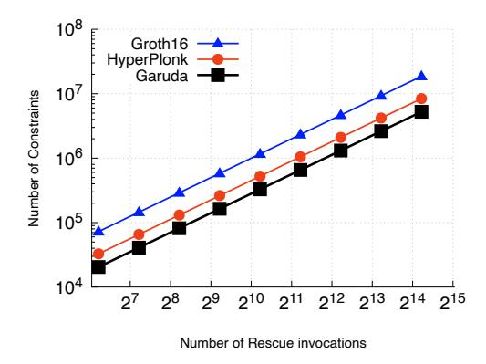
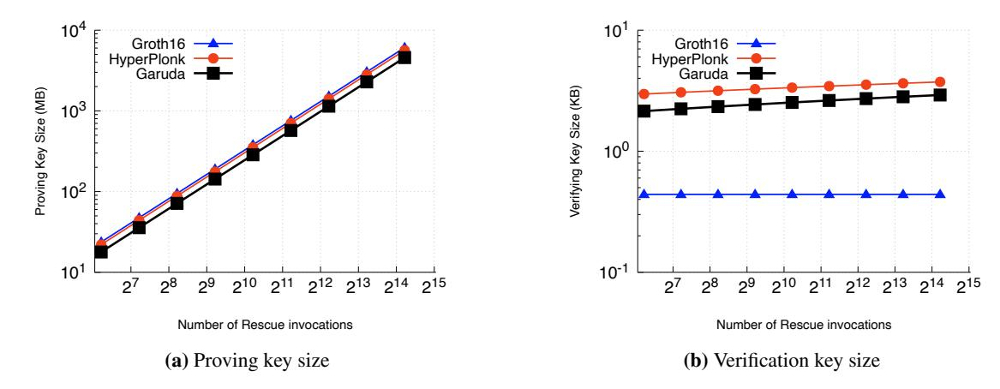
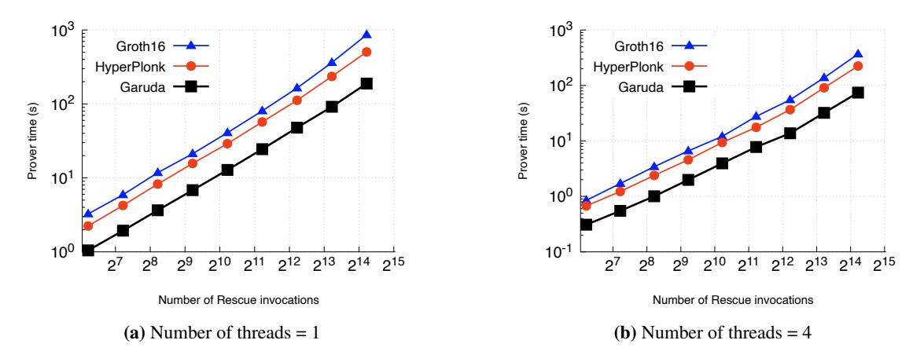
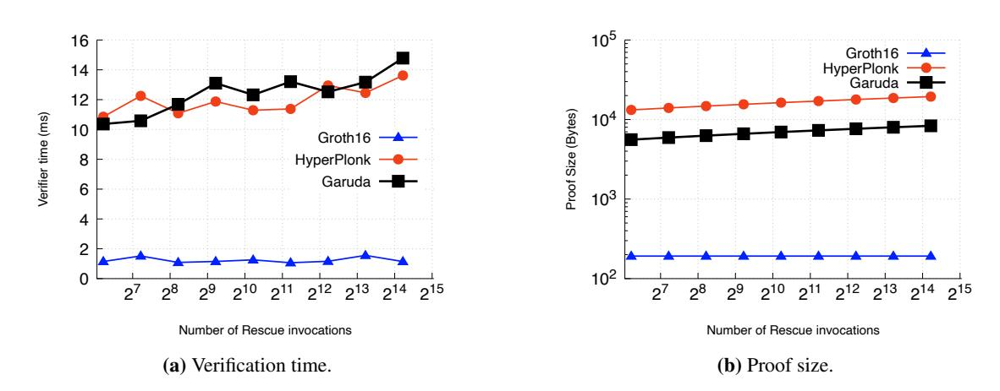

# GARUDA and PARI: Faster and Smaller SNARKs via Equifficient Polynomial Commitments

Michel Dellepere [michel@provable.com](mailto:michel@provable.com) Provable

Pratyush Mishra [prat@upenn.edu](mailto:prat@upenn.edu) UPenn

Alireza Shirzad [alrshir@upenn.edu](mailto:alrshir@upenn.edu) UPenn

August 10, 2024

#### Abstract

SNARKs are powerful cryptographic primitives that allow a prover to produce a succinct proof of a computation. Two key goals of SNARK research are to minimize the size of the proof and to minimize the time required to generate the proof. In this work, we present new SNARK constructions that push the frontier on both of these goals.

Our first construction, PARI, is a SNARK that achieves the smallest proof size amongst *all* known SNARKs. Specifically, PARI achieves a proof size of just two group elements and two field elements, which, when instantiated with the BLS12-381 curve, totals just 160 bytes, smaller than that of Groth16 [Groth, EUROCRYPT '16] and Polymath [Lipmaa, CRYPTO '24].

Our second construction, GARUDA, is a SNARK that reduces proof generation time by supporting, for the first time, arbitrary "custom" gates and *free* linear gates. To demonstrate GARUDA's performance, we implement and evaluate it, and show that it provides significant prover-time savings compared to both the state-of-the-art SNARKs (Groth16 and HyperPlonk [EUROCRYPT '23])

Both constructions rely on a new cryptographic primitive: "equifficient" polynomial commitment schemes that enforce that committed polynomials have the same representation in particular bases. We provide both rigorous security definitions for this primitive as well as efficient constructions for univariate and multilinear polynomials.

Keywords: succinct arguments; polynomial interactive oracle proofs; custom gates; equifficient polynomial commitments

## Contents

| 1 | Introduction                                                                                                              | 3              |  |  |  |  |  |  |  |
|---|---------------------------------------------------------------------------------------------------------------------------|----------------|--|--|--|--|--|--|--|
|   | 1.1<br>Our contributions<br>                                                                                              | 3<br>4         |  |  |  |  |  |  |  |
| 2 | 1.2<br>Related work<br>Techniques                                                                                         |                |  |  |  |  |  |  |  |
|   | 2.1<br>Generalizing R1CS<br><br>2.2<br>New tool: Equifficient polynomial commitments                                      | 8<br>9         |  |  |  |  |  |  |  |
|   | 2.3<br>SNARKs from equifficient polynomial commitments<br>2.4<br>Constructing PARI                                        | 10<br>12       |  |  |  |  |  |  |  |
|   | 2.5<br>Constructing GARUDA<br><br>2.6<br>Implementation<br><br>2.7<br>Evaluation                                          | 14<br>15<br>15 |  |  |  |  |  |  |  |
| 3 | Preliminaries                                                                                                             | 19             |  |  |  |  |  |  |  |
|   | 3.1<br>Algebraic background<br>3.2<br>Cryptographic assumptions<br><br>3.3<br>Indexed relations                           | 19<br>20<br>21 |  |  |  |  |  |  |  |
|   | 3.4<br>Polynomial interactive oracle proofs<br><br>3.5<br>Succinct arguments of knowledge                                 | 23<br>24       |  |  |  |  |  |  |  |
| 4 | Equifficient polynomial commitments<br>4.1<br>Definition<br>                                                              | 25<br>25       |  |  |  |  |  |  |  |
|   | 4.2<br>EPC scheme for univariate polynomials<br>4.3<br>EPC scheme for multilinear polynomials<br>                         | 27<br>33       |  |  |  |  |  |  |  |
| 5 | SNARKs for GR1CS from EPC schemes<br>5.1<br>Construction                                                                  | 39<br>39       |  |  |  |  |  |  |  |
| 6 | PARI: a 2-group element SNARK for NP<br>6.1<br>Univariate PIOP for SR1CS rowcheck<br><br>6.2<br>Unrolled SNARK<br>        | 44<br>44<br>44 |  |  |  |  |  |  |  |
| 7 | GARUDA: a linear-time prover SNARK for GR1CS<br>7.1<br>Multilinear PIOP for Stacked rowcheck<br>7.2<br>Unrolled SNARK<br> | 47<br>47<br>48 |  |  |  |  |  |  |  |
|   | Acknowledgments                                                                                                           | 51             |  |  |  |  |  |  |  |
|   | References                                                                                                                | 51             |  |  |  |  |  |  |  |

## <span id="page-2-0"></span>1 Introduction

*Succinct Non-interactive ARguments of Knowledge* (SNARKs) are cryptographic proofs that enable a prover to efficiently convince a computationally weak verifier of claims of the form "Given a program P and public input x, I know a private input w such that P(x, w) = 1". Two fundamental metrics in the study of SNARKs are *proof size* and *prover time*.

Proof size. From the proof-size perspective, the state-of-the-art SNARK is that of Groth [\[Gro16\]](#page-51-0), henceforth referred to as Groth16. The latter achieves the smallest proof size amongst all known SNARKs: just three group elements. When instantiated with the BLS12-381 curve, Groth16 proofs are just 1536 bits.

An important open question has thus been: what is the shortest proof size for a SNARK for NP?

Prover time. From a prover time perspective, all known SNARKs require time at least linear in the size of the circuit C being proven, and so much effort has been invested in reducing the size of C. An important line of work in this direction has been the study of more expressive circuits that support "custom" gates that can compute arbitrary functions of their inputs, rather than just addition and multiplication. Examples of such gates include high-degree polynomial gates [\[GW19\]](#page-51-1) and lookup gates [\[GW20\]](#page-51-2). State-of-the-art SNARKs are able to prove such expressive circuits in time linear in the circuit size [\[CBBZ23;](#page-50-2) [STW23\]](#page-51-3). Unfortunately, the proving algorithms of these SNARKs perform cryptographic operations that scale with the number of linear *and* non-linear gates in the circuit. In contrast, prior SNARKs for simpler circuit models [\[GGPR13;](#page-50-3) [Gro16\]](#page-51-0) only pay cryptographic costs for non-linear gates, and are able to prove linear gates "for free". A key open question in the literature has been whether we can obtain the best of both worlds and construct SNARKs that support both custom gates *and* free linear gates.

This question is interesting from both theoretical and practical perspectives. From a theory standpoint, cheap linear gates would align custom-gate SNARKs not only with prior SNARKs [\[GGPR13;](#page-50-3) [Gro16\]](#page-51-0), but also with other cryptographic primitives such as MPC [\[DPSZ12;](#page-50-4) [KS08\]](#page-51-4) and FHE [\[Gen09\]](#page-50-5) where linear operations are often much cheaper than non-linear ones. From a practical perspective, linear gates can impose a significant cost in practice, and so eliminating cryptographic costs for them can lead to significant performance improvements. Indeed, we show in [Section 2.7](#page-14-1) that constraint systems that support free linear gates can be much smaller than those that do not.

## <span id="page-2-1"></span>1.1 Our contributions

In this work, we answer all the foregoing questions in the affirmative by constructing two new SNARKs:

- PARI: a SNARK whose proofs consist of 2 group elements and 2 field elements; over BLS12-381 this requires just 1280 bits.
- GARUDA: a SNARK that supports custom gates and free linear gates with a linear-time prover. We detail the ideas behind these SNARKs next.

PARI: a 2-group element SNARK. PARI is a new SNARK for 'square' R1CS [\[GM17\]](#page-50-6) that achieves a proof size of two group elements (and two field elements). When instantiated with the BLS12-381 curve, PARI achieves a proof size of just 1280 bits, which is the smallest in the literature. More generally, no matter the choice of pairing-friendly curve, PARI's proof size is always smaller than that of the state-of-the-art prior work [\[Gro16;](#page-51-0) [Lip24\]](#page-51-5). The prover and verifier times for PARI are also similar to those for Groth16 [\[Gro16\]](#page-51-0): for a circuit of size n, PARI's prover requires O(n log n) field operations and O(n) group operations, while its verifier requires O(1) pairings. We prove (an interactive version of) PARI secure in the algebraic group model (AGM) [\[FKL18\]](#page-50-7).

GARUDA: custom gates and free linear gates. GARUDA is a SNARK for *Generalized* Rank-1 Constraint Satisfiability (GR1CS), an NP-complete language that we introduce, and which extends the popular Rank-1 Constraint Satisfiability (R1CS) language with support for custom gates. For a constraint system of size n, GARUDA achieves O(n) prover time and O(log n) proof size and verifier time. Like PARI, we prove an interactive version of GARUDA secure in the AGM.

New methodology: SNARKs from equifficient polynomial commitments. We present a methodology for constructing SNARKs for GR1CS that extends the popular 'PIOP + PC → SNARK' framework [\[CHMMVW20;](#page-50-8) [BFS20\]](#page-50-9) to work with a new kind of polynomial commitment scheme that enforces "equalcoefficient", or *equifficient*, constraints. Roughly, such equifficient polynomial commitment (EPC) schemes enforce the additional property that given a batch of polynomials p<sup>1</sup> , . . . , p<sup>n</sup> and associated bases B<sup>1</sup> , . . . , Bn, the coefficient vectors of these polynomials in their respective bases are equal.

Our new 'PIOP + EPC → SNARK' methodology leverages EPC schemes to enforce linear constraints, as opposed to prior PIOP-based SNARKs [\[CHMMVW20;](#page-50-8) [Set20\]](#page-51-6) which use complex PIOPs for this task. This shift enables SNARK constructions that can use simpler PIOPs that are responsible only for non-linear checks.

We extend the popular KZG [\[KZG10\]](#page-51-7) and PST [\[PST13\]](#page-51-8) PC schemes to construct EPC schemes for univariate and multilinear polynomials respectively. Our constructions support commitment batching, which is crucial for attaining the small proof size in our construction of PARI. Our constructions are inspired by techniques from prior "Linear PCP"-based SNARKs [\[BCIOP13\]](#page-50-10). We believe that our EPC schemes could find application in places where PC schemes are used today (e.g., verifiable secret sharing); we leave these explorations to future work.

Implementation and evaluation. We implement GARUDA in a new library built atop the arkworks framework [\[arkworks\]](#page-50-11). Our library flexibly extends the constraint-writing framework of arkworks to support GR1CS. We use our implementation to compare the performance of GARUDA to two baselines: Groth16, a SNARK with free linear gates but no support for custom gates, and HyperPlonk [\[CBBZ23\]](#page-50-2), a SNARK that supports custom gates, but does not have free linear gates. When benchmarked on the same computation (iterations of the Rescue-Prime [\[SAD20\]](#page-51-9) hash function), our implementation of GARUDA is almost 5× faster than Groth16 and 2.67× faster than HyperPlonk, thus demonstrating that the combination of free linear gates and custom gates indeed leads to much faster proving times.

Remark 1.1 (circuit-specific setup). GARUDA, unlike all prior SNARKs for custom gates, requires *circuitspecific* setup to sample the proving and verification keys. Indeed, universal setup suffices for all prior SNARKs that support custom gates [\[GWC19;](#page-51-10) [CBBZ23\]](#page-50-2), and in fact some prior works [\[STW23\]](#page-51-3) can even be instantiated with a *transparent* setup. However, as stated above, none of these works are able to avoid cryptographic prover work for linear gates. In fact, it is an important open problem to construct a universal-setup SNARK even for *standard* circuits (i.e. without custom gates) that is able to avoid the latter costs.

PARI also requires a circuit-specific trusted setup, but the relevant prior work (namely, Groth16) also require such a setup. Achieving proof size similar to Groth16 without a circuit-specific setup is again an important open problem.

## <span id="page-3-0"></span>1.2 Related work

Campanelli et al. [\[CFQ19\]](#page-50-12) describe a "linear-subspace" SNARK that shows that multiple commitments commit to the same vector. Their technique is similar to how our equifficient polynomial commitment schemes enforce that the coefficients of committed polynomials are equal, but does not seem to support important features such as commitment batching and enforcing that the committed polynomials are in particular bases.

In the rest of this section, we discuss work related to our specific SNARKs.

#### 1.2.1 SNARKs with small proof size

As discussed in Section 1, Groth16 [Gro16] is the state-of-the-art SNARK with the smallest proof size: just three group elements. PARI improves upon this as its proof consists of just two group elements and two scalar field elements, and is always at most as large as a Groth16 proof. As noted above, PARI's proof size is smaller than Groth16 when instantiated with the BLS12-381 curve. Groth also proved a lower bound on the size of pairing-based SNARKs: every such SNARK must have a proof size of at least two group elements [Gro16]. However, Groth's lower bound only applies to SNARKs that rely only on the generic group model, and so does not apply to PARI which relies on the AGM and the ROM. Interesting open questions include achieving a two-group element SNARK in the generic group model and extending Groth's lower bound to apply also in the joint AGM + ROM. Either result would demonstrate the tightness of Groth's lower bound (either via the new construction, or via PARI).

Concurrent work. A concurrent work [Lip24] constructs Polymath, a SNARK with proof size consisting of three  $\mathbb{G}_1$  elements and one  $\mathbb{F}$  element. Over the BLS12-381 curve, Polymath proofs require 1408 bits, which is smaller than Groth16 proofs (1536 bits), but is larger than PARI proofs (1280 bits). Polymath implicitly uses similar "equal-coefficient" checks as PARI, but does not formalize these into a separate primitive as we do, and also does not support commitment batching. On the other hand, Polymath supports zero-knowledge, and proves security directly in the AGM with oblivious sampling (AGMOS) [LPS23], whereas we prove security only in the AGM. While we believe that PARI can be extended to support zero-knowledge and can be proven secure in the AGMOS, we leave this for future work.

<span id="page-4-0"></span>We provide an asymptotic comparison of PARI with Groth16 and Polymath in Table 1.

| construction       |                                            | prover                                                   | verifier                            | proof size  |
|--------------------|--------------------------------------------|----------------------------------------------------------|-------------------------------------|-------------|
| Groth16<br>[Gro16] | $\mathbb{F}$ $\mathbb{G}_1$ $\mathbb{G}_2$ | $O(m \log m)$<br>2 MSMs of size $m$<br>1 MSM of size $m$ | $O( \mathbf{x} )$ muls + 3 pairings |             |
| Polymath [Lip24]   | $\mathbb{F}$ $\mathbb{G}_1$ $\mathbb{G}_2$ | $O(m \log m)$ 14 MSMs of size $m$                        | $O( \mathbb{x} )$ 3 pairings        | 1<br>3<br>— |
| PARI<br>[ours]     | $\mathbb{F}$ $\mathbb{G}_1$ $\mathbb{G}_2$ | $O(m \log m)$ 4 MSMs of size $2m$                        | $O( \mathbb{x} )$ 3 pairings        | 2 2         |

**Table 1:** Comparison of small-proof-size SNARKs. Above m is the number of multiplication gates.

**Other related work.** Barta et al. [BIOW20] constructed a designated-verifier SNARK that achieves two-group elements in the designated verifier setting, but by relaxing their soundness error to be non-negligible. They also provide a construction that achieves a single group element SNARK, but by relying on a non-standard assumption, and furthermore by settling for non-negligible completeness error.

Finally, a line of work [BISW17; BISW18] constructed succinct designated-verifier proofs from lattice assumptions. They are able to achieve "quasi-optimal" SNARKs where the proof size is  $O(\lambda)$  and the prover time is  $O(|C| + \text{polylog}(\lambda, |C|))$ .

Nitulescu [Nit19] showed how to construct an LIP for Square Arithmetic Programs [GM17] that achieves a query complexity of just two. Nitulescu shows that when after applying to this LIP the methodology of Bitansky et al. [BCIOP13], the resulting SNARK achieves a proof size of two lattice ciphertexts. Groth [Gro16] and Groth and Maller [GM17] note that applying this idea to groups with *Type-I* pairings results in a two-group element SNARK. This work focuses on the more challenging setting of Type-III pairings, for which no prior two-group element SNARK was known.

#### 1.2.2 SNARKs supporting custom gates

TurboPlonk [GW19] introduced the concept of "high-degree" polynomial gates in circuits. These gates compute arbitrary (fixed) polynomials of the input wires, and can be used to construct smaller circuits for certain computations. Plookup [GW20] introduced the concept of "lookup" gates, which check whether the input wires are in a predefined table. Subsequent work showed how to combine these two kinds of gates in a single constraint system [PFMBM22; XCZBFKC23]. All these works require quasilinear prover time, and so we next discuss the works that improve upon this to achieve linear prover time.

HyperPlonk [CBBZ23] constructed the first SNARK for custom gates with linear prover time. We provide an asymptotic comparison of HyperPlonk with GARUDA in Table 2.

Setty, Thaler, and Wahby [STW23] introduced a generalization of R1CS that they call "Customizable Constraint Systems" (CCS), and described how to generalize the Spartan SNARK [Set20] to support CCS. The resulting SNARK, SuperSpartan, also achieves linear prover time. Our generalization of R1CS (GR1CS) subsumes both CCS and its variant CCS+ which additionally supports lookup gates, and we find it easier to work with. Indeed, we were able to easily extend the arkworks framework to support GR1CS, inheriting all the existent gadgets for R1CS "for free." Notably, we know of no implementations of CCS or CCS+.

As noted in Section 1, all the foregoing works must pay cryptographic proving costs (e.g., group scalar multiplications) for linear gates. In contrast, GARUDA avoids these costs. We provide an asymptotic comparison of GARUDA with HyperPlonk and SuperSpartan in Table 2. We provide an empirical comparison of GARUDA with HyperPlonk in Section 2.7 which demonstrates that GARUDA achieves almost  $3\times$  lower proving times.

<span id="page-5-0"></span>

| construction         | universal setup |                              | prover                                                        | verifier                                                              | proof size                             |
|----------------------|-----------------|------------------------------|---------------------------------------------------------------|-----------------------------------------------------------------------|----------------------------------------|
| HyperPlonk [CBBZ23]  | ✓               | $\mathbb{F}$ $\mathbb{G}_1$  | $O(\eta(t + d\log^2 d))$<br>$O(t)$ MSMs of size $\eta$        | $O( \mathbf{x}  + t \log \eta)$ $O(t)$ muls + $O(\log \eta)$ pairings | $O(t + d\log \eta)$ $O(t + \log \eta)$ |
| SuperSpartan [STW23] | ✓               | $\mathbb{F} \\ \mathbb{G}_1$ | $O(m(t + d\log^2 d) + \eta t)$<br>$O(1)$ MSMs of size $t\eta$ | $O( \mathtt{x}  + t\log \eta)$ $O(\log t\eta)$ pairings               | $O(t + d\log \eta) \\ O(\log t\eta)$   |
| GARUDA<br>[ours]     | Х               | $\mathbb{F}$ $\mathbb{G}_1$  | $O(m(t + d\log^2 d) + \eta t)$ $O(t) \text{ MSMs of size } m$ | $O( \mathtt{x}  + t\log \eta)$ $O(t + \log m)$ pairings               | $O(t + d\log m) \\ O(t + \log m)$      |

m: number of non-linear gates
t: maximum arity of any custom gate

 $\eta$ : total number of gates (=  $\Omega(m)$ ) d: maximum degree of any (polynomial) custom gate

**Table 2:** Comparison of SNARKs with custom gate support. Here MSM (multi-scalar multiplication) denotes the time to compute the sum  $\sum_i s_i P_i$ , where  $s_i$  are scalars and  $G_i$  are group elements.

## <span id="page-6-0"></span>2 Techniques

We obtain both GARUDA and PARI by instantiating a generic framework for constructing SNARKs for *GR1CS*, a straightforward generalization of Rank-1 Constraint Satisfiability (R1CS), which is the constraint system of choice for many SNARKs [GGPR13; BCTV14; Gro16; CHMMVW20; Set20]. To describe our generalization and how we construct SNARKs for it, we first recall R1CS and how SNARKs for R1CS are constructed.

**Background:** R1CS. Recall that the indexed NP relation  $\mathcal{R}_{R1CS}$  is the set of triples  $(i, x, w) = ((\mathbb{F}, m, A, B, C), x, w)$  where  $\mathbb{F}$  is a finite field, A, B, C are matrices in  $\mathbb{F}^{m \times m}$ , and  $z := (x, w) \in \mathbb{F}^m$  satisfies  $Az \circ Bz = Cz$ .

In R1CS, addition gates are captured via the linear combinations introduced by the matrix-vector products Az, Bz, Cz, while multiplication gates are captured by the Hadamard product relation between the latter. Thus, a SNARK with "free" addition gates for R1CS would pay cryptographic prover costs that scale only with the cost of the Hadamard product, as opposed to costs that scale also with those of the matrix-vector multiplications. In other words, the cryptographic work of such a SNARK scales with the number of rows in the matrix, as opposed to the number of non-zero entries in the matrix.

**Background: circuit-specific-SNARKs for R1CS.** The checks performed by all existing SNARKs for R1CS can be decomposed into two complimentary kinds:

- Linear checks (linchecks) that enforce that there exist vectors  $z, z_A, z_B, z_C$  satisfying  $z_A = Az, z_B = Bz$ , and  $z_C = Cz$ , and
- Non-linear row-wise checks (rowchecks) that enforce that  $z_A \circ z_B = z_C$ . Existing circuit-specific SNARKs perform these checks as follows.

For **linear checks**, these SNARKs rely on the following probabilistic test for each matrix  $M \in \{A, B, C\}$ :  $\langle \boldsymbol{r}, z_M \rangle \stackrel{?}{=} \langle \boldsymbol{r}^\top M, z \rangle$ , where  $\boldsymbol{r}$  is a random vector sampled uniformly at random from  $\mathbb{F}^m$ . In fact, for efficiency, the random vector  $\boldsymbol{r}$  is replaced by  $\boldsymbol{\mathcal{L}}^K(\tau)$ , which is a vector whose i-th element is the i-th Lagrange polynomial  $\mathcal{L}_i^K(X)$  evaluated at a field element  $\tau$  sampled uniformly at random from  $\mathbb{F} \setminus K$  (K is an appropriate subset of  $\mathbb{F}$  of size equal to the number of constraints m). The check thus becomes  $\langle \boldsymbol{\mathcal{L}}^K(\tau), z_M \rangle \stackrel{?}{=} \langle \boldsymbol{\mathcal{L}}^K(\tau)^\top M, z \rangle$ , and its soundness follows from the Schwartz–Zippel lemma [Sch80; Zip79].

To construct a SNARK from this check, the key insight in prior work [GGPR13] is that the special form of the vector  $\mathcal{L}^K(X)$  allows us to write the foregoing check as  $\langle \mathcal{L}^K(\tau), z_M \rangle = \langle \boldsymbol{m}(\tau), z \rangle$ , where  $\boldsymbol{m}(X)$  is the vector whose *i*-th element  $m_i(X) = \langle \mathcal{L}^K(X), M_i \rangle$  is the polynomial interpolating the *i*-th column of M. For efficiency, these checks can then be further batched together via random coefficients  $\alpha_A, \alpha_B, \alpha_C$  as follows:

$$\sum_{M \in \{A,B,C\}} \alpha_M \cdot \langle \boldsymbol{\mathcal{L}}^K(\tau), z_M \rangle = \langle \sum_{M \in \{A,B,C\}} \alpha_M \cdot \boldsymbol{m}(\tau), z \rangle$$

To compile this into a SNARK, existing works [GGPR13; BCTV14] rely on a pairing-friendly group  $\langle \operatorname{group} \rangle = (\mathbb{G}_1, \mathbb{G}_2, \mathbb{G}_T, G, H, e)$  as follows. A setup phase, on input the R1CS index  $(\mathbb{F}, m, A, B, C)$ , samples  $\alpha_A, \alpha_B, \alpha_C \leftarrow \mathbb{F}$  and  $\tau \leftarrow \mathbb{F} \setminus K$ , and constructs the proving key  $\operatorname{pk} = (\Sigma_1 = \mathcal{L}^K(\tau) \cdot G, \Sigma_2 = (\sum_M \alpha_M \boldsymbol{m}(\tau)) \cdot G)$  and the verifying key  $\operatorname{vk} = (\alpha_A H, \alpha_B H, \alpha_C H)$ . To produce a proof, the prover, for each  $M \in \{A, B, C\}$ , commits to  $z_M$  via the Pedersen [Ped92] commitment  $c_M := \langle z_M, \Sigma_1 \rangle$  and to z via the Pedersen commitment  $c := \langle z, \Sigma_2 \rangle$ . The verifier then checks that the linear relation is satisfied via the following pairing check:

<span id="page-6-1"></span>
$$\prod_{M \in \{A,B,C\}} e(c_M, \alpha_M H) = e(c, H) \quad . \tag{1}$$

The soundness of this SNARK can be proven in the Algebraic Group Model [FKL18]. This SNARK is highly efficient, requiring only 4 m-sized  $\mathbb{G}_1$ -MSMs from the prover, and 4 pairings from the verifier.

For **non-linear row-wise checks**, SNARKs for R1CS rely on the following polynomial identity:

<span id="page-7-1"></span>
$$\hat{z}_A(X) \cdot \hat{z}_B(X) - \hat{z}_C(X) = 0 \mod v_K(X) \quad . \tag{2}$$

Here  $\hat{z}_M(X) = \langle \mathcal{L}^K(X), z_M \rangle$  is the polynomial interpolating  $z_M$ , and  $v_K(X) = \prod_{k \in K} (X - k)$  is the polynomial that is 0 at every point in K. (For an exposition of this identity, see prior work [GGPR13; BCRSVW19]). To see how we can compile this check into a SNARK, notice that the group elements  $c_A, c_B, c_C$  in the lincheck SNARK are Pedersen commitments to  $\hat{z}_A, \hat{z}_B, \hat{z}_C$  respectively. Prior work [GGPR13; BCTV14] performs the check directly over these commitments by relying on pairings as follows.

First, the prover's commitment  $c_B$  to  $\hat{z}_B$  is changed to be over  $\mathbb{G}_2$  instead of  $\mathbb{G}_1$ . Second, the prover provides a commitment  $c_h \in \mathbb{G}_1$  to the polynomial  $h(X) := (\hat{z}_A(X) \cdot \hat{z}_B(X) - \hat{z}_C(X))/v_K(X)$ .

Then, the verifier uses the following pairing equation to check Equation (2) at a random point  $\tau$  in the exponent:

<span id="page-7-2"></span>
$$e(c_A, c_B) = e(c_C, H) \cdot e(c_h, v_K(\tau) \cdot H) \tag{3}$$

As above, the soundness of this check can be proven in the AGM [FKL18].

### <span id="page-7-0"></span>2.1 Generalizing R1CS

A natural way to extend R1CS to support custom gates would be to consider more complex predicates on the witness. For example, one could ask that each entry of (Az, Bz, Cz) is an element of a table T. As another example, instead of asking that  $Az \circ Bz = Cz$ , we could ask z to satisfy more complex polynomial equations (e.g.,  $Az \circ Bz \circ Cz = Dz$ ). More generally, one can imagine enforcing an arbitrary predicate L on vectors  $M_1z, \ldots, M_tz$  for some matrices  $M_1, \ldots, M_t$  that depend on the predicate L. Formalizing this ideation leads to Generalized R1CS (GR1CS), our extension of R1CS that supports arbitrary custom gates.

**Definition 2.1** (informal version of Definition 3.3). The NP relation GR1CS is the set of triples  $(i, x, w) = ((\mathbb{F}, m, \mathscr{C}), x, w)$  where  $\mathbb{F}$  is a finite field and  $\mathscr{C}$  is a set of constraints, each of which is a tuple  $(M_1, \ldots, M_t, L)$  such that  $z := (x, w) \in \mathbb{F}^m$  satisfies  $L(M_1 z, \ldots, M_t z) = 0$ .

**SNARKs for GR1CS.** Let us attempt to construct a SNARK for GR1CS. We begin by noticing that, like for R1CS, the checks for GR1CS can also be decomposed into linchecks and (generalized) rowcheck checks. We can then try to adapt the foregoing SNARKs for these checks to work for GR1CS:

- Linchecks: In GR1CS, we also need to compute matrix-vector products. We can adapt the foregoing linear-check SNARK to work with GR1CS by simply increasing the number of matrices in the check of Eq. (1):  $\prod_{M \in \{M_1, \dots, M_t\}} e(c_M, \alpha_M H) = e(c, H)$ .
- Rowchecks: Instead of proving the R1CS identity of Equation (2), GR1CS requires proving the custom gate  $L(\hat{z}_1(X),\ldots,\hat{z}_t(X))=0$  over a domain K. Unfortunately, this is not straightforward: while Eq. (2) can be straightforwardly adapted to this more complex check, its cryptographic realization in Eq. (3) cannot: the bilinear map only allows us to check *quadratic* relations, which rules out custom gates that enforce higher-degree polynomial relations, and also completely rules out non-algebraic gates like table lookups.

It thus seems that trying to generalize existing circuit-specific SNARKs for R1CS to work with GR1CS does not work because these perform the non-linear check in Eq. (2) "in the exponent" by using pairings to multiply polynomials, and then checking that the resulting products are equal as group elements.

An alternative approach that has been developed in the past few years instead directly checks polynomial identities like those of Eq. (2) directly *in plain*, outside the exponent. This approach follows the popular 'PIOP + PC scheme  $\rightarrow$  SNARK' methodology [CHMMVW20; BFS20]. Briefly, this methodology combines two components: a Polynomial Interactive Oracle Proof (PIOP), and a Polynomial Commitment (PC) scheme. The former is an interactive proof system where the prover's messages are polynomials, and the verifier does not read these messages but instead queries them at evaluation points of its choice. The latter is a cryptographic tool that allows the prover to commit to a polynomial and later prove that it evaluates to a claimed value at a claimed point. The methodology constructs a SNARK from these components by replacing the PIOP prover's polynomials with commitments to them, and then uses the PC scheme to prove that the commitments are consistent with the PIOP verifier's queries.

In existing constructions [CHMMVW20; Set20; STW23], the PIOP is responsible for both the linear and non-linear checks. While non-linear checks like those of Eq. (2) have efficient PIOPs, linear checks require PIOPs whose proving costs scale with the number of non-zero entries in the matrix, and which require the prover to compute numerous oracles. After compilation to a SNARK, this results in proving costs that require cryptographic work for addition gates, and also result in larger proof sizes.

To overcome these issues, we propose a new methodology that combines the best of both worlds: we use efficient PIOPs for non-linear custom gates, and rely on efficient linear-check SNARKs for linear gates. To do so, we introduce a new notion of *equifficient* polynomial commitments that allows us to link the two components cleanly. We devote the rest of this section to describing our new notion, and describing how to construct SNARKs for GR1CS using it.

#### <span id="page-8-0"></span>2.2 New tool: Equifficient polynomial commitments

**Background: polynomial commitments.** Recall that a (standard) polynomial commitment (PC) scheme allows a *committer* to commit to a polynomial p in a commitment c, and to then later prove to a *verifier* an "evaluation claim" that asserts that the committed polynomial evaluates to a claimed evaluation v at a given point u. For use in SNARKs, the PC scheme is required to satisfy additional properties, with the relevant one being *extractability* [CHMMVW20]. Roughly, the latter says that whenever the verifier is convinced by an adversarial committer's evaluation claim, then the committer must "know" a polynomial underlying the commitment that is consistent with the evaluation claim (i.e., evaluates to the claimed value at the claimed point). This is formalized by requiring the existence of an efficient extractor that is able to extract such a polynomial from any adversary that convinces the verifier with non-negligible probability. (See [CHMMVW20] for a formal definition of extractability.)

Coefficient-equality constraints. We extend the standard notion of extractability by enforcing a new property called *coefficient equality*. Let  $\mathbb{K}$  be a D-dimensional vector space of polynomials over a field  $\mathbb{F}$ , and let  $p_1, \ldots, p_n$  be polynomials in  $\mathbb{K}$ . Associate with each  $p_i$  a basis  $\mathcal{B}_i$  of  $\mathbb{K}$ , and denote by  $[p_i]_{\mathcal{B}_i}$  the list of coefficients of  $p_i$  when expressed in the basis  $\mathcal{B}_i$ . Then, a coefficient-equality (or *equifficient*) constraint  $\Lambda$  on polynomials  $\mathbf{p} = [p_1, \ldots, p_n]$  in  $\mathbb{K}$  is a list  $[\mathcal{B}_1, \ldots, \mathcal{B}_n]$  of bases for  $\mathbb{K}$  that enforces that the coefficient vectors of the polynomials in their respective bases are equal; that is,  $[p_1]_{\mathcal{B}_1} = \cdots = [p_n]_{\mathcal{B}_n}$ . We denote this constraint satisfaction by the predicate  $\Lambda(\mathbf{p}) = 1$ . If  $\Lambda$  is specified by a single basis, then we call the constraint *trivial*, and assume without loss of generality the basis is the canonical basis for  $\mathbb{K}$ , denoted by  $\mathcal{U}$ .

**Definition: equifficient PC schemes.** An *equifficient polynomial commitment scheme* (EPC) is a PC scheme in the standard sense with the additional property that equifficient constraints are enforced on committed polynomials. Formally, an EPC scheme for the D-dimensional vector space  $\mathbb{K}$  over a field  $\mathbb{F}$  in the field family  $\mathcal{F}$  consists of algorithms (Setup, Specialize, Commit, Open, Verify) whose syntax and properties are

as follows.

**Syntax.** EPC. Setup samples public parameters pp containing a description of  $\mathbb K$  along with its canonical basis  $\mathscr U$ . The algorithm EPC. Specialize then specializes these public parameters pp for a set of equifficient constraints  $\Omega = \{\Omega_1, \dots, \Omega_s\}$ , constructing committer, opener, and verifier keys (ck, ok, vk) that collectively enforce the constraints in  $\Omega$  on committed polynomials.

The committer can then use EPC.Commit to commit to a list of polynomials  $p=[p_1,\ldots,p_n]$  while enforcing that these polynomials are subject to an equifficient constraint  $\Lambda\in\Omega$ . Later on, the committer can use EPC.Open to produce a proof that the committed polynomials evaluate to claimed evaluations  $v=[v_1,\ldots,v_n]$  at a claimed point u. Finally, the verifier can use EPC.Verify to check this proof, with the guarantee that if the proof passes, then the resulting evaluations are correct, and moreover that the committed polynomials satisfy the equifficient constraint  $\Lambda$ .

**Extractability.** EPC schemes are required to satisfy strong *equifficient* extractability guarantees. Roughly, this means that, given an equifficient constraint  $\Lambda \in \Omega$ , for every adversarial committer who can produce a commitment-proof pair that causes EPC. Verify to accept, there exists an efficient extractor that outputs the polynomials in the adversarial commitment that satisfy the evaluation claims *and* the claimed equifficient constraints.

Formalizing the foregoing informal description in a way that suffices for our application of constructing SNARKs for GR1CS requires some care. For instance, we generalize our definition to support committing to batches of polynomials such that each batch is subject to a different equifficient constraint. We also consider a strong extractability definition that supports multiple commitments produced across multiple rounds of interaction. All of these changes require a more detailed formalization, which we provide in Section 4.1.

### <span id="page-9-0"></span>2.3 SNARKs from equifficient polynomial commitments

We now describe how to use equifficient polynomial commitments to construct SNARKs for GR1CS. We begin with an intuitive explanation, and then provide a more detail description. We make two simplifying assumptions when discussing the techniques.

- We assume that there is a single custom gate.
- We assume that the NP instance x is empty, and defer describing the modifications required to handle non-empty instances to Remark 2.2.

**Construction intuition.** At a high level, our construction follows the 'PIOP + PC  $\rightarrow$  SNARK' recipe [CHMMVW20; GWC19], but replaces the standard PC scheme used in that recipe with an *equifficient* PC scheme. This EPC scheme is then used to enforce linear constraints, while the PIOP is tasked only with enforcing non-linear constraints. We explain the intuition behind this reasoning next.

Recall that the construction attempt in Section 2.1 enforces linear constraints via the randomized check  $\sum_{i=1}^t \alpha_i \cdot \langle \mathcal{L}^K(\tau), z_{M_i} \rangle \stackrel{?}{=} \langle \sum_{i=1}^t \alpha_i \cdot m_i(\tau), z \rangle$ . Our insight is that this check can be viewed as an *equifficient constraint* on the polynomials  $z_{M_1}, \ldots, z_{M_t}$ : they are required to have the same coefficient representation (i.e., z) in their respective "matrix" bases  $(m_1, \ldots, m_t)$ . Therefore, to enforce these constraints, we can just require the argument prover to commit to the polynomials  $\hat{z}_{M_1}, \ldots, \hat{z}_{M_t}$  with an EPC scheme under the equifficient constraint  $\Lambda = (m_1, \ldots, m_t)$ . We can then use a PIOP that enforces non-linear constraints over these committed polynomials to complete the argument.

The security of this approach is ensured by the extractability property of the EPC scheme (which guarantees that if the prover can produce a valid evaluation proof, then it must know polynomials that satisfy the linear constraints), and by the soundness of the PIOP.

We provide a detailed overview of the construction below.

**Construction overview.** We begin by introducing some notation. A GR1CS index  $i = (\mathbb{F}, m, \mathscr{C})$  is satisfied by an instance-witness pair  $(\mathbb{x}, \mathbb{w}) = (x, w)$  if the local predicate L is satisfied by the vectors  $M_1 z, \ldots, M_t z$ . In the exposition below, we assume that the matrices  $M_1, \ldots, M_t$  are square matrices of size m, and moreover that their columns are linearly-independent (and hence form a basis for  $\mathbb{F}^m$ ). Below  $\mathcal{D}$  will be a subset of the field  $\mathbb{F}$  of size m. (The particular choice of subset depends on whether we are using univariate or multilinear polynomials; it does not affect the exposition.)

Our construction will rely on PIOPs for the non-linear component of GR1CS, which we characterize via the following NP relation:

**Definition 1** (informal version of Definition 5.1). The rowcheck NP oracle relation is a tuple  $(i, x, w) = ((\mathbb{F}, L, \mathcal{D}), [[\hat{z}_i]]_{i=1}^t, [\hat{z}_i]_{i=1}^t)$ , where the index consists of a field description  $\mathbb{F}$ , a local predicate L, and a subset  $\mathcal{D}$  of  $\mathbb{F}$ . The instance contains polynomial oracles  $[[\hat{z}_1]], \ldots, [[\hat{z}_t]]$ , while the witness contains the corresponding polynomials. A triple is in the relation if the local predicate is satisfied by the polynomials at all points in  $\mathcal{D}$ , i.e., for all  $x \in \mathcal{D}$ ,  $L(\hat{z}_1(x), \ldots, \hat{z}_t(x)) = 0$ .

Given a PIOP for rowcheck, and an appropriate compatible equifficient polynomial commitment scheme EPC, we are now ready to describe our SNARK construction.

**Generator.** On input the GR1CS index  $i = (\mathbb{F}, m, ([M_i]_{i=1}^t, L))$ , the argument generator  $\mathcal{G}$  samples proving and verification keys (ipk, ivk) as follows.

First,  $\mathcal{G}$  samples EPC public parameters via EPC.Setup. Then, for each matrix  $M_i$ ,  $\mathcal{G}$  constructs the basis set  $\mathscr{M}_i := \left[\hat{m}_{i,j}\right]_{j=1}^k$  where  $\hat{m}_{i,j}$  is a polynomial that interpolates the j-th column of  $M_i$  over the domain  $\mathcal{D}$ . It then invokes the EPC specialization algorithm with input the equifficient constraint  $\Lambda := (\mathscr{M}_1, \ldots, \mathscr{M}_t)$  to obtain the commitment keys (ck, ok, vk) specialized to these constraints. (It also ensures that these keys allow committing to  $\mathit{unconstrained}$  polynomials.) Next, it constructs from the GR1CS index i a corresponding rowcheck index, and invokes the PIOP indexer on the latter to obtain indexer polynomials  $p_0$ . It commits to these via EPC.Commit to obtain the commitment  $c_0$ .

Finally,  $\mathcal{G}$  constructs the proving key ipk =  $(\mathsf{ck}, \mathsf{ok}, \boldsymbol{p}_0)$  and the verification key ivk =  $(\mathsf{vk}, c_0)$ , and outputs these.

**Prover and verifier.** We describe the interaction between the argument prover  $\mathcal{P}$  and verifier  $\mathcal{V}$ . The prover gets as input the proving key ipk, the GR1CS instance x, and the GR1CS witness w, while the verifier gets as input the verifying key ivk and the instance x. (Recall that in this high-level exposition, we make the simplifying assumption that the GR1CS instance x is empty. We include it here syntactically anyway for familiarity.)

The prover  $\mathcal{P}$  starts by setting z:=(x,w), and then computing the vectors  $z_i:=M_i\cdot z\in\mathbb{F}^m$  for each i in  $1,\ldots,t$ . It then low-degree extends these vectors over the domain  $\mathcal{D}$  to get the polynomials  $\hat{z}_1,\ldots,\hat{z}_t$ .  $\mathcal{P}$  uses EPC.Commit to commit to these polynomials under the equifficient constraint  $\Lambda$ , and sends the resulting commitments to the verifier  $\mathcal{V}$ .

The prover and verifier then proceed as in the methodology of Chiesa et al. [CHMMVW20], i.e., by simulating the rowcheck PIOP prover and verifier respectively. In each round, instead of sending the polynomials produced by the PIOP prover in the plain,  $\mathcal{P}$  instead commits to these using EPC.Commit, but without enforcing any equifficient constraints. At the end of the interaction, when the PIOP verifier wishes to query the committed polynomials,  $\mathcal{V}$  sends the query set to  $\mathcal{P}$ , who responds with the claimed evaluations and the evaluation proofs produced by EPC.Open.  $\mathcal{V}$  concludes the protocol by checking that these evaluation proofs are valid using EPC.Verify, and by checking that the claimed evaluations satisfy the PIOP verifier's checks.

<span id="page-10-0"></span><sup>&</sup>lt;sup>1</sup>Ensuring that the matrices are square and full-rank can be done by adding an appropriate number of dummy constraints and/or variables.

To compile this to a *non-interactive* argument, we can invoke the Fiat–Shamir transform [FS86] as in prior work.

To prove this construction secure, it suffices to require equifficient extractability of the EPC scheme and soundness of the PIOP for rowcheck. This is unlike prior work [CHMMVW20], which requires extractability from both components. We can get away with this weaker requirement because, informally, our SNARK guarantees that the witness is committed via the EPC scheme, and only relies on the PIOP to check some constraints on the committed witness. In contrast, in prior work [CHMMVW20], the prover only commits to PIOP prover polynomials, and because these could encode the witness in an arbitrary manner, one needs a PIOP extractor to be able to recover the witness. We provide a formal proof of this argument in Section 5.1.

<span id="page-11-1"></span>**Remark 2.2** (handing non-empty public inputs). Our discussion thus far has only considered the case where the GR1CS instance is empty. When the instance is non-empty, the GR1CS variable assignment z does not equal the witness w, but instead is the concatenation (x||w). This change means that the verifier must now additionally check that each polynomial  $\hat{z}_i$  is indeed an LDE of  $M_i \cdot z$ , and not of some other vector.

Our approach to this problem will allow the verifier to directly obtain oracle access to the correct  $\hat{z}_i$  by construction. The key idea is to force the prover to leave "empty slots" in the commitments to these polynomials that can be filled in by the verifier with information derived from the instance. In more detail, we leverage the linearity of the low-degree extension operation to write  $\hat{z}_i$  as the sum of  $\hat{x}_i$  and  $\hat{w}_i$ , where  $\hat{x}_i$  and  $\hat{w}_i$  are the low-degree extensions of  $M_i \cdot (x\|0)$  and  $M_i \cdot (0\|w)$  respectively.

Then, if the prover can be forced to send commitments to  $\hat{w}_i$ , the verifier can evaluate  $\hat{z}_i$  at any point u by computing the sum  $\hat{x}_i(u) + \hat{w}_i(u)$ : the first part the verifier can compute itself, while the second part will be provided by the prover (along with a corresponding evaluation proof).

To enable this sketch to work, we need to modify the EPC layer to enable equifficient constraints that support "punctured bases": roughly, the latter enable us to enforce coefficient-equality constraints only for certain coefficients, while enforcing that the remaining "punctured" coefficients are zero. EPC schemes that support these new equifficient constraints can enforce that the prover indeed commits to the vector (0||w), and not to other vectors that have non-zero initial coefficients. For a detailed discussion of punctured bases and EPC schemes that support these, see Sections 3.1 and 4.1.

Succinct verification requires an additional change: the ability for the verifier to evaluate the polynomials  $\hat{x}_i$  in time that scales with |x| (as opposed to time that scales with the number of constraints m). This is possible when the corresponding matrix bases elements are efficiently evaluatable, e.g. when they are Lagrange polynomials (or are a sparse linear combination of a constant number of these). To enable this, we adapt a technique from Lipmaa [Lip24] that introduces new witness variables whose values are supposed to equal the instance variables, and then enforces this equality via equality constraints; we refer the reader to [Lip24, Section 3, page 11] for details.

#### <span id="page-11-0"></span>2.4 Constructing PARI

To construct PARI, we instantiate the blueprint from Section 2.3 with a new univariate EPC scheme (Section 2.4.1) and a univariate PIOP for rowcheck specialized to 'Square' R1CS (Section 6.1). We briefly describe this PIOP below, and provide details about the EPC scheme construction in Section 2.4.1.

**Square R1CS** [GM17] is a special case of GR1CS that enforces constraints of the form  $Az \circ Az = Bz$ . This translates to a rowcheck relation where the local predicate is the claim that  $\hat{z}_A^2(X) - \hat{z}_B(X) = 0$  on  $\mathcal{D}$ . A PIOP for this relation follows by adapting PIOPs for R1CS 'rowcheck' from prior work e.g. Aurora [BCGGRS19] or Marlin [CHMMVW20]. See Section 6 for details.

Applying the blueprint from Section 2.3 with the univariate EPC scheme and this univariate PIOP for Square R1CS, along with optimizations in Section 6.2 gives us the following theorem:

<span id="page-12-1"></span>**Theorem 1** (informal). PARI is a SNARK for NP with proof size consisting of  $2 \mathbb{G}_1$  and  $2 \mathbb{F}$  elements.

**Remark 2.3.** We note that it is possible to construct a variant of PARI that is specialized to R1CS by changing the rowcheck to enforce that  $\hat{z}_A(X)\hat{z}_B(X) - \hat{z}_C(X) = 0$  on  $\mathcal{D}$ . The resulting proof would achieve improved prover time compared to PARI by avoiding the overhead of SR1CS, but would have a worse proof size of 2  $\mathbb{G}_1$  and 3  $\mathbb{F}$  elements. We remark that over BLS12-381, this proof size is equal to that of Groth16, while over larger curves (e.g., BW6-761 [EG20]), it is smaller.

#### <span id="page-12-0"></span>2.4.1 An EPC scheme for univariate polynomials

We construct an EPC scheme for univariate polynomials by building upon the popular KZG polynomial commitment scheme [KZG10]. Recall that in the latter, the committer can commit to a polynomial and prove its evaluation claim in a constant number of group elements, and our EPC construction will inherit these attractive properties.

We now provide a high-level sketch of our construction. Note that our description below first describes a variant that omits any discussion of the 'commitment batching' property that is necessary to obtain the proof size in Theorem 1, and then discusses how to add this property in Remark 2.5. We do so because it makes the exposition simpler, and also because it makes it easier to discuss the multilinear version in Section 2.5. We provide full details on the batched construction in Section 4.2.

Define the *D*-dimensional vector space of univariate polynomials  $\mathbb{K} := \mathbb{F}^{< D}[X]$  where  $\mathbb{F} = \mathbb{F}_q$  is a prime field.

**Background:** KZG polynomial commitments. Let  $\langle \operatorname{group} \rangle = (\mathbb{G}_1, \mathbb{G}_2, \mathbb{G}_T, G, H, e)$  be a pairing-friendly group and  $D \in \mathbb{N}$  an upper-bound on the degree of the polynomials over  $\mathbb{F}_q$  that commitments are supported to. The setup phase consists of sampling  $\tau \leftarrow \mathbb{F}_q$  uniformly at random and constructing the SRS as the list  $\Sigma = [\tau^j G]_{j=0}^{D-1}$ . To commit to p under  $\Sigma$ , the committer expresses p as a coefficient vector in the monomial basis and computes the Pedersen [Ped92] commitment  $c := \langle p, \Sigma \rangle = p(\tau)G$ .

To prove that the committed polynomial in c evaluates to a claimed evaluation v at the point u, the committer opens c by computing the unique witness polynomial  $w(X) := (p(X) - p(u))/(X - u) \in \mathbb{F}_q^{< D}[X]$ , and then commits to it under  $\Sigma$  via the Pedersen commitment  $\mathbf{w} := \langle w, \Sigma \rangle = w(\tau)G$ .

To verify the proof, the verifier takes the claimed evaluation v and checks  $e(c, -vH) = e(w, \tau H - uH)$ .

**Our construction.** The key differences between our KZG-based EPC scheme and the standard KZG scheme arise from the equifficient properties imbued by the specialization algorithm; we describe this next.

EPC.Specialize, when given as input an equifficient constraint  $\Lambda = [\mathscr{B}_1, \dots, \mathscr{B}_t]$  of size t, starts by creating basis-specific SRSes as follows. Let  $T_i$  denote the linear transformation from the monomial basis to the basis  $\mathscr{B}_i$ . Then the specialized committer key for  $\mathscr{B}_i$  is computed as  $\operatorname{ck}_i := T_i \cdot \Sigma = (b_1^{(i)}(\tau) \cdot G, \dots, b_D^{(i)}(\tau) \cdot G)$ , where  $(b_1^{(i)}(X), \dots, b_D^{(i)}(X))$  are the basis elements that comprise  $\mathscr{B}_i$ . Next, EPC.Specialize computes an additional *consistency key* that will eventually force the committer to

Next, EPC. Specialize computes an additional *consistency key* that will eventually force the committer to commit the same coefficient under these keys with a single coefficient vector. The consistency key  $\operatorname{ck}_\Lambda$  is computed as a linear combination of the basis-specific committer keys with respect to powers of a random element  $\alpha \leftarrow \mathbb{F}$ :  $\operatorname{ck}_\Lambda := \sum_{i=1}^t \alpha^{i-1} \cdot \operatorname{ck}_i$ . The opening key ok is simply  $\Sigma$ , while the verifier key vk consists of the  $\mathbb{G}_2$ -encodings of the random coefficients, i.e.,  $\alpha^{i-1} \cdot H$ .

EPC.Commit commits to input polynomials  $p_1, \ldots, p_t$  by first committing to these under the basis-specific committer keys:  $c_i := \langle \mathsf{ck}_i, p_i \rangle$ . It additionally computes a *consistency commitment* to these under

the key  $\operatorname{ck}_{\Lambda}$ : letting p denote the coefficient vector of  $p_1$  in the  $\mathscr{B}_1$ -basis, it commits to p via the Pedersen commitment  $c_{\Lambda} := \langle \operatorname{ck}_{\Lambda}, p \rangle$ . The full commitment to  $p_1, \ldots, p_t$  is then the tuple  $(c_1, \ldots, c_t, c_{\Lambda})$ .

In the opening phase, the committer opens each  $c_i$  by computing the witness polynomial  $w_i(X) = (p_i(X) - v)/(X - u)$  and committing to it under  $\Sigma$ , exactly like in KZG. Note that the consistency commitment  $c_{\Lambda}$  is not opened.

In the verification phase, the verifier verifies the evaluation proof for each commitment  $c_i$  as in KZG, and additionally checks that the basis-specific commitments are consistent with each other and satisfy the equifficient constraint  $\Lambda$  via the pairing product check  $e(c_{\Lambda}, H) \stackrel{?}{=} \prod_{i=1}^{t} e(c_i, \alpha^{i-1} \cdot H)$ .

**Security.** The extractability of this construction follows in the AGM from a straightforward application of the Schwartz–Zippel lemma [Zip79; Sch80]. We provide a formal proof in Theorem 4.3.

**Efficiency.** Commitment cost is dominated by the cost to compute the commitments  $c_1, \ldots, c_t$  and  $c_{\Lambda}$ , i.e. a total of t+1 D-sized multi-scalar multiplications (MSMs) in  $\mathbb{G}_1$ . Similarly, opening cost is dominated by the cost to commit to the witness polynomials, which is t D-sized MSMs in  $\mathbb{G}_1$ . Finally, the verifier cost is t+1 pairings, while the commitment size is t+1  $\mathbb{G}_1$  elements.

**Remark 2.4** (connections with linear interactive proofs). One can view our EPC scheme as implicitly constructing a "trivial" Linear Interactive Proof (LIP) [BCIOP13]. Briefly, in the latter, the verifier specifies vectors that are queries to a linear function, and the prover responds by applying its linear function to these queries. In our case, the prover's linear function is the coefficient vector of the polynomials under their respective bases, while the verifier queries are the bases evaluated at the point  $\tau$ . Bitansky et al. ensure that the prover answers multiple queries to its linear function consistently by having the verifier specify a "consistency query" that is a linear combination of the original queries; this corresponds to our consistency key  $ck_{\Lambda}$ .

<span id="page-13-1"></span>**Remark 2.5** (commitment batching). In the foregoing construction, the consistency commitment  $c_{\Lambda}$  can be viewed as a batch commitment to the polynomials  $p_1, \ldots, p_{|\Lambda|}$  with respect to the commitment key  $\operatorname{ck}_{\Lambda}$ .

$$\langle \mathsf{ck}_{\Lambda}, p \rangle = \langle \sum_{i=1}^{|\Lambda|} \alpha^{i-1} \cdot \mathsf{ck}_i, p_1 \rangle = \sum_{i=1}^{|\Lambda|} \alpha^{i-1} \cdot \langle \mathsf{ck}_i, p_i \rangle = \sum_{i=1}^{|\Lambda|} \alpha^{i-1} \cdot c_i$$

This observation enables us to directly use this consistency commitment as the *only* commitment to the polynomials  $p_1, \ldots, p_{|\Lambda|}$ . After appropriate changes to the commitment, opening, and verification keys, we can ensure that opening these polynomials at a point u can be achieved via a single "batch" evaluation proof, thus allowing us to commit to and then open multiple polynomials with just two group elements. We provide details in Section 4.2.

#### <span id="page-13-0"></span>2.5 Constructing GARUDA

To construct GARUDA, we instantiate the blueprint from Section 2.3 with a new multilinear EPC scheme and a multilinear PIOP for rowcheck that supports multiple predicates. We describe these components next.

**Multilinear PIOP for rowcheck.** To support multiple predicates, we propose to "stack" the matrices for different predicates together to get a single set of matrices  $M_1^*, \ldots, M_t^*$ . Then, the prover's oracles consist of the multilinear LDEs  $\hat{z}_1, \ldots, \hat{z}_t$  of the matrix-vector products  $M_i^* \cdot z$ . To enforce the j-th local predicate  $L_j$ , the PIOP leverages selector polynomials  $S_j$  that activate the entries of  $M_i^* \cdot z$  that correspond to the j-th predicate. That is, instead of directly checking  $L_j(\hat{z}_1, \ldots, \hat{z}_t) = 0$  in checking the satisfaction of (which would not work), we instead use the polynomials  $S_j \cdot \hat{z}_1, \ldots, S_j \cdot \hat{z}_t$ . The satisfaction of each local predicate

<span id="page-13-2"></span><sup>&</sup>lt;sup>2</sup>In fact, when  $L_j$  is a polynomial predicate, we can leverage a better strategy that avoids doubling the individual degree of each polynomial by simply applying the selector to the entire expression  $L_j(\hat{z}_1, \dots, \hat{z}_t)$ .

Lj is then enforced by a separate PIOP for rowcheck that checks that the polynomials S<sup>j</sup> · zˆ<sup>1</sup> , . . . , S<sup>j</sup> · zˆ<sup>t</sup> satisfy the predicate at all points in D. [3](#page-14-2) We choose multivariate-sumcheck-based PIOPs for this purpose, as they allow us to obtain the desired linear prover time.

Multilinear EPC scheme. The unbatched univariate construction described in [Section 2.4.1](#page-12-0) can be naturally extended to multilinear polynomials by using as a starting point the multilinear PC scheme of Papamanthou et al. [\[PST13\]](#page-51-8), instead of the univariate KZG scheme.

Overall, after applying the optimizations in [Section 7.2,](#page-47-0) we obtain the following theorem:

Theorem 2 (informal). GARUDA *is a SNARK for GR1CS that achieves linear prover complexity and logarithmic proof size and verifier time.*

## <span id="page-14-0"></span>2.6 Implementation

We implemented GARUDA as a Rust library in only 900 lines of code. Our library is built atop the arkworks framework, and also uses some components from the HyperPlonk implementation. We did not implement PARI because the relevant metric for it (proof size) is easily inferred from the protocol description, and does not vary with the implementation. Our implementation contributions are twofold.

Interface for programming GR1CS. We extend the R1CS programming interface provided by the ark-relations crate to also support programming GR1CS constraints in just 1500 lines of code. Our extension is user-friendly, and can take advantage of arkworks' strong library of R1CS constraint "gadgets".[4](#page-14-3) Indeed, our benchmarks use this feature to ensure consistency across all the SNARKs we consider.

Implementation of GARUDA. We implement GARUDA atop the multilinear polynomial framework offered by the ark-poly library. Our implementation consumes constraint systems produced by the foregoing constraint-writing interface. For the time being, our implementation supports multiple polynomial predicates/custom gates, but we plan to extend it to support more general custom gates in the future. This change would require updating the aforementioned GR1CS programming interface to support these gates as well.

## <span id="page-14-1"></span>2.7 Evaluation

Experimental setup. All measurements were conducted using a MacBook Pro with 18 GB of RAM and a 12-core Apple M3 Pro chip. All times except verifying are reported in both the single-threaded and multithreaded settings. When using multithreading, we set the number of threads used by the prover to be 4.

Our benchmark circuit consists of iterations of the popular arithmetization-oriented Rescue-Prime hash function [\[SAD20\]](#page-51-9). Our implementation of the latter builds upon the general interface for sponge-based hashes in the ark-crypto-primitives crate. The configuration of each hash function is as follows: it has a 12-round permutation, a rate of 3, and a capacity of 1. The hash function operates over the 256-bit prime scalar field of the BLS12-381 curve, with the S-box exponent α set to 5 in the forward S-boxes. The linear operator parameters are derived from the rescue prime.sage script provided in the Marvellous repository.[5](#page-14-4)

To implement the hash function circuit, we utilized two types of local predicates: a standard R1CS predicate and a polynomial predicate of degree 5 that evaluates the exponentiation by α. The latter predicate is used to check the correct evaluation of both the forward and inverse S-boxes.

<span id="page-14-2"></span><sup>3</sup> In practice, PIOPs for separate predicates can again be batched together to reduce the prover work and proof size.

<span id="page-14-3"></span><sup>4</sup> [github.com/arkworks-rs/r1cs-std](https://github.com/arkworks-rs/r1cs-std) and [github.com/arkworks-rs/crypto-primitives.](https://github.com/arkworks-rs/crypto-primitives)

<span id="page-14-4"></span><sup>5</sup> [github.com/KULeuven-COSIC/Marvellous.](https://github.com/KULeuven-COSIC/Marvellous/blob/master/rescue_prime.sage)

To evaluate the efficiency benefits of GARUDA, we compared it against two state-of-the-art baselines: HyperPlonk<sup>6</sup> [CBBZ23] and Groth16<sup>7</sup> [Gro16]. Our experiments tested various metrics including prover time, verification time, setup time, verifying key size, and proving key size, and also the number of constraints required by the native constraint systems of each SNARK.

<span id="page-15-2"></span>**Number of constraints.** We illustrate the expressive power of GR1CS by comparing in Fig. 1 the number of constraints required to express our computation (N iterations of Rescue-Prime for some integer N) in GR1CS with the number required to do so in R1CS and Plonkish. Our measurements demonstrate that GR1CS consistently requires fewer constraints: the number of GR1CS constraints is  $0.28\times$  the number of R1CS constraints, and is  $0.63\times$  the number of Plonkish constraints.



**Figure 1:** Number of constraints for a circuit invoking N iterations of Rescue-Prime.

**Setup time.** Our experiments demonstrate that the setup time of GARUDA is comparable to the setup time of Groth16 and the (deterministic) indexing time of HyperPlonk.

**Proving and verifying key sizes.** Our measurements indicate that the size of GARUDA's proving key is consistently smaller than that of Groth16  $(0.75\times)$  and of HyperPlonk  $(0.81\times)$ . The size of the verifying key grows logarithimically with the number of constraints, topping out at  $14.78\,\mathrm{kB}$  for the largest circuit size we benchmarked. This is approximately  $1.05\times$  smaller than that of HyperPlonk, but is significantly larger  $(\approx 13\times)$  than that of Groth16.

<span id="page-15-1"></span><span id="page-15-0"></span><sup>&</sup>lt;sup>6</sup>github.com/EspressoSystems/hyperplonk. <sup>7</sup>github.com/arkworks-rs/groth16.



Figure 2: Comparison of proving and verifying key sizes for GARUDA, HyperPlonk, and Groth16 over BLS12- 381.

Scalability of proving. We provide a comparison of the proving latency for Groth16, HyperPlonk, and GARUDA in [Fig. 3.](#page-16-0) In both the single-thread and multithreaded cases, GARUDA achieves significantly lower latency than both baselines.

<span id="page-16-0"></span>

Figure 3: Comparison of prover time for GARUDA, HyperPlonk, and Groth16 over BLS12-381.

In particular, GARUDA's prover time, using 1 thread, is approximately 0.37-0.47× that of HyperPlonk and 0.22-0.32× that of Groth16. Our measurements show that increasing the number of threads to 4, reduces the prover time of all three SNARKs consistently by a factor of 2.5-3.5.

Verifier time and proof size. By Keeping the input size constant and increasing the number of constraints, The verifier time of Groth16 stays the same; However, the verifier time of GARUDA and HyperPlonk SNARKs grows logarithmically, as shown in [Fig. 4.](#page-17-0) Moreover, Groth16 consistently demonstrates the best verification time (1 ms ∼ 1.5 ms) across all invocation counts. In contrast, HyperPlonk and GARUDA show more variability in their verification times and are comparable in performance.

Groth16 consistently has the smallest proof size of 192 B regardless of invocation counts. GARUDA's proof size, though larger (29-43×) than that of Groth16, is consistently 0.24× smaller than that of Hyper-Plonk.

<span id="page-17-0"></span>

Figure 4: Comparison of verification time and proof size of GARUDA, HyperPlonk, and Groth16 over BLS12-381.

### <span id="page-18-0"></span>3 Preliminaries

We denote by  $\lambda \in \mathbb{N}$  a security parameter. When we state that  $n \in \mathbb{N}$  for some variable n, we implicitly assume that  $n = \operatorname{poly}(\lambda)$ . We denote by  $\operatorname{negl}(\lambda)$  an unspecified function that is  $\operatorname{negligible}$  in  $\lambda$ . When a function can be expressed in the form  $1 - \operatorname{negl}(\lambda)$ , we say that it is  $\operatorname{overwhelming}$  in  $\lambda$ . When we say that A is an  $\operatorname{efficient}$  adversary we mean that A is a family  $\{A_{\lambda}\}_{{\lambda}\in\mathbb{N}}$  of non-uniform polynomial-size circuits. If the adversary consists of multiple circuit families  $A_1, A_2, \ldots$  then we write  $A = (A_1, A_2, \ldots)$ .

We denote by [n] the set  $\{1,\ldots,n\}\subseteq\mathbb{N}$ . We use  $\boldsymbol{a}=[a_i]_{i=1}^n$  as a shorthand for the tuple/list  $(a_1,\ldots,a_n)$ ;  $|\boldsymbol{a}|$  denotes the number of entries in  $\boldsymbol{a}$ . If M is a matrix then  $\|M\|$  denotes the number of nonzero entries in M. If S is a finite set then |S| denotes its cardinality and  $x\leftarrow S$  denotes that x is an element sampled at random from S. If each element  $v_i$  in the list  $\boldsymbol{v}$  is a vector, then  $\boldsymbol{v}[j]$  denotes the list containing the j-th element of each vector, i.e.,  $\boldsymbol{v}[j]=[v_i[j]]_{i=1}^n$ .

If f is a function, the  $[\![f]\!]$  is an oracle for the function. Also, we sometimes abuse the notation and write  $[\![f]\!]$  to denote the list of oracles  $[\![f_i]\!]$  for each function  $f_i$  in the list f.

We generally denote variables by the uppercase letters  $X_1, \ldots, X_n$ , while points, or values that the variables can take on, are denoted by the lowercase letters  $x_1, \ldots, x_n$ . As shorthand, we write  $X = (X_1, \ldots, X_n)$  and  $x = (x_1, \ldots, x_n)$ .

**Random oracles.** We denote by  $\mathcal{U}_{\lambda}$  the set of all functions that map  $\{0,1\}^*$  to  $\{0,1\}^{\lambda}$ . We denote by  $\mathcal{U}_*$  the set  $\bigcup_{\lambda \in \mathbb{N}} \mathcal{U}_{\lambda}$ . A *random oracle* with security parameter  $\lambda$  is a function  $\rho \colon \{0,1\}^* \to \{0,1\}^{\lambda}$  sampled uniformly at random from  $\mathcal{U}_{\lambda}$ .

### <span id="page-18-1"></span>3.1 Algebraic background

We denote by  $\mathbb{F}$  a finite field and by  $\mathbb{K}$  a finite-dimensional vector space of polynomials over  $\mathbb{F}$ . The notation  $\mathbb{F}_n$  is used to denote the field is of size n. Let  $\mathbb{K}$  be of dimension  $D \in \mathbb{N}$ . Then, denote by  $\mathscr{B}$  an ordered basis of  $\mathbb{K}$  consisting of D linearly independent elements  $\{b_i\}_{i\in [D]}$ . For a polynomial  $p\in \mathbb{K}$  and choice of basis  $\mathscr{B}$ , denote by  $[p]_{\mathscr{B}}$  the list of coefficients when p is expressed in  $\mathscr{B}$ . More precisely,  $[p]_{\mathscr{B}}:=[a_1,\ldots,a_D]$  when p is written as  $\sum_{i\in [D]}a_i\cdot b_i$ .

We define a *punctured basis* to be any subset of the basis elements of a specified ambient basis  $\mathscr{B}$ . Formally, a punctured basis  $\mathscr{P}$  is a tuple  $(\mathcal{J},\mathscr{B})$  where  $\mathcal{J} \subset [D]$  is an indexing set that enumerates the basis elements of  $\mathscr{B}$  appearing in  $\mathscr{P}$ . We denote by  $|\mathscr{P}| := |\mathcal{J}|$  the size of the punctured basis, and say that a polynomial p is expressible in a punctured basis  $\mathscr{P}$  if it can be written as  $p = \sum_{j \in \mathscr{J}} a_j \cdot b_j$  for coefficients  $a_j \in \mathbb{F}$  and basis elements  $b_j \in \mathscr{B}$ . As before, we denote by  $[p]_{\mathscr{P}}$  the coefficient vector of p when expressed in  $\mathscr{P}$ , i.e. the list of coefficients  $[a_j]_{j \in \mathscr{J}}$ . We emphasize that p is expressible in a punctured basis  $\mathscr{P}$  if and only if all its coefficients with respect to basis elements  $b_j$  for  $j \notin \mathscr{J}$  are zero.

#### 3.1.1 Background on univariate polynomials

Smooth multiplicative subgroups of finite fields. Our protocols for univariate polynomials work with subgroups K of the multiplicative group  $\mathbb{F}^*$  of a finite field  $\mathbb{F}$ , and will be most efficient when K has order equal to a power of two. Such domains allow for optimized interpolation techniques via the use of Fast-Fourier Transforms (FFTs). We call such subgroups *smooth*, or *FFT-friendly*, and associate with them an ordering  $\phi_K$  that is a bijection from K to the set  $\{0,1,\ldots,|K|-1\}$ .

**Polynomial encodings.** For a finite field  $\mathbb{F}$ , multiplicative subgroup  $K \subseteq \mathbb{F}^*$ , and function  $f : \{0, 1, \dots, |K| - 1\} \to \mathbb{F}$  we denote by  $\hat{f}$  the (unique) univariate polynomial over  $\mathbb{F}$  with degree less than |K| such that

 $\hat{f}(a) = f(\phi_K(a))$  for every  $a \in K$ . That is, if  $a_i$  is the i-th element of K according to the ordering  $\phi_K$ , then  $\hat{f}(a_i) = f(i)$ . We sometimes abuse notation and write  $\hat{f}$  to denote *some* polynomial that agrees with f on K, which need not equal the (unique) such polynomial of minimal degree.

Vanishing polynomials. For a finite field  $\mathbb F$  and subgroup  $S\subseteq \mathbb F$ , we denote by  $v_S$  the unique non-zero monic polynomial of degree at most |S| that is zero everywhere on S;  $v_S$  is called the *vanishing polynomial* of S. If S is a multiplicative coset in  $\mathbb F$  then  $v_S$  can be evaluated in  $\operatorname{polylog}(|S|)$  field operations. For example, if S is a multiplicative subgroup of  $\mathbb F$  then  $v_S(X)=X^{|S|}-1$  and, more generally, if S is a  $\xi$ -coset of a multiplicative subgroup K (i.e.,  $S=\xi K$ ) then  $v_S(X)=\xi^{|S|}v_K(X/\xi)=X^{|S|}-\xi^{|S|}$ ; in either case,  $v_S$  can be evaluated in  $O(\log |S|)$  field operations.

**Lagrange polynomials.** For  $\mathbb{F}$  a finite field,  $S \subseteq \mathbb{F}$ ,  $a \in S$ , we denote by  $\mathcal{L}_a^S$  the unique polynomial of degree less than |S| such that  $\mathcal{L}_a^S(a) = 1$  and  $\mathcal{L}_a^S(b) = 0$  for all  $b \in S \setminus \{a\}$ . Note that

$$\mathcal{L}_a^S(X) = \frac{a \cdot v_S(X)}{|S|(X-a)} \tag{4}$$

This means that if S is a multiplicative subgroup, and  $a \in S$ , we can evaluate  $\mathcal{L}_a^S(X)$  at any  $\alpha \in \mathbb{F}$  in  $\operatorname{polylog}(|S|)$  field operations.

#### 3.1.2 Background on multivariate and multilinear polynomials

A multivariate polynomial p in  $\nu$  variables  $\boldsymbol{X}=(X_1,X_2,\ldots,X_{\nu})$  over a field  $\mathbb F$  is a sum of terms of the form  $p(\boldsymbol{X})=\sum_{i_1,i_2,\ldots,i_{\nu}\in\mathbb N}a_{i_1,i_2,\ldots,i_{\nu}}X_1^{i_1}X_2^{i_2}\cdots X_{\nu}^{i_{\nu}}$  where  $a_{i_1,i_2,\ldots,i_{\nu}}\in\mathbb F$  and only finitely many  $a_{i_1,i_2,\ldots,i_{\nu}}$  are non-zero. We denote by  $\mathbb F[X_1,\ldots,X_{\nu}]$  the ring of multivariate polynomials over  $\mathbb F$ .

**Total degree and individual degree.** The *individual degree* of a variable  $X_j$  in a term  $a_{i_1,i_2,\dots,i_n}X_1^{i_1}X_2^{i_2}\cdots X_{\nu}^{i_{\nu}}$  is defined as  $\deg_j(p):=i_j$ . The *maximum individual degree* is defined as  $\deg^*(p):=\max_{i\in[n]}\deg_i(p)$ . The *total degree* of a term  $a_{i_1,i_2,\dots,i_{\nu}}X_1^{i_1}X_2^{i_2}\cdots X_{\nu}^{i_{\nu}}$  is the sum of the exponents  $i_1+i_2+\cdots+i_{\nu}$ . The *total degree* of the polynomial p, denoted by  $\deg(p)$ , is the maximum total degree of any term.

**Boolean hypercube.** The boolean hypercube of dimension  $\nu$  is the set of all binary vectors of length n. Formally, it is defined as  $\mathcal{B}_{\nu} := \{0,1\}^{\nu} = \{(x_1,x_2,\ldots,x_{\nu}) \mid x_i \in \{0,1\} \text{ for all } i \in \{1,2,\ldots,\nu\}\}$ .

**Multilinear extension (MLE).** A multivariate polynomial p(X) is *multilinear* if it is a linear function in each variable  $X_i$  when the remainder of the variables are held constant. This implies that the individual degree of each variable in p is at most one. Furthermore, any function  $f: \mathcal{B}_{\nu} \to \mathbb{F}$  has a unique *multilinear extension* defined as the polynomial  $\hat{f}(X)$  such that  $\hat{f}$  agrees with f on all points in  $\mathcal{B}_{\nu}$ .

**Multilinear polynomial vector space.** We denote the  $2^{\nu}$ -dimensional vector space of multilinear polynomials over  $\mathbb{F}$  in the ring  $\mathbb{F}[X_1,\ldots,X_{\nu}]$  by  $\mathrm{Mult}(\mathbb{F}[X_1,\ldots,X_{\nu}])$ .

**Lagrange multilinear polynomials.** For a given point  $\alpha = (\alpha_1, \alpha_2, \dots, \alpha_{\nu}) \in \mathcal{B}_{\nu}$ , the Lagrange multilinear basis polynomial  $\chi_{\alpha}$  is defined as  $\chi_{\alpha}(\boldsymbol{X}) := \prod_{i=1}^{\nu} (1 - (1 - 2\alpha_i)X_i)$ 

Computing the MLE using Lagrange polynomials. The unique multilinear extension of any function  $f: \mathcal{B}_{\nu} \to \mathbb{F}$  is  $\hat{f}(\mathbf{X}) := \sum_{\alpha \in \{0,1\}^{\nu}} f(\alpha) \cdot \chi_{\alpha}(\mathbf{X})$ . Note  $\hat{f}$  can be computed in  $O(2^{\nu})$  field operations.

#### <span id="page-19-0"></span>3.2 Cryptographic assumptions

We describe the cryptographic assumptions that underlie the constructions of the polynomial commitment schemes (Section 4) and SNARKs (Section 5) in this paper. In Section 3.2.1 we provide background on

bilinear groups and define the *bilinear group sampler*. In Section 3.2.2 we define (a minor variant of) the *Strong Diffie–Hellman* Assumption. In Section 3.2.3 we recall the *Algebraic Group Model*.

#### <span id="page-20-1"></span>3.2.1 Bilinear groups

The cryptographic primitives that we construct rely on cryptographic assumptions about bilinear groups. We formalize these via a *bilinear group sampler*, which is a probabilistic polynomial-time algorithm SampleGrp that, on input a security parameter  $\lambda$  (represented in unary), outputs a tuple  $\langle \operatorname{group} \rangle = (\mathbb{G}_1, \mathbb{G}_2, \mathbb{G}_T, G, H, e)$  where  $\mathbb{G}_1, \mathbb{G}_2, \mathbb{G}_T$  are cyclic groups of a prime order  $q \in \mathbb{N}$ , G generates  $\mathbb{G}_1$ , H generates  $\mathbb{G}_2$ , and  $e: \mathbb{G}_1 \times \mathbb{G}_2 \to \mathbb{G}_T$  is a (non-degenerate) bilinear map. In more detail, e satisfies the following two properties: (i) *bilinearity*: for all nonzero elements  $\alpha, \beta \in \mathbb{F}_q$ , it holds that  $e(\alpha G, \beta H) = e(G, H)^{\alpha\beta}$ ; (ii) non-degeneracy: e(G, H) is not the identity element in  $\mathbb{G}_T$ . Moreover, e is called a cryptographic pairing if it is efficiently computable. The SNARK constructions presented in this paper are based on cryptographic pairings.

#### <span id="page-20-2"></span>3.2.2 Strong Diffie-Hellman

<span id="page-20-5"></span>**Assumption 1** ([BB04]). The Strong Diffie–Hellman (SDH) assumption states that for every efficient adversary A and degree bound  $d \in \mathbb{N}$ , the following probability is negligible in the security parameter  $\lambda$ :

$$\Pr\left[\begin{array}{c} C = \frac{1}{\beta + c}G & \left| \begin{array}{c} \langle \mathsf{group} \rangle \leftarrow \mathsf{SampleGrp}(1^\lambda) \\ \beta \leftarrow \mathbb{F}_q \\ \boldsymbol{\Sigma} \leftarrow \{\{\beta^i G\}_{i=0}^d, \beta H\} \\ (c, C) \leftarrow \mathcal{A}(\langle \mathsf{group} \rangle, \boldsymbol{\Sigma}) \end{array}\right] \;.$$

#### <span id="page-20-3"></span>3.2.3 Algebraic group model

In order to achieve additional efficiency, we construct polynomial commitment schemes in the Algebraic Group Model (AGM) [FKL18] which replaces specific knowledge assumptions (such as Power Knowledge of Exponent [Gro10] assumptions). In the AGM, all algorithms are modeled as *algebraic*, which means that whenever an algorithm outputs a group element G, the algorithm must also output an "explanation" of G in terms of the group elements it has seen.

**Definition 3.1** (algebraic algorithm). Let  $\mathbb{G}$  be cyclic group of prime order q and  $\mathcal{A}_{alg}$  a probabilistic algorithm run on initial inputs including description  $\langle \operatorname{group} \rangle$  of  $\mathbb{G}$ . During its execution  $\mathcal{A}_{alg}$  may interact with oracles or other parties and receive further inputs including obliviously sampled group elements (which it cannot sample directly<sup>8</sup>). Let  $\mathbf{L} \in \mathbb{G}^n$  be the list of all group elements  $\mathcal{A}_{alg}$  has been given so far such that all other inputs it has received do not depend in any way on group elements. We call  $\mathcal{A}_{alg}$  algebraic if whenever it outputs a group element  $G \in \mathbb{G}$  it also outputs a vector  $\mathbf{a} = [a_i]_{i=1}^n \in \mathbb{F}_q^n$  such that  $G = \sum_{i=1}^n a_i L_i$ . The coefficients  $\mathbf{a}$  are called the "representation" of G with respect to  $\mathbf{L}$ , denoted  $G := \langle \mathbf{a}, \mathbf{L} \rangle$ .

#### <span id="page-20-0"></span>3.3 Indexed relations

An *indexed relation*  $\mathcal{R}$  is a set of triples (i, x, w) where i is the index, x is the instance, and w is the witness. An indexed *oracle* relation is an indexed relation where the index i and the instance x contain "implicit"

<span id="page-20-4"></span><sup>&</sup>lt;sup>8</sup>Outputting obliviously sampled group elements (with unknown representation) is forbidden in the AGM. Instead,  $\mathcal{A}_{alg}$  must obliviously sample elements through an additional oracle  $\mathcal{O}(\cdot)$  such that they are by definition added to the list  $\boldsymbol{L}$ . Simulating  $\mathcal{O}(\cdot)$  to an algebraic algorithm during a reduction is straightforward and always possible. Integrating the ROM and AGM indeed works for this reason that any outputs from random oracles are added to the list  $\boldsymbol{L}$ .

inputs that are specified as oracles, i.e., the membership-checking algorithm for such a relation has only query access to these oracles. We adopt notation from [CBBZ23] and use [z] to denote when the input z is provided as an oracle.

In this work, we will consider constraint systems that support a rich variety of constraints. We begin by formalizing these constraints first, and then describe our new constraint system relation, which we call the *Generalized Rank-1 Constraint System* (GR1CS) relation.

<span id="page-21-1"></span>**Definition 3.2** (local predicate). Given a finite field  $\mathbb{F}$  and an input arity  $t \in \mathbb{N}$ , a local predicate L is a function  $L : \mathbb{F}^t \to \{0,1\}$ . An input  $x \in \mathbb{F}^t$  is said to satisfy L if L(x) = 0.

Examples of local predicates include:

- Polynomial predicate P defined by a polynomial  $p \in \mathbb{F}[X_1, \dots, X_t]$ , so that  $P(X_1, \dots, X_t) = 0$  if and only if  $p(X_1, \dots, X_t) = 0$ .
- Table membership predicate T defined by a finite subset  $\mathcal{T} \subset \mathbb{F}^t$ , so that  $T(X_1, \dots, X_t) = 0$  if and only if  $(X_1, \dots, X_t) \in \mathcal{T}$ .

For simplicity, we will stipulate that all the local predicates considered in this paper have the same number of input variables n, same number of total variables k, and same arity t.

**Generalized R1CS (GR1CS).** To capture constraint systems that support richer kinds of constraints, we introduce a new NP relation that we call Generalized R1CS (GR1CS). Informally, GR1CS generalizes R1CS along two dimensions.

First, instead of considering just a simple quadratic polynomial predicate of the form  $(Az)_i \cdot (Bz)_i - (Cz)_i = 0$ , we support arbitrary local predicates (e.g., using a different polynomial predicate  $(Az)_i \cdot (Bz)_i \cdot (Cz)_i = 0$ , or using a lookup predicate), and furthermore support multiple different kinds of lookup predicates in the same instance. Second, instead of three constraint matrices, a GR1CS instance can contain an arbitrary natural number t of matrices. This corresponds to the arity of the local predicates in an instance. We formalize this high-level description below.

<span id="page-21-0"></span>**Definition 3.3** (generalized R1CS (GR1CS) indexed relation). *The indexed relation*  $\mathcal{R}_{GR1CS}$  *is the set of all triples* 

$$(\mathbf{i}, \mathbf{x}, \mathbf{w}) = ((\mathbb{F}, n, k, m, c, t, \mathscr{C}), x, w)$$

where:

- F is a finite field,
- *n* is the number of public input (instance) variables,
- k is the total number of variables in the constraint system,
- c is the number of constraint sets.
- t is the arity of the predicates
- $\mathscr{C} = [C]_{i=1}^c$  is a set of custom constraints, where for each constraint  $C := (L_i, M_i, m_i)$ ,
  - $M_i := M_{i,1}, \dots, M_{i,t} \in \mathbb{F}^{m_i \times k}$  are constraint matrices, and
  - $L_i$  is a local predicate (Definition 3.2).

A triple  $(i, x, w) \in \mathcal{R}_{GRICS}$  if for each  $(L_i, M_i, m_i) \in \mathscr{C}$  and each  $j \in [m_i]$ ,

$$L((M_{i,1}z)[j], \dots, (M_{i,t}z)[j]) = 0$$

where 
$$z := (x, w) \in \mathbb{F}^k$$
.

Note that the foregoing definition assumes that all predicates have the same arity t. This is without loss of generality, as one can always pad the arity of the predicates with dummy variables.

It is clear that GR1CS generalizes R1CS, as the latter is a special case of the former where t=3 and L is the quadratic polynomial predicate L(a,b,c)=ab-c. We will also consider the following special case of GR1CS called the *Square R1CS* (SR1CS) relation [GM17], which is a special case of GR1CS where t=2 and L is the polynomial predicate  $L(a,b)=a^2-b$ .

<span id="page-22-2"></span>**Definition 3.4** (Square R1CS [GM17]). The indexed relation  $\mathcal{R}_{SR1CS}$  is the set of all triples

$$(i, \mathbf{x}, \mathbf{w}) = ((\mathbb{F}, n, k, m, A, B), x, w)$$

where  $\mathbb{F}$  is a finite field, n, k, and m are natural numbers,  $x \in \mathbb{F}^n$  and  $w \in \mathbb{F}^{k-n}$  are vectors over  $\mathbb{F}$ , and A, B are  $m \times k$  matrices over  $\mathbb{F}$  such that  $Az \circ Az = Bz$ , where z := (x, w) is a vector in  $\mathbb{F}^k$ .

Groth and Maller [GM17] show that R1CS can be reduced to SR1CS, thus making SR1CS NP-complete.

<span id="page-22-1"></span>**Remark 3.5.** In this paper, we will consider instances of GR1CS where the matrices obtained by concatenating the constraint matrices all have rank at least equal to the number of variables in the GR1CS instance. This is without loss of generality, as one can always add a small number of dummy constraints to ensure this property. This requirement arises due to technicalities in the knowledge-soundness proof of our SNARK construction.

#### <span id="page-22-0"></span>3.4 Polynomial interactive oracle proofs

A polynomial interactive oracle proof (PIOP) [CHMMVW20; BFS20] over a field family  $\mathcal{F}$  for an indexed oracle relation  $\mathcal{R}$  is a tuple

$$\mathsf{PIOP} = (\mathbb{F}, \mathbb{K}, \mathsf{r}, \mathsf{s}, \mathbf{I}, \mathbf{P}, \mathbf{V})$$

where  $\mathbb{F} \in \mathcal{F}$  is a finite field,  $\mathbb{K}$  is a polynomial vector space over  $\mathbb{F}$  with a canonical basis  $\mathscr{U}$  and dimension d, r, s, :  $\{0,1\}^* \to \mathbb{N}$  are polynomial-time computable functions and  $\mathbf{I}, \mathbf{P}, \mathbf{V}$  are three algorithms known as the *indexer*, *prover*, and *verifier*. The parameter r specifies the number of interaction rounds and s specifies the number of polynomials in each round.

In the offline phase ("0-th round"), the indexer I receives as input a field  $\mathbb{F} \in \mathcal{F}$  and an index  $\mathbb{I}$  for  $\mathcal{R}$ , and outputs  $\mathsf{s}(0)$  polynomials  $p_{0,1},\ldots,p_{0,\mathsf{s}(0)} \in \mathbb{K}$ . Note that the offline phase does not depend on any particular instance or witness, and merely considers the task of encoding the given index  $\mathbb{I}$ .

Given an instance x and witness w such that  $(i, x, w) \in \mathcal{R}$ , the prover  $\mathbf{P}$  receives (i, x, w) and the verifier  $\mathbf{V}$  receives  $(\mathbb{F}, x)$  with oracle access to the polynomials output by  $\mathbf{I}(\mathbb{F}, w)$ . If  $\mathcal{R}$  is an oracle relation, then the verifier also has oracle access to the polynomials in the instance. The prover  $\mathbf{P}$  and the verifier  $\mathbf{V}$  interact over  $\mathbf{r} = \mathbf{r}(|i|)$  rounds, where in the i-th round, the verifier  $\mathbf{V}$  sends a message  $\rho_i \in \mathbb{F}^*$  to the prover  $\mathbf{P}$ ; then the prover  $\mathbf{P}$  replies with  $\mathbf{s}(i)$  oracle polynomials  $p_{i,1}, \ldots, p_{i,\mathbf{s}(i)} \in \mathbb{K}$ . After the interaction, the verifier invokes the query algorithm  $\mathbf{Q}_{\mathbf{V}}$  to form a query set Q that contains queries to all of the polynomials provided to the verifier. Afterward, The verifier invokes the decision algorithm  $\mathbf{D}_{\mathbf{V}}$  to decide whether to accept or reject on the basis of the responses to these queries and its internal state.

In this paper, we only consider PIOPs that are public-coin and where the verifier's queries are non-adaptive. PIOPs must satisfy standard notions of completeness, soundness, knowledge-soundness and zero knowledge.

- Completeness. For every field  $\mathbb{F} \in \mathcal{F}$  and index-instance-witness tuple  $(i, w, x) \in \mathcal{R}$ , the probability that  $\mathbf{P}(\mathbb{F}, i, w, x)$  convinces  $\mathbf{V}(\mathbb{F}, x)$  to accept in the interactive oracle protocol is 1.
- Soundness. For every field F ∈ F, index-instance pair (i, x) ∉ L(R), and prover P, the probability that P convinces V<sup>I(F,i)</sup>(F, x) to accept in the interactive oracle protocol does not exceed ε, defined as the soundness error.

We note that prover's strategy can be characterized by the *next-message functions* (one for each round) that given the inputs so far and an internal state, outputs the next message to be sent to the verifier. We denote the next message function for the *i*-th round as  $\mathbf{P}_i(\mathsf{st},[\rho_j]_{j=1}^{i-1}) \to (\mathsf{st}',[p_{i,j}]_{j=1}^{\mathsf{s}(i)})$ 

#### <span id="page-23-0"></span>3.5 Succinct arguments of knowledge

An *argument of knowledge* ARG for an indexed NP relation  $\mathcal{R}$  is a tuple of algorithms  $(\mathcal{G}, \mathcal{P}, \mathcal{V})$  that satisfies the following syntax and properties.

- The **generator** G is a probabilistic algorithm that takes as input a security parameter  $\lambda$  (in unary) and an index i and outputs the proving and verifying keys (ipk, ivk).
- The **prover**  $\mathcal{P}$  is a probabilistic algorithm that takes as input the proving key ipk, an instance x, and a witness w and outputs a proof  $\pi$ .
- The **verifier** V is a deterministic algorithm that takes as input the verifying key ivk, an instance x, and a proof  $\pi$  and outputs a bit indicating whether  $\pi$  is valid.

These above algorithms must satisfy the following properties:

• Completeness. For all size bounds  $N \in \mathbb{N}$  and efficient adversaries A,

$$\Pr\left[\begin{array}{c|c} (i, \mathbf{x}, \mathbf{w}) \in \mathcal{R}_{\mathsf{N}} & (i, \mathbf{x}, \mathbf{w}) \leftarrow \mathcal{A}(1^{\lambda}) \\ \land & (\mathsf{ipk}, \mathbf{x}, \mathbf{w}), \mathcal{V}(\mathsf{ivk}, \mathbf{x}) \rangle(\mathbf{x}) = 1 \end{array} \right] = 1 \quad .$$

• **Knowledge soundness.** For every size bound  $N \in \mathbb{N}$  and efficient adversary  $\tilde{\mathcal{P}} = (\tilde{\mathcal{P}}_1, \tilde{\mathcal{P}}_2, \tilde{\mathcal{P}}_3)$ , there exists an efficient extractor  $\mathcal{E}$  such that the following holds:

$$\Pr\left[\begin{array}{c|c} (\text{i}, \textbf{x}, \textbf{w}) \not\in \mathcal{R}_{\mathsf{N}} & \text{(i,st)} \leftarrow \tilde{\mathcal{P}}_{1}(1^{\lambda}) \\ \wedge & \text{(ipk,ivk)} \leftarrow \mathcal{G}(1^{\lambda}, \text{i}) \\ \langle \tilde{\mathcal{P}}_{3}(\mathsf{st}'), \mathcal{V}(\mathsf{ivk}, \textbf{x}) \rangle = 1 & \text{(x,st')} \leftarrow \tilde{\mathcal{P}}_{2}(\mathsf{st}, \mathsf{ipk}) \\ & \text{w} \leftarrow \mathcal{E}(\mathsf{ipk}, \textbf{x}) \end{array}\right] = \mathrm{negl}(\lambda) \quad .$$

- Succinctness. The size of the communication transcript between the prover  $\mathcal{P}(\mathsf{ipk}, \mathbb{x}, \mathbb{w})$  and verifier  $\mathcal{V}(\mathsf{ivk}, \mathbb{x})$  is  $\mathsf{poly}(\log |i|, \lambda)$  and the running time of  $\mathcal{V}(\mathsf{ivk}, \mathbb{x})$  is  $\mathsf{poly}(\log |i|, \lambda, |\mathbb{x}|)$ .
- **Public-coin.** ARG is public-coin if every message output by the verifier  $\mathcal{V}$  is a uniform random string of some prescribed length. All constructions in this paper are public-coin, and have sublinear length, hence can be transformed into SNARKs using the Fiat-Shamir transformation [FS86].

## <span id="page-24-0"></span>4 Equifficient polynomial commitments

We describe our new notion of polynomial commitment (PC) schemes that enforce coefficient-equality (or *equifficient*) constraints on committed polynomials. We begin by defining equifficient constraints, and then use this definition to formally define our notion of equifficient polynomial commitment (EPC) schemes in Section 4.1. We then provide constructions of EPC schemes for univariate and multivariate polynomials in Sections 4.2 and 4.3, respectively.

Coefficient-equality constraints. Let  $\mathbb{K}$  be a D-dimensional vector space of polynomials over a field  $\mathbb{F}$ . Then, a coefficient-equality (or *equifficient*) constraint  $\Lambda$  on polynomials in  $\mathbb{K}$  is a list  $[\mathscr{P}_1,\ldots,\mathscr{P}_{|\Lambda|}]$  of punctured bases (Section 3.1) for  $\mathbb{K}$ . We say that  $\Lambda$  is satisfied for a list of polynomials  $\mathbf{p}=[p_1,\ldots,p_{|\Lambda|}]$  if and only if these polynomials are expressible in their respective punctured bases, and that the coefficient vectors of the polynomials in these punctured bases are equal:  $[p_1]_{\mathscr{P}_1}=\cdots=[p_{|\Lambda|}]_{\mathscr{P}_{|\Lambda|}}$ . We denote this constraint satisfaction by the predicate  $\Lambda(\mathbf{p})=1$ . If  $\Lambda$  is specified by a single punctured basis, then we call the constraint *trivial*, and assume without loss of generality the basis is the unpunctured canonical basis for  $\mathbb{K}$ , denoted by  $\mathscr{U}$ .

#### <span id="page-24-1"></span>4.1 Definition

An *equifficient polynomial commitment* scheme EPC = (Setup, Specialize, Commit, Open, Verify) over the field family  $\mathcal{F}$  for univariate or multilinear polynomials is a tuple of algorithms with the following syntax and properties.

- EPC.Setup $(1^{\lambda}, D) \to pp$ . On input a security parameter  $1^{\lambda}$  (in unary) and a maximum dimension D, EPC.Setup samples public parameters pp containing a description of a finite field  $\mathbb{F} \in \mathcal{F}$  and a polynomial vector space  $\mathbb{K}$  over  $\mathbb{F}$  of dimension D, along with a canonical basis  $\mathscr{U}$  for  $\mathbb{K}$ .
- EPC.Specialize<sup>pp</sup>( $\Omega$ )  $\to$  (ck, ok, vk). Given oracle access to the parameters pp, and input a set  $\Omega = \{\Omega_1, \dots, \Omega_n\}$  of equifficient constraints, EPC.Specialize specializes pp to create committer, opener, and verifier keys (ck, ok, vk) that enable enforcing the constraints in  $\Omega$  on committed polynomials. The keys contain a description of the vector space  $\mathbb K$  and the constraints  $\Omega$ .
- EPC.Commit(ck, P,  $\Lambda$ )  $\rightarrow$  c. On input a committer key ck, a list  $P = [p_1, \ldots, p_m]$  whose i-th element  $p_i = [p_{i,1}, \ldots, p_{i,|\Lambda_i|}]$  is a list of polynomials, and a set of equifficient constraints  $\Lambda = \{\Lambda_1, \ldots, \Lambda_m\}$  indicating that  $p_i$  is subject to the constraint  $\Lambda_i$ , EPC.Commit outputs a commitment c to P.
- EPC.Open(ok, P,  $\Lambda$ , u)  $\to \pi$ . On input an opener key ok, a list  $P = [p_1, \dots, p_m]$ , a set of equifficient constraints  $\Lambda = \{\Lambda_1, \dots, \Lambda_m\}$ , and an evaluation point u, EPC.Open outputs an evaluation proof  $\pi$ .
- EPC.Verify(vk,  $c, u, V, \Lambda, \pi$ )  $\rightarrow b$ . On input a verifier key vk, a commitment c, an evaluation point u, a list  $V = [v_1, \ldots, v_m]$  whose i-th element  $v_i = [v_{i,1}, \ldots, v_{i,|\Lambda_i|}]$  is a list of claimed evaluations, a set of equifficient constraints  $\Lambda = \{\Lambda_1, \ldots, \Lambda_m\}$  indicating that  $v_i$  is associated to the constraint  $\Lambda_i$ , and an evaluation proof  $\pi$ , EPC.Verify accepts if and only if for every  $i \in [m]$ , the following conditions hold:
  - the constraint  $\Lambda_i$  is contained in the vk; that is,  $\Lambda_i \in \Omega$ .
  - for each evaluation  $v_{i,j} \in \mathbf{v}_i$ , the polynomial  $p_{i,j}$  committed to in c evaluates to  $v_{i,j}$  at u.
  - the polynomials associated to  $v_i$  are equifficient with respect to  $\Lambda_i$ , that is,  $\Lambda_i(p_i) = 1$ .

<span id="page-24-2"></span><sup>&</sup>lt;sup>9</sup>Without loss of generality, we assume that  $|\mathscr{P}_1| = \cdots = |\mathscr{P}_{|\Lambda|}|$ .

We now define our new notions of completeness and *equifficient extractability* for EPC schemes that extend the standard notions for standard PC schemes [CHMMVW20]. We often tactfully abuse notation by denoting P as the vector  $p_1 \mid \cdots \mid p_m$  and V as the vector  $v_1 \mid \cdots \mid v_m$ .

**Completeness.** For every maximum dimension D and efficient adversary  $A = (A_1, A_2)$ :

$$\Pr\left[\begin{array}{c} \operatorname{dim}(\boldsymbol{P}) \leq D \\ \operatorname{dim}(\boldsymbol{P}) \leq D \\ \Downarrow \\ \operatorname{EPC.Verify}(\mathsf{vk}, c, u, \boldsymbol{V}, \boldsymbol{\Lambda}, \pi) = 1 \end{array} \right. \left[\begin{array}{c} \operatorname{pp} \leftarrow \operatorname{EPC.Setup}(1^{\lambda}, D) \\ \boldsymbol{\Omega} \leftarrow \mathcal{A}_{1}(1^{\lambda}, \operatorname{pp}) \\ (\mathsf{ck}, \mathsf{ok}, \mathsf{vk}) \leftarrow \operatorname{EPC.Specialize}^{\operatorname{pp}}(\boldsymbol{\Omega}) \\ (\boldsymbol{P}, \boldsymbol{\Lambda}, u) \leftarrow \mathcal{A}_{2}(\mathsf{ck}, \mathsf{ok}) \\ c \leftarrow \operatorname{EPC.Commit}(\mathsf{ck}, \boldsymbol{P}, \boldsymbol{\Lambda}) \\ \pi \leftarrow \operatorname{EPC.Open}(\mathsf{ok}, \boldsymbol{P}, \boldsymbol{\Lambda}, u) \\ \boldsymbol{V} := \boldsymbol{P}(u) \end{array}\right] = 1 \ .$$

**Extractability.** For every maximum dimension D, and every efficient stateful adversary  $(A_1, A_2)$ , there exists an efficient extractor  $\mathcal{E}$  such that for every round bound  $r \in \mathbb{N}$ , efficient public-coin sampler  $\mathcal{C}$ , efficient query sampler  $\mathcal{Q}$ , efficient constraint sampler  $\mathcal{S}$ , and efficient adversary  $A_3$ , the probability below is negligibly close to 1 (as a function of  $\lambda$ ):

$$\Pr\left\{\begin{array}{l} \forall i \in \{1,\ldots,\mathsf{r}\}: \\ \mathsf{EPC.Verify}(\mathsf{vk},c_i,u,\pmb{V}_i,\pmb{\Lambda}_i,\pi_i) = 1 \\ \\ P_i(u) = \pmb{V}_i \\ \\ \bigwedge_{j=1}^{m_i} \Lambda_{i,j}(\pmb{p}_{i,j}) = 1 \end{array}\right. \left. \begin{array}{l} \mathsf{pp} \leftarrow \mathsf{EPC.Setup}(1^\lambda,D) \\ \\ (\mathsf{ck},\mathsf{ok},\mathsf{vk}) \leftarrow \mathsf{EPC.Specialize}^{\mathsf{pp}}(\pmb{\Omega}) \\ \\ \mathsf{For} \ i \in \{1,\ldots,\mathsf{r}\}: \\ \\ \Lambda_i = \{\Lambda_{i,1},\ldots,\Lambda_{i,m_i}\} \leftarrow \mathcal{S}(\mathsf{ck},\mathsf{ok}) \\ \\ \rho_i \leftarrow \mathcal{C}(\mathsf{ck},\mathsf{ok},i) \\ \\ c_i \leftarrow \mathcal{A}_2(\mathsf{ck},\mathsf{ok},[\pmb{\Lambda}_j]_{j=1}^i,[\rho_j]_{j=1}^i) \\ \\ ([\pmb{V}_i]_{i=1}^r,[\tau_i]_{i=1}^r,[\rho_i]_{i=1}^r) \\ \\ ([\pmb{V}_i]_{i=1}^r,[\pi_i]_{i=1}^r) \leftarrow \mathcal{A}_3(u) \end{array}\right].$$

The foregoing definition assumes that the adversary  $A_3$  shares state with the adversaries  $A_1$  and  $A_2$ .

Succinctness. An equifficient polynomial commitment scheme is succinct if the size of the commitments, the size of the evaluation proofs, the time to check an opening, and the representation of the lists of punctured bases  $\Lambda_1,\ldots,\Lambda_m$  are all independent of the dimension of  $\mathbb{K}$ . Note that achieving succinct verification cost requires EPC. Verify to take as input a succinct representation of the punctured bases  $\Lambda_1,\ldots,\Lambda_m$ . This can be achieved by modifying EPC. Verify so that instead of taking as input the equifficient constraints  $\{\Lambda_1,\ldots,\Lambda_m\}$  directly, it instead takes as input their indices in  $\Omega$ . In this section we stick to the original syntax as we found it easier to use, but briefly describe the modified syntax below, with differences highlighted in blue.

- EPC.Verify(vk,  $c, u, V, \Lambda, \pi$ )  $\rightarrow b$ . On input a verifier key vk, a commitment c, an evaluation point u, a list  $V = [v_1, \ldots, v_m]$  whose i-th element  $v_i = [v_{i,1}, \ldots, v_{i,|\Lambda_i|}]$  is a list of claimed evaluations, a set of indices  $\Lambda = \{ \operatorname{ind}_1, \ldots, \operatorname{ind}_m \}$  indicating that  $v_i$  is associated to the constraint  $\Omega_{\operatorname{ind}_i}$ , and an evaluation proof  $\pi$ , EPC.Verify accepts if and only if for every  $i \in [m]$ , the following conditions hold:
  - the index ind<sub>i</sub> references a constraint in  $\Omega$ ; that is,  $1 \leq \text{ind}_i \leq n$ .
  - for each evaluation  $v_{i,j} \in v_i$ , the polynomial  $p_{i,j}$  committed to in c evaluates to  $v_{i,j}$  at u.
  - the polynomials associated to  $v_i$  are equifficient with respect to  $\Omega_{\mathsf{ind}_i}$ ; that is,  $\Omega_{\mathsf{ind}_i}(p_i) = 1$ .

For completeness, we describe the corresponding required modifications to equifficient extractability for this succinct verifier below.

$$\Pr\left[\begin{array}{c} \forall i \in \{1, \dots, r\}: \\ \mathsf{EPC.Verify}(\mathsf{vk}, c_i, u, \boldsymbol{V}_i, \boldsymbol{\Lambda}_i, \pi_i) = 1 \\ \boldsymbol{Pr} \\ \begin{pmatrix} \boldsymbol{V}_i \in \{1, \dots, r\}: \\ \mathsf{EPC.Verify}(\mathsf{vk}, c_i, u, \boldsymbol{V}_i, \boldsymbol{\Lambda}_i, \pi_i) = 1 \\ \boldsymbol{P}_i(u) = \boldsymbol{V}_i \\ \boldsymbol{\Lambda}_i = \{\mathsf{ind}_{i,1}, \dots, \mathsf{ind}_{i,m_i}\} \leftarrow \mathcal{S}(\mathsf{ck}, \mathsf{ok}) \\ \boldsymbol{\rho}_i \leftarrow \mathcal{C}(\mathsf{ck}, \mathsf{ok}, i) \\ \boldsymbol{\rho}_i \leftarrow \mathcal{C}(\mathsf{ck}, \mathsf{ok}, i) \\ \boldsymbol{\rho}_i \leftarrow \mathcal{Q}(\mathsf{ck}, \mathsf{ok}, [\boldsymbol{\Lambda}_j]_{j=1}^i, [\boldsymbol{\rho}_j]_{j=1}^i) \\ \boldsymbol{P}_i = [\boldsymbol{p}_{i,1}, \dots, \boldsymbol{p}_{i,m_i}] \leftarrow \mathcal{E}(\mathsf{ck}, \mathsf{ok}, [\boldsymbol{\Lambda}_j]_{j=1}^i, [\boldsymbol{\rho}_j]_{j=1}^i) \\ \boldsymbol{u} \leftarrow \mathcal{Q}(\mathsf{ck}, \mathsf{ok}, [\boldsymbol{\Lambda}_i]_{i=1}^r, [c_i]_{i=1}^r, [\boldsymbol{\rho}_i]_{i=1}^r) \\ \boldsymbol{u} \leftarrow \mathcal{Q}(\mathsf{ck}, \mathsf{ok}, [\boldsymbol{\Lambda}_i]_{i=1}^r, [\boldsymbol{\mu}_i]_{i=1}^r) \leftarrow \mathcal{A}_3(\boldsymbol{u}) \end{array}\right].$$

#### <span id="page-26-0"></span>**EPC** scheme for univariate polynomials

In this section, we describe a construction of EPC schemes for univariate polynomials that supports batched commitments.

#### <span id="page-26-1"></span>4.2.1 Construction

**Setup.** On input a security parameter  $\lambda$  (in unary) and a maximum dimension  $D \in \mathbb{N}$ , EPC. Setup samples public parameters pp as follows. Sample a bilinear group  $\langle \mathsf{group} \rangle \leftarrow \mathsf{SampleGrp}(1^{\lambda}, q)$  and parse  $\langle \mathsf{group} \rangle$ as a tuple  $(\mathbb{G}_1,\mathbb{G}_2,\mathbb{G}_T,G,H,e)$ . Let  $\mathbb{K}$  be the vector space  $\mathbb{F}_q^{\leq D}[X]$  whose canonical basis  $\mathscr{U}$  is the set of monomials  $\{1, x, x^2, \dots, x^{D-1}\}$ . Sample a uniformly random field element  $\tau \leftarrow \mathbb{F}_q$ , and compute the vector of monomial encodings:

$$\Sigma := \left( G, \tau \cdot G, \tau^2 \cdot G, \dots, \tau^{D-1} \cdot G \right) \in \mathbb{G}_1^D$$
 (5)

Set pp :=  $(\mathbb{K}, \langle \mathsf{group} \rangle, \Sigma, \tau \cdot H)$  and output the public parameters pp. These public parameters will support univariate polynomials over the field  $\mathbb{F}_q$  of degree at most D-1.

**Specialize.** Given oracle access to public parameters pp and input a set of equifficient constraints  $\Omega=$  $\{\Omega_i\}_{i=1}^n$ , EPC. Specialize will compute committer, opener, and verifier keys as follows.

Sample randomness as follows. For every non-trivial constraint  $S \in \Omega$ , sample uniformly random field elements  $\alpha_S := (1, \alpha_S, \alpha_S^2, \dots, \alpha_S^{|S|-1}) \leftarrow \mathbb{F}_q^{|S|}$  and  $\gamma_S, \delta_S \leftarrow \mathbb{F}_q$ . Then, for every trivial constraint  $V \in \Omega$ , sample the uniformly random field element  $\alpha_V := (\alpha_V) \leftarrow \mathbb{F}_q$ .

Construct the committer key ck as follows. First, for each non-trivial constraint  $S \in \Omega$ ,

- 1. Parse S as  $[\mathscr{P}_1,\ldots,\mathscr{P}_{|S|}]$ , and each  $\mathscr{P}_i$  as  $(\mathcal{J}_i,\mathscr{B}_i)$ , and each  $\mathscr{B}_i$  as the basis elements  $\{b_s^{(i)}\}_{s=1}^D$ (expressed in the monomial basis).
- 2. For each  $i \in [|S|]$ , compute encodings of the basis elements in  $\mathscr{P}_i$ :  $\boldsymbol{b}_S^{(i)} := (b_s^{(i)}(\tau) \cdot G)_{s \in \mathcal{J}_i} \in \mathbb{G}_1^{|\mathscr{P}_1|}$ .

  3. Construct the 'consistency' committer key  $\operatorname{ck}_S$  for S by taking a linear combination of the vectors
- $\boldsymbol{b}_{S}^{(1)}, \dots, \boldsymbol{b}_{S}^{(|S|)}$  with respect to the coefficients  $\boldsymbol{\alpha}_{S}$ :

$$\mathsf{ck}_S := \frac{\sum_{i=1}^{|S|} \alpha_S^{i-1} \cdot \boldsymbol{b}_S^{(i)}}{\delta_S} \in \mathbb{G}_1^{|\mathscr{P}_1|}$$

Next, to construct keys for trivial constraints, denote by W the first non-trivial constraint in  $\Omega$ ; commitments to polynomials with trivial constraints will be batched with commitments to polynomials constrained by W. (Note that W is not necessarily the first constraint  $\Omega_1$ .) For every trivial constraint  $V \in \Omega$ , compute the committer key for V as  $\operatorname{ck}_V := \frac{\alpha_V}{\delta_W} \cdot \Sigma \in \mathbb{G}_1^D$ . (Recall that we assume that all trivial constraints are just the canonical monomial basis.)

Finally, construct the committer key  $\mathsf{ck} := (\mathbb{K}, \langle \mathsf{group} \rangle, \Omega, \Sigma, (\mathsf{ck}_T)_{T \in \Omega}).$ 

Next, construct the <u>opener key</u> ok as follows. For each non-trivial constraint  $S \in \Omega$ , compute the opener key for S as  $\operatorname{ok}_S := (\frac{1}{\gamma_S} \cdot \Sigma, \frac{\alpha_S}{\gamma_S} \cdot \Sigma, \dots, \frac{\alpha_S^{|S|-1}}{\gamma_S} \cdot \Sigma) \in \mathbb{G}_1^{|S| \cdot D}$ , while for every trivial constraint  $V \in \Omega$ , construct the opener key as  $\operatorname{ok}_V := \frac{\alpha_V}{\gamma_W} \cdot \Sigma \in \mathbb{G}_1^D$ . Set the opener key to be  $\operatorname{ok} := (\mathbb{K}, \langle \operatorname{group} \rangle, \Omega, \Sigma, (\operatorname{ok}_T)_{T \in \Omega})$ .

Finally, construct the <u>verifier key</u> as follows. Denote by  $\Theta$  the set of non-trivial constraints in  $\Omega$ . Then the verifier key vk is defined as vk :=  $(\mathbb{K}, \langle \mathsf{group} \rangle, \Omega, (\frac{\alpha_V \cdot G}{\gamma_W})_{V \in \Omega \setminus \Theta}, \{(\frac{\alpha_S \cdot G}{\gamma_S}), (\gamma_S \cdot H), (\gamma_S \tau \cdot H), (\delta_S \cdot G)\}_{S \in \Theta})$ .

**Commit.** On input the committer key  $\mathsf{ck} = (\mathbb{K}, \langle \mathsf{group} \rangle, \mathbf{\Omega}, \mathbf{\Sigma}, (\mathsf{ck}_T)_{T \in \mathbf{\Omega}})$ , a list of polynomial lists  $\mathbf{P} = [\mathbf{p}_i]_{i=1}^m$ , and a set of equifficient constraints  $\mathbf{\Lambda} = \{\Lambda_i\}_{i=1}^m$ , EPC.Commit computes a commitment c as follows.

First, if for any  $p_{i,j} \in P$ ,  $\deg(p_{i,j}) \geq D$ , output  $\perp$ .

Next, compute the <u>commitments</u> to the <u>constrained polynomials</u>. For every list  $p_j \in P$  such that  $\Lambda_j$  is a non-trivial constraint, proceed as follows. For notational convenience, set  $g := p_j$  and  $S := \Lambda_j$ . Parse g as  $[g_1, \ldots, g_{|S|}]$  and S as  $[\mathscr{P}_1, \ldots, \mathscr{P}_{|S|}]$ . Denote by g the coefficient vector of the polynomial  $g_1$  in  $\mathscr{P}_1$ . Construct the 'consistency' commitment of g with respect to S as  $c_S := \langle g, \mathsf{ck}_S \rangle \in \mathbb{G}_1$ .

Then, compute the <u>commitments</u> to the <u>unconstrained polynomials</u>. For every list  $p_k \in P$  such that  $\Lambda_k$  is a trivial constraint, proceed as follows. Parse  $p_k$  as h and set  $V := \Lambda_k$ . Commit to h under  $\mathsf{ck}_V$  via the Pedersen commitment  $c_V := \langle h, \mathsf{ck}_V \rangle \in \mathbb{G}_1$ .

Let W be the first non-trivial constraint in  $\Omega$  and let  $c_W$  be the commitment to the polynomials in P constrained by W (if there are no such polynomials, i.e.,  $W \notin \Lambda$ , then set  $c_W := 0 \cdot G$ ). Update  $c_W$  to  $c_W + \sum_{V \in \Omega \setminus \Theta} c_V$ .

Finally, output the commitment  $c := (c_S)_{S \in \Lambda \cap \Theta} \cup (c_W)$ , where  $\Lambda \cap \Theta$  denotes the set of non-trivial constraints in  $\Lambda$ .

**Open.** On input opener key ok parsed as  $\mathsf{ok} := (\mathbb{K}, \langle \mathsf{group} \rangle, \Omega, \Sigma, (\mathsf{ok}_T)_{T \in \Omega})$ , a list of polynomial lists  $P = [p_i]_{i=1}^m$ , a set of equifficient constraints  $\Lambda = \{\Lambda_i\}_{i=1}^m$ , and an evaluation point u, EPC.Open outputs an evaluation proof  $\pi$  computed as follows.

First, if for any  $p_{i,j} \in P$ ,  $\deg(p_{i,j}) \geq D$ , output  $\perp$ .

Next, compute the evaluation proofs for the constrained polynomials. For every list  $p_j \in P$  such that  $\Lambda_j$  is a non-trivial constraint, proceed as follows. For notational convenience, set  $g := p_j$  and  $S := \Lambda_j$ .

- 1. Parse  $\boldsymbol{g}$  as  $[g_1,\ldots,g_{|S|}]$  and  $\mathsf{ok}_S$  as  $(\mathsf{ok}_1,\ldots,\mathsf{ok}_{|S|})$ .
- 2. For each  $i \in [|S|]$ , compute the unique witness polynomial  $w_i(X) = (g_i(X) g_i(u))/(X u) \in \mathbb{F}^{< D}[X]$ , and commit to it under the opener key  $ok_i$  via the Pedersen commitment  $\hat{w}_i := \langle w_i, ok_i \rangle \in \mathbb{G}_1$ .

<span id="page-27-0"></span><sup>&</sup>lt;sup>10</sup>Note that if the polynomials in g are equifficient, then g is the coefficient vector for each  $g_j$  in the  $\mathscr{P}_j$  punctured basis.

3. Compute the batched evaluation proof for the polynomials in g as  $w_S := \sum_{i=1}^{|S|} \hat{w}_i$ .

Next, compute the <u>evaluation proofs</u> for the <u>unconstrained polynomials</u>. For every list  $p_k \in P$  such that  $\Lambda_k$  is a non-trivial constraint, proceed as follows. Parse  $p_k$  as h and set  $V := \Lambda_k$ . Compute the unique witness polynomial  $w(X) = (h(X) - h(u))/(X - u) \in \mathbb{F}^{< D}[X]$ , and commit to w under the opener key  $\operatorname{ok}_V$  via the Pedersen commitment  $\operatorname{w}_V := \langle w, \operatorname{ok}_V \rangle \in \mathbb{G}_1$ .

Let W be the first non-trivial constraint in  $\Omega$  and let  $\mathsf{w}_W$  be the evaluation proof for the polynomials in P constrained by W (if  $W \not\in \Lambda$ , then set  $\mathsf{w}_W := 0 \cdot G$ ). Update  $\mathsf{w}_W$  to  $\mathsf{w}_W + \sum_{V \in \Omega \setminus \Theta} \mathsf{w}_V$ .

Finally, output the proof  $\pi := (\mathsf{w}_S)_{S \in \mathbf{\Lambda} \cap \mathbf{\Theta}} \cup (\mathsf{w}_W)$ , where  $\mathbf{\Lambda} \cap \mathbf{\Theta}$  denotes the set of non-trivial constraints in  $\mathbf{\Lambda}$ .

**Verify.** On input the verifier key vk parsed as  $(\mathbb{K}, \langle \operatorname{group} \rangle, \Omega, (\frac{\alpha_V \cdot G}{\gamma_W})_{V \in \Omega \backslash \Theta}, \{(\frac{\alpha_S \cdot G}{\gamma_S}), (\gamma_S \cdot H), (\gamma_S \tau \cdot H), (\delta_S \cdot G)\}_{S \in \Theta})$ , a commitment  $c = (c_S)_{S \in \Lambda \cap \Theta} \cup (c_W)$ , an evaluation point u, claimed evaluations  $V = [v_i]_{i=1}^m$ , a set of equifficient constraints  $\Lambda = \{\Lambda_i\}_{i=1}^m$ , and a proof  $\pi = (\mathsf{w}_S)_{S \in \Lambda \cap \Theta} \cup (\mathsf{w}_W)$ , EPC. Verify proceeds as follows.

First, check that the constraint  $\Lambda_i$  is contained in the vk; that is,  $\Lambda_i \in \Omega$ .

Next, let W denote the first non-trivial constraint appearing in  $\Omega$ . For notational clarity, let  $v_T$  denote  $v_i$  where i is the index of T in  $\Lambda$ . If there are no polynomials constrained by W (that is,  $W \notin \Lambda$ ), then set  $v_W := 0$ .

For each non-trivial constraint  $S \in \Lambda \cap \Theta \setminus \{W\}$ , check the pairing equality:

$$e\left(c_{S}, \delta_{S} \cdot H\right) = e\left(\frac{\left\langle \boldsymbol{\alpha}_{S}, \boldsymbol{v}_{S} \right\rangle}{\gamma_{S}} \cdot G, \gamma_{S} \cdot H\right) \cdot e\left(\mathbf{w}_{S}, \gamma_{S} \boldsymbol{\tau} \cdot H - \gamma_{S} \boldsymbol{u} \cdot H\right)$$

Else for S = W, check the pairing equality:

$$e\left(c_{W}, \delta_{W} \cdot H\right) = e\left(\frac{\langle \boldsymbol{\alpha}_{W}, \boldsymbol{v}_{W} \rangle}{\gamma_{W}} \cdot G + \sum_{V \in \boldsymbol{\Lambda} \backslash \boldsymbol{\Theta}} \frac{\langle \boldsymbol{\alpha}_{V}, \boldsymbol{v}_{V} \rangle}{\gamma_{W}}, \gamma_{W} \cdot H\right) \cdot e(\mathbf{w}_{W}, \gamma_{W} \tau \cdot H - \gamma_{W} u \cdot H)$$

#### 4.2.2 Extractability

We begin by arguing, in Lemma 4.2, that the construction of EPC in Section 4.2.1 satisfies evaluation binding, a property stating that for any point  $u \in \mathbb{F}_q$  and a commitment c, no efficient adversary can produce valid proofs that open c to different values at u. Then, in Theorem 4.3, we use this lemma to show EPC achieves equifficient extractability.

Formally, we adapt the definition of evaluation binding from [CHMMVW20] to EPC schemes as follows.

<span id="page-28-1"></span>**Definition 4.1** (Evaluation binding). EPC satisfies evaluation binding if for every maximum dimension D and efficient adversary  $A = (A_1, A_2, A_3)$ , the following probability is negligible in the security parameter  $\lambda$ :

$$\Pr \left[ \begin{array}{c} \mathbf{V} \neq \mathbf{V}' \\ \wedge \\ \mathsf{EPC.Verify}(\mathsf{vk}, c, u, \mathbf{V}, \mathbf{\Lambda}, \pi) = 1 \\ \wedge \\ \mathsf{EPC.Verify}(\mathsf{vk}, c, u, \mathbf{V}', \mathbf{\Lambda}, \pi') = 1 \\ \end{array} \right. \left. \begin{array}{c} \mathsf{pp} \leftarrow \mathsf{EPC.Setup}(1^\lambda, D) \\ \mathbf{\Omega} \leftarrow \mathcal{A}_1(1^\lambda, \mathsf{pp}) \\ (\mathsf{ck}, \mathsf{ok}, \mathsf{vk}) \leftarrow \mathsf{EPC.Specialize}^{\mathsf{pp}}(\mathbf{\Omega}) \\ (c, u, \mathbf{V}, \mathbf{V}', \mathbf{\Lambda}, \mathsf{st}) \leftarrow \mathcal{A}_2(\mathsf{ck}, \mathsf{ok}) \\ (\pi, \pi') \leftarrow \mathcal{A}_3(\mathsf{st}) \end{array} \right].$$

<span id="page-28-0"></span>**Lemma 4.2.** If the bilinear group sampler SampleGrp satisfies the SDH assumption (Assumption 1), the construction EPC from Section 4.2.1 achieves evaluation binding (Definition 4.1).

*Proof.* Suppose for contradiction there exists a maximum dimension D and efficient adversary A = $(A_1, A_2, A_3)$  that breaks the evaluation binding of EPC with non-negligible probability (Definition 4.1). We describe how to use  $\mathcal{A}$  to construct an efficient adversary  $\mathcal{B}$  that breaks SDH (Assumption 1) with non-negligible probability.

Denote by  $\Theta$  the set of non-trivial constraints in  $\Omega$ , and by  $\Lambda \cap \Theta$  the set of non-trivial constraints in  $\Lambda$ , and by W the first non-trivial constraint appearing in  $\Omega$ . We often abuse notation by denoting  $v_i$  as  $v_{\Lambda_i}$ .

- 1. Parse  $\Sigma'$  as  $\{\{\tau^i G\}_{i=0}^{D-1}, \tau H\}$ , and set  $\Sigma := \{\tau^i G\}_{i=0}^{D-1}$ , and set  $\mathbb{K} := \mathbb{F}_q^{< D}[X]$ .
- 2. Set the public parameters  $pp := (\mathbb{K}, \langle group \rangle, \Sigma, \tau H)$
- 3. Invoke the adversary against EPC to compute  $\Omega \leftarrow \mathcal{A}_1(1^{\lambda}, pp)$ .
- 4. Compute the committer, opener, and verifier keys (ck, ok, vk)  $\leftarrow$  EPC.Specialize<sup>pp</sup>( $\Omega$ ).
- 5. Invoke the adversary against EPC to compute  $(c, u, V, V', \Lambda, st) \leftarrow A_2(ck, ok)$ .
- 6. Invoke the adversary against EPC to compute  $(\pi, \pi') \leftarrow \mathcal{A}_3(st)$ .
- 7. Parse  $\Lambda$  as  $\{\Lambda_1, \ldots, \Lambda_m\}$ .
- <span id="page-29-0"></span>
- 8. Parse  $\pi$  as  $(\mathsf{w}_S)_{S \in \mathbf{\Lambda} \cap \mathbf{\Theta}} \cup (\mathsf{w}_W)$  and  $\pi'$  as  $(\mathsf{w}_S')_{S \in \mathbf{\Lambda} \cap \mathbf{\Theta}} \cup (\mathsf{w}_W')$ . 9. If  $uG = \tau G$  (i.e.  $u = \tau$ ), choose any  $a \in \mathbb{F}_q \setminus \{u\}$  and output  $\left(a, \frac{1}{a+u}G\right)$ .
- <span id="page-29-3"></span><span id="page-29-1"></span>10. Else if  $uG \neq \tau G$ , do as follows. For each  $i \in [m]$ ,
  - (a) If  $S:=\Lambda_i$  is a non-trivial constraint, and if  $\mathbf{w}_S\neq\mathbf{w}_S'$  and  $\mathbf{v}_S\neq\mathbf{v}_S'$ , output:

$$\left(-u, \frac{\gamma_S}{\langle \boldsymbol{\alpha}_S, \boldsymbol{v}_S - \boldsymbol{v}_S' \rangle} (\mathbf{w}_S' - \mathbf{w}_S)\right)$$

<span id="page-29-2"></span>(b) Else if  $V := \Lambda_i$  is a trivial constraint, and if  $w_W \neq w_W'$  and  $v_V \neq v_V'$ , output:

$$\left(-u, \frac{\gamma_W}{\langle \boldsymbol{\alpha}_V, \boldsymbol{v}_V - \boldsymbol{v}_V' \rangle} (\mathsf{w}_W' - \mathsf{w}_W)\right)$$

11. Else output  $\perp$ .

Whenever  $\mathcal{A}$  wins the evaluation binding game against EPC with non-negligible probability, we show that  $\mathcal{B}$ outputs a valid tuple to break SDH with the same non-negligible probability. First, we show that  $\mathcal{B}$  outputs a valid SDH tuple if the predicates from Step 9, Step 10a, or Step 10b are satisfied. Second, we show that the probability these predicates are not satisfied, i.e., that  $\mathcal{B}$  fails by outputting  $\perp$ , is negligible.

 $\mathcal{B}$  succeeds if it outputs a valid SDH tuple. Note that if  $u=\tau$ , then  $\mathcal{B}$  can construct an arbitrary solution to the SDH problem (Step 9). Otherwise, suppose  $uG \neq \tau G$  and there exists a non-trivial constraint  $S := \Lambda_i$ such that  $w_S \neq w_S'$  and  $v_S \neq v_S'$  (Step 10). (Note we forego the analysis for trivial constraints, as it is similarly done with the corresponding pairing check.) Since EPC. Verify(vk, c, V,  $\Lambda$ ,  $\pi$ ) and EPC. Verify(vk, c, V',  $\Lambda$ ,  $\pi'$ ) accept, the pairing checks produce the following equalities, respectively, over random choice of  $\delta_S$  and  $\gamma_S$ :

$$e(c_S, \delta_S \cdot H) = e\left(\frac{\langle \boldsymbol{\alpha}_S, \boldsymbol{v}_S \rangle}{\gamma_S} \cdot G, \gamma_S \cdot H\right) \cdot e\left(\mathbf{w}_S, \gamma_S \tau \cdot H - \gamma_S u \cdot H\right)$$
(6)

$$e(c_S, \delta_S \cdot H) = e\left(\frac{\langle \boldsymbol{\alpha}_S, \boldsymbol{v}_S' \rangle}{\gamma_S} \cdot G, \gamma_S \cdot H\right) \cdot e\left(\mathbf{w}_S', \gamma_S \tau \cdot H - \gamma_S u \cdot H\right)$$
(7)

The above equations together imply, when written in  $\mathbb{G}_1$ , that:

<span id="page-29-5"></span><span id="page-29-4"></span>
$$\frac{\gamma_S}{\langle \boldsymbol{\alpha}_S, \boldsymbol{v}_S - \boldsymbol{v}_S' \rangle} \cdot (\mathbf{w}_S' - \mathbf{w}_S) = \frac{1}{\tau - u} \cdot G$$

making  $\left(-u, \frac{\gamma_S}{\langle \alpha_S, v_S - v_S' \rangle} \cdot (w_S' - w_S)\right)$  a pair that breaks the SDH assumption.

 $\mathcal{B}$  fails if it outputs  $\perp$ . We analyze the probability that  $\mathcal{B}$  outputs  $\perp$ , i.e., that  $uG \neq \tau G$  and  $w_T = w_T'$ or  $v_T = v_T'$  for all  $T \in \Lambda$ . (As above, we only perform the analysis below for non-trivial constraints; the analysis for trivial constraints is similarly done with the corresponding pairing check.) By assumption we have  $V \neq V'$ , so suppose  $v_S \neq v_S'$  for some non-trivial constraint S. By hypothesis, it must be that  $w_S = w_S'$ . Since the verification algorithms accept, Eq. (6) and Eq. (7) together imply:

$$e\left(\frac{\langle \boldsymbol{\alpha}_{S}, \boldsymbol{v}_{S} \rangle}{\gamma_{S}} \cdot G, \gamma_{S} \cdot H\right) = e\left(\frac{\langle \boldsymbol{\alpha}_{S}, \boldsymbol{v}_{S}' \rangle}{\gamma_{S}} \cdot G, \gamma_{S} \cdot H\right)$$
(8)

<span id="page-30-1"></span>
$$e\left(\langle \boldsymbol{\alpha}_{S}, \boldsymbol{v}_{S} \rangle \cdot G, H\right) = e\left(\langle \boldsymbol{\alpha}_{S}, \boldsymbol{v}_{S}' \rangle \cdot G, H\right) \tag{9}$$

Applying the Schwartz–Zippel lemma [Zip79; Sch80], since  $v_S \neq v_S'$  then Eq. (9) holds with probability at most  $\frac{|S|-1}{|\mathbb{F}_a|}$  over random choice of  $\alpha_S$ . Hence  $\mathcal{B}$  fails with probability at most  $\frac{|S|-1}{|\mathbb{F}_a|}$ .

<span id="page-30-0"></span>**Theorem 4.3.** If the bilinear group sampler SampleGrp satisfies the SDH assumption against algebraic adversaries (Assumption 1), the construction EPC in Section 4.2.1 achieves equifficient extractability (Section 4.1) in the Algebraic Group Model (AGM).

*Proof.* Let  $(A_1, A_2)$  be an efficient stateful adversary against EPC. We show how to construct an efficient extractor  $\mathcal{E}$  against  $(\mathcal{A}_1, \mathcal{A}_2)$  that succeeds with overwhelming probability, such that for every round bound  $r \in \mathbb{N}$ , efficient public-coin sampler  $\mathcal{C}$ , query sampler  $\mathcal{Q}$ , constraint sampler  $\mathcal{S}$ , and adversary  $\mathcal{A}_3$ , the following probability is negligibly close to 1 (as a function of  $\lambda$ ):

$$\Pr\left[\begin{array}{c} \forall i \in \{1,\ldots,\mathsf{r}\}: \\ \forall i \in \{1,\ldots,\mathsf{r}\}: \\ \mathsf{EPC.Verify}(\mathsf{vk},c_i,u,\pmb{V}_i,\pmb{\Lambda}_i,\pi_i) = 1 \\ \downarrow \\ P_i(u) = \pmb{V}_i \\ \land \\ \bigwedge_{j=1}^{m_i} \Lambda_{i,j}(\pmb{p}_{i,j}) = 1 \\ \end{array}\right. \left. \begin{array}{c} \mathsf{pp} \leftarrow \mathsf{EPC.Setup}(1^\lambda,D) \\ \Omega \leftarrow \mathcal{A}_1(1^\lambda,\mathsf{pp}) \\ (\mathsf{ck},\mathsf{ok},\mathsf{vk}) \leftarrow \mathsf{EPC.Specialize}^{\mathsf{pp}}(\pmb{\Omega}) \\ \mathsf{For}\ i \in \{1,\ldots,\mathsf{r}\}: \\ \Lambda_i = \{\Lambda_{i,1},\ldots,\Lambda_{i,m_i}\} \leftarrow \mathcal{S}(\mathsf{ck},\mathsf{ok}) \\ \rho_i \leftarrow \mathcal{C}(\mathsf{ck},\mathsf{ok},i) \\ c_i \leftarrow \mathcal{A}_2(\mathsf{ck},\mathsf{ok},[\pmb{\Lambda}_j]_{j=1}^i,[\rho_j]_{j=1}^i) \\ ([\pmb{V}_i]_{i=1}^r,[p_i]_{i=1}^r,[\rho_i]_{i=1}^r) \\ ([\pmb{V}_i]_{i=1}^r,[\pi_i]_{i=1}^r) \leftarrow \mathcal{A}_3(u) \\ \end{array} \right].$$

Denote by  $\Theta$  the set of non-trivial constraints in  $\Omega$ , and by W the first non-trivial constraint appearing in  $\Omega$ . Also, denote by  $\Lambda_i \cap \Theta$  the set of non-trivial constraints in  $\Lambda_i$ , and by  $m_i$  the number of constraints output by the constraint sampler S for round i.

For each round  $i \in [r]$ , we construct the extractor  $\mathcal{E}$  for EPC below and argue that it succeeds with overwhelming probability.

- $\begin{array}{l} \mathcal{E}(\mathsf{ck},\mathsf{ok},[\boldsymbol{\Lambda}_j]_{j=1}^i,[\rho_j]_{j=1}^i) \to \boldsymbol{P}: \\ 1. \ \ \text{Parse the committer key ck as } (\mathbb{K},\langle\mathsf{group}\rangle,\boldsymbol{\Omega},\boldsymbol{\Sigma},(\mathsf{ck}_T)_{T\in\boldsymbol{\Omega}}). \end{array}$
- 2. Parse  $\Lambda_i$  as  $\{\Lambda_1, \ldots, \Lambda_{m_i}\}$ .
- <span id="page-30-3"></span>3. Invoke the algebraic adversary:  $\{\langle \boldsymbol{a}_{\Lambda_j}, \boldsymbol{L}_{\Lambda_j} \rangle\}_{j=1}^{m_i} \leftarrow \mathcal{A}_2(\mathsf{ck}, \mathsf{ok}, [\boldsymbol{\Lambda}_j]_{j=1}^i, [\rho_j]_{j=1}^i).$
- 4. If  $L_S \neq \mathsf{ck}_S$  for any  $S \in \Lambda_i \cap \Theta \cup \{W\}$ , output  $\perp$ .
- <span id="page-30-2"></span>5. For each non-trivial constraint  $S \in \Lambda_i \cap \Theta \cup \{W\}$ , proceed as follows.
  - (a) Parse S as  $[\mathscr{P}_1,\ldots,\mathscr{P}_{|S|}]$ , and parse each  $\mathscr{P}_j$  as  $(\mathcal{J}_j,\mathscr{B}_j)$ , and each  $\mathscr{B}_j$  as  $\{b_s^{(j)}\}_{s=1}^D$ .
  - (b) For each  $j \in [|S|]$ ,

```
i. Set the punctured basis vector \boldsymbol{B}_j := [b_s^{(j)}]_{s \in \mathcal{J}_j}.
\nii. Define the constrained polynomial p_j := \langle \boldsymbol{a}_S, \boldsymbol{B}_j \rangle.

(c) Set the list of polynomials \boldsymbol{p}_k := [p_1, \dots, p_{|S|}], where k is the index of S in \boldsymbol{\Lambda}_i.

(d) If S = W, additionally define the unconstrained polynomial \boldsymbol{p}_\ell = [\langle \boldsymbol{a}_V, \mathscr{U} \rangle] for each trivial constraint V \in \boldsymbol{\Lambda}_i \setminus \boldsymbol{\Theta}, where \ell is the index of V in \boldsymbol{\Lambda}_i.

6. Output the list \boldsymbol{P} := [\boldsymbol{p}_1, \dots, \boldsymbol{p}_{m_i}].
```

The extractor  $\mathcal{E}$  can fail with non-negligible probability due to at least one of three reasons. We analyze each case separately and argue it occurs with negligible probability, or that it contradicts our original assumptions.

- 1. Incorrect evaluation: there exists a polynomial  $p_{i,j} \in P$  whose evaluation is incorrect.
- 2. Coefficient non-equality: the equifficient property fails, i.e., there exists a round  $i \in [r]$  and a (non-trivial) constraint  $\Lambda_i \in \Lambda_i$  such that  $\Lambda_i(\mathbf{p}_i) = 0$ .
- 3.  $\mathcal{E}$  outputs  $\bot$ : there exists a round  $i \in [r]$  in which the adversary  $\mathcal{A}_2$  outputs a group element corresponding to a non-trivial constraint  $\Lambda_j \in \mathbf{\Lambda}_i$  such that  $\mathbf{L}_{\Lambda_j} \neq \mathsf{ck}_{\Lambda_j}$ .
- (1) Incorrect evaluation. Suppose that with non-negligible probability there exists a round  $i \in [r]$  where the extractor  $\mathcal{E}$  outputs the polynomials  $P_i$ , and suppose that the adversary  $\mathcal{A}_3$  outputs the claimed evaluations  $V_i$ , such that  $P_i(u) \neq V_i$  holds. We argue this scenario would break evaluation binding of EPC with the same non-negligible probability, a contradiction to Lemma 4.2. We use the adversary  $\mathcal{A} = (\mathcal{A}_1, \mathcal{A}_2, \mathcal{A}_3)$ , the extractor  $\mathcal{E}$ , the constraint sampler  $\mathcal{E}$ , the public-coin challenger  $\mathcal{E}$ , and the query sampler  $\mathcal{Q}$  to construct the efficient adversary  $\mathcal{B} = (\mathcal{B}_1, \mathcal{B}_2, \mathcal{B}_3)$  against evaluation binding defined as follows.

```
1. Invoke the adversary \Omega \leftarrow \mathcal{A}_1(1^{\lambda}, pp).
   2. Output \Omega.
   \mathcal{B}_2(\mathsf{ck},\mathsf{ok}):
   1. For j \in \{1, ..., r\}:
          (a) Sample the constraints: \Lambda_j \leftarrow \mathcal{S}(\mathsf{ck}, \mathsf{ok}).
          (b) Sample the challenge: \rho_j \leftarrow C(\mathsf{ck}, \mathsf{ok}, j).
          (c) Obtain the commitment: c_j \leftarrow \mathcal{A}_2(\mathsf{ck}, \mathsf{ok}, [\mathbf{\Lambda}_k]_{k=1}^j, [\rho_k]_{k=1}^j).
          (d) Extract the polynomials P_j \leftarrow \mathcal{E}(\mathsf{ck}, \mathsf{ok}, [\mathbf{\Lambda}_k]_{k=1}^j, [\rho_k]_{k=1}^j).
  2. Sample the query: u \leftarrow \mathcal{Q}(\mathsf{ck}, \mathsf{ok}, [\boldsymbol{\Lambda}_j]_{j=1}^\mathsf{r}, [c_j]_{j=1}^\mathsf{r}, [\rho_j]_{j=1}^\mathsf{r}).
   3. Obtain the evaluations: ([V_j]_{j=1}^r, [\pi_j]_{j=1}^r) \leftarrow \mathcal{A}_3(u).
   4. Compute the alternate evaluation vector: V'_i := P_i(u).
   5. Set st := (\mathsf{ck}, \mathsf{ok}, P_i, \Lambda_i, u, \pi_i).
   6. Output (c_i, u, \mathbf{V}_i, \mathbf{V}_i', \mathbf{\Lambda}_i, \mathsf{st}).
\mathcal{B}_3(\mathsf{st}):
1. Parse st as (\mathsf{ck}, \mathsf{ok}, \boldsymbol{P}_i, \boldsymbol{\Lambda}_i, u, \pi_i).
2. Compute the alternate proof \pi'_i \leftarrow \mathsf{EPC.Open}(\mathsf{ok}, P_i, \Lambda_i, u).
3. Output (\pi_i, \pi'_i).
```

If  $\mathcal{A}$  causes EPC.Verify(vk,  $c_i$ , u,  $\mathbf{V}_i$ ,  $\mathbf{\Lambda}_i$ ,  $\pi_i$ ) to accept with non-negligible probability and  $\mathbf{P}_i$  is the polynomials extracted from the commitment  $c_i$ , then  $\mathcal{B}$  causes EPC.Verify(vk,  $c_i$ , u,  $\mathbf{V}_i'$ ,  $\mathbf{\Lambda}_i$ ,  $\pi_i'$ ) to accept by the completeness property (since  $\mathbf{V}_i'$  are the corresponding evaluations of the polynomials in  $\mathbf{P}_i$  and  $\pi_i'$  is computed from EPC.Open) with the same non-negligible probability. This is a contradiction to Lemma 4.2.

(2) Coefficient non-equality. Note that if the extractor  $\mathcal{E}$  does not output  $\bot$ , the equifficient property must be satisfied for every round  $i \in [r]$ , as by construction for every list of polynomials  $p_i \in P_i$  and every

polynomial  $p_{j,k} \in p_j$  corresponding to the (non-trivial) constraint  $\Lambda_j$ , we have  $[p_{j,k}]_{\mathscr{P}_k} = a_{\Lambda_j}$  (Step 5).

(3)  $\mathcal{E}$  outputs  $\bot$ . Fix a round  $i \in [r]$ . The extractor  $\mathcal{E}$  outputs  $\bot$  whenever it receives a commitment  $c_S$  for a non-trivial constraint S from the algebraic adversary  $\mathcal{A}_2$  such that the corresponding vector of coefficients  $\mathbf{a}_S$  has non-zero coefficients for group elements outside  $\operatorname{ck}_S$ . We now show that this happens with negligible probability whenever EPC. Verify accepts. (Note the analysis below applies to any  $S \in \Lambda_i \cap \Theta \setminus \{W\}$ ; for the case S = W, we forego this analysis as it is similarly done using the corresponding pairing check.)

Recall the 'consistency' check in EPC. Verify for the non-trivial constraint  $S \in \Lambda_i \cap \Theta \setminus \{W\}$ :

$$e\left(c_{S}, \delta_{S} \cdot H\right) = e\left(\frac{\langle \boldsymbol{\alpha}_{S}, \boldsymbol{v}_{S} \rangle}{\gamma_{S}} \cdot G, \gamma_{S} \cdot H\right) \cdot e\left(\mathbf{w}_{S}, \gamma_{S} \tau \cdot H - \gamma_{S} u \cdot H\right) \tag{10}$$

The commitment  $c_S$  that the extractor  $\mathcal{E}$  receives from the algebraic adversary  $\mathcal{A}_2$  is expressed via the linear combination of group elements  $\langle \boldsymbol{a}_S, \boldsymbol{L}_S \rangle$  (Step 3). Rewriting Eq. (10) in terms of this representation, we obtain the following equation in  $\mathbb{G}_1$ :

<span id="page-32-1"></span>
$$\langle \boldsymbol{a}_S, \boldsymbol{L}_S \rangle \cdot \delta_S = \frac{\langle \boldsymbol{\alpha}_S, \boldsymbol{v}_S \rangle}{\gamma_S} \cdot \gamma_S \cdot G + \mathsf{w}_S \cdot \gamma_S \cdot (\tau - u)$$

Expressing  $\langle \boldsymbol{a}_S, \boldsymbol{L}_S \rangle$  as  $\sum_j a_j L_j \cdot G$  and factoring out  $\gamma_S$ , we obtain:

<span id="page-32-2"></span>
$$\delta_{S} \cdot \sum_{j=1}^{|\mathscr{P}_{1}|} a_{j} L_{j} \cdot G = \gamma_{S} \cdot \left[ \frac{\langle \boldsymbol{\alpha}_{S}, \boldsymbol{v}_{S} \rangle}{\gamma_{S}} \cdot G + \mathsf{w}_{S} \cdot (\tau - u) \right]$$

$$\tag{11}$$

By viewing Eq. (11) as an equality of polynomials (in the exponent of  $\mathbb{G}_1$ ) in the indeterminates  $\delta_S$  and  $\gamma_S$ , we apply the Schwartz–Zippel lemma to deduce the left-hand side must be constant as a function of  $\delta_S$ , and similarly the right-hand side must be constant as a function of  $\gamma_S$ , except with negligible probability. Hence, each  $L_j$  is of the form  $\frac{L_j'}{\delta_S} \in \mathbb{F}_q$ . Crucially, this implies  $L_S = \operatorname{ck}_S$ . To see this, note the only committer key in the ck written in terms of the component  $\delta_S$  is  $\operatorname{ck}_S$ . Since  $\delta_S$  is independent randomness, except with negligible probability,  $\mathcal{A}_2$  can express  $\frac{L_j'}{\delta_S} \cdot G$  exclusively with linear combinations of the group elements in  $\operatorname{ck}_S$ .

#### <span id="page-32-0"></span>4.3 EPC scheme for multilinear polynomials

We now describe our construction of an EPC scheme that supports multilinear polynomials.

#### <span id="page-32-3"></span>4.3.1 Construction

**Setup.** On input a security parameter  $\lambda$  (in unary) and a maximum dimension D, EPC. Setup samples public parameters pp as follows. Sample a bilinear group  $\langle \operatorname{group} \rangle \leftarrow \operatorname{SampleGrp}(1^{\lambda},q)$  and parse  $\langle \operatorname{group} \rangle$  as a tuple  $(\mathbb{G}_1,\mathbb{G}_2,\mathbb{G}_T,G,H,e)$ . Define  $\nu:=\log_2 D$  to be the number of variables, and let  $\mathbb{K}$  be the D-dimensional vector space  $\operatorname{Mult}(\mathbb{F}[X_1,\ldots,X_{\nu}])$  whose canonical basis  $\mathscr{U}$  is the set of Lagrange multilinear polynomials  $\{\chi_1,\ldots,\chi_{\nu}\}$ . Sample a uniformly random vector  $\boldsymbol{\beta}\leftarrow\mathbb{F}_q^{\nu}$ , and compute the vector of multilinear Lagrange basis encodings:

$$\Sigma := (\chi_1(\boldsymbol{\beta}) \cdot G, \chi_2 \cdot (\boldsymbol{\beta})G, \dots, \chi_D(\boldsymbol{\beta}) \cdot G) \in \mathbb{G}_1^D$$

Construct and output the public parameters  $pp := (D, \langle group \rangle, \Sigma, \beta \cdot H)$ .

**Specialize.** Given oracle access to public parameters pp and input a set of equifficient constraints  $\Omega = \{\Omega_i\}_{i=1}^n$ , EPC. Specialize will compute committer, opener, and verifier keys as follows.

Sample randomness as follows. For each non-trivial constraint  $S \in \Omega$ , sample uniformly random field elements  $\alpha_S := (1, \alpha_S, \alpha_S^2, \dots, \alpha_S^{|S|-1}) \leftarrow \mathbb{F}_q^{|S|}$  and  $\delta_S \leftarrow \mathbb{F}_q$ .

Construct the committer key ck as follows. First, for each non-trivial constraint  $S \in \Omega$ ,

- 1. Parse S as  $[\mathscr{P}_1,\ldots,\mathscr{P}_{|S|}]$  and each  $\mathscr{P}_i$  as  $(\mathcal{J}_i,\mathscr{B}_i)$ , and each  $\mathscr{B}_i$  as the basis elements  $\{b_s^{(i)}\}_{s=1}^D$  (expressed in the Lagrange basis).
- 2. For each  $i \in [|S|]$ , compute encodings of the basis elements in  $\mathscr{P}_i$ :  $\boldsymbol{b}_S^{(i)} := (b_s^{(i)}(\beta) \cdot G)_{s \in \mathcal{J}_i} \in \mathbb{G}_1^{|\mathscr{P}_1|}$ .
- 3. Construct the 'consistency' committer key  $\operatorname{ck}_S$  for S by taking a linear combination of the vectors  $\boldsymbol{b}_S^{(1)}, \ldots, \boldsymbol{b}_S^{(|S|)}$  with respect to the coefficients  $\boldsymbol{\alpha}_S$ :

$$\mathsf{ck}_S := \sum_{i=1}^{|S|} \alpha_S^{i-1} \cdot \boldsymbol{b}_S^{(i)} \in \mathbb{G}_1^{|\mathscr{P}_1|} \tag{12}$$

Next, the key for every trivial constraint  $V \in \Omega$  is  $\Sigma$ . Construct the committer key  $\operatorname{ck} := (\mathbb{K}, \langle \operatorname{group} \rangle, \Omega, \Sigma, (\operatorname{ck}_S)_{S \in \Theta})$ , where  $\Theta$  denotes the non-trivial constraints in  $\Omega$ .

Next, construct the <u>opener key</u> ok as  $\mathsf{ok} := (\mathbb{K}, \langle \mathsf{group} \rangle, \mathbf{\Omega}, \mathbf{\Sigma})$ . Finally, construct the verifier key  $\mathsf{vk}$  as  $\mathsf{vk} := (\mathbb{K}, \langle \mathsf{group} \rangle, \mathbf{\Omega}, \boldsymbol{\beta} \cdot H, (\boldsymbol{\alpha}_S \cdot H)_{S \in \boldsymbol{\Theta}})$ .

**Commit.** On input the committer key ck parsed as  $(\mathbb{K}, \langle \operatorname{group} \rangle, \Omega, \Sigma, (\operatorname{ck}_S)_{S \in \Theta})$ , a list of polynomial lists  $P = [p_i]_{i=1}^m$ , and a set of equifficient constraints  $\Lambda = \{\Lambda_i\}_{i=1}^m$ , EPC.Commit computes the commitment c as follows.

First, if any  $p_{i,j} \in P$  is not multilinear in at most  $\nu$  variables, output  $\perp$ .

Compute the <u>commitments</u> to the <u>constrained polynomials</u>. For every list  $p_j \in P$  such that  $\Lambda_j$  is a non-trivial constraint, proceed as follows. For notational convenience, set  $g := p_j$  and  $S := \Lambda_j$ .

- 1. Parse g as  $[g_1, \ldots, g_{|S|}]$ , S as  $[\mathscr{P}_1, \ldots, \mathscr{P}_{|S|}]$ , each  $\mathscr{P}_i$  as  $(\mathcal{J}_i, \mathscr{B}_i)$ , and each  $\mathscr{B}_i$  as the basis elements  $\{b_s^{(i)}\}_{s=1}^D$ .
- 2. For each  $i \in [|S|]$ , compute the encodings of the basis elements in  $\mathscr{P}_i$ :  $\boldsymbol{b}_S^{(i)} := (b_s^{(i)}(\boldsymbol{\beta}) \cdot G)_{s \in \mathcal{J}_i} \in \mathbb{G}_1^{|\mathscr{P}_1|}$ .
- 3. Denote by g the coefficient vector of the polynomial  $g_1$  in  $\mathscr{P}_1$ .<sup>11</sup> Commit to g under the 'consistency' key  $\mathsf{ck}_S$  via the Pedersen commitment  $\widetilde{e}_S := \langle g, \mathsf{ck}_S \rangle \in \mathbb{G}_1$ .
- 4. For each  $i \in [|S|]$ , commit to  $g_i$  under  $\boldsymbol{b}_S^{(i)}$  via the Pedersen commitment  $\hat{c}_i := \langle g_i, \boldsymbol{b}_S^{(i)} \rangle \in \mathbb{G}_1$ .
- 5. Set the list of commitments to g as  $c_S := (\hat{c}_1, \dots, \hat{c}_{|S|}, \tilde{c}_S)$ .

Next, compute the <u>commitments</u> to the <u>unconstrained polynomials</u>. For every list  $p_k \in P$  such that  $\Lambda_k$  is a trivial constraint, proceed as follows. Parse  $p_k$  as h and set  $V := \Lambda_k$ . Commit to h under  $\Sigma$  via the Pedersen commitment  $c_V := \langle h, \Sigma \rangle$ .

Finally, output the commitment  $c := (c_T)_{T \in \Lambda}$ .

**Open.** On input opener key ok parsed as  $(\mathbb{K}, \langle \mathsf{group} \rangle, \Omega, \Sigma)$ , a list of polynomial lists  $P = [p_i]_{i=1}^m$ , a set of equifficient constraints  $\Lambda = \{\Lambda_i\}_{i=1}^m$ , and an evaluation point  $u = (u_i)_{i=1}^\nu$ , EPC. Open outputs an evaluation proof  $\pi$  computed as follows.

<span id="page-33-0"></span><sup>&</sup>lt;sup>11</sup>Note that if the polynomials in g are equifficient, then g is the coefficient vector for each  $g_i$  in the  $\mathscr{P}_i$  punctured basis.

First, if any  $p_{i,j} \in P$  is not multilinear in at most D variables, output  $\bot$ .

Compute the evaluation proofs to the polynomials as follows. For each  $i \in [m]$ , set  $T := \Lambda_i$  and proceed as follows.

- 1. Parse  $p_i$  as  $[p_1, \dots, p_{|T|}]$ . (Recall that if T is a trivial constraint,  $p_i$  consists of a single polynomial.)
- 2. For each  $i \in [|T|]$ ,
  - (a) Compute the unique witness polynomials  $w_{i,1}, \ldots, w_{i,\nu}$  satisfying  $p_i(\boldsymbol{X}) p_i(u) = \sum_{j=1}^{\nu} (X_j u_j) \cdot w_{i,j}(\boldsymbol{X})$ .
  - (b) For each  $j \in [\nu]$ , commit to  $w_{i,j}$  under  $\Sigma$  via the Pedersen commitment  $\mathsf{w}_{i,j} := \langle w_{i,j}, \Sigma \rangle \in \mathbb{G}_1$ .
  - (c) Set  $\hat{\mathsf{w}}_i := (\mathsf{w}_{i,1}, \dots, \mathsf{w}_{i,\nu}) \in \mathbb{G}_1^{\tilde{\nu}}$ .
- 3. Set  $w_T := (\hat{w}_1, \dots \hat{w}_{|T|}) \in \mathbb{G}_1^{\nu \cdot |T|}$ .

Finally, output the proof  $\pi := (\mathsf{w}_T)_{T \in \Lambda}$ .

**Verify.** On input verifier key vk parsed as  $(\mathbb{K}, \langle \operatorname{group} \rangle, \Omega, \beta \cdot H, (\alpha_S \cdot H)_{S \in \Theta})$ , a commitment  $c = (c_i)_{i=1}^m$ , an evaluation point  $u = (u_i)_{i=1}^{\nu}$ , claimed evaluations  $\mathbf{V} = [\mathbf{v}_i]_{i=1}^m$ , a set of equifficient constraints  $\mathbf{\Lambda} = \{\Lambda_i\}_{i=1}^m$ , and a proof  $\pi = (\mathsf{w}_T)_{T \in \mathbf{\Lambda}}$ , EPC. Verify proceeds as follows.

First, check that the constraint  $\Lambda_i$  is contained in the vk; that is,  $\Lambda_i \in \Omega$ .

Next, for each constraint  $T \in \Lambda$ , where i is the index of T in  $\Lambda$ , parse  $c_T$  as  $(\hat{c}_1, \ldots, \hat{c}_{|T|}, \widetilde{c}_T)$ , and parse  $v_i$  as  $[v_j]_{j=1}^{\nu}$ , and parse  $w_T$  as  $(\hat{w}_j)_{j=1}^{|T|}$ , and parse each  $\hat{w}_j$  as  $(w_{j,k})_{k=1}^{\nu}$ . For each  $j \in [|T|]$ , check the following equality:

$$e(\hat{c}_j, -v_j \cdot H) = \prod_{k=1}^{\nu} e\left(\mathbf{w}_{j,k}, \beta_k \cdot H - u_k \cdot H\right)$$

Next, denote by  $\Lambda \cap \Theta$  the set of non-trivial constraints in  $\Lambda$ . For each non-trivial constraint  $S \in \Lambda \cap \Theta$ , parse  $\alpha_S \cdot H$  as  $(\alpha_S^{j-1} \cdot H)_{j=1}^{|S|}$ , and perform the <u>'consistency' check</u> with respect to S:

$$e\left(\widetilde{c}_{S},H\right) = \prod_{j=1}^{|S|} e\left(\widehat{c}_{j},\alpha_{S}^{j-1} \cdot H\right)$$

#### 4.3.2 Extractability

**Theorem 4.4.** If the bilinear group sampler SampleGrp satisfies the SDH assumption against algebraic adversaries (Assumption 1), the construction EPC in Section 4.3.1 achieves equifficient extractability (Section 4.1) in the Algebraic Group Model (AGM).

*Proof.* Let  $(A_1, A_2)$  be an efficient stateful adversary against EPC. We show how to construct an efficient extractor  $\mathcal{E}$  against  $(A_1, A_2)$  that succeeds with overwhelming probability, such that for every round bound  $r \in \mathbb{N}$ , efficient public-coin sampler  $\mathcal{C}$ , query sampler  $\mathcal{Q}$ , constraint sampler  $\mathcal{S}$ , and adversary  $A_3$ , the

following probability is negligibly close to 1 (as a function of  $\lambda$ ):

$$\Pr\left[\begin{array}{c} \forall i \in \{1,\ldots,r\}: \\ \mathsf{EPC.Verify}(\mathsf{vk},c_i,u,\pmb{V}_i,\pmb{\Lambda}_i,\pi_i) = 1 \\ & \downarrow \\ \pmb{P}_i(u) = \pmb{V}_i \\ & \wedge \\ & \wedge \\ & \wedge \\ & \wedge \\ & \wedge \\ & \wedge \\ & \wedge \\ & \wedge \\ & \wedge \\ & \wedge \\ & \wedge \\ & \wedge \\ & \wedge \\ & \wedge \\ & \wedge \\ & \wedge \\ & \wedge \\ & \wedge \\ & \wedge \\ & \wedge \\ & \wedge \\ & \wedge \\ & \wedge \\ & \wedge \\ & \wedge \\ & \wedge \\ & \wedge \\ & \wedge \\ & \wedge \\ & \wedge \\ & \wedge \\ & \wedge \\ & \wedge \\ & \wedge \\ & \wedge \\ & \wedge \\ & \wedge \\ & \wedge \\ & \wedge \\ & \wedge \\ & \wedge \\ & \wedge \\ & \wedge \\ & \wedge \\ & \wedge \\ & \wedge \\ & \wedge \\ & \wedge \\ & \wedge \\ & \wedge \\ & \wedge \\ & \wedge \\ & \wedge \\ & \wedge \\ & \wedge \\ & \wedge \\ & \wedge \\ & \wedge \\ & \wedge \\ & \wedge \\ & \wedge \\ & \wedge \\ & \wedge \\ & \wedge \\ & \wedge \\ & \wedge \\ & \wedge \\ & \wedge \\ & \wedge \\ & \wedge \\ & \wedge \\ & \wedge \\ & \wedge \\ & \wedge \\ & \wedge \\ & \wedge \\ & \wedge \\ & \wedge \\ & \wedge \\ & \wedge \\ & \wedge \\ & \wedge \\ & \wedge \\ & \wedge \\ & \wedge \\ & \wedge \\ & \wedge \\ & \wedge \\ & \wedge \\ & \wedge \\ & \wedge \\ & \wedge \\ & \wedge \\ & \wedge \\ & \wedge \\ & \wedge \\ & \wedge \\ & \wedge \\ & \wedge \\ & \wedge \\ & \wedge \\ & \wedge \\ & \wedge \\ & \wedge \\ & \wedge \\ & \wedge \\ & \wedge \\ & \wedge \\ & \wedge \\ & \wedge \\ & \wedge \\ & \wedge \\ & \wedge \\ & \wedge \\ & \wedge \\ & \wedge \\ & \wedge \\ & \wedge \\ & \wedge \\ & \wedge \\ & \wedge \\ & \wedge \\ & \wedge \\ & \wedge \\ & \wedge \\ & \wedge \\ & \wedge \\ & \wedge \\ & \wedge \\ & \wedge \\ & \wedge \\ & \wedge \\ & \wedge \\ & \wedge \\ & \wedge \\ & \wedge \\ & \wedge \\ & \wedge \\ & \wedge \\ & \wedge \\ & \wedge \\ & \wedge \\ & \wedge \\ & \wedge \\ & \wedge \\ & \wedge \\ & \wedge \\ & \wedge \\ & \wedge \\ & \wedge \\ & \wedge \\ & \wedge \\ & \wedge \\ & \wedge \\ & \wedge \\ & \wedge \\ & \wedge \\ & \wedge \\ & \wedge \\ & \wedge \\ & \wedge \\ & \wedge \\ & \wedge \\ & \wedge \\ & \wedge \\ & \wedge \\ & \wedge \\ & \wedge \\ & \wedge \\ & \wedge \\ & \wedge \\ & \wedge \\ & \wedge \\ & \wedge \\ & \wedge \\ & \wedge \\ & \wedge \\ & \wedge \\ & \wedge \\ & \wedge \\ & \wedge \\ & \wedge \\ & \wedge \\ & \wedge \\ & \wedge \\ & \wedge \\ & \wedge \\ & \wedge \\ & \wedge \\ & \wedge \\ & \wedge \\ & \wedge \\ & \wedge \\ & \wedge \\ & \wedge \\ & \wedge \\ & \wedge \\ & \wedge \\ & \wedge \\ & \wedge \\ & \wedge \\ & \wedge \\ & \wedge \\ & \wedge \\ & \wedge \\ & \wedge \\ & \wedge \\ & \wedge \\ & \wedge \\ & \wedge \\ & \wedge \\ & \wedge \\ & \wedge \\ & \wedge \\ & \wedge \\ & \wedge \\ & \wedge \\ & \wedge \\ & \wedge \\ & \wedge \\ & \wedge \\ & \wedge \\ & \wedge \\ & \wedge \\ & \wedge \\ & \wedge \\ & \wedge \\ & \wedge \\ & \wedge \\ & \wedge \\ & \wedge \\ & \wedge \\ & \wedge \\ & \wedge \\ & \wedge \\ & \wedge \\ & \wedge \\ & \wedge \\ & \wedge \\ & \wedge \\ & \wedge \\ & \wedge \\ & \wedge \\ & \wedge \\ & \wedge \\ & \wedge \\ & \wedge \\ & \wedge \\ & \wedge \\ & \wedge \\ & \wedge \\ & \wedge \\ & \wedge \\ & \wedge \\ & \wedge \\ & \wedge \\ & \wedge \\ & \wedge \\ & \wedge \\ & \wedge \\ & \wedge \\ & \wedge \\ & \wedge \\ & \wedge \\ & \wedge \\ & \wedge \\ & \wedge \\ & \wedge \\ & \wedge \\ & \wedge \\ & \wedge \\ & \wedge \\ & \wedge \\ & \wedge \\ & \wedge \\ & \wedge \\ & \wedge \\ & \wedge \\ & \wedge \\ & \wedge \\ & \wedge \\ & \wedge \\ & \wedge \\ & \wedge \\ & \wedge \\ & \wedge \\ & \wedge \\ & \wedge \\ & \wedge \\ & \wedge \\ & \wedge \\ & \wedge \\ & \wedge \\ & \wedge \\ & \wedge \\ & \wedge \\ & \wedge \\ & \wedge \\ & \wedge \\ & \wedge \\ & \wedge \\ & \wedge \\ & \wedge \\ & \wedge \\ & \wedge \\ & \wedge \\ & \wedge \\ & \wedge \\ & \wedge \\ & \wedge \\ & \wedge \\ & \wedge \\ & \wedge \\ & \wedge \\ & \wedge \\ & \wedge \\ & \wedge \\ & \wedge \\ & \wedge \\ & \wedge \\ & \wedge \\ & \wedge \\ & \wedge \\ & \wedge$$

Denote by  $\Theta$  the set of non-trivial constraints in  $\Omega$ , and by W the first non-trivial constraint appearing in  $\Omega$ . Also, denote by  $\Lambda_i \cap \Theta$  the set of non-trivial constraints in  $\Lambda_i$ , and by  $m_i$  the number of constraints output by the constraint sampler S for round i.

For each round  $i \in [r]$ , we construct the extractor  $\mathcal{E}$  for EPC below and argue that it succeeds with overwhelming probability.

- $\begin{array}{l} \mathcal{E}(\mathsf{ck},\mathsf{ok},[\boldsymbol{\Lambda}_j]_{j=1}^i,[\rho_j]_{j=1}^i) \to \boldsymbol{P}: \\ 1. \ \ \text{Parse the committer key ck as } (\mathbb{K},\langle\mathsf{group}\rangle,\boldsymbol{\Omega},\boldsymbol{\Sigma},(\mathsf{ck}_S)_{S\in\boldsymbol{\Theta}}). \end{array}$
- 2. Parse  $\Lambda_i$  as  $\{\Lambda_1, \ldots, \Lambda_{m_i}\}$ .
- <span id="page-35-3"></span>3. Invoke the adversary:  $\{\langle \hat{\boldsymbol{a}}_{\Lambda_{j},1}, \hat{\boldsymbol{L}}_{\Lambda_{j},1} \rangle, \ldots, \langle \hat{\boldsymbol{a}}_{\Lambda_{j},|\Lambda_{j}|}, \hat{\boldsymbol{L}}_{\Lambda_{j},|\Lambda_{j}|} \rangle, \langle \widetilde{\boldsymbol{a}}_{\Lambda_{j}}, \widetilde{\boldsymbol{L}}_{\Lambda_{j}} \rangle\}_{j=1}^{m_{i}} \leftarrow \mathcal{A}_{2}(\mathsf{ck}, \mathsf{ok}, [\boldsymbol{\Lambda}_{j}]_{j=1}^{i}, [\rho_{j}]_{j=1}^{i})^{a}$ . 4. If  $\boldsymbol{L}_{S} \neq \mathsf{ck}_{S}$  for any  $S \in \boldsymbol{\Lambda}_{i} \cap \boldsymbol{\Theta}$ , output  $\bot$ .
- <span id="page-35-1"></span>
- 5. For each non-trivial constraint  $S \in \Lambda_i \cap \Theta$ ,
  - (a) Parse S as  $[\mathscr{P}_1,\dots,\mathscr{P}_{|S|}]$ , and each  $\mathscr{P}_j$  as  $(\mathcal{J}_j,\mathscr{B}_j)$ , and each  $\mathscr{B}_j$  as  $\{b_s^{(j)}\}_{s=1}^D$ .
  - (b) For each  $j \in [|S|]$ ,
    - i. Set the vector of punctured basis elements  $\mathbf{B}_j := [b_s^{(j)}]_{s \in \mathcal{J}_i}$ , and their encodings  $\mathbf{b}_j := \mathbf{B}_j(\boldsymbol{\beta}) \cdot G$ .
    - ii. Perform a change of basis to solve the following equation for y:  $\langle \hat{a}_{S,j}, \Sigma \rangle = \langle y, b_j \rangle$ . If there is no solution, output  $\perp$ . Else, update  $\hat{a}_{S,j}$  to y.
    - iii. Define the constrained polynomial  $p_i := \langle \hat{a}_{S,i}, B_i \rangle$ .
  - (c) Set  $p_k := [p_1, \dots, p_{|S|}]$ , where k is the index of S in  $\Lambda_i$ .
- <span id="page-35-2"></span>6. For each trivial constraint  $V \in \Lambda_i \setminus \Theta$ , define the unconstrained polynomial  $p_{\ell} = [\langle a_V, \mathscr{U} \rangle]$ , where  $\ell$  is the index of V in  $\Lambda_i$ .
- 7. Output the polynomials  $P := [p_1, \dots, p_{m_i}]$ .

The extractor  $\mathcal{E}$  can fail with non-negligible probability due to at least one of three reasons. We analyze each case separately and argue it occurs with negligible probability, or that it contradicts our original assumptions.

- 1. Incorrect evaluation: there exists a polynomial  $p_{i,j} \in P$  whose evaluation is incorrect.
- 2. Coefficient non-equality: the equifficient property fails, i.e., there exists a round  $i \in [r]$  and a (non-trivial) constraint  $\Lambda_i \in \mathbf{\Lambda}_i$  such that  $\Lambda_i(\mathbf{p}_i) = 0$ .
- 3.  $\mathcal{E}$  outputs  $\perp$ : there exists a round  $i \in [r]$  in which the adversary  $\mathcal{A}_2$  outputs a group element corresponding to a non-trivial constraint  $\Lambda_j \in \Lambda_i$  such that  $L_{\Lambda_i} \neq \mathsf{ck}_{\Lambda_i}$  (Step 4), or there is a polynomial  $p_{j,k}$  associated to the non-trivial constraint  $\Lambda_i$  that cannot be written in terms of its designated punctured basis  $\mathscr{P}_i$ (Step 5(b)ii).

<span id="page-35-0"></span><sup>&</sup>lt;sup>a</sup>If  $\Lambda_j$  is a trivial constraint, i.e.,  $|\Lambda_j| = 1$ , then omit  $\langle \widetilde{\boldsymbol{a}}_{\Lambda_j}, \widetilde{\boldsymbol{L}}_{\Lambda_j} \rangle$ .

(1) Incorrect evaluation. Recall that the following evaluation proof verification is performed for each constraint  $T \in \Lambda_i$ , for every  $j \in [|T|]$ :

$$e(\hat{c_j}, -v_j \cdot H) = \prod_{k=1}^{\nu} e\left(\mathbf{w}_{j,k}, \beta_k \cdot H - u_k \cdot H\right)$$

For each polynomial contained in the commitment  $\hat{c}_j$ , this a multilinear KZG verification. Thus by the evaluation binding of [PST13], the evaluations are correct with overwhelming probability.

(2) Coefficient non-equality. Fix a round  $i \in [r]$ . If EPC. Verify accepts and the extractor  $\mathcal{E}$  does not output  $\bot$  for round i, we argue that the probability any list of extracted polynomials  $\mathbf{p}_j \in \mathbf{P}_i$  fails to be equifficient with respect to  $\Lambda_i \in \mathbf{\Lambda}_i$  is negligible.

First, we recall the 'consistency' check for each non-trivial constraint  $S \in \Lambda_i \cap \Theta$  for the commitment  $c_S = (\hat{c}_1, \dots, \hat{c}_{|S|}, \widetilde{c}_S)$ :

<span id="page-36-0"></span>
$$e\left(\widetilde{c}_{S},H\right) = \prod_{k=1}^{|S|} e\left(\widehat{c}_{k}, \alpha_{S}^{k-1} \cdot H\right) \tag{13}$$

The commitment  $c_S$  that the extractor  $\mathcal{E}$  receives from the algebraic adversary  $\mathcal{A}_2$  is expressed via linear combinations of group elements:  $\langle \hat{a}_1, \hat{L}_1 \rangle, \ldots, \langle \hat{a}_{|S|}, \hat{L}_{|S|} \rangle, \langle \widetilde{a}_S, \widetilde{L}_S \rangle$  (Step 3). Rewriting Eq. (13) in terms of these representations, we obtain the following equation in  $\mathbb{G}_1$ :

<span id="page-36-2"></span>
$$\langle \widetilde{\boldsymbol{a}}_S, \widetilde{\boldsymbol{L}}_S \rangle = \sum_{k=1}^{|S|} \alpha_S^{k-1} \cdot \langle \hat{\boldsymbol{a}}_k, \hat{\boldsymbol{L}}_k \rangle$$
(14)

From Step 4 it holds that  $\widetilde{\boldsymbol{L}}_S = \operatorname{ck}_S$  and from Step 5(b)ii we can assume without loss of generality that  $\widehat{\boldsymbol{L}}_k = \boldsymbol{b}_k$ . Recall  $\operatorname{ck}_S$  is computed as  $\sum_{k=1}^{|S|} \alpha_S^{k-1} \cdot \boldsymbol{b}_k$ , thus rewriting the above we obtain:

$$\left\langle \widetilde{\boldsymbol{a}}_{S}, \sum_{k=1}^{|S|} \alpha_{S}^{k-1} \cdot \boldsymbol{b}_{k} \right\rangle = \sum_{k=1}^{|S|} \alpha_{S}^{k-1} \cdot \left\langle \hat{\boldsymbol{a}}_{k}, \boldsymbol{b}_{k} \right\rangle$$

Rewriting the inner product as a sum over the coefficients  $\alpha_S^k$ , we obtain:

<span id="page-36-1"></span>
$$\sum_{k=1}^{|S|} \alpha_S^{k-1} \cdot \langle \widetilde{\boldsymbol{a}}_S, \boldsymbol{b}_k \rangle = \sum_{k=1}^{|S|} \alpha_S^{k-1} \cdot \langle \widehat{\boldsymbol{a}}_k, \boldsymbol{b}_k \rangle$$
 (15)

Applying the Schwartz–Zippel lemma [Zip79; Sch80] to the exponent of Eq. (15) by treating the coefficients  $\alpha_S^k$  as indeterminates, with probability greater than  $1-\frac{|S|-1}{|\mathbb{F}_q|}$  it holds that  $\langle \widetilde{a}_S, b_k \rangle = \langle \widehat{a}_k, b_k \rangle$  for all  $k \in [|S|]$ . Recall that each  $b_k$  is an encoding of linearly independent basis elements, hence  $\langle \widetilde{a}_S, b_k \rangle = \langle \widehat{a}_k, b_k \rangle$  implies  $\widetilde{a}_S = \widehat{a}_k$  with probability greater than  $1-\frac{\nu}{|\mathbb{F}_q|}$ . To see the foregoing statement, express  $\langle \widetilde{a}_S - \widehat{a}_k, b_k \rangle$  as  $\sum_j (\widetilde{a}_j - \widehat{a}_j) b_j(\beta) \cdot G$  and apply the Schwartz–Zippel lemma to the polynomial  $\sum_j (\widetilde{a}_j - \widehat{a}_j) b_j(\beta)$  in the indeterminates  $b_j(\beta)$ , which are independently random due to the linear independence of the underlying basis elements.

(3)  $\mathcal{E}$  outputs  $\perp$ . We follow the strategy from Theorem 4.3 and thereby omit details for the sake of brevity. The extractor  $\mathcal{E}$  outputs  $\perp$  in the *i*th round if  $\widetilde{L}_S \neq \operatorname{ck}_S$  for some non-trivial constraint  $S \in \Lambda_i \cap \Theta$  (Step 4),

or if for some  $j \in [|S|]$  the system  $\langle \hat{a}_{S,j}, \Sigma \rangle = \langle y, b_j \rangle$  is unsolvable for y (Step 5(b)ii). We proceed to argue that if EPC. Verify accepts, this occurs with negligible probability.

From Eq. (14), we deduce that except with negligible probability the jth entry of  $\widetilde{L}_S$  must be expressed exclusively with linear combinations of group elements from  $\operatorname{ck}_S$  since  $\operatorname{ck}_S$  is the only key expressed in terms of the components  $\alpha_S^k$ .

For notational clarity, denote  $\hat{a}_{S,j}$  by  $\hat{a}_j$ . Now, suppose  $\langle \hat{a}_j, \Sigma \rangle = \langle y, b_j \rangle$  is unsolvable for y (Step 5(b)ii). Letting  $\Sigma_j$  be the  $\mathscr{B}_j$  encodings, solve the equation  $\langle \hat{a}_j, \Sigma \rangle = \langle y', \Sigma_j \rangle$  for y'. (Note this is simply a change-of-basis from  $\mathscr{U}$  to  $\mathscr{B}_j$ .) Since the prior equation had no solution, there must exist some index  $\kappa \in [D] \setminus \mathcal{J}_j$  such that  $y'_{\kappa} \neq 0$ . Furthermore, since the verifier accepts, using Eq. (15) and isolating in terms of  $\alpha_S^{j-1}$ , by the Schwartz–Zippel lemma  $\langle \tilde{a}_S, b_j \rangle = \langle y', \Sigma_j \rangle$  holds with high probability. Since the left and right-hand side of this equation are linear combinations of different basis element encodings of  $\mathscr{B}_j$  (e.g., they differ at  $\kappa$ ), this contradicts the linear independence of  $\mathscr{B}_j$ .

### <span id="page-38-0"></span>5 SNARKs for GR1CS from EPC schemes

We now describe and prove secure our blueprint for designing SNARKs with a circuit-specific setup for GR1CS. We begin by introducing a new oracle relation, rowcheck, which captures the non-linear constraints in a GR1CS instance. To construct our SNARK, we will rely on a PIOP for rowcheck and an equifficient polynomial commitment scheme.

<span id="page-38-2"></span>**Definition 5.1.** Rowcheck is the indexed oracle relation consisting of all triples of the form

$$(i, x, w) = ((\mathbb{F}, \mathbb{K}, t, c, [L_i, \mathcal{D}_i]_{i=1}^c), [[[\hat{\mathbf{z}}_i]]_{i=1}^c, [\hat{\mathbf{z}}_i]_{i=1}^c)$$

where  $\mathbb{F}$  is a finite field,  $\mathbb{K}$  is a m-dimensional vector space of polynomials over  $\mathbb{F}$ ,  $L_i$  is a local predicate (Definition 3.2) with arity t, and  $\mathcal{D}_i$  is a domain consisting of elements from  $\mathbb{F}$ . Also, each element  $\hat{z}_i$  of the witness consists of a list of polynomials  $[\hat{z}_{i,j}]_{j=1}^t$  in  $\mathbb{K}$  such that for all  $i \in [c]$  and for all  $x \in \mathcal{D}_i$  it holds that  $L_i(\hat{z}_i(x)) = 0$ . The instance contains the oracles corresponding to the witness polynomials.

Without loss of generality, we assume that the domains  $\mathcal{D}_1, \ldots, \mathcal{D}_c$  are disjoint, namely for all  $i \neq j$ , we have that  $\mathcal{D}_i \cap \mathcal{D}_j = \emptyset$ . In our instantiations, each domain  $\mathcal{D}_i$  is either a subgroup of the multiplicative group  $\mathbb{F}^*$  (Section 6) or a subset of the boolean hypercube  $\mathcal{B}_{\nu}$  (Section 7).

#### <span id="page-38-1"></span>5.1 Construction

We describe our construction of a SNARK for GR1CS in Fig. 5 using two ingredients: a Polynomial Interactive Oracle Proof PIOP =  $(\mathbb{F}, \mathbb{K}, r, s, \mathbf{I}, \mathbf{P}, \mathbf{V})$  for rowcheck, and an equifficient polynomial commitment scheme EPC = (Setup, Specialize, Commit, Open, Verify). To enable the verifier to succinctly handle public inputs, we assume that the GR1CS instance has been transformed as per Remark 2.2.

<span id="page-38-3"></span>**Remark 5.2.** In Fig. 5, we assume in Step 8 that the query set Q consists of a single point, as this suffices for our instantiations in Sections 6 and 7. To handle the general case, one would need to generalize the EPC definition to handle arbitrary query sets. We believe that this can be done in straightforward manner by adapting the transformations of [CHMMVW20]; we leave this to future work.

The following theorem captures key properties of our construction:

**Theorem 5.3.** Let  $\mathcal{F}$  be a field family. Consider the following components:

- PIOP = (I, P, V) is a complete and sound PIOP (Section 3.4) over  $\mathcal{F}$  for rowcheck (Definition 5.1),
- EPC = (Setup, Specialize, Commit, Open, Verify) is a complete and multi-round extractable (Section 4.1) equifficient polynomial commitment scheme (Section 4) over F.

Then, the construction  $ARG = (\mathcal{G}, \mathcal{P}, \mathcal{V})$  in Fig. 5 is a public-coin succinct interactive argument of knowledge with a circuit-specific trusted setup for GR1CS.

*Proof.* Completeness and the public-coin property follows straightforwardly by construction; therefore, we only prove succinctness and knowledge soundness.

**Succinctness.** Suppose d is the maximum degree of the predicates. The verification key is of size O(dc). The verifier performs the vector-matrix product in Step 3d which due to the technique introduced in Remark 2.2 becomes sublinear in m. Invoking the PIOP verifier for is also assumed to be sublinear. At last,  $\mathcal V$  verifies the opening of the commitments which is discussed in Section 4.1 to be sublinear. Hence, the verification process of the above blueprint is asymptotically sublinear in the number of constraints, but is linear to the

## <span id="page-39-0"></span>Generator: $\mathcal{G}(1^{\lambda}, i) \rightarrow (ipk, ivk)$ :

- 1. Parse the GR1CS index i as  $(\mathbb{F}, n, k, m, c, t, [L_i, (M_{i,1}, \dots, M_{i,t}), m_i]_{i=1}^c)$ .
- 2. Construct the verifier's portion of the GR1CS index:  $\mathbf{i}_s := (\mathbb{F}, n, k, m, c, t, C = [L_i, m_i]_{i=1}^c)$ .
- 3. Generate the EPC public parameters: pp := EPC.Setup( $1^{\lambda}, k$ ). Let  $\mathbb{F}$  and  $\mathbb{K}$  be the field and polynomial space defined by pp.
- <span id="page-39-5"></span>4. For each  $i \in [c]$  and  $j \in [t]$ :
  - (a) Compute the LDE of the columns of  $M_{i,j}$  over the domain  $\mathcal{D}_i$  to obtain  $\mathcal{M}_{i,j} := [\hat{m}_{i,j}^{(s)}(\mathbf{x})]_{s=1}^k$ .
  - (b) If k < m, add m k orthogonal polynomials to  $\mathcal{M}_{i,j}$  to form a basis for  $\mathbb{K}$ .
  - (c) Construct the matrix-specific punctured basis  $\mathscr{P}_{i,j} := (\mathcal{J}_{\mathrm{w}}, \mathscr{M}_{i,j})$  where  $\mathcal{J}_{w} := \{n+1,\ldots,k\}$ .
- 5. Construct the rowcheck index:  $i_R := (\mathbb{F}, \mathbb{K}, t, c, [L_i, \mathcal{D}_i]_{i=1}^c)$ .
- <span id="page-39-6"></span>6. Define the non-trivial equifficient constraint  $\Omega_1 := [[\mathscr{P}_{i,j}]_{j=1}^t]_{i=1}^c$ , and the trivial constraints  $\Omega_{i,1} := \mathscr{U}, \ldots, \Omega_{i,\mathbf{s}(i)} := \mathscr{U}$  for each round  $i \in \{0,2,\ldots,r(\mathbf{i}_{\mathrm{R}})+1\}$ . Denote by  $\Omega$  the set of these constraints.
- 7. Specialize the EPC public parameters:  $(ck, ok, vk) := EPC.Specialize^{pp}(\Omega)$ .
- <span id="page-39-3"></span>8. Invoke the PIOP indexer I on  $i_R$  to obtain the polynomials  $P_0 := [p_{0,j}]_{j=1}^{s(0)}$
- 9. Commit to the indexer polynomials:  $c_0 := \mathsf{EPC}.\mathsf{Commit}(\mathsf{ck}, P_0, \Omega_0)$ .
- <span id="page-39-4"></span> $10. \ \ \text{Construct and output the following keys: ivk} := (\mathbf{i}_s, c_0, \mathsf{vk}) \ \ \text{and ipk} := (\mathbf{i}, \mathsf{ivk}, [p_{0,j}]_{j=1}^{\mathsf{s}(0)}, \mathsf{ck}, \mathsf{ok}).$

## Prover-Verifier Interaction: $\langle \mathcal{P}(\mathsf{ipk}, \mathbb{x}, \mathbb{w}), \mathcal{V}(\mathsf{ivk}, \mathbb{x}, \pi) \rangle$ :

- 1.  $\mathcal{P}$  parses the instance x as x, the witness w as w, the proving key ipk as  $(i, ivk, [p_{0,j}]_{j=1}^{s(0)}, ck, ok)$ , and the index i as  $(\mathbb{F}, n, k, m, c, t, [L_i, (M_{i,1}, \dots, M_{i,t}), m_i]_{i=1}^c)$  where  $M'_{i,j} \in \mathbb{F}^{m_i \times k}$
- 2.  $\mathcal{V}$  parses the instance  $\mathbb{X}$  as x, the verification key ivk as  $(\mathbb{I}_s, c_0, \mathsf{vk})$ , and the succinct index  $\mathbb{I}_s$  as  $(\mathbb{F}, n, k, m, c, t, [L_i, (M'_{i,1}, \ldots, M'_{i,t}), m_i]_{i=1}^c)$  where  $M'_{i,j} \in \mathbb{F}^{m_i \times n}$  only has the first n columns of  $M_{i,j}$ .
- 3. For each  $i \in [c]$ :
  - (a) For each  $j \in [t]$ ,  $\mathcal{P}$  computes the vectors  $w_{i,j} := M_{i,j} \cdot (0^n, w)^T$  and  $z_{i,j} := M_{i,j} \cdot (x, w)^T$ .
  - (b)  $\mathcal{P}$  assembles  $\boldsymbol{w}_i := [w_{i,j}]_{j=1}^t$  and  $\boldsymbol{z}_i := [z_{i,j}]_{j=1}^t$ .
  - (c)  $\mathcal{P}$  computes LDEs  $\hat{w}_i$  and  $\hat{z}_i$  of  $w_i$  and  $z_i$  respectively over the domain  $\mathcal{D}_i$ .
  - (d)  $\mathcal{V}$  computes the vectors  $\boldsymbol{x}_i := [M'_{i,j} \boldsymbol{x}^T]_{j=1}^t$  and their LDEs  $\hat{\boldsymbol{x}}_i$  over  $\mathcal{D}_i$ .
- <span id="page-39-2"></span>4.  $\mathcal V$  sends the empty message  $\rho_1:=\bot$  to  $\mathcal P$ .

  5.  $\mathcal P$  forms the set  $\mathbf P_1:=[[\hat{\mathbf w}_i]_{j=1}^t]_{i=1}^c$ , commits to it as  $c_1:=\mathsf{EPC}.\mathsf{Commit}(\mathsf{ck},\mathbf P_1,\Omega_1)$ , and sends this to  $\mathcal V$ .
- 6.  $\mathcal{P}$  initializes the rowcheck PIOP prover **P** with index polynomials in  $P_0$  and witness polynomials  $[\hat{z}_i]_{i=1}^c$ .
- 7. For the *i*-th round of the rowcheck PIOP where  $i \in \{1, ..., r(i)\}$ :
  - (a) V invokes PIOP Verifier V to compute the next verifier message  $\rho_{i+1}$ , and sends this to P.
  - (b)  $\mathcal{P}$  forwards this to the PIOP prover **P** to compute the next-round polynomials  $P_{i+1}$ .
  - (c)  $\mathcal{P}$  computes the commitment  $c_{i+1} := \mathsf{EPC}.\mathsf{Commit}(\mathsf{ck}, P_{i+1}, \Omega_{i+1})$ , and sends this to  $\mathcal{V}$ .
- <span id="page-39-1"></span>8. V invokes the PIOP query algorithm  $\mathbf{Q}_{\mathbf{V}}$  to obtain the query set  $Q := \{u\}$  and sends it to  $\mathcal{P}$  (Remark 5.2).
- 9.  $\mathcal{P}$  evaluates the polynomials  $P_0, \dots, P_{\mathsf{r}(\mathtt{i})+1}$  on u to obtain the evaluations  $V_0, \dots, V_{\mathsf{r}(\mathtt{i})+1}$ .
- 10. For  $i \in \{0, \dots, r(i) + 1\}$ ,  $\mathcal{P}$  computes opening proofs for these polynomials:  $\pi_i \leftarrow \mathsf{EPC.Open}(\mathsf{ok}, \boldsymbol{P}_i, \Omega_i, u)$
- 11.  $\mathcal{P}$  sends to  $\mathcal{V}$  the evaluations and the corresponding evaluation proofs.
- 12.  $\mathcal{V}$  evaluates the polynomials  $[\hat{x}_i]_{i=1}^r$  on  $\mathcal{Q}$  to obtain the evaluation vector  $P_x$  and computes  $V_z := P_1 + P_x$ .
- 13. V checks that the PIOP decision algorithm  $\mathbf{D}_{\mathbf{V}}$  accepts on input the evaluations  $V_z$  and  $V_0, V_2, \dots, V_{r(i)+1}$ .
- 14. For  $i \in \{0, \dots, r(i) + 1\}$ ,  $\mathcal{V}$  checks that the evaluations claims are valid: EPC. Verify  $(\forall k, c_i, u, P_i, \Omega_i, \pi_i) = 1$ .

Figure 5: Our generic SNARK for GR1CS.

number of predicates (c), the degree of the predicates (d) and the arity of the predicates (t). The proof size is consequently succinct.

**Knowledge soundness.** Suppose for contradiction that there exists an efficient adversarial prover  $\tilde{\mathcal{P}} =$  $(\tilde{\mathcal{P}}_1, \tilde{\mathcal{P}}_2, \tilde{\mathcal{P}}_3)$  for ARG that breaks knowledge soundness of ARG with non-negligible probability  $\epsilon_{\mathsf{ARG}}(\lambda)$ . That is, for every efficient extractor  $\mathcal{E}$ ,

<span id="page-40-1"></span>
$$\Pr\left[\begin{array}{c|c} (i, \mathbf{x}, \mathbf{w}) \not\in \mathcal{R}_{\mathsf{N}} & (i, \mathsf{st}) \leftarrow \tilde{\mathcal{P}}_{1}(1^{\lambda}) \\ \wedge & \wedge & (i\mathsf{pk}, \mathsf{ivk}) \leftarrow \mathcal{G}(1^{\lambda}, i) \\ \langle \tilde{\mathcal{P}}_{3}(\mathsf{st}'), \mathcal{V}(\mathsf{ivk}, \mathbf{x}) \rangle = 1 & (i, \mathsf{st}) \leftarrow \tilde{\mathcal{P}}_{2}(1^{\lambda}, i) \\ & (i, \mathsf{st}) \leftarrow \mathcal{G}(1^{\lambda}, i) \\ & (i, \mathsf{st}) \leftarrow \mathcal{G}(1^{\lambda}, i) \\ & (i, \mathsf{st}) \leftarrow \mathcal{G}(1^{\lambda}, i) \\ & (i, \mathsf{st}) \leftarrow \mathcal{G}(1^{\lambda}, i) \\ & (i, \mathsf{st}) \leftarrow \mathcal{G}(1^{\lambda}, i) \\ & (i, \mathsf{st}) \leftarrow \mathcal{G}(1^{\lambda}, i) \\ & (i, \mathsf{st}) \leftarrow \mathcal{G}(1^{\lambda}, i) \\ & (i, \mathsf{st}) \leftarrow \mathcal{G}(1^{\lambda}, i) \\ & (i, \mathsf{st}) \leftarrow \mathcal{G}(1^{\lambda}, i) \\ & (i, \mathsf{st}) \leftarrow \mathcal{G}(1^{\lambda}, i) \\ & (i, \mathsf{st}) \leftarrow \mathcal{G}(1^{\lambda}, i) \\ & (i, \mathsf{st}) \leftarrow \mathcal{G}(1^{\lambda}, i) \\ & (i, \mathsf{st}) \leftarrow \mathcal{G}(1^{\lambda}, i) \\ & (i, \mathsf{st}) \leftarrow \mathcal{G}(1^{\lambda}, i) \\ & (i, \mathsf{st}) \leftarrow \mathcal{G}(1^{\lambda}, i) \\ & (i, \mathsf{st}) \leftarrow \mathcal{G}(1^{\lambda}, i) \\ & (i, \mathsf{st}) \leftarrow \mathcal{G}(1^{\lambda}, i) \\ & (i, \mathsf{st}) \leftarrow \mathcal{G}(1^{\lambda}, i) \\ & (i, \mathsf{st}) \leftarrow \mathcal{G}(1^{\lambda}, i) \\ & (i, \mathsf{st}) \leftarrow \mathcal{G}(1^{\lambda}, i) \\ & (i, \mathsf{st}) \leftarrow \mathcal{G}(1^{\lambda}, i) \\ & (i, \mathsf{st}) \leftarrow \mathcal{G}(1^{\lambda}, i) \\ & (i, \mathsf{st}) \leftarrow \mathcal{G}(1^{\lambda}, i) \\ & (i, \mathsf{st}) \leftarrow \mathcal{G}(1^{\lambda}, i) \\ & (i, \mathsf{st}) \leftarrow \mathcal{G}(1^{\lambda}, i) \\ & (i, \mathsf{st}) \leftarrow \mathcal{G}(1^{\lambda}, i) \\ & (i, \mathsf{st}) \leftarrow \mathcal{G}(1^{\lambda}, i) \\ & (i, \mathsf{st}) \leftarrow \mathcal{G}(1^{\lambda}, i) \\ & (i, \mathsf{st}) \leftarrow \mathcal{G}(1^{\lambda}, i) \\ & (i, \mathsf{st}) \leftarrow \mathcal{G}(1^{\lambda}, i) \\ & (i, \mathsf{st}) \leftarrow \mathcal{G}(1^{\lambda}, i) \\ & (i, \mathsf{st}) \leftarrow \mathcal{G}(1^{\lambda}, i) \\ & (i, \mathsf{st}) \leftarrow \mathcal{G}(1^{\lambda}, i) \\ & (i, \mathsf{st}) \leftarrow \mathcal{G}(1^{\lambda}, i) \\ & (i, \mathsf{st}) \leftarrow \mathcal{G}(1^{\lambda}, i) \\ & (i, \mathsf{st}) \leftarrow \mathcal{G}(1^{\lambda}, i) \\ & (i, \mathsf{st}) \leftarrow \mathcal{G}(1^{\lambda}, i) \\ & (i, \mathsf{st}) \leftarrow \mathcal{G}(1^{\lambda}, i) \\ & (i, \mathsf{st}) \leftarrow \mathcal{G}(1^{\lambda}, i) \\ & (i, \mathsf{st}) \leftarrow \mathcal{G}(1^{\lambda}, i) \\ & (i, \mathsf{st}) \leftarrow \mathcal{G}(1^{\lambda}, i) \\ & (i, \mathsf{st}) \leftarrow \mathcal{G}(1^{\lambda}, i) \\ & (i, \mathsf{st}) \leftarrow \mathcal{G}(1^{\lambda}, i) \\ & (i, \mathsf{st}) \leftarrow \mathcal{G}(1^{\lambda}, i) \\ & (i, \mathsf{st}) \leftarrow \mathcal{G}(1^{\lambda}, i) \\ & (i, \mathsf{st}) \leftarrow \mathcal{G}(1^{\lambda}, i) \\ & (i, \mathsf{st}) \leftarrow \mathcal{G}(1^{\lambda}, i) \\ & (i, \mathsf{st}) \leftarrow \mathcal{G}(1^{\lambda}, i) \\ & (i, \mathsf{st}) \leftarrow \mathcal{G}(1^{\lambda}, i) \\ & (i, \mathsf{st}) \leftarrow \mathcal{G}(1^{\lambda}, i) \\ & (i, \mathsf{st}) \leftarrow \mathcal{G}(1^{\lambda}, i) \\ & (i, \mathsf{st}) \leftarrow \mathcal{G}(1^{\lambda}, i) \\ & (i, \mathsf{st}) \leftarrow \mathcal{G}(1^{\lambda}, i) \\ & (i, \mathsf{st}) \leftarrow \mathcal{G}(1^{\lambda}, i) \\ & (i, \mathsf{st}) \leftarrow \mathcal{G}(1^{\lambda}, i) \\ & (i, \mathsf{st}) \leftarrow \mathcal{G}(1^{\lambda}, i) \\ & (i, \mathsf{st}) \leftarrow \mathcal{G}(1^{\lambda}, i) \\ & (i, \mathsf{st})$$

We will use  $\tilde{\mathcal{P}}$  to construct efficient adversaries  $\tilde{\mathbf{P}}$  and  $\mathcal{A}_{\mathsf{EPC}} = (\mathcal{A}_1, \mathcal{A}_2)$  against the soundness of the PIOP and extractability of EPC, respectively. That is, the following will hold for  $\tilde{\mathbf{P}}$  and  $\mathcal{A}_{\mathsf{EPC}}$ :

$$\Pr\left[\begin{array}{c|c} (i, x) \not\in \mathcal{L}(\mathcal{R}_{\mathsf{N}}) & (i, \mathsf{st}) \leftarrow \tilde{\mathcal{P}}_{1}(1^{\lambda}) \\ \wedge & (\mathsf{ipk}, \mathsf{ivk}) \leftarrow \mathcal{G}(1^{\lambda}, i) \\ \langle \tilde{\mathbf{P}}(\mathsf{st}'), \mathbf{V}^{\mathbf{I}(i)}(\mathsf{ivk}, x) \rangle = 1 & (x, \mathsf{st}') \leftarrow \tilde{\mathcal{P}}_{2}(\mathsf{st}, \mathsf{ipk}) \end{array}\right] + \Pr\left[\begin{array}{c} \mathcal{A}_{\mathsf{EPC}} \text{ wins the EPC} \\ \mathsf{extractability game} \end{array}\right] > \epsilon_{\mathsf{ARG}}(\lambda) \quad .$$

This suffices because either (i) by averaging there exists a choice of prover key ipk that yields prover state st' and  $(i, x) \not\in \mathcal{L}(\mathcal{R}_N)$  such that  $\tilde{\mathbf{P}}$  wins the PIOP soundness game, or (ii)  $\mathcal{A}_{EPC}$  wins the EPC extractability game for any efficient extractor. In either case, we derive a contradiction against our assumptions.

Constructing  $\mathcal{A}_{EPC}$ . We begin by describing how we will construct the adversary  $\mathcal{A}_2$  against EPC:

$$\mathcal{A}_2(\mathsf{ck},\mathsf{ok},[\pmb{\Lambda}_j]_{j=0}^i,[\rho_j]_{j=0}^i) \to c_i$$
:

1. Assume that  $\mathcal{A}_2$  is passed i, st from  $\mathcal{A}_1$ 

- 2. Run Steps 8 to 10 of the generator  $\mathcal{G}$  to (deterministically) construct the keys (ipk, ivk).
- 3. Run the prover  $\tilde{\mathcal{P}}_2(\mathsf{st},\mathsf{ipk})$  to obtain the instance x and the prover state  $\mathsf{st}'$ .
- 4. If i = 0: obtain the index polynomial commitments  $c_0$  from ivk, and output these.
- 5. If  $i \in \{1, \dots, r(i) + 1\}$ , run  $\tilde{\mathcal{P}}_3(\mathsf{st}', \mathsf{ipk}, \rho_1, \dots, \rho_i)$  and output the commitment generated by  $\tilde{\mathcal{P}}_3$ .

Let  $\mathcal{E}_{\mathsf{EPC}}$  be the extractor for  $\mathcal{A}_2$ . We now describe how to use  $\mathcal{E}_{\mathsf{EPC}}$  to construct the adversary  $\tilde{\mathbf{P}}$  against the soundness of the PIOP.

**Constructing**  $\tilde{\mathbf{P}}$ .  $\tilde{\mathbf{P}}$  invokes  $\mathcal{E}_{\mathsf{EPC}}$  to obtain each round polynomial:

$$\tilde{\mathbf{P}}(\mathsf{st}, \rho_2, \dots, \rho_i)$$
:

- 1. Set  $\rho_0 = \rho_1 := \bot$ .
- 2. Run  $\mathcal{E}_{\mathsf{EPC}}(\mathsf{ck},\mathsf{ok},\mathbf{\Omega},[\rho_j]_{j=0}^i)$  to obtain the i-th round polynomials.

We can use these algorithms to construct an extractor  $\mathcal E$  for ARG as follows:

<span id="page-40-0"></span> $<sup>^{12}</sup>$ Note that the round-0 polynomials output by  $\mathcal{E}_{\mathsf{EPC}}$  are exactly the polynomials output by the rowcheck PIOP. To capture that these commitments do not need extractability but rather only evaluation binding, we can consider an augmented extractor  $\mathcal{E}'_{\mathsf{EPC}}$  that just runs the PIOP indexer in round 0 and outputs the resulting polynomials. We ignore this technicality for the moment.

 $\mathcal{E}(\mathsf{ipk}, \mathbb{x}) \to \mathbb{w}$ :

- 1. Parse ipk as  $(i, ivk, [p_{0,j}]_{j=1}^{s(0)}, ck, ok)$  and ivk as  $(i_s, c_0, vk)$ . Also parse ck to get  $\Omega_w$ .
- 2. For  $i \in \{0, ..., r(i)\}$ :
  - (a) Run the challenger C to obtain the randomness  $\rho_i$ .
  - (b) Invoke  $\mathcal{E}_{\mathsf{EPC}}(\mathsf{ck},\mathsf{ok},\Omega_w,[\rho_j]_{j=0}^i)$  to obtain the i-th round polynomials  $\boldsymbol{P}_i$ .
- 3. Solve for the witness w by solving the system of linear equations implied by the extracted polynomials  $P_1$  and the matrix-basis polynomials in  $\Omega_1$ . (The condition in Remark 3.5 ensures that we only deal with GR1CS instances where this system has a solution.)
- 4. Output w.

With this definition of  $\mathcal{E}$ , let us now analyze the knowledge soundness of ARG. We begin by rewriting Equation (16) in three steps. First, we inline the definition of  $\mathcal{E}$ . Next, we fully write out the execution of the protocol between  $\tilde{\mathcal{P}}$  and  $\mathcal{V}$ . Then, we move the interactive portion of this interaction to the conditional part of the probability expression. (This change results in the inequality.)

<span id="page-41-2"></span>
$$\epsilon_{\mathsf{ARG}}(\lambda) \leq \Pr \begin{bmatrix} \mathbf{i} \leftarrow \tilde{\mathcal{P}}_1(\mathbf{1}^{\lambda}) \\ \mathsf{pp} \leftarrow \mathsf{EPC.Setup}(\mathbf{1}^{\lambda}, D) \\ \mathsf{form} \ \Omega \ \mathsf{as} \ \mathsf{in} \ \mathcal{G} \\ (\mathsf{ck}, \mathsf{ok}, \mathsf{vk}) \leftarrow \mathsf{EPC.Specialize}(\mathsf{pp}, \Omega) \\ \\ \mathsf{set} \ \rho_0 := \bot \\ P_0 = [p_{0,j}]_{j=1}^{\mathsf{s}(0)} \leftarrow \mathsf{I}(\mathbb{F}, \mathbf{i}) \\ \mathsf{pp} \leftarrow \mathsf{EPC.Commit}(\mathsf{ck}, P_0, \mathcal{U}) \\ \\ \mathsf{pp} = [p_{0,j}]_{j=1}^{\mathsf{s}(0)} \leftarrow \mathsf{I}(\mathbb{F}, \mathbf{i}) \\ \\ \mathsf{pp} \leftarrow \mathsf{EPC.Specialize}(\mathsf{pp}, \Omega) \\ \\ \mathsf{pp} = [p_{0,j}]_{j=1}^{\mathsf{s}(0)} \leftarrow \mathsf{I}(\mathbb{F}, \mathbf{i}) \\ \\ \mathsf{pp} = [p_{0,j}]_{j=1}^{\mathsf{s}(0)} \leftarrow \mathsf{I}(\mathbb{F}, \mathbf{i}) \\ \\ \mathsf{pp} \leftarrow \mathsf{EPC.Specialize}(\mathsf{pp}, \Omega) \\ \\ \mathsf{pp} = [p_{0,j}]_{j=1}^{\mathsf{s}(0)} \leftarrow \mathsf{I}(\mathbb{F}, \mathbf{i}) \\ \\ \mathsf{pp} \leftarrow \mathsf{EPC.Specialize}(\mathsf{pp}, \Omega) \\ \\ \mathsf{pp} = [p_{0,j}]_{j=1}^{\mathsf{s}(0)} \leftarrow \mathsf{I}(\mathbb{F}, \mathbf{i}) \\ \\ \mathsf{pp} \leftarrow \mathsf{EPC.Specialize}(\mathsf{pp}, \Omega) \\ \\ \mathsf{pp} = [p_{0,j}]_{j=1}^{\mathsf{s}(0)} \leftarrow \mathsf{I}(\mathbb{F}, \mathbf{i}) \\ \\ \mathsf{pp} = [p_{0,j}]_{j=1}^{\mathsf{s}(0)} \leftarrow \mathsf{I}(\mathbb{F}, \mathbf{i}) \\ \\ \mathsf{pp} = [p_{0,j}]_{j=1}^{\mathsf{s}(0)} \leftarrow \mathsf{I}(\mathbb{F}, \mathbf{i}) \\ \\ \mathsf{pp} = [p_{0,j}]_{j=1}^{\mathsf{s}(0)} \leftarrow \mathsf{I}(\mathbb{F}, \mathbf{i}) \\ \\ \mathsf{pp} = [p_{0,j}]_{j=1}^{\mathsf{s}(0)} \leftarrow \mathsf{I}(\mathbb{F}, \mathbf{i}) \\ \\ \mathsf{pp} = [p_{0,j}]_{j=1}^{\mathsf{s}(0)} \leftarrow \mathsf{I}(\mathbb{F}, \mathbf{i}) \\ \\ \mathsf{pp} = [p_{0,j}]_{j=1}^{\mathsf{s}(0)} \leftarrow \mathsf{I}(\mathbb{F}, \mathbf{i}) \\ \\ \mathsf{pp} = [p_{0,j}]_{j=1}^{\mathsf{s}(0)} \leftarrow \mathsf{I}(\mathbb{F}, \mathbf{i}) \\ \\ \mathsf{pp} = [p_{0,j}]_{j=1}^{\mathsf{s}(0)} \leftarrow \mathsf{I}(\mathbb{F}, \mathbf{i}) \\ \\ \mathsf{pp} = [p_{0,j}]_{j=1}^{\mathsf{s}(0)} \leftarrow \mathsf{I}(\mathbb{F}, \mathbf{i}) \\ \\ \mathsf{pp} = [p_{0,j}]_{j=1}^{\mathsf{s}(0)} \leftarrow \mathsf{I}(\mathbb{F}, \mathbf{i}) \\ \\ \mathsf{pp} = [p_{0,j}]_{j=1}^{\mathsf{s}(0)} \leftarrow \mathsf{I}(\mathbb{F}, \mathbf{i}) \\ \\ \mathsf{pp} = [p_{0,j}]_{j=1}^{\mathsf{s}(0)} \leftarrow \mathsf{I}(\mathbb{F}, \mathbf{i}) \\ \\ \mathsf{pp} = [p_{0,j}]_{j=1}^{\mathsf{s}(0)} \leftarrow \mathsf{I}(\mathbb{F}, \mathbf{i}) \\ \\ \mathsf{pp} = [p_{0,j}]_{j=1}^{\mathsf{s}(0)} \leftarrow \mathsf{I}(\mathbb{F}, \mathbf{i}) \\ \\ \mathsf{pp} = [p_{0,j}]_{j=1}^{\mathsf{s}(0)} \leftarrow \mathsf{I}(\mathbb{F}, \mathbf{i}) \\ \\ \mathsf{pp} = [p_{0,j}]_{j=1}^{\mathsf{s}(0)} \leftarrow \mathsf{I}(\mathbb{F}, \mathbf{i}) \\ \\ \mathsf{pp} = [p_{0,j}]_{j=1}^{\mathsf{s}(0)} \leftarrow \mathsf{I}(\mathbb{F}, \mathbf{i}) \\ \\ \mathsf{pp} = [p_{0,j}]_{j=1}^{\mathsf{s}(0)} \leftarrow \mathsf{I}(\mathbb{F}, \mathbf{i}) \\ \\ \mathsf{pp} = [p_{0,j}]_{j=1}^{\mathsf{s}(0)} \leftarrow \mathsf{I}(\mathbb{F}, \mathbf{i}) \\ \\ \mathsf{pp} = [p_{0,j}]_{j=1}^{\mathsf{s}(0)} \leftarrow \mathsf{I}(\mathbb{F}, \mathbf{i}) \\ \\ \mathsf{pp} = [p_{0,j}]_{j=1}^{\mathsf{s}(0)} \leftarrow \mathsf{I}(\mathbb{F}, \mathbf{i}) \\ \\ \mathsf{pp} = [p_{0,j}]_{j=1}^{\mathsf{s}(0)} \leftarrow \mathsf{I}(\mathbb{F}, \mathbf{i$$

<span id="page-41-1"></span><span id="page-41-0"></span>Note that the extracted witness w can be invalid if either (1) the equifficient constraints on it are not satisfied, or (2) the polynomials  $\hat{z}_i = \hat{w}_i + \hat{x}_i$  formed from it do not satisfy rowcheck. We can now consider two cases, depending on the success or failure of the EPC extractor.

If the EPC extractor succeeds, then we know that Condition (1) cannot occur, and that the evaluations  $[V_i]_{i=0}^{r(i)+1}$  are correct. This means that Condition (2) can only occur if the PIOP prover  $\tilde{\mathbf{P}}$  (that is implicitly executed on the right side) breaks the soundness of the PIOP.

On the other hand, if the EPC extractor fails, then it can either be because the equifficient constraints are not satisfied, or because the evaluations are incorrect. (Note that  $\tilde{\mathbf{P}}$  could still succeed even if the EPC extractor fails, but the probability of this joint event is subsumed by the probability of just the EPC extractor failing.) In either situation, this would violate the extractability of the EPC scheme.

Formally, we can write this as follows.

$$\epsilon_{\mathsf{ARG}}(\lambda) \leq \Pr \left[ \begin{array}{c} \mathbf{D}_{\mathbf{V}}([\boldsymbol{V}_i]_{i=0}^{\mathsf{r}(i)+1}) = 1 \\ \text{and} \\ \mathcal{E}_{\mathsf{EPC}} \text{ fails:} \\ \mathsf{EPC.Verify} \text{ accepts, but either} \\ \mathbb{W} = w \text{ is not a solution to } \Omega_w, \text{ or} \\ \exists i \text{ such that } \boldsymbol{P}_i(u) \neq \boldsymbol{V}_i \end{array} \right] + \Pr \left[ \begin{array}{c} (\mathbb{i}, \mathbb{x}, \mathbb{w}) \not \in \mathcal{R}_{\mathsf{N}} \\ \text{and} \\ \mathbf{D}_{\mathbf{V}}([\boldsymbol{V}_i]_{i=0}^{\mathsf{r}(i)+1}) = 1 \\ \text{and} \\ \mathcal{E}_{\mathsf{EPC}} \text{ succeeds} \end{array} \right]$$
 same as 
$$\mathsf{Eq.} (17)$$

We are now able to write the second term as the PIOP soundness error  $\epsilon_{\text{PIOP}}$ , because it can be seen as an execution of the interaction between  $\tilde{\mathbf{P}}$  and  $\mathbf{V}$  in the PIOP soundness game. This leaves us with the following inequality:

$$\epsilon_{\mathsf{ARG}}(\lambda) \leq \Pr \left[ \begin{array}{c|c} \mathcal{E}_{\mathsf{EPC}} \ \mathsf{fails} & \mathsf{same} \ \mathsf{as} \\ \mathsf{Eq.} \ (17) \end{array} \right] + \epsilon_{\mathsf{PIOP}}$$

Now notice that the conditional part of Eq. (17) can be viewed as an execution of an extractability game for the EPC scheme. In more detail, the adversary  $\mathcal{A}_1$ , on input security parameter and the public parameters pp, invokes  $\tilde{\mathcal{P}}_1(1^{\lambda})$  to compute the index (i, st), performs Steps 4 and 6 of the generator  $\mathcal{G}$  to compute the set of equifficient constraints  $\Omega$ , and outputs these. The constraint sampler  $\mathcal{S}$  outputs the canonical basis  $\mathscr{U}$  in the 0-th round, outputs  $\Omega$  in the next round, and outputs  $\mathscr{U}$  thereafter. The public-coin challenger  $\mathcal{C}$  is defined to output  $\bot$  in rounds 0 and 1, and to equal the interactive phase of  $\mathbf{V}$  in the remaining rounds. This means that in the i-th round of the EPC extractability game (for  $i \in \{2, \ldots, r(i) + 1\}$ ) the challenger  $\mathcal{C}$  will output the randomness  $\rho_{i-1}$  output by  $\mathbf{V}$  in the PIOP round i-1. Finally, the adversary  $\mathcal{A}_3$  runs  $\tilde{\mathcal{P}}_3$  and outputs the evaluations and evaluation proofs produced by the latter.

This allows us to write the first term in the above inequality as the EPC extractability error  $\epsilon_{\mathsf{EPC}}(\lambda)$ . This completes the proof.

## <span id="page-43-0"></span>PARI: a 2-group element SNARK for NP

We describe PARI, a SNARK for Square R1CS (Definition 3.4). PARI is obtained by instantiating the construction in Fig. 5 with the EPC scheme from Section 4.2 and a univariate PIOP for a variant of the rowcheck relation (Definition 5.1) specialized for the local polynomial predicate  $L(a, b) = a^2 - b$ , which we describe below (Section 6.1). After the optimizations in Section 6.2, the final construction has a proof size of just two group elements plus two scalar field elements, making it the smallest known SNARK for NP.

#### <span id="page-43-1"></span>**Univariate PIOP for SR1CS rowcheck**

PARI proves Square R1CS (SR1CS) statements; the corresponding rowcheck relation consists of tuples of the form:

$$(i, x, w) = ((\mathbb{F}, \mathbb{K}, m, K), ([\hat{z}_A], [\hat{z}_B]), (\hat{z}_A, \hat{z}_B))$$

where  $\mathbb{F}$  is a finite field, m is the number of constraints, K is a smooth multiplicative subgroup of  $\mathbb{F}^*$  where  $|K| \ge m$  is a power of two,  $\mathbb{K}$  is a |K|-dimensional vector space of polynomials over  $\mathbb{F}$ , and  $\hat{z}_A$  and  $\hat{z}_B$  are polynomials, such that:

<span id="page-43-3"></span>
$$\hat{z}_A^2(\kappa) - \hat{z}_B(\kappa) = 0 \quad \forall \kappa \in K$$

A PIOP for SR1CS is described below, and underlies the PARI construction.

#### PIOP 1: Univariate PIOP for SR1CS rowcheck

- $$\begin{split} &\frac{\langle \mathbf{P}(\mathbf{x},\mathbf{w}),\mathbf{V}(\mathbf{x})\rangle}{1. \ \mathbf{P} \ \text{receives as input the witness} \ \mathbf{w}=(\hat{z}_A,\hat{z}_B).\\ &2. \ \mathbf{P} \ \text{computes the quotient polynomial} \ q:=\frac{\hat{z}_A^2-\hat{z}_B}{v_K}, \text{ and sends} \ \llbracket q\rrbracket \ \text{to} \ \mathbf{V}.\\ &3. \ \mathbf{V} \ \text{samples} \ r\leftarrow \mathbb{F}\setminus K, \text{ and queries the oracles} \ \llbracket \hat{z}_A\rrbracket, \llbracket \hat{z}_B\rrbracket, \llbracket q\rrbracket \ \text{at} \ r. \end{split}$$
- 4. V checks that  $q(r) = \frac{\hat{z}_A^2(r) \hat{z}_B(r)}{v_K(r)}$

Security. Completeness follows straightforwardly, and soundness follows by applying the Schwartz–Zippel lemma [Zip79; Sch80] to the check  $\hat{z}_A^2 - \hat{z}_B = q \cdot v_K$ .

#### <span id="page-43-2"></span>**Unrolled SNARK** 6.2

We describe the unrolled PARI construction in Fig. 6. For an SR1CS index  $(\mathbb{F}, n, k, m, A, B)$  with k variables, m constraints, and n instance variables, and letting  $\eta$  denote the number of non-zero entries in A and B, PARI has the following efficiency properties:

- setup time is  $O(\eta + m \log m)$   $\mathbb{F}$  operations plus  $4k \mathbb{G}_1$  operations.
- prover time is  $O(\eta + m \log m)$   $\mathbb{F}$  operations, 1 MSM of size k n in  $\mathbb{G}_1$ , and 3 MSMs of size m in  $\mathbb{G}_1$ .
- verifier time is dominated by  $O(|\mathbf{x}|)$   $\mathbb{F}$  operations and 3 pairings.
- verification key size is  $O(n) \mathbb{F} + 2\mathbb{G}_1 + 5\mathbb{G}_2$  elements.
- proving key size is  $O(\eta) \mathbb{F} + (4k n) \mathbb{G}_1$  elements.
- proof size is  $2 \mathbb{G}_1 + 2 \mathbb{F}$  elements.

To obtain these efficiency figures, we make the following optimizations to the generic construction of Fig. 5.

**Batch commitment and opening.** We designed the EPC scheme in Section 4.2 to allow the prover to 'batch' commitments and opening proofs for different polynomials, enabling us to reduce proof size in PARI. This batching allows PARI to commit to the polynomials  $\hat{z}_A, \hat{z}_B$  and the quotient polynomial q with a single

group element. Similarly, the opening proof for these polynomials also consists of a single group element, leading to the proof containing just two group elements, as required.

**Reducing the number of evaluations.** Naively performing the verifier's check in PIOP 1 would require the prover to send evaluations of  $\hat{z}_A, \hat{z}_B$  and the quotient polynomial q. We eliminate one of these evaluations by having the verifier compute the evaluation of q using the equation  $q(r) := \frac{\hat{z}_A^2(r) - \hat{z}_B(r)}{v_K(r)}$ . This requires the prover to only send the evaluations of  $\hat{z}_A, \hat{z}_B$  at the challenge point r, thus reducing the number of field elements in the proof to two.

```
\mathcal{G}(1^{\lambda}, i) \to (ipk, ivk):
```

- 1. Parse the Square R1CS index i as  $(\mathbb{F}, n, k, m, A, B)$  where  $A \in \mathbb{F}^{m \times k}$ ,  $B \in \mathbb{F}^{m \times k}$
- 2. Set the succinct index  $i_s := (\mathbb{F}, n, k, m, A', B')$  where  $A' \in \mathbb{F}^{m \times n}$ ,  $B' \in \mathbb{F}^{m \times n}$
- 3. Sample a bilinear group  $\langle \mathsf{group} \rangle = (\mathbb{G}_1, \mathbb{G}_2, \mathbb{G}_T, G, H, e) \leftarrow \mathsf{SampleGrp}(1^{\lambda})$
- 4. Sample random field elements  $\alpha, \beta, \delta_1, \delta_2, \tau \leftarrow \mathbb{F}$ .
- 5. Interpolate the columns of A and B over K to obtain the bases  $\mathscr{A} := [a_i(X)]_{i=1}^k$  and  $\mathscr{B} := [b_i(X)]_{i=1}^k$
- 6. Compute the group elements  $\Sigma_A := \left[\frac{\alpha \tau^i}{\delta_1} G\right]_{i=1}^k$ ,  $\Sigma_B := \left[\frac{\beta \tau^i}{\delta_1} G\right]_{i=1}^k$ , and  $\Sigma_Q := \left[\frac{\tau^i}{\delta_1} G\right]_{i=1}^k$ . 7. Compute the commitment key  $\Sigma = \left[\frac{\alpha a_i(\tau) + \beta b_i(\tau)}{\delta_2} G\right]_{i=n+1}^k$ .
- 8. Output ipk =  $(\langle \mathsf{group} \rangle, i, \Sigma, \Sigma_A, \Sigma_B, \Sigma_Q)$  and ivk =  $(\langle \mathsf{group} \rangle, i_s, \alpha G, \beta G, \delta_1 H, \delta_2 H, \tau H, \delta_1 \tau H)$ .

#### $\mathcal{P}^{\rho}(\mathsf{ipk}, \mathbb{x}, \mathbb{w}) \to \pi$ :

- 1. Parse ipk as  $(\langle \mathsf{group} \rangle, i, \Sigma, \Sigma_A, \Sigma_B, \Sigma_Q)$ .
- 2. Parse the Square R1CS index i as  $(\mathbb{F}, n, k, m, A, B)$  where A, B are matrices in  $\mathbb{F}^{m \times k}$
- 3. Construct the variable assignment z by concatenating the instance and witness assignments: z := (x||w).
- 4. Compute  $z_A := Az$  and  $z_B := Bz$ , and interpolate these over K to obtain polynomials  $\hat{z}_A$  and  $\hat{z}_B$ .
- 5. Compute  $w_A := A \cdot (0\|w)$  and  $w_B := B \cdot (0\|w)$ , and interpolate these over K to obtain polynomials  $\hat{w}_A$  and
- 6. Compute a batched commitment to the polynomials  $\hat{w}_A$  and  $\hat{w}_B$ :  $T_{AB} := \sum_{i=n+1}^k w_i \cdot \Sigma[i]$ .
- 7. Compute the quotient polynomial  $q:=\frac{\hat{z}_A^2-\hat{z}_B}{v_K}$ , and commit to it:  $T_Q:=\sum_{i\in[m]}q[i]\Sigma_Q[i]$ .

  8. Batch the commitments:  $T:=T_{AB}+T_Q$
- 9. Sample an evaluation point from the random oracle:  $r := \rho(\mathsf{transcript})$ .
- 10. Evaluate  $\hat{w}_A$  and  $\hat{w}_B$  at r to get evaluations  $v_a := \hat{w}_A(r)$  and  $v_b := \hat{w}_B(r)$ , respectively.
- 11. Compute the opening witness polynomials:

$$\hat{W}_A(X) := \frac{\hat{w}_A(X) - \hat{w}_A(r)}{(X - r)}; \quad \hat{W}_B(X) := \frac{\hat{w}_B(X) - \hat{w}_B(r)}{(X - r)}; \quad \hat{W}_Q(X) := \frac{q(X) - q(r)}{(X - r)}$$

12. Compute the separate opening proofs: 
$$W_A := \sum_{i \in [m]} \hat{W}_A[i] \cdot \Sigma_A[i]; \quad W_B := \sum_{i \in [m]} \hat{W}_B[i] \cdot \Sigma_B[i]; \quad W_Q := \sum_{i \in [m]} \hat{W}_Q[i] \cdot \Sigma_Q[i]$$

- 13. Batch the opening proofs:  $U := W_A + W_B + W_Q$
- 14. Output proof  $\pi := (T, U, v_a, v_b)$ .

$$\mathcal{V}^{\rho}(\mathsf{ivk}, \mathbb{x}, \pi) \to b$$
:

- 1. Parse the verification key ivk =  $(\langle \mathsf{group} \rangle, i_s, \alpha G, \beta G, \delta_1 H, \delta_2 H, \tau H, \delta_1 \tau H)$ .
- 2. Parse the proof  $\pi$  as  $(T, U, v_a, v_b)$ .
- 3. Sample an evaluation point from the random oracle  $r := \rho(\mathsf{transcript})$ .
- 4. Compute the vectors  $x_A := A \cdot (x\|0)$  and  $x_B := B \cdot (x\|0)$ , and interpolate them on K to obtain  $\hat{x}_A$  and  $\hat{x}_B$ .
- 5. Compute the quotient polynomial evaluation:

$$v_q := \frac{(v_a + \hat{x}_A(r))^2 - (v_b + \hat{x}_B(r))}{v_K(r)} .$$

6. Check the following pairing equation:

$$e(T, \delta_2 H) \stackrel{?}{=} e(U, \delta_1 \tau H - r \cdot \delta_1 H) \cdot e(v_a \cdot \alpha G + v_b \cdot \beta G + v_q \cdot G, H) \quad .$$

Figure 6: The unrolled PARI SNARK.

## <span id="page-46-0"></span>GARUDA: a linear-time prover SNARK for GR1CS

We describe GARUDA, a SNARK for GR1CS. GARUDA is obtained by instantiating the generic construction in Section 5.1 with the EPC scheme from Section 4.3 and a sumcheck-based PIOP for "Stacked" rowcheck, a variant of rowcheck that we introduce (see Section 2.5 for a high-level discussion of this relation). The key feature of GARUDA is a linear-time prover for GR1CS that avoids cryptographic costs for linear gates.

We begin by describing in Section 7.1 our PIOP, and then describe in Section 7.2 the optimizations we make to obtain our concrete SNARK construction.

#### <span id="page-46-1"></span>7.1 **Multilinear PIOP for Stacked rowcheck**

Before we describe our PIOP for the stacked rowcheck relation, we first recall key building blocks that we use to construct the latter, namely PIOPs for multivariate sumcheck and zerocheck.

**Tool:** multivariate PIOP for sumcheck. The sumcheck PIOP allows the prover to prove that the evaluations of a  $\mu$ -variate polynomial  $f \in \mathbb{K}$  with maximum individual degree  $d := \deg^*(f)$  over an appropriate Boolean hypercube sum to a claimed value, i.e. that  $\sum_{\mathbf{x} \in \{0,1\}^{\mu}} f(\mathbf{x}) = 0$ .

#### PIOP 2: Sumcheck [LFKN92]

<span id="page-46-2"></span> $\langle \mathbf{P}(\mathbf{x}, \mathbf{w}), \mathbf{V}(\mathbf{x}) \rangle$ :

- $\overline{1. P \text{ receives as input a polynomial } f}$ , and V has oracle access to the same.
- 2. **P** sends to **V** a univariate polynomial  $g_1(x_1)$  such that  $g_1(x_1) = \sum_{\{x_2,\dots,x_\mu\}\in\{0,1\}^{\mu-1}} f(x_1,x_2,\dots,x_\mu)$
- 3. V checks that the degree of  $g_1(x_1)$  is at most the degree of f in  $x_1$ . It computes  $S_1 = g_1(0) + g_1(1)$  and checks that  $S_1 = S$ . If not, V rejects. It then picks a random  $r_1 \in \mathbb{F}$  and sends it to the Prover (P).
- 4. For each i from 2 to  $\mu$  (subsequent rounds):
  - (a) **P** sends to **V** the univariate polynomial  $g_i(x_i) = \sum_{\{x_{i+1},\dots,x_{\mu}\}\in\{0,1\}^{\mu-i}} f(r_1,\dots,r_{i-1},x_i,\dots,x_{\mu})$ (b) **V** checks that the degree of  $g_i(x_i)$  is at most the degree of f in  $x_i$ . It computes  $S_i = g_i(0) + g_i(1)$  and
  - checks that  $S_i = g_{i-1}(r_{i-1})$ . If not, V rejects. It picks a random  $r_i \in \mathbb{F}$  and sends it to P.
- 5. P sends the value  $f(r_1, r_2, \dots, r_{\mu-1}, r_{\mu})$  for the random values  $r_1, r_2, \dots, r_{\mu}$  chosen by V.
- 6. V checks that this value is correct by querying the instance oracle  $[\![f]\!]$  at  $(r_1, r_2, \ldots, r_{\mu-1}, r_{\mu})$ .

This PIOP enjoys perfect completeness and a soundness error of  $O(\frac{d\mu}{|\mathbb{F}|})$ . The verifier time is  $O(d\mu)$  field operations, the query complexity is 1, the round complexity is  $\mu$ , and the number of field elements sent by the prover is  $d\mu$ . Additionally, if f is a sum of products of multilinear polynomials (i.e., our case), then the prover's running time is  $O(d \log^2 d \cdot 2^{\mu})$  field operations [CBBZ23].

**Tool:** multivariate PIOP for Zerocheck. A PIOP for zerocheck asserts that the evaluations of a  $\mu$ -variate polynomial  $f \in \mathbb{K}$  with maximum individual degree  $d := \deg^*(f)$  over the Boolean hypercube are all zero, i.e. that  $f(\mathbf{x}) = 0$  for all  $\mathbf{x} \in \{0, 1\}^{\mu}$ .

#### **PIOP 3: Zerocheck**

<span id="page-46-3"></span>

- $\overline{1. P}$  receives as input a polynomial f, and V has oracle access to the same.
- 2. **V** sends **P** a random vector  $\mathbf{r} \stackrel{\$}{\leftarrow} \mathbb{F}^{\mu}$ .
- 3. **P** and **V** invoke PIOP 2 for the claim that  $\sum_{\mathbf{x} \in \{0,1\}^{\mu}} f(\mathbf{x}) \cdot eq(\mathbf{x}, \mathbf{r}) = 0$ .

This PIOP has completeness, soundness, and efficiency properties similar to those of the sumcheck PIOP,

**PIOP for stacked rowcheck.** We are now ready to define a PIOP for the stacked rowcheck relation. We define this relation first, and then construct a PIOP for it.

**Definition 7.1.** Stacked rowcheck is the indexed oracle relation consisting all triples of the form

$$(\mathbf{i}, \mathbf{x}, \mathbf{w}) = ((\mathbb{F}, \mathbb{K}, t, c, (L_i, K_i)_{i \in [c]}), [\![\hat{\mathbf{z}}]\!], \hat{\mathbf{z}})$$

where  $\mathbb{F}$  is a finite field,  $\mathbb{K}$  is a m-dimensional vector space of polynomials over  $\mathbb{F}$ ,  $\hat{\boldsymbol{z}} := [\hat{z}_i]_{i=1}^t$  is a list of polynomials in  $\mathbb{K}$ ,  $\|\hat{\mathbf{z}}\| := [\|\hat{z}_i\|]_{i=1}^t$  are oracles to these polynomials,  $L_i$  is a local predicate with arity t, and  $K_i$  is a subset of the boolean hypercube  $\mathcal{B}_{\nu}$  where  $\nu := \lceil \log m \rceil$ , such that for all  $i \in [c]$  it holds that  $L_i(\hat{\mathbf{z}}_i(x)) = 0$  for each  $x \in K_i$ .

For concreteness we restrict our attention to the *polynomial* stacked rowcheck relation where the local predicates are constrained to be polynomials, but replacing this with a more general rowcheck relation is straightforward. Below we present a PIOP for polynomial stacked rowcheck and describe its security and efficiency properties in Lemma 7.2.

#### PIOP 4: Polynomial stacked rowcheck

<span id="page-47-2"></span> $\frac{\text{Indexer }\mathbf{I}(\mathbf{i}) \to \{S_i\}_{i \in [c]}}{\text{Parse the polynomial stacked rowcheck index }\mathbf{i} \text{ as } (\mathbb{F},\mathbb{K},t,c,(L_i,K_i)_{i \in [c]}). \text{ Set } \nu = \log_2 m. \text{ For } i \in [c], \text{ build } \mathbb{F}$ the selector polynomials  $S_i: \mathbb{F}^{\nu} \to \{0,1\}$  of degree m as:

$$S_i(h) = \begin{cases} 1 & \text{if } h \in K_i \\ 0 & \text{otherwise} \end{cases}$$

Output the set of selector polynomials  $\{S_i\}_{i \in [c]}$ .

$$\underline{\langle \mathbf{P}(\mathbf{I}(i), \mathbb{x}, \mathbb{w}), \mathbf{V}^{\mathbf{I}(i)}(\mathbb{x}) \rangle} :$$

The prover **P** parses the polynomial stacked rowcheck instance x as the oracles  $[\hat{z}] := [\hat{z}_i]_{i=1}^t$  and witness w as the polynomials  $\hat{z}:=[[\![\hat{z}_i]\!]]_{i=1}^t$ .  $\mathbf{P}$  builds the grand polynomial  $P:\mathbb{F}^{\nu}\to\mathbb{F}$  as:

$$P(\mathbf{x}) = \sum_{i \in [c]} S_i(\mathbf{x}) \cdot L_i(\hat{z}_1(\mathbf{x}), \dots, \hat{z}_t(\mathbf{x}))$$

**P** and **V** then invoke PIOP 3 for the claim  $P(\mathbf{x}) = 0$  on all  $\mathbf{x} \in \mathcal{B}_{\nu}$ .

<span id="page-47-1"></span>Lemma 7.2. If we denote the maximum degree of local predicates as d, the foregoing PIOP for polynomial stacked rowcheck has a soundness error of  $O(\frac{d \log(m)}{|\mathbb{F}|})$  and the following efficiency properties:

- time( $\mathbf{I}$ ) = O(m).
- time( $\mathbf{P}$ ) =  $O(md \log^2 d)$ .
- time( $\mathbf{V}$ ) =  $O(\log m)$ .
- query complexity is O(1).
- round complexity is  $O(\log m)$ .
- number of field elements sent by the prover is  $O(\log m)$ .

#### <span id="page-47-0"></span>7.2 Unrolled SNARK

We describe the unrolled GARUDA construction in Fig. 7. For a GR1CS index  $(\mathbb{F}, n, k, m, c, t, \mathscr{C})$  with k variables, m constraints, and n instance variables, and letting  $\eta :=$  denote the total number of non-zero entries across the constraint matrices and d denote the maximum degree of the local predicates, GARUDA has the following efficiency properties:

- setup time is  $O(m + \eta t)$   $\mathbb{F}$  operations and (m + t + c)  $\mathbb{G}_1$  operations.
- prover time is  $O(m(t + d \log^2 d) + \eta t)$  F operations, O(t) vMSMs of size m in  $\mathbb{G}_1$ .
- verifier time is  $O(|\mathbf{x}| + t \log(\eta))$   $\mathbb{F}$  operations, and  $O(t + \log(m))$  pairings.
- verification key size is O(c)  $\mathbb{G}_1$  elements and  $O(t + \log m)$   $\mathbb{G}_2$  elements.
- proving key size is  $m + c + k \mathbb{G}_1$  elements.
- proof size is  $O(t + \log(m))$   $\mathbb{G}_1$  elements and  $O(t + d \cdot \log(m))$   $\mathbb{F}$  elements.

To obtain these efficiency numbers, we apply the following optimizations to the generic construction in Fig. 5.

**Stacked GR1CS.** As discussed in Section 7.1, we reduce the number of oracles sent by the prover by stacking the matrices of different predicates on top of each other. This reduces the number of oracles sent by the prover from ct to t. This optimization is crucial for reducing the proof size and the prover time complexity.

**Batch opening.** GARUDA requires the prover to open multiple polynomials at a single point. To reduce prover cost and proof size we use standard batch opening techniques [CHMMVW20] to provide a single evaluation proof for all these evaluation claims. Overall, this reduces the prover work by t-1 n-sized MSMs, and shrinks the proof size by t-1 group elements.

**Specializing for a single local predicate.** In the case where there is only a single local predicate (e.g., in R1CS), there is no need for stacking and using selector polynomials. This reduces proof size and (slightly) improves prover time complexity.

## <span id="page-49-0"></span>Generator $\mathcal{G}(1^{\lambda}, i) \to (ipk, ivk)$ :

- 1. Parse the index i as  $(\mathbb{F}, n, k, m, c, t, [L_i, (M_{i,1}, \dots, M_{i,t}), m_i]_{i=1}^c)$ , and set  $\nu := \lceil \log m \rceil$ .
- 2. Construct the 'succinct' index  $i_s := (\mathbb{F}, n, k, m, c, t, [L_i, (M'_{i,1}, \dots, M'_{i,t}), m_i]_{i=1}^c)$  where  $M'_{i,j}$  only has the first n columns of  $M_{i,j}$ .
- $\text{3. Sample a bilinear group } \langle \mathsf{group} \rangle = (\mathbb{G}_1, \mathbb{G}_2, \mathbb{G}_T, G, H, e) \leftarrow \mathsf{SampleGrp}(1^\lambda).$
- 4. Sample uniformly random field elements  $\tau \stackrel{\$}{\leftarrow} \mathbb{F}^{\nu}$  and  $\alpha_1, \ldots, \alpha_t \leftarrow \mathbb{F}$ . Set  $\mathsf{ivk}_{\alpha} := (\alpha_1 H, \ldots, \alpha_t H)$ .
- 5. Construct the unconstrained commitment key:  $\operatorname{ck}_l := [\chi_i(\tau)]_{i=1}^m$ .
- 6. For each  $i \in [t]$ , construct the stacked matrix  $M_i^*$ , and extend its columns over  $\mathcal{B}_{\nu}$  to obtain basis polynomials  $\mathscr{M}_{i}^{*} = [\hat{m}_{i,j}^{*}(\mathbf{X})]_{i \in [k]}.$

- 7. Construct the consistency commitment key  $\operatorname{ck}_c := [(\sum_{i=1}^t \alpha_i \hat{m}_{i,j}^*(\tau))G]_{j=n+1}^k$ .

  8. Construct the consistency verification key  $\operatorname{vk}_c := [(\sum_{i=1}^t \alpha_i \hat{m}_{i,j}^*(\tau))G]_{j=1}^n$ .

  9. Compute the selector polynomials  $\operatorname{ipk}_s := [S_i(\mathbf{X})]_{i=1}^c$  as in PIOP 4, and commit to them:  $\operatorname{ivk}_s := [S_i(\tau)G]_{i=1}^c$ .
- 10. Set  $\mathsf{ipk} = (\mathsf{i}, \langle \mathsf{group} \rangle, \mathsf{ck}_c, \mathsf{ck}_l, \mathsf{ipk}_s)$  and  $\mathsf{ivk} = (\mathsf{i}_s, \langle \mathsf{group} \rangle, \mathsf{ivk}_\alpha, \mathsf{ivk}_s, \mathsf{vk}_c)$ , and output the keys ( $\mathsf{ipk}, \mathsf{ivk}$ ).

#### Prover $\mathcal{P}^{\rho}(\mathsf{ipk}, \mathbb{x}, \mathbb{w}) \to \pi$ :

- 1. Parse ipk as  $(i, \langle \mathsf{group} \rangle, \mathsf{ck}_c, \mathsf{ck}_l, \mathsf{ipk}_s)$ , the instance x as x, the witness w as w, and define z := (x | w).
- 2. Parse the GR1CS index as  $i = (\mathbb{F}, n, k, m, c, t, [L_i, (M_{i,1}, \dots, M_{i,t}), m_i]_{i=1}^c)$ .
- - (a) Construct the vectors  $z_i := M_i^* z$  and  $w_i := M_i^* (0 || w)$ , and their MLEs over  $\mathcal{B}_{\nu}$ :  $\hat{z}_i(\mathbf{X})$  and  $\hat{w}_i(\mathbf{X})$ .
  - (b) Commit to  $\hat{w}_i(\mathbf{X})$ :  $c_{w,i} := \hat{w}_i(\boldsymbol{\tau}) \cdot G$ .
- 4. Compute the consistency commitment  $c_c := \sum_{i=1}^{k-n} w[i] \cdot \operatorname{ck}_c[i]$  and assemble the commitments  $c_w := [c_{w,i}]_{i=1}^t$ .
- 5. Simulate the prover-verifier interaction for PIOP 3 for the polynomial  $P := \sum_{i=1}^{c} S_i \cdot L_i(\hat{z}_1, \dots, \hat{z}_t)$ . Namely, in the *i*-th round of the PIOP where  $i \in [\nu]$ :
  - (a) Compute the next prover message and state:  $(p_i, \mathsf{st}_{i+1}) \leftarrow \mathbf{P}_i(\mathsf{st}_i, [\boldsymbol{\rho}_i]_{i=1}^{i-1})$ .
  - (b) Sample a random field element from the random oracle  $\rho_i := \rho(\mathsf{transcript})$ .
- 6. Form the set of PIOP prover messages  $\pi_p := [p_i]_{i=1}^{\nu}$ .
- 7. Compute the evaluations  $\mathbf{v} := [\hat{w}_i(\boldsymbol{\rho})]_{i=1}^t \cup [S_i(\boldsymbol{\rho})]_{i=1}^c$ .
- 8. Sample linear combination coefficients  $\zeta_1, \ldots, \zeta_{t+c} := \rho(\text{transcript})$ , and use these to obtain the linearly combined polynomial  $B(\mathbf{X}) := \sum_{i=1}^{c} \zeta_i S_i(\mathbf{X}) + \sum_{i=0}^{t} \zeta_{i+c} \hat{w}_i(\mathbf{X})$ .
- 9. Compute the PST opening proof for B:  $\pi_o := [W_i(\tau)G]_{i \in [\nu]}$ , where the polynomials  $W_i$  are given by the equation  $B(\mathbf{X}) - B(\boldsymbol{\rho}) = \sum_{i \in [\nu]} (\mathbf{X}[i] - \boldsymbol{\rho}[i]) \cdot W_i(\mathbf{X}).$
- 10. Output the proof  $\pi := (c_w, c_c, \pi_p, \boldsymbol{v}, \pi_o)$

#### Verifier $\mathcal{V}^{\rho}(\mathsf{ivk}, \mathbb{x}, \pi) \to \{0, 1\}$ :

- 1. Parse ivk as  $(i_s, \langle \mathsf{group} \rangle, \mathsf{ivk}_\alpha, \mathsf{ivk}_s, \mathsf{vk}_c)$ , and  $i_s$  as  $(\mathbb{F}, n, k, m, c, t, [L_i, (M'_{i,1}, \ldots, M'_{i,t}), m_i]_{i=1}^c)$ .
- 2. Parse the instance x as x and the proof  $\pi$  as  $(c_w, c_c, \pi_p, \mathbf{v}, \pi_o)$ .
- 3. Simulate the prover-verifier interaction for PIOP 3 for the polynomial  $P := \sum_{i=1}^{c} S_i \cdot L_i(\hat{z}_1, \dots, \hat{z}_t)$ . Namely, in the *i*-th PIOP round where  $i \in [\nu]$ :
  - (a) Obtain the prover's next message from  $\pi_p$ , and add it to the transcript.
  - (b) Sample a random field element from the random oracle:  $\rho_i := \rho(\mathsf{transcript})$ .
- 4. For each  $i \in [t]$ : compute the vector  $x_i := M_i^* x$  and the evaluation of its MLE:  $\hat{z}_i(\rho) := \hat{w}_i(\rho) + \hat{x}_{M_i}(\rho)$ .
- 5. For the last round of the PIOP, provide v and  $[\hat{z}_i(\rho)]_{i=1}^t$  to the PIOP verifier V and check the PIOP decision.
- 6. Check that the equifficient constraint is satisfied:  $(c_c, H) \stackrel{?}{=} \sum_{i=1}^t e(c_w[i], \mathsf{ivk}_\alpha[i])$
- 7. Sample coefficients  $\zeta_1, \ldots, \zeta_{t+c} := \rho(\mathsf{transcript})$ , and use these to obtain a commitment  $c_B$  to  $B(\mathbf{X})$ , and the evaluation  $v_B$  of B at  $\rho$  by linearly combining the commitments to, and evaluations of,  $S_i$  and  $\hat{w}_i$ .
- 8. Check the evaluation proof for  $B: e(c_B v_B G, H) \stackrel{?}{=} \prod_{i \in [\nu]} e(\pi_o[i], \tau_i H \rho[i] \cdot H)$

Figure 7: The unrolled GARUDA SNARK.

## <span id="page-50-0"></span>Acknowledgments

We thank Howard Wu and Jules de Smit for helpful discussions, and Victor Sint Nicolaas and Mary Maller for their help with the early stages of this work.

## <span id="page-50-1"></span>References

<span id="page-50-21"></span><span id="page-50-19"></span><span id="page-50-17"></span><span id="page-50-16"></span><span id="page-50-15"></span><span id="page-50-14"></span><span id="page-50-13"></span><span id="page-50-11"></span><span id="page-50-10"></span><span id="page-50-9"></span><span id="page-50-2"></span>

| [arkworks] | arkworks contributors. arkworks<br>zkSNARK ecosystem. 2022. URL: https://arkworks.rs.                                                                    |
|------------|----------------------------------------------------------------------------------------------------------------------------------------------------------|
| [BB04]     | D. Boneh and X. Boyen. "Short Signatures Without Random Oracles". In: EUROCRYPT '04.                                                                     |
| [BCGGRS19] | E. Ben-Sasson, A. Chiesa, L. Goldberg, T. Gur, M. Riabzev, and N. Spooner. "Linear-Size<br>Constant-Query IOPs for Delegating Computation". In: TCC '19. |
| [BCIOP13]  | N. Bitansky, A. Chiesa, Y. Ishai, R. Ostrovsky, and O. Paneth. "Succinct Non-Interactive Arguments<br>via Linear Interactive Proofs". In: TCC '13.       |
| [BCRSVW19] | E. Ben-Sasson, A. Chiesa, M. Riabzev, N. Spooner, M. Virza, and N. P. Ward. "Aurora: Transparent<br>Succinct Arguments for R1CS". In: EUROCRYPT '19.     |
| [BCTV14]   | E. Ben-Sasson, A. Chiesa, E. Tromer, and M. Virza. "Scalable Zero Knowledge via Cycles of<br>Elliptic Curves". In: CRYPTO '14.                           |
| [BFS20]    | B. Bunz, B. Fisch, and A. Szepieniec. "Transparent SNARKs from DARK Compilers". In: EURO-<br>¨<br>CRYPT '20.                                             |
| [BIOW20]   | O. Barta, Y. Ishai, R. Ostrovsky, and D. J. Wu. "On Succinct Arguments and Witness Encryption<br>from Groups". In: CRYPTO '20.                           |
| [BISW17]   | D. Boneh, Y. Ishai, A. Sahai, and D. J. Wu. "Lattice-Based SNARGs and Their Application to<br>More Efficient Obfuscation". In: EUROCRYPT '17.            |
| [BISW18]   | D. Boneh, Y. Ishai, A. Sahai, and D. J. Wu. "Quasi-Optimal SNARGs via Linear Multi-Prover<br>Interactive Proofs". In: EUROCRYPT '18.                     |
| [CBBZ23]   | B. Chen, B. Bunz, D. Boneh, and Z. Zhang. "HyperPlonk: Plonk with Linear-Time Prover and<br>¨<br>High-Degree Custom Gates". In: EUROCRYPT '23.           |
| [CFQ19]    | M. Campanelli, D. Fiore, and A. Querol. "LegoSNARK: Modular Design and Composition of<br>Succinct Zero-Knowledge Proofs". In: CCS '19.                   |
| [CHMMVW20] | A. Chiesa, Y. Hu, M. Maller, P. Mishra, N. Vesely, and N. Ward. "Marlin: Preprocessing zkSNARKs<br>with Universal and Updatable SRS". In: EUROCRYPT '20. |
| [DPSZ12]   | I. Damgard, V. Pastro, N. P. Smart, and S. Zakarias. "Multiparty Computation from Somewhat<br>˚<br>Homomorphic Encryption". In: CRYPTO '12.              |
| [EG20]     | Y. El Housni and A. Guillevic. "Optimized and Secure Pairing-Friendly Elliptic Curves Suitable<br>for One Layer Proof Composition". In: CANS '20.        |
| [FKL18]    | G. Fuchsbauer, E. Kiltz, and J. Loss. "The Algebraic Group Model and its Applications". In:<br>CRYPTO '18.                                               |
| [FS86]     | A. Fiat and A. Shamir. "How to prove yourself: practical solutions to identification and signature<br>problems". In: CRYPTO '86.                         |
| [Gen09]    | C. Gentry. "Fully Homomorphic Encryption Using Ideal Lattices". In: STOC '09.                                                                            |
| [GGPR13]   | R. Gennaro, C. Gentry, B. Parno, and M. Raykova. "Quadratic Span Programs and Succinct NIZKs<br>without PCPs". In: EUROCRYPT '13.                        |
| [GM17]     | J. Groth and M. Maller. "Snarky Signatures: Minimal Signatures of Knowledge from Simulation                                                              |

<span id="page-50-20"></span><span id="page-50-18"></span><span id="page-50-12"></span><span id="page-50-8"></span><span id="page-50-7"></span><span id="page-50-6"></span><span id="page-50-5"></span><span id="page-50-4"></span><span id="page-50-3"></span>Extractable SNARKs". In: CRYPTO '17.

<span id="page-51-19"></span><span id="page-51-18"></span><span id="page-51-11"></span><span id="page-51-10"></span><span id="page-51-7"></span><span id="page-51-5"></span><span id="page-51-4"></span><span id="page-51-2"></span><span id="page-51-1"></span><span id="page-51-0"></span>

| [Gro10]     | J. Groth. "Short Pairing-Based Non-interactive Zero-Knowledge Arguments". In: ASIACRYPT '10.                                                                                                       |
|-------------|----------------------------------------------------------------------------------------------------------------------------------------------------------------------------------------------------|
| [Gro16]     | J. Groth. "On the Size of Pairing-Based Non-interactive Arguments". In: EUROCRYPT '16.                                                                                                             |
| [GW19]      | A. Gabizon and Z. J. Williamson. "The Turbo-Plonk Program Syntax for Specifying Snark Pro<br>grams". In: ZKProof Workshop 3.                                                                       |
| [GW20]      | A. Gabizon and Z. J. Williamson. "plookup: A simplified polynomial protocol for lookup tables".<br>Cryptology ePrint Archive, Report 2020/315.                                                     |
| [GWC19]     | A. Gabizon, Z. J. Williamson, and O. Ciobotaru. "PLONK: Permutations over Lagrange-bases<br>for Oecumenical Noninteractive arguments of Knowledge". Cryptology ePrint Archive, Report<br>2019/953. |
| [KS08]      | V. Kolesnikov and T. Schneider. "Improved Garbled Circuit: Free XOR Gates and Applications".<br>In: ICALP '08.                                                                                     |
| [KZG10]     | A. Kate, G. M. Zaverucha, and I. Goldberg. "Constant-Size Commitments to Polynomials and<br>Their Applications". In: ASIACRYPT '10.                                                                |
| [LFKN92]    | C. Lund, L. Fortnow, H. J. Karloff, and N. Nisan. "Algebraic Methods for Interactive Proof<br>Systems". In: Journal of the ACM 39.4 (1992), pp. 859–868.                                           |
| [Lip24]     | H. Lipmaa. "Polymath: Groth16 Is Not The Limit". In: CRYPTO '24.                                                                                                                                   |
| [LPS23]     | H. Lipmaa, R. Parisella, and J. Siim. "Algebraic Group Model with Oblivious Sampling". In:<br>TCC '23.                                                                                             |
| [Nit19]     | A. Nitulescu. "Lattice-Based Zero-Knowledge SNARGs for Arithmetic Circuits". In: LATIN<br>CRYPT '19.                                                                                               |
| [Ped92]     | T. P. Pedersen. "Non-Interactive and Information-Theoretic Secure Verifiable Secret Sharing". In:<br>CRYPTO '91.                                                                                   |
| [PFMBM22]   | L. Pearson, J. Fitzgerald, H. Masip, M. Belles-Mu ´ noz, and J. L. Mu<br>˜<br>˜<br>noz-Tapia. "PlonKup: Recon-<br>ciling PlonK with plookup". Cryptology ePrint Archive, Report 2022/086.          |
| [PST13]     | C. Papamanthou, E. Shi, and R. Tamassia. "Signatures of Correct Computation". In: TCC '13.                                                                                                         |
| [SAD20]     | A. Szepieniec, T. Ashur, and S. Dhooghe. "Rescue-Prime: a Standard Specification (SoK)".<br>Cryptology ePrint Archive, Report 2020/1143.                                                           |
| [Sch80]     | J. T. Schwartz. "Fast Probabilistic Algorithms for Verification of Polynomial Identities". In: Journal<br>of the ACM 27.4 (1980), pp. 701–717.                                                     |
| [Set20]     | S. Setty. "Spartan: Efficient and General-Purpose zkSNARKs Without Trusted Setup". In: CRYPTO '20.                                                                                                 |
| [STW23]     | S. Setty, J. Thaler, and R. Wahby. "Customizable constraint systems for succinct arguments".<br>Cryptology ePrint Archive, Report 2023/552.                                                        |
| [XCZBFKC23] | A. L. Xiong, B. Chen, Z. Zhang, B. Bunz, B. Fisch, F. Krell, and P. Camacho. "VeriZexe: Decen-<br>¨<br>tralized Private Computation with Universal Setup". In: USENIX Security '23.                |

<span id="page-51-17"></span><span id="page-51-16"></span><span id="page-51-15"></span><span id="page-51-14"></span><span id="page-51-13"></span><span id="page-51-12"></span><span id="page-51-9"></span><span id="page-51-8"></span><span id="page-51-6"></span><span id="page-51-3"></span>[Zip79] R. Zippel. "Probabilistic algorithms for sparse polynomials". In: EUROSAM '79.