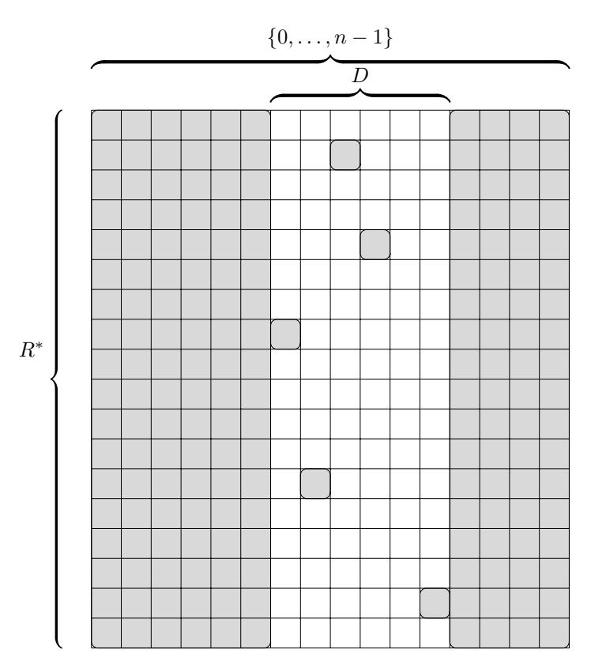
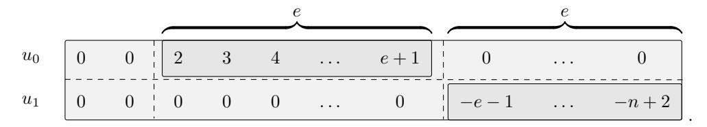

# Proximity Gaps in Interleaved Codes

Benjamin E. DIAMOND

Angus Gruen

Irreducible

Polygon

bdiamond@irreducible.com

agruen@polygon.technology

#### Abstract

A linear error-correcting code exhibits proximity gaps if each affine line of words either consists entirely of words which are close to the code or else contains almost no such words. In this short note, we prove that for each linear code which exhibits proximity gaps within the unique decoding radius, that code's interleaved code also does. Combining our result with a recent argument of Angeris, Evans and Roh ('24), we extend those authors' sharpening of the tensor-based proximity gap of Diamond and Posen (Commun. Cryptol. '24) up to the unique decoding radius, at least in the Reed–Solomon setting.

# 1 Introduction

Proximity gaps for linear codes reside at the heart of modern hash-based SNARKs [Ben+23] [DP24b]. That a code features proximity gaps ensures that for each list which fails to consist entirely of words which are close to the code, most linear combinations of that list's words themselves fail to be close to the code. This condition implies that, with high probability, the closeness of a random combination of a list's elements faithfully proxies the closeness of that list itself. This guarantee undergirds the soundness of many popular SNARKs, including FRI-based [Ben+23, § 8.2] and Ligero-style [AHIV23] [Gol+23] [DP24b] ones. In these SNARKs, the prover commits the list at issue; the verifier uses its combination of that list to test the prover.

The most fundamental manifestation of the proximity gaps phenomenon pertains to affine lines. We fix a field  $\mathbb{F}_q$  and an [n,k,d]-code  $C \subset \mathbb{F}_q^n$  over  $\mathbb{F}_q$ , as well as a proximity parameter e and a false witness bound  $\varepsilon$ . The code C is said to feature proximity gaps for affine lines with respect to the parameters e and  $\varepsilon$  if, roughly, for each affine line  $U \subset \mathbb{F}_q^n$ , either fewer than or equal to  $\varepsilon$  among U's elements fall within distance e from C or else all of U's elements do. In this latter case, we in fact obtain a certain stronger condition, called correlated agreement. This condition entails that, for some set consisting of e or fewer among the coordinate axes  $\{0,\ldots,n-1\}$ , the projection which collapses these axes maps the line  $U \subset \mathbb{F}_q^n$  identically into the image of  $C \subset \mathbb{F}_q^n$  (i.e., the image of U under this projection consists entirely of punctured codewords).

We explain this phenomenon intuitively. Upon puncturing  $C \subset \mathbb{F}_q^n$  arbitrarily at e positions, choosing an affine line consisting entirely of punctured codewords, and finally lifting that line back to  $\mathbb{F}_q^n$  itself, we obtain a further affine line  $U \subset \mathbb{F}_q^n$  which "trivially" consists exclusively of e-close points. The proximity gap phenomenon entails that each affine line U which contains sufficiently many close points—that is, more than  $\varepsilon$  of them—must in fact consist identically of e-close points (and in this most trivial of ways, no less).

The interleaved code abstraction captures this phenomenon concisely. For each  $m \geq 1$ , C's m-fold interleaving  $C^m \subset \mathbb{F}_q^{m \times n}$  is the set of  $m \times n$  matrices all of whose rows are codewords. The distance between two words in  $\mathbb{F}_q^{m \times n}$  is the number of columns at which those words fail to agree identically. Each affine line yields a word U in the two-fold interleaving  $\mathbb{F}_q^{2 \times n}$ . By definition, C exhibits proximity gaps for affine lines if each word U in  $\mathbb{F}_q^{2 \times n}$  more than  $\varepsilon$  of whose affine row-combinations are e-close to C is itself e-close to  $C^2$ .

As Ben-Sasson et al. [Ben+23] show, each code C which features proximity gaps for affine lines also features proximity gaps of various further sorts. For example, [Ben+23, Thm. 1.6] shows each code C which features proximity gaps over lines also features proximity gaps over higher-dimensional affine subspaces. That is, if C features proximity gaps for lines, then, for each m > 1, each m-fold interleaved word U a proportion of more than  $\frac{\varepsilon}{q}$  among whose affine row-combinations are e-close to C is itself e-close to  $C^m$ . The result [Ben+23, Thm. 1.5] shows something analogous for low-degree parameterized curves, albeit with the linearly worse false witness probability  $(m-1) \cdot \frac{\varepsilon}{q}$ .

### 1.1 Proximity Gaps for Tensor Combinations

Diamond and Posen [DP24b] study a further sort of proximity gap. Their main result [DP24b, Thm. 2] shows that each code C which exhibits proximity gaps for affine lines also exhibits proximity gaps for tensor combinations. That is, if C features proximity gaps for lines—with respect to the parameters e and  $\varepsilon$  say, where moreover  $e \in \{0, \ldots, \lfloor \frac{d-1}{2} \rfloor\}$ —then, for each  $\vartheta > 1$ , the tensor-combinations of the rows of each interleaved word  $U \in \mathbb{F}_q^{2^{\vartheta} \times n}$  witness that word's interleaved distance from  $C^{2^{\vartheta}}$ . More precisely, if the probability, taken over  $(r_0, \ldots, r_{\vartheta-1}) \leftarrow \mathbb{F}_q^{\vartheta}$ , that

$$d\left(\left[\begin{array}{ccc} \bigotimes_{i=0}^{\vartheta-1}(1-r_i,r_i) \end{array}\right]\cdot \left[\begin{array}{cccc} - & u_0 & - \\ & \vdots & \\ - & u_{2\vartheta-1} & - \end{array}\right],C\right) \leq e$$

holds is sufficiently high, then  $d^{2^{\vartheta}}\left(\left(u_{i}\right)_{i=0}^{2^{\vartheta}-1}, C^{2^{\vartheta}}\right) \leq e$ . Here,  $\bigotimes_{i=0}^{\vartheta-1}(1-r_{i},r_{i})$  is a tensor product, a vector which arises naturally in the context of multilinear evaluation (we refer to Section 2 below for further background). Specifically, [DP24b, Thm. 2] achieves the false witness probability  $2 \cdot \vartheta \cdot \frac{\varepsilon}{q}$ , a bound which surpasses by  $2 \cdot \vartheta$ -fold the underlying bound for lines. In [DP24b, Rem. 3], Diamond and Posen suggest, as a problem for future work, the elimination of that bound's factor of 2.

In recent work, Angeris, Evans and Roh [AER24] eliminate that factor of 2, albeit using an argument which works only in the restricted range  $e \in \{0, \dots, \lfloor \frac{d-1}{3} \rfloor\}$ .

#### 1.2 Our Contribution

In this work, we extend Angeris, Evans and Roh's [AER24] result to the range  $e \in \{0, \dots, \left\lfloor \frac{d-1}{2} \right\rfloor\}$ . We explain this paper's contribution slightly more precisely. Angeris, Evans and Roh's result proceeds in two steps. In the first step, those authors argue directly that, for each code C, each proximity parameter  $e \in \{0, \dots, \left\lfloor \frac{d-1}{3} \right\rfloor\}$ , and each interleaving factor  $m \geq 1$ , the interleaved code  $C^m$  features proximity gaps for affine lines with respect to e and the false witness bound  $\varepsilon \coloneqq e+1$ . Their proof of that result works only in the range  $e \in \{0, \dots, \left\lfloor \frac{d-1}{3} \right\rfloor\}$ , and follows essentially exactly the argument of [DP24b, Thm. 1] (that result proves that, in the range  $e \in \{0, \dots, \left\lfloor \frac{d-1}{3} \right\rfloor\}$ , each standard, noninterleaved code C features proximity gaps for lines with respect to e and  $\varepsilon \coloneqq e+1$ ). In their argument's second step, those authors show that each code C whose interleavings feature proximity gaps over lines also features tensor-style proximity gaps.

To extend Angeris, Evans and Roh's result, we must achieve their argument's first step in the larger range  $e \in \{0, \ldots, \lfloor \frac{d-1}{2} \rfloor\}$ . To do this, we show that if C exhibits proximity gaps for affine lines with respect to the parameters e and  $\varepsilon$ —where, again, we allow arbitrary  $e \in \{0, \ldots, \lfloor \frac{d-1}{2} \rfloor\}$ —then, for each m > 1, C's interleaving  $C^m$  also does. We prove that result as our main Theorem 3.1 below. The second step of our proof proceeds exactly as Angeris, Evans and Roh's does; we reproduce that step as our Theorem 3.6 below.

Combining Theorems 3.1 and 3.6, we conclude that if C exhibits proximity gaps for affine lines with respect to e and  $\varepsilon$ —where, again,  $e \in \left\{0,\dots,\left\lfloor\frac{d-1}{2}\right\rfloor\right\}$  may vary arbitrarily—then C also exhibits  $\vartheta$ -ary tensor-style proximity gaps for each  $\vartheta \geq 1$ , with the sharpened false witness probability  $\vartheta \cdot \frac{\varepsilon}{q}$  no less.

We note finally that, by Ben-Sasson et al. [Ben+23, Thm. 4.1], Reed-Solomon codes exhibit proximity gaps for affine lines up to the unique decoding radius. Our Theorems 3.1 and Theorem 3.6 thus apply to those codes, at the very least. (Whether *general* linear codes in fact exhibit proximity gaps for affine lines up to the unique decoding radius remains an important open problem; we note our Conjecture 4.3 below.)

In the important Reed-Solomon special case, therefore, we improve [DP24b, Thm. 2]'s false witness probability by a factor of 2 over the entire unique decoding range.

#### 1.3 The Conjecture for General Codes

As a miscellaneous further contribution, we show that the conjecture [DP24b, Conj. 1] is false as written, by exhibiting a code  $C \subset \mathbb{F}_q^n$  and an affine line  $U \subset \mathbb{F}_q^n$  which, though it lacks correlated agreement with C, contains n close points (see Example 4.1 below). Since our code C is Reed-Solomon, our example moreover shows that [Ben+23, Thm. 4.1] is sharp (i.e., its false witness probability cannot be decreased). We amend [DP24b, Conj. 1], by increasing that conjecture's false witness bound from e+1 to n (see Conjecture 4.3).

### 1.4 Impact of our Result

The *use* within modern SNARKs of proximity gaps is complicated; we note the rigorous treatments carried out in [DP24b] and [DP24a]. For now, we sketch the impact informally.

Roughly, in applications, one wants the false witness probability  $\varepsilon$  to be as small as possible and the proximity parameter e to be as large as possible. (As soon as e becomes greater then the unique decoding radius  $\left\lfloor \frac{d-1}{2} \right\rfloor$ , things become complicated, and new proof techniques become required. On the other hand, increasing e from  $\left\lfloor \frac{d-1}{3} \right\rfloor$  to  $\left\lfloor \frac{d-1}{2} \right\rfloor$  amounts to a "free win".) Why? Coding-based SNARKs face two main sorts of soundness error.

In those SNARKs, one shows that a *cheating* prover must, during the course of the protocol, commit to an interleaved word which is far from the interleaved code. The first sort of error entails "bad batching"; in this situation, upon row-combining the cheating prover's *far* interleaved word, the verifier nonetheless obtains a *close* combination. This sort of error is a "fixed error", which happens—or doesn't happen—exactly once (i.e., when the verifier samples its combination coefficients). The second sort of error entails "unlucky querying"; it results when the verifier, though faced with a combined word which is *far* from the code, nonetheless tests exclusively positions of that word which spuriously agree with a codeword. This latter sort of error is a "variable error", in that the verifier may always drive down it to zero—at least, eventually—by performing more queries.

Thus, these protocols have total soundness error roughly given by:

$$\vartheta \cdot \frac{\varepsilon}{a} + \left(1 - \frac{e}{n}\right)^{\gamma}.\tag{1}$$

Here,  $\varepsilon$  and e respectively represent the test's false witness probability and proximity parameter;  $\gamma$  represents the number of queries the verifier makes.

We explain the expression (1) above. The probability with which the verifier samples bad batching coefficients—i.e., (1)'s first term—is controlled by proximity test's false witness probability  $\varepsilon$  (bad batching coefficients falsely witness the closeness to the code of an interleaved codeword which actually isn't close). The expression (1)'s second term represents the probability that the verifier evades the bad batching event, and yet, during each of its subsequent queries, nonetheless manages to miss the combination's disagreeing positions. The proximity gap's proximity parameter e controls the per-query probability with which the verifier fails to catch the cheating prover. In other words, the proximity parameter controls the exponential decay rate with which the protocol's total soundness error approaches its batching error (i.e., as the verifier's number of queries grows). In practice, it is  $\gamma$ , the number of queries, that directly mediates proof size, and which we'd like to keep small.

We fix a desired number  $\Xi$  of bits of security (for example, we can take  $\Xi \coloneqq 100$ ). In each SNARK, we must choose  $\gamma$  so large that the error expression (1) above drops beneath or equal to  $2^{-\Xi}$ . Of course, we can choose  $\gamma$  this way in the first place only when the limiting soundness error  $\vartheta \cdot \frac{\varepsilon}{q}$  is itself less than the security threshold  $2^{-\Xi}$ . When  $\vartheta \cdot \frac{\varepsilon}{q}$  is much smaller than the desired security level  $2^{-\Xi}$ , the decay rate  $1 - \frac{e}{n}$  dominates the determination of this minimal, satisfactory  $\gamma$ . On the other hand, as this the limiting soundness error  $\vartheta \cdot \frac{\varepsilon}{q}$  begins to approach  $2^{-\Xi}$  from below, the minimum adequate  $\gamma$  is liable to soar.

In this work, we achieve a first term of just  $\vartheta \cdot \frac{\varepsilon}{q}$  (compare the batching error  $2 \cdot \vartheta \cdot \frac{\varepsilon}{q}$  achieved by [DP24b, Thm. 2]) and a proximity parameter upper limit  $e \leq \left\lfloor \frac{d-1}{2} \right\rfloor$  (compare that of  $\left\lfloor \frac{d-1}{3} \right\rfloor$  achieved by [AER24]). Each of these previous works achieves exactly one of these conditions; we attain both simultaneously. The concrete impact of our work depends on the various parameters at hand (as well as on to which among the works [DP24b] and [AER24] the comparison is made).

In the limit of a *small* batching error  $\vartheta \cdot \frac{\varepsilon}{q}$  approaching zero and a *large* distance d approaching n—an important, representative special case—our work improves upon [AER24] by a factor of  $\frac{1}{\log_2(3)-1} \approx 1.710$ , which is significant. Indeed, in this case, one has

$$\gamma \approx \log_{1-\frac{e}{n}} \left(2^{-\Xi}\right) = \Xi \cdot \frac{-1}{\log_2\left(1-\frac{e}{n}\right)}.$$

We improve the argument  $1 - \frac{e}{n_1}$  above from just under  $\frac{2}{3}$  to just under  $\frac{1}{2}$  (again, for d near n). That is, we improve the scaling factor  $\frac{-1}{\log_2(1-\frac{e}{n})}$  attached to  $\Xi$  from just over  $\frac{-1}{\log_2(2/3)} \approx 1.710$  to just over  $\frac{-1}{\log_2(1/2)} = 1$ .

In the opposite direction, our work, in comparison to [DP24b], improves by 1 bit the *limiting* soundness error to which the protocol tends, in the limit of a large number of queries  $\gamma$ . The impact of this phenomenon is seen most clearly in the case of a batching error  $2 \cdot \vartheta \cdot \frac{\varepsilon}{q}$  which closely approaches  $2^{-\Xi}$  from below. Amid this sort of phenomenon, [DP24b] would begin to demand ballooning values  $\gamma$ ; our work would not. Indeed, by creating space between the limiting batching error and the desired security level, our improvement creates a sort of "breathing room" in precisely this sort of situation, liable to significantly reduce  $\gamma$ . As a more extreme sort of case, we fix a scenario in which  $2 \cdot \vartheta \cdot \frac{\varepsilon}{q} \geq 2^{-\Xi}$  holds, and yet  $\vartheta \cdot \frac{\varepsilon}{q} < 2^{-\Xi}$ . In this latter sort of case, [DP24b] would fail altogether even to instantiate the protocol (i.e., it would be unable to achieve  $\Xi$  bits of security, regardless of how high it set  $\gamma$ ). Our work allows  $\Xi$  bits of security to be attained after all even in cases of this sort.

### 1.5 Application to FRI

We have already mentioned the essential role played by tensor-style proximity gaps in Ligero-like succinct proof protocols [AHIV23] [DP24b]. As it happens, the same phenomenon appears also in FRI-based protocols, as concurrent work of Diamond and Posen [DP24a] makes clear.

We recall the FRI interactive oracle proof of proximity for Reed–Solomon codes, due to Ben-Sasson, Bentov, Horesh and Riabzev [BBHR18]. As is discussed in [BBHR18, § 3.2] and again in subsequent work of Ben-Sasson et al. [Ben+23, Claim. 8.1], FRI supports certain higher-arity folding schemata, in which each word is collapsed in a  $2^{\eta}$ -to-1 manner (i.e., for  $\eta \geq 1$ , in general). The folding arity parameter  $\eta$  mediates an efficiency tradeoff. As  $\eta$  increases, the total number of oracles committed to, as well as the total number of Merkle paths sent, decreases; on the other hand, the respective sizes of the various cosets sent increase. The "sweet spot" in practical applications appears to occur around  $\eta = 4$  [DP24a].

Both [BBHR18] and [Ben+23, § 8.2] achieve higher-arity folding by univariate interpolation. To explain this, we briefly fix notation. We fix a field  $\mathbb{F}_q$ , subsets  $S^{(i)}$  and  $S^{(i+1)}$  of  $\mathbb{F}_q$ , and a  $2^{\eta}$ -to-1 map  $q^{(i)}: S^{(i)} \to S^{(i+1)}$ ; we finally fix a function  $f^{(i)}$  on  $S^{(i)}$ . To fold the word  $f^{(i)}$  with respect to the random challenge  $r \in \mathbb{F}_q$ , say, the prover and verifier both define  $f^{(i+1)}: S^{(i+1)} \to \mathbb{F}_q$  pointwise according to the recipe

$$f^{(i+1)}: y \mapsto \mathsf{Interpolant}\bigg(f^{(i)}\Big|_{q^{(i)}^{-1}(\{y\})}\bigg)(r).$$

In other words, for each  $y \in S^{(i+1)}$  given, the fiber  $q^{(i)^{-1}}(\{y\}) \subset S^{(i)}$  is of size  $2^{\eta}$ . The restriction of  $f^{(i)}$  to this fiber defines a unique polynomial of degree less than  $2^{\eta}$ , namely  $\left|\int_{q^{(i)-1}(\{y\})} f^{(i)}\right|_{q^{(i)-1}(\{y\})}$ . The value of  $f^{(i+1)}$  at y is defined to be the value of this latter interpolant at the out-of-domain point  $r \in \mathbb{F}_q$ .

As is explained in [Ben+23, § 8.2], FRI's security proof uses—at a key juncture—the fact whereby Reed–Solomon codes exhibit proximity gaps. Which type? In the standard 2-to-1 folding setting (i.e., in the case  $\eta=1$ ), the relevant proximity gap is that for affine lines (i.e., Definition 2.1). As is made clear in [Ben+23, § 8.2.1], the security of *univariate* higher-arity FRI folding depends on the proximity gap for *low-degree* parameterized curves [Ben+23, Thm. 1.5]. This latter proximity gap's false witness probability exceeds that for affine lines' by a factor *linear* in the length of the list (i.e., by  $2^{\eta}-1$ ). That proximity gap thus contributes a linear factor in  $2^{\eta}$  to that protocol's soundness error.

Diamond and Posen [DP24a] introduce a new type of higher-arity FRI-folding, as we now explain. We fix a folding arity constant  $\vartheta \geq 1$  (we use a new symbol, to avoid confusion with  $\eta$ ). The work [DP24a, § 3.2] stipulates that the prover and verifier simply fold  $f^{(i)}$  in a 2-to-1 way repeatedly. That is, the prover folds  $f^{(i)}$   $\vartheta$  times in succession, "skipping" all intermediate oracles, and consuming  $\vartheta$  random challenges in the process (as opposed to just one). The prover commits only to the final result. This strategy achieves a proof size profile identical to that achieved by univariate higher-arity folding. Its security depends exactly on the fact whereby Reed–Solomon codes exhibit tensor-style proximity gaps (i.e., see Corollary 3.7). This security reduction—i.e., from repeated 2-ary FRI folding to tensor-style proximity gaps—is carried out in detail in [DP24a, Thm. 3.16] (see in particular [DP24a, Prop. 3.20]). Its soundness error, finally, improves upon that of univariate folding, precisely because the false witness premium of tensor-folding grows only like  $\vartheta$ , and not like  $2^{\vartheta}$ . We thus suggest oracle-skipping as a new, and more natural, FRI-folding mechanism, provably secure in light of [DP24b, Thm. 2] and this work.

**Acknowledgements.** We would like to sincerely thank Ulrich Haböck and Daniel Lubarov for various helpful discussions.

# 2 Background

We recall background notation, following Guruswami [Gur06] and Diamond and Posen [DP24b]. For each  $\vartheta \geq 1$ , the boolean cube  $\mathcal{B}_{\vartheta}$  is  $\{0,1\}^{\vartheta}$ . We fix a finite field  $\mathbb{F}_q$ . For each  $\vartheta \geq 1$  and each pair of lists  $(a_{0,0},\ldots,a_{0,\vartheta-1})$  and  $(a_{1,0},\ldots,a_{1,\vartheta-1})$  of  $\mathbb{F}_q$ -elements, the tensor product  $\bigotimes_{i=0}^{\vartheta-1}(a_{0,i},a_{1,i})$  is defined to be the vector  $\left(\prod_{i=0}^{\vartheta-1}a_{v_i,i}\right)_{v\in\mathcal{B}_{\vartheta}}$ . Using the little-endian convention, we understand each vector of this latter form as a flat, length- $2^{\vartheta}$  array.

For each pair of elements  $v_0$  and  $v_1$  of  $\mathbb{F}_q$ , we define the disagreement set between  $v_0$  and  $v_1$  as  $\Delta(v_0, v_1) := \{i \in \{0, \dots, n-1\} \mid v_{0,i} \neq v_{1,i}\}$ . The Hamming distance between  $v_0$  and  $v_1$  is  $d(v_0, v_1) := |\Delta(v_0, v_1)|$ . A linear [n, k, d]-code over  $\mathbb{F}_q$  is a k-dimensional linear subspace  $C \subset \mathbb{F}_q^n$  for which, for each pair of distinct elements  $v_0$  and  $v_1$  of C,  $d(v_0, v_1) \geq d$ . The unique decoding radius of the [n, k, d]-code  $C \subset \mathbb{F}_q^n$  is  $\lfloor \frac{d-1}{2} \rfloor$ ; indeed, we note that, for each word  $u \in \mathbb{F}_q^n$ , at most one codeword  $v \in C$  satisfies  $d(u, v) < \frac{d}{2}$  (this fact is a direct consequence of the triangle inequality). For  $u \in \mathbb{F}_q^n$  arbitrary, we write  $d(u, C) := \min_{v \in C} d(u, v)$  for the distance between u and the code C.

For each linear code  $C \subset \mathbb{F}_q^n$  and each integer  $m \geq 1$ , we define C's m-fold interleaved code as  $C^m \subset (\mathbb{F}_q^n)^m \cong (\mathbb{F}_q^m)^n$ . We understand this latter set as a length-n block code over the alphabet  $\mathbb{F}_q^m$ . In particular, its elements are matrices in  $\mathbb{F}_q^{m \times n}$  each of whose rows is a C-element. We often write matrices as lists of rows—i.e., by writing  $(u_i)_{i=0}^{m-1} \in \mathbb{F}_q^{m \times n}$ . By definition of  $C^m$ , two matrices in  $\mathbb{F}_q^{m \times n}$  differ at a column if they differ at any of that column's components. That a matrix  $(u_i)_{i=0}^{m-1} \in \mathbb{F}_q^{m \times n}$  is within distance e to the code  $C^m$  thus entails that there exists a matrix  $(v_i)_{i=0}^{m-1}$  whose rows are all codewords and a subset  $D := \Delta^m \left( (u_i)_{i=0}^{m-1}, C^m \right)$  of  $\{0, \ldots, n-1\}$ , of size at most e, for which, for each  $j \in \{0, \ldots, n-1\}$ , the columns  $(u_{i,j})_{i=0}^{m-1}$  and  $(v_{i,j})_{i=0}^{m-1}$  are identical.

The following key definition is implicit in [Ben+23] and [DP24b]. Below, we fix a field  $\mathbb{F}_q$  and an arbitrary linear [n, k, d]-code  $C \subset \mathbb{F}_q^n$ .

**Definition 2.1.** We say that  $C \subset \mathbb{F}_q^n$  features proximity gaps for affine lines with respect to the proximity parameter e and the false witness bound  $\varepsilon$  if, for each pair of words  $u_0$  and  $u_1$  in  $\mathbb{F}_q^n$ , if

$$\Pr_{r \in \mathbb{F}_q} [d((1-r) \cdot u_0 + r \cdot u_1, C) \le e] > \frac{\varepsilon}{q}$$

holds, then  $d^2((u_i)_{i=0}^1, C^2) \leq e$  also does.

We note that for each  $r \in \mathbb{F}_q$ ,

$$d((1-r)\cdot u_0 + r\cdot u_1, C) \le d^2\Big((u_i)_{i=0}^1, C^2\Big).$$

Hence, if C features proximity gaps for affine lines, then, for each pair of words  $u_0$  and  $u_1$  in  $\mathbb{F}_q^n$ , exactly one of the following conditions must hold:

$$\Pr_{r \in \mathbb{F}_q} \left[ d((1-r) \cdot u_0 + r \cdot u_1, C) \le e \right] \le \frac{\varepsilon}{q} \quad \text{or} \quad \Pr_{r \in \mathbb{F}_q} \left[ d((1-r) \cdot u_0 + r \cdot u_1, C) \le e \right] = 1.$$

We fix an interleaved word  $(u_i)_{i=0}^1$  for which the second condition above holds, and write  $(v_i)_{i=0}^1$  for an interleaved codeword in  $C^2$  for which  $d^2((u_i)_{i=0}^1, (v_i)_{i=0}^1) \leq e$ . So long as  $e \in \{0, \dots, \lfloor \frac{d-1}{2} \rfloor\}$  is in the unique decoding radius, for each  $r \in \mathbb{F}_q$ , the codeword closest to  $u_r := (1-r) \cdot u_0 + r \cdot u_1$  can be none other than  $v_r := (1-r) \cdot v_0 + r \cdot v_1$ . Indeed, for each  $j \notin \Delta^2((u_i)_{i=0}^1, (v_i)_{i=0}^1)$ ,  $u_{0,j} = v_{0,j}$  and  $u_{1,j} = v_{1,j}$  both hold, so that  $u_{r,j} = v_{r,j}$  also does, and  $j \notin \Delta(u_r, v_r)$ . We conclude that  $\Delta(u_r, v_r) \subset \Delta^2((u_i)_{i=0}^1, (v_i)_{i=0}^1)$ .

We recall Reed-Solomon codes (see e.g. [Gur06, Def. 2.3]). We fix nonnegative message length and block length length parameters k and n, as well as a subset  $S \subset \mathbb{F}_q$  of size n. We write  $C \subset \mathbb{F}_q^n$  for the

Reed-Solomon code  $\mathsf{RS}_{\mathbb{F}_q,S}[k,n] := \{(P(x))_{x \in S} \mid P(X) \in \mathbb{F}_q[X]^{\prec k}\}$ . That is,  $\mathsf{RS}_{\mathbb{F}_q,S}[k,n]$  is the set of those n-tuples which arise as the evaluations of some polynomial P(X) of degree less than k on the set S. The distance of  $\mathsf{RS}_{\mathbb{F}_q,S}[k,n]$  is d=n-k+1.

The following important result of Ben-Sasson et al. [Ben+23] shows that Reed-Solomon codes exhibit proximity gaps up to the unique decoding radius (with the false witness bound  $\varepsilon = n$ ). Below, we fix a field  $\mathbb{F}_q$ , a domain  $S \subset \mathbb{F}_q$  of size |S| = n, and a message length  $k \leq n$ .

**Theorem 2.2** (Ben-Sasson, et al. [Ben+23, Thm. 4.1]). For each  $e \in \{0, \ldots, \lfloor \frac{d-1}{2} \rfloor \}$ ,  $\mathsf{RS}_{\mathbb{F}_q,S}[k,n]$  exhibits proximity gaps for affine lines with respect to the proximity parameter e and the false witness bound  $\varepsilon \coloneqq n$ .

The following definition is implicit in [DP24b, Thm. 2], though it sharpens by a factor of two that result's false witness probability.

**Definition 2.3.** We say that  $C \subset \mathbb{F}_q^n$  features tensor-style proximity gaps with respect to the proximity parameter e and the false witness bound  $\varepsilon$  if, for each  $\vartheta \geq 1$  and each list of words  $u_0, \ldots, u_{2^{\vartheta}-1}$  in  $\mathbb{F}_q^n$ , if

$$\Pr_{(r_0,\dots,r_{\vartheta-1})\in\mathbb{F}_q^\vartheta}\left[d\left(\left[\begin{array}{cc} \bigotimes_{i=0}^{\vartheta-1}(1-r_i,r_i) \end{array}\right]\cdot \begin{bmatrix} -&u_0&-\\&\vdots&\\-&u_{2\vartheta-1}&- \end{bmatrix},C\right)\leq e\right]>\vartheta\cdot \frac{\varepsilon}{q}$$

holds, then  $d^{2^{\vartheta}}\left((u_i)_{i=0}^{2^{\vartheta}-1}, C^{2^{\vartheta}}\right) \leq e$  also does.

The extensive role of tensor-style proximity gaps in succinct proofs is developed at length in [DP24b].

### 3 Main Results

We now present our main theorem. We fix a field  $\mathbb{F}_q$  and an arbitrary [n,k,d]-code  $C\subset\mathbb{F}_q^n$ .

**Theorem 3.1.** If C features proximity gaps for affine lines with respect to the proximity parameter  $e \in \{0, \ldots, \left| \frac{d-1}{2} \right| \}$  and the false witness bound  $\varepsilon \geq e+1$ , then, for each m>1, C's interleaving  $C^m$  also does.

Proof. We fix a code C which satisfies the hypothesis of the theorem, as well as interleaved words  $U_0$  and  $U_1$  in  $\mathbb{F}_q^{m \times n}$ . For each  $r \in \mathbb{F}_q$ , we write  $U_r := (1-r) \cdot U_0 + r \cdot U_1$  for the corresponding point on the affine line spanned by  $U_0$  and  $U_1$ . For each row  $i \in \{0, \ldots, m-1\}$  and each column  $j \in \{0, \ldots, n-1\}$ , we write  $(U_r)_i$  and  $(U_r)^j$ , respectively, for  $U_r$ 's ith row and jth column. Finally, we write  $R^*$  for the set of parameters  $r \in \mathbb{F}_q$  for which the combination  $U_r$  is e-close to the interleaved code  $C^m$ ; in other words:

$$R^* := \{ r \in \mathbb{F}_q \mid d^m(U_r, C^m) \le e \}.$$

To prove the theorem, we must show that if  $|R^*| > \varepsilon$ , then  $U_0$  and  $U_1$  feature correlated agreement with  $C^m$ . In other words, we must show that exist interleaved codewords  $V_0$  and  $V_1$  in  $C^m$  and a subset  $D \subset \{0, \ldots, n-1\}$  of cardinality e or less such that, for each  $j \in \{0, \ldots, n-1\} \setminus D$  and each  $b \in \{0, 1\}$ , the columns  $(U_b)^j = (V_b)^j$  are identical.

We start by producing the codewords  $V_0$  and  $V_1$ . We fix an *individual* row-index  $i \in \{0, ..., m-1\}$ . We note first that, for each  $r \in \mathbb{F}_q$ ,

$$d((U_r)_i, C) \leq d^m(U_r, C^m).$$

In particular, if  $r \in R^*$ , then  $d((U_r)_i, C) \leq e$ . Using our hypothesis  $|R^*| > \varepsilon$  and our assumption whereby C itself features proximity gaps for affine lines, we conclude that there exist codewords  $(V_0)_i$  and  $(V_1)_i$  in C and a subset  $D_i \subset \{0, \ldots, n-1\}$  such that, for each  $j \in \{0, \ldots, n-1\} \setminus D_i$  and each  $b \in \{0, 1\}$ ,  $((U_b)_i)_j = ((V_b)_i)_j$  holds. Assembling the resulting such codewords  $(V_0)_i$  and  $(V_1)_i$  into matrices, we obtain interleaved codewords  $V_0$  and  $V_1$  in  $C^m$ . For each  $v \in \mathbb{F}_q$ , we define the affine line element  $V_r$  as we did  $U_r$ ; that is, we set  $V_r := (1-r) \cdot V_0 + r \cdot V_1$ .

Concatenating the matrices  $U_0$  and  $U_1$ , as well as  $V_0$  and  $V_1$ , vertically, we define:

$$\left[\begin{array}{cc} & U & \\ & U & \\ \end{array}\right] \coloneqq \left[\begin{array}{c} U_0 & \\ & U_1 \end{array}\right] \quad \text{and} \quad \left[\begin{array}{cc} & V & \\ & V & \\ \end{array}\right] \coloneqq \left[\begin{array}{cc} V_0 & \\ & V_1 \end{array}\right].$$

Our task amounts to proving that  $D := \Delta^{2 \cdot m}(U, V)$  satisfies  $|D| \le e$ . To do this, we engage in a counting argument. We define:

$$R^{**} := \left\{ (r, j) \in R^* \times \{0, \dots, n-1\} \mid (U_r)^j = (V_r)^j \right\}.$$

In other words,  $R^{**}$  is the set of *pairs*, consisting of an affine line parameter  $r \in R^*$  and a column index  $j \in \{0, \ldots, n-1\}$ , for which  $U_r$ 's respective  $j^{\text{th}}$  columns agree identically.

We bound  $R^{**}$  from both above and below. We prepare the way with the following basic lemma, which shows that  $U_r$  can become close to  $C^m$  only by becoming close to  $V_r$ .

**Lemma 3.2.** For each  $r \in \mathbb{R}^*$ ,  $d^m(U_r, V_r) \leq e$ .

Proof. This lemma follows almost immediately from the remarks made after Definition 2.1 above. By construction of the interleaved codewords  $V_0$  and  $V_1$ , for each individual row  $i \in \{0, \ldots, m-1\}$ ,  $d^2\left(((U_b)_i)_{b=0}^1, ((V_b)_i)_{b=0}^1\right) \leq e$ . On the other hand, for each  $r \in R^*$ , by definition, some interleaved codeword  $V_r^*$  satisfies  $d^m(U_r, V_r^*) \leq e$ , and in particular, for each  $i \in \{0, \ldots, m-1\}$ ,  $d((U_r)_i, (V_r^*)_i) \leq e$ . By the remarks made after Definition 2.1 (essentially by the triangle inequality and unique decoding), we conclude that, again for each  $i \in \{0, \ldots, m-1\}$ ,  $(V_r)_i = (V_r^*)_i$ . We see finally that  $V_r = V_r^*$  itself holds.

We now establish two bounds.

**Lemma 3.3.** 
$$|R^{**}| \leq |R^*| \cdot (n - |D|) + |D|$$
.

Proof. For each  $j \in D$ , by definition of D, either  $(U_0)^j \neq (V_0)^j$  holds or  $(U_1)^j \neq (V_1)^j$  holds (or both). It follows that at most one  $r \in \mathbb{F}_q$ —and so a fortiori at most one  $r \in R^*$ —can possibly cause  $(U_r)^j = (V_r)^j$  to hold. Each  $j \in D$  thus contributes at most one element to  $R^{**}$ . On the other hand, for each  $j \in \{0, \ldots, n-1\} \setminus D$ ,  $(U_0)^j = (V_0)^j$  and  $(U_1)^j = (V_1)^j$  both hold. We conclude that  $(U_r)^j = (V_r)^j$  holds for each r in  $R^* \subset \mathbb{F}_q$ . Summing these conclusions over all  $j \in \{0, \ldots, n-1\}$ , we obtain the desired bound.  $\square$ 

**Lemma 3.4.** 
$$|R^{**}| \ge (n-e) \cdot |R^*|$$
.

*Proof.* For each fixed  $r \in R^*$ , applying Lemma 3.2, we obtain the inequality  $d^m(U_r, V_r) \leq e$ , which itself entails (by definition) that at least n-e column indices  $j \in \{0, \ldots, n-1\}$  satisfy  $(U_r)^j = (V_r)^j$ . Adding up this bound over all parameters  $r \in R^*$ , we obtain the desired bound  $|R^{**}| \geq |R^*| \cdot (n-e)$ .

Combining Lemmas 3.3 and 3.4, we conclude that:

$$(n-e) \cdot |R^*| \le |R^*| \cdot (n-|D|) + |D|,$$

so that

$$e \cdot |R^*| > |D| \cdot (|R^*| - 1)$$

in turn holds, and finally that:

$$|D| \le e \cdot \frac{|R^*|}{|R^*| - 1} < e + 1,$$

so that  $|D| \le e$ . If e = 0, the strict inequality above holds trivially. Otherwise, since  $X \mapsto \frac{X}{X-1}$  is strictly decreasing for X > 1, and since by our hypothesis  $|R^*| > \varepsilon \ge e+1$ , we have  $e \cdot \frac{|R^*|}{|R^*|-1} < e \cdot \frac{e+1}{e} = e+1$ .  $\square$ 

We depict the proof strategy of Theorem 3.1 in Figure 1 below.

Figure 1: A graphical depiction of the set  $R^{**}$  of the proof of Theorem 3.1.

In Figure 1, the shaded cells correspond to the set  $R^{**}$ . The proof of Lemma 3.3 shows that each column  $j \in D$  contains at most one shaded cell. The proof of Lemma 3.4 shows that each row  $r \in R^*$  contains at least n-e shaded cells. This latter guarantee implies that, for each  $r \in R^*$ , at least |D|-e of the cells within the index range  $j \in D$  are shaded. Multiplying this quantity by the number of rows  $|R^*|$ , we obtain a total of at least  $|R^*| \cdot (|D|-e)$  shaded cells within the column band  $j \in D$ . If |D| > e held, then so too would  $|R^*| \cdot (|D|-e) > |D|$  (here, we use  $\frac{|D|}{|D|-e} \le e+1 < |R^*|$ ). Applying the pigeonhole principle, we would conclude that at least one column  $j \in D$  featured at least two shaded cells, contradicting Lemma 3.3.

Remark 3.5. The restriction  $\varepsilon \geq e+1$  of Theorem 3.1's hypothesis appears essentially vacuous, with a caveat which we presently explain. Indeed, [DP24b, Rem. 2] shows that no code  $C \subset \mathbb{F}_q^n$  can possibly exhibit proximity gaps with respect to e and any false witness bound  $\varepsilon < e+1$ , at least provided that  $e \in \{0,\ldots,\lfloor\frac{d-1}{3}\rfloor\}$ . In fact, that example goes through identically so long as  $2 \cdot e + 1 < d$ , or in other words  $e \in \{0,\ldots,\lfloor\frac{d-2}{2}\rfloor\}$ . The case in which  $e = \lfloor\frac{d-1}{2}\rfloor$ —and in which  $\lfloor\frac{d-2}{2}\rfloor \neq \lfloor\frac{d-1}{2}\rfloor$ , which itself holds if and only if d is odd—thus appears to be exceptional. (This setting reappears in Remark 4.2 below.) Indeed, we are not able to rule out the existence of an odd-distance code  $C \subset \mathbb{F}_q^n$  which exhibits proximity gaps with respect to  $e = \lfloor\frac{d-1}{2}\rfloor$  and some false witness bound  $\varepsilon < e+1$ , though we doubt strongly that such a code exists. In fact, as we argue in Remark 4.2 below, the special, high proximity parameter  $e = \lfloor\frac{d-1}{2}\rfloor$  makes high-false-witness counterexamples easier to construct, and not harder (at least when  $C \subset \mathbb{F}_q^n$  is MDS).

The following result, due to Angeris, Evans and Roh [AER24], establishes that each code C for which the conclusion of Theorem 3.1 holds also features tensor-style proximity gaps in the sense of Definition 2.3. The below result, taken *jointly* with our Theorem 3.1 above, serves to prove a statement almost identical to that of [DP24b, Thm. 2]; it differs from that theorem's statement solely in its elimination of that statement's false witness probability's factor of 2. The elimination of that factor was posed as an open problem in [DP24b, Rem. 3]. For self-containedness, we record their proof in full. We fix an [n, k, d]-code  $C \subset \mathbb{F}_q^n$  over  $\mathbb{F}_q$ .

**Theorem 3.6** (Angeris–Evans–Roh [AER24]). If, for each  $m \ge 1$ ,  $C^m$  features proximity gaps for affine lines with respect to e and  $\varepsilon$ , then C moreover features tensor-style proximity gaps with respect to e and  $\varepsilon$ .

*Proof.* We prove the result by induction on  $\vartheta$ . In the base case  $\vartheta = 1$ , the theorem's statement is exactly that whereby C features proximity gaps for affine lines with respect to e and  $\varepsilon$ . We turn to the case  $\vartheta > 1$ .

We fix a list of words  $u_0, \ldots, u_{2^{\vartheta}-1}$  in  $\mathbb{F}_q^n$  as in the hypothesis of Definition 2.3, and suppose that they fulfill the hypothesis of that definition. We write  $U_0$  and  $U_1$  for  $(u_i)_{i=0}^{2^{\vartheta}-1}$ 's lower and upper halves. We first note a variant of the recursive substructure given in [DP24b, Thm. 2]:

$$\left[ \begin{array}{ccc} \bigotimes_{i=0}^{\vartheta-1} (1-r_i,r_i) \end{array} \right] \cdot \left[ \begin{array}{ccc} & u_0 & - \\ & \vdots & \\ - & u_{2^\vartheta-1} \end{array} \right] = \left[ \begin{array}{ccc} \bigotimes_{i=0}^{\vartheta-2} (1-r_i,r_i) \end{array} \right] \cdot \left( \left[ (1-r_{\vartheta-1}) \cdot U_0 \right] + \left[ r_{\vartheta-1} \cdot U_1 \right] \right).$$

For each  $r_{\vartheta-1} \in \mathbb{F}_q$ , we abbreviate:

$$p(r_{\vartheta-1}) \coloneqq \Pr_{(r_0, \dots, r_{\vartheta-2}) \in \mathbb{F}_q^{\vartheta-1}} \left[ d \left( \left[ \bigotimes_{i=0}^{\vartheta-2} (1-r_i, r_i) \right] \cdot \left[ (1-r_{\vartheta-1}) \cdot U_0 + r_{\vartheta-1} \cdot U_1 \right], C \right) \le e \right].$$

Finally, we define  $R^* := \left\{ r_{\vartheta-1} \in \mathbb{F}_q \mid p(r_{\vartheta-1}) > (\vartheta-1) \cdot \frac{\varepsilon}{q} \right\}$ . We note that  $R^*$  is precisely the set of parameters  $r_{\vartheta-1} \in \mathbb{F}_q$  for which the half-length matrix  $(1-r_{\vartheta-1}) \cdot U_0 + r_{\vartheta-1} \cdot U_1$  fulfills the inductive hypothesis (that is, the hypothesis of Definition 2.3, with respect to the smaller list size parameter  $\vartheta-1$ ). Applying this theorem inductively to each such matrix, we conclude that, for each  $r_{\vartheta-1} \in R^*$ ,

$$d^{2^{\vartheta-1}}\Big((1-r_{\vartheta-1})\cdot U_0+r_{\vartheta-1}\cdot U_1,C^{2^{\vartheta-1}}\Big)\leq e.$$

On the other hand, the interleaved words of the form  $(1-r_{\vartheta-1})\cdot U_0+r_{\vartheta-1}\cdot U_1$  collectively yield an affine line in  $\mathbb{F}_q^{2^{\vartheta-1}\times n}$ . To prove this theorem, it's enough to show that  $|R^*|>\varepsilon$ ; indeed, that inequality would make our hypothesis on C—i.e., whereby  $C^{2^{\vartheta-1}}$  features proximity gaps for affine lines with respect to e and  $\varepsilon$ —applicable to the line  $(1-r_{\vartheta-1})\cdot U_0+r_{\vartheta-1}\cdot U_1$ , implying our desired conclusion  $d^{2^{\vartheta}}\left((u_i)_{i=0}^{2^{\vartheta-1}},C^{2^{\vartheta}}\right)\leq e$ .

We invoke the following probability decomposition, which evokes [DP24b, Lem. 2] (though it proceeds in the "opposite direction"):

$$\begin{split} \vartheta \cdot \frac{\varepsilon}{q} &< \Pr_{(r_0, \dots, r_{\vartheta-1}) \in \mathbb{F}_q^\vartheta} \left[ d \left( \left[ \bigotimes_{i=0}^{\vartheta-1} (1 - r_i, r_i) \right] \cdot \begin{bmatrix} - & u_0 & - \\ & \vdots & \\ - & u_{2^\vartheta-1} & - \end{bmatrix}, C \right) \leq e \right] \\ &= \Pr_{(r_0, \dots, r_{\vartheta-1}) \in \mathbb{F}_q^\vartheta} \left[ d \left( \left[ \bigotimes_{i=0}^{\vartheta-2} (1 - r_i, r_i) \right] \cdot \left[ (1 - r_{\vartheta-1}) \cdot U_0 + r_{\vartheta-1} \cdot U_1 \right], C \right) \leq e \right] \\ &\leq (\vartheta - 1) \cdot \frac{\varepsilon}{q} + \Pr_{r_{\vartheta-1} \in \mathbb{F}_q} [r_{\vartheta-1} \in R^*]. \end{split}$$

The first step above is simply the hypothesis of the theorem. The second amounts to the recursive substructure already described above. To achieve the final step, we slice the space  $\mathbb{F}_q^{\vartheta}$  along its last coordinate  $r_{\vartheta-1}$ . For each slice  $r_{\vartheta-1} \in \mathbb{F}_q$ , we upper-bound the proportion of elements  $(r_0, \ldots, r_{\vartheta-2}) \in \mathbb{F}_q^{\vartheta-1}$  for which  $d\left(\bigotimes_{i=0}^{\vartheta-2} (1-r_i, r_i) \cdot \left[(1-r_{\vartheta-1}) \cdot U_0 + r_{\vartheta-1} \cdot U_1\right], C\right) \leq e$  holds, either trivially by 1 (if  $r_{\vartheta-1} \in R^*$ ) or else by  $(\vartheta-1) \cdot \frac{\varepsilon}{q}$  (if  $r_{\vartheta-1} \notin R^*$ ). By subtraction, this calculation implies that  $|R^*| > \varepsilon$ , and finishes the proof.  $\square$ 

Corollary 3.7. For each  $e \in \{0, \dots, \lfloor \frac{d-1}{2} \rfloor\}$ ,  $\mathsf{RS}_{\mathbb{F}_q, S}[k, n]$  features tensor-style proximity gaps with respect to e and  $\varepsilon \coloneqq n$ .

*Proof.* This corollary is a combination of Theorems 2.2, 3.1 and 3.6; we note that  $n \ge e + 1$ .

Remark 3.8. Before [DP24b, Thm. 2] and this work, the only known proximity gaps were those for affine subspaces [Ben+23, Thm. 1.6] and for low-degree curves [Ben+23, Thm. 1.5]. All known interpolations between these results were "linear". For example, to combine the length- $2^{\vartheta}$  list  $(u_i)_{i=0}^{2^{\vartheta}-1}$  using two random challenges  $\alpha$  and  $\beta$ , say, one would have taken the combination

$$\begin{bmatrix} 1 & \alpha & \cdots & \alpha^{2^{\vartheta-1}} & \beta & \cdots & \beta^{2^{\vartheta-1}-1} \end{bmatrix} \cdot \begin{bmatrix} - & u_0 & - \\ & \vdots & \\ - & u_{2^{\vartheta}-1} & - \end{bmatrix},$$

attaining thereby the false witness probability  $2^{\vartheta-1} \cdot \frac{\varepsilon}{q}$ . Theorem 3.6 suggests that this common wisdom is mistaken. To combine  $(u_i)_{i=0}^{2^{\vartheta}-1}$  using  $\alpha$  and  $\beta$ , one should rather take the combination:

$$\begin{bmatrix} (1, \alpha, \dots, \alpha^{2^{\vartheta/2} - 1}) \otimes (1, \beta, \dots, \beta^{2^{\vartheta/2} - 1}) \end{bmatrix} \cdot \begin{bmatrix} \dots & u_0 & \dots \\ & \vdots & \\ \dots & u_{2^{\vartheta} - 1} & \dots \end{bmatrix},$$

obtaining thereby the far-better false witness probability  $2 \cdot (2^{\vartheta/2} - 1) \cdot \frac{\varepsilon}{q}$  (here, we assume that  $\vartheta$  is even). More generally, by sampling k random values, one can attain a false witness probability proportional not to  $\left(\frac{2^{\vartheta}}{k} - 1\right) \cdot \frac{\varepsilon}{q}$  but rather to  $k \cdot \left(2^{\vartheta/k} - 1\right) \cdot \frac{\varepsilon}{q}$ , which is much better. We see that the best possible false witness bound shrinks not linearly, but rather like a power law, in the number of challenges available. We note, on the other hand, that this work's tensor-style proximity gap result (like that of [DP24b, Thm. 2]) is presently known only to hold within the unique decoding radius; appropriate variants of [Ben+23, Thm. 1.5] and [Ben+23, Thm. 1.6] hold even in the list-decoding regime.

# 4 The Conjecture for General Codes

In this section, we amend the conjecture [DP24b, Conj. 1], which is false as written. That conjecture claims that for each linear [n,k,d]-code  $C \subset \mathbb{F}_q^n$  and each proximity parameter  $e \in \left\{0,\ldots,\left\lfloor\frac{d-1}{2}\right\rfloor\right\}$ , C features proximity gaps for affine lines with respect to e and  $\varepsilon \coloneqq e+1$ . In Example 4.1 below, we disprove [DP24b, Conj. 1], by exhibiting a field  $\mathbb{F}_q$ , an [n,k,d]-code  $C \subset \mathbb{F}_q^n$  (in fact, C is Reed–Solomon), and words  $u_0$  and  $u_1$  in  $\mathbb{F}_q^n$  for which, for  $e \coloneqq \left\lfloor\frac{d-1}{2}\right\rfloor$ , though  $d^2\left(\left(u_i\right)_{i=0}^1,C^2\right) > e$ ,  $\Pr_{r\in\mathbb{F}_q}[d((1-r)\cdot u_0+r\cdot u_1,C)\leq e]=\frac{n}{q}$  nonetheless holds. Example 4.1 shows that—if [DP24b, Conj. 1] is to have any hope of being true—that conjecture's false witness bound must be increased from e+1 to n.

Example 4.1. We fix an even integer  $n \geq 2$ , a prime power  $q \geq n$ , and a subset  $S \subset \mathbb{F}_q$  of size |S| = n. We set  $k \coloneqq 2$ , and fix the Reed–Solomon code  $C \coloneqq \mathsf{RS}_{\mathbb{F}_q,S}[2,n]$  consisting of the evaluations of polynomials of degree at most 1 on  $S \subset \mathbb{F}_q$ . The distance of C is d = n - 2 + 1 = n - 1; we fix  $e \coloneqq \left\lfloor \frac{d-1}{2} \right\rfloor = \frac{n}{2} - 1$ . We slightly abuse notation by identifying  $S = \{0, \ldots, n-1\}$  with a set of integers (really, we should write  $S = \{s_0, \ldots, s_{n-1}\}$ ). We define words  $u_0$  and  $u_1$  in  $\mathbb{F}_q^n$  as in Figure 2 below. We see immediately that  $d(u_0, 0) \leq e$  and  $d(u_1, 0) \leq e$ ; moreover,  $\Delta(u_0, 0)$  and  $\Delta(u_1, 0)$  are disjoint. In particular, we note that  $d^2((u_i)_{i=0}^1, C^2) > e$  holds. (Indeed, if  $d^2((u_i)_{i=0}^1, (v_i)_{i=0}^1) \leq e$  held, then  $v_0 = 0$  and  $v_1 = 0$  too would; we would conclude that  $|\Delta(u_0, 0) \cup \Delta(u_1, 0)| \leq e$ , an absurdity.) On the other hand, we claim that  $R^* \coloneqq \{r \in \mathbb{F}_q \mid d((1-r) \cdot u_0 + r \cdot u_1, C) \leq e\}$  is such that  $|R^*| = n$ . We have already seen that  $\{0,1\} \subset R^*$ . We write  $v_0^*$  for the encoding of the degree-1 polynomial  $X \mapsto X$  and  $v_1^*$  for the encoding of  $X \mapsto 1 - X$ .

Figure 2: A depiction of the affine line of Example 4.1.

For each  $j \in \{2, \ldots, n-1\}$ , we note that, by setting r := j, we obtain  $(1-r) \cdot j = r \cdot (1-j)$ . In particular, for each  $j \in \{2, \ldots, e+1\}$ , we have  $d(u_j, j \cdot v_1^*) = e$  (indeed,  $\Delta(u_j, j \cdot v_1^*) = \{0, 2, \ldots, j-1, j+1, \ldots, e+1\}$ ). We see that  $\{2, \ldots, e+1\} \subset R^*$ . On the other hand, for each  $j \in \{e+2, \ldots, n-1\}$ ,  $d(u_j, (1-j) \cdot v_0^*) = e$  (indeed,  $\Delta(u_j, (1-j) \cdot v_0^*) = \{1, e+2, \ldots, j-1, j+1, \ldots, n-1\}$ ). We see similarly that  $\{e+2, \ldots, n-1\} \subset R^*$ . We conclude finally that  $|R^*| = |\{0, \ldots, n-1\}| = n$ .

Example 4.1 shows that the false witness bound  $\varepsilon = n$  of [Ben+23, Thm. 4.1] is the best possible (i.e., it cannot be decreased). Indeed, it is observed in Ben-Sasson et al. [Ben+23, Rem. 1.1] that the equality  $|R^*| = e + 1$  is attainable (we refer also to [DP24b, Rem. 2] for a further treatment of that example). The theorem [Ben+23, Thm. 4.1] and the example [Ben+23, Rem. 1.1], taken together, thus show merely that the best possible false witness bound for Reed-Solomon codes lies *somewhere* in the range  $\{e+1,\ldots,n\}$ . Our Example 4.1 "improves" the example [Ben+23, Rem. 1.1], by producing a line whose false witness count is n. We see that the best possible bound is n itself.

**Remark 4.2.** We note that a construction analogous to that of Example 4.1 serves moreover to show that for each MDS code  $C \subset \mathbb{F}_q^n$  of odd distance, and for  $e = \left\lfloor \frac{d-1}{2} \right\rfloor$ , there exist words  $u_0$  and  $u_1$  in  $\mathbb{F}_q^n$  for which, though  $d^2((u_i)_{i=0}^1, C^2) > e$ ,  $\Pr_{r \in \mathbb{F}_q}[d((1-r) \cdot u_0 + r \cdot u_1, C) \le e] = \frac{2 \cdot e + 2}{q}$  nonetheless holds, at least heuristically (that is, assuming that certain columns  $j \in \{0, \ldots, n-1\}$  contribute distinct points to  $R^*$ ).

Below, we amend the conjecture [DP24b, Conj. 1]. We fix an arbitrary linear [n, k, d]-code  $C \subset \mathbb{F}_q^n$ .

**Conjecture 4.3.** We wonder whether, for each proximity parameter  $e \in \{0, \dots, \lfloor \frac{d-1}{2} \rfloor\}$ , C features proximity gaps for affine lines with respect to e and the false witness bound  $\varepsilon := n$ .

As far as we are aware, Conjecture 4.3 remains wide-open.

## References

- [AER24] Guillermo Angeris, Alex Evans, and Gyumin Roh. A Note on Ligero and Logarithmic Randomness. Cryptology ePrint Archive, Paper 2024/1399. 2024. URL: https://eprint.iacr.org/2024/1399.
- [AHIV23] Scott Ames, Carmit Hazay, Yuval Ishai, and Muthuramakrishnan Venkitasubramaniam. "Ligero: lightweight sublinear arguments without a trusted setup". In: *Designs, Codes and Cryptography* (2023). DOI: 10.1007/s10623-023-01222-8.
- [BBHR18] Eli Ben-Sasson, Iddo Bentov, Yinon Horesh, and Michael Riabzev. "Fast Reed-Solomon Interactive Oracle Proofs of Proximity". In: International Colloquium on Automata, Languages, and Programming. Ed. by Ioannis Chatzigiannakis, Christos Kaklamanis, Dániel Marx, and Donald Sannella. Vol. 107. Leibniz International Proceedings in Informatics. Dagstuhl, Germany: Schloss Dagstuhl-Leibniz-Zentrum fuer Informatik, 2018, 14:1–14:17. DOI: 10.4230/LIPIcs. ICALP.2018.14.
- [Ben+23] Eli Ben-Sasson, Dan Carmon, Yuval Ishai, Swastik Kopparty, and Shubhangi Saraf. "Proximity Gaps for Reed-Solomon Codes". In: *Journal of the ACM* 70.5 (Oct. 2023). DOI: 10.1145/3614423.
- [DP24a] Benjamin E. Diamond and Jim Posen. Polylogarithmic Proofs for Multilinears over Binary Towers. Cryptology ePrint Archive, Paper 2024/504. 2024. URL: https://eprint.iacr.org/2024/504.
- [DP24b] Benjamin E. Diamond and Jim Posen. "Proximity Testing with Logarithmic Randomness". In: IACR Communications in Cryptology 1.1 (2024). ISSN: 3006-5496. DOI: 10.62056/aksdkp10.
- [Gol+23] Alexander Golovnev, Jonathan Lee, Srinath Setty, Justin Thaler, and Riad S. Wahby. "Brakedown: Linear-Time and Field-Agnostic SNARKs for R1CS". In: Advances in Cryptology – CRYPTO 2023. Ed. by Helena Handschuh and Anna Lysyanskaya. Cham: Springer Nature Switzerland, 2023, pp. 193–226. DOI: 10.1007/978-3-031-38545-2\_7.
- [Gur06] Venkatesan Guruswami. Algorithmic Results in List Decoding. Vol. 2. Foundations and Trends in Theoretical Computer Science 2. now publishers, 2006. DOI: 10.1561/0400000007.