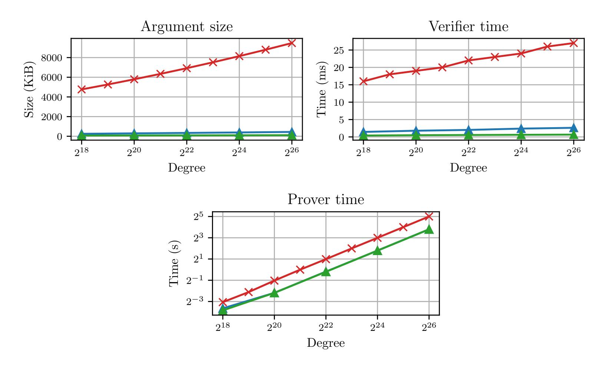
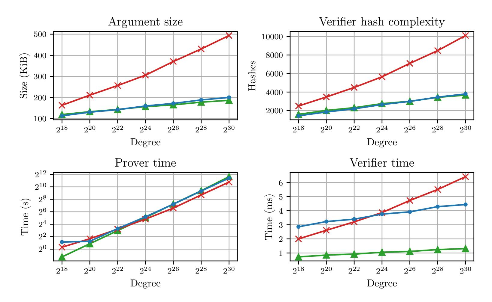
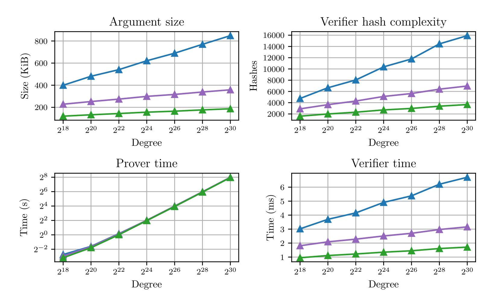
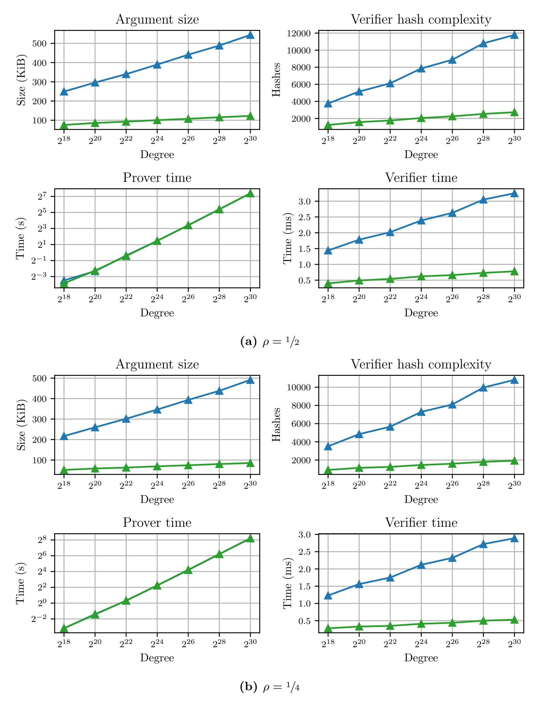
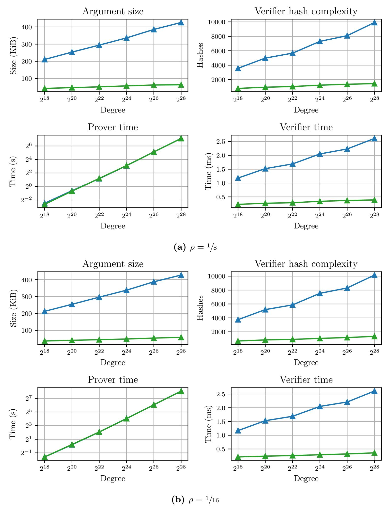
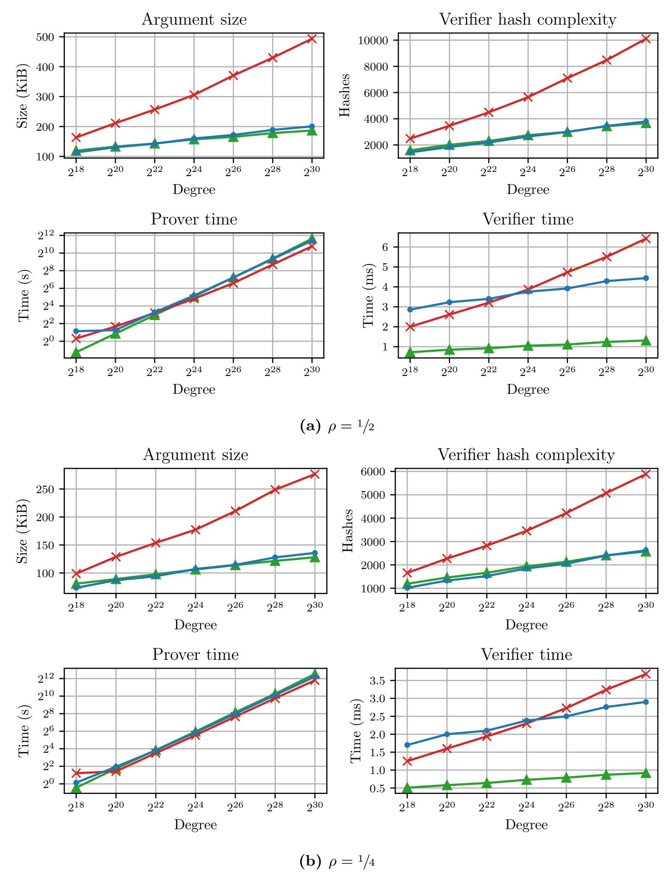
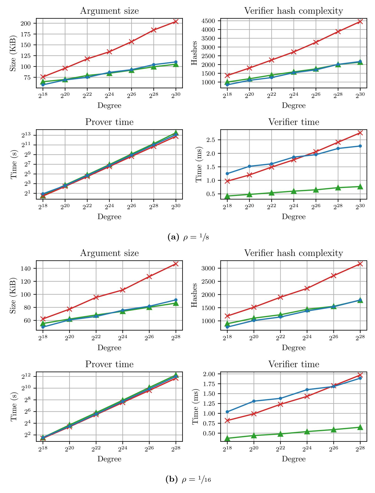
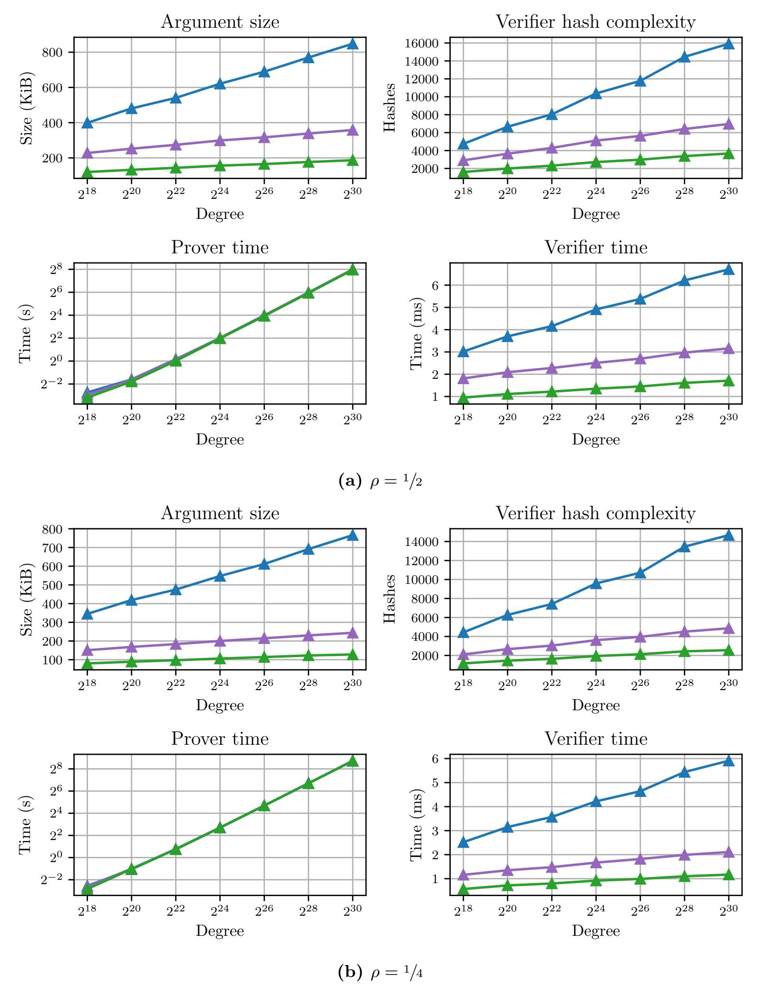
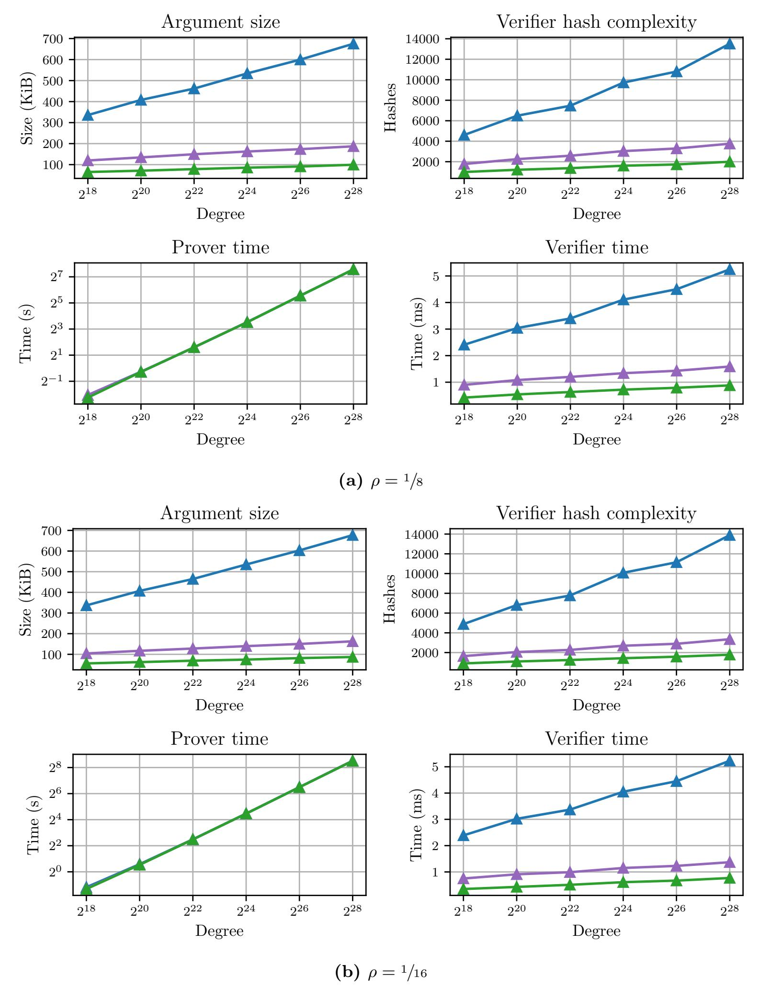

{0}------------------------------------------------

# WHIR: Reed–Solomon Proximity Testing with Super-Fast Verification

Gal Arnon gal.arnon@weizmann.ac.il Weizmann Institute

Alessandro Chiesa alessandro.chiesa@epfl.ch EPFL

Giacomo Fenzi giacomo.fenzi@epfl.ch EPFL

Eylon Yogev eylon.yogev@biu.ac.il Bar-Ilan University

November 21, 2024

#### Abstract

We introduce WHIR, a new IOP of proximity that offers small query complexity and exceptionally fast verification time. The WHIR verifier typically runs in a few hundred microseconds, whereas other verifiers in the literature require several milliseconds (if not much more). This significantly improves the state of the art in verifier time for hash-based SNARGs (and beyond).

Crucially, WHIR is an IOP of proximity for constrained Reed–Solomon codes, which can express a rich class of queries to multilinear polynomials and to univariate polynomials. In particular, WHIR serves as a direct replacement for protocols like FRI, STIR, BaseFold, and others. Leveraging the rich queries supported by WHIR and a new compiler for multilinear polynomial IOPs, we obtain a highly efficient SNARG for generalized R1CS.

As a comparison point, our techniques also yield state-of-the-art constructions of hash-based (non-interactive) polynomial commitment schemes for both univariate and multivariate polynomials (since sumcheck queries naturally express polynomial evaluations). For example, if we use WHIR to construct a polynomial commitment scheme for degree 2 22, with 100 bits of security, then the time to commit and open is 1.2 seconds, the sender communicates 63 KiB to the receiver, and the opening verification time is 360 microseconds.

Keywords: interactive oracle proofs; Reed–Solomon proximity testing; multilinear sumcheck; polynomial commitment scheme

{1}------------------------------------------------

## Contents

| Introduction 4                                                                      |                                                                                                                                                                                                                                                                                                                                                                                                                                                                                                                                                                                                                                                                                                                                                                                                                                                                                                                                                                                                                                                                          |  |  |  |  |  |  |  |  |
|----------------------------------------------------------------------------------------|--------------------------------------------------------------------------------------------------------------------------------------------------------------------------------------------------------------------------------------------------------------------------------------------------------------------------------------------------------------------------------------------------------------------------------------------------------------------------------------------------------------------------------------------------------------------------------------------------------------------------------------------------------------------------------------------------------------------------------------------------------------------------------------------------------------------------------------------------------------------------------------------------------------------------------------------------------------------------------------------------------------------------------------------------------------------------|--|--|--|--|--|--|--|--|
|                                                                                        | 4                                                                                                                                                                                                                                                                                                                                                                                                                                                                                                                                                                                                                                                                                                                                                                                                                                                                                                                                                                                                                                                                        |  |  |  |  |  |  |  |  |
| Mutual correlated agreement                                                            | 8                                                                                                                                                                                                                                                                                                                                                                                                                                                                                                                                                                                                                                                                                                                                                                                                                                                                                                                                                                                                                                                                        |  |  |  |  |  |  |  |  |
|                                                                                        | 9                                                                                                                                                                                                                                                                                                                                                                                                                                                                                                                                                                                                                                                                                                                                                                                                                                                                                                                                                                                                                                                                        |  |  |  |  |  |  |  |  |
| WHIR protocol                                                                          | 9                                                                                                                                                                                                                                                                                                                                                                                                                                                                                                                                                                                                                                                                                                                                                                                                                                                                                                                                                                                                                                                                        |  |  |  |  |  |  |  |  |
|                                                                                        | 9                                                                                                                                                                                                                                                                                                                                                                                                                                                                                                                                                                                                                                                                                                                                                                                                                                                                                                                                                                                                                                                                        |  |  |  |  |  |  |  |  |
|                                                                                        | 10                                                                                                                                                                                                                                                                                                                                                                                                                                                                                                                                                                                                                                                                                                                                                                                                                                                                                                                                                                                                                                                                       |  |  |  |  |  |  |  |  |
|                                                                                        | 11                                                                                                                                                                                                                                                                                                                                                                                                                                                                                                                                                                                                                                                                                                                                                                                                                                                                                                                                                                                                                                                                       |  |  |  |  |  |  |  |  |
|                                                                                        | 15                                                                                                                                                                                                                                                                                                                                                                                                                                                                                                                                                                                                                                                                                                                                                                                                                                                                                                                                                                                                                                                                       |  |  |  |  |  |  |  |  |
| Compiling Σ-IOPs into IOPs                                                          | 16                                                                                                                                                                                                                                                                                                                                                                                                                                                                                                                                                                                                                                                                                                                                                                                                                                                                                                                                                                                                                                                                       |  |  |  |  |  |  |  |  |
|                                                                                        | 18                                                                                                                                                                                                                                                                                                                                                                                                                                                                                                                                                                                                                                                                                                                                                                                                                                                                                                                                                                                                                                                                       |  |  |  |  |  |  |  |  |
|                                                                                        | 18                                                                                                                                                                                                                                                                                                                                                                                                                                                                                                                                                                                                                                                                                                                                                                                                                                                                                                                                                                                                                                                                       |  |  |  |  |  |  |  |  |
|                                                                                        | 19                                                                                                                                                                                                                                                                                                                                                                                                                                                                                                                                                                                                                                                                                                                                                                                                                                                                                                                                                                                                                                                                       |  |  |  |  |  |  |  |  |
|                                                                                        | 20                                                                                                                                                                                                                                                                                                                                                                                                                                                                                                                                                                                                                                                                                                                                                                                                                                                                                                                                                                                                                                                                       |  |  |  |  |  |  |  |  |
|                                                                                        |                                                                                                                                                                                                                                                                                                                                                                                                                                                                                                                                                                                                                                                                                                                                                                                                                                                                                                                                                                                                                                                                          |  |  |  |  |  |  |  |  |
|                                                                                        | 21                                                                                                                                                                                                                                                                                                                                                                                                                                                                                                                                                                                                                                                                                                                                                                                                                                                                                                                                                                                                                                                                       |  |  |  |  |  |  |  |  |
|                                                                                        | 21                                                                                                                                                                                                                                                                                                                                                                                                                                                                                                                                                                                                                                                                                                                                                                                                                                                                                                                                                                                                                                                                       |  |  |  |  |  |  |  |  |
|                                                                                        | 22                                                                                                                                                                                                                                                                                                                                                                                                                                                                                                                                                                                                                                                                                                                                                                                                                                                                                                                                                                                                                                                                       |  |  |  |  |  |  |  |  |
|                                                                                        | 25                                                                                                                                                                                                                                                                                                                                                                                                                                                                                                                                                                                                                                                                                                                                                                                                                                                                                                                                                                                                                                                                       |  |  |  |  |  |  |  |  |
|                                                                                        | 26                                                                                                                                                                                                                                                                                                                                                                                                                                                                                                                                                                                                                                                                                                                                                                                                                                                                                                                                                                                                                                                                       |  |  |  |  |  |  |  |  |
| 4.3.1                                                                                  | 27                                                                                                                                                                                                                                                                                                                                                                                                                                                                                                                                                                                                                                                                                                                                                                                                                                                                                                                                                                                                                                                                       |  |  |  |  |  |  |  |  |
| 4.3.2 Folding preserves list decoding                                               | 28                                                                                                                                                                                                                                                                                                                                                                                                                                                                                                                                                                                                                                                                                                                                                                                                                                                                                                                                                                                                                                                                       |  |  |  |  |  |  |  |  |
| Out of domain sampling                                                                 | 31                                                                                                                                                                                                                                                                                                                                                                                                                                                                                                                                                                                                                                                                                                                                                                                                                                                                                                                                                                                                                                                                       |  |  |  |  |  |  |  |  |
|                                                                                        | 32                                                                                                                                                                                                                                                                                                                                                                                                                                                                                                                                                                                                                                                                                                                                                                                                                                                                                                                                                                                                                                                                       |  |  |  |  |  |  |  |  |
|                                                                                        | 34                                                                                                                                                                                                                                                                                                                                                                                                                                                                                                                                                                                                                                                                                                                                                                                                                                                                                                                                                                                                                                                                       |  |  |  |  |  |  |  |  |
|                                                                                        | 40                                                                                                                                                                                                                                                                                                                                                                                                                                                                                                                                                                                                                                                                                                                                                                                                                                                                                                                                                                                                                                                                       |  |  |  |  |  |  |  |  |
|                                                                                        | 41                                                                                                                                                                                                                                                                                                                                                                                                                                                                                                                                                                                                                                                                                                                                                                                                                                                                                                                                                                                                                                                                       |  |  |  |  |  |  |  |  |
|                                                                                        |                                                                                                                                                                                                                                                                                                                                                                                                                                                                                                                                                                                                                                                                                                                                                                                                                                                                                                                                                                                                                                                                          |  |  |  |  |  |  |  |  |
|                                                                                        | 43                                                                                                                                                                                                                                                                                                                                                                                                                                                                                                                                                                                                                                                                                                                                                                                                                                                                                                                                                                                                                                                                       |  |  |  |  |  |  |  |  |
|                                                                                        | 43                                                                                                                                                                                                                                                                                                                                                                                                                                                                                                                                                                                                                                                                                                                                                                                                                                                                                                                                                                                                                                                                       |  |  |  |  |  |  |  |  |
|                                                                                        | 43                                                                                                                                                                                                                                                                                                                                                                                                                                                                                                                                                                                                                                                                                                                                                                                                                                                                                                                                                                                                                                                                       |  |  |  |  |  |  |  |  |
|                                                                                        | 44                                                                                                                                                                                                                                                                                                                                                                                                                                                                                                                                                                                                                                                                                                                                                                                                                                                                                                                                                                                                                                                                       |  |  |  |  |  |  |  |  |
| 6.3.1 Comparison with BaseFold                                                      | 46                                                                                                                                                                                                                                                                                                                                                                                                                                                                                                                                                                                                                                                                                                                                                                                                                                                                                                                                                                                                                                                                       |  |  |  |  |  |  |  |  |
| 6.3.2 Comparison with FRI and STIR                                                  | 49                                                                                                                                                                                                                                                                                                                                                                                                                                                                                                                                                                                                                                                                                                                                                                                                                                                                                                                                                                                                                                                                       |  |  |  |  |  |  |  |  |
| 6.3.3 Comparison with polynomial commitment schemes                                 | 52                                                                                                                                                                                                                                                                                                                                                                                                                                                                                                                                                                                                                                                                                                                                                                                                                                                                                                                                                                                                                                                                       |  |  |  |  |  |  |  |  |
| 6.3.4 Comparison of UD, JB, CB                                                      | 53                                                                                                                                                                                                                                                                                                                                                                                                                                                                                                                                                                                                                                                                                                                                                                                                                                                                                                                                                                                                                                                                       |  |  |  |  |  |  |  |  |
|                                                                                        | 56                                                                                                                                                                                                                                                                                                                                                                                                                                                                                                                                                                                                                                                                                                                                                                                                                                                                                                                                                                                                                                                                       |  |  |  |  |  |  |  |  |
|                                                                                        | 56                                                                                                                                                                                                                                                                                                                                                                                                                                                                                                                                                                                                                                                                                                                                                                                                                                                                                                                                                                                                                                                                       |  |  |  |  |  |  |  |  |
|                                                                                        | 57                                                                                                                                                                                                                                                                                                                                                                                                                                                                                                                                                                                                                                                                                                                                                                                                                                                                                                                                                                                                                                                                       |  |  |  |  |  |  |  |  |
|                                                                                        |                                                                                                                                                                                                                                                                                                                                                                                                                                                                                                                                                                                                                                                                                                                                                                                                                                                                                                                                                                                                                                                                          |  |  |  |  |  |  |  |  |
|                                                                                        |                                                                                                                                                                                                                                                                                                                                                                                                                                                                                                                                                                                                                                                                                                                                                                                                                                                                                                                                                                                                                                                                          |  |  |  |  |  |  |  |  |
| 7.2.1 Round-by-round knowledge soundness  7.3 d-Σ-IOPs to linear Σ-IOPs | 59 65                                                                                                                                                                                                                                                                                                                                                                                                                                                                                                                                                                                                                                                                                                                                                                                                                                                                                                                                                                                                                                                                 |  |  |  |  |  |  |  |  |
|                                                                                        | 1.1 Our contributions 1.2  Technical overview 2.1  2.1.1 High-level overview of WHIR  2.1.2 Folding Reed–Solomon codes and list preservation  2.1.3 WHIR protocol 2.1.4 Verifier efficiency  2.2  Preliminaries 3.1 IOPs of proximity 3.2 Error correcting codes  3.3 Multilinear polynomials  Tools for Reed–Solomon codes 4.1 Constrained Reed–Solomon codes 4.2 Mutual correlated agreement for proximity generators  4.2.1 Mutual correlated agreement preserves list decoding  4.3 Folding univariate functions  Block relative distance  4.4  WHIR 5.1 Round-by-round soundness  5.2 Batching multiple constraints  5.2.1 Round-by-round soundness  Implementation and experiments 6.1 Implementation 6.2 Parameter choices 6.3 Benchmarks and Results     Compiling Σ-IOP to IOPs F-IOPs and 7.1 Σ-IOPs  7.2 Linear Σ-IOPs to IOPPs |  |  |  |  |  |  |  |  |

{2}------------------------------------------------

| A | Linear Σ-IOP for generalized R1CS          | 70 |
|---|-----------------------------------------------|----|
|   | A.1 Round-by-round knowledge soundness  | 72 |
| B | Additional experimental data                  | 74 |
|   | Acknowledgments                               | 80 |
|   | References                                    | 80 |

{3}------------------------------------------------

## 1 Introduction

Succinct non-interactive arguments (SNARGs) are short cryptographic proofs that admit fast verification. SNARGs are widely deployed across different applications in blockchain technology, cloud computing, and decentralized systems. These applications demand highly efficient SNARGs, motivating the goal of reducing the computational costs of running a SNARG's prover and verifier, as well as reducing the SNARG's argument size.

SNARGs from polynomial IOPs. A popular approach to constructing efficient SNARGs consists of two steps [\[CHMMVW20;](#page-80-0) [BFS20\]](#page-80-1). First, design a poly-IOP (polynomial interactive oracle proof) for the desired computational statement; a poly-IOP is a specialized form of an interactive oracle proof (IOP) wherein the prover (honest or malicious) is restricted to sending messages that are evaluations of univariate or multivariate polynomials over a finite field F. Second, use a polynomial commitment scheme (PCS) [\[KZG10;](#page-81-0) [PST13\]](#page-81-1) to compile the poly-IOP into a SNARG (relying on a random oracle, non-falsifiable assumptions, or both). This approach has been widely adopted to construct efficient SNARGs [\[BCCGP16;](#page-80-2) [AHIV17;](#page-79-2) [WTSTW18;](#page-82-0) [BBBPWM18;](#page-79-3) [GWC19;](#page-81-2) [MBKM19;](#page-81-3) [CBBZ23;](#page-80-3) [STW23\]](#page-81-4).

Another popular approach to construct efficient SNARGs also starts from a poly-IOP: many SNARGs are obtained via the BCS transformation [\[BCS16\]](#page-80-4) starting from an IOP that is, in turn, obtained from an underlying poly-IOP. This alternate "compilation path" yields so-called hash-based SNARGs as it solely uses a random oracle and offers key advantages: a transparent setup (the choice of hash function to instantiate the random oracle), post-quantum security (in the quantum random oracle model), exceptionally fast SNARG provers (due to the use of small fields), and more.

Improving the efficiency of hash-based SNARGs. Achieving highly efficient hash-based SNARGs from poly-IOPs demands highly efficient methods to "compile" the given poly-IOP into a corresponding IOP. Several works do this for univariate poly-IOPs by combining an IOP of proximity for the Reed–Solomon code (such as FRI [\[BBHR18\]](#page-79-4) or STIR [\[ACFY24\]](#page-79-5)) and a quotient enforcing technique [\[BBHR19\]](#page-79-6); this has led to state-of-the-art compilers for univariate poly-IOPs [\[ACY23;](#page-79-7) [ACFY24\]](#page-79-5). Other works do this for multilinear poly-IOPs (e.g., [\[CBBZ23;](#page-80-3) [STW23;](#page-81-4) [GLSTW23;](#page-81-5) [ZCF24\]](#page-82-1)), which allows for particularly efficient prover algorithms thanks to the (highly-efficient) multilinear sumcheck protocol; in this setting, many compilation approaches are akin to constructing a multilinear PCS in the IOP model.

The aforementioned constructions present trade-offs between prover efficiency, argument size, and verifier efficiency. Optimizing some of these often comes at the expense of the others. For instance, using a smaller rate for the underlying code can reduce argument size and verifier time but increases prover time. From a technical perspective, the main challenge in improving the efficiency of hash-based SNARGs typically lies in achieving compilers that improve one efficiency measure without compromising the others. In this paper, our focus is on reducing verifier time of hash-based SNARGs while maintaining state-of-the-art prover time and argument size.

## 1.1 Our contributions

We introduce WHIR, a new IOP of proximity that offers small query complexity and exceptionally fast verification time; in particular, the WHIR verifier typically runs in a few hundred microseconds, whereas other verifiers in the literature require several milliseconds (if not much more). Crucially, WHIR is an IOP of proximity for constrained Reed–Solomon codes, which can express a rich class of queries to multilinear polynomials and to univariate polynomials. In particular, WHIR 

{4}------------------------------------------------

serves as a direct replacement for protocols like FRI, STIR, BaseFold, and others. Leveraging the rich queries supported by WHIR, we obtain a highly efficient IOP for generalized R1CS (introduced in [DMS24]). We elaborate on these steps next.

Constrained Reed–Solomon codes. The Reed–Solomon code with field  $\mathbb{F}$ , evaluation domain  $\mathcal{L} \subseteq \mathbb{F}$ , and degree  $d \in \mathbb{N}$  is the set of evaluations over  $\mathcal{L}$  of univariate polynomials (over  $\mathbb{F}$ ) of degree (strictly) less than d. We restrict our attention to Reed–Solomon codes that are "smooth":  $\mathcal{L}$  is a multiplicative coset of  $\mathbb{F}^*$  whose order is a power of two and the degree bound  $d=2^m$  is also a power of two. Equivalently, such Reed–Solomon codes can be viewed as evaluations of multilinear polynomials in m variables [ZCF24]:

$$\mathsf{RS}[\mathbb{F}, \mathcal{L}, m] \coloneqq \left\{ f \colon \mathcal{L} \to \mathbb{F} : \exists \, \hat{g} \in \mathbb{F}^{<2^m}[X] \text{ s.t. } \forall \, x \in \mathcal{L} \,, \, f(x) = \hat{g}(x) \right\}$$
$$= \left\{ f \colon \mathcal{L} \to \mathbb{F} : \exists \, \hat{f} \in \mathbb{F}^{<2}[X_1, \dots, X_m] \text{ s.t. } \forall \, x \in \mathcal{L} \,, \, f(x) = \hat{f}(x^{2^0}, x^{2^1}, \dots, x^{2^{m-1}}) \right\} \,.$$

We define a subcode that additionally considers a sumcheck-like constraint on the multilinear polynomial underlying the codeword.

**Definition 1.** The constrained Reed–Solomon code with field  $\mathbb{F}$ , smooth evaluation domain  $\mathcal{L} \subseteq \mathbb{F}$ , number of variables  $m \in \mathbb{N}$ , weight polynomial  $\hat{w} \in \mathbb{F}[Z, X_1, \dots, X_m]$ , and target  $\sigma \in \mathbb{F}$  is

$$\mathsf{CRS}[\mathbb{F}, \mathcal{L}, m, \hat{w}, \sigma] \coloneqq \left\{ f \in \mathsf{RS}[\mathbb{F}, \mathcal{L}, m] \ : \ \sum_{\boldsymbol{b} \in \{0,1\}^m} \hat{w}(\hat{f}(\boldsymbol{b}), \boldsymbol{b}) = \sigma \right\} \,.$$

These sumcheck-like constraints are highly versatile. For example, one can choose the weight polynomial  $\hat{w}$  in order to express an evaluation constraint of the form  $\hat{f}(\boldsymbol{z}) = \sigma$ , for a given evaluation point  $\boldsymbol{z} \in \mathbb{F}^m$  and target  $\sigma \in \mathbb{F}$ . Indeed,  $\hat{f}(\boldsymbol{X}) = \sum_{\boldsymbol{b} \in \{0,1\}^m} \hat{f}(\boldsymbol{b}) \cdot \operatorname{eq}(\boldsymbol{b}, \boldsymbol{X})$  is the multilinear extension of  $f \in \operatorname{RS}[\mathbb{F}, \mathcal{L}, m]$ , where  $\operatorname{eq}(\boldsymbol{Z}, \boldsymbol{X})$  is the (unique) multilinear polynomial that extends the equality function on the boolean hypercube. Hence,  $\hat{f}(\boldsymbol{z}) = \sum_{\boldsymbol{b} \in \{0,1\}^m} \hat{f}(\boldsymbol{b}) \cdot \operatorname{eq}(\boldsymbol{b}, \boldsymbol{z}) = \sum_{\boldsymbol{b} \in \{0,1\}^m} \hat{w}(\hat{f}(\boldsymbol{b}), \boldsymbol{b})$ , where the weight polynomial is  $\hat{w}(Z, \boldsymbol{X}) = Z \cdot \operatorname{eq}(\boldsymbol{X}, \boldsymbol{z})$ .

IOP of proximity for CRS codes. We construct WHIR, a concretely efficient IOP of proximity for constrained Reed–Solomon codes with small query complexity and a super fast verifier. The theorem below reports parameters of WHIR under a "list-decoding" conjecture on Reed–Solomon codes similar to those used in prior works (e.g., [BCIKS20; BGKS20; ACFY24]) that we discuss later in Section 1.2; less efficient parameters can be proved for WHIR without any conjectures.

**Theorem 1** (informal). Let  $\mathcal{C} := \mathsf{CRS}[\mathbb{F}, \mathcal{L}, m, \hat{w}, \sigma]$  be a constrained Reed-Solomon code with rate  $\rho := 2^m/|\mathcal{L}|$ ,  $\lambda \in \mathbb{N}$  be a security parameter, and  $k \in \mathbb{N}$  be a folding parameter. Assuming Conjecture 1 and  $\mathbb{F}$  is large enough, the code  $\mathcal{C}$  has an IOPP with round-by-round soundness2 error  $2^{-\lambda}$ , round complexity O(m/k), and the following properties.

- The prover sends  $O(|\mathcal{L}|)$  field elements and makes  $\widetilde{O}(|\mathcal{L}|)$  field operations.
- The verifier makes  $q_{\text{WHIR}} \coloneqq O\left(\frac{\lambda}{\log(1/\rho)} + \frac{\lambda}{k} \cdot \log\left(\frac{m}{k \cdot \log(1/\rho)}\right) + \frac{m}{k}\right)$  queries over the alphabet  $\mathbb{F}^{2^k}$ , and makes  $O\left(q_{\text{WHIR}} \cdot (2^k + m)\right)$  field operations. (In fact, the verifier makes no divisions.)

For every  $\boldsymbol{x}, \boldsymbol{y} \in \{0,1\}^m$ ,  $eq(\boldsymbol{x}, \boldsymbol{y}) = 1$  if  $\boldsymbol{x} = \boldsymbol{y}$  and  $eq(\boldsymbol{x}, \boldsymbol{y}) = 0$  if  $\boldsymbol{x} \neq \boldsymbol{y}$ .

&lt;sup>2Round-by-round soundness is a strengthening of regular soundness that ensures Fiat–Shamir and BCS security.

{5}------------------------------------------------

The parameter k is a folding parameter that facilitates a tradeoff between the number of queries and the alphabet size. In a typical setting, where m ≤ λ and ρ = O(1), we set k ≈ log m. In this case, the WHIR verifier makes qWHIR = O(λ) queries, which is optimal.[3](#page-0-0) Moreover, the WHIR verifier makes O(λ · m) field operations, which is linear in the number of field elements it reads.

We discuss the asymptotic efficiency of WHIR compared to relevant prior work; see [Table 1.](#page-5-0)

- BaseFold [\[ZCF24\]](#page-82-1) is a polynomial commitment scheme for multilinear polynomials constructed from any foldable code. When applied to smooth Reed–Solomon codes, the core component of BaseFold can be viewed as an IOPP for a specific constrained Reed–Solomon code. In BaseFold, the verifier makes qBF := Oρ (λ · m) queries (over the alphabet F 2 ), which is much larger than qWHIR. Notably, BaseFold is only proven sound for distances within the unique-decoding regime, meaning the number of queries per round approaches λ as ρ is set to a value close 0. In contrast, WHIR offers practical advantages by supporting distances beyond unique decoding, where the number of queries per round approaches 0 as ρ tends to 0. Additionally, WHIR has fewer rounds than BaseFold thanks to its use of a folding parameter k > 1.
- FRI [\[BBHR18\]](#page-79-4) is a low-degree test for Reed–Solomon codes. Since WHIR can be used as an IOPP for standard Reed–Solomon codes (univariate polynomials of degree < 2 m), the two can be compared. The FRI verifier for degree 2 m makes qFRI := Oρ (λ + λ · m/k) queries over the alphabet F 2 k and performs O qFRI · 2 k field operations.
- STIR [\[ACFY24\]](#page-79-5) has the same small query complexity as WHIR (qSTIR = qWHIR) but the STIR verifier performs O qSTIR · 2 k + λ 2 k · 2 k field operations.

|          | Queries                                                            | Verifier Time                                                     | Alphabet    |
|----------|--------------------------------------------------------------------|-------------------------------------------------------------------|-------------|
| BaseFold | · qBF := O (λ m)                                    | O(qBF)                                                            | F 2      |
| FRI      | λ   qFRI := O λ · m + k              | k   O qFRI · 2                                  | k F 2 |
| STIR     | λ m   qSTIR := O λ · + log k k |   2 λ k + k O qSTIR · · 2 2 k | k F 2 |
| WHIR     | λ m   · qWHIR := O λ + log k k | (2k +   · O qWHIR m)                            | k F 2 |

Table 1: A comparison of WHIR with BaseFold, FRI, and STIR. Here, λ is the security parameter, k is the folding parameter, and m is the number of variables for the multilinear case or the logarithm of the degree for the univariate case. The dependence on the rate ρ is suppressed, and we assume that m ≤ λ.

For each of the protocols above, the BCS transformation [\[BCS16\]](#page-80-4) yields a non-interactive succinct argument. The argument verifier checks qX Merkle paths, where X ∈ {BF, FRI, STIR, WHIR}, resulting in an additional O(qX · m) hash computations. Therefore, the WHIR verifier offers small hash complexity (due to its low query complexity) in addition to small arithmetic complexity.

In many applications, a fast argument verifier is essential. We highlight two examples.

3For a wide range of values of k, any IOPP must perform at least Ω(λ) queries. It is an open problem to design an IOPP with the efficiency of WHIR over an alphabet of size |F| O(1) .

{6}------------------------------------------------

- A verifier that is embedded in a blockchain smart contract such as Ethereum, where each operation performed by the verifier incurs gas fees, which directly affect the cost of executing the contract.
- A recursive proof system, where the verified computation includes a proof verification. A fast verifier directly impacts the size and complexity of the verified computation, which leads to smaller argument size and prover time in each recursive step.

IOPs (& SNARKs) from CRS codes. We introduce a powerful new variant of multilinear poly-IOPs, which we refer to as  $\Sigma$ -IOP. In this model, the verifier can make queries from a rich class of sumcheck-like queries: the verifier may select a weight polynomial  $\hat{w} \in \mathbb{F}[Z, X_1, \dots, X_m]$  to query a multilinear polynomial  $\hat{f}$  sent by the prover, and obtain as answer the sum

$$\sum_{\boldsymbol{b} \in \{0,1\}^m} \hat{w}(\hat{f}(\boldsymbol{b}), \boldsymbol{b})$$
 .

As previously noted, this query class includes, in particular, polynomial evaluation queries such as "evaluate  $\hat{f}$  at  $z \in \mathbb{F}^m$ ", by using the weight polynomial  $\hat{w}(Z, \mathbf{X}) = Z \cdot \operatorname{eq}(\mathbf{X}, \mathbf{z})$ .

We describe how to efficiently compile any  $\Sigma$ -IOP, using an IOPP for CRS codes (in particular, WHIR), into a standard IOP (see Section 7 for details). Moreover, we describe a  $\Sigma$ -IOP for generalized R1CS [DMS24] that achieves additional concrete efficiency by using sumcheck queries (see Appendix A). Via the BCS transformation [BCS16], we obtain a highly efficient SNARK for generalized R1CS.

We believe that the sumcheck queries allowed in a  $\Sigma$ -IOP will enable others to design significantly more efficient IOPs for other languages (beyond generalized R1CS) by designing highly efficient  $\Sigma$ -IOPs for those languages and then applying our new compiler.

Hash-based PCS from CRS codes. Polynomial commitment schemes (PCSs) [KZG10; PST13] are a cryptographic primitive that enables a sender to succinctly commit to a polynomial and then subsequently succinctly open desired evaluations of the committed polynomial. The aforementioned compiler can be adapted to directly yield (again via the BCS transformation) state-of-the-art hash-based PCS constructions for multilinear polynomials and for univariate polynomials. Indeed, the evaluation of a multilinear polynomial  $\hat{f}$  at  $z \in \mathbb{F}^m$  corresponds to the sumcheck query with weight polynomial  $\hat{w}(Z, X) = Z \cdot \operatorname{eq}(X, z)$ . Moreover, the evaluation of a univariate polynomial at  $z \in \mathbb{F}$  can be reduced to the multilinear case by considering the evaluation point  $z = (z^{2^0}, \dots, z^{2^{m-1}})$  and using the weight polynomial  $\hat{w}(Z, X) = Z \cdot \operatorname{eq}(X, (z^{2^0}, \dots, z^{2^{m-1}}))$ .

Experimental results. We implement WHIR in Rust using the arkworks ecosystem [ark]. We compare WHIR with Basefold [ZCF24] as a proximity test for constrained Reed-Solomon codes, with FRI [BBHR19] and STIR [ACFY24] as a proximity test for (standard) Reed-Solomon codes. Also, WHIR yields a hash-based PCS, which we compare with other PCSs: Brakedown [GLSTW23], Ligero [AHIV17], Greyhound [NS24], Hyrax [WTSTW18], PST [PST13], and KZG [KZG10]. The details and results of our experiments are available in Section 6. We provide an open-source at github.com/WizardOfMenlo/whir, which we plan to upstream into arkworks.

Our experiments show that WHIR achieves a significant improvement in verifier time. At the 100-bit security level, WHIR verification with initial rate  $^{1}/_{2}$  takes between  $400\mu$ s to  $770\mu$ s for instances of size from  $2^{18}$  to  $2^{30}$ , and with rate  $^{1}/_{16}$  these times reduce to between  $210\mu$ s to  $360\mu$ s. At the 128-bit security level, for instances in the same range as above, with initial rate  $^{1}/_{2}$  the WHIR verifier runs in time between 0.9ms and 1.7ms, and with rate  $^{1}/_{16}$  these times reduce to between  $400\mu$ s and  $800\mu$ s. Simultaneously, WHIR achieves state-of-the-art argument size and verifier hash

{7}------------------------------------------------

complexity for hash-based schemes, on par with STIR (and much better than FRI and BaseFold) while maintaining similar prover times. Fixing the initial rate to  $\rho=1/2$ , at the 100-bit security level, WHIR arguments range from 76 KiB to 123 KiB, while at the 128-bit security level, they range from 120 KiB to 187 KiB. Decreasing the rate to  $\rho=1/16$ , at the 100-bit security level, the argument size reduces to ranging from 36 KiB to 58 KiB, while at the 128-bit security level, the new range is from 56 KiB to 87 KiB.

## 1.2 Mutual correlated agreement

The problem of testing the proximity of a batch of vectors  $f_1, \ldots, f_\ell$  to a linear code  $\mathcal{C}$  arises in many settings, including probabilistic proofs and distributed storage systems, and is a fundamental problem in coding theory. This problem was first explored in [RVW13], where it was shown that the maximal distance of any of the vectors to  $\mathcal{C}$  is related to the distance of a random line through the vectors. Subsequent works [AHIV17; BKS18] tightened this connection, culminating in [BCIKS20], which introduced the concept of *correlated agreement* for Reed–Solomon codes.

Correlated agreement for Reed-Solomon codes is one of the main technical tools in the analysis of prior IOPPs such as FRI and STIR, and is also at the heart of the security proof of WHIR. Informally, it says that if a random curve that goes through functions  $f_1, \ldots, f_\ell$  is close to low-degree with probability above a small error threshold, then  $f_1, \ldots, f_\ell$  share a subdomain where they all agree with the code  $\mathcal{C}$ .

In more detail, the code  $\mathcal{C} := \mathsf{RS}[\mathbb{F}, \mathcal{L}, m]$  has  $(\delta, \varepsilon)$ -correlated agreement if for every  $f_1, \ldots, f_\ell$ , with probability  $1-\varepsilon$  over a uniform choice of  $\alpha \leftarrow \mathbb{F}$  the following holds: if there exists a set  $S \subseteq \mathcal{L}$  with  $|S| \geq (1-\delta) \cdot |\mathcal{L}|$  on which  $f_{\alpha}^* := \sum_{i=1}^{\ell} \alpha^{i-1} \cdot f_i$  agrees with  $\mathcal{C}, ^4$  then there exists a set  $T \subseteq \mathcal{L}$  with  $|T| \geq (1-\delta) \cdot |\mathcal{L}|$  such that every  $f_i$  agrees with  $\mathcal{C}$  on T. [BCIKS20] show that Reed–Solomon codes with rate  $\rho$  have correlated agreement for  $\delta \in (0, 1-\sqrt{\rho})$  with error  $\varepsilon := \frac{\text{poly}(2^m, 1/\rho)}{|\mathbb{F}|}$ . In practice, when designing IOPPs for hash-based SNARKs, it is common to assume that Reed–Solomon codes have correlated agreement with small  $\varepsilon$  for  $\delta \in (0, 1-\rho)$  (see, e.g., [BGKS20; ACFY24]).

In this work, we introduce a notion stronger than correlated agreement, which we call mutual correlated agreement. This notion equates the sets S and T, implying that  $f_1, \ldots, f_\ell$  agree with  $\mathcal{C}$  on every set where  $f_{\alpha}^*$  agrees with  $\mathcal{C}$ . We apply this extended definition in the soundness analysis of WHIR and believe it has the potential to be useful for other protocols as well.

**Definition 2** (informal).  $\mathcal{C} := \mathsf{RS}[\mathbb{F}, \mathcal{L}, m]$  has  $(\delta, \varepsilon)$ -mutual correlated agreement if for every  $f_1, \ldots, f_\ell \colon \mathcal{L} \to \mathbb{F}$ , with probability  $1 - \varepsilon$  over a uniform choice of  $\alpha \leftarrow \mathbb{F}$ : for every set  $S \subseteq \mathcal{L}$  with  $|S| \geq (1 - \delta) \cdot |\mathcal{L}|$  on which  $f_{\alpha}^* := \sum_{i=1}^{\ell} \alpha^{i-1} \cdot f_i$  agrees with  $\mathcal{C}$ , every  $f_i$  agrees with  $\mathcal{C}$  on S.

See Definition 4.9 for a formal definition. We conjecture that mutual correlated agreement and (standard) correlated agreement hold for essentially the same parameters.

Conjecture 1 (informal). Every Reed-Solomon code  $\mathcal{C} := \mathsf{RS}[\mathbb{F}, \mathcal{L}, m]$  that has  $(\delta, \varepsilon)$ -correlated agreement for  $\varepsilon := \frac{\mathrm{poly}(2^m, 1/\rho)}{|\mathbb{F}|}$  has  $(\delta, \varepsilon')$ -mutual correlated agreement for  $\varepsilon' := \frac{\mathrm{poly}(2^m, 1/\rho)}{|\mathbb{F}|}$ .

In Section 4.2 we show that Conjecture 1 holds with  $\varepsilon' = \varepsilon$  for the unique decoding regime, i.e.,  $\delta \in \left(0, \frac{1-\rho}{2}\right)$ . We believe that the techniques of [BCIKS20] can be adapted to prove mutual correlated agreement beyond the unique decoding regime; however, as their proof is highly technical, we leave this for future work.

We say that a function f agrees with  $\mathcal{C}$  on S if there exists a codeword  $u \in \mathcal{C}$  with f(x) = u(x) for every  $x \in S$ .

{8}------------------------------------------------

## 2 Technical overview

We discuss the main ideas behind our results. In Section 2.1, we present the WHIR protocol, an IOPP for constrained Reed–Solomon codes. This includes an overview of the protocol and a sketch of its soundness. The analysis relies on a strengthening of the properties of folding for Reed–Solomon codes which we prove using mutual correlated agreement. In Section 2.2, we outline how to compile  $\Sigma$ -IOPs into IOPs by using such an IOPP for constrained Reed–Solomon codes.

## 2.1 WHIR protocol

We present WHIR, an IOPP for constrained Reed–Solomon codes. WHIR takes inspiration from the use of sumcheck in Basefold [ZCF24] and the rate-improving ideas in STIR [ACFY24].

WHIR is an IOPP for  $\mathsf{CRS}[\mathbb{F}, \mathcal{L}, m, \hat{w}, \sigma]$ , where  $\mathbb{F}$  is a finite field,  $\mathcal{L}$  is a "smooth" subset of  $\mathcal{L}$  of size n ( $\mathcal{L} \subseteq \mathbb{F}^*$  and n is a power of two), m specifies the number of variables,  $\hat{w}$  is a polynomial constraint (a polynomial in m+1 variables that, for simplicity in this section, we restrict to individual degree at most 1 in each variable), and  $\sigma \in \mathbb{F}$  specifies the target value for the constraint. The rate of the code is  $\rho := 2^m/n$ . For  $i \in \mathbb{N}$ , we let  $\mathcal{L}^{(i)} := \{x^i \mid x \in \mathcal{L}\}$ . Since  $\mathcal{L}$  is smooth, if i is a power of two then  $|\mathcal{L}^{(i)}| = |\mathcal{L}|/i$ . For a codeword  $u \in \mathsf{CRS}[\mathbb{F}, \mathcal{L}, m, \hat{w}, \sigma]$ , we let  $\hat{u}$  be the multilinear polynomial whose evaluation on  $\mathcal{L}$  is equal to u (we use this also for standard Reed–Solomon codes).

### 2.1.1 High-level overview of WHIR

A WHIR iteration is parameterized by a folding parameter  $k \geq 1$ , and reduces the task of testing

$$f \in \mathcal{C} \coloneqq \mathsf{CRS}[\mathbb{F}, \mathcal{L}, m, \hat{w}, \sigma]$$

to the task of testing that

$$f' \in \mathcal{C}' \coloneqq \mathsf{CRS}[\mathbb{F}, \mathcal{L}^{(2)}, m - k, \hat{w}', \sigma']$$

for a new function f', related constraint polynomial  $\hat{w}'$ , and target value  $\sigma'$  (where now  $\hat{w}'$  has m-k+1 variables, and is roughly as expensive to evaluate as  $\hat{w}$ ). Inspired from STIR [ACFY24], the rate of the code decreases from  $\rho$  to  $\rho' := 2^{1-k} \cdot \rho$ : the size of the domain decreases from n to n/2, while the number of variables decreases by k. This makes  $\mathcal{C}'$  easier to test and reduces the query complexity of the overall protocol. A WHIR iteration consists of k+2 rounds, where the proof length consists of roughly n/2 field elements, and the verifier performs t queries over the alphabet  $\mathbb{F}^{2^k}$ . For soundness, WHIR has the following property: letting  $\delta \in (0, 1 - \sqrt{\rho})$  and  $\delta' \in (0, 1 - \sqrt{\rho'})$ , if the original function f is  $\delta$ -far from  $\mathcal{C}$  then, except with probability roughly  $(1 - \delta)^t$ , the new function f' is  $\delta'$ -far from  $\mathcal{C}'$ .

The WHIR protocol has M := m/k such iterations, reducing testing proximity to  $\mathcal{C}^{(0)} := \mathcal{C}$  to testing proximity to  $\mathcal{C}^{(M)} := \mathsf{CRS}[\mathbb{F}, \mathcal{L}^{(2^M)}, O(1), \hat{w}^{(M)}, \sigma^{(M)}]$ . In iteration  $i \in \{0, \dots, M-1\}$ , the protocol reduces testing proximity from  $\mathcal{C}^{(i)} := \mathsf{CRS}[\mathbb{F}, \mathcal{L}^{(2^i)}, m-i \cdot k, \hat{w}^{(i)}, \sigma^{(i)}]$  to  $\mathcal{C}^{(i+1)}$  via  $t_i$  queries and by sending an oracle of size  $n/2^{i+1}$ . Finally,  $f^{(M)}$  is verified to be a constant degree constrained Reed–Solomon codeword as follows: the prover sends the coefficients of  $f^{(M)}$  as a message (of constant size), and the verifier checks that the constraint holds, either by directly

&lt;sup>5Throughout this paper we assume that  $char(\mathbb{F}) \neq 2$ . This in particular is required for the field to have a large 2-smooth multiplicative subgroup and to define the folding operation that we use.

{9}------------------------------------------------

performing a constant number of evaluations of  $\hat{w}^{(M)}$  or by performing an additional sumcheck protocol to reduce this constraint checking to a single evaluation (which is the option we chose in our protocol). In total, WHIR has O(m/k) rounds, query complexity  $\sum_{i=0}^{M-1} t_i$ , and proof length  $\sum_{i=0}^{M-1} |\mathcal{L}^{(2^i)}|/2 = O(n)$ . If the initial function has distance  $\delta \in (0, 1 - \sqrt{\rho})$  from  $\mathcal{C}^{(0)}$ , and we set  $\delta_i := 1 - \sqrt{\rho_i} - \eta_i$  (for a small constant  $\eta_i$  that we ignore in this preliminary section) the round-by-round errors of each round are (roughly)

$$(1-\delta)^{t_0}, \rho_1^{t_1/2}, \dots, \rho_{M-1}^{t_{M-1}/2}.$$

(Above, for simplicity, we assume  $\mathbb{F}$  to be large enough and omit errors that depend on  $1/|\mathbb{F}|$ .)

The decrease in rate leads to small query complexity to achieve round-by-round soundness errors  $2^{-\lambda}$ . Overall, the query complexity (input queries and proof queries combined) is the same as in STIR, namely (omitting factors that do not depend on  $\lambda$ ):

$$q_{\mathsf{WHIR}} \coloneqq O\left(\lambda + \frac{\lambda}{k} \cdot \log \frac{m}{k}\right)$$
.

Compared to STIR, each verifier query demands less verifier time, leading to an overall verifier time (in field operations) of

$$O\left(q_{\mathsf{WHIR}}\cdot\left(2^k+m\right)\right)$$
 .

Having concluded this high-level overview, we discuss certain properties of the folding operation for Reed–Solomon codes and then describe a WHIR iteration in more detail.

## 2.1.2 Folding Reed–Solomon codes and list preservation

Folding of Reed–Solomon codes is a method for lowering the complexity of a code at a relatively small cost and lies at the core of IOPPs for Reed–Solomon codes, including WHIR. We review the folding of a Reed–Solomon code, discuss why folding preserves distance with high probability, and then describe a strengthening of the distance-preserving property via mutual correlated agreement.

For  $\alpha \in \mathbb{F}$  we define  $\mathsf{Fold}(f,\alpha) \colon \mathcal{L}^{(2)} \to \mathbb{F}$  as follows. For  $y \in \mathcal{L}^{(2)}$ , letting  $x, -x \in \mathcal{L}$  be the roots of y (i.e.,  $x^2 = (-x)^2 = y$ ):

$$\mathsf{Fold}(f,\alpha)(y) \coloneqq \frac{f(x) + f(-x)}{2} + \alpha \cdot \frac{f(x) - f(-x)}{2 \cdot x} \, .$$

For a vector  $\boldsymbol{\alpha} = (\alpha_1, \dots, \alpha_k) \in \mathbb{F}^k$  we denote  $\operatorname{Fold}(f, \boldsymbol{\alpha}) : \mathcal{L}^{(2^k)} \to \mathbb{F}$  to be the function output by folding iteratively on each of the entries in  $\boldsymbol{\alpha}$ : let  $\operatorname{Fold}(f, \boldsymbol{\alpha}) := f_k$  where we recursively define  $f_i := \operatorname{Fold}(f_{i-1}, (\alpha_i, \dots, \alpha_k))$  and  $f_0 := f$ . Given the evaluation of f on the k-th roots of f (of which there are f since f is a multiplicative subgroup whose order is greater than f and is a power of two), the point  $\operatorname{Fold}(f, \boldsymbol{\alpha})(f)$  can be computed in time f by following the recursion.

Distance preservation under folding. Folding preserves distance of functions to Reed–Solomon codes in the following sense: if f is  $\delta$ -far from  $\mathsf{RS}[\mathbb{F},\mathcal{L},m]$  then, with high probability over a uniformly random choice of  $\alpha$ ,  $\mathsf{Fold}(f,\alpha)$  is  $\delta$ -far from  $\mathsf{RS}[\mathbb{F},\mathcal{L}^{(2)},m-1]$ . This is a consequence of correlated agreement and a motivation for the main theorem in [BCIKS20], which shows that Reed–Solomon codes have correlated agreement with small error (see Section 1.2 for more on correlated agreement.)

&lt;sup>6Recall that  $\mathcal{L}$  is a multiplicative subgroup of  $\mathbb{F}$  whose order is a power of two, so x and -x both belong to  $\mathcal{L}$ .

{10}------------------------------------------------

We sketch a proof of distance preservation assuming correlated agreement. Suppose that  $\mathcal{C}' := \mathsf{RS}[\mathbb{F}, \mathcal{L}^{(2)}, m-1]$  has  $(\delta, \varepsilon)$ -correlated agreement and consider the functions  $f_0(x^2) := \frac{f(x) + f(-x)}{2}$  and  $f_1(x^2) := \frac{f(x) - f(-x)}{2 \cdot x}$ . Then, it holds that  $\mathsf{Fold}(f, \alpha)(x^2) = f_0(x^2) + \alpha \cdot f_1(x^2)$ . By correlated agreement, except with probability  $1 - \varepsilon$  if there is a set S with  $|S| \ge (1 - \delta) \cdot |\mathcal{L}^{(2)}|$  such that  $\mathsf{Fold}(f, \alpha)$  is  $\delta$ -close to  $\mathcal{C}'$  then there is a set T with  $|T| \ge (1 - \delta) \cdot |\mathcal{L}^{(2)}|$  such that  $f_0$  and  $f_1$  are both close to  $\mathcal{C}'$  on T. Let  $\hat{u}_0$  and  $\hat{u}_1$  be the m-1 variate polynomials where  $\hat{u}_i(z^{2^0}, \dots, z^{2^{m-2}}) = f_i(z)$  for  $z \in T$ . Then the polynomial,

$$w(X_1,\ldots,X_m) := u_0(X_2,\ldots,X_m) + X_1 \cdot u_1(X_2,\ldots,X_m),$$

agrees with f on every x with  $x^2 \in T$  as follows:

$$w(x^{2^{0}}, \dots, x^{2^{m-1}}) = \hat{u}_{0}(x^{2^{1}}, \dots, x^{2^{m-1}}) + x \cdot \hat{u}_{1}(x^{2^{1}}, \dots, x^{2^{m-1}})$$

$$= \hat{u}_{0}\left((x^{2})^{2^{0}}, \dots, (x^{2})^{2^{m-2}}\right) + x \cdot \hat{u}_{1}\left((x^{2})^{2^{0}}, \dots, (x^{2})^{2^{m-2}}\right)$$

$$= \frac{f(x) + f(-x)}{2} + x \cdot \frac{f(x) - f(-x)}{2 \cdot x}$$

$$= f(x).$$

Observe that T covers a  $1 - \delta$  fraction of the domain  $\mathcal{L}^{(2)} := \{x^2 \mid x \in \mathcal{L}\}$  and this agreement holds for every x with  $x^2 \in T$ , so w agrees with f on a  $1 - \delta$  fraction of  $\mathcal{L}$ . Since w is a m-variate multilinear polynomial, we conclude that f is  $\delta$ -close to  $\mathsf{RS}[\mathbb{F}, \mathcal{L}, m]$ .

Mutual correlated agreement and list preservation. We strengthen the distance preservation property of folding using mutual correlated agreement: we show that with high probability over  $\alpha$ , every codeword close to  $\mathsf{Fold}(f,\alpha)$  is the result of folding a codeword close to f.

**Lemma 1** (informal). Suppose that  $\mathsf{RS}[\mathbb{F}, \mathcal{L}^{(2)}, m-1]$  has  $(\delta, \varepsilon)$ -mutual correlated agreement. For every  $f \colon \mathcal{L} \to \mathbb{F}$  the following holds with probability  $1-\varepsilon$  over the choice of  $\alpha \leftarrow \mathbb{F}$ : for every  $u \in \mathsf{RS}[\mathbb{F}, \mathcal{L}^{(2)}, m-1]$  with  $\Delta(\mathsf{Fold}(f, \alpha), u) \leq \delta$ , there is  $w \in \mathsf{RS}[\mathbb{F}, \mathcal{L}, m]$  with  $\Delta(f, w) \leq \delta$  such that  $u = \mathsf{Fold}(w, \alpha)$ .

The proof of Lemma 1 closely follows the proof described above of the distance preservation lemma. The main difference is that, by mutual correlated agreement, for every set S on which  $\operatorname{Fold}(f,\alpha)$  is  $\delta$ -close to  $\mathcal{C}'$ , the functions  $f_0$  and  $f_1$  are also close to  $\mathcal{C}'$  on S (rather than on some set T that is possibly unrelated to S). Thus we are able to conclude that w agrees with f on all of the roots of points in S. Moreover, notice that the folding of w agrees with  $\operatorname{Fold}(f,\alpha)$  on S. Thus, every set S on which  $\operatorname{Fold}(f,\alpha)(x^2)$  is close to a polynomial can be explained by taking a polynomial w that is close to f and folding it, proving the lemma.

Looking ahead, Lemma 1 will allow us to argue that if all of the codewords that are close to a function f do not satisfy a constraint, then with high probability all of the codewords that are close to the folding of f will not satisfy a "folding of the constraint".

#### 2.1.3 WHIR protocol

We give a recursive description of the WHIR protocol, in which each step reduces testing proximity of  $f \in \mathcal{C} := \mathsf{CRS}[\mathbb{F}, \mathcal{L}, m, \hat{w}, \sigma]$  to testing that  $f' \in \mathcal{C}' := \mathsf{CRS}[\mathbb{F}, \mathcal{L}^{(2)}, m - k, \hat{w}', \sigma']$ . In this overview, we assume that  $\hat{w}$  is multilinear. The full version of the protocol allows for a more general setting of evaluation domains, folding parameters, and constraint polynomial degrees.

{11}------------------------------------------------

1.  $Sumcheck\ rounds$ . The prover and the verifier engage in k rounds of the sumcheck protocol for the claim

$$\sum_{\boldsymbol{b} \in \{0,1\}^m} \hat{w}(\hat{f}(\boldsymbol{b}), \boldsymbol{b}) = \sigma,$$

where  $\hat{f}$  is the multilinear polynomial associated with f. At the end of the interaction, the prover will have sent polynomials  $(\hat{h}_1, \dots, \hat{h}_k)$  while the verifier will have sampled randomness  $\boldsymbol{\alpha} = (\alpha_1, \dots, \alpha_k) \in \mathbb{F}^k$ . This reduces the initial claim to the simpler claim

$$\sum_{\boldsymbol{b} \in \{0,1\}^{m-k}} \hat{w}(\hat{f}(\boldsymbol{\alpha}, \boldsymbol{b}), \boldsymbol{\alpha}, \boldsymbol{b}) = \hat{h}_k(\alpha_k).$$

- 2. Send folded function. The prover sends a function  $g: \mathcal{L}^{(2)} \to \mathbb{F}$ . In the honest case, the prover defines the polynomial  $\hat{g} \equiv \hat{f}(\boldsymbol{\alpha}, \cdot)$ , and g is defined as the evaluation of  $\hat{g}$  over the domain  $\mathcal{L}^{(2)}$ .
- 3. Out-of-domain sample. The verifier samples and sends  $z_0 \leftarrow \mathbb{F}$ . We set  $\mathbf{z}_0 \coloneqq (z_0^{2^0}, \dots, z_0^{2^{m-k-1}})$ .
- 4. Out-of-domain answers. The prover sends  $y \in \mathbb{F}$ . In the honest case,  $y_0 := \hat{g}(z_0)$ .
- 5. Shift queries and combination randomness The verifier, for every  $i \in [t]$ , samples and sends  $z_i \leftarrow \mathcal{L}^{(2^k)}$ , obtains  $y_i \coloneqq \mathsf{Fold}(f, \boldsymbol{\alpha})(z_i)$  by querying f, and sets  $\boldsymbol{z}_i \coloneqq (z_i^{2^0}, \dots, z_i^{2^{m-k-1}})$ . The verifier further samples and sends  $\gamma \leftarrow \mathbb{F}$ .
- 6. Recursive claim. The prover and verifier define the new weight polynomials and target

$$\hat{w}'(Z, \boldsymbol{X}) \coloneqq \hat{w}(Z, \boldsymbol{\alpha}, \boldsymbol{X}) + Z \cdot \sum_{i=0}^t \gamma^{i+1} \cdot \operatorname{eq}(\boldsymbol{z}_i, \boldsymbol{X}),$$
  $\sigma' \coloneqq \hat{h}_k(\alpha_k) + \sum_{i=0}^t \gamma^{i+1} \cdot y_i,$ 

and recurse on the claim that  $g \in \mathsf{CRS}[\mathbb{F}, \mathcal{L}^{(2)}, m-k, \hat{w}', \sigma']$ . Above,  $\mathsf{eq}(\boldsymbol{b}, \boldsymbol{z}) \coloneqq \prod_{i=1}^m \boldsymbol{b}_i \cdot \boldsymbol{z}_i + (1-\boldsymbol{b}_i) \cdot (1-\boldsymbol{z}_i)$  is such that, for  $\boldsymbol{b}, \boldsymbol{z} \in \{0,1\}^m$ ,  $\mathsf{eq}(\boldsymbol{b}, \boldsymbol{z}) = 1$  if  $\boldsymbol{b} = \boldsymbol{z}$  and  $\mathsf{eq}(\boldsymbol{b}, \boldsymbol{z}) = 0$  if  $\boldsymbol{b} \neq \boldsymbol{z}$ .

We analyze the soundness of an iteration of WHIR. In the full proof in Section 5.1 we extend this analysis to showing round-by-round soundness.

**Theorem 2** (informal). If f is  $\delta$ -far from  $CRS[\mathbb{F}, \mathcal{L}, m, \hat{w}, \sigma]$ , then g is  $(1-\sqrt{\rho'})$ -far from  $CRS[\mathbb{F}, \mathcal{L}^{(2)}, m-k, \hat{w}', \sigma']$ , except with probability at most  $(1-\delta)^t + \text{poly}(2^m, 1/\rho)/|\mathbb{F}|$ .

*Proof sketch*. Throughout this proof we assume that the prover only sends sumcheck polynomials  $\hat{h}_1, \ldots, \hat{h}_k$  that satisfy verification of the intermediate rounds of the sumcheck protocol, i.e., such that  $\sum_{b \in \{0,1\}} \hat{h}_1(b) = \sigma$  and for i > 1,  $\sum_{b \in \{0,1\}} \hat{h}_i(b) = \hat{h}_{i-1}(\alpha_{i-1})$ . Otherwise, the verifier rejects regardless of any other prover message. We rely on the following lemma.

**Lemma 2** (informal). Let  $\mathcal{C} := \mathsf{CRS}[\mathbb{F}, \mathcal{L}, m, \hat{w}, \sigma]$  be a constrained Reed-Solomon code with  $\sigma := \sum_{b \in \{0,1\}} \hat{h}(b)$  for  $\hat{h} \in \mathbb{F}^{<3}[X]$  with rate  $\rho := 2^m/|\mathcal{L}|$ . Assume Conjecture 1, and fix any proximity parameter  $\delta \in (0, 1 - \sqrt{\rho})$  and function  $f : \mathcal{L} \to \mathbb{F}$  with  $\Delta(f, \mathcal{C}) > \delta$ . Then

$$\Pr_{\alpha \leftarrow \mathbb{F}} \left[ \Delta(\mathsf{Fold}(f, \alpha), \mathcal{C}_{\alpha}) \le \delta \right] \le \frac{\mathrm{poly}(2^m, 1/\rho)}{|\mathbb{F}|} \,,$$

where  $C_{\alpha} := \mathsf{CRS}[\mathbb{F}, \mathcal{L}^{(2)}, m-1, \hat{w}_{\alpha}, \sigma_{\alpha}]$  for  $\hat{w}_{\alpha}(Z, X) := \hat{w}(Z, \alpha, X)$  and  $\sigma_{\alpha} := \hat{h}(\alpha)$ .

{12}------------------------------------------------

*Proof of lemma*. We consider and bound two bad events (over the choice of  $\alpha$ ): (i) the event that an invalid constraint turns into a valid one; and (ii) the event that folding introduces new codewords that cannot be "explained" as foldings of codewords in the original code.

•  $E_1$  is the event that there exists some codeword  $z \in \mathsf{RS}[\mathbb{F}, \mathcal{L}, m]$  with  $\Delta(f, z) \leq \delta$  such that

$$\sum_{\boldsymbol{b} \in \{0,1\}^{m-1}} \hat{w}_{\alpha}(\hat{z}(\alpha, \boldsymbol{b}), \boldsymbol{b}) = \sigma_{\alpha}.$$

Consider what it means for such a codeword z to exist. Since  $\Delta(f,\mathcal{C}) > \delta$ , z being close to f as a Reed–Solomon codeword means that z does not satisfy the constraint laid out in  $\mathcal{C}$ , i.e.,  $\sum_{\boldsymbol{b} \in \{0,1\}^m} \hat{w}(\hat{z}(\boldsymbol{b}), \boldsymbol{b}) \neq \sigma$ . Then, since (by assumption)  $\sigma = \sum_{b \in \{0,1\}} \hat{h}(b)$  it must be that  $\sum_{\{0,1\}^{m-1}} \hat{w}(\hat{z}(X,\boldsymbol{b}),X,\boldsymbol{b}) \not\equiv \hat{h}(X)$ , and thus, by the polynomial identity lemma and since  $\deg \hat{w} = 1$ , the probability that

$$\sum_{\boldsymbol{b}\in\{0,1\}^{m-1}} \hat{w}_{\alpha}(\hat{z}(\alpha,\boldsymbol{b}),\boldsymbol{b}) = \sum_{\boldsymbol{b}\in\{0,1\}^{m-1}} \hat{w}(\hat{z}(\alpha,\boldsymbol{b}),\alpha,\boldsymbol{b}) = \hat{h}(\alpha) = \sigma_{\alpha},$$

is at most  $2/|\mathbb{F}|$ .

By the Johnson bound, the number of codewords of  $\mathsf{RS}[\mathbb{F}, \mathcal{L}, m]$  that are  $\delta$ -close to f is  $\mathsf{poly}(2^m, 1/\rho)$ . By taking the union bound over all of these codewords, we conclude that  $E_1$  occurs with probability at most  $\mathsf{poly}(2^m, 1/\rho)/|\mathbb{F}|$ .

•  $E_2$  is the event that for some codeword  $u \in \mathsf{RS}[\mathbb{F}, \mathcal{L}^{(2)}, m-1]$  with  $\Delta(\mathsf{Fold}(f, \alpha), u) \leq \delta$  there exists no  $z \in \mathsf{RS}[\mathbb{F}, \mathcal{L}, m]$  such that  $\Delta(f, w) \leq \delta$  and  $u = \mathsf{Fold}(z, \alpha)$ . Under Conjecture 1,  $\mathsf{RS}[\mathbb{F}, \mathcal{L}^{(2)}, m-1]$  has  $(\delta, \varepsilon)$ -mutual correlated agreement with  $\varepsilon \coloneqq \mathsf{poly}(2^m, 1/\rho)/|\mathbb{F}|$ . Thus, by Lemma 1,  $E_2$  occurs with probability at most  $\varepsilon$ .

Fix any  $\alpha$  for which  $E_1$  and  $E_2$  both do not hold. Suppose that  $\Delta(\mathsf{Fold}(f,\alpha),\mathcal{C}_{\alpha}) \leq \delta$ , implying that there exists some codeword  $u \in \mathsf{RS}[\mathbb{F},\mathcal{L}^{(2)},m-1]$  with  $\Delta(\mathsf{Fold}(f,\alpha),u) \leq \delta$ . Then, since  $\neg E_2$  holds, there must exist  $z \in \mathsf{RS}[\mathbb{F},\mathcal{L},m]$  with  $\Delta(f,z) \leq \delta$  such that  $u = \mathsf{Fold}(z,\alpha)$ . Since  $z \in \mathsf{RS}[\mathbb{F},\mathcal{L},m]$  and  $\Delta(f,z) \leq \delta$ , by  $\neg E_1$  it must be that the constraint on z is not satisfied, and as such:

$$\sigma_{\alpha} \neq \sum_{\{0,1\}^{m-1}} \hat{w}_{\alpha}(\hat{z}(\alpha, \boldsymbol{b}), \boldsymbol{b}) = \sum_{\{0,1\}^{m-1}} \hat{w}_{\alpha}(\hat{u}(\boldsymbol{b}), \boldsymbol{b}),$$

where the last equality follows since if  $u = \mathsf{Fold}(z, \alpha)$  then  $\hat{u}(\cdot) = \hat{z}(\alpha, \cdot)$ . A union bound over the probability of either  $E_1$  or  $E_2$  happening concludes the proof.

With the above in place, we proceed with the analysis of the protocol. Denote  $f_0 \coloneqq f$ ,  $\hat{w}_0 \coloneqq \hat{w}$ ,  $\sigma_0 \coloneqq \sigma$ , for  $i \ge 1$  let  $f_i \coloneqq \mathsf{Fold}(f_{i-1}, \alpha_i)$ ,  $\hat{w}_i(Z, \mathbf{X}) \coloneqq \hat{w}(Z, (\alpha_1, \dots, \alpha_i), X)$ , and  $\sigma_i \coloneqq \hat{h}_i(\alpha_i)$ .

1. Observe that  $\Delta(f_0, \mathsf{CRS}[\mathbb{F}, \mathcal{L}, m, \hat{w}_0, \sigma_0]) > \delta$ . Supposing that

$$\Delta\left(f_{i-1},\mathsf{CRS}[\mathbb{F},\mathcal{L}^{(2^{i-1})},m-i+1,\hat{w}_{i-1},\sigma_{i-1}]\right) > \delta\,,$$

and applying Lemma 2, we have that

$$\Delta\left(\mathsf{Fold}(f_i,\mathsf{CRS}[\mathbb{F},\mathcal{L}^{(2^i)},m-i,\hat{w}_i,\sigma_i]\right) \leq \delta\,,$$

{13}------------------------------------------------

with probability at most poly $(2^m, 1/\rho)/|\mathbb{F}|$ .

Thus, by iteratively applying the above argument k times (and noting that  $f_k = \mathsf{Fold}(f, \boldsymbol{\alpha})$ ), we conclude that with probability at least  $1 - k \cdot \mathsf{poly}(2^m, 1/\rho) / |\mathbb{F}| = 1 - \mathsf{poly}(2^m, 1/\rho) / |\mathbb{F}|$  it holds that

$$\Delta\left(\mathsf{Fold}(f,\boldsymbol{\alpha}),\mathsf{CRS}[\mathbb{F},\mathcal{L}^{(2^k)},m-k,\hat{w}_k,\sigma_k]\right) > \delta\,. \tag{1}$$

- 2. The protocol continues with the prover sending an oracle  $g: \mathcal{L}^{(2)} \to \mathbb{F}$ , and the verifier then samples an out-of-domain sample  $z_0 \leftarrow \mathbb{F}^{m-k}$ , to which the prover replies with an out-of-domain answer  $y_0 \in \mathbb{F}$ . As shown in [ACFY24, Lemma 4.5], with probability at least  $1-\text{poly}(2^m, 1/\rho)/|\mathbb{F}|$ , there is at most one codeword  $u \in \mathsf{RS}[\mathbb{F}, \mathcal{L}^{(2)}, m-k]$  with  $\Delta(g, u) \leq 1-\sqrt{\rho'}$  such that  $\hat{u}(z_0) = y_0$ .
- 3. The verifier proceeds by sampling  $z_1, \ldots, z_t \leftarrow \mathcal{L}^{(2^k)}$ , and sets  $\mathbf{z}_i \coloneqq (z_i^{2^0}, \ldots, z_i^{2^{m-k-1}})$ . We show that, except with probability at most  $(1-\delta)^t$ , for every  $u \in \mathsf{RS}[\mathbb{F}, \mathcal{L}^{(2)}, m-k]$  with  $\Delta(g, u) \leq 1 - \sqrt{\rho'}$  at least one of the following does *not* hold.
  - (a) Agreement with the out-of-domain sample:  $\hat{u}(z_0) = y_0$ .
  - (b) Agreement with sumcheck claim:  $\sum_{\boldsymbol{b} \in \{0,1\}^{m-k}} \hat{w}_k(\hat{u}(\boldsymbol{b}), \boldsymbol{b}) = \sigma_k$ .
  - (c) Agreement with the folded function: for every  $i \in [t]$ ,  $\hat{u}(z_i) = y_i$ .

As previously argued, Item 3a holds for at most one codeword u. If all codewords do not satisfy Item 3a, we are done. Assuming this is not the case, let u be the unique codeword satisfying the Item 3a out-of-domain sample. By Equation 1 it must be that either  $\sum_{\boldsymbol{b}\in\{0,1\}^{m-k}} \hat{w}_k(\hat{u}(\boldsymbol{b}),\boldsymbol{b}) \neq \sigma_k$  or  $\Delta(\mathsf{Fold}(f,\boldsymbol{\alpha}),u) > \delta$ . In the first case, Item 3b does not hold for u, and we are done. Otherwise, except with probability at most  $(1-\delta)^t$ , there is a sample  $z_i$  that lands on a location where u and the folding of f disagree. In this case, Item 3c does not hold for u.

4. Finally, the verifier selects randomness  $\gamma \leftarrow \mathbb{F}$ , and combines the t+2 constraints defined in Items 3a to 3c into a single one by taking a random linear combination of their respective "weight polynomials". Fix  $u \in \mathsf{RS}[\mathbb{F}, \mathcal{L}^{(2)}, m-k]$  with  $\Delta(g,u) \leq 1 - \sqrt{\rho'}$ . Following the previous paragraph, one of Items 3a to 3c does not hold for u. Then, the following polynomials in formal variable R must not be identical:

$$\sum_{\boldsymbol{b} \in \{0,1\}^{m-k}} \hat{w}_k(\hat{u}(\boldsymbol{b}), \boldsymbol{b}) + \sum_{i=0}^t R^{i+1} \cdot \hat{u}(\boldsymbol{z}_i) \not\equiv \sigma_k + \sum_{i=0}^t R^{i+1} \cdot y_i.$$

By the polynomial identity lemma and expanding the definition of  $\hat{w}'$  then, unless with probability at most  $(t+2)/|\mathbb{F}| = \text{poly}(2^m, 1/\rho)/|\mathbb{F}|$ , it must be that

$$\sum_{\boldsymbol{b} \in \{0,1\}^{m-k}} \hat{w}'(\hat{u}(\boldsymbol{b}), \boldsymbol{b}) = \sum_{\boldsymbol{b} \in \{0,1\}^{m-k}} \hat{w}_k(\hat{u}(\boldsymbol{b}), \boldsymbol{b}) + \sum_{i=0}^t \gamma^{i+1} \cdot \hat{u}(\boldsymbol{b}) \cdot \operatorname{eq}(\boldsymbol{b}, \boldsymbol{z}_i)$$

$$\neq \sigma_k + \sum_{i=0}^t \gamma^{i+1} \cdot y_i = \sigma'.$$

Taking a union bound over codewords in the list (which, according to the Johnson bound, is small) concludes the proof.

{14}------------------------------------------------

#### 2.1.4 Verifier efficiency

We analyze the query complexity and running time of the verifier. Recall that the protocol is run over m/k iterations of the form described in the previous section, where in iteration i a function  $f_i$  is being tested and the code being checked has  $m_i := m - i \cdot k$  variables and rate  $\rho_i := (2/k)^i \cdot \rho$ .

**Proof length.** For iteration i, the prover sends a single oracle message of length  $|\mathcal{L}^{(2^i)}|$ , and k+1 non oracle messages, which in total consist of  $3 \cdot k + 1$  field elements. Overall, the total proof length (in field elements) is

$$O\left(\sum_{i=1}^{m/k} |\mathcal{L}^{(2^i)}| + 3 \cdot k + 1\right) = O(|\mathcal{L}| + m).$$

Query complexity. For iteration i, the verifier tests proximity to  $f_i$  and needs to evaluate  $\operatorname{Fold}(f_i, \boldsymbol{\alpha})$  at  $t_i \coloneqq O\left(\frac{\lambda}{\log(1/\rho_i)}\right)$  points. This requires making  $t_i$  queries to  $f_i$  over alphabet  $2^k$ . The total query complexity of the protocol is  $q_{\mathsf{WHIR}} \coloneqq \sum_i t_i = O\left(\frac{\lambda}{\log(1/\rho)} + \frac{\lambda}{k} \cdot \log\left(\frac{m}{k \cdot \log(1/\rho)}\right) + \frac{m}{k}\right)$ . We remark that this is identical to the query complexity of STIR [ACFY24], but we make the dependency on k explicit, whereas k in [ACFY24] was regarded as constant in the big-O notation. Separetly, the verifier reads in full the non-oracle messages sent, which we do not count as part of the query complexity.

**Field operations.** For iteration i, the verifier runs the sumcheck verification algorithm for eliminating k variables, making O(k) field operations. It then evaluates  $\mathsf{Fold}(f_i, \boldsymbol{\alpha})$  at  $t_i$  points. As explained in Section 2.1.2 evaluating  $\mathsf{Fold}(f_i, \boldsymbol{\alpha})$  on a single point means reading  $2^k$  evaluations of  $f_i$  and doing  $O(k \cdot 2^k)$  field operations. Finally, the verifier must evaluate  $\hat{w}'$ , which requires evaluating eq on  $t_i$  different points, which can be done using  $O(m_i)$  field operations. Overall, the running time is

$$O\left(\sum_{i=1}^{m/k} \left(k + t_i \cdot k \cdot 2^k + t_i \cdot m_i\right)\right) = O\left(q_{\text{WHIR}} \cdot \left(k \cdot 2^k + m\right)\right).$$

Improving running time via alternate domain evaluation. Looking back to the description of a WHIR iteration, we observe that for every  $y \in \mathcal{L}^{(2^k)}$ , the function  $p_y(X_1, \ldots, X_k) := \operatorname{Fold}(f, X_1, \ldots, X_k)(y)$  is a multilinear polynomial with  $2^k$  coefficients that depend only on y, and the evaluation of f on the k-th roots of y.

In light of this view, we optimize the verifier in the following way. The prover sends f over  $\mathcal{L}$  encoded as follows; for each  $y \in \mathcal{L}^{2^k}$ , the prover writes down the coefficients of the multilinear polynomial  $p_y$ . The verifier, upon choosing  $\alpha$  and y, queries (the coefficients of)  $p_y$  and evaluates it on the point  $\alpha$ .

Observe that the size of the message sent by the prover and the alphabet size are identical to the standard evaluation-based encoding of f on  $\mathcal{L}$ . Moreover, completeness and soundness are unaffected since the verifier's checks already only depended on the evaluation of  $p_y$ ; the prover simply encodes  $p_y$  differently using the same number of bits. However, crucially, given the coefficients of  $p_y$  the verifier can compute  $p_y(\alpha)$  in time  $O(2^k)$ , as opposed to  $O(k \cdot 2^k)$ . We remark that this (and the rest of the verifier's computations) can be done with no division of field elements.

Overall, this optimization improves the running time of the verifier from  $O\left(q_{\mathsf{WHIR}}\cdot\left(k\cdot 2^k+m\right)\right)$  to  $O\left(q_{\mathsf{WHIR}}\cdot\left(2^k+m\right)\right)$ , at no cost to proof length and minor overhead to the prover, who needs

{15}------------------------------------------------

to do the added work of computing the coefficients of each polynomial  $p_y$ . Experimentally, this optimization improves the verifier running time by more than 20%.

## 2.2 Compiling $\Sigma$ -IOPs into IOPs

We outline a compiler that constructs an IOP by combining two ingredients. The first ingredient is a  $\Sigma$ -IOP ( $\mathbf{P}_{\mathsf{poly}}, \mathbf{V}_{\mathsf{poly}}$ ) for the desired relation. Recall that a  $\Sigma$ -IOP is a variant of a multilinear poly-IOP where the verifier can make certain sumcheck queries: the verifier may query a multilinear polynomial  $\hat{f} \in \mathbb{F}[X_1, \dots, X_m]$  sent by the prover with a weight polynomial  $\hat{w} \in \mathbb{F}[Z, X_1, \dots, X_m]$ , and receive as answer the sum  $\sum_{\boldsymbol{b} \in \{0,1\}^m} \hat{w}(\hat{f}(\boldsymbol{b}), \boldsymbol{b})$ . The second ingredient is an IOPP ( $\mathbf{P}_{\mathsf{prx}}, \mathbf{V}_{\mathsf{prx}}$ ) for constrained Reed–Solomon codes (such as WHIR). In fact, we consider *multi*-constrained Reed–Solomon codes  $\mathsf{CRS}[\mathbb{F}, \mathcal{L}, m, (\hat{w}_1, \sigma_1), \dots, (\hat{w}_n, \sigma_n)] \coloneqq \cap_{i \in [n]} \mathsf{CRS}[\mathbb{F}, \mathcal{L}, m, \hat{w}_i, \sigma_i]$ , which are constrained Reed–Solomon codes with multiple simultaneous constraints. An IOPP for constrained Reed–Solomon implies, in a black-box way, an IOPP for multi-constrained Reed–Solomon codes (see Section 5.2).

Our compiler resembles the ones described in [ACY23; ACFY24] in that the prover sends Reed–Solomon encodings of the polynomials the  $\Sigma$ -IOP prover would have sent and uses out-of-domain samples to force the prover to "select a single polynomial" within a list of polynomials associated with the sent oracle. While prior compilers use quotients to both enforce the out-of-domain consistency checks and ensure that the answers sent by the prover are consistent with the committed polynomials, our compiler differs in that these constraints are directly enforced by the proximity test without the use of quotients.

We describe the resulting IOP in terms of the above ingredients.

- 1. For  $i = 1, ..., k_{poly}$ :
  - (a) The prover runs  $\mathbf{P}_{poly}$  to obtain a polynomial  $\hat{f}_i \in \mathbb{F}^{<2}[X_1, \dots, X_m]$  and sends  $f_i \colon \mathcal{L} \to \mathbb{F}$ , the evaluation of  $\hat{f}_i$  on  $\mathcal{L}$ .
  - (b) The verifier samples and sends  $z_i \leftarrow \mathbb{F}$ . Define  $\mathbf{z}_i := (z_i^{2^0}, \dots, z_i^{2^{m-1}})$ .
  - (c) The prover replies with  $y_i := \hat{f}_i(z_i)$ .
  - (d) The verifier sends the message that  $\mathbf{V}_{\mathsf{poly}}$  sends in the *i*-th round.
- 2. For every  $i \in [\mathsf{k}_{\mathsf{poly}}]$ , the prover sets  $\hat{w}_{i,0} \coloneqq Z \cdot \mathsf{eq}(z_i, \cdot)$ , computes the sets of queries  $\mathcal{Q}'_i \coloneqq \{\hat{w}_{i,1}, \dots, \hat{w}_{i,\mathsf{q}_i}\}$  that  $\mathbf{V}_{\mathsf{poly}}$  would have made to  $\hat{f}_i$  and for every  $j \in [\mathsf{q}_i]$  it sets

$$A^{(i)}[j] \coloneqq \sum_{\boldsymbol{b} \in \{0,1\}^m} \hat{w}_{i,j}(\hat{f}_i(\boldsymbol{b}), \boldsymbol{b}).$$

The prover then sends  $A^{(1)}, \ldots, A^{(k_{poly})}$  to the verifier.

3. For  $i \in [k_{poly}]$ , the prover and the verifier use the (multi-)constrained Reed–Solomon proximity test  $(\mathbf{P}_{prx}, \mathbf{V}_{prx})$  to check that

$$f_i \in \mathsf{CRS}[\mathbb{F}, \mathcal{L}, m, (\hat{w}_{i,0}, y_i), \dots, (\hat{w}_{i,q_i}, A^{(i)}[j])]$$
.

The verifier accepts if all the proximity tests succeed, and further  $\mathbf{V}_{\mathsf{poly}}$  accepts when answering queries with the corresponding entries of  $A^{(i)}[j]$ .

Completeness of the compiler follows directly from the completeness of the  $\Sigma$ -IOP and of the multi-constrained Reed–Solomon IOPP. Moreover, we prove that if  $(\mathbf{P}_{poly}, \mathbf{V}_{poly})$  is round-by-round knowledge sound and  $(\mathbf{P}_{prx}, \mathbf{V}_{prx})$  is round-by-round sound, then the resulting IOP is round-by-round knowledge sound. This ensures that the IOP is suitable for the BCS transformation [BCS16].

{16}------------------------------------------------

Batching. As presented above, the compiler invokes the IOPP (Pprx, Vprx) separately for each polynomial sent in (Ppoly, Vpoly). For efficiency, it is desirable to batch these tests into a single one. In [Section 7,](#page-55-0) we describe and analyze optimized versions of the previous compiler, which make a single invocation of (Pprx, Vprx). In [Section 7.2,](#page-56-0) we show that Σ-IOPs in which the verifier is restricted to queries wˆ with degZ wˆ ≤ 1 (linear Σ-IOPs) can be compiled into IOPs by using a single constrained Reed–Solomon test. Then, in [Section 7.3,](#page-64-0) we show how to compile, via an additional invocation of the sumcheck protocol, a general Σ-IOP into a linear Σ-IOP. This shows that any Σ-IOP can be compiled into an IOP using a single invocation of (Pprx, Vprx).

{17}------------------------------------------------

#### **Preliminaries** 3

We define objects and state results that we use in this paper. We use the following notation.

- The "hat" symbol over a function (e.g.,  $\hat{p}$ ) denotes that it is a polynomial.
- For a polynomial  $\hat{p} \in \mathbb{F}[X_1, \dots, X_m]$ , we write  $\deg(\hat{p})$  for the individual degree of  $\hat{p}$ .
- For two functions  $f, g: \mathcal{L} \to \mathbb{F}$ ,  $\Delta(f, g)$  is the fractional Hamming distance between f and g (the fraction of points in which they disagree). For a set  $S \subseteq \mathbb{F}^{\mathcal{L}}$ ,  $\Delta(f, \mathcal{S}) := \min_{h \in \mathcal{S}} \Delta(f, h)$ .
- For a set  $\mathcal{L} \subseteq \mathbb{F}$  and  $k \in \mathbb{N}$ ,  $\mathcal{L}^{(k)} := \{x^k : x \in \mathcal{L}\}.$
- A set  $\mathcal{L} \subseteq \mathbb{F}$  is *smooth* if it is a multiplicative coset of  $\mathbb{F}^*$  whose order is a power of 2.
- For interactive (oracle) algorithms **A** and **B**, we denote by  $\langle \mathbf{A}(a), \mathbf{B}(b) \rangle(c)$  the random variable describing the output of **B** following the interaction between **A** and **B**, where **A** is given private input a, **B** is given private input b, and both parties are given joint input c.
- For a ternary relation  $\mathcal{R} = \{(x, y, w)\}$ , let  $L(\mathcal{R}) = \{(x, y) \mid \exists w, (x, y, w) \in \mathcal{R}\}$  be the language induced by  $\mathcal{R}$ .
- For two functions  $f, g: \mathcal{L} \to \mathbb{F}$  and a set  $S \subseteq \mathcal{L}$ , we write f(S) = g(S) to mean that f(x) = g(x)for every  $x \in S$ . Conversely, if  $f(S) \neq g(S)$ , then there exists  $x \in S$  so that  $f(x) \neq g(x)$ .

  • We define  $pow(x, m) := (x^{2^0}, \dots, x^{2^{m-1}})$ .

#### IOPs of proximity 3.1

Interactive Oracle Proofs (IOPs) |BCS16; RRR16| are information-theoretic proof systems that combine aspects of Interactive Proofs [Bab85; GMR89] and Probabilistically Checkable Proofs [BFLS91; FGLSS96; AS98; ALMSS98, and also generalize the notion of Interactive PCPs [KR08]. Below we describe *public-coin* IOPs of proximity (IOPPs).

A k-round public-coin IOPP for a ternary relation  $\mathcal{R} = \{(x, y, w)\}$  works as follows. The honest prover receives as input (x, y, w), while the verifier receives as input x and oracle access to y. In every round  $i \in [k]$ , the verifier sends a uniformly random message  $\alpha_i$  to the prover; then the prover sends a proof string  $\pi_i$  to the verifier. After k rounds of interaction, the verifier makes some queries to y and proof strings  $\pi_1, \ldots, \pi_k$  sent by the prover, and then outputs a decision bit.

In more detail, let IOP = (P, V) be a tuple where P is an interactive algorithm and V is an interactive oracle algorithm. We say that IOP is a public-coin IOP for a relation  $\mathcal{R}$  with k rounds, perfect completeness, and soundness error  $\beta$  if the following holds.

• (Perfect) Completeness. For every  $(x, y, w) \in \mathcal{R}$ ,

$$\Pr_{\alpha_1,\ldots,\alpha_k} \left[ \mathbf{V}^{y,\pi_1,\ldots,\pi_k}(x,\alpha_1,\ldots,\alpha_k) = 1 \middle| \begin{array}{c} \pi_1 \leftarrow \mathbf{P}(x,y,w) \\ \vdots \\ \pi_k \leftarrow \mathbf{P}(x,y,w,\alpha_1,\ldots,\alpha_k) \end{array} \right] = 1.$$

• Soundness. For every  $(x, y) \notin L(\mathcal{R})$  and unbounded malicious prover  $\tilde{\mathbf{P}}$ ,

$$\Pr_{\alpha_1,\ldots,\alpha_k} \left[ \mathbf{V}^{y,\pi_1,\ldots,\pi_k}(\mathbf{x},\alpha_1,\ldots,\alpha_k) = 1 \middle| \begin{array}{c} \pi_1 \leftarrow \tilde{\mathbf{P}}(\alpha_1) \\ \vdots \\ \pi_k \leftarrow \tilde{\mathbf{P}}(\alpha_1,\ldots,\alpha_k) \end{array} \right] \leq \beta(\mathbf{x},\mathbf{y}).$$

{18}------------------------------------------------

When the soundness error depends only on the lengths of the inputs and on the proximity  $\delta$  of y from the language  $L_x := \{y' : \exists w, (x, y', w) \in \mathcal{R}\}$ , we write  $\beta(|x|, |y|, \delta)$  (and sometimes leave out |x| and |y|, writing  $\beta(\delta)$ , when the lengths are clear from context).

**IOPs.** An IOP is an IOPP where y is the empty string (i.e., for a relation  $\mathcal{R} = \{(x, \bot, w)\}$ , in which case we generally omit  $\bot$  which results in  $\mathcal{R}$  being a binary relation).

**Efficiency measures.** We study several efficiency measures. All of these complexity measures are implicitly functions of the instance x.

- Rounds k: The IOP has k rounds of interaction.
- Alphabet  $\Sigma$  and alphabet size  $\lambda$ : the symbols of each  $\pi_i$  come from the alphabet  $\Sigma$ , of size  $\lambda$ . In this paper, the alphabet is always a field  $\mathbb{F}$ .
- Proof length I: the total number of symbols in the proofs  $\pi_1, \ldots, \pi_k$ .
- Input queries  $q_y$ : the number of alphabet elements read by the verifier from y.
- Proof queries  $q_{\pi}$ : the number of alphabet elements read by the verifier from  $\pi_1, \ldots, \pi_k$ .
- Randomness r: the verifier's *i*-th message  $\alpha_i$  has length  $r_i$  and  $r := \sum_{i=1}^k r_i$  is the total number of random bits sent by the verifier.
- Verifier time vt: V runs in time vt measured in algebraic field operations.
- Prover time pt: P runs in time pt measured in algebraic field operations.

**State function.** Let  $(\mathbf{P}, \mathbf{V})$  be an IOPP for a relation  $\mathcal{R} = \{(\mathbf{x}, \mathbf{y}, \mathbf{w})\}$ . A state function for  $(\mathbf{P}, \mathbf{V})$  is a (possibly inefficient) function State that receives as inputs  $\mathbf{x}$ ,  $\mathbf{y}$ , and a transcript  $\mathbf{tr}$  and outputs a bit, and has the following properties:

- Empty transcript: if  $\mathsf{tr} = \emptyset$  is the empty transcript, then  $\mathsf{State}(\mathtt{x}, \mathtt{y}, \mathsf{tr}) = 1$  if and only  $(\mathtt{x}, \mathtt{y}) \in L(\mathcal{R})$ .
- The prover moves: if tr is a transcript where the prover is about to move, and  $\mathsf{State}(x,y,\mathsf{tr})=0$  then, for every prover message  $\pi$ ,  $\mathsf{State}(x,y,\mathsf{tr}||\pi)=0$ .
- Full transcript: if tr is a full transcript and  $\mathsf{State}(x, y, \mathsf{tr}) = 0$ , then  $\mathbf{V}$  rejects given this interaction transcript.

Round-by-round knowledge soundness. A k-round IOPP ( $\mathbf{P}, \mathbf{V}$ ) for a relation  $\mathcal{R} = \{(\mathbf{x}, \mathbf{y}, \mathbf{w})\}$  has round-by-round knowledge soundness with errors  $(\varepsilon_1, \ldots, \varepsilon_k)$  and extraction time et if the IOPP has a state function State and there exists a deterministic "extractor"  $\mathbf{E}$  that runs in time at most et with the following property: for every  $\mathbf{x}, \mathbf{y}$  and transcript  $\mathsf{tr} = (\pi_1, \alpha_1, \ldots, \pi_{i-1}, \alpha_{i-1}, \pi_i)$ , if

- State(x, y, tr) = 0, and
- $\Pr_{\alpha_i} \left[ \mathsf{State}(\mathbf{x}, \mathbf{y}, \mathsf{tr} || \alpha_i) = 1 \right] > \varepsilon_i(\mathbf{x}, \mathbf{y}),$

then  $((x, y), \mathbf{E}(x, y, tr)) \in \mathcal{R}$ .

As with standard soundness, we write  $\varepsilon_i$  as a function of proximity when appropriate. If et is unbounded, then we omit the word "knowledge" and say that the IOPP has round-by-round soundness.

#### 3.2 Error correcting codes

We define error correcting codes.

{19}------------------------------------------------

Definition 3.1. An error-correcting code of length n over an alphabet Σ is a subset C ⊆ Σ n . The code C is a linear code if Σ = F is a field and C is a subspace of F n .

We define what it means for an error-correcting code to be list-decodable.

Definition 3.2. For a code C ⊆ Σ n , function f ∈ Σ n , and proximity parameter δ we let

$$\Lambda(\mathcal{C}, f, \delta) = \{ u \in \mathcal{C} \mid \Delta(f, u) \le \delta \} .$$

We say that C is (δ, ℓ)-list decodable if |Λ(C, f, δ)| ≤ ℓ for every f ∈ Σ n . We say that δ is "within unique decoding" if C is (δ, 1)–list decodable. Observe that, letting δC be the minimum distance of C, any δ ≤ δC is within unique decoding.

We will further make use of code interleaving.

Definition 3.3. For a code C ⊆ Σ n , we define the m-interleaved code C m ⊆ (Σm) n .

Note that the alphabet of the interleaved code is now Σ m, and that the distance of interleaved codewords is with respect to this alphabet.

## 3.3 Multilinear polynomials

We recall the definition of the equality polynomial, and that multilinear evaluations can be rewritten as a sumcheck claim with respect to such polynomials.

Definition 3.4. We define the equality polynomial eq as follows:

$$eq((X_1,\ldots,X_m),(Y_1,\ldots,Y_m)) = \prod_{i=1}^m (X_i \cdot Y_i + (1-X_i) \cdot (1-Y_i)) .$$

Note that, for every ˆf ∈ F <2 [X1, . . . , Xm] and z ∈ F m,

$$\hat{f}({\bm z}) = \sum_{{\bm b} \in \{0,1\}^m} \hat{f}({\bm b}) \cdot {\sf eq}({\bm z},{\bm b}) \,.$$

{20}------------------------------------------------

#### 4 Tools for Reed–Solomon codes

We present tools for Reed–Solomon codes that are useful for our protocols.

- In Section 4.1 we define "constrained" Reed–Solomon codes, which are Reed–Solomon codes whose codewords must comply with a sumcheck-like constraint.
- In Section 4.2 we introduce the new notion of *mutual correlated agreement* for Reed–Solomon codes and prove basic facts about it.
- In Section 4.3 we present the folding of Reed–Solomon codewords, and use mutual correlated agreement to prove that folding preserves a list-decoding property.
- In Section 4.4 we describe the technique of out-of-domain sampling, which, informally, helps to reduce the problem of proximity testing in the list-decoding regime into proximity testing with properties related to the unique-decoding regime.

#### 4.1 Constrained Reed-Solomon codes

The Reed-Solomon code consists of evaluations of low-degree univariate polynomials.

**Definition 4.1.** The Reed-Solomon code with field  $\mathbb{F}$ , evaluation domain  $\mathcal{L} \subseteq \mathbb{F}$ , and degree  $d \in \mathbb{N}$  is the set of evaluations over  $\mathcal{L}$  of univariate polynomials (over  $\mathbb{F}$ ) of degree (strictly) less than d. The rate of the code is  $\rho := d/|\mathcal{L}|$ .

In this paper we restrict our attention to Reed–Solomon codes that are "smooth", i.e.,  $\mathcal{L}$  is a multiplicative coset of  $\mathbb{F}^*$  whose order is a power of two and the degree bound d is also a power of two. In this case we can equivalently view such Reed–Solomon codes as evaluations of multilinear polynomials with a certain number of variables.

**Definition 4.2.** A Reed-Solomon code over field  $\mathbb{F}$ , evaluation domain  $\mathcal{L} \subseteq \mathbb{F}$ , and degree  $d \in \mathbb{N}$  is **smooth** if  $\mathcal{L}$  is a multiplicative coset of  $\mathbb{F}^*$  whose order is a power of two, and where  $d := 2^m$  is a power of two. We call m the number of variables and use the notation:

$$\begin{split} \mathsf{RS}[\mathbb{F},\mathcal{L},m] \coloneqq & \left\{ f \colon \mathcal{L} \to \mathbb{F} \ : \ \exists \, \hat{g} \in \mathbb{F}^{<2^m}[X] \ s.t. \ \forall \, x \in \mathcal{L} \, , \ f(x) = \hat{g}(x) \right\} \\ & = & \left\{ f \colon \mathcal{L} \to \mathbb{F} \ : \ \exists \, \hat{f} \in \mathbb{F}^{<2}[X_1,\ldots,X_m] \ s.t. \ \forall \, x \in \mathcal{L} \, , \ f(x) = \hat{f}(\mathsf{pow}(x,m)) \right\} \, . \end{split}$$

Above,  $pow(x, m) := (x^{2^0}, \dots, x^{2^{m-1}})$ . The rate of the code  $RS[\mathbb{F}, \mathcal{L}, m]$  is  $\rho := 2^m/|\mathcal{L}|$ .

Given a code  $\mathsf{RS}[\mathbb{F}, \mathcal{L}, m]$  and function  $f \colon \mathcal{L} \to \mathbb{F}$ , we use  $\hat{f} \in \mathbb{F}^{<2}[X_1, \dots, X_m]$  to denote the multilinear polynomial whose matching codeword in  $\mathsf{RS}[\mathbb{F}, \mathcal{L}, m]$  is closest to f (breaking ties arbitrarily).

The Johnson bound bounds the list size of the Reed-Solomon code.

**Theorem 4.3** (Johnson bound). The Reed-Solomon code  $\mathsf{RS}[\mathbb{F}, \mathcal{L}, m]$  is  $(1 - \sqrt{\rho} - \eta, 1/(2\eta\sqrt{\rho}))$ -list decodable for every  $\eta \in (0, 1 - \sqrt{\rho})$ .

The interleaving of a list-decodable code was shown to be list-decodable in [GGR11] (where the bounds does not depend on how many times the code was interleaved). In the case of Reed–Solomon codes, a sharper bound can be obtained which shows that the size of the list of the interleaved code is the same as the list-size of the non-interleaved code (similar proofs of this fact were present in [Sta21]).

{21}------------------------------------------------

**Lemma 4.4.** Let  $k \geq 1$  and  $C := \mathsf{RS}[\mathbb{F}, \mathcal{L}, m]$  be Reed-Solomon code with rate  $\rho$ . The k-wise interleaved code  $C^k$  is  $(1 - \sqrt{\rho} - \eta, 1/(2\eta\sqrt{\rho}))$ -list decodable for every  $\eta \in (0, 1 - \sqrt{\rho})$ .

Proof. Let  $\mathbb{K}$  be an extension of  $\mathbb{F}$  of degree k (i.e. so that  $|\mathbb{K}| = |\mathbb{F}|^k$ ) obtained by adjoining an element  $\alpha$ . Let  $\phi: \mathbb{F}^k \to \mathbb{K}$  be the bijection that maps  $(a_1, \ldots, a_k) \mapsto \sum_{i \in [k]} a_i \cdot \alpha^{i-1}$ . For any function  $f: \mathcal{L} \to \mathbb{F}^k$  we define  $f^{\mathbb{K}} \colon \mathcal{L} \to \mathbb{K}$  by post-composing with  $\phi$  (i.e. setting  $f^{\mathbb{K}} \coloneqq \phi \circ f$ ). Note that the function  $\cdot^{\mathbb{K}} \colon (\mathbb{F}^m)^{\mathcal{L}} \to \mathbb{K}^{\mathcal{L}}$  which maps  $f \mapsto f^{\mathbb{K}}$  is a bijection. We show that  $\cdot^{\mathbb{K}}$  maps elements of  $\mathcal{C}^k$  to elements of  $\mathsf{RS}[\mathbb{K}, \mathcal{L}, m]$ . This is easy to see, as if  $(f_1, \ldots, f_k) \in \mathcal{C}^m$  there exists polynomials  $\hat{p}_1, \ldots, \hat{p}_k$  such that, for all  $i \in [k], f_i(\mathcal{L}) = \hat{p}_i(\mathcal{L})$ . Define the polynomial  $\hat{p}^{\mathbb{K}}(X) \coloneqq \sum_{i \in [k]} \alpha^{i-1} \cdot \hat{p}_i(X)$ . Then, for every  $x \in \mathcal{L}$ 

$$\hat{p}^{\mathbb{K}}(x) = \sum_{i \in [k]} \alpha^{i-1} \cdot \hat{p}_i(x) = \sum_{i \in [k]} \alpha^{i-1} \cdot f_i(x) = \phi(f_1(x), \dots, f_m(x)) = (f_1, \dots, f_m)^{\mathbb{K}}(x),$$

and thus  $(f_1, \ldots, f_m)^{\mathbb{K}} \in \mathsf{RS}[\mathbb{K}, \mathcal{L}, m]$ . Thus, the codes  $\mathcal{C}^k$  and  $\mathsf{RS}[\mathbb{K}, \mathcal{L}, m]$  are equivalent (and in particular, will have the same list-decodability). Applying Theorem 4.3 to  $\mathsf{RS}[\mathbb{K}, \mathcal{L}, m]$  (and noting that the bounds therein are independent of the size of the field, and that  $\mathcal{C}^k$  has the same rate  $\rho$  as  $\mathcal{C}$ ) concludes the result.

We also use a new code that we call "constrained Reed–Solomon code", which is a Reed–Solomon code where codewords are constrained to those consistent with a weight polynomial and sumcheck target.

**Definition 4.5.** The constrained Reed–Solomon code with field  $\mathbb{F}$ , smooth evaluation domain  $\mathcal{L} \subseteq \mathbb{F}$ , number of variables  $m \in \mathbb{N}$ , weight polynomial  $\hat{w} \in \mathbb{F}[Z, X_1, \dots, X_m]$ , and target  $\sigma \in \mathbb{F}$  is

$$\mathsf{CRS}[\mathbb{F},\mathcal{L},m,\hat{w},\sigma] \coloneqq \left\{ f \in \mathsf{RS}[\mathbb{F},\mathcal{L},m] \ : \ \sum_{\boldsymbol{b} \in \{0,1\}^m} \hat{w}(\hat{f}(\boldsymbol{b}),\boldsymbol{b}) = \sigma \right\} \, .$$

Observe that  $CRS[\mathbb{F}, \mathcal{L}, m, 0, 0] = RS[\mathbb{F}, \mathcal{L}, m]$ .

We naturally extend this definition to multiple constraints.

**Definition 4.6.** The multi-constrained Reed–Solomon code over field  $\mathbb{F}$ , evaluation domain  $\mathcal{L} \subseteq \mathbb{F}$ , number of variables  $m \in \mathbb{N}$ , weight polynomials  $\hat{w}_1, \ldots, \hat{w}_t \in \mathbb{F}[Z, X_1, \ldots, X_m]$ , and point claims  $\sigma_1, \ldots, \sigma_t \in \mathbb{F}$  is

$$\mathsf{CRS}[\mathbb{F}, \mathcal{L}, m, (\hat{w}_1, \sigma_1), \dots, (\hat{w}_t, \sigma_t)] \coloneqq \bigcap_{i \in [t]} \mathsf{CRS}[\mathbb{F}, \mathcal{L}, m, \hat{w}_i, \sigma_i].$$

#### 4.2 Mutual correlated agreement for proximity generators

We rely on *mutual correlated agreement*, a new notion for proximity generators. First we define proximity generators and cite known bounds for them, and then elaborate on the new property.

**Definition 4.7.** Let  $C \subseteq \mathbb{F}^n$  be a linear code. We say that Gen is a **proximity generator** for C with proximity bound B and error err if the following implication holds for every  $f_1 \dots, f_\ell \colon [n] \to \mathbb{F}$  and  $\delta \in (0, 1 - \mathsf{B}(C, \ell))$ . If

$$\Pr_{(r_1, \dots r_\ell) \leftarrow \mathsf{Gen}(\ell)} \left[ \Delta \left( \sum_{i \in [\ell]} r_i \cdot f_i, \mathcal{C} \right) \leq \delta \right] > \mathsf{err}(C, \ell, \delta) \,,$$

{22}------------------------------------------------

then there exists  $S \subseteq [n]$  with  $|S| \ge (1 - \delta) \cdot n$  and

$$\forall i \in [\ell], \exists u \in \mathcal{C}, \forall x \in S, f_i(x) = u(x).$$

The following theorem shows that Reed–Solomon codes have good proximity generators.

**Theorem 4.8** ([BCIKS20]). Let  $\mathcal{C} := \mathsf{RS}[\mathbb{F}, \mathcal{L}, m]$  be a Reed-Solomon code with rate  $\rho := 2^m/|\mathcal{L}|$ . The function  $\mathsf{Gen}(\ell; \alpha) = (1, \alpha, \dots, \alpha^{\ell-1})$  is a proximity generator for  $\mathcal{C}$  with proximity bound  $\mathsf{B}(\mathcal{C}, \ell) := \sqrt{\rho}$  and the error  $\mathsf{err}(\mathcal{C}, \ell, \delta)$  defined below.

• If  $\delta \in \left(0, \frac{1-\rho}{2}\right]$  then

$$\operatorname{err}(\mathcal{C},\ell,\delta)\coloneqq \frac{(\ell-1)\cdot 2^m}{\rho\cdot |\mathbb{F}|}\,.$$

• If  $\delta \in \left(\frac{1-\rho}{2}, 1 - \mathsf{B}(\mathcal{C}, \ell)\right)$  then

$$\operatorname{err}(\mathcal{C},\ell,\delta) \coloneqq \frac{(\ell-1) \cdot 2^{2m}}{|\mathbb{F}| \cdot \left(2 \cdot \min\left\{1 - \sqrt{\rho} - \delta, \frac{\sqrt{\rho}}{20}\right\}\right)^7}.$$

A proximity generator has mutual correlated agreement if with high probability the set of agreement domains of the function resulting from the proximity generator is identical to the set of correlated agreement domains between the functions  $f_1, \ldots, f_\ell$ .

**Definition 4.9.** Let  $C \subseteq \mathbb{F}^n$  be a linear code. We say that Gen is a proximity generator for C with **mutual correlated agreement** with proximity bound  $B^*$  and error  $err^*$  if for every  $f_1 \dots, f_\ell \colon [n] \to \mathbb{F}$  and  $\delta \in (0, 1 - \mathsf{B}(C, \ell))$  the following holds:

$$\Pr_{\substack{(r_1,\dots r_\ell)\leftarrow \mathsf{Gen}(\ell)}} \left[ \exists \, S\subseteq [n] \,\, s.t. \quad \begin{vmatrix} |S|\geq (1-\delta)\cdot n \\ & \land \exists \, u\in\mathcal{C}, u(S)=\sum_{j\in[\ell]} r_j\cdot f_j(S) \\ & \land \exists \, i\in [\ell], \forall \, u'\in\mathcal{C}, u'(S)\neq f_i(S) \end{vmatrix} \right] \leq \mathsf{err}^\star(\mathcal{C},\ell,\delta) \,.$$

We prove that, in the unique decoding regime, every proximity generator exhibits mutual correlated agreement. When combined with Theorem 4.8, this yields a result about mutual correlated agreement for Reed–Solomon codes.

**Lemma 4.10.** Let  $\mathcal{C}$  be a linear code with minimum distance  $\delta_{\mathcal{C}}$  and let  $\mathsf{Gen}$  be a proximity generator for  $\mathcal{C}$  with proximity bound  $\mathsf{B}$  and error  $\mathsf{err}$ . Then  $\mathsf{Gen}$  has mutual correlated agreement with proximity bound  $\mathsf{B}^\star(\mathcal{C},\ell) = \min\{1 - \delta_{\mathcal{C}}/2, \mathsf{B}(\mathcal{C},\ell)\}$  and  $\mathsf{error}\,\mathsf{err}^\star(\mathcal{C},\ell,\delta) \coloneqq \mathsf{err}(\mathcal{C},\ell,\delta)$ .

**Corollary 4.11.** Let  $C := \mathsf{RS}[\mathbb{F}, \mathcal{L}, m]$  be a Reed-Solomon code with rate  $\rho$ . The function  $\mathsf{Gen}(\ell; \alpha) = (1, \alpha, \dots, \alpha^{\ell-1})$  is a proximity generator for C with mutual correlated agreement with proximity bound  $\mathsf{B}^\star(\mathcal{C}, \ell) := \frac{1+\rho}{2}$  and error  $\mathsf{err}^\star(\mathcal{C}, \ell, \delta) = \frac{(\ell-1)\cdot 2^m}{\rho \cdot |\mathbb{F}|}$ .

We now prove the lemma.

Proof of Lemma 4.10. We omit inputs such as  $C, \ell, \delta$  when clear from context, writing  $\mathsf{Gen} := \mathsf{Gen}(\ell)$ ,  $\mathsf{B}^\star := \mathsf{B}^\star(C, \ell)$ , and so on. Fix functions  $f_1, \ldots, f_\ell \in \mathbb{F}^n$  and proximity parameter  $\delta \in (0, 1 - \mathsf{B}^\star)$ .

{23}------------------------------------------------

Let  $T \subseteq [n]$  be a maximal set such that for every  $f_i$  there exists  $u_i \in \mathcal{C}$  such that  $f_i(T) = u_i(T)$ . Suppose towards contradiction of the maximality of T that

$$\Pr_{\substack{(r_1,\dots r_\ell)\leftarrow \mathsf{Gen}}} \left[ \exists \, S\subseteq [n] \text{ s.t. } \begin{vmatrix} |S|\geq (1-\delta)\cdot n \\ \wedge\, \exists \, u\in\mathcal{C}, u(S) = \sum_{j\in[\ell]} r_j\cdot f_j(S) \\ \wedge\, \exists \, i\in [\ell], \forall \, u'\in\mathcal{C}, u'(S)\neq f_i(S) \end{vmatrix} > \mathsf{err}^\star = \mathsf{err}\,.$$

Observe that  $\Delta\left(\sum_{i\in[\ell]}r_i\cdot f_i,\mathcal{C}\right)\leq \delta$  whenever the event above occurs. Since Gen is a proximity generator with error err and  $\delta<1-\mathsf{B}$ , we deduce that there exists a set  $A\subseteq[n]$  with  $|A|\geq (1-\delta)\cdot n$  such that for every  $i\in[\ell]$  there is a codeword  $u_i'$  with  $u_i'(A)=f_i(A)$ . Since T is maximal, we can use A to bound its size:  $|T|\geq |A|\geq (1-\delta)\cdot n$ .

Fix  $\mathbf{r} = (r_1, \dots, r_\ell)$  in the image of  $\mathsf{Gen}(\ell)$  and define  $g_{\mathbf{r}} \coloneqq \sum_{i \in [\ell]} r_i \cdot f_i$  and  $w_{\mathbf{r}} \coloneqq \sum_{i \in [\ell]} r_i \cdot u_i$ . Since  $\mathcal{C}$  is linear  $w_{\mathbf{r}} \in \mathcal{C}$ . Note that

$$\forall x \in T, \ g_{\mathbf{r}}(x) = \sum_{i \in [\ell]} r_i \cdot f_i(x) = \sum_{i \in [\ell]} r_i \cdot u_i(x) = w_{\mathbf{r}}(x),$$

so  $w_{\mathbf{r}} \in \Lambda(\mathcal{C}, g_{\mathbf{r}}, \delta)$ .

Consider a set  $S \subseteq [n]$  such that  $|S| \ge (1 - \delta) \cdot n$  and  $g_r$  agrees with  $w' \in \mathcal{C}$  on S, but there exists  $f_i$  such that  $f_i$  does not agree on all of S with any codeword of  $\mathcal{C}$ . Observe the following.

- $S \setminus T \neq \emptyset$ : this follows since for every  $f_i$  there is a codeword that agrees with  $f_i$  on all of T.
- $w' = w_r$ : this holds since  $w_r \in \Lambda(\mathcal{C}, g_r, \delta)$  and  $w' \in \Lambda(\mathcal{C}, g_r, \delta)$  combined with the fact that, because  $\delta < \delta_{\mathcal{C}}/2$ , we have  $|\Lambda(\mathcal{C}, g_r, \delta)| \leq 1$ .

Combining these two observations we deduce that the set  $S \setminus T$  is nonempty and that, for every  $x \in S \setminus T$ ,  $g_{\mathbf{r}}(x) = w'(x) = w_{\mathbf{r}}(x)$ . Recalling that  $g_{\mathbf{r}}(T) = u_{\mathbf{r}}(T)$ , we conclude that

$$\Delta(g_{\boldsymbol{r}}, \mathcal{C}) \leq \Delta(g_{\boldsymbol{r}}, w_{\boldsymbol{r}}) \leq 1 - \frac{|S \cup T|}{n} < 1 - \frac{|T|}{n}.$$

Therefore,

$$\begin{split} \operatorname{err}^{\star} &= \operatorname{err} \leq \Pr_{(r_{1}, \dots r_{\ell}) \leftarrow \operatorname{Gen}} \left[ \exists \, S \subseteq [n] \text{ s.t. } & |S| \geq (1 - \delta) \cdot n \\ & \wedge \exists \, u \in \mathcal{C}, u(S) = \sum_{j \in [\ell]} r_{j} \cdot f_{j}(S) \\ & \wedge \exists \, i \in [\ell], \forall \, u' \in \mathcal{C}, u'(S) \neq f_{i}(S) \end{array} \right] \\ & \leq \Pr_{(r_{1}, \dots r_{\ell}) \leftarrow \operatorname{Gen}} \left[ \Delta \left( \sum_{i \in [\ell]} r_{i} \cdot f_{i}, \mathcal{C} \right) < 1 - |T|/n \right] \,. \end{split}$$

Again applying the fact that Gen is a proximity generator for  $\mathcal{C}$ , which we can do since  $1 - \frac{|T|}{n} \le \delta < 1 - \mathsf{B}$ , we conclude that there exists a set  $W \subseteq [n]$  with |W| > |T| such that for every  $f_i$  there exists  $u_i$  with  $f_i(W) = u_i(W)$ , which contradicts the maximality of T.

**Beyond unique decoding.** We leave the question of proving mutual correlated agreement in the list-decoding regime for future work. We set up two conjectures, grouped in the following. The first relates to mutual correlated agreement up to the Johnson bound with error as in [BCIKS20], and the second refers to conjectured parameters up to capacity, matching those commonly used in practice for (standard) correlated agreement.

{24}------------------------------------------------

Conjecture 4.12. The function  $Gen(\ell; \alpha) := (1, \alpha, ..., \alpha^{\ell-1})$  is a proximity generator with mutual correlated agreement for every smooth Reed–Solomon code  $\mathcal{C} := \mathsf{RS}[\mathbb{F}, \mathcal{L}, m]$  (with rate  $\rho := 2^m/|\mathcal{L}|$ ). We give two conjectures, for the parameters of the proximity bound  $\mathsf{B}^*$  and the error  $\mathsf{err}^*$ :

1. Up to the Johnson bound:  $B^*(\mathcal{C}, \ell) := \sqrt{\rho}$ , and

$$\operatorname{err}(\mathcal{C},\ell,\delta) \coloneqq \frac{(\ell-1) \cdot 2^{2m}}{|\mathbb{F}| \cdot \left(2 \cdot \min\left\{1 - \sqrt{\rho} - \delta, \frac{\sqrt{\rho}}{20}\right\}\right)^7} \,.$$

2. Up to capacity:  $\mathsf{B}^{\star}(\mathcal{C},\ell) \coloneqq \rho$ , and there exist constants  $c_1,c_2,c_3 \in \mathbb{N}$  such that for every  $\eta > 0$  and  $0 < \delta < 1 - \rho - \eta$ :

$$\mathsf{err}^\star(\mathcal{C},\ell,\delta) \coloneqq \frac{(\ell-1)^{c_2} \cdot d^{c_2}}{\eta^{c_1} \cdot \rho^{c_1 + c_2} \cdot |\mathbb{F}|} \,.$$

## 4.2.1 Mutual correlated agreement preserves list decoding

We show that applying a proximity generator and then list decoding gives the same result as first list decoding, and then applying the proximity generator to all possible lists of results, so long as the proximity generator exhibits mutual correlated agreement.

**Lemma 4.13.** Let  $C \subseteq \mathbb{F}^n$  be a linear code with minimum distance  $\delta_C$ , and let Gen be a proximity generator for C with mutual correlated agreement with proximity bound  $B^*$  and error  $err^*$ . Then, for every  $f_1, \ldots, f_\ell \colon [n] \to \mathbb{F}$  and  $\delta \in (0, \min\{\delta_C, 1 - B^*(C, \ell)\})$ :

$$\Pr_{\substack{\alpha \leftarrow \{0,1\}^{\mathsf{w}_{\star}} \\ \boldsymbol{r} \coloneqq \mathsf{Gen}(\ell;\alpha)}} \left[ \Lambda \left( \mathcal{C}, \sum_{j \in [\ell]} r_j \cdot f_j, \delta \right) \neq \left\{ \sum_{j \in [\ell]} r_j \cdot u_j : \boldsymbol{u} \in \Lambda(\mathcal{C}^{\ell}, (f_1, \dots, f_{\ell}), \delta) \right\} \right] \leq \mathsf{err}^{\star}(\mathcal{C}, \ell, \delta) \,.$$

*Proof.* For  $r \in \mathbb{F}^{\ell}$ , let

$$T_{\bm{r}} \coloneqq \Lambda\left(\mathcal{C}, \sum_{j \in [\ell]} r_j \cdot f_j, \delta\right)$$
 
$$S_{\bm{r}} \coloneqq \left\{\sum_{j \in [\ell]} r_j \cdot u_j : \bm{u} \in \Lambda(\mathcal{C}^{\ell}, (f_1, \dots, f_{\ell}), \delta)\right\}.$$

We prove each direction of the inclusion separately.

 $S_{\boldsymbol{r}} \subseteq \boldsymbol{T_r}$ . Let  $u \in S_{\boldsymbol{r}}$ , which implies that  $u = \sum_{j \in [\ell]} r_j \cdot u_j$  for  $\boldsymbol{u} \in \Lambda(\mathcal{C}^{\ell}, (f_1, \dots, f_{\ell}), \delta)$ . Then, there exists a set  $S \subseteq [n]$  with  $|S| \ge (1 - \delta) \cdot n$  such that, for every  $i \in [\ell]$ ,  $f_i(S) = u_i(S)$ . Then, for every  $x \in S$ , it must be that

$$\sum_{j \in [\ell]} r_j \cdot f_j(x) = \sum_{j \in [\ell]} r_j \cdot u_j(x) = u(x),$$

and thus  $\Delta(u, \sum_{j \in [\ell]} r_j \cdot f_j) \leq \delta$  and  $u \in T_r$ .

 $T_r \subseteq S_r$  with high probability. Fix a  $r \leftarrow \mathsf{Gen}(\ell; \alpha)$  such that, for every  $W \subseteq [n]$  of size  $|W| \geq (1 - \delta) \cdot n$  either hold:

{25}------------------------------------------------

- 
- 1. for every  $u \in \mathcal{C}$ ,  $u(W) \neq \sum_{j \in [\ell]} r_j \cdot f_j(W)$ , or 2. for every  $i \in [\ell]$ ,  $\exists u_i \in \mathcal{C}$  s.t.  $u_i(W) = f_i(W)$ .

Since Gen is a proximity generator for  $\mathcal C$  with mutual correlated agreement with error  $err^*$ , there are at least  $(1 - \operatorname{err}^{\star}(\mathcal{C}, \ell, \delta)) \cdot 2^{\mathsf{w}_{\star}}$  choices of  $\alpha$  that result in such a r.

Consider  $u \in T_r$ . By definition of  $T_r$ ,  $u \in \mathcal{C}$  and  $\Delta\left(u, \sum_{j \in [\ell]} r_j \cdot f_j\right) \leq \delta$ . Since Item 1 does not hold, it must be that Item 2 holds, meaning that there exist  $u_1, \ldots, u_\ell \in \mathcal{C}$  with  $u_i(x) = f_i(x)$  for every  $x \in W$ . Let  $S \subseteq [n]$  be the maximal set for which  $u_i(x) = f_i(x)$  for every  $x \in S$ , and observe that by definition  $W \subseteq S$ , meaning that  $|S| \ge |W| \ge (1 - \delta) \cdot n$ .

By definition, for every  $x \in S$ , we have

$$u(x) = \sum_{j \in [\ell]} r_j \cdot f_j(x) = \sum_{j \in [\ell]} r_j \cdot u_j(x),$$

and so  $\Delta\left(u,\sum_{j\in[\ell]}r_j\cdot u_j\right)\leq\delta<\delta_{\mathcal{C}}$ . This implies that  $u\equiv\sum_{j\in[\ell]}r_j\cdot u_j$ , and as a result  $u\in S_{\boldsymbol{r}}$ .

Observe that the above analysis is true for every  $u \in T_r$  simultaneously, as long as r has the mutual correlated agreement property. As mentioned in the outset of this proof, there are at least  $1 - \mathsf{err}^{\star}(\mathcal{C}, \ell, \delta)$  such choices. This concludes the proof. 

#### Folding univariate functions 4.3

For a finite field  $\mathbb{F}$ , we define the k-wise folding operator for functions  $f: \mathcal{L} \to \mathbb{F}$  at points  $\alpha$  as follows.

**Definition 4.14.** Let  $f: \mathcal{L} \to \mathbb{F}$  be a function, and  $\alpha \in \mathbb{F}$ . We define  $\mathsf{Fold}(f, \alpha): \mathcal{L}^{(2)} \to \mathbb{F}$  as follows:

$$\forall\,x\in\mathcal{L}\,,\;\operatorname{Fold}(f,\alpha)(x^2)\coloneqq\frac{f(x)+f(-x)}{2}+\alpha\cdot\frac{f(x)-f(-x)}{2\cdot x}\,.$$

In order to compute  $\operatorname{Fold}(f,\alpha)(x^2)$  it suffices to query f at x and -x.

For  $k \leq m$  and  $\alpha = (\alpha_1, \dots, \alpha_k) \in \mathbb{F}^k$  we define  $\mathsf{Fold}(f, \alpha) \colon \mathcal{L}^{(2^k)} \to \mathbb{F}$  to equal  $\mathsf{Fold}(f, \alpha) \coloneqq f_k$ where  $f_k$  is defined recursively as follows:  $f_0 := f$ , and  $f_i := \mathsf{Fold}(f_{i-1}, \alpha_i)$ . For a set  $S \subseteq \mathbb{F}^{\mathcal{L}}$  we  $sometimes\ denote\ \mathsf{Fold}(S, \pmb{\alpha}) \coloneqq \{\mathsf{Fold}(f, \pmb{\alpha}) \mid f \in S\}.$ 

A similar folding operation was defined in [ACFY24]. Our definition is equivalent to performing the 2-wise folding of ACFY24 for k times, where the i-th folding is done at point  $\alpha_i$ .

The following claim shows that the folding of a Reed-Solomon codeword at any set of points results in a Reed–Solomon codeword.

Claim 4.15. Let  $f: \mathcal{L} \to \mathbb{F}$  be a function,  $\alpha \in \mathbb{F}^k$  folding randomness and let  $g := \mathsf{Fold}(f, \alpha)$ . If  $f \in \mathsf{RS}[\mathbb{F}, \mathcal{L}, m] \ and \ k \leq m, \ then \ g \in \mathsf{RS}[\mathbb{F}, \mathcal{L}^{(2^k)}, m-k], \ and \ further \ the \ multilinear \ extension \ of \ g$ is given by  $\hat{g}(X_k, \ldots, X_m) := \hat{f}(\boldsymbol{\alpha}, X_k, \ldots, X_m)$  where  $\hat{f}$  is the multilinear extension of f.

*Proof.* Consider a function  $f' \in \mathsf{RS}[\mathbb{F}, \mathcal{L}', m']$  and  $\alpha \in \mathbb{F}$ . First we show that  $g' := \mathsf{Fold}(f', \alpha) \in$  $\mathsf{RS}[\mathbb{F}, \mathcal{L}'^{(2)}, m'-1]$  and that  $\hat{g}' \coloneqq \hat{f}'(\alpha, X_2, \dots, X_{m'-1})$  where  $\hat{f}' \in \mathbb{F}^{<2}[X_1, \dots, X_{m'}]$  is the multilinear extension of f', meaning that  $f'(x) = \hat{f}'(\mathsf{pow}(x, m'))$  for every  $x \in \mathcal{L}'$ . Let  $f'_0, f'_1 \in$  $\mathbb{F}^{<2}[X_2,\ldots,X_{m'}]$  be the polynomials such that

$$\hat{f}'(X_1,\ldots,X_{m'}) = \hat{f}'_0(X_2,\ldots,X_{m'}) + X_1 \cdot \hat{f}'_1(X_2,\ldots,X_{m'}),$$

{26}------------------------------------------------

and define  $\hat{g}' := \hat{f}'_0 + \alpha \cdot \hat{f}'_1$ .

Let  $x \in \mathcal{L}'$  and  $z = x^2 \in \mathcal{L}'^{(2)}$ , define z := pow(z, m' - 1), and observe that pow(x, m') = (x, z) and pow(-x, m') = (-x, z). Therefore

$$\begin{split} g'(z) &= \frac{f'(x) + f'(-x)}{2} + \alpha \cdot \frac{f'(x) - f'(-x)}{2 \cdot x} \\ &= \frac{\hat{f}'(\mathsf{pow}(x, m')) + \hat{f}'(\mathsf{pow}(-x, m'))}{2} + \alpha \cdot \frac{\hat{f}(\mathsf{pow}(x, m')) - \hat{f}(\mathsf{pow}(-x, m'))}{2 \cdot x} \\ &= \frac{\hat{f}'(x, \mathbf{z}) + \hat{f}'(-x, \mathbf{z})}{2} + \alpha \cdot \frac{\hat{f}'(x, \mathbf{z}) - \hat{f}'(-x, \mathbf{z})}{2 \cdot x} \\ &= \frac{\hat{f}'_0(\mathbf{z}) + x \cdot \hat{f}'_1(\mathbf{z}) + \hat{f}'_0(\mathbf{z}) - x \cdot \hat{f}'_1(\mathbf{z})}{2} + \alpha \cdot \frac{\hat{f}_0(\mathbf{z}) - (-x) \cdot \hat{f}_1(\mathbf{z}) + \hat{f}'_0(\mathbf{z}) - x \cdot \hat{f}'_1(\mathbf{z})}{2 \cdot x} \\ &= \hat{f}'_0(\mathbf{z}) + \alpha \cdot \hat{f}'_1(\mathbf{z}) = \hat{g}'(\mathbf{z}) \,. \end{split}$$

Therefore,  $g' \in \mathsf{RS}[\mathbb{F}, \mathcal{L}'^{(2)}, m'-1]$  and its multilinear extension equals  $f'(\alpha, X_2, \ldots, X_{m'})$ . Finally, we prove the claim inductively since, by assumption,  $f \in \mathsf{RS}[\mathbb{F}, \mathcal{L}, m]$ .

- The base case k = 1 follows by the previous argument.
- The inductive hypothesis posits that, for every  $\alpha' \in \mathbb{F}^{k-1}$ ,  $f_{k-1} := \operatorname{Fold}(f, \alpha') \in \operatorname{RS}[\mathbb{F}, \mathcal{L}^{(2^{k-1})}, m-k-1]$  and that  $\hat{f}_{k-1} := \hat{f}(\alpha', X_{k-1}, \dots, X_m)$ . Thus, again invoking the argument above we conclude that for every  $(\alpha', \alpha_k) = \alpha \in \mathbb{F}^k$  it holds that

$$f_k \coloneqq \mathsf{Fold}(f, \boldsymbol{\alpha}) = \mathsf{Fold}(\mathsf{Fold}(f, \boldsymbol{\alpha}'), \alpha_k) = \mathsf{Fold}(f_{k-1}, \alpha_k) \in \mathsf{RS}[\mathbb{F}, \mathcal{L}^{(2^k)}, m-k],$$
 and that  $\hat{f}_k(X_k, \dots, X_m) \coloneqq \hat{f}(\boldsymbol{\alpha}, X_k, \dots, X_m).$ 

#### 4.3.1 Block relative distance

We define block relative distance and list sizes for constrained Reed–Solomon codes. The blocks that we consider are cosets, as these are the most relevant to folding of smooth Reed–Solomon codes.

**Definition 4.16.** Let  $\mathcal{L} \subseteq \mathbb{F}$  be a smooth evaluation domain and  $k \in \mathbb{N}$  be a folding parameter. For  $z \in \mathcal{L}^{(2^k)}$ , define  $\mathsf{Block}(\mathcal{L}, k, z) \coloneqq \{y \in \mathcal{L} : y^{2^k} = z\}$ .

**Definition 4.17.** Let  $C := \mathsf{CRS}[\mathbb{F}, \mathcal{L}, m, \hat{w}, \sigma]$  be a constrained Reed–Solomon code and let  $f, g: \mathcal{L} \to \mathbb{F}$ . We define the k-wise block relative distance as

$$\Delta_{\mathrm{b}}(\mathcal{C}, k, f, g) = \frac{|\{z \in \mathcal{L}^{(2^k)} : \exists \, y \in \mathsf{Block}(\mathcal{L}, k, z), f(y) \neq g(y)\}|}{|\mathcal{L}^{(2^k)}|} \,,$$

and, for  $S \subseteq \mathbb{F}^{\mathcal{L}}$ , we let  $\Delta_{b}(\mathcal{C}, k, f, S) := \min_{g \in S} \Delta_{b}(\mathcal{C}, k, f, g)$ 

Note that  $\Delta_b(\mathcal{C}, 0, f, g) = \Delta(f, g)$  for any  $\mathcal{C}$ . We define the block list decoding of a codeword.

**Definition 4.18.** For a constrained Reed–Solomon code  $\mathcal{C} := \mathsf{CRS}[\mathbb{F}, \mathcal{L}, m, \hat{w}, \sigma]$ , proximity parameter  $\delta \in [0, 1]$ , and  $f : \mathcal{L} \to \mathbb{F}$ , we let

$$\Lambda_{\mathsf{b}}(\mathcal{C}, k, f, \delta) \coloneqq \{ u \in \mathcal{C} \mid \Delta_{\mathsf{b}}(\mathcal{C}, k, f, u) \leq \delta \} ,$$

denote the list of codewords in C within relative block distance at most  $\delta$  from f.

{27}------------------------------------------------

Block relative distance is bounded from below by Hamming distance.

Claim 4.19. For any  $\mathcal{C} := \mathsf{CRS}[\mathbb{F}, \mathcal{L}, m, \hat{w}, \sigma], \ k \in \mathbb{N}, \ and \ f, g \colon \mathcal{L} \to \mathbb{F}, \ we \ have \ that \ \Delta(f, g) \leq \Delta_{\mathsf{b}}(\mathcal{C}, k, f, g).$  Consequently,  $\Lambda_{\mathsf{b}}(\mathcal{C}, k, f, \delta) \subseteq \Lambda(\mathcal{C}, f, \delta)$  for every  $\delta \in [0, 1]$ .

Proof. Let  $S = \{z \in \mathcal{L}^{(2^k)} : \forall y \in \mathsf{Block}(\mathcal{L}, k, z), \ f(y) = g(y)\}$  be the set of identifiers of blocks where f and g agree on their entirety. By definition,  $\Delta_{\mathsf{b}}(\mathcal{C}, k, f, g) = 1 - \frac{|S|}{|\mathcal{L}^k|}$ . Define  $Z = \bigcup_{z \in S} \mathsf{Block}(\mathcal{C}, k, z)$  to be the set of points in the agreement blocks of f and g. Since  $\mathcal{C}$  is smooth,  $\{\mathsf{Block}(\mathcal{C}, k, z)\}_{z \in Z}$  is a set of disjoint sets each of size  $2^k$ . Therefore  $|Z| = 2^k \cdot |S|$ . Observing that f(x) = g(x) for every  $x \in \mathsf{Block}(\mathcal{L}, k, z)$  and  $z \in Z$ . Thus,

$$\Delta(f,g) \le 1 - \frac{|Z|}{|\mathcal{L}|} = 1 - \frac{2^k \cdot |S|}{|\mathcal{L}|} = 1 - \frac{|S|}{|\mathcal{L}^{(2^k)}|} = \Delta_b(\mathcal{C}, k, f, g).$$

#### 4.3.2 Folding preserves list decoding

The following theorem shows that, if we have mutual correlated agreement, then the list-decoding of a function is preserved under folding in the sense that with high probability the folding of the list-decoding of f is equal to the list-decoding of the folding of f. In other words, any codeword in the list-decoding of the folding of f can be explained as the result of the folding of a codeword in the list-decoding of f.

**Theorem 4.20.** Let  $\mathcal{C} := \mathsf{RS}[\mathbb{F}, \mathcal{L}, m]$  be a smooth Reed-Solomon code and  $k \leq m$ . For  $0 \leq i \leq k$  let  $\mathcal{C}^{(i)} := \mathsf{RS}[\mathbb{F}, \mathcal{L}^{(2^i)}, m-i]$ . Let  $\mathsf{Gen}(\ell; \alpha) = (1, \alpha, \dots, \alpha^{\ell-1})$  be a proximity generator with mutual correlated agreement for the codes  $\mathcal{C}^{(1)}, \dots, \mathcal{C}^{(k)}$  with proximity bound  $\mathsf{B}^*$  and error  $\mathsf{err}^*$ . Then for every  $f : \mathcal{L} \to \mathbb{F}$  and  $\delta \in (0, 1 - \max_{i \in [k]} \{\mathsf{B}^*(\mathcal{C}^{(i)}, 2)\})$ ,

$$\Pr_{\boldsymbol{\alpha} \leftarrow \mathbb{F}^k} \left[ \begin{array}{c} \mathsf{Fold}(\Lambda_{\mathsf{b}}(\mathcal{C}, k, f, \delta), \boldsymbol{\alpha}) \\ \neq \\ \Lambda(\mathcal{C}^{(k)}, \mathsf{Fold}(f, \boldsymbol{\alpha}), \delta) \end{array} \right] < \mathsf{err}^{(k)}(\mathcal{C}, \delta) \,,$$

where  $\operatorname{err}^{(k)}(\mathcal{C}, \delta) \coloneqq \sum_{i=1}^k \operatorname{err}^{\star}(\mathcal{C}^{(i)}, 2, \delta)$ .

*Proof.* We say that a vector  $(\alpha_1, \ldots, \alpha_i) \in \mathbb{F}^i$  is good if

$$\mathsf{Fold}(\Lambda_{\mathsf{b}}(\mathcal{C},k,f,\delta),(\alpha_1,\ldots,\alpha_i)) = \Lambda_{\mathsf{b}}(\mathcal{C}^{(i)},k-i,\mathsf{Fold}(f,(\alpha_1,\ldots,\alpha_i)),\delta) \,.$$

The length 0 vector is good in the sense that by doing no folding the two sets above are identical. Suppose that  $(\alpha_1, \ldots, \alpha_{i-1}) \in \mathbb{F}^{i-1}$  is good for some  $0 < i \le k$ , and let  $g := \mathsf{Fold}(f, (\alpha_1, \ldots, \alpha_{i-1}))$ . By Lemma 4.21 (further below), we have

$$\Pr_{\substack{\alpha_i \leftarrow \mathbb{F} \\ \alpha_i \leftarrow \mathbb{F}}} \left[ \begin{array}{c} \mathsf{Fold}(\Lambda_{\mathsf{b}}(\mathcal{C}^{(i-1)}, k-i-1, g, \delta), \alpha_i) \\ \neq \\ \Lambda_{\mathsf{b}}(\mathcal{C}^{(i)}, k-i, \mathsf{Fold}(g, \alpha_i), \delta) \end{array} \right] < \mathsf{err}^{\star}(\mathcal{C}^{(i)}, 2, \delta) \,.$$

{28}------------------------------------------------

Fix  $\alpha_i$  such that the sets in the above probability are equal. Then  $(\alpha_1, \ldots, \alpha_i)$  is good since,

$$\begin{split} & \operatorname{Fold}(\Lambda_{\operatorname{b}}(\mathcal{C},k,f,\delta),(\alpha_{1},\ldots,\alpha_{i})) \\ &= \operatorname{Fold}(\operatorname{Fold}(\Lambda_{\operatorname{b}}(\mathcal{C},k,f,\delta),(\alpha_{1},\ldots,\alpha_{i-1})),\alpha_{i}) \\ &= \operatorname{Fold}(\Lambda_{\operatorname{b}}(\mathcal{C}^{(i-1)},k-i-1,\operatorname{Fold}(f,(\alpha_{1},\ldots,\alpha_{i-1})),\delta),\alpha_{i}) \\ &= \Lambda_{\operatorname{b}}(\mathcal{C}^{(i)},k-i,\operatorname{Fold}(\operatorname{Fold}(f,(\alpha_{1},\ldots,\alpha_{i-1})),\alpha_{i}),\delta) \\ &= \Lambda_{\operatorname{b}}(\mathcal{C}^{(i)},k-i,\operatorname{Fold}(f,(\alpha_{1},\ldots,\alpha_{i})),\delta) \,. \end{split}$$

Thus,

$$\Pr_{\alpha_i \leftarrow \mathbb{F}} \left[ (\alpha_1, \dots, \alpha_i) \text{ is not good } | (\alpha_1, \dots, \alpha_{i-1}) \text{ is good} \right] < \mathsf{err}^{\star}(\mathcal{C}^{(i)}, 2, \delta).$$

We conclude that

$$\Pr_{\boldsymbol{\alpha} \leftarrow \mathbb{F}^k} \left[ \begin{array}{c} \mathsf{Fold}(\Lambda_{\mathsf{b}}(\mathcal{C}, k, f, \delta), \boldsymbol{\alpha}) \\ \neq \\ \Lambda(\mathcal{C}^{(k)}, \mathsf{Fold}(f, \boldsymbol{\alpha}), \delta) \end{array} \right] = \Pr_{\alpha_1, \dots, \alpha_k \leftarrow \mathbb{F}^k} \left[ (\alpha_1, \dots, \alpha_k) \text{ is not good} \right]$$
 
$$\leq \sum_{i=1}^k \Pr_{\alpha_i \leftarrow \mathbb{F}} \left[ (\alpha_1, \dots, \alpha_i) \text{ is not good} \mid (\alpha_1, \dots, \alpha_{i-1}) \text{ is good} \right]$$
 
$$< \sum_{i=1}^k \mathsf{err}^\star(\mathcal{C}^{(i)}, 2, \delta) \, .$$

We now prove the basis of the induction.

**Lemma 4.21.** Let  $\mathcal{C} := \mathsf{RS}[\mathbb{F}, \mathcal{L}, m]$  be a Reed-Solomon code, and  $k \leq m$  be a parameter. Denote  $\mathcal{C}' := \mathsf{RS}[\mathbb{F}, \mathcal{L}^{(2)}, m-1]$ . Then for every  $f \colon \mathcal{L} \to \mathbb{F}$  and  $\delta \in (0, 1-\mathsf{B}^\star(\mathcal{C}', 2))$ ,

$$\Pr_{\alpha \leftarrow \mathbb{F}} \left[ \begin{array}{c} \operatorname{Fold}(\Lambda_{\mathrm{b}}(\mathcal{C}, k, f, \delta), \alpha) \\ \neq \\ \Lambda_{\mathrm{b}}(\mathcal{C}', k-1, \operatorname{Fold}(f, \alpha), \delta) \end{array} \right] < \operatorname{err}^{\star}(\mathcal{C}', 2, \delta) \,.$$

*Proof.* We prove the lemma by showing that the first set is contained within the second for every  $\alpha$  (Claim 4.22), and that the second set is contained within the first except with probability  $\operatorname{err}^*(\mathcal{C}', 2, \delta)$  over the choice of  $\alpha$  (Claim 4.23).

Claim 4.22. For every  $\alpha \in \mathbb{F}$ ,  $\operatorname{Fold}(\Lambda_{\mathsf{b}}(\mathcal{C}, k, f, \delta), \alpha) \subseteq \Lambda_{\mathsf{b}}(\mathcal{C}', k - 1, \operatorname{Fold}(f, \alpha), \delta)$ .

*Proof.* Fix  $\alpha \in \mathbb{F}$  and consider  $u \in \Lambda_b(\mathcal{C}, k, f, \delta)$ . Let

$$Z \coloneqq \left\{z \in \mathcal{L}^{(2)} \mid \forall \, x \in \mathsf{Block}(\mathcal{C}, k-1, z), \ u(x) = f(x) \right\} \,.$$

Observe that, for every z, if  $x \in \mathsf{Block}(\mathcal{C}, k-1, z)$  then  $-x \in \mathsf{Block}(\mathcal{C}, k-1, z)$ . Hence, if  $z \in Z$  and  $x^2 = z$  for  $x \in \mathcal{L}$  then f(x) = u(x) and f(-x) = u(x), so

$$\mathsf{Fold}(f,\alpha)(z) = \frac{f(x) + f(-x)}{2} + \alpha \cdot \frac{f(x) - f(-x)}{2 \cdot x} = \frac{u(x) + u(-x)}{2} + \alpha \cdot \frac{u(x) - u(-x)}{2 \cdot x} = \mathsf{Fold}(u,\alpha)(z) \ .$$

{29}------------------------------------------------

Thus, for every  $z \in Z$ ,  $\mathsf{Fold}(f, \alpha)$  agrees with  $\mathsf{Fold}(u, \alpha)$  on all of the elements in  $\mathsf{Block}(\mathcal{L}, k-1, z)$ , that is,

$$\Delta_{\mathsf{b}}(\mathcal{L}^{(2)}, k-1, \mathsf{Fold}(f, \alpha), \mathsf{Fold}(u, \alpha)) \leq \Delta_{\mathsf{b}}(\mathcal{L}, k, f, u) \leq \delta$$
.

The proof concludes since, by Claim 4.15,  $\mathsf{Fold}(u,\alpha) \in \mathsf{RS}[\mathbb{F},\mathcal{L}^{(2)},m-1] = \mathcal{C}'$ , and so  $\mathsf{Fold}(u,\alpha) \in \Lambda_{\mathsf{b}}(\mathcal{C}',k-1,\mathsf{Fold}(f,\alpha),\delta)$ .

The following claim shows that, with high probability over  $\alpha$ , every element in the (coset) list-decoding of the folding of f can be explained as the folding of a codeword in the (coset) list-decoding of f.

Proof. Let  $f_0, f_1: \mathcal{L}^{(2)} \to \mathbb{F}$  be defined as  $f_0(x^2) \coloneqq \frac{f(x) + f(-x)}{2}$  and  $f_1(x^2) \coloneqq \frac{f(x) - f(-x)}{2 \cdot x}$  and fix  $\alpha \in \mathbb{F}$  for which there is no set  $W \subseteq \mathcal{L}^2$  for which the following conditions both hold:

- there exists  $u \in \mathcal{C}^{(\ell)}$  such that  $u(x) = f_0(x) + \alpha \cdot f_1(x)$  for every  $x \in W$ , and
- there exists  $b \in \{0,1\}$  where for every  $u \in \mathcal{C}^{(\ell)}$  there exists  $x \in W$  such that  $u(x) \neq f_b(x)$ .

Since  $\mathsf{Gen}(2; \alpha) = (1, \alpha)$  is a proximity generator for  $\mathcal{C}'$  with mutual correlated agreement, error  $\mathsf{err}^*$  and bound  $\mathsf{B}^*$ , there are at least  $(1 - \mathsf{err}^*) \cdot |\mathbb{F}|$  such choices of  $\alpha$ .

Suppose that  $v \in \Lambda_b(\mathcal{C}', k-1, \mathsf{Fold}(f, \alpha), \delta)$ . Then noting that  $(\mathcal{L}^{(2)})^{(2^{k-1})} = \mathcal{L}^{(2^k)}$  and, letting

$$\begin{split} Z &\coloneqq \{z \in \mathcal{L}^{(2^k)} : \forall \, y \in \mathsf{Block}(\mathcal{L}^{(2)}, k-1, z), f_0(y) + \alpha \cdot f_1(y) = v(y) \} \\ &= \{z \in (\mathcal{L}^{(2)})^{(2^{k-1})} : \forall \, y \in \mathsf{Block}(\mathcal{L}^{(2)}, k-1, z), f_0(y) + \alpha \cdot f_1(y) = v(y) \} \,, \end{split}$$

we deduce that  $Z \leq (1 - \delta) \cdot |(\mathcal{L}^{(2)})^{(2^{k-1})}| = (1 - \delta) \cdot |\mathcal{L}^{(2^k)}|$ . Let  $Y \coloneqq \bigcup_{z \in Z} \mathsf{Block}(\mathcal{L}^{(2)}, k - 1, z)$  be the set of elements in the (k-1)-cosets on which v agrees with  $f_0 + \alpha \cdot f_1$ . By our choice of  $\alpha$ , there exist  $u_0, u_1 \in \mathcal{C}'$  such that  $f_b(y) = u_b(y) = \hat{u}_b(\mathsf{pow}(y, m - 1))$  for each  $y \in Y$ .

Define the multilinear polynomial

$$\hat{q}(X_1,\ldots,X_m) = \hat{u}_0(X_2,\ldots,X_m) + X_1 \cdot \hat{u}_1(X_2,\ldots,X_m).$$

For  $y \in Y$  and  $x \in \mathcal{L}$  with  $x^2 = y$ :

$$\begin{split} q(x) &= \hat{q}(\mathsf{pow}(x,m)) = \hat{q}(x,\mathsf{pow}(y,m-1)) \\ &= \hat{u}_0(\mathsf{pow}(y,m-1)) + x \cdot \hat{u}_1(\mathsf{pow}(y,m-1)) \\ &= f_0(y) + x \cdot f_1(y) \\ &= \frac{f(x) + f(-x)}{2} + x \cdot \frac{f(x) - f(-x)}{2 \cdot x} \\ &= f(x) \,. \end{split}$$

By the definition of Y, f and q agree on every x such that  $x^{2^k} \in Z$ . Since  $|Z| \geq (1 - \delta) \cdot |\mathcal{L}^{(2^k)}|$ , we have  $q \in \Lambda_b(\mathcal{C}, k, f, \delta)$ . Since  $v = \mathsf{Fold}(q, \alpha)$ , we have that  $v \in \mathsf{Fold}(\Lambda_b(\mathcal{C}, k, f, \delta), \alpha)$ . Since the above arguments hold for every  $v \in \Lambda_b(\mathcal{C}', k - 1, \mathsf{Fold}(f, \alpha), \delta)$ , we infer that for this choice of  $\alpha$ ,

$$\Lambda_{\mathrm{b}}(\mathcal{C}',k-1,\mathsf{Fold}(f,\alpha),\delta)\subseteq\mathsf{Fold}(\Lambda_{\mathrm{b}}(\mathcal{C},k,f,\delta),\alpha)\,.$$

The claim holds by recalling that there are at least  $(1 - \mathsf{err}^*) \cdot |\mathbb{F}|$  such choices for  $\alpha$ .

{30}------------------------------------------------

#### 4.4 Out of domain sampling

We review results about the probability that there exist two distinct codewords in the list-decoding set of a function that agree at a random point. The results and proofs are adapted from [ACFY24], and we provide an equivalent formulation in the language of constrained Reed–Solomon codes.

**Lemma 4.24.** Let  $f: \mathcal{L} \to \mathbb{F}$  be a function,  $m \in \mathbb{N}$  be a number of variables,  $s \in \mathbb{N}$  be a repetition parameter, and let  $\delta \in [0,1]$  be a distance parameter. For every  $\mathbf{r}_1, \ldots, \mathbf{r}_s \in \mathbb{F}^m$ , the following are equivalent statements.

- There exist distinct  $u, u' \in \Lambda(\mathsf{RS}[\mathbb{F}, \mathcal{L}, m], f, \delta)$  such that, for every  $i \in [s]$ ,  $\hat{u}(r_i) = \hat{u}'(r_i)$ .
- There exists  $\sigma_1, \ldots, \sigma_s \in \mathbb{F}$  such that  $|\Lambda(\mathsf{CRS}[\mathbb{F}, \mathcal{L}, m, ((Z \cdot \mathsf{eq}(\boldsymbol{r}_1, \cdot), \sigma_1), \ldots, (Z \cdot \mathsf{eq}(\boldsymbol{r}_s, \cdot), \sigma_s))], f, \delta)| > 1.$

*Proof.* We prove each direction.

- For  $i \in [s]$ , let  $\sigma_i := \hat{u}(\mathbf{r}_i)$ . Then,  $u, u' \in \Lambda(\mathsf{CRS}[\mathbb{F}, \mathcal{L}, m, ((Z \cdot \mathsf{eq}(\mathbf{r}_1, \cdot), \sigma_1), \dots, (Z \cdot \mathsf{eq}(\mathbf{r}_s, \cdot), \sigma_s))]$  since  $u, u' \in \Lambda(\mathsf{RS}[\mathbb{F}, \mathcal{L}, m])$  and by Definition 3.4. Since u, u' are distinct, this direction follows.
- Let  $u, u' \in \Lambda(\mathsf{CRS}[\mathbb{F}, \mathcal{L}, m, ((Z \cdot \mathsf{eq}(\mathbf{r}_1, \cdot), \sigma_1), \dots, (Z \cdot \mathsf{eq}(\mathbf{r}_s, \cdot), \sigma_s))], f, \delta)$  be two distinct codewords (which exist by hypothesis). Then,  $u, u' \in \Lambda(\mathsf{RS}[\mathbb{F}, \mathcal{L}, m], f, \delta)$ , and, by Definition 3.4, it must be that, for every  $i \in [s]$ ,  $\hat{u}(\mathbf{r}_i) = \hat{u}'(\mathbf{r}_i)$ .

Using Lemma 4.24, we can restate [ACFY24, Lemma 4.5] as follows.

**Lemma 4.25** ([ACFY24]). Let  $f: \mathcal{L} \to \mathbb{F}$  be a function,  $m \in \mathbb{N}$  be a number of variables,  $s \in \mathbb{N}$  be a repetition parameter, and  $\delta \in [0,1]$  be a distance parameter. If  $\mathsf{RS}[\mathbb{F}, \mathcal{L}, m]$  is  $(\delta, \ell)$ -list decodable then

$$\begin{split} &\Pr_{r_1,\ldots,r_s\leftarrow\mathbb{F}}\left[\begin{array}{c} \exists \ \sigma_1,\ldots,\sigma_s\in\mathbb{F} \ s.t. \\ |\Lambda(\mathsf{CRS}[\mathbb{F},\mathcal{L},m,((Z\cdot\mathsf{eq}(\mathsf{pow}(r_s,m),\cdot),\sigma_s))_{i\in[s]}],f,\delta)|>1 \end{array}\right] \\ &= \Pr_{r_1,\ldots,r_s\leftarrow\mathbb{F}}\left[\begin{array}{c} \exists \ distinct \ u,u'\in\Lambda(\mathsf{RS}[\mathbb{F},\mathcal{L},m],f,\delta) \\ s.t. \ \forall \ i\in[s], \ \hat{u}(\mathsf{pow}(r_i,m))=\hat{u}'(\mathsf{pow}(r_i,m)) \end{array}\right] \\ &\leq \frac{\ell^2}{2}\cdot\left(\frac{2^m}{|\mathbb{F}|}\right)^s. \end{split}$$

{31}------------------------------------------------

## 5 WHIR

We describe WHIR, an IOP of proximity for constrained Reed–Solomon codes. We begin by describing the construction and analyzing its complexity parameters, and in Section 5.1 we prove bounds on the round-by-round soundness errors of the protocol. In Section 5.2 we show how to adapt any IOPP for constrained Reed–Solomon codes into an IOPP for multi-constrained Reed–Solomon codes, thus establishing WHIR for multi-constrained Reed–Solomon codes.

Construction 5.1. Consider the following ingredients and notation.

- a constrained Reed–Solomon code  $CRS[\mathbb{F}, \mathcal{L}_0, m_0, \hat{w}_0, \sigma_0];$
- an iteration count  $M \in \mathbb{N}$ ;
- folding parameters  $k_0, \ldots, k_{M-1}$  such that  $\sum_{i=0}^{M-1} k_i \leq m$ ;
- evaluation domains  $\mathcal{L}_1, \ldots, \mathcal{L}_{M-1} \subseteq \mathbb{F}$  where  $\mathcal{L}_i$  is a smooth coset of  $\mathbb{F}^*$  with order  $|\mathcal{L}_i| \ge 2^{m_i}$ ;
- repetition parameters  $t_1, \ldots, t_M$  with  $t_i \leq |\mathcal{L}_i|$ ;
- define  $m_0 := m$  and  $m_i := m \sum_{j < i} k_j$ ;
- define  $d^* := 1 + \deg_Z(\hat{w}_0) + \max_{i \in [m_0]} \deg_{X_i}(\hat{w}_0)$  and  $d := \max\{d^*, 3\}$ .

The protocol proceeds as follows:

- Inputs. The verifier has oracle access to  $f_0: \mathcal{L}_0 \to \mathbb{F}$ . In the honest case,  $f_0 \in \mathsf{CRS}[\mathbb{F}, \mathcal{L}_0, m_0, \hat{w}_0, \sigma_0]$  and the prover receives  $\hat{f}_0 \in \mathbb{F}^{<2}[X_1, \dots, X_m]$  such that  $f_0 = \hat{f}_0(\mathcal{L}_0)$  and  $\sum_{\boldsymbol{b} \in \{0,1\}^{m_0}} \hat{w}_0(\hat{f}_0(\boldsymbol{b}), \boldsymbol{b}) = \sigma_0$ .
- Interaction phase.
  - 1. Initial sumcheck: Set  $\alpha_0 := \emptyset$ . For  $\ell = 1, \dots, k_0$ :
    - (a) The prover sends  $\hat{h}_{0,\ell} \in \mathbb{F}^{< d^*}[X]$ . In the honest case,

$$\hat{h}_{0,\ell}(X) \coloneqq \sum_{\boldsymbol{b} \in \{0,1\}^{m_0-\ell-1}} \hat{w}_0(\hat{f}_0(\boldsymbol{\alpha}_0, X, \boldsymbol{b}), \boldsymbol{\alpha}_0, X, \boldsymbol{b}).$$

- (b) The verifier samples  $\alpha_{0,\ell} \leftarrow \mathbb{F}$ . Update  $\alpha_0 := (\alpha_0 || \alpha_{0,\ell})$ .
- 2. **Main loop:** For i = 1, ..., M - 1:
  - (a) **Send folded function:** The prover sends  $f_i : \mathcal{L}_i \to \mathbb{F}$ . In the honest case,  $f_i$  is the evaluation of  $\hat{f}_i \coloneqq \hat{f}_{i-1}(\boldsymbol{\alpha}_{i-1}, \cdot)$  over  $\mathcal{L}_i$ .
  - (b) Out-of-domain sample: The verifier sends  $z_{i,0} \leftarrow \mathbb{F}$ . Set  $z_{i,0} := \mathsf{pow}(z_{i,0}, m_i)$
  - (c) Out-of-domain reply: The prover sends  $y_{i,0} \in \mathbb{F}$ . In the honest case,  $y_{i,0} := \hat{f}_i(\boldsymbol{z}_{i,0})$ .
  - (d) Shift message: The verifier samples  $z_{i,1}, \ldots, z_{i,t_{i-1}} \leftarrow \mathcal{L}_{i-1}^{(2^{k_{i-1}})}$  and  $\gamma_i \leftarrow \mathbb{F}$ . Set  $z_{i,j} := \text{pow}(z_{i,j}, m_i)$ .
  - (e) Sumcheck rounds: Set  $\alpha_i := \emptyset$ . For  $\ell = 1, \ldots, k_i$ :
    - i. The prover sends  $\hat{h}_{i,\ell} \in \mathbb{F}^{< d}[X]$ . In the honest case,

$$\hat{h}_{i,\ell}(X) := \sum_{\boldsymbol{b} \in \{0,1\}^{m_i - \ell - 1}} \hat{w}_i(\hat{f}_i(\boldsymbol{\alpha}_i, X, \boldsymbol{b}), \boldsymbol{\alpha}_i, X, \boldsymbol{b}),$$

where

$$\hat{w}_i(Z, X_1, \dots, X_{m_i}) \coloneqq \hat{w}_{i-1}(Z, \boldsymbol{\alpha}_{i-1}, X_1, \dots, X_{m_i}) + Z \cdot \sum_{j=0}^{t_{i-1}} \gamma_i^{j+1} \cdot \operatorname{eq}(\boldsymbol{z}_{i,j}, (X_1, \dots, X_{m_i})) \,.$$

{32}------------------------------------------------

- ii. The verifier samples  $\alpha_{i,\ell} \leftarrow \mathbb{F}$ . Update  $\alpha_i := (\alpha_i || \alpha_{i,\ell})$ .
- 3. Send final polynomial: The prover sends  $\hat{f}_M \in \mathbb{F}^{<2}[X_1, \dots, X_{m_M}]$ . In the honest case  $\hat{f}_M \coloneqq \hat{f}_{M-1}(\boldsymbol{\alpha}_{M-1}, \cdot)$ .
- 4. Sample final randomness: The verifier samples  $r_1^{\text{fin}}, \dots, r_{t_{M-1}}^{\text{fin}} \leftarrow \mathcal{L}_{M-1}^{(2^{k_{M-1}})}$
- • Decision phase.
  - 1. Check initial sumcheck:
    - (a) Check that  $\sum_{b \in \{0,1\}} \hat{h}_{0,1}(b) = \sigma_0$ .
    - (b) Check that  $\sum_{b \in \{0,1\}} \hat{h}_{0,\ell}(b) = \hat{h}_{0,\ell-1}(\alpha_{0,\ell-1})$  for  $\ell \in \{2,\ldots,k_0\}$ .
  - 2. Check main loop: For  $i = 1, \ldots, M-1$ :
    - (a) Let  $g_{i-1} := \operatorname{Fold}(f_{i-1}, \boldsymbol{\alpha}_{i-1})$ .
    - (b) Compute the points  $\{g_{i-1}(z_{i,j})\}_{j\in[t_{i-1}]}$  by querying  $f_{i-1}$  at the appropriate locations.
    - (c) Check that

$$\sum_{b \in \{0,1\}} \hat{h}_{i,1}(b) = \hat{h}_{i-1,k_{i-1}}(\alpha_{i-1,k_{i-1}}) + \gamma_i \cdot y_{i,0} + \sum_{j=1}^{t_{i-1}} \gamma_i^{j+1} \cdot g_{i-1}(z_{i,j}).$$

- (d) Check that  $\sum_{b \in \{0,1\}} \hat{h}_{i,\ell}(b) = \hat{h}_{i,\ell-1}(\alpha_{i,\ell-1})$  for every  $\ell \in \{2,\ldots,k_i\}$ .
- 3. Check final polynomial:
  - (a) Check that, for every  $\ell \in [t_{M-1}]$ ,  $\hat{f}_M(\boldsymbol{r}_{\ell}^{\text{fin}}) = g_{M-1}(r_{\ell}^{\text{fin}})$  where  $\boldsymbol{r}_{\ell}^{\text{fin}} \coloneqq \mathsf{pow}(r_{\ell}^{\text{fin}}, m_M)$ .
  - (b) For i = 1, ..., M 1 set

$$\hat{w}_i(Z, X_1, \dots, X_{m_i}) \coloneqq \hat{w}_{i-1}(Z, \boldsymbol{\alpha}_{i-1}, X_1, \dots, X_{m_i}) + Z \cdot \sum_{j=0}^{t_{i-1}} \gamma_i^{j+1} \cdot \mathsf{eq}(\boldsymbol{z}_{i,j}, (X_1, \dots, X_{m_i}))$$

(c) Check that

$$\sum_{\boldsymbol{b} \in \{0,1\}^{m_M}} \hat{w}_{M-1}(\hat{f}_M(\boldsymbol{b}), \boldsymbol{\alpha}_{M-1}, \boldsymbol{b}) = \hat{h}_{M-1, k_{M-1}}(\alpha_{M-1, k_{M-1}})$$

Complexity parameters. We analyze the complexity measures of Construction 5.1.

- Rounds. The protocol has  $O(M \cdot \sum_{i=0}^{M-1} k_i)$  rounds.
- Proof length. The proof length is  $O(\sum_{i=1}^{M-1}(|\mathcal{L}_i|+k_i))$ .
- Input queries. The verifier reads  $2^{k_0}$  points  $t_0$  times. Since each set of  $2^{k_0}$  points are queried together, they can be grouped together into a single symbol. The input query complexity over this alphabet is  $t_0$ .
- Proof queries. The verifier reads  $2^{k_i}$  points  $t_i$  times from  $f_i$ . Since each set of  $2^{k_i}$  points are queried together, they can be grouped together into a single symbol. The input query complexity over this alphabet is  $t_i$ . Thus, the proof query complexity is  $O(\sum_{i=1}^{M-1} t_i)$ .

{33}------------------------------------------------

#### Round-by-round soundness 5.1

We analyze the round-by-round soundness of Construction 5.1.

**Theorem 5.2.** Consider  $(\mathbb{F}, M, (k_i, m_i, \mathcal{L}_i, t_i)_{0 \leq i \leq M-1}, \hat{w}_0, \sigma_0, m_M, t_M, d^*, d)$  as in Construction 5.1. For every  $f \notin CRS[\mathbb{F}, \mathcal{L}_0, m_0, \hat{w}_0, \sigma_0]$  and every  $\delta_0, \ldots, \delta_{M-1}$  and  $(\ell_{i,s})_{\substack{0 \leq i \leq M-1 \\ 0 \leq s \leq k_i}}$  where

- $\delta_0 \in (0, \Delta(f, \mathsf{CRS}[\mathbb{F}, \mathcal{L}_0, m_0, \hat{w}_0, \sigma_0]))$ :
- the function  $\operatorname{\mathsf{Gen}}(\ell;\alpha) = (1,\alpha,\ldots,\alpha^{\ell-1})$  is a proximity generator with mutual correlated agreement for the codes  $(\mathcal{C}_{\mathsf{RS}}^{(i,s)})_{\substack{0 \leq i \leq M-1 \ 0 \leq s \leq k_i}}$  where  $\mathcal{C}_{\mathsf{RS}}^{(i,s)} \coloneqq \mathsf{RS}[\mathbb{F},\mathcal{L}_i^{(2^s)},m_i-s]$  with bound  $\mathsf{B}^\star$  and error  $\mathsf{err}^\star$ ;
- for every  $0 \le i < M$ ,  $\delta_i \in (0, 1 \mathsf{B}^{\star}(\mathcal{C}_{\mathsf{RS}}^{(i,s)}, 2));$
- for every  $0 \le i < M$ ,  $C_{RS}^{(i,s)}$  is  $(\ell_{i,s}, \delta_i)$ -list decodable.

The WHIR protocol (Construction 5.1) is an IOPP for  $CRS[\mathbb{F}, \mathcal{L}_0, m_0, \hat{w}_0, \sigma_0]$  with round-by-round soundness error

$$((\varepsilon_{0,s}^{\mathrm{fold}})_{s \leq k_0}, (\varepsilon_i^{\mathrm{out}}, \varepsilon_i^{\mathrm{shift}}, (\varepsilon_{i,s}^{\mathrm{fold}})_{s \leq k_i})_{i \leq M-1}, \varepsilon^{\mathrm{fin}}) \,,$$

where:

- $\bullet \ \varepsilon_{0,s}^{\mathrm{fold}} \leq \tfrac{d^* \cdot \ell_{0,s-1}}{|\mathbb{F}|} + \mathrm{err}^\star(\mathcal{C}_{\mathrm{RS}}^{(0,s)}, 2, \delta_0);$
- $\bullet \ \varepsilon_i^{\text{out}} \le \frac{2^{m_i} \cdot \ell_{i,0}^2}{2 \cdot |\mathbb{F}|};$
- $\bullet \ \varepsilon_i^{\text{shift}} \leq (1 \delta_{i-1})^{t_{i-1}} + \frac{\ell_{i,0} \cdot (t_{i-1} + 1)}{|\mathbb{F}|};$
- $$\begin{split} \bullet \ \ & \varepsilon_{i,s}^{\mathrm{fold}} \leq \frac{d \cdot \ell_{i,s-1}}{|\mathbb{F}|} + \mathrm{err}^{\star}(\mathcal{C}_{\mathrm{RS}}^{(i,s)}, 2, \delta_i); \\ \bullet \ \ & \varepsilon^{\mathrm{fin}} \leq (1 \delta_{M-1})^{t_{M-1}}. \end{split}$$

*Proof.* First we give notation, then describe a state function and finally we establish round-by-round soundness errors based on this state function.

**Notation.** We say that a partial transcript is **sumcheck-valid** if the verifier's checks in Item 1 and Item 2 all pass for those messages that can be derived from the partial transcript. Observe that if a partial transcript tr is not sumcheck-valid then (tr||tr') is not sumcheck-valid for any concatenation tr'.

A (full) transcript of the protocol has the form:

$$\mathsf{tr} \coloneqq \left( \begin{array}{c} (\hat{h}_{0,\ell}, \alpha_{0,\ell})_{\ell \leq k_0}, \\ \left(f_i, z_{i,0}, y_{i,0}, (z_{i,1}, \dots, z_{i,t_{i-1}}, \gamma_i), (\hat{h}_{i,\ell}, \alpha_{i,\ell})_{\ell \leq k_i}\right)_{i < M}, \\ \hat{f}_M, \\ r_1^\mathsf{fin}, \dots, r_{t_{M-1}}^\mathsf{fin} \end{array} \right).$$

We let  $f_0 := f$  and, given a partial transcript, we denote the following (whenever they can be derived from the partial transcript):

- $f_{i,0} := f_i$  and  $f_{i,\ell} := \operatorname{Fold}(f_i, \alpha_{i,1}, \dots, \alpha_{i,\ell}) = \operatorname{Fold}(f_{i,\ell-1}, \alpha_{i,\ell})$ . Note that  $g_i := f_{i,k_i}$ .
- $\hat{w}_{i,\ell}(Z, X_1, \dots, X_{m_i-\ell}) \coloneqq \hat{w}_i(Z, X_1, \dots, X_{m_i-\ell}, \alpha_{i,\ell}, \dots, \alpha_{i,1}).$

{34}------------------------------------------------

• σ0,0 := σ0,

$$\sigma_{i,0} := \hat{h}_{i-1,k_{i-1}}(\alpha_{i-1,k_{i-1}}) + \gamma_i \cdot y_{i,0} + \sum_{j=1}^{t_{i-1}} \gamma_i^{j+1} \cdot g_{i-1}(z_{i,j}),$$

and σi,ℓ := hˆ i,ℓ−1(αi,ℓ−1).

• C (i,ℓ) RS := RS[F,L (2ℓ ) i , mi − ℓ].

• C (i,ℓ) CRS := CRS[F,L (2ℓ ) i , mi − ℓ, wˆi,ℓ, σi,ℓ].

Above, gi and wˆi are derived as in the protocol.

The state function. We define a state function State for the protocol and describe when it outputs 1 for each partial transcript length. For simplicity, in the state function definition and later analysis we omit the initial inputs f0, wˆ and σ, and consider only the transcript.

- 0. Initial transcript: For initial function f0 : L0 → F, we set State(∅) = 1 if and only if f0 ∈ C(0,0) CRS .
- 1. Initial sumcheck, round 1 ≤ s ≤ k0 [\(Item 1b\)](#page-31-2): The transcript has the form

$$\mathsf{tr} \coloneqq \left( (\hat{h}_{0,\ell}, \alpha_{0,\ell})_{\ell < s}, \hat{h}_{0,s} \right) \,,$$

and the verifier chooses α0,s. We set State(tr∥α0,s) = 1 if and only if the following both hold:

- (a) Valid decoding of folded function. |Λ(C (0,s) CRS , f0,s, δ0)| > 0.
- (b) Sumcheck-validity. (tr∥α0,s) is sumcheck-valid.
- 2. Out-of-domain sample at iteration i [\(Item 2b\)](#page-31-3): At this stage the transcript has the form

$$\mathsf{tr} \coloneqq \left( \begin{array}{c} (\hat{h}_{0,\ell}, \alpha_{0,\ell})_{\ell \leq k_0}, \\ \left( f_j, z_{j,0}, y_{j,0}, (z_{j,1}, \dots, z_{j,t_{j-1}}, \gamma_j), (\hat{h}_{j,\ell}, \alpha_{j,\ell})_{\ell \leq k_\ell} \right)_{j < i}, \\ f_i \end{array} \right) \,,$$

and the verifier chooses zi,0. State(tr∥zi,0) = 1 if and only if at least one of the following holds:

- (a) Multiple consistent codewords. There exist distinct u, u′ ∈ Λ(C (i,0) CRS , fi , δi) for which uˆ(zi,0) = uˆ ′ (zi,0) where zi,0 := pow(zi,0, mi).
- (b) Previous state function reverts. The following both hold:
  - i. Valid decoding of folded function. |Λ(C (i−1,ki−1) CRS , gi−1, δi−1)| > 0, and
  - ii. Sumcheck-validity. (tr∥zi,0) is sumcheck-valid.
- 3. Shift message at iteration i [\(Item 2d\)](#page-31-4): At this stage the transcript has the form

$$\operatorname{tr} \coloneqq \left( \begin{array}{c} (\hat{h}_{0,\ell}, \alpha_{0,\ell})_{\ell \leq k_0}, \\ \left( f_j, z_{j,0}, y_{j,0}, (z_{j,1}, \dots, z_{j,t_{j-1}}, \gamma_j), (\hat{h}_{j,\ell}, \alpha_{j,\ell})_{\ell \leq k_\ell} \right)_{j < i}, \\ f_i, z_{i,0}, y_{i,0} \end{array} \right)$$

The verifier chooses zi,1, . . . , zi,ti−1 and γi , and we set

$$\mathsf{State}(\mathsf{tr}\|(z_{i,1},\ldots,z_{i,t_{i-1}},\gamma_i))=1\,,$$

if and only if both of the following hold:

{35}------------------------------------------------

- (a) Valid decoding of folded function.  $|\Lambda(\mathcal{C}_{CRS}^{(i,0)}, f_i, \delta_i)| > 0.$
- (b) Sumcheck-validity.  $tr||(z_{i,1},\ldots,z_{i,t_{i-1}},\gamma_i)|$  is sumcheck-valid.
- 4. Sumcheck randomness at round  $1 \le s \le k_i$  of iteration i (Item 2(e)ii): At this stage the transcript has the form

$$\operatorname{tr} \coloneqq \left( \begin{array}{c} (\hat{h}_{0,\ell}, \alpha_{0,\ell})_{\ell \leq k_0}, \\ \left( f_{j}, z_{j,0}, y_{j,0}, (z_{j,1}, \dots, z_{j,t_{j-1}}, \gamma_{j}), (\hat{h}_{j,\ell}, \alpha_{j,\ell})_{\ell \leq k_{\ell}} \right)_{j < i}, \\ f_{i}, z_{i,0}, y_{i,0}, (z_{i,1}, \dots, z_{i,t_{i-1}}, \gamma_{i}), (\hat{h}_{i,\ell}, \alpha_{i,\ell})_{\ell < s}, \hat{h}_{i,s} \end{array} \right).$$

The verifier chooses  $\alpha_{i,s}$ . State(tr $\|\alpha_{i,s}$ ) = 1 if and only if the following hold:

- (a) Valid decoding of folded function.  $|\Lambda(\mathcal{C}_{CRS}^{(i,s)}, f_{i,s}, \delta_i)| > 0.$
- (b) Sumcheck-validity.  $tr \|\alpha_{i,s}$  is sumcheck-valid.
- 5. Final randomness (Item 3): At this stage the transcript has the form

$$\operatorname{tr} \coloneqq \left( \begin{array}{c} (\hat{h}_{0,\ell}, \alpha_{0,\ell})_{\ell \leq k_0}, \\ \left( f_i, z_{i,0}, y_{i,0}, (z_{i,1}, \dots, z_{i,t_{i-1}}, \gamma_i), (\hat{h}_{i,\ell}, \alpha_{i,\ell})_{\ell \leq k_i} \right)_{i < M} \\ \hat{f}_M \end{array} \right).$$

The verifier chooses  $r_1^{\text{fin}},\dots,r_{t_M}^{\text{fin}}$ .  $\mathsf{State}(\mathsf{tr}\|r_1^{\text{fin}},\dots,r_{t_M-1}^{\text{fin}})=1$  if and only if the following all hold:

- (a) Fold agreement. For every  $\ell \in [t_M - 1]$ ,  $\hat{f}_M(\boldsymbol{r}_{\ell}^{\text{fin}}) = g_{M-1}(\boldsymbol{r}_{\ell}^{\text{fin}})$ .
- (b) Constraint validity.

$$\sum_{\boldsymbol{b} \in \{0,1\}^{m_M}} \hat{w}_{M-1}(\boldsymbol{\alpha}_{M-1}, \boldsymbol{b}) \cdot \hat{f}_M(\boldsymbol{b}) = \hat{h}_{M-1}(\boldsymbol{\alpha}_{M-1}).$$

(c) Sumcheck-validity.  $(\mathsf{tr} || r_1^\mathsf{fin}, \dots, r_{t_M-1}^\mathsf{fin})$  is sumcheck-valid.

**Bounding the errors.** We bound the round-by-round soundness errors based on the state function described above. As with the definition of the state function, we separately bound the probability of the state flipping for each partial transcript length.

1. Initial sumcheck. We show that if State(tr) = 0 then

$$\varepsilon_{0,s}^{\text{fold}} = \Pr_{\alpha_{0,s} \leftarrow \mathbb{F}} \left[ \mathsf{State}(\mathsf{tr} \| \alpha_{0,s}) = 1 \right] \leq \frac{d^* \cdot \ell_{0,s-1}}{|\mathbb{F}|} + \mathsf{err}^\star(\mathcal{C}_{\mathsf{RS}}^{(0,s)}, 2, \delta_0) \,.$$

We begin by noting that if  $\mathsf{State}(\mathsf{tr}) = 0$  due to the fact that  $\mathsf{tr}$  is not sumcheck-valid, then  $(\mathsf{tr} \| \alpha_{0,s})$  is also not sumcheck-valid for any  $\alpha_{0,s}$ , which implies that  $\mathsf{State}(\mathsf{tr} \| \alpha_{0,s}) = 0$ . We therefore assume that  $\mathsf{tr}$  is sumcheck-valid, from which follows that

$$\sum_{b \in \{0,1\}} \hat{h}_{0,s-1}(b) = \sigma_{0,s-1}. \tag{2}$$

{36}------------------------------------------------

As a result, we conclude that  $|\Lambda(\mathsf{CRS}^{(0,s-1)}, f_{0,s-1}), \delta_0)| = 0$  (recall that  $\delta_0 < \Delta(f_{0,0}, \mathcal{C}_{\mathsf{CRS}}^{(0,0)})$ , and so this holds also for s = 1). In other words, every codeword in  $\mathcal{C}_{\mathsf{RS}}^{(0,s)}$  is either  $\delta_0$ -far from  $f_{0,s}$  or has a weighted sum that does not equal  $\sigma_{0,s}$ . By Theorem 4.20, since  $\delta_0 < 1 - \mathsf{B}^\star(\mathcal{C}_{\mathsf{RS}}^{(i,s)}, 2)$ .

$$\Pr_{\alpha_{0,s} \leftarrow \mathbb{F}} \left[ \mathsf{Fold}(\Lambda_{\mathsf{b}}(\mathcal{C}_{\mathsf{RS}}^{(0,s-1)}, 1, f_{0,s}, \delta_0), \alpha_{0,s}) \neq \Lambda(\mathcal{C}_{\mathsf{RS}}^{(0,s)}, \mathsf{Fold}(f_{0,s}, \alpha_{0,s}), \delta_0) \right] \leq \mathsf{err}^{\star}(\mathcal{C}_{\mathsf{RS}}^{(0,s)}, 2, \delta_0) \,. \tag{3}$$

In other words, the list of codewords that are  $\delta_0$ -close to  $f_{0,s}$  (with respect to  $\mathcal{C}_{RS}^{(0,s)}$ ) are (with high probability) exactly the folding of the list of codewords whose block-distance is at most  $\delta_0$  from  $f_{0,s-1}$ . In the following claim we show that with high probability, each codeword in the coset list-decoding of  $f_{0,s-1}$  will fold into a codeword of  $\mathcal{C}_{RS}^{(0,s)}$  that is not in  $\mathcal{C}_{CRS}^{(0,s)}$  (since it does not comply with the constraint).

#### Claim 5.3.

$$\Pr_{\alpha_{0,s} \leftarrow \mathbb{F}} \left[ \exists \, u \in \Lambda_{\mathrm{b}}(\mathcal{C}_{\mathrm{RS}}^{(0,s-1)}, 1, f_{0,s-1}, \delta_0), \,\, \mathsf{Fold}(u, \alpha_{0,s}) \in \Lambda(\mathcal{C}_{\mathrm{CRS}}^{(0,s)}, \mathsf{Fold}(f_{0,s-1}, \alpha_{0,s}), \delta_0) \right] \leq \frac{d^* \cdot \ell_{0,s-1}}{|\mathbb{F}|} \,.$$

*Proof.* Consider  $u \in \Lambda_b(\mathcal{C}_{RS}^{(0,s-1)}, 1, f_i, \delta)$  and the degree  $d^*$  univariate polynomial

$$\hat{p}(X) \coloneqq \sum_{\boldsymbol{b} \in \{0,1\}^{m_0-s}} \hat{w}_{s-1,i-1}(\hat{u}(\boldsymbol{b},X),\boldsymbol{b},X).$$

Since  $|\Lambda(\mathcal{C}_{CRS}^{(0,s-1)},1,f_{0,s},\delta_0)|=0$ , it must be that:

$$\sum_{b \in \{0,1\}} \hat{p}(b) = \sum_{\boldsymbol{b} \in \{0,1\}^{m_0-s+1}} \hat{w}_{s-1,i-1}(\hat{u}(\boldsymbol{b}),\boldsymbol{b}) \neq \sigma_{0,s-1} = \sum_{b \in \{0,1\}} \hat{h}_{0,s-1}(b) ,$$

where the final equality follows from Equation 2. We conclude that  $\hat{p}$  and  $\hat{h}_{0,s}$  are not identical polynomials:  $\hat{p}(X) \not\equiv \hat{h}_{0,s-1}(X)$ . The polynomials are both univariate polynomials of degree smaller than  $d^*$ , and so by the polynomial identity lemma,

$$\Pr_{\alpha_{0,s} \leftarrow \mathbb{F}} \left[ \hat{p}(\alpha_{0,s}) = \hat{h}_{0,s-1}(\alpha_{0,s}) \right] \le \frac{d^*}{|\mathbb{F}|}.$$

Whenever  $\alpha_{0,s}$  is chosen such that this is not the case, we have (by the definition of  $\hat{p}$ )

$$\sum_{\boldsymbol{b} \in \{0,1\}^{m_0-s}} \hat{w}_{0,s}(\hat{u}(\alpha_{0,s}, \boldsymbol{b}, ), \alpha_{0,s}, \boldsymbol{b}) \neq \hat{h}_{0,s-1}(\alpha_{0,s}) = \sigma_{0,s},$$

Since  $\mathcal{C}_{\mathsf{CRS}}^{(0,s)} \coloneqq \mathsf{CRS}[\mathbb{F}, \mathcal{L}^{(0,s)}, m_0 - s, \hat{w}_{0,s}, \sigma_{0,s}]$ , we have that  $\mathsf{Fold}(u, \alpha_{0,s}) \notin \mathcal{C}_{\mathsf{CRS}}^{(0,s)}$ . Finally, the claim holds by taking a union bound over the  $|\Lambda_{\mathsf{b}}(\mathcal{C}_{\mathsf{RS}}^{(0,s-1)}, 1, f_{0,s-1}, \delta_0)| \leq |\Lambda(\mathcal{C}_{\mathsf{RS}}^{(0,s-1)}, 1, f_{0,s-1}, \delta_0)| \leq \ell_{0,s-1}$  choices of u.

The bound on the round-by-round soundness error comes by taking a union bound over the probabilities in Equation 3 and Claim 5.3, which together imply that except with probability  $\frac{\ell_{0,s-1}}{|\mathbb{F}|} + \operatorname{err}^{\star}(\mathcal{C}_{\mathsf{RS}}^{(0,s)}, 1, \delta_0),$ 

$$\Lambda(\mathcal{C}_{\mathrm{CRS}}^{(0,s)}, \mathrm{Fold}(f_{0,s-1},\alpha_{0,s}), \delta_0) \cap \Lambda(\mathcal{C}_{\mathrm{RS}}^{(0,s)}, \mathrm{Fold}(f_{0,s-1},\alpha_{0,s}), \delta_0) = \emptyset\,,$$

{37}------------------------------------------------

and so, since

$$\Lambda(\mathcal{C}_{\mathsf{CRS}}^{(0,s)},\mathsf{Fold}(f_{0,s-1},\alpha_{0,s}),\delta_0)\subseteq\Lambda(\mathcal{C}_{\mathsf{RS}}^{(0,s)},\mathsf{Fold}(f_{0,s-1},\alpha_{0,s}),\delta_0)\,,$$

and  $f_{0,s} := \mathsf{Fold}(f_{0,s-1},\alpha_{0,s})$ , we have  $|\Lambda(\mathcal{C}_{\mathsf{CRS}}^{(0,s)},\mathsf{Fold}(f_{0,s-1},\alpha_{0,s}),\delta_0)| = 0$ , so  $\mathsf{State}(\mathsf{tr}\|\alpha_{0,s}) = 0$ .

2. Out-of-domain sample at iteration i. We show that if  $\mathsf{State}(f_0,\mathsf{tr})=0$  then

$$\varepsilon_i^{\text{out}} = \Pr_{z_{i,0} \leftarrow \mathbb{F}}[\mathsf{State}(\mathsf{tr} \| z_{i,0}) = 1] \leq \frac{2^{m_i} \cdot \ell_{i,0}^2}{2 \cdot |\mathbb{F}|} \,.$$

If State(tr) = 0, then Item 2b does not hold, since this is precisely what the state function checks in this step (note that  $z_{i,0}$  does not affect the sumcheck-validity of the transcript). Thus, in order to have  $\mathsf{State}(f_0,\mathsf{tr}||z_{i,0})=1$ , it must be that Item 2a holds, i.e., there exist distinct  $u, u' \in \Lambda(\mathcal{C}_{CRS}^{(i,0)}, f_i, \delta_i)$  with  $\hat{u}(\boldsymbol{z}_{i,0}) = \hat{u}'(\boldsymbol{z}_{i,0})$ . By Lemma 4.25 this happens with probability at  $\text{most } \frac{2^{m_i} \cdot \ell_{i,0}^2}{2 \cdot |\mathbb{F}|}.$ 

3. Shift message at iteration i. We show that if  $\mathsf{State}(f_0,\mathsf{tr})=0$  then

$$\varepsilon_i^{\text{shift}} = \Pr[\mathsf{State}(\mathsf{tr} \| (z_{i,1}, \dots, z_{i,t_i}, \gamma_i)) = 1] \leq (1 - \delta_{i-1})^{t_{i-1}} + \frac{\ell_{i,0} \cdot (t_{i-1} + 1)}{|\mathbb{F}|} \,.$$

Since  $\mathsf{State}(f_0,\mathsf{tr})=0$ , both of the following are true:

- (a) there are no distinct  $u, u' \in \Lambda(\mathcal{C}_{RS}^{(i)}, f_i, \delta_i)$  for which  $\hat{u}(\boldsymbol{z}_{i,0}) = \hat{u}'(\boldsymbol{z}_{i,0})$ . (b) at least one of the following holds: (a)  $|\Lambda(\mathcal{C}_{CRS}^{(i-1),k_{i-1}}, g_{i-1}, \delta_{i-1})| = 0$ , or (b) tr is not sumcheckvalid.

We begin by showing that if all of the codewords that are within list-decoding of  $f_i$  have some point in which they disagree with the required value, then with high probability the state will remain 0:

Claim 5.4. Fix  $z_{i,1}, \ldots, z_{i,t_{i-1}}$  such that for every  $u \in \Lambda(\mathcal{C}_{RS}^{(i,0)}, f_i, \delta_i)$  one of the following hold:

- $\sum_{\boldsymbol{b}} \hat{w}_{i-1}(\hat{u}(\boldsymbol{b}), \boldsymbol{b}, \boldsymbol{\alpha}_{i-1}) \neq \hat{h}_{i-1}(\boldsymbol{\alpha}_{i-1}), \text{ or }$
- $\hat{u}(\boldsymbol{z}_{i,0}) \neq y_i$ , or
- there exists  $j \in [t_{i-1}]$  for which  $\hat{u}(z_{i,j}) \neq g_{i-1}(z_{i,j})$ .

Then  $\Pr_{\gamma_i \leftarrow \mathbb{F}}[\mathsf{State}(\mathsf{tr} \| (z_{i,1}, \dots, z_{i,t_{i-1}}, \gamma_i)) = 1] \leq \frac{\ell_{i,0} \cdot (t_{i-1}+1)}{|\mathbb{F}|}$ .

*Proof.* Fix  $u \in \Lambda(\mathcal{C}_{RS}^{(i,0)}, f_i, \delta_i)$ , and denote  $y_{i,0} := y_i$  and  $y_{i,j} := g_{i-1}(z_{i,j})$ . Then by the claim setup, either  $\sum_{\boldsymbol{b}} \hat{w}_{i-1}(\hat{u}(\boldsymbol{b}), \boldsymbol{b}, \boldsymbol{\alpha}_{i-1}) \neq \hat{h}_{i-1}(\boldsymbol{\alpha}_{i-1})$  or there exists  $j \in \{0, \dots, t_{i-1}\}$  for which

$$\sum_{\boldsymbol{b} \in \{0,1\}^{m_i}} \hat{u}(\boldsymbol{b}) \cdot \operatorname{eq}(\boldsymbol{z}_{i,j}, \boldsymbol{b}) = \hat{u}(\boldsymbol{z}_{i,j}) \neq y_{i,j} \,,$$

{38}------------------------------------------------

Thus, by the polynomial identity lemma

$$\begin{split} \Pr\left[\sum_{\boldsymbol{b}} \hat{w}_{i}(\hat{u}(\boldsymbol{b}), \boldsymbol{b}) = \sigma_{i}\right] &= \Pr_{\gamma_{i}} \left[\sum_{\boldsymbol{b}} \hat{w}_{i}(\hat{u}(\boldsymbol{b}), \boldsymbol{b}) = \hat{h}_{i-1}(\boldsymbol{\alpha}_{i-1}) + \sum_{j=0}^{t_{i-1}} \gamma_{i}^{j+1} \cdot y_{i,j}\right] \\ &= \Pr_{\gamma_{i}} \left[\begin{array}{c} \sum_{\boldsymbol{b}} \hat{w}_{i-1}(\hat{u}(\boldsymbol{b}), \boldsymbol{b}, \boldsymbol{\alpha}_{i-1}) + \sum_{j=0}^{t_{i-1}} \gamma_{i}^{j+1} \cdot \left(\sum_{\boldsymbol{b}} \hat{u}(\boldsymbol{b}) \cdot \operatorname{eq}(\boldsymbol{z}_{i,j}, \boldsymbol{b})\right) \\ &= \\ \hat{h}_{i-1}(\boldsymbol{\alpha}_{i-1}) + \sum_{j=0}^{t_{i-1}} \gamma_{i}^{j+1} \cdot y_{i,j} \end{array}\right] \\ &\leq \frac{t_{i-1}+1}{|\mathbb{F}|} \,. \end{split}$$

Taking the union bound over all (at most)  $\ell_{i,0}$  codewords in  $\Lambda(\mathcal{C}_{RS}^{(i,0)}, f_{i,0}, \delta_i)$ , we have that except with probability  $\frac{\ell_{i,0} \cdot (t_{i-1}+1)}{|\mathbb{F}|}$ , there is no  $u \in \Lambda(\mathcal{C}_{RS}^{(i,0)}, f_i, \delta_i)$  for which

$$\sum_{\mathbf{b}} \hat{w}_i(\hat{u}(\mathbf{b}), \mathbf{b}) = \hat{h}_{i-1}(\boldsymbol{\alpha}_{i-1}) + \sum_{j=0}^{t_{i-1}} \gamma_i^{j+1} \cdot y_{i,j} = \sigma_{i,0}.$$

Recall that  $C_{CRS}^{(i,0)} = CRS[\mathbb{F}, \mathcal{L}_i, m_i, \hat{w}_i, \sigma_{i,0}]$  and so we conclude that, except with probability  $\frac{\ell_{i,0} \cdot (t_{i-1}+1)}{|\mathbb{F}|}$  it is the case that  $|\Lambda(C_{CRS}^{(i,0)}, f_i, \delta_i)| = 0$ , and so the state is 0.

We now complete the proof by showing that the requirements for Claim 5.4 hold except with probability  $(1-\delta_{i-1})^{t_{i-1}}$  over the choice of  $z_{i,1},\ldots,z_{i,t_{i-1}}$ . Item 3b in the State function definition posits that in order to have  $\mathsf{State}(f_0,\mathsf{tr}\|(z_{i,1},\ldots,z_{i,t_{i-1}},\gamma_i))=1$ , it must be that  $\mathsf{tr}\|(z_{i,1},\ldots,z_{i,t_{i-1}},\gamma_i)$  is sumcheck-valid, meaning  $\mathsf{tr}$  is also sumcheck-valid. Thus, the only chance for the state to switch to 0 is in the case that  $\mathsf{tr}$  is sumcheck-valid. The only way for  $\mathsf{State}(\mathsf{tr})=0$  when  $\mathsf{tr}$  is sumcheck-valid is when  $|\Lambda(\mathcal{C}_{\mathsf{CRS}}^{(i-1,k_{i-1})},g_{i-1},\delta_{i-1})|=0$ . We consider the following cases:

- There is no  $u \in \Lambda(\mathcal{C}_{RS}^{(i,0)}, f_i, \delta_i)$  for which  $\hat{u}(\boldsymbol{z}_{i,0}) = y_{i,0}$ . In this case the requirements for Claim 5.4 hold trivially.
- There is exactly one  $u \in \Lambda(\mathcal{C}_{RS}^{(i,0)}, f_i, \delta_i)$  for which  $\hat{u}(\boldsymbol{z}_{i,0}) = y_{i,0}$ . Recall that  $|\Lambda(\mathcal{C}_{CRS}^{(i-1,t_{i-1})}, g_{i-1}, \delta_{i-1})| = 0$ . Thus, u either disagrees with the constraint defined by  $\hat{w}_{i-1}$  or u is  $\delta$ -far from  $g_{i-1}$ :
  - if  $\sum_{\boldsymbol{b}} \hat{w}_{i-1}(\hat{u}(\boldsymbol{b}), \boldsymbol{b}, \boldsymbol{\alpha}_{i-1}) \neq \hat{h}_{i-1}(\boldsymbol{\alpha}_{i-1})$ , then the requirements for Claim 5.4 hold trivially.
  - if  $\overline{\Delta}(\hat{u}_{|\mathcal{L}}, g_{i-1}) \geq \delta_i$  then the probability that there exists a point  $z_{i,j}$  with  $\hat{u}(\boldsymbol{z}_{i,j}) = g_{i-1}(z_{i,j})$  is at most  $(1 \delta_{i-1})^{t_{M-1}}$ . Since  $\hat{w}(\boldsymbol{z}_{i,0}) \neq y_{i,0}$  for every  $w \in \Lambda(\mathcal{C}_{RS}^{(i)}, f_i, \delta_i)$  with  $w \neq u$ , we conclude that except with probability  $(1 \delta_{i-1})^{t-1}$ , the requirements for Claim 5.4 hold.
- There are multiple codewords  $u \in \Lambda(\mathcal{C}_{RS}^{(i,0)}, f_i, \delta_i)$  for which  $\hat{u}(\boldsymbol{z}_{i,0}) = y_{i,0}$ . As discussed at the beginning of this analysis, this is ruled out by the fact that  $\mathsf{State}(\mathsf{tr}) = 0$ .
- 4. Folding randomness at round s of iteration i. We show that if State(tr) = 0 then

$$\varepsilon_{i,s}^{\text{fold}} = \Pr_{\alpha_{i,s}} \left[ \mathsf{State}(\mathsf{tr} \| \boldsymbol{\alpha}_i) = 1 \right] \leq \frac{d \cdot \ell_{i,s-1}}{|\mathbb{F}|} + \mathsf{err}^{\star}(\mathcal{C}_{\mathsf{RS}}^{(i,s)}, 2, \delta_i) \,.$$

The analysis is identical to that in Item 1 with index i in place of 0, and degree d in place of  $d^*$ .

{39}------------------------------------------------

5. Final randomness. We show that if State(tr) = 0 then

$$\varepsilon^{\text{fin}} = \Pr_{r_1^{\text{fin}},\dots,r_{t_M}^{\text{fin}}} \left[ \mathsf{State}(\mathsf{tr} \| (r_1^{\text{fin}},\dots,r_{t_{M-1}}^{\text{fin}})) = 1 \right] \leq (1-\delta_{M-1})^{t_{M-1}} \,.$$

If tr is not sumcheck-valid (Item 4b does not hold), then  $(\operatorname{tr} \| (r_1^{\text{fin}}, \dots, r_{t_{M-1}}^{\text{fin}}))$  is also not sumcheck-valid and so Item 5c does not hold and  $\operatorname{State}(\operatorname{tr} \| (r_1^{\text{fin}}, \dots, r_{t_{M-1}}^{\text{fin}})) = 0$ . Thus, we can assume that tr is sumcheck-valid. Then, it must be that Item 1a does not hold, and as such the list  $\Lambda(\mathcal{C}_{\operatorname{CRS}}^{(M-1,k_{i-1})}, g_{M-1}, \delta_{M-1})$  is empty. We consider two options:

•  $\Delta(\hat{f}_M, g_{M-1}) \leq \delta_{M-1}$ . Let  $f_M$  be the restriction of  $\hat{f}_M$  to the domain of  $\mathcal{C}_{CRS}^{(M-1,k_{M-1})}$ . Then  $f_M \in \Lambda(\mathcal{C}_{RS}^{(M-1,k_{M-1})}, g_{M-1}, \delta_{M-1})$ . Since  $|\Lambda(\mathcal{C}_{CRS}^{(M-1,k_{i-1})}, g_{M-1}, \delta_{M-1})| = 0$ , it must be that  $f_M \notin \Lambda(\mathcal{C}_{CRS}^{(M-1,k_{M-1})}, g_{M-1}, \delta_{M-1})$ , meaning that  $f_M$  does not conform to the constraint of the code  $\mathcal{C}_{CRS}^{(M-1,k_{M-1})}$ , i.e.,

$$\sum_{\mathbf{b} \in \{0,1\}^{m_M}} \hat{w}_{M-1}(\boldsymbol{\alpha}_{M-1}, \mathbf{b}) \cdot \hat{f}_M(\mathbf{b}) \neq \hat{h}_{M-1}(\boldsymbol{\alpha}_{M-1}).$$

As a result, Item 5b does not hold, and so  $\mathsf{State}(\mathsf{tr} \| (r_1^\mathsf{fin}, \dots, r_{t_{M-1}}^\mathsf{fin})) = 0$ .

- $\Delta(\hat{f}_M, g_{M-1}) > \delta_{M-1}$ . Then  $\hat{f}_M$  agrees with  $g_{M-1}$  at  $t_{M-1}$  randomly selected locations with probability at most  $(1 \delta_{M-1})^{t_{M-1}}$ , and if this does not occur then Item 5a does not hold.
- 6. Verifier decision. If State(tr) = 0, then the verifier rejects, since the verifier's checks align precisely with the definition of the state function at Item 5.

5.2 Batching multiple constraints

We show how to adapt proximity tests for constrained Reed–Solomon codes to handle Reed–Solomon codes with multiple constraints.

Construction 5.5. Consider the following ingredients:

- a k-round IOPP  $(\mathbf{P}_{\mathsf{prx}}, \mathbf{V}_{\mathsf{prx}})$  for constrained Reed–Solomon codes  $\mathsf{CRS}[\mathbb{F}, \mathcal{L}, m, \cdot, \cdot]$ .
- a number of weights  $t \in \mathbb{N}$ ;
- weight polynomials  $\hat{w}_1, \dots \hat{w}_t$  where, for every  $i \in [t], \hat{w}_i \in \mathbb{F}[Z, X_1, \dots, X_m]$ ;
- answer points  $\sigma_1, \ldots \sigma_t \in \mathbb{F}$ ;

The protocol proceeds as follows:

• Initial input: Let  $f: \mathcal{L} \to \mathbb{F}$  be an oracle function. In the honest case,

$$f \in \mathsf{CRS}[\mathbb{F}, \mathcal{L}, m, (\hat{w}_1, \sigma_1), \dots, (\hat{w}_t, \sigma_t)],$$

and the prover is given  $\hat{f} \in \mathbb{F}^{<2}[X_1, \dots, X_m]$  whose restriction to  $\mathcal{L}$  is f and for which, for every  $i \in [t]$ ,

$$\sum_{\boldsymbol{b} \in \{0,1\}^m} \hat{w}_i(\hat{f}(\boldsymbol{b}), \boldsymbol{b}) = \sigma_i.$$

{40}------------------------------------------------

- Interaction phase:
  - 1. Combination randomness: The verifier samples  $\gamma \leftarrow \mathbb{F}$  and sends it to the prover.
  - 2. **Proximity test interaction** The prover and verifier jointly engage in the interaction phase of  $(\mathbf{P}_{\mathsf{prx}}, \mathbf{V}_{\mathsf{prx}})$  to check membership of  $f \in \mathsf{RS}[\mathbb{F}, \mathcal{L}, m, \hat{w}, \sigma]$  where

$$\hat{w}(Z, X_1, \dots, X_m) := \sum_{i \in [t]} \gamma^{i-1} \cdot \hat{w}_i(Z, X_1, \dots, X_m),$$

and 
$$\sigma := \sum_{i \in [t]} \gamma^{i-1} \cdot \sigma_i$$
.

• Decision phase: The verifier engages in the decision phase of  $(\mathbf{P}_{prx}, \mathbf{V}_{prx})$  with access to f.

Complexity parameters. The protocol in Construction 5.5 has the same complexity parameters as one execution of  $(\mathbf{P}_{prx}, \mathbf{V}_{prx})$  with an added verifier message at the beginning and O(t) verifier computation in order to compute  $\hat{w}$  and  $\sigma$ .

### 5.2.1 Round-by-round soundness

We show that the new protocol has round-by-round soundness:

**Theorem 5.6.** Let  $(\mathbb{F}, \mathcal{L}, m, \mathbf{P}_{\mathsf{prx}}, \mathbf{V}_{\mathsf{prx}}, \mathsf{k}, t, \hat{w}_1, \dots, \hat{w}_t, \sigma_1, \dots, \sigma_t)$  be as in Construction 5.5. Suppose that  $(\mathbf{P}_{\mathsf{prx}}, \mathbf{V}_{\mathsf{prx}})$  has round-by-round soundness error  $(\mathsf{err}_1^{\mathsf{prx}}, \dots, \mathsf{err}_{\mathsf{k}}^{\mathsf{prx}})$  and that  $\mathsf{RS}[\mathbb{F}, \mathcal{L}, m]$  is  $(\delta, \ell)$ -list decodable.

Then Construction 5.5 is an IOPP for  $CRS[\mathbb{F}, \mathcal{L}, m, (\hat{w}_1, \sigma_1), \dots, (\hat{w}_t, \sigma_t)]$  that, for proximity  $\delta$  has round-by-round soundness error  $\left(\frac{(t-1)\cdot\ell}{|\mathbb{F}|}, \operatorname{err}_1^{\operatorname{prx}}(\delta), \dots, \operatorname{err}_k^{\operatorname{prx}}(\delta)\right)$ .

*Proof.* Let  $\mathsf{State}_{\mathsf{prx}}$  be the state function of  $(\mathbf{P}_{\mathsf{prx}}, \mathbf{V}_{\mathsf{prx}})$ . We first define a state function and then prove that it has the required round-by-round soundness error.

- 0. **Initial transcript.** We set  $\mathsf{State}(f, (\hat{w}_i, \sigma_i)_{i \in [t]}, \emptyset) = 1$  if and only if  $f \in \mathsf{CRS}[\mathbb{F}, \mathcal{L}, m, (\hat{w}_1, \sigma_1), \dots, (\hat{w}_t, \sigma_t)]$ .
- 1. Combination interaction. The verifier samples  $\gamma$ . We set  $\mathsf{State}(f, (\hat{w}_i, \sigma_i)_{i \in [t]}, \gamma) = 1$  if and only if  $f \in \mathsf{CRS}[\mathbb{F}, \mathcal{L}, m, \hat{w}, \sigma]$ .
- 2. **Proximity test rounds.** In round i of the proximity test, let  $\mathsf{tr} = (\gamma, a_1, \beta_1, \dots, a_{i-1}, \beta_{i-1}, a_i)$  and the verifier chooses  $\beta_i$ . We set

$$\mathsf{State}(f,(\hat{w}_i,\sigma_i)_{i\in[t]},\mathsf{tr}\|\beta_i) = \mathsf{State}_{\mathsf{prx}}(f,\hat{w},\sigma,a_1,\beta_1,\ldots,a_{i-1},\beta_{i-1},a_i,\beta_i)\,.$$

We now analyze the round-by-round soundness error with respect to the above state function:

1. Combination interaction. If State $(f, (\hat{w}_i, \sigma_i)_{i \in [t]}, \emptyset) = 0$  then  $f \notin \mathsf{CRS}[\mathbb{F}, \mathcal{L}, m, (\hat{w}_1, \sigma_1), \dots, (\hat{w}_t, \sigma_t)]$ . If  $\Delta(f, \mathsf{RS}[\mathbb{F}, \mathcal{L}, m]) \geq \delta$  then  $f \notin \mathsf{CRS}[\mathbb{F}, \mathcal{L}, m, \hat{w}, \sigma]$ , and so  $\mathsf{State}(f, (\hat{w}_i, \sigma_i)_{i \in [t]}, \gamma) = 0$  regardless of  $\gamma$ . Suppose then that  $\Delta(f, \mathsf{RS}[\mathbb{F}, \mathcal{L}, m]) \leq \delta$ . Fix  $u \in \Lambda(\mathsf{RS}[\mathbb{F}, \mathcal{L}, m], f, \delta)$ . Since  $\Delta(f, \mathsf{CRS}[\mathbb{F}, \mathcal{L}, m, \hat{w}, \sigma]) \geq \delta$ , there exists  $i \in [t]$  so that

$$\sum_{\boldsymbol{b}\in\{0,1\}^m} \hat{w}_i(\hat{u}(\boldsymbol{b}),\boldsymbol{b}) \neq \sigma_i.$$

{41}------------------------------------------------

Thus, by the polynomial identity lemma:

$$\Pr_{\gamma}\left[\sum_{\boldsymbol{b}\in\{0,1\}^m}\hat{w}(\hat{u}(\boldsymbol{b}),\boldsymbol{b})=\sigma\right]=\Pr_{\gamma}\left[\sum_{i\in[t]}\gamma^{i-1}\cdot\left(\sum_{\boldsymbol{b}\in\{0,1\}^m}\hat{w}_i(\hat{u}(\boldsymbol{b}),\boldsymbol{b})\right)=\sum_{i\in[t]}\gamma^{i-1}\cdot\sigma_i\right]\leq\frac{t-1}{|\mathbb{F}|}.$$

We get the bound (t−1)·ℓ |F| by taking a union over the list-decoding of f over RS[F,L, m].

2. Proximity test rounds. If i = 1, then State(f,( ˆwi , σi)i∈[t] , γ) = 0 implies that f /∈ CRS[F,L, m, w, σ ˆ ], and so Stateprx(f, w, σ, ˆ ∅) = 0. Otherwise, State(f,( ˆwi , σi)i∈[t] , γ, a1, β1, . . . , ai−1, βi−1) = 0 implies Stateprx(f, w, σ, a ˆ 1, β1, . . . , ai−1, βi−1) = 0, and so

$$\begin{split} &\Pr_{\beta_i} \left[ \mathsf{State}(f, (\hat{w}_i, \sigma_i)_{i \in [t]}, \gamma, a_1, \beta_1, \dots, a_{i-1}, \beta_{i-1}) a_i, \beta_i) \right] \\ &= \Pr_{\beta_i} \left[ \mathsf{State}_{\mathsf{prx}}(f, \hat{w}, \sigma, a_1, \beta_1, \dots, a_{i-1}, \beta_{i-1}, a_i, \beta_i) \right] \leq \mathsf{err}_i^{\mathsf{prx}}(\delta) \,. \end{split}$$

3. Verifier decision. The verifier rejects if Vprx rejects. If State(f,( ˆwi , σi)i∈[t] , γ, a1, β1, . . . , ak, βk) = 0 then Stateprx(f, w, σ, a ˆ 1, β1, . . . , ak, βk) = 0 and so Vprx rejects.

{42}------------------------------------------------

## 6 Implementation and experiments

We evaluate the performance of WHIR as a proximity test for constrained Reed–Solomon codes and also for (standard) Reed–Solomon codes. In the case of constrained Reed–Solomon codes, we compare WHIR with BaseFold [ZCF24]. In the case of (standard) Reed–Solomon codes, we compare WHIR with FRI [BBHR18] and STIR [ACFY24]. To do so, we compile the IOPPs into an argument system via the [BCS16] transformation, and evaluate the resulting arguments with regards to: (i) argument size; (ii) prover time; (iii) verifier time; and (iv) verifier hash complexity. Further, we compare the compiled argument resulting from WHIR with several (univariate and multilinear) polynomial commitment schemes.

### 6.1 Implementation

We implemented WHIR in Rust, by leveraging the arkworks [ark] ecosystem for developing zk-SNARKs. Our implementation and scripts are available at the repository https://github.com/WizardOfMenlo/whir/; later they will be integrated into arkworks.

**Organization.** We implement WHIR as an IOPP for multi-constrained Reed-Solomon codes of the form  $CRS[\mathbb{F}, \mathcal{L}, m, (Z \cdot eq(z_1, \cdot), \sigma_1), \dots, (Z \cdot eq(z_t, \cdot), \sigma_t)]$ , for  $t \in \mathbb{N}, z_1, \dots, z_t \in \mathbb{F}^m$ , and  $\sigma_1, \dots, \sigma_t \in \mathbb{F}$ . This is a more restricted class of constrained Reed-Solomon codes than those that our main protocol supports, but is sufficient for the comparisons that we consider. We leave extending the implementation to support more general constrained Reed-Solomon codes to future work. The IOPP is then compiled into an argument via the [BCS16] transformation.

Cryptographic primitives. We use arkworks [ark] for several underlying cryptographic primitives. We use the crate ark-ff for field arithmetic, ark-poly for Fast Fourier Transforms, nimue for the Fiat-Shamir transformation (which uses keccak as sponge, and blake3 for the proof-of-work), and ark-crypto-primitives for Merkle commitment schemes. We use the crates keccak and blake3 for the hash functions used in the Merkle commitment schemes.

**Optimizations.** Our implementation of WHIR should be considered as a partial optimized reference implementation. We leveraged optimizations such as path pruning for Merkle commitment schemes (existing in arkworks) and sequential Lagrange evaluations (adapted from [CFFZ24]). Nonetheless, we believe that there is room for further performance gains (especially on the prover side) via additional optimizations (e.g., see [Rot24; DT24a; DT24b], which optimize multilinear polynomial evaluation and sumcheck proving). Further, we provide a performant parallel prover implementation.

#### 6.2 Parameter choices

In our experiments, given a starting number of variables m and a rate  $\rho$ , we select parameters to instantiate WHIR for a constrained Reed–Solomon code  $\mathsf{CRS}[\mathbb{F},\mathcal{L},m,\hat{w},\sigma]$ . We detail our parameter choice next.

Field and evaluation domain choice. We consider two choices for the (base) field  $\mathbb{F}$  in our benchmarks: a 192-bit smooth prime field7 and the 64-bit Goldilocks field.8 In both cases we let  $\mathcal{L}$  be an arbitrary smooth domain in  $\mathbb{F}$  with  $|\mathcal{L}| = 2^m/\rho$ .

&lt;sup>7We selected  $\mathbb{F} = \mathbb{F}_p$  with  $p = 2^{64} \cdot 259536638529657107390708680683681617371 + 1 as in [ACFY24].$ 

&lt;sup>8That is,  $\mathbb{F} = \mathbb{F}_p$  with  $p = 2^{32} \cdot 4294967295 + 1$ .

{43}------------------------------------------------

Folding parameter. We select a constant folding parameter throughout the whole protocol, and set this folding parameter to be k = 4.

Soundness. To target λ bits of security we set the round-by-round soundness error of the IOPP to be 2 −λ and let the hash function output used in the BCS transformation to have length 256 bits.

The round-by-round soundness error of the IOPP is computed in three different ways, depending on which proximity parameter is selected and which conjecture (if any) is used.

- (WHIR-UD) Unique Decoding. In this configuration, we set δ := 1−ρ 2 .
- (WHIR-JB) Johnson Bound. In this configuration, we set δ := 1 − √ρ − η for η := √ρ/20 and assume [Item 1](#page-24-1) in [Conjecture 4.12](#page-23-0) holds.
- (WHIR-CB) Capacity Bound. In this configuration, we set δ := 1 − ρ − η for η := ρ/2 and assume [Item 2](#page-24-2) in [Conjecture 4.12](#page-23-0) holds with c1 = c2 = c3 = 1.

To achieve the desired round-by-round soundness error three types of errors have to be bound (see [Section 5.1\)](#page-33-0).

- Errors due to out-of-domain samples. The argument verifier samples challenges from a sufficiently large extension of the base field, and asks more samples as required.
- Errors due to proximity gaps. The verifier samples challenges from a sufficiently large extension of the base field, and, if required, performs a sufficiently large proof-of-work to achieve the desired security level.
- Errors due to queries. The protocol is configured to perform m − log ρ − 3 bits of proof-of-work, and to perform a sufficient number of queries so that the overall security of this round is above the required threshold.

Compilation to a SNARG. We compile the IOPP into a SNARG via the BCS transformation [\[BCS16\]](#page-80-4). This requires selecting a hash function for the Merkle commitment scheme and a hash function for the Fiat–Shamir transformation. We use Blake3 for the Merkle commitment scheme and SHA3 as the hash function for the Fiat–Shamir transformation.

Comparison. When comparing with other protocols, we make different parameter choices in order to present fairer comparisons. We discuss these parameter choices in the respective comparison.

### 6.3 Benchmarks and Results

We ran our benchmarks on an AWS r6a.24xlarge instance with 96 vCPU and 768 GiB of memory (AMD EPYC 7R13 Processor @ 2.65 GHz), and compiled using rustc 1.82.0-nightly. Our methodology is the following. First we select a variable-rate pair (m, ρ) with number of variables m ∈ {2 18 , 2 20 , 2 22 , 2 24 , 2 26 , 2 28 , 2 30} and rate ρ ∈ {1/2, 1/4, 1/8, 1/16}. We ignore the rate-degree pair (m, ρ) = (230 , 1/16), as our instance ran out of memory while running the argument prover. Further, in the experiments with Goldilocks as the base field, we ignore pairs where m − log ρ > 32, as the field does not have a sufficiently large smooth evaluation domain. Having chosen (m, ρ), we select parameters as detailed in [Section 6.2.](#page-42-2) Given those parameters, we benchmark the argument prover and argument verifier, collecting: (i) argument size; (ii) prover time; (iii) verifier time; and (iv) verifier hash complexity.

We present our comparison in the following sections.

• The data collected for comparison of WHIR-UD and WHIR-CB (targeting 100-bits of security) is presented in [Table 2.](#page-46-0) A graph comparing with BaseFold can be found in [Figure 1.](#page-47-0)

{44}------------------------------------------------

- The data collected for comparison of WHIR-UD, WHIR-JB, and WHIR-CB (targeting 128-bits of security) is presented in [Table 5.](#page-53-0) A graph of the comparison can be found in [Figure 3.](#page-54-0)
- The data collected for comparison of FRI, STIR, and WHIR-CB (targeting 128-bits of security) is presented in [Table 3.](#page-49-0) A graph of the comparison can be found in [Figure 2.](#page-50-0)
- The data collected for comparison of WHIR-CB with Brakedown, Ligero, Greyhound, Hyrax, PST, and KZG is presented in [Table 4.](#page-51-1)

Additional graphs are available in [Appendix B.](#page-73-0) In all of our following comparisons, we focus on the case where (m, ρ) = (24, 1/2) and the case where (m, ρ) = (28, 1/2).

{45}------------------------------------------------

#### 6.3.1 Comparison with BaseFold

We compare WHIR and BaseFold (instantiated with Reed–Solomon codes), as an IOPP for constrained Reed–Solomon codes. Both protocols use the Goldilocks field as the base field, targeting λ = 100 bits of security. In this case, WHIR samples challenges from a quadratic extension of the base field, and we collected data according to both the unique decoding and conjectured list soundness settings. We obtained the BaseFold experimental result from [\[ZCF24\]](#page-82-1), and we remark that the BaseFold implementation was not optimized for argument size and verifier time. We run our experiment with 16 threads, to compare prover time to the BaseFold implementation (which also uses the same number of threads).

WHIR (in both its WHIR-UD and WHIR-CB variants) significantly improves on argument size, verifier time and prover time compared to BaseFold for every number of variables and rate we considered.

- On (m, ρ) = (24, 1/2), BaseFold's arguments are 7.95 MiB, while WHIR-UD's are 390 KiB and WHIR-CB's are 101 KiB, respectively a 20× and 74× improvement. BaseFold verifier in this instance runs in 24 ms, while WHIR-UD's runs in 2.39 ms and WHIR-CB's in 0.61 ms, respectively a 10× and 39× improvement. BaseFold prover runs in 8.0s while both WHIR-UD and WHIR-CB run in 3.5s, a 2.3× improvement.
- On (m, ρ) = (26, 1/2), [9](#page-0-0) BaseFold's arguments are 9.26 MiB, while WHIR-UD's are 441 KiB and WHIR-CB's are 108 KiB, respectively a 21× and 86× improvement. BaseFold verifier in this instance runs in 27 ms, while WHIR-UD's runs in 2.62 ms and WHIR-CB's in 0.73 ms, respectively a 10× and 37× improvement. BaseFold prover runs in 32s while WHIR-UD and WHIR-CB run in 14s, a 2.3× improvement.

We did not compare verifier hash complexity as the BaseFold data we had available did not include verifier hash complexity. We include a graph of the comparison in [Figure 1.](#page-47-0) [Table 2](#page-46-0) contains the full data for WHIR-UD and WHIR-CB at this security level.

9The largest instance on which we had data for BaseFold

{46}------------------------------------------------

| $\begin{pmatrix} d \\ \rho \end{pmatrix}$ | $d$ $2^{18}$ $2^{20}$ $2^{22}$  |              | $2^{22}$     | $2^{24}$     | $2^{26}$     | $2^{28}$     | $2^{30}$     |  |  |  |  |  |  |
|-------------------------------------------|---------------------------------|--------------|--------------|--------------|--------------|--------------|--------------|--|--|--|--|--|--|
|                                           | Argument size (KiB)             |              |              |              |              |              |              |  |  |  |  |  |  |
| 1/2                                       | (249, 76)                       | (296, 86)    | (340, 93)    | (390, 101)   | (441, 108)   | (489, 116)   | (544, 123)   |  |  |  |  |  |  |
| 1/4                                       | (217, 52)                       | (260, 59)    | (302, 63)    | (346, 69)    | (394, 75)    | (438, 80)    | (492, 86)    |  |  |  |  |  |  |
| 1/8                                       | (211, 42)                       | (253, 47)    | (294, 51)    | (336, 57)    | (385, 62)    | (426, 63)    | _            |  |  |  |  |  |  |
| 1/16                                      | (212, 36)                       | (254, 41)    | (296, 44)    | (338, 48)    | (388, 54)    | (427, 58)    | -            |  |  |  |  |  |  |
|                                           | Verifier time (ms)              |              |              |              |              |              |              |  |  |  |  |  |  |
| 1/2                                       | (1.44, 0.4)                     | (1.78, 0.49) | (2.01, 0.55) | (2.39, 0.61) | (2.62, 0.66) | (3.02, 0.73) | (3.22, 0.77) |  |  |  |  |  |  |
| 1/4                                       | (1.22, 0.28)                    | (1.55, 0.33) | (1.74, 0.36) | (2.11, 0.41) | (2.31, 0.43) | (2.7, 0.5)   | (2.87, 0.52) |  |  |  |  |  |  |
| 1/8                                       |                                 |              | (2.06, 0.34) | (2.23, 0.36) | (2.61, 0.39) | -            |              |  |  |  |  |  |  |
| 1/16                                      |                                 |              | (1.69, 0.26) | (2.05, 0.29) | (2.2, 0.32)  | (2.59, 0.36) | -            |  |  |  |  |  |  |
|                                           | Verifier hashes $(\times 10^3)$ |              |              |              |              |              |              |  |  |  |  |  |  |
| 1/2                                       | (3.8, 1.2)                      | (5.2, 1.6)   | (6.1, 1.8)   | (7.9, 2.1)   | (8.9, 2.3)   | (11, 2.5)    | (12, 2.7)    |  |  |  |  |  |  |
| $1/_{4}$                                  | (3.5, 0.92)                     | (4.8, 1.1)   | (5.7, 1.2)   | (7.3, 1.5)   | (8.1, 1.6)   | (10, 1.8)    | (11, 1.9)    |  |  |  |  |  |  |
| 1/8                                       | (3.6, 0.78)                     | (5, 0.94)    | (5.7, 1)     | (7.3, 1.2)   | (8.1, 1.4)   | (9.9, 1.4)   | -            |  |  |  |  |  |  |
| 1/16                                      | (3.7, 0.68)                     | (5.2, 0.84)  | (5.9, 0.91)  | (7.5, 1.1)   | (8.3, 1.2)   | (10, 1.3)    | -            |  |  |  |  |  |  |
|                                           |                                 |              | ]            | Prover time  | (s)          |              |              |  |  |  |  |  |  |
| 1/2                                       | (0.31, 0.31)                    | (1.3, 1.3)   | (5.8, 5.9)   | (25, 26)     | (110, 110)   | (460, 470)   | (1900, 2000) |  |  |  |  |  |  |
| $1/_{4}$                                  | (0.49, 0.5)                     | (2.2, 2.3)   | (9.6, 9.9)   | (42, 44)     | (180, 190)   | (790, 820)   | (3400, 3500) |  |  |  |  |  |  |
| 1/8                                       | (0.9, 0.91)                     | (4.2, 4.3)   | (18, 18)     | (79, 80)     | (350, 360)   | (1500, 1500) | -            |  |  |  |  |  |  |
| 1/16                                      | (1.8, 1.8)                      | (8.1, 8.2)   | (35, 35)     | (150, 160)   | (690, 700)   | (2900, 3000) | -            |  |  |  |  |  |  |
| 1/2                                       | (0.09, 0.07)                    | (0.2, 0.21)  | (0.77, 0.74) | (2.8, 2.8)   | (11, 11)     | (42, 42)     | (170, 170)   |  |  |  |  |  |  |
| 1/4                                       | (0.11, 0.11)                    | (0.38, 0.37) | (1.2, 1.2)   | (4.7, 4.7)   | (18, 19)     | (74, 74)     | (290, 300)   |  |  |  |  |  |  |
| 1/8                                       | (0.18, 0.16)                    | (0.65, 0.62) | (2.2, 2.3)   | (8.5, 8.6)   | (35, 35)     | (140, 140)   | -            |  |  |  |  |  |  |
| 1/16                                      | (0.33, 0.33)                    | (1.1, 1.2)   | (4.2, 4.2)   | (16, 16)     | (67, 67)     | (270, 270)   |              |  |  |  |  |  |  |

**Table 2:** Costs of WHIR-UD and WHIR-CB over a quadratic extensions of Goldilocks, targeting  $\lambda = 100$  bits of security. Prover time includes single threaded (top) and multithreaded measurement (on 32 threads, bottom). For all metrics, lower is better.

{47}------------------------------------------------

Figure 1: Comparison of BaseFold and WHIR for  $\rho = 1/2$ . BaseFold:  $\times$ , WHIR-UD:  $\blacktriangle$ , WHIR-CB:  $\bullet$ . Prover time is displayed with logarithmic scaling. BaseFold's implementation is unoptimized.

{48}------------------------------------------------

#### 6.3.2 Comparison with FRI and STIR

We compare WHIR to STIR and FRI as an IOPP for (unconstrained) Reed–Solomon codes. In this case, the protocols run with an identical 192-bit prime field, targeting λ = 128 bits of security. WHIR is run with conjectured list soundness settings. We obtained the STIR and FRI benchmarks from [\[ACFY24,](#page-79-5) Table 2].[10](#page-0-0) Our experiments in this subsection are singlethreaded.

WHIR significantly improves on FRI in argument size, verifier hash complexity, and verification time. Further, WHIR improves on STIR, slightly in argument size and significantly in verifier time (while maintaining the same hash complexity). WHIR's prover is slightly slower than FRI and comparable to STIR.

- On (m, ρ) = (24, 1/2):
  - Argument size. FRI's arguments are 306 KiB, STIR's are 160 KiB, and WHIR-CB's are 157 KiB. Thus, WHIR improves on FRI's arguments by a factor of 1.95×, and on STIR's by 1.01×.
  - Verifier time. FRI's verifier runs in 3.9ms, STIR's in 3.8ms, and WHIR-CB's in 1.0ms. Thus, WHIR improves on FRI's verifier by a factor of 3.9×, and on STIR's by 3.8×.
  - Verifier hash complexity. FRI's verifier performs 5.6 khashes, while STIR's and WHIR-CB's perform 2.7 khashes, a roughly 2.1× improvement.
  - Prover time. FRI's prover runs in 28s, STIR's in 36s and WHIR-CB's in 34s. Thus, WHIR's prover is slower than FRI's by a factor of 1.21×, and faster than STIR's by a factor of 1.05×.
- On (m, ρ) = (28, 1/2):
  - Argument size. FRI's arguments are 430 KiB, STIR's are 189 KiB, and WHIR-CB's are 178 KiB. Thus, WHIR improves on FRI's arguments by a factor of 2.42×, and on STIR's by 1.06×.
  - Verifier time. FRI's verifier runs in 5.5ms, STIR's in 4.3ms, and WHIR-CB's in 1.2ms. Thus, WHIR improves on FRI's verifier by a factor of 4.6×, and on STIR's by 3.6×.
  - Verifier hash complexity. FRI's verifier performs 8.5 khashes, while STIR's and WHIR-CB's perform 3.4 khashes, a 2.5× improvement.
  - Prover time. FRI's prover runs in 420s, STIR's in 640s, and WHIR-CB's in 660s. Thus, WHIR's prover is slower than FRI's by a factor of 1.57×, and slower than STIR's by a factor of 1.03×.

We include a graph of the comparison at [Figure 2.](#page-50-0) [Table 3](#page-49-0) contains the full data for FRI, STIR, and WHIR-CB at this security level.

10The previous experiments used a constant proof-of-work of 22 bits, while our implementation uses m − log ρ − 3 bits of proof-of-work.

{49}------------------------------------------------

| $\rho$ | $2^{18}$                        | $2^{18}$ $2^{20}$ $2^{22}$ $2^{24}$ |                 | $2^{26}$        | $2^{28}$                               | $2^{30}$           |                     |  |  |  |  |  |
|--------|---------------------------------|-------------------------------------|-----------------|-----------------|----------------------------------------|--------------------|---------------------|--|--|--|--|--|
|        | Argument size (KiB)             |                                     |                 |                 |                                        |                    |                     |  |  |  |  |  |
| 1/2    | (163, 114, 119)                 | (211, 131, 133)                     | (257, 143, 143) | (306, 160, 157) | (371, 172, 165)                        | (430, 189, 178)    | (494, 200, 187)     |  |  |  |  |  |
| 1/4    | (99, 73, 81)                    | (129, 87, 89)                       | (154, 94, 98)   | (177, 107, 106) | (211, 114, 114)                        | (249, 128, 122)    | (277, 136, 128)     |  |  |  |  |  |
| 1/8    | (76, 58, 65)                    | (96, 69, 70)                        | (118, 75, 79)   | (134, 86, 84)   | (157, 93, 91)                          | (184, 104, 99)     | (204, 110, 105)     |  |  |  |  |  |
| 1/16   | (62, 50, 55)                    | (77, 61, 62)                        | (95, 66, 68)    | (107, 76, 74)   | (127, 82, 80)                          | (147, 92, 87)      | -                   |  |  |  |  |  |
|        | Verifier time (ms)              |                                     |                 |                 |                                        |                    |                     |  |  |  |  |  |
| 1/2    | (2.0, 2.9, 0.7)                 | (2.6, 3.2, 0.8)                     | (3.2, 3.4, 0.9) | (3.9, 3.8, 1.0) | (4.7, 3.9, 1.1)                        | (5.5, 4.3, 1.2)    | (6.4, 4.4, 1.3)     |  |  |  |  |  |
| 1/4    | (1.2, 1.7, 0.5)                 | (1.6, 2.0, 0.6)                     | (1.9, 2.1, 0.6) | (2.3, 2.4, 0.7) | (2.7, 2.5, 0.8)                        | (3.2, 2.8, 0.9)    | (3.7, 2.9, 0.9)     |  |  |  |  |  |
| 1/8    | (1.0, 1.2, 0.4)                 | (1.2, 1.5, 0.5)                     | (1.5, 1.6, 0.5) | (1.8, 1.9, 0.6) | (2.1, 2.0, 0.6)                        | (2.4, 2.2, 0.7)    | (2.8, 2.3, 0.8)     |  |  |  |  |  |
| 1/16   | (0.8, 1.0, 0.4)                 | (1.0, 1.3, 0.4)                     | (1.2, 1.4, 0.5) | (1.4, 1.6, 0.5) | (1.7, 1.7, 0.6)                        | (2.0, 1.9, 0.6)    | -                   |  |  |  |  |  |
|        | Verifier hashes $(\times 10^3)$ |                                     |                 |                 |                                        |                    |                     |  |  |  |  |  |
| 1/2    | (2.5, 1.4, 1.6)                 | (3.5, 1.8, 2)                       | (4.5, 2.2, 2.3) | (5.6, 2.6, 2.7) | (7.1, 3, 3)                            | (8.5, 3.5, 3.4)    | (10, 3.8, 3.7)      |  |  |  |  |  |
| 1/4    | (1.7, 1, 1.2)                   | (2.3, 1.3, 1.5)                     | (2.8, 1.5, 1.7) | (3.5, 1.8, 1.9) | $(4.2, 2, 2.1) \qquad (5.1, 2.4, 2.4)$ |                    | (5.9, 2.6, 2.6)     |  |  |  |  |  |
| 1/8    | (1.4, 0.84, 1)                  | (1.8, 1.1, 1.2)                     | (2.3, 1.3, 1.4) | (2.7, 1.5, 1.6) | $(3.3, 1.7, 1.8) \qquad (3.9, 2, 2)$   |                    | (4.5, 2.2, 2.1)     |  |  |  |  |  |
| 1/16   | (1.2, 0.76, 0.89)               | (1.5, 1, 1.1)                       | (1.9, 1.1, 1.2) | (2.2, 1.4, 1.4) | (2.7, 1.5, 1.6)                        | (3.2, 1.8, 1.8)    | -                   |  |  |  |  |  |
|        | Prover time (s)                 |                                     |                 |                 |                                        |                    |                     |  |  |  |  |  |
| 1/2    | (1.2, 2.2, 0.42)                | (3.2, 2.4, 1.8)                     | (9.3, 9.8, 7.8) | (28, 36, 34)    | (97, 150, 150)                         | (420, 640, 660)    | (1700, 2700, 3200)  |  |  |  |  |  |
| 1/4    | (2.3, 1.1, 0.74)                | (2.7, 3.9, 3.4)                     | (11, 14, 14)    | (47, 58, 62)    | (200, 250, 290)                        | (860, 1100, 1200)  | (3600, 4800, 5900)  |  |  |  |  |  |
| 1/8    | (1.4, 1.9, 1.5)                 | (5.4, 6.1, 6.6)                     | (22, 26, 28)    | (93, 110, 120)  | (400, 480, 560)                        | (1700, 2100, 2500) | (7000, 8900, 12000) |  |  |  |  |  |
| 1/16   | (2.7, 2.9, 2.9)                 | (10, 11, 13)                        | (44, 48, 56)    | (190, 210, 250) | (780, 930, 1100)                       | (3300, 4100, 4900) | -                   |  |  |  |  |  |

**Table 3:** Costs of FRI, STIR, WHIR-CB, targeting  $\lambda=128$  bits of security over 192-bit prime field. Prover measurements are single threaded. For all metrics, lower is better.

{50}------------------------------------------------

**Figure 2:** Comparison of FRI, STIR and WHIR for  $\rho = 1/2$ . FRI:  $\times$ , STIR:  $\bullet$ , WHIR-CB:  $\blacktriangle$ . Prover time is displayed with logarithmic scaling.

{51}------------------------------------------------

#### 6.3.3 Comparison with polynomial commitment schemes

When instantiated as an IOPP for constrained Reed–Solomon codewords of the form CRS[F,L, m, Z· eq(z, ·), σ], WHIR natively yields a multilinear polynomial commitment (and consequently, a univariate polynomial commitment). We compare WHIR (in this setting) with the following multilinear polynomial commitment schemes: Brakedown [\[GLSTW23\]](#page-81-5), Ligero [\[AHIV17\]](#page-79-2), Greyhound [\[NS24\]](#page-81-6), Hyrax [\[WTSTW18\]](#page-82-0), and PST [\[PST13\]](#page-81-1). Further, we chose to also compare with the univariate polynomial commitment KZG [\[KZG10\]](#page-81-0). We compared at both the λ = 100 and λ = 128 security levels. For the elliptic curve based schemes, we used the BN254 curve for the 100-bit security level, and the BLS12\_381 curve for the 128-bit security level. We benchmark the implementations of Brakedown, Ligero, Hyrax and KZG present in arkworks, while the PST implementation used was in the jellyfish library [\[jel\]](#page-82-3). The Greyhound verifier times were provided by the authors of [\[NS24\]](#page-81-6).

We find that WHIR-CB achieves significantly faster verification times compared to every polynomial commitment scheme we considered. Notably this includes schemes such as PST and KZG, which both require a trusted setup and the latter of which only supports univariate polynomial evaluation queries.

- At the λ = 100 security level, WHIR-CB verifier takes between 0.61ms to 0.29ms (depending on the selected rate), achieving a speedup of between 5700×-12000× against Brakedown, 1200×- 2500× against Ligero, 164×-345× against Hyrax, 13×-27× against PST and 4.0×-8.3× against KZG.
- At the λ = 128 security level, WHIR-CB verifier takes between 1.4ms to 0.7ms (depending on the selected rate), achieving a speedup of between 2600×-5300× against Brakedown, 535×-1100× against Ligero, 93×-186× against Greyhound, 108×-216× against Hyrax, 7×-14× against PST and 2.6×-5.2× against KZG.

| Verifier time (ms) | Brakedown | Ligero | Greyhound | Hyrax | PST  | KZG  | WHIR-1/2 | WHIR-1/16 |
|-----------------------|-----------|--------|-----------|-------|------|------|----------|-----------|
| λ = 100               | 3500      | 733    | -         | 100   | 7.81 | 2.42 | 0.61     | 0.29      |
| λ = 128               | 3680      | 750    | 130       | 151   | 9.92 | 3.66 | 1.4      | 0.6       |

Table 4: Comparison of WHIR-CB's verifier time versus other polynomial commitment schemes, on 24 variables. For the KZG degree 2 24 is used instead.

{52}------------------------------------------------

#### 6.3.4 Comparison of UD, JB, CB

We also compared the three versions of WHIR (as an IOPP for constrained Reed–Solomon codes): WHIR-UD (Unique Decoding), WHIR-JB (Johnson Bound), WHIR-CB (Capacity Bound) to measure the impact of different security assumptions on the protocol's efficiency. In this case, we use the Goldilocks field as the base field, targeting λ = 128 bits of security. The protocol samples challenges from a cubic extensions of the base field, and we run in all three mentioned soundness settings. As expected, stronger assumptions lead to a more efficient protocol.

- On (m, ρ) = (24, 1/2):
  - Argument size. WHIR-UD's argument are 621 KiB, WHIR-JB's are 299 KiB, and WHIR-CB's are 156 KiB.
  - Verifier time. WHIR-UD's verifier runs in 4.8ms, WHIR-JB's in 2.5ms, and WHIR-CB's in 1.4ms.
  - Verifier hash complexity. WHIR-UD's verifier performs 10 khashes, while WHIR-JB's performs 5.1 khashes and WHIR-CB's perform 2.7 khashes.
  - Prover time. When run on a single thread, WHIR-UD's prover runs in 49s, WHIR-JB's in 50s and WHIR-CB's in 47s. When running on 32 threads, WHIR-UD's prover runs in 4s, WHIR-JB's in 4.1s and WHIR-CB's in 3.9s.
- On (m, ρ) = (28, 1/2):
  - Argument size. WHIR-UD's argument are 770 KiB, WHIR-JB's are 339 KiB, and WHIR-CB's are 177 KiB.
  - Verifier time. WHIR-UD's verifier runs in 6.7ms, WHIR-JB's in 2.9ms, and WHIR-CB's in 1.6ms.
  - Verifier hash complexity. WHIR-UD's verifier performs 14 khashes, while WHIR-JB's performs 6.4 khashes and WHIR-CB's perform 3.4 khashes.
  - Prover time. When run on a single thread, WHIR-UD's prover runs in 860s, WHIR-JB's in 890s and WHIR-CB's in 830s. When running on 32 threads, WHIR-UD's prover runs in 62s, WHIR-JB's in 63s and WHIR-CB's in 61s.

We include a graph of the comparison at [Figure 3.](#page-54-0) [Table 5](#page-53-0) contains the full data for WHIR-UD, WHIR-JB, WHIR-CB at this security level.

{53}------------------------------------------------

| d      | $2^{18}$                        | $2^{20}$           | $2^{22}$        | $2^{24}$        | $2^{26}$           | $2^{28}$           | $2^{30}$           |
|--------|---------------------------------|--------------------|-----------------|-----------------|--------------------|--------------------|--------------------|
| $\rho$ |                                 |                    |                 | Angument size   | /V:D)              |                    |                    |
| 1 /    | (200, 220, 120)                 | (401 070 100)      | (541, 054, 144) | Argument size   |                    | (770, 220, 177)    | (040, 950, 105)    |
| 1/2    | (399, 228, 120)                 | (481, 252, 133)    | (541, 274, 144) | (621, 299, 156) | (689, 317, 165)    | (770, 339, 177)    | (848, 358, 187)    |
| 1/4    | (345, 151, 80)                  | (419, 168, 89)     | (475, 184, 97)  | (548, 200, 106) | (612, 215, 114)    | (692, 230, 123)    | (766, 244, 128)    |
| 1/8    | (336, 120, 65)                  | (408, 134, 71)     | (462, 150, 79)  | (534, 162, 86)  | (600, 174, 91)     | (675, 187, 99)     | -                  |
| 1/16   | (337, 104, 56)                  | (407, 117, 62)     | (465, 128, 69)  | (535, 140, 74)  | (603, 150, 82)     | (677, 163, 87)     | -                  |
|        | Verifier time (ms)              |                    |                 |                 |                    |                    |                    |
| 1/2    | (3.0, 1.8, 0.9)                 | (3.7, 2.1, 1.1)    | (4.1, 2.3, 1.2) | (4.8, 2.5, 1.4) | (5.4, 2.7, 1.4)    | (6.1, 2.9, 1.6)    | (6.6, 3.1, 1.7)    |
| 1/4    | (2.5, 1.2, 0.6)                 | (3.1, 1.3, 0.7)    | (3.5, 1.5, 0.8) | (4.2, 1.6, 0.9) | (4.6, 1.8, 1.0)    | (5.4, 2.0, 1.1)    | (5.8, 2.1, 1.2)    |
| 1/8    | (2.4, 0.9, 0.4)                 | (3.0, 1.1, 0.5)    | (3.4, 1.2, 0.6) | (4.1, 1.3, 0.7) | (4.4, 1.4, 0.8)    | (5.2, 1.6, 0.9)    | -                  |
| 1/16   | (2.4, 0.8, 0.4)                 | (3.0, 0.9, 0.4)    | (3.3, 1.0, 0.5) | (4.0, 1.1, 0.6) | (4.4, 1.2, 0.6)    | (5.2, 1.4, 0.8)    | -                  |
|        | Verifier hashes $(\times 10^3)$ |                    |                 |                 |                    |                    |                    |
| 1/2    | (4.8, 2.9, 1.6)                 | (6.7, 3.6, 2)      | (8, 4.3, 2.3)   | (10, 5.1, 2.7)  | (12, 5.6, 3)       | (14, 6.4, 3.4)     | (16, 7, 3.7)       |
| 1/4    | (4.4, 2.1, 1.2)                 | (6.3, 2.7, 1.5)    | (7.4, 3, 1.6)   | (9.6, 3.6, 1.9) | (11, 4, 2.1)       | (13, 4.5, 2.4)     | (15, 4.9, 2.6)     |
| 1/8    | (4.6, 1.8, 1)                   | (6.5, 2.3, 1.2)    | (7.5, 2.6, 1.4) | (9.7, 3, 1.6)   | (11, 3.3, 1.7)     | (14, 3.8, 2)       | -                  |
| 1/16   | (4.9, 1.6, 0.9)                 | (6.8, 2.1, 1.1)    | (7.8, 2.3, 1.2) | (10, 2.7, 1.4)  | (11, 2.9, 1.6)     | (14, 3.4, 1.8)     | -                  |
|        | Prover time (s)                 |                    |                 |                 |                    |                    |                    |
| 1/2    | (0.64, 0.66, 0.55)              | (2.7, 2.8, 2.6)    | (12, 12, 11)    | (49, 50, 47)    | (210, 210, 200)    | (860, 890, 830)    | (3700, 3800, 3600) |
| 1/4    | (0.88, 0.89, 0.84)              | (4, 4, 4)          | (17, 17, 17)    | (74, 75, 74)    | (320, 320, 320)    | (1400, 1400, 1400) | (5900, 6000, 5900) |
| 1/8    | (1.5, 1.5, 1.6)                 | (7.1, 7.1, 7.1)    | (30, 31, 31)    | (130, 130, 130) | (590, 580, 580)    | (2500, 2500, 2500) | -                  |
| 1/16   | (2.9, 3, 3)                     | (13, 13, 13)       | (58, 58, 58)    | (250, 250, 250) | (1100, 1100, 1100) | (4800, 4800, 4800) | -                  |
| 1/2    | (0.15, 0.13, 0.11)              | (0.33, 0.32, 0.29) | (1.1, 1.1, 1)   | (4, 4.1, 3.9)   | (16, 16, 15)       | (62, 63, 61)       | (250, 260, 250)    |
| 1/4    | (0.17, 0.16, 0.14)              | (0.48, 0.5, 0.49)  | (1.7, 1.7, 1.7) | (6.5, 6.5, 6.5) | (26, 26, 26)       | (100, 100, 100)    | (420, 430, 420)    |
| 1/8    | (0.24,  0.24,  0.21)            | (0.83, 0.82, 0.82) | (3, 3, 3)       | (12, 12, 11)    | (47, 47, 47)       | (190, 190, 190)    | -                  |
| 1/16   | (0.44, 0.41, 0.4)               | (1.5, 1.5, 1.4)    | (5.6, 5.6, 5.6) | (22, 22, 22)    | (90, 90, 90)       | (370, 360, 360)    | -                  |

**Table 5:** Costs of WHIR-UD, WHIR-JB and WHIR-CB over a cubic extension of the Goldilocks field, targeting  $\lambda=128$  bits of security. Prover time includes single threaded (top) and multithreaded measurement (on 32 threads, bottom). For all metrics, lower is better.

{54}------------------------------------------------

**Figure 3:** Comparison of WHIR for  $\rho = 1/2$ . WHIR-UD:  $\blacktriangle$ , WHIR-JB:  $\blacktriangle$ , WHIR-CB:  $\blacktriangle$ . Prover time is displayed with logarithmic scaling.

{55}------------------------------------------------

## 7 Compiling $\Sigma$ -IOP to IOPs

We show how to compile a rich family generalizing polynomial IOPs into IOPs that support a certain "sumcheckable" structure into standard IOPs.

- In Section 7.1 we define a general class of protocols that we call  $\mathcal{F}$ -IOPs, and use it to define the class of  $\Sigma$ -IOPs.
- In Section 7.2 we show how to transform any linear  $\Sigma$ -IOP into a (standard) IOP using a proximity test for multi-constrained Reed–Solomon tests (such as WHIR when adapted as in Section 5.2).
- In Section 7.3 we show how to transform any d- $\Sigma$ -IOP into a linear  $\Sigma$ -IOP, thus strengthening the above transformation to work for d- $\Sigma$ -IOPs.

#### 7.1 $\mathcal{F}$ -IOPs and $\Sigma$ -IOPs

We consider  $\mathcal{F}$ -IOPs, which are IOPs that support a rich class of queries, from which we recover poly-IOP as a special subclass.  $\mathcal{F}$ -IOPs are a specialization of IOP with special queries as introduced in [BCG20], in which we restrict the verifier to be non-adaptive and we do not consider holography.

**Definition 7.1.** Consider the following ingredients:

- an alphabet  $\Sigma$ ;
- a number of rounds  $k_{poly}$ ;
- for  $i \in [k_{poly}]$  a number of oracles  $s_i \in \mathbb{N}$ ;
- for  $i \in [k_{poly}], j \in [s_i]$ :
  - an oracle set  $\mathcal{O}_{i,j}$ ;
  - a query set  $W_{i,j}$ ;
  - an answer function  $\mathcal{F}_{i,j} \colon \mathcal{O}_{i,j} \times \mathcal{W}_{i,j} \to \Sigma$ .

Let  $\mathsf{Spec} := (\Sigma, \mathsf{k}_{\mathsf{poly}}, (s_i)_{i \in [\mathsf{k}_{\mathsf{poly}}]}, ((\mathcal{O}_{i,j}, \mathcal{W}_{i,j}, \mathcal{F}_{i,j})_{j \in [s_i]})_{i \in [\mathsf{k}_{\mathsf{poly}}]}).$  ( $\mathbf{P}_{\mathsf{IOP}}, \mathbf{V}_{\mathsf{IOP}}$ ) is a public-coin  $\mathcal{F}$ -IOP with specification  $\mathsf{Spec}$  for a relation  $\mathcal{R}$  proximity error  $\beta$  if the following properties hold.

• (Perfect) Completeness. For every  $(x, y, w) \in \mathcal{R}$ ,

$$\Pr_{\alpha_{1},\ldots,\alpha_{k}} \begin{bmatrix} \mathbf{V}_{\mathsf{IOP}}^{\mathbb{y},\pi_{1},\ldots,\pi_{k}}(\mathbb{x},\alpha_{1},\ldots,\alpha_{k}) = 1 & (\hat{f}_{1,j})_{j \in [s_{1}]} \leftarrow \mathbf{P}_{\mathsf{IOP}}(\mathbb{x},\mathbb{y},\mathbb{w}) \\ \pi_{1} \coloneqq ((\mathcal{F}_{1,j}(\hat{f}_{1,j},\hat{w}))_{\hat{w} \in \mathcal{W}_{1,j}})_{j \in [\ell_{1}]} \\ \vdots \\ (\hat{f}_{k,j})_{j \in [s_{k}]} \leftarrow \mathbf{P}_{\mathsf{IOP}}(\mathbb{x},\mathbb{y},\mathbb{w},\alpha_{1},\ldots,\alpha_{k}) \\ \pi_{k} \coloneqq ((\mathcal{F}_{k,j}(\hat{f}_{k,j},\hat{w}))_{\hat{w} \in \mathcal{W}_{k,j}})_{j \in [s_{k}]} \end{bmatrix} = 1.$$

• Soundness. For every  $(x,y) \notin L(\mathcal{R})$  and unbounded malicious prover  $\tilde{\mathbf{P}}$ ,

$$\Pr_{\alpha_{1},\ldots,\alpha_{k}} \left[ \mathbf{V}_{\mathsf{IOP}}^{\mathbb{y},\pi_{1},\ldots,\pi_{k}}(\mathbb{x},\alpha_{1},\ldots,\alpha_{k}) = 1 \right| \begin{array}{c} (\hat{f}_{1,j})_{j \in [s_{1}]} \leftarrow \tilde{\mathbf{P}} \\ \pi_{1} \coloneqq ((\mathcal{F}_{1,j}(\hat{f}_{1,j},\hat{w}))_{\hat{w} \in \mathcal{W}_{1,j}})_{j \in [s_{1}]} \\ \vdots \\ (\hat{f}_{k,j})_{j \in [\ell_{k}]} \leftarrow \tilde{\mathbf{P}}(\alpha_{1},\ldots,\alpha_{k}) \\ \pi_{k} \coloneqq ((\mathcal{F}_{k,j}(\hat{f}_{k,j},\hat{w}))_{\hat{w} \in \mathcal{W}_{k,j}})_{j \in [s_{k}]} \end{array} \right] \leq \beta(\mathbb{x},\mathbb{y}).$$

{56}------------------------------------------------

Specializing  $\mathcal{F}$ -IOPs to the query sets that are of interest to us, we obtain  $\Sigma$ -IOPs.

**Definition 7.2.** Let Spec :=  $(\Sigma, \mathsf{k}_{\mathsf{poly}}, (s_i)_{i \in [\mathsf{k}_{\mathsf{poly}}]}, ((\mathcal{O}_{i,j}, \mathcal{W}_{i,j}, \mathcal{F}_{i,j})_{j \in [s_i]})_{i \in [\mathsf{k}_{\mathsf{poly}}]})$ . A d- $\Sigma$ -**IOP** over a field  $\mathbb{F}$  is a  $\mathcal{F}$ -IOP with specification Spec where  $\Sigma = \mathbb{F}$  and for  $i \in [\mathsf{k}], j \in [s_i]$ , there exists  $m_{i,j}$  such that:

$$\mathcal{O}_{i,j} = \mathbb{F}^{<2}[X_1, \dots, X_{m_{i,j}}]$$

$$\mathcal{W}_{i,j} \subseteq \{\hat{w} \in \mathbb{F}[Z, X_1, \dots, X_{m_{i,j}}] : \deg_Z \hat{w} < d\},$$

$$\mathcal{F}_{i,j}(\hat{f}, \hat{w}) = \sum_{\boldsymbol{b} \in \{0,1\}^{m_{i,j}}} \hat{w}(\hat{f}(\boldsymbol{b}), \boldsymbol{b}).$$

We refer to 2- $\Sigma$ -IOPs as linear  $\Sigma$ -IOPs.11

Remark 7.3. A multilinear PIOPP, in the standard sense, is simply a linear  $\Sigma$ -IOP where the query set is restricted to be  $\mathcal{W}_{i,j} := \{Z \cdot \mathsf{eq}(r,\cdot) : r \in \mathbb{F}^{m_{i,j}}\}$ . A univariate PIOPP instead is a further restriction where  $\mathcal{W}_{i,j} := \{Z \cdot \mathsf{eq}(\mathsf{pow}(r, m_{i,j}), \cdot) : r \in \mathbb{F}\}$ .

## 7.2 Linear $\Sigma$ -IOPs to IOPPs

We show how to compile linear  $\Sigma$ -IOPs (Definition 7.2) into IOPPs using an IOPP for constrained Reed–Solomon codes (such as the WHIR protocol Construction 5.1). For simplicity, we assume that all the polynomials sent in the input linear  $\Sigma$ -IOP have the same number of variables. This is without loss of generality, as oracles with fewer variables can be corrected, see, for example, [CBBZ23, Remark 3.2].

Construction 7.4. Consider the following ingredients and notation:

- $\bullet$  a field  ${\mathbb F}$
- a number of variables  $m \in \mathbb{N}$ ;
- a  $k_{poly}$ -round linear  $\Sigma$ -IOP ( $\mathbf{P}_{poly}$ ,  $\mathbf{V}_{poly}$ ) for a relation  $\mathcal{R}$  where in round i, the prover sends  $s_i$  polynomials for a total of  $s_{poly} = \sum_{i \in [k_{poly}]} s_i$ , and with query sets

$$\mathcal{W}_{i,j} \subseteq \{\hat{w} : \mathbb{F}[Z, X_1, \dots, X_m] : \deg_Z \hat{w} < 2\};$$

- let  $d := 1 + \max_{i,j,\hat{w} \in \mathcal{W}_{i,j}} \deg \hat{w};$
- an evaluation domain  $\mathcal{L} \subseteq \mathbb{F}$  with  $|\mathcal{L}| \geq 2^m$ ;
- a  $k_{prx}$ -round IOPP of proximity ( $\mathbf{P}_{prx}, \mathbf{V}_{prx}$ ) for multi-constrained Reed–Solomon codes  $\mathsf{CRS}[\mathbb{F}, \mathcal{L}, m, \cdot, \cdot]$  that accepts as input a list of pairs of the form  $(\hat{w}, \sigma)$  with  $\deg_Z \hat{w} < 2$  and  $\deg \hat{w} < d$ .12 The protocol proceeds as follows:
- Initial inputs: The honest prover receives as input  $(x, y, w) \in \mathcal{R}$ . The verifier receives x as input and oracle access to y.
- Poly-IOP interaction phase: For  $i = 1, ..., k_{poly}$ :

&lt;sup>11This is because in that case one can write any query  $\hat{w}(Z, \mathbf{X}) = \hat{a}(\mathbf{X}) \cdot Z + \hat{c}(\mathbf{X})$  for  $\hat{a}, \hat{c} \in \mathbb{F}[\mathbf{X}]$ .

&lt;sup>12See Section 5.2 for how to transform WHIR (or any other IOPP for constrained Reed–Solomon codes) into an IOPP for multi-constrained Reed–Solomon codes.

{57}------------------------------------------------

- 1. **Poly-IOP prover message:** The prover send  $f_{i,1}, \ldots, f_{i,s_i}$ , where  $f_{i,j} : \mathcal{L} \to \mathbb{F}$ . In the honest case, the prover derives  $\hat{f}_{i,1}, \ldots, \hat{f}_{i,s_i} \leftarrow \mathbf{P}_{\mathsf{poly}}(\mathbb{x}, \mathbb{y}, \mathbb{w}, \alpha_1, \ldots, \alpha_{i-1})$ , and, for  $j \in [s_i]$ , let  $f_{i,j}$  be the evaluation of  $\hat{f}_{i,j}$  on  $\mathcal{L}$ .
- 2. Out-of-domain sample: The verifier sends  $z_i \leftarrow \mathbb{F}$ . Let  $z_i := \mathsf{pow}(z_i, m)$ .
- 3. Out-of-domain reply: The prover sends field elements  $(y_{i,j})_{j \in [s_i]}$ . In the honest case,  $y_{i,j} = \hat{f}_{i,j}(z_i)$ .
- 4. **Poly-IOP verifier message:** The verifier samples and sends  $\alpha_i \leftarrow \{0,1\}^{\mathsf{r}_i}$  where  $\mathsf{r}_i$  is the number of random bits sent by  $\mathbf{V}_{\mathsf{poly}}$  in round i.
- Send query results: The prover sends arrays of field elements  $(A_{i,j})_{i \in [\mathsf{k}_{\mathsf{poly}}], j \in [s_i]}$ . In the honest case, the prover simulates the execution of

$$\mathbf{V}_{\mathsf{poly}}^{\mathbb{Y},(\hat{f}_{i,j})_{i\in[\mathsf{k}_{\mathsf{poly}}],j\in[s_i]}}(\mathbb{X},\alpha_1,\ldots,\alpha_{\mathsf{k}_{\mathsf{poly}}})$$
 .

For every  $i \in [\mathsf{k}_{\mathsf{poly}}], j \in [s_i]$ , the prover sets  $\mathcal{Q}_{i,j} \subseteq \mathbb{F}^{< d}[X_1, \dots, X_m]$  for the set of queries made by  $\mathbf{V}_{\mathsf{poly}}$  to  $\hat{f}_{i,j}$ . The prover defines  $\mathcal{Q} := \bigcup_{i \in [\mathsf{k}_{\mathsf{poly}}], j \in [s_i]} \mathcal{Q}_{i,j} \cup \{Z \cdot \mathsf{eq}(\boldsymbol{z}_i, \cdot)\}$  and sets  $A_{i,j}[\hat{w}] := \sum_{\boldsymbol{b} \in \{0,1\}^m} \hat{w}(\hat{f}_{i,j}(\boldsymbol{b}), \boldsymbol{b})$  for  $\hat{w} \in \mathcal{Q}$ .

- Constrained Reed–Solomon interaction phase:
  - 1. Combination randomness: The verifier samples and sends  $\gamma \leftarrow \mathbb{F}$ . For  $i \in [\mathsf{k}_{\mathsf{poly}}]$  and  $j \in [s_i]$ , let  $\gamma_{i,j} := \gamma^{j-1+\sum_{\ell < i} s_i}$ .
  - 2. **Interaction phase:** The verifier defines  $\mathcal{Q}$  as the prover does in Construction 7.4, and parses  $\mathcal{Q} \coloneqq \{\hat{w}_1, \dots, \hat{w}_{\mathsf{q}}\}$ . Note that we order  $\mathcal{Q}$  so that, for  $i \in [\mathsf{k}_{\mathsf{poly}}]$ ,  $\hat{w}_i = Z \cdot \mathsf{eq}(\boldsymbol{z}_i, \cdot)$  matches the out of domain samples sampled in Item 2. For  $k \in [\mathsf{q}]$  the verifier parses  $\hat{w}_k(Z, \boldsymbol{X}) = Z \cdot \hat{a}_k(\boldsymbol{X}) + \hat{c}_k(\boldsymbol{X})$  (which is possible since  $\deg_Z \hat{w}_k < 2$ ), and the verifier sets

$$\begin{split} \sigma_k \coloneqq \sum_{i \in [\mathsf{k}_{\mathsf{poly}}], j \in [s_i]} \gamma_{i,j} \cdot A_{i,j} [\hat{w}_k] \\ \hat{w}_k'(Z, \boldsymbol{X}) \coloneqq Z \cdot \hat{a}_k(\boldsymbol{X}) + \sum_{i \in [\mathsf{k}_{\mathsf{poly}}], j \in [s_i]} \gamma_{i,j} \cdot \hat{c}_k(\boldsymbol{X}) \,. \end{split}$$

Run the interaction phase of the constrained Reed–Solomon proximity test  $(\mathbf{P}_{prx}, \mathbf{V}_{prx})$  for the code  $\mathsf{CRS}[\mathbb{F}, \mathcal{L}, m, ((\hat{w}'_k, \sigma_k))_{k \in [q]}]$ . The honest prover acts according to the polynomial  $\hat{g}$  defined as

$$\hat{g}(\boldsymbol{X}) \coloneqq \sum_{i \in [\mathsf{k}_{\mathsf{poly}}], j \in [s_i]} \gamma_{i,j} \cdot \hat{f}_{i,j}(\boldsymbol{X}).$$

- Decision phase:
  - 1. Out-of-domain sample consistency: The verifier checks that  $A_{i,j}[\hat{w}_i] = y_{i,j}$  for every  $i \in [\mathsf{k}_{\mathsf{poly}}]$  and  $j \in [s_i]$ .
  - 2. Constrained Reed–Solomon decision phase: The verifier checks that  $\mathbf{V}_{prx}$  accepts in its decision phase, answering a query  $z \in \mathcal{L}$  made by  $\mathbf{V}_{prx}$  to its input codeword  $g: \mathcal{L} \to \mathbb{F}$  by querying the virtual function

$$g(z) \coloneqq \sum_{i \in [\mathsf{k}_{\mathsf{poly}}], j \in [s_i]} \gamma_{i,j} \cdot f_{i,j}(z) .$$

{58}------------------------------------------------

3. **PIOP-Verifier decision:** The verifier checks that  $\mathbf{V}_{poly}^{\mathbb{Y},(\hat{f}_{i,j})_{i\in[\mathsf{k}_{poly}],j\in[s_i]}}(\mathbb{X},\alpha_1,\ldots,\alpha_{\mathsf{k}_{poly}})=1,$  answering queries to  $\mathbb{Y}$  by querying  $\mathbb{Y}$  directly, and answering a query  $\hat{w} \in \mathcal{Q}$  to  $\hat{f}_{i,j}$  with  $A_{i,j}[\hat{w}]$  (and rejecting if any query  $\hat{w} \notin \mathcal{Q}$ ).

Complexity parameters. We analyze the complexity measures of Construction 7.4:

- $\bullet$  Rounds. The protocol has  $O(\mathsf{k}_{\mathsf{poly}} + \mathsf{k}_{\mathsf{prx}})$  rounds.
- Proof length. The oracle proof length (in elements of  $\mathbb{F}$ ) is  $O(\mathsf{I}_{\mathsf{prx}} + s_{\mathsf{poly}} \cdot |\mathcal{L}|)$ , while the non-oracle proof length is  $O(s_{\mathsf{poly}} \cdot \mathsf{q}_{\mathsf{poly},\pi})$ . The total proof length is then  $O(\mathsf{I}_{\mathsf{prx}} + s_{\mathsf{poly}} \cdot (|\mathcal{L}| + \mathsf{q}_{\mathsf{poly},\pi}))$ .
- Input query complexity. The verifier makes  $q_{poly,y}$  queries to its oracle input y.
- Proof query complexity. The total proof query complexity is  $O(s_{poly} \cdot \mathsf{q}_{prx,f} + \mathsf{q}_{prx,\pi})$ .
- Verifier complexity. The verifier running time is  $O(vt_{poly} + vt_{prx})$  where  $vt_{poly}$  is the running time of the PIOP verifier and  $vt_{prx}$  is the running time of the IOPP verifier.

### 7.2.1 Round-by-round knowledge soundness

We analyze the round-by-round knowledge soundness error of the IOPP resulting from Construction 7.4.

**Theorem 7.5.** Consider  $(\mathbb{F}, m, (\mathbf{P}_{poly}, \mathbf{V}_{poly}, \mathcal{R}, \mathsf{k}_{poly}, s_{poly}, (s_i), (\mathcal{Q})_{i,j}), d, \mathcal{L}, (\mathbf{P}_{prx}, \mathbf{V}_{prx}, \mathsf{k}_{prx}))$  as in Construction 7.4. Fix  $\delta \in (0,1)$  and suppose the following:

- $(\mathbf{P}_{poly}, \mathbf{V}_{poly})$  has round-by-round knowledge soundness error  $(\mathsf{err}_1^{\mathsf{poly}}, \dots, \mathsf{err}_{\mathsf{k}_{\mathsf{poly}}}^{\mathsf{poly}})$  with extraction time  $\mathsf{et}_{\mathsf{poly}}$ ;
- $\bullet \ (\mathbf{P}_{\mathsf{prx}}, \mathbf{V}_{\mathsf{prx}}) \ \mathit{has} \ \mathit{round-by-round} \ \mathit{soundness} \ \mathit{error} \ (\mathsf{err}_1^{\mathsf{prx}}, \dots, \mathsf{err}_{\mathsf{k}_{\mathsf{prx}}}^{\mathsf{prx}});$
- the function  $\operatorname{\mathsf{Gen}}(\ell;\alpha) = (1,\alpha,\ldots,\alpha^{\ell-1})$  is a proximity generator with mutual correlated agreement for the code  $\operatorname{\mathsf{RS}}[\mathbb{F},\mathcal{L},m]$  with bound  $\operatorname{\mathsf{B}}^\star$  and error  $\operatorname{\mathsf{err}}^\star$ ;
- $\delta < \mathsf{B}^{\star}$ ;
- the code  $C_{RS} := RS[\mathbb{F}, \mathcal{L}, m]$  is  $(\ell, \delta)$ -list decodable with list-decoding time  $et_{RS}$ .
- the interleaved code  $C_{\rm RS}^{s_{\rm poly}}$  is  $(\ell_{s_{\rm poly}}, \delta)$ -list decodable.

The protocol derived from Construction 7.4 is an IOPP for  $\mathcal{R}$  with extraction time  $O(\mathsf{et}_{\mathsf{poly}} + \mathsf{et}_{\mathsf{RS}} + \ell \cdot 2^m)$  and round-by-round knowledge soundness error  $((\varepsilon_i^\mathsf{out}, \varepsilon_i^\mathsf{piop})_{i \in [\mathsf{k}_{\mathsf{poly}}]}, \varepsilon^\mathsf{com}, (\varepsilon_i^\mathsf{prx})_{i \in [\mathsf{k}_{\mathsf{prx}}]})$  where:

- $\bullet \ \varepsilon_i^{\text{out}} \leq \tfrac{s_i \cdot 2^m \cdot \ell^2}{2 \cdot |\mathbb{F}|};$
- $\varepsilon_i^{\text{piop}} \leq \operatorname{err}_i^{\text{poly}}(\mathbf{x}, \mathbf{y});$
- $\varepsilon^{\text{com}} \leq \text{err}^{\star}(\mathcal{C}_{\text{RS}}, s_{\text{poly}}, \delta) + \frac{(s_{\text{poly}} 1) \cdot \ell_{s_{\text{poly}}}}{|\mathbb{F}|};$
- $\bullet \ \varepsilon_i^{\mathrm{prx}} \leq \mathrm{err}_i^{\mathrm{prx}}(\delta).$

*Proof.* Let  $\mathsf{State}_{\mathsf{poly}}$  and  $\mathsf{E}_{\mathsf{poly}}$  be the state function and extractor of the PIOP scheme ( $\mathsf{P}_{\mathsf{poly}}, \mathsf{V}_{\mathsf{poly}}$ ), and  $\mathsf{State}_{\mathsf{prx}}$  be the state function of the IOPP. We first prove a lemma showing that list-decoding algorithms for Reed–Solomon codes imply list-decoding algorithms for constrained Reed–Solomon codes. We then define the state function for our protocol and conclude by bounding the round-by-round knowledge soundness errors derived using this state function.

{59}------------------------------------------------

**Lemma 7.6.** Let  $\mathcal{C} := \mathsf{RS}[\mathbb{F}, \mathcal{L}, m]$  be a Reed-Solomon code. Suppose that  $\mathcal{C}$  is  $(\delta, \ell)$ -list decodable and that  $\mathbf{E}_{\mathsf{RS}}$  is an extractor that list-decodes a codeword of distance at most  $\delta$  from  $\mathcal{C}$  in time at most  $\mathsf{et}_{\mathsf{RS}}$ .

For any  $z \in \mathbb{F}^m$ ,  $\sigma \in \mathbb{F}$ , there exists an extractor  $\mathbf{E}_{CRS}$  that list-decodes a codeword of distance at most  $\delta$  from  $CRS[\mathbb{F}, \mathcal{L}, m, Z \cdot eq(z, \cdot), \sigma]$  in time  $et_{RS} + O(\ell \cdot 2^m)$ .

*Proof.* Consider the following extractor:

 $\mathbf{E}_{\mathsf{CRS}}(f)$ :

- 1. Compute  $\Lambda := \mathbf{E}_{\mathsf{RS}}(f)$ .
- 2. Return  $\{u \in \Lambda : \hat{u}(z) = \sigma\}$ .

The running time of the extractor is  $\operatorname{et}_{\mathsf{RS}} + O(\ell \cdot 2^m)$  as claimed. It is also clear that the extractor only returns codewords in  $\mathsf{CRS}[\mathbb{F}, \mathcal{L}, m, \mathsf{eq}(\boldsymbol{z}, \cdot), \sigma]$ , and since for every  $f : \mathcal{L} \to \mathbb{F}$ ,

$$\Lambda(\mathsf{CRS}[\mathbb{F},\mathcal{L},m,\mathsf{eq}(\boldsymbol{z},\cdot),\sigma],f,\delta)\subseteq\Lambda(\mathcal{C},f,\delta)\,,$$

the results follows.  $\Box$ 

**Remark 7.7.** Lemma 7.6 can be generalized to an arbitrary constrained Reed–Solomon codes  $CRS[\mathbb{F}, \mathcal{L}, m, \hat{w}, \sigma]$ , at an increase of the extractor running time to  $et_{RS} + O(\ell \cdot 2^m \cdot |\hat{w}|)$ , where  $|\hat{w}|$  denotes the cost to evaluate  $\hat{w}$  at a point on the binary hypercube.

The state function and the extractor. Define the following codes

$$\begin{split} \mathcal{C}_{\text{RS}} &\coloneqq \mathsf{RS}[\mathbb{F}, \mathcal{L}, m] \\ \mathcal{C}_{\text{CRS}}^{(i,j)} &\coloneqq \mathsf{CRS}[\mathbb{F}, \mathcal{L}, m, Z \cdot \mathsf{eq}(\boldsymbol{z}_i, \cdot), y_{i,j}] \\ \mathcal{C}_{\text{CRS}} &\coloneqq \mathsf{CRS}[\mathbb{F}, \mathcal{L}, m, ((\hat{w}_k', \sigma_k))_{k \in [\mathsf{q}]}] \,. \end{split}$$

We now define the state function and extractor:

- 0. Initial transcript: Given an instance x and an implicit input y we set  $\mathsf{State}(x,y,\emptyset) = \mathsf{State}_{\mathsf{poly}}(x,y,\emptyset)$ .
- 1. Out-of-domain sample: At this stage the transcript has the form

$$\mathsf{tr} = \left( \begin{array}{c} ((f_{\ell,1}, \dots, f_{\ell,s_{\ell}}), z_{\ell}, (y_{\ell,1}, \dots, y_{\ell,s_{\ell}}), \alpha_{\ell})_{\ell < i} \\ (f_{i,1}, \dots, f_{i,s_{i}}) \end{array} \right).$$

The verifier chooses  $z_i \leftarrow \mathbb{F}$ .

- • State function: We set  $\mathsf{State}(x, y, \mathsf{tr} || z_i) = 1$  if and only if at least one of the following holds:
  - (a) Multiple consistent codewords: There exist  $\ell \leq i$  and  $j \in [s_i]$  with  $|\Lambda(\mathcal{C}_{CRS}^{(i,j)}, f_{i,j}, \delta)| > 1$ .
  - (b) Previous rounds accepting: There exist codewords  $(u_{\ell,j})_{\ell \in [i-1], j \in [s_{\ell}]}$  such that:
    - i.  $u_{\ell,j} \in \Lambda(\mathcal{C}_{CRS}^{(\ell,j)}, f_{\ell,j}, \delta)$ .
    - ii.  $\mathsf{State}_{\mathsf{poly}}(\mathbf{x}, \mathbf{y}, ((u_{\ell,j})_{j \in [s_{\ell}]}, \alpha_{\ell})_{\ell < i}) = 1.$
- Extractor: the extractor  $\mathbf{E}(\mathbf{x}, \mathbf{y}, \mathsf{tr})$  outputs  $\perp$ .

{60}------------------------------------------------

2. Poly-IOP verifier message: At this stage the transcript has the form

$$\mathsf{tr} = \left( \begin{array}{c} ((f_{\ell,1}, \dots, f_{\ell,s_{\ell}}), z_{\ell}, (y_{\ell,1}, \dots, y_{\ell,s_{\ell}}), \alpha_{\ell})_{\ell < i} \\ (f_{i,1}, \dots, f_{i,s_{i}}), z_{i}, (y_{i,1}, \dots, y_{i,s_{i}}) \end{array} \right) \,.$$

The verifier chooses αi ← {0, 1} ri .

- • State function: We set State(x, y,tr∥αi) = 1 if and only if either of the following hold:
  - (a) Multiple consistent codewords: There exist ℓ ≤ i and j ∈ [sℓ ] with |Λ(C (ℓ,j) CRS , fℓ,j , δ)| > 1.
  - (b) Rounds are accepting: There exist codewords (uℓ,j )ℓ∈[i],j∈[sℓ] such that:
    - i. uℓ,j ∈ Λ(C (ℓ,j) CRS , fℓ,j , δ).
    - ii. Statepoly(x, y,((uℓ,j )j∈[sℓ] , αℓ)ℓ∈[i] ) = 1.
- Extractor: The extractor E(x, y,tr) proceeds as follows:
  - (a) For ℓ ≤ i and j ∈ [sℓ ], the extractor computes Λℓ,j := Λ(C (ℓ,j) CRS , fℓ,j , δ) := ECRS(fℓ,j ), and let uℓ,j be an arbitrary codeword in Λℓ,j (the extractor outputs ⊥ if no such codeword exists).
  - (b) Compute w := Epoly(x, y,((ˆuℓ,j )j∈[sℓ] , αℓ)ℓ<[i] , uˆi,j ) and output w.
- 3. Combination randomness: At this stage the transcript has the form

$$\mathsf{tr} = \left( \begin{array}{c} ((f_{i,1}, \dots, f_{i,s_i}), z_i, (y_{i,1}, \dots, y_{i,s_i}), \alpha_i)_{i \leq \mathsf{k}_{\mathsf{poly}}} \\ (A_{i,j})_{i \in [\mathsf{k}_{\mathsf{poly}}], j \in [s_i]} \end{array} \right) \,.$$

The verifier chooses γ ← F. Here, and hereafter, for i ∈ [kpoly] and j ∈ [si ], let γi,j := γ j−1+P ℓ<i si , let Q := {wˆ1, . . . , wˆq}, and set g := P i,j γi,j · fi,j . For k ∈ [q], we parse wˆk(Z, X) = Z · aˆk(X) + cˆk(X) and set:

$$\hat{w}'_k(Z, \boldsymbol{X}) \coloneqq Z \cdot \hat{a}_k(\boldsymbol{X}) + \sum_{i,j} \gamma_{i,j} \cdot \hat{c}_k(\boldsymbol{X})$$
$$\sigma_k \coloneqq \sum_{i,j} \gamma_{i,j} \cdot A_{i,j}[\boldsymbol{z}_k].$$

- • State function: We set State(x, y,tr∥γ) = 1 if all of the following hold
  - (a) Rounds are accepting: Vpoly accepts given access to y and given query answers according to (Ai,j ).
  - (b) Out-of-domain consistency: For each i ∈ [kpoly], j ∈ [si ] it holds that Ai,j [zi ] = yi,j .
  - (c) Proximity claim: ∆(g, CCRS) ≤ δ.
- • Extractor: The extractor E(x, y,tr) outputs ⊥.
- 4. Proximity test: At this stage the transcript has the form

$$\mathsf{tr} = \left( \begin{array}{c} ((f_{i,1}, \dots, f_{i,s_i}), z_i, (y_{i,1}, \dots, y_{i,s_i}), \alpha_i)_{i \leq \mathsf{k}_{\mathsf{poly}}} \\ (A_{i,j})_{i \in [\mathsf{k}_{\mathsf{poly}}], j \in [s_i]}, \gamma, (\pi_\ell, \alpha_{\mathsf{prx},\ell})_{\ell < t}, \pi_t \end{array} \right) \,.$$

The verifier chooses αprx,i.

{61}------------------------------------------------

- • State function: We set  $State(x, y, tr || \alpha_{prx,i}) = 1$  if all of the following hold:
  - (a) Rounds are accepting:  $\mathbf{V}_{poly}$  accepts given access to y and given query answers according to  $(A_{i,j})$ .
  - (b) Out-of-domain consistency: For each  $i \in [k_{poly}], j \in [s_i]$  it holds that  $A_{i,j}[z_i] = y_{i,j}$ .
  - (c) Proximity round-by-round: Stateprx $(g, \operatorname{tr}_{prx}) = 1$ , where  $\operatorname{tr}_{prx} = (\pi_{\ell}, \alpha_{\operatorname{prx}, \ell})_{\ell < t} \| \pi_i$ .
- • Extractor: The extractor  $\mathbf{E}(x, y, tr)$  outputs  $\perp$ .

**Bounding the errors.** We now bound the round-by-round soundness errors based on the state function described above. As with the definition of the state function, we separately bound the probability of the state flipping for each partial transcript length.

1. Out-of-domain sample: We show that if State(x, y, tr) = 0, then

$$\varepsilon_i^{\mathsf{out}} = \Pr\left[\mathsf{State}(\mathbf{x}, \mathbf{y}, \mathsf{tr} \| z_i) = 1\right] \leq \frac{s_i \cdot 2^m \cdot \ell^2}{2 \cdot |\mathbb{F}|}.$$

Since the error is always bounded by above, we do not require the extractor to be able to extract. Since  $\mathsf{State}(x,y,\mathsf{tr})=0$ , it must be that Item 2b does not hold, and so it also must Item 1b must not hold. We are left then to bound the probability that Item 1a holds. This follows directly by Lemma 4.25, and taking a union-bound over the  $s_i$  functions sent by the prover.

2. **Poly-IOP verifier message:** We show that if State(x, y, tr) = 0, and

$$\varepsilon_i^{\mathsf{piop}} = \Pr\left[\mathsf{State}(\mathbf{x}, \mathbf{y}, \mathsf{tr} || \alpha_i) = 1\right] > \mathsf{err}_i^{\mathsf{poly}}(\mathbf{x}, \mathbf{y}),$$

the extractor outputs a witness  $\mathbf{w} \coloneqq \mathbf{E}(\mathbf{x}, \mathbf{y}, \mathsf{tr})$  such that  $(\mathbf{x}, \mathbf{y}, \mathbf{w}) \in \mathcal{R}$ . For every  $\ell \leq i$  and  $j \in [s_\ell]$ , by Item 1a, there is at most one codeword  $u_{\ell,j} \in \Lambda(\mathsf{CRS}_{\ell,j}, f_{\ell,j}, \delta)$ , and there must be exactly one, as otherwise Item 2b cannot hold and  $\mathsf{State}(\mathbf{x}, \mathbf{y}, \mathsf{tr} || \alpha_i) = 0$  for every  $\alpha_i$ . Thus, the extractor  $\mathbf{E}_{\mathsf{CRS}}$  never outputs  $\bot$ , and will return the codewords  $(u_{\ell,j})_{\ell \leq i,j \in [s_\ell]}$ . By Item 1b, it must be that  $\mathsf{State}_{\mathsf{poly}}(\mathbf{x}, \mathbf{y}, ((\hat{u}_{\ell,j})_j, \alpha_\ell)_{\ell < i}) = 0$ . Now, for every  $\alpha_i$ ,  $\mathsf{State}(\mathbf{x}, \mathbf{y}, \mathsf{tr} || \alpha_i) = 0$  implies that  $\mathsf{State}_{\mathsf{poly}}(\mathbf{x}, \mathbf{y}, ((\hat{u}_{\ell,j})_{j \in [s_\ell]}, \alpha_\ell)_{\ell < i} || \hat{u}_{i,j}) = 1$ , and thus, by our assumption

$$\Pr[\mathsf{State}_{\mathsf{poly}}(\mathbbm{x},\mathbbm{y},((u_{\ell,j})_{j\in[s_\ell]},\alpha_\ell)_{\ell\leq i})=1]\geq \Pr[\mathsf{State}(\mathbbm{x},\mathbbm{y},\mathsf{tr}\|\alpha_i)=1]>\mathsf{err}_i^{\mathsf{poly}}(\mathbbm{x},\mathbbm{y})\,.$$

Thus, by round-by-round knowledge soundness of the PIOP it follows that

$$(\mathbf{x},\mathbf{y},\mathbf{E}(\mathbf{x},\mathbf{y},\mathsf{tr})) = (\mathbf{x},\mathbf{y},\mathbf{E}_{\mathsf{poly}}(\mathbf{x},\mathbf{y},((\hat{u}_{\ell,j})_{j\in[s_\ell]},\alpha_\ell)_{\ell< i},(\hat{u}_{i,j})_{j\in[s_i]})) \in \mathcal{R}$$

3. Combination randomness: We show that if State(x, y, tr) = 0, then

$$\varepsilon^{\text{com}} = \Pr\left[\mathsf{State}(\mathbf{x}, \mathbf{y}, \mathsf{tr} \| \gamma) = 1\right] \leq \mathsf{err}^{\star}(\mathcal{C}_{\mathsf{RS}}, s_{\mathsf{poly}}, \delta) + \frac{(s_{\mathsf{poly}} - 1) \cdot \ell_{s_{\mathsf{poly}}}}{|\mathbb{F}|} \,.$$

Since the error is always bounded by above, we do not require the extractor to be able to extract. We assume that Items 3a and 3b both hold, as otherwise the state function will be 0. We are left to bound the probability of Item 3c occurring. We first show that there exists a function  $f_{i,j}$  which is far from the constrained Reed-Solomon code.

{62}------------------------------------------------

Claim 7.8. There exists  $i^* \in [k_{poly}]$  and  $j^* \in [s_i]$  with

$$\Delta\left(f_{i^*,j^*},\mathcal{C}_A^{(i^*,j^*)}\right) > \delta$$
,

where  $\mathcal{C}_A^{(i^*,j^*)} \coloneqq \mathsf{CRS}\left[\mathbb{F},\mathcal{L},m,((\hat{w}_k,A_{i^*,j^*}[\hat{w}_k]))_{k\in[\mathsf{q}]}\right]$ .

*Proof.* Consider  $u_{i,j} \in \mathcal{C}_A^{(i,j)}$  and observe that  $\mathcal{C}_A^{(i,j)} \subseteq \mathcal{C}_{CRS}^{(i,j)}$ . Thus,  $u_{i,j} \in \mathcal{C}_{CRS}^{(i,j)}$ . Moreover, by definition, for every  $\hat{w} \in \mathcal{Q}_{i,j}$  it holds that  $A_{i,j}[\hat{w}] = \sum_{\boldsymbol{b} \in \{0,1\}^m} \hat{w}(\hat{u}_{i,j}(\boldsymbol{b}), \boldsymbol{b})$ . Since the state is 0, for every  $(u_{i,j})_{i \in [\mathsf{k}_{\mathsf{poly}}], j \in [s_i]}$ :

- Either there is  $i^*, j^*$  with  $u_{i^*,j^*} \notin \Lambda(\mathcal{C}_{CRS}^{i^*,j^*}, f_{i^*,j^*}, f_{i^*,j^*}, \delta)$ , or
- Otherwise,  $\mathsf{State}_{\mathsf{poly}}(\mathbbm{x}, \mathbbm{y}, ((u_{i,j})_{j \in [s_i]}, \alpha_i)_{i \in [\mathsf{k}_{\mathsf{poly}}]}) = 0$ . However, since we are working under the assumption that Item 3a holds,  $\mathbf{V}_{\mathsf{poly}}$  accepts given access to  $\mathbbm{y}$  and the query answers according to  $(A_{i,j})$ . Therefore, there must be  $u_{i^*,j^*}$  and  $\hat{w} \in \mathcal{Q}_{i,j}$  such that  $A_{i^*,j^*}[\hat{w}] \neq \sum_{\boldsymbol{b} \in \{0,1\}^m} \hat{w}(\hat{u}_{i^*,j^*}(\boldsymbol{b}), \boldsymbol{b})$ .

This proves the claim, as otherwise there would exist  $(u_{i,j})_{i \in [\mathsf{k}_{\mathsf{poly}}], j \in [s_i]}$  that contradict the above items.

We show that the state will switch to 1 with probability at most  $\operatorname{err}^*(\mathcal{C}_{RS}, s_{\operatorname{poly}}, \delta) + \frac{(s_{\operatorname{poly}}-1) \cdot \ell_{s_{\operatorname{poly}}}}{|\mathbb{F}|}$  over the choice of  $\gamma$ . For  $i \in [\mathsf{k}_{\operatorname{poly}}], j \in [s_i]$ , let  $\gamma_{i,j} \coloneqq \gamma^{j-1+\sum_{\ell < i} s_i}$  and let  $\boldsymbol{f} \coloneqq (f_{i,j})_{i \in [\mathsf{k}_{\operatorname{poly}}], j \in [s_i]}$ . According to Lemma 4.13 and from the fact that  $\operatorname{Gen}(s_{\operatorname{poly}}; \gamma) \coloneqq (1, \gamma, \dots, \gamma^{s_{\operatorname{poly}}-1})$  is a proximity generator for  $\mathcal{C}_{RS}$  with bound  $\mathsf{B}^* \geq \delta$  and error  $\operatorname{err}^*$ , we have that the probability over  $\gamma$  that

$$\Lambda\left(\mathcal{C}_{\mathsf{RS}}, g, \delta\right) \neq \left\{ \sum_{i \in [\mathsf{k}_{\mathsf{poly}}], j \in [s_i]} \gamma_{i,j} \cdot u_{i,j} : \mathbf{u} \in \Lambda(\mathcal{C}_{\mathsf{RS}}^{s_{\mathsf{poly}}}, \mathbf{f}, \delta) \right\}, \tag{4}$$

is at most  $\operatorname{err}^*(\mathcal{C}_{RS}, s_{\operatorname{poly}}, \delta)$ . In other words, except with small probability, every Reed–Solomon codeword that is close to g can be explained as the linear combination of  $s_{\operatorname{poly}}$  codewors that are (jointly) close to the respective function  $f_{i,j}$ . The following claim shows that with high probability over  $\gamma$ , there are no such codewords that comply with the summed constraint.

Claim 7.9. The probability over the choice of  $\gamma$  that there exist  $\mathbf{u} \in \Lambda(\mathcal{C}_{RS}^{s_{\mathsf{poly}}}, \mathbf{f}, \delta)$  such that, for every  $k \in [\mathsf{q}]$ ,

$$\sum_{\boldsymbol{b} \in \{0,1\}^m} \hat{w}_k' \left( \sum_{i \in [\mathsf{k}_{\mathsf{poly}}], j \in [s_i]} \gamma_{i,j} \cdot \hat{u}_{i,j}(\boldsymbol{b}), \boldsymbol{b} \right) = \sum_{i \in [\mathsf{k}_{\mathsf{poly}}], j \in [s_i]} \gamma_{i,j} \cdot A_{i,j}[\hat{w}_k]$$

is at most  $\frac{(s_{\text{poly}}-1)\cdot \ell_{s_{\text{poly}}}}{|\mathbb{F}|}$ .

Proof. Fix  $i^*, j^*$  as in Claim 7.8 and  $\boldsymbol{u} \in \Lambda(\mathcal{C}_{RS}^{s_{\mathsf{poly}}}, \boldsymbol{f}, \delta)$  (recall that  $\boldsymbol{u} \in (\mathbb{F}^{\mathcal{L}})^{s_{\mathsf{poly}}}$ ). Since  $\Delta\left(f_{i^*,j^*}, \mathcal{C}_A^{(i^*,j^*)}\right) > \delta$ , there exists  $\hat{w}_k$  for which  $\sum_{\boldsymbol{b} \in \{0,1\}^m} \hat{w}_k(\hat{u}_{i^*,j^*}(\boldsymbol{b}), \boldsymbol{b}) \neq A_{i^*,j^*}[\hat{w}_k]$ . Thus,

{63}------------------------------------------------

defining the formal polynomials of degree  $s_{poly} - 1$ :

$$\begin{split} \hat{p}(Y) \coloneqq \sum_{\boldsymbol{b} \in \{0,1\}^m} \hat{w}_k' \left( \sum_{i \in [\mathsf{k}_{\mathsf{poly}}], j \in [s_i]} Y^{j-1+\sum_{\ell < i} s_i} \cdot \hat{u}_{i,j}(\boldsymbol{b}), \boldsymbol{b} \right) \\ \hat{q}(Y) \coloneqq \sum_{i \in [\mathsf{k}_{\mathsf{poly}}], j \in [s_i]} Y^{j-1+\sum_{\ell < i} s_i} \cdot A_{i,j}[\hat{w}_k] \,, \end{split}$$

we have  $\hat{p} \not\equiv \hat{q}$ . Hence

$$\Pr_{\gamma \leftarrow \mathbb{F}} \left[ \hat{p}(\gamma) = \hat{q}(\gamma) \right] \leq \frac{s_{\mathsf{poly}} - 1}{|\mathbb{F}|} \,,$$

The claim follows by taking a union bound over the (at most)  $\ell_{s_{poly}}$  options of choosing  $\boldsymbol{u} \in \Lambda(\mathcal{C}_{RS}^{s_{poly}}, \boldsymbol{f}, \delta)$  (since  $\mathcal{C}_{RS}^{s_{poly}}$  is  $(\ell_{s_{poly}}, \delta)$ -list decodable).

By taking a union bound over the events that Equation 4 and Claim 7.8 hold, we have that except with probability  $\operatorname{err}^*(\mathcal{C}_{\mathsf{RS}}, s_{\mathsf{poly}}, \delta) + \frac{(s_{\mathsf{poly}}-1) \cdot \ell_{s_{\mathsf{poly}}}}{|\mathbb{F}|}$ , we have that for every  $u \in \Lambda(\mathcal{C}_{\mathsf{RS}}, g, \delta)$  it holds that there exists k with

$$\sum_{\boldsymbol{b} \in \{0,1\}^m} \hat{w}_k'(\hat{u}(\boldsymbol{b}), \boldsymbol{b}) \neq \sum_{i \in [\mathsf{k}_{\mathsf{poly}}], j \in [s_i]} \gamma_{i,j} \cdot A_{i,j}[\hat{w}_k] = \sigma_k.$$

As a result,  $u \notin \mathcal{C}_{CRS} = CRS[\mathbb{F}, \mathcal{L}, m, ((\hat{w}'_k, \sigma_k))_{k \in [q]}]$ . Since  $\mathcal{C}_{CRS} \subseteq \mathcal{C}_{RS}$ , we conclude that  $\Delta(g, \mathcal{C}_{CRS}) > \delta$ , which invalidates Item 3c, and so the state remains 0 except with probability  $err^*(\mathcal{C}_{RS}, s_{poly}, \delta) + \frac{(s_{poly}-1) \cdot \ell_{s_{poly}}}{|\mathbb{F}|}$ .

4. **Proximity test:** We show that if State(x, y, tr) = 0, then

$$\Pr\left[\mathsf{State}(\mathbf{x},\mathbf{y},\mathsf{tr}\|\alpha_{\mathsf{prx},i})\right] \leq \mathsf{err}_i^{\mathsf{prx}}(\delta) \,.$$

Since the error is always bounded from above, we do not require that the extractor is able to extract. We consider two cases:

• i=1. Since Item 4a and Item 4b are independent of  $\alpha_{\mathsf{prx},1}$ , we assume that they hold, or else the state function will be 0. Then, it must be that Item 3c does not hold, and thus  $\mathsf{State}_{\mathsf{prx}}(g,\emptyset)=0$ . Then,

$$\varepsilon_1^{\text{\tiny prx}} = \Pr\left[\mathsf{State}(\mathbf{x}, \mathbf{y}, \mathsf{tr} \| \alpha_{\mathsf{prx},i})\right] = \Pr\left[\mathsf{State}(g, \pi_1 \| \alpha_{\mathsf{prx},1}) = 1 | \mathsf{State}(g, \pi_1) = 0 \right] \leq \mathsf{err}_1^{\mathsf{prx}}(\delta) \,.$$

• i > 1. Since Item 4a and Item 4b are independent of  $\alpha_{\mathsf{prx},i}$ , we assume that they hold, or else the state function will be 0. Then, it must be that Item 4c does not hold, and thus  $\mathsf{State}_{\mathsf{prx}}(g,\mathsf{tr}_{\mathsf{prx}}) = 0$ . Then,

$$\varepsilon_i^{\text{prx}} = \Pr\left[\mathsf{State}(\mathbf{x}, \mathbf{y}, \mathsf{tr} \| \alpha_{\mathsf{prx},i})\right] = \Pr\left[\mathsf{State}(g, \mathsf{tr}_{\mathsf{prx}} \| \alpha_{\mathsf{prx},i}) = 1 | \mathsf{State}(g, \mathsf{tr}_{\mathsf{prx}}) = 0 \right] \leq \mathsf{err}_i^{\mathsf{prx}}(\delta) \,.$$

5. **Verifier decision.** If State(x, y, tr) = 0 for a full transcript, then the verifier rejects, as it checks each of the items of the state function.

{64}------------------------------------------------

### 7.3 d- $\Sigma$ -IOPs to linear $\Sigma$ -IOPs

We show how to compile d- $\Sigma$ -IOPs to linear  $\Sigma$ -IOPs. Combining this with Construction 7.4 and an IOPP for constrained Reed–Solomon codes (such as WHIR Construction 5.1) this yields IOPPs for relations captured by d- $\Sigma$ -IOPs. Alternatively, one could run Construction 7.4 while foregoing the batching step and running an individual instance of the IOPP for constrained Reed–Solomon codes for each tested oracle. Applying the chain of compilers that we present here can be significantly more efficient, as a single invocation of the proximity test is required.

As in Construction 7.4, without loss of generality, we assume that each oracle sent in the input d- $\Sigma$ -IOPs has the same number of variables m.

Construction 7.10. Consider the following ingredients and notation:

- a field  $\mathbb{F}$ ;
- a number of variables  $m \in \mathbb{N}$ ;
- a  $k_{poly}$ -round d- $\Sigma$ -IOP ( $\mathbf{P}_{poly}$ ,  $\mathbf{V}_{poly}$ ) for a relation  $\mathcal{R}$  with where in round i, the prover sends  $s_i$  polynomials for a total of  $s_{poly} = \sum_{i \in [k_{poly}]} s_i$ , and with query sets

$$W_{i,j} \subseteq {\{\hat{w} : \mathbb{F}[Z, X_1, \dots, X_m] : \deg_Z \hat{w} < d\};}$$

- let  $d^* := 1 + d + \max_{i,j,\hat{w} \in \mathcal{W}_{i,j}} \deg \hat{w};$ The protocol proceeds as follows:
- Initial inputs: The honest prover receives as input  $(x, y, w) \in \mathcal{R}$ . The verifier receives x as input and oracle access to y.
- Poly-IOP interaction phase: For i = 1 to  $k_{poly}$ :
  - 1. **Poly-IOP prover message:** The prover send  $\hat{f}_{i,1}, \ldots, \hat{f}_{i,s_i}$ , where  $\hat{f}_{i,j} : \mathbb{F}^{<2}[X_1, \ldots, X_m]$ . In the honest case, the prover derives  $\hat{f}_{i,1}, \ldots, \hat{f}_{i,s_i} \leftarrow \mathbf{P}_{\mathsf{poly}}(\mathbf{x}, \mathbf{y}, \mathbf{w}, \alpha_1, \ldots, \alpha_{i-1})$ .
  - 2. Poly-IOP verifier message: The verifier samples and sends  $\alpha_i \leftarrow \{0,1\}^{r_i}$  where  $r_i$  is the number of random bits sent by  $\mathbf{V}_{poly}$  in round i.
- Interaction phase:
  - 1. **Send query results:** The prover sends arrays of field elements  $(A_{i,j})_{i \in [\mathsf{k}_{\mathsf{poly}}], j \in [s_i]}$ . In the honest case, the prover simulates the execution of

$$\mathbf{V}_{\mathsf{poly}}^{\mathbb{Y},(\hat{f}_{i,j})_{i\in[\mathsf{k}_{\mathsf{poly}}],j\in[s_i]}}(\mathbb{X},\alpha_1,\ldots,\alpha_{\mathsf{k}_{\mathsf{poly}}})$$
 .

For every  $i \in [\mathsf{k}_{\mathsf{poly}}], j \in [s_i]$ , the prover sets  $\mathcal{Q}_{i,j} \subseteq \mathbb{F}[Z, X_1, \dots, X_m]$  for the set of queries made by  $\mathbf{V}_{\mathsf{poly}}$  to  $\hat{f}_{i,j}$  and sets  $A_{i,j}[\hat{w}] \coloneqq \sum_{\boldsymbol{b} \in \{0,1\}^m} \hat{w}(\hat{f}_{i,j}(\boldsymbol{b}), \boldsymbol{b})$  for  $\hat{w} \in \mathcal{Q}_{i,j}$ .

- 2. Combination randomness: The verifier defines  $\mathcal{Q}$  to be the set of  $(i, j, \hat{w})$  entries in A, and samples and sends  $\gamma \leftarrow \mathbb{F}^{|\mathcal{Q}|}$ . Fix an ordering  $\phi \colon \mathcal{Q} \to [|\mathcal{Q}|]$  of  $\mathcal{Q}$ , and for  $q \in \mathcal{Q}$  let  $\gamma_q \coloneqq \gamma_{\phi(q)}$ .
- 3. Set  $\beta := \emptyset$ . For i = 1 to m:
  - (a) **Sumcheck polynomial:** The prover sends  $\hat{h}_i \in \mathbb{F}^{< d^*}[X]$ . In the honest case the prover defines  $\hat{g}(\boldsymbol{X}) := \sum_{q=(i,j,\hat{w})\in\mathcal{Q}} \gamma_q \cdot \hat{w}(\hat{f}_{i,j}(\boldsymbol{X}),\boldsymbol{X})$  and  $\hat{h}_i$  is defined as

$$\hat{h}_i(X) \coloneqq \sum_{\boldsymbol{b} \in \{0,1\}^{m-i-1}} \hat{g}(\boldsymbol{\beta}, X, \boldsymbol{b}).$$

{65}------------------------------------------------

- (b) Sumcheck randomness: The verifier samples and sends  $\beta_i \leftarrow \mathbb{F}$ . Update  $\beta := (\beta || \beta_i)$ .
- Decision phase:
  - 1. **PIOP verifier decision:** The verifier checks that  $\mathbf{V}_{poly}^{y,(\hat{f}_{i,j})_{i\in[\mathsf{k}_{poly}],j\in[s_i]}}(\mathbf{x},\alpha_1,\ldots,\alpha_{\mathsf{k}_{poly}})=1,$ rederiving Q and answering queries to y by querying y directly, and answering a query  $(i, j, \hat{w}) \in \mathcal{Q}$  to  $\hat{f}_{i,j}$  with  $A_{i,j}[\hat{w}]$  (and rejecting any invalid query).
  - 2. Sumcheck checks: Check that

$$\sum_{b \in \{0,1\}} \hat{h}_1(b) = \sum_{q = (i,j,\hat{w}) \in \mathcal{Q}} \gamma_q \cdot A_{i,j}[\hat{w}],$$

and, for  $1 < i \le m$ ,

$$\sum_{b \in \{0,1\}} \hat{h}_i(b) = \hat{h}_{i-1}(\beta_{i-1}),$$

3. Consistency checks: For every i, j the verifier queries  $\hat{f}_{i,j}$  at  $\hat{w}^*(Z, \mathbf{X}) := Z \cdot eq(\boldsymbol{\beta}, \mathbf{X})$  to obtain  $v_{i,j}$ . For every  $q = (i, j, \hat{w}) \in \mathcal{Q}$ , set  $v_q := v_{i,j}$ . The verifier checks that

$$\sum_{q=(i,j,\hat{w})\in\mathcal{Q}} \gamma_q \cdot \hat{w}(\boldsymbol{\beta}, v_q) = \hat{h}_m(\beta_m).$$

**Complexity parameters.** We analyze the complexity measures of Construction 7.10:

- Rounds. The protocol has  $O(k_{poly} + m)$  rounds.
- Number of polynomials. The prover sends  $s_{poly}$  functions.
- Query degree. The queries  $\hat{w}^*$  are multilinear.
- Input query complexity. The verifier makes  $q_{poly,y}$  queries to its oracle input y.
- Proof query complexity. The verifier makes  $O(s_{poly})$  multilinear queries.
- Verifier complexity. The verifier running time is  $O(vt_{poly})$  where  $vt_{poly}$  is the running time of the d- $\Sigma$ -IOP verifier.

#### Round-by-round knowledge soundness 7.3.1

We analyze the round-by-round knowledge soundness error of the linear- $\Sigma$ -IOP resulting from Construction 7.10.

**Theorem 7.11.** Consider  $(\mathbb{F}, m, (\mathbf{P}_{\mathsf{poly}}, \mathbf{V}_{\mathsf{poly}}, \mathcal{R}, \mathsf{k}_{\mathsf{poly}}, (s_i), (\mathcal{Q})_{i,j}), d^*)$  as in Construction 7.10. Fix  $\delta \in (0,1) \ and \ suppose \ that \ (\mathbf{P}_{\mathsf{poly}}, \mathbf{V}_{\mathsf{poly}}) \ has \ round-by-round \ knowledge \ soundness \ error \ (\mathsf{err}_1^{\mathsf{poly}}, \dots, \mathsf{err}_{\mathsf{k}_{\mathsf{poly}}}^{\mathsf{poly}})$ with extraction time etpoly.

The protocol derived from Construction 7.10 is a linear  $\Sigma$ -IOP for  $\mathcal{R}$  with extraction time  $\mathsf{et}_{\mathsf{poly}}$  $and \ round-by-round \ knowledge \ soundness \ error \ ((\varepsilon_i^{\mathsf{piop}})_{i \in [\mathsf{k_{poly}}]}, \varepsilon^{\mathsf{com}}, (\varepsilon_i^{\mathsf{sum}})_{i \in [m]}) \ \ where:$ 

- $\begin{array}{l} \bullet \ \ \varepsilon_i^{\mathrm{piop}} \leq \mathrm{err}_i^{\mathrm{poly}}(\mathbf{x},\mathbf{y}); \\ \bullet \ \ \varepsilon^{\mathrm{com}} \leq \frac{1}{|\mathbb{F}|}; \end{array}$

{66}------------------------------------------------

$$\bullet \ \varepsilon_i^{\mathrm{sum}} \leq \tfrac{d^*}{|\mathbb{F}|}.$$

*Proof.* Let  $\mathsf{State}_{\mathsf{poly}}$  and  $\mathbf{E}_{\mathsf{poly}}$  be the state function and extractor of the d- $\Sigma$ -IOP scheme ( $\mathbf{P}_{\mathsf{poly}}$ ,  $\mathbf{V}_{\mathsf{poly}}$ ). We describe the state function and the extractor, and then prove knowledge-soundness errors for the protocol.

The state function and the extractor.

- 0. Initial transcript: Given an instance x and an implicit input y we set  $\mathsf{State}(x,y,\emptyset) = \mathsf{State}_{\mathsf{poly}}(x,y,\emptyset)$ .
- 1. Poly-IOP verifier message: At this stage the transcript has the form

$$\mathsf{tr} = \left( \begin{array}{c} ((f_{\ell,1}, \dots, f_{\ell,s_{\ell}}), \alpha_{\ell})_{\ell < i} \\ (f_{i,1}, \dots, f_{i,s_{i}}) \end{array} \right).$$

The verifier chooses  $\alpha_i \leftarrow \{0,1\}^{r_i}$ .

- State function: We set  $State(x, y, tr || \alpha_i) = 1$  if and only if  $State_{poly}(x, y, tr || \alpha_i) = 1$ .
- Extractor: The extractor is defined as  $\mathbf{E}(x, y, tr) \coloneqq \mathbf{E}_{poly}(x, y, tr)$ .
- 2. Combination randomness: At this stage the transcript has the form

$$\mathsf{tr} = \left( \begin{array}{c} ((f_{\ell,1}, \dots, f_{\ell,s_{\ell}}), \alpha_{\ell})_{\ell \in [\mathsf{k}_{\mathsf{poly}}]} \\ (A_{i,j})_{i \in [\mathsf{k}_{\mathsf{poly}}], j \in [s_{i}]} \end{array} \right).$$

The verifier chooses  $\gamma \leftarrow \mathbb{F}^{|\mathcal{Q}|}$ .

- • State function: We set  $State(x, y, tr || \alpha_i) = 1$  if and only if the following both hold:
  - (a) Rounds are accepting:  $\mathbf{V}_{poly}$  accepts given access to y and given query answers according to  $(A_{i,j})$ .
  - (b) True sumcheck claim:

$$\sum_{\boldsymbol{b} \in \{0,1\}^m} \hat{g}(\boldsymbol{b}) = \sum_{q=(i,j,\hat{w}) \in \mathcal{Q}} \gamma_q \cdot A_{i,j}[\hat{w}].$$

- Extractor: The extractor returns  $\mathbf{E}(x, y, tr) := \bot$ .
- 3. Sumcheck message: At this stage the transcript has the form

$$\operatorname{tr} = \left( \begin{array}{c} ((f_{\ell,1}, \dots, f_{\ell,s_\ell}), \alpha_\ell)_{\ell \in [\mathsf{k}_{\mathsf{poly}}]} \\ (A_{i,j})_{i \in [\mathsf{k}_{\mathsf{poly}}], j \in [s_i]}, \boldsymbol{\gamma} \\ (\hat{h}_\ell, \beta_\ell)_{\ell < i}, \hat{h}_i \end{array} \right) \,.$$

The verifier chooses  $\beta_i \leftarrow \mathbb{F}$ .

- • State function: We set  $State(x, y, tr||\beta_i) = 1$  if and only if the following all hold:
  - (a) Rounds are accepting:  $\mathbf{V}_{poly}$  accepts given access to y and given query answers according to  $(A_{i,j})$ .

{67}------------------------------------------------

- (b) Sumcheck checks:  $\sum_{b \in \{0,1\}} \hat{h}_1(b) = \sum_{q=(i,j,\hat{w}) \in \mathcal{Q}} \gamma_q \cdot A_{i,j}[\hat{w}]$  and, if i > 1, then for  $1 < \ell \le i$ ,  $\sum_{b \in \{0,1\}} \hat{h}_{\ell}(b) = \hat{h}_{\ell-1}(\beta_{\ell-1})$ .
- (c) True sumcheck claim:

$$\sum_{\boldsymbol{b}\in\{0,1\}^{m-i}}\hat{g}(\beta_1,\ldots,\beta_i,\boldsymbol{b})=\hat{h}_i(\beta_i).$$

• Extractor: the extractor returns  $\mathbf{E}(x, y, tr) := \bot$ .

**Bounding the errors.** We now bound the round-by-round soundness errors based on the state function described above. As with the definition of the state function, we separately bound the probability of the state flipping for each partial transcript length.

1. Poly-IOP verifier message: We show that if State(x, y, tr) = 0 and

$$\varepsilon_i^{\text{piop}} = \Pr[\mathsf{State}(\mathbf{x}, \mathbf{y}, \mathsf{tr} \| \alpha_i) = 1] > \mathsf{err}_i^{\mathsf{poly}}(\mathbf{x}, \mathbf{y}),$$

the extractor outputs a witness  $w := \mathbf{E}(x, y, tr)$  such that  $(x, y, w) \in \mathcal{R}$ . Since,

$$\Pr[\mathsf{State}_{\mathsf{poly}}(\mathbf{x}, \mathbf{y}, \mathsf{tr} \| \alpha_i) = 1] = \Pr[\mathsf{State}(\mathbf{x}, \mathbf{y}, \mathsf{tr} \| \alpha_i) = 1] > \mathsf{err}_i^{\mathsf{poly}}(\mathbf{x}, \mathbf{y}),$$

 $\text{the extractor } \mathbf{E}_{poly} \text{ outputs a valid witness, and thus } (\mathbb{x},\mathbb{y},\mathbf{E}(\mathbb{x},\mathbb{y},\mathsf{tr})) = (\mathbb{x},\mathbb{y},\mathbf{E}_{poly}(\mathbb{x},\mathbb{y},\mathsf{tr})) \in \mathcal{R}.$ 

2. Combination randomness: We show that if State(x, y, tr) = 0 then

$$\varepsilon^{\mathsf{com}} = \Pr[\mathsf{State}(\mathbf{x}, \mathbf{y}, \mathsf{tr} || \alpha_i) = 1] \leq \frac{1}{|\mathbb{F}|}.$$

Since the error probability is always bounded from above, we do not require the extractor to be able to extract.

Since  $\mathsf{State}_{\mathsf{poly}}(\mathbb{X}, \mathbb{Y}, \mathsf{tr}) = \mathsf{State}(\mathbb{X}, \mathbb{Y}, \mathsf{tr}) = 0$ , if for every  $(i, j, \hat{w}) \in \mathcal{Q}$  we have that  $A_{i,j}[\hat{w}] = \sum_{\boldsymbol{b} \in \{0,1\}^m} \hat{w}(\hat{f}_{i,j}(\boldsymbol{b}), \boldsymbol{b})$ , then Item 2a cannot hold. Then, there must be some index  $(i^*, j^*, \hat{w}^*) \in \mathcal{Q}$  such that  $A_{i^*,j^*}[\hat{w}^*] \neq \sum_{\boldsymbol{b} \in \{0,1\}^m} \hat{w}^*(\hat{f}_{i^*,j^*}(\boldsymbol{b}), \boldsymbol{b})$ . But then, by the polynomial identity lemma, the probability that Item 2b holds is bounded above by

$$\Pr\left[\sum_{\boldsymbol{b}\in\{0,1\}^{m}}\hat{g}(\boldsymbol{b}) = \sum_{q=(i,j,\hat{w})\in\mathcal{Q}}\gamma_{q}\cdot A_{i,j}[\hat{w}]\right]$$

$$= \Pr_{\boldsymbol{\gamma}\leftarrow\mathbb{F}^{|\mathcal{Q}|}}\left[\sum_{q=(i,j,\hat{w})\in\mathcal{Q}}\gamma_{q}\cdot \left(\sum_{\boldsymbol{b}\in\{0,1\}^{m}}\hat{w}(\hat{f}_{i,j}(\boldsymbol{b}),\boldsymbol{b})\right) = \sum_{q=(i,j,\hat{w})\in\mathcal{Q}}\gamma_{q}\cdot A_{i,j}[\hat{w}]\right] \leq \frac{1}{|\mathbb{F}|}.$$

3. Sumcheck randomness: We show that if State(x, tr) = 0, then

$$\varepsilon_i^{\mathsf{sum}} = \Pr[\mathsf{State}(\mathbbm{x}, \mathbbm{y}, \mathsf{tr} \| \beta_i) = 1] \leq \frac{d^*}{|\mathbb{F}|} \,.$$

Since the error is always bounded from above, we do not require the extractor to be able to extract. We handle the case where i > 0, the case where i = 0 is identical, apart from the values  $\beta_0, \ldots, \beta_{i-1}$  not appearing. If Item 3a does not hold, it will continue not to hold as it

{68}------------------------------------------------

is independent of βi . Likewise, if [Item 3b](#page-67-0) does not hold it will continue not to hold. Thus, we assume that [Item 3c](#page-67-1) does not hold for round i − 1, that is that

$$\sum_{\boldsymbol{b} \in \{0,1\}^{m-i+1}} \hat{g}(\beta_1, \dots, \beta_{i-1}, \boldsymbol{b}) \neq \hat{h}_{i-1}(\beta_{i-1}).$$

Since [Item 3b](#page-67-0) holds, we have P b∈{0,1} hˆ i(b) = hˆ i−1(βi−1), and so we conclude that

$$\sum_{\boldsymbol{b} \in \{0,1\}^{m-i+1}} \hat{g}(\beta_1, \dots, \beta_{i-1}, \boldsymbol{b}) \neq \sum_{b \in \{0,1\}} \hat{h}_i(b),$$

as a result of which,

$$\sum_{\boldsymbol{b}\in\{0,1\}^{m-i}}\hat{g}(\beta_1,\ldots,\beta_{i-1},X,\boldsymbol{b})\not\equiv\hat{h}_i(X)\,,$$

and by the polynomial identity lemma and since the above polynomials have degree bounded by d ∗ :

$$\Pr[\mathsf{State}(\mathbf{x},\mathsf{tr}\|\beta_i) = 1] = \Pr_{\beta_i \leftarrow \mathbb{F}} \left[ \hat{h}_i(\beta_i) = \sum_{\boldsymbol{b} \in \{0,1\}^{m-i}} \hat{g}(\beta_1,\ldots,\beta_i,\boldsymbol{b}) \right] \leq \frac{d^*}{|\mathbb{F}|}.$$

4. Verifier decision. If State(x, y,tr) = 0 for a full transcript, then the verifier rejects, as it checks each of the items of the state function: [Item 3a](#page-66-2) and [Item 3b](#page-67-0) are checked directly. If [Item 3c](#page-67-1) does not hold for i = m then

$$\hat{g}(\beta_1,\ldots,\beta_m)\neq \hat{h}_i(\beta_m).$$

Letting β := (β1, . . . , βm) and opening up gˆ(β) := P q=(i,j,wˆ)∈Q γq · wˆ( ˆfi,j (β), β), we infer that

$$\sum_{q=(i,j,\hat{w})\in\mathcal{Q}} \gamma_q \cdot \hat{w}(\hat{f}_{i,j}(\boldsymbol{\beta}),\boldsymbol{\beta}) \neq \hat{h}_i(\beta_m).$$

Now, observe that for every q = (i, j, wˆ) ∈ Q,

$$\hat{f}_{i,j}(\boldsymbol{\beta}) = \sum_{\boldsymbol{b} \in \{0,1\}^m} \hat{f}_{i,j}(\boldsymbol{b}) \cdot \text{eq}(\boldsymbol{\beta}, \boldsymbol{b}) = \sum_{\boldsymbol{b} \in \{0,1\}^m} \hat{w}^*(\hat{f}_{i,j}(\boldsymbol{b}), \boldsymbol{b}) = v_q.$$

And so

$$\sum_{q=(i,j,\hat{w})\in\mathcal{Q}} \gamma_q \cdot \hat{w}(v_q,\boldsymbol{\beta}) \neq \hat{h}_i(\beta_m),$$

which is checked by the verifier, and it will reject.

{69}------------------------------------------------

## A Linear $\Sigma$ -IOP for generalized R1CS

We describe a polynomial IOP for the generalized R1CS relation (GR1CS), as defined in [DMS24].

**Definition A.1.** The relation  $\mathcal{R}_{GR1CS}$  is the set of all pairs  $((\mathbb{F}, k, n, c, t, v, \mathcal{C}), w)$  where:

- F is a finite field;
- $k \in \mathbb{N}$  denotes the number of inputs of the constraint system;
- $n \in \mathbb{N}$  denotes the number of variables of the constraint system (with  $k \leq n$ );
- $c \in \mathbb{N}$  denotes the number of constraint sets;
- $t \in \mathbb{N}$  denotes the arity of the predicates;
- $v \in \mathbb{F}^{n-k}$  is the input to the constraint system;
- $w \in \mathbb{F}^k$  is the witness to the constraint system;
- and  $C := ((d_i, L_i, \mathbf{M}_i, m_i))_{i \in [c]}$  is a set of custom constraints, where, for every  $i \in [c]$ :
  - $-M_i := (M_{i,1}, \dots, M_{i,t})$  are constraint matrices, where for  $j \in [t]$ ,  $M_{i,j} \in \mathbb{F}^{m_i \times n}$ ;
- $-\hat{L}_i \in \mathbb{F}^{< d_i}[X_1, \dots, X_t]$  is a local predicate;

and, for every  $i \in [c]$ ,  $j \in [m_i]$ :

$$\hat{L}_i((M_{i,1}z)[j],\ldots,(M_{i,t}z)[j])=0,$$

where  $z := (v, w) \in \mathbb{F}^n$ .

We present a  $\Sigma$ -IOP for GR1CS. The  $\Sigma$ -IOP is inspired by prior (univariate and multivariate) PIOPs for R1CS [BCRSVW19; Set19; STW23]. GR1CS instances of the form ( $\mathbb{F}, k, n, 1, 3, v, (3, X_1 \cdot X_2 - X_3, (A, B, C), n)$ ) exactly capture (non-generalized) R1CS instances. Moreover, GR1CS subsumes other constraint systems such as CCS and CCS+ [STW23]. Hence, our  $\Sigma$ -IOP directly supports a rich class of constraint systems.

Construction A.2. Let  $\mathbb{F}$  be a field. Consider the following ingredients and notation.

- We assume that n is a power of two and  $n=2^m$ . Sometimes we refer to elements of  $\{0,1\}^m$  as elements in [n]. Implicitly, we assume a bijection between the two and use it as appropriate to translate between the two domains. For simplicity, we further assume that  $n=2 \cdot k$ .
- We let  $\hat{f}_v \in \mathbb{F}^{<2}[X_1, \dots, X_{m-1}]$  be the unique multilinear polynomials such that  $\hat{f}_v(\boldsymbol{b}) = v(\boldsymbol{b})$  for every  $\boldsymbol{b} \in \{0, 1\}^{m-1}$ .
- For  $i \in [c], j \in [t]$ , we let  $\hat{f}_{i,j} \in \mathbb{F}^{<2}[X_1, \dots, X_{2m}]$  be the unique multilinear polynomial such that  $\hat{f}_{i,j}[\boldsymbol{a}, \boldsymbol{b}] = M_{i,j}[\boldsymbol{a}, \boldsymbol{b}]$  for  $\boldsymbol{a}, \boldsymbol{b} \in \{0, 1\}^m$ .
- We let  $d := \max_{i \in [c]} d_i$  be the maximum degree in the constraint system. The IOP proceeds as follows.
- Inputs: The honest prover receives  $((\mathbb{F}, k, n, c, t, v, \mathcal{C}), w) \in \mathcal{R}_{GR1CS}$ , and the verifier receives  $(\mathbb{F}, k, n, c, t, v, \mathcal{C})$ .
- Interaction phase:
  - 1. Commit to witness polynomial: The prover sends a polynomial  $\hat{f}_w \in \mathbb{F}^{<2}[X_1, \dots, X_{m-1}]$ . In the honest case,  $\hat{f}_w$  is the unique multilinear polynomial such that  $\hat{f}_w(\boldsymbol{b}) = w(\boldsymbol{b})$  for every  $\boldsymbol{b} \in \{0,1\}^{m-1}$ .
  - 2. Combination randomness: The verifier samples and sends  $r \leftarrow \mathbb{F}^m$  and  $\gamma \leftarrow \mathbb{F}$ .

{70}------------------------------------------------

3. Sumcheck: The prover and verifier engage in a sumcheck protocol. In the honest case, the prover defines the polynomials

$$\hat{f}_{z}(X_{1},\ldots,X_{m}) := (1 - X_{m}) \cdot \hat{f}_{v}(X_{1},\ldots,X_{m-1}) + X_{m} \cdot \hat{f}_{w}(X_{1},\ldots,X_{m-1}),$$

$$\forall i \in [c], \ \hat{g}_{i}(\boldsymbol{X}) := \hat{L}_{i} \left( \sum_{\boldsymbol{b} \in \{0,1\}^{m}} \hat{f}_{i,1}(\boldsymbol{X},\boldsymbol{b}) \cdot \hat{f}_{z}(\boldsymbol{b}),\ldots, \sum_{\boldsymbol{b} \in \{0,1\}^{m}} \hat{f}_{i,t}(\boldsymbol{X},\boldsymbol{b}) \cdot \hat{f}_{z}(\boldsymbol{b}) \right),$$

$$\hat{g}_{\gamma}(\boldsymbol{X}) := \sum_{i \in [c]} \gamma^{i-1} \cdot \hat{g}_{i}(\boldsymbol{X}).$$

- (a) Set α := ∅. For i = 0, . . . , m − 1:
  - i. The prover sends hˆ i ∈ F <d+1[X] (as a non-oracle message). In the honest case,

$$\hat{h}_i(X) = \sum_{\boldsymbol{b} \in \{0,1\}^{m-(i+1)}} \hat{g}_{\gamma}(\boldsymbol{b}, X, \boldsymbol{\alpha}) \cdot \operatorname{eq}(\boldsymbol{r}, (\boldsymbol{b}, X, \boldsymbol{\alpha})).$$

- ii. The verifier samples and sends αi ← F. Update α := (αi∥α)
- Decision phase:
  - 1. First sumcheck checks: The verifier checks P b∈{0,1} hˆ 0(b) = 0 and that, for i ∈ [m − 1],

$$\sum_{b \in \{0,1\}} \hat{h}_i(b) = \hat{h}_{i-1}(\alpha_{i-1}).$$

2. Query polynomial: For i ∈ [c], j ∈ [t] the verifier queries ˆfw to compute

$$v_{i,j} \coloneqq \sum_{\boldsymbol{b} \in \{0,1\}^m} \hat{f}_{i,j}(\boldsymbol{\alpha}, \boldsymbol{b}) \cdot \hat{f}_z(\boldsymbol{b}) = \sum_{\boldsymbol{b} \in \{0,1\}^{m-1}} \hat{f}_{i,j}(\boldsymbol{\alpha}, \boldsymbol{b}, 0) \cdot \hat{f}_v(\boldsymbol{b}) + \hat{f}_{i,j}(\boldsymbol{\alpha}, \boldsymbol{b}, 1) \cdot \hat{f}_w(\boldsymbol{b})$$

and checks that:

$$\left(\sum_{i\in[c]}\gamma^{i-1}\cdot\hat{L}_i(v_{i,1},\ldots,v_{i,t})\right)\cdot\operatorname{eq}(\boldsymbol{r},\boldsymbol{\alpha})=\hat{h}_{m-1}(\alpha_{m-1})$$

Complexity parameters. We analyze the complexity measures of [Construction A.2.](#page-69-1)

- Rounds. The protocol has log n + 1 rounds.
- Proof length. The prover sends a single multilinear polynomial over log n − 1 variables, and (d + 1) · log n field elements.
- Query complexity. The verifier makes c · t linear sumcheck queries.

{71}------------------------------------------------

#### A.1 Round-by-round knowledge soundness

We analyze the round-by-round knowledge soundness of Construction A.2.

**Theorem A.3.** Let  $(\mathbb{F}, d, m, c)$  be as in Construction A.2. Then Construction A.2 is a  $\Sigma$ -IOP for  $\mathcal{R}_{\mathsf{GR1CS}}$  with round-by-round knowledge soundness error

$$\left(\frac{(d-1)m+c-1}{|\mathbb{F}|},\frac{d}{|\mathbb{F}|},\ldots,\frac{d}{|\mathbb{F}|}\right)$$
.

*Proof.* We define the state function and extractor.

#### State function and extractor.

- 1. The transcript so far has the form  $\mathsf{tr} \coloneqq (\hat{f}_w)$ . The verifier chooses  $r, \gamma$ .
  - State function. We set

$$\mathsf{State}(f_0,\mathsf{tr}\|(\boldsymbol{r},\gamma))=1\,,$$

if and only if  $\sum_{\boldsymbol{b} \in \{0,1\}^m} \hat{g}_{\gamma}(\boldsymbol{b}) \cdot eq(\boldsymbol{r},\boldsymbol{b}) = 0$ , where  $\hat{g}_{\gamma}$  is defined as in the protocol.

- Extractor. The extractor  $\mathbf{E}_{poly}$  returns w defined as  $w(\mathbf{b}) = \hat{f}_w(\mathbf{b})$  for  $\mathbf{b} \in \{0,1\}^{m-1}$ .
- 2. The transcript so far has the form  $\operatorname{tr} := (r, \gamma, \hat{h}_0, (\alpha_{\ell} || \hat{h}_{\ell+1})_{\ell < i})$ . The verifier chooses  $\alpha_i$ .
  - State function. We set

$$\mathsf{State}(f_0,\mathsf{tr}\|\alpha_i)=1\,,$$

if and only if the following hold:

- (a) Valid sumchecks.  $\sum_{b \in \{0,1\}} \hat{h}_0(b) = 0$ , and, for  $0 < \ell < i$ ,  $\sum_{b \in \{0,1\}} \hat{h}_\ell(b) = \hat{h}_{\ell-1}(\alpha_{\ell-1})$ .
- (b) Valid reduction.

$$\hat{h}_{i-1}(\alpha_i) = \sum_{\boldsymbol{b} \in \{0,1\}^{m-(i+1)}} \hat{g}_{\gamma}(\boldsymbol{b}, \boldsymbol{\alpha}) \cdot \operatorname{eq}(\boldsymbol{r}, (\boldsymbol{b}, \boldsymbol{\alpha})) \,.$$

(c) Extractor. The extractor returns  $\mathbf{E}_{poly}(\mathbf{x}, \mathsf{tr}) = \bot$ .

## Bounding the errors.

1. Suppose that State(x, tr) = 0, and

$$\Pr[\mathsf{State}(\mathbf{x},\mathsf{tr}\|(\boldsymbol{r},\gamma))=1] > \frac{(d-1)m+c-1}{|\mathbb{F}|}\,.$$

We show that  $(\mathbf{x}, \mathbf{E}_{poly}(\mathbf{x}, \mathsf{tr})) \in \mathcal{R}_{GR1CS}$ . Write  $w \coloneqq \mathbf{E}_{poly}(\mathbf{x}, \mathsf{tr})$ , and note that, by definition of  $\hat{f}_z$ , for  $\boldsymbol{b} \in \{0, 1\}^{m-1}$ , we have that  $\hat{f}_z(\boldsymbol{b}, 0) = v(\boldsymbol{b})$  and  $\hat{f}_z(\boldsymbol{b}, 1) = w(\boldsymbol{b})$ , so letting  $z \coloneqq (v, w)$ , we have that for every  $\boldsymbol{b} \in \{0, 1\}^m$ ,  $\hat{f}_z(\boldsymbol{b}) = z(\boldsymbol{b})$ . Let  $\hat{g}_{\gamma}$  be defined as in the main protocol. Then,

$$\frac{(d-1)m+c-1}{|\mathbb{F}|}<\Pr[\mathsf{State}(\mathbbm{x},\mathsf{tr}\|(\boldsymbol{r},\gamma))=1]=\Pr[\hat{g}_{\gamma}(\boldsymbol{r})=0]$$

Suppose that, for some  $i \in [c]$ ,  $\hat{g}_i \not\equiv 0$ . Then, unless with probability at most  $\frac{c-1}{|\mathbb{F}|}$ ,  $\hat{g}_{\gamma} \not\equiv 0$ , and thus, since  $\hat{g}_{\gamma} \in \mathbb{F}^{< d}[X_1, \dots, X_m]$ , by the polynomial identity lemma,  $\hat{g}_{\gamma}(\mathbf{r}) = 0$  with probability

{72}------------------------------------------------

at most  $\frac{(d-1)m}{|\mathbb{F}|}$ . Thus, it must be that for every  $i \in [c]$ ,  $\hat{g}_i \equiv 0$ . Let  $i \in [c]$ ,  $j \in [m_i]$  and let  $\boldsymbol{b}^* \in \{0,1\}^m$  be the corresponding element of the binary hypercube. Then,

$$\hat{L}_{i}((M_{i,1}z)[j], \dots, (M_{i,t}z)[j]) = \hat{L}_{i} \left( \sum_{k=0}^{n} M_{i,1}[j,k] \cdot z_{k}, \dots, \sum_{k=0}^{n} M_{i,t}[j,k] \cdot z_{k} \right)$$

$$= \hat{L}_{i} \left( \sum_{\boldsymbol{b} \in \{0,1\}^{m}} \hat{f}_{i,1}(\boldsymbol{b}^{*}, \boldsymbol{b}) \cdot \hat{f}_{z}(\boldsymbol{b}), \dots, \sum_{\boldsymbol{b} \in \{0,1\}^{m}} \hat{f}_{i,1}(\boldsymbol{b}^{*}, \boldsymbol{b}) \cdot \hat{f}_{z}(\boldsymbol{b}) \right)$$

$$= \hat{g}_{i}(\boldsymbol{b}^{*}) = 0.$$

This concludes the proof.

2. We show that if State(x, tr) = 0, then

$$\Pr[\mathsf{State}(\mathbf{x},\mathsf{tr}\|\alpha_i)=1] \leq \frac{d}{|\mathbb{F}|}.$$

Since the error is always bounded from above, we do not require the extractor to be able to extract. Since  $\mathsf{State}(x,\mathsf{tr}) = 0$ , it must be that either Item 2a do not hold or Item 2b do not hold. Since Item 2a is independent of  $\alpha_i$ , it must hold or else  $\mathsf{State}(x,\mathsf{tr}||\alpha_i) = 1$ . Thus, we assume that Item 2b does not hold. First, suppose that

$$\hat{h}_i(X) \equiv \sum_{\boldsymbol{b} \in \{0,1\}^{m-i}} \hat{g}(\boldsymbol{b}, X, \alpha_{i-1}, \dots, \alpha_0) \cdot \mathsf{eq}(\boldsymbol{r}, (\boldsymbol{b}, X, \alpha_{i-1}, \dots, \alpha_0)).$$

Then,

$$\sum_{b \in \{0,1\}} \hat{h}_i(b) = \sum_{\mathbf{b} \in \{0,1\}^{m-(i-1)}} \hat{g}(\mathbf{b}, \alpha_{i-1}, \dots, \alpha_0) \cdot \operatorname{eq}(\mathbf{r}, (\mathbf{b}, \alpha_{i-1}, \dots, \alpha_0)) \neq \hat{h}_{i-1}(\alpha_{i-1}),$$

where the last inequality follows since Item 2b does not hold. Then, it must be that

$$\hat{h}_i(X) \not\equiv \sum_{\boldsymbol{b} \in \{0,1\}^{m-i}} \hat{g}(\boldsymbol{b}, X, \alpha_{i-1}, \dots, \alpha_0) \cdot \operatorname{eq}(\boldsymbol{b}, X, \alpha_{i-1}, \dots, \alpha_0).$$

and by the polynomial identity lemma it holds that

$$\Pr[\mathsf{State}(\mathbf{x},\mathsf{tr}\|\alpha_i) = 1] = \Pr\left[\hat{h}_i(\alpha_i) = \sum_{\boldsymbol{b} \in \{0,1\}^{m-i}} \hat{g}(\boldsymbol{b},\boldsymbol{\alpha}) \cdot \mathsf{eq}(\boldsymbol{r},(\boldsymbol{b},\boldsymbol{\alpha}))\right] \leq \frac{d}{|\mathbb{F}|}\,.$$

3. Verifier decision. Since  $\mathsf{State}(x,\mathsf{tr}) = 0$ , it must be that either Item 2a do not hold or Item 2b do not hold. If Item 2a does not hold, the verifier rejects as desired. If Item 2b does not hold, this implies that

$$\hat{h}_m(\alpha_m) \neq \hat{g}(\boldsymbol{\alpha}) \cdot \operatorname{eq}(\boldsymbol{r}, \boldsymbol{\alpha}),$$

and, since  $\hat{g}(\boldsymbol{\alpha}) = \sum_{i \in [c]} \gamma^{i-1} \cdot \hat{L}_i(v_{i,1}, \dots, v_{i,t})$ , the verifier rejects as desired.

{73}------------------------------------------------

## B Additional experimental data

This section contains additional experimental data and plots collected during the evaluation process.

**Figure 4:** Comparison of WHIR for  $\rho = 1/2, 1/4$ . WHIR-UD:  $\blacktriangle$ , WHIR-CB:  $\bullet$ . Note that prover time is displayed with logarithmic scaling.

{74}------------------------------------------------

**Figure 5:** Comparison of WHIR for  $\rho = 1/8, 1/16$ . WHIR-UD:  $\blacktriangle$ , WHIR-CB:  $\bullet$ . Note that prover time is displayed with logarithmic scaling.

{75}------------------------------------------------

**Figure 6:** Comparison of FRI, STIR and WHIR for  $\rho = 1/2, 1/4$ . FRI:  $\times$ , STIR:  $\bullet$ , WHIR-CB:  $, \blacktriangle$ . Note that prover time is displayed with logarithmic scaling.

{76}------------------------------------------------

**Figure 7:** Comparison of FRI, STIR and WHIR for  $\rho = 1/8, 1/16$ . FRI:  $\times$ , STIR:  $\bullet$ , WHIR-CB:  $, \blacktriangle$ . Note that prover time is displayed with logarithmic scaling.

{77}------------------------------------------------

**Figure 8:** Comparison of WHIR for  $\rho = 1/2, 1/4$ . WHIR-UD •, WHIR-JB: •, WHIR-CB: •. Note that prover time is displayed with logarithmic scaling.

{78}------------------------------------------------

**Figure 9:** Comparison of WHIR for  $\rho = 1/8, 1/16$ . WHIR-UD •, WHIR-JB: •, WHIR-CB: •. Note that prover time is displayed with logarithmic scaling.

{79}------------------------------------------------

## Acknowledgments

We thank Kobi Gurkan and "William Wakes Up" for inspiring the name of this work. We thank Remco Bloemen for generous and invaluable help in optimizing the WHIR implementation. We thank Hadas Zeilberger for help in gathering and interpreting BaseFold's experimental data. We thank Gregor Seiler for providing us data for comparison with Greyhound. We thank Ulrich Haböck for pointing us to the bound on the size of the interleaved Reed–Solomon code in [\[Sta21\]](#page-81-13).

Gal Arnon is supported in part by a grant from the Israel Science Foundation (Grant No. 2686/20), by the Simons Foundation Collaboration on the Theory of Algorithmic Fairness, and by the Israeli Council for Higher Education (CHE) via the Weizmann Data Science Research Center. Alessandro Chiesa and Giacomo Fenzi are supported in part by the Ethereum Foundation and the Sui Foundation. Eylon Yogev is supported by the Israel Science Foundation (Grant No. 2302/22), European Research Union (ERC, CRYPTOPROOF, 101164375), and by an Alon Young Faculty Fellowship. Views and opinions expressed are however those of the author(s) only and do not necessarily reflect those of the European Union or the European Research Council. Neither the European Union nor the granting authority can be held responsible for them.

## References

| [ACFY24] | Gal Arnon, Alessandro Chiesa, Giacomo Fenzi, and Eylon Yogev. "STIR: Reed–Solomon       |
|----------|-----------------------------------------------------------------------------------------|
|          | Proximity Testing with Fewer Queries". In: Proceedings of the 44th Annual International |
|          | Cryptology Conference. CRYPTO '24. 2024, pp. 380–413.                                   |

[ACY23] Gal Arnon, Alessandro Chiesa, and Eylon Yogev. "IOPs with Inverse Polynomial Soundness Error". In: 64th IEEE Annual Symposium on Foundations of Computer Science, FOCS 2023, Santa Cruz, CA, USA, November 6-9, 2023. IEEE, 2023, pp. 752–761.

[AHIV17] Scott Ames, Carmit Hazay, Yuval Ishai, and Muthuramakrishnan Venkitasubramaniam. "Ligero: Lightweight Sublinear Arguments Without a Trusted Setup". In: Proceedings of the 24th ACM Conference on Computer and Communications Security. CCS '17. 2017, pp. 2087–2104.

[ALMSS98] Sanjeev Arora, Carsten Lund, Rajeev Motwani, Madhu Sudan, and Mario Szegedy. "Proof verification and the hardness of approximation problems". In: Journal of the ACM 45.3 (1998). Preliminary version in FOCS '92., pp. 501–555.

[AS98] Sanjeev Arora and Shmuel Safra. "Probabilistic checking of proofs: a new characterization of NP". In: Journal of the ACM 45.1 (1998). Preliminary version in FOCS '92., pp. 70–122.

[BBBPWM18] Benedikt Bünz, Jonathan Bootle, Dan Boneh, Andrew Poelstra, Pieter Wuille, and Greg Maxwell. "Bulletproofs: Short Proofs for Confidential Transactions and More". In: Proceedings of the 39th IEEE Symposium on Security and Privacy. S&P '18. 2018, pp. 315– 334.

[BBHR18] Eli Ben-Sasson, Iddo Bentov, Yinon Horesh, and Michael Riabzev. "Fast Reed–Solomon Interactive Oracle Proofs of Proximity". In: Proceedings of the 45th International Colloquium on Automata, Languages and Programming. ICALP '18. 2018, 14:1–14:17.

[BBHR19] Eli Ben-Sasson, Iddo Bentov, Yinon Horesh, and Michael Riabzev. "Scalable Zero Knowledge with No Trusted Setup". In: Proceedings of the 39th Annual International Cryptology Conference. CRYPTO '19. 2019, pp. 733–764.

{80}------------------------------------------------

- [BCCGP16] Jonathan Bootle, Andrea Cerulli, Pyrros Chaidos, Jens Groth, and Christophe Petit. "Efficient Zero-Knowledge Arguments for Arithmetic Circuits in the Discrete Log Setting". In: Proceedings of the 35th Annual International Conference on Theory and Application of Cryptographic Techniques. EUROCRYPT '16. 2016, pp. 327–357.
- [BCG20] Jonathan Bootle, Alessandro Chiesa, and Jens Groth. "Linear-Time Arguments with Sublinear Verification from Tensor Codes". In: Proceedings of the 18th Theory of Cryptography Conference. TCC '20. 2020, pp. 19–46.
- [BCIKS20] Eli Ben-Sasson, Dan Carmon, Yuval Ishai, Swastik Kopparty, and Shubhangi Saraf. "Proximity Gaps for Reed–Solomon Codes". In: Proceedings of the 61st Annual IEEE Symposium on Foundations of Computer Science. FOCS '20. 2020, pp. 900–909.
- [BCRSVW19] Eli Ben-Sasson, Alessandro Chiesa, Michael Riabzev, Nicholas Spooner, Madars Virza, and Nicholas P. Ward. "Aurora: Transparent Succinct Arguments for R1CS". In: Proceedings of the 38th Annual International Conference on the Theory and Applications of Cryptographic Techniques. EUROCRYPT '19. 2019, pp. 103–128.
- [BCS16] Eli Ben-Sasson, Alessandro Chiesa, and Nicholas Spooner. "Interactive Oracle Proofs". In: Proceedings of the 14th Theory of Cryptography Conference. TCC '16-B. 2016, pp. 31–60.
- [BFLS91] László Babai, Lance Fortnow, Leonid A. Levin, and Mario Szegedy. "Checking computations in polylogarithmic time". In: Proceedings of the 23rd Annual ACM Symposium on Theory of Computing. STOC '91. 1991, pp. 21–32.
- [BFS20] Benedikt Bünz, Ben Fisch, and Alan Szepieniec. "Transparent SNARKs from DARK Compilers". In: Proceedings of the 39th Annual International Conference on the Theory and Applications of Cryptographic Techniques. EUROCRYPT '20. 2020, pp. 677–706.
- [BGKS20] Eli Ben-Sasson, Lior Goldberg, Swastik Kopparty, and Shubhangi Saraf. "DEEP-FRI: Sampling Outside the Box Improves Soundness". In: Proceedings of the 11th Innovations in Theoretical Computer Science Conference. ITCS '20. 2020, 5:1–5:32.
- [BKS18] Eli Ben-Sasson, Swastik Kopparty, and Shubhangi Saraf. "Worst-Case to Average Case Reductions for the Distance to a Code". In: Proceedings of the 33rd ACM Conference on Computer and Communications Security. CCS '18. 2018, 24:1–24:23.
- [Bab85] László Babai. "Trading group theory for randomness". In: Proceedings of the 17th Annual ACM Symposium on Theory of Computing. STOC '85. 1985, pp. 421–429.
- [CBBZ23] Binyi Chen, Benedikt Bünz, Dan Boneh, and Zhenfei Zhang. "HyperPlonk: Plonk with Linear-Time Prover and High-Degree Custom Gates". In: Proceedings of the 42nd Annual International Conference on the Theory and Applications of Cryptographic Techniques. EUROCRYPT '23. 2023, pp. 499–530.
- [CFFZ24] Alessandro Chiesa, Elisabetta Fedele, Giacomo Fenzi, and Andrew Zitek-Estrada. A Time-Space Tradeoff for the Sumcheck Prover. Cryptology ePrint Archive, Paper 2024/524. 2024.
- [CHMMVW20] Alessandro Chiesa, Yuncong Hu, Mary Maller, Pratyush Mishra, Noah Vesely, and Nicholas Ward. "Marlin: Preprocessing zkSNARKs with Universal and Updatable SRS". In: Proceedings of the 39th Annual International Conference on the Theory and Applications of Cryptographic Techniques. EUROCRYPT '20. 2020.
- [DMS24] Michel Dellepere, Pratyush Mishra, and Alireza Shirzad. Garuda and Pari: Faster and Smaller SNARKs via Equifficient Polynomial Commitments. Cryptology ePrint Archive, Paper 2024/1245. 2024.
- [DT24a] Quang Dao and Justin Thaler. Constraint-Packing and the Sum-Check Protocol over Binary Tower Fields. Cryptology ePrint Archive, Paper 2024/1038. 2024.

{81}------------------------------------------------

- [DT24b] Quang Dao and Justin Thaler. More Optimizations to Sum-Check Proving. Cryptology ePrint Archive, Paper 2024/1210. 2024.
- [FGLSS96] Uriel Feige, Shafi Goldwasser, Laszlo Lovász, Shmuel Safra, and Mario Szegedy. "Interactive proofs and the hardness of approximating cliques". In: Journal of the ACM 43.2 (1996). Preliminary version in FOCS '91., pp. 268–292.
- [GGR11] Parikshit Gopalan, Venkatesan Guruswami, and Prasad Raghavendra. "List Decoding Tensor Products and Interleaved Codes". In: SIAM Journal on Computing 40.5 (2011). Preliminary version appeared in STOC '09., pp. 1432–1462.
- [GLSTW23] Alexander Golovnev, Jonathan Lee, Srinath T. V. Setty, Justin Thaler, and Riad S. Wahby. "Brakedown: Linear-time and field-agnostic SNARKs for R1CS". In: Proceedings of the 43rd Annual International Cryptology Conference. CRYPTO '23. 2023.
- [GMR89] Shafi Goldwasser, Silvio Micali, and Charles Rackoff. "The knowledge complexity of interactive proof systems". In: SIAM Journal on Computing 18.1 (1989). Preliminary version appeared in STOC '85., pp. 186–208.
- [GWC19] Ariel Gabizon, Zachary J. Williamson, and Oana Ciobotaru. PLONK: Permutations over Lagrange-bases for Oecumenical Noninteractive arguments of Knowledge. Cryptology ePrint Archive, Report 2019/953. 2019.
- [KR08] Yael Kalai and Ran Raz. "Interactive PCP". In: Proceedings of the 35th International Colloquium on Automata, Languages and Programming. ICALP '08. 2008, pp. 536–547.
- [KZG10] Aniket Kate, Gregory M. Zaverucha, and Ian Goldberg. "Constant-Size Commitments to Polynomials and Their Applications". In: Proceedings of the 16th International Conference on the Theory and Application of Cryptology and Information Security. ASIACRYPT '10. 2010, pp. 177–194.
- [MBKM19] Mary Maller, Sean Bowe, Markulf Kohlweiss, and Sarah Meiklejohn. Sonic: Zero-Knowledge SNARKs from Linear-Size Universal and Updateable Structured Reference Strings. Cryptology ePrint Archive, Report 2019/099. 2019.
- [NS24] Ngoc Khanh Nguyen and Gregor Seiler. "Greyhound: Fast Polynomial Commitments from Lattices". In: Proceedings of the 44th Annual International Cryptology Conference. CRYPTO '24. 2024, pp. 243–275.
- [PST13] Charalampos Papamanthou, Elaine Shi, and Roberto Tamassia. "Signatures of Correct Computation". In: Proceedings of the 10th Theory of Cryptography Conference. TCC '13. 2013, pp. 222–242.
- [RRR16] Omer Reingold, Ron Rothblum, and Guy Rothblum. "Constant-Round Interactive Proofs for Delegating Computation". In: Proceedings of the 48th ACM Symposium on the Theory of Computing. STOC '16. 2016, pp. 49–62.
- [RVW13] Guy N. Rothblum, Salil P. Vadhan, and Avi Wigderson. "Interactive proofs of proximity: delegating computation in sublinear time". In: Proceedings of the 45th ACM Symposium on the Theory of Computing. STOC '13. 2013, pp. 793–802.
- [Rot24] Ron Rothblum. A Note on Efficient Computation of the Multilinear Extension. Cryptology ePrint Archive, Paper 2024/1103. 2024.
- [STW23] Srinath Setty, Justin Thaler, and Riad Wahby. "Customizable constraint systems for succinct arguments". In: IACR Cryptol. ePrint Arch. (2023), p. 552.
- [Set19] Srinath Setty. Spartan: Efficient and general-purpose zkSNARKs without trusted setup. Cryptology ePrint Archive, Report 2019/550. 2019.
- [Sta21] StarkWare. ethSTARK Documentation. Cryptology ePrint Archive, Paper 2021/582. [https:](https://eprint.iacr.org/2021/582) [//eprint.iacr.org/2021/582](https://eprint.iacr.org/2021/582). 2021. url: <https://eprint.iacr.org/2021/582>.

{82}------------------------------------------------

|         | efficient zkSNARKs without trusted setup". In: Proceedings of the 39th IEEE Symposium on Security and Privacy. S&P '18. 2018, pp. 926–943.                                                                                                                  |
|---------|----------------------------------------------------------------------------------------------------------------------------------------------------------------------------------------------------------------------------------------------------------------|
| [ZCF24] | Hadas Zeilberger, Binyi Chen, and Ben Fisch. "BaseFold: Efficient Field-Agnostic Poly nomial Commitment Schemes from Foldable Codes". In: Proceedings of the 44th Annual International Cryptology Conference. Vol. 14929. CRYPTO '24. 2024, pp. 138–169. |
| [ark]   | arkworks. An ecosystem for developing and programming with zkSNARKs. arkworks.rs.                                                                                                                                                                              |
| [jel]   | jellify. Jellyfish cryptographic library. https://github.com/EspressoSystems/jellyfish.                                                                                                                                                                        |

[WTSTW18] Riad S. Wahby, Ioanna Tzialla, Abhi Shelat, Justin Thaler, and Michael Walfish. "Doubly-