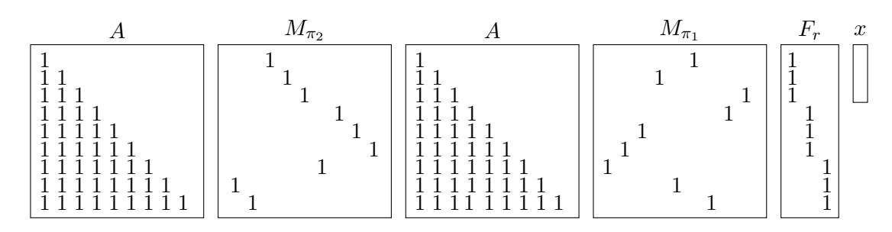
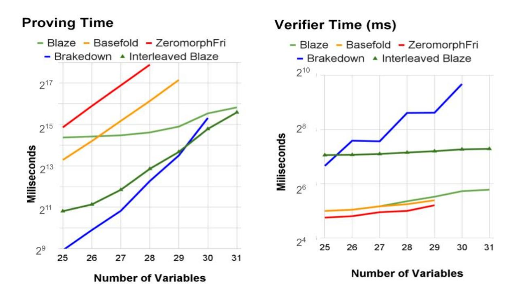
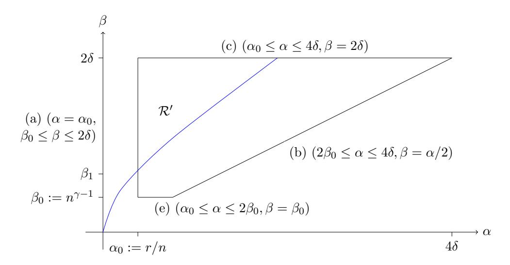

# <span id="page-0-0"></span>Blaze: Fast SNARKs from Interleaved RAA Codes

Martijn Brehm<sup>1</sup> Binyi Chen<sup>2</sup> Ben Fisch<sup>3</sup> Nicolas Resch<sup>1</sup> Ron D. Rothblum<sup>4</sup> Hadas Zeilberger<sup>3</sup>

University of Amsterdam. Emails: {m.a.brehm,n.a.resch}@uva.nl Stanford University. Email: binyi@cs.stanford.edu Yale University. Emails:{ben.fisch,hadas.zeilberger}@yale.edu Succinct. Email: rothblum@gmail.com

October 9, 2024

#### Abstract

In this work we construct a new and highly efficient multilinear polynomial commitment scheme (MLPCS) over binary fields, which we call Blaze. Polynomial commitment schemes allow a server to commit to a large polynomial and later decommit to its evaluations. Such schemes have emerged as a key component in recent efficient SNARK constructions.

Blaze has an extremely efficient prover, both asymptotically and concretely. The commitment is dominated by 8n field additions (i.e., XORs) and one Merkle tree computation. The evaluation proof generation is dominated by 6n additions and 5n multiplications over the field. The verifier runs in time Oλ(log<sup>2</sup> (n)). Concretely, for sufficiently large message sizes, the prover is faster than all prior schemes except for Brakedown (Golovnev et al., Crypto 2023), but offers significantly smaller proofs than the latter.

The scheme is obtained by combining two ingredients:

- Building on the code-switching technique (Ron-Zewi and Rothblum, JACM 2024), we show how to compose any error-correcting code together with an interactive oracle proof of proximity (IOPP) underlying existing MLPCS constructions, into a new MLPCS. The new MLPCS inherits its proving time from the code's encoding time, and its verification complexity from the underlying MLPCS. The composition is distinctive in that it is done purely on the information-theoretic side.
- We apply the above methodology using an extremely efficient error-correcting code known as the Repeat-Accumulate-Accumulate (RAA) code. We give new asymptotic and concrete bounds, which demonstrate that (for sufficiently large message sizes) this code has a better encoding time vs. distance tradeoff than previous linear-time encodable codes that were considered in the literature.

# <span id="page-1-0"></span>Contents

| 1 | Introduction<br>1                                                           |    |  |  |  |  |  |
|---|-----------------------------------------------------------------------------|----|--|--|--|--|--|
|   | 1.1<br>Our Results<br>                                                      | 1  |  |  |  |  |  |
|   | 1.2<br>Technical Overview<br>                                               | 4  |  |  |  |  |  |
|   | 1.3<br>Comparison with Prior Work<br>                                       | 10 |  |  |  |  |  |
| 2 | Preliminaries                                                               | 12 |  |  |  |  |  |
|   | 2.1<br>Multilinear Extension<br>                                            | 12 |  |  |  |  |  |
|   | 2.2<br>Interactive Proofs and IOPs<br>                                      | 12 |  |  |  |  |  |
|   | 2.3<br>Coding Background<br>                                                | 14 |  |  |  |  |  |
| 3 | The RAA Code                                                                | 15 |  |  |  |  |  |
|   | 3.1<br>Adding Tests<br>                                                     | 17 |  |  |  |  |  |
|   | 3.2<br>Puncturing<br>                                                       | 18 |  |  |  |  |  |
|   | 3.3<br>Concrete Numbers<br>                                                 | 18 |  |  |  |  |  |
|   |                                                                             |    |  |  |  |  |  |
| 4 | IOPs for Multilinear Evaluation                                             | 19 |  |  |  |  |  |
|   | 4.1<br>From MLIOP to IOPP<br>                                               | 20 |  |  |  |  |  |
| 5 | Multilinear Evaluation for the (Packed)<br>RAA<br>Code                      | 24 |  |  |  |  |  |
|   | 5.1<br>Checking Simple Linear Operations<br>                                | 25 |  |  |  |  |  |
|   | 5.2<br>Checking Permutations<br>                                            | 27 |  |  |  |  |  |
|   | 5.3<br>MLIOP for<br>RMLE[PRAA]<br>                                          | 27 |  |  |  |  |  |
|   | 5.4<br>Puncturing<br>                                                       | 31 |  |  |  |  |  |
| 6 | IOPs for Interleaved Codes                                                  | 31 |  |  |  |  |  |
| 7 | Multilinear Evaluation for Interleaved<br>RAA                               | 35 |  |  |  |  |  |
| 8 | Experiments and Results                                                     | 36 |  |  |  |  |  |
|   | 8.1<br>Prover and Verifier Runtimes<br>                                     | 37 |  |  |  |  |  |
|   | 8.2<br>Communication Complexity<br>                                         | 38 |  |  |  |  |  |
| 9 | Distance Analysis of RAA code                                               | 40 |  |  |  |  |  |
|   | 9.1<br>Setup of RAA Analysis<br>                                            | 41 |  |  |  |  |  |
|   | 9.2<br>Probability First Stage Fails<br>                                    | 43 |  |  |  |  |  |
|   | 9.3<br>Given Successful First Stage, Probability Code has Good Distance<br> | 50 |  |  |  |  |  |
|   | 9.4<br>Conditioning on Low Weight Messages Having Good First Stage<br>      | 63 |  |  |  |  |  |
|   | 9.5<br>Puncturing<br>                                                       | 70 |  |  |  |  |  |
|   |                                                                             |    |  |  |  |  |  |
| A | Round-by-Round Soundness of the Protocols                                   | 82 |  |  |  |  |  |
|   | A.1<br>RBR Soundness of the Building Block Protocols<br>                    | 83 |  |  |  |  |  |
|   | A.2<br>RBR Soundness of the MLIOP-to-IOPP Transformation<br>                | 84 |  |  |  |  |  |
|   | A.3<br>RBR Soundness of the Interleaving IOPP<br>                           | 85 |  |  |  |  |  |

# <span id="page-2-0"></span>1 Introduction

Recent years have seen an incredible progress in the development and deployment of cryptographic proof-systems. These proof-systems enable a prover to prove correctness of extremely complex computations to a highly efficient verifier that runs in much faster time.

One of the main approaches to constructing such proof-systems is by combining an informationtheoretic proof-system called a polynomial interactive oracle proof (polynomial IOP) with a cryptographic object called a polynomial commitment scheme (PCS). A polynomial IOP is a proof-system in which the prover can send truth tables of large polynomials to the verifier. A PCS in turn allows a prover to commit to a large polynomial P, using a short commitment, such that later it can prove evaluation claims of the form "P(x) = y". An efficient proof-system can then be derived by combining the two: run the IOP prover but instead of sending the large polynomials in the clear, commit to the them using the PCS, and then provide the desired values to the verifier and prove their correctness.

Due to the above, PCS's have emerged as a cornerstone of modern proof-system design. For example, the famous FRI protocol [\[BBHR18a,](#page-76-0)[BGKS20\]](#page-78-0) which underlies STARKs [\[BBHR18b\]](#page-76-1) can be viewed as a univariate PCS.[1](#page-2-2) Circle STARKs [\[HLP24\]](#page-80-0), STIR [\[ACFY24\]](#page-75-0), and Basefold [\[ZCF24\]](#page-83-1) are recent improvements and generalizations of this PCS. We discuss other recent exciting developments on the PCS front shortly.

In this work we focus on polynomial commitment schemes for multilinear polynomials P : F <sup>m</sup> → F (i.e., m-variate polynomials that have degree 1 in each variable) over binary extension fields (i.e., fields of characteristic 2). Multilinear Polynomial Commitments Schemes (MLPCS) have recently drawn significant attention and are at the heart of some of the most efficient proof-systems that have been developed. These include systems based on the GKR [\[GKR15\]](#page-80-1) protocol, Spartan [\[Set20\]](#page-82-0), Hyperplonk [\[CBBZ23\]](#page-79-0) and most recently Lasso/Jolt [\[STW24,](#page-82-1)[AST24\]](#page-76-2).

Highly efficient proof-systems based on binary extension fields have recently been proposed by Diamond and Posen [\[DP23,](#page-80-2) [DP24a\]](#page-80-3). Such schemes are exceptionally attractive due to the field's high level of compatibility with modern computer architectures. In particular, such fields avoid altogether the notorious problem of embedding overhead which prime fields suffer from. Additionally, some common CPU operations are natively supported by binary extension fields (e.g., XOR corresponds to field addition and Intel processors natively support field multiplication for some binary fields). On the downside, some issues in arithmetization (such as handling integer arithmetic) are somewhat more complicated in the case of binary fields, see [\[DP23\]](#page-80-2) for details.

### <span id="page-2-1"></span>1.1 Our Results

In this work we construct a new MLPCS over binary extension fields, which we call Blaze. Our scheme has an extremely efficient prover, both asymptotically and concretely. The scheme builds on the code-switching paradigm introduced by Ron-Zewi and Rothblum [\[RR24\]](#page-82-2) in combination with a particularly efficient family of error-correcting codes called Repeat-Accumulate-Accumulate (RAA) codes. The RAA family of codes has been studied in the coding literature due to its extremely fast encoding, which directly translates into our scheme's efficiency.

<span id="page-2-2"></span><sup>1</sup> In a bit more detail, FRI is an interactive oracle proof of proximity (IOPP) for membership in the Reed-Solomon code. Deep-FRI [\[BGKS20\]](#page-78-0) shows how to additionally check an evaluation query. A PCS can be derived form these IOPPs by combining them with a vector commitment (e.g., Merkle hashing) and the Fiat-Shamir [\[FS86\]](#page-80-4) transform.

Similarly to Spielman's code [Spi96] and Expand Accumulate codes [BCG<sup>+</sup>22] (which were used, respectively, in [BCG20, GLS<sup>+</sup>23, XZS22] and [BFK<sup>+</sup>24] to construct efficient proof-systems), the RAA code requires a (public) parameterization, that is generated by a randomized setup algorithm. This means that the code is constructed by a randomized procedure, that, if successful, outputs public parameters of the RAA code that guarantee good distance. An important contribution of our work is providing new asymptotic and concrete bounds on the failure probability of RAA codes.

For example, for messages of size  $k=2^{22}$ , we produce an RAA code with rate 1/4 and relative distance 0.19 except with an error probability of  $2^{-27.4}$ , using a parameter generation procedure that takes about a second on a laptop. Using a procedure that takes a few days, the error probability decreases to  $2^{-41.5}$ . More generally, for messages of size k and using rate 1/4, for any constant  $w \in \mathbb{N}$ , we give a  $\tilde{O}(k^w)$  time generation procedure for the code that fails to have distance 0.19 with probability roughly  $O(k^{-w-0.5})$ . (This algorithm is fully parallelizable and runs in  $O(\log k)$  time given  $k^w$  processors.)

We emphasize that this error probability comes from a *one time setup*. As long as the setup, which is *performed only once*, is successful, the distance holds for *all* codewords and so soundness is guaranteed in *all* invocations of the proof-systems.

For comparison, when attacking a SNARK with "100-bits of security", an adversary running in time  $2^{70}$ , which seems a feasible runtime, can break security with probability  $2^{-30}$ . We reiterate that in our case the bad event can happen only once, when the public parameters of the system are decided. As such, and in contrast to typical notions of security in cryptography, this error cannot be leveraged by attackers that run in more time – the error either happens during the parameter generation or, far more likely, it does not.

Still, it would be interesting to have an efficient procedure for certifying that the public parameters for the RAA codeword are "good" (analogously to a test developed by Xie *et al.* [XZS22] for Spielman's code) and we leave this as an interesting open question.

**Blaze:** a Fast Multilinear PCS over Binary Fields. Our main contribution is a new multilinear PCS, which we call Blaze, over binary extension fields. Blaze's asymptotic behavior is described in the following theorem:

<span id="page-3-1"></span>**Theorem 1** (Informally Stated, see Theorem 7.1). Let  $\mathbb{F}$  be a binary extension field. There exists an MLPCS in the random oracle model with O(n) prover time, and  $O_{\lambda}(\log^2 n)$  proof size and verifier time. The committing complexity is dominated by 8n field additions and a Merkle tree computation, and the evaluation proving is dominated by 6n field multiplications and 5n additions.

We remark that the operations in the evaluation proof account also for evaluating the polynomial at the desired point. The number of steps in the evaluation proof generation can be further reduced, but at the cost of constant overhead to the proof size that we rather avoid.

While there are previous linear-time PCS constructions, our work is the first to present one that measures the exact constant overhead. We hope that having these constants as a clean comparison point will also enable and direct a cleaner comparison to future work (as has happened in other areas of cryptography, see, e.g., [BCG<sup>+</sup>23]).

Similarly to other hash based proof-systems, our PCS can be shown secure in the *random oracle model*. As in the prior work, the random oracle is used for two reasons: (1) as a collision-resistant

<span id="page-3-0"></span><sup>&</sup>lt;sup>2</sup>For sake of comparison, the probability for an individual to win the US Powerball Lottery is 2<sup>-28.1</sup>, see https://www.powerball.com/powerball-prize-chart.

<span id="page-4-2"></span>hash function, and (2) to implement the Fiat-Shamir transform. Indeed, the above transformation (due to [\[Kil92,](#page-81-0) [FS86,](#page-80-4) [Mic00,](#page-82-4) [BCS16\]](#page-77-4)) is entirely standard in the literature (see the recent related textbook [\[CY24\]](#page-79-1)) and our focus is on the information-theoretic core that underlies the PCS and is described in the technical overview in [Section 1.2](#page-5-0) below.

The protocol establishing [Theorem 1](#page-3-1) is not only asymptotically efficient. Our benchmarks demonstrate that for sufficiently large multilinear polynomials (i.e., of size ≥ 2 <sup>25</sup> or in other words polynomials on 25 or more variables) Blaze's prover is faster than prior work. The only exception is Brakedown [\[GLS](#page-80-5)+23] which is faster (up to size about 230) but has much larger proofs, see [Section 8](#page-37-0) for detailed benchmarks. We emphasize that Blaze is particularly well-suited to large message sizes and unlocks the possibility of encoding larger polynomials than what was previously possible.

Remark 2. Similarly to Brakedown [\[GLS](#page-80-5)+23], our PCS does not guarantee any hiding properties. Therefore, when using it to construct a zero-knowledge proof-system some care should be taken. For example, following Ben Or et al. [\[BGG](#page-77-5)+88], the resulting succinct argument can be compiled into a zero-knowledge one using an additional proof-composition step. See, e.g., [\[XZS22\]](#page-83-2) for a practical system that does this.

New Bounds for RAA Codes. As previously mentioned, Blaze relies on a particular efficient family of codes known as repeat-accumulate-accumulate (RAA) codes. We provide additional details on the codes in [Section 3](#page-16-0) (see also [Section 1.2\)](#page-5-0), but for now we briefly say that the encoding procedure first repeat each message symbol r = O(1) times, permutes the coordinates, does a prefix-sum modulo-2, then again permutes and computes a prefix-sum.

The parameters of the code are descriptions of the two permutations that are used in the encoding procedure, and are sampled at random. Prior work [\[BMS08,](#page-78-1) [KZCJ07\]](#page-81-1) showed that if the permutations are chosen at random then the RAA codes offer a good rate/distance tradeoff; however, the failure bounds implicit in these works can be seen to be quite poor, and therefore insufficient for our purposes. A contribution of this work is a new analysis of RAA codes, showing they can achieve very good rate-distance tradeoffs with a small failure probability (both asymptotically and concretely).

<span id="page-4-1"></span>Theorem 3 (Informally Stated, see [Theorem 3.1\)](#page-17-0). Let k ∈ N be a growing parameter, let r ∈ N be even and at least 4, and set γ = 1 − 2.01 r . With all but O(k 1+γ−r/2 ) = O(k 2− <sup>2</sup>.<sup>01</sup> <sup>r</sup> −r/2 ) probability, a random RAA code with rate 1/r and message length k has distance δ<sup>r</sup> > 0, where δ<sup>r</sup> is close to the GV bound.

For context, the Gilbert-Varshamov (GV) bound states that there exist binary codes of minimum distance δ with rate 1 − H(δ), where H is the binary entropy function. Moreover, this is the best known tradeoff for any binary code.[3](#page-4-0) We get quite close to the GV bound: e.g., for rate 1/4 we can get distance about 0.19 whereas the GV bound is about 0.215. The general tradeoff is quite hard to state explicitly; see [Theorem 3.1](#page-17-0) for additional details.

The error probability achieved by [Theorem 3](#page-4-1) goes to 0 as k grows, but unfortunately not fast enough for the message sizes that we consider. Thus, to improve the failure probability, we observe that after sampling the permutations we can test whether or not all messages of weight at most ≤ w = O(1) (where w is a parameter we can choose) have encodings of weight at least δn.

<span id="page-4-0"></span><sup>3</sup>The reason that the codes guaranteed by the GV bound are not used is that their encoding time is quadratic, whereas the RAA code that we use has a roughly similar rate/distance tradeoff but with linear-time encoding.

<span id="page-5-3"></span>Conditioned on this test passing, the failure probability decreases to about  $O(k^{-(w+1)(r/2-1)+\gamma})$ . Given that this runtime is very large even for small values of w, we propose a simplified test (which, roughly speaking, does half of the encoding procedure) that runs in  $O(k^w \log k)$  time, and still drastically decreases the error probability. Still, given the exponential dependence of both tests on w, we cannot choose it to be too large (e.g., for  $k=2^{20}$ , testing for w=3 is about the best we could hope to do).

We remark that a similar test was suggested by Boyle  $et\ al.\ [BCG^+22, Section\ 3.5]$  in the context of the related  $expand\ accumulate\ codes$ . In their case the test was suggested as a heuristic whereas we give a full analysis.

#### <span id="page-5-0"></span>1.2 Technical Overview

Our starting point is the *code switching* technique [RR24] as further developed and articulated in [BCG20, GLS<sup>+</sup>23] (and also related to the work of Bootle *et al.* [BCG<sup>+</sup>17]). At a high-level, code-switching is the idea that one can convert claims about the multilinear extension code, into claims about simple combinatorial extensions of an *arbitrary*<sup>4</sup> error-correcting code. The key benefit of this approach is that we can utilize the rich literature on efficient codes, and in particular it demonstrates that the distance property of codes is essentially *all that is needed* to construct efficient SNARKs.

In particular, [RR24] (implicitly, see [RR24, Lemma 3.6]) construct an MLPCS by tensoring any error-correcting code and utilizing the sumcheck protocol for tensor codes [LFKN92, Mei13], and a similar approach is taken in [BCG20, RR22, HR22]. Brakedown [GLS+23] relies instead on code interleaving (this is also implicit in [BCG+17] and explicit in Ligero [AHIV23] for the Reed-Solomon code).

We first describe our code-switching based approach which shows that the prover's complexity can essentially only depend on the complexity of the encoding time of the code, and still obtain polylogarithmic proof-size and verification complexity. This is described in Section 1.2.1. Afterwards, in Section 1.2.2 we describe our new analysis of RAA codes and show how to combine code-switching with RAA codes.

#### <span id="page-5-2"></span>1.2.1 IOPP for Multilinear Evaluation

Before proceeding, let us briefly recall the definition of the multilinear extension. Fix a finite field  $\mathbb{F}$ , that, for the moment, can be arbitrary but should be thought of as "cryptographically large". The multilinear extension of a vector  $m \in \mathbb{F}^k$ , where  $k \in \mathbb{N}$  is a power of 2, is the multilinear polynomial  $\widehat{m} : \mathbb{F}^{\log(k)} \to \mathbb{F}$  defined as  $\widehat{m}(z) = \sum_{b \in \{0,1\}^{\log(k)}} eq(z,b) \cdot m_b$ , where  $eq(z,b) = \prod_{i=1}^{\log(k)} eq_1(z_i,b_i)$  and  $eq_1(\alpha,\beta) = \alpha \cdot \beta + (1-\alpha) \cdot (1-\beta)$  (see Section 2 for a more thorough exposition and additional details).

Our MLPCS is best described from the perspective of Interactive Oracle Proofs of Proximity (IOPP) for Multilinear Evaluation – an information-theoretic abstraction that we put forth (but is implicit in prior "hash based" MLPCS constructions). An IOPP for Multilinear Evaluation relative to a code  $C: \mathbb{F}^k \to \mathbb{F}^n$  is a protocol in which the verifier is given as explicit input  $z \in \mathbb{F}^{\log(k)}$  and  $v \in \mathbb{F}$ . The verifier additionally has oracle access to a string  $y \in \mathbb{F}^n$ . The verifier's goal is to check that y is close to some codeword C(m) such that  $\widehat{m}(z) = v$ . The verifier should do so while reading

<span id="page-5-1"></span><sup>&</sup>lt;sup>4</sup>Here and throughout this work we assume that all error-correcting codes are *linear*, meaning that the set of codewords is a linear space.

<span id="page-6-0"></span>only a few symbols from y but is allowed to interact with an untrusted prover in the *interactive* oracle proof model [BCS16,RRR16], which basically means that the prover can send long messages from which the verifier reads only a few symbols.

A code C that has good relative distance and an efficient IOPP for Multilinear Evaluation can be used to derive an MLPCS as follows: given a description  $f:\{0,1\}^m \to \mathbb{F}$  of a multilinear polynomial, the prover views f as a message of length  $2^m$ , encodes it using C and sends a Merkle hash of C(f) to the verifier. To prove an evaluation claim of the form  $\widehat{f}(z) = v$ , the prover and verifier engage in the above IOPP, which is compiled into a succinct non-interactive argument using Merkle hashing and the Fiat-Shamir transform.

The core of Brakedown [GLS<sup>+</sup>23], Basefold [ZCF24], FRI/Binius/Basefold [DP24a] and Red-Shift [KPV22] can all be framed as IOPPs for Multlilinear Evaluation (for different codes) that are then compiled into an MLPCS using cryptographic hashing as above.

**Lifting MLPCS via Interleaving.** Our first main observation, which builds on the codeswitching approach, is a procedure that "lifts" a code C that already has an IOPP for Multilinear Evaluation, with an inefficient prover, into a new code C' that also has such an IOPP, but this time with an efficient prover. The drawback is that the new code is defined over a larger alphabet, which accordingly increases the proof's size.

Following Ligero and Brakedown, this lifting is achieved by using code interleaving. In a nutshell, this procedure takes an arbitrary code  $C: \mathbb{F}^k \to \mathbb{F}^n$  and an integer  $t \in \mathbb{N}$  (which should be thought of as poly-logarithmic and likewise a power of two), and produces the interleaved code  $C^t: \mathbb{F}^{t \times k} \to \mathbb{F}^{t \times n}$  as follows: the message m is interpreted as a  $t \times k$  matrix and each row is encoded separately using C. The output  $C^t(m)$  is simply the resulting  $t \times n$  matrix.

Observe that, assuming C is linear-time encodable, the encoding time of  $C^t$  is similar to that of C. If we view  $C^t$  as operating over the alphabet  $\mathbb{F}^t$  (i.e. each column is a single alphabet symbol) then the relative distance is also preserved, albeit over the larger alphabet.

It remains therefore to show how to transform an IOPP for Multilinear Evaluation for C into one for  $C^t$ , but with a more efficient prover. In this IOPP we need, given as input a matrix  $y \in \mathbb{F}^{t \times n}$ , to prove that y is close to some  $C^t(m)$  such that  $\widehat{m}(z) = v$ , for  $z \in \mathbb{F}^{\log(tk)}$  and  $v \in \mathbb{F}$ .

The idea, building on [AHIV23, GLS<sup>+</sup>23] is as follows. The prover first decomposes the claim  $\widehat{m}(z) = v$  into separate claims about the rows of m. Denoting the rows of m by  $m_1, \ldots, m_t$  and decomposing  $z = (z_1, z_2) \in \mathbb{F}^{\log(t)} \times \mathbb{F}^{\log(k)}$ , the prover sends a full description of the function  $u: \{0, 1\}^{\log(t)} \to \mathbb{F}$  defined as  $u(i) = \widehat{m}_i(z_2)$ .

The verifier then checks that this decomposition is consistent with the prover's claim. To do so it simply checks that  $\widehat{u}(z_1) = v$ . To see why this test should pass (when the prover behaves honestly) observe that:

$$\widehat{u}(z_1) = \sum_{b_1 \in \{0,1\}^{\log(t)}} eq(b_1, z_1) \cdot \widehat{m_i}(z_2)$$

$$= \sum_{b_1 \in \{0,1\}^{\log(t)}} eq(b_1, z_1) \sum_{b_2 \in \{0,1\}^{\log(k)}} eq(b_2, z_2) \cdot m(b_1, b_2)$$

$$= \sum_{b \in \{0,1\}^{\log(t) + \log(k))}} eq(b, z) \cdot m(b)$$

$$= \widehat{m}(z).$$

<span id="page-7-2"></span>For soundness, we should consider the behavior for a NO input – i.e., an input y that is either far from the code  $C^t$ , or one that is close to some codeword  $C^t(m)$  for which the claim about the multilinear evaluation is false (i.e.,  $\hat{m}(z) \neq v$ ). Suppose first that we are in the latter case. Denoting the correct function that the prover should send by u, observe that in this case the prover must send as its first message a different function  $\tilde{u} \neq u$ , since otherwise the verifier will reject in the above consistency test.

To catch the prover, the verifier now chooses a random linear combination  $r \in \mathbb{F}^t$  of the rows of m and sends r to the prover. Since C is a linear code, the vector r defines a new codeword  $y_{combo} = r^T y \in C$ . Moreover, by linearity, the message  $m_{combo} = r^T m$  encoded within  $y_{combo}$  is such that  $\widehat{m}_{combo}(z_2) = \sum_i r_i \cdot \widehat{m}_i(z_2) = \langle u, r \rangle$ , where  $\langle u, r \rangle$  is a shorthand for  $\langle u, r \rangle = \sum_{i \in \{0,1\}^{\log(t)}} u(i) \cdot r_i$ .

Since  $u \neq \tilde{u}$ , with high probability<sup>5</sup> over r, it holds that  $\langle u, r \rangle \neq \langle \tilde{u}, r \rangle$ . Thus, to catch the prover, the verifier simply runs the underlying IOPP for multilinear evaluation on the codeword  $y_{combo} = r^T y$  relative to the – in this case false – claim  $\widehat{m}_{combo}(z_2) = \langle \tilde{u}, r \rangle$ . Each query to the input  $y_{combo}$  is emulated by the verifier by making a query to the corresponding column of y (i.e., a single query over the alphabet  $\mathbb{F}^t$ ).

Thus, we are left with the case that y is altogether far from the code  $C^t$ . In this case, we use elegant results on *proximity gaps* of codes [RVW13, AHIV23, BSCI<sup>+</sup>20] to argue that, with high probability over r, the resulting vector  $r^T \cdot y$  is far from the code C.

We conclude that in any case, for a NO input, the resulting vector  $r^T y$  is, with high probability over r, far from any codeword C(x) such that  $\hat{x}(z_2) = \langle \tilde{u}, r \rangle$  and so, by the soundness of the underlying Multilinear Evaluation IOPP of C, the verifier rejects.

Observe that when lifting a code, the encoding time for a message of size  $t \cdot k$  is just t times the encoding time of C for a length k message – i.e., the encoding time of C is (at least) retained. As for the evaluation proof, all the prover needs to do is to compute  $r^Ty$  and then run the underlying IOPP of C. The point is that the latter IOPP is run on a significantly shorter instance (i.e., smaller than the input by a multiplicative t factor). Thus, by setting t to be sufficiently large, the running time of the prover is dominated by the encoding time of  $C^t$ .

#### <span id="page-7-0"></span>1.2.2 Choosing the Right Code

To instantiate the above framework we therefore need to choose a base linear code C such that:

- 1. The code has an *extremely fast* encoding procedure this is important since by the above analysis, the encoding procedure dominates the prover's complexity.
- 2. The code has good relative distance the distance of the code translates into the number of queries that the IOPP verifier needs to make, which in turn directly affects the proof-size and verification complexity when further compiled into an argument via Merkle Hashing.
- 3. The code has an IOPP for Multilinear Evaluation actually, at least from a theoretical perspective, this part can be taken "off-the-shelf", since there exist general results for the existence of IOPPs for arbitrary computations, in particular there exists an IOPP for Multilinear Evaluation for any code. From an asymptotic perspective, by setting t to be sufficiently large, the prover overhead incurred by these generic results becomes a small order term.

<span id="page-7-1"></span><sup>&</sup>lt;sup>5</sup>Specifically the error probability is  $1/|\mathbb{F}|$ , and recall that  $\mathbb{F}$  is cryptographically large, meaning that its size is exponential in the security parameter.

<span id="page-8-2"></span>Still, from a concrete perspective, the generic approach does introduce an (additive) overhead that is important to minimize in practice. Thus, we would like to find a base code that has a concretely efficient IOPP for Multilinear Evaluation.

RAA Codes. We implement the above framework using the Repeat-Accumulate-Accumulate (RAA) family of codes [\[DJM98\]](#page-80-6), mainly due to their extremely efficient encoding and good relative distance (points 1 and 2) above, but we additionally show an efficient direct IOPP for Multilinear Evaluation for these codes (point 3 above).

The RAA code is a binary code meaning that the underlying field is GF(2) – both messages and codewords are just sequences of bits (for the PCS we will actually need a code over a larger alphabet, but we defer a discussion on this till later). The code RAA : {0, 1} <sup>k</sup> → {0, 1} n is parameterized by a small integer r ∈ N (e.g., r = 4 is a good choice) such that r = n/k, and descriptions of two permutations π1, π<sup>2</sup> : [n] → [n]. The encoding of a message m ∈ {0, 1} <sup>k</sup> proceeds through the five following step process:

- 1. (Repeat:) Each bit of m is repeated r times.
- 2. (Permute:) The order of the n bits is then permuted using π1.
- 3. (Accumulate:) Then, an accumulation (i.e., prefix-sum modulo 2) is performed on the vector.[6](#page-8-0)
- 4. (Permute:) Another permutation step is applied, this time using π2.
- 5. (Accumulate) Lastly, one more accumulation step is applied.

The result of the last step is the encoded RAA codeword (for more details, see [Section 3\)](#page-16-0).

RAA codes are known in the coding literature for their extremely fast and simple encoding and are thus perfectly suited for the first requirement above. Indeed, observe that encoding can be done using a circuit with exactly 2(kr − 1) XOR gates.[7](#page-8-1)

Distance Analysis of RAA Codes. As with prior works, we analyze the expected number of low-weight codewords appearing in an RAA code (where the randomness is over a uniform choice of π<sup>1</sup> and π2): if this expectation is proved small enough, Markov's inequality immediately translates this into a bound on the probability the code fails to have good minimum distance.

Prior works [\[BMS08,](#page-78-1) [KZCJ07\]](#page-81-1) already analyzed this expected value and derived promising results. In particular, [\[BMS08\]](#page-78-1) showed that asymptotically good RAA codes exist; however, the tradeoff between rate and distance is not made explicit (and indeed, the proof is not optimized to obtain meaningful minimum distance). One benefit is that it is fairly easy to follow the argument and thereby obtain a concrete bound on the expectation. On the other hand, [\[KZCJ07\]](#page-81-1) provide an "asymptotic" statement which shows that for sufficiently large n, very impressive rate-distance tradeoffs are achievable (in particular, one can get quite close to the GV bound). However, the analysis does not naturally give concrete failure probabilities (and an inspection of the proof shows that they are quite poor).

<span id="page-8-0"></span><sup>6</sup> In more detail, the accumulation of a vector a ∈ {0, 1} n is the vector b ∈ {0, 1} <sup>n</sup> defined as b<sup>i</sup> = L 1≤j≤i ai.

<span id="page-8-1"></span><sup>7</sup>The accumulation step can be done either by a straightforward sequential scan with n − 1 XOR operations, or using an O(log n) depth circuit with O(n) XOR gates and excellent constants, by the classical work of Fischer and Ladner [\[LF80\]](#page-81-6).

<span id="page-9-3"></span>We built off the two approaches in order to obtain the rate-distance tradeoffs of [\[KZCJ07\]](#page-81-1) while still obtaining meaningful bounds on the expectation. Our crucial idea is to break the expectation into two parts: the expectation over message vectors where after the first accumulation the weight is still small (say, ≪ k <sup>1</sup>−2/r) vs. the case that it is quite large. (For context, [\[BMS08,](#page-78-1) [KZCJ07\]](#page-81-1) establish that k <sup>−</sup>2/r is roughly the expected minimum distance of an RA code, i.e., a code with only one round of accumulation.) We provide two separate analyses for each of these expectations: for the first term with small middle weight, our bound is quite combinatorial and follows by reasoning about binomial coefficients; for the latter term with large middle weight, we use ideas from [\[KZCJ07\]](#page-81-1) with an extended analysis to derive concrete bounds.

While the bounds are meaningful, they are not always satisfactory; i.e., for k = 2<sup>15</sup> and r = 4, achieving distance δ = 0.19 the failure probability is about 2−<sup>5</sup> . Fortunately, we observe that one can decrease this failure probability by additionally testing the RAA code after sampling: if the RAA code passes the test then we can argue that it will have good distance with improved probability.[8](#page-9-0) We consider the following simple test: for messages of weight at most w (where w = O(1) is a parameter), we verify that they all have encodings of weight at least δn (here and throughout, n = rk is the blocklength). The motivation stems from the observation that the dominant terms in the expectation that we bound come from the case of low weight message vectors, so if we can remove them from the expectation (which conditioning on a successful test essentially allows us to do) we then obtain a decreased failure probability. Informally, we observe that with a O˜(n <sup>w</sup>) time test, whereas the original failure probability is something like 1/n<sup>c</sup> for a constant c, the new failure probability will be roughly 1/nc(w+1) .

Improved Rate via Puncturing. RAA codes are inherently limited to rates of the form 1/r for r ∈ N: in particular, rates > 1/2 are unachievable. Furthermore, as [\[KZCJ07\]](#page-81-1) point out, at rate 1/2 the expectation is necessarily Ω(1).[9](#page-9-1) To remedy this, we follow the lead of [\[KZCJ07\]](#page-81-1) and consider puncturing RAA codes.

By puncturing we mean that a subset of the coordinates is selected and removed from the codewords. We show that if the punctured set is chosen at random then the resulting punctured RAA code can obtain even higher rates and obtain minimal distance close to the GV bound, with similar failure probabilities (in particular, the above test is still applicable). We note that puncturing does not improve the encoding time of the code, but can be useful in our PCS context in case the Merkle hashing becomes the dominant term. However, for our benchmarks, in the parameter regime that we consider, Merkle hashing does not dominate and so we do not implement puncturing but merely suggest it as a possibility. We provide some analysis of punctured RAA codes and, assuming a conjecture,[10](#page-9-2) we can show that they achieve good tradeoffs between rate and distance (e.g., rate 1/2 with distance 0.1, which is nearly the GV bound).

Handling Larger Fields by Bit Packing and Slicing. As mentioned above, the RAA code is defined over the binary field GF(2), whereas we need our code to work over a larger finite field

<span id="page-9-0"></span><sup>8</sup>Such an idea was also suggested in [\[BCG](#page-77-0)<sup>+</sup>22], but only as a heuristic, whereas we formally prove the test is effective. Our argument justifies equally well the heuristic considered in [\[BCG](#page-77-0)<sup>+</sup>22].

<span id="page-9-1"></span><sup>9</sup>Also for technical reasons we prefer working with even r, meaning that the largest rate we directly analyze is 1/4.

<span id="page-9-2"></span><sup>10</sup>The conjecture concerns the maximizer of a certain function which arises. For the unpunctured case, we provide a complete analysis of the analogous function. We believe the analysis could be extended to the case of punctured RAA codes, but we leave it for future work.

<span id="page-10-0"></span>(essentially this is a requirement from the proof-system that uses the polynomial commitment scheme – the scheme has soundness error at least 1/|F|, so the field should be rather large).

In [\[BFK](#page-77-2)+24] this was handled in the context of expand accumulate codes, by extending the construction and analysis of the code to arbitrary fields. Inspired by recent advances in SNARKs over binary fields [\[DP23,](#page-80-2)[DP24a\]](#page-80-3) we take a different route, by focusing on binary extension fields. Recall that the elements of the field GF(2<sup>f</sup> ), for an integer f ∈ F can be viewed as f-dimensional bit vectors. In this representation field addition is simply an f-bit exclusive-Or (XOR). To extend the RAA code to GF(2<sup>f</sup> ) we simply "pack" f codewords that live in {0, 1} n into one packed codeword in (GF(2<sup>f</sup> ) n ) as follows. We place the codewords as rows of an f × n dimensional matrix and then interpret each column as a field element. We remark that this operation is essentially the same as interleaving described above, but we use the term packing since it will be useful to distinguish the two stages.

Observe that this method of packing, which is also sometimes referred to as bit slicing, is particular efficient to implement: to encode a single packed RAA message m ∈ (GF(2<sup>f</sup> ))<sup>k</sup> we just apply the original RAA operations but on f bit words at a time. Thus, all we need to do in order to encode is apply f-bit XORs (for accumulation), or move around f-bit words (for the permutation).

Thus, using, e.g., rate 1/4 the packed RAA codes can be encoded by an arithmetic circuit over GF(2<sup>f</sup> ) using 8k additions. On a RAM, one additionally needs to implement the two permutations (that were "for free" in the circuit model), which can be done in O(n) time (the exact constant depending on the specific architecture).

We remark that the above is the reason that in this work we focus on binary extension fields. We believe that a different generalization of RAA codes to prime order fields (possibly following [\[BFK](#page-77-2)+24]) may be possible and leave exploring this to future work.

Multilinear Evaluation for Packed RAA Codes. Addressing point 3 above, we also develop a special purpose multilinear evaluation IOPP for packed RAA codes. In a nutshell we observe that the (packed) RAA encoding is done by alternating between accumulations and permutations and handle each of these 4 steps using a simple protocol.

In more detail, the IOPP prover sends Reed-Solomon encodings of the 4 intermediate stages in the computation. We use the BaseFold-FRI IOPP [\[ZCF24,](#page-83-1) [DP24a\]](#page-80-3) to "pretend" that we have access to the multilinear extension of these intermediate computations. Finally, we use sumcheck to check the accumulations steps and an argument from [\[CBBZ23\]](#page-79-0) (that is derived from the grand product argument from [\[SL20\]](#page-82-8)) to check the permutation steps.

Remark 4. We emphasize that we use BaseFold-FRI as a generic IOPP for checking multilinear evaluations. As such, any progress on more efficient IOPPs for multilinear evaluation (especially on the verifier's side) can be used as a drop-in replacement for BaseFold in our scheme.

#### 1.2.3 Summary and Open Problems

To summarize, in this work we make two main technical contributions:

1. We introduce the IOPP for Multilinear Evaluation as a convenient abstraction from prior work, and show how to use code interleaving to lift an efficiently computable code into a new code, that is still efficiently computable, but now also has a highly efficient IOPP for Multilinear Evaluation.

<span id="page-11-1"></span>2. We give new asymptotic and concrete bounds for the distance of RAA codes, as well as their packed analogs.

While these two contributions are somewhat orthogonal, they go very well together. Still, it may be useful to utilize them separately. For example, one might want to apply the lifting procedure to other codes (possibly over a prime field). Alternatively, it may be useful to use our improved analysis of RAA codes in other contexts (e.g., a "vanilla" code interleaving as in Ligero and Brakedown, which can be viewed as lifting a trivial IOPP for Multilinear evaluation in which the verifier reads everything).

Open Problems. While Blaze is not the first system to achieve linear-time proving, it is the first to specify the concrete constant overhead (at least in the circuit model, which serves as a clean comparison point). We believe that an important challenge for the community is to further improve this constant prover overhead. We mentions some additional concrete directions for improvement:

- 1. Construct codes that match the efficiency of our packed RAA codes over large prime fields.
- 2. While the binary RAA codes that we construct are close to optimal (in the sense of almost matching the GV bound), the packed RAA codes are still somewhat far from optimal (for this larger alphabet, optimal would mean meeting the Singleton bound).
- 3. RAA codes for shorter messages our distance guarantee scales with the message-size and as such only gives weak guarantees for short messages. Providing some mechanism for certifying the parameterization of RAA codes, even specifically for short messages, would therefore be quite useful.
- 4. The proximity gap lemma that we use from [\[BKS18\]](#page-78-2) is for arbitrary codes and still lags behind the results that are known for the Reed-Solomon code [\[BCG](#page-77-0)+22]. Improving these bounds (ideally for arbitrary codes, but even specifically for the RAA variants) is an interesting and important open problem.

## <span id="page-11-0"></span>1.3 Comparison with Prior Work

As already mentioned, our PCS is heavily inspired by prior works. We compare to some of these works next:

Ligero [\[AHIV23\]](#page-75-1), Brakedown [\[GLS](#page-80-5)+23], Block et al. [\[BFK](#page-77-2)+24] and Binius [\[DP23\]](#page-80-2). The commitment phase of our PCS is identical to that in these works, except that we use RAA codes instead of the Reed-Solomon code, Spielman's code, EA codes and binary Reed-Solomon, respectively. The evaluation proof in our case is more complex, but offers better parameters, both asymptotically (i.e., Oλ(log<sup>2</sup> (n)) vs. Oλ( √ n)) and concretely for large instances (see [Section 8\)](#page-37-0). The two main differences from these works is that:

1. We use RAA codes which have a better rate/distance tradeoff than Spielman's code and the EA code. Additionally the codes have a much faster encoding time than Reed-Solmonon and EA codes (the encoding time of both is O(n log n)).

<span id="page-12-0"></span>2. We utilize an additional proof composition step to reduce the proof length and verification time to be poly-logarithmic. In contrast [\[AHIV23,](#page-75-1)[BFK](#page-77-2)+24[,DP23\]](#page-80-2) achieve only O( √ n) proofsize and verification time. Still, it seems that for small message sizes their approach is preferable, see [Section 8.](#page-37-0)

BaseFold [\[ZCF24\]](#page-83-1) and FRI-Binius [\[DP24a\]](#page-80-3). BaseFold achieves Oλ(log<sup>2</sup> (n)) proof-size and verification time by combining sumcheck with FRI. FRI-Binius adapts Basefold to binary extension fields. However, compared to our approach, both schemes have slower prover times due to their reliance on the FFT algorithm (or additive NTT in the case of FRI-Binius), which incurs an O(n log(n)) encoding overhead. We eliminate this overhead by interleaving and running BaseFold over a smaller instance of size n/t. However, RAA codes have worse distances (than Reed-Solomon), and thus this optimization comes at the cost of a concretely larger proof size, see [Section 8.](#page-37-0)

Orion [\[XZS22\]](#page-83-2). Orion, builds on [\[GLS](#page-80-5)+23] but achieves a poly-logarithmic proof size and verification time. At a very high level their proof composition approach is similar to ours but looking in more detail, the approaches are quite different. Similarly to Blaze, in Orion, a "Brakedown"-like system is constructed but is then composed with another proof-system to reduce the proof size.

The key difference is in where this composition happens. Orion constructs a full cryptographic argument-system (i.e. after Merkle hashing) and then composes with another succinct argument to prove correctness. In contrast, our composition happens within the information-theoretic proofsystem (as in classical PCP composition [\[AS92,](#page-75-2) [BGH](#page-78-3)+06]). We believe that the latter approach is preferable and in particular it avoids altogether the need for the inner proof-system to prove correctness of complex cryptographic operations. We note that the original version of Orion had a soundness issue, which was recently fixed by [\[dHS24\]](#page-79-3). Additionally, there is a variant called Orion+ [\[CBBZ23\]](#page-79-0), which achieves constant proof sizes by composing with a KZG-based proofsystem. However, both the fixes and variants still need an inner proof-system for verifying complex cryptographic operations.

Batch FRI [\[BSCI](#page-79-2)+20]. Our composition approach is also similar to "batch-FRI" – a method proposed by Ben Sasson et al. [\[BSCI](#page-79-2)+20] to check that t given functions are all close to being low degree polynomials. Their approach (much like ours) can be described as interleaving these t polynomials and then applying a proximity test (in their case FRI) to a random linear combination of the rows. To the best of our knowledge this approach has not been suggested in the context of obtaining a (multilinear) PCS for a single polynomial.

Additional Related Work. We also mention some other exciting developments. STIR [\[ACFY24\]](#page-75-0) suggests an improvement to the FRI PCS by leveraging the fact that due to its recursive nature, as the FRI protocol advances, the instance size shrinks, which enables them to slow down the prover a bit in the interest of smaller proofs and faster verification. Circle STARKs [\[HLP24\]](#page-80-0) are a different extension of FRI which enables the use of certain non-smooth prime fields, which is extremely important and useful in practice.

So far we have focused exclusively on hashed-based PCS constructions. We briefly mention that there are other approaches for PCS constructions, based on more structured cryptographic assumptions such as discrete log. Notable examples include KZG [\[KZG10\]](#page-81-7), Bulletproofs [\[BCC](#page-76-4)+16, [BBB](#page-76-5)+18], Hyrax [\[WTS](#page-83-3)+18], and Dory [\[Lee20\]](#page-81-8). Such systems typically have <span id="page-13-4"></span>much shorter proofs, but involve expensive "public-key" operations, are typically quantum-insecure and sometimes require an expensive trusted setup. On the other hand, in contrast to their hash-based counterparts, this line of work can produce sublinear-space commitments [BHR<sup>+</sup>20, BHR<sup>+</sup>21, BCHO22], which in turn can be used to construct time and space efficient proof-systems (but see [BBHV22, FPP24] for some exceptions to the general rule). Additionally, many efficient lattice-based PCS constructions have emerged recently, demonstrating promising performance [CMNW24, NS24, AFLN24, BC24, HSS24, BS23].

## <span id="page-13-0"></span>2 Preliminaries

Throughout this work for equal length strings  $x, y \in \Sigma^n$  over an alphabet  $\Sigma$ , we denote their relative Hamming distance by  $\Delta(x,y) := \frac{1}{n} |\{i \in [n] : x_i \neq y_i\}|$ . For a non-empty set  $S \subseteq \Sigma^n$  and  $x \in \Sigma^n$ , we define  $\Delta(u,S) := \min\{\Delta(u,s) : s \in S\}$ . The Hamming weight of a string is the number of non-zero coordinates.

#### <span id="page-13-1"></span>2.1 Multilinear Extension

Let  $\mathbb{F}$  be a finite field and  $m \in \mathbb{N}$  be an integer. For every function  $f : \{0,1\}^m \to \mathbb{F}$  there exists a unique multilinear polynomial  $\widehat{f} : \mathbb{F}^m \to \mathbb{F}$  that agrees with f on  $\{0,1\}^m$ . We refer to  $\widehat{f}$  as the multilinear extension (MLE) of f.

The polynomial  $\widehat{f}$  can be expressed explicitly as:

$$\widehat{f}(x) = \sum_{b \in \{0,1\}^m} eq(x,b) \cdot f(b), \tag{1}$$

where  $eq(x, b) = \prod_{i \in [m]} eq_1(x_i, b_i)$  and  $eq_1(x_i, b_i) = x_i \cdot b_i + (1 - x_i) \cdot (1 - b_i)$ .

For a given  $x \in \mathbb{F}^m$ , the sequence of values  $(eq(x,b))_{b \in \{0,1\}^m}$  can be generated very efficiently, as demonstrated by the following proposition (see also [VSBW13, CFFZ24] and [Tha22, Section 3.5]).

<span id="page-13-3"></span>**Proposition 2.1** ([Rot24, Proposition 1 and Section 2.1]). Let  $\mathbb{F}$  be a binary extension field. Given as input  $z \in \mathbb{F}^m$ , the sequence of values  $(eq(z,b))_{b \in \{0,1\}^m}$  can be generated in lexicographic order in time  $O(2^m)$  and space O(m). In more detail, the algorithm performs exactly  $2^m$  field multiplications and an additional O(m) additions, multiplications and inversions over the field.

#### <span id="page-13-2"></span>2.2 Interactive Proofs and IOPs

Let  $\mathcal{R}$  be an NP relation and denote the corresponding language by  $\mathcal{L}(\mathcal{R}) = \{x : \exists w, (x, w) \in \mathcal{R}\}$ . Throughout, we will think of the language  $\mathcal{L}(\mathcal{R})$  itself as a pair language - that is, the inputs are a pair (x, y) where x (which will typically be short) is called the *explicit input* and y (which is long) is called the *implicit input*. In certain cases, we may work with an *indexed relation*, where the input additionally includes an index i, such as the description of a circuit or a linear code.

#### 2.2.1 Interactive Proofs and Sumcheck

Interactive proofs [GMR89] are protocols enabling a prover to convince a verifier of the correctness of a statement  $x \in L$  by back and forth interaction. We do not formally define interactive proofs since

<span id="page-14-2"></span>this work focuses on a different form of proof, called an *interactive oracle proof* [BCS16, RRR16], which we define below. Still, we will make use of the celebrated sumcheck protocol [LFKN92], with a linear-time prover [Tha13], as described next:

**Lemma 2.2** (The Sumcheck Protocol). Let  $\mathbb{F}$  be a finite field and  $m, d \in \mathbb{N}$ . There exists a protocol between a prover, who is given as input a description of an m-variate polynomial  $Q : \mathbb{F}^m \to \mathbb{F}$  of individual degree d, and a verifier who gets as input  $\alpha \in \mathbb{F}$  and either rejects or outputs  $(z, v) \in \mathbb{F}^m \times \mathbb{F}$ . The protocol satisfies the following properties:

- Complexity: the protocol has m rounds. In each round the prover sends d+1 field elements and the verifier responds with a single field element. The verifier performs  $O(d \cdot m)$  field operations. The prover runs in time  $O((d+1)^m)$ .
- Completeness: if  $\alpha = \sum_{x \in \{0,1\}^m} Q(x)$  then when interacting with the honest prover, the verifier always outputs (z,v) such that Q(z) = v.
- Soundness: if  $\alpha \neq \sum_{x \in \{0,1\}^m} Q(x)$  then, when interacting with any prover, with probability at least  $1 \frac{dm}{|\mathbb{F}|}$ , the verifier either rejects or outputs (z, v) such that  $Q(z) \neq v$ .

<span id="page-14-1"></span>Remark 2.3 (Batch Sumcheck). Suppose we wish to simultaneously check k sumcheck statements  $\alpha_1 = \sum_x f_1(x), \ldots, \alpha_k = \sum_x f_k(x)$ , where each  $f_i : \mathbb{F}^m \to \mathbb{F}$  is an individual degree d polynomial. Rather than running k separate sumcheck protocols, we can batch them by having the verifier select a random  $\lambda \in \mathbb{F}$  and running a single sumcheck on the statement  $\sum_{x \in \{0,1\}^m} Q(x) = \sum_{i=0}^{k-1} \lambda^i \cdot \alpha_i$ , where Q is the individual degree d polynomial defined as  $Q(x) = \sum_{i=0}^{k-1} \lambda^i \cdot f_i(x)$ . This batching incurs an additional  $k/|\mathbb{F}|$  soundness error.

Interactive Proofs for Batching Polynomial Evaluations. We recall an interactive protocol that reduce multiple multilinear evaluation claims into a single one [RR24, CBBZ23]. We state the result from [CBBZ23] due to its optimal prover complexity.

<span id="page-14-0"></span>**Theorem 2.4** ( [CBBZ23, Algorithm 4]). Let  $f: \{0,1\}^{\ell} \to \mathbb{F}$  be a function and denote by  $\widehat{f}$  its multilinear extension. There exists an interactive protocol that reduces t > 1 evaluation claims for  $\widehat{f}$  to a single evaluation claim for  $\widehat{f}$ . The protocol has soundness error  $\frac{2\ell+3\log_2(t)}{|\mathbb{F}|}$ , prover time  $O(t \cdot 2^{\ell})$ , verifier time  $O(t\ell)$ , communication complexity  $O(\ell+\log(t))$  and  $\ell+\log_2(t)+O(1)$  rounds.

#### 2.2.2 Interactive Oracle Proofs

Interactive Oracle Proofs (IOP) [BCS16, RRR16] are a hybrid between interactive proofs, and probabilistically checkable proofs. In a nutshell, an IOP is an interactive protocol in which the prover can send long messages from which the verifier only reads very few symbols. In this work we focus on variants of IOPs which are introduced next.

**Holographic IOP.** Holographic IOPs [COS20] combine features of IOPs and holographic interactive proofs [GR17]. Let  $\mathcal{R}$  be an indexed relation. A holographic IOP for  $\mathcal{R}$  is specified by an indexer I, a prover P and a verifier V. The IOP consists of an offline phase and an online phase.

In the offline phase, the indexer I outputs an oracle  $\mathsf{idx}(i)$  given index i. In the online phase, the prover receives the input  $(i, x, y, w) \in \mathcal{R}$ , while the verifier receives x along with oracle access

<span id="page-15-2"></span>to idx(i) and y. The prover and verifier then engage in multiple rounds of interaction, where the prover sends an oracle proof string in each round, and the verifier responds with a message. At the end of the interaction, the verifier accepts or rejects.

The protocol satisfies completeness if for every (i, x, y, w) ∈ R, the prover convinces the verifier with probability 1. The protocol has soundness error ϵ if for every (i, x, y) ∈ L / (R) and every malicious prover P ∗ in the IOP model, the probability that the verifier accepts is at most ϵ.

Multilinear polynomial IOPs (MLIOP). Next, we define the notion of a multilinear polynomial IOP (MLIOP)[11](#page-15-1). Let R be an indexed relation as described earlier, where the online inputs are pairs of an explicit and implicit input. An MLIOP for R is a public coin interactive protocol between a prover, a verifier, and optionally a trusted indexer. The indexer is omitted when the relation has no index component. The protocol consists of following phases:

Offline phase: The trusted indexer provides the verifier with a multilinear polynomial oracle idx, which encodes the index of the relation R.

Interaction phase: The verifier receives the explicit input x ∈ X and has access to the multilinear extension of the implicit input y ∈ Y and multilinear access to idx. The prover receives (x, y) and the witness w ∈ W. The prover and verifier engage in multiple rounds of communication, where in each round the prover sends a set of multilinear polynomial oracles and possibly an additional string. The verifier responds with a list of random challenges.

Query phase: The verifier evaluates the multilinear polynomial oracles at specific points and queries certain entries of y. Finally, the verifier accepts or rejects.

The protocol satisfies completeness if for all (i, x, y, w) ∈ R, the verifier accepts with probability 1 in an honest execution. The protocol has soundness error ε if for every malicious prover P ∗ in the MLIOP model (i.e., P ∗ can only send multilinear polynomials as oracles), and every input (i, x, y) ∈ L/ (R), the probability that the verifier accepts is at most ϵ(δ).

Complexity metrics. When measuring proof communication complexity for MLIOPs and IOPs, we count both the oracle communication (i.e., the total length of the prover oracles being sent) and the non-oracle communication (i.e., the length of the additional strings being sent). We define the total proof communication complexity as the sum of the oracle and non-oracle communications. In MLIOPs, the prover's time for generating the MLE oracle is the size of the polynomial (i.e., O(2m) for an m-variate multilinear polynomial).

### <span id="page-15-0"></span>2.3 Coding Background

A code C over a finite field F is an injective function C : F <sup>k</sup> → F n . We refer to k as the message length and n as the block length. We will sometimes overload this notation and also use C to denote the image of the function (i.e., {C(x) : x ∈ F <sup>k</sup>}). The rate of a code C is R = k n and its minimum distance is min{∆(x, y) : x, y ∈ C, x ̸= y}. Intuitively, thinking of a codeword as a robust

<span id="page-15-1"></span><sup>11</sup>This notion was originally called "probabilistically checkable interactive proof wrt encoded provers" by Reingold et al. [\[RRR16\]](#page-82-6) and also called "polynomial IOP" by Bunz et al. [\[BFS20\]](#page-77-7) and Chiesa et al. [\[CHM](#page-79-7)<sup>+</sup>20]. We use the term multilinear IOP (MLIOP) to emphasize that the polynomials are multilinear. Multilinear IOPs are also a special case of Tensor IOPs [\[BCG20\]](#page-77-1).

<span id="page-16-4"></span>representation for some data, the rate quantifies the efficiency of the encoding, while the minimum distance quantifies its noise-resilience.

If C is a linear function over F then we say that it is a linear code; henceforth all codes in this work are linear. Note that for a linear code, the minimum distance is the equal to the minimal Hamming weight of a non-zero codeword – i.e., min{∆(x, 0) : x ∈ C \ {0}}. A code is systematic if the the first k codeword symbols are always equal to the message.

A linear code C ⊆ F <sup>n</sup> of dimension k can be conveniently presented in terms of a generator matrix, which is a matrix G ∈ F n×k for which

$$C = \{Gx : x \in \mathbb{F}^k\} \ .$$

Note that in general a linear code has many generator matrices; however, it will be convenient for us to design codes with accompanying generator matrices allowing for very efficient encoding, i.e., the computation of Gx from x will be very fast.

Proximity Gaps. We will make use of the following lemma from [\[BKS18\]](#page-78-2) (see also [\[RVW13,](#page-82-7) [AHIV23\]](#page-75-1)), which informally states that any linear code V ⊆ F <sup>n</sup> with sufficiently good distance satisfies a "proximity gap".[12](#page-16-1) That is, if U is any other linear space that has at least one vector that is far from all elements of V , then in fact most vectors in U are far from V (at least, assuming |F| is sufficiently large). That is, there is a "gap" in terms of proximity: either all elements of U are close to V , or almost all are far.

<span id="page-16-2"></span>Theorem 2.5 ( [\[BKS18,](#page-78-2) Theorem 4.1]). Let V ⊆ F n be a linear space over a finite field F with distance λ. Let U be an affine space and suppose ∃u ∈ U for which ∆(u, V ) > δ. Then, for any ε > 0 such that δ − ε < λ/3,

$$\Pr_{u \in U}[\Delta(u, V) < \delta - \varepsilon] \le \frac{1}{\varepsilon |\mathbb{F}|}.$$

For our purposes it will be convenient to reformulate [Theorem 2.5](#page-16-2) in the language of matrices and codes. If C ⊆ F n is a code, we denote by C t the t-fold interleaving of C – namely, the space of all t × n dimensional matrices whose rows belong to C.

<span id="page-16-3"></span>Corollary 2.6. Let C ⊆ F n be a linear code with distance λ, let t ∈ N and let M ∈ F t×n be a matrix such that ∆(M, C<sup>t</sup> ) > δ. For any ε > 0 such that δ − ε < λ/3,

$$\Pr_{r \in \mathbb{F}^t} [\Delta(r^T M, C) < \delta - \varepsilon] \le \frac{1}{\varepsilon |\mathbb{F}|}.$$

Proof. If M is δ-far from C t then at least one of its rows is δ-far from C. Thus, there exists a vector in the row span of M that is δ-far from C. [Theorem 2.5](#page-16-2) now implies that a random vector in the row span is (δ − ε)-far from C with all but <sup>1</sup> ε||F| probability.

# <span id="page-16-0"></span>3 The RAA Code

Our proof system makes use of repeat-accumulate-accumulate (RAA) codes over the binary field F<sup>2</sup> = {0, 1}. For an integer n ∈ N, which we assume to be divisible by a constant r ∈ N, we shall need the following three ingredients to specify a generator matrix for the RAA code as a composition of linear operators.

<span id="page-16-1"></span><sup>12</sup>Actually, a weaker statement is true even for general linear spaces (i.e., with poor distance), see [\[RVW13\]](#page-82-7).

- For a constant  $r \in \mathbb{N}$  dividing n, let  $F_r \in \{0,1\}^{n \times n/r}$  denote the matrix corresponding to the linear operator that repeats each entry in the vector r times. That is,  $F_r[i,j] = 1$  if and only if  $\lfloor j/r \rfloor + 1 = i$ .
- Let  $A \in \{0,1\}^{n \times n}$  be the accumulator matrix, A[i,j] = 1 if and only if  $i \ge j$ .
- For a permutation  $\pi:[n] \to [n]$ , let  $M_{\pi} \in \{0,1\}^{n \times n}$  be the permutation matrix corresponding to  $\pi$ . That is, M[i,j] = 1 if and only if  $\pi(i) = j$ .

Using these ingredients, the generator matrix for the rate 1/r RAA code  $\mathsf{RAA}_{\pi_1,\pi_2}:\{0,1\}^{n/r}\to\{0,1\}^n$  code is defined as

$$\mathsf{RAA}_{\pi_1,\pi_2}(x) = A \cdot M_{\pi_2} \cdot A \cdot M_{\pi_1} \cdot F_r \cdot x.$$



Figure 1: A pictorial representation of (a generator matrix for) an RAA code with rate R = 1/3 and block-length n = 9.

Our main result the following theorem, which is a more formal version of Theorem 3 from the introduction. The following function will play an important role: for fixed even  $r \in \mathbb{N}$ ,  $r \geq 4$ , we define

$$f(\alpha,\beta,\rho) := \frac{H(\alpha)}{r} - H(\beta) - H(\rho) + \alpha + (1-\alpha)H\left(\frac{\beta - \alpha/2}{1-\alpha}\right) + \beta + (1-\beta)H\left(\frac{\rho - \beta/2}{1-\beta}\right)$$

where  $H(p) := -p \log p - (1-p) \log (1-p)$  is the binary entropy function (and log's here, and elsewhere, are base-2 unless otherwise specified). We also use  $\mathbb{I}$  to denote the indicator for a given condition, i.e.,  $\mathbb{I}\{\mathcal{E}\}$  is 1 if the condition  $\mathcal{E}$  holds and is 0 otherwise.

<span id="page-17-0"></span>**Theorem 3.1.** Let  $r, n \in \mathbb{N}$  be integers,  $r \geq 4$  with r even and r|n. Let  $\delta \in (0, 1/3)$  and, if r = 4, assume  $\delta < 1/4$ . Let  $\varepsilon > 0$ . Assume n is sufficiently large compared to  $r, \delta$  and  $\varepsilon$ . Then, there exists a near-linear time generation algorithm that outputs a representation for a rate 1/r RAA code with block-length n which has minimum distance  $\geq \delta$  with probability  $\geq 1 - p$ , where

<span id="page-17-1"></span>
$$p \leq \mathbb{I}\{r = 4\} \cdot \frac{3}{n-2} + \mathbb{I}\{r = 6, \delta \geq 1/4\} \cdot \frac{180\delta^{2}(1-\delta)}{(n-2)^{2}} + n^{1-r/2} \cdot \lceil \frac{n^{\gamma}}{2} \rceil \cdot \frac{0.43603}{r} \cdot \binom{r}{\frac{r}{2}} \cdot \varphi_{n} \left(2 \cdot \lceil \frac{m}{2} \rceil\right) \cdot \varphi_{n}(r) \cdot (2v_{2}^{*})^{\frac{r+1}{2}} \cdot \eta^{v_{2}^{*}} + \frac{0.80192 \cdot \delta}{r^{3/2}} \cdot n^{7/2} \cdot 2^{Bn} .$$

$$(2)$$

<span id="page-18-3"></span>In the above,  $d := \delta n \in \mathbb{N}$ ,  $m := \lfloor n^{\gamma} \rfloor$ ,  $\gamma := 1 - \frac{2}{r}(1 + \varepsilon)$ ,  $\eta := 4(\delta(1 - \delta))$ ,  $v_2^* = \frac{1+r}{2\ln(1/\eta)} = O(1)$ ,  $\varphi_n(x) := \exp\left(\frac{x(x-1)}{2n}\right)$ , and

$$B = \max\{f(\alpha_0, \beta_0, \delta), \max\{f(\alpha, \beta, \delta) : (\alpha, \beta) \in CP(r, \delta)\}\}\$$

where  $\alpha_0 := r/n$ ,  $\beta_0 := n^{\gamma-1}$  and  $CP(r, \delta)$  is the set of critical points of f for fixed r and  $\delta$  (defined by equations (19) and (20), and further we only consider critical points lying in a certain region  $\mathcal{R}'$  introduced in Section 9.3).

Additionally, assuming  $\max\{f(\alpha, \beta, \delta) : (\alpha, \beta) \in \mathrm{CP}(r, \delta)\} < 0$ , for sufficiently large n we have  $B = f(\alpha_0, \beta_0, \delta) = -\Omega(n^{\gamma})$ , so we find

$$(2) \le O(n^{1+\gamma-r/2}) + 2^{-\Omega(n^{\gamma})} = O(n^{1+\gamma-r/2})$$
.

In the above theorem, we have taken great efforts to obtain the tightest bound possible (even up to constants), as we wish to obtain good guarantees for concrete values of n. We now provide some interpretation. Firstly, imagine requiring  $B' := \max\{f(\alpha, \beta, \delta) : (\alpha, \beta) \in \operatorname{CP}(r, \delta)\} < 0$ , which is a certain set of equations depending on r and  $\delta$ ; while the exact expression is quite messy to state formally, they are easy to evaluate on a computer. Requiring B' < 0 is what constrains the minimum distance  $\delta$  in terms of the rate R = 1/r: this can be compared to something like the GV bound that states we need  $R \leq 1 - H(\delta)$ . Nonetheless, we emphasize that the bound (2) is completely explicit, and can be computed easily for concrete values of n (and we provide some calculations in Figure 2 below). An even more detailed version of this theorem is provided as Theorem 9.1, which provides the explicit requirements on n beyond the above "sufficiently large compared to r,  $\varepsilon$  and  $\delta$ ."

The condition of r even is largely for convenience, and a natural adaptation of our techniques handle odd  $r \geq 3$ .<sup>13</sup> As our target applications of this theorem choose r as a power of 2, we do not bother with supporting odd r. Furthermore for rate 1/4 the GV bound only guarantees codes with minimum distance  $\approx 0.21$ , so assuming  $\delta < 1/4$  in this case is not meaningfully constraining.

Briefly, our approach is the following: we look at the expected number of RAA codewords of weight at most  $d^{14}$  and split up the terms based on whether the "middle weight" – i.e., weight after one round of accumulating and permuting – is small or large. When it is small, we give a novel combinatorial argument and provide a  $O(n^{1+\gamma-\frac{r}{2}})$  bound on this portion. For large middle weight, we repurpose the approach of [KZCJ07] which, along with some additional care to obtain concrete bounds, yields the  $2^{-\Omega(n^{\gamma})}$  portion of the bound (assuming B < 0).

#### <span id="page-18-0"></span>3.1 Adding Tests

The above gives us meaningful bounds on the failure probability: for message length  $k=2^{22}$ , a rate 1/4 RAA code has minimum distance  $\delta=0.19$  except with probability  $2^{-13}$ . While this error probability is perhaps sufficient in some cases (recall this is a one-time set-up procedure), we would like to do better. In this section, we argue that with more sophisticated generation algorithms we can decrease the failure probability significantly. For example, a still near-linear time generation procedure has failure probability  $2^{-27}$ , and a near-quadratic time procedure has failure probability  $2^{-42}$ .

<span id="page-18-1"></span><sup>&</sup>lt;sup>13</sup>However, as [KZKJ08, page 14] indicates, for r=2 the failure probability would be  $\Omega(1)$ .

<span id="page-18-2"></span> $<sup>^{14}</sup>$ By Markov's inequality, this suffices for bounding the probability the minimum distance is at most d.

Consider the following generation procedure: after sampling the permutations π<sup>1</sup> and π2, we check to see if low weight messages are problematic. That is, we run the following test: for all O(n <sup>w</sup>) nonzero messages of weight ≤ w (where w = O(1) is a parameter of choice), we check to see if any of them have encoding of weight at most d.

The bulk of the cost of this test is of course in encoding all O(k <sup>w</sup>) messages of weight w: even with the linear-time encoding of RAA codes, this still costs O(k <sup>w</sup>+1) time. Thus, for weight exactly w we in fact to a simplified test: we just check that after the first round the permuting and accumulating, the weight of all these codewords is at least n <sup>κ</sup> where κ ∈ (0, 1 − 2/r) is a tunable parameter (e.g., κ = 0.4 is a reasonable choice). Note that for a weight rw vector (obtained after repeating and permuting a weight w message), given its support {i<sup>1</sup> < i<sup>2</sup> < · · · < irw} we can quickly compute its weight after the accumulation step as (i<sup>2</sup> − i1) + (i<sup>4</sup> − i3) + · · · + (irw − irw−1).

We thereby obtain the following informally stated theorem. Due to space constraints, a formal version (analogous to [Theorem 3.1\)](#page-17-0) only appears in the appendix as [Theorem 9.16.](#page-70-0)

Theorem 3.2. Let r, n, δ, γ and B be as in [Theorem 3.1,](#page-17-0) and assume B < 0. Let also w ∈ N. Then there exists a O(n <sup>w</sup> log(n)) generation algorithm that outputs a representation for a rate 1/r RAA code with block-length n which has minimum distance ≥ δ with probability ≥ 1 − p, where p = O(n (w+1)(1−r/2)+γ ).

Morally speaking, [Theorem 3.1](#page-17-0) is the "w = 0" case of the above theorem. Ignoring the γ portion, the moral is that the exponent of the inverse polynomial decay is multiplied by w+ 1 when we use an O˜(n <sup>w</sup>) time test.

# <span id="page-19-0"></span>3.2 Puncturing

As a final contribution, we also consider and analyze punctured RAA codes. By puncturing, we mean that a subset of the coordinates is chosen at random and discarded from all the codewords, which increases the rate of the code but will also decreases the distance. Formally, for a code C ⊆ F n 2 and a subset S ⊆ [n], C punctured to S is the code C|<sup>S</sup> = {c|<sup>S</sup> : c ∈ C}, where for x ∈ F n <sup>2</sup> x|<sup>S</sup> = (xi)i∈<sup>S</sup> is the subvector consisting only of coordinates in S. Note that to encode a punctured RAA codeword one typically would encode the entire RAA codeword and then remove the unnecessary coordinates: i.e., this puncturing operation adds some inefficiency to the encoding.

We provide a formal analysis of the parameters achievable by puncturing RAA codes along with concrete failure probabilities. As we do not eventually use this result in our proposed proof system we defer a more formal discussion – including precise theorem statements – to [Section 3.2.](#page-19-0) Informally, we again find that we can achieve codes very close to the GV bound, and now for higher rates; e.g., rate 1/2 is now achievable. In settings of interest, the probability of failure is dominated by the probability that the original "unpunctured" RAA code had much smaller distance than expected: in particular, using our O˜(n <sup>w</sup>) time generation procedure, the failure probability will still be asymptotically O(n (w+1)(1−r/2)+γ ).

### <span id="page-19-1"></span>3.3 Concrete Numbers

To conclude, we provide in [Fig. 2](#page-20-1) achievable parameters for (generation procedures of) RAA codes, along with provable failure bounds.

<span id="page-20-2"></span>

| Message Length<br>k | Rate 1/r | Distance<br>δ | Generation Time | Failure Probability |
|---------------------|----------|---------------|-----------------|---------------------|
| 21<br>2             | 1/4      | 0.19          | k               | −25.4<br>2          |
| 22<br>2             | 1/4      | 0.19          | k               | −27.4<br>2          |
| 21<br>2             | 1/4      | 0.19          | 2<br>k          | −38.5<br>2          |
| 22<br>2             | 1/4      | 0.19          | 2<br>k          | −41.5<br>2          |
| 21<br>2             | 1/8      | 0.29          | k               | −86.2<br>2          |
| 22<br>2             | 1/8      | 0.29          | k               | −92.2<br>2          |

<span id="page-20-1"></span>Figure 2: We list parameters achievable by RAA codes along with the running time of the generation procedure (the run-times have the O˜(· · ·)'s removed). We used the following Mathematica script to compute the relatively complicated expressions for the failure probabilities [https://github.](https://github.com/raa-code-analysis/raa-code-analysis) [com/raa-code-analysis/raa-code-analysis](https://github.com/raa-code-analysis/raa-code-analysis).

# <span id="page-20-0"></span>4 IOPs for Multilinear Evaluation

In this section we introduce the notion of a holographic IOP for Multilinear Evaluation. Loosely speaking this is the information-theoretic primitive underlying "hash-based" constructions of (multilinear) polynomial commitment schemes (more on this below). In addition to defining the notion, we also give an overview and systemization of existing tools from the literature, which will be used in our eventual construction.

Let I be an index set, and let C = {C<sup>i</sup> : F <sup>k</sup> → F <sup>n</sup>}i∈I be a family of linear codes, indexed by i ∈ I, where k is a power of 2. We define the indexed relation RMLE[C] as

$$R_{\mathsf{MLE}}[\mathcal{C}] := \left\{ (i \in \mathcal{I}; \, (z, v) \in \mathbb{F}^{\log k} \times \mathbb{F}; \, y \in \mathbb{F}^n; \, m \in \mathbb{F}^k) \, : \, \widehat{m}(z) = v \, \, \text{and} \, \, y = C_i(m) \right\}.$$

Here i is an index, (z, v) ∈ F log <sup>k</sup> × F is the explicit input, y ∈ F n is an implicit input and m ∈ F k is the witness. Intuitively, (i, z, v, y, m) is in RMLE[C] if and only if y is the encoding of m (wrt code <sup>C</sup>i) and the multilinear evaluation <sup>m</sup><sup>b</sup> (z) equals <sup>v</sup>. In the following, if the code family <sup>C</sup> has only one code C, we simply write RMLE[C] and omit the index i. Recall that in an IOP for (i, z, v, y, m) ∈ RMLE[C], the verifier has oracle access to the encoding idx(i) of index i.

We will sometimes be interested in IOPs for Multilinear Evaluation in which the code C is defined over a field extension of the field F. Let K = F t , for t ∈ N be a field extension, and {C<sup>i</sup> : K<sup>k</sup> → Kn}i∈I be a family of linear codes over K, indexed by i ∈ I. where k is a power of 2. We define the indexed relation RMLE[C] as

$$R_{\mathsf{MLE}}[\mathcal{C}] := \left\{ (i \in \mathcal{I}; \, (z, v) \in \mathbb{F}^{\log(tk)} \times \mathbb{F}; \, y \in \mathbb{K}^n; \, m \in \mathbb{K}^k) \, : \, \widehat{m}(z) = v \, \, \text{and} \, \, y = C_i(m) \right\},$$

where m ∈ K<sup>k</sup> is interpreted as a vector in m ∈ F t·k in the natural way and then we require that the multilinear extension ˆm over F at the point z is equal to v.

Polynomial commitments from IOPPs. For a linear code C with good distance d, an IOPP for RMLE[C] naturally leads to a multilinear polynomial commitment via Merkle hashing (or more generally via composition with a vector commitment) [\[BCS16,](#page-77-4) [CMS19,](#page-79-8) [COS20\]](#page-79-6): the polynomial commitment to m is the Merkle commitment to y = C(m); each proof oracle string is replaced with the corresponding Merkle commitment, and each IOP query is replaced with a Merkle path <span id="page-21-4"></span>opening. IOPP verifier challenges are generated via the Fiat-Shamir transformation. The scheme is a PCS, or equivalently a SNARG (or SNARK) for the polynomial evaluation relation, so long as the IOPP satisfies round-by-round (knowledge) soundness [\[CCH](#page-79-9)+19, [CMS19\]](#page-79-8). We defer the detailed discussion of the RBR soundness of our IOPP constructions to [Appendix A.](#page-83-0)

The binding property of the commitment follows from the fact that the IOPP has proximity error δ less than the unique decoding radius: if the prover commits to a string that is δ-far from any codeword, it will be caught with high probability given the IOPP soundness. Otherwise, the committed string is δ-close to a unique codeword and the binding property naturally holds.

The above construction generalizes for any code family C whereas only a negligble fraction of codes C ∈ C have a poor distance. The idea is to randomly pick a code C from C (which has good distance with high probability), the parties then run the same protocol as above wrt code C.

A building block: IOPPs for RMLE[RS]. BaseFold [\[ZCF24\]](#page-83-1) constructed an IOPP for RMLE[C] with polylogarithmic verifiers, where C can be any foldable codes. For simplicity, we consider the case where C = RS is a Reed-Solomon code (which is indeed foldable). FRI-Binius [\[DP24a\]](#page-80-3) further extended BaseFold to support committing polynomials with small coefficients over binary fields.

<span id="page-21-2"></span>Theorem 4.1 ( [\[ZCF24,](#page-83-1)[DP24a\]](#page-80-3)). Let λ ∈ N be the security parameter. Let k ∈ N be a power of 2 and let RS := RS[F, k, n] be a Reed-Solomon code with message length k, blocklength n = O(k) and relative distance d ∈ (0, 1) over the field F (where |F| > 2 λ ). Moreover, F is either a binary extension field or a smooth field.[15](#page-21-1) There exists an IOPP for RMLE[RS] (with alphabet F) which, for proximity parameter δ < d/3, has the following parameters:

```
input query complexity O (λ/δ),
proof query complexity O (λ log k/δ),
rounds complexity O(log k),
oracle proof communication O(n),
non-oracle proof communication O(log k),
soundness error 2
                        −λ + O(
                              log n
                              |F|
                                ),
prover time O(n),
verifier time O (λ log k/δ).
```

We note that in BaseFold, generating the implicit input encoding y takes O(n log n) time, but the IOPP prover's complexity is linear in n given access to y.

### <span id="page-21-0"></span>4.1 From MLIOP to IOPP

In this section, we describe an efficient transformation from a holographic MLIOP for a relation R to a holographic IOPP for R. Recall that in an MLIOP the prover is restricted to sending multilinear polynomials, whereas in an IOP, the prover can send arbitrary messages. Looking ahead, this transformation will be used to compile the MLIOP for the multilinear evaluation relation wrt RAA codes (in [Section 5\)](#page-25-0) to an IOPP for the same relation.

The transformation is summarized in the following lemma:

<span id="page-21-3"></span><span id="page-21-1"></span><sup>15</sup>A field is smooth if the domain L ⊂ F of the code is a multiplicative group whose order is a power of 2.

**Lemma 4.2.** Let  $\lambda$  be the security parameter and let  $\Pi$  be an MLIOP protocol for a relation  $\mathcal{R}$  with parameters

$$(\mathbb{F}, q_{\mathsf{inp}}, q_{idx}, q_{\mathsf{pf}}, \mathsf{rnd}, cc_{\mathsf{oracle}}, cc, \epsilon, T_P, T_V, n_{\mathsf{oracle}}),$$

where  $|\mathbb{F}| > 2^{\lambda}$  and the largest polynomial being sent has  $\ell$  variables. Set  $Q := q_{\mathsf{inp}} + q_{\mathsf{idx}} + q_{\mathsf{pf}}$  as the total number of evaluation queries. Let  $\mathsf{RS} := \mathsf{RS}[\mathbb{F}, 2^{\ell}, n]$  be the Reed-Solomon code defined in Theorem 4.1 with relative distance d and let  $\delta < d/3$  denote the proximity parameter. There exists an IOPP for relation  $\mathcal{R}$  with alphabet  $\mathbb{F}$  and has the following complexity parameters:

```
\begin{array}{lll} input \ and \ index \ query \ complexity \\ proof \ query \ complexity \\ rounds \\ oracle \ proof \ communication \\ non-oracle \ proof \ communication \\ soundness \ error \\ prover \ time \\ verifier \ time \\ \end{array} \begin{array}{ll} O(\lambda/\delta), \\ O((n_{\mathsf{oracle}} + \ell)\lambda/\delta), \\ \mathsf{rnd} + \log_2(Q) + O(\ell), \\ \mathsf{noracle} \cdot n + O(n) \\ \mathsf{cc} + O(\ell + \log Q), \\ \epsilon + 2^{-\lambda} + O\left(\frac{\ell + \log Q}{|\mathbb{F}|}\right), \\ T_P + O(n_{\mathsf{oracle}} \cdot n \log n + Q \cdot 2^\ell), \\ \mathsf{verifier} \ time \\ \end{array}
```

Before describing the scheme, let us recall a nice feature of multilinear polynomials. A multilinear polynomial  $f(x_1, \ldots, x_k)$  can be written as

$$f(x_1,...,x_k) = x_1 \cdot f(1,x_2,...,x_k) + (1-x_1) \cdot f(0,x_2,...,x_k).$$

Thus we can split f into two multilinear polynomials  $f_0(\cdot) = f(0, \cdot)$  and  $f_1(\cdot) = f(1, \cdot)$  of k-1 variables without losing information. Similarly, we can merge two polynomials of k variables into one with k+1 variables. This approach extends to splitting a single polynomial to more than 2 polynomials or merging more than 2 polynomials into one.

Let (I, P, V) be an MLIOP for an indexed relation  $\mathcal{R}$ . We assume wlog that the prover P sends at most one multilinear oracle per round, as multiple polynomials can be merged into one using the previous technique. Let  $(P_{\mathsf{mle}}, V_{\mathsf{mle}})$  be an IOPP for the multilinear evaluation relation  $R_{\mathsf{MLE}}[C]$ , where C is a systematic linear code. A straightforward IOPP for  $\mathcal{R}$  works by simulating the MLIOP execution, but replacing each multilinear oracle  $\widehat{m}$  with the oracle string C(m). For each multilinear evaluation query  $\widehat{m}(z) = v$  made by the MLIOP verifier, the protocol runs an IOPP protocol for the claim  $(z, v, m, C(m)) \in R_{\mathsf{MLE}}[C]$ . However, this protocol is inefficient, as it requires running a separate IOPP for each evaluation query.

To improve efficiency, we leverage the batching protocols from Theorem 2.4 that reduces multiple multilinear evaluation claims into one. Let  $\Pi_{\mathsf{batch}}$  denote the batching protocol. Let (I, P, V) be the MLIOP for  $\mathcal{R}$  where every multilinear oracle has  $\ell$  variables. Let  $\Sigma_C := (P_{\mathsf{mle}}, V_{\mathsf{mle}})$  be the building block IOPP for  $R_{\mathsf{MLE}}[C]$  wrt a systematic code C with message length  $2^{\ell}$ . We now describe the holographic IOPP  $(\mathcal{I}_{\mathsf{iop}}, \mathcal{P}_{\mathsf{iop}}, \mathcal{V}_{\mathsf{iop}})$  for  $\mathcal{R}$ .

# The protocol $\Pi_{\mathsf{IOPP}}^{\mathcal{R}}[\Sigma_C]$ :

Offline phase: Given the multilinear polynomial idx sent by the MLIOP indexer I, the indexer  $\mathcal{I}_{iop}$  encodes idx and outputs the index oracle  $\mathbb{I} = C(idx)$ .

<span id="page-22-0"></span><sup>&</sup>lt;sup>16</sup>In our instantiation, C is a Reed-Solomon code and we omit the indexer. One can extend to a family of codes by picking C uniformly random from the family C and let  $(P_{\mathsf{mle}}, V_{\mathsf{mle}})$  denote the corresponding IOPP wrt a code C.

<span id="page-23-4"></span>Online phase: The prover  $\mathcal{P}_{\mathsf{iop}}$  and the verifier  $\mathcal{V}_{\mathsf{iop}}$  simulate the interaction phase of the MLIOP between the prover P and the verifier V. Wlog we denote by  $y \in \mathbb{F}^{2^{\ell}}$  the implicit input of  $\mathcal{R}$ .

- 1. The prover  $\mathcal{P}_{\mathsf{iop}}$  provides the verifier with an oracle  $\tilde{y}$  containing the non-systematic part of C(y). Together, the oracles to y and  $\tilde{y}$  simulate oracle access to  $C(y) = (y||\tilde{y})$ .
- 2. For every MLE oracle  $\widehat{m}$  sent by P, the prover  $\mathcal{P}_{iop}$  sends the oracle string C(m) instead.
- 3. Let  $\mathcal{O}$  denote the set of multilinear oracles sent by P. For every oracle  $\widehat{m} \in \mathcal{O} \cup \{\widehat{y}, \mathsf{idx}\}$ , let  $S_m$  denote the set of V's evaluation queries to  $\widehat{m}$ .
  - (a)  $\mathcal{P}_{\mathsf{iop}}$  and  $\mathcal{V}_{\mathsf{iop}}$  run the batching protocol  $\Pi_{\mathsf{batch}}$  to reduce the evaluation claims to a single claim  $\widehat{m}(z_m) = v_m$ .
  - (b) Run the IOPP  $(P_{\mathsf{mle}}, V_{\mathsf{mle}})$  for  $R_{\mathsf{MLE}}[C]$  on instance  $(z_m, v_m, C(m), m)$ .

Note that the batch protocols and IOPPs for different multilinear oracles run in parallel.

4.  $V_{\text{iop}}$  accepts if V accepts in the simulated MLIOP, and  $V_{\text{mle}}$  accepts in all IOPP executions.

We can further reduce the number of IOPP executions via the optimization below.

<span id="page-23-3"></span>**Remark 4.3.** The batching technique from Theorem 2.4 [CBBZ23] extends to batch evaluations over different polynomials. By combining this with the FRI batching techniques from [BSCI $^+$ 20], we can reduce evaluation claims across different multilinear polynomials to a single evaluation claim over a (virtual) multilinear polynomial. A single query to the encoding of this virtual multilinear polynomial is simulated by corresponding queries to the encodings of the original polynomials—one per polynomial. As a result, the number of IOPP executions for  $R_{\text{MLE}}[C]$  is reduced to one, albeit with a slightly worse proximity parameter depening on the batched FRI.

<span id="page-23-2"></span>**Proposition 4.4.**  $\Pi_{\mathsf{IOPP}}^{\mathcal{R}}[\Sigma_C]$  is an IOPP for the relation  $\mathcal{R}$ .

*Proof.* Completeness follows from the completeness property of the MLIOP, the batching protocol and the IOPP for  $R_{\mathsf{MLE}}[C]$ . We next prove soundness.

Let  $\mathcal{P}_{\mathsf{iop}}^*$  be any IOPP adversary for  $\Pi_{\mathsf{IOPP}}^{\mathcal{R}}[\Sigma_C]$ , wlog we assume that  $\mathcal{P}_{\mathsf{iop}}^*$  is deterministic.<sup>17</sup> Now, consider an unbounded multilinear IOP adversary  $\tilde{P}$  that simulates the execution of  $\mathcal{P}_{\mathsf{iop}}^*$ .

Let  $\tilde{y}$  be the first oracle string sent by  $\mathcal{P}^*_{\text{iop}}$  that is alleged to be the non-systematic part of a codeword. For ease of exposition, we instead set the first oracle as  $\pi_y := (y||\tilde{y})$  where y is the implicit input. Fix any  $\delta < d/3$ . For every oracle string  $\pi$  sent by  $\mathcal{P}^*_{\text{iop}}$ , the prover  $\tilde{P}$  checks whether  $\pi$  is within  $\delta$ -distance to C, and decodes  $\pi$  to m if it is. (Note that  $\tilde{P}$  can be computationally unbounded.) If  $\pi$  is  $\delta$ -far from any codeword,  $\tilde{P}$  aborts; otherwise it sends the corresponding oracle  $\hat{m}$ . In particular, the decoding of  $\pi_y$  is set as the implicit input of the MLIOP execution. Finally,  $\tilde{P}$  forwards  $\mathcal{P}^*_{\text{iop}}$ 's responses to the evaluation queries.

Denote  $\epsilon_1$ ,  $\epsilon_2$  and  $\epsilon_3$  as the soundness error of the MLIOP, the IOPP for  $R_{\mathsf{MLE}}[C]$  and the batching protocol, respectively. Fix  $\delta' := \delta/c$  where  $c \in (0,1)$  is the rate<sup>18</sup> of code C. Consider an indexed input (i,x,y) such that y is  $\delta'$ -far from the set  $\{y^* : (i,x,y^*) \in \mathcal{L}(\mathcal{R})\}$ . We argue that the success probability of  $\mathcal{P}^*_{\mathsf{lop}}$  is at most  $\epsilon_1 + \epsilon_2(\delta) + \epsilon_3$ .

<span id="page-23-0"></span><sup>&</sup>lt;sup>17</sup>For a randomized adversary  $\mathcal{P}_{iop}^*$ , we can choose its internal randomness that maximizes its success probability, which leads to a deterministic adversary with success probability no less than that of  $\mathcal{P}_{iop}^*$ .

<span id="page-23-1"></span> $<sup>^{18}</sup>C$  is instantiated with Reed-Solomon codes in our solutions, so the rate can be large (e.g. 1/2).

Fix  $\vec{\alpha}$  as any public coin challenges in the MLIOP protocol and consider the execution  $\mathcal{P}^*_{\text{iop}}(\vec{\alpha})$ . Denote by  $O_{\vec{\alpha}} := \{\pi_j\}$  the proof strings sent by  $\mathcal{P}^*_{\text{iop}}$  and let  $S_{\vec{\alpha}} := \{(j, z, v)\}$  be the set of evaluation claims, where j refers to the j-th oracle, z is the evaluation point and v is the evaluation result. Since  $\vec{\alpha}$  is fixed,  $O_{\vec{\alpha}}$  and  $S_{\vec{\alpha}}$  are fixed and well-defined. We now consider two cases:

- 1. There exists  $\pi_j \in O_{\vec{\alpha}}$  that is  $\delta$ -far from code C. By the soundness of the IOPP for  $R_{\mathsf{MLE}}[C]$ , the probability that the verifier  $\mathcal{V}_{\mathsf{iop}}$  accepts is at most  $\epsilon_2(\delta)$ , where the randomness is over the public coins of the IOPP for  $R_{\mathsf{MLE}}[C]$ .
- 2. All oracles in  $O_{\vec{\alpha}}$  are  $\delta$ -close to C, but there exists  $(j, z, v) \in S_{\vec{\alpha}}$  such that for the unique codeword  $C(m_j)$  that is  $\delta$ -close to  $\pi_j$ , it holds that  $\widehat{m_j}(z) \neq v$ . Then by the soundness of the batching protocol and the soundness of the IOPP for  $R_{\mathsf{MLE}}[C]$ , the probability that the verifier  $\mathcal{V}_{\mathsf{iop}}$  accepts is at most  $\epsilon_2(\delta) + \epsilon_3$ .

If neither of the two cases above occurs, then  $\tilde{P}(\vec{\alpha})$  passes the verification with at least the same probability as  $\mathcal{P}^*_{\text{iop}}(\vec{\alpha})$ . Therefore, the probability that  $\mathcal{P}^*_{\text{iop}}$  passes the verification is no more than that of  $\tilde{P}$  plus  $\epsilon_2(\delta) + \epsilon_3$ , where the randomness is over the choice of  $\vec{\alpha}$  and the randomness of the batching protocol and the IOPP for  $R_{\text{MLE}}[C]$ .

Next, we upper-bound the success probability of  $\tilde{P}$ . Wlog we assume that  $\pi_y$  is  $\delta$ -close to C (as otherwise  $\tilde{P}$  immediately aborts). Let y' be the decoding<sup>19</sup> of  $\pi_y = (y||\tilde{y})$ . Therefore,  $\pi_y$  is  $\delta$ -close to C(y'), which implies that y is  $\delta'$ -close to y'. On the other hand, y is  $\delta'$ -far from the set  $\{y^*: (i, x, y^*) \in \mathcal{L}(\mathcal{R})\}$ , thus  $(i, x, y') \notin \mathcal{L}(\mathcal{R})$ . By the soundness of the MLIOP, the success probability of  $\tilde{P}$  is at most  $\epsilon_1$ .

In sum, the success probability of  $\mathcal{P}_{\text{iop}}^*$  is at most  $\epsilon_1 + \epsilon_2(\delta) + \epsilon_3$ , which finishes the proof.  $\square$

Combining Proposition 4.4 and Remark 4.3, we get the following proposition.

**Proposition 4.5.** Let  $\lambda \in \mathbb{N}$  be the security parameter. Let  $\Pi = (I, P, V)$  be an MLIOP protocol for a relation  $\mathcal{R}$  with parameters

$$(\mathbb{F}, q_{\mathsf{inp}}, q_{idx}, q_{\mathsf{pf}}, \mathsf{rnd}, cc_{\mathsf{oracle}}, cc, \epsilon, T_P, T_V, n_{\mathsf{oracle}})$$

where  $|\mathbb{F}| > 2^{\lambda}$  and  $n_{\mathsf{oracle}}$  is the total number of oracles sent by the prover with the largest oracle being an  $\ell$ -variate multilinear polynomial. Wlog we assume that there is only one index oracle. Set  $Q := q_{\mathsf{inp}} + q_{\mathsf{idx}} + q_{\mathsf{pf}}$  as total number of evaluation queries. Let C be a systematic code with message length  $2^{\ell}$ , blocklength n, and encoding complexity  $T_C$ . Let  $\Sigma_C := (P_{\mathsf{mle}}, V_{\mathsf{mle}})$  be an IOPP for  $R_{\mathsf{MLE}}[C]$  with parameters

$$(q_{\mathsf{inp}}', q_{\mathsf{pf}}', \mathsf{rnd}', cc_{\mathsf{oracle}}', cc', \epsilon', T_P', T_V') \,.$$

There is an IOPP  $\Pi_{\mathsf{IOPP}}^{\mathcal{R}}[\Sigma_C]$  for relation  $\mathcal{R}$  with alphabet  $\mathbb{F}$  and following complexity parameters:

$$\begin{array}{lll} \textit{input and index query complexity} & q'_{\mathsf{inp}}, \\ \textit{proof query complexity} & n_{\mathsf{oracle}} \cdot q'_{\mathsf{inp}} + q'_{\mathsf{pf}}, \\ \textit{rounds} & \mathsf{rnd} + \mathsf{rnd}' + \ell + \log_2(Q) + O(1), \\ \textit{oracle proof communication} & n_{\mathsf{oracle}} \cdot n + cc'_{\mathsf{oracle}}, \\ \textit{non-oracle proof communication} & cc + cc' + O(\ell + \log Q), \\ \textit{soundness error} & \epsilon + \epsilon' + \frac{2\ell + 3\log_2(Q)}{|\mathbb{F}|}, \\ \textit{prover time} & T_P + n_{\mathsf{oracle}} \cdot T_C + T'_P + O(Q \cdot 2^\ell), \\ \textit{verifier time} & T_V + T'_V + O(Q\ell)). \end{array}$$

<span id="page-24-0"></span><sup>&</sup>lt;sup>19</sup>Note that y' is fixed because  $\mathcal{P}_{\mathsf{iop}}^*$  is deterministic and  $\tilde{y}$  is sent before receiving any challenges.

Using the IOPP for RMLE[RS] from [Theorem 4.1,](#page-21-2) and setting C as the Reed-Solomon code, the compiler described above establishes [Lemma 4.2.](#page-21-3)

Remark 4.6. While the IOPP in [Theorem 4.1](#page-21-2) has a linear-time prover, the prover complexity in [Lemma 4.2](#page-21-3) has a term noracle · n log n. This is because the IOPP prover for R needs to compute the RS encoding of the polynomials provided by the MLIOP prover, which requires quasilinear time.

# <span id="page-25-0"></span>5 Multilinear Evaluation for the (Packed) RAA Code

Recall that the RAA code is parameterized by a repetition parameter r ∈ N and two permutations π1, π<sup>2</sup> : [n] → [n] (see [Section 3](#page-16-0) for details). We view the repetition parameter as fixed, but the permutations are thought of as "indexing" the code, as described in [Section 4.](#page-20-0) For convenience, throughout this section we sometimes omit the parameterization and simply refer to the code as RAA.

Packed RAA Codes. In this section we will consider a simple extension of the RAA code over a larger alphabet F which is a binary extension field (i.e., a field of characteristic 2), which we call packed RAA. There are different ways to view this extension:

- 1. We consider a list of log(|F|) RAA codewords over the base field GF(2) and view these as a single codeword over F, where the i-th symbol is constructed by taking the i-th bits of the RAA codewords, viewing them as a log(|F|)-dimensional bit vector, and interpreting the latter as an elemenf in F in the natural way.
- 2. If we consider the encoding process of the RAA code, an equivalent view to the above is that given a message in F <sup>k</sup> we repeat each field element, and then permute and accumulate twice, where the accumulation is using field's addition operation (which can be viewed as a bitwise XOR) and the permutation is also at level of field elements (i.e., we still use two permutations π1, π<sup>2</sup> : [n] → [n]).

Note that the packed RAA code has the same minimal distance as the standard RAA code, and that it is a linear code over F. We further remark that the packed RAA code is entirely analogous to interleaving, except that here we use a fixed interleaving parameter which is log(|F|) and we view the interleaved symbols as elements of our field F in the natural way. We use PRAA to denote the packed RAA code.

MLIOP for PRAA. The goal of this section is to construct an efficient MLIOP for the relation RMLE[PRAA]. As discussed in [Section 4,](#page-20-0) such an MLIOP can then be converted into an IOP which can be further compiled into a multilinear commitment scheme although this will not be the path that we follow - rather in the subsequent sections we will consider an interleaving of the PRAA code, for better efficiency.

We proceed to present the MLIOP for PRAA. Recall that in such an MLIOP, the explicit input is a point z ∈ F <sup>m</sup> and a scalar v ∈ F. The implicit input is a string y ∈ F n , and the verifier has access to the multilinear extension ˆy of y. The goal is to check whether there exists m ∈ F k such that <sup>y</sup> <sup>=</sup> PRAA(m) such that <sup>m</sup><sup>b</sup> (z) = <sup>v</sup>. In addition, the verifier is gives access to the multilinear extension of the index – namely, to a description of the two permutations  $\pi_1, \pi_2$ .<sup>20</sup> The MLIOP that we construct is captured by the following lemma.

<span id="page-26-2"></span>**Lemma 5.1.** The relation  $R_{\mathsf{MLE}}[\mathsf{PRAA}]$  has an MLIOP with the following parameters:

$$\begin{array}{ll} \textit{input, index and proof query complexity} & O(1), \\ \textit{rounds} & \log_2(n) + O(1), \\ \textit{soundness error} & \frac{n+13\log(n)+7}{|\mathbb{F}|}, \\ \textit{prover time} & O(n), \\ \textit{verifier time} & O(\log n). \end{array}$$

The communication consists of 2 multilinear oracles each on  $\log_2(n) + O(1)$  variables and an additional O(m) field elements.

The focus of this section is proving Lemma 5.1. In a nutshell, this will be done by decomposing the RAA computation into the distinct accumulation and permutation steps and handling each of these separately.

**Notation.** Throughout this section we identify a vector  $x \in \mathbb{F}^n$  with a function  $x : \{0,1\}^m \to \mathbb{F}$ , where  $m = \log_2(n)$ , in the natural way (i.e., the vector is viewed as the truth table of the function). Likewise, we will identify a function  $M : \{0,1\}^m \times \{0,1\}^m \to \mathbb{F}$  with the  $n \times n$  dimensional matrix  $M_{i,j} = M(i,j)$ . Thus, for  $x : \{0,1\}^m \to \mathbb{F}$  and  $M : \{0,1\}^m \times \{0,1\}^m \to \mathbb{F}$ , the vector Mx can be viewed as the function  $Mx : \{0,1\}^m \to \mathbb{F}$  defined as  $Mx(i) = \sum_{j \in \{0,1\}^m} M(i,j) \cdot x(i)$ , for every  $i \in \{0,1\}^m$ , and  $\widehat{Mx} : \mathbb{F}^m \to \mathbb{F}$  denotes the multilinear extension of this function.

**Section Organization.** In Section 5.1 we show how to reduce checking "simple" linear relations between multilinear polynomials to sumcheck, and show that the accumulation step is indeed simple in the above sense. In Section 5.2 we show how to handle permutations. Finally, we combine these steps and prove Lemma 5.1 in Section 5.3.

#### <span id="page-26-0"></span>5.1 Checking Simple Linear Operations

The next proposition shows that, given oracle access to the multilinear polynomials  $\widehat{x}, \widehat{y} : \mathbb{F}^m \to \mathbb{F}$  and  $\widehat{M} : \mathbb{F}^m \times \mathbb{F}^m \to \mathbb{F}$  it is possible to reduce checking that y = Mx to an instance of sumcheck. Here M should be thought of as a simple function whose low degree extension can be efficiently computed by anyone, whereas  $\widehat{x}$  and  $\widehat{y}$  are the (implicit) input.

<span id="page-26-3"></span>**Proposition 5.2.** Let  $M: \{0,1\}^m \times \{0,1\}^m \to \mathbb{F}$  and  $x,y: \{0,1\}^m \to \mathbb{F}$ , and let  $\widehat{M}, \widehat{x}, \widehat{y}$  be their corresponding multilinear extensions.

- If y = Mx then for every  $r \in \mathbb{F}^m$  it holds that  $\widehat{y}(r) = \sum_{j \in \{0,1\}^m} x(j) \cdot \widehat{M}(r,j)$ .
- If  $y \neq Mx$  then, with probability  $1 \frac{m}{|\mathbb{F}|}$  over  $r \in \mathbb{F}^m$ , it holds that  $\widehat{y}(r) \neq \sum_{j \in \{0,1\}^m} x(j) \cdot \widehat{M}(r,j)$ .

<span id="page-26-1"></span><sup>&</sup>lt;sup>20</sup>Formally, the verifier is given oracle access to the multilinear extension of the concatenation of  $\pi_1$  and  $\pi_2$ . This is merely a technicality and in particular access to the above can be used to emulate access to the individual multilinear extensions.

<span id="page-27-1"></span>Before proving Proposition 5.2, we note that it can be directly used to reduce checking whether y = Mx to a sumcheck instance, by having the verifier select at random  $r \in \mathbb{F}$ , reading  $\widehat{y}(r)$  and checking, via sumcheck, that it is equal to  $\sum_{j} \widehat{x}(j) \cdot \widehat{M}(r,j)$  (the sumcheck involves a single query to  $\widehat{x}$  and to  $\widehat{M}$ ).

Proof of Proposition 5.2. For the first item, if Mx = y then, simply by definition of matrix-vector multiplication, for  $r \in \{0,1\}^m$  it clearly holds that  $\widehat{y}(r) = \sum_{j \in \{0,1\}^m} x(j) \cdot \widehat{M}(r,j)$ . However, as both sides of the equation are multilinear polynomials (in r), this means that the equation holds for all  $r \in \mathbb{F}^m$ .

For the second item, if  $y \neq Mx$  then the two sides of the equation are distinct multilinear polynomials in r, and so, by the Schwartz-Zippel Lemma, they can agree on at most an  $m/|\mathbb{F}|$  fraction of the domain.

**Accumulations are Simple.** The following proposition shows that the accumulation operation, which is central in the RAA construction, is compatible with Proposition 5.2.

<span id="page-27-0"></span>**Proposition 5.3** (Efficient Computation of MLE of Accumulation). Let  $A: \{0,1\}^m \times \{0,1\}^m \to \{0,1\}$  be such that A(i,j)=1 if and only if  $i \geq j$ , where the inequality interprets i and j as integers (in  $\{0,\ldots,2^m-1\}$ ) in the natural way. Then,

- 1. Given  $r \in \mathbb{F}^m$ , the vector  $(\widehat{A}(r,b))_{b \in \{0,1\}^m}$  can be generated in time  $O(2^m)$ .
- 2. The polynomial  $\widehat{A}: \mathbb{F}^m \times \mathbb{F}^m \to \mathbb{F}$  can be evaluated (on a single point) using O(m) arithmetic operations over  $\mathbb{F}$ .

*Proof.* For the first item, note that by definition of the multilinear extension, it holds that  $\widehat{A}(r,b) = \sum_{x \in \{0,1\}^m} eq(x,r) \cdot A(x,b) = \sum_{x \geq b} eq(x,r)$ . Using Proposition 2.1 we can generate all values eq(x,r) and aggregate them in the correct order.

For the second item, observe that, up to reordering of the input bits, A(i,j) can be computed by a width 3 read-once branching program. Thus, by [HR18, Theorem 5.2], the multi-linear extension  $\widehat{A}$  can be computed using O(m) arithmetic operations. For sake of self-containment, we also provide an explicit multilinear formula for computing A(i,j), as follows.

For every m > 0, letting  $(i_1, i_2), (j_1, j_2) \in \{0, 1\} \times \{0, 1\}^{m-1}$  be such that  $i = (i_1, i_2)$  and  $j = (j_1, j_2)$  (i.e.,  $i_1$  and  $j_1$  are MSBs, respectively of i and j). Then, we can express  $A_m$  recursively as

$$A_m(i,j) = ((i_1 = 1) \land (j_1 = 0)) \lor ((i_1 = j_1) \land A_{m-1}(i_2, j_2)),$$

where  $A_m$  denotes the accumulation function for inputs of size m (and  $A_0 \equiv 1$ ). The foregoing equation can be easily used to express  $\widehat{A}_m$  as the following multilinear polynomial:

$$\widehat{A}_m(i,j) = i_1 \cdot (j_1 - 1) + (i_1 \cdot j_1 + (1 - i_1) \cdot (1 - j_1)) \cdot \widehat{A}_{m-1}(i_2, j_2),$$

which can be computed recursively for  $i, j \in \mathbb{F}^m$ , using exactly m multiplications and O(m) additions over the field.

#### <span id="page-28-3"></span><span id="page-28-0"></span>5.2 Checking Permutations

We use a method for checking permutations from [CBBZ23, Section 3.5] (which relies on a grand product argument from [SL20, Section 5]). The argument goes through several steps (permutation  $\rightarrow$  grand product  $\rightarrow$  zero-check  $\rightarrow$  sum-check), for sake of convenience for our eventual protocol we simply combine all of these steps and describe the eventual reduction to sumcheck claims in the following proposition:

<span id="page-28-2"></span>**Proposition 5.4** ( [CBBZ23, Section 3.5]). Assume that  $|\mathbb{F}| \geq 2^m$ . Let  $\pi : \{0,1\}^m \to \{0,1\}^m$  be a permutation. We view  $\pi$  also as a function  $\pi : \{0,1\}^m \to \mathbb{F}$  by associate the range of  $\pi$  with some subset of  $2^m$  elements in  $\mathbb{F}$ . We use  $\widehat{\pi} : \mathbb{F}^m \to \mathbb{F}$  to denote the multilinear extension in the latter view.

Let  $x, y: \{0,1\}^m \to \mathbb{F}$ , and let  $\widehat{x}, \widehat{y}: \mathbb{F}^m \to \mathbb{F}$  be their corresponding multilinear extensions. Then:

- 1. If  $y(b) = x(\pi(b))$  for every  $b \in \{0,1\}^m$ , then for every  $\alpha, \beta \in \mathbb{F}$  there exist multilinear polynomials  $f, g : \mathbb{F}^{m+1} \to \mathbb{F}$  such that for every  $r \in \mathbb{F}^m$ :
  - $f(1^m, 0) = g(1^m, 0)$ .
  - $f(0,r) = \alpha (\widehat{x}(r) + \beta \cdot \pi(r)).$
  - $g(0,r) = \alpha (\widehat{y}(r) + \beta \cdot r)$ .
  - $0 = \sum_{x \in \{0,1\}^m} eq(x,r) \cdot (f(1,x) f(x,0) \cdot f(x,1)).$
  - $0 = \sum_{x \in \{0,1\}^m} eq(x,r) \cdot (g(1,x) g(x,0) \cdot g(x,1)).$

Moreover, given  $(x, y, \alpha, \beta)$ , the polynomials f and g can be found in time  $O(2^m)$ .

- 2. If  $y(b) \neq x(\pi(b))$  for some  $b \in \{0,1\}^m$ , then with all but probability  $\frac{2^m+1}{|\mathbb{F}|}$  over  $\alpha, \beta \in \mathbb{F}$ , for every multilinear polynomials  $f, g : \mathbb{F}^{m+1} \to \mathbb{F}$  it holds that for all but  $\frac{10m}{|\mathbb{F}|}$  fraction of  $r \in \mathbb{F}^m$  at least one of the following is false.
  - $f(1^m, 0) = g(1^m, 0)$ .
  - $f(0,r) = \alpha (\widehat{x}(r) + \beta \cdot \pi(r)).$
  - $g(0,r) = \alpha (\widehat{y}(r) + \beta \cdot r)$ .
  - $0 = \sum_{x \in \{0,1\}^m} eq(x,r) \cdot (f(1,x) f(x,0) \cdot f(x,1)).$
  - $0 = \sum_{x \in \{0,1\}^m} eq(x,r) \cdot (g(1,x) g(x,0) \cdot g(x,1)).$

# <span id="page-28-1"></span>5.3 MLIOP for $R_{\mathsf{MLE}}[\mathsf{PRAA}]$

Let  $\pi_1, \pi_2 : [n] \to [n]$  be permutations and  $r \in \mathbb{N}$  be a repetition parameter for the RAA code. Observe that the packed RAA code PRAA with these parameters can be viewed as the linear operator  $\mathsf{RAA}(m) = A \cdot M_{\pi_2} \cdot A \cdot M_{\pi_1} \cdot F_r \cdot m$ , where A denotes the accumulation matrix,  $M_{\pi}$  denotes the permutation matrix associated with  $\pi$ , and  $F_r$  is the "repetition operator" (observe that all operations are over the field  $\mathbb{F}$ ).

Using the results from the previous subsections, we proceed to construct an MLIOP for  $R_{\mathsf{MLE}}[\mathsf{PRAA}]$ , thereby proving Lemma 5.1.

An MLIOP for  $R_{\mathsf{MLE}}[\mathsf{PRAA}]$ . Recall that the explicit input for the verifier is a point  $z \in \mathbb{F}^{\log(k)}$  and value  $v \in \mathbb{F}$  and the implicit input is an alleged codeword  $y \in \mathbb{F}^n$  of PRAA. Recall that the verifier in an MLIOP has access to the multilinear extension of y. In addition, the verifier has access to the multilinear extensions  $\hat{\pi}_1, \hat{\pi}_2 : \mathbb{F}^m \to \mathbb{F}$  of the permutations describing the RAA code. The claim is that there exists  $m \in \mathbb{F}^k$  such that  $y = \mathsf{PRAA}(m)$  and  $\hat{m}(z) = v$ . The prover is given as input  $m, \pi_1, \pi_2, \mathsf{PRAA}(m), z$  and v.

For a message  $m \in \mathbb{F}^k$  we denote the results of the main intermediate steps of the PRAA encoding as follows:

$$u_1 = F_r \cdot m$$

 $u_2 = M_{\pi_1} \cdot u_1$
 $u_3 = A \cdot u_2$
 $u_4 = M_{\pi_2} \cdot u_3$
 $u_5 = A \cdot u_4$ .

Note that in a correct computation it holds that  $u_5 = y$ . The MLIOP for  $R_{\mathsf{MLE}}[\mathsf{PRAA}]$  proceeds as follows:

- <span id="page-29-1"></span>1. The prover sends to the verifier (as oracles) the multilinear polynomials  $\widehat{m}: \mathbb{F}^{\log(k)} \to \mathbb{F}$  and  $\widehat{u}_2, \widehat{u}_3, \widehat{u}_4: \mathbb{F}^{\log(n)} \to \mathbb{F}$ . We use  $\widehat{u}_1: \mathbb{F}^{\log(n)} \to \mathbb{F}$  to denote the multilinear function  $\widehat{u}_1(x,\cdot) = \widehat{m}(x)$  (and notice that the verifier can emulate each query to  $\widehat{u}_1$  via a single query to  $\widehat{m}$ ). We also use  $\widehat{u}_5$  to denote  $\widehat{y}$  and observe that the verifier has query access to  $\widehat{u}_5$  since in the MLIOP model it has access to  $\widehat{y}$ .
- <span id="page-29-2"></span>2. The verifier checks that  $\widehat{m}(z) = v$ .
- <span id="page-29-3"></span>3. The verifier chooses at random  $\alpha, \beta \in \mathbb{F}$  and sends them to the prover.
- <span id="page-29-4"></span>4. Using Proposition 5.4, wrt the claims  $(u_2 = M_{\pi_1} \cdot u_1)$  and wrt  $(u_4 = M_{\pi_2} \cdot u_3)$ , the prover finds the corresponding pairs  $(f_1, g_1)$  and  $(f_2, g_2)$ . The prover sends these 4 oracles to the verifier.
- <span id="page-29-7"></span>5. The verifier checks that  $f_1(1^{\log(n)}, 0) = g_1(1^{\log(n)}, 0)$  and  $f_2(1^{\log(n)}, 0) = g_2(1^{\log(n)}, 0)$ .
- <span id="page-29-5"></span>6. The verifier samples at random  $r \in \mathbb{F}^{\log(n)}$  and checks the following equations (arising from Proposition 5.4) hold:
  - (a)  $f_1(0,r) = \alpha (\widehat{u_1}(r) + \beta \cdot \pi_1(r)).$
  - (b)  $g_1(0,r) = \alpha (\widehat{u_2}(r) + \beta \cdot r).$
  - (c)  $f_2(0,r) = \alpha (\widehat{u_3}(r) + \beta \cdot \pi_2(r)).$
  - (d)  $g_2(0,r) = \alpha (\widehat{u_4}(r) + \beta \cdot r).$

The verifier also sends r to the prover.

<span id="page-29-6"></span>7. The prover and verifier engage in a batch sumcheck (see Remark 2.3) protocol to check that the following sums all hold:

<span id="page-29-0"></span>(a)
$$\widehat{u_3}(r) = \sum_{j \in \{0,1\}^{\log(n)}} \widehat{u_2}(j) \cdot \widehat{A}(r,j)$$
.

<span id="page-30-0"></span>(b)
$$\widehat{u_5}(r) = \sum_{j \in \{0,1\}^{\log(n)}} \widehat{u_4}(j) \cdot \widehat{A}(r,j).$$

<span id="page-30-1"></span>(c)
$$0 = \sum_{x \in \{0,1\}^{\log(n)}} eq(x,r) \cdot (f_1(1,x) - f_1(x,0) \cdot f_1(x,1)).$$

(d)
$$0 = \sum_{x \in \{0,1\}^{\log(n)}} eq(x,r) \cdot (g_1(1,x) - g_1(x,0) \cdot g_1(x,1)).$$

(e)
$$0 = \sum_{x \in \{0,1\}^{\log(n)}} eq(x,r) \cdot (f_2(1,x) - f_2(x,0)) \cdot f_2(x,1)$$

<span id="page-30-2"></span>(f)
$$0 = \sum_{x \in \{0,1\}^{\log(n)}} eq(x,r) \cdot (g_2(1,x) - g_2(x,0) \cdot g_2(x,1)).$$

(Checks 7a and 7b arise from the accumulation test of Proposition 5.3 and 7c-7f arise from the permutation test of Proposition 5.4)

To run the sumcheck, the prover first generates the vector  $(A(r,b))_{b\in\{0,1\}^k}$  using Proposition 5.3. At the conclusion of the batch sumcheck, the verifier needs to make a single query to  $\widehat{A}$  (which can be computed using Proposition 5.3), one query to each of  $\widehat{u_2}, \widehat{u_3}, \widehat{u_4}, \widehat{u_5}$  and two queries each to  $f_1, g_1, f_2, g_2$ .

**Completeness.** Let  $z \in \mathbb{F}^{\log(k)}$ ,  $v \in \mathbb{F}$  and  $c = \mathsf{PRAA}(m)$ , such that  $\widehat{m}(z) = v$ . Let  $\widehat{m}, \widehat{u_1}, \dots, \widehat{u_5}$  be the messages sent by the prover as in Step 1. Note that  $\widehat{m}(z) = v$  and so the verifier does not reject in Step 2.

Fix a choice of  $\alpha, \beta \in \mathbb{F}$  for the verifier in Step 3 and the prover's responses in Step 4 (according to Proposition 5.4) by  $(f_1, g_1)$  and  $(f_2, g_2)$ . Since  $u_2(\cdot) = u_1(\pi_1(\cdot))$  and  $u_4(\cdot) = u_3(\pi_3(\cdot))$ , for the value  $r \in \mathbb{F}^k$  sampled in Step 6 it holds that:

- $f_1(1^{\log(n)}, 0) = g_1(1^{\log(n)}, 0).$
- $f_1(0,r) = \alpha (\widehat{u_2}(r) + \beta \cdot \pi_1(r)).$
- $g_1(0,r) = \alpha (\widehat{u_1}(r) + \beta \cdot r).$
- $0 = \sum_{x \in \{0,1\}^{\log(n)}} eq(x,r) \cdot (f_1(1,x) f_1(x,0) \cdot f_1(x,1)).$
- $0 = \sum_{x \in \{0,1\}^{\log(n)}} eq(x,r) \cdot (g_1(1,x) g_1(x,0) \cdot g_1(x,1)).$
- $f_2(1^{\log(n)}, 0) = g_2(1^{\log(n)}, 0).$
- $f_2(0,r) = \alpha (\widehat{u_3}(r) + \beta \cdot \pi_2(r)).$
- $g_2(0,r) = \alpha (\widehat{u_4}(r) + \beta \cdot r).$
- $0 = \sum_{x \in \{0,1\}^{\log(n)}} eq(x,r) \cdot (f_2(1,x) f_2(x,0) \cdot f_2(x,1)).$
- $0 = \sum_{x \in \{0,1\}^{\log(n)}} eq(x,r) \cdot (g_2(1,x) g_2(x,0) \cdot g_2(x,1)).$

and so the tests in Step 6 pass and the bottom four sumcheck claims in Step 7 also pass. Since  $u_3 = A \cdot u_2$  and  $u_5 = A \cdot u_4$ , by Proposition 5.2, it holds that:

$$\widehat{u_3}(r) = \sum_{j \in \{0,1\}^{\log(n)}} \widehat{u_2}(j) \cdot \widehat{A}(r,j), \text{ and}$$

$$\widehat{u_5}(r) = \sum_{j \in \{0,1\}^{\log(n)}} \widehat{u_4}(j) \cdot \widehat{A}(r,j).$$

Thus, the top two sumcheck claims are also true. From the completeness of the (batched) sumcheck, we get that the verifier always accepts.

**Soundness.** Let  $z \in \mathbb{F}^{\log(k)}$  and  $v \in \mathbb{F}$ . Let  $y \notin \{\mathsf{PRAA}(m) : \widehat{m}(z) = v\}$ . Fix a (wlog determinstic) cheating prover strategy. As in the protocol, denote the multilinear oracles<sup>21</sup> that the prover sends in its first message by  $\widehat{m} : \mathbb{F}^{\log(k)} \to \mathbb{F}$  and  $\widehat{u}_2, \widehat{u}_3, \widehat{u}_4 : \mathbb{F}^{\log(n)} \to \mathbb{F}$ . Also, similarly to the protocol, use  $\widehat{u}_1 : \mathbb{F}^{\log(n)} \to \mathbb{F}$  to denote  $\widehat{u}_1(x, \cdot) = \widehat{m}(x)$  and  $\widehat{u}_5 \equiv \widehat{y}$ .

<span id="page-31-1"></span>**Proposition 5.5.** If  $u_5 \neq \mathsf{PRAA}_{\pi_1,\pi_2}(m)$  then the verifier rejects with probability at least  $1 - \frac{n+13\log(n)+7}{|\mathbb{F}|}$ .

*Proof.* The proof proceeds by a somewhat tedious case analysis, that the individual components in the RAA computation were computed correctly:

Case 1: Suppose  $u_2 \neq M_{\pi_1}u_1$ . After the verifier sends  $\alpha, \beta$ , the prover responds with  $f_1, g_1$ . By Proposition 5.4 with probability at least  $1 - \frac{n+1}{|\mathbb{F}|}$  over  $\alpha, \beta$  it holds that for the  $f_1, g_1$  that the prover selected, with probability at least  $1 - \frac{10 \log(n)}{|\mathbb{F}|}$  over  $r \in \mathbb{F}^{\log(n)}$ , one of the following is false then

- 1.  $f_1(1^{\log(n)}, 0) = g_1(1^{\log(n)}, 0)$ . In this case the verifier rejects in Step 5.
- 2.  $f_1(0,r) = \alpha (\widehat{u_1}(r) + \beta \cdot \pi_1(r))$ . In this case the verifier rejects in Step 6.
- 3.  $g_1(0,r) = \alpha (\widehat{u_2}(r) + \beta \cdot r)$ . Similar to the previous case.
- 4.  $0 = \sum_{x \in \{0,1\}^{\log(n)}} eq(x,r) \cdot (f_1(1,x) f_1(x,0) \cdot f_1(x,1))$ . In this case, one of the sums in Step 7 is false, and so with probability at least  $1 \frac{3\log(n) + 6}{|\mathbb{F}|}$  (see Remark 2.3) the verifier rejects.
- 5.  $0 = \sum_{x \in \{0,1\}^{\log(n)}} eq(x,r) \cdot (g_1(1,x) g_1(x,0) \cdot g_1(x,1))$ . Similar to the previous case.

Case 2: Suppose  $u_3 \neq A \cdot u_2$ . Then, by Proposition 5.2 we have that with probability  $1 - \frac{\log(n)}{|\mathbb{F}|}$  over r it holds that  $\widehat{u_3}(r) \neq \sum_{j \in \{0,1\}^{\log(n)}} \widehat{u_2}(j) \cdot \widehat{A}(r,j)$ . In this case, one of the sums in Step 7 is false, and so with probability at least  $1 - \frac{3\log(n)+6}{|\mathbb{F}|}$  the verifier rejects.

Case 3: Suppose  $u_4 \neq M_{\pi_2} \cdot u_3$ . This case is analyzed similarly to Case 1.

Case 4: Suppose  $u_5 \neq A \cdot u_4$ . This case is analyzed similarly to Case 2.

(Note that the soundness error is the maximum between these different cases rather than the sum.)

Thus, by Proposition 5.5, we may assume that  $u_5 = \mathsf{PRAA}_{\pi_1,\pi_2}(m)$ .

Notice that we may also assume that  $\widehat{m}(z) = v$  since otherwise the verifier immediately rejects (in Step 2). Thus,  $y \in \{\mathsf{PRAA}(m) : \widehat{m}(z) = v\}$  in contradiction to our assumption.

<span id="page-31-0"></span> $<sup>\</sup>overline{^{21}}$ Recall that in an MLIOP, when instructed to, the prover *must* send multilinear polynomials of the right size.

<span id="page-32-2"></span>Optimizations. We remark that some aspects of our MLIOP for RMLE[PRAA] can be further optimized:

- 1. In particular, rather than sending u2, u3, u<sup>4</sup> we can take a "GKR-like" approach to gradually reduce claims about them until we get to a claim about the input ˆm.
  - In this approach, the verifier starts by sampling a random point from the input ˆu5. Then, as in GKR [\[GKR15\]](#page-80-1), in sequence it reduces this claim to a claim about ˆu<sup>4</sup> and then ˆu<sup>3</sup> and so on it until it derives a claim about ˆm which it can check (since ˆm is sent by the prover). We emphasize that in this variant ˆu2, ....uˆ<sup>4</sup> are not sent by the prover, but rather claims about them are derived in a gradual process. We remark that in this approach the f and g polynomials for the permutation argument are still sent.
- 2. An orthogonal optimization is to batch the two permutation checks that are done (i.e., to check u<sup>4</sup> and u2). This can be done via "fingerprinting", see [\[Tha22,](#page-83-5) Section 6.6.2].

## <span id="page-32-0"></span>5.4 Puncturing

Since we do not end up using it our system, we give only a brief explanation of how puncturing can be additionally handled in the IOPP.

Recall that in the punctured RAA code, the code index additionally contains a description of which are the punctured points. The latter can be described by another permutation π : [n] → [n], where we interpret that the first n ′ < n elements are kept and the rest are discarded.

To check that ˆu is the result of puncturing ˆv, the prover sends the multilinear extension ˆw of the discarded points. We can then recombine ˆv and ˆw into a single multilinear equation and run the permutation check of [Proposition 5.4](#page-28-2) to check correctness.

# <span id="page-32-1"></span>6 IOPs for Interleaved Codes

Given a code C : F <sup>k</sup> → F <sup>n</sup> and an integer t ∈ N we define the interleaving of C as the code C t : F <sup>t</sup>×<sup>k</sup> → F <sup>t</sup>×<sup>n</sup> obtained by viewing the input as a t × k dimensional matrix and encoding each row separately using C. It will sometimes be convenient to view this code as operating over the alphabet F t , that is, we view C : (F t ) <sup>k</sup> → (F t ) n .

In this section we show how to "bootstrap" an MLE evaluation protocol for a code C, into a similar MLE protocol for the interleaved code C t . The benefit is that the cost of resulting protocol is a combination of a fixed small cost proportional to the input size O(k ×t) plus an additional cost that is independent of t (and arises from the underlying protocol for C). The cost is a multiplicative in t increase to the verifier's query complexity, or rather, the same query complexity but over a larger alphabet.

Recall the following notation from [Section 4:](#page-20-0) if I is an index set, and C = {C<sup>i</sup> : F <sup>k</sup> → F <sup>n</sup>}i∈I is a family of linear codes then

$$R_{\mathsf{MLE}}[\mathcal{C}] := \left\{ (i \in \mathcal{I}; (z, v) \in \mathbb{F}^{\log k} \times \mathbb{F}; y \in \mathbb{F}^n; m \in \mathbb{F}^k) : \widehat{m}(z) = v \text{ and } y = C_i(m) \right\},$$

that is, all codewords of C that encode messages whose multilinear extension at the point z is equal to v. We will also use the extension field variant for C t :

$$R_{\mathsf{MLE}}[\mathcal{C}] := \left\{ (i \in \mathcal{I}; (z, v) \in \mathbb{F}^{\log(tk)} \times \mathbb{F}; y \in \mathbb{K}^n; m \in \mathbb{K}^k) : \widehat{m}(z) = v \text{ and } y = C_i(m) \right\},$$

where  $\mathbb{K} = \mathbb{F}^t$  is the extension field, and we interpret m simultaneously as  $m \in \mathbb{K}^k$  and  $m \in (\mathbb{F})^{t \times k}$  in the natural way.

<span id="page-33-2"></span>**Lemma 6.1.** Let  $C: \mathbb{F}^k \to \mathbb{F}^n$  be a linear code with distance  $\lambda$ . Assume there exists an IOPP for  $R_{\mathsf{MLE}}[\mathcal{C}]$  which, for proximity parameter  $\delta < \frac{\lambda}{3}$ , has the following parameters:

| input and proof alphabet       | $\mathbb{F},$          |
|--------------------------------|------------------------|
| input query complexity         | $q_{inp}(\delta,k),$   |
| index query complexity         | $q_{idx}(\delta,k),$   |
| proof query complexity         | $q_{proof}(\delta,k),$ |
| rounds                         | $\ell(k),$             |
| $oracle\ proof\ communication$ | $cc_{oracle}(k),$      |
| non-oracle proof communication | cc(k),                 |
| soundness error                | $\epsilon(\delta,k),$  |
| prover time                    | $T_P(\delta, k)$ , and |
| verifier time                  | $T_V(\delta,k)$ .      |

Then, for every parameter  $t = t(k) \in \mathbb{N}$  there exists an IOPP for the interleaved relation  $R_{\mathsf{MLE}}[\mathcal{C}^t]$  which, for proximity parameter  $\delta$ , has the following parameters:

```
\mathbb{F}^t, q_{inp}(\delta',k),
input alphabet
input query complexity
index and proof alphabet
index query complexity
                                                             q_{idx}(\delta',k),
proof query complexity
                                                            q_{proof}(\delta',k),
                                                                \ell+1,
rounds
                                                             cc_{\mathsf{oracle}}(k),
oracle proof communication
                                                            2t + cc(k),
\epsilon + \frac{1}{(\delta - \delta')|\mathbb{F}|},
non-oracle proof communication
soundness error
                                                      O(tn)+T_P(\delta',k), and
prover time
                                                O(t \cdot q_{innut}(\delta', k)) + T_V(\delta', k),
verifier time
```

where  $\delta' = 0.99\delta$ .

*Proof.* Let (P, V) be an IOPP for  $R_{\mathsf{MLE}}[\mathcal{C}]$ . We use (P, V) to construct an IOPP for the interleaved relation  $R_{\mathsf{MLE}}[\mathcal{C}^t]$  as follows.

Recall that the verifier is given as explicit input a point  $z \in \mathbb{F}^{\log(tk)}$  and scalar  $v \in \mathbb{F}$  and let  $c = C^t(m) \in C^t$  be the input codeword (to which the verifier has oracle access). We view m and c as matrices, where  $m \in \mathbb{F}^{t \times k}$  and  $c \in \mathbb{F}^{t \times n}$ . We decompose z into  $z_1 \in \mathbb{F}^{\log(t)}$  and  $z_2 \in \mathbb{F}^{\log(k)}$  such that  $z = (z_1, z_2)$ .

We proceed to describe the IOPP for  $\mathcal{L}_{\mathsf{MLE}}(C^t, z, v)$ :

- <span id="page-33-0"></span>1. The prover generates a vector  $u \in \mathbb{F}^t$ , where for every  $i \in [t]$ , we set  $u_i = \widehat{m_i}(z_2)$  (i.e., the multilinear extension of the *i*-th row of m, evaluated at the point  $z_2$ ). The prover sends the vector u to the verifier.
- <span id="page-33-1"></span>2. The verifier reads u entirely, and, viewing it as a function  $u:\{0,1\}^{\log(t)}\to\mathbb{F}$ , checks that  $\widehat{u}(z_1)=v$ .

- <span id="page-34-2"></span>3. The verifier chooses at random<sup>22</sup>  $r \in \mathbb{F}^t$  and sends r to the prover. Denote by  $m_{\sf combo}$  the vector-matrix product  $m_{\sf combo} = r^T \cdot m$ . Similarly, let  $c_{\sf combo} = r^T \cdot c$ . Note that since C is linear, we have that  $c_{\sf combo} = C(m_{\sf combo})$ . The prover computes  $c_{\sf combo}$ , but does not send it to the verifier.
- <span id="page-34-1"></span>4. The prover and verifier engage in the IOPP (P, V) for  $R_{\mathsf{MLE}}[\mathcal{C}]$  relative to the point  $z_2 \in \mathbb{F}^{\log(k)}$  and value  $v' = \langle u, r \rangle$  and with implicit access to the input codeword  $c_{\mathsf{combo}}$ . As the verifier does not have direct oracle access to  $c_{\mathsf{combo}}$ , it emulates queries to it by reading the corresponding column of c. That is, given a query  $j \in [n]$ , the verifier emulates the response by computing  $\sum_{i \in [t]} r_i \cdot c_{i,j}$ .
- 5. The verifier accepts if and only if all of its tests passed.

**Completeness.** Suppose  $((z, v), c) \in R_{\mathsf{MLE}}[\mathcal{C}^t]$ . Thus, there exists  $m \in \mathbb{F}^{t \cdot k}$  such that  $c = C^t(m)$  and  $\widehat{m}(z) = v$ . As in the protocol, we view m and c as matrices, where  $m \in \mathbb{F}^{t \times k}$  and  $c \in \mathbb{F}^{t \times n}$ , and decompose z into  $(z_1, z_2) \in \mathbb{F}^{\log(t)} \times \mathbb{F}^{\log(k)}$ . Let  $u \in \mathbb{F}^t$  be the prover's message in Step 1 (recall that  $u_i = \widehat{m_i}(z_2)$ , for every  $i \in [t]$ ).

Observe that

$$\begin{split} \widehat{u}(z_1) &= \sum_{i \in \{0,1\}^{\log(t)}} eq(i,z_1) \cdot u(i) \\ &= \sum_{i \in \{0,1\}^{\log(t)}} eq(i,z_1) \cdot \widehat{m_i}(z_2) \\ &= \sum_{i \in \{0,1\}^{\log(t)}} eq(i,z_1) \cdot \left(\sum_{j \in \{0,1\}^{\log(k)}} eq(j,z_2) \cdot m_{i,j}\right) \\ &= \sum_{(i,j) \in \{0,1\}^{\log(t) + \log(k)}} eq(i,z_1) \cdot eq(j,z_2) \cdot m_{i,j} \\ &= \widehat{m}(z_1,z_2) \\ &= v. \end{split}$$

Thus, the verifier's test in Step 2 passes.

Fix  $r \in \mathbb{F}^t$ , and let  $m_{\mathsf{combo}} = r^T \cdot m$  and  $c_{\mathsf{combo}} = r^T \cdot c$  as in the protocol, where we observe

<span id="page-34-0"></span> $<sup>\</sup>overline{}^{22}$ The vector r can be partially derandomized, see [DP24b, AER24]

that, since C is linear, it holds that  $c_{combo} = C(m_{combo})$ . Note that:

$$\begin{split} \widehat{m_{\mathsf{combo}}}(z_2) &= \sum_{j \in \{0,1\}^{\log(k)}} eq(j,z_2) \cdot m_{\mathsf{combo}}(j) \\ &= \sum_{j \in \{0,1\}^{\log(k)}} eq(j,z_2) \cdot \sum_{i \in [t]} r_i \cdot m_{i,j} \\ &= \sum_{i \in [t]} r_i \sum_{j \in \{0,1\}^{\log(k)}} eq(j,z_2) \cdot m_{i,j} \\ &= \sum_{i \in [t]} r_i \cdot \widehat{m_i}(z_2) \\ &= \langle r, u \rangle \end{split}$$

and so the IOPP (P, V) in Step 4 is run on an input  $(z_2, v', c_{\mathsf{combo}}) \in R_{\mathsf{MLE}}[\mathcal{C}]$  where  $v' = \langle r, u \rangle)$ , and so the verifier always accepts.

**Soundness.** Fix  $z = (z_1, z_2) \in \mathbb{F}^{\log(t)} \times \mathbb{F}^{\log(k)}$  and  $v \in \mathbb{F}$  and let  $c \in (\mathbb{F}^t)^n$  such that c is  $\delta$ -far from the affine space  $\mathsf{Aff}_{z,v} = \{C^t(m) : \hat{m}(z) = v\}$ . Fix a (wlog deterministic) cheating prover strategy  $P^*$  and denote its first message by  $u \in \mathbb{F}^t$ . We assume that  $\hat{u}(z_1) = v$  since otherwise the verifier immediately rejects.

From the above, we know that c is  $\delta$ -far from the affine space  $\mathsf{Aff}_{z,v}$  (defined above). It will be convenient to normalize c so that we can measure the distance of its rows from the same corresponding linear (rather than affine) space  $(\mathsf{Lin}_{z_2})^t$ , where  $\mathsf{Lin}_{z_2} = \{C(m) : \hat{m}(z_2) = 0\}$ . Here C is over the alphabet  $\mathbb{F}$  rather than  $\mathbb{F}^t$ . This is captured by the following claim.

#### <span id="page-35-0"></span>Claim 6.1.1.

$$\Delta\left(c-u\otimes C(1^k),(\operatorname{Lin}_{z_2})^t\right)>\delta_{z_2}$$

where  $1^k$  denotes the all ones vector of length k (and  $C(1^k)$  is its encoding) and  $\otimes$  denotes the outer product of the two vectors.

Proof. Suppose toward a contradiction there exists some  $c' \in (\operatorname{Lin}_{z_2})^t$  such that  $\Delta(c-u \otimes C(1^k), c') \leq \delta$ . Then,  $\Delta(c, c'') \leq \delta$ , where  $c'' = c' + u \otimes C(1^k)$ . Let  $c'_i$  (resp.,  $c''_i$ ) denote the *i*-th row of c' (resp.,  $c''_i$ ). Then, for every  $i \in [t]$ ,

$$c_i'' = c_i' + u_i \cdot C(1^k).$$

Since  $c_i' \in C$  and  $C(1^k) \in C$ , by linearity of C, we have that  $c_i'' \in C$ . Letting  $m_i' = C^{-1}(c_i')$ , since  $c' \in \operatorname{Lin}_{z_2}$ , we have that  $\widehat{m_i'}(z_2) = 0$ . Since  $\widehat{1^k}(z_2) = 1$ , we have that  $c_i''$  is an encoding of the message  $m_i'' = m_i' + u_i \cdot 1^k$ , whose multilinear evaluation at the point  $z_2$  is equal to  $0 + u_i \cdot 1 = u_i$ . Hence, the multilinear evaluation of m'' at the point  $(z_1, z_2)$  is equal to:

$$\widehat{m''}(z_1, z_2) = \sum_{i \in \{0, 1\}^{\log(t)}} eq(z_1, i) \cdot m''(i, z_2) = \sum_{i \in \{0, 1\}^{\log(t)}} eq(z_1, i) \cdot u_i = \widehat{u}(z_1) = v.$$

Overall we have that c is  $\delta$ -close to a matrix c'', which is an encoding under  $C^t$  of a message m'' whose multilinear evaluation at the point  $z = (z_1, z_2)$  is equal to v. This contradicts our assumption on c.

Given that  $c - u \otimes C(1^k)$  is far from the space  $(\text{Lin}_{z_2})^t$ , Corollary 2.6 implies that a random linear combination of its rows is far from  $\mathcal{L}_{\mathsf{MLE}}(C, z_2, 0)$ . In what follows, let  $\delta' = 0.99\delta$ .

Claim 6.1.2. With all but probability  $\frac{1}{(\delta - \delta')|\mathbb{F}|}$  over  $r \in \mathbb{F}^t$ , it holds that:

$$\Delta \Big( r^T \cdot (c - u \otimes C(1^k)), \operatorname{Lin}_{z_2} \Big) > \delta'.$$

*Proof.* By Claim 6.1.1, the matrix  $c-u\otimes C(1^k)$  is  $\delta$ -far from the linear space  $\mathsf{Lin}_{z_2}$ . Since  $\delta'<\delta<\frac{\lambda}{3}$ , the claim follows immediately from Corollary 2.6.

In the sequel we assume that r satisfying the condition in the above claim was selected. Next, we translate the distance from the linear space  $\mathsf{Lin}_{z_2}$  back to the corresponding affine space.

#### <span id="page-36-2"></span>Claim 6.1.3.

$$\Delta(r^T c, \mathsf{Aff}'_{z_2,\langle u,r\rangle}) > \delta',$$

where  $\operatorname{Aff}'_{z_2,\langle u,r\rangle}=\{C(m):\hat{m}(z_2)=\langle u,r\rangle\}$  and C is over the alphabet  $\mathbb{F}$ .

*Proof.* Suppose toward a contradiction that there exists some  $c' \in \mathsf{Aff}'_{z_2,\langle u,r\rangle}$  such that  $\Delta(r^Tc,c') \leq \delta'$ . Observe that

$$r^T \cdot (c - u \otimes C(1^k)) - (c' - \langle u, r \rangle \otimes C(1^k)) = r^T c - \langle u, r \rangle \cdot C(1^k) - (c' - \langle u, r \rangle \otimes C(1^k))$$
$$= r^T c - c'$$
$$< \delta'$$

and so  $r^T \cdot (c - u \otimes C(1^k))$  is  $\delta'$ -close to the codeword  $c'' = (c' - \langle u, r \rangle \otimes C(1^k))$ . Next observe that the multilinear evaluation of  $1^k$  at the point  $z_2$  (or any other point for that matter) is equal to 1, and that c' is an encoding of a message whose multilinear evaluation at the point  $z_2$  is equal to  $\langle u, r \rangle$ . Thus, c'' is an encoding of a message whose multilinear evaluation at the point  $z_2$  is equal to  $\langle u, r \rangle - \langle u, r \rangle \cdot 1 = 0$ .

Overall we have that
$$r^T \cdot (c - u \otimes C(1^k))$$
 is  $\delta'$ -close to  $c'' \in \text{Lin}_{z_2}$ , a contradiction.

Thus, by Claim 6.1.3, the input  $c_{\sf combo} = r^T c$  is  $\delta'$ -far from  $\mathcal{L}_{\sf MLE}(C, z_2, \langle u, r \rangle)$ . By the soundness of (P, V), the verifier rejects in Step 4 with probability at least  $\varepsilon$ .

### <span id="page-36-0"></span>7 Multilinear Evaluation for Interleaved RAA

Let PRAA denote the packed RAA code introduced in Section 5 and for an integer  $t \in \mathbb{N}$ , let PRAA<sup>t</sup> denote its t-fold interleaving (effectively this is similar to a  $t \cdot \log(|\mathbb{F}|)$  interleaving of RAA). Building on the results established in the previous sections, in this section we derive an IOPP for Multilinear Evaluation of the Interleaved PRAA code.

<span id="page-36-1"></span>**Theorem 7.1** (Multilinear Evaluation of Interleaved RAA). Let  $\lambda$  be the security parameter. Let PRAA be a packed RAA code with message length k and block length n over field  $\mathbb{F}$  where  $|\mathbb{F}| > 2^{\lambda}$ . For every  $t = t(k) \in \mathbb{N}$ , there exists an IOPP for  $R_{\mathsf{MLE}}[\mathsf{PRAA}^t]$  where  $\mathsf{PRAA}^t$  is over alphabet  $\mathbb{K} = \mathbb{F}^t$ , which, for proximity parameter  $\delta$ , has the following parameters:

```
\mathbb{F}^t
input alphabet
                                                               O(\lambda/\delta),
input query complexity
index and proof alphabets
index query complexity
                                                               O(\lambda/\delta),
proof query complexity
                                                          O(\lambda \log(n)/\delta),
rounds
                                                              O(\log n),
oracle proof communication
                                                                O(n),
                                                          2t + O(\log n),
non-oracle proof communication
                                                 \frac{n}{|\mathbb{F}|} + 2^{-\lambda} + O\left(\frac{1/\delta + \log n}{|\mathbb{F}|}\right),O(tn + n \log n),
soundness error
prover time
                                                      O((t + \log n) \cdot \lambda/\delta).
verifier time
```

In particular, when setting  $t = \Theta(\log n)$ , the prover time is O(tn) and the verifier time is  $O(\log(n)\lambda/\delta)$ .

We emphasize that the constant overhead underlying the O(tn) term in prover time is small. Let K=tk denote the description size of the input polynomial. Using RAA code with rate 1/r, the prover time is dominated by (r+2)K multiplications and (r+1)K additions over the field  $\mathbb{F}$ . In our instantiation, r=4, which leads to 6K multiplications and 5K additions over  $\mathbb{F}$ .

We also note that Theorem 7.1 is only used in the evaluation proof of the PCS. The commitment is done by encoding using the interleaved packed RAA code and then Merkle hashing. The encoding can be implemented using using 2rK field additions.

Proof of Theorem 7.1. Recall that Lemma 5.1 gives an MLIOP for Multilinear Evaluation of PRAA, which has O(1) evaluation queries and prover oracles, prover complexity O(n), and verifier time  $O(\log n)$ .

Using Lemma 4.2 we transform this MLIOP into an IOPP for  $R_{\mathsf{MLE}}[\mathsf{PRAA}]$ , with  $O(\lambda/\delta)$  input queries,  $O(\lambda \log(n)/\delta)$  proof queries, prover time  $O(n \log n)$ , and verifier time  $O(\lambda \log(n)/\delta)$ . The MLIOP from Lemma 5.1 involves sending two types of polynomials, one of size k and another of size n > k. For ease of encoding during the MLIOP-to-IOPP transformation, we pad all oracles to size n. In practice, different Reed-Solomon encodings can be applied to each type of polynomial.

Finally, using Lemma 6.1, we "bootstrap" the IOPP for  $R_{\mathsf{MLE}}[\mathsf{PRAA}]$  into an IOPP for the interleaved relation  $R_{\mathsf{MLE}}[\mathsf{PRAA}^t]$ , which leads to the result of the theorem. We note that each input query to the IOPP for  $R_{\mathsf{MLE}}[\mathsf{PRAA}]$  is translated to a corresponding input query to the IOPP for  $R_{\mathsf{MLE}}[\mathsf{PRAA}^t]$ , where  $\mathsf{PRAA}$  is over the alphabet  $\mathbb{F}$ , and  $\mathsf{PRAA}^t$  over the alphabet  $\mathbb{F}^t$ .

After compiling the IOPP for  $R_{\mathsf{MLE}}[\mathsf{PRAA}^t]$  with Merkle commitments and the Fiat-Shamir transformation, we obtain a polynomial commitment scheme with linear-time prover and  $O_{\lambda}(\log^2 n)$  proof size and verifier time.

# <span id="page-37-0"></span>8 Experiments and Results

In this section, we compare Blaze to other state-of-the-art *multilinear* polynomial commitment schemes, including Brakedown [GLS<sup>+</sup>23], Basefold [ZCF24], and ZeromorphFri<sup>23</sup>. We also measure a variant which we call "Interleaved Blaze", which has a similar structure to Brakedown/Ligero,

<span id="page-37-1"></span><sup>&</sup>lt;sup>23</sup>ZeromorphFri uses a generic univariate-to-multilinear transformation (due to [KT23]) to obtain a multilinear PCS from a FRI-based univariate PCS [BBHR18a]

<span id="page-38-4"></span>in that it stops after taking a linear combination of rows (without a further composition step). We benchmark Brakedown, Basefold, and ZeromorphFRI over a 64-bit prime field. We benchmark Blaze using a 128-bit binary extension field.[24](#page-38-1) We were unable to compare to FRI-Binius as the available implementation was too memory intensive for our large instances.

We measure prover time, verifier time, and communication complexity. Blaze is designed to target large instance sizes. There are two reasons for this. Firstly, we do not have satisfactory distance guarantees for RAA codes of block length smaller than 2<sup>21</sup> . [25](#page-38-2) Secondly, Blaze's opening phase executes a constant number of Basefold commitments, and starts to outperform Basefold only after the interleaving parameter t (i.e., the number of rows in the message matrix) exceeds a certain threshold. Thus, we focus our benchmarks on message sizes ranging from 2<sup>25</sup> to 2<sup>31</sup> field elements. To accommodate these large message sizes, we run all of our benchmarks on AWS EC2 Instance c6a.48xlarge, which has 192 vCPUs and 384GiBs of RAM.[26](#page-38-3)

We compare against Basefold and ZeromorphFRI using a Reed-Solomon code with rate 1/2, and against Brakedown using a Spielman code with rate close to 1 and distance 0.07 (the largest possible distance) . We expect results to generalize to other distances and rates. In particular, by decreasing the distance of the code used by Brakedown one could improve its proving time even further but at great expense to the proof size.

Remark 8.1. Both Basefold (via Binius-Fri [\[DP24a\]](#page-80-3)) and Blaze enable the prover to very efficiently commit to a polynomial that evaluates to "small values" (e.g. bits), thereby eliminating the embedding overhead. I contrast, Brakedown and ZeromorphFri require the prover to prove additional range checks.

## <span id="page-38-0"></span>8.1 Prover and Verifier Runtimes

We highlight that Blaze is the only scheme capable of running on instances with size 231, all other schemes run out of memory at this scale. Blaze has a faster prover than both Basefold and ZeromorphFRI. For witness size 229, Blaze takes only 30.5 seconds to generate a proof, whereas Basefold takes 145.7 seconds, making Blaze more than 4.5 times faster. ZeromorphFRI runs out of memory for witness size 2<sup>29</sup> because it commits to an additional degree-n univariate polynomial during its opening phase, which doubles its memory usage compared to Basefold. For witness size 2 <sup>28</sup>, ZeromorphFRI takes 242.6 seconds, whereas Blaze only takes 21.9 seconds, more than 9.7 times faster.

Besides Blaze, Brakedown is the only scheme that can prove evaluations on polynomials of size 230. For this size, Brakedown's prover takes 40.7 seconds, whereas Blaze takes 47.5 seconds, a 1.16x slowdown. However, Brakedown's proof sizes are about 10x larger, as discussed in [Section 8.2](#page-39-0) and shown in Figure [4.](#page-40-0) Furthermore, for 30-variate polynomials, Interleaved RAA takes only 28.2 seconds to commit and compute evaluation proofs, which is 1.44 times faster than Brakedown, and has a smaller proof size to boot. Two advantages of Brakedown over Blaze are i) its opening phase is extremely cheap, at the cost of larger proof sizes and verifier costs, and ii) they better exploit parallelism in their encoding algorithm. We note that a future implementation could better exploit the natural parallelism of the RAA encoding algorithm.

<span id="page-38-2"></span><span id="page-38-1"></span><sup>24</sup>In other words it is essentially Brakedown, but we replace the use of Spielman's code with the packed RAA code. <sup>25</sup>Although with sufficiently long generation procedures the bounds are not too poor.

<span id="page-38-3"></span><sup>26</sup>Blaze can run on smaller machines, but the other schemes run out of memory faster for our large instance sizes. Thus we chose a larger one so that we could gather adequate data for all four protocols.

Blaze has a roughly similar verifier time to Basefold and ZeromorphFRI. It incurs additional costs from the interleaving phase (which we discuss in more detail in Section [8.2\)](#page-39-0), which consists of a constant number of linear combinations on vectors of size t and additional Merkle tree verifications on a tree with n/t leaves, both of which incur only a small overhead. The Brakedown verifier, however, needs to compute an inner product on vectors of size n/t, which dominates its verifier time. Interleaved RAA has the same limitation, however it uses a fixed row length. As operating on the row is the bottleneck of the verifier, the RAA verifier ends up at around 150ms for all sizes. Brakedown, on the other hand, uses the row-length that will give it the smallest number of verifier queries for a given instance size. Brakedown could also fix its row length, but that would make its proof sizes even larger.



Figure 3: Proving time and verifier time for all five protocols. Prover time consists of commitment time and evaluation proving time.

### <span id="page-39-0"></span>8.2 Communication Complexity

We start with a high level comparison of the communication complexity of the different schemes. Results are listed in Figure [4.](#page-40-0) Let n = rk where 1/r is the rate of the RAA code. A Blaze proof for a polynomial with tk coefficients consists of two main components: (i) a constant number of t-length columns of the interleaved code, and (ii) a Basefold proof for witness size n/t. Let d be the minimum distance of the RAA code. Recall from Corollary [2.6](#page-16-3) that the verifier must check that the linear combination of the rows is no more than d/3-far from the Interleaved RAA code. Thus to achieve 100 bits of security in the query phase, the number of verifier queries, qRAA, is set <span id="page-40-1"></span>so that  $(1-d/3)^{q_{RAA}} < 2^{-100}$ , or in other words,

$$q_{\mathsf{RAA}} < \frac{100}{\log_2(1 - d/3)}.$$

Using an RAA code with distance 0.19, yields a query count equal to 1059. Thus, a Blaze proof roughly has an additional  $1059 \cdot 8 \cdot t$  bytes compared to Basefold. Additionally, the proof requires 1059 Merkle Paths for a tree with n/t leaves to prove that the queried columns are consistent with the commitment. Actually, this is a slight overcount because the Basefold proof in the Blaze proof only has instance size n/t, and will be compared to Basefold of instance size n.

Next, we compare Blaze to Brakedown. Brakedown uses a similar interleaving step in its opening proof, however the proof includes the entire linear combination of the rows, which Blaze avoids with the inner IOP. Furthermore, Brakedown uses a Spielman code which has a distance at most 0.07 (and this is the code we compare against). Thus, the number of queries for Brakedown,  $q_{\text{brakedown}}$  is equal to  $\frac{100}{\log_2(1-0.07/3)}$ , which is approximately 2,953. To summarize, compared to Blaze, Brakedown has almost 3 times as many queries, and then requires an additional n/t field elements.

Finally, we compare Blaze to ZeromorphFRI. First, it is important to note that because we are considering a setting with *large* instance sizes and relatively *small* fields, we cannot use the best known results for FRI, such as those from [BSCI<sup>+</sup>20], which enables the verifier to query only a small constant number of elements. Thus, we instead consider results from Deep-FRI [BGKS20], which are agnostic to the field size. According to that result, the verifier needs to check that the FRI oracles are inconsistent with each other in (approximately) no more than  $(1-d)^{1/3}$  fraction of locations. Thus, the number of queries required is

$$\frac{100}{\log_2((1-d)^{1/3} + \log_2(n) \cdot \epsilon)},$$

where  $\epsilon$  is a round-by-round error term. We benchmark ZeromorphFRI with a rate and distance of 1/2, and so the number of queries is 329.

| The detailed proof sizes for all schemes are listed in | Figure 4. |  |
|--------------------------------------------------------|-----------|--|
|--------------------------------------------------------|-----------|--|

| # Vars | Input Size (MB) | Brakedown | Basefold | ZeromorphFri | Blaze | Interleaved Blaze |
|--------|-----------------|-----------|----------|--------------|-------|-------------------|
| 25     | 256             | 7         | 1.2      | .949         | 1.3   | 17.6              |
| 26     | 512             | 9.2       | 1.2      | .949         | 1.4   | 17.7              |
| 27     | 1024            | 12.3      | 1.4      | 1.16         | 2     | 18                |
| 28     | 2048            | 16.6      | 1.4      | 1.16         | 2.5   | 18.5              |
| 29     | 4096            | 22.7      | 1.4      | x            | 3.7   | 19.7              |
| 30     | 8192            | 31.3      | X        | x            | 3.8   | 21.8              |
| 31     | 16384           | x         | X        | x            | 6.1   | 26.2              |

<span id="page-40-0"></span>Figure 4: # Vars is the number of variables m of the input polynomial. Input size is the overall number of bytes representing the polynomial. Entries have an x if the computer ran out of memory. All sizes are measured in MB.

# <span id="page-41-0"></span>9 Distance Analysis of RAA code

In this section, we provide an analysis of the minimum distance of RAA codes and the probability they fail to achieve a certain distance according to various code generation procedures. We begin in Section 9.1 by setting the stage for our analysis; in particular, we precisely write an expression for the expected number of codewords of weight  $\leq \delta n$  in an RAA code. In Section 9.2, we begin by bounding the portion of this expectation with small "middle" weight, i.e., those vectors for which after the first round of accumulation their weight is  $\leq n^{\gamma}$  for some  $\gamma \in (0,1)$ . Then in Section 9.3, we bound the portion of the expectation for those whose middle weight is  $> n^{\gamma}$ : the sum of these two bounds then bounds the expectation.

Our initial analysis applies to the generation procedure that samples the two defining permutations uniformly at random. Our main result is the following, which is a more formal version of Theorem 3.1. We state the result as a bound on the expected number of codewords of weight at most  $\delta n$ ; as mentioned earlier, we can apply Markov's inequality to translate this into an upper bound on the probability the code fails to have distance d.

<span id="page-41-1"></span>**Theorem 9.1.** Let  $r, n \in \mathbb{N}$ , r even with  $r \geq 4$ ,  $\delta \in (0, 1/3)$  such that  $d = \delta n \in \mathbb{N}$ ,  $\gamma = 1 - \frac{2}{r}(1 + \varepsilon)$  for some  $\varepsilon > 0$ . If r = 4 assume further  $\delta < 1/4$ . Define  $m := \lfloor n^{\gamma} \rfloor$ ,  $v_2^* = \frac{1+r}{2\ln(1/\omega)}$ ,  $\omega = 4\delta(1-\delta)$ ,  $\alpha_0 = \frac{r}{n}$  and  $\beta_0 = n^{\gamma-1}$ . Assume

$$n \ge \max \left\{ 101^{1/\gamma}, 7, 2m + r + 1, \frac{2}{1-\xi}m, \frac{(2/\xi)^{r/\varepsilon}}{r^{1/\varepsilon}} \right\}$$

and

$$\beta_1 = \frac{1}{2} - \frac{1 - \alpha_0}{2} \sqrt{1 - \left(\frac{\alpha_0}{1 - \alpha_0}\right)^{2/r}} > \beta_0 , \quad \sqrt{\omega} < 1 - 2\beta_1 - \frac{\alpha_0}{2\beta_0} .$$

Finally, set

$$B = \max\{f(\alpha_0, \beta_0, \delta), \max\{f(\alpha, \beta, \delta) : (\alpha, \beta) \in CP(r, \delta)\}\}\$$

where  $CP(r, \delta)$  is the set of critical points of f for fixed  $\delta$ , i.e. the set of  $(\alpha, \beta)$  satisfying equations (19) and (20).

Then the expected number of vectors of weight at most d in a randomly sampled RAA code of rate 1/r with block-length n is at most

$$\mathbb{I}\{r=4\} \cdot \frac{3}{n-2} + \mathbb{I}\{r=6, \delta \ge 1/4\} \cdot \frac{180\delta^{2}(1-\delta)}{(n-2)^{2}} + n^{1-r/2} \cdot \lceil \frac{n^{\gamma}}{2} \rceil \cdot \frac{0.43603}{r} \cdot \binom{r}{\frac{r}{2}} \cdot \varphi_{n} \left(2 \cdot \lceil \frac{m}{2} \rceil\right) \cdot \varphi_{n}(r) \cdot (2v_{2}^{*})^{\frac{r+1}{2}} \cdot \omega^{v_{2}^{*}} + \frac{0.80192 \cdot \delta}{r^{3/2}} \cdot n^{7/2} \cdot 2^{Bn} .$$
(3)

Additionally, assuming  $\max\{f(\alpha,\beta,\delta): (\alpha,\beta) \in \mathrm{CP}(r,\delta)\}\$  < 0, for sufficiently large n we have  $B = f(\alpha_0,\beta_0,\delta) = -\Omega(n^{\gamma})$ , so the above is

$$\leq O(n^{1+\gamma-r/2}) + 2^{-\Omega(n^{\gamma})} = O(n^{1+\gamma-r/2})$$
.

<span id="page-42-3"></span>One should think of the condition that  $\max\{f(\alpha,\beta,\delta):(\alpha,\beta)\in \operatorname{CP}(r,\delta)\}<0$  as being analogous to the statement of the GV bound, namely, that one requires  $R<1-H(\delta)$  to guarantee minimum distance  $\delta$  when a randomly sampled code of rate R is sampled. The function f depends on the repetition factor r (and hence the rate 1/r) and, depending on  $\delta$ , certain expressions (determined by the critical points) need to be negative. For parameters of interest, there are just a constant number of conditions that need to be checked (and a simple computer script can indeed verify they hold). That is, the condition  $\max\{f(\alpha,\beta,\delta):(\alpha,\beta)\in\operatorname{CP}(r,\delta)\}<0$  constrains the rate-distance tradeoffs we can achieve. And, as Figure 2 attests, the achievable rate-distance tradeoff is quite close to the GV bound!

Next, in Section 9.4, we consider generation procedures that verify that low weight messages have sufficiently high-weight encodings, or sometimes just that they do not have an exceedingly poor first stage. In either case, we are able to show that these tests yield significantly improved bounds on the failure probability. The precise statement is given as Theorem 9.16.

Finally, in Section 9.5, we analyze punctured RAA codes. Here, assuming a conjecture, we observe that we can generate codes with new rate-distance tradeoffs whose generation procedures have similar failure probabilities.

## <span id="page-42-0"></span>9.1 Setup of RAA Analysis

The simplicity of the accumulator matrix allows for a relatively simple expression for the probability that a *uniformly random* vector of weight a is mapped to a vector of weight b, where we recall the weight of a vector  $x \in \mathbb{F}_2^n$  is  $\operatorname{wt}(x) := n \cdot \Delta(x,0) = |\{i \in [n] : x_i \neq 0\}|$ .

<span id="page-42-1"></span>**Lemma 9.2** ( [DJM98]; see [BFK<sup>+</sup>24, Theorem 2] for a proof). Let x be uniformly sampled from all vectors of weight a in  $\mathbb{F}_2^n$ , where  $a \ge 1$ . Then, assuming  $\lceil a/2 \rceil \le b$  and  $\lfloor a/2 \rfloor \le n-b$ ,

$$p_{a\mapsto b} := \Pr[\operatorname{wt}(Ax) = b] = \frac{\binom{b-1}{\lceil a/2\rceil - 1} \binom{n-b}{\lfloor a/2\rfloor}}{\binom{n}{a}}.$$

Otherwise, this probability is 0.

For intuition, observe that after accumulating a vector of weight a one obtains  $\lceil a/2 \rceil$  "intervals" of 1's: there are  $\lceil a/2 \rceil$  indices that start a string of 1's, and  $\lfloor a/2 \rfloor$  indices that end the string. One must then count the number of ways to arrange these "starting and ending" indices so that the sum of the lengths of the intervals is b.

Applying Lemma 9.2, we can write this expectation as follows (viewing binomial coefficients  $\binom{a}{b}$  as 0 if b < 0 or b > a):

$$\sum_{w_1=1}^{n/r} \binom{n/r}{w_1} \sum_{w_2=1}^n \sum_{w_3=1}^d p_{rw_1 \mapsto w_2} \cdot p_{w_2 \mapsto w_3} \tag{4}$$

<span id="page-42-2"></span>
$$= \sum_{w_1=1}^{n/r} \sum_{w_2=1}^{n} \sum_{w_3=1}^{d} \binom{n/r}{w_1} \cdot \frac{\binom{w_2-1}{\lceil rw_1/2 \rceil - 1} \binom{n-w_2}{\lceil rw_1/2 \rceil}}{\binom{n}{rw_1}} \cdot \frac{\binom{w_3-1}{\lceil w_2/2 \rceil - 1} \binom{n-w_3}{\lceil w_2/2 \rceil}}{\binom{n}{w_2}} . \tag{5}$$

<span id="page-43-3"></span>In fact, it will be useful to rewrite the probability in Lemma 9.2 as follows (this is also done in [KZKJ08]):

<span id="page-43-0"></span>
$$\frac{\binom{b-1}{\lceil a/2\rceil-1}\binom{n-b}{\lfloor a/2\rfloor}}{\binom{n}{a}} = \frac{\binom{b}{\lceil b/2\rceil}\binom{n-a}{b-\lceil a/2\rceil}}{\binom{n}{b}} \cdot \frac{\lceil \frac{a}{2}\rceil}{b} \ .$$

The above equality follows from opening up the binomial coefficients. Intuitively, this rewriting is useful, as now only one of the binomial coefficients depends on both a and b. This will allow for an easier analysis of certain expressions which will appear.

Thus, the expectation in (5) is

$$\sum_{w_1=1}^{n/r} \sum_{w_2=1}^{n} \sum_{w_3=1}^{d} \binom{n/r}{w_1} \cdot \frac{\binom{rw_1}{\lceil rw_1/2 \rceil} \binom{n-rw_1}{w_2-\lceil rw_1/2 \rceil}}{\binom{n}{w_2}} \cdot \frac{\binom{w_2}{\lceil \frac{w_2}{2} \rceil} \binom{n-w_2}{w_3-\lceil w_2/2 \rceil}}{\binom{n}{w_3}} \cdot \frac{\lceil rw_1/2 \rceil \cdot \lceil \frac{w_2}{2} \rceil}{w_2 w_3} , \qquad (6)$$

and our target will be to provide meaningful bounds on (6). We now provide some intuition for our approach.

Firstly, we view the two rounds of permuting and accumulating as two "stages" in the encoding. We know that the minimum distance of an RA code – i.e., a code with only 1 round of permuting and accumulating – will never have  $\Omega(1)$  minimum distance [BMS08, KZCJ07]: the minimum distance will (with high probability) be something like  $n^{-2/r}$ .

However, this is already quite good: in particular, if after the first round all vectors have weight about  $n^{-2/r}$ , the second stage is very likely to give us our desired minimum distance  $\delta$ .

To make this intuition concrete, we break the expectation in (6) into two parts: one part with the middle weight  $w_2$  less than about  $n^{1-2/r}$ , and one part with the middle weight large. We provide a novel analysis of this first part in Section 9.2, and then use ideas from Kliewer *et al.* [KZKJ08] to bound the second part in Section 9.3.

Let us state two lemmas that we will use throughout this section.

<span id="page-43-1"></span>**Lemma 9.3.** Let  $w_1, w_2$  and  $w_3$  be the message weight, intermediate weight (after one permutation and accumulator) and output weight, respectively, of an RAA code with rate 1/r and block length n. Then we have

$$\lceil rw_1/2 \rceil \le w_2$$
,  $\lfloor rw_1/2 \rfloor \le n - w_2$ ,  $\lceil w_2/2 \rceil \le w_3$  and  $\lfloor w_2/2 \rfloor \le n - w_3$ ,

and in terms of relative weights  $\alpha := \frac{rw_1}{n}, \beta := \frac{w_2}{n}$  and  $\rho := \frac{w_3}{n}$

$$\frac{\alpha}{2} \le \beta$$
,  $\frac{\alpha}{2} < 1 - \beta$ ,  $\frac{\beta}{2} \le \rho$  and  $\frac{\beta}{2} < 1 - \rho$ .

*Proof.* Follows immediately from Lemma 9.2.

<span id="page-43-2"></span>**Lemma 9.4.** For  $k, n \in \mathbb{N}$  with  $k \leq n$  we have the upper-bound

$$\binom{n}{k} \leq \frac{e^{\frac{32}{360}}}{\sqrt{2\pi}} \cdot \sqrt{\frac{n}{k(n-k)}} \cdot 2^{n \cdot H\left(\frac{k}{n}\right)} \leq \frac{e^{\frac{32}{360}}}{\sqrt{\pi}} \cdot 2^{n \cdot H\left(\frac{k}{n}\right)} \leq 0.61664 \cdot 2^{n \cdot H\left(\frac{k}{n}\right)} \ ,$$

we have the lower-bound

$$\binom{n}{k} \geq \frac{e^{-\frac{61}{360}}}{\sqrt{2\pi}} \cdot \sqrt{\frac{n}{k(n-k)}} \cdot 2^{n \cdot H\left(\frac{k}{n}\right)} \geq \frac{\sqrt{2} \cdot e^{-\frac{61}{360}}}{\sqrt{\pi}} \cdot \frac{2^{n \cdot H\left(\frac{k}{n}\right)}}{\sqrt{n}} \geq 0.67352 \cdot \frac{2^{n \cdot H\left(\frac{k}{n}\right)}}{\sqrt{n}} \ .$$

*Proof.* The proof is a simple consequence of the following strong form of Stirling's approximation, which says that for all n:

$$\sqrt{2\pi n} \ \left(\frac{n}{e}\right)^n e^{\left(\frac{1}{12n} - \frac{1}{360n^3}\right)} < n! < \sqrt{2\pi n} \ \left(\frac{n}{e}\right)^n e^{\frac{1}{12n}} \ .$$

## <span id="page-44-0"></span>9.2 Probability First Stage Fails

In this section, we essentially bound the probability that some message vector has small weight after the first stage: namely, after (randomly) permuting and accumulating, the obtained intermediate vector has weight at most  $n^{\gamma}$  for some  $\gamma \in (0,1)$ . More precisely, we prove the following proposition, which makes use of the function

$$\varphi_{\ell}(x) := \exp\left(\frac{x(x-1)}{2\ell}\right) .$$

<span id="page-44-2"></span>**Proposition 9.5.** Let  $r, n \in \mathbb{N}$ , r even, with  $r \geq 4$ ,  $\delta \in (0, 1/3)$  s.t.  $d = \delta n \in \mathbb{N}$ ,  $\gamma = 1 - \frac{2}{r}(1+\varepsilon)$  for some  $\varepsilon > 0$ . If r = 4 assume further  $\delta < 1/4$ . Define  $m := \lfloor n^{\gamma} \rfloor$ ,  $v_2^* = \frac{1+r}{2\ln(1/\eta)}$  and  $\eta = 4\delta(1-\delta)$ . Suppose there exists  $\xi \in (0,1)$  such that the following holds

$$n \ge \max\left\{7, 2m + r + 1, \frac{2}{1 - \xi}m, \frac{(2/\xi)^{r/\varepsilon}}{r^{1/\varepsilon}}\right\} . \tag{7}$$

<span id="page-44-3"></span><span id="page-44-1"></span>

Then:

$$\sum_{w_1=1}^{n/r} \sum_{w_2=1}^{m} \sum_{w_3=1}^{d} \binom{n/r}{w_1} \cdot \frac{\binom{rw_1}{rw_1/2} \binom{n-rw_1}{w_2-rw_1/2}}{\binom{n}{w_2}} \cdot \frac{\binom{w_2}{\lceil w_2/2 \rceil} \binom{n-w_2}{w_3-\lceil w_2/2 \rceil}}{\binom{n}{w_3}} \cdot \frac{rw_1/2 \cdot \lceil w_2/2 \rceil}{w_2w_3}$$
(8)

$$\leq \mathbb{I}\{r=4\} \cdot \frac{3}{n-2} + \mathbb{I}\{r=6, \delta \geq 1/4\} \cdot \frac{180\delta^2(1-\delta)}{(n-2)^2}$$

$$+ n^{1-r/2} \cdot \left\lceil \frac{n^{\gamma}}{2} \right\rceil \cdot \frac{0.43603}{r} \cdot \left( \frac{r}{\frac{r}{2}} \right) \cdot \varphi_n \left( 2 \cdot \left\lceil \frac{m}{2} \right\rceil \right) \cdot \varphi_n(r) \cdot \left( 2v_2^* \right)^{\frac{r+1}{2}} \cdot \eta^{v_2^*}$$
 (9)

$$= O(n^{1+\gamma-r/2}) .$$

*Proof.* We will bound the sums in (8) by replacing each sum with its largest term multiplied by the number of terms in the sum, starting out with the sum over  $w_3$ . To do so we first rewrite (8) to separate out the factors depending on  $w_3$ .

$$(8) = \sum_{w_1 = 1}^{n/r} \sum_{w_2 = 1}^m \binom{n/r}{w_1} \cdot \frac{\binom{rw_1}{rw_1/2} \binom{n - rw_1}{w_2 - rw_1/2}}{\binom{n}{w_2}} \cdot \binom{w_2}{\lceil w_2/2 \rceil} \cdot \frac{rw_1/2 \cdot \lceil w_2/2 \rceil}{w_2} \cdot \sum_{w_3 = 1}^d \frac{\binom{n - w_2}{w_3 - \lceil w_2/2 \rceil}}{\binom{n}{w_3}} \cdot \frac{1}{w_3} \; .$$

We claim that the above expression grows with  $w_3$  as long as  $w_2 \ge 4$ . To see this, we show that the ratio between the terms  $w_3 + 1$  and  $w_3$  term is > 1, except when  $w_2 \le 3$ .

$$\frac{\frac{\binom{n-w_2}{w_3+1-\lceil w_2/2\rceil}}{\binom{n}{w_3+1}} \cdot \frac{1}{w_3+1}}{\frac{\binom{n-w_2}{w_3-\lceil w_2/2\rceil}}{\binom{n}{w_3}} \cdot \frac{1}{w_3}} = \frac{w_3}{w_3+1} \cdot \frac{n-w_2-w_3+\lceil w_2/2\rceil}{w_3+1-\lceil w_2/2\rceil} \cdot \frac{w_3+1}{n-w_3}$$
$$= \frac{w_3}{w_3+1-\lceil w_2/2\rceil} \cdot \frac{(n-w_3)-\lfloor w_2/2\rfloor}{n-w_3}.$$

The above is > 1 if and only if

$$w_{3}((n-w_{3})-\lfloor w_{2}/2\rfloor) > (n-w_{3})(w_{3}+1-\lceil w_{2}/2\rceil)$$

$$\iff -w_{3} \cdot \lfloor w_{2}/2\rfloor > (n-w_{3}) \cdot (1-\lceil w_{2}/2\rceil)$$

$$\iff -n \cdot (1-\lceil w_{2}/2\rceil) > -w_{3} \cdot (1-\lceil w_{2}/2\rceil) + w_{3} \cdot \lfloor w_{2}/2\rfloor$$

$$\iff n \cdot (\lceil w_{2}/2\rceil - 1) > w_{3} \cdot w_{2} - w_{3}$$

$$\iff n \left(\frac{\lceil w_{2}/2\rceil - 1}{w_{2} - 1}\right) > w_{3}.$$

The final upper-bound on w<sup>3</sup> becomes w<sup>3</sup> < n/3 assuming w<sup>2</sup> ≥ 4. For w<sup>2</sup> = 2 the upper-bound becomes w<sup>3</sup> < 0 and for w<sup>1</sup> = 1 it is undefined. Thus, if we are willing to settle for a minimum distance δ of at most 1/3, and separately account for the cases w<sup>2</sup> = 1, w<sup>2</sup> = 2 and w<sup>2</sup> = 3, then we can suppose that [\(8\)](#page-44-1) grows with w3. Furthermore, we observe that if δ < 1/4 then it in fact suffices to just deal with the case w<sup>2</sup> = 1 and w<sup>2</sup> = 2.

Let us first work out the contribution of these additional cases. Recall from [Lemma 9.3](#page-43-1) that the accumulator can at most half the weight of any vector. Note that since we consider r ≥ 4, this means that we will never obtain w<sup>2</sup> = 1, and only have to deal with w<sup>2</sup> = 2 and w<sup>2</sup> = 3. Furthermore w<sup>2</sup> = 2 can only be achieved when starting with w<sup>1</sup> = 1 while r = 4; while w<sup>2</sup> = 3 can only be achieved when starting with w<sup>1</sup> = 1 while r ∈ {4, 6}. However, for this latter case we need δ ≥ 1/4, which we assume is not the case when r = 4. Let's first calculate the contribution in the first case (i.e., for  $w_1 = 1$ ,  $w_2 = 2$  and r = 4):

$$\begin{split} \mathbb{I}\{r=4\} \cdot \sum_{w_1=1}^1 \sum_{w_2=2}^2 \binom{n/r}{w_1} \cdot \frac{\binom{rw_1}{rw_1/2} \binom{n-rw_1}{w_2-rw_1/2}}{\binom{n}{w_2}} \cdot \binom{w_2}{\lceil w_2/2 \rceil} \cdot \frac{rw_1/2 \cdot \lceil w_2/2 \rceil}{w_2} \\ \cdot \sum_{w_3=\lceil w_2/2 \rceil}^d \frac{\binom{n-w_2}{w_3-\lceil w_2/2 \rceil}}{\binom{n}{w_3}} \cdot \frac{1}{w_3} \\ &= \mathbb{I}\{r=4\} \cdot \frac{n}{r} \cdot \frac{\binom{r}{r} \binom{n-r}{2-\frac{r}{2}}}{n(n-1)} \cdot 2 \cdot \frac{\frac{r}{2} \cdot 1}{2} \cdot \sum_{w_3=1}^d \frac{\frac{(n-2)!}{(w_3-1)!(n-w_3-1)!}}{w_3 \cdot \frac{n!}{w_3!(n-w_3)!}} \\ &= \mathbb{I}\{r=4\} \cdot \frac{3}{(n-1)} \cdot \sum_{w_3=1}^d \frac{w_3 \cdot (n-w_3)}{w_3 \cdot n(n-1)} \\ &= \mathbb{I}\{r=4\} \cdot \frac{3}{(n-1)} \cdot \left(\frac{n \cdot d}{n(n-1)} - \frac{1}{n(n-1)} \sum_{w_3=1}^d w_3\right) \\ &= \mathbb{I}\{r=4\} \cdot \frac{3}{(n-1)^2} \cdot \left(1 - \frac{d+1}{2n}\right) \\ &= \mathbb{I}\{r=4\} \cdot \frac{3d}{(n-1)^2} \cdot \left(1 - \frac{d+1}{2n}\right) \\ &= \mathbb{I}\{r=4\} \cdot \frac{3-3\delta/2-3/n)d}{(n-1)^2} \\ &\leq \mathbb{I}\{r=4\} \cdot \frac{3}{n-2} \cdot \end{split}$$

We now consider the term with  $w_1 = 1$  and  $w_2 = 3$ . We recall that this term only arises if  $\delta \ge 1/4$  and r = 6:

$$\begin{split} \mathbb{I}\{r = 6, \delta \geq 1/4\} \cdot \sum_{w_1 = 1}^{1} \sum_{w_2 = 3}^{3} \binom{n/r}{w_1} \cdot \frac{\binom{rw_1}{rw_1/2} \binom{n - rw_1}{w_2 - rw_1/2}}{\binom{n}{w_2}} \cdot \binom{w_2}{\lceil w_2/2 \rceil} \cdot \frac{rw_1/2 \cdot \lceil w_2/2 \rceil}{w_2} \\ \cdot \sum_{w_3 = \lceil w_2/2 \rceil}^{d} \frac{\binom{n - w_2}{w_3 - \lceil w_2/2 \rceil}}{\binom{n}{w_3}} \cdot \frac{1}{w_3} \\ &= \mathbb{I}\{r = 6, \delta \geq 1/4\} \cdot \binom{n/6}{1} \cdot \frac{\binom{6}{3} \binom{n - 6}{3 - 3}}{\binom{n}{3}} \cdot \binom{3}{2} \cdot \frac{3 \cdot 2}{3} \cdot \sum_{w_3 = 2}^{d} \frac{\frac{(n - 3)!}{(w_3 - 2)!(n - w_3 - 1)!}}{w_3 \cdot \frac{n!}{w_3!(n - w_3)!}} \\ &= \mathbb{I}\{r = 6, \delta \geq 1/4\} \cdot \frac{n}{6} \cdot \frac{20}{n(n - 1)(n - 2)} \cdot 6 \cdot 3 \cdot 2 \cdot \sum_{w_3 = 2}^{d} \frac{(w_3 - 1)(n - w_3)}{n(N - 1)(n - 2)} \\ &\leq \mathbb{I}\{r = 6, \delta \geq 1/4\} \cdot \frac{120(n - 4)}{(n - 1)(n - 2)} \cdot d^2(n - d) \\ &\leq \mathbb{I}\{r = 6, \delta \geq 1/4\} \cdot \frac{180\delta^2(1 - \delta)}{(n - 2)^2} \end{split}$$

where the penultimate inequality uses that  $(w_3 - 1)(n - w_3) \le d(n - d)$ , which is valid for all  $w_3 \le d = \delta n \le n/2$  (recall  $\delta < 1/3$ ), and the last inequality holds for  $n \ge 7$ .

Thus, the contribution from these terms can be bounded by

<span id="page-47-0"></span>
$$\mathbb{I}\{r=4\} \cdot \frac{3}{n-2} + \mathbb{I}\{r=6, \delta \ge 1/4\} \cdot \frac{180\delta^2(1-\delta)}{(n-2)^2} \ . \tag{10}$$

Returning to bounding the sum over  $w_3$  gives us

$$(8) \leq (10) + \sum_{w_{1}=1}^{n/r} \sum_{w_{2}=1}^{m} \binom{n/r}{w_{1}} \cdot \frac{\binom{rw_{1}}{rw_{1}/2} \binom{n-rw_{1}}{w_{2}-rw_{1}/2}}{\binom{n}{w_{2}}} \cdot \binom{w_{2}}{\lceil w_{2}/2 \rceil} \cdot \frac{w_{2}}{\lceil w_{2}/2 \rceil} \cdot \frac{1}{d}$$

$$= (10) + \sum_{w_{2}=1}^{m} \frac{\binom{n-w_{2}}{d-\lceil w_{2}/2 \rceil}}{\binom{n}{d}} \cdot \frac{1}{\binom{n}{w_{2}}} \cdot \binom{w_{2}}{\lceil w_{2}/2 \rceil} \cdot \frac{1}{d}$$

$$\cdot \frac{\lceil w_{2}/2 \rceil}{w_{2}} \cdot \sum_{w_{2}=1}^{\lfloor \frac{2w_{2}}{r} \rfloor} \binom{n/r}{w_{1}} \binom{rw_{1}}{rw_{1}/2} \binom{n-rw_{1}}{w_{2}-rw_{1}/2} \cdot rw_{1}/2 . \tag{11}$$

We note that the rewritten upper-bound on the sum over  $w_1$  follows again from the fact that the accumulator at worst halves the weight of a vector, which follows from Lemma 9.3.

We now claim that the above expression decreases with  $w_1$ , and again argue this by showing that the ratio between the terms  $w_1 + 1$  and  $w_1$  is  $\leq 1$ . We write out the ratio of these terms for each factor involving  $w_1$ . First,

<span id="page-47-1"></span>
$$\frac{\binom{n/r}{w_1+1}}{\binom{n/r}{w_1}} \cdot \frac{\frac{r(w_1+1)}{2}}{\frac{rw_1}{2}} = \frac{n/r - w_1}{w_1 + 1} \cdot \frac{w_1 + 1}{w_1} = \frac{n/r - w_1}{w_1} \le \frac{n}{r} .$$

Next,

$$\frac{\binom{r(w_1+1)}{r(w_1+1)}}{\binom{rw_1}{rw_1/2}} = \frac{(rw_1+r)!(rw_1/2)!^2}{(rw_1)!(rw_1/2+\frac{r}{2})!^2} = \prod_{j=0}^{\frac{r}{2}-1} \frac{(rw_1+2j+1)(rw_1+2j+2)}{(\frac{rw_1}{2}+j+1)^2} \ .$$

Lastly,

$$\frac{\binom{n-r(w_1+1)}{w_2-\frac{r(w_1+1)}{2}}}{\binom{n-rw_1}{w_2-rw_1/2}} = \frac{(n-rw_1-r)!(w_2-rw_1/2)!(n-rw_1/2-w_2)!}{(n-rw_1)!(w_2-rw_1/2-\frac{r}{2})!(n-rw_1/2-w_2-\frac{r}{2})!}$$

$$= \prod_{j=0}^{\frac{r}{2}-1} \frac{(w_2-\frac{rw_1}{2}-j)(n-w_2-\frac{rw_1}{2}-j)}{(n-rw_1-2j)(n-rw_1-2j-1)}.$$

Now, we first note that for each j

$$\frac{rw_1 + 2j + 1}{n - rw_1 - 2j - 1} \le \frac{rw_1 + 2j + 2}{n - rw_1 - 2j} .$$

Indeed, calling  $x = rw_1 + 2j + 1$  and y = n, we wish to show  $\frac{x}{y} \leq \frac{x+1}{y+1}$ , which is true if and only if  $x \leq y$ , which is true for our setting since we assumed  $n \geq 2m + r + 1$  and we have  $w_1 \leq 2w_2/r \leq 2m/r$ . Thus, we bound

$$\prod_{j=0}^{\frac{r}{2}-1} \frac{(rw_1 + 2j + 1)(rw_1 + 2j + 2)}{(\frac{rw_1}{2} + j + 1)^2} \cdot \frac{(w_2 - \frac{rw_1}{2} - j)(n - \frac{rw_1}{2} - j)}{(n - w_2 - rw_1 - 2j)(n - rw_1 - 2j - 1)}$$

$$\leq \prod_{j=0}^{\frac{r}{2}-1} \frac{(rw_1 + 2j + 2)(rw_1 + 2j + 2)}{(\frac{rw_1}{2} + j + 1)^2} \cdot \frac{(w_2 - \frac{rw_1}{2} - j)(n - \frac{rw_1}{2} - j)}{(n - w_2 - rw_1 - 2j)(n - rw_1 - 2j)}$$

$$= \prod_{j=0}^{\frac{r}{2}-1} 2^2 \cdot \frac{(w_2 - \frac{rw_1}{2} - j)(n - w_2 - \frac{rw_1}{2} - j)}{(n - rw_1 - 2j)^2} . \tag{12}$$

Now, for fixed j call  $x = w_2 - \frac{rw_1}{2} - j$  and  $y = (n - w_2 - \frac{rw_1}{2} - j)$ . Observe

$$\frac{(w_2 - \frac{rw_1}{2} - j)(n - w_2 - \frac{rw_1}{2} - j)}{(n - rw_1 - 2j)(n - rw_1 - 2j)} = \frac{xy}{(x + y)^2} = \frac{xy}{(y - x)^2 + 4xy}.$$

Instead of upper bounding this ratio, we find it easier to lower bound its reciprocal:

<span id="page-48-0"></span>
$$\frac{(y-x)^2 + 4xy}{xy} = \frac{(y-x)^2}{xy} + 4.$$

Now, we have  $xy \leq (w_2 - \frac{rw_1}{2})(n - w_2 - \frac{rw_1}{2}) \leq m(n - m) \leq mn = n^{1+\gamma}$ , as  $w_2 \leq m \leq n/2$ . On the other hand,  $(y - x) = (n - 2w_2) \geq (n - 2m) \geq \xi n$ , where this last inequality uses the assumption  $n \geq \frac{2}{1-\xi}m$ . Hence,

$$\frac{(y-x)^2}{xy} \ge \frac{\xi^2 n^2}{n^{1-\gamma}} = \xi^2 n^{1-\gamma} \ .$$

Thus, we have the bound

$$(12) \le \prod_{j=0}^{\frac{r}{2}-1} 4 \cdot \frac{1}{\xi^2 n^{1-\gamma} + 4} = \prod_{j=0}^{\frac{r}{2}-1} \frac{1}{(\xi/2)^2 n^{1-\gamma} + 1}$$

$$\le \prod_{j=0}^{\frac{r}{2}-1} (2/\xi)^2 n^{\gamma-1} = (2/\xi)^r n^{\frac{r}{2}(\gamma-1)} = (2/\xi)^r n^{-(1+\varepsilon)}$$

where we used  $\gamma = 1 - \frac{2}{r}(1+\varepsilon)$  in the last equality. Finally, using the assumption  $n \ge \frac{(2/\xi)^{r/\varepsilon}}{r^{1/\varepsilon}} \iff n^{\varepsilon} \ge \frac{(2/\xi)^r}{r}$ , we have

$$\frac{n}{r} \cdot (2/\xi)^r n^{-(1+\varepsilon)} = \frac{(2/\xi)^r}{r} n^{-\varepsilon} \le 1$$

establishing that the terms in this summation over  $w_1$  are indeed decreasing.

Thus, we can conclude that the sum over  $w_1$  in (11) is maximised by its first term  $w_1 = 1$ , so that we can upper-bound as follows:

<span id="page-49-1"></span>
$$(8) \leq (10) + \sum_{w_2=1}^{m} \frac{\binom{n-w_2}{d-\lceil w_2/2\rceil}}{\binom{n}{d}} \frac{1}{\binom{n}{w_2}} \cdot \binom{w_2}{\lceil w_2/2\rceil} \cdot \frac{\lceil w_2/2\rceil}{w_2} \cdot \lfloor \frac{2w_2}{r} \rfloor \cdot \binom{n/r}{1} \binom{r}{\frac{r}{2}} \binom{n-r}{w_2-r/2} \cdot \frac{r}{2}$$

$$\leq (10) + \frac{n}{r} \cdot \binom{r}{\frac{r}{2}} \sum_{w_2=1}^{m} \frac{\binom{n-w_2}{d-\lceil w_2/2\rceil}}{\binom{n}{d}} \frac{\binom{n-r}{w_2-r/2}}{\binom{n}{w_2}} \cdot \binom{w_2}{\lceil w_2/2\rceil} \cdot \lceil w_2/2\rceil , \qquad (13)$$

where we upper-bounded  $\lfloor \frac{2w_2}{r} \rfloor$  by removing the floor. We would like to bound the final sum over  $w_2$  in a similar fashion. Unfortunately, this sum isn't maximized by its first or last term, but rather by some term in between. To find this term, we first simplify the sum somewhat. Specifically, we now observe that the sum over  $w_2$  grows with  $w_2$  for odd  $w_2$ , i.e. any term for odd  $w_2$  can be upper-bound by its subsequent (and thus even) term  $w_2 + 1$ . By simplifying the sum in this manner, we will be able to bound it in a good way. But before we do that, let us justify our claim, by once again computing the ratio between subsequent terms in the sum, this time assuming  $w_2$  is odd:

$$\begin{split} \frac{\binom{n-(w_2+1)}{d-\lceil \frac{w_2+1}{2} \rceil}}{\binom{n-w_2}{d-\lceil \frac{w_2+1}{2} \rceil}} &= \frac{\binom{n-w_2-1}{d-\frac{w_2+1}{2}}}{\binom{n-w_2}{d-\lceil \frac{w_2+1}{2} \rceil}} = \frac{(n-w_2-1)! \left(d-\frac{w_2+1}{2}\right)! \left(n-d-w_2/2+\frac{1}{2}\right)!}{(n-w_2)! \left(d-\frac{w_2+1}{2}\right)! \left(n-d-w_2/2-\frac{1}{2}\right)!} &= \frac{n-d-w_2/2+\frac{1}{2}}{n-w_2} \;, \\ \frac{\binom{n-r}{w_2+1-\frac{r}{2}}}{\binom{n-r}{w_2-\frac{r}{2}}} &= \frac{(n-r)! \left(w_2-\frac{r}{2}\right)! \left(n-w_2-\frac{r}{2}\right)!}{(n-r)! \left(w_2-\frac{r}{2}+1\right)! \left(n-w_2-\frac{r}{2}-1\right)!} &= \frac{n-w_2-\frac{r}{2}}{w_2-\frac{r}{2}+1} \;, \\ \frac{\binom{n}{w_2}}{\binom{n}{w_2+1}} &= \frac{n! \cdot (w_2+1)! (n-w_2-1)!}{n! \cdot w_2! \cdot (n-w_2)!} &= \frac{w_2+1}{n-w_2} \;, \\ \frac{\binom{w_2+1}{2}}{\binom{w_2}{2}} &= \frac{\binom{w_2+1}{2}}{\binom{w_2}{2}} &= \frac{(w_2+1)! \left(\frac{w_2+1}{2}\right)! \left(\frac{w_2-1}{2}\right)!}{w_2! \left(\frac{w_2+1}{2}\right)! \left(\frac{w_2-1}{2}\right)!} &= \frac{(w_2+1)!}{\binom{w_2+1}{2}} &= 2 \;, \\ \frac{\lceil \frac{w_2+1}{2} \rceil}{\lceil w_2/2 \rceil} &= \frac{\frac{w_2+1}{2}}{\frac{w_2+1}{2}} &= 1 \;. \end{split}$$

Combining these ratios gives us the following:

<span id="page-49-0"></span>
$$\frac{n - d - w_2/2 + \frac{1}{2}}{n - w_2} \cdot \frac{n - w_2 - \frac{r}{2}}{w_2 - \frac{r}{2} + 1} \cdot \frac{w_2 + 1}{n - w_2} \cdot 2 \cdot 1$$

$$= \frac{2(n - d) - w_2 + 1}{n - w_2} \cdot \frac{n - w_2 - \frac{r}{2}}{n - w_2} \cdot \frac{w_2 + 1}{w_2 - \frac{r}{2} + 1} .$$
(14)

Recall that we need to show that the above expression (14) is > 1. To do so, we will use the following fact: if  $x, y, z \ge 0$  with  $y \ge x > z$ , then  $\frac{x}{x-z} \cdot \frac{y-z}{y} \ge 1$ . Indeed, we observe

$$x(y-z) \ge (x-z)y \iff xy-xz \ge xy-zy \iff zy \ge xz \iff y \ge x$$
.

Applying this claim with  $x := w_2 + 1$ ,  $y := n - w_2$  and  $z := \frac{r}{2}$  tells us that the product of the last two fractions in (14) are  $\geq 1$ . To show that (14) > 1, it therefore suffices to show that the first

<span id="page-50-1"></span>fraction is > 1:

$$\frac{2(n-d)-w_2+1}{n-w_2} \ge \frac{2(n-d)-w_2}{n-w_2} \ge \frac{2(n-d)}{n} > 1$$

where the second inequality follows from

$$\frac{a-x}{b-x} \ge \frac{a}{b} \iff \frac{(a-x) \cdot b}{a \cdot (b-x)} \iff ab-xb \ge ab-xa \iff a \ge b$$

and the final inequality uses  $2(n-d)=2(1-\delta)n>n$  since  $\delta<1/2$ .

Thus, we have shown that any odd  $w_2$  term in the sum over  $w_2$  in (13) is smaller than its subsequent even  $w_2$ , allowing us to bound the odd terms by the subsequent even terms. To do so, let  $w_2 := 2v_2$  so that we can write:

$$(8) \leq (10) + \frac{n}{r} \cdot {r \choose \frac{r}{2}} \sum_{w_2=1}^{m} \frac{\binom{n-w_2}{d-\lceil w_2/2 \rceil}}{\binom{n}{d}} \frac{\binom{n-r}{w_2-r/2}}{\binom{n}{w_2}} \cdot {w_2 \choose \lceil w_2/2 \rceil} \cdot \lceil w_2/2 \rceil$$

$$\leq (10) + \frac{n}{r} \cdot {r \choose \frac{r}{2}} \sum_{v_2=1}^{\lceil \frac{m}{2} \rceil} \frac{\binom{n-2v_2}{d-v_2}}{\binom{n}{d}} \frac{\binom{n-r}{w_2-r/2}}{\binom{n}{2v_2}} \cdot {v_2 \choose v_2} \cdot v_2 . \tag{15}$$

To bound this expression, we will write out the binomials and then apply the following bound from [KZKJ08]

<span id="page-50-0"></span>
$$\frac{N^{\ell}}{\varphi_N(\ell)} \le \prod_{\lambda=0}^{\ell-1} (N-\lambda) \le N^{\ell} \tag{16}$$

where

$$\varphi_N(\ell) := \exp\left(\frac{\ell(\ell-1)}{2N}\right) \; ,$$

which gives us the following:

$$(8) = (10) + \frac{n}{r} \cdot {r \choose \frac{r}{2}} \sum_{v_2=1}^{\lceil \frac{m}{2} \rceil} \frac{(n-2v_2)! \cdot d! \cdot (n-d)!}{n! \cdot (d-v_2)! (n-d-v_2)!} \cdot \frac{(n-r)!(2v_2)! (n-2v_2)!}{n! \cdot (2v_2 - \frac{r}{2})! (n-2v_2 - \frac{r}{2})!} \cdot {2v_2 \choose v_2} \cdot v_2$$

$$= (10) + \frac{n}{r} \cdot {r \choose \frac{r}{2}} \sum_{v_2=1}^{\lceil \frac{m}{2} \rceil} \frac{\prod_{j=0}^{v_2-1} (d-j) \prod_{j=0}^{v_2-1} (n-d-j)}{\prod_{j=0}^{2v_2-1} (n-j)} \cdot \frac{\prod_{j=0}^{\frac{r}{2}-1} (2v_2 - j) \prod_{j=0}^{\frac{r}{2}-1} (n-2v_2 - j)}{\prod_{j=0}^{r-1} (n-j)} \cdot {2v_2 \choose v_2} \cdot v_2$$

$$\leq (10) + \frac{n}{r} \cdot {r \choose \frac{r}{2}} \sum_{v_2=1}^{\lceil \frac{m}{2} \rceil} \frac{d^{v_2} \cdot (n-d)^{v_2}}{n^{2v_2}} \cdot \varphi_n(2v_2) \cdot \frac{(2v_2)^{\frac{r}{2}} (n-2v_2)^{\frac{r}{2}}}{n^r} \cdot \varphi_n(r) \cdot {2v_2 \choose v_2} \cdot v_2 .$$

To simplify this further, we note that the factor  $\frac{(n-2v_2)^{\frac{r}{2}}}{n^{r/2}}$  will tend to 1 from below, and be extremely close to 1 for larger n, so we remove it (this vastly simplifies finding the maximizing term). Next, we bound the binomial involving  $v_2$  using Lemma 9.4. We leave out the factor  $\varphi_n(2v_2)$ , simply

<span id="page-51-2"></span>bounding it as  $\varphi_n(2\lceil m/2\rceil)$ . Finally, we recall that we defined  $\eta := 4\delta(1-\delta)$ . Combing all this gives us the bound:

$$(8) \leq (10) + n^{1-r/2} \cdot \frac{0.87206}{r} \cdot \binom{r}{\frac{r}{2}} \cdot \varphi_n \left( 2 \cdot \lceil \frac{m}{2} \rceil \right) \cdot \varphi_n(r) \sum_{v_2=1}^{\lceil \frac{m}{2} \rceil} (2v_2)^{\frac{r}{2}} \cdot v_2 \cdot \frac{2^{2v_2}}{\sqrt{2v_2}} \cdot \frac{d^{v_2} \cdot (n-d)^{v_2}}{n^{2v_2}}$$

$$= (10) + n^{1-r/2} \cdot \frac{0.87206}{2r} \cdot \binom{r}{\frac{r}{2}} \cdot \varphi_n \left( 2 \cdot \lceil \frac{m}{2} \rceil \right) \cdot \varphi_n(r) \sum_{v_2=1}^{\lceil \frac{m}{2} \rceil} (2v_2)^{\frac{r+1}{2}} \cdot \eta^{v_2} .$$

To maximize the expression depending on  $v_2$  we rewrite it as

$$(2v_2)^{\frac{r+1}{2}} \cdot \eta^{v_2} = \exp\left(\frac{r+1}{2} \cdot \ln(2v_2) + v_2 \cdot \ln(\eta)\right)$$

so that it suffices to maximize the exponent. We do this by setting its derivative to  $v_2$  equal to 0:

$$\frac{r+1}{2} \cdot \frac{1}{v_2} + \ln(\eta) = 0 \iff v_2 = \frac{1+r}{2\ln(1/\eta)}$$
.

Call this critical point  $v_2^*$ . To see it is a maximizer, note that the second derivative  $-\frac{r+1}{2}v_2^{-2} < 0$  for all  $v_2 > 0$ . So,  $v_2^*$  is indeed the maximizer, so the final bound becomes:

$$(8) = (10) + n^{1-r/2} \cdot \left\lceil \frac{n^{\gamma}}{2} \right\rceil \cdot \frac{0.43603}{r} \cdot \binom{r}{\frac{r}{2}} \cdot \varphi_n \left( 2 \cdot \left\lceil \frac{m}{2} \right\rceil \right) \cdot \varphi_n(r) \cdot \left( 2v_2^* \right)^{\frac{r+1}{2}} \cdot \eta^{v_2^*} .$$

### <span id="page-51-0"></span>9.3 Given Successful First Stage, Probability Code has Good Distance

We now focus on the second half of (6). That is, we wish to bound

$$\sum_{w_{1}=1}^{n/r} \sum_{w_{2}=\lceil n^{\gamma} \rceil}^{n} \sum_{w_{3}=1}^{d} \binom{n/r}{w_{1}} \cdot \frac{\binom{rw_{1}}{rw_{1}/2} \binom{n-rw_{1}}{w_{2}-rw_{1}/2}}{\binom{n}{w_{2}}} \cdot \frac{\binom{w_{2}}{rw_{2}/2} \binom{n-w_{2}}{w_{3}-\lceil w_{2}/2 \rceil}}{\binom{n}{w_{3}}} \cdot \frac{\lceil rw_{1}/2 \rceil \cdot \lceil w_{2}/2 \rceil}{w_{2}w_{3}} . \tag{17}$$

<span id="page-51-1"></span>

To do this, we more directly exploit analysis of Kliewer et al. [KZKJ08]. In particular, we consider the following function (as they do):

$$f(\alpha,\beta,\rho) := \frac{H(\alpha)}{r} - H(\beta) - H(\rho) + \alpha + (1-\alpha)H\left(\frac{\beta - \alpha/2}{1-\alpha}\right) + \beta + (1-\beta)H\left(\frac{\rho - \beta/2}{1-\beta}\right) \ .$$

In the above, we've used  $H(\cdot)$  to denote the binary entropy function, which we recall is defined on the interval [0,1] via

$$H(p) := -p \log_2 p - (1-p) \log_2 (1-p)$$

for  $p \in (0,1)$  and extended by continuity to the endpoints: H(0) = H(1) = 0.

The motivation for the definition of f stems from the following approximation. Fix  $w_1, w_2$  and  $w_3$  in (17), and consider the corresponding term in the sums. Set now  $\alpha = \frac{rw_1}{n}$ ,  $\beta = \frac{w_2}{n}$  and  $\rho = \frac{w_3}{n}$ , the relative Hamming weights of the corresponding vectors (in the case of  $w_1$ , note this is

<span id="page-52-0"></span>the weight after repeating the message vector). We argue below that we can then write the term as n O(1) · 2 n·f(α,β,ρ) . Thus, we could hope to argue the following: suppose that f(α, β, ρ) < 0 for all admissible α, β, ρ, with maximal value f ∗ , where admissibility is determined by [Lemma 9.3.](#page-43-1) Then the bound would be n O(1) · 2 n·f ∗ , and it's reasonable to hope for the second term to overwhelm the first.

So, we look to maximise f over the set of (α, β, ρ) satisfying 0 < α ≤ min{2β, 2 − 2β}, 0 < β ≤ {2ρ, 2 − 2ρ} and 0 < ρ ≤ δ. To do so, we start (see [Claim 9.9.1\)](#page-57-0) by showing that f grows monotonically with ρ, so that to maximise f we can simply set ρ := δ (recall that δ is our target minimum distance). This leaves us with the maximisation of f over α, β; we visualise the admissible region R ⊆ R <sup>2</sup> of points (α, β) as a triangle in [Section 9.3.](#page-51-1)


Figure 5: The region over which we look to maximize f, where ρ = δ is fixed. In fact we assume δ < 1/4 in this image, so that the constraints α ≤ 2−2β and β ≤ 2−2δ can be removed. However, f(0, 0, δ) = 0, so a na¨ıve analysis will not work. The blue curve shows the points for which ∂f ∂α = 0 and the red curve shows the points for which ∂f ∂β = 0.

It was already shown by [\[KZKJ08\]](#page-81-10) that all points in this region with α, β > 0 are indeed negative, so that for large enough n almost all codes attain this minimum distance δ (assuming one picks a small enough target minimum distance δ). However, their analysis doesn't specify which point is the maximizer. Indeed, the region R is not compact, so that finding a maximizer might not even be possible. In particular, the supremum value of f on R will be at least 0, as f(0, 0, δ) = 0 and (0, 0) is an accumulation point of R.

Our contribution is to show that we can indeed find a maximum once we restrict the set of admissible (α, β). We can then use this maximum to bound each term in the expectation [\(17\)](#page-51-1) and give a concrete bound on the error probability of sampling a code with minimum distance δ, even for concrete n. Let us give a brief high-level overview of our argument first.

Note that for fixed n the region over which we maximize does become compact: the permissible points (α, β) can't be real numbers arbitrarily close to 0 anymore, but must be at least α<sup>0</sup> := r/n and β<sup>0</sup> := r/(2n). Visually, this shrinks our triangle, cutting off a slice on the left, containing the ranges 0 < α < r/n and 0 < β < r/(2n).

<span id="page-53-2"></span>This space must then be maximized by a critical point (i.e. an admissible pair  $(\alpha, \beta)$  with  $\alpha \geq r/n$  and  $\beta \geq r/(2n)$  at which both  $\frac{\partial f}{\partial \alpha}$  and  $\frac{\partial f}{\partial \beta}$  equal 0) or a point on the boundary. Thanks to [KZKJ08], we know an algebraic relation that critical points must satisfy, which in particular implies there are only a constant number of them (and moreover they can be explicitly computed). Specifically, the red line drawn in Figure 9.3 represents the points where the derivative to  $\alpha$  is 0 and the blue line represents the points where the derivative to  $\beta$  is 0. Their points of intersection are the critical points of f.<sup>27</sup>

We will argue that the restrictions of f to either  $\alpha$  or  $\beta$  (i.e. horizontal or vertical restrictions of the region) are strictly concave. This means that any horizontal "slice" of our region will be maximized by the intersection point of the slice and the blue curve; any vertical "slice" will be maximized by the intersection of the slice and the red curve. We will show that for most  $\alpha$  and  $\beta$  the red and blue curves lie strictly in the interior of the region. It follows that the boundaries (a), (b) and (c) cannot contain maximizers for f.

The only exception is tiny  $\alpha$  and  $\beta$ . At the very bottom-left, the blue curve exits the interior of the triangle at  $(\alpha_0, \beta_1)$  where  $\beta_1 = \Omega(n^{-2/r})$ . Consider now the very bottom of boundary (a) where  $\beta < \beta_1$ . A horizontal slice of the region at such a  $\beta$  has a critical point on the blue curve. But since this curve is now to the left of our triangle, the maximizer instead becomes the left-most point:  $\alpha_0$ . This means the points  $(\alpha_0, \beta)$  for  $\beta < \beta_1$  are potential maximizers of f. However, we will argue that f is decreasing with  $\beta$  on this range, so that the only potential maximizer is the bottom-left corner of the triangle  $(\alpha_0, \beta_0)$ .



<span id="page-53-1"></span>Figure 6: The region  $\mathcal{R}'$  that we optimize the function f over (again for  $\delta < 1/4$ ). Notably, we require  $\alpha \geq \alpha_0 = r/n$  and  $\beta \geq \beta_0 = n^{\gamma-1}$ , that is, we have a little gap between the axes and the region  $\mathcal{R}'$ . Furthermore the region  $\mathcal{R}'$  is now *compact*. The blue curve, representing the values for which  $\frac{\partial f}{\partial \alpha} = 0$ , crosses the boundary (a) at some point  $\beta_1 \geq \beta_0$ .

In short, either the bottom-left point or a critical point maximizes f. Unfortunately, the value of

<span id="page-53-0"></span><sup>&</sup>lt;sup>27</sup>For r = 4 these curves are quadratic. For different r they are polynomials of differing degrees. Our drawing just serves to provide some intuition, and doesn't exactly represent the curves for any r.

f at this bottom-left point is so close to 0 that it doesn't suffice to provide small error probability,<sup>28</sup> making this approach unusable as is. However, recall that we have  $w_2 \geq n^{\gamma}$  so that  $\beta \geq n^{\gamma-1}$ . It turns out that this increase of  $\beta$  decreases f enough to make this approach usable. Visually, this removes the left-most part of the triangle. This turns our original triangle-shaped region into a quadrilateral-shaped region. We visualise this region in Figure 6.

The analysis remains as above: though we add a new boundary (e), since this boundary lies strictly below  $\beta_1$  (as  $\beta_0 = n^{\gamma-1} < \beta_1 = \Omega(n^{-2/r})$  for our choice of  $\gamma$ ), we can still argue that the bottom-left point  $(\alpha_0, \beta_0) = (r/n, n^{\gamma-1})$  is the only maximizer beyond the critical points in the region. Since the critical points are independent of n, while the bottom-left point decreases with n, for large enough n the bottom-left point is always the maximizer (assuming  $\delta$  is not too large (depending on r). The final bound will be  $n^{O(1)} \cdot 2^{f(\alpha_0,\beta_0,\delta)n} = n^{O(1)} \cdot 2^{-\Omega(n^{\gamma})} = 2^{-\Omega(n^{\gamma})}$ , using an estimate  $f(\alpha_0,\beta_0,\delta) = -\Omega(n^{\gamma})$  which we establish. All in all, we derive the following proposition.

<span id="page-54-1"></span>**Proposition 9.6.** Let  $r, n \in \mathbb{N}$  with  $r \geq 3$  and  $r \mid n$ ,  $\delta \in (0, 1/2)$  s.t.  $d := \delta n \in \mathbb{N}$ ,  $\gamma = 1 - \frac{2}{r}(1 + \varepsilon)$  for some  $\varepsilon > 0$ . Define  $\alpha_0 := \frac{r}{n}$  and  $\beta_0 := n^{\gamma - 1}$ . Assume

$$\beta_1 = \frac{1}{2} - \frac{1 - \alpha_0}{2} \sqrt{1 - \left(\frac{\alpha_0}{1 - \alpha_0}\right)^{2/r}} > \beta_0 \ , \quad \sqrt{4\delta(1 - \delta)} < 1 - 2\beta_1 - \frac{\alpha_0}{2\beta_0} \quad and \quad n^\gamma \ge 101 \ .$$

Then

$$\sum_{w_1}^{n/r} \sum_{w_2 = \lfloor n^{\gamma} \rfloor + 1}^{n} \sum_{w_3 = 1}^{d} \binom{n/r}{w_1} \cdot \frac{\binom{rw_1}{\lceil rw_1/2 \rceil} \binom{n - rw_1}{w_2 - \lceil rw_1/2 \rceil}}{\binom{n}{w_2}} \cdot \frac{\binom{w_2}{\lceil w_2/2 \rceil} \binom{n - w_2}{w_3 - \lceil w_2/2 \rceil}}{\binom{n}{w_3}} \cdot \frac{\lceil rw_1/2 \rceil \cdot \lceil w_2/2 \rceil}{w_2 w_3} \\
\leq \frac{0.80192 \cdot \delta}{r^{3/2}} \cdot n^{7/2} \cdot \max_{(\alpha, \beta) \in \mathcal{R}'} 2^{f(\alpha, \beta, \delta)n} \\
\leq \frac{0.80192 \cdot \delta}{r^{3/2}} \cdot n^{7/2} \cdot 2^{Bn} , \tag{18}$$

where

$$B = \max\{f(\alpha_0, \beta_0, \delta), \max\{f(\alpha, \beta, \delta) : (\alpha, \beta) \in \mathrm{CP}(r, \delta)\}\}.$$

Above,  $CP(r, \delta)$  is the set of critical points of f in  $\mathcal{R}'$  given r and  $\delta$ , i.e. the set of  $(\alpha, \beta)$  satisfying equations (19) and (20). In particular, if f is negative on all critical points then for sufficiently large n the bound is

<span id="page-54-2"></span>
$$\frac{0.80192 \cdot \delta}{r^{3/2}} \cdot n^{7/2} \cdot 2^{f(\alpha_0, \beta_0, \delta)n} \le 2^{-\Omega(n^{\gamma})}.$$

**Remark 9.7.** We remark that in the above we do not require r even, nor do we require  $\delta < 1/3$ ; only Proposition 9.5 requires these bounds.

Before diving into the proof of this proposition, we quickly justify that the constraints are met for large enough n. Clearly the constraint  $n^{\gamma} \geq 101$  just requires large enough n. Furthermore as  $\delta < 1/2$  we have  $\sqrt{4\delta(1-\delta)} \leq 1 - \Omega(1)$  whereas  $1 - 2\beta_1 - \frac{\alpha_0}{2\beta_0} = 1 - O(n^{-r/2}) - O(n^{-\gamma})$ , so the second requirement is met for reasonable n. For the constraint involving  $\beta_1$ :

<span id="page-54-0"></span><sup>&</sup>lt;sup>28</sup>We observe that  $f(r/n, r/(2n), \delta) \approx -\ln(n)/n$ , so then  $2^{nf(r/n, r/(2n), \delta)} \approx 1/n^{\ln 2} \approx 1/n^{0.3}$  which will not overcome the poly(n) overhead from the union bound.

Claim 9.7.1. Let  $r, n, \delta, \varepsilon, \gamma, \alpha_0, \beta_0$  be as in Proposition 9.6. Then  $\beta_1 = \Theta(n^{-2/r})$ , so for large enough  $n, \beta_0 = n^{\gamma-1} = n^{-\frac{2}{r}(1+\varepsilon)} < \beta_1$ .

*Proof.* We have

$$\beta_1 \ge \frac{1}{2} - \frac{1 - r/n}{2} \left( 1 - \frac{1}{2} \left( \frac{r/n}{1 - r/n} \right)^{2/r} \right)$$

$$= \frac{1}{2} - \frac{1}{2} + \frac{1}{2} \left( \frac{r/n}{1 - r/n} \right)^{2/r} + \frac{r}{2n} - \frac{1}{4} \frac{(r/n)^{1+2/r}}{(1 - r/n)^{2/r}} = \Omega(n^{-2/r}) ,$$

where we use  $\sqrt{1-x} \le 1-x/2$  for all  $x \in [0,1]$ . Similarly, using  $\sqrt{1-x} \ge 1-x$  one can also establishes  $\beta_1 \le O(n^{-2/r})$ , so we conclude  $\beta_1 = \Theta(n^{-2/r})$ .

We now turn to the proof of Proposition 9.6.

of Proposition 9.6. We start by showing that we can indeed bound the expectation as (18). We then turn to the maximization of f, and show that it is indeed maximized by one of the points in the set B.

To bound the expression inside the sums, we rewrite the binomials using Lemma 9.4, with the goal of writing this expression as  $poly(n) \cdot 2^{n \cdot f(\alpha, \beta, \delta)}$ . After doing so, we work out the poly(n) factors we pick up in the process. We then write out the poly(n)-part of the binomials, and finally remove the sums. We thus write the expression in the sums as

$$\begin{pmatrix} n/r \\ w_1 \end{pmatrix} \cdot \frac{\binom{rw_1}{\lceil rw_1/2 \rceil} \binom{n-rw_1}{w_2 - \lceil rw_1/2 \rceil}}{\binom{n}{w_2}} \cdot \frac{\binom{w_2}{\lceil w_2/2 \rceil} \binom{n-w_2}{w_3 - \lceil w_2/2 \rceil}}{\binom{n}{w_3}} \cdot \frac{\lceil rw_1/2 \rceil \cdot \lceil w_2/2 \rceil}{w_2 w_3}$$

$$= \operatorname{poly}(n) \cdot \frac{2^{n/rH \left(\frac{w_1}{n/r}\right)} 2^{(n-rw_1)H \left(\frac{w_2 - \lceil rw_1/2 \rceil}{n-rw_1}\right)} 2^{rw_1H \left(\frac{\lceil rw_1/2 \rceil}{rw_1}\right)} 2^{w_2H \left(\frac{\lceil w_2/2 \rceil}{w_2}\right)} 2^{(n-w_2)H \left(\frac{w_3 - \lceil w_2/2 \rceil}{n-w_2}\right)}}{2^{nH \left(\frac{w_3}{n}\right)} 2^{nH \left(\frac{w_3}{n}\right)}}$$

$$= \operatorname{poly}(n) \cdot \frac{2^{n/rH(\alpha)} 2^{n(1-\alpha)H \left(\frac{w_2 - \lceil rw_1/2 \rceil}{n(1-\alpha)}\right)} 2^{n\alpha H \left(\frac{\lceil rw_1/2 \rceil}{rw_1}\right)} 2^{n\beta H \left(\frac{\lceil w_2/2 \rceil}{w_2}\right)} 2^{n(1-\beta)H \left(\frac{w_3 - \lceil w_2/2 \rceil}{n(1-\beta)}\right)}}{2^{nH(\beta)} 2^{nH(\rho)}}$$

$$= \operatorname{poly}(n) \cdot 2^{n \left(\frac{H(\alpha)}{r} + (1-\alpha)H \left(\frac{w_2 - \lceil rw_1/2 \rceil}{n(1-\alpha)}\right) + \alpha H \left(\frac{\lceil rw_1/2 \rceil}{rw_1}\right) + \beta H \left(\frac{\lceil w_2/2 \rceil}{w_2}\right) + (1-\beta)H \left(\frac{w_3 - \lceil w_2/2 \rceil}{n(1-\beta)}\right) - H(\beta) - H(\rho)}$$

$$\leq \operatorname{poly}(n) \cdot 2^{n \left(\frac{H(\alpha)}{r} + (1-\alpha)H \left(\frac{\beta - \frac{\alpha}{2}}{1-\alpha}\right) + \alpha + \beta + (1-\beta)H \left(\frac{\rho - \frac{\beta}{2}}{1-\beta}\right) - H(\beta) - H(\rho)}$$

$$= \operatorname{poly}(n) \cdot 2^{f(\alpha,\beta,\rho)n} .$$

where the inequality follows because we can upper-bound the second and third H containing a ceiling by H(1/2). The fact that we can remove the other two ceilings is somewhat harder to see. It is not to hard to see that for  $\delta < 1/4$  we can remove these ceilings safely using the following lemma.

**Lemma 9.8.** If x < 1/2 then  $\frac{x - \frac{y}{2}}{1 - y} < 1/2$  for any  $y \in (0, 1)$ .

$$Proof. \ \frac{x-\frac{y}{2}}{1-y} < 1/2 \iff x-\frac{y}{2} < \frac{1-y}{2} \iff x < \frac{1}{2} \ . \ \Box$$

The two ceiling terms we wish to bound indeed have the form  $\frac{x-\frac{y}{2}}{1-y} - \epsilon$  denoted in the lemma, where in the first one  $x = w_2$  and in the second one  $x = w_3$ . Thus it follows from the lemma that if  $\rho < 1/2$  and  $\beta < 1/2$ , the small decrease from the ceiling only makes  $H(\frac{x-\frac{y}{2}}{1-y} - \epsilon)$  smaller, so that we can upper-bound by just removing the ceilings as we did above. However, note that to achieve  $\beta < 1/2$ , we need our assumption that  $\rho \le \delta < 1/4$ .

In other words, if we are willing to 'settle' for a minimum distance of at most 1/4 then we are free to remove the ceilings at no extra cost. However, if we want to go to a higher minimum distance we can't just remove the ceilings. In these cases, we might be on the right-side of the binary entropy function, where a decrease by  $\epsilon$  may increase the output of h. In those cases, we need to bound potential increase caused by the ceiling. By carefully doing this, it turns out that as long as  $\delta < 1/2$  we can still remove the ceilings with minor cost.

Lemma 9.9.
$$H(a - \epsilon) \le H(a) + \epsilon \cdot \log\left(\frac{a}{1-a}\right)$$
.

*Proof.* Note that we can suppose that a > 1/2, or more specifically that  $a > \frac{1-\epsilon}{2}$ , as for any smaller value of a we already know that a decrease in  $\epsilon$  will decrease h. Let  $P_a(x)$  be the first-order Taylor polynomial  $P_a(x)$  of H at point a, and let R(x) be the amount by which the Taylor approximation is off, i.e.  $H(x) = P_a(x) + R(x)$ . We can then write

$$H(a - \epsilon) - H(a) = P_a(a - \epsilon) - P_a(a) + R(a - \epsilon).$$

The Taylor polynomial  $P_a$  is of course equal to

$$P_a(x) := H(a) + \frac{h'(a)}{1!}(x-a) = H(a) + \log\left(\frac{1-a}{a}\right)(x-a)$$
,

and the error term is equal to

$$R(x) \le \frac{h''(\xi)}{2}(x-a)^2 = \frac{(x-a)^2}{4\ln(2)\xi(\xi-1)}$$

for some  $\xi \in (a - \epsilon, a)$ . Since  $\xi - 1 < 0$ , the denominator is always negative. Since the numerator is a square it is always positive. It follows that the error term is negative, so that we are free to ignore it. This means we end up with

$$H(a - \epsilon) - H(a) = P_a(a - \epsilon) - P_a(a) + R(a - \epsilon)$$

$$\leq P_a(a - \epsilon) - P_a(a)$$

$$= H(a) + \log\left(\frac{1 - a}{a}\right)((a - \epsilon) - a) - H(a)$$

$$= \epsilon \cdot \log\left(\frac{a}{1 - a}\right).$$

In our case, the expression we want to bound is  $H\left(\frac{w_3-\lceil w_2/2\rceil}{n(1-\beta)}\right)$  (and the analogous expression where  $w_3$  becomes  $w_2$  and  $w_2$  becomes  $rw_1$ ). Again, in case  $w_2$  is even this expression simplifies directly to  $H\left(\frac{\rho-\frac{\beta}{2}}{1-\beta}\right)$ . However, when  $w_2$  is odd we get

$$H\left(\frac{w_3 - \lceil w_2/2 \rceil}{n(1-\beta)}\right) = H\left(\frac{w_3 - \frac{w_2+1}{2}}{n(1-\beta)}\right) = H\left(\frac{\rho - \frac{\beta}{2}}{1-\beta} - \frac{1}{2n(1-\beta)}\right).$$

We then apply the just-proven lemma with  $a = \frac{\rho - \frac{\beta}{2}}{1-\beta}$  and  $\epsilon = \frac{1}{2n(1-\beta)}$  to get

$$H(a - \epsilon) - H(a) \le \epsilon \log \left(\frac{a}{1 - a}\right) = \epsilon \log \left(\frac{\frac{\rho - \frac{\beta}{2}}{1 - \beta}}{1 - \frac{\rho - \frac{\beta}{2}}{1 - \beta}}\right) = \epsilon \log \left(\frac{\rho - \frac{\beta}{2}}{1 - \frac{\beta}{2} - \rho}\right).$$

We would like the above to be negative, as then the ceiling causes no increase at all. The above is negative whenever the fraction inside the log is at most 1, which is true exactly when

$$\rho - \beta/2 < 1 - \beta/2 - \rho \iff 2\rho \le 1 \iff \rho < 1/2 \ .$$

In other words, for any  $\delta < 1/2$  we can safely the ceilings without suffering any additional increase. Next, we tackle the  $\operatorname{poly}(n)$ -factors in the above expression. We make use of the bound  $\frac{\lceil rw_1/2\rceil \lceil w_2/2\rceil}{w_2w_3} = \frac{\lceil rw_1/2\rceil \lceil w_2/2\rceil}{w_3} \frac{\lceil w_2/2\rceil}{w_2} \le \frac{\lceil \frac{4w_3}{2} \rceil}{w_3} \cdot \frac{101}{100} \le \frac{102}{100}$ . This is true because  $rw_1 \le 4w_3$ , and as long as  $w_2 \ge 101$  as  $w_2 \ge n^\gamma \ge 101$  by assumption. We can then write the  $\operatorname{poly}(n)$ -factors as follows (for some binomials we keep the  $\sqrt{\frac{n}{k(n-k)}}$ -factor from Lemma 9.4 to help us out, while for other binomials we don't bother, as it won't help us much):

$$\begin{pmatrix} n/r \\ w_1 \end{pmatrix} \cdot \frac{\binom{rw_1}{\lceil rw_1/2 \rceil} \binom{n-rw_1}{w_2-\lceil rw_1/2 \rceil}}{\binom{n}{w_2}} \cdot \frac{\binom{w_2}{\lceil w_2/2 \rceil} \binom{n-w_2}{w_3-\lceil w_2/2 \rceil}}{\binom{n}{w_3}} \cdot \frac{\lceil rw_1/2 \rceil \cdot \lceil w_2/2 \rceil}{w_2w_3}$$

$$\leq 2^{f(\alpha,\beta,\rho)n} \cdot \frac{102}{100} \cdot \frac{0.61664^3 \cdot 0.43603^2}{0.33675 \cdot 0.67352} \cdot \frac{\sqrt{\frac{rw_1}{\lceil rw_1/2 \rceil (rw_1-\lceil rw_1/2 \rceil)}} \cdot \sqrt{\frac{w_2}{\lceil w_2/2 \rceil (w_2-\lceil w_2/2 \rceil)}}}{\sqrt{\frac{n}{w_2(n-w_2)}} \cdot \frac{1}{\sqrt{n}}}$$

$$\leq \frac{102}{100} \cdot \frac{0.61664^3 \cdot 0.43603^2}{0.33675 \cdot 0.67352} \cdot 2^{f(\alpha,\beta,\rho)n} \cdot \sqrt{\frac{4}{rw_1}} \cdot \frac{4}{w_2} \cdot \frac{w_2(n-w_2)}{n} \cdot n$$

$$\leq \frac{102}{100} \cdot \frac{4 \cdot 0.61664^3 \cdot 0.43603^2}{0.33675 \cdot 0.67352} \cdot \frac{1}{\sqrt{r}} \cdot 2^{f(\alpha,\beta,\rho)n} \cdot \sqrt{n-w_2}$$

$$\leq \frac{0.80192}{\sqrt{r}} \cdot \sqrt{n} \cdot 2^{f(\alpha,\beta,\rho)n} .$$

Putting these two bounds together gives us the proposed bound (18) on the expectation:

$$\begin{split} &\sum_{w_1=1}^{n/r} \sum_{w_2=m+1}^n \sum_{w_3=1}^d \binom{n/r}{w_1} \cdot \frac{\binom{rw_1}{\lceil rw_1/2 \rceil} \binom{n-rw_1}{w_2-\lceil rw_1/2 \rceil}}{\binom{n}{w_2}} \cdot \frac{\binom{w_2}{\lceil w_2/2 \rceil} \binom{n-w_2}{w_3-\lceil w_2/2 \rceil}}{\binom{n}{w_3}} \cdot \frac{\lceil rw_1/2 \rceil \cdot \lceil w_2/2 \rceil}{w_2w_3} \\ &\leq \sum_{w_1=1}^{n/r} \sum_{w_2=m+1}^n \sum_{w_3=1}^d \frac{0.80192}{\sqrt{r}} \cdot \sqrt{n} \cdot 2^{f\left(\frac{rw_1}{n}, \frac{w_2}{n}, \frac{w_3}{n}\right)n} \\ &\leq \frac{0.80192 \cdot \delta}{\sqrt{r}} \cdot n^{3/2} \sum_{w_1=1}^{n/r} \sum_{w_2=m+1}^n 2^{f\left(\frac{rw_1}{n}, \frac{w_2}{n}, \delta\right)n} \\ &\leq \frac{0.80192 \cdot \delta}{r^{3/2}} \cdot n^{7/2} \cdot \max_{(\alpha,\beta) \in \mathcal{R}'} 2^{f(\alpha,\beta,\delta)n} \; . \end{split}$$

<span id="page-57-0"></span>Note that the second inequality uses the fact that f grows monotonically with  $\rho$  for  $\rho < 1/2$ , which we prove below.

<span id="page-58-4"></span>Claim 9.9.1. For fixed admissible α, β, the function f is growing with ρ.

Proof. We show that the derivative of f with respect to ρ is positive when ρ < 0.5:

$$\frac{\partial f}{\partial \rho} = \log \left( \frac{1 - \rho - \beta/2}{\rho - \beta/2} \right) - \log \left( \frac{1 - \rho}{\rho} \right) > 0$$

$$\iff \frac{1 - \rho - \beta/2}{\rho - \beta/2} > \frac{1 - \rho}{\rho}$$

$$\iff \rho (1 - \rho - \beta/2) > (1 - \rho)(\rho - \beta/2)$$

$$\iff \rho - \rho^2 - \rho\beta/2 > \rho - \rho^2 - \beta/2 + \rho\beta/2$$

$$\iff \beta/2 > \rho\beta$$

$$\iff 0.5 > \rho.$$

Having established the bound, we turn to the maximisation of f over α, β, where we recall the constraints n <sup>γ</sup>−<sup>1</sup> ≤ β ≤ 2δ and r/n ≤ α ≤ 2β. We visualised this region R′ of permissible points (α, β) in Figure [6.](#page-53-1) This is a compact space, and since f is continuous it is maximized either by a critical point or some point on the boundary. As explained above, [\[KZKJ08\]](#page-81-10) computed the partial derivatives of f with respect to α and β, and provide us equations satisfied by the critical points:

<span id="page-58-1"></span><span id="page-58-0"></span>
$$\frac{\partial f}{\partial \alpha} = 0 \iff \beta = \frac{1}{2} \pm \frac{1 - \alpha}{2} \sqrt{1 - \left(\frac{\alpha}{1 - \alpha}\right)^{2/r}} \tag{19}$$

where the root using − yields β < 1/2 and the root using + yields β > 1/2, and

$$\frac{\partial f}{\partial \beta} = 0 \iff \delta = \frac{1}{2} \pm \frac{1 - \beta}{2} \sqrt{1 - \left(\frac{1 - \beta}{\beta} \cdot \frac{\beta - \alpha/2}{1 - \beta - \alpha/2}\right)^2} , \tag{20}$$

where again the root using − yields δ < 1/2 and the root using + yields δ > 1/2.[29](#page-58-2) Given a target minimum distance δ and a rate 1/r, one can solve the above system of equations to find the set of critical points CP(r, δ). The maximal value of f on these critical points can then be computed.

It remains to deal with potential maximizers on the boundary of our region R′ . As explained, we will argue that the only boundary point that can maximize f is the left-bottom-most point (α0, β0). To show this, we argue that f restricted to only α or only β (visually, a horizontal or vertical "slice" of the region, recall [Figure 6\)](#page-53-1) is strictly concave. Equation [\(19\)](#page-58-0) then gives the critical points for f restricted to α and [\(20\)](#page-58-1) then gives the critical points for f restricted to β. We then argue about the location of the critical points for the univariate restrictions, which allow us to conclude that by moving away from boundary points other than (α0, β0) we can increase f's value.

<span id="page-58-3"></span>Lemma 9.10. Let fβ,δ(α) := f(α, β, δ) be the restriction of f to α. For all δ ∈ (0, 1) and β ∈ (0, min{2 − 2δ, 2δ}), this function is strictly concave on its interval α ∈ (0, min{2β, 2 − 2β}).

<span id="page-58-2"></span><sup>29</sup>Since our codes can't achieve δ ≥ 1/2 it may seem we only need the root where δ < 1/2. However, when we puncture these codes in a later section, we will need to bound the probability that a codeword of weight > δn is punctured down to small weight. In particular, we will need to talk about relative weights δ > 1/2, and we will need this second root.

*Proof.* It suffices to show that the second derivative of  $f_{\beta,\delta}(\alpha)$  for  $\alpha,\beta,\delta$  in the ranges given above is negative. The first derivative is

$$f'_{\beta,\delta}(\alpha) = 1 + \frac{1}{r} \log \left( \frac{1-\alpha}{\alpha} \right) + \frac{1}{2} \log \left( \frac{(1-\beta-\alpha/2)(\beta-\alpha/2)}{(1-\alpha)^2} \right),$$

and therefore

$$\begin{split} f_{\beta,\delta}''(\alpha) &= \frac{1}{\ln(2)} \left( \frac{1}{r} \frac{\alpha}{1-\alpha} \frac{-\alpha - (1-\alpha)}{\alpha^2} + \frac{1}{2} \left( -\frac{1/2}{1-\beta - \alpha/2} - \frac{1/2}{\beta - \alpha/2} - \frac{2}{1-\alpha} \right) \right) \\ &= \frac{1}{\ln(2)} \left( -\frac{1}{r \cdot \alpha(1-\alpha)} - \frac{1}{4(1-\beta - \alpha/2)} - \frac{1}{4(\beta - \alpha/2)} - \frac{1}{1-\alpha} \right) \; . \end{split}$$

To see that the above is negative, note that the first and fourth terms inside the brackets are clearly negative, as their denominators can't be positive (since  $0 < \alpha < 1$ ). That the second term is negative follows from  $\alpha < 2 - 2\beta$  and that the third term is negative follows from  $\alpha < 2\beta$ .

<span id="page-59-0"></span>**Lemma 9.11.** Let  $f_{\alpha,\delta}(\beta) := f(\alpha,\beta,\delta)$  be the restriction of f to  $\beta$ . For all  $\delta \in (0,1)$  and  $\alpha \in (0,1)$ , this function is strictly concave on its interval  $\beta \in (\alpha/2, \min\{2\delta, 2-2\delta, 1-\alpha/2\})$ .

*Proof.* It suffices to show that the second derivative of  $f_{\alpha,\delta}(\beta)$  for  $\alpha,\beta,\delta$  in the ranges given above is negative. The first derivative is

$$f_{\alpha,\delta}(\beta)' = \frac{1}{\ln(2)} \log \left( \frac{\beta(1-\beta-\alpha/2)\sqrt{4(\delta-\beta/2)(1-\delta-\beta/2)}}{(1-\beta)^2(\beta-\alpha/2)} \right)$$

Call the numerator  $s(\beta)$ , the denominator  $t(\beta)$ . Then we can write the second derivative as

$$f_{\alpha,\delta}(\beta)'' = \frac{s'(\beta)t(\beta) - s(\beta)t'(\beta)}{s(\beta)t(\beta)}.$$

It is not hard to see that the denominator  $s(\beta)t(\beta) > 0$ , as it is a product of terms that are all positive. To show that the second derivative is negative, it therefore suffices to show that the numerator is negative. For simpler notation, let  $x := \sqrt{4(\delta - \beta/2)(1 - \delta - \beta/2)}$ . We can then write

$$t'(\beta) = 2(1-\beta)(-1)(\beta - \alpha/2) + (1-\beta)^2,$$

so that

$$-s(\beta)t'(\beta) = 2\overbrace{\beta(1-\beta-\alpha/2)x(1-\beta)(\beta-\alpha/2)}^{a} - \overbrace{\beta(1-\beta-\alpha/2)x(1-\beta)^{2}}^{b}.$$

Similarly we get

$$s'(\beta) = (1 - \beta - \alpha/2)x - \beta x - \beta(1 - \beta - \alpha/2)(1 - \beta)/x.$$

so that

$$s'(\beta)t(\beta) = \underbrace{(1-\beta)^{2}(\beta - \alpha/2)(1-\beta - \alpha/2)x}_{e} - \underbrace{(1-\beta)^{3}(\beta - \alpha/2)\beta(1-\beta - \alpha/2)/x}_{e} .$$


<span id="page-60-0"></span>Figure 7: The region  $\mathcal{R}'$  that we optimize the function f over (for  $1/4 < \delta < 1/2$ ). As opposed to the regions shown earlier for  $\delta < 1/4$ , there is a new boundary (d). The blue curve, representing the values for which  $\frac{\partial f}{\partial \alpha} = 0$ , crosses the boundary (a) at some point  $\beta_1 \geq \beta_0$ .

Thus, to show that the numerator is negative, we need to show that c-d-e+2a-b is negative. We show that this is the case by noting that  $d>a,\ e>a$  and  $b\geq c$ :

$$b = \beta(1 - \beta - \alpha/2)x(1 - \beta)^{2} > (\beta - \alpha/2)(1 - \beta - \alpha/2)x(1 - \beta)^{2} = c$$

$$d = (1 - \beta)^{2}(\beta - \alpha/2)\beta x > (1 - \beta)(1 - \beta - \alpha/2)(\beta - \alpha/2)\beta x = a$$

$$e = (1 - \beta)^{3}(\beta - \alpha/2)\beta(1 - \beta - \alpha/2)/x \ge (1 - \beta)(\beta - \alpha/2)\beta(1 - \beta - \alpha/2)x = a$$
.

where the final inequality follows from  $\frac{(1-\beta)^2}{x} \ge x$  which is the same as

$$(1-\beta)^2 = \beta^2 - 2\beta + 1 \ge x^2 = 4(\delta - \beta/2)(1 - \delta - \beta/2) = \beta^2 - 2\beta + 4\delta(1 - \delta) \iff 4\delta(1 - \delta) \le 1$$
 which holds for any  $\delta \in (0, 1)$ .

We now consider boundaries in turn, and argue in each case that they do not yield a maximizer for f. We review the region  $\mathcal{R}'$  and its boundaries in Figure 7.

- (b)  $2\beta_0 \leq \alpha \leq \min\{4\delta, 1\}$  and  $\beta = \alpha/2$ . Fix some  $\beta$  and suppose that the corresponding boundary point  $(2\beta, \beta)$  is a maximizer for f. Consider the horizontal slice  $f_{\beta,\rho}(\alpha)$  containing this boundary point. Recall that this function is concave over all  $\alpha$  in its domain and has a critical point satisfying (19):  $\beta = \frac{1}{2} \frac{1-\alpha}{2}x$  where x < 1 (recall that  $\beta < 1/2$ ). This means that a critical point must satisfy  $\beta > \frac{1}{2} \frac{1-\alpha}{2}$ , or equivalently, the critical point occurs at  $\alpha < 2\beta$ . But our boundary point had  $\alpha = 2\beta$ . By concavity this implies that  $f_{\beta,\rho}$  will grow as we move to the left of our boundary point, contradicting our assumption that the boundary point is the maximizer.
- (d)  $2-4\delta \le \alpha \le 1$ ,  $\beta = 1-\alpha/2$ . Fix some  $\beta$  and suppose that the corresponding boundary point  $(2-2\beta,\beta)$  is a maximizer for f. Consider again the horizontal slice  $f_{\beta,\rho}(\alpha)$  containing this

boundary point, which now has a critical point satisfying  $\beta = \frac{1}{2} + \frac{1-\alpha}{2}x$  where x < 1 (note that  $\beta > 1/2$ ). This means that a critical point must satisfy  $\beta < \frac{1}{2} + \frac{1-\alpha}{2}$ , or equivalently, the critical point occurs at  $\alpha < 2 - 2\beta$ . But our boundary point had  $\alpha = 2 - 2\beta$ . By concavity this implies that  $f_{\beta,\rho}$  will grow as we move to the left of our boundary point, contradicting our assumption that the boundary point is a maximizer.

- (c)  $\alpha_0 \leq \alpha \leq \min\{4\delta, 2-4\delta\}$ ,  $\beta = 2\delta$ . Fix some  $\alpha$  and suppose that the corresponding boundary point  $(\alpha, 2\delta)$  is a maximizer. Consider now the vertical slice  $f_{\alpha,\rho}(\beta)$  containing this boundary point, which has a critical point satisfying (20):  $\delta = \frac{1}{2} \frac{1-\beta}{2}x$  where x < 1 (note that  $\delta < 1/2$ ). This means that a critical point must satisfy  $\delta > \frac{1}{2} \frac{1-\beta}{2}$ , or equivalently, the critical point occurs at  $\beta < 2\delta$ . By concavity this implies that  $f_{\alpha,\rho}$  will grow as we move to the bottom of our boundary point, contradicting our assumption that the boundary point is the maximizer.
- (a) At first, we only consider the top portion of this boundary:  $\alpha = \alpha_0$ ,  $\beta_1 < \beta \le 2\delta$ . Recall that we had defined  $\beta_1$  in the statement of the theorem. We now claim that the points where the derivative of f to  $\alpha$  is 0 (i.e. the critical points of each  $f_{\beta,\rho}(\alpha)$ ) crosses through boundary (a) exactly at  $\beta_1$ . Recall that these critical points are described by (19). We therefore enter  $\alpha_0 = r/n$  into this equation, and note that this recovers  $\beta_1$ :

$$\beta_1 = \frac{1}{2} - \frac{1 - r/n}{2} \sqrt{1 - \left(\frac{r/n}{1 - r/n}\right)^{2/r}}$$
.

Recall we assumed  $\beta_1 > \beta_0$ , so we conclude that the curve defined by (19) will indeed cross through the boundary (a).

Thus, for  $\beta > \beta_1$  we can assume that the critical points of each horizontal slice lie strictly inside the region  $\mathcal{R}'$ , so that an argument analogous to the ones above establishes that this top part of boundary (a) can't contain maximizers.

So, if there is a maximizer on the boundary of  $\mathcal{R}'$ , then it must have a  $\beta$  value at most  $\beta_1$ . That is, the only maximizers on the boundary lie in the compact region  $\mathcal{R}'' := \mathcal{R}' \cap \{(\alpha, \beta) : \beta \leq \beta_1\}$ . We argue that the maximum value for f over the region  $\mathcal{R}''$  is necessarily  $f(\alpha_0, \beta_0)$ .

- First, suppose  $(\alpha, \beta) \in \mathcal{R}''$  with  $\alpha > \alpha_0$ . Suppose that  $(\alpha, \beta)$  is a maximizer for f over  $\mathcal{R}''$ . Consider the horizontal slice  $f_{\beta,\delta}$ , and recall that it is concave for  $0 < \alpha \le 2\beta$  and has a critical point described by (19). As shown just above, for  $\beta < \beta_1$ , these critical points occur at  $\alpha < \alpha_0$ , so that this holds in particular for our function  $f_{\beta,\rho}$ . But then moving  $(\alpha,\beta)$  to the left will increase f, contradicting our assumption that this point is the maximizer of f over  $\mathcal{R}''$ .
- Lastly, suppose  $(\alpha_0, \beta) \in \mathcal{R}''$  with  $\beta > \beta_0$  is a maximizer for f over  $\mathcal{R}''$ . Consider the vertical slice  $f_{\alpha,\delta}$  containing this point. We claim that this function is decreasing with  $\beta$  in this region, i.e. for  $\beta_0 \leq \beta \leq \beta_1$ . It follows that moving  $(\alpha, \beta)$  down will increase f, contradicting our assumption that this point is a maximizer for f over  $\mathcal{R}''$ .

To see that fα0,δ(β) is decreasing for β ≤ β1, we compute its derivative

$$\begin{split} f'_{r/n,\delta}(\beta) &= 1 + \log\left(\frac{\beta}{1-\beta}\right) + \log\left(\frac{1-\beta-\alpha_0/2}{\beta-\alpha_0/2}\right) + \frac{1}{2}\log\left(\frac{(\delta-\beta/2)(1-\delta-\beta/2)}{(1-\beta)^2}\right) \\ &= \log\left(\frac{2\beta(1-\beta-\alpha_0)\sqrt{(\delta-\beta/2)(1-\delta-\beta/2)}}{(1-\beta)^2(\beta-\alpha_0/2)}\right) \;, \end{split}$$

which is < 0 if and only if

$$2\beta(1-\beta-\alpha_0)\sqrt{(\delta-\beta/2)(1-\delta-\beta/2)} < (1-\beta)^2(\beta-\alpha_0/2)$$

$$\iff \sqrt{4(\delta-\beta/2)(1-\delta-\beta/2)} < \frac{(1-\beta)^2(\beta-\alpha_0/2)}{\beta(1-\beta-\alpha_0)},$$

where we note that the LHS is at most p 4δ(1 − δ) which itself is < 1 since δ < 1/2. It therefore suffices to show that the RHS is very close to 1:

$$\frac{(1-\beta)^2(\beta-\alpha_0/2)}{\beta(1-\beta-\alpha_0)} > \frac{(1-\beta)^2(\beta-\alpha_0/2)}{\beta} > (1-2\beta)(1-\frac{\alpha_0}{2\beta})$$
$$> 1-2\beta-\frac{\alpha_0}{2\beta} > 1-2\beta_1-\frac{\alpha_0}{2\beta_0} \ .$$

By assumption p 4δ(1 − δ) < 1 − 2β<sup>1</sup> − α<sup>0</sup> 2β<sup>0</sup> , so we indeed find that the derivative is negative.

To conclude, we have established that f is maximized either by a critical point in CP(r, δ) or by the point (α0, β0). Finally, we will establish that f(α0, β0, δ) = −Θ(β0) = −Θ(n γ−1 ). This implies that if max{f(α, β) : (α, β) ∈ CP(r, δ)} < 0 for sufficiently large n we will have f(α0, β0, δ) > max{f(α, β, δ) : (α, β) ∈ CP(r, δ)}: if the right-hand side is negative, as it is independent of n, it is a negative constant, so f(α0, β0, δ) (which tends to 0 as n grows) will be larger for large enough n.

Firstly, we have

$$\frac{1}{r}H(\alpha_0) = \frac{1}{r}H(r/n) \le \frac{(1+o(1))}{n}\log(n/r) .$$

Next, we consider

$$\begin{split} \alpha_0 + (1 - \alpha_0) H \left( \frac{\beta_0 - \alpha_0/2}{1 - \alpha_0} \right) - H(\beta_0) \\ &= \alpha_0 + (\beta_0 - \alpha_0/2) \log \left( \frac{1 - \alpha_0}{\beta_0 - \alpha_0/2} \right) + (1 - \beta_0 - \alpha_0/2) \log \left( \frac{1 - \alpha_0}{1 - \beta_0 - \alpha_0/2} \right) \\ &- \beta_0 \log \frac{1}{\beta_0} - (1 - \beta_0) \log \frac{1}{1 - \beta_0} \\ &= \alpha_0 + \beta_0 \log \left( \frac{(1 - \alpha_0)\beta_0}{\beta_0 - \alpha_0} \right) + (1 - \beta_0) \log \left( \frac{(1 - \alpha_0)(1 - \beta_0)}{1 - \beta_0 - \alpha_0/2} \right) \\ &+ \frac{\alpha_0}{2} \log \left( \frac{\beta_0 - \alpha_0/2}{1 - \alpha_0} \right) + \frac{\alpha_0}{2} \log \left( \frac{1 - \beta_0 - \alpha_0/2}{1 - \alpha_0} \right) \\ &= \beta_0 \log \left( \frac{1 - \alpha_0}{1 - \alpha_0/(2\beta_0)} \right) + (1 - \beta_0) \log \left( \frac{1 - \alpha_0}{1 - \alpha_0/(2(1 - \beta_0))} \right) \\ &+ \alpha_0 \log \left( \frac{\sqrt{4(\beta_0 - \alpha_0/2)(1 - \beta_0 - \alpha_0/2)}}{1 - \alpha_0} \right) \,. \end{split}$$

Now, we first observe that

$$\beta_0 \log \left( \frac{1 - \alpha_0}{1 - \alpha_0 / (2\beta_0)} \right) + (1 - \beta_0) \log \left( \frac{1 - \alpha_0}{1 - \alpha_0 / (2(1 - \beta_0))} \right)$$

$$\leq \beta_0 \log(1 - \alpha_0) + (1 - \beta_0) \log(1 - \alpha_0)$$

$$= \log(1 - \alpha_0) \leq -\frac{\alpha_0}{\ln 2}.$$

Next, we claim that

$$\log \left( \frac{\sqrt{4(\beta_0 - \alpha_0/2)(1 - \beta_0 - \alpha_0/2)}}{1 - \alpha_0} \right) \le 0 ,$$

which is of course equivalent to

<span id="page-63-0"></span>
$$\frac{\sqrt{4(\beta_0 - \alpha_0/2)(1 - \beta_0 - \alpha_0/2)}}{1 - \alpha_0} \le 1 . \tag{21}$$

And indeed, this holds as (1 − α0) <sup>2</sup> = 1 − 2α<sup>0</sup> + α 2 <sup>0</sup> while

$$4(\beta_0 - \alpha_0/2)(1 - \beta_0 - \alpha_0/2) = 4\beta_0(1 - \beta_0) - 2\beta_0\alpha_0 - 2(1 - \beta_0)\alpha_0 + \alpha_0^2$$
$$= 4(\beta_0 - \alpha_0/2) - 2\alpha_0 + \alpha_0^2,$$

[\(21\)](#page-63-0) follows from the fact that 4β0(1−β0) ≤ 1, which itself follows from the fact that 0 ≤ β<sup>0</sup> ≤ 1/2. Hence, putting these bounds together, we find that

$$\alpha_0 + (1 - \alpha_0)H\left(\frac{\beta_0 - \alpha_0/2}{1 - \alpha_0}\right) - H(\beta_0) \le -\frac{\alpha_0}{\ln 2}.$$

Completely analogously, as still 4δ(1 − δ) < 1 we can derive that

$$\beta_0 + (1 - \beta_0) H\left(\frac{\delta - \beta_0/2}{1 - \beta_0}\right) - H(\delta) \le -\frac{\beta_0}{\ln 2}$$
.

Thus,

$$f(\alpha_0, \beta_0, \delta) \le \frac{1 + o(1)}{n} \log(n/r) - \frac{\alpha_0}{\ln 2} - \frac{\beta_0}{\ln 2}$$
.

Since β<sup>0</sup> = Θ(n γ−1 ) while α<sup>0</sup> = Θ(n −1 ), we conclude that

$$f(\alpha_0, \beta_0, \delta) = -\Theta(n^{\gamma - 1})$$
.

Thus, we derive the claimed asymptotic bound of

$$O(n^{7/2}) \cdot 2^{f(\alpha_0, \beta_0, \delta)n} \le 2^{-\Omega(n^{\gamma})}$$
.

By combining [Proposition 9.5](#page-44-2) and [Proposition 9.6,](#page-54-1) we obtain our target [Theorem 9.1.](#page-41-1)

#### <span id="page-64-0"></span>9.4 Conditioning on Low Weight Messages Having Good First Stage

So far, we have offered a bound on the expected number of low-weight codewords, which via Markov's inequality can be translated into a bound on the probability that an RAA code fails to have good distance. We can thereby conclude that, say, a random RAA code with block length  $n=2^{23}$  of rate 1/4 will have minimum distance about 0.19, except with probability about  $2^{-12}$ . As mentioned in the introduction, we consider a generation procedure for RAA codes that runs certain tests and, conditioned on the tests passing, we show that the failure probability provably decreases.

Looking at the expectation in (6), we note that a large contribution comes from weight 1 messages. Even the individual case  $w_1 = 1$  and  $w_2 = 2$ , which we separated out into (10), contributes  $\Omega(1/n)$  to the expectation, limiting the overall error probability to be at best inverse linear. This motivates us to test low weight messages, and ensure that they all have sufficiently high weight encodings (i.e., of weight at least  $d = \delta n$ ). If we test all nonzero messages of weight at most w, the test takes time  $O(n^{w+1})$  (recall every message vector can be encoded in linear time).

We can show that this test almost always passes, and that conditioned on it passing, the error probability for rate 1/4 improves from roughly inverse linear to roughly  $1/n^w$ . To back this up, define the event  $E_{\leq w}$  to be the event that some nonzero message of a weight  $\leq w$  is encoded by the RAA code into a codeword of weight  $\leq d$ . Similarly, let  $E_{>w}$  denote the event that some nonzero message of weight > w has encoding of weight  $\leq d$ . Then, if E is the event that the RAA code has minimum distance  $\leq \delta$ , we have

$$\Pr\left[E|\neg E_{\leq w}\right] = \frac{\Pr[E \land \neg E_{\leq w}]}{\Pr[\neg E_{\leq w}]} = \frac{\Pr[E_{>w}]}{\Pr[\neg E_{\leq w}]}.$$
 (22)

Below (see Proposition 9.12) we show roughly that  $\Pr[E_{>w}] = O(n^{-(w+1)(\frac{r}{2}-1)+\gamma})$  (assuming the targeted minimum distance  $\delta$  is not too large). As  $\Pr[\neg E_{\leq w}]$  is very small (definitely  $\leq 1/2$ , see Proposition 9.13), we essentially boost the failure probability from  $O(n^{-\frac{r}{2}+1+\gamma})$  to  $O(n^{-(w+1)(\frac{r}{2}-1)+\gamma})$  (i.e., ignoring  $\gamma \in (0,1)$ , the exponent is multiplied by w+1). Thus, the generation procedure without tests is analogous to the setting of w=0.

We actually consider the following faster test: for nonzero messages of weight at most w-1 we still check if they have encodings of weight at least d, but for messages of weight exactly w we only check if their weight after the first accumulation round is at least  $n^{\kappa}$ , where  $\kappa \in (0,1)$  is again a tunable parameter. For w = O(1) checking the weight of the vector after one round of accumulation requires only  $O(\log k)$  time: if its support after permuting is  $\{i_1, i_2, \ldots, i_{wr}\}$ , after reordering the support  $j_1 < j_2 < \cdots < j_{wr}$  we can compute the weight of the accumulated vector as  $(j_2 - j_1) + (j_4 - j_3) + \cdots + (j_{wr} - j_{wr-1})$ . This test can then be implemented in  $\tilde{O}(k^w)$  time, and moreover conditioning on this faster test passing the probability decreases almost as much as if we had conditioned on the slower  $O(k^{w+1})$ -time test passing.

Concretely, let  $\tilde{E}_{\leq w}$  denote the event that some nonzero message of weight at most w-1 has an RAA encoding of weight at most d or that some message of weight w has weight at most  $n^{\kappa}$  after one round of accumulation. With E,  $E_{\leq w}$  and  $E_{>w}$  as before, we find

<span id="page-65-1"></span>
$$\Pr[E|\neg \tilde{E}_{\leq w}] = \frac{\Pr[E \wedge \neg \tilde{E}_{\leq w}]}{\Pr[\neg \tilde{E}_{\leq w}]}$$

$$= \frac{\Pr[E \wedge \neg \tilde{E}_{\leq w} \wedge \neg E_{\leq w}]}{\Pr[\neg \tilde{E}_{\leq w}]} + \frac{\Pr[E \wedge \neg \tilde{E}_{\leq w} \wedge E_{\leq w}]}{\Pr[\neg \tilde{E}_{\leq w}]}$$

$$\leq \frac{\Pr[E \wedge \neg E_{\leq w}]}{\Pr[\neg \tilde{E}_{\leq w}]} + \frac{\Pr[E_{\leq w} \wedge \neg \tilde{E}_{\leq w}]}{\Pr[\neg \tilde{E}_{\leq w}]}$$

$$= \frac{\Pr[E_{>w}]}{\Pr[\neg \tilde{E}_{< w}]} + \frac{\Pr[E_{\leq w} \wedge \neg \tilde{E}_{\leq w}]}{\Pr[\neg \tilde{E}_{< w}]}.$$
(23)

We will still find that the new dominant term in the above expression will be  $\Pr[E_{>w}]$ , of the order  $n^{(w+1)(1-r/2)+\gamma}$  (at least, for reasonable choices of  $\kappa$ , say  $\kappa=0.4$ . In particular, assuming n large we will find that  $\Pr[E_{\leq w} \land \neg \tilde{E}_{\leq w}]$  — which is the probability that some vector of weight w has weight at least  $n^{\kappa}$  after one round but weight at most d after two rounds — is at most  $2^{-\Omega(n^{\kappa})}$  (see Proposition 9.15). And again,  $\Pr[\tilde{E}_{\leq w}]$  will be shown to be very small (definitely  $\leq 1/2$ ; see Proposition 9.14), so the

Regarding how to set  $\kappa$ , note that  $\Pr[\tilde{E}_{\leq w}]$  is the event that *some* message of weight w has weight w after one round or some nonzero message of weight w as RAA encoding of weight at most w. We should expect this probability to increase with w, as this makes it easier to obtain weight w. This implies we want to make w small so that the denominator is close to 1. Conversely, note that  $\Pr[E_{\leq w} \wedge \neg \tilde{E}_{\leq w}]$  is the event that some nonzero message of weight w is mapped to weight w and then mapped to weight w. We should expect this to decrease with w, as having a larger weight after one round is likely to increase your weight after two rounds, making it harder to get a small weight w. In practice we find that any w as a reasonable choice.

First, we analyze the probability that the slower test passes, and argue that it is very close to 1. We note that this is not required for our main result Theorem 9.16, but we still provide it for intuition.

<span id="page-65-0"></span>**Proposition 9.12.** Let  $r, n, \delta, d, \varepsilon, \gamma, \alpha_0$  and  $\beta_0$  be as in Theorem 9.1. Let

$$B' := \max\{f(\alpha_0, \beta_0, \delta), \max\{f(\alpha, \beta, \delta) : (\alpha, \beta) \in \operatorname{CP}(r, \delta), \ \alpha \le w/n\}\}$$

Let  $E_{\leq w}$  be the event that some message of weight  $\leq w = O(1)$  is encoded by an RAA code into a codeword of weight  $\leq d$ . Let  $v_2^* = \frac{r-1}{2\ln(1/\eta)}$ . Then

$$\Pr[E_{\leq w}] \leq \mathbb{I}\{r = 4\} \cdot \frac{3}{n-2} + \mathbb{I}\{r = 6, \delta \geq 1/4\} \cdot \frac{180\delta^{2}(1-\delta)}{(n-2)^{2}} + n^{1-r/2} \cdot \lceil \frac{n^{\gamma}}{2} \rceil \cdot w \cdot 0.43603 \cdot \binom{r}{\frac{r}{2}} \cdot \varphi_{n} \left(2 \cdot \lceil \frac{m}{2} \rceil\right) \cdot \varphi_{n}(r) \cdot (2v_{2}^{*})^{\frac{r+1}{2}} \cdot \eta^{v_{2}^{*}} + \frac{0.80192 \cdot \delta \cdot w}{\sqrt{r}} \cdot n^{5/2} \cdot 2^{B'n} .$$
(24)

Moreover, assuming B'<0 for sufficiently large n we will have  $B'=f(\alpha_0,\beta_0,\delta)=-\Omega(n^{-\gamma})$  yielding the asymptotic bound

 $O(n^{1+\gamma-r/2}) + 2^{-\Omega(n^{\gamma})} .$

*Proof.* By Markov's inequality, we can bound  $Pr[E_{\leq w}]$  as follows

$$\Pr[E_{\leq w}] \leq \sum_{w_1=1}^w \sum_{w_2=1}^n \sum_{w_3=1}^d \binom{n/r}{w_1} \cdot \frac{\binom{rw_1}{rw_1/2} \binom{n-rw_1}{w_2-rw_1/2}}{\binom{n}{w_2}} \cdot \frac{\binom{w_2}{\lceil w_2/2 \rceil} \binom{n-w_2}{w_3-\lceil w_2/2 \rceil}}{\binom{n}{w_3}} \cdot \frac{rw_1/2 \cdot \lceil w_2/2 \rceil}{w_2w_3} \ .$$

We split up the sum over  $w_2$ , treating the  $w_2 \leq n^{\gamma}$ -part analogous to Proposition 9.5, and treating the  $w_2 > n^{\gamma}$  part analogous to Proposition 9.6.

For the first part, note that the expression we have here is almost the same as the expression that we bounded in Proposition 9.5, with the only difference that here  $w_1 = 1, ..., w$  while there we had  $w_1 = 1, ..., \lfloor \frac{2w_2}{r} \rfloor$ . In that proposition, we observed that the expression grew with  $w_3$ , so that we could bound the sum over  $w_3$  by setting  $w_3 = d$  (except for two cases with small  $w_2$ ). We then observed that the sum over  $w_1$  decreased with  $w_1$ , so that we could bound the sum over  $w_1$  by setting  $w_1 = 1$ . This gave us the final expression (13). But since we set  $w_1 = 1$  this means that we can use (13) as bound for our current expression, as long as we remember to remove the  $\lfloor \frac{2w_2}{r} \rfloor$  factor that counted the number of iterations over  $w_1$ , and add in a factor w to count the number of iterations in our sum.

This leaves bounding the sum over  $w_2$ . We again follow the same strategy: we first substitute  $w_2 := 2v_2$  (showing that we can indeed bound each odd  $w_2$  entry by the subsequent even entry is analogous to before), and then maximize by setting the derivative to  $v_2$  equal to 0. Since our current expression is exactly a factor  $\frac{2w_2}{r}$  smaller than the expression we had before, it simple to see that this changes the maximizer from  $v_2^* = \frac{r+1}{2\ln(1/\eta)}$  to  $v_2^* = \frac{r-1}{2\ln(1/\eta)}$ , and changes the final bound from (9) to

$$\begin{split} \mathbb{I}\{r=4\} \cdot \frac{3}{n-2} + \mathbb{I}\{r=6, \delta \geq 1/4\} \cdot \frac{180\delta^2(1-\delta)}{(n-2)^2} \\ + n^{1-r/2} \cdot \lceil \frac{n^{\gamma}}{2} \rceil \cdot w \cdot 0.43603 \cdot \binom{r}{\frac{r}{2}} \cdot \varphi_n \left(2 \cdot \lceil \frac{m}{2} \rceil\right) \cdot \varphi_n(r) \cdot \left(2v_2^*\right)^{\frac{r+1}{2}} \cdot \eta^{v_2^*} \end{split}$$

Next we consider the large  $w_2$  part of the expectation. Again, the only change with Proposition 9.6 is the fact that  $w_1$  only has a constant number of terms. This causes two changes. First, we lose a factor n/r in the final bound (which we originally picked up to count the number of iterations in the sum over  $w_1$ ) and obtain a factor w. Second, we now only optimize over the region  $\mathcal{R}' \cap \{(\alpha, \beta) : \alpha \leq w/n\}$ . So we get the bound of

$$\frac{0.80192 \cdot \delta \cdot (w-1)}{\sqrt{r}} \cdot n^{5/2} \cdot 2^{B' \cdot n} .$$

The reasoning for the "moreover" portion is analogous to that of Theorem 9.1.

Next, we bound the probability that a message vector of weight above w has a low weight encoding.

<span id="page-66-0"></span>**Proposition 9.13.** Let  $r, n, \delta, d, \varepsilon, \gamma, \alpha_0$  and  $\beta_0$  be as in Theorem 9.1. Let

$$B' := \max\{f(\alpha_0, \beta_0, \delta), \max\{f(\alpha, \beta, \delta) : (\alpha, \beta) \in \operatorname{CP}(r, \delta), \ \alpha \ge (w+1)/n\}\}$$

Let  $E_{>w}$  be the event that some message of weight > w is encoded by an RAA code into a codeword of weight  $\leq d$ . Let  $v_2^* = \frac{r(w+1)+1}{2\ln(1/\eta)}$ . Then

$$\Pr[E_{>w}] \le n^{-r(w+1)/2} \cdot \binom{n/r}{w+1} \cdot \lceil \frac{n^{\gamma}}{2} \rceil \cdot 0.43603 \cdot \binom{r(w+1)}{r(w+1)/2} \\ \cdot r(w+1)\varphi_n \left( 2 \cdot \lceil \frac{m}{2} \rceil \right) \varphi_n(r(w+1)) \cdot \left( 2v_2^* \right)^{\frac{r(w+1)+1}{2}} \cdot \eta^{v_2^*} \\ + \frac{0.80192 \cdot \delta}{r^{1.5}} \cdot n^{7/2} \cdot 2^{B'n} .$$

Moreover, assuming B' < 0, for sufficently large n this bound is asymptotically

$$O(n^{w+1+\gamma-\frac{r}{2}(w+1)}) + 2^{-\Omega(n^{\gamma})} = O(n^{-(w+1)(\frac{r}{2}-1)+\gamma})$$

*Proof.* By Markov's inequality, we can bound  $Pr[E_{>w}]$  as follows

$$\Pr[E_{>w}] \leq \sum_{w_1 = w+1}^{n/r} \sum_{w_2 = 1}^{n} \sum_{w_3 = 1}^{d} \binom{n/r}{w_1} \cdot \frac{\binom{rw_1}{rw_1/2} \binom{n - rw_1}{w_2 - rw_1/2}}{\binom{n}{w_2}} \cdot \frac{\binom{w_2}{\lceil w_2/2 \rceil} \binom{n - w_2}{w_3 - \lceil w_2/2 \rceil}}{\binom{n}{w_3}} \cdot \frac{rw_1/2 \cdot \lceil w_2/2 \rceil}{w_2w_3} \ .$$

We again split up the sum over  $w_2$ , treating the  $w_2 \leq n^{\gamma}$ -part analogous to Proposition 9.5, and treating the  $w_2 > n^{\gamma}$  part analogous to Proposition 9.6.

We start with the first case. What changes when we drop the terms with  $w_1 = 1, 2, ..., w$ ? First, the separate terms (which arose for r = 4 or r = 6) don't arise (they required  $w_1 = 1$ ). Second, recall that we bounded the sum over  $w_1$  by arguing that it is decreasing with  $w_1$ , so that it's maximized by its first term. By dropping the first w terms, the new maximizing term becomes  $w_1 = w + 1$ . Let's see what the effect of this is. Recall that earlier we took the expression (11) and bounded it by setting  $w_1 = 1$  giving us (13). The factors involving  $w_1$  are

$$\binom{n/r}{w_1} \binom{rw_1}{rw_1/2} \binom{n-rw_1}{w_2-rw_1/2} \cdot rw_1/2 .$$

and so the factors  $\frac{n}{r} \cdot \binom{r}{r/2} \cdot r/2 = \text{change to } \binom{n/r}{w+1} \cdot \binom{2r(w+1)}{r(w+1)} \cdot r(w+1)/2$ . More importantly, the factor  $\binom{n-r}{w_2-r/2}$  changes to  $\binom{n-r(w+1)}{w_2-r(w+1)/2}$ . Again, one can demonstrate that the terms in the sum are maximized by an even  $w_2$ , so we consider even  $2v_2$  values. Recall that we bounded

$$\binom{n-r}{2v_2 - r/2} \le \frac{(2v_2)^{\frac{r}{2}}(n-2v_2)^{\frac{r}{2}}}{n^r} \cdot \varphi_n(r) ;$$

similar reasoning leads to the bound

$$\binom{n - r(w+1)}{2v_2 - r(w+1)/2} \le \frac{(2v_2)^{r(w+1)/2}(n - 2v_2)^{r(w+1)/2}}{n^{r(w+1)}} \cdot \varphi_n(r(w+1)) .$$

This changes the factor  $(2v_2/n)^{r/2}$  in the bound to  $(2v_2/n)^{r(w+1)}$ . Moreover, this changes the maximizing value of  $v_2$  from  $\frac{r+1}{2\ln(1/\eta)}$  to  $v_2^* = \frac{r(w+1)+1}{2\ln(1/\eta)}$ . The final bound then becomes

$$n^{-r(w+1)/2} \cdot \binom{n/r}{w+1} \cdot \lceil \frac{n^{\gamma}}{2} \rceil \cdot 0.43603 \cdot \binom{r(w+1)}{r(w+1)/2} \\ \cdot r(w+1)\varphi_n \left( 2 \cdot \lceil \frac{m}{2} \rceil \right) \varphi_n(r(w+1)) \cdot \left( 2v_2^* \right)^{\frac{r(w+1)+1}{2}} \cdot \eta^{v_2^*}$$

We then move to the second case. The contribution of this case to the error probability was summarised in Proposition 9.6. The effect of  $w_1 = 1$  messages lies in  $\alpha_0 = r/n$  being the smallest allowed value for  $\alpha$ . By moving to  $w_1 \geq w$ , the minimum value for  $\alpha$  increases to  $w \cdot \alpha_0 = r \cdot w/n$ . Recall that either  $(\alpha_0, \beta_0)$  or a critical point maximized the function f. It follows directly from our argument that this first maximizer changes to  $(w \cdot \alpha_0, \beta_0)$  (recall that the restriction  $f_{\beta_0, \delta}(\alpha)$  of f to  $\alpha$  was strictly concave for  $\alpha > 0$  and  $\alpha \leq 2\beta_0$  and has a critical point strictly smaller than r/n).

We now move to analyzing the faster test. We first argue it is likely to pass.

<span id="page-68-0"></span>**Proposition 9.14.** Let  $r, n, \delta, d, \varepsilon, \gamma, \alpha_0$  and  $\beta_0$  be as in Theorem 9.1. Let

$$B' := \max\{f(\alpha_0, \beta_0, \delta), \max\{f(\alpha, \beta, \delta) : (\alpha, \beta) \in \operatorname{CP}(r, \delta), \ \alpha \le (w - 1)/n\}\}\$$

Let  $\tilde{E}_{\leq w}$  be the event that some message of weight  $\leq w = O(1)$  is encoded by an RAA code into a codeword of weight  $\leq d$ , or that some message of weight w is encoded by the first round of permuting and accumulating into a vector of weight  $\leq n^{\kappa}$ , where  $\kappa \in (0,1)$ . Assume  $n^{\kappa} \leq \frac{rw/2-1}{rw-1}n$ . Then

$$\begin{split} \Pr[\tilde{E}_{\leq w}] &\leq \binom{n/r}{w} \frac{rw}{2} \binom{rw}{\frac{rw}{2}} \frac{\binom{n-rw}{n^{\kappa} - \frac{rw}{2}}}{\binom{n}{n^{\kappa}}} \\ &+ \mathbb{I}\{r=4\} \cdot \frac{3}{n-2} + \mathbb{I}\{r=6, \delta \geq 1/4\} \cdot \frac{180\delta^2(1-\delta)}{(n-2)^2} \\ &+ n^{1-r/2} \cdot \lceil \frac{n^{\gamma}}{2} \rceil \cdot w \cdot 0.43603 \cdot \binom{r}{\frac{r}{2}} \cdot \varphi_n \left(2 \cdot \lceil \frac{m}{2} \rceil\right) \cdot \varphi_n(r) \cdot \left(2v_2^*\right)^{\frac{r+1}{2}} \cdot \eta^{v_2^*} \\ &+ \frac{0.80192 \cdot \delta \cdot w}{\sqrt{r}} \cdot n^{5/2} \cdot 2^{B'n} \ . \end{split}$$

Moreover, assuming  $\kappa < 1/2$  we have

$$\binom{n/r}{w} \frac{rw}{2} \binom{rw}{\frac{rw}{2}} \frac{\binom{n-rw}{n^{\kappa} - \frac{rw}{2}}}{\binom{n}{n^{\kappa}}} \le \binom{n/r}{w} \frac{rw}{2} \binom{rw}{\frac{rw}{2}} n^{\frac{rw}{2}(\kappa-1)} \varphi_n(n^{\kappa})$$

so assuming B' < 0 the overall bound is  $O(n^{1+\gamma-r/2}) + O(n^{w(1+\frac{r}{2}(\kappa-1))})$ , which as  $\kappa < 1/2 \le 1 - \frac{2}{r}$  is indeed decreasing with n.

*Proof.* If  $\tilde{E}_w$  is the event that some message of weight w is encoded by the first round of permuting and accumulating into a vector of weight  $\leq n^{\kappa}$ , then  $\tilde{E}_{\leq w} = E_{\leq w-1} \cup \tilde{E}_w$ . By a union bound  $\Pr[\tilde{E}_{\leq w}] \leq \Pr[E_{\leq w-1}] + \Pr[\tilde{E}_w]$ . Proposition 9.12 provides a bound on the first term, and so it suffices for us to bound  $\Pr[\tilde{E}_w]$ .

By Markov's inequality it suffices to bound the expect number of messages of weight w that have weight  $\leq n^{\kappa}$  after one round, that is,

$$\Pr[\tilde{E}_w] \le \binom{n/r}{w} \frac{rw}{2} \binom{rw}{\frac{rw}{2}} \sum_{w=1}^{n^{\kappa}} \frac{\binom{n-rw}{w_2 - \frac{rw}{2}}}{\binom{n}{w_2} w_2}$$

<span id="page-68-1"></span><sup>&</sup>lt;sup>30</sup>Although this doesn't change the asymptotic characterisation  $2^{\Omega(n^{\gamma})}$  (as we always have  $n^{\gamma-1} < w_1 \cdot n^{-1}$  for large enough n), it does improve the bound somewhat. However, recall that the bottleneck is the  $w_2 \leq n^{\gamma}$  part of the analysis, so the overall effect is not so significant.

We now note that the expression in the sum over  $w_2$  is analogous to the expression in the sum over  $w_3$  in (8). We had argued that (8) grew with  $w_3$  if and only if  $w_3 \leq n \left(\frac{\lceil w_2/2 \rceil}{w_2 - 1}\right)$ . Our case is analogous, except we replace  $w_2$  with rw and  $w_3$  with  $w_2$ , giving the condition that our expression grows with  $w_2$  if and only if  $w_2 \leq \frac{rw/2 - 1}{rw - 1}n$ . As we assume  $n^{\kappa} \leq \frac{rw/2 - 1}{rw - 1}n$  and  $w_2 \leq n^{\kappa}$ , it follows these terms indeed are increasing in  $w_2$ . So, we obtain the bound

$$\binom{n/r}{w}\frac{rw}{2}\binom{rw}{\frac{rw}{2}}\frac{\binom{n-rw}{n^\kappa-\frac{rw}{2}}}{\binom{n}{n^\kappa}}\ .$$

For the moreover part of the statement we can rewrite the fraction of the two binomials as follows

$$\frac{\binom{n-rw}{n^{\kappa}-rw/2}}{\binom{n}{n^{\kappa}}} = \frac{(n-rw)!}{(n-rw-n^{\kappa}+rw/2)} \cdot \frac{n^{\kappa}!}{(n^{\kappa}-rw/2)!} \cdot \frac{(n-n^{\kappa})!}{n!}$$
$$= \frac{\prod_{i=0}^{rw/2-1} (n^{\kappa}-i) \cdot \prod_{i=0}^{n^{\kappa}-rw/2-1} (n-rw-i)}{\prod_{i=1}^{n^{\kappa}} (n-i)},$$

to which we can apply (16) and obtain

$$\frac{\binom{n-rw}{n^{\kappa}-rw/2}}{\binom{n}{n^{\kappa}}} \le n^{\frac{rw}{2}(\kappa-1)} \varphi_n(n^{\kappa})$$

Thus, we have the final bound on this term as

$$\binom{n/r}{w} \frac{rw}{2} \binom{rw}{\frac{rw}{2}} \frac{\binom{n-rw}{n^{\kappa} - \frac{rw}{2}}}{\binom{n}{n^{\kappa}}} \le \binom{n/r}{w} \frac{rw}{2} \binom{rw}{\frac{rw}{2}} n^{\frac{rw}{2}(\kappa-1)} \varphi_n(n^{\kappa})$$

As we now assume  $\kappa < 1/2$ ,  $\varphi_n(n^{\kappa}) = \exp(n^{\kappa}(n^{\kappa}-1)/(2n)) = O(1)$ , and so this term is

$$O(n^w \cdot n^{\frac{rw}{2}(\kappa-1)}) = O(n^{w(1+\frac{r}{2}(\kappa-1))})$$
.

Finally, we consider the event that every message of weight w has weight at least  $n^{\kappa}$  after the first round, but nonetheless some message of weight w has an encoding of weight < d.

<span id="page-69-0"></span>**Proposition 9.15.** Let  $n, r, \delta, d, \alpha_0$  be as in Theorem 9.1. Let  $w \in \mathbb{N}$  and define the events  $E_{\leq w}$  and  $\tilde{E}_{\leq w}$  as before. Let

$$B' := \max\{f(\alpha_0, n^{\kappa-1}, \delta), \max\{f(\alpha, \beta, \delta) : (\alpha, \beta) \in \mathrm{CP}(r, \delta), \ \beta \ge n^{\kappa-1}\}\} \ .$$

Then

$$\Pr[E_{\leq w} \land \neg \tilde{E}_{\leq w}] \leq \frac{0.80192 \cdot \delta \cdot (w-1)}{\sqrt{r}} \cdot n^{5/2} \cdot 2^{B'n}$$

*Proof.* It suffices to bound the expected number of weight w messages that are mapped to a weight  $> n^{\kappa}$  vector after one round, and then mapped to a weight  $\leq d$  codeword after the second round. That is:

$$\sum_{w_2=n^{\kappa}+1}^{2d} \sum_{w_3=1}^{d} \binom{n/r}{w} \cdot \frac{\binom{rw}{rw_1/2} \binom{n-rw}{w_2-rw/2}}{\binom{n}{w_2}} \cdot \frac{\binom{w_2}{\lceil w_2/2 \rceil} \binom{n-w_2}{w_3-\lceil w_2/2 \rceil}}{\binom{n}{w_3}} \cdot \frac{rw_1/2 \cdot \lceil w_2/2 \rceil}{w_2w_3}$$

We can leverage the analysis from Proposition 9.6 as we have a good enough lower-bound on  $w_2$  (recall that for  $w_1, w_2 = O(1)$  that analysis was not sufficient to prove decent error probability). That is, we can bound the above as

$$\frac{0.80192 \cdot \delta \cdot (w-1)}{\sqrt{r}} \cdot n^{5/2} \cdot 2^{B'n} . \qquad \Box$$

The conclusion of all these bounds is the following theorem.

<span id="page-70-0"></span>**Theorem 9.16.** Let  $r, n, \delta, d, \varepsilon, \gamma, \alpha_0, \beta_0$  and  $CP(r, \delta)$  be as in Theorem 9.1. Let  $\kappa \in (0, 1)$  and  $w \in \mathbb{N}$ . Let  $v_2^*$  be as in Proposition 9.13. There is  $\tilde{O}(n^w)$  generation procedure procedure outputting rate 1/r RAA codes with minimum distance  $\delta$  except with probability at most  $\frac{p_{>w}}{1-\tilde{p}_{<w}} + \frac{q_w}{1-\tilde{p}_{<w}}$ , where

$$\begin{split} p_{>w} &:= n^{-r(w+1)/2} \cdot \binom{n/r}{w+1} \cdot \lceil \frac{n^{\gamma}}{2} \rceil \cdot 0.43603 \cdot \binom{r(w+1)}{r(w+1)/2} \\ & \cdot r(w+1) \varphi_n \left( 2 \cdot \lceil \frac{m}{2} \rceil \right) \varphi_n(r(w+1)) \cdot \left( 2v_2^* \right)^{\frac{r(w+1)+1}{2}} \cdot \eta^{v_2^*} \\ & + \frac{0.80192 \cdot \delta}{r^{1.5}} \cdot n^{7/2} \cdot 2^{B_1 n} \\ \tilde{p}_{\leq w} &= \binom{n/r}{w} \frac{rw}{2} \binom{rw}{\frac{rw}{2}} \frac{\binom{n-rw}{n^{\kappa} - \frac{rw}{2}}{\binom{n}{n^{\kappa}}}}{\binom{n}{n^{\kappa}}} \\ & + \mathbb{I}\{r=4\} \cdot \frac{3}{n-2} + \mathbb{I}\{r=6, \delta \geq 1/4\} \cdot \frac{180\delta^2(1-\delta)}{(n-2)^2} \\ & + n^{1-r/2} \cdot \lceil \frac{n^{\gamma}}{2} \rceil \cdot w \cdot 0.43603 \cdot \binom{r}{\frac{r}{2}} \cdot \varphi_n \left( 2 \cdot \lceil \frac{m}{2} \rceil \right) \cdot \varphi_n(r) \cdot \left( 2v_2^* \right)^{\frac{r+1}{2}} \cdot \eta^{v_2^*} \\ & + \frac{0.80192 \cdot \delta \cdot w}{\sqrt{r}} \cdot n^{5/2} \cdot 2^{B_2 n} \ , \\ q_w &:= \frac{0.80192 \cdot \delta \cdot (w-1)}{\sqrt{r}} \cdot n^{5/2} \cdot 2^{B_3 n} \ . \end{split}$$

Above,

$$B_1 := \max\{f(\alpha_0, \beta_0, \delta), \max\{f(\alpha, \beta, \delta) : (\alpha, \beta) \in \operatorname{CP}(r, \delta), \ \alpha \ge (w+1)/n\}\}$$

$$B_2 := \max\{f(\alpha_0, \beta_0, \delta), \max\{f(\alpha, \beta, \delta) : (\alpha, \beta) \in \operatorname{CP}(r, \delta), \ \alpha \le (w-1)/n\}\}$$

$$B_3 := \max\{f(\alpha_0, n^{\kappa-1}, \delta), \max\{f(\alpha, \beta, \delta) : (\alpha, \beta) \in \operatorname{CP}(r, \delta), \ \beta \ge n^{\kappa-1}\}\}.$$

Assuming  $\max\{f(\alpha,\beta): (\alpha,\beta) \in \operatorname{CP}(r,\delta)\}\$  < 0, then the bound is asymptotically  $O(n^{-(w+1)(\frac{r}{2}-1)+\gamma}+2^{-\Omega(n^{\gamma})}+2^{-\Omega(n^{\kappa})})$ .

*Proof.* We use the fast test for weight w: namely, check that all nonzero messages of weight  $\leq w-1$  have encodings of weight at least d, and that all messages of weight w have weight at least  $n^{\kappa}$  after one round. As discussed earlier, this test is implementable in  $\tilde{O}(k^w)$  time, and by Proposition 9.14 a random RAA is very likely to pass.

Recalling (23), we have that conditioned on the test pass the failure probability is at most

$$\frac{\Pr[E_{>w}]}{\Pr[\neg \tilde{E}_w]} + \frac{\Pr[E_{\leq w} \wedge \neg \tilde{E}_{\leq w}]}{\Pr[\neg \tilde{E}_w]} .$$

<span id="page-71-3"></span>That  $\Pr[E_{>w}] \leq p_{>w}$ ,  $\Pr[\neg \tilde{E}_w] \geq 1 - \tilde{p}_{\leq w}$  and  $\Pr[E_{\leq w} \land \neg \tilde{E}_{\leq w}] \leq q_w$  follow from Proposition 9.13, Proposition 9.14 and Proposition 9.15, respectively.

### <span id="page-71-0"></span>9.5 Puncturing

Lastly, we consider the possibility of puncturing an RAA code so as to obtain a higher rate code while still (mostly) preserving the encoding time. Specifically, suppose we start with a (randomly sampled) RAA code with repetition factor r and block-length n, and then we puncture down to keep only  $\omega n$  coordinates for some  $\omega \in (0,1)$  (hence, the final rate will be  $1/(r\omega)$ ).

We were not able to provide a completely satisfactory analysis of the failure probability in this case. However, based on a conjecture – which we consider believable given our analysis of (unpunctured) RAA codes – we can obtain good bounds on the failure probability. We sketch this analysis below.

Our strategy is to once again bound the expected number of codewords with weight at most  $\delta' n'$ , where  $\delta'$  is the target minimum distance of our punctured code. We can write the probability that a weight  $w_3$  string of length n is punctured into a weight  $w_4$  string of length n' as

<span id="page-71-2"></span>
$$\frac{\binom{w_3}{w_4}\binom{n-w_3}{n'-w_4}}{\binom{n}{n'}}.$$

This means we can write the expectation we need to bound as

$$\sum_{w_{1}}^{n/r} \sum_{w_{2}=1}^{n} \sum_{w_{3}=1}^{n} \sum_{w_{4}=1}^{d'} \binom{n/r}{w_{1}} \cdot \frac{\binom{rw_{1}}{\lceil rw_{1}/2 \rceil} \binom{n-rw_{1}}{w_{2}-\lceil rw_{1}/2 \rceil}}{\binom{n}{w_{2}}} \cdot \frac{\binom{w_{2}}{\lceil w_{2}/2 \rceil} \binom{n-w_{2}}{w_{3}-\lceil w_{2}/2 \rceil}}{\binom{n}{w_{3}}} \cdot \frac{\binom{rw_{1}/2}{\lceil w_{2}/2 \rceil} \binom{rw_{3}}{m_{2}/2}}{\binom{n}{w_{4}} \binom{n-w_{3}}{n'-w_{4}}}}{\binom{n}{m'}},$$
(25)

where  $d' = \delta' n' = \delta' \eta n$ .

We will split this sum up based on the value of  $w_3$  (the weight of the rate 1/r RAA code, just before puncturing), specifically we separately consider  $w_3 \leq d$  and  $w_3 > d$ .<sup>31</sup> For the former case, we can re-use our bound on the error probability of sampling an unpunctured RAA code from Theorem Eq. (18), as this exactly bounded the contribution of  $w_3 \leq d$  to the expectation. For the latter, we need to do some more work. Specifically, inspired again by [KZKJ08], we will do something similar to the proof of Proposition 9.6, where we rewrite the expression in the sum as some function  $F(\alpha, \beta, \rho, \rho')$  over the relative weights, and we attempt to maximize F over the legal range of these weights. Note that we can get away with this since we have a linear lower-bound on  $w_3$ ; as we noted before, in case all weights are constant, the maximization of F will be too large to obtain a small error probability.

Specifically, recall from the proof of Proposition 9.6 that we can write the contribution of the first three fractions of the expression inside the sums in (25) as  $poly(n) \cdot 2^{n \cdot f(\alpha,\beta,\rho)}$  where

$$f(\alpha,\beta,\rho) := \frac{H(\alpha)}{r} + (1-\alpha)H\left(\frac{\beta - \frac{\alpha}{2}}{1-\alpha}\right) + \alpha + \beta + (1-\beta)H\left(\frac{\rho - \frac{\beta}{2}}{1-\beta}\right) - H(\beta) - H(\rho) .$$

<span id="page-71-1"></span> $<sup>\</sup>overline{^{31}}$ In fact, one could potentially a threshold t potentially below d, as long as  $\omega t > d'$ .

<span id="page-72-1"></span>Looking at Equation (39) in [KZKJ08], we can write the contribution of the fourth fraction (accounting for the puncturing step) as  $poly(n) \cdot 2^{n \cdot \varphi(\rho, \rho')}$  where

$$\varphi(\rho, \rho') := H\left(\omega \frac{\rho'}{\rho}\right) \rho + H\left((1 - \omega) \frac{1 - \rho'}{1 - \rho}\right) (1 - \rho) - H(\omega) .$$

The crux of the argument for the case  $w_3 > d$  is now to maximize the following function

$$F(\alpha, \beta, \rho, \rho') := f(\alpha, \beta, \rho) + \varphi(\rho, \rho')$$
.

where as before  $\alpha = rw_1/n$ ,  $\beta = w_2/n$ ,  $\rho = w_3/n$ , and now we think of  $\rho' = w_4/n$ . In particular, note that the maximum value of  $\rho'$  is  $d'/n = \omega \delta$ .

To do this in a manageable way, we will start by arguing that F is increasing on  $\rho'$ , so that we can simply set  $\rho' := \omega \delta'$ . Specifically, we prove the lemma below, and this will imply that for all  $\alpha, \beta, \rho \in (0, 1)$  and  $\rho' \in [0, \delta']$ ,

$$F(\alpha, \beta, \rho, \rho') \leq F(\alpha, \beta, \rho, \delta')$$
.

**Lemma 9.17.** Fix  $\rho \in (0,1)$ , and consider the univariate function

$$\psi = \psi_{\rho} : [0, \delta'] \to \mathbb{R}, \quad \rho' \mapsto \varphi(\rho, \rho')$$

where  $\rho > \frac{\omega \delta'}{1 - (1 - \omega)(1 - \delta')}$  and  $1 - \frac{1}{2}(1 - \omega) > \delta'$ . The function  $\psi$  is increasing on its domain.

*Proof.* We begin by considering the derivative of  $\varphi$  with respect to  $\rho'$ , which is

$$\omega \log \left( \frac{(\rho - \omega \rho') \cdot (1 - (1 - \omega)(1 - \rho'))}{\omega \rho'(1 - \omega)(1 - \rho')} \right) - \log \left( \frac{1 - (1 - \omega)(1 - \rho')}{(1 - \omega)(1 - \rho')} \right) .$$

We claim this expression is always > 0, i.e., that

$$\omega \log \left( \frac{(\rho - \omega \rho') \cdot (1 - (1 - \omega)(1 - \rho'))}{\omega \rho'(1 - \omega)(1 - \rho')} \right) > \log \left( \frac{1 - (1 - \omega)(1 - \rho')}{(1 - \omega)(1 - \rho')} \right) . \tag{26}$$

We first observe that the RHS above is negative, which is equivalent to

<span id="page-72-0"></span>
$$1 - (1 - \omega)(1 - \rho') > (1 - \omega)(1 - \rho')$$
.

Straightforward algebraic manipulations show that the above condition is equivalent to  $1 - \frac{1}{2}(1 - \omega) > \rho'$ , which follows from one of our assumptions on  $\delta'$  (recall  $\rho' \leq \delta'$ ). Hence, it now suffices to argue that the LHS of (26) is positive, which is itself equivalent to

$$(\rho - \omega \rho') \cdot (1 - (1 - \omega)(1 - \rho')) > \omega \rho'(1 - \omega)(1 - \rho').$$

Expanding the LHS above yields

$$\rho - \omega \rho' - \rho (1 - \omega)(1 - \rho') + \omega \rho' (1 - \omega)(1 - \rho')$$

and so it suffices to argue

$$\rho - \omega \rho' - \rho (1 - \omega)(1 - \rho') > 0 \iff \rho > \frac{\omega \rho'}{1 - (1 - \omega)(1 - \rho')}.$$

As we assumed  $\rho > \frac{\omega \delta'}{1-(1-\omega)(1-\delta')}$  and the function  $\rho' \mapsto \frac{\omega \rho'}{1-(1-\omega)(1-\rho')}$  is increasing on the interval  $[0,\delta']$  (the derivative  $\frac{\omega(1-(1-\omega)(1-\rho'))+\omega\rho'(1-\omega)}{(1-(1-\omega)(1-\rho'))^2}$  is manifestly positive on this domain), our desired conclusion follows.

<span id="page-73-2"></span>Upon fixing  $\rho'$  to  $\delta'$ , we are now reduced to considering a trivariate function. We now consider fixing  $\alpha$  and  $\beta$ , and observe that the resulting function is *concave*. This is analogous to Lemma 9.10 and Lemma 9.11.

**Lemma 9.18.** Fix  $\alpha, \beta \in (0,1)$ , and consider the univariate function

$$\tau = \tau_{\alpha,\beta} : (\max\{\delta,\beta/2\}, \min\{\omega(1+\delta'-\omega\delta'), 1-\beta/2\}) \to \mathbb{R}, \quad \rho \mapsto F(\alpha,\beta,\rho,\omega\delta') .$$

The function  $\tau$  is concave on its domain.

It thus makes sense to find values  $\rho$  maximizing F by looking for critical points, i.e., points where  $\frac{\partial F}{\partial \rho} = 0$ . Looking at Equation (42) in [KZKJ08], this is true exactly when we have

<span id="page-73-1"></span>
$$\rho' = \frac{\rho(c+1) - 1/2}{1+c} \quad \text{where} \quad c = \frac{(1-\rho)^2(\rho - \beta/2)}{\rho^2(1-\rho - \beta/2)} \,, \tag{27}$$

*Proof.* We can first compute the derivative (following [KZKJ08, Equation (41)])

<span id="page-73-0"></span>
$$\frac{d\tau}{d\rho} = \log\left(\frac{\rho^2(1-\rho-\beta/2)((1-\rho)-(1-\omega)(1-\omega\delta'))}{(1-\rho)^2(\rho-\beta/2)(\rho-\omega\delta')}\right).$$

Calling the numerator inside the logarithm  $s(\rho)$  and the denominator  $t(\rho)$ , it follows that

$$\frac{d^2\tau}{d\rho^2} = \frac{1}{\ln 2} \frac{t(\rho)}{s(\rho)} \cdot \frac{t(\rho)s'(\rho) - s(\rho)t'(\rho)}{(t(\rho))^2} = \frac{1}{\ln 2} = \frac{t(\rho)s'(\rho) - s(\rho)t'(\rho)}{s(\rho)t(\rho)} . \tag{28}$$

First, we note that  $\frac{1}{\ln 2} > 0$ , and similarly that  $s(\rho)t(\rho) > 0$ . Indeed,

$$s(\rho)t(\rho) = \rho^{2}(1 - \rho - \beta/2)(1 - \rho - (1 - \omega)(1 - \omega\delta'))(1 - \rho)^{2}(\rho - \beta/2)(\rho - \omega\delta')$$

and it is immediate to verify that for  $\delta \in (\max\{\delta, \beta/2\}, \min\{\omega(1+\delta'-\omega\delta'), 1-\beta/2\})$  all the terms appearing above are positive (using that  $\rho > \delta \ge \omega\delta'$ ). Hence, it suffices to argue that the numerator of (28) is negative.

We have

$$t(\rho)s'(\rho) - s(\rho)t'(\rho)$$

$$= (1 - \rho)^{2}(\rho - \beta/2)(\rho - \omega\delta') \left[ 2\rho(1 - \rho - \beta/2)(1 - \rho - (1 - \omega)(1 - \omega\delta')) - \rho^{2}(1 - \rho - (1 - \omega)(1 - \omega\delta')) - \rho^{2}(1 - \rho - (1 - \omega)(1 - \omega\delta')) \right]$$

$$- \rho^{2}(1 - \rho - (1 - \omega)(1 - \omega\delta')) \left[ -2(1 - \rho)(\rho - \beta/2)(\rho - \omega\delta') + (1 - \rho)^{2}(\rho - \omega\delta') + (1 - \rho)^{2}(\rho - \omega\delta') + (1 - \rho)^{2}(\rho - \beta/2) \right]$$

$$= 2(1 - \rho)^{2}(\rho - \beta/2)(\rho - \omega\delta')\rho(1 - \rho - \beta/2)(1 - \rho - (1 - \omega)(1 - \omega\delta'))$$

$$+ 2\rho^{2}(1 - \rho - \beta/2)(1 - \rho - (1 - \omega)(1 - \omega\delta'))(1 - \rho)(\rho - \beta/2)(\rho - \omega\delta')$$

$$- (1 - \rho)^{2}(\rho - \beta/2)(\rho - \omega\delta')\rho^{2}(1 - \rho - \beta/2)$$

$$- (1 - \rho)^{2}(\rho - \beta/2)(\rho - \omega\delta')\rho^{2}(1 - \rho - (1 - \omega)(1 - \omega\delta'))$$

$$- \rho^{2}(1 - \rho - \beta/2)(1 - \rho - (1 - \omega)(1 - \omega\delta'))(1 - \rho)^{2}(\rho - \beta/2)$$

$$- \rho^{2}(1 - \rho - \beta/2)(1 - \rho - (1 - \omega)(1 - \omega\delta'))(1 - \rho)^{2}(\rho - \omega\delta')$$

That the above is negative follows from the following four inequalities, which are all easily derived:

• First,

$$(1 - \rho)^{2}(\rho - \beta/2)(\rho - \omega\delta')\rho(1 - \rho - \beta/2)(1 - \rho - (1 - \omega)(1 - \omega\delta'))$$

$$< \rho^{2}(1 - \rho - \beta/2)(1 - \rho - (1 - \omega)(1 - \omega\delta'))(1 - \rho)^{2}(\rho - \beta/2)$$

$$\iff \rho - \omega\delta' < \rho ,$$

which holds since ωδ′ > 0.

• Second,

$$(1-\rho)^2(\rho-\beta/2)(\rho-\omega\delta')\rho(1-\rho-\beta/2)(1-\rho-(1-\omega)(1-\omega\delta'))$$

$$<\rho^2(1-\rho-\beta/2)(1-\rho-(1-\omega)(1-\omega\delta'))(1-\rho)^2(\rho-\omega\delta')$$

$$\iff \rho-\beta/2<\rho \ ,$$

which holds since β > 0.

• Third,

$$\rho^{2}(1 - \rho - \beta/2)(1 - \rho - (1 - \omega)(1 - \omega\delta'))(1 - \rho)(\rho - \beta/2)(\rho - \omega\delta')$$

$$< (1 - \rho)^{2}(\rho - \beta/2)(\rho - \delta')\rho^{2}(1 - \rho - \beta/2)$$

$$\iff 1 - \rho - (1 - \omega)(1 - \omega\delta') < 1 - \rho ,$$

which holds since (1 − ω)(1 − ωδ′ ) > 0.

• Lastly,

$$\rho^{2}(1 - \rho - \beta/2)(1 - \rho - (1 - \omega)(1 - \omega\delta'))(1 - \rho)(\rho - \beta/2)(\rho - \omega\delta')$$

$$< (1 - \rho)^{2}(\rho - \beta/2)(\rho - \omega\delta')\rho^{2}(1 - \rho - (1 - \omega)(1 - \omega\delta'))$$

$$\iff 1 - \rho - \beta/2 < 1 - \rho,$$

which again holds since β > 0.

Thus, the second derivative of τ is negative on the domain (max{δ, β/2}, min{ω(1 + δ ′ − ωδ′ ), 1 − β/2}), implying that τ is concave, as claimed.

The idea now is to provide an argument analogous to the end of the proof of [Proposition 9.6.](#page-54-1) Namely, we argue that either a maximizer for F (with ρ ′ fixed to ωδ′ ) on the relevant domain occurs at a critical point (in which case we have either set δ or δ ′ too large), or that the "smallest" point is the maximizer. In our case, since ρ ≥ δ, this minimum value would be (r/n, r/(2n), δ,). However, we cannot fully establish this, so we leave the following conjecture.

Conjecture 9.19. The maximum value for F over the set of all (α, β, ρ, ωδ′ ) for which

$$\beta \le \alpha/2, \ \frac{\alpha}{2} \le 1 - \beta, \ \frac{\beta}{2} \le \rho, \ \frac{\beta}{2} < 1 - \rho\delta$$
  $\le \rho, \ \rho \le (1 - \omega) + \omega\delta'$ .

either occurs at a critical point, i.e., a point (α, β, ρ, ωδ) for which [\(19\)](#page-58-0), [\(20\)](#page-58-1), and [\(27\)](#page-73-1) holds; or at the point (r/n, r/(2n), δ, ωδ′ ).

<span id="page-75-5"></span>Assuming this conjecture, we can bound the failure probability of this second term quite naturally: namely, it will be of the form  $\operatorname{poly}(n)2^{Bn}$ , where, assuming F is negative at all critical points, will be  $F(r/n, r/(2n), \delta, \omega \delta')$  for large enough n. This term is actually of the order  $-\Omega(1)$ , so the failure probability would be something like  $2^{-\Omega(n)}$ . By combining this with the bound from the RAA code generation procedure – i.e., the probability that the RAA code prior to puncturing has minimum distance less than d – we can obtain meaningful bounds on the probability that a random punctured RAA code has minimum distance at most  $\delta'$ , which we recorded in Figure 2.

Lastly, we indicate that we can still run tests on the sampled RAA code, and correspondingly decrease the value of the first term. Thus, with an  $\tilde{O}(n^w)$  generation procedure, the failure probability will thus be  $O(n^{-(w+1)(\frac{r}{2}-1)+\gamma})$ .

# Acknowledgements

We thank Alex Block for helpful clarifications about [BGK<sup>+</sup>23] and Yuval Ishai for useful discussions on RAA codes. B. Chen was funded by DARPA, the Simons Foundation, UBRI, and NTT Research. Opinions, findings, and conclusions or recommendations expressed in this material are those of the authors and do not necessarily reflect the views of DARPA. N. Resch is supported by an NWO (Dutch Research Council) grant with number C.2324.0590. This work was done in part while N. Resch was visiting the Simons Institute for the Theory of Computing, supported by DOE grant #DE-SC0024124.

## References

- <span id="page-75-0"></span>[ACFY24] Gal Arnon, Alessandro Chiesa, Giacomo Fenzi, and Eylon Yogev. STIR: Reed-Solomon proximity testing with fewer queries. In Leonid Reyzin and Douglas Stebila, editors, Advances in Cryptology - CRYPTO 2024 - 44th Annual International Cryptology Conference, Santa Barbara, CA, USA, August 18-22, 2024, Proceedings, Part X, volume 14929 of Lecture Notes in Computer Science, pages 380-413. Springer, 2024. 1, 11
- <span id="page-75-4"></span>[AER24] Guillermo Angeris, Alex Evans, and Gyumin Roh. A note on Ligero and logarithmic randomness. Cryptology ePrint Archive, Paper 2024/1399, 2024. 33
- <span id="page-75-3"></span>[AFLN24] Martin R Albrecht, Giacomo Fenzi, Oleksandra Lapiha, and Ngoc Khanh Nguyen. Slap: succinct lattice-based polynomial commitments from standard assumptions. In Annual International Conference on the Theory and Applications of Cryptographic Techniques, pages 90–119. Springer, 2024. 12
- <span id="page-75-1"></span>[AHIV23] Scott Ames, Carmit Hazay, Yuval Ishai, and Muthuramakrishnan Venkitasubramaniam. Ligero: lightweight sublinear arguments without a trusted setup. *Des. Codes Cryptogr.*, 91(11):3379–3424, 2023. 4, 5, 6, 10, 11, 15
- <span id="page-75-2"></span>[AS92] Sanjeev Arora and Shmuel Safra. Probabilistic checking of proofs; A new characterization of NP. In 33rd Annual Symposium on Foundations of Computer Science, Pittsburgh, Pennsylvania, USA, 24-27 October 1992, pages 2–13. IEEE Computer Society, 1992. 11

- <span id="page-76-2"></span>[AST24] Arasu Arun, Srinath T. V. Setty, and Justin Thaler. Jolt: SNARKs for virtual machines via lookups. In Marc Joye and Gregor Leander, editors, Advances in Cryptology - EUROCRYPT 2024 - 43rd Annual International Conference on the Theory and Applications of Cryptographic Techniques, Zurich, Switzerland, May 26-30, 2024, Proceedings, Part VI, volume 14656 of Lecture Notes in Computer Science, pages 3–33. Springer, 2024. [1](#page-0-0)
- <span id="page-76-5"></span>[BBB+18] Benedikt B¨unz, Jonathan Bootle, Dan Boneh, Andrew Poelstra, Pieter Wuille, and Gregory Maxwell. Bulletproofs: Short proofs for confidential transactions and more. In 2018 IEEE Symposium on Security and Privacy, SP 2018, Proceedings, 21-23 May 2018, San Francisco, California, USA, pages 315–334. IEEE Computer Society, 2018. [11](#page-12-0)
- <span id="page-76-0"></span>[BBHR18a] Eli Ben-Sasson, Iddo Bentov, Yinon Horesh, and Michael Riabzev. Fast Reed-Solomon interactive oracle proofs of proximity. In Ioannis Chatzigiannakis, Christos Kaklamanis, D´aniel Marx, and Donald Sannella, editors, 45th International Colloquium on Automata, Languages, and Programming, ICALP 2018, July 9-13, 2018, Prague, Czech Republic, volume 107 of LIPIcs, pages 14:1–14:17. Schloss Dagstuhl - Leibniz-Zentrum f¨ur Informatik, 2018. [1,](#page-0-0) [36](#page-37-2)
- <span id="page-76-1"></span>[BBHR18b] Eli Ben-Sasson, Iddo Bentov, Yinon Horesh, and Michael Riabzev. Scalable, transparent, and post-quantum secure computational integrity. IACR Cryptol. ePrint Arch., page 46, 2018. [1](#page-0-0)
- <span id="page-76-6"></span>[BBHV22] Laasya Bangalore, Rishabh Bhadauria, Carmit Hazay, and Muthuramakrishnan Venkitasubramaniam. On black-box constructions of time and space efficient sublinear arguments from symmetric-key primitives. In Eike Kiltz and Vinod Vaikuntanathan, editors, Theory of Cryptography - 20th International Conference, TCC 2022, Chicago, IL, USA, November 7-10, 2022, Proceedings, Part I, volume 13747 of Lecture Notes in Computer Science, pages 417–446. Springer, 2022. [12](#page-13-4)
- <span id="page-76-7"></span>[BC24] Dan Boneh and Binyi Chen. LatticeFold: A lattice-based folding scheme and its applications to succinct proof systems. Cryptology ePrint Archive, Paper 2024/257, 2024. [12](#page-13-4)
- <span id="page-76-4"></span>[BCC+16] Jonathan Bootle, Andrea Cerulli, Pyrros Chaidos, Jens Groth, and Christophe Petit. Efficient zero-knowledge arguments for arithmetic circuits in the discrete log setting. In Marc Fischlin and Jean-S´ebastien Coron, editors, Advances in Cryptology - EURO-CRYPT 2016 - 35th Annual International Conference on the Theory and Applications of Cryptographic Techniques, Vienna, Austria, May 8-12, 2016, Proceedings, Part II, volume 9666 of Lecture Notes in Computer Science, pages 327–357. Springer, 2016. [11](#page-12-0)
- <span id="page-76-3"></span>[BCG+17] Jonathan Bootle, Andrea Cerulli, Essam Ghadafi, Jens Groth, Mohammad Hajiabadi, and Sune K. Jakobsen. Linear-time zero-knowledge proofs for arithmetic circuit satisfiability. In Tsuyoshi Takagi and Thomas Peyrin, editors, Advances in Cryptology - ASIACRYPT 2017 - 23rd International Conference on the Theory and Applications of Cryptology and Information Security, Hong Kong, China, December 3-7, 2017, Proceedings, Part III, volume 10626 of Lecture Notes in Computer Science, pages 336–365. Springer, 2017. [4](#page-5-3)

- <span id="page-77-1"></span>[BCG20] Jonathan Bootle, Alessandro Chiesa, and Jens Groth. Linear-time arguments with sublinear verification from tensor codes. In Rafael Pass and Krzysztof Pietrzak, editors, Theory of Cryptography - 18th International Conference, TCC 2020, Durham, NC, USA, November 16-19, 2020, Proceedings, Part II, volume 12551 of Lecture Notes in Computer Science, pages 19–46. Springer, 2020. [2,](#page-1-0) [4,](#page-5-3) [14](#page-15-2)
- <span id="page-77-0"></span>[BCG+22] Elette Boyle, Geoffroy Couteau, Niv Gilboa, Yuval Ishai, Lisa Kohl, Nicolas Resch, and Peter Scholl. Correlated pseudorandomness from expand-accumulate codes. In Yevgeniy Dodis and Thomas Shrimpton, editors, Advances in Cryptology - CRYPTO 2022 - 42nd Annual International Cryptology Conference, CRYPTO 2022, Santa Barbara, CA, USA, August 15-18, 2022, Proceedings, Part II, volume 13508 of Lecture Notes in Computer Science, pages 603–633. Springer, 2022. [2,](#page-1-0) [4,](#page-5-3) [8,](#page-9-3) [10](#page-11-1)
- <span id="page-77-3"></span>[BCG+23] Elette Boyle, Geoffroy Couteau, Niv Gilboa, Yuval Ishai, Lisa Kohl, Nicolas Resch, and Peter Scholl. Oblivious transfer with constant computational overhead. In Carmit Hazay and Martijn Stam, editors, Advances in Cryptology - EUROCRYPT 2023 - 42nd Annual International Conference on the Theory and Applications of Cryptographic Techniques, Lyon, France, April 23-27, 2023, Proceedings, Part I, volume 14004 of Lecture Notes in Computer Science, pages 271–302. Springer, 2023. [2](#page-1-0)
- <span id="page-77-6"></span>[BCHO22] Jonathan Bootle, Alessandro Chiesa, Yuncong Hu, and Michele Orr`u. Gemini: Elastic SNARKs for diverse environments. In Orr Dunkelman and Stefan Dziembowski, editors, Advances in Cryptology - EUROCRYPT 2022 - 41st Annual International Conference on the Theory and Applications of Cryptographic Techniques, Trondheim, Norway, May 30 - June 3, 2022, Proceedings, Part II, volume 13276 of Lecture Notes in Computer Science, pages 427–457. Springer, 2022. [12](#page-13-4)
- <span id="page-77-4"></span>[BCS16] Eli Ben-Sasson, Alessandro Chiesa, and Nicholas Spooner. Interactive oracle proofs. In Martin Hirt and Adam D. Smith, editors, Theory of Cryptography - 14th International Conference, TCC 2016-B, Beijing, China, October 31 - November 3, 2016, Proceedings, Part II, volume 9986 of Lecture Notes in Computer Science, pages 31–60, 2016. [3,](#page-4-2) [5,](#page-6-0) [13,](#page-14-2) [19](#page-20-2)
- <span id="page-77-2"></span>[BFK+24] Alexander R Block, Zhiyong Fang, Jonathan Katz, Justin Thaler, Hendrik Waldner, and Yupeng Zhang. Field-agnostic SNARKs from expand-accumulate codes. In Annual International Cryptology Conference, pages 276–307. Springer, 2024. [2,](#page-1-0) [9,](#page-10-0) [10,](#page-11-1) [11,](#page-12-0) [41](#page-42-3)
- <span id="page-77-7"></span>[BFS20] Benedikt B¨unz, Ben Fisch, and Alan Szepieniec. Transparent SNARKs from DARK compilers. In Anne Canteaut and Yuval Ishai, editors, Advances in Cryptology - EURO-CRYPT 2020 - 39th Annual International Conference on the Theory and Applications of Cryptographic Techniques, Zagreb, Croatia, May 10-14, 2020, Proceedings, Part I, volume 12105 of Lecture Notes in Computer Science, pages 677–706. Springer, 2020. [14](#page-15-2)
- <span id="page-77-5"></span>[BGG+88] Michael Ben-Or, Oded Goldreich, Shafi Goldwasser, Johan H˚astad, Joe Kilian, Silvio Micali, and Phillip Rogaway. Everything provable is provable in zero-knowledge. In Shafi Goldwasser, editor, Advances in Cryptology - CRYPTO '88, 8th Annual International Cryptology Conference, Santa Barbara, California, USA, August 21-25, 1988,

- Proceedings, volume 403 of Lecture Notes in Computer Science, pages 37–56. Springer, 1988. [3](#page-4-2)
- <span id="page-78-3"></span>[BGH+06] Eli Ben-Sasson, Oded Goldreich, Prahladh Harsha, Madhu Sudan, and Salil P. Vadhan. Robust PCPs of proximity, shorter PCPs, and applications to coding. SIAM J. Comput., 36(4):889–974, 2006. [11](#page-12-0)
- <span id="page-78-7"></span>[BGK+23] Alexander R. Block, Albert Garreta, Jonathan Katz, Justin Thaler, Pratyush Ranjan Tiwari, and Michal Zajac. Fiat-Shamir security of FRI and related SNARKs. In Advances in Cryptology - ASIACRYPT 2023 - 29th International Conference on the Theory and Application of Cryptology and Information Security, Guangzhou, China, December 4-8, 2023, Proceedings, Part II, volume 14439, pages 3–40. Springer, 2023. [74,](#page-75-5) [84](#page-85-1)
- <span id="page-78-0"></span>[BGKS20] Eli Ben-Sasson, Lior Goldberg, Swastik Kopparty, and Shubhangi Saraf. DEEP-FRI: sampling outside the box improves soundness. In Thomas Vidick, editor, 11th Innovations in Theoretical Computer Science Conference, ITCS 2020, January 12-14, 2020, Seattle, Washington, USA, volume 151 of LIPIcs, pages 5:1–5:32. Schloss Dagstuhl - Leibniz-Zentrum f¨ur Informatik, 2020. [1,](#page-0-0) [39](#page-40-1)
- <span id="page-78-4"></span>[BHR+20] Alexander R. Block, Justin Holmgren, Alon Rosen, Ron D. Rothblum, and Pratik Soni. Public-coin zero-knowledge arguments with (almost) minimal time and space overheads. In Rafael Pass and Krzysztof Pietrzak, editors, Theory of Cryptography - 18th International Conference, TCC 2020, Durham, NC, USA, November 16-19, 2020, Proceedings, Part II, volume 12551 of Lecture Notes in Computer Science, pages 168–197. Springer, 2020. [12](#page-13-4)
- <span id="page-78-5"></span>[BHR+21] Alexander R. Block, Justin Holmgren, Alon Rosen, Ron D. Rothblum, and Pratik Soni. Time- and space-efficient arguments from groups of unknown order. In Tal Malkin and Chris Peikert, editors, Advances in Cryptology - CRYPTO 2021 - 41st Annual International Cryptology Conference, CRYPTO 2021, Virtual Event, August 16-20, 2021, Proceedings, Part IV, volume 12828 of Lecture Notes in Computer Science, pages 123–152. Springer, 2021. [12](#page-13-4)
- <span id="page-78-2"></span>[BKS18] Eli Ben-Sasson, Swastik Kopparty, and Shubhangi Saraf. Worst-case to average case reductions for the distance to a code. In Rocco A. Servedio, editor, 33rd Computational Complexity Conference, CCC 2018, June 22-24, 2018, San Diego, CA, USA, volume 102 of LIPIcs, pages 24:1–24:23. Schloss Dagstuhl - Leibniz-Zentrum f¨ur Informatik, 2018. [10,](#page-11-1) [15](#page-16-4)
- <span id="page-78-1"></span>[BMS08] Louay Bazzi, Mohammad Mahdian, and Daniel A Spielman. The minimum distance of turbo-like codes. IEEE Transactions on Information Theory, 55(1):6–15, 2008. [3,](#page-4-2) [7,](#page-8-2) [8,](#page-9-3) [42](#page-43-3)
- <span id="page-78-6"></span>[BS23] Ward Beullens and Gregor Seiler. Labrador: compact proofs for r1cs from module-sis. In Annual International Cryptology Conference - CRYPTO, pages 518–548. Springer, 2023. [12](#page-13-4)

- <span id="page-79-2"></span>[BSCI+20] Eli Ben-Sasson, Dan Carmon, Yuval Ishai, Swastik Kopparty, and Shubhangi Saraf. Proximity gaps for Reed–Solomon codes. In 2020 IEEE 61st Annual Symposium on Foundations of Computer Science (FOCS), pages 900–909. IEEE, 2020. [6,](#page-7-2) [11,](#page-12-0) [22,](#page-23-4) [39](#page-40-1)
- <span id="page-79-0"></span>[CBBZ23] Binyi Chen, Benedikt B¨unz, Dan Boneh, and Zhenfei Zhang. Hyperplonk: Plonk with linear-time prover and high-degree custom gates. In 42nd Annual International Conference on Theory and Applications of Cryptographic Techniques, EUROCRYPT 2023, pages 499–530. Springer Science and Business Media Deutschland GmbH, 2023. [1,](#page-0-0) [9,](#page-10-0) [11,](#page-12-0) [13,](#page-14-2) [22,](#page-23-4) [27,](#page-28-3) [83](#page-84-1)
- <span id="page-79-9"></span>[CCH+19] Ran Canetti, Yilei Chen, Justin Holmgren, Alex Lombardi, Guy N Rothblum, Ron D Rothblum, and Daniel Wichs. Fiat-Shamir: from practice to theory. In Proceedings of the 51st Annual ACM SIGACT Symposium on Theory of Computing, pages 1082–1090, 2019. [20,](#page-21-4) [82,](#page-83-7) [83,](#page-84-1) [84](#page-85-1)
- <span id="page-79-5"></span>[CFFZ24] Alessandro Chiesa, Elisabetta Fedele, Giacomo Fenzi, and Andrew Zitek-Estrada. A time-space tradeoff for the sumcheck prover. IACR Cryptol. ePrint Arch., page 524, 2024. [12](#page-13-4)
- <span id="page-79-7"></span>[CHM+20] Alessandro Chiesa, Yuncong Hu, Mary Maller, Pratyush Mishra, Noah Vesely, and Nicholas Ward. Marlin: Preprocessing zkSNARKs with universal and updatable SRS. In Advances in Cryptology–EUROCRYPT 2020: 39th Annual International Conference on the Theory and Applications of Cryptographic Techniques, Zagreb, Croatia, May 10–14, 2020, Proceedings, Part I 39, pages 738–768. Springer, 2020. [14](#page-15-2)
- <span id="page-79-4"></span>[CMNW24] Valerio Cini, Giulio Malavolta, Ngoc Khanh Nguyen, and Hoeteck Wee. Polynomial commitments from lattices: post-quantum security, fast verification and transparent setup. In Annual International Cryptology Conference - CRYPTO, pages 207–242. Springer, 2024. [12](#page-13-4)
- <span id="page-79-8"></span>[CMS19] Alessandro Chiesa, Peter Manohar, and Nicholas Spooner. Succinct arguments in the quantum random oracle model. In Theory of Cryptography: 17th International Conference, TCC 2019, Nuremberg, Germany, December 1–5, 2019, Proceedings, Part II 17, pages 1–29. Springer, 2019. [19,](#page-20-2) [20,](#page-21-4) [82](#page-83-7)
- <span id="page-79-6"></span>[COS20] Alessandro Chiesa, Dev Ojha, and Nicholas Spooner. Fractal: Post-quantum and transparent recursive proofs from holography. In Advances in Cryptology–EUROCRYPT 2020: 39th Annual International Conference on the Theory and Applications of Cryptographic Techniques, Zagreb, Croatia, May 10–14, 2020, Proceedings, Part I 39, pages 769–793. Springer, 2020. [13,](#page-14-2) [19,](#page-20-2) [82](#page-83-7)
- <span id="page-79-1"></span>[CY24] Alessandro Chiesa and Eylon Yogev. Building Cryptographic Proofs from Hash Functions. 2024. [3](#page-4-2)
- <span id="page-79-3"></span>[dHS24] Thomas den Hollander and Daniel Slamanig. A crack in the firmament: Restoring soundness of the Orion proof system and more. Cryptology ePrint Archive, Paper 2024/1164, 2024. [11](#page-12-0)

- <span id="page-80-6"></span>[DJM98] Dariush Divsalar, Hui Jin, and Robert J McEliece. Coding theorems for "turbo-like" codes. In Proceedings of the annual Allerton Conference on Communication control and Computing, volume 36, pages 201–210. University Of Illinois, 1998. [7,](#page-8-2) [41](#page-42-3)
- <span id="page-80-2"></span>[DP23] Benjamin E. Diamond and Jim Posen. Succinct arguments over towers of binary fields. IACR Cryptol. ePrint Arch., page 1784, 2023. [1,](#page-0-0) [9,](#page-10-0) [10,](#page-11-1) [11](#page-12-0)
- <span id="page-80-3"></span>[DP24a] Benjamin E. Diamond and Jim Posen. Polylogarithmic proofs for multilinears over binary towers. Cryptology ePrint Archive, Paper 2024/504, 2024. [https://eprint.](https://eprint.iacr.org/2024/504) [iacr.org/2024/504](https://eprint.iacr.org/2024/504). [1,](#page-0-0) [5,](#page-6-0) [9,](#page-10-0) [11,](#page-12-0) [20,](#page-21-4) [37](#page-38-4)
- <span id="page-80-11"></span>[DP24b] Benjamin E. Diamond and Jim Posen. Proximity testing with logarithmic randomness. IACR Commun. Cryptol., 1(1):2, 2024. [33](#page-34-2)
- <span id="page-80-7"></span>[FPP24] Cody Freitag, Omer Paneth, and Rafael Pass. Public-coin, complexity-preserving, succinct arguments of knowledge for NP from collision-resistance. In Marc Joye and Gregor Leander, editors, Advances in Cryptology - EUROCRYPT 2024 - 43rd Annual International Conference on the Theory and Applications of Cryptographic Techniques, Zurich, Switzerland, May 26-30, 2024, Proceedings, Part IV, volume 14654 of Lecture Notes in Computer Science, pages 112–141. Springer, 2024. [12](#page-13-4)
- <span id="page-80-4"></span>[FS86] Amos Fiat and Adi Shamir. How to prove yourself: Practical solutions to identification and signature problems. In Andrew M. Odlyzko, editor, Advances in Cryptology - CRYPTO '86, Santa Barbara, California, USA, 1986, Proceedings, volume 263 of Lecture Notes in Computer Science, pages 186–194. Springer, 1986. [1,](#page-0-0) [3](#page-4-2)
- <span id="page-80-1"></span>[GKR15] Shafi Goldwasser, Yael Tauman Kalai, and Guy N. Rothblum. Delegating computation: Interactive proofs for muggles. J. ACM, 62(4):27:1–27:64, 2015. [1,](#page-0-0) [31](#page-32-2)
- <span id="page-80-5"></span>[GLS+23] Alexander Golovnev, Jonathan Lee, Srinath Setty, Justin Thaler, and Riad S Wahby. Brakedown: Linear-time and field-agnostic SNARKs for R1CS. In Annual International Cryptology Conference, pages 193–226, 2023. [2,](#page-1-0) [3,](#page-4-2) [4,](#page-5-3) [5,](#page-6-0) [10,](#page-11-1) [11,](#page-12-0) [36](#page-37-2)
- <span id="page-80-8"></span>[GMR89] Shafi Goldwasser, Silvio Micali, and Charles Rackoff. The knowledge complexity of interactive proof systems. SIAM J. Comput., 18(1):186–208, 1989. [12](#page-13-4)
- <span id="page-80-9"></span>[GR17] Tom Gur and Ron D. Rothblum. A hierarchy theorem for interactive proofs of proximity. In Christos H. Papadimitriou, editor, 8th Innovations in Theoretical Computer Science Conference, ITCS 2017, January 9-11, 2017, Berkeley, CA, USA, volume 67 of LIPIcs, pages 39:1–39:43. Schloss Dagstuhl - Leibniz-Zentrum f¨ur Informatik, 2017. [13](#page-14-2)
- <span id="page-80-0"></span>[HLP24] Ulrich Hab¨ock, David Levit, and Shahar Papini. Circle STARKs. IACR Cryptol. ePrint Arch., page 278, 2024. [1,](#page-0-0) [11](#page-12-0)
- <span id="page-80-10"></span>[HR18] Justin Holmgren and Ron D. Rothblum. Delegating computations with (almost) minimal time and space overhead. In Mikkel Thorup, editor, 59th IEEE Annual Symposium on Foundations of Computer Science, FOCS 2018, Paris, France, October 7-9, 2018, pages 124–135. IEEE Computer Society, 2018. [26](#page-27-1)

- <span id="page-81-4"></span>[HR22] Justin Holmgren and Ron D. Rothblum. Faster sounder succinct arguments and IOPs. In Yevgeniy Dodis and Thomas Shrimpton, editors, Advances in Cryptology - CRYPTO 2022 - 42nd Annual International Cryptology Conference, CRYPTO 2022, Santa Barbara, CA, USA, August 15-18, 2022, Proceedings, Part I, volume 13507 of Lecture Notes in Computer Science, pages 474–503. Springer, 2022. [4](#page-5-3)
- <span id="page-81-9"></span>[HSS24] Intak Hwang, Jinyeong Seo, and Yongsoo Song. Concretely efficient lattice-based polynomial commitment from standard assumptions. In Annual International Cryptology Conference - CRYPTO, pages 414–448. Springer, 2024. [12](#page-13-4)
- <span id="page-81-0"></span>[Kil92] Joe Kilian. A note on efficient zero-knowledge proofs and arguments (extended abstract). In S. Rao Kosaraju, Mike Fellows, Avi Wigderson, and John A. Ellis, editors, Proceedings of the 24th Annual ACM Symposium on Theory of Computing, May 4-6, 1992, Victoria, British Columbia, Canada, pages 723–732. ACM, 1992. [3](#page-4-2)
- <span id="page-81-5"></span>[KPV22] Assimakis A Kattis, Konstantin Panarin, and Alexander Vlasov. RedShift: transparent SNARKs from list polynomial commitments. In Proceedings of the 2022 ACM SIGSAC Conference on Computer and Communications Security, 2022. [5](#page-6-0)
- <span id="page-81-11"></span>[KT23] Tohru Kohrita and Patrick Towa. Zeromorph: Zero-knowledge multilinear-evaluation proofs from homomorphic univariate commitments. Cryptology ePrint Archive, 2023:917, 2023. [36](#page-37-2)
- <span id="page-81-1"></span>[KZCJ07] J¨org Kliewer, Kamil S Zigangirov, and Daniel J Costello Jr. New results on the minimum distance of repeat multiple accumulate codes. In Proc. 45th Annual Allerton Conf. Commun., Control, and Computing, 2007. [3,](#page-4-2) [7,](#page-8-2) [8,](#page-9-3) [17,](#page-18-3) [42](#page-43-3)
- <span id="page-81-7"></span>[KZG10] Aniket Kate, Gregory M. Zaverucha, and Ian Goldberg. Constant-size commitments to polynomials and their applications. In Masayuki Abe, editor, Advances in Cryptology - ASIACRYPT 2010 - 16th International Conference on the Theory and Application of Cryptology and Information Security, Singapore, December 5-9, 2010. Proceedings, volume 6477 of Lecture Notes in Computer Science, pages 177–194. Springer, 2010. [11](#page-12-0)
- <span id="page-81-10"></span>[KZKJ08] J¨org Kliewer, Kamil S. Zigangirov, Christian Koller, and Daniel J. Costello Jr. Coding theorems for repeat multiple accumulate codes, 2008. [17,](#page-18-3) [42,](#page-43-3) [49,](#page-50-1) [50,](#page-51-2) [51,](#page-52-0) [52,](#page-53-2) [57,](#page-58-4) [70,](#page-71-3) [71,](#page-72-1) [72](#page-73-2)
- <span id="page-81-8"></span>[Lee20] Jonathan Lee. Dory: Efficient, transparent arguments for generalised inner products and polynomial commitments. IACR Cryptol. ePrint Arch., page 1274, 2020. [11](#page-12-0)
- <span id="page-81-6"></span>[LF80] Richard E. Ladner and Michael J. Fischer. Parallel prefix computation. J. ACM, 27(4):831–838, 1980. [7](#page-8-2)
- <span id="page-81-2"></span>[LFKN92] Carsten Lund, Lance Fortnow, Howard J. Karloff, and Noam Nisan. Algebraic methods for interactive proof systems. J. ACM, 39(4):859–868, 1992. [4,](#page-5-3) [13](#page-14-2)
- <span id="page-81-3"></span>[Mei13] Or Meir. IP = PSPACE using error-correcting codes. SIAM J. Comput., 42(1):380– 403, 2013. [4](#page-5-3)

- <span id="page-82-4"></span>[Mic00] Silvio Micali. Computationally sound proofs. SIAM J. Comput., 30(4):1253–1298, 2000. [3](#page-4-2)
- <span id="page-82-9"></span>[NS24] Ngoc Khanh Nguyen and Gregor Seiler. Greyhound: Fast polynomial commitments from lattices. In Annual International Cryptology Conference - CRYPTO, pages 243– 275. Springer, 2024. [12](#page-13-4)
- <span id="page-82-10"></span>[Rot24] Ron D. Rothblum. A note on efficient computation of the multilinear extension. Cryptology ePrint Archive, Paper 2024/1103, 2024. [https://eprint.iacr.org/2024/](https://eprint.iacr.org/2024/1103) [1103](https://eprint.iacr.org/2024/1103). [12](#page-13-4)
- <span id="page-82-5"></span>[RR22] Noga Ron-Zewi and Ron D. Rothblum. Proving as fast as computing: succinct arguments with constant prover overhead. In Stefano Leonardi and Anupam Gupta, editors, STOC '22: 54th Annual ACM SIGACT Symposium on Theory of Computing, Rome, Italy, June 20 - 24, 2022, pages 1353–1363. ACM, 2022. [4](#page-5-3)
- <span id="page-82-2"></span>[RR24] Noga Ron-Zewi and Ron Rothblum. Local proofs approaching the witness length. J. ACM, 71(3):18, 2024. [1,](#page-0-0) [4,](#page-5-3) [13](#page-14-2)
- <span id="page-82-6"></span>[RRR16] Omer Reingold, Ron D. Rothblum, and Guy N. Rothblum. Constant-round interactive proofs for delegating computation. Electron. Colloquium Comput. Complex., TR16- 061, 2016. [5,](#page-6-0) [13,](#page-14-2) [14](#page-15-2)
- <span id="page-82-7"></span>[RVW13] Guy N. Rothblum, Salil P. Vadhan, and Avi Wigderson. Interactive proofs of proximity: delegating computation in sublinear time. In Dan Boneh, Tim Roughgarden, and Joan Feigenbaum, editors, Symposium on Theory of Computing Conference, STOC'13, Palo Alto, CA, USA, June 1-4, 2013, pages 793–802. ACM, 2013. [6,](#page-7-2) [15](#page-16-4)
- <span id="page-82-0"></span>[Set20] Srinath T. V. Setty. Spartan: Efficient and general-purpose zkSNARKs without trusted setup. In Daniele Micciancio and Thomas Ristenpart, editors, Advances in Cryptology - CRYPTO 2020 - 40th Annual International Cryptology Conference, CRYPTO 2020, Santa Barbara, CA, USA, August 17-21, 2020, Proceedings, Part III, volume 12172 of Lecture Notes in Computer Science, pages 704–737. Springer, 2020. [1](#page-0-0)
- <span id="page-82-8"></span>[SL20] Srinath T. V. Setty and Jonathan Lee. Quarks: Quadruple-efficient transparent zk-SNARKs. IACR Cryptol. ePrint Arch., page 1275, 2020. [9,](#page-10-0) [27](#page-28-3)
- <span id="page-82-3"></span>[Spi96] Daniel A. Spielman. Linear-time encodable and decodable error-correcting codes. IEEE Trans. Inf. Theory, 42(6):1723–1731, 1996. [2](#page-1-0)
- <span id="page-82-11"></span>[Sta23] StarkWare. ethSTARK documentation. Cryptology ePrint Archive, Paper 2021/582, 2023. [84](#page-85-1)
- <span id="page-82-1"></span>[STW24] Srinath T. V. Setty, Justin Thaler, and Riad S. Wahby. Unlocking the lookup singularity with Lasso. In Marc Joye and Gregor Leander, editors, Advances in Cryptology - EUROCRYPT 2024 - 43rd Annual International Conference on the Theory and Applications of Cryptographic Techniques, Zurich, Switzerland, May 26-30, 2024, Proceedings, Part VI, volume 14656 of Lecture Notes in Computer Science, pages 180–209. Springer, 2024. [1](#page-0-0)

- <span id="page-83-7"></span><span id="page-83-6"></span>[Tha13] Justin Thaler. Time-optimal interactive proofs for circuit evaluation. In Ran Canetti and Juan A. Garay, editors, Advances in Cryptology - CRYPTO 2013 - 33rd Annual Cryptology Conference, Santa Barbara, CA, USA, August 18-22, 2013. Proceedings, Part II, volume 8043 of Lecture Notes in Computer Science, pages 71–89. Springer, 2013. [13](#page-14-2)
- <span id="page-83-5"></span>[Tha22] Justin Thaler. Proofs, arguments, and zero-knowledge. Found. Trends Priv. Secur., 4(2-4):117–660, 2022. [12,](#page-13-4) [31](#page-32-2)
- <span id="page-83-4"></span>[VSBW13] Victor Vu, Srinath T. V. Setty, Andrew J. Blumberg, and Michael Walfish. A hybrid architecture for interactive verifiable computation. In 2013 IEEE Symposium on Security and Privacy, SP 2013, Berkeley, CA, USA, May 19-22, 2013, pages 223–237. IEEE Computer Society, 2013. [12](#page-13-4)
- <span id="page-83-3"></span>[WTS+18] Riad S. Wahby, Ioanna Tzialla, Abhi Shelat, Justin Thaler, and Michael Walfish. Doubly-efficient zkSNARKs without trusted setup. In 2018 IEEE Symposium on Security and Privacy, SP 2018, Proceedings, 21-23 May 2018, San Francisco, California, USA, pages 926–943. IEEE Computer Society, 2018. [11](#page-12-0)
- <span id="page-83-2"></span>[XZS22] Tiancheng Xie, Yupeng Zhang, and Dawn Song. Orion: Zero knowledge proof with linear prover time. In Yevgeniy Dodis and Thomas Shrimpton, editors, Advances in Cryptology - CRYPTO 2022 - 42nd Annual International Cryptology Conference, CRYPTO 2022, Santa Barbara, CA, USA, August 15-18, 2022, Proceedings, Part IV, volume 13510 of Lecture Notes in Computer Science, pages 299–328. Springer, 2022. [2,](#page-1-0) [3,](#page-4-2) [11](#page-12-0)
- <span id="page-83-1"></span>[ZCF24] Hadas Zeilberger, Binyi Chen, and Ben Fisch. Basefold: Efficient field-agnostic polynomial commitment schemes from foldable codes. In Leonid Reyzin and Douglas Stebila, editors, Advances in Cryptology - CRYPTO 2024 - 44th Annual International Cryptology Conference, Santa Barbara, CA, USA, August 18-22, 2024, Proceedings, Part X, volume 14929 of Lecture Notes in Computer Science, pages 138–169. Springer, 2024. [1,](#page-0-0) [5,](#page-6-0) [9,](#page-10-0) [11,](#page-12-0) [20,](#page-21-4) [36](#page-37-2)

# <span id="page-83-0"></span>A Round-by-Round Soundness of the Protocols

In this section, we sketch the proof idea of the round-by-round soundness of the IOPP for RMLE[PRAA<sup>t</sup> ]. As discussed in [Section 4,](#page-20-0) after compiling the IOPP with Merkle commitments and the Fiat-Shamir transformation, the resulting argument preserves soundness and is therefore a polynomial commitment [\[CMS19,](#page-79-8)[COS20\]](#page-79-6).

We begin by briefly reviewing the concept of round-by-round (RBR) soundness [\[CCH](#page-79-9)+19]. A public-coin interactive protocol for a language L is round-by-round sound if there exists a state function over (partial) transcripts that satisfies the following three properties. (i) If the instance x is not in L, then the initial state of the protocol is doomed, i.e., State(x, ∅) = reject. (ii) In each round, if the current transcript is already in a doomed state, no matter how a malicious prover chooses its next message, with overwhelming probability over the verifier's challenge, the protocol state will remain doomed. (iii) If the full transcript is in a doomed state, the verifier will reject.

We establish the RBR soundness of the IOPP for RMLE[PRAA<sup>t</sup> ] via the following steps:

- <span id="page-84-1"></span>1. We start by arguing the RBR soundness of the key building blocks, which include the evaluation batching protocol from Hyperplonk, the BaseFold IOPP for RMLE[RS], and the MLIOP for RMLE[PRAA] as described in [Section 5.](#page-25-0)
- 2. Next, we argue that the MLIOP-to-IOPP transformation from [Section 4.1](#page-21-0) preserves RBR soundness, assuming that the underlying evaluation batching protocol and the building block IOPP for RMLE[C] are RBR sound. By [Lemma 4.2](#page-21-3) and the result in Step 1, we conclude that our IOPP for RMLE[PRAA] is RBR sound.
- 3. Finally, we show that the interleaving IOPP for RMLE[C t ] (from [Section 6\)](#page-32-1) preserves RBR soundness if the underlying IOPP for RMLE[C] is RBR sound. Building on the conclusion from Step 2, this yields the desired result that the IOPP for RMLE[PRAA<sup>t</sup> ] is RBR sound.

## <span id="page-84-0"></span>A.1 RBR Soundness of the Building Block Protocols

Evaluation batching. The evaluation batching protocol from Hyperplonk reduces t = 2<sup>ℓ</sup> > 1 multilinear evaluation claims into a single one. Let m denote the number of variables in each multilinear polynomial. The protocol begins with the verifier sampling and sending a random challenge vector r ∈ F ℓ . This challenge reduces the t multilinear evaluation claims into a single sumcheck claim over an (m+ℓ)-variate polynomial. The prover and the verifier then run a sumcheck protocol, which ultimately reduces the sumcheck claim to a single multilinear evaluation claim.

Recall that we define the initial state as doomed if the instance x is not in L, meaning that one of the multilinear evaluation claims is false. After the verifier sends the first challenge vector r, we say that the partial transcript is doomed if and only if the resulting sumcheck claim is false wrt r and the t multilinear polynomials. It is straightforward to see that, if x /∈ L, then with overwhelming probability over r, the sumcheck claim will be false and state remains doomed. The protocol then proceeds with the sumcheck protocol, and the round-by-round soundness follows naturally from the RBR soundness of the sumcheck protocol [\[CCH](#page-79-9)+19].

The MLIOP for RMLE[PRAA]. Given the instance x := (z, v, y), the MLIOP for RMLE[PRAA] [\(Section 5\)](#page-25-0) proceeds as follows:

First, the prover sends polynomials ˆm, ˆu2, ˆu<sup>3</sup> and ˆu<sup>4</sup> to the verifier. Let ˆu<sup>1</sup> denote the polynomial representing r copies of m. We define a partial transcript state as doomed if either ˆm(z) ̸= v or any of the equations below is not satisfied. Note that the state will be doomed if x /∈ L(RMLE[PRAA]).

$$u_2 = M_{\pi_1} \cdot u_1$$

 $u_3 = A \cdot u_2$
 $u_4 = M_{\pi_2} \cdot u_3$
 $y = A \cdot u_4$ .

Next, the verifier samples and sends random challenges α, β ∈ F, reducing the permutation relations to checking the existence of polynomials f1, g1, f2, g<sup>2</sup> that satisfy certain zero-check (or Hadamard check) relations—i.e., certain expressions evaluates to zero at every point in the boolean hypercube. The prover then provides oracles for f1, g1, f2, and g2. The doomed transcript states are redefined similarly to before, except that permutation checks are replaced by zero-checks. By the argument from [\[CBBZ23,](#page-79-0) Section 3.5], with overwhelming probability over α, β, the state will remain doomed if it was initially doomed.

<span id="page-85-1"></span>After this, the verifier samples and sends a random challenge  $r \in \mathbb{F}^{\log n}$  that reduces the zero-check claims to a bunch of evaluation and sumcheck claims. The doomed transcript states are again defined similarly, now replacing the zero-checks with evaluation and sumcheck checks. By the Schwartz-Zippel lemma, with overwhelming probability over r, the state will remain doomed.

Finally, the prover and the verifier run a sumcheck protocol to reduce the sumcheck claims to a single evaluation claim. The final transcript is doomed if  $\hat{m}(z) \neq v$  or any of the evaluation claims fails. Recall that the sumcheck protocol is RBR sound, and the verifier indeed check  $\hat{m}(z) = v$  and the rest of the evaluations, thus rejecting if the final transcript is doomed. This finishes the proof.

The BaseFold IOPP for  $R_{\mathsf{MLE}}[\mathsf{RS}]$ . The BaseFold IOPP for  $R_{\mathsf{MLE}}[\mathsf{RS}]$  works by interleaving a sumcheck protocol with a FRI-like proximity check. The proximity check ensures that the implicit input y is close to an encoding of a message m, while the sumcheck guarantees that the evaluation claim regarding m holds. This evaluation claim can be equivalently expressed as a sumcheck statement. Crucially, in each round of the BaseFold IOPP, the verifier's challenge  $r_i$  serves as both the sumcheck challenge and the folding challenge in the FRI protocol, which is essential for security.

We prove the RBR soundness of BaseFold by combining the strategies for proving that of sumcheck  $[CCH^+19]$  and FRI  $[BGK^+23, Sta23]$ .

For any instance  $(z, v, y) \notin \mathcal{L}(R_{\mathsf{MLE}}[\mathsf{RS}])$ , note that either  $\pi_0 := y$  is  $\delta$ -far from codewords, or the decoded message  $m \in \mathbb{F}^{2^\ell}$  of y doesn't satisfy the evaluation claim  $\hat{m}(z) = v$ . Here, the claim  $\hat{m}(z) = v$  can be viewed as a sumcheck statement  $v = \sum_b \hat{m}(b) \cdot \hat{eq}_z(b)$ .

For each round  $i \in [1, \ell]$ , let  $\pi'_1, \ldots, \pi'_i$  denote the oracle strings sent by the prover, let  $r_0, \ldots, r_i$  be the verifier's challenges, and  $\pi_1, \ldots, \pi_i$  denote the honestly folded proof oracles derived from  $\pi_0 = y$  and  $r_0, \ldots, r_{i-1}$ . (Note that  $\pi_0$  is  $\delta$ -far by assumption.) Let  $m_i$  denote the decoding of  $\pi'_i$  (or  $\perp$  if  $\pi'_i$  is  $\delta$ -far). We define the partial transcript state for round i as doomed if any of the following hold: (i) fold( $\pi_i, r_i$ ) is  $\delta$ -far from codewords; or (ii) for some  $j \in [1, i]$  where  $\pi_j := \text{fold}(\pi_{j-1}, r_{j-1})$  is  $\delta$ -far from codewords, it holds that  $\pi'_j \neq \pi_j$ ; or (iii) the reduced sumcheck claim (with respect to  $m_i$ ) fails. By sumcheck soundness and Theorem 2.5, with overwhelming probability over the verifier's challenge, the transcript remains doomed if it initially was.

At the query phase, the verifier checks the final evaluation claim and performs consistency checks as required by the FRI and sumcheck protocols. Given the FRI query challenges, we modify the definition of doomed state for the final transcript (that includes the query challenges). In particular, we additionally check the consistency of  $\{\pi'_j\}_j$  over the query sets. The state is also doomed if any evaluation checks fail, or if the final proof string  $\pi'_\ell$  sent by the prover is not an RS codeword. Using similar arguments as in Lemma 5.3 and Lemma 5.4 from [BGK<sup>+</sup>23], we can show that the final transcript is doomed with overwhelming probability if it was the case previously. This concludes the proof as the verifier will reject any doomed final state.

#### <span id="page-85-0"></span>A.2 RBR Soundness of the MLIOP-to-IOPP Transformation

We establish the RBR soundness of the MLIOP-to-IOPP transformation from Section 4, assuming that the underlying MLIOP for  $\mathcal{R}$ , the IOPP for  $R_{\mathsf{MLE}}[C]$ , and the batch evaluation protocol  $\Pi_{\mathsf{batch}}$  are all RBR sound. To proceed, we define the set of doomed states and bound the probability of escaping the doomed set. Here, let  $\delta$  denote the proximity parameter for the building block IOPP for  $R_{\mathsf{MLE}}[C]$ , and set  $\delta' = c\delta$ , where c is the rate of code C.

At the start of the protocol, when the transcript is empty, the state is considered doomed if the instance inst = (i, x, y) is  $\delta'$ -far from any  $(i, x, y^*) \in \mathcal{L}(\mathcal{R})$ . Initially, given the first oracle  $\tilde{y}$  sent

by the prover, denote  $\pi_y = (y||\tilde{y})$ , and set y' as the decoded message of  $\pi_y$  if  $\pi_y$  is  $\delta$ -close to C (otherwise, set  $y' = \bot$ ). We append  $\pi_y$  to the current transcript  $\tau$  and define the state as doomed if either  $y' = \bot$  or State'(inst',  $\emptyset$ ) = reject, where inst' = (i, x, y') and State' is the state function in the RBR soundness proof for the MLIOP. Clearly, if (i, x, y) is  $\delta'$ -far from any  $(i, x, y^*) \in \mathcal{L}(\mathcal{R})$  while  $\pi_y$  is  $\delta$ -close to C, then y is  $\delta'$ -close to y' and inst' =  $(i, x, y') \notin \mathcal{L}(\mathcal{R})$ . Thus the state in the MLIOP will be doomed.

For each subsequent MLIOP verifier challenge r, we append it to both the transcript  $\tau$  and the simulated transcript  $\tau'$  for the MLIOP. For every oracle  $\pi$  sent by the prover, let m be the decoded message of  $\pi$  if it is  $\delta$ -close to C (set  $m=\bot$  otherwise). We append  $\pi$  to the transcript  $\tau$  and append m to the simulated transcript  $\tau'$ . We say that (inst,  $\tau$ ) is in a doomed state if State'(inst',  $\tau'$ ) = reject. Wlog we assume that State'(inst',  $\tau'$ ) is always doomed if  $\tau'$  includes any  $\bot$  symbols. By the RBR soundness of the MLIOP, the probability that a doomed transcript state escapes from the doomed set is negligible.

Next, the prover and verifier run a batch evaluation protocol  $\Pi_{\text{batch}}$  to reduce multiple evaluation claims to a single claim. We append the set of evaluation claims  $\text{inst}_{\text{batch}}$  and the transcript  $\tau_{\text{batch}}$  of  $\Pi_{\text{batch}}$  to  $\tau$ . We consider the transcript to be in a doomed state if  $\text{State}_{\text{batch}}(\text{inst}_{\text{batch}}, \tau_{\text{batch}}) = \text{reject}$ , where  $\text{State}_{\text{batch}}$  is the state function used in the proof of RBR soundness for  $\Pi_{\text{batch}}$ . By the RBR soundness of the batching protocol, the probability that a doomed transcript state escapes from the doomed set is negligible.

Finally, the prover and verifier run a single IOPP  $\Sigma_C$  for  $R_{\mathsf{MLE}}[C]$  to check the reduced multilinear evaluation statement. We append this statement and the transcript of  $\Sigma_C$  to  $\tau$ , and define the state according to the state function used in the proof of RBR soundness for  $\Sigma_C$ . The RBR soundness of the transformation follows naturally from the RBR soundness of the IOPP for  $R_{\mathsf{MLE}}[C]$ .

# <span id="page-86-0"></span>A.3 RBR Soundness of the Interleaving IOPP

We establish the RBR soundness of the IOPPs for interleaved codes from Section 6. Assume that the IOPP for  $R_{\mathsf{MLE}}[C]$  is RBR sound, where C is a base code over the alphabet  $\mathbb{F}$ . To prove the RBR soundness of the IOPP for  $R_{\mathsf{MLE}}[C^t]$ , where  $C^t$  is over the alphabet  $\mathbb{K} = \mathbb{F}^t$ , we define the set of doomed states and bound the probability of escaping from this set.

Consider an instance  $x = (i, z \in \mathbb{F}, v \in \mathbb{F}, c \in \mathbb{K}^n) \notin \mathcal{L}(R_{\mathsf{MLE}}[C^t])$ . We define m as the decoded message of c if c is  $\delta$ -close to  $C^t$ ; otherwise we set  $m = \bot$ . Since  $x \notin \mathcal{L}(R_{\mathsf{MLE}}[C^t])$ , it follows that either  $m = \bot$ , or  $\hat{m}(z) \neq v$ , where  $\hat{m}$  is the multilinear extension of m. Here, m is viewed as a t-by-k matrix over  $\mathbb{F}$  instead of  $\mathbb{K}$ . In what follows, we decompose z into  $(z_1, z_2) \in \mathbb{F}^{\log t} \times \mathbb{F}^{\log k}$ .

At the start of the protocol, the prover sends an oracle  $u \in \mathbb{F}^t$ , claimed to be the list of evaluations  $\{\hat{m}_i(z_2)\}_{i \in [t]}$ , where  $m_i$  is the *i*-th row of the matrix m. We append u to the transcript and define the state as doomed if one of the following holds: (i)  $m = \bot$  (i.e., c is far from  $C^t$ ),(ii)  $\hat{u}(z_1) \neq v$ , or (iii)  $u_i \neq \hat{m}_i(z_2)$  for some  $i \in [t]$ . Importantly, if the instance  $x \notin \mathcal{L}(R_{\mathsf{MLE}}[C^t])$ , the state will always be doomed.

Next, the verifier samples a challenge  $r \in \mathbb{F}^t$  and the prover folds both  $c \in \mathbb{K}^n$  and u to  $c_{\mathsf{combo}} = r^\top y \in \mathbb{F}^n$  and  $v' = \langle u, r \rangle \in \mathbb{F}$ . The state is then set as doomed if one of the following holds: (i)  $c_{\mathsf{combo}}$  is  $(\delta' = 0.99\delta)$ -far from C, or (ii)  $\hat{m}_{\mathsf{combo}}(z_2) \neq v'$ , where  $\hat{m}_{\mathsf{combo}}$  is the decoding of  $c_{\mathsf{combo}}$ . Equivalently, it is doomed if and only if  $(i, z_2, v', c_{\mathsf{combo}}) \notin R_{\mathsf{MLE}}[C]$ . By Corollary 2.6 and Claim 6.1.1, the state remains doomed with high probability if it was doomed previously.

Finally, the prover and verifier engage in the IOPP for  $R_{\mathsf{MLE}}[C]$  on the instance  $x' = (i, z_2, v', c_{\mathsf{combo}})$ . The RBR soundness of the IOPP for  $R_{\mathsf{MLE}}[C^t]$  follows naturally from that of the IOPP for  $R_{\mathsf{MLE}}[C]$ .