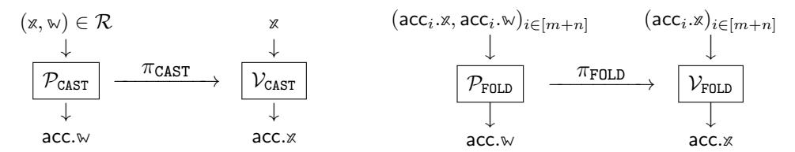

## ARC: Accumulation for Reed–Solomon Codes

Benedikt Bunz ¨

Pratyush Mishra

bb@nyu.edu New York University

prat@upenn.edu University of Pennsylvania

Wilson Nguyen

William Wang

wdnguyen@stanford.edu Stanford University

ww@priv.pub New York University

October 25, 2024

#### Abstract

Proof-Carrying Data (PCD) is a foundational tool for ensuring the correctness of incremental distributed computations that has found numerous applications in theory and practice. The state-of-the-art PCD constructions are obtained via *accumulation* or *folding* schemes. Unfortunately, almost all known constructions of accumulation schemes rely on homomorphic vector commitments (VCs), which results in relatively high computational costs and insecurity in the face of quantum adversaries. A recent work of Bunz, Mishra, Nguyen, and Wang removes the dependence on homomorphic VCs by relying only ¨ on the random oracle model, but introduces a bound on the number of consecutive accumulation steps, which in turn bounds the depth of the PCD computation graph and greatly affects prover and verifier efficiency.

In this work, we propose ARC, a novel hash-based accumulation scheme that overcomes this restriction and supports an unbounded number of accumulation steps. The core building block underlying ARC is a new accumulation scheme for claims about proximity of claimed codewords to the Reed–Solomon code. Our approach achieves near-optimal efficiency, requiring a small number of Merkle tree openings relative to the code rate, and avoids the efficiency loss associated with bounded accumulation depth. Unlike prior work, our scheme is also able to accumulate claims up to list-decoding radius, resulting in concrete efficiency improvements.

We use this accumulation scheme to construct two distinct accumulation schemes, again relying solely on random oracles. The first approach accumulates RS proximity claims and can be used as an almost-drop-in replacement in existing PCD deployments based on IOP-based SNARKs. The second approach directly constructs an accumulation scheme for rank-1 constraint systems (and more generally polynomial constraint systems) that is simpler and more efficient than the former and prior approaches.

We introduce the notion of Interactive Oracle Reductions (IORs) to enable a modular and simple security analysis. These extend prior notions of Reductions of Knowledge to the setting of IOPs.

# **Contents**

| 1  | Introduction               |                                                                              |           |  |  |  |  |
|----|----------------------------|------------------------------------------------------------------------------|-----------|--|--|--|--|
|    |                            | Our results                                                                  | 3         |  |  |  |  |
|    | 1.2                        | Related work                                                                 | 5         |  |  |  |  |
| 2  | Tech                       | Techniques                                                                   |           |  |  |  |  |
|    | 2.1                        | Accumulation for Reed–Solomon proximity claims                               | 7         |  |  |  |  |
|    |                            | Accumulation for NP                                                          | 9         |  |  |  |  |
|    |                            |                                                                              | 12        |  |  |  |  |
| 3  | Preli                      | minaries                                                                     | 14        |  |  |  |  |
|    | 3.1                        | Relations                                                                    | 14        |  |  |  |  |
|    | 3.2                        | Reed–Solomon codes                                                           | 15        |  |  |  |  |
|    | 3.3                        | Merkle trees                                                                 | 16        |  |  |  |  |
| 4  | Non-interactive reductions |                                                                              |           |  |  |  |  |
|    | 4.1                        |                                                                              | 18        |  |  |  |  |
| 5  | Inter                      | ractive oracle reductions                                                    | 20        |  |  |  |  |
|    |                            |                                                                              | - o<br>20 |  |  |  |  |
|    |                            |                                                                              | - ·<br>21 |  |  |  |  |
|    |                            |                                                                              | 22        |  |  |  |  |
| 6  | Accu                       | mulation for Reed–Solomon proximity claims                                   | 24        |  |  |  |  |
|    | 6.1                        | Construction                                                                 | 25        |  |  |  |  |
|    | 6.2                        |                                                                              | 26        |  |  |  |  |
|    | 6.3                        | Extensions and optimizations                                                 | 27        |  |  |  |  |
| 7  | Accumulation for NP        |                                                                              |           |  |  |  |  |
|    | 7.1                        | Reduction from $\mathcal{R}_{\mathtt{RiCS}}$ to $\mathcal{R}_{\mathtt{ACC}}$ | 29        |  |  |  |  |
|    |                            |                                                                              | 30        |  |  |  |  |
|    |                            |                                                                              | 31        |  |  |  |  |
| A  | cknow                      | ledgments                                                                    | 35        |  |  |  |  |
| Re | eferenc                    | ces                                                                          | 36        |  |  |  |  |
|    | ъ                          | e. e.m. 4.2                                                                  | 40        |  |  |  |  |
| A  |                            |                                                                              | <b>40</b> |  |  |  |  |
|    |                            |                                                                              | 40<br>41  |  |  |  |  |
|    | A.2                        | Construction                                                                 | 41        |  |  |  |  |
| В  |                            |                                                                              | <b>47</b> |  |  |  |  |
|    |                            |                                                                              | 50<br>51  |  |  |  |  |
|    |                            | 1 6                                                                          | 51        |  |  |  |  |
|    | В 3                        | Fiat—Shamir transformation                                                   | 56        |  |  |  |  |

## <span id="page-2-0"></span>1 Introduction

Proof-carrying data (PCD) [\[CT10\]](#page-36-0) is a powerful tool for proving the correctness of distributed computations that unfold incrementally. PCD has enabled numerous theoretical and practical applications, such as enforcing language semantics in distributed settings [\[CTV13\]](#page-36-1), complexity-preserving [\[BCCT13;](#page-35-1) [BCTV17\]](#page-35-2) and low-memory [\[NDCTB24\]](#page-37-0) succinct arguments, verifiable MapReduce computations [\[CTV15\]](#page-36-2), image provenance [\[NT16\]](#page-37-1), and consensus protocols and blockchains [\[Mina;](#page-37-2) [KB20;](#page-37-3) [BMRS20;](#page-36-3) [CCDW20;](#page-36-4) [BCG24\]](#page-35-3).

These applications have motivated numerous constructions of PCD [\[COS20;](#page-36-5) [BCMS20;](#page-35-4) [BCLMS21;](#page-35-5) [KST22;](#page-37-4) [BC23;](#page-35-6) [KS24\]](#page-37-5). The state-of-the-art amongst these approaches relies on accumulation [\[BCMS20;](#page-35-4) [BCLMS21\]](#page-35-5) or folding [\[KST22\]](#page-37-4) schemes. At a high level, these schemes enable a prover to efficiently accumulate arbitrary NP claims into a running 'accumulator', so that verifying the correctness of each accumulation step can be done cheaply, and furthermore the final accumulator can be checked in time that is independent of the number of accumulation steps. Prior work [\[BCMS20;](#page-35-4) [BCLMS21\]](#page-35-5) shows how to construct PCD from any accumulation scheme for a *non-*succinct argument (NARK): at each step of the computation, the PCD prover invokes the accumulation prover to accumulate claims about prior steps, and then invokes the argument prover to assert that (a) the current step was performed correctly; and (b) prior claims were accumulated correctly. This PCD construction inherits efficiency and expressivity properties of the underlying accumulation scheme (and NARK), and recent work has made great progress in this regard: the latest schemes achieve, among other benefits, simple constructions that are easy to analyze and implement, low cost for verifying accumulation, and efficient support for claims that use custom gates [\[GW19\]](#page-37-6). Unfortunately, existing schemes also suffer from some key drawbacks which we discuss next, categorized by how the schemes are constructed.

Accumulation from homomorphic vector commitments. The vast majority of accumulation scheme constructions [\[BCLMS21;](#page-35-5) [KST22;](#page-37-4) [BC23;](#page-35-6) [EG23;](#page-36-6) [KS23;](#page-37-7) [KS24\]](#page-37-5) use as a crucial building block homomorphic vector commitments. Unfortunately, all known constructions of the latter rely on one of two kinds of number-theoretic assumptions. The first kind relies on the hardness of the discrete logarithm problem in prime-order groups. This means that the accumulation prover must perform relatively expensive group operations, and furthermore leaves the schemes vulnerable to quantum attacks. The second kind attempts to fix the latter issue by relying on lattice assumptions [\[BC24;](#page-35-7) [FKNP24\]](#page-36-7), but the resulting accumulation schemes still incur overhead due to their reliance on number-theoretic assumptions.

Furthermore, both kinds of accumulation schemes cannot take advantage of recent advances in the design and implementation of SNARKs based on interactive oracle proofs (IOPs) [\[BCS16\]](#page-35-8), such as the ability to use small fields [\[HLP24;](#page-37-8) [Pol;](#page-37-9) [DP23\]](#page-36-8) and reliance on only cryptographic hashes [\[BCS16\]](#page-35-8).

Accumulation from homomorphism-checkers. To remedy this, a recent work [\[BMNW24\]](#page-36-9) constructs *hash-based* accumulation schemes that avoid public-key assumptions, achieve plausible post-quantum security, rely on minimal assumptions (just cryptographic hashes), and are able to take advantage of the aforementioned advances in IOP-based SNARKs. Unfortunately, their schemes only support a (small) bounded number of consecutive accumulation steps, and this in turn forces their PCD scheme to declare an *a priori* limit on the depth of the computation graph. Additionally, efficiency of the accumulation prover and verifier worsens as this bound increases; see Section [1.2](#page-4-0) for details.

## <span id="page-2-1"></span>1.1 Our results

In this work, we bypass the aforementioned limitations by constructing efficient hash-based accumulation schemes that support unbounded accumulation depth. At a high level, our schemes work by replacing homomorphic vector commitments with (non-homomorphic) Merkle tree commitments to Reed–Solomon encodings of the NP witnesses being accumulated. Making this high level sketch work requires us to develop a number of new techniques, which we describe next.

**New tool: accumulation for Reed–Solomon proximity claims.** The key ingredient underlying the foregoing results is a new accumulation scheme for claims about the proximity of a claimed codeword to the Reed–Solomon (RS) code. Our construction makes crucial use of tools that were previously developed for reasoning about properties of Reed–Solomon codes in the context of succinct arguments [BGKS20; ACFY24], and shows how to adapt these tools to the accumulation setting.<sup>1</sup>

In terms of efficiency, our accumulation scheme obtains essentially optimal parameters: asymptotically, for accumulating claims about proximity to the RS code of rate  $\rho$ , our scheme requires only  $\frac{2\lambda}{\log(1/\rho)}$  Merkle tree openings, and we can get rid of the factor of 2 when assuming common conjectures about list-decoding of RS codes [BBHR18; BGKS20].

In comparison, the accumulation verifier of the prior approach of Bünz et al. [BMNW24], which works for any code but only supports a bounded accumulation depth d, requires  $O(d\lambda)$  Merkle tree openings; this is concretely less efficient than our scheme for any non-trivial depth. We are able to avoid this depth bound because the techniques underlying our scheme are *distance-preserving*: if the inputs are at most  $\delta$ -far from the RS code, then so is the output. In contrast, the approach of Bünz et al. [BMNW24] is not distance-preserving: the output is only guaranteed to be  $\delta + \epsilon$ -far from the RS code for some parameter  $\epsilon$ . Furthermore, unlike the approach of Bünz et al. [BMNW24], our scheme extends to list-decoding radius  $1 - \sqrt{\rho}$ , which enables further efficiency improvements.

**Reed–Solomon-based accumulation for NP.** We leverage the foregoing RS proximity accumulation scheme to construct two different accumulation schemes for NP that rely solely on random oracles:

• Accumulation for Polynomial IOPs: (Section 6) The first approach relies on the observation that numerous prior SNARKs can be viewed as reducing checking NP witnesses to checking proximity of codewords to the Reed–Solomon (RS) code. In more detail, prior work [ACFY24] shows that (the information-theoretic component of) many IOP-based SNARKs for an NP relation  $\mathcal{R}$  can be decomposed into three steps: a polynomial interactive oracle proof (PIOP) [CHMMVW20; BFS20] for  $\mathcal{R}$  where the verifier checks that the prover's messages (which are guaranteed to be low-degree polynomials) satisfy certain identities, a transformation from these identities to RS proximity claims [KPV19; ACFY24], and a low-degree test (LDT) that enforces these claims.

We leverage this decomposition to construct an accumulation scheme for  $\mathcal{R}$ . Our scheme runs the first two steps (PIOP and transformation to RS proximity claims) like above, but then, instead of enforcing the proximity claims via the LDT, accumulates them via our accumulation scheme for RS proximity.

• Accumulation for R1CS: (Section 7) Our second approach builds on prior accumulation schemes [BC23; EG23] which reduce claims about an NP relation  $\mathcal{R}$  to claims about univariate polynomial identities. Our construction translates these claims into RS proximity claims and then invokes our accumulation scheme for the latter. In more detail, the accumulator in our construction now consists of two codewords: one that corresponds to the RS proximity accumulator and one that contains the accumulated witness to the polynomial identities. The construction maintains the essentially optimal properties of the underlying accumulation for proximity claims. The accumulation verifier checks only  $t = \frac{2\lambda}{\log(1/\rho)}$  Merkle path openings per input, and the accumulation is distance-preserving (unlike the scheme of Bünz et al [BMNW24]).

<span id="page-3-0"></span><sup>&</sup>lt;sup>1</sup>In fact, one can key view (a part of) our scheme as performing the first round of the recent STIR interactive oracle proof of proximity [ACFY24], which means that it will *always* be more efficient than STIR.

| scheme                  | code | IVC overhead per step                                                 | IVC verifier                                                                 | max. IVC length                |
|-------------------------|------|-----------------------------------------------------------------------|------------------------------------------------------------------------------|--------------------------------|
| PIOP + STIR [ACFY24]    | RS   | $\lambda(\frac{k}{\log(1/\rho)} + \log(\frac{\log n}{\log(1/\rho)}))$ | $\lambda(\frac{k}{\log(1/\rho)} + \log(\frac{\log n}{\log(1/\rho)})) T_{MT}$ | $\operatorname{poly}(\lambda)$ |
| [BMNW24]                | any  | $d \cdot \frac{\lambda}{\log(2/(1+\rho))}$                            | $d \cdot n$                                                                  | $m^d$                          |
| this paper (PIOP-based) | RS   | $k \cdot \frac{\lambda}{\log(1/\rho)}$                                | $k \cdot n$                                                                  | $\operatorname{poly}(\lambda)$ |
| this paper (direct)     | RS   | $\frac{\lambda}{\log(1/\rho)}$                                        | n                                                                            | $\operatorname{poly}(\lambda)$ |

**Table 1:** Comparison of IVC schemes constructed from PCD over a tree of depth d and arity m. All costs omit constant factors. All rows except [BMNW24] assume conjectures about proximity-gaps in the list-decoding radius. IVC overhead per step is measured in number of Merkle tree openings. Above n is the size of the recursive circuit divided by the code rate  $\rho$ , and  $T_{\rm MT}$  is the time it takes to verify a Merkle Tree opening over n-sized vectors. Finally, k denotes the number of oracles queried by the PIOP verifier. The IVC verifier in the accumulation-based constructions can be outsourced using a SNARK, e.g., using STIR.

The two approaches are useful in different settings. The first approach offers an easy path to improve the efficiency of existing PCD constructions rely on recursive composition of IOP-based SNARKs: simply replace the LDT with our RS proximity accumulation scheme. On the other hand, the second approach, by avoiding PIOPs, is able to attain a design that is simpler and more prover- and verifier- efficient than prior work, and is hence better for new systems.

New model: interactive oracle reductions. Along the way, we formalize a new notion of interactive and probabilistic reduction protocols that we call *interactive oracle reductions* (IORs). Roughly, an IOR from relation  $\mathcal{R}_1$  to relation  $\mathcal{R}_2$  is an interactive protocol between a prover and a verifier that convinces the verifier that a claimed instance  $x_1$  is in  $x_2$  if and only if another instance  $x_2$  is in  $x_2$ . IORs can be seen as the IOP analogues of reductions of knowledge [KP23]. We show how to compile IORs to *non-interactive* reductions by adapting the BCS transformation [BCS16].

We show how to interpret accumulation schemes as applying IORs for specific pairs of relations, and this perspective allows us to construct accumulation schemes in a straightforward manner, and also significantly simplifies our security proofs.

#### <span id="page-4-0"></span>1.2 Related work

**Bounded-depth accumulation.** As noted in Section 1, the only prior hash-based accumulation scheme is that of Bünz et al [BMNW24]. Unlike our work, their scheme supports any (constant-distance) linear code, including those that enjoy linear-time encoding algorithms [Spi96; DI14; GLSTW23]. However, this benefit comes with a severe drawback: their scheme only supports a bounded number of consecutive accumulation steps. In more detail, they construct a *family* of accumulation schemes that are parameterized by a depth bound *d*. This bound affects the choice of the code (larger *d* requires better code distance), and hence also prover efficiency (better distance results in worse rate and hence larger Merkle trees) and verifier efficiency (larger *d* requires more Merkle tree openings). We also note that the PCD scheme constructed from their accumulation scheme inherits this depth bound, and, even worse, suffers from a concrete attack once the depth of the computation graph exceeds the bound.

In contrast, because our scheme does *not* have a depth bound, we can fix (for each input size) a code with rate and distance that minimizes prover and verifier costs. For instance, we can arbitrarily choose rate 1/2 to minimize prover costs, or rate 1/4 or even 1/8 to reduce verifier costs. We are also not vulnerable to

the aforementioned attack.

[\[BMNW24\]](#page-36-9) also introduce several optimizations for IOP-based-accumulation IVC constructions. These include batch committing to multiple input accumulators, in order to reduce the number of oracle queries. These optimization also apply to our constructions.

Accumulation from hardness of discrete logarithms. As noted in Section [1,](#page-2-0) most existing accumulation schemes [\[BGH19;](#page-35-13) [BCMS20;](#page-35-4) [BCLMS21;](#page-35-5) [BDFG21;](#page-35-14) [KST22;](#page-37-4) [KS23;](#page-37-7) [BC23;](#page-35-6) [EG23;](#page-36-6) [KS24\]](#page-37-5) rely on the hardness of computing discrete logarithms over elliptic curve groups. This in turn requires the use of cryptographically large fields both to express the computation, which can incur overheads if the computation does not need such large fields (e.g., it performs arithmetic over small integers). Furthermore, efficient implementations require *cycles of elliptic curves*, which are tricky to use correctly in practice [\[NBS23\]](#page-37-14).

Accumulation from lattice assumptions. Some recent works [\[BC24;](#page-35-7) [FKNP24\]](#page-36-7) construct plausibly postquantum accumulation schemes from lattice-based assumptions such as SIS and Module-SIS. Unlike our work, they depend on additional assumptions beyond random oracles.

PCD from IOP-based SNARKs. A number of recent works have constructed PCD directly from IOPbased SNARKs [\[COS20;](#page-36-5) [Pol\]](#page-37-9). These works follow the standard methodology of constructing PCD from succinct arguments [\[BCCT13;](#page-35-1) [BCTV14\]](#page-35-15): to prove a t-step computation, the PCD prover invokes the prover for the underlying SNARK to assert that not only was the t-th computation step performed correctly, but also that there exists a valid SNARK proof for the first t − 1 steps.

While these PCD schemes inherit the benefits of their underlying SNARKs (e.g., plausible post-quantum security, concretely efficient provers, reliance only on cryptographic hashes, etc.), they incur high asymptotic and concrete PCD overhead due to the need to express the SNARK verifier as an arithmetic circuit. This is problematic, as it lower-bounds the computations for which PCD is effective: for computations that are cheaper than the SNARK verifier, the PCD prover spends most of its time proving the latter instead of the actual computation.

Asymptotically, even incorporating state-of-the-art improvements like STIR [\[ACFY24\]](#page-35-10) results in a verifier that requires O(log n+λ log log n) Merkle tree openings, whereas our accumulation-based approaches would require only O(λ) openings. Concretely, when instantiating the Merkle tree with an arithmetizationoriented hash function like Poseidon [\[GKRRS21\]](#page-37-15), Fractal's verifier circuit is of size at least 1.1 million gates [\[COS20\]](#page-36-5). In contrast, using our direct approach to accumulate R1CS claims of 2 <sup>20</sup> constraints requires only roughly 200, 000 gates *without* standard optimizations used by Fractal like proof of work or tree caps, and without using high-degree custom gates which our construction supports cheaply. (We set the rate of the RS code to be 1/16, which results in 128/ log<sup>2</sup> (1/(1/16)) = 32 Merkle tree openings.)

PCD from other SNARKs. The earliest work on efficient constructions of PCD proceeded by recursive composition of pairing-based SNARKs [\[BCTV14\]](#page-35-15). Like accumulation-based PCD that rely no prime-order groups (i.e., without pairings), these constructions also require a cycle of elliptic curves to attain efficient recursion. However, unlike the case for non-pairing curves, cycles of pairing-friendly curves are rare [\[CCW19;](#page-36-12) [BJS23\]](#page-36-13), and current constructions that meet 128-bit security levels require arithmetic over 1000-bit prime fields [\[Gui\]](#page-37-16).

## <span id="page-6-0"></span>2 Techniques

We introduce *interactive oracle reductions*, a notion which extends *interactive oracle proofs* [BCS16; RRR16] to capture *reductions*, a framework recently introduced by Kothapalli and Parno [KP23].

$$(\mathbb{X},\mathbb{W}) \in \mathcal{R} \qquad \qquad \mathbb{X} \qquad (\mathbb{X},\mathbb{W}) \in \mathcal{R} \qquad \qquad \mathbb{X} \qquad (\mathbb{X},\mathbb{Y},\mathbb{W}) \in \mathcal{R} \qquad (\mathbb{X},\mathbb{Y}) \\ \downarrow \qquad \qquad \downarrow \qquad \qquad \downarrow \qquad \qquad \downarrow \qquad \qquad \downarrow \qquad \downarrow \qquad \downarrow \qquad \downarrow$$

In a *reduction of knowledge*, a prover  $\mathcal{P}$  and verifier  $\mathcal{V}$  interact to reduce the claim that an instance x is in a language  $\mathcal{L}(\mathcal{R})$  into the claim that a new instance x' is in a new language  $\mathcal{L}(\mathcal{R}')$ . Moreover, if  $\mathcal{P}$  knows a new witness w' with  $(x', w') \in \mathcal{R}'$ , then it must also know a witness w with  $(x, w) \in \mathcal{R}$ . As an example, a *folding scheme* [BCLMS21; KST22; BC23; KS24] is a reduction from  $\mathcal{R} \times \mathcal{R}$  to  $\mathcal{R}$ .

The language of reductions seems to, in spirit, capture the protocols we construct. However, reductions of knowledge as described by Kothapalli and Parno [KP23] do not capture (1) instances which contain oracle strings y; and (2) verifiers having oracle access to prover messages  $\Pi$ , which are features we need to analyze our protocols. Interactive Oracle Proofs of Proximity (IOPPs) [BCGRS17] roughly capture these features, but are not reductions: in an IOPP, the verifier simply outputs a bit and not a new instance.

Therefore, we define an interactive oracle reduction for a relation  $\mathcal{R} := \{(\varkappa, y, w)\}$  as an interactive protocol between a prover and a verifier, where the verifier is given access oracle access to instance strings y and prover messages  $\Pi$ . At the end of interaction, the prover outputs a new witness w' and the verifier outputs a new instance  $(\varkappa', y')$ , where y' is selected from either the input oracle strings or those sent by the prover. Informally, if this new tuple  $(\varkappa', y', w')$  belongs to  $\mathcal{R}'$ , then the prover knows of a corresponding witness w such that  $(\varkappa, y, w)$  belongs to  $\mathcal{R}$ .

**IORs, accumulation, and PCD.** By adapting the BCS transformation [BCS16], we show that IORs can be compiled into non-interactive reductions in the random oracle model. We then prove that an accumulation scheme for a relation  $\mathcal{R}$  can be constructed from the following (non-interactive) components:

- 1. A reduction from  $\mathcal{R}$  to an intermediate relation  $\mathcal{R}_{ACC}$ .
- 2. A many-to-one reduction from  $\mathcal{R}^*_{ACC}$  to  $\mathcal{R}_{ACC}$ . Here,  $\mathcal{R}^*_{ACC}$  is defined to be the multi-instance relation  $\{((\mathbf{x}_1,\ldots,\mathbf{x}_m),(\mathbf{w}_1,\ldots,\mathbf{w}_m)): \forall i\in[m],(\mathbf{x}_i,\mathbf{w}_i)\in\mathcal{R}_{ACC}\}.$

Assuming that  $\mathcal{R}$  is NP-complete, prior work [BCLMS21] has shown how to construct proof-carrying data from such an accumulation scheme.

#### <span id="page-6-1"></span>2.1 Accumulation for Reed-Solomon proximity claims

Let  $\mathcal{C} \subset \mathbb{F}^n$  be a Reed–Solomon code. Suppose we have two vectors  $f_1, f_2 \in \mathbb{F}^n$ . Our goal is to reduce the claim that  $f_1$  and  $f_2$  are  $\delta$ -close to  $\mathcal{C}$  to the claim that a related vector f is  $\delta$ -close to  $\mathcal{C}$ . For simplicity, we assume that  $\delta$  is at most the unique decoding radius of the code.

A natural approach is to take f to be a random linear combination of  $f_1$  and  $f_2$ ; indeed, proximity gaps for Reed-Solomon codes [BCIKS23] tell us that if either  $f_1$  or  $f_2$  is  $\delta$ -far, then  $f := f_1 + r \cdot f_2$  will be  $\delta$ -far with high probability. However, this fact alone does not give us a many-to-one reduction for proximity

<span id="page-6-2"></span><sup>&</sup>lt;sup>2</sup>Two vectors  $f, g \in \mathbb{F}^n$  are δ-close if they agree on at least a  $(1 - \delta)$ -fraction of entries. We say that a vector f is δ-close to  $\mathcal{C}$  if there exists a codeword which is δ-close to f.

claims. The issue is that f is a "virtual" object defined over two vectors; whenever the verifier queries f[i], it is implicitly querying  $f_1[i]$  and  $f_2[i]$ . This implies that the new claim doubles in size (concretely, 2n+1 field elements). Ultimately, in order to realize accumulation, the size of the new claim must be independent of the number of old claims.

**Prior work.** We first recall the approach taken in [BMNW24]. After the verifier samples r, the prover sends a *new* vector f which is claimed to be  $f_1+r\cdot f_2$ . The verifier tests this by sampling a random location  $i\in [n]$  and checking that the vectors are consistent at the i-th entry:  $f[i]=f_1[i]+r\cdot f_2[i]$ . By repeating this spot check  $\frac{\lambda}{-\log(1-\varepsilon)}$  times, the verifier ensures that f is  $\varepsilon$ -close to  $f_1+r\cdot f_2$  with high probability. Hence, if either  $f_1$  or  $f_2$  is  $\delta$ -far, then f is  $(\delta-\varepsilon)$ -far from the code. Although the size of the new claim is indeed independent of the number of old claims, this is not quite a many-to-one reduction. The issue is that the distance claim degrades from  $\delta$  to  $\delta-\varepsilon$ . As a result, [BMNW24] are only able to construct a *bounded-depth accumulation scheme*, where the number of steps must be a small constant fixed in advance.

**Background.** Let  $\mathcal{L}$  be a subset of  $\mathbb{F}$  of size n; this is referred to as the evaluation domain. The Reed–Solomon code  $\mathsf{RS}[d] \subset \mathbb{F}^n$  is the set of words<sup>3</sup>  $f: \mathcal{L} \to \mathbb{F}$  where f is consistent with a polynomial of degree less than d. The *quotient* of a word  $f: \mathcal{L} \to \mathbb{F}$  relative to  $x, y \in \mathbb{F}$  is defined to be Quotient $(f, x, y)(X) := \frac{f(X) - y}{X - x}$ . We make the following observations:

- 1. If f is a codeword in RS[d] with y = f(x), then Quotient(f, x, y) is a codeword in RS[d-1]. This is because x is a root of g(X) y.
- <span id="page-7-1"></span>2. If Quotient (f, x, y) is  $\delta$ -close to a codeword  $w \in \mathsf{RS}[d-1]$ , then f is  $\delta$ -close to a codeword  $u \in \mathsf{RS}[d]$  with u(x) = y, namely  $u(X) := w(X) \cdot (X - x) + y$ .
- 3. If f is  $\delta$ -far from any codeword  $u \in \mathsf{RS}[d]$  with u(x) = y, then  $\mathsf{Quotient}(f, x, y)$  is  $\delta$ -far from  $\mathsf{RS}[d-1]$ . This is essentially the contrapositive of Item 2.

Quotients can be generalized to handle multiple points by defining

Quotient
$$(f, (x_1, y_1), \dots, (x_t, y_t)) := \frac{f(X) - p(X)}{\prod_{i=1}^t (X - x_i)},$$

where p is the Lagrange interpolation of  $(x_j,y_j)_{j\in[t]}$ . If f is  $\delta$ -far from any codeword  $u\in\mathsf{RS}[d]$  with  $u(x_j)=y_j$  for all j, then Quotient $(f,(x_1,y_1),\ldots,(x_t,y_t))$  is  $\delta$ -far from  $\mathsf{RS}[d-t]$ .

**This work.** We give a many-to-one reduction for Reed–Solomon proximity claims which preserves distance; the resulting accumulation scheme therefore supports an unbounded number of steps. The protocol starts off in the same way as before:

- 1. Verifier samples a random combination  $r \leftarrow \mathbb{F}$ .
- 2. Prover sends a new word  $f: \mathcal{L} \to \mathbb{F}$ . In the honest case,  $f:=f_1+r\cdot f_2$ .
- 3. Verifier samples locations  $x_1, \ldots, x_t \leftarrow \mathcal{L}$ .

Where we depart is in how the new claim is formulated. The verifier computes  $y_j := f_1(x_j) + r \cdot f_2(x_j)$  for each j, and defines the quotient  $q := \text{Quotient}(f, (x_1, y_1), \dots, (x_t, y_t))$ . The new claim is that q is  $\delta$ -close to RS[d-t]. Observe that q is defined over f and a few (specifically, 2t) auxiliary field elements, and hence the size of the new claim is independent of the number of old claims.

Suppose either  $f_1$  or  $f_2$  is  $\delta$ -far from RS[d]. We show that q will be  $\delta$ -far from RS[d-t] with high probability:

<span id="page-7-0"></span><sup>&</sup>lt;sup>3</sup>Any word  $f: \mathcal{L} \to \mathbb{F}$  can be interpreted as a vector in  $\mathbb{F}^n$ , and vice versa.

- 1. The random combination  $f' := f_1 + r \cdot f_2$  is  $\delta$ -far from RS[d] with high probability.
- <span id="page-8-1"></span>2. Since  $\delta$  is at most the unique decoding radius, there is at most one codeword  $u \in \mathsf{RS}[d]$  within  $\delta$  distance of f. Fix u if it exists. Since u is  $\delta$ -far from f', there exists j such that  $u(x_j) \neq f'(x_j) = y_j$  with probability at least  $1 - (1 - \delta)^t$ . Setting  $t := \frac{\lambda}{-\log(1-\delta)}$ , this is all but negligible.
- 3. We conclude that f is  $\delta$ -far from any codeword u with  $u(x_j) = y_j$  for all j, which implies that q is  $\delta$ -far from RS[d-t].

We are not quite done, because the new claim is about proximity to RS[d-t], rather than RS[d]. Fortunately, there exist efficient degree correction procedures which allow the verifier to soundly reduce a proximity claim for RS[d-t] into a proximity claim for RS[d].

To summarize, we have described a reduction for Reed–Solomon proximity claims which satisfies two key properties. First, the size of the new claim is independent of the number of old claims; this is necessary for accumulation. Second, the reduction is distance-preserving; this is necessary for accumulating an unbounded number of times. Although we focused on combining two claims, our construction can easily be extended to combine many at once.

<span id="page-8-2"></span>**Theorem 2.1** (informal). Define the relation  $\mathcal{R}_{RS}$  where  $(f,d) \in \mathcal{L}(\mathcal{R}_{RS})$  if f is  $\delta$ -close to RS[d]. There exists a many-to-one reduction for  $\mathcal{R}_{RS}$ .

Moving to the list decoding radius. Up to this point we have assumed that the distance parameter  $\delta$  is at most the unique decoding radius. We would ideally like to support larger  $\delta$ ; this would translate to smaller t and therefore improve query complexity. The key step in the analysis which fails if  $\delta$  were larger is Item 2; namely, there may be more than one codeword u in the  $\delta$ -ball of f. To resolve this, we leverage out-of-domain sampling [BGKS20]. In more detail, after the prover sends the new word f, the verifier samples an additional point  $x^{\text{out}} \in \mathbb{F}$ . The prover responds with a claimed evaluation  $y^{\text{out}}$ ; assuming  $\delta$  is less than the list decoding radius, with high probability there exists a unique codeword u in the  $\delta$ -ball satisfying  $u(x^{\text{out}}) = y^{\text{out}}$ . This point is additionally quotiented to obtain q.

#### <span id="page-8-0"></span>2.2 Accumulation for NP

We describe a highly efficient accumulation scheme for R1CS circuit satisfiability. Recall that an R1CS circuit is defined by matrices  $A, B, C \in \mathbb{F}^{M \times N}$  and instance length  $n \in \mathbb{N}$ . An instance  $x \in \mathbb{F}^n$  is in the language if there exists a witness  $w \in \mathbb{F}^{N-n}$  such that  $Az \circ Bz = Cz$  for  $z := (x, w) \in \mathbb{F}^N$ . Our goal is to accumulate instances of R1CS. Following the accumulation blueprint, it suffices to give (i) a reduction from R1CS to an intermediate relation  $\mathcal{R}_{ACC}$ ; and (ii) a many-to-one reduction for  $\mathcal{R}_{ACC}$ .

Informally,  $\mathcal{R}_{ACC}$  encodes an "algebraic" proximity claim in the sense that f must be  $\delta$ -close to a codeword u which satisfies an algebraic constraint. Let  $d:=\mathsf{N}-\mathsf{n}$ . Let P be a multivariate polynomial in k+d variables with total degree c. For a codeword  $u\in\mathsf{RS}[d]$ , let  $\vec{u}\in\mathbb{F}^d$  denote its decoding (concretely, its coefficient vector). For a scalar  $e\in\mathbb{F}$ , vector  $v\in\mathbb{F}^k$ , and word  $f:\mathcal{L}\to\mathbb{F}$ , we define  $(e,v,f)\in\mathcal{L}(\mathcal{R}_{\mathsf{ACC}})$  if f is  $\delta$ -close to a codeword  $u\in\mathsf{RS}[\mathbb{F},\mathcal{L},d]$  such that  $P(v,\vec{u})=e$ ; here,  $\vec{u}\in\mathbb{F}^d$  refers to the decoding of u, i.e., its vector of coefficients. We assume that  $\delta$  is at most the unique decoding radius of the code.

#### 2.2.1 Reduction from R1CS to $\mathcal{R}_{ACC}$

For simplicity, assume that M is a power of two and define  $m := \log M$ . For each  $i = 0, \ldots, M-1-1$ , define the multilinear polynomial  $pow_i(Y_1, \ldots, Y_m) = Y_1^{b_1} \cdots Y_m^{b_m}$ , where  $b_1, \ldots, b_m$  is the bit representation of

i. Observe that for all  $y \in \mathbb{F}$ ,  $\mathsf{pow}_i(y, y^2, y^4, \dots, y^{2^{\mathsf{m}-1}}) = y^i.$   $\mathcal{R}_{\mathsf{ACC}}$  is defined with  $k := \mathsf{m} + \mathsf{n}$  and the polynomial

$$P(Y_1,\ldots,Y_{\mathsf{m}},Z_1,\ldots,Z_{\mathsf{N}}) := \sum_{i=1}^{\mathsf{M}} \mathsf{pow}_{i-1}(Y_1,\ldots,Y_{\mathsf{m}}) \cdot (a_i^T \vec{Z} \cdot b_i^T \vec{Z} - c_i^T \vec{Z}),$$

where  $a_i$ ,  $b_i$ ,  $c_i$  are the *i*-th rows of A, B, C. Observe that P total degree c := m + 2. The reduction from R1CS to  $\mathcal{R}_{ACC}$  is as follows.

- 1. Prover sends a word  $f: \mathcal{L} \to \mathbb{F}$ . In the honest case, f is the encoding of witness w.
- 2. Verifier samples a random scalar  $r \leftarrow \mathbb{F}$ .
- 3. The new claim is that  $(e,v,f)\in\mathcal{L}(\mathcal{R}_{\mathtt{ACC}}),$  where e:=0 and  $v:=(r,r^2,r^4,\ldots,r^{2^{\mathsf{m}-1}},x)\in\mathbb{F}^k.$

**Soundness.** Suppose that x is not a valid R1CS instance. We show that  $(e, v, f) \notin \mathcal{L}(\mathcal{R}_{\texttt{ACC}})$  with high probability. Observe that since  $\delta$  is at most the unique decoding radius, there is at most one codeword u within  $\delta$  distance of f. Fix u if it exists; otherwise, we immediately have  $(e, v, f) \notin \mathcal{L}(\mathcal{R}_{\texttt{ACC}})$ . Define  $z := (x, \vec{u})$ . Since x is not a valid instance, there exists  $i \in [\mathsf{M}]$  such that  $a_i^T z \cdot b_i^T z \neq c_i^T z$ . Equivalently,

$$F(X) := P(X, X^2, X^4, \dots, X^{2^{\mathsf{m}-1}}, z) = \sum_{i=1}^{\mathsf{M}} X^{i-1} \cdot (a_i^T z \cdot b_i^T z - c_i^T z)$$

is a non-zero univariate polynomial of degree at most N-1. Since r is sampled uniformly, we have  $P(v,\vec{u})=F(r)\neq 0$  with probability at least  $1-\frac{N-1}{|\mathbb{F}|}$ . We conclude that  $(e,v,f)\notin\mathcal{L}(\mathcal{R}_{\mathtt{ACC}})$ .

#### **2.2.2** Many-to-one reduction for $\mathcal{R}_{ACC}$

Suppose we have many instances  $(e_1, v_1, f_1), \ldots, (e_m, v_m, f_m)$ . Our goal is to reduce the claim that  $(e_i, v_i, f_i) \in \mathcal{R}_{ACC}$  for all i to the claim that  $(e, v, f) \in \mathcal{R}_{ACC}$  for a new instance (e, v, f). Consider the reduction:

1. Fix a subset  $H = \{a_1, \ldots, a_m\} \subset \mathbb{F}$ , and define  $V(X) = \prod_{i=1}^m (X - a_i)$ , which vanishes on H. Let  $L_i$  denote the unique Lagrange polynomial of degree less than m satisfying  $L_i(a_i) = 1$  and  $L_i(a_j) = 0$  for  $i \neq j$ . The prover sends a univariate polynomial Q of degree at most  $c \cdot (m-1) - m$ . In the honest case, Q is the unique polynomial which satisfies

$$P\left(\sum_{i=1}^{m} L_i(X) \cdot (v_i, \vec{f_i})\right) - \sum_{i=1}^{m} L_i(X) \cdot e_i = Q(X) \cdot V(X).$$

This exists because the left side of the above equation vanishes on H.

- 2. Verifier samples an evaluation point  $\alpha \leftarrow \mathbb{F}$ .
- 3. Prover sends a new word  $f: \mathcal{L} \to \mathbb{F}$ . In the honest case,  $f:=\sum_{i=1}^m L_i(\alpha) \cdot f_i$ .
- 4. Verifier samples locations  $x_1, \ldots, x_t \leftarrow \mathcal{L}$ .
- 5. Verifier computes  $e := Q(\alpha) \cdot V(\alpha) + \sum_{i=1}^{m} L_i(\alpha) \cdot e_i$  and  $v := \sum_{i=1}^{m} L_i(\alpha) \cdot v_i$ .
- 6. Verifier computes  $y_j := \sum_{i=1}^m L_i(\alpha) \cdot f_i(x_j)$  for each  $j \in [t]$ .
- 7. We have the following new claims:
  - $(e, v, f) \in \mathcal{R}_{ACC}$ .

- $(f_i, d) \in \tilde{\mathcal{R}}_{RS}$  for each  $i \in [m]$ .
- $(q, d-t) \in \tilde{\mathcal{R}}_{RS}$ , where  $q := \mathsf{Quotient}(f, (x_1, y_1), \dots, (x_t, y_t))$ .

This is not quite a many-to-one reduction for  $\mathcal{R}_{ACC}$ , since we also output several proximity claims. We resolve this by keeping track of *two instances*: one for  $\mathcal{R}_{ACC}$  and one for  $\tilde{\mathcal{R}}_{RS}$ . It suffices to construct a many-to-one reduction for  $\mathcal{R}_{ACC} \times \tilde{\mathcal{R}}_{RS}$ , where the verifier (i) reduces m instances for  $\mathcal{R}_{ACC}$  into one instance for  $\mathcal{R}_{ACC}$  and m+1 instances for  $\tilde{\mathcal{R}}_{RS}$ ; and (ii) reduces 2m+1 instances for  $\tilde{\mathcal{R}}_{RS}$  into one instance for  $\tilde{\mathcal{R}}_{RS}$  using Theorem 2.1.

**Soundness.** We show that if  $(e_i, v_i, f_i) \notin \mathcal{R}_{ACC}$  for some i, then at least one of the new instances is invalid with high probability.

- 1. Assume that  $f_1, \ldots, f_m$  are  $\delta$ -close to  $\mathsf{RS}[d]$ ; otherwise, the many-to-one reduction for  $\tilde{\mathcal{R}}_{\mathsf{RS}}$  will output an invalid instance and we are done. In fact, the many-to-one reduction will only output a valid instance if there is *correlated agreement*: there exist codewords  $u_1, \ldots, u_m \in \mathsf{RS}[d]$  such that  $f_1, \ldots, f_m$  respectively agrees with  $u_1, \ldots, u_m$  on the same  $1 \delta$  fraction of points. This is implied by proximity gaps for Reed–Solomon codes.
- 2. We are guaranteed that there exists some i such that  $P(v_i, \vec{u}_i) \neq e_i$ . Observe that

$$F(X) := P\left(\sum_{i=1}^{m} L_i(X) \cdot (v_i, \vec{f_i})\right) - Q(X) \cdot V(X) - \sum_{i=1}^{m} L_i(X) \cdot e_i$$

is a non-zero polynomial of degree at most  $c \cdot (m-1)$ , since  $F(a_i) = P(v_i, \vec{u}_i) - e_i$ . Define  $u' := \sum_{i=1}^m L_i(\alpha) \cdot u_i$ . With probability  $1 - \frac{c \cdot (m-1)}{|\mathbb{F}|}$ ,  $F(\alpha) = P(v, \vec{u}') \neq e$ .

- 3. Define  $f' := \sum_{i=1}^{m} L_i(\alpha) \cdot f_i$ . By correlated agreement, u' is  $\delta$ -close to f'.
- 4. Since  $\delta$  is at most the unique decoding radius, there exists at most one codeword  $u \in \mathsf{RS}[d]$  within  $\delta$  distance of f. Fix u if it exists and assume that  $P(v, \vec{u}) = e$ ; otherwise,  $(e, v, f) \notin \mathcal{R}_{\mathsf{ACC}}$  and we are done.
- 5. Since  $P(v, \vec{u}) \neq P(v, \vec{u}')$ , we know that  $u \neq u'$ . Since the distance of the code is double the unique decoding radius, u is  $2\delta$ -far from u'. By a triangle inequality, u is  $\delta$ -far from f'.
- 6. With probability at least  $1 (1 \delta)^t$ , there exists j such that  $u(x_j) \neq f'(x_j) = y_j$ . Setting  $t := \frac{\lambda}{-\log(1-\delta)}$ , this is all but negligible.
- 7. We conclude that f is  $\delta$ -far from any codeword u with  $u(x_j) = y_j$  for all j, which implies that q is  $\delta$ -far from RS[ $\mathbb{F}$ ,  $\mathcal{L}$ , d-t]. With high probability, the many-to-one reduction for  $\tilde{\mathcal{R}}_{RS}$  outputs an invalid instance.

Moving to list decoding radius. As in Section 2.1, we can upgrade  $\delta$  to be less than the list decoding radius. We use the same technique of out-of-domain samples to bind vectors to a unique codeword within the  $\delta$ -ball. For the construction, we need to send three separate out-of-domain samples. First, we bind each input  $f_i$  to a unique codeword. Then, after the challenge  $\alpha$ , we bind the virtual polynomial f'. Finally, we use an additional out-of-domain sample to bind f. We discuss the necessity of these samples in more detail in Remark 7.15.

#### <span id="page-11-0"></span>2.3 Proof-carrying data from reductions

Accumulation from Non-interactive Reductions. As we have seen, interactive oracle reductions and their compiled form, non-interactive reductions, capture natural notions of batching and generalize the existing frameworks of IOPPs and reductions of knowledge. In this work, we show that given a pair of non-interactive reductions matching a particular form, we can naturally construct a corresponding non-interactive argument and accumulation scheme for that non-interactive argument. We state this more clearly in the following informal theorem.

**Theorem 2.2** (informal). Let  $\mathcal{R}$  and  $\mathcal{R}_{ACC}$  be indexed relations. Suppose that

- RDX<sub>CAST</sub> is a non-interactive reduction from  $\mathcal{R}$  to  $\mathcal{R}_{ACC}$ .
- RDX<sub>FOLD</sub> is a non-interactive reduction from  $\mathcal{R}_{ACC}^*$  to  $\mathcal{R}_{ACC}$ .

Then there exists a non-interactive argument ARG for  $\mathcal R$  and an accumulation scheme ACC for ARG.



Intuitively, the reduction RDX<sub>CAST</sub> casts a member  $(\varkappa, w)$  of relation  $\mathcal{R}$  into a member  $(\mathsf{acc}.\varkappa, \mathsf{acc}.w)$  in the accumulator relation  $\mathcal{R}_{ACC}$ . While the reduction RDX<sub>FOLD</sub>, folds together multiple members  $(\mathsf{acc}_i.\varkappa, \mathsf{acc}_i.\varkappa)_i$  of the accumulator relation into a single instance  $(\mathsf{acc}.\varkappa, \mathsf{acc}.w)$ . An initial observation is that the reduction RDX<sub>CAST</sub> closely matches the shape of a non-interaction argument ARG  $=(\mathcal{P},\mathcal{V})$ . The argument prover and verifier can internally run the reduction RDX<sub>CAST</sub> to derive a new accumulator instance and witness. The prover can send, along with the reduction proof, the new accumulator witness and the verifier can check if the new accumulator belongs to  $\mathcal{R}_{ACC}$ . This immediately gives us an argument for relation  $\mathcal{R}$ .

$$(\mathbf{x}, \mathbf{w}) \in \mathcal{R} \downarrow \qquad \qquad \downarrow \qquad \qquad \downarrow$$

$$\mathcal{P}: (\pi_{\text{CAST}}, \text{acc.} \mathbf{w}) \leftarrow \mathcal{P}_{\text{CAST}}(\mathbf{x}, \mathbf{w}) \qquad \qquad \underbrace{\pi := (\pi_{\text{CAST}}, \text{acc.} \mathbf{w})}_{\text{(acc.} \mathbf{x}, \text{ acc.} \mathbf{w})} \overset{?}{\in} \mathcal{R}_{\text{ACC}}$$

All that remains to be shown is how to construct an accumulation scheme for ARG. Naturally, the argument proof  $\pi$  can be partition into  $(\pi. \texttt{x}, \pi. \texttt{w}) := (\pi_{\texttt{CAST}}, \texttt{acc. w})$ . By design, we now have that the accumulation predicate instance  $(\texttt{x}, \pi. \texttt{x})$  is exactly the input to the reduction verifier RDX<sub>CAST</sub>. Thus, given m accumulator instances and n predicate instances, the accumulation prover and verifier can symmetrically run  $\mathcal{V}_{\texttt{CAST}}$  to derive m+n accumulator instances.

$$(\mathsf{acc}_1.\mathbb{X},\ \cdots,\ \mathsf{acc}_m.\mathbb{X},(\pi_{\mathsf{CAST}_1},\mathbb{X}_1),\ \cdots\ (\pi_{\mathsf{CAST}_n},\mathbb{X}_n))\\ \downarrow \qquad \qquad \downarrow\\ \boxed{\mathcal{V}_{\mathsf{CAST}}} \qquad \cdots \qquad \boxed{\mathcal{V}_{\mathsf{CAST}}}\\ \downarrow \qquad \qquad \downarrow\\ (\mathsf{acc}_1.\mathbb{X},\ \cdots,\ \mathsf{acc}_m.\mathbb{X},\ \mathsf{acc}_{m+1}.\mathbb{X},\ \cdots\ \mathsf{acc}_{m+n}.\mathbb{X})$$

Now, the accumulation prover can run the reduction RDX<sub>F0LD</sub> to derive the output accumulator acc  $\leftarrow$  (acc.x, acc.w) which folds together the m+n accumulators and produce an accumulation proof pf  $\leftarrow$   $\pi_{\text{F0LD}}$ . The accumulation verifier just has to check this new accumulator instance acc.x is identical to what is derived

by running the reduction verifier RDX<sub>FOLD</sub>. Finally, the accumulation decider just checks if an accumulator acc := (acc.x, acc.w) belongs to  $\mathcal{R}_{ACC}$ . We treat this discussion formally in Theorem 4.3 and provide the corresponding argument ARG and accumulation scheme ACC in Construction A.4 and Construction A.6.

From Reductions to Proof Carrying Data and IVC. What we just described is a method to construct accumulation from non-interactive reductions. In prior works [BCMS20; BCLMS21], accumulation schemes for non-interactive arguments can be transformed into IVC and PCD schemes, assuming the non-interactive argument is for an NP-complete relation and the circuit description of the accumulation verifier is succinct (Theorem 5.3 in [BCLMS21]). In our construction, these requirements translate to whether the relation  $\mathcal R$  is NP-complete and if the reduction verifiers  $\mathcal V_{\text{CAST}}$  and  $\mathcal V_{\text{FOLD}}$  are succinct.

While the PCD construction naturally follows from prior work, the security analysis must be slightly tweaked when considering promise relations, which have both strict and relaxed relations,  $\mathcal{R}_{ACC}$  and  $\tilde{\mathcal{R}}_{ACC}$  respectively. In particular, the knowledge soundness of both the argument ARG and accumulation scheme ACC hold with respect to a relaxed verifier and decider,  $\tilde{\mathcal{V}}$  and  $\tilde{D}$ , which check that an accumulator belongs to the relaxed relation  $\tilde{\mathcal{R}}_{ACC}$ , while in the construction they check pairs belong to the strict relation  $\mathcal{R}_{ACC}$ . We observe that the knowledge soundness proof of the PCD construction (Theorem 5.3 in [BCLMS21]) can be immediately adapted by replacing the verifier and decider with their relaxed variants. Alternatively, we can also adapt the proof in [BMNW24] which shows how to construct PCD from bounded-depth accumulation. Unlike our work, which has one relaxed verifier and decider, they have a different relaxed verifier and decider for each recursive extraction, up to some depth-bound  $s \in \mathbb{N}$ . In our setting, we would just maintain the same relaxed verifier and decider regardless of the extraction depth.

## <span id="page-13-0"></span>3 Preliminaries

**Strings and words.** For an alphabet  $\Sigma$ , a string  $s \in \Sigma^*$  is a tuple of characters in the alphabet. For a finite set S, a word  $w : S \to \Sigma$  is a function mapping elements of S to characters in  $\Sigma$ . These objects are somewhat interchangeable; a string  $s \in \Sigma^n$  can be viewed as a word over the set of indices [n], and a word  $w : S \to \Sigma$  can be viewed as a string of length |S| (assuming S has a fixed ordering).

**Restrictions.** For a string  $s \in \Sigma^n$  and subset of indices  $I \subseteq [n]$ , the restriction  $s|_I : I \to \Sigma$  is defined to be  $s|_I(i) = s(i)$ . Alternatively, we can treat  $s|_I$  as a string of length n over an augmented alphabet  $\Sigma \sqcup \{\bot\}$ , where the i-th character of  $s|_I$  is s(i) if  $i \in I$ , and  $\bot$  otherwise.

**Hamming distance.** For an alphabet  $\Sigma$ , the relative Hamming distance between two strings  $s, s' : s \in \Sigma^n$ , denoted  $\Delta(s, s')$ , is the number of locations where s and s' disagree, divided by n. For a set of strings  $S \in \Sigma^n$ , we define  $\Delta(s, S) := \min_{s' \in S} \Delta(s, s')$ .

**Polynomials.** For a field  $\mathbb{F}$ , let  $\mathbb{F}^{< d}[X]$  denote the set of univariate polynomials over  $\mathbb{F}$  of degree less than d. For a set  $S \subset \mathbb{F}$ , the vanishing polynomial  $V_S(X) := \prod_{a \in S} (X - a)$  is the unique non-zero polynomial of degree at most |S| that is zero on S. For an element  $a \in S$ , let  $L_{a,S}$  denote the unique Lagrange polynomial of degree less than |S| such that  $L_{a,S}(a) = 1$  and  $L_{a,S}(b) = 0$  for all  $b \in S \setminus \{a\}$ . For a function  $f: S \to \mathbb{F}$ , let  $\hat{f}$  denote the unique extension polynomial of degree less than |S| such that  $\hat{f}(a) = f(a)$  for all  $a \in S$ , i.e.,  $\hat{f}(X) := \sum_{a \in S} f(a) \cdot L_{a,S}(X)$ .

**Polynomial quotients.** For a field  $\mathbb{F}$ , polynomial  $p \in \mathbb{F}^{< d}[X]$ , and set  $S \subset \mathbb{F}$ , the polynomial quotient PolyQuotient $(p, S) \in \mathbb{F}^{< d - |S|}[X]$  is defined to be

$$\mathsf{PolyQuotient}(p,S)(x) := \frac{p(x) - r(x)}{V_S(x)},$$

where r is the unique polynomial of degree less than |S| such that r(a) = p(a) for all  $a \in S$  (in other words, r is the extension of the restriction of p to S).

**Random oracles.** Let  $\mathcal{U}(\lambda)$  denote the uniform distribution of functions that map  $\{0,1\}^*$  to  $\{0,1\}^{\lambda}$ . A random oracle is a function  $\rho: \{0,1\}^* \to \{0,1\}^{\lambda}$  sampled from  $\mathcal{U}(\lambda)$ . Our constructions will often use multiple random oracles of varying output sizes; these can be derived from a single random oracle via domain extension and output extension. For more discussion, see [CY24, Section 2.6].

#### <span id="page-13-1"></span>3.1 Relations

**Indexed relations.** An *indexed relation*  $\mathcal{R}$  is a set of triples  $\{(\mathring{\mathbb{I}}, \mathbb{X}, \mathbb{W})\}$  where  $\mathring{\mathbb{I}}$  is the index,  $\mathbb{X}$  is the instance, and  $\mathbb{W}$  is the witness; the corresponding *indexed language*  $\mathcal{L}(\mathcal{R})$  is the set of pairs  $(\mathring{\mathbb{I}}, \mathbb{X})$  for which there exists a witness  $\mathbb{W}$  such that  $(\mathring{\mathbb{I}}, \mathbb{X}, \mathbb{W}) \in \mathcal{R}$ . For example, the indexed relation of satisfiable boolean circuits consists of triples where  $\mathring{\mathbb{I}}$  is the description of a boolean circuit,  $\mathbb{X}$  is a partial assignment to its input wires, and  $\mathbb{W}$  is an assignment to the remaining wires that makes the circuit output 1.

**Parameterized relations and R1CS.** A parameterized relation  $\mathcal{R}$  over a (typically implicit) parameter space  $\mathbb{P}$  is a set of relations  $\{\mathcal{R}(\mathbb{p}) : \mathbb{p} \in \mathbb{P}\}$ . The R1CS relation is parameterized by a finite field  $\mathbb{F}$ ;  $\mathcal{R}_{\mathtt{R1CS}}(\mathbb{F})$  consists of triples  $(\mathbb{G}, \mathbb{x}, \mathbb{w}) = ((A, B, C, n), x, w)$  where A, B, C are  $M \times N$  matrices over  $\mathbb{F}$ ,  $x \in \mathbb{F}^n$ , and  $w \in \mathbb{F}^{N-n}$  such that  $Az \circ Bz = Cz$  for z := (x, w).

**Relations relative to a random oracle.** A *relation relative to a random oracle*, denoted  $\mathcal{R}^{\mathcal{U}}$ , is a set of relations  $\{\mathcal{R}^{\rho}: \rho \in \operatorname{supp}(\mathcal{U})\}$ , where  $\operatorname{supp}(\mathcal{U})$  denotes  $\bigcup_{\lambda \in \mathbb{N}} \operatorname{supp}(\mathcal{U}(\lambda))$ .

Promise relations. Some proof systems exhibit a gap between completeness and soundness, i.e., completeness holds for a relation R, but soundness only guarantees membership in a superset relation R ⊇ R ˜ . In this case it is useful to describe R as a *promise relation*, where soundness holds for the associated *relaxed relation* R˜. [4](#page-14-1)

Putting it all together. A parameterized indexed promise relation R<sup>U</sup> (over parameter space **P**, relative to a random oracle) is a set of indexed promise relations {(R<sup>ρ</sup> (**p**), R˜<sup>ρ</sup> (**p**)) : **p** ∈ **P**, ρ ∈ supp(U)} such that R<sup>ρ</sup> (**p**) ⊆ R˜<sup>ρ</sup> (**p**). We say that R<sup>U</sup> is in NP<sup>U</sup> if and only if there exists a polynomial-time oracle Turing machine M such that for every **p** ∈ **P** and ρ ∈ supp(U), R<sup>ρ</sup> (**p**) = {(**i**, **x**, **w**) : M<sup>ρ</sup> (**p**, **i**, **x**, **w**) = 1}.

Multi-instance relations. Let R be an indexed relation. The *multi-instance relation* is defined to be R<sup>∗</sup> := {(**i**,(**x**1, . . . , **x**m),(**w**1, . . . , **w**m)) : ∀i ∈ [m],(**i**, **x**<sup>i</sup> , **w**i) ∈ R}. This notion readily extends to the types of relations described above.

## <span id="page-14-0"></span>3.2 Reed–Solomon codes

For a field F, evaluation domain L ⊂ F, and degree d ∈ N, the Reed–Solomon code RS[F,L, d] is the set of words L → F corresponding to polynomials of degree less than d:

$$\mathsf{RS}[\mathbb{F}, \mathcal{L}, d] := \{ f : \mathcal{L} \to \mathbb{F} : \hat{f} \in \mathbb{F}^{< d}[X] \}.$$

The rate of RS[F,L, d] is ρ := d/|L|. For a codeword f ∈ RS[F,L, d], let ⃗f ∈ F <sup>d</sup> denote the coefficient vector of ˆf.

#### 3.2.1 Rational constraints

Definition 3.1. A *rational function* c = (p, q) is a pair of arithmetic circuits, p : F <sup>k</sup>+1 → F and q : F → F. For an interleaved word f = (f1, . . . , fk), f<sup>i</sup> : L → F, we define c(f) : L → F to be

$$\mathbf{c}(\mathbf{f})(x) := \frac{p(x, f_1(x), \dots, f_k(x))}{q(x)}.$$

A *rational constraint* consists of a rational function c and a degree bound d ∈ N. We say that the rational constraint is *satisfied with respect to* f if c(f) ∈ RS[F,L, d].

#### 3.2.2 List decoding

Definition 3.2. Let f : L → F be a word, d ∈ N be a degree, and γ ∈ (0, 1) be a list decoding parameter. We define List(f, d, γ) := {g ∈ RS[F,L, d] : ∆(f, g) ≤ γ} to be the set of codewords that are γ-close to f. A Reed–Solomon code RS[F,L, d] is (γ, ℓ)*-list decodable* if |List(f, d, γ)| ≤ ℓ for any word f : L → F.

<span id="page-14-2"></span>Theorem 3.3 (Johnson bound). *The Reed–Solomon code* RS[F,L, d] *is* (1 − <sup>√</sup><sup>ρ</sup> <sup>−</sup> η, <sup>1</sup>/(2<sup>η</sup> <sup>√</sup>ρ))*-listdecodable for any choice of* η ∈ (0, 1 − <sup>√</sup>ρ)*, where* <sup>ρ</sup> *is the rate of the code.*

<span id="page-14-3"></span>Lemma 3.4 ([\[ACFY24,](#page-35-10) Lemma 4.5]). *Let* f : L → F *be a word,* d ∈ N *be a degree,* s ∈ N *be a repetition parameter, and* γ ∈ (0, 1) *be a distance parameter. Suppose that* RS[F,L, d] *is* (γ, ℓ)*-list decodable. Then*

$$\begin{aligned} & \Pr_{x_1, \dots, x_s \leftarrow \mathbb{F} \setminus \mathcal{L}} [\exists u, u' \in \mathsf{List}(f, d, \gamma), u \neq u', \forall i \in [s], \hat{u}(x_i) = \hat{u}'(x_i)] \\ & \leq \binom{\ell}{2} \cdot \left(\frac{d-1}{\mathbb{F} - |\mathcal{L}|}\right)^s \leq \frac{\ell^2}{2} \cdot \left(\frac{d-1}{\mathbb{F} - |\mathcal{L}|}\right)^s. \end{aligned}$$

<span id="page-14-1"></span><sup>4</sup>Alternatively, a promise relation can be defined as a pair (RYES, RNO), where completeness holds for RYES and soundness holds for the complement of RNO.

#### 3.2.3 Quotients

**Definition 3.5** ([ACFY24, Definition 4.2]). Let  $f: \mathcal{L} \to \mathbb{F}$  be a word,  $S \subset \mathbb{F}$  be a set, Ans  $: S \to \mathbb{F}$  be a function, and Fill  $: S \cap \mathcal{L} \to \mathbb{F}$  be a function. We define Quotient $(f, S, Ans, Fill): \mathcal{L} \to \mathbb{F}$  to be

$$\mathsf{Quotient}(f,S,\mathsf{Ans},\mathsf{Fill})(x) := \begin{cases} \mathsf{Fill}(x) & x \in S \\ \frac{f(x) - \hat{\mathsf{Ans}}(x)}{V_S(x)} & x \not \in S. \end{cases}$$

<span id="page-15-3"></span>**Lemma 3.6** ([ACFY24, Lemma 4.4]). Let  $f: \mathcal{L} \to \mathbb{F}$  be a word,  $d \in \mathbb{N}$  be a degree,  $\delta \in (0,1)$  be a distance parameter,  $S \subset \mathbb{F}$  be a subset with |S| < d, and  $\mathsf{Ans}: S \to \mathbb{F}$  be a function. Suppose that for every  $u \in \mathsf{List}(f,d,\delta)$ , there exists  $x \in S$  such that with  $\hat{u}(x) \neq \mathsf{Ans}(x)$ . Then for any choice of Fill,

$$\Delta(\mathsf{Quotient}(f, S, \mathsf{Ans}, \mathsf{Fill}), \mathsf{RS}[\mathbb{F}, \mathcal{L}, d - |S|]) > \delta - |S \cap \mathcal{L}|/|\mathcal{L}|.$$

#### 3.2.4 Proximity gaps

<span id="page-15-1"></span>**Definition 3.7** ([BCIKS23]). Let  $\mathbb{F}$  be a field,  $d \in \mathbb{N}$  be a degree,  $\rho \in (0,1)$  be a rate,  $\delta \in (0,1-\sqrt{\rho})$  be a distance parameter, and  $m \in \mathbb{N}$  be an arity. The *proximity error* is defined to be

$$\varepsilon_{\texttt{prox}}(\mathbb{F},d,\rho,\delta,m) := \begin{cases} \frac{(m-1)\cdot d}{\rho\cdot |\mathbb{F}|} & \delta \in \left(0,\frac{1-\rho}{2}\right] \\ \frac{(m-1)\cdot d^2}{|\mathbb{F}|\cdot (2\cdot \min\{1-\sqrt{\rho}-\delta,\sqrt{\rho}/20\})^7} & \delta \in \left(\frac{1-\rho}{2},1-\sqrt{\rho}\right) \end{cases}$$

**Definition 3.8** ([ACFY24, Definition 4.11]). Let  $d_{\max} \in \mathbb{N}$  be a target degree,  $r \in \mathbb{F}$  be a field element,  $f_1, \ldots, f_m : \mathcal{L} \to \mathbb{F}$  be words, and  $d_1, \ldots, d_m \in [d_{\max}]$  be degrees. We define Combine $(d_{\max}, r, (f_1, d_1), \ldots, (f_m, d_m)) : \mathcal{L} \to \mathbb{F}$  to be

 $Combine(d_{\max}, r, (f_1, d_1), \dots (f_m, d_m))(x)$ 

$$:= \sum_{i=1}^{m} r_i \cdot f_i(x) \cdot \left( \sum_{j=0}^{d_{\max} - d_i} (rx)^j \right) = \begin{cases} \sum_{i=1}^{m} r_i \cdot f_i(x) \cdot \left( \frac{1 - (rx)^{d_{\max} - d_i + 1}}{1 - rx} \right) & rx \neq 1 \\ \sum_{i=1}^{m} r_i \cdot f_i(x) \cdot (d_{\max} - d_i + 1) & rx = 1. \end{cases}$$

<span id="page-15-2"></span>**Lemma 3.9** ([ACFY24, Lemma 4.13]). Let  $d_{\max} \in \mathbb{N}$  be a target degree,  $f_1, \ldots, f_m : \mathcal{L} \to \mathbb{F}$  be words,  $d_1, \ldots, d_m \in [d_{\max}]$  be degrees, and  $\delta \in (0, 1 - \sqrt{\rho} - 1/|\mathcal{L}|)$  be a distance parameter, where  $\rho := d^*/|\mathcal{L}|$ . If

$$\Pr_{r \leftarrow \mathbb{F}}[\Delta(\mathsf{Combine}(d_{\mathtt{max}}, r, (f_1, d_1), \dots, (f_m, d_m)), \mathsf{RS}[\mathbb{F}, \mathcal{L}, d_{\mathtt{max}}]) \leq \delta]$$

$$<\varepsilon_{\texttt{prox}}\left(d_{\texttt{max}},\rho,\delta,m\cdot(d_{\texttt{max}}+1)-\sum_{i=1}^{m}d_{i}\right),$$

then there exists a subset  $S \subseteq \mathcal{L}$  with  $|S| \ge (1 - \delta) \cdot |\mathcal{L}|$  such that for all  $i \in [m]$ , there exists a codeword  $u \in \mathsf{RS}[\mathbb{F}, \mathcal{L}, d_i]$  such that u agrees with  $f_i$  on S.

#### <span id="page-15-0"></span>3.3 Merkle trees

We recall the definition of Merkle commitments along with some useful security properties from [CY24, Section 18]. The Merkle commitment scheme is a tuple of deterministic polynomial-time oracle algorithms MT = (MT.Commit, MT.Open, MT.Check) implicitly parameterized by an output size  $\sigma \in \mathbb{N}$ , alphabet  $\Sigma$ , and string length  $\ell \in \mathbb{N}$ . All algorithms receive query access to a random oracle  $\rho_{MT} \in \mathcal{U}(\sigma)$ .

- MT.Commit receives as input a string  $m \in \Sigma^{\ell}$ . It outputs a commitment cm  $\in \{0,1\}^{\sigma}$  and a trapdoor td  $\in \{0,1\}^{O(\sigma\ell)}$ .
- MT.Open receives as input a trapdoor td and subset  $I \subseteq [\ell]$ . It outputs an opening proof pf  $\{0,1\}^{|I|\cdot\sigma\log\ell}$ .
- MT.Check receives as input a commitment cm, restriction  $a \in \Sigma^I$ , and opening proof pf. It outputs a bit indicating whether or not the opening proof authenticates the restriction with respect to the commitment.

**Lemma 3.10** (MT is complete). For every (unbounded) adversary A,

$$\Pr\left[ \mathsf{MT}.\mathsf{Check}^{\rho_{\mathsf{MT}}}(\mathsf{cm},m|_{I},\mathsf{pf}) = 1 \left| \begin{array}{c} \rho_{\mathsf{MT}} \leftarrow \mathcal{U}(\sigma) \\ (m,I) \leftarrow \mathcal{A}^{\rho_{\mathsf{MT}}} \\ (\mathsf{cm},\mathsf{td}) := \mathsf{MT}.\mathsf{Commit}^{\rho_{\mathsf{MT}}}(m) \\ \mathsf{pf} := \mathsf{MT}.\mathsf{Open}^{\rho_{\mathsf{MT}}}(\mathsf{td},I) \end{array} \right] = 1.$$

<span id="page-16-0"></span>**Lemma 3.11** (MT is multi-extractable). *There exists a deterministic polynomial-time algorithm* MT.MultiExtract *such that for every query bound*  $t \in \mathbb{N}$ , t-query adversary A, and  $k \in \mathbb{N}$ ,

$$\Pr\left[\begin{array}{l} \exists i \in [k]: \\ \mathsf{MT.Check}^{\rho_{\mathsf{MT}}}(\mathsf{cm}_i, I_i, a_i, \mathsf{pf}_i) = 1 \\ m_i[I_i] \neq a_i \end{array} \right| \left. \begin{array}{l} \rho_{\mathsf{MT}} \leftarrow \mathcal{U}(\sigma) \\ (\mathsf{cm}_i, I_i, a_i, \mathsf{pf}_i)_{i \in [k]} \xleftarrow{\mathsf{tr}} \mathcal{A}^{\rho_{\mathsf{MT}}} \\ (m_i, \mathsf{td}_i)_{i \in [k]} := \mathsf{MT.MultiExtract}^{\rho_{\mathsf{MT}}}((\mathsf{cm}_i)_{i \in [k]}, \mathsf{tr}) \\ \forall i \in [k], \mathsf{pf}_i := \mathsf{MT.Open}^{\rho_{\mathsf{MT}}}(\mathsf{td}_i, I_i) \end{array} \right]$$

is at most

$$\kappa_{\mathtt{MT}}(t,\sigma,\ell,k) := \frac{3}{2} \cdot \frac{t^2}{2^{\sigma}} + \frac{k \cdot (\log \ell + 1) \cdot 3t}{2^{\sigma}}.$$

## <span id="page-17-0"></span>4 Non-interactive reductions

Let  $\mathcal{R}_1^{\mathcal{U}}$  and  $\mathcal{R}_2^{\mathcal{U}}$  be parameterized indexed promise relations (relative to a random oracle). A (preprocessing) non-interactive reduction from  $\mathcal{R}_1$  to  $\mathcal{R}_2$  in the random oracle model is a tuple of polynomial-time algorithms RDX =  $(\mathcal{G}, \mathcal{I}, \mathcal{P}, \mathcal{V})$ , of which  $\mathcal{I}, \mathcal{P}, \mathcal{V}$  have access to the same random oracle, with the following syntax.

- The generator  $\mathcal{G}$  receives as input a security parameter  $\lambda$  (in unary) and outputs public parameters pp.
- The indexer I is a deterministic algorithm which receives as input public parameters pp and index i, and outputs a proving key pk, verification key vk, and new index i'.
- The prover  $\mathcal{P}$  receives as input proving key pk, an instance  $\mathbb{X}$ , and witness  $\mathbb{W}$ , and outputs a proof  $\pi$  and new witness  $\mathbb{W}'$ .
- The verifier V is a deterministic algorithm<sup>5</sup> which receives as input verification key vk, instance x, and proof  $\pi$ , and outputs a new instance x'.

**Completeness.** RDX is complete if the following holds. For every adversary A,

$$\Pr\left[\begin{array}{c} \rho \leftarrow \mathcal{U}(\lambda) \\ (\mathring{\mathfrak{l}}, \mathbb{X}, \mathbb{W}) \in \mathcal{R}_{1}^{\rho}(\mathsf{pp}) \\ \Downarrow \\ (\mathring{\mathfrak{l}}', \mathbb{X}', \mathbb{W}') \in \mathcal{R}_{2}^{\rho}(\mathsf{pp}) \end{array} \right| \left(\begin{array}{c} \rho \leftarrow \mathcal{U}(\lambda) \\ \mathsf{pp} \leftarrow \mathcal{G}(1^{\lambda}) \\ (\mathring{\mathfrak{l}}, \mathbb{X}, \mathbb{W}) \leftarrow \mathcal{A}^{\rho}(\mathsf{pp}) \\ (\mathsf{pk}, \mathsf{vk}, \mathring{\mathfrak{l}}') \leftarrow \mathcal{I}^{\rho}(\mathsf{pp}, \mathring{\mathfrak{l}}) \\ (\pi, \mathbb{W}') \leftarrow \mathcal{P}^{\rho}(\mathsf{pk}, \mathbb{X}, \mathbb{W}) \\ \mathbb{X}' \leftarrow \mathcal{V}^{\rho}(\mathsf{vk}, \mathbb{X}, \pi) \end{array}\right] = 1.$$

**Straightline knowledge soundness.** RDX is straightline knowledge sound (with respect to auxiliary input distribution  $\mathcal{D}$ ) if the following holds. There exists a deterministic polynomial-time extractor  $\mathcal{E}$  such that for every (non-uniform) polynomial-time adversary  $\tilde{\mathcal{P}}$ ,

$$\Pr\left[\begin{array}{c} \rho \leftarrow \mathcal{U}(\lambda) \\ \text{pp} \leftarrow \mathcal{G}(1^{\lambda}) \\ \text{ai} \leftarrow \mathcal{D}(1^{\lambda}) \\ \text{($\mathring{\mathbb{I}}, \mathbb{X}, \mathbb{W}) \not\in \tilde{\mathcal{R}}_{1}^{\rho}(\text{pp})} \\ (\mathring{\mathbb{I}}, \mathbb{X}, \mathbb{W}) \not\in \tilde{\mathcal{R}}_{1}^{\rho}(\text{pp}) \end{array} \right| \left(\begin{array}{c} \rho \leftarrow \mathcal{U}(\lambda) \\ \text{pp} \leftarrow \mathcal{G}(1^{\lambda}) \\ \text{ai} \leftarrow \mathcal{D}(1^{\lambda}) \\ (\mathring{\mathbb{I}}, \mathbb{X}, \pi, \mathbb{W}'; \text{tr}) \leftarrow \tilde{\mathcal{P}}^{\rho}(\text{pp}, \text{ai}) \\ (\text{pk}, \text{vk}, \mathring{\mathbb{I}}') \leftarrow \mathcal{I}^{\rho}(\text{pp}, \text{i}) \\ \mathbb{X}' \leftarrow \mathcal{V}^{\rho}(\text{vk}, \mathbb{X}, \pi) \\ \mathbb{W} \leftarrow \mathcal{E}(\text{pp}, \mathring{\mathbb{I}}, \mathbb{X}, \pi, \mathbb{W}', \text{ai}, \text{tr}) \end{array} \right] \leq \operatorname{negl}(\lambda).$$

<span id="page-17-3"></span>**Remark 4.1.** We have defined non-interactive reductions for indexed relations in full generality (parameterized, relative to a random oracle, and relaxed soundness). Sometimes, full generality is not required; for example, suppose  $\mathcal{R}$  is a parameterized indexed relation. Then soundness should hold for the same relation  $\mathcal{R}$ , and the random oracle is not considered when testing membership in  $\mathcal{R}$ .

#### <span id="page-17-1"></span>4.1 IVC and PCD from non-interactive reductions

We construct a non-interactive argument ARG (Definition A.2) for a relation  $\mathcal{R}$  and a corresponding accumulation scheme ACC for ARG (Definition A.3) from two non-interactive reductions,

<span id="page-17-2"></span><sup>&</sup>lt;sup>5</sup>Proof systems do not typically require verifier to be deterministic. For reductions, deterministic verifiers are useful because it implies that the prover can compute the new instance. Moreover, deterministic verifiers are easy to attain; intuitively, this is because any randomness can be derived from the random oracle.

- RDXCAST, a non-interactive reduction from R to some relation RACC, and
- RDXFOLD, a non-interactive reduction from R<sup>∗</sup> ACC to RACC,

all of which are in the random oracle model. Crucially, to construct Proof-Carrying Data (PCD), prior work [\[BCMS20;](#page-35-4) [BCLMS21;](#page-35-5) [COS20\]](#page-36-5) requires a non-interactive argument for an NP-complete relation and an accumulation scheme for that argument in *the standard model*. However, these works only provide secure constructions of such non-interactive arguments and accumulation schemes in the random oracle model. By heuristically instantiating the random oracle with an appropriate hash function, they obtain non-interactive arguments and corresponding accumulation schemes in the standard model with conjectured security (sometimes referred to as *heuristic security*). This is a well-known limitation of the random oracle methodology [\[CGH04;](#page-36-15) [GK03\]](#page-36-16). We can follow the same approach to obtain a non-interactive argument and accumulation scheme in the standard model. Furthermore, these prior works also require that the accumulation verifier is succinct (sublinear, Theorem 5.3 in [\[BCLMS21\]](#page-35-5)) such that the corresponding circuit description does not increase in size after each recursive step. If the reduction verifier of RDXCAST and RDXFOLD are succinct, then our constructions will trivially satisfy this requirement. What follows is our formal theorem about the transformation from non-interactive reductions to arguments and accumulation. For brevity, we defer the explicit constructions to Appendix [A.2;](#page-40-0) see Section [2.3](#page-11-0) for a high-level overview.

Definition 4.2. Let R<sup>U</sup> be a parameterized indexed promise relation. The corresponding *multi-instance relation* (R<sup>∗</sup> ) U is defined to be

$$\mathcal{R}^*(\mathbf{p})^{\rho} := \{(\mathbf{i}, (\mathbf{z}_1, \dots, \mathbf{z}_m), (\mathbf{w}_1, \dots, \mathbf{w}_m)) : \forall i \in [m], (\mathbf{i}, \mathbf{z}_i, \mathbf{w}_i) \in \mathcal{R}(\mathbf{p})^{\rho}\}.$$

The relaxed relation R˜<sup>∗</sup> (**p**) is defined analogously. A *many-to-one reduction* is a non-interactive reduction from R to R<sup>∗</sup> which preserves the index: given an index **i**, the indexer I outputs the new index **i** ′ := **i** (this requirement is necessary for repeatedly composing many-to-one reductions).

<span id="page-18-0"></span>Theorem 4.3. *There exists a polynomial-time transformation* T *such that the following holds. Let* R *be a parameterized indexed relation. Let* R<sup>U</sup> ACC *be a parameterized indexed promise relation in* NP<sup>U</sup> *with the same parameter space as* R*. Suppose we are given the following non-interactive reductions in the random oracle model:*

- RDXCAST = (GCAST, ICAST,PCAST, VCAST)*, a reduction from* R *to* RACC*.*
- RDXFOLD = (GFOLD, IFOLD,PFOLD, VFOLD)*, a many-to-one reduction from* R<sup>∗</sup> ACC *to* RACC *with the same generator algorithm as* RDXCAST *(i.e.,* GFOLD ≡ GCAST*).*

*Then* T[RDXCAST, RDXFOLD, RACC] = (ARG, ACC)*, where* ARG *is a non-interactive argument for* R *and* ACC *is an accumulation scheme for* ARG*, both in the random oracle model.*

*Proof.* We defer the proof to Appendix [A.](#page-39-0)

#### <span id="page-19-0"></span>5 Interactive oracle reductions

We define *interactive oracle reductions* (IORs), an information-theoretic proof system that adapts interactive oracle proofs to the language of reductions. Intuitively, an IOR is an interactive reduction where the verifier has oracle access to the prover's messages and reads a small number of locations to output the new instance. The key novelty, however, is that an IOR verifier may also want to output claims about proof strings *without fully reading them*.

Formally, we consider *indexed oracle relations*<sup>6</sup> where the instance is split into a *short instance*  $\mathbb{X}$  and a tuple of *instance strings*  $\vec{y} = (y_1, \dots, y_n)$  written over some alphabet  $\Sigma$ . For notational convenience, we write  $(\mathring{\mathbb{I}}, \mathbb{X}, \vec{y}, \mathbb{W}) \in \mathcal{R}$  to denote membership in an indexed oracle relation. In the relaxed relation  $\tilde{\mathcal{R}}$ , we allow instance strings to written over an augmented alphabet  $\Sigma \sqcup \{\bot\}$ ; this will be useful when compiling IORs.

#### <span id="page-19-1"></span>5.1 Definition

Let  $\mathcal{R}$  and  $\mathcal{R}'$  be indexed oracle promise relations. A (public-coin, holographic) interactive oracle reduction from  $\mathcal{R}$  to  $\mathcal{R}'$  is a tuple of polynomial-time algorithms  $\mathsf{IOR} = (\mathbf{I}, \mathbf{P}, \mathbf{V})$  with the following syntax.

- The indexer I is a deterministic algorithm which receives as input an index β (for R). It outputs a *short index* ι, *index string* I, and new index β' (for R').
- The prover **P** is an interactive algorithm which receives as input the index  $\mathring{\mathbb{I}}$ , short instance  $\mathbb{X}$ , instance strings  $\vec{\mathbb{Y}}$ , and witness  $\mathbb{X}$ . It engages in k rounds of interaction. In the *i*-th round, it sends a proof string  $\Pi_i$ , then receives a challenge  $r_i$ .
- The verifier V is an interactive algorithm which receives as input the short index  $\iota$ , short instance  $\mathbb{X}$ , oracle access to index string  $\mathbb{I}$ , and oracle access to instance strings  $\vec{y}$ . It engages in k rounds of interaction. In each round, it receives oracle access to a proof string  $\Pi_i$ , then sends a uniformly random challenge  $r_i$ . At the end of the protocol, it outputs a new instance  $(\mathbb{X}', \vec{y}')$ ; the new instance oracles are chosen from the old instance oracles or proof oracles received during the interactive protocol.

Without loss of generality, the verifier is split into two phases. In the *interaction phase*, it samples challenges and sends them to the prover. In the *query phase*, it queries the index, instance, and proof oracles. The verifier's output is a deterministic function of its input and the transcript, which we denote

$$(\mathbf{z}', \vec{\mathbf{y}}') := \mathbf{V}^{\mathbb{I}, \vec{\mathbf{y}}, \vec{\Pi}}(\iota, \mathbf{z}, \vec{r}).$$

**Completeness.** IOR is complete if the following holds. For any  $(\mathring{\mathfrak{g}}, \times, \overrightarrow{\mathfrak{g}}, w) \in \mathcal{R}$ ,

$$\Pr\left[ (\mathring{\boldsymbol{\mathfrak{l}}}',\boldsymbol{\varkappa}',\vec{\boldsymbol{y}}',\boldsymbol{w}') \in \mathcal{R}' \;\middle|\; \begin{array}{c} (\iota,\mathbb{I},\mathring{\boldsymbol{\mathfrak{l}}}') \leftarrow \mathbf{I}(\mathring{\boldsymbol{\mathfrak{l}}}) \\ (\boldsymbol{w}',(\boldsymbol{\varkappa}',\vec{\boldsymbol{y}}')) \leftarrow \langle \mathbf{P}(\mathring{\boldsymbol{\mathfrak{l}}},\boldsymbol{\varkappa},\vec{\boldsymbol{y}},\boldsymbol{w}),\mathbf{V}^{\mathbb{I},\vec{\boldsymbol{y}}}(\iota,\boldsymbol{\varkappa})\rangle \end{array}\right] = 1.$$

**Soundness.** IOR has soundness error  $\varepsilon$  if the following holds. For any  $(\mathring{\mathfrak{g}}, \varkappa, \vec{y}) \notin \mathcal{L}(\mathcal{R})$  and adversary  $\tilde{\mathbf{P}}$ ,

$$\Pr\left[ (\mathring{\mathfrak{l}}', \mathbf{x}', \vec{\mathbf{y}}', \mathbf{w}') \in \mathcal{R}' \, \middle| \, \begin{array}{c} (\iota, \mathbb{I}, \mathring{\mathfrak{l}}') \leftarrow \mathbf{I}(\mathring{\mathfrak{l}}) \\ (\mathbf{w}', (\mathbf{x}', \vec{\mathbf{y}}')) \leftarrow \langle \tilde{\mathbf{P}}, \mathbf{V}^{\mathbb{I}, \vec{\mathbf{y}}}(\iota, \mathbf{x}) \rangle \end{array} \right] \leq \varepsilon(\mathring{\mathfrak{l}}, \mathbf{x}).$$

**Efficiency measures.** We consider the following efficiency measures (these may be functions of the short index and short instance).

<span id="page-19-2"></span><sup>&</sup>lt;sup>6</sup>We emphasize that is not the same as a relation relative to a (random) oracle.

- Alphabet:  $\Sigma$  is the set of symbols used to write the index, instance, and proof strings.
- Round complexity: k is the number of back-and-forth interactions in the protocol.
- *Proof length:*  $L^{I}$  is the length of the index string,  $L_{j}^{Y}$  is the length of the j-th instance string, and  $L_{i}^{P}$  is the length of the i-th proof string. Let  $L_{max}$  denote the maximum string length.
- Query complexity: the verifier reads  $q^I$  locations from the index string,  $q_j^Y$  locations from the *j*-th instance string, and  $q_i^P$  locations from the *i*-th proof string. Let q denote the total number of queries.
- Randomness:  $r_i$  is the number of bits in the *i*-th challenge sent by the verifier.

**Parameterized reductions.** We often parameterize reductions, e.g., by a security parameter. Formally, the prover and indexer will additionally receive as input some parameters p. Completeness must hold for any choice of parameters, and the soundness error is allowed to be a function of the parameters (in addition to the index and short instance).

**Remark 5.1** (non-oracle messages). In our constructions, the prover sometimes sends non-oracle messages in the sense that the verifier reads the entire message (and hence oracle access is unnecessary). We do not include this in the IOR definition, but it is straightforward to do so. As an efficiency measure, let s denote the total size (in bits) of the non-oracle messages.

**Remark 5.2** (oracle selection). When the verifier outputs new instance oracles  $\vec{y}' = (y'_1, \dots, y'_{n'})$ , this should not blow up its runtime or query complexity. We can formalize this by having the verifier output a tuple of indices  $\vec{s} = (s_1, \dots, s_{n'})$ ,  $s_j \in [n + k]$ , which "select" from the old instance and proof oracles. In particular, the j-th new instance string will be  $y'_j := \text{Select}(\vec{y}, \Pi, s_j)$ , where

$$\mathsf{Select}(\vec{\mathtt{y}}, \vec{\Pi}, s) := \begin{cases} \mathtt{y}_s & 1 \leq s \leq \mathtt{n} \\ \Pi_{s-\mathtt{n}} & \mathtt{n} < s \leq \mathtt{n} + \mathtt{k}. \end{cases}$$

#### <span id="page-20-0"></span>5.2 Round-by-round soundness

We define round-by-round soundness and knowledge. These are stronger notions of soundness that allow us to transform IORs into non-interactive reductions.

**Definition 5.3.** A state function for IOR is a function State for which the following holds.

- Empty transcript: State( $\mathbb{p}, \mathring{\mathfrak{g}}, \mathbb{x}, \vec{y}, \varnothing$ ) = 0 unconditionally, where  $\varnothing$  denotes the empty transcript.
- Prover moves: If  $\mathsf{State}(\mathbb{p}, \mathring{\mathtt{l}}, \mathbb{x}, \vec{y}, \tau) = 0$  for a partial transcript  $\tau = (\Pi_1, r_i, \dots, \Pi_{i-1}, r_{i-1}), i \in [\mathsf{k}],$  where the prover is about to move, then for any prover message  $\Pi_i \in \mathsf{L}_{\mathsf{P},i}$ ,  $\mathsf{State}(\mathbb{p}, \mathring{\mathtt{l}}, \mathbb{x}, \vec{y}, \tau | | \Pi_i) = 0$ .
- Full transcript: If  $\mathsf{State}(\mathbb{p}, \mathring{\mathbb{I}}, \mathbb{x}, \vec{\mathbb{y}}, \tau) = 0$  for a full transcript  $\tau = (\Pi_1, r_1, \dots, \Pi_k, r_k)$ , then the verifier outputs  $(\mathbb{x}', \vec{\mathbb{y}}') := \mathbf{V}^{\mathbb{I}, \vec{\mathbb{y}}, \vec{\Pi}}(\iota, \mathbb{x}, \vec{r})$  such that  $(\mathring{\mathbb{I}}', \mathbb{x}', \vec{\mathbb{y}}') \not\in \mathcal{L}(\tilde{\mathcal{R}}')$  (where  $(\iota, \mathbb{I}, \mathring{\mathbb{I}}') := \mathbf{I}(\mathbb{p}, \mathring{\mathbb{I}})$ ).

<span id="page-20-1"></span>**Definition 5.4.** IOR has *round-by-round soundness error*  $\varepsilon_{\mathtt{rbr}}$  if there exists a state function State such that the following holds. If  $\mathsf{State}(\mathbb{p}, \mathring{\mathbb{I}}, \mathbb{x}, \vec{y}, \tau) = 0$  for  $(\mathring{\mathbb{I}}, \mathbb{x}, \vec{y}) \not\in \mathcal{L}(\mathcal{R})$  and a partial transcript  $\tau = (\Pi_1, r_1, \ldots, \Pi_i), i \in [k]$ , where the verifier is about to move, then

$$\Pr_{r_i \leftarrow \{0,1\}^{r_i}}[\mathsf{State}(\mathbb{p},\mathbb{i},\mathbb{x},\vec{\mathbb{y}},\tau||r_i) = 1] \leq \varepsilon_{\mathtt{rbr}}(\mathbb{p},\mathbb{i},\mathbb{x}).$$

**Definition 5.5.** IOR has round-by-round knowledge error  $\kappa_{\mathtt{rbr}}$  if there exists a state function State and polynomial-time extractor  $\mathbf{E}$  such that the following holds. If  $\mathsf{State}(\mathbb{p}, \mathring{\mathbb{I}}, \mathbb{x}, \vec{\mathbb{y}}, \tau) = 0$  for a partial transcript  $\tau = (\Pi_1, r_1, \dots, \Pi_i), i \in [\mathsf{k}]$ , where the verifier is about to move, then

$$\Pr_{r_i \leftarrow \{0,1\}^{r_i}}[\mathsf{State}(\mathbb{p}, \mathbb{i}, \mathbb{x}, \vec{\mathbb{y}}, \tau || \Pi_i || r_i) = 1] > \kappa_{\mathtt{rbr}}(\mathbb{p}, \mathbb{i}, \mathbb{x})$$

implies the following. For any transcript continuation  $(\Pi_{i+1}, \dots, \Pi_m, \mathbb{W}')$ , the extractor outputs  $\mathbb{W} \leftarrow \mathbf{E}(\mathbb{p}, \mathbb{i}, \mathbb{x}, \vec{y}, \vec{\Pi}, \mathbb{W}')$  such that  $(\mathbb{i}, \mathbb{x}, \vec{y}, \mathbb{w}) \in \tilde{\mathcal{R}}$ .

**Remark 5.6** (limitations of round-by-round knowledge). Definition 5.5 is unsatisfactory in the sense that the extractor cannot meaningfully take advantage of the new witness to extract the old witness. It nevertheless suffices because in our constructions, either (a) the prover sends the witness in one shot; or (b) the relation has empty witnesses (hence, round-by-round soundness trivially implies round-by-round knowledge).

#### <span id="page-21-0"></span>5.3 Non-interactive reductions from IORs

We show how to transform IORs into non-interactive reductions.

- In Definition 5.7 we define committed relations. Informally, given an oracle relation  $\mathcal{R}$ , the committed relation  $\mathsf{Com}[\mathcal{R}]$  replaces instance strings with Merkle commitments and adds trapdoors Merkle authentication paths to the witness.
- In Definition 5.8 we define monotone relations. This is a minor technical detail which is required for the transformation to preserve soundness; informally, it ensures that a cheating non-interactive prover cannot gain an advantage by withholding Merkle authentication paths from the new witness. All relations considered in this work are monotone.
- In Theorem 5.9 we give a formal theorem statement for transforming IORs into non-interactive reductions. This is essentially the BCS transformation (with preprocessing), except we also need to handle instance oracles.

<span id="page-21-1"></span>**Definition 5.7.** Let  $\mathcal{R}$  be an indexed oracle promise relation and S be a parameterized set. The *committed relation*  $\mathsf{Com}[\mathcal{R},S] = \mathcal{S}^{\mathcal{U}}$  is the parameterized indexed promise relation (relative to a random oracle) defined below.

$$\begin{split} \mathcal{S}^{\rho}(\mathbb{p}) := \left\{ (\mathbb{i}, (\mathbb{x}, \mathsf{c\vec{m}}), (\mathbb{w}, \vec{\mathbb{y}}, \mathsf{t\vec{d}})) : & (\mathbb{i}, \mathbb{x}) \in S(\mathbb{p}) \\ \forall j \in [\mathsf{n}], \mathsf{MT.Commit}^{\rho_{\mathsf{MT}}}(\mathbb{y}_j) = (\mathsf{cm}_j, \mathsf{td}_j) \\ \end{aligned} \right\} \\ \tilde{\mathcal{S}}^{\rho}(\mathbb{p}) := \left\{ (\mathbb{i}, (\mathbb{x}, \mathsf{c\vec{m}}), (\mathbb{w}, \vec{\mathbb{y}}, \mathsf{t\vec{d}})) : & \forall j \in [\mathsf{n}] : \\ & (\mathbb{i}, \mathbb{x}, \vec{\mathbb{y}}, \mathbb{w}) \in \tilde{\mathcal{R}}(\mathbb{p}) \\ & (\mathbb{i}, \mathbb{x}, \mathsf{v}, \mathsf{v}) \in \tilde{\mathcal{R}}(\mathbb{p}) \\ & \mathsf{pf}_j := \mathsf{MT.Open}^{\rho_{\mathsf{MT}}}(\mathsf{td}_j, \mathsf{Dom}\,\mathbb{y}_j) \\ & \mathsf{MT.Check}^{\rho_{\mathsf{MT}}}(\mathsf{cm}_j, \mathbb{y}_j, \mathsf{pf}_j) = 1 \\ \end{split} \right\} \end{split}$$

<span id="page-21-2"></span>Above,  $\rho_{MT}$  is a random oracle in  $\mathcal{U}(\sigma)$  derived from  $\rho$ . Observe that if  $\mathcal{R}$  is in NP and S is efficiently computable, then  $\mathcal{S}^{\mathcal{U}}$  is in NP<sup> $\mathcal{U}$ </sup>.

**Definition 5.8.** We say that an indexed oracle promise relation  $\mathcal{R}$  is *monotone* if the relaxed relation  $\tilde{\mathcal{R}}$  satisfies the following property. Suppose  $(\mathring{\mathbb{S}}, \mathbb{X}, \vec{\mathbb{y}}) \notin \mathcal{L}(\tilde{\mathcal{R}})$  with  $\mathbb{y}_j : I_j \to \Sigma$  (recall that a string written over  $\Sigma \sqcup \{\bot\}$  can be interpreted as a restriction to a subset of indices). Then  $(\mathring{\mathbb{S}}, \mathbb{X}, (\mathbb{y}_1|_{A_1}, \dots, \mathbb{y}_n|_{A_n})) \notin \mathcal{L}(\tilde{\mathcal{R}})$  for all subsets  $A_1, \dots, A_n$  with  $A_j \subseteq I_j$ .

<span id="page-22-0"></span>**Theorem 5.9.** There exists a polynomial-time transformation T such that the following holds. Let R and R' be indexed promise relations (with strings). Let S and S' be efficiently computable sets parameterized by  $\lambda \in \mathbb{N}$ . Let  $\mathsf{IOR}$  be an interactive oracle reduction (also parameterized by  $\lambda$ ) from R to R' such that the following holds:

• IOR has round-by-round knowledge error  $\kappa_{\mathtt{rbr}}$  such that

$$\max_{\mathring{\mathtt{l}}, \mathbf{x} \in S(\lambda) \atop |\mathring{\mathtt{l}}| + |\mathbf{x}| = \mathrm{poly}(\lambda)} \kappa_{\mathtt{rbr}}(\lambda, \mathring{\mathtt{l}}, \mathbf{x}) = \mathrm{negl}(\lambda).$$

- For every parameter  $\lambda \in \mathbb{N}$  and index  $\mathbb{I} \in S(\lambda)$ , the IOR indexer outputs a new index  $\mathbb{I}' \in S'(\lambda)$ . Then  $T[\mathsf{IOR}]$  is a non-interactive reduction from  $\mathsf{Com}[\mathcal{R},S]$  to  $\mathsf{Com}[\mathcal{R}',S']$  with the following efficiency measures:
  - Proof size:  $O(\lambda \cdot \mathsf{k} + \mathsf{s} + \mathsf{q} \cdot (\log |\Sigma| + \lambda \cdot \log \mathsf{L}_{\max}))$ .
  - Verifier complexity: IOR verifier, plus  $O(k + q \cdot \log L_{max})$  queries to the random oracle.

*Proof.* We defer the proof to Appendix B.

## <span id="page-23-0"></span>6 Accumulation for Reed-Solomon proximity claims

We describe a many-to-one reduction for Reed–Solomon proximity claims. Intuitively, a proximity claim consists of a rational constraint  $(\mathfrak{c},d)$  and interleaved word  $\mathbf{f}=(f_1,\ldots,f_k)$  such that  $\mathfrak{c}(\mathbf{f})$  is  $\delta$ -close to  $\mathsf{RS}[\mathbb{F},\mathcal{L},d]$ . For completeness, we require that  $\mathfrak{c}(\mathbf{f})$  is an exact codeword.

**Definition 6.1** (Reed–Solomon proximity relation). The index consists of the following:

- Description of a finite field  $\mathbb{F}$  and evaluation domain  $\mathcal{L} \subset \mathbb{F}$ .
- Maximum degree parameter  $d_{\max} \in \mathbb{N}$ ,  $d_{\max} < |\mathcal{L}|$ . Define  $\rho := (d_{\max} + 1)/|\mathcal{L}|$  to be the rate of the corresponding Reed–Solomon code RS[F,  $\mathcal{L}$ ,  $d_{\max}$ ].
- Distance parameter  $\delta \in (0, 1)$ .

The instance is a rational constraint  $(\mathfrak{c}, d)$ , where  $d \leq d_{\max}$ . The instance oracles  $\mathbf{f} = (f_1, \dots, f_k)$  are words  $f_i : \mathcal{L} \to \mathbb{F}$ , collectively interpreted as an interleaved word in  $(\mathbb{F}^k)^{\mathcal{L}}$ . The witness is empty. We define the indexed promise relation  $\mathcal{R}_{\mathsf{RS}}$  below.

$$\begin{split} \mathcal{R}_{\mathtt{RS}} &:= \{(\mathbb{i}, (\mathfrak{c}, d), \mathbf{f}, \bot) : \mathfrak{c}(\mathbf{f}) \in \mathsf{RS}[\mathbb{F}, \mathcal{L}, d]\} \\ \tilde{\mathcal{R}}_{\mathtt{RS}} &:= \{(\mathbb{i}, (\mathfrak{c}, d), \mathbf{f}, \bot) : \Delta(\mathfrak{c}(\mathbf{f}), \mathsf{RS}[\mathbb{F}, \mathcal{L}, d]) \leq \delta\} \end{split}$$

<span id="page-23-1"></span>**Theorem 6.2.** Consider a security parameter  $\lambda \in \mathbb{N}$ . Assume the index and instance are such that the following holds:

- $|\mathbb{F}| \ge 2^{\lambda} \cdot 10^7 \cdot m \cdot d_{\max}^3 \cdot \rho^{-3.5}$ .
- $\delta \in \left(0, 1 1.05 \cdot \sqrt{\rho} \frac{\lambda}{-\log(1 \delta) \cdot |\mathcal{L}|}\right)$ .

Then Construction 6.3, when instantiated with parameters s=1 and  $t=\frac{\lambda}{-\log(1-\delta)}$ , is an interactive oracle reduction from  $\mathcal{R}_{RS}^*$  to  $\mathcal{R}_{RS}$  with round-by-round soundness error  $2^{-\lambda}$  and the following efficiency measures:

- Alphabet: F.
- Round complexity: 3. The verifier sends the first message.
- Query complexity:  $t \cdot \sum_{i=1}^{m} k_i$ , where  $k_i$  is the number of oracles in the *i*-th instance.
- Proof length:  $|\mathcal{L}| + t + 1$  field elements.
- Prover time:  $O(|\mathcal{L}| \cdot \sum_{i=1}^{m} |\mathfrak{c}_i| + d_{\max} \log d_{\max})$  field operations, where  $|\mathfrak{c}_i|$  denotes the circuit size of the *i*-th instance's constraint.
- Verifier time:  $O(t \cdot \sum_{i=1}^{m} |\mathfrak{c}_i|)$  field operations.

Moreover, the size of the new instance is independent of the size of the old instance.

*Proof.* Follows from instantiating Construction 6.3 with s := 1 and  $t := \frac{\lambda}{-\log(1-\delta)}$ , by Lemma 6.4 and Lemma 6.5.

**Soundness.** We analyze the soundness error given the defined size of  $\mathbb{F}$ :

- For  $d_j \geq 1$  we have that  $\varepsilon_{\text{prox}}(d_{\text{max}}, \rho, \delta, m \cdot (d_{\text{max}} + 1) \sum_{j=1}^m d_j) \leq \varepsilon_{\text{prox}}(d_{\text{max}}, \rho, \delta, m \cdot d_{\text{max}}) \leq \frac{m \cdot d_{\text{max}}^3}{|\mathbb{F}| \cdot (\frac{\sqrt{\rho}}{2})^7}$  (Lemma 3.7)
- $\frac{(m-1)\cdot d_{\max}^2}{|\mathbb{F}|\cdot(\frac{\sqrt{\rho}}{10})^7} \le \frac{(m-1)\cdot d_{\max}^2}{2^{\lambda}\cdot(m-1)\cdot 10^7\cdot d_{\max}^2\cdot \rho^{-3.5}\cdot \frac{\rho^{3.5}}{10^7}} = 2^{-\lambda}$  (Plugging in the value for  $\mathbb{F}$ )
- $\ell \le \frac{1}{2 \cdot \frac{\sqrt{\rho}}{20} \cdot \sqrt{\rho}} = \frac{1}{\rho/10}$  (By Theorem 3.3)
- $\varepsilon_{\text{ood}} = \frac{\ell^2}{2} \cdot (\frac{d_{\text{max}}}{|\mathbb{F}| |\mathcal{L}|}).$
- Assuming that  $d_{\max} < |\mathcal{L}| \le |\mathbb{F}|/2$ , we get  $\varepsilon_{\text{ood}} \le \frac{100}{\rho^2} \cdot \frac{d_{\max}}{\mathbb{F}}$

• Since  $|\mathbb{F}| \geq 2^\lambda \cdot 100 \cdot d_{\max} \cdot \rho^{-2}$  we have that  $\varepsilon_{\rm ood} \leq 2^{-\lambda}$ 

• 
$$(1-\delta)^t \le (1-\delta)^{\frac{\lambda}{-\log(1-\delta)}} = 2^{-\lambda}$$

Since the RBR-soundness error is the max of these errors, we have that, for the chosen parameters, it is bound by  $2^{-\lambda}$ .

**Efficiency.** The protocol has 3 rounds, 3 prover and 3 verifier messages. The number of oracle queries is  $t = \frac{\lambda}{-\log(1-\delta)}$ . The total proof lengths consists of one oracle of length  $|\mathcal{L}|$  and one  $\mathbb{F}$  elements, along with Fill of size  $t = \frac{\lambda}{-\log(1-\delta)}$ . The prover's runtime is dominated by the computation of f, which takes  $O(m \cdot |\mathfrak{c}_f| \cdot |\mathcal{L}|) = O(m \cdot t \cdot |\mathcal{L}|)$  field operations, as well as the computation of Fill. Computing Fill can be done using an FFT and takes  $O(d_{\text{max}} \cdot \log d_{\text{max}})$  field operations. See Section 6.3 for an optimization that can significantly reduce the number of FFT operations in a repeated invocation of the accumulation scheme. The verifier needs to evaluate f' at t positions. Each evaluation requires  $O(m \cdot t)$  field operation. The overall runtime is  $O(m \cdot t^2)$  field operations.

#### <span id="page-24-0"></span>6.1 Construction

<span id="page-24-1"></span>We describe an interactive oracle reduction from  $\mathcal{R}_{RS}^*$  to  $\mathcal{R}_{RS}$ .

**Construction 6.3.** The prover and indexer are parameterized by p = (s, t), where  $s, t \in \mathbb{N}$  are the out-ofdomain and in-domain repetition parameters. On input index  $\emptyset$ , the indexer I outputs short index  $\iota := (\emptyset, s, t)$ and new index i' := i; there is no index oracle string. On input instance  $x = (c_i, d_i)_{i \in [m]}$  and instance oracles  $\vec{y} = (\mathbf{f}_i)_{i \in [m]}$ , the prover  $\mathbf{P}(\mathbf{p}, \mathring{\mathbf{l}}, \mathbf{x}, \vec{y})$  and verifier  $\mathbf{V}^{\vec{y}}(\iota, \mathbf{x})$  engage in the following protocol.

#### Interaction phase.

- 1. V sends  $r \leftarrow \mathbb{F}$ .
- 2. **P** sends  $f: \mathcal{L} \to \mathbb{F}$ . In the honest case,  $\hat{f} := \mathsf{Combine}(d_{\mathsf{max}}, r, (\mathfrak{c}_i(\mathbf{f}_i), d_i)_{i \in [m]})$ .
- 3. V sends  $x_1^{\text{out}}, \ldots, x_s^{\text{out}} \leftarrow \mathbb{F} \setminus \mathcal{L}$ .
- 4. **P** sends  $y_1, \ldots, y_s \in \mathbb{F}$ . In the honest case,  $y_j := \hat{f}(x_j^{\text{out}})$ . 5. **V** sends  $x_1^{\text{in}}, \ldots, x_t^{\text{in}} \leftarrow \mathcal{L}$ . Define  $S := \{x_1^{\text{out}}, \ldots, x_s^{\text{out}}, x_1^{\text{in}}, \ldots, x_t^{\text{in}}\}$ .
- 6. P sends Fill:  $\{x_i^{\text{in}}\}_{j\in[t]}\to\mathbb{F}$ . In the honest case, Fill: PolyQuotient $(\hat{f},S)$ , restricted to  $\{x_j^{\mathtt{in}}\}_{j\in[t]}.$

#### Query phase.

- 1. Define the virtual function  $f' := \mathsf{Combine}(d_{\mathsf{max}}, r, (\mathfrak{c}_i(\mathbf{f}_i), d_i)_{i \in [m]})$ .
- 2. Define Ans:  $S \to \mathbb{F}$  such that Ans $(x_i^{\text{out}}) := y_i$  and Ans $(x_i^{\text{in}}) := f'(x_i^{\text{in}})$ .
- 3. Define the rational function  $\mathfrak{c} := \mathsf{Quotient}(\cdot, S, \mathsf{Ans}, \mathsf{Fill})$  and degree constraint  $d := d_{\mathsf{max}} |S|$ .
- 4. V outputs the new instance x' := (c, d) and instance oracle y' := f.

#### <span id="page-24-2"></span>**Lemma 6.4.** Construction 6.3 is complete.

*Proof.* Since each  $c_i(\mathbf{f}_i)$  is a codeword in  $\mathsf{RS}[\mathbb{F}, \mathcal{L}, d_i]$ , the combination f' is a codeword in  $\mathsf{RS}[\mathbb{F}, \mathcal{L}, d_{\mathtt{max}}]$ . The prover computes f = f', so f is a polynomial of degree at most  $d_{max}$  and PolyQuotient(f, S) is a polynomial of degree at most  $d_{\text{max}} - |S|$ . Moreover, f agrees with Ans on S; this is because the prover computes the out-of-domain responses honestly, and f agrees with f' (which is virtually computed by the verifier). Finally, Quotient $(f, S, \mathsf{Ans}, \mathsf{Fill})$  is precisely the evaluations of PolyQuotient $(\hat{f}, S)$  over  $\mathcal{L}$ ; this is because the prover computes the hole fills honestly. We conclude that Quotient $(f, S, \mathsf{Ans}, \mathsf{Fill})$  is a codeword in  $\mathsf{RS}[\mathbb{F}, \mathcal{L}, d_{\mathtt{max}} - |S|]$ .

#### <span id="page-25-0"></span>6.2 Soundness analysis

<span id="page-25-1"></span>**Lemma 6.5.** Construction 6.3 has round-by-round soundness error

$$\varepsilon_{\mathtt{rbr}}(\mathsf{p}, \mathring{\mathbf{m}}, \mathsf{x}) := \max \left( \varepsilon_{\mathtt{prox}} \left( d_{\mathtt{max}}, \rho, \delta, m \cdot (d_{\mathtt{max}} + 1) - \sum_{i=1}^m d_i \right), \varepsilon_{\mathtt{ood}}(d_{\mathtt{max}}, \ell, s), (1 - \delta)^t \right),$$

where  $\ell$  is such that  $RS[\mathbb{F}, \mathcal{L}, d_{max}]$  is  $(\delta + t/|\mathcal{L}|, \ell)$ -list decodable.

*Proof.* Define  $\gamma := \delta + t/|\mathcal{L}|$ . We describe a state function State as follows.

- 1. Combined function. We assign  $\mathsf{State}(\mathbb{p}, \mathring{\mathbb{I}}, \mathbb{x}, \vec{y}, r) = 1$  if and only if  $\Delta(f', \mathsf{RS}[\mathbb{F}, \mathcal{L}, d_{\mathtt{max}}]) \leq \delta$ .
- <span id="page-25-2"></span>2. Out-of-domain samples. We assign  $\mathsf{State}(\mathbb{p}, \mathbb{i}, \mathbb{x}, \vec{y}, (r, f, (x_j^{\mathsf{out}})_{j \in [s]})) = 1$  if and only if at least one of the following holds:
  - (a)  $\Delta(f', \mathsf{RS}[\mathbb{F}, \mathcal{L}, d_{\mathsf{max}}]) \leq \delta$ .
  - (b) There exist distinct codewords  $u, u' \in \text{List}(f, d_{\text{max}}, \gamma)$  with  $\hat{u}(x_i^{\text{out}}) = \hat{u}'(x_i^{\text{out}})$  for all  $i \in [s]$ .
- <span id="page-25-3"></span>3. In-domain queries. We assign  $\mathsf{State}(\mathbb{p}, \mathring{\mathbb{I}}, \mathbb{x}, \vec{\mathbb{y}}, (r, f, (x_j^{\mathsf{out}})_{j \in [s]}, (y_j)_{j \in [s]}, (x_j^{\mathsf{in}})_{j \in [t]})) = 1$  if and only if there exists a codeword  $u \in \mathsf{List}(f, d_{\mathsf{max}}, \gamma)$  which agrees with Ans over S.

We analyze the round-by-round soundness errors of State as follows.

1. Suppose that  $\mathsf{State}(\mathbb{p}, \mathring{\mathfrak{l}}, \mathbb{x}, \vec{\mathbb{y}}, \varnothing) = 0$  and  $(\mathring{\mathfrak{l}}, \mathbb{x}, \vec{\mathbb{y}}) \not\in \mathcal{L}(\mathcal{R})$ . Since the instance is not in the language, there exists  $i \in [m]$  such that  $\Delta(\mathfrak{c}_i(\mathbf{f}_i), \mathsf{RS}[\mathbb{F}, \mathcal{L}, d_i]) > \delta$ . Applying Lemma 3.9, we find that

$$\Pr_r[\mathsf{State}(\mathsf{p}, \mathring{\mathbf{m}}, \mathsf{x}, \vec{\mathsf{y}}, r) = 1] \leq \varepsilon_{\mathsf{prox}} \left( d_{\mathtt{max}}, \rho, \delta, m \cdot (d_{\mathtt{max}} + 1) - \sum_{i=1}^m d_i \right).$$

2. Suppose that  $\mathsf{State}(\mathbb{p}, \mathring{\mathbb{q}}, \mathbb{x}, \vec{y}, (r, f)) = 0$ . Clearly, Item 2a cannot hold, so it suffices to bound the probability that Item 2b holds. Applying Lemma 3.4, we find that

$$\Pr_{x_1^{\text{out}}, \dots, x_s^{\text{out}}}[\mathsf{State}(\mathbb{p}, \mathbb{i}, \mathbb{x}, \vec{\mathbb{y}}, (r, f, (x_j^{\text{out}})_{j \in [s]})) = 1] \leq \varepsilon_{\mathsf{ood}}(d_{\mathsf{max}}, \ell, s).$$

3. Suppose that  $\operatorname{State}(\mathbb{p}, \mathbb{i}, \mathbb{x}, \vec{y}, (r, f, (x_j^{\operatorname{out}})_{j \in [s]}, (y_j)_{j \in [s]})) = 0$ . Then there exists at most one codeword  $u \in \operatorname{List}(f, d_{\max}, \gamma)$  which agrees with Ans at the out-of-domain samples  $\{x_j^{\operatorname{out}}\}_{j \in [s]}$ . In order for State to transition to 1, u must exist and moreover agree with f' at the in-domain queries  $\{x_j^{\operatorname{in}}\}_{j \in [t]}$ . But since f' is  $\delta$ -far from the code, we conclude that

$$\Pr_{x_1^{\texttt{in}},\dots,x_t^{\texttt{in}}}[\mathsf{State}(\mathbb{p},\mathbb{i},\mathbb{x},\vec{\mathbb{y}},(r,f,(x_j^{\texttt{out}})_{j\in[s]},(y_j)_{j\in[s]},(x_j^{\texttt{in}})_{j\in[t]}))=1]\leq (1-\delta)^t.$$

Finally, we show that State is consistent with the verifier's decision (this is necessary since the protocol ends on a prover message). In particular, let  $\tau=(r,f,(x_j^{\text{out}})_{j\in[s]},(y_j)_{j\in[s]},(x_j^{\text{in}})_{j\in[t]})$  be a partial transcript containing all but the prover's final message and suppose that  $\text{State}(\mathbb{p},\mathbb{i},\mathbb{x},\vec{y},\tau)=0$ . By the definition of a state function, it must be the case that  $\text{State}(\mathbb{p},\mathbb{i},\mathbb{x},\vec{y},\tau||\text{Fill})=0$  for any prover message Fill. Since this is a full transcript, we must show that the verifier outputs a bad instance, i.e.,  $\Delta(\text{Quotient}(f,S,\text{Ans},\text{Fill}),\text{RS}[\mathbb{F},\mathcal{L},d_{\text{max}}-|S|])>\delta$ . This follows from Lemma 3.6.

#### <span id="page-26-0"></span>**6.3** Extensions and optimizations

**Delaying FFTs.** A computationally expensive step for the prover is computing Fill. Generally, this requires t evaluations of the polynomial, e.g., using an FFT in time  $O(|\mathcal{L}|\log|\mathcal{L}|)$ . Note that the rest of g can be computed by evaluating the quotient directly. This can be done in time  $O(t \cdot |\mathcal{L}|)$ . The FFT is particularly expensive if the alphabet of input codewords is some smaller base field  $\mathbb{F}$ , but the challenge space is over a larger extension field  $\mathbb{F}^k$ . In this case, the alphabet for g, and thus the domain of the FFT, will be  $\mathbb{F}^k$ . Given this, we want to delay the FFT for multiple accumulation steps. To do this, the prover can send 0 output values for Fill. Note that g, now is  $\frac{t}{|\mathcal{L}|}$  far from the code. Let's refer to these t locations as holes. Whenever the verifier queries any of the holes, the prover aborts and then recommits to the actual codeword. This now requires running an FFT. We now argue that the prover only needs to abort and recommit every once in a while for reasonable parameters.

Assume there are w holes. The probability that the verifier does not query a hole on a single query is  $1-\frac{w}{|\mathcal{L}|}$  or  $(1-\frac{w}{|\mathcal{L}|})^t \approx e^{-\frac{t \cdot w}{|\mathcal{L}|}}$  for t queries. After k steps, each with t queries, there should be at most  $k \cdot t$  holes. Thus, the probability that after k steps, no hole has been queried is lower bounded by  $\prod_{i=1}^k (1-\frac{i \cdot t}{|\mathcal{L}|})^t \approx e^{-\frac{k^2 \cdot t^2}{2 \cdot |\mathcal{L}|}}$ . As long as  $\frac{k^2 \cdot t^2}{2 \cdot |\mathcal{L}|} \leq 1/2$ , i.e.  $k < \frac{\sqrt{|\mathcal{L}|}}{t}$  the probability of querying even a single hole after k rounds can be upper bounded by  $1-e^{-1/2} \approx 40\%$ . For  $|\mathcal{L}|=2^{26}$  and t=80, this implies that with high probability, the FFT needs to be run only every 100 steps or more. To run the FFT efficiently, the prover maintains a representation of the polynomials as evaluation over  $\mathcal{L}' \subset \mathbb{F} \setminus \mathcal{L}$ . This ensures that there will never be holes within  $\mathcal{L}'$ .

Conjectured security. In Theorem 6.2, we prove that Construction 6.3 is secure for instances up to  $\delta \in (0, 1 - \sqrt{\rho} - \eta)$  for a small value of  $\eta$ . The constraint directly influences t, the key efficiency parameter in the protocol as the query complexity  $t = \frac{\lambda}{-\log(1-\delta)} \approx \frac{2\cdot\lambda}{\log(1/\rho)}$ . The constraint on  $\delta$  is related to the Johnson bound (Theorem 3.3), which proves that there is only a polynomial (in  $1/\eta$  and  $1/\rho$ ) number of codewords in a  $(1 - \sqrt{\rho} - \eta)$  radius of any string. Prior work [BBHR18; BGKS20; BCIKS23; ACFY24], as well as practical implementations, have taken a conjecture that even within a  $(1 - \rho - \eta')$ -radius of any string, there exists only a polynomial (in  $1/\rho$ ,  $1/\eta$ ) number of codewords, and that the proximity gap lemma (Lemma 3.7) holds up to  $1 - \delta - \eta'$ . For small  $\eta'$  this results in  $t \approx \frac{\lambda}{\log(1/\rho)}$ , i.e saving roughly a factor of 2. The conjecture also enables reducing the field size. If we set s = 2 and use the Conjecture 5.6 from [ACFY24], we can set the field size  $|\mathbb{F}| \geq 2^{\lambda} \cdot \frac{(m-1)\cdot|\mathcal{L}|}{(\eta')}$ , and achieve round-by-round soundness  $2^{-\lambda}$ .

## <span id="page-27-0"></span>7 Accumulation for NP

We construct an accumulation scheme for R1CS relations.

$$\mathcal{R}_{\mathtt{RICS}}(\mathbb{F}) := \left\{ \begin{array}{l} \left( (A,B,C \in \mathbb{F}^{M \times N},M,N), \\ (x \in \mathbb{F}^n, w \in \mathbb{F}^{N-n}), \\ \bot, \ \bot \right) \end{array} \right. : \begin{array}{l} \mathrm{For} \ z := (x,w) \in \mathbb{F}^N, \\ Az \circ Bz = Cz \end{array} \right\}$$

Consider the polynomial over a field  $\mathbb{F}$ :

$$\hat{P}(Y_1, \dots, Y_m, Z_1, \dots, Z_N) := \sum_{i=1}^M \mathsf{eq}((i-1), Y_1, \dots, Y_m) \cdot (a_i^T \vec{Z} \cdot b_i^T \vec{Z} - c_i^T \vec{Z}),$$

$$\text{for multi-linear eq}(i,Y_1,\dots,Y_m) = \begin{cases} 1 & \vec{Y} \in \{0,1\}^m \land i = \sum_{i=1}^m 2^{i-1} \cdot Y_i \\ 0 & \vec{Y} \in \{0,1\}^m \land i \neq \sum_{i=1}^m 2^{i-1} \cdot Y_i \end{cases}, \text{ such that }$$

$$\hat{P}(Y_1, \dots, Y_m, \vec{Z}) = 0 \in \mathbb{F}$$

if and only if for  $\vec{Z} = x || w ((A, B, C, M, N), x, w) \in \mathcal{R}_{\mathtt{R1CS}}(\mathbb{F})$ . Let  $d_P = \log m + 2$  be the total degree of  $\hat{P}$ .

We first construct a reduction from  $\mathcal{R}_{R1CS}(\mathbb{F})$  to an accumulator relation which we define below. The accumulator consists of two oracle strings and constraints on these oracle strings. The first oracle string is equivalent to the oracle in the proximity claim accumulator. The second oracle string, in the honest case, corresponds to the accumulated R1CS witness. We, then, show how to reduce multiple instances of this accumulator relation into one.

**Accumulator relation.** The accumulator relation is defined as follows. The index is consists of the following:

- Description of a finite field  $\mathbb{F}$  and evaluation domain  $\mathcal{L} \subset \mathbb{F}$ .
- Maximum degree parameter  $d_{\max} \in \mathbb{N}, d_{\max} < |\mathcal{L}|$ . Define  $\rho := \frac{d_{\max} + 1}{|\mathcal{L}|}$  to be the rate of the corresponding Reed-Solomon code  $\mathsf{RS}[\mathbb{F}, \mathcal{L}, d_{\max}]$ .
- Distance parameter  $\delta \in (0, 1)$ .
- A second distance parameter  $\gamma \in (0, 1)$ .

The instance consists of two rational constraints of degree  $d_f = d_{\max} - t - 2$  and  $d_g = d_{\max} - t - 1$ , as well as  $v \in \mathbb{F}^k$  and error term  $e \in \mathbb{F}$ ,  $\mathbf{x} = (v, e, \mathfrak{c}_f, \mathfrak{c}_g)$ . There are two instance oracle strings  $f, g \in \mathbb{F}^{|\mathcal{L}|}$ . There is no witness. We formally define the promise relation  $\mathcal{R}_{\text{ACC}}$  below.

$$\mathcal{R}_{\text{ACC}}(\mathbb{p}) := \left\{ (\mathbb{i}, (v, e, \mathfrak{c}_f, \mathfrak{c}_g), (f, g), \bot) : \begin{array}{l} f \in \mathsf{RS}[\mathbb{F}, \mathcal{L}, d_{\max}] \\ \mathfrak{c}_f(f) \in \mathsf{RS}[\mathbb{F}, \mathcal{L}, d_f] \\ \mathfrak{c}_g(g) \in \mathsf{RS}[\mathbb{F}, \mathcal{L}, d_g] \\ \hat{P}(v || \vec{f}) = e \end{array} \right\}$$
 
$$\tilde{\mathcal{R}}_{\text{ACC}}(\mathbb{p}) := \left\{ (\mathbb{i}, (v, e, \mathfrak{c}_f, \mathfrak{c}_g), (f, g), \bot) : \begin{array}{l} \Delta(\mathfrak{c}_g(g), \mathsf{RS}[\mathbb{F}, \mathcal{L}, d_g]) \leq \delta \\ \exists u \in \mathsf{List}(f, d_{\max}, \gamma), \hat{P}(v || u) = e \\ \mathfrak{c}_f(u) \in \mathsf{RS}[\mathbb{F}, \mathcal{L}, d_{\max} - t - 2] \end{array} \right\}$$

## <span id="page-28-0"></span>Reduction from $\mathcal{R}_{\mathtt{R1CS}}$ to $\mathcal{R}_{\mathtt{ACC}}$

**Theorem 7.1** (knowledge soundness of accumulation). Consider a security parameter  $\lambda \in \mathbb{N}$ . Assume the index and instance are such that the following holds:

- $|\mathbb{F}| \ge 2^{\lambda} \cdot \frac{10}{\rho} \cdot m$ .  $\delta \in (0, 1 1.05 \cdot \sqrt{\rho})$ .

Then Construction 7.2 is an interactive oracle reduction (parameterized by  $\lambda$  with round-by-round knowledge error  $2^{-\lambda}$  and the following efficiency measures:

- Alphabet:  $\mathbb{F}$ .
- Round complexity: 1
- *Proof length:*  $|\mathcal{L}|$
- Query complexity: 0

*Proof.* Set  $\eta \geq \sqrt{\rho}/20$ , the Johnson bound (Theorem 3.3), gives us that  $\ell \leq 1/(2\eta\sqrt{\rho})$ , i.e.  $\ell < \frac{10}{\rho}$ . This implies that  $\kappa_{\tt rbr} \leq \ell \cdot m/|\mathbb{F}| \leq 2^{-\lambda}$ 

#### <span id="page-28-1"></span>Construction 7.2.

#### Interaction phase.

- 1. P sends  $f: \mathcal{L} \to \mathbb{F}$ . In the honest case,  $\hat{f} \in \mathsf{RS}[\mathbb{F}, \mathcal{L}, d_{\mathsf{max}}]$  is the encoding of  $w \in \mathbb{F}^{N-n}$ .
- 2. V sends  $r_1, \ldots, r_m \leftarrow \mathbb{F}$ .

#### Output phase.

- 1. Define the vector  $\vec{v} := (r_1, \dots, r_m, x_1, \dots, x_n)$ .
- 2. V outputs the new instance  $(v, 0, \perp, \perp)$  and new instance string (f, [0]).

#### 7.1.1 Soundness analysis

**Lemma 7.3.** Construction 7.2 is complete and is round-by-round knowledge sound with knowledge error  $\kappa_{\mathtt{rbr}} = \frac{\ell \cdot m}{\mathbb{F}}$ 

*Proof.* Completeness is immediate. Given any transcript the extractor  $\bf E$  decodes the first message f to  $\mathsf{List}(f, d_{\mathsf{max}}, \gamma)$  and finds a  $u \in \mathsf{List}(f, d_{\mathsf{max}}, \gamma)$  such that  $P(Y_1, \dots, Y_m, \vec{z}) = 0$  for  $\vec{z} = \vec{x} || u$ . If such a uexits,  $\mathbf{E}$  outputs u.

We analyze the round-by-round knowledge error of State as follows. Suppose that  $\mathsf{State}(\mathbb{p}, \mathring{\mathfrak{k}}, \vec{x}, f) = 0$ . Then, for all codewords u in List $(f, d_{\max}, \gamma)$ ,  $\hat{P}(Y_1, \dots, Y_m, \vec{x}, u) \neq 0$ . Since  $\hat{P}$  is a multi-linear m-variate non-zero polynomial, we find that by the Schwartz-Zippel lemma  $\Pr_{\vec{r}}[P(\vec{r},\vec{x}||\vec{u})] \leq \frac{m}{|\vec{r}|}$ , and thus taking a union bound over all  $\ell$  polynomials in List $(f, d_{max}, \gamma)$  we find that,

$$\Pr_{\vec{r} \leftarrow \mathbb{F}^m}[\mathsf{State}(\mathbb{p}, \mathring{\mathbf{i}}, \vec{x}, (f, \vec{r}))] \leq \frac{\ell \cdot m}{|\mathbb{F}|}$$

If the probability is greater than this, then  $\hat{P}(\vec{r}, \vec{x} | | \vec{u})$  must be a zero-polynomial for some u in the list decoding radius and **E** outputs a valid witness to  $(\mathring{i}, \vec{x}) \in \mathcal{L}(\mathcal{R}_{\texttt{R1CS}})$ .

## <span id="page-29-0"></span>Reduction from $\mathcal{R}^*_{\mathtt{ACC}}$ to $\mathcal{R}_{\mathtt{ACC}}$

**Theorem 7.4** (Security of accumulation). Consider a security parameter  $\lambda \in \mathbb{N}$ . Assume the index and instance are such that the following holds:

- $|\mathbb{F}| \geq 2^{\lambda} \cdot 10^7 \cdot m \cdot d_P \cdot d_{\max}^{2} \cdot 3t \cdot \rho^{-3.5}$
- $\delta \in \left(0, 1 1.05 \cdot \sqrt{\rho} \frac{\lambda}{-\log(1 \delta) \cdot |\mathcal{L}|}\right)$ .
- $\gamma = \delta + \frac{\lambda}{-\log(1-\delta)\cdot|\mathcal{L}|}$

Then Construction 7.5, when instantiated with s=1 and  $t=\frac{\lambda}{-\log(1-\delta)}$ , is an interactive oracle reduction (parameterized by  $\lambda$ ) with round-by-round soundness error  $2^{-\lambda}$  and the following efficiency measures:

- Alphabet: F.
- Round complexity: 5
- Query complexity: 6 ≤ t ≤ λ/(-log(1-δ)).
   Proof length: 2 · (|L| + t + m + 1) field elements.

*Proof.* **Soundness.** We analyze the soundness error given the defined size of  $\mathbb{F}$ :

- $\varepsilon_{\text{prox}}(d_{\text{max}}, \rho, \delta, m \cdot (2t+6)) = \frac{m \cdot 3 \cdot t \cdot d_{\text{max}}^2}{|\mathbb{F}|(\frac{\sqrt{\rho}}{10})^7} \le 2^{-\lambda}$  (Plugging in the value for  $\mathbb{F}$ ).
- $\varepsilon_{\mathsf{ood}} = m \cdot \frac{\ell^2}{2} \cdot (\frac{d_{\mathsf{max}}}{|\mathbb{F}| |\mathcal{L}|}).$
- $\bullet \ \ \text{Assuming that} \ d_{\max} < |\mathcal{L}| \leq |\mathbb{F}|/2, \, \text{we get} \ \varepsilon_{\text{ood}} \leq m \cdot \tfrac{100}{\rho^2} \cdot \tfrac{d_{\max}}{\mathbb{F}}.$
- Since  $|\mathbb{F}| \geq 2^{\lambda} \cdot m \cdot 100 \cdot d_{\max} \cdot \rho^{-2}$  we have that  $\varepsilon_{\text{ood}} \leq 2^{-\lambda}$
- $\varepsilon_{\text{acc}} = \frac{(m-1) \cdot d_P}{\mathbb{F}} \le 2^{-\lambda} \text{ for } |\mathbb{F}| \ge m \cdot d_P \cdot 2^{\lambda}.$
- $(1-\delta)^t < (1-\delta)^{\frac{\lambda}{-\log(1-\delta)}} = 2^{-\lambda}$ .

Since the round-by-round-soundness error is the maximum of these errors, we have that, for the chosen parameters, it is bounded above by  $2^{-\lambda}$ .

Efficiency. The protocol has 5 rounds, 6 prover and 5 verifier messages. The number of oracle queries is  $t=\frac{\lambda}{-\log(1-\delta)}$  to f and g which can be send as one interleaved codeword over  $\mathbb{F}^2$ . The total proof length consists of two oracles of length  $|\mathcal{L}|$ , each as well as 2m+2 out of domain responses, along with two Fills of size  $t = \frac{\lambda}{-\log(1-\delta)}$ . 

<span id="page-29-1"></span>Construction 7.5. We describe an interactive oracle reduction from  $\mathcal{R}_{ACC}^*$  to  $\mathcal{R}_{ACC}$ . On input index  $\mathring{\mathbb{I}}$ , the indexer I outputs short index  $\iota := \mathring{i}$ ; there is no index oracle string. The prover and verifier are additionally parameterized by  $\mathbb{p}=(s,t)$ , where  $s,t\in\mathbb{N}$  are the out-of-domain and in-domain repetition parameters, respectively. On input instance  $\mathbf{x} = (v, e, \mathfrak{c}_{f,i}, \mathfrak{c}_{g,i})_{i \in [m]}$  and instance oracles  $\vec{\mathbf{y}} = (f_i, g_i)_{i \in [m]}$ , the prover  $\mathbf{P}(\mathbb{p}, \mathring{\mathbb{I}}, \mathbb{x}, \vec{y})$  and verifier  $\mathbf{V}^{\vec{y}}(\mathbb{p}, \mathring{\mathbb{I}}, \mathbb{x})$  engage in the following protocol.

**Interaction phase.** Let  $H \subset \mathbb{F}$  be an arbitrary sized m subset of  $\mathbb{F}$ , and  $\hat{L}_i(X) \forall i \in [m]$ , the corresponding Lagrange polynomials, and  $\hat{V}_H(X)$ , the vanishing polynomial on H. Define  $d_f = d_{\max} - t - 2$ and  $d_q = d_{\text{max}} - t - 1$ .

- 1.  $\mathbf{P}$  sends  $\hat{q}(X) \in \mathbb{F}[X]$ , a degree  $d_P \cdot (m-1) m$  polynomial. In the honest case  $\hat{q}(X) \cdot \hat{V}_H(X) + \sum_{i=1}^m \hat{L}_i(X) \cdot e_i = \hat{P}(\sum_{i=1}^m \hat{L}_i(X) \cdot (v_i||\hat{f}_i))$
- 2. V sends  $x^{(1)} \leftarrow (\mathbb{F} \setminus \mathcal{L})^s$
- 3.  $\mathbf P$  sends  $y_i^{(1)} \in \mathbb F^s$  for all  $i \in [m]$ . In the honest case  $y_i^{(1)} := \hat{f}_i(x^{(1)})$ .
- 4. V sends  $\alpha \in \mathbb{F}$  and  $x^{(2)} \in (\mathbb{F} \setminus \mathcal{L})^s$

- 5. **P** sends  $y_i^{(2)} \in \mathbb{F}^s$  for all  $i \in [m]$ . In the honest case  $y_i^{(2)} := \hat{f}_i(x^{(2)})$ .

  6. For all  $i \in [m]$ , let  $\mathfrak{c}_{f_i'} := \operatorname{Quotient}(\cdot, \{x^{(1)}, x^{(2)}\}, \operatorname{Ans}_{i}', \bot)$
- for  $Ans_i'(x^{(1)}) = y_i^{(1)} \wedge Ans_i'(x^{(2)}) = y_i^{(2)}$ .
- 7. V sends  $r \leftarrow \mathbb{F}$ .
- 8. **P** sends  $f, g: \mathcal{L} \to \mathbb{F}$ . In the honest case,  $\hat{f} := \sum_{i=1}^m \hat{L}_i(\alpha) \cdot \hat{f}_i$  and  $\hat{g} := \mathsf{Combine}(d_{\max}, r, ((\mathfrak{c}_{f,i}(\hat{f}_i), d_f), (\mathfrak{c}'_{f,i}(\hat{f}_i), d_{\max} - 2), (\mathfrak{c}_{g,i}(\hat{g}_i), d_g))_{i \in [m]})$
- 9. **V** sends  $x^{(3)} \in \mathbb{F}^s$
- $10. \ \ \mathbf{P} \text{ sends } y^{((3),g)}, y^{((3),f)} \in \mathbb{F}^s. \text{ In the honest case } y_i^{((3),g)} := \hat{g}(x_i^{((3),g)}) \forall i \in [s] \text{ and } y_i^{((3),g)} := \hat{g}(x_i^{(3),g)} = \hat{g}(x_i^{(3),g)} = \hat{g}(x_i^{(3),g)} = \hat{g}(x_i^{(3),g)} = \hat{g}(x_i^{(3),g)} = \hat{g}(x_i^{(3),g)} = \hat{g}(x_i^{(3),g)} = \hat{g}(x_i^{(3),g)} = \hat{g}(x_i^{(3),g)} = \hat{g}(x_i^{(3),g)} = \hat{g}(x_i^{(3),g)} = \hat{g}(x_i^{(3),g)} = \hat{g}(x_i^{(3),g)} = \hat{g}(x_i^{(3),g)} = \hat{g}(x_i^{(3),g)} = \hat{g}(x_i^{(3),g)} = \hat{g}(x_i^{(3),g)} = \hat{g}(x_i^{(3),g)} = \hat{g}(x_i^{(3),g)} = \hat{g}(x_i^{(3),g)} = \hat{g}(x_i^{(3),g)} = \hat{g}(x_i^{(3),g)} = \hat{g}(x_i^{(3),g)} = \hat{g}(x_i^{(3),g)} = \hat{g}(x_i^{(3),g)} = \hat{g}(x_i^{(3),g)} = \hat{g}(x_i^{(3),g)} = \hat{g}(x_i^{(3),g)} = \hat{g}(x_i^{(3),g)} = \hat{g}(x_i^{(3),g)} = \hat{g}(x_i^{(3),g)} = \hat{g}(x_i^{(3),g)} = \hat{g}(x_i^{(3),g)} = \hat{g}(x_i^{(3),g)} = \hat{g}(x_i^{(3),g)} = \hat{g}(x_i^{(3),g)} = \hat{g}(x_i^{(3),g)} = \hat{g}(x_i^{(3),g)} = \hat{g}(x_i^{(3),g)} = \hat{g}(x_i^{(3),g)} = \hat{g}(x_i^{(3),g)} = \hat{g}(x_i^{(3),g)} = \hat{g}(x_i^{(3),g)} = \hat{g}(x_i^{(3),g)} = \hat{g}(x_i^{(3),g)} = \hat{g}(x_i^{(3),g)} = \hat{g}(x_i^{(3),g)} = \hat{g}(x_i^{(3),g)} = \hat{g}(x_i^{(3),g)} = \hat{g}(x_i^{(3),g)} = \hat{g}(x_i^{(3),g)} = \hat{g}(x_i^{(3),g)} = \hat{g}(x_i^{(3),g)} = \hat{g}(x_i^{(3),g)} = \hat{g}(x_i^{(3),g)} = \hat{g}(x_i^{(3),g)} = \hat{g}(x_i^{(3),g)} = \hat{g}(x_i^{(3),g)} = \hat{g}(x_i^{(3),g)} = \hat{g}(x_i^{(3),g)} = \hat{g}(x_i^{(3),g)} = \hat{g}(x_i^{(3),g)} = \hat{g}(x_i^{(3),g)} = \hat{g}(x_i^{(3),g)} = \hat{g}(x_i^{(3),g)} = \hat{g}(x_i^{(3),g)} = \hat{g}(x_i^{(3),g)} = \hat{g}(x_i^{(3),g)} = \hat{g}(x_i^{(3),g)} = \hat{g}(x_i^{(3),g)} = \hat{g}(x_i^{(3),g)} = \hat{g}(x_i^{(3),g)} = \hat{g}(x_i^{(3),g)} = \hat{g}(x_i^{(3),g)} = \hat{g}(x_i^{(3),g)} = \hat{g}(x_i^{(3),g)} = \hat{g}(x_i^{(3),g)} = \hat{g}(x_i^{(3),g)} = \hat{g}(x_i^{(3),g)} = \hat{g}(x_i^{(3),g)} = \hat{g}(x_i^{(3),g)} = \hat{g}(x_i^{(3),g)} = \hat{g}(x_i^{(3),g)} = \hat{g}(x_i^{(3),g)} = \hat{g}(x_i^{(3),g)} = \hat{g}(x_i^{(3),g)} = \hat{g}(x_i^{(3),g)} = \hat{g}(x_i^{(3),g)} = \hat{g}(x_i^{(3),g)} = \hat{g}(x_i^{(3),g)} = \hat{g}(x_i^{(3),g)} = \hat{g}(x_i^{(3),g)} = \hat{g}(x_i^{(3),g)} = \hat{g}(x_i^{(3),g)} = \hat{g}(x_i$  $y_i^{((3),f)} := \hat{f}(x_i^{((3),f)}).$
- 11. V sends  $x^{\text{in}} \leftarrow \mathbb{F}^t$ .
- 12. **P** sends  $\operatorname{Fill}_f: S_f \to \mathbb{F}$ , where  $S_f:=\{x^{\operatorname{in}}, x^{(2)}, x^{(3)}\}$ . In the honest case,  $\mathsf{Fill}_f := \mathsf{PolyQuotient}(\hat{f}, S_f)|_{x^{\mathsf{in}}}.$
- 13. **P** sends  $\text{Fill}_g: S_g \to \mathbb{F}$ , where  $S_g := \{x^{\text{in}}, x^{(3)}\}$ . In the honest case,  $Fill_q := PolyQuotient(\hat{q}, S_q)|_{x^{in}}$ .

#### Output phase.

- 1. Define  $v := \sum_{i=1}^{m} \hat{L}_i(\alpha) \cdot v_i$
- 2. Define  $e := \hat{V}_H(\alpha) \cdot \hat{q}(\alpha) + \sum_{i=1}^m \hat{L}_i(\alpha) \cdot e_i$ .
- 3. Define the virtual functions
  - $g' := \mathsf{Combine}(d_{\max}, r, ((\mathfrak{c}_{f,i}(\hat{f}_i), d_f), (\mathfrak{c}'_{f,i}(\hat{f}_i), d_{\max} 2), (\mathfrak{c}_{g,i}(\hat{g}_i), d_g))_{i \in [m]})$
  - $f' := \sum_{i=1}^{m} \hat{L}_i(\alpha) \cdot f_i$
- 4. Define  $\operatorname{Ans}_f: S_f \to \mathbb{F}$  such that
  - $\operatorname{Ans}_{f}(x^{(2)}) := \sum_{i=1}^{m} \hat{L}_{i}(\alpha) \cdot y_{i}^{(2)}$
  - Ans<sub>f</sub> $(x^{((3),f)}) := y^{((3),f)}$
  - $\operatorname{Ans}_f(x^{\operatorname{in}}) := f'(x^{\operatorname{in}})$
- 5. Define the rational constraint  $\mathfrak{c}_f := \mathsf{Quotient}(\cdot, S_f, \mathsf{Ans}_f, \mathsf{Fill}_f)$ .
- 6. Define  $\operatorname{Ans}_g: S_g \to \mathbb{F}$  such that  $\operatorname{Ans}_g(x^{(3)}) := y^{(3),g)}$  and  $\operatorname{Ans}_g(x^{\text{in}}) := g'(x^{\text{in}})$ .
- 7. Define the rational constraint  $\mathfrak{c}_g := \mathsf{Quotient}(\cdot, S_g, \mathsf{Ans}_g, \mathsf{Fill}_g)$ .
- 8. V outputs new instance  $(v, e, \mathfrak{c}_f, \mathfrak{c}_g)$  and new instance strings (f, g).

#### <span id="page-30-0"></span>Completeness and soundness of Construction 7.5

## **Lemma 7.6.** Construction 7.5 is complete.

*Proof.* Since  $f_i$ ,  $\mathfrak{c}_{f,i}(f_i)$  and  $\mathfrak{c}_{q,i}(g_i)$  are codewords, and all in-domain and out-of-domain query responses correspond to these codewords, we have that both g and f, the outputs of Combine and a random linear combination are codewords as well. Further we have that  $\hat{P}(v_i, f_i) = e_i$ .  $\hat{P}$  is a degree  $d_P$  polynomial. Therefore,  $\hat{P}(\sum_{i=1}^{m} \hat{L}_i(X)(v_i, f_i)) - \sum_{i=1}^{m} \hat{L}_i(X)e_i$  is 0 on all of H. Therefore, there exists a degree  $m \cdot (d_P - 1) - m$  polynomial  $\hat{q}(X)$  such that  $\hat{P}(\sum_{i=1}^m \hat{L}_i(X)(v_i, f_i)) - \sum_{i=1}^m \hat{L}_i(X)e_i = \hat{q}(X) \cdot \hat{V}_H(X)$ . This implies that P(v, f) = e.

<span id="page-30-1"></span><sup>&</sup>lt;sup>a</sup>We slightly abuse notation and write  $f(\vec{x}) = \vec{y}$  for  $\vec{x}, \vec{y} \in \mathbb{F}^n$  to denote  $f(x_i) = y_i \forall i \in [n]$ 

Lemma 7.7. Construction 7.5 has a round-by-round soundness error

$$\kappa_{\mathtt{rbr}} = \max \left( \varepsilon_{\mathtt{prox}}(d_{\mathtt{max}}, \rho, \delta, m \cdot (2t+6), m \cdot \frac{\ell^2}{2} \cdot \left( \frac{d_{\mathtt{max}}}{|\mathbb{F}| - \mathcal{L}} \right)^s, \frac{(m-1) \cdot d_P}{\mathbb{F}}, (1-\delta)^t \right)$$

*Proof.* We denote by  $\tau_i$  the index, the instance and the transcript up to the i-th verifier message, so that  $\tau_0 = (\mathbb{p}, \mathbb{i}, \vec{\mathbf{x}})$ . We define the following doom sets.  $D_i$  is the doom set after the i-th verifier message. We will show that  $\tau_0 \in D_0$  implies that there exists an i such that  $(\mathbb{i}, \mathbf{x}_i) \not\in \mathcal{L}(\mathcal{R}_{ACC})$  with all but negligble probability for all sets. Concretely, we show that the probability  $\Pr_{c_j}[\tau_{j-1} \in D_{j-1} \wedge \tau_j = (\tau_{j-1}||c_j) \not\in D_j] \leq \kappa_{\mathrm{rbr}}^{(j)}$  for round-by-round errors  $\kappa_{\mathrm{rbr}}^{(1)}, \ldots, \kappa_{\mathrm{rbr}}^{(6)}$ . The overall round-by-round error will be the maximum of these per-round errors. Let  $\gamma = \delta + t/|\mathcal{L}|$ ,  $d_f = d_{\max} - t - 2$  and  $d_g = d_{\max} - t - 1$ . Then the following holds:

• 
$$D_0 = D_0^f \cup D_0^g$$
 for 
$$- D_0^f = \{\exists i \text{ s.t. } \forall u \in \mathsf{List}(f_i, d_{\max}, \gamma) : \mathfrak{c}_{f,i}(u) \not\in \mathsf{RS}[\mathbb{F}, \mathcal{L}, d_f] \lor \hat{P}(v_i||u) \neq e_i\}$$
 
$$- D_0^g = \{\exists i \text{ s.t. } \forall u \in \mathsf{List}(g_i, d_{\max}, \gamma) : \mathfrak{c}_{g,i}(u) \not\in \mathsf{RS}[\mathbb{F}, \mathcal{L}, d_g]\}$$

• 
$$D_1 = D_1^f \cup D_1^g$$
 for 
$$- D_1^f = D_0^f \cap \{ \forall i, \forall (u, u') \in \mathsf{List}(f_i, d_{\max}, \gamma) : u(x^{(1)}) \neq u'(x^{(1)}) \lor u = u' \}$$
 
$$- D_1^g = D_0^g$$

Claim 7.8  $(D_0 \text{ to } D_1)$ . Let  $\Pr_{x^{(1)}}[\tau_0 \in D_0 \wedge (\tau_0, x^{(1)}) \not\in D_1] \leq \kappa_{\mathtt{rbr}}^{(1)}$ . If  $\tau_0 \in D_0$  and  $(\tau, y^{(1)}) \not\in D_1$ , then there exists an i such that two polynomials in the list decoding radius of  $f_i$  are equal at  $x^{(1)}$ . The probability that two degree  $d_{\mathtt{max}}$  polynomials are equal at s points in  $\mathbb{F} \setminus \mathcal{L}$  is bounded by  $(\frac{d_{\mathtt{max}}}{|\mathbb{F}|-|\mathcal{L}|})^s$ . A union bound over all  $\binom{\ell}{2}$  points in  $\mathsf{List}(f_i, d_{\mathtt{max}}, \gamma)$  and over i yields that  $\kappa_{\mathtt{rbr}}^{(1)} = m \cdot \frac{\ell^2}{2} \cdot \left(\frac{d_{\mathtt{max}}}{|\mathbb{F}|-|\mathcal{L}|}\right)^s$ 

$$\begin{split} \bullet \ D_2 &= D_2^{f, \mathsf{far}} \cup D_2^{f, \mathsf{ACC}} \cup D_2^g \text{ for } D_2^g = D_1^g \text{ and} \\ &- D_2^{f, \mathsf{far}} = \{\exists i \ \forall u \in \mathsf{List}(f_i, d_{\mathsf{max}}, \gamma) : \mathfrak{c}_{f, i}(u) \not \in \mathsf{RS}[\mathbb{F}, \mathcal{L}, d_f] \lor u(x^{(1)}) \neq y_i \} \\ &- D_2^{f, \mathsf{ACC}} = \left\{ \begin{array}{c} \hat{P}(v || \sum_{i=1}^m \hat{L}_i(\alpha) \cdot u_i) \neq \sum_{i=1}^m \hat{L}_i(\alpha) \cdot e_i + \hat{q}(\alpha) \cdot \hat{V}(\alpha) \\ \text{ for unique } u_i \in \mathsf{List}(f_i, d_{\mathsf{max}}, \gamma) : \mathfrak{c}_{f, i}(u_i) \in \mathsf{RS}[\mathbb{F}, \mathcal{L}, d_f] \land u_i(x^{(1)}) = y_i^{(1)} \end{array} \right\} \end{aligned}$$

Claim 7.9 ( $D_1$  to  $D_2$ ). Let  $\Pr_{\alpha}[\tau_1 \in D_1 \land (\tau_1, \alpha) \not\in D_2] \leq \kappa_{\mathtt{rbr}}^{(2)}$ , and let  $u_i \in \mathsf{List}(f_i, d_{\mathtt{max}}, \gamma)$  be the unique polynomial such that  $\mathfrak{c}_{f,i}(u_i) \in \mathsf{RS}[\mathbb{F}, \mathcal{L}, d_{\mathtt{max}} - |\mathfrak{c}_{f,i}(u_i)]$ , and  $u_i(x^{(1)}) = y_i$ . If such a  $u_i$  does not exist then  $(\tau_1, \alpha) \in D_2^f$ , if any two  $u_i$  agree on  $x^{(1)}$  then  $\tau_1 \not\in D_1^f$  so  $\tau_1 \in D_1^g = D_2^g$ . Let  $u' := \sum_{i=1}^m \hat{L}_i(\alpha)u_i$ . Note that by assumption  $\exists i$ , s.t.  $\hat{P}(v_i||u_i) \neq e_i$ . The probability over  $\alpha$  that  $\hat{P}(v||u') = \hat{q}(\alpha) \cdot \hat{V}(\alpha) + \sum_{i=1}^m \hat{L}_i(\alpha) \cdot e_i$ , is equivalent to two  $d_P \cdot (m-1)$  polynomials agreeing on a random point. This probability is bounded by  $\kappa_{\mathtt{rbr}}^{(2)} = \frac{d_P \cdot (m-1)}{\mathbb{F}}$ 

• 
$$D_3 = D_3^{f,\mathsf{ACC}} \cup D_3^{f,\mathsf{far}} \cup D_3^g$$
 for  $D_3^g = D_2^g, \, D_3^{f,\mathsf{far}} = D_2^{f,\mathsf{far}}$ 

$$- \, D_3^{f,\mathsf{ACC}} = \{ \forall u \in \mathsf{List}(f',d_{\mathsf{max}},\gamma) : u(x^{(2)}) \neq \sum_{i=1}^m \hat{L}_i(\alpha) \cdot y_i^{(2)} \vee \hat{P}(v||u) \neq e \}$$

Claim 7.10  $(D_2 \text{ to } D_3)$ . Let  $\Pr_{x^{(2)}}[\tau_2 \in D_2 \land (\tau_2, x^2) \not\in D_3] \leq \kappa_{\mathbf{rbr}}^{(3)}$ . Either there exists an i such that all polynomials in the list decoding radius of  $f_i$  do not satisfy the constraints  $\mathfrak{c}_{f,i}$  or  $\mathfrak{c}'_{f,i}$  or we have for all u one of the following two cases:

$$u = u'$$
. In this case  $P(u) = P(u') \neq e$ 

 $u \neq u'$ . The probability that u and u' agree on  $x^{(2)}$  is bounded by  $(\frac{d_{\max}}{\|\mathbb{F}\| - \mathcal{L}})^s$ 

Taking a union bound over all  $\ell$  polynomials in  $\mathsf{List}[f', d_{\mathtt{max}}, \gamma]$  we get  $\kappa^{(3)}_{\mathtt{rbr}} = \ell \cdot (\frac{d_{\mathtt{max}}}{|\mathbb{F}| - \mathcal{L}})^s$ 

• 
$$D_4 = D_4^f \cup D_4^g$$
 for 
$$- D_4^f = D_3^{f,\mathsf{ACC}}$$
 
$$- D_4^g = \{\Delta(g',\mathsf{RS}[\mathbb{F},\mathcal{L},d_{\mathtt{max}}]) > \delta\}$$

Claim 7.11  $(D_3 \text{ to } D_4)$ .  $\Pr_r[\tau_3 \in D_3 \wedge (\tau_3, r) \not\in D_4] \leq \kappa_{\text{rbr}}^{(4)}$ . If  $\tau_3 \in D_3^{f,\text{far}}$  or  $\tau_3 \in D_3^g$  then for some  $i \in [m]$  one of the constraints  $\mathfrak{c}_{f,i}$ ,  $\mathfrak{c}'_{f,i}$  or  $\mathfrak{c}_{g_i}$  won't be satisfied, i.e. the quotiented codeword is far from the code. We can ergo bound the probability that the resulting combined g' is close to the code, using the proximity-gap Lemma 3.9. For this recall that  $d_f = d_{\text{max}} - t - 2$  and  $d_g = d_{\text{max}} - t - 1$ . Since  $3m(d_{\text{max}} + 1) - \sum_{i=1}^m (d_f + d_g + d_{\text{max}} - 2) = m \cdot (2t + 6)$  by  $\kappa_{\text{rbr}}^{(4)} = \varepsilon_{\text{prox}}(d_{\text{max}}, \rho, \delta, m \cdot (2t + 6))$ 

• 
$$D_5 = D_5^f \cup D_5^g$$
 for 
$$- D_5^f = D_4^f \cap \{ \forall (u, u') \in \mathsf{List}(f, d_{\max}, \gamma) : u(x^{(3)}) \neq u'(x^{(3)}) \lor u = u' \}$$

$$- D_5^g = D_4^g \cap \{ \forall (u, u') \in \mathsf{List}(g, d_{\max}, \gamma) : u(x^{(3)}) \neq u'(x^{(3)}) \lor u = u' \}$$

Claim 7.12 (From  $D_4$  to  $D_5$ ).  $\Pr_{x^{(3)}}[\tau_4 \in D_4 \land (\tau_4, x^{(3)}) \not\in D_5] \leq \kappa_{\mathbf{rbr}}^{(5)}$  We compute the probability over  $y^{(3)}$  that  $\tau_4 \in D_4$  implies  $(\tau_4, x^{(3)}) \not\in D_5$ . This is the case if two polynomials in the list decoding radius of g or f are equal at independently chosen g points g points g points g to g the following probability over g and g points g to g and g points g points g to g points g points g points g points g points g points g points g points g points g points g points g points g points g points g points g points g points g points g points g points g points g points g points g points g points g points g points g points g points g points g points g points g points g points g points g points g points g points g points g points g points g points g points g points g points g points g points g points g points g points g points g points g points g points g points g points g points g points g points g points g points g points g points g points g points g points g points g points g points g points g points g points g points g points g points g points g points g points g points g points g points g points g points g points g points g points g points g points g points g points g points g points g points g points g points g points g points g points g points g points g points g points g points g points g points g points g points g points g points g points g points g points g points g points g points g points g points g points g points g points g points g points g points g points g points g points g points g points g points g points g points g points g points g points g points g points g points g points g points g points g points g points g points g points g points g po

Assume  $\tau_4 \in D_4^f$ . Using a union bound over all pairs in the list decoding radius, we get that the probability that  $\tau_4, x^{(3)} \notin D_5^f$  is bounded by  $\frac{\ell^2}{2} \cdot \left(\frac{d_{\max}}{|\mathbb{F}| - |\mathcal{L}|}\right)^s$ . This is a necessary condition to escape the doomset and thus suffices as an upper bound.

Otherwise, i.e.  $\tau_4 \in D_5^g$ . Using the same union bound, we get the bound on the probability that  $\tau_4, x^{(3)} \notin D_5^g$ .

Overall the probability is bounded by the max of the two cases, i.e.  $\kappa_{\mathtt{rbr}}^{(5)} = \frac{\ell^2}{2} \cdot \left(\frac{d_{\mathtt{max}}}{|\mathbb{F}| - |\mathcal{L}|}\right)^s$ 

$$\begin{split} \bullet \ D_6 &= D_6^f \cup D_6^g \\ & - \ D_6^f = \{ \forall u \in \mathsf{List}(f, d_{\mathsf{max}}, \gamma) : \mathfrak{c}_f(u) \not \in \mathsf{RS}[\mathbb{F}, \mathcal{L}, d]) \vee \hat{P}(v||u) \neq e \} \\ & - \ D_6^g = \{ \forall u \in \mathsf{List}(g, d_{\mathsf{max}}, \gamma) : \Delta(\mathfrak{c}_g(u), \mathsf{RS}[\mathbb{F}, \mathcal{L}, d]) > \delta \} \end{split}$$

Claim 7.13 (From  $D_5$  to  $D_6$ ).  $\Pr_{x^{\text{in}}}[\tau_5 \in D_5 \land (\tau_5, x^{\text{in}}) \notin D_6] \leq \kappa_{\text{rbr}}^{(6)}$ .

 $\tau_5 \in D_5^g$ . If  $\tau_5 \in D_5^g$  then there exists at most one codeword  $u \in \mathrm{List}(g, d_{\max}, \gamma)$  such that  $u(x^{(3)}) = y^{((3),g)}$ . Additionally  $\Delta(u,g') \geq \delta$ . The probability that g' and u agree on  $x^{\mathrm{in}}$  is bounded by  $(1-\delta)^t$ . If they do not agree than  $\mathfrak{c}_q(g)$  is at least  $\delta$  far from  $\mathrm{RS}[\mathbb{F},\mathcal{L},d]$  by Lemma 3.6.

Else, i.e.  $\tau_5 \in D_5^f$ . Let u' be the unique polynomial in  $\operatorname{List}(f', d_{\max}, \gamma)$  such that  $u'(x^{(2)}) = \sum_{i=1}^m \hat{L}_i(\alpha) \cdot y_i^{(2)}$ . Let u be the unique polynomial in  $\operatorname{List}(f, d_{\max}, \gamma)$  such that  $u(x^{(3)}) = y^{((3), f)}$ . If no such polynomial exists then  $\mathfrak{c}_f(f)$  is  $\delta$ -far from  $\operatorname{RS}[\mathbb{F}, \mathcal{L}, d]$ . Otherwise, we have one of three cases:

- 1.  $u \notin \operatorname{List}(f', d_{\max}, \gamma)$ . In this case  $\Delta(u, f) > \gamma > \delta$  and the probability that u and f' agree on  $x^{\text{in}}$  is bounded by  $(1 \delta)^t$ . If not then  $\mathfrak{c}_f(f)$  is  $\delta$ -far from  $\operatorname{RS}[\mathbb{F}, \mathcal{L}, d]$ .
- 2.  $u \in \mathsf{List}(f', d_{\max}, \gamma)$  and  $u(x^{(2)}) \neq \sum_{i=1}^m \hat{L}_i(\alpha) \cdot y_i^{(2)}$ . In this case  $\mathfrak{c}_f(u) \not \in \mathsf{RS}[\mathbb{F}, \mathcal{L}, d]$  by Lemma 3.6, and thus  $\mathfrak{c}_f(f)$  is  $\delta$ -far from  $\mathsf{RS}[\mathbb{F}, \mathcal{L}, d]$ .
- 3. u=u' and  $u(x^{(2)})=\sum_{i=1}^m \hat{L}_i(\alpha)\cdot y_i^{(2)}$ . Then, by assumption  $\hat{P}(v||u)\neq e$ .

The error is the max of both cases, i.e.,  $\kappa_{\rm rhr}^{(6)} = (1 - \delta)^t$ .

Note that  $\tau_6 \in D_6 \implies (\mathring{\mathfrak{l}}, (v, e, \mathfrak{c}_f, \mathfrak{c}_q)) \not\in \mathcal{L}(\mathcal{R}_{ACC}).$ 

The overall round-by-round soundness error is

$$\kappa_{\mathtt{rbr}} = \max_{i \in [6]} (\kappa_{\mathtt{rbr}}^{(i)}) = \left(\varepsilon_{\mathtt{prox}}(d_{\mathtt{max}}, \rho, \delta, m \cdot (2t+6)), m \cdot \frac{\ell^2}{2} \cdot (\frac{d_{\mathtt{max}}}{|\mathbb{F}| - \mathcal{L}})^s, \frac{(m-1) \cdot d_P}{\mathbb{F}}, (1-\delta)^t\right).$$

**Remark 7.14** (Extension to arbitrary  $\hat{P}$ ). Our construction is written for a polynomial  $\hat{P}$  that encodes R1CS, but we note that, like ProtoStar [BC23], it directly applies to more general  $\hat{P}$ , including ones that perform higher-degree checks like those required for encoding a customizable constraint system [STW23] or high-degree Plonk checks [CBBZ23]. This is beneficial because higher degree relations are more expressive and have smaller witnesses; indeed, recent works [Xio+23; DMS24] have shown the concrete benefit of using degree 5 to 7 constraints, and so supporting them can significantly reduce the cost of committing to a new witness. However, this is traded off with a larger  $\hat{q}(X)$  (linear in the degree). The protocol does not need to change in order to accommodate different  $\hat{P}$ . The only difference is that  $\hat{q}(X)$  is now a higher degree,  $(d_P-1)\cdot m-m$ , polynomial, and that the soundness contains a  $\frac{d_P\cdot m}{\mathbb{F}}$  term. As long as  $\mathbb{F}>d_P\cdot m\cdot 2^\lambda$ , the soundness error remains  $2^{-\lambda}$ .

<span id="page-33-0"></span>**Remark 7.15** (Number of out-of-domain samples). Note that the protocol requires three rounds of out-ofdomain samples. We give a brief intuitive explanation for these samples and in what scenarios the first can be omitted. The first round binds the prover to use a unique polynomial  $u_i$  within the list-decoding radius of each  $f_i$ . This is important as otherwise there could be up to  $\ell^m$  possible combination of codewords within the list-decoding radiuses. This is used, when bounding the probability over  $\alpha$  that  $P(\sum_{i=1}^m \hat{L}_i(\alpha) \cdot u_i) = e$ . The second out-of-domain challenge, after the choice of  $\alpha$ , connects f' to  $u' = \sum_{i=1}^{m} \hat{L}_i(\alpha) \cdot u_i$ , i.e. a prover can only succeed if u' is in the list-decoding radius of f'. The final out-of-domain challenge forces the prover to use a unique polynomial in f. An astute reader will notice that in accumulation, f becomes an input  $f_i$  to the next round reduction-of-knowledge. This means that we ensure that the prover uses a unique polynomial within the list decoding radius of f, twice: Once at the beginning of the reduction and once at the end. This seems superfluous. However, in accumulation, we cannot guarantee that the accumulator was generated in a particular way, e.g., is the output of a previous accumulation step. For completely arbitrary inputs, we cannot guarantee that there is a unique polynomial corresponding to the constraint within the decoding radius of the input. In many practical applications, however, one can safely skip the first round of out-of-domain samples as long as the application checks that input accumulators are the output of an accumulation procedure. This is the case in IVC and PCD.

**Remark 7.16** (Conjectured security and delaying FFTs). The optimizations described in Section 6.3, equally apply to Construction 7.5. Importantly, under a commonly taken coding conjecture t, the number of queries

can be reduced from roughly  $t \approx \frac{2\lambda}{\log(1/\rho)}$  to  $t \approx \frac{\lambda}{\log(1/\rho)}$ . Additionally, it is possible to delay FFTs by not computing and sending Fill values until the code is queried at one of the holes. At that point, the prover can run an FFT and compute a codeword without holes. This should at most happpen every  $\frac{\sqrt{|\mathcal{L}|}}{t}$  steps.

# <span id="page-34-0"></span>Acknowledgments

This work was supported by Alpen Labs, Chaincode Labs, and the Sui Foundation.

## <span id="page-35-0"></span>References

- <span id="page-35-10"></span>[ACFY24] G. Arnon, A. Chiesa, G. Fenzi, and E. Yogev. ["STIR: Reed-Solomon Proximity Testing with Fewer](https://eprint.iacr.org/2024/390) [Queries".](https://eprint.iacr.org/2024/390) In: *Proceedings of the 44th Annual International Cryptology Conference*. CRYPTO '24. 2024, pp. 380–413.
- <span id="page-35-11"></span>[BBHR18] E. Ben-Sasson, I. Bentov, Y. Horesh, and M. Riabzev. ["Fast Reed-Solomon Interactive Oracle](https://eccc.weizmann.ac.il/report/2017/134/) [Proofs of Proximity".](https://eccc.weizmann.ac.il/report/2017/134/) In: *Proceedings of the 45th International Colloquium on Automata, Languages, and Programming*. ICALP '18. 2018, 14:1–14:17.
- <span id="page-35-6"></span>[BC23] B. Bunz and B. Chen. ¨ ["Protostar: Generic Efficient Accumulation/Folding for Special-Sound Pro](https://eprint.iacr.org/2023/620)[tocols".](https://eprint.iacr.org/2023/620) In: *Proceedings of the 29th International Conference on the Theory and Application of Cryptology and Information Security*. ASIACRYPT '23. 2023, pp. 77–110.
- <span id="page-35-7"></span>[BC24] D. Boneh and B. Chen. ["LatticeFold: A Lattice-based Folding Scheme and its Applications to](https://eprint.iacr.org/2024/257) [Succinct Proof Systems".](https://eprint.iacr.org/2024/257) Cryptology ePrint Archive, Report 2024/257. 2024.
- <span id="page-35-1"></span>[BCCT13] N. Bitansky, R. Canetti, A. Chiesa, and E. Tromer. ["Recursive Composition and Bootstrapping for](http://eprint.iacr.org/2012/095) [SNARKs and Proof-Carrying Data".](http://eprint.iacr.org/2012/095) In: *Proceedings of the 45th ACM Symposium on the Theory of Computing*. STOC '13. 2013, pp. 111–120.
- <span id="page-35-3"></span>[BCG24] E. Boyle, R. Cohen, and A. Goel. "Breaking the O( √ n)[-Bit Barrier: Byzantine Agreement with](https://arxiv.org/abs/2002.02516v5) [Polylog Bits Per Party".](https://arxiv.org/abs/2002.02516v5) In: *Journal of Cryptology* 37.1 (2024), p. 2.
- <span id="page-35-16"></span>[BCGRS17] E. Ben-Sasson, A. Chiesa, A. Gabizon, M. Riabzev, and N. Spooner. ["Interactive Oracle Proofs](https://eprint.iacr.org/2016/324) [with Constant Rate and Query Complexity".](https://eprint.iacr.org/2016/324) In: *Proceedings of the 44th International Colloquium on Automata, Languages and Programming*. ICALP '17. 2017, 40:1–40:15.
- <span id="page-35-17"></span>[BCIKS23] E. Ben-Sasson, D. Carmon, Y. Ishai, S. Kopparty, and S. Saraf. ["Proximity Gaps for Reed-Solomon](https://eprint.iacr.org/2020/654) [Codes".](https://eprint.iacr.org/2020/654) In: *Journal of the ACM* 70.5 (2023), 31:1–31:57.
- <span id="page-35-5"></span>[BCLMS21] B. Bunz, A. Chiesa, W. Lin, P. Mishra, and N. Spooner. ¨ ["Proof-Carrying Data Without Succinct Ar](https://eprint.iacr.org/2020/1618)[guments".](https://eprint.iacr.org/2020/1618) In: *Proceedings of the 41st Annual International Cryptology Conference*. CRYPTO '21. 2021, pp. 681–710.
- <span id="page-35-4"></span>[BCMS20] B. Bunz, A. Chiesa, P. Mishra, and N. Spooner. ¨ ["Proof-Carrying Data from Accumulation Schemes".](https://eprint.iacr.org/2020/499) In: *Proceedings of the 18th Theory of Cryptography Conference*. TCC '20. 2020.
- <span id="page-35-8"></span>[BCS16] E. Ben-Sasson, A. Chiesa, and N. Spooner. ["Interactive Oracle Proofs".](https://eprint.iacr.org/2016/116) In: *Proceedings of the 14th Theory of Cryptography Conference*. TCC '16-B. 2016, pp. 31–60.
- <span id="page-35-15"></span>[BCTV14] E. Ben-Sasson, A. Chiesa, E. Tromer, and M. Virza. ["Scalable Zero Knowledge via Cycles of Ellip](https://eprint.iacr.org/2014/595)[tic Curves".](https://eprint.iacr.org/2014/595) In: *Proceedings of the 34th Annual International Cryptology Conference*. CRYPTO '14. 2014, pp. 276–294.
- <span id="page-35-2"></span>[BCTV17] E. Ben-Sasson, A. Chiesa, E. Tromer, and M. Virza. ["Scalable Zero Knowledge Via Cycles of](https://eprint.iacr.org/2014/595) [Elliptic Curves".](https://eprint.iacr.org/2014/595) In: *Algorithmica* 79.4 (2017), pp. 1102–1160.
- <span id="page-35-14"></span>[BDFG21] D. Boneh, J. Drake, B. Fisch, and A. Gabizon. ["Halo Infinite: Proof-Carrying Data from Additive](https://eprint.iacr.org/2020/1536) [Polynomial Commitments".](https://eprint.iacr.org/2020/1536) In: *Proceedings of the 41st Annual International Cryptology Conference*. CRYPTO '21. 2021.
- <span id="page-35-12"></span>[BFS20] B. Bunz, B. Fisch, and A. Szepieniec. ¨ ["Transparent SNARKs from DARK Compilers".](https://eprint.iacr.org/2019/1229) In: *Proceedings of the 39th Annual International Conference on the Theory and Applications of Cryptographic Techniques*. EUROCRYPT '20. 2020, pp. 677–706.
- <span id="page-35-13"></span>[BGH19] S. Bowe, J. Grigg, and D. Hopwood. ["Halo: Recursive Proof Composition without a Trusted Setup".](https://eprint.iacr.org/2019/1021) Cryptology ePrint Archive, Report 2019/1021. 2019.
- <span id="page-35-9"></span>[BGKS20] E. Ben-Sasson, L. Goldberg, S. Kopparty, and S. Saraf. ["DEEP-FRI: Sampling Outside the Box](https://eprint.iacr.org/2019/336) [Improves Soundness".](https://eprint.iacr.org/2019/336) In: *Proceedings of the 11th Innovations in Theoretical Computer Science Conference*. ITCS '20. 2020, 5:1–5:32.

- <span id="page-36-13"></span>[BJS23] M. Belles-Mu ´ noz, J. Jim ˜ enez Urroz, and J. Silva. ´ ["Revisiting Cycles of Pairing-Friendly Elliptic](https://eprint.iacr.org/2022/1662) [Curves".](https://eprint.iacr.org/2022/1662) In: *Proceedings of the 43rd Annual International Cryptology Conference*. CRYPTO '23. 2023, pp. 3–37.
- <span id="page-36-9"></span>[BMNW24] B. Bunz, P. Mishra, W. Nguyen, and W. Wang. ¨ ["Accumulation without Homomorphism".](https://eprint.iacr.org/2024/474) Cryptology ePrint Archive, Report 2024/474. 2024.
- <span id="page-36-3"></span>[BMRS20] J. Bonneau, I. Meckler, V. Rao, and E. Shapiro. ["Coda: Decentralized Cryptocurrency at Scale".](https://eprint.iacr.org/2020/352) Cryptology ePrint Archive, Report 2020/352. 2020.
- <span id="page-36-17"></span>[CBBZ23] B. Chen, B. Bunz, D. Boneh, and Z. Zhang. ¨ ["HyperPlonk: Plonk with Linear-Time Prover and](https://eprint.iacr.org/2022/1355) [High-Degree Custom Gates".](https://eprint.iacr.org/2022/1355) In: *Proceedings of the 42nd Annual International Conference on the Theory and Applications of Cryptographic Techniques*. EUROCRYPT '23. 2023, pp. 499–530.
- <span id="page-36-4"></span>[CCDW20] W. Chen, A. Chiesa, E. Dauterman, and N. P. Ward. ["Reducing Participation Costs via Incremental](https://eprint.iacr.org/2020/1522) [Verification for Ledger Systems".](https://eprint.iacr.org/2020/1522) Cryptology ePrint Archive, Report 2020/1522. 2020.
- <span id="page-36-12"></span>[CCW19] A. Chiesa, L. Chua, and M. Weidner. ["On Cycles of Pairing-Friendly Elliptic Curves".](https://arxiv.org/abs/1803.02067) In: *SIAM Journal on Applied Algebra and Geometry* 3.2 (2019), pp. 175–192.
- <span id="page-36-15"></span>[CGH04] R. Canetti, O. Goldreich, and S. Halevi. ["The random oracle methodology, revisited".](https://doi.org/10.1145/1008731.1008734) In: *Journal of the ACM* 51.4 (2004), pp. 557–594.
- <span id="page-36-10"></span>[CHMMVW20] A. Chiesa, Y. Hu, M. Maller, P. Mishra, N. Vesely, and N. Ward. ["Marlin: Preprocessing zkSNARKs](https://eprint.iacr.org/2019/1047) [with Universal and Updatable SRS".](https://eprint.iacr.org/2019/1047) In: *Proceedings of the 39th Annual International Conference on the Theory and Applications of Cryptographic Techniques*. EUROCRYPT '20. 2020.
- <span id="page-36-5"></span>[COS20] A. Chiesa, D. Ojha, and N. Spooner. ["Fractal: Post-Quantum and Transparent Recursive Proofs](https://eprint.iacr.org/2019/1076) [from Holography".](https://eprint.iacr.org/2019/1076) In: *Proceedings of the 39th Annual International Conference on the Theory and Applications of Cryptographic Techniques*. EUROCRYPT '20. 2020.
- <span id="page-36-0"></span>[CT10] A. Chiesa and E. Tromer. ["Proof-Carrying Data and Hearsay Arguments from Signature Cards".](https://people.eecs.berkeley.edu/~alexch/docs/CT10.pdf) In: *Proceedings of the 1st Symposium on Innovations in Computer Science*. ICS '10. 2010, pp. 310– 331.
- <span id="page-36-1"></span>[CTV13] S. Chong, E. Tromer, and J. A. Vaughan. ["Enforcing Language Semantics Using Proof-Carrying](http://eprint.iacr.org/2013/513) [Data".](http://eprint.iacr.org/2013/513) Cryptology ePrint Archive, Report 2013/513. 2013.
- <span id="page-36-2"></span>[CTV15] A. Chiesa, E. Tromer, and M. Virza. ["Cluster Computing in Zero Knowledge".](https://eprint.iacr.org/2015/377) In: *Proceedings of the 34th Annual International Conference on Theory and Application of Cryptographic Techniques*. EUROCRYPT '15. 2015, pp. 371–403.
- <span id="page-36-14"></span>[CY24] A. Chiesa and E. Yogev. *[Building Cryptographic Proofs from Hash Functions](https://snargsbook.org)*. 2024.
- <span id="page-36-11"></span>[DI14] E. Druk and Y. Ishai. ["Linear-Time Encodable Codes Meeting the Gilbert-Varshamov Bound and](https://dl.acm.org/doi/pdf/10.1145/2554797.2554815) [Their Cryptographic Applications".](https://dl.acm.org/doi/pdf/10.1145/2554797.2554815) In: *Proceedings of the 5th Innovations in Theoretical Computer Science Conference*. ITCS '14. 2014, pp. 169–182.
- <span id="page-36-18"></span>[DMS24] M. Dellepere, P. Mishra, and A. Shirzad. ["Garuda and Pari: Faster and Smaller SNARKs via Equif](https://eprint.iacr.org/2024/1245)[ficient Polynomial Commitments".](https://eprint.iacr.org/2024/1245) Cryptology ePrint Archive, Report 2024/1245. 2024.
- <span id="page-36-8"></span>[DP23] B. E. Diamond and J. Posen. ["Succinct Arguments over Towers of Binary Fields".](https://eprint.iacr.org/2023/1784) Cryptology ePrint Archive, Report 2023/1784. 2023.
- <span id="page-36-6"></span>[EG23] L. Eagen and A. Gabizon. ["ProtoGalaxy: Efficient ProtoStar-style folding of multiple instances".](https://eprint.iacr.org/2023/1106) Cryptology ePrint Archive, Report 2023/1106. 2023.
- <span id="page-36-7"></span>[FKNP24] G. Fenzi, C. Knabenhans, N. K. Nguyen, and D. T. Pham. "Lova: Lattice-Based Folding Scheme from Unstructured Lattices". In: *Proceedings of the 30th International Conference on the Theory and Application of Cryptology and Information Security*. ASIACRYPT '24. 2024.
- <span id="page-36-16"></span>[GK03] S. Goldwasser and Y. T. Kalai. ["On the \(In\)security of the Fiat-Shamir Paradigm".](https://www.microsoft.com/en-us/research/wp-content/uploads/2017/01/2003-Insecurity_Fiat-Shamir.pdf) In: *Proceedings of the 44th Annual IEEE Symposium on Foundations of Computer Science*. FOCS '03. 2003, pp. 102–113.

- <span id="page-37-15"></span>[GKRRS21] L. Grassi, D. Khovratovich, C. Rechberger, A. Roy, and M. Schofnegger. ["Poseidon: A New Hash](https://www.usenix.org/system/files/sec21-grassi.pdf) [Function for Zero-Knowledge Proof Systems".](https://www.usenix.org/system/files/sec21-grassi.pdf) In: *Proceedings of the 30th USENIX Security Symposium*. USENIX Security '21. 2021, pp. 519–535.
- <span id="page-37-13"></span>[GLSTW23] A. Golovnev, J. Lee, S. T. V. Setty, J. Thaler, and R. S. Wahby. ["Brakedown: Linear-Time and](https://eprint.iacr.org/2021/1043) [Field-Agnostic SNARKs for R1CS".](https://eprint.iacr.org/2021/1043) In: *Proceedings of the 43rd Annual International Cryptology Conference*. CRYPTO '23. 2023, pp. 193–226.
- <span id="page-37-16"></span>[Gui] A. Guillevic. ["Pairing-friendly curves".](https://members.loria.fr/AGuillevic/pairing-friendly-curves/#mnt-curves)
- <span id="page-37-6"></span>[GW19] A. Gabizon and Z. J. Williamson. ["The Turbo-Plonk Program Syntax for Specifying Snark Pro](https://docs.zkproof.org/pages/standards/accepted-workshop3/proposal-turbo_plonk.pdf)[grams".](https://docs.zkproof.org/pages/standards/accepted-workshop3/proposal-turbo_plonk.pdf) In: ZKProof Workshop 3. 2019.
- <span id="page-37-8"></span>[HLP24] U. Habock, D. Levit, and S. Papini. ¨ ["Circle STARKs".](https://eprint.iacr.org/2024/278) Cryptology ePrint Archive, Report 2024/278. 2024.
- <span id="page-37-3"></span>[KB20] A. Kattis and J. Bonneau. ["Proof of Necessary Work: Succinct State Verification with Fairness](https://eprint.iacr.org/2020/190) [Guarantees".](https://eprint.iacr.org/2020/190) Cryptology ePrint Archive, Report 2020/190. 2020.
- <span id="page-37-11"></span>[KP23] A. Kothapalli and B. Parno. ["Algebraic Reductions of Knowledge".](https://eprint.iacr.org/2022/009) In: *Proceedings of the 43rd Annual International Cryptology Conference*. CRYPTO '23. 2023, pp. 669–701.
- <span id="page-37-10"></span>[KPV19] A. Kattis, K. Panarin, and A. Vlasov. ["RedShift: Transparent SNARKs from List Polynomial Com](https://eprint.iacr.org/2019/1400)[mitments".](https://eprint.iacr.org/2019/1400) Cryptology ePrint Archive, Report 2019/1400. 2019.
- <span id="page-37-7"></span>[KS23] A. Kothapalli and S. Setty. ["CycleFold: Folding-scheme-based recursive arguments over a cycle of](https://eprint.iacr.org/2023/1192) [elliptic curves".](https://eprint.iacr.org/2023/1192) Cryptology ePrint Archive, Report 2023/1192. Aug. 2023.
- <span id="page-37-5"></span>[KS24] A. Kothapalli and S. T. V. Setty. ["HyperNova: Recursive Arguments for Customizable Constraint](https://eprint.iacr.org/2023/573) [Systems".](https://eprint.iacr.org/2023/573) In: *Proceedings of the 44th Annual International Cryptology Conference*. CRYPTO '24. 2024, pp. 345–379.
- <span id="page-37-4"></span>[KST22] A. Kothapalli, S. T. V. Setty, and I. Tzialla. ["Nova: Recursive Zero-Knowledge Arguments from](https://eprint.iacr.org/2021/370) [Folding Schemes".](https://eprint.iacr.org/2021/370) In: *Proceedings of the 42nd Annual International Cryptology Conference*. CRYPTO '22. 2022, pp. 359–388.
- <span id="page-37-2"></span>[Mina] O(1) Labs. "Mina Cryptocurrency". [minaprotocol.org](https://minaprotocol.com/). 2020.
- <span id="page-37-14"></span>[NBS23] W. D. Nguyen, D. Boneh, and S. T. V. Setty. ["Revisiting the Nova Proof System on a Cycle of](https://eprint.iacr.org/2023/969) [Curves".](https://eprint.iacr.org/2023/969) In: *Proceedings of the 5th Conference on Advances in Financial Technologies*. AFT '23. 2023, 18:1–18:22.
- <span id="page-37-0"></span>[NDCTB24] W. D. Nguyen, T. Datta, B. Chen, N. Tyagi, and D. Boneh. ["Mangrove: A Scalable Framework for](https://eprint.iacr.org/2024/416) [Folding-Based SNARKs".](https://eprint.iacr.org/2024/416) In: *Proceedings of the 44th Annual International Cryptology Conference*. CRYPTO '24. 2024, pp. 308–344.
- <span id="page-37-1"></span>[NT16] A. Naveh and E. Tromer. ["PhotoProof: Cryptographic Image Authentication for Any Set of Per](https://ieeexplore.ieee.org/document/7546506)[missible Transformations".](https://ieeexplore.ieee.org/document/7546506) In: *Proceedings of the 37th IEEE Symposium on Security and Privacy*. S&P '16. 2016, pp. 255–271.
- <span id="page-37-9"></span>[Pol] Polygon Zero Team. ["Plonky2: Fast Recursive Arguments with PLONK and FRI".](https://github.com/0xPolygonZero/plonky2/blob/main/plonky2/plonky2.pdf)
- <span id="page-37-17"></span>[RRR16] O. Reingold, R. Rothblum, and G. Rothblum. ["Constant-Round Interactive Proofs for Delegat](https://eccc.weizmann.ac.il/report/2016/061/)[ing Computation".](https://eccc.weizmann.ac.il/report/2016/061/) In: *Proceedings of the 48th ACM Symposium on the Theory of Computing*. STOC '16. 2016, pp. 49–62.
- <span id="page-37-12"></span>[Spi96] D. A. Spielman. ["Linear-time encodable and decodable error-correcting codes".](http://cs.yale.edu/homes/spielman/PAPERS/linearTimeIT.pdf) In: *IEEE Transactions on Information Theory* 42.6 (1996), pp. 1723–1731.
- <span id="page-37-18"></span>[STW23] S. Setty, J. Thaler, and R. Wahby. ["Customizable constraint systems for succinct arguments".](https://eprint.iacr.org/2023/552) Cryptology ePrint Archive, Report 2023/552. 2023.

<span id="page-38-0"></span>[Xio+23] A. L. Xiong, B. Chen, Z. Zhang, B. Bunz, B. Fisch, F. Krell, and P. Camacho. ¨ ["VeriZexe: Decen](https://eprint.iacr.org/2022/802)[tralized Private Computation with Universal Setup".](https://eprint.iacr.org/2022/802) In: *Proceedings of the 32nd USENIX Security Symposium*. USENIX Security '23. 2023, pp. 4445–4462.

## <span id="page-39-0"></span>A Proof of Theorem 4.3

<span id="page-39-1"></span>**Theorem 4.3.** There exists a polynomial-time transformation T such that the following holds. Let  $\mathcal{R}$  be a parameterized indexed relation. Let  $\mathcal{R}^{\mathcal{U}}_{ACC}$  be a parameterized indexed promise relation in  $NP^{\mathcal{U}}$  with the same parameter space as  $\mathcal{R}$ . Suppose we are given the following non-interactive reductions in the random oracle model:

- $RDX_{CAST} = (\mathcal{G}_{CAST}, \mathcal{I}_{CAST}, \mathcal{P}_{CAST}, \mathcal{V}_{CAST})$ , a reduction from  $\mathcal{R}$  to  $\mathcal{R}_{ACC}$ .
- $RDX_{FOLD} = (\mathcal{G}_{FOLD}, \mathcal{I}_{FOLD}, \mathcal{P}_{FOLD}, \mathcal{V}_{FOLD})$ , a many-to-one reduction from  $\mathcal{R}_{ACC}^*$  to  $\mathcal{R}_{ACC}$  with the same generator algorithm as  $RDX_{CAST}$  (i.e.,  $\mathcal{G}_{FOLD} \equiv \mathcal{G}_{CAST}$ ).

Then  $T[RDX_{CAST}, RDX_{FOLD}, \mathcal{R}_{ACC}] = (ARG, ACC)$ , where ARG is a non-interactive argument for  $\mathcal{R}$  and ACC is an accumulation scheme for ARG, both in the random oracle model.

*Proof.* Follows immediately from Lemma A.5 and Lemma A.7.

#### <span id="page-39-2"></span>A.1 Accumulation schemes

Here, we include the definition of non-interactive arguments and accumulation schemes. The construction of PCD from our follows exactly as in [BCLMS21]. However, unlike in [BCLMS21], our definitions include a relaxed version of the verifier and decider, which are used in the corresponding knowledge soundness definitions. Theorem 5.3 in [BCLMS21], the generic construction of PCD, follows almost immediately from our definitions. Essentially, it suffices to replace the verifier and decider in the knowledge soundness proof with their relaxed variants. This is similar to how recent work [BMNW24] builds proof-carrying data from bounded-depth accumulation. However, here in our setting, there is only one relaxed verifier and decider rather than up to s for some bound  $s \in \mathbb{N}$ ; hence, the generic construction and proof follows almost immediately.

<span id="page-39-3"></span>**Definition A.2.** A (preprocessing) **non-interactive argument** in the random oracle model is a tuple of polynomial time algorithms  $ARG = (\mathcal{G}, \mathcal{I}, \mathcal{P}, \mathcal{V}, \tilde{\mathcal{V}})$  that satisfy the following properties.

**Completeness.** ARG is complete if the following holds. For every adversary  $\mathcal{A}$ ,

$$\Pr\left[\begin{array}{c|c} (\mathring{\mathbb{I}}, \mathbb{X}, \mathbb{W}) \in \mathcal{R}^{\rho}(\mathsf{pp}) & \rho \leftarrow \mathcal{U}(\lambda) \\ \Downarrow & \mathsf{pp} \leftarrow \mathcal{G}(1^{\lambda}) \\ \mathcal{V}^{\rho}(\mathsf{vk}, \mathbb{X}, \pi) = 1 & (\mathring{\mathbb{I}}, \mathbb{X}, \mathbb{W}) \leftarrow \mathcal{A}^{\rho}(\mathsf{pp}) \\ \mathcal{V}^{\rho}(\mathsf{pk}, \mathbb{X}, \pi) = 1 & (\mathsf{pk}, \mathsf{vk}) \leftarrow \mathcal{I}^{\rho}(\mathsf{pp}, \mathring{\mathbb{I}}) \\ \pi \leftarrow \mathcal{P}^{\rho}(\mathsf{pk}, \mathbb{X}, \mathbb{W}) \end{array}\right] = 1,$$

and

$$\Pr\left[\begin{array}{c|c} \mathcal{V}^{\rho}(\mathsf{vk}, \mathsf{x}, \pi) = 1 & \rho \leftarrow \mathcal{U}(\lambda) \\ \Downarrow & \mathsf{pp} \leftarrow \mathcal{G}(1^{\lambda}) \\ \tilde{\mathcal{V}}^{\rho}(\mathsf{vk}, \mathsf{x}, \pi) = 1 & \begin{pmatrix} (\mathring{\mathfrak{l}}, \mathsf{x}, \pi) \leftarrow \mathcal{A}^{\rho}(\mathsf{pp}) \\ (\mathsf{pk}, \mathsf{vk}) \leftarrow \mathcal{I}^{\rho}(\mathsf{pp}, \mathring{\mathfrak{l}}) \end{array}\right] = 1.$$

**Knowledge soundness.** ARG is knowledge sound (with respect to auxiliary input distribution  $\mathcal{D}$ ) if the following holds. There exists a deterministic polynomial-time extractor  $\mathcal{E}$  such that for every (non-uniform)

polynomial-time adversary  $\tilde{\mathcal{P}}$ ,

$$\Pr\left[\begin{array}{c|c} \tilde{\mathcal{V}}^{\rho}(\mathsf{vk},\mathbf{x},\pi) = 1 \\ \wedge \\ (\mathring{\mathbf{l}},\mathbf{x},\mathbf{w}) \not\in \mathcal{R}^{\rho}(\mathsf{pp}) \end{array} \right| \begin{array}{c} \rho \leftarrow \mathcal{U}(\lambda) \\ \mathsf{pp} \leftarrow \mathcal{G}(1^{\lambda}) \\ \mathsf{ai} \leftarrow \mathcal{D}(1^{\lambda}) \\ (\mathring{\mathbf{l}},\mathbf{x},\pi;\mathsf{tr}) \leftarrow \tilde{\mathcal{P}}^{\rho}(\mathsf{pp},\mathsf{ai}) \\ (\mathsf{pk},\mathsf{vk}) \leftarrow \mathcal{I}^{\rho}(\mathsf{pp},\mathring{\mathbf{i}}) \\ \mathsf{w} \leftarrow \mathcal{E}(\mathsf{pp},\mathring{\mathbf{l}},\mathbf{x},\pi,\mathsf{ai},\mathsf{tr}) \end{array} \right] \leq \operatorname{negl}(\lambda).$$

<span id="page-40-1"></span>**Definition A.3.** Let ARG =  $(\mathcal{G}, \mathcal{I}, \mathcal{P}, \mathcal{V}, \tilde{\mathcal{V}})$  be a non-interactive argument in the random oracle model for index relation  $\mathcal{R}^{\rho}$  such that the proofs have a canonical partition into pairs  $\pi := (\pi. \mathbb{X}, \pi. \mathbb{W})$ .

An **accumulation scheme** for ACC for ARG in the random oracle model is a tuple of polynomial-time algorithms  $ACC = (\mathcal{G}, I, P, V, D, \tilde{D})$ , which shares the same generator algorithm as ARG. An accumulation scheme must satisfy the following properties.

**Completeness.** ACC is complete if the following holds. For every adversary A,

$$\Pr\left[\begin{array}{c} \forall i \in [n], \, \mathcal{V}^{\rho}(\mathsf{vk}, \mathbf{x}_i, \pi_i) = 1 \, \land \\ \forall j \in [m], \, \mathsf{D}(\mathsf{dk}, \mathsf{acc}_j) = 1 \\ \downarrow \\ \mathsf{V}\left(\begin{array}{c} \mathsf{avk}, \big[\mathbf{x}_i, \pi_i.\mathbf{x}\big]_{i \in [n]}, \\ [\mathsf{acc}_i.\mathbf{x}]_{i \in [m]}, \, \mathsf{acc}.\mathbf{x}, \, \mathsf{pf} \end{array}\right) = 1 \\ \land \mathsf{D}(\mathsf{dk}, \, \mathsf{acc}) = 1 \end{array}\right. \quad \begin{pmatrix} \rho \leftarrow \mathcal{U}(\lambda) \\ \mathsf{pp} \leftarrow \mathcal{G}(1^{\lambda}) \\ (\mathbf{x}_i, (\pi_i.\mathbf{x}, \pi_i.\mathbf{w})\big]_{i \in [n]}, \, [\mathsf{acc}_j]_{j \in [m]}) \leftarrow \mathcal{A}^{\rho}(\mathsf{pp}) \\ (\mathsf{pk}, \mathsf{vk}) \leftarrow \mathcal{I}^{\rho}(\mathsf{pp}, \mathbf{x}) \\ (\mathsf{apk}, \, \mathsf{avk}, \, \mathsf{dk}) \leftarrow \mathsf{I}^{\rho}(\mathsf{pp}, \mathbf{x}) \\ (\mathsf{acc}, \, \mathsf{pf}) \leftarrow \mathsf{P}^{\rho}(\mathsf{apk}, \big[\mathbf{x}_i, \pi_i\big]_{i \in [n]}, \, [\mathsf{acc}_j]_{j \in [m]}) \end{array}\right] = 1,$$

and

$$\Pr\left[\begin{array}{c|c} D(\mathsf{dk},\mathsf{acc}) = 1 & \rho \leftarrow \mathcal{U}(\lambda) \\ \Downarrow & \mathsf{pp} \leftarrow \mathcal{G}(1^{\lambda}) \\ \tilde{D}(\mathsf{dk},\mathsf{acc}) = 1 & (\mathfrak{f},\mathsf{acc}) \leftarrow \mathcal{A}^{\rho}(\mathsf{pp}) \\ & (\mathsf{apk},\mathsf{avk},\mathsf{dk}) \leftarrow I^{\rho}(\mathsf{pp},\mathfrak{f}) \end{array}\right] = 1.$$

where each accumulator has a canonical partition into pairs acc := (acc.x, acc.w).

**Knowledge soundness.** ACC is knowledge sound (with respect to auxiliary input distribution  $\mathcal{D}$ ) if there exists a deterministic polynomial-time extractor E such that for every (non-uniform) polynomial-time adversary  $\tilde{P}$ , the following holds

$$\Pr\left[\begin{array}{c} V\left(\begin{array}{c} \operatorname{avk}, \left[\mathbb{X}_{i}, \pi_{i}.\mathbb{X}\right]_{i \in [n]}, \\ \operatorname{pp} \leftarrow \mathcal{G}(1^{\lambda}) \\ \operatorname{pp} \leftarrow \mathcal{G}(1^{\lambda}) \\ \operatorname{ai} \leftarrow \mathcal{D}(1^{\lambda}) \\ \operatorname{ai} \leftarrow \mathcal{D}(1^{\lambda}) \\ \operatorname{ai} \leftarrow \mathcal{D}(1^{\lambda}) \\ \operatorname{ai} \leftarrow \mathcal{D}(1^{\lambda}) \\ \left(\begin{bmatrix}\mathbb{X}_{i}, \pi_{i}.\mathbb{X}\right]_{i \in [n]}, \operatorname{scc}, \operatorname{pf} \\ \operatorname{c} (\operatorname{pk}, \operatorname{vk}) \leftarrow \tilde{\mathcal{P}}^{\rho}(\operatorname{pp}, \operatorname{ai}) \\ \operatorname{c} (\operatorname{pk}, \operatorname{vk}) \leftarrow \mathcal{I}^{\rho}(\operatorname{pp}, \operatorname{n}) \\ \operatorname{c} (\operatorname{apk}, \operatorname{avk}, \operatorname{dk}) \leftarrow \operatorname{I}^{\rho}(\operatorname{pp}, \operatorname{n}) \\ \operatorname{c} (\operatorname{pk}, \operatorname{avk}, \operatorname{dk}) \leftarrow \operatorname{I}^{\rho}(\operatorname{pp}, \operatorname{n}) \\ \operatorname{c} (\operatorname{pk}, \operatorname{avk}, \operatorname{dk}) \leftarrow \operatorname{I}^{\rho}(\operatorname{pp}, \operatorname{n}) \\ \operatorname{c} (\operatorname{pp}, \operatorname{n}) \\ \operatorname{c} (\operatorname{pp}, \operatorname{n}) \\ \operatorname{c} (\operatorname{pp}, \operatorname{n}) \\ \operatorname{c} (\operatorname{pp}, \operatorname{n}) \\ \operatorname{c} (\operatorname{acc}_{i}.\mathbb{X}]_{i \in [n]}, \operatorname{acc}, \operatorname{pf} \\ \operatorname{c} (\operatorname{pp}, \operatorname{n}) \\ \operatorname{c} (\operatorname{pp}, \operatorname{n}) \\ \operatorname{c} (\operatorname{pp}, \operatorname{n}) \\ \operatorname{c} (\operatorname{acc}_{i}.\mathbb{X}]_{i \in [n]}, \operatorname{acc}, \operatorname{pf} \\ \operatorname{c} (\operatorname{acc}_{i}.\mathbb{X}]_{i \in [n]}, \operatorname{acc}, \operatorname{pf} \\ \operatorname{c} (\operatorname{acc}_{i}.\mathbb{X}]_{i \in [n]}, \operatorname{acc}, \operatorname{pf} \\ \operatorname{c} (\operatorname{acc}_{i}.\mathbb{X}]_{i \in [n]}, \operatorname{acc}, \operatorname{pf} \\ \operatorname{c} (\operatorname{acc}_{i}.\mathbb{X}]_{i \in [n]}, \operatorname{acc}, \operatorname{pf} \\ \operatorname{c} (\operatorname{acc}_{i}.\mathbb{X}]_{i \in [n]}, \operatorname{acc}, \operatorname{pf} \\ \operatorname{c} (\operatorname{acc}_{i}.\mathbb{X}]_{i \in [n]}, \operatorname{acc}, \operatorname{pf} \\ \operatorname{c} (\operatorname{acc}_{i}.\mathbb{X}]_{i \in [n]}, \operatorname{acc}, \operatorname{pf} \\ \operatorname{c} (\operatorname{acc}_{i}.\mathbb{X}]_{i \in [n]}, \operatorname{acc}, \operatorname{pf} \\ \operatorname{c} (\operatorname{acc}_{i}.\mathbb{X}]_{i \in [n]}, \operatorname{acc}, \operatorname{pf} \\ \operatorname{c} (\operatorname{acc}_{i}.\mathbb{X}]_{i \in [n]}, \operatorname{acc}, \operatorname{pf} \\ \operatorname{c} (\operatorname{acc}_{i}.\mathbb{X}]_{i \in [n]}, \operatorname{acc}, \operatorname{pf} \\ \operatorname{c} (\operatorname{acc}_{i}.\mathbb{X}]_{i \in [n]}, \operatorname{acc}, \operatorname{pf} \\ \operatorname{c} (\operatorname{acc}_{i}.\mathbb{X})_{i \in [n]}, \operatorname{acc}, \operatorname{pf} \\ \operatorname{c} (\operatorname{acc}_{i}.\mathbb{X})_{i \in [n]}, \operatorname{acc}, \operatorname{pf} \\ \operatorname{c} (\operatorname{acc}_{i}.\mathbb{X})_{i \in [n]}, \operatorname{acc}, \operatorname{pf} \\ \operatorname{c} (\operatorname{acc}_{i}.\mathbb{X})_{i \in [n]}, \operatorname{acc}, \operatorname{pf} \\ \operatorname{c} (\operatorname{acc}_{i}.\mathbb{X})_{i \in [n]}, \operatorname{acc}, \operatorname{pf} \\ \operatorname{c} (\operatorname{acc}_{i}.\mathbb{X})_{i \in [n]}, \operatorname{acc}, \operatorname{pf} \\ \operatorname{c} (\operatorname{acc}_{i}.\mathbb{X})_{i \in [n]}, \operatorname{acc}, \operatorname{pf} \\ \operatorname{c} (\operatorname{acc}_{i}.\mathbb{X})_{i \in [n]}, \operatorname{acc}, \operatorname{pf} \\ \operatorname{c} (\operatorname{acc}_{i}.\mathbb{X})_{i \in [n]}, \operatorname{acc}, \operatorname{pf} \\ \operatorname{c} (\operatorname{acc}_{i}.\mathbb{X})_{i \in [n]}, \operatorname{acc}, \operatorname{pf} \\ \operatorname{c} (\operatorname{acc}_{i}.\mathbb{X})_{i \in [n]}, \operatorname{acc}, \operatorname{pf} \\ \operatorname{c} (\operatorname{acc}_{i}.\mathbb{X})_{i \in [n]}, \operatorname{acc}, \operatorname{pf} \\ \operatorname{c} (\operatorname{acc}_{i}.\mathbb{X})_{i \in [n]}, \operatorname{acc}, \operatorname{pf} \\ \operatorname{c} (\operatorname{acc}_{i}.\mathbb{X})_{i \in [n]}, \operatorname{acc},$$

#### <span id="page-40-0"></span>A.2 Construction

**ARG Construction.** The non-interactive argument Construction A.4 can be viewed as a simple wrapper around the non-interactive reduction  $RDX_{CAST}$ . Effectively, the prover and verifier both execute the reduction

RDX<sub>CAST</sub> to reduce the claim about  $\mathcal{R}$  to  $\mathcal{R}_{ACC}$ . Now, the prover can simply include the output witness  $\mathcal{R}_{ACC}$  as a part of the argument proof. To be specific, the argument proof will simply consist of both the reduction proof  $\pi_{CAST}$  and the output witness acc.w for  $\mathcal{R}_{ACC}$ . The argument verifier simply derives the corresponding output instance acc.x using  $\pi_{CAST}$  and checks the output instance-witness pair belongs to  $\mathcal{R}_{ACC}$ .

<span id="page-41-0"></span>**Construction A.4.** We define  $ARG = (\mathcal{G}, \mathcal{I}, \mathcal{P}, \mathcal{V}, \tilde{\mathcal{V}})$  as follows.

```
\mathcal{G}(1^{\lambda}): Output pp \leftarrow \mathcal{G}_{\mathtt{CAST}}(1^{\lambda}).
```

```
\mathcal{I}^{\rho}(\mathsf{pp}, \mathring{\mathfrak{s}}):
1. Compute (\mathsf{pk}_{\mathsf{CAST}}, \mathsf{vk}_{\mathsf{CAST}}, \mathring{\mathfrak{s}}') \leftarrow \mathcal{I}^{\rho}_{\mathsf{CAST}}(\mathsf{pp}, \mathring{\mathfrak{s}}).
2. Output (\mathsf{pk}, \mathsf{vk}) := (\mathsf{pk}_{\mathsf{CAST}}, (\mathsf{vk}_{\mathsf{CAST}}, \mathring{\mathfrak{s}}', \mathsf{pp})).
```

```
\mathcal{P}^{\rho}(\mathsf{pk}, \varkappa, w):

1. Compute (\pi_{\mathsf{CAST}}, \mathsf{acc}.w) \leftarrow \mathcal{P}^{\rho}_{\mathsf{CAST}}(\mathsf{pk}, \varkappa, w).

2. Assign (\pi.\varkappa, \pi.w) := (\pi_{\mathsf{CAST}}, \mathsf{acc}.w).

3. Output \pi := (\pi.\varkappa, \pi.w).
```

```
\begin{split} \mathcal{V}^{\rho} \big( \mathsf{vk} := (\mathsf{vk}_{\mathsf{CAST}}, \mathring{\mathfrak{l}}', \mathsf{pp}), \, \varkappa, \, \pi := (\pi_{\mathsf{CAST}}, \mathsf{acc}. \mathtt{w}) \big) : \\ 1. \  \, \mathsf{Compute} \, \, \mathsf{acc}. \varkappa \leftarrow \mathcal{V}^{\rho}_{\mathsf{CAST}} (\mathsf{vk}_{\mathsf{CAST}}, \varkappa, \pi_{\mathsf{CAST}}). \\ 2. \  \, \mathsf{Check} \, \, \mathsf{that} \, (\mathring{\mathfrak{l}}', \mathsf{acc}. \varkappa, \mathsf{acc}. \mathtt{w}) \in \mathcal{R}^{\rho}_{\mathsf{ACC}} (\mathsf{pp}). \end{split}
```

```
\begin{split} \tilde{\mathcal{V}}^{\rho} \big( \mathsf{vk} := (\mathsf{vk}_{\mathsf{CAST}}, \emptyset', \mathsf{pp}), \, \varkappa, \, \pi := (\pi_{\mathsf{CAST}}, \mathsf{acc}. \mathbb{w}) \big) : \\ 1. \  \, \mathsf{Compute} \, \, \mathsf{acc}. \mathbb{x} \leftarrow \mathcal{V}^{\rho}_{\mathsf{CAST}} (\mathsf{vk}_{\mathsf{CAST}}, \mathbb{x}, \pi_{\mathsf{CAST}}). \\ 2. \  \, \mathsf{Check} \, \, \mathsf{that} \, (\emptyset', \mathsf{acc}. \mathbb{x}, \mathsf{acc}. \mathbb{w}) \in \tilde{\mathcal{R}}^{\rho}_{\mathsf{ACC}} (\mathsf{pp}). \end{split}
```

<span id="page-41-1"></span>**Lemma A.5.** Construction A.4 (ARG) is a non-interactive argument for  $\mathcal{R}$ .

*Proof.* Since ARG is a trivial wrapper around the non-interactive reduction RDX<sub>CAST</sub>, the algorithms remain polynomial-time.

**Completeness.** Since ARG is a trivial wrapper around the non-interactive reduction RDX<sub>CAST</sub>, completeness follows immediately from the completeness of RDX<sub>CAST</sub> and the fact that  $\mathcal{R}^{\rho}_{ACC}(pp) \subseteq \tilde{\mathcal{R}}^{\rho}_{ACC}(pp)$ .

**Knowledge soundness.** Consider an arbitrary polynomial-time adversary  $\tilde{\mathcal{P}}$ . We construct an adversary  $\tilde{\mathcal{P}}_{\text{CAST}}$  against the non-interactive reduction RDX<sub>CAST</sub> as follows:

```
\tilde{\mathcal{P}}_{CAST}^{\rho}(\mathsf{pp},\mathsf{ai}):

1. Compute (\mathring{\mathfrak{l}}, \varkappa, \pi, \pi; \mathsf{tr}) \leftarrow \tilde{\mathcal{P}}(\mathsf{pp},\mathsf{ai}).

2. Assign (\pi_{CAST}, \mathsf{acc}. w) := \pi.

3. Output (\mathring{\mathfrak{l}}, \varkappa, \pi_{CAST}, \mathsf{acc}. w; \mathsf{tr}).
```

By the knowledge soundness of the non-interactive reduction RDX<sub>CAST</sub>, there exists a corresponding extractor  $\mathcal{E}_{CAST}$ . We construct an extractor for ARG as follows:

```
\mathcal{E}(\mathsf{pp}, \S, \varkappa, \pi, \mathsf{ai}, \mathsf{tr}):
1. Assign (\pi_{\mathsf{CAST}}, \mathsf{acc}. w) := \pi.
2. Compute w \leftarrow \mathcal{E}_{\mathsf{CAST}}(\mathsf{pp}, \S, \varkappa, \pi_{\mathsf{CAST}}, \mathsf{acc}. w, \mathsf{ai}, \mathsf{tr}).
3. Output w.
```

By the construction of the relaxed argument verifier  $\tilde{\mathcal{V}}^{\rho}$ , knowledge soundness of RDX, and Remark 4.1, we have that

$$\begin{split} \Pr \left[ \begin{array}{c|c} \tilde{\mathcal{V}}^{\rho}(\mathsf{vk}, \mathbf{x}, \pi) &= 1 \\ & \wedge \\ (\mathring{\mathbb{I}}, \mathbf{x}, \mathbf{w}) \not \in \mathcal{R}^{\rho}(\mathsf{pp}) \end{array} \right. & \left[ \begin{array}{c} \rho \leftarrow \mathcal{U}(\lambda) \\ \mathsf{pp} \leftarrow \mathcal{G}(1^{\lambda}) \\ \mathsf{ai} \leftarrow \mathcal{D}(1^{\lambda}) \\ (\mathring{\mathbb{I}}, \mathbf{x}, \pi; \mathsf{tr}) \leftarrow \tilde{\mathcal{P}}^{\rho}(\mathsf{pp}, \mathsf{ai}) \\ (\mathsf{pk}, \mathsf{vk}) \leftarrow \mathcal{I}^{\rho}(\mathsf{pp}, \mathsf{ai}) \\ \mathsf{v} \leftarrow \mathcal{E}(\mathsf{pp}, \mathring{\mathbb{I}}, \mathbf{x}, \pi, \mathsf{ai}, \mathsf{tr}) \end{array} \right] \\ \leq \Pr \left[ \begin{array}{c} \rho \leftarrow \mathcal{U}(\lambda) \\ \mathsf{pp} \leftarrow \mathcal{G}(1^{\lambda}) \\ (\mathring{\mathbb{I}}, \mathsf{acc}.\mathbf{x}, \mathsf{acc}.\mathbf{w}) \in \tilde{\mathcal{R}}^{\rho}_{\mathsf{ACC}}(\mathsf{pp}) \\ \mathsf{net} \\ (\mathring{\mathbb{I}}, \mathbf{x}, \pi_{\mathsf{CAST}}, \mathsf{acc}.\mathbf{w}; \mathsf{tr}) \leftarrow \tilde{\mathcal{P}}^{\rho}_{\mathsf{CAST}}(\mathsf{pp}, \mathsf{ai}) \\ (\mathring{\mathbb{I}}, \mathbf{x}, \pi_{\mathsf{CAST}}, \mathsf{acc}.\mathbf{w}; \mathsf{tr}) \leftarrow \tilde{\mathcal{P}}^{\rho}_{\mathsf{CAST}}(\mathsf{pp}, \mathsf{ai}) \\ (\mathring{\mathbb{I}}, \mathbf{x}, \pi_{\mathsf{CAST}}, \mathsf{vk}_{\mathsf{CAST}}, \mathring{\mathbb{I}}') \leftarrow \mathcal{T}^{\rho}_{\mathsf{CAST}}(\mathsf{pp}, \mathring{\mathbb{I}}) \\ \mathsf{acc}.\mathbf{x} \leftarrow \mathcal{V}^{\rho}_{\mathsf{CAST}}(\mathsf{vk}_{\mathsf{CAST}}, \mathbf{x}, \pi_{\mathsf{CAST}}) \\ \mathsf{w} \leftarrow \mathcal{E}_{\mathsf{CAST}}(\mathsf{pp}, \mathring{\mathbb{I}}, \mathbf{x}, \pi_{\mathsf{CAST}}, \mathsf{acc}.\mathbf{w}, \mathsf{ai}, \mathsf{tr}) \end{array} \right] \leq \mathsf{negl}(\lambda). \end{split}$$

**ACC Construction.** The accumulation scheme (Construction A.6) for ARG (Construction A.4) can similarly be viewed as a simple wrapper around the non-interactive reduction RDX<sub>FOLD</sub>. The first step is to cast the argument verifier claims to claims for  $\mathcal{R}_{ACC}$ . This is done by simply calling  $\mathcal{V}_{CAST}^{\rho}$ , which is used in the argument verifier to generate an instance acc.x for  $\mathcal{R}_{ACC}$ . Now that we have m+n claims for  $\mathcal{R}_{ACC}$ , the prover and verifier both execute the reduction RDX<sub>FOLD</sub> which exactly reduces m+n claims for  $\mathcal{R}_{ACC}$  to a single claim for  $\mathcal{R}_{ACC}$ . The accumulation proof pf is simply the reduction proof  $\pi_{FOLD}$  for RDX<sub>FOLD</sub>, and the output accumulator is the output instance-witness pair in  $\mathcal{R}_{ACC}$ . The decider (relaxed decider) just check this pair belongs to  $\mathcal{R}_{ACC}$  ( $\tilde{\mathcal{R}}_{ACC}$ ).

<span id="page-42-0"></span>**Construction A.6.** We define  $ACC = (\mathcal{G}, I, P, V, D, \tilde{D})$  as follows. The generator algorithm,  $\mathcal{G}$ , is defined in Construction A.4.

```
I^{\rho}(pp, \mathring{\mathbb{I}}):
```

- 1. Compute  $(\mathsf{pk}_{\mathsf{CAST}}, \mathsf{vk}_{\mathsf{CAST}}, \mathring{\mathfrak{l}}') \leftarrow \mathcal{I}_{\mathsf{CAST}}^{\rho}(\mathsf{pp}, \mathring{\mathfrak{l}}).$
- 2. Compute  $(\mathsf{pk}_{\mathsf{FOLD}}, \mathsf{vk}_{\mathsf{FOLD}}, \mathring{\mathfrak{l}}') \leftarrow \mathcal{I}^{\rho}_{\mathsf{FOLD}}(\mathsf{pp}, \mathring{\mathfrak{l}}')$ .
- 3. Output apk :=  $(vk_{CAST}, pk_{FOLD}, vk_{FOLD})$ , avk :=  $(vk_{CAST}, vk_{FOLD})$ , and dk :=  $(\mathring{l}', pp)$ .

```
P^{\rho}(\mathsf{apk} := (\mathsf{vk}_{\mathsf{CAST}}, \mathsf{pk}_{\mathsf{FOLD}}, \mathsf{vk}_{\mathsf{FOLD}}), (\mathsf{x}_i, \pi_i)_{i \in [n]}, (\mathsf{acc}_i)_{i \in [m]}):
```

- 1. For each i = 1, ..., n,
  - (a) Compute  $\mathsf{acc}_{(m+i)}.\mathbb{X} \leftarrow \mathcal{V}_{\mathsf{CAST}}^{\rho}(\mathsf{vk}_{\mathsf{CAST}},\mathbb{X}_i,\pi_i.\mathbb{X})$  and assign  $\mathsf{acc}_{(m+i)}.\mathbb{W} := \pi.\mathbb{W}$ .
- 2. Compute  $(\pi_{\texttt{FOLD}}, \texttt{acc.} \mathbb{W}) \leftarrow \mathcal{P}^{\rho}_{\texttt{FOLD}}(\mathsf{pk}_{\texttt{FOLD}}, (\texttt{acc}_i.\mathbb{W})_{i \in [m+n]}, (\texttt{acc}_i.\mathbb{W})_{i \in [m+n]}).$
- 3. Compute  $acc. x \leftarrow \mathcal{V}_{\texttt{FOLD}}^{\rho}(\mathsf{vk}_{\texttt{FOLD}}, (acc_i. x)_{i \in [m+n]}, \pi_{\texttt{FOLD}}).$
- 4. Output acc  $\leftarrow$  (acc.x, acc.w) and pf  $\leftarrow$   $\pi_{\text{FOLD}}$ .

$$\mathrm{V}^{\rho}\big(\mathsf{avk} := (\mathsf{vk}_{\mathtt{CAST}}, \mathsf{vk}_{\mathtt{FOLD}}), (\mathtt{x}_i, \pi_i. \mathtt{x})_{i \in [n]}, (\mathsf{acc}_i. \mathtt{x})_{i \in [m]}, \mathsf{acc}. \mathtt{x}, \mathsf{pf}\big) :$$

- 1. For each  $i = 1, \ldots, n$ ,
  - (a) Compute  $\mathsf{acc}_{(m+i)}.\mathbb{X} \leftarrow \mathcal{V}_{\mathsf{CAST}}^{\rho}(\mathsf{vk}_{\mathsf{CAST}},\mathbb{X}_i,\pi_i.\mathbb{X}).$
- 2. Check that  $acc.x = \mathcal{V}_{FOLD}^{\rho}(vk_{FOLD}, (acc_i.x)_{i \in [m+n]}, pf)$ .

$$D^{\rho}(dk = (i', pp), acc)$$
:

1. Check that  $(\mathring{\mathbf{l}}', \mathsf{acc}.\mathsf{x}, \mathsf{acc}.\mathsf{w}) \in \mathcal{R}^{\rho}_{\mathsf{ACC}}(\mathsf{pp}).$ 

$$\tilde{\mathrm{D}}^{\rho}(\mathsf{dk} = (\mathring{\mathfrak{l}}', \mathsf{pp}), \mathsf{acc})$$
:

1. Check that  $(\mathbf{i}', \mathsf{acc}.\mathbf{x}, \mathsf{acc}.\mathbf{w}) \in \tilde{\mathcal{R}}^{\rho}_{\mathsf{ACC}}(\mathsf{pp}).$ 

#### <span id="page-43-0"></span>**Lemma A.7.** Construction A.6 (ACC) is an accumulation scheme for ARG.

*Proof.* Since ACC is a trivial wrapper around RDX<sub>CAST</sub> and RDX<sub>ACC</sub>, the algorithms remain polynomial-time. **Completeness.** By construction of  $\mathcal{V}^{\rho}$  and  $D^{\rho}$ , if  $\forall i \in [n]$ ,  $\mathcal{V}^{\rho}(\mathsf{vk}, \mathsf{x}_i, \pi_i) = 1$  and  $\forall j \in [m]$ ,  $D(\mathsf{dk}, \mathsf{acc}_j) = 1$ , then  $[\mathsf{acc}_i.\mathsf{x}, \, \mathsf{acc}_i.\mathsf{w}]_{i \in [m+n]} \in \mathcal{R}^{\rho}_{\mathsf{ACC}}(\mathsf{pp})$ . Thus, since ACC is a trivial wrapper around RDX<sub>ACC</sub>, completeness follows immediately from the completeness of RDX<sub>ACC</sub> and the fact that  $\mathcal{R}^{\rho}_{\mathsf{ACC}}(\mathsf{pp}) \subseteq \tilde{\mathcal{R}}^{\rho}_{\mathsf{ACC}}(\mathsf{pp})$ . **Knowledge Soundness.** Consider an arbitrary polynomial-time adversary  $\tilde{P}$ . We construct an adversary  $\tilde{\mathcal{P}}_{\mathsf{FOLD}}$  against the non-interactive reduction RDX<sub>FOLD</sub> as follows:

```
P˜ρ
 FOLD(pp, ai):
 1. Compute 
                 i,
                   -
                    xi
                       , πi
                          .x

                             i∈[n]
                                  , [acci
                                         .x]i∈[m]
                                                 , acc, pf;tr
                                                               ← P˜ρ
                                                                      (pp, ai).
 2. Assign (acc.x, acc.w) := acc and πFOLD := pf.
 3. Compute (pkCAST, vkCAST, i
                                  ′
                                   ) ← Iρ
                                          CAST(pp, i).
 4. For each i = 1, . . . , n,
     (a) Compute acc(m+i)
                              .x ← Vρ
                                       CAST(vkCAST, xi
                                                       , πi
                                                          .x).
 5. Output (i
               ′
                , [acci
                      .x]i∈[m+n]
                                 , πFOLD, acc.w;tr).
```

By the knowledge soundness of the non-interactive reduction RDXFOLD, there exists a corresponding extractor EFOLD. We construct an extractor for ACC as follows:

```
E

   pp, i
        ′
        ,
          -
           xi
              , πi
                 .x

                     i∈[n]
                          , [acci
                                .x]i∈[m]
                                         , acc, pf, ai;tr
                                                          :
 1. Assign (acc.x, acc.w) := acc and πFOLD := pf.
 2. Compute [acci
                     .w]i∈[m+n] ← EFOLD(pp, i
                                                  ′
                                                   , [acci
                                                          .x]i∈[m+n]
                                                                     , πFOLD, acc.w, ai,tr).
 3. Assign [πi
                 .w]i∈[n]
                          := [acci
                                   .w]
                                       m+n
                                       i∈[m+1].
 4. Output 
               [πi
                  .w]i∈[n]
                          , [accj .w]j∈[m]

                                            .
```

By construction of the relaxed argument verifier V˜ and relaxed decider D˜ , construction of the accumulation verifier V and P˜ FOLD, and by knowledge soundness of RDXFOLD, we have that

$$\begin{aligned} & \text{Pr} \\ & \text{V} \begin{pmatrix} \text{avk}, [\mathbb{X}_i, \pi_i.\mathbb{X}]_{i \in [n]}, \text{acc}, \text{xpf} \\ & \wedge \tilde{\mathbf{D}}(\text{dk}, \text{acc}) = 1 \\ & \wedge \tilde{\mathbf{D}}(\text{dk}, \text{acc}) = 1 \\ & \wedge \tilde{\mathbf{D}}(\text{dk}, \text{acc}) = 1 \\ & \wedge \tilde{\mathbf{D}}(\text{dk}, \text{acc}) = 1 \\ & \wedge \tilde{\mathbf{D}}(\text{dk}, \text{acc}) = 1 \\ & \wedge \tilde{\mathbf{D}}(\text{dk}, \text{acc}) = 1 \\ & \wedge \tilde{\mathbf{D}}(\text{dk}, \text{acc}) = 1 \\ & \wedge \tilde{\mathbf{D}}(\text{dk}, \text{acc}) \neq 1 \\ & \text{V} \exists j \in [m], \tilde{\mathbf{D}}(\text{dk}, \text{acc}_j) \neq 1 \\ & & \text{V} \begin{pmatrix} \text{avk}, [\mathbb{X}_i, \pi_i.\mathbb{X}]_{i \in [n]}, \\ \text{acc}, \mathbb{X}_j \in [m], \text{acc}, \mathbb{X}_j \in [m], \\ \text{acc}, \mathbb{X}_j \in [m], \text{acc}, \mathbb{X}_j \in [m], \\ \text{acc}, \mathbb{X}_j \in [m], \text{acc}, \mathbb{X}_j \in [m], \\ \text{acc}, \mathbb{X}_j \in [m], \text{acc}, \mathbb{X}_j \in [m], \\ \text{acc}, \mathbb{X}_j \in [m], \text{acc}, \mathbb{X}_j \in [m], \\ \text{acc}, \mathbb{X}_j \in [m], \text{acc}, \mathbb{X}_j \in [m], \\ \text{acc}, \mathbb{X}_j \in [m], \text{acc}, \mathbb{X}_j \in [m], \\ \text{acc}, \mathbb{X}_j \in [m], \text{acc}, \mathbb{X}_j \in [m], \\ \text{acc}, \mathbb{X}_j \in [m], \text{acc}, \mathbb{X}_j \in [m], \\ \text{acc}, \mathbb{X}_j \in [m], \text{acc}, \mathbb{X}_j \in [m], \\ \text{acc}, \mathbb{X}_j \in [m], \text{acc}, \mathbb{X}_j \in [m], \\ \text{acc}, \mathbb{X}_j \in [m], \text{acc}, \mathbb{X}_j \in [m], \\ \text{acc}, \mathbb{X}_j \in [m], \text{acc}, \mathbb{X}_j \in [m], \\ \text{acc}, \mathbb{X}_j \in [m], \text{acc}, \mathbb{X}_j \in [m], \\ \text{acc}, \mathbb{X}_j \in [m], \text{acc}, \mathbb{X}_j \in [m], \\ \text{acc}, \mathbb{X}_j \in [m], \text{acc}, \mathbb{X}_j \in [m], \\ \text{acc}, \mathbb{X}_j \in [m], \text{acc}, \mathbb{X}_j \in [m], \\ \text{acc}, \mathbb{X}_j \in [m], \text{acc}, \mathbb{X}_j \in [m], \\ \text{acc}, \mathbb{X}_j \in [m], \text{acc}, \mathbb{X}_j \in [m], \\ \text{acc}, \mathbb{X}_j \in [m], \text{acc}, \mathbb{X}_j \in [m], \\ \text{acc}, \mathbb{X}_j \in [m], \text{acc}, \mathbb{X}_j \in [m], \\ \text{acc}, \mathbb{X}_j \in [m], \text{acc}, \mathbb{X}_j \in [m], \\ \text{acc}, \mathbb{X}_j \in [m], \text{acc}, \mathbb{X}_j \in [m], \\ \text{acc}, \mathbb{X}_j \in [m], \text{acc}, \mathbb{X}_j \in [m], \\ \text{acc}, \mathbb{X}_j \in [m], \text{acc}, \mathbb{X}_j \in [m], \\ \text{acc}, \mathbb{X}_j \in [m], \text{acc}, \mathbb{X}_j \in [m], \\ \text{acc}, \mathbb{X}_j \in [m], \text{acc}, \mathbb{X}_j \in [m], \\ \text{acc}, \mathbb{X}_j \in [m], \text{acc}, \mathbb{X}_j \in [m], \\ \text{acc}, \mathbb{X}_j \in [m], \\ \text{acc}, \mathbb{X}_j \in [m], \text{acc}, \mathbb{X}_j \in [m], \\ \text{acc}, \mathbb{X}_j \in [m], \\ \text{acc}, \mathbb{X}_j \in [m], \\ \text{acc}, \mathbb{X}_j \in [m], \\ \text{acc}, \mathbb{X}_j \in [m], \\ \text{acc}, \mathbb{X}_j \in [m], \\ \text{acc}, \mathbb{X}_j \in [m], \\ \text{acc}, \mathbb{X}_j \in [m], \\ \text{acc}, \mathbb{X}_j \in [m], \\ \text{acc}, \mathbb{X}_j \in [m], \\ \text{acc}, \mathbb{X}_j \in [m], \\ \text{acc}$$

## <span id="page-46-0"></span>B Proof of Theorem [5.9](#page-46-1)

We first recall Theorem [5.9](#page-46-1) and give a full description of the transformation T in Construction [B.2.](#page-46-2) To prove knowledge soundness, we follow the modular approach outlined in [\[CY24,](#page-36-14) Section 26.1.2]. In more detail, we decompose T = FS ◦ T<sup>i</sup> into two transformations:

- T<sup>i</sup> takes an interactive oracle reduction from R to R′ and returns an *interactive reduction* (in the ROM) from Com[R] to Com[R′ ]. In Appendix [B.2](#page-50-0) we show that if IOR is state-restoration knowledge sound, then so is the interactive reduction.
- The Fiat–Shamir transformation FS takes an interactive reduction (in the ROM) and returns a noninteractive reduction (in the ROM) between the same relations. In Appendix [B.3](#page-55-0) we show that if the interactive reduction is state-restoration knowledge sound, then the non-interactive reduction is knowledge sound.

<span id="page-46-1"></span>Theorem [5.9.](#page-22-0) *There exists a polynomial-time transformation* T *such that the following holds. Let* R *and* R′ *be indexed promise relations (with strings). Let* S *and* S ′ *be efficiently computable sets parameterized by* λ ∈ N*. Let* IOR *be an interactive oracle reduction (also parameterized by* λ*) from* R *to* R′ *such that the following holds:*

• IOR *has round-by-round knowledge error* κrbr *such that*

$$\max_{\substack{\mathring{\mathbb{I}}, \mathbb{x} \in S(\lambda) \\ |\mathring{\mathbb{I}}| + |\mathbb{x}| = \operatorname{poly}(\lambda)}} \kappa_{\operatorname{rbr}}(\lambda, \mathring{\mathbb{I}}, \mathbb{x}) = \operatorname{negl}(\lambda).$$

- *For every parameter* λ ∈ N *and index* **i** ∈ S(λ)*, the IOR indexer outputs a new index* **i** ′ ∈ S ′ (λ)*. Then* T[IOR] *is a non-interactive reduction from* Com[R, S] *to* Com[R′ , S′ ] *with the following efficiency measures:*
  - *Proof size:* O(λ · k + s + q · (log |Σ| + λ · log Lmax))*.*
  - *Verifier complexity: IOR verifier, plus* O(k + q · log Lmax) *queries to the random oracle.*

<span id="page-46-2"></span>Construction B.2. Given IOR = (I, P, V), T[IOR] = (G, I,P, V) is defined as follows. We use domain separation to split the random oracle ρ into a Merkle tree oracle ρMT and Fiat–Shamir oracle ρFS. The Fiat– Shamir oracle is further split into oracles for each of the verifier's challenges: ρFS = (ρi)i∈[k] , ρ<sup>i</sup> ∼ U(ri). Without loss of generality, assume that the verifier's challenges are at least λ bits.

```
G(1λ
      ):
```

1. Output pp = 1<sup>λ</sup> .

I ρ (pp, **i**):

- 1. Run the IOR indexer (ι,I) := I(1<sup>λ</sup> , **i**).
- 2. Commit to the index string (icm, itd) ← MT.CommitρMT (I).
- 3. Output pk := (pp, **i**, ι,I, icm, itd) and vk := (ι, icm).

 $\mathcal{P}^{\rho}(\mathsf{pk},(\mathsf{x},\vec{\mathsf{cm}}),(\mathsf{w},\vec{\mathsf{y}},\vec{\mathsf{td}}))$ :

- 1. For i = 1, ..., k:
  - (a) Compute the *i*-th proof string

$$(\mathsf{st}_i, \Pi_i) \leftarrow \begin{cases} \mathbf{P}(1^\lambda, \mathring{\mathbf{I}}, \mathbf{x}, \vec{\mathbf{y}}, \mathbf{w}) & i = 1 \\ \mathbf{P}(\mathsf{st}_{i-1}, r_{i-1}) & i > 1 \end{cases}$$

- (b) Commit to the *i*-th proof string  $(\mathsf{pcm}_i, \mathsf{ptd}_i) \leftarrow \mathsf{MT}.\mathsf{Commit}^{\rho_{\mathsf{MT}}}(\Pi_i)$ .
- (c) Derive the *i*-th challenge

$$r_i := \begin{cases} \rho_1(\iota, \mathsf{icm}, \mathbf{x}, \mathsf{cm}_1, \dots, \mathsf{cm}_{\mathsf{n}}, \mathsf{pcm}_1) & i = 1 \\ \rho_i(r_{i-1}, \mathsf{pcm}_i) & i > 1 \end{cases}$$

- 2. Compute the IOR prover's output  $\mathsf{w}' \leftarrow \mathbf{P}(\mathsf{st_k}, r_\mathsf{k})$ .
- 3. Compute the IOR verifier's output  $(\mathbf{x}', \vec{s}) \leftarrow \mathbf{V}^{\mathbb{I}, \vec{y}, \vec{\Pi}}(\iota, \mathbf{x}, \vec{r})$ . Record the queries made by the IOR verifier to the index, instance, and proof strings.
- 4. Select new instance strings and trapdoors: for  $j=1,\ldots,\mathsf{n}',$  let  $y_j':=\mathsf{Select}(\vec{y},\vec{\Pi},s_j)$  and  $\mathsf{td}_j':=\mathsf{Select}(\vec{\mathsf{td}},\mathsf{ptd},s_j)$ .
- 5. Set answers and compute opening proofs:
  - (a) Let  $\mathsf{ans}_1 := \mathbb{I}|_{Q^{\mathtt{I}}}$  and  $\mathsf{pf}_1 := \mathsf{MT}.\mathsf{Open}(\mathsf{itd},Q^{\mathtt{I}})$ , where  $Q^{\mathtt{I}}$  denotes the set of queries made by the IOR verifier to the index string  $\mathbb{I}$ .
  - (b) For  $j=1,\ldots,$ n, let  $\mathsf{ans}_{1+j}:=\mathsf{y}_j|_{Q_j^{\mathsf{Y}}}$  and  $\mathsf{pf}_{1+j}:=\mathsf{MT}.\mathsf{Open}(\mathsf{td},Q_j^{\mathsf{Y}})$ , where  $Q_j^{\mathsf{Y}}$  denotes the set of queries made by the IOR verifier to the j-th instance string  $\mathsf{y}_j$ .
  - (c) For  $i=1,\ldots,m$ , let  $\mathsf{ans}_{1+\mathsf{n}+i}:=\Pi_i|_{Q_i^\mathsf{P}}$  and  $\mathsf{pf}_{1+\mathsf{n}+i}:=\mathsf{MT}.\mathsf{Open}(\mathsf{td},Q_i^\mathsf{P})$ , where  $Q_i^\mathsf{P}$  denotes the set of queries made by the IOR verifier to the i-th proof string  $\Pi_i$ .
- 6. Output  $\pi := (\vec{prm}, \vec{ans}, \vec{pf})$  and  $(w', \vec{y}', \vec{td}')$ .

 $\mathcal{V}^{\rho}(\mathsf{vk},(\mathsf{x},\mathsf{cm}),\pi)$ :

- 1. Check opening proofs:
  - (a) If MT.Check $^{\rho_{MT}}$ (icm, ans<sub>1</sub>, pf<sub>1</sub>) rejects, output  $\perp$ .
  - (b) For j = 1, ..., n, if MT.Check $^{\rho_{MT}}(cm_j, ans_{1+j}, pf_{1+j})$  rejects, output  $\perp$ .
  - (c) For i = 1, ..., k, if MT.Check $^{\rho_{MT}}(\mathsf{pcm}_i, \mathsf{ans}_{1+\mathsf{n}+i}, \mathsf{pf}_{1+\mathsf{n}+i})$  rejects, output  $\bot$ .
- 2. For i = 1, ..., k: derive the *i*-th challenge

$$r_i := \begin{cases} \rho_1(\iota,\mathsf{icm},\mathbf{x},\mathsf{cm}_1,\dots,\mathsf{cm}_\mathsf{n},\mathsf{pcm}_1) & i = 1\\ \rho_i(r_{i-1},\mathsf{pcm}_i) & i > 1 \end{cases}$$

- 3. Compute the IOR verifier's output  $(x', \vec{s}) \leftarrow \mathbf{V}^{\mathsf{aris}}(\iota, x, \vec{r})$ .
- 4. Select new commitments: for  $j=1,\ldots,\mathsf{n}',$  let  $\mathsf{cm}'_j:=\mathsf{Select}(\mathsf{c\vec{m}},\mathsf{p\vec{cm}},s_j).$

Proof of Theorem 5.9. Let  $\mathbf{E}$  be the IOR state-restoration extractor,  $\mathcal{E}_{\mathbf{i}} := \mathcal{E}_{\mathbf{i}}[\mathbf{E}]$  be the IR state-restoration extractor from Lemma B.6, and  $\mathcal{E} := \mathcal{E}[\mathcal{E}_{\mathbf{i}}]$  be the non-interactive reduction extractor from Lemma B.9; these are all straightline extractors. Let  $\tilde{\mathcal{P}}$  be a non-interactive reduction prover which outputs at most n bits, makes at most  $t_{\text{MT}}$  queries to  $p_{\text{MT}}$ , and makes at most  $t_{\text{FS}}$  queries to  $p_{\text{FS}}$ . Let  $\bar{\mathbf{x}} = (\mathbf{x}, \vec{\mathsf{cm}})$  and  $\bar{\mathbf{w}} = (\mathbf{w}, \vec{\mathbf{y}}, \vec{\mathsf{td}})$  denote an instance and witness in the committed relations. The knowledge error of  $\tilde{\mathcal{P}}$  is

$$\kappa := \Pr \left[ \begin{array}{c} \rho := \mathcal{U}(\lambda) \\ (\mathring{\mathbb{I}}, \overline{\mathbb{X}}, \overline{\mathbb{W}}) \not \in \mathsf{Com}[\tilde{\mathcal{R}}|_S]^{\rho}(\mathsf{pp}) \\ (\mathring{\mathbb{I}}', \overline{\mathbb{X}}', \overline{\mathbb{W}}') \in \mathsf{Com}[\tilde{\mathcal{R}}'|_{S'}]^{\rho}(\mathsf{pp}) \end{array} \right. \left( \begin{array}{c} \rho := \mathcal{U}(\lambda) \\ \mathsf{pp} \leftarrow \mathcal{G}(1^{\lambda}) \\ (\mathring{\mathbb{I}}, \overline{\mathbb{X}}, \pi, \overline{\mathbb{W}}') \xleftarrow{\mathsf{tr}} \tilde{\mathcal{P}}^{\rho}(\mathsf{pp}) \\ \overline{\mathbb{W}} := \mathcal{E}(\mathring{\mathbb{I}}, \overline{\mathbb{X}}, \pi, \overline{\mathbb{W}}', \mathsf{tr}) \\ (\mathsf{pk}, \mathsf{vk}, \mathring{\mathbb{I}}') := \mathcal{I}^{\rho}(\mathsf{pp}, \mathring{\mathbb{I}}) \\ \overline{\mathbb{X}}' := \mathcal{V}^{\rho}(\mathsf{vk}, \overline{\mathbb{X}}, \pi) \end{array} \right].$$

Since committed relations do not access  $\rho_{FS}$ , it will be convenient to define the relations relative to  $\rho_{MT}$  and explicitly sample the individual oracles. Define  $Z:=\{(\mathring{\mathfrak{l}},\bar{\varkappa}=(\varkappa,\vec{\mathsf{cm}}):(\mathring{\mathfrak{l}},\varkappa)\in S(\lambda),|\mathring{\mathfrak{l}}|+|\varkappa|\leq n\}$ . Rewriting, we get

$$\kappa \leq \Pr \left[ \begin{array}{c} (\mathring{\mathbf{d}}, \overline{\mathbf{z}}) \in Z \\ (\mathring{\mathbf{d}}, \overline{\mathbf{z}}, \overline{\mathbf{w}}) \not \in \mathsf{Com}[\tilde{\mathcal{R}}]^{\rho_{\mathsf{MT}}} \\ (\mathring{\mathbf{d}}', \overline{\mathbf{z}}', \overline{\mathbf{w}}') \in \mathsf{Com}[\tilde{\mathcal{R}}']^{\rho_{\mathsf{MT}}} \\ (\mathring{\mathbf{d}}', \overline{\mathbf{z}}', \overline{\mathbf{w}}') \in \mathsf{Com}[\tilde{\mathcal{R}}']^{\rho_{\mathsf{MT}}} \\ \end{array} \right. \left( \begin{array}{c} \rho_{\mathsf{MT}} \leftarrow \mathcal{U}(\lambda) \\ \rho_{\mathsf{FS}} \leftarrow \mathcal{U}(\lambda) \\ \rho := (\rho_{\mathsf{MT}}, \rho_{\mathsf{FS}}) \\ (\mathring{\mathbf{b}}, \overline{\mathbf{z}}, \pi, \overline{\mathbf{w}}') \not \leftarrow \tilde{\mathcal{P}}^{\rho} \\ \overline{\mathbf{w}} := \mathcal{E}(\mathring{\mathbf{s}}, \overline{\mathbf{z}}, \pi, \overline{\mathbf{w}}', \mathsf{tr}) \\ (\mathsf{pk}, \mathsf{vk}, \mathring{\mathbf{s}}') := \mathcal{I}^{\rho}(1^{\lambda}, \mathring{\mathbf{s}}) \\ \overline{\mathbf{z}}' := \mathcal{V}^{\rho}(\mathsf{vk}, \overline{\mathbf{z}}, \pi) \end{array} \right].$$

From Lemma B.9, we obtain

$$\kappa \leq \Pr \left[ \begin{array}{c} (\mathring{\mathbf{n}}, \bar{\mathbf{x}}) \in Z \\ (\mathring{\mathbf{n}}, \bar{\mathbf{x}}, \bar{\mathbf{w}}) \not\in \mathrm{Com}[\tilde{\mathcal{R}}]^{\rho_{\mathrm{MT}}} \\ (\mathring{\mathbf{n}}', \bar{\mathbf{x}}', \bar{\mathbf{w}}') \in \mathrm{Com}[\tilde{\mathcal{R}}']^{\rho_{\mathrm{MT}}} \\ (\mathring{\mathbf{n}}', \bar{\mathbf{x}}', \bar{\mathbf{w}}') \in \mathrm{Com}[\tilde{\mathcal{R}}']^{\rho_{\mathrm{MT}}} \\ \end{array} \right. \left( \begin{array}{c} \rho_{\mathrm{MT}} \leftarrow \mathcal{U}(\lambda) \\ \rho_{\mathrm{SR}} \leftarrow \mathcal{U}(\lambda) \\ (\mathring{\mathbf{n}}, \bar{\mathbf{x}}, \bar{\mathbf{w}}', \bar{r}) \not\leftarrow \mathrm{Game}_{\mathrm{IR}}(\rho_{\mathrm{SR}}, \tilde{\mathcal{P}}_{\mathbf{i}}[\tilde{\mathcal{P}}]^{\rho_{\mathrm{MT}}}) \\ \bar{\mathbf{w}} := \mathcal{E}_{\mathbf{i}}(\mathring{\mathbf{n}}, \bar{\mathbf{x}}, \bar{\mathbf{w}}', \mathrm{tr}) \\ (\mathrm{pk}, \mathrm{vk}, \mathring{\mathbf{n}}') := \mathcal{I}_{\mathbf{i}}(1^{\lambda}, \mathring{\mathbf{n}}) \\ \bar{\mathbf{x}}' := \mathcal{V}_{\mathbf{i}}^{\rho_{\mathrm{MT}}}(\mathrm{vk}, \bar{\mathbf{x}}, \bar{\boldsymbol{\alpha}}, \bar{r}') \end{array} \right] + \frac{t_{\mathrm{FS}}^{2}}{2^{\lambda}}.$$

From Lemma B.6, we obtain

$$\kappa \leq \Pr \left[ \begin{array}{c} |\mathring{\mathbf{n}}| + |\mathbf{x}| \leq n \\ (\mathring{\mathbf{n}}, \mathbf{x}) \in S(\lambda) \\ (\mathring{\mathbf{n}}, \mathbf{x}, \vec{\mathbf{y}}, \mathbf{w}) \not\in \tilde{\mathcal{R}} \\ (\mathring{\mathbf{n}}', \mathbf{x}', \vec{\mathbf{y}}', \mathbf{w}') \in \tilde{\mathcal{R}}' \end{array} \right| \left. \begin{array}{c} \rho_{\mathtt{MT}} \leftarrow \mathcal{U}(\lambda) \\ \rho_{\mathtt{SR}} \leftarrow \mathcal{U}(\lambda) \\ (\mathring{\mathbf{n}}, \mathbf{x}, \vec{\mathbf{y}}, \mathbf{w}) \not\in \tilde{\mathcal{R}} \\ (\mathring{\mathbf{n}}', \mathbf{x}', \vec{\mathbf{y}}', \mathbf{w}') \in \tilde{\mathcal{R}}' \end{array} \right| \left. \begin{array}{c} \rho_{\mathtt{MT}} \leftarrow \mathcal{U}(\lambda) \\ (\mathring{\mathbf{n}}, \mathbf{x}, \vec{\mathbf{y}}, \vec{\Pi}, \mathbf{w}', \vec{r}) & \leftarrow \mathbf{Game_{\mathtt{IOR}}}(\rho_{\mathtt{SR}}, \tilde{\mathbf{P}}[\tilde{\mathcal{P}}_{\mathtt{i}}[\tilde{\mathcal{P}}]]^{\rho_{\mathtt{MT}}}) \\ \mathbf{w} := \mathbf{E}(\mathring{\mathbf{n}}, \mathbf{x}, \vec{\mathbf{y}}, \vec{\Pi}, \mathbf{w}', \mathsf{tr}) \\ (\iota, \mathbb{I}, \mathring{\mathbf{n}}') := \mathbf{I}(1^{\lambda}, \mathring{\mathbf{n}}) \\ (\mathbf{x}', \vec{\mathbf{y}}') := \mathbf{V}^{\mathbb{I}, \vec{\mathbf{y}}, \vec{\Pi}}(\iota, \mathbf{x}, \vec{r}) \end{array} \right] \\ + \kappa_{\mathtt{MT}}(\lambda, t_{\mathtt{MT}}, \mathsf{L}_{\mathtt{max}}, 1 + \mathsf{n} + \mathsf{k}) + \frac{t_{\mathtt{FS}}^2}{2^{\lambda}}.$$

Observe that  $\tilde{\mathbf{P}}[\tilde{\mathcal{P}}_{\mathtt{i}}[\tilde{\mathcal{P}}]]$  makes at most  $t_{\mathtt{FS}}$  moves. By straightline state-restoration knowledge soundness of IOR, we have

$$\kappa \leq \kappa_{\mathtt{SR}}(\lambda, t_{\mathtt{FS}}, n) + \kappa_{\mathtt{MT}}(\lambda, t_{\mathtt{MT}}, \mathsf{L}_{\mathtt{max}}, 1 + \mathsf{n} + \mathsf{k}) + \frac{t_{\mathtt{FS}}^2}{2^{\lambda}}.$$

Setting  $n = \text{poly}(\lambda)$ ,  $t_{\text{FS}} = \text{poly}(\lambda)$ , and  $t_{\text{MT}} = \text{poly}(\lambda)$ ,  $n = \text{poly}(\lambda)$ , and  $k = \text{poly}(\lambda)$ , we get  $\kappa = \text{negl}(\lambda)$ .

#### <span id="page-49-0"></span>**B.1** State-restoration soundness

We define state-restoration soundness for IORs, and show that round-by-round knowledge soundness implies state-restoration soundness.

**Definition B.3.** The *IOR state restoration game* Game<sub>IOR</sub> with functions  $\rho = (\rho_i)_{i \in [k]}$  and adversary  $\tilde{\mathbf{P}}$  is defined below.

 $\mathsf{Game}_{\mathsf{IOR}}(\rho, \tilde{\mathbf{P}})$ :

- 1. Repeat the following until  $\tilde{\mathbf{P}}$  exists the loop:
  - (a)  $\tilde{\mathbf{P}}$  sends a move  $(\hat{\mathbf{l}}, \mathbf{x}, \vec{\mathbf{y}}, (\Pi_1, \dots, \Pi_i))$  with  $i \in [\mathbf{k}]$ .
  - (b) Set  $r_i := \rho_i(\mathring{\mathbf{l}}, \mathbf{x}, \vec{\mathbf{y}}, (\Pi_1, \dots, \Pi_i))$ .
  - (c) Return  $r_i$  to  $\tilde{\mathbf{P}}$ .
- 2.  $\tilde{\mathbf{P}}$  outputs  $(\mathring{\mathbf{l}}, \times, \vec{y}, (\Pi_1, \dots, \Pi_k), \mathbb{V}', (A_1, \dots, A_{n'}))$ .
- 3. For each  $i=1,\ldots,k$ , set  $r_i:=\rho_i(\mathbb{I},\mathbb{X},(\Pi_1,\ldots,\Pi_i))$ .
- 4. Output  $(\mathring{\mathbb{I}}, \mathbb{X}, (\Pi_i)_{i \in [k]}, \mathbb{W}', (A_j)_{j \in [n']}, (r_i)_{i \in [k]})$ .

Let tr denote the list of move-response pairs performed in the loop. We use the following notation to describe an execution of the state-restoration game:

$$(\mathring{\mathbf{n}}, \mathbf{x}, \vec{\Pi}, \mathbf{w}', \vec{A}, \vec{r}) \stackrel{\mathsf{tr}}{\leftarrow} \mathsf{Game}_{\mathsf{IOR}}(\rho, \tilde{\mathbf{P}}).$$

**Definition B.4.** IOR has *straightline state-restoration knowledge error*  $\kappa_{sr}$  if the following holds. There exists a polynomial-time extractor  $\mathbf{E}$  such that for every move budget  $t \in \mathbb{N}$ , t-move deterministic adversary  $\tilde{\mathbf{P}}$ , parameters  $\mathbb{p}$ , and set S,

$$\Pr\left[\begin{array}{c} (\mathring{\mathbb{I}}, \mathbb{x}) \in S \\ (\mathring{\mathbb{I}}, \mathbb{x}, \vec{\mathbb{y}}, \mathbb{w}) \not\in \tilde{\mathcal{R}} \\ (\mathring{\mathbb{I}}', \mathbb{x}', \vec{\mathbb{y}}^*, \mathbb{w}') \in \tilde{\mathcal{R}}' \\ \end{array} \right| \begin{array}{c} \rho = (\rho_i)_{i \in [\mathsf{k}]} \leftarrow \mathcal{U}((\mathsf{r}_i)_{i \in [\mathsf{k}]}) \\ (\mathring{\mathbb{I}}, \mathbb{x}, \vec{\mathbb{y}}, \vec{\mathbb{I}}, \mathbb{w}', \vec{A}, \vec{r}) \xleftarrow{\mathsf{tr}} \mathsf{Game}_{\mathsf{IOR}}(\rho, \tilde{\mathbf{P}}) \\ (\iota, \mathbb{I}, \mathring{\mathbb{I}}') := \mathbf{I}(\mathbb{p}, \mathring{\mathbb{I}}) \\ (\mathfrak{x}', \vec{s}) := \mathbf{V}^{\mathbb{I}, \vec{\mathbb{y}}, \vec{\Pi}}(\iota, \mathbb{x}, \vec{r}) \\ \forall j \in [\mathsf{n}'], y_j^* := \mathsf{Select}(\vec{\mathbb{y}}, \vec{\Pi}, s_j)|_{A_j} \\ \mathbb{w} \leftarrow \mathbf{E}(\mathbb{p}, \mathring{\mathbb{I}}, \mathbb{x}, \vec{\mathbb{y}}, \vec{\Pi}, \mathbb{w}', \vec{A}, \mathsf{tr}) \end{array} \right] \leq \kappa_{\mathsf{sr}}(t, \mathbb{p}, S).$$

**Theorem B.5.** Suppose that  $\mathcal{R}'$  is monotone. If IOR has round-by-round knowledge error  $\kappa_{\mathtt{rbr}}$ , then IOR has straightline state-restoration knowledge error

<span id="page-49-1"></span>
$$\kappa_{\mathtt{sr}}(t, \mathbf{p}, S) := \max_{(\mathbf{l}, \mathbf{x}) \in S} (t + \mathbf{k}) \cdot \kappa_{\mathtt{rbr}}(\mathbf{p}, \mathbf{l}, \mathbf{x}). \tag{B.1}$$

*Proof.* Since  $\mathcal{R}'$  is monotone, the adversary's restrictions  $\vec{A}$  cannot improve its advantage. It therefore suffices to bound the following probability:

$$\Pr\left[\begin{array}{c} (\mathring{\mathbb{I}}, \mathbb{X}) \in S \\ (\mathring{\mathbb{I}}, \mathbb{X}, \vec{\mathbb{Y}}, \mathbb{W}) \not\in \tilde{\mathcal{R}} \\ (\mathring{\mathbb{I}}', \mathbb{X}', \vec{\mathbb{Y}}', \mathbb{W}') \in \tilde{\mathcal{R}}' \\ \end{array} \right. \left. \begin{array}{c} \rho = (\rho_i)_{i \in [k]} \leftarrow \mathcal{U}((\mathbf{r}_i)_{i \in [k]}) \\ (\mathring{\mathbb{I}}, \mathbb{X}, \vec{\mathbb{Y}}, \vec{\Pi}, \mathbb{W}', \vec{r}) \xleftarrow{\mathsf{tr}} \mathsf{Game}_{\mathsf{IOR}}(\rho, \tilde{\mathbf{P}}) \\ (\iota, \mathbb{I}, \mathring{\mathbb{I}}') := \mathbf{I}(\mathbb{p}, \mathring{\mathbb{I}}) \\ (\mathbb{X}', \vec{\mathbb{Y}}') := \mathbf{V}^{\mathbb{I}, \vec{\mathbb{y}}, \vec{\Pi}}(\iota, \mathbb{X}, \vec{r}) \\ \mathbb{W} \leftarrow \mathbf{E}(\mathbb{p}, \mathring{\mathbb{I}}, \mathbb{X}, \vec{\mathbb{y}}, \vec{\Pi}, \mathbb{W}', \mathsf{tr}) \end{array} \right]$$

Rearranging, we find that this is identical to the state-restoration knowledge error of an IOP where the prover sends the new witness as an additional message and the verifier performs all of the <a href="highlighted">highlighted</a> steps:

$$\Pr\left[\begin{array}{c} (\mathring{\mathbb{I}}, \mathbb{X}) \in S \\ (\mathring{\mathbb{I}}, \mathbb{X}, \vec{y}, \mathbb{W}) \not\in \tilde{\mathcal{R}} \\ b = 1 \end{array} \middle| \begin{array}{c} \rho = (\rho_i)_{i \in [k]} \leftarrow \mathcal{U}((\mathbf{r}_i)_{i \in [k]}) \\ (\mathring{\mathbb{I}}, \mathbb{X}, \vec{y}, (\Pi_1, \dots, \Pi_k, \mathbb{W}'), \vec{r}) \xleftarrow{\mathsf{tr}} \mathsf{Game}_{\mathsf{IOR}}(\rho, \tilde{\mathbf{P}}) \\ (\iota, \mathbb{I}, \mathring{\mathbb{I}}') := \mathbf{I}(\mathbb{p}, \mathring{\mathbb{I}}) \\ (\mathbb{X}', \vec{y}') := \mathbf{V}^{\mathbb{I}, \vec{y}, \vec{\Pi}}(\iota, \mathbb{X}, \vec{r}) \\ b := (\mathring{\mathbb{I}}', \mathbb{X}', \vec{y}', \mathbb{W}') \in \tilde{\mathcal{R}}' \\ \mathbb{W} \leftarrow \mathbf{E}(\mathbb{p}, \mathring{\mathbb{I}}, \mathbb{X}, \vec{y}, \vec{\Pi}, \mathbb{W}', \mathsf{tr}) \end{array} \right]$$

Observe that the round-by-round knowledge error of this IOP is precisely  $\kappa_{\tt rbr}$ . We conclude by appealing to [CY24, Theorem 31.2.1], which relates IOP state-restoration knowledge to IOP round-by-round knowledge precisely as in Equation (B.1).<sup>7</sup>

### <span id="page-50-0"></span>**B.2** Replacing oracles with Merkle commitments

<span id="page-50-1"></span>**Lemma B.6.** Let  $\mathbf{E}$  be an IOR state-restoration straightline extractor. There exists an IOR state-restoration prover  $\tilde{\mathbf{P}}[\cdot]$  and deterministic polynomial-time IR state-restoration straightline extractor  $\mathcal{E}_{\mathbf{i}} := \mathcal{E}_{\mathbf{i}}[\mathbf{E}]$  such that, for every  $t_{\$}$ -move IR state-restoration prover  $\tilde{\mathcal{P}}_{\mathbf{i}}$  that makes at most  $t_{\mathtt{MT}}$  queries to  $\rho_{\mathtt{MT}}$ ,  $\tilde{\mathbf{P}}[\tilde{\mathcal{P}}_{\mathbf{i}}]$  makes at

<span id="page-50-2"></span><sup>&</sup>lt;sup>7</sup>There are a few technical details which we address here. First, [CY24] restricts index-instance pairs by imposing a size bound, whereas we test membership in S. This only changes how we compute the SR knowledge error, i.e., what index-instance pairs we quantify over to find the maximum RBR knowledge error. Second, a direct application of [CY24, Theorem 31.2.1] would say that the SR knowledge error is  $(t+k+1) \cdot \kappa_{rbr}$ , since the IOP has k+1 rounds. However, a close reading shows that the SR knowledge error is in fact  $(t+k) \cdot \kappa_{rbr}$ ; this is because the final round only contains a prover message, and the RBR state function cannot change after the verifier's last message.

most  $t_{\$}$  moves and the following holds for any set Z:

$$\Pr\left[\begin{array}{c} (\mathring{\mathbb{I}}, \mathbb{X}) \in Z \\ (\mathring{\mathbb{I}}, (\mathbb{X}, c\vec{m}), (\mathbb{W}, \vec{y}, td)) \in \mathsf{Com}[\tilde{\mathcal{R}}]^{\rho_{\mathsf{MT}}} \\ (\mathring{\mathbb{I}}', (\mathbb{X}', c\vec{m}'), (\mathbb{W}', \vec{y}', td')) \in \mathsf{Com}[\tilde{\mathcal{R}}']^{\rho_{\mathsf{MT}}} \\ (\mathring{\mathbb{I}}', (\mathbb{X}', c\vec{m}'), (\mathbb{W}', \vec{y}', td')) \in \mathsf{Com}[\tilde{\mathcal{R}}']^{\rho_{\mathsf{MT}}} \\ (\mathring{\mathbb{I}}', \mathbb{X}', c\vec{m}') := \mathcal{E}_{\mathsf{i}}(\mathbb{I}, (\mathbb{X}, c\vec{m}), \vec{\alpha}, (\mathbb{W}', \vec{y}', t\vec{d}'), \mathsf{tr}) \\ (\mathbb{I}, \mathbb{X}, \mathbb{I}, \mathbb{I}) := \mathcal{E}_{\mathsf{i}}(\mathbb{I}, (\mathbb{X}, c\vec{m}), \vec{\alpha}, (\mathbb{W}', \vec{y}', t\vec{d}'), \mathsf{tr}) \\ (\mathbb{I}, \mathbb{X}, \mathbb{I}, \mathbb{I}, \mathbb{I}, \mathbb{I}, \mathbb{I}, \mathbb{I}, \mathbb{I}, \mathbb{I}, \mathbb{I}, \mathbb{I}, \mathbb{I}, \mathbb{I}, \mathbb{I}, \mathbb{I}, \mathbb{I}, \mathbb{I}, \mathbb{I}, \mathbb{I}, \mathbb{I}, \mathbb{I}, \mathbb{I}, \mathbb{I}, \mathbb{I}, \mathbb{I}, \mathbb{I}, \mathbb{I}, \mathbb{I}, \mathbb{I}, \mathbb{I}, \mathbb{I}, \mathbb{I}, \mathbb{I}, \mathbb{I}, \mathbb{I}, \mathbb{I}, \mathbb{I}, \mathbb{I}, \mathbb{I}, \mathbb{I}, \mathbb{I}, \mathbb{I}, \mathbb{I}, \mathbb{I}, \mathbb{I}, \mathbb{I}, \mathbb{I}, \mathbb{I}, \mathbb{I}, \mathbb{I}, \mathbb{I}, \mathbb{I}, \mathbb{I}, \mathbb{I}, \mathbb{I}, \mathbb{I}, \mathbb{I}, \mathbb{I}, \mathbb{I}, \mathbb{I}, \mathbb{I}, \mathbb{I}, \mathbb{I}, \mathbb{I}, \mathbb{I}, \mathbb{I}, \mathbb{I}, \mathbb{I}, \mathbb{I}, \mathbb{I}, \mathbb{I}, \mathbb{I}, \mathbb{I}, \mathbb{I}, \mathbb{I}, \mathbb{I}, \mathbb{I}, \mathbb{I}, \mathbb{I}, \mathbb{I}, \mathbb{I}, \mathbb{I}, \mathbb{I}, \mathbb{I}, \mathbb{I}, \mathbb{I}, \mathbb{I}, \mathbb{I}, \mathbb{I}, \mathbb{I}, \mathbb{I}, \mathbb{I}, \mathbb{I}, \mathbb{I}, \mathbb{I}, \mathbb{I}, \mathbb{I}, \mathbb{I}, \mathbb{I}, \mathbb{I}, \mathbb{I}, \mathbb{I}, \mathbb{I}, \mathbb{I}, \mathbb{I}, \mathbb{I}, \mathbb{I}, \mathbb{I}, \mathbb{I}, \mathbb{I}, \mathbb{I}, \mathbb{I}, \mathbb{I}, \mathbb{I}, \mathbb{I}, \mathbb{I}, \mathbb{I}, \mathbb{I}, \mathbb{I}, \mathbb{I}, \mathbb{I}, \mathbb{I}, \mathbb{I}, \mathbb{I}, \mathbb{I}, \mathbb{I}, \mathbb{I}, \mathbb{I}, \mathbb{I}, \mathbb{I}, \mathbb{I}, \mathbb{I}, \mathbb{I}, \mathbb{I}, \mathbb{I}, \mathbb{I}, \mathbb{I}, \mathbb{I}, \mathbb{I}, \mathbb{I}, \mathbb{I}, \mathbb{I}, \mathbb{I}, \mathbb{I}, \mathbb{I}, \mathbb{I}, \mathbb{I}, \mathbb{I}, \mathbb{I}, \mathbb{I}, \mathbb{I}, \mathbb{I}, \mathbb{I}, \mathbb{I}, \mathbb{I}, \mathbb{I}, \mathbb{I}, \mathbb{I}, \mathbb{I}, \mathbb{I}, \mathbb{I}, \mathbb{I}, \mathbb{I}, \mathbb{I}, \mathbb{I}, \mathbb{I}, \mathbb{I}, \mathbb{I}, \mathbb{I}, \mathbb{I}, \mathbb{I}, \mathbb{I}, \mathbb{I}, \mathbb{I}, \mathbb{I}, \mathbb{I}, \mathbb{I}, \mathbb{I}, \mathbb{I}, \mathbb{I}, \mathbb{I}, \mathbb{I}, \mathbb{I}, \mathbb{I}, \mathbb{I}, \mathbb{I}, \mathbb{I}, \mathbb{I}, \mathbb{I}, \mathbb{I}, \mathbb{I}, \mathbb{I}, \mathbb{I}, \mathbb{I}, \mathbb{I}, \mathbb{I}, \mathbb{I}, \mathbb{I}, \mathbb{I}, \mathbb{I}, \mathbb{I}, \mathbb{I}, \mathbb{I}, \mathbb{I}, \mathbb{I}, \mathbb{I}, \mathbb{I}, \mathbb{I}, \mathbb{I}, \mathbb{I}, \mathbb{I}, \mathbb{I}, \mathbb{I}, \mathbb{I}, \mathbb{I}, \mathbb{I}, \mathbb{I}, \mathbb{I}, \mathbb{I}, \mathbb{I}, \mathbb{I}, \mathbb{I}, \mathbb{I}, \mathbb{I}, \mathbb{I}, \mathbb{I}, \mathbb{I}, \mathbb{I}, \mathbb{I}, \mathbb{I}, \mathbb{I}, \mathbb{I}, \mathbb{I}, \mathbb{I}, \mathbb{I}, \mathbb{I}, \mathbb{I}, \mathbb{I}, \mathbb{I}, \mathbb{I}, \mathbb{I}, \mathbb{I}, \mathbb{I}, \mathbb{I}, \mathbb{I}, \mathbb{I}, \mathbb{I}, \mathbb{I}, \mathbb{I}, \mathbb{I}, \mathbb{I}, \mathbb{I}, \mathbb{I}, \mathbb{I}, \mathbb{I}, \mathbb{I}, \mathbb{I}, \mathbb{I}, \mathbb{I}, \mathbb{I}, \mathbb{I}, \mathbb$$

<span id="page-51-0"></span>**Construction B.7.** Given a state-restoration prover  $\tilde{\mathcal{P}}_i$  for  $T_i[\mathsf{IOR}]$ , the state-restoration prover  $\tilde{\mathbf{P}}[\tilde{\mathcal{P}}_i]$  for  $\mathsf{IOR}$  is defined as follows.

## $\tilde{\mathbf{P}}[\tilde{\mathcal{P}}_{\mathbf{i}}]^{\rho_{\mathtt{MT}}}$ :

- 1. Initialize an empty query-answer trace tr<sub>MT</sub>.
- 2. Simulate  $\tilde{\mathcal{P}}_{i}$  while answering its queries:
  - (a) When  $\tilde{\mathcal{P}}_i$  makes a query to the oracle  $\rho_{MT}$ , answer according to  $\rho_{MT}$  and append the query-answer pair to  $tr_{MT}$ .
  - (b) When  $\mathcal{P}_i$  sends a move  $(\mathring{i}, (x, \overrightarrow{cm}), (pcm_1, \dots, pcm_i))$  with  $i \in [k]$ :
    - i. Let  $tr \subset tr_{MT}$  be the query-answer pairs for  $\rho_{MT}$  since the previous move (or the beginning if this is the first move).
    - ii. Extract commitment openings:

$$\begin{aligned} &((y_1,\mathsf{td}_1),\ldots,(y_\mathsf{n},\mathsf{td}_\mathsf{n}),(\Pi_1,\mathsf{ptd}_1),\ldots,(\Pi_i,\mathsf{ptd}_i))\\ &:=\mathsf{MT}.\mathsf{MultiExtract}((\mathsf{cm}_1,\ldots,\mathsf{cm}_\mathsf{n},\mathsf{pcm}_1,\ldots,\mathsf{pcm}_i),\mathsf{tr}) \end{aligned}$$

- iii. Send the move  $(\mathring{i}, x, \vec{y}, \Pi_1, \dots, \Pi_i)$  for the IOR state-restoration game.
- iv. Receive the challenge  $r_i$  from the game.
- v. Return  $r_i$  to  $\mathcal{P}_i$ .
- 3. Finally,  $\tilde{\mathcal{P}}_{i}$  halts and outputs  $(\hat{i}, (x, \vec{cm}), (pcm_1, \dots, pcm_k, (\vec{ans}, \vec{pf})), (w', \vec{y}', \vec{td}'))$ .
- 4. Let  $\mathsf{tr} \subset \mathsf{tr}_{\mathtt{MT}}$  be the query-answer pairs for  $\rho_{\mathtt{MT}}$  since the last move while simulating  $\mathcal{P}_{\mathtt{i}}$ .
- 5. Extract commitment openings:

$$\begin{split} &((\mathtt{y}_1,\mathsf{td}_1),\ldots,(\mathtt{y}_{\mathsf{n}},\mathsf{td}_{\mathsf{n}}),(\Pi_1,\mathsf{ptd}_1),\ldots,(\Pi_k,\mathsf{ptd}_k))\\ &:=\mathsf{MT}.\mathsf{MultiExtract}((\mathsf{cm}_1,\ldots,\mathsf{cm}_{\mathsf{n}},\mathsf{pcm}_1,\mathsf{pcm}_k),\mathsf{tr}) \end{split}$$

- 6. For each j = 1, ..., n', set the restriction  $A_j := \text{Dom } y'_j$ .
- 7. Output  $(\mathring{\mathbb{I}}, \times, \vec{y}, \vec{\Pi}, \times', \vec{A})$ . Also, implicitly output  $\vec{\mathsf{cm}}$ ,  $\vec{\mathsf{pcm}}$ , ans,  $\mathsf{pf}$ ,  $\vec{\mathsf{y}}'$ ,  $\vec{\mathsf{td}}'$  (these are only used in the analysis).

### **Construction B.8.** The IR state-restoration extractor $\mathcal{E}_i$ is defined as follows.

 $\mathcal{E}_{\mathbf{i}}(\mathbb{i}, (\mathbf{x}, \mathbf{cm}), (\mathbf{pcm}_1, \dots, \mathbf{pcm}_k, (\mathbf{ans}, \mathbf{pf})), (\mathbf{w}', \mathbf{y}', \mathbf{td}'), \mathsf{tr})$ :

- 1. Split the prover's trace tr into an IR state-restoration game trace tr<sub>IR</sub> and oracle trace tr<sub>MT</sub>.
- 2. Set  $tr_{IOR} := IORTrace(tr_{IR}, tr_{MT})$ , where IORTrace is the deterministic algorithm which computes the IOR state-restoration trace corresponding to  $\tilde{\mathbf{P}}[\tilde{\mathcal{P}}_i]$ , as defined in Construction B.7.
- 3. Extract commitment openings:

$$\begin{split} &((\mathtt{y}_1,\mathsf{td}_1),\ldots,(\mathtt{y}_\mathsf{n},\mathsf{td}_\mathsf{n}),(\Pi_1,\mathsf{ptd}_1),\ldots,(\Pi_\mathsf{k},\mathsf{ptd}_\mathsf{k}))\\ &:=\mathsf{MT}.\mathsf{MultiExtract}((\mathsf{cm}_1,\ldots,\mathsf{cm}_\mathsf{n},\mathsf{pcm}_\mathsf{l},\mathsf{pcm}_\mathsf{k}),\mathsf{tr}_{\mathtt{MT}}) \end{split}$$

- 4. Run the IOR state-restoration extractor:  $w := \mathbf{E}(\mathring{\mathbf{l}}, \times, \vec{y}, \vec{\Pi}, w', \mathsf{tr}_{\mathsf{IOR}})$ .
- 5. Output  $(w, \vec{y}, t\vec{d})$ .

#### *Proof of Lemma B.6.* Define the random variable *X* as follows:

<span id="page-52-0"></span>
$$\begin{cases} \left\{ (\mathring{\mathbb{I}}, \varkappa, \vec{y}, b, \mathsf{tr}_{\mathtt{IOR}}, \mathsf{tr}_{\mathtt{MT}}, \vec{r}) \right. & \left. \begin{array}{l} \rho_{\mathtt{MT}} \leftarrow \mathcal{U}(\lambda) \\ \rho_{\mathtt{SR}} \leftarrow \mathcal{U}(\lambda) \\ (\mathring{\mathbb{I}}, (\varkappa, \mathsf{cm}), \mathsf{pcm} || (\mathsf{ans}, \mathsf{pf}), (w', \vec{y}', \mathsf{td}'), \vec{r}) \\ & \left. \begin{array}{l} \overset{\mathsf{tr}_{\mathtt{IR}}, \mathsf{tr}_{\mathtt{MT}}}{\leftarrow} \mathsf{Game}_{\mathtt{IR}}(\rho_{\mathtt{SR}}, \tilde{\mathcal{P}_{\mathtt{i}}}^{\rho_{\mathtt{MT}}}) \\ (y_j, \mathsf{td}_j)_{j=1}^n || (\Pi_i, \mathsf{ptd}_i)_{i=1}^k \\ & := \mathsf{MT}.\mathsf{MultiExtract}(\mathsf{cm} || \mathsf{pcm}, \mathsf{tr}_{\mathtt{MT}}) \\ (\mathsf{pk}, \mathsf{vk}) := \mathcal{I}_{\mathtt{i}}^{\rho_{\mathtt{MT}}} (1^\lambda, \mathring{\mathbb{I}}) \\ (\mathsf{pk}, \mathsf{vk}) := \mathcal{V}_{\mathtt{i}}^{\mathsf{pm}} (\mathsf{vk}, (\varkappa, \mathsf{cm}), \mathsf{pcm} || (\mathsf{ans}, \mathsf{pf}), \vec{r}) \\ b := (\mathring{\mathbb{I}}, (\varkappa', \mathsf{cm'}), (w, \vec{y}', \mathsf{td'})) \in \mathsf{Com}[\tilde{\mathcal{R}}_2]^{\rho_{\mathtt{MT}}} \\ \mathsf{tr}_{\mathtt{IOR}} := \mathsf{IORTrace}(\mathsf{tr}_{\mathtt{IR}}, \mathsf{tr}_{\mathtt{MT}}) \end{cases} \end{cases}$$

Define the random variable Y as follows:

$$\begin{cases} &\rho_{\texttt{MT}} \leftarrow \mathcal{U}(\lambda) \\ &\rho \leftarrow \mathcal{U}(\lambda) \\ &(\mathring{\mathbb{I}}, \mathbb{X}, \vec{\mathbb{y}}, \vec{\Pi}, \mathbb{W}', \vec{A}, \vec{r}; \mathsf{crm}, \mathsf{prm}, \mathsf{aris}, \mathsf{pf}, \vec{\mathbb{y}}', \mathsf{td}') \\ &\overset{\mathsf{tr}_{\texttt{TOR}}, \mathsf{tr}_{\texttt{MT}}}{\leftarrow} \mathsf{Game}_{\texttt{IOR}}(\rho, \tilde{\mathbf{P}}[\tilde{\mathcal{P}}_{\mathtt{i}}]^{\rho_{\texttt{MT}}}) \\ &(\iota, \mathbb{I}) := \mathbf{I}(1^{\lambda}, \mathring{\mathbb{I}}) \\ &(\iota, \mathbb{I}) := \mathbf{V}^{\mathbb{I}, \vec{\mathbb{y}}, \vec{\Pi}}(\iota, \mathbb{X}, \vec{r}) \\ &\forall j \in [\mathsf{n}'], \mathbb{y}^* := \mathsf{Select}(\vec{\mathbb{y}}, \vec{\Pi}, s_j)|_{A_j} \\ &b_1 := (\mathring{\mathbb{I}}, \mathbb{X}', \vec{\mathbb{y}}^*, \mathbb{W}') \in \tilde{\mathcal{R}}_2 \\ &(\mathsf{icm}, \mathsf{itd}) := \mathsf{MT}.\mathsf{Commit}^{\rho_{\texttt{MT}}}(\mathbb{I}) \\ &b_2 := \mathsf{CheckAll}^{\rho_{\texttt{MT}}}(\mathsf{icm}, \mathsf{crm}, \mathsf{prm}, \mathsf{aris}, \mathsf{pf}) \\ &\forall j \in [\mathsf{n}'], \mathsf{cm}'_j := \mathsf{Select}(\vec{\mathsf{cm}}, \mathsf{prm}, s_j) \\ &b_3 := \bigwedge_{j=1}^{\mathsf{n}'} \mathsf{MT}.\mathsf{Verify}^{\rho_{\texttt{MT}}}(\mathsf{cm}'_j, \mathbb{y}'_j, \mathsf{td}'_j) \\ &b := b_1 \land b_2 \land b_3 \end{cases}$$

It suffices to show that X and Y are  $\kappa_{MT}(...)$ -statistically close. Unwrapping  $\mathcal{I}_{\mathbf{i}}$ ,  $\mathcal{V}_{\mathbf{i}}$ , and  $\mathsf{Com}[\tilde{\mathcal{R}}_2]$  in the definition of X, we get the following (differences from Equation (B.3) are highlighted):

<span id="page-53-0"></span>
$$\begin{cases} \rho_{\text{MT}} \leftarrow \mathcal{U}(\lambda) \\ \rho \leftarrow \mathcal{U}(\lambda) \\ (\mathring{\mathbb{S}}, (\mathbb{x}, c\tilde{\mathbf{m}}), p\tilde{c}\tilde{\mathbf{m}}|| (a\tilde{\mathbf{n}} s, p\tilde{\mathbf{f}}), \vec{r}, (w', \vec{y}', t\tilde{\mathbf{d}}')) \\ \stackrel{\mathsf{C}}{\leftarrow} \mathcal{U}(\lambda) \\ (\mathring{\mathbb{S}}, (\mathbb{x}, c\tilde{\mathbf{m}}), p\tilde{c}\tilde{\mathbf{m}}|| (a\tilde{\mathbf{n}} s, p\tilde{\mathbf{f}}), \vec{r}, (w', \vec{y}', t\tilde{\mathbf{d}}')) \\ \stackrel{\mathsf{C}}{\leftarrow} \mathcal{U}(\lambda) \\ (\mathring{\mathbb{S}}, (\mathbb{x}, c\tilde{\mathbf{m}}), p\tilde{c}\tilde{\mathbf{m}}|| (a\tilde{\mathbf{n}} s, p\tilde{\mathbf{f}}), \vec{r}, (w', \vec{y}', t\tilde{\mathbf{d}}')) \\ \stackrel{\mathsf{C}}{\leftarrow} \mathcal{U}(\lambda) \\ (\mathring{\mathbb{S}}, (\mathbb{x}, c\tilde{\mathbf{m}}), p\tilde{c}\tilde{\mathbf{m}}|) \\ (\mathring{\mathbb{S}}, (\mathbb{x}, c\tilde{\mathbf{m}}), p\tilde{c}\tilde{\mathbf{m}}, p\tilde{c}\tilde{\mathbf{m}}) \\ (\mathbb{y}, td_j)_{j=1}^{n} || (\Pi_i, ptd_i)_{i=1}^{n} \\ := MT.MultiExtract(c\tilde{\mathbf{m}}||p\tilde{c}\tilde{\mathbf{m}}), tr_{MT}) \\ (\iota, \mathbb{I}) := \mathbf{I}(1^{\lambda}, \hat{\mathbb{I}}) \\ (icm, itd) := \mathbf{M}T.Commit^{\rho_{\text{MT}}}(\mathbb{I}) \\ b_2 := \operatorname{CheckAll}^{\rho_{\text{MT}}}(icm, c\tilde{\mathbf{m}}, p\tilde{c}\tilde{\mathbf{m}}, a\tilde{\mathbf{n}}s, p\tilde{\mathbf{f}}) \\ (\mathbb{X}', \vec{s}) := \mathbf{V}^{a\tilde{\mathbf{n}}s}(\iota, \mathbb{X}, \vec{r}') \\ (\mathbb{X}', \vec{s}) := \mathbf{V}^{a\tilde{\mathbf{n}}s}(\iota, \mathbb{X}, \vec{r}') \\ \forall j \in [n'], cm'_j := \operatorname{Select}(c\tilde{\mathbf{m}}, p\tilde{c}\tilde{\mathbf{m}}, s_j) \\ b_1 := (\hat{\mathbb{I}}, \mathbb{X}', \tilde{\mathbb{Y}}', \mathbb{W}') \in \tilde{\mathcal{R}}_2 \\ b_3 := \bigwedge_{j=1}^{n'} \operatorname{MT.Verify}^{\rho_{\text{MT}}}(cm'_j, y'_j, td'_j) \\ b := b_1 \wedge b_2 \wedge b_3 \\ \operatorname{tr}_{\text{IOR}} := \operatorname{IORTrace}(\operatorname{tr}_{\text{IR}}, \operatorname{tr}_{\text{MT}}) \end{cases}$$

Define the event E as follows (differences from Equation (B.4) are highlighted):

$$\begin{bmatrix} & \rho_{\texttt{MT}} \leftarrow \mathcal{U}(\lambda) \\ & \rho \leftarrow \mathcal{U}(\lambda) \\ & (\mathring{\mathbb{I}}, (\texttt{x}, \texttt{cm}), \texttt{pcm}|| (\texttt{ars}, \texttt{pf}), \vec{r}, (\texttt{w}', \vec{\texttt{y}}', \texttt{td}')) \\ & \downarrow^{\texttt{tr}_{\texttt{MT}}} \texttt{Game}_{\texttt{IR}}(\rho, \tilde{\mathcal{P}}_{\mathtt{i}}^{\rho_{\texttt{MT}}}) \\ & \downarrow^{\texttt{tr}_{\texttt{MT}}} \texttt{Game}_{\texttt{IR}}(\rho, \tilde{\mathcal{P}}_{\mathtt{i}}^{\rho_{\texttt{MT}}}) \\ & (\texttt{y}_{j}, \texttt{td}_{j})_{j=1}^{n} || (\Pi_{i}, \texttt{ptd}_{i})_{i=1}^{k} \\ & (\texttt{v}, \mathbb{I}) = \texttt{MT}. \texttt{MultiExtract}(\texttt{cm}||\texttt{pcm}), \texttt{tr}_{\texttt{MT}}) \\ & (\iota, \mathbb{I}) := \texttt{I}(1^{\lambda}, \mathring{\mathfrak{h}}) \\ & (\texttt{icm}, \texttt{itd}) := \texttt{MT}. \texttt{Commit}^{\rho_{\texttt{MT}}}(\mathbb{I}) \\ & b_{2} := \texttt{CheckAll}^{\rho_{\texttt{MT}}}(\texttt{icm}, \texttt{cm}, \texttt{pcm}, \texttt{ars}, \texttt{pf}) \\ & (\texttt{x}', \vec{s}) := \texttt{V}^{\texttt{aris}}(\iota, \mathbb{x}, \vec{r}) \\ & \forall j \in [\texttt{n}'], \texttt{cm}'_{j} := \texttt{Select}(\texttt{cm}, \texttt{pcm}, s_{j}) \\ & b_{3} := \bigwedge_{j=1}^{n'} \texttt{MT}. \texttt{Verify}^{\rho_{\texttt{MT}}}(\texttt{cm}'_{j}, \checkmark_{j}, \texttt{td}'_{j}) \\ & \forall j \in [\texttt{n}'], y_{j}^{*} := \texttt{Select}(\vec{y}, \vec{\Pi}, s_{j})|_{\texttt{Dom}\, \texttt{y}'_{j}} \end{bmatrix}$$

Observe that (X|E) is equivalent to the following distribution (differences from Equation (B.4) are highlighted ):

<span id="page-54-0"></span>
$$\begin{cases} &\rho_{\texttt{MT}} \leftarrow \mathcal{U}(\lambda) \\ &\rho \leftarrow \mathcal{U}(\lambda) \\ &(\mathbb{I}, (\mathbb{X}, \mathsf{crm}), \mathsf{pcm}|| (\mathsf{ars}, \mathsf{pf}), \vec{r}, (\mathbb{w}', \vec{y}', \mathsf{td}')) \\ &\overset{\mathsf{tr}_{\texttt{IR}, \mathsf{tr}_{\texttt{MT}}}}{\leftarrow} \mathsf{Game}_{\mathtt{IR}}(\rho, \tilde{\mathcal{P}}_{\mathtt{i}}) \\ &(\mathbb{I}, \mathbb{X}, \mathbb{V}, b, \mathsf{tr}_{\mathtt{IOR}}, \mathsf{tr}_{\mathtt{MT}}, \vec{r}) \\ &\mathsf{conditioned on } E \end{cases} \\ \begin{pmatrix} (\mathbb{I}, \mathbb{X}, \mathbb{V}, b, \mathsf{tr}_{\mathtt{IOR}}, \mathsf{tr}_{\mathtt{MT}}, \vec{r}) \\ &\mathsf{conditioned on } E \end{pmatrix} \\ \begin{pmatrix} (\mathbb{I}, \mathbb{X}, \mathbb{V}, b, \mathsf{tr}_{\mathtt{IOR}}, \mathsf{tr}_{\mathtt{MT}}, \vec{r}) \\ &(\mathsf{icm}, \mathsf{idd}) \\ &(\mathsf{idd}) \\ &(\mathsf{idd}) \\ &(\mathsf{idd}) \\ &(\mathsf{idd}) \\ &(\mathsf{idd}) \\ &(\mathsf{idd}) \\ &(\mathsf{idd}) \\ &(\mathsf{idd}) \\ &(\mathsf{idd}) \\ &(\mathsf{idd}) \\ &(\mathsf{idd}) \\ &(\mathsf{idd}) \\ &(\mathsf{idd}) \\ &(\mathsf{idd}) \\ &(\mathsf{idd}) \\ &(\mathsf{idd}) \\ &(\mathsf{idd}) \\ &(\mathsf{idd}) \\ &(\mathsf{idd}) \\ &(\mathsf{idd}) \\ &(\mathsf{idd}) \\ &(\mathsf{idd}) \\ &(\mathsf{idd}) \\ &(\mathsf{idd}) \\ &(\mathsf{idd}) \\ &(\mathsf{idd}) \\ &(\mathsf{idd}) \\ &(\mathsf{idd}) \\ &(\mathsf{idd}) \\ &(\mathsf{idd}) \\ &(\mathsf{idd}) \\ &(\mathsf{idd}) \\ &(\mathsf{idd}) \\ &(\mathsf{idd}) \\ &(\mathsf{idd}) \\ &(\mathsf{idd}) \\ &(\mathsf{idd}) \\ &(\mathsf{idd}) \\ &(\mathsf{idd}) \\ &(\mathsf{idd}) \\ &(\mathsf{idd}) \\ &(\mathsf{idd}) \\ &(\mathsf{idd}) \\ &(\mathsf{idd}) \\ &(\mathsf{idd}) \\ &(\mathsf{idd}) \\ &(\mathsf{idd}) \\ &(\mathsf{idd}) \\ &(\mathsf{idd}) \\ &(\mathsf{idd}) \\ &(\mathsf{idd}) \\ &(\mathsf{idd}) \\ &(\mathsf{idd}) \\ &(\mathsf{idd}) \\ &(\mathsf{idd}) \\ &(\mathsf{idd}) \\ &(\mathsf{idd}) \\ &(\mathsf{idd}) \\ &(\mathsf{idd}) \\ &(\mathsf{idd}) \\ &(\mathsf{idd}) \\ &(\mathsf{idd}) \\ &(\mathsf{idd}) \\ &(\mathsf{idd}) \\ &(\mathsf{idd}) \\ &(\mathsf{idd}) \\ &(\mathsf{idd}) \\ &(\mathsf{idd}) \\ &(\mathsf{idd}) \\ &(\mathsf{idd}) \\ &(\mathsf{idd}) \\ &(\mathsf{idd}) \\ &(\mathsf{idd}) \\ &(\mathsf{idd}) \\ &(\mathsf{idd}) \\ &(\mathsf{idd}) \\ &(\mathsf{idd}) \\ &(\mathsf{idd}) \\ &(\mathsf{idd}) \\ &(\mathsf{idd}) \\ &(\mathsf{idd}) \\ &(\mathsf{idd}) \\ &(\mathsf{idd}) \\ &(\mathsf{idd}) \\ &(\mathsf{idd}) \\ &(\mathsf{idd}) \\ &(\mathsf{idd}) \\ &(\mathsf{idd}) \\ &(\mathsf{idd}) \\ &(\mathsf{idd}) \\ &(\mathsf{idd}) \\ &(\mathsf{idd}) \\ &(\mathsf{idd}) \\ &(\mathsf{idd}) \\ &(\mathsf{idd}) \\ &(\mathsf{idd}) \\ &(\mathsf{idd}) \\ &(\mathsf{idd}) \\ &(\mathsf{idd}) \\ &(\mathsf{idd}) \\ &(\mathsf{idd}) \\ &(\mathsf{idd}) \\ &(\mathsf{idd}) \\ &(\mathsf{idd}) \\ &(\mathsf{idd}) \\ &(\mathsf{idd}) \\ &(\mathsf{idd}) \\ &(\mathsf{idd}) \\ &(\mathsf{idd}) \\ &(\mathsf{idd}) \\ &(\mathsf{idd}) \\ &(\mathsf{idd}) \\ &(\mathsf{idd}) \\ &(\mathsf{idd}) \\ &(\mathsf{idd}) \\ &(\mathsf{idd}) \\ &(\mathsf{idd}) \\ &(\mathsf{idd}) \\ &(\mathsf{idd}) \\ &(\mathsf{idd}) \\ &(\mathsf{idd}) \\ &(\mathsf{idd}) \\ &(\mathsf{idd}) \\ &(\mathsf{idd}) \\ &(\mathsf{idd}) \\ &(\mathsf{idd}) \\ &(\mathsf{idd}) \\ &(\mathsf{idd}) \\ &(\mathsf{idd}) \\ &(\mathsf{idd}) \\ &(\mathsf{idd}) \\ &(\mathsf{idd}) \\ &(\mathsf{i$$

This is equivalent to the following distribution (differences from Equation (B.5) are highlighted):

$$\left\{ \begin{array}{l} \rho_{\texttt{MT}} \leftarrow \mathcal{U}(\lambda) \\ \rho \leftarrow \mathcal{U}(\lambda) \\ (\mathbb{I}, \mathbb{X}, \vec{\mathbb{y}}, \vec{\Pi}, \mathbb{W}', \vec{A}, \vec{r}; \mathsf{cm}, \mathsf{pcm}, \mathsf{ans}, \mathsf{pf}, \vec{\mathbb{y}}', \mathsf{td}') \\ & \overset{\mathsf{tr}_{\texttt{IOR}}, \mathsf{tr}_{\texttt{MT}}}{\leftarrow} \mathsf{Game}_{\texttt{IOR}}(\rho, \tilde{\mathbf{P}}[\tilde{\mathcal{P}}_{\mathbf{i}}]^{\rho_{\texttt{MT}}}) \\ (\iota, \mathbb{I}) := \mathbf{I}(1^{\lambda}, \mathbb{I}) \\ (\mathsf{icm}, \mathsf{itd}) := \mathsf{MT}.\mathsf{Commit}^{\rho_{\texttt{MT}}}(\mathbb{I}) \\ b_2 := \mathsf{CheckAll}^{\rho_{\texttt{MT}}}(\mathsf{icm}, \mathsf{cm}, \mathsf{pcm}, \mathsf{ans}, \mathsf{pf}) \\ (\mathbb{X}', \vec{\mathbb{s}}) := \mathbf{V}^{\mathbb{I}, \vec{\mathbb{y}}, \vec{\Pi}}(\iota, \mathbb{X}, \vec{r}) \\ \forall j \in [\mathsf{n}'], \mathsf{y}_j^* := \mathsf{Select}(\vec{\mathbb{y}}, \vec{\Pi}, s_j) \middle|_{A_j} \\ \forall j \in [\mathsf{n}'], \mathsf{cm}_j' := \mathsf{Select}(\vec{\mathsf{cm}}, \mathsf{pcm}, s_j) \\ b_1 := (\mathbb{I}, \mathbb{X}, \vec{\mathbb{y}}^*, \mathbb{W}') \in \tilde{\mathcal{R}}_2(\mathbb{p}) \\ b_3 := \bigwedge_{j=1}^{\mathsf{n}} \mathsf{MT}.\mathsf{Verify}^{\rho_{\texttt{MT}}}(\mathsf{cm}_j', \mathbb{y}_j', \mathsf{td}_j') \\ b := b_1 \land b_2 \land b_3 \end{array} \right\}$$

Some rearranging shows that this is identical to the definition of (Y|E). It remains to give an upper bound for the probability of  $\overline{E}$ . From Lemma 3.11, we get  $\kappa_{\text{MT}}(\lambda, t_{\text{MT}}, \mathsf{L}_{\text{max}}, 1 + \mathsf{n} + \mathsf{k})$ .

#### <span id="page-55-0"></span>**B.3** Fiat-Shamir transformation

<span id="page-55-1"></span>**Lemma B.9.** Let  $\mathcal{E}_i$  be an IR state-restoration straightline extractor. There exists an IR state-restoration prover  $\tilde{\mathcal{P}}_i[\cdot]$  such that the following holds and a non-interactive reduction straightline extractor  $\mathcal{E} := \mathcal{E}[\mathcal{E}_i]$  such that, for every non-interactive reduction prover  $\tilde{\mathcal{P}}$  that makes at most  $t_{\text{MT}}$  queries to  $\rho_{\text{MT}}$  and  $t_{\text{FS}}$  queries to  $\rho_{\text{FS}}$ ,  $\tilde{\mathcal{P}}_i[\tilde{\mathcal{P}}]$  makes at most  $t_{\text{FS}}$  moves and the following holds for any set Z:

<span id="page-55-2"></span>
$$\Pr\left[\begin{array}{c} (\mathring{\mathbb{I}},\bar{\mathbb{Z}}) \in Z \\ (\mathring{\mathbb{I}},\bar{\mathbb{Z}},\bar{\mathbb{W}}) \not\in \mathsf{Com}[\tilde{\mathcal{R}}]^{\rho_{\mathsf{MT}}} \\ (\mathring{\mathbb{I}}',\bar{\mathbb{Z}}',\bar{\mathbb{W}}') \in \mathsf{Com}[\tilde{\mathcal{R}}']^{\rho_{\mathsf{MT}}} \\ (\mathring{\mathbb{I}}',\bar{\mathbb{Z}}',\bar{\mathbb{W}}') \in \mathsf{Com}[\tilde{\mathcal{R}}']^{\rho_{\mathsf{MT}}} \\ (\mathring{\mathbb{I}},\bar{\mathbb{Z}},\bar{\mathbb{Z}},\bar{\mathbb{W}}') \in \mathsf{Com}[\tilde{\mathcal{R}}']^{\rho_{\mathsf{MT}}} \\ (\mathring{\mathbb{I}},\bar{\mathbb{Z}},\bar{\mathbb{Z}},\bar{\mathbb{W}}') \in \mathsf{Com}[\tilde{\mathcal{R}}']^{\rho_{\mathsf{MT}}} \\ (\mathring{\mathbb{I}},\bar{\mathbb{Z}},\bar{\mathbb{Z}},\bar{\mathbb{W}}') \in \mathsf{Com}[\tilde{\mathcal{R}}']^{\rho_{\mathsf{MT}}} \\ (\mathring{\mathbb{I}}',\bar{\mathbb{Z}}',\bar{\mathbb{W}}') \in \mathsf{Com}[\tilde{\mathcal{R}}']^{\rho_{\mathsf{MT}}} \\ (\mathring{\mathbb{I}}',\bar{\mathbb{Z}},\bar{\mathbb{Z}},\bar{\mathbb{W}}') \in \mathsf{Com}[\tilde{\mathcal{R}}']^{\rho_{\mathsf{MT}}} \\ (\mathring{\mathbb{I}},\bar{\mathbb{Z}},\bar{\mathbb{Z}},\bar{\mathbb{Z}},\bar{\mathbb{W}}',\bar{\mathbb{Z}}) \in \mathsf{Com}[\tilde{\mathcal{R}}']^{\rho_{\mathsf{MT}}} \\ (\mathring{\mathbb{I}},\bar{\mathbb{Z}},\bar{\mathbb{Z}},\bar{\mathbb{Z}},\bar{\mathbb{Z}},\bar{\mathbb{Z}},\bar{\mathbb{Z}},\bar{\mathbb{Z}},\bar{\mathbb{Z}}) \\ (\mathring{\mathbb{I}},\bar{\mathbb{Z}},\bar{\mathbb{Z}},\bar{\mathbb{Z}},\bar{\mathbb{Z}},\bar{\mathbb{Z}},\bar{\mathbb{Z}},\bar{\mathbb{Z}}) \\ (\mathring{\mathbb{I}},\bar{\mathbb{Z}},\bar{\mathbb{Z}},\bar{\mathbb{Z}},\bar{\mathbb{Z}},\bar{\mathbb{Z}},\bar{\mathbb{Z}},\bar{\mathbb{Z}}) \\ \bar{\mathbb{Z}}' := \mathcal{V}^{\rho_{\mathsf{NT}}}_{\mathbf{I}}(\mathsf{vk},\bar{\mathbb{Z}},\bar{\mathbb{Z}},\bar{\mathbb{Z}},\bar{\mathbb{Z}}) \\ \bar{\mathbb{Z}}' := \mathcal{V}^{\rho_{\mathsf{NT}}}_{\mathbf{I}}(\mathsf{vk},\bar{\mathbb{Z}},\bar{\mathbb{Z}},\bar{\mathbb{Z}},\bar{\mathbb{Z}}) \\ \bar{\mathbb{Z}}' := \mathcal{V}^{\rho_{\mathsf{NT}}}_{\mathbf{I}}(\mathsf{vk},\bar{\mathbb{Z}},\bar{\mathbb{Z}},\bar{\mathbb{Z}},\bar{\mathbb{Z}},\bar{\mathbb{Z}}) \\ \bar{\mathbb{Z}}' := \mathcal{V}^{\rho_{\mathsf{NT}}}_{\mathbf{I}}(\mathsf{vk},\bar{\mathbb{Z}},\bar{\mathbb{Z}},\bar{\mathbb{Z}},\bar{\mathbb{Z}},\bar{\mathbb{Z}},\bar{\mathbb{Z}},\bar{\mathbb{Z}},\bar{\mathbb{Z}},\bar{\mathbb{Z}},\bar{\mathbb{Z}},\bar{\mathbb{Z}},\bar{\mathbb{Z}},\bar{\mathbb{Z}},\bar{\mathbb{Z}},\bar{\mathbb{Z}},\bar{\mathbb{Z}},\bar{\mathbb{Z}},\bar{\mathbb{Z}},\bar{\mathbb{Z}},\bar{\mathbb{Z}},\bar{\mathbb{Z}},\bar{\mathbb{Z}},\bar{\mathbb{Z}},\bar{\mathbb{Z}},\bar{\mathbb{Z}},\bar{\mathbb{Z}},\bar{\mathbb{Z}},\bar{\mathbb{Z}},\bar{\mathbb{Z}},\bar{\mathbb{Z}},\bar{\mathbb{Z}},\bar{\mathbb{Z}},\bar{\mathbb{Z}},\bar{\mathbb{Z}},\bar{\mathbb{Z}},\bar{\mathbb{Z}},\bar{\mathbb{Z}},\bar{\mathbb{Z}},\bar{\mathbb{Z}},\bar{\mathbb{Z}},\bar{\mathbb{Z}},\bar{\mathbb{Z}},\bar{\mathbb{Z}},\bar{\mathbb{Z}},\bar{\mathbb{Z}},\bar{\mathbb{Z}},\bar{\mathbb{Z}},\bar{\mathbb{Z}},\bar{\mathbb{Z}},\bar{\mathbb{Z}},\bar{\mathbb{Z}},\bar{\mathbb{Z}},\bar{\mathbb{Z}},\bar{\mathbb{Z}},\bar{\mathbb{Z}},\bar{\mathbb{Z}},\bar{\mathbb{Z}},\bar{\mathbb{Z}},\bar{\mathbb{Z}},\bar{\mathbb{Z}},\bar{\mathbb{Z}},\bar{\mathbb{Z}},\bar{\mathbb{Z}},\bar{\mathbb{Z}},\bar{\mathbb{Z}},\bar{\mathbb{Z}},\bar{\mathbb{Z}},\bar{\mathbb{Z}},\bar{\mathbb{Z}},\bar{\mathbb{Z}},\bar{\mathbb{Z}},\bar{\mathbb{Z}},\bar{\mathbb{Z}},\bar{\mathbb{Z}},\bar{\mathbb{Z}},\bar{\mathbb{Z}},\bar{\mathbb{Z}},\bar{\mathbb{Z}},\bar{\mathbb{Z}},\bar{\mathbb{Z}},\bar{\mathbb{Z}},\bar{\mathbb{Z}},\bar{\mathbb{Z}},\bar{\mathbb{Z}},\bar{\mathbb{Z}},\bar{\mathbb{Z}},\bar{\mathbb{Z}},\bar{\mathbb{Z}},\bar{\mathbb{Z}},\bar{\mathbb{Z}},\bar{\mathbb{Z}},\bar{\mathbb{Z}},\bar{\mathbb{Z}},\bar{\mathbb{Z}},\bar{\mathbb{Z}},\bar{\mathbb{Z}},\bar{\mathbb{Z}},\bar{\mathbb{Z}},\bar{\mathbb{Z}},\bar{\mathbb{Z}},\bar{\mathbb{Z}},\bar{\mathbb{Z}},\bar{\mathbb{Z}},\bar{\mathbb{Z}},\bar{\mathbb{Z}},\bar{\mathbb{Z}},\bar{\mathbb{Z}},\bar{\mathbb{Z}},\bar{\mathbb{Z}},\bar{\mathbb{Z}},\bar{\mathbb{Z}},\bar{\mathbb{Z}},\bar{\mathbb{Z}},\bar{\mathbb{Z}},\bar{\mathbb{Z$$

*Proof.* This is a straightforward adaptation of [CY24, Theorem 16.1.1], which transforms interactive proofs (or arguments) into non-interactive arguments. Observe that any reduction can be viewed as an argument where the prover additionally sends the new witness and the verifier additionally tests membership in the

new relation. From this perspective, the experiment on the right side of Equation (B.6) is equivalent to the state-restoration experiment for an interactive argument, and the experiment on the left side is equivalent to the knowledge soundness experiment for the Fiat–Shamir transformation of the interactive argument.

There are a few minor technical differences which we address here. First, we give the interactive prover  $\tilde{\mathcal{P}}_{i}$  access to a random oracle  $\rho_{\text{MT}}$ ; this is justified since the reduction only makes black-box use of  $\tilde{\mathcal{P}}_{i}$ . Second, the relations  $\mathcal{R}, \mathcal{R}'$  are defined relative to  $\rho_{\text{MT}}$  and we additionally test membership in an arbitrary set Z; this is justified since the distributions of index, instance, and witness in the experiments are statistically close [CY24, Lemma 16.3.3].