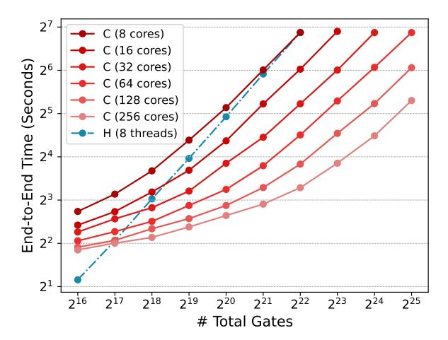
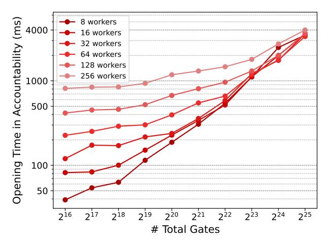
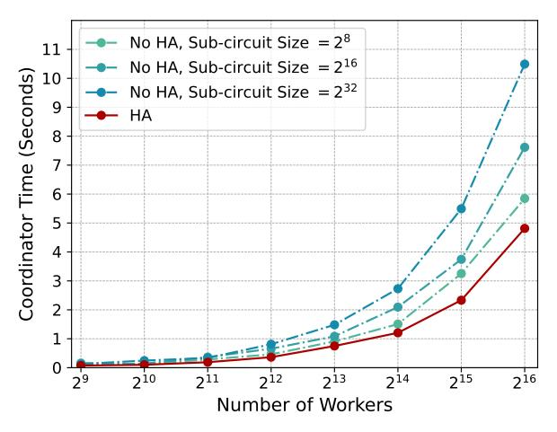
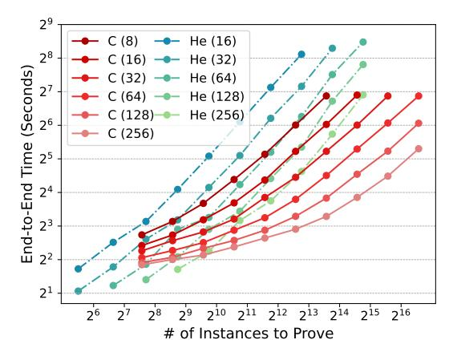
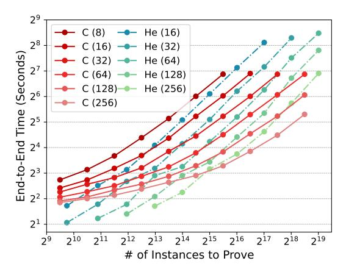
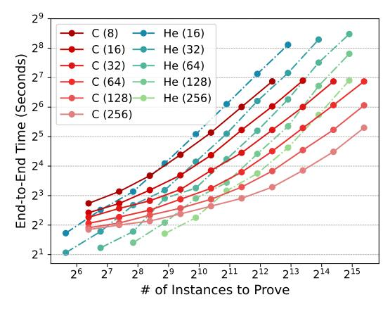

# Cirrus: Performant and Accountable Distributed SNARK

Wenhao Wang Yale Univerity, IC3 wenhao.wang@yale.edu

Fangyan Shi Tsinghua University sfy21@tsinghua.org.cn

Dani Vilardell Cornell University, IC3 dv296@cornell.edu

Fan Zhang Yale University, IC3 f.zhang@yale.edu

*Abstract*—Succinct Non-interactive Arguments of Knowledge (SNARKs) can enable efficient verification of computation in many applications. However, generating SNARK proofs for large-scale tasks, such as verifiable machine learning or virtual machines, remains computationally expensive. A promising approach is to distribute the proof generation workload across multiple workers. A practical distributed SNARK protocol should have three properties: horizontal scalability with low overhead (linear computation and logarithmic communication per worker), accountability (efficient detection of malicious workers), and a universal trusted setup independent of circuits and the number of workers. Existing protocols fail to achieve all these properties.

In this paper, we present **Cirrus**, the first distributed SNARK generation protocol achieving all three desirable properties at once. Our protocol builds on HyperPlonk (EUROCRYPT'23), inheriting its universal trusted setup. It achieves linear computation complexity for both workers and the coordinator, along with low communication overhead. To achieve accountability, we introduce a highly efficient accountability protocol to localize malicious workers. Additionally, we propose a hierarchical aggregation technique to further reduce the coordinator's workload.

We implemented and evaluated **Cirrus** on machines with modest hardware. Our experiments show that **Cirrus** is highly scalable: it generates proofs for circuits with 33M gates in under 40 seconds using 32 8-core machines. Compared to the state-ofthe-art accountable protocol Hekaton (CCS'24), **Cirrus** achieves over 7× faster proof generation for PLONK-friendly circuits such as the Pedersen hash. Our accountability protocol also efficiently identifies faulty workers within just 4 seconds, making **Cirrus** particularly suitable for decentralized and outsourced computation scenarios.

# I. INTRODUCTION

Succinct Non-interactive Arguments of Knowledge (SNARKs) [\[1\]](#page-13-0), [\[2\]](#page-13-1), [\[3\]](#page-13-2), [\[4\]](#page-13-3), [\[5\]](#page-13-4), [\[6\]](#page-13-5), [\[7\]](#page-13-6), [\[8\]](#page-13-7), [\[9\]](#page-13-8), [\[10\]](#page-13-9), [\[11\]](#page-13-10) have emerged as a breakthrough in cryptographic tools, enabling efficient, non-interactive verification of computations. The primitive has proven practical for various applications, such as privacy-preserving payments (e.g., Zcash [\[12\]](#page-13-11)), scalability solutions for decentralized consensus (e.g., zkRollups [\[13\]](#page-13-12)), and blockchain interoperability (e.g., zkBridges [\[14\]](#page-13-13)). However, for more ambitious applications, such as verifiable machine learning (zkML) and verifiable virtual machines (zkVM), the computational demands of proof generation remain a substantial bottleneck.

A recent line of works [\[15\]](#page-13-14), [\[14\]](#page-13-13), [\[16\]](#page-13-15), [\[17\]](#page-13-16), [\[18\]](#page-13-17) proposed to horizontally scale up SNARK generation with *distributed SNARK generation protocols*, where multiple *workers* collaborate on different parts of a general-purpose circuit to create a final proof. By splitting up the proof task across workers, distributed proof generation not only speeds up computation but also reduces memory usage, making it feasible to prove statements about large circuits that cannot fit in the memory of a single server.

We identify three properties that a distributed SNARK generation scheme should satisfy:

- 1) Firstly, it should scale horizontally with low overhead. Specifically, each worker's computational complexity should ideally grow linearly with the size of the subcircuit it is assigned,avoiding performance degradation as more workers are added. Furthermore, each worker's communication complexity should scale sub-linearly with its sub-task size, as large tasks would otherwise result in prohibitive communication costs.
- 2) Secondly, it should achieve accountability, i.e., being able to efficiently detect malicious behavior and identify of faulty or dishonest workers. Accountability is particularly important in distributed SNARK generation settings where proof computation is outsourced to decentralized networks involving potentially untrusted participants. For instance, in prover marketplaces [\[19\]](#page-13-18), [\[20\]](#page-13-19), [\[21\]](#page-13-20), users delegate computation tasks to workers offering spare computational resources, which necessitates mechanisms to detect malfeasance and hold responsible parties accountable to maintain trust and reliability.
- 3) Thirdly, it should have a universal setup, avoiding the need for per-circuit trusted setup ceremonies. Requiring a dedicated setup each time a new application is encountered is highly inefficient, especially in proof outsourcing scenarios where workers frequently handle tasks from many different applications. The complexity and cost associated with conducting secure multi-party ceremonies for each application would severely limit scalability and usability [\[22\]](#page-13-21). A universal setup addresses this challenge by enabling diverse applications to leverage distributed SNARKs without additional trusted initialization.

Limitation of prior works. While prior works reduced overhead and achieved partial accountability, none achieved all three properties. Pianist [\[16\]](#page-13-15) is the first distributed proof generation scheme based on PLONK. It achieves a robust quasilinear prover time protocol for general circuits, but not accountability[1](#page-1-0) . HyperPianist [\[18\]](#page-13-17) improves the prover complexity to linear time but still lacks accountability. Hekaton [\[17\]](#page-13-16) introduced an accountable protocol with quasilinear prover time, but it relies on Mirage [\[23\]](#page-13-22), a SNARK requiring a circuit-specific setup, making it costly to use in generalpurpose circuits. Neither of Pianist of Hekaton achieves linear worker time.

This work: **Cirrus**. We introduce Cirrus, the first distributed SNARK generation scheme that simultaneously satisfies all of the desired properties: low overhead, accountability, and universal trusted setup. Specifically, Cirrus achieves linear computational complexity for both workers and the coordinator, with communication overhead scaling sub-linearly with task size, ensuring practical efficiency for large-scale deployments. Moreover, Cirrus reuses existing universal setup parameters from HyperPlonk, which significantly simplifies its deployment. Unlike previous accountable schemes such as Hekaton, Cirrus does not require circuit-specific setups, and therefore avoiding repeated costly setup ceremonies. Furthermore, Cirrus implements an efficient accountability protocol that enables the coordinator to quickly detect malicious behavior, precisely identify offending workers, and support incentivebased systems to maintain security and trustworthiness. By simultaneously addressing computational efficiency, accountability, and setup universality, Cirrus significantly expands the potential scalability and security of SNARK applications in decentralized and outsourced computation environments.

# *A. Technical Overview*

Our distributed scheme is built upon HyperPlonk [\[8\]](#page-13-7), a nondistributed SNARK scheme with prover time linear in circuit size and universal trusted setup. Our adaptation of HyperPlonk to a distributed setting must preserve these properties.

We use M to denote the number of workers. A circuit C of N gates is particitioned into M sub-circuits (using approach proposed in [\[16\]](#page-13-15)), each of size T. Additionally, M *workers* collaborate with a single *coordinator*.

Distributing HyperPlonk. To adapt HyperPlonk to a distributed setting, we need to distribute its core building blocks: multilinear KZG, the sum-check protocol (SumCheck), the zero test protocol (ZeroTest), and the permutation test protocol (PermTest). While distributing the multilinear KZG protocol is straightforward, naively distributing the SumCheck protocol using existing techniques (e.g., [\[14\]](#page-13-13)) introduces a critical issue. Specifically, at the conclusion of the distributed SumCheck, we must open a multivariate polynomial with constant degree d > 1. However, existing techniques from [\[14\]](#page-13-13) combined with multilinear KZG only support committing to and opening multivariate polynomials of degree at most 1.

We address this limitation using the following key observation: any constant-degree multivariate polynomial can be equivalently represented as a function of a constant number of multilinear (i.e., degree-1) polynomials. More formally, each polynomial f(x) of constant degree can be expressed as f(x) = h(g1(x), . . . , gc(x)), where each gi(x) is multilinear. Furthermore, additions and multiplications of these degree-1 distributed polynomials produce results that match the evaluation of the original polynomial on the Boolean hypercube {0, 1} n. Consequently, we transform the original challenge into distributing the sum-check protocol for multilinear polynomials. This transformation enables us to employ distributed multilinear KZG effectively to commit to and open polynomials at the end of the distributed SumCheck. With this distributed version of SumCheck, we subsequently extend our construction to a fully distributed HyperPlonk scheme.

Optimistic accountability. When a proof is generated by workers, the coordinator verifies the proof. If this verification succeeds, no further action is required, as correctness is ensured with overwhelming probability by the soundness property. However, when verification fails, the coordinator is required to identify one or more workers at fault. A naive approach would require the coordinator to independently recompute all intermediate results and compare them with the results sent by the workers, incurring high computational costs same as generating the entire proof on its own. To address this issue, Cirrus introduces a fault localization protocol that significantly reduces computational overhead.

First, the coordinator verifies the KZG sub-proofs provided by each worker and checks their consistency with the respective KZG commitments of the witness polynomials constructed by the workers. A failed verification at this stage directly identifies a faulty worker. If all sub-proofs verify successfully, the coordinator proceeds by reconstructing the witness polynomials from each worker and evaluates them at a common random point determined at the conclusion of the distributed sum-check protocol. A mismatch in any evaluation result indicates a malicious worker. Asymptotically, our fault localization protocol requires only O(M log T) pairings and O(MT) field operations. Since the field operations are lightweight in practice, our accountability is substantially more efficient than the baseline approach of recomputing the proof.Our evaluation confirms that the optimistic accountability protocol is concretely efficient, requiring only 4 seconds to localize malicious workers, even for circuits with 33 million gates distributed across 256 workers.

Reducing the coordinator's computational overhead. In the optimistic case where all workers are honest, the coordinator's computational workload scales with the number of workers, potentially becoming a performance bottleneck as the worker count grows. In the vanilla distributed Hyper-Plonk protocol, the coordinator's runtime complexity would be O(M log T), which originates from aggregating M vectors, each of length O(log T), in the distributed SumCheck and distributed multilinear KZG protocols. To reduce this, Cirrus introduces an efficient hierarchical aggregation approach. Specifically, we partition the aggregation task among M/ log T designated worker provers, referred to as *leaders*, each of

1Pianist introduces a limited form of accountability designed specifically for data-parallel circuits; however, its accountability mechanism does not extend to general-purpose circuits.

whom aggregates vectors from  $\log T$  workers. Consequently, the coordinator's computational complexity for this aggregation step is reduced significantly to O(M). We note that the resulting computational overhead per leader is  $O(\log^2 T)$ , which remains negligible compared to their primary computation tasks dominated by O(T).

In summary, Cirrus is the first distributed SNARK protocol achieving linear computational complexity and logarithmic communication per worker, efficient accountability, and universal trusted setup. As shown in Table I, Cirrus outperforms previous state-of-the-art distributed SNARK schemes by simultaneously achieving all desirable properties, which are linear runtime scaling, accountability with efficient fault localization, and setup universality. Therefore, Cirrus significantly improves both practicality and scalability for real-world deployments of ZKP applications.

#### B. Implementation and Evaluation

We implement and extensively evaluate Cirrus to assess its end-to-end performance. Our implementation builds upon the HyperPlonk library [24]. To benchmark performance, we generated random PLONK circuits with corresponding random witnesses, distributing the SNARK generation process across up to 32 AWS t3.2xlarge machines (each equipped with 8 vCPUs and 32 GB of memory). We note that Cirrus seamlessly reuses existing universal setup parameters from HyperPlonk, which simplifies its deployment in real life.

Our experiments demonstrate that Cirrus can efficiently produce proofs for circuits containing up to 33M gates in merely 39 seconds, using a distributed network of 32 worker machines. In contrast, vanilla HyperPlonk can only handle circuits of size 4M gates, requiring more than 110 seconds on the same hardware configuration. These results clearly illustrate the horizontal scalability advantages of Cirrus.

Additionally, we evaluate the efficiency of our accountability protocol. Our results indicate that when an incorrect proof is produced, the coordinator can identify at least one faulty worker within less than 4 seconds for circuits of 33M gates and 256 workers, showing the practicality of the accountability checks. We further assess the coordinator's computational overhead and confirmed that, due to our hierarchical aggregation approach, the coordinator's runtime remains independent of the individual sub-circuit size, which validates this theoretical improvement.

Finally, we perform comparative evaluations with another state-of-the-art accountable distributed SNARK scheme Hekaton [17]. Our experiments highlight that for PLONK-friendly workloads, such as Pedersen hash circuits, Cirrus significantly outperforms Hekaton, achieving a performance gain of over  $7\times$ . For other tasks including MiMC hash and PoK of Exponent, Cirrus also achieves faster performance than Hekaton, while additionally offering the advantage of a universal trusted setup. Specifically, unlike Hekaton, our approach does not require separate trusted setups for each distinct application or varying worker configurations, substantially simplifying practical deployment and enhancing flexibility.

Our Contribution

- We introduce the notion of accountability to distributed SNARK generation protocols. An accountable distributed SNARK scheme allows the coordinator to efficiently detect incorrect proofs and accurately identify malicious or faulty workers. This property is particularly critical in decentralized settings, such as zero-knowledge prover markets [19], where participants may behave maliciously or unreliably.
- In Section III, we present Cirrus, the first accountable distributed SNARK generation protocol that simultaneously achieves all the essential properties for practical deployment, i.e., Cirrus can efficiently scale horizontally, Cirrus enables efficient detection of incorrect proofs and identification of malicious workers, and Cirrus requires only a single universal setup same as the setup in HyperPlonk, eliminating the inefficiency of repeated per-application setup ceremonies.
- In Section IV, we implement and comprehensively evaluate Cirrus. Our experiments demonstrate that Cirrus achieves exceptional performance, enabling proofs for circuits containing 33M gates in under 40 seconds on a distributed setup of 32 8-core machines, and allows the coordinator rapidly detects malicious behavior within 4 seconds.

#### II. PRELIMINARIES

In this section, we introduce the key notation, definitions, and foundational tools essential for the completeness and soundness of our protocol. For the interest of space, we move canonical definitions of SNARKs, polynomial interactive oracle proofs (Poly-IOPs), and polynomial commitment schemes (PCS's) to Appendix A. We also refer readers to Appendix B for details of the HyperPlonk protocol, and Appendix C for details of the multilinear KZG PCS.

#### Notation.

- Let  $\mathbb{F}$  be a finite field of size  $\Omega(2^{\lambda})$ , where  $\lambda$  is the security parameter.
- Let Bμ := {0,1}μ denote the μ-dimension boolean hypercube.
- Let  $\mathbb{F}_{\mu}^{\leq d}[X]$  denote the set of  $\mu$ -variate polynomials where the degree of each variable is not greater than d. A multivariate polynomial g is *multilinear* if the degree of the polynomial in each variable is at most 1. Each element  $f \in \mathbb{F}_{\mu}^{\leq d}[X]$  would satisfy  $f(x) = h(g_1(x), \ldots, g_c(x))$  where h has total degree O(d) and can be evaluated with an arithmetic circuit of O(d) gates, and each  $g_i$  is multilinear.
- Let  $\chi_{\boldsymbol{w}}(\boldsymbol{x}) := \prod_{i=1}^{\mu} (w_i x_i + (1 w_i)(1 x_i))$  be a multilinear Lagrange polynomial over  $B_{\mu}$ .
- For  $x \in \mathbb{F}^{\mu}$ , let  $[x] := \sum_{i=1}^{\mu} 2^{i-1} \cdot x_i$ . Let  $\langle v \rangle_m$  be the m-bit representation of  $v \in [0, 2^m 1]$ .
- Let P0 denote the coordinator, and let (Pb)b∈{0,1}ξ denote the M workers, where 2ξ = M.

**Useful tools.** Here we introduce frequently used tools.

**Lemma 1** (Multilinear Extension). For a function  $g: B_{\mu} \to \mathbb{F}$ , there is a unique multilinear polynomial  $\tilde{g}$  such that  $\tilde{g}(\boldsymbol{x}) = g(\boldsymbol{x})$  for all  $\boldsymbol{x} \in B_{\mu}$ . The function  $\tilde{g}$  is said to be

| Scheme            | Worker Time     | Coordinator Time    | Comm.         | V Time        | Accountable | Setup            |
|-------------------|-----------------|---------------------|---------------|---------------|-------------|------------------|
| Cirrus (Ours)     | O(T)            | O(M)                | $O(M \log T)$ | $O(\log N)$   | ✓           | Universal        |
| Hekaton [17]      | $O(T \log T)$   | $O( S  + M \log M)$ | O(M)          | O(1)          | ✓           | Circuit-specific |
| HyperPianist [18] | O(T)            | $O(M \log T)$       | $O(M \log T)$ | $O(\log N)$   | ×           | Universal        |
| Pianist [16]      | $O(T \log T)$   | $O(M \log M)$       | O(M)          | O(1)          | ×           | Universal        |
| DeVirgo [14]      | O(T)            | N/A                 | O(N)          | $O(\log^2 N)$ | ×           | Transparant      |
| DIZK [15]         | $O(T \log^2 T)$ | N/A                 | O(N)          | O(1)          | X           | Circuit-specific |

TABLE I: Comparison between Cirrus and existing distributed SNARK generation protocols. Comm. denotes the communication cost in total.  $\mathcal V$  Time denotes the verifier time. N is the number of gates (or constraints) in the whole circuit, and M is the number of workers. T=N/M is the size of each sub-circuit. For Setup, "Circuit-specific" denotes that each different circuit requires its own trusted setup, "Universal" denotes that one set of trusted setup parameters works for circuits up to a certain size, and "Transparent" denotes that no trusted setup is required.

the multilinear extension (MLE) of g.  $\tilde{g}$  can be expressed as  $\tilde{g}(x) = \sum_{a \in B_n} f(a) \cdot \chi_a(x)$ .

**Lemma 2** (Schwartz-Zippel Lemma). Let  $g: \mathbb{F}^\ell \to \mathbb{F}$  be a nonzero  $\ell$ -variate polynomial of degree at most d. Then for all  $\emptyset \neq S \subseteq \mathbb{F}$ ,  $\Pr_{\boldsymbol{x} \leftarrow S^\ell}[g(\boldsymbol{x}) = 0] \leq \frac{d}{|S|}$ .

Accountable distributed SNARK. In an environment where each prover except the coordinator may sabotage the distributed proving process by intentionally sending incorrect information such as wrong proofs, an *accountable* distributed SNARK generation system enables the coordinator  $\mathcal{P}_0$  to either (1) generate a valid proof or (2) detect at least one malicious prover. In [16] the authors proposed such a scheme for circuits comprising independent sub-circuits and left the construction of accountable distributed SNARK generation schemes that work for single general-purpose circuits as an open problem. Here we define accountability as follows.

**Definition 1** (Accountable Distributed SNARK Generation Scheme). For a circuit C with M workers and one designated coordinator, an accountable distributed SNARK generation scheme is a protocol that ensures completeness, knowledge soundness, and succinctness, along with the following key property named accountability: for any number of malicious worker provers who produce incorrect proofs, the system enables the coordinator to reliably and accurately identify at least one of such malicious participants.

# III. CIRRUS: ACCOUNTABLE AND EFFICIENT DISTRIBUTED SNARK

In this section, we formally describe Cirrus, a distributed SNARK generation scheme with linear prover time where the coordinator can make accountable any malicious behavior. We start by giving the construction to distribute HyperPlonk for a general circuit. We first present a distributed multilinear KZG PCS, and how to construct a distributed multivariate SumCheck protocol that is compatible with our distributed PCS. With the distributed multivariate SumCheck protocol, we show how to construct the distributed HyperPlonk accordingly.

The distributed HyperPlonk protocol is complete and sound, but it still suffers from the following drawbacks: (1) the coordinator cannot find accountable the malicious prover(s) if the final proof is incorrect, and (2) the coordinator needs

to perform  $O(M \log T)$  group and field operations, which is not truly linear in M and T. To tackle the first challenge, we propose a verification protocol that allows the coordinator to detect any malicious prover. The core technique in the verification protocol is that the coordinator can evaluate the permutation products of each circuit segment. Note that the additional verification steps would introduce a large overhead for the coordinator if the verification is performed on the fly. We overcome this with an alternative protocol: the coordinator first verifies the final proof to check if there exist malicious nodes. The coordinator will only run the complete check if the verification fails. In this way, the optimistic runtime overhead of the coordinator can be reduced to the verifier time of our protocol. To tackle the second challenge, we delegate part of the work of the coordinator to multiple nodes to reduce the runtime of the coordinator and show how this technique can work along with the optimistic verification. This is done while keeping all the coordinator's computation time linear.

#### A. Distributedly Computable HyperPlonk

Our protocol is built on top of HyperPlonk [8], an adaptation of PLONK to the boolean hypercube, using multilinear polynomial commitments to remove the need for FFT computation and achieving linear prover time. We first define polynomials necessary for the protocol.

Defining polynomials. Before running the distributed SNARK, we assume that a circuit C has been divided into  $M=2^{\xi}$  different sub-circuits. This can be done by just dividing the PLONK trace t of the circuit evenly into Mchunks  $\{t^{(b)}\}_{b\in B_{\varepsilon}}$ , where the gates within the same chunk are in the same circuit segment. Then each circuit segment has its own public inputs, addition and multiplication gate selectors, and wiring permutations. Let  $\nu^{(b)}$  be the length of the binary index to represent public inputs for  $\mathcal{P}_b$ , i.e.  $2^{\nu^{(b)}} = \ell_x^{(b)}$ . Let  $\mu$  be the length of the binary index to represent the gates for all workers, i.e.  $2^{\mu} = |\mathcal{C}|/M$ . Let  $s^{(b)}$  represent the gate selection vector for  $\mathcal{P}_b$ . Note that there is a wiring permutation between different circuit segments. Let  $s^{(b)}, \ \sigma^{(b)}: B_{\mu+2} \to B_{\mu+2}$  and  $\rho^{(b)}: B_{\mu+2} \to B_{\xi}$ be the mappings of the circuit wiring for  $\mathcal{P}_b$ , such that  $\{(\sigma^{(b)}(c), \rho^{(b)}(c)) : c \in B_{\mu}, b \in B_{\xi}\} = B_{\mu+2} \times B_{\xi}.$ Specifically, the permutations indicate that  $t_i^{(b)} = t_{\sigma^{(b)}(\langle i \rangle)}^{\rho^{(b)}(\langle i \rangle)}$ for all  $i \in [2^{\mu}], \mathbf{b} \in B_{\xi}$ .

A worker prover  $\mathcal{P}_b$  interpolates the following polynomials:

- Two multilinear polynomials  $S_{\mathrm{add}}^{(b)}, S_{\mathrm{mult}}^{(b)} \in \mathbb{F}_{\mu}^{\leq 1}[\boldsymbol{X}]$  such that for all  $i \in [N^{(b)}]$   $S_{\mathrm{add}}^{(b)}(\langle i \rangle_{\mu}) = s_i^{(b)}$  and  $S_{\mathrm{mult}}^{(b)}(\langle i \rangle_{\mu}) = s_i^{(b)}$
- A multilinear polynomial  $F^{(b)} \in \mathbb{F}_{\mu+2}^{\leq 1}$  such that

$$\begin{cases} F^{(b)}(0,0,\langle i\rangle_{\mu}) = t_{3i+1}^{(b)} & i \in [0,N^{(b)}-1] \\ F^{(b)}(0,1,\langle i\rangle_{\mu}) = t_{3i+2}^{(b)} & i \in [0,N^{(b)}-1] \\ F^{(b)}(1,0,\langle i\rangle_{\mu}) = t_{3i+3}^{(b)} & i \in [0,N^{(b)}-1] \\ F^{(b)}(1,\dots,1,\langle i\rangle_{\nu}) = x_{i+1}^{(b)} & i \in [0,\ell_x^{(b)}-1] \end{cases}$$

• A multilinear polynomial  $I^{(b)} \in \mathbb{F}^{\leq 1}_{\nu^{(b)}}[X]$  such that for all  $i \in [0, \ell_x^{(b)} - 1]$  we have  $I^{(b)}(\langle i \rangle_{\nu^{(b)}}) = x_{i+1}^{(b)}$ .

Distributed multilinear KZG PCS. First, we introduce the distributed multilinear KZG PCS. This protocol enables us to commit and open a multilinear polynomial distributedly. For a multilinear polynomial  $f(\boldsymbol{x}, \boldsymbol{y}) = \sum_{\boldsymbol{b} \in B_{\xi}} f^{(\boldsymbol{b})}(\boldsymbol{x}) \chi_{\boldsymbol{b}}(\boldsymbol{y}) \in$  $\mathbb{F}_{\mu+\varepsilon}^{\leq 1}[X]$ , the PCS protocol is described as follows:

- KeyGen: Generate crs =  $(g, (g^{\tau_i})_{i \in [\mu+\xi]}, (U_{c,b}) :=$  $g^{\chi_{\mathbf{c}}(\tau_1,...,\tau_{\mu})\cdot\chi_{\mathbf{b}}(\tau_{\mu+1},...,\tau_{\mu+\xi})})_{\mathbf{c}\in B_{\mu},\mathbf{b}\in B_{\xi})}$  $\tau_1,\dots,\tau_{\mu+\xi}$  are secrets. Note that we can derive  $V_b:=g^{\chi_b(\tau_{\mu+1},\dots,\tau_{\mu+\xi})}$  with crs, which will be useful
- to  $\mathcal{P}_0$ , since  $\sum_{c \in B_{\mu}} \chi_c \equiv 1$ . Commit $(f, \operatorname{crs})$ : each  $\mathcal{P}_b$  computes  $\operatorname{com}_b$  $\prod_{\boldsymbol{c}\in B_{\mu}}U_{\boldsymbol{c},\boldsymbol{b}}^{f^{(b)}(\boldsymbol{c})} \text{ and sends } \operatorname{com}_{\boldsymbol{b}} \text{ to } \mathcal{P}_{0}. \text{ Then } \mathcal{P}_{0}$  computes  $\operatorname{com}:=\prod_{\boldsymbol{b}\in B_{\xi}}\operatorname{com}_{\boldsymbol{b}}.$
- Open $(f, \alpha, \beta, crs)$ :
  - 1) Each prover  $\mathcal{P}_{\boldsymbol{b}}$  computes  $z^{(\boldsymbol{b})} := f^{(\boldsymbol{b})}(\boldsymbol{\alpha})$  and  $\begin{array}{ll} f^{(\boldsymbol{b})}(\boldsymbol{x}) - f^{(\boldsymbol{b})}(\boldsymbol{\alpha}) := \sum_{i \in [\mu]} q_i^{(\boldsymbol{b})}(\boldsymbol{x}) (x_i - \alpha_i). \text{ Then} \\ \text{it computes } \pi_i^{(\boldsymbol{b})} = g^{q_i^{(\boldsymbol{b})}(\tau_1, \ldots, \tau_{\mu}) \cdot \chi_{\boldsymbol{b}}(\tau_{\mu+1}, \ldots, \tau_{\mu+\xi})} \end{array}$ with crs, and sends  $\pi^{(b)}$  and  $z^{(b)}$  to  $\mathcal{P}_0$ .
  - 2)  $\mathcal{P}_0$  computes  $z = f(\boldsymbol{\alpha}, \boldsymbol{\beta}) = \sum_{\boldsymbol{b} \in B_{\varepsilon}} z^{(\boldsymbol{b})} \cdot \chi_{\boldsymbol{b}}(\boldsymbol{\beta})$ .  $\mathcal{P}_0$  decomposes

$$f(\boldsymbol{\alpha}, \boldsymbol{y}) - f(\boldsymbol{\alpha}, \boldsymbol{\beta}) = \sum_{j \in [\xi]} q_j(\boldsymbol{y})(y_j - \beta_j).$$

Then it computes  $\pi_{\mu+j} = g^{q_j(\tau_{\mu+1},\dots,\tau_{\mu+\xi})}$  with  $V_b$ .  $\mathcal{P}_0$  also computes  $\pi_i = \prod_{\boldsymbol{b} \in B_{\xi}} \pi_i^{(\boldsymbol{b})}$  for all  $i \in [\mu]$ . 3) Then  $\mathcal{P}_0$  sends  $\boldsymbol{\pi} := (\pi_1, \dots, \pi_{\mu+\xi})$  and z to  $\mathcal{V}$ .

- Verify(com,  $\pi$ ,  $\alpha$ ,  $\beta$ , z, crs): The verifier checks if  $e(\text{com}/g^z, g) =$  $\prod_{i\in[\mu]}e(\pi_i,g^{\tau_i-\alpha_i}) \quad \cdot$  $\prod_{j\in[\mathcal{E}]} e(\pi_{\mu+j}, g^{\tau_{\mu+j}-\beta_j}).$

Here we summarize the complexity of the distributed multilinear KZG PCS. The worker time is  $O(2^{\mu})$ , and the coordinator time is  $O(2^{\xi} \cdot \mu)$ . All provers will communicate  $O(\mu + \xi)$  group elements. The verifier time is  $O(\mu + \xi)$ .

**Proposition 1.** The distributed multilinear KZG PCS is complete and sound.

*Proof.* If  $\pi$  is honestly generated, we have

$$\prod_{i \in [\mu]} e(\pi_i, g^{\tau_i - \alpha_i}) \cdot \prod_{j \in [\xi]} e(\pi_{\mu+j}, g^{\tau_{\mu+j} - \beta_j})$$

$$= e(g^{\sum_{i \in [\mu]} \sum_{\mathbf{b} \in B_{\xi}} q_i^{(\mathbf{b})}(\tau_1, \dots, \tau_{\mu}) \cdot (\tau_i - \alpha_i)}, g)$$

$$\cdot e(g^{\sum_{j \in [\xi]} q_j(\tau_{\mu+1}, \dots, \tau_{\mu+\xi}) \cdot (\tau_{\mu+j} - \beta_j)}, g)$$

$$= e(g^{f(\tau) - f(\alpha, \beta)}, g)$$

Therefore, the protocol is complete. We kindly refer to [25] for a full proof of the soundness and knowledge soundness of the multilinear KZG protocol. 

Distributed multivariate SumCheck Poly-IOP. Here we describe the distributed multivariate SumCheck Poly-IOP. Suppose each prover  $\mathcal{P}_b$  has a multivariate polynomial  $f^{(b)} \in$  $\mathbb{F}_{\mu}[X]$ . The provers want to show to the verifier that a multivariate polynomial  $f(\mathbf{x}) := h(g_1(\mathbf{x}), \dots, g_c(\mathbf{x})) \in \mathbb{F}_{\mu+\xi}[\mathbf{X}]$ satisfies  $\sum_{x \in B_{\mu+\xi}} f(x) = v$ , where each  $g_i$  is multilinear and h can be evaluated using a arithmetic circuit with O(d)gates. Suppose each prover  $\mathcal{P}_b$  has access to  $g_i^{(b)}$  for  $i \in [c]$ , where  $g_i^{(b)}(y) = g_i(y, b)$ . We further define  $f^{(b)}(y) =$  $f(\boldsymbol{y}, \boldsymbol{b}) = h\left(g_1^{(\boldsymbol{b})}(\boldsymbol{y}), \dots, g_c^{(\boldsymbol{b})}(\boldsymbol{y})\right)$ . The protocol is described as follows:

- 1) For each  $i \in [\mu]$ :
  - a) Let  $\alpha_{i-1} = (\alpha_1, ..., \alpha_{i-1})$
  - b) Each  $\mathcal{P}_b$  computes and sends to  $\mathcal{P}_0$  the polynomial  $r_i^{(\boldsymbol{b})}(x) := \sum_{\boldsymbol{w} \in B_{\mu-i}} f^{(\boldsymbol{b})}(\boldsymbol{\alpha}_{i-1}, x, \boldsymbol{w}).$ c) Then  $\mathcal{P}_0$  adds

$$\begin{split} r_i := & \sum_{\boldsymbol{b} \in B_{\xi}} r_i^{(\boldsymbol{b})} = \sum_{\boldsymbol{b} \in B_{\xi}, \boldsymbol{w} \in B_{\mu-i}} f^{(\boldsymbol{b})}(\boldsymbol{\alpha}_{i-1}, \boldsymbol{x}, \boldsymbol{w}) \\ = & \sum_{\boldsymbol{w} \in B_{\mu-i}} \sum_{\boldsymbol{b} \in B_{\varepsilon}} f(\boldsymbol{\alpha}_{i-1}, \boldsymbol{x}, \boldsymbol{w}, \boldsymbol{b}) \end{split}$$

and sends the oracle of  $r_i$  to  $\mathcal{V}$ .

- d) V checks if  $v = r_i(0) + r_i(1)$ , and samples and sends to  $\mathcal{P}_0$  a random  $\alpha_i \leftarrow \mathbb{F}$ . Then  $\mathcal{V}$  sets v := $r_i(\alpha_i)$ .
- 2) Let  $\alpha = (\alpha_1, \ldots, \alpha_n)$ .
- 3)  $\mathcal{P}_0$  receives  $g_i^{(b)}(\alpha)$  for  $i \in [c]$  from each  $\mathcal{P}_b$ .  $\mathcal{P}_0$  first construct

$$\begin{split} \tilde{g}_i(\boldsymbol{y}) := & g(\boldsymbol{\alpha}, \boldsymbol{y}) = \sum_{\boldsymbol{b} \in B_{\mu}} g_i(\boldsymbol{\alpha}, \boldsymbol{b}) \chi_{\boldsymbol{b}}(\boldsymbol{y}) \\ = & \sum_{\boldsymbol{b} \in B_{\mu}} g_i^{(\boldsymbol{b})}(\boldsymbol{\alpha}) \chi_{\boldsymbol{b}}(\boldsymbol{y}) \end{split}$$

Then  $\mathcal{P}_0$  has  $\tilde{f}(\boldsymbol{y}) = f(\boldsymbol{\alpha}, \boldsymbol{y}) = h\left(\tilde{g}_1(\boldsymbol{y}), \dots, \tilde{g}_{\underline{c}}(\boldsymbol{y})\right)$ .

4)  $\mathcal{P}_0$  and  $\mathcal{V}$  perform Multivariate SumCheck on  $\tilde{f}$  with target value v. Denote the challenge as  $\beta$ . Note that in the final round, the verifier queries  $g_i(\boldsymbol{\alpha}, \boldsymbol{\beta})$  for  $i \in [c]$ and calculates  $f(\alpha, \beta)$  itself.

We give an example of how to perform SumCheck with  $f^{(b)} = f_1^{(b)} \cdot f_2^{(b)}$ , to illustrate the sum-check protocol on  $h(f_1, f_2, \dots, f_k)$ . In Step 3,  $\mathcal{P}_b$  opens  $f^{(b)}$ , and compute  $g(\boldsymbol{y}) := \sum_{\boldsymbol{b} \in B_{\xi}} (v_1^{(\boldsymbol{b})} \cdot \chi_{\boldsymbol{b}}(\boldsymbol{y})) \cdot \sum_{\boldsymbol{b} \in B_{\xi}} (v_2^{(\boldsymbol{b})} \cdot \chi_{\boldsymbol{b}}(\boldsymbol{y})).$  In Step 4,  $\mathcal{V}$  and the provers open  $f_1(\alpha, \beta) \cdot f_2(\alpha, \beta)$  at the end.

We summarize the complexity of the distributed multivariate SumCheck Poly-IOP. The worker time is  $O(2^{\mu} \cdot d \log^2 d)$ , and the coordinator time is  $O(2^{\xi} \cdot d \log^2 d + \mu \cdot 2^{\xi} \cdot d)$ . All provers will communicate  $O((\mu + \xi) \cdot d)$  field elements. The verifier time is  $O((\mu + \xi) \cdot d)$ .

**Proposition 2.** The distributed multivariate SumCheck protocol is complete and sound.

*Proof.* If all workers and the coordinator are honest, in step 1 we have

$$r_i(0) + r_i(1) = \sum_{\boldsymbol{w} \in B_{\mu-i+1}} \sum_{\boldsymbol{b} \in B_{\varepsilon}} f(\boldsymbol{\alpha}_{i-1}, \boldsymbol{w}, \boldsymbol{b}) = v_i,$$

so the verifier check will pass. In step 4, by the completeness of the SumCheck protocol, the verifier check will pass. Therefore, the protocol is complete. In step 3 we have

$$\forall \boldsymbol{y} \in B_{\xi}, \qquad \tilde{f}(\boldsymbol{y}) = h(\tilde{g}_{1}(\boldsymbol{y}), \dots, \tilde{g}_{c}(\boldsymbol{y}))$$

$$\equiv \sum_{\boldsymbol{b} \in B_{\xi}} h(g_{1}^{(\boldsymbol{b})}(\boldsymbol{y}), \dots, g_{c}^{(\boldsymbol{b})}(\boldsymbol{y})) \cdot \chi_{\boldsymbol{b}}(\boldsymbol{y}) = f(\boldsymbol{\alpha}, \boldsymbol{y}).$$

Therefore, we have the target v at the end of step 1 is consistent with the target at the beginning of step 4. Following the soundness of the SumCheck protocol, the distributed multivariate SumCheck protocol is sound.

Distributed multivariate ZeroTest Poly-IOP. Suppose each prover  $\mathcal{P}_b$  has a multivariate polynomial  $f^{(b)}(x) \in \mathbb{F}_u^{\leq d}[X]$ . The provers wants to show to the verifier that  $f^{(b)}(x) = 0$  for all  $b \in B_{\xi}$  and  $x \in B_{\mu}$ . The protocol is described as follows:

- 1)  $\mathcal V$  samples and sends to  $\mathcal P_0$  two random vectors  $r \leftarrow$  $\mathbb{F}^{\mu}$  and  $\boldsymbol{r}_0 \leftarrow \mathbb{F}^{\xi}$ .
- 2)  $\mathcal{P}_0$  sends r to each  $\mathcal{P}_b$ . Note that when we apply the Fiat-Shamir heuristic to make the argument noninteractive, communication in this step is no longer
- 3) Each  $\mathcal{P}_b$  sets  $\tilde{f}^{(b)}(x) := f^{(b)}(x) \cdot \chi_r(x) \cdot \chi_{r_0}(b)$ .
- 4) The provers and V run distributed multivariate SumCheck protocol on  $\tilde{f}^{(b)}(x)$  with target value 0.

To improve the efficiency of the protocol, the verifier has oracle access to  $f(x,y) := \sum_{b \in B_{\epsilon}} f^{(b)}(x) \cdot \chi_b(y)$  and knows  $\chi_{\boldsymbol{r}}(\boldsymbol{x}) \cdot \chi_{\boldsymbol{r}_0}(\boldsymbol{y})$ . In Step 4 of SumCheck,  $\mathcal{P}_0$  will evaluate  $\chi_{r_0}(y)$  over the boolean hypercube  $B_{\xi}$  using dynamic programming techniques [6] and then add them up. Since V has oracle access to f and can efficiently evaluate  $\chi_{r}(x) \cdot \chi_{r_0}(y)$ at a random point in  $O(\mu + \xi)$  time, the protocol is succinct.

**Proposition 3.** The distributed multivariate ZeroTest Poly-IOP presented above is complete and sound.

*Proof.* Let  $F(x,y) := \sum_{b \in B_{\xi}, c \in B_{\mu}} f^{(b)}(c) \cdot \chi_{c}(x) \cdot \chi_{b}(y)$ . If  $f^{(b)}(c)$  is identically zero for all  $b \in B_{\xi}$  and  $c \in B_{\mu}$ , F is identically zero, therefore,  $F(\mathbf{r}, \mathbf{r}_0) = 0$  and the SumCheck will always pass. Therefore, the protocol is complete. On the other hand, if F is not identically zero, by Schwartz-Zippel lemma  $F(\mathbf{r}, \mathbf{r}_0) = 0$  holds w.p. at most  $(\mu + \xi)d/|\mathbb{F}|$ , which is negligible. Therefore, the protocol is also sound.

**Distributed multivariate PermTest Poly-IOP.** Let  $\sigma^{(b)}$ :  $B_{\mu} \to B_{\mu}$  and  $\rho^{(b)}: B_{\mu} \to B_{\xi}$  be two mappings such that  $\{(\sigma^{(b)}(c), \rho^{(b)}(c)) : c \in B_{\mu}, b \in B_{\varepsilon}\} = B_{\mu} \times B_{\varepsilon}.$ 

Each prover  $\mathcal{P}_b$  has a multivariate polynomial  $f^{(b)} \in$  $\mathbb{F}_{\mu}^{\leq d}[X]$ . The provers want to show to the verifier that  $f^{(b)}(c) = f^{(\rho^{(b)}(c))}(\sigma^{(b)}(c))$  for all  $b \in B_{\varepsilon}$  and  $c \in B_{\mu}$ . Here we introduce the protocol in the more complicated case where  $\rho^{(b)}(c)$  is not identically b for all  $c \in B_{\mu}$ .

We define the multivariate polynomials  $s, s_{\mu}^{(b)}, s_{\xi}^{(b)} \in \mathbb{F}_{\mu}^{\leq 1}[X]$  where  $s(x) := [x], s_{\mu}^{(b)}(x) := [\sigma^{(b)}(x)]$  and  $s_{\varepsilon}^{(b)}(x) := [\rho^{(b)}(x)]$ . The protocol then goes as follows:

- 1) V samples and sends to the coordinator  $\gamma_{\mu}, \gamma_{\mathcal{E}}, \delta \leftarrow \mathbb{F}$ .
- 2) Let  $f_1^{(b)}(x) := f^{(b)}(x) + \gamma_{\mu} \cdot s(x) + \gamma_{\xi} \cdot [b] + \delta$  and  $f_2^{(b)}(x) := f^{(b)}(x) + \gamma_{\mu} \cdot s_{\mu}^{(b)}(x) + \gamma_{\xi} \cdot s_{\xi}^{(b)}(x) + \delta$ . Each prover  $\mathcal{P}_b$  builds a multilinear polynomial  $z^{(b)} \in$  $\mathbb{F}_{\mu+1}^{\leq 1}[\boldsymbol{X}]$  such that for all  $\boldsymbol{x} \in B_{\mu}$

$$\begin{cases} z^{(\boldsymbol{b})}(0, \boldsymbol{x}) = f_1^{(\boldsymbol{b})}(\boldsymbol{x}) / f_2^{(\boldsymbol{b})}(\boldsymbol{x}) \\ z^{(\boldsymbol{b})}(1, \boldsymbol{x}) = z^{(\boldsymbol{b})}(\boldsymbol{x}, 0) \cdot z^{(\boldsymbol{b})}(\boldsymbol{x}, 1), \ \boldsymbol{x} \neq \boldsymbol{1} \\ z^{(\boldsymbol{b})}(1, \boldsymbol{1}) = 0 \end{cases}$$

Let  $w_1^{(b)}(\boldsymbol{x}) := z^{(b)}(1, \boldsymbol{x}) - z^{(b)}(\boldsymbol{x}, 0) \cdot z^{(b)}(\boldsymbol{x}, 1)$  and  $w_2^{(b)}(\boldsymbol{x}) := f_2^{(b)}(\boldsymbol{x}) \cdot z^{(b)}(0, \boldsymbol{x}) - f_1^{(b)}(\boldsymbol{x}).$ 3) Each  $\mathcal{P}_b$  sends  $z^{(b)} := z^{(b)}(1, 1, \dots, 1, 0)$  to  $\mathcal{P}_0$ . We have  $\prod_{\boldsymbol{b} \in B_{\mu}} z^{(b)} = 1$ . Then  $\mathcal{P}_0$  interpolates a multilinear polynomial  $z \in \mathbb{F}_{\varepsilon+1}^{\leq 1}[X]$  such that

$$\begin{cases} z(0, \boldsymbol{y}) = z^{(\boldsymbol{y})} \\ z(1, \boldsymbol{y}) = z(\boldsymbol{y}, 0) \cdot z(\boldsymbol{y}, 1) \end{cases}$$

Let  $w_3(y) := z(1, y) - z(y, 0) \cdot z(y, 1)$  and  $w_4^{(b)}(x) :=$  $z(0, \boldsymbol{b}) - z^{(\boldsymbol{b})}(\boldsymbol{x}, 0) \cdot \chi_{(1,1,\dots,1,0)}(\boldsymbol{x}, 0).$ 

4) The provers and  $\mathcal V$  run distributed multivariate ZeroTest on  $\{w_1^{(b)}\}$ ,  $\{w_2^{(b)}\}$  and  $\{w_4^{(b)}\}$ .  $\mathcal{P}_0$  and  $\mathcal{V}$ run multivariate ZeroTest on  $w_3$ .

**Proposition 4.** The distributed PermTest protocol is complete and sound.

*Proof.* The completeness and soundness of PermTest directly follow the completeness and soundness of ZeroTest.

**Distributed HyperPlonk Poly-IOP.** We construct a distributed HyperPlonk Poly-IOP as follows:

- Input Constraint:  $\mathcal V$  ensures that  $F^{(b)}(1,\dots,1,x)-I^{(b)}(x)=0$  for all  $x\in B_{\nu}$  and  $b\in B_{\xi}$  with distributed multilinear ZeroTest.
- Output Constraint: V queries  $F^{(1,\dots,1)}(1,0,\langle N^{(b)}-1\rangle_u)$  and checks if it is zero.
- Gate Constraint: Define a multivariate polynomial

$$\begin{split} G^{(b)}(\boldsymbol{x}) &:= S_{\text{add}}^{(b)}(\boldsymbol{x}) (F^{(b)}(0,0,\boldsymbol{x}) + F^{(b)}(0,1,\boldsymbol{x})) + \\ S_{\text{mult}}^{(b)}(\boldsymbol{x}) (F^{(b)}(0,0,\boldsymbol{x}) \cdot F^{(b)}(0,1,\boldsymbol{x})) - F^{(b)}(1,0,\boldsymbol{x}). \end{split}$$

V checks that  $G^{(b)}(x) = 0$  for all  $x \in B_{\mu}$  and  $b \in B_{\xi}$  with distributed multivariate ZeroTest.

• Wiring Constraint:  $\mathcal{V}$  verifies that  $F^{(b)}(x) = F^{(\rho^{(b)}(x))}(\sigma^{(b)}(x))$  for all  $x \in B_{\mu+2}$  and  $b \in B_{\xi}$  with distributed multivariate PermTest.

**Batch openings.** Batch opening is a technique introduced in [8], [3] that reduces prover and verifier time. It is especially useful since the practical bottleneck for the prover and the verifier is polynomial opening which are primarily group exponentiations, instead of field operations. Here we introduce the distributed batch opening protocol.

Assume there are  $2^{\rho}$  distributed polynomials  $\{f_{\boldsymbol{v}}^{(b)}\}_{\boldsymbol{v}\in B_{\rho}, \boldsymbol{b}\in B_{\xi}}$ , and  $2^{\rho}$  evaluation points  $\{(\alpha_{\boldsymbol{v}}, \beta_{\boldsymbol{v}})\}_{\boldsymbol{v}\in B_{\rho}}$ , with opening values  $\{z_{\boldsymbol{v}}\}_{\boldsymbol{v}\in B_{\rho}}$ . Then the distributed batch opening and verification protocol is described as follows:

- The verifier  $\mathcal{V}$  samples and sends to  $\mathcal{P}_0$   $t \stackrel{\$}{\leftarrow} \mathbb{F}^{\rho}$ .
- $\mathcal V$  computes the target sum  $s:=\sum_{\bm v\in B_{\rho}}\chi_{\bm v}(\bm t)\cdot z_{\bm v}.$
- Each worker  $\mathcal{P}_{\bm{b}}$  defines a multilinear polynomial  $g^{(\bm{b})}(\bm{v}, \bm{c}) := \chi_{\bm{v}}(\bm{t}) \cdot f_{\bm{v}}^{(\bm{b})}(\bm{c})$  for all  $\bm{c} \in B_{\mu}$  and  $\bm{v} \in B_{\rho}$ .
   Each worker  $\mathcal{P}_{\bm{b}}$  defines a multilinear polynomial
- Each worker  $\mathcal{P}_{b}$  defines a multilinear polynomial  $h^{(b)}(\boldsymbol{v}, \boldsymbol{c}) := \chi_{\boldsymbol{c}}(\boldsymbol{\alpha}_{\boldsymbol{v}}) \cdot \chi_{\boldsymbol{b}}(\boldsymbol{\beta}_{\boldsymbol{v}})$  for all  $\boldsymbol{c} \in B_{\mu}$  and  $\boldsymbol{v} \in B_{\rho}$ .
- The provers and  $\mathcal V$  runs a distributed multivariate SumCheck protocol for  $\{g^{(b)}\cdot h^{(b)}\}$  with target s.

**Proposition 5.** The distributed batch opening protocol previously presented is sound, if the distributed SumCheck and KZG PCS are sound.

*Proof.* The soundness of the protocol depends on the soundness of the distributed SumCheck Proposition 2. Note that  $s = \sum_{\boldsymbol{b} \in B_{\xi}, \boldsymbol{v} \in B_{\rho}, \boldsymbol{c} \in b_{\mu}} g^{(\boldsymbol{b})}(\boldsymbol{v}, \boldsymbol{c}) \cdot h^{(\boldsymbol{b})}(\boldsymbol{v}, \boldsymbol{c})$  is the same equality that the soundness of the batch opening protocol in HyperPlonk relies on. Since the vanilla batch opening protocol is sound, the distributed batch opening protocol is sound.

#### B. Efficient Accountability Protocol

Up to this point, our protocol does not yet ensure accountability. A straightforward but naive approach to accountability would require the coordinator to verify all intermediate results

by independently recomputing every step of each worker's computation. However, this naive solution incurs prohibitive computational and storage overhead, making it impractical for large-scale circuits.

We observe that it is unnecessary for the coordinator to verify all intermediate computations immediately. Instead, the coordinator can optimistically defer these checks until the final aggregated proof is available, running only the verifier's check at the end. The soundness property of the distributed SNARK protocol ensures that any incorrect proof will indicate at least one malicious worker. If the verification fails, the coordinator can then retrospectively examine all communications and intermediate computations performed by each worker to pinpoint the malicious parties. We refer to this deferred verification approach as an *optimistic check*.

One remaining challenge is to significantly reduce the computational cost of the optimistic check in cases when malicious behavior is detected. Our key insight is that accountability can be efficiently enforced by splitting the verification into two clearly defined stages:

Stage 1: Verifying polynomial openings. In the first stage, the coordinator checks the correctness of separate polynomial opening proofs submitted by each worker. Specifically, recall that in the distributed multilinear KZG PCS protocol, each worker prover  $\mathcal{P}_b$  sends an opening proof  $\pi^{(b)}$  to the coordinator. The coordinator can verify these openings by checking the pairing equation:

$$e(\mathsf{com}_{f^{(b)}},g) \cdot e(g^{-z^{(b)}},V_{\pmb{b}}) \stackrel{?}{=} \prod_{i \in [\mu]} e(\pi_i^{(\pmb{b})},g^{\tau_i-\alpha_i}).$$

If this check fails, the coordinator immediately identifies the corresponding prover as malicious.

Stage 2: Verifying witness polynomials. If all polynomial opening proofs from workers verify correctly but the final proof still fails, we prove in Proposition 6 that with overwhelming probability at least one worker has committed to an incorrect witness polynomial  $F^{(b)}$ . Therefore, the coordinator must pinpoint the worker who constructed this incorrect polynomial.

To achieve this efficiently, we leverage the fact that all parties, including the coordinator, already perform a plaintext evaluation of the entire circuit at the start of the distributed proof generation. Therefore, the coordinator can store evaluations of each worker's witness polynomial  $F^{(b)}$  over  $B_{\mu}$  for all  $b \in B_{\mathcal{E}}$  at no additional computational overhead.

Recall that in step 3 of the distributed SumCheck protocol, each worker sends the evaluation  $F^{(b)}(r)$  at a random point r chosen by the coordinator. Therefore, the coordinator only needs to record the randomness r and locally compute  $F^{(b)}(r)$  for each worker, comparing it with the evaluation reported by the worker. Any discrepancy indicates a malicious worker.

Overall, our two-stage accountability protocol efficiently detects malicious behavior without requiring the coordinator to recompute the entire distributed proof. Furthermore, this accountability protocol does not require the coordinator to

communicate with workers. Here we analyze in detail the cost of the protocol for the coordinator. In the first stage, the coordinator verifies O(M) polynomial opening proofs, each of length  $\mu$ , resulting in a total overhead of  $O(M\log T)$  pairing operations. In the second stage, the coordinator evaluates O(M) multilinear polynomials, each with  $\mu$  variables, incurring O(MT) = O(N) field operations. In Section IV, we empirically demonstrate that this accountability protocol introduces minimal overhead and performs efficiently.

Our efficient accountability protocol is detailed as follows:

- 1) The coordinator  $(\mathcal{P}_0)$  first verifies the final distributed polynomial opening. If this verification passes, no further action is required. If it fails, the coordinator proceeds to identify malicious workers through a two-stage verification process:
- 2) **Stage 1: Verifying polynomial openings.** For each prover  $\mathcal{P}_b$ , let  $\pi^{(b)}$  denote the polynomial opening proof submitted during the distributed polynomial commitment opening protocol. The coordinator verifies:  $e(\mathsf{com}_{f^{(b)}},g)\cdot e(g^{-z^{(b)}},V_b)=\prod_{i\in [\mu]}e(\pi_i^{(b)},g^{\tau_i-\alpha_i})$ . Any prover  $\mathcal{P}_b$  whose verification fails at this step is immediately identified as malicious.
- 3) Stage 2: Verifying witness polynomial evaluations. If all polynomial openings verify correctly in Stage 1, the coordinator checks for discrepancies in witness polynomial evaluations. Let  $F^{(b)}$  denote the witness polynomial for the subcircuit indexed by b, and let r be the randomness used in step 3 of the distributed SumCheck protocol. Each prover  $\mathcal{P}_b$  previously sent the evaluation  $F^{(b)}(r)$  to the coordinator. The coordinator independently evaluates each polynomial  $F^{(b)}$  at point r using the correct witness data it holds and compares the results. Any discrepancy identifies the worker  $\mathcal{P}_b$  as malicious.

We show the correctness of this protocol with the following proposition.

**Proposition 6.** If the final proof sent to the verifier cannot verify, in the accountability protocol described above, an honest coordinator can identify at least one malicious worker with overwhelming probability.

*Proof.* Assume the coordinator is honest and the final aggregated proof sent to the verifier fails to verify. Let the set of workers be  $\{\mathcal{P}_b\}_{b\in B_{\mathcal{E}}}$ .

During Stage 1 each worker  $\mathcal{P}_b$  supplies an opening proof  $\pi^{(b)}$  for the commitment  $\mathsf{com}_{f^{(b)}}$ . Then the coordinator checks

$$e(\mathsf{com}_{f^{(\boldsymbol{b})}},g)\cdot e(g^{-z^{(\boldsymbol{b})}},V_{\boldsymbol{b}}) = \prod_{i\in[\mu]} e(\pi_i^{(\boldsymbol{b})},\,g^{\tau_i-\alpha_i}).$$

By the soundness of the KZG PCS, an incorrect opening passes this check with only negligible probability. If the check fails, the corresponding  $\mathcal{P}_b$  must be malicious.

Suppose every worker passes Stage 1. Note that only the witness polynomial  $F^{(b)}$  is committed by each worker instead of preprocessed. Then each commitment  $\mathrm{com}_{f^{(b)}}$  corresponds to *some* degree-bounded polynomial  $F^{(b)}$ , and the opening value  $z^{(b)}$  is consistent with that commitment. By completeness of the distributed PermTest + SumCheck system, this can only happen if at least one  $F^{(b)}$  is not the *correct* witness polynomial  $F^{(b)}_{\mathrm{true}}$ .

Because the (incorrect) commitment was fixed before the challenge point r was chosen, by Schwartz-Zippel lemma

$$\Pr[F^{(\boldsymbol{b})}(\boldsymbol{r}) = F_{\text{true}}^{(\boldsymbol{b})}(\boldsymbol{r})] \le \frac{\deg(F_{\text{true}}^{(\boldsymbol{b})})}{|\mathbb{F}|},$$

which is negligible. In Stage 2 the coordinator recomputes  $F_{\text{true}}^{(b)}(r)$  from the stored plaintext circuit evaluation and compares it to the worker's reported  $F^{(b)}(r)$ . Any discrepancy exposes  $\mathcal{P}_b$  as malicious.

Since the failure probability in each stage is negligible, an honest coordinator identifies at least one malicious worker with overwhelming probability.

#### C. Hierarchical aggregation

By far, we have achieved linear prover time for each worker. However, we still have a coordinator time of  $O(M \log T)$ , T being the size of each sub-circuit, and M being the number of worker nodes. In this part, we discuss how to eliminate the  $(\log T)$  term while maintaining the accountability property.

We note that the coordinator's work of summing up group or field elements in distributed SumCheck and distributed KZG can be distributed. However, naively distributing this step (e.g., having each node add one element) could introduce a larger round complexity. Instead, only a subset of nodes is required for computing. We demonstrate this idea with the following example. Suppose each node has A elements, and the coordinator would finally need to get the sum of all elements. We divide the M nodes into k groups and select a leader of each group. In the first round, the leader in each group adds up all MA/k elements in its group. In the second round, the coordinator adds up k elements from the leaders. The cost of the leader of each group is O(MA/k), and the cost of the coordinator is O(k). In our case, when choosing  $k = \log(T)$  we end up with a O(M) coordinator cost and the same worker cost as before for the leaders, as their previous cost dominates this extra computation.

In the following paragraphs, we introduce the modified protocols with hierarchical aggregation. The modified protocol steps are highlighted in blue.

**Distributed KZG PCS with hierarchical aggregation.** For a multilinear polynomial  $f(x, y) = \sum_{b \in B_{\xi}} f^{(b)}(x) \chi_b(y)$ , the PCS protocol is described as follows:

- KeyGen, Commit(f, crs), Verify(com,  $\pi$ ,  $\alpha$ ,  $\beta$ , z, crs): Same as the previous protocol.
- Open $(f, \alpha, \beta, crs)$ :

- 1) Divide nodes into groups of size  $\log T$ . The coordinator randomly select one leader out of each group.
- 2) Each prover  $\mathcal{P}_b$  computes  $z^{(b)} := f^{(b)}(\alpha)$  and  $f^{(b)}(x) f^{(b)}(\alpha) := \sum_{i \in [\mu]} q_i^{(b)}(x) (x_i \alpha_i)$ . Then it computes  $\pi_i^{(b)} = g^{q_i^{(b)}(\tau_1, \dots, \tau_{\mu}) \cdot \chi_b(\tau_{\mu+1}, \dots, \tau_{\mu+\xi})}$  using the crs.  $\mathcal{P}_b$  sends  $(\pi^{(b)}, z^{(b)})$  to both leader of its group and  $\mathcal{P}_0$ .
- 3) The leader of each group sums up the  $\pi^{(b)}$  it receives, and sends the result together with all the communication to the coordinator. In the case where the leader does not receive  $\pi^{(b)}$  from a specific node, it communicates with the coordinator to send a dispute.
- 4)  $\mathcal{P}_0$  computes  $z = f(\boldsymbol{\alpha}, \boldsymbol{\beta}) = \sum_{\boldsymbol{b} \in B_{\xi}} z^{(\boldsymbol{b})} \cdot \chi_{\boldsymbol{b}}(\boldsymbol{\beta})$ .  $\mathcal{P}_0$  decomposes

$$f(\boldsymbol{\alpha}, \boldsymbol{y}) - f(\boldsymbol{\alpha}, \boldsymbol{\beta}) = \sum_{j \in [\xi]} q_j(\boldsymbol{y})(y_j - \beta_j).$$

Then it computes  $\pi_{\mu+j} = g^{q_j(\tau_{\mu+1},\dots,\tau_{\mu+\xi})}$  with  $V_b$ .

5)  $\mathcal{P}_0$  sets  $\boldsymbol{\pi} := (\pi_1, \dots, \pi_{\mu+\xi}).$ 

#### Distributed SumCheck with hierarchical aggregation.

Using the previously presented KZG PCS with hierarchical aggregation we can build a distributed SumCheck with hierarchical aggregation as follows:

- 1) For each  $i \in [\mu]$ :
  - a) For  $\boldsymbol{b} \in B_{\boldsymbol{\xi}}$ ,  $\mathcal{P}_{\boldsymbol{b}}$  computes  $r_i^{(\boldsymbol{b})}(x) := \sum_{\boldsymbol{w} \in B_{\mu-i}} f^{(\boldsymbol{b})}(\alpha_1, \dots, \alpha_{i-1}, x, \boldsymbol{w})$ .  $\mathcal{P}_{\boldsymbol{b}}$  sends  $r_i^{(\boldsymbol{b})}$  to both the leader of its group and  $\mathcal{P}_0$ .
  - b) The leader of each group sums up the  $r_i^{(b)}$  it receives, and sends the result together with all communication to the coordinator. In the case where the leader does not receive  $r_i^{(b)}$  from a specific worker, it communicates with the coordinator to send a dispute.  $\mathcal{P}_0$  sends the oracle of  $r_i$  to  $\mathcal{V}$ .
  - c)  $\mathcal{V}$  checks if  $v = r_i(0) + r_i(1)$ , and samples and sends a random  $\alpha_i \leftarrow \mathbb{F}$  to  $\mathcal{P}_0$ . Then  $\mathcal{V}$  sets  $v := r_i(\alpha_i)$ .  $\mathcal{P}_0$  sends  $\alpha_i$  to each  $\mathcal{P}_b$ .
- 2)  $\mathcal{P}_0$  receives  $v^{(b)} := f^{(b)}(\boldsymbol{\alpha})$  from each  $\mathcal{P}_b$ .  $\mathcal{P}_0$  has a multivariate polynomial  $g(\boldsymbol{y}) := f(\boldsymbol{\alpha}, \boldsymbol{y}) = \sum_{\boldsymbol{b} \in B_c} v^{(b)} \cdot \chi_{\boldsymbol{b}}(\boldsymbol{y})$ .
- $\begin{array}{ccc} \sum_{\boldsymbol{b} \in B_{\xi}} v^{(\boldsymbol{b})} \cdot \chi_{\boldsymbol{b}}(\boldsymbol{y}). \\ \text{3)} & \mathcal{P}_{0} \text{ and } \mathcal{V} \text{ perform SumCheck on } g \text{ with target value} \\ v. & \mathcal{P}_{0} \text{ and the worker provers open } f(\boldsymbol{\alpha}, \boldsymbol{\beta}). \end{array}$

**Dispute Control.** After every invocation of the hierarchical aggregation protocols, the coordinator  $\mathcal{P}_0$  executes the following *dispute control protocol* after identifying a malicious leader group using our accountability protocol. Its goal is to identify at least one misbehaving party (worker or leader). This dispute control is necessary, since a worker may have sent the correct

value, but its leader may tamper with the communicated value sent to the coordinator.

- 1) Collection of messages. Every leader in group j has already forwarded to  $\mathcal{P}_0$ :
  - Its own partial sum, where for KZG this is  $\sum_{b\in \operatorname{group} j} \pi^{(b)}$ , and for SumCheck it is  $\sum_{b\in \operatorname{group} j} r_i^{(b)}$ .
  - The *entire set* of messages  $\{(m^{(b)})\}_{b \in \text{group } j}$  that it received from its workers,

where  $m^{(b)}$  denotes either  $(\boldsymbol{\pi^{(b)}}, z^{(b)})$  or  $r_i^{(b)}$ .

- 2) **Recognition of worker values.** For every worker  $\mathcal{P}_b$ ,  $\mathcal{P}_0$  confirms the value that this worker sent to the coordinator in the previous protocol, denoted  $\widetilde{m}^{(b)}$ , using the communication sent to the coordinator.
- 3) **Leader consistency check.** For each group j, compare the leader's reported sum  $S_i$  with  $\widetilde{S}_i$ :
  - If  $S_j = \widetilde{S}_j$ , the leader passes the check.
  - Otherwise the leader j is marked malicious.
- 4) **Detection of double behaviour.** For any worker  $\mathcal{P}_b$  that sent *two different* signed messages—one to the leader and one directly to  $\mathcal{P}_0$ —the inconsistent pair of signatures is sufficient evidence of malicious behaviour, even if neither message was individually incorrect.
- Accountability check. The leader finally runs the accountability check protocol, to further identify any malicious worker.

We summarize the accountability guarantee of the dispute control protocol in the following proposition.

**Proposition 7.** The dispute control protocol satisfies that, if any worker or leader deviates from the prescribed protocoleither by sending incorrect values, omitting messages, or equivocating—the coordinator will identify at least one malicious party.

*Proof.* Since the protocol is sound, the coordinator can detect when a malicious worker or leader has submitted incorrect proof. Accountability is ensured in these scenarios through the following mechanism:

- If a worker submits an incorrect proof to both the leader and the coordinator, the coordinator can identify the worker in the accountability check step.
- If the leader submits an incorrect addition, the coordinator can detect the leader's error by recomputing the additions based on the values submitted directly by the workers to the coordinator in the leader consistency check step.
- If the previous verification fails because a worker submitted inconsistent signed values to the leader and the coordinator, the leader can show that they received a different value than the one available to the coordinator in the detection of double behavior step.

Since all the possible cases are covered, the coordinator will always be able to identify the malicious node, ensuring accountability in the protocol with dispute control.

**The Cirrus distributed SNARK.** Cirrus, the accountable and efficiently computable distributed SNARK, is structured as follows:

- Input Constraint:  $F^{(b)}(1,\ldots,1,x)-I^{(b)}(x)=0$  for all  $x\in B_{\nu}$  and  $b\in B_{\xi}$  with distributed multilinear ZeroTest.
- Output Constraint:  $\mathcal V$  queries  $F^{(1,\dots,1)}(1,0,\langle N^{(b)}-1\rangle_\mu)$  and checks if it is zero.
- Gate Constraint: Define a multivariate polynomial

$$\begin{split} G^{(b)}(\boldsymbol{x}) &:= S^{(b)}_{\mathrm{add}}(\boldsymbol{x})(F^{(b)}(0,0,\boldsymbol{x}) + F^{(b)}(0,1,\boldsymbol{x})) + \\ S^{(b)}_{\mathrm{mult}}(\boldsymbol{x})(F^{(b)}(0,0,\boldsymbol{x}) \cdot F^{(b)}(0,1,\boldsymbol{x})) - F^{(b)}(1,0,\boldsymbol{x}). \end{split}$$

 $G^{(b)}(x) = 0$  for all  $x \in B_{\mu}$  and  $b \in B_{\xi}$  with distributed multivariate ZeroTest.

- Wiring Constraint: Check if  $F^{(b)}(x) = F^{(\rho^{(b)}(x))}(\sigma^{(b)}(x))$  for all  $x \in B_{\mu}$  and  $b \in B_{\xi}$  with distributed multivariate PermTest.
- Accountability Check: At the end the protocol, the coordinator runs the efficient accountability protocol presented in Section III-B.

**Theorem 1** (Main Theorem). Cirrus is an accountable distributed SNARK generation scheme (Definition 1).

*Proof.* The completeness and soundness of Cirrus follows the completeness and soundness of distributed KZG (Proposition 1), distributed SumCheck (Proposition 2), distributed ZeroTest (Proposition 3), distributed PermTest (Proposition 4), and distributed batch opening (Proposition 5). The accountability of Cirrus follows Proposition 6. Therefore, Cirrus is an accountable distributed SNARK generation scheme. □

#### D. ZK for Cirrus

To make Cirrus a zero-knowledge protocol, the verifier first samples a blinding scalar  $\rho \in \mathbb{F}$  and broadcasts it to all workers. Each worker  $\mathcal{P}_b$  then chooses a random mask polynomial  $m^{(b)}$  of the same degree, publishes a KZG commitment to  $f^{(b)} + \rho \cdot m^{(b)}$  and uses  $m^{(b)}$  to blind every message  $r_i^{(b)}$ . Group leaders sum these masked commitments and messages exactly as in the transparent protocol, forwarding only the aggregated proofs and signed transcripts to the coordinator. Finally, the coordinator emits a single succinct opening proof over the masked sums, which the verifier checks in O(1) and then algebraically subtracts off  $\rho \cdot m^{(b)}$  to recover the unblinded result. Because masks are bound by the KZG binding property, accountability holds unchanged, and both worker/coordinator cost and the overall communication complexity remain identical to the non-ZK protocol.

- 1)  $\mathcal{P}_0$  samples two random vectors  $\boldsymbol{r} \stackrel{\$}{\leftarrow} \mathbb{F}^{\mu}$  and  $\boldsymbol{r}_0 \stackrel{\$}{\leftarrow} \mathbb{F}^{\xi}$  and defines  $g^{(b)}(\boldsymbol{x}) = \chi_{\boldsymbol{r}}(\boldsymbol{x}) \cdot \chi_{\boldsymbol{r}_0}(\boldsymbol{b})$ .
- 2)  $\mathcal{P}_0$  sends  $\boldsymbol{r}$  and  $\chi_{\boldsymbol{r}_0}(\boldsymbol{b})$  to  $\mathcal{P}_{\boldsymbol{b}}$ .
- 3) V sends a challenge  $\rho \stackrel{\$}{\leftarrow} \mathbb{F}^*$  to  $\mathcal{P}_0$  that is relayed to all  $\mathcal{P}_b$ .
- 4) The provers and the verifier now run distributed SumCheck protocol over polynomial  $f + \rho g$ .
- 5)  $\mathcal V$  queries g and f at point r' where  $r' \in \mathbb F^{\varepsilon+\mu}$  is the vector of sumcheck's challenge. V checks that  $f(r') + \rho g(r')$  is consistent with the last message of the SumCheck.

Once we have the zero-knowledge Distributed SumCheck, we can build Cirrus the same way it as in III-C.

#### IV. IMPLEMENTATION AND EVALUATION

#### A. Implementation Details

We implement Cirrus with our accountability protocol. Our implementation is based on the code base of HyperPlonk [24] and adds 5,000+ lines of Rust.

**Cirrus** is developer-friendly. An advantage of Cirrus, in addition to its high efficiency and its accountability, is that it automatically distributes workloads across workers, eliminating the need for developers to explicitly specify circuit partitions. Moreover, Cirrus uses a universal setup and reuses the existing setup parameters from HyperPlonk, simplifying deployment in practice, because a trustworthy setup ceremony is expensive to organize [22]. In contrast, prior schemes such as Hekaton require developers to manually partition circuits into sub-circuits, explicitly manage shared wires between partitions, and perform separate trusted setups for each partition, significantly increasing complexity and overhead.

## B. Evaluation Results

To assess the practicality of running Cirrus in a decentralized environment (e.g., by individual volunteers), we decide to benchmark Cirrus on hardware comparable to personal computers. In contrast, related works such as Hekaton and Pianist are evaluated on much more powerful HPC servers (e.g., with 128 cores and 512 GB memory). Our distributed setting consists of 32 AWS t3.2xlarge machines in North Virginia, each with 8 vCPUs and 32 GB of memory; the average network latency across nodes in our setup was measured at 306 microseconds.

We found that the best setting for Cirrus is one worker per core (i.e., running 8 workers per machine), and we use this configuration across all experiments.

**End-to-end proof generation time.** We first evaluate the end-to-end proof generation time of Cirrus. As a baseline, we run multi-threaded HyperPlonk on the same worker machine to generate proofs for random circuits of varying sizes. We select random circuits because the overall proof generation time is only dependent on the number of gates in the circuit, and

independent of the structure of the circuit. Then, we run Cirrus with up to 32 workers (each with 8 cores) for random circuits generated in the same way. Figure 1 shows the end-to-end proof generation time of Cirrus, as a function of total circuit size and the number of workers. The line for HyperPlonk stops at  $2^{22}$  (4M) gates when it runs out of memory (32 GB). In comparison, Cirrus can support larger circuits with more machines. We stopped at  $2^{25}$  (33M) gates with 8 AWS machines since the horizontal scalability is clear.

Fig. 1: End-to-end proof generation time of Cirrus when all workers are honest with different total cores and circuit sizes. C denotes Cirrus; H denotes HyperPlonk.

Accountability protocol runtime. A key advantage of Cirrus is the high efficiency of its accountability protocol (see Section III-B). We implement the accountability protocol, and evaluate the time required by the coordinator to identify malicious worker(s) for various circuit sizes and numbers of workers. As shown in Fig. 2, the accountability check is extremely fast in practice compared with the time to generate the proof. For circuits of  $2^{25}$  total gates and the distribution of  $2^{56}$  workers, the accountability protocol takes under 4 seconds to run. This demonstrates that our accountability mechanism imposes minimal overhead on the coordinator compared with the time to generate the proof.

Coordinator's computation time. A feature of Cirrus is that the coordinator's computation is lightweight thanks to hierarchical aggregation (see Section III-C). We measure the coordinator's computation time in Fig. 3. Without hierarchical aggregation, the computation time of the coordinator increases as the sub-circuit size increases. With our hierarchical aggregation technique, the computation time of the coordinator is independent of the size of the sub-circuits. Overall, the coordinator's computation is lightweight and well under 1 second for less than 10,000 workers.

**Memory usage.** We record how each worker's memory usage varies with the worker's sub-circuit size in Table IIa. In Cirrus.

Fig. 2: The time to run the accountability protocol with different number of workers and full circuit sizes.

Fig. 3: Computation time of the coordinator with varying number of workers and sub-circuit sizes. In this figure, "HA" denotes the coordinator time with hierarchical aggregation, while "No HA" denotes the coordinator time without hierarchical aggregation.

worker memory consumption is similar to that of Pianist and Hekaton for sub-circuits of the same sizes.

The memory usage of the coordinator is reported in Table IIb. We observe that the memory usage of the coordinator only depends on the size of the full circuit.

**Comparison with Hekaton.** To understand the performance of Cirrus in practice, we compare it with Hekaton, which is the fastest distributed SNARK system and the only accountable distributed SNARK known at the time of writing. Hekaton reportedly outperforms Pianist by  $3\times$ . We obtained the source code from the authors and evaluated Hekaton on the same machines used for our Cirrus experiments.

We compare the two systems across a range of tasks to

(a) Comparison between Cirrus and Hekaton to prove Pedersen Hashes.

(b) Comparison between Cirrus and Hekaton to prove MiMC hashes.

(c) Comparison between Cirrus and Hekaton to prove PoK of exponent tasks.

Fig. 4: Comparison between Cirrus and Hekaton on different tasks. C denotes Cirrus, and He denotes Hekaton. The total number of working cores is shown in the parentheses.

| Sub-Circuit Size | Memory  |
|------------------|---------|
| $2^{16}$         | 383 MB  |
| $2^{17}$         | 765 MB  |
| $2^{18}$         | 1.4 GB  |
| $2^{19}$         | 2.8 GB  |
| $2^{20}$         | 5.6 GB  |
| $2^{21}$         | 11.3 GB |
| $2^{22}$         | 22.6 GB |

| Full Circuit Size | Memory        |
|-------------------|---------------|
| $2^{19}$          | 200 MB        |
| $2^{20}$          | 396 MB        |
| $2^{21}$          | 799 MB        |
| $2^{22}$          | 1.5 <b>GB</b> |
| $2^{23}$          | 3.0 GB        |
| $2^{24}$          | 6.0 GB        |
| $2^{25}$          | 12.1 GB       |

with varying sub-circuit sizes.

(a) Memory usage of each worker (b) Memory usage of the coordinator with varying full circuit

TABLE II: Memory usage of workers and the coordinator.

show practical performance differences. We tested three tasks: Pedersen hashing [12], MiMC hashing [26], and proof of knowledge of exponent (PoK of Exp). In each case, we repeated the task multiple times in the circuit to test the scalability of both protocols when they are required to prove a large number of instances. The results are shown in Fig. 4.

- For Pedersen hashing, Cirrus is over  $7 \times$  faster.
- For MiMC hashing, Cirrus is about  $2\times$  faster.
- For PoK of Exponent, Cirrus is around  $4 \times$  faster.

These results show that Cirrus performs well in these realworld applications, especially for PLONK-friendly tasks. We also emphasize that, unlike Hekaton, Cirrus supports a universal trusted setup and does not require any per-circuit configuration, and is therefore more flexible to deploy.

#### V. RELATED WORK

In this section, we review prior works on distributed proof generation schemes, focusing on asymptotical performance (prover time, verifier time, communications) and accountability. We summarize the comparison in Table I.

Wu et. al. [15] introduced a distributed approach to zkSNARK provers, focusing on optimizing key operations such as Fast Fourier Transforms (FFTs) and multi-scalar multiplications. Their system scales Groth16 by distributing the computation across multiple machines, and can handle much larger circuits using a cluster of machines. However, a significant limitation is that the communication cost of each machine is linear in the size of the full circuit (as opposed to the size of a worker's sub-circuit) due to the distributed FFT algorithm. Another limitation of DIZK is that it uses a circuit-specific setup instead of a universal setup.

**DeVirgo.** Introduced in zkBridge [14], DeVirgo is a distributed variant of Virgo [7]. Authors of DeVirgo proposed a way to distribute the SumCheck protocol [27] and the FRI low-degree test across multiple machines. With n machines, the proof generation time is reduced by 1/n. The protocol only supports data-parallel circuits. Despite these improvements in scalability over DIZK, DeVirgo incurs a per-worker communication cost linear in the size of the full circuit due to its reliance on the FRI low-degree test.

**Pianist.** [16] introduces a distributed proving algorithm for the PLONK SNARK that works for general circuits [3], aiming to reduce communication overhead in distributed proving systems. The core innovation in Pianist is the use of bivariate polynomial commitments, which allows for decomposing PLONK's global permutation check (which is responsible for ensuring the correctness of circuit wiring) into local permutation checks for each prover. Pianist achieves only partial accountability (only for data-parallel circuits) and their paper does not formally define accountability. Pianist is also the first distributed SNARK scheme to achieve constant pernode communication. Despite these advances, the prover time of each worker remains *quasi-linear* in the circuit size. In comparison, our protocol achieves linear worker prover time (in the size of the sub-circuit) and stronger accountability for general circuits (not just data-parallel circuits).

Mangrove. [\[28\]](#page-13-27) presents a framework for dividing PLONK into segments of proofs and using folding schemes to aggregate them. While Mangrove shows promising theoretical results with estimated performance comparable to leading SNARKs, it has not been fully implemented or evaluated, especially when it comes to distributing the evaluation of the segments. Additionally, if applied to distributed proving, its techniques would require an inter-worker communication complexity that is linear in the circuit size. In comparison, Cirrus achieves an amortized communication complexity logarithmic in the size of each sub-circuit. Since Mangrove is not implemented, its concrete performance is unknown.

Hekaton. [\[17\]](#page-13-16) proposes a "distribute-and-aggregate" framework to achieve accountable distributed SNARK generation. Specifically, Hekaton leverages memory-checking techniques, where a coordinator constructs a global memory based on the value of the shared wires among circuits. Then, the provers perform consistency checks on their memory access. In this way, the coordinator can detect malicious behavior, and therefore, Hekaton is an accountable scheme. However, like Pianist, the workers' prover time of Hekaton is quasi-linear instead of truly linear in the size of the sub-circuit. Another drawback of Hekaton is that it requires a circuit-specific setup. Moreover, the coordinator's work scales linearly with the global memory size, which could be a potential bottleneck when the number of shared wires among circuits is large. In comparison, the perworker prover time of Cirrus is "truly" linear in the size of the sub-circuit, and the coordinator's workload is independent of the number of shared wires among sub-circuits.

HyperPianist. [\[18\]](#page-13-17) is a concurrent work with similar distributed permutation test and zero test techniques with multilinear polynomials, while they adopt a different distributed polynomial commitment scheme. However, their protocol is not accountable. There has not been a proof of completeness or soundness or a thorough performance evaluation.

SNARK aggregation schemes. A series of works [\[29\]](#page-13-28), [\[30\]](#page-13-29), [\[31\]](#page-13-30) focuses on SNARK aggregation schemes, where the system uses cryptographic techniques to aggregate proofs of sub-circuits. However, these schemes can only aggregate the proofs when the sub-circuits do not have shared wires or inputs, and cannot be directly used to construct distributed SNARK generation schemes for general circuits.

Collaborative ZK-SNARKs. A recent line of work on *collaborative ZK-SNARKs* [\[32\]](#page-13-31), [\[33\]](#page-13-32), [\[34\]](#page-13-33), [\[35\]](#page-13-34), [\[36\]](#page-13-35) addresses the privacy problem when generating proofs with witnesses from multiple parties using multi-party computation. All these schemes require preprocessing among all servers for each proof, which requires total communication that is linear in the size of the full circuit. Therefore, Collaborative ZK-SNARKs are not as efficient, though they achieve privacy, which is a non-goal for distributed proof generation schemes.

# VI. CONCLUSIONS AND FUTURE DIRECTIONS

We have introduced Cirrus, the first *accountable* distributed SNARK generation scheme with linear-time worker and coordinator computation time, minimal communication overhead, and supports a universal trusted setup. By our accountability protocol, the coordinator can efficiently identify any malicious prover, making Cirrus suitable for deployment in decentralized settings, e.g., in prover markets, where workers cannot be fully trusted. We formally define accountability in distributed proof generation schemes and prove that Cirrus satisfies this definition. According to our experiments, Cirrus is horizontally scalable and is concretely faster than the state-of-the-art for representative workloads.

One future direction is to further improve the communication round complexity, currently logarithmic in the size of each sub-circuit due to the distributed SumCheck. It is of both theoretical and practical interest to design an accountable distributed SNARK with a constant number of communication rounds while preserving the efficiency of Cirrus. Additionally, future work could focus on minimizing the coordinator's overhead in the accountability protocol. Currently, identifying malicious provers in stage 2 of the accountability protocol requires number of field operations linear in the size of the entire circuit. While the cost of the accountability protocol is acceptable in most settings, optimizing this step would make the protocol even more scalable for deployments involving even larger circuits.

# ACKNOWLEDGEMENT

This material is supported in part by Ethereum Foundation. Any opinions, findings, and conclusions or recommendations expressed in this material are those of the author(s) and do not necessarily reflect the views of these institute.

## REFERENCES

- [1] J. Groth, "On the size of pairing-based non-interactive arguments," in *Advances in Cryptology–EUROCRYPT 2016: 35th Annual International Conference on the Theory and Applications of Cryptographic Techniques, Vienna, Austria, May 8-12, 2016, Proceedings, Part II 35*. Springer, 2016, pp. 305–326.
- [2] S. Ames, C. Hazay, Y. Ishai, and M. Venkitasubramaniam, "Ligero: Lightweight sublinear arguments without a trusted setup," in *Proceedings of the 2017 acm sigsac conference on computer and communications security*, 2017, pp. 2087–2104.
- [3] A. Gabizon, Z. J. Williamson, and O. Ciobotaru, "Plonk: Permutations over lagrange-bases for oecumenical noninteractive arguments of knowledge," *Cryptology ePrint Archive*, 2019.
- [4] A. Chiesa, Y. Hu, M. Maller, P. Mishra, N. Vesely, and N. Ward, "Marlin: Preprocessing zksnarks with universal and updatable srs," in *Advances in Cryptology–EUROCRYPT 2020: 39th Annual International Conference on the Theory and Applications of Cryptographic Techniques, Zagreb, Croatia, May 10–14, 2020, Proceedings, Part I 39*. Springer, 2020, pp. 738–768.
- [5] N. Bitansky, R. Canetti, A. Chiesa, and E. Tromer, "From extractable collision resistance to succinct non-interactive arguments of knowledge, and back again," in *Proceedings of the 3rd Innovations in Theoretical Computer Science Conference*, ser. ITCS '12. New York, NY, USA: Association for Computing Machinery, 2012, p. 326–349. [Online]. Available:<https://doi.org/10.1145/2090236.2090263>
- [6] T. Xie, J. Zhang, Y. Zhang, C. Papamanthou, and D. Song, "Libra: Succinct zero-knowledge proofs with optimal prover computation," in *Advances in Cryptology–CRYPTO 2019: 39th Annual International Cryptology Conference, Santa Barbara, CA, USA, August 18–22, 2019, Proceedings, Part III 39*. Springer, 2019, pp. 733–764.
- [7] J. Zhang, T. Xie, Y. Zhang, and D. Song, "Transparent polynomial delegation and its applications to zero knowledge proof," in *2020 IEEE Symposium on Security and Privacy (SP)*. IEEE, 2020, pp. 859–876.
- [8] B. Chen, B. Bunz, D. Boneh, and Z. Zhang, "Hyperplonk: Plonk with ¨ linear-time prover and high-degree custom gates," in *Annual International Conference on the Theory and Applications of Cryptographic Techniques*. Springer, 2023, pp. 499–530.
- [9] S. Setty, "Spartan: Efficient and general-purpose zksnarks without trusted setup," in *Annual International Cryptology Conference*. Springer, 2020, pp. 704–737.
- [10] A. Golovnev, J. Lee, S. T. Setty, J. Thaler, and R. S. Wahby, "Brakedown: Linear-time and post-quantum snarks for r1cs." *IACR Cryptol. ePrint Arch.*, vol. 2021, p. 1043, 2021.
- [11] T. Xie, Y. Zhang, and D. Song, "Orion: Zero knowledge proof with linear prover time," in *Annual International Cryptology Conference*. Springer, 2022, pp. 299–328.
- [12] D. Hopwood, S. Bowe, T. Hornby, N. Wilcox *et al.*, "Zcash protocol specification," *GitHub: San Francisco, CA, USA*, vol. 4, no. 220, p. 32, 2016.
- [13] Ethereum Foundation, "zk-rollups: Scaling solutions for ethereum," [https://ethereum.org/en/developers/docs/scaling/zk-rollups/,](https://ethereum.org/en/developers/docs/scaling/zk-rollups/) Jul. 2024.
- [14] T. Xie, J. Zhang, Z. Cheng, F. Zhang, Y. Zhang, Y. Jia, D. Boneh, and D. Song, "zkbridge: Trustless cross-chain bridges made practical," in *Proceedings of the 2022 ACM SIGSAC Conference on Computer and Communications Security*, 2022, pp. 3003–3017.
- [15] H. Wu, W. Zheng, A. Chiesa, R. A. Popa, and I. Stoica, "{DIZK}: A distributed zero knowledge proof system," in *27th USENIX Security Symposium (USENIX Security 18)*, 2018, pp. 675–692.
- [16] T. Liu, T. Xie, J. Zhang, D. Song, and Y. Zhang, "Pianist: Scalable zkrollups via fully distributed zero-knowledge proofs," *Cryptology ePrint Archive*, 2023.
- [17] M. Rosenberg, T. Mopuri, H. Hafezi, I. Miers, and P. Mishra, "Hekaton: Horizontally-scalable zksnarks via proof aggregation," *Cryptology ePrint Archive*, 2024.
- [18] C. Li, Y. Li, P. Zhu, W. Qu, and J. Zhang, "Hyperpianist: Pianist with linear-time prover via fully distributed hyperplonk," *Cryptology ePrint Archive*, 2024.
- [19] W. Wang, L. Zhou, A. Yaish, F. Zhang, B. Fisch, and B. Livshits, "Mechanism design for zk-rollup prover markets," *arXiv preprint arXiv:2404.06495*, 2024.
- [20] "Gevulot docs," [https://docs.gevulot.com/gevulot-docs/,](https://docs.gevulot.com/gevulot-docs/) accessed: 2024- 04-06.
- [21] "Ferham docs," [https://docs.fermah.xyz/,](https://docs.fermah.xyz/) accessed: 2024-11-06.

- [22] S. Walters, "What is the zcash ceremony? the complete beginners guide," accessed: 2024-11-14. [Online]. Available: [https://coinbureau.](https://coinbureau.com/education/zcash-ceremony/) [com/education/zcash-ceremony/](https://coinbureau.com/education/zcash-ceremony/)
- [23] A. Kosba, D. Papadopoulos, C. Papamanthou, and D. Song, "{MIRAGE}: Succinct arguments for randomized algorithms with applications to universal {zk-SNARKs}," in *29th USENIX Security Symposium (USENIX Security 20)*, 2020, pp. 2129–2146.
- [24] Espresso Systems, "Hyperplonk library," accessed: 2024-11-13. [Online]. Available:<https://github.com/EspressoSystems/hyperplonk>
- [25] Y. Zhang, D. Genkin, J. Katz, D. Papadopoulos, and C. Papamanthou, "vsql: Verifying arbitrary sql queries over dynamic outsourced databases," in *2017 IEEE Symposium on Security and Privacy (SP)*. IEEE, 2017, pp. 863–880.
- [26] M. Albrecht, L. Grassi, C. Rechberger, A. Roy, and T. Tiessen, "Mimc: Efficient encryption and cryptographic hashing with minimal multiplicative complexity," in *International Conference on the Theory and Application of Cryptology and Information Security*. Springer, 2016, pp. 191–219.
- [27] C. Lund, L. Fortnow, H. Karloff, and N. Nisan, "Algebraic methods for interactive proof systems," *Journal of the ACM (JACM)*, vol. 39, no. 4, pp. 859–868, 1992.
- [28] W. Nguyen, T. Datta, B. Chen, N. Tyagi, and D. Boneh, "Mangrove: A scalable framework for folding-based SNARKs," 2024, [https://eprint.](https://eprint.iacr.org/2024/416) [iacr.org/2024/416.](https://eprint.iacr.org/2024/416) [Online]. Available:<https://eprint.iacr.org/2024/416>
- [29] X. Liu, S. Gao, T. Zheng, Y. Guo, and B. Xiao, "SnarkFold: Efficient proof aggregation from incrementally verifiable computation and applications," Cryptology ePrint Archive, Paper 2023/1946, 2023. [Online]. Available:<https://eprint.iacr.org/2023/1946>
- [30] M. Ambrona, M. Beunardeau, A.-L. Schmitt, and R. R. Toledo, "aPlonK : Aggregated PlonK from multi-polynomial commitment schemes," Cryptology ePrint Archive, Paper 2022/1352, 2022. [Online]. Available:<https://eprint.iacr.org/2022/1352>
- [31] N. Gailly, M. Maller, and A. Nitulescu, "Snarkpack: Practical snark aggregation," in *International Conference on Financial Cryptography and Data Security*. Springer, 2022, pp. 203–229.
- [32] A. Ozdemir and D. Boneh, "Experimenting with collaborative {zk-SNARKs}:{Zero-Knowledge} proofs for distributed secrets," in *31st USENIX Security Symposium (USENIX Security 22)*, 2022, pp. 4291– 4308.
- [33] S. Garg, A. Goel, A. Jain, G.-V. Policharla, and S. Sekar, "{zkSaaS}:{Zero-Knowledge}{SNARKs} as a service," in *32nd USENIX Security Symposium (USENIX Security 23)*, 2023, pp. 4427– 4444.
- [34] A. Chiesa, R. Lehmkuhl, P. Mishra, and Y. Zhang, "Eos: Efficient private delegation of {zkSNARK} provers," in *32nd USENIX Security Symposium (USENIX Security 23)*, 2023, pp. 6453–6469.
- [35] X. Liu, Z. Zhou, Y. Wang, B. Zhang, and X. Yang, "Scalable collaborative zk-snark: Fully distributed proof generation and malicious security," Cryptology ePrint Archive, Paper 2024/143, 2024, [https:](https://eprint.iacr.org/2024/143) [//eprint.iacr.org/2024/143.](https://eprint.iacr.org/2024/143) [Online]. Available: [https://eprint.iacr.org/](https://eprint.iacr.org/2024/143) [2024/143](https://eprint.iacr.org/2024/143)
- [36] X. Liu, Z. Zhou, Y. Wang, J. He, B. Zhang, X. Yang, and J. Zhang, "Scalable collaborative zk-SNARK and its application to efficient proof outsourcing," Cryptology ePrint Archive, Paper 2024/940, 2024, [https://eprint.iacr.org/2024/940.](https://eprint.iacr.org/2024/940) [Online]. Available: <https://eprint.iacr.org/2024/940>
- [37] A. Fiat and A. Shamir, "How to prove yourself: Practical solutions to identification and signature problems," in *Conference on the theory and application of cryptographic techniques*. Springer, 1986, pp. 186–194.
- [38] J. Thaler, "Time-optimal interactive proofs for circuit evaluation," in *Annual Cryptology Conference*. Springer, 2013, pp. 71–89.
- [39] C. Papamanthou, E. Shi, and R. Tamassia, "Signatures of correct computation," in *Theory of Cryptography Conference*. Springer, 2013, pp. 222–242.
- [40] I. Corporation, "Intel® software guard extentions programming reference," accessed: 2024-08-27. [Online]. Available: [https://www.intel.com/](https://www.intel.com/content/dam/develop/external/us/en/documents/329298-002-629101.pdf) [content/dam/develop/external/us/en/documents/329298-002-629101.pdf](https://www.intel.com/content/dam/develop/external/us/en/documents/329298-002-629101.pdf)
- [41] J.-B. Truong, W. Gallagher, T. Guo, and R. J. Walls, "Memory-efficient deep learning inference in trusted execution environments," in *2021 IEEE International Conference on Cloud Engineering (IC2E)*. IEEE, 2021, pp. 161–167.

#### **APPENDIX**

#### A. Definitions

**Succinct non-interactive argument of knowledge.** We recall the definitions of SNARKs.

**Definition 2** (Interactive Argument of Knowledge). A tuple of algorithms (Setup,  $\mathcal{P}, \mathcal{V}$ ) is an interactive argument of knowledge for relation  $\mathcal{R}$  between a prover  $\mathcal{P}$  and a verifier  $\mathcal{V}$  if it has the following completeness and knowledge soundness properties.

• Completeness: For all  $(x, w) \in \mathcal{R}$ 

$$\Pr[\langle \mathcal{P}(\mathbb{w}), \mathcal{V} \rangle(\mathbb{x}, \mathsf{pp}) = 1 \mid \mathsf{pp} \leftarrow \mathsf{Setup}(1^{\lambda}, \mathcal{R})] = 1.$$

• Knowledge Soundness and Soundness: An interactive protocol is knowledge-sound if for any PPT adversary  $(A_1, A_2)$ , there exists a PPT extractor algorithm  $\mathcal{E}$  with oracle access to  $A_1, A_2$  such that this probability is  $negl(\lambda)$ .

$$\mathsf{Pr}\left[\langle \mathcal{A}_2(\mathbb{w}), \mathcal{V}\rangle(\mathbb{x}, \mathsf{pp}) = 1 \ \land \ (\mathbb{x}, \mathbb{w}) \notin \mathcal{R} \, \middle| \, \begin{array}{l} \mathsf{pp} \leftarrow \mathsf{Setup}(1^\lambda, \mathcal{R}) \\ \mathbb{x} \leftarrow \mathcal{A}_1(\mathsf{pp}) \\ \mathbb{w} \leftarrow \mathcal{E}(\mathsf{pp}, \mathbb{x}, \mathcal{R}) \end{array} \right]$$

If the statement holds when the constraint on the extractor is removed, the interactive protocol is considered sound, and the protocol is considered an interactive argument.

- Succinctness: An interactive argument of knowledge is considered succinct if the communication between the prover and the verifier and the running time of the verifier are both O(λ, |x|, log |w|).
- **Public-Coin**: An interactive protocol is considered to be public-coin if all of the V messages can be computed as a deterministic function given a random public input.

A public coin interactive argument of knowledge can be turned into a non-interactive via Fiat-Shamir transformation [37]. The Fiat-Shamir transformation replaces the challenges of the verifier with PRF outputs of the transcript. A succinct non-interactive argument of knowledge is called a SNARK.

**Polynomial interactive oracle proof.** Interactive arguments of knowledge can be constructed from argument systems with oracle access to prover messages, e.g., oracle access to polynomials. The argument is then compiled using cryptographic protocols, such as polynomial commitments. Here we define *polynomial interactive oracle proof* (Poly-IOP), a specific category of such argument systems.

**Definition 3** (Polynomial Interactive Oracle Proof). A polynomial interactive oracle proof (Poly-IOP) is a public-coin interactive argument for an oracle relation  $\mathcal{R}$ . In any instance  $(\mathbb{X}, \mathbb{W}) \in \mathcal{R}$  of the oracle relation, the public input  $\mathbb{X}$  can contain oracles to  $\mu$ -variate polynomials over a field  $\mathbb{F}$ , where  $\mu$  and the degree of the polynomials are specified by the oracles. The oracles can be queried at arbitrary points in  $\mathbb{F}^{\mu}$  to evaluate the polynomials. The polynomials specifications corresponding to the oracles are in  $\mathsf{pp} \leftarrow \mathsf{Setup}(1^{\lambda}, \mathcal{R})$  and  $\mathbb{W}$ . In each round of the Poly-IOP protocol, the prover sends

several polynomial oracles to the verifier, and the verifier sends random challenges to the prover.

The knowledge soundness of a Poly-IOP protocol differs from the knowledge soundness of an ordinary interactive argument protocol in that the extractor  $\mathcal{E}$  can query the polynomial oracles at arbitrary points. It is shown in [8] that a Poly-IOP protocol is knowledge sound if it is sound.

Remark 1. The Poly-IOP definition here should be more precisely described as polynomial interactive oracle arguments. Yet the usage of the words "proof" and "argument" are often mixed with each other, and it is more conventional to write Poly-IOPs instead of Poly-IOAs. That is why we keep the term Poly-IOP here.

**Polynomial commitment scheme.** To compile a Poly-IOPs to a SNARK, a polynomial commitment scheme (PCS) is required. On a high level, a PCS securely implements polynomial oracles and queries to such oracles. Here we define PCS as follows.

**Definition 4** (Polynomial Commitment Scheme). A polynomial commit scheme for a class of functions  $\mathcal{F} \subseteq \mathbb{F}[X]$  is a tuple of algorithms (KeyGen, Commit, Open, Verify), where

- KeyGen $(1^{\lambda}, \mathcal{F}) \to crs$  generates the public parameter crs.
- Commit(f, crs) → comf generates a commitment comf of a function f.
- Open $(f, x, crs) \rightarrow (y, \pi)$  outputs y := f(x) and an opening proof  $\pi$ .
- Verify(comf,  $x, y, \pi$ , crs)  $\rightarrow b \in \{0, 1\}$  verifies the polynomial opening given the proof, and returns whether the verification passes.

A PCS protocol should have the following properties:

• Completeness: For all  $f \in \mathcal{F}$  and for all x

$$\Pr\left[ b = 1 \middle| \begin{array}{l} \mathsf{crs} \leftarrow \mathsf{KeyGen}(1^\lambda, \mathcal{F}) \\ \mathsf{com}_f \leftarrow \mathsf{Commit}(f, \mathsf{crs}) \\ (y, \pi) \leftarrow \mathsf{Open}(f, \boldsymbol{x}, \mathsf{crs}) \\ b \leftarrow \mathsf{Verify}(\mathsf{com}_f, \boldsymbol{x}, y, \pi, \mathsf{crs}) \end{array} \right] = 1$$

 Binding: For all PPT adversary A the following probability is negl(λ).

$$\Pr\left[ b_1 = b_2 = 1 \middle| \begin{array}{l} \mathsf{crs} \leftarrow \mathsf{KeyGen}(1^\lambda, \mathcal{F}) \\ \mathsf{com}_f \leftarrow \mathsf{Commit}(f, \mathsf{crs}) \\ \boldsymbol{x}_1, \boldsymbol{x}_2, y_1, y_2, \pi_1, \pi_2 \leftarrow \mathcal{A}(\mathsf{crs}) \\ b_{\{1,2\}} \leftarrow \mathsf{Verify}(\mathsf{com}_f, \boldsymbol{x}_{\{1,2\}}, y_{\{1,2\}}, \pi_{\{1,2\}}, \mathsf{crs}) \end{array} \right]$$

#### B. HyperPlonk Poly-IOP

HyperPlonk is a Poly-IOP that features linear prover time [8]. Recall that in Plonk Poly-IOP, we need to interpolate univariate polynomials over a set of size O(N). However, interpolating degree-n polynomials would incur at least  $O(n \log n)$  prover time, which means that the prover time is at least  $O(N \log N)$ . To resolve this problem, in HyperPlonk multivariate polynomials are interpolated over the boolean hypercube  $B_{\mu} := \{0, 1\}^{\mu}$ . By the merits of linear time algorithms to evaluate and interpolate multilinear polynomials

in the previous work [6], [38], the prover time is finally reduced to O(N) in HyperPlonk Poly-IOP.

Multivariate polynomials in HyperPlonk. Let  $\nu$  be the length of binary index to represent public inputs, i.e.  $2^{\nu} = \ell_x$ . Let  $\mu$  be the length of binary index to represent the gates, i.e.  $2^{\mu} = N$ . We can interpret  $\sigma$  to another permutation  $\sigma_{\mu}:B_{\mu+2}\to B_{\mu+2}$ . Then the multivariate polynomials that characterizes the Plonk constraint  $(s, \sigma)$  are defined as follows:

• Two multilinear polynomials  $S_{\mathsf{add}}(\boldsymbol{x}), S_{\mathsf{mult}}(\boldsymbol{x}) \in \mathbb{F}_{\mu}^{\leq 1}[\boldsymbol{X}]$ such that for all  $i \in [N]$ 

$$\begin{cases} S_{\rm add}(\langle i \rangle_{\mu}) = s_i \\ S_{\rm mult}(\langle i \rangle_{\mu}) = 1 - s_i \end{cases}$$

• A multilinear polynomial  $F \in \mathbb{F}_{u+2}^{\leq 1}$  such that

$$\begin{cases} F(0,0,\langle i\rangle_{\mu}) = t_{3i+1} & i \in [0,N-1] \\ F(0,1,\langle i\rangle_{\mu}) = t_{3i+2} & i \in [0,N-1] \\ F(1,0,\langle i\rangle_{\mu}) = t_{3i+3} & i \in [0,N-1] \\ F(1,\cdots,1,\langle i\rangle_{\nu}) = x_{i+1} & i \in [0,\ell_x-1] \end{cases}$$

• A multilinear polynomial  $I \in \mathbb{F}_{\nu}^{\leq 1}$  such that for all  $i \in$  $[0,\ell_x-1]$  we have

$$I(\langle i \rangle_{\nu}) = x_{i+1}.$$

Multivariate SumCheck Poly-IOP. Prover wants to show to the verifier that a multivariate polynomial f(x) := $h(g_1(\boldsymbol{x}),\cdots,g_c(\boldsymbol{x}))\in \mathbb{F}_{\mu}[\boldsymbol{X}]$  satisfies  $\sum_{\boldsymbol{x}\in B_{\mu}}f(\boldsymbol{x})=v$ , where each  $g_i$  is multilinear and h can be evaluated using an arithmetic circuit with O(d) gates. Before describing the final Poly-IOP protocol, recall the original SumCheck protocol in [27] that works for  $f \in \mathbb{F}_{\mu}^{\leq d}[X]$ :

- For each  $i \in [\mu]$ :
  - $\begin{array}{ll} \mathcal{P} & \text{computes} & r_i(x) \\ \sum_{\pmb{b} \in B_{\mu-i}} f(\alpha_1, \cdots, \alpha_{i-1}, x, \pmb{b}) & \text{and} \\ \text{oracle of } r_i \text{ to } \mathcal{V}. \end{array}$ :=
  - $\mathcal{V}$  checks if  $v = r_i(0) + r_i(1)$ . Then  $\mathcal{V}$  samples  $\alpha_i \leftarrow$  $\mathbb{F}$  and sets  $v := r_i(\alpha_i)$ .  $\mathcal{V}$  sends  $\alpha_i$  to  $\mathcal{P}$ .
- $\mathcal{V}$  checks if  $f(\alpha) = v$ .

Note that in [27] the vanilla SumCheck protocol assumes that the prover has oracle access to f. To efficiently evaluate fat the given points along the protocol for the prover, Chen et al. build upon the protocols in [38], [6] and developed a dynamicprogramming-based scheme for polynomials  $f \in \mathbb{F}_u^{\leq d}$ . Specifically, the compiled SumCheck protocol without oracle access to f is described as follows:

- For all  $j \in [c]$ ,  $\mathcal{P}$  evaluate  $g_j(\boldsymbol{x})$  for all  $\boldsymbol{x} \in B_{\mu}$  and build a table  $A_i$  to store the valuations.
- For each  $i \in [\mu]$ :

- $\mathcal{P}$  computes  $r_j^{(b)}(x):=(1-x)A(0,b)+xA(1,b)$  for all  $b\in B_{\mu-i}$  and for all  $j\in [c]$ .
   For all  $b\in B_{\mu-i}$ ,  $\mathcal{P}$  computes  $r^{(b)}(x):=h(r_1^{(b)}(x),\cdots,r_c^{(b)}(x))$ , where each addition gate is computed using polynomial addition, and each multiplication is computed using fast polynomial multiplication.
- $\mathcal{P}$  computes  $r_i(x) := \sum_{b \in B_{\mu-i}} r^{(b)}(x)$ , and sends the oracle of  $r_i$  to  $\mathcal{V}$ .
- $\mathcal{V}$  checks if  $v = r_i(0) + r_i(1)$ . Then  $\mathcal{V}$  samples  $\alpha_i \leftarrow$  $\mathbb{F}$  and sets  $v := r_i(\alpha_i)$ .
- $\begin{array}{l} \textbf{-} \ \mathcal{V} \ \text{sends} \ \alpha_i \ \text{to} \ \mathcal{P}. \\ \textbf{-} \ \mathcal{P} \ \text{sets} \ A_j[\textbf{b}] = r_j^{(\textbf{b})}(\alpha_i) \ \text{for all} \ b \in B_{\mu-i}. \end{array}$
- $\mathcal{V}$  queries  $f(\alpha)$  and checks if it is equal to v.

Here we summarize the complexity of the multivariate SumCheck Poly-IOP:

- Prover Time:  $O(2^{\mu} \cdot d \log^2 d)$
- Verifier Time:  $O(\mu)$
- Communication:  $O(\mu)\mathbb{F}$
- Oracle Access: The prover builds and sends oracle for  $O(\mu)$  degree-d univariate polynomials and O(1) multivariate polynomials in  $\mathbb{F}_{\mu}^{\leq d}[X]$ . The verifier queries  $O(\mu)$  degree-dunivariate polynomials and O(1) multivariate polynomials in  $\mathbb{F}_{u}^{\leq d}[\boldsymbol{X}]$ .

Multivariate ZeroTest Poly-IOP. The prover wants to show to the verifier that a multivariate polynomial  $f \in \mathbb{F}_u^{\leq d}[X]$ satisfies f(x) = 0 for all  $x \in B_{\mu}$ . The protocol reduces ZeroTest to SumCheck, and is described as follows:

- $\mathcal V$  samples and sends to  $\mathcal P$  a random vector  $\boldsymbol r \leftarrow \mathbb F^\mu$ .
- Let  $f(x) := f(x) \cdot \chi_r(x)$ .  $\mathcal{P}$  and  $\mathcal{V}$  run multilinear SumCheck on  $\hat{f}$  with target value 0.

We argue that this protocol is complete. Let g(y) := $\sum_{x \in B_n} f(x) \cdot \chi_y(x)$ . Then it is clear that g(y) = f(y) for all  $y \in B_{\mu}$ . Since g is multilinear, we have g(y) is zero polynomial if and only if f(y) is zero over  $B_{\mu}$ .

**Multivariate PermTest Poly-IOP.** Let  $f \in \mathbb{F}_u^{\leq d}[X]$  be a multivariate polynomial. Let  $\sigma: B_{\mu} \to B_{\mu}$  be a permutation over  $B_{\mu}$ . The prover wants to show to the verifier that f(x) = $f(\sigma(x))$  for all  $x \in B_{\mu}$ . The multivariate PermTest Poly-IOP is described as follows:

- Let  $s, s_{\sigma} \in \mathbb{F}_{\mu}^{\leq 1}[X]$  be two mappings, where s(x) := $[\boldsymbol{x}]$  and  $s_{\sigma}(\boldsymbol{x}) := [\sigma(\boldsymbol{x})].$
- $\mathcal V$  samples and sends to the prover  $\gamma, \delta \leftarrow \mathbb F$ .
- Let  $f_1:=f+\gamma s+\delta$  and  $f_2:=f+\gamma s_\sigma+\delta$ .  $\mathcal P$  builds a multilinear polynomial  $z\in\mathbb F_{\mu+1}^{\leq 1}$  such that for all

$$\begin{aligned} \boldsymbol{x} \in B_{\mu} \ & \begin{cases} z(0,\boldsymbol{x}) = f_1(\boldsymbol{x})/f_2(\boldsymbol{x}) \ z(1,\boldsymbol{x}) = z(\boldsymbol{x},0) \cdot z(\boldsymbol{x},1) \end{cases}$$

Let w1(x) := z(1, x) − z(x, 0)· z(x, 1) and w2(x) := f2(x) · z(0, x) − f1(x).

- P sends the oracle of z to V.
- P and V run multilinear ZeroTest on w1 and w2.
- V queries z(1, 1, · · · , 1, 0) and checks if it is 1.

The HyperPlonk Poly-IOP. The HyperPlonk Poly-IOP is structured as follows:

- Input Constraint: F(1, · · · , 1, x) − I(x) = 0 for all x ∈ Bν with multilinear ZeroTest.
- Output Constraint: V queries F(1, 0,⟨N − 1⟩µ) and checks if it is zero.
- Gate Constraint: Define a multivariate polynomial

$$\begin{split} G(\boldsymbol{x}) := & S_{\mathsf{add}}(\boldsymbol{x})(F(0,0,\boldsymbol{x}) + F(0,1,\boldsymbol{x})) \\ + & S_{\mathsf{mult}}(\boldsymbol{x})(F(0,0,\boldsymbol{x}) \cdot F(0,1,\boldsymbol{x})) - F(1,0,\boldsymbol{x}). \end{split}$$

G(x) = 0 for all x ∈ Bµ with multivariate ZeroTest.

• Wiring Constraint: Check if F(x) = F(σµ(x)) for all x ∈ Bµ with multivariate PermTest.

# *C. Multilinear KZG PCS*

We now present the multilinear KZG PCS which is developed upon the scheme in [\[39\]](#page-13-38), [\[25\]](#page-13-24), [\[6\]](#page-13-5) for the multilinear polynomials. It is shown in [\[6\]](#page-13-5) that to commit a µ-variate multilinear polynomial f, the cost of the prover is O(2µ) group operations. To open f, the cost of the prover is O(2µ) group operations, and the proof size is O(µ) group elements. The cost of the verifier is O(µ) bilinear mappings and O(µ) group operations.

- KeyGen(1λ , µ, d): Generate crs = (τ1, · · · , τµ,(Ub := g χb(τ) )b∈Bµ ), where τ1, · · · , τµ are secrets.
- Commit(f, crs): Suppose f(x) = P b∈Bµ fb · χb(x). P computes com := Q b∈Bµ U fb b .
- Open(f, a, crs): P has y := f(a) locally stored. Then it evaluates the multilinear degree-1 polynomials qi(x) such that f(x) − y = P i∈[µ] (xi − ai)qi(x). Then it computes πi = g qi(τ) , and takes π as proof of the opening.
- Verify(com,π, a, y, crs): The verifier checks if e(com/gy , g) = Q i∈[µ] e(πi , gτi−ai ).

# *D. Application to SNARK Outsourcing*

With Cirrus, we propose a novel design for outsourcing ZK-SNARKs. We focus on using trusted execution environments (TEEs) [\[40\]](#page-13-39) to enable efficient ZK-SNARK outsourcing while keeping the secret inputs of the users private. TEEs provide a secure enclave within a processor, where sensitive data and computations can be performed in isolation from the rest of the system. TEEs ensure that even privileged users, such as system administrators, cannot access the data or computation within the enclave. This isolation, combined with the ability to verify the integrity of the execution through remote attestation, makes TEEs a powerful tool for securely outsourcing ZK-SNARK generation. By leveraging TEEs, we can achieve efficient computation while ensuring that the secret inputs remain protected throughout the outsourcing process.

The use of Trusted Execution Environments (TEEs) as a straightforward approach for generating ZK-SNARKs is likely to face considerable performance bottlenecks due to the high memory demands inherent to ZK-SNARK generation. This process involves substantial cryptographic computations—such as group exponentiations and bilinear mappings—that require significant memory resources, posing a challenge to the efficiency of TEE-based solutions. Given that most TEEs, like Intel SGX, provide relatively small secure memory enclaves (e.g., 128 MB or less of usable secure memory), such operations quickly exceed the available memory within the enclave, leading to frequent page thrashing. Page thrashing occurs when memory pages are continuously swapped between the secure enclave and untrusted memory, drastically increasing latency. [\[41\]](#page-13-40) This is particularly problematic for ZK-SNARK generation, where each cryptographic operation must maintain high integrity and constant memory evictions introduce significant overhead.

With Cirrus, we can use the memory-efficient property of the scheme on TEEs to build an efficient TEE-based ZK-SNARK outsourcing protocol. By combining the parallel processing capabilities of Cirrus with the secure computation environment of TEEs, our solution not only addresses the memory bottleneck but also ensures that the secret inputs remain protected during the proof generation process. This hybrid approach allows for both scalable and secure ZK-SNARK outsourcing, overcoming the memory limitations typically associated with TEEs while preserving privacy guarantees.