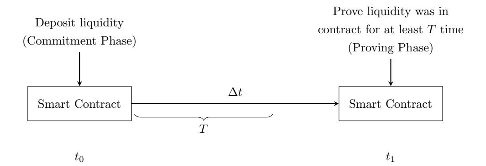

# Proof of Time: A Method for Verifiable Temporal Commitments Without Timestamp Disclosure

Alexander John Lee

December 4th, 2024

#### Abstract

This paper introduces a cryptographic method that enables users to prove that an event occurred in the past and that a specified amount of time has since elapsed, without disclosing the exact timestamp of the event. The method leverages zero-knowledge proofs and an on-chain Incremental Merkle Tree to store hash commitments. By utilizing the Poseidon hash function and implementing zero-knowledge circuits in Noir, this approach ensures both the integrity and confidentiality of temporal information. A working demo is provided; the code repository is available at [https://github.com/partylikeits1983/proof-of-time.](https://github.com/partylikeits1983/proof-of-time)

## 1 Introduction

Proving that an amount of time has elapsed since an event occurred without revealing the exact timestamp of when it occurred has significant applications in privacy-preserving protocols. Traditional methods either expose the timestamp or fail to provide verifiable proof of elapsed time. This paper bridges that gap by allowing users to commit to an event and later prove that a predefined duration has passed since the commitment.

The process consists of two main phases, each employing a zero-knowledge (zk) circuit:

- 1. Commitment Phase: The user commits to an event by creating a hash that includes a secret, a nullifier (nonce), and a Unix timestamp. A zero-knowledge proof ensures that the hash added to the Incremental Merkle Tree includes the Unix timestamp as one of the inputs to the hash. This hash is then stored on-chain in the Incremental Merkle Tree (IMT) as a leaf.
- 2. Proving Phase: After the required time has elapsed, the user generates another zeroknowledge proof to demonstrate knowledge of the hash preimage of the leaf in the IMT, without revealing the path to the leaf. The smart contract verifies that the proof is valid, with two of the public inputs to the proof being a recent Merkle root of the IMT, and the required elapsed time the user wishes to prove. This ensures that a certain amount of time has passed from the initial commitment phase, without revealing the exact timestamp of when the commitment phase occurred.

A working demo using the Poseidon hash function and the Noir programming language has been implemented. The code is available at the provided GitHub repository in the references section.

## 2 Preliminaries

## 2.1 Hash Functions

This method uses the Poseidon hash function, a cryptographic hash optimized for zero-knowledge proofs. Poseidon operates over finite fields, offering collision resistance and efficiency within zk-SNARK circuits [\[2\]](#page-6-0).

Let H : F ∗ → F represent the Poseidon hash function over a finite field F. Its design ensures compatibility with zk-SNARKs and efficient cryptographic operations, making it suitable for succinct proofs in zero-knowledge settings.

### 2.2 Incremental Merkle Trees

An Incremental Merkle Tree (IMT) is a specialized version of the traditional Merkle tree, tailored for efficient and dynamic updates in datasets that grow over time. Similar to standard Merkle trees, IMTs consist of leaf nodes containing data blocks and non-leaf nodes holding the hashes of their child nodes [\[6\]](#page-6-1). However, IMTs are optimized to allow new leaves to be added with minimal recomputation, eliminating the need to reconstruct the entire tree structure. This efficiency is particularly advantageous for on-chain storage, where computational resources and gas costs are critical considerations.

In this method, the IMT is utilized to securely store commitments on-chain, facilitating the incremental addition of hash commitments as users submit commitments. This approach ensures scalability and maintains the integrity of the tree without incurring excessive computational overhead. Inspired by techniques used in Tornado Cash [\[1\]](#page-6-2), the method employs a way to prove knowledge of a leaf's hash preimage without disclosing the path to that leaf. This enables efficient verification of commitments while preserving the privacy of the underlying data, making the IMT well-suited for decentralized applications that require both security and scalability.

### 2.3 Zero-Knowledge Proofs and Noir

Zero-knowledge proofs enable a prover to demonstrate the truth of a statement to a verifier without revealing additional information [\[5\]](#page-6-3). The zero-knowledge circuits in this method are implemented using Noir [\[3\]](#page-6-4), a domain-specific language designed for efficient zk-proof development. Noir simplifies the creation of zk-SNARK circuits by providing high-level abstractions.

## 3 Methodology

The method involves two zero-knowledge circuits corresponding to the two phases.

## 3.1 Commitment Phase

#### 3.1.1 Commitment Hash Computation

A hash h is computed using the following inputs:

- Secret s: A private random number known only to the user (private input).
- Nullifier n: A nonce to prevent replay attacks and ensure uniqueness (private input).
- Unix Timestamp t: Commitment timestamp

The hash is computed by first hashing s and n, followed by hashing this intermediate result with t, utilizing the two-input Poseidon hash function in both Noir and Solidity implementations for simplicity in the demonstration. This sequential hashing approach not only ensures compatibility across on-chain and off-chain components but also facilitates the potential addition of further input parameters to the hash in future extensions. As a result, the final leaf hash comprehensively incorporates s, n, and t.

The hash is computed as:

$$h = H(H(s, n), t) \tag{1}$$

#### 3.1.2 Commitment Circuit Inputs and Verification

The zero-knowledge circuit Ccommit takes the following inputs:

• Private Inputs: s, n

• Public Inputs: t, h

The circuit verifies that the hash h is correctly computed:

$$C_{\text{commit}}(s, n, t, h)$$
: Verify that  $h = H(H(s, n), t)$  (2)

The zero-knowledge proof ensures that h is correctly computed for a given s and n. When submitting the commitment proof, the smart contract checks if the commitment timestamp t is greater than or equal to the current Unix timestamp in the smart contract Tcurrent. If the proof is valid and Tcurrent ≤ t, then the hash h is added as a leaf into the IMT within the smart contract.

This condition can be formally expressed as:

If 
$$C_{\text{commit}}(s, n, t, h) = \text{valid}$$
 and  $T_{\text{current}} \leq t$ , then  $h \in \text{IMT}$  (3)

### 3.2 Proving Phase

In this phase, the protocol demonstrates that the commitment timestamp t satisfies the elapsed time condition, ensuring that sufficient time has elapsed since the original commitment without revealing the exact timestamp.

#### 3.2.1 Proving Circuit Inputs and Verification

The zero-knowledge circuit Cprove takes the following inputs:

#### • Public Inputs:

- Tproof: Timestamp at the time of proof generation
- T: Required elapsed time since the commitment
- R: Root of the IMT
- hn: Nullifier hash

#### • Private Inputs:

- t: Commitment timestamp
- s: Secret
- n: Nullifier
- proof siblings = [s0, s1, . . . , sd−1]: Merkle proof siblings (for a tree of depth d)
- proof path indices = [p0, p1, . . . , pd−1]: Merkle proof path indices

The circuit Cprove verifies the following conditions:

#### 1. Elapsed Time Condition:

$$t \le T_{\text{proof}} - T \tag{4}$$

This condition ensures that the commitment was made at least T time units before the proof generation time Tproof, indicating that sufficient time has elapsed since the commitment. Alternatively, this can be expressed as:

$$t + T \le T_{\text{proof}}$$

#### 2. Hash Verification:

$$h = H(H(s, n), t) \tag{5}$$

The circuit verifies that the hash h was correctly computed using the secret s, the nullifier n, and the commitment timestamp t.

#### 3. Nullifier Hash Verification:

$$h_n = H(n) \tag{6}$$

This ensures that the public nullifier hash hn corresponds to the private nullifier n, preventing double-spending by ensuring n is unique and has not been used before.

### 4. Merkle Proof Verification:

The circuit reconstructs the IMT root R from the leaf h using the provided Merkle proof elements. It verifies that h is a valid leaf node within the IMT of root R:

Verify Merkle Proof 
$$(h, R, proof\_siblings, proof\_path\_indices)$$
 (7)

This step confirms that the commitment h exists within the on-chain IMT without revealing the path to h.

Upon generating the zero-knowledge proof, the user submits it to the smart contract. The smart contract performs several verifications to ensure the integrity and validity of the proof:

- It verifies that the Merkle root R provided in the proof corresponds to one of the recent Merkle roots stored in the smart contract's state. This can be efficiently managed by maintaining a list or mapping of valid Merkle roots.
- It checks that the proof's timestamp Tproof (used as a public input in the proof) is less than or equal to the current blockchain time Tnow. This ensures that the proof was generated prior to the current time and prevents future-dated proofs.
- It ensures that the nullifier hash hn has not been previously used. To prevent duplicate use, the smart contract adds hn to a hash map upon successful verification of the proof. This mechanism effectively tracks used nullifiers and prevents them from being reused in future proofs.

If all these verifications pass, the smart contract accepts the proof, thereby confirming that an event associated with the commitment occurred at least T time units prior to the proof generation time Tproof, without revealing the exact timestamp t of the commitment. This process maintains both the integrity and confidentiality of the protocol.

These steps collectively ensure that the prover possesses knowledge of the preimage (s, n, t) corresponding to a leaf h in the IMT, that at least T time units have elapsed since the commitment timestamp t, and that the nullifier n has not been previously used. This upholds the protocol's security guarantees while preserving the privacy of sensitive information.

## 4 Security Analysis

### 4.1 Zero-Knowledge Property

The zero-knowledge proofs ensure that the verifier learns nothing about s, n, or t beyond the validity of the commitment and elapsed time condition. This preserves the confidentiality of the user's secret and the exact timestamp.

### 4.2 Soundness

The use of the Poseidon hash function and Merkle proofs guarantees that no adversary can forge a valid proof without knowing the correct inputs. Collision resistance and preimage resistance of the Poseidon hash function are critical to preventing adversaries from finding different inputs that produce the same hash output, thereby ensuring the uniqueness and integrity of each commitment. Additionally, the integrity of the IMT structure underpins the soundness of the protocol by ensuring that only valid and committed hashes are included. Therefore, the security of the protocol is inherently dependent on the robust cryptographic properties of the Poseidon hash function, which is designed to be secure against known cryptographic attacks while being efficient for zero-knowledge proof systems.

## 4.3 Timestamp Confidentiality

The protocol ensures that t remains undisclosed by proving only the elapsed time condition relative to Tproof. This prevents any leakage of the exact time when the event occurred.

## 5 Applications

### 5.1 Use Cases

- Delayed Transactions: Prove that sufficient time has passed before executing a transaction, enhancing security measures like withdrawal delays.
- Timelocked Commitments: Verify that a deposit was held for a specified duration without revealing the holding period's exact start time.
- Anonymous Credentials: Enable users to prove they have held a credential for a certain period without disclosing when it was obtained.

### 5.2 Example Flowchart

In this example, at time t0, the user deposits liquidity into a contract and commits to the event using the commitment phase. After the minimum deposit time T has passed, the user, likely from a different address, proves that their deposit has existed for the required duration without revealing the exact time of the deposit. To illustrate the process, consider the following flowchart where time flows from left to right:

Figure 1: Flow of Deposit and Proof Process

## 6 Conclusion

This paper presents a cryptographic method for proving that an event occurred in the past and that a specified amount of time has elapsed, without revealing the exact timestamp of when the event occurred. By combining Poseidon hash functions, IMTs, and zero-knowledge proofs implemented in Noir, the protocol provides a secure, privacy-preserving solution suitable for decentralized applications. A working demo validates the approach, with code available at [\[4\]](#page-6-5).

## Acknowledgments

The author thanks the open-source community for providing tools and resources that made this work possible.

## References

- [1] Pertsev, A., Semenov, R., & Storm, R. (2019). Tornado Cash: Non-Custodial Anonymous Transactions on Ethereum. [Whitepaper.](https://berkeley-defi.github.io/assets/material/Tornado%20Cash%20Whitepaper.pdf)
- [2] Grassi, L., Khovratovich, D., Rechberger, C., Roy, A., & Schofnegger, M. (2020). Poseidon: A New Hash Function for Zero-Knowledge Proof Systems. In 26th International Conference on the Theory and Application of Cryptology and Information Security (pp. 69–98). [Paper.](https://eprint.iacr.org/2019/458.pdf)
- [3] Noir Programming Language. [GitHub Repository.](https://github.com/noir-lang/noir)
- [4] Lee, A. J. (2024). Proof of Time Implementation. [GitHub Repository.](https://github.com/partylikeits1983/proof-of-time)
- [5] Goldreich, O. (2001). Foundations of Cryptography: Volume 1. Cambridge University Press.
- [6] Merkle, R. C. (1987). A Digital Signature Based on a Conventional Encryption Function. In Advances in Cryptology — CRYPTO '87 (pp. 369–378).

[7] Schnorr, C. P. (1991). Efficient Signature Generation by Smart Cards. Journal of Cryptology, 4(3), 161–174.