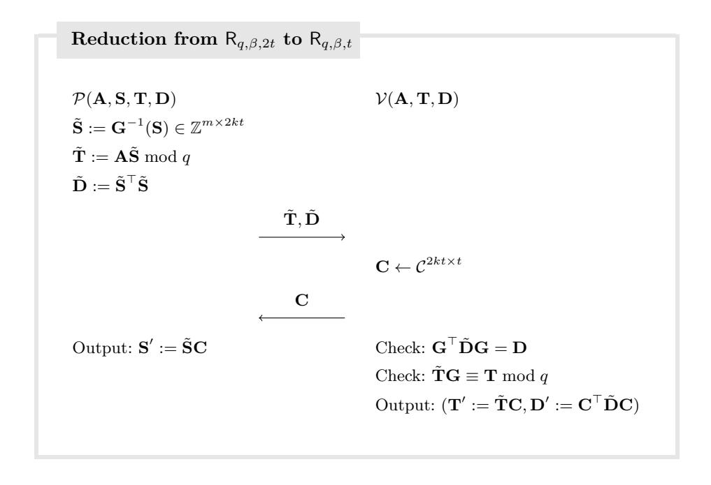

# **Lova: Lattice-Based Folding Scheme from Unstructured Lattices**

Giacomo Fenzi giacomo.fenzi@epfl.ch EPFL

Christian Knabenhans christian.knabehans@epfl.ch EPFL

Ngoc Khanh Nguyen ngoc khanh.nguyen@kcl.ac.uk King's College London

Duc Tu Pham pdtu01@gmail.com ENS Paris

**Abstract.** Folding schemes (Kothapalli et al., CRYPTO 2022) are a conceptually simple, yet powerful cryptographic primitive that can be used as a building block to realise incrementally verifiable computation (IVC) with low recursive overhead without general-purpose non-interactive succinct arguments of knowledge (SNARK). Most folding schemes known rely on the hardness of the discrete logarithm problem, and thus are both not quantum-resistant and operate over large prime fields. Existing postquantum folding schemes (Boneh, Chen, ePrint 2024/257) based on lattice assumptions instead are secure under structured lattice assumptions, such as the Module Short Integer Solution Assumption (MSIS), which also binds them to relatively complex arithmetic. In contrast, we construct Lova, the first folding scheme whose security relies on the (unstructured) SIS assumption. We provide a Rust implementation of Lova, which makes only use of arithmetic in hardware-friendly power-of-two moduli. Crucially, this avoids the need of implementing and performing any finite field arithmetic. At the core of our results lies a new *exact* Euclidean norm proof which might be of independent interest.

# **1 Introduction**

Incrementally verifiable computation [\[Val08\]](#page-23-0) (IVC) is a cryptographic primitive that allows a long (possibly infinite) computation to be run, such that correctness of the state of the computation can be efficiently verified at any point. IVC and its generalisation, proof-carrying data [\[CT10\]](#page-21-0) (PCD), have found numerous applications in succinct blockchains [\[BMRS20;](#page-21-1) [BGH19;](#page-21-2) [Mina\]](#page-22-0), verifiable delay functions [\[BBBF18;](#page-20-0) [KMT22\]](#page-22-1), SNARKs for machine computations [\[BCTV14\]](#page-20-1), and more.

Originally, IVC and PCD were built on recursive SNARKs [\[BCCT13;](#page-20-2) [BCTV14;](#page-20-1) [Val08\]](#page-23-0) which prove that: (i) the current computation step was executed correctly, and (ii) there exists a proof that the computation was performed correctly for all previous steps up to that point. This approach, however, suffers from several restrictions on the choice of the underlying SNARKs, making the approach rather impractical. More recent constructions of IVC and PCD were proposed from

so-called folding and (split-)accumulation schemes [BCMS20; BCL+21; BC23; KST22; KS22; KS23]. Informally, a folding scheme "folds" several instances of a certain relation into a single instance, so that correctness of the folded instance implies correctness of all original instances. Until recently, folding (aka accumulation) schemes are instantiated using Pedersen commitments, and their security holds in the random oracle model under the discrete logarithm assumption. Consequently, all the constructions are currently exposed to efficient quantum attacks [Sho94].

Given the recent announcement of the US National Institute of Standardisation and Technology (NIST) on the post-quantum standardisation effort [NIST], it is becoming more and more likely that lattices will form the future foundation of public-key cryptography. Hence, a natural question arises as to whether folding schemes can be efficiently realised from lattice-based assumptions.

#### 1.1 Our Results

In this paper, we present Lova1, the first folding scheme based on unstructured lattice assumptions, i.e. the Short Integer Solution (SIS) assumption. Our construction brings the following benefits over relying on more structured assumptions, such as Module-SIS [LS15]. It allows for much simpler (yet efficient) instantiations of the folding scheme, without implementing polynomial ring arithmetic and requiring NTT-friendly prime moduli while relying on a more established computational assumption.

Our starting point is a generic construction of a folding scheme from Nova [KST22], which requires an additively homomorphic compressing commitment scheme Com. The rough intuition can be described as follows; the folding scheme focuses on "commit-and-prove"-type relations:

$$R := \{ ((x, t), (w, r)) : (x, w) \in R \land t = Com(w; r) \},\$$

where R is a binary NP relation. Further, given two valid instances  $(x_0, w_0)$  and  $(x_1, w_1) \in R$ , the folded instance  $(x^* := (x^*, t^*), w^* := (w^*, r^*)) \in R$  is constructed by taking a linear combination of  $(x_0, w_0)$  and  $(x_1, w_1)$  with challenges generated by the verifier, or in the non-interactive case, output values of the random oracle. Thus, one could naively obtain a lattice-based folding scheme by instantiating Com with the folklore Ajtai commitment scheme [Ajt96].

The resulting construction, unfortunately, comes with a major efficiency drawback. Indeed, Ajtai commitments are binding only with respect to short message and randomness vectors. This limitation becomes particularly problematic because the norm of the folded witness w\* increases after each folding step. The consequences are twofold. First, a maximal number of folding steps must be known ahead of setting the lattice parameters. This is contradictory to the concept of IVC, where we do consider long, and possibly infinite, computations.

&lt;sup>1 The name comes from the fact that our construction is a direct lattice adaptation of the Nova folding scheme [KST22].

Second, the extracted message  $w^*$  may not be a valid witness for  $x^*$  with respect to the relation R, due to slack and other related norm growth problems [BLNS20; ACK21; AL21]. In this work, we incorporate two main techniques to circumvent these limitations.

**Decompose-and-fold.** First, we apply the (folklore by now) "decompose-and-fold" paradigm [PSTY13; BS23; BC24] which allows us to control the norm growth during an honest execution. Intuitively, given a witness  $\mathbf{w}_i$  of norm at most  $\beta$ , where  $i \in \{0, 1\}$ , the prover starts by decomposing it (usually w.r.t. some decomposition base b) into many intermediate witnesses  $\mathbf{w}_{i,1}, \ldots, \mathbf{w}_{i,k}$ , where each  $\mathbf{w}_{i,j}$  has much smaller norm than  $\mathbf{w}_i$ . Afterwards, the prover folds all the 2k intermediate witnesses  $(\mathbf{w}_{i,j})_{i \in \{0,1\}, j \in [k]}$  into the final witness  $\mathbf{w}^*$ . By picking appropriate parameters b and  $\beta$ , one can ensure that norm of the folded witness  $\mathbf{w}^*$  is also bounded by  $\beta$ ; thus no norm growth occurs when following the protocol honestly.

**Exact Euclidean norm proof.** The second component is a new *exact* Euclidean norm proof. This ingredient ensures that no slack and stretch occurs in the knowledge soundness/extractability argument. Combined with the decompose-and-fold approach, this enables us to build a lattice-based folding scheme, where the number of folding steps is independent of the instantiated lattice parameters. We highlight that our Euclidean norm proof could be of independent interest, and may be applied in the context of lattice-based succinct arguments with fast verification, e.g., in the recent polynomial commitment scheme by Cini et al. [CMNW24].

To showcase the simplicity and practicality of our folding scheme, we provide a concrete instantiation and a proof-of-concept implementation. The Lova protocol is relatively simple and relies on unstructured assumptions, which makes it particularly easy to implement and straightforward to parallelize. Both our prover and verifier mostly perform linear algebra operations (especially matrix-matrix multiplication with bounded-norm entries), and we do not require more complex operations that appear in other lattice-based constructions (e.g., number-theoretic transforms for polynomial arithmetic, or sumcheck-style computations). In addition, we are able to choose the lattice modulus to be a hardware-friendly power-of-two ( $q=2^{64}$  in our evaluation), which eschews modular arithmetic altogether and reduces to standard integer arithmetic.

#### 1.2 Technical Overview

We provide a brief overview of our techniques.

#### 1.2.1 Background

**Ajtai commitment.** In the Ajtai commitment scheme [Ajt96], one commits to a short vector  $\mathbf{s} \in \mathbb{Z}^m$  by computing

$$\mathbf{As} \equiv \mathbf{t} \pmod{q}$$
.

In the above q and  $\mathbf{A} \in \mathbb{Z}^{n \times m}$  are public parameters of the scheme, and  $\mathbf{t} \in \mathbb{Z}^n$  is the commitment to  $\mathbf{s}$ . That Ajtai commitments are binding follows directly from

the SIS assumptions, as two distinct short vectors  $\mathbf{s}, \mathbf{s}^*$  that satisfy the above equation imply that  $\mathbf{s} - \mathbf{s}^* \neq 0$  is also short and  $\mathbf{A}(\mathbf{s} - \mathbf{s}^*) = \mathbf{0} \pmod{q}$ .

**Reductions of knowledge.** Reductions of Knowledge (RoK) [KST22] are interactive protocols between a prover and a verifier that reduce checking membership of an instance in a relation to checking membership a related instance in a (usually simpler) relation. In a reduction of knowledge from  $R \to R'$ , the prover and the verifier have access to an index i and an instance x. The honest prover additionally has access to a witness x for the instance. They interact and at the end of the interaction:

- If  $(i, x, w) \in R$ , the verifier accepts and outputs an instance x' and the prover outputs a witness w' such that  $(i, x', w') \in R'$ .
- If at the end of the interaction the verifier accepts and outputs an instance x', there is an efficient extractor that given (i, x, x') and w' such that  $(i, x', w') \in R'$  outputs w such that  $(i, x, w) \in R$

A folding scheme is then simply reduction of knowledge from a relation R2 to itself. Note that both completeness and (knowledge) soundness require then that the updated witness belongs to the same relation and that the extracted witness belong to the original relation. For the lattice setting, where norm growth and slack tend to accrue, this is the major technical hurdle to solve. The relation that we consider is the following, which is a slight generalization of the natural opening relation for Ajtai commitments2:

$$\mathsf{R}^{\mathsf{SIS}}_{q,\beta,t} := \left\{ (\mathbf{A},\mathbf{T},\mathbf{S}) \in \mathbb{Z}^{n \times m} \times \mathbb{Z}^{n \times t} \times \mathbb{Z}^{m \times t} \;\middle|\; \mathbf{AS} \equiv \mathbf{T} \pmod{q} \\ \;\forall i \in [t], \; \|\mathbf{S}_{*,i}\| \leq \beta \right\} \;\;.$$

Since an instance of  $(\mathsf{R}^{\mathsf{SIS}}_{q,\beta,t})^2$  can be reduced to one of  $\mathsf{R}^{\mathsf{SIS}}_{q,\beta,2t}$ , we consider designing a RoK for  $\mathsf{R}^{\mathsf{SIS}}_{q,\beta,2t} \to \mathsf{R}^{\mathsf{SIS}}_{q,\beta,t}$ .

## 1.2.2 A Naive Attempt to Folding Schemes

As in previous folding approaches, we will aim to do so via a random linear combinations, which will inevitably incur into problems. Let  $(\mathbf{A}, \mathbf{T}, \mathbf{S}) \in \mathsf{R}_{q,\beta,2t}^{\mathsf{SIS}}$ . The (naive) protocol that we design is the following:

- 1. The verifier samples a challenge  $\mathbf{C} \leftarrow \mathcal{C}^{2t \times t} \subseteq \mathbb{Z}^{2t \times t}$  (from a yet unspecified sampling set) and send it to the prover.
- 2. The prover computes and outputs the updated witness  $\mathbf{Z} := \mathbf{SC}$ .
- 3. The verifier computes the updated instance T' := TC, accepts and outputs it.

This protocol suffers from two main issues:

Completeness norm growth. Folding must reduce checking two instances of a relation to checking a single instance of the *same* relation. In this case, the new opening **Z** will *not* in fact satisfy  $\|\mathbf{Z}_{*,i}\| \leq \beta$  for any non-trivial sampling set  $\mathcal{C}$ .

&lt;sup>2 Which we can recover by setting t=1. We use this formulation as it will notationally more convenient later on.

**Extraction norm growth.** The protocol is knowledge sound, as we can construct an extractor that produces a (relaxed) witness via coordinate-wise special soundness [BBC+18; FMN23]. Interpreting the challenge set  $C^{2t \times t} \cong (C^t)^{2t}$  (i.e. so that each coordinate correspond to a row of the matrix) the extractor is given access to a tree of 2t + 1 accepting transcripts,

$$\left( \left( \begin{array}{c} \mathbf{C}^{(0)} \\ \mathbf{Z}^{(0)} \end{array} \right), \cdots, \left( \begin{array}{c} \mathbf{C}^{(2t)} \\ \mathbf{Z}^{(2t)} \end{array} \right) \right) \ ,$$

such that, for  $j \in [2t]$ ,  $\mathbf{C}^{(0)}$ ,  $\mathbf{C}^{(j)}$  differ in exactly row j. Letting  $i^*$  denote the column in which the two differ we have that  $C_{j,i^*}^{(0)} \neq C_{j,i^*}^{(j)}$  and  $C_{j',i}^{(0)} = C_{j',i}^{(j')}$  for  $i \in [t]$  and  $j' \neq j$ . For  $j \in [2t]$ , the extractor computes

$$\mathbf{S}_{*,j} \equiv \frac{\mathbf{Z}_{*,j}^{(0)} - \mathbf{Z}_{*,j}^{(j)}}{C_{j,i^*}^{(0)} - C_{j,i^*}^{(j)}} \pmod{q} ,$$

and sets  $\mathbf{S} := [\mathbf{S}_{*,1}, \dots, \mathbf{S}_{*,2t}]$ . It is easy to see then that, for every  $j \in [2t]$ ,

$$\mathbf{AS}_{*,j} \equiv \frac{\mathbf{AZ}_{*,j}^{(0)} - \mathbf{AZ}_{*,j}^{(j)}}{C_{i\ j^*}^{(0)} - C_{i\ j^*}^{(j)}} \equiv \mathbf{T}_{*,j} \pmod{q} \ .$$

What is left is to bound the norm of the extracted witness **S**. Letting  $\beta_{\mathcal{C}} := \max_{c \neq c' \in \mathcal{C}} \| (c - c')^{-1} \mod q \|$ , and  $\beta'$  denote the completeness norm bound on **Z**, we can only conclude that norm of  $\mathbf{S}_{*,j}$  is at most  $2 \cdot \beta_{\mathcal{C}} \cdot \beta' > \beta$ . So, even if there were no completeness norm growth and  $\beta' = \beta$  (which as argued before, is not currently the case), the extraction incurs in a norm blowup. The particularly hard term to control is  $\beta_{\mathcal{C}}$ . Selecting  $\mathcal{C}$  that simultaneously is (i) large enough for soundness; (ii) with elements of small norm (to keep the completeness norm under control); and (iii) with  $\beta_{\mathcal{C}}$  small is challenging. In polynomial rings, setting  $\mathcal{C}$  to be the monomials can partially help, but there are limitations even in the cyclotomic ring setting [AL21].

To construct an efficient folding scheme for Ajtai commitments, we have to solve both of the above problems.

- To solve the completeness norm growth, we will ask the prover to decompose its opening and send us an updated commitment, which we can check for consistency against the old commitment.
- To solve the extraction norm growth, we will proceed in steps. First, we will present an approach to extract (a decomposed witness) with almost no extraction blowup, and then we will augment this protocol with a proof of exact norm that allows it to eliminate it completely.

#### 1.2.3 Extracting Witness with Small Norm

We now aim to choose a challenge set  $\mathcal{C}$  suitable for both keeping completeness and extraction norm growth under control. A natural choice is the set of binary challenges  $\mathcal{C} = \{0, 1\}$  as used in [BBC+18; CMNW24]. Then, as demonstrated in

the aforementioned works, we have  $\beta_{\mathcal{C}} = 1$  and norm of the extracted matrix is at most  $2\beta'$ . Below, we consider a slight extension of this approach, which later will be crucial to prove *exact* norm bounds.

Namely, consider ternary challenges  $\mathcal{C} = \{-1,0,1\}$  instead. As in the binary case, those challenges are small, so they will contribute little to the completeness growth. For extraction, recall that norm growth was in large part contributed by the term  $\beta_{\mathcal{C}}$ . For our choice of  $\mathcal{C}$ , the differences of challenges consists of  $\delta := \alpha - \alpha'$  with  $\alpha, \alpha' \in \{-1,0,1\}$  and  $\alpha \neq \alpha'$ . We notice that  $\delta \in \{\pm 1, \pm 2\}$  and further equals 2 only if  $(\alpha, \alpha') = (\pm 1, \mp 1)$ . When  $\delta = \pm 1$ , dividing by  $\delta$  does not create any norm blowup, similarly as in the binary case. On the other hand, for  $\delta = \pm 2$ , it is unclear whether the extracted witness is short, or even if it is well-defined, e.g. for even moduli q.

To leverage this observation, we revisit the coordinate-wise special soundness (CWSS) property and the heavy-row analysis in [BBC+18, Lemma 3]. For each coordinate i, we construct an extractor that recovers two accepting transcripts ( $\mathbf{C}, \mathbf{Z}$ ), ( $\mathbf{C}', \mathbf{Z}'$ ) such that: (i)  $\mathbf{C}$  and  $\mathbf{C}'$  differ exactly, and only, in the i-th row, and (ii) their corresponding i-th row vectors  $\mathbf{c}_i, \mathbf{c}_i'$  satisfy  $\mathbf{c}_i \not\equiv \mathbf{c}_i' \pmod{2}$ . The latter condition makes sure that there exists an entry of  $\mathbf{c}_i - \mathbf{c}_i'$  which is  $\pm 1$  and allows for extracting a witness with norm at most  $2\beta'$  as in the binary setting.

Roughly, the analysis relies on the heavy-row argument [Dam10]. Suppose a cheating prover succeeds to produce a valid response  $\mathbf{Z}$  for a random challenge matrix  $\mathbf{C}$  with a noticeable probability. Then, for any coordinate i, with sufficiently large probability (i.e. the probability of "landing in a heavy row"), the set of matrix challenges  $\mathbf{C}'$ , which satisfy conditions (i) and (ii) described above, that are simultaneously "good" (in the sense that the prover outputs an accepting transcript) must be big enough.

Replicating the CWSS analysis with the improved extraction procedure to the strawman protocol, we reduce the extraction norm blowup of the strawman protocol to  $2 \cdot \beta'$ . We highlight that the new approach suffers from a larger soundness than in the binary challenge setting, which is now roughly  $(\frac{2}{3})^t$ .

#### 1.2.4 Almost a Folding Scheme

Following the above strategy, we design a folding scheme with no completeness blowup. Further, we use the extraction strategy previously described to extract a very short (decomposed) witness, which we later show how to upgrade to extract a witness with no extraction norm blowup.

**b-decomposition.** In the sequel **G** is the *b*-decomposition gadget matrix, and  $\mathbf{G}^{-1}$  denote its inverse, i.e.  $\mathbf{G}^{-1}(\mathbf{S})\mathbf{G} = \mathbf{S}$  for every **S**.  $\mathbf{G}^{-1}$  decomposes **S** into a matrix  $\tilde{\mathbf{S}}$  where each entry is in  $[-\lfloor b/2 \rfloor, \lfloor b/2 \rfloor]$  (in this work, we use balanced base-*b* decomposition).

**Folding scheme.** Let  $(\mathbf{A}, \mathbf{T}, \mathbf{S}) \in \mathsf{R}_{q,\beta,2t}^{\mathsf{SIS}}$ . The new protocol that we design is the following:

- 1. The prover computes  $\tilde{\mathbf{S}} := \mathbf{G}^{-1}(\mathbf{S})$ ,  $\tilde{\mathbf{T}} := \mathbf{A}\tilde{\mathbf{S}} \mod q$  and sends  $\tilde{\mathbf{T}}$  to the verifier.
- 2. The verifier samples a challenge  $\mathbf{C} \leftarrow \{-1,0,1\}^{2kt \times t}$  and send it to the prover.

- 3. The prover computes and outputs the updated witness  $\mathbf{Z} := \mathbf{\tilde{S}C}$ .
- 4. The verifier computes  $\mathbf{T}' := \tilde{\mathbf{T}}\mathbf{C}$ , accepts if

$$\tilde{\mathbf{T}}\mathbf{G} \equiv \mathbf{T} \pmod{q}$$
,

and outputs the updated instance T'.

We analyse completeness and knowledge soundness of the above RoK. Completeness. First, it is easy to see that the verifier's algebraic checks succeed.

$$\tilde{\mathbf{T}}\mathbf{G} \equiv \mathbf{A}\tilde{\mathbf{S}}\mathbf{G} \equiv \mathbf{A}\mathbf{S} \equiv \mathbf{T} \pmod{q}$$
,  
 $\mathbf{A}\mathbf{Z} \equiv \mathbf{A}\tilde{\mathbf{S}}\mathbf{C} \equiv \tilde{\mathbf{T}}\mathbf{C} \pmod{q}$ .

We are left to check the norms of **Z**. Let  $i \in [t]$ , and consider  $\|\mathbf{Z}_{*,i}\|$ . Since  $\|\tilde{\mathbf{S}}_{*,j}\| \leq \lfloor \frac{b}{2} \rfloor \sqrt{m}$ , we have that

$$\|\mathbf{Z}_{*,j}\| \le \left\| \sum_{i=1}^{2kt} \mathbf{C}_{i,j} \tilde{\mathbf{S}}_{*,i} \right\| \le 2kt \left\lfloor \frac{b}{2} \right\rfloor \sqrt{m} .$$

As long as  $t \leq \frac{\beta}{2k \left\lfloor \frac{b}{2} \right\rfloor \sqrt{m}}$ , the above norm is then bounded above by  $\beta$ .

Relaxed Knowledge Soundness. We apply a similar analysis to that in the strawman protocol, except now that the extraction procedure is applied on 2kt+1 coordinates instead of 2t+1. This recovers a decomposed witness  $\bar{\mathbf{S}} \in \mathbb{Z}^{n \times 2kt}$  which has  $\|\bar{\mathbf{S}}_{*,j}\| \leq 2\beta$  and for which  $A\bar{\mathbf{S}} \equiv \tilde{\mathbf{T}} \pmod{q}$ . Later on, we will make use of this intermediate short extracted witness. The final extracted witness is  $\mathbf{S} := \bar{\mathbf{S}}\mathbf{G}$  which satisfies

$$\mathbf{AS} \equiv \mathbf{A\bar{S}G} \equiv \tilde{\mathbf{T}G} \equiv \mathbf{T} \pmod{q}$$
.

Note that, for  $j \in [2t], ||\mathbf{S}_{*,j}|| \le 2\beta^2$ .

# 1.2.5 Exact Euclidean Norm Proof

To construct the final protocol, we require to augment the above protocol with a proof of exact norm. Our first observation is that, if for every  $j \in [2t] \|\mathbf{S}_{*,j}\| \leq \beta$  then the matrix  $\mathbf{D} := \mathbf{S}^{\top}\mathbf{S}$  has a diagonal bounded by  $\beta^2$ , i.e. for every  $i \in [2t]$ , has  $D_{i,i} \leq \beta^2$ . This is because

$$D_{i,i} = \langle \mathbf{S}_{*,i}, \mathbf{S}_{*,i} \rangle = \|\mathbf{S}_{*,i}\|^2 \le \beta^2$$
.

We then rewrite the relation for opening of Ajtai commitments to:

$$\mathsf{R}_{q,\beta,t} := \left\{ \begin{array}{c} (\mathbf{A}, (\mathbf{T}, \mathbf{D}), \mathbf{S}) \\ \in \mathbb{Z}^{n \times m} \times (\mathbb{Z}^{n \times t} \times \mathbb{Z}^{t \times t}) \times \mathbb{Z}^{m \times t} \end{array} \middle| \begin{array}{c} \mathbf{A}\mathbf{S} \equiv \mathbf{T} \pmod{q} \\ \wedge \mathbf{D} = \mathbf{S}^{\top} \mathbf{S} \\ \wedge \ \forall i \in [t], \ D_{i,i} \leq \beta^2 \end{array} \right\} . \quad (1)$$

Now, let  $(\mathbf{A}, (\mathbf{T}, \mathbf{D}), \mathbf{S}) \in \mathsf{R}_{q,\beta,2t}$ . The final protocol that we design is the following:

- 1. The prover computes  $\tilde{\mathbf{S}} := \mathbf{G}^{-1}(\mathbf{S})$ ,  $\tilde{\mathbf{T}} \equiv \mathbf{A}\tilde{\mathbf{S}} \mod q$  and  $\tilde{\mathbf{D}} := \tilde{\mathbf{S}}^{\top}\tilde{\mathbf{S}}$  and sends  $\tilde{\mathbf{T}}, \tilde{\mathbf{D}}$  to the verifier.
- 2. The verifier samples a challenge  $\mathbf{C} \leftarrow \{0, \pm 1\}^{2kt \times t}$  and send it to the prover.
- 3. The prover computes and outputs the updated witness  $\mathbf{Z} := \tilde{\mathbf{S}}\mathbf{C}$ .
- 4. The verifier computes  $\mathbf{T}' := \tilde{\mathbf{T}}\mathbf{C}$  and  $\mathbf{D}' := \mathbf{C}^{\top}\tilde{\mathbf{D}}\mathbf{C}$ , accepts if

$$\mathbf{G}^{\top} \tilde{\mathbf{D}} \mathbf{G} = \mathbf{D}$$

$$\wedge \ \tilde{\mathbf{T}} \mathbf{G} \equiv \mathbf{T} \pmod{q} \ ,$$

and outputs the updated instance  $(\mathbf{T}', \mathbf{D}')$ .

The protocol is complete with no norm blowup. We are left to show that the additional information allows us to enforce exact extracted norm. We consider a new extractor that acts a following:

- 1. Run the malicious prover, answering its query with a uniformly random  $\mathbf{C} \leftarrow \mathcal{C}^{2kt \times t}$ , to obtain a transcript  $(\tilde{\mathbf{T}}, \tilde{\mathbf{D}}, \mathbf{C}, \mathbf{Z})$ .
- 2. If the transcript is not accepting, abort.
- 3. Rewind the prover to the beginning and run the extractor to obtain a witness  $\bar{\mathbf{S}} \in \mathbb{Z}^{m \times 2kt}$  (note that this is not the final witness that we previously extracted, which can be recovered by right multiplying by  $\mathbf{G}$ ), aborting if extraction fails.
- 4. Output  $\mathbf{S} := \bar{\mathbf{S}}\mathbf{G}$ .

First note that, as desired:

$$\mathbf{AS} \equiv \mathbf{A\bar{S}G} \equiv \mathbf{\tilde{T}G} \equiv \mathbf{T} \pmod{q}$$
.

If  $\bar{\mathbf{S}}^{\top}\bar{\mathbf{S}} = \tilde{\mathbf{D}}$ , then we have that

$$\mathbf{S}^{\mathsf{T}}\mathbf{S} = (\bar{\mathbf{S}}\mathbf{G})^{\mathsf{T}}\bar{\mathbf{S}}\mathbf{G} = \mathbf{G}^{\mathsf{T}}\tilde{\mathbf{D}}\mathbf{G} = \mathbf{D}$$
.

and since, for  $i \in [2t]$ ,  $D_{i,i} \leq \beta^2$  we are done. What is left is to bound the probability that  $\bar{\mathbf{S}}^{\top}\bar{\mathbf{S}} \neq \tilde{\mathbf{D}}$ . Since the first transcript is accepting, it must be that

$$AZ \equiv T' \equiv \tilde{T}C \equiv A\bar{S}C \pmod{q}$$
.

Thus, it must be that  $\mathbf{Z} = \bar{\mathbf{S}}\mathbf{C}$ , or else the adversary has found a short SIS solution (since for every  $j \in [2t]$ ,  $\|\bar{\mathbf{S}}_{*,j}\| \leq 2\beta$  and  $\mathbf{C}, \mathbf{Z}$  are short). When this holds, it must also be that  $(\bar{\mathbf{S}}\mathbf{C})^{\mathsf{T}}\bar{\mathbf{S}}\mathbf{C} = \mathbf{C}^{\mathsf{T}}\tilde{\mathbf{D}}\mathbf{C}$ . Writing  $f(\mathbf{X}) = (\bar{\mathbf{S}}\mathbf{X})^{\mathsf{T}}\bar{\mathbf{S}}\mathbf{X}$  and  $g(\mathbf{X}) = \mathbf{X}^{\mathsf{T}}\tilde{\mathbf{D}}\mathbf{X}$ , the above conditions can be rewritten as  $f(\mathbf{C}) = g(\mathbf{C})$ . The functions f and g can be thought as  $2kt \times t$  functions (one for each coordinate), and each of these functions is a multivariate polynomial of total degree at most 2. Indexing accordingly, further if  $f(\mathbf{C}) = g(\mathbf{C})$  then  $f_{i,i}(\mathbf{C}_{*,i}) = g_{i,i}(\mathbf{C}_{*,i})$  for  $i \in [t]$ . Since  $\bar{\mathbf{S}}^{\mathsf{T}}\bar{\mathbf{S}} \neq \tilde{\mathbf{D}}$ , these two polynomials are not identically equal, and so the probability that, over a random setting of the variables, the equation holds is at most  $\frac{2}{|\mathcal{C}|}$  by the Demillo-Lipton-Schwartz-Zippel lemma (applied over the integral domain  $\mathbb{Z}$ )3. Since the equation needs to hold jointly over all the choices

&lt;sup>3 Choosing C to be ternary instead of the arguably more natural binary challenges, in hindsight, is what allows us to have soundness in this step.

of i, then the probability is at most  $\left(\frac{2}{|C|}\right)^t$ . This concludes our argument. We highlight that this probabilistic test was the main reason why chose challenge matrices with ternary entries.

#### 1.3 Related Works

Folding schemes were introduced by Kothapalli et al. [KST22] as a motivation to build incrementally verifiable computation from simple cryptographic building blocks. In a concurrent work, Bünz et al. [BCL+21] generically constructed an IVC from a similar primitive, called a split-accumulation scheme. In both works, the underlying folding/accumulation scheme works for a fixed, but universal, R1CS language. More recently, there has been significant progress in building folding schemes which circumvent the limitation of a single fixed R1CS, by supporting multiple circuits, high-degree relations, and lookup gates [BC23; EG23; KS22; KS23]. The aforementioned constructions still crucially rely on additively homomorphic vector commitments. Thus, we believe that our techniques could be applied to the aforementioned constructions identically as for [BCL+21; KST22].

To the best of our knowledge, the only lattice-based folding scheme is the work by Boneh and Chen [BC24], called LatticeFold. The construction also follows the decompose-and-fold paradigm, which circumvents the norm growth issue during an honest execution. On the contrary, the paper introduces a new way to prove shortness in the infinity norm by cleverly combining the CRT packing technique [BLS19; ESLL19; YAZ+19], together with the sumcheck argument [LFKN92]. By the nature of the techniques, the folding scheme must rely on structured lattice assumptions. Moreover, proving the  $\ell_2$  norm, rather than the  $\ell_\infty$  one, is very often what one would like to do when constructing proofs for lattice-based primitives – especially when the witness vector comes from performing trapdoor sampling [ABB10; DLP14; MP12].

# 2 Preliminaries

**Notation.** We denote the security parameter by  $\lambda$ , which is implicitly given to all algorithms unless specified otherwise. Further, we write  $\mathsf{negl}(\lambda)$  (resp.  $\mathsf{poly}(\lambda)$ ) to denote an unspecified negligible function (resp. polynomial) in  $\lambda$ . In this work, we implicitly assume that the vast majority of the key parameters, e.g. the ring dimension, and the dimensions of matrices and vectors, are  $\mathsf{poly}(\lambda)$ . However, the modulus used in this work may be super-polynomial in  $\lambda$ .

For  $a, b \in \mathbb{N}$  with a < b, write  $[a, b] \coloneqq \{a, a+1, \ldots, b\}$ ,  $[a] \coloneqq [1, a]$ . For  $q \in \mathbb{N}$  write  $\mathbb{Z}_q$  for the integers modulo q. We denote vectors with lowercase boldface (i.e.  $\mathbf{u}, \mathbf{v}$ ) and matrices with uppercase boldface (i.e.  $\mathbf{A}, \mathbf{B}$ ). Specifically, for a matrix  $\mathbf{A}$ , we write  $\mathbf{A}_{i,*}$  and  $\mathbf{A}_{*,j}$  for the i-th row and the j-th column of  $\mathbf{A}$  respectively, and write with lowercase  $A_{i,j}$  for the entry in the i-th row and j-th column. For a vector  $\mathbf{x}$  of length n, we write  $x_i$  or  $\mathbf{x}[i]$  for its i-th entry. Similarly, we define  $\mathbf{x}_i := (x_1, \ldots, x_i)$  for  $i \in [n]$ . Given two vectors  $\mathbf{u}, \mathbf{v}$ , we denote by  $(\mathbf{u}, \mathbf{v})$  its concatenation.

**Decompose and gadget matrix.** Let b > 1. We set  $k := \lfloor \log_b \beta \rfloor + 2^4$  and  $\mathbf{g} = \begin{bmatrix} 1, b, \dots, b^{k-1} \end{bmatrix}^\top \in \mathbb{Z}^k$ . Given  $\mathbf{S} \in \mathbb{Z}^{m \times n}$ , we can decompose it by computing  $\tilde{\mathbf{S}} \in \mathbb{Z}^{m \times kn}$  such that  $\mathbf{S} = \tilde{\mathbf{S}}\mathbf{G}_n$ , where  $\mathbf{G}_n$  is the gadget matrix and  $\mathbf{G}_n := \mathbf{I}_n \otimes \mathbf{g} \in \mathbb{Z}^{kn \times n}$ . Note that if  $\|\mathbf{S}_{*,i}\| \leq \beta$  for all  $i \in [n]$ , then  $\|\tilde{\mathbf{S}}_{*,j}\| \leq \lfloor \frac{b}{2} \rfloor \sqrt{m}$  for all  $j \in [kn]$ . We denote  $\mathbf{G}_n^{-1} : \mathbb{Z}^{m \times n} \to \mathbb{Z}^{m \times kn}$  for the function that decomposes  $\mathbf{S}$  into  $\tilde{\mathbf{S}}$  satisfying  $\mathbf{S} = \tilde{\mathbf{S}}\mathbf{G}_n$ . When the dimensions are clear from context we simply write  $\mathbf{G}$  and  $\mathbf{G}^{-1}$ .

**Definition 1 (SIS).** Let  $q = q(\lambda)$ ,  $n = n(\lambda)$ ,  $m = m(\lambda)$  and  $\beta = \beta(\lambda)$ . We say that the  $SIS_{n,m,q,\beta}$  assumption holds if for any PPT adversary A, the following holds:

$$\Pr\left[\mathbf{A}\mathbf{z} \equiv \mathbf{0} \pmod{q} \land 0 < \|\mathbf{z}\| \leq \beta \ \middle| \ \begin{matrix} \mathbf{A} \leftarrow \mathbb{Z}_q^{n \times m} \\ \mathbf{z} \leftarrow \mathcal{A}(\mathbf{A}) \end{matrix}\right] = \mathsf{negl}(\lambda) \enspace .$$

#### 2.1 The Demillo-Lipton-Schwartz-Zippel Lemma

We recall the Demillo-Lipton-Schwartz-Zippel lemma [DL78; Sch80; Zip79], a tool for probabilistic polynomial identity testing commonly used in proof systems.

**Lemma 1** (Demillo-Lipton-Schwartz-Zippel Lemma). Let  $f \in \mathcal{R}[x_1, x_2, \ldots, x_n]$  be a non-zero polynomial of total degree d over an integral domain  $\mathcal{R}$ . Let S be a finite subset of  $\mathcal{R}$  and  $r_1, \ldots, r_n$  be sampled independently and uniformly random from S. Then

$$\Pr\left[f(r_1,\ldots,r_n)=0\right] \le \frac{d}{|S|} .$$

## 2.2 Concentration Inequalities

We will use the following well-known Chernoff-Hoeffding bound.

Lemma 2 (Chernoff-Hoeffding Bound). Let  $X_1, \ldots, X_n$  be independent random variables taking value in  $\{0,1\}$ . Let  $X = \sum_{i=1}^n X_i$  denote their sum and let  $\mu = \mathbb{E}[X]$ . Then for all  $\epsilon \geq 0$ :

$$\Pr\left[X \le \mu - \epsilon n\right] \le e^{-2\epsilon^2 n}.$$

# 2.3 Reduction of Knowledge

We recall the definition of reduction of knowledge from [KP23], which also captures the notion of folding scheme. That is, a prover, who wants to prove that it knows a witness  $w_1$  such that  $(x_1, w_1) \in R_1$ , can use a reduction of knowledge from  $R_1$  to  $R_2$  and try to prove that it knows a witness  $w_2$  such that  $(x_2, w_2) \in R_2$ , where  $x_2$  is the reduced instance.

&lt;sup>4 We use balanced base-b decomposition throughout, where  $x = \sum_{i \in [k]} x_i b^i$  and  $|x_i| \leq \lfloor \frac{b}{2} \rfloor$ .

**Definition 2 (Reduction of Knowledge).** Consider ternary relations  $R_1$  and  $R_2$ . A reduction of knowledge from  $R_1$  to  $R_2$  consists of three PPT algorithms  $(\mathcal{G}, \mathcal{P}, \mathcal{V})$  denoting the generator, the prover, and the verifier

- $-\mathcal{G}(\lambda) \to i$ : Takes security parameter  $\lambda$ . Outputs public parameters i.
- $-\mathcal{P}(i, x_1, w_1) \to (x_2, w_2)$ : Takes as input public parameters i, and statement-witness pair  $(x_1, w_1)$ . Interactively reduces the statement  $(i, x_1, w_1) \in \mathsf{R}_1$  to a new statement  $(i, x_2, w_2) \in \mathsf{R}_2$ .
- $-\mathcal{V}(i, x_1) \to x_2$ : Takes as input public parameters i, and statement  $x_1$  associated with  $R_1$ . Interactively reduces the task of checking  $x_1$  to the task of checking a new statement  $x_2$  associated with  $R_2$ .

Let  $\langle \mathcal{P}, \mathcal{V} \rangle$  denote the interaction between  $\mathcal{P}$  and  $\mathcal{V}$  that runs the interaction on prover input  $(i, x_1, w_1)$  and verifier input  $(i, x_1)$ , then outputs the verifier's statement  $x_2$  and the prover's witness  $w_2$ . A reduction of knowledge  $\Pi = (\mathcal{G}, \mathcal{P}, \mathcal{V})$  from  $R_1$  to  $R_2$  satisfies the following properties.

**Definition 3 (Perfect Completeness).**  $\Pi$  has perfect completeness if for all PPT adversaries A,

$$\Pr\left[ (\texttt{i}, \texttt{x}_2, \texttt{w}_2) \in \mathsf{R}_2 \middle| \begin{array}{c} \texttt{i} \leftarrow \mathsf{Setup}(1^\lambda) \\ (\texttt{x}_1, \texttt{w}_1) \leftarrow \mathcal{A}(\texttt{i}) \\ (\texttt{x}_2, \texttt{w}_2) \leftarrow \langle \mathcal{P}(\texttt{i}, \texttt{x}_1, \texttt{w}_1), \mathcal{V}(\texttt{i}, \texttt{x}_1) \rangle \end{array} \right] = 1 \enspace .$$

**Definition 4 (Knowledge Soundness).**  $\Pi$  is knowledge sound (with knowledge error  $\kappa(\lambda)$ ) if for all expected polynomial-time adversaries  $\mathcal{A}$  and  $\mathcal{P}^*$ , there is an expected polynomial-time extractor  $\mathcal{E}$  such that

$$\Pr\left[ \begin{array}{c|c} i \leftarrow \mathsf{Setup}(1^{\lambda}) \\ (i, \mathbb{x}_2, \mathbb{w}_2) \in \mathsf{R}_2 \\ \wedge (i, \mathbb{x}_1, \mathbb{w}_1) \notin \mathsf{R}_1 \end{array} \middle| \begin{array}{c} i \leftarrow \mathsf{Setup}(1^{\lambda}) \\ (\mathbb{x}_1, \mathsf{st}) \leftarrow \mathcal{A}(i) \\ (\mathsf{Tr}, \mathbb{x}_2, \mathbb{w}_2) \leftarrow \langle \mathcal{P}^*(i, \mathbb{x}_1, \mathsf{st}), \mathcal{V}(i, \mathbb{x}_1) \rangle \\ \mathbb{w}_1 \leftarrow \mathcal{E}^{\mathcal{P}^*}(i, \mathbb{x}_1, \mathsf{st}) \end{array} \right] \leq \kappa(\lambda)^{-5}.$$

**Definition 5 (Public Reducibility).**  $\Pi$  satisfies public reducibility if there exists a deterministic polynomial-time algorithm f such that for any PPT adversary  $\mathcal{A}$  and expected polynomial-time adversary  $\mathcal{P}^*$ ,

$$\Pr \left[ f(\mathbf{i}, \mathbf{x}_1, \mathsf{Tr}) = \mathbf{x}_2 \middle| \begin{matrix} \mathbf{i} \leftarrow \mathsf{Setup}(1^\lambda) \\ (\mathbf{x}_1, \mathsf{st}) \leftarrow \mathcal{A}(\mathbf{i}) \\ (\mathsf{Tr}, \mathbf{x}_2, \mathbf{w}_2) \leftarrow \langle \mathcal{P}^*(\mathbf{i}, \mathbf{x}_1, \mathsf{st}), \mathcal{V}(\mathbf{i}, \mathbf{x}_1) \rangle \end{matrix} \right] = 1 \enspace .$$

 $^{5}$  Our definition of knowledge soundness is different but equivalent to that of [KP23]

$$\begin{split} \textbf{Reduction from} & \; (\mathsf{R}_{q,\beta,t})^2 \; \textbf{to} \; \mathsf{R}_{q,\beta,2t} \\ \mathcal{P}(\mathbf{A},\mathbf{S}_1,\mathbf{S}_2,\mathbf{T}_1,\mathbf{D}_1,\mathbf{T}_2,\mathbf{D}_2) & \mathcal{V}(\mathbf{A},\mathbf{T}_1,\mathbf{T}_2,\mathbf{D}_1,\mathbf{D}_2) \\ \mathbf{U} := \mathbf{S}_2^{\mathsf{T}}\mathbf{S}_1 \\ \mathbf{V} := \mathbf{S}_1^{\mathsf{T}}\mathbf{S}_2 & \\ & \qquad \qquad \qquad \qquad \\ \mathbf{U},\mathbf{V} & \\ & \qquad \qquad \\ \mathbf{O} \text{utput:} \; \mathbf{S} := \begin{bmatrix} \mathbf{S}_1 \; \mathbf{S}_2 \end{bmatrix} & \mathbf{O} \text{utput:} \; \left(\mathbf{T} := \begin{bmatrix} \mathbf{T}_1 \; \mathbf{T}_2 \end{bmatrix}, \mathbf{D} := \begin{bmatrix} \mathbf{D}_1 \; \mathbf{V} \\ \mathbf{U} \; \mathbf{D}_2 \end{bmatrix} \right) \end{split}$$

Fig. 1: Reduction of knowledge from  $(R_{q,\beta,t})^2$  to  $R_{q,\beta,2t}$ .

# 3 A Folding Scheme for Ajtai Commitment Openings

In this section, we construct a folding scheme for the Ajtai commitment openings relation  $R_{q,\beta,t}$ , defined in Equation (1); or equivalently, a reduction of knowledge from  $(R_{q,\beta,t})^2$  to  $R_{q,\beta,t}$ .

For simplicity, we describe the folding scheme as the composition of two reductions of knowledge from  $(R_{q,\beta,t})^2$  to  $R_{q,\beta,2t}$  and from  $R_{q,\beta,2t}$  to  $R_{q,\beta,t}$ . The first reduction of knowledge serves the purpose of merging two instances of  $R_{q,\beta,t}$  into one single instance  $R_{q,\beta,2t}$  of larger size, while the second reduction of knowledge is where folding takes place to reduce the size of the instance from  $R_{q,\beta,2t}$  to  $R_{q,\beta,t}$ .

# 3.1 Reduction of Knowledge from $(R_{q,\beta,t})^2$ to $R_{q,\beta,2t}$

Let  $(\mathbf{A}, (\mathbf{T}_1, \mathbf{D}_1), \mathbf{S}_1)$ ,  $(\mathbf{A}, (\mathbf{T}_2, \mathbf{D}_2), \mathbf{S}_2)$  be two instances of  $\mathsf{R}_{q,\beta,t}$ . The idea is to concatenate  $\mathbf{S} := [\mathbf{S}_1 \ \mathbf{S}_2]$  and  $\mathbf{T} := [\mathbf{T}_1 \ \mathbf{T}_2]$ . However, the verifier does not have enough information to compute  $\mathbf{D} = \mathbf{S}^{\top}\mathbf{S}$ . Hence, we let the prover send  $\mathbf{S}_1^{\top}\mathbf{S}_2$  and  $\mathbf{S}_2^{\top}\mathbf{S}_1$  to the verifier. We illustrate the protocol in Figure 1.

**Lemma 3.** The protocol shown in Figure 1 satisfies public reducibility, perfect completeness, and knowledge soundness.

*Proof.* We prove each property separately.

**Public reducibility:** Given the instances  $(\mathbf{T}_1, \mathbf{D}_1), (\mathbf{T}_2, \mathbf{D}_2)$  and the transcript  $\mathsf{Tr} = (\mathbf{U}, \mathbf{V})$ , one can efficiently compute  $\mathbf{T}, \mathbf{D}$ . Completeness: We have that

$$\mathbf{A}\mathbf{S} \equiv \mathbf{A} \begin{bmatrix} \mathbf{S}_1 \ \mathbf{S}_2 \end{bmatrix} \equiv \begin{bmatrix} \mathbf{A}\mathbf{S}_1 \ \mathbf{A}\mathbf{S}_2 \end{bmatrix} \equiv \begin{bmatrix} \mathbf{T}_1 \ \mathbf{T}_2 \end{bmatrix} \equiv \mathbf{T} \pmod{q} ,$$

$$\mathbf{S}^{\top}\mathbf{S} = \begin{bmatrix} \mathbf{S}_1^{\top} \\ \mathbf{S}_2^{\top} \end{bmatrix} \begin{bmatrix} \mathbf{S}_1 \ \mathbf{S}_2 \end{bmatrix} = \begin{bmatrix} \mathbf{S}_1^{\top}\mathbf{S}_1 \ \mathbf{S}_2^{\top}\mathbf{S}_2 \end{bmatrix} = \begin{bmatrix} \mathbf{D}_1 \ \mathbf{V} \\ \mathbf{U} \ \mathbf{D}_2 \end{bmatrix} = \mathbf{D} .$$

| Parameter      | Explanation                        |
|----------------|------------------------------------|
| $\overline{q}$ | SIS modulus                        |
| n              | Height of the matrix $\mathbf{A}$  |
| m              | Width of the matrix $\mathbf{A}$   |
| $\beta$        | Norm bound for SIS instances       |
| t              | Number of commitment openings      |
| b              | Decomposition base                 |
| k              | $\lfloor \log_b \beta \rfloor + 2$ |

Table 1: Overview of parameters and notation.

We can see from the last inequality that the diagonal of **D** containing the diagonals of  $\mathbf{D}_1$  and  $\mathbf{D}_2$ , thus  $D_{i,i} \leq \beta^2, \forall i \in [2t]$ .

**Knowledge soundness:** Given  $(\mathbf{A}, (\mathbf{T}, \mathbf{D}), \mathbf{S}) \in \mathsf{R}_{q,\beta,2t}$ , it is not hard to see that if we parse  $[\bar{\mathbf{S}}_1 \ \bar{\mathbf{S}}_2] := \mathbf{S}$ , then

$$(\mathbf{A}, (\mathbf{T}_1, \mathbf{D}_1), \bar{\mathbf{S}}_1), (\mathbf{A}, (\mathbf{T}_2, \mathbf{D}_2), \bar{\mathbf{S}}_2) \in \mathsf{R}_{q,\beta,t}$$
.

# 3.2 Reduction of Knowledge from $R_{q,\beta,2t}$ to $R_{q,\beta,t}$

Now, we describe the reduction of knowledge (see Figure 2) to fold a larger instance to a smaller one while keeping the norm small.

The prover starts by decomposing the witness  $\tilde{\mathbf{S}} = \mathbf{G}^{-1}(\mathbf{S})$ . In this section, the dimension 2t is fixed, and we write  $\mathbf{G}$  and  $\mathbf{G}^{-1}$  as shorthand for  $\mathbf{G}_{2t}$  and  $\mathbf{G}_{2t}^{-1}$ , respectively.

Next, it computes and sends  $\tilde{\mathbf{T}} := \mathbf{A}\tilde{\mathbf{S}}$  and  $\tilde{\mathbf{D}} := \tilde{\mathbf{S}}^{\top}\tilde{\mathbf{S}}$  to the verifier, where  $\tilde{\mathbf{D}}$  serves as a proof of exact norm. The verifier then proceeds with uniform sampling and sending the challenge  $\mathbf{C} \in \mathcal{C}^{2kt \times t}$ .

Finally, the prover outputs the folded witness  $\mathbf{S}' := \tilde{\mathbf{S}}\mathbf{C}$ . Meanwhile, the verifier performs two checks. Firstly, it checks  $\mathbf{G}^{\top}\tilde{\mathbf{D}}\mathbf{G}^{\top} = \mathbf{D}$  to verify the norm proof. Secondly, it checks  $\tilde{\mathbf{T}}\mathbf{G} \equiv \mathbf{T} \mod q$  to ensure that the prover decomposes correspondently. Then, it outputs  $(\mathbf{T}' := \tilde{\mathbf{T}}\mathbf{C}, \mathbf{D}' := \mathbf{C}^{\top}\tilde{\mathbf{D}}\mathbf{C})$  as the folded instance. Note that the norm of the new witness does not increase as long as the challenge space only contains small elements. Furthermore, looking ahead to knowledge soundness, we set  $\mathcal{C} := \{-1, 0, 1\}$ .

Now, we prove that this reduction of knowledge satisfies public reducibility, perfect completeness, and knowledge soundness.

Lemma 4 (Public Reducibility and Perfect Completeness). The protocol  $\Pi$  shown in Figure 2 satisfies public reducibility. Furthermore, if  $t \leq \beta/(2k|\frac{b}{2}|\sqrt{m})$ ,  $\Pi$  satisfies perfect completeness.

Fig. 2: Reduction of knowledge from  $R_{q,\beta,2t}$  to  $R_{q,\beta,t}$ .

*Proof.* We prove each property in turn.

**Public reducibility.** Given the instance  $(\mathbf{A}, (\mathbf{T}, \mathbf{D}), \mathbf{S})$  and the transcript  $\mathsf{Tr} = (\tilde{\mathbf{T}}, \tilde{\mathbf{D}}, \mathbf{C})$ , one can efficiently compute  $(\mathbf{T}', \mathbf{D}')$ .

Perfect completeness. We have that

$$\mathbf{G}^{\top}\tilde{\mathbf{D}}\mathbf{G} = \mathbf{G}^{\top}\tilde{\mathbf{S}}^{\top}\tilde{\mathbf{S}}\mathbf{G} = \mathbf{S}^{\top}\mathbf{S} = \mathbf{D} ,$$

$$\tilde{\mathbf{T}}\mathbf{G} \equiv \mathbf{A}\tilde{\mathbf{S}}\mathbf{G} \equiv \mathbf{A}\mathbf{S} \equiv \mathbf{T} \pmod{q} ,$$

$$\mathbf{A}\mathbf{S}' \equiv \mathbf{A}\tilde{\mathbf{S}}\mathbf{C} \equiv \tilde{\mathbf{T}}\mathbf{C} \equiv \mathbf{T}' \pmod{q} ,$$

$$\mathbf{S}'^{\top}\mathbf{S}' = (\tilde{\mathbf{S}}\mathbf{C})^{\top}\tilde{\mathbf{S}}\mathbf{C} = \mathbf{C}^{\top}\tilde{\mathbf{S}}^{\top}\tilde{\mathbf{S}}\mathbf{C} = \mathbf{C}^{\top}\tilde{\mathbf{D}}\mathbf{C} = \mathbf{D}' ,$$

$$\|\mathbf{S}'_{*,j}\| \leq \left\|\sum_{i=1}^{2kt} \mathbf{C}_{i,j}\tilde{\mathbf{S}}_{*,i}\right\| \leq 2kt \left\lfloor \frac{b}{2} \right\rfloor \sqrt{m} \leq \beta ,$$

where the last inequality holds when  $t \leq \beta/(2k \left| \frac{b}{2} \right| \sqrt{m})$ .

To demonstrate that the protocol shown in Figure 2 is knowledge sound (with exact witnesses), we first construct an extractor that yields a relaxed witness, as detailed in Lemma 5. Then, in Lemma 6, we augment this relaxed extractor in order to achieve (exact) knowledge soundness.

Lemma 5 (Relaxed Knowledge Soundness). For a malicious prover  $\mathcal{P}$ , which convinces the verifier with probability  $\epsilon > 4 \cdot 2^{t(\delta+2/3)}/3^t$  for any  $\delta > 0$ ,

there exists an extractor for the protocol in Figure 2 that yields  $\overline{\mathbf{S}}$  satisfying

$$\mathbf{A}\overline{\mathbf{S}} \equiv \tilde{\mathbf{T}} \mod q, \quad \|\overline{\mathbf{S}}_{*,j}\| \le 2\beta, \forall j \in [2kt]$$
 (2)

and runs in time  $O(\lambda kt/\epsilon)$ .

*Proof.* We closely follow the approach from Baum et al. [BBC+18]. For  $j \in [2kt]$ , we construct an extractor that produces two accepting transcripts, with challenges  $\mathbf{C}^{(0,j)}, \mathbf{C}^{(1,j)}$  and corresponding witnesses  $\mathbf{Z}^{(0,j)}, \mathbf{Z}^{(1,j)}$  such that  $\mathbf{C}^{(0,j)}$  and  $\mathbf{C}^{(1,j)}$  are identical except for the j-th row, and further such that, there exists  $i \in [t]$  such that  $C_{j,i}^{(0,j)} - C_{j,i}^{(1,j)} = \pm 1$ . This suffices to show the lemma since we have that

$$\mathbf{A}(\mathbf{Z}_{*,i}^{(0,j)} - \mathbf{Z}_{*,i}^{(1,j)}) = (C_{j,i}^{(0,j)} - C_{j,i}^{(1,j)})\tilde{\mathbf{T}}_{*,j} \pmod{q}.$$

We therefore obtain  $\overline{\mathbf{S}}_{*,j} := (\mathbf{Z}_{*,i}^{(0,j)} - \mathbf{Z}_{*,i}^{(1,j)})/(C_{j,i}^{(0,j)} - C_{j,i}^{(1,j)})$  with norm at most  $2\beta$ .

Let  $\mathcal{P}$  denote a (possibly malicious) prover, which we assume to be deterministic without loss of generality. Let  $\epsilon$  denote the success probability of the prover  $\mathcal{P}$  (over the randomness of the choice of the challenge  $\mathbf{C}$ ). For  $j \in [2kt]$ , the extractor  $\mathcal{E}_j$  is the following algorithm.

$$\mathcal{E}_{j}^{\mathcal{P}}(\mathbf{x})$$
:

- 1. Run  $\mathcal{P}$  until it outputs its first message  $\tilde{\mathbf{T}}, \tilde{\mathbf{D}}$ .
- 2. Sample  $\mathbf{C}^{(0,j)} \leftarrow \mathcal{C}^{2kt \times t}$ .
- 3. Run  $\mathcal{P}$  until it outputs a witness  $\mathbf{Z}^{(0,j)}$ .
- 4. If the verifier accepts the transcript  $(\tilde{\mathbf{T}}, \tilde{\mathbf{D}}, \mathbf{C}^{(0,j)}, \mathbf{Z}^{(0,j)})$  continue, else go to Item 2.
- 5. Define

$$S_{j} := \left\{ \mathbf{C} \in \mathcal{C}^{2kt \times t} \middle| \begin{array}{c} \exists i \in [t] \text{ s.t. } |C_{j,i}^{(0,j)} - C_{j,i}| = 1 \\ \forall i \in [t], j' \in [2kt] \text{ s.t. } j \neq j' : C_{j,i}^{(0,j)} = C_{j',i} \end{array} \right\}$$

- 6. Rewind the prover  $\mathcal{P}$ . If this label has been reached more than  $\lambda/\epsilon$  times, abort
- 7. Sample  $\mathbf{C}^{(1,j)} \leftarrow S_i$ .
- 8. Run  $\mathcal{P}$  until it outputs a witness  $\mathbf{Z}^{(1,j)}$ .
- 9. If the verifier accepts the transcript  $(\tilde{\mathbf{T}}, \tilde{\mathbf{D}}, \mathbf{C}^{(1,j)}, \mathbf{Z}^{(1,j)})$  continue, else go to Item 6.
- 10. Output  $(\mathbf{C}^{(0,j)}, \mathbf{C}^{(1,j)}, \mathbf{Z}^{(0,j)}, \mathbf{Z}^{(1,j)})$ .

The expected running time of the extractor is at most  $1/\epsilon + \lambda/\epsilon = \operatorname{poly}(\lambda)/\epsilon$ . We are left to bound the failure probability of the extractor. We denote by  $G \subseteq \mathcal{C}^{2kt \times t}$  the set of accepting challenges, i.e., those for which  $\mathcal{P}$  outputs an accepting transcript. We also say a challenge  $\mathbf{C}'$  is j-special w.r.t.  $\mathbf{C}$  if they disagree only in the j-th row, that have the required difference in at least on entry. The goal of the extractor  $\mathcal{E}_j^{\mathcal{P}}$  is to output a challenge  $\mathbf{C}^{(1,j)}$  that is both accepting and j-special w.r.t.  $\mathbf{C}^{(0,j)}$ . Consider the binary matrix  $\mathbf{M}_j$ , whose

entries correspond to challenges. We index the rows of  $\mathbf{M}_j$  by  $\mathbf{C}_{j,*}$  and its columns by  $(\mathbf{C}_{1,*},\ldots,\mathbf{C}_{j-1,*},\mathbf{C}_{j+1,*},\ldots,\mathbf{C}_{2kt,*})$ . An entry  $\mathbf{C}$  in  $\mathbf{M}_j$  is 1 if  $\mathbf{C} \in G$ , and 0 otherwise. Note that the fraction of ones in  $\mathbf{M}_j$  is at least  $\epsilon$ .

Following the terminology in [BBC+18], a column in  $\mathbf{M}_j$  is heavy if its fractions of ones is at least  $\epsilon/2$ . By [BBC+18, Lemma 2], given  $\mathbf{C}^{(0,j)}$  is accepted, the probability that the column containing  $\mathbf{C}^{(0,j)}$  is heavy is at least 1/2. In this case, the fraction of both accepting and j-special (w.r.t.  $\mathbf{C}^{(0,j)}$ ) challenges associated with the column is at least  $\epsilon/2 - g(Z)$ , where g(Z) is the fraction of challenges that are not j-special in that column, depending on the number of zeroes Z in the j-th row of  $\mathbf{C}^{(0,j)}$ . Concretely, a challenge  $\mathbf{C}'$  is not j-special w.r.t. to  $\mathbf{C}$  if and only if, in the j-th row,  $\mathbf{C}'$  has the same zero entries as  $\mathbf{C}$  and the remaining entries are  $\pm 1$ ; thus

$$g(Z) = \frac{2^{t-Z}}{3^t} .$$

Since  $\mathbf{C}^{(0,j)}$  is sampled uniformly from  $\mathcal{C}^t$ , Z is concentrated around t/3. Using the Chernoff-Hoeffding bound, we obtain an upper-bound on the abort probability. Specifically, let A be the event that the extractor aborts and H be the event that the column containing  $\mathbf{C}^{(0,j)}$  is heavy, we have

$$\begin{split} \Pr[A] &= \Pr\left[A \mid \bar{H}\right] \cdot \Pr[\bar{H}] + \Pr[A \wedge H] \\ &\leq \Pr[\bar{H}] + \Pr\left[A \wedge H \mid Z \leq t/3 - \delta t\right] \cdot \Pr[Z \leq t/3 - \delta t] \\ &+ \Pr\left[A \wedge H \mid Z > t/3 - \delta t\right] \cdot \Pr[Z > t/3 - \delta t] \\ &\leq \Pr[\bar{H}] + \Pr[Z \leq t/3 - \delta t] + \Pr\left[A \wedge H \mid Z > t/3 - \delta t\right] \\ &\leq 1/2 + e^{-2\delta^2 t} + \left(1 - (\epsilon/2 - g(t/3 - \delta t))^{\lambda/\epsilon}\right). \end{split}$$

If 
$$\epsilon > 4 \cdot 2^{t(\delta+2/3)}/3^t$$
, then  $\epsilon/2 - g(t/3 - \delta t) > \epsilon/4$  and 
$$(1 - (\epsilon/2 - g(t/3 - \delta t))^{\lambda/\epsilon} < (1 - \epsilon/4)^{\lambda/\epsilon} < e^{-4\lambda} < 2^{-\lambda} \quad ,$$
 
$$\Pr[A] < 1/2 + e^{-2\delta^2 t} + 2^{-\lambda} \quad .$$

Running the extractor  $O(\lambda)$  times yields an extractor that runs in expected time  $\operatorname{\mathsf{poly}}(\lambda)/\epsilon$  and outputs a transcript of the required structure.

By using Lemma 5, we obtain a relaxed extractor, which can be used to prove knowledge soundness of the protocol in Figure 2. We note that this alternative notion of knowledge soundness, where the extractor runs in expected  $\operatorname{\mathsf{poly}}(\lambda)/\epsilon$  times, is equivalent to the notion adapted for a reduction of knowledge (see [Att23, Remark 2.4] for more discussion).

Lemma 6 (Exact Knowledge Soundness). Assuming  $SIS_{n,m,q,(2kt+1)\beta}$ , the protocol in Figure 2 satisfies knowledge soundness.

*Proof.* Let  $(Tr := (\tilde{T}, \tilde{D}, C), x_2 := (T', D'), w_2 := S')$  be the output of the interaction between a malicious prover  $\mathcal{P}^*$  and the verifier  $\mathcal{V}$ . If  $(\mathbf{A}, x_2, w_2) \in$ 

 $R_{q,\beta,t}$ , then by Lemma 5, we obtain a relaxed extractor that outputs  $\bar{S}$  satisfying Equation (2).

Furthermore, in such cases, we have that  $\mathbf{S}' = \bar{\mathbf{S}}\mathbf{C}$  with probability at least  $1 - \kappa_{\text{sis}}$ . Indeed, otherwise,  $\mathbf{S}' - \bar{\mathbf{S}}\mathbf{C}$  is  $\mathsf{SIS}_{n,m,q,(2kt+1)\beta}$  solutions since

$$\mathbf{AS'} \equiv \mathbf{T'} \equiv \tilde{\mathbf{T}C} \equiv \mathbf{A\overline{S}C} \pmod{q}.$$

In addition, when  $\mathbf{S}' = \bar{\mathbf{S}}\mathbf{C}$ , we have that  $\mathbf{C}^{\top}\bar{\mathbf{S}}^{\top}\bar{\mathbf{S}}\mathbf{C} = \mathbf{S}'^{\top}\mathbf{S}' = \mathbf{C}^{\top}\tilde{\mathbf{D}}\mathbf{C}$ , or equivalently,  $f(\mathbf{C}) = g(\mathbf{C})$ , where  $f(\mathbf{X}) := \mathbf{X}^{\top}\bar{\mathbf{S}}^{\top}\bar{\mathbf{S}}\mathbf{X}$  and  $g(\mathbf{X}) := \mathbf{X}^{\top}\tilde{\mathbf{D}}\mathbf{X}$  are functions in the variables  $\mathbf{X} \in \mathcal{C}^{2kt \times t}$ . Looking at the index (i, i) of f and g,

$$f_{i,i}(\mathbf{X}) = \sum_{u \in [2kt]} \sum_{v \in [2kt]} (\bar{S}^{\top} \bar{S})_{u,v} X_{u,i} X_{v,i} ,$$
  
$$g_{i,i}(\mathbf{X}) = \sum_{u \in [2kt]} \sum_{v \in [2kt]} \tilde{D}_{u,v} X_{u,i} X_{v,i} ,$$

which both have total degree 2. Then by the Demillo-Lipton-Schwartz-Zippel lemma for the integral domain  $\mathbb{Z}$ , we have that the probability of  $f_{i,i}(\mathbf{C}_{*,i}) = g_{i,i}(\mathbf{C}_{*,i})$  but  $\bar{\mathbf{S}}^{\top}\bar{\mathbf{S}} \neq \tilde{\mathbf{D}}$  is at most  $2/|\mathcal{C}|$  for uniformly random  $\mathbf{C}_{*,i}$  in  $\mathcal{C}^{2kt}$ .

Note that when  $\overline{\mathbf{S}}^{\top}\overline{\mathbf{S}} = \tilde{\mathbf{D}}$ , then

$$\mathbf{G}^{\top} \overline{\mathbf{S}}^{\top} \overline{\mathbf{S}} \mathbf{G} = \mathbf{G}^{\top} \tilde{\mathbf{D}} \mathbf{G} = \mathbf{D}$$
,  
 $\mathbf{A} \overline{\mathbf{S}} \mathbf{G} \equiv \tilde{\mathbf{T}} \mathbf{G} \equiv \mathbf{T} \pmod{q}$ ,

which implies  $\overline{\mathbf{S}}\mathbf{G}$  is a valid witness for  $\mathbf{T}$ . Therefore, we can bound the probability of  $(\mathbf{A}, \mathbf{x}_2, \mathbf{w}_2) \in \mathsf{R}_{q,\beta,t}$  but  $\overline{\mathbf{S}}\mathbf{G}$  is not a witness for  $(\mathbf{A}, (\mathbf{T}, \mathbf{D}))$  by the probability that  $f(\mathbf{C}) = g(\mathbf{C})$  but  $\overline{\mathbf{S}}^{\top}\overline{\mathbf{S}} \neq \tilde{\mathbf{D}}$ , which is at most  $(2/|\mathcal{C}|)^t$  because for each  $i \in [t]$ ,  $f_{i,i}(\mathbf{C}_{*,i}) = g_{i,i}(\mathbf{C}_{*,i})$  and  $\mathbf{C}_{*,i}$  is sampled independently and uniformly at random from  $\mathcal{C}^{2kt}$ . More precisely, if E is the event that the extractor in Lemma 5 succeeds, then

$$\begin{split} &\Pr\left[ (\mathbf{A}, (\mathbf{T}', \mathbf{D}'), \mathbf{S}') \in \mathsf{R}_{q,\beta,t} \wedge (\mathbf{A}, (\mathbf{T}, \mathbf{D}), \bar{\mathbf{S}}\mathbf{G}) \notin \mathsf{R}_{q,\beta,2t} \wedge E \right] \\ &\leq \Pr\left[ f(\mathbf{C}) = g(\mathbf{C}) \wedge (\mathbf{A}, (\mathbf{T}, \mathbf{D}), \bar{\mathbf{S}}\mathbf{G}) \notin \mathsf{R}_{q,\beta,2t} \wedge E \right] + \kappa_{\mathsf{SIS}} \\ &\leq \Pr\left[ f(\mathbf{C}) = g(\mathbf{C}) \wedge \bar{\mathbf{S}}^{\top} \bar{\mathbf{S}} \neq \tilde{\mathbf{D}} \wedge E \right] + \kappa_{\mathsf{SIS}} \\ &\leq \left( \frac{2}{|\mathcal{C}|} \right)^t + \kappa_{\mathsf{SIS}} \end{aligned}$$

Applications to folding schemes for NP relations. Unfortunately, unlike in Nova [KST22], we cannot easily modify our construction to support (relaxed) R1CS relations. The issue is that the norm of the (additional cross-term) folded witness now depends on the magnitude of entries in the R1CS matrices  $\mathbf{A}, \mathbf{B}, \mathbf{C}$ , which we cannot assume is small in general. We leave a construction of a lattice-based folding schemes for R1CS-type relations as future work.

Instead, we provide a sketch on how to build a folding scheme for the subset sum problem which is NP-complete. We recall that the subset sum problem is essentially to find a binary vector  $\mathbf{s}$  such that  $\mathbf{M}\mathbf{s} = \mathbf{y}$  over  $\mathbb{Z}$  for public matrix M and vector y.

First, we use the observation from [LNP22] that an integer vector s has binary values if and only if  $\langle \mathbf{s}, \mathbf{s} - \mathbf{1} \rangle = 0$ , where **1** is the all-one vector. Secondly, we can pick a proof system modulus q large enough so that  $Ms = y \pmod{q}$  is equivalent to  $\mathbf{M}\mathbf{s} = \mathbf{v}$  over integers, i.e. no modulo overflow occurs.

Thus, similarly to (1) we can define a relation:

$$\mathsf{R}_{q,\beta,t}^{\star} := \left\{ \begin{array}{c} (\mathbf{A}, (\mathbf{T}, \mathbf{D}), \mathbf{S}) \\ \in \mathbb{Z}^{n \times m} \times (\mathbb{Z}^{n \times t} \times \mathbb{Z}^{t \times t}) \times \mathbb{Z}^{m \times t} \end{array} \middle| \begin{array}{c} \mathbf{A}\mathbf{S} \equiv \mathbf{T} \pmod{q} \\ \wedge \mathbf{D} = \mathbf{S}^{\top} \mathbf{S} - \mathbf{S}^{\top} \mathbf{1} \end{array} \right\}$$
(3)

where in this equation 1 is the all-one matrix. Here, the matrix A will contain the SIS commitment key (to ensure binding), together with the matrix M related to the subset sum problem. Then, given a valid tuple  $(\mathbf{A}, (\mathbf{T}, \mathbf{D}), \mathbf{S}) \in \mathsf{R}_{a\beta t}^{\star}$ , one can be convinced that the matrix S has binary entries by simply checking that diagonal entries  $D_{i,i}$  of **D** are equal to zero. Finally, building a folding scheme for  $\mathsf{R}_{q,\beta,t}^{\star}$  is almost identical to the construction above up to certain straightforward modifications.

# Implementation & Evaluation

#### Parameter Selection

For an input witness length m and a security parameter t, we need to select a SIS modulus  $q \in \mathbb{N}$ , a commitment output length  $n \in \mathbb{N}$ , a norm  $\beta < q$ , a decomposition basis b (which fixes a decomposition length  $k = \lfloor \log_b \beta \rfloor + 2$ ) such that the following conditions are fulfilled:

- 1. The knowledge error  $\kappa_{KS} = Q(\kappa_{PIT} + \kappa_{rS} + \kappa_{SIS})$  must be at most  $2^{-\lambda}$ , where  $\kappa_{rS}$ is the knowledge error from Lemma 5;
- 2. For perfect completeness,  $2tk\left(\left\lfloor\frac{b}{2}\right\rfloor\sqrt{m}\right) \leq \beta;$ 3. For (knowledge) soundness,  $\mathsf{SIS}_{n,m,\beta,L_2}$  must be  $\kappa_{\mathsf{SIS}}$ -hard.

The knowledge error is  $\kappa_{\text{KS}} = Q(\kappa_{\text{PIT}} + \kappa_{\text{rS}} + \kappa_{\text{SIS}}) = Q((\frac{2}{3})^t + 4(\frac{2^{t(\delta+2/3)}}{3^t}) + \kappa_{\text{SIS}}).$  Setting  $\lambda = 128$  and  $Q = 2^{64}$ , we choose t = 330 and  $\kappa_{\text{SIS}} \leq 2^{-(129+64)}$  such that  $\kappa_{\text{KS}} \leq 5 \cdot 2^{64} (\frac{2}{3})^{334} + 2^{-129} \leq 2^{-\lambda}$ . The second condition gives rise to the bounds  $\beta \geq e^{-W_{-1}(-\frac{\int_{\ln b}}{bt\sqrt{m}})} + 2\lfloor \frac{b}{2} \rfloor t\sqrt{m}$  (where  $W_{-1}$  is the non-principal branch of the real Lambert W-function). Additionally,  $2 \leq b \leq \sqrt{\beta}$ . For efficiency, we want b to be as large as possible, i.e.,  $b \approx \sqrt{\beta}$ . Substituting in the condition above, we get  $t \left| \log_{\sqrt{\beta}}(\beta) + 2 \right| \sqrt{\beta} \sqrt{m} \stackrel{!}{\leq} \beta$ , which yields  $\beta = (4t)^2 m, b = \lfloor \sqrt{\beta} \rfloor$ , and k = 4.

We choose  $q=2^{64}$  for the lattice modulus, which is both large enough to guarantee SIS hardness and allows for very efficient modular arithmetic (modular reductions reduce to wrapping 64-bit arithmetic, and are implemented directly in hardware for machines with 64-bit instruction sets).

Finally, we perform binary search on *n* in order to find the smallest *n* such that the underlying SIS instances are *κ*SIS-hard. We rely on the lattice-estimator tool [\[est\]](#page-21-12), which uses the methodology outlined by Gama and Nguyen [\[GN08\]](#page-22-11).

**Improving Proof Size.** For the parameter sets outlined above, we made use of a worst-case bound on the norm of folded witnesses to ensure perfect completeness. If one is willing to accept a negligibly small completeness error *κ*C, we can leverage probabilistic upper bounds on the norm of folded witnesses to reduce proof sizes.

Since |*Ci,j* | is a Bernoulli-distributed random variable with *p* = 3 , we have E hP *l*∈[2*kt*] |*Cl,j* | i = 4*kt* 3 and Pr hP *l*∈[2*kt*] |*Cl,j* | ≥ 4*kt* 3 + 2*ktϵ*i ≤ *e* −4*ktϵ*2 by a Chernoff-Hoeffding bound. Solving for *e* 4*ktϵ*2 = *κ*C = 2−*µ* yields *ϵ* = √ *µ* ln 2 2*kt* . Putting everything together, we have that

$$\|\mathbf{S}_{*,j}\| \le \left\lfloor \frac{b}{2} \right\rfloor \left( \frac{4kt}{3} + 2kt\epsilon \right) \sqrt{m} = \left\lfloor \frac{b}{2} \right\rfloor \left( \frac{4kt}{3} + \sqrt{\mu \ln 2} \right) \sqrt{m}$$

with all but negligible probability. Setting *µ* = 128, and for *t* = 330 and *k* = 4 as above, this bound is roughly a third of the worst-case bound.

# **4.2 Implementation**

We implement Lova and open-source our implementation[6](#page-0-0) . In our implementation, we translate several nice properties of Lova into hardware-friendly optimizations:

- **–** We leverage symmetries to compute and send fewer matrix entries; in particular, our prover only computes one matrix instead of two for the protocol in [Figure 1,](#page-11-0) and only computes the lower triangular part of symmetric matrices for the protocol in [Figure 2.](#page-13-0)
- **–** Since our challenges are ternary, random linear combinations can be computed without any multiplications, using only negations, and additions.
- **–** We parallelize both the prover and verifier.
- **–** As mentioned above, we set the SIS modulus to *q* = 264, which allows us to eschew modular arithmetic in favor of native 64-bit arithmetic.

In order to safely instantiate the Fiat-Shamir transform, we rely on and extend the nimue framework [\[nimue\]](#page-23-7). We benchmark our implementation on an AWS EC2 m5.8xlarge instance with 128 GB of RAM and 32 Intel Xeon vCPUs @ 3*.*1 GHz.

### **4.3 Evaluation**

**Proof size.** For one run of the Lova folding protocol with two witnesses of size *m*, the prover sends one *t* × *t* matrix with entries of norm at most *β* 2 (noting that **U** = **V**⊤), one *n* × 2*kt* matrix with entries in Z*q*, and one 2*kt* × 2*kt*

6 <https://github.com/lattirust/lova>

symmetric matrix with entries of norm at most  $\left\lfloor \frac{b}{2} \right\rfloor^2$ , totalling  $t^2 \left\lfloor 2 + \log \beta^2 \right\rfloor + 2hkt \left\lfloor 1 + \log q \right\rfloor + \frac{(2kt)(2kt+1)}{2} \left\lfloor 2 + \log \left\lfloor \frac{b}{2} \right\rfloor^2 \right\rfloor$  bits.

In general (what we call PČD-type settings), the prover folds two full witnesses, i.e., matrices with t columns. In IVC-type settings, the prover repeatedly folds a fresh witness (i.e., which consists of the same vector concatenated t times with itself) with a non-fresh witness. In this setting, the prover and the verifier can exploit this extra structure to reduce computation and proof size. We show concrete proof times for varying witness lengths in Table 2.

| Instance length |                                                                         | $2^{17}$                                 | $2^{18}$                               | $2^{19}$                              |
|-----------------|-------------------------------------------------------------------------|------------------------------------------|----------------------------------------|---------------------------------------|
| IVC             | Proof size $(\kappa_c = 0)$ Proof size $(\kappa_c \le 2^{-128})$     | $17.53\mathrm{MB} \\ 16.62\mathrm{MB}$   | $18.36\mathrm{MB} \\ 17.42\mathrm{MB}$ | 19.18 MB 18.24 MB                  |
| PCD             | Proof size $(\kappa_{c} = 0)$ Proof size $(\kappa_{c} \le 2^{-128})$ | $43.64\mathrm{MB} \ 41.62\mathrm{MB}$    | 45.51 MB 43.43 MB                   | $47.36\mathrm{MB} \ 45.28\mathrm{MB}$ |
|                 | Prover time $(\kappa_c = 0)$ Prover time $(\kappa_c \le 2^{-128})$   | $725.35\mathrm{s}$ $702.11\mathrm{s}$ | $1568.5\mathrm{s} \\ 1492.8\mathrm{s}$ | $3243.8\mathrm{s}$ $3002.9\mathrm{s}$ |

Table 2: Proof sizes and prover runtime for a single folding step. We consider IVC and PCD-type settings, and perfect completeness (worst-case bound analysis) and negligible completeness error (probabilistic bound analysis).

Prover Runtime and Verifier Complexity. Concrete prover runtimes are shown in Table 2. The verifier needs to sample  $\lceil 3^{2kt^2} \rceil \approx 3.22 \cdot kt^2$  bits from a hash function in order to generate the ternary challenge matrix. Checking  $\tilde{\mathbf{T}}\mathbf{G} \equiv \mathbf{T} \mod q$  and  $\mathbf{G}^{\top}\tilde{\mathbf{D}}\mathbf{G} = \mathbf{D}$  requires  $n \cdot 2t$  and  $(2t)^2$  linear constraints, respectively. Finally, in order to check that the new instance is valid, the verifier needs to check  $\mathbf{T}' = \tilde{\mathbf{T}}\mathbf{C}$  and  $\mathbf{D}' = \mathbf{C}^{\top}\tilde{\mathbf{D}}\mathbf{C}$ , which requires  $n \cdot 2t$  and  $(2k)^2 + (2kt)^2$  quadratic constraints, respectively. Note that these constraints are very sparse, and the for the latter constraints, the values of some variables are ternary; depending on the chosen constraint and proof systems, these properties may be exploited to significantly reduce the overhead of proving and verifying this circuit.

#### 4.4 Acknowledgements

Giacomo Fenzi is partially supported by the Ethereum Foundation and the Sui Foundation. Ngoc Khanh Nguyen was supported by the Ethereum Foundation Ecosystem Support Program FY24-1358.

# **References**

- [ABB10] S. Agrawal, D. Boneh, and X. Boyen. "Efficient Lattice (H)IBE in the Standard Model". In: *EUROCRYPT*. 2010, pp. 553–572.
- [ACK21] T. Attema, R. Cramer, and L. Kohl. "A Compressed \$\varSigma \$-Protocol Theory for Lattices". In: *CRYPTO (2)*. Vol. 12826. Lecture Notes in Computer Science. Springer, 2021, pp. 549–579.
- [Ajt96] M. Ajtai. "Generating Hard Instances of Lattice Problems (Extended Abstract)". In: *STOC*. 1996, pp. 99–108.
- [AL21] M. R. Albrecht and R. W. F. Lai. "Subtractive Sets over Cyclotomic Rings - Limits of Schnorr-Like Arguments over Lattices". In: *CRYPTO (2)*. Vol. 12826. Lecture Notes in Computer Science. Springer, 2021, pp. 519–548.
- [Att23] T. Attema. "Compressed Sigma-Protocol Theory". PhD thesis. CWI and TNO, 2023. url: <https://hdl.handle.net/1887/3619596>.
- [BBBF18] D. Boneh, J. Bonneau, B. B¨unz, and B. Fisch. "Verifiable Delay Functions". In: *CRYPTO (1)*. Vol. 10991. Lecture Notes in Computer Science. Springer, 2018, pp. 757–788.
- [BBC+18] C. Baum, J. Bootle, A. Cerulli, R. d. Pino, J. Groth, and V. Lyubashevsky. "Sub-linear Lattice-Based Zero-Knowledge Arguments for Arithmetic Circuits". In: *Proceedings of the 38th Annual International Cryptology Conference*. CRYPTO '18. 2018, pp. 669–699.
- [BC23] B. B¨unz and B. Chen. *ProtoStar: Generic Efficient Accumulation/Folding for Special Sound Protocols*. Cryptology ePrint Archive, Paper 2023/620. <https://eprint.iacr.org/2023/620>. 2023. url: <https://eprint.iacr.org/2023/620>.
- [BC24] D. Boneh and B. Chen. *LatticeFold: A Lattice-based Folding Scheme and its Applications to Succinct Proof Systems*. Cryptology ePrint Archive, Paper 2024/257. <https://eprint.iacr.org/2024/257>. Last accessed: 19.05.2024. 2024. url: [https://eprint.iacr.org/](https://eprint.iacr.org/2024/257) [2024/257](https://eprint.iacr.org/2024/257).
- [BCCT13] N. Bitansky, R. Canetti, A. Chiesa, and E. Tromer. "Recursive Composition and Bootstrapping for SNARKs and Proof-Carrying Data". In: *Proceedings of the 45th ACM Symposium on the Theory of Computing*. STOC '13. 2013, pp. 111–120.
- [BCL+21] B. B¨unz, A. Chiesa, W. Lin, P. Mishra, and N. Spooner. "Proof-Carrying Data Without Succinct Arguments". In: *CRYPTO (1)*. Vol. 12825. Lecture Notes in Computer Science. Springer, 2021, pp. 681–710.
- [BCMS20] B. B¨unz, A. Chiesa, P. Mishra, and N. Spooner. "Recursive Proof Composition from Accumulation Schemes". In: *TCC (2)*. Vol. 12551. Lecture Notes in Computer Science. Springer, 2020, pp. 1–18.
- [BCTV14] E. Ben-Sasson, A. Chiesa, E. Tromer, and M. Virza. "Scalable Zero Knowledge via Cycles of Elliptic Curves". In: *Proceedings of the 34th Annual International Cryptology Conference*. CRYPTO '14.

- Extended version at <http://eprint.iacr.org/2014/595>. 2014, pp. 276–294.
- [BGH19] S. Bowe, J. Grigg, and D. Hopwood. *Halo2*. 2019. url: [https:](https://github.com/zcash/halo2) [//github.com/zcash/halo2](https://github.com/zcash/halo2).
- [BLNS20] J. Bootle, V. Lyubashevsky, N. K. Nguyen, and G. Seiler. "A Non-PCP Approach to Succinct Quantum-Safe Zero-Knowledge". In: *CRYPTO (2)*. Vol. 12171. Lecture Notes in Computer Science. Springer, 2020, pp. 441–469.
- [BLS19] J. Bootle, V. Lyubashevsky, and G. Seiler. "Algebraic Techniques for Short(er) Exact Lattice-Based Zero-Knowledge Proofs". In: *CRYPTO (1)*. Vol. 11692. Lecture Notes in Computer Science. Springer, 2019, pp. 176–202.
- [BMRS20] J. Bonneau, I. Meckler, V. Rao, and E. Shapiro. *Coda: Decentralized Cryptocurrency at Scale*. Cryptology ePrint Archive, Paper 2020/352. [https : / / eprint . iacr . org / 2020 / 352](https://eprint.iacr.org/2020/352). 2020. url: <https://eprint.iacr.org/2020/352>.
- [BS23] W. Beullens and G. Seiler. "LaBRADOR: Compact Proofs for R1CS from Module-SIS". In: Lecture Notes in Computer Science 14085 (2023), pp. 518–548.
- [CMNW24] V. Cini, G. Malavolta, N. K. Nguyen, and H. Wee. *Polynomial Commitments from Lattices: Post-Quantum Security, Fast Verification and Transparent Setup*. Cryptology ePrint Archive, Paper 2024/281. [https : / / eprint . iacr . org / 2024 / 281](https://eprint.iacr.org/2024/281). 2024. url: <https://eprint.iacr.org/2024/281>.
- [CT10] A. Chiesa and E. Tromer. "Proof-Carrying Data and Hearsay Arguments from Signature Cards". In: *Proceedings of the 1st Symposium on Innovations in Computer Science*. ICS '10. 2010, pp. 310–331.
- [Dam10] I. Damg˚ard. *On Σ Protocols*. [http : / / www . cs . au . dk /˜ivan /](http://www.cs.au.dk/~ivan/Sigma.pdf) [Sigma.pdf](http://www.cs.au.dk/~ivan/Sigma.pdf). 2010.
- [DL78] R. A. DeMillo and R. J. Lipton. "A Probabilistic Remark on Algebraic Program Testing". In: *Information Processing Letters* 7.4 (1978), pp. 193–195.
- [DLP14] L. Ducas, V. Lyubashevsky, and T. Prest. "Efficient Identity-Based Encryption over NTRU Lattices". In: *ASIACRYPT*. 2014, pp. 22– 41.
- [EG23] L. Eagen and A. Gabizon. *ProtoGalaxy: Efficient ProtoStar-style folding of multiple instances*. Cryptology ePrint Archive, Paper 2023/1106. <https://eprint.iacr.org/2023/1106>. 2023. url: <https://eprint.iacr.org/2023/1106>.
- [ESLL19] M. F. Esgin, R. Steinfeld, J. K. Liu, and D. Liu. "Lattice-Based Zero-Knowledge Proofs: New Techniques for Shorter and Faster Constructions and Applications". In: *CRYPTO (1)*. Springer, 2019, pp. 115–146.
- [est] M. R. Albrecht, B. Curtis, C. Yun, C. Lefebvre, F. Virdia, F. G¨opfert, H. Hunt, H. Kippen, J. Owen, L. Ducas, L. Pulles, M.

- Schmidt, M. Walter, R. Player, and S. Scott. *lattice-estimator*. url: <https://github.com/malb/lattice-estimator>.
- [FMN23] G. Fenzi, H. Moghaddas, and N. K. Nguyen. *Lattice-Based Polynomial Commitments: Towards Asymptotic and Concrete Efficiency*. Cryptology ePrint Archive, Paper 2023/846. [https : / / eprint .](https://eprint.iacr.org/2023/846) [iacr.org/2023/846](https://eprint.iacr.org/2023/846). 2023. url: [https://eprint.iacr.org/](https://eprint.iacr.org/2023/846) [2023/846](https://eprint.iacr.org/2023/846).
- [GN08] N. Gama and P. Q. Nguyen. "Predicting Lattice Reduction". In: *Advances in Cryptology – EUROCRYPT 2008*. Springer Berlin Heidelberg, 2008, pp. 31–51. url: [http://dx.doi.org/10.1007/](http://dx.doi.org/10.1007/978-3-540-78967-3_3) [978-3-540-78967-3\\_3](http://dx.doi.org/10.1007/978-3-540-78967-3_3).
- [KMT22] D. Khovratovich, M. Maller, and P. R. Tiwari. *MinRoot: Candidate Sequential Function for Ethereum VDF*. Cryptology ePrint Archive, Paper 2022/1626. <https://eprint.iacr.org/2022/1626>. 2022. url: <https://eprint.iacr.org/2022/1626>.
- [KP23] A. Kothapalli and B. Parno. "Algebraic Reductions of Knowledge". In: *Advances in Cryptology – CRYPTO 2023*. Ed. by H. Handschuh and A. Lysyanskaya. Cham: Springer Nature Switzerland, 2023, pp. 669–701. isbn: 978-3-031-38551-3.
- [KS22] A. Kothapalli and S. Setty. *SuperNova: Proving universal machine executions without universal circuits*. Cryptology ePrint Archive, Paper 2022/1758. <https://eprint.iacr.org/2022/1758>. 2022. url: <https://eprint.iacr.org/2022/1758>.
- [KS23] A. Kothapalli and S. Setty. *HyperNova: Recursive arguments for customizable constraint systems*. Cryptology ePrint Archive, Paper 2023/573. [https : / / eprint . iacr . org / 2023 / 573](https://eprint.iacr.org/2023/573). 2023. url: <https://eprint.iacr.org/2023/573>.
- [KST22] A. Kothapalli, S. T. V. Setty, and I. Tzialla. "Nova: Recursive Zero-Knowledge Arguments from Folding Schemes". In: *CRYPTO (4)*. Vol. 13510. Lecture Notes in Computer Science. Springer, 2022, pp. 359–388.
- [LFKN92] C. Lund, L. Fortnow, H. J. Karloff, and N. Nisan. "Algebraic Methods for Interactive Proof Systems". In: *Journal of the ACM* 39.4 (1992), pp. 859–868.
- [LNP22] V. Lyubashevsky, N. K. Nguyen, and M. Plan¸con. "Lattice-Based Zero-Knowledge Proofs and Applications: Shorter, Simpler, and More General". In: *CRYPTO (2)*. Vol. 13508. Lecture Notes in Computer Science. Springer, 2022, pp. 71–101.
- [LS15] A. Langlois and D. Stehl´e. "Worst-case to average-case reductions for module lattices". In: *Des. Codes Cryptogr.* 75.3 (2015), pp. 565– 599.
- [Mina] O(1) Labs. *Mina cryptocurrency*. 2017. url: [https://minaprotocol](https://minaprotocol.com/). [com/](https://minaprotocol.com/).
- [MP12] D. Micciancio and C. Peikert. "Trapdoors for Lattices: Simpler, Tighter, Faster, Smaller". In: *EUROCRYPT*. 2012, pp. 700–718.

- [nimue] M. Orr`u. *nimue*. url: <https://github.com/arkworks-rs/nimue>.
- [NIST] NIST. *Status Report on the Third Round of the NIST Post-Quantum Cryptography Standardization Process*. 2022. url: [https://csrc.](https://csrc.nist.gov/pubs/ir/8413/final) [nist.gov/pubs/ir/8413/final](https://csrc.nist.gov/pubs/ir/8413/final).
- [PSTY13] C. Papamanthou, E. Shi, R. Tamassia, and K. Yi. "Streaming Authenticated Data Structures". In: *EUROCRYPT*. Vol. 7881. Lecture Notes in Computer Science. Springer, 2013, pp. 353–370.
- [Sch80] J. T. Schwartz. "Fast Probabilistic Algorithms for Verification of Polynomial Identities". In: *Journal of the ACM* 27.4 (1980), pp. 701–717.
- [Sho94] P. W. Shor. "Algorithms for Quantum Computation: Discrete Logarithms and Factoring". In: *FOCS*. IEEE Computer Society, 1994, pp. 124–134.
- [Val08] P. Valiant. "Incrementally Verifiable Computation or Proofs of Knowledge Imply Time/Space Efficiency". In: *Proceedings of the 5th Theory of Cryptography Conference*. TCC '08. 2008, pp. 1–18.
- [YAZ+19] R. Yang, M. H. Au, Z. Zhang, Q. Xu, Z. Yu, and W. Whyte. "Efficient Lattice-Based Zero-Knowledge Arguments with Standard Soundness: Construction and Applications". In: *CRYPTO (1)*. Springer, 2019, pp. 147–175.
- [Zip79] R. Zippel. "Probabilistic algorithms for sparse polynomials". In: *Proceedings of the 1979 International Symposium on Symbolic and Algebraic Computation*. EUROSAM '79. 1979, pp. 216–226.