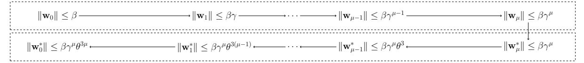
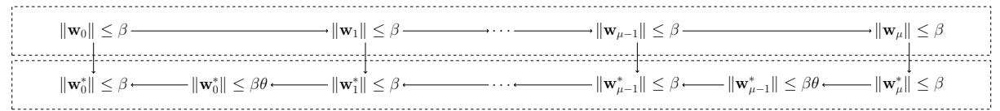

# <span id="page-0-2"></span>RoK, Paper, SISsors – Toolkit for Lattice-based Succinct Arguments

(Full Version)

Michael Klooß<sup>1\*</sup>, Russell W. F. Lai<sup>2</sup>, Ngoc Khanh Nguyen<sup>3</sup>, and Michael Osadnik<sup>2</sup>

- <sup>1</sup> ETH Zurich, Zurich, Switzerland
- <sup>2</sup> Aalto University, Espoo, Finland
- <sup>3</sup> King's College London, London, UK

Abstract. Lattice-based succinct arguments allow to prove bounded-norm satisfiability of relations, such as  $f(\mathbf{s}) = \mathbf{t} \mod q$  and  $\|\mathbf{s}\| \leq \beta$ , over specific cyclotomic rings  $\mathcal{O}_{\mathcal{K}}$ , with proof size polylogarithmic in the witness size. However, state-of-the-art protocols require either 1) a super-polynomial size modulus q due to a soundness gap in the security argument, or 2) a verifier which runs in time linear in the witness size. Furthermore, construction techniques often rely on specific choices of  $\mathcal{K}$  which are not mutually compatible. In this work, we exhibit a diverse toolkit for constructing efficient lattice-based succinct arguments:

- (i) We identify new subtractive sets for general cyclotomic fields  $\mathcal{K}$  and their maximal real subfields  $\mathcal{K}^+$ , which are useful as challenge sets, e.g. in arguments for exact norm bounds.
- (ii) We construct modular, verifier-succinct reductions of knowledge for the bounded-norm satisfiability of structured-linear/inner-product relations, without any soundness gap, under the vanishing SIS assumption, over any K which admits polynomial-size subtractive sets.
- (iii) We propose a framework to use twisted trace maps, i.e. maps of the form  $\tau(z) = \frac{1}{N} \cdot \mathsf{Trace}_{\mathcal{K}/\mathbb{Q}}(\alpha \cdot z)$ , to embed  $\mathbb{Z}$ -inner-products as  $\mathcal{R}$ -inner-products for some structured subrings  $\mathcal{R} \subseteq \mathcal{O}_{\mathcal{K}}$  whenever the conductor has a square-free odd part.
- (iv) We present a simple extension of our reductions of knowledge for proving the consistency between the coefficient embedding and the Chinese Remainder Transform (CRT) encoding of  $\mathbf{s}$  over any cyclotomic field  $\mathcal{K}$  with a smooth conductor, based on a succinct decomposition of the CRT map into automorphisms, and a new, simple succinct argument for proving automorphism relations.

Combining all techniques, we obtain, for example, verifier-succinct arguments for proving that s satisfying  $f(\mathbf{s}) = \mathbf{t} \mod q$  has binary coefficients, without soundness gap and with polynomial-size modulus q.

## <span id="page-0-1"></span>1 Introduction

A fundamental and recurring task in constructing lattice-based succinct arguments is to prove knowledge of a committed vector  $\mathbf{s} \in \mathcal{R}^m$  over a ring  $\mathcal{R}$  which satisfies norm-bound constraints, such as  $\|\mathbf{s}\| \leq \beta$ . For instance, such protocols could be extended directly into a succinct argument for structured languages [CLM23], combined with quadratic functional commitments to yield succinct arguments for NP [ACL<sup>+</sup>22, CLM23]<sup>4</sup>, or transformed into polynomial commitment schemes [FMN23, AFLN24, CMNW24] which allow compiling polynomial interactive oracle proofs [BCS16] into succinct arguments.

As evidenced in prior works [Lyu12, LNP22, BS23], the currently most efficient lattice-based (non-)succinct arguments operate over rings of integers  $\mathcal{R} := \mathbb{Z}[\zeta]$  of cyclotomic number fields  $\mathcal{K} := \mathbb{Q}(\zeta)$ , where  $\zeta$  is a primitive f-th root of unity for  $\mathfrak{f} = \mathsf{poly}(\lambda)$ . Indeed, the ability to construct exponential-sized low-norm challenge sets over  $\mathcal{R}$  allows the aforementioned protocols to achieve negligible soundness in one-shot while maintaining relatively small lattice parameters. However, this comes at a cost of the following two complications.

<span id="page-0-0"></span><sup>\*</sup>Work done at Aalto University. The author's affiliation changed before publication.

 $<sup>^4</sup>$ [ACL $^+$ 22, CLM23] relied on the knowledge-kRISIS assumption for the knowledge soundness of well-formedness of commitments. However, the assumption has subsequently been cryptanalysed [WW23, DFS24], rendering the security proofs vacuous.

<span id="page-1-3"></span>**Correctness Gap.** The first one can be described as the *correctness gap*. Namely, most of the recursionbased protocols start with the initial witness **s**<sup>0</sup> := **s**, and in the *i*-th iteration, an honest prover somehow folds the "current" witness **s***i*−<sup>1</sup> into a new one **s***<sup>i</sup>* ; thus shrinking the dimension of the witness, but simultaneously, increasing its norm. At the end, say after *µ* iterations, the prover outputs the final witness **s***<sup>µ</sup>* of small (potentially constant) dimension. Suppose there exists some *γ* such that for all *i* = 1*, . . . , µ* we have ∥**s***i*∥ ≤ *γ*·∥**s***i*−1∥. Then, in order to maintain correctness, one must inherently choose *q > γ<sup>µ</sup>*·*β* ≥ ∥**s***µ*∥. We call this phenomenon the correctness gap, since if our only task were to commit to **s** using a standard lattice-based commitment scheme, setting *q* = *O*(*β*) would suffice[5](#page-1-0) .

**Soundness Gap.** A more concerning issue is the *soundness gap*. A vast majority of prior works based on cyclotomic rings encounter the problem that the extracted witness ¯**s** is not necessarily short, but it is of the fractional form ¯**s** := **z**¯*/c*¯ mod *q*, where *q* is the proof system modulus and both **z**¯ ∈ R*<sup>m</sup>* and *c*¯ ∈ R are somewhat short (but ∥**z**¯∥ is larger than *β*). Even though this *relaxed* soundness suffices to construct basic primitives, such as signature schemes [\[Lyu12,](#page-50-0) [DKL](#page-49-6)<sup>+</sup>18], verifiable encryption [\[LN17\]](#page-50-3), or few-time verifiable random functions [\[EKS](#page-49-7)<sup>+</sup>21], it is not enough when the required functionality naturally involves proving exact norm bounds (e.g. in set membership and range proofs). But especially in the context of succinct arguments built in a recursive manner, dealing with the slack and other norm-growth related issues have shown to have enormous impact on setting up the parameters [\[BLNS20,](#page-49-8) [BCS23,](#page-49-9) [AL21,](#page-49-10) [AFLN24\]](#page-48-1) , such as picking super-polynomial modulus *q*, which makes the aforementioned schemes seem barely practical.

**Prior works.** Since the soundness gap seemed to be the main efficiency bottleneck of lattice-based succinct arguments, several works naturally tried to address this issue first. To begin with, Albrecht and Lai [\[AL21\]](#page-49-10) designed a lattice-based argument of polylogarithmic size, where the extracted witness ¯**s** is somewhat short. The key ingredient of [\[AL21\]](#page-49-10) was the notion of *subtractive sets*. Namely, a set *S* ⊆ R is called subtractive if for any two distinct elements *c, c*′ ∈ *S*, *c* − *c* ′ is invertible over the ring R. Since the invertibility is independent of the proof system modulus *q*, the latter can be picked freely so that the inverse (*c* − *c* ′ ) −1 is short relative to *q*. Further, it was shown how to construct such subtractive sets of cardinality *p* in cyclotomic rings of prime power conductors f := *p k* . Thus, using subtractive sets as a challenge space for the verifier, one can argue that the extracted witness ¯**s** := **z**¯*/c*¯ has low norm, because 1*/c*¯ itself is short. However, this approach comes at a cost of non-negligible soundness error (due to the size of subtractive sets), and therefore some sort of soundness amplification is necessary. Furthermore, the protocol itself still does not manage to prove the exact norm bound, i.e. ∥**s**∥ ≤ *β*. In fact, in the context of recursive succinct arguments, the norm of the extracted witness can only be upper bounded by *γ <sup>µ</sup>* · *θ O*(*µ*) · *β* for some *θ* ≈ f.

In the setting of power-of-two cyclotomic rings, the strategy above falls apart completely since there exists no subtractive set of size larger than two [\[Len76,](#page-49-11) [AL21\]](#page-49-10). Hence, a different methodology has recently been developed. Notably, Beullens and Seiler [\[BS23\]](#page-49-4) proposed a succinct argument, LaBRADOR, for proving ∥**s**∥ <sup>2</sup> ≤ *β* 2 (among other relations), inspired by the following two-fold approach from [\[LNP22\]](#page-50-1):

- <span id="page-1-1"></span>(i) *Approximate shortness proof.* Prove that **s** is somewhat short.
- <span id="page-1-2"></span>(ii) Z*q-Inner product proof.* Prove that (⟨*ψ*(**s**)*, ψ*(**s**)⟩ (mod *q*)) ≤ *β* 2 , where *ψ*(**s**) is the coefficient vector of **s**.

Combining [\(i\)](#page-1-1) and [\(ii\),](#page-1-2) one can argue that for a large enough modulus *q* no modulo wrap-around occurs, and therefore ⟨*ψ*(**s**)*, ψ*(**s**)⟩ ≤ *β* <sup>2</sup> holds over Z.

In order to prove [\(i\)](#page-1-1) without relying on subtractive sets, LaBRADOR uses the Johnson-Lindenstrauss random projection technique [\[BL17,](#page-49-12) [LNS21,](#page-50-4) [GHL22\]](#page-49-13). The idea is that the verifier will first generate an integer matrix **B** with short (binary or ternary) values as a challenge, and the prover then outputs *ψ*(**v**) := **B***ψ*(**s**) (mod *q*). Afterwards, the verifier checks whether *ψ*(**v**) is of low norm (which is true in the honest executions, since both **B** and *ψ*(**s**) are). Finally, the prover needs to prove wellformedness of *ψ*(**v**), i.e. the linear equation **B***ψ*(**s**) = *ψ*(**v**) over Z*q*. The crucial soundness argument is that if the extracted **s** was not short, then with high probability (dictated by the number of rows of **B**), *ψ*(**v**) = **B***ψ*(**s**) would not have low norm, which leads to a contradiction. Unfortunately, the random projection strategy inherently requires the verifier to generate the matrix **B**, which itself has length *O*(*m*). As a consequence, the verifier

<span id="page-1-0"></span><sup>5</sup>For presentation, we omitted the factors related to the security parameter *λ*.

<span id="page-2-2"></span>runtime becomes essentially linear in the witness size, which may not be satisfying in certain real-world use cases.

We highlight that both (i) and (ii) require some kind of inner product proof over  $\mathbb{Z}_q$ ; either between two committed vectors, or between one public and one committed vector. Since the underlying protocol natively operates over cyclotomic rings  $\mathcal{R} = \mathbb{Z}[\zeta]$ , it is essential to transform  $\mathbb{Z}$ -relations into equivalent ones over the ring  $\mathcal{R}$ . To this end, it was shown in [LNP22] that for any two elements  $a, b \in \mathcal{R}$  of a power-of-two cyclotomic ring, the constant term<sup>6</sup> of  $a \cdot \bar{b} \in \mathcal{R}$  is exactly equal to the inner product  $\langle \psi(\mathbf{a}), \psi(\mathbf{b}) \rangle \in \mathbb{Z}$ , where  $\psi(\mathbf{a}), \psi(\mathbf{b})$  are the coefficient vectors of a, b respectively and  $\bar{\cdot}$  here denotes the complex conjugation. This observation allows us to translate proving inner products and linear relations over integers into proving statements about constant terms over the ring  $\mathcal{R}$ . Finally, LaBRADOR makes use of the fact that inner product relations over  $\mathcal{R}$  are "folding-friendly" and can be efficiently proven in a recursive manner.

Interestingly, LaBRADOR also managed to circumvent the correctness gap by taking inspiration from the "decompose-then-hash" paradigm used in lattice-based Merkle trees [PSTY13]. Intuitively, using the notation above for describing recursive-based protocols, instead of folding the intermediate witness  $\mathbf{s}_{i-1}$  directly into a new one  $\mathbf{s}_i$ , an honest prover would first decompose  $\mathbf{s}_{i-1}$  (w.r.t. some decomposition base b) into multiple vectors  $(\mathbf{s}_{i-1,j})_{j\in[\ell]}$  of much smaller norm and then fold all of them together into a new witness  $\mathbf{s}_i^7$ . By carefully picking various parameters, such as b, one can ensure that, in an honest execution, if  $\|\mathbf{s}_{i-1}\| \leq \beta$ , then we must have  $\|\mathbf{s}_i\| \leq \beta$ . This technique was also adopted in a recent folding scheme called LatticeFold [BC24].

Bridging the gap. At a high level, the aforementioned approaches to prove shortness seem somewhat orthogonal. For  $\mathfrak{f}=p^k$ , where  $p=\mathsf{poly}(\lambda)$  is a large enough prime, one can rely on subtractive sets to efficiently prove approximate shortness (i) with succinct verification [CLM23]. However, it is unknown how to translate proving  $\mathbb{Z}_q$ -relations, as in (ii), into equivalent relations over odd prime-power cyclotomic rings. On the other hand, for  $\mathfrak{f}=2^k$ , one can apply the Johnson-Lindenstrauss projection strategy to prove both (i) and (ii), but at the cost of slow verification time.

Hence, it is an important research question whether there exist cyclotomic (or other) rings  $\mathcal{R}$ , which contain subtractive sets of fairly large size, and at the same time, expose efficient packing and batching techniques for turning relations over  $\mathbb{Z}$  (or more generally, other base rings) to relations over  $\mathcal{R}$ . An affirmative answer, together with existing optimisations, would then yield a practical lattice-based succinct argument for proving exact norm bounds with fast verification.

#### 1.1 Our Contributions

In this work, we present a versatile toolkit for constructing lattice-based succinct arguments that eliminate correctness and soundness gaps while maintaining succinct verification. Our contributions are outlined as follows:

Succinct Arguments for Bounded-Norm Satisfiability. We design a lattice-based succinct argument system for bounded-norm satisfiability of structured linear and inner-product relations. Our system retains features of previous protocols, such as transparent setup, quasi-linear-time prover, polylogarithmic-time verifier, and negligible soundness in one-shot, while simultaneously eliminating any correctness and soundness gaps. Consequently, our argument system achieves asymptotically the most attractive proof sizes, which are smaller by at least a factor of  $\Omega(\log^2 \lambda)$  than the prior state-of-the-art constructions (see Figure 1 for more details). Furthermore, our protocol's modular design allows for straightforward analysis and customisation, making it adaptable to various applications.

Subtractive Sets. Our protocol uses subtractive sets as challenge sets. While subtractive sets for prime-power cyclotomic rings are well-known, the non-prime-power case seems less studied. Motivated by the need of non-prime-power rings (e.g. for the twisted trace technique, see below) in some applications, we identify a subtractive set for cyclotomic rings  $\mathbb{Z}[\zeta_{\mathfrak{f}}]$  of non-prime-power conductor  $\mathfrak{f}$  with a cardinality of  $\mathfrak{f}/\mathfrak{f}_{\max}$ , where  $\mathfrak{f}_{\max}$  is the largest prime-power divisor of  $\mathfrak{f}$ . Additionally, we identify subtractive sets

<span id="page-2-0"></span><sup>&</sup>lt;sup>6</sup>We say that  $a_0 \in \mathbb{Z}$  is the constant term of the ring element  $a = \sum_{i=0}^{\varphi(\mathfrak{f})} a_i \zeta^i \in \mathbb{Z}[\zeta]$ .

<span id="page-2-1"></span><sup>&</sup>lt;sup>7</sup>For soundness, the prover needs to prove additional relations involving  $(\mathbf{s}_{i-1,j})_{j \in [\ell]}$ .

<span id="page-3-3"></span>

| scheme    | assumptions | transparent setup | proof size                                                      |
|-----------|-------------|-------------------|-----------------------------------------------------------------|
| [CLM23]   | vSIS        | ✓                 | $O\left(\log^5 m \cdot \frac{\lambda^2}{\log^2 \lambda}\right)$ |
| [BCS23]   | M-SIS       | $\checkmark$      | $O\left(\log^6 m \cdot \frac{\lambda^2}{\log \lambda}\right)$   |
| [FMN23]   | PowerBASIS  | ×                 | $O\left(\log^5 m \cdot \frac{\lambda^2}{\log^2 \lambda}\right)$ |
| [AFLN24]  | M-SIS       | ×                 | $O\left(\log^5 m \cdot \frac{\lambda^2}{\log^2 \lambda}\right)$ |
| [CMNW24]  | SIS         | ✓                 | $O(\log^3 m \cdot \lambda^2)$                                   |
| This work | vSIS        | ✓                 | $O\left(\log^3 m \cdot \frac{\lambda^2}{\log^2 \lambda}\right)$ |

<span id="page-3-0"></span>Fig. 1. Asymptotic efficiency of our commitment opening proof (in bits) and comparison with prior works which support succinct  $\operatorname{poly}(\log m, \lambda)$  verification time. Here,  $\lambda$  is the security parameter and m is the length of the committed vector. For each construction, the proof size corresponds to the soundness error  $\operatorname{poly}(\lambda, \log m) \cdot 2^{-\lambda}$ . The SIS-related parameters were chosen with respect to the methodology from [MR09] for running BKZ on block size  $b = O(\lambda)$ . For [BCS23, CLM23, FMN23], which only achieve inverse-polynomial soundness in one-shot, we applied a standard soundness amplification by parallel-repeating the protocol by a factor of  $O(\lambda/\log \lambda)$ . We note that for [AFLN24], [CMNW24], and this work, super-polynomial knowledge extraction runtime  $O(m^{\log \lambda})$  is obtained.

over the real subrings  $\mathbb{Z}[\zeta_{\mathfrak{f}} + \zeta_{\mathfrak{f}}^{-1}]$ , with a cardinality of (p+1)/2 for prime-power conductors  $\mathfrak{f} = p^k$  and  $\lfloor \mathfrak{f}/(2\mathfrak{f}_{\max}) \rfloor$  for non-prime-power  $\mathfrak{f}$ .

Embedded  $\mathbb{Z}$ -Inner-Products via Twisted Trace. While our protocol supports proving inner products over rings such as  $\mathbb{Z}[\zeta_{\mathfrak{f}}]$ , higher-layer applications may require proving inner products over  $\mathbb{Z}$ , e.g. for proving that a committed  $\mathbb{Z}$ -vector is binary. Unfortunately, efficient methods for embedding  $\mathbb{Z}$ -inner products to  $\mathbb{Z}[\zeta_{\mathfrak{f}}]$ -inner products were only known for  $\mathfrak{f}=2^d$  being a power of 2, which is problematic because subtractive sets over  $\mathbb{Z}[\zeta_{2^d}]$  are of cardinality at most 2. We extend the existing embedding method to any ring of the form  $\mathbb{Z}[\zeta_{2^d}] \otimes \mathbb{Z}[\zeta_{p_0} + \zeta_{p_0}^{-1}] \otimes \ldots \otimes \mathbb{Z}[\zeta_{p_{k-1}} + \zeta_{p_{k-1}}^{-1}]$ , where  $p_0, \ldots, p_{k-1}$  are distinct odd primes. This is achieved by replacing the "constant term map" with a "twisted trace map" of the form  $\tau(z) = \frac{1}{N} \operatorname{Trace}(\alpha \cdot z)$ .

Succinct Consistency Proof for CRT. Another typical way of embedding  $\mathbb{Z}$ -relations into  $\mathbb{Z}[\zeta_{\mathfrak{f}}]$ -relations is via the Chinese Remainder Transform (CRT). However, this requires proving that the witness vector is committed in both the coefficient embedding and its CRT coefficients consistently, and known consistency proofs are not succinct. Using the fact that the CRT over cyclotomic fields with smooth conductors can be succinctly represented through a few automorphism evaluations, we derive a succinct argument for the consistency between the commitment of the coefficient embedding and that of the CRT coefficients. At the core of our succinct consistency proof is a new succinct argument that verifies whether two committed vectors are related by an entry-wise automorphism.

## <span id="page-3-2"></span>2 Technical Overview

Throughout this work, we will assume that  $\mathcal{K} = \mathbb{Q}(\zeta)$  is a cyclotomic field with conductor  $\mathfrak{f}$  and degree  $\varphi = \varphi(\mathfrak{f}) = \mathsf{poly}(\lambda)$ , and  $\mathcal{O}_{\mathcal{K}} = \mathbb{Z}[\zeta]$  is its ring of integers. For some of our results, we will further require  $\mathcal{K}^+ = \mathbb{Q}(\zeta + \zeta^{-1})$ , the maximal real subfield of  $\mathcal{K}$ , and its ring of integers  $\mathcal{O}_{\mathcal{K}^+} = \mathbb{Z}[\zeta + \zeta^{-1}]$ . Depending on the context of a specific section, we will use  $\mathcal{R} \subset \mathcal{O}_{\mathcal{K}}$  to denote a ring of interest to that section. Unless specified, we measure the norm of elements and vectors by their  $\ell_2$ -norm over the canonical embedding over  $\mathcal{K}$ . Our results can be divided into three parts, which we overview in Section 2.1, 2.2, and 2.3 respectively.

#### <span id="page-3-1"></span>2.1 Subtractive Sets

In Section 4, we expose subtractive sets over  $\mathcal{O}_{\mathcal{K}}$  with non-prime-power conductor  $\mathfrak{f}$ , and over  $\mathcal{O}_{\mathcal{K}^+}$  with both prime-power and non-prime-power conductors, with favourable properties, i.e. they have  $\operatorname{poly}(\lambda)$ 

<span id="page-4-1"></span>cardinality and small expansion factors. These subtractive sets can be used in any lattice-based arguments, and in particular those developed in this work.

A set  $S \subset \mathcal{R}$  is said to be subtractive over  $\mathcal{R}$  if for any two distinct elements  $c, c' \in S$ , it holds that  $c - c' \in \mathcal{R}^{\times}$ , i.e. c - c' is a unit. This concept is prevalently linked with the examination of Euclidean number fields [Len76] and has also found relevance in lattice-based cryptography, specifically in argument systems and secret sharing [AL21]. An explicit creation of an upper-bound-matching cardinality p is evident in a cyclotomic ring  $\mathcal{R} = \mathcal{O}_{\mathcal{K}}$  with a prime-power conductor  $\mathfrak{f} = p^k$ . On the other hand, we are not aware of explicit studies of subtractive sets regarding other cyclotomic rings and their subrings.

For applications in lattice-based cryptography, the most relevant measures of the quality of a subtractive set S are its

- (i) cardinality |S|, which inversely affects the knowledge error of argument systems using S as a challenge set
- (ii) "expansion factor"  $\gamma = \gamma_S$ , i.e. how much the norm of an element grows when multiplied with an element in S, which affects the "correctness gap" of lattice-based argument systems,
- (iii) "inverse-expansion factor"  $\theta = \theta_S$ , i.e. how much the norm of an element grow when multiplied with  $(c c')^{-1}$  for distinct  $c, c' \in S$ , which affects the "soundness gap" of lattice-based argument systems.

For  $\mathcal{R} = \mathcal{O}_{\mathcal{K}}$  with prime-power conductor  $\mathfrak{f} = p^k$ , it is known [Len76, AL21] that there exists a subtractive set S of cardinality p and expansion factors  $\gamma, \theta \approx p$ .

Our main result in this part is the exposition of the subtractive set  $S := \{\zeta^i\}_{i \in [\mathfrak{f}/\mathfrak{f}_{\max}]}$  of cardinality  $|S| = \mathfrak{f}/\mathfrak{f}_{\max}$  for any conductor  $\mathfrak{f}$  with at least two distinct prime factors, where  $\mathfrak{f}_{\max}$  is the largest prime-power factor of  $\mathfrak{f}$ . Notably, the expansion factor (conserning the canonical 2-norm) is  $\gamma = 1$ , i.e. the norm of an element does not grow when multiplied with an element from S, while the inverse-expansion factor  $\theta \approx \mathfrak{f}$  is similar to the existing result for prime-power rings.

For completeness, we also expose related subtractive sets over  $\mathcal{O}_{\mathcal{K}^+}$  for both prime-power and non-prime-power conductors.

#### <span id="page-4-0"></span>2.2 Tight Succinct Argument for Bounded Norm Satisfiability

In Section 5, we work with  $\mathcal{R} = \mathcal{O}_{\mathcal{K}}$  or  $\mathcal{O}_{\mathcal{K}^+}$ . We present a new lattice-based succinct argument for proving the bounded norm satisfiability of structured linear and/or inner-product relations, denoted by  $\Xi^{\text{lin}}$  and  $\Xi^{\text{ip}}$  respectively. More concretely, the argument system allows to prove knowledge of a short vector  $\mathbf{w} \in \mathcal{R}^m$ , with  $m = d^{\mu}$ , satisfying

- a linear relation  $\mathbf{F}\mathbf{w} = \mathbf{y} \mod q$ , where  $\mathbf{F} = \mathbf{F}_{\mu-1} \bullet \ldots \bullet \mathbf{F}_0 \in \mathcal{R}_q^{n \times m}$  can be expressed as a row-wise tensor product of  $\mu$  matrices  $\mathbf{F}_i \in \mathcal{R}_q^{n \times d}$ , and
- (optionally) an inner-product relation  $\langle \mathbf{w}, \alpha(\mathbf{w}) \rangle \mod q$ , where  $\alpha$  is either the identity function or the complex conjugate (specified publicly).

Our argument system consists of  $O(\mu) = O(\log_d m)$  rounds and is public-coin, and can thus be made non-interactive via the Fiat-Shamir transform. The prover time is quasi-linear in the size of the statement, and both the proof size and the verifier time are polylogarithmic in the statement size. It can be instantiated with a transparent setup. For example, the rows of  $\mathbf{F}$  could contain a random commitment key of the vSIS commitment scheme [CLM23] and evaluations of monomials at different evaluation points. This turns the vSIS commitment scheme into a polynomial commitment scheme, which can then be used to compile a PIOP into a SNARK.

Correctness and Soundness Gaps. A distinguishing feature of our argument system is that it is free of the so-called "correctness gap" and "soundness gap".

The correctness gap refers to the phenomenon that although the prover's witness  $\mathbf{w}$  is of norm at most  $\beta$ , the norm check performed by the verifier in the protocol is against a bound  $\beta' \gg \beta$ . Typically, e.g. in lattice-based Bulletproofs, we have  $\beta' \approx (1+\gamma)^{\mu}\beta$ . Using the subtractive set suggested in [AL21] and picking  $\mu \approx \log \lambda$ , the gap  $\beta'/\beta \approx (1+\gamma)^{\mu}$  is super-polynomial in  $\lambda$ . Note that if the subtractive set suggested in Section 4 with  $\gamma = 1$  is used, then the correctness gap is immediately reduced to  $\operatorname{poly}(\lambda)$  but still greater than 1 (i.e. no gap).

#### <span id="page-5-3"></span>a) Lattice-based Bulletproofs.



#### b) This work



<span id="page-5-2"></span>Fig. 2. Overview of the evolution of a prover witness  $\mathbf{w}_0$  to an extracted witness  $\mathbf{w}_0^*$  in lattice-based Bulletproofs and in this work.

The more challenging issue is that of the soundness gap, which refers<sup>8</sup> to the limitation that, in addition to the correctness gap  $\beta'/\beta$ , the witness produced by a knowledge extractor is of even larger norm  $\beta^* \gg \beta'$ . Using the example of lattice-based Bulletproofs again, we have  $\beta^* \approx (2\theta)^{3\mu}\beta' \approx (1+\gamma)^{\mu}(2\theta)^{3\mu}\beta$ . Since no currently known subtractive set (including those suggested in Section 4) achieves  $\theta = O(1)$ , the soundness gap problem cannot be solved by simply using a different subtractive set, at least until more favourable sets are found.<sup>9</sup>

Figure 2 overviews the evolution of a prover witness  $\mathbf{w}_0$  to an extracted witness  $\mathbf{w}_0^*$  in lattice-based Bulletproofs and in this work.

Lattice-based Bulletproofs. In Fig. 2 part a) for Bulletproofs, each arrow in the top row represents one Bulletproofs folding step, where  $\mathbf{w}_i$  denotes the intermediate witness after the *i*-th folding step. The norm of the *i*-th round prover witness  $\mathbf{w}_i$  grows by a multiplicative factor of (around)  $\gamma$  compared to the previous round prover witness  $\mathbf{w}_{i-1}$ . The last round witness  $\mathbf{w}_{\mu}$  is then of norm around  $\beta\gamma^{\mu}$ , i.e. with correctness gap  $\gamma^{\mu}$ . The vertical arrow is trivial since the last-round prover witness is sent in plain, i.e.  $\mathbf{w}_{\mu}^* = \mathbf{w}_{\mu}$ . Each arrow in the bottom row represents a "traditional witness extraction step", i.e. moving one layer up in the tree-special soundness witness extraction, where  $\mathbf{w}_i^*$  denotes the extracted witness at depth *i*. The norm of the *i*-th round extracted witness  $\mathbf{w}_i^*$  grows by (roughly) a multiplicative factor of  $\theta^3$  compared to the previous round extracted witness  $\mathbf{w}_{i-1}^*$ . The final extracted witness  $\mathbf{w}_0^*$  is then of norm around  $\beta\gamma^{\mu}\theta^{3\mu}$ , i.e. the soundness gap is  $\gamma^{\mu}\theta^{3\mu}$ .

**Split-and-Fold and Norm-Check.** We propose a modular approach to building a protocol which has no correctness and soundness gaps. The basis are atomic reductions of knowledge for handling different tasks. Before explaining our protocols, we need to look ahead and introduce our principal relation  $\mathcal{Z}^{\text{lin}}$ .

Bird-eye view of principal relation. Recall that our the principal relation  $\Xi^{\text{lin}}$  consists of statements  $(\mathbf{H}, \mathbf{F}, \mathbf{Y})$  and witnesses  $\mathbf{W}$ , all matrices over  $\mathcal{R}$ , which satisfy the relation

$$\mathbf{HFW} = \mathbf{Y} \pmod{q} \qquad \qquad \text{and} \qquad \qquad \|\mathbf{W}\| \le \beta$$

For simplicity, we first ignore the matrix  $\mathbf{H}$  and treat it as the identity matrix. As noted above, the matrix  $\mathbf{F}$  has a tensor structure,  $\mathbf{F} = \mathbf{F}_{\mu-1} \bullet \dots \bullet \mathbf{F}_0 \in \mathcal{R}_q^{n \times m}$  where  $\mathbf{F}_i \in \mathcal{R}_q^{n \times d}$ . The dimension  $m \times r$  of the witness  $\mathbf{W} \in \mathcal{R}_q^{m \times r}$  and its norm bound  $\beta$  are the pivotal measures our atomic protocols operate on. Note that the claim  $\mathbf{F}\mathbf{W} = \mathbf{Y}$  is equivalent to r claims  $\mathbf{F}\mathbf{w}_i = \mathbf{y}_i$ , for  $i \in [r]$ , where  $\mathbf{W} = (\mathbf{w}_0, \dots, \mathbf{w}_{r-1})$ .

<span id="page-5-0"></span><sup>&</sup>lt;sup>8</sup>In general, the soundness gap consists of a "stretch", i.e. increase in witness norm, and a "slack", i.e. a multiplicative approximation factor. Using a subtractive set, the slack can be eliminated.

<span id="page-5-1"></span><sup>&</sup>lt;sup>9</sup>We believe that a slightly better but still super-polynomial soundness gap of  $\beta^*/\beta' \approx (1+\gamma)^{\mu}(2\theta)^{\mu}$  can be achieved using a technique called "short-circuit extraction" [HKR19].

The atomic protocols. Next, we give a high-level overview of our atomic protocols. These are all reductions of knowledge, which reduce a claim  $(\mathbf{H}, \mathbf{F}, \mathbf{Y})$  to another claim  $(\widetilde{\mathbf{H}}, \widetilde{\mathbf{F}}, \widetilde{\mathbf{Y}})$  and witness  $\mathbf{W}$  to  $\widetilde{\mathbf{W}}$ . Each protocol affects different parameters of the statement or witness.

<u>Split.</u> The purpose of the split protocol  $\Pi^{\text{split}}$  is to reduce the witness height m to m/d in exchange for growing the width r to rd. In other words, we reduce the dimension of the columns  $\mathbf{w}_i$  by increasing the number of instances/columns. To achieve this, we use the row-wise tensor structure of  $\mathbf{F}$  to factor it into  $\mathbf{F} = \mathbf{R} \bullet \widetilde{\mathbf{F}}$ , where  $\bullet$  denotes row-wise tensoring. Decomposing  $\mathbf{W}$  into  $\sum_{i \in [d]} \mathbf{e}_i \otimes \mathbf{W}_i$ , i.e. viewing  $\mathbf{W}$  as a *vertical* stack of matrices  $\mathbf{W}_i$  compatible with the tensor decomposition, we let  $\widetilde{\mathbf{Y}}_j = \widetilde{\mathbf{F}} \mathbf{W}_j$ , and  $\widetilde{\mathbf{Y}} = (\widetilde{\mathbf{Y}}_0, \dots, \widetilde{\mathbf{Y}}_{d-1})$  and the prover sends these cross terms. The reduced statement is then  $(\widetilde{\mathbf{H}}, \widetilde{\mathbf{F}}, \widetilde{\mathbf{Y}})$  with witness  $\widetilde{\mathbf{W}} = (\mathbf{W}_0, \dots, \mathbf{W}_{d-1})$  the *horizontal* concatenation of the matrices.

Note that  $\Pi^{\text{split}}$  reshapes the dimensions of **W** as required. Moreover, the witness norm is left unchanged. Lastly, we note that handling the case where **H** (and thus  $\widetilde{\mathbf{H}}$ ) is not the identity matrix slightly is more involved and explained in detail in Section 5.3.

Fold. The fold protocol  $\Pi^{\text{fold}}$  reduces the witness width r to r' (by random linear combining the columns). The protocol simply multiplies  $\mathbf{W}$  and  $\mathbf{Y}$  with a random short challenge matrix  $\mathbf{C} \in \mathcal{R}_q^{r' \times r}$  from the left to get  $\widetilde{\mathbf{W}} = \mathbf{W} \cdot \mathbf{C}$  and  $\widetilde{\mathbf{Y}} = \mathbf{Y} \cdot \mathbf{C}$  and the new instance is  $(\mathbf{H}, \mathbf{F}, \widetilde{\mathbf{Y}})$ . Observe that the norm of the witness grows. Also note that the soundness of this step depends on the dimension r': The larger r' the shorter  $\mathbf{C}$  can be. Hence, we can pick binary  $\mathbf{C}$  (resp. roots of unity) to reduce norm growth at the expense of a wider  $\widetilde{\mathbf{W}}$ .

<u>b-ary Decomposition.</u> The b-ary decomposition protocol  $\Pi^{b\text{-decomp}}$  reduces the witness norm  $\beta$  by b-ary decomposing the matrix  $\mathbf{W}$  as  $\sum_{i=0}^{\ell-1} b^i \mathbf{V}_i$ , at the expense of increased width  $\widetilde{r}$  in the resulting  $\widetilde{\mathbf{W}}$ . The prover needs to communicate  $\mathbf{Y}_i = \mathbf{HFV}_i$ . The new witness is  $\widetilde{\mathbf{W}} = (\mathbf{V}_0, \dots, \mathbf{V}_{\ell-1})$  and the resulting  $\widetilde{\mathbf{Y}}$  is  $(\mathbf{Y}_0, \dots, \mathbf{Y}_{\ell-1})$ . This protocol is used to counteract the norm growth in  $\Pi^{\text{fold}}$  and eliminate the correctness gap.

Norm-Check and Inner Product. The norm-check protocol  $\Pi^{\mathsf{norm}}$  ensures that the norm bound  $\|\sigma(\mathbf{W})\|_2 \leq \beta$  holds, at the expense of slightly extending the witness by adding columns and constraints (i.e. increasing the width r and height  $n^{\mathsf{out}}$  of  $\mathbf{Y}$ ). All above protocols  $(\Pi^{\mathsf{split}}, \Pi^{\mathsf{fold}}, \Pi^{b\mathsf{-decomp}})$  negatively affect the norm of the extracted witness. The norm check counteracts this, and ensures that the norm of the extracted witness is at most  $\beta$ . This eliminates the soundness gap.

The norm-check is implemented through the *inner product* protocol  $\Pi^{\mathsf{ip}}$ , which proves that  $t = \langle \mathbf{w}, \overline{\mathbf{w}} \rangle$ , where  $\overline{\mathbf{w}}$  denotes the complex conjugate. Given the inner product t, the canonical  $\ell_2$ -norm  $\|\sigma(\mathbf{w})\|_2$  of  $\mathbf{w}$  satisfies  $\|\sigma(\mathbf{w})\|_2^2 = \mathsf{Trace}(t)$ , and thus, the norm-check can be implemented on top of the inner product by checking  $\mathsf{Trace}(t) \leq \beta^2$ . (This check is expanded to a matrix  $\mathbf{W}$  column-wise; we leave details to Section 5.6.) To implement  $\Pi^{\mathsf{ip}}$ , the prover encodes  $\mathbf{w}$  as the coefficients of a polynomial g(X), and commits to the coefficients of the Laurent polynomial  $L(X) = g(X) \cdot \bar{g}(X^{-1})$ , whose constant term is  $\langle \mathbf{w}, \overline{\mathbf{w}} \rangle$ . This reduces the problem to checking that L is computed correctly and has constant term t, both of which can be expressed as relations captured by  $\Xi^{\mathsf{lin}}$ .

Two issues remain: First, the norm of the coefficients of L(X) is around  $\beta^2$  instead of  $\beta$ . To tackle this, we shrink the coefficients of L(X) by immediately b-ary decomposing (for suitable b); we note that for technical reasons, we do not apply  $\Pi^{b\text{-decomp}}$  modularly here. We add this decomposition to  $\mathbf{W}$ , as well as additional rows to  $\mathbf{F}$  for the new evaluation constraints of L(X). Second, checking that L is computed correctly and has constant term t by introducing more constraints translates to higher communication costs when handled naively, namely, when  $\mathbf{H}$  is always the identity. To tackle this, the parties run the batch protocol  $\Pi^{\text{batch}}$  to compress the newly added constraints with the existing ones. We explain this now.

<u>Batch.</u> As noted above, during the  $\Pi^{\text{norm}}$  protocol (and also the complete version of  $\Pi^{\text{split}}$ ), new constraints (i.e. rows) are added to  $\mathbf{F}$  and  $\mathbf{Y}$ , which increases the size of  $\mathbf{Y}$  and thus the size of the cross terms communicated in our atomic protocols. To counteract this, our principal relation includes the matrix  $\mathbf{H}$ , which is will be of the form

$$\mathbf{H} = \begin{pmatrix} \mathbf{I}_{\overline{n}} & \mathbf{0}_{\overline{n} \times \underline{n}} \\ \underline{\mathbf{H}}_0 & \underline{\mathbf{H}}_{\underline{n}^{\mathsf{out}} \times \underline{n}} \end{pmatrix}$$

<span id="page-7-2"></span>and which captures batch verification of the rows of  $\mathbf{F}$ : The identity block  $\mathbf{I}_k$  ensures the vSIS instance in  $\mathbf{F}$  is never compressed during batch verification (as this leads to technical problems), while the bottom rows  $\underline{\mathbf{H}} = (\underline{\mathbf{H}}_0, \underline{\mathbf{H}}_1)$ , where  $\underline{\mathbf{H}}_0 = \mathbf{0}_{\underline{n}^{\text{out}} \times \underline{n}}$ , capture the current state of batch verification of the remaining rows of  $\mathbf{F}$ 

The batch protocol  $\Pi^{\text{batch}}$  reduces the height of  $\mathbf{Y}$  by randomly linearly combining its bottom rows by left-multiplying with  $\mathbf{C} = \begin{pmatrix} \mathbf{I}_{\overline{n}} & \mathbf{0}_{\overline{n} \times \underline{n}} \\ \mathbf{c}_{0}^{\mathsf{T}} & \mathbf{c}_{1}^{\mathsf{T}} \end{pmatrix}$  for a challenge vector  $\mathbf{c} = (\underline{\mathbf{c}}_{0}, \underline{\mathbf{c}}_{1})$ . This yields  $\widetilde{\mathbf{H}} = \mathbf{C} \cdot \mathbf{H}$  and  $\widetilde{\mathbf{Y}} = \mathbf{C} \cdot \mathbf{Y}$  for the new instance, with  $\mathbf{F}$  and  $\mathbf{W}$  left unchanged. The protocol needs no prover communication, and has (almost) no effect on correctness and soundness gaps. Hence, it is applied whenever the height of  $\mathbf{Y}$  is not minimal.

Composing the atomic protocols. In Section 6 we propose ways of composing the protocols with respect to asymptotic and concrete efficiency. The goal is to compose these atomic protocols to obtain succinct arguments for  $\Xi^{\text{lin}}$  without correctness and soundness gaps. We discuss the composition strategies, keeping track of parameter changes and communication costs to ensure that the security budget and norms remain within limits. Finally, an asymptotic complexity analysis shows how our proposed composition yields communication-efficient protocols while ensuring the hardness of the underlying cryptographic assumptions.

One suggested composition, which yields an easy-to-analyse (asymptotically) composition, is:

$$(\varPi^{\mathsf{norm}} \to \varPi^{\mathsf{batch}} \to \varPi^{b\text{-decomp}} \to \varPi^{\mathsf{split}} \to \varPi^{\mathsf{fold}})_{i \in [\mu]} \to \varPi^{\mathsf{finish}}$$

where  $\Pi^{\text{finish}}$  introduces the trivial step of sending the witness in plain.

#### <span id="page-7-0"></span>2.3 Embedding $\mathbb{Z}$ -Inner Products

Lattice-based succinct arguments such as those constructed in Section 5 typically support proving relations over a ring  $\mathcal{R}$  natively. However, in many applications, we would like to prove algebraic statements given over  $\mathbb{Z}$ , which motivates the question of how to reduce a statement over  $\mathbb{Z}$  to statements over  $\mathcal{R}$ , so that a proof of the latter implies a proof of the former. Specifically, we consider the task of proving that some (committed) vectors  $\mathbf{x}, \mathbf{y} \in \mathbb{Z}^{m\delta}$  satisfies  $\langle \mathbf{x}, \mathbf{y} \rangle = z$  for some given  $z \in \mathbb{Z}$ . This task is of particular interest since, for some applications (e.g. constructing verifiable delay function [LM23]) it is necessary for the prover to prove that the witness is not only short but in fact binary. More generally, the application might require the prover to show a proof for  $\mathbf{x} \in [a, b]^{m\delta}$  for some  $a, b \in \mathbb{Z}$ , which is not immediately implied by a bounded-norm guarantee.

To prove binariness, the basic idea is, for a witness  $\mathbf{w} \in \mathbb{Z}^{m\delta}$ , to use the equivalence  $\mathbf{w} \in \{0,1\}^{m\delta} \iff \langle \mathbf{1}^{m\delta} - \mathbf{w}, \mathbf{w} \rangle_{\mathbb{Z}} = 0$  to reduce checking the binariness of  $\mathbf{w}$  to checking that some transformed witness vector over  $\mathcal{R}$  is short and satisfies some linear and inner-product relations, where  $\mathcal{R} \subset \mathcal{O}_{\mathcal{K}}$  is of dimension  $\delta \mid \varphi$  when viewed as  $\mathbb{Z}$ -modules.

**Existing Embedding Methods.** We are aware of three ways to embed  $\mathbb{Z}$ -inner products into  $\mathcal{R}$ -inner products in the literature, each with a significant drawback:

- (i) Naive embedding: Interpret each  $\mathbb{Z}$  element as an  $\mathcal{R}$  element via the inclusion  $\mathbb{Z} \subset \mathcal{R}$ , and interpret the  $\mathbb{Z}$ -inner product as an  $\mathcal{R}$ -inner product. This incurs a multiplicative overhead of  $\delta$  in terms of statement and witness sizes, which translate into overheads in prover and verifier computation, proof size, etc.
- (ii) Coefficient embedding: Divide the witness into blocks containing  $\delta \mathbb{Z}$ -elements, and encode each block as an  $\mathcal{R}$  element via the (inverse-)coefficient embedding<sup>10</sup>  $\psi^{-1} : \mathbb{Z}^{m\delta} \to \mathcal{R}^m$ . For certain  $\mathcal{R}$ , we have

$$\langle \mathbf{x}, \mathbf{y} \rangle_{\mathbb{Z}} = \mathsf{ct}(\langle \psi^{-1}(\mathbf{x}), \overline{\psi^{-1}(\mathbf{y})} \rangle_{\mathcal{R}})$$

where  $ct(\cdot)$  denotes the constant term of the coefficient embedding.

This embedding has a convenient property that it is (somewhat) norm-preserving, i.e.  $\mathbf{x}$  is short if and only if  $\psi^{-1}(\mathbf{x})$  is also short (in both coefficient and canonical embedding). However, this approach only works for  $\mathbb{Z}[\zeta_{2d}]$ . This is problematic since the largest subtractive set over  $\mathbb{Z}[\zeta_{2d}]$  is  $\{0,1\}$ .

<span id="page-7-1"></span>For example, with respect to the power basis  $\{1, \zeta, \dots, \zeta^{\varphi-1}\}$  of a cyclotomic field, the coefficient embedding of an element  $x = \sum_{i \in [\varphi]} x_i \zeta^i$  is denoted as  $\psi(x) = (x_i)_{i \in [\varphi]}$ .

<span id="page-8-1"></span>(iii) CRT embedding: Let the witness vectors be such that  $\mathbf{x}, \mathbf{y} \in \mathbb{Z}_p^{m\delta}$  for some (typically small) prime p which splits completely in  $\mathcal{R}$ . Divide the witness into blocks of  $\delta$   $\mathbb{Z}$  elements, and encode each block as an  $\mathcal{R}$  element via the (inverse-)CRT embedding  $\mathsf{CRT}_p^{-1} : \mathbb{Z}_p^{m\delta} \to \mathcal{R}_p^m$ . It holds that

$$\langle \mathbf{x}, \mathbf{y} \rangle_{\mathbb{Z}} = \left\langle \mathbf{1}^{\delta}, \mathsf{CRT}_p\left( \langle \mathsf{CRT}_p^{-1}(\mathbf{x}), \mathsf{CRT}_p^{-1}(\mathbf{y}) \rangle_{\mathcal{R}} \right) \right\rangle_{\mathbb{Z}} \bmod p.$$

This approach is powerful in that it not only supports proving about  $\mathbb{Z}_p$ -inner products, but in fact about  $\mathbb{Z}_p$ -Hadamard products  $\mathbf{x} \odot \mathbf{y} \mod p$ , which is more fine-grained. However, to turn a claim about  $\mathbb{Z}_p$ -inner products into a claim about  $\mathbb{Z}_p$ -inner products (without reduction modulo p), we would additionally need to prove that  $\|\langle \mathbf{x}, \mathbf{y} \rangle\|_{\infty} < p/2$ , so that the reduction modulo p has no effect. Since  $\mathsf{CRT}_p$  does not respect the geometry of  $\mathbb{Z}$  and  $\mathcal{R}$ , this approach usually requires the prover to commit to the witness vectors in both the  $\psi^{-1}(\cdot)$  and  $\mathsf{CRT}_p^{-1}(\cdot)$  encodings, prove that the former is short, and prove that the two commitments are consistent. An issue here is that existing proofs of consistency between the two encodings (e.g. [BS23, LNS20]) do not have a succinct verifier, i.e. they run in time linear in the witness size.

In the following, we highlight how the aforementioned issues regarding the coefficient and CRT embeddings can be solved over certain (wide) range of rings.

**Twisted Trace Maps.** In Section 7, we generalise the coefficient embedding technique over power-of-2 rings to a wide range of other rings. Recall from the above that, over  $\mathcal{O}_{\mathcal{K}}$  with a power-of-2 conductor, it holds that  $\langle \mathbf{x}, \mathbf{y} \rangle_{\mathbb{Z}} = \mathsf{ct}(\langle \psi^{-1}(\mathbf{x}), \overline{\psi^{-1}(\mathbf{y})} \rangle_{\mathcal{R}})$ . In fact, the constant term function can be expressed as  $\mathsf{ct}(\cdot) = \frac{1}{\varphi} \cdot \mathsf{Trace}_{\mathcal{K}/\mathbb{Q}}(\cdot)$  where  $\mathsf{Trace}_{\mathcal{K}/\mathbb{Q}}$  denotes the field trace, and the power basis  $\{1, \zeta, \ldots, \zeta^{\varphi-1}\}$  satisfies i.e. the power basis is orthogonal with respect to the field trace.

The above point of view motivates the search for ideal lattices with  $\mathbb{Z}$ -bases orthogonal with respect to the field trace. This leads us to the literature of lattice constellations. In particular, we extract the following embedding method from [BFOV04]: Over  $\mathcal{O}_{\mathcal{K}^+}$  with prime conductor  $\mathfrak{f}$ , there exists an (efficiently computable) basis  $\mathbf{b}^+ \in \mathcal{O}_{\mathcal{K}^+}^{\varphi/2}$  and a twist element  $\alpha \in \mathcal{O}_{\mathcal{K}^+}$  such that

$$\langle \mathbf{x}, \mathbf{y} \rangle_{\mathbb{Z}} = \frac{1}{2\mathfrak{f}}\mathsf{Trace}_{\mathcal{K}/\mathbb{Q}}(\alpha \cdot \langle \psi_{\mathbf{b}^+}^{-1}(\mathbf{x}), \overline{\psi_{\mathbf{b}^+}^{-1}(\mathbf{y})} \rangle_{\mathcal{R}})$$

where  $\psi_{\mathbf{b}^+}: \mathcal{O}_{\mathcal{K}^+} \to \mathbb{Z}^{\varphi/2}$  denotes the coefficient embedding with respect to the basis  $\mathbf{b}^+$ . Furthermore, adapting a result from the same work [BFOV04] regarding tensor products of rings, we extract similar embedding methods based on twisted trace maps for rings  $\mathcal{R}$  of the form  $\mathcal{R} = \mathcal{O}_{\mathcal{K}_{2d}} \otimes \mathcal{O}_{\mathcal{K}_{p_0}^+} \otimes \ldots \otimes \mathcal{O}_{\mathcal{K}_{p_{k-1}}^+}$ , where the subscripts of  $\mathcal{K}$  denote the conductors the respective factor rings and  $p_0, \ldots, p_{k-1}$  are distinct odd primes. This captures power-of-2 rings as a special case. Notably, since such  $\mathcal{R}$  generally have non-prime-power conductors, they are compatible with the subtractive set for non-prime-power rings exposed in Section 4.

Succinct Proof for Consistency of CRT. As highlighted earlier, the missing piece, required to harness the power of the CRT embedding for Hadamard and inner products, is a verifier-succinct argument for proving the consistency between the coefficient embedding and the CRT embedding. More precisely, we need a succinct argument for proving that two ring vectors  $\mathbf{w}, \mathbf{w}' \in \mathcal{R}^m$  satisfy

<span id="page-8-0"></span>
$$\psi(\mathbf{w}) = \mathsf{CRT}_p(\mathbf{w}') \bmod p. \tag{1}$$

In Section 8, we present a protocol for performing this task over  $\mathcal{R} = \mathcal{O}_{\mathcal{K}}$  where the conductor  $\mathfrak{f}$  is w-smooth, i.e. all its prime factors are at most some small integer w, with proof size and verifier time scaling linearly in  $w \log_w \mathfrak{f}$ . In other words, if w = O(1), then the complexity is logarithmic in  $\mathfrak{f}$ .

Underlying our protocol is the observation that, if the conductor  $\mathfrak{f}$  is w-smooth, then the map  $\mathsf{CRT}_p^{-1} \circ \psi$  can be expressed as the composition of  $t \leq O(\log \mathfrak{f})$  maps, each being a linear combination of  $h \leq O(\log \mathfrak{f})$  automorphisms from  $\mathsf{Gal}(\mathcal{K}/\mathbb{Q})$  with coefficients lying in  $\mathcal{R}$ . This means that, to succinctly prove that  $\mathbf{w}' = \mathsf{CRT}_p^{-1}(\psi(\mathbf{w})) \bmod p$ , it suffices to design a succinct argument for proving automorphism relations.

Motivated by the above, we present a succinct reduction of knowledge from checking  $\alpha(\mathbf{w}) = \mathbf{w}'$  to checking that  $(\mathbf{w}, \mathbf{w}')$  satisfies some linear relations. We obtain a succinct argument for proving Eq. (1).

## <span id="page-9-0"></span>3 Preliminaries

Let  $\mathbb{N} = \{1, 2, ...\}$  denotes natural numbers and  $\lambda \in \mathbb{N}$  be the security parameter. For  $n \in \mathbb{N}$ , we write  $[n] := \{0, ..., n-1\}$  counting from 0. For multidimensional ranges, we use the shorthand  $(i, j, k) \in [n, m, \ell]$  for  $i \in [n], j \in [m]$ , and  $k \in [\ell]$ .

Throughout this work, we let  $\mathcal{K} = \mathbb{Q}(\zeta)$  be a cyclotomic field with conductor  $\mathfrak{f}$  of degree  $\varphi = \varphi(\mathfrak{f})$ , where  $\zeta$  is a root of unity of order  $\mathfrak{f}$  and  $\varphi$  is Euler's totient function, and  $\mathcal{O}_{\mathcal{K}} = \mathbb{Z}[\zeta]$  be its ring of integers. We will also consider the maximal real subfield  $\mathcal{K}^+ = \mathbb{Q}(\zeta + \zeta^{-1})$  of  $\mathcal{K}$  and its ring of integers  $\mathcal{O}_{\mathcal{K}^+} = \mathbb{Z}[\zeta + \zeta^{-1}]$ . In contexts where we refer to multiple cyclotomic fields with different conductors  $(\mathfrak{f}_i)_{i \in [k]}$ , we write  $\mathcal{K}_{\mathfrak{f}_i}$  for  $i \in [k]$  to emphasise the conductors. We will usually use  $\mathcal{R} \subseteq \mathcal{O}_{\mathcal{K}}$  to denote a subring which has dimension  $\delta$  when viewed as a  $\mathbb{Z}$ -module.

For a modulus  $q \in \mathbb{N}$ , we write  $\mathcal{R}_q := \mathcal{R}/q\mathcal{R}$ . We denote by  $\mathcal{R}^{\times}$  and  $\mathcal{R}_q^{\times}$  the sets of units in  $\mathcal{R}$  and  $\mathcal{R}_q$  respectively. We endow  $\mathcal{R}$  with two geometries via the coefficient embedding  $\psi_{\mathbf{b}} : \mathcal{R} \to \mathbb{Z}^{\delta}$  (for a given basis  $\mathbf{b}$ ) and the canonical embedding  $\sigma : \mathcal{K} \to \mathbb{C}^{\varphi}$  (of  $\mathcal{K}$ ). Specifically, for a given  $\mathbb{Z}$ -basis  $\mathbf{b} = (b_i)_{i \in [\delta]}$  of  $\mathcal{R}$  and an element  $x = \sum_{i \in [\delta]} x_i b_i \in \mathcal{R}$ , we write

$$\psi_{\mathbf{b}}(x) \coloneqq (x_i)_{i \in [\delta]}$$
 and  $\sigma(x) \coloneqq (\sigma_j(x))_{j \in [\varphi]}$ 

where  $\sigma_j \in \mathsf{Gal}(\mathcal{K}/\mathbb{Q})$ . Note that we define  $\sigma(x)$  by treating  $x \in \mathcal{K}$  in order to avoid discussing the canonical embedding of subfields of  $\mathcal{K}$ . If  $\mathcal{R} = \mathcal{O}_{\mathcal{K}}$  and is the standard powerful basis, we may omit **b** from the subscript of  $\psi_{\mathbf{b}}$ . We define powerful basis as

$$\mathbf{b} = (1, \zeta, \dots, \zeta^{\varphi - 1})$$

for prime-power conductor  $\mathfrak{f}$ . The basis generalises to the composite conductor  $\mathfrak{f} = \prod_{i \in [k]} \mathfrak{f}_i^{e_i}$  for prime  $\mathfrak{f}_i$  via tensor product,

$$\mathbf{b} = \bigotimes_{i \in [k]} \left( 1, \zeta_{\mathfrak{f}_i}, \dots, \zeta_{\mathfrak{f}_i}^{\varphi(\mathfrak{f}_i) - 1} \right).$$

We extend the notation of  $\psi_{\mathbf{b}}$  and  $\sigma$  naturally to vectors, i.e. if  $\mathbf{x} = (x_i)_{i \in [m]} \in \mathcal{R}^m$ , then

$$\psi_{\mathbf{b}}(\mathbf{x}) \coloneqq (\psi_{\mathbf{b}}(x_i))_{i \in [\delta]}$$
 and  $\sigma(\mathbf{x}) \coloneqq (\sigma_j(x_i))_{j \in [\varphi]}$ 

are defined as concatenations.

For any  $p \in \mathbb{N}$ , we consider the balanced representation of  $\mathbb{Z}_p$ , i.e. elements are represented by  $[-p/2, p/2) \cap \mathbb{Z}$ . When considering the quotient ring  $\mathcal{R}_p := \mathcal{R}/p\mathcal{R}$  where  $\mathcal{R}$  has  $\mathbb{Z}$ -basis  $\mathbf{b}$ , we assume that an element  $x \in \mathcal{R}_p$  is represented by  $\psi_{\mathbf{b}}(x) \in ([-p/2, p/2) \cap \mathbb{Z})^{\varphi}$ . As such, for any  $x \in \mathcal{R}$ , we abuse the notation  $x \in \mathcal{R}_p$  to mean that  $\psi(x) \in ([-p/2, p/2) \cap \mathbb{Z})^{\varphi}$ . The above extends naturally to vectors over  $\mathcal{R}$ .

To distinguish between  $\mathbb{Z}$ -inner products and  $\mathcal{R}$ -inner products, we write  $\langle \mathbf{x}, \mathbf{y} \rangle_{\mathbb{Z}} = \sum_{i \in [m]} x_i y_i$  or  $\langle \mathbf{x}, \mathbf{y} \rangle_{\mathcal{R}} = \sum_{i \in [m]} x_i y_i$  depending on whether  $\mathbf{x}, \mathbf{y} \in \mathbb{Z}^m$  or  $\mathbf{x}, \mathbf{y} \in \mathcal{R}^m$ . Note that  $\langle \mathbf{x}, \mathbf{y} \rangle_{\mathcal{R}}$  is defined without complex conjugation.

For any Galois extension  $\mathcal{M}/\mathcal{L}$ , the field trace can be computed as  $\mathsf{Trace}_{\mathcal{M}/\mathcal{L}}: \mathcal{K} \to \mathcal{L}$ ,  $\mathsf{Trace}_{\mathcal{M}/\mathcal{L}}(x) \coloneqq \sum_{\sigma_j \in \mathsf{Gal}(\mathcal{K}/\mathcal{L})} \sigma_j(x)$ . When  $\mathcal{L} = \mathbb{Q}$ , we drop the subscript and write  $\mathsf{Trace} = \mathsf{Trace}_{\mathcal{M}/\mathbb{Q}}$ .

The coefficient  $\ell_p$ -norm and canonical  $\ell_p$ -norm of a vector  $\mathbf{x} \in \mathcal{R}^m$  is denoted by  $\|\psi(\mathbf{x})\|_p$  and  $\|\sigma(\mathbf{x})\|_p$  respectively. We will mostly use  $\|\psi(\cdot)\|_{\infty}$  and  $\|\sigma(\cdot)\|_2$ . For matrices, the norm is defined as  $\|\mathbf{M}\| = \|\operatorname{vec}(\mathbf{M})\|$  for all norms, where  $\operatorname{vec}(\cdot)$  denotes vectorisation, i.e. rearranging the elements of the matrix into a vector. In the context of 2-norms, such norm is called "Frobenius norm". The ring expansion factor of  $\mathcal{R}$  w.r.t. the coefficient  $\ell_{\infty}$ -norm is defined as  $\gamma_{\mathcal{R}} \coloneqq \max_{a,b\in\mathcal{R}} \|\psi(a\cdot b)\|_{\infty}/(\|\psi(a)\|_{\infty} \cdot \|\psi(b)\|_{\infty})$ . Assuming balanced representation, for any  $x \in \mathcal{R}_p$ , we have  $\|\psi(x)\|_{\infty} \le p/2$ . Note that  $\|\sigma(\mathbf{x})\|_2^2 = \operatorname{Trace}(\mathbf{x}^T\overline{\mathbf{x}})$ , where  $\overline{\cdot}$  denotes the complex conjugate.

For horizontal and vertical concatenation of matrices, we write respectively:

$$(\mathbf{M}_i)_{i \in [\ell]}$$
 and  $\underbrace{\mathbf{M}_i}_{i \in [\ell]}$   $\left( \text{or } \sum_{i \in [\ell]} \mathbf{e}_i \otimes \mathbf{M}_i \right).$ 

### <span id="page-10-2"></span>3.1 Cryptographic Assumption

We state an equivalent formulation of the vanishing short integer solution (vSIS) assumption [CLM23], which has a simpler description and better aligns with the notation adopted in this work. For more discussion on vSIS, we refer to Appendix A.2.

<span id="page-10-3"></span>**Definition 1 (vSIS Assumption (adapted from [CLM23])).** Let params  $= (\mathcal{R}, q, \beta, \chi)$  be parametrised by  $\lambda$ , where  $\mathcal{R}$  is a ring,  $q \in \mathbb{N}$  a modulus,  $\beta > 0$  a norm bound, and  $\chi$  a distribution over  $\mathcal{R}_q^{n \times \bigotimes_{i \in [\mu]} d_i}$  for some dimensions  $n, d_0, \ldots, d_{\mu-1}, \mu \in \mathbb{N}$ . The vSIS<sub>params</sub> assumption states that, for any PPT adversary  $\mathcal{A}$ , the advantage function satisfies

$$\mathsf{Adv}^{\mathsf{vsis}}_{\mathsf{params},\mathcal{A}}(\lambda) \coloneqq \Pr \begin{bmatrix} \mathbf{Fw} = \mathbf{0} \bmod q & \mathbf{F} \leftarrow \$ \ \chi \\ \|\sigma\left(\mathbf{w}\right)\|_2 \leq \beta & \mathbf{w} \leftarrow \mathcal{A}(\mathbf{F}) \end{bmatrix} \leq \mathsf{negl}(\lambda).$$

For simplicity, in this work, we will consider the setting where the block sizes  $d_0, \ldots, d_{\mu-1}$  are identically set to some  $d \in \mathbb{N}$ , so that  $\mathbf{F}$  can be factored into  $\mathbf{F} = \mathbf{F}_{\mu-1} \bullet \ldots \bullet \mathbf{F}_0$  with  $\mathbf{F}_i \in \mathcal{R}_q^{n \times d}$ , where  $\bullet$  denotes the row-wise tensor product.

#### 3.2 Reduction of Knowledge

In this paper we consider ternary relations  $\Xi\subseteq\{0,1\}^*\times\{0,1\}^*\times\{0,1\}^*$ , where a tuple (pp, stmt, wit)  $\in\Xi$  consists of public parameters pp, statement stmt and witness wit. For presentation, we omit including pp when it is known from the context. We consider a modified and simplified definition of a reduction of knowledge [KP23] for the following reasons: All of our protocols are public coin and (coordinate-wise) special sound [FMN23] or similar. Thus, public reducibility is automatic and we have (super-constant) sequential composition results due to known (tree) black-box extractors, whereas composition in [KP23] is limited a constant number of protocols. Lastly, we define a relaxed knowledge soundness notion which is not present in [KP23]. For lack of space, we provide a condensed overview of reductions of knowledge. See Appendix A.3 for details.

**Definition 2 (Reduction of Knowledge (modified)).** Let  $\Xi_0$ ,  $\Xi_1$  be ternary relations. A reduction of knowledge (RoK)  $\Pi$  from  $\Xi_0$  to  $\Xi_1$ , short  $\Pi: \Xi_0 \to \Xi_1$ , is defined by two PPT algorithms  $\Pi = (\mathcal{P}, \mathcal{V})$ , the prover  $\mathcal{P}$ , and the verifier  $\mathcal{V}$ , with the following interface:

- $\ \mathcal{P}(\mathsf{pp}, \mathsf{stmt}_1, \mathsf{wit}_1) \to (\mathsf{stmt}_2, \mathsf{wit}_2) \colon \mathit{Interactively \ reduce \ the \ input \ statement} \ (\mathsf{pp}, \mathsf{stmt}, \mathsf{wit}) \in \varXi_0 \ \mathit{to} \ \mathit{a} \\ \mathit{new \ statement} \ (\mathsf{pp}, \mathsf{stmt}, \mathsf{wit}) \in \varXi_1 \ \mathit{or} \ \bot.$
- $-\mathcal{V}(\mathsf{pp},\mathsf{stmt}) \to \widetilde{\mathsf{stmt}}$ : Interactively reduce the task of checking the input statement (pp, stmt) w.r.t  $\Xi_0$  to checking a new statement (pp, stmt) w.r.t.  $\Xi_1$ .

A RoK  $\Pi$  is *correct*, if for any honest protocol run (with correct inputs), the prover outputs a witness for the reduced statement (which the verifier outputs). A RoK  $\Pi$  is *relaxed knowledge sound* from  $\Xi_0^{\mathsf{KS}}$  to  $\Xi_1^{\mathsf{KS}}$  with knowledge error  $\kappa(\mathsf{pp},\mathsf{stmt})$  if there is a *black-box* expected polynomial-time extractor  $\mathcal{E}$ , which succeeds with probability  $\epsilon - \kappa(\mathsf{pp},\mathsf{stmt})$  if the malicious prover outputs a valid witness for the reduced statement with probability  $\epsilon$  (on verifier's input ( $\mathsf{pp},\mathsf{stmt}$ )).

<span id="page-10-1"></span>Lemma 1 (Relations between norms (derived from [LPR13] and [DPSZ12, DPSZ12])). Let  $x \in \mathcal{K} = \mathbb{Q}(\zeta_{\mathfrak{f}})$  and  $\varphi = \varphi(\mathfrak{f})$ . Let  $\hat{\mathfrak{f}}$  be  $\mathfrak{f}$  if  $\mathfrak{f}$  is odd and  $\mathfrak{f}/2$  if it is even; let  $\mathrm{rad}(\mathfrak{f})$  be the radical (i.e. the product of all primes dividing  $\mathfrak{f}$ ). Let  $\sigma \colon \mathcal{K} \to \mathbb{R}^{\varphi}$  be the canonical embedding and let  $\psi \colon \mathcal{K} \to \mathbb{R}^{\varphi}$  be the coefficient embedding w.r.t. the powerful basis. Then we have

$$\begin{split} (i) \ \|\psi(x)\|_2 & \leq \sqrt{\frac{\mathrm{rad}(\mathfrak{f})}{\mathfrak{f}}} \|\sigma(x)\|_2 \\ (ii) \ \|\sigma(x)\|_2 & \leq \sqrt{\hat{\mathfrak{f}}} \cdot \|\psi(x)\|_2 \\ (iii) \ \|\sigma(x)\|_\infty & \leq \varphi \cdot \|\psi(x)\|_\infty \end{split}$$

<span id="page-10-0"></span> $<sup>^{11}\</sup>mathrm{To}$  turn soundness errors of probabilistic tests (such as Schwartz–Zippel) into knowledge errors, we merely need uniformly random transcripts. These are produced by (CW)SS extractors for example. We call such extractors k-transcript extractors.

<span id="page-11-2"></span>(iv)  $\|\psi(x)\|_{\infty} \leq \mathfrak{c}_{\mathsf{rad}(\mathfrak{f})} \cdot \|\sigma(x)\|_{\infty}$  where  $\mathfrak{c}_j$  is a constant such that  $\mathfrak{c}_{\mathsf{rad}(\mathfrak{f})} \leq (4/\pi)^{\ell}$ , where  $\ell$  is the number of different odd prime factors in  $\mathsf{rad}(\mathfrak{f})$ . Moreover,  $\mathfrak{c}_{f_1 \cdot f_2} = \mathfrak{c}_{f_1} \cdot \mathfrak{c}_{f_2}$  for coprime  $f_1$  and  $f_2$  and  $\mathfrak{c}_{2^e} = 1$ .

We note that the constants  $\mathfrak{c}_{\mathfrak{f}}$  are quite small in practice: For all  $\mathfrak{f} \leq 255254$  we have  $\mathfrak{c}_{\mathfrak{f}} \leq (4/\pi)^5 \leq 3.35$ . Because  $\ell$  is the number of odd prime factors in  $\mathfrak{f}$ , we find that, up to  $\mathfrak{f} \leq 1154 = 3 \cdot 5 \cdot 7 \cdot 11 - 1$  we have  $\mathfrak{c}_{\mathfrak{f}} \leq (4/\pi)^3 \leq 2.065$ ; and up to  $\mathfrak{f} \leq 15014 = 3 \cdot 5 \cdot 7 \cdot 11 \cdot 13 - 1$  we have  $\mathfrak{c}_{\mathfrak{f}} \leq (4/\pi)^4 \leq 2.63$ ; and so on.

*Proof.* The relations follow essentially from bounds in [LPR13] and [DPSZ12]. The crucial piece is the powerful basis **b** and the canonica embedding matrix CRT, which is defined as

$$\sigma(\mathbf{b}) \coloneqq (\sigma_1(\mathbf{b}), \dots, \sigma_{\varphi}(\mathbf{b}))$$

i.e. the columns are different canonical embeddings. In this basis, we have

$$\forall x \in \mathcal{K}: \quad \sigma(x) = \sigma(\mathbf{b}) \cdot \psi(x)$$

Moreover, by [LPR13, Lemma 4.3], we have for the singular values of  $\sigma(\mathbf{b})$ 

$$s_{min}(\sigma(\mathbf{b})) = \sqrt{\mathfrak{f}/\mathsf{rad}(\mathfrak{f})}$$
 and  $s_{max}(\sigma(\mathbf{b})) = \sqrt{\hat{\mathfrak{f}}}$ 

where  $\hat{\mathfrak{f}} = \mathfrak{f}$  if odd, else  $\mathfrak{f}/2$ . With this, we can prove the claims. The first point follows from

$$\|\sigma(x)\|_{2}^{2} = \|\sigma(\mathbf{b})\psi(x)\|_{2}^{2} \ge s_{min}(\sigma(\mathbf{b}))^{2} \cdot \|\psi(x)\|_{2}^{2}$$

where taking the square root yields the claim. $^{12}$ 

The second point is immediate from

$$\|\sigma(x)\|_2 = \|\sigma(\mathbf{b})\psi_2(x)\|_2 \le s_{\max}(\sigma(\mathbf{b}))\|\psi(x)\|_2$$

by bounds for the operator norm of  $\sigma(\mathbf{b})$ .

The third point follows from

$$\|\sigma(x)\|_{\infty} = \|\sigma(\mathbf{b})\psi(x)\|_{\infty} \le \|\sigma(\mathbf{b})\|_{\mathsf{op},\infty} \|\psi(x)\|_{\infty}$$

The operator norm  $\|\sigma(\mathbf{b})\|_{\mathsf{op},\infty}$  w.r.t.  $\infty$ -norm is row-wise 1-norm of  $\sigma(\mathbf{b})$ , which is yields exactly  $\varphi$ . The last point is a consequence of [DPSZ12, Lemma 4 and 5], which applied to

$$\|\psi(x)\|_{\infty} = \|\sigma(\mathbf{b})^{-1}\sigma(\mathbf{b})\psi(x)\|_{\infty} = \|\sigma(\mathbf{b})^{-1}\|_{\mathsf{op},\infty} \|\sigma(x)\|_{\infty}$$

shows that  $\|\sigma(\mathbf{b})^{-1}\|_{\mathsf{op},\infty} \leq \mathfrak{c}_{\mathfrak{f}}$  for a family of constants which satisfies  $\mathfrak{c}_{p^e} = \mathfrak{c}_p$  for prime powers  $p \neq 2$  (and  $\mathfrak{c}_{2^e} = 1$ ), and  $\mathfrak{c}_{mn} \leq \mathfrak{c}_m \mathfrak{c}_n$  for coprime m, n, and

$$\mathfrak{c}_p = \frac{1}{p} \sum_{r=1}^r 2\sin(r\pi/p) = \frac{-2 \cdot \sin(\pi/p)}{p \cdot (1 - \cos(\pi/p))} \le 4/\pi$$

From this we deduce that given  $\ell$  odd prime factors in  $\mathfrak{f}$ , we have  $\mathfrak{c}_{\mathfrak{f}} \leq (4/\pi)^{\ell}$ . (The claim  $\mathfrak{c}_{mn} \leq \mathfrak{c}_m \mathfrak{c}_n$  for coprime m, n is not shown explicitly in [DPSZ12], but is a direct consequence of the tensor decomposition of CRT and  $\|\mathbf{A} \otimes \mathbf{B}\|_{\infty} = \|\mathbf{A}\|_{\infty} \cdot \|\mathbf{B}\|_{\infty}$  for any complex matrices  $\mathbf{A}, \mathbf{B}$ .)

The following corollary is immediate from Lemma 1.

<span id="page-11-1"></span>Corollary 1. Let 
$$x \in \mathcal{K}$$
. It holds that  $\|\sigma(x)\|_{2} \leq \sqrt{\hat{\mathfrak{f}}\varphi} \|\psi(x)\|_{\infty}$  and  $\|\psi(\mathbf{x})\|_{\infty} \leq \|\sigma(\mathbf{x})\|_{2}$ .

<span id="page-11-0"></span>We note that the inequality follows by expressing terms as inner products, using SVD decomposition to cancel U in  $U\Sigma V^*$ , and then obvious inequality for a diagonal  $D \geq 0$  and  $\langle Dz, Dz \rangle$  with  $z = V^*\psi(x)$ , and finally using that  $V^*$  is unitary, so can be removed in the norm.

## <span id="page-12-3"></span><span id="page-12-0"></span>4 Subtractive Sets

A subtractive set S over a ring  $\mathcal{R}$  is such that c-c' is a unit for any distinct  $c,c'\in S$ . While the notion is connected to the study of Euclidean number fields [Len76], it also found applications in lattice-based cryptography in the contexts of argument systems and secret sharing [AL21]. For a cyclotomic ring  $\mathcal{R}$  with prime-power conductor  $\mathfrak{f}=p^k$ , an explicit construction of upper-bound-matching cardinality p is known. For other cyclotomic rings and their subrings, however, not much seem to be explicitly studied. In this section, we construct subtractive sets over non-prime-power cyclotomic rings, as well as real cyclotomic rings.

**Definition 3 (Subtractive Set).** We say that a set  $S \subseteq \mathcal{R}$  is subtractive over  $\mathcal{R}$  if  $c - c' \in \mathcal{R}^{\times}$  for any distinct  $c, c' \in S$ .

While [AL21] measured the quality of a subtractive set over cyclotomic rings in terms of the  $\ell_{\infty}$ -norm over the coefficient embedding, in this work, we will instead work with the  $\ell_{\infty}$ -norm over the canonical embedding for compatibility with Section 5 via the inequality  $\forall c, x \in \mathcal{R}, \ \|\sigma(c \cdot x)\|_2 \leq \|\sigma(c)\|_{\infty} \cdot \|\sigma(x)\|_2$ . We measure the quality of a subtractive set by its cardinality, expansion factor  $\gamma_{\|\sigma(\cdot)\|_2,S}$ , and inverse-expansion factor  $\theta_{\|\sigma(\cdot)\|_2,S}$ , with the latter two defined below.

**Definition 4 ((Inverse-)Expansion Factor of Subtractive Set).** Let  $S \subseteq \mathcal{R}$  be subtractive over  $\mathcal{R}$ . The expansion and inverse-expansion factors of S are  $\gamma_S := \max_{c \in S, t \in \mathcal{R}, t \neq 0} ||t \cdot c|| / ||t||$  and  $\theta_S := \max_{c,c' \in S, c \neq c', t \in \mathcal{R}, t \neq 0} ||t| \frac{1}{c-c'}|| / ||t||$  respectively.

To distiguish between canonical 2-norm and coefficient  $\infty$ -norm, we use  $\gamma_{\|\sigma(\cdot)\|_2,S}, \gamma_{\|\psi(\cdot)\|_\infty,S}, \theta_{\|\sigma(\cdot)\|_2,S}$  and  $\theta_{\|\psi(\cdot)\|_\infty,S}$ . Recall that  $\|\sigma(cy)\|_2 \leq \|\sigma(c)\|_\infty \|\sigma(y)\|_2$  for  $x,y \in \mathcal{R}$ , and thus  $\|\sigma(c)\|_\infty$  is (a bound on) the expansion factor of x w.r.t. canonical (2-)norm. The following lemma often is handy for analysing inverse-expansion factors.

<span id="page-12-1"></span>**Lemma 2.** Let  $K = \mathbb{Q}(\zeta)$  with  $\zeta$  a primitive  $\mathfrak{f}$ -th root of unity such that  $\mathfrak{f} \geq 4$ . It holds that  $\|\sigma\left(\frac{1}{1-\zeta}\right)\|_{\infty} \leq \frac{\mathfrak{f}}{4\sqrt{2}}$ . Furthermore, if  $\zeta$  is a (not necessarily primitive) k-th root of unity, i.e.  $\zeta^k = 1$  and  $k \in \mathbb{N}$  is minimal, then  $\|\sigma\left(\frac{1}{1-\zeta^i}\right)\|_{\infty} \leq \frac{k}{4\sqrt{2}}$ 

Proof. By the definition of  $\|\sigma(\cdot)\|_{\infty}$ , we need to upper bound  $\max_{\sigma_j} \left| \sigma_j \left( \frac{1}{1-\zeta} \right) \right| = \max_{\sigma_j} \left| \frac{1}{1-\sigma_j(\zeta)} \right|$ , where  $\sigma_j$  ranges from  $\operatorname{Gal}(\mathcal{K}/\mathbb{Q})$ . Since  $\sigma_j(\zeta)$  ranges over all primitive  $\mathfrak{f}$ -th root of unity, this is the same as  $\max_{j \in \mathbb{Z}_{\mathfrak{f}}^{\times}} \left| \frac{1}{1-\zeta^j} \right| = \max_{j \in \mathbb{Z}_{\mathfrak{f}}^{\times}} \left| \frac{1}{1-e^{j \cdot 2\pi i/\mathfrak{f}}} \right|$ . Thus, it suffices to lower-bound  $\left| 1 - e^{j \cdot 2\pi i/\mathfrak{f}} \right|$  over  $j \in \mathbb{Z}_{\mathfrak{f}}^{\times}$ . Geometrically,  $e^{j \cdot 2\pi i/\mathfrak{f}}$  are points on the unit circle in the complex plane with angles incremented by  $2\pi j/\mathfrak{f}$ . Thus, the value is approximately  $\left| 1 - e^{j \cdot 2\pi 1/\mathfrak{f}} \right| \approx 2\pi j/\mathfrak{f}$  for small  $2\pi j/\mathfrak{f}$ . For an explicit bound, observe that for  $\alpha \leq \frac{1}{4}$  we have  $\left| 1 - e^{\alpha 2\pi i} \right| = 2 \cdot \sin(\frac{2\pi\alpha}{2}) \geq \alpha \cdot 4\sqrt{2}$ . Setting  $\alpha = \frac{1}{\mathfrak{f}}$  proves the claim. Observe that the above argument only depends on the multiplicative order of  $\zeta$ , thus, the claim  $\|\sigma\left(\frac{1}{1-\zeta}\right)\|_{\infty} \leq \frac{k}{2}$  follows for any (not necessarily primitive) k-th root of unity  $\zeta$ .

<span id="page-12-2"></span>Corollary 2 (Field expansion factor  $\gamma_{\|\psi(\cdot)\|_{\infty},\mathcal{K}}$ ). Let  $\mathcal{K} = \mathbb{Q}(\zeta)$  with  $\zeta$  a primitive  $\mathfrak{f}$ -th root of unity, Let  $S \subseteq K$  be the powerful basis w.r.t.  $\zeta$  of K. Then for all  $x, y \in \mathcal{K}$ , we have  $\gamma_{\|\psi(\cdot)\|_{\infty},\mathcal{K}} \leq \mathfrak{c}_{\mathsf{rad}(\mathfrak{f})}\varphi\|\sigma(x)\|_{\infty}$  because

$$\|\psi(xy)\|_{\infty} \le \mathfrak{c}_{\mathsf{rad}(f)}\varphi\|\sigma(x)\|_{\infty}\|\psi(y)\|_{\infty}$$

*Proof.* The claim follows immediately from Lemma 1, because

$$\left\|\psi\left(xy\right)\right\|_{\infty} \leq \mathfrak{c}_{\mathsf{rad}(\mathfrak{f})}\left\|\sigma\left(xy\right)\right\|_{\infty} \leq \mathfrak{c}_{\mathsf{rad}(\mathfrak{f})}\left\|\sigma\left(x\right)\right\|_{\infty}\left\|\sigma\left(y\right)\right\|_{\infty} \leq \mathfrak{c}_{\mathsf{rad}(\mathfrak{f})}\varphi\left\|\sigma\left(x\right)\right\|_{\infty}\left\|\psi\left(y\right)\right\|_{\infty}$$

holds for  $x, y \in \mathcal{K}$ .

#### <span id="page-13-5"></span>4.1 Prime-Power Cyclotomics

We recall the subtractive set for prime-power cyclotomics [Len76, AL21] with conductor  $\mathfrak{f}=p^k$  and analyse its (inverse-)expansion factor in canonical  $\ell_2$ -norm. Although we are interested mostly in  $p\gg 2$ , the result also holds for p=2.

<span id="page-13-4"></span>**Theorem 1.** Let  $\mathfrak{f} = p^k > 4$  for some prime p. The set  $S := \{\mu_0, \ldots, \mu_{p-1}\} \subseteq_p \mathcal{O}_{\mathcal{K}}$  is subtractive, where  $\mu_i = (\zeta^i - 1)/(\zeta - 1)$ . Further,  $\gamma_{\|\sigma(\cdot)\|_2, S} \leq p$ ,  $\theta_{\|\sigma(\cdot)\|_2, S} \leq \frac{\mathfrak{f}}{2\sqrt{2}}$ , and  $\gamma_{\|\psi(\cdot)\|_{\infty}, S} \leq \varphi$  and  $\theta_{\|\psi(\cdot)\|_{\infty}, S} \leq \varphi$ , where  $\varphi = \varphi(\mathfrak{f})$ .

*Proof.* Let  $i < j \in [p]$ . Observe that  $\mu_j - \mu_i = \zeta^i + \zeta^{i+1} + \ldots + \zeta^{j-1} = \zeta^i \cdot \frac{\zeta^{j-i}-1}{\zeta-1}$  which is clearly a unit in  $\mathcal{R}$ , hence S is subtractive.

For the canonical 2-norm expansion factor, note that  $\mu_i$  is a sum of i roots of unity and i < p. Therefore  $\gamma_{\|\sigma(\cdot)\|_2,S} = \max_{i \in [p]} \|\sigma(\mu_i)\|_{\infty} < p$ . For the inverse-expansion factor, observe that

$$\|\sigma\left(\frac{1}{\mu_j-\mu_i}\right)\|_{\infty} = \|\sigma\left(\zeta^{-i}\cdot\frac{\zeta-1}{\zeta^{j-i}-1}\right)\|_{\infty} \leq \|\sigma\left(\zeta-1\right)\|_{\infty}\cdot\|\sigma\left(\frac{1}{\zeta^{j-i}-1}\right)\|_{\infty} \leq 2\|\sigma\left(\frac{1}{\zeta^{j-i}-1}\right)\|_{\infty} \leq \frac{\mathfrak{f}}{2\sqrt{2}},$$

where the last inequality follows from Lemma 2 and the rest are elementary.

For the coefficient  $\infty$ -norm expansion factor, we recall results of [AL21] that  $\|\psi(1/\mu_i - \mu_j)\|_{\infty} \le 1$ . Therefore,  $\gamma_{\|\psi(\cdot)\|_{\infty},S} \le \varphi$  and  $\theta_{\|\psi(\cdot)\|_{\infty},S} \le \varphi$ .

#### 4.2 Non-Prime-Power Cyclotomics

A drawback of the subtractive set recalled above is its rather large expansion factor  $\gamma_{\|\sigma(\cdot)\|_2,S} \leq p$ . In some applications, e.g. Section 5, we would like  $\gamma_{\|\sigma(\cdot)\|_2,S}$  to be constant. Below, we expose a subtractive set over non-prime-power cyclotomic rings with very small expansion factor.

<span id="page-13-0"></span>Theorem 2. Let  $\mathfrak{f}$  factor into  $k \geq 2$  coprime prime-power factors  $(\hat{\mathfrak{f}}_i)_{i \in [k]}$ , i.e.  $\mathfrak{f} = \prod_{i \in [k]} \hat{\mathfrak{f}}_i$ . Write  $\hat{\mathfrak{f}}_{\max} := \max_{i \in [k]} \hat{\mathfrak{f}}_i$ . The set  $S := \left\{1, \zeta, \zeta^2, \ldots, \zeta^{\mathfrak{f}/\hat{\mathfrak{f}}_{\max}-1}\right\} \subseteq_{\mathfrak{f}/\mathfrak{f}_{\max}} \mathcal{O}_{\mathcal{K}}$ , is subtractive. Furthermore,  $\gamma_{\|\sigma(\cdot)\|_2, S} = 1$  and  $\theta_{\|\sigma(\cdot)\|_2, S} \leq \frac{\mathfrak{f}}{4\sqrt{2}}$ , and  $\gamma_{\|\psi(\cdot)\|_{\infty}, S} \leq \mathfrak{c}_{\mathsf{rad}(f)}\varphi$  and  $\theta_{\|\psi(\cdot)\|_{\infty}, S} \leq \mathfrak{c}_{\mathsf{rad}(f)}\varphi$ .

To prove Theorem 2, we begin with the following lemma which we believe should be well-established together with a suppostive proposition. Since we could not find an explicit reference to the lemma, we provide a proof.

<span id="page-13-3"></span>**Lemma 3.** Let  $\mathcal{R} = \mathbb{Z}[\zeta_{\mathfrak{f}}]$  with a conductor  $\mathfrak{f}$  having  $k \geq 2$  coprime prime-power factors<sup>13</sup>  $(\hat{\mathfrak{f}}_i)_{i \in [k]}$ , i.e.  $\mathfrak{f} = \prod_{i \in [k]} \hat{\mathfrak{f}}_i$ . Write  $\hat{\mathfrak{f}}_{\max} := \max_{i \in [k]} \hat{\mathfrak{f}}_i$ . For  $j \in \left\{1, 2, \ldots, \frac{\mathfrak{f}}{\mathfrak{f}_{\max}} - 1\right\}$ , it holds that  $1 - \zeta^j \in \mathcal{R}^{\times}$ .

Proof. Write  $\zeta = \zeta_{\mathfrak{f}}$ . First, consider the case when  $\zeta^j$  is a primitive  $\mathfrak{f}$ -th root of unity. Then, by Proposition 1,  $1-\zeta^j$  is a unit in  $\mathbb{Z}[\zeta_{\mathfrak{f}}]$ . If  $\zeta^j$  is not a primitive  $\mathfrak{f}$ -th root of unity, then it is a primitime  $\mathfrak{h}$ -th root of unity for some  $\mathfrak{h} \mid \mathfrak{f}$  and  $\zeta^j \in \mathbb{Z}[\zeta_{\mathfrak{h}}]$ . Observe that  $\frac{\mathfrak{f}}{\mathfrak{h}} \mid j$ . Assume that  $\mathfrak{h}$  is a prime-power, i.e.  $\mathfrak{h} = \hat{\mathfrak{f}}_i^n$  for some  $i \in [k]$  and  $n \geq 2$ . Hence, as  $j \in \left\{1, 2, \ldots, \frac{\mathfrak{f}}{\mathfrak{f}_{\max}} - 1\right\}$ ,

$$\frac{\mathfrak{f}}{\hat{\mathfrak{f}}^n} \le j < \frac{\mathfrak{f}}{\mathfrak{f}_{\max}},$$

which implies  $\mathfrak{f}_{\mathsf{max}} < \hat{\mathfrak{f}}_i^n$ , a contradiction. Therefore,  $\mathfrak{h}$  is not a prime power, i.e. it has more than one distinct prime factors. By Proposition 1,  $1 - \zeta^j$  is invertible in  $\mathcal{R}_{\mathfrak{h}}$ , thus in  $\mathcal{R}_{\mathfrak{f}}$ .

Next, we recall an elementary result.

<span id="page-13-2"></span>**Proposition 1** ([Was97, Proposition 2.8]). Suppose  $\mathfrak{f}$  has at least two distinct prime factors. Then,  $1-\zeta$  is a unit in  $\mathcal{R}=\mathbb{Z}[\zeta_{\mathfrak{f}}]$  for any  $\mathfrak{f}$ -th primitive root of unity  $\zeta$ .

<span id="page-13-1"></span><sup>&</sup>lt;sup>13</sup>For example,  $(2^3, 3^2)$  are coprime prime-power factors of  $72 = 2^3 3^2$ , but  $(2, 2^2, 3^2)$  are not.

Finally, we state our proof of Theorem 2.

Proof (Proof of Theorem 2). For  $i, j \in [\mathfrak{f}/\mathfrak{f}_{\mathsf{max}}]$ , where  $i < j, \zeta^i - \zeta^j = \zeta^i \cdot (1 - \zeta^{j-i})$  is invertible due to Lemma 3. The expansion factor satisfying  $\gamma_{\|\sigma(\cdot)\|_2,S} = 1$  is immediate. For the inverse-expansion factor, we have

$$\theta_{\|\sigma(\cdot)\|_2,S} = \max_{i \neq j} \left\| \frac{1}{\zeta^i - \zeta_j} \right\|_{\infty} = \max_{i \neq j} \left\| \frac{1}{1 - \zeta_{i-j}} \right\|_{\infty} \le \frac{\mathfrak{f}}{4\sqrt{2}}.$$

where the inequality is due to Lemma 2.

For coefficient  $\infty$ -norm, we observe that both bounds follow from Corollary 2.

## 4.3 Real Cyclotomics

We identify subtractive sets for real cyclotomic rings, i.e. the rings of integers of maximal real subfields of cyclotomic fields. The results over these rings mirror those for cyclotomic fields presented in Theorems 1 and 2.

**Theorem 3.** Let  $\mathcal{R}^+ = \mathbb{Z}[\zeta_{\mathfrak{f}} + \zeta_{\mathfrak{f}}^{-1}]$  with  $\mathfrak{f} = p^k$ ,  $\mathfrak{f} > 4$ , p prime. The set

$$S := \{ \mu_1^+, \dots, \mu_{(p+1)/2}^+ \} \subseteq_{(p+1)/2} \mathcal{R}^+$$

is subtractive, where  $\mu_i^+ = \mu_i + \bar{\mu}_i$  and  $\mu_i = (\zeta^i - 1)/(\zeta - 1)$  for  $i \in [(p+1)/2]$ , where  $\bar{\cdot}$  denotes the complex conjugate. Furthermore,  $\gamma_{\|\sigma(\cdot)\|_2,S} \leq p$  and  $\theta_{\|\sigma(\cdot)\|_2,S} \leq \frac{f^2}{8}$ 

*Proof.* Observe that, for i > j,

$$\mu_i - \mu_j = \left(1 + \zeta^{-j-i+1}\right) \cdot \frac{\zeta^i - \zeta^j}{\zeta - 1}.$$

The first factor is invertible if  $j + i - 1 \nmid \mathfrak{f}$ , which holds for distinct  $i, j \in [(p+1)/2]$ . The second factor is invertible due to Theorem 1. Hence, S is subtractive.

Since any  $c \in S$  is a sum of at most p roots of unity, we have  $\gamma_{\|\sigma(\cdot)\|_2,S} \leq p$ . For  $\theta_{\|\sigma(\cdot)\|_2,S}$ , we observe that

$$\frac{1}{\mu_i-\mu_j} = \frac{\zeta-1}{(1+\zeta^{-j-i+1})\cdot(\zeta^i-\zeta^j)}.$$

Write  $\|\cdot\| = \|\sigma(\cdot)\|_{\infty}$ . By Lemma 2,

$$\theta_{\|\sigma(\cdot)\|_{2},S} \leq \|\frac{\zeta - 1}{(1 + \zeta^{-j-i+1}) \cdot (\zeta^{i} - \zeta^{j})}\| \leq \|\zeta^{i} \cdot (\zeta - 1)\| \cdot \|\frac{1}{1 - \zeta^{j-i}}\| \cdot \|\frac{1}{1 + \zeta^{-j-i+1}}\| \leq \frac{\mathfrak{f}^{2}}{8}.$$

where we use that  $-\zeta^{-j-i+1}$  is at most a root of unity of order 2f.

**Theorem 4.** Let  $\mathcal{R}^+ = \mathbb{Z}[\zeta_{\mathfrak{f}} + \zeta_{\mathfrak{f}}^{-1}]$  with a non-prime-power conductor  $\mathfrak{f}$  having  $k \geq 2$  coprime prime-power factors  $(\hat{\mathfrak{f}}_i)_{i \in [k]}$ , i.e.  $\mathfrak{f} = \prod_{i \in [k]} \hat{\mathfrak{f}}_i$ . Write  $\hat{\mathfrak{f}}_{\max} := \max_{i \in [k]} \hat{\mathfrak{f}}_i$ . The set

$$S := \left\{ \zeta^i + \zeta^{-i} \right\}_{\left[\left| \frac{f/f_{\max}}{2} \right| \right]} \subseteq \left| \frac{f/f_{\max}}{2} \right| \mathcal{R}^+,$$

is subtractive. Furthermore,  $\gamma_{\|\sigma(\cdot)\|_2,S} \leq 2$  and  $\theta_{\|\sigma(\cdot)\|_2,S} \leq \frac{\mathfrak{f}^2}{32}$ .

Proof. Consider  $c_i = \zeta^i + \zeta^{-i} \in S$  and  $c_j = \zeta^j + \zeta^{-j} \in S$  with i > j. Note that  $c_i - c_j = (\zeta^i + \zeta^{-i}) - (\zeta^j + \zeta^{-j}) = \zeta^{-i} \cdot (\zeta^{i+j} - 1) \cdot (\zeta^{i-j} - 1)$ . As,  $i + j, i - j \in [\mathfrak{f}/\hat{\mathfrak{f}}_{\max}]$ ,  $c_i - c_j$  is invertible in  $\mathcal{R}$  by Theorem 2.

The expansion factor satisfying  $\gamma_{\|\sigma(\cdot)\|_2,S} \leq 2$  is immediate. Write  $\|\cdot\| = \|\sigma(\cdot)\|_{\infty}$ . For  $\theta_{\|\sigma(\cdot)\|_2,S}$ , we observe that

$$\left\| \frac{1}{c_i - c_j} \right\| \le \left\| \frac{1}{\zeta^{i+j} - 1} \right\| \cdot \left\| \frac{1}{\zeta^{i-j} - 1} \right\| \le \left( \frac{\mathfrak{f}}{4\sqrt{2}} \right)^2 = \frac{\mathfrak{f}^2}{32},$$

where the inequality follows from Theorem 2.

## <span id="page-15-0"></span>Atomic Rok Protocols for Bounded-Norm Satisfiability

In this section, we assume that  $\mathcal{R}$  is either  $\mathcal{O}_{\mathcal{K}}$  or  $\mathcal{O}_{\mathcal{K}^+}$  which admit large enough subtractive sets, e.g. those constructed in Section 4. Let  $\mathcal{C}_{\mathcal{R}} \subset \mathcal{R}$  denote a fixed subtractive set with expansion factor  $\gamma$  and inverse-expansion factor  $\theta$ . Throughout, we use both canonical 2-norm and coefficient  $\infty$ -norm, and simply write  $\|\cdot\|$ , when this is not relevant. Both norms might be useful in various application-specific context. In theorems, we track both norms (if needed) and use visual distinctions. The norm of the matrix is defined via vectorisation, i.e. for  $\mathbf{A} \in \mathcal{R}^{m \times n}$ ,  $\|\mathbf{A}\| = \|\text{vec}(\mathbf{A})\|$ . We use the shorthand notation  $\mathcal{R}_a^{n \times d^{\otimes \mu}} := ((\mathcal{R}_a^{1 \times d})^{\otimes \mu})^n$  for a matrix whose rows are elementary tensors. We also write  $\overline{\mathbf{Z}}$  (resp.  $\underline{\mathbf{Z}}$ ) to indicate the top (resp. bottom) half of a block matrix; the block dimension will be clear from the context. Lastly, we let  $\mathcal{C}_{\mathcal{R}_q} \subseteq \mathcal{R}_q^{\times}$  be obtained by taking a subfield of  $\mathcal{R}_q$  and removing 0. Note that  $\mathcal{C}_{\mathcal{R}}$  and  $\mathcal{C}_{\mathcal{R}_q}$  have the *invertible differences property* with respect to  $\mathcal{R}$  and  $\mathcal{R}_q$  respectively, i.e.  $\forall x \neq y \in \mathcal{C}_{\mathcal{R}}$  (resp.  $\mathcal{C}_{\mathcal{R}_q}$ ):  $x - y \in \mathcal{R}^{\times}$  (resp.  $\mathcal{R}_q^{\times}$ ).

The goal of this section is to construct atomic RoK protocols

$$\Pi^{b\text{-decomp}}, \Pi^{\text{split}}, \Pi^{\text{fold}}, \Pi^{\text{batch}}, \Pi^{\text{norm}} \text{ and } \Pi^{\text{ip}}$$

for proving that a short vector **w** satisfies:

- $\mathcal{R}_q$ -linear elementary tensor relations, i.e.  $(\mathbf{g}_{\mu-1} \otimes \ldots \otimes \mathbf{g}_0) \cdot \mathbf{w} = y \mod q$ ; a self-inner-product relation, i.e.  $t = \langle \mathbf{w}, \alpha(\mathbf{w}) \rangle_{\mathcal{R}} = \sum_{i=0}^{m-1} w_i \cdot \alpha(w)_i \in \mathcal{R}_q$ ; where  $\alpha \in \{\mathsf{id}, \overline{\mathsf{id}}\}$  is either the identity map or the complex conjugate; and
- a norm bound  $\|\mathbf{w}\| < \beta$ .

More specifically, each atomic protocol is a reduction of knowledge which maps between families of relations of the above form with different parameters. In Table 1 on page 27, we provide an overview of parameters for correctness and relaxed knowledge soundness.

The section will be structured as follows. In Section 5.1, we establish some notational convention for this section and formally define the principal relation  $\Xi^{lin}$  for which (self-)reductions of knowledge will be constructed. In Sections 5.2 to 5.5, we present the self-reductions of knowledge  $\Pi^{b\text{-decomp}}$ ,  $\Pi^{\text{split}}$ ,  $\Pi^{\text{fold}}$ and  $\Pi^{\text{batch}}$  for  $\Xi^{\text{lin}}$ . Finally, in Section 5.6, we define two extended relations  $\Xi^{\text{norm}}$  and  $\Xi^{\text{ip}}$  and two reductions of knowledge,  $\Pi^{\mathsf{norm}}$  and  $\Pi^{\mathsf{ip}}$  respectively, which reduce the extended relations to the principal  $\Xi^{\text{lin}}$  relation.

## <span id="page-15-1"></span>The (principal) relation $\Xi^{lin}$

We begin by defining the relation  $\Xi^{\mathsf{lin}}$  and outline how protocols reduce instances in this relation to other instances. This relation serves as the principal building block for further protocols.

Basic (single-block) relation. We define our central relation(s) over the ring  $\mathcal{R}$ , modulo q, for witness dimension  $m = d^{\mu}$ . In fact, there are two central relations:  $\Xi^{\text{lin}}$  for correctness; and  $\Xi^{\text{lin}\vee\text{sis}}$  for relaxed knowledge soundness. We define both at once, so that  $\Xi^{\text{lin}\vee\text{sis}}\supset\Xi^{\text{lin}}$  contains all highlighted parts additionally. Let

$$\boldsymbol{\mathcal{\Xi}_{\mathcal{R},q,m,n^{\text{out}},r,\mu,\beta,\beta^{\text{sis}}}^{\text{lin}\vee\text{sis}} \coloneqq \begin{cases} ((\mathbf{H},\mathbf{F},\mathbf{Y}),\mathbf{W} \text{ or } \mathbf{w}) \colon \\ \mathbf{H} \in \mathcal{R}_q^{\text{n}^{\text{out}}\times n}; \ \mathbf{F} \in \mathcal{R}_q^{n\times d^{\otimes \mu}} \subseteq \mathcal{R}_q^{n\times m}; \ \mathbf{Y} \in \mathcal{R}_q^{\text{n}^{\text{out}}\times r}; \ \mathbf{W} \in \mathcal{R}^{m\times r}; \ \mathbf{w} \in \mathcal{R}^m \end{cases} \\ \begin{cases} \|\mathbf{W}\| \leq \beta \\ \mathbf{H}\mathbf{F}\mathbf{W} = \mathbf{Y} \bmod q \end{cases} \quad \text{or} \quad \begin{cases} \mathbf{w} \neq \mathbf{0} \ \land \ \|\mathbf{w}\| \leq \beta^{\text{sis}} \\ \overline{\mathbf{H}}\mathbf{F}\mathbf{w} = \mathbf{0}_{\overline{n}} \bmod q \end{cases} \end{cases}$$

where we always assume that **H** has the block structure  $^{14}$ 

$$\mathbf{H} = \begin{pmatrix} \overline{\mathbf{H}} \\ \underline{\mathbf{H}} \end{pmatrix} \in \mathcal{R}_q^{n^{\text{out}} \times n} \quad \text{where} \quad \overline{\mathbf{H}} = (\mathbf{I}_{\overline{n}} \ \mathbf{0}) \in \mathcal{R}_q^{\overline{n} \times n} \quad \text{and} \quad \underline{\mathbf{H}} \in \mathcal{R}_q^{\underline{n} \times n}$$
(2)

Similarly, we write  $\overline{\mathbf{Y}} \in \mathcal{R}_q^{\overline{n}}$  and  $\underline{\mathbf{Y}} \in \mathcal{R}_q^{\overline{n}}$  for the  $\overline{n}$  top (resp.  $\underline{n}$  bottom) rows of  $\mathbf{Y}$ .

<span id="page-15-2"></span><sup>&</sup>lt;sup>14</sup>This can be marginally relaxed: As long as there is an invertible  $\mathbf{X} \in \mathcal{R}^{n^{\mathsf{out}} \times n^{\mathsf{out}}}$  such that  $\mathbf{XH}$  has this block structure, we can replace the claim (H, F, y) with the equivalent claim (XH, F, Xy) which has the block structure our protocols require.

<span id="page-16-2"></span>Remark 1 (Notational conventions). We often omit irrelevant parameters in  $\Xi^{\text{lin}}$  and similar relations. Especially all fixed parameters in our protocols, which are  $\mathcal{R}$ , q,  $\bar{n}$ ,  $\beta^{\text{sis}}$ . For example, for parameterised relation like  $\Xi_{\mathcal{R},q,x,y}$ , we write  $\Xi_{x=f(\xi)}$  for  $\Xi_{\mathcal{R},q,f(\xi),z}$  or even just  $\Xi_{f(\xi)}$  if  $x=f(\xi)$  is clear from the context. Also, we fix d and always set  $m=d^{\mu}$ . As such, we often omit d and  $\mu$ .

Remark 2 (Matrix witness). For generality and efficiency, we present a relation which deals with a matrix  $\mathbf{W}$  instead of a vector  $\mathbf{w}$  for the witness, and likewise a matrix  $\mathbf{Y}$  instead of a vector  $\mathbf{y}$ . However, it is convenient to think of the columns of  $\mathbf{W}$  as a tuple of witnesses  $(\mathbf{w}_1, \dots, \mathbf{w}_r)$  and claims  $\mathbf{HFw}_i = \mathbf{y}_i$ . Indeed, the linear constraint in  $\Xi^{\text{lin}}$  is equivalent to r linear constraints (column-wise). However, for efficiency reasons we consider the norm constraint over  $\mathbf{W}$  (instead of column-wise norm constraints).

Clearly, relation  $\Xi^{\text{lin}}$  asserts that the witness **W** has norm  $\|\mathbf{W}\| \leq \beta$ . For the linear relation, let us first assume that  $\mathbf{H} = \mathbf{I}_n$  is an identity matrix. In this case, the relation asserts that  $\mathbf{FW} = \mathbf{Y}$  holds over  $\mathcal{R}_q$ . The matrix **F** is structured, namely each row **f** is an elementary tensor in  $\mathcal{R}_q^{1 \times d^{\otimes \mu}}$ , i.e.  $\mathbf{f} = \mathbf{g}_{\mu-1} \otimes \ldots \otimes \mathbf{g}_0$  for  $\mathbf{g}_i = (g_{i,0}, \ldots, g_{i,d-1}) \in \mathcal{R}_q^{1 \times d}$ .

For  $\Xi^{\text{lin}\vee\text{sis}}$ , we relax these assertions by introducing the highlighted OR-part, which captures a break of some underlying cryptographic assumption, e.g. a break of the vSIS assumption [CLM23] (Appendix A.2). For this,  $\overline{\mathbf{F}} = \overline{\mathbf{H}}\mathbf{F}$  will be the commitment key in a protocol. If the assumption is broken, then  $\Xi^{\text{lin}}$  may not be satisfied, hence the relaxed soundness relation  $\Xi^{\text{lin}\vee\text{sis}}$  is necessary.

Now, we further explain  $\mathbf{H}$ . The primary use of  $\mathbf{H}$  is to capture random linear combination of rows of  $\mathbf{F}$ . The block structure asserts that the top  $\overline{n}$  rows of  $\mathbf{F}$  are simply copied —  $\overline{\mathbf{F}} = \overline{\mathbf{H}}\mathbf{F}$  will correspond to the commitment key. Naively, our protocols would have communication costs linear in the number of rows of  $\mathbf{F}$ , but by using  $\mathbf{H}$ , we can compress this from n down to  $n^{\text{out}} = \overline{n} + \underline{n}$ . In prior works, one would simply (re)define  $\mathbf{F}$  as  $\mathbf{H}\mathbf{F}$ . However, to keep (verifier-)succinctness, we cannot do this: A (random) linear combination of elementary tensors is in general not an elementary tensor. However, our protocol crucially relies on the rows of  $\mathbf{F}$  being elementary tensors in order to apply  $\mathbf{F}\mathbf{R}\mathbf{I}$ -style (verifier-succinct) folding of the statement. Therefore, we remember the (random) linear combinations of rows in  $\mathbf{H}$ , instead of carrying out the multiplication. Importantly, the communication of the protocol can indeed by compressed by applying  $\mathbf{H}$ . (Note there that the dimensions of  $\mathbf{H}$  and  $\mathbf{Y}$  are in general much smaller than that of  $\mathbf{W}$ .)

**Reductions between**  $\Xi^{\text{lin}}$ . Our protocols reduce instances of  $\Xi^{\text{lin}}_{m,\beta}$  with different parameters, and we chain them to obtain our final split-and-fold protocol with intermediate norm checks. Primary protocols and parameters of interest are:

- (i)  $\Pi^{b\text{-decomp}}$ : Reduce an instance with norm bound  $\beta$  to an instance with more columns (r' > r) but smaller norm bound.
- (ii)  $\Pi^{\text{split}}$ : Reduce an instance with witness of shape  $m \times r$  to shape  $\frac{m}{d} \times (r \cdot d)$ .
- (iii)  $\Pi^{\text{fold}}$ : Reduce an instance with witness of shape  $m \times r$  and norm  $\beta$  to an instance of shape  $m \times r'$  and norm  $\beta' = \gamma \beta$ . to shape  $m' \times r'$  with m' = m/d and  $r' = r \cdot d$ . Usually,  $r' \in \mathcal{O}(1)$  or  $r' \in \mathcal{O}(\lambda)$  is fixed and independent of r.
- (iv)  $\Pi^{\text{batch}}$ : Reduce one instance to another instance by randomly combining the last  $\underline{n}$  rows of  $\mathbf{H}$  and  $\mathbf{Y}$  into a single one, so that  $n^{\text{out}} = \overline{n} + 1$ .

**Handling vSIS breaks.** Knowledge reductions can simply pass a  $\Xi^{\text{lin}\vee \text{sis}}$ -witness on as their extracted witness. Thus, we sometimes omit that discussion entirely.

## <span id="page-16-0"></span>5.2 $\Pi^{b\text{-decomp}}$ : b-ary Decomposition Knowledge Reduction

Let  $b \geq 1$  be an integer. The protocol  $\Pi^{b\text{-decomp}}$  (Fig. 3) is very simple: It takes a claim  $((\mathbf{H}, \mathbf{F}, \mathbf{Y}), \mathbf{W}) \in \Xi_{m,\beta}^{\text{lin}}$  and does a balanced b-ary decomposition of the witness  $\mathbf{W}$  with  $\|\mathbf{W}\| \leq \beta$  into  $\mathbf{W} = \sum_{i=0}^{\ell-1} b^i \mathbf{V}_i$ , where  $\mathbf{V}_i \in \mathcal{R}_b^r$  (hence  $\|\mathbf{V}_i\|_{\infty} \leq b/2$ ) and  $\ell = \lceil \log_b(2\beta + 1) \rceil$ . Then, appropriate claims  $\mathbf{Z}_i = \mathbf{HFV}_i$  for the decomposed witness are computed, and the verifier makes sure the new claims imply the original one. Thus, the original statement is reduced to  $((\mathbf{H}, \mathbf{F}, \mathbf{Z}_i), \mathbf{V}_i)_{i \in [\ell]}$ , which is further combined to  $((\mathbf{H}, \mathbf{F}, \mathbf{Z}), \widetilde{\mathbf{V}})$ .

<span id="page-16-1"></span>Remark 3. In protocol  $\Pi^{b\text{-decomp}}$ , we could apply the optimisation of not sending  $\mathbf{Z}_0$ , and instead let the verifier compute the unique accepting  $\mathbf{Z}_0$ , i.e. such that  $\mathbf{Y} = \sum_{i \in [\ell]} b^i \mathbf{Z}_i$ .

$$\begin{split} & \frac{\mathcal{P}((\mathbf{H},\mathbf{F},\mathbf{Y}),\mathbf{W})}{\ell \coloneqq \lceil \log_b(2\beta+1) \rceil} \\ & \mathbf{parse} \ \mathbf{W} = \sum_{k \in [\ell]} b^k \mathbf{V}_k \quad /\!\!/ \quad \text{Balanced $b$-ary decomposition of } \mathbf{W} \text{ into } \mathbf{V}_k \in \mathcal{R}_\beta^{m \times r} \\ & \mathbf{for} \ k \in [\ell] \\ & \mathbf{Z}_k \coloneqq \mathbf{HFV}_k \quad /\!\!/ \quad \text{Claims for decomposed } \mathbf{W} \\ & \underbrace{ \quad \qquad \qquad \qquad \qquad \qquad \qquad \qquad \qquad \qquad \qquad \qquad \qquad \qquad \qquad \qquad \qquad \qquad \qquad$$

<span id="page-17-0"></span>**Fig. 3.** Protocol  $\Pi^{b\text{-decomp}}$ , a reduction of  $\Xi_{\mathsf{par-in}}^{\mathsf{lin}}$  to  $\Xi_{\mathsf{par-out}}^{\mathsf{lin}}$  with  $\mathsf{par-in}$ ,  $\mathsf{par-out}$  specified in Lemma 4. As a *proof* (but not *reduction*) of knowledge,  $\Pi^{b\text{-decomp}}$  sends the marked parts.

**Lemma 4 (Decomposition).** Let  $m, d, r, \in \mathbb{N}$  where  $0 \le \beta \le \beta^{\mathsf{sis}} \le q$ . Protocol  $\Pi^{b\mathsf{-decomp}}$  is a perfectly correct self-reduction of knowledge for  $\Xi^{\mathsf{lin}}$  with parameters

$$\left(r,\beta\right) \mapsto \left(r \cdot \ell, \boxed{\frac{1}{2} \sqrt{\ell r m} \sqrt{\hat{\mathfrak{f}} \varphi} \, b}_{\|\sigma(\cdot)\|_2} \left(\text{resp.}, \boxed{\frac{b}{2}}_{\|\psi(\cdot)\|_{\infty}}\right)\right).$$

It is a perfectly relaxed knowledge sound self-reduction for  $\Xi^{\text{lin}\vee\text{sis}}$  with parameters

$$(r, \beta_0', \beta^{\mathsf{sis}}) \leftarrow (r \cdot \ell, \beta_1', \beta^{\mathsf{sis}}).$$

where  $\beta_0' = \frac{b^{\ell}-1}{b-1} \cdot \beta_1'$  and  $\ell = \lceil \log_b(2\beta+1) \rceil$ .

Proof. Perfect correctness of  $\Pi^{b\text{-decomp}}$  from  $\Xi_{m,r,\beta}^{\text{lin}}$  to  $\Xi_{m,r,\ell,b}^{\text{lin}}$  is easy to see: By construction, each  $\mathbf{V}_i$  has  $\|\psi(\mathbf{V}_i)\|_{\infty} \leq b/2$ , and by Corollary 1 it follows that  $\|\sigma(\mathbf{V}_i)\|_2 \leq \frac{1}{2}\sqrt{rm}\sqrt{\hat{\mathfrak{f}}\varphi}\,b$ , and therefore  $\|\sigma(\mathbf{V}_0,\ldots,\mathbf{V}_{\ell-1})\|_2 \leq \frac{1}{2}\sqrt{\ell rm}\sqrt{\hat{\mathfrak{f}}\varphi}\,b$  as claimed. The linear equations  $\mathbf{HFV}_i = \mathbf{Z}_i$  hold by definition. For relaxed knowledge soundness, observe that again by linearity, the original linear equation holds for  $\mathbf{W} = \sum_{i=0}^{\ell-1} b^i \mathbf{V}_i$ . For the norm, we have

$$\|\mathbf{W}\| \le \sum_{i=0}^{\ell-1} b^i \|\mathbf{V}_i\| \le \frac{b^{\ell}-1}{b-1} \cdot \beta_1'$$

by the geometric series. Now, we derive the second, simplified bound (which has more slack). For that, observe that  $\frac{b^\ell-1}{b-1} \leq \frac{b^\ell}{b-1} = \frac{b}{b-1}b^{\ell-1} \leq 2b^{\ell-1}$  Moreover, for  $x=2\beta+1$ , observe that  $b \leq \left\lceil (2\beta+1)^{1/\ell} \right\rceil \leq x^{1/\ell}+1$ , and therefore  $b^{\ell-1} \leq (x^{1/\ell}+1)^{\ell-1} = x^{1-1/\ell}(1+x^{-1/\ell})^{\ell-1}$  and  $(1+x^{-1/\ell})^{\ell-1} = \exp((\ell-1)\ln(1+x^{-1/\ell})) \leq \exp((\ell-1)x^{-1/\ell})$ .

Finally the OR-branch in  $\Xi^{\text{lin}\vee\text{sis}}$  is handled by letting the **w** with  $\overline{\mathbf{H}}\mathbf{F}\mathbf{w}=\mathbf{0}$  be the extracted witness. If  $\beta_0' \leq \beta^{\text{sis}}$ , this is a witness for  $\Xi^{\text{lin}\vee\text{sis}}$ .

Remark 4 (Choice of b). To balance between correctness, soundness, and efficiency, it is convenient to choose  $\ell$  instead of b, and then consider  $b = \lceil (2\beta+1)^{1/\ell} \rceil$ . In other words, it might be possible that for various values b, the corresponding values  $\ell$  will be equivalent. For the efficiency perspective, there is no point is selecting other b except the smallest one for specified  $\ell$ .

Remark 5. Protocol  $\Pi^{\mathsf{split}}$  can be optimised. Intead of sending  $(\mathbf{Z}_k)_{k \in [\ell]}$  and verifying  $\mathbf{Y} \stackrel{?}{=} \sum_{i \in [\ell]} b^i \mathbf{Z}_i$ , is it enough to send  $(\mathbf{Z}_k)_{k \in [\ell-1]}$  and recompute the remaining part.

$$\begin{array}{c|ccccccccccccccccccccccccccccccccccc$$

<span id="page-18-1"></span>Fig. 4. Protocol  $\Pi^{\text{split}}$ , a reduction from  $\Xi_{\text{par-in}}^{\text{lin}}$  to  $\Xi_{\text{par-out}}^{\text{lin}}$  with par-in, par-out specified in Lemma 5.  $\Pi^{\text{split}}$  sends the marked parts only as a proof (but not reduction) of knowledge.

## <span id="page-18-0"></span> $\Pi^{\text{split}}$ : Witness Splitting Knowledge Reduction

In Fig. 4 we describe protocol  $\Pi^{\text{split}}$  which takes a claim from  $\Xi_{m,r,\beta}^{\text{lin}}$  and splits it into claim in  $\Xi_{m/d,r,d,\beta}^{\text{lin}}$ 

We explain the idea and correctness of the protocol below. To split the witness, interpret  $\mathcal{R}^{m\cdot r}$  as  $\mathcal{R}^{d^{\otimes \mu}\times r}$ , and split  $\mathbf{W}\in\mathcal{R}^{m\times r}\cong\mathcal{R}^{d^{\otimes \mu}\times r}$  into  $\mathbf{W}=\sum_{i=0}^{\mu-1}\mathbf{e}_i\otimes\mathbf{e}_i$  $\mathbf{W}_i$  where  $\mathbf{W}_i \in \mathcal{R}^{m/d \times r} \cong \mathcal{R}^{d^{\otimes (\mu-1)} \times r}$  and  $\mathbf{e}_i \in \{0,1\}^d$  is the *i*-th standard unit vector. Splitting  $\mathbf{W}$  like this is compatible with the row-wise tensor structure of F. Let us take a closer look at this. /

For simplicity, first consider a single row  $\mathbf{f} \in \mathcal{R}_q^{1 \times d^{\otimes \mu}}$  of  $\mathbf{F}$ . By the elementary tensor structure of the row-vector  $\mathbf{f}$ , we can write it as  $\mathbf{f} = \mathbf{r} \otimes \widetilde{\mathbf{f}} = (r_0 \cdot \widetilde{\widetilde{\mathbf{f}}}, \dots, r_{d-1} \cdot \widetilde{\mathbf{f}}) = (\mathbf{f}_0, \dots, \mathbf{f}_{d-1})$  where  $\widetilde{\mathbf{f}} \in \mathcal{R}_q^{1 \times d^{\otimes (\mu-1)}}$  $\mathbf{r} = (r_0, \dots, r_{d-1}) \in \mathcal{R}_q^{1 \times d}$ , and  $\mathbf{f}_i = r_i \cdot \widetilde{\mathbf{f}}_i$ . Therefore,  $\mathbf{f} \cdot \mathbf{W} = \sum_{i \in [d]} \mathbf{f}_i \mathbf{W}_i = \sum_{i \in [d]} (\widetilde{\mathbf{f}} \cdot \mathbf{W}_i) \cdot (\mathbf{r} \cdot \mathbf{e}_i^{\mathsf{T}}) = \mathbf{e}_i \cdot \widetilde{\mathbf{f}}_i$  $\sum_{i \in [d]} r_i \widetilde{\mathbf{f}} \cdot \mathbf{W}_i$ .

Now, consider any matrix **F** with row-wise tensor structure and n rows, as in  $\Xi^{\text{lin}}$ . That is,  $\mathbf{F} \in \mathcal{R}_q^{n \times d^{\otimes \mu}}$ . Observe that

<span id="page-18-2"></span>
$$\mathbf{F} = \begin{pmatrix} \mathbf{F}_{0,\bullet} \\ \vdots \\ \mathbf{F}_{n-1,\bullet} \end{pmatrix} = \begin{pmatrix} \mathbf{F}_{0,0} & \dots & \mathbf{F}_{0,d-1} \\ \vdots & & \vdots \\ \mathbf{F}_{n-1,0} & \dots & \mathbf{F}_{0,d-1} \end{pmatrix} = \begin{pmatrix} \mathbf{r}_0 \otimes \widetilde{\mathbf{f}}_0 \\ \vdots \\ \mathbf{r}_{n-1} \otimes \widetilde{\mathbf{f}}_{n-1} \end{pmatrix}$$
(3)

where  $\mathbf{F}_{i,\bullet}$  denotes the *i*-th row of  $\mathbf{F}$ , and  $\mathbf{F}_{i,j} \in \mathcal{R}_q^{1 \times d^{\otimes \mu}}$  the block of rows (the analogue of  $(\mathbf{f}_0, \dots, \mathbf{f}_{d-1})$  of the single-row case), and  $\widetilde{\mathbf{f}}_i \in \mathcal{R}_q^{1 \times d^{\otimes (\mu-1)}}$  and  $\mathbf{r}_i \in \mathcal{R}_q^{1 \times d}$  are the analogues of  $\mathbf{r}$  and  $\widetilde{\mathbf{f}}$  of the single-row case respectively. To ease notation, we define  $\mathbf{R} = (\mathbf{r}_i^{\mathbf{r}})_{i \in [n]} \in \mathcal{R}_q^{n \times d}$  and  $\widetilde{\mathbf{F}} = (\widetilde{\mathbf{f}}_i)_{i \in [n]} \in \mathcal{R}_q^{n \times d^{\otimes (\mu-1)}}$ , and we write  $\mathbf{F} = \mathbf{R} \bullet \widetilde{\mathbf{F}}$  for the row-wise tensor product<sup>15</sup> of  $\mathbf{R}$  and  $\widetilde{\mathbf{F}}$  as seen in Eq. (3). In this notation,

<span id="page-19-2"></span>
$$\mathbf{F} \cdot \mathbf{W} = (\mathbf{R} \bullet \widetilde{\mathbf{F}}) \cdot \left( \sum_{i=0}^{\mu-1} \mathbf{e}_i \otimes \mathbf{W}_i \right) = \sum_i \underbrace{(\mathbf{R} \mathbf{e}_i)}_{\in \mathcal{R}_q^n} \bullet \underbrace{(\widetilde{\mathbf{F}} \mathbf{W}_i)}_{=\mathbf{Y}_i \in \mathcal{R}_q^{n \times r}}$$
(4)

Note that for the vector  $\mathbf{r}_i = \mathbf{R}\mathbf{e}_i$ , row-wise tensoring  $\mathbf{r}_i \bullet \mathbf{W}_i$  is just componentwise multiplication with  $r_{i,j}$  in the j-th row of  $\mathbf{W}_i$ . Thus, with  $\mathbf{D}_i \coloneqq \operatorname{diag}(\mathbf{r}_i)$ , we can rewrite (4) as

<span id="page-19-3"></span>
$$\mathbf{F} \cdot \mathbf{W} = \sum_{i} \mathbf{D}_{i} \cdot \widetilde{\mathbf{F}} \mathbf{W}_{i} \tag{5}$$

With the above, we have derived a splitting protocol for the special case where  $\mathbf{H} = \mathbf{I}_n$  is the identity matrix: Simply send  $\mathbf{Y}_i = \mathbf{D}_i \cdot \widetilde{\mathbf{F}} \mathbf{W}_i$  and set  $\widetilde{\mathbf{Y}} = (\mathbf{Y}_0, \dots, \mathbf{Y}_{d-1})$  for new statement  $(\mathbf{H}, \widetilde{\mathbf{F}}, \widetilde{\mathbf{Y}})$  and witness  $\widetilde{\mathbf{W}} = (\mathbf{W}_i)_{i \in [d]}$ .

When **H** is not necessarily the identity, we must also handle the bottom part  $\underline{\mathbf{H}}$  of **H**. To do so, our protocol (cf. Fig. 4) additionally sends cross terms, namely  $\mathbf{D}_i \cdot \widetilde{\mathbf{F}} \mathbf{W}_j$  for  $i, j \in [d]$ , which are then randomly recombined.

<span id="page-19-0"></span>**Lemma 5 (Split).** Let  $m, d, r, \mu \in \mathbb{N}$  where d|m and  $0 \le \beta \le \beta^{\mathsf{sis}} \le q$ . Protocol  $\Pi^{\mathsf{split}}$  is a perfectly correct self-reduction of knowledge for  $\Xi^{\mathsf{lin}}$  with parameters

$$(m, r, \mu, \beta) \mapsto (m/d, r \cdot d, \mu - 1, \beta)$$
.

It is a perfectly relaxed knowledge sound self-reduction for  $\Xi^{\text{lin}\vee\text{sis}}$  with parameters

$$(m, r, \mu, \beta, \beta^{\mathsf{sis}}) \leftarrow (m/d, r \cdot d, \mu - 1, \beta, \beta^{\mathsf{sis}})$$

with d-special sound extraction and knowledge error  $\kappa = (d-1)/|\mathcal{C}_{\mathcal{R}_q}|$  if  $2\beta \leq \beta^{\text{sis}}$ .

*Proof.* Perfect correctness of  $\Pi^{\text{split}}$  is straightforward for the top rows: Since  $\overline{\mathbf{H}} = (\mathbf{I}_{\overline{n}} \mathbf{0})$ , we have  $\overline{\mathbf{F}} = \overline{\mathbf{H}} \mathbf{F}$  are just the  $\overline{n}$  top rows of  $\mathbf{F}$ , and similar for  $\widetilde{\mathbf{F}}$ , and thus by our discussion before and some renaming (using  $\overline{\mathbf{F}}$  instead of  $\mathbf{F}$  makes  $\overline{\mathbf{H}}$  the identity) we know that the top part is perfectly correct. For the bottom rows, correctness follows essentially from Eqs. (4) and (5) which asserts that

$$\underline{\widetilde{\mathbf{H}}}\widetilde{\mathbf{F}}\mathbf{W}_{j} = \sum_{i,j \in [d]} c_{i}\underline{\mathbf{H}} \cdot \mathbf{D}_{i} \cdot \widetilde{\mathbf{F}}\mathbf{W}_{j} = \sum_{i,j \in [d]} c_{i}\underline{\mathbf{Y}}_{i,j} = \underline{\widetilde{\mathbf{Y}}}_{j}.$$

For relaxed knowledge soundness, we argue through d-special soundness. So we have d related accepting transcripts for challenge vectors  $\mathbf{c}^{(k)}$  with witness  $\widetilde{\mathbf{W}}^{(k)} = (\widetilde{\mathbf{W}}_i^{(k)})_{i \in [d]}$  which satisfies  $((\widetilde{\mathbf{H}}^{(k)}, \widetilde{\mathbf{F}}^{(k)}, \widetilde{\mathbf{Y}}^{(k)}), \widetilde{\mathbf{W}}^{(k)}) \in \Xi^{\text{lin} \vee \text{sis}}$ .

 $Step\ 1\ (top\ rows)$ : Let us first consider the top rows (and any single transcript): Here, it is straightforward to see that

$$\mathbf{W}^{(k)} = \underbrace{\widetilde{\mathbf{W}}_{i}^{(k)}}_{i \in [d]} \quad \text{satisfies} \quad \overline{\mathbf{H}} \mathbf{F} \mathbf{W}^{(k)} = \overline{\mathbf{H}} \sum_{i} \mathbf{D}_{i} \widetilde{\mathbf{F}} \mathbf{W}_{i}^{(k)} = \sum_{i} \overline{\mathbf{Y}}_{i} = \overline{\mathbf{Y}}$$

for all  $k \in [d]$  by construction (and using  $\overline{\mathbf{H}} = (\mathbf{I}_{\overline{n}} \mathbf{0})$ ). Thus, we trivially and unconditionally find a witness for the top rows. Clearly,  $\|\mathbf{W}\| = \beta$  as the witness is simply rearranged.

Moreover, by looking at the top rows, we see that: Either, there is a unique  $\mathbf{W}_j$  over all transcripts, i.e.  $\mathbf{W}_j^{(k)} = \mathbf{W}_j^{(k')}$  for all  $k, k' \in [d]$ . Or, there is a non-zero difference  $\mathbf{V}_j = \mathbf{W}_j^{(k)} - \mathbf{W}_j^{(k')}$  of norm at

<span id="page-19-1"></span>This row-wise tensor product is known under several names, e.g. row-wise Kronecker product, "face-splitting product", "transposed Khatri–Rao product" (and more general forms, as block Kronecker product and Khatri–Rao product).

$$\begin{array}{c|c} \mathcal{P}((\mathbf{H},\mathbf{F},\mathbf{Y}),\mathbf{W}) & \mathcal{V}((\mathbf{H},\mathbf{F},\mathbf{Y})) \\ & & \mathbf{C} \\ & & \mathbf{C} \leftarrow \$ \, \mathcal{C}_{\mathcal{R}} \in \mathcal{R}^{r_{\mathsf{in}} \times r_{\mathsf{out}}} \\ & & & \widetilde{\mathbf{Y}} \coloneqq \mathbf{Y} \cdot \mathbf{C} \\ & & & & & & \\ & & & & & & \\ \hline & & & &$$

<span id="page-20-1"></span>**Fig. 5.** Protocol  $\Pi^{\text{fold}}$  folds instance of  $\Xi_{\text{par-in}}^{\text{lin}}$  into  $\Xi_{\text{par-out}}^{\text{lin}}$  with par-in, par-out specified in Lemma 6.  $\Pi^{\text{fold}}$  sends the marked parts only as a *proof* (but not *reduction*) of knowledge.

most  $2\beta$ . Consider a non-zero column  $\mathbf{v}_j$ , such that  $\overline{\mathbf{H}}\widetilde{\mathbf{F}}\mathbf{v}_j = \mathbf{0}$ , and thus  $\overline{\mathbf{H}}\mathbf{F}\mathbf{v}_j = \mathbf{0}$  is a witness for the OR-branch in  $\Xi^{\text{lin}\vee\text{sis}}$  (of norm at most  $2\beta$ ). Hence, from now on, we assume all transcripts contain the same  $\mathbf{W}_j = \mathbf{W}_j^{(k)}$  for all  $k \in [d]$ .

Step 2 (bottom rows): Now, we consider the bottom row, with an arbitrary  $\underline{\mathbf{H}}$ . Towards showing d-special soundness, define for  $i \in [0, \mu - 1]$  and  $j \in [0, d - 1]$  the shorthand

$$\mathbf{Z}_{i,j} = \mathbf{D}_i \widetilde{\mathbf{F}} \mathbf{W}_j$$
.

As the first step, we show that  $\underline{\mathbf{H}}\mathbf{Z}_{i,j} = \underline{\mathbf{Y}}_{i,j}$  for all i,j. Towards this, we rewrite the verifier's checks as

$$\underline{\mathbf{H}} \cdot \mathbf{Z}_j \cdot \mathbf{c}^{(k)} = \sum_i \underline{\mathbf{H}} \cdot (\mathbf{Z}_{i,j})_i c_i^{(k)} = \sum_i (\underline{\mathbf{Y}}_{i,j})_i c_i^{(k)} = \underline{\mathbf{Y}}_j \cdot \mathbf{c}^{(k)}$$

where  $\mathbf{Z}_j = (\mathbf{Z}_{0,j}, \dots, \mathbf{Z}_{d-1,j})$  and likewise for  $\underline{\mathbf{Y}}_j$ . From d distinct challenges, we assemble a (Vandermonde) matrix  $\mathbf{C} = (\mathbf{c}^{(0)}, \dots, \mathbf{c}^{(d-1)})$ . Since  $\mathcal{C}_{\mathcal{R}_q}$  has the invertibility of differences property,  $\mathbf{C}$  is invertible over  $\mathcal{R}_q$ , and therefore

$$\underline{\mathbf{H}} \cdot \mathbf{Z}_j \cdot \mathbf{C} = \underline{\mathbf{Y}}_j \cdot \mathbf{C} \implies \underline{\mathbf{H}} \cdot \mathbf{Z}_j = \underline{\mathbf{Y}}_j.$$

Thus  $\underline{\mathbf{H}}\mathbf{Z}_{i,j} = \underline{\mathbf{Y}}_{i,j}$  for all i,j as claimed. Then we see that

$$\underline{\mathbf{Y}} = \sum_{i} \underline{\mathbf{Y}}_{i,i} = \underline{\mathbf{H}} \sum_{i} \mathbf{Z}_{i,i} = \underline{\mathbf{H}} \sum_{i} \mathbf{D}_{i} \widetilde{\mathbf{F}} \mathbf{W}_{i} = \underline{\mathbf{H}} \mathbf{F} \mathbf{W}$$

and therefore, W (as assembled in Step 1) is a witness for the bottom rows as well.

Step 3 (OR-branch): Finally consider the OR-branch in  $\Xi^{\text{lin}\vee \text{sis}}$ . If  $\overline{\mathbf{H}}\widetilde{\mathbf{F}}\mathbf{v}_j = \mathbf{0}$ , we simply let  $\mathbf{v}_j$  be the extracted witness note that  $\|\mathbf{v}_i\| \leq \beta \leq \beta^{\text{sis}}$ .

Remark 6. Protocol  $\Pi^{\text{split}}$  can be optimised. For example, suppose that  $\mathbf{r}_0 = \mathbf{Re}_0$  has no zero component. Then instead of sending  $\overline{\mathbf{Y}}_0$ , we can compute it as  $\mathbf{D}_0^{-1} \sum_{i \in [d] \setminus \{0\}} \mathbf{D}_i \overline{\mathbf{Y}}_i$  because no other choice satisfies the verifier's check. Similarly, we can omit  $\underline{\mathbf{Y}}_{0,0}$ . For arbitrary  $\mathbf{R}$ , in each row there is some i such that  $\mathbf{Re}_i$  is not zero (else  $\mathbf{F}$  has a zero row, which is useless), so a more complex variant of this optimization always applies, saving d  $\mathcal{R}_q$ -elements of communication. Moreover, whenever  $\underline{\mathbf{H}}$  has structured rows (e.g. contains (permuted) identity submatrices, etc.), application specific optimisations may apply.

# 5.4 $\Pi^{\text{fold}}$ : Fold Knowledge Reduction

In Fig. 5, we present the protocol  $\Pi^{\mathsf{fold}}$ , which is a simple batching technique which reduces the number r of columns in  $\mathbf{W}$ . It takes an instance of  $((\mathbf{H}, \mathbf{F}, \mathbf{Y}), \mathbf{W})$  of  $\Xi^{\mathsf{lin}}_{m,r_{\mathsf{in}}}$ , and produces a random linear combination  $((\mathbf{H}, \mathbf{F}, \mathbf{Y}), \widetilde{\mathbf{W}})$  in  $\Xi^{\mathsf{lin}}_{m,r_{\mathsf{out}}}$  as output, with increased norm bounds.

<span id="page-20-0"></span>**Lemma 6 (Fold).** Let  $m, r_{\text{in}}, r_{\text{out}}, \in \mathbb{N}$  and  $0 \leq \beta' \leq \beta^{\text{sis}} \leq q$ . Protocol  $\Pi^{\text{fold}}$  is a perfectly correct self-reduction of knowledge for  $\Xi^{\text{lin}}$  with parameters

$$\left(r_{\mathsf{in}},\beta\right) \mapsto \left(r_{\mathsf{out}}, \boxed{\sqrt{r_{\mathsf{out}}} \, r_{\mathsf{in}} \gamma_{\parallel \sigma(\cdot) \parallel_{2}} \beta}_{\parallel \sigma(\cdot) \parallel_{2}} \left(\mathsf{resp.}, \boxed{ \frac{r_{\mathsf{in}} \gamma_{\parallel \psi(\cdot) \parallel_{\infty}} \beta}{\parallel \psi(\cdot) \parallel_{\infty}} }\right) \right).$$

It is a relaxed knowledge sound self-reduction for  $\Xi^{\text{lin}\vee \text{sis}}$  with parameters

$$\left(r_{\mathsf{in}}, \boxed{2\sqrt{r_{\mathsf{in}}}\theta_{\|\sigma(\cdot)\|_{2}}\beta'}_{\|\sigma(\cdot)\|_{2}}\left(\mathsf{resp.}, \boxed{\frac{2\theta_{\|\psi(\cdot)\|_{\infty}}\beta'}{\|\psi(\cdot)\|_{\infty}}}\right), \beta^{\mathsf{sis}}\right) \longleftrightarrow \left(r_{\mathsf{out}}, \beta', \beta^{\mathsf{sis}}\right)$$

with  $r_{in}$ -CWSS extraction.

Proof. For perfect correctness, it is clear that  $\widetilde{\mathbf{W}}$  satisfies  $\mathbf{H}\widetilde{\mathbf{W}} = \widetilde{\mathbf{Y}}$  by construction. Moreover, for  $\mathbf{W} = (\mathbf{w}_i)_{i \in [r_{\text{in}}]}$  and  $\widetilde{\mathbf{W}} = (\widetilde{\mathbf{w}}_i)_{i \in [r_{\text{out}}]}, \|\sigma\left(\widetilde{\mathbf{W}}\right)\|_2 \leq \sqrt{r_{\text{out}}} \max_{i \in [r_{\text{out}}]} \|\sigma\left(\widetilde{\mathbf{w}}_i\right)\|_2 \leq \sqrt{r_{\text{out}}} \sum_{j \in [r_{\text{in}}]} \gamma_2 \|\sigma\left(\mathbf{w}_j\right)\|_2 \leq \sqrt{r_{\text{out}}} \gamma_2 r_{\text{in}} \beta$ , and with a similar reasoning  $\|\psi\left(\widetilde{\mathbf{W}}\right)\|_{\infty} \leq \gamma_{\infty} r_{\text{in}} \beta$ , thus the norm is also within bounds and correctness follows.

For relaxed knowledge soundness, through  $r_{\mathsf{in}}$ -CWSS we are given  $r_{\mathsf{in}} + 1$  accepting transcripts  $\widetilde{\mathbf{W}}_0, \dots, \widetilde{\mathbf{W}}_{r_{\mathsf{in}}}$ , for challenges  $\mathbf{C}^{(i)} = \sum_{k \in [r_{\mathsf{in}}]} \mathbf{e}_k \otimes \mathbf{c}_k^{\mathsf{T}(i)}$  where  $\mathbf{C}^{(i)}$  and  $\mathbf{C}^{(r_{\mathsf{in}})}$  differ exactly in row  $i \in \{0, \dots, r_{\mathsf{in}} - 1\}$ . We can now subtract the accepting equations to obtain

$$\mathbf{HF}(\widetilde{\mathbf{W}}_i - \widetilde{\mathbf{W}}_{r_\mathsf{in}}) = \mathbf{Y}(\mathbf{C}^{(i)} - \mathbf{C}^{(r_\mathsf{in})}) = \mathbf{y}_i(\mathbf{c}_i^{(i)} - \mathbf{c}_i^{(r_\mathsf{in})})^\mathsf{T}$$

Let  $j \in [r_{\mathsf{out}}]$  be selected such that  $c_{i,j}^{(i)} \neq c_{i,j}^{(r_{\mathsf{in}})}$ . Let  $(\widetilde{\mathbf{W}}_i - \widetilde{\mathbf{W}}_{r_{\mathsf{in}}}) = \widehat{\mathbf{W}}_i = (\widehat{\mathbf{w}}_{i,j})_{j \in [r_{\mathsf{out}}]}$  Thus, setting

$$\mathbf{w}_i \coloneqq \frac{1}{c_{i,j}^{(i)} - c_{i,j}^{(r_{\mathsf{in}})}} \widehat{\mathbf{w}}_{i,j}$$

is a column of witness in  $\mathcal{R}_q^m$ , where we use the subtractive set property of  $\mathcal{C}_{\mathcal{R}}$  to ensure division in  $\mathcal{R}$ . The recovered witness satisfies  $\mathbf{HFW} = \mathbf{Y}$  by construction. Moreover, we have

$$\left\|\sigma\left(\mathbf{W}\right)\right\|_{2} \leq \sqrt{r_{\mathsf{in}}} \cdot \max_{i \in [r_{\mathsf{in}}]} \left\|\sigma\left(\mathbf{w}_{i}\right)\right\|_{2} = \sqrt{r_{\mathsf{in}}} \cdot \left\|\sigma\left(\frac{1}{c_{i}^{(i)} - c_{i}^{(r_{\mathsf{in}})}}\widehat{\mathbf{w}}_{i,j}\right)\right\|_{2} \leq \sqrt{r_{\mathsf{in}}} \cdot \theta_{2} \cdot 2 \cdot \beta_{1}'$$

and by the same reasoning

$$\|\psi\left(\mathbf{W}\right)\|_{\infty} \leq \max_{i \in [r_{\text{in}}]} \|\sigma\left(\mathbf{w}_{i}\right)\|_{2} \leq \theta_{\infty} \cdot 2 \cdot \beta_{1}'$$

by definition of the inverse-expansion factor for  $\mathcal{C}_{\mathcal{R}}$ . For the knowledge error, we use  $r_{\mathsf{in}}$ -CWSS: The challenge space per coordinate is  $\mathcal{C}^{r_{\mathsf{out}}}_{\mathcal{R}}$ , and we need to extract  $r_{\mathsf{in}}$  coordinates, hence  $\kappa \leq \frac{r_{\mathsf{in}}}{|\mathcal{C}_{\mathcal{R}}|^{r_{\mathsf{out}}}}$ .

Finally, the OR-branch in  $\Xi^{\text{lin}\vee\text{sis}}$  is handled by letting **w** equal to a non-zero columns of  $\widehat{\mathbf{w}}$ ; obviously,  $\overline{\mathbf{H}}\mathbf{F}\mathbf{w} = \mathbf{0}$  holds and  $\|\mathbf{w}\| \leq \beta' \leq \beta^{\text{sis}}$ . This completes the proof.

# <span id="page-21-0"></span>5.5 $\Pi^{\text{batch}}$ : Batch-Rows Knowledge Reduction

The protocol  $\Pi^{\mathsf{batch}}$  (Fig. 6) is a protocol to batch the claims along multiple rows into fewer rows of claims. This is done by a random linear combination of the rows in question. This protocol maps an instance  $((\mathbf{H}, \mathbf{F}, \mathbf{Y}), \mathbf{W})$  of  $\Xi^{\mathsf{lin}}_{m,\beta}$  to an instance  $((\widetilde{\mathbf{H}}, \mathbf{F}, \widetilde{\mathbf{Y}}), \mathbf{W})$ , where the height of  $\widetilde{\mathbf{Y}}$  is smaller. We describe it in more detail: Let  $n^{\mathsf{out}} = \overline{n} + \underline{n}$ . Then  $\Pi^{\mathsf{batch}}$  keeps the top  $\overline{n}$  rows  $\overline{\mathbf{y}}$  of  $\mathbf{Y}$  (resp.  $\overline{\mathbf{H}}$  of  $\mathbf{H}$ , and thus of  $\mathbf{HF}$ ) unchanged. But the bottom  $\underline{n}$  rows are linearly combined into a single row. For this,  $\mathbf{H}$  and  $\mathbf{Y}$  are split into top and bottom half, and the bottom half is multiplied by a vector  $\mathbf{c}$  consisting of powers of  $c \leftarrow \mathbf{s} \, \mathcal{C}_{\mathcal{R}_q}$ . Both parties then update the statement suitably.

<span id="page-21-1"></span>**Lemma 7 (Batch).** Let  $n^{\text{out}}, \overline{n} \in \mathbb{N}$  and  $0 \leq \beta \leq \beta^{\text{sis}} \leq q$ . Protocol  $\Pi^{\text{batch}}$  is a perfectly correct self-reduction of knowledge for  $\Xi^{\text{lin}}$  with parameters

$$(n^{\mathsf{out}}, \beta) \mapsto (\overline{n} + 1, \beta)$$
.

It is a relaxed knowledge sound self-reduction for  $\Xi^{\text{lin}\vee\text{sis}}$  with knowledge error  $\kappa = \frac{n^{\text{out}}-\overline{n}-1}{|\mathcal{C}_{\mathcal{R}_q}|} \leq \frac{r \cdot n}{|\mathcal{C}_{\mathcal{R}_q}|}$  if  $2\beta' \leq \beta^{\text{sis}}$ .

$$(n^{\mathsf{out}}, \beta', \beta^{\mathsf{sis}}) \leftarrow (\overline{n} + 1, \beta', \beta^{\mathsf{sis}})$$

Extraction requires two uniformly distributed transcripts (Footnote 11).

$$\begin{array}{|c|c|c|c|}\hline \mathcal{P}((\mathbf{H},\mathbf{F},\mathbf{Y}),\mathbf{W}) & \mathcal{V}((\mathbf{H},\mathbf{F},\mathbf{Y})) \\ \hline \mathbf{H} = \begin{pmatrix} \overline{\mathbf{H}} \\ \underline{\mathbf{H}} \end{pmatrix}, \quad \mathbf{Y} = \begin{pmatrix} \overline{\mathbf{Y}} \\ \underline{\mathbf{Y}} \end{pmatrix} & & c & c & c & \mathcal{C}_{\mathcal{R}_q} \\ \hline \mathbf{c} \coloneqq (1,c,\ldots,c^{n-1})^{\mathrm{T}} \\ \hline \widetilde{\mathbf{H}} = \begin{pmatrix} \overline{\mathbf{H}} \\ \mathbf{c}^{\mathrm{T}}\underline{\mathbf{H}} \end{pmatrix} & \widetilde{\mathbf{Y}} = \begin{pmatrix} \overline{\mathbf{Y}} \\ \mathbf{c}^{\mathrm{T}}\underline{\mathbf{Y}} \end{pmatrix} & & \text{Both parties compute new statement} \\ \hline & & & & & & & & & \\ \hline & & & & & & &$$

<span id="page-22-1"></span>**Fig. 6.** Protocol  $\Pi^{\text{batch}}$  reduces an instance of  $\Xi_{\text{par-in}}^{\text{lin}}$  to  $\Xi_{\text{par-out}}^{\text{lin}}$  with par-in, par-out specified in Lemma 4, with fewer rows by batching to the last  $\underline{n}$  of **H**.  $\Pi^{\text{batch}}$  sends the marked parts only as a *proof* (but not *reduction*) of knowledge.

Proof. The correctness of this protocol is straightforward by linearity. For (knowledge) soundness, we rely on the Schwartz–Zippel lemma over  $\mathcal{C}_{\mathcal{R}_q}$ , which we recall is almost a subfield  $\mathbb{F}$  of  $\mathcal{R}_q$  except that 0 is missing. The lemma states that, for any degree-d non-zero polynomial over  $\mathbb{F}$ , the probability that the polynomial evaluates to zero at a uniformly random point chosen from  $\mathcal{C}_{\mathcal{R}_q}$  is at most  $d/|\mathcal{C}_{\mathcal{R}_q}|$ . To translate this upper bound into a knowledge error, observe the following: If  $\mathcal{A}$  succeeds for 2 challenges, then the first transcript fixes some  $\mathbf{W}_1$  which satisfies  $((\widetilde{\mathbf{H}}_1,\mathbf{F},\widetilde{\mathbf{Y}}_1),\mathbf{W}_1)\in \Xi^{\text{lin}}$ . Suppose  $((\mathbf{H},\mathbf{F},\mathbf{Y}),\mathbf{W}_1)\notin \Xi^{\text{lin}}$ , i.e.  $\mathbf{W}_1$  is not a witness for the original statement. Then we observe that at most a fraction of  $\kappa=\frac{n^{\text{out}}-\bar{n}-1}{|\mathcal{C}_{\mathcal{R}_q}|}$  challenges can be accepting for  $\mathbf{W}_1$  (by Schwartz–Zippel and union bound). In other words, if  $\mathcal{A}$  succeeds with probability  $\epsilon$ , then with probability at least  $\epsilon-\kappa$  the 2-transcript extractor successfully outputs two transcripts where the responses  $\mathbf{W}_1$  and  $\mathbf{W}_2$  differ. Now,  $\mathbf{V}=\mathbf{W}_1-\mathbf{W}_2$  is a non-zero preimage with a non-zero column  $\mathbf{v}$ , s.t.  $\overline{\mathbf{H}}\mathbf{F}\mathbf{v}=\mathbf{0}$  of norm at most  $2\beta'\leq\beta^{\text{sis}}$ , i.e. the OR-branch of  $\Xi^{\text{lin}\vee\text{sis}}$ .

Remark 7. The knowledge-error can improved by issuing t > 1 challenges which yields  $\kappa = \frac{n^{\text{out}} - \overline{n} - 1}{\left|\mathcal{C}_{\mathcal{R}_q}\right|^t} \le \left(\frac{r \cdot n}{\left|\mathcal{C}_{\mathcal{R}_q}\right|}\right)^t$ . The protocol remains the same with the exception that instead of a vector  $\mathbf{c}$ , the protocol uses a matrix  $\mathbf{C} \in \mathcal{R}_q^{n \times t}$ , where i-th row is a series of consecutive powers of challenge  $\xi_i$  for  $i \in [t]$ . The protocol is a perfectly correct self-reduction of knowledge for  $\Xi^{\text{lin}}$  with parameters

$$(n^{\mathsf{out}}, \beta) \mapsto (\overline{n} + t, \beta)$$
.

It is a relaxed knowledge sound self-reduction for  $\Xi^{\text{lin}\vee \text{sis}}$  with knowledge error  $\kappa$  if  $2\beta' \leq \beta^{\text{sis}}$ .

$$(n^{\mathsf{out}}, \beta', \beta^{\mathsf{sis}}) \longleftrightarrow (\overline{n} + t, \beta', \beta^{\mathsf{sis}}).$$

Similarly, the extraction requires two uniformly distributed transcripts.

# <span id="page-22-0"></span>5.6 $\Pi^{\text{norm}}$ , $\Pi^{\text{ip}}$ : Weighted Norm and Inner Product Checks

To restrain the norm growth of the extracted witness, we introduce norm checks. We present the norm check protocol  $\Pi^{\text{norm}}$ , which handles reducing the norm relation  $\Xi^{\text{norm}}$ , to multiple  $\Xi^{\text{lin}}$  relations. The relations  $\Xi^{\text{norm}}$  and  $\Xi^{\text{ip}}$ , as well as their variants  $\Xi^{\text{norm} \vee \text{sis}}$  and  $\Xi^{\text{ip} \vee \text{sis}}$ , are defined as follows.

$$\begin{split} & \mathcal{\Xi}_{\mathcal{R},q,m,n^{\mathsf{out}},r,\mu,\beta,\beta^{\mathsf{sis}}}^{\mathsf{norm}\vee\mathsf{sis}} \coloneqq \left\{ \begin{aligned} & ((\mathbf{H},\mathbf{F},\mathbf{Y},\mathbf{c},\nu),\mathbf{W} \ \text{or} \ \mathbf{w}) \colon \\ & \mathbf{H} \in \mathcal{R}_q^{\mathsf{n}^{\mathsf{out}}\times n}; \ \mathbf{F} \in \mathcal{R}_q^{n\times d^{\otimes \mu}} \subseteq \mathcal{R}_q^{n\times m}; \ \mathbf{Y} \in \mathcal{R}_q^{\mathsf{n}^{\mathsf{out}}\times r}; \ \mathbf{c} \in \mathcal{R}_q^r \ \mathrm{s.t.} \ \overline{\mathbf{c}} = \mathbf{c}; \\ & 0 \leq \nu \leq \beta; \ \mathbf{W} = (\mathbf{w}_i)_{i=0}^r \in \mathcal{R}^{m\times r}; \ \mathbf{w} \in \mathcal{R}^m \\ & \left\{ \sum_{i=0}^r c_i \|\mathbf{w}_i\| \leq \nu \\ & \mathbf{HFW} = \mathbf{Y} \ \mathrm{mod} \ q \right\} \end{aligned} \quad \text{or} \quad \left\{ \begin{aligned} & \|\mathbf{w}\| \leq \beta^{\mathsf{sis}} \\ & \overline{\mathbf{HFw}} = \mathbf{0}_{\overline{n}} \ \mathrm{mod} \ q \end{aligned} \right\} \end{split}$$

<span id="page-22-2"></span> $<sup>^{16}</sup>$ We exploit that the challenges are uniformly distributed (conditioned on accepting).

$$\Xi^{\mathsf{ip} \vee \mathsf{sis}}_{\mathcal{R}, q, m, n^{\mathsf{out}}, r, \mu, \beta, \beta^{\mathsf{sis}}, \alpha} \coloneqq \left\{ \begin{aligned} &((\mathbf{H}, \mathbf{F}, \mathbf{Y}, \mathbf{c}, t), \mathbf{W} \ \text{or} \ \mathbf{w}) \colon \\ &\mathbf{H} \in \mathcal{R}^{n^{\mathsf{out}} \times n}_q; \ \mathbf{F} \in \mathcal{R}^{n \times d^{\otimes \mu}}_q \subseteq \mathcal{R}^{n \times m}_q; \ \mathbf{Y} \in \mathcal{R}^{n^{\mathsf{out}} \times r}_q; \ \mathbf{c} \in \mathcal{R}^r_q \ \text{s.t.} \ \alpha(\mathbf{c}) = \mathbf{c} \end{aligned} \right. \\ & \left. t \in \mathcal{R}; \ \mathbf{W} = (\mathbf{w}_i)^r_{i=0} \in \mathcal{R}^{m \times r}; \ \mathbf{w} \in \mathcal{R}^m \\ & \left. \begin{aligned} &\|\mathbf{W}\| \leq \beta \\ &\|\mathbf{H}\mathbf{F}\mathbf{W} = \mathbf{Y} \ \text{mod} \ q \\ \sum_{i=0}^r c_i \langle \mathbf{w}_i, \alpha(\mathbf{w}_i) \rangle_{\mathcal{R}} = t \ \text{mod} \ q \end{aligned} \right\} \quad \text{or} \quad \left\{ \begin{aligned} &\|\mathbf{w}\| \leq \beta^{\mathsf{sis}} \\ &\overline{\mathbf{H}\mathbf{F}\mathbf{w}} = \mathbf{0}_{\overline{n}} \ \text{mod} \ q \end{aligned} \right\} \end{aligned}$$

Note that, compared to  $\Xi^{\text{lin}}$ , the norm relation  $\Xi^{\text{norm}}$  differs in that a witness norm bound  $\nu \leq \beta$  is given as part of the statement, and a stricter weighted norm relation  $\sum_{i=0}^{r} c_i ||\mathbf{w}_i|| \leq \nu$  is checked. Similarly,  $\Xi^{\text{ip}}$  differs from  $\Xi^{\text{lin}}$  in that the statement additionally includes an inner product value t, and the witness additionally satisfies a weighted inner product relation. Furthermore, we note that  $\Xi^{\text{ip}}$  is parametrised by  $\alpha \in \{\text{id}, \overline{\text{id}}\}$  which is either the identity or complex conjugate, controlling which type of inner product is being considered. We require that the weights are invariant under  $\alpha$ , i.e.  $\alpha(\mathbf{c}) = \mathbf{c}$ .

The protocols  $\Pi^{\mathsf{norm}}$  and  $\Pi^{\mathsf{ip}}$ . The protocols  $\Pi^{\mathsf{norm}}$ ,  $\Pi^{\mathsf{ip}}$  for  $\alpha = \mathsf{id}$  and  $\Pi^{\mathsf{ip}}$  for  $\alpha = \mathsf{id}$  are very similar. In the following description we focus on  $\Pi^{\mathsf{ip}}$  for  $\alpha = \mathsf{id}$ . Removing all conjugates yields the protocol  $\Pi^{\mathsf{ip}}$  for  $\alpha = \mathsf{id}$ . The protocol  $\Pi^{\mathsf{norm}}$  can be obtained by letting the verifier compute the trace of the alleged inner product.

Our approach is based on polynomial identities. For  $\mathbf{w} \in \mathcal{R}^m$ , define the polynomials

$$g_{\mathbf{w}}(X) = \sum_{j \in [m]} w_j X^j \quad \text{resp.} \quad \bar{g}_{\mathbf{w}}(X) = \sum_{j \in [m]} \bar{w}_j X^j \tag{6}$$

and observe that  $\bar{g}_{\mathbf{w}} = g_{\bar{\mathbf{w}}}$  and that the Laurent polynomial

<span id="page-23-0"></span>
$$L(X) = \sum_{i \in \pm [m]} v_i X^i := g_{\mathbf{w}}(X) \cdot \bar{g}_{\mathbf{w}}(X^{-1})$$

$$\tag{7}$$

has constant coefficient  $\langle \mathbf{w}, \bar{\mathbf{w}} \rangle_{\mathcal{R}}$ . Also, observe that

$$v_k = \sum_{i-j=k} v_i \bar{v}_j = \overline{\operatorname{id}} \left( \sum_{i-j=k} \bar{v}_i v_j \right) = \overline{\operatorname{id}} \left( \sum_{j-i=k} \bar{v}_j v_i \right) = \bar{v}_{-k}$$

where  $v_k := 0$  if  $|k| \ge m$ . We exploit this symmetry to commit to L(X) by committing only to  $(v_0, \dots, v_{m-1})$ . Setting

$$h(X) = \sum_{i \in [m]} v_i X^i$$
 resp.  $\bar{h}(X) = \sum_{i \in [m]} \bar{v}_i X^i$ 

we see that

$$L(X) = h(X) + \bar{h}(X^{-1}) - v_0.$$

We use this equality to prove the polynomial identity in Eq. (7) between  $\mathbf{v}$  and  $\mathbf{W}$  by evaluating  $g, \bar{g}, h, \bar{h}$  at a random point  $\xi \leftarrow \mathcal{C}_{\mathcal{R}_q}$  (and checking if  $v_0 = t$ ).

To generalize the above to the weighted inner product  $v_0 = \sum_{j \in [r]} c_j \langle \mathbf{w}_j, \overline{\mathbf{w}}_j \rangle_{\mathcal{R}}$  for a matrix witness  $\mathbf{W} = (\mathbf{w}_1, \dots, \mathbf{w}_r) \in \mathcal{R}^{m \times r}$  with weights  $\mathbf{c}$  that satisfy  $\mathbf{c} = \overline{\mathbf{c}}$ , we apply the above approach component-wise, and then compute the weighted sum. Consequently, we set

<span id="page-23-1"></span>
$$L(X) = \sum_{i \in \pm [m]} v_i X^i := \sum_{j \in [rep]} c_j L_j(X)$$
where 
$$L_j(X) = \sum_{i \in \pm [m]} v_{j,i} X^i = g_{\mathbf{w}_j}(X) \cdot \bar{g}_{\mathbf{w}_j}(X^{-1})$$
(8)

and observe that the constant coefficient  $v_0$  of L(X) is now  $\sum_{j\in[r]}c_j\langle\mathbf{w}_j,\bar{\mathbf{w}}_j\rangle_{\mathcal{R}}$ . Since we require  $\mathbf{c}=\alpha(\mathbf{c})$  from the weights  $\mathbf{c}$ , we still have  $v_k=\bar{v}_{-k}$ . Thus, we can again define

$$h(X) = \sum_{i \in [m]} v_i X^i \quad \text{resp.} \quad \bar{h}(X) = \sum_{i \in [m]} \bar{v}_i X^i \tag{9}$$

and obtain again the equality

<span id="page-24-0"></span>
$$L(X) = h(X) + \bar{h}(X^{-1}) - v_0. \tag{10}$$

where  $v_0 = \sum_{j \in [r]} c_j \langle \mathbf{w}_j, \bar{\mathbf{w}}_j \rangle_{\mathcal{R}}$ . Thus, we extended the check from a vector  $\mathbf{w}$  to a matrix  $\mathbf{W} = (\mathbf{w}_1, \dots, \mathbf{w}_r)$ , by considering  $g_{\mathbf{w}_j}, \bar{g}_{\mathbf{w}_j}$  and  $L_j$  first component-wise, and then summing up those components with weights c to obtain L (and the symmetry decomposition h of L).

If the above check based on polynomial identities is used naively, a problem occurs: The terms  $v_i$  have the norm of the individual coefficients bounded by  $\beta^2$ , so  $\|\mathbf{v}\|$  may be beyond the threshold for which the commitment is binding.

A natural approach is to run  $\Pi^{b\text{-decomp}}$  to counteract this problem. However, doing so modularly comes at the cost of a suboptimal relaxed knowledge guarantee. We can tighten our analysis if we treat the composition with  $\Pi^{b\text{-decomp}}$  as within the protocol  $\Pi^{ip}$ , i.e. we immediately send the decomposed (and binding) commitments. The reason is a technical artefact of relaxed knowledge soundness and reductions of knowledge: Relaxed soundness in  $\Pi^{b\text{-decomp}}$  incurs a large factor of norm growth when extracting the witness. However, in  $\Pi^{ip}$ , the auxiliary commitment to  $\mathbf{v}$  is not part of the witness (yet), and we need not extract it. Thus, we argue directly for the decomposition of  $\mathbf{v}$  into smaller  $\mathbf{V} = (\mathbf{v}_i)_i$  of norm  $\approx \beta$ . This avoids treating  $\mathbf{v}$  as a witness in  $\Pi^{b\text{-decomp}}$ , which significantly improves the parameters. This optimised protocol is presented in Fig. 7

<span id="page-24-1"></span>Lemma 8 (Norm and Inner Product). Let  $m, r, \ell, b_{\mathsf{ip}} \in \mathbb{N}$  and  $0 \le \beta \le \beta^{\mathsf{sis}} \le q$ ,  $0 \le 2\beta' \le \beta^{\mathsf{sis}}$ . Protocol  $\Pi^{\mathsf{ip}}$  is a perfectly correct reduction of knowledge from  $\Xi^{\mathsf{ip}}$  to  $\Xi^{\mathsf{lin}}$ 

$$(m, n^{\mathsf{out}}, r, \beta) \mapsto (m, n^{\mathsf{out}}, r + \ell, \beta_{\mathsf{out}})$$

where  $\beta_{\text{out}} = \sqrt{\beta^2 + \beta_{\text{V}}^2}$  (resp.  $\beta_{\text{out}} = \max\{\beta, \beta_{\text{V}}\}$ ), and knowledge sound reduction of knowledge from  $\Xi^{\text{ip}}$  to  $\Xi^{\text{lin}}$  with parameters

$$(m, n^{\mathsf{out}}, r, \beta', \beta^{\mathsf{sis}}) \leftarrow (m, n^{\mathsf{out}'}, r + \ell, \beta_{\mathsf{out}'}, \beta^{\mathsf{sis}}),$$

where  $n^{\text{out}\prime} = n^{\text{out}} + 3$ ,  $b_{\text{ip}}$  and  $\ell \ge \log_{b_{\text{ip}}}(2\beta_{\text{V}}^2 + 1)$  is such that  $b_{\text{ip}} \le 2\beta_{\text{V}}/(\sqrt{\ell m}\sqrt{\hat{\mathfrak{f}}\varphi})$  (resp.  $b_{\text{ip}} = 2\beta_{\text{V}} + 1$  and  $\ell \ge \log_{b_{\text{ip}}}(2\beta_{\text{V}} + 1)$ ). Extraction requires two uniformly distributed transcripts (Footnote 11) and has knowledge error  $\kappa \le \frac{2m}{|\mathcal{C}_{\mathcal{R}_n}|}$ .

For  $\Pi^{\text{norm}}$ , the analogous statements hold and additionally  $\Pi^{\text{norm}}$  is a knowledge sound reduction of knowledge from  $\Xi^{\text{norm}}$  to  $\Xi^{\text{lin}}$  with parameters

$$\left(m, n^{\mathsf{out}}, r, \boxed{\nu}_{\|\sigma(\cdot)\|_2} \left(\mathsf{resp.}, \boxed{\sqrt{\hat{\mathfrak{f}}\varphi} \sqrt{mr} \nu}_{\|\psi(\cdot)\|_{\infty}}\right), \beta^{\mathsf{sis}}\right) \longleftrightarrow \left(m, n^{\mathsf{out}\prime}, r + \ell, \beta', \beta^{\mathsf{sis}}\right).$$

**Proof.** For the norm  $\|\sigma\left(\widetilde{\mathbf{W}}\right)\|_2$ , observe that  $\|\sigma\left(\widetilde{\mathbf{W}}\right)\|_2^2 = \|\sigma\left((\mathbf{V},\mathbf{W})\right)\|_2^2 = \|\sigma\left(\mathbf{V}\right)\|_2^2 + \|\sigma\left(\mathbf{W}\right)\|_2^2$ , where  $\|\sigma\left(\mathbf{W}\right)\|_2^2 \leq \beta^2$  by assumption on  $\mathbf{W}$  and  $\|\sigma\left(\mathbf{V}\right)\|_2^2 \leq \beta_{\mathbf{V}}^2$  by definition of  $b_{\mathsf{ip}}$  and the bounds for  $\Pi^{b\mathsf{-decomp}}$  from Lemma 4. (We set  $b_{\mathsf{ip}}$  such that  $\frac{1}{2}\sqrt{\ell m}\sqrt{\hat{\mathfrak{f}}\varphi}\,b_{\mathsf{ip}} \leq \beta_{\mathbf{V}}$  holds by definition.)

For the norm  $\|\psi\left(\widetilde{\mathbf{W}}\right)\|_{\infty}$ , observe that  $\|\psi\left(\widetilde{\mathbf{W}}\right)\|_{\infty} = \|\psi\left((\mathbf{V},\mathbf{W})\right)\|_{\infty} = \max\{\|\psi\left(\mathbf{V}\right)\|_{\infty}, \|\psi\left(\mathbf{W}\right)\|_{\infty}\}$ , where  $\|\psi\left(\mathbf{W}\right)\|_{\infty} \leq \beta$  by assumption on  $\mathbf{W}$  and  $\|\psi\left(\mathbf{V}\right)\|_{\infty} \leq \beta_{\mathbf{V}}$  by definition of  $b_{\mathsf{ip}} = 2\beta_{\mathbf{V}} + 1$  and the bounds for  $\Pi^{b\text{-decomp}}$  from Lemma 4.

For correctness, observe that **EW** contains the evaluations  $z_{+1,j} = \sum_i w_{i,j} \xi^i = g_{\mathbf{w}_j}(\xi)$  and  $z_{-1,j} = \sum_i w_{i,j} \xi^{-i} = \overline{g_{\mathbf{w}_j}^-(\xi^{-1})}$ , and the component  $w_{0,j}$  which we ignore. We can thus compute

$$\sum_{j \in [r]} c_j g_{\mathbf{w}_j}(\xi) \cdot \bar{g_{\mathbf{w}_j}}(\xi^{-1}) = \mathbf{c}^{\mathsf{T}}(\mathbf{z}_{+1} \odot \overline{\mathbf{z}}_{-1}).$$

Similarly,  $\mathbf{EV}(1, b, \dots, b^{\ell-1}) = \mathbf{Ev}$  contains  $z'_{+1} = \sum_i v_i \xi^i$  and  $z'_{-1} = \sum_i v_i \overline{\xi}^{-i}$  and  $v_0$ . By the symmetry property  $L(\xi) = \sum_{i \in [m]} v_i \xi^i - v_0 = \text{we recover } L(\xi) = z'_{+1} + \overline{z}'_{-1} - t'$ . Thus, correctness holds by the polynomial identities explained above, specifically Eqs. (8) to (10). As we already showed that the norm bounds are respected for the output, we have shown that the reduction of knowledge is perfectly complete.

```
\mathcal{P}((\mathbf{H}, \mathbf{F}, \mathbf{Y}, \boxed{\mathbf{c}, t}, \boxed{\nu}), \mathbf{W})
 /\!\!/ Decompose \mathbf{W} = (\mathbf{w}_1, \dots, \mathbf{w}_r) = \sum_{i \in [r]} \mathbf{w}_i \otimes \mathbf{e}_i^{\mathsf{T}} column-wise.
 // Define \mathbf{v} \in \mathcal{R}^m below. Due to symmetry and \mathbf{c} = \bar{\mathbf{c}}, we have v_i = \bar{v}_{-i}.
  \mathbf{parse} \ L(X) = \textstyle \sum_{i=-(m-1)}^{m-1} v_i X^i = \textstyle \sum_{i=0}^{r-1} c_i \cdot \left( \sum_{j=0}^{m-1} w_{i,j} X^j \right) \cdot \left( \sum_{j=0}^{m-1} \bar{w}_{i,j} X^{-j} \right) 
 \mathbf{y}' \coloneqq \mathbf{HFv} \quad /\!\!/ \quad \text{Cross-terms (and commitment) to } \mathbf{v}. \ (\text{Before } b_{\mathsf{ip}}\text{-ary decomposition})
 /\!\!/ Decompose for maximal possible base b_{ip} into \ell \geq \lceil \log_{b_{ip}} (2\beta_{\mathbf{V}}^2 + 1) \rceil (resp. \ell \geq \lceil \log_{b_{ip}} (2\beta_{\mathbf{V}} + 1) \rceil) parts,
                     where b_{\mathsf{ip}} \leq 2\beta_{\mathbf{V}}/(\sqrt{\ell m} \sqrt{\hat{\mathfrak{f}}\varphi}) (resp. b_{\mathsf{ip}} = 2\beta_{\mathbf{V}} + 1)
 (\mathbf{V},\mathbf{Y}') \leftarrow \varPi^{\textit{b-decomp}}((\mathbf{H},\mathbf{F},\mathbf{y}),\mathbf{v}) \quad /\!\!/ \quad \text{Variables } (\mathbf{Y}',\mathbf{v}) \text{ correspond to } (\widetilde{\mathbf{Z}},\mathbf{W}) \text{ in } \varPi^{\textit{b-decomp}}.
                                                                                                                                                                                                                                                         \xi \leftarrow \mathcal{C}_{\mathcal{R}_{\alpha}}
 // "Evaluations" of W and v at \xi, \, \bar{\xi}^{-1} and "at" W<sub>0</sub>, and v_0.
\mathbf{E} \coloneqq \begin{pmatrix} 1 & \xi & \cdots & \xi^{m-1} \\ 1 & \bar{\xi}^{-1} & \cdots & \bar{\xi}^{-(m-1)} \\ 1 & 0 & \cdots & 0 \end{pmatrix}, \quad \mathbf{Y_E} \coloneqq \mathbf{EW} \\ \mathbf{Y_E'} \coloneqq \mathbf{EV} \qquad \qquad /\!\!/ \quad \mathbf{Y_{E,2}'} = v_0 = \sum_{i=0}^{m-1} c_i \langle \mathbf{w}_i, \bar{\mathbf{w}}_i \rangle_{\mathcal{R}}
                                                                                                                                                                                  (z'_{+1}, z'_{-1}, t')^{\mathsf{T}} := \mathbf{Y}'_{\mathbf{F}} \cdot (1, b, \dots, b^{\ell-1})^{\mathsf{T}}
                                                                                                                                                                                  \mathbf{c}^{\mathsf{T}} \cdot (\mathbf{z}_{+1} \odot \bar{\mathbf{z}}_{-1}) \stackrel{?}{=} z'_{+1} + \bar{z}'_{-1} - t'
                                                                                                                                                                                         // Check L_i(\xi) equalities in Eq. (10)
                                                                                                                                                                                 t \stackrel{?}{=} t' // Check inner product claim. 
 Trace(t') \stackrel{?}{\leq} \nu^2 // Check norm claim.
\widetilde{\mathbf{H}} := \begin{pmatrix} \mathbf{H} & \mathbf{0} \\ \mathbf{0} & \mathbf{I}_3 \end{pmatrix}, \quad \widetilde{\mathbf{F}} = \begin{pmatrix} \mathbf{F} \\ \mathbf{E} \end{pmatrix}, \quad \widetilde{\mathbf{Y}} = \begin{pmatrix} \mathbf{Y}' & \mathbf{Y} \\ \mathbf{Y}'_{\mathbf{E}} & \mathbf{Y}_{\mathbf{E}} \end{pmatrix}, \quad \widetilde{\mathbf{W}} = (\mathbf{V}, \mathbf{W})
                                                                                                                                                                                    ((\widetilde{\mathbf{H}},\widetilde{\mathbf{F}},\widetilde{\mathbf{Y}}),\widetilde{\mathbf{W}})\overset{?}{\in}\mathcal{\Xi}^{\mathsf{lin}}_{\mathsf{par-out}}
```

<span id="page-25-0"></span>Fig. 7. Protocol  $\Pi^{\text{ip}}$  or  $\Pi^{\text{norm}}$ , a reduction of  $\Pi^{\text{ip}}$  or  $\Pi^{\text{par-in}}$  or  $\Pi^{\text{par-in}}$  to  $\Pi^{\text{par-in}}$  to  $\Pi^{\text{par-in}}$  with par-in, par-out specified in Lemma 8, with optimisation to directly include  $\Pi^{\text{b-decomp}}$ , presented for  $\alpha = \text{id}$ . To obtain  $\alpha = \text{id}$  all conjugates are removed.  $\Pi^{\text{ip}}$  sends the marked parts only as a proof (but not reduction) of knowledge.

Now, we show relaxed knowledge soundness. First, observe that, as argued above, given fixed  $\mathbf{v}$  which defines  $h(X) = \sum_{i=0}^{m-1} v_i X^i$ , then the probability that

<span id="page-26-2"></span>
$$L(X) \neq h(X) + \bar{h}(X^{-1}) - v_0$$
 but  $L(\xi) \neq h(\xi) + \bar{h}(\xi^{-1}) - v_0$  (11)

holds, is bounded by  $\frac{2m-1}{|\mathcal{C}_{\mathcal{R}_q}|} \leq \frac{2m}{|\mathcal{C}_{\mathcal{R}_q}|} = \kappa$ , where  $\xi \leftarrow \mathcal{C}_{\mathcal{R}_q}$ . (By the lemma of Schwartz–Zippel, analogous to Lemma 7.) However, this is a soundness argument for fixed polynomials, but the vector  $\mathbf{v} = \mathbf{V} \cdot (1, \dots, b_{\mathsf{ip}}^{\ell-1})$  is only determined in the last step, Now, we argue analogous to Lemma 7 to turn soundness into knowledge soundness: Let  $\mathbf{V}^{(0)}$  with  $\widetilde{\mathbf{H}}\widetilde{\mathbf{F}}\mathbf{V}^{(0)} = \widetilde{\mathbf{Y}}'^{(0)}$  denote the (first) preimage (from the two accepting transcripts). Let  $\widetilde{\mathbf{y}}^{(0)} = \widetilde{\mathbf{Y}}'^{(0)} \cdot (1, \dots, b_{\mathsf{ip}}^{\ell-1})$  denote the non-decomposed linear claim for  $\mathbf{V}$ . Observe that, unless the polynomial identity holds, only fraction  $\kappa$  of challenges can satisfy (11) for any fixed  $\mathbf{V}^{(0)}$ . Thus, if the adversary succeeds with probability  $\epsilon$ , then with probability  $\epsilon - \kappa$ , the 2-transcript extractor gives two transcripts where  $\mathbf{V}^{(0)}$  either one  $\mathbf{V}^{(0)}$  satisfies the polynomial identity (and we're done), or  $\mathbf{V}^{(0)} \neq \mathbf{V}^{(1)}$ . Let  $\mathbf{U} = \mathbf{V}^{(0)} - \mathbf{V}^{(1)}$ . Then we have  $\mathbf{H}\mathbf{F}\mathbf{U} = 0$ , as  $\mathbf{H}\mathbf{F}\mathbf{V}^{(j)} = \mathbf{Y}_i'$  holds for both j = 0, 1. This yields a witness for the OR-branch of  $\Xi^{\mathsf{ip}\mathsf{v} \mathsf{vis}}$  with norm at most  $2\beta' \leq \beta^{\mathsf{sis}}$ . (Note here that the vector  $\mathbf{v}$  (which we decompose as  $\mathbf{V}$ ) is not part of the initial witness, so its norm is of no concern during extraction and we avoid the large growth of  $\beta_0'$  for decomposition in Lemma 4.)

To handle the norm protocol, we just note that  $\sum_{i} x_{i} \bar{x}_{i} = \|\sigma(\mathbf{x})\|_{2}$ , and that  $\|\psi(\mathbf{x})\|_{\infty} \leq \sqrt{\hat{\mathfrak{f}}\varphi} \sqrt{mr} \|\sigma(\mathbf{x})\|_{2}$  for  $\mathbf{x} \in \mathcal{R}^{mr}$  by Lemma 1 and the standard inequality between  $\infty$ -norm and 2-norm.

| $\pi$                   | $m \mapsto m'$ | $r_{in} \mapsto r_{out}$ | $\beta_0 \mapsto \beta_1$                                    | $\beta_1' \mapsto \beta_0'$ | $\kappa$                                               | $\#\mathrm{tr}$ | Condition                                   | Reference |
|-------------------------|----------------|--------------------------|--------------------------------------------------------------|-----------------------------|--------------------------------------------------------|-----------------|---------------------------------------------|-----------|
| $\Pi^{b\text{-decomp}}$ | 1              | $\ell r_{\sf in}$        | $(0,\sqrt{\ell r_{in}m}\sqrt{\hat{\mathfrak{f}}\varphi}b/2)$ | $\frac{b^{\ell}-1}{b-1}$    | 0                                                      | 1               | $\ell = \lceil \log_b(2\beta_0 + 1) \rceil$ | 4         |
| $\varPi^{\sf split}$    | 1/d            | $dr_{in}$                | $\beta_0$                                                    | 1                           | 0                                                      | 1               |                                             | 5         |
| $\varPi^{fold}$         | 1              | $r_{out}$                | $(\sqrt{r_{out}}r_{in}\gamma,0)$                             | $2\sqrt{r_{in}}\theta$      | $\frac{r_{in}}{ \mathcal{C}_{\mathcal{R}} ^{r_{out}}}$ | $r_{in}+1$      |                                             | 6         |
| $\varPi^{batch}$        | 1              | $r_in$                   | $\beta_0$                                                    | 1                           | $r\underline{n}/ \mathcal{C}_{\mathcal{R}_q} $         | 2               | $2\beta_1' \leq \beta^{sis}$                | 7         |
| $\varPi^{ip}$           | 1              | $\ell + r_{\sf in}$      | $\sqrt{\beta_0^2 + \beta_{\mathbf{V}}^2}$                    | 1                           | $2m/\left \mathcal{C}_{\mathcal{R}_q}\right $          | 2               | $2\beta_0' \leq \beta^{\mathrm{sis}}$       | 8         |
| $\varPi^{norm}$         | 1              | $\ell + r_{\sf in}$      | $\sqrt{\beta_0^2 + \beta_{\mathbf{V}}^2}$                    | 1                           | $\nu/\beta_1'$                                         | 2               | $2\beta_0' \le \beta^{sis}$                 | 8         |

<span id="page-26-1"></span>**Table 1.** Parameters of protocols expressed in the canonical 2-norm. Expressed as  $\beta_1 = f(\beta_0)$  for correctness when starting from  $\beta_0$ , and as  $\beta'_0 = g(\beta'_1)$  and  $\beta'_0 \leq \beta^{\text{sis}}$  for relaxed soundness when guaranteed  $\beta'_1$ , knowledge error  $\kappa$ , number #tr of transcripts to extract, and other variables or important constraints. Full details in are in the respective theorems.

# <span id="page-26-0"></span>6 Succinct Arguments for Bounded-Norm Satisfiability: Composition

In this section, we discuss how to compose the atomic protocols constructed in Section 5 to obtain asymptotically and concrete efficient succinct arguments for the principal relation  $\Xi^{\text{lin}}$  which does not have any correctness and soundness gaps. We begin in Section 6.1 by overviewing the functionality of each atomic protocol  $\Pi^{b\text{-decomp}}$ ,  $\Pi^{\text{split}}$ ,  $\Pi^{\text{fold}}$ ,  $\Pi^{\text{batch}}$  and  $\Pi^{\text{norm}}$  and discussing considerations when composing them.<sup>18</sup> We also introduce a dummy protocol  $\Pi^{\text{finish}}$  which implements the trivial step of sending the witness in plain. We then provide an example composition Section 6.2 which, although not necessarily optimal in terms of concrete efficiency, serves as a baseline for compositions which we consider reasonable.

#### <span id="page-26-4"></span>6.1 General Composition Strategy

We discuss how to compose the atomic protocols  $\Pi^{b\text{-decomp}}$ ,  $\Pi^{\text{split}}$ ,  $\Pi^{\text{fold}}$ ,  $\Pi^{\text{batch}}$  and  $\Pi^{\text{norm}}$  to obtain succinct arguments for  $\Xi^{\text{lin}}$  (or more precisely  $\Xi^{\text{lin}\vee \text{sis}}$ , see below).

<span id="page-26-5"></span><span id="page-26-3"></span><sup>&</sup>lt;sup>17</sup>We exploit that the challenges are *uniformly* distributed (conditioned on accepting).

<sup>&</sup>lt;sup>18</sup>We note that  $\Pi^{ip}$  is not necessary for obtaining succinct arguments for  $\Xi^{lin}$  without correctness and soundness gaps, but is instead used in Sections 7 and 8 for more complex relations.

Bird-eye view of principal relation. Recall that in  $\Xi^{lin}$  a statement  $(\mathbf{H}, \mathbf{F}, \mathbf{Y})$  and a witness  $\mathbf{W}$  satisfy the relation

$$\mathbf{HFW} = \mathbf{Y} \bmod q \qquad \text{and} \qquad \|\mathbf{W}\| \le \beta$$

where  $\mathbf{H} \in \mathcal{R}_q^{n^{\text{out}} \times n}$  consists of a top part  $\overline{\mathbf{H}} = (\mathbf{I}_{\overline{n}} \mathbf{0}) \in \mathcal{R}_q^{\overline{n} \times n}$  and a bottom part  $\underline{\mathbf{H}} \in \mathcal{R}_q^{\underline{n} \times n}, \mathbf{F} \in \mathcal{R}_q^{n \times d^{\otimes \mu}} \subseteq \mathcal{R}_q^{n \times m}, \mathbf{Y} \in \mathcal{R}_q^{n^{\text{out}} \times r}$  and  $\mathbf{W} \in \mathcal{R}^{m \times r}$ . Splitting  $\mathbf{F}$  and  $\mathbf{Y}$  into a top part  $(\overline{\mathbf{F}}, \overline{\mathbf{Y}}) \in \mathcal{R}_q^{\overline{n} \times d^{\otimes \mu}} \times \mathcal{R}_q^{\overline{n} \times r}$  and a bottom part  $(\underline{\mathbf{F}}, \underline{\mathbf{Y}}) \in \mathcal{R}_q^{n \times d^{\otimes \mu}} \times \mathcal{R}_q^{n \times r}$ , we can equivalently write the above relation as

$$\overline{\pi} \left\{ \overbrace{\overline{\mathbf{F}}}^{m=d^{\otimes \mu}} \overbrace{\mathbf{Y}}^{r} \bmod q, \quad \underline{n} \left\{ \underbrace{\underline{\mathbf{H}}}^{n} \overbrace{\mathbf{F}} \widecheck{\mathbf{W}} = \underbrace{\underline{\mathbf{Y}}}^{r} \bmod q, \quad \text{and} \quad \underline{n} = \underline{d}^{\otimes \mu} \left\{ \| \mathbf{W} \| \leq \beta. \right\} \right\} (12)$$

To catch the exception of a malicious prover succeeding in violating soundness through solving vSIS, the OR-branch of  $\Xi^{\text{lin}\vee\text{sis}}$  allows an alternative witness  $\mathbf{w} \in \mathcal{R}^m$  satisfying

<span id="page-27-0"></span>
$$\overline{\pi} \left\{ \overbrace{\overline{F}}^{m=d^{\otimes \mu}} \mathbf{w} = \mathbf{0} \bmod q \text{ and } m = d^{\otimes \mu} \left\{ \| \mathbf{w} \| \leq \beta^{\mathsf{sis}} \right\}.$$
(13)

Since all atomic protocols  $\Pi^{b\text{-decomp}}$ ,  $\Pi^{\text{split}}$ ,  $\Pi^{\text{fold}}$ ,  $\Pi^{\text{batch}}$  and  $\Pi^{\text{norm}}$  (and also  $\Pi^{\text{ip}}$ ) preserve the norm bound  $\beta^{\text{sis}}$  for the OR-branch, when choosing parameters it suffices to ensure the hardness of finding  $\mathbf{w}$  satisfying Eq. (13). We therefore omit the discussion about the OR-branch and the parameter  $\beta^{\text{sis}}$  below.

Keeping track of composition costs. The basic idea of obtaining a succinct argument protocol for  $\Xi^{\text{lin}}$  is to compose the self-reductions of knowledge  $\Pi^{\text{split}}$ ,  $\Pi^{\text{fold}}$  and  $\Pi^{\text{batch}}$  to reduce the witness dimensions  $m \times r$  so that the resulting witness is small enough in description size to be sent in plain. We denote this last step as  $\Pi^{\text{finish}}$ . As highlighted in Sections 1 and 2 this would result in an argument with both correctness and soundness gaps. To recall, the correctness gap refers to the growth of the norm bound  $\beta$  of the running witness, while the soundness gap refers to the norm of a witness extracted by the knowledge extractor. We denote the latter by  $\beta^{\text{ext}}$ .

To eliminate the correctness gap, the idea is to throw the self-reduction of knowledge  $\Pi^{b\text{-decomp}}$  into the mix, so that the norm bound  $\beta$  of the running witness is controlled throughout the composition. It remains to remove the soundness gap. For this, we let the prover send out explicit norm claims  $\nu$  for the running witness from time to time, which expands the running  $\Xi^{\text{lin}}$  relation into a  $\Xi^{\text{norm}}$  relation, and run  $\Pi^{\text{norm}}$  to reduce this  $\Xi^{\text{norm}}$  relation back to a  $\Xi^{\text{lin}}$  relation. We will assume that the prover is rational and always sets  $\nu \coloneqq \beta$ , i.e. making the tightest claim possible about the norm of the running witness. The effect of this procedure is, therefore, to insert a "checkpoint" into the composition, so that the witness extracted at this step of the composition is "reset" to  $\beta^{\text{ext}} = \beta$  (assuming that the norm of the running witness does not exceed the allowed boundary in subsequent protocols).

When composing the above atomic RoKs, we have to keep track of the following for each atomic RoK:

- The changes to the parameters  $\underline{n}, n, m, r, \beta$  so that the hypothetical norm bound  $\beta^{\text{ext}}$  of the extracted witness (and hence the norm bound  $\beta$  of the running witness) do not exceed the allowed budget  $\beta^{\text{sis}}$ , i.e. to ensure  $(\beta \leq)\beta^{\text{ext}} < \beta^{\text{sis}}/2$ .
- The soundness cost, i.e. how much soundness error does a RoK add to the overall composition, so that the cumulative soundness cost does not exceed the allowed budget, say  $2^{-80}$ .
- The communication cost.

We note that, somewhat confusingly, the hypothetical norm bound  $\beta^{\text{ext}}$  of the extracted witness is not a function of the parameters of preceding protocols in the chain of composition, but rather a function of the parameters of subsequent protocols. In other words, as we insert more protocols into the composition, the  $\beta^{\text{ext}}$  values of all previous protocols may change.

The overall communication cost of the composition, which is a natural target for optimisation, is the sum of the communication costs of all instances of atomic protocols involved plus the size of the final witness. We note, however, that each atomic protocol also has different prover and verifier time costs which are harder to keep track. In the following, we focus only on minimising the communication cost for simplicity.

Composition strategy for minimising communication. We next discuss a natural (but not necessarily optimal) strategy for minimising the overall communication cost. To aid reasoning, we first give intuitive descriptions of the functionality of each atomic RoK. We will omit mention of soundness costs since parameters can be easily set to make them negligible.

- $\Pi^{b\text{-decomp}}$ : Shrink  $\beta$  but grow r and  $\beta^{\text{ext}}$ . Cost  $(\ell-1)n^{\text{out}}r$  of  $\mathcal{R}_q$  communication.
- $\Pi^{\text{split}}$ : Shrink m but grow r. Cost  $r((d^2-1)\cdot(n^{\text{out}}-\overline{n})+(d-1)\cdot\overline{n})$  of  $\mathcal{R}_q$  communication.
- $-\Pi^{\text{fold}}$ : Reset r to some fixed (e.g. the initial) value but grow  $\beta$  and  $\beta^{\text{ext}}$ . Cost 0 communication.
- $\Pi^{\mathsf{batch}}$ : Shrink  $\underline{n}$  to 1. Cost 0 communication.
- $\Pi^{\mathsf{norm}}$ : Reset  $\beta^{\mathsf{ext}}$  to  $\beta$  but grow  $\underline{n}$ , r and  $\beta$  (for the next round). Cost  $\ell n^{\mathsf{out}} + 3 \cdot (r + \ell)$  of  $\mathcal{R}_q$  communication.
- $\Pi^{\text{finish}}$ : Finish the composition. Cost  $mr\varphi \log \beta$  communication.

We make several observations. Each protocol except  $\Pi^{\mathsf{batch}}$  and  $\Pi^{\mathsf{finish}}$  shrinks one of the parameters at the cost of growing others. The  $\Pi^{\mathsf{batch}}$  protocol is essentially free (ignoring soundness cost)<sup>19</sup>, shrinking  $\underline{n}$  while costing no parameter growth nor communication, and can therefore always be run immediately after  $\Pi^{\mathsf{norm}}$  to suppress the growth of  $\underline{n}$  there. The  $\Pi^{\mathsf{split}}$  protocol trades m for r and thus does not reduce the witness size, i.e. the communication cost of  $\Pi^{\mathsf{finish}}$ .

With the above observations, a natural composition strategy is to split the protocol into 2 phases – looping and finishing. We first define the 2 phases and then provide an explanation.

(i) Looping phase: Repeat the sequence

$$(\Pi^{b\operatorname{-decomp}} \to) \Pi^{\operatorname{norm}} \to \Pi^{\operatorname{batch}} \to \Pi^{\operatorname{split}} \to \Pi^{\operatorname{fold}}.$$

where the optional step is specified in parenthesis. After each loop, check what would be the overall communication cost if  $\Pi^{\text{finish}}$  is run now. Exit the loop if the overall communication cost does not decrease if another loop is executed.

(ii) Finishing phase: Execute  $\Pi^{\text{finish}}$ .

In the beginning of the looping phase, we start with  $\Pi^{\mathsf{norm}}$  (as the  $\Pi^{b\mathsf{-decomp}}$  is unnecessary) to create a checkpoint for  $\beta^{\mathsf{ext}} = \beta$ , so that the final extracted witness is guaranteed to be of norm at most  $\beta$ , i.e. without soundness gap, given that the witness norm does not blow up in subsequent protocols. As observed above,  $\Pi^{\mathsf{norm}}$  should be followed by  $\Pi^{\mathsf{batch}}$  to negate the growth of  $\underline{n}$ . We run  $\Pi^{\mathsf{split}}$  to trade m for r, followed by  $\Pi^{\mathsf{fold}}$  to shrink r to the initial value at the cost of growing  $\beta$  and  $\beta^{\mathsf{ext}}$ . At this point, the norm of the running witness is possibly quite large. Therefore, we potentially insert a  $\Pi^{b\mathsf{-decomp}}$  step at the beginning of the next loop to control the norm  $\beta$  of the running witness<sup>20</sup>.

At the end of each loop, if the hypothetical exiting cost does not decrease in further loops, i.e. the overall communication cost if  $\Pi^{\text{finish}}$  is run now is not higher than running it later, there is no reason to continue looping. We therefore execute  $\Pi^{\text{finish}}$  to finish the protocol.

#### <span id="page-28-0"></span>6.2 Asymptotic Complexity

For the asymptotic parameters, we assume a slightly different composition than suggested in Section 6.1. The looping phase is now defined with the following sequence:

$$\Pi^{\mathsf{norm}} \to \Pi^{\mathsf{batch}} \to \Pi^{b\mathsf{-decomp}} \to \Pi^{\mathsf{split}} \to \Pi^{\mathsf{fold}},$$

repeated  $\mu$  times. For simplicity,  $\Pi^{b\text{-decomp}}$  is included in each round. Such ordering, although not optimal, is easier to analyse as we can assume that the final and the initial norm are identical. However, it yields slightly worse concrete proof sizes (cf. Section 9). Conveniently, all the bounds are tracked according to the canonical 2-norm. The parameters are chosen as shown in Table 2 and argued below.

<span id="page-28-1"></span><sup>&</sup>lt;sup>19</sup>We highlight that in some cases, it might be beneficial to omit  $\Pi^{\mathsf{batch}}$ , or in other words, to include "bottom" rows into "top" rows. This is because  $\Pi^{\mathsf{split}}$  communicates  $O(d^2)$  elements for each "bottom" row but only O(d) elements for each "top" row (cf. Fig. 4).

<span id="page-28-2"></span><sup>&</sup>lt;sup>20</sup>The amount that  $\beta$  shrinks depends on the parameter choice of  $\Pi^{b\text{-decomp}}$ . We note that it is not always optimal (in communication cost) to shrink  $\beta$  all the way back to the initial witness norm, as this may incur high communication costs.

<span id="page-29-1"></span>

| Parameters          | description                                             | instantiation                                                                               |  |
|---------------------|---------------------------------------------------------|---------------------------------------------------------------------------------------------|--|
| $\lambda$           | security parameter                                      | _                                                                                           |  |
| m                   | height of the witness matrix $\mathbf{W}$               | _                                                                                           |  |
| q                   | argument system modulus                                 | $poly(\lambda,m)$                                                                           |  |
| $\beta^{sis}$       | norm of the (presumably hard) vSIS instance             | $poly(\lambda,m)$                                                                           |  |
| f                   | conductor of the ring                                   | $O(\lambda \log m / \log \lambda)$                                                          |  |
| $\varphi$           | ring dimension                                          | $\varphi(\mathfrak{f})$                                                                     |  |
| $r_4$               | soundness amplification factor                          | $O(\lambda/\log\lambda)$                                                                    |  |
| r                   | width of the witness matrix $\mathbf{W}$                | $r_4$                                                                                       |  |
| n                   | height of the matrix $\mathbf{F}$                       | 1                                                                                           |  |
| $\mu$               | total number of invocations of the protocol             | $\log_d m$                                                                                  |  |
| $\overline{n}$      | number of top rows of $\mathbf{H}$                      | 1                                                                                           |  |
| $n^{\frac{n}{out}}$ | number of bottom rows of H                              | 1                                                                                           |  |
| $n^{out}$           | number of rows of $\mathbf{H}$                          | $\overline{n} + \underline{n}$                                                              |  |
| e                   | number of irreducible factors                           | $\omega(1)$                                                                                 |  |
| $\beta_0$           | initial norm bound                                      | $poly(\lambda,m)$                                                                           |  |
| $r_0$               | initial width of the witness $\mathbf{W}$               | $O(\lambda/\log\lambda)$                                                                    |  |
| $b_{n}$             | decomposition base for the coeffs. of the Laurent poly. | $\beta_1$                                                                                   |  |
| $\ell_{n}$          | length of the decomposition basis w.r.t.                | O(1)                                                                                        |  |
| $b_{\sf d}$         | decomposition base                                      | $O\left(\left(m\hat{\mathfrak{f}}^2(\lambda/\log\lambda)^{5/2}\right)^{1/\Theta(1)}\right)$ |  |
| $\ell_{\sf d}$      | length of the decomposition basis w.r.t. $b_{\sf d}$    | O(1)                                                                                        |  |
| $\overline{}$       | folding factor                                          | O(1)                                                                                        |  |
|                     |                                                         |                                                                                             |  |

<span id="page-29-0"></span>**Table 2.** Parameter instantiation for the protocol.

Hardness of SIS. To measure the hardness of vSIS, we heuristically assume that it is as hard as the plain SIS problem for the dimension  $\varphi = \varphi(\mathfrak{f})$ . To measure the hardness of SIS, we first translate the canonical norm  $\|\sigma(\cdot)\|_2$  into the Euclidean norm  $\|\psi(\cdot)\|_2$ , and then follow the heuristic methodology from [MR09]. Let  $b = O(\lambda)$  be the block size of the BKZ algorithm to find a short vector in the corresponding q-ary lattice for SIS (cf. [BDGL16]). Define the root Hermite factor as

$$\delta_{\mathsf{rhf}} = \left( \frac{b(\pi b)^{1/b}}{2\pi e} \right)^{1/(2(b-1))}.$$

Then, SIS with matrix dimensions  $\varphi \times \varphi m$  and Euclidean norm  $\beta^{sis}$  is hard when

$$\beta^{\mathsf{sis}} < \min\left(2^{2\sqrt{\varphi\log q\log\delta_{\mathsf{rhf}}}},q\right)$$

By rearranging, we get that

$$\varphi \log q > \frac{\log^2 \beta^{\mathsf{sis}}}{4 \log \delta_{\mathsf{rhf}}}.$$

Note that

$$\log \delta_{\mathsf{rhf}} = \frac{1}{2(b-1)} \log \left( \frac{b(\pi b)^{1/b}}{2\pi e} \right) = \Theta \left( \frac{\log b}{b} \right) = \Theta \left( \frac{\log \lambda}{\lambda} \right).$$

This means that the size of a single  $\mathcal{R}_q$  element is asymptotically

$$\Omega\left(\frac{\lambda \cdot (\log m + \log \lambda)^2}{\log \lambda}\right) = \Omega\left(\frac{\lambda \cdot \log^2 m}{\log \lambda}\right).$$

We will assume this size of an  $\mathcal{R}_q$  in the analysis below.

Round Communication Complexity. To aid discussion, we introduce auxiliary variables for keeping track of how the parameters of the  $\Xi^{\text{lin}}$  relation change throughout a single loop of the protocol.

$$(m_0, n_0, r_0, \beta_0) \xrightarrow{H^{\mathsf{norm}}} (m_0, n_1, r_1, \beta_1) \xrightarrow{H^{\mathsf{batch}}} (m_0, n_0, r_1, \beta_1)$$

$$\xrightarrow{H^{b\text{-decomp}}} (m_0, n_0, r_2, \beta_2) \xrightarrow{H^{\text{split}}} (m_1, n_0, r_3, \beta_2) \xrightarrow{H^{\text{fold}}} (m_1, n_0, r_4, \beta_3).$$

We will use the parameters for analysing the communication complexity. For simple recursion, we assume that parameters are chosen so that  $\beta_0 = \beta_3$ .

For  $\Pi^{\text{norm}}$ , we set  $\beta_1 = O(\sqrt{mr_1\hat{\mathfrak{f}}\varphi}\,\beta_0)$ . To argue that the norm grows by that factor, we observe that the coefficient  $\infty$ -norm of  $\mathbf{v}$  (cf. Lemma 8) is at most  $\beta_1^2$  (cf. Corollary 1), and therefore the matrix of such norm can be decomposed into matrix of coefficient  $\infty$ -norm  $\beta_0$  with a constant decomposition basis length. Translation back to the canonical 2-norm incurrs the additional  $\sqrt{mr_1\varphi}\hat{\mathfrak{f}}$  factor (cf. Corollary 1). Furthermore,  $\beta_2 = \sqrt{mr_2\hat{\mathfrak{f}}\varphi}\,b_{\mathsf{d}}$  and  $\beta_3 = \beta_2\sqrt{r_4}\,r_3\gamma$ , where  $\gamma$  is the expansion factor of the subtractive

To argue about the feasibility of the setting, we need to establish that there exists  $b_d$  such that  $\ell_{\mathsf{d}} = O(1)$  and  $\beta_3 = \beta_0$ . We observe that  $\beta_3 = O(r_3 \sqrt{r_4} \sqrt{m r_1 \hat{\mathfrak{f}} \varphi} \sqrt{m r_2 \hat{\mathfrak{f}} \varphi} b_{\mathsf{d}})$ . After substituting  $\beta_3 = \beta_0$ ,  $\beta_0 = b_{\mathsf{d}}^{\Theta(1)}$  and  $(r_i)_{i \in [5]}$  params with asymptotic expressions, we establish the condition for  $b_{\mathsf{d}}$  as

$$b_{\mathsf{d}} = O\left(\left(m\hat{\mathfrak{f}}^2(\lambda/\log\lambda)^{5/2}\right)^{1/\Theta(1)}\right).$$

We analyse the necessary size of the proof system modulus q. For vSIS hardness, we need  $q > \beta^{sis}$ , where the bound on  $\beta^{\text{sis}}$  is computed as follows. By setting  $\beta_3' = \beta_3 (= \beta_0)$ , we get

$$\beta^{\mathsf{sis}} \geq 2 \left( 2\beta_0 \sqrt{r_3} \, \theta_{\parallel \sigma(\cdot) \parallel_2} \right)^{\ell_{\mathsf{d}}} = \mathsf{poly}(m, \lambda).$$

as  $\ell_d = O(1)$ , resulting in a polynomial-sized modulus q.

To discuss this in further detail, we assume a witness of norm  $\beta_0$  and analyse RoKs in the "extraction direction". The extractor for  $\Pi^{\text{fold}}$  extracts a witness of norm  $2\beta_0 \sqrt{r_3} \theta_{\|\sigma(\cdot)\|_2}$ . The extractor for  $\Pi^{\text{split}}$  does not alter the norm. For  $\Pi^{b\text{-decomp}}$ , the recomposed witness norm becomes  $(2\beta_0\sqrt{r_3}\theta_{\|\sigma(\cdot)\|_2})^{\ell_d}$ . In  $\Pi^{\text{batch}}$ , the extractor retrieves the unaltered witness or produces a vSIS break with norm  $2\left(2\beta_0\sqrt{r_3}\,\theta_{\|\sigma(\cdot)\|_2}\right)^{\ell_d}$ Similarly, for  $\Pi^{\mathsf{norm}}$ , the extractor extracts a witness of norm  $\beta_0$  or results in a vSIS break with norm  $2\left(2\beta_0\sqrt{r_3}\theta_{\|\sigma(\cdot)\|_2}\right)^{\ell_{\mathsf{d}}}.$ 

Evenatually, we are ready to estimate the proof size. Considering the non-interactive setting, we will only count the prover messages. We track the communication cost for atomic RoKs:

- $\Pi^{\mathsf{norm}}$  involves sending  $\ell_{\mathsf{n}} = O(1) \ \mathcal{R}_q$  elements,
- $-\Pi^{\mathsf{batch}}$  incurs no communication cost,
- $\Pi^{b\text{-decomp}}$  involves sending  $\ell_{\mathsf{n}} = O(r_2) = O(r) = O(\lambda/\log \lambda) \ \mathcal{R}_q$  elements,  $\Pi^{\mathsf{split}}$  involves sending  $\ell_{\mathsf{n}} = O(r_2) = O(r) = O(\lambda/\log \lambda) \ \mathcal{R}_q$  elements,
- $-\Pi^{\mathsf{fold}}$  incurs no communication cost.

We conclude that the total communication cost for a single round is  $O(\lambda/\log \lambda) \mathcal{R}_q$  elements, expressed in bits as

$$O\left(\frac{\lambda^2}{\log^2 \lambda} \cdot \log^2 m\right).$$

Total Communication Complexity. After  $\mu = O(\log m)$  rounds, the height of the witness is O(1)and the width becomes  $O(r_0)$ , consisting of  $\mathcal{R}_q$  elements. The size (in bits) of such a witness is

$$O\left(\frac{\lambda}{\log \lambda} \cdot \frac{\lambda \cdot \log^2 m}{\log \lambda}\right) = O\left(\frac{\lambda^2}{\log^2 \lambda} \cdot \log^2 m\right).$$

The total communication cost across all rounds and the final witness sent is

$$O\left(\frac{\lambda^2}{\log^2 \lambda} \cdot \log^3 m\right).$$

## <span id="page-31-0"></span>7 Packed Z-Inner Products via Twisted Trace Maps

We propose an abstract framework based on "twisted trace maps" that reduces  $\mathbb{Z}$ -inner products to  $\mathcal{R}$ -inner products over various choices of  $\mathcal{R}$ . In a nutshell, for a fixed choice of  $\mathcal{R}$ , we would like to construct a twisted trace map  $\tau: \mathcal{R} \to \mathbb{Z}$  of the form shown below, where  $N \in \mathbb{N}$  is some normalisation factor and  $\alpha \in \mathcal{R}$  is called a "twist" element, such that the following diagram commutes:

$$\begin{array}{cccccccccccccccccccccccccccccccccccc$$

**Definition 5 (Inner-Product Embedding).** Let  $\mathcal{R} \subset \mathcal{O}_{\mathcal{K}}$  be a subring identified by a  $\mathbb{Z}$ -basis  $\mathbf{b} \in \mathcal{R}^{\delta}$  of  $\delta$  elements. We say that a tuple  $\tau$  is an inner-product embedding over  $\mathcal{R}$  if  $\tau : \mathcal{R} \to \mathbb{Z}^{\delta}$  is a  $\mathbb{Z}$ -linear map and, for any  $\mathbf{x}, \mathbf{y} \in \mathbb{Z}^{\delta}$ , it holds that  $\langle \mathbf{x}, \mathbf{y} \rangle_{\mathbb{Z}} = \tau \left( \psi_{\mathbf{b}}^{-1}(\mathbf{x}) \cdot_{\mathcal{R}} \overline{\psi_{\mathbf{b}}^{-1}(\mathbf{y})} \right)$ .

## <span id="page-31-3"></span>7.1 Power-of-Two Cyclotomics via Constant Term

As a simple concrete example, we recall a well-known folklore technique for computing the inner product over the coefficient embeddings of power-of-two cyclotomics.

<span id="page-31-2"></span>**Theorem 5.** Let  $\mathcal{R} = \mathbb{Z}[\zeta_{\mathfrak{f}}]$  with a conductor  $\mathfrak{f} = 2^k$  for some  $k \in \mathbb{N}$ ,  $\delta = \varphi = \varphi(\mathfrak{f}) = \mathfrak{f}/2$ ,  $\tau(\cdot) = \mathsf{ct}(\cdot) = (\psi(\cdot))_0$ , where  $\psi$  denotes the coefficient embedding and  $\mathsf{ct}(\cdot)$  is the constant term of the coefficient embedding. Then  $\tau$  is an inner-product embedding over  $\mathcal{R}$ .

*Proof.* Write  $\zeta = \zeta_{\mathfrak{f}}$ . Observe that  $\operatorname{ct}(\zeta^{i}) = (i \stackrel{?}{=} 0)$  for all  $i \in \pm[\varphi]$ .<sup>21</sup> Consider the vectors  $\mathbf{x} = (x_{0}, \ldots, x_{\varphi-1}), \mathbf{y} = (y_{0}, \ldots, y_{\varphi-1}) \in \mathbb{Z}^{\varphi}$ . The elements  $x := \psi^{-1}(\mathbf{x})$  and  $\bar{y} := \overline{\psi^{-1}(\mathbf{y})}$  can be expressed as

$$x = \psi^{-1}(\mathbf{x}) = \sum_{i \in [\varphi]} x_i \zeta^i$$
 and  $\bar{y} = \overline{\psi^{-1}(\mathbf{y})} = \sum_{i \in [\varphi]} y_i \zeta^{-i}$ 

respectively. Note that their product  $z := x \cdot \bar{y}$  satisfies

$$z = x \cdot \bar{y} = \left(\sum_{i \in [\varphi]} x_i \zeta^i\right) \left(\sum_{j \in [\varphi]} y_j \zeta^{-j}\right) = \sum_{i,j \in [\varphi]} x_i y_j \zeta^{i-j}$$
$$= \sum_{i \in [\varphi]} x_i y_i + \sum_{i,j \in [\varphi]: i \neq j} a_i b_j \zeta^{i-j}.$$

Therefore,  $\tau(\psi^{-1}(\mathbf{x}), \overline{\psi^{-1}(\mathbf{y})}) = \langle \mathbf{x}, \mathbf{y} \rangle_{\mathbb{Z}}$ , as desired.

<span id="page-31-4"></span>Remark 8. The constant term map  $\operatorname{ct}(x)$  from Theorem 5 can be expressed in terms of the Trace function as  $\tau(x) = \frac{1}{\varphi}\operatorname{Trace}(x)$ , where  $\varphi = \mathfrak{f}/2$  since  $\mathfrak{f}$  is a power of 2, and might be viewed as a twisted trace map  $\tau(x) = \frac{1}{\varphi}\operatorname{Trace}(\alpha \cdot x)$  with  $\alpha = 1$ .

As pointed out in Section 4, power-of-two cyclotomic rings do not admit large subtractive sets, and are therefore ill-suited for certain applications, e.g. instantiating the succinct arguments presented in Section 5. This motivates the search for inner-product embeddings  $\tau$  over other rings.

<span id="page-31-1"></span><sup>&</sup>lt;sup>21</sup>This is true for power-of-2 cyclotomics since power-of-2 cyclotomic polynomials are of the form  $\Phi_{\mathfrak{f}}(X)=X^{\varphi}+1$ . Note that this is false for non-power-of-2 conductors. For example, if  $\mathfrak{f}$  is prime, then  $\zeta^{-1}=\zeta^{\varphi}=-\sum_{i\in [\varphi]}\zeta^i$  with  $\operatorname{ct}(\zeta^{-1})=-1$ .

#### <span id="page-32-2"></span><span id="page-32-0"></span>7.2 Prime Real Cyclotomics via Twisted Trace

A natural class of rings to search for inner-product embeddings are cyclotomic rings with large prime conductors, since they admit large subtractive sets (cf. Section 4). Although we did not manage to design inner-product embeddings in those rings, we did so for its maximal real subring, adapting a result from lattice code theory [BFOV04, Proposition 1].

<span id="page-32-1"></span>**Theorem 6.** Let  $K = \mathbb{Q}(\zeta_{\mathfrak{f}})$  where  $\mathfrak{f}$  is prime and  $\mathcal{R} = \mathbb{Z}[\zeta_{\mathfrak{f}} + \zeta_{\mathfrak{f}}^{-1}]$  be identified by the  $\mathbb{Z}$ -basis  $\mathbf{b}^+ = \left\{\sum_{i=[j+1]}(\zeta^{\varphi/2-i} + \zeta^{-(\varphi/2-i)})\right\}_{j\in [\varphi/2]}$ . For  $z\in \mathcal{R}$ , let  $\tau(z)=\frac{1}{2\mathfrak{f}}\mathsf{Trace}(\alpha z)$  be a twisted trace map for the twist element  $\alpha=t\cdot \bar{t}$  where  $t=\zeta^{-\varphi/2}-\zeta^{\varphi/2}$ . Then  $\tau$  is an inner product embedding over  $\mathcal{R}$ .

*Proof.* Since  $\mathfrak{f}$  is prime, we have  $\varphi = \mathfrak{f} - 1$  and  $\delta = \varphi/2 = (\mathfrak{f} - 1)/2$ . In the following, write Trace = Trace. Recall that Trace(1) =  $\sum_{j \in [\varphi]} 1 = \varphi = \mathfrak{f} - 1$ . Furthermore, for  $i \in \mathbb{Z}_{\mathfrak{f}}^{\times}$ , we have Trace( $\zeta^{i}$ ) =  $\sum_{j \in \mathbb{Z}_{\mathfrak{f}}^{\times}} \zeta^{ij} = \sum_{j \in \mathbb{Z}_{\mathfrak{f}}^{\times}} \zeta^{j} = -1$ .

As a starting point, we consider the following sequence.

$$\mathbf{b}^{-} = (b_i^{-})_{i \in [\varphi/2]} = (\zeta^{i+1} - \zeta^{-(i+1)})_{i \in [\varphi/2]}.$$

Note that the sequence  $\mathbf{b}^-$  is trace-orthogonal. Namely, the following function acts as Kronecker delta.

$$\frac{1}{2\mathfrak{f}}\cdot \mathrm{Trace}(\overline{b_i^-}\cdot b_j^-) = \begin{cases} 1 & i=j\\ 0 & i\neq j. \end{cases}$$

To see this, let i' = i + 1 and j' = j + 1 and consider the trace of the expression below.

$$\begin{split} \overline{b_i^-} \cdot b_j^- &= \overline{(\zeta^{i'} - \zeta^{-i'})} \cdot (\zeta^{j'} - \zeta^{-j'}) \\ &= (\zeta^{-i'} - \zeta^{i'}) \cdot (\zeta^{j'} - \zeta^{-j'}) = (\zeta^{-i'+j'} - \zeta^{i'+j'} - \zeta^{-i'-j'} + \zeta^{i'-j'}), \\ \operatorname{Trace}(b_i^- \cdot \overline{b_j^-}) &= \operatorname{Trace}(\zeta^{-i'+j'} - \zeta^{i'+j'} - \zeta^{-i'-j'} + \zeta^{i'-j'}) \\ &= \operatorname{Trace}(\zeta^{-(i'-j')}) - \operatorname{Trace}(\zeta^{i'+j'}) - \operatorname{Trace}(\zeta^{-(i'+j')}) + \operatorname{Trace}(\zeta^{i'-j'}). \end{split}$$

Since  $i, j \in [\varphi/2]$ , we have  $2 \le i' + j' \le \varphi$ , meaning that  $i' + j' \in \mathbb{Z}_{\mathfrak{f}}^{\times}$  and  $-(i' + j') \in \mathbb{Z}_{\mathfrak{f}}^{\times}$ . Furthermore, if  $i \ne j$ , then  $i' - j' \in \pm [\varphi/2] \setminus \{0\}$ , hence  $i' - j' \in \mathbb{Z}_{\mathfrak{f}}^{\times}$  and  $-(i' - j') \in \mathbb{Z}_{\mathfrak{f}}^{\times}$ . Therefore, we conclude that

$$\begin{split} (i=j) \implies \operatorname{Trace}(b_i^- \cdot \overline{b_j^-}) &= 2\mathfrak{f}_i \\ (i\neq j) \implies \operatorname{Trace}(b_i^- \cdot \overline{b_i^-}) &= 0. \end{split}$$

Although  $\mathbf{b}^-$  is trace-orthogonal, it does not constitute a basis of any ring. It does, however, match in cardinality the degree of the maximal real subring  $\mathcal{R}$ , to which our attention now turns. Consider the "suffix-sum" basis for the maximal real subring as in the theorem statement:

$$\mathbf{b}^{+} = (b_{j}^{+})_{j \in [\varphi/2]} = \left\{ \sum_{i \in [j+1]} (\zeta^{\varphi/2-i} + \zeta^{-(\varphi/2-i)}) \right\}_{j \in [\varphi/2]}$$

From the identity  $-\varphi/2 = \mathfrak{f} - \varphi/2 = \varphi + 1 - \varphi/2 = \varphi/2 + 1 \mod \mathfrak{f}$ , for each  $j \in [\varphi/2]$ , we observe that

$$b_j^- = b_j^+ \cdot \underbrace{\left(\zeta^{-\varphi/2} - \zeta^{\varphi/2}\right)}_t$$

since

$$b_j^+ \cdot (\zeta^{-\varphi/2} - \zeta^{\varphi/2}) = \sum_{i \in [j+1]} (\zeta^{\varphi/2-i} + \zeta^{-(\varphi/2-i)}) \cdot (\zeta^{-\varphi/2} - \zeta^{\varphi/2})$$

$$\begin{split} &= \sum_{i \in [j+1]} (\zeta^{-i} - \zeta^i + \zeta^{-(\varphi-i)} - \zeta^{\varphi-i}) \\ &= \sum_{i \in [j+1]} (\zeta^{-i} - \zeta^{-(i+1)} + \zeta^{i+1} - \zeta^i) \\ &= \sum_{i \in [j+1]} (\zeta^{-i} - \zeta^{-(i+1)}) + \sum_{i \in [j+1]} (\zeta^{i+1} - \zeta^i) \\ &= \zeta^{j+1} - \zeta^{-j+1} = b_i^-. \end{split}$$

<span id="page-33-1"></span>Therefore,

$$\frac{1}{2\mathfrak{f}}\cdot \mathrm{Trace}(t\cdot b_i^+ \cdot \overline{t\cdot b_j^+}) = \frac{1}{2\mathfrak{f}}\cdot \mathrm{Trace}(\alpha\cdot b_i^- \cdot \overline{b_j^-}) = \begin{cases} 1 & i=j\\ 0 & i\neq j. \end{cases}$$

Now, suppose  $x = \psi_{\mathbf{b}^+}^{-1}(\mathbf{x})$  and  $\bar{y} = \overline{\psi_{\mathbf{b}^+}^{-1}(\mathbf{y})}$  for some  $\mathbf{x}, \mathbf{y} \in \mathbb{Z}^{\delta}$ . We have

$$\begin{split} \tau\left(x\cdot\bar{y}\right) &= \frac{1}{2\mathfrak{f}}\mathsf{Trace}(\alpha x\cdot\bar{y}) = \sum_{i,j\in[\varphi/2]} x_iy_j \frac{1}{2\mathfrak{f}}\mathsf{Trace}(t\cdot b_i^+\cdot\bar{t}\cdot\overline{b_i^+}) = \sum_{i\in[\varphi/2]} x_iy_i \\ &= \langle \mathbf{x},\mathbf{y}\rangle. \end{split}$$

The above theorem constructs inner-product embeddings for  $\mathcal{R} = \mathbb{Z}[\zeta_{\mathfrak{f}} + \zeta_{\mathfrak{f}}^{-1}]$  where  $\mathfrak{f}$  is prime. This restricts the choice of  $\mathcal{R}$  quite severely, especially considering that the subtractive set constructed in Section 4 for  $\mathbb{Z}[\zeta_{\mathfrak{f}}]$  or  $\mathbb{Z}[\zeta_{\mathfrak{f}} + \zeta_{\mathfrak{f}}^{-1}]$  for prime  $\mathfrak{f}$  has a large expansion factor bound  $\gamma_S \leq \mathfrak{f}$ .

#### 7.3 Tensor of Prime Real Cyclotomics

To allow more fine-grained parameter selection, we extend the result in Sections 7.1 and 7.2 by constructing larger rings using the tensor product, inspired by [BFOV04, Proposition 6]. Concretely, we construct subtractive sets for rings

$$\mathcal{R} = \mathcal{O}_{\mathcal{K}_{2d}} \otimes \mathcal{O}_{\mathcal{K}_{p_0}^+} \otimes \ldots \otimes \mathcal{O}_{\mathcal{K}_{p_{b-1}}^+} \tag{14}$$

<span id="page-33-0"></span>

for distinct odd primes  $p_0, \ldots, p_{k-1}$ . Note that  $\mathcal{R}$  has conductor  $\mathfrak{f} = 2^d \cdot \prod_{i \in [k]} p_i$  and degree  $\delta = 2^d \cdot \prod_{i \in [k]} (p_i - 1)$ . It is contained in the ring  $\mathcal{O}_{\mathcal{K}_{\mathfrak{f}}}$  which admits a subtractive set S of size  $\mathfrak{f}/\mathfrak{f}_{\max}$  with expansion factor  $\gamma_S = 1$  (cf. Section 4).

**Theorem 7.** Let  $\mathcal{R} = \mathcal{O}_{\mathcal{K}_{\mathfrak{g}}} \otimes \mathcal{O}_{\mathcal{K}_{\mathfrak{f}_0}^+} \otimes \ldots \otimes \mathcal{O}_{\mathcal{K}_{\mathfrak{f}_{k-1}}^+}$ ,  $\mathfrak{g} = 2^d$  for some  $d \in \mathbb{N}$ , and  $\mathfrak{f}_0, \ldots, \mathfrak{f}_{k-1}$  distinct odd primes. Let  $\mathbf{b} = \mathbf{b}_{\mathfrak{g}} \otimes \left( \bigotimes_{i \in [k]} \mathbf{b}_{\mathfrak{f}_i}^+ \right)$ , where  $\mathbf{b}_{\mathfrak{g}}$  is the power basis for  $\mathcal{R}_{\mathfrak{g}}$  and  $\mathbf{b}_{\mathfrak{f}_i}^+$  is a basis for  $\mathcal{R}_{\mathfrak{f}_i}^+$  defined as in Theorem 6. Then,  $\tau(\cdot) = \frac{1}{t} \cdot \mathsf{Trace}(\alpha \cdot (\cdot))$  is inner-product embedding for  $\alpha = \prod_{i \in [k]} \alpha_{\mathfrak{f}_i}$ , where  $t = 2^k \varphi(\mathfrak{g}) \prod_{i \in [k]} \mathfrak{f}_i$ .

Proof. Write  $\mathcal{R}_{\mathfrak{g}}$  for  $\mathcal{O}_{\mathcal{K}_{\mathfrak{g}}}$  and  $\mathcal{R}_i$  for  $\mathcal{O}_{\mathcal{K}_{p_i}^+}$  for  $i \in [k]$ . Define  $t_{\mathfrak{f}_i} = 2\mathfrak{f}_i$  and  $t_{\mathfrak{g}} = \varphi(\mathfrak{g})$ . We prove by induction on tensoring consecutive rings  $\mathcal{R}_{\mathfrak{g}}$  and  $\mathcal{R}_{\mathfrak{f}_i} \forall i \in [k]$ , indexed as  $\mathcal{R}_i = \mathcal{O}_{\mathcal{K}_i}$  for  $i \in [h]$ , where h = k + 1 or h = k (if no power-of-two components). We use  $\mathfrak{h}_i$  for  $i \in [h]$  to iterate over coprime factors of the conductor.

By Remark 8 and Theorem 6  $\mathcal{R}_i$  has an inner-product embedding  $\tau_i$ , i.e.

$$\tau_i((b_i)_m\cdot(\overline{b}_i)_n) = \frac{1}{t_i}\mathrm{Trace}_{\kappa_i/\mathbb{Q}}(\alpha_i\cdot(b_i)_m\cdot(\overline{b}_i)_n) = \begin{cases} 1 & \text{if} \quad m=n,\\ 0 & \text{if} \quad m\neq n \end{cases} \ \forall i\in[h].$$

We devise a proof by induction.

First, we define the base case  $(\widetilde{\mathfrak{h}}_0, \widetilde{t}_0, \widetilde{\alpha}_0, \widetilde{\mathcal{R}}_0, \widetilde{\alpha}_0, \widetilde{\mathbf{b}}_0) = (\mathfrak{h}_0, t_0, \alpha_0, \mathcal{R}_0, \alpha_0, \mathbf{b}_0)$ . Then, for  $i \in [h-1]$ , define the following inductive steps:

$$\mathfrak{h}_{i+1} \coloneqq \mathfrak{h}_{i+1} \cdot \widetilde{\mathfrak{h}}_i \qquad \qquad \widetilde{t}_{i+1} \coloneqq t_i \cdot \widetilde{t}_{i+1}$$

$$\widetilde{\alpha}_{i+1} := \alpha_i \cdot \widetilde{\alpha}_{i+1}$$
 $\widetilde{\mathcal{R}}_{i+1} := \mathcal{R}_{i+1} \otimes \widetilde{\mathcal{R}}_i$ 
 $\widetilde{\mathbf{b}}_{i+1} := \mathbf{b}_{i+1} \otimes \widetilde{\mathbf{b}}_i$ 

<span id="page-34-1"></span>We want to show that, if  $\widetilde{\mathcal{R}}_i$  has an inner-product embedding, then  $\widetilde{\mathcal{R}}_{i+1}$  also has an inner-product embedding.

We write

$$\widetilde{\mathbf{b}}_i = \left\{ \widetilde{b}_{i,0}, \dots, \widetilde{b}_{i,\widetilde{\varphi}_i - 1} \right\},\,$$

and

$$\mathbf{b}_{i+1} = \{b_{i+1,0}, \dots, b_{i+1,\varphi_{i+1}-1}\}.$$

Elements of a new basis  $\widetilde{\mathbf{b}}_{i+1}$  are uniquely defined as a product of two elements from bases  $\widetilde{\mathbf{b}}_i$  and  $\mathbf{b}_{i+1}$ . Consider elements  $b_{i+1,m} \cdot b_{i,r}$  and  $b_{i+1,n} \cdot b_{i,s}$  of a new basis  $\mathbf{b}_{i+1}$  Due to the coprimality of  $\mathfrak{h}_i$  and  $\mathfrak{h}_{i+1}$ , the tower structure of traces is interchangeable, thus

$$\begin{split} &\widetilde{\tau}_{i+1}\left(b_{i+1,m}\widetilde{b}_{i,r}\cdot\overline{b_{i+1,n}\cdot\widetilde{b}_{i,s}}\right) \\ &= \frac{1}{\widetilde{t}_{i+1}}\mathrm{Trace}_{\widetilde{\kappa}_{i+1}/\mathbb{Q}}\left(\widetilde{\alpha}_{i+1}\cdot b_{i+1,m}\widetilde{b}_{i,r}\cdot\overline{b_{i+1,n}\cdot\widetilde{b}_{i,s}}\right) \\ &= \frac{1}{\widetilde{t}_{i}}\mathrm{Trace}_{\widetilde{\kappa}_{i}/\mathbb{Q}}\left(\widetilde{\alpha}_{i}\cdot\widetilde{b}_{i,r}\cdot\overline{\widetilde{b}}_{i,s}\right)\cdot\frac{1}{t_{i+1}}\mathrm{Trace}_{\kappa_{i+1}/\mathbb{Q}}\left(\alpha_{i+1}\cdot b_{i+1,m}\cdot\overline{b}_{i+1,n}\right) \\ &= \widetilde{\tau}_{i}\left(\widetilde{b}_{i,r}\cdot\overline{\widetilde{b}}_{i,s}\right)\cdot\tau_{i+1}\left(b_{i+1,m}\cdot\overline{b}_{i+1,n}\right) = \begin{cases} 1 & \text{if} \quad (m,r) = (n,s) \\ 0 & \text{if} \quad (m,r) \neq (n,s) \end{cases} \end{split}$$

Finally,

$$\left(\mathfrak{h},t,\alpha,\mathcal{R},\alpha,\mathbf{b}\right) = \left(\widetilde{\mathfrak{h}}_{h-1},\widetilde{t}_{h-1},\widetilde{\alpha}_{h-1},\widetilde{\mathcal{R}}_{h-1},\widetilde{\alpha}_{h-1},\widetilde{\mathbf{b}}_{h-1}\right),\,$$

which concludes the proof.

## 7.4 Reducing Binariness to Bounded Norm

We show how to reduce the  $\mathbb{Z}$ -relation  $\mathbf{x} \in \{0,1\}^{m\delta}$  to an  $\mathcal{R}$ -relation natively supported by the succinct arguments presented in Section 5, via the inner-product embedding framework. First, we recall the following elementary fact from [LNP22].

<span id="page-34-0"></span>**Proposition 2.** A vector  $\mathbf{x} \in \mathbb{Z}^{m\delta}$  is binary if and and only if  $\langle \mathbf{x}, 1^m - \mathbf{x} \rangle_{\mathbb{Z}} = 0$ .

*Proof.* To argue about the " $\Longrightarrow$ " direction this is enough to observe that, for each  $j \in [m\delta]$ , we have  $x_j = 0$  or  $1 - x_j = 0$ . And therefore the sum satisfies  $\sum_{j \in [m\delta]} x_j (1 - x_j) = 0$ . The "  $\iff$  " direction relies on the observation that, for each  $j \in [m\delta]$ ,  $x_j(1-x_j) \ge 0$  as  $x_j \in \mathbb{Z}$ . Also, if  $x_j \notin \{0,1\}$ , then  $x_j(1-x_j) > 0$ . Hence, if for some  $j \in [m\delta]$ ,  $x_j \notin \{0,1\}$ , then  $\sum_{j \in [m\delta]} x_j(1-x_j) > 0$ , which is a contradiction.

Next, we observe the following equivalence:  $\langle \mathbf{x}, \mathbf{1}^{m\delta} - \mathbf{x} \rangle_{\mathbb{Z}} = 0 \iff \langle \mathbf{x}, \mathbf{1}^{m\delta} \rangle_{\mathbb{Z}} - \langle \mathbf{x}, \mathbf{x} \rangle_{\mathbb{Z}} = 0 \iff$  $\langle \mathbf{x}, \mathbf{1}^{m\delta} \rangle_{\mathbb{Z}} = \langle \mathbf{x}, \mathbf{x} \rangle_{\mathbb{Z}}$ . This suggests the following reduction:

- (i) The prover sends two claimed values  $s, t \in \mathcal{R}$  supposedly satisfying  $\tau(t) = \tau(s)$ (ii) The prover then sends a succinct proof for  $\langle \psi^{-1}(\mathbf{x}), \overline{\psi^{-1}(\mathbf{1}^{\delta m})} \rangle_{\mathcal{R}} = s$  and  $\langle \psi^{-1}(\mathbf{x}), \overline{\psi^{-1}(\mathbf{x})} \rangle_{\mathcal{R}} = t$ .

From the identity  $\forall \mathbf{a}, \mathbf{b} \in \mathbb{Z}^{m\delta}$ ,  $\tau(\langle \psi^{-1}(\mathbf{a}), \overline{\psi^{-1}(\mathbf{b})} \rangle_{\mathcal{R}}) = \langle \mathbf{a}, \mathbf{b} \rangle_{\mathbb{Z}}$ , the verifier would be convinced that  $\mathbf{x}$ 

However, there is a subtle issue that, on one hand, the rings  $\mathcal{R}$  considered in this section are of the form displayed in Eq. (14), which are not necessarily equal to  $\mathcal{O}_{\mathcal{K}}$  or  $\mathcal{O}_{\mathcal{K}^+}$  for any cyclotomic field  $\mathcal{K}$ . On the other hand, the succinct arguments constructed in Section 5 are over rings which admit large subtractive sets, for which we only know constructions in  $\mathcal{O}_{\mathcal{K}}$  and  $\mathcal{O}_{\mathcal{K}^+}$ . We therefore need to lift the  $\mathcal{R}$ -relations that we want to prove to some  $\mathcal{O}_{\mathcal{K}}$ -relations (or  $\mathcal{O}_{\mathcal{K}^+}$ -relations, but we focus on the former) with  $\mathcal{R} \subseteq \mathcal{O}_{\mathcal{K}}$ , while ensuring that the prover cannot cheat by using a witness over  $\mathcal{O}_{\mathcal{K}}$ . To do this, we

$$\begin{array}{|c|c|c|c|}\hline \mathcal{P}((\mathbf{H},\mathbf{F},\mathbf{Y},\! \begin{bmatrix} t \end{bmatrix}\!),\mathbf{W}) & \mathcal{V}((\mathbf{H},\mathbf{F},\mathbf{Y},\! \begin{bmatrix} t \end{bmatrix}\!)) \\ \mathbf{s}^\mathsf{T} \coloneqq \overline{\psi^{-1}(\mathbf{1}^{\delta m})} \cdot \mathbf{W} & \overline{\mathbf{H}}\mathbf{F} \overset{?}{\in} \mathcal{R}_q^{n' \times m} \wedge \overline{\mathbf{Y}} \overset{?}{\in} \mathcal{R}_q^{n'} \\ \hline t \coloneqq \sum_{i \in [r]} \langle \mathbf{w}_i, \overline{\mathbf{w}_i} \rangle_{\mathcal{R}} & \# \mathbf{W} = (\mathbf{w}_i)_{i \in [r]} & \mathbf{s}, \overline{t} \\ \# \mathbf{B} \text{oth parties update claims} \\ \widetilde{\mathbf{H}} = \begin{pmatrix} \mathbf{H} & \mathbf{0} \\ \mathbf{0} & \mathbf{I}_1 \end{pmatrix}, & \widetilde{\mathbf{Y}} = \begin{pmatrix} \mathbf{Y} \\ \mathbf{s}^\mathsf{T} \end{pmatrix} \\ \widetilde{\mathbf{F}} = \begin{pmatrix} \overline{\mathbf{F}} \\ \overline{\psi^{-1}(\mathbf{1}^{\delta m})} \end{pmatrix} & \underline{\mathbf{W}} & ((\widetilde{\mathbf{H}}, \widetilde{\mathbf{F}}, \widetilde{\mathbf{Y}}, t), \mathbf{W}) \overset{?}{\in} \mathcal{Z}_\mathsf{par-out}^\mathsf{ip} \\ \hline \end{array}$$

<span id="page-35-1"></span>Fig. 8. Protocol  $[\Pi_{\tau}^{\text{lin-bin}}]$  or  $[\Pi_{\tau}^{\text{ip-bin}}]$ , a reduction from  $[\Xi_{\text{par-in}}^{\text{lin}} \cap \Xi_{m,r}^{\text{bin}}]$  or  $[\Xi_{\text{par-in}}^{\text{ip}} \cap \Xi_{m,r}^{\text{bin}}]$  to  $\Xi_{\text{par-out}}^{\text{ip}}$  with par-in, par-out specified in Theorem 8. The marked parts are only sent / checked when the protocol is used as a proof of knowledge. As a reduction of knowledge, they are omitted.

need the lemma which allows viewing  $\mathcal{O}_{\mathcal{K}}$  as an  $\mathcal{R}$ -module in such a way that the geometry of  $\mathcal{O}_{\mathcal{K}}$  is respected. We refer to Lemma 9 for a precise lemma with the proof.

We next formally define the binariness relation which ignores the statement and simply checks that the witness is a binary vector.

$$\boldsymbol{\Xi}_{m\,r}^{\mathrm{bin}} \coloneqq \left\{ (\mathrm{stmt}, \mathbf{W}) \colon \mathrm{stmt} \in \{0,1\}^*; \ \mathbf{W} \in \mathcal{R}^{m \times r}; \ \psi(\mathbf{W}) \in \{0,1\}^{mr\delta} \quad \right\}.$$

In Fig. 8, we present two similar reductions of knowledge  $\Pi^{\text{lin-bin}}$  and  $\Pi^{\text{ip-bin}}$  from  $\Xi^{\text{lin}} \cap \Xi^{\text{bin}}$  or  $\Xi^{\text{ip}} \cap \Xi^{\text{bin}}$  to  $\Xi^{\text{ip}}$ , respectively. Note that, when reducing  $\Xi^{\text{ip}} \cap \Xi^{\text{bin}}$  to  $\Xi^{\text{ip}}$ , the inner product  $t = \langle \psi^{-1}(\mathbf{x}), \psi^{-1}(\mathbf{x}) \rangle_{\mathcal{R}}$  is already included as part of the statement, and thus the prover does not need to send it. The formal result is stated in Theorem 8, whose proof relies on Lemma 9 stated immediately after.

<span id="page-35-0"></span>**Theorem 8.** Let  $m, r, \ell, b_{\mathsf{ip}} \in \mathbb{N}$  and  $0 \leq \beta \leq \beta^{\mathsf{sis}} \leq q, \ 0 \leq 2\beta' \leq \beta^{\mathsf{sis}}$ . Let  $\tau$  be an inner-product embedding over  $\mathcal{R}$ . The protocol  $\Pi_{\tau}^{\mathsf{lin-bin}}$  (resp.  $\Pi_{\tau}^{\mathsf{ip-bin}}$ ) is a perfectly correct reduction of knowledge from  $\Xi^{\mathsf{ip}} \cap \Xi^{\mathsf{bin}}$  to  $\Xi^{\mathsf{lin}}$ 

$$(m, n^{\mathsf{out}}, r, \beta) \mapsto (m, n^{\mathsf{out}}, r + \ell, \beta_{\mathsf{out}})$$

and knowledge sound reduction of knowledge from  $\Xi^{ip} \cap \Xi^{bin \vee sis}$  to  $\Xi^{lin}$  with parameters

$$(m, n^{\text{out}}, r, \beta', \beta^{\text{sis}}) \leftarrow (m, n^{\text{out}}, r + \ell, \beta_{\text{out}}, \beta^{\text{sis}}),$$

where  $n^{\text{out}\prime} = n^{\text{out}} + 3$  for  $\beta = 1$  if

$$\boxed{\sqrt{m} \cdot 2^k \cdot \varphi \sqrt{\hat{\mathfrak{f}} \varphi} \cdot \beta \leq \beta^{\mathsf{sis}}}_{\| \sigma(\cdot) \|_2} \ \left( \mathsf{resp.}, \ \boxed{2^k \varphi \beta \leq \beta^{\mathsf{sis}}}_{\| \psi(\cdot) \|_\infty} \right),$$

where k is defined as in Lemma 9.

Proof. For perfect completeness, consider  $((\mathbf{H}, \mathbf{F}, \mathbf{Y}), \mathbf{W}) \in \Xi_{m,n^{\text{out}},\mu,\beta}^{\text{lin}} \cap \Xi_{m,r}^{\text{bin}}$  over  $\mathcal{R}$ . We have  $\psi(\mathbf{W}) \in \{0,1\}^{rm\delta}$ . Clearly,  $\beta = 1$ , regardless if canonical 2-norm or coefficient  $\infty$ -norm is concerned. By Proposition 2 and the discussion immediately after, it holds that  $\langle \psi(\mathbf{w}_i), \mathbf{1}^{m\delta} \rangle_{\mathbb{Z}} = \langle \psi(\mathbf{w}_i), \psi(\mathbf{w}_i) \rangle_{\mathbb{Z}}$ . Since  $\tau$  is an inner-product embedding over  $\mathcal{R}$ , it holds that

$$\tau\left(\sum_{i\in[r]} s_i\right) = \tau\left(\sum_{i\in[r]} \langle \mathbf{w}_i, \overline{\psi^{-1}(\mathbf{1}^{\delta m})} \rangle_{\mathcal{R}}\right) = \sum_{i\in[r]} \langle \psi(\mathbf{w}_i), \mathbf{1}^{m\delta} \rangle_{\mathbb{Z}}, \text{ and}$$
$$\tau(t) = \tau\left(\sum_{i\in[r]} \langle \mathbf{w}_i, \overline{\mathbf{w}_i} \rangle_{\mathcal{R}}\right) = \sum_{i\in[r]} \langle \psi(\mathbf{w}_i), \psi(\mathbf{w}_i) \rangle_{\mathbb{Z}},$$

and thus  $\tau\left(\sum_{i\in[r]}s_i\right)=\tau(t)$ . Furthermore, since  $((\mathbf{H},\mathbf{F},\mathbf{Y}),\mathbf{W})\in\Xi_{m,n^{\mathrm{out}},\mu,\beta}^{\mathrm{lin}}$ , we have  $\mathbf{s}^{\mathrm{T}}\coloneqq\overline{\psi^{-1}(\mathbf{1}^{\delta m})}\cdot\mathbf{W}$  and  $t\coloneqq\sum_{i\in[r]}\langle\mathbf{w}_i,\overline{\mathbf{w}_i}\rangle_{\mathcal{R}}$ . Therefore,  $((\widetilde{\mathbf{H}},\widetilde{\mathbf{F}},\widetilde{\mathbf{Y}},t),\mathbf{W})\in\Xi_{m,n^{\mathrm{out}}+1,\mu,\beta,\bar{\mathrm{id}}}^{\mathrm{ip}}$  over  $\mathcal{R}$ . Since  $\mathcal{R}\subseteq\mathcal{O}_{\mathcal{K}}$ , the claim follows

For perfect relaxed knowledge soundness, suppose that  $((\widetilde{\mathbf{H}}, \widetilde{\mathbf{F}}, \widetilde{\mathbf{Y}}, t), \mathbf{W}) \in \Xi_{m,n^{\text{out}}+1,\mu,\beta,\overline{\text{id}}}^{\text{ip}} \text{ over } \mathcal{O}_{\mathcal{K}}.$ If  $\mathbf{W} \in \mathcal{R}^{m \times r}$ , then we have  $\mathbf{s}^{\mathsf{T}} \coloneqq \overline{\psi^{-1}(\mathbf{1}^{\delta m})} \cdot \mathbf{W}$  and  $t \coloneqq \sum_{i \in [r]} \langle \mathbf{w}_i, \overline{\mathbf{w}_i} \rangle_{\mathcal{R}}.$  Since  $\tau\left(\sum_{i \in [r]} s_i\right) = \tau(t)$ , reversing the above argument gives  $\psi(\mathbf{w}) \in \{0,1\}^{m\delta r}$ . Thus  $((\mathbf{H}, \mathbf{F}, \mathbf{Y}), \mathbf{w}) \in \Xi_{m,n^{\text{out}},\mu,\beta}^{\text{lin}} \cap \Xi_{m,r}^{\text{bin}}$  over  $\mathcal{R}$  as desired.

If  $\mathbf{W} \in \mathcal{O}_{\mathcal{K}}^m \setminus \mathcal{R}^m$ , then we can express any column  $\mathbf{w}$  as a linear combination of  $\mathcal{R}$ -vectors. Let  $\hat{\mathbf{w}}$  be the coefficient of any basis element other than 1. Note that  $\overline{\mathbf{H}}\mathbf{F}\hat{\mathbf{w}} = \mathbf{0}^{n'} \mod q$ . Moreover, by Lemma 9, we have

$$\boxed{ \left\| \sigma \left( \hat{\mathbf{w}} \right) \right\|_2 \leq \sqrt{m} \cdot 2^k \cdot \varphi \sqrt{\hat{\mathfrak{f}} \varphi} \cdot \beta \leq \beta^{\mathrm{sis}} } \left( \mathsf{resp.,} \left[ \left\| \psi \left( \hat{\mathbf{w}} \right) \right\|_\infty \leq 2^k \varphi \beta \leq \beta^{\mathrm{sis}} \right] \right)$$

i.e. a vSIS break

The argument for  $\Pi_{\tau}^{\text{ip-bin}}$  is almost verbatim, except that t is given as part of the statement rather than being sent by the prover.

<span id="page-36-0"></span>**Lemma 9.** If  $\mathfrak{f}$  be an odd prime, then  $\mathcal{O}_{\mathcal{K}}$  can be seen as an  $\mathcal{O}_{\mathcal{K}^+}$ -module with the basis  $\{1,\zeta\}$ . More generally, let  $\mathcal{R} = \mathcal{O}_{\mathcal{K}_{\mathfrak{g}}} \otimes \mathcal{O}_{\mathcal{K}_{\mathfrak{f}_0}^+} \otimes \ldots \otimes \mathcal{O}_{\mathcal{K}_{\mathfrak{f}_{k-1}}^+}$  where  $\mathfrak{g} = 2^d$  for some  $d \in \mathbb{N}$  and  $\mathfrak{f}_0, \ldots, \mathfrak{f}_{k-1}$  are distinct odd primes. Let  $\mathfrak{f} := \mathfrak{g} \prod_{i \in [k]} \mathfrak{f}_i$ . Then  $\mathcal{O}_{\mathcal{K}_{\mathfrak{f}}}$  is an  $\mathcal{R}$ -module with the basis  $\bigotimes_{i \in [k]} (1, \zeta_{\mathfrak{f}_i})$ . Furthermore, let  $\mathbf{x} \in \mathcal{O}_{\mathcal{K}_{\mathfrak{f}}}^m$  be expressed as a  $\mathcal{R}^m$ -combination of  $\bigotimes_{i \in [k]} (1, \zeta_{\mathfrak{f}_i})$ . If

$$\boxed{\left\|\sigma\left(\mathbf{x}\right)\right\|_{2} \leq \beta} \left(\text{resp., } \boxed{\left\|\psi\left(\mathbf{x}\right)\right\|_{\infty} \leq \beta}\right),}$$

then each  $\mathcal{R}$ -coefficient  $\hat{\mathbf{x}}$  of  $\mathbf{x}$  satisfies

$$\boxed{ \left\| \sigma\left( \hat{\mathbf{x}} \right) \right\|_2 \leq 2^k \cdot \varphi \sqrt{\hat{\mathfrak{f}} \varphi} \cdot \beta} \left( \text{resp.}, \left[ \left\| \psi\left( \hat{\mathbf{x}} \right) \right\|_\infty \leq 2^k \varphi \beta \right] \right). }$$

*Proof. First part.* We first consider the simple case where  $\mathfrak{f}$  is an odd prime. Consider the  $\mathbb{Z}$ -basis  $\mathbf{b}^+ = \{b_0^+, \dots, b_{\varphi/2-1}^+\} = \{1, \zeta + \zeta^{-1}, \dots, \zeta^{\varphi/2-1} + \zeta^{1-\varphi/2}\}$  of  $\mathcal{O}_{\mathcal{K}^+}$ . We show that  $(1, \zeta) \otimes \mathbf{b}^+$  is a  $\mathbb{Z}$ -basis of  $\mathcal{O}_{\mathcal{K}}$ , implying that  $\mathcal{O}_{\mathcal{K}}$  is an  $\mathcal{O}_{\mathcal{K}^+}$ -module with the basis  $\{1, \zeta\}$ . Consider the "balanced power basis"

$$\mathbf{b} = \{ b_{-\varphi/2+1}, \dots, b_{-1}, b_0, \dots, b_{\varphi/2} \}$$
$$= \{ \zeta^{-\varphi/2+1}, \dots, \zeta^{-1}, 1, \dots, \zeta^{\varphi/2} \}.$$

We prove by induction that  $b_{-i}$  and  $b_{i+1}$  and can be expressed as a  $\{-1,0,1\}$ -combination of elements from  $(1,\zeta)\otimes \mathbf{b}^+$  for all  $i\in [\varphi/2]$ .

For i=0, we observe that  $b_0=b_0^+$  and  $b_1=b_0^+\cdot \zeta$ . Now, suppose the induction hypothesis holds for  $i\leq k$  for some  $\ell\in [\varphi/2]$ , i.e.  $b_{-i}$  and  $b_{i+1}$  are constructed for all  $i\in [k]$ . Our goal is to obtain  $b_{-k}$  and  $b_{k+1}$ . Observe that

$$\begin{aligned} b_k^+ &= b_k + b_{-k}, \\ b_k^+ \cdot \zeta &= (b_k + b_{-k}) \cdot \zeta = b_{k+1} + b_{-k+1}, \\ b_{-k} &= b_k^+ - b_k, \\ b_{k+1} &= b_k^+ \cdot \zeta - b_{-k+1}. \end{aligned}$$

The claim then follows from the induction hypothesis. The above directly generalises for the tensor rings by arguing about each factor ring independently.

"Furthermore" part. For simplicity, we first consider the case where  $\mathfrak{f}$  is prime. From the previous part of the proof, we know that there exists a  $\mathbb{Z}$ -basis  $\mathbf{b}$  of  $\mathcal{O}_{\mathcal{K}}$  which can be expressed as a  $\{-1,0,1\}$ -combination of elements in  $(1,\zeta)\otimes \mathbf{b}^+$ . We can write

$$b_i = \sum_{j \in [\varphi/2]} s_{i,j} b_j^+ + \sum_{j \in [\varphi/2]} t_{i,j} b_j^+ \cdot \zeta,$$

<span id="page-37-1"></span>where  $s_{i,j}, t_{i,j} \in \{-1, 0, 1\}$ . Consider  $\mathbf{x} = (x_0, \dots x_{m-1})$  for any  $\mathbf{x} \in \mathcal{O}^m_{\mathcal{K}_{\mathfrak{f}}}$ . Then, we write

$$x_i = \sum_{j \in [\varphi]} \tilde{x}_{i,j} b_j = \sum_{j \in [\varphi], \ell \in [\varphi/2]} \tilde{x}_{i,j} \left( s_{j,\ell} + t_{j,\ell} \zeta \right) b_{\ell}^+,$$

where  $\tilde{x}_{i,j} \in \mathbb{Z}^m$ .

Let  $\hat{x}_{\ell,i} = \sum_{j \in [\omega]} \tilde{x}_{i,j}(s_{j,\ell} + t_{j,\ell}\zeta)$  and  $\hat{\mathbf{x}}_{\ell} = (x_{\ell,0}, \dots x_{\ell,m-1})$ . Then,

$$x_i = \sum_{j=\ell \in [\varphi/2]} \hat{x}_{\ell,i} b_j^+.$$

For canonical 2-norm, consider  $\|\sigma(x_i)\|_2 = \beta_i$ , by applying Corollary 1, we derive that  $\|\psi(x_i)\|_{\infty} \leq \beta_i$ . We observe that as  $\|\psi(\tilde{x}_{i,j})\|_{\infty} \leq \beta_i$ , then  $\|\psi(\hat{x}_{\ell,i})\|_{\infty} \leq 2\varphi\beta_i$  and  $\|\sigma(\hat{x}_{\ell,i})\|_2 \leq 2\varphi\sqrt{\hat{\mathfrak{f}}\varphi}\beta_i$  due to the norm conversion.

Eventaully, consider the norm of  $\hat{\mathbf{x}}_{\ell}$ , i.e.

$$\left\|\sigma\left(\hat{\mathbf{x}}_{\ell}\right)\right\|_{2} \leq \sqrt{\sum_{i \in [m]} \left(\beta_{i} 2\varphi \sqrt{\hat{\mathfrak{f}}\varphi}\right)^{2}} = 2\varphi \sqrt{\hat{\mathfrak{f}}\varphi} \sqrt{\sum_{i \in [m]} \beta_{i}^{2}} = 2\varphi \sqrt{\hat{\mathfrak{f}}\varphi} \left\|\sigma\left(\mathbf{x}\right)\right\|_{2} \leq 2\varphi \sqrt{\hat{\mathfrak{f}}\varphi} \beta.$$

For coefficient  $\infty$ -norm, observe that  $\|\psi(x_i)\|_{\infty} \leq \beta$ . Further,  $\|\psi(\tilde{x}_{i,j})\|_{\infty} \leq \beta$  so  $\|\psi(\hat{x}_{\ell,i})\|_{\infty} \leq 2\varphi\beta$ and  $\|\psi(\tilde{\mathbf{x}}_j)\|_{\infty} \leq 2\varphi\beta$ .

To argue about the composite case, we consider bases  $\mathbf{b} = \mathbf{b}^{(1)} \otimes \mathbf{b}^{(2)}$ , where  $\mathbf{b}^{(1)}$  and  $\mathbf{b}^{(2)}$  are bases of the cyclotomic rings with prime conductors. Let  $b_{i,j} = b_i \cdot b_j$  and  $b_{i,j}^+ = b_i^+ \cdot b_j^+$ . Let  $\varphi = \varphi^{(1)} \cdot \varphi^{(2)}$  and  $\zeta = \zeta^{(1)} \cdot \zeta^{(2)}$  defined analogously. Then, we write:

$$\begin{split} x_i &= \sum_{j^{(1)} \in [\varphi^{(1)}], j^{(2)} \in [\varphi^{(2)}]} \tilde{x}_{i,j^{(1)},j^{(2)}} b_{\ell^{(1)}}^{(1)} b_{\ell^{(2)}}^{(2)} \\ &= \sum_{\substack{j^{(1)} \in [\varphi^{(1)}] \\ j^{(2)} \in [\varphi^{(2)}] \\ \ell^{(1)} \in [\varphi^{(1)}/2] \\ \ell^{(2)} \in [\varphi^{(2)}/2]} \\ &= \sum_{\substack{j^{(1)} \in [\varphi^{(1)}/2] \\ j^{(2)} \in [\varphi^{(2)}/2] \\ \ell^{(2)} \in [\varphi^{(2)}] \\ \ell^{(1)} \in [\varphi^{(1)}] \\ \ell^{(2)} \in [\varphi^{(2)}] \\ \ell^{(1)} \in [\varphi^{(1)}/2] \\ \ell^{(2)} \in [\varphi^{(2)}/2] \end{split}$$

Let  $\hat{x}_{i,\ell^{(1)},\ell^{(2)}} = \sum_{j^{(1)} \in [\varphi^{(1)}], j^{(2)} \in [\varphi^{(2)}]} \tilde{x}_{i,j^{(1)},j^{(2)}} (s_{j^{(1)},\ell^{(1)}}^{(1)} + t_{j^{(1)},\ell^{(1)}}^{(1)} \cdot \zeta^{(1)}) (s_{j^{(2)},\ell^{(2)}}^{(2)} + t_{j^{(2)},\ell^{(2)}}^{(2)} \cdot \zeta^{(2)})$ . Then, For canonical 2-norm, we observe that as  $\|\psi\left(\tilde{x}_{i,j^{(1)},j^{(2)}}\right)\|_{\infty} \leq \beta_i$ , then  $\|\psi\left(\hat{x}_{i,\ell^{(1)},\ell^{(2)}}\right)\|_{\infty} \leq 4\varphi\beta_i$ . For coefficient  $\infty$ -norm, we observe that as  $\|\psi\left(\tilde{x}_{i,j^{(1)},j^{(2)}}\right)\|_{\infty} \leq \beta$ , then  $\|\psi\left(\hat{x}_{i,\ell^{(1)},\ell^{(2)}}\right)\|_{\infty} \leq 4\varphi\beta$ . Continue the reasoning as in the base case. Clearly, the argument extends for terson rings of more than two prime rings.

## <span id="page-37-0"></span>Packed Z-Inner Products via CRT Embedding

The idea of embedding Z-relations into R-relations via the CRT embedding is well-established (e.g. [BS23, LNS20]). However, an obstacle to applying this to lattice-based succinct arguments is the lack of a succinct-verifier argument for proving the consistency of two vectors related via the coefficient and the CRT embeddings.

In this section, we first recall the method of embedding  $\mathbb{Z}$ -relations into  $\mathcal{R}$ -relations via the CRT embedding. Then, by exploiting the fine-grained tower structure of cyclotomic rings with smooth conductors, we provide a verifier-succinct argument for proving the consistency between the coefficient and the CRT embeddings. Throughout this section, we assume that  $\mathcal{R} = \mathbb{Z}[\zeta_{\mathbf{f}}]$  is a cyclotomic ring of degree  $\varphi$ , and  $p \in \mathbb{N}$  is a rational prime which splits completely over  $\mathcal{R}$ .

#### Embedding $\mathbb{Z}_p$ -inner products into $\mathcal{R}_p$ -inner products

To begin, let us write  $CRT_p: \mathcal{R} \to \mathbb{Z}^{\varphi}$ , for the invertible  $\mathbb{Z}$ -linear transform which maps a ring element  $x \in \mathcal{R}$  to its Chinese remainder representation modulo each prime ideal dividing p. Note that we are viewing  $\mathsf{CRT}_p$  as a  $\mathbb{Z}$ -linear map rather than a  $\mathbb{Z}_p$ -linear map, and we will write mod p explicitly when reducing modulo p. We extend the notation naturally to vectors, i.e. for  $\mathbf{x} = (x_i)_{i \in [m]} \in \mathcal{R}^m$  we define  $\mathsf{CRT}_p(\mathbf{x}) = (\mathsf{CRT}_p(x_i))_{i \in [m]}.$ 

It is well-known that addition and multiplication in the CRT domain is component-wise. Using this property, there exists a natural method of embedding  $\mathbb{Z}_p$ -inner products into  $\mathcal{R}_p$ -inner-products, as summarised in Proposition 3. The proof is trivial and thus omitted.

<span id="page-38-0"></span>**Proposition 3.** Let  $\mathcal{R} = \mathbb{Z}[\zeta_{\mathfrak{f}}]$  be a cyclotomic ring of degree  $\varphi$  and  $p \in \mathbb{N}$  be a rational prime which fully splits over  $\mathcal{R}$ . Let  $\tau_p: \mathcal{R} \to \mathbb{Z}$  be defined as  $\tau_p(z) := \langle \mathbf{1}^{\varphi}, \mathsf{CRT}_p(z) \rangle$ . For any  $\mathbf{x} = (\mathbf{x}_i)_{i \in [m]}, (\mathbf{y}_i)_{i \in [m]} \in \mathbb{Z}^{m\varphi}$ , it holds that

$$\tau_p(\langle \mathsf{CRT}_p^{-1}(\mathbf{x}), \mathsf{CRT}_p^{-1}(\mathbf{y}) \rangle_{\mathcal{R}}) = \langle \mathbf{x}, \mathbf{y} \rangle_{\mathbb{Z}} \bmod p.$$

Using Proposition 3, a prover is already able to succinctly prove that certain  $\mathbb{Z}_p$ -inner product relations hold using the succinct arguments provided in Section 5, provided that the application allows the witness vectors to be committed in their  $\mathsf{CRT}_p^{-1}(\cdot)$  form. A bit more concretely, consider a toy example where the prover wishes to prove that  $\langle \mathbf{x}, \mathbf{y} \rangle_{\mathbb{Z}} = z \mod p$  for some public value  $z \in \mathbb{Z}_p$ , where p is sufficiently shorter than the modulus q used in the argument system. It performs the following procedures:

- Compute  $\widehat{z} \coloneqq \langle \mathsf{CRT}_p^{-1}(\mathbf{x}), \mathsf{CRT}_p^{-1}(\mathbf{y}) \rangle_{\mathcal{R}} \mod p$  and send it to the verifier.
   Let  $\widehat{\mathbf{x}} \coloneqq \mathsf{CRT}_p^{-1}(\mathbf{x})$  and  $\mathsf{CRT}_p^{-1}(\mathbf{y}) \coloneqq \mathsf{CRT}_p^{-1}(\mathbf{y}) \mod p$ .
   Find  $\mathbf{r} \in \mathcal{R}^m$  such that  $\widehat{z} = \langle \widehat{\mathbf{x}}, \widehat{\mathbf{y}} \rangle_{\mathcal{R}} + p \cdot \mathbf{r}$ .

- Commit to  $(\widehat{\mathbf{x}}, \widehat{\mathbf{y}}, \mathbf{r})$ .
- Provide a proof that  $(\widehat{\mathbf{x}}, \widehat{\mathbf{y}}, \mathbf{r})$  satisfies  $\widehat{z} = \langle \widehat{\mathbf{x}}, \widehat{\mathbf{y}} \rangle_{\mathcal{R}} + p \cdot \mathbf{r}$ .

In turn, the verifier checks that  $\tau_p(\hat{z}) = z \mod p$  and the proof for  $\hat{z} = \langle \hat{\mathbf{x}}, \hat{\mathbf{y}} \rangle_{\mathcal{R}} + p \cdot \mathbf{r}$  is valid. If both checks go through, then by the soundness of the argument system the verifier would be convinced that  $\langle \mathbf{x}, \mathbf{y} \rangle_{\mathbb{Z}} = z \mod p \text{ (for some } \mathbf{x}, \mathbf{y} \text{ which satisfy } (\mathbf{x}, \mathbf{y}) = (\mathsf{CRT}_p(\widehat{\mathbf{x}}), \mathsf{CRT}_p(\widehat{\mathbf{y}})) \mod p).$ 

## 8.2 Lifting to $\mathbb{Z}$ and $\mathcal{R}$

In case the prover wishes to prove that  $\langle \mathbf{x}, \mathbf{y} \rangle_{\mathbb{Z}} = z$  without reduction modulo p, and/or the application postulates that the witness vectors are committed in  $\psi^{-1}$  form, then the prover needs to additionally perform the following:

- Write  $\widetilde{\mathbf{x}} := \psi^{-1}(\mathbf{x})$  and  $\widetilde{\mathbf{y}} := \psi^{-1}(\mathbf{y})$ .
- Find  $\mathbf{r}, \widetilde{\mathbf{s}} \in \mathcal{R}^m$  such that

<span id="page-38-1"></span>
$$\widetilde{\mathbf{x}} = \psi^{-1}(\mathsf{CRT}_n(\widehat{\mathbf{x}})) + p \cdot \mathbf{r},$$
 (15)

<span id="page-38-2"></span>
$$\widetilde{\mathbf{y}} = \psi^{-1}(\mathsf{CRT}_{p}(\widehat{\mathbf{y}})) + p \cdot \widetilde{\mathbf{s}}.$$
 (16)

- Further commit to  $(\widetilde{\mathbf{x}}, \widetilde{\mathbf{y}}, \mathbf{r}, \widetilde{\mathbf{s}})$ .
- Provide a proof that  $\|\sigma(\widetilde{\mathbf{x}})\|_2$  and  $\|\sigma(\widetilde{\mathbf{y}})\|_2$  are short.
- Provide a proof that Eqs. (15) and (16) hold.

From Eqs. (15) and (16), the verifier would be convinced that

$$\psi(\widetilde{\mathbf{x}}) = \mathsf{CRT}_p(\widehat{\mathbf{x}}) \bmod p$$
 and  $\psi(\widetilde{\mathbf{y}}) = \mathsf{CRT}_p(\widehat{\mathbf{y}}) \bmod p$ .

Combined with the previous guarantee that  $\langle \mathsf{CRT}_p(\widehat{\mathbf{x}}), \mathsf{CRT}_p(\widehat{\mathbf{y}}) \rangle_{\mathbb{Z}} = z \bmod p$ , the verifier would be convinced that

$$\langle \psi(\widetilde{\mathbf{x}}), \psi(\widetilde{\mathbf{y}}) \rangle_{\mathbb{Z}} = z \bmod p.$$

With the proof of  $\|\sigma(\widetilde{\mathbf{x}})\|_2$  and  $\|\sigma(\widetilde{\mathbf{y}})\|_2$  being short, it must be the case that  $\|\psi(\widetilde{\mathbf{x}})\|_{\infty}$  and  $\|\psi(\widetilde{\mathbf{y}})\|_{\infty}$ are also short. Provided that these norms are small enough relative to p, the reduction modulo p has no effect, and thus we arrive at

$$\langle \psi(\widetilde{\mathbf{x}}), \psi(\widetilde{\mathbf{y}}) \rangle_{\mathbb{Z}} = z.$$

Next, we discuss how to succinctly instantiate the above protocol, in particular the arguments for Eqs. (15) and (16), using tools developed in Section 5.

#### 8.3 Computing CRT via Automorphisms

In the above, we established that the method of embedding  $\mathbb{Z}$ -inner products via CRT requires proving consistency between the  $\mathsf{CRT}_p^{-1}(\cdot)$  and  $\psi^{-1}(\cdot)$  encodings of the witness vectors. Specifically, we would like to design a succinct argument for arguing that

$$\widetilde{\mathbf{x}} = \psi^{-1}(\mathsf{CRT}_p(\widehat{\mathbf{x}})) \bmod p$$

where  $\widetilde{\mathbf{x}}, \widehat{\mathbf{x}} \in \mathcal{R}^m$  are committed vectors. We note that existing protocols for proving such correspondence treat  $\psi^{-1} \circ \mathsf{CRT}_p$  as a generic  $\mathbb{Z}$ -linear map and prove the correspondence as an unstructured system of linear equations over  $\mathbb{Z}$ . Instead, we would like to exploit the tensor structure of the  $\psi^{-1} \circ \mathsf{CRT}_p$  map for carefully chosen rings  $\mathcal{R}$ , and the fact that any  $\mathbb{Z}$ -linear map can be expressed as a linear combination of automorphisms in  $\mathsf{Gal}(\mathcal{K}/\mathbb{Q})$  with  $\mathcal{R}$  coefficients.

Motivated by the above, the goal of this subsection is to prove Theorem 9, which states that, for  $\mathcal{R}$  with a smooth conductor, the  $\psi^{-1} \circ \mathsf{CRT}_p$  map can be expressed as the composition of a few succinct linear combinations of automorphisms in  $\mathsf{Gal}(\mathcal{K}/\mathbb{Q})$  with  $\mathcal{R}$  coefficients. To prove this theorem, we will make use of two elementary lemmas. In Lemma 13, we prove an elementary fact that, if L/K is a Galois extension, then any K-linear map  $f: L \to L$  can be expressed as an L-linear combination of  $\mathsf{Gal}(L/K)$ . Then, in Lemma 14, we prove an analogous lemma for  $\mathcal{O}_K/p\mathcal{O}_K$ -linear map  $f: \mathcal{O}_L/p\mathcal{O}_L \to \mathcal{O}_L/p\mathcal{O}_L$ , if L is cyclotomic and has conductor less than p, where p is a rational prime. Using these two results, we arrive at the following theorem.

<span id="page-39-0"></span>**Theorem 9.** Let  $\mathcal{R}$  be a cyclotomic ring<sup>22</sup> with a w-smooth conductor  $\mathfrak{f}$ . Then, the transformation  $\psi^{-1} \circ \mathsf{CRT}_p : \mathcal{R} \to \mathcal{R}$  can be expressed as the succinct composition of  $\mathcal{R}$ -linear combinations of at most w automorphisms over  $\mathcal{R}$ . Formally, there exists  $t \in O(\log \mathfrak{f})$ ,  $h_i \leq w$ ,  $s_{i,j} \in \mathcal{R}$ , and  $\alpha_{i,j} \in \mathsf{Gal}(\mathcal{K}/\mathbb{Q})$  for all  $i \in [t]$  and  $j \in [h_i]$ , such that

$$(\psi^{-1} \circ \mathsf{CRT}_p)(\cdot) = \bigcirc_{i \in [t]} \sum_{j \in [h_i]} s_{i,j} \alpha_{i,j}(\cdot) \bmod p,$$

where  $\bigcirc$  denotes function composition.

*Proof.* Let  $\mathcal{K}$  denote the f-th cyclotomic field. Since f is w-smooth,  $\mathcal{K}/\mathbb{Q}$  can be decomposed into a tower of  $t \leq O(\log \mathfrak{f})$  Galois extensions where each step of the extension is of degree at most  $h_i \leq w$ . Let L/K denote the i-th step of the tower of extensions. Correspondingly, the map  $(\psi^{-1} \circ \mathsf{CRT}_p \bmod p)$  can be decomposed as a composition

$$\psi^{-1} \circ \mathsf{CRT}_p = \bigcirc_{i \in [t]} \widehat{f}_i$$

where  $\widehat{f}_i$  is obtained by lifting an  $\mathcal{O}_K/p\mathcal{O}_K$ -linear map  $f_i: \mathcal{O}_L/p\mathcal{O}_L \to \mathcal{O}_L/p\mathcal{O}_L$  to  $\mathcal{O}_K/p\mathcal{O}_K$ . By Lemma 14,  $f_i$  can be expressed as an  $\mathcal{O}_L/p\mathcal{O}_L$ -linear combination of  $\mathsf{Gal}(L/K)$  which contains at most  $h_i \leq w$  elements. Correspondingly,  $\widehat{f}_i$  can be expressed as an  $\mathcal{O}_K/p\mathcal{O}_K$ -linear combination of  $\mathsf{Gal}(K/\mathbb{Q})$  which contains at most  $h_i \leq w$  elements. The theorem thus follows.

## 8.4 $\Pi^{\text{eip}}$ : Extended Inner-product relation

The  $\Xi^{ip}$  relation defined in Section 5.6 asserts a single constraint on the self-inner-product of the entire witness. In preparation for our CRT-based embedding for  $\mathbb{Z}$ -inner-products to be presented in Section 8, we need a slightly extended relation which captures multiple inner-product relations between different blocks of the witness vector, which is now interpreted as a block vector. Formally, we define the "extended inner-product" relation  $\Xi^{eip}$  below.

<span id="page-39-1"></span> $<sup>^{22}</sup>$ The technique should apply for the ring of integers of any Abelian number field with a known w-smooth tower structure, but a formal proof is out of scope.

$$\Xi_{q}^{\mathsf{eip} \vee \mathsf{sis}} := \left\{ \begin{array}{l} ((\iota_{\mathsf{ip}}, \iota_{\mathsf{ip} - \mathsf{in}}, \mathbf{H}, \mathbf{F}, \mathbf{Y}, \mathbf{c}, \mathbf{t}), \mathbf{W} \text{ or } \mathbf{w}) \colon \\ \mathbf{H} \in \mathcal{R}_q^{n^{\mathsf{out}} \times n}; \ \mathbf{F} \in \mathcal{R}_q^{n \times d^{\otimes \mu}} \subseteq \mathcal{R}_q^{n \times m}; \ \mathbf{Y} \in \mathcal{R}_q^{n^{\mathsf{out}} \times r}, \mathbf{c} \in \mathcal{R}_q^r, \mathbf{t} \in \mathcal{R}_q^{n^{\mathsf{ip}}} \\ \iota_{\mathsf{ip}} \in \{1, -1\} \to [n^{\mathsf{ip}}]; \ \iota_{\mathsf{ip} - \mathsf{in}} \in [n^{\mathsf{blk}}] \to [n^{\mathsf{ip}}] \\ \mathbf{W} = (\mathbf{w}_i)_{i \in [r]}; \ \mathbf{w}_i^{\mathsf{T}} = (\mathbf{w}_{i,k}^{\mathsf{T}})_{k \in [n^{\mathsf{blk}}]} \\ \left\{ \begin{array}{c} \|\mathbf{W}\| \leq \beta \\ \mathbf{HFW} = \mathbf{Y} \bmod q \\ \alpha(\mathbf{c}) = \mathbf{c} \\ \sum_{i \in [r]} c_i \langle \mathbf{w}_{i, \iota_{\mathsf{ip} - \mathsf{in}}(k)}, \alpha_{\iota_{\mathsf{ip}}(k)}(\mathbf{w}_{i, \iota_{\mathsf{ip} - \mathsf{in}}(k)}) \rangle_{\mathcal{R}} = t_k \bmod q \\ \forall [k] \in [n^{\mathsf{ip}}] \end{array} \right\}$$
 or 
$$\left\{ \begin{array}{c} \|\mathbf{w}\| \leq \beta^{\mathsf{sis}} \\ \overline{\mathbf{HFw}} = \mathbf{0}_{\overline{n}} \bmod q \end{array} \right\}$$

Note that  $\Xi^{\text{eip}}$  implicitly has two additional parameters: number of blocks  $n^{\text{blk}}$  and number of inner-product relations  $n^{\text{ip}}$ . Compared to  $\Xi^{\text{ip}}$ , a statement in  $\Xi^{\text{eip}}$  contains additionally two index maps  $\iota_{\text{ip}}: [n^{\text{ip}}] \to \{1, -1\}$  and  $\iota_{\text{ip-in}}: [n^{\text{ip}}] \to [n^{\text{blk}}]$ , and the inner product image t is replaced by a vector  $\mathbf{t} \in \mathcal{R}_n^{n^{\text{ip}}}$ . Furthermore, the single inner-product relation in  $\Xi^{\text{ip}}$  is replaced with weighted inner-product

$$\sum_{i \in [r]} c_i \langle \mathbf{w}_{i, \iota_{\mathsf{ip-in}}(k)}, \alpha_{\iota_{\mathsf{ip}}(k)}(\mathbf{w}_{i, \iota_{\mathsf{ip-in}}(k)}) \rangle_{\mathcal{R}} = t_k \bmod q \ \forall k \in [n^{\mathsf{ip}}].$$

Since  $\Pi^{\mathsf{ip}}$  is already quite notation heavy, and the generalisations to  $\Pi^{\mathsf{eip}}$  is straightforward, we omit a formal description but instead highlight the differences between  $\Pi^{\mathsf{eip}}$  and  $\Pi^{\mathsf{ip}}$  below.

The main protocol The main protocol  $\Pi^{eip}$  differs from  $\Pi^{ip}$  in the following:

- (i) The protocol runs in parallel for  $j \in [n^{ip}]$ :
  - (i) The witness **W** used for obtaining **V** (now, denoted as  $\widetilde{\mathbf{V}}_i$ ) is replaced by  $\mathbf{W}_{lin,in(i)}$ . Let

$$\widehat{\mathbf{V}}_j\coloneqq \mathbf{e}_{\iota_{\mathsf{ip-in}}(j)}\otimes \widetilde{\mathbf{V}}_j.$$

(ii) Similarly, matrix **E** is replaced by

$$\widehat{\mathbf{E}}_j \coloneqq \mathbf{e}_{\iota_{\mathsf{ip-in}}(j)} \otimes \begin{pmatrix} 1 & \xi & \dots & \xi^{m/n^{\mathsf{blk}}-1} \\ 1 & \bar{\xi}^{-1} & \dots & \bar{\xi}^{-(m/n^{\mathsf{blk}}-1)} \\ 1 & 0 & \dots & 0 \end{pmatrix}.$$

(ii) The new claims both parties compute are:

$$\begin{aligned} \widetilde{\mathbf{H}} &\coloneqq \begin{pmatrix} \mathbf{H} & \mathbf{0} \\ \mathbf{0} & \mathbf{I}_{n^{\mathsf{aut}} \cdot 3} \end{pmatrix}, \quad \widetilde{\mathbf{F}} &\coloneqq \begin{pmatrix} \mathbf{F} \\ \sum_{j \in [n^{\mathsf{ip}}]} \mathbf{e}_j \otimes \widehat{\mathbf{E}}_j \end{pmatrix}, \\ \widetilde{\mathbf{Y}} &\coloneqq \begin{pmatrix} \mathbf{Y} \\ \sum_{j \in [n^{\mathsf{ip}}]} \mathbf{e}_j \otimes \mathbf{Y}_{\widehat{\mathbf{E}}_j, i} \end{pmatrix}, \quad \widetilde{\mathbf{Y}}_i' &\coloneqq \begin{pmatrix} \mathbf{Y}_i' \\ \sum_{j \in [n^{\mathsf{ip}}]} \mathbf{e}_j \otimes \mathbf{Y}_{\widehat{\mathbf{E}}_j, i}' \end{pmatrix}, \end{aligned}$$

where  $\mathbf{Y}_{\widehat{\mathbf{E}}_{j}} \coloneqq \widehat{\mathbf{E}}_{j} \mathbf{W}$  and  $\mathbf{Y}'_{\widehat{\mathbf{E}}_{j},i} \coloneqq \widehat{\mathbf{E}}_{j} \widehat{\mathbf{V}}_{j,i}$ .

(iii) Further, the verifications are replaced by

$$\begin{split} \overline{\mathbf{V}} &= \sum_{[i,j] \in [\ell,n^{\mathrm{ip}}]} \mathbf{e}_{i}^{\mathrm{T}} \otimes \widehat{\mathbf{V}}_{j,i} \\ \overline{\mathbf{W}} &= (\overline{\mathbf{V}},\mathbf{W}) \\ \overline{\mathbf{Y}} &= \sum_{[i] \in [\ell]} \mathbf{e}_{i}^{\mathrm{T}} \otimes \widetilde{\mathbf{Y}}_{i}' + \mathbf{e}_{\ell}^{\mathrm{T}} \otimes \widetilde{\mathbf{Y}} \\ &((\widetilde{\mathbf{H}},\widetilde{\mathbf{F}},\overline{\mathbf{Y}}),\overline{\mathbf{W}})_{j \in [n^{\mathrm{ip}}]} \overset{?}{\in} \mathcal{\Xi}_{m,n^{\mathrm{out}}+3 \cdot n^{\mathrm{ip}},r \cdot n^{\mathrm{ip}},(\ell+1),\beta_{0}}^{\mathrm{ip}} \end{split}$$

for the same parameters as in Fig. 7.

We do not provide explicit proof of Lemma 10 below as it completely analogous to Lemma 8.

<span id="page-41-0"></span>Lemma 10 (Extended Norm and Inner Product). Let  $m, r, \ell, b_{\mathsf{ip}} \in \mathbb{N}$  and  $0 \leq \beta \leq \beta^{\mathsf{sis}} \leq q$ ,  $0 \leq 2\beta' \leq \beta^{\mathsf{sis}}$ . Protocol  $\Pi^{\mathsf{ip}}$  is a perfectly correct reduction of knowledge from  $\Xi^{\mathsf{ip}}$  to  $\Xi^{\mathsf{lin}}$ 

$$(m, n^{\mathsf{out}}, r, n^{\mathsf{ip}}, \beta,) \mapsto (m, n^{\mathsf{out}\prime}, r + n^{\mathsf{ip}} \cdot \ell, \beta_{\mathsf{out}})$$

where  $\beta_{\text{out}} = \sqrt{\beta^2 + \beta_{\overline{\mathbf{V}}}^2}$  (resp.  $\beta_{\text{out}} = \max\{\beta, \beta_{\overline{\mathbf{V}}}\}$ ), and knowledge sound reduction of knowledge from  $\Xi^{\text{ip}}$  to  $\Xi^{\text{lin}}$  with parameters

$$\left(m, n^{\mathsf{out}}, r, \beta', \beta^{\mathsf{sis}}\right) \leftarrow \left(m, n^{\mathsf{out}\prime}, r + n^{\mathsf{ip}} \cdot \ell, {\beta_{\mathsf{out}}}', \beta^{\mathsf{sis}}\right),$$

where  $n^{\text{out}\prime} = n^{\text{out}} + 3n^{\text{ip}}$ ,  $b_{\text{ip}}$  and  $\ell \ge \log_{b_{\text{ip}}}(2\beta_{\overline{\mathbf{V}}}^2 + 1)$  is such that  $b_{\text{ip}} \le 2\beta_{\overline{\mathbf{V}}}/(\sqrt{\ell m}\sqrt{\hat{\mathfrak{f}}\varphi})$  (resp.  $b_{\text{ip}} = 2\beta_{\overline{\mathbf{V}}} + 1$  and  $\ell \ge \log_{b_{\text{ip}}}(2\beta_{\overline{\mathbf{V}}} + 1)$ ). Extraction requires two uniformly distributed transcripts (Footnote 11) and has knowledge error  $\kappa \le \frac{2m}{|\mathcal{C}_{\mathcal{R}_q}|}$ . For  $\Pi^{\text{norm}}$ , the analogous statements hold.

#### 8.5 $\Pi^{\text{aut}}$ : Automorphism Check

For our CRT-based protocol, we need to efficiently check automorphism relations between different blocks of the witness. Formally, we define the automorphism check relation below.

$$\Xi^{\mathsf{aut} \vee \mathsf{sis}}_{\substack{R,q,m,n^{\mathsf{out}},r,\mu,\\ \beta,n^{\mathsf{blk}},n^{\mathsf{ip}},n^{\mathsf{aut}},\alpha,\beta^{\mathsf{sis}}}} \coloneqq \begin{cases} ((\iota_{\mathsf{ip}},\iota_{\mathsf{ip-in}},\iota_{\mathsf{aut}},\iota_{\mathsf{aut-in}},\iota_{\mathsf{aut-out}},\mathbf{H},\mathbf{F},\mathbf{Y},\mathbf{c},\mathbf{t}),\mathbf{W} \text{ or } \mathbf{w}) \colon \\ \mathbf{H} \in \mathcal{R}^{n^{\mathsf{out}} \times n}_q; \ \mathbf{F} \in \mathcal{R}^{n^{\mathsf{av}} d^{\otimes \mu}}_q \subseteq \mathcal{R}^{n \times m}_q; \ \mathbf{Y} \in \mathcal{R}^{\mathsf{out} \times r}_q, \mathbf{c} \in \mathcal{R}^r_q, \mathbf{t} \in \mathcal{R}^{\mathsf{n}^{\mathsf{ip}}}_q \\ \iota_{\mathsf{ip}} \in \{1,-1\} \to [n^{\mathsf{ip}}]; \ \iota_{\mathsf{ip-in}} \in [n^{\mathsf{blk}}] \to [n^{\mathsf{ip}}] \\ \iota_{\mathsf{aut}} \in [\varphi] \to [n^{\mathsf{aut}}]; \ \iota_{\mathsf{aut-in}},\iota_{\mathsf{aut-out}} \in [n^{\mathsf{blk}}] \to [n^{\mathsf{aut}}] \\ \mathbf{W} = (\mathbf{w}_i)_{i \in [r]}; \ \mathbf{w}_i = \underbrace{\mathbf{W}_{i,k}}_{k \in [n^{\mathsf{blk}}]}; \ \widetilde{\mathbf{W}}_k = \underbrace{\mathbf{W}_k}_{k \in [n^{\mathsf{blk}}]} \\ \mathbf{H}\mathbf{F}\mathbf{W} = \mathbf{Y} \bmod q \\ \alpha(\mathbf{c}) = \mathbf{c} \\ \sum_{i \in [r]} c_i \langle \mathbf{w}_{i,\iota_{\mathsf{ip-in}}(k)},\alpha_{\iota_{\mathsf{ip}}(k)}(\mathbf{w}_{i,\iota_{\mathsf{ip-in}}(k)})\rangle_{\mathcal{R}} = t_k \bmod q \forall [k] \in [n^{\mathsf{ip}}] \\ \alpha_{\iota_{\mathsf{aut}}(k)}(\widetilde{\mathbf{W}}_{i,\iota_{\mathsf{aut-in}}(k)}) = \widetilde{\mathbf{W}}_{i,\iota_{\mathsf{aut-out}}(k)} \bmod q \ \forall k \in [n^{\mathsf{aut}}] \end{cases}$$
 or 
$$\left\{ \underbrace{\mathbf{W} \| \leq \beta^{\mathsf{sis}}}_{\mathbf{H}\mathbf{F}\mathbf{W}} = \mathbf{0}_{\overline{n}} \bmod q \right\}$$

Note that  $\Xi^{\text{aut}}$  implicitly has an additional parameter – the number of automorphism relations  $n^{\text{aut}}$ . An instance of  $\Xi^{\text{aut}}$  is almost identical to an instance of  $\Xi^{\text{eip}}$ , except that it additionally asserts that the automorphism relations  $\alpha_{\iota_{\text{aut}}(k)}(\mathbf{w}_{\iota_{\text{aut}-\text{in}}(k)}) = \mathbf{w}_{\iota_{\text{aut}-\text{out}}(k)} \mod q$  hold for all  $k \in [n^{\text{aut}}]$  for the index maps  $\iota_{\text{aut}}, \iota_{\text{aut}-\text{in}}, \iota_{\text{aut}-\text{out}}$  given as part of the statement. Thus, to see that  $\Xi^{\text{aut}}$  reduces to  $\Xi^{\text{eip}}$ , we only need to check that the automorphism relations can be reduced to linear relations. We outline the logic of this reduction below and give a formal description in Fig. 9.

Instead of checking that all automorphism relations hold, which would not be succinct, the verifier sends a random  $\xi \leftarrow \mathcal{C}_{\mathcal{R}_q} \subseteq \mathcal{R}_q$ . The prover then sends

$$\begin{split} \mathbf{z}_k &\coloneqq (1, \xi, \dots, \xi^{m-1}) \cdot \widetilde{\mathbf{W}}_{\iota_{\mathsf{aut-in}}(k)} \bmod q \\ \mathbf{z}_k' &\coloneqq (1, \alpha_{\iota_{\mathsf{aut}}(k)}(\xi), \dots, \alpha_{\iota_{\mathsf{aut}}(k)}(\xi)^{m-1}) \cdot \widetilde{\mathbf{W}}_{\iota_{\mathsf{aut-out}}(k)} \bmod q \end{split}$$

for  $k \in [n^{\mathsf{aut}}]$ .

In turn, the verifier checks that  $\alpha_{\iota_{\mathsf{aut}}(k)}(\mathbf{z}_k) = \mathbf{z}'_k$  for  $k \in [n^{\mathsf{aut}}]$ . Completeness can be seen by observing

$$\alpha_{\iota_{\mathsf{aut}}(k)}(\mathbf{z}_k) = \alpha_{\iota_{\mathsf{aut}}(k)}((1, \xi, \dots, \xi^{m-1}) \cdot \widetilde{\mathbf{W}}_{\iota_{\mathsf{aut-in}}(k)})$$

$$\begin{split} &= (1, \alpha_{\iota_{\mathsf{aut}}(k)}(\xi), \dots, \alpha_{\iota_{\mathsf{aut}}(k)}(\xi)^{m-1}) \cdot \alpha_{\iota_{\mathsf{aut}}(k)}(\widetilde{\mathbf{W}}_{\iota_{\mathsf{aut-in}}(k)}) \\ &= (1, \alpha_{\iota_{\mathsf{aut}}(k)}(\xi), \dots, \alpha_{\iota_{\mathsf{aut}}(k)}(\xi)^{m-1}) \cdot \widetilde{\mathbf{W}}_{\iota_{\mathsf{aut-out}}(k)} = \mathbf{z}_k'. \end{split}$$

This reduces the automorphism check to verifying the linear relations

$$\begin{split} \mathbf{z}_k &\coloneqq (1, \xi, \dots, \xi^{m-1}) \cdot \widetilde{\mathbf{W}}_{\iota_{\mathsf{aut-in}}(k)} \bmod q \ \, \forall k \in [n^{\mathsf{aut}}], \\ \mathbf{z}_k' &\coloneqq (1, \alpha_{\iota_{\mathsf{aut}}(k)}(\xi), \dots, \alpha_{\iota_{\mathsf{aut}}(k)}(\xi)^{m-1}) \cdot \widetilde{\mathbf{W}}_{\iota_{\mathsf{aut-out}}(k)} \bmod q \ \, \forall k \in [n^{\mathsf{aut}}] \end{split}$$

which is supported by  $\Xi^{eip}$ . Note that the reduction increases the number of rows significantly, and  $\Pi^{batch}$ could be run to batch them before further reductions.

The security of  $\Pi^{\text{aut}}$  is summarised below. Nevertheless, the proof is omitted due to its similarity with the previous proofs in this section.

<span id="page-42-0"></span>**Lemma 11 (Security of**  $\Pi^{\text{aut}}$ ). Let  $n^{\text{out}}, n^{\text{ip'}}, \in \mathbb{N}$  and  $0 \le \beta \le \beta^{\text{sis}} \le q$ . The protocol  $\Pi^{\text{aut}}$  is a perfectly correct reduction of knowledge from  $\Xi^{\text{aut}}$  to  $\Xi^{\text{eip}}$  with parameters

$$(n^{\mathsf{ip}}, n^{\mathsf{out}}) \mapsto (n^{\mathsf{ip}\prime})$$

and knowledge sound reduction of knowledge from  $\Xi^{aut}$  to  $\Xi^{eip}$ , with parameters

$$(n^{\mathsf{ip}}, n^{\mathsf{out}}, \beta^{\mathsf{sis}}) \longleftrightarrow (n^{\mathsf{ip}\prime}, \beta^{\mathsf{sis}}),$$

where  $n^{ip'} = n^{out} + n^{ip}$  The knowledge error is  $n^{aut}/|\mathcal{C}_{\mathcal{R}_a}|$ .

#### Reducing CRT-based Binariness Check to Automorphism Check

Equipped with Theorem 9 and Lemma 11, in Fig. 10, we construct a reduction of knowledge  $\Pi_{\mathsf{crt},p}^{\mathsf{lin-bin}}$  using a CRT-based binariness check. For the ease of notation, the reduction of knowledge  $\Pi_{\mathsf{crt},p}^{\mathsf{lin-bin}}$  in Fig. 10 makes use of the following subroutine CRTmake(H, F, Y, W) which maps a  $\Xi^{\text{lin}} \cap \Xi^{\text{bin}}$  instance to a  $\Xi^{\text{aut}}$ instance:

## CRTmake(H, F, Y, W)

- (i) Compute  $\widehat{\mathbf{W}}_0 \coloneqq \mathsf{CRT}_p^{-1}(\psi(\mathbf{W}))$  and let  $\mathbf{R}_0 \coloneqq \mathbf{0}^{m \times r}$ . (ii) Compute  $\widehat{\mathbf{y}}^\mathsf{T} \coloneqq \left(\mathsf{CRT}^{-1}(\mathbf{1}^{\varphi m})\right)^\mathsf{T} \cdot \left(\mathsf{CRT}_p^{-1}(\psi(\mathbf{W}))\right), \ t_0 \coloneqq \sum_{i \in [r]} \langle \mathsf{CRT}_p^{-1}(\psi(\mathbf{w}_i)), \mathsf{CRT}_p^{-1}(\psi(\mathbf{w}_i)) \rangle_{\mathcal{R}},$ and  $t_1 := \sum_{i \in [r]} \langle \mathbf{w}_i, \overline{\mathbf{w}_i} \rangle_{\mathcal{R}}$ .
- (iii) For each  $i \in [t]$ :
  - (i) Compute the *i*-th step of the CRT decomposition as described in Theorem 9, i.e.  $\mathbf{W}_{i,j} := \alpha_{i,j}(\widehat{\mathbf{W}}_i)$ for all  $j \in [h_i]$ .
  - (ii) Compute the p-ary representative  $\widehat{\mathbf{W}}_{i+1} := \sum_{j \in [h_i]} s_{i,j} \mathbf{W}_{i,j} \mod p$ .
  - (iii) Find the quotient  $\mathbf{R}_{i+1} \in \mathcal{R}^m$  satisfying  $\widehat{\mathbf{W}}_{i+1} \sum_{j \in [h_i]} s_{i,j} \cdot \mathbf{W}_{i,j} + p \cdot \mathbf{R}_{i+1} = \mathbf{0}^{m \times r} \pmod{q}$ .
- (iv) Concatenate all intermediate witnesses as

$$\widetilde{\widetilde{\mathbf{W}}}_{i,j}^{\mathrm{T}}_{(i,j)\in[t,h_i]}$$

$$\widetilde{\widetilde{\mathbf{W}}}_{i}^{\mathrm{T}}_{i\in[t+1]} \in \mathcal{R}^{\tilde{m}\cdot r}$$

$$\underbrace{\widetilde{\mathbf{R}}_{i}^{\mathrm{T}}}_{i\in[t+1]}$$

<span id="page-42-1"></span>where  $\tilde{m} := m \cdot n^{\mathsf{blk}}$  and  $n^{\mathsf{blk}} := w \log \mathfrak{f} + 2t + 2.^{23}$ 

<sup>&</sup>lt;sup>23</sup>Recall that f is the conductor of  $\mathcal{R}$  and is w-smooth. Technically,  $\widetilde{\mathbf{w}}$  has dimension  $m \cdot (\sum_{i \in [t]} h_i + 2t + 2)$ . Since  $h_i \leq w$  for all i and  $t \leq \log \mathfrak{f}$ , we pad  $\widetilde{\mathbf{w}}$  to dimension  $\tilde{m} = m \cdot (w \log \mathfrak{f} + 2t + 2)$  for simplicity.

$$\mathcal{P} \begin{pmatrix} \begin{pmatrix} \iota_{\mathsf{ip}}, \iota_{\mathsf{ip-in}}, \iota_{\mathsf{aut}}, \iota_{\mathsf{aut-in}}, \iota_{\mathsf{aut-out}}, \\ \mathbf{H}, \mathbf{F}, \mathbf{Y}, \mathbf{t} \\ \mathbf{W} = (\mathbf{w}_i)_{i \in [r]} \ \mathbf{w}_i^{\mathsf{T}} = (\mathbf{w}_{i,k}^{\mathsf{T}})_{k \in [n^{\mathsf{blk}}]} \end{pmatrix} \qquad \mathcal{V} \begin{pmatrix} \begin{pmatrix} \iota_{\mathsf{ip}}, \iota_{\mathsf{ip-in}}, \iota_{\mathsf{aut}}, \iota_{\mathsf{aut-in}}, \iota_{\mathsf{aut-out}}, \\ \mathbf{W}, \mathbf{W} = (\mathbf{w}_{i,k})_{i \in [r]} \end{pmatrix}$$

$$\qquad \qquad \qquad \qquad \qquad \qquad \qquad \qquad \qquad \qquad \qquad \qquad \qquad \qquad \qquad \qquad \qquad \qquad \qquad$$

<span id="page-43-0"></span>**Fig. 9.** Protocol  $\Pi^{\text{aut}}$ , a reduction of knowledge from  $\Xi^{\text{aut}}_{m,\mu,\beta,n^{\text{out}},n,n^{\text{blk}},n^{\text{ip}},n^{\text{aut}}}$  to  $\Xi^{\text{eip}}_{m,\mu,\beta,n^{\text{out}}+2\cdot n^{\text{aut}},n+2\cdot n^{\text{blk}},n^{\text{ip}}}$ .  $\Pi^{\text{aut}}$  sends the marked parts only as a *proof* (but not *reduction*) of knowledge.

- (v) Parse the witness as a block vector  $\widetilde{\mathbf{W}} = \underbrace{\widetilde{\widetilde{\mathbf{W}}_k}}_{k \in [n^{\mathsf{blk}}]}$  where  $\widetilde{\mathbf{W}}_k \in \mathcal{R}^{m \cdot r}$ .
- (vi) Concatenate all linear map images as

$$\widetilde{\mathbf{Y}}\coloneqq \boxedownowbell{\widetilde{\mathbf{Y}}} \boxedownowbell{\widetilde{\mathbf{Y}}} \in \mathcal{R}^{\tilde{n}\cdot r} \ \boxedownowbell{\widetilde{\mathbf{Y}}}^{\tilde{r}}$$

- (vii) Concatenate all inner product images as  $\widetilde{\mathbf{t}}^{\text{T}} := (\widetilde{t}_0, \widetilde{t}_1) \in \mathcal{R}^2$ .
- <span id="page-43-1"></span>(viii) Define a matrix  $\widetilde{\mathbf{F}} \in \mathcal{R}_q^{\widetilde{n} \times \widetilde{m}}$  such that  $\widetilde{\mathbf{F}}\widetilde{\mathbf{W}} = \widetilde{\mathbf{Y}} \mod q$  represented the following system of equations:

$$\begin{split} \mathbf{F}\widehat{\mathbf{W}}_t &= \mathbf{Y} \pmod{q}, \\ \left(\mathsf{CRT}^{-1}(\mathbf{1}^{\varphi m})\right)^\mathsf{T} \cdot \widehat{\mathbf{W}}_0 &= \widehat{\mathbf{y}}^\mathsf{T} \pmod{q}, \\ \widehat{\mathbf{W}}_{i+1} - \sum_{j \in [h_i]} s_{i,j} \cdot \mathbf{W}_{i,j} + p \cdot \mathbf{R}_{i+1} &= \mathbf{0}^{m \times r} \pmod{q} \ \, \forall i \in [t]. \end{split}$$

(ix) Write  $\{\sigma_k\}_{k\in\mathbb{Z}_{\mathfrak{f}}^{\times}}=\mathsf{Gal}(\mathcal{K}/\mathbb{Q}).$ 

$$\begin{split} & \frac{\mathcal{P}((\mathbf{H},\mathbf{F},\mathbf{Y}),\mathbf{W} = (\mathbf{w}_i)_{i \in [r]})}{\widehat{\mathbf{y}}^{\mathsf{T}} \coloneqq \left(\mathsf{CRT}^{-1}(\widehat{\mathbf{1}}^{\delta m})\right)^{\mathsf{T}} \cdot \left(\mathsf{CRT}_p^{-1}(\psi(\mathbf{W}))\right)} \\ & t_0 \coloneqq \sum_{i \in [r]} \langle \mathsf{CRT}_p^{-1}(\psi(\mathbf{w}_i)), \mathsf{CRT}_p^{-1}(\psi(\mathbf{w}_i)) \rangle_{\mathcal{R}} \\ & t_1 \coloneqq \sum_{i \in [r]} \langle \mathbf{w}_i, \overline{\mathbf{w}_i} \rangle_{\mathcal{R}} \\ & \text{$/\!\!\!/} \text{ Note: } \widehat{\mathbf{W}}_0 = \mathsf{CRT}_p^{-1}(\psi(\mathbf{W})) \text{ in first step of CRTmake} \\ & \text{$/\!\!\!/} \text{ Note: } \widehat{\mathbf{W}}_t = \mathbf{W} \text{ in last step of CRTmake} \\ & (\iota_{\mathsf{ip}}, \iota_{\mathsf{ip-in}}, \iota_{\mathsf{aut}}, \iota_{\mathsf{aut-in}}, \iota_{\mathsf{aut-out}}, \widetilde{\mathbf{H}}, \widetilde{\mathbf{F}}, \widetilde{\mathbf{y}}, \widetilde{\mathbf{t}}, \widetilde{\mathbf{W}}) \leftarrow \mathsf{CRTmake}(\mathbf{H}, \mathbf{F}, \mathbf{Y}, \mathbf{W}) \\ & \frac{\widehat{\mathbf{y}}, t_0, t_1}{\widehat{\mathbf{y}}} \\ & \frac{\mathcal{V}((\mathbf{H}, \mathbf{F}, \mathbf{y}))}{} \\ & \text{$/\!\!\!/} \text{ Compute } (\iota_{\mathsf{ip}}, \iota_{\mathsf{ip-in}}, \iota_{\mathsf{aut}}, \iota_{\mathsf{aut-in}}, \iota_{\mathsf{aut-out}}, \widetilde{\mathbf{H}}, \widetilde{\mathbf{F}}, \widetilde{\mathbf{Y}}, \widetilde{\mathbf{t}}) \text{ from } (\mathbf{F}, \mathbf{y}, \widehat{\mathbf{y}}, t_0, t_1) \\ & \tau_p(t_0) \stackrel{?}{=} \tau_p \left(\sum_{i \in [r]} \widehat{y}_i\right) \quad \mathsf{Trace}(t_1) \stackrel{?}{\leq} \beta^2 \\ & \left(\left(t_{\mathsf{ip}}, t_{\mathsf{ip-in}}, \iota_{\mathsf{aut}}, \iota_{\mathsf{aut-in}}, \iota_{\mathsf{aut-out}}, \iota_{\mathsf{aut-out}}, \widetilde{\mathbf{H}}, \widetilde{\mathbf{F}}, \widetilde{\mathbf{Y}}, \widetilde{\mathbf{t}}\right), \quad \widetilde{\mathbf{w}}\right) \stackrel{?}{\in} \Xi_{m,\beta'}^{\mathsf{aut}} \\ & \left(\left(t_{\mathsf{ip}}, t_{\mathsf{ip-in}}, \iota_{\mathsf{aut}}, \iota_{\mathsf{aut-in}}, \iota_{\mathsf{aut-out}}, \iota_{\mathsf{aut-out}}, \widetilde{\mathbf{H}}, \widetilde{\mathbf{F}}, \widetilde{\mathbf{Y}}, \widetilde{\mathbf{t}}\right)\right), \quad \widetilde{\mathbf{w}}\right) \stackrel{?}{\in} \Xi_{m,\beta'}^{\mathsf{aut}} \end{split}$$

<span id="page-44-0"></span>**Fig. 10.** Protocol  $\Pi_{\mathsf{crt},p}^{\mathsf{lin-bin}}$ , a reduction from  $\Xi^{\mathsf{lin}} \cap \Xi^{\mathsf{bin}}$  to  $\Xi^{\mathsf{aut}}$ , where  $\beta$ ,  $\beta'$ , and p are set as in Lemma 12. See the text for the definition of the subroutine CRTmake. The marked parts are only sent / checked when  $\Pi_{\mathsf{crt},p}^{\mathsf{lin-bin}}$  is used as a proof of knowledge. As a reduction of knowledge, they are omitted.

(x) Let 
$$\widehat{\mathbf{W}} = \left(\widehat{\underline{\widehat{\mathbf{w}}}_{k,i}}_{k \in [n^{\text{blk}}]}\right)_{i \in [r]}$$
. Let  $n^{\text{ip}} \coloneqq 2$  and define the index maps  $\iota_{\text{ip}} : [n^{\text{ip}}] \to \{1, -1\}$  and  $\iota_{\text{ip-in}} : [n^{\text{ip}}] \to [n^{\text{blk}}]$  for inner products such that

$$\forall k \in [n^{\mathsf{ip}}], \ t_k = \sum_{i \in [r]} \langle \widetilde{\mathbf{w}}_{\iota_{\mathsf{ip-in}}(k),i}, \sigma_{\iota_{\mathsf{ip}}(k)}(\widetilde{\mathbf{w}}_{\iota_{\mathsf{ip-in}}(k),i}) \rangle \iff \widetilde{t}_0 = \sum_{i \in [r]} \langle \widehat{\mathbf{w}}_{0,i}, \widehat{\mathbf{w}}_{0,i} \rangle_{\mathcal{R}} \quad \land \quad \widetilde{t}_1 = \sum_{i \in [r]} \langle \widehat{\mathbf{w}}_{t,i}, \overline{\widehat{\mathbf{w}}_{t,i}} \rangle_{\mathcal{R}}$$

(xi) Let  $\widehat{\mathbf{W}} = \widehat{\widehat{\mathbf{W}}_k}_{k \in [n^{\mathsf{blk}}]}$ . Let  $n^{\mathsf{aut}} \coloneqq w \log \mathfrak{f}$  and define the index maps  $\iota_{\mathsf{aut}} : [n^{\mathsf{aut}}] \to \mathbb{Z}_{\mathfrak{f}}^{\times}$  and  $\iota_{\mathsf{aut-in}} : [n^{\mathsf{aut}}] \to [n^{\mathsf{blk}}]$ , and  $\iota_{\mathsf{aut-out}} : [n^{\mathsf{blk}}] \to [n^{\mathsf{blk}}]$  for automorphisms so that

$$\forall k \in [\mathfrak{f}], \ \widetilde{\mathbf{W}}_{\iota_{\mathsf{aut-out}}(k)} = \sigma_{\iota_{\mathsf{aut}}(k)}(\widetilde{\mathbf{W}}_{\iota_{\mathsf{aut-in}}(k)}) \iff \forall i \in [t], \ j \in [h_i], \ \mathbf{W}_{i,j} \coloneqq \alpha_{i,j}(\widehat{\mathbf{W}}_i).$$

(xii) Set 
$$\widetilde{\mathbf{H}} \coloneqq \begin{pmatrix} \mathbf{H} & \mathbf{0} \\ \mathbf{0} & \mathbf{I}_{tm+1} \end{pmatrix}$$
.

(xiii) Output  $(\iota_{\sf ip}, \iota_{\sf ip-in}, \iota_{\sf aut}, \iota_{\sf aut-in}, \iota_{\sf aut-out}, \widetilde{\mathbf{H}}, \widetilde{\mathbf{F}}, \widetilde{\mathbf{Y}}, \widetilde{\mathbf{t}}, \widetilde{\mathbf{W}})$ 

<span id="page-45-0"></span>**Lemma 12.** Let  $m, n^{\text{out}}, r, \in \mathbb{N}, \ 0 \le \beta \le \beta^{\text{sis}} \le q$ . The protocol  $\Pi_{\text{crt},p}^{\text{lin-bin}}$  is a perfectly correct reduction of knowledge from  $\Xi^{\text{lin}} \cap \Xi^{\text{bin}}$  to  $\Xi^{\text{aut}}$  with parameters

$$\left(m, n^{\mathsf{out}}, \beta\right) \mapsto \begin{pmatrix} m' & n^{\mathsf{out}\prime}, & \beta', \\ n^{\mathsf{ip}} = 2, & n^{\mathsf{aut}} = w \log \mathfrak{f}, & n^{\mathsf{blk}} = w(1+t) + 2t + 2 \end{pmatrix}.$$

and knowledge sound reduction of knowledge from  $\Xi^{\mathsf{lin}\vee\mathsf{sis}} \cap \Xi^{\mathsf{bin}\vee\mathsf{sis}}$  to  $\Xi^{\mathsf{aut}\vee\mathsf{sis}}$ , with parameters

$$(m, n^{\mathsf{out}}, \beta, \beta^{\mathsf{sis}}) \leftarrow (m' \ n^{\mathsf{out}}', \beta', \beta^{\mathsf{sis}})$$
.

where

$$\begin{split} \beta &= \boxed{\sqrt{\hat{\mathfrak{f}}\varphi} \cdot \sqrt{mr}}_{\|\sigma(\cdot)\|_2} \left(\text{resp.,} \ \underline{1}_{\|\psi(\cdot)\|_\infty}\right) \\ m' &= m \cdot (w \log \mathfrak{f} + 2t + 2), \\ \beta' &= \boxed{\frac{p}{4} \cdot w \cdot \gamma_{\mathcal{R}} \cdot \sqrt{\hat{\mathfrak{f}}\varphi} \cdot \sqrt{mr \cdot n^{\mathsf{blk}}}}_{\|\sigma(\cdot)\|_2} \left(\text{resp.,} \ \boxed{\frac{p}{4} \left(2 \cdot \sqrt{\hat{\mathfrak{f}}\varphi} + w \cdot \gamma_{\mathcal{R}}\right)}_{\|\psi(\cdot)\|_\infty}\right), \\ n^{\mathsf{out}\prime} &= n^{\mathsf{out}} + tm + 1, \\ p/2 &> \beta^2 \cdot m \cdot r \cdot \varphi. \end{split}$$

Proof. Completeness. For perfect completeness, we consider the statement  $((\mathbf{H}, \mathbf{F}, \mathbf{Y}), \mathbf{W}) \in \Xi_{m,\beta}^{\mathsf{lin}} \cap \Xi_{m,r}^{\mathsf{bin}}$ . Let  $\mathbf{W} = (\mathbf{w}_i)_{i \in [r]}$ . Clearly, we have  $\psi(\mathbf{w}_i) \in \{0,1\}^{m\varphi}$ . Therefore,

$$\langle \psi(\mathbf{w}_i), \mathbf{1}^{m\varphi} \rangle_{\mathbb{Z}} = \langle \psi(\mathbf{w}_i), \psi(\mathbf{w}_i) \rangle_{\mathbb{Z}} \ \forall i \in [r]$$

by Proposition 2 (and the discussion immediately after). Since  $\mathsf{CRT}_p$  is a  $\tau_p$ -embedding over  $\mathcal{R}$  and  $\widehat{\mathbf{w}}_t = \mathbf{w}$  due to the construction it holds that

$$\tau_p\left(\sum_{i\in[r]}\hat{y}_i\right) = \left(\sum_{i\in[r]}\langle\psi(\mathbf{w}_i), \mathbf{1}^{m\varphi}\rangle_{\mathbb{Z}}\right) \bmod p, \text{ and}$$
$$\tau_p(t_0) = \left(\sum_{i\in[r]}\langle\psi(\mathbf{w}_i), \psi(\mathbf{w}_i)\rangle_{\mathbb{Z}}\right) \bmod p,$$

As a consequence,  $\tau_p(t_0) = \tau_p\left(\sum_{i \in [r]} \hat{y}_i\right)$  and the first check of the verifier passes.

Further, as  $\|\psi(\mathbf{W})\|_{\infty} \leq 1$ , and by Corollary 1  $\|\sigma(\mathbf{W})\|_{2} \leq \sqrt{\hat{\mathfrak{f}}\varphi}\sqrt{mr} = \beta$ . We observe that  $\|\sigma(\mathbf{W})\|_2^2 = \mathsf{Trace}(d)$  and hence the second verifier's check passes.

Next, we show that

$$\left(\left(\iota_{\mathsf{ip}},\iota_{\mathsf{ip}\mathsf{-}\mathsf{in}},\iota_{\mathsf{aut}},\iota_{\mathsf{aut}\mathsf{-}\mathsf{in}},\iota_{\mathsf{aut}\mathsf{-}\mathsf{out}},\widetilde{\mathbf{H}},\widetilde{\mathbf{F}},\widetilde{\mathbf{y}},\widetilde{\mathbf{t}}\right),\ \widetilde{\mathbf{w}}\right) \in \varXi_{m,\mu,\beta',\widetilde{n^{\mathsf{out}}},\widetilde{n},n^{\mathsf{blk}},n^{\mathsf{ip}},n^{\mathsf{aut}}}^{\mathsf{aut}}$$

The linear part of the relation  $\Xi^{\text{aut}}$  above holds due to Item (viii) of the CRTmake subroutine. Similarly, the correctness of all steps of the CRT transformation implies that all automorphism relations hold. For the inner-product type of relation, they are correct due to the honest computation of  $t_0$  and  $t_1$ .

Finally, it remains to argue about the correctness of the bound  $\beta'$  for the new witness. Observe that the witness **W** is a concatenation of three types of blocks. Particularly:

- the steps of the CRT transformation,  $\widehat{\mathbf{W}}_{i}$ .
- the remainders,  $\mathbf{R}_i$ ,
- and  $\mathbf{W}_{i,j}$  used for automorphisms-based relations.

For canonical 2-norm, due to reduction modulo p,  $\|\psi\left((\widehat{\mathbf{W}}_i)_{i\in[t+1]}\right)\|_{\infty} \leq p/2$  After translating the norm,  $\|\sigma\left((\widehat{\mathbf{W}}_i)_{i\in[t+1]}\right)\|_2 \leq p/2 \cdot \sqrt{\widehat{\mathfrak{f}}\varphi} \cdot \sqrt{mr\cdot(1+t)}$  with the canonical 2-norm of an individual element bounded by  $p/2 \cdot \sqrt{\hat{\mathfrak{f}}\varphi}$ . Thereby,  $\|\sigma\left((\mathbf{W}_{i,j})_{(i,j)\in[t,h_j]}\right)\|_2 \leq p/2 \cdot \sqrt{\hat{\mathfrak{f}}\varphi} \cdot \sqrt{mr \cdot (1+t) \cdot w}$  as the automorphisms do not impact the canonical norm of a ring element. However,  $\|\psi\left((\mathbf{R}_i)_{i\in[t+1]}\right)\|_{\infty} \leq p/2$  $(\frac{p}{2} \cdot \frac{p}{2} \cdot w \cdot \gamma_{\mathcal{R}})/p = \frac{p}{4} \cdot w \cdot \gamma_{\mathcal{R}} = \widehat{p}. \text{ After translating norms, } \|\sigma\left((\mathbf{R}_i)_{i \in [t+1]}\right)\|_2 \leq \widehat{p} \cdot \sqrt{\widehat{\mathfrak{f}}\varphi} \cdot \sqrt{mr \cdot (1+t)}. \text{ To } \|\sigma\left((\mathbf{R}_i)_{i \in [t+1]}\right)\|_2 \leq \widehat{p} \cdot \sqrt{\widehat{\mathfrak{f}}\varphi} \cdot \sqrt{mr \cdot (1+t)}.$ sum up,  $\|\sigma\left(\widetilde{\mathbf{W}}\right)\|_{2} \leq \frac{p}{4} \cdot w \cdot \gamma_{\mathcal{R}} \cdot \sqrt{\hat{\mathfrak{f}}\varphi} \cdot \sqrt{mr \cdot n^{\mathsf{blk}}}$ , which concludes the proof of the perfect correctness.

For coefficient  $\infty$ -norm, due to reduction modulo p,  $\|\psi\left((\widehat{\mathbf{W}}_i)_{i\in[t+1]}\right)\|_{\infty} \leq p/2$ . After translating the norm the canonical 2-norm of an individual element bounded by  $p/2 \cdot \sqrt{\hat{\mathfrak{f}}\varphi}$ . Thereby,  $\|\psi\left((\mathbf{W}_{i,j})_{(i,j)\in[t,h_i]}\right)\|_{\infty} \le 1$  $p/2 \cdot \sqrt{\hat{\mathfrak{f}}\varphi}$  as the automorphisms do not impact the canonical norm of a ring element. However,  $\|\psi\left((\mathbf{R}_i)_{i\in[t+1]}\right)\|_{\infty} \leq (\frac{p}{2} \cdot \frac{p}{2} \cdot w \cdot \gamma_{\mathcal{R}})/p = \frac{p}{4} \cdot w \cdot \gamma_{\mathcal{R}}. \text{ To sum up, } \|\psi\left(\widetilde{\mathbf{W}}\right)\|_{\infty} \leq \frac{p}{2} \cdot \sqrt{\hat{\mathfrak{f}}\varphi} + \frac{p}{4} \cdot w \cdot \gamma_{\mathcal{R}} \leq \frac{p}{2} \cdot \sqrt{\hat{\mathfrak{f}}\varphi} + \frac{p}{4} \cdot w \cdot \gamma_{\mathcal{R}}$  $\frac{p}{4}\left(2\cdot\sqrt{\hat{\mathfrak{f}}\varphi}+w\cdot\gamma_{\mathcal{R}}\right)$ , which concludes the proof of the perfect correctness. Soundness. For perfect knowledge soundness, suppose that

$$\left(\left(\iota_{\mathsf{ip}}, \iota_{\mathsf{ip}\mathsf{-}\mathsf{in}}, \iota_{\mathsf{aut}}, \iota_{\mathsf{aut}\mathsf{-}\mathsf{in}}, \iota_{\mathsf{aut}\mathsf{-}\mathsf{out}}, \widetilde{\mathbf{H}}, \widetilde{\mathbf{F}}, \widetilde{\mathbf{Y}}, \widetilde{\mathbf{t}}\right), \ \widetilde{\mathbf{W}}\right) \in \varXi_{m,\mu,\beta',\widetilde{n^{\mathsf{out}}},\widetilde{n},n^{\mathsf{blk}},n^{\mathsf{ip}},n^{\mathsf{aut}}}^{\mathsf{aut}},$$

meaning that  $\left(\iota_{\mathsf{ip}}, \iota_{\mathsf{ip-in}}, \iota_{\mathsf{aut}}, \iota_{\mathsf{aut-in}}, \iota_{\mathsf{aut-out}}, \widetilde{\mathbf{H}}, \widetilde{\mathbf{F}}, \widetilde{\mathbf{Y}}, \widetilde{\mathbf{t}}\right)$  takes the form as constructed in CRTmake. We have

$$\tau_p\left(\sum_{i\in[r]}\hat{y}_i\right) = \left(\sum_{i\in[r]}\langle\psi(\mathbf{w}_i), \mathbf{1}^{m\varphi}\rangle_{\mathbb{Z}}\right) \bmod p, \text{ and}$$
$$\tau_p(t_0) = \left(\sum_{i\in[r]}\langle\psi(\mathbf{w}_i), \psi(\mathbf{w}_i)\rangle_{\mathbb{Z}}\right) \bmod p,$$

where  $\mathbf{W} = (\mathbf{w}_i)_{i \in [r]}$ . Since  $\tau_p\left(\sum_{i \in [r]} \hat{y}_i\right) = \tau_p(t_0)$ , we have

$$\sum_{i \in [r]} \langle \psi(\mathbf{w}_i), \psi(\mathbf{w}_i) - \mathbf{1}^{m\varphi} \rangle_{\mathbb{Z}} = 0 \bmod p.$$

Furthermore,  $\operatorname{Trace}(t_1) \leq \beta^2$  implies that  $\|\sigma(\mathbf{W})\|_2 \leq \beta$ , thus by Corollary 1  $\|\psi(\mathbf{W})\|_{\infty} \leq \beta$ . Therefore, as  $\beta^2 \cdot m \cdot r \cdot \varphi < p/2$ , the inner product above holds without modulo p, and thus  $\psi(\mathbf{W}) \in \{0,1\}^{m\varphi r}$ . Hence,  $\|\sigma\left(\mathbf{W}\right)\|_{2} \leq \sqrt{\hat{\mathfrak{f}}\varphi}\sqrt{mr}$  and  $\|\psi\left(\mathbf{W}\right)\|_{\infty} \leq 1$ . 

<span id="page-47-3"></span>Remark 9. Lemma 12 trivially generalises to yield a reduction of knowledge from  $\Xi^{ip} \cap \Xi^{bin}$  to  $\Xi^{aut}$ , analogous to Theorem 8. We omit the details for succinctness.

Remark 10. Note that the reduction of knowledge  $\Pi_{\mathsf{crt},p}^{\mathsf{lin-bin}}$  increases the number of linear relations from n to n+tm+1, where we recall that m is the dimension for each block of the witness. Nevertheless, we observe that the matrices  $\widetilde{\mathbf{H}}$  and  $\widetilde{\mathbf{F}}$  in the statement are sparse and highly structured. Therefore, when applying the chain of reductions in Section 5, the verifier time can still be polylogarithmic in m as long as succinct representations of  $\widetilde{\mathbf{H}}$  and  $\widetilde{\mathbf{F}}$  are used when running  $\Pi^{\mathsf{batch}}$  for batching.

<span id="page-47-1"></span>Remark 11. The CRT-based embedding method discussed in this section requires the prime p to split completely, i.e.  $p=1 \mod \mathfrak{f}$ , which immediately implies that  $\mathfrak{f}$  must be even. When  $\mathfrak{f}=2^k$ , we observe that choices of p are limited, and they tend to be significantly larger than  $\mathfrak{f}$  – the smallest values of p for  $\mathfrak{f} \in (256, 512, 1024)$  are  $p \in (267, 7681, 12289)$ . For general  $\mathfrak{f}$ , choices appear to be more flexible – the smallest values of p for  $\mathfrak{f} \in (598, 1102, 2926)$  are  $p \in (599, 1103, 2927)$ .

Remark 12. We discuss a possible optimisation which allows to pick smaller primes p. Recall that, for knowledge soundness, we required  $p/2 > \beta^2 \cdot m \cdot r \cdot \varphi$ , which makes p linear in the length of the witness length. Towards picking smaller primes p, we suggest using multiple primes  $p_1, p_2, \ldots$  such that all of which fully split over  $\mathcal{R}$ . To be concrete, consider the case with two primes, i.e.  $p_1$  and  $p_2$ . After repeating the protocol twice for  $p_1$  and  $p_2$  respectively (or even better, running a merged version of the protocol), the verifier should be convinced that:

$$\langle \mathbf{x}, \mathbf{y} \rangle = c \bmod p_1$$

$$\langle \mathbf{x}, \mathbf{y} \rangle = c \bmod p_2$$

$$\langle \mathbf{x}, \mathbf{y} \rangle = c \bmod p_2$$

$$\langle \mathbf{x}, \mathbf{y} \rangle = c \bmod p_1 \cdot p_2.$$

$$(p_1, p_2) = 1$$

Obviously, this generalises to having a set P of arbitrarily many primes. Consequently, for knowledge soundness, we would only require  $\prod_{p \in P} p/2 > \beta^2 \cdot m \cdot r \cdot \varphi$ . If the conductor  $\mathfrak{f}$  is smooth, it is possible to find many highly favourable primes (cf. Remark 11).

## <span id="page-47-0"></span>9 Parameters Selection

We propose concrete instantiations of our protocols for various values of m and initial norm. For comparison with prior works, e.g. [BS23, AFLN24], we aim for 128-bit security and knowledge error  $\kappa = 2^{-80}$ . This corresponds to the root Hermite factor  $\delta_{\rm rhf} \approx 1.0044$  (cf. Section 6.2).

We instantiate protocol as described in Section 6 combining atomic RoKs. We focus on the following simple goal: commit to a short vector  $\psi(\mathbf{W}) \in \mathbb{Z}_q^h$ , such that  $\|\psi(\mathbf{W})\|_{\infty} \leq \beta$  and prove knowledge of the commitment opening. To this end, we will pack  $h = m \cdot \varphi \cdot r$  integers into a matrix  $\mathbf{W} \in \mathbb{R}_q^{m \times r}$  of  $m \cdot r$  ring elements employing standard coefficient embedding. Then, we will use the vSIS commitment scheme on  $\mathbf{W}$ 

The relation of our interest is a proof of vSIS commitment opening [CLM23], i.e. the polynomial evaluation equation  $\mathbf{w}(v) = y \pmod{q}$  for public ring elements  $v, y \in \mathcal{R}_q$ , where  $\mathbf{w}$  represents a column of  $\mathbf{W}$ . When adapting this relation to the language of  $\Xi^{\mathsf{ip}}$ , we would initially set  $(\overline{n}, n^{\mathsf{out}}) = (\overline{n}_0, \overline{n}_0)$ , where  $\overline{n}_0$  is defined so that (module-)vSIS is hard (we adapt reasoning from Section 6). Throughout the batching protocols, we set  $\underline{n} = 1$ .

Concrete parameters. In Table 3 we suggest concrete parameters with the estimated proof size. The results are obtained via a dedicated script<sup>24</sup> simulating protocol execution and measuring the communication cost.

The script also includes the details of the composition and fine-grained parameters selection. From the high-level perspective, the most optimal composition for each selection is described as

$$\left((\varPi^{b\text{-decomp}}\to)\varPi^{\mathsf{norm}}\to\varPi^{\mathsf{batch}}\to\varPi^{\mathsf{split}}\to\varPi^{\mathsf{fold}}\right)_{i\in[\mu]}\to\varPi^{\mathsf{finish}},$$

where  $\Pi^{b\text{-decomp}}$  is performed in (roughly) 2/3 of rounds.

<span id="page-47-2"></span><sup>&</sup>lt;sup>24</sup>The script and the output are available at https://github.com/russell-lai/rok-paper-sissors-estimator/blob/v2/example-params.ipynb

<span id="page-48-4"></span>

| witness length in Z-elements | 30<br>≈ 2       | 30<br>≈ 2          | 32<br>≈ 2              |
|------------------------------|-----------------|--------------------|------------------------|
| log q                        | 64              | 64                 | 64                     |
| β                            | 1               | 1023               | 1023                   |
| sis<br>β                     | 35.6            | 38.8               | 39.9                   |
| f                            | 60              | 60                 | 60                     |
| m                            | 21.4<br>≈ 2     | 21.4<br>≈ 2        | 23.4<br>≈ 2            |
| r                            | 25              | 25                 | 25                     |
| µ                            | 8               | 9                  | 11                     |
| rounds with Πb-decomp        | {2, 3, 4, 5, 7} | {1, 2, 4, 5, 7, 8} | {1, 2, 4, 5, 7, 9, 11} |
| n0                           | 49              | 59                 | 62                     |
| witness size                 | 128 MB          | 1280 MB            | 5120 MB                |
| proof size                   | 5.3 MB          | 5.7 MB             | 7.1 MB                 |

<span id="page-48-2"></span>**Table 3.** Concrete parameters, together with proof sizes, for security level *λ* = 128 and *κ* = 2<sup>−</sup><sup>80</sup> .

**Proof Composition.** To further shrink communication, one could use standard proof composition, where instead of the verifier checking the verification conditions, the prover provides proof of knowledge of the input for which the verification holds. To this end, we can directly apply the LaBRADOR proof system [\[BS23\]](#page-49-4). Note that this approach is different from running [\[BS23\]](#page-49-4) for the original relation because now the statement/witness size for LaBRADOR is only of size poly(*λ,* log *m*), and thus we do maintain succinct verification. Hence, we estimate the final communication size to be ≈ 100KB based on performance described in [\[BS23\]](#page-49-4).

**Fiat-Shamir Transformation.** As noted in [\[AFK22\]](#page-48-3), transforming interactive proofs, which admit parallel repetition, to the non-interactive setting via Fiat-Shamir transformation can incur a significant loss in the order of *Q<sup>µ</sup>*, where *Q* is the number of random oracle queries made by an adversary. Following [\[CMNW24\]](#page-49-2), we designed our protocols with the "bundling approach" for parallel repetition, i.e., we don't treat the parallel repetitions (the columns of **Y** and **W**) separately, but mix them together. In particular, *Π*fold randomly combines the parallel threads and is (*r*in + 1)-special sound (Table [1\)](#page-26-1), where *r*in ∈ O(*dλ*) = O(*λ*) if *d* = O(1). The other protocols either require a single transcript or require two (suitable) transcripts, which behave like 2-special soundness. Hence, we can heuristically assume that the tree-special soundness extractors from [\[AFK22\]](#page-48-3) are applicable to our protocols. Overall every round is O(*λ*)-special sound, and thus extracting from *µ* ≤ log(*m*) ∈ O(log(*λ*)) rounds requires a tree of O(*λ*) <sup>O</sup>(log(*λ*)) transcripts. Hence, heuristically, there is an extractor for the Fiat–Shamir-compiled protocol whose running time is in the order of *Q* · O(*λ*) <sup>O</sup>(log(*λ*)), where *Q* denotes the number of random oracle queries.

#### **Acknowledgments**

The work of R.L. and M.O. was supported by the Research Council of Finland project No. 358951. This work was supported by the Helsinki Institute for Information Technology (HIIT) and conducted while M.K. was affiliated with Aalto University. N.K.N. was supported by the Protocol Labs RFP-013: Cryptonet network grant.

# **References**

- <span id="page-48-0"></span>ACL<sup>+</sup>22. Martin R. Albrecht, Valerio Cini, Russell W. F. Lai, Giulio Malavolta, and Sri Aravinda Krishnan Thyagarajan. Lattice-based SNARKs: Publicly verifiable, preprocessing, and recursively composable - (extended abstract). In Yevgeniy Dodis and Thomas Shrimpton, editors, *CRYPTO 2022, Part II*, volume 13508 of *LNCS*, pages 102–132. Springer, Cham, August 2022. [1,](#page-0-2) [52](#page-51-2)
- <span id="page-48-3"></span>AFK22. Thomas Attema, Serge Fehr, and Michael Klooß. Fiat-shamir transformation of multi-round interactive proofs. In Eike Kiltz and Vinod Vaikuntanathan, editors, *TCC 2022, Part I*, volume 13747 of *LNCS*, pages 113–142. Springer, Cham, November 2022. [49](#page-48-4)
- <span id="page-48-1"></span>AFLN24. Martin R. Albrecht, Giacomo Fenzi, Oleksandra Lapiha, and Ngoc Khanh Nguyen. SLAP: Succinct lattice-based polynomial commitments from standard assumptions. In Marc Joye and Gregor Leander, editors, *EUROCRYPT 2024, Part VII*, volume 14657 of *LNCS*, pages 90–119. Springer, Cham, May 2024. [1,](#page-0-2) [2,](#page-1-3) [4,](#page-3-3) [48](#page-47-3)

- <span id="page-49-10"></span>AL21. Martin R. Albrecht and Russell W. F. Lai. Subtractive sets over cyclotomic rings - limits of Schnorr-like arguments over lattices. In Tal Malkin and Chris Peikert, editors, *CRYPTO 2021, Part II*, volume 12826 of *LNCS*, pages 519–548, Virtual Event, August 2021. Springer, Cham. [2,](#page-1-3) [5,](#page-4-1) [12,](#page-11-2) [13,](#page-12-3) [14](#page-13-5)
- <span id="page-49-14"></span>BC24. Dan Boneh and Binyi Chen. Latticefold: A lattice-based folding scheme and its applications to succinct proof systems. Cryptology ePrint Archive, Paper 2024/257, 2024. [https://eprint.iacr.org/2024/](https://eprint.iacr.org/2024/257) [257](https://eprint.iacr.org/2024/257). [3](#page-2-2)
- <span id="page-49-3"></span>BCS16. Eli Ben-Sasson, Alessandro Chiesa, and Nicholas Spooner. Interactive oracle proofs. In Martin Hirt and Adam D. Smith, editors, *TCC 2016-B, Part II*, volume 9986 of *LNCS*, pages 31–60. Springer, Berlin, Heidelberg, October / November 2016. [1](#page-0-2)
- <span id="page-49-9"></span>BCS23. Jonathan Bootle, Alessandro Chiesa, and Katerina Sotiraki. Lattice-based succinct arguments for NP with polylogarithmic-time verification. In Helena Handschuh and Anna Lysyanskaya, editors, *CRYPTO 2023, Part II*, volume 14082 of *LNCS*, pages 227–251. Springer, Cham, August 2023. [2,](#page-1-3) [4](#page-3-3)
- <span id="page-49-19"></span>BDGL16. Anja Becker, Léo Ducas, Nicolas Gama, and Thijs Laarhoven. New directions in nearest neighbor searching with applications to lattice sieving. In Robert Krauthgamer, editor, *27th SODA*, pages 10–24. ACM-SIAM, January 2016. [30](#page-29-1)
- <span id="page-49-16"></span>BFOV04. E. Bayer-Fluckiger, F. Oggier, and E. Viterbo. New algebraic constructions of rotated z/sup n/ lattice constellations for the rayleigh fading channel. *IEEE Transactions on Information Theory*, 50(4):702–714, 2004. [9,](#page-8-1) [33,](#page-32-2) [34](#page-33-1)
- <span id="page-49-12"></span>BL17. Carsten Baum and Vadim Lyubashevsky. Simple amortized proofs of shortness for linear relations over polynomial rings. Cryptology ePrint Archive, Report 2017/759, 2017. [2](#page-1-3)
- <span id="page-49-8"></span>BLNS20. Jonathan Bootle, Vadim Lyubashevsky, Ngoc Khanh Nguyen, and Gregor Seiler. A non-PCP approach to succinct quantum-safe zero-knowledge. In Daniele Micciancio and Thomas Ristenpart, editors, *CRYPTO 2020, Part II*, volume 12171 of *LNCS*, pages 441–469. Springer, Cham, August 2020. [2](#page-1-3)
- <span id="page-49-4"></span>BS23. Ward Beullens and Gregor Seiler. LaBRADOR: Compact proofs for R1CS from module-SIS. In Helena Handschuh and Anna Lysyanskaya, editors, *CRYPTO 2023, Part V*, volume 14085 of *LNCS*, pages 518–548. Springer, Cham, August 2023. [1,](#page-0-2) [2,](#page-1-3) [9,](#page-8-1) [38,](#page-37-1) [48,](#page-47-3) [49](#page-48-4)
- <span id="page-49-0"></span>CLM23. Valerio Cini, Russell W. F. Lai, and Giulio Malavolta. Lattice-based succinct arguments from vanishing polynomials - (extended abstract). In Helena Handschuh and Anna Lysyanskaya, editors, *CRYPTO 2023, Part II*, volume 14082 of *LNCS*, pages 72–105. Springer, Cham, August 2023. [1,](#page-0-2) [3,](#page-2-2) [4,](#page-3-3) [5,](#page-4-1) [10,](#page-9-0) [11,](#page-10-2) [17,](#page-16-2) [48,](#page-47-3) [52](#page-51-2)
- <span id="page-49-2"></span>CMNW24. Valerio Cini, Giulio Malavolta, Ngoc Khanh Nguyen, and Hoeteck Wee. Polynomial commitments from lattices: Post-quantum security, fast verification and transparent setup. In Leonid Reyzin and Douglas Stebila, editors, *CRYPTO 2024, Part X*, volume 14929 of *LNCS*, pages 207–242. Springer, Cham, August 2024. [1,](#page-0-2) [4,](#page-3-3) [49](#page-48-4)
- <span id="page-49-5"></span>DFS24. Thomas Debris-Alazard, Pouria Fallahpour, and Damien Stehlé. Quantum oblivious LWE sampling and insecurity of standard model lattice-based SNARKs. In Bojan Mohar, Igor Shinkar, and Ryan O'Donnell, editors, *56th ACM STOC*, pages 423–434. ACM Press, June 2024. [1](#page-0-2)
- <span id="page-49-6"></span>DKL<sup>+</sup>18. Léo Ducas, Eike Kiltz, Tancrède Lepoint, Vadim Lyubashevsky, Peter Schwabe, Gregor Seiler, and Damien Stehlé. Crystals-dilithium: A lattice-based digital signature scheme. *IACR Transactions on Cryptographic Hardware and Embedded Systems*, 2018(1):238–268, Feb. 2018. [2](#page-1-3)
- <span id="page-49-18"></span>DPSZ12. Ivan Damgård, Valerio Pastro, Nigel P. Smart, and Sarah Zakarias. Multiparty computation from somewhat homomorphic encryption. In Reihaneh Safavi-Naini and Ran Canetti, editors, *CRYPTO 2012*, volume 7417 of *LNCS*, pages 643–662. Springer, Berlin, Heidelberg, August 2012. [11,](#page-10-2) [12](#page-11-2)
- <span id="page-49-7"></span>EKS<sup>+</sup>21. Muhammed F. Esgin, Veronika Kuchta, Amin Sakzad, Ron Steinfeld, Zhenfei Zhang, Shifeng Sun, and Shumo Chu. Practical post-quantum few-time verifiable random function with applications to algorand. In Nikita Borisov and Claudia Díaz, editors, *FC 2021, Part II*, volume 12675 of *LNCS*, pages 560–578. Springer, Berlin, Heidelberg, March 2021. [2](#page-1-3)
- <span id="page-49-1"></span>FMN23. Giacomo Fenzi, Hossein Moghaddas, and Ngoc Khanh Nguyen. Lattice-based polynomial commitments: Towards asymptotic and concrete efficiency. Cryptology ePrint Archive, Paper 2023/846, 2023. <https://eprint.iacr.org/2023/846>. [1,](#page-0-2) [4,](#page-3-3) [11,](#page-10-2) [52,](#page-51-2) [53,](#page-52-0) [54](#page-53-0)
- <span id="page-49-13"></span>GHL22. Craig Gentry, Shai Halevi, and Vadim Lyubashevsky. Practical non-interactive publicly verifiable secret sharing with thousands of parties. In Orr Dunkelman and Stefan Dziembowski, editors, *EUROCRYPT 2022, Part I*, volume 13275 of *LNCS*, pages 458–487. Springer, Cham, May / June 2022. [2](#page-1-3)
- <span id="page-49-15"></span>HKR19. Max Hoffmann, Michael Klooß, and Andy Rupp. Efficient zero-knowledge arguments in the discrete log setting, revisited. In Lorenzo Cavallaro, Johannes Kinder, XiaoFeng Wang, and Jonathan Katz, editors, *ACM CCS 2019*, pages 2093–2110. ACM Press, November 2019. [6](#page-5-3)
- <span id="page-49-17"></span>KP23. Abhiram Kothapalli and Bryan Parno. Algebraic reductions of knowledge. In Helena Handschuh and Anna Lysyanskaya, editors, *CRYPTO 2023, Part IV*, volume 14084 of *LNCS*, pages 669–701. Springer, Cham, August 2023. [11,](#page-10-2) [52,](#page-51-2) [53](#page-52-0)
- <span id="page-49-11"></span>Len76. H. W. Lenstra. Euclidean number fields of large degree. *Inventiones mathematicae*, 38(3):237–254, 1976. [2,](#page-1-3) [5,](#page-4-1) [12,](#page-11-2) [13](#page-12-3)

- <span id="page-50-7"></span>LM23. Russell W. F. Lai and Giulio Malavolta. Lattice-based timed cryptography. In Helena Handschuh and Anna Lysyanskaya, editors, *CRYPTO 2023, Part V*, volume 14085 of *LNCS*, pages 782–804. Springer, Cham, August 2023. 8
- <span id="page-50-3"></span>LN17. Vadim Lyubashevsky and Gregory Neven. One-shot verifiable encryption from lattices. In Jean-Sébastien Coron and Jesper Buus Nielsen, editors, *EUROCRYPT 2017*, *Part I*, volume 10210 of *LNCS*, pages 293–323. Springer, Cham, April / May 2017. 2
- <span id="page-50-1"></span>LNP22. Vadim Lyubashevsky, Ngoc Khanh Nguyen, and Maxime Plançon. Lattice-based zero-knowledge proofs and applications: Shorter, simpler, and more general. In Yevgeniy Dodis and Thomas Shrimpton, editors, CRYPTO 2022, Part II, volume 13508 of LNCS, pages 71–101. Springer, Cham, August 2022. 1, 2, 3, 35
- <span id="page-50-8"></span>LNS20. Vadim Lyubashevsky, Ngoc Khanh Nguyen, and Gregor Seiler. Practical lattice-based zero-knowledge proofs for integer relations. In Jay Ligatti, Xinming Ou, Jonathan Katz, and Giovanni Vigna, editors, ACM CCS 2020, pages 1051–1070. ACM Press, November 2020. 9, 38
- <span id="page-50-4"></span>LNS21. Vadim Lyubashevsky, Ngoc Khanh Nguyen, and Gregor Seiler. Shorter lattice-based zero-knowledge proofs via one-time commitments. In Juan Garay, editor, *PKC 2021, Part I*, volume 12710 of *LNCS*, pages 215–241. Springer, Cham, May 2021. 2
- <span id="page-50-9"></span>LPR13. Vadim Lyubashevsky, Chris Peikert, and Oded Regev. A toolkit for ring-LWE cryptography. In Thomas Johansson and Phong Q. Nguyen, editors, *EUROCRYPT 2013*, volume 7881 of *LNCS*, pages 35–54. Springer, Berlin, Heidelberg, May 2013. 11, 12, 52
- <span id="page-50-0"></span>Lyu<br/>12. Vadim Lyubashevsky. Lattice signatures without trapdoors. In David Pointcheval and Thomas Johansson, editors, <br/> EUROCRYPT 2012, volume 7237 of LNCS, pages 738–755. Springer, Berlin, Heidelberg, April 2012. 1, 2
- <span id="page-50-6"></span>MR09. Daniele Micciancio and Oded Regev. *Lattice-based Cryptography*, pages 147–191. Springer Berlin Heidelberg, Berlin, Heidelberg, 2009. 4, 30
- <span id="page-50-5"></span>PSTY13. Charalampos Papamanthou, Elaine Shi, Roberto Tamassia, and Ke Yi. Streaming authenticated data structures. In Thomas Johansson and Phong Q. Nguyen, editors, *EUROCRYPT 2013*, volume 7881 of *LNCS*, pages 353–370. Springer, Berlin, Heidelberg, May 2013. 3
- <span id="page-50-10"></span>Was 97. Lawrence C. Washington. Introduction to cyclotomic fields, volume 83. Springer, 1997. 14
- <span id="page-50-2"></span>WW23. Hoeteck Wee and David J. Wu. Lattice-based functional commitments: Fast verification and crypt-analysis. In Jian Guo and Ron Steinfeld, editors, ASIACRYPT 2023, Part V, volume 14442 of LNCS, pages 201–235. Springer, Singapore, December 2023. 1

# A Extended Preliminaries

#### A.1 Algebraic Number Theory

<span id="page-50-11"></span>**Lemma 13.** If L/K is a Galois extension, then any K-linear map  $f: L \to L$  can be expressed as an L-linear combination of  $\mathsf{Gal}(L/K)$ .

*Proof.* Let L/K be of degree  $\varphi$ . Let  $\mathbf{e} = (e_i)_{i \in [\varphi]}$  be a  $\mathcal{O}_K$ -basis of  $\mathcal{O}_L$ , and  $\mathbf{e}^{\vee} = (e_i^{\vee})_{i \in [\varphi]}$  be a  $\mathcal{O}_K$ -basis of  $\mathcal{O}_L^{\vee}$ . We show that there exists a vector  $\mathbf{a} = (a_{\tau})_{\tau \in \mathsf{Gal}(L/K)} \in (\mathcal{O}_L^{\vee})^{\varphi}$  such that, for any  $x \in L$ , we can write

$$f(x) = \sum_{\tau \in \mathsf{Gal}(L/K)} a_\tau \cdot \tau(x).$$

To construct  $\mathbf{a}$ , we first construct another vector  $\mathbf{b} = (b_i)_{i \in \varphi} \in L^{\varphi}$  by setting  $b_i \coloneqq f(e_i)$  for all  $i \in [\varphi]$ . We then define  $a_{\tau} \coloneqq \mathbf{b}^{\mathsf{T}} \cdot \tau(\mathbf{e}^{\vee})$  for all  $\tau \in \mathsf{Gal}(L/K)$ , where the automorphism  $\tau$  is applied component-wise. For any  $x = \sum_{i \in [\varphi]} x_i e_i \in L$  where  $x_i \in K$ , we observe that

<span id="page-50-12"></span>
$$\begin{split} \sum_{\tau \in \mathsf{Gal}(L/K)} a_{\tau} \cdot \tau(x) &= \sum_{\tau \in \mathsf{Gal}(L/K)} \mathbf{b}^{\mathsf{T}} \tau(\mathbf{e}^{\vee}) \cdot \tau(x) \\ &= \sum_{\tau \in \mathsf{Gal}(L/K)} \sum_{j \in [\varphi]} b_{j} \tau(e_{j}^{\vee}) \cdot \tau(\sum_{i \in [\varphi]} x_{i} e_{i}) \\ &= \sum_{\tau \in \mathsf{Gal}(L/K)} \sum_{i,j \in [\varphi]} b_{j} \tau(e_{j}^{\vee} e_{i}) x_{i} \\ &= \sum_{i,j \in [\varphi]} b_{j} \mathsf{Trace}_{L/K}(e_{j}^{\vee} e_{i}) x_{i} \\ &= \sum_{i \in [\omega]} b_{i} x_{i} = \sum_{i \in [\omega]} f(e_{i}) x_{i} = f(x). \end{split}$$

<span id="page-51-2"></span>**Lemma 14.** Let L be a cyclotomic field, L/K a Galois extension,  $\mathfrak{f}_L$  be the conductor of L, and p be a rational prime with  $\mathfrak{f}_L < p$ . It holds that any  $\mathcal{O}_K/p\mathcal{O}_K$ -linear map  $f: \mathcal{O}_L/p\mathcal{O}_L \to \mathcal{O}_L/p\mathcal{O}_L$  can be expressed as an  $\mathcal{O}_L/p\mathcal{O}_L$ -linear combination of  $\mathsf{Gal}(L/K)$ .

*Proof.* In the proof of Lemma 13, we can see that any  $\mathcal{O}_K$ -linear map  $f: \mathcal{O}_L \to \mathcal{O}_L$  can be expressed as an  $\mathcal{O}_L^{\vee}$ -linear combination of  $\mathsf{Gal}(L/K)$ . Since L is cyclotomic, it is known (see e.g. [LPR13]) that

$$\mathcal{O}_L \subseteq \mathcal{O}_L^{\vee} \subseteq \mathfrak{f}_L^{-1} \mathcal{O}_L$$
.

Taking quotients, we have

$$\frac{\mathcal{O}_L}{p\mathcal{O}_L} \subseteq \frac{\mathcal{O}_L^{\vee}}{p\mathcal{O}_L} \subseteq \frac{\mathfrak{f}_L^{-1}\mathcal{O}_L}{p\mathcal{O}_L}.$$

However, since  $\mathfrak{f}_L < p$  and p is prime, we have

$$\frac{\mathcal{O}_L}{p\mathcal{O}_L} \subseteq \frac{\mathcal{O}_L^{\vee}}{p\mathcal{O}_L} \subseteq \frac{\mathfrak{f}_L^{-1}\mathcal{O}_L}{p\mathcal{O}_L} = \frac{\mathcal{O}_L}{p\mathcal{O}_L},$$

forcing  $\frac{\mathcal{O}_L^{\vee}}{p\mathcal{O}_L} = \frac{\mathcal{O}_L}{p\mathcal{O}_L}.$  The claim thus follows.

## <span id="page-51-0"></span>A.2 Vanishing Short Integer Solution Assumption

To prove the soundness of some of the argument systems proposed in this work, we rely on the vanishing short integer solution (vSIS) assumption, proposed in [CLM23] as a structured variant of the standard SIS assumption, and can be seen as a variant of the kRISIS assumption [ACL+22] without hints. To recall, the vSIS assumption is in fact a family of assumptions parametrised by a ring  $\mathcal{R}$ , a modulus q, a number of points n, a number of variables  $\mu$ , a norm bound  $\beta$  (for an implicit norm function), and a family  $\mathcal{G}$  of  $\mu$ -variate (possibly Laurent) polynomials over  $\mathcal{R}$ . It states that, given n randomly sampled evaluation points  $\mathbf{x}_i \leftarrow \$ (\mathcal{R}_q^{\times})^{\mu}$  for  $i \in [n]$ , it is infeasible to find a polynomial  $g \in \mathcal{G}$  satisfying  $g(\mathbf{x}_i) = 0 \mod q$  for all  $i \in [n]$  and whose coefficient vector has norm at most  $\beta$ .

Currently, the best known approach to solve a vSIS problem is to solve it as an unstructured SIS problem, except for extreme cases, e.g. when g is allowed to have a degree close to q. We refer to [CLM23] for more discussion about the conjectured hardness of vSIS.

Referring to the formulation of the vSIS assumption given in Definition 1, setting  $\chi$  to be the uniform distribution over  $\mathcal{R}_q^{n\times m}$  recovers the standard SIS assumption. More interestingly, by instantiating the distribution  $\chi$  differently, we can recover various variants of the vSIS assumption stated in the style of [CLM23]. For example, setting  $\chi$  to the uniform distribution of vectors of the form  $\bigotimes_{i\in[\mu]}(1,x_i)$  for  $x_i\in\mathcal{R}_q^{\times}$ , we recover the single-point multilinear variant. Another example is to set  $\chi$  to the uniform distribution of vectors of the form  $\bigotimes_{i\in[\mu]}(1,x^{2^i})$ , which corresponds to the single-point univariate variant.

## <span id="page-51-1"></span>A.3 Reduction of Knowledge

In this paper we consider ternary relations  $\Xi \subseteq \{0,1\}^* \times \{0,1\}^* \times \{0,1\}^*$ , where a tuple (pp, stmt, wit)  $\in \Xi$  consists of public parameters pp, statement stmt and witness wit. For presentation, we omit including pp when it is known from the context. We consider a modified and simplified definition of a reduction of knowledge [KP23] for the following reasons: All of our protocols are *public coin* and *(coordinate-wise)* special sound [FMN23] or similar.<sup>25</sup> Thus, public reducibility is automatic and we have (super-constant) sequential composition results due to known (tree) black-box extractors, whereas composition in [KP23] is limited a constant number of protocols. Lastly, we define a relaxed knowledge soundness notion which is not present in [KP23].

<span id="page-51-4"></span>Remark 13. To turn soundness errors of probabilistic tests (such as Schwartz-Zippel) into knowledge errors, we merely need two uniformly random accepting transcripts. These are produced by (CW)SS extractors for example. We call such extractors 2-transcript extractors. We note that the protocols themselves are not (CW)SS, as not any pair of transcripts (with distinct challenges) suffices for extraction.

<span id="page-51-3"></span><sup>&</sup>lt;sup>25</sup>See also Remark 13.

<span id="page-52-0"></span>However, given two transcripts (where the challenges are uniformly distributed conditioned on accepting), we can nonetheless bound the knowledge error. This occurs when extracting a reduction of knowledge whose soundness relies on a Schwartz–Zippel-type argument. All common extractors for (CW)SS satisfy the required distribution of transcripts, hence we can use these extractors as 2-transcript extractors. Importantly, we can "pretend" to deal with (CW)SS in terms of extracting two transcripts. Thus, the tree-special soundness is still applicable and the running time is bounded in the tree size (for state of the art extractors). Our definition of knowledge error is simply additive for sequential compositions of extractors. Hence we can compose as many extractors as we need, and the resulting extractor is efficient if the extracted tree of transcripts is remains polynomial in size.

**Definition 6 (Reduction of Knowledge (modified)).** Let  $\Xi_0$ ,  $\Xi_1$  be ternary relations. A reduction of knowledge  $\Pi$  from  $\Xi_0$  to  $\Xi_1$ , short  $\Pi: \Xi_0 \to \Xi_1$ , is defined by two PPT algorithms  $\Pi = (\mathcal{P}, \mathcal{V})$ , the prover  $\mathcal{P}$ , and the verifier  $\mathcal{V}$ , with the following interface:

- $-\mathcal{P}(\mathsf{pp},\mathsf{stmt}_1,\mathsf{wit}_1) \to (\mathsf{stmt}_2,\mathsf{wit}_2)$ : Interactively reduce the input statement  $(\mathsf{pp},\mathsf{stmt},\mathsf{wit}) \in \Xi_0$  to a new statement  $(\mathsf{pp},\mathsf{stmt},\mathsf{wit}) \in \Xi_1$  or  $\bot$ .
- $-\mathcal{V}(\mathsf{pp},\mathsf{stmt}) \to \widetilde{\mathsf{stmt}}$ : Interactively reduce the task of checking the input statement (pp, stmt) w.r.t  $\Xi_0$  to checking a new statement (pp, stmt) w.r.t.  $\Xi_1$ .

Let  $\langle \mathcal{P}, \mathcal{V} \rangle$  denote the interaction between  $\mathcal{P}$  and  $\mathcal{V}$ , as a function that takes as input (pp, stmt, wit) and runs the prover  $\mathcal{P}$  (resp. verifier  $\mathcal{V}$ ) on input (pp, stmt, wit) (resp. (pp, stmt)). At the end of the interaction,  $\langle \mathcal{P}, \mathcal{V} \rangle$  outputs the verifier's statement stmt and prover's witness wit. We define following properties.

**Definition 7 (Correctness).** Let  $\Pi = (\mathcal{P}, \mathcal{V})$  be a reduction of knowledge from  $\Xi_0$  to  $\Xi_1$ . We say  $\Pi$  has correctness error  $\gamma(\cdot)$ , if for all (pp, stmt, wit)  $\in \Xi_0$ 

$$\Pr[(\mathsf{pp},\widetilde{\mathsf{stmt}},\widetilde{\mathsf{wit}}) \in \Xi_1 \mid (\widetilde{\mathsf{stmt}},\widetilde{\mathsf{wit}}) \leftarrow \langle \mathcal{P}, \mathcal{V} \rangle (\mathsf{pp},\mathsf{stmt},\mathsf{wit})] \geq 1 - \gamma(\mathsf{pp},\mathsf{stmt}).$$

If  $\gamma \equiv 0$ , we call  $\Pi$  perfectly correct.

Our definitions of knowledge soundness and error are tailored to knowledge extractors for (coordinate-wise) special soundness (cf. Appendix A.4). Unlike [KP23], we require black-box extraction and ignore efficiency of the adversary.

**Definition 8 ((Black-Box) Knowledge Soundness).** Let  $\Pi = (\mathcal{P}, \mathcal{V})$  be a reduction of knowledge. We say that  $\Pi$  is relaxed knowledge sound from  $\Xi_0^{KS}$  to  $\Xi_1^{KS}$  with knowledge error  $\kappa(\mathsf{pp},\mathsf{stmt})$  if there exists a black-box expected polynomial-time extractor  $\mathcal{E}$  such that: For all  $\mathsf{pp},\mathsf{stmt}$ , and every (unbounded) malicious prover  $\mathcal{P}^*$ , we have

$$\begin{split} & \Pr[(\mathsf{pp},\mathsf{stmt},\mathsf{wit}) \in \varXi_1^{\mathit{KS}} \mid \mathsf{wit} \leftarrow \mathscr{E}^{\mathcal{P}^*}(\mathsf{pp},\mathsf{stmt})] \\ & \geq \Pr[(\mathsf{pp},\widetilde{\mathsf{stmt}},\widetilde{\mathsf{wit}}) \in \varXi_0^{\mathit{KS}} \mid (\widetilde{\mathsf{stmt}},\widetilde{\mathsf{wit}}) \leftarrow \langle \mathscr{P}^*, \mathscr{V} \rangle (\mathsf{pp},\mathsf{stmt})] - \kappa(\mathsf{pp},\mathsf{stmt}). \end{split}$$

If  $\Pi$  is both correct and relaxed knowledge sound from  $\Xi_0^{\text{KS}}$  to  $\Xi_1^{\text{KS}}$ , then we say that  $\Pi$  is knowledge sound from  $\Xi_0^{\text{KS}}$  to  $\Xi_1^{\text{KS}}$ .

We assert no composition theorem. Instead we appeal to the fact that all of our protocols are (coordinate-wise) special sound, so we eventually require are tree-CWSS extractor. These are known to exist, even for the Fiat–Shamir transformed protocol, see e.g. [FMN23]. Formally, we must translate reductions of knowledge to proofs of knowledge to apply special soundness. But this is a triviality:

**Definition 9.** Let  $\Pi = (\mathcal{P}, \mathcal{V})$  be a reduction of knowledge from  $\Xi_0$  to  $\Xi_1$ . We define the induced proof of knowledge  $\widehat{\Pi} = (\widehat{\mathcal{P}}, \widehat{\mathcal{V}})$  of  $\Pi$ , where the prover  $\widehat{\mathcal{P}}$  sends an additional (final) protocol message  $\widehat{\mathsf{wit}}$ , and the verifier outputs the bit ( $\mathsf{pp}, \widehat{\mathsf{stmt}}, \widehat{\mathsf{wit}}$ )  $\in \Xi_1$ .

By considering the induced proof of knowledge for  $\Pi: \Xi_0 \to \Xi_1$ , our for  $\Pi_{KS}: \Xi_0^{KS} \to \Xi_1^{KS}$  in case of relaxed knowledge soundness, we see that the notion of correctness and (relaxed) knowledge soundness is equivalent to the respective notion for reduction of knowledge, with the same knowledge error. Hence, we can indeed apply all our tools for (coordinate-wise special sound) proofs of knowledge.

## <span id="page-53-1"></span><span id="page-53-0"></span>**A.4 Coordinate-Wise Special Soundness**

We recall the notion of coordinate-wise special soundness (CWSS) from [\[FMN23\]](#page-49-1) in a simple form. Let *S* be a finite set and *ℓ* ≥ 1. For *i* ∈ [*ℓ*] define the following relation ≡*<sup>i</sup>* for two vectors **x***,* **y** ∈ *S ℓ* :

$$\mathbf{x} \equiv_i \mathbf{y} \iff x_i \neq y_i \text{ and } x_j = y_j \quad \forall j \in [\ell] \setminus \{i\}.$$

This means that **x** and **y** differ in exactly the *i*-th coordinate. Next, we consider the following set:

$$\Gamma(S,\ell) := \{ (\mathbf{x}_0, \dots, \mathbf{x}_\ell) \subseteq (S^\ell)^{\ell+1} : \forall i \in [\ell], \mathbf{x}_0 \equiv_i \mathbf{x}_i . \}$$

In other words, (**x**0*, . . . ,* **x***ℓ*) ∈ *Γ*(*S, ℓ*) if for every coordinate *i* ∈ [*ℓ*], there exists exactly one vector **x***<sup>i</sup>* that differs from **x**<sup>0</sup> in exactly (and only) the *i*-th coordinate. One can think of **x**<sup>0</sup> as the "central" vector.

Intuitively, coordinate-wise special soundness for three-round interactive proofs says that given *ℓ* + 1 valid transcripts with challenges **x**0*, . . . ,* **x***<sup>ℓ</sup>* which satisfy (**x**0*, . . . ,* **x***ℓ*) ∈ *Γ*(*S, ℓ*), one can efficiently extract the witness. In this paper, we will call such protocols *ℓ*-CWSS. To argue knowledge soundness from coordinate-wise special soundness in the context of reduction of knowledge, we will use the following lemma from [\[FMN23\]](#page-49-1).

**Lemma 15 (CWSS).** *Let ℓ* ∈ N*, and S be a finite set of cardinality N. Let* C := *S <sup>ℓ</sup> and take a verification function* V : C × {0*,* 1} <sup>∗</sup> → {0*,* 1}*. Then there exists an extractor algorithm* E*, which given oracle access to a probabilistic algorithm* A *such that*

$$\varepsilon := \Pr \left[ \mathcal{V}(\mathbf{x}, \mathcal{A}(\mathbf{x})) = 1 \right],$$

*where the probability is over the choice of* **x** ← C *and random coins of* A*, it makes an expected number of at most ℓ* + 1 *queries to* A *and with probability at least*

$$\varepsilon - \ell/N$$

*outputs ℓ* + 1 *pairs* (**x***<sup>i</sup> , yi*)0≤*i*≤*<sup>ℓ</sup> such that V* (**x***<sup>i</sup> , yi*) = 1 *for all* 0 ≤ *i* ≤ *ℓ and* {**x**0*, . . . ,* **x***ℓ*} ∈ *Γ*(*S, ℓ*)*.*