# **Exploring the Six Worlds of Gröbner Basis Cryptanalysis: Application to Anemoi**

Katharina Koschatko, Reinhard Lüftenegger and Christian Rechberger

Graz University of Technology, Graz, Austria, [firstname.lastname@tugraz.at](mailto:firstname.lastname@tugraz.at)

**Abstract.** Gröbner basis cryptanalysis of hash functions and ciphers, and their underlying permutations, has seen renewed interest recently. Anemoi (Crypto'23) is a permutation-based hash function that is efficient for a variety of arithmetizations used in zero-knowledge proofs. In this paper, exploring both theoretical bounds as well as experimental validation, we present new complexity estimates for Gröbner basis attacks on the Anemoi permutation over prime fields.

We cast our findings in what we call the six worlds of Gröbner basis cryptanalysis. As an example, keeping the same security arguments of the design, we conclude that at least 41 instead of 37 rounds would need to be used for 256-bit security, whereby our suggestion does not yet include a security margin.

**Keywords:** Algebraic Cryptanalysis · Arithmetization-Friendly Hash Functions · Gröbner Basis Attack · Anemoi · Multihomogeneous Bézout

# **1 Introduction**

The idea of solving systems of polynomial equations that stem from problems in block cipher or hash function cryptanalysis by means of symbolic computation has a decades-long tradition. Such means include, among others, Gröbner basis techniques or polynomial factorization.

Symbolic computation approaches for cryptanalysis of block ciphers and hash functions saw a major wave of attention around the time Rijndael was standardized as AES and the years afterwards [\[CP02,](#page-25-0) [CMR05,](#page-25-1) [AC09,](#page-24-0) [CL05,](#page-25-2) [SKPI07\]](#page-28-0), albeit with an unclear impact on designs at that time. More recently, however, such approaches have been having more impact on new designs, especially in the area of MPC/FHE/ZK-friendly ciphers and hashing. Examples include Gröbner basis attacks on Friday and Jarvis [\[ACG](#page-24-1)+19, [BSGL20\]](#page-25-3), attacks on MiMC combining higher-order differential distinguishers with polynomial factorization [\[EGL](#page-26-0)+20, [BCP23,](#page-24-2) [LP19,](#page-27-0) [RAS20\]](#page-27-1), an attack on Grendel [\[GKRS22\]](#page-26-1) leveraging polynomial factorization, or attacks on unusual parameterizations of Poseidon [\[ABM24\]](#page-24-3).

A recurring theme in works that propose designs in symmetric cryptography for encryption or hashing is the *choice of a secure number of rounds*. Usually, all known attack vectors are considered, and the most performant one determines a secure number of rounds, including a certain security margin. Recent arithmetization-friendly designs often assume Gröbner basis cryptanalysis to be the most crucial attack vector. This assertion seems sound since often better understood statistical and other algebraic attacks cover fewer rounds. However, estimating the complexity of Gröbner basis attacks is, in general, difficult.

We briefly review the state-of-the-art approach for Gröbner basis cryptanalysis in [Section 1.1.](#page-1-0) In [Section 1.2,](#page-1-1) we outline our contributions and discuss a concrete application to Anemoi [\[BBC](#page-24-4)+23], a permutation-based hash function that is arithmetization-friendly, i.e., efficient for a variety of arithmetizations used in zero-knowledge proofs.

## **1.1 The Common Approach of Gröbner Basis Attacks**

Conceptually, using Gröbner bases in cryptanalysis comprises two stages.

- (I) Modeling a cryptographic primitive as a system of polynomial equations with unknown parameters as variables. A parameter of interest might be the secret key of a block cipher, a solution to the *constrained-input constrained output* (CICO) problem [\[BDPV11\]](#page-25-4) of a permutation used in Sponge hashing mode, or the preimage of a given hash value. Often, it is possible to describe the same primitive using different models.
- (II) Solving the system of polynomial equations using Gröbner basis techniques. We note that equation systems stemming from problems in symmetric cryptography often have a finite number of solutions. Hence, we usually deal with equation systems that generate a zero-dimensional ideal. "Solving" commonly means finding exactly one solution, and the solving process encompasses a triad of computations, namely,
  - Step (1) GB: computing a *degree reverse lexicographic* (DRL) Gröbner basis using an off-the-shelf Gröbner basis algorithm such as, e.g., F4 [\[Fau99\]](#page-26-2),
  - Step (2) FGLM: converting the DRL Gröbner basis (of a zero-dimensional ideal) to the (reduced) *lexicographic* (LEX) Gröbner basis using a conversion algorithm such as the FGLM algorithm [\[FGLM93\]](#page-26-3),
  - Step (3) FAC: factorizing the (unique) univariate polynomial in the (reduced) LEX Gröbner basis using a polynomial factoring algorithm such as a fast version of Cantor-Zassenhaus [\[KS98\]](#page-27-2). The roots of the univariate polynomial determine partial solutions of the equation system. If needed, back-substitute any partial solution into the other equations from the LEX Gröbner basis to obtain (a candidate for) a full solution.

A Gröbner basis attack reduces the problem of multivariate root finding to the problem of univariate root finding. This can be seen as follows: a (reduced) LEX Gröbner basis is in triangular form [\[Bar04\]](#page-24-5), much like the reduced row echelon form after Gaussian elimination yields a matrix in triangular form. This means that a (reduced) LEX basis always contains a univariate polynomial, which we can factor.

## **1.2 Our Contribution and Related Work**

In the context of Gröbner basis cryptanalysis, three main approaches are used to estimate attack complexities and derive round numbers:

- (i) Using *theoretical upper bounds* on the complexity metrics. This method often overestimates complexity, underestimates necessary rounds, and requires assumptions that may not hold.
- (ii) Running small-scale experiments on round-reduced ciphers to extrapolate complexity metrics. *Extrapolation techniques* have been heavily used in the past: [\[ACG](#page-24-1)+19], [\[AAB](#page-24-6)+20], [\[BBLP22\]](#page-24-7), [\[BBC](#page-24-4)+23], [\[Sau21\]](#page-28-1), [\[ABM24\]](#page-24-3). This approach typically provides better estimations but might introduce a heuristic gap.
- (iii) Leveraging dedicated (weighted) *monomial orderings* with respect to which a given polynomial system is already a Gröbner basis. Subsequently, better bounds of the complexity metric can be derived, zero-dimensionality can be proven, and dedicated basis conversion algorithms may be applied: [\[BBL](#page-24-8)+24, [Ste24a,](#page-28-2) [Ste24b,](#page-28-3) [Bri24\]](#page-25-5).

We develop a refined methodology that combines the strengths of (i) and (ii), addressing their respective limitations. Our "Six Worlds" offers cryptographic designers a tool for evaluating and understanding the security implications of each step of a Gröbner basis attack. In particular, we apply our methodology to the permutation Anemoi [BBC+23] and identify specific instances that may be susceptible to Gröbner basis attacks.

The six worlds of Gröbner basis cryptanalysis. For the three steps of a Gröbner basis attack, there are (E) experimental and (T) theoretical approaches to determine their complexity in terms of computational effort. In total, these six approaches give rise to what we call the six worlds of Gröbner basis cryptanalysis. Establishing complexity estimates for each of these six worlds contributes to a more comprehensive understanding of Gröbner basis cryptanalysis. See Section 3.1 for an overview of our methodology. Our contributions extend existing and offer new methods to assess the hardness of Step (1) and Step (2).

**Algebraic models.** We provide a more detailed analysis of the two algebraic models of Anemoi, called  $\mathcal{F}_{CICO}$  and  $\mathcal{P}_{CICO}$ , presented in [BBC+23]. Analyzing the evolution of the polynomial degrees in the second model,  $\mathcal{P}_{CICO}$ , lies the foundation for a tighter theoretical bound in Step (2) of a Gröbner basis attack. See Section 4.2.

**Tighter theoretical bounds for Step (2).** We extend results in [Wam92, BSGL20] and leverage multihomogeneous Bézout theory to estimate the complexity of converting between Gröbner bases in Step (2). In contrast to the ciphers studied in [BSGL20], where the multihomogeneous Bézout bound was first applied in the context of algebraic cryptanalysis, the algebraic structure of the model  $\mathcal{P}_{\text{CICO}}$  is more involved. We thus employ a search approach for variable set partitions that minimizes the multihomogeneous Bézout bound and inductively prove the corresponding bound by following the steps of the *Row Expansion Algorithm* [Wam92]. A comprehensive introduction to the multihomogeneous Bézout bound is given in Appendix A.2. Concrete results for Anemoi are stated in Section 4.4, proofs are provided in Appendix B.3.

Influence of small fields and the variable ordering. We demonstrate that there are instantiations of Anemoi over  $\mathbb{F}_{2^n}$  for which the cost of Step (1) is negligible. Moreover, we argue that over  $\mathbb{F}_p$ , the field size for concrete experiments on reduced versions in [BBC+23] has unexpected effects. In particular, varying the underlying variable ordering influences the runtime and estimated complexity of Step (2). See Section 4.3. We provide more consistent experimental results, leading to more reliable extrapolations. See Section 4.4. To the best of our knowledge, this is the first time that the influence of the variable ordering on the Gröbner basis attack, given a concrete monomial ordering such as DRL, has been reported.

#### 1.2.1 Concrete results for Anemoi over $\mathbb{F}_p$

As a concrete application of our refined methodology, we analyze in detail the Anemoi permutation [BBC+23] instantiated over prime fields in Section 4. Our findings indicate that to uphold the asserted security level, it might be necessary to increase the number of rounds in some full-round instances of Anemoi. Table 1 summarizes some of our findings in the six worlds for the popular choice of using  $\alpha=3$  as the degree of the power map in the S-box function and gives a comparison with the round number suggestions in [BBC+23].

Table 1 shows that the strategy used in [BBC+23] – assessing Anemoi's security in world (E1) based on  $\mathcal{F}_{CICO}$  and adding a security margin of four rounds to protect, among other things, against potential threats arising from the second model,  $\mathcal{P}_{CICO}$  – is generally insufficient. Specifically, our analysis based on  $\mathcal{P}_{CICO}$  indicates that in this specific world,

**Table 1:** The Six Worlds of Gröbner Basis Cryptanalysis to derive round numbers. Application to Anemoi :  $\mathbb{F}_p^2 \to \mathbb{F}_p^2$  for the case  $\alpha = 3$ , with  $\omega = 2$ . Minimum number of rounds derived in six worlds, for the model  $\mathcal{P}_{\text{CICO}}(\mathcal{F}_{\text{CICO}})$ .

|     |                       | (E) Exp        | erimental a      | pproach         | (T) Theoretical approach |                  |                 |  |  |
|-----|-----------------------|----------------|------------------|-----------------|--------------------------|------------------|-----------------|--|--|
| s   | [BBC + 23] | Step (1) GB | Step (2) FGLM | Step (3) FAC | Step (1) GB           | Step (2) FGLM | Step (3) FAC |  |  |
| 128 | 21                    | 21 (17)        | 27 (27)          | 31 (31)         | 13 (13)                  | 23 (20)          | 26 (23)         |  |  |
| 256 | 37 41 (33)            |                | 54 (54)          | 61 (61)         | 22(24)                   | 45 (40)          | 51 (45)         |  |  |

41 rounds are required, instead of the proposed 37 rounds, to achieve 256-bit security. Finally, depending on the world under investigation, additional rounds may be necessary to reach the desired security level. Notably, our analysis does not include any security margin. Insights into the six worlds of Gröbner basis cryptanalysis applied to Anemoi and their implications for the security assessment are provided in Sections 4.4 and 4.5.

#### 1.2.2 Related work

Concurrent to our work, cryptanalytic results on Anemoi :  $\mathbb{F}_q^{2\ell} \to \mathbb{F}_q^{2\ell}$  are obtained in [BBL+24], [YZY+24] and [Bri24] with methods different from ours. While our work and [BBL+24, YZY+24] tackle the prominent case  $(\ell, q) = (1, p)$ , [Bri24] considers a more general setting with  $\ell \geq 1$  and  $q \in \{2^n, p\}$ . In particular, after applying a linear change of variables to  $\mathcal{F}_{CICO}$ , the work shows how to identify a weighted DRL ordering such that adding a small number of S-polynomials leads to a Gröbner basis. Consequently, a general formula for the quotient space dimension was proven. Presumably, the application of the FGLM algorithm would yield similar results as the ones we present in the world (E2). In contrast, [BBL+24] leverage a specially crafted weighted monomial ordering (called FreeLunch order) such that the polynomial system is already a Gröbner basis and a dedicated three-step solving algorithm ([BBL+24, Alg. 1]) can be applied. Notably, the complexity of the dominating step is extrapolated from experiments on round-reduced primitives, and subsequently, the security analysis for Anemoi considers only one step (polyDet), whose time complexity is similar to the FGLM complexity [BBL+24, Th. 1]. Using the conjectured quotient space dimension from [BBC+23], conclusions similar to ours in world (E2) can be drawn. Finally, [YZY+24] applies a novel attack framework based on resultants, supplemented by dimension-reduction techniques such as meet-in-the-middle modeling.

**Table 2:** Algebraic Cryptanalysis of Anemoi :  $\mathbb{F}_p^2 \to \mathbb{F}_p^2$  with a target security level of  $s \in \{128, 256\}$  and respective round number N as stated in [BBC+23, Table 1].

| α  | s(N)     |              | This            | work            |              | [BBL + 24] | $[YZY^+24]$     |
|----|----------|--------------|-----------------|-----------------|--------------|-----------------------|-----------------|
| ια | S(1V)    | $\omega = 2$ | $\omega = 2.37$ | $\omega = 2.81$ | $\omega = 3$ | $\omega = 2.81$       | $\omega = 2.81$ |
| 3  | 128 (21) | 101          | 120             | 141             | 150          | 118                   | 110             |
| 3  | 256 (37) | 177          | 208             | 246             | 262          | 203                   | -               |
| 5  | 128 (21) | 122          | 144             | 170             | 181          | 156                   | -               |
| 9  | 256 (37) | <b>212</b>   | <b>251</b>      | 297             | 316          | 270                   | -               |
| 7  | 128 (20) | 131          | 154             | 182             | 194          | 174                   | -               |
| 1  | 256 (36) | <b>233</b>   | <b>275</b>      | 325             | 347          | 307                   | -               |
| 11 | 128 (19) | 144          | 170             | 201             | 215          | 198                   | -               |
| 11 | 256(35)  | <b>264</b>   | $\bf 312$       | 369             | 393          | 358                   | -               |

In Table 2, we give a more detailed comparison to related work. In particular, we compare our results to [BBL+24] and [YZY+24]. Both of these works present new attack strategies against Anemoi over  $\mathbb{F}_p$  with  $\ell=1$ . Table 2 shows the estimated (time)

complexity of each attack against Anemoi with a targeted security level of 128 and 256 bits, respectively. To achieve a fair comparison, in particular, with [BBL+24], we consider our world (E2), i.e., FGLM complexity derived from experimental conjectures, and fix the model  $\mathcal{P}_{\text{CICO}}$ . For a more detailed and informed comparison, we add several data points with  $\omega \in \{2, 2.37, 2.81, 3\}$  corresponding to common (conservative) choices in the literature from a design perspective and a range of (increasingly pessimistic) choices from an attack perspective. We point out that the question of which concrete choice of  $\omega$  is the "right" one is related to an ongoing research effort for a better understanding of Gröbner basis algorithms (and the involved matrices) on structured equation systems. This question is further complicated by the fact that different methods tend to account for different (structural properties of) matrices when choosing the value of  $\omega$  for deriving complexity estimates. Hence, a direct comparison of different methods with the same value of  $\omega$  might not be immediately informative.

In summary, while [Bri24] is tailored to the application on Anemoi, [BBL+24] and our work present a more general framework. However, compared to [BBL+24], our approach is less restricted in its application possibilities. [BBL+24] needs a triangular system and a special condition (Prop. 5) to work. Moreover, due to the nature of the solving approach, [BBL+24] can only be applied to CICO problems with a single input and output element set to zero. This also excludes permutations with a capacity and hash value larger than one field element in Sponge mode. Among these excluded permutations are, e.g., Jarvis, various Poseidon instances, and, in particular, Anemoi for  $\ell > 1$ . In contrast, our work doesn't need these conceptual restrictions and is, thus, applicable in a wider range of settings.

#### 1.2.3 Organization

In Section 2, we provide the necessary background on complexity estimations for Gröbner basis algorithms and present the multihomogeneous Bézout theory. For those unfamiliar with the theory of Gröbner basis attacks or interested in more details on Bézout's theorems, we refer to Appendix A. Section 3 gives a detailed overview of our methodology, which is applied to Anemoi in Section 4.

We provide a comprehensive repository1 containing all our experimental results, along with dedicated files to facilitate their interpretation and verification.

# 2 Background

All results in this section hold for any field  $\mathbb{F}$ . We note, however, that the most relevant case for equation systems stemming from problems in symmetric cryptography is the case of finite fields  $\mathbb{F}_q$ .

#### 2.1 Complexity Estimates for Gröbner Basis Algorithms

For the following discussion, it is convenient to emphasize the connection between the number of equations  $n_e$  and variables  $n_v$  in an equation system and the polynomial ring over which this system lives. Thus, we presume to write  $\mathbb{F}[x_1,\ldots,x_{n_v}]$ . The ideal  $\mathcal{I}\subseteq\mathbb{F}[x_1,\ldots,x_{n_v}]$  is generated by the polynomials  $\{f_1,\ldots,f_{n_e}\}$ . We assume  $\mathcal{I}$  to be zero-dimensional. In the following,  $\omega$  denotes the linear algebra constant, with  $2\leq\omega\leq3$ .

As discussed in Section 1.1, Gröbner basis assisted polynomial system solving involves three steps: Step (1), Step (2), and Step (3). We denote the corresponding complexities by  $\mathcal{C}_{GB}$ ,  $\mathcal{C}_{FGLM}$ , and  $\mathcal{C}_{FAC}$ , respectively.

1https://github.com/IAIK/six-worlds-anemoi

**Complexity of Computing a Gröbner Basis.** Runtime complexities for Gröbner basis algorithms are based on the analysis of matrix-based algorithms such as Lazard [Laz79, Laz83], F4 [Fau99], or Matrix-F5 [BFS15]. The runtime complexity is generally bounded by [BFS15]

$$\mathcal{O}\left(n_e \cdot \binom{n_v + d_{\text{reg}}}{n_v}\right)^{\omega}\right) \tag{1}$$

operations in  $\mathbb{F}$ . We use a slightly tighter upper bound given by

$$\mathcal{O}\left(\sum_{i=0}^{d_{\text{reg}}} \binom{n_v + i - 1}{i}^{\omega - 1} \cdot \sum_{j=1}^{n_e} \binom{n_v + i - \deg(f_j) - 1}{i - \deg(f_j)}\right)$$
(2)

operations in  $\mathbb{F}$  [Spa12, Th. 1.72]. Here,  $d_{\text{reg}}$  denotes the degree of regularity, as defined in [BSGL20, §A 2.2.1]. Intuitively,  $d_{\text{reg}}$  corresponds to the maximum degree reached during a Gröbner basis computation. Thus, the overall complexity of computing a Gröbner basis can be understood as being bounded by row-reducing (full-rank) matrices of size  $\binom{n_v+i-1}{i} \times \sum_{j=1}^{n_e} \binom{n_v+i-\deg(f_j)-1}{i-\deg(f_j)}$ , for  $i=0,1,\ldots,d_{\text{reg}}$ , eventually leading to the bound in Equation (2). In practice, the Macaulay matrices built during a Gröbner basis computation might be sparse and have a substantial rank defect. Note that the bound in Equation (2) does not account for this particular structure in the Macaulay matrices. Knowledge about this structure potentially allows further improvement of this bound. In practice, it is customary to drop any factors from the asymptotic  $\mathcal{O}\left(\cdot\right)$  notation, which is why we directly use

$$C_{GB}(n_e, n_v, d_{reg}) = \sum_{i=0}^{d_{reg}} \binom{n_v + i - 1}{i}^{\omega - 1} \cdot \sum_{j=1}^{n_e} \binom{n_v + i - \deg(f_j) - 1}{i - \deg(f_j)}$$
(3)

for estimating the runtime complexity of computing a Gröbner basis.

**Complexity of Changing the Monomial Order.** A general upper bound on the runtime complexity of the FGLM algorithm [FGLM93] is

$$\mathcal{O}\left(n_v \cdot d_{\mathcal{I}}^3\right) \tag{4}$$

operations in  $\mathbb{F}$ , where  $n_v$  is the number of variables in  $R = \mathbb{F}[x_1, \dots, x_{n_v}]$  and  $d_{\mathcal{I}} = \dim_{\mathbb{F}}(R/\mathcal{I})$  is the dimension of the quotient ring  $R/\mathcal{I}$  as  $\mathbb{F}$ -vector space. The bound in Equation (4) can be improved using fast linear algebra techniques, leading to a runtime complexity of

$$\mathcal{O}\left(n_v \cdot d_{\mathcal{I}}^{\ \omega}\right) \tag{5}$$

operations in  $\mathbb{F}$  [BSGL20]. Again, we drop any factors from the  $\mathcal{O}(\cdot)$  notation and directly use

$$C_{\text{FGLM}}(n_v, d_{\mathcal{I}}) = n_v \cdot d_{\mathcal{I}}^{\omega}. \tag{6}$$

Complexity of Factoring Polynomials. Polynomial factorization is a classic problem, and for this purpose, we may choose one of many factoring algorithms [Ber71, CZ81, KS98, Gen07, KU11, BBLP22]. See also [Vas07, Section 6.7] for a summary of classical factorization algorithms. For example, a fast version of the (probabilistic) Cantor-Zassenhaus algorithm [CZ81] for factoring a univariate polynomial of degree  $d_{\rm uni}$  over a finite field with constant cardinality uses an expected number of

$$\mathcal{O}\left(d_{\mathrm{uni}}^{1.815}\right) \tag{7}$$

field operations [KS98]. In Step (3), we factor the (unique) univariate polynomial f in the (minimal) LEX Gröbner basis. The polynomial f has the last LEX variable as indeterminate.

This means that factoring *f* only recovers partial solutions for the last variable. If needed, partial solutions for this variable are back-substituted into the other equations until a full solution is obtained, which might incur some additional costs. In general, we have deg (*f*) ≤ *d*I.

Ideals in *shape position* are an important subclass of zero-dimensional ideals as they have a particularly well-structured LEX Gröbner basis [\[BMMT94,](#page-25-9) [FM11,](#page-26-5) [BND22\]](#page-25-10).

*Remark* 1*.* Let I ⊆ F[*x*1*, . . . , xnv* ] be an ideal. We say I is in *shape position* if the reduced LEX Gröbner basis of I has the form

$$\{x_1 - g_1(x_{n_v}), \dots, x_{n_v-1} - g_{n_v-1}(x_{n_v}), g_{n_v}(x_{n_v})\},$$
 (8)

where deg(*gi*) *<* deg(*gnv* ) for 1 ≤ *i < nv*. An immediate consequence of an ideal I in *R* = F[*x*1*, . . . , xnv* ] being in shape position is the fact that [\[BND22\]](#page-25-10)

$$d_{\mathcal{I}} = \dim_{\mathbb{F}}(R/\mathcal{I}) = \deg(g_{n_v}). \tag{9}$$

Thus, for ideals in *shape position*, factoring *f* recovers the values for the other variables at once. In this case, we know that deg (*f*) = *d*I. We note that our algebraic models for Anemoi lead to ideals in shape position. Hence, in this case, the key parameter for estimating the runtime complexity of [Step \(3\)](#page-1-6) is *d*I. As above, we directly use the bound

$$\mathcal{C}_{\text{FAC}}(d_{\mathcal{I}}) = d_{\mathcal{I}}^{1.815}.\tag{10}$$

**The Value of the Linear Algebra Constant** *ω***.** In the context of algebraic cryptanalysis, the linear algebra constant *ω* often (tacitly) carries a double meaning. On the one hand, it serves as the ordinary linear algebra exponent for dense matrix multiplication with *ω* ≈ 2*.*37. On the other hand, it is also used to account for the special structure in the (Macaulay) matrices built during [Step \(1\)](#page-1-4) and [Step \(2\)](#page-1-5) [\[BSGL20,](#page-25-3) [FM11\]](#page-26-5). This double meaning complicates the matter of choosing a concrete value for *ω*, especially when arguing about a secure number of rounds and/or the purported complexity of an attack.

In general, choosing a lower value for *ω* can be seen as a conservative choice for a designer and an aggressive one for an attacker – and vice-versa. A common choice in the literature, for both viewpoints, is *ω* = 2 [\[ACG](#page-24-1)+19, [BSGL20,](#page-25-3) [AAB](#page-24-6)+20, [BBC](#page-24-4)+23, [RST23,](#page-27-6) [GKRS22,](#page-26-1) [GKR](#page-26-6)+21, [ARS](#page-24-9)+15, [GKL](#page-26-7)+22, [GHR](#page-26-8)+23, [GLR](#page-26-9)+20]. There also exists a claim for *ω* = 1 [\[BSGL20,](#page-25-3) Appendix, Section 2.2.2.]. In the literal meaning of *ω*, i.e., as the linear algebra exponent, such choices might appear unrealistic. Implicitly, however, these choices aim to account for better-performing algorithms when dealing with structured matrices (such as sparse matrices) and use *ω* as a shortcut for this aim.

In our analysis of Anemoi, we orientate ourselves by the choice *ω* = 2. Considering that our algebraic model of Anemoi yields an ideal in shape position, this choice seems to be justified. Indeed, in the literature, it is the shape position assumption that underlies fast algorithms for, e.g., [Step \(2\)](#page-1-5) [\[FGHR14,](#page-26-10) [FM11\]](#page-26-5). Nonetheless, we see the topic of a more detailed analysis of solving algorithms for [Step \(1\)](#page-1-4) and [Step \(2\)](#page-1-5) as an interesting and important open problem. Possibly, this helps to make more informed choices about the value of *ω*.

## **2.2 Multihomogeneous Bézout Bound**

As seen in [Section 2.1,](#page-4-2) a tight bound on the quotient space dimension *d*I of a zerodimensional ideal I is an important determinant for the complexity of [Step \(2\)](#page-1-5) and [Step](#page-1-6) [\(3\)](#page-1-6) in Gröbner basis cryptanalysis. Therefore, (tightly) bounding the number of solutions of an equation system allows to establish (tight) bounds on the complexities of these steps (cf. [Theorem 10\)](#page-31-0).

Bézout's Theorem [\(Theorem 11\)](#page-32-1) can be used to bound the quotient space dimension *d*I of a zero-dimensional ideal I = ⟨*f*1*, . . . , fn*⟩ ⊂ F [*x*1*, . . . , xn*].

**Theorem 1** (Bézout bound). Let  $\mathcal{I} = \langle f_1, \ldots, f_n \rangle \subset \mathbb{F}[x_1, \ldots, x_n]$  be a zero-dimensional ideal and let  $d_i = \deg(f_i)$  denote the total degree of  $f_i$ , for  $1 \leq i \leq n$ . Then

$$d_{\mathcal{I}} \stackrel{(Thm.10)}{=} \sum_{P \in V_{\mathbb{P}}(\mathcal{I})} m_P \le \prod_{i=1}^n d_i =: B, \tag{11}$$

where  $m_P$  denotes the multiplicity of the solution P in the algebraic closure of  $\mathbb{F}$ .

There exists a more general version of Bézout's theorem for so-called *multihomogeneous* equation systems [MS87, Wam92, Sha13].

**Theorem 2** (Multihomogeneous Bézout bound). Let  $\mathcal{I} = \langle f_1, \ldots, f_n \rangle$  be a zero-dimensional ideal in  $\mathbb{F}[x_1, \ldots, x_n]$  and let  $\mathcal{Z} = \{X_1, \ldots, X_m\}$  be a partition of the variable set with  $|X_j| = n_j$ . Denote by  $d_{i,j}$  the total degree of  $f_i$  with respect to the variables in the set  $X_j$  for  $1 \leq i \leq n$ ,  $1 \leq j \leq m$ . Then

$$d_{\mathcal{I}} \stackrel{(Thm.10)}{=} \sum_{P \in V_{\mathbb{F}}(\mathcal{I})} m_P \le [t_1^{n_1} \cdots t_m^{n_m}] \prod_{i=1}^n \sum_{j=1}^m d_{i,j} t_j =: MHB, \tag{12}$$

where  $[t_1^{n_1} \cdots t_m^{n_m}]$  extracts the coefficient of the monomial  $t_1^{n_1} \cdots t_m^{n_m}$  in the product of linear forms  $d_{i,1}t_1 + \cdots + d_{i,m}t_m$ .

For large systems, computing the multihomogeneous Bézout bound for a given variable set partition directly from the definition might be expensive. [Wam92] presented a recursive formula that operates solely on the degrees without performing polynomial multiplications. Since this recursive approach is instrumental in proving the multihomogeneous Bézout bound of a system with respect to a particular variable set partition, it is summarized in Appendix B.3.

**Minimal Multihomogeneous Bézout Bound.** The multihomogeneous Bézout bound can yield a better bound to the number of (affine) solutions than the classical bound given by Bézout's theorem. In particular, the minimal multihomogeneous Bézout bound is at least as good as the classical Bézout bound since the "trivial" partition into a single set recovers the latter. Thus, among all partitions, we would like to find the one that yields the *smallest* multihomogeneous Bézout bound. Let  $f_1, \ldots, f_n \in \mathbb{F}[x_1, \ldots, x_n]$  and let  $B_X$  denote the set of all partitions of the variable set  $X = \{x_1, \ldots, x_n\}$ . Our goal is to solve the following minimization problem:

$$\min_{\mathcal{Z} \in B_X} \left[ \prod_{j=1}^{|\mathcal{Z}|} t_j^{|X_j|} \right] \prod_{i=1}^n \sum_{j=1}^{|\mathcal{Z}|} d_{i,j} t_j. \tag{13}$$

In particular, if  $\mathcal{I} = \langle f_1, \dots, f_n \rangle$  is a zero-dimensional ideal in  $\mathbb{F}[x_1, \dots, x_n]$  and if MHB denotes the *minimal* multihomogeneous Bézout bound of the polynomial equation system  $f_1 = \dots = f_n = 0$ , then

$$d_{\mathcal{T}} < \text{MHB} < \text{B}.$$
 (14)

Note that the search space increases exponentially with the number of variables. In general, finding the *minimal multihomogeneous Bézout* number, and thus an optimal variable set partition, is NP-hard [MM07].

# **3 The Six Worlds of Gröbner Basis Cryptanalysis**

# **3.1 Refined Methodology for Gröbner Basis Attacks**

Highly algebraic, round-based primitives such as Anemoi are prone to Gröbner basis attacks. The main goal of a Gröbner basis attack is to compute the reduced LEX Gröbner basis for a zero-dimensional ideal generated by a polynomial equation system modeling a given cryptographic primitive and, subsequently, factor the unique univariate polynomial in the reduced LEX Gröbner basis. We have outlined the individual steps of a Gröbner basis attack in [Section 1.1](#page-1-0) and discussed the respective complexities in [Section 2.1.](#page-4-2)

We present a refined version of the Gröbner basis attack methodology. In particular, we discuss and elaborate on the details of the individual steps of a Gröbner basis attack. Our methodology suggests two perspectives for each of the steps: a *theoretical* and an *experimental* perspective. In total, this leads to six perspectives (or 'worlds') that a designer, as well as an attacker, may consider.

**Modeling the Primitive.** Represent the round-based primitive as a system of *ne* polynomial equations over the underlying finite field in *nv* variables. For permutations, typically the so-called *constrained-input constrained-output* (CICO) problem is considered [\[BDPV11\]](#page-25-4). To allow certain analysis strategies later on, it is advantageous to have an algebraic model where the number of equations *ne* equals the number of variables *nv* for every fixed round number *N*.

**Gröbner Basis Attack on Small-Scale Variants of the Primitive.** To gain insight into the hardness of the Gröbner basis attack, experiments are performed on weakened variants of the primitives. See also [\[CMR05\]](#page-25-1) for a further discussion. This includes the *reduction of the round number N* and the *reduction of the state size* by considering smaller finite fields. However, in some cases, it might be nontrivial to properly scale down a full-scale primitive to some small-scale variant that is tractable by practical experiments.

When conducting experiments, several factors influence the performance of solving algorithms for [Step \(1\),](#page-1-4) [Step \(2\),](#page-1-5) and [Step \(3\),](#page-1-6) besides the global choice of a particular algebraic model. In the case of [Step \(1\),](#page-1-4) the monomial order as well as the variable order within this monomial order highly affect the runtime of a Gröbner basis computation. It is known that in extreme cases, a well-chosen monomial order directly yields a Gröbner basis (without any computation) [\[BPW06,](#page-25-11) [AAB](#page-24-6)+20]. In essence, this means that [Step](#page-1-4) [\(1\)](#page-1-4) can be skipped, leaving only [Step \(2\)](#page-1-5) and [Step \(3\)](#page-1-6) to deal with. For [Step \(2\),](#page-1-5) a similar perspective arises: although the quotient space dimension *d*I is an invariant of the ideal, concrete experiments may help to understand the structure in the multiplication matrices, which also depends on the monomial order from which we convert to the LEX order. Therefore, as a step towards a more thorough analysis, we suggest exploring the influence of the monomial/variable order on the runtime of [Step \(1\)](#page-1-4) and [Step \(2\).](#page-1-5) For example, in our analysis on Anemoi in [Section 4,](#page-10-0) we tested different variable orders and chose the most performant one for our security analysis.

Following our discussion of complexity estimates in [Section 2.1,](#page-4-2) important metrics of interest during the experiments are the degree of regularity *d*reg, the quotient space dimension *d*I, and the degree of the univariate polynomial in the reduced LEX Gröbner basis. We record the values of these metrics for different round numbers and establish a growth trend depending on the number of rounds. This approach provides empirical evidence for subsequent security arguments based on extrapolation. A comparison of concrete runtime results, moreover, allows for a first assessment of which step is the hardest one. We also suggest performing experiments over different field sizes to ensure that the derived results are robust and not only an artifact of a particular field choice.

**Security Analysis.** For a targeted security level of *s* bits, the number of rounds *N* has to be chosen such that *N* ≥ *N*∗ , where

$$N^* = \min \left\{ N \in \mathbb{N} : \mathcal{C}_{\text{alg}}(N) \ge 2^s \right\}. \tag{15}$$

Here, Calg ∈ {CGB*,* CFGLM*,* CFAC} denotes the algebraic complexity (cf. [Section 2.1\)](#page-4-2) of the corresponding step in the Gröbner basis attack. The [\(E\)](#page-9-0) *experimental estimation* and [\(T\)](#page-9-1) *theoretical approximation* of these determinants give rise to what we call the *six worlds of Gröbner basis cryptanalysis*. Our security analysis discusses different suggestions for *N*∗ when based on the hardness of solving [Step \(1\),](#page-1-4) [Step \(2\),](#page-1-5) and [Step \(3\),](#page-1-6) respectively.

# **3.2 Exploring the Six Worlds of Gröbner Basis Cryptanalysis**

For the concrete instantiation of the complexities, different approaches can be taken:

- (E) *Experimental approach*: Computing *d*reg and *d*I is, in general, as difficult as computing the Gröbner basis. By performing Gröbner basis attacks on small-scale variants, *d*reg, and *d*I are retrieved for round-reduced systems. Estimates can be made from these values for *d*reg and *d*I. While in some cases, a clear structure evolves (see, for example, [Conjecture 3](#page-19-1) for *d*I in Anemoi), often only bounds or approximations based on very few data points can be given. From a designer's perspective, it is common practice to use lower bounds, thus potentially underestimating the respective complexities and, in turn, overestimating *N*∗ as stated in [Equation \(15\).](#page-9-2) On the other hand, an attacker might instead work with upper bounds or tight estimates using regression. Note that the experimental approach is highly limited by the number of available data points, and there is no certainty in whether the retrieved formulas hold for larger round numbers as well.
- (T) *Theoretical approach*: To overcome the limitations of the experimental approach, theoretical bounds for *d*reg and *d*I can be used. Using theoretical upper bounds increases confidence in the results, at the cost of potentially overestimating the true complexity, and thus underestimating *N*∗ . In particular, any round number *N* below *N*∗ is *proven to be insufficient* to reach the targeted security level in the corresponding step of the Gröbner basis attack, under the assumption that asymptotic constants can be ignored.
  - [Step \(1\)](#page-1-4) GB: For regular sequences, the degree of regularity *d*reg is bounded by the so-called Macaulay bound [\[BFS15\]](#page-25-6), which can be easily computed from the degrees of the polynomials *fi* in the system:

$$d_{\text{MAC}} = 1 + \sum_{i=1}^{n_e} (\deg(f_i) - 1).$$
 (16)

In practice, however, the assumption of regular sequences often does not hold, and the Macaulay bound might only serve as a rough indicator for *d*reg. However, since it is one of the few available explicit bounds, recent design and attack papers tend to use the Macaulay bound in their security arguments [\[ACG](#page-24-1)+19, [GKRS22,](#page-26-1) [AAB](#page-24-6)+20, [GKR](#page-26-6)+21].

[Step \(2\)](#page-1-5) FGLM: For a zero-dimensional ideal I, the quotient space dimension *d*I is tightly connected to the variety *V*F¯ (I) and thus to the number of solutions to the polynomial equation system (cf. [Theorem 10\)](#page-31-0). By inserting into the formula for CFGLM, given in [Equation \(6\),](#page-5-2) *N*∗ with respect to an a priori fixed security level of *s* bits can be derived using

$$N^* = \min \{ N \in \mathbb{N} : n_v(N) \cdot D(N)^{\omega} \ge 2^s \},$$
 (17)

where  $n_v(N)$  denotes the number of variables and D(N) denotes the number of solutions to the system (over the algebraic closure, counted with multiplicities). If the considered system is square, D(N) can be approximated using the theoretical  $B\acute{e}zout$  bound. However, this bound is often loose because of many solutions at infinity, which leads to heavily underestimating the necessary number of rounds. Alternatively, the minimal multihomogeneous  $B\acute{e}zout$  bound can be used instead, as it "takes advantage of the structure and leads to tighter complexity results" [BSGL20, Appendix]. Below, we outline our heuristic appraach to identify a variable set partition minimizing the multihomogeneous Bézout bound.

Step (3) FAC: The degree of the univariate polynomial in the reduced LEX Gröbner basis is bounded from above by the quotient space dimension  $d_{\mathcal{I}}$ . Notably, this bound is tight if the ideal is in shape position. Thus, theoretical bounds for  $d_{\mathcal{I}}$ , such as the Bézout bounds, can be used in the security analysis.

**Heuristic Approach for Multihomogeneous Bézout.** To determine an "optimal" variable set partition, we use a *heuristic* approach in four steps.

- 1. Compute the multihomogeneous Bézout bound for all different variable set partitions for the round reduced instances and identify the optimal partition(s).
- 2. Find a pattern in this partition(s), that is, variable groupings that consistently reappear when increasing the number of rounds N.
- 3. Extrapolate (one of) the "optimal" partition pattern(s) to the general case for arbitrary  $N \ge 1$ .
- 4. Given an "optimal" partition pattern, derive an explicit formula for the multihomogeneous Bézout bound dependent on the number of rounds N.

This strategy seems appropriate, as variables and equations modeling round-based primitives are typically generated in a very structured way, thus likely maintaining the properties of a particular variable set partition. While there is no proof that the selected "optimal" partition pattern consistently yields *the* minimal multihomogenous Bézout bound, it still yields a bound at least as good as the classical Bézout bound.

# 4 Algebraic Cryptanalysis of Anemoi

This section presents our security analysis of Anemoi [BBC+23], with a particular focus on prime fields. Section 4.1 recaps the essentials of the Anemoi design, Sections 4.2 to 4.5 follow the attack and analysis methodology outlined in Section 3.1.

#### 4.1 Design Description

Anemoi [BBC+23] is a family of permutations that can be used as a building block for arithmetization-friendly hash functions. In particular, the designers suggest two modes of operation: the sponge mode, to turn the permutation into a hash function, and a mode of operation called Jive to turn the permutation into a compression function.

By design, Anemoi operates over  $\mathbb{F}_q^{2\ell}$ , for  $\ell \in \mathbb{N}$ , and either q=p is an odd prime or  $q=2^n$ , for  $n \geq 10$  odd.2 When used in a sponge construction, the designers argue that for sufficiently large fields, choosing  $\ell=1$  is enough [BBC+23, Section 5.3] to reach the security goals. We thus restrict the discussion to this special case. In each round r of Anemoi:  $\mathbb{F}_q^2 \to \mathbb{F}_q^2$ , the following steps are performed:

 $^2$ To ease the notation, in this paper  $\mathbb{F}_p$  exclusively denotes a prime field of odd characteristic.

- 1. Addition of round constants: Round constants  $c_r, d_r \in \mathbb{F}_q$  are added to the round inputs.
- 2. Linear layer: The Pseudo-Hadamard transform  $H \in \mathbb{F}_q^{2\times 2}$  is applied, where

$$H: \mathbb{F}_q^2 \to \mathbb{F}_q^2, \qquad \begin{bmatrix} x \\ y \end{bmatrix} \mapsto \begin{bmatrix} 2 & 1 \\ 1 & 1 \end{bmatrix} \cdot \begin{bmatrix} x \\ y \end{bmatrix} = \begin{bmatrix} 2x+y \\ x+y \end{bmatrix}.$$
 (18)

3. Nonlinear layer (cf. Figure 1): The nonlinear layer is given by a 3-round Feistel network  $\mathcal{H}: \mathbb{F}_q^2 \to \mathbb{F}_q^2$ , called open FLYSTEL, with round functions  $Q_\gamma$ ,  $E^{-1}$  and  $Q_\delta$ . In particular,  $E: \mathbb{F}_q \to \mathbb{F}_q$  is a low degree power map inducing a permutation on  $\mathbb{F}_q$  and

$$Q_{\gamma} := \begin{cases} \beta x^2 + \gamma & \text{over } \mathbb{F}_p, \\ \beta x^3 + \gamma & \text{over } \mathbb{F}_{2^n}. \end{cases} \qquad Q_{\delta} := \begin{cases} \beta x^2 + \delta & \text{over } \mathbb{F}_p, \\ \beta x^3 + \delta & \text{over } \mathbb{F}_{2^n}. \end{cases}$$
(19)

In practice,  $\beta=g, \ \gamma=0$ , and  $\delta=g^{-1}$ , where g is a generator of the multiplicative subgroup of the field  $\mathbb{F}_q$ . Note that  $E^{-1}(x)=x^{\frac{1}{\alpha}}$  is of high degree, where  $\frac{1}{\alpha}$  denotes the inverse of  $\alpha$  modulo q-1.

The corresponding counterpart  $\mathcal{V}: \mathbb{F}_q^2 \to \mathbb{F}_q^2$ , called *closed FLYSTEL*, is defined such that verifying that  $(u,v) = \mathcal{H}(x,y)$  is equivalent to verifying that  $(x,u) = \mathcal{V}(y,v)$ . In particular,

$$\begin{bmatrix} u \\ v \end{bmatrix} = \mathcal{H}(x, y) \quad \iff \quad \begin{bmatrix} x \\ u \end{bmatrix} = \begin{bmatrix} Q_{\gamma}(y) + E(y - v) \\ Q_{\delta}(v) + E(y - v) \end{bmatrix} =: \mathcal{V}(y, v). \tag{20}$$

After performing N rounds, the linear layer is again applied to the last round output. That is, for  $x_0, y_0 \in \mathbb{F}_q$ , the Anemoi permutation of the inputs is given by the function

$$Anemoi_{q,\alpha}(x_0, y_0) = H \circ R_N \circ \cdots \circ R_1(x_0, y_0) = (x_{N+1}, y_{N+1}), \tag{21}$$

where for  $1 \le r \le N$  the round function  $R_r$  is given by

$$R_r(x_{r-1}, y_{r-1}) = \mathcal{H} \circ H(x_{r-1} + c_r, y_{r-1} + d_r). \tag{22}$$

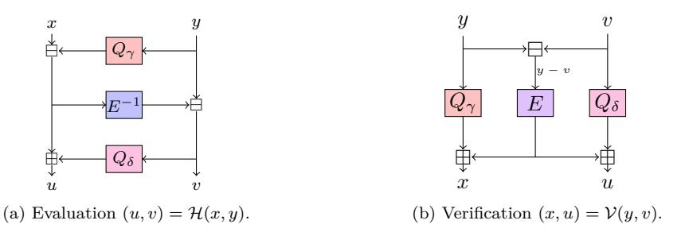

**Figure 1:** Nonlinear layer of the Anemoi round function: Open Flystel  $\mathcal{H}: \mathbb{F}_q^2 \to \mathbb{F}_q^2$  for evaluation (high-degree) and closed Flystel  $\mathcal{V}: \mathbb{F}_q^2 \to \mathbb{F}_q^2$  for verification (low-degree).

#### 4.2 Algebraic Models

The security of cryptographic permutations used in sponge mode is connected to the difficulty of solving the CICO problem [BDPV11]. For  $\ell = 1$ , that is, Anemoi :  $\mathbb{F}_q^2 \to \mathbb{F}_q^2$ , [BBC+23] suggests fixing the first input and the first output element of the permutation. This yields the following CICO problem:

**Definition 1** (CICO problem for Anemoi,  $\ell = 1$ ). The task is to find  $y_{\rm in}, y_{\rm out} \in \mathbb{F}_q$  such that Anemoi  $(0, y_{\rm in}) = (0, y_{\rm out})$ .

[BBC+23] presents two different models for Anemoi under the above CICO constraints,  $\mathcal{F}_{\text{CICO}}$  and  $\mathcal{P}_{\text{CICO}}$ . The security analysis of Anemoi in [BBC+23] is based on the easier model,  $\mathcal{F}_{\text{CICO}}$ . In this section, we recap both models for the special case  $\ell=1$  and provide further insight into the latter. In particular, we provide a more detailed analysis of the polynomial equations and the evolution of their degrees. For readability, variables will be highlighted below to visually distinguish them from functions.

#### 4.2.1 Model 1: $\mathcal{F}_{CICO}$

Let  $x_0, y_0$  model the input to the Anemoi permutation and let  $x_r, y_r$  model the output of the r-th round function  $R_r$ , for  $1 \le r \le N$ . With

$$x = 2(x_{r-1} + c_r) + (y_{r-1} + d_r), u = x_r,$$
  

$$y = (x_{r-1} + c_r) + (y_{r-1} + d_r), v = y_r,$$

the verification property of the FLYSTEL construction, given in Equation (20), yields a straightforward model that uses two equations per round:

$$f_r := Q_\gamma(y) + E(y - v) - x = 0, \tag{23}$$

$$g_r := Q_\delta(v) + E(y - v) - u = 0. \tag{24}$$

To model the final linear layer without adding more variables and equations, we set  $(u,v)=H^{-1}(x_N,y_N)$  in the last round. Clearly,  $f_r,g_r\in\mathbb{F}_q\left[x_{r-1},y_{r-1}\right]$  with deg  $(f_r)=\deg\left(g_r\right)=\alpha$ . The CICO constraints from Definition 1 can be applied directly to  $f_1,g_1,f_N$ , and  $g_N$  without influencing the polynomial degrees. See Table 3 for a summary of the model details.

#### 4.2.2 Model 2: $\mathcal{P}_{CICO}$

Let  $x_0, y_0$  model the input to the Anemoi permutation and let  $s_r$  model the output of the high-degree polynomial  $E^{-1}(x) = x^{\frac{1}{\alpha}}$  in the open FLYSTEL  $\mathcal{H}$  (cf. Figure 1a) in the r-th round function  $R_r$ , for  $1 \leq r \leq N$ . We define the following functions for every round  $1 \leq r \leq N$ :

1. Let  $x_{r-1}, y_{r-1}$  be the inputs to  $R_r$ . The outputs of the linear layer, and thus the inputs to  $\mathcal{H}$ , are given by the functions  $f_r, g_r$ , where

$$\begin{bmatrix} f_r(x_{r-1}, y_{r-1}) \\ g_r(x_{r-1}, y_{r-1}) \end{bmatrix} := \begin{bmatrix} 2x_{r-1} + y_{r-1} + 2c_r + d_r \\ x_{r-1} + y_{r-1} + c_r + d_r \end{bmatrix}.$$
 (25)

2. Let  $f_r, g_r$  be the inputs to  $\mathcal{H}$  in the r-th round. Its outputs, and thus the round outputs, are the functions  $x_r, y_r$ , where

$$\begin{bmatrix} x_r \\ y_r \end{bmatrix} := \mathcal{H}(f_r, g_r) = \begin{bmatrix} f_r - Q_\gamma(g_r) + Q_\delta(g_r - s_r) \\ g_r - s_r \end{bmatrix}. \tag{26}$$

Clearly,  $f_r, g_r \in \mathbb{F}_q[x_0, y_0, s_1, \dots, s_{r-1}]$  and  $x_r, y_r \in \mathbb{F}_q[x_0, y_0, s_1, \dots, s_r]$  for  $1 \leq r \leq N$ . Applying the CICO input constraint from Definition 1, that is, fixing  $x_0 = 0$ , we get  $f_r, g_r \in \mathbb{F}_q[y_0, s_1, \dots, s_{r-1}]$  and  $x_r, y_r \in \mathbb{F}_q[y_0, s_1, \dots, s_r]$ . Using the definition of the variable  $s_r$ , that is,

$$\mathbf{s}_r = E^{-1}(f_r - Q_\gamma(g_r)) \quad \iff \quad E(\mathbf{s}_r) = f_r - Q_\gamma(g_r), \tag{27}$$

| Model                       | TET                                 |         | Variab | les             | Equations   |           |                 |                                               |  |  |
|-----------------------------|-------------------------------------|---------|--------|-----------------|-------------|-----------|-----------------|-----------------------------------------------|--|--|
| Model                       | $\mathbb{F}_q$                      | $n_v$   | Name   | Indices         | $n_e$       | Name      | Indices         | Degree                                        |  |  |
| $\mathcal{F}_{\text{CICO}}$ | $\mathbb{F}_p$ , $\mathbb{F}_{2^n}$ | 2N      | $x_r$  | 0 < r < N       | 2N          | $f_r$     | $1 \le r \le N$ | $\alpha$                                      |  |  |
| J CICO                      | 1 p, 1 2n                           | 211     | $y_r$  | $0 \le r \le N$ | 21 <b>V</b> | $g_r$     | $1 \le r \le N$ | $\alpha$                                      |  |  |
|                             | $\mathbb{F}_p$                      | N+1     | $s_r$  | $1 \le r \le N$ | N+1         | $p_r$     | $1 \le r \le N$ | $\max\left\{\alpha, 2r\right\}$               |  |  |
| $\mathcal{P}_{\text{CICO}}$ | ш р                                 | N T 1   | $y_0$  |                 | 1V T 1      | $x_{N+1}$ |                 | N+1                                           |  |  |
| / CICO                      | $\mathbb{F}_{2^n}$                  | N+1     | $s_r$  | $1 \le r \le N$ | N+1         | $p_r$     | $1 \le r \le N$ | $\max\left\{\alpha, 3\cdot (2^r - 1)\right\}$ |  |  |
|                             | ₽ 2 n                    | 1 T T T | $y_0$  |                 | 1V + 1      | $x_{N+1}$ |                 | $2^{N+1} - 1$                                 |  |  |

**Table 3:** Algebraic models for Anemoi :  $\mathbb{F}_q^{2\ell} \to \mathbb{F}_q^{2\ell}$  for the special case  $\ell = 1$ , and applied CICO constraints as in Definition 1.

every round  $1 \le r \le N$  can be modeled using a single equation

$$p_r := E(s_r) + Q_\gamma(g_r) - f_r = 0, \tag{28}$$

where  $p_r \in \mathbb{F}_q[y_0, s_1, \dots, s_r]$ . After the last round, the linear layer is applied once more. The CICO output constraint is thus modeled via

$$x_{N+1} := 2x_N + y_N + 2c_{N+1} + d_{N+1} = 0, (29)$$

where  $x_N, y_N$  as in Equation (26), and  $x_{N+1} \in \mathbb{F}_q [y_0, s_1, \dots, s_N]$ .

Finally, we inspect the polynomial degrees of the equations in  $\mathcal{P}_{\text{CICO}}$ . Let  $1 \leq r \leq N$ . First note that  $f_r$  and  $g_r$ , as defined in Equation (25), are linear functions in  $x_{r-1}, y_{r-1}$ . Thus,

$$\deg(f_r) = \deg(g_r) = \max\{\deg(x_{r-1}), \deg(y_{r-1})\} \ge 1.$$
(30)

Let  $\nu := \deg(Q_{\gamma}) = \deg(Q_{\delta}) \in \{2,3\}$ . Expanding the expressions for  $x_r$  in Equation (26) yields

$$x_r = f_r - Q_{\gamma}(q_r) + Q_{\delta}(q_r - s_r) = f_r - (\beta q_r^{\nu} + \gamma) + (\beta (q_r - s_r)^{\nu} + \delta). \tag{31}$$

As the term  $\beta g_r^{\nu}$  above cancels, and deg  $(y_r) = \deg(g_r) = \deg(f_r)$  by Equations (26) and (30), we arrive at

$$\deg(x_r) = \deg(g_r^{\nu-1}s_r) = (\nu - 1) \cdot \deg(g_r) + 1 > \deg(g_r) = \deg(y_r),$$
 (32)

with deg  $(x_1) = \nu$ . In particular, for r > 1, deg  $(g_r) = \deg(x_{r-1})$ , and hence

$$\deg(x_r) = (\nu - 1)^{r-1}\nu + \sum_{k=0}^{r-2} (\nu - 1)^k = \begin{cases} r+1 & \text{if } \nu = 2, \\ 2^{r+1} - 1 & \text{if } \nu = 3. \end{cases}$$
 (33)

That is, for Anemoi over  $\mathbb{F}_p$ , the degree of  $x_r$  grows only linearly, whilest over  $\mathbb{F}_{2^n}$  it grows exponentially. Finally, we arrive at the following degrees for the equations in the polynomial system  $\mathcal{P}_{\text{CICO}}$ :

$$\deg(p_r) = \max\{\alpha, \nu \cdot \deg(g_r)\} = \begin{cases} \max\{\alpha, 2r\} & \text{over } \mathbb{F}_p, \\ \max\{\alpha, 3 \cdot (2^r - 1)\} & \text{over } \mathbb{F}_{2^n}. \end{cases}$$
(34)

$$\deg(x_{N+1}) = \max\left\{\deg(x_N), \deg(y_N)\right\} = \begin{cases} N+1 & \text{over } \mathbb{F}_p, \\ 2^{N+1}-1 & \text{over } \mathbb{F}_{2^n}. \end{cases}$$
(35)

Table 3 summarizes the two algebraic models for Anemoi for the special case  $\ell=1$ .  $\mathcal{F}_{\mathrm{CICO}}$  maintains a constant degree for its polynomials independent of the underlying field, albeit at the expense of an augmented variable and equation count. In contrast,  $\mathcal{P}_{\mathrm{CICO}}$  requires only about half the number of variables and equations, yet the polynomial degrees exhibit linear or even exponential growth beyond a certain number of rounds.

#### 4.3 Gröbner Basis Attack on Small-Scale Variants

In this section, we experimentally compare Gröbner basis attacks on reduced versions of Anemoi using the two models  $\mathcal{F}_{CICO}$  and  $\mathcal{P}_{CICO}$ . First, we shortly demonstrate the influence of the variable ordering on the attack complexity of Step (1) of the Gröbner basis attack. Subsequently, we compare in more detail the behavior of  $\mathcal{F}_{CICO}$  and  $\mathcal{P}_{CICO}$  over  $\mathbb{F}_p$  for a fixed variable ordering.

All experiments are conducted on a machine with an INTEL XEON E5-2630 V3 @ 2.40 GHz (32 cores) and 378 GB RAM under DEBIAN 11 using MAGMA V2.26-2. All results can be inspected and verified using the material provided in our git repository.3

#### 4.3.1 Influence of the Variable Ordering

We investigate the influence of the variable ordering on Step (1) of the Gröbner basis attack. For both models, we consider three different variable orderings named  $o_1$ ,  $o_2$  and  $o_3$ , respectively. They are summarized in Table 4.

 Var.
 Models

 ord.
  $\mathcal{F}_{\text{CICO}}$   $\mathcal{P}_{\text{CICO}}$ 
 $o_1$   $x_1 > y_0 > x_2 > y_1 > \cdots > x_{N-1} > y_{N-2} > y_{N-1} > y_N$   $y_0 > s_r > \cdots > s_1$ 
 $o_2$   $x_1 > x_2 > \cdots > x_{N-1} > y_0 > y_1 > \cdots > y_N$   $y_0 > s_1 > \cdots > s_r$ 
 $o_3$   $x_1 < x_2 < \cdots < x_{N-1} < y_0 < y_1 < \cdots < y_N$   $s_r > \cdots > s_1 > y_0$ 

**Table 4:** Possible variable orderings for  $\mathcal{F}_{CICO}$  and  $\mathcal{P}_{CICO}$ .

Results over  $\mathbb{F}_{2^n}$ . Whilst  $\mathcal{P}_{\text{CICO}}$  generally performs badly over  $\mathbb{F}_{2^n}$  due to the exponential growth of the polynomial degrees, for  $\mathcal{F}_{\text{CICO}}$ , the variable ordering has a huge impact on the attack complexity of Step (1) of the Gröbner basis attack. More precisely, if  $\alpha = 3$ , the degree of regularity remains constant.4 See Figure 2. Notably, this statement holds for all binary extension fields we tested, that is,  $\mathbb{F}_{2^n}$  with  $n \in \{15, 17, 31, 63, 65, 127, 255, 257\}$ . Thus, the overall attack complexity is governed by the complexity of the two remaining steps. For larger values of  $\alpha$ , we could not observe similar behavior.

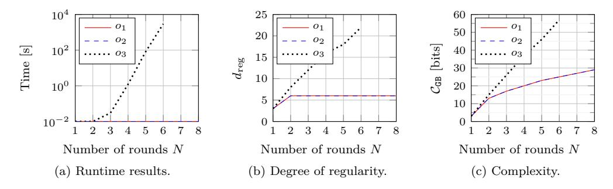

Figure 2: Step (1) of the Gröbner basis attack on Anemoi :  $\mathbb{F}^2_{2^{15}} \to \mathbb{F}^2_{2^{15}}$  with  $\alpha = 3$  using the model  $\mathcal{F}_{CICO}$ . Experimental complexities are derived using  $\omega = 2$ .

Note that in the first version of Anemoi5, the security against Gröbner basis attacks was assessed by the complexity of the DRL Gröbner basis computation. In later versions,

&lt;sup>3https://github.com/IAIK/six-worlds-anemoi

&lt;sup>4This behavior was observed over 10 rounds. For simplicity, only up to 8 rounds are shown in Figure 2.

&lt;sup>5Received on ePrint June 24, 2022: https://eprint.iacr.org/archive/2022/840/20220624:125043.

the security argument over F2*n* is based on the FGLM complexity. Thus, we will not further investigate this case and concentrate, for the remainder of this paper, on F*p*.

**Results over** F*p***.** For *p* = 216 + 1, which also corresponds to the choice the designers made for their experiments, the variable ordering influences the complexity of the Gröbner basis attack. In particular, for PCICO using *o*1, the degree of regularity is constantly below the one measured for other orderings. See [Figure 3.](#page-15-0)

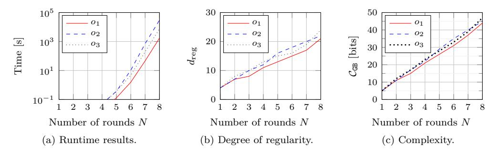

**Figure 3:** [Step \(1\)](#page-1-4) of the Gröbner basis attack on Anemoi : F 2 *p* → F 2 *p* with *p* = 216 + 1 and *α* = 3 using the model PCICO. Experimental complexities are derived using *ω* = 2.

However, we found that this is an artifact of the size of the chosen prime field. For larger primes, we observe a consistent degree of regularity. In particular, we tested *p* ∈ 2 32 − 209*,* 2 64 − 353*,* BN-254*,* BLS12-381 , where the last two denote the scalar field of the respective elliptic curves. For the rest of this paper, we fix the variable ordering *o*1.

# **4.3.2 Comparison of FCICO and PCICO over** F*p*

The presented results were achieved for Anemoi : F 2 *p* → F 2 *p* with *p* ∈ 2 32 − 209*,* 2 64 − 353 and *α* ∈ {3*,* 5}. A more complete overview is given in [Appendix C.](#page-41-0) In the following, we denote by *T*alg(·*, α*) and Calg(·*, α*) the concrete execution time and bit complexity of a specific step in the Gröbner basis attack for a given model, respectively.

During the experiments, we found that both ideals ⟨FCICO⟩ and ⟨PCICO⟩ were always in shape position (cf. [Remark 1\)](#page-6-0), having the same reduced LEX Gröbner basis. This means that both algebraic models of Anemoi exhibit a strong algebraic structure which might be further exploited with dedicated algorithms [\[BND22\]](#page-25-10). We also observed that the cost for the final factoring [Step \(3\)](#page-1-6) in a Gröbner basis attack was negligible, which might be due to the very small number of solutions over F*p*, see [Appendices C.1](#page-41-1) and [C.2.](#page-42-0) Hence, our comparison focuses on [Step \(1\)](#page-1-4) and [Step \(2\).](#page-1-5)

Regarding *execution time*, the FGLM step is the most involved part of the Gröbner basis attack. Interestingly, in the case *α* = 5 (cf. [Figure 5a\)](#page-16-1), PCICO performs better than FCICO. Conversely, the *experimental complexity*[6](#page-15-1) CGB grows in general faster than CFGLM. Interestingly, CGB(FCICO*, α*) grows much faster than CGB(PCICO*, α*). Moreover, CGB(PCICO*, α*) exhibits similar growth than CFGLM(·*, α*), at least for small round numbers. See [Figures 4b](#page-16-2) and [5b.](#page-16-3)

6Complexities CGB and CFGLM derived from the *experimentally observed* degree of regularity *d*reg and quotient space dimension *d*I , respectively.

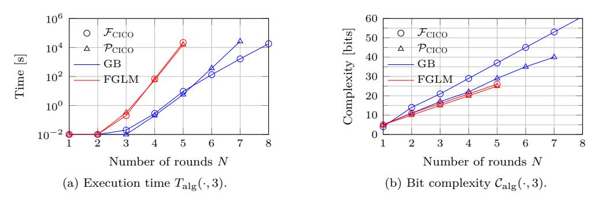

**Figure 4:** Attack on Anemoi : F 2 *p* → F 2 *p* with *α* = 3 and *p* = 264 − 353.

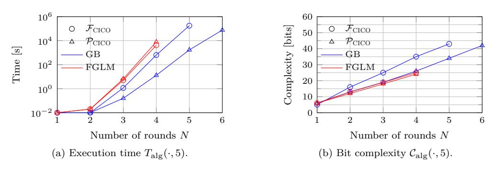

**Figure 5:** Attack on Anemoi : F 2 *p* → F 2 *p* with *α* = 5 and *p* = 232 − 209.

In summary, the *runtime results* indicate that [Step \(2\)](#page-1-5) FGLM is more challenging compared to [Step \(1\)](#page-1-4) GB, contrary to the *estimated complexities* which suggest the opposite. There are several possible explanations for this phenomenon:

- To the best of our knowledge, Magma implements the original FGLM basis conversion with a runtime of O *nv* · *d*I 3 , whereas complexities were derived using *ω* = 2. Additionally, these complexities are measured in terms of finite field operations, whose actual execution time can vary depending on the specific operation.
- Relying on *asymptotic complexity bounds* for derivation may overlook factors that vary based on the specific problem, introducing potential limitations to the analysis.
- Memory management might highly influence the concrete timing results.

Since the overall complexity of a Gröbner basis attack is determined by the dominant step (cf. [Section 2.1\)](#page-4-2), we extrapolate the observed metrics to gain insight for larger round numbers, which is of common practice in the field of Gröbner basis cryptanalysis. Note that using conjectured metrics for the complexity estimates introduces an unclear heuristic gap, potentially leading to over- or underestimation. Thus, we additionally investigate theoretical (upper) bounds.

## **4.4 Exploring the Six Worlds**

This section establishes conjectures and theoretical bounds on the metrics that govern the three steps of a Gröber basis attack. The results will be used in [Section 4.5](#page-19-0) to derive round numbers in all six worlds. Proofs for almost all theoretical bounds are given in [Appendix B.](#page-34-0)

#### **4.4.1 [Step \(1\):](#page-1-4) Gröbner Basis Computation**

The complexity of computing a (DRL) Gröbner basis depends, besides the polynomial degrees in a given equation system and the number of equations and variables, on the degree of regularity (cf. [Section 2.1\)](#page-4-2).

**Theoretical Bounds.** If the system was regular, its degree of regularity would be given by the Macaulay bound. Otherwise, it might serve as an upper bound to the degree of regularity.

**Theorem 3** (Macaulay Bound for FCICO over F*p*)**.** *If* FCICO *was regular, the Macaulay bound (in dependence of the round number N and the exponent α) would be given by*

$$d_{\text{reg}} = 2(\alpha - 1)N + 1. \tag{36}$$

As the degrees of the polynomials in PCICO depend on the choice of *α >* 0 and the number of rounds *N*, we a priori fix the following notation:

$$r_{\alpha} := \min \left\{ r \in \mathbb{N} : 2r \ge \alpha \right\} = \frac{\alpha + 1}{2}.$$
 (37)

In other words, *rα* is the first round number such that 2*r* ≥ *α*. The last equality follows from *α* being odd by definition.

**Theorem 4** (Macaulay Bound for PCICO over F*p*)**.** *If* PCICO *was regular, the Macaulay bound (in dependence of the round number N and the exponent α) would be given by*

$$d_{\text{reg}} = \begin{cases} \alpha N + 1 & \text{for } N < r_{\alpha}, \\ N^{2} + N + (r_{\alpha} - 1)^{2} + 1 & \text{for } N \ge r_{\alpha}. \end{cases}$$
(38)

**Experimental Conjectures.** We derive the following *conjectured* formula for the degree of regularity *d*reg which arises when computing the DRL Gröbner basis of ⟨FCICO⟩ and ⟨PCICO⟩, respectively, from the results of our experiments (cf. [Section 4.3](#page-14-0) and [Appendix C\)](#page-41-0).

**Conjecture 1** (*d*reg for FCICO over F*p*)**.** *The degree of regularity for the DRL Gröbner basis computation (in dependence of the round number N and the exponent α* ∈ {3*,* 5*,* 7*,* 11}*) for* I = ⟨PCICO⟩ *is approximately given by*

$$d_{\text{reg}} \approx \frac{\alpha + 1}{2} \cdot (N + 1) = r_{\alpha} \cdot N + r_{\alpha}.$$
 (39)

**Conjecture 2** (*d*reg for PCICO over F*p*)**.** *The degree of regularity for the DRL Gröbner basis computation (in dependence of the round number N and the exponent α* ∈ {3*,* 5*,* 7*,* 11}*) for* I = ⟨PCICO⟩ *is approximately given by*

$$d_{\text{reg}} \approx \frac{\alpha + 3}{2} \cdot N + \frac{\alpha - 1}{2} = (r_{\alpha} + 1) \cdot N + r_{\alpha} - 1.$$
 (40)

Note that the conjectured *d*reg for FCICO and PCICO are both modeled as linear functions. For FCICO, this choice seems intuitive since the Macaulay bound is also linear. While for PCICO, the Macaulay bound shows quadratic growth for *N* ≥ *rα*, the experimental data suggests that a linear model might be a better fit (cf. [Figure 6](#page-18-0) and [Appendix C.3\)](#page-43-0). We mention the following caveat: even if the presented linear model is a good fit for the observed data points, extrapolating this trend necessarily introduces a heuristic gap. An estimate derived from a certain (small) amount of actual data points does, in general, not guarantee a good approximation for large-scale variants.

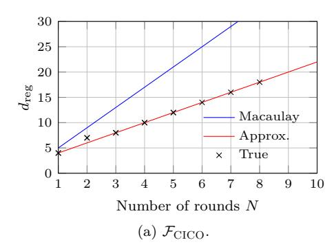

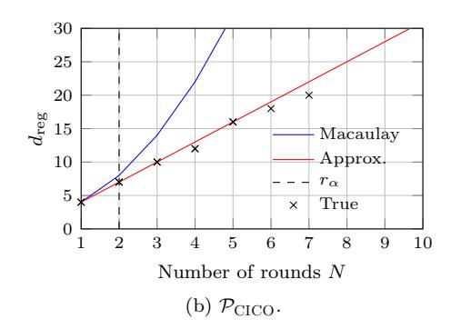

**Figure 6:** Theoretical bounds and experimental conjectures for the degree of regularity  $d_{\text{reg}}$  in Step (1) of a Gröbner basis attack on Anemoi :  $\mathbb{F}_p^2 \to \mathbb{F}_p^2$  with  $\alpha = 3$ . Experimental data points for  $p \in \{2^{32} - 209, 2^{64} - 353\}$ .

#### 4.4.2 Step (2): FGLM Basis Conversion

The complexity of the FGLM basis conversion algorithm depends on the quotient space dimension  $d_{\mathcal{I}}$  of a zero-dimensional ideal  $\mathcal{I}$ . Without proof but strong experimental support, we assume that both  $\langle \mathcal{F}_{\text{CICO}} \rangle$  and  $\langle \mathcal{P}_{\text{CICO}} \rangle$  are zero-dimensional.

**Theoretical Bounds.** This section states the classical Bézout bound and the multihomogeneous Bézout bound for  $\mathcal{F}_{\text{CICO}}$  and  $\mathcal{P}_{\text{CICO}}$ , bounding the number of solutions and thus the quotient space dimension for zero-dimensional ideals. To find a variable set partition minimizing the multihomogeneous Bézout bound for  $\mathcal{F}_{\text{CICO}}$ , respectively  $\mathcal{P}_{\text{CICO}}$ , we extrapolated the partition pattern that arose during an exhaustive search. See Section 3.2 for a description of our methodology. Proofs for  $\mathcal{P}_{\text{CICO}}$  are given in Appendix B.2.

**Theorem 5** (Bézout Bound for  $\mathcal{F}_{CICO}$ ). The Bézout bound for  $\mathcal{F}_{CICO}$  (in dependence of the round number N and the exponent  $\alpha$ ) is given by

$$B = \prod_{r=1}^{2N} \alpha = \alpha^{2N}. \tag{41}$$

For  $\mathcal{F}_{CICO}$  and  $\alpha \in \{3, 5, 7, 11\}$ , the minimal multihomogeneous Bézout bound coincides with the classical one. In particular, the optimal variable set partition is the "trivial" one into a single set. Without further proof, we state the following:

**Theorem 6** (Multihomogeneous Bézout Bound for  $\mathcal{F}_{CICO}$ ). The "minimal" multihomogeneous Bézout bound for  $\mathcal{F}_{CICO}$  (in dependence of the round number N and the exponent  $\alpha \in \{3, 5, 7, 11\}$ ) is given by

$$MHB = \prod_{r=1}^{2N} \alpha = \alpha^{2N}.$$
 (42)

The bounds for  $\mathcal{P}_{\text{CICO}}$  depend again on  $r_{\alpha}$  defined in Equation (37). Since  $r_{\alpha}$  for  $\alpha \in \{3, 5, 7, 11\}$  is relatively small, the case  $N < r_{\alpha}$  is not interesting for the security analysis in Section 4.5. Thus, in the following, we focus on the case  $N > r_{\alpha}$ .

**Theorem 7** (Bézout Bound for  $\mathcal{P}_{CICO}$ ). The Bézout bound for  $\mathcal{P}_{CICO}$  (in dependence of the round number  $N \geq r_{\alpha}$  and the exponent  $\alpha \in \{3, 5, 7, 11\}$ ) is given by

$$B = \alpha^{r_{\alpha} - 1} \cdot 2^{N - r_{\alpha} + 1} \cdot \frac{(N+1)!}{(r_{\alpha} - 1)!}.$$
 (43)

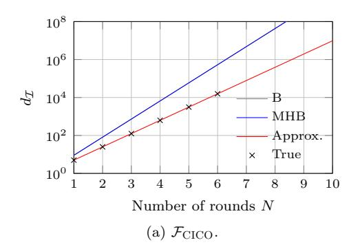

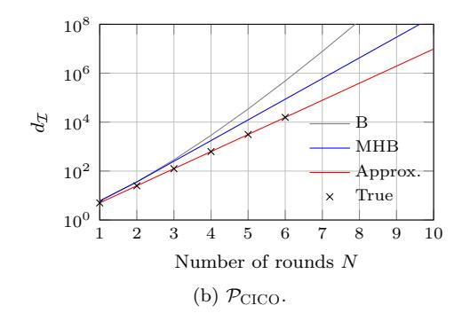

Figure 7: Theoretical bounds and experimental conjectures for the quotient space dimension  $d_{\mathcal{I}}$  in Step (2) of a Gröbner basis attack on Anemoi :  $\mathbb{F}_p^2 \to \mathbb{F}_p^2$  with  $\alpha = 3$ . Experimental data points for  $p \in \{2^{32} - 209, 2^{64} - 353\}$ . For  $\mathcal{F}_{\text{CICO}}$ , B and MHB coincide.

**Theorem 8** (Multihomogeneous Bézout Bound for  $\mathcal{P}_{CICO}$ ). The "minimal" multihomogeneous Bézout bound (in dependence of the round number  $N \geq r_{\alpha}$  and the exponent  $\alpha \in \{3, 5, 7, 11\}$ ) for  $\mathcal{P}_{CICO}$  is given by

$$MHB = \tau_{\alpha} \cdot (\alpha + 4)^{N - r_{\alpha}},\tag{44}$$

where  $\tau_{\alpha} = 2r_{\alpha} \cdot \alpha^{r_{\alpha}-1} \cdot (r_{\alpha}+1)$  for  $\alpha \in \{3,5,7\}$  and  $\tau_{\alpha} = (\alpha+4)^{r_{\alpha}}$  for  $\alpha = 11$ .

**Experimental Conjectures.** We derive the following *conjectured* formula for the quotient space dimension  $d_{\mathcal{I}}$  from the experimental data (cf. Section 4.3 and Appendix C).

Conjecture 3 ( $d_{\mathcal{I}}$  for  $\mathcal{F}_{\text{CICO}}$  and  $\mathcal{P}_{\text{CICO}}$  over  $\mathbb{F}_p$ ). The dimension  $d_{\mathcal{I}}$  of the quotient space (in dependence of the round number N and  $\alpha \in \{3, 5, 7, 11\}$ ) for  $\mathcal{I} = \langle \mathcal{F}_{\text{CICO}} \rangle$ , respectively  $\mathcal{I} = \langle \mathcal{P}_{\text{CICO}} \rangle$ , is given by

$$d_{\mathcal{I}} = (\alpha + 2)^N. \tag{45}$$

We note that the formula for  $d_{\mathcal{I}}$  exactly matches the observed values, thus justifying a high level of confidence in the conjecture. Additionally, the same conjecture has been formulated in [BBC+23]. Recently, [Bri24] provided formal proof of this statement and thus of the zero-dimensionality of the involved ideal(s). The Bézout bounds are larger and grow much faster than the (conjectured) quotient space dimension  $d_{\mathcal{I}}$ . While for  $\mathcal{F}_{\text{CICO}}$  using the multihomogeneous Bézout does not bring any advantage, for  $\mathcal{P}_{\text{CICO}}$  it yields a tighter upper bound for the quotient space dimension  $d_{\mathcal{I}}$ . See Figure 7 and Appendix C.3.

#### 4.4.3 Step (3): Univariate Solving

As described in Section 4.3, both  $\langle \mathcal{F}_{\text{CICO}} \rangle$  and  $\langle \mathcal{P}_{\text{CICO}} \rangle$  are in shape position. Under the assumption that this generally holds, the degree of the univariate polynomial in the LEX Gröbner basis,  $d_{\text{uni}}$ , equals the quotient space dimension  $d_{\mathcal{I}}$ . Thus, all previously discussed bounds and conjectures can be applied.

#### 4.5 Security Analysis

The indicators used for the security assessment in each of the Six Worlds of Gröbner Basis Cryptanalysis of Anemoi are summarized in Table 5. Note the overlap for Step (2) and Step (3). In the case of shape position, where the degree of the univariate polynomial

in the LEX Gröbner basis equals the quotient space dimension  $d_{\mathcal{I}}$ , the FGLM complexity typically exceeds the one for factorization (cf. Section 2.1). Thus, we deem it reasonable to mainly concentrate, in the following, on Step (1) and Step (2).

**Table 5:** Summary of the indicators used in each of the Six Worlds of Gröbner Basis Cryptanalysis to estimate the complexity and derive round numbers for Anemoi :  $\mathbb{F}_p^2 \to \mathbb{F}_p^2$ .

|                             | (E) Exp            | erimental ap      | oproach       | (T) Theoretical approach |          |          |  |  |
|-----------------------------|--------------------|-------------------|---------------|--------------------------|----------|----------|--|--|
|                             | Step (1)           | Step (2)          | Step (3)      | Step (1)                 | Step (2) | Step (3) |  |  |
|                             | GB                 | FGLM              | FAC           | GB                       | FGLM     | FAC      |  |  |
| Indicator                   | $d_{\mathrm{reg}}$ | $d_{\mathcal{I}}$ | $d_{\rm uni}$ | $d_{\mathrm{MAC}}$       | в, мнв   | в, мнв   |  |  |
| $\mathcal{F}_{\text{CICO}}$ | Conj. 1            | Conj. 3           | Conj. 3       | Thm. 3                   | Thm. 6   | Thm. 6   |  |  |
| $\mathcal{P}_{\text{CICO}}$ | Conj. 2            | Conj. 3           | Conj. 3       | Thm. 4                   | Thm. 8   | Thm. 8   |  |  |

Subsequently, we provide the derivations to obtain a lower bound on the number of rounds necessary to reach a security level of s bits in the different steps of a Gröbner basis attack using the conjectured metrics, as well as the theoretical Bézout bounds. The results are compared to those provided in [BBC+23].

Minimum Number of Rounds. In [BBC+23], a lower bound  $N^*$  on the number of rounds needed to reach a certain security level s is derived from the (conjectured) algebraic complexity of the potentially most expensive step in the Gröbner basis attack, plus some security margin. In particular, the designers considered the easier algebraic model  $\mathcal{F}_{\text{CICO}}$ , and  $N^*$  is defined as

$$N^* = \max \left\{ 8, \underbrace{\min(5, 1+\ell)}_{\text{(a) security margin}} + \underbrace{2 + \min\left\{N \in \mathbb{N} : \mathcal{C}_{\text{alg}(N)} \ge 2^s\right\}}_{\text{(b) to prevent algebraic attacks}} \right\}, \tag{46}$$

where  $C_{\text{alg}} = C_{\text{GB}}$  with a conjectured lower bound on the degree of regularity  $d_{\text{reg}}$  derived from experiments and a conservative choice of  $\omega = 2$  for the linear algebra constant (cf. [BBC+23, Sections 5.2 & 6.6.2]). An additional security margin of two rounds was added in Equation (46), part (b), to account for the second model,  $\mathcal{P}_{\text{CICO}}$ .

In the following, we argue that the margins in Equation (46) and, for certain instances, the suggested round numbers (cf. [BBC+23, Table 1]) might not be sufficient. In particular, we derive round numbers using the formula in Equation (15), restated here for simplicity:

$$\min \left\{ N \in \mathbb{N} : \mathcal{C}_{\operatorname{alg}(N)} \ge 2^s \right\}$$

for  $C_{alg} \in \{C_{GB}, C_{FGLM}, C_{FAC}\}$  in (E) the experimental world and (T) the theoretical world, for both models  $\mathcal{F}_{CICO}$  and  $\mathcal{P}_{CICO}$ , without adding any additional security margin. Subsequently, we interpret our findings in the context of the *Six Worlds of Gröbner Basis Cryptanalysis* and compare them with the suggested round numbers.

**Interpretation.** Under the assumption that none of the steps in the Gröbner basis attack are trivial, the six worlds are interpreted as follows:

- (T) In the theoretical world, round numbers below the given values are proven to be insecure since they evidentially do not reach the asserted security level against a particular step in the Gröbner basis attack. Implicitly, this also yields a lower bound on the number of rounds.
- (E) In the experimental world, results are to be understood as a lower bound on the number of rounds to reach the targeted security level against a particular step in the Gröbner basis attack.

For the particular case of Anemoi, only Step (1) GB computation and Step (2) FGLM basis conversion seem to be of practical importance in the security assessment. For example, in the concrete case of Anemoi :  $\mathbb{F}_p^2 \to \mathbb{F}_p^2$  with  $\alpha=3$  and a target security level of s=128 bits using the model  $\mathcal{P}_{\text{CICO}}$ , the different worlds can be interpreted as follows (see Figure 8) for  $\omega=2$  (2.37):

Step (1) GB: A round number below 22 (19) is insufficient to reach the targeted security level. The targeted security level should be reached for N > 41 (35).

Step (2) FGLM: A round number below 45 (38) is insufficient to reach the targeted security level. The targeted security level should be reached for  $N \ge 54$  (46).

A detailed discussion on the concrete choice of the value of  $\omega$  in the context of algebraic cryptanalysis is given in Section 2.1.

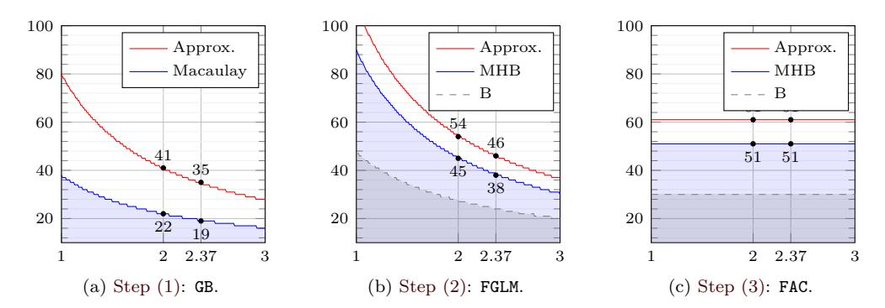

**Figure 8:** The Six Worlds of Gröbner Basis Cryptanalysis: Round numbers derived for the individual steps of a Gröbner basis attack on Anemoi:  $\mathbb{F}_p^2 \to \mathbb{F}_p^2$  with  $\alpha = 3$  used in a Sponge construction for different values of  $\omega$ . Target security level of s = 256 bits. Theoretical bounds and (experimental) conjectures as given in Section 4.4. Colored areas indicate round numbers proven to be insecure. Algebraic model:  $\mathcal{P}_{\text{CICO}}$ .

**Comparison.** Tables 6 and 7 state our results for a security level of s = 128 and s = 256 bits, respectively. If the derived round number is above the round number suggestion in [BBC+23, Table 1] for Step (1) or Step (2), the respective cell is highlighted. The columns for Step (3) are grayed out since our experiments showed that this step was completed very quickly.

**Table 6:** The Six Worlds of Gröbner Basis Cryptanalysis: Round numbers derived for the individual steps of a Gröbner basis attack on Anemoi:  $\mathbb{F}_p^2 \to \mathbb{F}_p^2$  used in a Sponge construction for  $\omega = 2$ . Target security level of s = 128 bits. The second column corresponds to  $N^*$  as given in [BBC+23], respectively Equation (46). Each cell reports the numbers derived for the two algebraic models  $\mathcal{P}_{\text{CICO}}(\mathcal{F}_{\text{CICO}})$ .

|          |                       | (E) Expe | rimental a | pproach    | (T) Theoretical approach |          |          |  |  |
|----------|-----------------------|----------|------------|------------|--------------------------|----------|----------|--|--|
| $\alpha$ | [BBC + 23] | Step (1) | Step (2)   | Step $(3)$ | Step (1)                 | Step (2) | Step (3) |  |  |
| α        |                       | GB       | FGLM       | FAC        | GB                       | FGLM     | FAC      |  |  |
| 3        | 21 (2+2+17)           | 21 (17)  | 27 (27)    | 31 (31)    | 13 (13)                  | 23 (20)  | 26 (23)  |  |  |
| 5        | 21 (2+2+17)           | 19(14)   | 22(22)     | 26 (26)    | 13 (10)                  | 20(14)   | 23 (16)  |  |  |
| 7        | 20 (2+2+16)           | 17(12)   | 20(20)     | 23(23)     | 13 (9)                   | 18(12)   | 21 (13)  |  |  |
| 11       | 19 (2+2+15)           | 15 (11)  | 17 (17)    | 20 (20)    | 12(8)                    | 16(9)    | 19 (11)  |  |  |

**Table 7:** The Six Worlds of Gröbner Basis Cryptanalysis: Round numbers derived for the individual steps of a Gröbner basis attack on Anemoi:  $\mathbb{F}_p^2 \to \mathbb{F}_p^2$  used in a Sponge construction for  $\omega = 2$ . Target security level of s = 256 bits. The second column corresponds to  $N^*$  as given in [BBC+23], respectively Equation (46). Each cell reports the numbers derived for the two algebraic models  $\mathcal{P}_{\text{CICO}}(\mathcal{F}_{\text{CICO}})$ .

|          |                       | (E) <b>Exp</b> e | erimental a | pproach  | (T) Theoretical approach |          |          |  |  |
|----------|-----------------------|------------------|-------------|----------|--------------------------|----------|----------|--|--|
| 0,       | [BBC + 23] | Step (1)         | Step (2)    | Step (3) | Step (1)                 | Step (2) | Step (3) |  |  |
| $\alpha$ |                       | GB               | FGLM        | FAC      | GB                       | FGLM     | FAC      |  |  |
| 3        | 37 (2+2+33)           | 41 (33)          | 54 (54)     | 61 (61)  | 22 (24)                  | 45 (40)  | 51 (45)  |  |  |
| 5        | 37 (2+2+33)           | 37(27)           | 45 (45)     | 51(51)   | 22(19)                   | 40(27)   | 45(31)   |  |  |
| 7        | 36 (2+2+32)           | 34(24)           | 40 (40)     | 45 (45)  | 22(16)                   | 37(23)   | 41 (26)  |  |  |
| 11       | 35 (2+2+33)           | 30(21)           | 34 (34)     | 39 (39)  | 22(14)                   | 33 (19)  | 37(21)   |  |  |

First, note that a security margin of 2 rounds, as described in Equation (46), is clearly not enough to account for the more complex model  $\mathcal{P}_{\text{CICO}}$ . For some instances, there is a difference of up to 14 rounds for the round numbers derived from  $\mathcal{F}_{\text{CICO}}$  and  $\mathcal{P}_{\text{CICO}}$ . Second, the dominance of Step (1) over Step (2), as claimed in [BBC+23], remains unclear. As experimental runtime results indicate the opposite, considering higher round numbers derived from  $\mathcal{C}_{\text{FGLM}}$  might be prudent. For many instances, the results in (T2) show that the suggested round numbers cannot provide the targeted security level.

As expected, the highest round numbers are derived from the (E) experimental world. Notably, there is one instance for which the round numbers in both (E1) and (E2) lie clearly above the suggestion:  $\mathcal{P}_{\text{CICO}}$  for  $\alpha=3$  and s=256. Table 8 shows the estimated attack complexity for this instance, that is, the complexities that result when inserting the suggested 37 rounds into the different complexity formulas. Indeed, for  $\omega=2$ , the estimated attack complexity is below the targeted 256 bits in the experimental world. In this context, the theoretical results indicate that for the given round number, the complexity will not be above the derived value. In particular,  $\mathcal{C}_{\text{FGLM}} \leq 212.7$ 

**Table 8:** Estimated attack complexity for round number suggestions in [BBC+23, Table 1] for Anemoi :  $\mathbb{F}_p^2 \to \mathbb{F}_p^2$  and a target security level of s=256 bits. Each cell reports the estimated attack complexity (in bits) in the given world, where  $\omega=2$  (2.37).

|          |                       |                             | (E) Expe                  | erimental a | pproach         | (T) Theoretical approach  |           |                 |  |
|----------|-----------------------|-----------------------------|---------------------------|-------------|-----------------|---------------------------|-----------|-----------------|--|
| $\alpha$ | [BBC + 23] | Model                       | Step (1) Step (2) GB FGLM |             | Step (3) FAC | Step (1) Step (2) GB FGLM |           | Step (3) FAC |  |
| 3        | 37                    | $\mathcal{P}_{\text{CICO}}$ | 234 (277)                 | 177 (208)   | 155             | 497 (587)                 | 212 (250) | 187             |  |

In the previous discussions, we concentrated on the case  $\omega=2$  for the linear algebra constant. While this choice is generally considered conservative from a designer's perspective, it might seem rather aggressive for an attacker. Nevertheless, we think this choice is still suitable due to the internal structures of the polynomial systems. As discussed in Section 2.1, a very aggressive choice would be  $\omega=1$ , accounting for algorithms exploiting structure in the polynomial equation system. In this case, the number of rounds would need to be increased significantly. See Section 3.2.

Besides simply increasing the number of rounds, another strategy to address the newly identified vulnerabilities is to select a larger exponent for  $Q_{\delta}$  and  $Q_{\gamma}$ . Specifically, if  $\deg(Q_{\delta}) = \deg(Q_{\gamma}) > 2$ , the polynomial degrees in  $\mathcal{P}_{\text{CICO}}$  will demonstrate exponential growth instead of solely linear growth. The practical performance influence of the two approaches might depend on the concrete use case.

&lt;sup>7Further results are given in Appendix C.5.

# **5 Conclusion**

We presented a refined methodology aimed at providing a broader understanding of Gröbner basis cryptanalysis. Central to our approach is the introduction of the *Six Worlds of Gröbner Basis Cryptanalysis*, which integrates both theoretical and experimental dimensions applied to the classical three steps of a Gröbner basis attack.

A concrete application of our methodology is demonstrated through the analysis of Anemoi. Detailed analyses of the FCICO and PCICO models, as described in [\[BBC](#page-24-4)+23], allowed us to derive precise bounds and formulate conjectures concerning the metrics that govern the attack complexity. In particular, by leveraging the multihomogeneous Bézout bound for PCICO to obtain a tighter upper bound on the quotient space dimension, we identified specific instances of Anemoi that may be susceptible to Gröbner basis attacks.

Our "Six Worlds" framework facilitates a granular assessment of the security of individual attack steps. Specifically, it enables the identification of round number thresholds below which a particular step may be considered insecure for a given security level (the theoretical dimension) and provides round number recommendations (the experimental dimension). Furthermore, it emphasizes the importance of employing more precise upper bounds, like those provided by the multihomogeneous Bézout bound, to enhance the quality of theoretical results.

In summary, the presented approach provides designers with a robust tool for evaluating and understanding the security implications of each step of a Gröbner basis attack.

**Open Problems.** A natural question to ask is the following: Given that the new methods lead to new results on Anemoi, could other designs that exhibit similar properties, such as Griffin [\[GHR](#page-26-8)+23] or Arion [\[RST23\]](#page-27-6), and perhaps to a lesser extent also Poseidon [\[GKR](#page-26-6)+21] or Rescue [\[AAB](#page-24-6)+20] be affected? Also beyond the area of arithmetization-friendly hashing, there are potential targets, e.g., big-field FHE-friendly permutation-based symmetric encryption [\[DGH](#page-25-12)+23, [HKC](#page-27-9)+20, [HKL](#page-27-10)+22], and MPC-friendly big field designs [\[GLR](#page-26-9)+20, [AGR](#page-24-10)+16, [DGGK21,](#page-25-13) [GØSW23\]](#page-26-11).

Furthermore, studying more dedicated Gröbner basis algorithms that exploit structures within algebraic systems may prove valuable. This approach could yield tighter upper bounds, potentially meaningful lower bounds, and provide a clearer understanding of the actual solving complexity.

# **Acknowledgements**

This work is partly supported by the European Union under the project Confidential6G with Grant agreement ID: 101096435. We express our sincere gratitude to Clémence Bouvier, Fredrik Meisingseth, Markus Schofnegger, Matthias Johann Steiner, and Morten Øygarden for their valuable feedback during the intermediate stages of our work. We would also like to thank the authors of [\[BBC](#page-24-4)+23] for generously sharing their code and TikZ pictures. Finally, we want to acknowledge Markus Schofnegger's idea of the PCICO model provided to us in January 2023.

# **References**

- [AAB+20] Abdelrahaman Aly, Tomer Ashur, Eli Ben-Sasson, Siemen Dhooghe, and Alan Szepieniec. Design of symmetric-key primitives for advanced cryptographic protocols. *IACR Trans. Symm. Cryptol.*, 2020(3):1–45, 2020. [doi:10.13154/](https://doi.org/10.13154/TOSC.V2020.I3.1-45) [TOSC.V2020.I3.1-45](https://doi.org/10.13154/TOSC.V2020.I3.1-45).
- [ABM24] Tomer Ashur, Thomas Buschman, and Mohammad Mahzoun. Algebraic cryptanalysis of the HADES design strategy: Application to Poseidon and Poseidon2. In *ACISP 2024*, volume 14896 of *LNCS*, pages 225–244. Springer, 2024. [doi:10.1007/978-981-97-5028-3\\_12](https://doi.org/10.1007/978-981-97-5028-3_12).
- [AC09] Martin R. Albrecht and Carlos Cid. Algebraic techniques in differential cryptanalysis. In *FSE 2009*, volume 5665 of *LNCS*, pages 193–208. Springer, 2009. [doi:10.1007/978-3-642-03317-9\\_12](https://doi.org/10.1007/978-3-642-03317-9_12).
- [ACG+19] Martin R. Albrecht, Carlos Cid, Lorenzo Grassi, Dmitry Khovratovich, Reinhard Lüftenegger, Christian Rechberger, and Markus Schofnegger. Algebraic cryptanalysis of STARK-friendly designs: Application to MARVELlous and MiMC. In *ASIACRYPT 2019*, volume 11923 of *LNCS*, pages 371–397. Springer, 2019. [doi:10.1007/978-3-030-34618-8\\_13](https://doi.org/10.1007/978-3-030-34618-8_13).
- [AGR+16] Martin R. Albrecht, Lorenzo Grassi, Christian Rechberger, Arnab Roy, and Tyge Tiessen. MiMC: Efficient encryption and cryptographic hashing with minimal multiplicative complexity. In *ASIACRYPT 2016*, volume 10031 of *LNCS*, pages 191–219, 2016. [doi:10.1007/978-3-662-53887-6\\_7](https://doi.org/10.1007/978-3-662-53887-6_7).
- [ARS+15] Martin R. Albrecht, Christian Rechberger, Thomas Schneider, Tyge Tiessen, and Michael Zohner. Ciphers for MPC and FHE. In *EUROCRYPT 2015*, volume 9056 of *LNCS*, pages 430–454. Springer, 2015. [doi:10.1007/](https://doi.org/10.1007/978-3-662-46800-5_17) [978-3-662-46800-5\\_17](https://doi.org/10.1007/978-3-662-46800-5_17).
- [Bar04] Magali Bardet. *Étude des systèmes algébriques surdéterminés. Applications aux codes correcteurs et à la cryptographie*. PhD thesis, Pierre and Marie Curie University, Paris, France, 2004. <https://theses.hal.science/tel-00449609>.
- [BBC+23] Clémence Bouvier, Pierre Briaud, Pyrros Chaidos, Léo Perrin, Robin Salen, Vesselin Velichkov, and Danny Willems. New design techniques for efficient arithmetization-oriented hash functions: Anemoi permutations and Jive compression mode. In *CRYPTO 2023*, volume 14083 of *LNCS*, pages 507–539. Springer, 2023. [doi:10.1007/978-3-031-38548-3\\_17](https://doi.org/10.1007/978-3-031-38548-3_17).
- [BBL+24] Augustin Bariant, Aurélien Boeuf, Axel Lemoine, Irati Manterola Ayala, Morten Øygarden, Léo Perrin, and Håvard Raddum. The algebraic FreeLunch: Efficient Gröbner basis attacks against arithmetization-oriented primitives. In *CRYPTO 2024*, volume 14923 of *LNCS*, pages 139–173. Springer, 2024. [doi:10.1007/978-3-031-68385-5\\_5](https://doi.org/10.1007/978-3-031-68385-5_5).
- [BBLP22] Augustin Bariant, Clémence Bouvier, Gaëtan Leurent, and Léo Perrin. Algebraic attacks against some arithmetization-oriented primitives. *IACR Trans. Symm. Cryptol.*, 2022(3):73–101, 2022. [doi:10.46586/TOSC.V2022.](https://doi.org/10.46586/TOSC.V2022.I3.73-101) [I3.73-101](https://doi.org/10.46586/TOSC.V2022.I3.73-101).
- [BCP23] Clémence Bouvier, Anne Canteaut, and Léo Perrin. On the algebraic degree of iterated power functions. *Des. Codes Cryptogr.*, 91(3):997–1033, 2023. [doi:10.1007/S10623-022-01136-X](https://doi.org/10.1007/S10623-022-01136-X).

- [BDPV11] Guido Bertoni, Joan Daemen, Michaël Peeters, and Gilles Van Assche. The keccak reference, 2011. [https://keccak.team/files/Keccak-reference-3.](https://keccak.team/files/Keccak-reference-3.0.pdf) [0.pdf](https://keccak.team/files/Keccak-reference-3.0.pdf).
- [Ber71] Elwyn R. Berlekamp. Factoring polynomials over large finite fields. In *SYMSAC 1971*, page 223. ACM, 1971. [doi:10.1145/800204.806290](https://doi.org/10.1145/800204.806290).
- [BFS15] Magali Bardet, Jean-Charles Faugère, and Bruno Salvy. On the complexity of the F5 Gröbner basis algorithm. *J. Symb. Comput.*, 70:49–70, 2015. [doi:](https://doi.org/10.1016/J.JSC.2014.09.025) [10.1016/J.JSC.2014.09.025](https://doi.org/10.1016/J.JSC.2014.09.025).
- [BMMT94] Eberhard Becker, Teo Mora, Maria Grazia Marinari, and Carlo Traverso. The shape of the shape lemma. In *ISSAC 1994*, pages 129–133. ACM, 1994. [doi:10.1145/190347.190382](https://doi.org/10.1145/190347.190382).
- [BND22] Jérémy Berthomieu, Vincent Neiger, and Mohab Safey El Din. Faster change of order algorithm for Gröbner bases under shape and stability assumptions. In *ISSAC 2022*, pages 409–418. ACM, 2022. [doi:10.1145/3476446.3535484](https://doi.org/10.1145/3476446.3535484).
- [BPW06] Johannes Buchmann, Andrei Pyshkin, and Ralf-Philipp Weinmann. A zerodimensional Gröbner basis for AES-128. In *FSE 2006*, volume 4047 of *LNCS*, pages 78–88. Springer, 2006. [doi:10.1007/11799313\\_6](https://doi.org/10.1007/11799313_6).
- [Bri24] Pierre Briaud. A note of Anemoi Gröbner bases. Cryptology ePrint Archive, Paper 2024/693, 2024. <https://eprint.iacr.org/2024/693>.
- [BSGL20] Eli Ben-Sasson, Lior Goldberg, and David Levit. STARK friendly hash – survey and recommendation. Cryptology ePrint Archive, Paper 2020/948, 2020. <https://eprint.iacr.org/2020/948>.
- [CL05] Carlos Cid and Gaëtan Leurent. An analysis of the XSL algorithm. In *ASIACRYPT 2005*, volume 3788 of *LNCS*, pages 333–352. Springer, 2005. [doi:10.1007/11593447\\_18](https://doi.org/10.1007/11593447_18).
- [CLO15] David A. Cox, John Little, and Donal O'Shea. *Ideals, Varieties, and Algorithms*. Springer, 4 edition, 2015. [doi:10.1007/978-3-319-16721-3](https://doi.org/10.1007/978-3-319-16721-3).
- [CMR05] Carlos Cid, Sean Murphy, and Matthew J. B. Robshaw. Small scale variants of the AES. In *FSE 2005*, volume 3557 of *LNCS*, pages 145–162. Springer, 2005. [doi:10.1007/11502760\\_10](https://doi.org/10.1007/11502760_10).
- [CP02] Nicolas T. Courtois and Josef Pieprzyk. Cryptanalysis of block ciphers with overdefined systems of equations. In *ASIACRYPT 2002*, volume 2501 of *LNCS*, pages 267–287. Springer, 2002. [doi:10.1007/3-540-36178-2\\_17](https://doi.org/10.1007/3-540-36178-2_17).
- [CZ81] David G. Cantor and Hans Zassenhaus. A new algorithm for factoring polynomials over finite fields. *Mathematics of Computation*, 36(154):587–592, 1981. [doi:10.2307/2007663](https://doi.org/10.2307/2007663).
- [DGGK21] Christoph Dobraunig, Lorenzo Grassi, Anna Guinet, and Daniël Kuijsters. Ciminion: Symmetric encryption based on Toffoli-gates over large finite fields. In *EUROCRYPT 2021*, volume 12697 of *LNCS*, pages 3–34. Springer, 2021. [doi:10.1007/978-3-030-77886-6\\_1](https://doi.org/10.1007/978-3-030-77886-6_1).
- [DGH+23] Christoph Dobraunig, Lorenzo Grassi, Lukas Helminger, Christian Rechberger, Markus Schofnegger, and Roman Walch. Pasta: A case for hybrid homomorphic encryption. *IACR Trans. Cryptogr. Hardw. Embed. Syst.*, 2023(3):30–73, 2023. [doi:10.46586/TCHES.V2023.I3.30-73](https://doi.org/10.46586/TCHES.V2023.I3.30-73).

- [EGL+20] Maria Eichlseder, Lorenzo Grassi, Reinhard Lüftenegger, Morten Øygarden, Christian Rechberger, Markus Schofnegger, and Qingju Wang. An algebraic attack on ciphers with low-degree round functions: Application to full MiMC. In *ASIACRYPT 2020*, volume 12491 of *LNCS*, pages 477–506. Springer, 2020. [doi:10.1007/978-3-030-64837-4\\_16](https://doi.org/10.1007/978-3-030-64837-4_16).
- [Fau99] Jean-Charles Faugère. A new efficient algorithm for computing Gröbner bases (F4). *Journal of Pure and Applied Algebra*, 139(1):61–88, 1999. [doi:](https://doi.org/10.1016/S0022-4049(99)00005-5) [10.1016/S0022-4049\(99\)00005-5](https://doi.org/10.1016/S0022-4049(99)00005-5).
- [FGHR14] Jean-Charles Faugère, Pierrick Gaudry, Louise Huot, and Guénaël Renault. Sub-cubic change of ordering for Gröbner basis: a probabilistic approach. In *ISSAC 2014*, pages 170–177. ACM, 2014. [doi:10.1145/2608628.2608669](https://doi.org/10.1145/2608628.2608669).
- [FGLM93] Jean-Charles Faugère, Patrizia M. Gianni, Daniel Lazard, and Teo Mora. Efficient computation of zero-dimensional Gröbner bases by change of ordering. *J. Symb. Comput.*, 16(4):329–344, 1993. [doi:10.1006/JSCO.1993.1051](https://doi.org/10.1006/JSCO.1993.1051).
- [FM11] Jean-Charles Faugère and Chenqi Mou. Fast algorithm for change of ordering of zero-dimensional Gröbner bases with sparse multiplication matrices. In *ISSAC 2011*, pages 115–122. ACM, 2011. [doi:10.1145/1993886.1993908](https://doi.org/10.1145/1993886.1993908).
- [Gen07] Giulio Genovese. Improving the algorithms of Berlekamp and Niederreiter for factoring polynomials over finite fields. *J. Symb. Comput.*, 42(1-2):159–177, 2007. [doi:10.1016/J.JSC.2006.02.007](https://doi.org/10.1016/J.JSC.2006.02.007).
- [GHR+23] Lorenzo Grassi, Yonglin Hao, Christian Rechberger, Markus Schofnegger, Roman Walch, and Qingju Wang. Horst meets Fluid-SPN: Griffin for zeroknowledge applications. In *CRYPTO 2023*, volume 14083 of *LNCS*, pages 573–606. Springer, 2023. [doi:10.1007/978-3-031-38548-3\\_19](https://doi.org/10.1007/978-3-031-38548-3_19).
- [GKL+22] Lorenzo Grassi, Dmitry Khovratovich, Reinhard Lüftenegger, Christian Rechberger, Markus Schofnegger, and Roman Walch. Reinforced Concrete: A fast hash function for verifiable computation. In *CCS 2022*, pages 1323–1335. ACM, 2022. [doi:10.1145/3548606.3560686](https://doi.org/10.1145/3548606.3560686).
- [GKR+21] Lorenzo Grassi, Dmitry Khovratovich, Christian Rechberger, Arnab Roy, and Markus Schofnegger. Poseidon: A new hash function for zeroknowledge proof systems. In *USENIX Security Symposium*, pages 519–535. USENIX Association, 2021. URL: [https://www.usenix.org/conference/](https://www.usenix.org/conference/usenixsecurity21/presentation/grassi) [usenixsecurity21/presentation/grassi](https://www.usenix.org/conference/usenixsecurity21/presentation/grassi).
- [GKRS22] Lorenzo Grassi, Dmitry Khovratovich, Sondre Rønjom, and Markus Schofnegger. The Legendre symbol and the Modulo-2 operator in symmetric schemes over F *n p* : Preimage attack on full Grendel. *IACR Trans. Symm. Cryptol.*, 2022(1):5–37, 2022. [doi:10.46586/TOSC.V2022.I1.5-37](https://doi.org/10.46586/TOSC.V2022.I1.5-37).
- [GLR+20] Lorenzo Grassi, Reinhard Lüftenegger, Christian Rechberger, Dragos Rotaru, and Markus Schofnegger. On a generalization of substitution-permutation networks: The HADES design strategy. In *EUROCRYPT 2020*, volume 12106 of *LNCS*, pages 674–704. Springer, 2020. [doi:10.1007/978-3-030-45724-2\\_](https://doi.org/10.1007/978-3-030-45724-2_23) [23](https://doi.org/10.1007/978-3-030-45724-2_23).
- [GØSW23] Lorenzo Grassi, Morten Øygarden, Markus Schofnegger, and Roman Walch. From Farfalle to Megafono via Ciminion: The PRF Hydra for MPC applications. In *EUROCRYPT 2023*, volume 14007 of *LNCS*, pages 255–286. Springer, 2023. [doi:10.1007/978-3-031-30634-1\\_9](https://doi.org/10.1007/978-3-031-30634-1_9).

- [HKC+20] Jincheol Ha, Seongkwang Kim, Wonseok Choi, Jooyoung Lee, Dukjae Moon, Hyojin Yoon, and Jihoon Cho. Masta: An HE-friendly cipher using modular arithmetic. *IEEE Access*, 8:194741–194751, 2020. [doi:10.1109/ACCESS.2020.](https://doi.org/10.1109/ACCESS.2020.3033564) [3033564](https://doi.org/10.1109/ACCESS.2020.3033564).
- [HKL+22] Jincheol Ha, Seongkwang Kim, ByeongHak Lee, Jooyoung Lee, and Mincheol Son. Rubato: Noisy ciphers for approximate homomorphic encryption. In *EUROCRYPT 2022*, volume 13275 of *LNCS*, pages 581–610. Springer, 2022. [doi:10.1007/978-3-031-06944-4\\_20](https://doi.org/10.1007/978-3-031-06944-4_20).
- [KR00] Martin Kreuzer and Lorenzo Robbiano, editors. *Computational Commutative Algebra 1*. Springer, 2000. [doi:10.1007/978-3-540-70628-1](https://doi.org/10.1007/978-3-540-70628-1).
- [KR05] Martin Kreuzer and Lorenzo Robbiano. *Computational Commutative Algebra 2*. Springer, 2005. [doi:10.1007/3-540-28296-3](https://doi.org/10.1007/3-540-28296-3).
- [KS98] Erich L. Kaltofen and Victor Shoup. Subquadratic-time factoring of polynomials over finite fields. *Mathematics of Computation*, 67(223):1179–1197, 1998. [doi:10.1090/S0025-5718-98-00944-2](https://doi.org/10.1090/S0025-5718-98-00944-2).
- [KU11] Kiran S. Kedlaya and Christopher Umans. Fast polynomial factorization and modular composition. *SIAM J. Comput.*, 40(6):1767–1802, 2011. [doi:](https://doi.org/10.1137/08073408X) [10.1137/08073408X](https://doi.org/10.1137/08073408X).
- [Laz79] Daniel Lazard. Systems of algebraic equations. In *EUROSAM '79*, volume 72 of *LNCS*, pages 88–94. Springer, 1979. [doi:10.1007/3-540-09519-5\\_62](https://doi.org/10.1007/3-540-09519-5_62).
- [Laz83] Daniel Lazard. Gröbner bases, Gaussian elimination and resolution of systems of algebraic equations. In *EUROCAL '83*, volume 162 of *LNCS*, pages 146–156. Springer, 1983. [doi:10.1007/3-540-12868-9\\_99](https://doi.org/10.1007/3-540-12868-9_99).
- [LP19] Chaoyun Li and Bart Preneel. Improved interpolation attacks on cryptographic primitives of low algebraic degree. In *SAC 2019*, volume 11959 of *LNCS*, pages 171–193. Springer, 2019. [doi:10.1007/978-3-030-38471-5\\_8](https://doi.org/10.1007/978-3-030-38471-5_8).
- [MM07] Gregorio Malajovich and Klaus Meer. Computing minimal multi-homogeneous Bézout number s is hard. *Theory Comput. Syst.*, 40(4):553–570, 2007. [doi:](https://doi.org/10.1007/S00224-006-1322-Y) [10.1007/S00224-006-1322-Y](https://doi.org/10.1007/S00224-006-1322-Y).
- [MS87] Alexander Morgan and Andrew Sommese. A homotopy for solving general polynomial systems that respects m-homogeneous structures. *Applied Mathematics and Computation*, 24(2):101–113, 1987. [doi:10.1016/0096-3003\(87\)](https://doi.org/10.1016/0096-3003(87)90063-4) [90063-4](https://doi.org/10.1016/0096-3003(87)90063-4).
- [MW83] David W. Masser and Gisbert Wüstholz. Fields of large transcendence degree generated by values of elliptic functions. *Inventiones mathematicae*, 72:407–464, 1983. [doi:10.1007/BF01398396](https://doi.org/10.1007/BF01398396).
- [RAS20] Arnab Roy, Elena Andreeva, and Jan Ferdinand Sauer. Interpolation cryptanalysis of unbalanced Feistel networks with low degree round functions. In *SAC 2020*, volume 12804 of *LNCS*, pages 273–300. Springer, 2020. [doi:10.1007/978-3-030-81652-0\\_11](https://doi.org/10.1007/978-3-030-81652-0_11).
- [RST23] Arnab Roy, Matthias Johann Steiner, and Stefano Trevisani. Arion: Arithmetization-oriented permutation and hashing from generalized triangular dynamical systems. *CoRR*, abs/2303.04639, 2023. [arXiv:2303.04639](https://arxiv.org/abs/2303.04639), [doi:10.48550/ARXIV.2303.04639](https://doi.org/10.48550/ARXIV.2303.04639).

- [Sau21] Jan Ferdinand Sauer. Gröbner basis-attacking a tiny sponge. Technical report, AS Discrete Mathematics, 2021. [https://asdm.gmbh/2021/06/28/](https://asdm.gmbh/2021/06/28/gb_experiment_summary/) [gb\\_experiment\\_summary/](https://asdm.gmbh/2021/06/28/gb_experiment_summary/).
- [Sha13] Igor R. Shafarevich. *Basic Algebraic Geometry 1*. Springer, 3 edition, 2013. [doi:10.1007/978-3-642-37956-7](https://doi.org/10.1007/978-3-642-37956-7).
- [SKPI07] Makoto Sugita, Mitsuru Kawazoe, Ludovic Perret, and Hideki Imai. Algebraic cryptanalysis of 58-round SHA-1. In *FSE 2007*, volume 4593 of *LNCS*, pages 349–365. Springer, 2007. [doi:10.1007/978-3-540-74619-5\\_22](https://doi.org/10.1007/978-3-540-74619-5_22).
- [Spa12] Pierre-Jean Spaenlehauer. *Solving multi-homogeneous and determinantal systems: algorithms, complexity, applications*. PhD thesis, Pierre and Marie Curie University, Paris, France, 2012. [https://tel.archives-ouvertes.fr/](https://tel.archives-ouvertes.fr/tel-01110756) [tel-01110756](https://tel.archives-ouvertes.fr/tel-01110756).
- [Ste24a] Matthias Johann Steiner. Solving degree bounds for iterated polynomial systems. *IACR Trans. Symm. Cryptol.*, 2024(1):357–411, 2024. [doi:10.](https://doi.org/10.46586/TOSC.V2024.I1.357-411) [46586/TOSC.V2024.I1.357-411](https://doi.org/10.46586/TOSC.V2024.I1.357-411).
- [Ste24b] Matthias Johann Steiner. A zero-dimensional Gröbner basis for Poseidon. Cryptology ePrint Archive, Paper 2024/310, 2024. [https://eprint.iacr.](https://eprint.iacr.org/2024/310) [org/2024/310](https://eprint.iacr.org/2024/310).
- [Vas07] Oleg Nikolaevich Vasilenko. *number -Theoretic Algorithms in Cryptography*, volume 232 of *Translations of Mathematical Monographs*. AMS, 2007. [doi:](https://doi.org/10.1090/mmono/232) [10.1090/mmono/232](https://doi.org/10.1090/mmono/232).
- [Wam92] Charles W. Wampler. Bézout number calculations for multi-homogeneous polynomial systems. *Applied Mathematics and Computation*, 51(2):143–157, 1992. [doi:10.1016/0096-3003\(92\)90070-H](https://doi.org/10.1016/0096-3003(92)90070-H).
- [YZY+24] Hongsen Yang, Qun-Xiong Zheng, Jing Yang, Quanfeng Liu, and Deng Tang. A new security evaluation method based on resultant for arithmetic-oriented algorithms. In *ASIACRYPT 2024*, LNCS. Springer, 2024. [https://eprint.](https://eprint.iacr.org/2024/886) [iacr.org/2024/886](https://eprint.iacr.org/2024/886).

# **Supporting Material**

# **Contents**

| 1 |     | Introduction                                                | 0  |
|---|-----|-------------------------------------------------------------|----|
|   | 1.1 | The Common Approach of Gröbner Basis Attacks             | 1  |
|   | 1.2 | Our Contribution and Related Work                        | 1  |
| 2 |     | Background                                                  | 4  |
|   | 2.1 | Complexity Estimates for Gröbner Basis Algorithms        | 4  |
|   | 2.2 | Multihomogeneous Bézout Bound                               | 6  |
| 3 |     | The Six Worlds of Gröbner Basis Cryptanalysis               | 8  |
|   | 3.1 | Refined Methodology for Gröbner Basis Attacks               | 8  |
|   | 3.2 | Exploring the Six Worlds of Gröbner Basis Cryptanalysis  | 9  |
| 4 |     | Algebraic Cryptanalysis of Anemoi                           | 10 |
|   | 4.1 | Design Description                                       | 10 |
|   | 4.2 | Algebraic Models                                            | 11 |
|   | 4.3 | Gröbner Basis Attack on Small-Scale Variants                | 14 |
|   | 4.4 | Exploring the Six Worlds                                 | 16 |
|   | 4.5 | Security Analysis                                           | 19 |
| 5 |     | Conclusion                                                  | 23 |
| A |     | Detailed Background                                         | 30 |
|   | A.1 | Gröbner Basis Preliminaries                                 | 30 |
|   | A.2 | Bézout und Multihomogeneous Bézout                          | 32 |
| B |     | Proofs and Illustrative Examples                            | 34 |
|   | B.1 | Macaulay Bound                                           | 34 |
|   | B.2 | Bézout Bound                                                | 35 |
|   | B.3 | Multihomogeneous Bézout Bound                               | 35 |
| C |     | Experimental Results over Fp                                | 41 |
|   | C.1 | Concrete Results for p = 232 − 209                    | 41 |
|   | C.2 | Concrete Results for p = 264 − 353                    | 42 |
|   | C.3 | The Six Worlds of Gröbner Basis Cryptanalysis               | 43 |
|   | C.4 | Security Analysis - Minimum Number of Rounds             | 45 |
|   | C.5 | Estimated Attack Complexities                            | 53 |

# A Detailed Background

#### A.1 Gröbner Basis Preliminaries

We present an outline of essential results in the context of solving equation systems with Gröbner basis techniques. Equation systems stemming from problems in symmetric cryptography most often have a finite number of solutions (over the algebraic closure). Expressed in commutative algebra lingo, this means the equation system generates a zero-dimensional ideal. While some of the more general results in this section are valid for any ideal, we are primarily interested in the zero-dimensional case. One major focus point of our outline deals with bounds on the number of solutions of (zero-dimensional) equation systems and, in that capacity, discusses the classical Bézout bound. This discussion prepares the ground for our motivation of the multihomogeneous Bézout bound.

For a more comprehensive introduction to background results, we recommend the excellent textbooks [CLO15, KR00, KR05].

#### A.1.1 Notation

In the following,  $\mathbb{F}$  denotes a field, and  $\mathbb{F}_q$  is a finite field. In general, we use  $R = \mathbb{F}[x_1, \dots, x_n]$  to denote the polynomial ring over  $\mathbb{F}$  in the n indeterminates  $x_1, \dots, x_n$ . Sometimes, it is convenient to emphasize the connection between the number of variables  $n_v$  in an equation system and the polynomial ring over which this system lives. In this case, we presume to write  $\mathbb{F}[x_1, \dots, x_{n_n}]$ .

From a geometric perspective, the set of solutions to an equation system defined by m polynomials over a field in n variables

$$f_1(x_1, \dots, x_n) = \dots = f_m(x_1, \dots, x_n) = 0,$$
 (47)

is given by the *variety* of the ideal generated by  $f_1, \ldots, f_m$ .

**Definition 2** (Affine variety). Let  $m, n \in \mathbb{N}$ , and let  $\mathcal{I} = \langle f_1, \dots, f_m \rangle$  be an ideal in R. The set

$$V(\mathcal{I}) = V(f_1, \dots, f_m) := \{ z \in A^n (\mathbb{F}) : f_i(z) = 0 \ \forall 1 \le i \le m \}$$
 (48)

is called the *affine variety* of the ideal  $\mathcal{I}$ , where  $A^n(\mathbb{F}) = \mathbb{F}^n$  denotes the *n*-dimensional affine space over  $\mathbb{F}$ . For any field  $\mathbb{F}'$  with  $\mathbb{F} \subset \mathbb{F}'$  we denote by  $V_{\mathbb{F}'}(\mathcal{I})$  the set of solutions over  $A^n(\mathbb{F}')$ . In particular,  $V_{\bar{\mathbb{F}}}(\mathcal{I})$  denotes the variety of  $\mathcal{I}$  over the algebraic closure  $\bar{\mathbb{F}}$  of  $\mathbb{F}$ .

The variety of an ideal is independent of the actual choice of the generating set, i.e., if  $\mathcal{I} = \langle f_1, \ldots, f_m \rangle = \langle g_1, \ldots, g_k \rangle$ , then  $V(f_1, \ldots, f_m) = V(g_1, \ldots, g_k)$ . To reason about  $V(\mathcal{I})$ , switching to a different generating set of the ideal is often advantageous. One important subclass of generating sets is the class of *Gröbner bases*.

**Definition 3** (Gröbner basis). Let  $\mathcal{I} = \langle f_1, \dots, f_m \rangle \subset R$  be an ideal. A *Gröbner basis* for  $\mathcal{I}$  with respect to a fixed monomial ordering  $\succ$  is a subset  $G = \{g_1, \dots, g_t\} \subseteq \mathcal{I}$  with the property

$$\langle \operatorname{Lm}(g_1), \dots, \operatorname{Lm}(g_t) \rangle = \langle \operatorname{Lm}(\mathcal{I}) \rangle,$$
 (49)

where LM  $(\cdot)$  denotes the largest monomial (also called leading monomial) of a polynomial with respect to  $\succ$ .

&lt;sup>8In particular, this is also the case for our algebraic model of Anemoi.

 $^{9}$ If an equation system generates a zero-dimensional ideal, we also informally say the equation system itself is zero-dimensional.

Two of the most prominent monomial orderings in practice are the lexicographic (LEX) and the degree reverse lexicographic (DRL) ordering, see [CLO15]. For every nonzero ideal  $\mathcal{I} \subset R$  and every fixed monomial ordering  $\succ$  there exists a unique reduced Gröbner basis G. Here, reduced means that every  $g \in G$  is monic and no monomial of g is divisible by any of LM  $(G \setminus \{g\})$ . An important property of Gröbner bases is that polynomial division modulo a Gröbner basis yields unique division remainders, see [CLO15, §6, Prop. 1]. This, in turn, allows us to uniquely represent residue classes in the quotient ring  $R/\mathcal{I}$  by division remainders modulo G, where G is a Gröbner basis of  $\mathcal{I}$ . Moreover, a Gröbner basis G allows us to compute residue classes in the quotient ring by computing division remainders modulo G. In a more technical speech, a Gröbner basis G of the ideal  $\mathcal{I}$  defines an isomorphism of rings

$$R/\mathcal{I} \cong R \bmod G, \tag{50}$$

where  $R \mod G$  denotes the ring of all division remainders modulo G of elements in R. The quotient ring  $R/\mathcal{I}$  is an  $\mathbb{F}$ -vector space, called the *quotient space*. A basis for this (potentially infinite-dimensional) vector space is given by the set of monomials11

$$B_{\mathcal{I}} := \{ X^{\alpha} : X^{\alpha} \notin \langle LM (\mathcal{I}) \rangle \} = \{ X^{\alpha} = x_1^{\alpha_1} \cdots x_n^{\alpha_n} : X^{\alpha} \notin \langle LM (G) \rangle \}. \tag{51}$$

The elements of  $B_{\mathcal{I}}$  are called *basis monomials*, and  $B_{\mathcal{I}}$  is called the *standard basis* of the quotient space.

**Definition 4** (Zero-dimensional ideal). Let  $\mathcal{I}$  be a nonzero ideal in R, let  $\succ$  be a monomial ordering, and let G be a Gröbner basis of  $\mathcal{I}$  with respect to  $\succ$ . If the quotient space  $R/\mathcal{I}$  is finite-dimensional, that is,

$$d_{\mathcal{I}} = \dim_{\mathbb{F}} (R/\mathcal{I}) = |\mathcal{B}_{\mathcal{I}}| < \infty, \tag{52}$$

then the ideal  $\mathcal{I}$  is called zero-dimensional.

There is an essential connection between zero-dimensional ideals, its Gröbner bases, and the variety of the ideal.

**Theorem 9** (Finiteness Theorem, [KR00, Prop. 3.7.1]). Let  $\mathcal{I}$  be a nonzero ideal in R and let  $\succ$  be a fixed monomial ordering. The following statements are equivalent.

- 1. The  $\mathbb{F}$ -vector space  $R/\mathcal{I}$  is finite-dimensional.
- 2. The variety  $V_{\mathbb{F}}(\mathcal{I})$  is a finite set.
- 3. For each  $1 \le i \le n$  there is some  $m_i \ge 0$  such that  $x_i^{m_i} \in \langle L_M(\mathcal{I}) \rangle$ .
- 4. Let G be a Gröbner basis for  $\mathcal{I}$ . Then for each  $1 \leq i \leq n$  there exists some  $m_i \in \mathbb{N}$  such that  $x_i^{m_i} = \operatorname{LM}(g)$  for some  $g \in G$ .

For zero-dimensional ideals, the number of solutions to a polynomial equation system equals the dimension of the quotient space, if counted appropriately.

**Theorem 10.** Let  $\mathcal{I} \subset R$  be a zero-dimensional ideal. Then there exist well-defined multiplicities  $^{12}$   $m_P$  at each point  $P \in V_{\overline{\mathbb{R}}}(\mathcal{I})$  such that

$$d_{\mathcal{I}} = \sum_{P \in V_{\bar{v}}(\mathcal{I})} m_P. \tag{53}$$

That is, the number of solutions over the algebraic closure counted with multiplicities equals the dimension of the quotient space.

&lt;sup>10This does, e.g., not hold for an arbitrary ideal basis that is not a Gröbner basis.

&lt;sup>11Technically speaking, the corresponding set of residue classes  $\{X^{\alpha} + I : X^{\alpha} \notin \langle LM(\mathcal{I}) \rangle \}$  generates the quotient space.

&lt;sup>12We do not elaborate on the intrinsics here. For a definition and discussion of (intersection) multiplicities, see [Sha13, Chapter 2 & 3].

### A.2 Bézout und Multihomogeneous Bézout

Bounding the number of solutions of an equation system allows to establish bounds on the quotient space dimension  $d_{\mathcal{I}}$ . In this context, it is beneficial to resort to projective space (and, thus, to homogeneous polynomials) since this opens up a fruitful theory of counting the solutions of zero-dimensional equation systems.

**Definition 5** (Projective space). The *n*-dimensional *projective space* over a field  $\mathbb{F}$ , denoted by  $\mathbb{P}^n(\mathbb{F})$ , is the set of equivalence classes of  $\mathbb{F}^{n+1} \setminus \{0\}$  under the equivalence relation

$$(x'_0, \dots, x'_n) \sim (x_0, \dots, x_n)$$

$$\iff \exists \lambda \in \mathbb{F} \setminus \{0\} : (x'_0, \dots, x'_n) = \lambda \cdot (x_0, \dots, x_n).$$

$$(54)$$

Given an (n+1)-tuple  $(x_0,\ldots,x_n)\in\mathbb{F}^{n+1}\setminus\{0\}$ , we call its equivalence class

$$p = \left[ (x_0, \dots, x_n) \right]_{\sim} = \left\{ \lambda \cdot (x_0, \dots, x_n) : \lambda \in \mathbb{F} \setminus \{0\} \right\} \in \mathbb{P}^n \left( \mathbb{F} \right)$$
 (55)

a projective point and denote it by  $[x_0 : \cdots : x_n]$ . The coordinates of such a projective point p are also called homogeneous coordinates.

**Definition 6** (Homogeneous polynomial). A polynomial  $f \in \mathbb{F}[x_0, x_1, \dots, x_n]$  is called homogeneous of degree d if every term in f has total degree d. We denote the set of all homogeneous polynomials in  $x_0, x_1, \dots, x_n$  with coefficients in  $\mathbb{F}$  by  $\mathbb{F}^H[x_0, x_1, \dots, x_n]$ .

**Theorem 11** (Bézout's Theorem). Let  $\mathbb{F}$  be algebraically closed and let  $f_1, \ldots, f_n \in \mathbb{F}^H[x_0, x_1, \ldots, x_n]$  be homogeneous polynomials of respective total degrees  $d_1, \ldots, d_n$ . If the number of solutions in  $\mathbb{P}^n(\mathbb{F})$  is finite, then the number of solutions (counted with multiplicities) of  $f_1 = \cdots = f_m = 0$  is given by

$$B := \prod_{i=1}^{n} d_i. \tag{56}$$

We present an outline of the proof of Theorem 1 since we deem it insightful for our later motivation of the multihomogeneous Bézout bound.

**Proof Sketch.** Denote by  $f_i^H$  the homogenization of  $f_i$  for every  $1 \le i \le n$ , i.e.,

$$f_i^{\scriptscriptstyle \mathrm{H}}\left(x_0,\ldots,x_n\right)\coloneqq x_0^{d_i}\cdot f_i\left(\frac{x_1}{x_0},\ldots,\frac{x_n}{x_0}\right)\in \mathbb{F}^{\scriptscriptstyle \mathrm{H}}\left[x_0,\ldots,x_n\right].$$

Given  $f_i^{\mathrm{H}}$ , the original polynomial  $f_i$  can be recovered by setting  $x_0 = 1$ :

$$f_i^{\mathrm{H}}(1, x_1, \dots, x_n) = f_i(x_1, \dots, x_n).$$

Thus, every affine solution  $a=(a_1,\ldots,a_n)\in V_{\bar{\mathbb{F}}}(\mathcal{I})$  corresponds to a projective solution  $[1:a_1:\cdots:a_n]\in\mathbb{P}^n\left(\bar{\mathbb{F}}\right)$  to the system defined by the homogeneous polynomials  $f_1^{\mathrm{H}},\ldots,f_n^{\mathrm{H}}\in\mathbb{F}^{\mathrm{H}}\left[x_0,x_1,\ldots,x_n\right]$ . Conversely, every projective solution in  $\mathbb{P}^n\left(\bar{\mathbb{F}}\right)$  to the homogeneous polynomial equation system  $f_1^{\mathrm{H}}=\cdots=f_n^{\mathrm{H}}=0$  with  $x_0=1$  recovers an affine solution of the original system. Naturally, projective solutions with  $x_0\neq 0$  are called affine or finite, while those with  $x_0=0$  are called solutions at infinity.

It can be shown that if the number of solutions in  $\overline{\mathbb{F}}$  is finite, that is, if  $\mathcal{I}$  is zero-dimensional, then the Bézout bound is valid even if the number of additional solutions at infinity over  $\mathbb{P}^n$  ( $\overline{\mathbb{F}}$ ) might be infinite [MW83]. This statement is also known under the name Affine Bézout bound. The bound is sharp if and only if the number of solutions at infinity is zero.

**Example 1** (Bézout Bound). Consider  $f_1, f_2, f_3 \in \mathbb{Q}[x_1, x_2, x_3]$ , where

$$f_1 = x_1 x_2^2 + x_1 x_3^2 - x_2,$$
  $f_2 = x_2 + 1,$   $f_3 = x_1 x_2^2 + 2x_2 x_3^2 - 2x_3 + 1.$ 

 $\mathcal{I} = \langle f_1, f_2, f_3 \rangle$  is a zero-dimensional ideal in  $\mathbb{Q}[x_1, x_2, x_3]$ , where the quotient space dimension is given by

$$d_{\mathcal{I}} = \dim_{\bar{\mathbb{Q}}}(\mathbb{Q}\left[x_1, x_2, x_3\right]/\mathcal{I}) = \dim_{\mathbb{C}}(\mathbb{Q}\left[x_1, x_2, x_3\right]/\mathcal{I}) = 4.$$

By Theorem 10, the number of solutions to the polynomial equation system  $f_1 = f_2 = f_3 = 0$ , over the algebraic closure of  $\mathbb{Q}$  and counted with multiplicities, is thus four. Indeed, there is one solution in  $\mathbb{Q}^3$ , one additional in  $\mathbb{R}^3$  and two additional in  $\mathbb{C}^3$ . The Bézout bound (cf. Theorem 1) is given by

$$B = \deg(f_1) \cdot \deg(f_2) \cdot \deg(f_3) = 3 \cdot 1 \cdot 3 = 9.$$

Thus, there exist 9-4=5 solutions at infinity.

**Definition 7** (Multihomogeneous polynomial). A polynomial f in n+m variables is called m-homogeneous of multidegree m-deg  $(f) = (d_1, \ldots, d_m) \in \mathbb{Z}_{\geq 0}^m$  if there exists a partition of the variable set X into m sets

$$X_j = \{x_{j,0}, x_{j,1}, \dots, x_{j,n_j}\}$$
 with  $|X_j| = n_j + 1$ ,  $\sum_{j=1}^m n_j = n$  (57)

such that f is homogeneous of degree  $d_j$  with respect to the variables in the set  $X_j$  for all  $1 \le j \le m$ . In particular, f can be written in the form

$$f = \sum_{\substack{\alpha_j \in \mathbb{Z}_{\geq 0}^{n_j+1} \text{ s.t.} \\ |\alpha_j| = d_j, \ j=1,\dots,m}} a_{\alpha_1,\dots,\alpha_m} \cdot X_1^{\alpha_1} \cdot \dots \cdot X_m^{\alpha_m} \in \mathbb{F}[X_1,\dots,X_m],$$
 (58)

where we use the simplified notation  $X_j^{\alpha_j}$  for the monomial  $x_{j,0}^{\alpha_{j,0}} \cdot x_{j,1}^{\alpha_{j,1}} \cdot \ldots \cdot x_{j,n_j}^{\alpha_{j,n_j}}$ ,  $|\alpha_j| = \alpha_{j,0} + \cdots + \alpha_{j,n_j}$  for the total degree of  $X_j^{\alpha_j}$ , and  $\mathbb{F}[X_1,\ldots,X_m]$  for the polynomial ring in all n+m variables  $X_1 \oplus \ldots \oplus X_m$ .

**Theorem 12** (Multihomogeneous Bézout's Theorem). Let  $\mathbb{F}$  be algebraically closed and let  $f_1, \ldots, f_n \in \mathbb{F}[X_1, \ldots, X_m]$  be m-homogeneous polynomials in n+m variables of multidegrees  $\operatorname{mdeg}(f_i) = (d_{i,1}, \ldots, d_{i,m}) \in \mathbb{Z}^m_{\geq 0}$ , where  $|X_j| = n_j + 1$ . If the number of solutions in the multiprojective product space  $\mathbb{P}^{n_1}(\mathbb{F}) \times \cdots \times \mathbb{P}^{n_m}(\mathbb{F})$  is finite, then the number of solutions (counted with multiplicities) is given by the coefficient of the monomial  $t_1^{n_1} \cdots t_1^{n_m}$  in the product of linear forms  $d_{i,1}t_1 + \cdots + d_{i,m}t_m$ , that is,

$$MHB := [t_1^{n_1} \cdots t_m^{n_m}] \prod_{i=1}^n \sum_{j=1}^m d_{i,j} t_j.$$
 (59)

Similar to the classical Bézout bound (cf. Theorem 1), the multihomogeneous version of Bézout's theorem can be used to bound the number of solutions to a polynomial equation system. This is achieved by fixing a partition of the variable set and homogenizing with respect to each set in the partition. To see this, let  $f \in \mathbb{F}[x_1, \ldots, x_n]$ . Partition the n variables into m groups, where  $|X_j| = n_j$  for  $1 \le j \le m$ . Let  $d_j$  be the total degree of  $f \in \mathbb{F}[X_j]$  for all  $1 \le j \le m$ . For every group j, we introduce a homogenization variable  $x_{j,0}$ . The multihomogenization  $f^{\text{MH}}$  of f, i.e.,

$$f^{\text{MH}} := \left(\prod_{j=1}^{m} x_{j,0}^{d_j}\right) \cdot f\left(\frac{X_1}{x_{1,0}^{n_1}}, \dots, \frac{X_m}{x_{m,0}^{n_m}}\right),\tag{60}$$

is an m-homogeneous polynomial in *n* + *m* variables of multidegree (*d*1*, . . . , dm*), where the variable set is partitioned into distinct sets *Xj* ∪ {*xj,*0} of size *nj* + 1 for 1 ≤ *j* ≤ *m*. Here, we used the notation

$$\frac{X_j}{x_{j,0}^{n_j}} = \left\{ \frac{x_{j,1}}{x_{j,0}}, \dots, \frac{x_{j,n_j}}{x_{j,0}} \right\}$$
 (61)

to abbreviate the replacement of every *x* ∈ *Xj* by *x xj,*0 . Setting *xj,*0 = 1 for every 1 ≤ *j* ≤ *m* recovers *f*.

In this context, a multiprojective point [**x**1 ; *. . .* ; **x***m*] ∈ P *n*1 (F)×· · · ×P *nm* (F) is called *finite* if *xj,*0 ̸= 0 for all 1 ≤ *j* ≤ *m*. Otherwise, it is called a *point at infinity*.

# **B Proofs and Illustrative Examples**

## **B.1 Macaulay Bound**

**Recall [Theorem 3](#page-17-2) (Macaulay Bound for FCICO).**

$$d_{\text{reg}} = 2(\alpha - 1)N + 1. \tag{36}$$

*Proof.* Let *di* = deg (*hi*) for *hi* ∈ FCICO. We have already seen that *di* = 3 for 1 ≤ *i* ≤ 2*N* (cf. [Table 3\)](#page-13-0). Thus the Macaulay bound is given by

$$d_{\text{reg}} = 1 + \sum_{i=1}^{n_e} (d_i - 1) = 1 + \left[ \sum_{i=1}^{2N} \alpha - 1 \right] = 2(\alpha - 1)N + 1.$$

**Recall [Theorem 4](#page-17-4) (Macaulay Bound for PCICO).**

$$d_{\text{reg}} = \begin{cases} \alpha N + 1 & \text{for } N < r_{\alpha}, \\ N^{2} + N + (r_{\alpha} - 1)^{2} + 1 & \text{for } N \ge r_{\alpha}. \end{cases}$$
(38)

*Proof.*

$$d_{\text{reg}} = 1 + \sum_{i=1}^{n_e} (d_i - 1) = 1 + \left[ \sum_{i=1}^{N+1} d_i \right] - (N+1) = 1 + \sum_{i=1}^{N} \max \left\{ 2i, \alpha \right\}.$$

If *N < rα*, this yields *d*reg = 1 + *Nα*. Otherwise, we have

$$d_{\text{reg}} = 1 + \sum_{i=1}^{r_{\alpha}-1} \alpha + \sum_{i=r_{\alpha}}^{N} 2i = 1 + (r_{\alpha} - 1)\alpha + 2 \cdot \left(\sum_{i=1}^{N} i - \sum_{i=1}^{r_{\alpha}-1} i\right)$$
$$= 1 + (r_{\alpha} - 1)\alpha + 2 \cdot \left(\frac{N(N+1)}{2} - \frac{(r_{\alpha} - 1)r_{\alpha}}{2}\right)$$
$$= N(N+1) + (r_{\alpha} - 1)(\alpha - r_{\alpha}) + 1.$$

Using *rα* = *α*+1 2 and *rα* − 1 = *α*−1 2 , the statement follows.

## **B.2 Bézout Bound**

**Recall [Theorem 7](#page-18-3) (Bézout Bound for PCICO).** Let *N* ≥ *rα*. The Bézout bound for PCICO is given by

$$B = \alpha^{r_{\alpha} - 1} \cdot 2^{N - r_{\alpha} + 1} \cdot \frac{(N+1)!}{(r_{\alpha} - 1)!}.$$
 (43)

*Proof.* Let *N* ≥ *rα*. PCICO is a polynomial equation system in *nv* = *N* + 1 variables and *ne* = *N* + 1 equations, thereof 1 of degree max {2*r, α*} for each 1 ≤ *r* ≤ *N*, and 1 of degree *N* + 1. By [Theorem 1,](#page-6-2) the number of solutions to the polynomial equation system is bounded from above by

$$B = (N+1) \cdot \prod_{r=1}^{N} \max \{2r, \alpha\} = (N+1) \cdot \prod_{r=1}^{r_{\alpha}-1} \alpha \cdot \prod_{r=r_{\alpha}}^{N} 2r$$
$$= (N+1) \cdot \alpha^{r_{\alpha}-1} \cdot 2^{N-r_{\alpha}+1} \prod_{r=r_{\alpha}}^{N} r = \alpha^{r_{\alpha}-1} \cdot 2^{N-r_{\alpha}+1} \cdot \frac{(N+1)!}{(r_{\alpha}-1)!}.$$

## **B.3 Multihomogeneous Bézout Bound**

**Recall [Theorem 2](#page-7-0) (Multihomogeneous Bézout Bound).** Let I = ⟨*f*1*, . . . , fn*⟩ be a zero-dimensional ideal in F [*x*1*, . . . , xn*] and let Z = {*X*1*, . . . , Xm*} be a partition of the variable set with |*Xj* | = *nj* . Denote by *di,j* the total degree of *fi* with respect to the variables in the set *Xj* for 1 ≤ *i* ≤ *n*, 1 ≤ *j* ≤ *m*. Then

$$d_{\mathcal{I}} \stackrel{(Thm.10)}{=} \sum_{P \in V_{\mathbb{F}}(\mathcal{I})} m_P \le \text{MHB}. \tag{12}$$

The following example of a polynomial equation system in three variables shows that the multihomogeneous Bézout bound can be smaller or larger than the classical[13](#page-35-2) Bézout bound, depending on the variable set partition.

**Example 2** (Multihomogeneous Bézout Bound)**.** Consider *f*1*, f*2*, f*3 from [Example 1](#page-32-2) with I = ⟨*f*1*, f*2*, f*3⟩ ⊂ Q [*x*1*, x*2*, x*3] zero-dimensional (*d*I = 4), where

$$f_1 = x_1 x_2^2 + x_1 x_3^2 - x_2,$$
  $f_2 = x_2 + 1,$   $f_3 = x_1 x_2^2 + 2x_2 x_3^2 - 2x_3 + 1.$ 

Depending on the chosen variable set partition, the corresponding multihomogeneous Bézout bound might be smaller, equal, or greater than the classical one b = 9 (cf. [Example 1\)](#page-32-2). The results for the five different partitions of {*x*1*, x*2*, x*3} are summarized in [Table 9.](#page-36-0) We see that for the partition Z = {{*x*1}*,* {*x*2}*,* {*x*3}}, the multihomogeneous Bézout bound corresponds exactly to the quotient space dimension *d*I. For Z = {{*x*1*, x*2}*,* {*x*3}}, the resulting multihomogeneous Bézout bound is above the classical one. Finally, note that partitioning the variable set into only *m* = 1 set always recovers the classical Bézout bound from [Theorem 1.](#page-6-2)

To enhance comprehension of the definition of multihomogeneity, we illustratively show the multihomogenization with respect to Z = {{*x*1*, x*2}*,* {*x*3}}. Introducing the *m* = |*Z*| = 2 homogeneous coordinates *x*1*,*0 and *x*2*,*0 yields

$$\begin{split} f_1^{\text{MH}} &= x_1^1 x_2^2 \cdot x_{2,0}^2 + x_1^1 x_{1,0}^2 \cdot x_3^2 - x_2^1 x_{1,0}^2 \cdot x_{2,0}^2, \qquad f_2^{\text{MH}} = x_2^1 + x_{1,0}^1, \\ f_3^{\text{MH}} &= x_1^1 x_2^2 \cdot x_{2,0}^2 + 2 \cdot x_2^1 x_{1,0}^2 \cdot x_3^2 - 2 \cdot x_{1,0}^3 \cdot x_2^1 x_{2,0}^1 + x_{1,0}^3 \cdot x_{2,0}^2, \end{split}$$

where multideg (*f* mh 1 ) = multideg (*f* mh 3 ) = (3*,* 2) and multideg (*f* mh 2 ) = (1*,* 0).

13Here we refer to the Bézout bound from [Theorem 1](#page-6-2) as *classical* in order to clearly distinguish it from the multihomogeneous one.

| Partition $\mathcal{Z}$       | Multihomogeneous Bézout bound (cf. Theorem 2)                                                     |
|-------------------------------|---------------------------------------------------------------------------------------------------|
| $\{\{x_1, x_2, x_3\}\}$       | 9 = $[t_1^3]$ (3t 1 )(1t 1 )(3t 1 )                              |
|                               |                                                                                                   |
| $\{\{x_1\}, \{x_2, x_3\}\}$   | $5 = [t_1^1 \cdot t_2^2] (1t_1 + 2t_2)(0t_1 + 1t_2)(1t_1 + 3t_2)$                                 |
| $\{\{x_1,x_2\},\{x_3\}\}$     | $12 = [t_1^2 \cdot t_2^1] (3t_1 + 2t_2)(1t_1 + 0t_2) \cdot (3t_1 + 2t_2)$                         |
| $\{\{x_1,x_3\},\{x_2\}\}$     | $6 = [t_1^2 \cdot t_2^1] (3t_1 + 2t_2)(0t_1 + 1t_2)(2t_1 + 2t_2)$                                 |
| $\{\{x_1\},\{x_2\},\{x_3\}\}$ | $4 = [t_1^1 \cdot t_2^1 \cdot t_3^1] (t_1 + 2t_2 + 2t_3)(0t_1 + 1t_2 + 0t_3)(1t_1 + 2t_2 + 2t_3)$ |

**Table 9:** Variable set partitions for a set of three variables and resulting multihomogeneous Bézout bound for the polynomial equation system in Example 2.

Row Expansion Algorithm. The Row Expansion Algorithm, presented by Wampler in 1992 [Wam92], is an algorithm to compute the multihomogeneous Bézout bound of a polynomial equation system defined by  $f_1, \ldots, f_n \in \mathbb{F}[x_1, \ldots, x_n]$  for a particular variable set partition  $\mathcal{Z} = \{X_1, \ldots, X_m\}$  with  $|X_j| = n_j$  solely from the total degrees  $d_{i,j}$  of  $f_i$  with respect to the variables in  $X_j$ , for  $1 \le i \le n$ ,  $1 \le j \le m$ . For simplicity, those degrees are summarized in a degree matrix  $D = (d_{i,j}) \in \mathbb{Z}_{\geq 0}^{n \times m}$ . Note that D remains the same for the multihomogenized system in n + m variables with the multihomogenization variables added to the according variable sets in  $\mathcal{Z}$ , that is,  $|X_j| = n_j + 1$ .

**Theorem 13** (Row expansion algorithm). Given the degree matrix  $D \in \mathbb{Z}_{\geq 0}^{n \times m}$  of a system of n multihomogeneous polynomials  $f_1, \ldots, f_n$  in n+m variables with respect to some variable set partition  $\mathcal{Z} = \{X_1, \ldots, X_m\}$  with  $|X_j| = n_j + 1$ . Let  $K = [n_1, \ldots, n_m]$  and define

$$b(D, K, i) := \sum_{\substack{j=1\\n_i \neq 0}}^{m} d_{i,j} \cdot b(D, M(K, j), i+1), \tag{62}$$

where M(K, j) is constructed by decrementing the j-th entry of K by 1. Then the multihomogeneous Bézout number with respect to  $\mathcal{Z}$  is given by b(D, K, 1).

As the proof for the multihomogeneous Bézout bounds for Anemoi below follows the idea of this algorithm, we briefly sketch its correctness proof below. A concrete example, elaborating on Example 2, is given afterward.

**Proof Sketch.** The multihomogeneous Bézout bound is given by the coefficient of  $t_1^{n_1} \cdot \cdots \cdot t_m^{n_m}$  in the product of linear forms, that is,

$$[t_1^{n_1} \cdot \dots \cdot t_m^{n_m}] \prod_{i=1}^n \sum_{j=1}^m d_{i,j} t_j.$$

In other words, given the degree matrix D, an element in the i-th row and j-th column may additively contribute to  $[t_1^{n_1} \cdot \dots \cdot t_m^{n_m}]$  with  $d_{i,j}$ , if selected.

We start with the first row and have m possibilities to choose any of the m columns. Assume we picked the  $j_1$ -th column, that is, we picked the value  $d_{1,j_1}$ . Now, in the second row, we have to pick another column. Since we already picked column  $j_1$  in the first step, the remaining number of selections for the  $j_1$ -th column is  $n_j - 1$ . This is equivalent to solving the original problem on the minor corresponding to  $d_{1,j_1}$ . That is, we operate on the degree matrix  $\tilde{D} \in \mathbb{Z}_{\geq 0}^{(n-1) \times m}$ , where  $\tilde{D}$  is obtained by deleting the first row of D, and  $\tilde{K}$ , where  $\tilde{K}$  is obtained by decrementing the  $j_1$ -th entry of K by one.

Now assume that for some row i, we are given the matrices D and K as inputs and that we obtained the solutions to all minor problems, denoted by b(D, M(K, j), i + 1) for

 $1 \leq j \leq m$  where  $n_j \neq 0$  in this step, and  $\tilde{K} = M(K, j)$  was constructed by decrementing the j-th entry of K by 1. Then

$$b(D, K, i) = \sum_{\substack{j=1\\n_i \neq 0}}^{m} d_{i,j} \cdot b(D, M(K, j), i + 1).$$

The process is repeated until D has no unseen rows left, or equivalently, after reaching a recursion depth of n+1. In this case, b(D, M(K, j), n+1) shall return the empty product, that is, 1, to the previous minor.

**Example 3** (Multihomogeneous Bézout Bound with Row Expansion Algorithm). Consider  $f_1, f_2, f_3 \in \mathbb{Q}[x_1, x_2, x_3]$  as in Example 2, that is,

$$f_1 = x_1 x_2^2 + x_1 x_3^2 - x_2,$$
  $f_2 = x_2 + 1,$   $f_3 = x_1 x_2^2 + 2x_2 x_3^2 - 2x_3 + 1.$ 

Table 10 states the degree matrices arising from the five different variable set partitions of  $\{x_1, x_2, x_3\}$ . Figure 9 visualizes the steps of the row expansion algorithm for the partitions yielding the maximal and the minimal multihomogeneous Bézout bound.

**Table 10:** Variable set partitions for a set of three variables and resulting multihomogeneous Bézout bound, partiton set size vector K and degree matrix D for the polynomial equation system in Example 3.

| $\mathcal{Z}$ | $\{\{x_1, x_2, x_3\}\}$ | $\{\{x_1\},\{x_2,x_3\}\}$             | $\{\{x_1,x_2\},\{x_3\}\}$             | $\{\{x_1,x_3\},\{x_2\}\}$             | $\{\{x_1\},\{x_2\},\{x_3\}\}$             |
|---------------|-------------------------|---------------------------------------|---------------------------------------|---------------------------------------|-------------------------------------------|
| MHB           | 9                       | 5                                     | 12                                    | 6                                     | 4                                         |
| K             | [3]                     | $\begin{bmatrix} 1 & 2 \end{bmatrix}$ | $\begin{bmatrix} 2 & 1 \end{bmatrix}$ | $\begin{bmatrix} 2 & 1 \end{bmatrix}$ | [1 1 1]                                   |
|               | [3]                     | $\begin{bmatrix} 1 & 2 \end{bmatrix}$ | [3 2]                                 | [3 2]                                 | $\begin{bmatrix} 1 & 2 & 2 \end{bmatrix}$ |
| D             | 1                       | 0 1                                   | 1 0                                   | 0 1                                   | 0 1 0                                     |
|               | 3                       | 1 3                                   | 3 2                                   | 2 2                                   | 1 2 2                                     |

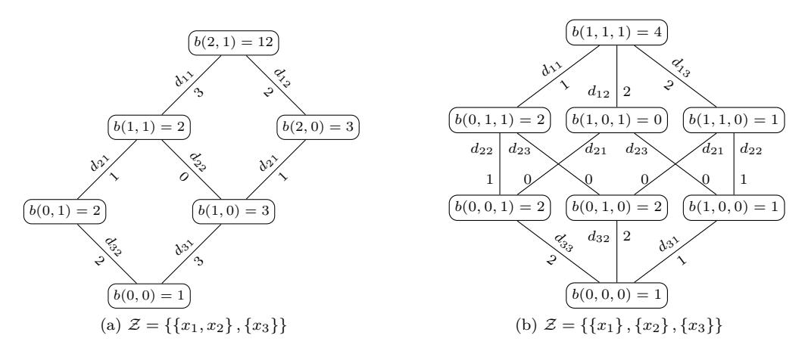

**Figure 9:** Visualization of the steps of the row expansion algorithm.

Recall Theorem 8 (Multihomogeneous Bézout Bound for  $\mathcal{P}_{CICO}$ ). Let  $N \geq r_{\alpha}$ . For  $\alpha \in \{3, 5, 7, 11\}$ , the minimal multihomogeneous Bézout bound for  $\mathcal{P}_{CICO}$  is given by

$$MHB = \tau_{\alpha} \cdot (\alpha + 4)^{N - r_{\alpha}}, \tag{44}$$

where  $\tau_{\alpha} = 2r_{\alpha} \cdot \alpha^{r_{\alpha}-1} \cdot (r_{\alpha}+1)$  for  $\alpha \in \{3,5,7\}$  and  $\tau_{\alpha} = (\alpha+4)^{r_{\alpha}}$  for  $\alpha = 11$ .

| <b>Table 11:</b> "Optimal" variable set partition for $\mathcal{P}_{CICO}$ minimizing the multihomogene | ous         |
|---------------------------------------------------------------------------------------------------------|-------------|
| Bézout bound. Derived using the heuristic approach described in Section 3.2.                            | $\Gamma$ he |
| exhaustive search was performed for up to 8 rounds.                                                     |             |

| $\alpha$ | $r_{\alpha}$ | Optimal partition for $1 \le N < r_{\alpha}$                                                   | Optimal partition for $N \geq r_{\alpha}$                                                      |
|----------|--------------|------------------------------------------------------------------------------------------------|------------------------------------------------------------------------------------------------|
| 3        | 2            | $\{\{y_0, s_1\}\}$                                                                             | $\{\{y_0, s_1, \dots, s_{r_{\alpha}}\}, \{s_{r_{\alpha}+1}\}, \dots, \{s_N\}\}$                |
| 5        | 3            | $\{\{y_0\}, \{s_1\}\}, \text{ but } \{\{y_0, s_1, s_2\}\}$                                     | $\{\{y_0, s_1, \dots, s_{r_\alpha}\}, \{s_{r_\alpha+1}\}, \dots, \{s_N\}\}$                    |
| 7        | 4            | $\left\{ \left\{ y_{0}\right\} ,\left\{ s_{1}\right\} ,\ldots ,\left\{ s_{N}\right\} \right\}$ | $\{\{y_0, s_1, \dots, s_{r_\alpha}\}, \{s_{r_\alpha+1}\}, \dots, \{s_N\}\}$                    |
| 11       | 6            | $\left\{ \left\{ y_{0}\right\} ,\left\{ s_{1}\right\} ,\ldots ,\left\{ s_{N}\right\} \right\}$ | $\left\{ \left\{ y_{0}\right\} ,\left\{ s_{1}\right\} ,\ldots ,\left\{ s_{N}\right\} \right\}$ |

Proof. We prove Theorem 8 for  $\alpha \in \{3,5,7\}$  by induction using the idea of the Row Expansion Algorithm. Concrete degree matrices for a small number of rounds for  $\alpha = 11$  are given in Table 12, which demonstrate that the proof, in this case, follows immediately. Let  $\alpha \in \{3,5,7\}$  and  $N \geq r_{\alpha}$ . We consider the partition of the variable set  $X = \{y_0,s_1,\ldots,s_N\}$  into  $m=n_v-r_{\alpha}=N+1-r_{\alpha}$  sets. In particular, we group the input variables  $y_0$  and the first  $r_{\alpha}$  state variables  $s_1,\ldots,s_{r_{\alpha}}$ . The remaining variables form individual groups of size one each:

$$\mathcal{Z} = \{\{y_0, s_1, \dots, s_{r_\alpha}\}, \{s_{r_\alpha+1}\}, \dots, \{s_N\}\} = \{X_1, \dots, X_m\}.$$

See also Table 11. The degree matrix  $D_{\alpha}^{(N)} \in \mathbb{Z}_{\geq 0}^{(N+1)\times(N+1-r_{\alpha})}$  is given by

$$D_{\alpha}^{(N)} = \begin{bmatrix} x_1 & x_2 & \cdots & x_m \\ \vdots & & & & \\ \vdots & & & & \\ \vdots & & & & \\ p_{r_{\alpha}} & & & & \\ p_{r_{\alpha}+1} & & & \\ \vdots & & & & \\ p_N & & & & \\ p_N & & & & \\ x_{N+1} & & & & \\ \hline \end{bmatrix}_{r_{\alpha}+1}^{X_1} \begin{bmatrix} x_2 & \cdots & x_m \\ \alpha & & & & \\ \vdots & & & & \\ 2r_{\alpha} & & & & \\ 2r_{\alpha} & & & & \\ & & & & & \\ 2r_{\alpha} & & & & \\ & & & & \\ 2r_{\alpha} & & & & \\ & & & & \\ & & & & \\ & & & &$$

with  $A_{\alpha}^{(N)} \in \mathbb{Z}_{\geq 0}^{(N-r_{\alpha})\times(N-r_{\alpha})}$ . By Theorem 2, the multihomogeneous Bézout bound with respect to the variable partition  $\mathcal{Z}$  is given by the coefficient of  $t_1^{r_{\alpha}+1} \cdot t_2 \cdots t_m$  in the product of linear forms  $\mathcal{L}(D_{\alpha}^{(N)})$ , where for simplicity we defined

$$\mathcal{L}(D) := \prod_{i=1}^{n} \sum_{j=1}^{m} d_{i,j} t_{j}. \tag{63}$$

As the first  $r_{\alpha}$  rows of  $D_{\alpha}^{(N)}$  each only contains one nonzero entry in the column associated to  $X_1$ ,  $t_1$  will contribute to  $\mathcal{L}(D_{\alpha}^{(N)})$  via these rows with exponent  $r_{\alpha}$  and coefficient  $\alpha^{r_{\alpha}-1} \cdot 2r_{\alpha}$ . Removing these rows from  $D_{\alpha}^{(N)}$ , the exponent of  $t_1$  in  $\mathcal{L}(D_{\alpha}^{(N)})$  has to be lowered by  $r_{\alpha}$ . Let  $\tilde{D}_{\alpha}^{(N)} \in \mathbb{Z}_{\geq 0}^{(N-r_{\alpha}+1)\times(N-r_{\alpha}+1)} = \mathbb{Z}_{\geq 0}^{m\times m}$  denote the modified degree matrix, where the first  $r_{\alpha}$  rows of  $D_{\alpha}^{(N)}$  were removed, that is,

$$\tilde{D}_{\alpha}^{(N)} = \begin{bmatrix} \frac{X_1}{2(r_{\alpha}+1)} & X_2 \cdot \cdot \cdot \cdot \cdot X_m \\ \vdots & A_{\alpha}^{(N)} \\ \frac{2(r_{\alpha}+1)}{r_{\alpha}+1} & 2 \cdot \cdot \cdot \cdot \cdot 2 \end{bmatrix} = \begin{bmatrix} \frac{X_1}{2(r_{\alpha}+1)} & X_2 \cdot \cdot \cdot \cdot \cdot X_{m-1} & X_m \\ 2(r_{\alpha}+1) & \alpha & 0 \cdot \cdot \cdot \cdot & 0 & 0 \\ \vdots & 4 \cdot \cdot \cdot \cdot \cdot & \vdots & \vdots \\ 2(r_{\alpha}+1) & 4 \cdot \cdot \cdot & 4 & \alpha & 0 \\ 2(r_{\alpha}+1) & 4 \cdot \cdot \cdot & 4 & 4 & \alpha \\ r_{\alpha}+1 & 2 \cdot \cdot \cdot & 2 & 2 & 2 \end{bmatrix}.$$

Then

$$\left[t_1^{r_{\alpha}+1} \cdot t_2 \cdots t_m\right] \mathcal{L}(D_{\alpha}^{(N)}) = 2r_{\alpha} \cdot \alpha^{r_{\alpha}-1} \cdot \left[t_1 \cdot t_2 \cdots t_m\right] \mathcal{L}(\tilde{D}_{\alpha}^{(N)}). \tag{64}$$

For  $N = r_{\alpha}$ , that is, m = 1,  $\mathcal{L}(\tilde{D}_{\alpha}^{(N)}) = (r_{\alpha} + 1) \cdot t_1$ , and thus

$$\left[t_1^{r_{\alpha}+1} \cdot t_2 \cdots t_m\right] \mathcal{L}(D_{\alpha}^{(N)}) = 2r_{\alpha} \cdot \alpha^{r_{\alpha}-1} \cdot (r_{\alpha}+1). \tag{65}$$

Let  $N > r_{\alpha}$ . There are only two ways in which  $t_m$  can enter the product  $\mathcal{L}(\tilde{D}_{\alpha}^{(N)})$ . Either via the second last row (with coefficient  $\alpha$ ) or the last row (with coefficient 2). It is easy to see that

$$[t_1 \cdot t_2 \cdots t_m] \ \mathcal{L}(\tilde{D}_{\alpha}^{(N)}) = \alpha \cdot [t_1 \cdot t_2 \cdots t_{m-1}] \ \mathcal{L}(\tilde{D}_{\alpha}^{(N-1)}) + 2 \cdot [t_1 \cdot t_2 \cdots t_{m-1}] \ \mathcal{L}(B_{\alpha}^{(N)}),$$

$$(66)$$

where  $B_{\alpha}^{(N)} \in \mathbb{Z}_{\geq 0}^{(N-r_{\alpha})\times(N-r_{\alpha})} = \mathbb{Z}_{\geq 0}^{(m-1)\times(m-1)}$  always takes a form similar to a lower triangular matrix, where the first diagonal (the one above the main diagonal) is filled with  $\alpha$ . That is,

$$B_{\alpha}^{(N)} = \begin{bmatrix} 2(r_{\alpha}+1) & \alpha & 0 & \cdots & 0 \\ 2(r_{\alpha}+1) & 4 & \cdots & \vdots & \vdots \\ \vdots & \vdots & \ddots & \ddots & \vdots \\ \vdots & \vdots & \ddots & \ddots & \vdots \\ 2(r_{\alpha}+1) & 4 & \cdots & 4 \end{bmatrix} = \begin{bmatrix} X_1 & X_2 & \cdots & X_{m-1} \\ X_1 & X_2 & \cdots & X_{m-1} \\ \vdots & \vdots & \vdots & \vdots & \vdots \\ 2(r_{\alpha}+1) & \vdots & \vdots & \vdots & \vdots \\ 2(r_{\alpha}+1) & \vdots & \vdots & \vdots & \vdots \\ 2(r_{\alpha}+1) & \vdots & \vdots & \vdots & \vdots \\ 2(r_{\alpha}+1) & \vdots & \vdots & \vdots & \vdots \\ 2(r_{\alpha}+1) & \vdots & \vdots & \vdots & \vdots \\ 2(r_{\alpha}+1) & \vdots & \vdots & \vdots & \vdots \\ 2(r_{\alpha}+1) & \vdots & \vdots & \vdots & \vdots \\ 2(r_{\alpha}+1) & \vdots & \vdots & \vdots & \vdots \\ 2(r_{\alpha}+1) & \vdots & \vdots & \vdots & \vdots \\ 2(r_{\alpha}+1) & \vdots & \vdots & \vdots & \vdots \\ 2(r_{\alpha}+1) & \vdots & \vdots & \vdots & \vdots \\ 2(r_{\alpha}+1) & \vdots & \vdots & \vdots & \vdots \\ 2(r_{\alpha}+1) & \vdots & \vdots & \vdots & \vdots \\ 2(r_{\alpha}+1) & \vdots & \vdots & \vdots & \vdots \\ 2(r_{\alpha}+1) & \vdots & \vdots & \vdots & \vdots \\ 2(r_{\alpha}+1) & \vdots & \vdots & \vdots & \vdots \\ 2(r_{\alpha}+1) & \vdots & \vdots & \vdots & \vdots \\ 2(r_{\alpha}+1) & \vdots & \vdots & \vdots & \vdots \\ 2(r_{\alpha}+1) & \vdots & \vdots & \vdots & \vdots \\ 2(r_{\alpha}+1) & \vdots & \vdots & \vdots & \vdots \\ 2(r_{\alpha}+1) & \vdots & \vdots & \vdots & \vdots \\ 2(r_{\alpha}+1) & \vdots & \vdots & \vdots & \vdots \\ 2(r_{\alpha}+1) & \vdots & \vdots & \vdots & \vdots \\ 2(r_{\alpha}+1) & \vdots & \vdots & \vdots & \vdots \\ 2(r_{\alpha}+1) & \vdots & \vdots & \vdots & \vdots \\ 2(r_{\alpha}+1) & \vdots & \vdots & \vdots & \vdots \\ 2(r_{\alpha}+1) & \vdots & \vdots & \vdots & \vdots \\ 2(r_{\alpha}+1) & \vdots & \vdots & \vdots \\ 2(r_{\alpha}+1) & \vdots & \vdots & \vdots \\ 2(r_{\alpha}+1) & \vdots & \vdots & \vdots \\ 2(r_{\alpha}+1) & \vdots & \vdots & \vdots \\ 2(r_{\alpha}+1) & \vdots & \vdots & \vdots \\ 2(r_{\alpha}+1) & \vdots & \vdots & \vdots \\ 2(r_{\alpha}+1) & \vdots & \vdots & \vdots \\ 2(r_{\alpha}+1) & \vdots & \vdots & \vdots \\ 2(r_{\alpha}+1) & \vdots & \vdots & \vdots \\ 2(r_{\alpha}+1) & \vdots & \vdots & \vdots \\ 2(r_{\alpha}+1) & \vdots & \vdots & \vdots \\ 2(r_{\alpha}+1) & \vdots & \vdots & \vdots \\ 2(r_{\alpha}+1) & \vdots & \vdots & \vdots \\ 2(r_{\alpha}+1) & \vdots & \vdots & \vdots \\ 2(r_{\alpha}+1) & \vdots & \vdots & \vdots \\ 2(r_{\alpha}+1) & \vdots & \vdots & \vdots \\ 2(r_{\alpha}+1) & \vdots & \vdots & \vdots \\ 2(r_{\alpha}+1) & \vdots & \vdots & \vdots \\ 2(r_{\alpha}+1) & \vdots & \vdots & \vdots \\ 2(r_{\alpha}+1) & \vdots & \vdots & \vdots \\ 2(r_{\alpha}+1) & \vdots & \vdots & \vdots \\ 2(r_{\alpha}+1) & \vdots & \vdots & \vdots \\ 2(r_{\alpha}+1) & \vdots & \vdots & \vdots \\ 2(r_{\alpha}+1) & \vdots & \vdots & \vdots \\ 2(r_{\alpha}+1) & \vdots & \vdots & \vdots \\ 2(r_{\alpha}+1) & \vdots & \vdots & \vdots \\ 2(r_{\alpha}+1) & \vdots & \vdots & \vdots \\ 2(r_{\alpha}+1) & \vdots & \vdots & \vdots \\ 2(r_{\alpha}+1) & \vdots & \vdots & \vdots \\ 2(r_{\alpha}+1) & \vdots & \vdots & \vdots \\ 2(r_{\alpha}+1) & \vdots & \vdots & \vdots \\ 2(r_{\alpha}+1) & \vdots & \vdots & \vdots \\ 2(r_{\alpha}+1) & \vdots & \vdots & \vdots \\ 2(r_{\alpha}+1) & \vdots & \vdots & \vdots \\ 2(r_{\alpha}+1) & \vdots & \vdots & \vdots \\ 2(r_{\alpha}+1) & \vdots & \vdots & \vdots \\ 2(r_{\alpha}+1) & \vdots & \vdots & \vdots \\ 2(r_{\alpha}+1) & \vdots & \vdots & \vdots \\ 2(r_{\alpha}+1) & \vdots & \vdots & \vdots \\ 2(r_{\alpha}+1) & \vdots & \vdots & \vdots \\ 2(r_{\alpha}+1) & \vdots & \vdots & \vdots \\ 2(r_{\alpha}+1) & \vdots & \vdots &$$

We will prove by induction over N (and thus implicitly m) that for  $N > r_{\alpha}$ 

(A) 
$$[t_1 \cdot t_2 \cdots t_{m-1}]$$
  $\mathcal{L}(B_{\alpha}^{(N)}) = 2(r_{\alpha} + 1) \cdot (\alpha + 4)^{N - r_{\alpha} - 1}$ , and

(B) 
$$[t_1 \cdot t_2 \cdots t_m] \mathcal{L}(\tilde{D}_{\alpha}^{(N)}) = (r_{\alpha} + 1) \cdot (\alpha + 4)^{N - r_{\alpha}}$$

Inserting these results into (64) concludes the proof:

MHB = 
$$\begin{bmatrix} t_1^{r_{\alpha}+1} \cdot t_2 \cdots t_m \end{bmatrix} \mathcal{L}(D_{\alpha}^{(N)}) = 2r_{\alpha} \cdot \alpha^{r_{\alpha}-1} \cdot [t_1 \cdot t_2 \cdots t_m] \mathcal{L}(\tilde{D}_{\alpha}^{(N)})$$
  
=  $2r_{\alpha} \cdot \alpha^{r_{\alpha}-1} \cdot (r_{\alpha}+1) \cdot (\alpha+4)^{N-r_{\alpha}}$ .

In particular,  $\tau_{\alpha} = 2r_{\alpha} \cdot \alpha^{r_{\alpha}-1} \cdot (r_{\alpha}+1)$ .

Induction proofs:

(A) To show: 
$$[t_1 \cdot t_2 \cdots t_{m-1}] \ \mathcal{L}(B_{\alpha}^{(N)}) = 2(r_{\alpha} + 1) \cdot (\alpha + 4)^{N - r_{\alpha} - 1}$$
, for  $N > r_{\alpha}$ .

• Base case:

- For 
$$N = r_{\alpha} + 1$$
  $(m = 2)$ :

$$[t_1] \mathcal{L}(B_{\alpha}^{(N)}) = [t_1] (2(r_{\alpha} + 1)t_1 + \alpha t_2) = 2(r_{\alpha} + 1)$$
$$= 2(r_{\alpha} + 1) \cdot (\alpha + 4)^0 = 2(r_{\alpha} + 1) \cdot (\alpha + 4)^{N - r_{\alpha} - 1}.$$

- For 
$$N = r_{\alpha} + 2$$
  $(m = 3)$ :

$$[t_1 \cdot t_2] \ \mathcal{L}(B_{\alpha}^{(N)}) = [t_1 \cdot t_2] (2(r_{\alpha} + 1)t_1 + \alpha t_2) \cdot (2(r_{\alpha} + 1)t_1 + 4t_2)$$
$$= 2(r_{\alpha} + 1) \cdot (\alpha + 4)^1 = 2(r_{\alpha} + 1) \cdot (\alpha + 4)^{N - r_{\alpha} - 1}.$$

$$[t_1 \cdots t_{m-2}] \ \mathcal{L}(B_{\alpha}^{(N-1)}) = 2(r_{\alpha}+1) \cdot (\alpha+4)^{(N-1)-r_{\alpha}-1}.$$

• Induction step:  $(N-1 \to N)$ . Given  $B_{\alpha}^{(N)}$ , the last column, associated with  $X_{m-1}$ , contains only two nonzero entries in the last two rows. Removing one of those rows and the last column from  $B_{\alpha}^{(N)}$  results in  $B_{\alpha}^{(N-1)}$ . Thus:

$$[t_1 \cdots t_{m-1}] \ \mathcal{L}(B_{\alpha}^{(N)})$$

$$= \alpha \cdot [t_1 \cdots t_{m-2}] \ \mathcal{L}(B_{\alpha}^{(N-1)}) + 4 \cdot [t_1 \cdots t_{m-2}] \ \mathcal{L}(B_{\alpha}^{(N-1)})$$

$$= (\alpha + 4) \cdot [t_1 \cdots t_{m-2}] \ \mathcal{L}(B_{\alpha}^{(N-1)}) = 2(r_{\alpha} + 1) \cdot (\alpha + 4)^{N - r_{\alpha} - 1}.$$

- (B) To show:  $[t_1 \cdot t_2 \cdots t_m] \mathcal{L}(\tilde{D}_{\alpha}^{(N)}) = (r_{\alpha} + 1) \cdot (\alpha + 4)^{N-r_{\alpha}}$ , for  $N > r_{\alpha}$ .
  - Base case: For  $N = r_{\alpha} + 1$  (m = 2):

$$[t_1 \cdot t_2] \ \mathcal{L}(\tilde{D}_{\alpha}^{(N)}) = [t_1 \cdot t_2] \ (2(r_{\alpha} + 1)t_1 + \alpha t_2) \cdot ((r_{\alpha} + 1)t_1 + 2t_2)$$
$$= (r_{\alpha} + 1) \cdot (\alpha + 4)^1 = (r_{\alpha} + 1) \cdot (\alpha + 4)^{N - r_{\alpha}}.$$

• Induction hypothesis: Assume that

$$[t_1 \cdot t_2 \cdots t_{m-1}] \ \mathcal{L}(\tilde{D}_{\alpha}^{(N-1)}) = (r_{\alpha} + 1) \cdot (\alpha + 4)^{N-r_{\alpha}-1}.$$

• Induction step:  $(N-1 \to N)$ . Combining (66) and the previous result for  $[t_1 \cdots t_{m-1}] \mathcal{L}(B_{\alpha}^{(N)})$  yields:

$$[t_{1} \cdot t_{2} \cdots t_{m}] \ \mathcal{L}(\tilde{D}_{\alpha}^{(N)})$$

$$= \alpha \cdot [t_{1} \cdot t_{2} \cdots t_{m-1}] \ \mathcal{L}(\tilde{D}_{\alpha}^{(N-1)}) + 2 \cdot [t_{1} \cdot t_{2} \cdots t_{m-1}] \ \mathcal{L}(B_{\alpha}^{(N)})$$

$$= \alpha \cdot (r_{\alpha} + 1) \cdot (\alpha + 4)^{N - r_{\alpha} - 1} + 2 \cdot 2(r_{\alpha} + 1) \cdot (\alpha + 4)^{N - r_{\alpha} - 1}$$

$$= (r_{\alpha} + 1) \cdot (\alpha + 4)^{N - r_{\alpha}}.$$

**Table 12:** Degree matrices  $D_{\alpha}^{(N)}$  for  $N \geq 1$  and  $\alpha = 11$  with respect to the variable set partition  $\{\{y_0\}, \{s_1\}, \dots, \{s_N\}\}$ .

$$D_{11}^{(1)} = \begin{bmatrix} 2 & 11 \\ \hline 1 & 2 \end{bmatrix} \qquad D_{11}^{(2)} = \begin{bmatrix} 2 & 11 & 0 \\ 2 & 4 & 11 \\ \hline 1 & 2 & 2 \end{bmatrix} \qquad D_{11}^{(3)} = \begin{bmatrix} 2 & 11 & 0 & 0 \\ 2 & 4 & 11 & 0 \\ 2 & 4 & 4 & 11 \\ \hline 1 & 2 & 2 & 2 \end{bmatrix}$$

# **C Experimental Results over** F*p*

# **C.1 Concrete Results for** *p* **= 232 − 209**

**Table 13:** Gröbner basis attack on Anemoi : F *p* → F *p* for *p* = 232 − 209 and variable ordering *o*1. CGB, CFGLM, and CFAC are derived using *d*reg, *d*I, and *d*uni from the experiments, for *ω* = 2. Timing results are reported in seconds, and complexities are given in bits. The number of solutions in *V* (I) is counted with multiplicities over F*p*.

|    |   |      | Gröbner Basis |      |     | Basis Conversion |      |       |      | Factorization |      |        |
|----|---|------|---------------|------|-----|------------------|------|-------|------|---------------|------|--------|
| α  | N | dmax | TGB           | dreg | CGB | TFGLM            | dI   | CFGLM | TFAC | duni          | CFAC | #V (I) |
| 3  | 1 | 3    | 0.01          | 4    | 4   | 0.0              | 5    | 5     | 0.0  | 5             | 4    | 0      |
|    | 2 | 3    | 0.0           | 7    | 14  | 0.01             | 25   | 11    | 0.0  | 25            | 8    | 1      |
|    | 3 | 3    | 0.02          | 8    | 21  | 0.39             | 125  | 16    | 0.01 | 125           | 12   | 0      |
|    | 4 | 3    | 0.44          | 10   | 29  | 63.23            | 625  | 21    | 0.11 | 625           | 16   | 0      |
|    | 5 | 3    | 6.05          | 12   | 37  |                  |      |       |      |               |      |        |
| 5  | 1 | 5    | 0.0           | 6    | 5   | 0.0              | 7    | 6     | 0.0  | 7             | 5    | 1      |
|    | 2 | 5    | 0.01          | 10   | 16  | 0.02             | 49   | 13    | 0.0  | 49            | 10   | 1      |
|    | 3 | 5    | 1.16          | 12   | 25  | 5.08             | 343  | 19    | 0.05 | 343           | 15   | 0      |
|    | 4 | 5    | 642.9         | 15   | 35  | 4133.44          | 2401 | 25    | 0.86 | 2401          | 20   | 1      |
|    | 5 | 5    | 177302.95     | 17   | 43  |                  |      |       |      |               |      |        |
| 7  | 1 | 7    | 0.0           | 8    | 5   | 0.0              | 9    | 7     | 0.0  | 9             | 5    | 1      |
|    | 2 | 7    | 0.02          | 14   | 19  | 0.03             | 81   | 14    | 0.01 | 81            | 11   | 2      |
|    | 3 | 7    | 11.73         | 16   | 28  | 52.73            | 729  | 21    | 0.17 | 729           | 17   | 1      |
|    | 4 | 7    | 21744.06      | 21   | 40  |                  |      |       |      |               |      |        |
| 11 | 1 | 11   | 0.0           | 12   | 6   | 0.0              | 13   | 8     | 0.0  | 13            | 6    | 0      |
|    | 2 | 11   | 0.26          | 21   | 22  | 0.54             | 169  | 16    | 0.02 | 169           | 13   | 0      |
|    | 3 | 11   | 1259.68       | 25   | 34  | 1548.67          | 2197 | 24    | 0.66 | 2197          | 20   | 1      |

(a) FCICO.

|    |   |      | Gröbner Basis |      |     | Basis Conversion |      |       |      | Factorization |      |        |
|----|---|------|---------------|------|-----|------------------|------|-------|------|---------------|------|--------|
| α  | N | dmax | TGB           | dreg | CGB | TFGLM            | dI   | CFGLM | TFAC | duni          | CFAC | #V (I) |
| 3  | 1 | 3    | 0.0           | 4    | 5   | 0.01             | 5    | 5     | 0.0  | 5             | 4    | 0      |
|    | 2 | 4    | 0.0           | 7    | 11  | 0.01             | 25   | 10    | 0.0  | 25            | 8    | 1      |
|    | 3 | 6    | 0.01          | 10   | 17  | 0.3              | 125  | 15    | 0.01 | 125           | 12   | 0      |
|    | 4 | 8    | 0.16          | 12   | 22  | 50.29            | 625  | 20    | 0.11 | 625           | 16   | 0      |
|    | 5 | 10   | 3.58          | 16   | 29  |                  |      |       |      |               |      |        |
| 5  | 1 | 5    | 0.0           | 6    | 6   | 0.0              | 7    | 6     | 0.0  | 7             | 5    | 1      |
|    | 2 | 5    | 0.0           | 10   | 13  | 0.02             | 49   | 12    | 0.01 | 49            | 10   | 1      |
|    | 3 | 6    | 0.16          | 13   | 19  | 6.71             | 343  | 18    | 0.05 | 343           | 15   | 0      |
|    | 4 | 8    | 13.07         | 17   | 26  | 7921.89          | 2401 | 24    | 0.8  | 2401          | 20   | 1      |
|    | 5 | 10   | 1699.0        | 22   | 34  |                  |      |       |      |               |      |        |
|    | 6 | 12   | 76321.32      | 27   | 42  |                  |      |       |      |               |      |        |
| 7  | 1 | 7    | 0.0           | 8    | 7   | 0.0              | 9    | 7     | 0.0  | 9             | 5    | 1      |
|    | 2 | 7    | 0.01          | 13   | 15  | 0.06             | 81   | 14    | 0.0  | 81            | 11   | 2      |
|    | 3 | 7    | 3.04          | 17   | 22  | 53.64            | 729  | 21    | 0.14 | 729           | 17   | 1      |
|    | 4 | 8    | 3608.92       | 24   | 30  |                  |      |       |      |               |      |        |
| 11 | 1 | 11   | 0.0           | 12   | 9   | 0.0              | 13   | 8     | 0.01 | 13            | 6    | 0      |
|    | 2 | 11   | 0.1           | 21   | 18  | 0.44             | 169  | 16    | 0.02 | 169           | 13   | 0      |
|    | 3 | 11   | 223.86        | 24   | 25  | 1313.71          | 2197 | 24    | 0.63 | 2197          | 20   | 1      |

(b) PCICO.

# **C.2 Concrete Results for** *p* **= 264 − 353**

**Table 14:** Gröbner basis attack on Anemoi : F *p* → F *p* for *p* = 264 − 353 and variable ordering *o*1. CGB, CFGLM, and CFAC are derived using *d*reg, *d*I, and *d*uni from the experiments, for *ω* = 2. Timing results are reported in seconds, and complexities are given in bits. The number of solutions in *V* (I) is counted with multiplicities over F*p*.

|    |   |      | Gröbner Basis |      |     | Basis Conversion |      |       | Factorization |      |      |        |
|----|---|------|---------------|------|-----|------------------|------|-------|---------------|------|------|--------|
| α  | N | dmax | TDRL          | dreg | CGB | TFGLM            | dI   | CFGLM | TFAC          | duni | CFAC | #V (I) |
| 3  | 1 | 3    | 0.0           | 4    | 4   | 0.0              | 5    | 5     | 0.0           | 5    | 4    | 2      |
|    | 2 | 3    | 0.0           | 7    | 14  | 0.0              | 25   | 11    | 0.01          | 25   | 8    | 1      |
|    | 3 | 3    | 0.02          | 8    | 21  | 0.2              | 125  | 16    | 0.02          | 125  | 12   | 0      |
|    | 4 | 3    | 0.28          | 10   | 29  | 67.77            | 625  | 21    | 0.26          | 625  | 16   | 1      |
|    | 5 | 3    | 9.32          | 12   | 37  | 22057.09         | 3125 | 26    | 2.36          | 3125 | 21   | 1      |
|    | 6 | 3    | 132.52        | 14   | 45  |                  |      |       |               |      |      |        |
|    | 7 | 3    | 1623.26       | 16   | 53  |                  |      |       |               |      |      |        |
|    | 8 | 3    | 18215.16      | 18   | 61  |                  |      |       |               |      |      |        |
| 5  | 1 | 5    | 0.0           | 6    | 5   | 0.0              | 7    | 6     | 0.0           | 7    | 5    | 2      |
|    | 2 | 5    | 0.0           | 10   | 16  | 0.01             | 49   | 13    | 0.02          | 49   | 10   | 2      |
|    | 3 | 5    | 1.37          | 12   | 25  | 6.5              | 343  | 19    | 0.12          | 343  | 15   | 2      |
|    | 4 | 5    | 756.48        | 15   | 35  | 3770.7           | 2401 | 25    | 1.81          | 2401 | 20   | 1      |
|    | 5 | 5    | 185056.75     | 17   | 43  |                  |      |       |               |      |      |        |
| 7  | 1 | 7    | 0.0           | 8    | 5   | 0.0              | 9    | 7     | 0.0           | 9    | 5    | 1      |
|    | 2 | 7    | 0.02          | 14   | 19  | 0.05             | 81   | 14    | 0.0           | 81   | 11   | 1      |
|    | 3 | 7    | 19.59         | 16   | 28  | 52.32            | 729  | 21    | 0.34          | 729  | 17   | 2      |
|    | 4 | 7    | 21902.11      | 21   | 40  |                  |      |       |               |      |      |        |
| 11 | 1 | 11   | 0.0           | 12   | 6   | 0.0              | 13   | 8     | 0.0           | 13   | 6    | 2      |
|    | 2 | 11   | 0.3           | 21   | 22  | 0.65             | 169  | 16    | 0.04          | 169  | 13   | 1      |
|    | 3 | 11   | 1451.42       | 25   | 34  | 1389.87          | 2197 | 24    | 1.53          | 2197 | 20   | 1      |

(a) FCICO.

|    |   |      | Gröbner Basis |      |     | Basis Conversion | Factorization |       |      |      |      |        |
|----|---|------|---------------|------|-----|------------------|---------------|-------|------|------|------|--------|
| α  | N | dmax | TDRL          | dreg | CGB | TFGLM            | dI            | CFGLM | TFAC | duni | CFAC | #V (I) |
| 3  | 1 | 3    | 0.0           | 4    | 5   | 0.0              | 5             | 5     | 0.0  | 5    | 4    | 2      |
|    | 2 | 4    | 0.0           | 7    | 11  | 0.0              | 25            | 10    | 0.01 | 25   | 8    | 1      |
|    | 3 | 6    | 0.01          | 10   | 17  | 0.32             | 125           | 15    | 0.02 | 125  | 12   | 0      |
|    | 4 | 8    | 0.2           | 12   | 22  | 56.44            | 625           | 20    | 0.27 | 625  | 16   | 1      |
|    | 5 | 10   | 5.7           | 16   | 29  | 15569.55         | 3125          | 25    | 2.55 | 3125 | 21   | 1      |
|    | 6 | 12   | 372.2         | 18   | 35  |                  |               |       |      |      |      |        |
|    | 7 | 14   | 26402.41      | 20   | 40  |                  |               |       |      |      |      |        |
| 5  | 1 | 5    | 0.0           | 6    | 6   | 0.0              | 7             | 6     | 0.0  | 7    | 5    | 2      |
|    | 2 | 5    | 0.0           | 10   | 13  | 0.02             | 49            | 12    | 0.02 | 49   | 10   | 2      |
|    | 3 | 6    | 0.19          | 13   | 19  | 8.79             | 343           | 18    | 0.12 | 343  | 15   | 2      |
|    | 4 | 8    | 23.35         | 17   | 26  | 8090.86          | 2401          | 24    | 1.71 | 2401 | 20   | 1      |
|    | 5 | 10   | 1847.36       | 22   | 34  |                  |               |       |      |      |      |        |
|    | 6 | 12   | 81979.26      | 27   | 42  |                  |               |       |      |      |      |        |
| 7  | 1 | 7    | 0.0           | 8    | 7   | 0.0              | 9             | 7     | 0.0  | 9    | 5    | 1      |
|    | 2 | 7    | 0.01          | 13   | 15  | 0.07             | 81            | 14    | 0.01 | 81   | 11   | 1      |
|    | 3 | 7    | 4.21          | 17   | 22  | 56.64            | 729           | 21    | 0.35 | 729  | 17   | 2      |
|    | 4 | 8    | 3809.62       | 24   | 30  |                  |               |       |      |      |      |        |
| 11 | 1 | 11   | 0.0           | 12   | 9   | 0.0              | 13            | 8     | 0.0  | 13   | 6    | 2      |
|    | 2 | 11   | 0.12          | 21   | 18  | 0.52             | 169           | 16    | 0.04 | 169  | 13   | 1      |
|    | 3 | 11   | 261.38        | 24   | 25  | 1168.74          | 2197          | 24    | 1.58 | 2197 | 20   | 1      |

(b) PCICO.

## C.3 The Six Worlds of Gröbner Basis Cryptanalysis

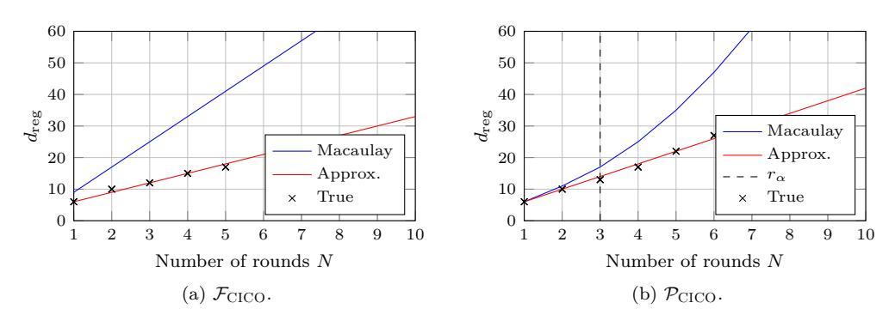

**Figure 10:** Theoretical bounds and experimental conjectures for the degree of regularity  $d_{\text{reg}}$  in Step (1) of a Gröbner basis attack on Anemoi :  $\mathbb{F}_p^2 \to \mathbb{F}_p^2$  with  $\alpha = 5$ . Experimental data points for  $p \in \left\{2^{32} - 209, 2^{64} - 353, \text{BLS12-381}, \text{BN-254}\right\}$ .

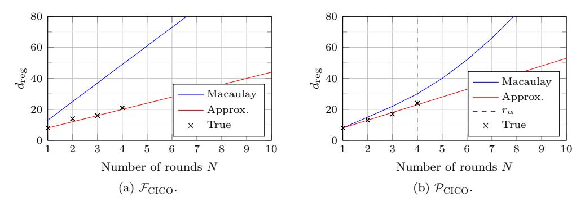

**Figure 11:** Theoretical bounds and experimental conjectures for the degree of regularity  $d_{\text{reg}}$  in Step (1) of a Gröbner basis attack on Anemoi :  $\mathbb{F}_p^2 \to \mathbb{F}_p^2$  with  $\alpha = 7$ . Experimental data points for  $p \in \{2^{32} - 209, 2^{64} - 353, \text{BLS12-381}, \text{BN-254}\}$ .

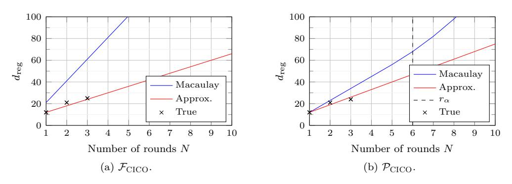

**Figure 12:** Theoretical bounds and experimental conjectures for the degree of regularity  $d_{\text{reg}}$  in Step (1) of a Gröbner basis attack on Anemoi :  $\mathbb{F}_p^2 \to \mathbb{F}_p^2$  with  $\alpha = 11$ . Experimental data points for  $p \in \{2^{32} - 209, 2^{64} - 353, \text{BN-254}\}$ .

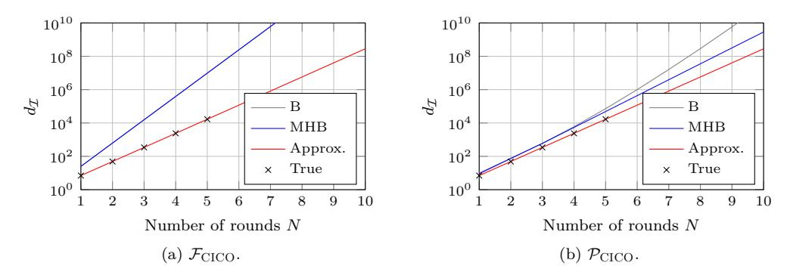

**Figure 13:** Theoretical bounds and experimental conjectures for the quotient space dimension  $d_{\mathcal{I}}$  in Step (2) of a Gröbner basis attack on Anemoi :  $\mathbb{F}_p^2 \to \mathbb{F}_p^2$  with  $\alpha = 5$ . Experimental data points for  $p \in \{2^{32} - 209, 2^{64} - 353, \text{BLS12-381}, \text{BN-254}\}$ .

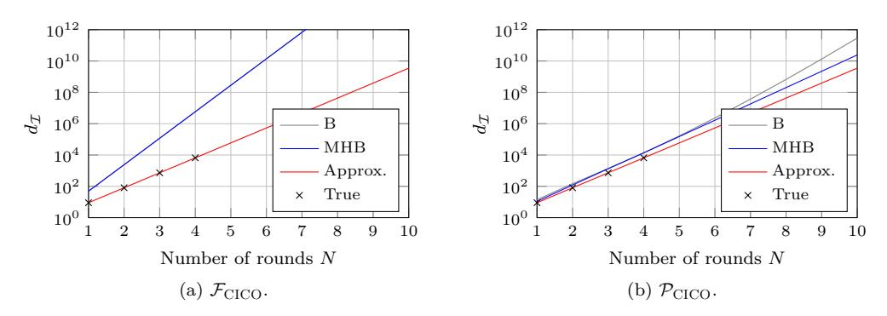

**Figure 14:** Theoretical bounds and experimental conjectures for the quotient space dimension  $d_{\mathcal{I}}$  in Step (2) of a Gröbner basis attack on Anemoi :  $\mathbb{F}_p^2 \to \mathbb{F}_p^2$  with  $\alpha = 7$ . Experimental data points for  $p \in \left\{2^{32} - 209, 2^{64} - 353, \text{BLS12-381}, \text{BN-254}\right\}$ .

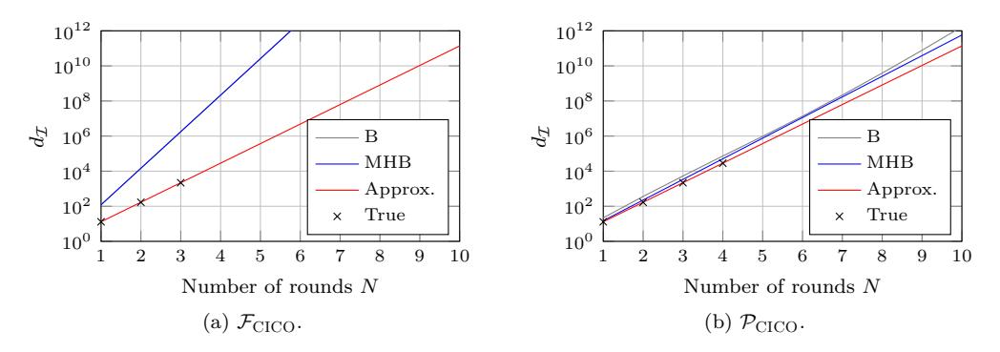

**Figure 15:** Theoretical bounds and experimental conjectures for the quotient space dimension  $d_{\mathcal{I}}$  in Step (2) of a Gröbner basis attack on Anemoi :  $\mathbb{F}_p^2 \to \mathbb{F}_p^2$  with  $\alpha = 11$ . Experimental data points for  $p \in \{2^{32} - 209, 2^{64} - 353, \text{BN-254}\}$ .

## C.4 Security Analysis - Minimum Number of Rounds

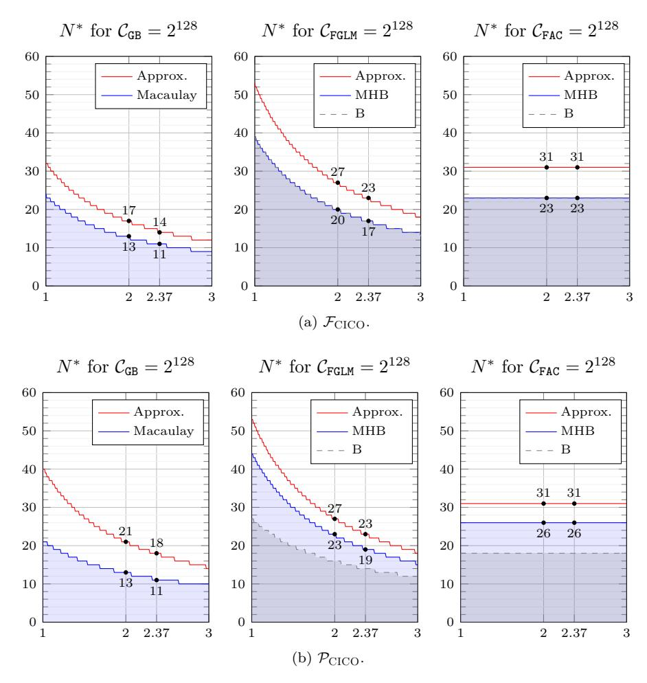

**Figure 16:** The Six Worlds of Gröbner Basis Cryptanalysis: Round numbers derived for the individual steps of a Gröbner basis attack on Anemoi:  $\mathbb{F}_p^2 \to \mathbb{F}_p^2$  with  $\alpha=3$  used in a Sponge construction for different values of  $\omega$ . Target security level of s=128 bits. Theoretical bounds and (experimental) conjectures as given in Section 4.4. Colored areas indicate round numbers proven to be insecure.

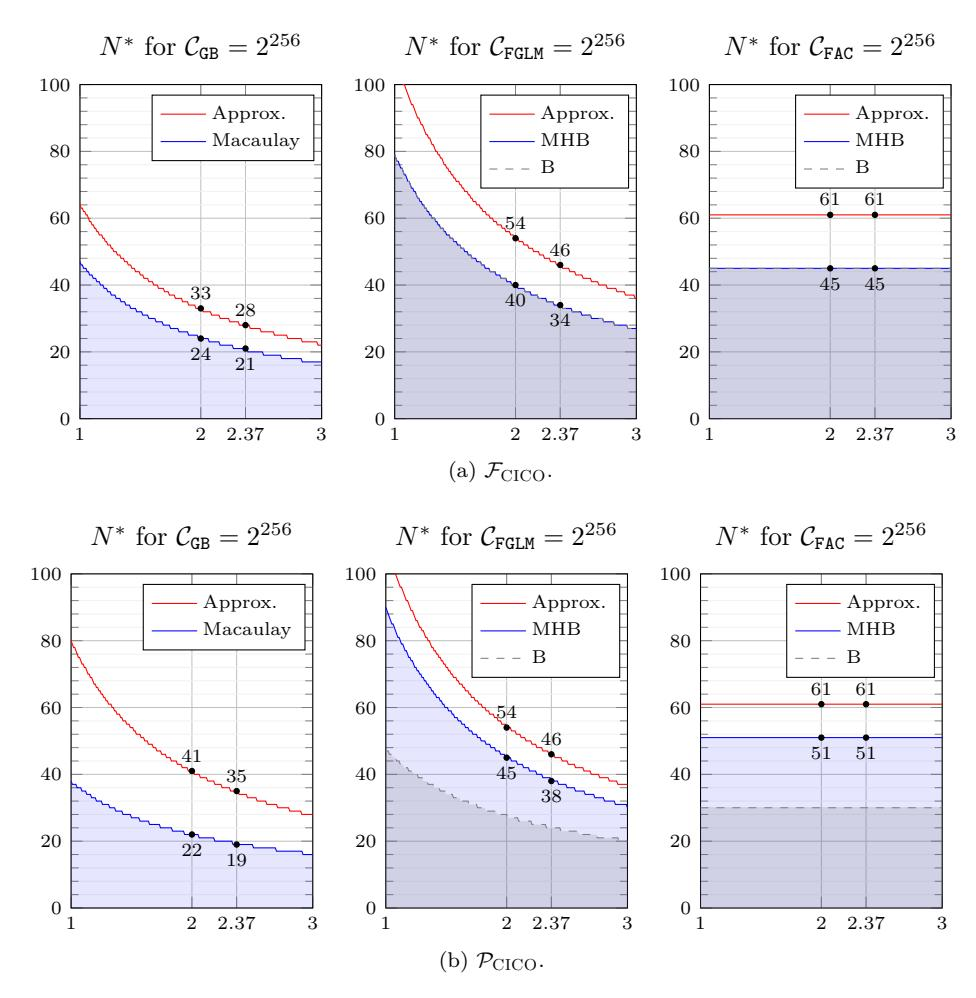

Figure 17: The Six Worlds of Gröbner Basis Cryptanalysis: Round numbers derived for the individual steps of a Gröbner basis attack on Anemoi:  $\mathbb{F}_p^2 \to \mathbb{F}_p^2$  with  $\alpha=3$  used in a Sponge construction for different values of  $\omega$ . Target security level of s=256 bits. Theoretical bounds and (experimental) conjectures as given in Section 4.4. Colored areas indicate round numbers proven to be insecure.

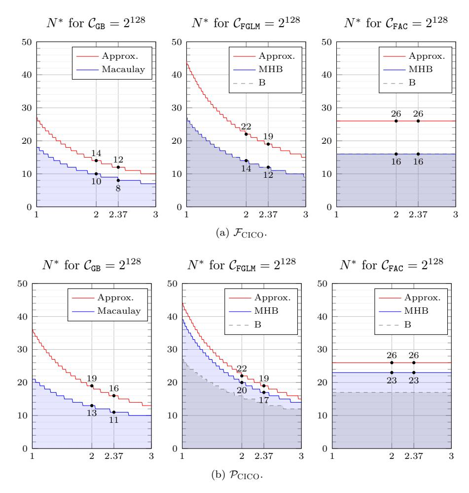

**Figure 18:** The Six Worlds of Gröbner Basis Cryptanalysis: Round numbers derived for the individual steps of a Gröbner basis attack on Anemoi:  $\mathbb{F}_p^2 \to \mathbb{F}_p^2$  with  $\alpha = 5$  used in a Sponge construction for different values of  $\omega$ . Target security level of s = 128 bits. Theoretical bounds and (experimental) conjectures as given in Section 4.4. Colored areas indicate round numbers proven to be insecure.

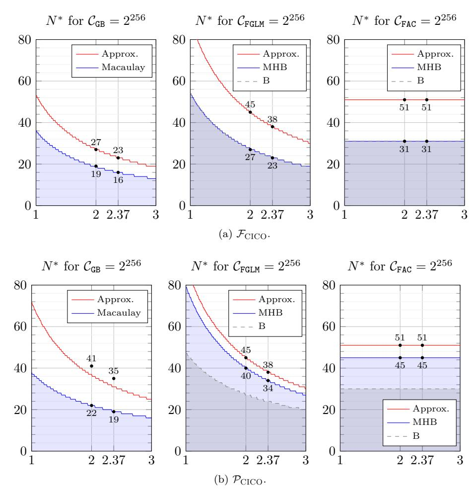

**Figure 19:** The Six Worlds of Gröbner Basis Cryptanalysis: Round numbers derived for the individual steps of a Gröbner basis attack on Anemoi:  $\mathbb{F}_p^2 \to \mathbb{F}_p^2$  with  $\alpha=5$  used in a Sponge construction for different values of  $\omega$ . Target security level of s=256 bits. Theoretical bounds and (experimental) conjectures as given in Section 4.4. Colored areas indicate round numbers proven to be insecure.

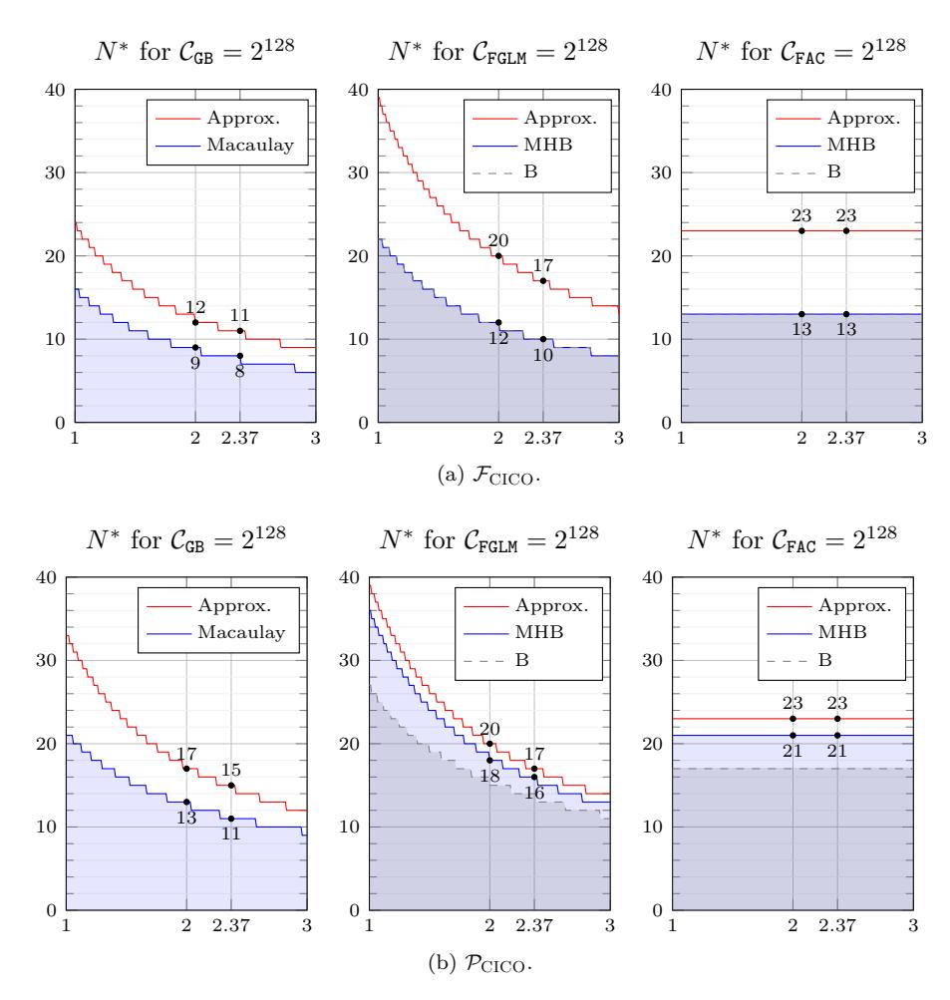

**Figure 20:** The Six Worlds of Gröbner Basis Cryptanalysis: Round numbers derived for the individual steps of a Gröbner basis attack on Anemoi:  $\mathbb{F}_p^2 \to \mathbb{F}_p^2$  with  $\alpha = 7$  used in a Sponge construction for different values of  $\omega$ . Target security level of s = 128 bits. Theoretical bounds and (experimental) conjectures as given in Section 4.4. Colored areas indicate round numbers proven to be insecure.

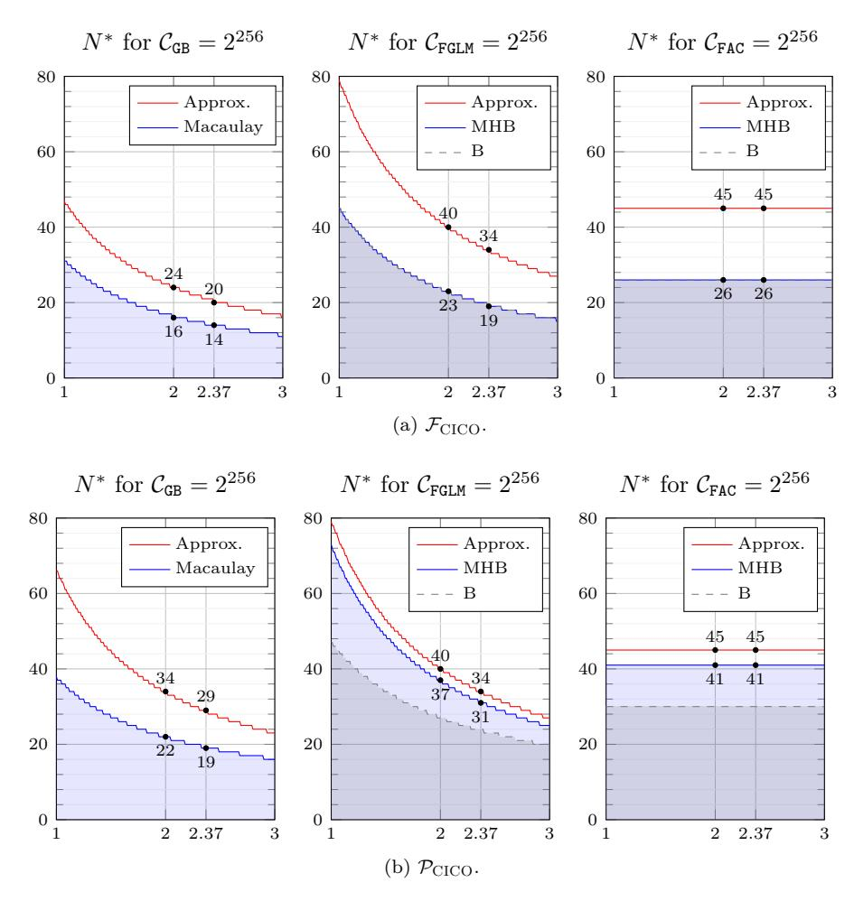

**Figure 21:** The Six Worlds of Gröbner Basis Cryptanalysis: Round numbers derived for the individual steps of a Gröbner basis attack on Anemoi:  $\mathbb{F}_p^2 \to \mathbb{F}_p^2$  with  $\alpha = 7$  used in a Sponge construction for different values of  $\omega$ . Target security level of s = 256 bits. Theoretical bounds and (experimental) conjectures as given in Section 4.4. Colored areas indicate round numbers proven to be insecure.

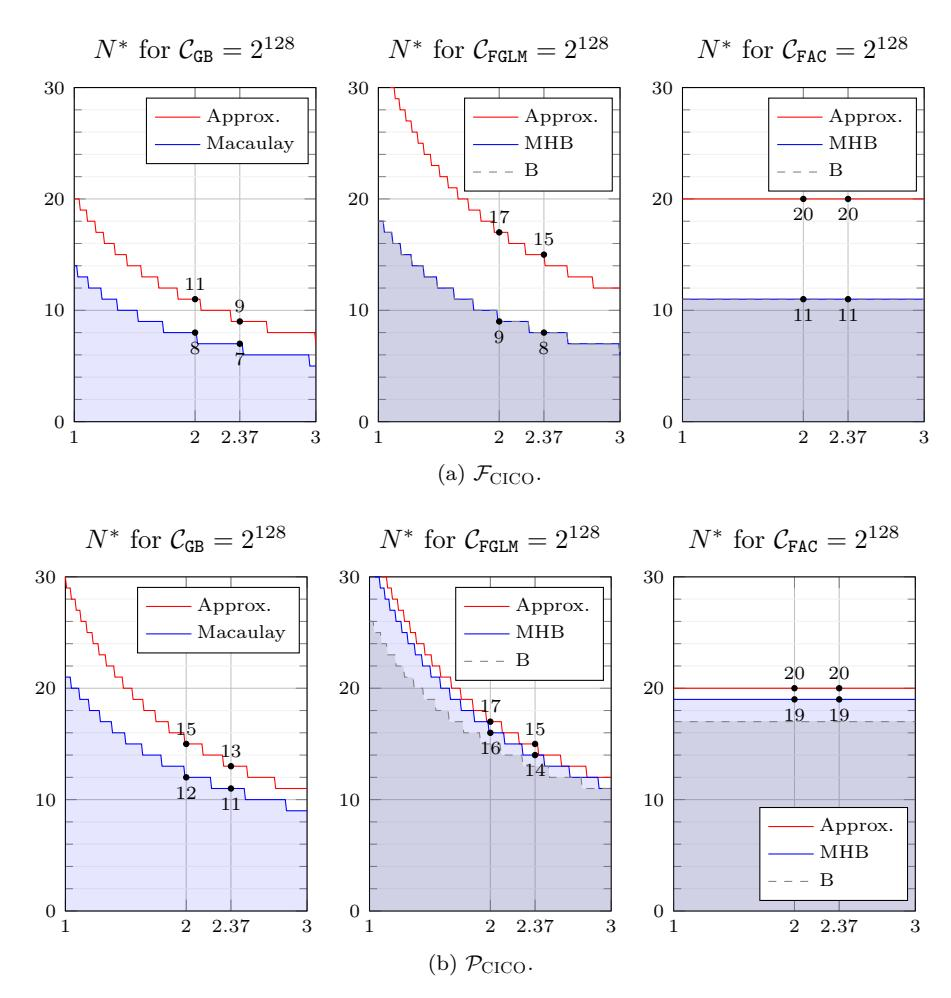

**Figure 22:** The Six Worlds of Gröbner Basis Cryptanalysis: Round numbers derived for the individual steps of a Gröbner basis attack on Anemoi :  $\mathbb{F}_p^2 \to \mathbb{F}_p^2$  with  $\alpha = 11$  used in a Sponge construction for different values of  $\omega$ . Target security level of s = 128 bits. Theoretical bounds and (experimental) conjectures as given in Section 4.4. Colored areas indicate round numbers proven to be insecure.

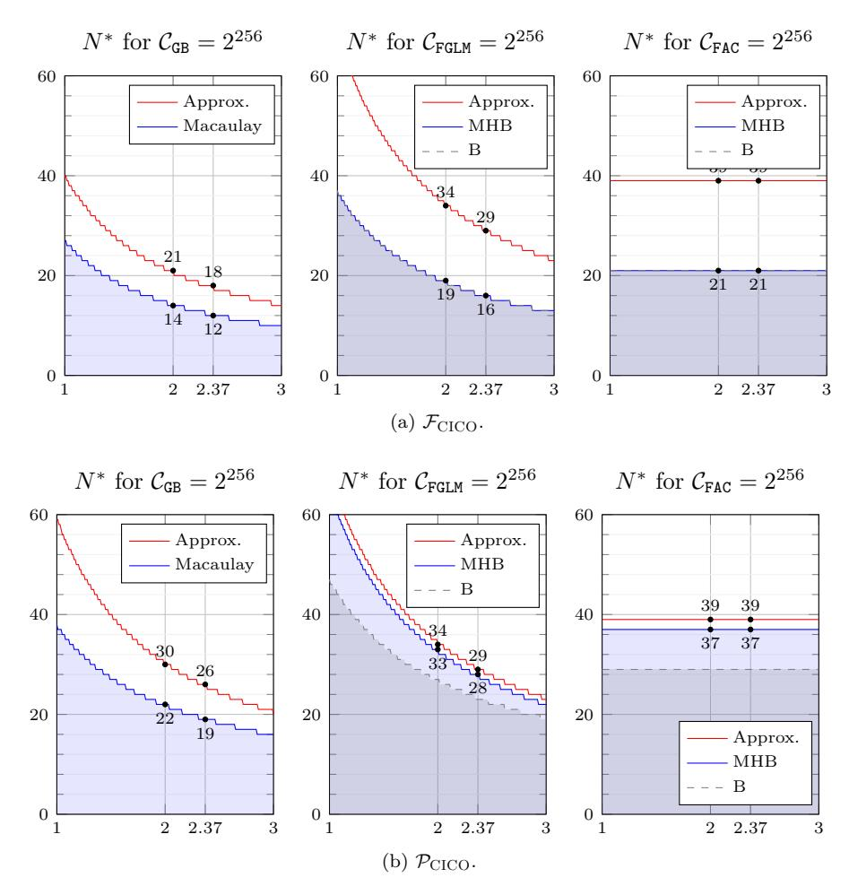

**Figure 23:** The Six Worlds of Gröbner Basis Cryptanalysis: Round numbers derived for the individual steps of a Gröbner basis attack on Anemoi :  $\mathbb{F}_p^2 \to \mathbb{F}_p^2$  with  $\alpha = 11$  used in a Sponge construction for different values of  $\omega$ . Target security level of s = 256 bits. Theoretical bounds and (experimental) conjectures as given in Section 4.4. Colored areas indicate round numbers proven to be insecure.

## C.5 Estimated Attack Complexities

**Table 15:** Estimated attack complexity for round number suggestions in [BBC+23, Table 1] for Anemoi :  $\mathbb{F}_p^2 \to \mathbb{F}_p^2$  and a target security level of s=128 bits. Each cell reports the estimated attack complexity (in bits) in the given world, where  $\omega=2$  (2.37).

|          |                       |                             | (E) Expe  | erimental a | pproach  | (T) Theoretical approach |           |          |  |  |
|----------|-----------------------|-----------------------------|-----------|-------------|----------|--------------------------|-----------|----------|--|--|
| $\alpha$ | [BBC + 23] | Model                       | Step (1)  | Step (2)    | Step (3) | Step (1)                 | Step (2)  | Step (3) |  |  |
|          | [BBC+23]              |                             | GB        | FGLM        | FAC      | GB                       | FGLM      | FAC      |  |  |
| 3        | 21                    | $\mathcal{F}_{\text{CICO}}$ | 165 (195) | 102 (120)   | 88       | 226 (267)                | 138 (163) | 120      |  |  |
| 3        | 21                    | $\mathcal{P}_{\text{CICO}}$ | 131 (155) | 101 (120)   | 88       | 249 (293)                | 121 (143) | 106      |  |  |
| 5        | 21                    | $\mathcal{F}_{\text{CICO}}$ | 200 (237) | 123 (145)   | 107      | 296 (350)                | 200 (236) | 177      |  |  |
| 3        | 21                    | $\mathcal{P}_{\text{CICO}}$ | 147 (174) | 122(144)    | 107      | 249 (294)                | 137 (161) | 120      |  |  |
| 7        | 20                    | $\mathcal{F}_{\text{CICO}}$ | 216 (256) | 132 (155)   | 115      | 324 (382)                | 229 (271) | 203      |  |  |
| '        | 20                    | $\mathcal{P}_{\text{CICO}}$ | 153 (180) | 131 (154)   | 115      | 235 (277)                | 142 (168) | 125      |  |  |
| 11       | 19                    | $\mathcal{F}_{\text{CICO}}$ | 241 (286) | 145 (171)   | 127      | 359 (424)                | 268 (316) | 238      |  |  |
| 11       | 19                    | $\mathcal{P}_{\text{CICO}}$ | 163 (192) | 144 (170)   | 127      | 223 (263)                | 152(180)  | 134      |  |  |

**Table 16:** Estimated attack complexity for round number suggestions in [BBC+23, Table 1] for Anemoi :  $\mathbb{F}_p^2 \to \mathbb{F}_p^2$  and a target security level of s=256 bits. Each cell reports the estimated attack complexity (in bits) in the given world, where  $\omega=2$  (2.37).

|          |                       |                             | (E) Expe  | erimental a | pproach  | (T) Theoretical approach |           |          |  |
|----------|-----------------------|-----------------------------|-----------|-------------|----------|--------------------------|-----------|----------|--|
| $\alpha$ | ·                     | Model                       | Step (1)  | Step (2)    | Step (3) | Step (1)                 | Step (2)  | Step (3) |  |
|          | [BBC + 23] |                             | GB        | FGLM        | FAC      | GB                       | FGLM      | FAC      |  |
| 3        | 37                    | $\mathcal{F}_{\text{CICO}}$ | 293 (347) | 178 (209)   | 155      | 402 (476)                | 240 (284) | 212      |  |
| 3        | 31                    | $\mathcal{P}_{\text{CICO}}$ | 234(277)  | 177 (208)   | 155      | 497 (587)                | 212(250)  | 187      |  |
| 5        | 37                    | $\mathcal{F}_{\text{CICO}}$ | 356 (421) | 213 (252)   | 188      | 527 (624)                | 349 (413) | 311      |  |
| 9        | 31                    | $\mathcal{P}_{\text{CICO}}$ | 262 (310) | 212 (251)   | 188      | 497 (587)                | 239(282)  | 212      |  |
| 7        | 36                    | $\mathcal{F}_{\text{CICO}}$ | 392 (464) | 234 (276)   | 207      | 589 (696)                | 410 (485) | 366      |  |
| '        | 30                    | $\mathcal{P}_{\text{CICO}}$ | 277 (327) | 233 (275)   | 207      | 481 (568)                | 254(300)  | 225      |  |
| 11       | 35                    | $\mathcal{F}_{\text{CICO}}$ | 449 (532) | 265 (313)   | 235      | 668 (790)                | 490 (580) | 439      |  |
| 11       | 33                    | $\mathcal{P}_{\text{CICO}}$ | 301 (356) | 264 (312)   | 235      | 466 (551)                | 278 (329) | 248      |  |