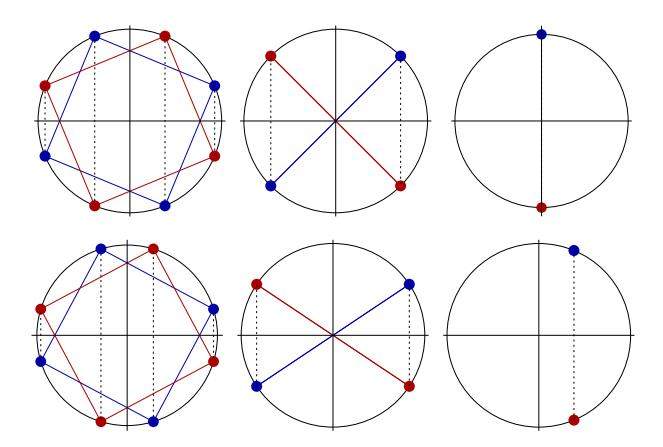

# Circle STARKs

Ulrich Haböck, David Levit, Shahar Papini uhaboeck@polygon.technology, david@starkware.co, spapini@starkware.co

December 17, 2024<sup>∗</sup>

#### Abstract

Traditional STARKs [\[BSBHR18b,](#page-31-0) [BSCR](#page-32-0)<sup>+</sup>19, [COS20\]](#page-32-1) require a cyclic group of a smooth order in the field. This allows efficient interpolation of points using the FFT algorithm, and writing constraints that involve neighboring rows. ECFFT [\[BSCKL21,](#page-31-1) [BSCKL22\]](#page-31-2) introduced a way to make efficient STARKs for any finite field, by using a cyclic group of an elliptic curve. We show a simpler construction in the lines of ECFFT over the circle curve x <sup>2</sup> +y <sup>2</sup> = 1. When p+ 1 is divisible by a large power of 2, this construction is as efficient as traditional STARKs and ECFFT. Applied to the Mersenne prime p = 2<sup>31</sup> −1, which has been recently advertised in [\[HLN23\]](#page-33-0), our preliminary benchmarks indicate a speed-up by a factor of 1.4 compared to a traditional STARK using the Babybear prime p = 2<sup>31</sup> − 2 <sup>27</sup> + 1 from [\[BG\]](#page-31-3).

## Contents

| 1 |                       | Introduction                                  | 1  |  |  |  |
|---|-----------------------|-----------------------------------------------|----|--|--|--|
| 2 |                       | Notations and definitions                     |    |  |  |  |
| 3 | The circle curve      |                                               |    |  |  |  |
|   | 3.1                   | The circle curve as a group<br>               | 5  |  |  |  |
|   | 3.2                   | The space of polynomials and Circle Codes<br> | 7  |  |  |  |
|   | 3.3                   | Vanishing polynomials and quotients           | 10 |  |  |  |
| 4 |                       | The circle FFT                                |    |  |  |  |
|   | 4.1                   | The sequence of domains                       | 13 |  |  |  |
|   | 4.2                   | The circle FFT and its inverse<br>            | 14 |  |  |  |
|   | 4.3                   | Properties of the FFT space                   | 17 |  |  |  |
| 5 | STARK over the circle |                                               |    |  |  |  |
|   | 5.1                   | Constraint selectors<br>                      | 21 |  |  |  |
|   | 5.2                   | The interactive oracle proof for AIR<br>      | 22 |  |  |  |
|   | 5.3                   | Computing the overall quotient                | 25 |  |  |  |
|   | 5.4                   | A note on generalizations<br>                 | 27 |  |  |  |
| 6 |                       | Low-degree test over the Circle               | 28 |  |  |  |

<sup>∗</sup>This version corrects minor typos in Section [5.3](#page-25-0) and adds an optimized treatment of constraints with punctuated activation domains.

|   | Acknowledgements                                         | 31 |
|---|----------------------------------------------------------|----|
| A | Correlated agreement                                     | 34 |
| B | Soundness in the oracle model                            | 35 |
|   | B.1<br>Soundness of the IOP of proximity to circle codes | 36 |
|   | B.2<br>Soundness of the IOP for AIR                      | 39 |
|   | B.3<br>Witness extraction<br>                            | 42 |
| C | An optimized circle STARK for non-zk                     | 43 |
| D | Implementation remarks                                   | 44 |

# <span id="page-1-0"></span>1 Introduction

Scalable and Transparent Arguments of Knowledge (STARKs) [\[BSBHR18b\]](#page-31-0) are succinct, general purpose argument systems which allow for efficient proof composition, and moreover do not require any trust assumptions for their setup. While technically, the original definition of a STARK also covers argument systems with a trustless setup elliptic curve commitment scheme, such as [\[BGH19\]](#page-31-5) and the entire track of folding schemes initiated by it, the term has become synonymous to univariate argument systems which rely on the FRI low-degree test [\[BSBHR18a,](#page-31-6) [BSCI](#page-31-7)+20], a proof of proximity for Reed-Solomon codes. STARKs are widely adopted in practice [\[Sta23,](#page-33-1) [Pola,](#page-33-2) [Polc,](#page-33-3) [Pold,](#page-33-4) [BG\]](#page-31-3), mainly because of their smaller embedding overhead in the arithmetization step (they are not bound to cryptographically large fields), and their simplicity compared to the aforementioned aggregation and folding schemes.

In univariate STARKs witness data is encoded into polynomials over a univariate domain, thereby demanding a smooth arithmetization field which supports fast Fourier transform (FFT) techniques; either the classical multiplicative Fourier transform [\[CT65\]](#page-32-2), or the additive FFT [\[LCH14\]](#page-33-5). This restriction was lifted by the Elliptic Curve Fourier Transform (ECFFT) [\[BSCKL21\]](#page-31-1), which uses smooth subgroups of elliptic curves as the underlying domain for the Fourier transform. Although tightly connected with the group structure of elliptic curves, the ECFFT is an algebraic transform similar to the additive FFT, and it is constructed along a chain of curves over the non-smooth field,

$$C_0 \xrightarrow{\pi_1} C_1 \xrightarrow{\pi_2} C_2 \xrightarrow{\pi_3} \dots$$

with 2-to-1 maps between them (each of algebraic degree 2), halving the sizes of the domains in each step. The ECFFT permits efficient interpolation by (certain) low-degree rational functions over the curve. The basic design principles of STARKs – the interactive oracle proof and the low-degree test – can be carried over to these rational function spaces and their algebraic geometry codes [\[BSCKL22\]](#page-31-2). ECFFT-based STARKs, which we shall call elliptic curve STARKs, are as efficient as classical STARKs, in the concrete sense and not just asymptotically, and by dropping the smoothness assumption on the finite field, they uncover an unprecedented freedom in the choice of the concrete prime for arithmetization.

In a recent note [\[HLN23\]](#page-33-0), the authors consider a different approach for the Mersenne prime p = 2<sup>31</sup> − 1, a non-smooth prime with exceptionally fast arithmetic. They consider the circle curve

$$x^2 + y^2 = 1$$

as a smooth multiplicative subgroup of the "complex extension" of the prime field (i.e. the quadratic extension with respect to the irreducible polynomial x <sup>2</sup> + 1), and apply well-known optimizations for the classical FFT of real-valued functions, diminishing the extension field costs to only a small overhead in the number of additions. Furthermore, they observe that the extrapolated values lie in a linear subspace of the complex plane, a line which essentially depends only on the target coset, thereby reducing the commitment cost of Reed-Solomon code words to that of their "rectified" representation of half the size. While the approach from [\[HLN23\]](#page-33-0) is much more elementary than the one from [\[BSCKL21,](#page-31-1) [BSCKL22\]](#page-31-2), its main drawback is a limited usefulness for constraint evaluation, when computing the overall quotient polynomial in the STARK. Similar to polar coordinates, the rectified representation is beneficial for computing products of polynomials. However, evaluating the overall constraint involves products and sums in quite arbitrary order, and demands – rather sooner than later – a conversion back to the ordinary complex representation. While this drawback is not drastic when dealing only with a small number of polynomials, it matters to STARKs with wide traces (such as [\[Pola,](#page-33-2) [Polb\]](#page-33-6)), thwarting the advantage of that prime over ordinary two-adic primes of comparable size.

Motivated by [\[HLN23\]](#page-33-0), we propose a simpler construction along the lines of [\[BSCKL21,](#page-31-1) [BSCKL22\]](#page-31-2), tailored to the Mersenne prime p = 2<sup>31</sup> − 1 and the circle curve. As every (smooth) quadratic curve, the circle curve is isomorphic to the projective line over the prime field and thus of size (p + 1) (this is a wellknown fact but we will recapitulate it below). And it is a cyclic group, with its operation inherited from the action of the rotation group SO(2) over the field. The circle curve has the following benefits over the elliptic curve approach:

- 1. Firstly, and contrary to elliptic curves, the group squaring map (in the sense of a multiplicative group notation) is of quadratic degree and 2-to-1, dropping the need of a chain of curves.
- 2. Second, because rotation carries polynomials to polynomials in a degree-preserving manner, we may choose an FFT that is again with respect to a polynomial basis, instead of one comprised of rational functions. (Similar to the additive FFT and elliptic curve FFT, this polynomial basis is not the standard monomial one, and there is no known efficient conversion between the two).
- 3. Thirdly, and perhaps most importantly, simplicity: The reader does not need to have any background in algebraic geometry. Taking advantage of the above mentioned projective line view of the curve (in algebraic geometry terms, it has genus zero) the proofs are elementary and self-contained, without assuming knowledge on divisor calculus and the Riemann-Roch theorem. All that is needed is familiarity with the notion of a projective space, and not even that if one does not intend going through the proofs.

Although many of these features (if not all) are due to the genus of the circle curve, there is one point where the circle curve causes extra considerations. There is a gap of dimension one, between the image space of the FFT and the space of all polynomials of corresponding degree bound, the latter of which turns out the natural space for STARKs over the circle. In other words, FFT domains are one point too small to uniquely determine a polynomial of that degree bound, and this anomaly needs to be taken into account in a few places of the protocol: First, when computing the overall quotient, and second, in a preparatory step for the low-degree test. It turns out that in both cases the dimension gap can be treated cheaply (i.e. the computational cost is negligible) and without any loss in security.

Overall, circle STARKs are as efficient as classical STARKs over smooth fields (or an ECFFT-based STARK), and their mathematical foundation is "as close as can be" to the classical case. The entire interactive oracle proof over the circle uses polynomials (bivariate, though[1](#page-2-0) ) and the low-degree test is similar to the well-known FRI for Reed-Solomon codes. We believe that this helps a wider adoption in practice.

The document is organized as follows. In the first part we provide all relevant preliminaries:

• Section [2](#page-3-0) and [3](#page-4-0) introduce basic notions and discuss properties of the circle curve, its space of polynomials and Circle Codes, the Reed-Solomon type of code generated by them. In particular, we cover vanishing polynomials and quotients, the key ingredients for STARKs.

<span id="page-2-0"></span><sup>1</sup>Although we do not dwell on it, we stress the fact that the projective line view allows the entire circle STARK to be seen as a univariate one based on generalized Reed-Solomon codes.

• In Section [4](#page-12-0) we describe the FFT over the circle, the circle FFT and its inverse. We investigate the image space of the circle FFT and the aforementioned dimension gap.

With the complete FFT tool-set ready, we are able to approach our target application, circle STARKs.

- In Section [5](#page-19-0) we describe the interactive oracle proof for an elementary system of constraints, a restricted algebraic intermediate representation yet expressive enough to highlight the general principle. We discuss the extra measures needed to deal with the aforementioned dimension gap.
- Eventually, in Section [6,](#page-28-0) we describe the low-degree test for polynomials over the circle curve. That proof of proximity is similar to FRI, with the folding steps in circle FFT style.

The second part is largely informal, focusing on the protocol steps, the involved polynomial arithmetic, and the few differences to univariate STARKs. A fully formal treatment, including security notions as well as their proofs (in the ordinary oracle model) is postponed to the appendix: In Appendix [A](#page-34-0) we cite the celebrated correlated agreement theorem for Reed-Solomon codes [\[BSCI](#page-31-7)<sup>+</sup>20], and explain how it is taken over to circle Codes. In Appendix [B](#page-35-0) we prove soundness (in the oracle model) of both circle FRI and the circle STARK from Section [5.](#page-19-0) In Appendix [C](#page-43-0) we further sketch a variant of the circle STARK in which the evaluation domain is a superset of the trace domain. While this variant is not able to support zero-knowledge, it optimizes the extrapolation effort of the prover for certain parameter settings.

We conclude the paper with a final section on implementation remarks, Appendix [D,](#page-44-0) in which we provide preliminary benchmarks of the circle FFT over the Mersenne prime p = 2<sup>31</sup> − 1. Compared to the classical FFT over the equally sized Babybear prime p = 2<sup>31</sup> −2 <sup>27</sup> + 1 from [\[BG\]](#page-31-3), our measurements indicate a speedup by a factor of 1.4, and we expect to achieve the same advantage in a fully optimized implementation of the FFT and the entire STARK.

Although our main target is the Mersenne prime p = 2<sup>31</sup> − 1, we note that our considerations apply to arbitrary primes p with (p + 1) being smooth, and the entire document takes this into account[2](#page-3-1) . We point out that the circle FFT is related, yet different to the recent Galois-FFT [\[LX23\]](#page-33-7), which (up to isomorphism) shares the same underlying space and group action. The Galois-FFT is concretely less efficient than the circle FFT (it costs the double of multiplications), and beyond that not as useful for STARKs, since its function spaces are not invariant under action of their corresponding subgroup. A detailed comparison of the two FFTs is given in the companion note [\[Hab24\]](#page-32-3).

## <span id="page-3-0"></span>2 Notations and definitions

Let us start with the central property of the primes we consider.

<span id="page-3-2"></span>Definition 1 (CFFT-friendly prime). Any prime p for which (p+ 1) is divisible by 2 <sup>n</sup>+1 for sufficiently large n ≥ 1, will be called CFFT-friendly, and any such n is a supported order, and N = 2<sup>n</sup> a supported domain size.

Remark 1. The reason for demanding 2 <sup>n</sup>+1 instead of 2 <sup>n</sup> being a factor (p + 1) in Definition [1](#page-3-2) is due to the existence of suitable FFT domains and will become clear in Section [4.](#page-12-0)

Which n ≥ 1 is considered sufficiently large depends on the application. In the context of STARK one typically wants a small prime p with p + 1 being as smooth as possible. A compelling choice is the Mersenne prime

$$p = 2^{31} - 1,$$

called M31 in [\[HLN23\]](#page-33-0), which for its exceptionally efficient arithmetic is also our main target. However, other choices of CFFT friendly primes might be useful in practice, and for this reason why we keep our exposition as general as possible.

<span id="page-3-1"></span><sup>2</sup> In fact, this approach can be generalized to non-prime finite fields F<sup>q</sup> with (q + 1) being smooth as well.

CFFT-friendly primes are of the form  $p = 2^{n+1} \cdot t - 1$  for integers  $n, t \ge 1$ . In particular,  $p - 1 = 2 \cdot t'$  with  $t' = 2^n \cdot t - 1$  being odd, or equivalently

$$p \equiv 3 \mod 4$$
,

meaning that -1 does not have a square root modulo p. For any such prime, the polynomial  $x^2 + 1$  has no roots in the prime field  $\mathbb{F}_p$ .

We shall denote the algebraic closure of  $\mathbb{F}_p$  by K, and  $\pm i$  the roots of  $x^2 + 1$  in K. Finite extensions of  $\mathbb{F}_p$  will be denoted by F, and considered as a subfield of K. In rare cases it will be useful to work with F(i), the field that results from F by adjoining the root i. If i is contained in F then F(i) = F; otherwise F(i) is a quadratic extension of F.

For any finite extension F of  $\mathbb{F}_p$  we will write F[x] and F[x,y] for the ring of polynomials in one and two variables, respectively. Likewise, we use the notation  $F[x]^{\leq d}$  and  $F[x,y]^{\leq d}$  of all polynomials over F of total degree at most d. Polynomials from F[x,y] will be often denoted as p(x,y), which will not cause confusion with the prime p although we override notation. Given a polynomial p(x,y) from F[x,y], the ideal generated by it is denoted as (p(x,y)).

For certain aspects, mostly within proofs, the one and two-dimensional projective spaces  $P^1(F)$  and  $P^2(F)$  over a finite extension F of  $\mathbb{F}_p$  will be useful. We consider them contained in the corresponding projective space  $P^1(K)$  and  $P^2(K)$  over the algebraic closure K, and we use the common notation (t:s) and (x:y:z) for points in  $P^1(K)$  and  $P^2(K)$ , respectively. Points with non-zero last coordinate,  $s \neq 0$  or  $z \neq 0$ , are affine points.

### <span id="page-4-0"></span>3 The circle curve

Although we target CFFT-friendly primes p (cf. Definition 1), most of this section depends only on the property  $p \equiv 3 \mod 4$ . Thus, unless stated otherwise, let  $\mathbb{F}_p$  be the prime field with modulus  $p \equiv 3 \mod 4$ .

We define the Circle Curve, denoted by  $C = C(\mathbb{F}_p)$ , to be the (smooth) algebraic variety over  $\mathbb{F}_p$  defined by the equation

$$C: x^2 + y^2 = 1,$$

or equivalently, in projective coordinates

$$C: X^2 + Y^2 = Z^2.$$

<span id="page-4-1"></span>Remark 2. By the condition on the modulus p, there are no  $\mathbb{F}_p$ -rational points at infinity Z=0, and the projective view seems of not much use. However, the complete geometric picture unfolds when considering the curve over the algebraic closure K of  $\mathbb{F}_p$ , in which there are two points at infinity,  $\infty=(1:i:0)$  and  $\bar{\infty}=(1:-i:0)$ , with  $\pm i$  being the square roots of -1. These two points, which are  $\mathbb{F}_p(i)$ -rational, will play a prominent role in our construction.

The arithmetization of circle STARK takes place over the circle curve domain. Witnesses are encoded into low-degree polynomials over that domain, and subjected to certain algebraic relations, the constraints.

<span id="page-4-2"></span>**Lemma 1.** There is an isomorphism between the circle curve  $C(\mathbb{F}_p)$  and the projective line  $P^1(\mathbb{F}_p)$  which extends to arbitrary extensions of  $\mathbb{F}_p$ , including its algebraic closure K. In particular, for any finite extension F of  $\mathbb{F}_p$ , the number of points of the circle curve over F is |F|+1.

*Proof.* The isomorphism is the stereographic projection onto the y-axis with center (-1,0), defined by the equations

$$t = \frac{y}{x+1}, \quad (x,y) = \left(\frac{1-t^2}{1+t^2}, \frac{2 \cdot t}{1+t^2}\right).$$

Under this isomorphism (-1,0) is identified with infinity of the projective line, and the two curve points  $\infty = (1:+i:0), \bar{\infty} = (1:-i:0)$  from Remark 2 correspond to  $t=\pm i$ .

Although we pivot to the bivariate representation of the circle curve, the projective line view will be extremely useful within proofs. The isomorphism from Lemma 1 allows a direct translation of bivariate function fields into univariate ones, and consequently a much more elementary treatment, avoiding general tools from algebraic geometry such as the Riemann-Roch theorem. Nevertheless, whenever useful we provide complementing remarks addressed to the reader with background in algebraic geometry.

### <span id="page-5-0"></span>3.1 The circle curve as a group

The p+1 points of  $C(\mathbb{F}_p)$  form a group with the group operation

$$(x_0, y_0) \cdot (x_1, y_1) := (x_0 \cdot x_1 - y_0 \cdot y_1, x_0 \cdot y_1 + y_0 \cdot x_1).$$

(We somewhat override notation here, but as we do not use entry-wise multiplication this will not cause confusion.) For this reason, we shall call  $C(\mathbb{F}_p)$  also the *circle group*. The circle group is cyclic because the map  $(x,y) \mapsto x + i \cdot y$  is a group homomorphism between  $C(\mathbb{F}_p)$  and a multiplicative subgroup of the extension  $\mathbb{F}_p(i)$ . The group has (1,0) as its neutral element, and for any  $P = (P_x, P_y)$  in  $C(\mathbb{F}_p)$  we shall call

$$T_P(x,y) := P \cdot (x,y) = (P_x \cdot x - P_y \cdot y, P_x \cdot y + P_y \cdot x),$$

the rotation, or translation by P. The squaring map with respect to the group operation is the quadratic map

$$\pi(x,y) := (x,y) \cdot (x,y) = (x^2 - y^2, 2 \cdot x \cdot y) = (2 \cdot x^2 - 1, 2 \cdot x \cdot y), \tag{1}$$

and group inverses are given by the degree-one map

$$J(x,y) := (x, -y). \tag{2}$$

Note that, as in any group, the map J is an involution, i.e. J(J(P)) = P for every  $P \in C(\mathbb{F}_p)$ , and that J and  $\pi$  commute, i.e.  $\pi(J(P)) = J(\pi(P))$  for every  $P \in C(\mathbb{F}_p)$ .

Remark 3. The definition of  $T_P$  extends to the entire projective variety over K, and it is easily verified that both  $\infty$  and  $\bar{\infty}$  from Remark 2 are fixed points under the action of the circle group. We stress the fact that the existence of fixed points is in stark contrast to the elliptic curve case. We will see below that these fixed points allow a more elegant choice of rotation-invariant Riemann-Roch spaces.

<span id="page-5-1"></span>**Remark 4.** Under the isomorphism from Lemma 1, the circle group law translates to the projective line as  $(t_1:s_1) \oplus (t_2:s_2) = (t_1 \cdot s_2 + t_2 \cdot s_1:s_1 \cdot s_2 - t_1 \cdot t_2)$ , or in affine coordinates  $t_1 \oplus t_2 = \frac{t_1 + t_2}{1 - t_1 \cdot t_2}$ . In other words, the circle group is isomorphic to a subgroup of linear automorphisms of the projective line, those which leave  $\pm i$  invariant. This is exactly the subgroup chosen in the Galois-FFT [LX23].

Since  $C(\mathbb{F}_p)$  is cyclic, for each  $N \geq 1$  which divides (p+1) there is a unique cyclic subgroup of size N. In the case of a two-adic order  $N=2^n$  we shall denote that unique subgroup by  $G_n$ . The following type of sets are the suitable domains of the circle FFT described in Section 4.

**Definition 2.** Let  $G_{n-1}$  be a (cyclic) subgroup of  $C(\mathbb{F}_p)$  of size  $|G_{n-1}| = 2^{n-1}$ ,  $n \ge 1$ . Any disjoint union  $D = Q \cdot G_{n-1} \cup Q^{-1} \cdot G_{n-1}$ , i.e. with  $Q \cdot G_{n-1} \cap Q^{-1} \cdot G_{n-1} = \emptyset$ , is called a *twin-coset* of size  $N = 2^n$ . In the exceptional case that such a twin-coset D is again a coset of the subgroup  $G_n$  of double the size, we call D a *standard position coset* of size N.

Twin-cosets are composed of those pairs in the quotient group  $C(\mathbb{F}_p)/G_{n-1}$  which are mapped to one another under the inverse map J. This particularly excludes fixed points of J, which are those elements  $Q \cdot G_{n-1}$  with  $Q^{-1} \cdot G_{n-1} = Q \cdot G_{n-1}$ , or  $Q^2 \in G_{n-1}$ . In other words, fixed points of J in the quotient group are either the trivial element or an element of order two, if it exists. In the latter case, the union of the two fixed points form the subgroup  $G_n$  of size  $2^n$ . See Figure 1 for an illustration of standard position cosets and twin-cosets.

**Proposition 1.** Let p be a prime such that  $p \equiv 3 \mod 4$ , and let  $n \ge 1$ . The existence of standard position cosets of size  $2^n$  is equivalent to that p is CFFT-friendly supporting the order n. In this case, standard position cosets are unique and of the form

$$D = Q \cdot G_n = Q \cdot G_{n-1} \cup Q^{-1} \cdot G_{n-1},$$

with  $Q \in C(\mathbb{F}_p)$  being an element of order  $2^{n+1}$ .

Proof. Since  $C(\mathbb{F}_p)/G_{n-1}$  is cyclic, and excluding fixed points of J, there is at most one J-invariant pair  $\{Q \cdot G_{n-1}, Q^{-1} \cdot G_{n-1}\}$ , with  $Q \cdot G_{n-1} \neq Q^{-1} \cdot G_{n-1}$ , which forms a coset in  $C(\mathbb{F}_p)/G_{n-1}$ . In fact, since the two elements of the pair are different, we must have  $Q^2 \notin G_{n-1}$ , and since it is a coset of order two, their difference  $Q \cdot G_{n-1} \cdot (Q^{-1} \cdot G_{n-1})^{-1} = Q^2 \cdot G_{n-1}$  must be of order two, meaning that  $Q \cdot G_{n-1}$  has order four. The existence of order four elements in  $C(\mathbb{F}_p)/G_{n-1}$  is equivalent to that  $2^{n+1}$  divides (p+1), completing the proof of the proposition.

Although breaking with the group structure, twin-cosets are natural evaluation domains for the FFT. They are used to work around the non-smooth behaviour of the circle FFT under rotation, and are the typical extrapolation target in our application. Similar to the decomposition of univariate evaluation domains into cosets of smaller size, twin-coset domains, and in particular standard position cosets, can be decomposed into twin-cosets of smaller size.

<span id="page-6-1"></span>**Lemma 2.** Let p be a CFFT-friendly prime supporting the order  $m \geq 1$ , and  $G_k$  denote the subgroup of order  $2^k$  for  $k \leq m$ . Then any subset of  $D \subseteq C(\mathbb{F}_p) \setminus G_m$  which is invariant under  $G_{m-1}$  and J can be decomposed into twin-cosets of size  $N = 2^n$ , for any  $n \leq m$ . In particular for a standard position coset D of size  $M = 2^m$ ,

$$D = Q \cdot G_m = \bigcup_{k=0}^{M/N-1} (Q^{4 \cdot k + 1} \cdot G_{n-1} \cup Q^{-4 \cdot k - 1} \cdot G_{n-1}),$$

where Q is an element from  $C(\mathbb{F}_p)$  of order  $2^{m+1}$ .

*Proof.* Since  $n \leq m$  the subset D is also invariant under  $G_{n-1}$  and disjoint from  $G_n$ . Thus, as a J-invariant subset of  $C(\mathbb{F}_p)/G_{n-1}$  which does not contain fixed points of J, it is a union of J-invariant pairs in  $C(\mathbb{F}_p)/G_{n-1}$ . This proves the first assertion. The second claim follows from  $D = Q \cdot G_{m-1} \cup Q^{-1} \cdot G_{m-1}$ , where Q is an element of order  $2^{m+1}$ , and the decomposition

$$G_{m-1} = \bigcup_{k=0}^{M/N-1} Q^{4 \cdot k} \cdot G_{n-1} = \bigcup_{k=0}^{M/N-1} Q^{-4 \cdot k} \cdot G_{n-1},$$

taking  $Q^4$  as a generator of  $G_{m-1}$ .

<span id="page-6-0"></span>**Lemma 3.** If D is a twin-coset of size  $N = 2^n$ ,  $n \ge 2$ , then its image  $\pi(D)$  under the squaring map  $\pi$  is a twin-coset of size N/2. More specifically, if D is a standard position coset, so is  $\pi(D)$ .

*Proof.* Since  $\pi$  is a group endomorphism which maps  $G_{n-1}$  onto the subgroup  $G_{n-2}$ , the image of a twin-coset  $D = Q \cdot G_{n-1} \cup Q^{-1} \cdot G_{n-1}$  is

$$\pi(D) = \pi(Q) \cdot G_{n-2} \cup \pi(Q)^{-1} \cdot G_{n-2}.$$

Moreover, as  $\pi(Q)^2 = \pi(Q^2)$ , and  $Q^2 \notin G_{n-1}$ , also  $\pi(Q)^2 \notin G_{n-2}$ , showing that the two cosets of  $G_{n-2}$  are disjoint. Hence  $\pi(D)$  is a twin-coset, and its size is N/2. Finally, if D is invariant under  $G_n$ , then  $\pi(D)$  is invariant under  $\pi(G_n) = G_{n-1}$ . Together with the first assertion, this proves that standard position cosets are mapped onto standard position cosets.

<span id="page-7-1"></span>Figure 1: A schematic illustration of the three smallest standard position cosets in the affine plane over  $\mathbb{F}_p$ , and general twin-cosets of the same size.



## <span id="page-7-0"></span>3.2 The space of polynomials and Circle Codes

Let F be an extension field of  $\mathbb{F}_p$ . Over the circle curve, for any *even* integer  $N \geq 0$  we define  $\mathcal{L}_N(F)$  as the space of all bivariate polynomials with coefficients in F, and of total degree at most N/2,

<span id="page-7-2"></span>
$$\mathcal{L}_N(F) = \left\{ p(x, y) \in F[x, y] / (x^2 + y^2 - 1) : \deg p \le \frac{N}{2} \right\},$$
 (3)

where deg p in (3) means the *smallest* total degree of a representative within the class  $p(x, y) + (x^2 + y^2 - 1)$ . (Recall that  $(x^2 + y^2 - 1)$  denotes the ideal in F[x, y] generated by  $x^2 + y^2 - 1$ ). Even though the functions in  $\mathcal{L}_N(F)$  are polynomials, we shall often use f and g for elements from  $\mathcal{L}_N(F)$ .

Remark 5. In terms of algebraic geometry,  $\mathcal{L}_N(F)$  equals the Riemann-Roch space over C(F) for the  $\mathbb{F}_p$ -rational divisor  $\frac{N}{2} \cdot \infty + \frac{N}{2} \cdot \bar{\infty}$ . In other words,  $\mathcal{L}_N(F)$  consists of all F-rational functions with poles only at  $\infty$  and  $\bar{\infty}$ , each at most of order N/2. It is due to the specific structure of the circle curve (in hand-wavy geometric terms, its projective closure is the Riemann sphere and not a group) that unlike in the elliptic curve case, the relevant function space can be again chosen as a space of *polynomials* instead of rational functions (under the bivariate view). However, we emphasize that this is not an essential feature.

For a circle STARK the bivariate polynomials from  $\mathcal{L}_N(F)$  are what low-degree extensions are for classical univariate proofs. The crucial properties of  $\mathcal{L}_N(F)$ , as shown by the following proposition, are (1) rotation invariance, which is needed for the next-neighbour relation and efficient encoding, and (2) good separability, leading to maximum distance separable codes.

<span id="page-7-6"></span>**Proposition 2.** For even integer  $N \geq 0$  the space of polynomials  $\mathcal{L}_N(F)$  has the following properties.

- <span id="page-7-4"></span>1. It is invariant under rotation, i.e. for each  $f \in \mathcal{L}_N(F)$  and  $P \in C(\mathbb{F}_p)$ , also  $f \circ T_P \in \mathcal{L}_N(F)$ . (Here and in the sequel,  $\circ$  denotes functional composition.)
- <span id="page-7-5"></span>2. Its dimension is N+1, and every non-trivial  $f \in \mathcal{L}_N(F)$ , i.e.  $f \notin (x^2+y^2-1)$ , has at most N zeros over C(F).

<span id="page-7-3"></span><sup>&</sup>lt;sup>3</sup>We consider a divisor  $D = \sum n_P \cdot P$  to be  $\mathbb{F}_p$ -rational, if it is invariant under every automorphism of the Galois group of K over  $\mathbb{F}_p$ , where K is the algebraic closure of  $\mathbb{F}_p$ . That is, if  $\alpha$  is such an automorphism, then  $n_{\alpha(P)} = n_P$ .

*Proof.* Property 1 is trivial, since  $T_P$  is linear and hence does not change the total degree of a polynomial.

To prove Property 2, we make use of the fact that under the isomorphism from Lemma 1 the space  $\mathcal{L}_N(F)$  is carried over to

<span id="page-8-0"></span>
$$L_N(F) = \left\{ \frac{p(t)}{(1+t^2)^{\frac{N}{2}}} : p \in F[t], \deg p(t) \le N \right\}.$$
 (4)

As this representation will be useful in other proofs, we elaborate it in detail: The univariate representation of a bivariate monomial  $x^j \cdot y^k$  of degree  $j + k \le N/2$ , where  $j, k \ge 0$ , is

$$\frac{(1-t^2)^j\cdot (2\cdot t)^k}{(1+t^2)^{j+k}} = \frac{(1-t^2)^j\cdot (2\cdot t)^k\cdot (1+t^2)^{N/2-j-k}}{(1+t^2)^{N/2}},$$

which is of the claimed form. Conversely, let us compute the bivariate representation of a function  $t^k/(1+t^2)^{N/2}$  with  $0 \le k \le N$ . Writing  $k = 2 \cdot j + \varepsilon$ , with  $0 \le j \le N/2$  and  $\varepsilon \in \{0,1\}$  (where in the edge case j = N/2 we have  $\varepsilon = 0$ ), the function corresponds to

$$\frac{y^{2 \cdot j + \varepsilon}}{(1+x)^{2 \cdot j + \varepsilon}} \cdot \frac{(1+x)^{2 \cdot N/2}}{((1+x)^2 + y^2)^{N/2}},$$

which over the circle  $x^2 + y^2 = 1$  is equal to

$$\frac{y^{\varepsilon} \cdot (1+x)^{j} \cdot (1-x)^{j}}{(1+x)^{2 \cdot j + \varepsilon}} \cdot \frac{(1+x)^{N/2}}{2^{N/2}}, = 2^{-N/2} \cdot y^{\varepsilon} \cdot (1-x)^{j} \cdot (1+x)^{N/2 - j - \varepsilon},$$

which is a polynomial of total degree at most N/2.

From the univariate representation (4) of  $\mathcal{L}_N(F)$ , we eventually conclude that  $\dim \mathcal{L}_N(F) = N+1$ . Moreover, every fractional function  $p(t)/(1+t^2)^{N/2}$  with p(t) of degree  $\leq N$  and N+1 zeros (possibly including infinity) must be trivial. This completes the proof of the Proposition.

Remark 6. The above proof reduces to a three-liner when using results from algebraic geometry: The  $\mathbb{F}_p$ -rational divisor  $\frac{N}{2} \cdot \infty + \frac{N}{2} \cdot \bar{\infty}$  is invariant under the group action, and so is its Riemann-Roch space. As the degree of the divisor is equal to N, the Riemann-Roch theorem tells us that  $\dim \mathcal{L}_N(F) = N + 1 - g$ , where g = 0 is the genus of the circle curve. (This is in fact the most notable difference from elliptic curves, where g = 1 and the dimension of space equals the degree of the divisor.) In regards of the number of zeros, any non-trivial function over the circle curve has the same number of zeros as poles in the algebraic closure K, with multiplicities taken into account.

Note that by repeatedly substituting  $y^2 = 1 - x^2$  every polynomial p(x, y) from  $\mathcal{L}_N(F)$  can be reduced to the form

<span id="page-8-1"></span>
$$p(x,y) = p_0(x) + y \cdot p_1(x), \tag{5}$$

with  $p_0 \in F[x]^{\leq N/2}$  and  $p_1 \in F[x]^{\leq \frac{N}{2}-1}$ . We shall call the representation (5) the *canonical form* of a polynomial from  $\mathcal{L}_N(F)$ . The canonical form shows that the collection of monomials

$$1, x, \dots, x^{\frac{N}{2}}, \quad y, y \cdot x, \dots, y \cdot x^{\frac{N}{2} - 1}$$
 (6)

spans the space  $\mathcal{L}_N(F)$ , and by the dimension of  $\mathcal{L}_N(F)$ , it must be a basis. We call it the *monomial basis* of  $\mathcal{L}_N$ .

<span id="page-8-2"></span>For subsets D of the circle curve, typically a standard position coset or a twin-coset, we eventually define circle codes as the linear codes which stem from the space of polynomials of degree at most N/2.

**Definition 3** (Circle Code). Let p be a prime satisfying  $p=3 \mod 4$ , and N be an *even* integer,  $2 \leq N < p+1$ . Take D any proper subset of the circle curve  $C(\mathbb{F}_p)$  of size |D| > N, and F be an (arbitrary, possibly infinite) extension field of  $\mathbb{F}_p$ . The *circle code* with values in F and evaluation domain D, is linear code with code words from the space

$$C_N(F,D) = \left\{ f(P) \big|_{P \in D} : f \in \mathcal{L}_N(F) \right\}.$$

**Remark 7.** The circle code is the algebraic geometry code generated by the Riemann-Roch space of the divisor  $\frac{N}{2} \cdot \infty + \frac{N}{2} \cdot \bar{\infty}$ , with an evaluation domain of  $\mathbb{F}_p$ -rational points. In particular, due to the genus of the circle curve (Lemma 1) it is a generalized Reed-Solomon code. See also Theorem 1 below.

The block length of the circle code is equal to the size of the evaluation domain D. By Proposition 2 the code is invariant under every rotation by  $Q \in C(\mathbb{F}_p)$  which maps D onto itself, and the same holds for the involution J whenever J(D) = D. Moreover, Proposition 2 tells us that functions from  $\mathcal{L}_N(F)$  with more than N zeros are trivial, and hence the domain evaluation map  $\mathcal{L}_N(F) \to F^D$ , which takes a polynomial f to  $f(P)|_{P \in D}$ , is a linear and injective map. Consequently

$$k = \dim \mathcal{C}_N(F, D) = N + 1,$$

and the minimum distance of the code is

$$d = \min_{f \in \mathcal{L}_N(F), f \neq 0} |\{P \in D \ : \ f(P) \neq 0\}| \ge |D| - N = |D| - k + 1.$$

This means that the code hits the Singleton bound, i.e. d + k - 1 = |D|, and we have d = |D| - N. In other words  $\mathcal{C}_N(F, D)$  is maximum distance separable.

The following theorem is an immediate consequence of Lemma 1 but nevertheless important for our purposes, as it allows for ordinary Reed-Solomon techniques.

<span id="page-9-0"></span>**Theorem 1.** Given a circle code  $C = C_N(F, D)$  as in Definition 3, where F is an arbitrary (possibly infinite) field. Then C is isomorphic to a Reed-Solomon code  $\mathsf{RS}_{N+1}[F,S]$  over a set  $S \subseteq \mathbb{F}_p$  of size |S| = |D| and rate  $\rho = (N+1)/|S|$ . The isomorphism and its inverse is distance-preserving and computable within  $O(|D| \cdot \log N)$  field operations over  $\mathbb{F}_p$ .

Proof. Choose Q be from  $C(\mathbb{F}_p)$  so that  $T_Q(D) = Q \cdot D$  does not contain the point (-1,0). (Since D is a proper subset of the circle such a Q exists.) Then  $\phi \circ T_Q$ , where  $\phi$  is as in Lemma 1, is also an isomorphism between the circle curve and the projective line, which maps the set D one-to-one onto the affine set  $S = \phi(Q \cdot D)$ . Under this isomorphism the space of polynomials  $\mathcal{L}_N(F)$  is again carried over to the univariate space  $L_N(F)$  as described by Equation (4). Overall, the map which takes a word w from  $F^D$  to the word  $(1+t^2)^{N/2} \cdot (w \circ (\phi \circ T_Q)^{-1})$  over S is the claimed isomorphism between the linear codes.  $\square$

<span id="page-9-1"></span>**Corollary 1.** Let  $C = C_N(F, D)$  be a circle code as in Definition 3, with values over a (possibly infinite) extension field of  $\mathbb{F}_p$ , and rate  $\rho = (N+1)/|D|$ . Then for given proximity parameter  $\theta = 1 - \left(1 + \frac{1}{2 \cdot m}\right) \cdot \sqrt{\rho}$ , where  $m \geq 1$  is an arbitrary integer, and  $f \in F^D$  with  $d(f, C) \leq \theta$ , there are at most

$$\ell(\theta) \leq \sqrt{\frac{m \cdot (m+1)}{\rho}} < \frac{m + \frac{1}{2}}{\sqrt{\rho}}$$

code words  $\theta$ -close to f. There is a deterministic algorithm which outputs all  $\theta$ -close code words within  $O(|D|^{15})$  field operations.

*Proof.* The bound is the list size bound assured by the Guruswami-Sudan decoder for the isomorphic Reed-Solomon code, run with multiplicity parameter  $m \geq 1$ . Using the discriminant method for finding factors of the form Y - p(X) for the Guruswami-Sudan polynomial Q(X,Y) consumes  $O(|D|^{15})$  field operations. (See [GS99] for details.) Since the isomorphism costs only  $O(|D| \cdot \log |D|)$  field operations, the asymptotic bound does not change.

In the application of circle STARKs, we will consider purely two-adic  $N=2^n, n \geq 1$ , and encoding will be done by FFT-based extrapolation, extending the set of values given over a standard position coset of size N (or more generally, a twin-coset), to those over the evaluation domain D, a union of other twin-cosets. Since the dimension of the code is N+1, such an encoder necessarily addresses only a subspace of the entire code, having codimension one. This dimension gap is the most notable difference to both the classical univariate as well as the elliptic curve case. Luckily, it turns out that this tiny gap is "tame" and will lead to only a few changes in the way computations are done, with no significant impact to both soundness and performance.

### <span id="page-10-0"></span>3.3 Vanishing polynomials and quotients

Let D be a subset of  $C(\mathbb{F}_p)$  of even size N, where  $2 \leq N < p+1$ . We call any non-zero<sup>4</sup>polynomial from  $\mathcal{L}_N = \mathcal{L}_N(\mathbb{F}_p)$ , which evaluates to zero over D a vanishing polynomial of the set D. Decomposing D into pairs of points  $\{P_k, Q_k\}$ ,  $1 \leq k \leq N/2$ , and taking the product of linear functions going through these pairs,

$$v_D(x,y) = \prod_{k=1}^{N/2} ((x - P_{k,x}) \cdot (Q_{k,y} - P_{k,y}) - (y - P_{k,y}) \cdot (Q_{k,x} - P_{k,x})),$$

shows that vanishing polynomials do exist. With respect to the degree bound of  $\mathcal{L}_N$ , vanishing polynomials are essentially unique, as shown by the following lemma.

<span id="page-10-2"></span>**Lemma 4.** Let D be a subset of  $C(\mathbb{F}_p)$  of even size N, where  $2 \leq N < p+1$ , and let  $\mathcal{L}_N = \mathcal{L}_N(\mathbb{F}_p)$ . Then the set of polynomials from  $\mathcal{L}_N$ , which vanish over D,  $\mathcal{V}(D) = \{v \in \mathcal{L}_N : v|_D = 0\}$ , is a one-dimensional subspace of  $\mathcal{L}_N$ . Every non-zero  $v \in \mathcal{V}(D)$  takes a non-zero value outside D.

*Proof.* The statements are an immediate consequence of Proposition 2 saying that every non-zero  $f \in \mathcal{L}_N(\mathbb{F}_p)$  has at most N zeros. Thus any non-zero  $v \in \mathcal{V}$  must be non-zero outside D. Second, if v and v' are non-zero polynomials from  $\mathcal{V}(D)$ , take a point  $P \in C(\mathbb{F}_p)$  outside D and  $\lambda \in \mathbb{F}_p$  so that  $v' - \lambda \cdot v$  vanishes also at P. Again, by the number of zeros  $v' - \lambda \cdot v$  must be throughout zero over the circle curve.

**Remark 8.** We point out that Lemma 4 does not hold for odd set sizes N, since  $\mathbb{F}_p$ -rational vanishing polynomials of odd degree do not exist. In the context of single-point quotients as needed in the DEEP algebraic linking step of the STARK, we will work around this issue by moving to the complex extension. See Proposition 4 below.

We are mostly interested in vanishing polynomials of FFT domains, which are standard position cosets, or more generally twin-cosets. Given a twin-coset  $D = Q \cdot G_{n-1} \cup Q^{-1} \cdot G_{n-1}$ , where  $n \geq 1$ , we know from Lemma 3 that its image under the power map  $\pi^{n-1}$  is a twin-coset of size two, and thus of the form  $\pi^{n-1}(D) = \{(x_D, \pm y_D)\}$ . We therefore may take

<span id="page-10-3"></span>
$$v_D(x,y) := v_n(x,y) - x_D,$$
 (7)

with

<span id="page-10-4"></span>
$$v_n(x,y) := \pi_x \circ \pi^{n-1}(x,y),$$
 (8)

where  $\pi_x$  is the projection onto the x-axis, as vanishing polynomial of D.

Note that since  $\pi$  commutes with J, the x-coordinate of  $\pi^{n-1}(x,y)$  does not depend on y, and both  $v_n$  and  $v_D$  polynomials are from  $\mathbb{F}_p[x]$ ,

$$v_n(x,y) = v_n(x) \in \mathbb{F}_p[x]^{\leq N/2},\tag{9}$$

$$v_D(x,y) = v_D(x) \in \mathbb{F}_p[x]^{\leq N/2},$$
 (10)

<span id="page-10-1"></span><sup>&</sup>lt;sup>4</sup>By non-zero we mean that the polynomial is not contained in  $(x^2 + y^2 - 1)$ .

since their degree is equal to 2 <sup>n</sup>−<sup>1</sup> = N/2. By construction v<sup>D</sup> evaluates to zero over D. We shall call it the vanishing polynomial of D. Notice that whenever D is a standard position coset, its image π n−1 (D) is again a standard position coset and thus x<sup>D</sup> = 0. In this case the vanishing polynomial v<sup>D</sup> is v<sup>n</sup> itself. The vanishing polynomial v<sup>D</sup> can be evaluated succinctly, i.e. by only O(n) field operations: Keeping track of the x-coordinates only, each application of the squaring map costs 1 multiplication and 2 additions. The first few polynomials are

$$\begin{aligned} v_1(x) &= x, \\ v_2(x) &= 2 \cdot x^2 - 1, \\ v_3(x) &= 2 \cdot (2 \cdot x^2 - 1)^2 - 1 = 8 \cdot x^4 - 8 \cdot x^2 + 1, \\ v_4(x) &= 8 \cdot (2 \cdot x^2 - 1)^4 - 8 \cdot (2 \cdot x^2 - 1)^2 + 1 = 128 \cdot x^8 - 256 \cdot x^6 + 160 \cdot x^4 - 32 \cdot x^2 + 1. \end{aligned}$$

It follows directly from the defining Equation [\(7\)](#page-10-3) and [\(8\)](#page-10-4) that the vanishing polynomial of a twin-coset D of size 2 <sup>n</sup> is invariant under both Gn−<sup>1</sup> and the involution J. In the particular case of (standard position) cosets, vanishing polynomials do alternate under the action of Gn.

<span id="page-11-3"></span>Lemma 5. Let D = Q · G<sup>n</sup> be a standard position coset of Gn, the subgroup of size |Gn| = 2n. Then its vanishing polynomial v<sup>D</sup> = v<sup>n</sup> alternates under the action of Gn, i.e. v<sup>n</sup> ◦ T<sup>P</sup> = −vn, where P is a generator of Gn.

Proof. Observe that under π n−1 the subgroup G<sup>n</sup> is mapped onto the two-element subgroup G<sup>1</sup> = {(±1, 0)}, and a generator P of G<sup>n</sup> is mapped onto the generator (−1, 0) of G1. Thus

$$v_n \circ T_P = \pi_x \circ \pi^{n-1} \circ T_P = \pi_x \circ T_{(-1,0)} \circ \pi^{n-1} = -\pi_x \circ \pi^{n-1} = -v_n,$$

since π<sup>x</sup> changes the sign under rotation by (−1, 0).

<span id="page-11-2"></span>Remark 9. The alternating behaviour naturally extends to vanishing polynomials of arbitrary rotations of standard position cosets.

We eventually show the existence of domain quotient polynomials.

<span id="page-11-1"></span>Proposition 3 (Domain quotients). Let D be a subset of C(Fp) of even size N, where 2 ≤ N < p+ 1. Take F any extension field of Fp, and any even integer M, N ≤ M < p + 1. Then every polynomial f ∈ LM(F) which vanishes over D is of the form f = q · v with q from LM−<sup>N</sup> (F) and v from V(D).

Proof. The property follows from the univariate representation [\(4\)](#page-8-0) of the function spaces as used in the proof of Proposition [2.](#page-7-6) In univariate coordinates, the polynomial v(t) ∈ L<sup>N</sup> (F) is a rational function with simple zeros over D, poles at ±i of order N/2 each, and no other zeros and poles in the algebraic closure K of Fp. Likewise, f has only poles at ±i at order at most M/2 each, and no other poles in K. Altogether, the pole set of the univariate quotient q(t) = <sup>f</sup>(t)/<sup>v</sup>D(t) is contained in ±i, each of order at most M/2 − N/2. This shows that q(t) ∈ LM−<sup>N</sup> (F), and so its bivariate representation is contained in LM−<sup>N</sup> (F).

For the single-point quotients as needed in the context of DEEP algebraic linking, we move over to Fp(i) rational polynomials. (However, we stress the fact that there are alternative and equally efficient approaches, see Remark [20.](#page-24-0)) As building block we take the linear function

$$v(x,y) = 1 - (x + i \cdot y)$$

and

$$v_P(x,y) = v\left(P_x \cdot x + P_y \cdot y, -P_y \cdot x + P_x \cdot y\right) \tag{11}$$

<span id="page-11-0"></span>for an arbitrary F-rational affine point P = (Px, Py) on the circle curve. (This function has only one zero on the curve over F, a simple zero at P, and only one pole, a simple pole at ∞¯ .)

**Proposition 4** (DEEP quotients). Let F be an extension field of  $\mathbb{F}_p$ , and take an even N < (p+1). Then for every  $f \in \mathcal{L}_N(F)$ , and every F-rational point  $P = (P_x, P_y)$  on the circle curve, the single-point quotient  $q = (f - f(P))/v_P$ , with  $v_P$  as defined above, is in  $\mathcal{L}_N(F(i))$ . Consequently both "real" and "imaginary" parts in the decomposition into F-rational functions

$$\frac{f-f(P)}{v_P} = \operatorname{Re}\left(\frac{f-f(P)}{v_P}\right) + i \cdot \operatorname{Im}\left(\frac{f-f(P)}{v_P}\right),$$

where in the case F(i) = F we take  $\operatorname{Re}\left(\frac{f - f(P)}{v_P}\right) := \frac{f - f(P)}{v_P}$  and  $\operatorname{Im}\left(\frac{f - f(P)}{v_P}\right) := 0$ , are polynomials from  $\mathcal{L}_N(F)$ .

Proof. The proof goes along the lines of that of Proposition 3, with the difference that by definition the univariate representation  $v_P(t) = c \cdot (t-t_P)/(t+i)$  has a simple zero at the univariate parameter  $t_P$  of P, and a simple pole at -i corresponding to  $\bar{\infty}$ . (In the case that P = (-1,0), we have  $v_P(t) = c \cdot 1/(t+i)$ , which has a simple zero at  $t_P = \infty$ .) It has no other zeros and poles in the algebraic closure K of  $\mathbb{F}_p$ . The univariate representation of f has only poles at  $\pm i$  of order at most  $\frac{N}{2}$  each, and no other poles in K. The quotient  $(f(t)-f(t_P))/v_P(t)$  has only poles at  $\pm i$ , each of order at most  $\frac{N}{2}$ . Thus  $(f(t)-f(t_P))/v_P(t)$  is the univariate representation of a polynomial q from  $\mathcal{L}_N(F(i))$ , satisfying that  $f-f(P)=q \cdot v_P$  over the circle curve.  $\square$

### <span id="page-12-0"></span>4 The circle FFT

From now on we throughout assume that p is a CFFT-friendly prime supporting the domain size  $2^n$ , where  $n \geq 1$ , and that  $G_n$  is the unique proper subgroup of the circle curve  $C(\mathbb{F}_p)$ , of size  $|G_n| = N = 2^n$ . Furthermore, F denotes an arbitrary extension field of  $\mathbb{F}_p$ . The *circle FFT* for a twin-coset

$$D = Q \cdot G_{n-1} \cup Q^{-1} \cdot G_{n-1},$$

with  $Q \in C(\mathbb{F}_p) \setminus G_n$ , interpolates functions from  $F^D$  by polynomials from the space  $\mathcal{L}_N(F)$ , via computing the coefficients with respect to a specific basis, the FFT-basis  $\mathcal{B}_n$  of the circle, an N-dimensional basis of polynomials which only depends on the size of the domain.

<span id="page-12-1"></span>**Definition 4.** For any integer j from the interval  $0 \le j \le 2^n - 1$ , let  $(j_0, \ldots, j_{n-1}) \in \{0, 1\}^n$  denote its bit representation, satisfying  $j = j_0 + j_1 \cdot 2 + \ldots + j_{n-1} \cdot 2^{n-1}$ . The *FFT-basis of order* n is the family  $\mathcal{B}_n$  of polynomials

$$b_j^{(n)}(x,y) := y^{j_0} \cdot v_1(x)^{j_1} \cdot \dots \cdot v_{n-1}^{j_{n-1}}(x), \quad 0 \le j \le 2^n - 1,$$

where  $v_k(x)$ ,  $1 \le k \le n-1$ , is the vanishing polynomial of the standard position coset of size  $2^k$  defined in Section 3.3. (In cases where n is obvious from the context, we shall omit the superscript.)

Since  $\deg v_k(x) = 2^{k-1}$  the total degree of the polynomials from  $\mathcal{B}_n$  is bounded by  $\leq 2^{n-1}$ , and thus in fact  $\mathcal{B}_n \subseteq \mathcal{L}_N(F)$ . That they are linearly independent will be a consequence of the FFT itself. (See Corollary 2.)

Let us gather the main result in a single statement.

**Theorem** (Summary of Theorem 2 and 3). Let p be a CFFT-friendly prime supporting the order  $n \geq 1$ , and F be a finite extension field of  $\mathbb{F}_p$ . Take D, a twin-coset of the cyclic subgroup  $G_{n-1}$  of the circle curve over  $\mathbb{F}_p$ , of size  $|D| = 2^n$ . There exists an algorithm, which given a function from  $F^D$  computes the coefficients with respect to the basis  $\mathcal{B}_n$ , consumes  $N \cdot n$  additions over F and  $N \cdot \frac{n}{2}$  multiplications with precomputed elements of  $\mathbb{F}_p$ . Its inverse, which given the coefficients with respect to  $\mathcal{B}_n$  computes the values over D, or any other twin-coset of the same size, has the same computational cost.

Similar to the ECFFT, the circle FFT is an non-harmonic FFT, although the group structure of the domain place a central role. Its construction is inherently related to two group endomorphisms of the circle curve, the group squaring map  $\pi$  and the inversion map J. The need for two endomorphisms, one of quadratic degree and another one which is linear, is intertwined with the goal of obtaining interpolants from a space of low-degree functions (in algebraic geometry terms, a  $G_n$ -invariant Riemann-Roch space) the dimension of which fits as tight as possible the size of the domain. Whereas in the elliptic curve case this fit is met perfectly, the circle FFT faces a tiny dimension gap between the image of the FFT and the full space of polynomials of given degree bound. By Proposition 2

$$\dim \mathcal{L}_N(F) = N + 1,$$

and  $\mathcal{L}'_N(F) = \langle \mathcal{B}_n \rangle$  the image space of the transform, has

$$\dim \mathcal{L}'_N(F) = \dim \langle \mathcal{B}_n \rangle = N,$$

and thus is a subspace of  $\mathcal{L}_N(F)$  of co-dimension one. We devote an extra Section 4.3 for investigating this gap. The findings in that section will provide the necessary tools for treating it in a circle STARK.

### <span id="page-13-0"></span>4.1 The sequence of domains

Although everything in this section applies in full generality to twin-coset domains, we recommend to think of it as standard position cosets during a first read.

By definition, a twin-coset  $D = Q \cdot G_{n-1} \cup Q^{-1} \cdot G_{n-1}$  is invariant under the involution J, and moreover each J-orbit in D has exactly two points. Thus the quotient map

$$\phi_J: D \to D/J, \quad P \mapsto \{P, J(P)\},\$$

is 2-to-1. By Lemma 3, with  $D_n=D$  being a twin-coset of size  $2^n$ , the recursively obtained images  $D_j=\pi(D_{j+1})$ , for j=n-1 down to 1, are twin-cosets with respect to the decreasing chain of subgroups

$$G_{n-1}\supset G_{n-2}\supset\ldots\supset G_0.$$

That is, each  $D_j$  is of size  $|D_j| = 2^j$  and a twin-coset of the subgroup  $G_{j-1}$ . Since J and  $\pi$  commute, we obtain the following commutative diagram, in which each of the maps is 2-to-1 and onto, and thus halves the set sizes.

$$D_{n} \xrightarrow{\pi} D_{n-1} \xrightarrow{\pi} D_{n-2} \xrightarrow{\pi} \cdots \xrightarrow{\pi} D_{1}$$

$$\downarrow^{\phi_{J}} \qquad \qquad \downarrow^{\phi_{J}} \qquad \qquad \downarrow^{\phi_{J}} \qquad \qquad \downarrow^{\phi_{J}}$$

$$D_{n}/J \xrightarrow{\pi} D_{n-1}/J \xrightarrow{\pi} D_{n-2}/J \xrightarrow{\pi} \cdots \xrightarrow{\pi} D_{1}/J$$

$$(12)$$

The final twin-coset  $D_1$  consists of exactly two points (it is a twin-coset of the trivial subgroup  $G_0$ ), forming a single J-orbit, and thus  $|D_1/\phi_J| = 1$ .

Note that the involution J has orbits of the form  $\{(x, \pm y)\}$ , and thus we may regard the quotients  $S_j = D_j/J$  as subsets of the x-axis, and  $\phi_J = \pi_x$  as the projection onto it, as illustrated by the following diagram.

<span id="page-13-1"></span>
$$C(\mathbb{F}_p) \subseteq \mathbb{F}_p^2 \qquad D_n \xrightarrow{\pi} D_{n-1} \xrightarrow{\pi} D_{n-2} \xrightarrow{\pi} \cdots \xrightarrow{\pi} D_1$$

$$\downarrow^{\phi_J = \pi_x} \qquad \downarrow^{\pi_x} \qquad \downarrow^{\pi_x} \qquad \downarrow^{\pi_x} \qquad \downarrow^{\pi_x}$$

$$C(\mathbb{F}_p)/J \subseteq \mathbb{F}_p \qquad S_n \xrightarrow{\pi} S_{n-1} \xrightarrow{\pi} S_{n-2} \xrightarrow{\pi} \cdots \xrightarrow{\pi} S_1$$

$$(13)$$

In this diagram, the squaring endomorphism  $\pi: S_j \longrightarrow S_{j-1}$  is the 2-to-1 map  $x \mapsto 2 \cdot x^2 - 1$ . This univariate view on the quotients  $D_j/J$  will be particularly convenient in the description of the circle FFT.

#### <span id="page-14-0"></span>4.2 The circle FFT and its inverse

Given a twin-coset D of a subgroup  $G_{n-1}$ , of size  $|D| = 2^n$ , the FFT is a divide-and-conquer algorithm which recursively reduces the interpolation problem for  $f \in F^D$  along the chain of projections

$$D = D_n \stackrel{\phi_J = \pi_x}{\longrightarrow} S_n \stackrel{\pi}{\longrightarrow} S_{n-1} \stackrel{\pi}{\longrightarrow} \dots \stackrel{\pi}{\longrightarrow} S_1,$$

as in (13), considering  $S_j = D_j/J$  as subsets of the x-axis,  $1 \le j \le n$ .

In the first step, we decompose the given function f over  $D_n$  into "even" and "odd" part with respect to the involution J, using

<span id="page-14-3"></span><span id="page-14-2"></span>
$$t_0(x,y) = y$$

as our "reference odd function". (This terminology is justified by  $t_0 \circ J = -t_0$ .) Concretely, we split  $f \in F^{D_n}$  into the unique functions  $f_0, f_1 \in F^{S_n}$  over the univariate domain  $S_n$ , defined by

$$f_0(x) = \frac{f(x,y) + f(x,-y)}{2},\tag{14}$$

$$f_1(x) = \frac{f(x,y) - f(x,-y)}{2 \cdot y},\tag{15}$$

and satisfying

<span id="page-14-7"></span>
$$f(x,y) = f_0(x) + y \cdot f_1(x). \tag{16}$$

(Note that the right hand sides of (14) and (15) do not depend on which of the two preimages of x are taken.) We then proceed with  $f_0$  and  $f_1$  separately and as follows.

In the other steps, we receive a function  $f_{k_0,...,k_{n-j}} \in F^{S_j}$  from a previous step, where  $2 \leq j \leq n$ . We choose

<span id="page-14-5"></span><span id="page-14-4"></span>
$$t_1(x,y) = x$$

as the "reference odd function" (in the sense that it is odd along the fibres of  $\pi$ , which are parametrized by action of T(x) = -x). Overriding notation and writing again f for  $f_{k_0,...,k_{n-j}}$ , we split it into  $f_0 = f_{k_0,...,k_{n-j},0}$  and  $f_1 = f_{k_0,...,k_{n-j},1}$  from  $F^{S_{j-1}}$  over the projected domain  $S_{j-1} = \pi(S_j)$ , defined by

$$f_0(\pi(x)) = \frac{f(x) + f(-x)}{2},\tag{17}$$

$$f_1(\pi(x)) = \frac{f(x) - f(-x)}{2 \cdot x},\tag{18}$$

and hence

<span id="page-14-6"></span>
$$f(x) = f_0(\pi(x)) + x \cdot f_1(\pi(x)), \tag{19}$$

where  $\pi(x) = 2 \cdot x^2 - 1$ . (The right hand sides (17) and (18) are independent on the choice  $\pm x$  from the same preimage, thus  $f_0$  and  $f_1$  are well-defined.) These two functions  $f_0 = f_{k_0,\dots,k_{n-j},0}$ ,  $f_1 = f_{k_0,\dots,k_{n-j},1}$  are then processed separately and in the same manner, until one ends up with constant functions

$$f_{k_0,...,k_{n-1}} \in F^{S_1}$$

over the single-point domain  $S_1$ . The output of the algorithm are the constants  $c_k = f_{k_0,\dots,k_{n-1}} \in F$ , for each k in the interval  $0 \le k \le 2^n - 1$ , where  $(k_0,\dots,k_{n-1}) \in \{0,1\}^n$  are the bits of  $k = k_0 + k_1 \cdot 2 + \dots + k_{n-1} \cdot 2^{n-1}$ .

<span id="page-14-1"></span>**Theorem 2** (Circle FFT). Let p be a CFFT-friendly prime supporting the order  $n \ge 1$ , take  $D \subset C(\mathbb{F}_p)$  a twin-coset of size  $|D| = 2^n$ . Given  $f \in F^D$  a function over D with values in an extension field F of  $\mathbb{F}_p$ , the above described algorithm outputs the coefficients  $c_k \in F$ ,  $0 \le k \le 2^n - 1$ , with respect to the FFT basis from Definition 4, so that  $\sum_{k=0}^{2^n-1} c_k \cdot b_k$  evaluates to f over D.

*Proof.* We first show, by induction on  $1 \leq j \leq n$ , that for every function over  $S_j = D_j/J$ , the algorithm outputs its coefficients with respect to

$$\mathcal{B}_j^{(0)} = \left\{ b_{2 \cdot k}^{(j)} : 0 \le k \le 2^{j-1} - 1 \right\},$$

that are those polynomials from  $\mathcal{B}_j$ , which only depend on x. For j=1, the quotient  $S_1$  consists of a single point and the claim is trivial. Assume that the claim holds for some  $j \geq 1$ , and let f be a function over  $S_{j+1}$ , and decompose it into  $f_0$ ,  $f_1 \in F^{S_j}$  defined by (17) and (18) such that (19) holds. By the induction hypothesis the algorithm outputs their coefficients with respect to the basis  $\mathcal{B}_j^{(0)}$ ,

$$f_i = \sum_{k=0}^{2^{j-1}-1} c_k^{(i)} \cdot b_{2 \cdot k}^{(j)},$$

over  $S_i$ , for both i = 0, 1. Therefore,

$$f(x) = \sum_{k=0}^{2^{j-1}-1} c_k^{(0)} \cdot b_{2 \cdot k}^{(j)}(\pi(x)) + c_k^{(1)} \cdot x \cdot b_{2 \cdot k}^{(j)}(\pi(x)) = \sum_{k'=0}^{2^{j}-1} c_{k'} \cdot b_{2 \cdot k'}^{(j+1)}(x),$$

with  $c_{k'} = c_{i+2 \cdot k} = c_k^{(i)}$ , since by the definition of the vanishing polynomials, we have that  $x^i \cdot b_{2k}^{(j)}(\pi(x)) = b_{2 \cdot (i+2 \cdot k)}^{(j+1)}$  for  $i \in \{0,1\}$  and  $0 \le k \le 2^{j-1} - 1$ .

The final step, corresponding to the projection from  $D_n$  to  $S_n = D_n/J$ , is proven in the same manner, using the even-odd decomposition into (14) and (15) satisfying (16). We leave the details to the reader.  $\square$

<span id="page-15-1"></span>**Remark 10.** In practice one omits the factor 2 in the denominator of odd and even parts, both with respect to J and T. This scaled FFT yields the coefficients with respect to the scaled basis  $\frac{1}{2^n} \cdot b_k$ ,  $0 \le k < 2^n$ . It consumes  $n \cdot 2^{n-1}$  multiplications of elements from F with precomputed elements from the base field  $\mathbb{F}_p$ , and  $n \cdot 2^n$  additions of elements from F.

The inverse FFT is obtained along the lines of the proof of Theorem 2. At the "bottom level" of the recursion, one starts with given coefficients  $c_k = c_{k_0,\dots,k_{n-1}} \in F$ , where  $(k_0,\dots,k_{n-1}) \in \{0,1\}^n$  are the bits of k, all regarded as constant functions  $f_{k_0,\dots,k_{n-1}}$  over the single-point domain  $S_1$ , and recursively combines their values into the ones over the domain of double the size using Equation (19) Leveraging anti-symmetry of the odd parts along the fibers of the projection, each level of the tree consumes in total  $2^n$  additions, but only the half number of multiplications. We leave the details to the reader, and only cite the following theorem.

<span id="page-15-0"></span>**Theorem 3** (inverse circle FFT). Let p be a CFFT-friendly prime supporting the domain size  $N=2^n$ ,  $n \geq 1$ , and take D a twin-coset of size |D|=N. Given  $(c_k) \in F^N$  a coefficient vector with values in an extension field F of  $\mathbb{F}_p$ , the inverse transform as sketched above computes the values of  $f=\sum_{k=0}^{2^n-1}c_k \cdot b_k$  over the domain D.

**Remark 11.** The cost of the inverse FFT is the same as for the scaled FFT described in Remark 10: It consumes  $n \cdot 2^{n-1}$  multiplications of elements from F with (precomputed) elements from  $\mathbb{F}_p$ , and  $n \cdot 2^n$  additions of elements from F.

<span id="page-15-2"></span>Remark 12. The inverse FFT can be generalized to  $D = G_n$ , the exceptional set of size N which is invariant under J and  $G_{n-1}$  but not a twin-coset. The only difference is that  $\phi_J$  is only almost 2-to-1, leading to quotients of size  $|G_k/J| = \frac{|G_k|}{2} + 1$  being one point larger than in the ordinary FFT. However, these slightly larger domains do not cause any additional computational cost, as there is always one point of the domain at which the twiddle is zero, and thus combining odd and even parts is for free. In terms of field operations, this variant is as efficient as the ordinary FFT.

As the Cooley-Tukey FFT, both the circle FFT and its inverse can be implemented as a butterfly network, with a similar layout as in a classical FFT. An explicit description is given in Appendix D.

Let us discuss an immediate consquence of Theorem 2.

<span id="page-16-0"></span>Corollary 2 (FFT basis). Under the assumption of Theorem 2, the polynomials from  $\mathcal{B}_n$  (Definition 4) form the basis of an N-dimensional subspace  $\mathcal{L}'_N(F)$  of  $\mathcal{L}_N(F)$ , where  $N=2^n$ .

Proof. We have already seen that total degree of each  $b_k(x,y) = y^{k_0} \cdot v_1(x)^{k_1} \cdot \dots \cdot v_{n-1}(x)^{k_{n-1}}$ ,  $0 \le k \le 2^n - 1$ , is bounded by  $2^{n-1}$ . By Theorem 2 their values over D form a basis of  $F^D$ , where D is a twin-coset of size  $2^n$ , proving that their span is at least N-dimensional. Since there are only N such polynomials, the dimension is thus equal to N.

We call the image space  $\mathcal{L}'_N(F)$  spanned by the basis  $\mathcal{B}_n$  the *FFT-space* of order n, or of dimension  $N=2^n$ . Its description with respect to the standard monomial basis is as follows.

<span id="page-16-1"></span>**Lemma 6.** Let p be a CFFT-friendly prime supporting the domain size  $N = 2^n$ ,  $n \ge 1$ , and F be a finite extension field of  $\mathbb{F}_p$ . Then

$$\mathcal{L}'_{N}(F) = \left\{ p_{0}(x) + y \cdot p_{1}(x) : p_{i}(x) \in F[x], \deg p_{i}(x) \le \frac{N}{2} - 1, \ i = 0, 1 \right\}.$$
 (20)

Proof. By the definition of  $b_k$ , each function from  $\mathcal{L}'_N(F)$  is of the claimed form  $p_0(x) + y \cdot p_1(x)$  with  $\deg p_i \leq \frac{N}{2} - 1$ . In particular,  $\mathcal{L}'_N(F)$  is contained in the span of the N monomials  $1, x, \ldots, x^{\frac{N}{2}-1}$  and  $y, y \cdot x, \ldots, y \cdot x^{\frac{N}{2}-1}$ . Since  $\mathcal{L}'_N(F)$  is N-dimensional, the span of the monomials cannot be larger than  $\mathcal{L}'_N(F)$ , proving the claim of the lemma.

Recall that dim  $\mathcal{L}_N(F) = N+1$  and thus the FFT space  $\mathcal{L}'_N(F)$  is a subspace of  $\mathcal{L}_N(F)$  with co-dimension one. In terms of the monomial basis,  $\mathcal{L}_N(F)$  misses the highest order monomial in x, i.e.

$$\mathcal{L}_N(F) = \mathcal{L}'_N(F) + \langle x^{N/2} \rangle.$$

Since vanishing polynomial  $v_n(x)$  is of degree  $\deg v_n(x) = N/2$ , we may also decompose the full space of polynomials as

$$\mathcal{L}_N(F) = \mathcal{L}'_N(F) + \langle v_n \rangle,$$

which turns out the more useful view for our purposes. See Section 4.3 for details on this decomposition.

**Remark 13.** In univariate coordinates the involution is expressed as J(t) = -t, the doubling map is  $\pi(t) = \frac{2 \cdot t}{1 - t^2}$ , and the generator T of its kernel group (i.e. the translation by (-1,0)) is  $T(t) = -\frac{1}{t}$ . Twincosets are carried over to twin-cosets with respect to group law of the projective line (cf. Remark 4), invariant under J and without fixed points. The FFT basis with respect to such a coset D of size  $N = 2^n$  is now composed from the twiddles

$$t_0 = \frac{2 \cdot t}{1 + t^2}$$
 and  $t_1 = \frac{1 - t^2}{1 + t^2}$ ,

yielding a basis of an N-dimensional subspace  $L'_N(F)$  of the univariate Riemann-Roch space  $L_N(F) = F[t]^{\leq N}/(1+t^2)^{N/2}$ .

#### <span id="page-17-0"></span>4.3 Properties of the FFT space

As before, p is a CFFT-friendly prime supporting the order  $n \ge 1$ , and  $N = 2^n$ . In this section we shall investigate the decomposition

$$\mathcal{L}_N(F) = \mathcal{L}'_N(F) + \langle v_n \rangle,$$

and provide a characterization of  $\mathcal{L}'_N(F)$  in terms of its behaviour at infinity which will be useful for the analysis of the various quotients involved in the IOP of the circle STARK.

The most remarkable property is that, although the circle FFT is a non-harmonic transform, the FFT space is invariant under rotation.

<span id="page-17-1"></span>**Proposition 5.** The FFT space  $\mathcal{L}'_N(F)$  is invariant under the action of  $G_n$ , the cyclic subgroup of order  $N=2^n$ .

*Proof.* Recall that by Lemma 6,  $\mathcal{L}'_N(F)$  is the span of the monomials  $1, x, \ldots, x^{N/2-1}$  and  $y, y \cdot x, \ldots, y \cdot x^{N/2-1}$ . Consider following vanishing polynomial of  $G = G_n$  the cyclic subgroup of order  $2^n$ ,

$$v_G(x,y) = y \cdot \prod_{i=1}^{\frac{N}{2}-1} (x - x_k),$$

where  $x_k$  runs through the x-coordinates of half of the powers  $P^k$  of a generator P of  $G_n$ , except the two outermost ones on the x-axis. By the degree in x, the polynomial  $v_G$  belongs to  $\mathcal{L}'_N(F)$ , and its only term of maximum degree, belonging to  $y \cdot x^{\frac{N}{2}-1}$ , is non-zero. Hence  $v_G$  is linearly independent from the monomials of lower total degree, altogether forming a basis of  $\mathcal{L}'_N(F)$ ,

$$\mathcal{L}'_N(F) = \langle x^k \cdot y^j : \deg(x^k \cdot y^j) < N/2 \rangle + \langle v_G \rangle.$$

By degree, a rotation of a monomial of degree < N/2 is again of degree < N/2, and by Remark 9,  $v \circ T_P$  is a scalar multiple of v. This proves the claim of the lemma.

Proposition 5 together with Lemma 5 shows that  $\mathcal{L}_N(F) = \mathcal{L}'_N(F) + \langle v_n \rangle$  is a decomposition into  $G_n$ -invariant subspaces (which moreover are J-invariant). The following orthogonality result will be useful for determining the decomposition of polynomials from  $\mathcal{L}_N(F)$ .

<span id="page-17-2"></span>**Lemma 7.** Over every  $G_n$ -invariant and J-invariant domain  $D \subseteq C(\mathbb{F}_p)$ , the vanishing polynomial  $v_n$  is orthogonal to the FFT space  $\mathcal{L}'_N(F)$ , i.e.

$$\langle v_n, f \rangle_D = 0,$$

for every f from  $\mathcal{L}'_{N}(F)$ , where the inner product is taken over D.

*Proof.* We keep track of the inner product  $\langle v_n, f \rangle_D$  while repeatedly decomposing f into even and odd parts as in the FFT. In the first step, we write  $f = f_0(x) + y \cdot f_1(x)$ , where  $f_0$ ,  $f_1$  are polynomials of degree  $\leq N/2 - 1$ . By the discussion preceding Lemma 5 the vanishing polynomial  $v_n$  is invariant under the involution J, thus

$$\langle v_n, f_0(x) + y \cdot f_1(x) \rangle_D = \langle v_n, f_0(x) \rangle_D,$$

as the product  $y \cdot f_1(x) \cdot v_n(x)$  alternates under J, and hence its sum over D vanishes. (Note that this holds also if D includes fixed points of J, since there y = 0.)

In the next step we decompose  $f_0 = (f_{0,0} \circ \pi) + x \cdot (f_{0,1} \circ \pi)$  with  $f_{0,0}$ ,  $f_{0,1}$  being polynomials of degree  $\leq N/4 - 1$ . If  $n \geq 2$ , then  $v_n = v_{n-1} \circ \pi$ , and thus

$$\langle v_n, (f_{0,0} \circ \pi) + x \cdot (f_{0,1} \circ \pi) \rangle_D = \langle v_{n-1} \circ \pi, (f_{0,0} \circ \pi) \rangle_D,$$

since  $x \cdot (f_{0,1} \circ \pi) \cdot (v_{n-1} \circ \pi)$  alternates under the action of  $T = T_{(-1,0)}$  and thus its sum over D is zero. The latter inner product can be written as one over the projected domain  $\pi(D)$ ,

$$\langle v_{n-1} \circ \pi, f_{0,0} \circ \pi \rangle_D = 2 \cdot \langle v_{n-1}, f_{0,0} \rangle_{\pi(D)},$$

thereby reducing the orthogonality claim to that of  $v_{n-1}$  with the polynomial  $f_{0,0}$  of degree  $\leq N/4-1$ , over the  $G_{n-1}$ -invariant domain  $\pi(D)$ .

Continuing in this manner, we eventually end up with an inner product of the vanishing polynomial  $v_1$  with the constant function  $f_{0,\dots,0}$ , taken over the  $G_1$ -invariant set  $\pi^{n-1}(D)$ . As  $v_1$  alternates under  $G_1$ , that inner product must be zero, proving the claim of the Lemma.

Let us investigate the behaviour of polynomials from  $\mathcal{L}_N(F)$  at infinity. For that we consider the limits of their quotients with the monomial  $x^{N/2}$  at the two  $\mathbb{F}_p(i)$ -rational points at infinity, i.e.  $\infty = (1:+i:0)$  and  $\bar{\infty} = (1:-i:0)$ . However, in order to avoid explicitly referring to these projective points, we use the following formula as definition for these limits. Given a polynomial f in  $\mathcal{L}_N(F)$ , we set

$$\frac{f}{r^{N/2}}(\infty) := f^{(N/2)}(1, i), \tag{21}$$

and

$$\frac{f}{r^{N/2}}(\bar{\infty}) := f^{(N/2)}(1, -i), \tag{22}$$

where  $f^{(N/2)}$  is the homogeneous part of degree N/2. These limits pick out the coefficients of the two terms of degree N/2, and combines their coefficients by taking (x,y) = (1,i) and (x,y) = (1,-i), respectively. Their value is in F(i), which depending on F might be an extension, or not.

<span id="page-18-1"></span>**Lemma 8.** Take  $f \in \mathcal{L}'_N(F)$ , and let  $c_{N-1} \in F$  be its coefficient with respect to the highest-order basis function  $b_{N-1}$  of the FFT basis. Then

<span id="page-18-0"></span>
$$\frac{f}{x^{N/2}}(\bar{\infty}) = -\frac{f}{x^{N/2}}(\infty) = -i \cdot \frac{2^{\frac{N}{2}}}{N} \cdot c_{N-1}.$$
 (23)

On the other hand, the vanishing polynomial  $v_n$  of the standard position coset of size  $N=2^n$ , satisfies

$$\frac{v_n}{x^{N/2}}(\bar{\infty}) = +\frac{v_n}{x^{N/2}}(\infty) = 2^{\frac{N}{2}-1},\tag{24}$$

and the same limits hold for the vanishing polynomial of a twin-coset of size N.

*Proof.* The coefficient  $c = c_{N-1}$  of a polynomial  $f \in \mathcal{L}'_N(F)$  belongs to the basis function  $b_{N-1}(x,y) = y \cdot v_1(x) \cdot v_2(x) \cdot \ldots \cdot v_{n-1}(x)$ , which is the only basis function with a term of total degree equal to N/2. Concretely,

$$b_{N-1}(x,y) = y \cdot \left(\frac{2^{N/2}}{N} \cdot x^{\frac{N}{2}-1} + p(x)\right),$$

where p(x) is a polynomial of degree < N/2 - 1. Evaluating the quotient with  $x^{N/2}$  at  $\infty = (1:i:0)$  and  $\bar{\infty} = (1:-i:0)$  yields Equation (23). The limits of the vanishing polynomial are proven similarly, using that

$$v_n(x) = 2^{\frac{N}{2}-1} \cdot x^{\frac{N}{2}} + p(x),$$

<span id="page-18-2"></span>for some polynomial p(x) of degree  $\deg p(x) \leq N/2 - 1$ .

**Remark 14.** As circle STARKs typically use transitional constraints, the explicit limit of a function under rotation is useful. For arbitrary g from the full space of polynomials  $\mathcal{L}_N(F)$ , and  $P = (P_x, P_y) \in C(\mathbb{F}_p)$ , we have

$$\frac{g \circ T_P}{x^{N/2}}(\infty) = (P_x + i \cdot P_y)^{-N/2} \cdot \frac{g}{x^{N/2}}(\infty), \tag{25}$$

and likewise at  $\bar{\infty}$ , with *i* replaced by -i. These limits are a consequence of that  $\infty$  and  $\bar{\infty}$  are fixed points under  $T_P$ , and the monomial  $h(x,y) = x^{N/2}$  satisfies that

<span id="page-19-2"></span>
$$\frac{h}{h \circ T_P^{-1}} = \frac{x^{N/2}}{(P_x \cdot x + P_y \cdot y)^{N/2}},$$

which evaluates to  $(P_x + i \cdot P_y)^{-N/2}$  at  $\infty$ , and to the conjugate expression at  $\bar{\infty}$ . In particular if P is a generator of  $G_n$  the cyclic subgroup of order N, then  $(P_x + i \cdot P_y)^{-N/2} = -1$ , which together with Proposition 6 from below yields an alternative proof of rotation invariance of  $\mathcal{L}'_N(F)$ .

Motivated by Lemma 8 we define the linear subspaces

$$\mathcal{L}_{N}^{-}(F) = \left\{ f \in \mathcal{L}_{N}(F) : \frac{f}{x^{N/2}}(\infty) = -\frac{f}{x^{N/2}}(\bar{\infty}) \right\}, \tag{26}$$

and

$$\mathcal{L}_{N}^{+}(F) = \left\{ f \in \mathcal{L}_{N}(F) : \frac{f}{x^{N/2}}(\infty) = +\frac{f}{x^{N/2}}(\bar{\infty}) \right\}.$$
 (27)

These are the spaces of polynomials having alternating or non-alternating limits at infinity, both with respect to the action of the involution J on  $\{\infty, \bar{\infty}\}$ .

**Lemma 9.** Suppose that  $N, M \geq 2$  are even integers. If  $f \in \mathcal{L}_N^-(F)$  and  $g \in \mathcal{L}_M^+(F)$ , or vice-versa, then  $f \cdot g \in \mathcal{L}_{N+M}^-(F)$ . For all other combinations of f and g, having either alternating or non-alternating limits at infinity, their product  $f \cdot g \in \mathcal{L}_{N+M}^+(F)$ .

*Proof.* The claim follows from the degree of the product, and that it has alternating limits at infinity if and only if exactly one of the two functions has alternating limits at infinity.  $\Box$

<span id="page-19-1"></span>**Proposition 6.** The FFT space is characterized by having alternating limits at infinity,  $\mathcal{L}_N^-(F) = \mathcal{L}_N'(F)$ .

*Proof.* Write  $g \in \mathcal{L}_N(F)$  as  $g = f + \lambda \cdot v_n$ , with  $f \in \mathcal{L}'_N(F)$  and  $v_n$  the vanishing polynomial of a standard position coset of size N, and  $\lambda \in F$ . By Lemma 8  $f \in \mathcal{L}_N^-(F)$  and  $v_n \in \mathcal{L}_N^+(F)$ , and we obtain that

$$\frac{g}{x^{N/2}}(\infty) + \frac{g}{x^{N/2}}(\bar{\infty}) = 2 \cdot \lambda \cdot \frac{v_n}{x^{N/2}}(\infty),$$

which is zero if and only if  $\lambda = 0$ , or equivalently  $g \in \mathcal{L}'_N(F)$ .

## <span id="page-19-0"></span>5 STARK over the circle

Circle STARKs are similar to univariate STARKs, with the only difference that the underlying algebraic function space is the space of bivariate polynomials over the circle curve, i.e.  $\mathbb{F}_p[x,y]/(x^2+y^2-1)$ , rather than univariate polynomials over the "line". Circle STARKs address arithmetic circuits over prime fields  $\mathbb{F}_p$  where (p-1) is not acceptably smooth but (p+1) is, meaning that it is CFFT-friendly (recall Definition 1) for sufficiently large order. Witness data is encoded into bivariate polynomials, by means of the circle FFT from Section 4, and constraint satisfaction is carried over to algebraic relations imposed on these polynomials. The interactive oracle proof is essentially the same as in the univariate case, with just a

few changes which are related to the dimension gap between the output space of the circle FFT and the full space of polynomials. For the sake of simplicity we restrict our exposition to algebraic intermediate representations (AIR) with constraints between neighbouring rows only. Generalizations like arbitrary row offset, non-periodic constraints, permutation and lookup arguments are done in the usual manner, and are shortly discussed in Section 5.4. The protocol of the STARK is described in an informal style, but this does not mean that we neglect rigor. A formal treatment, including a fully-fledged security analysis is moved to Appendix B.

Let p be CFFT-friendly prime, supporting sufficiently large orders so that each of the domains below are supported by p. In circle STARK, the  $trace\ domain$  is the standard position coset

$$H \subset C(\mathbb{F}_p)$$

of a cyclic and proper subgroup  $G = G_n$  of the circle curve  $C(\mathbb{F}_p)$ , of size  $N = 2^n$ , with  $n \ge 1$ , and the trace is organised column-wise  $t_1, \ldots, t_w \in \mathbb{F}_p^N$ , each placed over the domain H in the usual manner, using the group translation T by a generator of G for the timeline. The trace columns are interpolated by polynomials

$$p_1, \ldots, p_w \in \mathbb{F}_p[x, y]/(x^2 + y^2 - 1)$$

of total degree at most N/2, meaning that  $p_i \in \mathcal{L}_N(\mathbb{F}_p)$  (actually, they are from the FFT-space  $\mathcal{L}'_N(\mathbb{F}_p)$ ), and these polynomials are subject to a set of constraints, say

<span id="page-20-1"></span>
$$P_i(s_i, p_1, \dots, p_w, p_1 \circ T, \dots, p_w \circ T) = 0,$$
 (28)

for i = 1, ..., C, holding over the entire domain H, and where  $s_i \in \mathcal{L}_N(\mathbb{F}_p)$  is a predefined selector polynomial. Each constraint is a polynomial

$$P_i \in \mathbb{F}_p[S, X_1, \dots, X_w, Y_1, \dots, Y_w],$$

of total degree  $^5$  at most the maximum number of twin-cosets of size N.

$$\deg P_i \le \frac{p^2 + 1}{N} - 1,$$

and the degree in the selector variable S is at most  $\deg_S P_i \leq 1$ . Algebraic intermediate representations allow for periodic constraints only, meaning that each constraint  $C_i$  is enforced on a subdomain  $H_i \subseteq H$ , a coset of a subgroup of G, with optionally one point removed for boundary conditions, and will be described in detail in Section 5.1. Their selector polynomials  $s_i \in \mathcal{L}_N(\mathbb{F}_p)$  are built from domain vanishing polynomials and are succinctly evaluable. (It turns out that these are again from the FFT space  $\mathcal{L}'_N(\mathbb{F}_p)$ .) Consequently there is no need to provide and verify them in a precomputation phase.

The polynomials  $p_1, \ldots, p_w$ , as well as further ones provided in the course of the protocol, are committed by their values over a larger *evaluation domain*  $D \subseteq C(\mathbb{F}_p)$ , a standard position coset of at least double the size of H. In other words, the prover commits to code words of the circle code  $C_N(D)$  with values in the prime field  $\mathbb{F}_p$ , or some finite extension F of it. Being again in standard position, D is disjoint from H, and we assume that

$$\frac{|D|}{|H|} = 2^B$$

for some  $B \geq 1$ . The degree of the algebraic intermediate representation is

$$d = \max_{i=1,\dots,C} \deg P_i,$$

which by the above assumptions is bounded by  $d \leq |C(\mathbb{F}_p)/G| - 1$ . In high-performance instances, one typically chooses a parameter setup which limits the extrapolation effort to that of the evaluation domain. There, the maximum constraint degree is bounded by  $d \leq |D|/|H| + 1$ .

<span id="page-20-0"></span><sup>&</sup>lt;sup>5</sup>The degree bound stems from the size of the maximum extrapolation target for the circle FFT, which is  $C(\mathbb{F}_p) \setminus G$ . It can be relaxed to deg  $C_i \leq |C(\mathbb{F}_p)/G|$  if one uses the modified domain evaluation from Remark 12.

#### <span id="page-21-0"></span>5.1 Constraint selectors

Let us discuss the selector polynomials for subdomains  $H' \subset H$ , which are an arbitrary position coset of a proper subgroup  $G' \subset G$ , the group of the trace domain H. Recall the definition of  $\mathcal{V}(S)$  of any even-sized set S, as given in Lemma 4.

**Lemma 10.** Let H be a standard position coset of size  $N=2^n$  and  $H' \subset H$  an arbitrary position coset of a subgroup G' of size  $N'=2^{n'}$ , where  $1 \leq n' < n$ . Then for any two non-zero  $v_H \in \mathcal{V}(H)$ ,  $v_{H'} \in \mathcal{V}(H')$  the quotient

$$s_{H'} = \frac{v_H}{v_{H'}}$$

is a polynomial from  $\mathcal{V}(H \setminus H')$  which alternates under the action of G'. In particular, since  $\mathcal{V}(H \setminus H') \subseteq \mathcal{L}_{N-N'}(\mathbb{F}_p)$  the polynomial  $s_{H'}$  belongs to the FFT space  $\mathcal{L}'_N(\mathbb{F}_p)$ .

*Proof.* Proposition 3 already implies that the quotient  $s_{H'}$  is equal to a polynomial q from  $\mathcal{L}_{N-N'}(\mathbb{F}_p)$  satisfying  $v_H = q \cdot v_{H'}$  over the circle curve. Since  $v_H$  is a non-zero polynomial, so must be q. By Lemma 4  $v_{H'}$  is non-zero outside H', hence every point from  $H \setminus H'$  is a zero of q. This shows that  $q \in \mathcal{V}(H \setminus H')$  and thus is throughout non-zero outside  $H \setminus H'$ .

To see the alternating behaviour under G', let P' be a generator of G'. Since n' < n, that generator is an even power of a generator of G, and hence by Lemma 5 the vanishing polynomial  $v_H$  is invariant under P'. For the vanishing polynomial of H' itself, we have alternating behaviour under  $T_{P'}$ , i.e.  $v_{H'} \circ T_{P'} = -v_{H'}$ . (Cf. Remark 9.) Therefore  $s_{H'} \circ T_{P'} = -s_{H'}$  on its set of definition  $C(\mathbb{F}_p) \setminus H'$ , in other words

$$q \circ T_{P'}(P) + q(P) = 0$$

for every  $P \in C(\mathbb{F}_p) \setminus H'$ . Since  $q \circ T_{P'} + q \in \mathcal{L}_{N-N'}(\mathbb{F}_p)$  and there are more than N points outside H', Proposition 2 yields that  $q \circ T_{P'} + q = 0$  everywhere on the circle curve, proving the claimed alternating behaviour of q.

<span id="page-21-2"></span>Remark 15. By their degree, domain selectors have trivial limits at infinity,

$$\frac{s_{H'}}{x^{N/2}}(\bar{\infty}) = \frac{s_{H'}}{x^{N/2}}(\infty) = 0.$$

If one takes  $v_n$  as the vanishing polynomial of H and a suitable rotation  $v_{H'} = v_m \circ T_Q^{-1}$ , m = n', as vanishing polynomial of H', then one can show that the concrete value for  $P = (P_x, P_y) \in H'$  is

$$s_{H'}(P) = \frac{v_n'(P_x)}{v_m'(P_x \cdot Q_x + P_y \cdot Q_y)} \cdot \frac{P_y}{P_y \cdot Q_x - P_x \cdot Q_y},$$

where  $v_n'$  and  $v_m'$  are the (formal) derivatives of  $v_n$  and  $v_m$ . That is,  $v_1'(x) = 1$ , and for  $k \geq 2$ , we have  $v_k'(x) = 4^{k-1} \cdot \prod_{j=1}^{k-1} v_j(x)$ .

As DEEP quotients, selectors of singleton domains need a separate treatment.

<span id="page-21-1"></span>**Lemma 11.** Let H be a standard position coset of size  $N=2^n$ , and P be an arbitrary point from H. Taking  $v_0(x,y)=\frac{y}{1+x}$ , the quotient

$$s_P = \frac{v_n}{v_0 \circ T_P^{-1}},$$

is a polynomial from  $\mathcal{L}_N(\mathbb{F}_p)$ , which has a non-zero value at P and is zero elsewhere on H. Furthermore,  $s_P$  is contained in the FFT-space  $\mathcal{L}'_N(\mathbb{F}_p)$ .

Proof. In univariate coordinates  $v_n(t) \in L_N(\mathbb{F}_p)$  has throughout simple zeros, in particular at  $t_P$  corresponding to the point  $P \in H$ . The reference function  $v_0$  translates to  $v_0(t) = t$ , which has a simple zero at t = 0 and a simple pole at infinity. Its rotation  $v_0 \circ T_P^{-1}$  thus has a simple zero at  $t_P$  and a simple pole at  $-1/t_P$ . Altogether, we conclude that the quotient  $v_H(t)/v(t) \in L_N(\mathbb{F}_p)$  and it has a non-zero value at  $t_P$ . This proves the first assertion.

To see that  $s_P$  belongs to the FFT space, we investigate its limit with respect to  $x^{N/2}$  at infinity. Consider

$$\frac{v_n}{x^{N/2}} = \frac{s_P}{x^{N/2}} \cdot (v_0 \circ T_P^{-1}).$$

By Lemma 8 the vanishing polynomial  $v_n$  belongs to  $\mathcal{L}_N^+(\mathbb{F}_p)$ , whereas  $v_0(\infty) = -v_0(\bar{\infty})$  which by Remark 14 also holds for the rotated function  $v_P$ . Therefore  $s_P \in \mathcal{L}_N^-(\mathbb{F}_p)$ , which by Proposition 6 is the FFT space.

<span id="page-22-2"></span>Remark 16. It follows from the proof of Lemma 11 that

$$\frac{s_P}{x^{N/2}}(\bar{\infty}) = -\frac{s_P}{x^{N/2}}(\infty) = i \cdot \frac{v_n}{x^{N/2}}(\infty),$$

which by Lemma 8 is non-zero. It can be shown that the concrete value at  $P = (P_x, P_y)$  is

$$s_P(P) = -2 \cdot v_n'(P_x) \cdot P_y,$$

with  $v'_n$  as the derivative of  $v_n$  as described in Remark 15, and the statement of Lemma 11 extends to twin-coset domains H with vanishing function  $v_H = v_n - x_H$ . The normalized single-point quotient

$$\ell_P(Q) = -\frac{1}{2 \cdot v_n'(P_x) \cdot P_y} \cdot s_P(Q)$$

is the "Lagrangian" for the FFT space  $\mathcal{L}'_N(F)$  and may be taken for evaluating any  $f \in \mathcal{L}'_N(F)$  at arbitrary outside points Q via the inner product formula

$$f(Q) = \langle f(P), \ell_P(Q) \rangle_{P \subset H}$$
.

With precomputed normalizing factors<sup>6</sup>, the values of  $\ell_P(Q)$  for  $P \in H$  can be computed efficiently by decomposing the twin-coset H into twin-cosets of size four, over each of which the same four products  $Q_x \cdot P_x$ ,  $Q_y \cdot P_x$ ,  $Q_x \cdot P_y$ ,  $Q_y \cdot P_y$  are involved in the formula for  $Q \cdot P^{-1}$ , and taking Montgomery batch inversion for the values of  $1/v_0$  over  $Q \cdot H$ .

<span id="page-22-3"></span>**Remark 17.** In an optimization of the circle STARK, discussed in Remark 22, the selector polynomial of a punctuated domain  $H' = H \setminus \{P\}$ , with  $P = (P_x, P_y) \in H$ , is taken as the tangent functional at P instead,

$$s_P = x_P \cdot x + y_P \cdot y - 1.$$

That selector polynomial has a zero of multiplicity 2 at P, and no other zeroes on the circle. In the particular case that P = (1, 0), the functional is contained in the space  $\mathcal{L}_2^+(\mathbb{F}_p)$  defined in Section 4.3

### <span id="page-22-0"></span>5.2 The interactive oracle proof for AIR

The interactive oracle proof for the satisfiability of the AIR, i.e. the existence of low-degree polynomials  $p_1, \ldots, p_w \in \mathbb{F}_p[X,Y]/(X^2+Y^2-1)$  which satisfy each of the constraints (28) over the trace domain H,  $i=1,\ldots,C$ , goes as follows.

<span id="page-22-1"></span><sup>&</sup>lt;sup>6</sup>By the invariance of  $v_n$  under  $G_{n-1}$  and J, the alternating behaviour of  $v_0$  under J, and  $J \circ T_P = T_{P^{-1}} \circ J$ , the normalizing factors are invariant under  $G_{n-1}$  and alternate under J.

In the first round, the prover computes the values of its trace polynomials p1, . . . p<sup>w</sup> ∈ L<sup>N</sup> (Fp) over the evaluation domain D using its decomposition into twin-cosets from Lemma [2,](#page-6-1) and shares their oracles, denoted by

$$[p_1],\ldots,[p_w],$$

with the verifier. (That is, it gives the verifier access to the oracles.)

In the second round the verifier sends a random challenge β ←\$ F, drawn uniformly from a suitably large extension field F of Fp, which is used to reduce the C domain identities into a single one,

$$\sum_{i=1}^{C} \beta^{i-1} \cdot P_i(s_i, p_1, \dots, p_w, p_1 \circ T, \dots, p_w \circ T) = 0$$

to hold over the trace domain H. (The soundness error of this step is a usual, and depends on the size of the extension field F and C.) In order to prove this identity, the prover uses Proposition [3](#page-11-1) and computes the quotient polynomial q ∈ L(d−1)·<sup>N</sup> (F) subject to the overall identity

<span id="page-23-0"></span>
$$\sum_{i=1}^{C} \beta^{i-1} \cdot P_i(s_i, p_1, \dots, p_w, p_1 \circ T, \dots, p_w \circ T) = q \cdot v_H,$$
(29)

where v<sup>H</sup> is the vanishing polynomial of H. To keep with one and the same degree bound imposed by the size of H, the quotient q ∈ L(d−1)·<sup>N</sup> (F) is split into polynomials q1, . . . , qd−<sup>1</sup> ∈ L<sup>N</sup> (F), and a further parameter λ ∈ F, by taking a decomposition of unity for a disjoint union H¯ = Sd−<sup>1</sup> <sup>k</sup>=1 H<sup>k</sup> of twin-cosets of size |Hk| = N built from their vanishing polynomials,

<span id="page-23-1"></span>
$$q = \lambda \cdot v_{\bar{H}} + \sum_{k=1}^{d-1} \frac{v_{\bar{H}}}{v_{H_k}} \cdot q_k. \tag{30}$$

This extra parameter λ attributes the aforementioned dimension gap, and is the main difference to the classical univariate as well as the elliptic curve case. We will describe the details of the decomposition, and how to compute it, in Section [5.3](#page-25-0) below. The prover sets up the oracles

$$[q_1],\ldots,[q_{d-1}]$$

for their values over the evaluation domain D, and sends them, together with λ, to the verifier.

Having all the oracles in place, the next step is the DEEP algebraic linking, which reduces satisfiability of the overall identity [\(29\)](#page-23-0) to a low-degree test on single-point quotients. (In lose terms, this step turns the low-degree test into a polynomial commitment scheme.) The verifier responds with a random point

$$\gamma \leftarrow \$ C(F) \setminus (D \cup H)$$

from the circle curve over the extension field F, which is the DEEP query at which the overall identity [\(29\)](#page-23-0) is checked. In return, the prover claims the values vi,0, vi,<sup>1</sup> of p<sup>i</sup> at the points γ and T(γ) respectively, for each i = 1, . . . , w, as well as the values v1, . . . , vd−<sup>1</sup> of q1, . . . , qd−<sup>1</sup> at γ. Eventually, both prover and verifier then engage in a low-degree test for the real and imaginary parts of the DEEP quotients defined in Proposition [4,](#page-11-0)

$$\operatorname{Re/Im}\left(\frac{p_i-v_{i,0}}{v_{\gamma}}\right),\operatorname{Re/Im}\left(\frac{p_i-v_{i,1}}{v_{T(\gamma)}}\right)$$

for each i = 1, . . . , w, and

$$\mathsf{Re}/\mathsf{Im}\left(\frac{q_1-v_1}{v_\gamma}\right),\dots,\mathsf{Re}/\mathsf{Im}\left(\frac{q_{d-1}-v_{d-1}}{v_\gamma}\right)$$

which is a joint proximity test to the circle code C<sup>N</sup> (F, D). The proximity test is explained in Section [6.](#page-28-0) If the proximity test passes, and if the claimed values satisfy the overall identity [\(29\)](#page-23-0) at γ, using [\(30\)](#page-23-1), and computing the values of the selectors si(γ) by itself, then the verifier accepts.

**Remark 18.** Taking real and imaginary parts reduces the low degree test for F(i)-rational functions to a low-degree test for F-rational functions, and is done to avoid larger fields than demanded by soundness. Although this doubles the number of functions subject to the test, we shall see that it does not cause significant computational overhead, for both the prover and the verifier. (Cf. Remark 23.)

The formal treatment of the protocol, including a clarification of security notions is given in Appendix B. We simply state its soundness error in the (ordinary) oracle model.

**Theorem** (Summary of Theorem 7 and 8, Appendix B). Let  $n, w, C, d, B \ge 1$ , and let p be a CFFT-friendly prime supporting the order n+B, and so that  $d \cdot 2^n < p+1$ , and select F any finite extension of  $\mathbb{F}_p$ . Consider the simple AIR from above, with trace length  $N=2^n$  and w columns, subject to the given C constraints of maximum degree d. Then the above described interactive oracle proof for the satisfiability of the AIR has soundness and knowledge-soundness error

$$\varepsilon_{AIR} = \ell^+ \cdot \left( \frac{C-1}{|F|} + \frac{d \cdot (N+2)}{|F|+1-2^{n+B}} \right) + \varepsilon_{PROX},$$

where  $\varepsilon_{PROX} := \varepsilon(|D|, n, m, L)$  is the soundness error of the joint proximity test for real and imaginary parts of the DEEP quotients to  $\mathcal{C}_N(F, D)$ , Theorem 6, run with agreement parameter  $\alpha = \alpha(m)$ , where  $3 \le m \le N/2$ , and  $\ell^+$  is the list size bound of the slightly larger circle code  $\mathcal{C}_{N+2}(F, D)$  for an agreement set density  $> \alpha$ .

Remark 19. The above IOP follows the common design principle being a chain of probabilistic reductions, and hence the proofs in Appendix B elaborate the soundness errors of the separate protocol rounds. By means of the [BSCS16] transform, the interactive oracle proof can be turned into a SNARK in the random oracle model. We postpone an explicit treatment, similar to that in the most recent update of [Sta23], to a future version of the paper.

Theorem 7 asserts that, if a (possibly computationally unbounded) algorithm  $P^*$  succeeds the verifier with a probability larger than  $\varepsilon_{AIR}$ , then there exist low-degree polynomials  $p_1,\ldots,p_w\in\mathbb{F}_p[X,Y]/(X^2+Y^2-1)$  which satisfy each of the C constraints (28) over the trace domain H. Furthermore,  $P^*$  can be turned into an algorithm which extracts such a solution, and which has comparable running-time: Once sampled a first round message  $[f_1],\ldots,[f_w]$  on which  $P^*$  is able to succeed with that probability, then this solution is one of the at most  $\ell^+$  many collections of degree  $\leq N/2+1$  polynomials, which jointly agree with  $f_1,\ldots,f_w$  over a set  $A\subseteq D$  of density  $\geq \alpha$ . The at most  $\ell^+$  many candidate collections are obtained by the Guruswami-Sudan list decoder over a suitable finite extension of  $\mathbb{F}_p$ . See Appendix B for details.

Let us quickly explain the ingredients of Equation (47) to the advanced reader. The part in the brackets is the soundness error of the protocol in the polynomial oracle model. Its first term is subject to the batching step of the C constraints, which amounts to zero-testing an ordinary univariate polynomial of degree C-1 over the extension field F. The second term is the soundness error bound of the DEEP algebraic linking step, which is a zero test for a polynomial from  $\mathcal{L}_{d\cdot(N+2)}(F)$  at a random point  $\gamma \in C(F) \setminus D$ . The slightly increased degree bound in  $\mathcal{L}_{d\cdot(N+2)}(F)$  attributes the step of passing from DEEP quotients to the non-quotients, which is also responsible for the slightly different list size bound  $\ell^+$ .

<span id="page-24-0"></span>Remark 20. As in the construction of singleton selectors (Lemma 11) one may alternatively choose the rational function

$$\tilde{v}_P(x,y) = v_0(P_x \cdot x - P_y \cdot y, P_y \cdot x + P_x \cdot y)$$

where  $v_0(x,y) = y/(1+x)$ , for DEEP quotients. These quotients stay in the field F, but to assure that the non-quotients have no (affine) pole, one needs to run the low-degree test on both the quotients and the non-quotients. This approach leads again to a batch of double the size and hence comparable computational cost. Without proof we state that the soundness error of this variant is the same as in Theorem 7.

#### <span id="page-25-0"></span>5.3 Computing the overall quotient

The quotient  $q \in \mathcal{L}_{(d-1)\cdot N}(F)$  is computed by value from those of  $f_1, \ldots, f_w$  over a union of twin-cosets  $H_k$  of size N,

$$\bar{H} = \bigcup_{k=1}^{d-1} H_k,$$

disjoint to the trace domain and of overall  $|\bar{H}| = (d-1) \cdot N$ . (Typically  $\bar{H}$  is chosen a subset of the evaluation domain D.) Recall that by Proposition 2 dim  $\mathcal{L}_{(d-1) \cdot N} = (d-1) \cdot N + 1$ , and thus the union  $\bar{H}$  is one point too small to uniquely determine a polynomial from  $\mathcal{L}_{(d-1) \cdot N}$ . In our decomposition, this missing point is characterized by an additional scalar multiple of the vanishing polynomial of  $\bar{H}$ , as the following lemma shows. It is a generalization of the decomposition  $\mathcal{L}_N(F) = \mathcal{L}'_N(F) + \langle v_n \rangle$  from Section 4.3 to a union of twin-cosets. Recall that the vanishing polynomial of the twin-coset  $H_k$  is of the form

$$v_{H_k}(x) = v_n(x) - c_k$$

for some  $c_k \in \mathbb{F}_p$ .

<span id="page-25-2"></span>**Lemma 12** (Decomposition Lemma). Consider disjoint twin-cosets  $H_k$ , k = 1, ..., d-1, of size  $N = 2^n$ , and take  $v_{\bar{H}} = \prod_{k=1}^{d-1} v_{H_k}$  as a vanishing polynomial of the union  $\bar{H} = \bigcup_{k=1}^{d-1} H_k$ . Then every  $q \in \mathcal{L}_{(d-1) \cdot N}(F)$  is uniquely decomposed into

<span id="page-25-1"></span>
$$q = \lambda \cdot v_{\bar{H}} + \sum_{k=1}^{d-1} \frac{v_{\bar{H}}}{v_{H_k}} \cdot q_k, \tag{31}$$

with  $\lambda \in F$  and  $q_k \in \mathcal{L}'_N(F)$ , for each  $k = 1, \dots, d-1$ .

Proof. Since each  $\frac{v_{\bar{H}}}{v_{H_k}}$  is non-zero over  $H_k$  and vanishes over the other twin-cosets, the functions from  $q_k \in \mathcal{L}'_N(F)$  are uniquely determined by the values of q over  $\bar{H}$ . Hence the interpolation map for the union  $\bar{H}$ , which maps given values over  $\bar{H}$  to the combined interpolant  $\sum_{k=1}^{d-1} \frac{v_{\bar{H}}}{v_{H_k}} \cdot q_k$ , with each  $q_k \in \mathcal{L}'_N(F)$ , is a linear map from  $F^{\bar{H}}$  into  $\mathcal{L}_{(d-1)\cdot N}(F)$  which has a trivial kernel. Consequently the dimension of its range is equal to  $|\bar{H}| = d \cdot N$ . Since  $v_{\bar{H}}$  is obviously not contained in that range, they together span a  $((d-1)\cdot N+1)$ -dimensional subspace of  $\mathcal{L}_{(d-1)\cdot N}(F)$ , which by the dimension of the latter must be the entire space  $\mathcal{L}_{(d-1)\cdot N}(F)$ . This proves the claim of the lemma.

**Remark 21.** Recall that by Lemma 5, and the discussion preceding it, the selector  $\frac{v_{\bar{H}}}{v_{H_k}} = \prod_{j \neq k} v_{H_j}$  is invariant under J and  $G_{n-1}$ , and hence constant over twin-cosets of size N. In practice one chooses a normalized variant of the selector, which evaluates to 1 over  $H_k$ . With such a choice no extra multiplications are needed to obtain the values of  $q_k$  over  $H_k$  from those of q.

To uniquely determine q we additionally consider its limit at infinity, as introduced in Section 4.3. This leads to a *limit-at-infinity calculus* for deriving the scalar  $\lambda$  in the decomposition (31). Dividing the overall identity (29) by the monomial of maximum degree, i.e.  $x^{d \cdot N/2}$  where d is the degree of the algebraic intermediate representation, we get

$$\frac{\sum_{i} \beta^{i-1} \cdot P_{i}\left(s_{i}, p_{1}, \dots, p_{w}, p_{1} \circ T, \dots, p_{w} \circ T\right)}{x^{d \cdot N/2}} = \left(\lambda \cdot \prod_{k=1}^{d-1} \frac{v_{H_{j}}}{x^{N/2}} + \sum_{k=1}^{d-1} \frac{q_{k}}{x^{N/2}} \cdot \prod_{j \neq k} \frac{v_{H_{j}}}{x^{N/2}}\right) \cdot \frac{v_{H_{j}}}{x^{N/2}},$$

and evaluating it at  $\infty$  yields

<span id="page-26-0"></span>
$$\sum_{i=1}^{L} \beta^{i-1} \cdot P_i^{(d)} \left( \frac{s_i}{x^{N/2}}(\infty), \frac{p_1}{x^{N/2}}(\infty), \dots, \frac{p_w}{x^{N/2}}(\infty), \frac{p_1 \circ T}{x^{N/2}}(\infty), \dots, \frac{p_w \circ T}{x^{N/2}}(\infty) \right) \\
= \left( \lambda \cdot \prod_{k=1}^{d-1} \frac{v_{H_k}}{x^{N/2}}(\infty) + \sum_{k=1}^{d-1} \frac{q_k}{x^{N/2}}(\infty) \cdot \prod_{j \neq k} \frac{v_{H_j}}{x^{N/2}}(\infty) \right) \cdot \frac{v_H}{x^{N/2}}(\infty), \tag{32}$$

and likewise at  $\bar{\infty}$ , where  $P_i^{(d)}$  denotes the homogeneous part of degree d of the constraint  $P_i$ . Using Lemma 8 the values at  $\infty$  are easily determined:

- The values of  $\frac{v_H}{x^{N/2}}(\infty)$ ,  $\frac{v_H}{x^{N/2\cdot(d-1)}}(\infty)$  and  $\frac{s_i}{x^{N/2}}(\infty)$ , are determined using Lemma 8 and Remark 15 and 16, and may be precomputed. Since  $\frac{s_i}{h}(\infty) = 0$  whenever the constraint selection domain  $H_i$  is a proper non-singleton subgroup of H, we only need to take into account those terms of degree d, which correspond to global or single-point constraints.
- The values  $\frac{p_i}{h}(\infty)$ ,  $i=1,\ldots,w$ , as well as  $\frac{q_k}{h}(\infty)$ ,  $k=1,\ldots,d-1$ , are computed from the highest-order coefficients of their Fourier transforms using Lemma 8. (Recall that the transform of  $q_k$  is needed anyway to compute its values over the entire evaluation domain D.)
- The values  $\frac{p_i \circ T}{x^{N/2}}(\infty)$ ,  $1 \le i \le M$ , are also determined from the limits of the non-rotated functions using Equation 25. In particular, since  $T = T_P$  for a generator P of the subgroup G, we have that

$$\frac{p_i \circ T}{x^{N/2}}(\infty) = (P_x + i \cdot P_y)^{-N/2} \cdot \frac{p_i}{x^{N/2}}(\infty) = -\frac{p_i}{x^{N/2}}(\infty),$$

and the same holds at  $\bar{\infty}$ .

Since  $\frac{v_H}{x^{N/2}}(\infty)$  and  $\frac{v_{\bar{H}}}{x^{(d-1)\cdot N/2}}(\infty) \neq 0$  we can always extract  $\lambda$  from (32).

A closer inspection of the overall identity at infinity shows that the limit-at-infinity calculus can be simplified or even omitted. The polynomials  $s_i, p_i, p_i \circ T$  belong to the FFT space  $\mathcal{L}'_N(\mathbb{F}_p)$  and hence have alternating limits at infinity,

$$s_i, p_i, p_i \circ T \in \mathcal{L}_N^-(\mathbb{F}_p),$$

whereas the vanishing polynomial  $v_H$  belongs to  $\mathcal{L}_N^+(F)$ . Since the limits of q at infinity are only determined by the terms of order d, we obtain that

$$q \in \begin{cases} \mathcal{L}^{-}_{(d-1) \cdot N}(F) & \text{if } d \text{ is odd,} \\ \mathcal{L}^{+}_{(d-1) \cdot N}(F) & \text{if } d \text{ is even.} \end{cases}$$

(A product of an odd number of polynomials which are odd at infinity is again odd at infinity, and likewise a product of an even number of such polynomials is even at infinity.) On the other hand, each  $v_{H_k}$  belongs to  $\mathcal{L}_N^+(F)$  (they are polynomials in x only) and every  $q_k \in \mathcal{L}_N^-(F)$  (as they belong to  $\mathcal{L}_N'(F)$ , showing that in the decomposition

$$q = \lambda \cdot \prod_{k=1}^{d-1} v_{H_k} + \sum_{k=1}^{d-1} q_k \cdot \prod_{j \neq k} v_{H_j}$$

the term belonging to  $\lambda$  is from  $\mathcal{L}^+_{(d-1)\cdot N}(F)$ , whereas the sum involving the  $q_k$  belongs to  $\mathcal{L}^-_{(d-1)\cdot N}(F)$ . Since  $F^{\{\infty,\infty\}}$  is a direct sum of the space of odd and even functions (under the action of J), and since the limits of  $\prod_{k=1}^{d-1} v_{H_j}$  are non-zero, we conclude that in the case d is odd we must have  $\lambda = 0$ , and in the case d is even, it holds that

$$\sum_{k=1}^{d-1} \frac{q_k}{x^{N/2}}(\infty) \cdot \prod_{j \neq k} \frac{v_{H_j}}{x^{N/2}}(\infty) = 0.$$

Therefore, if d is odd one can omit the limit-at-infinity calculus. In the other case when d is even, no limits of q<sup>k</sup> are needed.

<span id="page-27-1"></span>Remark 22. The quotient decomposition and the limit-at-infinity calculus extends to the case where one takes the linear tangent polynomial from Remark [17](#page-22-3) as the selector for a punctuated domain H′ = H\{(1, 0)}. (We choose the exceptional point P = (1, 0) for simplicity. The general case follows by rotation.) In this case we may allow a constraint P<sup>i</sup> subject to H′ to be of maximum degree without selector, i.e. of total degree

$$\deg_{X_1,\dots,X_w,Y_1,\dots Y_w} P_i = d,$$

where d is the degree of the AIR, at negligible extra cost for the prover. With the tangent selector belonging to L2(F), the overall quotient q is then in the slightly larger space L(d−1)·N+2(F), and can be computed from the values over the extended domain

$$H_0 \cup \bigcup_{k=1}^{d-1} H_k,$$

where H<sup>0</sup> is any twin-coset of size |H0| = 2, disjoint to the other Hk. The decomposition from Lemma [12](#page-25-2) generalizes to the extended domain as well, and given the fact that for P = (1, 0) the tangent selector is contained in L + 2 (F), we obtain that

$$q \in \begin{cases} \mathcal{L}^-_{(d-1)\cdot N+2}(F) & \text{ if } d \text{ is odd,} \\ \mathcal{L}^+_{(d-1)\cdot N+2}(F) & \text{ if } d \text{ is even.} \end{cases}$$

Again, in the case d is odd, the term with respect to the vanishing polynomial of the extended domain vanishes, and in the case when d is even, no limits of the q<sup>k</sup> are needed.

## <span id="page-27-0"></span>5.4 A note on generalizations

Our restrictive notion of AIR can be generalized to transitional constraints of arbitrary offset, involving arbitrary powers T <sup>k</sup> of the shift. The limit-at-infinity calculus from Section [5.3,](#page-25-0) and in particular its analysis how it can be simplified or dropped, remains unchanged. The same holds when moving to a "plonkish" arithmetization taking non-succinct precomputed selector polynomials which are naturally from the FFT space.

Univariate sumcheck techniques ([\[BSCR](#page-32-0)+19, [CHM](#page-32-6)+20] or the one that uses running sums [\[HGdB21,](#page-32-7) [GK22\]](#page-32-8)) as well as the grand product argument from Plonk [\[GWC19\]](#page-32-9) can be carried over to an IOP over the circle curve, with a negligible change of the soundness error. The same is true for lookup arguments such as [\[GW20\]](#page-32-10) or [\[Hab22a\]](#page-32-11), and the recent improvement [\[PH23\]](#page-33-8).

Zero-knowledge is obtained in the usual manner, by inserting sufficient randomness in the encoding of the trace polynomials, and using the [\[BSCR](#page-32-0)+19] randomization of FRI, which carries over to the circle without changes. We refer to [\[HK24\]](#page-32-12) for a detailed description of the randomization, including the component polynomials of the quotient decomposition.

Note that using the tweaked inverse FFT from Remark [12](#page-15-2) allows to efficiently evaluate a representation with respect to the FFT basis over a domain in "group position", the only target not covered by twin-cosets. In Appendix [C](#page-43-0) we make use of this exception, and describe an optimized variant of the STARK in which the evaluation domain D is a superset of the trace domain. In this context, we point out that arbitrary cosets can be handled by means of the "Mersenne FFT" from [\[HLN23\]](#page-33-0), which is a regular FFT over the complex extension Fp(i) optimized for "real" functions. By the rotation invariance of the FFT space, Proposition [5,](#page-17-1) the extrapolation map from a standard position coset H to any other coset of the same size is of convolutional (i.e. circulant) form, and thus can be evaluated by the Mersenne FFT. Compared to a regular FFT, the Mersenne FFT costs the same number of multiplication but causes a significant overhead in the number of additions, essentially thwarting the advantage of Mersenne arithmetics. It is for this reason why we do not advertise this approach, although a coset-centric view would bring circle STARKs even closer to the univariate case.

We further point out that circle codes (and variants of it) may be used in the construction of efficient diffusion layers in arithmetic hash functions such as Poseidon [GKR<sup>+</sup>21], Rescue [AAB<sup>+</sup>20], Rescue Prime [SAD20] and Monolith [GKL<sup>+</sup>23]. We shall elaborate on this in an upcoming writeup [HS24].

## <span id="page-28-0"></span>6 Low-degree test over the Circle

As in the previous section we assume a prime p which is CFFT-friendly for a sufficiently large order, so that the evaluation domain of the following circle code is supported. Given a degree parameter  $N=2^n, n\geq 1$ , a blow-up factor  $2^B, B\geq 1$ , let  $D\subset C(\mathbb{F}_p)$  be a standard position coset of size  $|D|=2^{B+n}$ , and consider  $C=C_N(F,D)$  the circle code with values in a finite extension F of  $\mathbb{F}_p$ .

Given a proximity parameter  $\theta \in (0,1)$ , the interactive oracle proof of proximity (IOPP) to  $\mathcal{C}$  is an interactive oracle protocol that proves a given word  $f \in F^D$  being  $\theta$ -close to a word from the circle code, i.e.

$$d(f, \mathcal{C}) = \min_{w \in \mathcal{C}} d(f, w) < \theta,$$

where d denotes the relative Hamming distance over D. In other words, the IOPP proves the existence of a polynomial q from  $\mathcal{L}_N(F)$  which agrees with f on a set of density at least  $1 - \theta$ ,

$$\frac{|\{P \in D : f(P) = q(P)\}|}{|D|} \ge 1 - \theta.$$

Circle codes are closely related to Reed-Solomon codes. In fact, due to the projective line representation of the circle curve they essentially *are* Reed-Solomon codes (cf. Theorem 1) although their rate

$$\rho = 2^{-B} \cdot \left(1 + \frac{1}{2^n}\right),\,$$

is slightly off the common use case of  $\rho=2^{-B}$ . The Circle Proof of Proximity is an adaption of FRI [BSBHR18a] to this generalized code, and its soundness analysis will be taken, in large parts verbatim, from that for Reed-Solomon codes [BSCI<sup>+</sup>20] in the list decoding regime. That is, the proximity parameter will be bounded by

$$\theta < 1 - \sqrt{\rho}$$

the Johnson-Guruswami-Sudan list decoding radius.

In the bivariate representation of the circle, the circle proof of proximity with r rounds, where  $0 \le r \le n$ , carries over the folding procedure of FRI to the chain of 2-to-1 projections

<span id="page-28-1"></span>
$$C(\mathbb{F}_p) \subseteq \mathbb{F}_p^2 \qquad D_m \xrightarrow{\pi} D_{m-1} \xrightarrow{\pi} D_{m-2} \xrightarrow{\pi} D_{m-2} \xrightarrow{\pi} D_{m-r+1}$$

$$\downarrow^{\phi_J = \pi_x} \qquad \downarrow^{\pi_x} \qquad \downarrow^{\pi_x} \qquad \downarrow^{\pi_x} \qquad \downarrow^{\pi_x} \qquad (33)$$

$$C(\mathbb{F}_p)/J \subseteq \mathbb{F}_p \qquad D_m/J \xrightarrow{\pi} D_{m-1}/J \xrightarrow{\pi} D_{m-2}/J \xrightarrow{\pi} \cdots \xrightarrow{\pi} D_{m-r+1}/J$$

which starts with the standard position coset  $D_m$  of size  $2^m$ , where m = B + n, then takes the quotient with respect to the involution J, i.e. the projection onto the x-axis, and subsequently continues by (r-1) repeated application of the  $\pi(x) = 2 \cdot x^2 - 1$ , until ending up with quotient of the standard position coset  $D_{m-r+1}$ , consisting of  $2^{m-r}$  elements. (Choosing the maximum number of rounds r = n, the chain would end with the quotient  $D_{B+1}/J$  of size  $2^B$ .) However, before applying the folding steps, the prover uses Lemma 7 from Section 4.3 to decompose  $f \in \mathcal{L}_N(F)$  into

$$f = g + \lambda \cdot v_n$$

where g is from the FFT space  $\mathcal{L}'_N(F)$ ,  $\lambda \in F$ , and  $v_n$  is the vanishing polynomial of the standard position coset of size  $N=2^n$ . This decomposition is crucial, as the function spaces need to halve under folding to eventually end up with the trivial space of constant functions. Taking function spaces synonymous for their domain evaluations, the proximity claim of f to  $\mathcal{L}_N(F)$  reduces to that of g to the FFT space  $\mathcal{L}'^{(0)} := \mathcal{L}'_N(F)$ , which under repeated folding of "even" and "odd" parts as in the circle FFT, is step-wise reduced to proximity claims to the spaces

$$\mathcal{L}^{(j)} := \left\{ p(x) \in F[x] : \deg p(x) < 2^{n-j} \right\},\,$$

for j = 1, ..., r, until one ends up with the space  $\mathcal{L}^{(r)}$  of polynomials in x of degree  $\leq 2^{n-r}$ .

For notational convenience we will write

$$C(\mathbb{F}_p) \subseteq \mathbb{F}_p^2 \qquad S_0$$

$$\downarrow^{\phi_J = \pi_1} \qquad \qquad \downarrow^{\pi_1}$$

$$C(\mathbb{F}_p)/J \subseteq \mathbb{F}_p \qquad S_1 \xrightarrow{\pi_2} S_2 \xrightarrow{\pi_3} S_3 \xrightarrow{\pi_4} \xrightarrow{\pi_r} S_{r+1}$$

for the chain in (33), even though this conflicts the notation used in Section 4, and we set  $T_1 = J$  and  $T_j(x) = -x$  otherwise. Likewise, we use the unified notation  $t_i$  for the twiddle used in each step, which is  $t_1 = y$  in the first step, and  $t_j = x$  in the other cases.

<span id="page-29-3"></span>**Protocol 1** (Circle FRI). Let D be a standard position coset of size  $|D| = 2^{B+n}$ , where  $B \ge 1$  and  $n \ge 1$ , and let  $C = C_N(F, D)$  be the circle code with evaluation domain D and rate  $\rho = \frac{N+1}{|D|}$ , where  $N = 2^n$ . For given proximity parameter  $\theta \in (0, 1 - \sqrt{\rho})$ , the interactive oracle proof of a function  $f \in F^D$  being  $\theta$ -close to the circle code C, consists of a commit phase and a subsequent query phase, which are as follows.

#### 1. Commit phase:

- (a) (Decomposition.) The prover uses Lemma 7 to compute the decomposition of  $f \in \mathcal{L}_N(F)$  into  $f = g + \lambda \cdot v_n$  with  $g \in \mathcal{L}'_N(F)$  and  $\lambda \in F$ . It sends  $\lambda$  to the verifier.
- (b) (Folding.) For each  $j=1,\ldots,r$ , corresponding to  $\pi_j:S_{j-1}\longrightarrow S_j$  as above, the prover holds a function  $g_{j-1}\in F^{S_{j-1}}$  from the previous round. (In the first round  $g_0=g$ .) It receives a random challenge  $\lambda_j \leftarrow F$  from the verifier, and uses it to build the random linear combination

<span id="page-29-2"></span><span id="page-29-1"></span><span id="page-29-0"></span>
$$g_j = g_{j-1,0} + \lambda_j \cdot g_{j-1,1} \tag{34}$$

of  $g_{j-1,0}, g_{j-1,1} \in F^{S_j}$  from the "even-odd" decomposition with respect to  $T_j$ , i.e.

$$g_{j-1,0} \circ \pi_j = \frac{g_{j-1} + (g_{j-1} \circ T_j)}{2},$$
 (35)

$$g_{j-1,1} \circ \pi_j = \frac{g_{j-1} - (g_{j-1} \circ T_j)}{2 \cdot t_j}, \tag{36}$$

using the corresponding twiddle  $t_j$  as defined above. The prover sets up the oracle for  $g_j$ , and sends it to the verifier. (In the last round, the prover sends  $g_{r+1} \in \mathcal{L}^{(r)}$ , in plain.)

#### 2. Query phase:

(a) The verifier samples  $s \geq 1$  queries uniformly from D. For each query Q, we write  $Q_0 = Q$  and consider its trace  $Q_j \in S_j$ ,  $j = 1 \dots, n$ , under the chain of projections  $\pi_j : S_{j-1} \longrightarrow S_j$ . The verifier asks the oracle for the values of f at  $Q_0$  and  $T_1(Q_0)$ , and of  $g_j$  at  $Q_j$  and  $T_j(Q_j)$ , for  $j = 1, \dots, r$ . It takes the answers to check whether each  $g_j$  was properly formed from  $g_{j-1}$  via the folding (34), using  $g_0 = f - \lambda \cdot v_n$  and the equations (35), (36) for  $j = 1, \dots, r$ .

If the oracle answers satisfy these checks for each of the s queries, then the verifier accepts. (Otherwise, it rejects.)

For STARKs, where one faces a batch of DEEP quotients, proximity alone is not good enough (unless one works in the unique decoding regime) and the stronger notion of correlated agreement is crucial. We say that a batch of functions  $f_1, \ldots, f_L \in F^D$  has  $(1-\theta)$ -correlated agreement with a codeword from C, if the set of joint agreement has density at least  $1-\theta$ , i.e.

$$\left| \bigcap_{k=1}^{L} \{ P \in D : f_k(P) = p(P) \} \right| \ge (1 - \theta) \cdot |D|.$$

As for FRI, correlated agreement already plays a central role in the soundness analysis of Protocol 1, and its generalization to several functions comes without additional difficulties.

<span id="page-30-2"></span>**Protocol 2** (batch Circle FRI). Under the same assumptions as Protocol 1, the interactive oracle proof for a batch of functions  $f_1, \ldots, f_L \in F^D$  having correlated  $(1 - \theta)$ -agreement to a codeword from  $C_N(F, D)$ , is as follows. In the first step, given a random challenge  $\lambda_0 \leftarrow F$  from the verifier, the prover computes the values of the linear combination

<span id="page-30-1"></span>
$$f = \sum_{k=1}^{L} \lambda_0^{k-1} \cdot f_i \tag{37}$$

over D. Now, both prover and verifier run Protocol 1 on f, with its query phase extended by a check of (37) at each of the s queries Q.

<span id="page-30-0"></span>Remark 23. In our STARK we need to batch both real and imaginary parts of DEEP quotients for a typically large collection of code words  $g_k \in F^D$ , k = 1, ..., L, overall doubling the batch size. (Actually, most of the words are over  $\mathbb{F}_p$ , but this does not play a role for what follows.) Leveraging linearity one can essentially halve the batching effort, resulting in comparable costs as if the quotients where over F instead of F(i). Let us illustrate this for a single fixed point  $\gamma \in C(F)$ , a generalization to several points is straightforward. Both real and imaginary part of the quotienting map, which sends g to  $(g - g(\gamma))/v_{\gamma}$ , are linear maps from  $\mathcal{L}_N(F)$  to  $\mathcal{L}_N(F)$ , which we denote by  $\text{Re}_{\gamma}$  and  $\text{Im}_{\gamma}$ . For any batching randomness  $\mu \in F$ ,

$$g = \sum_{k=0}^{L-1} \mu^k \cdot \operatorname{Re}_{\gamma}(g_k) + \sum_{k=0}^{L-1} \mu^{L+k} \cdot \operatorname{Im}_{\gamma}(g_k) = \operatorname{Re}_{\gamma} \left( \sum_{k=0}^{L-1} \mu^k \cdot g_k \right) + \mu^L \cdot \operatorname{Im}_{\gamma} \left( \sum_{k=0}^{L-1} \mu^k \cdot g_k \right).$$

For this type of linear combination the prover only needs to compute the values of  $\bar{g} = \sum_{k=0}^{L-1} \mu^k \cdot g_k$  over D, the linear combination of the claims  $\bar{v}_{\gamma} = \sum_{k=0}^{L-1} \mu^k \cdot g_k(\gamma)$ , and computes the values of g over D according to

$$g = \left( \mathsf{Re} \left( \frac{1}{v_\gamma} \right) + \mu^L \cdot \mathsf{Im} \left( \frac{1}{v_\gamma} \right) \right) \cdot (\bar{g} - \bar{v}_\gamma) = \frac{\mathsf{Re}(v_\gamma) - \mu^L \cdot \mathsf{Im}(v_\gamma)}{\mathsf{Re}(v_\gamma)^2 + \mathsf{Im}(v_\gamma)^2} \cdot (\bar{g} - \bar{v}_\gamma).$$

Hence for large batches, the computational overhead introduced by the extension F(i) is negligible, essentially reducing the batching cost to that of computing  $\bar{g}$ . For the same reason the effort of the verifier is reduced to essentially that of computing  $\bar{g}$  at the sample points from the query phase of the proximity test.

We eventually are able to state the soundness error of the batch IOP of proximity. Its proof, which relies on the correlated agreement theorem for Reed-Solomon codes, is postponed to Appendix B.

**Theorem** (Summary Theorem 6, Appendix B). If an adversary passes the batch IOP of proximity (Protocol 2) for  $f_1, \ldots, f_L \in F^D$  and agreement parameter  $\alpha = \sqrt{\rho} \cdot \left(1 + \frac{1}{2m}\right)$ , for some  $m \geq 3$ , with a probability larger than

<span id="page-30-3"></span>
$$\varepsilon_{PROX} = \left(L - \frac{2}{3}\right) \cdot \frac{\left(m + \frac{1}{2}\right)^7}{3 \cdot \sqrt{\rho^{-3}}} \cdot \frac{|D|^2}{|F|} + \frac{(2 \cdot m + 1) \cdot (|D| + 1) \cdot r}{\sqrt{\rho^{-1}} \cdot |F|} + \alpha^s,\tag{38}$$

where  $\rho^- = \frac{N}{|D|}$ , then  $f_1, \ldots, f_L$  have correlated agreement to  $C_N(F, D)$  on a set of density of at least  $\alpha > \left(1 + \frac{1}{2m}\right) \cdot \sqrt{\rho}$ .

Remark 24. One would expect to see the rate  $\rho = (N+1)/|D|$  in Equation (38). In fact, the soundness analysis in Appendix B.1 combines the correlated agreement theorem with respect to codes of different rates: The circle code with rate  $\rho$  for the batching step, coming from the space  $\mathcal{L}_N(F)$ , and the subcodes which stem from the FFT spaces  $\mathcal{L}^{(j)}$  as above, having slightly smaller rate  $\rho^-$ . For the sake of readability, we dominate  $1/\sqrt{\rho}$  by  $1/\sqrt{\rho^-}$ .

As for standard FRI, we note that the protocol can be generalized to reduction steps of higher two-adic size, and the round-by-round soundness analysis from Appendix B is adapted accordingly.

# <span id="page-31-4"></span>Acknowledgements

We would like to thank Eli Ben-Sasson, Dan Carmon, Alessandro Chiesa, Angus Gruen, Swastik Kopparty, and Elijah Riggs for helpful discussion and feedback. We also thank Liam Eagen and Jeroen Zuiddam for pointing out the work of [LX23], and Ariel Gabizon for pointing out typos. Special thanks to Jacqueline Nabaglo for finalizing the Babybear AVX2 code right in time for our benchmarks.

## References

- <span id="page-31-8"></span>[AAB<sup>+</sup>20] Abdelrahaman Aly, Tomer Ashur, Eli Ben-Sasson, Siemen Dhooghe, and Alan Szepieniec. Design of Symmetric-Key Primitives for Advanced Cryptographic Protocols. *IACR Trans. Symmetric Cryptol.*, 2020(3):1–45, 2020.
- <span id="page-31-3"></span>[BG] Jeremy Bruestle and Paul Gafni. RISC Zero zkVM: scalable, transparent arguments of RISC-V integrity. https://www.risczero.com/proof-system-in-detail.pdf.
- <span id="page-31-5"></span>[BGH19] Sean Bowe, Jack Grigg, and Daira Hopwood. Recursive proof composition without a trusted setup. In *IACR ePrint Archive 2019/1021*, 2019. https://eprint.iacr.org/2019/1021.
- <span id="page-31-6"></span>[BSBHR18a] Eli Ben-Sasson, Iddo Bentov, Yinon Horesh, and Michael Riabzev. Fast Reed-Solomon interactive oracle proofs of proximity. In *ICALP 2018*, 2018. Full paper: https://eccc.weizmann.ac.il/report/2017/134/.
- <span id="page-31-0"></span>[BSBHR18b] Eli Ben-Sasson, Iddo Bentov, Yinon Horesh, and Michael Riabzev. Scalable, transparent, and post-quantum secure computational integrity. In *IACR ePrint Archive 2018/046*, 2018. https://eprint.iacr.org/2018/046.
- <span id="page-31-7"></span>[BSCI<sup>+</sup>20] Eli Ben-Sasson, Dan Carmon, Yuval Ishai, Swastik Kopparty, and Shubhangi Saraf. Proximity gaps for Reed-Solomon codes. In *FOCS 2020*, 2020. Full paper: https://eprint.iacr.org/2020/654.
- <span id="page-31-1"></span>[BSCKL21] Eli Ben-Sasson, Dan Carmon, Swastik Kopparty, and David Levit. Elliptic Curve Fast Fourier Transform (ECFFT) Part I: Fast polynomial algorithms over all finite fields. In Electronic Colloquium on Compputational Complexity, volume TR21-103, 2021. https://eccc.weizmann.ac.il/report/2021/103/.
- <span id="page-31-2"></span>[BSCKL22] Eli Ben-Sasson, Dan Carmon, Swastik Kopparty, and David Levit. Scalable and transparent proofs over all large fields, via elliptic curves (ECFFT part II). In *IACR ePrint Archive* 2022/1542, 2022. https://eprint.iacr.org/2022/1542.

- <span id="page-32-0"></span>[BSCR<sup>+</sup>19] Eli Ben-Sasson, Alessandro Chiesa, Michael Riabzev, Nicholas Spooner, Madars Virza, and Nicholas P. Ward. Aurora: Transparent succinct arguments for R1CS. In Y. Ishai and Vincent Rijmen, editors, EUROCRYPT 2019, volume 11476 of LNCS. Springer, 2019.
- <span id="page-32-5"></span>[BSCS16] Eli Ben-Sasson, Alessandro Chiesa, and Nicholas Spooner. Interactive oracle proofs. In TCC 2016, pages 31–60, 2016.
- <span id="page-32-6"></span>[CHM<sup>+</sup>20] Alessandro Chiesa, Yuncong Hu, Mary Maller, Pratyush Mishra, Noah Vesely, and Nicholas Ward. Marlin: Preprocessing zkSNARKs with universal and updatable SRS. In EUROCRYPT 2020, volume 12105 of LNCS, 2020. Full paper: <https://eprint.iacr.org/2019/1047.pdf>.
- <span id="page-32-1"></span>[COS20] Alessandro Chiesa, Dev Ojha, and Nicholas Spooner. Fractal: Post-quantum and transparent recursive proofs from holography. In EUROCRYPT 2020, volume 12105 of LNCS, 2020. Full paper: <https://eprint.iacr.org/2019/1076.pdf>.
- <span id="page-32-2"></span>[CT65] James W. Cooley and John W. Tukey. An algorithm for the machine calculation of complex Fourier series. In Mathematics of Computation, volume 19 (90), pages 297–301, 1965.
- <span id="page-32-8"></span>[GK22] Ariel Gabizon and Dmitry Khovratovich. flookup: Fractional decomposition-based lookups in quasi-linear time independent of the table size. In IACR ePrint Archive 2022/1447, 2022. <https://eprint.iacr.org/2022/1447>.
- <span id="page-32-14"></span>[GKL+23] Lorenzo Grassi, Dmitry Khovratovich, Reinhard Lüftenegger, Christian Rechberger, Markus Schofnegger, and Roman Walch. Monolith: Circuit-friendly hash functions with new nonlinear layers for fast and constant-time implementations. IACR Cryptol. ePrint Arch., page 1025, 2023.
- <span id="page-32-13"></span>[GKR+21] Lorenzo Grassi, Dmitry Khovratovich, Christian Rechberger, Arnab Roz, and Markus Schofnegger. POSEIDON: A new hash function for zero-knowledge proof systems. In USENIX Security Symposium 2021, 2021.
- <span id="page-32-4"></span>[GS99] Venkatesan Guruswami and Madhu Sudan. Improved decoding of Reed-Solomon and algebraicgeometry codes. In IEEE Trans. on Information Theory, volume 45(6), 1999.
- <span id="page-32-10"></span>[GW20] Ariel Gabizon and Zachary J. Williamson. Plookup: A simplified polynomial protocol for lookup tables. In IACR ePrint Archive 2020/315, 2020. [https://eprint.iacr.org/2020/](https://eprint.iacr.org/2020/315) [315](https://eprint.iacr.org/2020/315).
- <span id="page-32-9"></span>[GWC19] Ariel Gabizon, Zachary J. Williamson, and Oana Ciobotaru. PLONK: Permutations over Lagrange-bases for oecumenical non-interactive arguments of knowledge. In IACR ePrint Archive 2019/953, 2019. <https://eprint.iacr.org/2019/953>.
- <span id="page-32-11"></span>[Hab22a] Ulrich Haböck. Multivariate lookups based on logarithmic derivatives. In IACR ePrint Archive 2022/1530, 2022. <https://eprint.iacr.org/2022/1530>.
- <span id="page-32-15"></span>[Hab22b] Ulrich Haböck. A summary on the FRI low-degree test. In IACR ePrint Archive 2022/1216, 2022. <https://eprint.iacr.org/2022/1216>.
- <span id="page-32-3"></span>[Hab24] Ulrich Haböck. A note on the G-FFT. In IACR ePrint Archive 2024/1036, 2024. [https:](https://eprint.iacr.org/2024/1036) [//eprint.iacr.org/2024/1036](https://eprint.iacr.org/2024/1036).
- <span id="page-32-7"></span>[HGdB21] Ulrich Haböck, Alberto Garoffolo, and Daniele di Benedetto. Darlin: Recursive proofs based on Marlin. In IACR ePrint Archive 2021/930, 2021. <https://eprint.iacr.org/2021/930>.
- <span id="page-32-12"></span>[HK24] Ulrich Haböck and Al Kinde. A note on adding zero-knowledge to STARKs. In IACR ePrint Archive 2024/1037, 2024. <https://eprint.iacr.org/2024/1037>.

- <span id="page-33-0"></span>[HLN23] Ulrich Haböck, Daniel Lubarov, and Jacqueline Nabaglo. Reed-Solomon Codes over the Circle Group. In IACR ePrint Archive 2023/82, 2023. <https://eprint.iacr.org/2023/824>.
- <span id="page-33-10"></span>[HS24] Ulrich Haböck and Markus Schofnegger. Efficient MDS matrices from linear codes. In preparation, 2024.
- <span id="page-33-5"></span>[LCH14] Sian-Jheng Lin, Wei-Ho Chung, and Yunghsiang S. Han. Novel polynomial basis and its application to Reed-Solomon erasure codes. In FOCS 2014, 2014.
- <span id="page-33-7"></span>[LX23] Songsong Li and Chaoping Xing. Fast Fourier transform via automorphicsm groups of rational function fields. In arXiv:2310.14462, 2023. <https://arxiv.org/abs/2310.14462>.
- <span id="page-33-8"></span>[PH23] Shahar Papini and Ulrich Haböck. Improving logarithmic derivative lookups using GKR. In IACR ePrint Archive 2023/1284, 2023. <https://eprint.iacr.org/2023/1284>.
- <span id="page-33-2"></span>[Pola] Polygon Labs / Polygon Zero. Plonky2: Fast recursive arguments with PLONK and FRI. <https://github.com/mir-protocol/plonky2/blob/main/plonky2/plonky2.pdf>.
- <span id="page-33-6"></span>[Polb] Polygon Labs / Polygon Zero. Plonky3: A toolkit for implementing polynomial IOPs. [https:](https://github.com/Plonky3/Plonky3) [//github.com/Plonky3/Plonky3](https://github.com/Plonky3/Plonky3).
- <span id="page-33-3"></span>[Polc] Polyogon Labs. Polygon Hermez. [https://github.com/orgs/0xPolygonHermez/](https://github.com/orgs/0xPolygonHermez/repositories) [repositories](https://github.com/orgs/0xPolygonHermez/repositories).
- <span id="page-33-4"></span>[Pold] Polyogon Labs. Polygon Miden: A STARK-based virtual machine. [https://github.com/](https://github.com/maticnetwork/miden) [maticnetwork/miden](https://github.com/maticnetwork/miden).
- <span id="page-33-9"></span>[SAD20] Alan Szepieniec, Tomer Ashur, and Siemen Dhooghe. Rescue-Prime: a standard specification (SoK). IACR Cryptol. ePrint Arch., page 1143, 2020.
- <span id="page-33-1"></span>[Sta23] StarkWare Team. ethSTARK documentation – version 1.2. In IACR ePrint Archive 2021/582, 2023. <https://eprint.iacr.org/2021/582>.

## <span id="page-34-0"></span>A Correlated agreement

In this section we resume the correlated agreement theorem from [BSCI<sup>+</sup>20]. Although tighter statements hold in the unique decoding regime, we restrict ourselves to proximity parameters  $\theta$  from the interval  $\left(\frac{1-\rho}{2},1-\sqrt{\rho}\right)$  as we aspire largest possible distances in our application. Given a Reed-Solomon code  $\mathsf{RS}_k[F,S]$  of rate  $\rho=k/|S|$  over a finite field F with defining set S, the correlated agreement theorem states that, if a random linear combination of words from  $F^S$  happens to be close to the code just for a small fraction of randomnesses, then this is the case for all the involved words, since then they coincide with a respective code word over a joint agreement set of sufficiently large size. The theorem is of fundamental importance in the design of code-based proofs, since taking random linear combinations is a standard reduction technique.

To simplify notation, we shall call any polynomial  $p \in F[X]$  of  $\deg p \leq k-1$  to belong to the code  $\mathsf{RS}_k[F,D]$ , and we will not distinguish between the polynomial itself and the code word generated from it.

<span id="page-34-2"></span>**Theorem 4.** (Correlated agreement theorem, full version of [BSCI<sup>+</sup>20], Theorem 6.2) Let  $\mathsf{RS}_k = \mathsf{RS}_k[F,S]$  be the Reed-Solomon code over a a finite field F with defining set  $S \subseteq F$  and rate  $\rho = k/|S|$ . Given a proximity parameter  $\theta = 1 - \sqrt{\rho} \cdot \left(1 + \frac{1}{2m}\right)$ , with  $m \geq 3$ , and words  $f_1, f_1, ..., f_L \in F^S$  for which

$$\frac{\left|\left\{\lambda \in F: d\big(f_1 + \lambda \cdot f_2 + \ldots + \lambda^{L-1} \cdot f_L, \mathsf{RS}_k\big) \leq \theta\right\}\right|}{|F|} > \varepsilon,$$

where

<span id="page-34-1"></span>
$$\varepsilon = (L-1) \cdot \frac{\left(m + \frac{1}{2}\right)^7}{3 \cdot \rho^{\frac{3}{2}}} \cdot \frac{|S|^2}{|F|}.$$
 (39)

Then there exist polynomials  $p_1(X)$ ,  $p_2(X)$ ,..., $p_L(X)$  belonging to  $\mathsf{RS}_k$ , and a set  $A \subseteq S$  of density  $|A|/|S| \ge 1 - \theta$  on which  $f_1, \ldots, f_L$  jointly coincide with  $p_1, \ldots, p_L$ , respectively.

The proof of the correlated agreement theorem is an algebraic analysis of the Guruswami-Sudan list decoder over the rational function field K = F(Z). It uses the Polichuk-Spielmann lemma to "glue together" the outputs of the decoder for  $f_1 + \lambda \cdot f_2 + \ldots + \lambda^{N-1} \cdot f_N$  over the "small" field F by means of the decoder result for the word

$$f_1 + Z \cdot f_2 + \ldots + Z^{N-1} \cdot f_N \in K^D$$

over the infinite field K: If for a noticeable fraction of  $\lambda$ 's the distance to the Reed-Solomon code is  $\leq \theta$ , then the same holds over F(Z).

In FRI the oracles are tested jointly across the rounds, and one wishes to control the fraction of "good points" (where a query would succeed) under each further folding step. For this purpose [BSCI<sup>+</sup>20] prove a refinement of the correlated agreement theorem, which works with weighted Hamming distances. Given a vector of weights  $\mu: S \longrightarrow [0,1]$  over S, we define the (relative) weight of subset  $A \subset S$  as

$$\mu(A) := \frac{1}{|S|} \cdot \sum_{x \in A} \mu(x).$$

A function  $f \in F^S$  is said to have (relative)  $\mu$ -agreement of at least  $\alpha$  with another function  $g \in F^S$ , if

$$\mathsf{agree}_{\mu}(f,g) := \mu\left(\left\{x \in S \ : \ f(x) = g(x)\right\}\right) > \alpha,$$

and we write

$$\mathsf{agree}_{\mu}(f,\mathsf{RS}_k) > \alpha,$$

<span id="page-34-3"></span>if there exists a  $p \in \mathsf{RS}_k[F,S]$  for which  $agree_\mu(f,p) > \alpha$ .

**Theorem 5.** (Weighted correlated agreement theorem, full version of [BSCI<sup>+</sup>20], Theorem 7.2) Let  $\theta \in \left(\frac{1-\rho}{2}, 1-\sqrt{\rho}\right)$ , where  $\theta = 1-\sqrt{\rho} \cdot \left(1+\frac{1}{2m}\right)$ , for some integer  $m \geq 3$ , and assume that  $\mu: S \longrightarrow [0,1]$  is a vector of weights over S with common denominator  $M \geq 1$ , i.e. for all x in S

$$\mu(\{x\}) = \frac{m_x}{M},$$

for an integer value  $m_x \in [0, M]$ . Suppose that for  $f_1, f_2, \ldots, f_L \in F^S$ ,

<span id="page-35-1"></span>
$$\frac{\left|\left\{\lambda: agree_{\mu}(f_1 + \lambda \cdot f_2 + \ldots + \lambda^{L-1} \cdot f_L, \mathsf{RS}_k) > \alpha\right\}\right|}{|F|} > \max\left(\varepsilon, (L-1) \cdot \frac{M \cdot |S| + 1}{|F|} \cdot \frac{2m+1}{\sqrt{\rho}}\right), \quad (40)$$

with  $\varepsilon$  as in (39). Then there exist polynomials  $p_0(X)$ ,  $p_1(X)$ , ...,  $p_{L-1}(X)$  from  $\mathsf{RS}_k[F,S]$ , and a set A of relative weight  $\mu(A) > \alpha$  on which  $f_i$  coincides with  $p_i$  for all  $i = 0, \ldots, L-1$ .

Both Theorem 4 and Theorem 5 do not make any assumptions on the form of the evaluation domain S and hence, by Theorem 1, they also apply to circle codes (Definition 3).

## <span id="page-35-0"></span>B Soundness in the oracle model

Let  $\mathbb{F}_p$  be a CFFT-friendly prime. An interactive oracle proof over the circle curve  $C(\mathbb{F}_p)$  (in short, a circle IOP) is an interactive protocol, in which one party, the prover, wants to convince a second party, the verifier, upon that given words  $f_1, \ldots, f_w \in \mathbb{F}_p^D$  over some domain  $D \subseteq C(\mathbb{F}_p)$  satisfy certain properties. These properties are of the form

$$R_{\alpha} = \left\{ \vec{f} = (f_1, \dots, f_w) \in (\mathbb{F}_p^D)^w \ : \ \exists \vec{p} = (p_1, \dots, p_w) \in \mathcal{L}_R \ \land \ \mathsf{agree}(\vec{f}, \vec{p}) > \alpha \right\},$$

where  $\alpha \in [0,1]$  is an agreement parameter, and  $\mathcal{L}_R \subseteq \left(F[X,Y]^{\leq d}\right)^w$  is a set of low-degree polynomials defined by certain algebraic relations. (That is,  $\mathcal{L}_R$  is an algebraic set.) In each round of the oracle proof, the verifier sends a public random coin (a *challenge*) and the prover responds with a new set of words, over D or another specified domain of the circle, having values in  $\mathbb{F}_p$ , or in a specified finite extension of it. As an information theoretic model for an ideal vector commitment scheme, the words from the prover are not sent in plain but provided to the verifier via a secure and trusted channel, the *oracle*. Upon receiving, the verifier is merely given *oracle access* to the words for a specified (and typically small) number of queries, asking for the word entry at an arbitrary (typically random) position, immediately or at any later step of the protocol. After a certain number of rounds, the verifier accepts or rejects, based on the answers of the oracle queries and the random challenge. In our IOPs the queries to the oracle are deferred to a separate query stage at the end of the protocol.

The discussed circle IOPs follow the common design principle of probabilistic proofs: They form a chain of probabilistic reductions stepwise simplifying the assertion to be proven,

$$R_{\alpha} = R_{\alpha}^{(0)} \xrightarrow{\rho_1} R_{\alpha}^{(1)} \xrightarrow{\rho_2} \dots \xrightarrow{\rho_r} R_{\alpha}^{(r)},$$

where  $\rho_1, \ldots, \rho_r$  are the verifier challenges, and each round relation  $R_{\alpha}^{(k)} = R_{\alpha}^{(k)}(\mathfrak{tr}|_{\leq k})$  is a relation on the transcript  $\mathfrak{tr}|_{\leq k}$  of previous prover and verifier messages, being of a similar form as above. (That is, the transcript is proximate to a specified algebraic set of low-degree polynomials, in the correlated agreement sense and with the same agreement parameter  $\alpha$ .) Each reduction  $R_{\alpha}^{(k-1)} \longrightarrow R_{\alpha}^{(k)}$  has its own soundness error  $\varepsilon^{(k)} \in (0,1)$ , meaning that whenever the "current" transcript from a prover  $P^*$  does not belong to the relation  $R_{\alpha}^{(k-1)}$  then, except for a set of "bad" randomnesses  $\rho_k$  of probability at most  $\varepsilon^{(k)}$ , the prover is not able to respond with a next round message so that the extended transcript is in  $R_{\alpha}^{(k)}$ . The soundness error of the entire protocol is then dominated by the sum of the round-wise soundness errors.

We omit a discussion of asymptotic security and restrict our results to the concrete soundness errors. This is justified by that in our application, it is natural *not* to step beyond a fixed CFFT-friendly field  $\mathbb{F}_p$  (such as the Mersenne field M31), making an asymptotic analysis with respect to the relation to be proven useless.

### <span id="page-36-0"></span>B.1 Soundness of the IOP of proximity to circle codes

The soundness analysis of circle FRI (Protocol 1 and more generally Protocol 2) is essentially a translation of the one of standard FRI (Section 8.2.1. in the full version of [BSCI<sup>+</sup>20]) to the folding cascade of the circle FFT. Recall that, in the low-degree test for a single word  $f \in F^D$  over a domain of size  $|D| = 2^B \cdot N$ , where  $N = 2^n$ , the prover provides the correction-factor  $\lambda \in F$  so that  $f - \lambda \cdot v_D$  is in the FFT-space

$$\mathcal{L}^{(0)} := \left\{ p_0(X) + p_1(X) \cdot Y \in F[X, Y] : \deg p_i(X) < 2^{n-1} \right\},\,$$

which under repeated folding along the chain of projections

$$S_0 \xrightarrow{\pi_1} S_1 \xrightarrow{\pi_2} S_2 \xrightarrow{\pi_3} \dots \xrightarrow{\pi_r} S_r,$$

is turned into polynomials from

$$\mathcal{L}^{(j)} := \{ p(X) \in F[X] : \deg p(X) < 2^{n-j} \}, \tag{41}$$

for  $1 \leq j \leq r$ , where the number of rounds  $r \leq n$ . We consider the quotient map  $\pi_1 = \phi_J$  as the projection onto the x-axis,  $\pi_1 = \pi_x$ , and hence  $S_1, \ldots, S_r$  as univariate domains. The codes corresponding to the function spaces  $\mathcal{L}^{(j)}$ , except for j = 0, are therefore ordinary Reed-Solomon codes

$$\mathcal{C}^{(j)} := \mathsf{RS}_{2^{n-j}}(F, S_j),\tag{42}$$

for  $1 \le j \le r$ , having throughout the same rate  $\rho^- := 2^{n-j}/|S_j| = 2^{-B}$ .

Fix an agreement parameter  $\alpha \in (0,1)$ . Given  $g_0 \in F^{S_0}$ , we say that a prover  $P^*$  succeeds the commitment phase, if it is able to respond with round oracles  $g_1, g_2, \ldots, g_r$  on the respective verifier challenges  $\lambda_1, \ldots, \lambda_r$ , which  $\alpha$ -consistently fold down to a codeword from  $\mathcal{C}^{(r)}$ . That is, there exists  $p_r \in \mathcal{C}^{(r)}$  for which

$$\frac{|\{P \in S_0 : \text{ all folding checks hold } \wedge g_r \circ \pi_r \circ \ldots \circ \pi_1(P) = p_r \circ \pi_r \circ \ldots \circ \pi_1(P)\}|}{|S_0|} > \alpha.$$

Any such transcript (or more generally any set of oracles)  $(g_0, \lambda_1, g_1, \dots, \lambda_r, g_r)$  will be called  $\alpha$ -good for the code  $\mathcal{C}^{(r)}$ . (We demand proximity of  $g_r$  to  $\mathcal{C}^{(r)}$  instead of being a member of it for proof reasons. In the protocol, the verifier rejects any final  $g_r$  which is not equal in full length to a Reed-Solomon codeword.)

The soundness error of the commitment phase goes along the following lines. Starting with the relation

$$R_{\alpha}^{(0)}:=\{g_0\,:\,\exists p_0\in\mathcal{C}_N(F,D)\,\wedge\,\operatorname{agree}(g_0,p_0)>\alpha\},$$

each round of the commit phase,  $1 \leq j \leq r$ , is a randomized reduction from a transcript  $\operatorname{tr}|_{\leq j-1} = (g_0, \lambda_1, g_1, \dots, \lambda_{j-1}, g_{j-1})$  being member of the relation  $R_{\alpha}^{(j-1)}$  to that its continuation  $\operatorname{tr}|_{\leq j} = (\operatorname{tr}|_{\leq j-1}, \lambda_j, g_j)$  being a member of

$$R_{\alpha}^{(j)} := \left\{ (g_0, \lambda_1, g_1, \dots, \lambda_j, g_j) : (g_0, \lambda_1, g_1, \dots, \lambda_j, g_j) \text{ is } \alpha\text{-good for } \mathcal{C}^{(j)} \right\}.$$

<span id="page-36-1"></span>The error of such a reduction step will be given by the weighted correlated agreement theorem (Theorem 5), and overall error is dominated by the sum of the round-wise errors.

**Lemma 13** (Soundness commit phase). Take an agreement parameter  $\alpha = \left(1 + \frac{1}{2 \cdot m}\right) \cdot \sqrt{\rho}$ , where  $m \geq 3$ . Suppose that a (possibly computationally unbounded) algorithm  $P^*$  succeeds the commitment phase of  $r \geq 1$  rounds with probability larger than

$$\varepsilon_C = \varepsilon_1 + \ldots + \varepsilon_r,$$

where  $\varepsilon_j := \varepsilon(|S_j|, M_j, \rho^-, m)$  is the soundness error in Theorem 5 for a Reed-Solomon code with rate  $\rho^- = 2^{-B}$  and evaluation domain size  $|S_j|$ ,  $M_j = |S_1|/|S_j| = 2^{j-1}$  is the common weight denominator M, and m is the multiplicity parameter. Then  $g_0$  coincides with a polynomial from  $\mathcal{L}^{(0)}$  over a set of density strictly larger than  $\alpha$ .

*Proof.* We prove the Lemma by induction in r the number of rounds,  $1 \le r \le n$ . We start by proving the base case r = 1. If with probability greater than  $\varepsilon_1 = \varepsilon(S_1, M_1, \rho, m)$ , with  $M_1$ ,  $\rho$  and m as above, the prover is able to answer with  $g_1$  so that  $(g_0, \lambda_1, g_1)$  is  $\alpha$ -good for the Reed-Solomon code  $\mathcal{C}^{(1)}$ , then in particular

$$\Pr\Bigl[\lambda_1 \ : \ \mathsf{agree}\left(g_{0,0} + \lambda_1 \cdot g_{0,1}, \mathcal{C}^{(1)}\right) > \alpha\Bigr] > \varepsilon_1.$$

By Theorem 5 (or, in this case also Theorem 4) both  $g_{0,0}$  and  $g_{0,1}$  jointly agree with corresponding polynomials  $p_0(X), p_1(X)$  of degree  $< 2^{n-1}$ , over a set  $A \subseteq S_1$  of density  $> \alpha$ . The preimage  $\pi_1^{-1}(A)$  has density  $> \alpha$ , and over this set the word  $g_0$  agrees with the polynomial  $p_0(X) + Y \cdot p_1(X)$ , which is from the FFT space  $\mathcal{L}^{(0)}(F)$ .

Assume that the Lemma holds for r, where  $1 \le r < n$ , and that a prover  $P^*$  succeeds the commitment phase for (r+1) rounds with probability greater than  $(\varepsilon_1 + \ldots + \varepsilon_r) + \varepsilon_{r+1}$ . Then the set  $\mathfrak T$  of transcripts  $\operatorname{tr}|_r = (\lambda_1, g_1, \ldots, \lambda_r, g_r)$  for which the conditional success probability of  $P^*$  is greater than  $\varepsilon_{r+1}$ , and hence in particular

$$\Pr\Big[\lambda_{r+1} : (\lambda_1, g_1, \dots, \lambda_r, g_r, \lambda_{r+1}, g_{r,0} + \lambda_{r+1} \cdot g_{r,1}) \text{ is } \alpha\text{-good for } \mathcal{C}^{(r+1)}\Big] > \varepsilon_{r+1},$$

has probability  $\Pr[\mathfrak{T}] > \varepsilon_1 + \ldots + \varepsilon_r$ . Since consistency of a folding step is a property of the fiber of the projection (the even and odd functions are constant over fibers), the latter probability is equal to

$$\frac{\left|\left\{\lambda_{j+1} : \operatorname{agree}_{\nu}\left(g_{r,0} + \lambda_{j+1} \cdot g_{r,1}, \mathcal{C}^{(r+1)}\right) > \alpha\right\}\right|}{|F|},$$

with  $\nu = \nu_{\mathsf{tr}|_r}$  being the "average consistency" of the transcript  $\mathsf{tr}|_r$  over a fiber of  $\pi_{r+1}$ , defined by

$$\nu(y) := \frac{\left|\left\{P \in (\pi_{r+1} \circ \ldots \circ \pi_1)^{-1}(y) \ : \ \text{all folding checks hold for } \mathsf{tr}|_r\right\}\right|}{|(\pi_{r+1} \circ \ldots \circ \pi_1)^{-1}(y)|},$$

for  $y \in S_{r+1}$ . Notice that the numerator of  $\nu$  is constant over fibers of  $\pi_1$ , hence the weights have common denominator  $M_{r+1} = 2^r$ . By our assumption the conditional success probability is greater than  $\varepsilon_{r+1} = \varepsilon(S_{r+1}, M_{r+1}, \rho, m)$ , and we conclude from Theorem 5 that both  $g_{r,0}$  and  $g_{r,1}$  jointly agree with the values of respective polynomials  $p_0, p_1 \in \mathcal{L}^{(r+1)}$  over a set  $A_{r+1} \subseteq S_{r+1}$  of relative weight  $\nu(A_{r+1}) > \alpha$ . (Recall that  $\mathcal{L}^{(r+1)}$  is the space of polynomials in x of degree  $< 2^{n-(r+1)}$ .) Over the preimage  $A_r = \pi_{r+1}^{-1}(A_{r+1})$ , the word  $g_r$  coincides with the values of  $p_0(\pi_{r+1}(X)) + X \cdot p_1(\pi_{r+1}(X)) \in \mathcal{L}^{(r)}$ , and the set of good  $P \in (\pi_r \circ \ldots \circ \pi_1)^{-1}(A_r)$ , on which all folding checks against  $(g_1, \ldots, g_r)$  hold, is of density

$$\begin{split} \frac{|\{P \in (\pi_r \circ \ldots \circ \pi_1)^{-1}(A_r) \ : \ \text{all folding checks hold for } \operatorname{tr}|_r\}|}{|S_0|} &= \frac{1}{|S_0|} \sum_{y \in A_{r+1}} \nu(y) \cdot |(\pi_{r+1} \circ \ldots \circ \pi_1)^{-1}(y)| \\ &= \frac{1}{|S_{r+1}|} \sum_{y \in A_{r+1}} \nu(y) = \operatorname{agree}_{\nu}(g_{r+1}, \mathcal{C}^{(r)}) > \alpha. \end{split}$$

In other words, the restricted trace  $(\lambda_1, g_1, \ldots, \lambda_r, g_r)$  is  $\alpha$ -good for  $\mathcal{C}^{(r)}$ . Since the probability of  $P^*$  producing such a trace is greater than  $\varepsilon_1 + \ldots + \varepsilon_r$ , we conclude from the induction hypothesis that  $g_0$  has  $\alpha$ -agreement with  $\mathcal{C}^{(0)}$ . This completes the proof of the Lemma.

The batch proof of proximity has an additional preceding batching step, and we define a successful pass of the commit phase in a similar manner, taking into account the folding check of the batching round.

<span id="page-38-1"></span>**Lemma 14** (Soundness error commit phase, batch FRI). Take an agreement parameter  $\alpha = \left(1 + \frac{1}{2 \cdot m}\right) \cdot \sqrt{\rho}$ , where  $m \geq 3$ . Suppose that a (possibly computationally unbounded) algorithm  $P^*$  succeeds the commitment phase of batch circle FRI (Protocol 2) with  $r \geq 1$  rounds, with probability larger than  $\varepsilon_C = \varepsilon_0 + \varepsilon_1 + \ldots + \varepsilon_r$ , where

- $-\varepsilon_0 := \varepsilon(|S_0|, L, \rho, m)$  is the soundness error in Theorem 4 for a Reed-Solomon code with rate  $\rho = 2^{-B} + 1/|S_0|$  and evaluation domain size  $|S_0|$ , batch size L, and m as the multiplicity parameter.
- $-\varepsilon_j := \varepsilon(|S_j|, L_j, M_j, \rho^-, m)$ , for  $1 \leq j \leq r$ , is the soundness error in Theorem 5 for a Reed-Solomon code with rate  $\rho^- = 2^{-B}$  and evaluation domain size  $|S_j|$ , batch size  $L_j = 2$ ,  $M_j = |S_0|/|S_j| = 2^{-j}$  as the common weight denominator M, and m as the multiplicity parameter.

Then  $(f_1, \ldots, f_L)$  has joint  $\alpha$ -agreement with the circle code  $\mathcal{C}_N(F, S_0)$ . That is, there exist polynomials  $p_1(X,Y),\ldots,p_L(X,Y)$  of total degree  $\leq N/2$ , which coincide with the respective words  $f_1,\ldots,f_L$  on a set A of density  $|A|/|S_0| > \alpha$ .

*Proof.* Including round j=0 for the batching step into the notion of  $\alpha$ -goodness of a transcript  $\mathsf{tr}=(\lambda_0,g_0,\lambda_1,g_1,\ldots,\lambda_r,g_r)$ , the proof is almost identical to that of Lemma 13. We hence only point out the key differences.

The base case r=0 corresponds to doing the batching step only, and uses the correlated agreement theorem with respect to the full circle code  $C_N(F,D)$  of rate  $\rho=(N+1)/|S_0|=2^{-B}+1/|S_0|$ . For the other cases  $1 \leq r < n$ , the folding step over  $S_{r+1}$  refers to the Reed-Solomon of two-adic rate  $\rho^-=2^{-B}$ , but the consistency measure  $\nu$  of the transcript  $\operatorname{tr}|_{\leq r}=(\lambda_0,g_0,\lambda_1,g_1,\ldots,\lambda_r,g_r)$  now has common denominator  $M_r=2^{-r}$ , since no invariance of the numerator is present.

The soundness error of the query phase is the probability that  $s \geq 1$  queries fail to detect a transcript  $(\lambda_0, g_0, \lambda_1, g_1, \dots, \lambda_r, g_r)$  with a consistency set  $A \subseteq S_0$  of only at most density  $\alpha$ . Since the samples are uniformly and independently drawn from  $S_0$ , that soundness error is

$$\varepsilon_Q = \alpha^s$$
.

Combining the soundness error of the commitment phase with the soundness error of the query phase eventually leads the soundness error as stated in Section 5.

<span id="page-38-0"></span>**Theorem 6** (Soundness batch FRI). Given oracles for  $f_1, \ldots, f_L$  from  $F^D$  over a standard position coset D of size  $|D| = 2^{B+n}$ , where  $B, n \ge 1$ , and suppose a prover  $P^*$  passes batch circle FRI (Protocol 2) with  $0 \le r \le n$  rounds,  $s \ge 1$  queries, and agreement parameter  $\alpha = \left(1 + \frac{1}{2 \cdot m}\right) \cdot \sqrt{\rho}$ , where  $m \ge 3$ , with a probability larger than

$$\varepsilon = \varepsilon_C + \varepsilon_O$$
,

where  $\varepsilon_C$  is as in Lemma 14 and  $\varepsilon_Q$  as above. Then there are polynomials  $p_1(X,Y), \ldots, p_L(X,Y)$  of total degree  $\leq N/2$  which agree with  $f_1, \ldots, f_L$  on a joint set A of density  $|A|/|D| > \alpha$ .

**Remark 25.** Taking the correlated agreement decoder from Proposition 7 yields such claimed polynomials within strictly bounded polynomial time.

Proof. Suppose that a prover  $P^*$  passes batch circle FRI (Protocol 2) for agreement parameter  $\alpha = (1+1/(2m)) \cdot \sqrt{\rho}$  with a probability greater than  $\varepsilon_C + \varepsilon_Q$  as specified above. Then  $\mathfrak{T}$  the set of transcripts  $\operatorname{tr}|_C = (\lambda_0, g_0, \ldots, \lambda_r, g_r)$  of the commitment phase, for which the conditional success probability of  $P^*$  is greater than  $\varepsilon_Q$ , must be of probability  $\Pr[\mathfrak{T}] > \varepsilon_C$ . Since  $g_r \in \mathcal{C}^{(r)}$  and the conditional probability is greater than  $\varepsilon_Q = \alpha^s$ , we know that  $\operatorname{tr}|_C$  must be  $\alpha$ -good, and from  $\Pr[\mathfrak{T}] > \varepsilon_C$  we conclude by Lemma 14 that  $(f_1, \ldots, f_L)$  has joint  $\alpha$ -agreement with the circle code  $\mathcal{C}_N(F, S_0)$ . This proves that the soundness error  $\varepsilon$  of batch circle FRI is bounded by  $\varepsilon_C + \varepsilon_Q$ .

**Remark 26.** The soundness error bound as stated in Section 6 is derived from Theorem 6 as follows. Taking the sum as upper bound for the max in Equation 40, we obtain

$$\begin{split} \varepsilon_C &\leq (L-1) \cdot \frac{\left(m + \frac{1}{2}\right)^7}{3 \cdot \rho^{3/2}} \cdot \frac{|S_0|^2}{|F|} + \sum_{j=1}^r \frac{\left(m + \frac{1}{2}\right)^7}{3 \cdot (\rho^-)^{3/2}} \cdot \frac{|S_j|^2}{|F|} + (L_j - 1) \cdot \frac{M_j \cdot |S_j| + 1}{|F|} \cdot \frac{2 \cdot m + 1}{\sqrt{\rho^-}} \\ &< \frac{\left(m + \frac{1}{2}\right)^7}{3 \cdot (\rho^-)^{3/2}} \cdot \frac{|D|^2}{|F|} \cdot \left(L - 1 + \sum_{j=1}^r \frac{1}{2^{2j}}\right) + r \cdot \frac{2 \cdot m + 1}{\sqrt{\rho^-}} \cdot \frac{|D| + 1}{|F|} \\ &< \left(L - \frac{2}{3}\right) \cdot \frac{\left(m + \frac{1}{2}\right)^7}{3 \cdot (\rho^-)^{3/2}} \cdot \frac{|D|^2}{|F|} + \frac{2 \cdot m + 1}{\sqrt{\rho^-}} \cdot \frac{r \cdot (|D| + 1)}{|F|}. \end{split}$$

Together with  $\varepsilon_Q = \alpha^s$  and taking  $\theta = 1 - \alpha$ , we arrive at the claimed soundness error bound.

### <span id="page-39-0"></span>B.2 Soundness of the IOP for AIR

The entire section takes the same assumptions as used in Section 5. That is, p is CFFT-friendly for sufficiently large orders so that the circle curve  $C(\mathbb{F}_p)$  is large enough to host the trace domain H and the evaluation domain D, both standard position cosets of size  $N=2^n$  and  $M=2^B\cdot N$ , where  $B\geq 1$ . We say that a collection of low-degree polynomials  $p_1,\ldots,p_w\in \mathbb{F}_p[X,Y]/(X^2+Y^2-1)$  a solution of the AIR (with w columns of length  $N=2^n$ ) if each of the  $C\geq 1$  polynomial constraints

<span id="page-39-1"></span>
$$P_i(s_i, p_1, \dots, p_w, p_1 \circ T, \dots, p_w \circ T) = 0,$$
 (43)

for  $1 \leq i \leq C$ , is satisfied over the trace domain H. (Here, T is the rotation by a generator of H.) The selector polynomials  $s_i \in \mathcal{L}_N(\mathbb{F}_p)$  are combinations of the ones described in Section 5.1, expressive enough to cover periodic constraints and their boundary conditions. The degree of the algebraic intermediate representation,

$$d = \max_{i} \deg P_i,$$

is such that there exist sufficiently many twin-cosets of the size of H to determine the polynomial in (43) by means of the circle FFT.

The parameter setup of the circle STARK for the specific AIR over  $\mathbb{F}_p$  is as follows. Given the security parameter  $\mathfrak{l} \in \mathbb{N}$ , one chooses the wished multiplicity parameter m for the proximity test to  $\mathcal{C} = \mathcal{C}_N(F, D)$ ,

$$3 \le m \le N/2$$
,

and determines the number of samples  $s \geq 1$  and the degree of the finite extension F of  $\mathbb{F}_p$ , so that the expression on the right hand side in Equation (47) (i.e. the soundness error) is bounded by  $2^{-\mathfrak{l}}$ . (The concrete choice of the multiplicity parameter m is a trade off between proof size and efficiency.) The upper bound on m is to assure that the guaranteed agreement to the circle code  $\mathcal{C}$  of rate  $\rho = (N+1)/|D|$  is not too close to its list-decodability bound  $\sqrt{\rho}$ , that is

$$\alpha = \left(1 + \frac{1}{2m}\right) \cdot \sqrt{\rho} > \sqrt{\rho^+},\tag{44}$$

with  $\rho^+ = (N+3)/|D|$ . In particular there is an integer  $m^+$  so that

$$\alpha \ge \left(1 + \frac{1}{2m^+}\right) \cdot \sqrt{\rho^+},\tag{45}$$

<span id="page-39-2"></span>the smallest such is the one to be used in Equation (47). This slightly larger agreement set size is needed in the soundness proof to assure that the non-quotiented words are within list-decodable distance to the slightly larger code  $C_{N^+}(F,D)$ , with  $N^+=N+2$ .

**Protocol 3** (Circle IOP for AIR). Let  $p_1(X,Y), \ldots, p_w(X,Y) \in \mathbb{F}_p[X,Y]^{\leq N/2}$  be polynomials of degree deg  $p_i \leq N/2$  satisfying the AIR constraints (43) over the trace domain H, for every  $i = 1, \ldots, C$ .

- 0. The prover sets up the domain evaluation oracles  $[p_1], \ldots, [p_w]$  for the values of  $p_1(X, Y), \ldots, p_w(X, Y)$  over D, and sends them to the verifier.
- 1. Upon receiving a randomness  $\beta \leftarrow \$$  F from the verifier, the prover computes the domain quotient  $q_{\beta}(X,Y) \in F[X,Y]$  of degree  $\leq (d-1) \cdot |H|/2$  satisfying the identity

$$\sum_{i=1}^{C} \beta^{i-1} \cdot P_i(s_i, p_1, \dots, p_w, (p_1 \circ T), \dots, (p_w \circ T)) = q_\beta \cdot v_H,$$

and decomposes it into segment polynomials  $q_{\beta,j}(X,Y) \in F[X,Y]$ ,  $j=1,\ldots,d-1$ , each of degree  $\leq |H|/2$ , and the dimension-gap scalar  $\lambda \in F$ , with respect to a union of twin-cosets  $\bar{H} = \bigcup_{j=1}^{d-1} H_j$  having overall size  $(d-1) \cdot |H|$ . (See Section 5.3 for details on this decomposition). It sends the oracles

$$[q_{\beta,1}],\ldots,[q_{\beta,d-1}]$$

for their values over D, and  $\lambda$  to the verifier. The overall identity to be proven is therefore

<span id="page-40-0"></span>
$$\sum_{i=1}^{C} \beta^{i-1} \cdot P_i(s_i, p_1, \dots, p_w, (p_1 \circ T), \dots, (p_w \circ T)) = v_H \cdot \left(\lambda \cdot v_{\bar{H}} + \sum_{j=1}^{d-1} \frac{v_{\bar{H}}}{v_{H_j}} \cdot q_{\beta, j}\right). \tag{46}$$

- 2. The verifier samples a random DEEP query, i.e. a random point  $\gamma \leftarrow C(F) \setminus (D \cup H)$  drawn uniformly from the circle curve over the extension field F, and sends it to the prover. The prover answers with the evaluation claims  $(\gamma, v_{i,1})$ ,  $(T(\gamma), v_{i,2})$ , i = 1, ..., w, for the witness polynomials  $p_i(X, Y)$ , and  $(\gamma, v_j)$ , j = 1, ..., d-1, for the segment polynomials  $q_{\beta,j}(X, Y)$ .
- 3. Both prover and verifier engage in the batch circle FRI (Protocol 2) for the real and imaginary parts of the DEEP quotients defined in Proposition 4,

$$\mathit{Re/Im}\left(\frac{p_i-v_{i,0}}{v_{\gamma}}\right), \mathit{Re/Im}\left(\frac{p_i-v_{i,1}}{v_{T(\gamma)}}\right)$$

for each i = 1, ..., w, and

$$\mathit{Re/Im}\left(\frac{q_{\beta,1}-v_1}{v_\gamma}\right),\ldots,\mathit{Re/Im}\left(\frac{q_{\beta,d-1}-v_{d-1}}{v_\gamma}\right)$$

which is a joint proximity test to the circle code  $C_N(F,D)$ , where N=|H|. (Recall Remark 23 on efficient batching of the DEEP quotients.)

If circle FRI passes, and if the evaluation claims satisfy the overall identity (46) at  $(X,Y) = \gamma$ , the verifier accepts. (Otherwise, it rejects.)

**Remark 27.** In regards to query phase of batch circle FRI, it is assumed that the verifier aborts if one of the values responded by the oracle is not from the specified field. This is necessary to conclude a solution over  $\mathbb{F}_p$  and not only the extension field F.

We finally show the concrete soundness error of Protocol 3 in the oracle model. The proof is almost identical to that for the univariate case in [Hab22b], with minor adaptions to the circle setting. Round 1 reduces the initial relation, i.e.

$$R_{\alpha}^{(0)} = \left\{ \vec{f} = (f_1, \dots, f_w) \in (\mathbb{F}_p^D)^w \ : \exists \vec{p} = (p_1, \dots, p_w) \in \mathcal{L}_{N^+}(\mathbb{F}_p)^w \ \land \ \mathsf{agree}(\vec{f}, \vec{p}) > \alpha \right\}$$

$$\bigwedge_{i=1}^{C} P_i(s_i, p_1, \dots, p_w, p_1 \circ T, \dots, p_w \circ T) = 0 \text{ over } H$$

by means of the verifier challenge  $\beta$  to

$$\begin{split} R_{\alpha}^{(1)} &= \Big\{ \vec{f} = (f_1, \dots, f_{w+d-1}) \in (\mathbb{F}_p^D)^w \times (F^D)^{d-1} \ : \\ &\exists \vec{p} = (p_1, \dots, p_w, q_1, \dots, q_{d-1}) \in \mathcal{L}_{N^+}(\mathbb{F}_p)^w \times \mathcal{L}_{N^+}(F)^{d-1} \\ &\land \ \operatorname{agree}(\vec{f}, \vec{p}) > \alpha \ \land \ \operatorname{identity} \ (46) \ \operatorname{holds} \ \Big\}, \end{split}$$

and its soundness error is shown to be  $\varepsilon_1 := \ell^+ \cdot \frac{C-1}{|F|}$ . Round 2 is the DEEP algebraic linking step and uses the random point  $\gamma$  for reducing  $R_{\alpha}^{(1)}$  to

$$\begin{split} R_{\alpha}^{(2)} &= \Big\{ \vec{f} = (f_1, \dots, f_{w+d-1}) \in (\mathbb{F}_p^D)^w \times (F^D)^{d-1} \ : \\ &\exists \vec{p} = (p_1, \dots, p_w, q_1, \dots, q_{d-1}) \in \mathcal{L}_{N^+}(\mathbb{F}_p)^w \times \mathcal{L}_{N^+}(F)^{d-1} \\ & \wedge \ \mathsf{agree}(\vec{f}, \vec{p}) > \alpha \ \wedge \ \vec{p} \ \mathsf{evaluates} \ \mathsf{to} \ \mathsf{the} \ \mathsf{claims} \ \mathsf{at} \ \gamma \ \mathsf{and} \ T(\gamma) \Big\}, \end{split}$$

and its soundness error will be seen to be  $\varepsilon_2 := \ell^+ \cdot \frac{d \cdot N^+}{|C(F) \setminus (D \cup H)|}$ . Finally, membership to  $R_{\alpha}^{(2)}$  is assured whenever their DEEP quotients are proximate to a vector of polynomials with components from  $\mathcal{L}_N(F)$ , in the correlated agreement sense and with agreement parameter  $\alpha > \sqrt{\rho}$ .

<span id="page-41-0"></span>**Theorem 7** (Soundness). Suppose that a (possibly computationally unbounded) algorithm  $P^*$  provides a first message  $[f_1], \ldots, [f_w]$  on which it is able to succeed Protocol 3 with a probability greater than

<span id="page-41-1"></span>
$$\varepsilon_{AIR} = \ell^{+} \cdot \left(\frac{C-1}{|F|} + \frac{d \cdot N^{+}}{|F| + 1 - 2^{n+B}}\right) + \varepsilon_{PROX},\tag{47}$$

where  $\ell^+ = \frac{m^+ + \frac{1}{2}}{\sqrt{\rho^+}}$ , and  $N^+$ ,  $\rho^+$ ,  $m^+$  as above, and  $\varepsilon_{PROX} := \varepsilon(|D|, n, m, L)$  is the soundness error of the joint proximity test for real and imaginary parts of the DEEP quotients, run with agreement parameter  $\alpha = \alpha(m)$ . Then there exist polynomials  $p_1(X,Y), \ldots, p_w(X,Y) \in \mathbb{F}_p[X,Y]^{\leq N/2+1}$  which agree with  $f_1, \ldots, f_w$  on a joint set of density  $> \alpha$ , and which satisfy all AIR constraints (43) over the trace domain  $H, 1 \leq i \leq C$ .

*Proof.* Without loss of generality, we assume that the prover  $P^*$  oracles are over the specified field, and in particular first round oracles are from  $\mathbb{F}_p^D$ . Otherwise, modify  $P^*$  to take arbitrary values wherever it does not comply. Since the verifier rejects values outside the non-specified field anyway, the success probability of this modified algorithm does not decrease.

Let us denote  $\varepsilon_1 = \ell \cdot \frac{C-1}{|F|}$ ,  $\varepsilon_2 = \ell \cdot \frac{d \cdot (N+2)}{|F|+1-2^{n+B}}$ , and  $\varepsilon_3 = \varepsilon_{PROX}$  as above. Suppose that  $f_1, \ldots, f_w \in \mathbb{F}_p^D$  are a first message, on which  $P^*$  succeeds with a probability greater than  $\varepsilon = \varepsilon_1 + \varepsilon_2 + \varepsilon_3$ . Then the fraction of "good" challenges  $\alpha$ , on which  $P^*$  is able to continue with a success probability larger than  $\varepsilon_2 + \varepsilon_3$  is bounded from below by

$$\Pr\left[\beta:\Pr\left(P^*\text{ succeeds }|\beta\right)>\varepsilon_2+\varepsilon_3\right]>\varepsilon_1.$$

Likewise, for every such "good"  $\beta$  (by the definition of  $\varepsilon_1$ , there are more than  $\ell^+ \cdot (C-1)$  many) there exists a second message of  $P^*$ , i.e. words  $q_{\beta,0}, \ldots, q_{\beta,d-1} \in F^D$  such that

$$\Pr\left[\gamma \in C(F) \setminus (D \cup H) : \Pr(P^* \text{ succeeds } |\gamma) > \varepsilon_3\right] > \varepsilon_2.$$

For each such "good"  $\gamma \in C(F) \setminus (D \cup H)$  (by the definition of  $\varepsilon_2$ , there are more than  $\ell \cdot d \cdot (N+2)$  such) the evaluation claims pass the verifier checks, and moreover the soundness of circle FRI enforces the DEEP quotients

$$\left(\frac{f_1(x) - v_{1,0}}{v_{\gamma}(x)}, \frac{f_1(x) - v_{1,1}}{v_{T(\gamma)}(x)}, \dots, \frac{f_w(x) - v_{w,0}}{v_{\gamma}(x)}, \frac{f_w(x) - v_{w,1}}{v_{T(\gamma)}(x)}, \frac{q_{\beta,1}(x) - v_0}{v_{\gamma}(x)}, \dots, \frac{q_{\beta,d-1}(x) - v_{d-1}}{v_{\gamma}(x)}\right)$$

to agree with a collection of bivariate polynomials of degree  $\leq |H|/2$  with coefficients in  $F_i = F(i)$ , on a joint set A of density at least  $\alpha > \sqrt{\rho^+}$ . Cancelling out the denominators, we see that the non-quotients

$$(f_1,\ldots,f_w,q_{\beta,0},\ldots,q_{\beta,d-1})$$

have correlated agreement on a set of density  $\geq \alpha$  with a collection of polynomials from  $F_i[X, Y]$ , each of degree  $\leq |H|/2 + 2$ , and which satisfies the evaluation claims.

In what follows we shall call an element  $(h_1(X,Y),\ldots,h_l(X,Y))$  from  $F[X,Y]^l$ , with component polynomials of degree  $\leq N^+/2$ , having correlated agreement with a vector of functions  $(\phi_1,\ldots,\phi_l)$  on a set of density  $\geq \alpha$ , an  $\alpha$ -configuration for that vector of functions. Note that since  $\alpha > (1 + \frac{1}{2m^+}) \cdot \sqrt{\rho^+}$ , the Guruswami-Sudan list size bound (for the correlated agreement code, c.f. Proposition 7) tells us there are at most

$$\ell^+ = \frac{m^+ + \frac{1}{2}}{\sqrt{\rho^+}}$$

 $\alpha$ -configurations for  $(\phi_0(x), \dots, \phi_{l-1}(x))$ .

Let us keep a combination of "good" first and second messages  $(f_1,\ldots,f_w)$ ,  $(q_{\beta,1},\ldots,q_{\beta,d-1})$  fixed. We have seen above that the existence of a single "good"  $\gamma$  implies the existence of an  $\alpha$ -configuration for  $(f_1,\ldots,f_w,q_{\beta,0},\ldots,q_{\beta,d-1})$ . By the Guruswami-Sudan list size bound for  $\mathcal{C}_{N^+}(K,D)$  there are at most  $\ell^+$  such  $\alpha$ -configurations. However, since there are more than  $\ell^+ \cdot d \cdot N^+$  many "good"  $\gamma$ , and each establishes an  $\alpha$ -configuration which moreover evaluates to the claimed values, we conclude from the pigeon-hole principle that there is at least one  $\alpha$ -configuration,

$$(p_1, \dots, p_w, q_{\beta,0}, \dots, q_{\beta,d-1}) \in F[X, Y]^{w+d-1},$$

for which the overall identity (46) holds at more than  $d \cdot N^+$  many  $\gamma$ . By the maximum number of zeros of a polynomial from  $F[X,Y]^{\leq d \cdot N^+/2}$  (Proposition 2) this configuration is a solution of it, hence  $(p_1,\ldots,p_w) \in F[X,Y]^w$  is an  $\alpha$ -configuration for  $(f_1,\ldots,f_w)$  which satisfies

<span id="page-42-2"></span>
$$\sum_{i=1}^{C} \alpha^{i-1} \cdot P_i(s_i, p_1, \dots, p_w, p_1 \circ T, \dots, p_w \circ T) = 0$$
(48)

over the trace domain H.

We have seen that for each "good"  $\alpha$  there exists an  $\alpha$ -configuration for  $(f_1, \ldots, f_w)$  which is a solution of (48). Again, by the Guruswami-Sudan list size bound for  $\mathcal{C}_{N^+}[K,D]$ , there can be at most  $\ell^+$  many w-configurations. Since there are more than  $\ell^+ \cdot (C-1)$  many "good"  $\alpha$ , we conclude again from the pigeon-hole principle that there is at least one  $\alpha$ -configuration, which we again denote by  $(p_1,\ldots,p_w)$ , for which there are at least C many "good"  $\alpha$  for which (48) holds. By linear algebra (the Vandermonde matrix is invertible) we conclude that this configuration satisfies

$$P_i(s_i, p_1, \dots, p_w, p_1 \circ T, \dots, p_w \circ T) = 0$$

over H, for every  $i = 1, \ldots, C$ . This completes the proof.

#### <span id="page-42-0"></span>B.3 Witness extraction

Witness extraction is based on the correlated agreement decoder, which essentially is the Guruswami-Sudan list decoder on the isomorphic generalized Reed-Solomon code, over a suitably extended alphabet.

<span id="page-42-1"></span>**Proposition 7** (Correlated agreement decoder). Let  $C = C_N(F, D)$  be a circle code of rate  $\rho = (N+1)/|D|$  with values in a finite extension field F of  $\mathbb{F}_p$ , generated by the space of polynomials  $\mathcal{L}_N(F)$ . Assume that

 $\vec{f} = (f_1, \dots, f_L) \in (F^D)^L$  jointly agree with  $\vec{p} = (p_1, \dots, p_L) \in \mathcal{L}_N(F)^L$  over a set of density  $> \alpha$ , denoted by  $\operatorname{agree}(\vec{f}, \vec{p}) > \alpha$ , where  $\alpha = (1 + \frac{1}{2m}) \cdot \sqrt{\rho}$ . Then there at most

$$\ell = \frac{m + \frac{1}{2}}{\sqrt{\rho}}$$

such  $\vec{p} = (p_1, \dots, p_L) \in \mathcal{L}_N(F)^L$  so that  $\operatorname{agree}(\vec{f}, \vec{p}) > \alpha$ , and a deterministic polynomial-time algorithm that outputs all such  $\vec{p}$ . The run time of that algorithm is  $O(L^2 \cdot |D|^{15})$  operations over F.

Proof. Take  $F_L$  a finite extension of F of degree  $\dim(F_L/F) \geq L$ , and  $\zeta_1, \ldots, \zeta_L \in F_L$  any choice of elements which are linearly independent over F. Then  $\vec{f} = (f_1, \ldots, f_L) \in (F^D)^L$  jointly agree with a  $\vec{p} = (p_1, \ldots, p_L) \in \mathcal{L}_N(F)^L$  on a set A of density  $> \alpha$ , if and only if the word  $f = \sum_{j=1}^L \zeta_j \cdot f_j \in F_L^D$  agrees with a word from the circle code  $\mathcal{C}_N(F_L, D)$ , over the same set A. Corollary 1) applied to the circle code over the extended alphabet yields the assertion of the proposition.

With the correlated agreement decoder one is able to extract witnesses from any prover that succeeds the circle IOP for AIR with a probability beyond the soundness error.

<span id="page-43-1"></span>**Theorem 8** (Knowledge Soundness). Assume that a prover  $P^*$  passes Protocol 3 with a probability  $\varepsilon^*$  greater than the soundness error  $\varepsilon_{AIR}$  from Theorem 7. Then there is probabilistic algorithm  $\mathcal{E} = \mathcal{E}^{P^*}(aux)$  with oracle access to the first round function of  $P^*$ , that outputs a solution  $(p_1, \ldots, p_w) \in \mathcal{L}_{N^+}(\mathbb{F}_p)^w$  of the AIR, within an expected number of  $O(1/(\varepsilon^* - \varepsilon))$  calls to  $P^*$ .

Proof. The extractor  $\mathcal{E}$  samples a first round message  $[f_1], \ldots, [f_w]$  of  $P^*$ , reads out  $f_1, \ldots, f_w \in \mathbb{F}_p^D$  in full length, applies the correlated agreement decoder from Proposition 7, and eventually tests each of its outputs  $\vec{p} \in L_{N^+}(\mathbb{F}_p)^w$  on being a solution to the AIR. The set of "good" first round messages  $[f_1], \ldots, [f_w]$  on which  $P^*$  is able to succeed with a probability greater than  $\varepsilon_{AIR}$ , is at least of probability  $\varepsilon^* - \varepsilon_{AIR}$ . Thus the extractor  $\mathcal{E}$  needs to sample on average  $1/(\varepsilon^* - \varepsilon_{AIR})$  first round messages to obtain such a good first round message. On such a message, the correlated agreement decoder ouputs (at least) one solution of the AIR.

# <span id="page-43-0"></span>C An optimized circle STARK for non-zk

The circle STARK in Section 5 assumes that both the trace domain H and evaluation domain D are disjoint standard position cosets. In practice one typically chooses d the degree of the AIR so that  $d-1 \leq |D|$  so that no additional extrapolation effort is needed for evaluating the overall quotient q.

In case when zero-knowledge is not a target, one can minimize the extrapolation effort even further by selecting the evaluation domain as a superset of the trace domain. In this case,  $H \subset D$  and the degree of the algebraic intermediate representation is equal to  $d \leq m$  with  $m = |D|/|H| = 2^B$ , where  $B \geq 1$ . We again assume that H a coset of  $G_n$  is in standard position, and consequently D must be in "group position", i.e.  $D = G_{n+B}$ . (Note that D is a coset of  $G_{n+B}$  which contains a generator of  $G_{n+1}$ , hence it must be equal to  $G_{n+B}$ .) It is for this reason the extrapolation target  $D \setminus H$  (as D itself) cannot be written as a disjoint union of standard position twin-cosets alone. If Q is a generator of  $G_{n+B}$ , then  $D \setminus H$  is the union of the twin-cosets

$$H_k = Q^k \cdot G_{n-1} \cup Q^{-k} \cdot G_{n-1},$$

for  $1 \le k \le m-1$ , except for k=m/2 which corresponds to H itself, and the exceptional case  $G_n$ ,

$$D \setminus H = G_n \cup \bigcup_{k \neq m/2} H_k.$$

However, the exception  $H_0 = G_n$  is no drawback for efficiency. For computing the values of  $f_i \in \mathcal{L}'_N(\mathbb{F}_p)$  over  $H_0$  one takes the variant of the inverse FFT from Remark 12, and for extrapolating values over  $H_0$  to the full domain D one uses rotated coordinates under which  $H_0$  is in standard position. This yields words which stem from the function space

$$\mathcal{L}'(F, H_0) := \mathcal{L}'_N(F) \circ T_Q^{m/2},$$

since  $Q^{m/2} \cdot H_0$  is in standard position. According to this mixed-type decomposition of  $D \setminus H$ , the overall quotient q splits into

$$q = \lambda \cdot \prod_{k} v_{H_k} + \sum_{k} q_k \cdot \prod_{j \neq k} v_{H_j}, \tag{49}$$

with  $q_0 \in \mathcal{L}'_N(F, H_0)$  and all other  $q_k \in \mathcal{L}'_N(F)$ , and  $\lambda \in F$ . (Here, k ranges from  $0 \le k \le m-1$ , except k = m/2.) The analysis of the overall identity at infinity is as before, with the following differences. Recall that by Equation (25) we have

$$\frac{g \circ T_Q^{m/2}}{x^{N/2}}(\infty) = (Q_x + i \cdot Q_y)^{-m/2 \cdot N/2} \cdot \frac{g}{x^{N/2}}(\infty) = i \cdot \frac{g}{x^{N/2}}(\infty),$$

$$\frac{g \circ T_Q^{m/2}}{x^{N/2}}(\bar{\infty}) = (Q_x - i \cdot Q_y)^{-m/2 \cdot N/2} \cdot \frac{g}{x^{N/2}}(\bar{\infty}) = -i \cdot \frac{g}{x^{N/2}}(\bar{\infty}).$$

Therefore  $q_0$  as a function from  $\mathcal{L}'_N(F) \circ T_Q^{m/2}$  belongs to  $\mathcal{L}_N^+(F)$ , and the vanishing polynomial  $v_{H_0} = v_H \circ T_Q^{m/2}$  belongs to  $\mathcal{L}_N^-(F)$ . All other component polynomials  $q_k$  belong to  $\mathcal{L}_N^-(F)$ , and all other vanishing polynomials  $v_{H_k}$  belong to  $\mathcal{L}_N^+(F)$ . Thus the product of all vanishing polynomials  $\prod_k v_{H_k}$  is odd at infinity, whereas each product  $q_k \cdot \prod_{j \neq k} v_{H_j}$  in the sum is even at infinity. From this we conclude that in the case d is even, where  $q \in \mathcal{L}_{(d-1)\cdot N}^+$ , we must have  $\lambda = 0$ , and in the case d is odd, where  $q \in \mathcal{L}_{(d-1)\cdot N}^-$ ,

$$\sum_{k} \frac{q_k}{x^{N/2}} \cdot \prod_{j \neq k} \frac{v_{H_j}}{x^{N/2}} = 0.$$

For the final low-degree test over D one again uses rotated coordinates, this time using an element of order  $2^{n+B+1}$  which moves D into standard position.

# <span id="page-44-0"></span>D Implementation remarks

At the time of writing, a full implementation of the circle STARK is not yet ready. As a preview of what to expect in terms of performance, we provide preliminary benchmarks of the circle FFT over the Mersenne prime field M31, compared to the regular FFT over the equally sized Babybear field, see Table 1. The advantage of vectorized M31 arithmetics (AVX2 multiplications are about 40% faster than with BabyBear, see also [HLN23]) directly translates to the single-threaded FFT cost. With high thread count, our current implementation becomes memory-bound, and thus, M31 CFFT and BabyBear performance is similar. Take note that the current implementation does not apply memory optimizations (such as Radix  $2^k$  FFT or 4-step). With such optimizations, memory bandwidth is expected to be much less of a bottleneck on personal hardware.

Let us discuss some details of the circle FFT implementation. When ordered correctly, the circle FFT algorithm is almost identical to the radix-2 FFT algorithm, only with different twiddle factors. For a twin coset  $D = Q \cdot G_{n-1} \cup Q^{-1} \cdot G_{n-1}$ , define this ordering as  $P : \{0, \ldots, 2^n - 1\} \longrightarrow D$ :

$$P(i) := \begin{cases} Q \cdot G^i, & i < 2^{n-1}, \\ Q^{-1} \cdot G^{-i}, & i \ge 2^{n-1}, \end{cases}$$

https://github.com/Plonky3/Plonky3/commit/86d13ddf269427c4788cdd41f413308a6050f9f3

<span id="page-44-1"></span><sup>&</sup>lt;sup>8</sup>Babybear code used for the benchmarks:

<span id="page-45-0"></span>Table 1: FFT algorithm runtime comparison[8](#page-44-1) between Babybear and M31, for a batch FFT of 128 polynomials. Measured 100 iterations on Intel i7-1165G7, at a fixed 1.5 Ghz frequency, single threaded, using AVX2 vectorization. Our current multi-threaded implementation becomes memory bottlenecked at domain sizes ≥ 2 <sup>16</sup> (emphasized by a gray background), but this will be optimized in future.

| FFT size | Threads | M31 CFFT (ms) | BabyBear FFT (ms) | Ratio |
|----------|---------|---------------|-------------------|-------|
| 14<br>2  | 1       | 11.0          | 17.6              | 1.6   |
| 16<br>2  | 1       | 86.8          | 121               | 1.4   |
| 18<br>2  | 1       | 387           | 542               | 1.4   |
| 20<br>2  | 1       | 1700          | 2384              | 1.4   |
| 22<br>2  | 1       | 7400          | 10345             | 1.4   |
| 14<br>2  | 8       | 5.57          | 7.04              | 1.3   |
| 16<br>2  | 8       | 67.0          | 67.7              | 1.0   |
| 18<br>2  | 8       | 321           | 319               | 1.0   |
| 20<br>2  | 8       | 1410          | 1400              | 1.0   |
| 22<br>2  | 8       | 6170          | 6110              | 1.0   |

where G is a generator of order 2 n−1 . An evaluation of a function f : D → F is f ◦ P. Algorithm [1](#page-45-1) takes such an evaluation and computes coefficients of the interpolating function in the FFT space. For a small number of columns, we recommend the CFFT interpolation to use precomputed inverse twiddles. Unlike for the regular FFT, it is unclear how to efficiently compute these on the fly without doing an expensive inverse operation. However, for batched CFFT, this is less of an issue. For the evaluation implementation (inverse of interpolation), computing the twiddles can be done on the fly, though it is more expansive than a regular FFT, since it involves operations in the complex extension Fp(i) of Fp.

#### <span id="page-45-1"></span>Algorithm 1 Circle FFT (interpolation)

```
1: procedure CFFT(a)
2: # First layer
3: step ← N/2
4: for k = 0, 1, . . . , step − 1 do
5: twiddle ← (QGk
                       ).y
6: butterfly(a[k], a[k + step], twiddle)
7:
8: # Rest of the layers
9: for l = 0, 1, . . . , n − 2 do
10: step ← step/2
11: for i = 0, 1, . . . , N/(2 · step) − 1 do
12: j ← i · 2 · step
13: for k = 0, 1, . . . , step − 1 do
14: twiddle ← ((QGk
                              )
                               2
                                ).x
15: butterfly(a[j + k], a[j + k + step], twiddle)
16: procedure butterfly(a, b, t)
17: a, b ← a + b,(a − b)/t
```