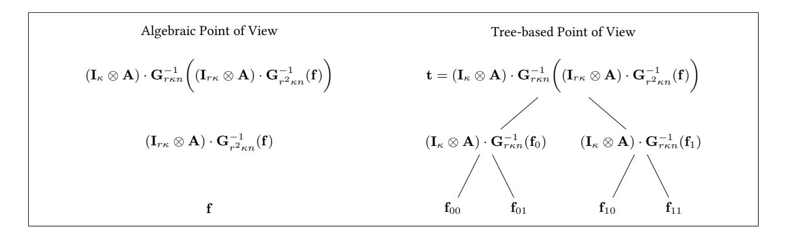
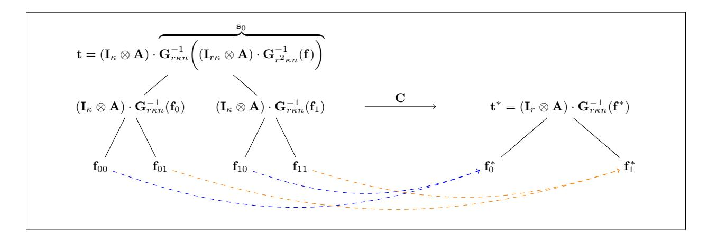

# <span id="page-0-1"></span>Polynomial Commitments from Lattices: Post-Quantum Security, Fast Verification and Transparent Setup

Valerio Cini<sup>1</sup> , Giulio Malavolta<sup>2</sup> , Ngoc Khanh Nguyen<sup>3</sup> , and Hoeteck Wee<sup>1</sup>

- <sup>1</sup> NTT Research, Sunnyvale, CA, USA
  - <sup>2</sup> Bocconi University, Milan, Italy
- <sup>3</sup> King's College London, London, UK

Abstract. Polynomial commitment scheme allows a prover to commit to a polynomial f ∈ R[X] of degree L, and later prove that the committed function was correctly evaluated at a specified point x; in other words f(x) = u for public x, u ∈ R. Most applications of polynomial commitments, e.g. succinct non-interactive arguments of knowledge (SNARKs), require that (i) both the commitment and evaluation proof are succinct (i.e., polylogarithmic in the degree L) - with the latter being efficiently verifiable, and (ii) no pre-processing step is allowed.

Surprisingly, as far as plausibly quantum-safe polynomial commitments are concerned, the currently most efficient constructions only rely on weak cryptographic assumptions, such as security of hash functions. Indeed, despite making use of the underlying algebraic structure, prior lattice-based polynomial commitments still seem to be much behind the hash-based ones. Moreover, security of the aforementioned lattice constructions against quantum adversaries was never formally discussed.

In this work, we bridge the gap and propose the first (asymptotically and concretely) efficient lattice-based polynomial commitment with transparent setup and post-quantum security. Our interactive variant relies on the standard (Module-)SIS problem, and can be made non-interactive in the random oracle model using Fiat-Shamir transformation. In addition, we equip the scheme with a knowledge soundness proof against quantum adversaries which can be of independent interest. In terms of concrete efficiency, for L = 2<sup>20</sup> our scheme yields proofs of size 2X smaller than the hash-based FRI commitment (Block et al., Asiacrypt 2023), and 70X smaller than the very recent lattice-based construction by Albrecht et al. (Eurocrypt 2024).

## <span id="page-0-0"></span>1 Introduction

Succinct arguments allow an untrusted prover to convince a verifier that a given computation is correctly executed, while incurring communication and possibly verification time, that are much smaller than the computation size [\[Kil92](#page-25-0)[,Mic94\]](#page-26-0). In the past decade, we have seen substantial theoretical and practical interest as well as remarkable progress in the construction of efficient succinct arguments, achieving different trade-offs between (transparent or trusted) setup, underlying assumptions and efficiency. In this work, we focus on succinct non-interactive arguments of knowledge (SNARKs) –such as those in [\[BBHR18a,](#page-24-0)[BBHR18b,](#page-24-1)[AHIV17](#page-23-0)[,COS20](#page-25-1)[,GLS](#page-25-2)<sup>+</sup>23[,BCS23\]](#page-24-2)– that simultaneously satisfy all of the following requirements:

- (1) supports computation in all of NP;
- (2) achieves communication and verification time that are sublinear, ideally poly-logarithimic, in computation size;
- (3) non-interactive or interactive and public-coin;
- (4) relies on a transparent setup (that is, a common random string);
- (5) achieves fast prover time that is quasi-linear in computation size;
- (6) relies on well-studied hardness assumptions;
- (7) relies on post-quantum assumptions only.

Each of these properties is highly desirable from both a theoretical and practical stand-point. Moreover, properties (1) – (6) are crucial for various real-world applications, and indeed, several of the SNARKs currently in deployment [\[BBHR18b,](#page-24-1)[AHIV17](#page-23-0)[,Pol22\]](#page-26-1) do satisfy all of (1) – (7). We refer to Fig [1](#page-0-0) for a brief summary of prior SNARK constructions.

<span id="page-1-2"></span>

| Reference                                                      | (1)          | (2)          | (3)          | (4)          | (5)          | (6)          | (7) |
|----------------------------------------------------------------|--------------|--------------|--------------|--------------|--------------|--------------|-----|
| [Kil92,Mic94]                                                  | ✓            | ✓            | ✓            | ✓            |              | ✓            | √H  |
| [Gro16]                                                        | $\checkmark$ | $\checkmark$ | $\checkmark$ |              | $\checkmark$ |              |     |
| [BCC <sup>+</sup> 16]                                          | $\checkmark$ |              | $\checkmark$ | ✓            | $\checkmark$ | $\checkmark$ |     |
| [GWC19,CHM <sup>+</sup> 20]                                    | $\checkmark$ | $\checkmark$ | $\checkmark$ |              | $\checkmark$ | $\checkmark$ |     |
| [BFS20,BHR <sup>+</sup> 21,Lee21]                              | $\checkmark$ | ✓            | $\checkmark$ | ✓            | $\checkmark$ | $\checkmark$ |     |
| [BLNS20,BS23]                                                  | $\checkmark$ |              | $\checkmark$ | $\checkmark$ | $\checkmark$ | $\checkmark$ | √L  |
| [CJJ22]                                                        |              | $\checkmark$ | $\checkmark$ | $\checkmark$ | $\checkmark$ | $\checkmark$ | √L  |
| [ACL <sup>+</sup> 22,CLM23]                                    | $\checkmark$ | $\checkmark$ | $\checkmark$ | ✓            | $\checkmark$ |              | √L  |
| [FMN23]                                                        | $\checkmark$ | ✓            | $\checkmark$ |              |              |              | √L  |
| [AFLN23]                                                       | $\checkmark$ | $\checkmark$ | $\checkmark$ |              | $\checkmark$ | $\checkmark$ | √L  |
| [BBHR18b,AHIV17,COS20,GLS <sup>+</sup> 23,BGK <sup>+</sup> 23] | $\checkmark$ | ✓            | $\checkmark$ | ✓            | $\checkmark$ | $\checkmark$ | √H  |
| [BCS23]                                                        | ✓            | $\checkmark$ | ✓            | $\checkmark$ | $\checkmark$ | $\checkmark$ | √L  |
| This work                                                      | ✓            | ✓            | ✓            | ✓            | ✓            | ✓            | √√L |

Fig. 1. A brief (and incomplete) survey of prior SNARKs. The columns correspond to: (1) all of NP, (2) sublinear communication/verification, (3) non-interactive, (4) transparent set-up, (5) quasi-linear prover, (6) well-studied hardness, (7) post-quantum assumptions. In (7), L: lattices, H: hash functions, and a  $\sqrt{\phantom{a}}$  indicates security against quantum adversaries.

|                           | Assumptions    | $2^{15}$ | $2^{20}$ | $2^{25}$ | $2^{30}$ |
|---------------------------|----------------|----------|----------|----------|----------|
| FRI [BGK <sup>+</sup> 23] | RO             | 932KB    | 1.4MB    | 2MB      | -        |
| [FMN23]                   | PowerBASIS, RO | -        | 3.4MB    | -        | 8.3MB    |
| SLAP [AFLN23]             | M-SIS, RO      | -        | 36.5MB   | -        | 767MB    |
| This work                 | M-SIS, RO      | 120KB    | 501KB    | 1.51MB   | 5.17MB   |

<span id="page-1-1"></span>Fig. 2. Efficiency comparison of plausibly post-quantum polynomial commitments over finite fields for the 128-bit security level (apart from [BGK<sup>+</sup>23, Figure 6], where the sizes correspond to 80 bits of security), and degrees  $L \in \{2^{15}, 2^{20}, 2^{25}, 2^{30}\}$ . For each construction, the Fiat-Shamir loss of  $Q \approx 2^{64}$  random oracle queries is taken into account. Data is taken as reported in the respective works.

So far, almost all known schemes satisfying (1) – (7), including the aforementioned schemes in deployment, rely on hash functions, with the only exception being the recent work of Bootle, Chiesa and Sotiraki [BCS23], hence-forth BCS23, which is based on lattice assumptions. While the BCS23 scheme seems to be concretely less efficient than prior hash-based schemes, <sup>4</sup> anecdotal evidence –notably the adoption of lattice-based schemes in the NIST PQC competition as the primary algorithms for both key encapsulation and signatures— suggests that lattice-based schemes could ultimately outperform hash-based ones with respect to many efficiency metrics. Indeed, putting property (2) aside, a recent lattice-based proof system by Beullens and Seiler [BS23] with linear-time verification achieves proof size that beats prior hash-based schemes by an order of magnitude.

The currently most efficient constructions of SNARKs follow a common building template, i.e. combining an information-theoretic proof system called Polynomial IOP (PIOP) [CHM+20], together with an extractable polynomial commitment scheme [KZG10]. The latter one allows a party to commit to a polynomial f of degree L, and later prove knowledge of the committed function that was correctly evaluated at a given point x, i.e. f(x) = u, where x and u are known to the verifier. Thus, it suffices to construct an extractable polynomial commitment scheme that satisfies (2)–(7).

#### 1.1 Our Results

We present a new, simple and direct construction of lattice-based extractable polynomial commitments satisfying properties (2) – (7), with polylog (L) communication and verification times, matching the asymptotic efficiency of the BCS23 scheme. The security of our scheme relies on the standard (Module)-SIS assumption. Our construction combines FRI-style folding [BBHR18a,BHR $^+$ 21] with lattice homomorphism, a significant departure from the BCS23 approach which translates previous pairing-based schemes based on Bulletproofs to the lattice setting [Lee21,BBB $^+$ 17,BCC $^+$ 16].

<span id="page-1-0"></span><sup>&</sup>lt;sup>4</sup> We note that no concrete proof sizes were provided in [BCS23].

<span id="page-2-1"></span>The simplicity of our construction together with the tight integration of lattice techniques further enables us to achieve the following improvements over the BCS23 scheme.

**No pre-processing.** Our polynomial commitment scheme achieves sublinear verification times without any pre-processing. This property is useful for building SNARKs for succinct R1CS instances with fast verification without pre-processing.

Concrete efficiency. We combine a variant of our scheme with optimizations developed in the context of lattice-based zero knowledge [LNS21,LNP22] to obtain a concretely-efficient scheme with  $O(\sqrt[3]{L})$  proof size and verification complexity. In terms of concrete efficiency, for polynomials of degree  $L=2^{20}$ , our scheme produces proofs of size 2X smaller than the hash-based non-interactive FRI commitment [BGK+23], 6X smaller than the lattice-based construction by Fenzi, Moghaddas, and Nguyen [FMN23] (which requires a trusted setup and relies on a non-standard assumption), and 70X smaller than the very recent work by Albrecht et al. [AFLN23] (which requires a trusted setup). We provide a summary comparison in Figure 2.

**Post-quantum security.** We show that our scheme is secure against quantum adversaries under the LWE assumption, by combining the quantum rewinding framework from [CMSZ22,LMS22], with the notion of constructive post-quantum reduction from [BBK22]. Ours is the first polynomial commitment with a proof of security against a quantum adversary, and furthermore we obtain a negligible soundness error, filling a gap left open in [LMS22].

Our polynomial commitment enjoys several additional advantages over BCS23: (i) our scheme naturally supports multilinear polynomials, and can therefore be used in conjunction with proof systems such as Hyperplonk [CBBZ23], or lookup arguments [STW23], (ii) we show explicitly how to achieve negligible soundness (whereas BCS23 would require parallel repetition [AF22]), (iii) our scheme uses a single polynomial-sized modulus, which comes in handy when optimizing ring arithmetic in hardware, whereas BCS23 requires using two moduli, and the latter one is of super-polynomial size.

While the concrete efficiency of our optimized scheme is still  $\approx 10 \text{X}$  worse than the lattice-based proof system from [BS23], we believe that techniques of this work can pave a path towards practical quantum-safe polynomial commitments from lattices.

#### 1.2 Related Works

A notion of a polynomial commitment scheme was introduced by Kate, Zaverucha and Goldberg [KZG10], who also proposed the first concrete instantiation from pairings. The widely-used KZG commitment is a core building block of SNARKs [MBKM19,CHM+20,BCHO22], and cryptocurrency applications [Ard23]. Unfortunately, it seems non-trivial to build a lattice analogue of KZG, and thus other approaches of building lattice-based polynomial commitments were considered.

The most intuitive way to construct a polynomial commitment from lattices is to come up with a lattice-based commitment scheme, together with a split-and-fold interactive proof of polynomial evaluation, which can then be made non-interactive using the Fiat-Shamir transformation [FS87]. For instance, polynomial evaluation relation f(x) = u can be seen as a linear equation

<span id="page-2-0"></span>
$$\begin{bmatrix} 1 \ x \ x^2 \cdots x^L \end{bmatrix} \begin{bmatrix} f_0 \\ \vdots \\ f_L \end{bmatrix} = u \tag{1}$$

where  $(f_0, f_1, \ldots, f_L)$  is the coefficient vector of L. Then, one could naively apply an inner-product argument, such the lattice adaptation of Bulletproofs [ACK21,AL21,BLNS20], to prove (1). The main bottleneck of the aforementioned works is verification complexity being linear in L. This issue has been recently overcome with two orthogonal approaches: (i) [BCS23] proposed a new delegation protocol inspired by Dory [Lee21] that requires pre-processing,

<span id="page-3-2"></span>(ii) [CLM23] introduced more structure on the commitment that allows fast verification at the cost of relying on a new Vanishing-SIS assumption.

An alternative approach for proving polynomial evaluations in a split-and-fold fashion was introduced in FRI [BBHR18a], and later adapted to the lattice setting in [FMN23]. In order to achieve fast verification, the latter work relies on a new PowerBASIS assumption, which is an extension of the BASIS assumption [WW23] with additional power structure. Moreover, the construction seems to be impractical due to the requirement on trusted setup, quadratic common reference string (CRS), and quadratic prover runtime. A very recent follow-up work by Albrecht et al. [AFLN23] managed to reduce the CRS size, have a quasi-linear prover runtime, and rely on a standard Module-SIS assumption. Nevertheless, the need of a trusted setup still remains.

Finally, there is a line of recent works on lattice-based functional commitments [ACL+22,BCFL22,dCP23,FLV23,WW23] which can be naively used to prove (1). However, vast majority of those constructions requires pre-processing (i.e. knowing x in advance). Moreover, only [ACL $^+$ 22,BCFL22,FLV23] are extractable (although under a knowledge assumption) but a trusted setup is needed.

**Additional related work.** The study of succinct arguments with concrete efficiency was initiated in the works of [IKO07,Gro10,SMBW12]. Our protocol falls under the broader framework of compressed  $\Sigma$ -protocols [ACK21], and the use of folding is also closely related to sum-check protocols [LFKN90,BCS21].

### Paper Organization

We provide a technical overview of our results in Section 2. Preliminaries and notation are described in Section 3. In Section 4 and Section 5 we describe our new commitment scheme together with a proof of evaluation. We then show how to instantiate a polynomial commitment scheme in Section 6. In Appendix A we propose a concretely efficient version of our protocol using cyclotomic rings. Finally, we provide a knowledge soundness proof against quantum adversaries in Appendix B.

#### <span id="page-3-0"></span>**Technical Overview**

In this section, we provide an overview of our results and main techniques. In the following, we denote L to be the length of the witness,  $\lambda$  is a security parameter, and  $\kappa$  denotes a statistical security parameter, where  $2^{-\kappa}$  will roughly be the knowledge soundness error. Here, we denote by  $\|\cdot\|$  the infinity norm.

### <span id="page-3-1"></span>2.1 Succinct, extractable commitments from SIS

We start by constructing a succinct, extractable commitment based on hardness of the Shortest Integer Solution (SIS) problem [Ajt96]. Concretely, the commitment to a vector of length L has size poly  $(\lambda, \log L)$ , and admits a public-coin interactive proof of knowledge with communication poly( $\lambda$ , log L), where  $\lambda$  is a security parameter. Binding holds under the SIS assumption, and since the focus of this work is on succinctness and not zero-knowledge, we do not require hiding.

More generally, the scheme takes as input an additional parameter r, and achieves:

- $\begin{array}{ll} & \ O(\frac{\log L}{\log r}) \ \text{rounds and communication} \ r \cdot \mathsf{poly}(\lambda); \\ & \ \mathsf{prover} \ \mathsf{time} \ r \cdot L \cdot \mathsf{poly}(\lambda) \ \mathsf{and} \ \mathsf{verification} \ \mathsf{time} \ r \cdot \mathsf{poly}(\lambda). \end{array}$

**Homomorphic SIS commitment.** We start with the standard SIS commitment for vectors  $\mathbf{f} \in \mathbb{Z}_q^L$  given by

$$\mathbf{f} \mapsto \mathbf{A} \cdot \mathbf{G}^{-1}(\mathbf{f}) \in \mathbb{Z}_q^n$$

where  $\mathbf{A} \in \mathbb{Z}_q^{n \times L \log q}$  and  $\mathbf{G} = \mathbf{I}_L \otimes \mathbf{g}^{\top} \in \mathbb{Z}_q^{L \times L \log q}$  is the gadget matrix. The opening of a commitment  $\mathbf{t}$  to  $\mathbf{f}$  is a low-norm vector  $\mathbf{s} \in \mathbb{Z}^{L \log q}$  such that

$$\mathbf{A} \cdot \mathbf{s} = \mathbf{t} \mod q$$
 and  $\mathbf{G} \cdot \mathbf{s} = \mathbf{f} \mod q$ .

<span id="page-4-4"></span>Binding follows readily from SIS. Next, observe that the scheme satisfies the following homomorphism property: given commitments  $\mathbf{t}_b$  to  $\mathbf{f}_b$  and openings  $\mathbf{s}_b$ , where  $b \in \{0,1\}$ , along with any small scalars  $c_0, c_1 \in \mathbb{Z}_q$ , we can compute a commitment  $c_0 \cdot \mathbf{t}_0 + c_1 \cdot \mathbf{t}_1$  to  $c_0 \cdot \mathbf{f}_0 + c_1 \cdot \mathbf{f}_1$  with opening  $c_0 \cdot \mathbf{s}_0 + c_1 \cdot \mathbf{s}_1$ .

Tree-based variant. Following [PSTY13,LLNW16], we define a tree-like<sup>6</sup> variant of the preceding scheme. Fix



<span id="page-4-2"></span>Fig. 3. Graphic representation of the tree-like variant for  $\ell = 1$  and r = 2. The vector  $\mathbf{f}$  is parsed as  $\mathbf{f} = (\mathbf{f}_0, \mathbf{f}_1)$ , where  $\mathbf{f}_i \in \mathbb{Z}_q^{\kappa n}$ , and  $\mathbf{f}_i = (\mathbf{f}_{i0}, \mathbf{f}_{i1})$ , where  $\mathbf{f}_{ij} \in \mathbb{Z}_q^{\kappa n}$ . The expressions on the left hand side represent the concatenation of the nodes at the given depth.

 $\mathbf{A} \in \mathbb{Z}_q^{n \times rn \log q}$ . Then,  $(\mathbf{I}_{L/rn} \otimes \mathbf{A}) \cdot \mathbf{G}^{-1}(\mathbf{f}) \in \mathbb{Z}_q^{L/r}$  yields a commitment for  $\mathbf{f}$  with compression factor r; using a r-ary tree of depth  $\ell+1$  then yields compression factor  $r^{\ell+1}$ . Concretely, the commitment  $\mathbf{t} \in \mathbb{Z}_q^{\kappa n}$  to a vector  $\mathbf{f} \in \mathbb{Z}_q^{r^{\ell+1}\kappa n}$  is given by:

<span id="page-4-3"></span>
$$\mathbf{t} := (\mathbf{I}_{\kappa} \otimes \mathbf{A}) \cdot \mathbf{G}_{r\kappa n}^{-1} \left( (\mathbf{I}_{r\kappa} \otimes \mathbf{A}) \cdot \mathbf{G}_{r^{2}\kappa n}^{-1} \left( \cdots \mathbf{G}_{r^{\ell}\kappa n}^{-1} \left( (\mathbf{I}_{r^{\ell}\kappa} \otimes \mathbf{A}) \cdot \underbrace{\mathbf{G}_{r^{\ell+1}\kappa n}^{-1} (\mathbf{f})}_{\mathbf{s}_{\ell}} \right) \right) \right). \tag{2}$$

The opening are short vectors  $(\mathbf{s}_0, \dots, \mathbf{s}_\ell)$  where  $\mathbf{s}_j \in \mathbb{Z}^{r^{j+1} \kappa n \log q}$ , satisfying

$$\begin{aligned} (\mathbf{I}_{\kappa} \otimes \mathbf{A}) \cdot \mathbf{s}_{0} &= \mathbf{t} \bmod q, \\ \mathbf{G}_{r^{j+1}\kappa n} \cdot \mathbf{s}_{j} &= (\mathbf{I}_{r^{j+1}\kappa} \otimes \mathbf{A}) \cdot \mathbf{s}_{j+1} & \text{ for all } j \in [0, \ell - 1], \\ \mathbf{G}_{r^{\ell+1}\kappa n} \cdot \mathbf{s}_{\ell} &= \mathbf{f} \bmod q, \\ \|\mathbf{s}_{j}\| &\leq \beta & \text{ for all } j \in [0, \ell]. \end{aligned}$$

A key observation in this work is that the commitment scheme satisfies the following "folding-homomorphic" property: given a commitment  $\mathbf{t}$  to  $\mathbf{f}$  and its opening  $(\mathbf{s}_0,\ldots,\mathbf{s}_\ell)$ , as well as any  $\mathbf{C}\in\{0,1\}^{\kappa r\times\kappa}$  (a "folding challenge"), then we can compute a commitment to  $(\mathbf{C}^{\top}\otimes\mathbf{I})\cdot\mathbf{f}\in\mathbb{Z}_q^{\ell\kappa n}$  (a "folded function"). Concretely,

$$\mathbf{t}^* := (\mathbf{C}^\top \otimes \mathbf{G}) \cdot \mathbf{s}_0 \quad \text{(a "folded commitment")}$$

<span id="page-4-0"></span><sup>&</sup>lt;sup>5</sup> Note that if we had defined the opening to be  $\mathbf{f}$  and have the verifier check that  $\mathbf{A} \cdot \mathbf{G}^{-1}(\mathbf{f}) \stackrel{?}{=} \mathbf{t}$ , then the scheme would not satisfy homomorphism because  $\mathbf{G}^{-1}(\mathbf{f}_0) + \mathbf{G}^{-1}(\mathbf{f}_1) \neq \mathbf{G}^{-1}(\mathbf{f}_0 + \mathbf{f}_1)$ .

<span id="page-4-1"></span><sup>&</sup>lt;sup>6</sup> Our construction can be thought of as a r-ary tree instantiated with the hash function:  $H_{\mathbf{A}}(\mathbf{x}) = \mathbf{A} \cdot \mathbf{G}^{-1}(\mathbf{x})$ , for a uniformly random  $\mathbf{A}$ .

<span id="page-5-1"></span>is a commitment to  $\mathbf{f}^*\coloneqq (\mathbf{C}^\top\otimes \mathbf{I})\cdot \mathbf{f}\in \mathbb{Z}_q^{r^\ell\kappa n}$  with opening

$$(\mathbf{s}_0^*, \dots, \mathbf{s}_{\ell-1}^*) := ((\mathbf{C}^\top \otimes \mathbf{I}) \cdot \mathbf{s}_1, \dots, (\mathbf{C}^\top \otimes \mathbf{I}) \cdot \mathbf{s}_\ell).$$



<span id="page-5-0"></span>**Fig. 4.** Graphic representation of one round of "homomorphic-folding" via the "folding challenge"  $\mathbf{C}$ , for  $\ell=1$  and r=2. For each  $i\in\mathbb{Z}_r$ , the challenge  $\mathbf{C}$  is used to "collapse" all i-th sibling leaves of the old tree into a single leaf of the new tree, i.e.,  $\mathbf{f}_b^*=\mathbf{C}^{\top}\cdot(\mathbf{f}_{0b},\mathbf{f}_{1b})$ . Notice that the new tree (right) has depth one less than the old one (left).

The proof is a straightforward application of the mixed-product property, which tells us  $\mathbf{C}^{\top} \otimes \mathbf{I}$  "commutes" with  $\mathbf{I} \otimes \mathbf{A}$  (see (11) for a precise statement). Moreover,  $\|\mathbf{s}_i^*\| \leq r\kappa\beta$  for any  $j \in [0, \ell - 1]$ .

Looking ahead, we will use the fact that to compute  $\mathbf{t}^*$ , it suffices to know the short partial opening  $\mathbf{s}_0 \in \mathbb{Z}^{r\kappa n \log q}$ . Considering for a moment the tree-based viewpoint pictured in Figure 3, the "folding procedure" can be described as follows: for each  $i \in \mathbb{Z}_r$ , the challenge  $\mathbf{C}$  is used to "collapse" all i-th sibling leaves together into a single leaf of a new tree. This is described pictorially in Figure 4. Using the algebraic structure of the hash function, such folding propagates to every node of the tree. Moreover, there is a r-fold decrease in the number of leaves of the new tree compared to those of the initial tree. Thus, in the process the depth of the tree is decreases by 1. Since the algebraic point of view, together with the tensor product notation, is more amenable to be used to work with, we are going to use the algebraic prospective only in the rest of the paper.

**Proof of knowledge via folding.** Proof of knowledge proceeds recursively in  $\ell$  rounds via FRI-style folding [BBHR18a] (also used in [BHR+21,FMN23]): to prove knowledge of an opening to  $\mathbf{f} \in \mathbb{Z}_q^{r^{\ell+1}\kappa n}$  for a commitment  $\mathbf{t} \in \mathbb{Z}_q^n$ :

- the prover sends  $\mathbf{y} := \mathbf{s}_0 \in \mathbb{Z}^{r\kappa n \log q}$ ;
- the verifier checks that  $\|\mathbf{y}\|$  is small and that  $(\mathbf{I}_{\kappa} \otimes \mathbf{A}) \cdot \mathbf{y} = \mathbf{t}$ ; then sends a random challenge  $\mathbf{C} \leftarrow \{0,1\}^{\kappa r \times \kappa}$ ;
- both parties derive the new commitment  $\mathbf{t}^* := (\mathbf{C}^\top \otimes \mathbf{G}) \cdot \mathbf{y}$ , and the prover derives an opening of  $\mathbf{t}^*$  to  $\mathbf{f}^* := (\mathbf{C}^\top \otimes \mathbf{I}) \cdot \mathbf{f}$  via the above-mentioned folding homomorphism property.

We repeat the above protocol  $\ell$  times until we arrive at a commitment to a vector of length  $\kappa n$ , for which the prover can simply send its opening, which will have norm at most  $(r\kappa)^{\ell}\beta$ .

Next, we need to construct a knowledge extractor that outputs  $\mathbf{f}$  along with an opening to  $\mathbf{f}$ . The knowledge extractor is also constructed recursively, following the coordinate-wise extraction strategy from [BBC<sup>+</sup>18,FMN23]. Informally, this means that we need to compute an opening of  $\mathbf{t}$  to  $\mathbf{f}$  given openings of  $\mathbf{t}_k^*$  to  $\mathbf{f}^*$  corresponding to different challenges  $\mathbf{C}_k$ .

The idea is to first run the cheating prover in the recursive step to obtain openings for some challenge  $C_0$ , and then rewind the cheating prover many times, so as to obtain openings for challenges  $C_1, \ldots, C_{r\kappa}$ , where  $C_k$  agrees

<span id="page-6-2"></span>with  $\mathbf{C}_0$  in all columns except column k. We can then argue that with probability  $1 - r\kappa \cdot 2^{-\kappa}$ , we can recover  $\mathbf{f}$  (respectively short  $\mathbf{s}_j, j \in [\ell]$ ) given  $((\mathbf{C}_k^\top - \mathbf{C}_0^\top) \otimes \mathbf{I}) \cdot \mathbf{f}$  (respectively  $((\mathbf{C}_k^\top - \mathbf{C}_0^\top) \otimes \mathbf{I}) \cdot \mathbf{s}_j, j \in [\ell]$ ) for all  $k \in [r\kappa]$ . In each recursive step, we will need to rewind the cheating prover roughly  $(r\kappa)$  times, which means the overall extractor will need to make  $(r\kappa)^\ell$  queries to a cheating prover. For vectors of length  $L \approx r^\ell$ , the number of queries is bounded by  $\approx L^2$  as long as we choose  $r \geq \kappa$ .

As for the norm of the extracted openings, they increase by a factor of two after each recursive step. Since the initial opening, which is the last prover message, has norm  $(r\kappa)^\ell \beta$ , this means that the coefficients of the final extracted opening must be (in the absolute value) at most  $(2r\kappa)^\ell \beta$ . Moreover, the proof system modulus q has to be at least larger than (twice) the extracted norm to ensure binding, and thus  $q=(2r\kappa)^\ell \beta \cdot \operatorname{poly}(\lambda)$ . By setting parameters  $(r,k,\ell)$  as above, we get  $q=L^2 \cdot \operatorname{poly}(\lambda)$ . This is a significant improvement over BCS23, where a super-polynomial modulus  $q=O(L^{\log \lambda})$  is required for the soundness analysis.

Finally, we give a rough estimation on the proof size of the protocol. First, to obtain negligible soundness error, we select  $r=\kappa=O(\lambda)$ , and consequently  $\ell=O(\frac{\log L}{\log \lambda})$ . Furthermore, for security of the underlying SIS assumption, we require at least  $n=O(\lambda)$ . Since for now we were using a gadget matrix with base two, we have  $\beta=1$ . By assuming  $q=O((2r\kappa)^{\ell}\beta)=O(L^2)$ , the total size of all the prover messages can be asymptotically bounded by

$$O\left(\lambda^3 \cdot \frac{\log^3 L}{\log \lambda}\right)$$
 bits. (3)

### 2.2 Upgrading to polynomial commitments

Next, we describe how to modify our extractable commitment scheme so that the prover can prove evaluation of the committed function  $\mathbf{f} \in \mathbb{Z}_q^{r^{\ell+1}\kappa n}$  as a multilinear polynomial, with a small increase in communication and computation. Namely, in addition to the commitment  $\mathbf{t}$ , both the prover and the verifier receive  $\mathbf{x}_0, \dots, \mathbf{x}_\ell \in \mathbb{Z}_q^r$  and  $\mathbf{u} \in \mathbb{Z}_q^{\kappa n}$ , and we want to check that  $\mathbf{v}$ 

<span id="page-6-1"></span>
$$(\mathbf{I}_{\kappa n} \otimes \mathbf{x}_{\ell}^{\top}) \cdot (\mathbf{I}_{r\kappa n} \otimes \mathbf{x}_{\ell-1}^{\top}) \cdots (\mathbf{I}_{r^{\ell} \kappa n} \otimes \mathbf{x}_{0}^{\top}) \cdot \mathbf{f} = \mathbf{u}$$

$$(4)$$

Observe that the computation as described above has the same r-ary depth  $\ell$  tree structure as our commitment in (2). It is easy to see that for  $n=1, \kappa=1, r=2$ , this captures polynomial evaluation for both multi-linear polynomials in  $\ell+1$  variables and univariate polynomials of degree  $2^{\ell+1}$ , where  ${\bf f}$  corresponds to the coefficient vector of these polynomials.

**Proof of evaluation via folding.** We proceed recursively via FRI-style folding as before:

- the prover sends  $\mathbf{v} := (\mathbf{I}_{r\kappa n} \otimes \mathbf{x}_{\ell-1}^\top) \cdots (\mathbf{I}_{r^\ell \kappa n} \otimes \mathbf{x}_0^\top) \cdot \mathbf{f}$  in addition to  $\mathbf{y}$ ;
- verifier checks that  $(\mathbf{I}_{\kappa n} \otimes \mathbf{x}_{\ell}^{\top}) \cdot \mathbf{v} = \mathbf{t}$  in addition to the previous checks on  $\mathbf{y}$ , then sends  $\mathbf{C} \leftarrow \{0,1\}^{r\kappa \times \kappa}$  as before;
- both parties compute  $\mathbf{u}^* := (\mathbf{C}^\top \otimes \mathbf{I}) \cdot \mathbf{v}$  in addition  $\mathbf{t}^*$ ;
- the prover derives the opening of  $t^*$  to  $f^*$  as before.

The prover proceeds then recursively to prove that the committed function in  $\mathbf{t}^*$  evaluates at  $(\mathbf{x}_{\ell-1}, \dots, \mathbf{x}_0)$  to  $\mathbf{u}^*$ . Completeness relies on the following equality, which again follows from the mixed-product property:

$$(\mathbf{I}_{\kappa n} \otimes \mathbf{x}_{\ell-1}^{\top}) \cdots (\mathbf{I}_{r^{\ell-1}\kappa n} \otimes \mathbf{x}_{0}^{\top}) \cdot \overbrace{(\mathbf{C}^{\top} \otimes \mathbf{I}) \cdot \mathbf{f})}^{\mathbf{f}^{*}}$$

$$= (\mathbf{C}^{\top} \otimes \mathbf{I}) \cdot \overbrace{(\mathbf{I}_{r\kappa n} \otimes \mathbf{x}_{\ell-1}^{\top}) \cdots (\mathbf{I}_{r^{\ell}\kappa n} \otimes \mathbf{x}_{0}^{\top}) \cdot \mathbf{f}}^{\mathbf{v}}.$$

<span id="page-6-0"></span><sup>&</sup>lt;sup>7</sup> Note that the computation is over  $\mathbb{Z}_q$ , which matches the SIS modulus used in our commitment scheme. In contrast, BCS23 considers polynomials over  $\mathbb{Z}_p$ , where p is smaller than the SIS modulus. Moreover, there are no norm bounds on the vectors  $\mathbf{f}$  or  $\mathbf{x}_0, \dots, \mathbf{x}_\ell$ , unlike the multi-variate polynomial commitments in [ACL<sup>+</sup>22].

$$\begin{array}{c} \mathcal{D}\left((\mathbf{A},\mathbf{t},\mathbf{x}_0,\mathbf{x}_1,\mathbf{x}_2,\mathbf{u}),\\ (\mathbf{s}_0,\mathbf{s}_1,\mathbf{s}_2) \end{array}\right) \\ \mathbf{y}_0 \coloneqq \mathbf{s}_0 \\ \mathbf{v}_0 \coloneqq ((\mathbf{I}_{r\kappa n} \otimes \mathbf{x}_1^\top) \cdot ((\mathbf{I}_{r^2\kappa n} \otimes \mathbf{x}_0^\top) \cdot \mathbf{f} \\ \\ \mathbf{y}_1 \coloneqq ((\mathbf{C}_1^\top \otimes \mathbf{I}_{rn\log q}) \cdot \mathbf{s}_1 \\ \mathbf{v}_1 \coloneqq ((\mathbf{I}_{r\kappa n} \otimes \mathbf{x}_0^\top) \cdot ((\mathbf{C}_1^\top \otimes \mathbf{I}_{r^2n}) \cdot \mathbf{f} \\ \\ \mathbf{y}_2 \coloneqq ((\mathbf{C}_2^\top \otimes \mathbf{I}_{rn\log q}) \cdot ((\mathbf{C}_1^\top \otimes \mathbf{I}_{r^2n\log q}) \cdot \mathbf{s}_2 \\ \mathbf{v}_2 \coloneqq ((\mathbf{C}_2^\top \otimes \mathbf{I}_{rn\log q}) \cdot ((\mathbf{C}_1^\top \otimes \mathbf{I}_{r^2n\log q}) \cdot \mathbf{s}_2 \\ \\ \mathbf{v}_2 \coloneqq ((\mathbf{C}_2^\top \otimes \mathbf{I}_{rn\log q}) \cdot ((\mathbf{C}_1^\top \otimes \mathbf{I}_{r^2n\log q}) \cdot \mathbf{s}_2 \\ \\ \mathbf{v}_2 \coloneqq ((\mathbf{C}_2^\top \otimes \mathbf{I}_{rn\log q}) \cdot ((\mathbf{C}_1^\top \otimes \mathbf{I}_{r^2n\log q}) \cdot \mathbf{s}_2 \\ \\ \mathbf{v}_2 \coloneqq ((\mathbf{C}_2^\top \otimes \mathbf{I}_{rn\log q}) \cdot ((\mathbf{C}_1^\top \otimes \mathbf{I}_{r^2n\log q}) \cdot \mathbf{s}_2 \\ \\ \mathbf{v}_2 \coloneqq ((\mathbf{C}_2^\top \otimes \mathbf{I}_{rn\log q}) \cdot ((\mathbf{C}_1^\top \otimes \mathbf{I}_{r^2n\log q}) \cdot \mathbf{s}_2 \\ \\ \mathbf{v}_2 \coloneqq ((\mathbf{C}_2^\top \otimes \mathbf{I}_{rn\log q}) \cdot ((\mathbf{C}_1^\top \otimes \mathbf{I}_{r^2n\log q}) \cdot \mathbf{s}_2 \\ \\ \mathbf{v}_2 \coloneqq ((\mathbf{C}_2^\top \otimes \mathbf{I}_{rn\log q}) \cdot ((\mathbf{C}_1^\top \otimes \mathbf{I}_{r^2n\log q}) \cdot \mathbf{s}_2 \\ \\ \mathbf{v}_2 \coloneqq ((\mathbf{C}_2^\top \otimes \mathbf{I}_{rn\log q}) \cdot ((\mathbf{C}_1^\top \otimes \mathbf{I}_{r^2n\log q}) \cdot \mathbf{s}_2 \\ \\ \mathbf{v}_2 \coloneqq ((\mathbf{C}_2^\top \otimes \mathbf{I}_{rn\log q}) \cdot ((\mathbf{C}_1^\top \otimes \mathbf{I}_{r^2n\log q}) \cdot \mathbf{s}_2 \\ \\ \mathbf{v}_2 \coloneqq ((\mathbf{C}_2^\top \otimes \mathbf{I}_{rn\log q}) \cdot ((\mathbf{C}_1^\top \otimes \mathbf{I}_{r^2n\log q}) \cdot \mathbf{s}_2 \\ \\ \mathbf{v}_2 \coloneqq ((\mathbf{C}_2^\top \otimes \mathbf{I}_{rn\log q}) \cdot ((\mathbf{C}_1^\top \otimes \mathbf{I}_{r^2n\log q}) \cdot \mathbf{s}_2 \\ \\ \mathbf{v}_2 \coloneqq ((\mathbf{C}_2^\top \otimes \mathbf{I}_{rn\log q}) \cdot ((\mathbf{C}_1^\top \otimes \mathbf{I}_{r^2n\log q}) \cdot \mathbf{s}_2 \\ \\ \mathbf{v}_2 \coloneqq ((\mathbf{C}_2^\top \otimes \mathbf{I}_{rn\log q}) \cdot ((\mathbf{C}_1^\top \otimes \mathbf{I}_{r^2n\log q}) \cdot \mathbf{s}_2 \\ \\ \mathbf{v}_2 \coloneqq ((\mathbf{C}_2^\top \otimes \mathbf{I}_{rn\log q}) \cdot ((\mathbf{C}_1^\top \otimes \mathbf{I}_{r^2n\log q}) \cdot \mathbf{s}_2 \\ \\ \mathbf{v}_2 \coloneqq ((\mathbf{C}_2^\top \otimes \mathbf{I}_{rn\log q}) \cdot ((\mathbf{C}_1^\top \otimes \mathbf{I}_{r^2n\log q}) \cdot \mathbf{s}_2 \\ \\ \mathbf{v}_2 \coloneqq ((\mathbf{C}_2^\top \otimes \mathbf{I}_{rn\log q}) \cdot ((\mathbf{C}_1^\top \otimes \mathbf{I}_{r^2n\log q}) \cdot \mathbf{s}_2 \\ \\ \mathbf{v}_3 \coloneqq ((\mathbf{C}_1^\top \otimes \mathbf{I}_{r^2n\log q}) \cdot ((\mathbf{C}_1^\top \otimes \mathbf{I}_{r^2n\log q}) \cdot \mathbf{s}_2 \\ \\ \mathbf{v}_3 \coloneqq ((\mathbf{C}_1^\top \otimes \mathbf{I}_{r^2n\log q}) \cdot ((\mathbf{C}_1^\top \otimes \mathbf{I}_{r^2n\log q}) \cdot \mathbf{s}_2 \\ \\ \mathbf{v}_3 \coloneqq ((\mathbf{C}_1^\top \otimes \mathbf{I}_{r^2n\log q}) \cdot ((\mathbf{C}_1^\top \otimes \mathbf{I}_{r^2n\log q}) \cdot \mathbf{s}_2 \\ \\ \mathbf{v}_3 \coloneqq ((\mathbf{C}_1^\top \otimes \mathbf{I}_{r^2n\log q}) \cdot ((\mathbf{C}_1^\top \otimes \mathbf{I}_{r^2n\log q}) \cdot \mathbf{s}_2 \\ \\ \mathbf{v}_3 \coloneqq ((\mathbf{C}_1^\top \otimes \mathbf{I}_{r^2n\log q}) \cdot ((\mathbf{C}_1^\top \otimes \mathbf{I}_{r^2n$$

<span id="page-7-2"></span>**Fig. 5.** Proof of knowledge of short  $(\mathbf{s}_0, \mathbf{s}_1, \mathbf{s}_2) \in \mathbb{Z}_q^{r\kappa n \log q} \times \mathbb{Z}_q^{r^2 \kappa n \log q} \times \mathbb{Z}_q^{r^3 \kappa n \log q}$  which satisfy Equations (5) and (6). Here,  $\mathcal{C} := \{0, 1\}.$ 

Formally, we define a relation  $R_{\ell,\beta_{\ell}}$  over instances  $(\mathbf{A},\mathbf{x}_0,\ldots,\mathbf{x}_{\ell},\mathbf{u},\mathbf{t})$ , where the witness is an opening (with norm at most  $\beta_{\ell}$ ) of  $\mathbf{t}$  to  $\mathbf{f}$  such that  $\mathbf{f}$  satisfies (4). Then, the recursive step can be viewed as a reduction from  $R_{\ell,\beta_{\ell}}$  to  $R_{\ell-1,\beta_{\ell-1}}$  (cf. Section 5).

For the ease of presentation, we describe the combined protocol for  $\ell=2$  in Figure 5 (and the more general setting in Figure 6); this protocol also serves as the starting point of our concretely-efficient scheme. The relation is specified by  $\mathbf{x}_0, \mathbf{x}_1, \mathbf{x}_2 \in \mathbb{Z}_q^r$ ,  $\mathbf{f} \in \mathbb{Z}_q^{r^3 \kappa n}$  and the output is

<span id="page-7-0"></span>
$$\mathbf{u} := (\mathbf{I}_{\kappa n} \otimes \mathbf{x}_{2}^{\top}) \cdot (\mathbf{I}_{r\kappa n} \otimes \mathbf{x}_{1}^{\top}) \cdot (\mathbf{I}_{r^{2}\kappa n} \otimes \mathbf{x}_{0}^{\top}) \cdot \mathbf{f} \in \mathbb{Z}_{q}^{\kappa n}.$$
 (5)

That is, the goal is to show (5) holds given commitment

<span id="page-7-1"></span>
$$\mathbf{t} = (\mathbf{I}_{\kappa} \otimes \mathbf{A}) \cdot \mathbf{G}_{r\kappa n}^{-1} \left( (\mathbf{I}_{r\kappa} \otimes \mathbf{A}) \cdot \overline{\mathbf{G}_{r^{2}\kappa n}^{-1} \left( (\mathbf{I}_{r^{2}\kappa} \otimes \mathbf{A}) \cdot \underline{\mathbf{G}_{r^{3}\kappa n}^{-1} (\mathbf{f})} \right) \right)} \in \mathbb{Z}_{q}^{\kappa n}.$$

$$(6)$$

In other words, the protocol described in Figure 5 can be seen as the sequential repetition of above protocol twice, followed by the trivial protocol where the prover simply sends the witness to the verifier.

**Optimizations.** The protocol above can be further optimized as follows. First, there is no need to set  $\mathbf{t}$  as a commitment, if we already send the partial opening  $\mathbf{s}_0$  in the clear. Hence, we can simply treat  $\mathbf{s}_0$  (or more efficiently,  $\mathbf{G}\mathbf{s}_0$ )

<span id="page-8-4"></span>as a commitment to  ${\bf f}$ . Moreover, for both asymptotic and concrete efficiency, it is more beneficial to consider gadget matrices with larger bases than 2, such as  $q^{1/\alpha}$  where  $\alpha=O(1)$ . Hence, we manage to asymptotically reduce the proof size to

<span id="page-8-0"></span>
$$O\left(\lambda^3 \cdot \frac{\log^2 L}{\log \lambda}\right)$$
 bits. (7)

Finally, for flexibility reasons, one may use different dimensions  $(r_i)_i$  for the matrices  $(\mathbf{A}_i)_i$ , which could slightly reduce the total proof size.

#### 2.3 Concrete Efficiency via Cyclotomic Rings

Despite asymptotic efficiency, the previously described protocol seems to provide concretely large proofs. Indeed, when setting realistic parameters, such as  $L=2^{20}$  and  $\lambda=128$ , the expression calculated in Eq. (7) becomes around  $2^{23}$ , which would result in at least a few tens, if not hundred, megabytes. The dominant term is undoubtedly  $\lambda^3$ , which consists of the following three terms: (i) dimension n responsible for SIS hardness, (ii) folding factor r, and (iii) soundness amplification factor  $\kappa$ . Recall that the last parameter is responsible for keeping the soundness error  $r\kappa \cdot 2^{-\kappa}$  negligible, where the "2" comes from the size of the set  $\mathcal{C}=\{0,1\}$ . Obviously, to reduce  $\kappa$  one could naively pick a larger set of integers  $\mathcal{C}$  but this comes at the cost of the increased norm of the prover messages, and thus the proof system modulus.

Motivated by the above limitations, we translate our protocol to the setting of power-of-two cyclotomic rings  $R_q := \mathbb{Z}_q[X]/(X^d+1)$  where  $d=O(\lambda)$ . This allows us to pick an exponential-sized set  $\mathcal C$  of short-norm polynomials, e.g. with coefficients in  $\{0,1\}$ . Consequently, we can set  $\kappa=1$ , and thus gain a potential factor of  $\lambda$  improvement in the proof size, while keeping the prover messages relatively short.

Unfortunately, a serious issue arises when performing knowledge extraction. Indeed, for the previous protocol we relied on a crucial property of  $\mathcal{C}=\{0,1\}$  that an inverse of any two distinct challenges is short. In the ring setting, such sets can have at most polynomial size [AL21], which would limit us to  $\kappa=O(\lambda/\log\lambda)$ . Of course, one could stick with exponential-sized challenge spaces  $\mathcal{C}$  of binary polynomials and stubbornly continue the knowledge soundness argument as before. Then, instead of trying to extract a short witness  $\bar{\mathbf{s}}$  which satisfies some relations, we would extract a (possibly large) witness  $\bar{\mathbf{s}}$ , together with a scalar  $\bar{c}$  called slack, such that  $\bar{c} \cdot \bar{\mathbf{s}}$  is short. We show that our commitment scheme is binding with respect to such *relaxed* openings. However, performing an analogue extraction strategy from Section 2.1 in the ring setting yields a slack  $\bar{c}$  of huge norm  $O(\lambda^{2^\ell})$ . Since, for binding purposes, the proof system modulus has to be larger than the slack norm, when setting  $\ell=\log L$  we get that  $\log q=O(L)$ , and thus the protocol loses the succinctness property. Concretely, this becomes problematic even for relatively small values of  $\ell$ .

Since here we are interested in concrete efficiency, we consider the protocol in Figure 5 as a base case of our polynomial commitment scheme with communication and verifier complexity  $O(\sqrt[3]{L})$  and  $\ell=2$ . In addition, to further decrease the slack norm, we substitute the second part of the protocol with a new *exact* proof of knowledge of a short vector  $\mathbf{s} \in R_q^{rm}$  which satisfies

<span id="page-8-2"></span>
$$(\mathbf{I}_r \otimes \mathbf{A}) \cdot \mathbf{s} = \mathbf{t} \quad \text{and} \quad \|\mathbf{s}\| \le \beta.$$
 (8)

Here, "exact" means that the extracted vector s is indeed short, and thus no slack is required. To this end, we apply the approximate range proof methodology from [BL17,LNS21], which says that if a random projection  $\vec{p} = P \cdot \vec{v} \mod q$  is short, where  $P \leftarrow \chi^{\lambda \times m}$  is a uniformly random matrix with small coefficients over  $\mathbb{Z}_q$  and  $\vec{v} \in \mathbb{Z}_q^m$ , then with an overwhelming probability  $\vec{v}$  must also be short.

The protocol starts by the verifier sending the projection matrix  $P \leftarrow \chi^{\lambda \times md}$ , to which the prover replies with the projection

<span id="page-8-1"></span>
$$\vec{p} := (I_r \otimes P) \cdot \vec{s} \in \mathbb{Z}_q^{r\lambda}, \tag{9}$$

where  $\vec{s} := (\vec{s}_1, \dots, \vec{s}_r) \in \mathbb{Z}_q^{rmd}$  is the coefficient vector of  $\vec{s}$ . The verifier can manually check that  $\vec{p}$  is short, which intuitively proves that  $\vec{s}$  must be short as long as we prove well-formedness of the projection  $\vec{p}$ .

By applying the  $\mathbb{Z}_q$ -to- $R_q$  transformation presented in [LNP22], we reduce proving (9) to proving a tensor-type equation over  $R_q$ :

<span id="page-8-3"></span>
$$(\mathbf{I}_r \otimes \mathbf{N}) \cdot \mathbf{s} = \boldsymbol{\gamma} \tag{10}$$

<span id="page-9-2"></span>where N and γ can be computed by the verifier (we omit the exact formulas for the sake of presentation). Finally, proving Equations [\(8\)](#page-8-2) and [\(10\)](#page-8-3) follows exactly as in Section [2.1.](#page-3-1) The overall ring-based protocol is summarized in Figure [7](#page-29-0) and described in Appendix [A.](#page-26-9)

We highlight that in the knowledge extraction of our O( <sup>√</sup><sup>3</sup> <sup>L</sup>)-size protocol we still need to account for slack. Indeed, our exact proof system is only applied in the second phase, while the first one remains the same as in Figure [5.](#page-7-2) To completely remove slack from the extraction analysis, one would need to be able to efficiently prove this type of statements over Zq:

$$\overrightarrow{p} := (I_r \otimes P_1) \cdot (I_{r^2} \otimes P_2) \cdot \overrightarrow{s}.$$

One may try to follow our methodology for the "single-tensor" case presented above. Unfortunately, it is non-trivial whether one could reduce the equation (using techniques from [\[LNP22\]](#page-26-3) or otherwise) to an equivalent tensor-type statement over Rq. Hence, in the security analysis we need to deal with the slack norm, but it is greatly reduced thanks to the exact proof in the second part of the protocol.

### 2.4 Post-Quantum Security

Proving post-quantum security of our polynomial commitment boils down to finding an extractor that, given a (quantum) adversary that succeeds in the protocol with non-negligible probability, recovers a valid committed polynomial with a similar probability. The main challenge in these settings is that, in general, one cannot freely rewind quantum algorithms, without violating the no-cloning theorem. Fortunately a series of work have developed the necessary technical toolkit to carry over rewinding arguments in the quantum settings. Relevantly for us, the work of [\[LMS22\]](#page-26-4), which in turn builds in the framework of [\[CMSZ22\]](#page-25-11), shows a general theorem for rewinding folding-like protocols. Specifically, they show that if a protocol is (i) recursive special sound and (ii) last-round collapsing[8](#page-9-0) , then it is indeed possible to rewind the attacker and recover a witness via a quantum extractor, which is the moral analogue of the classical algorithm.[9](#page-9-1)

To understand the challenge, let us first see what goes wrong in applying the theorem of [\[LMS22\]](#page-26-4) to our settings. First of all, it is actually easy to show that our protocol is last-round collapsing. As we have seen, our protocol is obtained by sequentially composing a 2-round subroutine: the partial transcript (z0, c1, . . . , zi−1, ci) for the first i rounds determines a "partial statement/witness pair" (x<sup>i</sup> , wi). The "partial witness" w<sup>i</sup> can be computed by the prover given the initial witness w<sup>0</sup> and the protocol transcript. Loosely speaking, last-round collapsing says that measuring the register that contains w<sup>i</sup> should be "undetectable" (provided it is a valid witness). Given recent works [\[LZ19,](#page-26-12)[LMZ23\]](#page-26-13) that show that the SIS-function is collapsing [\[Unr16\]](#page-26-14), a sufficient condition to achieve the last-round collapsing property is that

> xi"contains a SIS-hash of" w<sup>i</sup> .

Roughly speaking, in our protocol, we have

$$(\mathbf{I} \otimes \mathbf{A}) \cdot w_i = x_i$$

Hence, the above condition is verified, and undetectability of the measurement follows immediately by the LWE assumption, by invoking [\[LZ19,](#page-26-12)[LMZ23\]](#page-26-13).

However, the trouble starts when considering recursive special soundness. The somewhat subtle point here is that the regular notion of special soundness describes an extractor that, given responses for uniformly sampled challenges, is able to recover the witness. Instead, our protocol satisfies the weaker notion of coordinate-wise special soundness, where the extractor is only guaranteed to work if the adversary provides correct answers for challenges sampled from a highly correlated distribution. The specifics of this distributions are irrelevant for the purpose of this discussion, and it suffices to remark that the extractor from [\[LMS22\]](#page-26-4) crucially relies on the fact that the queries to the adversary are (close to) independently sampled. As a result, when applied to our protocol, there is no guarantee that the extractor of [\[LMS22\]](#page-26-4) succeeds.

<span id="page-9-0"></span><sup>8</sup> It is also implicitly required that the last round of the protocol corresponds to the plain witness of the "folded" relation. In this overview we gloss over this property, since it is trivially satisfied by our protocol.

<span id="page-9-1"></span><sup>9</sup> The work of [\[LMS22\]](#page-26-4) has to deal with several technical nuances, such as truncating the extractor to ensure that it can be implemented by a polynomial-size quantum circuit, which also show up in our settings. However, in this overview we largely ignore such issues, and we refer the reader to the technical sections for more details.

<span id="page-10-2"></span>We bypass this technical hurdle by combining the rewinding strategy of [LMS22], with the techniques introduced by a recent work of Bitansky et al. [BBK22]. This work introduces a general strategy to translate classical reductions to post-quantum strategies. Relevantly for us, they show a method to simulate a reduction against a *stateless* adversary, even when the actual adversary can maintain a state across several queries. This allows us to treat the quantum adversary as if they "forgot" about previous queries, and therefore their response is (statistically close to) independent for each individual query. Carefully combining this simulator with (a variant of) the extraction strategy of [LMS22], yields the final extractor.

#### <span id="page-10-0"></span>3 Preliminaries

**Notations.** We use boldface lower case for row vectors (e.g.  $\mathbf{r}$ ) and boldface upper case for matrices (e.g.  $\mathbf{R}$ ). For integral vectors and matrices (i.e., those over  $\mathbb{Z}$ ), we use the notation  $\|\mathbf{r}\|$ ,  $\|\mathbf{R}\|$  to denote the maximum absolute value over all the entries. We use  $v \leftarrow D$  to denote a random sample from a distribution D, as well as  $v \leftarrow S$  to denote a uniformly random sample from a set S. We use  $\approx_s$  and  $\approx_c$  as the abbreviation for statistically close and computationally indistinguishable. For integers  $a \leq b$ , we denote  $[a,b] := \{a,a+1,\ldots,b\}$ , and in particular [n] := [1,n] for  $n \geq 1$ . Let  $\alpha, \delta, q \in \mathbb{Z}$ ,

$$\mathbf{g}_{\alpha,q} = (1, \delta, \delta^2, \dots, \delta^{\alpha-1}) \in \mathbb{Z}^{\alpha}$$

where  $\alpha = \log_{\beta} q$ . The gadget matrix  $\mathbf{G}_{n,\alpha,q} = \mathbf{g}_{\alpha,q} \otimes \mathbf{I}_n \in \mathbb{Z}^{n \times n \cdot \alpha}$ . For any  $t \in \mathbb{Z}$ , the function  $\mathbf{G}_{n,\alpha,q}^{-1} : \mathbb{Z}_q^{n \times t} \to \{0,1\}^{n \cdot \alpha \times t}$  expands each entry  $a \in \mathbb{Z}_q$  of the input matrix into a column of size  $\alpha$  consisting of the base- $\delta$  representation of a. For any matrix  $\mathbf{A} \in \mathbb{Z}_q^{n \times t}$  it holds that  $\mathbf{G}_{n,\alpha,q} \cdot \mathbf{G}_{n,\alpha,q}^{-1}(\mathbf{A}) = \mathbf{A} \mod q$ . We drop parameters  $\alpha$  and q when they are clear from context.

**Properties of Kronecker product.** If A, B, C, and D, are matrices of such size that one can form the matrix products  $A \cdot C$ , and  $B \cdot D$ , then

$$(\mathbf{A} \otimes \mathbf{B}) \cdot (\mathbf{C} \otimes \mathbf{D}) = (\mathbf{A} \cdot \mathbf{C}) \otimes (\mathbf{B} \cdot \mathbf{D}).$$

This is called the mixed-product property because it mixes the ordinary matrix product and the Kronecker product. An easy corollary is the following statement, which is a formalization of the statement " $\mathbf{X} \otimes \mathbf{I}$  and  $\mathbf{I} \otimes \mathbf{Y}$  commutes":

<span id="page-10-1"></span>
$$(\mathbf{X} \otimes \mathbf{I}_{t \cdot \mathsf{nrow}(\mathbf{Y})}) \cdot (\mathbf{I}_{t \cdot \mathsf{ncol}(\mathbf{X})} \otimes \mathbf{Y}) = (\mathbf{I}_{t \cdot \mathsf{nrow}(\mathbf{X})} \otimes \mathbf{Y}) \cdot (\mathbf{X} \otimes \mathbf{I}_{t \cdot \mathsf{ncol}(\mathbf{Y})})$$
(11)

### 3.1 Commitment Scheme

**Definition 1.** A (non-interactive) commitment scheme over  $\mathcal{M}$  with slack space  $\mathcal{S}$  is a tuple of polynomial-time probabilistic algorithms CM = (Setup, Commit, Open) with the following syntax.

- Setup $(1^{\lambda}, d) \to pp$ : Sample public parameters given a security parameter  $\lambda$  and message length d.
- Commit(pp, f)  $\rightarrow$  (C, st): Use the public parameters pp to compute a commitment C to a message  $f \in \mathcal{M}$  and an auxiliary state st.
- Open(pp, C, f, st, s)  $\rightarrow$  b: Takes public parameters pp, a commitment C, a message  $f \in \mathcal{M}$ , an auxiliary state st, and a relaxation factor  $s \in \mathcal{S}$  and outputs a bit b indicating whether C is a valid commitment to f under pp.

We require commitment schemes to satisfy the following *completeness* and (relaxed) *binding* properties.

**Definition 2 (Completeness).** A commitment scheme CM = (Setup, Commit, Open) satisfies completeness if for all  $\lambda, d \in \mathbb{N}$ , and for every  $f \in \mathcal{M}$ 

$$\Pr\bigg[\mathsf{Open}(\mathsf{pp},C,f,\mathsf{st},\bot) = 1 \ \bigg| \ \begin{matrix} \mathsf{pp} \leftarrow \mathsf{Setup}(1^\lambda,d) \\ (C,\mathsf{st}) \leftarrow \mathsf{Commit}(\mathsf{pp},f) \end{matrix}\bigg] \geq 1 - \mathsf{negl}(\lambda).$$

**Definition 3 (Relaxed Binding).** A commitment scheme CM = (Setup, Commit, Open) satisfies relaxed binding if for every PPT adversary A

$$\Pr\begin{bmatrix} f \neq f' \ \textit{with} \ f, f' \in \mathcal{M} \\ \land \\ \mathsf{Open}(\mathsf{pp}, C, f, \mathsf{st}, s) = \mathsf{Open}(\mathsf{pp}, C, f', \mathsf{st}', s') \\ \end{bmatrix} \xrightarrow{} \left( C, (f, \mathsf{st}, s), (f', \mathsf{st}', s')) \leftarrow \mathcal{A}(\mathsf{pp}) \right] \leq \mathsf{negl}(\lambda).$$

#### <span id="page-11-1"></span>3.2 Interactive Proofs

Let  $\mathfrak{R} \subseteq \{0,1\}^* \times \{0,1\}^* \times \{0,1\}^*$  be a ternary relation. If  $(\mathsf{pp},x,w) \in \mathfrak{R}$ , we say that  $\mathsf{pp}$  are the public parameters, x is a statement and w is a witness for x. For fixed  $\mathsf{pp}$  and x, we define the set  $\mathfrak{R}(\mathsf{pp},x) := \{w : (\mathsf{pp},x,w) \in \mathfrak{R}\}$ .

**Definition 4 (Interactive Proof System).** Let  $\ell \geq 0$  be an integer. A  $(2\ell+1)$ -message public-coin argument system  $\Pi = (\mathsf{Setup}, \mathcal{P}, \mathcal{V})$  for a relation  $\mathfrak{R}$  consists of a PPT algorithm  $\mathsf{Setup}$  and a  $(2\ell+1)$ -message protocol between an interactive PPT prover  $\mathcal{P}$  and an interactive PPT verifier  $\mathcal{V}$ , is associated to a tuple of spaces  $(X, W, (Z_{i-1}, C_i)_{i \in [\ell]}, Z_{\ell})$ , and has the following structural properties:

- The Setup algorithm takes as input the security parameter  $1^{\lambda}$  and outputs some public parameters pp.
- Both  $\mathcal{P}$  and  $\mathcal{V}$  receive as input the public parameters pp and a statement  $x_0 = x \in X$ . The prover  $\mathcal{P}$  additionally receives a witness  $w_0 = w \in W$ .
- The public parameters, the statement  $x_0$ , and the  $2\ell+1$  messages sent by  $\mathcal{P}$  and  $\mathcal{V}$  in the protocol, called collectively a transcript is labelled by

<span id="page-11-0"></span>
$$(pp, x_0, z_0, c_1, \ldots, z_{\ell-1}, c_{\ell}, z_{\ell}),$$

where  $z_i \in Z_i$  is sent by  $\mathcal{P}$ , and  $c_i \in C_i$  is sent by  $\mathcal{V}$ .

- The challenges  $c_i$  are sampled by V uniformly randomly from  $C_i$ .

A transcript  $(pp, x_0, z_0, c_1, \dots, z_{\ell-1}, c_\ell, z_\ell)$  is said to be accepting for  $\Pi$  if it holds that  $\mathcal{V}(pp, x_0, z_0, c_1, \dots, z_{\ell-1}, c_\ell, z_\ell) = 1$ .

We recall a few basic properties of interactive proof systems: completeness and knowledge soundness.

**Definition 5 (Completeness).** A proof system  $\Pi = (\mathsf{Setup}, \mathcal{P}, \mathcal{V})$  for the relation  $\Re$  has statistical completeness with correctness error  $\epsilon$  if for all adversaries  $\mathcal{A}$ ,

$$\Pr\left[b = 0 \land (\mathsf{pp}, x, w) \in \mathfrak{R} \middle| \begin{array}{c} \mathsf{pp} \leftarrow \mathsf{Setup}(1^\lambda) \\ (x, w) \leftarrow \mathcal{A}(\mathsf{pp}) \\ (\mathsf{tr}, b) \leftarrow \langle \mathcal{P}(\mathsf{pp}, x, w), \mathcal{V}(\mathsf{pp}, x) \rangle \end{array} \right] \leq \epsilon(\lambda).$$

Furthermore, we say that  $\Pi$  satisfies perfect completeness if  $\epsilon=0$ .

**Definition 6 (Knowledge Soundness).** A proof system  $\Pi = (\mathsf{Setup}, \mathcal{P}, \mathcal{V})$  is knowledge sound with knowledge error  $\kappa$  for the relation  $\mathfrak{R}^*$  if there exists an expected PPT extractor  $\mathcal{E}$  such that for any stateful PPT adversary  $\mathcal{P}^*$ :

$$\Pr\left[b = 1 \land (\mathsf{pp}, x, w) \not\in \mathfrak{R}^* \middle| \begin{array}{c} \mathsf{pp} \leftarrow \mathsf{Setup}(1^\lambda) \\ (x, \mathsf{st}) \leftarrow \mathcal{P}^*(\mathsf{pp}) \\ (\mathsf{tr}, b) \leftarrow \langle \mathcal{P}^*(\mathsf{pp}, x, \mathsf{st}), \mathcal{V}(\mathsf{pp}, x) \rangle \\ w \leftarrow \mathcal{E}_{\mathcal{P}^*}(\mathsf{pp}, x) \end{array} \right] \leq \kappa(\lambda).$$

Here, the extractor  $\mathcal{E}$  has a black-box oracle access to the (malicious) prover  $\mathcal{P}^*$  and can rewind it to any point in the interaction.

An additional property that one might require is that the proof system is "friendly to recursive composition". We formalize such a property in the following definition, which is inspired by the notion of reduction of knowledge, recently introduced by Kothapalli and Parno [KP23].

<span id="page-11-2"></span>**Definition 7 (Recursive-Friendly Proof System).**  $A(2\ell+1)$ -message public-coin argument system  $\Pi=(\mathsf{Setup},\mathcal{P},\mathcal{V})$  for a relation  $\mathfrak{R}$  is said to be recursive friendly if for all  $i\in[0,\ell-1]$  there exists associated relation  $\mathfrak{R}_{\ell-i}$ , and deterministic algorithms  $\mathsf{P}_i$ ,  $\mathsf{V}_i$ ,  $\mathsf{NextW}_i$ , and  $\mathsf{NextX}_i$  such that

- $-\mathfrak{R}_{\ell}=\mathfrak{R}$
- $P_i(pp, x_i, w_i) \rightarrow z_i$ : Takes as input public parameters pp, and statement-witness pair  $(x_i, w_i)$ . It returns  $z_i$ , i.e., the *i*-th prover's message.
- $-V_i(pp, x_i, z_i) \rightarrow b_i$ : Takes as input public parameters pp, statement  $x_i$ , and message.  $z_i$ . It returns a bit  $b_i$ .

- <span id="page-12-1"></span>– NextWi(pp, x<sup>i</sup> , w<sup>i</sup> , ci+1) → wi+1: Takes as input public parameters pp, statement-witness pair (x<sup>i</sup> , wi) and challenge ci+1. It produces a new witness wi+1 associated with Rℓ−i−1.
- NextXi(pp, x<sup>i</sup> , z<sup>i</sup> , ci+1) → xi+1: Takes as input public parameters pp, statement x<sup>i</sup> , prover's message z<sup>i</sup> , and challenge ci+1. It produces a new statement xi+1 associated with Rℓ−i−1.
- The last prover's message corresponds to the reduced witness associate to R0, i.e., z<sup>ℓ</sup> := wℓ.
- V accepts if b0, . . . , bℓ−<sup>1</sup> = 1 and (pp, xℓ, wℓ) ∈ R0.

A recursive-friendly argument system for R is said to be round-by-round complete for the tuple of relations (Rℓ−i)i∈[0,ℓ] if for all i ∈ [0, ℓ − 1]

– b<sup>i</sup> = 1 whenever (pp, x<sup>i</sup> , wi) ∈ Rℓ−<sup>i</sup> , – (pp, xi+1, wi+1) ∈ Rℓ−i−<sup>1</sup> whenever (pp, x<sup>i</sup> , wi) ∈ Rℓ−<sup>i</sup> .

<span id="page-12-0"></span>It is easy to show that round-by-round completeness implies (standard) completeness of the proof system.

Theorem 1. Let Π = (Setup,P, V) be a (2ℓ+1)-message public-coin recursive friendly argument system for a relation R with associated relations (Rℓ−i)i∈[0,ℓ] . If Π is round-by-round for the tuple of relations (Rℓ−i)i∈[0,ℓ] , then Π is complete for the relation R.

A formal proof of Theorem [1](#page-12-0) can be found in Appendix [C.](#page-48-0)

### 3.3 Polynomial Commitment Scheme

Polynomial commitment schemes extend commitments with the ability to prove evaluations of the committed function.

Definition 8. Let PC = (SetupCM, Commit, Open, SetupIP,P, V) be a tuple of algorithms. PC is a functional commitment scheme for function class F with slack space S if

– (SetupCM, Commit, Open) is a commitment scheme over the function class

$$\mathcal{M}\coloneqq\mathcal{F}$$

with slack space S.

– (SetupIP,P, V) is a proof system (Definition [4\)](#page-11-0) for the relation

$$(\mathsf{pp},(\mathsf{pp}_\mathsf{CM},C,\mathbf{x},\mathbf{u}),(f,\mathsf{st})) \in \mathfrak{R} \quad \Longleftrightarrow \quad \mathsf{Open}(\mathsf{pp}_\mathsf{CM},C,f,\mathsf{st},\bot) = 1 \land f(\mathbf{x}) = \mathbf{u}$$

The class of function F, supported by a polynomial commitment scheme will be a set of polynomials. See Section [6](#page-22-0) for the classes of polynomials that we consider. We say that the polynomial commitment scheme satisfies the evaluation completeness and knowledge soundness properties if (SetupIP,P, V) is complete and knowledge sound respectively.

### 3.4 Coordinate-Wise Special Soundness

We recall the notion of coordinate-wise special soundness from [\[FMN23\]](#page-25-9). Let S be a finite set and ξ ∈ N denote the number of coordinates. First, take two vectors x := (x1, . . . , xξ), y := (y1, . . . , yξ) ∈ S ξ . Then, we define the following relation "≡i" for fixed i ∈ [ξ] as:

<span id="page-12-2"></span>
$$\mathbf{x} \equiv_i \mathbf{y} \iff x_i \neq y_i \land \forall j \in [\xi] \backslash \{i\}, x_j = y_j$$
.

In other words, vectors x and y have the same entries in all coordinates apart from the i-th one. For ξ = 1, the relations boil down to checking whether two elements are distinct. Next, we define the set

$$\Gamma(S,\xi) \coloneqq \left\{ (\mathbf{x}_1, \dots, \mathbf{x}_{\xi+1}) \in (S^{\xi})^{\xi+1} : \exists k \in [\xi+1], \forall i \in [\xi], \exists j \in [\xi+1] \setminus \{k\}, \mathbf{x}_k \equiv_i \mathbf{x}_j \right\}$$

Now, we can define (round-by-round) coordinate-wise special soundness for recursive-friendly proof system, adapting the definition from [\[FMN23\]](#page-25-9).

<span id="page-13-3"></span>**Definition 9 (Round-by-Round Coordinate-Wise Special Soundness).** Let  $\Pi = (\mathsf{Setup}, \mathcal{P}, \mathcal{V})$  be a  $(2\ell + 1)$ -message public-coin recursive friendly argument system for relation  $\mathfrak{R}$ . The protocol  $\Pi$  is said to be round-by-round  $\xi$ -coordinate-wise special sound for relations  $(\mathfrak{R}^*_{\ell-i})_{i\in[0,\ell]}$  if the challenge space equals  $S^\xi$  and for any  $i\in[0,\ell-1]$  there exists an extractor  $\mathsf{Ext}_i$  that given as input  $(\mathsf{pp},x_i)$  and  $(\xi+1)$  transcripts  $(z_i,c^{(k)}_{i+1})$ , where the challenges together lie in  $\Gamma(S,\xi)$  and such that  $b_i=1$ , where  $b_i\leftarrow \mathsf{V}_i(\mathsf{pp},x_i,z_i)$ , together with  $w^{(k)}_{i+1}$  such that  $(\mathsf{pp},\mathsf{Next}\mathsf{X}_i(\mathsf{pp},x_i,(z_i,c^{(k)}_{i+1})),w^{(k)}_{i+1})\in\mathfrak{R}^*_{\ell-i-1}$ , returns  $w_i$  such that  $(\mathsf{pp},x_i,w_i)\in\mathfrak{R}^*_{\ell-i}$ .

It is easy to show that round-by-round coordinate-wise special soundness implies implies coordinate-wise special soundness as defined in [FMN23, Definition 2.30]. Furthermore, it was shown in [FMN23, Lemma 2.31] that coordinate-wise special soundness implies knowledge soundness in the interactive setting, against a classical adversary. Putting everything together, we obtain the following result.

**Theorem 2.** Let  $\Pi = (\mathsf{Setup}, \mathcal{P}, \mathcal{V})$  be a  $(2\ell+1)$ -message public-coin recursive friendly argument system for a relation  $\mathfrak{R}$  with associated relations  $(\mathfrak{R}_{\ell-i})_{i\in[0,\ell]}$ . If  $\Pi$  is round-by-round  $\xi$ -coordinate-wise special sound for the tuple of relations  $(\mathfrak{R}_{\ell-i}^*)_{i\in[0,\ell]}$  and  $(\xi+1)^\ell = \mathsf{poly}(\lambda)$ , then  $\Pi$  is knowledge sound for the relation  $\mathfrak{R}_\ell^*$  with knowledge error  $\ell \xi/|S|$ .

A formal proof of Theorem 2 can be found in Appendix C.

We skip writing  $\xi$  when it is clear from the context. Also, the definition can be easily extended to support different arities  $\xi_1, \dots, \xi_\ell$ .

Next, we show a technical lemma which uses the coordinate-wise property defined above.

**Lemma 1.** Let  $\xi \geq 1$ . Given  $\mathbf{C}_0, \mathbf{C}_1, \dots, \mathbf{C}_{\xi} \in \Gamma(\{0,1\}^h, \xi)$ , i.e., satisfying the coordinate-wise property, we can compute a matrix  $\mathbf{H} \in \{0, \pm 1\}^{h(\xi+1) \times \xi}$  such that:

<span id="page-13-2"></span><span id="page-13-1"></span>
$$[\mathbf{C}_0 \mid \mathbf{C}_1 \mid \dots \mid \mathbf{C}_{\varepsilon}] \cdot \mathbf{H} = \mathbf{I}_{\varepsilon}$$

*Proof.* Let  $\mathbf{e}_i$  denote the i-th unit vector in  $\mathbb{Z}^{h(\xi+1)}$ . Without loss of generality, we can assume  $\mathbf{C}_0$  and  $\mathbf{C}_i$  only differ in the k-th row. Therefore, the only non-zero row of  $\bar{\mathbf{C}}_i := \mathbf{C}_0 - \mathbf{C}_k$  is the k-th one. Moreover, since both  $\mathbf{C}_0$  and  $\mathbf{C}_k$  are binary matrices,  $\bar{\mathbf{C}}_k \in \{0, \pm 1\}^{\xi \times h}$ . Let  $s_k \in [h]$  be such that  $\bar{\mathbf{C}}_k[k, s_k] \neq 0$  and

$$\mathbf{h}_k \coloneqq \bar{\mathbf{C}}_k[k, s_k] \cdot (\mathbf{e}_{s_k} - \mathbf{e}_{s_k + kh}) \in \mathbb{Z}^{h(\xi + 1)}$$

Therefore, by defining

$$\mathbf{H} \coloneqq [\mathbf{h}_1 \mid \ldots \mid \mathbf{h}_{\xi}] \in \mathbb{Z}^{h(\xi+1) \times \xi},$$

we obtain that

$$[\mathbf{C}_0 \mid \mathbf{C}_1 \mid \cdots \mid \mathbf{C}_{\xi}] \cdot \mathbf{H} = \mathbf{I}_{\xi}.$$

as claimed. This concludes the proof.

### <span id="page-13-0"></span>4 Basic Commitment Scheme

Let CM = (Setup, Commit, Open) be a tuple of algorithms defined as follows

- Setup $(1^{\lambda}, L = r^{\ell+1} \kappa n \tau)$ : Let  $r, \kappa, n, \tau, \ell, \alpha \in \mathbb{N}$ . Sample  $\mathbf{A} \leftarrow \mathbb{Z}_q^{n \times rn \alpha}$ . Set  $\mathsf{pp} = \{\mathbf{A}\}$ , and return  $\mathsf{pp}$ .
- Commit(pp,  $\mathbf{f} \in \mathbb{Z}_a^{r^{\ell+1}\kappa n \tau}$ ): Compute

$$\mathbf{t} = (\mathbf{I}_{\kappa\tau} \otimes \mathbf{A}) \cdot \mathbf{G}_{r\kappa n\tau}^{-1} \left( (\mathbf{I}_{r\kappa\tau} \otimes \mathbf{A}) \cdot \mathbf{G}_{r^2\kappa n\tau}^{-1} \left( \cdots \mathbf{G}_{r^\ell\kappa n\tau}^{-1} \left( (\mathbf{I}_{r^\ell\kappa\tau} \otimes \mathbf{A}) \cdot \mathbf{G}_{r^{\ell+1}\kappa n\tau}^{-1} (\mathbf{f}) \right) \right) \right) \in \mathbb{Z}_q^{\kappa n\tau}$$

and

$$\mathbf{s}_j \coloneqq \mathbf{G}_{r^{j+1}\kappa n\tau}^{-1} \bigg( (\mathbf{I}_{r^{j+1}\kappa \tau} \otimes \mathbf{A}) \cdot \mathbf{G}_{r^{j+2}\kappa n\tau}^{-1} \bigg( \cdots \mathbf{G}_{r^{\ell}\kappa n\tau}^{-1} \big( (\mathbf{I}_{r^{\ell}\kappa \tau} \otimes \mathbf{A}) \cdot \mathbf{G}_{r^{\ell+1}\kappa n\tau}^{-1} (\mathbf{f}) \big) \bigg) \bigg) \bigg) \in \mathbb{Z}^{r^{j+1}\kappa n\tau \alpha}$$

for  $j \in [0, \ell]$ . Set  $\mathsf{st} = (\mathbf{s}_j)_{j \in [0, \ell]}$  and return  $(\mathbf{t}, \mathsf{st})$ .

| _ | Parameters | Explanation                                    |  |  |  |  |
|---|------------|------------------------------------------------|--|--|--|--|
|   | λ          | security parameter                             |  |  |  |  |
|   | q          | modulus                                        |  |  |  |  |
|   | L          | bound on the dimension of the committed vector |  |  |  |  |
|   | n          | height of the matrix ${\bf A}$                 |  |  |  |  |
|   | r          | "folding" factor                               |  |  |  |  |
|   | $\alpha$   | width of the vector $\mathbf{g}^{\top}$        |  |  |  |  |
|   | $\kappa$   | statistical parameter                          |  |  |  |  |
|   | $\ell$     | number of nested $\mathbf{G}^{-1}(\cdot)$      |  |  |  |  |
|   | $\delta$   | bound on norm of <b>G</b> 's preimages         |  |  |  |  |
|   | $\beta$    | bound check on norm of opening                 |  |  |  |  |

Table 1. Summary of parameters and notation used in Sections 4 and 5 and Appendix A

- Open(pp, 
$$\mathbf{t}$$
,  $\mathbf{f}$ , st,  $\perp$ ): Parse st =  $(\mathbf{s}_j)_{j \in [0,\ell]}$ . Return 1 if and only if 
$$(\mathbf{I}_{\kappa\tau} \otimes \mathbf{A}) \cdot \mathbf{s}_0 = \mathbf{t} \bmod q,$$
 
$$\mathbf{G}_{r^{j+1}\kappa n\tau} \cdot \mathbf{s}_j = (\mathbf{I}_{r^{j+1}\kappa n\tau} \otimes \mathbf{A}) \cdot \mathbf{s}_{j+1} \quad \text{ for all } j \in [0,\ell-1],$$
 
$$\mathbf{G}_{r^{\ell+1}\kappa n\tau} \cdot \mathbf{s}_\ell = \mathbf{f} \bmod q,$$
 
$$\|\mathbf{s}_j\| \leq \beta \quad \text{ for all } j \in [0,\ell].$$

#### 4.1 Completeness and Security Analysis

Next, we show that the basic commitment scheme satisfies completeness and binding.

**Theorem 3 (Completeness).** *The commitment scheme* CM, *with*  $\beta \geq \delta$ , *is complete.* 

*Proof.* This follows trivially from the definition of  $G^{-1}(\cdot)$ .

<span id="page-14-1"></span>**Theorem 4 (Binding).** The commitment scheme CM is binding assuming  $SIS_{n,rn\alpha,q,\beta'}$  with  $\beta' \geq 2\beta$ .

A formal proof of Theorem 4 can be found in Appendix D.

### <span id="page-14-0"></span>5 Basic Construction

In this section, we construct a simple and asymptotically efficient protocol for proving that  $\mathbf{f} \in \mathbb{Z}_q^{r^{\ell+1}\kappa n\tau}$  is such that

$$(\mathbf{I}_{\kappa n} \otimes \mathbf{X}_{\ell}) \cdot (\mathbf{I}_{r\kappa n} \otimes \mathbf{X}_{\ell-1}) \cdots (\mathbf{I}_{r^{\ell}\kappa n} \otimes \mathbf{X}_{0}) \cdot \mathbf{f} = \mathbf{u} \bmod q$$

where  $\mathbf{X}_j \in \mathbb{Z}_q^{\tau \times r\tau}$  and  $\mathbf{u} \in \mathbb{Z}_q^{\kappa n\tau}$ . In order to do so, consider the following relation

$$\mathsf{R}_{\ell,\beta_{\ell}} := \left\{ \left( \begin{array}{c} \mathsf{pp} := (q,n,\alpha,\tau,\kappa,r), \\ (\mathbf{A},\mathbf{t},(\mathbf{X}_{j})_{j \in [0,\ell]},\mathbf{u}), \\ ((\mathbf{s}_{j})_{j \in [0,\ell]},\mathbf{f}) \end{array} \right) \middle| \begin{array}{c} \forall j \in [0,\ell], \|\mathbf{s}_{j}\| \leq \beta_{\ell}, \\ \forall j \in [0,\ell-1], \mathbf{G}_{r^{j+1}\kappa n\tau} \cdot \mathbf{s}_{j} = (\mathbf{I}_{r^{j+1}\kappa\tau} \otimes \mathbf{A}) \cdot \mathbf{s}_{j+1}, \\ (\mathbf{I}_{\kappa\tau} \otimes \mathbf{A}) \cdot \mathbf{s}_{0} = \mathbf{t}, \ \mathbf{G}_{r^{\ell+1}\kappa n\tau} \cdot \mathbf{s}_{\ell} = \mathbf{f}, \\ \prod_{j=0}^{\ell} (\mathbf{I}_{r^{j}\kappa n} \otimes \mathbf{X}_{\ell-j}) \cdot \mathbf{f} = \mathbf{u} \end{array} \right\},$$

where instance x and witness w are respectively

$$x = x_0 \coloneqq \left( \mathbf{A} \in \mathbb{Z}_q^{n \times rn\alpha}, \mathbf{t} \in \mathbb{Z}_q^{\kappa n \tau}, (\mathbf{X}_j \in \mathbb{Z}_q^{\tau \times r \tau})_{j \in [0, \ell]}, \mathbf{u} \in \mathbb{Z}_q^{\kappa n \tau} \right)$$
$$w = w_0 \coloneqq \left( (\mathbf{s}_j \in \mathbb{Z}^{r^{j+1}\kappa n \tau \alpha})_{j \in [0, \ell]}, \mathbf{f} \in \mathbb{Z}_q^{r^{\ell+1}\kappa n \tau} \right)$$

Notice that the witness corresponds to the output of the opening algorithm Open of the commitment scheme from Section 4. In Section 5.1 we construct a recursive-friendly proof system  $\Pi$  (see Fig. 6) for the relation  $R_{\ell,\beta}$ , and in Section 5.2 deduce completeness and knowledge soundness of  $\Pi$ .

#### <span id="page-15-0"></span>5.1 Building Block and Construction

Recall that a recursive-friendly  $(2\ell+1)$ -message argument system for relation  $\mathsf{R}=\mathsf{R}_{\ell,\beta_\ell}$  is described by a tuple of relations  $\mathsf{R}_{\ell-i,\beta_{\ell-i}}$  and deterministic algorithms  $\mathsf{P}_i,\mathsf{V}_i,\mathsf{Next}\mathsf{X}_i,\mathsf{Next}\mathsf{W}_i,$  for  $i\in[0,\ell-1]$ , that allow to reduce the task of checking that an instance  $(x_i,w_i)\in\mathsf{R}_{\ell-i,\beta_{\ell-i}}$  to that checking that  $(x_{i+1},w_{i+1})\in\mathsf{R}_{\ell-i-1,\beta_{\ell-i-1}}$ . For  $i\in[0,\ell]$ , let  $\beta_{\ell-i-1}=(r\kappa)^i\beta$ . We start by describing algorithms  $\mathsf{P}_i,\mathsf{V}_i,\mathsf{Next}\mathsf{X}_i,$  and  $\mathsf{Next}\mathsf{W}_i,$  for  $i\in[0,\ell-1]$ .

Reducing  $R_{\ell-i,\beta_{\ell-i}}$  to  $R_{\ell-i-1,\beta_{\ell-i-1}}$ .

- Let

$$x_i = \left(\mathbf{A}, \mathbf{t}^{(i)}, (\mathbf{X}_j)_{j \in [0, \ell - i]}, \mathbf{u}^{(i)}\right)$$

and

<span id="page-15-1"></span>
$$w_i = \left( (\mathbf{s}_j^{(i)})_{j \in [0, \ell - i - 1]}, \mathbf{f}^{(i)} \right)$$

-  $P_i$ , on input pp,  $x_i, w_i$ , returns  $z_i = (\mathbf{y}_i, \mathbf{v}_i)$ , where

$$\mathbf{y}_{i} \coloneqq \mathbf{s}_{0}^{(i)} \in \mathcal{R}_{q}^{r\kappa n \tau \alpha}$$

$$\mathbf{v}_{i} \coloneqq (\mathbf{I}_{r\kappa n} \otimes \mathbf{X}_{\ell-i-1}) \cdots (\mathbf{I}_{r^{\ell-i}\kappa n} \otimes \mathbf{X}_{0}) \cdot \mathbf{f}^{(i)} \in \mathbb{Z}_{q}^{r\kappa n \tau}$$

-  $V_i$  on input pp,  $x_i, z_i$ , sets  $b_i = 1$  if the following checks pass

$$(\mathbf{I}_{\kappa\tau} \otimes \mathbf{A}) \cdot \mathbf{y}_{i} \stackrel{?}{=} \mathbf{t}^{(i)} \bmod q \quad \bigwedge \quad \|\mathbf{y}_{i}\| \stackrel{?}{\leq} \beta_{\ell-i},$$

$$(\mathbf{I}_{\kappa\eta} \otimes \mathbf{X}_{\ell-i}) \cdot \mathbf{v}_{i} \stackrel{?}{=} \mathbf{u}^{(i)} \bmod q.$$
(12)

Else, it sets  $b_i = 0$ .

- A uniformly random challenge  $c_{i+1} = \mathbf{C}_{i+1} \in \{0,1\}^{r\kappa \times \kappa}$  is sampled.
- NextX<sub>i</sub>, on input pp,  $x_i, z_i, c_{i+1}$ , sets

$$x_{i+1} := \left(\mathbf{A}, \mathbf{t}^{(i+1)}, (\mathbf{X}_j)_{j \in [0, \ell - i - 1]}, \mathbf{u}^{(i+1)}\right)$$
 (13)

where

$$\mathbf{t}^{(i+1)} := (\mathbf{C}_{i+1}^{\top} \otimes \mathbf{I}_{n\tau}) \cdot \mathbf{G}_{r\kappa n\tau} \cdot \mathbf{y}_{i}, \qquad \mathbf{u}^{(i+1)} := (\mathbf{C}_{i+1}^{\top} \otimes \mathbf{I}_{n\tau}) \cdot \mathbf{v}_{i}.$$
 (14)

- NextW<sub>i</sub>, on input  $(pp, x_i, w_i, c_{i+1})$  sets

$$w_{i+1} := \left( (\mathbf{s}_j^{(i+1)})_{j \in [0, \ell - i - 1]}, \mathbf{f}^{(i+1)} \right)$$
(15)

where

$$\mathbf{s}_{j}^{(i+1)} \coloneqq (\mathbf{C}_{i+1}^{\top} \otimes \mathbf{I}_{r^{j+1}n\tau\alpha}) \cdot \mathbf{s}_{j+1}^{(i)} \in \mathbb{Z}^{r^{j+1}\kappa n\tau\alpha} \quad \text{for } j \in [0, \ell - i - 1]$$

$$\mathbf{f}^{(i+1)} \coloneqq (\mathbf{C}_{i+1}^{\top} \otimes \mathbf{I}_{r^{\ell-i}n\tau}) \cdot \mathbf{f}^{(i)} \in \mathbb{Z}_{q}^{r^{\ell-i}\kappa n\tau}$$

$$(16)$$

The overall protocol  $\Pi$  is described in Figure 6: the initial statement and witness are parsed as

$$x = x_0 = (\mathbf{A}, \mathbf{t}, (\mathbf{X}_j)_{j \in [0,\ell]}, \mathbf{u}) = (\mathbf{A}, \mathbf{t}^{(0)}, (\mathbf{X}_j)_{j \in [0,\ell]}, \mathbf{u}^{(0)}),$$
  

$$w = w_0 = ((\mathbf{s}_j)_{j \in [0,\ell]}, \mathbf{f}) = ((\mathbf{s}_j^{(0)})_{j \in [0,\ell]}, \mathbf{f}^{(0)}).$$

In Section 5.2, we will show that  $\Pi$  is round-by-round complete (Lemma 2) and round-by-round coordinate-wise special sound (Lemma 3). These results imply, by Theorem 1 and 2, that  $\Pi$  is complete and knowledge sound.

$$\begin{array}{c} \mathcal{P}(\mathsf{pp},x_0,w_0) \\ \\ \mathcal{P}(\mathsf{pp},x_0,w_0) \\ \\ \mathcal{Z}_i \leftarrow \mathsf{P}_i(\mathsf{pp},x_i,w_i) \\ \\ \mathcal{Z}_{i+1} \leftarrow \mathsf{Next} \mathsf{W}_i(\mathsf{pp},x_i,w_i,c_{i+1}) \\ \\ \mathcal{Z}_{i+1} \leftarrow \mathsf{Next} \mathsf{X}_i(\mathsf{pp},x_i,z_i,c_{i+1}) \\ \\ \mathcal{Z}_{i+1} \leftarrow \mathsf{Next} \mathsf{X}_i(\mathsf{pp},x_i,z_i,c_{i+1}) \\ \\ \mathcal{Z}_{i+1} \leftarrow \mathsf{Next} \mathsf{X}_i(\mathsf{pp},x_i,z_i,c_{i+1}) \\ \\ \mathcal{Z}_{i+1} \leftarrow \mathsf{Next} \mathsf{X}_i(\mathsf{pp},x_i,z_i,c_{i+1}) \\ \\ \mathcal{Z}_{i+1} \leftarrow \mathsf{Next} \mathsf{X}_i(\mathsf{pp},x_i,z_i,c_{i+1}) \\ \\ \mathcal{Z}_{i+1} \leftarrow \mathsf{Next} \mathsf{X}_i(\mathsf{pp},x_i,z_i,c_{i+1}) \\ \\ \mathcal{Z}_{i+1} \leftarrow \mathsf{Next} \mathsf{X}_i(\mathsf{pp},x_i,z_i,c_{i+1}) \\ \\ \mathcal{Z}_{i+1} \leftarrow \mathsf{Next} \mathsf{X}_i(\mathsf{pp},x_i,z_i,c_{i+1}) \\ \\ \mathcal{Z}_{i+1} \leftarrow \mathsf{Next} \mathsf{X}_i(\mathsf{pp},x_i,z_i,c_{i+1}) \\ \\ \mathcal{Z}_{i+1} \leftarrow \mathsf{Next} \mathsf{X}_i(\mathsf{pp},x_i,z_i,c_{i+1}) \\ \\ \mathcal{Z}_{i+1} \leftarrow \mathsf{Next} \mathsf{X}_i(\mathsf{pp},x_i,z_i,c_{i+1}) \\ \\ \mathcal{Z}_{i+1} \leftarrow \mathsf{Next} \mathsf{X}_i(\mathsf{pp},x_i,z_i,c_{i+1}) \\ \\ \mathcal{Z}_{i+1} \leftarrow \mathsf{Next} \mathsf{X}_i(\mathsf{pp},x_i,z_i,c_{i+1}) \\ \\ \mathcal{Z}_{i+1} \leftarrow \mathsf{Next} \mathsf{X}_i(\mathsf{pp},x_i,z_i,c_{i+1}) \\ \\ \mathcal{Z}_{i+1} \leftarrow \mathsf{Next} \mathsf{X}_i(\mathsf{pp},x_i,z_i,c_{i+1}) \\ \\ \mathcal{Z}_{i+1} \leftarrow \mathsf{Next} \mathsf{X}_i(\mathsf{pp},x_i,z_i,c_{i+1}) \\ \\ \mathcal{Z}_{i+1} \leftarrow \mathsf{Next} \mathsf{X}_i(\mathsf{pp},x_i,z_i,c_{i+1}) \\ \\ \mathcal{Z}_{i+1} \leftarrow \mathsf{Next} \mathsf{X}_i(\mathsf{pp},x_i,z_i,c_{i+1}) \\ \\ \mathcal{Z}_{i+1} \leftarrow \mathsf{Next} \mathsf{X}_i(\mathsf{pp},x_i,z_i,c_{i+1}) \\ \\ \mathcal{Z}_{i+1} \leftarrow \mathsf{Next} \mathsf{X}_i(\mathsf{pp},x_i,z_i,c_{i+1}) \\ \\ \mathcal{Z}_{i+1} \leftarrow \mathsf{Next} \mathsf{X}_i(\mathsf{pp},x_i,z_i,c_{i+1}) \\ \\ \mathcal{Z}_{i+1} \leftarrow \mathsf{Next} \mathsf{X}_i(\mathsf{pp},x_i,z_i,c_{i+1}) \\ \\ \mathcal{Z}_{i+1} \leftarrow \mathsf{Next} \mathsf{X}_i(\mathsf{pp},x_i,z_i,c_{i+1}) \\ \\ \mathcal{Z}_{i+1} \leftarrow \mathsf{Next} \mathsf{X}_i(\mathsf{pp},x_i,z_i,c_{i+1}) \\ \\ \mathcal{Z}_{i+1} \leftarrow \mathsf{Next} \mathsf{X}_i(\mathsf{pp},x_i,z_i,c_{i+1}) \\ \\ \mathcal{Z}_{i+1} \leftarrow \mathsf{Next} \mathsf{X}_i(\mathsf{pp},x_i,z_i,c_{i+1}) \\ \\ \mathcal{Z}_{i+1} \leftarrow \mathsf{Next} \mathsf{X}_i(\mathsf{pp},x_i,z_i,c_{i+1}) \\ \\ \mathcal{Z}_{i+1} \leftarrow \mathsf{Next} \mathsf{X}_i(\mathsf{pp},x_i,z_i,c_{i+1}) \\ \\ \mathcal{Z}_{i+1} \leftarrow \mathsf{Next} \mathsf{X}_i(\mathsf{pp},x_i,z_i,c_{i+1}) \\ \\ \mathcal{Z}_{i+1} \leftarrow \mathsf{Next} \mathsf{X}_i(\mathsf{pp},x_i,z_i,c_{i+1}) \\ \\ \mathcal{Z}_{i+1} \leftarrow \mathsf{Next} \mathsf{X}_i(\mathsf{pp},x_i,z_i,c_{i+1}) \\ \\ \mathcal{Z}_{i+1} \leftarrow \mathsf{Next} \mathsf{X}_i(\mathsf{pp},x_i,z_i,c_{i+1}) \\ \\ \mathcal{Z}_{i+1} \leftarrow \mathsf{Next} \mathsf{X}_i(\mathsf{pp},x_i,z_i,c_{i+1}) \\ \\ \mathcal{Z}_{i+1} \leftarrow \mathsf{Next} \mathsf{X}_i(\mathsf{pp},x_i,z_i,c_{i+1}) \\ \\ \mathcal{Z}_{i+1} \leftarrow \mathsf{Next} \mathsf{X}_i(\mathsf{$$

<span id="page-16-0"></span>Fig. 6. The top part describes the interface of a generic recursive-friendly proof system, the middle part recalls statement, witness, and relation used in the *i*-th round of the interaction, and the bottom part describes the instatiation of the generic algorithms in our proof system  $\Pi$ . The messages  $(z_i, c_{i+1}) = ((\mathbf{y}_i, \mathbf{v}_i), \mathbf{C}_{i+1})$  correspond to reducing  $\mathsf{R}_{\ell-i,\beta_{\ell-i}}$  to  $\mathsf{R}_{\ell-i-1,\beta_{\ell-i-1}}$ , and the message  $w_\ell = (\mathbf{y}_\ell, \mathbf{v}_\ell)$  corresponds to the witness for  $\mathsf{R}_{0,\beta_0}$ . The challenge space is  $\{0,1\}^{r\kappa \times \kappa}$ .

### <span id="page-17-0"></span>5.2 Completeness and Security Analysis

<span id="page-17-1"></span>**Lemma 2 (Round-by-Round Completeness).** The recursive-friendly proof system  $\Pi$  is round-by-round complete for the tuple of relations  $(\mathfrak{R}_{\ell-i})_{i\in[0,\ell]}=(\mathsf{R}_{\ell-i},\beta_{\ell-i})_{i\in[0,\ell]}$ , where  $\beta_{\ell-i}=(r\kappa)^i\beta$ .

*Proof.* Let pp =  $(q, n, \alpha, \tau, \kappa, r)$  and  $i \in [0, \ell - 1]$ . We need to show that

- 1.  $b_i = 1$  whenever  $(pp, x_i, w_i) \in R_{\ell-i, \beta_{\ell-i}}$ ,
- 2.  $(pp, x_{i+1}, w_{i+1}) \in R_{\ell-i-1}$  whenever  $(pp, x_i, w_i) \in R_{\ell-i, \beta_{\ell-i}}$ .

Let

$$x_i = \left(\mathbf{A}, \mathbf{t}^{(i)}, (\mathbf{X}_j)_{j \in [0, \ell - i]}, \mathbf{u}^{(i)}\right)$$
$$w_i = \left((\mathbf{s}_j^{(i)})_{j \in [0, \ell - i - 1]}, \mathbf{f}^{(i)}\right)$$

and

$$x_{i+1} = \left(\mathbf{A}, \mathbf{t}^{(i+1)}, (\mathbf{X}_j)_{j \in [0, \ell - i - 1]}, \mathbf{u}^{(i+1)}\right)$$
$$w_{i+1} = \left((\mathbf{s}_j^{(i+1)})_{j \in [0, \ell - i - 1]}, \mathbf{f}^{(i+1)}\right)$$

computed as in Section 5.1.

Since  $(pp, x_i, w_i) \in R_{\ell-i, \beta_{\ell-i}}$ , in particular one has that

$$(\mathbf{I}_{\kappa\tau} \otimes \mathbf{A}) \cdot \mathbf{s}_{0}^{(i)} = \mathbf{t}^{(i)}, \qquad \|\mathbf{s}_{0}^{(i)}\| \leq \beta_{\ell-i},$$

$$(\mathbf{I}_{\kappa n} \otimes \mathbf{X}_{\ell-i}) \cdot \prod_{j=1}^{\ell-i} (\mathbf{I}_{r^{j}\kappa n} \otimes \mathbf{X}_{\ell-i-j}) \cdot \mathbf{f}^{(i)} = \prod_{j=0}^{\ell-i} (\mathbf{I}_{r^{j}\kappa n} \otimes \mathbf{X}_{\ell-i-j}) \cdot \mathbf{f}^{(i)} = \mathbf{u}^{(i)}.$$

Therefore, the constraints checked by  $V_i$  in Eq. (12) are all satisfied and  $b_i = 1$ . Next, let us consider the relation  $R_{\ell-i-1,\beta_{\ell-i-1}}$  and verify that indeed  $(x_{i+1},w_{i+1}) \in R_{\ell-i-1,\beta_{\ell-i-1}}$ . We need to verify that the following constraints hold

$$\mathsf{R}_{\ell-i-1,\beta_{\ell-i-1}} : \left\{ \begin{aligned} &\forall j \in [0,\ell-i-1], \|\mathbf{s}_{j}^{(i+1)}\| \leq \beta_{\ell-i-1}, \\ &\forall j \in [0,\ell-i-2], \mathbf{G}_{r^{j+1}\kappa n\tau} \cdot \mathbf{s}_{j}^{(i+1)} = (\mathbf{I}_{r^{j+1}\kappa\tau} \otimes \mathbf{A}) \cdot \mathbf{s}_{j+1}^{(i+1)}, \\ &(\mathbf{I}_{\kappa\tau} \otimes \mathbf{A}) \cdot \mathbf{s}_{0}^{(i+1)} = \mathbf{t}^{(i+1)}, \ \mathbf{G}_{r^{\ell-i}\kappa n\tau} \cdot \mathbf{s}_{\ell-i-1}^{(i+1)} = \mathbf{f}^{(i+1)}, \\ &\prod_{j=0}^{\ell-i-1} (\mathbf{I}_{r^{j}\kappa n} \otimes \mathbf{X}_{\ell-i-j-1}) \cdot \mathbf{f}^{(i+1)} = \mathbf{u}^{(i)} \end{aligned} \right\}$$

As far as the norm is concerned, for all  $j \in [0, \ell - i - 1]$ , one has

$$\|\mathbf{s}_{j}^{(i+1)}\| = \|(\mathbf{C}_{i+1}^{\top} \otimes \mathbf{I}_{r^{j}\tau n\alpha}) \cdot \mathbf{s}_{j+1}^{(i)}\|$$

$$\leq \|\mathbf{C}_{i+1}\| \cdot r\kappa \cdot \|\mathbf{s}_{j+1}^{(i)}\|$$

$$= r\kappa \beta_{\ell-i}$$

$$= r\kappa \cdot (r\kappa)^{i}\beta$$

$$= (r\kappa)^{i+1}\beta$$

$$= \beta_{\ell-i-1}.$$

For the remaining checks, we are going to repeatedly make use of the identity from Eq. (11). For  $j \in [\ell - i - 1]$ , we start with the identity

$$(\mathbf{I}_{r^i\kappa\tau}\otimes\mathbf{G}_n)\cdot\mathbf{s}_j^{(i)}=(\mathbf{I}_{r^{j+1}\kappa\tau}\otimes\mathbf{A})\cdot\mathbf{s}_{j+1}^{(i)}.$$

Multiplying both sides by  $\mathbf{C}_{i+1}^{\top} \otimes \mathbf{I}_{r^{j}n\tau}$  on the left, which "commutes" with both  $\mathbf{I}_{r^{j}\kappa\tau} \otimes \mathbf{G}_{n}$  and  $\mathbf{I}_{r^{j+1}\kappa\tau} \otimes \mathbf{A}$  as formalized in (11) to yield

$$(\mathbf{I}_{r^j\kappa\tau}\otimes\mathbf{G}_n)\cdot \overbrace{(\mathbf{C}_{i+1}^{\top}\otimes\mathbf{I}_{r^jn\tau\alpha})\cdot\mathbf{s}_{j}^{(i)}}^{\mathbf{s}_{j-1}^{(i+1)}} = (\mathbf{I}_{r^j\kappa\tau}\otimes\mathbf{A})\cdot \overbrace{(\mathbf{C}_{i+1}^{\top}\otimes\mathbf{I}_{r^{j+1}n\tau\alpha})\cdot\mathbf{s}_{j+1}^{(i)}}^{\mathbf{s}_{j}^{(i+1)}}$$

Similarly, if we start with the identities

$$(\mathbf{I}_{r\kappa\tau} \otimes \mathbf{G}_n) \cdot \mathbf{s}_0^{(i)} = (\mathbf{I}_{r\kappa\tau} \otimes \mathbf{A}) \cdot \mathbf{s}_1^{(i)}$$
$$(\mathbf{I}_{r^{\ell-i+1}\kappa\tau} \otimes \mathbf{G}_n) \cdot \mathbf{s}_{\ell-i}^{(i)} = \mathbf{f}^{(i)}$$
$$\prod_{j=1}^{\ell-i} (\mathbf{I}_{r^j\kappa n} \otimes \mathbf{X}_{\ell-i-j}) \cdot \mathbf{f}^{(i)} = \mathbf{v}_i$$

and again multiply both sides on the left by  $\mathbf{C}_{i+1}^{\top} \otimes \mathbf{I}_{n\tau}$ ,  $\mathbf{C}_{i+1}^{\top} \otimes \mathbf{I}_{r^{\ell-i}n\tau}$ , and  $\mathbf{C}_{i+1}^{\top} \otimes \mathbf{I}_{n\tau}$  respectively, which "commute" with  $\mathbf{I}_{r\kappa\tau} \otimes \mathbf{A}$ ,  $\mathbf{I}_{r^{\ell-i+1}\kappa\tau} \otimes \mathbf{G}$ , and  $\mathbf{I}_{r^{j}\kappa n} \otimes \mathbf{X}_{\ell-i-j}$  respectively, yields

$$\underbrace{(\mathbf{C}_{i+1}^{\top} \otimes \mathbf{I}_{n\tau}) \cdot (\mathbf{I}_{r\kappa\tau} \otimes \mathbf{G}_{n}) \cdot \mathbf{s}_{0}^{(i)}}_{\mathbf{S}_{\ell-i-1}^{(i+1)}} = (\mathbf{I}_{\kappa\tau} \otimes \mathbf{A}) \cdot \underbrace{(\mathbf{C}^{\top} \otimes \mathbf{I}_{rn\tau\alpha}) \cdot \mathbf{s}_{1}^{(i)}}_{\mathbf{S}_{\ell-i-1}^{(i+1)}}, \\
(\mathbf{I}_{r^{\ell-i}\kappa\tau} \otimes \mathbf{G}_{n}) \cdot \underbrace{(\mathbf{C}_{i+1}^{\top} \otimes \mathbf{I}_{r^{\ell-i-1}n\tau\alpha}) \cdot \mathbf{s}_{\ell-i}^{(i)}}_{\mathbf{f}_{\ell-i}^{(i+1)}} = \underbrace{(\mathbf{C}_{i+1}^{\top} \otimes \mathbf{I}_{r^{\ell-i}n\tau}) \cdot \mathbf{f}^{(i)}}_{\mathbf{U}_{i+1}}, \\
\prod_{i=1}^{\ell-i} (\mathbf{I}_{r^{j}\kappa n} \otimes \mathbf{X}_{\ell-i-j}) \cdot \underbrace{(\mathbf{C}_{i+1}^{\top} \otimes \mathbf{I}_{r^{\ell-i}n\tau}) \cdot \mathbf{f}^{(i)}}_{\mathbf{C}_{i+1}^{\top} \otimes \mathbf{I}_{n\tau}} = \underbrace{(\mathbf{C}_{i+1}^{\top} \otimes \mathbf{I}_{n\tau}) \cdot \mathbf{v}_{i}}_{\mathbf{U}_{i+1}}.$$

<span id="page-18-0"></span>

This concludes the proof.

By Theorem 1, this directly implies that  $\Pi$  is complete for the relation  $R_{\ell,\beta_{\ell}}$ .

**Theorem 1** (Completeness). The recursive-friendly proof system  $\Pi$  is complete for the relation  $R_{\ell,\beta_{\ell}}$ .

Next, we prove that  $\Pi$  is round-by-round coordinate-wise special sound.

**Lemma 3 (Round-by-Round Coordinate-Wise Special Soundness).** The recursive-friendly proof system  $\Pi$  is round-by-round coordinate-wise special sound for the tuple of relations  $(\mathfrak{R}_{\ell-i}^*)_{i\in[0,\ell]}=(\mathsf{R}_{\ell-i},\beta_{\ell-i}^*)_{i\in[0,\ell]}$ , where  $\beta_{\ell-i}^*=2^{\ell-i}\beta_0^*$ .

*Proof.* Let pp =  $(q, n, \alpha, \tau, \kappa, r)$ . For  $i \in [0, \ell - 1]$ , we define an efficient extractor  $\mathsf{Ext}_i$  that given  $r\kappa + 1$  tuple of the form

$$x_{i} = \left(\mathbf{A}, \mathbf{t}^{(i)}, (\mathbf{X}_{j})_{j \in [0, \ell - i]}, \mathbf{u}^{(i)}\right)$$
$$\left(z_{i}, c_{i+1}^{(k)}\right) = \left((\mathbf{y}_{i}, \mathbf{v}_{i}), \mathbf{C}_{i+1, k}\right),$$
$$w_{i+1}^{(k)} = \left((\mathbf{s}_{j, k}^{(i+1)})_{j \in [0, \ell - i - 1]}, \mathbf{f}_{k}^{(i+1)}\right)$$

such that

- 1.  $b_i = 1$ , where  $b_i \leftarrow V_i(pp, x_i, z_i)$ ,
- 2.  $(\mathbf{C}_{i+1,k})_{k \in [0,r\kappa]} \in \Gamma(\{0,1\}^{\kappa}, r\kappa)$ , and
- 3.  $\left(\mathsf{pp}, x_{i+1}^{(k)}, w_{i+1}^{(k)}\right) \in \mathsf{R}_{\ell-i-1,\beta_{\ell-i-1}^*} \text{ for all } k \in [0, r\kappa], \text{ where } x_{i+1}^{(k)} = \mathsf{NextX}_i \left(\mathsf{pp}, x_i, z_i, c_{i+1}^{(k)}\right),$

outputs  $w_i$  such that  $(pp, x_i, w_i) \in R_{\ell-i, \beta_{\ell-i}^*}$ , where  $\beta_{\ell-i}^* = 2^{\ell-i} \beta_0^*$ .

Since  $(\mathbf{C}_{i+1,k})_{k\in[0,r\kappa]}\in\Gamma(\{0,1\}^{\kappa},r\kappa)$ , by Lemma 1, we know that exists  $\mathbf{H}_{i+1}\in\{0,1\}^{\kappa(r\kappa+1)\times r\kappa}$  such that

$$\left[\mathbf{C}_{i+1,0} \mid \mathbf{C}_{i+1,1} \mid \dots \mid \mathbf{C}_{i+1,r\kappa}\right] \cdot \mathbf{H}_{i+1} = \mathbf{I}_{r\kappa}.$$

The extractor  $\mathsf{Ext}_i^\mathsf{rbr}$  outputs  $w_i \coloneqq ((\mathbf{s}_i^{(i)})_{j \in [0,\ell-i]}, \mathbf{f}^{(i)})$ , where

$$\mathbf{s}_0^{(i)}\coloneqq\mathbf{y}_i, \qquad \qquad \mathbf{f}^{(i)}\coloneqq(\mathbf{H}_{i+1}^{\top}\otimes\mathbf{I}_{r^{\ell-i}n\tau})\cdot\begin{bmatrix}\mathbf{f}_0^{(i+1)}\ \vdots\ \mathbf{f}_{r\kappa}^{(i+1)}\end{bmatrix},$$

and

$$\mathbf{s}_{j}^{(i)} \coloneqq (\mathbf{H}_{i+1}^{\top} \otimes \mathbf{I}_{r^{j}n\tau\alpha}) \cdot \begin{bmatrix} \mathbf{s}_{j-1,0}^{(i+1)} \\ \vdots \\ \mathbf{s}_{j-1,r\kappa}^{(i+1)} \end{bmatrix} \quad \text{for } j \in [\ell-i].$$

We claim that  $w_i = ((\mathbf{s}_j^{(i)})_{j \in [0, \ell - i]}, \mathbf{f}^{(i)})$  is a valid witness for the statement  $x_i$  with respect to the relation  $\mathsf{R}_{\ell - i, \beta_{\ell - i}^*}$ . For that, we need to check that

$$\mathsf{R}_{\ell-i,\beta_{\ell-i}^*} : \left\{ \begin{aligned} &\forall j \in [0,\ell-i], \|\mathbf{s}_j^{(i)}\| \leq \beta_{\ell-i}^*, \\ &\forall j \in [0,\ell-i-1], \mathbf{G}_{r^{j+1}\kappa n\tau} \cdot \mathbf{s}_j^{(i)} = (\mathbf{I}_{r^{j+1}\kappa\tau} \otimes \mathbf{A}) \cdot \mathbf{s}_{j+1}^{(i)}, \\ &(\mathbf{I}_{\kappa\tau} \otimes \mathbf{A}) \cdot \mathbf{s}_0^{(i)} = \mathbf{t}^{(i)}, \ \mathbf{G}_{r^{\ell-i+1}\kappa n\tau} \cdot \mathbf{s}_{\ell-i}^{(i)} = \mathbf{f}^{(i)}, \\ &\prod_{j=0}^{\ell-i} (\mathbf{I}_{r^j\kappa n} \otimes \mathbf{X}_{\ell-i-j}) \cdot \mathbf{f}^{(i)} = \mathbf{u}^{(i)} \end{aligned} \right\}$$

By construction of  $\mathbf{H}_{i+1}$ , for all  $j \in [\ell - i]$  we have that

$$\|\mathbf{s}_{j}^{(i)}\| \leq 2 \cdot \left\| \begin{bmatrix} \mathbf{s}_{j-1,0}^{(i+1)} \\ \vdots \\ \mathbf{s}_{j-1,r\kappa}^{(i+1)} \end{bmatrix} \right\| \leq 2 \cdot 2^{\ell-i-1} \beta_{0}^{*} = 2^{\ell-i} \beta_{0}^{*} = \beta_{\ell-i}^{*}.$$

Therefore, the norm bound is satisfied. Further, by assumption since  $b_i = 1$ , we have that  $y_i$  satisfies Eq. (12), i.e.,

$$(\mathbf{I}_{\kappa\tau}\otimes\mathbf{A})\cdot \overbrace{\mathbf{y}_i}^{\mathbf{s}_0^{(i)}}=\mathbf{t}^{(i)}$$

We now consider a bunch of identities, which all follows from the fact that, by assumption  $(x_{i+1}^{(k)}, w_{i+1}^{(k)}) \in \mathsf{R}_{\ell-i-1,\beta_{\ell-i-1}^*}$  for all  $k \in [0, r\kappa]$ . Parse

$$x_{i+1}^{(k)} = \left(\mathbf{A}, \mathbf{t}_k^{(i+1)}, (\mathbf{X}_j)_{j \in [0, \ell-i-1]}, \mathbf{u}_k^{(i+1)}\right)$$

Start by considering the identity

$$(\mathbf{I}_{(r\kappa+1)\kappa\tau}\otimes\mathbf{A})\cdot\begin{bmatrix} \mathbf{s}_{0,0}^{(i+1)}\ \vdots\ \mathbf{s}_{0,r\kappa}^{(i+1)} \end{bmatrix} = \begin{bmatrix} \mathbf{t}_0^{(i+1)}\ \vdots\ \mathbf{t}_{r\kappa}^{(i+1)} \end{bmatrix} = \begin{bmatrix} \mathbf{C}_{i+1,0}^{\top}\ \vdots\ \mathbf{C}_{i+1,r\kappa}^{\top} \end{bmatrix} \otimes \mathbf{I}_{n\tau} \end{pmatrix} \cdot (\mathbf{I}_{r\kappa\tau}\otimes\mathbf{G}_n)\cdot\mathbf{y}_i.$$

Multiplying both sides by  $\mathbf{H}_{i+1}^{\top} \otimes \mathbf{I}_{n\tau}$  on the left, which "commutes" with  $\mathbf{I}_{(r\kappa+1)\kappa\tau} \otimes \mathbf{A}$  as formalized in (11), yields

$$(\mathbf{I}_{r\kappa\tau} \otimes \mathbf{A}) \cdot (\mathbf{H}_{i+1}^{\top} \otimes \mathbf{I}_{rn\tau\alpha}) \cdot \begin{pmatrix} \mathbf{s}_{0,0}^{(i+1)} \\ \vdots \\ \mathbf{s}_{0,r\kappa}^{(i+1)} \end{pmatrix} = (\mathbf{I}_{r\kappa\tau} \otimes \mathbf{G}_n) \cdot \mathbf{y}_i$$

Next, for any  $j \in [\ell - i - 1]$ , starting with identity

$$(\mathbf{I}_{(r\kappa+1)r^{j}\kappa\tau}\otimes\mathbf{G}_{n})\cdot\begin{bmatrix}\mathbf{s}_{j-1,0}^{(i+1)}\\\vdots\\\mathbf{s}_{j-1,r\kappa}^{(i+1)}\end{bmatrix}=(\mathbf{I}_{(r\kappa+1)r^{j}\kappa\tau}\otimes\mathbf{A})\cdot\begin{bmatrix}\mathbf{s}_{j,0}^{(i+1)}\\\vdots\\\mathbf{s}_{j,r\kappa}^{(i+1)}\end{bmatrix}$$

and again multiplying both sides by  $\mathbf{H}_{i+1}^{\top}\otimes\mathbf{I}_{r^{j}n\tau}$  on the left, we get

$$(\mathbf{I}_{r^{j+1}\kappa\tau} \otimes \mathbf{G}_n) \cdot (\mathbf{H}_{i+1}^{\top} \otimes \mathbf{I}_{r^{j}n\tau\alpha}) \cdot \begin{bmatrix} \mathbf{s}_{j-1,0}^{(i+1)} \\ \vdots \\ \mathbf{s}_{j-1,r\kappa}^{(i+1)} \end{bmatrix} = (\mathbf{I}_{r^{j+1}\kappa\tau} \otimes \mathbf{A}) \cdot (\mathbf{H}_{i+1}^{\top} \otimes \mathbf{I}_{r^{j+1}n\tau\alpha}) \cdot \begin{bmatrix} \mathbf{s}_{j,0}^{(i+1)} \\ \vdots \\ \mathbf{s}_{j,r\kappa}^{(i+1)} \end{bmatrix}$$

Similarly, one can observe multiplying by  $\mathbf{H}_{i+1}^{\top}\otimes\mathbf{I}_{r^{\ell-i-1}n\tau}$  on the left the identity

$$(\mathbf{I}_{(r\kappa+1)r^{\ell-i-1}\kappa\tau}\otimes\mathbf{G}_n)\cdot\begin{bmatrix}\mathbf{s}_{\ell-i,0}^{(i+1)}\ \vdots\ \mathbf{s}_{\ell-i,r\kappa}^{(i+1)}\end{bmatrix}=\begin{bmatrix}\mathbf{f}_0^{(i+1)}\ \vdots\ \mathbf{f}_{r\kappa}^{(i+1)}\end{bmatrix}$$

yields

$$(\mathbf{I}_{r^{\ell-i}\kappa\tau} \otimes \mathbf{G}_n) \cdot (\mathbf{H}_{i+1}^{\top} \otimes \mathbf{I}_{r^{\ell-i}n\tau\alpha}) \cdot \begin{bmatrix} \mathbf{s}_{\ell-i,0}^{(i+1)} \\ \vdots \\ \mathbf{s}_{\ell-i,r\kappa}^{(i+1)} \end{bmatrix} = (\mathbf{H}_{i+1}^{\top} \otimes \mathbf{I}_{r^{\ell-i-1}n\tau}) \cdot \begin{bmatrix} \mathbf{f}_0^{(i+1)} \\ \vdots \\ \mathbf{f}_{r\kappa}^{(i+1)} \end{bmatrix}$$

Finally, if we consider identity

$$\left(\mathbf{I}_{r\kappa+1} \otimes \prod_{j=0}^{\ell-i-1} (\mathbf{I}_{r^{j}\kappa n} \otimes \mathbf{X}_{\ell-i-j-1})\right) \cdot \begin{bmatrix} \mathbf{f}_{0}^{(i+1)} \\ \vdots \\ \mathbf{f}_{r\kappa}^{(i+1)} \end{bmatrix} = \begin{bmatrix} \mathbf{u}_{0}^{(i+1)} \\ \vdots \\ \mathbf{u}_{r\kappa}^{(i+1)} \end{bmatrix} = \begin{pmatrix} \begin{bmatrix} \mathbf{C}_{i+1,0}^{\top} \\ \vdots \\ \mathbf{C}_{i+1,r\kappa}^{\top} \end{bmatrix} \otimes \mathbf{I}_{n\tau} \end{pmatrix} \cdot \mathbf{v}_{i},$$

multiplying both sides by  $(\mathbf{I}_{r\kappa n} \otimes \mathbf{X}_{\ell-i}) \cdot (\mathbf{H}_{i+1}^{\top} \otimes \mathbf{I}_{n\tau})$  on the left, we get

$$\prod_{j=0}^{\ell-i} (\mathbf{I}_{r^{j}\kappa n} \otimes \mathbf{X}_{\ell-i-j}) \cdot \mathbf{f}^{(i)} = (\mathbf{I}_{r\kappa n} \otimes \mathbf{X}_{\ell-i}) \cdot \prod_{j=0}^{\ell-i-1} (\mathbf{I}_{r^{j+1}\kappa n} \otimes \mathbf{X}_{\ell-i-j-1}) \cdot (\mathbf{H}_{i+1}^{\top} \otimes \mathbf{I}_{r^{\ell-i-1}n\tau}) \cdot \begin{bmatrix} \mathbf{f}_{0}^{(i+1)} \\ \vdots \\ \mathbf{f}_{r\kappa}^{(i+1)} \end{bmatrix} \\
= (\mathbf{I}_{r\kappa n} \otimes \mathbf{X}_{\ell-i}) \cdot \mathbf{v}_{i} \\
= \mathbf{n}^{(i)}$$

where in the last equality we have used the fact that  $\mathbf{v}_i$  satisfies Eq. (12), as  $b_i=1$ .

This shows that  $w_i = \left( (\mathbf{s}_j^{(i)})_{j \in [0, \ell - i - 1]}, \mathbf{f}^{(i)} \right)$  is indeed a valid witness for the statement  $x_i$  with respect to the relation  $\mathsf{R}_{\ell - i, \beta_{\ell - i}^*}$  and concludes the proof.

Setting  $\beta_0^* = \beta_0 = (r\kappa)^\ell \beta$ , by Theorem 2, this directly implies that  $\Pi$  is knowledge sound for the relation  $\mathsf{R}_{\ell,(2r\kappa)^\ell\beta}$ .

$$\frac{\log q}{O\left(\frac{\log L}{\log r}\log(r\lambda)\right)} \quad O(\lambda) \quad O\left(\frac{\log L}{\log r}\log(r\lambda)\right) \quad O\left(\frac{\log L}{\log r}\right) \quad O(1) \quad O(\lambda) \quad O(1)$$

<span id="page-21-0"></span>Table 2. Parameters as a function of L, r, and λ.

Theorem 2 (Knowledge Soundness). The proof system Π for the relation Rℓ,β is knowledge sound for the relation Rℓ,(2rκ) <sup>ℓ</sup>β, with soundness error at most

$$\frac{\ell r \kappa}{2^{\kappa}}.$$

Remark 1. In particular, this term becomes negligible for κ = O(λ).

### <span id="page-21-1"></span>5.3 Parameters and Efficiency Analysis

The commitment and proof size (in bits) are

$$\begin{aligned} \text{commitment size} &= \underbrace{\kappa n \tau \log q}_{|\mathbf{t}|} \\ &\text{proof size} &= \sum_{i=0}^{\ell} \left( \underbrace{r \kappa n \tau \alpha \lceil \log((r\kappa)^i \beta) \rceil}_{|\mathbf{y}_i|} + \underbrace{r \kappa n \tau \log q}_{|\mathbf{v}_i|} \right) \\ &\approx r \kappa n \tau \left( \frac{(\ell+1)\ell}{2} \alpha \log(r\kappa) + (\ell+1)\alpha \log \beta + (\ell+1) \log q \right) \end{aligned}$$

The prover runtime is dominated by the time required to compute the different s (i) j . In order to compute them, it has to perform

$$\begin{split} \sum_{j=1}^{\ell-1} \sum_{i=0}^{\ell-j} r^{i+1} n \tau \alpha &\leq n \tau \alpha \sum_{j=1}^{\ell} j r^{\ell+1-j} \\ &= n \tau \alpha r^{\ell+1} \sum_{j=1}^{\ell} j r^{-j} \end{split}$$

multiplication of matrices of size κ×rκ by vectors of size rκ. Notice that the last sum can be bounded by <sup>1</sup>/r (1−1/r) <sup>2</sup> ≤ 4/r, since r ≥ 2. The verifier overhead is dominated by performing ℓnτ multiplication of binary matrices of size κ × rκ by Z<sup>q</sup> vectors of size rκ and ℓκn multiplication of matrices of size τ × rτ and n × rnα by vectors of size rτ and rnα respectively.

|                   | r = O(1)                                                      | $r = O(\lambda)$                                                | $r = L^{\epsilon}$                                             |
|-------------------|---------------------------------------------------------------|-----------------------------------------------------------------|----------------------------------------------------------------|
| soundness error   | $\frac{\lambda \cdot \log L}{2^{\lambda}}$                    | $\frac{\lambda^2 \cdot \log L}{2^{\lambda} \cdot \log \lambda}$ | $O\left(\frac{\lambda \cdot L^{\epsilon}}{2^{\lambda}}\right)$ |
| commitment size   | $O\left(\lambda^2 \cdot \log L \cdot \log \lambda\right)$     | $O\left(\lambda^2 \cdot \log L\right)$                          | $O(\lambda^2 \cdot \log L)$                                    |
| proof size        | $O\left(\lambda^2 \cdot (\log L)^2 \cdot \log \lambda\right)$ | $O\left(\lambda^3 \cdot \frac{(\log L)^2}{\log \lambda}\right)$ | $O(\lambda^2 \cdot L^{\epsilon} \cdot \log L)$                 |
| prover runtime    | $L\cdot poly(\lambda)$                                        | $L \cdot poly(\lambda)$                                         | $L^{1+\epsilon} \cdot poly(\lambda)$                           |
| verifier runtime  | $\log L \cdot poly(\lambda)$                                  | $\log L \cdot poly(\lambda)$                                    | $L^\epsilon \cdot poly(\lambda)$                               |
| extractor runtime | $L \cdot \lambda^{\log L} \cdot poly(\lambda)$                | $L^2 \cdot poly(\lambda)$                                       | $L \cdot poly(\lambda)$                                        |

<span id="page-22-1"></span>**Table 3.** Asymptotic efficiency, as a function of L and  $\lambda$ , for different choices of r, where  $\epsilon \in (0, 1)$ .

Setting parameters as in Table 2, we get that soundness error, commitment size, proof size, prover runtime, verifier runtime, and extractor runtime are respectively

$$\begin{aligned} & \text{soundness error} \leq \frac{\lambda \cdot r \cdot \log L}{2^{\lambda} \cdot \log r} \\ & \text{commitment size} = O\left(\lambda^2 \cdot \frac{\log L}{\log r} \cdot \log(r\lambda)\right) \\ & \text{proof size} = O\left(\lambda^2 \cdot r \cdot \left(\frac{\log L}{\log r}\right)^2 \cdot \log(r\lambda)\right) \\ & \text{prover runtime} \leq r^2 \cdot L \cdot \sum_{j=1}^{\log N/\log r} jr^{-j} \cdot \mathsf{poly}(\lambda) \\ & \text{verifier runtime} \leq r \cdot \frac{\log L}{\log r} \cdot \mathsf{poly}(\lambda) \\ & \text{extractor runtime} \leq (r \cdot \lambda)^{\log L/\log r} \cdot \mathsf{poly}(\lambda) = L \cdot \lambda^{\log L/\log r} \cdot \mathsf{poly}(\lambda) \end{aligned}$$

For different choices of r, we get different trade-offs as shown in Table 3.

### <span id="page-22-0"></span>**Polynomial Commitment**

Combining the commitment scheme from Section 4, together with the protocol from Section 5, we obtain a polynomial commitment for the class of functions characterized as follows:

- $\begin{array}{l} \text{ the function is specified by } \mathbf{f} \in \mathbb{Z}_q^{r^{\ell+1}\kappa n\tau}, \\ \text{ the input domain for the function is } \mathbb{Z}_q^{\eta}, \text{ for some } \eta \in \mathbb{N}, \end{array}$
- given an input  $\mathbf{X}_i \in \mathbb{Z}_q^{\tau \times r\tau}$ , the output of the function is given by

$$(\mathbf{I}_{\kappa n} \otimes \mathbf{X}_{\ell}) \cdot (\mathbf{I}_{r\kappa n} \otimes \mathbf{X}_{\ell-1}) \cdots (\mathbf{I}_{r^{\ell}\kappa n} \otimes \mathbf{X}_{0}) \cdot \mathbf{f}$$

Using such a structure, we can represent the evaluation of both multi-linear polynomials and univariate polynomials via the inner-product of f, the vector of coefficients of the given polynomial f, with a vector of the form

$$\mathbf{x}_{\ell}^{\top} \cdot (\mathbf{I}_{r_{\ell}} \otimes \mathbf{x}_{\ell-1}^{\top}) \cdots (\mathbf{I}_{r_{\ell} \cdots r_{1}} \otimes \mathbf{x}_{0}^{\top})$$

for an appropriate choice of parameters. In particular,

- for multi-linear polynomials  $\mathbb{Z}_q[X_0, X_1, \dots, X_n]$  evaluated at  $(x_0, x_1, \dots, x_n)$ , just set  $\mathbf{x}_i^{\top} = [1 \ x_i] \in \mathbb{Z}_q^2$ , for
- for univariate polynomials evaluated at  $x \in \mathbb{Z}_q$  of degree  $< r_0 \cdots r_\ell$ , set  $\mathbf{x}_i[j_i] = x^{R_i(j_i-1)}$ , with  $\mathbf{x}_i \in \mathbb{Z}_a^{r_i}$ , for

This is formalized in Lemma 13 and proven in Appendix E.

**Theorem 3 (Univariate Polynomials).** Let  $n, \beta, \ell, \tau, \kappa, \alpha$  as in Section 5.3 with  $r = \lambda$  and L = N Assume  $\mathsf{SIS}_{n,(\ell+1)rn\alpha,q,\beta'}$ with  $\beta' \geq (2r\lambda)^\ell \beta$ . Then, there is a knowledge sound functional commitment scheme for the function class  $\mathcal{F} = \mathbb{Z}_a^{\leq N}[X]$ of univariate polynomials of degree < N and input domain  $\mathbb{Z}_q$ , with the following efficiency:

- soundness error  $\frac{\lambda^2 \cdot \log N}{2^{\lambda} \cdot \log \lambda}$ ,
- commitment size  $O(\lambda^2 \cdot \log N)$ , proof size  $O\left(\lambda^3 \frac{(\log N)^2}{\log \lambda}\right)$ , prover runtime  $N \cdot \operatorname{poly}(\lambda)$ , and
- verifier runtime  $\log N \cdot \mathsf{poly}(\lambda)$ .

**Theorem 4 (Multi-Linear Polynomials).** Let  $n, \beta, \ell, \tau, \kappa, \alpha$  as in Section 5.3 with  $r = \lambda$  and  $L = 2^{\eta}$  Assume  $SIS_{n,(\ell+1)rn\alpha,q,\beta'}$  with  $\beta' \geq (2r\lambda)^{\ell}\beta$ . Then, there is a knowledge sound functional commitment scheme for the function class  $\mathcal{F} = \mathbb{Z}_q^{<2}[X_1, \dots, X_\eta]$  of multi-linear polynomials in  $\eta$  variables and input domain  $\mathbb{Z}_q^{\eta}$ , with the following

- soundness error  $\frac{\lambda^2 \cdot \eta}{2^{\lambda} \cdot \log \lambda}$ ,
- commitment size  $O(\lambda^2 \cdot \eta)$ , proof size  $O\left(\lambda^3 \frac{\eta^2}{\log \lambda}\right)$ ,
- prover runtime  $2^{\eta} \cdot \operatorname{poly}(\lambda)$ , and
- verifier runtime  $\eta \cdot poly(\lambda)$ .

### References

- <span id="page-23-4"></span>ACK21. Thomas Attema, Ronald Cramer, and Lisa Kohl. A compressed  $\Sigma$ -protocol theory for lattices. In Tal Malkin and Chris Peikert, editors, CRYPTO 2021, Part II, volume 12826 of LNCS, pages 549-579, Virtual Event, August 2021. Springer,
- <span id="page-23-1"></span>Martin R. Albrecht, Valerio Cini, Russell W. F. Lai, Giulio Malavolta, and Sri Aravinda Krishnan Thyagarajan. Latticebased SNARKs: Publicly verifiable, preprocessing, and recursively composable - (extended abstract). In Yevgeniy Dodis and Thomas Shrimpton, editors, CRYPTO 2022, Part II, volume 13508 of LNCS, pages 102-132. Springer, Heidelberg, August 2022. 2, 4, 7
- <span id="page-23-3"></span>AF22. Thomas Attema and Serge Fehr. Parallel repetition of  $(k_1, \ldots, k_\mu)$ -special-sound multi-round interactive proofs. In Yevgeniy Dodis and Thomas Shrimpton, editors, CRYPTO 2022, Part I, volume 13507 of LNCS, pages 415-443. Springer, Heidelberg, August 2022. 3
- <span id="page-23-2"></span>AFLN23. Martin R. Albrecht, Giacomo Fenzi, Oleksandra Lapiha, and Ngoc Khanh Nguyen. Slap: Succinct lattice-based polynomial commitments from standard assumptions. Cryptology ePrint Archive, Paper 2023/1469, 2023. https: //eprint.iacr.org/2023/1469. 2, 3, 4, 39
- <span id="page-23-0"></span>AHIV17. Scott Ames, Carmit Hazay, Yuval Ishai, and Muthuramakrishnan Venkitasubramaniam. Ligero: Lightweight sublinear arguments without a trusted setup. In Bhavani M. Thuraisingham, David Evans, Tal Malkin, and Dongyan Xu, editors, ACM CCS 2017, pages 2087–2104. ACM Press, October / November 2017. 1, 2
- <span id="page-23-5"></span>Miklós Ajtai. Generating hard instances of lattice problems (extended abstract). In 28th ACM STOC, pages 99-108. Ajt96. ACM Press, May 1996. 4

- <span id="page-24-14"></span>AL21. Martin R. Albrecht and Russell W. F. Lai. Subtractive sets over cyclotomic rings - limits of Schnorr-like arguments over lattices. In Tal Malkin and Chris Peikert, editors, CRYPTO 2021, Part II, volume 12826 of LNCS, pages 519–548, Virtual Event, August 2021. Springer, Heidelberg. [3,](#page-2-1) [9](#page-8-4)
- <span id="page-24-19"></span>ALS20. Thomas Attema, Vadim Lyubashevsky, and Gregor Seiler. Practical product proofs for lattice commitments. In Daniele Micciancio and Thomas Ristenpart, editors, CRYPTO 2020, Part II, volume 12171 of LNCS, pages 470–499. Springer, Heidelberg, August 2020. [32](#page-31-0)
- <span id="page-24-13"></span>Ard23. Andy Arditi. Kzg in practice: Polynomial commitment schemes and their usage in scaling ethereum, 2023. https://scroll.io/blog/kzg. [3](#page-2-1)
- <span id="page-24-9"></span>BBB<sup>+</sup>17. Benedikt Bunz, Jonathan Bootle, Dan Boneh, Andrew Poelstra, Pieter Wuille, and Greg Maxwell. Bulletproofs: Short ¨ proofs for confidential transactions and more. Cryptology ePrint Archive, Report 2017/1066, 2017. [https://eprint.iacr.](https://eprint.iacr.org/2017/1066) [org/2017/1066.](https://eprint.iacr.org/2017/1066) [2](#page-1-2)
- <span id="page-24-17"></span>BBC<sup>+</sup>18. Carsten Baum, Jonathan Bootle, Andrea Cerulli, Rafael del Pino, Jens Groth, and Vadim Lyubashevsky. Sub-linear ¨ lattice-based zero-knowledge arguments for arithmetic circuits. In Hovav Shacham and Alexandra Boldyreva, editors, CRYPTO 2018, Part II, volume 10992 of LNCS, pages 669–699. Springer, Heidelberg, August 2018. [6](#page-5-1)
- <span id="page-24-0"></span>BBHR18a. Eli Ben-Sasson, Iddo Bentov, Yinon Horesh, and Michael Riabzev. Fast reed-solomon interactive oracle proofs of proximity. In Ioannis Chatzigiannakis, Christos Kaklamanis, Daniel Marx, and Donald Sannella, editors, ´ ICALP 2018, volume 107 of LIPIcs, pages 14:1–14:17. Schloss Dagstuhl, July 2018. [1,](#page-0-1) [2,](#page-1-2) [4,](#page-3-2) [6](#page-5-1)
- <span id="page-24-1"></span>BBHR18b. Eli Ben-Sasson, Iddo Bentov, Yinon Horesh, and Michael Riabzev. Scalable, transparent, and post-quantum secure computational integrity. Cryptology ePrint Archive, Report 2018/046, 2018. [https://eprint.iacr.org/2018/046.](https://eprint.iacr.org/2018/046) [1,](#page-0-1) [2](#page-1-2)
- <span id="page-24-10"></span>BBK22. Nir Bitansky, Zvika Brakerski, and Yael Tauman Kalai. Constructive post-quantum reductions. In Yevgeniy Dodis and Thomas Shrimpton, editors, CRYPTO 2022, Part III, volume 13509 of LNCS, pages 654–683. Springer, Heidelberg, August 2022. [3,](#page-2-1) [11,](#page-10-2) [42,](#page-41-0) [48](#page-47-0)
- <span id="page-24-3"></span>BCC<sup>+</sup>16. Jonathan Bootle, Andrea Cerulli, Pyrros Chaidos, Jens Groth, and Christophe Petit. Efficient zero-knowledge arguments for arithmetic circuits in the discrete log setting. In Marc Fischlin and Jean-Sebastien Coron, editors, ´ EURO-CRYPT 2016, Part II, volume 9666 of LNCS, pages 327–357. Springer, Heidelberg, May 2016. [2](#page-1-2)
- <span id="page-24-15"></span>BCFL22. David Balbas, Dario Catalano, Dario Fiore, and Russell W. F. Lai. Functional commitments for circuits from falsifiable ´ assumptions. Cryptology ePrint Archive, Report 2022/1365, 2022. [https://eprint.iacr.org/2022/1365.](https://eprint.iacr.org/2022/1365) [4](#page-3-2)
- <span id="page-24-12"></span>BCHO22. Jonathan Bootle, Alessandro Chiesa, Yuncong Hu, and Michele Orru. Gemini: Elastic SNARKs for diverse environ- ` ments. In Orr Dunkelman and Stefan Dziembowski, editors, EUROCRYPT 2022, Part II, volume 13276 of LNCS, pages 427–457. Springer, Heidelberg, May / June 2022. [3](#page-2-1)
- <span id="page-24-16"></span>BCS21. Jonathan Bootle, Alessandro Chiesa, and Katerina Sotiraki. Sumcheck arguments and their applications. In Tal Malkin and Chris Peikert, editors, CRYPTO 2021, Part I, volume 12825 of LNCS, pages 742–773, Virtual Event, August 2021. Springer, Heidelberg. [4](#page-3-2)
- <span id="page-24-2"></span>BCS23. Jonathan Bootle, Alessandro Chiesa, and Katerina Sotiraki. Lattice-based succinct arguments for NP with polylogarithmic-time verification. In Helena Handschuh and Anna Lysyanskaya, editors, CRYPTO 2023, Part II, volume 14082 of LNCS, pages 227–251. Springer, Heidelberg, August 2023. [1,](#page-0-1) [2,](#page-1-2) [3](#page-2-1)
- <span id="page-24-4"></span>BFS20. Benedikt Bunz, Ben Fisch, and Alan Szepieniec. Transparent SNARKs from DARK compilers. In Anne Canteaut and ¨ Yuval Ishai, editors, EUROCRYPT 2020, Part I, volume 12105 of LNCS, pages 677–706. Springer, Heidelberg, May 2020. [2](#page-1-2)
- <span id="page-24-8"></span>BGK<sup>+</sup>23. Alexander R. Block, Albert Garreta, Jonathan Katz, Justin Thaler, Pratyush Ranjan Tiwari, and Michal Zajac. Fiatshamir security of fri and related snarks. Cryptology ePrint Archive, Paper 2023/1071, 2023. [https://eprint.iacr.org/](https://eprint.iacr.org/2023/1071) [2023/1071.](https://eprint.iacr.org/2023/1071) [2,](#page-1-2) [3](#page-2-1)
- <span id="page-24-5"></span>BHR<sup>+</sup>21. Alexander R. Block, Justin Holmgren, Alon Rosen, Ron D. Rothblum, and Pratik Soni. Time- and space-efficient arguments from groups of unknown order. In Tal Malkin and Chris Peikert, editors, CRYPTO 2021, Part IV, volume 12828 of LNCS, pages 123–152, Virtual Event, August 2021. Springer, Heidelberg. [2,](#page-1-2) [6](#page-5-1)
- <span id="page-24-18"></span>BL17. Carsten Baum and Vadim Lyubashevsky. Simple amortized proofs of shortness for linear relations over polynomial rings. Cryptology ePrint Archive, Report 2017/759, 2017. [https://eprint.iacr.org/2017/759.](https://eprint.iacr.org/2017/759) [9,](#page-8-4) [28](#page-27-0)
- <span id="page-24-6"></span>BLNS20. Jonathan Bootle, Vadim Lyubashevsky, Ngoc Khanh Nguyen, and Gregor Seiler. A non-PCP approach to succinct quantum-safe zero-knowledge. In Daniele Micciancio and Thomas Ristenpart, editors, CRYPTO 2020, Part II, volume 12171 of LNCS, pages 441–469. Springer, Heidelberg, August 2020. [2,](#page-1-2) [3](#page-2-1)
- <span id="page-24-7"></span>BS23. Ward Beullens and Gregor Seiler. LaBRADOR: Compact proofs for R1CS from module-SIS. In Helena Handschuh and Anna Lysyanskaya, editors, CRYPTO 2023, Part V, volume 14085 of LNCS, pages 518–548. Springer, Heidelberg, August 2023. [2,](#page-1-2) [3,](#page-2-1) [38](#page-37-0)
- <span id="page-24-11"></span>CBBZ23. Binyi Chen, Benedikt Bunz, Dan Boneh, and Zhenfei Zhang. HyperPlonk: Plonk with linear-time prover and high- ¨ degree custom gates. In Carmit Hazay and Martijn Stam, editors, EUROCRYPT 2023, Part II, volume 14005 of LNCS, pages 499–530. Springer, Heidelberg, April 2023. [3](#page-2-1)

- <span id="page-25-5"></span>CHM<sup>+</sup>20. Alessandro Chiesa, Yuncong Hu, Mary Maller, Pratyush Mishra, Psi Vesely, and Nicholas P. Ward. Marlin: Preprocessing zkSNARKs with universal and updatable SRS. In Anne Canteaut and Yuval Ishai, editors, EUROCRYPT 2020, Part I, volume 12105 of LNCS, pages 738–768. Springer, Heidelberg, May 2020. [2,](#page-1-2) [3](#page-2-1)
- <span id="page-25-7"></span>CJJ22. Arka Rai Choudhuri, Abhishek Jain, and Zhengzhong Jin. SNARGs for P from LWE. In 62nd FOCS, pages 68–79. IEEE Computer Society Press, February 2022. [2](#page-1-2)
- <span id="page-25-8"></span>CLM23. Valerio Cini, Russell W. F. Lai, and Giulio Malavolta. Lattice-based succinct arguments from vanishing polynomials - (extended abstract). In Helena Handschuh and Anna Lysyanskaya, editors, CRYPTO 2023, Part II, volume 14082 of LNCS, pages 72–105. Springer, Heidelberg, August 2023. [2,](#page-1-2) [4](#page-3-2)
- <span id="page-25-11"></span>CMSZ22. Alessandro Chiesa, Fermi Ma, Nicholas Spooner, and Mark Zhandry. Post-quantum succinct arguments: Breaking the quantum rewinding barrier. In 62nd FOCS, pages 49–58. IEEE Computer Society Press, February 2022. [3,](#page-2-1) [10,](#page-9-2) [42,](#page-41-0) [47](#page-46-0)
- <span id="page-25-1"></span>COS20. Alessandro Chiesa, Dev Ojha, and Nicholas Spooner. Fractal: Post-quantum and transparent recursive proofs from holography. In Anne Canteaut and Yuval Ishai, editors, EUROCRYPT 2020, Part I, volume 12105 of LNCS, pages 769–793. Springer, Heidelberg, May 2020. [1,](#page-0-1) [2](#page-1-2)
- <span id="page-25-13"></span>dCP23. Leo de Castro and Chris Peikert. Functional commitments for all functions, with transparent setup and from SIS. In Carmit Hazay and Martijn Stam, editors, EUROCRYPT 2023, Part III, volume 14006 of LNCS, pages 287–320. Springer, Heidelberg, April 2023. [4](#page-3-2)
- <span id="page-25-21"></span>DFM20. Jelle Don, Serge Fehr, and Christian Majenz. The measure-and-reprogram technique 2.0: Multi-round fiat-shamir and more. In Daniele Micciancio and Thomas Ristenpart, editors, CRYPTO 2020, Part III, volume 12172 of LNCS, pages 602–631. Springer, Heidelberg, August 2020. [48](#page-47-0)
- <span id="page-25-20"></span>DKL<sup>+</sup>18. Leo Ducas, Eike Kiltz, Tancr ´ ede Lepoint, Vadim Lyubashevsky, Peter Schwabe, Gregor Seiler, and Damien Stehl ` e. ´ Crystals-dilithium: A lattice-based digital signature scheme. IACR Trans. Cryptogr. Hardw. Embed. Syst., 2018(1):238– 268, 2018. [38,](#page-37-0) [39](#page-38-1)
- <span id="page-25-14"></span>FLV23. Ben Fisch, Zeyu Liu, and Psi Vesely. Orbweaver: Succinct linear functional commitments from lattices. In Helena Handschuh and Anna Lysyanskaya, editors, CRYPTO 2023, Part II, volume 14082 of LNCS, pages 106–131. Springer, Heidelberg, August 2023. [4](#page-3-2)
- <span id="page-25-9"></span>FMN23. Giacomo Fenzi, Hossein Moghaddas, and Ngoc Khanh Nguyen. Lattice-based polynomial commitments: Towards asymptotic and concrete efficiency. Cryptology ePrint Archive, Paper 2023/846, 2023. [https://eprint.iacr.org/2023/846.](https://eprint.iacr.org/2023/846) [2,](#page-1-2) [3,](#page-2-1) [4,](#page-3-2) [6,](#page-5-1) [13,](#page-12-1) [14,](#page-13-3) [38,](#page-37-0) [49,](#page-48-1) [50](#page-49-0)
- <span id="page-25-12"></span>FS87. Amos Fiat and Adi Shamir. How to prove yourself: Practical solutions to identification and signature problems. In Andrew M. Odlyzko, editor, CRYPTO'86, volume 263 of LNCS, pages 186–194. Springer, Heidelberg, August 1987. [3](#page-2-1)
- <span id="page-25-19"></span>GHL22. Craig Gentry, Shai Halevi, and Vadim Lyubashevsky. Practical non-interactive publicly verifiable secret sharing with thousands of parties. In Orr Dunkelman and Stefan Dziembowski, editors, EUROCRYPT 2022, Part I, volume 13275 of LNCS, pages 458–487. Springer, Heidelberg, May / June 2022. [28,](#page-27-0) [38](#page-37-0)
- <span id="page-25-2"></span>GLS<sup>+</sup>23. Alexander Golovnev, Jonathan Lee, Srinath T. V. Setty, Justin Thaler, and Riad S. Wahby. Brakedown: Linear-time and field-agnostic SNARKs for R1CS. In Helena Handschuh and Anna Lysyanskaya, editors, CRYPTO 2023, Part II, volume 14082 of LNCS, pages 193–226. Springer, Heidelberg, August 2023. [1,](#page-0-1) [2](#page-1-2)
- <span id="page-25-16"></span>Gro10. Jens Groth. Short pairing-based non-interactive zero-knowledge arguments. In Masayuki Abe, editor, ASI-ACRYPT 2010, volume 6477 of LNCS, pages 321–340. Springer, Heidelberg, December 2010. [4](#page-3-2)
- <span id="page-25-3"></span>Gro16. Jens Groth. On the size of pairing-based non-interactive arguments. In Marc Fischlin and Jean-Sebastien Coron, ´ editors, EUROCRYPT 2016, Part II, volume 9666 of LNCS, pages 305–326. Springer, Heidelberg, May 2016. [2](#page-1-2)
- <span id="page-25-4"></span>GWC19. Ariel Gabizon, Zachary J. Williamson, and Oana Ciobotaru. PLONK: Permutations over lagrange-bases for oecumenical noninteractive arguments of knowledge. Cryptology ePrint Archive, Report 2019/953, 2019. [https:](https://eprint.iacr.org/2019/953) [//eprint.iacr.org/2019/953.](https://eprint.iacr.org/2019/953) [2](#page-1-2)
- <span id="page-25-15"></span>IKO07. Yuval Ishai, Eyal Kushilevitz, and Rafail Ostrovsky. Efficient arguments without short pcps. In Conference on Computational Complexity (CCC 2007), pages 278–291, 2007. [4](#page-3-2)
- <span id="page-25-0"></span>Kil92. Joe Kilian. A note on efficient zero-knowledge proofs and arguments (extended abstract). In 24th ACM STOC, pages 723–732. ACM Press, May 1992. [1,](#page-0-1) [2](#page-1-2)
- <span id="page-25-18"></span>KP23. Abhiram Kothapalli and Bryan Parno. Algebraic reductions of knowledge. In Helena Handschuh and Anna Lysyanskaya, editors, CRYPTO 2023, Part IV, volume 14084 of LNCS, pages 669–701. Springer, Heidelberg, August 2023. [12](#page-11-1)
- <span id="page-25-10"></span>KZG10. Aniket Kate, Gregory M. Zaverucha, and Ian Goldberg. Constant-size commitments to polynomials and their applications. In Masayuki Abe, editor, ASIACRYPT 2010, volume 6477 of LNCS, pages 177–194. Springer, Heidelberg, December 2010. [2,](#page-1-2) [3](#page-2-1)
- <span id="page-25-6"></span>Lee21. Jonathan Lee. Dory: Efficient, transparent arguments for generalised inner products and polynomial commitments. In Kobbi Nissim and Brent Waters, editors, TCC 2021, Part II, volume 13043 of LNCS, pages 1–34. Springer, Heidelberg, November 2021. [2,](#page-1-2) [3](#page-2-1)
- <span id="page-25-17"></span>LFKN90. Carsten Lund, Lance Fortnow, Howard J. Karloff, and Noam Nisan. Algebraic methods for interactive proof systems. In 31st FOCS, pages 2–10. IEEE Computer Society Press, October 1990. [4](#page-3-2)

- <span id="page-26-11"></span>LLNW16. Benoît Libert, San Ling, Khoa Nguyen, and Huaxiong Wang. Zero-knowledge arguments for lattice-based accumulators: Logarithmic-size ring signatures and group signatures without trapdoors. In Marc Fischlin and Jean-Sébastien Coron, editors, EUROCRYPT 2016, Part II, volume 9666 of LNCS, pages 1–31. Springer, Heidelberg, May 2016. 5
- <span id="page-26-4"></span>LMS22. Russell W. F. Lai, Giulio Malavolta, and Nicholas Spooner. Quantum rewinding for many-round protocols. In Eike Kiltz and Vinod Vaikuntanathan, editors, *TCC 2022, Part I*, volume 13747 of *LNCS*, pages 80–109. Springer, Heidelberg, November 2022. 3, 10, 11, 40
- <span id="page-26-13"></span>LMZ23. Jiahui Liu, Hart Montgomery, and Mark Zhandry. Another round of breaking and making quantum money: How to not build it from lattices, and more. In Carmit Hazay and Martijn Stam, editors, *EUROCRYPT 2023, Part I*, volume 14004 of *LNCS*, pages 611–638. Springer, Heidelberg, April 2023. 10, 41
- <span id="page-26-3"></span>LNP22. Vadim Lyubashevsky, Ngoc Khanh Nguyen, and Maxime Plançon. Lattice-based zero-knowledge proofs and applications: Shorter, simpler, and more general. In Yevgeniy Dodis and Thomas Shrimpton, editors, *CRYPTO 2022, Part II*, volume 13508 of *LNCS*, pages 71–101. Springer, Heidelberg, August 2022. 3, 9, 10, 28
- <span id="page-26-2"></span>LNS21. Vadim Lyubashevsky, Ngoc Khanh Nguyen, and Gregor Seiler. Shorter lattice-based zero-knowledge proofs via one-time commitments. In Juan Garay, editor, PKC 2021, Part I, volume 12710 of LNCS, pages 215–241. Springer, Heidelberg, May 2021. 3, 9, 28
- <span id="page-26-16"></span>LS15. Adeline Langlois and Damien Stehlé. Worst-case to average-case reductions for module lattices. *Des. Codes Cryptogr.*, 75(3):565–599, 2015. 28
- <span id="page-26-15"></span>LS18. Vadim Lyubashevsky and Gregor Seiler. Short, invertible elements in partially splitting cyclotomic rings and applications to lattice-based zero-knowledge proofs. In Jesper Buus Nielsen and Vincent Rijmen, editors, *EUROCRYPT 2018*, *Part I*, volume 10820 of *LNCS*, pages 204–224. Springer, Heidelberg, April / May 2018. 28
- <span id="page-26-12"></span>LZ19. Qipeng Liu and Mark Zhandry. Revisiting post-quantum Fiat-Shamir. In Alexandra Boldyreva and Daniele Micciancio, editors, CRYPTO 2019, Part II, volume 11693 of LNCS, pages 326–355. Springer, Heidelberg, August 2019. 10, 41
- <span id="page-26-6"></span>MBKM19. Mary Maller, Sean Bowe, Markulf Kohlweiss, and Sarah Meiklejohn. Sonic: Zero-knowledge SNARKs from linear-size universal and updatable structured reference strings. In Lorenzo Cavallaro, Johannes Kinder, XiaoFeng Wang, and Jonathan Katz, editors, *ACM CCS 2019*, pages 2111–2128. ACM Press, November 2019. 3
- <span id="page-26-0"></span>Mic94. Silvio Micali. CS proofs (extended abstracts). In *35th FOCS*, pages 436–453. IEEE Computer Society Press, November 1994. 1, 2
- <span id="page-26-17"></span>MR09. Daniele Micciancio and Oded Regev. *Lattice-based Cryptography*, pages 147–191. Springer Berlin Heidelberg, Berlin, Heidelberg, 2009. 38
- <span id="page-26-18"></span>NC11. Michael A. Nielsen and Isaac L. Chuang. Quantum Computation and Quantum Information: 10th Anniversary Edition. Cambridge University Press, 2011. 39
- <span id="page-26-1"></span>Pol22. Polygon Zero Team. Plonky2: Fast recursive arguments with PLONK and FRI, 2022. https://github.com/mir-protocol/plonky2/blob/main/plonky2/plonky2.pdf. 1
- <span id="page-26-10"></span>PSTY13. Charalampos Papamanthou, Elaine Shi, Roberto Tamassia, and Ke Yi. Streaming authenticated data structures. In Thomas Johansson and Phong Q. Nguyen, editors, *EUROCRYPT 2013*, volume 7881 of *LNCS*, pages 353–370. Springer, Heidelberg, May 2013. 5
- <span id="page-26-8"></span>SMBW12. Srinath T. V. Setty, Richard McPherson, Andrew J. Blumberg, and Michael Walfish. Making argument systems for outsourced computation practical (sometimes). In NDSS 2012. The Internet Society, February 2012. 4
- <span id="page-26-5"></span>STW23. Srinath Setty, Justin Thaler, and Riad Wahby. Unlocking the lookup singularity with lasso. Cryptology ePrint Archive, Paper 2023/1216, 2023. https://eprint.iacr.org/2023/1216. 3
- <span id="page-26-14"></span>Unr16. Dominique Unruh. Computationally binding quantum commitments. In Marc Fischlin and Jean-Sébastien Coron, editors, *EUROCRYPT 2016*, *Part II*, volume 9666 of *LNCS*, pages 497–527. Springer, Heidelberg, May 2016. 10, 41
- <span id="page-26-7"></span>WW23. Hoeteck Wee and David J. Wu. Succinct vector, polynomial, and functional commitments from lattices. In Carmit Hazay and Martijn Stam, editors, *EUROCRYPT 2023, Part III*, volume 14006 of *LNCS*, pages 385–416. Springer, Heidelberg, April 2023. 4

### <span id="page-26-9"></span>A More Efficient Constructions over Cyclotomic Rings

In this section we provide a concretely efficient proof of polynomial evaluation over power-of-two cyclotomic rings. Asymptotically, the protocol achieves  $O(\sqrt[3]{L})$  communication and verifier complexity. However, due to small growth in stretch and slack, we manage to obtain concretely small parameters.

*Background.* We work over the ring  $R_q := \mathbb{Z}_q[X]/(X^d+1)$ , where d is a power-of-two and q is an odd prime. For a polynomial  $p \in R_q$ , we will use the arrow notation, e.g.  $\overrightarrow{p} \in \mathbb{Z}_q^d$ , to denote its coefficient vector. The notation

<span id="page-27-0"></span>extends naturally to vectors over  $R_q$ . Conversely, for a vector  $\overrightarrow{p}$  over  $\mathbb{Z}_q$  of length divisible by d, we define  $\mathbf{p}$  to be the polynomial vector over  $R_q$  with the coefficient vector  $\mathbb{Z}_q$ .

Similarly as before, for  $f=\sum_{i=0}^{d-1}f_i\cdot X^i\in R_q$ , we define the infinity norm  $\|f\|:=\max_{i\in[0,d-1]}|f_i|$ . Definition of the norm extends naturally to vectors and matrices over  $R_q$ . We use the well-known facts that for any  $f,g\in R_q$ ,  $\|f\cdot g\|\le d\cdot \|f\|\cdot \|g\|$ . In this section, we work with primes  $q\equiv 5\pmod 8$ . Then, by the main result of Lyubashevsky and Seiler [LS18] we know that any non-zero  $f\in R_q$  such that  $\|f\|<\sqrt{q/2}$  is invertible over  $R_q$ . Hence, we define the challenge space

$$\mathcal{C} := \{ c \in R_q : ||c|| \le \kappa \}$$

for  $\kappa < \sqrt{q/8}$ . Then, any difference of two distinct challenges in  $\mathcal{C}$  is invertible over  $R_q$ .

For proving shortness of the committed vectors, we will use a strategy called approximate range proof [BL17,LNS21,GHL22]. Namely, to prove that an integer vector  $\vec{s} \in \mathbb{Z}_q^m$  is short, the prover asks the verifier for a random ternary matrix  $P \leftarrow \chi^{\lambda \times m}$ , where  $\chi$  is the distribution over  $\{-1,0,1\}$  so that  $\chi(-1) = \chi(1) = 1/4$  and  $\chi(0) = 1/2$ , and then outputs a short projection  $\vec{y} := P \cdot \vec{s} \in \mathbb{Z}_q^{\lambda}$ . The verifier finally checks that  $\vec{y}$  has short coefficients. The core argument in approximate range proofs is that if  $\vec{s}$  has large coefficients, then so does  $P \cdot \vec{s}$  (with an overwhelming probability over P).

To facilitate from approximate range proofs, one should be able to prove linear relations over  $\mathbb{Z}_q$ , e.g.  $\overrightarrow{y} = P \cdot \overrightarrow{s}$ . To this end, we apply the transformation from [LNP22], which maps relations from  $\mathbb{Z}_q$  to  $R_q$ . Concretely, let  $\sigma_{-1}: R \to R$  be the Galois automorphism which maps  $X \mapsto X^{-1}$ . Then, for any two polynomials  $f, g \in R$  with coefficient vectors  $\overrightarrow{f}$  and  $\overrightarrow{g}$  respectively, the constant coefficient of  $\sigma_{-1}(f) \cdot g \in R$  is equal to  $\langle \overrightarrow{f}, \overrightarrow{g} \rangle$ . This means that proving linear equations over  $\mathbb{Z}_q$  can be translated into proving statements about (constant coefficients of) elements in  $R_q$ . An identical result holds for vectors over  $R_q$ , where for an arbitrary  $\mathbf{f} \in R_q$ ,  $\sigma_{-1}(\mathbf{f}) \in R_q^n$  is the vector with  $\sigma_{-1}$  applied to each component separately. For a polynomial in  $R_q$ , we use "tilde" to denote its constant coefficient, e.g.  $\widetilde{f} \in \mathbb{Z}_q$ .

As before, we consider the gadget vector  $\mathbf{g}^{\top} = (1, \delta, \delta^2, \dots, \delta^{\alpha - 1}) \in R^{\alpha}$ , where  $\alpha := \lceil \log_{\delta} q \rceil$ . For  $n \geq 1$ , we denote  $\mathbf{G}_n := \mathbf{I}_n \otimes \mathbf{g}^{\top} \in R^{n \times \alpha n}$ .

*Hardness assumption.* Binding and the coordinate-wise special soundness properties will rely on the hardness of the Module SIS problem [LS15]. Namely, the (infinity-norm)  $\mathsf{MSIS}_{n,m,q,d,\beta}$  problem asks an adversary, which is given a uniformly random matrix  $\mathbf{A} \leftarrow R_q^{n \times m}$ , to find a non-zero short vector  $\mathbf{z} \in R_q^m$ , such that  $\|\mathbf{z}\| \leq \beta$  and  $\mathbf{A} \cdot \mathbf{z} = \mathbf{0}$ .

<span id="page-27-1"></span>Technical lemma for soundness. Looking ahead, to prove coordinate-wise special soundness, we will use the ring version of Lemma 1.

**Lemma 4.** Let  $\xi \geq 1$ . Given  $\mathbf{c}_0, \dots, \mathbf{c}_{\xi} \in \Gamma(\mathcal{C}, \xi)$ , i.e., satisfying the coordinate-wise property, we can compute a matrix  $\mathbf{H} = (\mathbf{h}_i)_{i \in \xi} \in R_q^{(\xi+1) \times \xi}$  and a vector  $\mathbf{c}^* \in (R_q^{\times})^{\xi}$  such that:

$$[\mathbf{c}_0 \mid \mathbf{c}_1 \mid \cdots \mid \mathbf{c}_{\xi}] \cdot \mathbf{H} = \mathbf{I}_{\xi}$$

and  $||c_i^*|| \le 2\kappa$  for any  $i \in [\xi]$ . Moreover, for  $i \in [\xi]$ ,  $r \ge 1$  and any vector  $\mathbf{y} \in R_q^{r(\xi+1)}$ .

$$||c_i^* \cdot (\mathbf{h}_i^\top \otimes \mathbf{I}_r) \cdot \mathbf{y}|| \le 2 \cdot ||\mathbf{y}||.$$

*Proof.* Let  $\mathbf{e}_i$  denote the i-th unit vector in  $R_q^{\xi+1}$ . Assume without loss of generality that  $\mathbf{c}_0$  differs from any other  $\mathbf{c}_i$  exactly in the i-th coordinate. Hence, for each i we can write  $\mathbf{c}_0 - \mathbf{c}_i = (c_{0,i} - c_{i,i}) \cdot \mathbf{e}_i$ . We know that  $0 < \|c_{0,i} - c_{i,i}\| \le 2\kappa < \sqrt{q/2}$  and thus  $c_i^* := c_{0,i} - c_{i,i}$  is invertible over  $R_q$ . Thus, define

$$\mathbf{h}_i \coloneqq \frac{1}{c_i^*} \cdot (\mathbf{e}_1 - \mathbf{e}_{i+1}) \in \mathbb{Z}^{\xi+1}. \tag{17}$$

By setting  $\mathbf{H} = [\mathbf{h}_0 \mid \mathbf{h}_1 \mid \cdots \mid \mathbf{h}_{\xi}]$  and  $\mathbf{c}^* := (c_1^*, \dots, c_{\xi}^*)$  the first part of the statement follows. As for the latter one, note that for  $\mathbf{y} := (\mathbf{y}_0, \dots, \mathbf{y}_{\xi})$  and  $i \in [\xi]$  we have

$$\|c_i^* \cdot (\mathbf{h}_i^\top \otimes \mathbf{I}_r) \cdot \mathbf{y}\| = \|c_i^* \cdot \frac{1}{c_i^*} \cdot (\mathbf{y}_0 - \mathbf{y}_i)\| \le 2 \cdot \|\mathbf{y}\|.$$

*Relation.* Let  $n, r_0, r_1, r_2 \in \mathbb{N}$  and denote  $L = r_0 r_1 r_2 n$ . The difference from the previous protocol is that now we will consider different matrices  $\mathbf{A}_1, \mathbf{A}_2$ , as this gives more flexibility when setting concrete parameters. The binding property follows straightforwardly as before. The relation we are interested in can be described as follows.

<span id="page-28-0"></span>
$$\mathsf{R}_{\beta} := \left\{ \begin{pmatrix} \mathsf{pp} := (q, d, n, \alpha, r_0, r_1, r_2), \\ ((\mathbf{A}_1, \mathbf{A}_2), \mathbf{t}, \mathbf{x}_0, \mathbf{x}_1, \mathbf{x}_2, u), \\ (\mathbf{s}_1, \mathbf{s}_2) \end{pmatrix} \middle| \begin{array}{c} \max_{i \in [2]} \|\mathbf{s}_i\| \leq \beta, \\ \mathbf{t} = (\mathbf{I}_{r_0} \otimes \mathbf{A}_1) \cdot \mathbf{s}_1, \\ \mathbf{G}_{r_0 r_1 n} \cdot \mathbf{s}_1 = (\mathbf{I}_{r_0 r_1} \otimes \mathbf{A}_2) \cdot \mathbf{s}_2, \\ \mathbf{x}_0^{\top} \cdot (\mathbf{I}_{r_0} \otimes \mathbf{x}_1^{\top}) \cdot (\mathbf{I}_{r_0 r_1} \otimes \mathbf{x}_2^{\top}) \cdot \mathbf{G}_{r_0 r_1 r_2 n} \cdot \mathbf{s}_2 = u \end{array} \right\}.$$

$$(18)$$

 $\text{where } (\mathbf{A}_1,\mathbf{A}_2) \in R_q^{n \times r_1 n \alpha} \times R_q^{n \times r_2 n \alpha}, (\mathbf{x}_0,\mathbf{x}_1,\mathbf{x}_2) \in R_q^{r_0} \times R_q^{r_1} \times R_q^{r_2 n} \text{ and } (\mathbf{s}_1,\mathbf{s}_2) \in R_q^{r_0 r_1 n \alpha} \times R_q^{r_0 r_1 r_2 n \alpha}.$ 

Remark 2. Notice that we use a different indexing of the vector  $\mathbf{x}_i$  here compared to the one used in Section 5.

#### A.1 Construction

In Figure 7 we provide a protocol for proving  $R_{\beta}$ . In the following, we provide intuition and prove completeness on the fly. The prover starts by sending  $\mathbf{v}_0 \in R_q^{r_0}$ , where

$$\mathbf{v}_0 := (\mathbf{I}_{r_0} \otimes \mathbf{x}_1^\top) \cdot (\mathbf{I}_{r_0 r_1} \otimes \mathbf{x}_2^\top) \cdot \mathbf{G}_{r_0 r_1 r_2 n} \cdot \mathbf{s}_2.$$

The verifier checks whether

$$\mathbf{x}_0^{\top} \cdot \mathbf{v}_0 \stackrel{?}{=} u.$$

If so, it responds by outputting  $\mathbf{c}_1 \leftarrow \mathcal{C}^{r_0}$ . Then, the prover computes

$$\mathbf{y}_1 := \left(\mathbf{c}_1^\top \otimes \mathbf{I}_{r_1 n \alpha}\right) \cdot \mathbf{s}_1 \in R_q^{r_1 n \alpha} \quad \text{and} \quad \mathbf{e} := \left(\mathbf{c}_1^\top \otimes \mathbf{I}_{r_1 r_2 n \alpha}\right) \cdot \mathbf{s}_2 \in R_q^{r_1 r_2 n \alpha}.$$

Before we describe the next move, we present certain properties of  $y_1$  and e by a sequence of claims. To derive all of them, we continuously apply the mixed-product property of Kronecker product.

Claim. 
$$\mathbf{A}_1 \cdot \mathbf{y}_1 = (\mathbf{c}_1^\top \otimes \mathbf{I}_n) \cdot \mathbf{t}$$
.

*Proof.* By definition of  $y_1$ , we obtain

$$\mathbf{A}_1 \cdot \mathbf{y}_1 = (\mathbf{I}_1 \otimes \mathbf{A}_1) \cdot \left(\mathbf{c}_1^\top \otimes \mathbf{I}_{r_1 n \alpha}\right) \cdot \mathbf{s}_1 = (\mathbf{c}_1^\top \otimes \mathbf{I}_n) \cdot (\mathbf{I}_{r_0} \otimes \mathbf{A}_1) \cdot \mathbf{s}_1 = (\mathbf{c}_1^\top \otimes \mathbf{I}_n) \cdot \mathbf{t}.$$

Claim.  $\mathbf{G}_{r_1n} \cdot \mathbf{y}_1 = (\mathbf{I}_{r_1} \otimes \mathbf{A}_2) \cdot \mathbf{e}$ .

*Proof.* By definition of  $y_1$  and e:

$$\begin{aligned} \mathbf{G}_{r_1n} \cdot \mathbf{y}_1 &= (\mathbf{I}_1 \otimes \mathbf{G}_{r_1n}) \cdot \left( \mathbf{c}_1^\top \otimes \mathbf{I}_{r_1n\alpha} \right) \cdot \mathbf{s}_1 \\ &= (\mathbf{c}_1^\top \otimes \mathbf{I}_{r_1n}) \cdot (\mathbf{I}_{r_0} \otimes \mathbf{G}_{r_1n}) \cdot \mathbf{s}_1 \\ &= (\mathbf{c}_1^\top \otimes \mathbf{I}_{r_1n}) \cdot \mathbf{G}_{r_0r_1n} \cdot \mathbf{s}_1 \\ &= (\mathbf{c}_1^\top \otimes \mathbf{I}_{r_1n}) \cdot (\mathbf{I}_{r_0r_1} \otimes \mathbf{A}_2) \cdot \mathbf{s}_2 \\ &= (\mathbf{c}_1^\top \otimes \mathbf{I}_{r_1n}) \cdot (\mathbf{I}_{r_0} \otimes (\mathbf{I}_{r_1} \otimes \mathbf{A}_2)) \cdot \mathbf{s}_2 \\ &= (\mathbf{I}_{r_1} \otimes \mathbf{A}_2) \cdot (\mathbf{c}_1^\top \otimes \mathbf{I}_{r_1r_2n\alpha}) \cdot \mathbf{s}_2 \\ &= (\mathbf{I}_{r_1} \otimes \mathbf{A}_2) \cdot \mathbf{e}. \end{aligned}$$

Claim.  $\mathbf{x}_1^{\top} \cdot (\mathbf{I}_{r_1} \otimes \mathbf{x}_2^{\top}) \cdot \mathbf{G}_{r_1 r_2 n} \cdot \mathbf{e} = \mathbf{c}_1^{\top} \cdot \mathbf{v}_0.$ 

$$\begin{array}{lll} & & & & & & & & & & & & & & & & & &$$

<span id="page-29-0"></span>**Fig. 7.** Interactive proof for the relation R defined in Equation (18). Here, we define  $l := \lceil \lambda / \log q \rceil$ .

Proof. Note that

$$\begin{split} \mathbf{x}_{1}^{\top} \cdot (\mathbf{I}_{r_{1}} \otimes \mathbf{x}_{2}^{\top}) \cdot \mathbf{G}_{r_{1}r_{2}n} \cdot \mathbf{e} &= \mathbf{x}_{1}^{\top} \cdot (\mathbf{I}_{r_{1}} \otimes \mathbf{x}_{2}^{\top}) \cdot \mathbf{G}_{r_{1}r_{2}n} \cdot (\mathbf{c}_{1}^{\top} \otimes \mathbf{I}_{r_{1}r_{2}n\alpha}) \cdot \mathbf{s}_{2} \\ &= \mathbf{x}_{1}^{\top} \cdot (\mathbf{I}_{r_{1}} \otimes \mathbf{x}_{2}^{\top}) \cdot (\mathbf{c}_{1}^{\top} \otimes \mathbf{I}_{r_{1}r_{2}n}) \cdot \mathbf{G}_{r_{0}r_{1}r_{2}n} \cdot \mathbf{s}_{2} \\ &= \mathbf{x}_{1}^{\top} \cdot (\mathbf{c}_{1}^{\top} \otimes \mathbf{I}_{r_{1}}) \cdot (\mathbf{I}_{r_{0}r_{1}} \otimes \mathbf{x}_{2}^{\top}) \cdot \mathbf{G}_{r_{0}r_{1}r_{2}n} \cdot \mathbf{s}_{2} \\ &= \mathbf{c}_{1}^{\top} \cdot (\mathbf{I}_{r_{0}} \otimes \mathbf{x}_{1}^{\top}) \cdot (\mathbf{I}_{r_{0}r_{1}} \otimes \mathbf{x}_{2}^{\top}) \cdot \mathbf{G}_{r_{0}r_{1}r_{2}n} \cdot \mathbf{s}_{2} \\ &= \mathbf{c}_{1}^{\top} \cdot \mathbf{v}_{0}. \end{split}$$

Motivated by the observations above, the prover now sends  $(\mathbf{y}_1, \mathbf{v}_1) \in R_q^{r_1 n \alpha} \times R_q^{r_1}$ , where

$$\mathbf{v}_1 := (\mathbf{I}_{r_1} \otimes \mathbf{x}_2^\top) \cdot \mathbf{G}_{r_1 r_2 n} \cdot \mathbf{e} = (\mathbf{I}_{r_1} \otimes \mathbf{x}_2^\top \cdot \mathbf{G}_{r_2 n}) \cdot \mathbf{e}.$$

The current "partial witness" (cf. Definitions 4 and 7) becomes e. The verifier then checks whether

$$\mathbf{A}_1 \cdot \mathbf{y}_1 \stackrel{?}{=} (\mathbf{c}_1^{\top} \otimes \mathbf{I}_n) \cdot \mathbf{t}, \quad \|\mathbf{y}_1\| \stackrel{?}{\leq} \beta_1, \quad \text{and} \quad \mathbf{x}_1^{\top} \cdot \mathbf{v}_1 \stackrel{?}{=} \mathbf{c}_1^{\top} \cdot \mathbf{v}_0.$$

Now, the prover only needs to prove knowledge of short e which satisfies the following tensor-style equations:

<span id="page-30-2"></span>
$$(\mathbf{I}_{r_1} \otimes \mathbf{A}_2) \cdot \mathbf{e} = \mathbf{G}_{r_1 n} \cdot \mathbf{y}_1, (\mathbf{I}_{r_1} \otimes \mathbf{x}_2^{\top} \cdot \mathbf{G}_{r_2 n}) \cdot \mathbf{e} = \mathbf{v}_1.$$
(19)

To prove shortness, we apply an approximate range proof. Namely, the verifier outputs a challenge matrix  $P \leftarrow \chi^{\lambda \times r_2 n \alpha d}$ , where  $\chi$  is a probability distribution over  $\{-1,0,1\}$  defined earlier. The prover returns the projection

<span id="page-30-0"></span>
$$\vec{p} := (I_{r_1} \otimes P) \cdot \vec{e} \in \mathbb{Z}_q^{\lambda r_1} \tag{20}$$

where  $\overrightarrow{e} \in \mathbb{Z}_q^{r_1r_2n\alpha d}$  is the coefficient vector of  $\mathbf{e}$ . The verifier then checks whether  $\|\overrightarrow{p}\| \leq \beta_p$ . The current partial witness is still  $\mathbf{e}$ .

The prover now needs to prove that  $\overrightarrow{p}$  is well-formed as in Equation (20), i.e.  $\lambda r_1$  inner product relations over  $\mathbb{Z}_q$ . For efficiency, we will randomly linear-combine the relations. So, the verifier outputs a challenge  $B \leftarrow \mathbb{Z}_q^{l \times \lambda}$ , where  $l := \lceil \frac{\lambda}{\log q} \rceil$  (used for boosting soundness). Then we have

$$(I_{r_1} \otimes B) \cdot \overrightarrow{p} = (I_{r_1} \otimes B) \cdot (I_{r_1} \otimes P) \cdot \overrightarrow{e} = (I_{r_1} \otimes B \cdot P) \cdot \overrightarrow{e}.$$

Let us split  $\overrightarrow{e}=(\overrightarrow{e}_1,\ldots,\overrightarrow{e}_{r_1})$  and similarly  $\overrightarrow{p}=(\overrightarrow{p}_1,\ldots,\overrightarrow{p}_{r_1})$ . Also, denote  $\overrightarrow{b}_i\in\mathbb{Z}_q^\lambda$  and  $\overrightarrow{n}_i\in\mathbb{Z}_q^{r_2n\alpha d}$  to be the i-th rows of B and  $B\cdot P$  respectively. Then, from the equation above we get that for any  $j\in[r_1]$  and  $i\in[l]$ :

$$\left\langle \overrightarrow{b}_{i},\overrightarrow{p}_{j}\right\rangle =\left\langle \overrightarrow{n}_{i},\overrightarrow{e}_{j}\right\rangle .$$

Then, if we define all  $\mathbf{n}_i \in R_q^{r_2n}$  and  $\mathbf{e}_j \in R_q^{r_2n}$  as the polynomial vectors with coefficient vectors  $\overrightarrow{n}_i$  and  $\overrightarrow{e}_j$  respectively, then the constant coefficient of  $\langle \sigma_{-1}(\mathbf{n}_i), \mathbf{e}_j \rangle \in R_q$  is equal to  $\langle \overrightarrow{b}_i, \overrightarrow{p}_j \rangle$ . Therefore, the prover outputs polynomials

<span id="page-30-1"></span>
$$(\gamma_{i,j} := \langle \sigma_{-1}(\mathbf{n}_i), \mathbf{e}_j \rangle)_{i \in [l], j \in [r_1]} \in R_q^{r_1 l}$$

$$(21)$$

and the verifier checks for all i, j that the constant coefficient of  $\gamma_{i,j}$  is  $\langle \overrightarrow{b}_i, \overrightarrow{p}_j \rangle \in \mathbb{Z}_q$ . As expected,  $\mathbf{e}$  is still the partial witness.

Next, observe that Equation (21) can be written equivalently as:

<span id="page-30-3"></span>
$$\begin{bmatrix} \gamma_{1,1} \\ \vdots \\ \gamma_{l,r_1} \end{bmatrix} = (\mathbf{I}_{r_1} \otimes \mathbf{N}) \cdot \mathbf{e} \quad \text{where} \quad \mathbf{N} := \begin{bmatrix} \sigma_{-1}(\mathbf{n}_1)^\top \\ \vdots \\ \sigma_{-1}(\mathbf{n}_l)^\top \end{bmatrix} \in R_q^{l \times r_2 n}$$
(22)

Thus, the prover only needs to prove the three tensor-style linear equations over  $R_q$ : Equations (19) and (22). To this end, the verifier sends a challenge  $\mathbf{c}_2 \leftarrow \mathcal{C}^{r_1}$ , and the prover outputs the final message

$$\mathbf{y}_2 := (\mathbf{c}_2^{\top} \otimes \mathbf{I}_{r_2 n \alpha}) \cdot \mathbf{e} \in R_q^{r_2 n \alpha}$$

<span id="page-31-0"></span>The verifier concludes by checking whether

$$\begin{aligned} \mathbf{A}_2 \cdot \mathbf{y}_2 &\stackrel{?}{=} (\mathbf{c}_2^\top \otimes \mathbf{I}_n) \cdot \mathbf{G}_{r_1 n} \cdot \mathbf{y}_1 \ \mathbf{x}_2^\top \cdot \mathbf{G}_{r_2 n} \cdot \mathbf{y}_2 &\stackrel{?}{=} \mathbf{c}_2^\top \cdot \mathbf{n}_1 \ \mathbf{N} \cdot \mathbf{y}_2 &\stackrel{?}{=} (\mathbf{c}_2^\top \otimes \mathbf{I}_l) \cdot \begin{bmatrix} \gamma_{1,1} \ \vdots \ \gamma_{l,r_1} \end{bmatrix} \ \|\mathbf{y}_2\| &\stackrel{?}{\leq} \beta_2. \end{aligned}$$

We note that the first three equations follow directly from the mixed-product property, that is:

1. 
$$\mathbf{A} \cdot \mathbf{y}_{2} = \mathbf{A} \cdot (\mathbf{c}_{2}^{\top} \otimes \mathbf{I}_{r_{2}n\alpha}) \cdot \mathbf{e} = (\mathbf{c}_{2}^{\top} \otimes \mathbf{I}_{n}) \cdot (\mathbf{I}_{r_{1}} \otimes \mathbf{A}_{2}) \cdot \mathbf{e} = (\mathbf{c}_{2}^{\top} \otimes \mathbf{I}_{n}) \cdot \mathbf{G}_{r_{1}n} \cdot \mathbf{y}_{1},$$
2.  $\mathbf{x}_{2}^{\top} \cdot \mathbf{G}_{r_{2}n} \cdot \mathbf{y}_{2} = \mathbf{x}_{2}^{\top} \cdot \mathbf{G}_{r_{2}n} \cdot (\mathbf{c}_{2}^{\top} \otimes \mathbf{I}_{r_{2}n\alpha}) \cdot \mathbf{e} = \mathbf{x}_{2}^{\top} \cdot (\mathbf{c}_{2}^{\top} \otimes \mathbf{I}_{r_{2}n}) \cdot \mathbf{G}_{r_{1}r_{2}n} \cdot \mathbf{e} = \mathbf{c}_{2}^{\top} \cdot (\mathbf{I}_{r_{1}} \otimes \mathbf{x}_{2}^{\top}) \cdot \mathbf{G}_{r_{1}r_{2}n} \cdot \mathbf{e} = \mathbf{c}^{\top} \cdot \mathbf{n}_{1},$ 
3.  $\mathbf{N} \cdot \mathbf{y}_{2} = \mathbf{N} \cdot (\mathbf{c}_{2}^{\top} \otimes \mathbf{I}_{r_{2}n\alpha}) \cdot \mathbf{e} = (\mathbf{c}_{2}^{\top} \otimes \mathbf{I}_{l}) \cdot (\mathbf{I}_{r_{1}} \otimes \mathbf{N}) = (\mathbf{c}_{2}^{\top} \otimes \mathbf{I}_{l}) \cdot \begin{bmatrix} \gamma_{1,1} \\ \vdots \\ \gamma_{l,r_{1}} \end{bmatrix}.$ 

The norm bounds will be set appropriately to satisfy completeness.

### A.2 Completeness and Security Analysis

In this section we prove completeness and coordinate-wise special soundness.

**Lemma 5 (Completeness).** Let  $\beta_1 \geq \beta r_0 \kappa d$ ,  $\beta_p \geq \beta_1 r_2 n \alpha d$  and  $\beta_2 \geq \beta_1 r_1 \kappa d$ . Then, the protocol in Figure 7 for relation  $R_\beta$  satisfies completeness.

*Proof.* All the algebraic relations hold for an honest prover as described in the overview above. Hence, we only focus on the norm bound checks. Let us parse  $\mathbf{c}_i := (c_{i,1}, \dots, c_{i,r_{i-1}})$  and  $\mathbf{s}_i := (\mathbf{s}_{i,1}, \dots, \mathbf{s}_{i,r_0})$  for i = 1, 2. Then, by the triangle inequality we have

<span id="page-31-3"></span>
$$\|\mathbf{y}_1\| = \|\left(\mathbf{c}_1^{\top} \otimes \mathbf{I}_{r_1 n \alpha}\right) \cdot \mathbf{s}_1\| = \|\sum_{i=1}^{r_0} c_{1,i} \cdot \mathbf{s}_{1,i}\| \le \sum_{i=1}^{r_0} \|c_{1,i} \cdot \mathbf{s}_{1,i}\| \le \beta r_0 \kappa d \le \beta_1.$$
 (23)

<span id="page-31-1"></span>

Similarly,  $\|\mathbf{e}\| = \|\vec{e}\| \le \beta_1$ . Next, we parse  $\mathbf{e} := (\mathbf{e}_1, \dots, \mathbf{e}_{r_1})$  and  $\vec{e} := (\vec{e}_1, \dots, \vec{e}_{r_1})$ . Then

<span id="page-31-2"></span>
$$\|\overrightarrow{p}\| = \|(I_{r_1} \otimes P) \cdot \overrightarrow{e}\| \le \max_{i \in [r_1]} \|P \cdot \overrightarrow{e}_i\| \le \beta_1 r_2 n\alpha d \le \beta_p.$$

Finally,

$$\|\mathbf{y}_2\| = \|(\mathbf{c}_2^{\top} \otimes \mathbf{I}_{r_2n\alpha}) \cdot \mathbf{e}\| = \|\sum_{i=1}^{r_1} c_{2,i} \cdot \mathbf{e}_i\| \le \sum_{i=1}^{r_1} \|c_{2,i} \cdot \mathbf{e}_i\| \le \beta_1 r_1 \kappa d \le \beta_2.$$

As standard in lattice-based proof systems, we define an extractor which finds a witness w.r.t. a relaxed relation – here we define it as:

$$\mathsf{R}^*_{\beta,\eta} := \left\{ \begin{pmatrix} \mathsf{pp} := (q,d,n,\alpha,r_0,r_1,r_2), \\ ((\mathbf{A}_1,\mathbf{A}_2),\mathbf{t},\mathbf{x}_0,\mathbf{x}_1,\mathbf{x}_2,u), \\ (\mathbf{s}_1,\mathbf{s}_2,\mathbf{c}) \end{pmatrix} \middle| \begin{array}{l} \max_{i \in [2],j \in [r_0]} \|c_j \cdot \mathbf{s}_{i,j}\| \leq \beta, \|\mathbf{c}\| \leq \eta, \\ \mathbf{c} \in (R_q^\times)^{r_0}, \mathbf{t} = (\mathbf{I}_{r_0} \otimes \mathbf{A}_1) \cdot \mathbf{s}_1, \\ \mathbf{G}_{r_0r_1n} \cdot \mathbf{s}_1 = (\mathbf{I}_{r_0r_1} \otimes \mathbf{A}_2) \cdot \mathbf{s}_2, \\ \mathbf{x}_0^\top \cdot (\mathbf{I}_{r_0} \otimes \mathbf{x}_1^\top) \cdot (\mathbf{I}_{r_0r_1} \otimes \mathbf{x}_2^\top) \cdot \mathbf{G}_{r_0r_1r_2n} \cdot \mathbf{s}_2 = u \end{array} \right\}$$

where we denote  $\mathbf{s}_i := (\mathbf{s}_{i,1}, \dots, \mathbf{s}_{i,r_0})$  for i=1,2 and  $\mathbf{c} := (c_1, \dots, c_{r_0})$ . The witness now consists of a vector of invertible scalars  $\mathbf{c} \in (R_q^\times)^{r_0}$  of small norm such that  $\|c_j \cdot \mathbf{s}_{i,j}\|$  is short for i=1,2 and  $j \in [r_0]$ . In particular, the vectors  $\mathbf{s}_1, \mathbf{s}_2$  do not need to be short anymore. Similar reasoning as in [ALS20] can be applied to show that the commitment scheme is binding w.r.t. relaxed openings  $(\mathbf{s}_1, \mathbf{s}_2, c)$  under the Module-SIS assumption.

**Lemma 6 (Relaxed Binding).** Let  $pp := (q, d, n, \alpha, r_0, r_1, r_2)$  and  $x := ((\mathbf{A}_1, \mathbf{A}_2), \mathbf{t}, \mathbf{x}_0, \mathbf{x}_1, \mathbf{x}_2, u)$ . Given two tuples  $w := (\mathbf{s}_1, \mathbf{s}_2, \mathbf{c})$  and  $w' := (\mathbf{s}_1', \mathbf{s}_2', \mathbf{c}')$  such that  $(pp, x, w), (pp, x, w') \in \mathsf{R}_{\beta, \eta}^*$  and  $\mathbf{s}_i \neq \mathbf{s}_i'$  for some  $i \in [2]$ , there is an efficient deterministic algorithm which finds a non-zero vector  $\mathbf{z} \in R_q^{r_i n \alpha}$  such that  $\|\mathbf{z}\| \leq 2\eta \beta d$  and  $\mathbf{A}_i \cdot \mathbf{z} = \mathbf{0}$ .

*Proof.* We start with a trivial observation that finding a short, non-zero solution to  $(\mathbf{I}_{r_0...r_{i-1}} \otimes \mathbf{A}_i)$  directly implies finding a short and non-zero solution to  $\mathbf{A}_i$ .

Suppose i=1, say  $\mathbf{s}_{1,j}\neq\mathbf{s}_{1,j}'$  for some  $j\in[r_0]$ . Then, by definition of  $\mathsf{R}_{\beta,\eta}^*$  we have  $\mathbf{A}_1\cdot(\mathbf{s}_{1,j}-\mathbf{s}_{1,j}')=\mathbf{0}$ . Also, since  $c_j,c_j'$  are invertible,  $c_j\cdot c_j'\cdot(\mathbf{s}_{1,j}-\mathbf{s}_{1,j}')$  is non-zero. Hence, to conclude we notice that

$$||c_j \cdot c_j' \cdot (\mathbf{s}_{1,j} - \mathbf{s}_{1,j}')|| \le ||c_j' \cdot (c_j \cdot \mathbf{s}_{1,j})|| + ||c_j \cdot (c_j' \cdot \mathbf{s}_{1,j}')|| \le 2\eta \beta d.$$

Now assume that  $\mathbf{s}_1 = \mathbf{s}_1'$  and  $\mathbf{s}_2 \neq \mathbf{s}_2'$  - say  $\mathbf{s}_{2,j} \neq \mathbf{s}_{2,j}'$  for some  $j \in [r_0]$ . Note that we have  $(\mathbf{I}_{r_1} \otimes \mathbf{A}_2) \cdot (\mathbf{s}_{2,j} - \mathbf{s}_{2,j}') = \mathbf{0}$ . Using the same argument as before, we deduce that  $c_j \cdot c_j' \cdot (\mathbf{s}_{2,j} - \mathbf{s}_{2,j}')$  is non-zero and  $\|c_j \cdot c_j' \cdot (\mathbf{s}_{2,j} - \mathbf{s}_{2,j}')\| \leq 2\eta \beta d$ .

We focus on coordinate-wise special soundness with respect to the relaxed relation above. Note that having the verifier sample  $P \leftarrow \chi^{\lambda \times r_2 n \alpha d}$  is the same as generating a uniformly random binary matrix  $[P_0|P_1] \leftarrow \{0,1\}^{\lambda \times 2r_2 n \alpha d}$ , and then both the prover and verifier computing  $P := P_0 - P_1$ . We will use this modification when arguing coordinate-wise special soundness. In this case, we think of the challenge being sampled from  $(\{0,1\}^{\lambda})^{2r_2 n \alpha d}$ , i.e. there are  $2r_2 n \alpha d$  coordinates.

<span id="page-32-0"></span>**Lemma 7 (Coordinate-Wise Special Soundness).** Let the protocol in Figure 7 be a nine-round public-coin interactive proof with challenge spaces  $C^{r_0}$ ,  $(\{0,1\}^{\lambda})^{2r_2n\alpha d}$ ,  $(\mathbb{Z}_a^l)^{\lambda}$  and  $C^{r_1}$ . Fix

$$pp := (q, d, n, \alpha, r_0, r_1, r_2)$$
 and  $x := ((\mathbf{A}_1, \mathbf{A}_2), \mathbf{t}, \mathbf{x}_0, \mathbf{x}_1, \mathbf{x}_2, u).$ 

Then, the protocol is coordinate-wise special sound for relation  $R_{2\max(\beta_1,\beta_p),2\kappa}^*$  under the  $MSIS_{n,r_2n\alpha,q,d,8\kappa\beta_2d}$  assumption on matrix  $\mathbf{A}_2$ .

Proof. We follow Definition 11 and implicitly define the extractor Ext via the sequence of claims below.

Claim. There is an efficient deterministic algorithm that, given as input pp, x and  $r_1 + 1$  transcripts  $\pi_0, \ldots, \pi_{r_1}$  of the form

$$\pi_k := (\mathbf{v}_0, \mathbf{c}_1, (\mathbf{y}_1, \mathbf{v}_1), (P_0, P_1), \overrightarrow{p}, B, (\gamma_{i,j})_{i,j}, \mathbf{c}_2^{(k)}, \mathbf{y}_2^{(k)}),$$

where  $(\mathbf{c}_2^{(0)},\ldots,\mathbf{c}_2^{(r_1)})\in\Gamma(\mathcal{C},r_1)$ , such that  $\mathcal{V}_0(\mathsf{pp},x,\pi_k)=1$  for all  $k=0,1,\ldots,r_1$ , outputs a tuple  $(\pi^*,\mathbf{e}^*,\mathbf{c}_2^*)$  for which  $\mathcal{V}_1(\mathsf{pp},x,\pi^*,(\mathbf{e}^*,\mathbf{c}_2^*))=1$ .

*Proof.* By Lemma 4 we can find a matrix  $\mathbf{H} \in R_q^{(r_1+1)\times r_1}$  and a vector  $\mathbf{c}_2^* \in (R_q^{\times})^{r_1}$  such that

$$[\mathbf{c}_2^{(0)}\mid\cdots\mid\mathbf{c}_2^{(r_1)}]\cdot\mathbf{H}=\mathbf{I}_{r_1}$$

and  $||c_{2,i}^*|| \leq 2\kappa$  for all  $i \in [r_1]$ . Hence,

$$(\mathbf{H}^{\top} \otimes \mathbf{I}_n) \cdot \begin{bmatrix} (\mathbf{c}_2^{(0)^{\top}} \otimes \mathbf{I}_n) \\ \vdots \\ (\mathbf{c}_2^{(r_1)^{\top}} \otimes \mathbf{I}_n) \end{bmatrix} \cdot \mathbf{G}_{r_1 n} \cdot \mathbf{y}_1 = (\mathbf{H}^{\top} \otimes \mathbf{I}_n) \cdot \begin{pmatrix} \begin{bmatrix} \mathbf{c}_2^{(0)^{\top}} \\ \vdots \\ \mathbf{c}_2^{(r_1)^{\top}} \end{bmatrix} \otimes \mathbf{I}_n \end{pmatrix} \cdot \mathbf{G}_{r_1 n} \cdot \mathbf{y}_1 = \mathbf{G}_{r_1 n} \cdot \mathbf{y}_1.$$

Moreover, by the verification equations in  $\mathcal{V}_0$  we have

$$\begin{aligned} (\mathbf{H}^{\top} \otimes \mathbf{I}_n) \cdot \begin{bmatrix} (\mathbf{c}_2^{(0)^{\top}} \otimes \mathbf{I}_n) \\ \vdots \\ (\mathbf{c}_2^{(r_1)^{\top}} \otimes \mathbf{I}_n) \end{bmatrix} \cdot \mathbf{G}_{r_1 n} \cdot \mathbf{y}_1 &= (\mathbf{H}^{\top} \otimes \mathbf{I}_n) \cdot (\mathbf{I}_{r_1 + 1} \otimes \mathbf{A}_2) \cdot \begin{bmatrix} \mathbf{y}_2^{(0)} \\ \vdots \\ \mathbf{y}_2^{(r_1)} \end{bmatrix} \\ &= (\mathbf{I}_{r_1} \otimes \mathbf{A}_2) \cdot (\mathbf{H}^{\top} \otimes \mathbf{I}_{r_2 n \alpha}) \cdot \begin{bmatrix} \mathbf{y}_2^{(0)} \\ \vdots \\ \mathbf{y}_2^{(r_1)} \end{bmatrix}. \end{aligned}$$

```
V_1(pp, x, \pi, (e^*, c_2^*))
V_0(pp, x, \pi)
                                                                                                                                                                                                                                                                                       1: Parse \mathbf{e}^* := \overline{(\mathbf{e}_1^*, \dots, \mathbf{e}_{r_1}^*)} and \mathbf{c}_2^* := (c_{2,1}^*, \dots, c_{2,r_1}^*)
   1: Parse \pi := (\mathbf{v}_0, \mathbf{c}_1, (\mathbf{y}_1, \mathbf{v}_1), (P_0, P_1), \vec{p}, B, (\gamma_{i,j})_{i,j}, \mathbf{c}_2, \mathbf{y}_2)
 1: Parse n = (\mathbf{v}_0, \mathbf{c}_1, \mathbf{c}_2, \cdots, \mathbf{c}_n)

2: P := P_0 - P_1

3: Parse B := (\overrightarrow{b}_i^\top)_{i \in [l]}, B \cdot P := (\overrightarrow{v}_i^\top)_{i \in [l]}
                                                                                                                                                                                                                                                                                       2: Parse \pi := (\mathbf{v}_0, \mathbf{c}_1, (\mathbf{y}_1, \mathbf{v}_1), (P_0, P_1), \vec{p}, B, (\gamma_{i,j})_{i,j})
                                                                                                                                                                                                                                                                                      3: P := P_0 - P_1
4: Parse B := (\overrightarrow{b}_i^\top)_{i \in [l]}, B \cdot P := (\overrightarrow{v}_i^\top)_{i \in [l]}
   4: Parse \overrightarrow{p}:=(\overrightarrow{p}_1,\ldots,\overrightarrow{p}_{r_1})
   5: \mathbf{V} := (\sigma_{-1}(\mathbf{v})_i^{\mathsf{T}})_{i \in [l]}
                                                                                                                                                                                                                                                                                       5: Parse \vec{p} := (\vec{p}_1, \dots, \vec{p}_{r_1})
                                                                                                                                                                                                                                                                                       6: \mathbf{V} := (\sigma_{-1}(\mathbf{v})_i^\top)_{i \in [l]}
   6: \gamma := [\gamma_{1,1} ... \gamma_{l,r_1}]
  7: Return 1 if all the following hold:
                                                                                                                                                                                                                                                                                       7: \boldsymbol{\gamma} := [\gamma_{1,1} \dots \gamma_{l,r_1}]
   8: \mathbf{x}_{\underline{0}}^{\top} \cdot \mathbf{v}_{0} = u_{\underline{1}}
                                                                                                                                                                                                                                                                                       8: Return 1 if all the following hold:
                 \mathbf{x}_{1}^{\top} \cdot \mathbf{v}_{1} = \mathbf{c}_{1}^{\top} \cdot \mathbf{v}_{0}, \\ \mathbf{x}_{2}^{\top} \cdot \mathbf{G}_{r_{2}n} \cdot \mathbf{y}_{2} = \mathbf{c}_{2}^{\top} \cdot \mathbf{v}_{1},
                                                                                                                                                                                                                                                                                      9: \mathbf{x}_0^{\top} \cdot \mathbf{v}_0 = u,
10: \mathbf{x}_1^{\top} \cdot \mathbf{v}_1 = \mathbf{c}_1^{\top} \cdot \mathbf{v}_0,
                   \forall i \in [l], j \in [r_1], \tilde{\gamma}_{i,j} = \langle \overrightarrow{b}_i, \overrightarrow{p}_j \rangle,
                                                                                                                                                                                                                                                                                                      \forall i \in [l], j \in [r_1], \tilde{\gamma}_{i,j} = \langle \vec{b}_i, \vec{p}_j \rangle,
           \mathbf{A}_1 \cdot \mathbf{y}_1 = (\mathbf{c}_1^{\mathsf{T}} \otimes \mathbf{I}_n) \cdot \mathbf{t}, \\ \mathbf{A}_2 \cdot \mathbf{y}_2 = (\mathbf{c}_2^{\mathsf{T}} \otimes \mathbf{I}_n) \cdot \mathbf{G}_{r_1 n} \cdot \mathbf{y}_1,
                                                                                                                                                                                                                                                                                    12: \mathbf{A}_1 \cdot \mathbf{y}_1 = (\mathbf{c}_1^\top \otimes \mathbf{I}_n) \cdot \mathbf{t},
                                                                                                                                                                                                                                                                                                     \|\mathbf{y}_1\| \le \beta_1, \|\vec{p}\| \le \beta_p
(\mathbf{I}_{r_1} \otimes \mathbf{A}_{\underline{2}}) \cdot \mathbf{e}^* = \mathbf{G}_{r_1 n} \cdot \mathbf{y}_1
                  \mathbf{V} \cdot \mathbf{y}_2 = (\mathbf{c}_2^\top \otimes \mathbf{I}_l) \cdot \boldsymbol{\gamma},
15:
                   \|\mathbf{y}_1\| \le \beta_1, \|\vec{p}\| \le \beta_p, \|\mathbf{y}_2\| \le \beta_2
                                                                                                                                                                                                                                                                                   15:
                                                                                                                                                                                                                                                                                                       (\mathbf{I}_{r_1} \otimes \mathbf{x}_2^{\top} \cdot \mathbf{G}_{r_2n}) \cdot \mathbf{e}^* = \mathbf{v}_1
16: Else, return 0
V_2(pp, x, \pi, (e^*, c_2^*))
 1: Parse \mathbf{e}^* := (\mathbf{e}_1^*, \dots, \mathbf{e}_{r_1}^*) and \mathbf{c}_2^* := (c_{2,1}^*, \dots, c_{2,r_1}^*)

2: Parse \pi := (\mathbf{v}_0, \mathbf{c}_1, (\mathbf{y}_1, \mathbf{v}_1), (P_0, P_1), \overrightarrow{p})
                                                                                                                                                                                                                                                                                                     \forall \in [r_1], \|c_i^* \cdot \mathbf{e}_i^*\| \le 2\beta_2 \text{ and } \|c_i^*\| \le 2\kappa
   3: P := P_0 - P_1
                                                                                                                                                                                                                                                                                    18: Else, return 0
   4: Return 1 if all the following hold:
                                                                                                                                                                                                                                                                                    \mathcal{V}_3(\mathsf{pp},x,\pi,\mathbf{e}^*)
           \mathbf{x}_{0}^{\top} \cdot \mathbf{v}_{0} = u,
                  \mathbf{x}_1^{\top} \cdot \mathbf{v}_1 = \mathbf{c}_1^{\top} \cdot \mathbf{v}_0, \\ \mathbf{A}_1 \cdot \mathbf{y}_1 = (\mathbf{c}_1^{\top} \otimes \mathbf{I}_n) \cdot \mathbf{t},
                                                                                                                                                                                                                                                                                       1: Parse \mathbf{e}^* := (\mathbf{e}_1^*, \dots, \mathbf{e}_{r_1}^*)
                                                                                                                                                                                                                                                                                       2: Parse \pi := (\mathbf{v}_0, \mathbf{c}_1, (\mathbf{y}_1, \mathbf{v}_1))
                                                                                                                                                                                                                                                                                       3: Return 1 if all the following hold:
                   \|\mathbf{y}_1\| \le \beta_1, \|\overrightarrow{p}\| \le \beta_p
                                                                                                                                                                                                                                                                                       4: \mathbf{x}_{0}^{\top} \cdot \mathbf{v}_{0} = u_{,}
                   (\mathbf{I}_{r_1} \otimes \mathbf{A}_{\underline{2}}) \cdot \mathbf{e}^* = \mathbf{G}_{r_1 n} \cdot \mathbf{y}_1
                                                                                                                                                                                                                                                                                                      \mathbf{x}_{1}^{\top} \cdot \mathbf{v}_{1} = \mathbf{c}_{1}^{\top} \cdot \mathbf{v}_{0}, \\ \mathbf{A}_{1} \cdot \mathbf{y}_{1} = (\mathbf{c}_{1}^{\top} \otimes \mathbf{I}_{n}) \cdot \mathbf{t},
10: (\mathbf{I}_{r_1} \otimes \mathbf{x}_2^{\top} \cdot \mathbf{G}_{r_2n}) \cdot \mathbf{e}^* = \mathbf{v}_1
11: (I_{r_1} \otimes P) \cdot \overrightarrow{e}^* = \overrightarrow{p}
                                                                                                                                                                                                                                                                                                      \|\mathbf{y}_1\| \le \beta_1, \|\mathbf{e}^*\| \le 2\beta_p
                   \forall \in [r_1], \|c_{2,i}^* \cdot \mathbf{e}_i^*\| \le 2\beta_2 \text{ and } \||c_{2,i}^*\| \le 2\kappa
                                                                                                                                                                                                                                                                                                      (\mathbf{I}_{r_1} \otimes \mathbf{A}_2) \cdot \mathbf{e}^* = \mathbf{G}_{r_1 n} \cdot \mathbf{y}_1 \ (\mathbf{I}_{r_1} \otimes \mathbf{x}_2^{\top} \cdot \mathbf{G}_{r_2 n}) \cdot \mathbf{e}^* = \mathbf{v}_1
13: Else, return 0
                                                                                                                                                                                                                                                                                    10: Else, return 0
```

Fig. 8. Partial verification algorithms used for the proof of coordinate-wise special soundness.

Hence, define

$$\mathbf{e}^* := \left(\mathbf{H}^\top \otimes \mathbf{I}_{r_2 n \alpha}\right) \cdot \begin{bmatrix} \mathbf{y}_2^{(0)} \ \vdots \ \mathbf{y}_2^{(r_1)} \end{bmatrix} \in R_q^{r_1 r_2 n \alpha}$$

and split  $\mathbf{e}^* = (\mathbf{e}_1^*, \dots, \mathbf{e}_{r_1}^*)$ . Then, again by Lemma 4 we have

$$\|c_{2,i}^* \cdot \mathbf{e}_i^*\| = \left\| c_{2,i}^* \cdot (\mathbf{h}_i^\top \otimes \mathbf{I}_{r_2 n \alpha}) \cdot \begin{bmatrix} \mathbf{y}_2^{(0)} \\ \vdots \\ \mathbf{y}_2^{(r_1)} \end{bmatrix} \right\| \le 2 \cdot \|\mathbf{y}_2\| \le 2\beta_2.$$

Thus, the algorithm outputs

$$\pi^* := (\mathbf{v}_0, \mathbf{c}_1, (\mathbf{y}_1, \mathbf{v}_1), (P_0, P_1), \overrightarrow{p}, B, (\gamma_{i,j})_{i,j}), (\mathbf{e}^*, \mathbf{c}_2^*).$$

П

Similarly as done above, one can check that all the verification equations in  $\mathcal{V}_1$  are satisfied.

Claim. There is an efficient deterministic algorithm that, given as input pp, x and  $\lambda+1$  tuples  $\left(\pi_k,\mathbf{e}^{*(k)},\mathbf{c}_2^{*(k)}\right)_{0\leq k\leq \lambda}$  where

$$\pi_k := (\mathbf{v}_0, \mathbf{c}_1, (\mathbf{y}_1, \mathbf{v}_1), (P_0, P_1), \overrightarrow{p}, B^{(k)}, (\gamma_{i,j}^{(k)})_{i,j})$$

and  $(B^{(0)}, \ldots, B^{(\lambda)}) \in \Gamma(\mathbb{Z}_q^l, \lambda)$  such that  $\mathcal{V}_1\left(\mathsf{pp}, x, \pi_k, \mathbf{e}^{*(k)}, \mathbf{c}_2^{*(k)}\right) = 1$  for all  $k = 0, 1, \ldots, \lambda$ , either outputs a tuple  $(\pi^*, \mathbf{e}^*, \mathbf{c}_2^*)$  for which  $\mathcal{V}_2(\mathsf{pp}, x, \pi^*, (\mathbf{e}^*, \mathbf{c}_2^*)) = 1$ , or a non-zero vector  $\mathbf{z}$  such that  $\|\mathbf{z}\| \leq 8\kappa\beta_2 d$  and  $\mathbf{A}_2 \cdot \mathbf{z} = \mathbf{0}$ .

*Proof.* First of all, if there exist some  $i \neq j$  such that  $\mathbf{e}^{*(i)} = \mathbf{e}^{*(j)}$ , then by arguing as in Lemma 6 we can find a short non-zero solution  $\mathbf{z}$  to  $\mathbf{A}_2$  of norm at most  $8\kappa\beta_2d$ . Otherwise, define  $\mathbf{e}^* := \mathbf{e}^{*(0)} = \ldots = \mathbf{e}^{*(\lambda)}$  and  $\mathbf{c}_2^* := \mathbf{c}_2^{*(0)}$ . We

only need to show that

$$(I_{r_1} \otimes P) \cdot \overrightarrow{e}^* = \overrightarrow{p}.$$

To this end, assume that for some  $j \in [r_1]$  we have  $P \cdot \overrightarrow{e}_j^* \neq \overrightarrow{p}_j$  and let  $i \in [\lambda]$  be the index for which  $\overrightarrow{\varphi}_i^\top \cdot \overrightarrow{e}_j^* \neq p_{j,i}$ , where  $\overrightarrow{\varphi}_i^\top$  is the *i*-th row of P.

Suppose without loss of generality that  $B^{(0)}$  and  $B^{(i)}$  differ exactly in the i-th column, say position  $t \in [l]$ . From verification equations of  $\mathcal{V}_1$  and the relationship between constant coefficients of  $R_q$  elements and inner products over  $\mathbb{Z}_q$  we know that

$$B^{(0)} \cdot (\vec{p}_i - P \cdot \vec{e}_i) = \vec{0}$$
 and  $B^{(i)} \cdot (\vec{p}_i - P \cdot \vec{e}_i) = \vec{0}$ .

By subtracting the two equations, and focusing on the t-th row of  $B^{(0)} - B^{(i)}$ , we note that

$$(B^{(0)}[i,t] - B^{(i)}[i,t]) \cdot (p_{j,i} - \vec{\varphi}_i^{\top} \cdot \vec{e}_j^*) = 0.$$

Since  $B^{(0)}[i,t] - B^{(i)}[i,t] \in \mathbb{Z}_q^{\times}$ , we deduce that  $p_{j,i} = \overrightarrow{\varphi}_i^{\top} \cdot \overrightarrow{e}_j^*$  which leads to a contradiction.

Claim. There is an efficient deterministic algorithm that, given as input pp, x and  $2r_2n\alpha d$  tuples  $\left(\pi_k, \mathbf{e}^{*(k)}, \mathbf{c}_2^{*(k)}\right)_{0 \leq k \leq 2r_2n\alpha d}$ :

$$\pi_k := (\mathbf{v}_0, \mathbf{c}_1, (\mathbf{y}_1, \mathbf{v}_1), (P_0^{(k)}, P_1^{(k)}), \overrightarrow{p}^k)$$
where  $([P_0^{(0)}|P_1^{(0)}], \dots, [P_0^{(2r_2n\alpha d)}|P_1^{(2r_2n\alpha d)}]) \in \Gamma(\{0, 1\}^{\lambda}, 2r_2n\alpha d),$ 

such that  $\mathcal{V}_2(\mathsf{pp}, x, \pi_k, \mathbf{e}^{*(k)}, \mathbf{c}_2^{*(k)})$  for all  $k = 0, 1, \dots, 2r_2n\alpha d$ , either outputs a pair  $(\pi^*, \mathbf{e}^*)$  for which  $\mathcal{V}_3(\mathsf{pp}, x, \pi^*, \mathbf{e}^*) = 1$ , or a non-zero vector  $\mathbf{z}$  such that  $\|\mathbf{z}\| \leq 8\kappa\beta_2 d$  and  $\mathbf{A}_2 \cdot \mathbf{z} = \mathbf{0}$ .

*Proof.* Similarly as above, we can only focus on the case  $\mathbf{e}^* := \mathbf{e}^{*(0)} = \ldots = \mathbf{e}^{*(\lambda)}$ . To conclude the claim, we need to show that  $\|\mathbf{e}^*\| = \|\vec{e}^*\| \le 2\beta_p$ . Suppose for some  $j \in [r_1]$  we have  $\|\vec{e}^*_j\| = |e^*_{j,i}| > 2\beta_p$  for some  $i \in [r_2n\alpha d]$ . Assume without loss of generality that  $[P_0^{(0)} \mid P_1^{(0)}]$  and  $[P_0^{(i)} \mid P_1^{(i)}]$  differ exactly in the i-th column, say position  $t \in [\lambda]$ . Since  $i \le r_2n\alpha d$ , we have  $P_1^{(0)} = P_1^{(i)}$ . Next, from the verification equations for  $\mathcal{V}_2$  we know that

$$(P_0^{(0)} - P_1^{(0)}) \cdot \overrightarrow{e}_j^* = \overrightarrow{p}_j^{(0)} \quad \text{and} \quad (P_0^{(i)} - P_1^{(i)}) \cdot \overrightarrow{e}_j^* = \overrightarrow{p}_j^{(i)}.$$

By subtracting the two equations we obtain

$$(P_0^{(0)} - P_0^{(i)}) \cdot \overrightarrow{e}_j^* = \overrightarrow{p}_j^{(0)} - \overrightarrow{p}_j^{(i)}.$$

Looking at the t-th row of  $P_0^{(0)} - P_0^{(i)}$ , it is equal, up to a sign, to the unit vector with 1 in the i-th position and 0 everywhere else. This means that  $|e_{j,i}^*| = |p_{j,t}^{(0)} - p_{j,t}^{(i)}| \le 2\beta_p$  which yields a contradiction.

To conclude the proof of coordinate-wise special soundness, consider having  $r_0 + 1$  tuples  $(\pi_k, \mathbf{e}^{*(k)})_{0 \le k \le r_0}$ , where we denote

$$\pi_k := (\mathbf{v}_0, \mathbf{c}_1^{(k)}, (\mathbf{y}_1^{(k)}, \mathbf{v}_1^{(k)})),$$

such that  $V_3(\mathsf{pp}, x, \pi_k, \mathbf{e}^{*(k)})$  for all  $k = 0, 1, \dots, r_0$ . First, by Lemma 4 we can find a matrix  $\mathbf{H} \in R_q^{(r_0+1)\times r_0}$  and a vector  $\mathbf{c}_1^* \in (R_q^*)^{r_0}$  such that

$$[\mathbf{c}_1^{(0)} \mid \dots \mid \mathbf{c}_1^{(r_0)}] \cdot \mathbf{H} = \mathbf{I}_{r_0}$$

and  $||c_{1,i}^*|| \leq 2\kappa$  for all  $i \in [r_0]$ . Hence, from the verification equations for  $\mathcal{V}_3$ :

$$\begin{split} \left(\mathbf{I}_{r_0} \otimes \mathbf{A}_1\right) \cdot \left(\mathbf{H}^{\top} \otimes \mathbf{I}_{r_1 n \alpha}\right) \cdot \begin{bmatrix} \mathbf{y}_1^{(0)} \\ \vdots \\ \mathbf{y}_1^{(r_1)} \end{bmatrix} &= \left(\mathbf{H}^{\top} \otimes \mathbf{I}_n\right) \cdot \left(\mathbf{I}_{r+1} \otimes \mathbf{A}_1\right) \cdot \begin{bmatrix} \mathbf{y}_1^{(0)} \\ \vdots \\ \mathbf{y}_1^{(r_1)} \end{bmatrix} \\ &= \left(\mathbf{H}^{\top} \otimes \mathbf{I}_n\right) \cdot \begin{bmatrix} \left(\mathbf{c}_1^{(0)}^{\top} \otimes \mathbf{I}_n\right) \\ \vdots \\ \left(\mathbf{c}_1^{(r_1)}^{\top} \otimes \mathbf{I}_n\right) \end{bmatrix} \cdot \mathbf{t} \\ &= \left(\mathbf{H}^{\top} \otimes \mathbf{I}_n\right) \cdot \begin{bmatrix} \begin{bmatrix} \mathbf{c}_1^{(0)}^{\top} \otimes \mathbf{I}_n \\ \vdots \\ \mathbf{c}_1^{(r_1)}^{\top} \end{bmatrix} \otimes \mathbf{I}_n \end{bmatrix} \cdot \mathbf{t} \\ &= \mathbf{t}. \end{split}$$

Therefore, we set the extracted witness:

$$\mathbf{s}_1^* := (\mathbf{H}^\top \otimes \mathbf{I}_{r_1 n \alpha}) \cdot \begin{bmatrix} \mathbf{y}_1^{(0)} \\ \vdots \\ \mathbf{y}_1^{(r_1)} \end{bmatrix} \quad \text{and} \quad \mathbf{s}_2^* := (\mathbf{H}^\top \otimes \mathbf{I}_{r_1 r_2 n \alpha}) \cdot \begin{bmatrix} \mathbf{e}^{*(0)} \\ \vdots \\ \mathbf{e}^{*(r_0)} \end{bmatrix}.$$

Indeed, note that

$$\begin{aligned} \mathbf{G}_{r_0r_1n} \cdot \mathbf{s}_1^* &= (\mathbf{I}_{r_0} \otimes \mathbf{G}_{r_1n}) \cdot (\mathbf{H}^\top \otimes \mathbf{I}_{r_1n\alpha}) \cdot \begin{bmatrix} \mathbf{y}_1^{(0)} \\ \vdots \\ \mathbf{y}_1^{(r_1)} \end{bmatrix} \\ &= (\mathbf{H}^\top \otimes \mathbf{I}_{r_1n}) \cdot (\mathbf{I}_{r+1} \otimes \mathbf{G}_{r_1n}) \cdot \begin{bmatrix} \mathbf{y}_1^{(0)} \\ \vdots \\ \mathbf{y}_1^{(r_1)} \end{bmatrix} \\ &= (\mathbf{H}^\top \otimes \mathbf{I}_{r_1n}) \cdot \begin{bmatrix} (\mathbf{I}_{r_1} \otimes \mathbf{A}_2) \cdot \mathbf{e}^{*(0)} \\ \vdots \\ (\mathbf{I}_{r_1} \otimes \mathbf{A}_2) \cdot \mathbf{e}^{*(r_0)} \end{bmatrix} \\ &= (\mathbf{H}^\top \otimes \mathbf{I}_{r_1n}) \cdot (\mathbf{I}_{r_0+1} \otimes (\mathbf{I}_{r_1} \otimes \mathbf{A}_2)) \cdot \begin{bmatrix} \mathbf{e}^{*(0)} \\ \vdots \\ \mathbf{e}^{*(r_0)} \end{bmatrix} \\ &= (\mathbf{I}_{r_0r_1} \otimes \mathbf{A}_2) \cdot (\mathbf{H}^\top \otimes \mathbf{I}_{r_1r_2n\alpha}) \cdot \begin{bmatrix} \mathbf{e}^{*(0)} \\ \vdots \\ \mathbf{e}^{*(r_0)} \end{bmatrix} \\ &= (\mathbf{I}_{r_0r_1} \otimes \mathbf{A}_2) \cdot \mathbf{s}_2^*. \end{aligned}$$

Next, we need to show that  $\mathbf{x}_0^{\top} \cdot (\mathbf{I}_{r_0} \otimes \mathbf{x}_1^{\top}) \cdot (\mathbf{I}_{r_0r_1} \otimes \mathbf{x}_2^{\top}) \cdot \mathbf{G}_{r_0r_1r_2n} \cdot \mathbf{s}_2 = u$ . Since we know that  $\mathbf{t}_0^{\top} \cdot \mathbf{v}_0 = u$ , it is sufficient to show that  $(\mathbf{I}_{r_0} \otimes \mathbf{x}_1^{\top}) \cdot (\mathbf{I}_{r_0r_1} \otimes \mathbf{x}_2^{\top}) \cdot \mathbf{G}_{r_0r_1r_2n} \cdot \mathbf{s}_2 = \mathbf{v}_0$ . By the verification equations of  $\mathcal{V}_3$  we get:

$$\begin{split} &(\mathbf{I}_{r_0} \otimes \mathbf{x}_1^\top) \cdot (\mathbf{I}_{r_0r_1} \otimes \mathbf{x}_2^\top) \cdot \mathbf{G}_{r_0r_1r_2n} \cdot \mathbf{s}_2^* \\ &= (\mathbf{I}_{r_0} \otimes \mathbf{x}_1^\top) \cdot (\mathbf{I}_{r_0r_1} \otimes \mathbf{x}_2^\top) \cdot \mathbf{G}_{r_0r_1r_2n} \cdot (\mathbf{H}^\top \otimes \mathbf{I}_{r_1r_2n\alpha}) \cdot \begin{bmatrix} \mathbf{e}^{*(0)} \\ \vdots \\ \mathbf{e}^{*(r_0)} \end{bmatrix} \\ &= (\mathbf{I}_{r_0} \otimes \mathbf{x}_1^\top) \cdot (\mathbf{I}_{r_0r_1} \otimes \mathbf{x}_2^\top) \cdot (\mathbf{H}^\top \otimes \mathbf{I}_{r_1r_2n}) \cdot (\mathbf{I}_{r_0+1} \otimes \mathbf{G}_{r_1r_2n}) \cdot \begin{bmatrix} \mathbf{e}^{*(0)} \\ \vdots \\ \mathbf{e}^{*(r_0)} \end{bmatrix} \\ &= (\mathbf{I}_{r_0} \otimes \mathbf{x}_1^\top) \cdot (\mathbf{H}^\top \otimes \mathbf{I}_{r_1}) \cdot (\mathbf{I}_{r_0+1} \otimes (\mathbf{I}_{r_1} \otimes \mathbf{x}_2^\top)) \cdot (\mathbf{I}_{r_0+1} \otimes \mathbf{G}_{r_1r_2n}) \cdot \begin{bmatrix} \mathbf{e}^{*(0)} \\ \vdots \\ \mathbf{e}^{*(r_0)} \end{bmatrix} \\ &= (\mathbf{I}_{r_0} \otimes \mathbf{x}_1^\top) \cdot (\mathbf{H}^\top \otimes \mathbf{I}_{r_1}) \cdot (\mathbf{I}_{r_0+1} \otimes (\mathbf{I}_{r_1} \otimes \mathbf{x}_2^\top \mathbf{G}_{r_1r_2n})) \cdot \begin{bmatrix} \mathbf{e}^{*(0)} \\ \vdots \\ \mathbf{e}^{*(r_0)} \end{bmatrix} \\ &= (\mathbf{I}_{r_0} \otimes \mathbf{x}_1^\top) \cdot (\mathbf{H}^\top \otimes \mathbf{I}_{r_1}) \cdot \begin{bmatrix} \mathbf{v}_1^{(0)} \\ \vdots \\ \mathbf{v}_1^{(r_0)} \end{bmatrix} \\ &= \mathbf{H}^\top \cdot (\mathbf{I}_{r_0+1} \otimes \mathbf{x}_1^\top) \cdot \begin{bmatrix} \mathbf{v}_1^{(0)} \\ \vdots \\ \mathbf{v}_1^{(r_0)} \end{bmatrix} \\ &= \mathbf{H}^\top \cdot \begin{bmatrix} \mathbf{c}_1^{(0)} \\ \vdots \\ \mathbf{c}_1^{(r_0)} \end{bmatrix} \cdot \mathbf{v}_0 \\ &= \mathbf{v}. \end{split}$$

Finally, we show the norm bounds. Let us split  $\mathbf{s}_i^* := (\mathbf{s}_{i,1}^*, \dots, \mathbf{s}_{i,r_0}^*)$  for i = 1, 2. Then, by Lemma 4 for  $j \in [r_0]$  we get

$$\|c_{1,j}^* \cdot \mathbf{s}_{1,j}^*\| = \left\| c_{1,j}^* \cdot (\mathbf{h}_j^\top \otimes \mathbf{I}_{r_1 n \alpha}) \cdot \begin{bmatrix} \mathbf{y}_1^{(0)} \\ \vdots \\ \mathbf{y}_1^{(r_1)} \end{bmatrix} \right\| \le 2\beta_1.$$

Similarly, we show that  $||c_{1,j}^* \cdot \mathbf{s}_{2,j}^*|| \leq 2\beta_p$ . Therefore, we conclude that

$$(\operatorname{pp},x,(\mathbf{s}_1^*,\mathbf{s}_2^*,\mathbf{c}_1^*)) \in \mathsf{R}^*_{2\max(\beta_1,\beta_p),2\kappa}.$$

We highlight that, in a concrete instantiation, matrix  $A_2$  will be uniformly random. This means that the extraction algorithms will either extract the (partial) witnesses, or find a valid Module-SIS solution.

<span id="page-37-0"></span>

| L               | $2^{12}$ | $2^{16}$ | $2^{20}$ |
|-----------------|----------|----------|----------|
| $\log q$        | 60       | 60       | 64       |
| d               | 32       | 32       | 32       |
| n               | 76       | 69       | 76       |
| $\alpha$        | 3        | 4        | 4        |
| $\kappa$        | 8        | 8        | 8        |
| l               | 3        | 3        | 2        |
| $r_0$           | 6        | 13       | 29       |
| $r_1$           | 3        | 9        | 28       |
| $r_2$           | 3        | 8        | 17       |
| commitment size | 106KB    | 242KB    | 542KB    |
| proof size      | 185KB    | 602KB    | 1.77MB   |

<span id="page-37-1"></span>**Table 4.** Concrete parameters, together with commitment and proof sizes, for security level  $\lambda = 128$ .

*Soundness error.* By a simple generalisation of [FMN23, Lemma 2.31] to multiple (possibly distinct) challenge spaces, we deduce that the knowledge soundness error of the protocol is at most

$$\frac{r_0+r_1}{(2\kappa+1)^d}+\frac{2r_2n\alpha d}{2^\lambda}+\frac{\lambda}{q^l}\leq \frac{r_0+r_1}{(2\kappa+1)^d}+\frac{2r_2n\alpha d+\lambda}{2^\lambda}.$$

This term becomes negligible for  $d = O(\lambda)$  and  $\kappa = O(1)$ .

#### <span id="page-37-2"></span>A.3 Parameters and Efficiency

We propose concrete instantiation of our protocol for various values of L. To begin with, one can bound the commitment size by  $r_0 \cdot nd\lceil \log q \rceil$ , and the prover messages as follows:

$$r_0 \cdot d\lceil \log q \rceil + r_1 \cdot (n\alpha d\lceil \log(2\beta_1) \rceil + d\lceil \log q \rceil + \lambda \lceil \log(2\beta_p) \rceil + ld\lceil \log q \rceil) + r_2 \cdot n\alpha d\lceil \log(2\beta_2) \rceil.$$

Assuming that lattice parameters n, d are polynomial in  $\lambda$ , by picking  $r_0, r_1, r_2 \in O_{\lambda}(\sqrt[3]{L})$ , we yield proofs of size  $O_{\lambda}(\sqrt[3]{L})$  ring elements. Similar reasoning can be applied to show that the verifier runs in sublinear time.

We instantiate our protocol with parameters shown in Table 4. For comparison with prior works, e.g. [BS23,FMN23], we aim for 128-bit security. This corresponds to the root Hermite factor  $\delta_{\rm rhf}$  being around 1.0044. To measure hardness of (Module-)SIS, we first naively translate the infinity norm of our solution to the  $\ell_2$  norm, and then we follow the heuristic methodology from [MR09], i.e., MSIS<sub> $n,m,q,d,\beta^*$ </sub> is hard when  $\beta^* \sqrt{md} \leq 2^{2\sqrt{nd\log q \log \delta_{\rm rhf}}}$ . Note that one may get smaller sizes by considering cryptanalysis of the infinity norm Module-SIS as in Dilithium [DKL<sup>+</sup>18].

As shown in the table, picking small values for d results in the smallest sizes. The reason is that having small d implies large n to maintain security. Hence, keeping in mind that  $r_0r_1r_2=L/n$ , we can pick smaller values for  $r_0, r_1$  and  $r_2$ . Of course, we cannot choose very small ring dimension d, since then  $\kappa$  needs to be increased drastically to keep the challenge space  $\mathcal{C}$  exponential-size. Consequently, we found the trade-off in  $(d, \kappa) = (32, 8)$ .

Optimizations. As shown in Lemmas 5 and 7, parameters  $\beta_1,\beta_2,\beta_p$  have significant impact on both security and performance. In order to increase efficiency, we can derive smaller values for  $\beta_1,\beta_2,\beta_p$  using probabilistic bounds. For example, to bound  $\vec{p}$ , we can use the heuristic from [GHL22, Corollary 3.2] which says that for any vector  $\vec{s} \in \mathbb{Z}^k$ , with an overwhelming probability over  $\vec{\varphi} \leftarrow \chi^k$ , we have  $|\langle \vec{\varphi}, \vec{s} \rangle| < 9.75 \cdot ||\vec{s}|| \sqrt{n}$ . This allows us to pick  $\beta_p := 9.75 \cdot \beta_1 \sqrt{r_2 n \alpha d}$ . As for  $\beta_1$  (and analogously for  $\beta_2$ ) we heuristically find an upper-bound on the largest singular values of the row vectors  $\vec{c}_1^{\ T} \leftarrow [-\kappa, \kappa]^{r_0 d}$ , which enables us to estimate  $\|\sum_{i=1}^{r_0} c_{1,i} \mathbf{s}_{1,i}\|$  in Equation (23) more efficiently.

Another important optimization is to rely on the Hermite Normal Form Module-SIS problem instead of the plain Module-SIS. Concretely, we assume that matrices  $\mathbf{A}_i$  are of the form  $\mathbf{A}_i := [\mathbf{A}_i' \mid \mathbf{I}_n]$ . The advantage comes from the fact that then we do not need some parts of the vectors  $\mathbf{y}_1, \mathbf{y}_2$ , since they can be computed directly by the verifier.

| L               | $2^{15}$ | $2^{20}$ | $2^{25}$ | $2^{30}$ |
|-----------------|----------|----------|----------|----------|
| commitment size | 65KB     | 118KB    | 570KB    | 2.20MB   |
| proof size      | 120KB    | 501KB    | 1.51MB   | 5.17MB   |

<span id="page-38-2"></span><span id="page-38-1"></span>**Table 5.** Efficiency of our polynomial commitment scheme over a finite field  $\mathbb{Z}_q$ , where  $q \approx 2^{60}$ . We aim for 128-bit security and include the linear loss Q from the Fiat-Shamir transformation. Concretely, we assume that the adversary makes at most  $Q = 2^{64}$  queries.

For instance, if we write  $\mathbf{y}_1 := (\mathbf{y}_{1,0}, \mathbf{y}_{1,1}) \in R_q^{r_1 n \alpha} \times R_q^n$ , then it is sufficient to only send  $\mathbf{y}_{1,0}$  to the verifier. Indeed, they can compute  $\mathbf{y}_{1,1}$  as follows:

$$\mathbf{y}_{1,1} := (\mathbf{c}_1^\top \otimes \mathbf{I}_n) \cdot \mathbf{t} - \mathbf{A}_1' \cdot \mathbf{y}_{1,0}.$$

All the other verification relations can be checked using the newly generated  $y_{1,1}$ . A natural future step for optimization would be to also drop the low-order bits of the commitment t as in [DKL<sup>+</sup>18].

### A.4 Polynomial commitments over $\mathbb{Z}_q$

We provide an efficient instantiation of a polynomial commitment scheme over finite fields  $\mathbb{Z}_q$  using the evaluation protocol from Appendix A. For fair comparison, we include the security loss from the Fiat-Shamir transformation and assume the adversary makes at most  $2^{64}$  random oracle queries. To accommodate for this loss, we set  $\lambda=192$ . All the other parameters are picked as in Appendix A.3 and the resulting sizes are summarized in Table 5.

To achieve this, we first apply the generic transformation from [AFLN23, Section 5.5], which reduces proving polynomial evaluations over  $\mathbb{Z}_q$  for degree L polynomials to proving polynomial evaluations over  $R_q$  for degree L/d polynomials. This comes at a cost of sending an extra  $R_q$  element. Motivated by this observation, we choose d=256. Then, instead of picking arbitrary binary/ternary polynomials from  $\mathcal{C}$ , which would result in a challenge space much bigger than  $2^{192}$ , we define  $\mathcal{C}$  to contain polynomials with ternary coefficients in  $\{-1,0,1\}$  and fixed Hamming weight  $\omega=39$ . This allows us to moderately reduce  $\beta_1,\beta_2,\beta_p$ , as well as the norms of the extracted witness.

### <span id="page-38-0"></span>**B** Post-Quantum Security

In the following we show a general theorem for post-quantum security of polynomial commitments. Specifically, we show that coordinate-wise special soundness implies knowledge soundness, even against quantum attackers. Combining this the fact that the scheme in Section 5 is last-round collapsing (to be defined later), this implies the post-quantum security of our basic polynomial commitment. For notational convenience, we will denote by

$$V_{\text{pp},x}(c_1,\ldots,c_{\ell},z_1,\ldots,z_{\ell},z_{\ell+1}) \in \{0,1\}$$

the predicate that, on input a set of challenges and the corresponding responses, determines whether they form an accepting transcript. For notational convenience, we drop the identifiers pp and x whenever clear from the context and use (slightly) different indexing of the prover's message and witnesses to the one used in Definition 4. In particular, we will start by counting from 1 here, compared to 0 as used before. We recall the following consequence of Markov's inequality.

<span id="page-38-3"></span>**Lemma 8.** Let X be a random variable supported on [0,1]. Then for all  $\alpha \geq 0$  it holds that  $\Pr[X \geq \alpha] \geq \mathbb{E}[X] - \alpha$ .

#### **B.1** Ouantum Information

We recall some basic concepts of quantum information, and we refer the reader to [NC11] for a comprehensive introduction. A (pure) quantum state is a vector  $|\psi\rangle$  in a complex Hilbert space  $\mathcal H$  with  $|||\psi\rangle||=1$ ; in this work,  $\mathcal H$  is finite-dimensional. A density matrix is a positive semi-definite Hermitian operator  $\rho\in\mathcal H$  with  $\mathsf{Tr}(\rho)=1$ . A density

<span id="page-39-0"></span>matrix represents a probabilistic mixture of pure states (a mixed state); the density matrix corresponding to the pure state  $|\psi\rangle$  is  $\langle\psi|\,|\psi\rangle$ . Typically we divide a Hilbert space into registers, e.g.,  $\mathcal{H}=\mathcal{H}_0\otimes\mathcal{H}_1$ . A unitary operation is a complex square matrix U such that  $UU^{\dagger}=\operatorname{Id}$ . The operation U transforms the pure state  $|\psi\rangle$  to the pure state  $U|\psi\rangle$ , and the density matrix  $\rho$  to the density matrix  $U\rho U^{\dagger}$ .

A projector  $\Pi$  is a Hermitian operator such that  $\Pi^2 = \Pi$ . A projective measurement is a collection of projectors

$$\mathsf{P} = \{\Pi_i\}_{i \in S} \quad \text{such that} \quad \sum_{i \in S} \Pi_i = \mathsf{Id},$$

which implies that  $\Pi_i \Pi_j = 0$  for all distinct i and j. The application of P to a pure state  $|\psi\rangle$  yields outcome  $i \in S$  with probability  $p_i = \|\Pi_i |\psi\rangle\|^2$ , in which case the post-measurement state is  $|\psi_i\rangle = \Pi_i |\psi\rangle/\sqrt{p_i}$ . We refer to the post-measurement state  $|\psi_i\rangle$  as the result of applying P to  $|\psi\rangle$  and post-selecting (conditioning) on outcome i. A two-outcome projective measurement is called a binary projective measurement, and is written as  $P = \{\Pi, \operatorname{Id} - \Pi\}$ .

General (non-unitary) evolution of a quantum state can be represented via a completely-positive trace- preserving (CPTP) map, whose precise definition is not important for this work. We only use the fact that for every CPTP map there exists a *unitary dilation* U, that operates on an extended Hilbert space. The unitary dilation is not necessarily unique, but its circuit complexity is linear in that of the original CPTP map.

**Interactive Quantum Circuits.** In this work, we model the attacker as an *interactive quantum circuits*, where an  $\ell$ -round interactive circuit consists of a sequence of unitaries  $U_1, \ldots, U_\ell$  where

$$U_i:C_i\to U(\mathcal{A}\otimes\mathcal{Z})$$

and we think of  $\mathcal{Z}$  as the register containing the response of the adversary, whereas  $\mathcal{A}$  contains its internal state. We denote by  $U_i(c_i)$  the i-th unitary classically controlled on  $c_i$ , i.e.,

$$U_i = \sum_{c_i \in C_i} |c_i\rangle \langle c_i| U_i(c_i).$$

The size of an interactive quantum circuit is the sum of the sizes of the circuits implementing the unitaries  $U_1, \ldots, U_\ell$ . We can then simulate an interaction with the adversary with initial state  $|\psi\rangle$  as follows.

- Initialize  $\mathcal{A} \otimes \mathcal{Z}_1$  with  $|\psi\rangle$  and  $\tau$  as an empty string.
- Measure  $\mathcal{Z}_1$  in the computational basis to obtain a first message  $z_1.$
- Append  $z_1$  to  $\tau$ .
- For  $i = 1, ..., \ell$ :
  - Sample  $c_i \leftarrow C_i$ .
  - Apply the unitary  $U_i(c_i)$  to  $\mathcal{A} \otimes \mathcal{Z}_{i+1}$ .
  - Measure  $\mathcal{Z}_{i+1}$  in the computational basis to obtain a response  $z_{i+1}$ .
  - Append  $(c_i, z_{i+1})$  to  $\tau$ .
- Return  $V(\tau)$ .

In particular, the interaction is public coin. Note again that we restrict the operation of the adversary in each round to be unitary except for the measurement of  $\mathcal{Z}_{i+1}$  in the computational basis.

#### **B.2** Last-Round Collapsing

We recall the definition of last-round collapsing adapted from [LMS22].

**Definition 10 (Last Round Collapsing).** Let  $\Pi = (\mathsf{Setup}, \mathcal{P}, \mathcal{V})$  be a  $(2\ell+1)$ -round recursive-friendly proof system  $\Pi = (\mathsf{Setup}, \mathcal{P}, \mathcal{V})$  for the relation  $\mathfrak{R}_{\ell}$  with associated relations  $(\mathfrak{R}_{\ell-i})_{i \in [\ell+1]}$ . For each  $i \in [\ell+1]$ , let  $\Pi_i$  be the (2i+1)-message protocol obtained by running the first 2i-round of  $\Pi$  and where the last message is the witness of the reduced relation  $\mathfrak{R}_{\ell-i+1}$ . The verifier of  $\Pi_i$  accepts the interactions if and only if  $\mathsf{V}_i(\mathsf{pp},x_i,z_i)=1$  for all  $i \in [\ell]$  and

<span id="page-40-0"></span> $(pp, x_i, w_i) \in \mathfrak{R}_{\ell-i+1}$ . The protocol  $\Pi$  is said to be last-round collapsing if for all  $i \leq [\ell+1]$  and for any QPT adversary  $\mathcal{D}^*$ 

$$\left|\Pr\left[1 = \mathsf{LRCollapsing}_{H_i,\mathcal{P}^*}^{(0)}\right] - \Pr\left[1 = \mathsf{LRCollapsing}_{H_i,\mathcal{P}^*}^{(1)}\right]\right| \leq \mathsf{negl}(\lambda)$$

where the experiment LRCollapsing  $\binom{b}{H_*}_{\mathcal{D}^*}$  is defined as follows:

- The challenger runs pp  $\leftarrow$  Setup $(1^{\lambda})$ .
- The challenger activates the prover  $x_1 \leftarrow \mathcal{P}^*(pp)$ .
- The challenger and the prover jointly execute the  $\Pi_i$  up until measuring the last message of the adversary. Let

$$(pp, x_1, c, z)$$
 where  $c = (c_1, ..., c_{i-1})$  and  $z = (z_1, ..., z_{i-1})$ 

denote the transcript thus far (excluding the last message) and let W be the register that contains the state corresponding to the last message of the adversary.

- For  $j \in [i]$ , let  $x_j = \text{NextX}_{\leq j-1}(\text{pp}, x_1, z_1, \dots, z_{j-1}, c_1, \dots, c_{j-1})$ . If  $V_j(\text{pp}, x_j, z_j) = 0$  for any  $j \in [i-1]$  abort the experiment, else proceed.
- Let  $V_{\mathsf{pp},x_1}(\mathbf{c},\mathbf{z})$  denote some unitary dilation of the verification predicate, i.e., the predicate checking that  $(\mathsf{pp},x_i,w_i) \in \mathfrak{R}_{\ell-i+1}$ , where  $w_i$  is the content of  $\mathcal{W}$ . Apply  $V_{\mathsf{pp},x_1}(\mathbf{c},\mathbf{z})$  to  $\mathcal{W}$  along with some fresh ancillas, measure the register that contains the output bit, then apply  $V_{\mathsf{pp},x_1}(\mathbf{c},\mathbf{z})^{\dagger}$ .
- If the output of the measurement is 0 abort the experiment, else proceed.
- If b = 0: Do nothing.
- If b = 1: Measure W in the computational basis, and discard the outcome of the measurement.
- Return all registers to the prover and return whatever the prover returns.

Next, we show that the protocol specified in Section 5 is last-round collapsing. For each  $i \in [\ell + 1]$ , the last message of  $\Pi_i$  consists of the "reduced witness"  $w_i$  which is composed of a tuple of vectors

$$\begin{split} \left( (\mathbf{s}_j^{(i)})_{i \in [0,\ell-i+1]}, \mathbf{f}^{(i)} \right) \quad \text{such that} \quad & (\mathbf{I} \otimes \mathbf{A}) \cdot \mathbf{s}_0^{(i)} = \mathbf{t}^{(i)} \\ \mathbf{f}^{(i)} = \mathbf{G} \cdot \mathbf{s}_j^{(i)} \quad \text{and} \quad & \|\mathbf{s}_j^{(i)}\| \approx 0 \\ \mathbf{f}^{(i)} = \mathbf{G} \cdot \mathbf{s}_{\ell-i}^{(i)} \end{split}$$

where  $\mathbf{t}^{(i)}$  is a variable that can be publicly computed from the previous messages. Since  $\mathbf{f}^{(i)}$  is uniquely determined by  $\mathbf{s}^{(i)}_{\ell-i+1}$ , undetectability of the measurement follows immediately by the LWE assumption, by invoking recent works [LZ19,LMZ23] that show that the SIS-function is *collapsing* [Unr16] The collapsing property of  $\mathbf{A}$  extends to  $(\mathbf{I} \otimes \mathbf{A})$  via hybrid argument.

### **B.3** The Quantum Extractor

In the following we specify the quantum extractor, which shows that coordinate-wise special soundness implies knowledge soundness.

**Simplifying Assumptions.** We are going to make the following simplifying assumptions on the adversary, which will be later lifted using generic compilers.

– Persistent: Let  $M = \{\Pi, \mathsf{Id} - \Pi\}$  be a binary-outcome projective measurement and let p be the probability that of the first outcome, for a given state of the adversary  $\rho$ . Then there exists an estimate procedure  $\mathsf{ValEst}_\mathsf{M}$  acting on two registers

$$\mathsf{ValEst}_\mathsf{M}: \mathcal{H} \to \mathcal{H} \otimes \mathcal{O}.$$

In an abuse of notation, we will denote by  $(\rho^*, p^*) \leftarrow \mathsf{ValEst}_\mathsf{M}(\rho)$  application of the map on a state  $\rho \in \mathcal{H}$ , followed by a measurement in the computational basis of the  $\mathcal{O}$  register. Then the following two properties hold:

<span id="page-40-1"></span>

- <span id="page-41-0"></span>• E[p ∗ ] = p.
- For any inverse-polynomial η, it holds that

$$\max_i |p^* - p_i| \le \eta$$

where p<sup>i</sup> is the success probability of M on the attacker state, after the i-th application of any other k-outcome projective measurement.

The runtime of the adversary will depend polynomially on η and k, although in this work we will only consider the case where k = 2 so we will ignore this factor in what follows.

– Stateless: The output or the runtime of the adversary does not depend on the number of the invocation, nor on previous queries. In particular, this means that successive invocations of the adversary will always result in the same output distribution.

To lift the first restriction, we will use the state-repair procedure from [\[CMSZ22\]](#page-25-11), which allows us to restore the success probability for a given predicate, provided that the state was not disturbed too much. To lift the second restriction, we will use the technique from [\[BBK22\]](#page-24-10), which allows us to simulate an stateless adversary, even though the original adversary might be stateful. Importantly, the latter transformation relies on the queries sent to the adversary to be non-adaptive. We provide more details in Appendix [B.5.](#page-46-1)

Parameters. The description of the extractor below will induce the following parameters. For ease of understanding, we report them below, along with an intuitive explanation of what the parameter describes.

- ℓ : Number of rounds of the protocol.
- ξ + 1 : Arity of the extraction tree, i.e., number of transcripts that the extractor needs at each round of the protocol.
- η: The persistence parameter of the algorithm (see above).
- n: Number of iteration necessary to amplify the success probability of the extractor.
- γ0, . . . , γ<sup>ℓ</sup> : Threshold gap necessary for the extractor to visit a subtree in the recursion.

As we shall see in the analysis below, we will set

$$\gamma_i = \left(\eta + \xi \left(e^{-\sqrt{n} + \eta n} + \frac{1}{\sqrt{n}} + \frac{1}{|S|}\right) + \frac{1}{\sqrt{n}}\right) (\ell - i)$$

whereas n will be a fixed polynomial in the security parameter and η a larger polynomial in the security parameter one. In particular we want that e − √ <sup>n</sup> should be a negligible function in the security parameter, whereas ηn should be close to 0.

Last-Round Extractor. The description of our extractor will be recursive, where the i-th recursion of the extractor will take as input the previous set of randomnesses (c1, . . . , cℓ−1) and responses z = (z1, . . . , zℓ) and will extract the witness for the last round of the protocol, given the current state of the attacker. The base case extractor Ext<sup>ℓ</sup> takes as input:

- A set of challenges c = (c1, . . . , cℓ−1).
- A set of adversarial responses z = (z1, . . . , zℓ).
- The state of the attacker ρ.
- A success probability pℓ.

The extractor Ext<sup>ℓ</sup> proceeds as follows.

- For s = 1, . . . , n:
  - Sample c<sup>ℓ</sup> ← S <sup>ξ</sup> uniformly at random.

• Denote by  $V(\mathbf{c}, c_{\ell}, \mathbf{z})$  the projective measurement defined as

<span id="page-42-0"></span>
$$V(\mathbf{c}, c_{\ell}, \mathbf{z}) = \{ \Pi_{\mathbf{c}, c_{\ell}, \mathbf{z}}, \mathsf{Id} - \Pi_{\mathbf{c}, c_{\ell}, \mathbf{z}} \} \quad \text{where} \quad \Pi_{\mathbf{c}, c_{\ell}, \mathbf{z}} = \sum_{w: V(\mathbf{c}, c_{\ell}, \mathbf{z}, w) = 1} U_{\ell}(c_{\ell})^{\dagger} |w\rangle \langle w| U_{\ell}(c_{\ell}). \tag{24}$$

Apply  $V(\mathbf{c}, c_{\ell}, \mathbf{z})$  to the state of the attacker and denote by b the observed outcome.

- If b = 1:
  - \* Apply  $U_{\ell}(c_{\ell})$  to the state of the attacker.
  - \* Let W be the register that contains the response of the adversary. Measure the register in the computational basis and let  $w_0$  be the result of the measurement. Add  $\{0, c_\ell, w_0\}$  to the set  $W_s$ .
  - \* Apply  $U_{\ell}(c_{\ell})^{\dagger}$  to the state of the attacker.
- For  $j=1,\ldots,\xi$ , let  $s_j$  be the j-th coordinate of  $c_\ell$ . Then run the following loop n times:
  - \* Sample  $s^* \leftarrow S \setminus \{s_j\}$  and substitute the j-th coordinate with  $s^*$ .
  - \* Apply  $V(\mathbf{c}, c_{\ell}, \mathbf{z})$  as defined in Eq. (24) to the state of the attacker and denote by b the observed outcome.
  - \* If b = 1:
    - · Apply  $U_{\ell}(c_{\ell})$  to the state of the attacker.
    - · Let  $\mathcal{W}$  be the register that contains the response of the adversary. Measure the register in the computational basis and let  $w_j$  be the result of the measurement. If no entry starting with j is present, add  $\{j, c_\ell, w_j\}$  to the set  $W_s$ .
    - · Apply  $U_{\ell}(c_{\ell})^{\dagger}$  to the state of the attacker.
- If there exists no s such that  $|W_s| = \xi + 1$ , then return  $\bot$ . Else return the output of the classical extractor on such a set  $W_s$ .

**General Extractor.** Before describing the extractor in its full generality, it is useful to define a few additional subroutines. For a set of challenges  $\mathbf{c}=(c_1,\ldots,c_{i-1})$  and a set of responses  $\mathbf{z}=(z_1,\ldots,z_{i-1})$ , we define the projective measurement  $\mathsf{M}(i,\mathbf{c},\mathbf{z})=\{\Pi_{i,\mathbf{c},\mathbf{z}},\mathsf{Id}-\Pi_{i,\mathbf{c},\mathbf{z}}\}$  where

<span id="page-42-2"></span>
$$\Pi_{i,\mathbf{c},\mathbf{z}} = \sum_{c_{i+1},\dots,c_{\ell} \in C} \sum_{\mathbf{w}:V(\mathbf{c},c_{i+1},\dots,c_{\ell},\mathbf{z},\mathbf{w})=1} U_i(c_i)^{\dagger} \dots U_{\ell}(c_{\ell})^{\dagger} |\mathbf{w}\rangle \langle \mathbf{w}| U_{\ell}(c_{\ell}) \dots U_i(c_i) \tag{25}$$

i.e.,  $\Pi_{i,\mathbf{c},\mathbf{z}}$  projects onto all valid transcripts for randomly chosen subsequent challenges. Note that  $\mathsf{ValEst}_{\mathsf{M}(i,\mathbf{c},\mathbf{z})}$  estimates the success probability of the adversary, for a given prefix. Let us denote by  $E(i,\mathbf{c},\mathbf{z})$  some unitary dilation of the procedure  $\mathsf{ValEst}_{\mathsf{M}(i,\mathbf{c},\mathbf{z})}$ . We then define the projective measurement  $\mathsf{Thresh}(\mathbf{c},\mathbf{z},\gamma_{i-1}) = \{\Pi_{\mathbf{c},\mathbf{z},\gamma_{i-1}},\mathsf{Id} - \Pi_{\mathbf{c},\mathbf{z},\gamma_{i-1}}\}$  where

<span id="page-42-1"></span>
$$\Pi_{\mathbf{c}, \mathbf{z}, \gamma_{i-1}} = \sum_{p^* \ge \gamma_{i-1}} E(i, \mathbf{c}, \mathbf{z})^{\dagger} |p^*\rangle \langle p^*| E(i, \mathbf{c}, \mathbf{z})$$
(26)

where the projection acts on the  $\mathcal{O}$  register and it is tensored with Id appropriately. We are now ready to describe the extractor in its full generality. Our top-level extractor Ext proceeds as follows:

- On input a state  $\rho \in \mathcal{Z}_1 \otimes \mathcal{A}$
- Run  $(\rho^*, p^*) \leftarrow \mathsf{ValEst}_{\mathsf{M}(1)}(\rho)$  and abort if  $p^* < \gamma_0$ .
- Run a unitary dilation of  $\mathsf{Ext}_1(\rho^*, p^*)$  and return the result of measuring the output register in the computational basis.

We then define the *i*-the level extractor recursively. On input:

- A set of challenges  $\mathbf{c} = (c_1, \dots, c_{i-1})$ .
- A set of adversarial responses  $\mathbf{z} = (z_1, \dots, z_i)$
- The state of the attacker  $\rho$ .
- A success probability  $p_i$ .

The extractor  $\mathsf{Ext}_i$  proceeds as follows.

- For s = 1, ..., n:

- Sample  $c_i \leftarrow S^{\xi}$  uniformly.
- Apply  $U_i(c_i)$  to the state of the attacker.
- Apply Thresh( $\mathbf{c}$ ,  $\mathbf{c}_i$ ,  $\mathbf{z}$ ,  $\gamma_i$ ) as defined in Eq. (26) to the state of the attacker and let b' be the observed outcome.
- If b' = 1:
  - \* Apply  $E(i+1, \mathbf{c}, c_i, \mathbf{z})$  to the state of the attacker.
  - \* Run an arbitrary unitary dilation of the extractor  $\mathsf{Ext}_{i+1}(\mathbf{c},c_i,\mathbf{z})$  on the registers  $\mathcal{A}\otimes\mathcal{O}\otimes\mathcal{Z}_{i+1}$
  - \* Apply the projective measurement that determines whether the witness contained in register W is valid, and denote by b the observed outcome.
  - \* If b=1 measure  $\mathcal{W}$  in the computational basis and denote by  $w_0$  the result of the measurement. Add  $\{0, c_i, w_0\}$  to  $W_s$ .
  - \* Apply the conjugate transpose of the unitary implementation of  $\mathsf{Ext}_{i+1}(\mathbf{c}, c_i, \mathbf{z})$ .
  - \* Apply  $E(i+1, \mathbf{c}, c_i, \mathbf{z})^{\dagger}$  to the state of the attacker.
- Apply  $U_i(c_i)^{\dagger}$  to the state of the attacker.
- For  $j = 1, \dots, \xi$ , let  $s_i$  be the j-th coordinate of  $c_i$ . Then run the following loop n times:
  - \* Sample  $s^* \leftarrow S \setminus \{s_i\}$  and substitute the j-th coordinate of  $c_i$  with  $s^*$ .
  - \* Apply  $U_i(c_i)$  to the state of the attacker.
  - \* Apply Thresh( $\mathbf{c}, c_i, \mathbf{z}, \gamma_i$ ) as defined in Eq. (26) to the state of the attacker and let b' be the observed outcome.
  - \* If b' = 1:
    - · Apply  $E(i+1, \mathbf{c}, c_i, \mathbf{z})$  to the state of the attacker.
    - · Run an arbitrary unitary dilation of the extractor  $\mathsf{Ext}_{i+1}(\mathbf{c}, c_i, \mathbf{z})$  on the registers  $\mathcal{A} \otimes \mathcal{O} \otimes \mathcal{Z}_{i+1}$ .
    - · Apply the projective measurement that determines whether the witness contained in register W is valid, and denote by b the observed outcome.
    - · If b=1 measure  $\mathcal{W}$  in the computational basis and denote by  $w_j$  the result of the measurement. Add  $\{j, c_i, w_j\}$  to  $W_s$ .
    - · Apply the conjugate transpose of the unitary implementation of  $\mathsf{Ext}_{i+1}(\mathbf{c}, c_i, \mathbf{z})$ .
    - · Apply  $E(i+1, \mathbf{c}, c_i, \mathbf{z})^{\dagger}$  to the state of the attacker.
  - \* Apply  $U_i(c_i)^{\dagger}$  to the state of the attacker.
- If there exists no s such that  $|W_s|=\xi+1$ , then return  $\perp$ . Else return the output of the classical extractor on such a set  $W_s$ .

#### **B.4** Analysis of the Extractor

**Soundness Gap.** In the following we bound the gap between the success probability of the attacker and the probability that the extractor succeeds in recovering a valid witness. Here we state the main technical statement that will be useful for our analysis.

**Lemma 9.** For all  $i = 1, ..., \ell$ , all  $\mathbf{c} = (c_1, ..., c_{i-1})$ , all  $\mathbf{z} = (z_1, ..., z_{i-1})$ , and all states  $\rho \in \mathcal{Z}_i \otimes \mathcal{A}$ , the following distributions are computationally indistinguishable

<span id="page-43-0"></span>
$$\left\{ \begin{aligned} &Apply\left(\rho^*,p^*\right) \leftarrow \mathsf{ValEst}_{\mathsf{M}(i,\mathbf{c},\mathbf{z})}(\rho) \\ &Return\ 0\ if\ p^* < \gamma_{i-1} \\ &Run\ \{w,\bot\} \leftarrow \mathsf{Ext}_i(\mathbf{c},\mathbf{z},\rho^*,p^*) \\ &Return\ 1\ if\ w\ is\ a\ valid\ witness,\ and\ 0\ otherwise \end{aligned} \right\} \approx \left\{ Apply\ \mathsf{Thresh}(\mathbf{c},\mathbf{z},\gamma_{i-1})\ to\ \rho \right\}$$

where 
$$\gamma_i = \left(\eta + \xi \left(e^{-\sqrt{n} + \eta n} + \frac{1}{\sqrt{n}} + \frac{1}{|S|}\right) + \frac{1}{\sqrt{n}}\right)(\ell - i).$$

*Proof.* First we recall that the projective measurement  $\mathsf{Thresh}(\mathbf{c}, \mathbf{z}, \gamma_{i-1})$  partitions the state space into states where the probability  $p^*$  estimated by  $\mathsf{ValEst}_{\mathsf{M}(i,\mathbf{c},\mathbf{z})}$  is smaller or greater equal than  $\gamma_{i-1}$ . In the latter case, both distributions output 0 with certainty, so to prove the statement it suffices to bound the probability that  $\mathsf{ValEst}_{\mathsf{M}(i,\mathbf{c},\mathbf{z})}$  outputs some  $p^* \geq \gamma_{i-1}$  but the extractor  $\mathsf{Ext}_i$  fails. We prove this bound by induction.

Base Case  $i = \ell$ . We consider the following sequence of hybrids distribution.

- Hyb<sub>0</sub>: This is the original distribution on the LHS.
- Hyb<sub>1</sub>: We modify the last round extractor so that the answer of the adversary on register  $\mathcal{W}$  is no longer measured and instead the tuple  $\{j,\cdot,\bot\}$  is added to  $W_s$  (if b=1). The extraction is considered successful if there exists an s such that  $|W_s|=\xi+1$ .

By the last-round collapsing property of the protocol, the distributions induced by the two hybrids are computationally indistinguishable. Importantly, in the latter hybrid all measurements performed after  $ValEst_{M(i, \mathbf{c}, \mathbf{z})}$  are binary-outcome, and therefore from this point on we can assume that the adversary is  $\eta$ -persistent.

Let us now consider one of the s iterations of the external loop of the last round extractor. We define the following random variables

$$X_0 = \begin{cases} 1 & \text{if } 1 = V(\mathbf{c}, c_{\ell}) \\ 0 & \text{otherwise} \end{cases} \quad \text{and} \quad \begin{cases} X_j = \begin{cases} 1 & \{j, \cdot, \cdot\} \notin W_s \\ 0 & \text{otherwise} \end{cases} \end{cases}_{j=1, \dots, \xi}.$$

Then we have that

$$\Pr\left[X_{0} = 1 \& \sum_{j} X_{j} = \xi\right] = \Pr\left[X_{0} = 1\right] - \Pr\left[X_{0} = 1 \& \sum_{j} X_{j} < \xi\right]$$
$$= \Pr\left[X_{0} = 1\right] - \Pr\left[X_{0} = 1 \& \exists j : X_{j} = 0\right]$$
$$\geq \Pr\left[X_{0} = 1\right] - \sum_{j=1}^{\xi} \Pr\left[X_{0} = 1 \& X_{j} = 0\right]$$

by a union bound. We are now going to bound the term  $\Pr[X_0 = 1 \& X_j = 0]$  for any j. Let us define the set of challenges

$$\mathsf{Bad}_j = \left\{ c_\ell \in S^\xi : \exists \ s_j \ \text{s.t.} \ \Pr_{\substack{s^* \leftarrow S \setminus \{s_j\}}} \left[ 1 = \mathsf{V}(\mathbf{c}, \mathsf{Sub}(c_\ell, j, s^*), \mathbf{z}) \right] < 1/\sqrt{n} \right\}$$

where  $Sub(c_{\ell}, j, s^*)$  returns the string  $c_{\ell}$ , except with the j-coordinate set to  $s^*$ . Then we consider two cases.

-  $c_{\ell} \notin \mathsf{Bad}_{j}$ : Taking the contrapositive, we can conclude that, no matter the choice of  $s_{j}$ , the success probability of the measurement is at least  $1/\sqrt{n}$ . Thus, the probability that none of the iterations in the inner loop succeeds is bounded by

$$\left(1 - \frac{1}{\sqrt{n}} + \eta\right)^n \le e^{-n/\sqrt{n} + \eta n} = e^{-\sqrt{n} + \eta n}$$

where the additive component  $\eta$  comes from the fact that the algorithm is assumed to be  $\eta$ -persistent and the independence of the measurement is guaranteed by the fact that the algorithm is stateless.

-  $c_{\ell} \in \mathsf{Bad}_{j}$ : In this case we bound the probability that  $X_{0} = 1$  alone. It is useful to observe that if a challenge  $c_{\ell} \in \mathsf{Bad}_{j}$  then all challenges which differ only on the j-th coordinate also belong to  $\mathsf{Bad}_{j}$ . This means that we can partition the set  $\mathsf{Bad}_{j}$  into sets each of size exactly |S|. For a given set B, we denote by  $\mathsf{Rep}(B)$  an element representative of this set, chosen arbitrarily. We also denote the union of such sets as  $\mathsf{BadS}_{j}$ . Then we have that

$$\begin{split} \Pr_{c_{\ell} \leftarrow \mathsf{Bad}_{j}}\left[X_{0} = 1\right] &= \sum_{c_{\ell} \in \mathsf{Bad}_{j}} \frac{1}{|\mathsf{Bad}_{j}|} \Pr\left[1 = \mathsf{V}(\mathbf{c}, c_{\ell}, \mathbf{z})\right] \\ &= \sum_{B \in \mathsf{BadS}_{j}} \frac{|S|}{|\mathsf{Bad}_{j}|} \Pr_{s^{*} \leftarrow S}\left[1 = \mathsf{V}(\mathbf{c}, \mathsf{Sub}(\mathsf{Rep}(B), j, s^{*}), \mathbf{z})\right] \\ &< \frac{1}{\sqrt{n}} + \frac{1}{|S|} \end{split}$$

where the last inequality holds because for any  $c_{\ell} \in R$  with j-th coordinate  $s_{j}$  we have that

$$\begin{split} \Pr_{s^* \leftarrow S \setminus \{s_j\}} \left[ 1 = \mathsf{V}(\mathbf{c}, \mathsf{Sub}(c_\ell, j, s^*), \mathbf{z}) \right] &= \sum_{s^* \leftarrow S \setminus \{s_j\}} \frac{1}{|S| - 1} \Pr\left[ 1 = \mathsf{V}(\mathbf{c}, \mathsf{Sub}(c_\ell, j, s^*), \mathbf{z}) \right] \\ &\geq \sum_{s^* \leftarrow S \setminus \{s_j\}} \frac{1}{|S|} \Pr\left[ 1 = \mathsf{V}(\mathbf{c}, \mathsf{Sub}(c_\ell, j, s^*), \mathbf{z}) \right] + \frac{1}{|S|} - \frac{1}{|S|} \\ &\geq \sum_{s^* \leftarrow S} \frac{1}{|S|} \Pr\left[ 1 = \mathsf{V}(\mathbf{c}, \mathsf{Sub}(c_\ell, j, s^*), \mathbf{z}) \right] - \frac{1}{|S|} \\ &= \Pr_{s^* \leftarrow S} \left[ 1 = \mathsf{V}(\mathbf{c}, \mathsf{Sub}(c_\ell, j, s^*), \mathbf{z}) \right] - \frac{1}{|S|}. \end{split}$$

By an application of the triangle inequality, and recalling that the success probability of the adversary is  $p^* \ge \gamma_{t-1}$ , we can conclude that

$$\Pr\left[X_{0} = 1 \& \sum_{j} X_{j} = \xi\right] \ge \Pr\left[X_{0} = 1\right] - \xi \left(e^{-\sqrt{n} + \eta n} + \frac{1}{\sqrt{n}} + \frac{1}{|S|}\right)$$
$$\ge p^{*} - \eta - \xi \left(e^{-\sqrt{n} + \eta n} + \frac{1}{\sqrt{n}} + \frac{1}{|S|}\right)$$
$$\ge \frac{1}{\sqrt{n}}$$

where we have used the fact that the algorithm is  $\eta$ -persistent. Appealing to the independence of different measurements across the outer loop, we can conclude that the probability that the extractor fails is bounded by

$$\left(1 - \frac{1}{\sqrt{n}}\right)^n \le e^{-\sqrt{n}}.$$

*Inductive Step.* We consider the following sequence of hybrids distribution.

- Hyb<sub>0</sub>: This is the original distribution on the LHS.
- Hyb<sub>1</sub>: We modify the extractor so that the answer of the adversary on register  $\mathcal{W}$  is no longer measured and instead the tuple  $\{j,\cdot,\bot\}$  is added to  $W_s$  (if b=1). The extraction is considered successful if there exists an s such that  $|W_s|=\xi+1$ .

Indistinguishability follows by last-round collapsing. At this point, all measurements performed after  $ValEst_{M(i, \mathbf{c}, \mathbf{z})}$  are binary-outcome, and therefore from this point on we can assume that the adversary is  $\eta$ -persistent.

- Hyb<sub>2</sub>: We now add the tuple  $\{j,\cdot,\perp\}$  to  $W_s$  if b'=1 and we skip the call of the extractor  $\mathsf{Ext}_{i+1}$ .

Indistinguishability of this hybrid follows by induction hypothesis. Using the same notation and argument as we used above (barring some obvious syntactical modifications) we can show that

$$\Pr\left[X_0 = 1 \& \sum_j X_j = \xi\right] \ge \Pr\left[X_0 = 1\right] - \eta - \xi \left(e^{-\sqrt{n} + \eta n} + \frac{1}{\sqrt{n}} + \frac{1}{|S|}\right).$$

At this point we can appeal to Lemma 8 (Markov) to bound

$$\Pr[X_0 = 1] \ge \mathbb{E}[X_0] - \gamma_i \ge \gamma_{i+1} - \gamma_i = \eta + \xi \left( e^{-\sqrt{n} + \eta n} + \frac{1}{\sqrt{n}} + \frac{1}{|S|} \right) + \frac{1}{\sqrt{n}}.$$

Plugging things together, we obtain that each iteration of the outer loop is successful with probability at least  $1/\sqrt{n}$ . We can therefore bound the probability that at least one iteration is successful to be at least  $1-e^{\sqrt{n}}$ , similarly as above. This concludes our proof.

<span id="page-46-0"></span>We are now ready to state the main theorem.

**Theorem 5.** Let  $\Pi = (\mathsf{Setup}, \mathcal{P}, \mathcal{V})$  be public-coin  $\ell$ -round interactive recursive friendly proof system for relation  $\mathbb{R}$  and suppose the challenge space of  $\mathcal{V}$  in each round is  $S^{\xi}$ . If  $\Pi$  is  $\xi$ -coordinate-wise special-sound and last-round collapsing, then for any polynomial  $\ell$ , the protocol is knowledge sound with knowledge error

$$\frac{\ell \cdot \xi}{|S|} + \frac{1}{\mathsf{poly}(\lambda)}$$

for a vanishing inverse-polynomial  $1/\mathsf{poly}(\lambda)$ . The runtime of the extractor depends on  $\mathsf{poly}(\lambda)$ .

*Proof.* The proof follows by observing that the expected value of  $ValEst_{M(1)}(\rho)$  is precisely the success probability of the attacker. Thus, by an application of Lemma 8 (Markov) and Lemma 9, we obtain that the soundness gap is negligibly close to

$$\gamma_0 = \left(\eta + \xi \left(e^{-\sqrt{n} + \eta n} + \frac{1}{\sqrt{n}} + \frac{1}{|S|}\right) + \frac{1}{\sqrt{n}}\right) \cdot \ell.$$

We obtain the theorem statement by setting  $\eta$  and n to be growing polynomials in the security parameter.

**Runtime of the Extractor.** To bound the runtime of the extractor it suffices to observe that Lemma 9 shows that the (unitary dilation of the) extractor  $\mathsf{Ext}_{i+1}$  is invoked at most  $n^2 \cdot 2(\xi+1)$  times by the extractor  $\mathsf{Ext}_i$ . Therefore, the above extraction procedure can be implemented (approximately, up to negligible factors) with a quantum algorithm of size

$$|\mathsf{Ext}_i| \le \mathsf{poly}(\lambda) + n^2(2\xi + 2)|\mathsf{Ext}_i|$$

where the dependency in  $\eta$  is absorbed in the first summand. Solving the recursion, we obtain that the total runtime of the extractor is bounded by

$$\operatorname{poly}(\lambda) \cdot \sum_{i=1}^{\ell} 2n^{2i} (2\xi + 2)^i.$$

For constant-round protocols, the above bound is a polynomial in the security parameters. For log-round protocol, the runtime of the extractor is slightly super-polynomial.

### <span id="page-46-1"></span>**B.5** From Simplified Adversaries to General Adversaries

In the following we discuss how to lift the simplifying assumptions on the nature of the attacker.

**Persistence.** First, we show how to make sure that the attacker is persistent, i.e., that the success probability drops by at most  $\eta$ . The transformation relies on the following (adapted) state-repair lemma from [CMSZ22]. We recall a special case of the statement proven in [CMSZ22], where we restrict our attention to binary-outcome measurements (as opposed to general projective measurements), which will suffice for our purposes.

**Lemma 10.** Let  $\mathcal{H}$  be a Hilbert space. There exist efficient quantum algorithms:

- $-(\rho^*, p^*) \leftarrow \mathsf{ValEst}_\mathsf{M}(\rho, 1^\varepsilon)$ : On input a binary-outcome projective measurement  $\mathsf{M}$ , and an accuracy parameter  $1^\varepsilon$ , outputs a quantum state  $\rho^* \in \mathcal{H}$  and a value  $p^* \in [0, 1]$ .
- $\sigma^* \leftarrow \mathsf{Repair}_{\mathsf{M},\mathsf{N}}(\sigma,y,p,1^{\varepsilon})$ : On input two binary-outcome projective measurements  $\mathsf{M}$  and  $\mathsf{N}$ , a state  $\sigma \in \mathcal{H}$ , an outcome  $y \in \{0,1\}$ , a probability  $p \in [0,1]$  and an accuracy parameter  $1^{\varepsilon}$ , outputs a quantum state  $\sigma^* \in \mathcal{H}$ .

*Such that the following properties hold:* 

- (Value Estimate)  $\mathbb{E}[p^* : (\rho^*, p^*) \leftarrow \mathsf{ValEst}_{\mathsf{M}}(\rho, 1^{\varepsilon})] = \Pr[(\cdot, 1) \leftarrow \mathsf{M}(\rho)].$
- (Estimate is Almost Projective) For any  $\varepsilon \geq \varepsilon' > 0$  it holds that:

$$\Pr\left[|p^* - p^{**}| \geq \varepsilon : \frac{(\rho^*, p^*) \leftarrow \mathsf{ValEst}_\mathsf{M}(\rho, 1^\varepsilon)}{(\rho^{**}, p^{**}) \leftarrow \mathsf{ValEst}_\mathsf{M}(\rho^*, 1^{\varepsilon'})}\right] \leq \varepsilon.$$

<span id="page-47-0"></span>- (State Repair) For any  $\varepsilon > 0$  it holds that:

$$\Pr\left[ |p^* - p^{**}| \geq \varepsilon : \begin{matrix} (\rho^*, p^*) \leftarrow \mathsf{ValEst_M}(\rho, 1^\varepsilon) \\ (\sigma, y) \leftarrow \mathsf{N}(\rho^*) \\ \sigma^* \leftarrow \mathsf{Repair_{M,N}}(\sigma, y, p^*, 1^\varepsilon) \\ (\rho^{**}, p^{**}) \leftarrow \mathsf{ValEst_M}(\sigma^*, 1^\varepsilon) \end{matrix} \right] \leq \varepsilon.$$

Equipped with this lemma, it is easy to modify the extractor to make sure that persistence is maintained: At the beginning of each iteration, we run the estimation procedure  $ValEst_{\mathbf{M}(i,\mathbf{c},\mathbf{z})}$ , where the measurement  $\mathbf{M}(i,\mathbf{c},\mathbf{z})$  is defined in Eq. (25). Then, at the end of each loop (specifically, after applying the unitary  $U_i(c_i)^{\dagger}$ ) we run the state repair procedure appropriately, regardless of the outcome. Note that this excludes the measurements on the register  $\mathcal{W}$ , which are not binary-outcome. In that case, we simply perform these measurement without any state repair. In the analysis, we can argue that these measurement do not affect the success probability of the attacker, by appealing to the last-round collapsing property of the protocol.

**Statelessness.** In general, the only guarantee of the above theorem is that the success probability of the attacker is preserved across calls, however the distribution of the attacker's answers may change arbitrarily. On the other hand, our analysis crucially relies on the attacker's answers being independent even for correlated queries. To make sure that this is the case, we will leverage the technique of [BBK22]. We recall the following (adapted) lemma.

**Lemma 11.** There exists a polynomial time simulator Sim such that the following holds. Let Adv be an  $\eta$ -persistent solver (with a state of size  $\theta$ ) for a given verification predicate P, and let  $\{D_{\lambda}\}_{\lambda}$  be an efficiently samplable distribution ensemble over problem instances for Adv. Then there exits an  $\eta$ -persistent (by possibly inefficient) distribution over stateless solvers  $Adv^*$ . Consider the process of sampling  $\mathbf{x} \leftarrow D_{\lambda}$  and denote by  $Adv^*(1^{\lambda}, \mathbf{x})$  the transcript of the process that sequentially feeds the queries in  $\mathbf{x}$  to  $Adv^*$ . Then the simulator Sim makes non-adaptive black-box access to Adv and the statistical distance of the following distributions is at most  $\delta$ :

$$\mathsf{Adv}^*(1^{\lambda}, \mathbf{x}) \approx \mathsf{Sim}^{\mathsf{Adv}, D}(1^{\lambda}, 1^{\theta}, 1^{1/\delta}, \mathbf{x})$$

for an arbitrary inverse-polynomial  $\delta$ .

To get some context, the way the simulation proceeds is by alternating real queries by *fake* queries (but sampled from the correct distribution) to ensure that the state of the adversary cannot reliably memorize prior queries, thus biasing the output distribution. Importantly, the simulator needs to fix the set of real queries ahead of time. In our protocol, we can use this technique to lift the extraction against stateful adversary as follows:

- The *i*-th extractor samples the set of challenges ahead of time. Note that this is just a syntactical modification, since the queries to the adversary are correlated but already chosen non-adaptively.
- Instead of running the adversary directly, run the simulator Sim with appropriately set parameters. For the last-round extractor we will set the verification predicate P to be the predicate that checks whether the answer of the adversary is valid or not, whereas for the general extractor we will set the predicate P to be the Thresh measurement. Note that in both cases the predicates have binary output.

In the analysis, we can then appeal to the above lemma, to ensure that the response of the adversary are statistically close to that of a stateless one.

### **B.6** Non-Interactive Security in the QROM

To argue security of the non-interactive variant of the protocol in the quantum random oracle model (QROM), it suffices to recall the following statement from [DFM20].

**Lemma 12.** Let  $\ell$  be an integer, and  $X_0, X, Y$  be finite sets. There exists an  $\ell$ -message polynomial-time quantum algorithm Sim that is receives  $y_i$  only after outputting  $x_{i-1}$ , such that the following holds. Let Adv be an arbitrary quantum

<span id="page-48-1"></span>oracle algorithm that makes Q queries to a uniformly random function H : (X<sup>0</sup> ∪ Y ) × X → Y and outputs a tuple (x0, . . . , xℓ). Then for any x˜ ∈ X<sup>0</sup> × X<sup>ℓ</sup> without duplicate entries, any predicate V :

$$\begin{split} & \Pr\left[ (x_0, \dots, x_\ell) = \tilde{x} \; \& \; V(x_0, y_1, \dots, y_\ell, x_\ell) = 1 : (x_0, \dots, x_\ell) \leftarrow \mathsf{Sim}^{\mathsf{Adv}}(y_1, \dots, y_\ell) \right] \\ & \geq \frac{\ell!}{(Q + \ell + 1)^{2\ell}} \Pr\left[ (x_0, \dots, x_\ell) = \tilde{x} \; \& \; V(x_0, H(x_0), \dots, H(y_{c-1}, x_{c-1}), x_\ell) = 1 : (x_0, \dots, x_\ell) \leftarrow \mathsf{Adv}^H \right] \\ & - \varepsilon_{\tilde{x}} \end{split}$$

where the first probability is taken over the random choice of (y1, . . . , yℓ) and the second probability is taken over the random choice of H. Furthermore

<span id="page-48-2"></span>
$$\sum_{\tilde{x}} \varepsilon_{\tilde{x}} = \frac{\ell!}{|Y|}.$$

For constant-round protocols, the simulator Sim is a valid prover (since it receives and sends message in sequence) with success probability polynomially related to that of Adv. This allows us to reduce the soundness to that of the interactive protocol in a black-box manner.

## <span id="page-48-0"></span>C Omitted Proofs from Section [3](#page-10-0)

Theorem 1. Let Π = (Setup,P, V) be a (2ℓ+1)-message public-coin recursive friendly argument system for a relation R with associated relations (Rℓ−i)i∈[0,ℓ] . If Π is round-by-round for the tuple of relations (Rℓ−i)i∈[0,ℓ] , then Π is complete for the relation R.

Proof. By definition of round-by-round completeness (Definition [7\)](#page-11-2) we know that the following two implications are true for all i ∈ [0, ℓ − 1]

```
– if (pp, xi
            , wi) ∈ Rℓ−i
                         , then bi = 1 ,
– if (pp, xi
            , wi) ∈ Rℓ−i
                         , then (pp, xi+1, wi+1) ∈ Rℓ−i−1.
```

It follows that, if (pp, x0, w0) ∈ Rℓ, then

- 
$$b_i = 1$$
, for all  $i \in [0, \ell - 1]$ ,  
-  $(pp, x_\ell, w_\ell) \in \mathfrak{R}_0$ ,

which means that the verifier V accepts. Notice that R<sup>ℓ</sup> = R. This concludes the proof. ⊓⊔

Before proving Theorem [2,](#page-13-1) let us recall the definition of coordinate-wise special soundness.

Definition 11 (Coordinate-Wise Special Soundness [\[FMN23\]](#page-25-9)). Let Π = (Setup,P, V) be public-coin (2ℓ + 1) round interactive proof system for relation R, where in each round the verifier picks a uniformly random challenge from S ℓ . A tree of transcripts is a set of (ξ + 1)<sup>ℓ</sup> arranged in the following tree structure. The nodes in the tree correspond to the prover's messages and the edges correspond to the verifier's challenges. Each node at depth i has exactly ξ + 1 children corresponding to ξ + 1 distinct challenges which, as a concatenated vector, lie in Γ(S, ξ). Every transcript corresponds to exactly one path from the root to a leaf node. We say that Π is ξ-coordinate-wise special sound if there is a polynomial time algorithm E that given a statement x and the tree of transcripts, outputs a witness w such that (pp, x, w) ∈ R

Theorem 2. Let Π = (Setup,P, V) be a (2ℓ + 1)-message public-coin recursive friendly argument system for a relation R with associated relations (Rℓ−i)i∈[0,ℓ] . If Π is round-by-round ξ-coordinate-wise special sound for the tuple of relations (R<sup>∗</sup> ℓ−i )i∈[0,ℓ] and (ξ + 1)<sup>ℓ</sup> = poly(λ), then Π is knowledge sound for the relation R<sup>∗</sup> <sup>ℓ</sup> with knowledge error ℓξ/|S|.

<span id="page-49-0"></span>*Proof.* We will prove that  $\Pi$  is  $\xi$ -coordinate-wise special sound for relation  $R_{\ell,\beta_{\ell}^*}$ . By [FMN23, Definition 2.30], since  $\beta_{\ell}^* = (2r\kappa)^{\ell}\beta$ , this will prove the theorem. Let

$$\left(\mathsf{pp}, x_0, z_0, c_1^{(k_1)}, \dots, z_{i-1}^{(k_1, \dots, k_{i-1})}, c_i^{(k_1, \dots, k_i)}, \dots, z_{\ell-1}^{(k_1, \dots, k_{\ell-1})}, c_\ell^{(k_1, \dots, k_\ell)}, w_\ell^{(k_1, \dots, k_\ell)}\right)$$

where  $k_1, \ldots, k_\ell \in [\xi + 1]$ , be a tree of transcripts. For each  $i \in [\ell], k_1, \ldots, k_\ell \in [\xi + 1]$ , let

$$x_i^{(k_1,\dots,k_i)} \coloneqq \mathsf{NextX}_{\leq i-1}\left(\mathsf{pp},x_0,z_0,\dots,z_{i-1}^{(k_1,\dots,k_{i-1})},c_1^{(k_1)},\dots,c_i^{(k_1,\dots,k_i)}\right)$$

where Next $X_{\leq i}$  is defined recursively.<sup>11</sup>

By definition of tree of transcripts, we have

$$- V_i\left(\mathsf{pp}, x_i^{(k_1, \dots, k_i)}, z_i^{(k_1, \dots, k_i)}\right) = 1, \text{ for all } i \in [0, \ell - 1], k_1, \dots, k_i \in [\xi + 1],$$

$$- \left(\mathsf{pp}, x_\ell^{(k_1, \dots, k_\ell)}, w_\ell^{(k_1, \dots, k_\ell)}\right) \in \mathfrak{R}_0, \text{ for all } k_1, \dots, k_\ell \in [\xi + 1].$$

Claim. For each  $i \in [0, \ell], k_1, \dots, k_i \in [\xi + 1]$ , there exists an extractor  $\mathsf{Ext}_i$  that, given as input a tree of transcripts, outputs  $w_i^{(k_1, \dots, k_{i-1}, k_i)}$  such that

$$\left(\mathsf{pp},\mathsf{NextX}_{i-1}\left(\mathsf{pp},x_{i-1}^{(k_1,\dots,k_{i-1})},z_{i-1}^{(k_1,\dots,k_{i-1})},c_i^{(k_1,\dots,k_{i-1},k_i)}\right),w_i^{(k_1,\dots,k_{i-1},k_i)}\right)\in\mathfrak{R}_{\ell-i}^*$$

Given the claim, we can finish the proof of the theorem. For  $\ell=0$ , we have that there exists  $\mathsf{Ext}_0$  that outputs  $w_0$  such that

$$(\mathsf{pp}, x_0, w_0) \in \mathfrak{R}^*_\ell$$

as desired.

It remains to prove the claim.

*Proof.* We are going to proceed by induction on i.

Base Case:  $i=\ell$ . The extractor  $\operatorname{Ext}_{\ell}$ , on input a tree of transcripts, simply outputs  $w_{\ell}^{(k_1,\dots,k_{\ell})}$  from the tree of transcripts. Indeed, by definition of tree of transcripts, one has that

$$\left(\mathsf{pp}, x_{\ell}^{(k_1, \dots, k_{\ell})}, w_{\ell}^{(k_1, \dots, k_{\ell})}\right) \in \mathfrak{R}_0$$

for all  $k_1, \ldots, k_\ell \in [\xi + 1]$ , as required.

Induction Hypothesis. Let  $i+1 \le \ell$ . There exists an extractor  $\mathsf{Ext}_{i+1}$  that, given as input a tree of transcripts, outputs  $w_{i+1}^{(k_1,\dots,k_i,k_{i+1})}$  such that

$$\left(\mathsf{pp}, \mathsf{NextX}_i \left(\mathsf{pp}, x_i^{(k_1, \dots, k_i)}, z_i^{(k_1, \dots, k_i)}, c_{i+1}^{(k_1, \dots, k_i, k_{i+1})}\right), w_{i+1}^{(k_1, \dots, k_i, k_{i+1})}\right) \in \mathfrak{R}^*_{\ell-i-1}$$

**Inductive Step.** Given the induction hypothesis, we need to show the existence of an extractor Ext<sub>i</sub>. Notice that

<span id="page-49-2"></span>
$$x_i^{(k_1,\dots,k_i)}, \quad z_i^{(k_1,\dots,k_i)}, \quad c_{i+1}^{(k_1,\dots,k_i,k_{i+1})}, \quad w_{i+1}^{(k_1,\dots,k_i,k_{i+1})}$$
 (27)

are such that

$$- V_i \left( pp, x_i^{(k_1, \dots, k_i)}, z_i^{(k_1, \dots, k_i)} \right) = 1,$$

$$- \left( c_{i+1}^{(k_1, \dots, k_i, k_{i+1})} \right)_{k_{i+1} \in [0, \xi]} \in \Gamma(S, \xi),$$

<span id="page-49-1"></span><sup>&</sup>lt;sup>11</sup> via  $\mathsf{NextX}_{\leq i}(\mathsf{pp}, x_0, z_0, \dots, z_{i-1}, z_i, c_1, \dots, c_i, c_{i+1}) \coloneqq \mathsf{NextX}_i(\mathsf{pp}, \mathsf{NextX}_{\leq i-1}(\mathsf{pp}, x_0, z_0, \dots, z_{i-1}, c_1, \dots, c_i), z_i, c_{i+1})$  and  $\mathsf{NextX}_{<0}(\mathsf{pp}, x_0, z_0, c_1) = \mathsf{NextX}_0(\mathsf{pp}, x_0, z_0, c_1)$ 

$$-\ \left(\mathsf{pp}, x_{i+1}^{(k_1, \dots, k_i, k_{i+1})}, w_{i+1}^{(k_1, \dots, k_i, k_{i+1})}\right) \in \mathfrak{R}^*_{\ell-i-1} \ \text{where} \ x_{i+1}^{(k_1, \dots, k_i, k_{i+1})} = \mathsf{NextX}_i \left(\mathsf{pp}, x_i^{(k_1, \dots, k_i)}, z_i^{(k_1, \dots, k_i)}, c_{i+1}^{(k_1, \dots, k_i, k_{i+1})}\right),$$

where the first two properties follow by definition of tree of transcripts, and the last one by the induction hypothesis. This means that the tuple on Equation (27) satisfies Definition 9: there exists an extractor  $\operatorname{Ext}_i^{\mathsf{rbr}}$  that, on input such a tuple, outputs  $w_i^{(k_1,\ldots,k_i)}$  such that

$$\left(\operatorname{pp}, x_i^{(k_1, \dots, k_i)}, w_i^{(k_1, \dots, k_i)}\right) \in \mathfrak{R}_{\ell-i}^*.$$

Then, we define recursively the extractor  $\mathsf{Ext}_i$  as follows: on input a tree of transcripts,  $\mathsf{Ext}_i$  runs  $\mathsf{Ext}_{i+1}$  to obtain  $w_{i+1}^{(k_1,\dots,k_i,k_{i+1})}$ . It then runs  $\mathsf{Ext}_i^{\mathsf{rbr}}$  on input the tuple from Equation (27), and return whatever  $\mathsf{Ext}_i^{\mathsf{rbr}}$  returns. This concludes the proof of the claim.

### <span id="page-50-0"></span>D Omitted Proofs from Section 4

**Theorem 4 (Binding).** The commitment scheme CM is binding assuming  $SIS_{n,rn\alpha,q,\beta'}$  with  $\beta' \geq 2\beta$ .

*Proof.* We reduce directly to the hardness of the  $\mathsf{SIS}_{n,rn\alpha,q,\beta'}$  problem. Parse  $\mathbf{A} \in \mathbb{Z}_q^{n \times rn\alpha}$  from the  $\mathsf{SIS}_{n,(\ell+1)rn\alpha,q,\beta'}$  instance, and let and  $\mathsf{pp} = \{\mathbf{A}\}$ . Such  $\mathsf{pp}$  is distributed exactly as in the real scheme. Now, suppose by contradiction that an adversary  $\mathcal{A}$ , on input  $\mathsf{pp}$ , breaks the binding property, i.e., it produces  $(\mathbf{t},((\mathbf{s}_{0,j})_{j\in[0,\ell]},\mathbf{f}_0),((\mathbf{s}_{1,j})_{j\in[0,\ell]},\mathbf{f}_1))$  such that  $\mathbf{f}_0 \neq \mathbf{f}_1$  and

$$(\mathbf{I}_{r\kappa\tau} \otimes \mathbf{A}) \cdot \mathbf{s}_{b,0} = \mathbf{t} \mod q,$$

$$\mathbf{G}_{r^{j+1}\kappa n\tau} \cdot \mathbf{s}_{b,j} = (\mathbf{I}_{r^{j+1}\kappa n\tau} \otimes \mathbf{A}) \cdot \mathbf{s}_{b,j+1} \quad \text{for all } j \in [0, \ell-1],$$

$$\mathbf{G}_{r^{\ell+1}\kappa n\tau} \cdot \mathbf{s}_{b,\ell} = \mathbf{f}_b \mod q,$$

$$\|\mathbf{s}_{b,j}\| \le \beta \quad \text{for all } j \in [0, \ell].$$

$$(28)$$

for  $b \in \{0, 1\}$ . We are going to use the following observation

- if SIS is hard w.r.t. **B**, then SIS is hard w.r.t.  $I_k \otimes B$ , for any  $k \in \mathbb{N}$ .

Consider the largest  $j \in [0, \ell]$  such that

$$(\mathbf{I}_{r^{j}\kappa n\tau} \otimes \mathbf{A}) \cdot \mathbf{s}_{0,j} = (\mathbf{I}_{r^{j}\kappa n\tau} \otimes \mathbf{A}) \cdot \mathbf{s}_{1,j} \bmod q \tag{29}$$

Such a j exists because  $(\mathbf{I}_{\kappa\tau}\otimes\mathbf{A})\cdot\mathbf{s}_{0,0}=\mathbf{t}=(\mathbf{I}_{\kappa\tau}\otimes\mathbf{A})\cdot\mathbf{s}_{1,0} \bmod q$ . Next, we claim that

$$\mathbf{G}_{r^{j+1}\kappa n\tau}\cdot\mathbf{s}_{0,i}\neq\mathbf{G}_{r^{j+1}\kappa n\tau}\cdot\mathbf{s}_{1,i}$$

This follows by a case analysis:

- if  $j=\ell$ , then since  $\mathbf{f}_0\neq\mathbf{f}_1$ , we have  $\mathbf{G}_{r^{\ell+1}\kappa n\tau}\cdot\mathbf{s}_{0,\ell}=\mathbf{f}_0\neq\mathbf{f}_1=\mathbf{G}_{r^{\ell+1}\kappa n\tau}\cdot\mathbf{s}_{1,\ell}$ ;
- if  $j < \ell$ , then by the maximality of j, we have

$$\overbrace{(\mathbf{I}_{r^{j+1}\kappa n\tau} \otimes \mathbf{A}) \cdot \mathbf{s}_{0,j+1}}^{\mathbf{G}_{r^{j+1}\kappa n\tau} \cdot \mathbf{s}_{1,j}} \neq \overbrace{(\mathbf{I}_{r^{j+1}\kappa n\tau} \otimes \mathbf{A}) \cdot \mathbf{s}_{1,j+1}}^{\mathbf{G}_{r^{j+1}\kappa n\tau} \cdot \mathbf{s}_{1,j}}$$

Since  $\mathbf{G}_{r^{j+1}\kappa n\tau} \cdot \mathbf{s}_{0,j} \neq \mathbf{G}_{r^{j+1}\kappa n\tau} \cdot \mathbf{s}_{1,j}$ , we deduce that  $\mathbf{s}_{0,j} \neq \mathbf{s}_{1,j}$ , and therefore  $\mathbf{s}_{0,j} - \mathbf{s}_{1,j}$  is a valid SIS solution w.r.t.  $(\mathbf{I}_{r^{j}\kappa n\tau} \otimes \mathbf{A})$ . Using the observations mentioned before, this concludes the proof.

## <span id="page-51-1"></span>E Omitted Proofs from Section [6](#page-22-0)

<span id="page-51-0"></span>Lemma 13. Let x[i] denote the i-th entry of the vector x (counting from 1). Consider vectors x<sup>i</sup> ∈ Z ri q , i ∈ [0, ℓ] and the vector

$$\mathbf{x}^{\top} := \mathbf{x}_{\ell}^{\top} \cdot (\mathbf{I}_{r_{\ell}} \otimes \mathbf{x}_{\ell-1}^{\top}) \cdots (\mathbf{I}_{r_{\ell} \cdots r_{1}} \otimes \mathbf{x}_{0}^{\top}).$$

Then, for all j<sup>i</sup> ∈ [r<sup>i</sup> ],

$$\mathbf{x}[1 + \sum_{i=0}^{\ell} R_i(j_i - 1)] = \prod_{i=0}^{\ell} \mathbf{x}_i[j_i].$$

where R<sup>i</sup> = r<sup>0</sup> · · · ri−1.

Proof. We prove the claim by induction on ℓ.

Base Case: ℓ = 0. We have x <sup>⊤</sup> = x ⊤ 0 . Therefore, for all j<sup>0</sup> ∈ [r0],

$$\mathbf{x}[1 + \sum_{i=0}^{\ell} R_{i,\ell}(j_i - 1)] = \mathbf{x}[1 + R_0(j_0 - 1)]$$

$$= \mathbf{x}_0[1 + (j_0 - 1)]$$

$$= \mathbf{x}_0[j_0]$$

$$= \prod_{i=0}^{\ell} \mathbf{x}_i[j_0].$$

Inductive Step. Suppose the claim is true for some ℓ ≥ 1, and consider

$$\mathbf{x}^{\top} = \mathbf{x}_{\ell}^{\top} \cdot (\mathbf{I}_{r_{\ell}} \otimes \mathbf{x}_{\ell-1}^{\top}) \cdot (\mathbf{I}_{r_{\ell}r_{\ell-1}} \otimes \mathbf{x}_{\ell-2}^{\top}) \cdots (\mathbf{I}_{r_{\ell}\cdots r_{2}r_{1}} \otimes \mathbf{x}_{r_{0}}^{\top})$$

$$= \mathbf{x}_{\ell}^{\top} \cdot \left(\mathbf{I}_{r_{\ell}} \otimes \underbrace{\left(\mathbf{x}_{\ell-1}^{\top} \cdot (\mathbf{I}_{r_{\ell-1}} \otimes \mathbf{x}_{\ell-2}^{\top}) \cdots (\mathbf{I}_{r_{\ell-1}\cdots r_{1}} \otimes \mathbf{x}_{0}^{\top})\right)}_{\widetilde{\mathbf{x}}}\right)$$

By induction hypothesis, we have that for all j<sup>i</sup> ∈ [r<sup>i</sup>

$$\overline{\mathbf{x}}[1 + \sum_{i=0}^{\ell-1} R_i(j_i - 1)] = \prod_{i=0}^{\ell-1} \mathbf{x}_i[j_i].$$

On the other hand, for j<sup>ℓ</sup> ∈ [rℓ] and j ∈ [r<sup>0</sup> · · · rℓ−1] we have

$$\mathbf{x}[1 + (r_0 \cdots r_{\ell-1}) \cdot (j_{\ell} - 1) + (j-1)] = \mathbf{x}_{\ell}[j_{\ell}] \cdot \bar{\mathbf{x}}[j]$$

Writing j = 1 + Pℓ−<sup>1</sup> <sup>i</sup>=0 Ri(j<sup>i</sup> − 1) for j<sup>i</sup> ∈ [r<sup>i</sup> ], and using that R<sup>ℓ</sup> = r<sup>0</sup> . . . rℓ−1, we deduce that

$$\mathbf{x}[1 + \sum_{i=0}^{\ell} R_i(j_i - 1)] = \mathbf{x}[1 + R_{\ell}(j_{\ell} - 1) + \sum_{i=0}^{\ell-1} R_i(j_i - 1)]$$

$$= \mathbf{x}[1 + (r_0 \cdots r_{\ell-1}) \cdot (j_{\ell} - 1) + (j - 1)]$$

$$= \mathbf{x}_{\ell}[j_{\ell}] \cdot \bar{\mathbf{x}}[j]$$

$$= \mathbf{x}_{\ell}[j_{\ell}] \cdot \prod_{i=0}^{\ell-1} \mathbf{x}_i[j_i]$$

$$= \prod_{i=0}^{\ell} \mathbf{x}_i[j_i],$$

as claimed. This concludes the proof. ⊓⊔