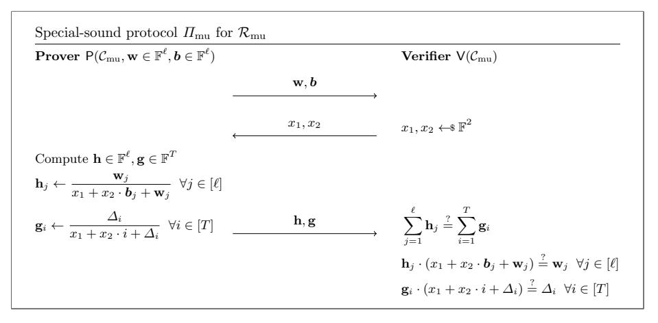

# Proofs for Deep Thought: Accumulation for large memories and deterministic computations

Benedikt B¨un[z](https://orcid.org/0000-0003-2082-4480) and Jessica Che[n](https://orcid.org/0009-0002-1289-9626)

New York University

Abstract. An important part in proving machine computation is to prove the correctness of the read and write operations performed from the memory, which we term memory-proving. Previous methodologies required proving Merkle Tree openings or multi-set hashes, resulting in relatively large proof circuits. We construct an efficient memory-proving Incrementally Verifiable Computation (IVC) scheme from accumulation, which is particularly useful for machine computations with large memories and deterministic steps. In our scheme, the IVC prover PIVC has cost entirely independent of the memory size T and only needs to commit to approximately 15 field elements per read/write operation, marking a more than 100X improvement over prior work. We further reduce this cost by employing a modified, accumulation-friendly version of the GKR protocol. In the optimized version, PIVC only needs to commit to 6 small memory-table elements per read/write. If the table stores 32-bit values, then this is equivalent to committing to less than one single field element per read and write. Our modified GKR protocol is also valuable for proving other deterministic computations within the context of IVC. Our memory-proving protocol can be extended to support key-value stores.

Keywords: Proof system · Accumulation Scheme · Incrementally Verifiable Computation.

# 1 Introduction

Consider the scenario where one or multiple clients outsource a large computation, possibly of infinite steps, to an untrusted server. For example, clients might want to continuously verify that all transactions in a blockchain are valid. Naturally, the clients would like the server to provide a certificate, which would allow the clients to verify that all the computation steps run up to that point were correct and even to continue the computation from that point onwards. The efficiency of verification necessitates that the size of the proof and the complexity of its verification be independent of the length of the computation. Moreover, since the computation can be long or even unbounded, it would be ideal if the server can provide the current state and a certificate upon request from the client at any point. This is achieved by maintaining a running certificate or proof that can be efficiently updated with each computation step. A system that achieves these properties is called an incrementally verifiable computation (IVC) system[\[Val08\]](#page-32-0) [1](#page-1-0) .

IVC enables the server/prover to produce an output zIVC, along with a proof πIVC upon request from the client/verifier without requiring a priori knowledge of an upper bound on the number of computation steps. With a valid πIVC, a client/verifier can be convinced zIVC is the output of the correct execution of a (potentially non-deterministic) machine computation up to this point, and can even continue the computation. Recent developments have demonstrated that IVC can be constructed from simple public-coin interactive protocols featuring algebraic verifiers, such as protocols where the prover simply sends the witness. This is achieved through the use of accumulation[2](#page-1-1) or folding schemes [\[BGH19;](#page-31-0) [BCMS20;](#page-30-0) [BCLMS21;](#page-30-1) [BDFG21;](#page-30-2) [KST22;](#page-32-1) [BC23;](#page-30-3) [EG23\]](#page-31-1). The resulting IVC has essentially the same computational overhead as the accumulation scheme. The cost of the resulting IVC prover depends on two main factors:

- 1. The size of the recursive circuit, predominantly comprising the accumulation verifier Vacc. Since the size of Vacc only depends on the algebraic degree of the verifier and the number of rounds in the underlying protocol (rather than the communication or verification complexity), minimizing these two factors are crucial for reducing the cost of the IVC prover.
- 2. The cost of the accumulation prover Pacc, which is mainly influenced by the commitment cost to the prover messages, and thus is dependent on the number of elements in the prover messages of the underlying interactive protocol.

The general paradigm of using IVC to prove machine computations involves first proving the correctness of computation under the assumption that memory accesses were executed correctly, recording all the read/write operations in the circuit, and then proving the correctness of the recorded read/write operations. The primary challenge lies in the latter, i.e. efficiently proving the correctness of memory accesses, which we will refer to as memory-proving in this work. With the above-mentioned recent advancements in IVC construction, we need only to design a public-coin interactive protocol for memory-proving with an algebraic verifier while ensuring that following three parameters remain small: the number of rounds, the verifier degree, and the number of elements in the prover messages (ideally independent of T). These parameters are the only factors on which the cost of PIVC depends. Then, by applying existing accumulation compilers (e.g., the ProtoStar compiler [\[BC23\]](#page-30-3)) to this interactive protocol, we can obtain an efficient accumulation scheme for memory-proving, and finally derive an efficient memory-proving IVC scheme from accumulation by utilizing existing IVC compilers (e.g., [\[BCLMS21\]](#page-30-1)).

<span id="page-1-0"></span><sup>1</sup> The literary application of IVC is the machine Deep Thought from the Hitchhiker's Guide to the Galaxy. It computes the answer to the ultimate question of the universe and life over several thousand years. Given the nonsensical answer (42), it would have been helpful to be able to efficiently verify the correctness of the computation.

<span id="page-1-1"></span><sup>2</sup> We use accumulation to refer to split-accumulation as defined by [\[BCLMS21\]](#page-30-1).

The most rudimentary method of performing memory-proving involves unrolling the entire memory into a circuit. However, since a circuit is at least as large as its inputs, this circuit would be of size O(ℓT), which is prohibitively large even medium-sized memories. An alternative approach is for the prover to simulate memory-checking internally and prove that the memory accesses would have been accepted by the memory-checking verifier, who only keeps a small local state. In all previous works, using this approach, the prover's cost is dependent on the memory size T and/or hashing is required within the circuit. For instance, Spice [\[SAGL18\]](#page-32-2) employed offline memory-checking, requiring approximately 1500 constraints[3](#page-2-0) per read and write operation. Since the prover needs to transmit at least one proof element per constraint, this results in 1500 elements in the prover message per read/write operation, and thus 1500 commitments per accumulation step for PIVC. In contrast, ProtoStar recently showed a memoryproving protocol for static read-only memory that utilises the LogUp argument [\[Hab22\]](#page-32-3), in which the prover only performs two group scalar multiplications per read instruction [\[BC23\]](#page-30-3). The prover's cost in ProtoStar is independent of the memory size T and does not involve multi-set hashing. However, their approach does not support writes into a dynamic memory[\[BC23\]](#page-30-3).

In this paper, we present an interactive protocol for memory-proving inspired by the LogUp argument [\[Hab22\]](#page-32-3). Using accumulation techniques, we obtain an IVC scheme for memory-proving with minimal prover overhead. We then show an optimization of our scheme which employs an accumulation-friendly version of the GKR protocol to further reduce the prover overhead. We note that this adapted GKR protocol has other applications beyond improving our memoryproving protocol.

O(ℓ) memory-proving PIVC ProtoStar has previously demonstrated that LogUp is well suited for accumulation and, thus, IVC. It can be used to verify the existence of a set of witness values in a static table of values [\[BC23\]](#page-30-3). We design LogUp-styled arguments to support reading from and writing to a fully dynamic table.

One key challenge we address is proving only O(ℓ) table values were altered in a table of size T >> ℓ, while ensuring that the cost of PIVC remains independent of T. Our memory-proving protocol is public-coin with an algebraic verifier, featuring 2 rounds of communication[4](#page-2-1) , verifier degree 3, and only O(ℓ) elements in prover messages, where ℓ denotes the number of reads and writes performed in each computation step. This means it can be turned into an efficient accumulation scheme using existing accumulation compiler (eg. [\[BC23\]](#page-30-3)). The resulting PIVC only needs to commit to O(ℓ) elements, which is independent of the memory size T.

<span id="page-2-0"></span><sup>3</sup> In group-based proof systems, the prover typically computes at least one multi-scalar multiplication that is as large as the number of constraints.

<span id="page-2-1"></span><sup>4</sup> Each round consists of a prover message and is possibly followed by a verifier challenge

This significantly improves on prior work, which either relied on Merkle trees requiring  $\log T$  hashes per memory access or required multi-set hashes [SAGL18]. These prior methods are particularly costly in the context of memory-proving, where the hashes result in large proving circuits. In contrast, our resulting memory-proving scheme is practically efficient with the prover only having to commit to 15 field values per memory access. In addition, since the prover cost is completely independent of the memory size T, our protocol can be extended to the setting of key-value store. We describe this extension in detail at the end of Section 5.1.

Optimizing memory-proving with GKR. One limitation of the scheme is that the prover needs to commit to 6 large field elements per memory access, i.e. each of size  $\lambda$  bits, even if the memory entries themselves are small. This is because in the memory-proving interactive protocol, the prover needs to send 6 vectors consisting of inverses of the form  $\frac{1}{r+t_i}$  where r is a constant, and each  $t_i$  is a small table entry. To resolve this overhead, we draw inspiration from [STW23; PH23] and compute this sum using formal fractions and a modified GKR protocol. Our modified protocol retains GKR's ability to prove deterministic layered computations without committing to the intermediate values. Specifically, the protocol relies on bivariate sumcheck instead of multilinear sumcheck, reducing the number of rounds per layer to 3. In the context of the ProtoStar accumulation compiler, this reduction in number of rounds significantly lowers the recursive overhead in IVC.

With the power of GKR, the memory-proving protocol no longer requires computing and committing to the large inverses. Thus, if we read/write  $\ell$  s-bit values from memory, the number of group operations decreases from  $O(\lambda\ell)$  to  $O(s\ell)$ , i.e., the actual size of the data that is read/written. We provide a brief overview of the resulting efficiency of our protocol in Table 1. Most importantly the prover only needs to commit to 6 elements that are as large as the table entries for each read/ write. If the table contains 32-bit entries then this is equivalent to committing to 192bits per read/write or less than a single 256bit field element. We also introduce several optimizations for our GKR-powered memory-proving protocol, which further reduce the number of GKR rounds.

<span id="page-3-0"></span>**Table 1.** Efficiency Table for our Memory-Proving Protocol. T is the memory size, and  $\ell$  is the number of read/write operations.  $\mathbb T$  is the set of table entries, which might only contain small field elements. See Table 3 for an explanation of the columns and symbols, and more details.

|           | P <sub>acc</sub> Time                                  | $V_{acc}$ Time        |
|-----------|--------------------------------------------------------|-----------------------|
| Plain     | $(6\ell, \mathbb{T})$ -MSM $+(9\ell, \mathbb{F})$ -MSM | $3\mathbb{G}$         |
| Using GKR | $(6\ell, \mathbb{T})$ -MSM                             | $O(\log T)\mathbb{G}$ |

IVC for deterministic computations. GKR has numerous other applications in accumulation beyond enhancing our memory-proving protocol. In fact, for proving any low-depth deterministic computations, GKR only requires committing to the inputs and outputs, not the intermediate values. We demonstrate the utility of this by describing an accumulation-friendly GKR protocol for computing group scalar multiplications, which is the dominant cost within the recursive circuit.

# 1.1 Related Work

IVC and Accumulation. Valiant [\[Val08\]](#page-32-0) introduced incrementally verifiable computation (IVC) and showed that IVC can be built from Succinct Noninteractive ARguments of Knowledge (SNARKs). The core concept involves the prover generating a SNARK at each computation step, certifying both the current step and the verification of the SNARK from the previous step. The latter part is commonly referred to as the recursive circuit. Subsequent to Valiant's work, an important line of research [\[BCCT13;](#page-30-4) [BCTV14;](#page-30-5) [COS20\]](#page-31-2) has enhanced the practicality of IVC, studied its generalization to arbitrary graphs (Proof-Carrying Data, PCD), and advanced its theoretical foundations.

Halo [\[BGH19\]](#page-31-0) showed that IVC can be constructed from simpler assumptions, sparking research on accumulation [\[BCMS20;](#page-30-0) [BCLMS21;](#page-30-1) [BDFG21;](#page-30-2) [KST22;](#page-32-1) [BC23;](#page-30-3) [EG23\]](#page-31-1). The idea is to construct IVC by simply accumulating or batching the verification of non-interactive arguments, postponing verification to the end of each IVC step. In essence, in each accumulation round, the prover produces a new argument for the current step and proves its correct accumulation into the existing accumulator. The accumulation step can be as straightforward as taking a random linear combination between two vector commitments, and verifying the accumulation step can be significantly cheaper than verifying the proof. The more computationally intensive final verification, which is called the decision step in accumulation, is executed only at the end of IVC step to verify the correctness of the accumulated commitment. A valid accumulator implies that all the accumulated proofs were valid.

Recently, ProtoStar introduced a new recipe for constructing accumulation schemes and IVC [\[BC23\]](#page-30-3) from any interactive public-coin protocol Π with an algebraic verifier. The resulting accumulation verifier Vacc depends only on the number of rounds and the verifier degree in the underlying interactive protocol Π, and the resulting accumulation prover Pacc's main cost is committing to all the prover messages in Π. Using the [\[BCLMS21\]](#page-30-1) compiler, an accumulation scheme for NP directly yields an IVC, where PIVC's cost for computing the predicate is proportional to the cost of Pacc and the recursive circuit consisting of Vacc.

Concurrent work [\[APPK24\]](#page-30-6) also constructed an accumulation scheme for GKR. However, they utilize the multi-linear version of GKR and batch the polynomial evaluation, similar to [\[BCMS20\]](#page-30-0).

Memory-checking and lookup arguments. Memory-checking [\[BEGKN91\]](#page-31-3) enables an untrusted server to convince a client that a set of read/write operations is consistent with a memory without having to send the entire memory to the client. Each entry of read/write operation consists of an address a, a value v and a timestamp t. If a value v was written to a at time t, then any read at time t ′ > t from a shall return v with the timestamp t, unless there was another write to a in the meantime. We briefly highlight two constructions and their limitations here, and refer to Appendix B of Jolt [\[AST23\]](#page-30-7) for an excellent overview of memory-checking techniques.

One approach stores the memory in a Merkle Tree [\[BFRSBW13;](#page-31-4) [BCTV14\]](#page-30-5). For every read operation, the prover opens the Merkle Tree at the relevant address. For every write operation, the prover shows that the Merkle Tree is correctly updated. The verification for either step requires O(log T) hashes, and the prover's computational work is also O(log T), where T is the size of the memory. When this technique is used within IVC, the memory-checking verifier is part of the proving circuit, and log(T) hashes per read and write operation become a significant overhead.

The other common approach, dating back to [\[BEGKN91\]](#page-31-3) and later refined in [\[CDvGS03;](#page-31-5) [DNRV09;](#page-31-6) [SAGL18\]](#page-32-2), relies on proving that the constructed sets of reads and writes form a permutation. The state-of-the-art work Spice [\[SAGL18\]](#page-32-2) employs multi-set hashes and proves that the hash was evaluated correctly, which results in over 1500 constraints per read/write operation, two orders of magnitude more than our approach. The approach also requires a linear scan of the memory at the end of the computation, but similar as in our construction this can be deferred to a final decider.

Recently, there has been increased attention to a related primitive called lookup arguments. Lookup arguments can be used to verify read operation in a static, possibly preprocessed memory. A recent line of work [\[ZBKMNS22;](#page-32-6) [PK22;](#page-32-7) [GK22;](#page-32-8) [ZGKMR22;](#page-33-0) [EFG22\]](#page-31-7) showed that in the preprocessing setting, one can achieve lookup arguments independent of the table size and quasi-linear in the number of read operations. Lasso [\[STW23\]](#page-32-4) improves on these ideas by enabling a fully linear prover and independence of the table size for structured table. In the context of IVC, ProtoStar [\[BC23\]](#page-30-3) gave a lookup argument based on LogUp [\[Hab22\]](#page-32-3) that is independent of the table size (for arbitrary tables) and only requires two group scalar multiplications per read. Unfortunately, all these lookup arguments only work for static tables and read operations. We construct a memory-proving argument (which is more general than a lookup) that is still independent of the table size and has minimal overhead.

# 1.2 Technical Overview

Our construction heavily relies on the ProtoStar compiler [\[BC23\]](#page-30-3), which we describe in Theorem [1](#page-12-0) in Section [2.5.](#page-12-1) It gives a recipe for constructing accumulation schemes and IVC [\[BC23\]](#page-30-3) from any interactive public-coin protocol with an algebraic verifier. We summarize the recipe here into five steps:

1. Begin with any k-round interactive public-coin protocol featuring L verification checks of maximum degree d, and prover messages comprising n nonzero elements.

- 2. Compress the communication by using a homomorphic vector commitment (e.g. Pedersen commitment) to commit to each vector in the prover messages.
- 3. Make the protocol non-interactive through the Fiat-Shamir transformation.
- 4. Use the ProtoStar compiler to convert the non-interactive protocol into an accumulation scheme. The accumulation scheme combines the current argument with an accumulator (which has the same form as the argument) by taking a random linear combination of the committed prover messages with the accumulator messages. It also computes a new verification equation by appropriately canceling out the cross error terms resulted from the accumulation.
- 5. If the underlying protocol can prove NP-complete relations, such as circuits, then the [\[BCLMS21\]](#page-30-1) IVC compiler can be applied to construct an IVC scheme from the accumulation scheme for any function F. The compiler ensures the correct execution of the accumulation verifier alongside proving F.

Following this recipe, we design special-sound, algebraic protocols for memoryproving and GKR. One important design goal is to keep the complexity of the accumulation verifier Vacc low, as Vacc is the dominant component in the recursive circuit. Notably, the complexity of Vacc relies solely on k and d, without any dependence on n or L whatsoever. Another design goal is to minimize the commitment cost of the accumulation prover Pacc, which is directly contingent on the number of nonzero elements in prover messages, as committing to 0 is free in Pedersen commitment. Therefore, to leverage the ProtoStar compiler to design an efficient IVC scheme where PIVC cost is independent of the memory size T, we need to design an interactive, algebraic memory-proving protocol with small values for number of rounds k, verifier degree d and number of nonzero elements in prover messages n. This implies that n should be independent of T, since otherwise the cost of Pacc will be O(T) even if the number of memory accesses is much smaller than T.

Constructing Read List and Write List We assume the list of "reads" and the list of "writes" were constructed similarly to the way in the classic offline memory-checking process [\[BEGKN91;](#page-31-3) [CDvGS03;](#page-31-5) [SAGL18\]](#page-32-2). Each entry in the lists is in the form of a tuple (address, value, timestamp), with the local timestamp incremented after each write operation. The specific construction is described in Section [3.](#page-14-0)

If all memory accesses were performed correctly, the constructed lists should satisfy three properties: 1) the read list and the write list should be permutations of each other; 2) the initial reads are consistent with the starting/old memory; and 3) the new memory is updated only at the addresses written to and with the correct amount. Note that the third memory-update (or mem-update for short) property requires examining all T addresses, not only the ones touched by memory accesses but also the ones untouched. Therefore, the main challenge in designing an efficient memory-proving protocol lies in proving correct memupdate in time independent of T.

LogUp based mem-update. The starting point of our construction is the LogUp lookup argument [\[Hab22\]](#page-32-3) which uses the fact that the set of values in w = [w<sup>i</sup> ℓ <sup>i</sup>=1 is contained in a table t = [t<sup>i</sup> T <sup>i</sup>=1 if and only if

$$\sum_{j=1}^{\ell} \frac{1}{X + \mathbf{w}_j} = \sum_{i=1}^{T} \frac{\boldsymbol{m}_i}{X + \mathbf{t}_i},$$

where m<sup>i</sup> is the multiplicity of t<sup>i</sup> in w for every i ∈ [T] and X is a random variable. ProtoStar [\[BC23\]](#page-30-3) showed that the LogUp argument can be efficiently accumulated. Importantly, it observes that the prover messages in the protocol for LogUp argument, e.g. m = [m<sup>i</sup> ] T <sup>i</sup>=1, only contains ℓ nonzero entries. This means, in the context of the ProtoStar compiler and IVC, the accumulation prover Pacc and thus the IVC prover PIVC only needs to do O(ℓ) work. However, the LogUp argument only supports read operations and not write operations.

We attempt to modify the LogUp argument to use it for mem-update. Assume, w corresponds to the ℓ-sized update vector (the difference between the final written value and the initial read value from each address), and t corresponds to the T-sized vector ∆ that represents the difference between the new memory and the old memory, i.e. ∆ := NM−OM. However, the LogUp argument only cares about the membership of the w values but not their positions in ∆; in other words, the argument only indicates that some memory value is changed by w<sup>j</sup> , but does not constrain the change to any specific address. In addition, it is not immediately clear how to update the memory or compute the right hand side with ∆ in a manner that does not require a linear scan.

To resolve the first issue, we add the address vector to random linear combination in the denominators. That is,

$$\sum_{j=1}^{\ell} \frac{1}{X + Y \cdot \boldsymbol{b}_j + \mathbf{w}_j} = \sum_{i=1}^{T} \frac{\boldsymbol{m}_i}{X + Y \cdot i + \Delta_i}$$

holds if and only if w<sup>j</sup> = ∆b<sup>j</sup> for every j ∈ [ℓ], where b = [b<sup>j</sup> ] ℓ <sup>j</sup>=1 is an address vector and Y is another random variable. Note that this is an indexed LogUp argument where we ensure not only the membership of the values but also their precise indices in the lookup table. In this indexed lookup argument, m<sup>i</sup> only takes on the values 0 or 1. Still, this modified lookup argument is not sufficient, as it does not ensure that ∆ is 0 at the positions for which there had been no read or write operation. This is an important criteria for correct mem-update, since an adversarial prover may use non-zero values in ∆ to change the memory state arbitrarily.

We make a key observation that the correct ∆ should simply be a T-sized sparse representation of w. To ensure that ∆ is 0 at unmodified addresses, we set the numerators to w<sup>j</sup> , ∆<sup>i</sup> instead of 1,m<sup>i</sup> . Namely,

$$\sum_{j=1}^{\ell} \frac{\mathbf{w}_j}{X + Y \cdot \mathbf{b}_j + \mathbf{w}_j} = \sum_{i=1}^{T} \frac{\Delta_i}{X + Y \cdot i + \Delta_i}$$

Note that the ith fraction on the right hand side is 0 if and only if the ith value is unmodified by any write operation, and is equal to the left hand side if and only if the ith value is modified by the correct amount. Only ℓ out of all T fractions on the right hand side are nonzero, which implies an honest prover only need to do O(ℓ) work, resolving the second issue aforementioned. Section [4.3](#page-18-0) shows that this LogUp-style mem-update argument is secure and indeed leads to a protocol with prover complexity independent of T.

LogUp powered memory-proving. The mem-update argument can be used to show that the memory is updated strictly at the addresses written to and with the correct amount. We can then use a homomorphic commitment to ∆ to efficiently update our commitment to the memory state. In addition, we can use the indexed LogUp argument demonstrated in the intermediate step above to show that all the values initially read are consistent with the old memory. Nevertheless, merely checking these two properties (property 2 and 3) only suffice in a system where all write operations happen synchronously at the end of the computation step. Without additional checks, we would need to first update the memory whenever we read from an address that has been previously written to. This requires an expensive homomorphic commitment operation to be executed by the verifier as part of the recursive circuit. To resolve this we employ the classic permutation-based offline memory-checking idea [\[BEGKN91\]](#page-31-3) and add a check for property 1 in our memory-proving protocol.

All three subprotocols are based on the LogUp argument and are described in Section [4.](#page-15-0) Section [5](#page-19-1) discusses the overall memory-proving protocol and its efficiency.

Accumulation-friendly verision of GKR. Our memory-proving protocols have almost optimal parameters. It requires committing[5](#page-8-0) to only 15 field elements per memory access. However, 9 of these field elements consist of large field elements, i.e. log |F|-bit, even if the memory itself only consists of small entries. For instance, say the memory only contains 32-bit entries; using homomorphic commitments requires fields of size at least 2256, which is a factor 8 blowup. Concretely, in this example the 9 large elements contribute 2300 bits and the 6 small elements only 192 bits to the prover's commitment cost.

Removing this blowup motivates the second orthogonal but highly compatible contribution of this paper: We construct an efficient accumulation scheme for the GKR protocol. GKR can be used to prove low-depth deterministic computations while only committing to the computation's inputs and outputs but not the intermediate values. Note that GKR is a special-sound interactive protocol with an algebraic verifier, which means it can directly be compiled with the ProtoStar compiler to an accumulation scheme. Unfortunately, GKR has

<span id="page-8-0"></span><sup>5</sup> Committing is by far the dominant prover cost in these systems. Committing to a message is between 100 and 1000 times as expensive as doing field operations on the same message. See <https://zka.lc/>.

 $O(k \cdot \log n)$  rounds where k is the depth of the circuit and n its width. Compilation results in an accumulation verifier with  $k \cdot \log n$  group scalar multiplications. In the context of IVC, the accumulation verifier becomes part of the recursive circuit, and this is a significant overhead, especially when compared with other accumulation schemes which only have 1 to 3 group operations [KST22; KS23; BC23]. Our goal is, therefore, to reduce the number of rounds of GKR while maintaining the attractive efficiency properties and the compatibility with the ProtoStar compiler.

In every round, GKR runs a multivariate sumcheck protocol, which has  $\log n$ rounds. As a strawman, we can replace this multivariate sumcheck with a univariate one. This immediately reduces the number of GKR rounds from  $k \cdot \log n$ to just k. Univariate sumcheck requires sending a quotient polynomial that is as large as the domain of the sumcheck, in our case O(n). Committing to this polynomial would be at least as expensive as directly committing to the intermediate wires of the circuit, thus removing the benefit of using GKR. Fortunately, the idea of using a higher degree sumcheck with fewer variables can still help. Moving to a bivariate sumcheck reduces the communication to  $O(\sqrt{n})$  while being only a 3-round protocol. The  $O(\sqrt{n})$  commitment cost is, in most applications, dominated by the cost of committing to the input and output layers; even if not, we show that one can use a c-variate sumcheck to ensure that the sumchecks commitment cost is marginal. Using a bivariate sumcheck presents us with a couple of challenges. First, the verifier needs to evaluate a  $O(\sqrt{n})$  degree polynomial, which is a  $O(\sqrt{n})$  degree check if done naively. To resolve this we built a polynomial evaluation protocol, where with aid from the prover, the verification degree reduces to merely 3, independent of the degree of the polynomial.

Additionally, GKR batches polynomial evaluations, after each sumcheck, in order to only evaluate the next layer at a single point. In bivariate sumcheck, this would require computing a high-degree interpolation polynomial. We show that it is much simpler and more efficient to directly batch the resulting sumchecks. This observation is also applicable to multivariate sumchecks. We then construct a specific GKR protocol for computing the sum of fractions, e.g.  $\sum_{i=1}^{n} \frac{n_i}{d_i}$ , similar to [PH23]. We also give specific optimizations for this instantiation, such as breaking up the circuit into multiple parts, while still maintaining the asymptotic properties. This optimization takes advantage of the circuit structure of sums of fractions, where the number of sums halves in every layer.

# 1.3 Roadmap

In Section 2, we provide the necessary preliminaries to comprehend our construction. We describe the desired construction for lists of read/write operations in Section 3 and outline three properties that consistent read/write lists should uphold. Subsequently, in Section 4, we introduce three LogUp-style special-sound subprotocols, each tailored for proving one of the three aforementioned properties. These subprotocols are combined in parallel to form the memory-proving interactive protocol  $\Pi_{\mathsf{MP}}$  in Section 5, which exhibits the desired characteristics

for conversion into an efficient accumulation scheme and IVC using the Proto-Star compiler. Specifically,  $\Pi_{\mathsf{MP}}$  has only 2 rounds and verifier degree 3, and its number of nonzero elements in prover messages is independent of T. In Section 7, we elucidate how our accumulation-friendly version of GKR (components described in Appendix 6) can be leveraged to optimize our memory-proving IVC scheme, and we highlight several other useful applications of GKR in the context of IVC. The extension of our memory-proving protocol to the setting of key-value store is described in Appendix B.1.

# <span id="page-10-0"></span>2 Preliminaries

**Notation.** For  $n \in \mathbb{N}$ , we use [n] to denote the set  $\{1, 2, ..., n\}$ . We denote  $\lambda$  as the security parameter and use  $\mathbb{F}$  to denote a field of prime order p such that  $\log(p) = \Omega(\lambda)$ . For list of tuples  $ltup = [(a_i, b_i, c_i, ...)]_{i=1}^k$  of arbitrary length k, we use ltup.a to denote the list  $[a_i]_{i=1}^k$ , and ltup.(a, b) to denote the list  $[(a_i, b_i)]_{i=1}^k$ . For function f,  $\tilde{f}$  denotes the bivariate extension of f.

# 2.1 Special-sound Protocols

We take the definition of special-soundness from [AFK22; BC23].

**Definition 1 (Public-coin interactive proof).** An interactive proof  $\Pi = (P, V)$  for relation  $\mathcal R$  is an interactive protocol between two probabilistic machines, a prover P, and a polynomial time verifier V. Both P and V take as public input a statement pi and, additionally, P takes as private input a witness  $\mathbf w \in \mathcal R(pi)$ . The verifier V outputs 0 if it accepts and a non-zero value otherwise. Its output is denoted by  $(P(\mathbf w), V)(pi)$ . Accordingly, we say the corresponding transcript (i.e., the set of all messages exchanged in the protocol execution) is accepting or rejecting. The protocol is public coin if the verifier randomness is public. The verifier messages are referred to as challenges.  $\Pi$  is a (2k-1)-move protocol if there are k prover messages and k-1 verifier messages.

**Definition 2 (Tree of transcript).** Let  $\mu \in \mathbb{N}$  and  $(a_1, \ldots, a_{\mu}) \in \mathbb{N}^{\mu}$ . An  $(a_1, \ldots, a_{\mu})$ -tree of transcript for a  $(2\mu+1)$ -move public-coin interactive proof  $\Pi$  is a set of  $a_1\dot{a}_2\ldots a_{\mu}$  accepting transcripts arranged in a tree of depth  $\mu$  and arity  $a_1, \ldots, a_{\mu}$  respectively. The nodes in the tree correspond to the prover messages and the edges to the verifier's challenges. Every internal node at depth i-1  $(1 \leq i \leq \mu)$  has  $a_i$  children with distinct challenges. Every transcript corresponds to one path from the root to a leaf node. We simply write the transcripts as an  $(a^{\mu})$ -tree of transcript when  $a = a_1 = a_2 = \cdots = a_{\mu}$ .

**Definition 3 (Special-sound Interactive Protocol).** Let  $\mu, N \in \mathbb{N}$  and  $(a_1, \ldots, a_{\mu}) \in \mathbb{N}^{\mu}$ . A  $(2\mu + 1)$ -move public-coin interactive proof  $\Pi$  for relation  $\mathcal{R}$  where the verifier samples its challenges from a set of size N is  $(a_1, \ldots, a_{\mu})$ -out-of-N special-sound if there exists a polynomial time algorithm that, on input pi and any  $(a_1, \ldots, a_{\mu})$ -tree of transcript for  $\Pi$  outputs  $\mathbf{w} \in \mathcal{R}(pi)$ . We simply denote the protocol as an  $a^{\mu}$ -out-of-N (or  $a^{\mu}$ ) special-sound protocol if  $a = a_1 = a_2 = \cdots = a_{\mu}$ .

#### 2.2 Commitment Scheme

**Definition 4 (Commitment Scheme).** (Definition 6 from [BC23]) cm = (Setup, Commit) is a binding commitment scheme, consisting of two algorithms:  $Setup(\lambda) \rightarrow ck$  takes as input the security parameter and outputs a commitment key ck.

Commit(ck,  $m \in \mathcal{M}$ )  $\to C \in \mathcal{C}$ , takes as input the commitment key ck and a message m in  $\mathcal{M}$  and outputs a commitment  $C \in \mathcal{C}$ .

The scheme is binding if for all polynomial-time randomized algorithms P\*:

$$\Pr \begin{bmatrix} \mathsf{Commit}(\mathsf{ck}, \boldsymbol{m}) = \mathsf{Commit}(\mathsf{ck}, \boldsymbol{m}') \\ \wedge \\ \boldsymbol{m} \neq \boldsymbol{m}' \end{bmatrix} \begin{vmatrix} \mathsf{ck} \leftarrow \mathsf{Setup}(1^\lambda) \\ \boldsymbol{m}, \boldsymbol{m}' \leftarrow \mathsf{P}^*(\mathsf{ck}) \end{bmatrix} = \mathsf{negl}(\lambda)$$

Homomorphic commitment. (Adapted from Definition 17 in [KST22]) Let (C, +) be an additive group of prime order p. We say the commitment is homomorphic if for all commitment key produced from  $Setup(1^{\lambda})$ , and for any  $m_1, m_2 \in \mathcal{M}^2$ ,  $Commit(ck, m_1) + Commit(ck, m_2) = Commit(ck, m_1 + m_2)$ .

# 2.3 Lookup Relation

**Definition 5.** (Definition 12 of [BC23]) Given configuration  $C_{LK} := (T, \ell, t)$  where  $\ell$  is the number of lookups and  $\mathbf{t} \in \mathbb{F}^T$  is the lookup table, the relation  $\mathcal{R}_{LK}$  is the set of tuples  $\mathbf{w} \in \mathbb{F}^{\ell}$  such that  $\mathbf{w}_i \in \mathbf{t}$  for all  $i \in [\ell]$ .

<span id="page-11-1"></span>**Lemma 1.** (Lemma 5 of [Hab22]) <sup>6</sup> Let  $\mathbb{F}$  be a field of characteristic  $p > \max(\ell, T)$ . Given two sequences of field elements  $[\mathbf{w}_i]_{i=1}^{\ell}$  and  $[\mathbf{t}_i]_{i=1}^{T}$ , we have  $\{\mathbf{w}_i\} \subseteq \{\mathbf{t}_i\}$  as sets (with multiples of values removed) if and only if there exists a sequence  $[\mathbf{m}_i]_{i=1}^{T}$  of field elements such that

<span id="page-11-2"></span>
$$\sum_{i=1}^{\ell} \frac{1}{X + \mathbf{w}_i} = \sum_{i=1}^{T} \frac{\boldsymbol{m}_i}{X + \boldsymbol{t}_i}.$$
 (1)

#### 2.4 Vector-valued lookup

**Definition 6.** (Definition 13 in [BC23]) Consider configuration  $C_{VLK} := (T, \ell, v \in \mathbb{N}, t)$  where  $\ell$  is the number of lookups, and  $t \in (\mathbb{F}^v)^T$  is a lookup table in which the ith  $(1 \le i \le T)$  entry is

$$\boldsymbol{t}_i := (\boldsymbol{t}_{i|1}, \dots, \boldsymbol{t}_{i|v}) \in \mathbb{F}^v$$
.

A sequence of vectors  $\mathbf{w} \in (\mathbb{F}^v)^{\ell}$  is in relation  $\mathcal{R}_{VLK}$  if and only if for all  $i \in [\ell]$ ,

$$\mathbf{w}_i := (\mathbf{w}_{i,1}, \dots, \mathbf{w}_{i,v}) \in t$$
.

<span id="page-11-0"></span> $<sup>^{6}</sup>$  This lookup argument is unofficially referred to as Log Up.

As noted in Section 3.4 of [Hab22], we can extend Lemma 1 and replace (1) with

$$\sum_{i=1}^{\ell} \frac{1}{X + w_i(Y)} = \sum_{i=1}^{T} \frac{\boldsymbol{m}_i}{X + t_i(Y)}$$
 (2)

where the polynomials are defined as

$$w_i(Y) := \sum_{i=1}^v \mathbf{w}_{i,j} \cdot Y^{j-1} \,, \quad t_i(Y) := \sum_{j=1}^v \boldsymbol{t}_{i,j} \cdot Y^{j-1} \,,$$

which represent the witness vector  $\mathbf{w}_i \in \mathbb{F}^v$  and the table vector  $\mathbf{t}_i \in \mathbb{F}^v$ .

# <span id="page-12-1"></span>2.5 Incremental Verifiable Computation (IVC)

**Definition 7 (IVC).** (Adapted Definition 5 from [KST22]) An incrementally verifiable computation (IVC) scheme is defined by PPT algorithms (G, P, V) and deterministic K denoting the generator, the prover, the verifier, and the encoder respectively. An IVC scheme (G, K, P, V) satisfies perfect completeness if for any adversary  $\mathcal A$ 

$$\Pr\left[ \begin{array}{l} \mathsf{V}(\mathsf{vk}, i, z_0, z_i, \varPi_i) = 0 \middle| \begin{array}{l} \mathsf{pp} \leftarrow \mathsf{G}(1^{\lambda}), \\ F, (i, z_0, z_i, z_{i-1}, \omega_{i-1}, \varPi_{i-1}) \leftarrow \mathcal{A}(\mathsf{pp}), \\ (\mathsf{pk}, \mathsf{vk}) \leftarrow \mathsf{K}(\mathsf{pp}, F), \\ z_i = F(z_{i-1}, \omega_{i-1}), \\ \mathsf{V}(\mathsf{vk}, i-1, z_0, z_{i-1}, \varPi_{i-1}) = 0, \\ \varPi_i \leftarrow \mathsf{P}(\mathsf{pk}, i, z_0, z_i; z_{i-1}, \omega_{i-1}, \varPi_{i-1}) \end{array} \right] = 1$$

where F is a polynomial time computable function. Likewise, an IVC scheme satisfies knowledge soundness if for any constant  $n \in \mathbb{N}$ , and for all expected polynomial time adversaries  $\mathsf{P}^*$ , there exists an expected polynomial-time extractor  $\mathcal E$  such that

$$\begin{split} \Pr_{\mathbf{r}} \left[ \begin{array}{c} z_n = z \ where \\ z_{i+1} \leftarrow F(z_i, \omega_i) \\ \forall i \in \{0, \dots, n-1\} \end{array} \middle| \begin{array}{c} \mathsf{pp} \leftarrow \mathsf{G}(1^\lambda), \\ (F, (z_0, z), \varPi) \leftarrow \mathsf{P}^*(\mathsf{pp}, \mathsf{r}), \\ (\omega_0, \dots, \omega_{n-1}) \leftarrow \mathcal{E}(\mathsf{pp}, \mathsf{r}) \end{array} \right] \approx \\ \Pr_{\mathbf{r}} \left[ \begin{array}{c} \mathsf{V}(\mathsf{vk}, (n, z_0, z), \varPi) = 0 \\ (F, (z_0, z), \varPi) \leftarrow \mathsf{P}^*(\mathsf{pp}, \mathsf{r}), \\ (\mathsf{pk}, \mathsf{vk}) \leftarrow \mathsf{K}(\mathsf{pp}, F) \end{array} \right]$$

where r denotes an arbitrarily long random tape.

An IVC scheme satisfies succinctness if the size of the IVC proof  $\Pi$  does not grow with the number of applications n.

<span id="page-12-2"></span><span id="page-12-0"></span>**Definition 8 (Fiat-Shamir Heuristic).** (Definition 9 from [BC23]) The Fiat-Shamir Heuristic, relative to a secure cryptographic hash function H, states that a random oracle NARK with negligible knowledge error yields a NARK that has negligible knowledge error in the standard (CRS) model if the random oracle is replaced with H.

Theorem 1 (ProtoStar compiler). (Theorem 3 from [BC23]) Let  $\mathbb{F}$  be a finite field, such that  $|\mathbb{F}| \geq 2^{\lambda}$  and cm = (Setup, Commit) be a binding homomorphic commitment scheme for vectors in  $\mathbb{F}$ . Let  $\Pi_{\mathsf{sps}} = (\mathsf{P}_{\mathsf{sps}}, \mathsf{V}_{\mathsf{sps}})$  be a special-sound protocol for an NP-complete relation  $\mathcal{R}_{\mathsf{NP}}$  with the following properties:

- It's (2k-1) move.
- It's  $(a_1,\ldots,a_{k-1})$ -out-of- $|\mathbb{F}|$  special-sound. Such that the knowledge error  $\kappa=1-\prod_{i=1}^{k-1}(1-\frac{a_i}{|\mathbb{F}|})=\operatorname{negl}(\lambda)$
- The inputs are in  $\mathbb{F}^{\ell_{in}}$
- The verifier is degree  $d = poly(\lambda)$  with output in  $\mathbb{F}^{\ell}$

Then, under the Fiat-Shamir heuristic for a cryptographic hash function H (Definition 8), there exist two IVC schemes  $IVC = (P_{IVC}, V_{IVC})$  and  $IVC_{CV} = (P_{CV,IVC}, V_{CV,IVC})$  with predicates expressed in  $\mathcal{R}_{NP}$  with the efficiencies shown in Table 2.

<span id="page-13-0"></span>Table 2. Efficiency of IVC schemes compiled from sps protocol

| $P_{IVC}$ native                                                                                      | P <sub>IVC</sub> recursive                                                                                      | $V_{IVC}$                                                    | $ \pi_{IVC} $                                                                     |
|-------------------------------------------------------------------------------------------------------|-----------------------------------------------------------------------------------------------------------------|--------------------------------------------------------------|-----------------------------------------------------------------------------------|
| $\begin{array}{c} \sum_{i=1}^k  \mathbf{m}_i^*  \mathbb{G} \\ P_{sps} + L'(V_{sps}, d+2) \end{array}$ | $\begin{aligned} k + 2\mathbb{G} \\ k + \ell_{in} + d + 1\mathbb{F} \\ (k + d + O(1))H + 1H_{in} \end{aligned}$ | $\sum_{i=1}^k  \mathbf{m}_i  \mathbb{G}$ $O(\ell) + V_{sps}$ | $k + \ell_{in} + 1\mathbb{F}$ $k + 2\mathbb{G}$ $\sum_{i=1}^{k}  \mathbf{m}_{i} $ |

In Table 2,  $|\mathbf{m}_i|$  denotes the prover message length;  $|\mathbf{m}_i^*|$  is the number of non-zero elements in  $\mathbf{m}_i$ ;  $\mathbb G$  for rows 1-3 is the total length of the messages committed using Commit.  $\mathbb F$  are field operations.  $\mathbb H$  denotes the total input length to a cryptographic hash, and  $\mathbb H_{in}$  is the hash to the public input and accumulator instance.  $\mathsf{P}_{\mathsf{sps}}$  (and  $\mathsf{V}_{\mathsf{sps}}$ ) is the cost of running the prover (and the algebraic verifier) of the special-sound protocol, respectively.  $L'(\mathsf{V}_{\mathsf{sps}},d+2)$  is the cost of computing the coefficients of the degree d+2 polynomial

$$e(X) := \sum_{a=0}^{\sqrt{\ell}-1} \sum_{b=0}^{\sqrt{\ell}-1} (X \cdot \pi \cdot \beta_a + \text{acc.} \beta_a) (X \cdot \pi \cdot \beta_b' + \text{acc.} \beta_b')$$

$$\sum_{j=0}^{d} (\mu + X)^{d-j} \cdot f_{j,a+b\sqrt{\ell}}^{\mathsf{V}_{\mathsf{sps}}} (\text{acc} + X \cdot \pi) ,$$

$$(3)$$

where all inputs are linear functions in a formal variable  $X^7$ , and  $f_{j,i}^{\mathsf{V}_{\mathsf{sps}}}$  is the ith  $(0 \le i \le \ell - 1)$  component of  $f_j^{\mathsf{V}_{\mathsf{sps}}}$ 's output. For the proof size,  $\mathbb{G}$  and  $\mathbb{F}$  are the number of commitments and field elements, respectively.

<span id="page-13-1"></span><sup>&</sup>lt;sup>7</sup> For example if  $f_d = \prod_{i=1}^d (a_i + b_i \cdot X)$  then a naive algorithm takes  $O(d^2)$  time but using FFTs it can be computed in time  $O(d \log^2 d)$  [CBBZ22].

# <span id="page-14-0"></span>3 Constructing Read List and Write List

In our memory-proving algorithm, we assume that the list of "reads" and the list of "writes" we are given were constructed in a similar way as in the classic offline memory-checking process [\[BEGKN91;](#page-31-3) [CDvGS03;](#page-31-5) [SAGL18\]](#page-32-2). More importantly, our algorithm makes specific use of the "initial reads" and "final writes" in the memory-checking process, which we explicitly define in this section.

Consider an untrusted server who performs read/write operations to a memory. The memory is represented as a T-sized vector of memory values, where the addresses are the indices 1, . . . , T. Suppose OM is the starting, old memory. The server locally intializes two lists, RL and WL, to empty lists. As in [\[BEGKN91\]](#page-31-3), we assume both a value and a discrete timestamp of when the value was written are stored at each memory address. The local timestamp t ∗ is incremented when some write operation takes place on the data structure.

When a read operation from address a is performed, and the memory responds with a value-timestamp pair (v, t), the checker updates its local state as follows:

```
checks that t
              ∗ > t
append (a, v, t) to RL
stores (v, t∗
            ) at the memory
append (a, v, t∗
                ) to WL
t
∗ ← t
      ∗ + 1
```

When a write operation of value v ′ to address a occurs, the checker updates RL, WL in the same way except that the entry appended to WL will contain the new value v ′ .

Then, we extract the "initial reads" R from RL, and "final writes" W from WL as following:

```
R, W, AR, AW ← {}
for (a, v, t) ∈ RL do
  if a /∈ AR then do
    append (a, v, t) to R
    AR ← AR ∪ {a}
for (a, v, t) ∈ WL.rev do
  if a /∈ AW then do
    append (a, v, t) to W
    AW ← AW ∪ {a}
sort R, W by ascending a
```

At a high level, for each address a, we add the tuple containing a in RL with the smallest timestamp to R, and add the tuple containing a in WL with the largest timestamp to W, and hence the name "initial reads" and "final writes." Since the entries in RL and WL would be sorted in increasing order of timestamp due to the way they were constructed, traverse the tuples in RL in their natural order, but traverse the tuples in WL backwards (i.e in descending order of timestamp), which is what WL.rev indicates in the pseudocode. Finally, we sort R, W by addresses<sup>8</sup>, and return Rd := RL||W| and Wr := WL||R|.

<span id="page-15-2"></span>**Lemma 2.** (Contrapositive of Lemma 1 from [BEGKN91]) If Rd and Wr are permutations of each other, then the read/write operations are consistent with each other. In other words, for every address, the value and timestamp read are consistent with the value and timestamp previously written.

Remark 1. The protocol guarantees that |RL| = |WL| and RL.a = WL.a if the memory functions correctly. It is therefore clear that if Rd and Wr were to be permutations of each other, then it must be |W| = |R|, and W.a, R.a are equal as sets.

Let  $\ell := |R| = |W|$  and  $k := |\mathsf{RL}| = |\mathsf{WL}|$ . Note that k is at most  $2\ell$ , therefore  $k = O(\ell)$ .

Remark 2. The memory accesses and the memory updates were performed correctly if and only if the following three properties are satisfied:

- 1. Rd and Wr are permutations of each other, as described in Lemma 2
- 2. All the initially read values  $\mathbf{R}.\mathbf{v}$  are consistent with the old memory  $\mathsf{OM}.$
- 3. The new memory NM is updated only at the addresses written to and with the correct amount. In other words, the T-sized vector NM OM should be an  $\ell$  sparse representation of the  $\ell$ -sized vector W-R.

# <span id="page-15-0"></span>4 Special-Sound Subprotocols for Memory-Proving

We introduce the three LogUp-style subprotocols that will be combined later to build the Read/Write Memory-proving algorithm.

Handling Tuples. For simplicity, we describe the protocols as lookups and permutations on vectors of single values. However, when applied to memory-checking the entries might be tuples of addresses, values, and/or timestamps. Fortunately, this can be handled using a simple random linear combination, akin to the transformation from vector lookups to lookups (Lemma 6 of [BC23]). For sequence  $\boldsymbol{b} = [\boldsymbol{b}_i]_{i=1}^n$  where each entry is a tuple of k > 1 element (i.e.  $\boldsymbol{b}_i = (\boldsymbol{b}_{(i,j)})_{j=1}^k$  for every  $i \in [k]$ ),  $\boldsymbol{b}_i$  will implicitly denote the random linear combination of the elements, i.e.  $\sum_{j=1}^k Y^{j-1} \boldsymbol{b}_{(i,j)}$ , whenever it appears in a formula. For example,

$$\frac{1}{X + \pmb{b}_i} = \frac{1}{X + \sum_{j=1}^k Y^{j-1} \pmb{b}_{(i,j)}} \,.$$

This is a k-special-sound transformation, so a previously  $(a_1, \ldots, a_{\mu})$ -special-sound protocol becomes  $(k, a_1, \ldots, a_{\mu})$ -special sound after it.

<span id="page-15-1"></span><sup>&</sup>lt;sup>8</sup> Sorting takes  $O(\ell \log \ell)$  time, but this is entirely prior to and not a part of our memory-proving protocol.

Achieving Perfect Completeness. The three protocols we introduce will not yet have perfect completeness since the prover will be sending over vectors of fractions of the form  $\mathbf{h}_j = \frac{\mathbf{n}_j}{d_j} \quad \forall j \in [|\mathbf{h}|]$ , where the computation of the denominator d is dependent on values in the given witness or lookup table. If there exists any value in some entry of the witness or lookup table such that d = 0, then the prover message will be undefined. We can achieve perfect completeness by following the same strategy for achieving perfect completeness in  $\Pi_{\text{LK}}$  in [BC23], which is to have the verifier set  $\mathbf{h}_j = 0$  in this case and changing the verification equation from  $\mathbf{h}_j \cdot \mathbf{d}_j \stackrel{?}{=} \mathbf{n}_j$  to

$$\boldsymbol{d}_j \cdot (\mathbf{h}_j \cdot \boldsymbol{d}_j - \boldsymbol{n}_j) \stackrel{?}{=} 0$$

The new check ensures that either  $\mathbf{h}_j = \frac{\mathbf{n}_j}{\mathbf{d}_j}$  or  $\mathbf{d}_j = 0$ . This increases the verifier degree in all of the three subprotocols to 3. Without these checks, the protocol has a negligible completeness error of  $(\frac{\sum_i |\mathbf{h}_i|}{|\mathbb{F}|})$ , where  $\mathbf{h}_1, \mathbf{h}_2, \ldots$  are the vectors of fractions sent by the prover. This completeness error is negligible. However, IVC and thus accumulation from which IVC is constructed require the protocols to be perfectly complete [BCLMS21] because IVC is designed for distributed computations where the continuance of computation is important, even on adversarially generated inputs.

### <span id="page-16-1"></span>4.1 Checking Permutation Using Lookup Relation

**Definition 9.** (Definition 10 from [BC23]) Two sequences of field elements  $\mathbf{w} = [\mathbf{w}_i]_{i=1}^n$ ,  $\mathbf{t} = [\mathbf{t}_i]_{i=1}^n$  are in  $\mathcal{R}_{perm}$  if there exists permutation  $\sigma : [n] \to [n]$  such that for all  $i \in [n]$ ,  $\mathbf{w}_i = \mathbf{t}_{\sigma(i)}$ .

<span id="page-16-0"></span>**Lemma 3.** Let  $\mathbb{F}$  be a field of characteristic  $p > \max(\ell, T)$ . Given two sequences of field elements  $\mathbf{w} = [\mathbf{w}_i]_{i=1}^{\ell}$  and  $\mathbf{t} = [\mathbf{t}_i]_{i=1}^{T}$ , we have  $\mathbf{w}, \mathbf{t}$  are permutations of each other (i.e.  $\mathbf{w}, \mathbf{t}$  are in  $\mathcal{R}_{perm}$ ) if and only if  $\ell = T$  and

<span id="page-16-2"></span>
$$\sum_{i=1}^{\ell} \frac{1}{X + \mathbf{w}_i} = \sum_{i=1}^{T} \frac{1}{X + \mathbf{t}_i}.$$
 (4)

See Appendix A.1 for a proof of Lemma 3.

We can therefore describe a special-sound protocol  $\Pi_{perm}$  for  $\mathcal{R}_{perm}$  by simply adding the check  $\ell \stackrel{?}{=} T$  and removing the need to compute  $\boldsymbol{m}$  from  $\Pi_{LK}$  for  $\mathcal{R}_{LK}$  in [BC23].

Special-sound protocol 
$$\Pi_{perm}$$
 for  $\mathcal{R}_{perm}$ 

Prover  $\mathsf{P}(\mathbf{t} \in \mathbb{F}^T, \mathbf{w} \in \mathbb{F}^\ell)$ 

Verifier  $\mathsf{V}(\mathbf{t} \in \mathbb{F}^T)$ 

$$\begin{array}{c} \mathbf{w} \\ \\ \\ \\ \\ \\ \\ \\ \\ \\ \\ \\ \\ \\ \\ \\ \\ \\ \\$$

Complexity.  $\Pi_{perm}$  is a 3-move protocol (i.e. k=2); the degree of the verifier is 2; the number of non-zero elements in the prover message is at most  $2\ell + T$ .

Special-Soundness. Just as  $\Pi_{LK}$  from [BC23], the perfect complete version of  $\Pi_{perm}$  is  $2(\ell+T)$ -special-sound, assuming each entry  $\mathbf{w}_j$ ,  $\mathbf{t}_i$  is a single value for all  $j \in [\ell]$ ,  $i \in [T]$ .

# <span id="page-17-2"></span>4.2 Indexed-Vector Lookup Relation

**Definition 10.** (Indexed-Vector Lookup Relation) Given configuration  $C_{ivlk} := (T, \ell, \mathbf{t})$  where  $\ell$  is the number of lookups and  $\mathbf{t} \in \mathbb{F}^T$  is the lookup table, the triple  $(\mathbf{t}, \mathbf{w} \in \mathbb{F}^\ell, \mathbf{b} \in \mathbb{F}^\ell)$  are in the relation  $\mathcal{R}_{ivlk}$  if for all  $j \in [\ell]$ ,  $\mathbf{b}_j \in [T]$  and  $\mathbf{w}_j = \mathbf{t}_{\mathbf{b}_j}$ .

Lemma 4 and 5 in the following are extensions on Lemma 4 and 5 from [Hab22], respectively. See Appendix A.2 for proofs of Lemma 4 and Lemma 5.

<span id="page-17-0"></span>**Lemma 4.** Let  $\mathbb{F}$  be an arbitrary field and  $f_1, f_2 : \mathbb{F}^2 \to \mathbb{F}$  any functions. Then

<span id="page-17-3"></span>
$$\sum_{z_1, z_2 \in \mathbb{F}^2} \frac{f_1(z_1, z_2)}{X - z_1 \cdot Y - z_2} = \sum_{z_1, z_2 \in \mathbb{F}^2} \frac{f_2(z_1, z_2)}{X - z_1 \cdot Y - z_2}$$
 (5)

<span id="page-17-1"></span>in the rational function field  $\mathbb{F}(X,Y)$ , if and only if  $f_1(z_1,z_2) = f_2(z_1,z_2)$  for every  $z_1, z_2 \in \mathbb{F}^2$ .

**Lemma 5.** Let  $\mathbb{F}$  be a field of characteristic  $p > \max\{\ell, T\}$ . Given a sequence of field elements  $\mathbf{w} \in \mathbb{F}^{\ell}, \mathbf{b} \in \mathbb{F}^{\ell}, \mathbf{t} \in \mathbb{F}^{T}$ , we have  $(T, \ell, \mathbf{t}, \mathbf{w}, \mathbf{b}) \in \mathcal{R}_{ivlk}$  if and only if the following equation holds in the function field F(X, Y)

<span id="page-18-3"></span>
$$\sum_{j=1}^{\ell} \frac{1}{X + Y \cdot \boldsymbol{b}_j + \mathbf{w}_j} = \sum_{i=1}^{T} \frac{\boldsymbol{m}_i}{X + Y \cdot i + \mathbf{t}_i}$$
 (6)

where  $\mathbf{m} = \{\mathbf{m}_i\}_{i=1}^T$  is the counter vector such that  $\mathbf{m}_i$  is the count of  $(i, \mathbf{t}_i)$  in  $(\mathbf{b}, \mathbf{w})$ .

We can therefore describe a special-sound protocol for the indexed-vector lookup relation.

Special-sound protocol 
$$\Pi_{ivlk}$$
 for  $\mathcal{R}_{ivlk}$ 

Prover  $\mathsf{P}(\mathcal{C}_{ivlk},\mathbf{w}\in\mathbb{F}^\ell,\mathbf{b}\in\mathbb{F}^\ell)$ 

Compute  $m\in\mathbb{F}^T$  such that

$$m_i = \sum_{j=1}^\ell \mathbb{I}(\mathbf{w}_j = \mathbf{t}_i) \ \forall i \in [T]$$

$$\xrightarrow{x_1, x_2} \qquad x_1, x_2 \leftarrow \$\,\mathbb{F}^2$$

Compute  $\mathbf{h}\in\mathbb{F}^\ell, \mathbf{g}\in\mathbb{F}^T$ 
 $\mathbf{h}_j \leftarrow \frac{1}{x_1 + x_2 \cdot \mathbf{b}_j + \mathbf{w}_j} \ \forall j \in [\ell]$ 
 $\mathbf{g}_i \leftarrow \frac{m_i}{x_1 + x_2 \cdot i + \mathbf{t}_i} \ \forall i \in [T]$ 
 $\mathbf{h}, \mathbf{g}$ 

$$\sum_{j=1}^\ell \mathbf{h}_j \stackrel{?}{=} \sum_{i=1}^T \mathbf{g}_i$$
 $\mathbf{h}_j \cdot (x_1 + x_2 \cdot \mathbf{b}_j + \mathbf{w}_j) \stackrel{?}{=} 1 \ \forall j \in [\ell]$ 
 $\mathbf{g}_i \cdot (x_1 + x_2 \cdot \mathbf{i} + \mathbf{t}_i) \stackrel{?}{=} \mathbf{m}_i \ \forall i \in [T]$ 

Complexity.  $\Pi_{ivlk}$  is a 3-move protocol (i.e. k=2); the degree of the verifier is 3; the number of non-zero elements in the prover message is at most  $5\ell$ .

<span id="page-18-1"></span>**Lemma 6.**  $\Pi_{ivlk}$  is  $((\ell+T), 2(\ell+T))$ -special-sound.

See Appendix A.2 for a proof of Lemma 6.

# <span id="page-18-0"></span>4.3 Mem-Update Relation

<span id="page-18-2"></span>**Definition 11 (Mem-Update Relation).** Given configuration  $C_{mu} := (T, \ell, \Delta)$  where  $\ell$  is the number of lookups and  $\Delta \in \mathbb{F}^T$  is the update table, the triple  $(\mathbf{w} \in \mathbb{F}^{\ell}, \mathbf{b} \in \mathbb{F}^{\ell}, \Delta)$  are in the relation  $\mathcal{R}_{mu}$  if for all  $j \in [\ell]$ , if  $\mathbf{w}_j \neq 0$  then  $\mathbf{w}_j = \Delta_{\mathbf{b}_j}$ , and for all  $i \in [T]$ , if  $\Delta_i \neq 0$  then there exists  $j \in [\ell]$  such that  $\mathbf{b}_j = i$  and  $\Delta_i = \mathbf{w}_j$ .

**Lemma 7.** Let  $\mathbb{F}$  be a field of characteristic  $p > \max\{\ell, T\}$ . Given the sequences of field elements  $\mathbf{w} \in \mathbb{F}^{\ell}$ ,  $\mathbf{b} \in \mathbb{F}^{\ell}$ ,  $\Delta \in \mathbb{F}^{T}$ , we have  $(T, \ell, \Delta, \mathbf{w}, \mathbf{b}) \in \mathcal{R}_{mu}$  if and only if the following equation holds in the function field F(X, Y)

<span id="page-19-3"></span>
$$\sum_{j=1}^{\ell} \frac{\mathbf{w}_j}{X + Y \cdot \mathbf{b}_j + \mathbf{w}_j} = \sum_{i=1}^{T} \frac{\Delta_i}{X + Y \cdot i + \Delta_i}$$
 (7)

See Appendix A.3 for a proof of Lemma 7.

We describe a  $((\ell+T),2(\ell+T))$ -special-sound protocol for the mem-update relation.



Complexity.  $\Pi_{\text{mu}}$  is a 3-move protocol (i.e. k=2); the degree of the verifier is 3; the number of non-zero elements in the prover message is at most  $4\ell$ .

<span id="page-19-2"></span>**Lemma 8.**  $\Pi_{mu}$  is  $((\ell+T), 2(\ell+T))$ -special-sound, assuming each entry  $\mathbf{w}_j, \Delta_i$  for all  $j \in [\ell], i \in [T]$  is a single value.

See Appendix A.3 for a proof of Lemma 8.

Efficiency in Accumulation. We refer to Table 3 for an overview over the efficiency of the protocol. Importantly the prover time is entirely independent of T. The protocol can also be combined with our GKR protocol as layed out in Section 7. This reduces the prover time by eliminating the multi-scalar multiplication with full field elements. It is, thus, a useful option when the size of the table elements is significantly smaller than the field, e.g. 32-bit elements vs a 256-bit field.

# <span id="page-19-1"></span>5 The LogUp-Powered Memory-Proving Algorithm

### <span id="page-19-0"></span>5.1 Using LogUp-style Relations for Memory-Proving

The full Read/Write Memory-Proving Algorithm  $\Pi_{\mathsf{MP}}$  is given in Appendix B.

<span id="page-20-0"></span>Table 3. Efficiency Table for Accumulating  $\Pi_{\mathrm{mu}}$ . We only list the dominant efficiency factors, ignoring the cost for  $\mathsf{P}_{\mathsf{acc}}$  to compute the vectors. Column 2 refers to the total size of the prover messages. Here  $\mathbb T$  is the set of small elements that are stored in the table, whereas  $\mathbb F$  refers to full field elements. Column 3 is the verifier degree. Column 5 is the number of prover messages. Note that the number of messages in the GKR case can be further reduced with the optimizations mention in Section 7. Column 6 is the dominant factor in the prover time. An (a, B)-MSM refers to a multiscalar multiplication of a scalars that are each within the set B. The MSM scales roughly linear in  $|\log B|$ . Column 7 is the number of group scalar multiplications the accumulation verifier performs.

|          | P Time    | P Msg                                 | $\deg(V)$ | # P Msgs      | P <sub>acc</sub> Time                                      | $V_{acc}$ Time          |
|----------|-----------|---------------------------------------|-----------|---------------|------------------------------------------------------------|-------------------------|
| Plain    | $O(\ell)$ | $2\ell \mathbb{F} + 2\ell \mathbb{T}$ | 3         | 2             | $(2\ell, \mathbb{T})$ -MSM + $(2\ell, \mathbb{F})$ -MSM    | 4G                      |
| With GKR | $O(\ell)$ | $2\ell \mathbb{F} + 2\ell \mathbb{T}$ | 7         | $(c+1)\log T$ | $(2\ell, \mathbb{T})$ -MSM + $O(\ell \log \ell)\mathbb{F}$ | $(c+1)\log T\mathbb{G}$ |

Given the old memory  $\mathsf{OM} = [\boldsymbol{v}_i]_{i=1}^T$ ;  $\mathsf{Rd} = \mathsf{RL}||W = [(\boldsymbol{a}_i, \boldsymbol{v}_i, \boldsymbol{t}_i)]_{i=1}^k$  and  $\mathsf{Wr} = \mathsf{WL}||R = [(\boldsymbol{a}_i, \boldsymbol{v}_i, \boldsymbol{t}_i)]_{i=1}^k$ , which were constructed as described in Section 3. Let  $\ell := |W| = |R|$ .

In  $\Pi_{\mathsf{MP}}$ , the prover takes as input  $(\mathsf{OM}, \mathsf{Rd} = \mathsf{RL}||W, \mathsf{Wr} = \mathsf{WL}||R)$ , and the verifier takes as input  $(\mathsf{OM}^\mathsf{V}, \mathsf{RL}, \mathsf{WL})$ , where  $\mathsf{OM}^\mathsf{V}$  is the verifier's stored state of the memory. At the start of the protocol, the prover sends R, W to the verifier, and the verifier checks that they are sorted in the same order by addresses, i.e.  $R.a \stackrel{?}{=} W.a$ . The rest of the protocol is composed of the following three LogUp-style protocols:

- 1. Use  $\Pi_{perm}$  to show that (k, Rd, Wr) are in  $\mathcal{R}_{perm}$ .
- 2. Use  $\Pi_{ivlk}$  to show that  $(T, \ell, \mathsf{OM}, \mathbf{r}, \boldsymbol{b})$  are in  $\mathcal{R}_{ivlk}$ , where  $\boldsymbol{b} := R.\boldsymbol{a}$  and  $\boldsymbol{r} := R.\boldsymbol{v}$ .
- 3. Suppose W, R are all ordered by the addresses of the entries. The prover computes  $\mathbf{w} := W.\mathbf{v} R.\mathbf{v} \in \mathbb{F}^{\ell}$ ,  $\mathbf{b} = R.\mathbf{a} \in \mathbb{F}^{\ell}$ , and then use them to efficiently compute  $\Delta \in \mathbb{F}^T$  as follows.

$$\forall i \in [T], \ \Delta_i = \begin{cases} \mathbf{w}_j & \text{if } i = \mathbf{b}_j \ \exists j \in [\ell] \\ 0 & \text{otherwise} \end{cases}$$

which the prover then use to efficiently compute the updated memory  $\mathsf{NM}$  as follows:

$$\forall i \in [T], \ \ \mathsf{NM}_i = \begin{cases} \mathsf{OM}_i + \Delta_i & \text{if } i = \boldsymbol{b}_j \ \exists j \in [\ell] \\ \mathsf{OM}_i & \text{otherwise} \end{cases}$$

This update only takes time linear in  $\ell$  and independent of the total memory size T.

The prover then sends the NM to the verifier, who will compute  $\mathbf{w}, \mathbf{b}$  from R, W and  $\Delta$  from NM, OM<sup>V</sup> by himself, and they run  $\Pi_{\text{mu}}$  to show that  $(T, \ell, \Delta, \mathbf{w}, \mathbf{b})$  are in  $\mathcal{R}_{\text{mu}}$ .

If all the check passes, the verifier accepts NM as the correctly updated memory. In the next round, the previously computed NM becomes the new OM, OM<sup>V</sup> for the prover and the verifier, respectively.

Complexity. It is a 3-move protocol (i.e. k = 2); the degree of the verifier is 4; the number of non-zero elements in the prover message is at most 8k+6ℓ. This is important because the prover pays linearly in the number of non-zero elements when computing the commitments. It is important to note that the total time of running the protocol is independent of T: running Πperm is linear in k, and Πivlk and Πmu are linear in ℓ; the final step of computing the updated memory can also be done in O(ℓ) time. As we assume k << T, i.e. the total number of entries in Rd, Wr are much smaller than the total size of the memory, the time it costs to run this memory-proving algorithm is O(ℓ) and independent of T.

Security. In this algorithm, Πperm is (3, 4k)-special-sound, Πivlk is ((ℓ+T), 2(ℓ+ T))-special-sound, and Πmu is ((ℓ + T), 2(ℓ + T))-special-sound. Therefore, the algorithm is ((ℓ + T), 2(ℓ + T))-special-sound overall.

Computing commitments in the accumulation scheme When we use the ProtoStar compiler to turn our memory-proving protocol ΠMP into an accumulation scheme, the resulting accumulation prover Pacc will send the homomorphic commitments to the prover messages instead of the plain vectors. The homomorphic commitments to the O(ℓ)-sized and ℓ-sparse vectors can all be computed in time independent of T since committing to 0 is free. Moreover, the commitment to NM can be computed in one step by adding the commitment to ∆ and the commitment to OM.

Speeding up Memory-Proving with LogUp-GKR (described in Section [7\)](#page-27-0). In the memory-proving protocol the prover's messages are either O(ℓ) sized or O(ℓ) sparse. However, a more fine-grained view looks at the actual bitlength of the messages. When compiling to an IVC, the prover needs to commit to all the messages and this operation is linear in the bit-length of messages. In the first round of the protocol the prover sends R, W,m, ∆. These values are representations of values read or written to memory, or their addresses and timestamps respectively. If the memory architecture only supports λ ′ -bit values, e.g. λ ′ = 32, then these values are all much smaller then the size of the field (which is proportional to the security parameter). In the second prover message, the prover sends multiple inverses. These values are large, even if the denominator itself is small. Note that all vectors are either O(ℓ)-sized or O(ℓ)-sparse.

Instead of sending the second round values and having the verifier perform the sum over the fractions, we will take the approach of LogUp [\[PH23\]](#page-32-5), where the sum of fractions is computed using formal fractions. Importantly, this does not require sending the fractions itself. This can significantly reduce the prover cost as it now does not need to commit to λ-bit "full" field elements.

The bivariate GKR protocol for LogUp as described in Section 7, requires the prover to commit to messages of size  $c \cdot T^{1/c}$  for any parameter c. We can set c such that  $T^{1/c}$  is a marginal cost, compared to committing to the "small" numerators and denominators.

In  $\Pi_{\mathsf{MP}}$ , some of the vectors of fractions sent by the prover are sparse (E.g.  $g^{\mathsf{ivlk}}, g^{\mathsf{mu}}$ ). Even though they contain T entries in total, at most  $\ell$  of them are non-zero. We can take advantage of this sparseness in LogUp GKR by setting  $d_i$  to 1 whenever  $n_i = 0$  for all  $i \in [T]$ , and the prover will store  $d_i - 1 = 0$  in its head to facilitate computation. [CMT12] shows that sumcheck is linear in the sparseness of the vector, which implies that GKR is also linear in the sparseness. Therefore, the time it takes to run LogUp-GKR for those sparse polynomials will be independent of its size.

It is not necessary to run LogUp-GKR from the sum over the entire vector. We can break the overall summation into a sum of several smaller summations, and run LogUp-GKR for each. This reduces the rounds of GKR, and we can then check the final sum in a straightforward manner.

After running GKR, we check that the two fractions are equal by checking the products of one numerator and the other denominator are equal.

Extending to key-value store Our protocol can be extended to prove the correctness of key-value store, which is very similar to memory access but the storage does not have a fixed size T. We describe the details of this extension in Appendix B.1.

### <span id="page-22-0"></span>5.2 Accumulation prover runs in time independent of T

When we use the ProtoStar compiler to turn  $\Pi_{\mathsf{MP}}$  into an accumulation scheme, the resulting  $\mathsf{P}_{\mathsf{acc}}$  will run in time independent of the memory size T, because the messages of the underlying special-sound prover, the cross error terms, and the updated accumulator can all be computed time independent of T.

Underlying special-sound prover runs in  $O(\ell)$  time As can be seen in Appendix C, all computations of the prover in  $\Pi_{\mathsf{MP}}$  can be done in  $O(\ell)$  time. Vectors  $\boldsymbol{h}^{\mathsf{perm}}, \boldsymbol{g}^{\mathsf{perm}}, \boldsymbol{h}^{\mathsf{ivlk}}, \boldsymbol{h}^{\mathsf{mu}}$  all have  $O(\ell)$  size, so they can clearly be computed in  $O(\ell)$  time. Vectors  $\boldsymbol{m}, \Delta, \boldsymbol{g}^{\mathsf{ivlk}}, \boldsymbol{g}^{\mathsf{mu}}$  have size T, but they all have at most  $\ell$  nonzero entries, so an honest prover only needs  $O(\ell)$  time to compute them. Updating the memory also takes  $O(\ell)$  time for an honest prover, since only  $\Delta$  is sparse and only  $\ell$  locations in the memory table need to be changed.

Computing the cross error terms in  $O(\ell)$  time In the following, we use acc to represent the accumulator,  $\pi$  the current proof, and acc' to represent the updated accumulator. We refer the readers to Section 3.4 in [BC23] for a general formula on how cross error terms  $[\mathbf{e}_j]_{j=1}^{d-1}$  are computed in the accumulation scheme.  $P_{acc}$  will linearly combine the old accumulator and the current proof using a random challenge and use them as inputs to the decider (which is algebraic

of degree d). For an honest prover, the zero coefficient of the polynomial should be the old accumulator's error term, and the highest-degree coefficient should be 0. The prover needs to then compute and commit to each of the coefficients in between (a.k.a. cross error terms). For most Vsps checks, it is intuitive how the cross error terms can be computed in O(ℓ) time, as the vectors will be either O(ℓ)-sized or ℓ-sparse. The detailed algorithm for computing the cross error term of the less intuitive g ivlk i · (x<sup>1</sup> + x<sup>2</sup> · i + OMi) ?= m<sup>i</sup> ∀i ∈ [T] check in time independent of T in the kth round of accumulation is given Appendix [C.1.](#page-39-1)

Note that this helper algorithm is only required when LogUp-GKR (described in Section [7\)](#page-27-0) is not used. Using LogUp-GKR the cross error term computation (using the algorithms described in [\[BC23\]](#page-30-3)) takes only O(c · T <sup>1</sup>/c) = o(T) time, i.e. is insignificant compared to the rest of the prover computation.

Updating the accumulator in O(ℓ) time The prover still needs to compute the new accumulator acc′ .g ← acc.g+X ·π.g and acc′ .OM ← acc.OM+X ·π.OM. While computing acc′ .g clearly takes O(ℓ) time because π.g is ℓ-sparse, the complexity for naively computing acc′ .OM is linear in T. We show a trick in Appendix [C.2](#page-41-0) that enables us to accumulate OM in time independent of T.

Overall prover efficiency We display the effciency metric of both the resulting plain protocol as well as the GKR-version in Table [4.](#page-24-1) The key prover efficiency is the Pacc Time. In the plain protocol (see Appendix [B\)](#page-37-0), the prover first commits to R, W and m. It also commits to ∆ in order to compute the commitment to the updated memory NM. R, and W are each of size ℓ and contain tuples of three elements (a, v, t). Note that the a values will be exactly the same in R and W, so committing to R, W takes an MSM of size 5ℓ. Committing to ∆ is an additional sparse MSM with ℓ non-zero elements. Committing to m is a negligble cost as m is a bit-vector. The prover also needs to commit to the vectors of fractions in the second round of the protocol. There are 6 such vectors that are either of size ℓ (for simplicity we assume k = ℓ) or ℓ-sparse. Finally the accumulation prover needs to compute the cross terms for accumulation. We show how to do this in Section [5.2](#page-22-0) and it requires an additional 3 ℓ-sparse MSMs. This results in a prover time that only requires committing to 15ℓ elements. We can replace the second round of the plain protocol using GKR. The GKR protocol requires committing to O(T <sup>1</sup>/c) for an arbitrary constant c. This reduces the overall accumulation prover complexity to only 6ℓ elements, each of which is only as large as the elements stored in the table. Note that this is almost minimal, as even just recording a single read or write, already requires 3 elements, the address, the value and the timestamp.

<span id="page-24-1"></span>**Table 4.** Efficiency Table for Accumulating Memory-Proving Protocol. See Table 3 for an explanation of the columns and symbols. For simplicity we assume that  $k = \ell$ . They are of the same order.

|           | P Time              | P Msg                               | $\deg(V)$ | # P Msgs             | P <sub>acc</sub> Time                                             | V <sub>acc</sub> Time   |
|-----------|---------------------|-------------------------------------|-----------|----------------------|-------------------------------------------------------------------|-------------------------|
| Plain     | $O(\ell)$           | $5\ell\mathbb{T} + 6\ell\mathbb{F}$ | 3         | 2                    | $(6\ell, \mathbb{T})\text{-MSM} + (9\ell, \mathbb{F})\text{-MSM}$ | 4G                      |
| Using GKR | $O(\ell \log \ell)$ | $5\ell\mathbb{T} + O(T^{1/c})$      | 7         | $(c+1) \cdot \log T$ | $(6\ell, \mathbb{T})$ -MSM                                        | $(c+1)\log T\mathbb{G}$ |

# <span id="page-24-0"></span>6 Accumulation-Friendly GKR

Right now, th prover in our memory-proving IVC scheme needs to commit to 15 field elements per memory access, 9 of which are small memory entries, and 6 of which are large field elements, i.e.  $\log |\mathbb{F}|$ -bit, since they are the inverses of the memory entries. As an example, say the memory only contains 32-bit entries. Using homomorphic commitments require fields of size at least  $2^{256}$ , leading to a factor 256/32 = 8 blowup when computing commitments.

An intuitive solution is to employ the GKR protocol, since it has the advantage of only requiring committing to the inputs/outputs and not any intermediate values of the circuit wires. Unfortunately, naively using GKR in accumulation results in  $\log^2 n$  rounds (assuming n is the number of inputs), which is expensive since the ProtoStar accumulation compiler pays linearly in the number of rounds. We design a version of the GKR protocol that is better suited for accumulation. It takes fewer rounds but retains the desired property of not requiring committing to any intermediate values. The core ingredient is a bivariate sumcheck protocol which only has two rounds.

# 6.1 Subprotocol for the verifier to efficiently evaluate a function

Bivariate sumcheck requires the verifier to evaluate polynomials of degree  $\Theta(\sqrt{n})$ , where n is the width of the GKR circuit. This is prohibitively large. Fortunately, we can transform evaluation into a low-degree check by sending additional witnesses. We describe the low-degree evaluation protocol  $\Pi_{eval}$  below.

Subprotocol 
$$H_{eval}$$
 for evaluating  $f: \mathbb{F}^k \to \mathbb{F}$  at some  $\mathbf{a} \in (\mathbb{F} \setminus \mathbb{H})^k$  s.t.  $m := |\mathbb{H}| > \deg(f)$ 

Prover  $\mathbb{P}(f, \mathbf{a} = [\mathbf{a}_1, \dots, \mathbf{a}_k])$ 
 $\mathbf{a}^i \leftarrow [\mathbf{a}_1^i, \dots, \mathbf{a}_k^i] \quad \forall i \in \{2, 4, \dots, m\}$ 
 $A := (\mathbf{a}, \mathbf{a}^2, \mathbf{a}^4 \dots, \mathbf{a}^m)$ 
 $L_x^{\mathbb{H}}(u) := \frac{c_x(u^m - 1)}{u - x} \quad \forall x \in \mathbb{H}$ 
 $A := (\mathbf{a}, \mathbf{a}^2, \mathbf{a}^4 \dots, \mathbf{a}^m)$ 
 $A := (\mathbf{a}, \mathbf{a}^2, \mathbf{a}^4 \dots, \mathbf{a}^m)$ 
 $A := (\mathbf{a}, \mathbf{a}^2, \mathbf{a}^4 \dots, \mathbf{a}^m)$ 
 $A := (\mathbf{a}, \mathbf{a}^2, \mathbf{a}^4 \dots, \mathbf{a}^m)$ 
 $A := (\mathbf{a}, \mathbf{a}^2, \mathbf{a}^4 \dots, \mathbf{a}^m)$ 
 $A := (\mathbf{a}, \mathbf{a}^2, \mathbf{a}^4 \dots, \mathbf{a}^m)$ 
 $A := (\mathbf{a}, \mathbf{a}^2, \mathbf{a}^4 \dots, \mathbf{a}^m)$ 
 $A := (\mathbf{a}, \mathbf{a}^2, \mathbf{a}^4 \dots, \mathbf{a}^m)$ 
 $A := (\mathbf{a}, \mathbf{a}^2, \mathbf{a}^4 \dots, \mathbf{a}^m)$ 
 $A := (\mathbf{a}, \mathbf{a}^2, \mathbf{a}^4 \dots, \mathbf{a}^m)$ 
 $A := (\mathbf{a}, \mathbf{a}^2, \mathbf{a}^4 \dots, \mathbf{a}^m)$ 
 $A := (\mathbf{a}, \mathbf{a}^2, \mathbf{a}^4 \dots, \mathbf{a}^m)$ 
 $A := (\mathbf{a}, \mathbf{a}^2, \mathbf{a}^4 \dots, \mathbf{a}^m)$ 
 $A := (\mathbf{a}, \mathbf{a}^2, \mathbf{a}^4 \dots, \mathbf{a}^m)$ 
 $A := (\mathbf{a}, \mathbf{a}^2, \mathbf{a}^4 \dots, \mathbf{a}^m)$ 
 $A := (\mathbf{a}, \mathbf{a}^2, \mathbf{a}^4 \dots, \mathbf{a}^m)$ 
 $A := (\mathbf{a}, \mathbf{a}^2, \mathbf{a}^4 \dots, \mathbf{a}^m)$ 
 $A := (\mathbf{a}, \mathbf{a}^2, \mathbf{a}^4 \dots, \mathbf{a}^m)$ 
 $A := (\mathbf{a}, \mathbf{a}^2, \mathbf{a}^4 \dots, \mathbf{a}^m)$ 
 $A := (\mathbf{a}, \mathbf{a}^2, \mathbf{a}^4 \dots, \mathbf{a}^m)$ 
 $A := (\mathbf{a}, \mathbf{a}^2, \mathbf{a}^4 \dots, \mathbf{a}^m)$ 
 $A := (\mathbf{a}, \mathbf{a}^2, \mathbf{a}^4 \dots, \mathbf{a}^m)$ 
 $A := (\mathbf{a}, \mathbf{a}^2, \mathbf{a}^4 \dots, \mathbf{a}^m)$ 
 $A := (\mathbf{a}, \mathbf{a}^2, \mathbf{a}^4 \dots, \mathbf{a}^m)$ 
 $A := (\mathbf{a}, \mathbf{a}^2, \mathbf{a}^4 \dots, \mathbf{a}^m)$ 
 $A := (\mathbf{a}, \mathbf{a}^2, \mathbf{a}^4 \dots, \mathbf{a}^m)$ 
 $A := (\mathbf{a}, \mathbf{a}^2, \mathbf{a}^4 \dots, \mathbf{a}^m)$ 
 $A := (\mathbf{a}, \mathbf{a}^2, \mathbf{a}^4 \dots, \mathbf{a}^4 \dots, \mathbf{a}^m)$ 
 $A := (\mathbf{a}, \mathbf{a}^2, \mathbf{a}^4 \dots, \mathbf{a}^4 \dots, \mathbf{a}^4 \dots, \mathbf{a}^4 \dots, \mathbf{a}^4 \dots, \mathbf{a}^4 \dots, \mathbf{a}^4 \dots, \mathbf{a}^4 \dots, \mathbf{a}^4 \dots, \mathbf{a}^4 \dots, \mathbf{a}^4 \dots, \mathbf{a}^4 \dots, \mathbf{a}^4 \dots, \mathbf{a}^4 \dots, \mathbf{a}^4 \dots, \mathbf{a}^4 \dots, \mathbf{a}^4 \dots, \mathbf{a}^4 \dots, \mathbf{a}^4 \dots, \mathbf{a}^4 \dots, \mathbf{a}^4 \dots, \mathbf{a}^4 \dots, \mathbf{a}^4 \dots, \mathbf{a}^4 \dots, \mathbf{a}^4 \dots, \mathbf{a}^4 \dots, \mathbf{a}^4 \dots, \mathbf{a}^4 \dots, \mathbf{a}^4 \dots, \mathbf{a}^4 \dots, \mathbf{a}^4 \dots, \mathbf{a}^4 \dots, \mathbf{a}^4 \dots, \mathbf{a}^4 \dots, \mathbf{a}^4 \dots, \mathbf{a}^4 \dots, \mathbf{a}^4 \dots, \mathbf{a}^4 \dots, \mathbf{a}^4 \dots, \mathbf{a}^4 \dots, \mathbf{a}^4 \dots, \mathbf{a}^4 \dots, \mathbf{a}^4 \dots, \mathbf{a}^4 \dots, \mathbf{a}^4 \dots, \mathbf{a}^4 \dots, \mathbf{a}^4 \dots, \mathbf{a}^4 \dots, \mathbf{a}^4 \dots, \mathbf{a}^4 \dots, \mathbf{a}^4 \dots, \mathbf{a}^4 \dots, \mathbf{a}^4 \dots, \mathbf{a}^4 \dots, \mathbf{a}^4 \dots,$ 

Efficiency. The verification degree is 2k. The prover sends  $m + k \cdot \log m$  values.

In the protocol above,  $\mathbb{H}$  is a multiplicative subgroup of  $\mathbb{F}$ , and we assume  $m:=|\mathbb{H}|$  is a multiple of 2. This implies that the *i*th element of  $\mathbb{H}$  is the *i*th root of unity and also that the Lagrange polynomial  $L_x$  has the form described above, where  $c_x$  is the barycentric weight. Note that  $\mathsf{P}$  sends over a  $\log m \times k$  matrix A.  $A(i) := \mathbf{a}^{2^i}$  denotes the *i*th row of A, and  $A(i,j) := \mathbf{a}^{2^i}$ .

Security. The protocol has perfect completeness and soundness. The first line of checks ensure that the matrix A was computed correctly as claimed by the prover. In the second line of check, note that  $A(\log m, j) = a_j^{2^{\log m}} = a_j^m$ . Hence if the equality holds, we have

$$eq(\boldsymbol{x}, \boldsymbol{a}) = \prod_{j=1}^k \frac{c_{\boldsymbol{x}_j}(\boldsymbol{a}_j^m - 1)}{\boldsymbol{a}_j - \omega_{\boldsymbol{x}_j}} = \prod_{j=1}^k L_{\boldsymbol{x}_j}^{\mathbb{H}}(\boldsymbol{a}_j) \ \forall \boldsymbol{x} \in \mathbb{H}^k$$

which indicates that  $eq(\mathbf{x}, \mathbf{a})$  was computed correctly as claimed by the verifier. This implies that the two polynomials  $f(\mathbf{a})$  and  $\sum_{\mathbf{x} \in \mathbb{H}^k} eq(\mathbf{x}, \mathbf{a}) f(\mathbf{x})$  are equal on  $m^k$  points. Since both of these polynomials have degree strictly smaller than m, being equal on  $m^k$  points indicates that they are the same polynomial.

#### 6.2 Bivariate Sumcheck

We describe a bivariate sumcheck protocol because the ProtoStar compiler pays linearly in the number of rounds, and hence the number of variables in sumcheck. While there is a tradeoff between the number of variables and the degree in each variable, high degrees can be tolerated in the final accumulation scheme because the decider only runs once.

| Prover $P(f,T)$                                       |                                      | Verifier $V(f,T)$                                                                     |
|-------------------------------------------------------|--------------------------------------|---------------------------------------------------------------------------------------|
| $f_1(X) \leftarrow \sum_{y \in \mathbb{G}_2} f(X, y)$ | $f_1(\omega_i) \ \forall i \in [m]$  |                                                                                       |
|                                                       | <i>a</i> ←                           | $a \leftarrow \!\!\!\!\!\!\!\!\!\!\!\!\!\!\!\!\!\!\!\!\!\!\!\!\!\!\!\!\!\!\!\!\!\!\!$ |
| $f_2(Y) \leftarrow f(a, Y)$                           | $f_2(\omega_i) \ \forall i \in [m] $ |                                                                                       |
|                                                       | <i>b</i>                             | $b \mathrel{\longleftarrow} \mathbb{F} \setminus \mathbb{H}$                          |
| $T^* \leftarrow f_2(b)$                               | $\xrightarrow{T^*}$                  | Use $\Pi_{eval}$ to evaluate $f_1(a), f_2(b)$                                         |
|                                                       |                                      | $\sum_{x \in \mathbb{G}_1} f_1(x) \stackrel{?}{=} T$                                  |
|                                                       |                                      | $\sum_{y \in \mathbb{G}_2} f_2(y) \stackrel{?}{=} f_1(a)$                             |
|                                                       |                                      | $T^*\stackrel{?}{=} f_2(b)$                                                           |
|                                                       |                                      | $T^*\stackrel{?}{=} f(a,b)$                                                           |

Security. The protocol is clearly perfectly complete. It is (m,m)-special-sound. For a fixed challenge  $a_i$ , to show that  $f_2(Y) = f(a_i,Y)$  requires the equality to hold for  $\deg(f_2) + 1 = \deg_Y(f) + 1 \leq \deg(f) + 1 = m$  different challenges for Y, i.e.  $b_1,\ldots,b_m$ . Then, since  $f_2(Y) = f(a_i,Y)$ , checking whether  $\sum_{y \in \mathbb{G}_2} f_2(y) = f_1(a_i)$  is equivalent to checking  $\sum_{y \in \mathbb{G}_2} f(a_i,y) = f_1(a_i)$  for any fixed  $a_i$ . To show that  $f_1(X) = \sum_{y \in \mathbb{G}_2} f(X,y)$  requires the equality to hold for  $\deg(f_1) + 1 = \deg_X(f) + 1 \leq \deg(f) + 1 = m$  different challenges for X, i.e.  $a_1,\ldots,a_m$ . Therefore, with m different challenges on X and M different challenges on X, the verifier can be sure that  $\sum_{x \in \mathbb{G}_1} f_1(x) = \sum_{x \in \mathbb{G}_1, y \in \mathbb{G}_2} f(x,y)$ . Finally, since  $\sum_{x \in \mathbb{G}_1} f(x) = T$ , it is verified that  $\sum_{x \in \mathbb{G}_1, y \in \mathbb{G}_2} f(x,y) = T$ .

<span id="page-26-0"></span>**Table 5.** Efficiency Table for Accumulating Bivariate SumCheck Using Subprotocol  $\Pi_{eval}$   $(n := |f| \ge m^2)$ . In most applications f will be a composition of multiple polynomials; in order to compute  $f_1(X)$ , the prover will need to perform FFTs which take  $n \log n$  operations in  $\mathbb{F}$ .

| P Time                | P Msg                                         | $\deg(V)$ | # P Msgs |
|-----------------------|-----------------------------------------------|-----------|----------|
| $n \log n \mathbb{F}$ | $4\sqrt{n} + o(\sqrt{n})\mathbb{F}$ or hashes | 2         | 3        |

The number of P messages shown in Table 5 is the number when the polynomial f in the sumcheck is non-sparse. Since the polynomial f will be sparse (independent of the memory size T) when performing memory-proving using our LogUp-powered protocol, the actual number of P messages will be much smaller.

#### <span id="page-26-1"></span>6.3 Batching subprotocol for GKR

Description of the Batching Subprotocol for batching k sumchecks into one:

- Given a list of tuples  $[(g_j \in \mathbb{F}[X_1, \dots, X_c], T_j \in \mathbb{F})]_{j=1}^k$  and  $\mathbb{H}^c$ , such that  $\sum_{\boldsymbol{x} \in \mathbb{H}^c} g_j(\boldsymbol{x}) = T_j$  for all  $j \in [k]$ .
- V chooses  $r \leftarrow \mathbb{F}$  at random and sends it to P.
- V batches all k sumchecks checks into one as follows

$$\sum_{\boldsymbol{x} \in \mathbb{H}^c} f(\boldsymbol{x}) \stackrel{?}{=} \sum_{j=1}^k r^{j-1} T_j$$

for 
$$f(\boldsymbol{x}) := \sum_{j=1}^k r^{j-1} g_j(\boldsymbol{x})$$
. Note that if  $g_j(\boldsymbol{x}) = eq(\boldsymbol{z}_j, \boldsymbol{x}) g(\boldsymbol{x})$  then  $f(\boldsymbol{x}) = g(\boldsymbol{x}) \cdot (\sum_{j \in [k]} r^{j-1} \cdot eq(\boldsymbol{z}_j, \boldsymbol{x}))$ 

Efficiency. In GKR we call this protocol with  $g_j(\mathbf{x}) = g(\mathbf{x}) \cdot eq(\mathbf{z}_j, \mathbf{x})$ . This means that the complexity of the batched sumcheck is equivalent to the complexity of sumcheck over g plus evaluating a random linear combination of the eq functions. This is only a small additive overhead over a single sumcheck of g.

Security. The batching subprotocol is perfectly complete. It is k-special-sound. We can define the following degree (k-1) polynomial:

$$g(r) := \left(\sum_{\boldsymbol{x} \in \mathbb{H}^c} f(\boldsymbol{x})\right) - \left(\sum_{j=1}^k r^{j-1} T_j\right)$$

$$= \sum_{\boldsymbol{x} \in \mathbb{H}^c} \left(\sum_{j=1}^k r^{j-1} g_j(\boldsymbol{x})\right) - \left(\sum_{j=1}^k r^{j-1} T_j\right) = \sum_{j=1}^k r^{j-1} \left(\sum_{\boldsymbol{x} \in \mathbb{H}^c} g_j(\boldsymbol{x}) - T_j\right)$$

If g(r) is the zero polynomial, then  $\sum_{x \in \mathbb{H}^c} f(x) = \sum_{j=1}^k r^{j-1} T_j$ . In order to get g = 0, we need  $\deg(g) + 1 = k$  points of r at which g(r) = 0.

# <span id="page-27-0"></span>7 LogUp GKR protocol using the batching subprotocol

We incorporate the subprotocols described in Section 6 with LogUp-GKR [PH23], where the circuit is designed for computing the cumulative sums of the fractions using projective coordinates for the additive group of  $\mathbb{F}$ . The full protocol is in Appendix D. We will use this protocol to do the verifier checks for the LogUp-style arguments in  $\Pi_{MP}$ .

Further reducing communication and rounds. The bivariate GKR protocol only uses  $3 \cdot \log^2(k)$  rounds and has communication complexity  $\sqrt{k}$ . This is significantly fewer rounds than GKR with the standard multi-linear sumcheck which would use  $O(\log^2 k)$  rounds. In most cases the additional communication of  $\sqrt{k}$  is only marginal, as the prover needed to commit to the input and output layers (of size k). However, in particular when using the protocol with sparse inputs the  $\sqrt{k}$  may indeed become dominant.

**c-variate sumcheck.** Fortunately, we can naturally generalize the protocol by relying on a c-variate sumcheck. In this case, the protocol has  $(c+1) \cdot \log_2(k)$  rounds but the communication complexity is only  $O(c \cdot k^{1/c})$ . This exponentially decays as c gets bigger. In the protocol we would expand the dimension in each variable, one by one, such that the size of the layer still grows by a factor of 2 in each round.

**Higher degree reductions.** Another optimization is to combine 2 rounds of GKR into one. This increases the degree of the GKR round polynomial by a factor of 2 but also decreases the number of rounds by the same factor. Using the ProtoStar compiler we only pay for the highest degree verification check, so this optimizations is particularly useful if the circuit already contains high degree checks.

Splitting the summation for round reduction. The core motivation for proving the fractional sum within GKR instead of proving it directly, is that the prover does not need to commit to the inverses. When the numerator and denominator are composed of c-bit values and  $\log |\mathbb{F}| = \Theta(\lambda)$  then this can reduce the commitment cost from  $O(\lambda m)$  to just  $O(c \cdot m)$ , i.e. save a factor of  $\frac{\lambda}{c}$ . Note that the circuit computed by GKR has a triangle form and each layer is half the width of its parent layer. We can take advantage of this by splitting the sum into p parts each of  $\frac{m}{p}$ , component. The prover would need to commit to the outputs of each sum, i.e. p fractions. The total commitment cost is  $O(c \cdot m + \lambda p)$ . As long as  $p \geq \frac{c \cdot m}{\lambda}$ , the total commitment cost is still  $O(c \cdot m)$ . However, the sums computed within GKR are now significantly smaller, and only  $\log \lambda - \log c$  GKR layers are required. A similar optimization applies when the input layer is sparse; however, then more layers are required to significantly bring down the cost of committing to the dense output layer.

**Table 6.** Efficiency Table for Accumulating GKR. See Table 3 for an explanation of the columns. Here, n is width of the GKR circuit, c is the number of variant in the sumcheck protocol, and k is the degree of the sumcheck polynomial.

| Variant             | P Time                            | P Msg                     | $\deg(V)$ | # P Msgs                | P <sub>acc</sub> Time     | V <sub>acc</sub> Time   |
|---------------------|-----------------------------------|---------------------------|-----------|-------------------------|---------------------------|-------------------------|
| bivariate ∑         | $O(n \log n)$                     | $O(n\log n)$ $O(n^{1/2})$ | 7         | $3\log n$               | $O(n^{1/2})$ -MSM         | $3\log n + 2\mathbb{G}$ |
|                     | $O(n \log n)$                     |                           |           |                         | $+O(n\log n)\mathbb{F}$   |                         |
| $c$ -variate $\sum$ | $O(n \log n)$                     | $O(c \cdot n^{1/c})$      | 7         | $(c+1)\log n$           | $O(c \cdot n^{1/c})$ -MSM | $(c+1)\log n$           |
|                     |                                   |                           |           |                         | $+O(n\log n)\mathbb{F}$   | $+2\mathbb{G}$          |
| k-round GKR         | $O(n \log n)$                     | $O(a \cdot n^{1/c})$      | 7         | (c+1)k                  | $O(c \cdot n^{1/c})$ -MSM | $(c+1)\cdot k$          |
|                     | $O(n \log n) O(c \cdot n \cdot )$ | '                         | (C+1)k    | $+O(n\log n)\mathbb{F}$ | $+2\mathbb{G}$            |                         |

# 7.1 Other Applications of GKR in IVC

GKR has many applications beyond the use in lookup protocols. For instance, GKR can be used to more efficiently prove that a scalar multiplication was done correctly. This is particularly intriguing as group scalar multiplications are the most expensive operations within the recursive circuit. Concretely the GKR circuit for group scalar multiplication takes as input, a scalar s in bit representation  $s_{\lambda-1} \dots s_1 s_0$  where  $s_i$  is either 0 or 1 for every  $i \in \{0, \dots, \lambda-1\}$  and  $s_{\lambda-1}$  is the most significant bit, a base elliptic curve point in projective coordinates (X, Y, Z), and an output curve point also in projective coordinates. The reason to use projective coordinates is that the double-and-add operation can be represented using low-degree (specifically degree 11) algebraic formulas [RCB16]. Using GKR, the prover would only need to commit to 6 scalars and  $\lambda$  bits. However, the depth of the circuit might be a bottleneck. We can further reduce the number of layers by providing more intermediary values. E.g. by providing k additional curve points, we can reduce the depth from  $\lambda$  to  $\lambda/(k+1)$ .

In Appendix [D.1,](#page-46-0) we give a concrete formula for scalar multiplication s · G using GKR in the short Weierstass curves Y <sup>2</sup> = X<sup>3</sup> + b.

Acknowledgments. We would like to thank Arasu Arun and Lev Soukhanov for inspiring conversations on memory-checking and accumulation for GKR. We thank Shang Gao for pointing out several typos throughout our paper. We would also like to thank Sebastian Angel for the discussion on Spice and key-value store. This work was supported by Chaincode, and Alpen Labs.

# References

<span id="page-30-8"></span><span id="page-30-7"></span><span id="page-30-6"></span><span id="page-30-4"></span><span id="page-30-3"></span>

| [AFK22]   | Thomas Attema, Serge Fehr, and Michael Klooß. "Fiat-Shamir<br>Transformation of Multi-round Interactive Proofs". In: TCC 2022,<br>Part I. Ed. by Eike Kiltz and Vinod Vaikuntanathan. Vol. 13747.                                                                                                                                                                                                                                            |
|-----------|----------------------------------------------------------------------------------------------------------------------------------------------------------------------------------------------------------------------------------------------------------------------------------------------------------------------------------------------------------------------------------------------------------------------------------------------|
| [APPK24]  | LNCS. Springer, Heidelberg, Nov. 2022, pp. 113–142. doi:<br>10.<br>1007/978-3-031-22318-1_5.<br>Kasra Abbaszadeh, Christodoulos Pappas, Dimitrios Papadopou<br>los, and Jonathan Katz. Zero-Knowledge Proofs of Training for<br>Deep Neural Networks. Cryptology ePrint Archive, Paper 2024/162.<br>https : / / eprint . iacr . org / 2024 / 162. 2024. url:<br>https :                                                                      |
| [AST23]   | //eprint.iacr.org/2024/162.<br>Arasu Arun, Srinath Setty, and Justin Thaler. Jolt: SNARKs                                                                                                                                                                                                                                                                                                                                                    |
|           | for Virtual Machines via Lookups. Cryptology ePrint Archive,<br>Paper 2023/1217. https : / / eprint . iacr . org / 2023 / 1217.<br>2023. url:<br>https://eprint.iacr.org/2023/1217.                                                                                                                                                                                                                                                          |
| [BC23]    | Benedikt B¨unz and Binyi Chen. ProtoStar: Generic Efficient<br>Accumulation/Folding for Special Sound Protocols. Cryptology<br>ePrint Archive, Paper 2023/620. https://eprint.iacr.org/                                                                                                                                                                                                                                                      |
| [BCCT13]  | 2023/620. 2023. url:<br>https://eprint.iacr.org/2023/620.<br>Nir Bitansky, Ran Canetti, Alessandro Chiesa, and Eran Tromer.<br>"Recursive composition and bootstrapping for SNARKS and                                                                                                                                                                                                                                                       |
| [BCLMS21] | proof-carrying data". In: 45th ACM STOC. Ed. by Dan Boneh,<br>Tim Roughgarden, and Joan Feigenbaum. ACM Press, June<br>2013, pp. 111–120. doi:<br>10.1145/2488608.2488623.<br>Benedikt B¨unz, Alessandro Chiesa, William Lin, Pratyush Mishra,<br>and Nicholas Spooner. "Proof-Carrying Data Without Succinct<br>Arguments". In: CRYPTO 2021, Part I. Ed. by Tal Malkin and<br>Chris Peikert. Vol. 12825. LNCS. Virtual Event: Springer, Hei |
| [BCMS20]  | delberg, Aug. 2021, pp. 681–710. doi:<br>10.1007/978- 3- 030-<br>84242-0_24.<br>Benedikt B¨unz, Alessandro Chiesa, Pratyush Mishra, and Nicholas<br>Spooner. "Recursive Proof Composition from Accumulation Schemes".<br>In: TCC 2020, Part II. Ed. by Rafael Pass and Krzysztof Pietrzak.<br>Vol. 12551. LNCS. Springer, Heidelberg, Nov. 2020, pp. 1–18.                                                                                   |
| [BCTV14]  | doi:<br>10.1007/978-3-030-64378-2_1.<br>Eli Ben-Sasson, Alessandro Chiesa, Eran Tromer, and Madars<br>Virza. "Scalable Zero Knowledge via Cycles of Elliptic Curves".<br>In: CRYPTO 2014, Part II. Ed. by Juan A. Garay and Rosario                                                                                                                                                                                                          |
| [BDFG21]  | Gennaro. Vol. 8617. LNCS. Springer, Heidelberg, Aug. 2014,<br>pp. 276–294. doi:<br>10.1007/978-3-662-44381-1_16.<br>Dan Boneh, Justin Drake, Ben Fisch, and Ariel Gabizon. "Halo<br>Infinite: Proof-Carrying Data from Additive Polynomial Com                                                                                                                                                                                               |

<span id="page-30-5"></span><span id="page-30-2"></span><span id="page-30-1"></span><span id="page-30-0"></span>mitments". In: CRYPTO 2021, Part I. Ed. by Tal Malkin and Chris Peikert. Vol. 12825. LNCS. Virtual Event: Springer, Hei-

- delberg, Aug. 2021, pp. 649–680. doi: [10.1007/978- 3- 030-](https://doi.org/10.1007/978-3-030-84242-0_23) [84242-0\\_23](https://doi.org/10.1007/978-3-030-84242-0_23).
- <span id="page-31-3"></span>[BEGKN91] Manuel Blum, William S. Evans, Peter Gemmell, Sampath Kannan, and Moni Naor. "Checking the Correctness of Memories". In: 32nd FOCS. IEEE Computer Society Press, Oct. 1991, pp. 90– 99. doi: [10.1109/SFCS.1991.185352](https://doi.org/10.1109/SFCS.1991.185352).
- <span id="page-31-4"></span>[BFRSBW13] Benjamin Braun, Ariel J. Feldman, Zuocheng Ren, Srinath Setty, Andrew J. Blumberg, and Michael Walfish. Verifying Computations with State (Extended Version). Cryptology ePrint Archive, Report 2013/356. <https://eprint.iacr.org/2013/356>. 2013.
- <span id="page-31-0"></span>[BGH19] Sean Bowe, Jack Grigg, and Daira Hopwood. Halo: Recursive Proof Composition without a Trusted Setup. Cryptology ePrint Archive, Report 2019/1021. [https://eprint.iacr.org/2019/](https://eprint.iacr.org/2019/1021) [1021](https://eprint.iacr.org/2019/1021). 2019.
- <span id="page-31-8"></span>[CBBZ22] Binyi Chen, Benedikt B¨unz, Dan Boneh, and Zhenfei Zhang. HyperPlonk: Plonk with Linear-Time Prover and High-Degree Custom Gates. Cryptology ePrint Archive, Report 2022/1355. <https://eprint.iacr.org/2022/1355>. 2022.
- <span id="page-31-5"></span>[CDvGS03] Dwaine E. Clarke, Srinivas Devadas, Marten van Dijk, Blaise Gassend, and G. Edward Suh. "Incremental Multiset Hash Functions and Their Application to Memory Integrity Checking". In: ASIACRYPT 2003. Ed. by Chi-Sung Laih. Vol. 2894. LNCS. Springer, Heidelberg, 2003, pp. 188–207. doi: [10.1007/978-3-](https://doi.org/10.1007/978-3-540-40061-5_12) [540-40061-5\\_12](https://doi.org/10.1007/978-3-540-40061-5_12).
- <span id="page-31-9"></span>[CMT12] Graham Cormode, Michael Mitzenmacher, and Justin Thaler. "Practical verified computation with streaming interactive proofs". In: ITCS 2012. Ed. by Shafi Goldwasser. ACM, Jan. 2012, pp. 90– 112. doi: [10.1145/2090236.2090245](https://doi.org/10.1145/2090236.2090245).
- <span id="page-31-2"></span>[COS20] Alessandro Chiesa, Dev Ojha, and Nicholas Spooner. "Fractal: Post-quantum and Transparent Recursive Proofs from Holography". In: EUROCRYPT 2020, Part I. Ed. by Anne Canteaut and Yuval Ishai. Vol. 12105. LNCS. Springer, Heidelberg, May 2020, pp. 769–793. doi: [10.1007/978-3-030-45721-1\\_27](https://doi.org/10.1007/978-3-030-45721-1_27).
- <span id="page-31-6"></span>[DNRV09] Cynthia Dwork, Moni Naor, Guy N. Rothblum, and Vinod Vaikuntanathan. "How Efficient Can Memory Checking Be?" In: TCC 2009. Ed. by Omer Reingold. Vol. 5444. LNCS. Springer, Heidelberg, Mar. 2009, pp. 503–520. doi: [10.1007/978-3-642-00457-5\\_30](https://doi.org/10.1007/978-3-642-00457-5_30).
- <span id="page-31-7"></span>[EFG22] Liam Eagen, Dario Fiore, and Ariel Gabizon. cq: Cached quotients for fast lookups. Cryptology ePrint Archive, Report 2022/1763. <https://eprint.iacr.org/2022/1763>. 2022.
- <span id="page-31-1"></span>[EG23] Liam Eagen and Ariel Gabizon. ProtoGalaxy: Efficient ProtoStarstyle folding of multiple instances. Cryptology ePrint Archive, Paper 2023/1106. [https : / / eprint . iacr . org / 2023 / 1106](https://eprint.iacr.org/2023/1106). 2023. url: <https://eprint.iacr.org/2023/1106>.

- <span id="page-32-8"></span>[GK22] Ariel Gabizon and Dmitry Khovratovich. flookup: Fractional decompositionbased lookups in quasi-linear time independent of table size. Cryptology ePrint Archive, Report 2022/1447. [https : / / eprint .](https://eprint.iacr.org/2022/1447) [iacr.org/2022/1447](https://eprint.iacr.org/2022/1447). 2022.
- <span id="page-32-3"></span>[Hab22] Ulrich Hab¨ock. Multivariate lookups based on logarithmic derivatives. Cryptology ePrint Archive, Report 2022/1530. [https://](https://eprint.iacr.org/2022/1530) [eprint.iacr.org/2022/1530](https://eprint.iacr.org/2022/1530). 2022.
- <span id="page-32-9"></span>[KS23] Abhiram Kothapalli and Srinath Setty. HyperNova: Recursive arguments for customizable constraint systems. Cryptology ePrint Archive, Paper 2023/573. [https://eprint.iacr.org/2023/](https://eprint.iacr.org/2023/573) [573](https://eprint.iacr.org/2023/573). 2023. url: <https://eprint.iacr.org/2023/573>.
- <span id="page-32-1"></span>[KST22] Abhiram Kothapalli, Srinath Setty, and Ioanna Tzialla. "Nova: Recursive Zero-Knowledge Arguments from Folding Schemes". In: CRYPTO 2022, Part IV. Ed. by Yevgeniy Dodis and Thomas Shrimpton. Vol. 13510. LNCS. Springer, Heidelberg, Aug. 2022, pp. 359–388. doi: [10.1007/978-3-031-15985-5\\_13](https://doi.org/10.1007/978-3-031-15985-5_13).
- <span id="page-32-5"></span>[PH23] Shahar Papini and Ulrich Hab¨ock. Improving logarithmic derivative lookups using GKR. Cryptology ePrint Archive, Paper 2023/1284. [https : / / eprint . iacr . org / 2023 / 1284](https://eprint.iacr.org/2023/1284). 2023. url: [https :](https://eprint.iacr.org/2023/1284) [//eprint.iacr.org/2023/1284](https://eprint.iacr.org/2023/1284).
- <span id="page-32-7"></span>[PK22] Jim Posen and Assimakis A. Kattis. Caulk+: Table-independent lookup arguments. Cryptology ePrint Archive, Report 2022/957. <https://eprint.iacr.org/2022/957>. 2022.
- <span id="page-32-10"></span>[RCB16] Joost Renes, Craig Costello, and Lejla Batina. "Complete Addition Formulas for Prime Order Elliptic Curves". In: EURO-CRYPT 2016, Part I. Ed. by Marc Fischlin and Jean-S´ebastien Coron. Vol. 9665. LNCS. Springer, Heidelberg, May 2016, pp. 403– 428. doi: [10.1007/978-3-662-49890-3\\_16](https://doi.org/10.1007/978-3-662-49890-3_16).
- <span id="page-32-2"></span>[SAGL18] Srinath Setty, Sebastian Angel, Trinabh Gupta, and Jonathan Lee. Proving the correct execution of concurrent services in zeroknowledge. Cryptology ePrint Archive, Report 2018/907. [https:](https://eprint.iacr.org/2018/907) [//eprint.iacr.org/2018/907](https://eprint.iacr.org/2018/907). 2018.
- <span id="page-32-4"></span>[STW23] Srinath Setty, Justin Thaler, and Riad Wahby. Unlocking the lookup singularity with Lasso. Cryptology ePrint Archive, Paper 2023/1216. <https://eprint.iacr.org/2023/1216>. 2023. url: <https://eprint.iacr.org/2023/1216>.
- <span id="page-32-0"></span>[Val08] Paul Valiant. "Incrementally Verifiable Computation or Proofs of Knowledge Imply Time/Space Efficiency". In: TCC 2008. Ed. by Ran Canetti. Vol. 4948. LNCS. Springer, Heidelberg, Mar. 2008, pp. 1–18. doi: [10.1007/978-3-540-78524-8\\_1](https://doi.org/10.1007/978-3-540-78524-8_1).
- <span id="page-32-6"></span>[ZBKMNS22] Arantxa Zapico, Vitalik Buterin, Dmitry Khovratovich, Mary Maller, Anca Nitulescu, and Mark Simkin. "Caulk: Lookup Arguments in Sublinear Time". In: ACM CCS 2022. Ed. by Heng Yin, Angelos Stavrou, Cas Cremers, and Elaine Shi. ACM Press, Nov. 2022, pp. 3121–3134. doi: [10.1145/3548606.3560646](https://doi.org/10.1145/3548606.3560646).

<span id="page-33-0"></span>[ZGKMR22] Arantxa Zapico, Ariel Gabizon, Dmitry Khovratovich, Mary Maller, and Carla R`afols. Baloo: Nearly Optimal Lookup Arguments. Cryptology ePrint Archive, Report 2022/1565. [https://eprint.](https://eprint.iacr.org/2022/1565) [iacr.org/2022/1565](https://eprint.iacr.org/2022/1565). 2022.

### A Proofs for Lemmas

## <span id="page-34-0"></span>A.1 Proof for Lemma in Section 4.1

**Lemma 3.** Let  $\mathbb{F}$  be a field of characteristic  $p > \max(\ell, T)$ . Given two sequences of field elements  $\mathbf{w} = [\mathbf{w}_i]_{i=1}^{\ell}$  and  $\mathbf{t} = [\mathbf{t}_i]_{i=1}^{T}$ , we have  $\mathbf{w}, \mathbf{t}$  are permutations of each other (i.e.  $\mathbf{w}, \mathbf{t}$  are in  $\mathcal{R}_{perm}$ ) if and only if  $\ell = T$  and

$$\sum_{i=1}^{\ell} \frac{1}{X + \mathbf{w}_i} = \sum_{i=1}^{T} \frac{1}{X + \mathbf{t}_i}.$$
 (4)

*Proof.* Suppose  $\ell = T$  and (4) holds. This implies there exists a sequence  $[\boldsymbol{m}_i]_{i=1}^T$  of field elements where  $\boldsymbol{m}_i = 1 \ \forall i \in [T]$  such that

$$\sum_{i=1}^{\ell} \frac{1}{X + \mathbf{w}_i} = \sum_{i=1}^{T} \frac{\mathbf{m}_i}{X + \mathbf{t}_i} \text{ and } \sum_{i=1}^{\ell} \frac{\mathbf{m}_i}{X + \mathbf{w}_i} = \sum_{i=1}^{T} \frac{1}{X + \mathbf{t}_i}$$

By Lemma 1, this means  $\{\mathbf{w}_i\} \subseteq \{\mathbf{t}_i\}$  and  $\{\mathbf{t}_i\} \subseteq \{\mathbf{w}_i\}$  as sets. Hence, it must be that  $\mathbf{w} = \mathbf{t}$ . The converse direction is trivial.

### <span id="page-34-1"></span>A.2 Proofs for Lemmas in Section 4.2

**Lemma 4.** Let  $\mathbb{F}$  be an arbitrary field and  $f_1, f_2 : \mathbb{F}^2 \to \mathbb{F}$  any functions. Then

$$\sum_{z_1, z_2 \in \mathbb{F}^2} \frac{f_1(z_1, z_2)}{X - z_1 \cdot Y - z_2} = \sum_{z_1, z_2 \in \mathbb{F}^2} \frac{f_2(z_1, z_2)}{X - z_1 \cdot Y - z_2}$$
 (5)

in the rational function field  $\mathbb{F}(X,Y)$ , if and only if  $f_1(z_1,z_2) = f_2(z_1,z_2)$  for every  $z_1, z_2 \in \mathbb{F}^2$ .

*Proof.* Our proof strategy follows the proof of Lemma 4 in [Hab22]. Suppose that Equation (5) holds. Then

$$\sum_{z_1, z_2 \in \mathbb{F}^2} \frac{f_1(z_1, z_2) - f_2(z_1, z_2)}{X - z_1 \cdot Y - z_2} = 0$$

Fix Y at any arbitrary point  $y\in\mathbb{F}$ , we get  $\sum_{z_1,z_2\in\mathbb{F}^2}\frac{f_1(z_1,z_2)-f_2(z_1,z_2)}{X-z_1\cdot y-z_2}$ , and therefore have the polynomial

$$\begin{split} p(X,y) &= \prod_{q \in \mathbb{F}} (X-q) \cdot \sum_{z_1,z_2 \in \mathbb{F}^2} \frac{f_1(z_1,z_2) - f_2(z_1,z_2)}{X - z_1 \cdot y - z_2} \\ &= \sum_{z_1 \in \mathbb{F},z_2 \in \mathbb{F}} (f_1(z_1,z_2) - f_2(z_1,z_2)) \cdot \prod_{q \in \mathbb{F} \setminus \{z_1 \cdot y - z_2\}} (X-q) = 0 \end{split}$$

In particular, for every pair  $z_1 \in \mathbb{F}, z_2 \in \mathbb{F}$ ,

$$(f_1(z_1, z_2) - f_2(z_1, z_2)) \cdot \prod_{q \in \mathbb{F} \setminus \{z_1, y - z_2\}} (z_1 \cdot y - z_2 - q) = 0$$

Since  $\prod_{q \in \mathbb{F} \setminus \{z_1 \cdot y - z_2\}} (z_1 \cdot y - z_2 - q)$  is not zero, it must be that  $f_1(z_1, z_2) = f_2(z_1, z_2)$  for every pair  $z_1, z_2 \in \mathbb{F}^2$ . The other direction is trivial.

**Lemma 5.** Let  $\mathbb{F}$  be a field of characteristic  $p > \max\{\ell, T\}$ . Given a sequence of field elements  $\mathbf{w} \in \mathbb{F}^{\ell}, \mathbf{b} \in \mathbb{F}^{\ell}, \mathbf{t} \in \mathbb{F}^{T}$ , we have  $(T, \ell, \mathbf{t}, \mathbf{w}, \mathbf{b}) \in \mathcal{R}_{ivlk}$  if and only if the following equation holds in the function field F(X, Y)

$$\sum_{j=1}^{\ell} \frac{1}{X + Y \cdot \boldsymbol{b}_j + \mathbf{w}_j} = \sum_{i=1}^{T} \frac{\boldsymbol{m}_i}{X + Y \cdot i + \mathbf{t}_i}$$
 (6)

where  $\mathbf{m} = \{\mathbf{m}_i\}_{i=1}^T$  is the counter vector such that  $\mathbf{m}_i$  is the count of  $(i, \mathbf{t}_i)$  in  $(\mathbf{b}, \mathbf{w})$ .

*Proof.* Our proof strategy follows the proof of Lemma 5 in [Hab22]. Suppose  $(T, \ell, \mathbf{t}, \mathbf{w}, \mathbf{b}) \in \mathcal{R}_{ivlk}$ , then the equation is guaranteed to be true.

$$\sum_{i=1}^{T} \frac{\boldsymbol{m}_i}{X + Y \cdot i + \mathbf{t}_i} = \sum_{j=1}^{\ell} \frac{\boldsymbol{m}_{\boldsymbol{b}_j}}{X + Y \cdot \boldsymbol{b}_j + \mathbf{t}_{\boldsymbol{b}_j}} = \sum_{j=1}^{\ell} \frac{1}{X + Y \cdot \boldsymbol{b}_j + \mathbf{w}_j}$$

Conversely, suppose (6) holds. Collect fractions with the same denominator for the left side and re-expressing the right side we obtain,

$$\sum_{i=1}^{\ell} \frac{1}{X + Y \cdot \boldsymbol{b}_{i} + \mathbf{w}_{i}} = \sum_{\boldsymbol{z}_{i} \in \mathbb{R}} \frac{\mu_{\mathbf{w}}(z_{1}, z_{2})}{X + Y \cdot z_{1} + z_{2}} = \sum_{i=1}^{T} \frac{\boldsymbol{m}_{i}}{X + Y \cdot i + \mathbf{t}_{i}}$$

where  $\mu_{\mathbf{w}}(z_1, z_2)$  is the count of the tuple  $(z_1, z_2)$  in  $(\boldsymbol{b}, \mathbf{w})$ . By the uniqueness of bivariate fractional representations from Lemma 4, we have that for every non-zero  $\frac{\mu_{\mathbf{w}}(z_1, z_2)}{X + Y \cdot z_1 + z_2}$ , there must exist a fraction in the  $\sum_{i=1}^{T} \frac{m_i}{X + Y \cdot i + \mathbf{t}_i}$  decomposition with equivalent numerator and denominator. This implies that for non-zero  $\mu_{\mathbf{w}}(z_1, z_2) = m_{z_1}$ , and  $\mathbf{t}_{z_1} = z_2$ . Thus, for all  $j \in [\ell]$  such that  $\mu_{\mathbf{w}}(z_1, z_2) \neq 0$ ,  $\mathbf{t}_{\boldsymbol{b}_j} = \mathbf{w}_j$  and  $m_{\boldsymbol{b}_j}$  is the count of  $(\boldsymbol{b}_j, \mathbf{w}_j) = (i, \mathbf{t}_i)$  in  $(\boldsymbol{b}, \mathbf{w})$ .

**Lemma 6.**  $\Pi_{ivlk}$  is  $((\ell + T), 2(\ell + T))$ -special-sound.

*Proof.* We construct an extractor Ext that outputs  $\mathbf{w}, \mathbf{b}$ . We look at the  $(\ell + T)$  transcripts that all have  $\mathbf{w}, \mathbf{b}, \mathbf{m}$  as the first message but different  $(x_1^{(p)})$  as the first challenge in the second message; then for each fixed  $x_1^{(p)}$ , we look at  $2(\ell + T)$  transcripts that have  $x_1^{(p)}$  as the first challenge but different  $(x_2^{(q)}, \mathbf{h}^{(q)} \in \mathbb{F}^{\ell}, \mathbf{g}^{(q)} \in \mathbb{F}^T)$  as the rest of the transcript, totalling  $2(\ell + T)^2$  transcripts.

By the pigeonhole principle, for each  $p \in [\ell + T]$ , there must exist a subset of  $S \subseteq [2(\ell + T)]$  transcripts such that  $|S| = \ell + T$  and  $x_1^{(p)} + x_2^{(q)} \cdot \mathbf{b}_j + \mathbf{w}_j \neq 0$ 

for all  $j \in [\ell]$  and  $q \in S$ , and  $x_1^{(p)} + x_2^{(q)} \cdot i + \mathbf{t}_i \neq 0$  for all  $i \in [T]$  and  $q \in S$ . For these transcripts, we have  $\mathbf{h}_j = \frac{1}{x_1^{(p)} + x_2^{(q)} \cdot \mathbf{b}_j + \mathbf{w}_j}$  and  $\mathbf{g}_i = \frac{m_i}{x_1^{(p)} + x_2^{(q)} \cdot i + \mathbf{t}_i}$ . Define the degree  $\ell + T - 1$  polynomial

$$f(X,Y) = \prod_{p=1}^{\ell} (X + Y \cdot \boldsymbol{b}_p + \mathbf{w}_p) \cdot \prod_{q=1}^{T} (X + Y \cdot 1 + \mathbf{t}_q)$$
$$\cdot \left( \sum_{j=1}^{\ell} \frac{\mathbf{w}_j}{X + Y \cdot \boldsymbol{b}_j + \mathbf{w}_j} - \sum_{i=1}^{T} \frac{\mathbf{t}_i}{X + Y \cdot i + \mathbf{t}_i} \right)$$

If f(X,Y) is the zero polynomial then  $\sum_{j=1}^{\ell} \frac{1}{X+Y \cdot b_j + \mathbf{w}_j} = \sum_{i=1}^{T} \frac{m_i}{X+Y \cdot i + \mathbf{t}_i}$  and by Lemma 7  $(\mathcal{C}_{ivlk}; \mathbf{w}, \mathbf{b}) \in \mathcal{R}_{mu}$ . Since we have  $(\ell+T)$  points  $(x_1^{(p)}, x_2^{(q)})$  at which  $f(x_1^{(p)}, x_2^{(q)}) = 0$ , we get f = 0 and thus that the extracted witness  $(\mathbf{w}, \mathbf{b})$  is valid.

#### <span id="page-36-0"></span>A.3 Proof for Lemma in Section 4.3

**Lemma 7.** Let  $\mathbb{F}$  be a field of characteristic  $p > \max\{\ell, T\}$ . Given the sequences of field elements  $\mathbf{w} \in \mathbb{F}^{\ell}, \mathbf{b} \in \mathbb{F}^{\ell}, \Delta \in \mathbb{F}^{T}$ , we have  $(T, \ell, \Delta, \mathbf{w}, \mathbf{b}) \in \mathcal{R}_{mu}$  if and only if the following equation holds in the function field F(X, Y)

$$\sum_{j=1}^{\ell} \frac{\mathbf{w}_j}{X + Y \cdot \mathbf{b}_j + \mathbf{w}_j} = \sum_{i=1}^{T} \frac{\Delta_i}{X + Y \cdot i + \Delta_i}$$
 (7)

*Proof.* Suppose  $(T, \ell, \Delta, \mathbf{w}, \mathbf{b}) \in \mathcal{R}_{mu}$ , then the equation is guaranteed to be true.

$$\sum_{i=1}^{T} \frac{\Delta_i}{X + Y \cdot i + \Delta_i} = \sum_{j=1}^{\ell} \frac{\Delta_{\boldsymbol{b}_j}}{X + Y \cdot \boldsymbol{b}_j + \Delta_{\boldsymbol{b}_j}} = \sum_{j=1}^{\ell} \frac{\mathbf{w}_j}{X + Y \cdot \boldsymbol{b}_j + \mathbf{w}_j}$$

Conversely, suppose (7) holds. Collect fractions with the same denominator for the left side and re-expressing the right side we obtain,

$$\sum_{j=1}^{\ell} \frac{\mathbf{w}_j}{X + Y \cdot \mathbf{b}_j + \mathbf{w}_j} = \sum_{z_1 \in \mathbb{F}, z_2 \in \mathbb{F}} \frac{z_2 \cdot \mu_{\mathbf{w}}(z_1, z_2)}{X + Y \cdot z_1 + z_2} = \sum_{i=1}^{T} \frac{\Delta_i}{X + Y \cdot i + \Delta_i}$$

where  $\mu_{\mathbf{w}}(z_1,z_2)$  is the count of the tuple  $(z_1,z_2)$  in  $(\boldsymbol{b},\mathbf{w})$ . By the uniqueness of bivariate fractional representations from Lemma 4, we have that for every nonzero  $\frac{z_2\cdot\mu_{\mathbf{w}}(z_1,z_2)}{X+Y\cdot z_1+z_2}$ , there must exist a fraction in the  $\sum_{i=1}^T \frac{\Delta_i}{X+Y\cdot i+\Delta_i}$  decomposition with equivalent numerator and denominator. This implies that for non-zero  $z_2\cdot\mu_{\mathbf{w}}(z_1,z_2)=\Delta_{z_1}=z_2$ , so  $\mu_{w}(z_1,z_2)=1$ . Thus, for all  $j\in[\ell]$  such that  $\mathbf{w}_j\neq 0$ ,  $\Delta_{b_j}=\mathbf{w}_j$ .

For every  $\frac{\Delta_i}{X+Y\cdot i+\Delta_i}$ , there must exist a fraction in the  $\sum_{z_1\in\mathbb{F},z_2\in\mathbb{F}}\frac{z_2\cdot \mu_{\mathbf{w}}(z_1,z_2)}{X+Y\cdot z_1+z_2}$  decomposition with the equivalent numerator and denominator, which implies  $\Delta_i=z_2\cdot \mu_{\mathbf{w}}(z_1,z_2)=z_2$  for every  $\Delta_i$ . Therefore if  $\Delta_i\neq 0$  then  $\mu_{\mathbf{w}}(z_1,z_2)\neq 0$ , and thus there exists  $j\in[\ell]$  such that  $\boldsymbol{b}_j=i$  and  $\Delta_i=\mathbf{w}_j$ .

**Lemma 8.**  $\Pi_{mu}$  is  $((\ell+T), 2(\ell+T))$ -special-sound, assuming each entry  $\mathbf{w}_j, \Delta_i$  for all  $j \in [\ell], i \in [T]$  is a single value.

Proof. We construct an extractor Ext that outputs  $\mathbf{w}, \mathbf{b}$ . We look at the  $(\ell+T)$  transcripts that all have  $\mathbf{w}, \mathbf{b}$  as the first message but different  $(x_1^{(p)})$  as the first challenge in the second message; then for each fixed  $x_1^{(p)}$ , we look at  $2(\ell+T)$  transcripts that have  $x_1^{(p)}$  as the first challenge but different  $(x_2^{(q)}, \mathbf{h}^{(q)} \in \mathbb{F}^\ell)$  as the rest of the transcript, totalling  $2(\ell+T)^2$  transcripts. By the pigeonhole principle, for each  $p \in [\ell+T]$ , there must exist a subset

By the pigeonhole principle, for each  $p \in [\ell + T]$ , there must exist a subset of  $S \subseteq [2(\ell + T)]$  transcripts such that  $|S| = \ell + T$  and  $x_1^{(p)} + x_2^{(q)} \cdot \boldsymbol{b}_j + \mathbf{w}_j \neq 0$  for all  $j \in [\ell]$ , and  $q \in S$ , and  $x_1^{(p)} + x_2^{(q)} \cdot i + \Delta_i \neq 0$  for all  $i \in [T]$  and  $q \in S$ . For these transcripts, we have  $\mathbf{h}_j = \frac{\mathbf{w}_j}{x_1^{(p)} + x_2^{(q)} \cdot \boldsymbol{b}_j + \mathbf{w}_j}$  and  $\mathbf{g}_i = \frac{\Delta_i}{x_1^{(p)} + x_2^{(q)} \cdot i + \Delta_i}$ . Define the degree  $\ell + T - 1$  polynomial

$$\begin{split} f(X,Y) &= \prod_{p=1}^{\ell} (X + Y \cdot \boldsymbol{b}_p + \mathbf{w}_p) \cdot \prod_{q=1}^{T} (X + Y \cdot q + \Delta_q) \\ &\cdot \left( \sum_{j=1}^{\ell} \frac{\mathbf{w}_j}{X + Y \cdot \boldsymbol{b}_j + \mathbf{w}_j} - \sum_{i=1}^{T} \frac{\Delta_i}{X + Y \cdot i + \Delta_i} \right) \end{split}$$

If f(X,Y) is the zero polynomial then  $\sum_{j=1}^{\ell} \frac{\mathbf{w}_j}{X+Y\cdot\mathbf{b}_j+\mathbf{w}_j} = \sum_{i=1}^{T} \frac{\Delta_i}{X+Y\cdot i+\Delta_i}$  and by Lemma 7 ( $\mathcal{C}_{\mathrm{mu}}; \mathbf{w}, \mathbf{b}$ )  $\in \mathcal{R}_{\mathrm{mu}}$ . Since we have  $(\ell+T)$  points  $(x_1^{(p)}, x_2^{(q)})$  at which  $f(x_1^{(p)}, x_2^{(q)}) = 0$ , we get f = 0 and thus that the extracted witness  $(\mathbf{w}, \mathbf{b})$  is valid.

# <span id="page-37-0"></span>B Full Memory-Proving Protocol

```
Special-sound Lookup-Powered Memory-Proving Protocol \Pi_{\mathsf{MP}}
                                                                                                                                                                           Verifier V(OM<sup>V</sup>, RL, WL)
\mathbf{Prover} \ \mathsf{P}(\mathsf{OM}, \mathsf{Rd} = \mathsf{RL}||W, \mathsf{Wr} = \mathsf{WL}||R)
Compute \boldsymbol{b} \in \mathbb{F}^{\ell}, \mathbf{r} \in \mathbb{F}^{\ell}, \boldsymbol{m} \in \mathbb{F}^{T},
                   \mathbf{w} \in \mathbb{F}^{\ell}, \Delta \in \mathbb{F}^{T} such that:
\boldsymbol{b} := R.\boldsymbol{a} \quad \mathbf{r} := R.\boldsymbol{v}
\mathbf{m}_i := 1 \text{ if } i = \mathbf{b}_j \exists j \in [\ell],
              0 otherwise.
                                                                 \forall i \in [T]
\mathbf{w} := W.\mathbf{v} - R.\mathbf{v}
\Delta_i := \mathbf{w}_i \text{ if } i = \mathbf{b}_i \exists j \in [\ell],
              0 otherwise.
                                                                 \forall i \in [T]
                                                                                                                         R, W, \boldsymbol{m}, \mathsf{NM}
Efficiently computes \mathsf{NM} \leftarrow \Delta + \mathsf{OM}
                                                                                                                                                                           R.\boldsymbol{a} \stackrel{?}{=} W.\boldsymbol{a} \quad \mathsf{Rd} := \mathsf{RL}||W \quad \mathsf{Wr} := \mathsf{WL}||R
                                                                                                                            x_1, x_2, x_3
                                                                                                                                                                           x_1, x_2, x_3 \leftarrow \mathbb{F}^3
Compute, on the fly, the linear combinations
                                                                                                                                                                           b^{\vee} := R.a \quad \mathbf{r}^{\vee} := R.v
                                                                                                                                                                           \mathbf{w} := W.\mathbf{v} - R.\mathbf{v} \Delta := NM - OM^{V}
   of the values in the tuples of Rd, Wr:
Rd'_{j} \leftarrow Rd_{j}.a + x_{2} \cdot Rd_{j}.v + x_{3} \cdot Rd_{j}.t \ \forall j \in [k]
                                                                                                                                                                           Similarly, compute the linear combinations
\mathsf{Wr}_j' \leftarrow \mathsf{Wr}_j.a + x_2 \cdot \mathsf{Wr}_j.v + x_3 \cdot \mathsf{Wr}_j.t \ \forall j \in [k]
                                                                                                                                                                              on the fly:
\mathbf{h}_j^{\text{perm}} := \frac{1}{x_1 + \mathsf{Rd}_j'} \ \forall j \in [k]
                                                                                                                                                                           Rd'_i \leftarrow Rd_i.a + x_2 \cdot Rd_i.v + x_3 \cdot Rd_i.t \ \forall j \in [k]
                                                                                                                                                                           \mathsf{Wr}_i' \leftarrow \mathsf{Wr}_i.a + x_2 \cdot \mathsf{Wr}_i.v + x_3 \cdot \mathsf{Wr}_i.t \ \forall j \in [k]
                                                                                                                                                                           \mathbf{h}_{i}^{\text{perm}} \cdot (x_1 + \mathsf{Rd}_{i}') \stackrel{?}{=} 1 \ \forall j \in [k]
                                                                                                                                                                                    ^{\text{cm}} \cdot (x_1 + \mathsf{Wr}'_i) \stackrel{?}{=} 1 \ \forall j \in [k]
                                                                                                                                                                           \mathbf{h}_{j}^{\text{ivlk}} \cdot (x_1 + x_2 \cdot \boldsymbol{b}_j + \mathbf{r}_j) \stackrel{?}{=} 1 \ \forall j \in [\ell]
                                                                                                                                                                           \mathbf{g}_{i}^{\text{ivlk}} \cdot (x_1 + x_2 \cdot i + \mathsf{OM}_i) \stackrel{?}{=} \mathbf{m}_i \ \forall i \in [T]
                                                                                                                                                                           \mathbf{h}_{i}^{\text{mu}} \cdot (x_1 + x_2 \cdot \mathbf{b}_{j} + \mathbf{w}_{j}) \stackrel{?}{=} \mathbf{w}_{j} \ \forall j \in [\ell]
                                                                                                                                                                           \mathbf{g}_{i}^{\text{mu}} \cdot (x_1 + x_2 \cdot i + \Delta_i) \stackrel{?}{=} \Delta_i \ \forall i \in [T]
                                                                                                                                                                           \operatorname{Updates}\,\mathsf{OM}^\mathsf{V}\leftarrow\mathsf{NM}
```

# <span id="page-38-0"></span>B.1 Extending to key-value store

Key-value store bears a strong resemblance to memory access, with two notable differences: 1) Instead of reading/writing to addresses, the server gets/inserts values under specified keys. 2) Unlike memory, the storage does not have a fixed size T; rather, it is only as large as the number of distinct keys inserted. In other words, the storage is initially empty and only grows as values are inserted under new keys. Key-value store was the setting considered in Spice [SAGL18]. Although the absence of a fixed storage bound T seems problematic when applying our memory-proving protocol, our protocol can be extended to support a verifiable key-value store. We give a brief description below.

Set T to be a cryptographically large number (e.g. 2256) and initialize a Tsized storage table to all zeroes (To support actually storing the value 0, one can either use a one-bit flag to indicate whether a 0 entry is empty, or store a special symbol for the value 0). Suppose we perform ℓ key-value get/insert operations. Whenever we need to insert a value under key k, we write that value to the kth entry in the storage table. Since T is huge, obviously ℓ << T, and only a small subset of {1, . . . , T} would ever be used as keys.

In each round of accumulation, Pacc needs to commit to the prover messages of the underlying interactive protocol, which includes some T-sized vectors. While committing to the T-sized vectors seems overwhelmingly expensive, we note that those vectors will be sparse with at most ℓ nonzero entries, so the commitment cost is O(ℓ). However, we do need random access to the commitment keys in order to avoid generating all T commitment keys. For instance, we can use a hash function that maps from {1, . . . , T} to a prime order group; then, we only need to use the hash function for the keys inserted into the storage. Since we only need to do O(ℓ) commitments, only O(ℓ) hashes will be needed in each round.

At the end of each IVC step, the prover needs to send all the decommitted, accumulated vectors to the decider for the final verification checks. Note that the T-sized vectors will again be sparse: suppose we do O(ℓ) get/insert operations per accumulation round and have a total of a accumulation rounds, then the total number of nonsparse entries in the T-sized vectors will be at most O(aℓ) << T. Thus, instead of sending the full vectors, we can send a table of the nonsparse vector values.

There are two limitations in extending our memory-proving protocol to verifiable key-value store. First, as previously noted, our scheme necessitates random access to commitment keys. Second, this scheme for verifiable key-value store may not be compatible with our optimization using the accumulation-friendly GKR, because the GKR circuit will be very large with log T depth. We leave these as open questions for future research.

# <span id="page-39-0"></span>C Subalgorithms for O(ℓ) accumulation prover time

# <span id="page-39-1"></span>C.1 Computing the cross error terms in O(ℓ) time

Let acc be the current accumulator, π the current proof, and acc′ the updated accumulator. We need to compute the cross error terms for

$$\mathbf{g}_i^{\mathrm{ivlk}} \cdot (x_1 + x_2 \cdot i + \mathsf{OM}_i) - \boldsymbol{m}_i \ \forall i \in [T]$$

We give a description of the idea below. See Figure [1](#page-41-1) for the algorithm.

For simplicity, we just use g to denote g ivlk, and OM′ to denote (x<sup>1</sup> · 1<sup>T</sup> + x<sup>2</sup> · i+OM), where i = [1, 2, . . . , T] is the address/index vector of OM. In vector form, the above expression is equivalent to

$$\mathbf{g} \circ \mathsf{OM}' - \boldsymbol{m}$$

When compiled by the ProtoStar compiler, the accumulation prover will combine acc and π using random linearly combination into the new accumulator acc′ , and then compute a commit to each of the expanded terms of the verifier polynomial in acc′ . In other words, it will compute a commit to each of the expanded terms of the following,

$$\mathsf{acc'}.\mathbf{g} \circ \mathsf{acc'}.\mathsf{OM'} - \mathsf{acc'}.\mu \circ \mathsf{acc'}.m = \\ (\mathsf{acc}.\mathbf{g} + X \cdot \pi.\mathbf{g}) \circ (\mathsf{acc}.\mathsf{OM'} + X \cdot \pi.\mathsf{OM'}) - (\mathsf{acc}.\mu + X \cdot \pi.\mu) \cdot (\mathsf{acc}.m + X \cdot \pi.m)$$

As stated earlier, for an honest prover, the zero coefficient should be 0 and the highest-degree coefficient should be 0, so the prover only needs to compute and commit to the degree-1 coefficient in this case, which is

$$\mathbf{e}_1 := \mathsf{acc.g} \circ \pi.\mathsf{OM}' + \pi.\mathbf{g} \circ \mathsf{acc.OM}' + \mathsf{acc.}\mu \cdot \pi.\boldsymbol{m} + \pi.\mu \cdot \mathsf{acc.}\boldsymbol{m}$$

Since π.g, π.m are sparse (only ℓ out of T nonzero entries), the complexity of computing π.g ◦ acc.OM′ , acc.µ· π.m, π.µ· acc.m is clearly O(ℓ); moreover, since the two resulting Hadamard products will also be sparse vectors, committing them only takes O(ℓ) time. π.µ is simply 1 in the accumulation scheme, so the commitment of π.µ·acc.m is simply Commit(ck, acc.m), one of the commitments to accumulated prover messages included in the accumulator instance. The only term remaining to be analyzed is acc.g ◦ π.OM′ , which is equivalent to

$$\begin{aligned} \mathsf{acc.g} \circ \pi.\mathsf{OM}' &:= \mathsf{acc.g} \circ (\pi.x_1 \cdot \mathbf{1}_T + \pi.x_2 \cdot \boldsymbol{i} + \pi.\mathsf{OM}) \\ &= \pi.x_1 \cdot \mathsf{acc.g} + \pi.x_2 \cdot \mathsf{acc.g} \circ \boldsymbol{i} + \mathsf{acc.g} \circ \pi.\mathsf{OM} \end{aligned}$$

π.x<sup>1</sup> · acc.g can be easily committed as a scalar multiplication of the commitment of acc.g, which is included in the accumulator instance as one of the accumulated commitments. As for the other two terms, we can store values from the previous round of accumulation to aid the computation.

Let accˆ and ˆπ denote the accumulator and the proof in the previous round, and r denote the challenge in the previous round, i.e. acc = accˆ + r · πˆ. Then, we can re-express the terms in the following way,

$$\begin{split} \pi.x_2 \cdot \mathsf{acc.g} \circ \pmb{i} &= \pi.x_2 \cdot (\mathsf{acc.g} + r \cdot \hat{\pi}.\mathbf{g}) \circ \pmb{i} \\ &= \pi.x_2 \cdot (\mathsf{acc.g} \circ \pmb{i} + r \cdot \hat{\pi}.\mathbf{g} \circ \pmb{i}) \\ \mathsf{acc.g} \circ \pi.\mathsf{OM} &= (\mathsf{acc.g} + r \cdot \hat{\pi}.\mathbf{g}) \circ \pi.\mathsf{OM} \\ &= \mathsf{acc.g} \circ \pi.\mathsf{OM} + r \cdot \hat{\pi}.\mathbf{g} \circ \pi.\mathsf{OM} \\ &= \mathsf{acc.g} \circ (\hat{\pi}.\mathsf{OM} + \hat{\pi}.\Delta) + r \cdot \hat{\pi}.\mathbf{g} \circ \pi.\mathsf{OM} \\ &= \mathsf{acc.g} \circ \hat{\pi}.\mathsf{OM} + \mathsf{acc.g} \circ \hat{\pi}.\Delta + r \cdot \hat{\pi}.\mathbf{g} \circ \pi.\mathsf{OM} \end{split}$$

Observe that accˆ .g ◦ i and accˆ .g ◦ π. ˆ OM were already computed and committed to in the previous round of accumulation. The other terms can be computed and committed to in time independent of T since ˆπ.∆ and ˆπ.g are sparse, and the resulting Hadamard products are also sparse. Thus, the prover can compute and commit to acc.g ◦ π.OM′ in time independent of T, which means the prover will be able to compute and commit to e<sup>1</sup> in time independent of T as well.

```
Given:
ρacc – random oracle for accumulation,
ck – commitment key,
acc.(x1, x2, µ, g, OM) – items accumulated up to (k − 1)th round,
Cg = Commit(ck, acc.g), Cm = Commit(ck, acc.m) – accumulated commitments,
π.(x1, x2, µ, g, OM) – proof items,
The items stored from the previous round:
    accˆ .g – item accumulated up to (k − 2)th round,
    π. ˆ (g, ∆) – proof items from the (k − 1)th round,
    r(k−1) – random accumulation challenge from the (k − 1)th round,
    Eˆa2 = Commit(ck, accˆ .g ◦ i), Eˆa3 = Commit(ck, accˆ .g ◦ π. ˆ OM) – partial
    commitments from the (k − 1)th round.
Goal: Compute a commitment to the degree-1 cross error term
        e1 := acc.g ◦ π.OM′ + π.g ◦ acc.OM′ + acc.µ · π.m + π.µ · acc.m
     DO:
          Ea2 ← Eˆa2 + r(k−1) · Commit(ck, π. ˆ g ◦ i),
          Ea3 ← Eˆa3 + Commit(ck, accˆ .g ◦ π.∆ˆ + r(k−1) · π. ˆ g ◦ π.OM),
          Ea ← π.x1 · Cg + π.x2 · Ea2 + Ea3,
          eb ← π.g ◦ acc.OM′
                             ,
          ec ← acc.µ · π.m,
          E1 ← Ea + Commit(ck, eb + ec) + Cm,
          Use ρacc to generate the random accumulation for this round r(k).
    END DO
Return:
E1 – commitment to the degree-1 cross error term e1,
Items to store for the next round of accumulation:
    acc.g – item accumulated up to (k − 1)th round,
    π.(g, ∆) – proof item from this round,
    r(k) – the random accumulation challenge of this round,
    Ea2, Ea3 – the partial commitments.
```

<span id="page-41-1"></span>Fig. 1. Algorithm for computing and committing to the cross error term for g ivlk i · (x<sup>1</sup> + x<sup>2</sup> · i + OMi) ?= m<sup>i</sup> ∀i ∈ [m] in time independent of T in the kth round of accumulation, where T := |OM|. For simplicity, we refer to g ivlk by just g in the algorithm. OM′ denotes the sum (x<sup>1</sup> · 1<sup>T</sup> + x<sup>2</sup> · i + OMi), where i = [1, 2, . . . , T] is the address/index vector for the memory.

# <span id="page-41-0"></span>C.2 Updating the accumulator in O(ℓ) time

The prover still needs to compute the new accumulator acc′ .g ← acc.g + X · π.g and acc′ .OM ← acc.OM + X · π.OM. While computing acc′ .g clearly takes O(ℓ) time because π.g is ℓ-sparse, the complexity for naively computing acc′ .OM is linear in T. Here, we introduce a trick that will enable us to accumulate  $\mathsf{OM}$  in time independent of T. See Figure 2 for the algorithm.

Let the subscript (j) denote the items in the jth round. We make a key observation that for every round j and every  $i \in [T]$ ,  $\pi_{(j)}.\mathsf{OM}_i$  only differs from  $\pi_{(j-1)}.\mathsf{OM}_i$  if  $\pi_{(j-1)}.\Delta_i \neq 0$ . Then, for k > j > 0 such that j is most recent round before round k such that  $\pi_{(j-1)}.\Delta_i \neq 0$ , the accumulator of  $\mathsf{OM}_i$  for every  $i \in [T]$  in round k will be

$$\begin{split} & \mathsf{acc}_{(k)}.\mathsf{OM}_i \\ &= \mathsf{acc}_{(k-1)}.\mathsf{OM}_i + r_{(k)} \cdot \pi_{(k)}.\mathsf{OM}_i \\ &= \mathsf{acc}_{(k-2)}.\mathsf{OM}_i + r_{(k-1)} \cdot \pi_{(k-1)}.\mathsf{OM}_i + r_{(k)} \cdot \pi_{(k-1)}.\mathsf{OM}_i + r_{(k)} \cdot \pi_{(k-1)}.\Delta_i \\ &= \mathsf{acc}_{(k-2)}.\mathsf{OM}_i + \left(r_{(k-1)} + r_{(k)}\right) \cdot \pi_{(k-1)}.\mathsf{OM}_i + r_{(k)} \cdot \pi_{(k-1)}.\Delta_i \\ &= \mathsf{acc}_{(j)}.\mathsf{OM}_i + \left(r_{(j+1)} + r_{(j+2)} + \dots + r_{(k)}\right) \cdot \pi_{(k-1)}.\mathsf{OM}_i + r_{(k)} \cdot \pi_{(k-1)}.\Delta_i \\ &= \mathsf{acc}_{(j)}.\mathsf{OM}_i + \left(\sum_{q=j+1}^k r_{(q)}\right) \cdot \left(\pi_{(k)}.\mathsf{OM}_i - \pi_{(k-1)}.\Delta_i\right) + r_{(k)} \cdot \pi_{(k-1)}.\Delta_i \end{split}$$

Let  $r_{(j)}^* := \sum_{q=1}^j r_{(q)}$  denote the sum of all challenges up to round j. Using the observation above, we can let the prover cache the sum of all the challenges seen so far  $r^* = r_{(k)}^*$ , the update vector from previous round  $\pi_{(k-1)}.\Delta^9$ , and a separate vector  $\mathbf{R} \in \mathbb{F}^T$  (initialized to all zeros at the beginning of accumulation) such that  $\mathbf{R}_i = r_{(j)}^*$  where j is the most recent round such that  $\pi_{(j)}.\Delta_i \neq 0$  respectively for every  $i \in [T]$ . Then,  $\mathsf{acc}_{(k)}.\mathsf{OM}$  can be expressed as,

$$\mathsf{acc}_{(k)}.\mathsf{OM} \leftarrow \mathsf{acc}_{(k-1)}.\mathsf{OM} + (r^* \cdot \mathbf{1}_T - \mathbf{R}) \circ (\pi_{(k)}.\mathsf{OM} - \pi_{(k-1)}.\Delta) + r_k \cdot \pi_{(k-1)}.\Delta$$

In round k, for every  $i \in [T]$ , we evaluate  $\mathsf{acc}_{(k)}$  and set  $\mathbf{R}_i \leftarrow r^*$  if and only if  $\pi_{(k-1)}.\Delta_i = 0$ . This way, in every round, only  $\ell$  positions of the accumulated OM and  $\ell$  positions of  $\mathbf{R}$  need to be computed, achieving  $O(\ell)$  complexity. Whenever we need to use  $\mathsf{acc}_{(k)}.\mathsf{OM}$  (either in  $\mathsf{P}_{\mathsf{acc}}$  and in the decider), we substitute it with  $\mathsf{acc}_{(k-1)}.\mathsf{OM} + (r^* \cdot \mathbf{1}_T - \mathbf{R}) \circ \pi_{(k)}.\mathsf{OM}$ .

Note that, importantly, using this delayed-evaluation trick will not change the computations done by  $V_{acc}$  because the commitment to  $acc_{(k)}.OM$  will still be computed as the random linear combination between the commitment to  $acc_{(k-1)}.OM$  and the commitment to  $\pi_{(k)}.OM$ .

<span id="page-42-0"></span><sup>&</sup>lt;sup>9</sup> This is also needed for computing the cross error terms, so we don't need to store it again. See the subsection above and Appendix C

```
r^* – sum of all random accumulation challenges up to the (k-1)th round,
r_{(k)} – the random accumulation challenge of this round,
R – helper vector such that \mathbf{R}_i = \sum_{q=1}^j r_{(q)}, where j is the most recent round
such that \pi_{(j)}.\Delta_i \neq 0 for the corresponding i \in [T],
\mathsf{acc}_{(k-1)}.\mathsf{OM} – the current accumulated \mathsf{OM},
\pi_{(k)}.(OM, \Delta) – memory and update vectors in the new proof.
Item stored from the previous round:
     \hat{\pi}_{(k-1)}. \Delta – update vector from the previous round.
Goal: Compute the updated accumulator item
                        acc_{(k)}.OM := acc_{(k-1)}.OM + r_{(k)} \cdot \pi_{(k)}.OM
      DO:
            r^* \leftarrow r^* + r_{(k)}
            for i \in [T] s.t. \pi_{(k-1)} \cdot \Delta_i \neq 0:
               \mathsf{acc}_{(k)}.\mathsf{OM}_i \leftarrow \mathsf{acc}_{(k-1)}.\mathsf{OM}_i +
                                (r^* - \mathbf{R}_i) \cdot (\pi_{(k)}.\mathsf{OM}_i - \pi_{(k-1)}.\Delta_i) + r_{(k)} \cdot \pi_{(k-1)}.\Delta_i
               \mathbf{R}_i \leftarrow r^*
            end for
            \\Whenever acc_{(k)}.OM is needed for computation,
            \\substitute it with acc_{(k)}.OM + (r_{(k)}^* \cdot \mathbf{1}_T - \mathbf{R}) \circ \pi_{(k)}.OM
    END DO
Return:
acc_{(k)}.OM – updated accumulator item,
r^* – sum of all random accumulation challenges up to this round,
\mathbf{R} – updated helper vector.
Item to store for the next round of accumulation:
\pi_{(k)}. \Delta – update vector of this round.
```

<span id="page-43-1"></span>**Fig. 2.** Algorithm for accumulating OM in the kth round of accumulation in time independent of T, where T := |OM|. Since evaluation/update at any accumulated memory index is delayed to when a nonzero change occurs at that index of  $\pi$ .OM, only  $2\ell$  updates need to be done per round.

# <span id="page-43-0"></span>D Full Adapted LogUp-GKR Protocol

Layer 0 denotes the output layer in the circuit. Let  $\sqrt{m} := |\mathbb{H}|$ , then  $\mathbb{H}^2$  is a  $\sqrt{m} \times \sqrt{m}$  2-dimensional square. Assume  $\log m/2$  is a positive integer w.l.o.g. In the protocol,  $|\mathbb{H}_i| = 2|\mathbb{H}_{i-1}|$  for  $i = 1, \ldots, \log m/2$ , with  $\mathbb{H}_0 = \{1, 1\}$  and  $\mathbb{H}_{\log m/2} = \mathbb{H}$ . The protocol has  $\log m$  rounds in total. We describe the protocol in four phases.

Phase 1 contains round 0 of LogUp-GKR. At the end of phase 1, V uses the batching subprotocol and linearly combines the four claimed evaluations sent by P using a random value.

In Phase 2 and 3, V continues using the batching subprotocol in each round. Phase 2 contains rounds 1 to  $\log m/2 - 1$  of LogUp-GKR. Round i in Phase 2 does sumcheck in  $\mathbb{H}_0 \times \mathbb{H}_i$ . Phase 3 contains rounds  $\log m/2$  to  $\log m - 1$  of LogUp-GKR. Round i in Phase 3 does sumcheck in  $\mathbb{H}_{i-\log m/2+1} \times \mathbb{H}$ .

Finally, Phase 4 contains the final, direct check done by V at the input layer of the circuit.

# Phase 1:

- At the start of the protocol, P sends over functions  $D: \mathbb{H}^2 \to \mathbb{F}$  and  $N: \mathbb{H}^2 \to \mathbb{F}$  claimed to equal  $d_0$  and  $n_0$  (the output functions that satisfy  $d_0(1,1)=d^*$ , the denominator in the cumulative sum of the fractions, and  $n_0(1,1)=n^*$ , the numerator in the cumulative sum), respectively.
- V picks random  $x_0, y_0 \in \mathbb{F}^2$  and random  $r_0 \in \mathbb{F}$ , and lets  $T_0 \leftarrow \widetilde{N}(x_0, y_0) + r_0 \cdot \widetilde{D}(x_0, y_0)$ .
- In round i = 0:
  - Define the univariate polynomial

$$\begin{split} f_{r_0}(v) := & L^{\mathbb{H}_0}(y_0, v) \cdot \Big( n_1(1, v) \cdot d_1(1, \omega \cdot v) \\ & + n_1(1, \omega \cdot v) \cdot d_1(1, v) + r_0 \cdot d_1(1, v) \cdot d_1(1, \omega \cdot v) \Big) \end{split}$$

- P claims that  $\sum_{v \in \mathbb{H}_0} f_{r_0}(v) = T_0$ .
- P and V apply the sum-check protocol to  $f_{r_0}$ , up until V's final check in that protocol, when V must evaluate  $f_{r_0}$  at a randomly chosen point  $y_1 \in \mathbb{F}$ .
- P sends over  $[T_j^{(1)}]_{j=1}^4$ , which are the claimed evaluations of  $\tilde{n}_1$  and  $\tilde{d}_1$  on  $(1, y_1)$  and  $(1, \omega \cdot y_1)$ :

$$T_1^{(1)} := \widetilde{n}_1(1, y_1) \quad T_2^{(1)} := \widetilde{n}_1(1, \omega \cdot y_1)$$

$$T_3^{(1)} := \widetilde{d}_1(1, y_1) \quad T_4^{(1)} := \widetilde{d}_1(1, \omega \cdot y_1)$$

- V uses  $[T_j^{(1)}]_{j=1}^4$  to perform the final check in the sum-check protocol.
- V chooses  $r_1 \leftarrow \mathbb{F}$  at random, sends it to P, and sets

$$T_1 \leftarrow \sum_{j=1}^4 r_1^{j-1} T_j^{(1)}$$

### Phase 2:

- For  $i=1,\ldots,\log m/2$ : use the batching subprotocol to combine the four checks for the evaluations of  $\tilde{n}_i, \tilde{d}_i$  on  $(1, y_i)$  and  $(1, \omega^{m/2^i} \cdot y_i)$  into one sumcheck.
  - Define the univariate polynomial

$$f_{r_{i}}^{(i)}(v) := \left(L^{\mathbb{H}_{i}}(y_{i}, v) + r_{i} \cdot L^{\mathbb{H}_{i}}(\omega^{m/2^{i}} \cdot y_{i}, v)\right)$$

$$\cdot \left(n_{i+1}(1, v) \cdot d_{i+1}(1, \omega^{m/2^{i}} \cdot v) + n_{i+1}(1, \omega^{m/2^{i}} \cdot v) \cdot d_{i+1}(1, v)\right)$$

$$+ \left(r_{i}^{2} \cdot L^{\mathbb{H}_{i}}(y_{i}, v) + r_{i}^{3} \cdot L^{\mathbb{H}_{i}}(\omega^{m/2^{i}} \cdot y_{i}, v)\right)$$

$$\cdot \left(d_{i+1}(1, v) \cdot d_{i+1}(1, \omega^{m/2^{i}} \cdot v)\right)$$

- P claims that  $\sum_{v \in \mathbb{H}_i} f_{r_i}^{(i)}(v) = T_i$ .
- P and V apply the sum-check protocol to  $f_{r_i}^{(i)}$ , up until V's final check in that protocol, when V must evaluate  $f_{r_i}^{(i)}$  at a randomly chosen point  $y_{i+1} \in \mathbb{F}$ .
- P sends over  $[T_j^{(i+1)}]_{j=1}^4$ , which are the claimed evaluations of  $\widetilde{n}_{i+1}$  and  $\widetilde{d}_{i+1}$  on  $(1, y_{i+1})$  and  $(1, \omega^{m/2^i} \cdot y_{i+1})$
- and  $\widetilde{d}_{i+1}$  on  $(1, y_{i+1})$  and  $(1, \omega^{m/2^i} \cdot y_{i+1})$ • V uses  $[T_j^{(i+1)}]_{j=1}^4$  to perform the final check in the sumcheck protocol.
- V chooses  $r_{i+1} \leftarrow \mathbb{F}$  at random and sets  $T_{i+1} \leftarrow \sum_{j=1}^{4} r_{i+1}^{j-1} T_j^{(i+1)}$ .

#### Phase 3:

- For  $i = \log m/2 + 1, \ldots, \log m 1$ : use the batching subprotocol to combine the four checks for the evaluations of  $\widetilde{n}_i, \widetilde{d}_i$  on  $(x_i, y_i)$  and  $(\omega^{m/2^i} \cdot x_i, y_i)$  into one sumcheck.<sup>a</sup>
  - Let  $i' := i \log m/2$  Define the bivariate polynomial

$$\begin{split} f_{r_{i}}^{(i)}(u,v) &:= \\ \left( L^{\mathbb{H}_{i'}}(x_{i},u) \cdot L^{\mathbb{H}}(y_{i},v) + r_{i} \cdot L^{\mathbb{H}_{i'}}(\omega^{m/2^{i}} \cdot x_{i},u) \cdot L^{\mathbb{H}}(y_{i},v) \right) \\ &\cdot \left( n_{i+1}(u,v) \cdot d_{i+1}(\omega^{m/2^{i}} \cdot u,v) + n_{i+1}(\omega^{m/2^{i}} \cdot u,v) \cdot d_{i+1}(u,v) \right) \\ &+ \left( r_{i}^{2} \cdot L^{\mathbb{H}_{i'}}(x_{i},u) \cdot L^{\mathbb{H}}(y_{i},v) + r_{i}^{3} \cdot L^{\mathbb{H}_{i'}}(\omega^{m/2^{i}} \cdot x_{i},u) \cdot L^{\mathbb{H}}(y_{i},v) \right) \\ &\cdot \left( d_{i+1}(u,v) \cdot d_{i+1}(\omega^{m/2^{i}} \cdot u,v) \right) \end{split}$$

• P claims that  $\sum_{u,v\in\mathbb{H}_{i'},\mathbb{H}} f_{r_i}^{(i)}(u,v) = T_i$ .

- P and V apply the sum-check protocol to  $f_{r_i}^{(i)}$ , up until V's final check in that protocol, when V must evaluate  $f_{r_i}^{(i)}$  at a randomly chosen point  $(x_{i+1}, y_{i+1}) \in \mathbb{F}^2$ .
- P sends over  $[T_j^{(i+1)}]_{j=1}^4$ , which are the claimed evaluations of  $\widetilde{n}_{i+1}$
- and  $\widetilde{d}_{i+1}$  on  $(x_{i+1}, y_{i+1})$  and  $(\omega^{m/2^i} \cdot x_{i+1}, y_{i+1})$ .

   V uses  $[T_j^{(i+1)}]_{j=1}^4$  to perform the final check in the sumcheck pro-
- V chooses  $r_{i+1} \leftarrow \mathbb{F}$  at random and sets  $T_{i+1} \leftarrow \sum_{j=1}^4 r_{i+1}^{j-1} T_j^{(i+1)}$ .

### Phase 4:

- Let  $d := \log m$ . V checks directly whether

$$T_d \stackrel{?}{=} \widetilde{n}_d(x_d,y_d) + r_d \cdot \widetilde{n}_d(\omega \cdot x_d,y_d) + r_d^2 \cdot \widetilde{d}_d(x_d,y_d) + r_d^3 \cdot \widetilde{d}_d(\omega \cdot x_d,y_d)$$

# <span id="page-46-0"></span>Concrete Formula for short Weierstass curves $Y^2 = X^3 + b$

Suppose we are given a scalar s in bit representation  $s_{\lambda-1} \dots s_1 s_0$ , and a base elliptic curve point in projective coordinates G = (X, Y, Z) which is represented using three scalars such that  $Y^2Z = X^3 + bZ^3$ . We give a concrete example below for scalar multiplication  $s \cdot G$  using GKR in the special case short Weierstrass curves with a=0. Before running the GKR protocol, prover sends  $s=s_{\lambda-1}\dots s_0$ and G. Note that when the protocol is compiled using the ProtoStar compiler, s and G will be sent in commitments. Even so, this will not be a problem for accessing s and G while running GKR, because only the decider will be running GKR with the prover and the decider has access to the original values of all the prover messages/commitments.

Initialize  $A_{\lambda} = (X_{\lambda}, Y_{\lambda}, Z_{\lambda})$  to the identity point (0, 1, 0). At the *i*th layer, suppose we have intermediary elliptic curve projective coordinates  $A_i = (X_i, Y_i, Z_i)$ Let  $A'_i = (X'_i, Y'_i, Z'_i)$  be the point of doubled coordinates of  $A_i$ . Specifically, the doubling formulas are

$$X'_{i} = 2X_{i}Y_{i}(Y_{i}^{2} - 9bZ_{i}^{2}),$$
  

$$Y'_{i} = (Y_{i}^{2} - 9bZ_{i}^{2})(Y_{i}^{2} + 3bZ_{i}^{2}) + 24bY_{i}^{2}Z_{i}^{2},$$
  

$$Z'_{i} = 8Y_{i}^{3}Z_{i}.$$

<span id="page-46-1"></span><sup>&</sup>lt;sup>a</sup> It is implicitly defined that  $x_{\log m/2} = 1$ .

Then, using the double-and-add heuristic, we compute  $A_{i-1} = (X_{i-1}, Y_{i-1}, Z_{i-1})$  as

$$\begin{split} X_{i-1} = & (1-s_i) \cdot X_i' \\ & + s_i \cdot \left( (X_i'Y + XY_i')(Y_i'Y - 3bZ_i'Z) - 3b(Y_i'Z + YZ_i')(X_i'Z + XZ_i') \right) \\ Y_{i-1} = & (1-s_i) \cdot Y_i' \\ & + s_i \cdot \left( (Y_i'Y + 3bZ_i'Z)(Y_i'Y - 3bZ_i'Z) + 9bX_i'X(X_i'Z + XZ_i') \right) \\ Z_{i-1} = & (1-s_i) \cdot Z_i' \\ & + s_i \cdot \left( (Y_i'Z + YZ_i')(Y_i'Y + 3bZ_i'Z) + 3X_i'X(X_i'Y + XY_i') \right) \end{split}$$

 $A_0 = (X_0, Y_0, Z_0)$  being the final output of the scalar multiplication  $s \cdot G$ .

The degree is 11 as  $(X'_i, Y'_i, Z'_i)$  can be computed using a degree 4 formula and  $X_{i-1}$  has a  $s_i \cdot X'_i Y \cdot Y'_i Y$  term. We can turn these algebraic expressions into a layered GKR protocol by having each layer consist of the tuple  $(X_i, Y_i, Z_i)$ . This results in 3 checks per layer. We can combine them using the batch sumcheck protocol (Section 6.3). If we are doing multiple EC multiplications in parallel then these can be combined using Lagrange polynomials.