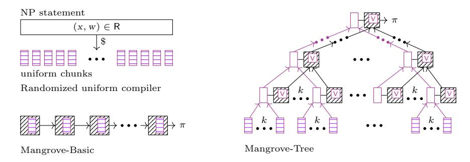
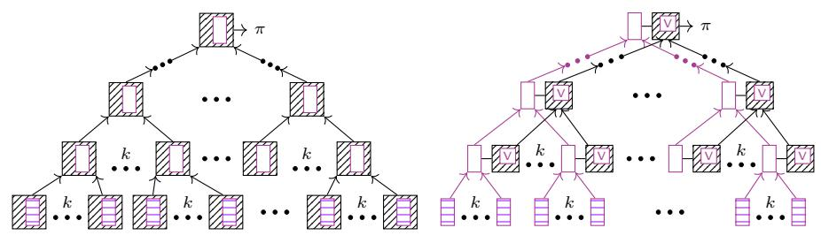
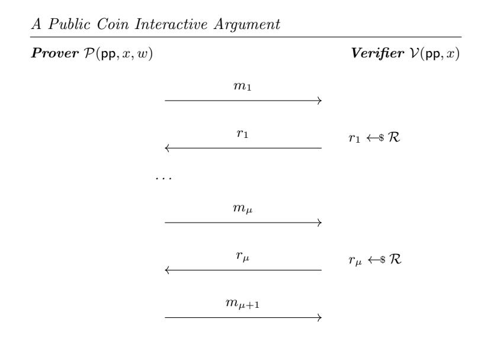
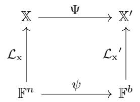
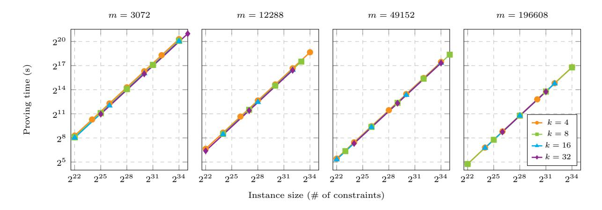
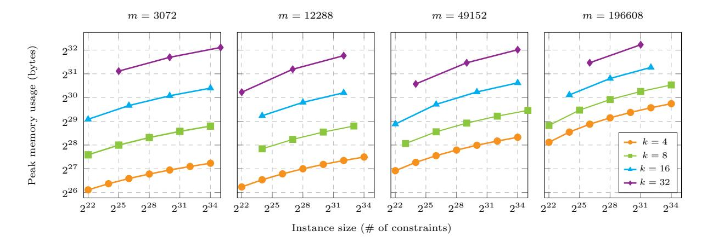
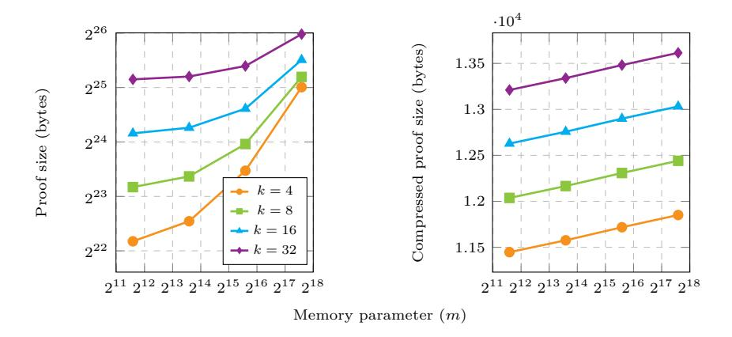

# Mangrove: A Scalable Framework for Folding-based SNARKs

Wilson Nguyen Trisha Datta Binyi Chen Nirvan Tyagi Dan Boneh {wdnguyen, tcdatta, binyi, tyagi, dabo}@cs.stanford.edu Stanford University

Abstract. We present a framework for building efficient folding-based SNARKs. First we develop a new "uniformizing" compiler for NP statements that converts any poly-time computation to a sequence of identical simple steps. The resulting uniform computation is especially well-suited to be processed by a folding-based IVC scheme. Second, we develop two optimizations to folding-based IVC. The first reduces the recursive overhead of the IVC by restructuring the relation to which folding is applied. The second employs a "commit-and-fold" strategy to further simplify the relation. Together, these optimizations result in a folding-based SNARK that has a number of attractive features. First, the scheme uses a constant-size transparent common reference string (CRS). Second, the prover has (i) low memory footprint, (ii) makes only two passes over the data, (iii) is highly parallelizable, and (iv) is concretely efficient. Microbenchmarks indicate that proving time is competitive with leading monolithic SNARKs, and significantly faster than other streaming SNARKs. For 2<sup>24</sup> (2<sup>32</sup>) gates, the Mangrove prover is estimated to take 2 minutes (8 hours) with peak memory usage approximately 390 MB (800 MB) on a laptop.

# Table of Contents

| 1 |     | Introduction<br>4                                     |    |  |  |  |  |  |
|---|-----|-------------------------------------------------------|----|--|--|--|--|--|
| 2 |     | Technical Overview                                    | 8  |  |  |  |  |  |
|   | 2.1 | A Uniform Compiler for NP Statements                  | 9  |  |  |  |  |  |
|   | 2.2 | SNARK from Proof-Carrying Data                        | 11 |  |  |  |  |  |
|   | 2.3 | Proof-Carrying Data with Reduced Overhead             |    |  |  |  |  |  |
|   |     | Decoupling PCD Computation Tree and Control Tree      | 15 |  |  |  |  |  |
|   |     | Folding Polynomial Relations for Commit-and-Prove PCD | 17 |  |  |  |  |  |
|   | 2.4 | Overview Summary                                      | 20 |  |  |  |  |  |
| 3 |     | Preliminaries                                         | 20 |  |  |  |  |  |
|   | 3.1 | Interactive Protocols and Arguments                   | 21 |  |  |  |  |  |
|   |     | Interactive Arguments                                 | 21 |  |  |  |  |  |
|   |     | Non-Interactive Arguments                             | 21 |  |  |  |  |  |
|   | 3.2 | Cryptographic Primitives                              | 23 |  |  |  |  |  |
|   |     | Folding Schemes                                       | 25 |  |  |  |  |  |
|   |     | Proof Carrying Data                                   | 26 |  |  |  |  |  |
|   | 3.3 | Algorithms                                            | 28 |  |  |  |  |  |
|   | 3.4 | Algebra                                               | 28 |  |  |  |  |  |
| 4 |     | Generalization of Folding Schemes                     | 29 |  |  |  |  |  |
|   | 4.1 | Polynomial Relations                                  | 29 |  |  |  |  |  |
|   | 4.2 | Polynomial Witness Testing                            | 31 |  |  |  |  |  |
| 5 |     | Folding Schemes for Polynomial Relations              | 31 |  |  |  |  |  |
|   | 5.1 | A Folding Scheme for Homogeneous Maps                 | 32 |  |  |  |  |  |
|   | 5.2 | A Folding Scheme for Arbitrary Polynomial Maps        | 33 |  |  |  |  |  |
|   | 5.3 | Heuristic Security of Folding Schemes                 | 34 |  |  |  |  |  |
| 6 |     | SNARKs for Plonkish Arithmetization                   | 35 |  |  |  |  |  |
|   | 6.1 | Plonkish Arithmetization                              | 35 |  |  |  |  |  |
|   | 6.2 | NARK for Plonkish                                     | 36 |  |  |  |  |  |
|   | 6.3 | SNARK for Plonkish                                    | 37 |  |  |  |  |  |
|   |     | Foldable Leaf Relation                                | 37 |  |  |  |  |  |
|   |     | SNARK PCD Predicate and Prover Helper Function        | 38 |  |  |  |  |  |
|   |     | SNARK Construction                                    | 40 |  |  |  |  |  |
|   | 6.4 | SNARK Performance Evaluation                          | 42 |  |  |  |  |  |
| 7 |     | Extensions: Lookups and Commit & Prove                | 45 |  |  |  |  |  |
|   | 7.1 | Lookup Tables in Arithmetization                      | 45 |  |  |  |  |  |
|   | 7.2 | Commit-and-Prove SNARK                                | 48 |  |  |  |  |  |
| A |     | Deferred Proofs                                       | 57 |  |  |  |  |  |
|   | A.1 | Deferred Proof of Lemma 5                             | 57 |  |  |  |  |  |
|   | A.2 | Deferred Proof of Theorem 2                           | 57 |  |  |  |  |  |
|   | A.3 | Deferred Proof of Theorem 3                           | 59 |  |  |  |  |  |

| A.4 | Multi-Instance Folding Extraction | 62 |
|-----|-----------------------------------|----|
| A.5 | Deferred Proof of Theorem 4       | 62 |
| A.6 | Deferred Proof of Theorem 5       | 64 |
| A.7 | Proof of Knowledge Soundness      | 64 |

## <span id="page-3-0"></span>1 Introduction

Succinct non-interactive arguments of knowledge (SNARKs) [\[BCCT12\]](#page-49-0) enable efficient verification of NP statements. While early research focused on reducing argument size and verification time, the focus in recent years has shifted to reducing the running time and memory requirements of the proving algorithm. This is essential for scaling SNARK proof systems to support large statements.

Scalability limitations in existing SNARKs. Most existing SNARK constructions require that the prover write down the full computation trace. For example, when proving satisfaction of an arithmetic circuit C, the prover needs access to the values of all the wires in C, and performs a global computation over the entire trace. We will refer collectively to SNARKs that fall into this category as monolithic SNARKs. In modern monolithic SNARKs [\[AHIV17,](#page-49-1) [BBHR18,](#page-49-2) [XZZ](#page-55-0)+19, [BCR](#page-50-0)+19, [GWC19,](#page-53-0) [Set20,](#page-54-0) [BFS20,](#page-51-0) [Lee20,](#page-53-1) [CHM](#page-52-0)+20, [CBBZ23,](#page-51-1) [GLS](#page-53-2)+23, [ZCF23\]](#page-55-1) this often amounts to producing commitments to polynomials of degree on the order of the computation trace and providing opening proofs for certain evaluation points. With our existing techniques, this translates to global computations that include some combination of fast Fourier transforms (FFTs), multi-scalar multi-exponentiations (MSMs), and/or proofs of proximity for linear error-correcting codes.

While the computations are global, in that they operate over the full trace, strategies for reducing memory costs for the prover exist. One approach is to chunk global computations into smaller components [\[WZC](#page-55-2)+18] storing intermediate results, rerunning the computation trace (or reading from disk) to reproduce the next chunk, and merge intermediate results at the end. Another approach, proposed in recent work [\[BHR](#page-51-2)+20, [BHR](#page-51-3)+21, [BCHO22\]](#page-50-1), is to design polynomial commitment schemes and tailor the associated proving protocol to be suitable for streaming. Both of these approaches reduce prover space complexity but incur overhead on the prover's time complexity.

Improving prover scalability via IVC. Instead of chunking the prover computation needed for the proof system, an alternate approach for proving large statements is to chunk the statement itself into smaller more manageable pieces, prove each piece individually, and then combine the piecewise proofs in some manner; we will refer to SNARKs falling under this overarching strategy as piecewise SNARKs. A classic example of a piecewise SNARK would be SNARKs implementing incrementally-verifiable computation (IVC) [\[Val08\]](#page-54-1) through recursive proof composition [\[BCCT13,](#page-49-3) [BCTV14a\]](#page-50-2) or proof aggregation [\[BMM](#page-51-4)+21, [TFZ](#page-54-2)+22]. IVC enables proving a long sequence of small computation steps, by having step i recursively verify the proof for step i − 1. The final proof is as short as verifying a single computation step, plus some overhead.

IVC has been proposed for proving generic NP statements. To do this, the statement must first be represented as a computation that is repeatedly applied; we call this representation uniform computation. Previous works have explored using a universal circuit or CPU for this purpose, representing the NP statement as a program to be executed [\[BCG](#page-49-4)<sup>+</sup>13, [BCTV14b,](#page-50-3) [BCTV14a\]](#page-50-2). This approach is memory-efficient — the SNARK prover only needs memory on the order of the universal circuit size and program state — however overheads in (1) encoding the NP statement as a program, (2) running a universal circuit for each step (partially addressed in recent work [\[KS22\]](#page-53-3)), and (3) verifying program state, have limited the prover time efficiency of such an approach. In addition to the overhead incurred by the universal circuit, the predominant strategy for IVC of using recursive proof composition [\[BCTV14a\]](#page-50-2) incurs its own set of expensive overheads.

Folding schemes for IVC. The state of affairs has changed with a line of recent work on designing folding schemes (or accumulation schemes) to build IVC [\[BGH19,](#page-51-5) [BCMS20b,](#page-50-4) [BCL](#page-50-5)<sup>+</sup>21, [KST22,](#page-53-4) [KS22,](#page-53-3) [BC23,](#page-49-5) [EG23,](#page-52-1) [KS23,](#page-53-5) [NBS23,](#page-53-6) [BC24\]](#page-49-6) with greatly improved efficiency over preexisting constructions based on recursive proof composition. A folding scheme enables a prover to reduce the task of checking two (or more) instances of a relation into the task of checking one folded instance for that same relation with a succinct proof of folding [\[KST22\]](#page-53-4). Intuitively, folding is used to build IVC by, at each step, folding instances for a relation encoding (1) one step of repeated computation, and (2) verification of the folding proof for the previous step [\[BCL](#page-50-5)+21, [KST22\]](#page-53-4). This approach has led to vast improvements in the efficiency of IVC because verification of folding proofs is inexpensive (compared to verification of monolithic SNARKs) and because generating folding proofs is inexpensive (compared to generation of monolithic SNARKs). In fact, even without considering the memory-efficiency benefits, folding-based IVC proofs for repeated computation are competitive in prover time with monolithic SNARKs for repeated computation.

Our contributions. We propose a new framework for scalable SNARKs for NP that allows for constant-size prover memory-efficiency without compromising on concretely efficient linear prover computation. At a high level, we will be following the same classic strategy of applying IVC to a uniform computation representing the NP statement. However, we make improvements to both parts of this strategy:

- Uniform compiler for NP: As discussed, previous works use universal circuits to encode NP statements as the uniform computation for IVC. This encoding is inefficient and results in large overhead. Instead, by looking closely at arithmetizations of NP statements used in monolithic SNARKs, we find existing uniform structure that we can take advantage of. We propose a new randomized uniform compiler for NP that takes NP statements in the Plonk arithmetization [\[GWC19\]](#page-53-0) and produces chunks of uniform computation to use with IVC. Thus, we eliminate the need for universal circuits or virtual machines when using folding to prove a general NP statement.
- Optimizations to folding-based IVC : Folding has emerged as a prover efficient route to construct IVC. We propose two improvements to folding-based IVC constructions to push prover efficiency even further. More precisely, we consider improvements for folding-based proof-carrying data constructions [\[BCL](#page-50-5)+21], a generalization of IVC [\[CT10,](#page-52-2) [BCCT13\]](#page-49-3). Our first optimization decouples the core uniform computation from the recursive computation of verifying folding proofs, greatly reducing recursive overhead. Reducing recursive overhead is especially important when considering memory-constrained settings, allowing a larger percentage of memory to be used on useful work. Our second optimization is a generalization of folding schemes to allow folding a relation over committed values, i.e., "commit-and-fold" following the notion of commit-and-prove SNARKs [\[CFQ19\]](#page-52-3). We estimate by removing the constraints for commitment opening in the IVC relation (e.g., scalar multiplication for Pedersen commitments), we achieve about a 100 times improvement to prover time over applying folding directly to the output of the uniform compiler. This is essential to bring our concrete prover time in line with monolithic SNARKs.

Following our uniform compiler for NP and applying our optimized folding-based PCD scheme, we end up with an extremely efficient SNARK for NP. As motivated, the resulting SNARK has a number of nice properties, mostly stemming from our use of tree-based PCD (in which the uniform computation is organized at the leaves of a tree and merged together), summarized in Figure [1:](#page-5-0)

– Streaming/memory-efficiency: Our SNARK requires only two passes over the prover witness and supports a tunable memory and parallelism parameters, denoted m and k respectively . The memory usage of the streaming SNARK is O(k(m + k) log<sup>k</sup> (n/m)) where n/m is the number of chunks for an NP statement of size n. By setting parameters m = Oλ(1) (a constant that is independent of n) and k = O(λ) (linear in the security parameter), we achieve a prover with constant memory complexity Oλ(1) with only 2

<span id="page-5-0"></span>

| Protocol                                         | Prover Time                               | Verifier Time           | e Prover Memory                         | y Input passes | s CRS                   |
|--------------------------------------------------|-------------------------------------------|-------------------------|-----------------------------------------|----------------|-------------------------|
| Spartan [Set20] w/ Hyrax-PC [WTs <sup>+</sup> 18 | $O_{\lambda}(n)$                          | $O_{\lambda}(\sqrt{n})$ | $O_{\lambda}(n)$                        | -              | $O_{\lambda}(\sqrt{n})$ |
| DARK-variant [BHR <sup>+</sup> 21, BFS20]        | $O_{\lambda}(n \operatorname{polylog} n)$ | $O_{\lambda}(\log(n))$  | $O_{\lambda}(\operatorname{polylog} n)$ | $O(\log(n))$   | $O_{\lambda}(1)$        |
| Gemini [BCHO22]                                  | $O_{\lambda}(n\log^2 n)$                  | $O_{\lambda}(\log(n))$  | $O_{\lambda}(\log(n))$                  | $O(\log(n))$   | $O_{\lambda}(n)$        |
| Nova w/ UC [KST22]                               | $O_{\lambda}(n)$                          | $O_{\lambda}(C)$        | $O_{\lambda}(C\log(n))$                 | 1              | $O_{\lambda}(C)$        |
| Mangrove (this work)                             | $O_{\lambda}(n)$                          | $O_{\lambda}(1)$        | $O_{\lambda}(1)$                        | 2              | $O_{\lambda}(1)$        |

Fig. 1: Comparison table of prover characteristics for SNARK constructions supporting memory-efficiency where n is the length of the NP statement. Spartan [Set20] is provided as a baseline comparison as a monolithic SNARK without memory-efficiency, yet Mangrove achieves comparable concrete prover time. Among memory-efficient proof systems, Mangrove compares favorably in every category: linear prover, constant memory, constant input passes, and constant-sized common reference string (CRS). Nova with a universal circuit (UC), where C is the constraint size of the universal circuit (including the implementation of linear-sized memory), is only secure for constant-length computation and incurs poor concrete constants due to the use of a universal circuit.

passes over the input. In comparison, other streaming SNARKs [BHR<sup>+</sup>21, BCHO22] use  $O_{\lambda}(\text{polylog}(n))$  memory and require  $O(\log n)$  passes over the input, where the logarithm base is a constant independent of the security parameter.

- Parallelism: The PCD proof is built up as a tree where each node is only dependent on its children. This
  admits a natural highly-parallel proving strategy that can be distributed across machines.
- Constant-size transparent CRS: Monolithic SNARKs typically require a common reference string (CRS) roughly the size of the NP statement. A large CRS, even if transparent, is a deployment hurdle as it needs to be stored and accessed (or recomputed on-the-fly) repeatedly during the proving protocol. Our SNARK uses a transparent CRS with size linear in the memory and arity parameter, which are constants  $m = O_{\lambda}(1)$  (independent of n) and  $k = O(\lambda)$ . Thus, the CRS is constant sized  $O_{\lambda}(1)$ .
- Commit-and-prove: A key efficiency contribution of our SNARK is the use of folding over committed elements that represent the NP statement and the prover witness. A side effect of this approach is that our SNARK is also a commit-and-prove SNARK in which commitments to prover witness components can be reused and connected across proofs for different statements.
- Concrete prover efficiency: We estimate the concrete efficiency of our construction in Section 6.4 and find that it is competitive with popular monolithic SNARKs like Spartan [Set20] and significantly faster than other streaming SNARKs like Gemini [BCHO22]. On a laptop, for 2<sup>24</sup> (2<sup>32</sup>) gates, we estimate the Mangrove prover takes approximately 2 minutes (8 hours) with peak memory usage approximately 390 MB (800 MB).

In this work, we present our results as a SNARK and do not explicitly encode the common zero-knowledge property to obtain a zkSNARK. However, we stress that the constructions can be easily adapted to provide zero knowledge using existing techniques without much impact on prover characteristics.

As a last note, we want to highlight the generality of our approach as a "commit-and-prove" PCD paradigm. We provide a uniform compiler for a SNARK arithmetization, but other uniform compilers for different computations can be slotted in as well.

**Practical SNARK configurations.** The techniques we introduce (summarized above) result in a couple SNARK configurations for NP worth exploring — all of which derive from folding-based IVC. Prior to this

work, the only approach for proving NP statements using IVC was to go through a universal circuit.[1](#page-6-0) Using a state-of-the-art folding-based IVC protocol [\[KST22\]](#page-53-4), we might refer to such a construction as Nova-UC (see Table [1\)](#page-5-0). Nova-UC is only secure for constant length computation and suffers from high concrete overhead incurred by the use of a universal circuit. Our uniform compiler allows us to do better.

The immediate construction that follows from the uniform compiler is to directly apply a folding-based IVC scheme like Nova. However, as noted above, naively applying IVC to the output of the uniform compiler also incurs high overhead in the form of constraints for commitment opening. Thus, the first practical construction worth considering is a folding IVC scheme supporting our commit-and-fold optimization with the uniform compiler; call this Mangrove-Basic. Here, we consider the folding IVC to be done in a straight line, as described by Nova and depicted for Mangrove-Basic in Figure [2](#page-7-1) (left). Mangrove-Basic avoids the cost incurred by the universal circuit, but is similarly limited to constant-length computation.

Alternatively, we can consider a tree-based folding construction (from PCD) that we term Mangrove-Tree (depicted in Figure [2](#page-7-1) (right)). As part of Mangrove-Tree, we introduce a decoupling technique to further improve the prover efficiency. Here, the statement proved within each tree PCD node is a verification of the folding of chunk computations rather than the chunk computation itself, reducing recursive overhead. Even with this optimization, Mangrove-Tree will always incur greater total prover cost than Mangrove-Basic due to the additional nodes of the tree over a line; high tree arity somewhat alleviates this overhead as the number of internal nodes of the tree are dominated by the number of leaves. However, Mangrove-Tree has two other benefits over Mangrove-Basic. First, Mangrove-Tree has a better approach to parallelism than Mangrove-Basic. Mangrove-Basic can parallelize the work of a single chunk, but must work sequentially in the line. Mangrove-Basic is limited then by the parallelism of a single chunk. In practice, this strategy for Mangrove-Basic amounts to the computation of a large MSM which can be chunked and computed in parallel but with an overall efficiency loss as MSM algorithms require large chunks [\[Pip80,](#page-54-4) [Boo\]](#page-51-6). In contrast, Mangrove-Tree admits a natural parallel strategy in which PCD nodes can be computed independently blocked only by the computation of its children. Second, a tree organization has theoretical benefits in that it supports a more efficient extraction procedure, enabling soundness for computations with a polynomial (in the security parameter) number of chunks; straight-line approaches are only sound for a constant. As such, our formal proofs and construction description are with respect to the tree-based construction, giving us a SNARK for polynomial length computation.

Additional related work. In addition to the recent work on accumulation and folding schemes discussed earlier, several recent works build VOLE-based designated-verifier non-interactive zero-knowledge proof systems that have a linear-time and low-memory prover [\[WYKW21,](#page-54-5) [DIO20,](#page-52-4) [YSWW21,](#page-55-3) [BMRS21,](#page-51-7) [DILO22\]](#page-52-5) as surveyed in [\[BDSW23\]](#page-50-6). Some even provide sublinear proof size by observing uniformity in NP statement arithmetization. Several monolithic SNARKs provide a linear-time prover [\[GLS](#page-53-2)<sup>+</sup>23, [XZS22\]](#page-55-4), but the prover is not low-memory or streaming.

Several SNARKs systems, such as DIZK [\[WZC](#page-55-2)<sup>+</sup>18] and Pianist [\[LXZ](#page-53-7)<sup>+</sup>23], scale to large size statements by distributing the prover's work across many servers. In addition to the time savings, these systems also

<span id="page-6-0"></span><sup>1</sup>Supernova [\[KS22\]](#page-53-3) and Protostar [\[BC23\]](#page-49-5) provide methods to prove virtual machine (VM) executions. Using these methods, the cost of each proving step scales only with the cost of the executed instruction rather than scaling with the full set of instructions. These works are not directly comparable to ours as we target a different computational model (i.e. circuits for NP vs virtual machines). With a naive approach, adapting Supernova and Protostar to prove an evaluation of an NP circuit would require representing the universal circuit as a VM instruction set; hence, paying the encoding overhead of a universal circuit.

<span id="page-7-1"></span>

Fig. 2: Depiction of Mangrove SNARK configurations for NP that apply folding to uniform chunks produced by a randomized uniform compiler. The uniform chunk computation is represented by the purple horizontally-hatched boxes. The IVC/PCD recursive computation is represented by the black cross-hatched boxes. (Left) Mangrove-Basic employs straight-line folding IVC in which each recursive step proves one chunk computation. (Right) Mangrove-Tree employs a folding k-arity PCD tree in which chunk computation is performed at the leaves. Also depicted is our decoupling optimization in which chunk computation is folded separately from the recursive computation. The recursive computation includes a verifier for the chunk folding, depicted with the purple V box.

greatly reduce the memory footprint on each of the proving servers. The proof system in this paper, Mangrove, exhibits a low memory footprint even when the entire proving job runs on a single server. The Mangrove prover can also be distributed across several servers.

Several post-quantum monolithic SNARKs are built from hash-based Merkle commitments: Stark [\[BBHR18\]](#page-49-2), Ligero [\[AHIV17\]](#page-49-1), Aurora [\[BCR](#page-50-0)+19], Brakedown [\[GLS](#page-53-2)+23], BaseFold [\[ZCF23\]](#page-55-1) and Fractal [\[COS20\]](#page-52-6). Their proof sizes scale sublinearly with the witness size. In practice they require a significant amount of memory when proving a large statement. Several elegant post-quantum lattice-based proof systems offer sublinear proof size [\[BBC](#page-49-7)+18, [BLNS20,](#page-51-8) [ACK21,](#page-49-8) [ACL](#page-49-9)+22, [BCS23\]](#page-50-7), however the resulting proofs are larger than the hash-based schemes. One exception is LaBRADOR [\[BS23\]](#page-51-9) that produces relatively short proofs, but has a linear time verifier. Other lattice-based proof systems, such as [\[ENS20,](#page-52-7) [LNP22\]](#page-53-8), perform well for small statements, but their proof size is linear in the size of the witness. We also mention LatticeFold [\[BC24\]](#page-49-6) which is an efficient lattice-based folding scheme.

In a forum post, [\[Sou23\]](#page-54-6) sketches a technique for loading arbitrary data per IVC step. This enables folding executions of different circuits efficiently, leading to a way to efficiently prove VM executions, as in Supernova [\[KS22\]](#page-53-3) and Protostar [\[BC23\]](#page-49-5). By applying appropriate changes and our uniform compiler, this loading data technique from [\[Sou23\]](#page-54-6) also leads to a SNARK similar to our Mangrove-Basic construction. However, they do not provide a formal construction or security analysis.

Several recent works study the question of constructing succinct proof systems in the standard model, without relying on random oracles [\[CJJ21,](#page-52-8) [CJJ22,](#page-52-9) [WW22,](#page-54-7) [KLVW22\]](#page-53-9). The resulting proof systems are for polynomial-time computation (not NP). While some of these works also compose proofs along a tree, as we do here, the resulting proof systems are very different from the ones presented in this paper. We also mention the tree folding scheme due to R`afols and Zacharakis [\[RZ22\]](#page-54-8), which we discuss in more detail in the next section.

# <span id="page-7-0"></span>2 Technical Overview

Our strategy for succinct proving of any statement in NP follows from two high level steps which we will explain in order. First, we introduce a general compiler for representing any statement in NP by "chunking" it into a sequence of statements for a smaller uniform indexed relation, which we will refer to as the chunk relation. By doing this, we can take advantage of existing techniques to more efficiently prove statements with this repeated uniform structure, sometimes referred to as data parallel or "single instruction, multiple data" (SIMD) computations [\[Tha13,](#page-54-9) [WHG](#page-54-10)+16, [TKPS22\]](#page-54-11). Recently, a promising set of techniques for this structure has emerged, collectively referred to as folding (or accumulation) schemes [\[BCL](#page-50-5)+21, [KST22,](#page-53-4) [BC23,](#page-49-5) [EG23,](#page-52-1) [KS23,](#page-53-5) [NBS23\]](#page-53-6). These schemes allow a succinct verification step to reduce the task of checking two statements for a relation to checking only a single folded statement for that relation. Generally speaking, one can only fold statements for the same relation (with some exceptions [\[KS22\]](#page-53-3)).

After this compilation, in our second step, we use folding to build new efficient proof systems for statements with the compiled uniform structure. Our approach goes through the more powerful intermediate abstraction of proof-carrying data (PCD) [\[CT10,](#page-52-2) [BCCT13\]](#page-49-3) which will bring our efficiency improvements to other settings that PCD can be applied to as well (e.g., for machine computation [\[BFR](#page-50-8)+13, [BCTV14b\]](#page-50-3)). Folding techniques have been previously proposed for constructing PCD [\[BCL](#page-50-5)+21, [BC23\]](#page-49-5); in these works, a PCD tree is constructed in which each node represents a recursive relation folding together its children, and the root of the tree represents a proof for the computation in the full tree (see Section [2.2](#page-10-0) for description of PCD tree). Looking forward, all of our new techniques aim to optimize the size of this recursive relation, reducing recursive overhead and greatly improving proving efficiency.

Lastly, we apply our new compiler and efficient PCD scheme to build a new family of scalable SNARKs that are well-suited for streaming (memory-efficiency) and distributed computing (parallelism efficiency).

## <span id="page-8-0"></span>2.1 A Uniform Compiler for NP Statements

Introduced in [\[GWC19\]](#page-53-0), the "Plonk" arithmetization is a natural encoding of computation in NP that possesses a close to uniform structure. For concreteness, let us review the specific arithmetization of Plonk to capture arithmetic circuits. Consider an arithmetic circuit with n gates indexed from 1 to n. The computation trace of this circuit can be encoded as a vector of wire values v ∈ F <sup>3</sup>n:

$$v = \left( (v_l^{(1)}, v_r^{(1)}, v_o^{(1)}), \ (v_l^{(2)}, v_r^{(2)}, v_o^{(2)}), \ \dots, \ (v_l^{(n)}, v_r^{(n)}, v_o^{(n)}) \right)$$

The wire values are indexed such that the left, right, and output wires of gate i are v (i) l , v (i) <sup>r</sup> , and v (i) <sup>o</sup> , respectively. In this encoding of arithmetic circuits, we consider binary gates, but the Plonk arithmetization can be extended to include gates with more inputs and outputs. The arithmetization further consists of two vectors, a selector vector s ∈ F <sup>n</sup> and a copy vector σ ∈ F <sup>3</sup><sup>n</sup> such that {σ<sup>i</sup> | i ∈ [3n]} = [3n], and a gate polynomial G. Together, these encode essential constraints on the wire values. Informally, the selector vector, s, specifies the type of gate at each index. The copy vector σ specifies how wires are connected within the circuit. The gate polynomial G checks if the wire values satisfy the gates specified by s. More precisely, a computation trace satisfies the constraints if and only if the following conditions hold:

– Local gate constraints: For all i ∈ [n], G s (i) , v (i) l , v (i) <sup>r</sup> , v (i) o = 0. An arithmetic circuit consisting of only addition and multiplication gates can be encoded with the following gate polynomial,

$$G\!\left(\mathbf{s}^{(i)}, v_l^{(i)}, v_r^{(i)}, v_o^{(i)}\right) = \mathbf{s}^{(i)} \cdot \left(v_\ell^{(i)} + v_r^{(i)}\right) + \left(1 - \mathbf{s}^{(i)}\right) \cdot v_\ell^{(i)} \cdot v_r^{(i)} - v_o^{(i)} \,.$$

where s (i) = 1 indicates gate i is an addition gate and s (i) = 0 indicates gate i is a multiplication gate.

– Global copy constraints: For all i ∈ [3n], v (i) = v (σ . These constraints enforce that the wire values are invariant under the permutation induced by σ. Thus, the wire value v (i) is identical to the wire value v (σ . In this way, the copy vector σ encodes the connectivity of the circuit.

Natural uniform chunking of local gate constraints. Recall our goal is to come up with a uniform chunking of the above constraints. We first observe the local gate constraints admit a natural chunking strategy of simply chunking by gate. In particular, we can partition the selector vector and wire values into T chunks of equal size (m = n/T and 3m respectively), and check the gate constraints for the indices [m(j − 1) + 1, mj] for each chunk j ∈ [T] independently.

Barriers to uniformity in global copy constraints. Uniformly chunking the gate constraints has been performed in prior work [\[WYY](#page-55-5)+22, [BCC](#page-49-10)+23] to reduce communication complexity of proof systems. Unfortunately, chunking by gate does not carry over as a valid chunking strategy for the global copy constraints. It is a global constraint: a gate in one chunk can be connected to a gate in another chunk. To see where this difficulty arises more concretely, a chunk j ∈ [T] would contain indices [3m(j −1)+ 1, 3mj] of v and σ. Then, for i ∈ [3m(j − 1) + 1, 3mj], it may not be possible to check the copy constraint v (i) = v (σ ) , as v (σ ) may belong to a different chunk, i.e., σ (i) ̸∈ [3m(j − 1) + 1, 3m].

Randomized compiler for uniform chunking of global copy constraints. An alternate strategy is to consider an approach taken by many proof systems in proving the global copy constraints [\[GWC19\]](#page-53-0). Instead of proving each copy constraint individually, the full set of global copy constraints is reduced to a set equality of the following sets:

$$\bigcup_{i=1}^{3n} \left\{ (v^{(i)}, i) \right\} = \bigcup_{i=1}^{3n} \left\{ (v^{(i)}, \sigma^{(i)}) \right\}.$$

In prior work, this set equality check (or permutation check) [\[BG12,](#page-51-10) [GWC19\]](#page-53-0) is performed by computing and comparing the evaluations of a multiset hash function [\[CDv](#page-52-10)+03] which takes the following grand product form using hash function H:

$$\prod_{i=1}^{3n} \mathsf{H}(v^{(i)},i) = \prod_{i=1}^{3n} \mathsf{H}(v^{(i)},\sigma^{(i)}) \quad \Rightarrow \quad \prod_{i=1}^{3n} \frac{\mathsf{H}(v^{(i)},i)}{\mathsf{H}(v^{(i)},\sigma^{(i)})} = 1 \,.$$

Once translated into this grand product, the chunking by gate indices strategy can be recovered. For each chunk j ∈ [T], a partial product for the indices [3m(j − 1) + 1, 3m] can be computed as part of the uniform chunk relation; this would only rely on values that are already present in the chunk:

$$\prod_{i=1}^{3n} \frac{\mathsf{H}(v^{(i)},i)}{\mathsf{H}(v^{(i)},\sigma^{(i)})} = \prod_{i=1}^{3m} \frac{\mathsf{H}(v^{(i)},i)}{\mathsf{H}(v^{(i)},\sigma^{(i)})} \prod_{i=3m+1}^{6m} \frac{\mathsf{H}(v^{(i)},i)}{\mathsf{H}(v^{(i)},\sigma^{(i)})} \dots \prod_{i=3n-3m+1}^{3n} \frac{\mathsf{H}(v^{(i)},i)}{\mathsf{H}(v^{(i)},\sigma^{(i)})}$$

The partial product for an individual chunk would not evaluate to one, but it can be propagated during PCD and combined with the product of other chunks, such that the product at the root of the PCD tree should equal one. We will explain our PCD approach shortly.

In practice, for efficiency reasons, a universal hash function Hα,β(x, y) = (x + α · y) + β is used where challenges α, β ∈ F are sampled by the verifier after the prover has committed to witness inputs v. Looking forward, this step of the randomized compiler is what results in two passes on the witness for our eventual SNARK prover. In the first pass, the prover computes a commitment to the witness wire vector v, and, in the second pass, the prover uses PCD over the chunks. Alternatively, one might use a deterministic hash function modeled as a random oracle as proposed by Clarke et al. [\[CDv](#page-52-10)<sup>+</sup>03] to produce a single pass streaming SNARK for NP; however, due to the concrete overheads of such an approach, we do not consider it further in this work.

All together, the chunk relation takes as input a chunk of gate wires, selectors, and copy values and (1) checks the local gate constraints for each gate in the chunk and (2) computes a partial product representing a piece of the global copy constraints permutation check. Next, we describe how to apply PCD to combine these uniform chunks.

Extension: Supporting lookup arguments. As a brief aside, we note that our uniform compiler also easily supports a common extension to the Plonk arithmetization known as lookup arguments. Lookup arguments allow for encoding that certain wire values are set to values that appear in a precomputed table [\[BCG](#page-50-9)+18, [GW20\]](#page-53-10). They are used to greatly reduce constraint overhead for representing computations without clean arithmetic structure, e.g., in hash functions like SHA256 or for range checks.

The popular Plookup protocol [\[GW20\]](#page-53-10) reduces the lookup argument to a grand product check of multiset equality much like the permutation argument described earlier; this approach can be easily chunked into partial products in the same way. Unfortunately, Plookup is not amenable to streaming. The prover must run the full computation and then produce a sorted list of the union of wire values and table values, incurring a logarithmic number of passes on the list in the memory-constrained streaming setting.

Instead, we propose the use of an alternate lookup protocol recently proposed by Hab¨ock [\[Hab22\]](#page-53-11) that does not rely on sorted values, where it is observed that logarithmic derivatives can translate products into summations of their reciprocals. Hab¨ock's approach conceptually still relies on computing universal hashes for a multiset equality check, however, it manifests as a grand summation check (instead of a grand product check); the grand summation can again be easily chunked into partial summations. By avoiding the required sorting of Plookup, the chunked Hab¨ock lookup preserves our two-pass SNARK prover. We discuss the precise lookup details and chunking approach in [Section 6.4.](#page-43-0)

There exist other extensions to the arithmetization and model of computation that can reduce concrete constraints for certain computations. For example, these include forwarding constraints for Plonkish [\[CBBZ23\]](#page-51-1), rank-1 constraint systems (R1CS) or their high-degree generalization [\[STW23a\]](#page-54-12), random access memory [\[BFR](#page-50-8)+13, [SAGL18,](#page-54-13) [YH23\]](#page-55-6), or lookups into large tables [\[STW23b,](#page-54-14) [AST23\]](#page-49-11). We leave the task of constructing uniform compilers for these useful extensions to future work.

## <span id="page-10-0"></span>2.2 SNARK from Proof-Carrying Data

In this section, we show how to apply PCD to provide a SNARK for the satisfaction of all uniform chunks, and in turn, satisfaction of the original NP statement. PCD allows for proving satisfaction of a compliance predicate φ over a computation organized as a directed acyclic graph [\[CT10,](#page-52-2) [BCCT13\]](#page-49-3). For example, in a tree graph with edges pointing from children nodes to parent node, the PCD proof for the root node represents satisfaction of the compliance predicate for all internal nodes and leaf nodes of the tree. Typically, the compliance predicate is defined with a base case for leaf nodes and a recursive case for internal nodes.

Our starting point for applying PCD to our uniformly-chunked NP statement is the classic PCD tree application to incrementally-verifiable computation (IVC) [\[Val08\]](#page-54-1) by Bitansky et al. [\[BCCT13\]](#page-49-3) where the task is to prove correct evaluation of repeated function evaluation. The compliance predicate φivc for this construction is roughly as follows. For simplicity, we consider a binary PCD tree and discuss higher arity later:

– The base case for the i th leaf node takes a claimed (i − 1)th repeated evaluation of F, x (i−1), and computes x (i) ← F(x (i−1)). The leaf node is represented by the range [i − 1, i] and the claimed inputoutput evaluations (x (i−1), x(i) ).

– The recursive case for an internal node takes two input-output pairs for claimed ranges of repeated evaluation of F, [([sb, tb], x(sb) , x(tb) )]b∈{0,1}. It merges the ranges by checking that t<sup>0</sup> = s<sup>1</sup> and x (t0) = x (s1) . If the check succeeds, the internal node is represented by the merged range [s0, t1] and the claimed input-output evaluations (x (s0) , x(t1) ).

With φivc, the PCD tree is built up such that the PCD proof at the root attests to a range [0, t] proving that F t (x (0)) = x (t) .

Our application of building a SNARK from uniform chunks shares many similarities with the IVC application. In the base case, each leaf node will indeed represent the correct computation of a uniform chunk function F. However, the recursive case will need to perform different accounting to track the merging of uniform chunks.

First, the verifier needs to check that the chunks of the copy vector σ and selector vector s used by the prover do indeed correspond to those of the original NP statement. Similarly, recall that the α, β verifier challenges for the permutation argument are sampled after the prover commits to the wire values v. The verifier must also then check that the chunks of the wire vector v used by the prover correspond to what was previously committed to. Lastly, the partial products for each chunk must be merged appropriately to check the final grand product permuation argument.

Consider the following T chunks of the selector vector s, the copy vector σ, and the wire value vector v:

$$\left[ \left( \mathbf{s}_j \in \mathbb{F}^m, \sigma_j \in \mathbb{F}^{3m}, v_j = \left( v_{\ell,j}^{(1)}, v_{r,j}^{(1)}, v_{o,j}^{(1)}, \dots, v_{\ell,j}^{(m)}, v_{r,j}^{(m)}, v_{o,j}^{(m)} \right) \in \mathbb{F}^{3m} \right]_{j=1}^T$$

Let us address the accounting challenges in turn. First, to track the validity of the index components and wire values used in each chunk, we construct a Merkle tree commitment to each that mirrors the tree format of PCD. Consider commitments to the index components of each chunk, [plk<sup>j</sup> ← Commit(j, σ<sup>j</sup> ,s<sup>j</sup> )]<sup>T</sup> <sup>j</sup>=1, and commitments to the wire values of each chunk, [v<sup>j</sup> ← Commit(v<sup>j</sup> )]<sup>T</sup> <sup>j</sup>=1. The chunk index commitments and wire commitments are each combined into a single commitment using a Merkle tree commitment, hplk ← MT.Commit([plk<sup>j</sup> T <sup>j</sup>=1) and hv ← MT.Commit([v<sup>j</sup> ] T <sup>j</sup>=1). The index Merkle commitment hplk is computed during preprocessing and encodes the NP statement. The wire Merkle commitment hv is computed by the prover on its first pass over the witness, after which the α, β verifier challenges are sampled. Again, we assume the Merkle tree arity matches that of the PCD tree. The compliance predicate for our SNARK φsnark checks the Merkle hash of children nodes during merges, thus the validity of the index and wire values can be confirmed by checking that the Merkle hash computed at the root of the PCD tree matches the Merkle root of the preprocessed index commitment and the prover-committed wire value commitment, respectively.

To address the challenge of tracking and merging partial products of the permutation argument, each node is simply associated with a claimed partial product for the subtree of leaves rooted at that node. During a merge, the merged node sets its own partial product by taking the product of the partial products of its children. All together, the PCD compliance predicate for producing a SNARK from uniform chunks is described in [Figure 3.](#page-12-1)

Informally, the syntax for a PCD compliance predicate is φ(Z, loc, [Zb]b∈{0,1}). Here Z represents the statement of the node and [Zb]b∈{0,1} represent the statements of the children nodes in the recursive case. There is also some auxiliary local data specific to the node stored in loc. This informal treatment does not adress higher PCD arity; we defer the full details to the main body of the paper.

Given this PCD predicate for combining uniform chunks, one can apply any construction of PCD to produce a SNARK for the initial NP statement. Unfortunately, as is, any generic application of PCD would not result in an efficient protocol. The main inefficiency comes from the need to open the commitment to the

```
Predicate φsnark(Z, loc, [Zb]b∈{0,1})
```

<span id="page-12-2"></span>(Case 1) If Z is a leaf (i.e., Z<sup>0</sup> = ⊥ ∧ Z<sup>1</sup> = ⊥):

- (a) Parse (p<sup>j</sup> , hplk<sup>j</sup> , hv<sup>j</sup> ) ← Z and s<sup>j</sup> , σ<sup>j</sup> , v<sup>j</sup> = (v (1) ℓ,j , v (1) r,j , v (1) o,j , . . . , v (m) ℓ,j , v (m) r,j , v (m) o,j ) ← loc representing some chunk j ∈ [T].
- (b) Check uniform chunk computation:
  - a. Check gate constraints. For i ∈ [m],

$$\mathbf{s}_{j}^{(i)} \cdot \left(v_{\ell,j}^{(i)} + v_{r,j}^{(i)}\right) + \left(1 - \mathbf{s}_{j}^{(i)}\right) \cdot v_{\ell,j}^{(i)} \cdot v_{r,j}^{(i)} - v_{o,j}^{(i)} = 0 \,.$$

b. Check partial product of global copy constraints:

$$p_{j} = \prod_{i=1}^{3m} \frac{\mathsf{H}_{\alpha,\beta}(v_{j}^{(i)}, 3m(j-1)+i)}{\mathsf{H}_{\alpha,\beta}(v_{j}^{(i)}, \sigma_{j}^{(i)})} \,,$$

where α, β ∈ F are predetermined verifier challenges.

c. Check commitment to Merkle leaf of index and wire values:

$$\mathsf{hplk}_j = \mathsf{MT.H}(\mathsf{Commit}(j, \mathsf{s}_j, \sigma_j)), \qquad \mathsf{hv}_j = \mathsf{MT.H}(\mathsf{Commit}(v_j)) \,.$$

<span id="page-12-3"></span>(Case 2) Else Z is an internal node:

- (a) Parse [(pb, hplk<sup>b</sup> , hvb) ← Zb] b∈{0,1} representing the node's two children.
- (b) Parse (p, hplk, hv) ← Z representing the node's merged output.
- (c) Check consistency of merge:
  - a. Check consistency of claimed partial product, p = p<sup>0</sup> · p1.
  - b. Check consistency of Merkle hashes,

$$\mathsf{hplk} = \mathsf{MT.H}(\mathsf{hplk}_0, \mathsf{hplk}_1)\,, \qquad \mathsf{hv} = \mathsf{MT.H}(\mathsf{hv}_0, \mathsf{hv}_1)\,.$$

Fig. 3: PCD compliance predicate for producing a SNARK with our proposed uniform compiler.

index values as part of the chunk computation. Commitments require hashing or group operations which are expensive to represent as algebraic constraints. In the next sections, we will address this inefficiency along with other sources of overhead in the application of PCD.

## <span id="page-12-0"></span>2.3 Proof-Carrying Data with Reduced Overhead

We now step through a series of optimizations for reducing the computational overhead of PCD; these improvements are of general interest for any application of PCD.

In the following, to concretely discuss the prover efficiency gains for each optimization, it will be useful to consider a specific PCD scheme. We will consider a folding-based PCD scheme similar to that of B¨unz et al. [\[BCL](#page-50-5)<sup>+</sup>21] as it is the most prover-efficient to-date and works well with the further folding-based optimizations that we propose. B¨unz et al. cast the PCD scheme using their formalism of "split accumulation"; we will modify the presentation to a notion of folding following the approach of Kothapalli et al. [\[KST22\]](#page-53-4).

First, a brief detour to describe the notion of folding that we will use. Put simply, a folding scheme for a relation R folds two instances of a relation into a single instance for the same relation and provides a proof of folding. Security dictates that if the proof verifies, then membership of the folded instance in the relation implies membership of the two original instances in the relation as well. To introduce some useful notation:

Definition 1 (Folding Schemes (informal)). A folding scheme Fold for a relation R is a tuple of algorithms (Fold.P, Fold.V). The proving algorithm Fold.P([(x<sup>i</sup> , wi)]<sup>k</sup> <sup>i</sup>=1) takes as input k instance-witness pairs claimed to be in R. It outputs a folded instance-witness pair (x, w) along with a folding proof π. The verify algorithm Fold.V([x<sup>i</sup> k <sup>i</sup>=1, x, π) verifies the proof with respect to the initial instances and the folded instance such that the following properties are satisfied:

- Completeness: If all initial instance-witness pairs are in the relation, [(x<sup>i</sup> , wi) ∈ R] k <sup>i</sup>=1, then it holds that the folding verifier will accept and the folded instance-witness pair also belongs to R, (x, w) ∈ R.
- Knowledge soundness: If an adversary P˜ produces folded instances (xi) k <sup>i</sup>=1,(x, w) and folding proof π that are accepted by the verifier, Fold.V([x<sup>i</sup> k <sup>i</sup>=1, x, π) = 1, and (x, w) ∈ R then with all but negligible probability, an extractor can find witnesses [w<sup>i</sup> k <sup>i</sup>=1 such that [(x<sup>i</sup> , wi) ∈ R] k <sup>i</sup>=1.

The above informal definition and syntax omit many details including treatment of indexed relations and specification of the extractor. We defer the full details to the main body of the paper.

With this notion of folding, we can recast the main recursive relation Rpcd used to construct PCD in [\[BCL](#page-50-5)+21]. Conceptually, the relation Rpcd simply checks the PCD predicate φ and recursively verifies a folding proof for itself. However, we do not know of folding schemes for directly folding Rpcd; we must encode an instance-witness pair for Rpcd as an instance-witness pair for a different but related relation Rpcd-poly and fold instances of Rpcd-poly. Shortly in Section [2.3](#page-16-0) we will introduce the family of relations from which Rpcd-poly comes from as polynomial relations which have a number of useful properties that we will take advantage of.

For now, we need to make clear that there are two classes of instances that can belong to Rpcd-poly, strict and relaxed. Our treatment and notation for strict and relaxed instances for polynomial relations mirrors that of Kothapalli et al. [\[KST22\]](#page-53-4) where in their search for a folding scheme for R1CS (an NP-complete relation), instead propose a folding scheme for a related superset relation they term "relaxed" R1CS. A strict instance for (X,W) ∈ Rpcd-poly has an efficiently-computable canonical bidirectional mapping to an instance in (x, w) ∈ Rpcd. We denote the algorithm isStrict(X) as an efficient check if an instance in Rpcd-poly is strict and denote the algorithm checkMap(X, x) to check if X encodes x. In contrast, a relaxed instance, (X′ ,W′ ) ∈ Rpcd-poly, does not have a mapping to instances in Rpcd. Relaxed instances are created as outputs of folding together instances of Rpcd-poly, strict or relaxed.

All together, using the same notation Z, loc, [Zb]b∈{0,1} as above and where Foldpcd-poly is a folding scheme for Rpcd-poly:

$$\mathsf{R}_{\mathsf{pcd}} = \left\{ \begin{pmatrix} h = \mathsf{H}(z, X') \text{ and } \varphi(\mathsf{Z}, \mathsf{loc}, [\mathsf{Z}_b]_{b \in \{0,1\}}) = 1 \\ h = \mathsf{H}(z, X') \text{ and } \varphi(\mathsf{Z}, \mathsf{loc}, [\mathsf{Z}_b]_{b \in \{0,1\}}) = 1 \\ \text{If } \bigwedge_{b \in \{0,1\}} \neg \varphi. \mathsf{isBase}(z_b) : \\ (\mathsf{isStrict}(X_b) = 1)_{b \in \{0,1\}} \\ (\mathsf{checkMap}(X_b, \mathsf{H}(\mathsf{Z}_b, X_b')) = 1)_{b \in \{0,1\}} \\ (\mathsf{checkMap}(X_b, \mathsf{H}(\mathsf{Z}_b, X_b')) = 1)_{b \in \{0,1\}} \\ \mathsf{Fold}_{\mathsf{pcd-poly}}. \mathsf{V}([X_0, X_0', X_1, X_1'], X', \pi) = 1 \end{pmatrix}$$

In the non-base case, the PCD relation captures merging two children subtrees. The isBase predicate performs a check on the children to determine if the PCD predicate is in a base case. For concreteness, a standard base case check, as is used in φsnark is simply checking if Z<sup>0</sup> = ⊥∧Z<sup>1</sup> = ⊥. Here, X′ b is a relaxed instance representing the folded constraints of all nodes from one child subtree not including the child itself. In contrast, X<sup>b</sup> is a strict instance for Rpcd-poly representing the satisfaction of Rpcd for the child node represented by Zb, as such the strict mapping is checked for X<sup>b</sup> with respect to the instance H(Zb, X′ b ) for Rpcd. Lastly, a new relaxed instance X′ folds together Xb, X′ b for both children, which now represents the folded constraints of all nodes in the subtree for the parent.

<span id="page-14-1"></span>

| Protocol                                                     | Prover work / node            | # of nodes         | Rpcd                                                         | Rleaf                  |
|--------------------------------------------------------------|-------------------------------|--------------------|--------------------------------------------------------------|------------------------|
| Baseline [BCL+21,<br>KST22]                                  | (k + 1) ·  Rpcd               | T −1<br>T +<br>k−1 | cchunk<br>+ cchunk-com<br>+ cchunk-merge<br>+ ck-vfold(Rpcd) | n/a                    |
| w/ decoupling (Sec. 2.3)                                     | (k + 1) ·  Rpcd  + k ·  Rleaf | T −1<br>k−1        | cchunk-merge<br>+ ck-vfold(Rpcd) + ck-vfold(Rleaf)           | cchunk<br>+ cchunk-com |
| w/ commit-and-prove (Sec. 2.3) (k + 1) ·  Rpcd  + k ·  Rleaf |                               | T −1<br>k−1        | cchunk-merge<br>+ ck-vfold(Rpcd) + ck-vfold(Rleaf)           | cchunk                 |

Fig. 4: Summary table of improvements to prover work in building a k-arity PCD tree for T uniform chunks of a NP statement. The size of the main control PCD relation Rpcd and the computation leaf relation Rleaf are given with respect to size of constraints for uniform chunk cchunk, for opening commitment to chunk cchunk-com, for merging chunks cchunk-merge, and for verifying a k-folding proof ck-vfold. The targeted improvement of each optimization is highlighted in a red box.

To build up each node of the PCD tree, the PCD prover must (1) compute a folding proof π for the children subtree instances, and (2) compute a strict instance for the parent node. Computing the strict instance and folding instances take prover work (creation of homomorphic commitments) on the order of the relation size (and the number of instances folded together). Figure [4](#page-14-1) provides a summary of the PCD prover costs. The costs are with respect to a k-arity PCD tree. In the next sections, we will improve the prover costs by reducing the size of Rpcd, also summarized in Figure [4.](#page-14-1)

<span id="page-14-0"></span>Decoupling PCD Computation Tree and Control Tree Our first optimization applies to PCD predicates that take the common structure of a base case for leaf nodes where the core computation is performed and a recursive case for internal nodes where a lightweight merging computation is performed; both φivc for IVC [\[BCCT13\]](#page-49-3) and φsnark for our uniformly-chunked NP statement take this structure.

Notice that the prover performs work on the order of the size of the PCD relation Rpcd at every node, including leaves. In the structured PCD relations described, the merging logic consists of wasted work at the leaf level. Looking forward, when using a high PCD arity, the dominating majority of the work is performed at the leaf level so avoiding extra work at the leaf level will result in significant concrete gains. For example, for arity k = 128 with number of leaves T = 221, the number of internal nodes (T − 1)/(k − 1) = 16513 is less than 1/100 the number of leaf nodes.

With this motivation in mind, we propose a solution to decouple the core leaf computation from the control merging computation performed as part of PCD. Instead of having a special-case "leaf" computation check in the PCD predicate, we will define a new PCD predicate that verifies a folding proof of a leaf relation. Note that conceptually this means that the prover work for the first level of the tree is switching from generating a folding proof for the old PCD relation (which includes leaf and control logic) to a folding proof just for the leaf relation. This ensures that the overhead of the control logic is avoided at the leaves. The decoupling optimization is depicted in Figure [5.](#page-15-0)

More specifically, consider the following abstract PCD predicate φcouple where the leaf logic and merge logic are coupled together within the same predicate, defined as predicates ψleaf and ψrecursive, respectively. Observe that this abstraction captures φsnark from Section [2.3](#page-12-0) where ψleaf would encode [\(Case 1\)](#page-12-2) and ψrecursive would encode [\(Case 2\).](#page-12-3)

<span id="page-15-0"></span>

Folding PCD without decoupling [BCL+21]

Folding PCD with decoupling

Fig. 5: Depiction of decoupling optimization for folding PCD k-arity trees in which the computation folding tree is decoupled from the recursive folding tree. Core chunk computation is represented by purple horizontally-hatched boxes and PCD recursive computation is black cross-hatched boxes. (Left) Prior PCD tree approaches incur the cost of the PCD recursive computation at every node of the tree since the PCD recursive relation includes the core computation itself. (Right) Our decoupling optimization decouples the core computation and starts PCD recursive computation after an initial folding round of the core computation. The recursive computation includes a verifier for the chunk folding, depicted with the purple V box.

$$\label{eq:predicate_predicate} \begin{split} & \frac{\operatorname{Predicate} \, \varphi_{\mathsf{couple}}(\mathsf{Z},\mathsf{loc},[\mathsf{Z}_b]_{b \in \{0,1\}})}{\operatorname{If} \, (\mathsf{Z}_0 = \bot \land \mathsf{Z}_1 = \bot) \, \operatorname{then} \, \psi_{\mathsf{leaf}}(\mathsf{Z},\mathsf{loc}) = 1.} \\ & \operatorname{Else} \, \psi_{\mathsf{recursive}}(\mathsf{Z},\mathsf{loc},[\mathsf{Z}_b]_{b \in \{0,1\}}) = 1. \\ & \frac{\operatorname{Predicate} \, \varphi_{\mathsf{couple}}.\mathsf{isBase}(\mathsf{Z})}{\operatorname{Check} \, \mathsf{Z} = \bot}. \end{split}$$

Now to decouple the PCD predicate, we will separate out a leaf relation:  $R_{leaf} = \{(Z, loc) : \psi_{leaf}(Z, loc) = 1\}$ . Similar to before, we will construct a related relation  $R_{leaf-poly}$  that can be folded and for which we have a bidirectional mapping of instances in  $R_{leaf}$  with strict instances in  $R_{leaf-poly}$ . We construct a new PCD predicate  $\varphi_{decouple}$  that decouples the leaf logic by only verifying a folding proof for leaf computation. The PCD instance for  $\varphi_{decouple}$  will consist of  $Z \leftarrow (Z', X)$  where Z' is the PCD instance of  $\varphi_{couple}$  and X is an instance for  $R_{leaf-poly}$ . Again, here we present the 2-ary case, but recall the true savings of this approach occur for high arity PCD trees.

## Predicate $\varphi_{\mathsf{decouple}}(\mathsf{Z},\mathsf{loc},[\mathsf{Z}_b]_{b\in\{0,1\}})$

- 1. Parse folding proof,  $\pi \leftarrow \mathsf{loc}$ , and PCD statements  $(\mathsf{Z}',X) \leftarrow \mathsf{Z}$ ,  $[(\mathsf{Z}'_b,X_b) \leftarrow \mathsf{Z}_b]_{b \in \{0,1\}}$ .
- 2. Verify folding proof,  $\mathsf{Fold}_{\mathsf{leaf-poly}}.\mathsf{V}([X_0,X_1],X,\pi)$ .
- 3. Check the merging constraints,  $\psi_{\mathsf{recursive}}(\mathsf{Z}',\mathsf{loc},[\mathsf{Z}_b']_{b\in\{0,1\}})=1.$

## Predicate $\varphi_{\mathsf{decouple}}.\mathsf{isBase}(\mathsf{Z})$

- 1. Parse  $(\mathsf{Z}',X) \leftarrow \mathsf{Z}$ .
- 2. Check the instance is strict and maps to the given instance for  $\mathsf{R}_{\mathsf{leaf}}$ :  $\mathsf{isStrict}(X) \land \mathsf{checkMap}(X,\mathsf{Z}')$ .

With this PCD predicate, every PCD node performs the same checks of verifying the leaf folding proof and checking the merging constraints. Interestingly, now the base case check for the PCD relation is not trivial. Previously, the check would simply check if the children instances are  $\bot$ . Now, in the base case, the children correspond to leaf computations. As such, the base case requires checking that the instances of  $R_{leaf-poly}$  correspond to instances of  $R_{leaf}$ , i.e., that they are strict. This check is only for the base case, as the instances passed into higher levels of the tree will correspond to relaxed instances of  $R_{leaf-poly}$ —the result of (possibly many rounds of) folding.

In summary, using folding to decouple the leaf computation from the merging computation in a PCD tree reduces the number of PCD nodes for which merging overhead is incurred. As highlighted in Figure [4,](#page-14-1) the number of PCD nodes falls from T + T −1 k−1 to <sup>T</sup> <sup>−</sup><sup>1</sup> k−1 in a k-arity PCD tree with T leaves. Further, the prover work per node remains approximately the same (|Rpcd| + |Rleaf| in decoupling is approximately the same as |Rpcd| in the baseline). In the next section, we will take a closer look at the structure of the leaf computation.

<span id="page-16-0"></span>Folding Polynomial Relations for Commit-and-Prove PCD Now that the leaf computation logic is separated into its own relation, let us revisit this leaf relation for φsnark that checks local gate constraints and partial copy constraints for a uniform chunk (following from [\(Case 1\)\)](#page-12-2). Recall α, β ∈ F are verifier challenges sampled ahead of PCD:

$$\mathsf{R}_{\mathsf{leaf-snark}} = \left\{ \begin{array}{l} \left( \mathsf{Z} = (p,j,\mathsf{hplk},\mathsf{hv}) \\ \mathsf{loc} = \left( \mathsf{s}, \sigma, v_{=}(v_{\ell}^{(1)}, v_{r}^{(1)}, v_{o}^{(1)}, \dots, v_{\ell}^{(m)}, v_{r}^{(m)}, v_{o}^{(m)}) \right) \right) : \\ \bigwedge_{i=1}^{m} \mathsf{s}^{(i)} \cdot \left( v_{\ell}^{(i)} + v_{r}^{(i)} \right) + \left( 1 - \mathsf{s}^{(i)} \right) \cdot v_{\ell}^{(i)} \cdot v_{r}^{(i)} - v_{o}^{(i)} = 0 \\ p = \prod_{i=1}^{3m} \frac{\mathsf{H}_{\alpha,\beta}(v^{(i)}, 3m(j-1) + i)}{\mathsf{H}_{\alpha,\beta}(v^{(i)}, \sigma^{(i)})} \\ \mathsf{hplk} = \mathsf{MT.H}(\mathsf{Commit}(j, \mathsf{s}, \sigma)) \\ \mathsf{hv} = \mathsf{MT.H}(\mathsf{Commit}(v)) \end{array} \right\}.$$

The dominant contributor when encoding the above relation as a set of constraints is the commitment check where the vectors s, σ, and v in the witness are shown to be openings for the commitments idx and v in the instance. In practice, if using a Pedersen commitment or a hash commitment (e.g., Poseidon), the constraints for commitment opening amount to 100-200× that of the actual gate and copy constraint checks (using the latest optimized estimates of high degree constraints for Poseidon hashing and scalar multiplication [\[XCZ](#page-55-7)+22, [KMN23\]](#page-53-12)). In this section, we will describe a generalized foldable relation that supports proving over committed values without explicitly encoding the commitment opening constraints.

Existing formalisms of folding have been specified with respect to a relation that checks some function directly over the elements in the relation instance, e.g., a rank-1 constraint system in Nova [\[KST22\]](#page-53-4) and a polynomial map in Protostar [\[BC23\]](#page-49-5). With this formalism, if the relation instance includes a commitment to elements and the goal is to check some function over the committed elements, then the function must encode commitment opening as well—an undesirable additional cost. We observe that the techniques used for folding do not inherently restrict the use of commitments to elements in the instance, instead it is a limitation of the formalism. We introduce a generalization of folding relations based on polynomial map deciders (building on Protostar [\[BC23\]](#page-49-5)) that supports the instance as any linearly-homomorphic commitment to the inputs of the polynomial map.

Let us first introduce some notation for polynomial maps and the specific polynomial relation that we will be folding.

Definition 2 (Polynomial Maps). A polynomial map of degree d is a map f : F <sup>m</sup> → F <sup>n</sup> that can be expressed as f(X) := f (1)(X), f(2)(X), . . . , f(n) (X) where for all i ∈ [n], fi(X) is a multivariate polynomial in m variables with deg(fi) ≤ d.

Consider a relation decided by a polynomial map  $\mathsf{R}' = \{(x,w) : f(x,w) = 0\}$ . This relation  $\mathsf{R}'$  is NP-complete and generalizes rank-1 constraint systems which can be represented as a polynomial map of degree two. To capture commitments to instance and witness elements, we extend the relation to map (x,w) using a collision-resistant linear map  $\mathcal{L}_x$  to some vector space  $\mathbb{X}$ ; standard linearly-homomorphic commitments like Pedersen commitments are an example of such a map. This gives us  $\mathsf{R} = \{(\overline{x} \in \mathbb{X}, (x,w)) \mid \mathcal{L}_x(x,w) = \overline{x} \land f(x,w) = 0\}$ , representing our goal of avoiding encoding the commitment constraints  $\mathcal{L}_x$  within the polynomial relation f.

Unfortunately, we do not have techniques for folding R directly. Recall the discussion at the beginning of Section 2.3 on building the PCD folding relation in which it was claimed that we can map relation R to another related relation  $R_{poly}$  which is foldable; we will explain that now.

Following the techniques of Nova [KST22] and Protostar [BC23], there are two relaxations that can be made to produce a relation amenable to folding. First, the polynomial map needs to be made homogeneous, meaning that each polynomial  $f_i$  for  $i \in [n]$  of the map is homogeneous (i.e., every monomial in the polynomial is of the same degree d) and all  $f_i$  have the same degree d. Luckily, any polynomial map f of degree d for  $(x, w) \in \mathbb{F}^m$  can be transformed into a homogeneous polynomial map  $\hat{f}$  of same degree d for  $(x, w, \mu) \in \mathbb{F}^{m+1}$  such that  $f(x, w) = \hat{f}(x, w, 1)$ :

$$f(x) = \sum_{j=0}^{d} f_j(x, w) \quad \mapsto \quad \hat{f}(x, w, \mu) := \sum_{j=0}^{d} \mu^{d-j} f_j(x)$$

where  $f_j$  is the j-th degree homogeneous component of f (i.e. the portion of the map consisting of only degree j terms).

Second, the polynomial map decider cannot be with respect to a fixed evaluation test, e.g., checking  $\hat{f}(x, w, \mu) = 0$ . Instead, an evaluation term  $e \in \mathbb{F}^n$  is added to the instance to represent the check  $\hat{f}(x, w, \mu) = e$ . In practice, we would also like the instance to be succinct in e, so we allow for a second linear map  $\mathcal{L}_e : \mathbb{F}^n \to \mathbb{E}$  to compress the evaluation term. All together, this results in the following foldable relation:

**Definition 3 (Relaxed Polynomial Map Relation (informal)).** Let  $\hat{f}: \mathbb{F}^m \to \mathbb{F}^n$  be a homogeneous polynomial map of degree d,  $\mathcal{L}_x: \mathbb{F}^m \to \mathbb{X}$  and  $\mathcal{L}_e: \mathbb{F}^m \to \mathbb{E}$  be linear maps. We define the following relation

$$\mathsf{R}_{\mathsf{poly}} = \left\{ \left( (\overline{x} \in \mathbb{X}, \, \overline{e} \in \mathbb{E}, \, \mu), \, (x, w) \right) \, \, \middle| \, \, (\overline{x}, \, \overline{e}) = \left( \, \mathcal{L}_{\mathsf{x}}(x, w), \, \, \mathcal{L}_{\mathsf{e}}(\hat{f}(x, w, \mu)) \, \right) \, \right\} \, .$$

Recall that for this foldable relation  $\mathsf{R}_{\mathsf{poly}}$ , we consider (1) strict instances that are mapped from instances of  $\mathsf{R}$ , and (2) relaxed instances that are the result of folding. The mapping of an instance-witness pair  $(x, w) \in \mathsf{R}$  to a strict instance-witness pair in  $(X, W) \in \mathsf{R}_{\mathsf{poly}}$  is straightforward:

$$(x = \overline{x}, w = (x, w)) \in \mathsf{R} \mapsto (X = (\overline{x}, \overline{e} = \mathcal{L}_{\mathsf{e}}(0), \mu = 1), W = (x, w)) \in \mathsf{R}_{\mathsf{poly}}$$

By setting  $\overline{e} = \mathcal{L}_{e}(0)$  and  $\mu = 1$ , we recover the check for f(x, w) = 0 from  $\hat{f}(x, w, \mu) = e$ . Thus, the isStrict $(X = (\overline{x}, \overline{e}, \mu))$  algorithm checks  $X.\overline{e} = \mathcal{L}_{e}(0)$  and  $X.\mu = 1$ . Similarly, the checkMap $(X = (\overline{x}, \overline{e}, \mu), x = \overline{x})$  algorithm checks the encoding of x in the strict instance by checking  $X.\overline{x} = x$ .

Now that we have defined the mapping of R to strict instance-witness pairs of  $R_{poly}$ , we can observe the necessity of relaxed instances from the folding algorithm  $Fold_{poly}$  for  $R_{poly}$ . The folding algorithm for folding k instances proceeds recursively, constructing a folding tree from two-to-one folds. In the first round, k/2 pairwise two-to-one foldings are performed to result in k/2 instances to fold in the next round. The protocol terminates at a base case when a single instance remains. Note, that for k=2, the folding algorithm and the approach for handling cross-terms follows similarly to Protostar [BC23], which is a single round, two-to-one

folding scheme. When considering k > 2, we generalize the approach to remain knowledge-sound even for  $k = \mathsf{poly}(\lambda)$  by constructing a logarithmic-round special-sound protocol. More discussion on this approach follows. For ease of presentation, we will present the protocol as an interactive protocol which can be made non-interactive using the Fiat-Shamir heuristic to match the syntax of folding schemes described earlier.

$$\frac{\operatorname{Fold}_{\mathsf{poly}}.\mathsf{P}([((\overline{x}_i,\overline{e}_i,\mu_i),(x_i,w_i))]_{i=1}^k)}{[z_i \leftarrow (x_i,w_i,\mu_i)]_{i=1}^k} \\ = \frac{\operatorname{Fold}_{\mathsf{poly}}.\mathsf{V}([(\overline{x}_i,\overline{e}_i,\mu_i)]_{i=1}^k)}{[Y_i \leftarrow (x_i,w_i,\mu_i)]_{i=1}^k} \\ = \frac{\operatorname{Fold}_{\mathsf{poly}}.\mathsf{V}([(\overline{x}_i,\overline{e}_i,\mu_i)]_{i=1}^k)}{[Y_i \leftarrow (x_i,w_i,\mu_i)]_{i=1}^k} \\ = \frac{\operatorname{Fold}_{\mathsf{poly}}.\mathsf{V}([(\overline{x}_i,\overline{e}_i,\mu_i)]_{i=1}^k)}{[\overline{v}_i \leftarrow (x_i,w_i,\mu_i)]_{i=1}^k} \\ = \frac{\operatorname{Fold}_{\mathsf{poly}}.\mathsf{V}([(\overline{x}_i,\overline{e}_i,\mu_i)]_{i=1}^k)}{[\overline{v}_i \leftarrow (x_i,w_i,\mu_i)]_{i=1}^k} \\ = \frac{\operatorname{Fold}_{\mathsf{poly}}.\mathsf{V}([(\overline{x}_i,\overline{e}_i,\mu_i)]_{i=1}^k)}{[\overline{v}_i \leftarrow (x_i,w_i,\mu_i)]_{i=1}^k} \\ = \frac{\operatorname{Fold}_{\mathsf{poly}}.\mathsf{V}([(\overline{x}_i,\overline{e}_i,\mu_i)]_{i=1}^k)}{[\overline{v}_i \leftarrow (x_i,w_i,\mu_i)]_{i=1}^k} \\ = \frac{\operatorname{Fold}_{\mathsf{poly}}.\mathsf{V}([(\overline{x}_i,\overline{e}_i,\mu_i)]_{i=1}^k)}{[\overline{v}_i \leftarrow (x_i,w_i,\mu_i)]_{i=1}^k} \\ = \frac{\operatorname{Fold}_{\mathsf{poly}}.\mathsf{V}([(\overline{x}_i,\overline{e}_i,\mu_i)]_{i=1}^k)}{[\overline{v}_i \leftarrow (x_i,w_i,\mu_i)]_{i=1}^k} \\ = \frac{\operatorname{Fold}_{\mathsf{poly}}.\mathsf{V}([(\overline{x}_i,\overline{e}_i,\mu_i)]_{i=1}^k)}{[\overline{v}_i \leftarrow (x_i,w_i,\mu_i)]_{i=1}^k} \\ = \frac{\operatorname{Fold}_{\mathsf{poly}}.\mathsf{V}([(\overline{x}_i,\overline{e}_i,\mu_i)]_{i=1}^k)}{[\overline{v}_i \leftarrow (x_i,w_i,\mu_i)]_{i=1}^k} \\ = \frac{\operatorname{Fold}_{\mathsf{poly}}.\mathsf{V}([(\overline{x}_i,\overline{e}_i,\mu_i)]_{i=1}^k)}{[\overline{v}_i \leftarrow (x_i,w_i,\mu_i)]_{i=1}^k} \\ = \frac{\operatorname{Fold}_{\mathsf{poly}}.\mathsf{V}([(\overline{x}_i,\overline{e}_i,\mu_i)]_{i=1}^k)}{[\overline{v}_i \leftarrow (x_i,w_i,\mu_i)]_{i=1}^k} \\ = \frac{\operatorname{Fold}_{\mathsf{poly}}.\mathsf{V}([(\overline{x}_i,\overline{e}_i,\mu_i)]_{i=1}^k)}{[\overline{v}_i \leftarrow (x_i,w_i,\mu_i)]_{i=1}^k} \\ = \frac{\operatorname{Fold}_{\mathsf{poly}}.\mathsf{V}([(\overline{x}_i,\overline{e}_i,\mu_i)]_{i=1}^k)}{[\overline{v}_i \leftarrow (x_i,w_i,\mu_i)]_{i=1}^k} \\ = \frac{\operatorname{Fold}_{\mathsf{poly}}.\mathsf{V}([(\overline{x}_i,\overline{e}_i,\mu_i)]_{i=1}^k)}{[\overline{v}_i \leftarrow (x_i,w_i,\mu_i)]_{i=1}^k} \\ = \frac{\operatorname{Fold}_{\mathsf{poly}}.\mathsf{V}([(\overline{x}_i,\overline{e}_i,\mu_i)]_{i=1}^k)}{[\overline{v}_i \leftarrow (x_i,w_i,\mu_i)]_{i=1}^k} \\ = \frac{\operatorname{Fold}_{\mathsf{poly}}.\mathsf{V}([(\overline{x}_i,\overline{e}_i,\mu_i)]_{i=1}^k)}{[\overline{v}_i \leftarrow (x_i,w_i,\mu_i)]_{i=1}^k} \\ = \frac{\operatorname{Fold}_{\mathsf{poly}}.\mathsf{V}([(\overline{x}_i,\overline{e}_i,\mu_i)]_{i=1}^k)}{[\overline{v}_i \leftarrow (x_i,w_i,\mu_i)]_{i=1}^k} \\ = \frac{\operatorname{Fold}_{\mathsf{poly}}.\mathsf{V}([(\overline{x}_i,\overline{e}_i,\mu_i)]_{i=1}^k)}{[\overline{v}_i \leftarrow (x_i,w_i,\mu_i)]_{i=1}^k} \\ = \frac{\operatorname{Fold}_{\mathsf{poly}}.\mathsf{V}([(\overline{x}_i,\overline{e}_i,\mu_i)]_{i=1}^k)}{[\overline{v}_i \leftarrow (x_i,w_i,\mu_i)]_{i=1}^k} \\ = \frac{\operatorname{Fold}_{\mathsf{poly}}.\mathsf{V}([(\overline{x}_i,\overline{e}_i,\mu_i,$$

Folding proceeds by taking random linear combinations of  $x, w, \mu$  and reducing the cross-terms from the computation of  $\hat{f}$  to the evaluation term e. As such, the strictness structure of the instance, i.e.  $\mu = 1$  and e = 0, will be destroyed after folding.

The above folding tree construction is similar to the one proposed recently by Ràfols and Zacharakis [RZ22]. However, there is a key difference that leads to a different security guarantee. [RZ22] constructs an k-to-1 folding scheme for R, by recursively composing a 2-to-1 black-box folding scheme in a tree, where each layer reduces the number of relation pairs in half by calling the 2-to-1 folding scheme repeatedly. A limitation in the security proof of Ràfols and Zacharakis is that knowledge soundness only holds for a constant k. This stems from the fact that recursive extraction with a black-box folding scheme only holds up to a constant number of iterations (otherwise, the extractor runtime is super-polynomial). To address the limitation, we instead directly construct k-to-1 folding scheme by the Fiat-Shamir transform of a logarithmic-round, special-sound protocol. This allows us to leverage a key result from [AFK22], which constructs an efficient extractor for the Fiat-Shamir transform of a multi-round, special-sound protocol. In this manner, we are able to avoid this barrier to fold a polynomial number of pairs. For our SNARK application, we will need a folding scheme capable of handing an arity at least  $k = O(\lambda)$ , linear in the security parameter.

In addition to the above folding tree construction, we introduce another multi-instance folding scheme (Protocol 2 in Section 5.2). This scheme adapts ideas from Protogalaxy [EG23] and offers several advantages over the folding tree construction. Protocol 2 directly supports arbitrary polynomial maps, requires only two rounds of communication, and features a folding verifier with half the size. As a tradeoff, the folding prover in Protocol 2 requires  $O(k^2m)$  field operations<sup>2</sup> and O(km) group operations, whereas the folding tree construction requires only O(km) field and group operations.

<span id="page-18-0"></span><sup>&</sup>lt;sup>2</sup>For an FFT-friendly field, this can be reduced to  $O(k \log(k)m)$ .

Lastly, backtracking to the original motivation for folding on committed instances, we can recast Rleaf-snark defining ˆf as the homogeneous map that takes (x, w) = (p, j,s, σ, v) ∈ F <sup>7</sup>m+2 and outputs 0 if the following leaf constraints are satisfied:

$$\bigwedge_{i=1}^m \mathbf{s}^{(i)} \cdot \left( v_\ell^{(i)} + v_r^{(i)} \right) + \left( 1 - \mathbf{s}^{(i)} \right) \cdot v_\ell^{(i)} \cdot v_r^{(i)} - v_o^{(i)} = 0, \ \ p = \prod_{i=1}^{3m} \frac{\mathsf{H}_{\alpha,\beta}(v^{(i)}, 3m(j-1) + i)}{\mathsf{H}_{\alpha,\beta}(v^{(i)}, \sigma^{(i)})}$$

This is not quite complete, as the above constraints are not polynomials; a product of rational fractions is included. In the main body, we show how to translate this constraint into a polynomial map of low degree. A naive translation might result in a polynomial of degree 3m, but keeping a low degree is important as the proof size and prover computation of the folding protocol scales with degree.

We define L<sup>x</sup> : F <sup>7</sup>m+3 → (F <sup>2</sup> × G<sup>2</sup> ) that passes the partial product directly and commits to the index values and wire values using a Pedersen commitment.

$$\mathcal{L}_{\mathbf{x}}: (j, \mathsf{s}, \sigma, v, p, \mu) \mapsto (\,\overline{\mathsf{plk}} = \mathsf{Ped.Commit}(j, \mathsf{s}, \sigma), \, \overline{v} = \mathsf{Ped.Commit}(v), p, \mu) \, .$$

The partial product is exposed in the instance of the polynomial relation since they will need to be accessed by the PCD predicate for checking merging constraints. Note, L<sup>x</sup> satisfies the collision-resistance property due to the binding of the Pedersen commitment. The full details for the leaf polynomial relation and PCD relation are deferred to Section [6.3.](#page-36-0) Altogether, this gives us a leaf relation represented by a much smaller number of constraints as the commitment opening constraints have been removed, shown in Figure [4](#page-14-1) as a reduction in |Rleaf|. The cost of folding the leaf relation is incurred at every PCD node, so this reduction in constraint size leads to prover savings throughout the entire PCD tree construction.

## <span id="page-19-0"></span>2.4 Overview Summary

Altogether, our techniques result in a piecewise SNARK with tunable memory usage and high parallelism that does not come at the cost of increased prover time; our cost accounting estimates our SNARK incurs similar prover computation costs to state-of-the-art monolithic SNARKs [\[KST22\]](#page-53-4). We provide an evaluation of our proposed constructions in Section [6.4.](#page-41-0)

Section [4](#page-28-0) introduces our new generalization of folding to polynomial relations and accompanying folding construction that underlies the efficiency improvements of the commit-and-prove optimization from Section [2.3.](#page-16-0) Section [6](#page-34-0) presents our SNARK construction from PCD for a Plonk arithmetization of NP statements. The details on the leaf relation for uniform chunks as part of the leaf decoupling optimization are discussed in Section [6.3](#page-36-1) and Section [6.3.](#page-37-0)

## <span id="page-19-1"></span>3 Preliminaries

Notation. For an integer n ∈ N we denote by [n] the set {1, . . . , n}. For a finite set X we denote by x ← X the random variable defined as a uniform random sample from X. For a distribution D we denote by x ← D a random variable sampled from D. We use F to denote a field of prime order, and use F ≤d [X1, . . . , Xm] to denote the set of m-variate polynomials over F of degree at most d, For any vector v ∈ F <sup>n</sup>, we index the elements as {vi} n <sup>i</sup>=1. Define a range function rn(i, k) := [(i − 1)· k + 1, i· k]. For a vector v, we denote v rn(i,k) as the subvector of v containing the elements in the range rn(i, k). Informally, this is the i chunk (of size k) of v. PPT refers to the class of probabilistic algorithms that run in polynomial time, while expected PPT refers to the class of probabilistic algorithms that run in expected polynomial time.

## <span id="page-20-0"></span>3.1 Interactive Protocols and Arguments

## <span id="page-20-1"></span>Interactive Arguments

Definition 4 (Interactive Argument ([\[AFK22,](#page-49-12) [ACK21,](#page-49-8) [BC23\]](#page-49-5))). Consider µ, k1, . . . , k<sup>µ</sup> ∈ N and a challenge space R. An [interactive argument](#page-20-1) for a family of binary relations {Rpp}pp is a tuple of PPT algorithms Π := (G,P, V) with the following interface:

- G(1<sup>λ</sup> ) → pp: Given security parameter 1 λ , outputs public parameters pp.
- ⟨P(pp, x, w), V(pp, x)⟩ → 0/1: A (2µ+1)-move interactive protocol between two PPT algorithms, a prover P and a verifier V. Both P and V are given as input public parameters pp and instance x. In addition, P is given a witness w such that (x, w) ∈ Rpp. At the end of the protocol, the verifier outputs accept or reject. Accordingly, the corresponding transcript is accepting or rejecting.



An [interactive argument](#page-20-1) is public coin if all of the verifier's random coins are made public. In particular, a verifier consists of two subroutines–an interactive algorithm which sends the prover random messages r<sup>i</sup> ←\$ R and a decision algorithm which outputs accept or reject given the transcript (m1, r1, . . . , rµ, mµ+1).

A (k1, . . . , kµ)-tree of transcripts for a (2µ+ 1)-move protocol is a set of K = Q<sup>µ</sup> <sup>i</sup>=1 k<sup>i</sup> transcripts arranged in a tree structure. The nodes in this tree correspond to the prover's messages and the edges correspond to the verifier's messages. Every node at depth i has precisely k<sup>i</sup> children corresponding to k<sup>i</sup> pairwise distinct verifier messages. Every transcript corresponds to exactly one path from the root node to a leaf node.

A [interactive argument](#page-20-1) Π is secure if it satisfies the following properties :

- Completeness: For all pp ∈ G(1<sup>λ</sup> ) and (x, w) ∈ Rpp, Pr[⟨P(pp, x, w), V(pp, x)⟩ = 1] = 1.
- (k1, . . . , kµ)-Special Soundness: An [interactive argument](#page-20-1) Π is (k1, . . . , kµ)-special sound if there exists an PPT algorithm w ← E(pp, x,tree) that given public parameters pp, an instance x, and a (k1, . . . , kµ)-tree of accepting transcripts tree, outputs a witness w such that (x, w) ∈ Rpp.

## <span id="page-20-2"></span>Non-Interactive Arguments

Random Oracles We denote by  $\mathcal{O}(\lambda)$  the set of all functions that map  $\{0,1\}^*$  to  $\{0,1\}^{\lambda}$ . A random oracle ro :  $\{0,1\}^* \to \{0,1\}^{\lambda}$  is a function sampled uniformly at random from  $\mathcal{O}(\lambda)$ .

<span id="page-21-0"></span>Index Relations An index relation R is a set of triples (idx, x, w) where idx is the index, x is the instance, and w is the witness.

**Definition 5 (NARKs ([AFK22, BCL**<sup>+</sup>**21, BC23])).** A (preprocessing) non-interactive argument in the random oracle model (ROM) for a family of index relations  $\{R_{pp}\}_{pp}$  is a tuple of PPT algorithms NARK =  $(\mathcal{G}_{park}, \mathcal{I}_{park}, \mathcal{P}_{park}, \mathcal{V}_{park})$  with the following interface:

- $-\mathcal{G}_{\mathsf{nark}}(1^{\lambda}) \to \mathsf{pp}$ : Given security parameter  $1^{\lambda}$ , outputs public parameters  $\mathsf{pp}$ .
- $-\mathcal{I}_{nark}(pp,idx) \rightarrow (npk,nvk)$ : Given public parameters pp and an index idx, outputs a proving key npk and verification key nvk.
- $-\mathcal{P}^{ro}_{\mathsf{nark}}(\mathsf{npk}, x, w) \to \pi$ : Given proving key  $\mathsf{npk}$  and oracle access to a random oracle  $\mathsf{ro}$ , instance x, and witness w, outputs a proof  $\pi$ .
- $V_{\text{nark}}^{\text{ro}}(\text{nvk}, x, \pi) \to 0/1$ : Given verification key nvk and oracle access to a random oracle ro, instance x, and a proof  $\pi$ , outputs accept or reject.

A non-interactive argument NARK is **secure** if the following properties hold:

- Completeness: For all  $pp \in \mathcal{G}_{nark}(1^{\lambda})$  and  $(idx, x, w) \in R_{pp}$ ,

$$\Pr \left[ \begin{array}{c} \operatorname{ro} \leftarrow \mathcal{O}(\lambda) \\ \\ \mathcal{V}^{\mathsf{ro}}_{\mathsf{nark}}(\mathsf{nvk}, x, \pi) = 1 & : & (\mathsf{npk}, \mathsf{nvk}) \leftarrow \mathcal{I}_{\mathsf{nark}}(\mathsf{pp}, \mathsf{idx}) \\ \\ & \pi \leftarrow \mathcal{P}^{\mathsf{ro}}_{\mathsf{nark}}(\mathsf{npk}, x, w) \end{array} \right] \geq 1 - \mathsf{negl}(\lambda)$$

- Knowledge Soundness: With respect to an auxiliary input distribution  $\mathcal{D}$ , a non-interactive argument NARK is knowledge sound with knowledge error  $\kappa : \mathbb{N} \times \mathbb{N} \to [0,1]$  if for every expected PPT adversary  $\tilde{\mathcal{P}}$  who makes at most a polynomial number Q queries to ro, there exists a positive polynomial q and an expected PPT extractor  $\mathcal{E}_{\tilde{\mathcal{P}}}$  such that for every distinguishing predicate  $\rho$ ,

$$\Pr \begin{bmatrix} & \text{ro} \leftarrow \mathcal{O}(\lambda) \\ & \text{pp} \leftarrow \mathcal{G}_{\mathsf{nark}}(1^{\lambda}) \\ & \rho \big(\mathsf{pp}, \mathsf{ai}, \mathsf{ao}, \mathsf{idx}, x\big) = 1 \\ & \wedge (\mathsf{idx}, x, w) \in R_{\mathsf{pp}} \\ & & (\mathsf{idx}, x, w, \mathsf{ao}) \\ & & \leftarrow \mathcal{E}^{\mathsf{ro}}_{\tilde{\mathcal{P}}}(\mathsf{pp}, \mathsf{ai}) \end{bmatrix} \geq \frac{\epsilon(\tilde{\mathcal{P}}) - \kappa(|x|, Q)}{q(|x|)}$$

where  $\epsilon(\tilde{\mathcal{P}})$  is defined as the probability:

$$\epsilon(\tilde{\mathcal{P}}) := \Pr \begin{bmatrix} & \mathsf{ro} \leftarrow \mathcal{O}(\lambda) \\ & \mathsf{pp} \leftarrow \mathcal{G}_{\mathsf{nark}}(1^{\lambda}) \\ & \mathsf{pp} \leftarrow \mathcal{G}_{\mathsf{nark}}(1^{\lambda}) \\ & : \mathsf{ai} \leftarrow \mathcal{D}(\mathsf{pp}) \\ & & (\mathsf{npk}, \mathsf{nvk}) \leftarrow \mathcal{I}_{\mathsf{nark}}(\mathsf{pp}, \mathsf{idx}) \\ & & (\mathsf{idx}, x, \pi, \mathsf{ao}) \leftarrow \tilde{\mathcal{P}}^{\mathsf{ro}}(\mathsf{pp}, \mathsf{ai}) \end{bmatrix}$$

And, the runtime of  $\mathcal{E}_{\tilde{\mathcal{P}}}$  is at most a polynomial in the runtime of  $\tilde{\mathcal{P}}$ .

A NARK can optionally be succinct if the size of the proof  $\pi$  is  $poly(\lambda)$  and the running time of  $\mathcal{V}_{nark}(nvk,x)$ is  $poly(\lambda + |x|)$ . These quantities must be independent of size of the index idx used to derive nvk. A NARK that is succinct is called a SNARK.

Remark 1. The definition of knowledge soundness above captures the fact that for every adversarial prover  $\tilde{\mathcal{P}}$  that outputs an index-statement pair  $(\mathsf{idx}, x)$  and a valid proof  $\pi$  for this pair, there is an extractor  $\mathcal{E}_{\tilde{\mathcal{P}}}$ that extracts a valid witness w from  $\tilde{\mathcal{P}}$  such that  $(\mathsf{idx}, x, w) \in R_{\mathsf{pp}}$ . The purpose of the distinguisher  $\rho$  is to ensure that the extractor  $\mathcal{E}_{\tilde{\mathcal{P}}}$  extracts a witness on a distribution  $(\mathsf{idx}, x)$  that is statistically close to the distribution of (idx, x) for which the prover  $\tilde{\mathcal{P}}$  generates proofs.

Note that we can convert a special-sound interactive argument (Definition 4) into a non-interactive argument (with knowledge soundness) via the adaptive Fiat-Shamir transform [AFK22] (where the verifier's challenges are derived non-interactively by querying the random oracle successively on the instance and current transcript).

<span id="page-22-1"></span>**Lemma 1** (Theorem 4 of [AFK22]). The adaptive Fiat-Shamir transformation  $FS[\Pi]$  of a  $(k_1, \ldots, k_{\mu})$ special-sound interactive argument  $\Pi$ , in which all challenges are sampled from a set  $\mathcal{C}$  of size N, is a NARK (with the knowledge soundness defined in Definition 5) that has knowledge error  $(Q+1)\kappa$  where  $\kappa$  is the knowledge error of the interactive argument  $\Pi$  and Q is the number of RO queries made by the adversary.

#### <span id="page-22-0"></span>3.2 Cryptographic Primitives

<span id="page-22-3"></span>**Definition 6** (Collision Resistant Hash Functions). Let  $\ell(\lambda)$  be a polynomial in the security parameter. A hash function is a pair of PPT algorithms (Setup<sub>H</sub>, H) with the following interface:

- $\begin{array}{l} \ \mathsf{Setup}_{\mathsf{H}}(1^{\lambda}) \to \mathsf{pp}_{\mathsf{H}} \colon \mathit{Given} \ \mathit{a} \ \mathit{security} \ \mathit{parameter} \ 1^{\lambda} \in 1^{\mathbb{N}}, \ \mathit{outputs} \ \mathit{public} \ \mathit{parameters} \ \mathsf{pp}_{\mathsf{H}}. \\ \ \mathsf{H}(\mathsf{pp}_{\mathsf{H}}, m) \to \{0, 1\}^{\lambda} \colon \mathit{Given} \ \mathit{public} \ \mathit{parameters} \ \mathsf{pp}_{\mathsf{H}} \ \mathit{and} \ \mathit{input} \ m \in \{0, 1\}^{\ell(\lambda)}, \ \mathit{outputs} \ \mathit{a} \ \mathit{hash} \ \mathit{h} \in \{0, 1\}^{\lambda}. \end{array}$

With respect to an auxiliary input distribution  $\mathcal{D}$ , a hash function is **collision resistant** if for every expected PPT adversary A.

<span id="page-22-2"></span>
$$\Pr \begin{bmatrix} \mathsf{H}(\mathsf{pp}_\mathsf{H}, m_0) = \mathsf{H}(\mathsf{pp}_\mathsf{H}, m_1) \ \land \\ m_0 \neq m_1 \end{bmatrix} \in \mathsf{pp}_\mathsf{H} \leftarrow \mathsf{Setup}_\mathsf{H}(1^\lambda) \\ \vdots \quad \mathsf{ai} \leftarrow \mathcal{D}(\mathsf{pp}_\mathsf{H}) \\ (m_0, m_1) \leftarrow \mathcal{A}(\mathsf{pp}_\mathsf{H}, \mathsf{ai}) \end{bmatrix} \leq \mathsf{negl}(\lambda).$$

**Definition 7 (Commitment Scheme).** A commitment scheme over an input space  $\mathcal{M}$  and commitment space  $\mathcal{C}$  is a pair of PPT algorithms (Setup<sub>com</sub>, Commit) with the following interface:

- $\mathsf{Setup}_{\mathsf{com}}(1^{\lambda}) \to \mathsf{ck}$ : Given a security parameter  $1^{\lambda} \in 1^{\mathbb{N}}$ , outputs public parameters  $\mathsf{ck}$ .
- Commit(ck, m)  $\rightarrow$  c: A deterministic algorithm that takes as input the public parameters ck and input  $m \in \mathcal{M}$ , outputs a commitment  $c \in \mathcal{C}$ .

With respect to an auxiliary input distribution  $\mathcal{D}$ , a commitment scheme is **binding**, if for every expected PPT adversary  $\mathcal{A}$ ,

$$\Pr \begin{bmatrix} \mathsf{Commit}(\mathsf{ck}, m_0) = \mathsf{Commit}(\mathsf{ck}, m_1) \ \land \\ m_0 \neq m_1 \\ & (m_0, m_1) \leftarrow \mathcal{A}(\mathsf{ck}, \mathsf{ai}) \end{bmatrix} \leq \mathsf{negl}(\lambda)$$

A commitment scheme can optionally satisfy the following property,

- Linearly Homomorphic: Suppose the input space  $\mathcal{M}$  and output space  $\mathcal{C}$  are vector spaces over a field  $\mathbb{F}$ , then the commitment scheme is linearly homomorphic if Commit(ck,  $\cdot$ ):  $\mathcal{M} \to \mathcal{C}$  is a linear map, for any ck produced by Setup<sub>com</sub>( $1^{\lambda}$ ).
- Succinct: For any  $m \in \mathcal{M}$ , the commitment  $c \leftarrow \mathsf{Commit}(\mathsf{ck}, m)$  must have size  $|c| \leq \mathsf{poly}(\lambda)$ , independent of |m|.

The following technical lemma will be used in proving soundness of our NARKs. The lemma says that an expected PPT adversary cannot find a non-zero polynomial  $p \in \mathbb{F}^{\leq d}[X_1, \dots, X_m]$  such that the random oracle applied to a commitment to p gives a root of p.

<span id="page-23-0"></span>**Lemma 2** (Zero Finding Game [BCL<sup>+</sup>21, BCMS20b, CCS22]). Let (Setup<sub>com</sub>, Commit) be a binding commitment scheme for a message space  $\mathcal{M}$ . Further, fix a number of variables  $t \in \mathbb{N}$  and degree bound  $d \in \mathbb{N}$ . Then, for every function  $f : \mathcal{M} \to \mathbb{F}^{\leq d}[X_1, \ldots, X_t]$ , and for every expected PPT algorithm  $\mathcal{A}$  that makes Q queries to the random oracle, the following probabilistic statement holds,

<span id="page-23-1"></span>
$$\Pr \begin{bmatrix} & \operatorname{ro} \leftarrow \mathcal{O}(\lambda) \\ & \operatorname{ck} \leftarrow \operatorname{Commit}(1^{\lambda}) \\ p \neq 0 \\ & \wedge & : \\ p(r) = 0 \\ & r \leftarrow \operatorname{ro}(\overline{m}) \in \mathbb{F}^t \\ & p \leftarrow f(m) \in \mathbb{F}^{\leq d}[X_1, \dots, X_t] \end{bmatrix} \leq \sqrt{(Q+1) \cdot \frac{td}{|\mathbb{F}|}} + \operatorname{negl}(\lambda)$$

Merkle commitments. The Merkle Commitment Scheme [Mer90] provides a way to commit to a vector of messages, so that can later provably open a subset of messages in the vector. A Merkle Tree is a tree of hash values where the leaves are the messages in the vector and every intermediate node is the hash of its children. The Merkle commitment is the root of the Merkle tree. Here we define the Merkle commitment scheme with an arbitrary arity parameter k, which defines the arity of the Merkle tree.

**Definition 8 (Merkle Commitment Scheme).** Let  $\mathcal{M} \subseteq \{0,1\}^{\ell(\lambda)}$  be a message space. Further, let  $k \in \mathbb{N}$  be an arity parameter. Given a collision resistant hash function (Setup<sub>H</sub>, H), a Merkle commitment scheme is a tuple of PPT algorithms (MT.Commit, MT.Open, MT.Verify) with the following interface:

- MT.Commit<sub>k</sub>(pp<sub>H</sub>, m)  $\rightarrow$  c: Given public parameters pp<sub>H</sub> and a vector  $m \in \mathcal{M}^n$ , outputs a merkle commitment  $h \in \{0,1\}^{\lambda}$ .
- MT.Open<sub>k</sub>(pp<sub>H</sub>, Q, m)  $\rightarrow \pi_{MT}$ : Given public parameters pp<sub>H</sub>, a subset of indices  $Q \subseteq [n]$ , a vector  $m \in \mathcal{M}^n$ , outputs a merkle proof  $\pi_{MT}$ .
- MT.Verify<sub>k</sub>(pp<sub>H</sub>, c, Q,  $\{m_i\}_{i \in \mathcal{Q}}$ ,  $\pi_{\mathsf{MT}}$ )  $\rightarrow \{0,1\}$ : Given public parameters pp<sub>H</sub>, a subset of indices  $\mathcal{Q} \subseteq [n]$ , claimed openings  $\{m_i \in \mathcal{M}\}_{i \in \mathcal{Q}}$  and a merkle proof  $\pi_{\mathsf{MT}}$ , outputs accept or reject.

A Merkle commitment scheme satisfies the following properties:

- Correctness: For all  $pp_H \in Setup_H(1^{\lambda})$ ,  $m \in \mathcal{M}^n$ , and  $Q \subseteq [n]$ ,

$$\Pr \left[ \begin{aligned} & \mathsf{pp_H} \leftarrow \mathsf{Setup_H}(1^\lambda) \\ \mathsf{MT.Verify}(\mathsf{pp_H}, c, \mathcal{Q}, \{m_i\}_{i \in \mathcal{Q}}, \pi_\mathsf{MT}) = 1 & : & c \leftarrow \mathsf{MT.Commit}(\mathsf{pp_H}, m) \\ & & \pi_\mathsf{MT} \leftarrow \mathsf{MT.Open}(\mathsf{pp_H}, \mathcal{Q}, m) \end{aligned} \right] = 1$$

- **Binding**: The pair (Setup<sub>H</sub>, MT.Commit) is a **binding** commitment scheme for the message space  $\mathcal{M}^n$ .
- Positional Binding: With respect to an auxiliary input distribution  $\mathcal{D}$ , for every expected PPT  $\mathcal{A}$ ,

$$\Pr \begin{bmatrix} \mathsf{MT.Verify}(\mathsf{pp}_\mathsf{H}, c, \mathcal{Q}, \{m_i\}_{i \in \mathcal{Q}}, \pi_\mathsf{MT}) = 1 \ \land \\ \mathsf{MT.Verify}(\mathsf{pp}_\mathsf{H}, c, \mathcal{Q}', \{m_i'\}_{i \in \mathcal{Q}'}, \pi_\mathsf{MT}') = 1 \ \land \\ \exists i \in \mathcal{Q} \cap \mathcal{Q}', \ m_i \neq m_i' \\ \end{bmatrix} \leq \mathsf{negl}(\lambda).$$

<span id="page-24-0"></span>Folding Schemes We next define a generalization of folding schemes [BCL<sup>+</sup>21, KST22]. Let  $n = \text{poly}(\lambda)$  be polynomial.

<span id="page-24-1"></span>**Definition 9 (Folding Scheme).** A Folding Scheme in the random oracle model for a family of relations  $\{R_{\mathsf{fpp}}\}_{\mathsf{fpp}}$  is a tuple of PPT algorithms  $\mathsf{Fold} := (\mathcal{G}_{\mathsf{Fold}}, \mathcal{P}_{\mathsf{Fold}}, \mathcal{V}_{\mathsf{Fold}})$  with the following interface:

- $-\mathcal{G}_{\mathsf{Fold}}(1^{\lambda}) \to \mathsf{fpp}$ : Given security parameter, outputs public parameters  $\mathsf{fpp} := (\mathsf{fpk}, \mathsf{fvk})$ , which consists of a proving key  $\mathsf{fpk}$  and verification key  $\mathsf{fvk}$ .
- $\mathcal{P}^{\text{ro}}_{\mathsf{Fold}}(\mathsf{fpk}, (x_i, w_i)_{i=1}^n) \to (x, w, \mathsf{pf}) \colon \textit{Given a folding prover key } \mathsf{fpk} \textit{ and } n \textit{ instance-witness pairs } (x_i, w_i)_{i=1}^n, \\ \textit{outputs a new instance-witness pair } (x_i, w_i), \textit{ and folding proof } \mathsf{pf}.$
- $\mathcal{V}^{\text{ro}}_{\text{Fold}}(\text{fvk},(x_i)_{i=1}^n,x,\text{pf}) \to \{0,1\}$ : Given a folding verifier key fvk, n instances  $[x_i]_{i=1}^n$ , and a folding proof pf, outputs accept or reject.

Define the n-composition of  $\{R_{\mathsf{fpp}}\}_{\mathsf{fpp}}$  as the family of relations  $\{R_{\mathsf{fpp}}^n\}_{\mathsf{fpp}}$  for

$$R_{\mathsf{fpp}}^n := \{ ((x_i)_{i=1}^n, (w_i)_{i=1}^n) \mid \forall i \in [n], \ (x_i, w_i) \in R_{\mathsf{fpp}} \}$$

A folding scheme Fold is **secure** if the following properties hold:

- Correctness: For all  $fpp \in \mathcal{G}_{Fold}(1^{\lambda})$  and  $(x_i, w_i)_{i=1}^n \in R_{fpp}^n$ ,

$$\Pr \begin{bmatrix} \mathcal{V}^{\mathsf{ro}}_{\mathsf{Fold}}(\mathsf{fk},(x_i)_{i=1}^n,x,\mathsf{pf}) = 1 & \mathsf{ro} \leftarrow \mathcal{O}(\lambda) \\ \wedge (x,w) \in R_{\mathsf{fpp}} & : & (x,w,\mathsf{pf}) \leftarrow \mathcal{P}^{\mathsf{ro}}_{\mathsf{Fold}}(\mathsf{fpk},(x_i,w_i)_{i=1}^n) \end{bmatrix} = 1$$

- Knowledge Soundness: With respect to an auxiliary input distribution  $\mathcal{D}$ , a folding scheme Fold is knowledge sound with knowledge error  $\kappa: \mathbb{N} \times \mathbb{N} \to [0,1]$  if for every expected PPT adversary  $\tilde{\mathcal{P}}$  who makes at most a polynomial Q queries to ro, there exists a positive polynomial q and an expected PPT extractor  $\mathcal{E}$  such that for every predicate  $\rho$ ,

$$\Pr \begin{bmatrix} & \text{ro} \leftarrow \mathcal{O}(\lambda) \\ \rho \big(\mathsf{fpp}, \mathsf{ai}, \mathsf{ao}, (x_i)_{i=1}^n \big) = 1 \\ \wedge & ((x_i)_{i=1}^n, (w_i)_{i=1}^n) \in R_{\mathsf{fpp}}^n \\ & & ((x_i, w_i)_{i=1}^n, \mathsf{ao}) \leftarrow \mathcal{E}_{\tilde{\mathcal{P}}}^{\mathsf{ro}}(\mathsf{pp}, \mathsf{ai}) \end{bmatrix} \geq \frac{\epsilon(\tilde{\mathcal{P}}) - \kappa(|x|, Q)}{q(|x|)}$$

where  $\epsilon(\tilde{\mathcal{P}})$  is the following probability:

$$\Pr \begin{bmatrix} \rho \left(\mathsf{fpp}, \mathsf{ai}, \mathsf{ao}, (x_i)_{i=1}^n \right) = 1 & \mathsf{fpp} \leftarrow \mathcal{G}_{\mathsf{Fold}}(1^\lambda) \\ \wedge \mathcal{V}^{\mathsf{ro}}_{\mathsf{Fold}}(\mathsf{fk}, (x_i)_{i=1}^n, x, \mathsf{pf}) = 1 & : \\ \wedge (x, w) \in R_{\mathsf{fpp}} & ((x_i)_{i=1}^n, x, w, \mathsf{pf}, \mathsf{ao}) \leftarrow \tilde{\mathcal{P}}^{\mathsf{ro}}(\mathsf{fpp}, \mathsf{ai}) \end{bmatrix}$$

And, the runtime of  $\mathcal{E}_{\tilde{\mathcal{D}}}$  is at most a polynomial in the runtime of  $\tilde{\mathcal{P}}$ .

Remark 2. Definition 9 is stated for the random oracle model, but one can obtain the definition for a folding scheme in the standard model by trivially omitting the random oracle from the definition.

<span id="page-25-0"></span>**Proof Carrying Data** Next, we review the concept of proof carrying data or PCD [BCL<sup>+</sup>21, BDFG21, CCG<sup>+</sup>23, CT10, BCCT13, COS20]. Informally, PCD allows for a potentially distributed set of provers to jointly prove the outcome of a structured graph of computation (MapReduce, distributed computations, and more). In particular, every intermediate prover in the graph produces a proof that the output of the computation at that node is correct. This proof is then used by the next prover in the graph to produce a proof of correctness for the next node in the graph, and so on.

More specifically, consider a finite directed acyclic graph T where every node v in the graph corresponds to a prover  $\mathcal{P}_v$ . Suppose a node v has k incoming edges that are labeled with data  $z^{(e_1)}, \ldots, z^{(e_k)}$ . Every outgoing edge from node v is labeled with data  $z^{(e)}$  and the node itself is labeled with some local data loc. We say that the output  $z^{(e)}$  is  $\varphi$ -compliant at node v if the tuple  $(z^{(e)}, \log, z^{(e_1)}, \ldots, z^{(e_k)})$  satisfies some compliance predicate  $\varphi$ . The prover  $\mathcal{P}_v$  takes as input k pairs  $(z^{(e_i)}, \pi_i)$  for  $i = 1, \ldots, k$  along with the local data loc and the output data  $z^{(e)}$ . The prover outputs a proof  $\pi$  that shows that (i) for all  $i \in [k]$ , the incoming proof  $\pi_i$  is a valid proof that  $z^{(e_i)}$  is  $\varphi$ -compliant at the predecessor node, and (ii)  $z^{(e)}$  is  $\varphi$ -compliant at node v. The PCD provers operate one after the other in a topological sort ordering of the

graph. When this process completes, the output of every sink node in the graph is accompanied with a proof that shows that at every intermediate node the output is  $\varphi$ -compliant at that node. What follows is a formal description of Proof Carrying Data (PCD) and a PCD scheme.

**Definition 10 (Data Graph).** A data graph T is a directed acyclic graph where each vertex  $u \in V(T)$  is labeled by local data  $loc^{(u)} \in \mathcal{L}$  and each edge  $e \in E(T)$  is labeled by a message  $z^{(e)} \in \mathcal{Z}$ . The output of a data graph T, denoted o(T), is  $z^{(e)}$  where e = (u, v) is the lexicographically-first edge such that v is a sink.

**Definition 11 (Compliance).** We denote by F a class of compliance predicates  $\varphi : \mathbb{Z} \times \mathbb{L} \times \mathbb{Z}^m \to \{0,1\}$ . A vertex  $u \in V(\mathsf{T})$  is  $\varphi$ -compliant for  $\varphi \in \mathsf{F}$  if for all outgoing edges  $e = (u,v) \in E(\mathsf{T})$  either:

- (base case) u has no incoming edges;
- (recursive case) u has incoming edges  $e_1, \ldots, e_m$  such that  $\varphi(z^{(e)}, \mathsf{loc}^{(u)}, z^{(e_1)}, \ldots, z^{(e_k)})$  accepts.

A data graph T is  $\varphi$ -compliant if all of its vertices are  $\varphi$ -compliant.

<span id="page-26-0"></span>**Definition 12 (Proof Carrying Data Scheme ([BCL<sup>+</sup>21, BCMS20b])).** Fix a message space  $\mathcal{Z}$  with a predicate isBase :  $\mathcal{Z} \to \{0,1\}$  and local data space  $\mathcal{L}$ . A proof-carrying data scheme for a class of compliance predicates F is a tuple of PPT algorithms pcd :=  $(\mathcal{G}_{pcd}, \mathcal{I}_{pcd}, \mathcal{V}_{pcd})$  with the following interface:

- $-\mathcal{G}_{pcd}(1^{\lambda}) \to pp_{pcd}$ : Given security parameter  $1^{\lambda}$ , outputs public parameters  $pp_{pcd}$ .
- $\mathcal{I}_{pcd}(pp_{pcd},\varphi) \rightarrow (pk_{pcd}, vk_{pcd}): \textit{Given public parameters } pp_{pcd} \textit{ and compliance predicate } \varphi \in F, \textit{ outputs a proving key } pk_{pcd} \textit{ and verification key } vk_{pcd}.$
- $-\mathcal{P}_{\mathsf{pcd}}\big(\mathsf{pk}_{\mathsf{pcd}},\mathsf{Z},\mathsf{loc},[(\mathsf{Z}_i,\pi_i)]_{i=1}^k\big) \to \pi \colon \textit{Given a proving key } \mathsf{pk}_{\mathsf{pcd}}, \textit{ message } \mathsf{Z} \in \mathcal{Z}, \textit{ local data } \mathsf{loc} \in \mathcal{L}, \textit{ a collection of } m \textit{ message-proof pairs } [(\mathsf{Z}_i,\pi_i)]_{i=1}^k, \textit{ outputs a proof } \pi.$
- $-\mathcal{V}_{pcd}(vk_{pcd}, Z, \pi) \rightarrow 0/1$ : Given a verification key  $vk_{pcd}$ , message  $z \in \mathcal{Z}$ , and a proof  $\pi$ , outputs accept or reject.

A proof-carrying data scheme pcd is secure if the following properties hold:

- Completeness: For every  $\varphi \in F$ ,  $pp_{pcd} \in \mathcal{G}_{pcd}(1^{\lambda})$ , and collection of elements  $(\mathsf{Z}, \mathsf{loc}, [(\mathsf{Z}_i, \pi_i)]_{i=1}^k)$  such that  $\varphi(\mathsf{Z}, \mathsf{loc}, \mathsf{Z}_1, \dots, \mathsf{Z}_k) = 1$ ,

$$\Pr \begin{bmatrix} \begin{pmatrix} \forall i \in [k], \; \mathsf{isBase}(\mathsf{Z}_i) = 1 & \vee \\ \forall i \in [m], \; \mathcal{V}_{\mathsf{pcd}}(\mathsf{vk}_{\mathsf{pcd}}, \mathsf{Z}_i, \pi_i) = 1 \end{pmatrix} : \frac{(\mathsf{pk}_{\mathsf{pcd}}, \mathsf{vk}_{\mathsf{pcd}}) \leftarrow \mathcal{I}_{\mathsf{pcd}}(\mathsf{pp}, \varphi)}{\pi \leftarrow \mathcal{P}_{\mathsf{pcd}}(\mathsf{pk}_{\mathsf{pcd}}, \mathsf{Z}, \mathsf{loc}, [(\mathsf{Z}_i, \pi_i)]_{i=1}^k)} \end{bmatrix} = 1$$

$$\mathcal{V}_{\mathsf{pcd}}(\mathsf{vk}_{\mathsf{pcd}}, \mathsf{Z}, \pi) = 1$$

- Knowledge soundness: With respect to auxiliary input distribution  $\mathcal{D}$ , a proof-carrying data scheme pcd is knowledge sound if for every expected PPT adversary  $\tilde{\mathcal{P}}$ , there exists an expected PPT extractor

 $\mathcal{E}_{\tilde{\mathcal{D}}}$  such that for every distinguishing predicate  $\rho$ ,

$$\begin{split} \Pr\left[ \begin{array}{ccc} \varphi \in \mathsf{F} \, \wedge & \mathsf{pp}_{\mathsf{pcd}} \leftarrow \mathcal{G}_{\mathsf{pcd}}(1^{\lambda}) \\ \rho \Big( \mathsf{pp}_{\mathsf{pcd}}, \mathsf{ai}, \mathsf{ao}, \varphi, \mathsf{o}(\mathsf{T}) \Big) = 1 \, \wedge & : & \mathsf{ai} \leftarrow \mathcal{D}(\mathsf{pp}_{\mathsf{pcd}}) \\ \mathsf{T} \, \, \mathit{is} \, \varphi\text{-}\mathit{compliant} & (\varphi, \mathsf{T}, \mathsf{ao}) \leftarrow \mathcal{E}_{\tilde{\mathcal{P}}}(\mathsf{pp}_{\mathsf{pcd}}, \mathsf{ai}) \\ \end{bmatrix} \\ \geq \Pr\left[ \begin{array}{ccc} \varphi \in \mathsf{F} \, \wedge & & \mathsf{pp}_{\mathsf{pcd}} \leftarrow \mathcal{G}_{\mathsf{pcd}}(1^{\lambda}) \\ \rho \Big( \mathsf{pp}_{\mathsf{pcd}}, \mathsf{ai}, \mathsf{ao}, \varphi, \mathsf{Z} \Big) = 1 \, \wedge & : \\ \rho \Big( \mathsf{pp}_{\mathsf{pcd}}, \mathsf{ai}, \mathsf{ao}, \varphi, \mathsf{Z} \Big) = 1 \, \wedge & : \\ \mathcal{V}_{\mathsf{pcd}}(\mathsf{vk}_{\mathsf{pcd}}, \mathsf{Z}, \pi) = 1 & & (\varphi, \mathsf{Z}, \pi, \mathsf{ao}) \leftarrow \tilde{\mathcal{P}}(\mathsf{pp}, \mathsf{ai}) \\ & & & (\psi, \mathsf{Z}, \pi, \mathsf{ao}) \leftarrow \tilde{\mathcal{P}}(\mathsf{pp}, \mathsf{ai}) \\ & & & & (\psi, \mathsf{vk}_{\mathsf{pcd}}) \leftarrow \mathcal{I}_{\mathsf{pcd}}(\mathsf{pp}_{\mathsf{pcd}}, \varphi) \\ \end{bmatrix} - \mathsf{negl}(\lambda) \end{split}$$

And, the runtime of  $\mathcal{E}_{\tilde{\mathcal{D}}}$  is at most a polynomial in the runtime of  $\tilde{\mathcal{P}}$ .

- Efficiency: Every proof  $\pi$  has size  $|\pi| \leq \text{poly}(\lambda, |\varphi|)$ . The size must be independent of the number of applications of  $\mathcal{P}_{pcd}$ .

Remark 3 (Differences from PCD in [BCL+21]). The definition of a PCD scheme in [BCL+21] is similar to the one we have presented here, but there are some key differences to the message space  $\mathcal{Z}$  and  $\varphi$ -compliance. [BCL+21] implicitly requires that the message space  $\mathcal{Z}$  has a special symbol  $\bot$  that acts as a base case message. Their definition and construction (Sec 5.1) requires checking if edge values  $Z_i = \bot$  or  $Z_i \neq \bot$ . We formalize this by introducing a predicate isBase :  $\mathcal{Z} \to \{0,1\}$ , which labels whether a message is a base case value or not. By not requiring  $\mathcal{Z}$  to have a special symbol  $\bot$  and replacing  $Z_i = \bot$  and  $Z_i \neq \bot$  with isBase( $Z_i$ ) = 1 and isBase( $Z_i$ ) = 0 respectively, we can directly recover a PCD scheme that satisfies our definition of PCD from the construction in [BCL+21]. This allows for a more flexible notion of a base case message.

## <span id="page-27-0"></span>3.3 Algorithms

<span id="page-27-2"></span>**Definition 13 (Tree Evaluation Problem).** Consider an arbitrary space  $\mathcal{M}$  and a function  $J: \mathcal{M}^k \to \mathcal{M}$ . Consider a k-ary tree with nodes labeled with values in  $\mathcal{M}$  such that every parent node with children  $(m_1, \ldots, m_k)$  is labeled with  $J(m_1, \ldots, m_k)$ . The **tree evaluation problem** is to compute the root value of the tree given streaming access to the sequence of leaf values.

<span id="page-27-3"></span>**Theorem 1 (Tree Evaluation Algorithm).** Let  $k \in \mathbb{N}$  and  $n \in \mathbb{N}$  be a power of k. Consider an arbitrary space  $\mathcal{M}$  and a function  $J: \mathcal{M}^k \to \mathcal{M}$ . Let us consider the tree evaluation problem Definition 13 for J over  $\mathcal{M}$ , where the sequence of n leaves is  $(m_i)_{i=1}^n$ . There exists a streaming algorithm TreeEval $(J, \mathcal{S}(m))$ , given streaming access to the sequence, that solves the tree evaluation problem with  $O(\log_k(n) \cdot k \cdot |m| + |J|)$  space complexity and makes O(n/k) calls to J, where |m| and |J| are the space complexity of an element  $m \in \mathcal{M}$  and the function J respectively.

*Proof Sketch.* This folklore pebbling algorithm [PTC76] can be directly recovered from the binary tree algorithm in Gemini [BCHO22] but now for the k-ary case.

## <span id="page-27-1"></span>3.4 Algebra

<span id="page-27-4"></span>**Lemma 3 ((Set Inclusion) Lemma 5 of [Hab22]).** Let  $\mathbb{F}$  be a field with  $\operatorname{char}(\mathbb{F}) > \max(\ell, T)$ . Suppose  $(a_i)_{i=1}^{\ell}$  and  $(b_i)_{i=1}^{T}$  are sequences of elements in  $\mathbb{F}$ . Then,  $\{a_i\}_{i=1}^{\ell} \subseteq \{b_i\}_{i=1}^{T}$  if and only if there exists a

sequence of field elements (mi) T <sup>i</sup>=1 such that

$$\sum_{i=1}^{\ell} \frac{1}{X - a_i} = \sum_{i=1}^{T} \frac{m_i}{X - b_i}$$

<span id="page-28-3"></span>Lemma 4 (Claim A.1 [\[GWC19\]](#page-53-0)). Consider vectors z, σ ∈ F <sup>n</sup>. Then, the following statements are equivalent:

$$\{(i,z_i)\}_{i=1}^n = \{(\sigma_i,z_i)\}_{i=1}^n \quad \text{if and only if} \quad \prod_{i=1}^n (z_i+i\cdot Y+X) = \prod_{i=1}^n (z_i+\sigma_i\cdot Y+X)$$

<span id="page-28-2"></span>Definition 14 (Polynomial Maps). Let m, n, d ∈ N and F be a field. A polynomial map of degree d is a map f : F <sup>m</sup> → F <sup>n</sup> that can be expressed as

$$f(\mathbf{X}) := \left( f^{(1)}(\mathbf{X}), \ f^{(2)}(\mathbf{X}), \ \dots, \ f^{(n)}(\mathbf{X}) \right)$$

where for all i ∈ [n], f (i) (X) ∈ F[X1, . . . , Xm] is a multivariate polynomial in m variables with deg(f (i) ) ≤ d. A polynomial map is homogeneous if all the polynomials f (1)(X), . . . , f(n) (X) are homogeneous polynomials of the same degree.

Given an arbitrary polynomial map f : F <sup>m</sup> → F <sup>n</sup> of degree d, we define the j-th degree homogeneous component f<sup>j</sup> (X) as the homogeneous map of degree j consisting exactly of the monomials of degree j in f(X). In particular, we can express the map f(X) = P<sup>d</sup> <sup>j</sup>=0 f<sup>j</sup> (X).

## <span id="page-28-0"></span>4 Generalization of Folding Schemes

In this section, we develop a generalization of folding and accumulation schemes [\[KST22,](#page-53-4) [BC23,](#page-49-5) [BCL](#page-50-5)+21, [Moh23,](#page-53-14) [KS23,](#page-53-5) [EG23\]](#page-52-1) that not only captures most prior schemes, but allows for a commit-and-prove style of relation. We begin by defining the notion of a polynomial opening relation, which is a relation that is readily amenable to folding and sufficient for our SNARK construction. We then show a general transformation from non-homogeneous to homogeneous polynomial maps, which will enable us to fold relations with nonhomogeneous polynomial maps, by first compiling them into homogeneous polynomial maps. This will be useful for our first folding scheme [\(Definition 17\)](#page-31-2), which is restricted to homogeneous polynomial maps. However, looking ahead, our second folding scheme [\(Protocol 2\)](#page-32-1) directly handles arbitrary polynomial maps without the need for this transformation. Next, we introduce the concept of witness testing for polynomial relations, which lets one test if a witness satisfies certain properties. This will be needed in the SNARK construction. Next, we introduce our two concrete folding schemes, which fold pairs of the polynomial opening relation. Finally, we conclude with a discussion on the heuristic security of our folding schemes in the standard model, when instantiated with a concrete hash function.

## <span id="page-28-1"></span>4.1 Polynomial Relations

We begin by defining a generalization of the relations used in folding schemes. In Nova [\[KST22\]](#page-53-4), they fold a family of relations called relaxed R1CS, which roughly corresponds to opening a witness commitment to see if a specific degree-2 polynomial map evaluates to an error vector e, which is the opening of a so-called error commitment  $\bar{e}$ . In Protostar [BC23], they fold instances as committed transcripts of special-sound protocols, and the family of relations being folded corresponds to the high-degree polynomial map checked by the special-sound protocol verifiers. Both of these can be viewed as a special case of the following polynomial opening relation. Informally, a polynomial opening relation is a relation that allows one to check if a commitment to a witness x is consistent with a commitment to the output f(x) of a polynomial map f. Here we choose to define the relation in terms of linear maps  $\mathcal{L}_x$  and  $\mathcal{L}_e$  that commit to the witness x and the polynomial map output f(x), respectively. By considering arbitrary linear maps and polynomial maps, we capture a wide range of relations that are amenable to folding rather than restricting ourselves to committed special-sound transcripts or relaxed R1CS instances.

<span id="page-29-0"></span>**Definition 15 (Polynomial Opening Relation).** Let  $m, n, d \in \mathbb{N}$ , let  $\mathbb{F}$  be a field, and let  $\mathbb{X}$ ,  $\mathbb{E}$  be vector spaces over  $\mathbb{F}$ . Further, let  $f : \mathbb{F}^m \to \mathbb{F}^n$  be a polynomial map of degree d,  $\mathcal{L}_x : \mathbb{F}^m \to \mathbb{X}$  and  $\mathcal{L}_e : \mathbb{F}^n \to \mathbb{E}$  be linear maps. We define the following instance-witness relations  $\mathcal{R}_{\mathsf{open}}(\mathcal{L}_x, \mathcal{L}_e, f)$  and  $\mathcal{R}_{\mathsf{collision}}(\mathcal{L}_x)$ :

$$\mathcal{R}_{\mathsf{open}}\left(\mathcal{L}_{\mathsf{x}}, \mathcal{L}_{\mathsf{e}}, f\right) \coloneqq \left\{ \left( \left( \overline{x} \in \mathbb{X}, \, \overline{e} \in \mathbb{E} \right); \, x \in \mathbb{F}^m \right) \, \middle| \, \left( \overline{x}, \, \overline{e} \right) = \left( \mathcal{L}_{\mathsf{x}}(x), \, \mathcal{L}_{\mathsf{e}}(f(x)) \right) \right\}$$

$$\mathcal{R}_{\mathsf{collision}}\left(\mathcal{L}_{\mathsf{x}}\right) \coloneqq \left\{ \left( \bot; \, a, a' \in \mathbb{F}^m \right) \, \middle| \, a \neq a' \, \land \, \mathcal{L}_{\mathsf{x}}(a) = \mathcal{L}_{\mathsf{x}}(a') \right\}.$$

For any  $\ell \in \mathbb{N}$ , we define  $\mathcal{R}^{\ell}_{\mathsf{open}}(\mathcal{L}_x, \mathcal{L}_e, f)$  as the set of tuples  $((\overline{x}_i, \overline{e}_i); x_i)_{i=1}^{\ell}$  such that  $((\overline{x}_i, \overline{e}_i); x_i)$  is in  $\mathcal{R}_{\mathsf{open}}(\mathcal{L}_x, \mathcal{L}_e, f)$  for all  $i \in [\ell]$ .

Example 1. In Nova [KST22],  $\mathcal{L}_{x}(x)$  is the Pedersen commitment to the witness x, and  $\mathcal{L}_{e}(f(x))$  is the error commitment. Here f is a degree-2 polynomial map related to R1CS. In [BC23], a commitment C to a special-sound transcript  $T = (m_1, r_1, m_2, r_2, \dots)$  consists of individual commitments to each prover message  $m_{ii}$  and verifier challenges  $r_{ii}$ . The verifier receives the message commitment openings and accepts if these commitment openings are valid and that a polynomial map  $f(m_{ii}, r_{ii}) = 0$ . In our generalization, the commitment C to the transcript T can be viewed as the output of a linear map  $\mathcal{L}_{x}$  (i.e.  $C = \mathcal{L}_{x}(T)$ ), which is simply the piece-wise composition of the individual message commitment algorithms. Our polynomial relation exactly checks that  $C = \mathcal{L}_{x}(T)$  and that f(T) = 0, when  $\overline{e}$  is a commitment to zero.

The polynomial opening relation  $\mathcal{R}^{\ell}_{\text{open}}(\mathcal{L}_{\mathbf{x}}, \mathcal{L}_{\mathbf{e}}, f)$  from Definition 15 requires that the polynomial map f is homogeneous. To handle non-homogeneous polynomial maps we define a transform that lets us convert a non-homogeneous polynomial map into a homogeneous one. The transform increases the arity of f by one by introducing one auxiliary variable. The method is used implicitly in Nova [KST22] to convert R1CS into relaxed R1CS. Protostar [BC23] avoids the need for this transform by assuming that the verifier of a special-sound protocol is already homogeneous.

<span id="page-29-1"></span>**Definition 16 (Homogeneous Transform).** Given a polynomial map  $f: \mathbb{F}^m \to \mathbb{F}^n$  of degree d, define the following homogeneous polynomial map  $\hat{f}: \mathbb{F}^{m+1} \to \mathbb{F}^n$  of degree d such that  $f(x) = \hat{f}(x,1)$ . The transformation is:

$$f(x) = \sum_{j=0}^{d} f_j(x) \quad \mapsto \quad \hat{f}(x,\mu) := \sum_{j=0}^{d} \mu^{d-j} f_j(x)$$

where  $f_j(x)$  is the j-th degree homogeneous component of f(x).



Fig. 6: Commutative Diagram for Polynomial Witness Testing

## <span id="page-30-0"></span>4.2 Polynomial Witness Testing

Let  $f: \mathbb{F}^m \to \mathbb{F}^n$  be a homogeneous polynomial map. Given an instance  $(\overline{x}, \overline{e})$  in the language of  $\mathcal{R}_{\mathsf{open}}(\mathcal{L}_{\mathsf{x}}, \mathcal{L}_{\mathsf{e}}, f)$ , it will be useful to test whether there exists a witness  $x \in \mathbb{F}^m$  such that a subset of b elements of x is equal to some fixed  $x' \in \mathbb{F}^b$ . This will help us test that part of the extended witness is consistent with the public input of the SNARK statement. More generally, if  $\psi: \mathbb{F}^m \to \mathbb{F}^b$  is a projection map, we would like to test that  $\psi(x) = x'$ .

Since we cannot do direct checks on a witness x given only the instance  $(\overline{x}, \overline{e})$  in the language of  $\mathcal{R}_{\mathsf{open}}$ , we must check if certain elements of  $\overline{x} = \mathcal{L}_{\mathsf{x}}(x)$  have certain values. For example, if  $\mathcal{L}_{\mathsf{x}}$  commits to each element of x seperately, then to test if the last element of x is 1, we could check if the last element of  $\mathcal{L}_{\mathsf{x}}(x)$  is a commitment to 1. Looking ahead, in the SNARK context, this will help us check if certain subsets of the extended witness are consistent with the witness commitment.

To formalize this idea, we introduce projection maps  $\psi$  and  $\Psi$  and linear map  $\mathcal{L}'_{\mathbf{x}}$ . Informally,  $\psi$  selects the elements of x we want to check,  $\Psi$  selects the corresponding elements of  $\mathcal{L}_{\mathbf{x}}(x)$ , and  $\mathcal{L}'_{\mathbf{x}}$  computes  $\mathcal{L}_{\mathbf{x}}$  on the elements of x selected by  $\psi$ . The following lemma describes our problem as an adversarial game.

<span id="page-30-2"></span>**Lemma 5 (Polynomial Witness Testing).** Let  $\psi: \mathbb{F}^n \to \mathbb{F}^b$  and  $\Psi: \mathbb{X} \to \mathbb{X}'$  be a projection maps,  $\mathcal{L}_x: \mathbb{F}^m \to \mathbb{X}$ ,  $\mathcal{L}_x': \mathbb{F}^b \to \mathbb{X}'$ , and  $\mathcal{L}_e$  be linear maps which are binding commitments schemes, and  $f: \mathbb{F}^m \to \mathbb{F}^n$  be a polynomial map. Further, assume  $\Psi \circ \mathcal{L}_x = \mathcal{L}_x' \circ \psi$ . Then, for all expected PPT adversaries  $\mathcal{A}$ , the following holds:

$$\Pr \begin{bmatrix} \begin{pmatrix} ((\overline{x}, \overline{e}), \ x) \in \mathcal{R}_{\mathsf{open}}(\mathcal{L}_{\mathsf{x}}, \mathcal{L}_{\mathsf{e}}) \land \\ \Psi(\overline{x}) = \mathcal{L}'_{\mathsf{x}}(x') \land \overline{e} = \mathcal{L}_{\mathsf{e}}(e) \end{pmatrix} : \begin{pmatrix} ((\overline{x}, \overline{e}), x), \\ x', e \end{pmatrix} \leftarrow \mathcal{A}(\mathcal{L}_{\mathsf{x}}, \mathcal{L}'_{\mathsf{x}}, \mathcal{L}_{\mathsf{e}}) \\ (\psi(x) = x' \land f(x) = e) \end{bmatrix} \ge 1 - \mathsf{negl}(\lambda)$$

*Proof Sketch.* We construct an adversary  $\mathcal{B}$  that breaks the binding property of  $\mathcal{L}'_{x}$ , or  $\mathcal{L}_{e}$ . Then, we show that the success probability of  $\mathcal{B}$  bounds the success probability of  $\mathcal{A}$ . We can conclude by union bound that the probability in (5) is neglibly close to 1. We defer the full proof to Appendix A.1.

## <span id="page-30-1"></span>5 Folding Schemes for Polynomial Relations

In this section, we present two folding schemes for polynomial opening relations. The first scheme (Protocol 1) supports only homogeneous polynomial maps. To support an arbitrary polynomial map, we must first apply the homogeneous transform from Definition 16 to convert the map into a homogeneous one. In contrast, the second scheme (Protocol 2) can directly support arbitrary polynomial maps. The two protocols also differ

in round complexity and efficiency: (i) Protocol 1 requires logarithmic rounds of communication whereas Protocol 2 has only two rounds. (ii) The folding verifier of Protocol 2 performs half as many operations as the verifier in Protocol 1. (iii) As a tradeoff, the folding prover of Protocol 2 requires  $O(k^2m)$  field operations<sup>3</sup> and O(km) group operations while Protocol 2 performs only O(km) field and group operations.

### <span id="page-31-0"></span>5.1 A Folding Scheme for Homogeneous Maps

Next we describe an interactive protocol for the polynomial opening relation  $\mathcal{R}^{\ell}_{\text{open}}(\mathcal{L}_{x}, \mathcal{L}_{e}, f)$  from Definition 15, which reduces the relation to a smaller instance of the same relation. We can use this protocol to construct a folding scheme for the relation  $\mathcal{R}^{\ell}_{\text{open}}(\mathcal{L}_{x}, \mathcal{L}_{e}, f)$  by recursively applying the protocol. Without loss of generality we assume that  $\ell \in \mathbb{N}$  is a power-of-two.

```
Protocol 1 (\Pi_{\text{open}}^{(\ell)}: Interactive Protocol for \mathcal{R}_{\text{open}}^{\ell}(\mathcal{L}_{\mathbf{x}}, \mathcal{L}_{\mathbf{e}}, f) \cup \mathcal{R}_{\text{collision}}(\mathcal{L}_{\mathbf{x}}))

Prover \mathcal{P}((\overline{x}_i, \overline{e}_i)_{i=1}^{\ell}; (x_i)_{i=1}^{\ell}) \leftrightarrow \text{Verifier } \mathcal{V}((\overline{x}_i, \overline{e}_i)_{i=1}^{\ell})

-\mathcal{P}: For j \in [\ell/2], compute (v_{1,j}, \dots, v_{d-1,j}) \in \mathbb{F}^{d-1} such that for indeterminate Y

f(Y \cdot x_j + x_{j+\ell/2}) = Y^d f(x_j) + \sum_{i=1}^{d-1} Y^i \cdot v_{i,j} + f(x_{j+\ell/2})

Set \overline{v}_{i,j} \leftarrow \mathcal{L}_{\mathbf{e}}(v_{i,j}) for all j \in [\ell/2] and i \in [d-1]; Send the matrix (\overline{v}_{i,j})_{i,j} to \mathcal{V}.

-\mathcal{V}: Sample random challenge r \leftrightarrow \mathbb{F}, and send r to \mathcal{P}.

-\mathcal{P}: For j \in [\ell/2], compute x_j' \leftarrow r \cdot x_j + x_{j+\ell/2}. Send (x_1', \dots, x_{\ell/2}') \in \mathbb{F}^{\ell/2} to \mathcal{V}.

-\mathcal{V}: For j \in [\ell/2], assign

\overline{x}_j' \leftarrow r \cdot \overline{x}_j + \overline{x}_{j+\ell/2} \quad \text{and} \quad \overline{e}_j' \leftarrow r^d \cdot \overline{e}_j + \sum_{i=1}^{d-1} r^i \cdot \overline{v}_{i,j} + \overline{e}_{j+\ell/2}

Check if ((\overline{x}_j', \overline{e}_j')_{j=1}^{\ell/2}; (x_i')_{j=1}^{\ell/2}) \in \mathcal{R}_{\text{open}}^{\ell/2}(\mathcal{L}_{\mathbf{x}}, \mathcal{L}_{\mathbf{e}}, f).
```

<span id="page-31-2"></span>**Definition 17 (Homogeneous Opening Protocol).** Let  $\ell \in \mathbb{N}$  be a power-of-two. We define the protocol  $\Pi^{\mathrm{H}}_{\mathrm{open}} := \Pi^{(\ell)}_{\mathrm{open}} \circ \Pi^{(\ell/2)}_{\mathrm{open}} \circ \cdots \circ \Pi^{(2)}_{\mathrm{open}}$ , where  $\circ$  denotes the sequential composition of protocols. In particular, for k > 2, the protocol  $\Pi^{k/2}_{\mathrm{open}}$  takes in the instance-witness pair  $((\overline{x}'_j, \overline{e}'_j)_{j=1}^{k/2}; (x'_i)_{j=1}^{k/2})$  derived by the prior protocol  $\Pi^k_{\mathrm{open}}$ .

<span id="page-31-1"></span>**Theorem 2.** Let  $m, n, d, \ell \in \mathbb{N}$  (where  $\ell = \mathsf{poly}(\lambda)$  is a power-of-two),  $\mathbb{F}$  be a field whose size is exponential in the security parameter (i.e.  $|\mathbb{F}| \approx 2^{\lambda}$ ), and  $\mathbb{X}, \mathbb{E}$  be vector spaces. Further, let  $f : \mathbb{F}^m \to \mathbb{F}^n$  be a **homogeneous** polynomial map of degree d (Definition 14), and  $\mathcal{L}_x : \mathbb{F}^m \to \mathbb{X}$  and  $\mathcal{L}_e : \mathbb{F}^m \to \mathbb{E}$  be linear maps. And, suppose the linear map  $\mathcal{L}_x : \mathbb{F}^m \to \mathbb{X}$  is a **binding** commitment scheme for message space  $\mathbb{F}^m$ . Then, there exists a **secure** folding scheme (Definition 9) for the relation  $\mathcal{R}^{\ell}_{\mathsf{open}}(\mathcal{L}_x, \mathcal{L}_e, f)$ .

Proof Sketch. Informally, the folding scheme is the adaptive Fiat-Shamir transformation [ACK21] of the opening protocol  $\Pi^{\rm H}_{\rm open}$  (Definition 17). First, we show that  $\Pi^{\rm H}_{\rm open}$  is a  $(d+1)^{\log(\ell)}$ -special sound protocol for the relation  $\mathcal{R}^{\ell}_{\rm open}(\mathcal{L}_{\rm x},\mathcal{L}_{\rm e},f) \cup \mathcal{R}_{\rm collision}(\mathcal{L}_{\rm x})$  (Theorem 6). By applying the adaptive Fiat-Shamir transformation (Lemma 1) and leveraging the fact that  $\mathcal{L}_{\rm x}$  is binding, we obtain a secure NARK (Definition 5) for  $\mathcal{R}^{\ell}_{\rm open}(\mathcal{L}_{\rm x},\mathcal{L}_{\rm e},f)$ . In this NARK, the prover takes as input  $\mathcal{P}((\overline{x}_i,\overline{e}_i)_{i=1}^{\ell};\ (x_i)_{i=1}^{\ell})$  and the verifier  $\mathcal{V}((\overline{x}_i,\overline{e}_i)_{i=1}^{\ell})$ . We can trivially convert this NARK into a folding scheme by simplying setting the folding proof  $\mathfrak{pf}$  to be the transcript up until the last message of the prover. The output relation pair of the folding

<span id="page-31-4"></span><sup>&</sup>lt;sup>3</sup>For an FFT-friendly field, this can be reduced to  $O(k \log(k)m)$ .

scheme prover is the same as the output pair ((x ′ , e ′ ), x′ ) of the NARK. The folding scheme verifier simply runs the NARK verifier to derive the output instance x ′ , and checks if it's input x = x ′ . We defer the full proof to [Appendix A.2.](#page-56-2) ⊓⊔

## <span id="page-32-0"></span>5.2 A Folding Scheme for Arbitrary Polynomial Maps

In this section, we describe a folding scheme for the relation R<sup>ℓ</sup> open(Lx,Le, f) for arbitrary polynomial maps f. The prior section described a folding scheme restricted to only homogeneous maps, which are a special case of polynomial maps. This protocol can be viewed as a generalization of recent work that fold instances of NARKs derived from code-based IOPs [\[BMNW24\]](#page-51-13) and special-sound protocol transcripts [\[EG23\]](#page-52-1), where the algebraic verifier is restricted to a multivariate polynomial. To work around this restriction, Protogalaxy [\[EG23\]](#page-52-1) describes a transform from special-sound protocol with algebraic verifiers that can be represented as polynomial maps f : F <sup>m</sup> → F <sup>n</sup> to a special-sound protocol where the verifier is a multivariate polynomial ˆf : F <sup>m</sup>+log(n) → F. Similarly to the homogeneous transform [\(Definition 16\)](#page-29-1), this transformation introduces additional variables to the polynomial map; in particular, a logarithmic number. Here, instead, we directly handle the general case of arbitrary polynomial maps f : F <sup>m</sup> → F <sup>n</sup>; for which the multivariate polynomial is a special case. As mentioned earlier, by considering arbitrary linear maps and polynomial maps, we capture a wide range of relations that are amenable to folding rather than restricting ourselves to committed specialsound transcripts.

Notation Let H := {h1, . . . , hℓ} ⊆ F denote ℓ distinct field elements. Denote vH(Y ) = Q h∈H (Y − h) to be the vanishing polynomial over H. Further, let {L 1 , . . . , L<sup>H</sup> ℓ } denote the Lagrange basis for H, which have the form L H i (Y ) = c<sup>i</sup> · vH(Y )/(Y − hi) for some c<sup>i</sup> ∈ F. For all i ∈ [ℓ], L H i (Y ) is a polynomial of degree ℓ − 1 that evaluates to 1 at h<sup>i</sup> and 0 at all other points in H.

The following lemma, [Lemma 6,](#page-32-2) describes how to derive the required cross-terms, whose evaluations under L<sup>e</sup> will be sent by the prover in our folding scheme (Πopen).

Lemma 6. Consider a polynomial map f : F <sup>m</sup> → F <sup>n</sup> of degree d. Further, consider vectors x1, . . . , x<sup>ℓ</sup> ∈ F m. There exists vectors q0, . . . , qd(ℓ−1)−<sup>ℓ</sup> ∈ F <sup>n</sup> such that the following expression holds over indeterminate Y :

<span id="page-32-3"></span><span id="page-32-2"></span>
$$f\left(\sum_{i=1}^{\ell} L_i^{\mathbb{H}}(Y) \cdot x_i\right) - \sum_{i=1}^{\ell} L_i^{\mathbb{H}}(Y) \cdot f(x_i) = v_{\mathbb{H}}(Y) \cdot \left(\sum_{j=0}^{d(\ell-1)-\ell} Y^j \cdot q_j\right)$$
(1)

Proof. Let us refer to the expression on the left hand side of [\(1\)](#page-32-3) as F(Y ). Observe that F(Y ) is a polynomial in Y whose coefficients are in F <sup>n</sup> and has degree at most d(ℓ − 1) in Y . Furthermore, observe that F(Y ) vanishes (evaluates to 0<sup>n</sup>) at the ℓ distinct points in H. Therefore, for all i ∈ [n], vH(Y ) must divide F (i) (Y ) (the i-th polynomial of the polynomial map F(Y )). Define, for all i ∈ [n], q (i) (Y ) = F (i) (Y )/vH(Y ) whose degree is d(ℓ−1)−ℓ; let q (i) j denote the j-th coefficient of q (i) (Y ). Further, define vectors q<sup>j</sup> = (q (1) j , . . . , q (n) j ). Then, by construction, we must have that F(Y ) = vH(Y ) · Pd(ℓ−1)−<sup>ℓ</sup> <sup>j</sup>=0 Y j · q<sup>j</sup> . ⊓⊔

<span id="page-32-1"></span>Protocol 2 (Πopen: Interactive Protocol for R<sup>ℓ</sup> open(Lx, Le, f) ∪ Rcollision(Lx)) Prover P (x<sup>i</sup> , ei) ℓ <sup>i</sup>=1; (xi) ℓ i=1 ↔ Verifier V (x<sup>i</sup> , ei) ℓ i=1

 $-\mathcal{P}$ : As in Lemma 6, compute vectors  $q_0,\ldots,q_{d(\ell-1)-\ell}\in\mathbb{F}^n$  s.t. for indeterminate Y

$$f\left(\sum_{i=1}^{\ell} L_i^{\mathbb{H}}(Y) \cdot x_i\right) - \sum_{i=1}^{\ell} L_i^{\mathbb{H}}(Y) \cdot f(x_i) = v_{\mathbb{H}}(Y) \cdot \left(\sum_{j=0}^{d(\ell-1)-\ell} Y^j \cdot q_j\right)$$

Set  $\overline{q}_i \leftarrow \mathcal{L}_e(q_i)$  for all  $j \in \{0, \dots, d(\ell-1) - \ell\}$  and send  $(\overline{q}_i)_i$  to  $\mathcal{V}$ .

- $\mathcal{V}$ : Sample random challenge  $r \leftarrow \mathbb{F}$ , and send r to  $\mathcal{P}$ .
- $\mathcal{P}$ : Compute  $x = \sum_{i=1}^{\ell} L_i^{\mathbb{H}}(r) \cdot x_i$ . Send x to  $\mathcal{V}$ .
- $\mathcal{V}$ : Assign

$$\overline{x} \leftarrow \sum_{i=1}^{\ell} L_i^{\mathbb{H}}(r) \cdot \overline{x}_i \text{ and } \overline{e} \leftarrow v_{\mathbb{H}}(r) \cdot \left( \sum_{j=0}^{d(\ell-1)-\ell} r^j \cdot \overline{q}_j \right) + \left( \sum_{i=1}^{\ell} L_i^{\mathbb{H}}(r) \cdot \overline{e}_i \right)$$

Check if  $((\overline{x}, \overline{e}); x) \in \mathcal{R}_{\mathsf{open}}(\mathcal{L}_{\mathsf{x}}, \mathcal{L}_{\mathsf{e}}, f)$ .

<span id="page-33-1"></span>**Theorem 3.** Let  $m, n, d, \ell \in \mathbb{N}$ ,  $\mathbb{F}$  be a field whose size is exponential in the security parameter (i.e.  $|\mathbb{F}| \approx 2^{\lambda}$ ), and  $\mathbb{X}, \mathbb{E}$  be vector spaces. Further, let  $f : \mathbb{F}^m \to \mathbb{F}^n$  be an **arbitrary** polynomial map of degree d (Definition 14), and  $\mathcal{L}_{\mathbf{x}} : \mathbb{F}^m \to \mathbb{X}$  and  $\mathcal{L}_{\mathbf{e}} : \mathbb{F}^m \to \mathbb{E}$  be linear maps. And, suppose the linear map  $\mathcal{L}_{\mathbf{x}} : \mathbb{F}^m \to \mathbb{X}$  is a **binding** commitment scheme for message space  $\mathbb{F}^m$ . Then, there exists a **secure** folding scheme (Definition 9) for the relation  $\mathcal{R}^{\ell}_{\mathsf{open}}(\mathcal{L}_{\mathbf{x}}, \mathcal{L}_{\mathsf{e}}, f)$ .

Proof Sketch. We follow a similar construction and proof strategy as in Theorem 2. The folding scheme is the adaptive Fiat-Shamir transformation [ACK21] of the opening protocol  $\Pi_{\text{open}}$  (Protocol 17). First, we show that  $\Pi_{\text{open}}$  is a  $d(\ell-1)+1$ -special sound protocol for the relation  $\mathcal{R}^{\ell}_{\text{open}}(\mathcal{L}_{\mathbf{x}}, \mathcal{L}_{\mathbf{e}}, f) \cup \mathcal{R}_{\text{collision}}(\mathcal{L}_{\mathbf{x}})$  (Theorem 7). By applying the adaptive Fiat-Shamir transformation (Lemma 1) and leveraging the fact that  $\mathcal{L}_{\mathbf{x}}$  is binding, we obtain a secure NARK (Definition 5) for  $\mathcal{R}^{\ell}_{\text{open}}(\mathcal{L}_{\mathbf{x}}, \mathcal{L}_{\mathbf{e}}, f)$ , which can be trivially converted into a folding scheme, as was done in Theorem 2. We defer the full proof to Appendix A.3.

Remark 4 (Comparison of Protocols  $\Pi_{\text{open}}^{\text{H}}$  ((Protocol 1)) and  $\Pi_{\text{open}}$  (Protocol 2)). Both  $\Pi_{\text{open}}^{\text{H}}$  and  $\Pi_{\text{open}}$  send the same number of crossterms. To see this, observe that  $\Pi_{\text{open}}^{\text{H}}$  sends  $(d-1)(\ell/2)+(d-1)(\ell/4)+\cdots+(d-1)=(2(\ell/2)-1)(d-1)=(\ell-1)(d-1)=d(\ell-1)-\ell+1$  cross terms, which is exactly the same number of cross terms sent in  $\Pi_{\text{open}}$ . The protocols differ beyond supporting homogeneous versus arbitrary polynomial maps. Their round complexity and concretely their efficiency also differ. The protocol  $\Pi_{\text{open}}^{\text{H}}$  has logarithmic rounds of communication, while  $\Pi_{\text{open}}$  has only two rounds. Despite both protocols sending the same number of crossterms,  $\Pi_{\text{open}}$  performs half as many homomorphic operations, since it no longer produces and manipulates intermediate pairs  $((\overline{x}'_j, \overline{e}'_j); x'_j)_j$  for every round (for logarithmic rounds).

#### <span id="page-33-0"></span>5.3 Heuristic Security of Folding Schemes

Looking ahead, we will require a folding scheme for the relation  $\mathcal{R}^{\ell}_{\text{open}}(\mathcal{L}_{x}, \mathcal{L}_{e}, f)$  in the standard model, in order to *encode* the folding scheme in a concrete predicate  $\varphi$  for PCD (Definition 12). In prior work [BCL+21, BCMS20a, COS20], they require a folding scheme (or accumulation scheme) for NARKs in the standard model to construct PCD. They show the existence of such a folding scheme in the random oracle model, and then obtain a folding scheme in the standard model with *heuristic security* by instantiating the random oracle with an appropriate hash function. The security of the folding scheme in the standard model

is a conjecture, due to a well-known limitation of the random oracle methodology [CGH04, GK03], but there is evidence to suggest this limitation may not be inherent [CL19]. We can follow the same approach to obtain a folding scheme for the relation  $\mathcal{R}^{\ell}_{\mathsf{open}}(\mathcal{L}_{\mathsf{x}}, \mathcal{L}_{\mathsf{e}}, f)$  in the standard model. Here, we state this as Conjecture 1.

<span id="page-34-2"></span>Conjecture 1. Consider the parameters, maps, and assumptions as in Theorem 3. If there exists a secure folding scheme for the relation  $\mathcal{R}^{\ell}_{\mathsf{open}}(\mathcal{L}_{\mathsf{x}}, \mathcal{L}_{\mathsf{e}}, f)$  in the random oracle model, then there exists a folding scheme for the relation  $\mathcal{R}^{\ell}_{\mathsf{open}}(\mathcal{L}_{\mathsf{x}}, \mathcal{L}_{\mathsf{e}}, f)$  in the standard model.

From Conjecture 1 and Theorem 3, we obtain a folding scheme for the relation  $\mathcal{R}^{\ell}_{\mathsf{open}}(\mathcal{L}_{\mathsf{x}}, \mathcal{L}_{\mathsf{e}}, f)$  in the standard model.

## <span id="page-34-0"></span>6 SNARKs for Plonkish Arithmetization

In this section we describe our new SNARK construction. The construction implements the outline from Section 2.2 and implements the optimizations described in Section 2.3. First, in Section 6.1 we describe the arithmetization that our SNARK targets, a form of Plonkish arithmetization [CBBZ23]. Section 6.2 describes a simple NARK whose verifier has a nice uniform structure amenable to folding and PCD. Finally, Section 6.3 describes how to use PCD to "outsource" some of the verification work to the prover to enable sublinear verification time.

### <span id="page-34-1"></span>6.1 Plonkish Arithmetization

Plonkish arithmetization [GWC19, CBBZ23] is a convenient way to represent a computation trace. We review this format in the next definition.

Notation Define a range function  $\operatorname{rn}(i,k) := [(i-1) \cdot k + 1, i \cdot k]$ . For a vector v, we denote  $v^{\operatorname{rn}(i,k)}$  as the subvector of v containing the elements in the range  $\operatorname{rn}(i,k)$ . Informally, this is the i chunk (of size k) of v.

<span id="page-34-3"></span>**Definition 18 (Plonkish Arithmetization).** Let  $b, c, t > b, m, n \in \mathbb{N}$  such that  $c = n/t \in \mathbb{N}$  and  $\mathbb{F}$  be a finite field. A **plonkish arithmetization** is a tuple  $\mathsf{plk} := (\sigma, \mathsf{s}, G)$  where  $\sigma \in \mathbb{F}^n$  is a permutation vector on [n] (i.e.  $\{1, \ldots, n\} = \{\sigma_i\}_{i \in [n]}$ ),  $\mathsf{s} \in \mathbb{F}^{c \cdot b}$  is a selector vector, and  $G : \mathbb{F}^b \times \mathbb{F}^t \to \mathbb{F}$  is a gate polynomial, which can represent arbitrary custom gate constraints.

A value vector  $z \in \mathbb{F}^n$  satisfies a Plonkish Arithmetization plk :=  $(\sigma, s, G)$  if

- Global Copy Constraints: For all  $i \in [n]$ ,  $z_i = z_{\sigma_i}$ .
- Local Gate Constraints: For all  $i \in [c]$ ,  $G(s^{rn(i,b)}, z^{rn(i,t)}) = 0$ .

We define the following index relation  $\mathfrak{R}_{\mathsf{plk}}$ :

$$\mathfrak{R}_{\mathsf{plk}} := \left\{ (\mathsf{plk}, \ x \in \mathbb{F}^m, \ w \in \mathbb{F}^{n-m}) \, \middle| \, \begin{array}{l} \mathit{For} \ z := (x, w), \\ z \ \mathit{satisfies} \ \mathsf{plk} \end{array} \right\}$$

Construction 1 presents a NARK for  $\mathfrak{R}_{\mathsf{plk}}$ . To prove that some  $(\mathsf{plk}, x, w) \in \mathfrak{R}_{\mathsf{plk}}$ , the prover must prove that z = (x, w) satisfies both the global copy constraints and the local gate constraints of  $\mathsf{plk}$ . To prove z = (x, w) satisfies global copy constraints, the prover calculates partial products corresponding to the standard grand product permutation check from past work [CDv<sup>+</sup>03, GWC19]. To prove z satisfies local gate constraints, the prover simply provides z to the verifier, who manually checks them.

## <span id="page-35-0"></span>6.2 NARK for Plonkish

In this section we describe a somewhat trivial NARK for Rplk. The NARK prover outputs the extended witness z := (x, w) as part of the proof, along with two other terms L and R that come from the permutation argument. In the next section we will show how to obtain a SNARK by applying folding to this NARK verifier. The point is that this NARK verifier has a uniform structure that makes it amenable to folding.

```
Construction 1 (NARK for Rplk)
 – Gnark(1λ
            ): Output ck ← Setupcom(1λ
                                         ).
 – Inark(pp,(σ,s, G)): Output 
                                 npk := (pp, σ,s, G), nvk := (pp, σ,s, G)

                                                                          .
 – P
      ro
      nark(npk, x, w):
     1. Parse (ck, σ,s, G) ← npk and assign z ← (x, w).
     2. Commit plk ← Commit(ck,(σ,s)) and z ← Commit(ck, z).
     3. Derive challenges α, β ← ro 
                                      plk, x, z

                                               .
     4. Compute vectors L, R such that
          • L1 = (z1 + α + β) and R1 = (z1 + σ1 · α + β).
          • For all i ∈ {2, . . . , n}, Li = Li−1 · [(zi + i · α) + β] and Ri = Ri−1 · [(zi + σi · α) + β].
     5. Output proof π := (z, L, R).
 – V
      ro
     nark(nvk, x, π):
     1. Parse (ck, σ,s, G) ← nvk and proof (z, L, R) ← π.
     2. Commit plk ← Commit(ck,(σ,s)) and z ← Commit(ck, z).
     3. Derive challenges α, β ← ro 
                                      plk, x, z

                                               .
     4. Check if x = (z1, . . . , z|x|).
     5. Check if
          • L1 = (z1 + α + β) and R1 = (z1 + σ1 · α + β).
          • For all i ∈ {2, . . . , n}, Li = Li−1 · [(zi + i · α) + β] and Ri = Ri−1 · [(zi + σi · α) + β].
     6. Check Ln = Rn and for all i ∈ [c], G

                                                s
                                                 rn(i,b)
                                                       , zrn(i,t)

                                                                 = 0.
     7. Output accept if all checks pass otherwise reject.
```

<span id="page-35-1"></span>Theorem 4. Let F be a field whose size is exponential in the security parameter (i.e. |F| ≈ 2 λ ). Let (Setupcom, Commit) be a binding commitment scheme [\(Definition 7\)](#page-22-2) for vectors over F. Then, [Construc](#page-35-2)[tion 1](#page-35-2) is a secure NARK [\(Definition 5\)](#page-21-0) for Rplk [\(Definition 18\)](#page-34-3).

Proof idea. Completeness follows almost immediately from the construction; the gate check is identical to the relation and the product check follows from [Lemma 4.](#page-28-3) To prove knowledge soundness, we construct the trivial extractor which output the witness w from parsing z given in the proof. To argue the extractor is correct, we bound the probability the prover succeeds by constructing an adversary against the Zero Finding Game [\(Lemma 2\)](#page-23-0) with respect to commitments hz and hplk. We defer the full proof to [Appendix A.5.](#page-61-1) ⊓⊔

Note that our NARK verifier work can be naturally separated into uniform chunks (see Section [2.1\)](#page-8-0). In particular, our NARK verifier checks local gate constraints for one chunk of indices at a time. We can similarly chunk the global permutation product check by computing partial products for one chunk of indices at a time. The verifier can perform the final product check by multiplying the chunked partial products. The verifier can similarly compute the commitments to z,  $\sigma$ , and s in a chunked manner using a Merkle tree commitment: the verifier commits to chunks of z,  $\sigma$ , and s and then computes the final commitment by creating a Merkle tree whose leaves are the chunked commitments.

### <span id="page-36-0"></span>6.3 SNARK for Plonkish

This section describes how to apply PCD to our NARK (Construction 1) from the previous section to create a SNARK. We expand on the outline from Section 2.2 on how to use PCD to produce a SNARK from uniform chunks. We can separate the NARK verifier work into core leaf computation and control merging computation. Core leaf computation consists of the checks whose inputs are contained with one chunk (e.g., local gate constraints and local permutation partial product calculations). Control merging computation consists of the checks that make guarantees across several chunks (e.g., checking that the permutation partial products from chunks are multiplied together, checking that the Merkle tree hashes from chunks are properly combined). Section 6.3 describes how to use Section 4 to create a foldable leaf relation that captures the core leaf computation. Section 6.3 describes our PCD tree predicate and a helper function for our prover. Section 6.3 describes the construction of our final SNARK. Section 6.4 gives efficiency estimates. We will denote in blue text parameters or steps necessary when the folding scheme used requires the homogeneous transformation from Definition 16 to handle arbitrary polynomial maps. For example, the folding scheme constructed in Section 5.1. These can be omitted for folding schemes that handle arbitrary polynomial maps such as in Section 5.2.

<span id="page-36-1"></span>**Foldable Leaf Relation** Here we describe our foldable leaf relation. We first create a non-homogeneous polynomial map that is 0 if all leaf constraints are satisfied (i.e., all checks in a chunk pass). Then we directly apply Section 4, which describes how to transform a non-homogeneous polynomial into a pair of relations amenable to folding.

In Section 2.3, we gave an informal description of the non-homogeneous map that is 0 if the leaf constraints are satisfied. Definition 19 gives the formal definition. Recall that each leaf node represents a uniform chunk. Let  $i \in \mathbb{N}$  denote the starting index of the leaf node  $(1, m+1, \ldots)$ , and  $p \in \mathbb{F}$  denote the partial product for the permutation argument for the chunk represented by the leaf node. Let  $\sigma, z, L, R \in \mathbb{F}^m$  and  $s \in \mathbb{F}^{b(m/t)}$  be the corresponding permutation, value, partial product vectors, and selector vectors for the chunk represented by the leaf node. Let  $\mu$  denote the parameter introduced by the homogeneous transformation (Definition 16).

<span id="page-36-2"></span>**Definition 19 (Leaf Polynomial Map).** Assume  $G: \mathbb{F}^b \times \mathbb{F}^t \to \mathbb{F}$  is a gate polynomial. Let  $m \in \mathbb{N}$  be a memory parameter. Here define a non-homogeneous polynomial map  $f_{\alpha,\beta}: \mathbb{F}^{4m+b(m/t)+2} \to \mathbb{F}^{2m+(m/t)+1}$ , which represents the core leaf computation.

$$f_{\alpha,\beta}^G(i,\sigma,\mathbf{s},z,L,R,p) := \begin{pmatrix} L_1 - (\beta + \alpha \cdot i + z_1), \\ R_1 - (\beta + \alpha \cdot \sigma_1 + z_1), \\ \forall j \in [m-1], \\ L_{j+1} = L_j \cdot (\beta + \alpha \cdot (i+j) + z_{j+1}), \\ R_{j+1} = R_j \cdot (\beta + \alpha \cdot \sigma_{j+1} + z_{j+1}), \\ L_n - p \cdot R_n, \\ \forall j \in [m/t], \\ G\left(\mathbf{s}^{\mathsf{rn}(j,b)}, \ z^{\mathsf{rn}(j,t)}\right) \end{pmatrix}$$

We define  $\widehat{f}_{\alpha,\beta}^G(i,\sigma,s,z,L,R,p,\mu)$  to be the homogeneous polynomial map, obtained by applying the transformation from Definition 16.

If fα,β evaluates to 0 on σ,s, z, L, R, i, p for a given uniform chunk, then the the gate constraints for that chunk are satisfied and the partial product p for the permutation argument for that chunk has been calculated correctly. In the informal definition of f, we express the permutation check in terms of rational fractions, but here we express it as a polynomial check because we are defining a polynomial map.

We now define a pair of relations amenable to folding that captures the constraints specified by <sup>f</sup>bα,β using the transformations from Section [4.](#page-28-0) [Definition 20](#page-37-1) gives concrete instantiations for the linear maps and projections required for these transformations. More specifically, Section [4.1](#page-28-1) describes how to define a pair of foldable relations Ropen and Rcollision for any homogeneous polynomial map ˆf using some linear maps L<sup>x</sup> and Le. In [Definition 20,](#page-37-1) we define L<sup>x</sup> and L<sup>e</sup> to be binding linear maps constructed from any binding and linearly homomorphic commitment scheme. Additionally, in Section [4.2,](#page-30-0) we explained that we can define projection functions Ψ and ψ and linear map L ′ x to test that certain elements of a witness to Ropen have certain values. In our SNARK, these checks correspond to the control merging logic. In particular, we need to check that we are multiplying the permutation partial product p into our grand permutation product check and that the commitments output by L<sup>x</sup> are commitments to certain elements. We thus define Ψ and ψ as projection maps that select the relevant commitments and elements respectively, and we define L ′ <sup>x</sup> as selecting p and committing to other elements output by ψ.

<span id="page-37-1"></span>Definition 20 (Leaf Linear Maps and Projections). Let (Setupcom, Commit) be a binding commitment scheme that is linearly homomorphic. Let i, m ∈ N and σ, z, L, R ∈ F <sup>m</sup> and s ∈ F b(m/t) . Assume the commitment key ck ← Setupcom(1<sup>λ</sup> ) is outputted by setup.

$$\mathcal{L}_{\mathbf{x}}(i,\sigma,\mathbf{s},z,L,R,p,\mu) := \begin{pmatrix} \overline{\mathsf{plk}} := \mathsf{Commit}(\mathsf{ck},(i,\sigma,\mathbf{s})), \\ \overline{z} := \mathsf{Commit}(\mathsf{ck},z), \\ \overline{w} := \mathsf{Commit}(\mathsf{ck},(L,R)) \\ p,\ \mu \end{pmatrix} \qquad \mathcal{L}_{\mathbf{e}}(e) := \mathsf{Commit}(\mathsf{ck},e)$$

Further, we define the following projection functions and linear maps used for the polynomial witness testing [\(Lemma 5\)](#page-30-2).

$$\begin{split} &\varPsi(\overline{\mathsf{plk}},\overline{z},\overline{w},p,\mu) := (\overline{\mathsf{plk}},\overline{z},p,\mu) \\ &\psi(i,\sigma,\mathsf{s},\ z,L,R,\ p,\mu) := (i,\sigma,\mathsf{s},z,p,\mu) \end{split} \qquad \mathcal{L}'_{\mathsf{x}}(i,\sigma,\mathsf{s},z,p,\mu) := \begin{pmatrix} \mathsf{Commit}(\mathsf{ck},(i,\sigma,\mathsf{s})), \\ \mathsf{Commit}(\mathsf{ck},z), \\ p,\mu \end{pmatrix}$$

<span id="page-37-0"></span>SNARK PCD Predicate and Prover Helper Function Now we describe our PCD predicate. We can parse each PCD node message Z = (p, hplk, hz, X). p is a permutation partial product, and X is a foldable leaf relation instance. hplk and hz are Merkle tree commitments to subvectors of the plonkish arithmetization σ,s vectors and the value vector z respectively.

The PCD predicate enforces the following three checks from our control merging logic over (p, hplk, hz, X) for a given node. First, the predicate enforces that the hplk (hz) values of a given node are the results of hashing together the hplk (hz) values from the given node's children. This ensures that the PCD tree honestly computes the Merkle tree commitments to the arithmetization and value commitments at the leaf nodes. At each leaf node, our prover sets hplk to a commitment of a chunk of (σ,s), and our prover sets hz to a commitment to a chunk of z, so this predicate enforces that the root node of the tree has two Merkle Tree commitments to two vectors of commitments to chunks of (σ,s) and z respectively. Second, the PCD predicate verifies that folding of the leaf computation is done appropriately. In other words, it checks that each parent X is the result of folding the X values of the given node's children. Third, the PCD predicate checks that p is the product of the p values of the given node's children. This ensures that the root node of the PCD tree has the final total value for grand product permutation check.

<span id="page-38-0"></span>**Definition 21 (SNARK PCD Predicate).** Consider the maps in Definition 20. Let (Setup<sub>H</sub>, H) be a collision-resistant hash function and  $(\mathcal{G}_{\mathsf{Fold}}, \mathcal{P}_{\mathsf{Fold}}, \mathcal{V}_{\mathsf{Fold}})$  be a secure folding scheme in the standard model. Here we define a PCD predicate  $\varphi_{\mathsf{pp_H},\mathsf{fvk}}$ , where  $\mathsf{pp_H} \leftarrow \mathsf{Setup_H}$  and  $(-,\mathsf{fvk}) \leftarrow \mathcal{G}_{\mathsf{Fold}}(1^{\lambda})$  are parameters.

Here we describe a helper function J for the SNARK prover that exactly mirrors the PCD predicate. In particular, it performs the analogous computation to construct a PCD tree that is  $\varphi_{pp_H,fvk}$  compliant, along with accompanying folding relation witnesess. Informally, we can think of this function as taking in the data labels of children and producing the data labels of the parent.

This function corresponds exactly to the required function for the Tree Evaluation Problem (Definition 13). That is, when given streaming access to the sequence of leaf values the prover can calculate the values at the root node of the PCD tree using the Tree Evaluation Algorithm (Theorem 13) with  $O(\log_k(n) \cdot k \cdot |(\mathsf{Z}, \pi, W)| + |J|)$  space complexity and making O(n/k) calls to J.

<span id="page-38-1"></span>**Definition 22 (Tree Evaluation Function).** Consider the parameters and algorithms from Definition 21. Here we define a helper function J for the prover to compute the data labels for each node of the PCD tree.

<span id="page-39-0"></span>SNARK Construction Here we describe the SNARK construction for the Plonk arithmetization. At a high level,  $\mathcal{I}_{\mathsf{nark}}$  produces PCD parameters specialized to  $\varphi_{\mathsf{pp_H},\mathsf{fvk}}$  and Merkle commits to chunks of  $(\sigma, \mathsf{s})$  in the arithmetization as hplk. These commitments will restrict the  $\mathcal{P}$  to the appropriate computation in each leaf. The prover commits to chunks of the extended witness z = (x, w) as hz and uses the random oracle to calculate  $\alpha, \beta$  for the grand product permutation argument. The prover then computes the instance-witness pairs (X, W) for the polynomial relation  $\mathcal{R}_{\mathsf{open}}(\mathcal{L}_{\mathsf{x}}, \mathcal{L}_{\mathsf{e}}, \widehat{f}_{\alpha,\beta}^G)$  (Definition 15) with respect to the leaf map Definition 19 and linear maps Definition 20. The prover then uses the helper function J to calculate the PCD tree. To prove z coincides with some vector (x, w), the prover sends the first chunk of  $z^{(1)}$  and and opens the Merkle Tree commitment at its first index. The SNARK verifier checks that the grand product is 1, checks that the merkle commitment hplk' is consistent with the commitment hplk to  $(\sigma, \mathsf{s})$  produced in preprocessing, checks that the PCD verifier accepts, rederives  $\alpha, \beta$ , verifies the final folded leaf relation pair, and then checks that the instance x belongs to the first index of the Merkle Tree commitment hz to the value vector. Together, these verify the control merging logic.

Parameters. Let |x| denote the instance size and n the length of the extended witness z := (x, w). We denote a memory parameter  $m \in \mathbb{N}$  such that  $|x| \le m \le n$ , which determines the memory requirement for the prover and verifier. Additionally, we denote a parallelism parameter  $k \in \mathbb{N}$  such that  $k = O(\lambda)$  is linear in the security parameter. The parameter k will also be the arity of the corresponding Merkle commitments and the PCD tree.

```
Construction 2 (SNARK for \mathfrak{R}_{plk})
\mathcal{G}_{\mathsf{nark}}(1^{\lambda}):
  1. Run the setup algorithms:
          - \ \mathsf{ck} \leftarrow \mathsf{Setup}_{\mathsf{com}}(1^{\lambda}), \ \mathsf{pp}_{\mathsf{H}} \leftarrow \mathsf{Setup}_{\mathsf{H}}(1^{\lambda}).
           -\operatorname{pp}_{\operatorname{pcd}} \leftarrow \mathcal{G}_{\operatorname{pcd}}(1^{\lambda}), \operatorname{fpp} \leftarrow \mathcal{G}_{\operatorname{Fold}}(1^{\lambda}).
 2. Output pp := (ck, pp_{pcd}, fpp, pp_H)
\mathcal{I}_{\mathsf{nark}}(\mathsf{pp},(\sigma,\mathsf{s},G),m,k):
  1. Parse parameters (\mathsf{ck}, \mathsf{pp}_{\mathsf{pcd}}, \mathsf{fpp}, \mathsf{pp}_{\mathsf{H}}) \leftarrow \mathsf{pp}.
  2. Parse (fpk, fvk) \leftarrow fpp.
  3. Compute (\mathsf{pk}_{\mathsf{pcd}}, \mathsf{vk}_{\mathsf{pcd}}) \leftarrow \mathcal{I}_{\mathsf{pcd}} (\mathsf{pp}_{\mathsf{pcd}}, \varphi_{\mathsf{pp}_{\mathsf{H}}, \mathsf{fvk}}).
 4. \ \forall i \in [n/m], \ \overline{\mathsf{plk}}_i := \mathsf{Commit}(\mathsf{ck}, (1+m \cdot (i-1), \ \sigma^{\mathsf{rn}(i,m)}, \ \mathsf{srn}(i,b(m/t)))).
 5. Compute hplk := MT.Commit<sub>k</sub> \left( pp_{H}, \left( \overline{plk}_{i} \right)_{i=1}^{n/m} \right)
 6. Assign npk := (ck, pp_H, pk_{pcd}, fpk, hplk, \sigma, s, G, m, k).
  7. Assign nvk := (ck, pp_H, vk_{pcd}, hplk, G, m, k).
 8. Output (npk, nvk).
\mathcal{P}^{\mathsf{ro}}_{\mathsf{nark}}(\mathsf{npk}, x, w):
 1. Parse (\mathsf{ck}, \mathsf{pp}_\mathsf{H}, \mathsf{pk}_\mathsf{pcd}, \mathsf{fpk}, \mathsf{hplk}, \sigma, \mathsf{s}, G, m, k) \leftarrow \mathsf{npk}.
 2. Assign z \leftarrow (x, w).
 3. Compute \forall i \in [n/m], \ \overline{z}_i := \mathsf{Commit}(\mathsf{ck}, z^{\mathsf{rn}(i,m)}).
 4. Compute hz := MT.Commit_k(pp_H, (\overline{z}_i)_{i=1}^{n/m}).
 5. Derive challenges \alpha, \beta \leftarrow \text{ro}(\mathsf{hplk}, x, \mathsf{hz}).
 6. Compute vectors L, R such that
```

```
-L_1 = (z_1 + \alpha + \beta) and R_1 = (z_1 + \sigma_1 \cdot \alpha + \beta).
          - For all i \in \{2, \ldots, n\}, L_i = L_{i-1} \cdot [(z_i + i \cdot \alpha) + \beta] and R_i = R_{i-1} \cdot [(z_i + \sigma_i \cdot \alpha) + \beta].
 7. Assign \forall i \in [n/m],
          - p_i := L_n^{\mathsf{rn}(i,m)} / R_n^{\mathsf{rn}(i,m)}
          -W_i \leftarrow (1+m\cdot(i-1), \ \sigma^{\mathsf{rn}(i,m)}, \ \mathsf{s}^{\mathsf{rn}(i,b(m/t))}, \ z^{\mathsf{rn}(i,m)}, \ L^{\mathsf{rn}(i,m)}, \ R^{\mathsf{rn}(i,m)}, \ p_i, \ 1).
          - X_i := (\mathcal{L}_{\mathbf{x}}(W_i), \ \mathcal{L}_{\mathbf{e}}(\widehat{f}_{\alpha,\beta}^G(W_i))).
          - Z^{(i)} := (p_i, \bot, \bot, X_i).
          -m_i \leftarrow (\mathsf{Z}^{(i)}, \perp, W_i).
 8. Compute (\mathsf{Z}, \pi_{\mathsf{pcd}}, W) \leftarrow \mathsf{TreeEval}(J_{\mathsf{npk}}, (m_i)_{i=1}^{n/m}).
 9. Prove \pi_{\mathsf{MT}} \leftarrow \mathsf{MT}.\mathsf{Open}_k(\mathsf{pp}_{\mathsf{H}}, \{1\}, \{\overline{z}_i\}_{i=1}^{n/m}).
10. Output proof \pi := (hz, Z, \pi_{pcd}, W, z^{rn(1,m)}, \pi_{MT}).
\mathcal{V}_{\mathsf{nark}}^{\mathsf{ro}}(\mathsf{nvk},x,\pi):
 1. Parse (\mathsf{ck}, \mathsf{pp}_\mathsf{H}, \mathsf{vk}_\mathsf{pcd}, \mathsf{hplk}, G, m, k) \leftarrow \mathsf{nvk}.
 2. Parse proof (hz, Z, \pi_{pcd}, W, z^{(1)}, \pi_{MT}) \leftarrow \pi.
 3. Parse (p, \mathsf{hplk'}, \mathsf{hz'}, X) \leftarrow \mathsf{Z}.
 4. Check if (p, \mathsf{hplk'}, \mathsf{hz'}) = (1, \mathsf{hplk}, \mathsf{hz}).
 5. Check if \mathcal{V}_{pcd}(vk_{pcd}, Z, \pi_{pcd}) accepts.
 6. Derive challenges \alpha, \beta \leftarrow \text{ro}(\text{hplk}, x, \text{hz}).
  7. Check if (X, W) \in \mathcal{R}_{\mathsf{open}}(\mathcal{L}_{\mathsf{x}}, \mathcal{L}_{\mathsf{e}}, \widehat{f}_{\alpha,\beta}^G) accepts.
 8. Check if x = (z_1^{(1)}, \dots, z_{|x|}^{(1)}).
 9. Compute \overline{z}_1 \leftarrow \mathsf{Commit}(\mathsf{ck}, z^{(1)}).
10. Check if MT. Verify<sub>k</sub>(pp<sub>H</sub>, hz, \{1\}, \overline{z}_1, \pi_{MT}) accepts.
11. Output accept if all checks pass otherwise reject.
```

<span id="page-40-1"></span>Remark 5 (Optimizations). For simplicity, Construction 2 requires the prover to send a Merkle tree opening proof  $\pi_{MT}$  for the first vector commitment  $\overline{z}_1$  which corresponds the first chunk of z. With minor changes, we remark that the Merkle tree opening proof can be omitted from the SNARK proof  $\pi$ ; as such, the verifier will not need to check the corresponding Merkle tree opening proof. Intuitively, the prover already verifies this Merkle tree opening proof implicitly by recomputing the whole Merkle tree in the PCD computation. Hence, it suffices to just modify the PCD predicate  $\varphi_{pp_H,fvk}$  (Definition 21) to additionally propagate the first commitment  $\overline{z}_1$  up the tree by including an additional commitment in the PCD message Z, which now has the following form:  $Z := (p, hplk, hz, X, \overline{z})$ . Then, the verifier can just check the vector commitment opening  $z^{(1)} := z^{rn(1,m)}$  with respect to the commitment  $\overline{z}_1 \in Z$ . We expand upon further optimization strategies in Remark 6, in our discussion of the practical efficiency of the SNARK.

<span id="page-40-0"></span>**Theorem 5.** Let  $|x| < m = \mathsf{poly}(\lambda) \ll n$ ,  $k = O(\lambda) \in \mathbb{N}$  be a memory and arity parameter. Further, let  $\mathbb{F}$  be a field such that  $|\mathbb{F}| \approx 2^{\lambda}$  and the algorithms:

- (Setup<sub>com</sub>, Commit) be a binding, linearly homomorphic, and succinct commitment scheme (Definition 7) for vectors over  $\mathbb{F}$ ,
- (Setup<sub>H</sub>, H) be a collision-resistant hash function (Definition 6),
- (MT.Commit, MT.Open, MT.Verify) be the merkle tree commitment scheme (Definition 8) instantiated with arity k and the prior hash function,
- $(\mathcal{G}_{\mathsf{Fold}}, \mathcal{P}_{\mathsf{Fold}}, \mathcal{V}_{\mathsf{Fold}})$  be a secure folding scheme (Definition 9) for polynomial opening relations (Definition 15) in the standard model,

- and  $(\mathcal{G}_{pcd}, \mathcal{I}_{pcd}, \mathcal{V}_{pcd}, \mathcal{V}_{pcd})$  be a secure PCD scheme (Definition 12). Then, Construction 2 is a **secure** SNARK (Definition 5) for  $\mathfrak{R}_{plk}$  (Definition 18).

Proof Sketch. Completeness. Observe that the SNARK prover essentially computes the work of the NARK verifier from Construction 1. In particular, the construction of the PCD predicate Definition 21 recomputes the commitments to the plonkish arithmetization  $(\sigma, \mathbf{s})$  and the extended witness z = (x, w). The helper function Definition 22 exactly mirrors the computation required by the PCD predicate. Furthermore, by folding instances of Definition 19, the SNARK prover essentially proves the gate polynomial checks and the permutation product checks from the NARK verifier. Thus, completeness follows almost immediately from the completeness of the NARK (Theorem 4) and the respective sub-algorithms.

Succinctness. The proof consists of a constant number of Merkle commitments (hash values), a Merkle opening proof (consisting of  $O(k \log_k(n/m))$  hashes), an instance-witness pair (X, W) for the leaf map (a constant number of commitments and O(m) field elements), a chunk opening  $(z^{(1)})$  of size m, and a PCD proof (linear in the predicate complexity). Thus, the proof size is  $O(m + k \log_k(n/m)) \ll O(n)$ , which is sublinear. Since  $k = O(\lambda)$ , if  $m = O_{\lambda}(1)$ , then the proof size is  $O_{\lambda}(1)$ . We give a more explicit estimate in Section 6.4.

Knowledge soundness. We construct an extractor for the SNARK, by constructing a series of adversaries and sub-extractors by applying the knowledge soundness of the PCD scheme and folding scheme. In particular, we construct a PCD adversary from the SNARK adversary. By invoking the knowledge soundness of the PCD scheme, we are able to extract a full PCD graph T that satisfies the PCD predicate  $\varphi_{pp_H,fvk}$ . From this PCD extractor, we recursively construct a series of folding adversaries and extractors for every layer of the PCD graph. Once, we obtain the folding witnesses at the base of the graph, we can parse them to extract the witness for the SNARK adversary. Correctness of the extractor will follow by knowledge soundness of the PCD and folding schemes, the binding of the Merkle and commitment schemes, and the advantage of adversaries for Lemma 5 and the NARK from Construction 1. We defer the full proof to Appendix A.6

## <span id="page-41-1"></span><span id="page-41-0"></span>6.4 SNARK Performance Evaluation

| Prover native                                          | Prover native<br>(per leaf)           |                             |                                                                                | Prover memory                                   | Verifier work                                                                         | Proof size          |
|--------------------------------------------------------|---------------------------------------|-----------------------------|--------------------------------------------------------------------------------|-------------------------------------------------|---------------------------------------------------------------------------------------|---------------------|
| $\mathbb{G}$ -ops: $O(n)$<br>$\mathbb{F}$ -ops: $O(n)$ | $\mathbb{G}$ -ops : $O(m)$            | $\mathbb{F}$ -ops : $O(km)$ | $\mathbb{G}\text{-}\mathrm{ops}:O(kd)$ $\mathbb{F}\text{-}\mathrm{ops}:\ O(k)$ | $O\left(\frac{k(m+k)\cdot}{k(m+k)\cdot}\right)$ | $\mathbb{G}\text{-ops}: O(m+k)$ $\mathbb{F}\text{-ops}: O(m+k)$ $\text{Hash}: O( x )$ | $O(m+k)\mathbb{F}+$ |
| $\mathbb{F}$ -ops : $O(n)$<br>Hash : $O(n/m)$          | $\mathbb{F}\text{-}\mathrm{ops}:O(m)$ | Hash: $O(k)$                | Hash: $O(k)$                                                                   | $\setminus \log_k(n/m) \int$                    | Hash: $O( x )$                                                                        | O(1) G              |

Fig. 7: The asymptotic efficiency of our SNARK construction, when instantiated as in Section 6.4 with the folding scheme from Section 5.1. The number of leaf instances is n/m and the number of nodes in the PCD tree is  $\frac{(n/m)-1}{k-1}$ . Native prover costs refers to the number of native operations performed by the prover; Recursive prover costs refers to the number of operations that each PCD node needs to simulate in the recursive circuit where n is the length of the extended witness; m is the memory parameter such that  $|x| \le m \le n$ ;  $k = O(\lambda)$  is the arity of the PCD tree; d = 2 is the degree of the gate polynomial. G-ops denotes elliptic curve scalar multiplications;  $\mathbb{F}$ -ops denotes field multiplications; Hash is a 2-to-1 hash function, which outputs  $\mathbb{F}$  elements.

In this section, we describe both the asymptotic performance and concrete performance estimate of our SNARK construction, when instantiated with particular choices of PCD and folding schemes, along with several optimizations.

Instantiation. When estimating the performance of our SNARK, we have to pick a specific instantiation of a PCD scheme and a folding (accumulation) scheme. For our PCD scheme, we use the generic PCD construction of [\[BCL](#page-50-5)+21], which requires a generic folding scheme to be instantiated. We use our generalization of the folding (accumulation) scheme [\(Section 5\)](#page-30-1) of [\[KST22,](#page-53-4) [BC23,](#page-49-5) [NBS23\]](#page-53-6) to instantiate this generic folding scheme. We limit our attention to Plonkish circuits with gate degree d = 2 (specifically, only addition and multiplication gates). We denote the choice of memory parameter by m and PCD tree arity by k.

<span id="page-42-0"></span>Remark 6 (Optimizations & Evaluation Strategy). As noted in [Remark 5,](#page-40-1) we can omit the Merkle tree inclusion proof for the first witness commitment, z (1) from the overall SNARK proof. Furthermore, we can omit the opening z (1) := z rn(1,m) to this commitment by setting the first chunk of the extended witness z to a canonical chunk consisting of z (1) := (x, 0) (i.e. padding the first chunk with zeroes). We use the TreeEval algorithm [\(Theorem 1\)](#page-27-3) to evaluate the PCD tree in a streaming fashion, which allows us to reduce the peak memory usage of the prover. For this instantiation along with these optimizations, we describe the asymptotic efficiency of our SNARK construction in Figure [7.](#page-41-1)

Evaluation methodology. For concrete performance benchmarks, we bootstrap the existing implementation of Nova [\[KST22,](#page-53-4) [Nov22\]](#page-53-16) to estimate the cost of our SNARK construction. Their implementation instantiates the Nova IVC scheme over a generic 2-cycle of elliptic curves, which is described in [\[NBS23\]](#page-53-6). Here, we use the Pallas-Vesta cycle of curves [\[Pas20\]](#page-53-17). As a result, we must factor in the cost of the PCD scheme over this cycle; a similar strategy is used in the implementation of [\[BCL](#page-50-5)+21, [pcd21\]](#page-54-16).

In particular, we estimate three core circuits: a leaf circuit which constrains the leaf polynomial map relation [\(Definition 19\)](#page-36-2), a primary circuit which constrains the PCD predicate [\(Definition 21\)](#page-38-0) and folds secondary circuit instances, and a secondary circuit which only folds primary circuit instances. Figure [8](#page-43-1) shows an estimate of the number of constraints in each of these circuits for different values of memory parameter m and arity parameter k. These numbers were obtained by synthesizing the circuits using [\[Nov22\]](#page-53-16) and recording number of constraints produced in their respective R1CS shapes.

Using our modified Nova implementation, we benchmark the time to prove and fold instances of each of these circuits, and compute the memory required to do so. This allows us to estimate the total time and peak memory required for our SNARK instantiated with a variety of parameters.The experiments are conducted on a MacBook Pro (Apple M2 Pro Chip, 16 GB).

Evaluation. We aim to evaluate the scalability of the Mangrove prover over increasing instance sizes (the number of deg-2 constraints). We report the effects of scaling instance size on the proving time, memory usage, and proof size while tuning the memory parameter m and PCD tree arity parameter k of the Mangrove prover.

Prover time. Our benchmarks indicate the Mangrove prover is competitive in proving time to leading monolithic SNARKs (that do not target memory-efficiency). For arity parameter k = 4, and instance size 2<sup>24</sup>, the prover takes approximately 2 minutes (with 390 MB memory). In comparison, to prove the same sized instance, the Spartan SNARK [\[Set20\]](#page-54-0) prover takes ≈ 10 minutes and the Gemini streaming SNARK [\[BCHO22\]](#page-50-1) takes ≈ 19 minutes with logarithmic passes. Next, we consider a larger instance size of 2<sup>32</sup>. Monolithic

<span id="page-43-1"></span>

| PCD arity<br>(k) | Primary circuit<br>(# constraints) | Secondary circuit<br>(# constraints) | Memory parameter<br>(m) | Leaf circuit<br>(# constraints) |
|------------------|------------------------------------|--------------------------------------|-------------------------|---------------------------------|
| 4                | 94969                              | 38705                                | 3072                    | 7174                            |
| 8                | 205047                             | 75817                                | 12288                   | 28678                           |
| 16               | 423051                             | 148185                               | 49152                   | 114694                          |
| 32               | 856907                             | 292619                               | 196608                  | 458758                          |

Fig. 8: Estimates of the number of constraints in the primary and secondary circuits for different values of arity parameter k (left), and the number of constraints in the leaf circuit for different values of memory parameter m (right).

<span id="page-43-2"></span>

Fig. 9: Estimated proving time for prover for different sized Plonkish instances with memory parameter m and PCD tree arity k.

SNARKs like Spartan incur prohibitive memory usage for instances of this size; indeed, prover running time is not reported. Streaming provers can handle instances of this size: Mangrove takes ≈ 8 hours with 800 MB memory usage, while Gemini takes over 80 hours.

Figure [9](#page-43-2) provides more comparison points. Notice that the prover time improves significantly with increases to the memory parameter m as larger memory parameter means less leaf proofs and PCD nodes. Higher PCD arity also improves prover time by reducing PCD nodes, but the savings are not large as the majority of the work is done at the leaf layer.

Prover memory usage. The prover memory usage is tuned with the memory parameter m. The effect of which is shown in Figure [10.](#page-44-2) At a high level, memory usage grows in arity parameter k, as the prover must store all children when proving a parent PCD node.

<span id="page-43-0"></span>Proof size. The size of Mangrove proofs are dominated by the size of folding witnesses for the leaf, primary, and secondary circuits at the root of the PCD graph, which depend only on the memory parameter m and arity k. With the optimizations described in [Remark 6,](#page-42-0) the proof size is independent of the original instance size. For the configurations described above, the Mangrove prover produces a proof of size 34 MB. Figure [11](#page-44-3) (left) provides proof sizes for other configurations. We also note that one can further compress proof size by applying the standard approach of wrapping the proof within a SNARK as done in [\[KST22,](#page-53-4) [Nov22\]](#page-53-16). When compressing with Spartan [\[Set20\]](#page-54-0), the above proof size drops to 12 KB, shown in Figure [11](#page-44-3) (right). The

<span id="page-44-2"></span>

<span id="page-44-3"></span>Fig. 10: Estimated peak memory usage for prover for different sized Plonkish instances with memory parameter m and PCD tree arity k.



Fig. 11: Proof size (left) and compressed proof size with Spartan SNARK (right) for memory parameter m and PCD tree arity parameter k.

Spartan compression step for all parameters took less than one minute and is insignificant compared to other proving costs.

## <span id="page-44-0"></span>7 Extensions: Lookups and Commit & Prove

We can readily extend our SNARK [\(Construction 2\)](#page-39-1) to support Lookups as described in [\[Hab22\]](#page-53-11) and Commit & Prove [\[CFQ19\]](#page-52-3).

## <span id="page-44-1"></span>7.1 Lookup Tables in Arithmetization

Here we define an extension of the Plonk arithmetization defined in [Section 6](#page-34-0) that allows us to additionally encode lookup tables. The functionality of lookup tables that we are targeting is checking that for a list of witness-computed elements A ∈ F <sup>n</sup> and a fixed table of elements T ∈ F τ , we have that the set of elements in A is a subset of the set of elements in T:

$${a: a \in A} \subseteq {t: t \in \mathsf{T}}.$$

To incorporate the above into our arithmetization, we loosely follow the treatment of Chen et al. [CBBZ23].

**Definition 23 (Plonk Arithmetization with Lookup Tables).** Let  $b, c, t, m, n, \tau \in \mathbb{N}$  such that  $c = n/t \in \mathbb{N}$  and  $\mathbb{F}$  be a finite field.<sup>4</sup> Define a range function  $\operatorname{rn}(i,k) := [(i-1) \cdot k + 1, \ i \cdot k]$ . A **plonk arithmetization with lookup tables** is a tuple plook  $:= (\sigma, s, G, T, G_T)$  where  $\sigma \in \mathbb{F}^n$  is a permutation vector on [n] (i.e.  $[n] = {\sigma_i}_{i \in [n]}$ ),  $s \in \mathbb{F}^{c \cdot b}$  is a selector vector,  $G : \mathbb{F}^b \times \mathbb{F}^t \to \mathbb{F}$  is a gate polynomial,  $T \in \mathbb{F}^\tau$  is a table vector, and  $G_T : \mathbb{F}^b \times \mathbb{F}^t \to \mathbb{F}$  is a table gate polynomial.

A value vector  $z = (x \in \mathbb{F}^m, w \in \mathbb{F}^{n-m})$  and tid  $\in \mathbb{F}^c$  is a table index vector over  $[\tau]$  satisfies a plonk arithmetization with lookup tables  $(\sigma, s, G, T, G_T)$  if

- Global Copy Constraints and Local Gate Constraints: The plonk arithmetization from Section 6.1 is satisfied,  $(plk = (\sigma, s, G), x, w) \in \mathfrak{R}_{plk}$ .
- Lookup Constraints: For all  $i \in [c]$ ,  $G_{\mathsf{T}}\left(\mathsf{s}^{\mathsf{rn}(i,b)},\ z^{\mathsf{rn}(i,t)}\right) = \mathsf{T}_{\mathsf{tid}_i}$ .

We define the following index relation  $\mathfrak{R}_{\mathsf{plook}}$ :

$$\mathfrak{R}_{\mathsf{plook}} := \left\{ (\mathsf{plook}, \ x \in \mathbb{F}^m, \ (w \in \mathbb{F}^{n-m}, \mathsf{tid} \in \mathbb{F}^c) \, \middle| \, \begin{array}{c} \mathit{For} \ z := (x, w), \\ (z, \mathsf{tid}) \ \mathit{satisfies} \ \mathsf{plook} \end{array} \right\}$$

Remark 7. We can further generalize  $\mathfrak{R}_{\mathsf{plook}}$  to support element vector lookups where the table gate polynomial is now a polynomial map  $G_{\mathsf{T}}: \mathbb{F}^b \times \mathbb{F}^t \to \mathbb{F}^\nu$  and the table vector contains rows of  $\nu$  elements,  $\mathsf{T} \in \mathbb{F}^{\tau \times \nu}$ .

The basis of our construction is the Haböck [Hab22] lookup argument which we chunk into uniform components to incorporate into our SNARK. The main technical lemma is Lemma 3 which states that if  $(a_i)_{i=1}^n$  and  $(t_i)_{i=1}^{\tau}$  are sequences of elements in  $\mathbb{F}$ , then,  $\{a_i\}_{i=1}^n \subseteq \{t_i\}_{i=1}^{\tau}$  if and only if there exists a sequence of field elements  $(m_i)_{i=1}^{\tau}$  (where  $m_i$  is the multiplicity of  $t_i$  in the sequence  $(a_i)_{i=1}^n$ ), such that

$$\sum_{i=1}^{n} \frac{1}{X - a_i} = \sum_{i=1}^{\tau} \frac{m_i}{X - t_i}.$$

As in our NARK for  $\mathfrak{R}_{\mathsf{plk}}$  (Section 6.2) to check the permutation argument of the global copy constraints, we use a randomized lookup argument in which the prover commits to its witness elements, and a verifier random challenge  $\alpha \stackrel{\$}{\leftarrow} \mathbb{F}$  is used to check the following, where  $\mathsf{mul} \in \mathbb{F}^{\tau}$  is a vector encoding the multiplicities provided by the prover (it can be computed by counting the multiplicities in the table index vector tid):

$$\sum_{i=1}^{c} \frac{1}{\alpha - G_{\mathsf{T}}\left(\mathsf{s}^{\mathsf{rn}(i,b)},\ z^{\mathsf{rn}(i,t)}\right)} = \sum_{i=1}^{\tau} \frac{\mathsf{mul}_i}{\alpha - \mathsf{T}_i}\,.$$

Again analogous to our chunking of the permutation argument grand product, each of these grand summations can be chunked via the memory parameter as well by computing partial summations. Instead of rewriting our SNARK construction for  $\mathfrak{R}_{\mathsf{plk}}$  to include the chunks for the lookup argument, we will simply describe the modifications needed for each component of the pipeline.

Modifications to the NARK. First, consider the NARK construction in Section 6.2 from which the SNARK is derived from. We describe the changes to build a NARK for  $\mathfrak{R}_{plook}$ . Notice that for the global

<span id="page-45-0"></span><sup>&</sup>lt;sup>4</sup>Informally, c is the number of gates and t is the input arity of each gate.

copy constraints permutation argument, the prover witness is already committed to, and verifier challenges  $\alpha, \beta$  are computed. The witness commitment works for the lookup argument as well, and the verifier challenges can be reused.

- The indexer  $\mathcal{I}_{\mathsf{nark}}$  is updated appropriately to include the additional components of the  $\mathfrak{R}_{\mathsf{plook}}$  index:  $\mathsf{npk} := (\mathsf{ck}, \sigma, \mathsf{s}, G, \mathsf{T}, G_{\mathsf{T}})$  and  $\mathsf{nvk} := (\mathsf{ck}, \sigma, \mathsf{s}, G, \mathsf{T}, G_{\mathsf{T}})$ .
- The prover  $\mathcal{P}_{\mathsf{nark}}$  computes the multiplicity vector  $\mathsf{mul} \in \mathbb{F}^{\tau}$  from  $\mathsf{tid} \in \mathbb{F}^{c}$ . The prover computes intermediate values for the summations  $L' \in \mathbb{F}^{c}$  and  $R' \in \mathbb{F}^{\tau}$  as follows and outputs  $\pi := (z, L, R, L', R', \mathsf{mul}).^{5}$ 
  - For  $i \in [c]$ ,

$$L_i' = \frac{1}{\alpha - G_{\mathsf{T}}\left(\mathsf{s}^{\mathsf{rn}(i,b)},\ z^{\mathsf{rn}(i,t)}\right)}\,.$$

• For  $i \in [\tau]$ ,

$$R_i' = \frac{\mathsf{mul}_i}{\alpha - \mathsf{T}_i} \,.$$

- The verifier  $\mathcal{V}_{\mathsf{nark}}$  checks that L' and R' are constructed as above and then checks the grand summation equality:

$$\sum_{i=1}^{c} L'_{i} = \sum_{i=1}^{\tau} R'_{i}.$$

Modifications to the leaf relation. Next, we describe changes to the leaf relation from Section 6.3 representing the computation for the uniform chunk as a polynomial map.

- The polynomial map defined in Definition 19 is extended to take chunks of  $\mathsf{T}, L', R', \mathsf{mul}$  and  $p' \in \mathbb{F}$  representing the partial summation. Note that from our previous presentation, with memory parameter m and plonk instance size n, we have n/m chunks. However, now the table of size  $\tau$  is also chunked into n/m chunks each of size  $m\tau/n$ . We assume,  $\tau = O(n)$  so that chunks remain of size O(m). We add the following constraints to  $f_{\alpha,\beta}^{G,G_{\mathsf{T}}}$  giving us a polynomial map  $f_{\alpha,\beta}^{G,G_{\mathsf{T}}}: \mathbb{F}^{4m+(b+1)(m/t)+(3m\tau/n)+3} \to \mathbb{F}^{2m+(2m/t)+(m\tau/n)+2}$ :

$$\begin{split} &\forall j \in [m/t], L_j' \cdot \left(\alpha - G_{\mathsf{T}}\left(\mathbf{s}^{\mathsf{rn}(j,b)}, \ z^{\mathsf{rn}(j,t)}\right)\right) = 1\,, \\ &\forall j \in [m\tau/n], R_j' \cdot \left(\alpha - \mathsf{T}_j\right) = \mathsf{mul}_j\,, \\ &\sum_{j=1}^{m/t} L_j' - \sum_{j=1}^{m\tau/n} R_j' = p' \end{split}$$

- The leaf linear map  $\mathcal{L}_{\mathbf{x}}$  from Definition 20 includes T in  $\overline{\mathsf{plk}}$ , includes  $L', R', \mathsf{mul}$  in  $\overline{w}$ , and passes p' directly. The projection  $\psi$  includes T and p' and the analogous updates are made to  $\mathcal{L}'_{\mathbf{x}}$ . The projection  $\Psi$  includes p'.

Remark 8 (Achieving perfect completeness). The above constraints in the polynomial map  $f_{\alpha,\beta}^{G,G_{\mathsf{T}}}$  does not have perfect completeness. If  $\alpha = G_{\mathsf{T}}\left(\mathsf{s}^{\mathsf{rn}(j,b)},\ z^{\mathsf{rn}(j,t)}\right)$  for some  $j \in [m/t]$  or  $\alpha = T_j$  for some  $j \in [m\tau/n]$ , the left hand side of the equations will be zeros and the constraints won't be satisfied anymore. To achieve perfect completeness, we can set  $L'_j$  and  $R'_j$  to zeros in the this bad event, and change the constraints to

$$\begin{split} &\forall j \in [m/t], \left(\alpha - G_{\mathsf{T}}\left(\mathsf{s}^{\mathsf{rn}(j,b)},\ z^{\mathsf{rn}(j,t)}\right)\right) \cdot \left(L'_j \cdot \left(\alpha - G_{\mathsf{T}}\left(\mathsf{s}^{\mathsf{rn}(j,b)},\ z^{\mathsf{rn}(j,t)}\right)\right) - 1\right) = 0\,, \\ &\forall j \in [m\tau/n], (\alpha - \mathsf{T}_j) \cdot \left(R'_j \cdot (\alpha - \mathsf{T}_j) - \mathsf{mul}_j\right) = 0\,. \end{split}$$

<span id="page-46-0"></span><sup>&</sup>lt;sup>5</sup>The vectors  $L, R \in \mathbb{F}^n$  are defined in Construction 1.

This ensures that either the original constraints hold or the bad event described previously happens.

Modifications to the PCD predicate. We only make minimal changes to the PCD predicate in Section [6.3](#page-37-0) given the above definitions for the leaf relation.

- In the base case check for strict leaf instances (step 6), in addition to checking the partial product p matches, the the partial summation p ′ is also checked to match.
- The propagation of the partial summation p ′ = P<sup>k</sup> <sup>i</sup>=1 p ′ i is checked.

Analogous modifications are also made to the prover helper function Jnpk.

Modifications to the final SNARK construction. The changes to the SNARK protocol mirror those already described for the NARK.

- The indexer Inark includes chunks of T rn(i,mτ/n) in the chunk index commitments plk<sup>i</sup> and includes the table gate polynomial G<sup>T</sup> in npk and nvk.
- The prover Pnark computes mul, L′ , R′ as before and for each chunk, for i ∈ [n/m],
  - Computes the partial summation, p ′ <sup>i</sup> = Pm/t <sup>j</sup>=1 L ′rn(i,m/t) <sup>j</sup> − Pmτ/n <sup>j</sup>=1 R ′rn(i,mτ/n) j .
  - Includes in W<sup>i</sup> , the partial summation and chunked vectors:

$$(p_i',\mathsf{T}^{\mathsf{rn}(i,m\tau/n)},L'^{\mathsf{rn}(i,m/t)},R'^{\mathsf{rn}(i,m\tau/n)},\mathsf{mul}^{\mathsf{rn}(i,m\tau/n)})\,.$$

- Includes partial summation p ′ i in Z (i) .
- The verifier Vnark is unchanged aside from using the modified leaf polynomial relation and linear maps.

Implications of modifications. The sketch of knowledge soundness for the above modifications follows exactly the same as for the base SNARK. The partial summations added to the PCD compute exactly the grand summation check of the NARK of which the soundness follows from the Hab¨ock lookup argument [\[Hab22\]](#page-53-11) and Lemma [3.](#page-27-4)

The prover efficiency remains asymptotically the same as before. As discussed, because the Hab¨ock lookup argument requires a computation on the order of the table size, we also must chunk the table into our memory. If the table is very large and the rest of the computation is small, it may be desirable to build a uniform compiler for a sublinear lookup protocol [\[EFG22\]](#page-52-13). The highest degree on the polynomial map incurred by the new constraints is of degree deg(GT) + 1.

## <span id="page-47-0"></span>7.2 Commit-and-Prove SNARK

Here we describe how our base SNARK satisifies a notion of commit-and-prove which allows for connecting and reusing (parts of) witnesses across proofs. We provide a modified definition of commit-and-prove NARKs (CP-NARKs) as presented by Campanelli et al. [\[CFQ19\]](#page-52-3).

Definition 24 (CP-NARKs ([\[CFQ19\]](#page-52-3))). A (preprocessing) commit-and-prove non-interactive argument (CP-NARK) for a family of index relations {Rpp}pp where the witness space W := W<sup>u</sup> ×W<sup>ω</sup> is split into two domains, where W<sup>u</sup> represents committed elements and W<sup>ω</sup> represents uncommitted elements. The committed domain W<sup>u</sup> can be further split into ℓ arbitrary subdomains, Wu,1, . . . , Wu,ℓ. Assume a commitment scheme with commitment space C such that for all i ∈ [ℓ], Wu,i ⊆ C. A CP-NARK is a NARK for the family of index relations {R cp pp}pp where for all R cp ∈ R cp pp:

- The parameter generation algorithm Gnark(1<sup>λ</sup> ) → pp is such that pp contains a commitment key ck ← Setupcom(1<sup>λ</sup> ).
- The relation R cp over (idx, X,W) is defined by a relation R ∈ {Rpp}pp, where if the statement takes the form X := (x, [c<sup>i</sup> ] ℓ <sup>i</sup>=1), the witness takes the form W := ([u<sup>i</sup> ℓ <sup>i</sup>=1, ω), then

$$\mathsf{R^{cp}} := \left\{ \begin{pmatrix} \mathsf{idx}, & & (\mathsf{idx}, x, W) \in \mathsf{R} \\ X := (x, [c_i]_{i=1}^\ell), & & \bigwedge\limits_{i=1}^\ell c_i = \mathsf{Commit}(\mathsf{ck}, u_i) \end{pmatrix} : & & \bigwedge\limits_{i=1}^\ell c_i = \mathsf{Commit}(\mathsf{ck}, u_i) \right\}$$

Modifications to the SNARK. Now recall that our base SNARK already commits to the prover witness chunk by chunk and combines these commitments within a Merkle hash in Pnark of Construction [2.](#page-39-1) These prover witness commitments can simply be pulled out from the proving protocol and passed in as part of the statement. The witness commitments are combined with the statement commitment as before to produce hz. Then as part of the proof π, analogous to how the current prover provides a Merkle path opening proof of hz for the statement x, the prover can also provide Merkle path opening proofs for each witness commitment in hz.

The implications of this direct extension to CP-SNARKs is that the committed witness space subdomains must align with a subtree of chunks and the PCD tree must match the witness commitments. This means that if the committed witness are of very uneven size, the PCD tree would also be unbalanced and prover parallelism may be reduced.

Acknowledgments. We thank Lev Soukhanov for noting his forum post about loading arbitrary data for IVCs. This work was funded by NSF, DARPA, the Simons Foundation, UBRI, NTT Research, and the Stanford Future of Digital Currency Initiative (FDCI). Opinions, findings, and conclusions or recommendations expressed in this material are those of the authors and do not necessarily reflect the views of DARPA.

# Bibliography

- <span id="page-49-8"></span>[ACK21] Thomas Attema, Ronald Cramer, and Lisa Kohl. A compressed Σ-protocol theory for lattices. In Tal Malkin and Chris Peikert, editors, Advances in Cryptology – CRYPTO 2021, Part II, volume 12826 of Lecture Notes in Computer Science, pages 549–579, Virtual Event, August 16–20, 2021. Springer, Heidelberg, Germany.
- <span id="page-49-9"></span>[ACL<sup>+</sup>22] Martin R. Albrecht, Valerio Cini, Russell W. F. Lai, Giulio Malavolta, and Sri Aravinda Krishnan Thyagarajan. Lattice-based SNARKs: Publicly verifiable, preprocessing, and recursively composable - (extended abstract). In Yevgeniy Dodis and Thomas Shrimpton, editors, Advances in Cryptology – CRYPTO 2022, Part II, volume 13508 of Lecture Notes in Computer Science, pages 102–132, Santa Barbara, CA, USA, August 15–18, 2022. Springer, Heidelberg, Germany.
- <span id="page-49-12"></span>[AFK22] Thomas Attema, Serge Fehr, and Michael Klooß. Fiat-shamir transformation of multi-round interactive proofs. In Eike Kiltz and Vinod Vaikuntanathan, editors, TCC 2022: 20th Theory of Cryptography Conference, Part I, volume 13747 of Lecture Notes in Computer Science, pages 113–142, Chicago, IL, USA, November 7–10, 2022. Springer, Heidelberg, Germany.
- <span id="page-49-1"></span>[AHIV17] Scott Ames, Carmit Hazay, Yuval Ishai, and Muthuramakrishnan Venkitasubramaniam. Ligero: Lightweight sublinear arguments without a trusted setup. In Bhavani M. Thuraisingham, David Evans, Tal Malkin, and Dongyan Xu, editors, ACM CCS 2017: 24th Conference on Computer and Communications Security, pages 2087–2104, Dallas, TX, USA, October 31 – November 2, 2017. ACM Press.
- <span id="page-49-11"></span>[AST23] Arasu Arun, Srinath Setty, and Justin Thaler. Jolt: SNARKs for virtual machines via lookups. Cryptology ePrint Archive, Paper 2023/1217, 2023. <https://eprint.iacr.org/2023/1217>.
- <span id="page-49-7"></span>[BBC<sup>+</sup>18] Carsten Baum, Jonathan Bootle, Andrea Cerulli, Rafa¨el del Pino, Jens Groth, and Vadim Lyubashevsky. Sub-linear lattice-based zero-knowledge arguments for arithmetic circuits. In Hovav Shacham and Alexandra Boldyreva, editors, Advances in Cryptology – CRYPTO 2018, Part II, volume 10992 of Lecture Notes in Computer Science, pages 669–699, Santa Barbara, CA, USA, August 19–23, 2018. Springer, Heidelberg, Germany.
- <span id="page-49-5"></span><span id="page-49-2"></span>[BBHR18] Eli Ben-Sasson, Iddo Bentov, Yinon Horesh, and Michael Riabzev. Scalable, transparent, and postquantum secure computational integrity. Cryptology ePrint Archive, Report 2018/046, 2018. [https:](https://eprint.iacr.org/2018/046) [//eprint.iacr.org/2018/046](https://eprint.iacr.org/2018/046).
  - [BC23] Benedikt B¨unz and Binyi Chen. ProtoStar: Generic efficient accumulation/folding for special sound protocols. Cryptology ePrint Archive, Paper 2023/620, 2023. <https://eprint.iacr.org/2023/620>.
  - [BC24] Dan Boneh and Binyi Chen. Latticefold: A lattice-based folding scheme and its applications to succinct proof systems. Cryptology ePrint Archive, Paper 2024/257, 2024. <https://eprint.iacr.org/2024/257>.
- <span id="page-49-10"></span><span id="page-49-6"></span>[BCC<sup>+</sup>23] Dung Bui, Haotian Chu, Geoffroy Couteau, Xiao Wang, Chenkai Weng, Kang Yang, and Yu Yu. An efficient ZK compiler from SIMD circuits to general circuits. Cryptology ePrint Archive, Paper 2023/1610, 2023. <https://eprint.iacr.org/2023/1610>.
- <span id="page-49-0"></span>[BCCT12] Nir Bitansky, Ran Canetti, Alessandro Chiesa, and Eran Tromer. From extractable collision resistance to succinct non-interactive arguments of knowledge, and back again. In Shafi Goldwasser, editor, ITCS 2012: 3rd Innovations in Theoretical Computer Science, pages 326–349, Cambridge, MA, USA, January 8–10, 2012. Association for Computing Machinery.
- <span id="page-49-3"></span>[BCCT13] Nir Bitansky, Ran Canetti, Alessandro Chiesa, and Eran Tromer. Recursive composition and bootstrapping for SNARKS and proof-carrying data. In Dan Boneh, Tim Roughgarden, and Joan Feigenbaum, editors, 45th Annual ACM Symposium on Theory of Computing, pages 111–120, Palo Alto, CA, USA, June 1–4, 2013. ACM Press.
- <span id="page-49-4"></span>[BCG<sup>+</sup>13] Eli Ben-Sasson, Alessandro Chiesa, Daniel Genkin, Eran Tromer, and Madars Virza. SNARKs for C: Verifying program executions succinctly and in zero knowledge. In Ran Canetti and Juan A. Garay,

- editors, Advances in Cryptology CRYPTO 2013, Part II, volume 8043 of Lecture Notes in Computer Science, pages 90–108, Santa Barbara, CA, USA, August 18–22, 2013. Springer, Heidelberg, Germany.
- <span id="page-50-9"></span>[BCG<sup>+</sup>18] Jonathan Bootle, Andrea Cerulli, Jens Groth, Sune K. Jakobsen, and Mary Maller. Arya: Nearly lineartime zero-knowledge proofs for correct program execution. In Thomas Peyrin and Steven Galbraith, editors, Advances in Cryptology – ASIACRYPT 2018, Part I, volume 11272 of Lecture Notes in Computer Science, pages 595–626, Brisbane, Queensland, Australia, December 2–6, 2018. Springer, Heidelberg, Germany.
- <span id="page-50-1"></span>[BCHO22] Jonathan Bootle, Alessandro Chiesa, Yuncong Hu, and Michele Orr`u. Gemini: Elastic SNARKs for diverse environments. In Orr Dunkelman and Stefan Dziembowski, editors, Advances in Cryptology – EUROCRYPT 2022, Part II, volume 13276 of Lecture Notes in Computer Science, pages 427–457, Trondheim, Norway, May 30 – June 3, 2022. Springer, Heidelberg, Germany.
- <span id="page-50-5"></span>[BCL<sup>+</sup>21] Benedikt B¨unz, Alessandro Chiesa, William Lin, Pratyush Mishra, and Nicholas Spooner. Proof-carrying data without succinct arguments. In Tal Malkin and Chris Peikert, editors, Advances in Cryptology – CRYPTO 2021, Part I, volume 12825 of Lecture Notes in Computer Science, pages 681–710, Virtual Event, August 16–20, 2021. Springer, Heidelberg, Germany.
- <span id="page-50-11"></span>[BCMS20a] Benedikt B¨unz, Alessandro Chiesa, Pratyush Mishra, and Nicholas Spooner. Proof-carrying data from accumulation schemes. Cryptology ePrint Archive, Report 2020/499, 2020. [https://eprint.iacr.org/](https://eprint.iacr.org/2020/499) [2020/499](https://eprint.iacr.org/2020/499).
- <span id="page-50-4"></span>[BCMS20b] Benedikt B¨unz, Alessandro Chiesa, Pratyush Mishra, and Nicholas Spooner. Recursive proof composition from accumulation schemes. In Rafael Pass and Krzysztof Pietrzak, editors, TCC 2020: 18th Theory of Cryptography Conference, Part II, volume 12551 of Lecture Notes in Computer Science, pages 1–18, Durham, NC, USA, November 16–19, 2020. Springer, Heidelberg, Germany.
- <span id="page-50-7"></span><span id="page-50-0"></span>[BCR<sup>+</sup>19] Eli Ben-Sasson, Alessandro Chiesa, Michael Riabzev, Nicholas Spooner, Madars Virza, and Nicholas P. Ward. Aurora: Transparent succinct arguments for R1CS. In Yuval Ishai and Vincent Rijmen, editors, Advances in Cryptology – EUROCRYPT 2019, Part I, volume 11476 of Lecture Notes in Computer Science, pages 103–128, Darmstadt, Germany, May 19–23, 2019. Springer, Heidelberg, Germany.
  - [BCS23] Jonathan Bootle, Alessandro Chiesa, and Katerina Sotiraki. Lattice-based succinct arguments for NP with polylogarithmic-time verification. In Helena Handschuh and Anna Lysyanskaya, editors, Advances in Cryptology – CRYPTO 2023, Part II, volume 14082 of Lecture Notes in Computer Science, pages 227–251, Santa Barbara, CA, USA, August 20–24, 2023. Springer, Heidelberg, Germany.
- <span id="page-50-2"></span>[BCTV14a] Eli Ben-Sasson, Alessandro Chiesa, Eran Tromer, and Madars Virza. Scalable zero knowledge via cycles of elliptic curves. In Juan A. Garay and Rosario Gennaro, editors, Advances in Cryptology – CRYPTO 2014, Part II, volume 8617 of Lecture Notes in Computer Science, pages 276–294, Santa Barbara, CA, USA, August 17–21, 2014. Springer, Heidelberg, Germany.
- <span id="page-50-3"></span>[BCTV14b] Eli Ben-Sasson, Alessandro Chiesa, Eran Tromer, and Madars Virza. Succinct non-interactive zero knowledge for a von neumann architecture. In Kevin Fu and Jaeyeon Jung, editors, USENIX Security 2014: 23rd USENIX Security Symposium, pages 781–796, San Diego, CA, USA, August 20–22, 2014. USENIX Association.
- <span id="page-50-10"></span>[BDFG21] Dan Boneh, Justin Drake, Ben Fisch, and Ariel Gabizon. Halo infinite: Proof-carrying data from additive polynomial commitments. In Tal Malkin and Chris Peikert, editors, Advances in Cryptology – CRYPTO 2021, Part I, volume 12825 of Lecture Notes in Computer Science, pages 649–680, Virtual Event, August 16–20, 2021. Springer, Heidelberg, Germany.
- <span id="page-50-6"></span>[BDSW23] Carsten Baum, Samuel Dittmer, Peter Scholl, and Xiao Wang. SOK: vector OLE-based zero-knowledge protocols. Des. Codes Cryptogr., 91(11):3527–3561, 2023.
- <span id="page-50-8"></span>[BFR<sup>+</sup>13] Benjamin Braun, Ariel J. Feldman, Zuocheng Ren, Srinath T. V. Setty, Andrew J. Blumberg, and Michael Walfish. Verifying computations with state. In Michael Kaminsky and Mike Dahlin, editors, ACM SIGOPS 24th Symposium on Operating Systems Principles, SOSP '13, Farmington, PA, USA, November 3-6, 2013, pages 341–357. ACM, 2013.

- <span id="page-51-0"></span>[BFS20] Benedikt B¨unz, Ben Fisch, and Alan Szepieniec. Transparent SNARKs from DARK compilers. In Anne Canteaut and Yuval Ishai, editors, Advances in Cryptology – EUROCRYPT 2020, Part I, volume 12105 of Lecture Notes in Computer Science, pages 677–706, Zagreb, Croatia, May 10–14, 2020. Springer, Heidelberg, Germany.
- <span id="page-51-10"></span>[BG12] Stephanie Bayer and Jens Groth. Efficient zero-knowledge argument for correctness of a shuffle. In David Pointcheval and Thomas Johansson, editors, Advances in Cryptology – EUROCRYPT 2012, volume 7237 of Lecture Notes in Computer Science, pages 263–280, Cambridge, UK, April 15–19, 2012. Springer, Heidelberg, Germany.
- <span id="page-51-5"></span>[BGH19] Sean Bowe, Jack Grigg, and Daira Hopwood. Halo: Recursive proof composition without a trusted setup. Cryptology ePrint Archive, Report 2019/1021, 2019. <https://eprint.iacr.org/2019/1021>.
- <span id="page-51-2"></span>[BHR<sup>+</sup>20] Alexander R. Block, Justin Holmgren, Alon Rosen, Ron D. Rothblum, and Pratik Soni. Public-coin zeroknowledge arguments with (almost) minimal time and space overheads. In Rafael Pass and Krzysztof Pietrzak, editors, TCC 2020: 18th Theory of Cryptography Conference, Part II, volume 12551 of Lecture Notes in Computer Science, pages 168–197, Durham, NC, USA, November 16–19, 2020. Springer, Heidelberg, Germany.
- <span id="page-51-3"></span>[BHR<sup>+</sup>21] Alexander R. Block, Justin Holmgren, Alon Rosen, Ron D. Rothblum, and Pratik Soni. Time- and spaceefficient arguments from groups of unknown order. In Tal Malkin and Chris Peikert, editors, Advances in Cryptology – CRYPTO 2021, Part IV, volume 12828 of Lecture Notes in Computer Science, pages 123–152, Virtual Event, August 16–20, 2021. Springer, Heidelberg, Germany.
- <span id="page-51-8"></span>[BLNS20] Jonathan Bootle, Vadim Lyubashevsky, Ngoc Khanh Nguyen, and Gregor Seiler. A non-PCP approach to succinct quantum-safe zero-knowledge. In Daniele Micciancio and Thomas Ristenpart, editors, Advances in Cryptology – CRYPTO 2020, Part II, volume 12171 of Lecture Notes in Computer Science, pages 441–469, Santa Barbara, CA, USA, August 17–21, 2020. Springer, Heidelberg, Germany.
- <span id="page-51-4"></span>[BMM<sup>+</sup>21] Benedikt B¨unz, Mary Maller, Pratyush Mishra, Nirvan Tyagi, and Psi Vesely. Proofs for inner pairing products and applications. In Mehdi Tibouchi and Huaxiong Wang, editors, Advances in Cryptology – ASIACRYPT 2021, Part III, volume 13092 of Lecture Notes in Computer Science, pages 65–97, Singapore, December 6–10, 2021. Springer, Heidelberg, Germany.
- <span id="page-51-13"></span>[BMNW24] Benedikt B¨unz, Pratyush Mishra, Wilson Nguyen, and William Wang. Accumulation without homomorphism. Cryptology ePrint Archive, Paper 2024/474, 2024. <https://eprint.iacr.org/2024/474>.
- <span id="page-51-9"></span><span id="page-51-7"></span><span id="page-51-6"></span>[BMRS21] Carsten Baum, Alex J. Malozemoff, Marc B. Rosen, and Peter Scholl. Mac'n'cheese: Zero-knowledge proofs for boolean and arithmetic circuits with nested disjunctions. In Tal Malkin and Chris Peikert, editors, Advances in Cryptology – CRYPTO 2021, Part IV, volume 12828 of Lecture Notes in Computer Science, pages 92–122, Virtual Event, August 16–20, 2021. Springer, Heidelberg, Germany.
  - [Boo] Bootle. Efficient multi-exponentiation. <https://jbootle.github.io/Misc/pippenger.pdf>.
  - [BS23] Ward Beullens and Gregor Seiler. LaBRADOR: Compact proofs for R1CS from module-SIS. In Helena Handschuh and Anna Lysyanskaya, editors, Advances in Cryptology – CRYPTO 2023, Part V, volume 14085 of Lecture Notes in Computer Science, pages 518–548, Santa Barbara, CA, USA, August 20–24, 2023. Springer, Heidelberg, Germany.
- <span id="page-51-1"></span>[CBBZ23] Binyi Chen, Benedikt B¨unz, Dan Boneh, and Zhenfei Zhang. HyperPlonk: Plonk with linear-time prover and high-degree custom gates. In Carmit Hazay and Martijn Stam, editors, Advances in Cryptology – EUROCRYPT 2023, Part II, volume 14005 of Lecture Notes in Computer Science, pages 499–530, Lyon, France, April 23–27, 2023. Springer, Heidelberg, Germany.
- <span id="page-51-12"></span><span id="page-51-11"></span>[CCG<sup>+</sup>23] Megan Chen, Alessandro Chiesa, Tom Gur, Jack O'Connor, and Nicholas Spooner. Proof-carrying data from arithmetized random oracles. In Carmit Hazay and Martijn Stam, editors, Advances in Cryptology – EUROCRYPT 2023, Part II, volume 14005 of Lecture Notes in Computer Science, pages 379–404, Lyon, France, April 23–27, 2023. Springer, Heidelberg, Germany.
  - [CCS22] Megan Chen, Alessandro Chiesa, and Nicholas Spooner. On succinct non-interactive arguments in relativized worlds. In Orr Dunkelman and Stefan Dziembowski, editors, Advances in Cryptology –

- EUROCRYPT 2022, Part II, volume 13276 of Lecture Notes in Computer Science, pages 336–366, Trondheim, Norway, May 30 – June 3, 2022. Springer, Heidelberg, Germany.
- <span id="page-52-10"></span>[CDv<sup>+</sup>03] Dwaine E. Clarke, Srinivas Devadas, Marten van Dijk, Blaise Gassend, and G. Edward Suh. Incremental multiset hash functions and their application to memory integrity checking. In Chi-Sung Laih, editor, Advances in Cryptology – ASIACRYPT 2003, volume 2894 of Lecture Notes in Computer Science, pages 188–207, Taipei, Taiwan, November 30 – December 4, 2003. Springer, Heidelberg, Germany.
- <span id="page-52-3"></span>[CFQ19] Matteo Campanelli, Dario Fiore, and Ana¨ıs Querol. LegoSNARK: Modular design and composition of succinct zero-knowledge proofs. In Lorenzo Cavallaro, Johannes Kinder, XiaoFeng Wang, and Jonathan Katz, editors, ACM CCS 2019: 26th Conference on Computer and Communications Security, pages 2075–2092, London, UK, November 11–15, 2019. ACM Press.
- <span id="page-52-11"></span>[CGH04] Ran Canetti, Oded Goldreich, and Shai Halevi. The random oracle methodology, revisited. Journal of the ACM (JACM), 51(4):557–594, 2004.
- <span id="page-52-9"></span><span id="page-52-8"></span><span id="page-52-0"></span>[CHM<sup>+</sup>20] Alessandro Chiesa, Yuncong Hu, Mary Maller, Pratyush Mishra, Psi Vesely, and Nicholas P. Ward. Marlin: Preprocessing zkSNARKs with universal and updatable SRS. In Anne Canteaut and Yuval Ishai, editors, Advances in Cryptology – EUROCRYPT 2020, Part I, volume 12105 of Lecture Notes in Computer Science, pages 738–768, Zagreb, Croatia, May 10–14, 2020. Springer, Heidelberg, Germany.
  - [CJJ21] Arka Rai Choudhuri, Abhishek Jain, and Zhengzhong Jin. Non-interactive batch arguments for NP from standard assumptions. In Tal Malkin and Chris Peikert, editors, Advances in Cryptology – CRYPTO 2021, Part IV, volume 12828 of Lecture Notes in Computer Science, pages 394–423, Virtual Event, August 16–20, 2021. Springer, Heidelberg, Germany.
  - [CJJ22] Arka Rai Choudhuri, Abhishek Jain, and Zhengzhong Jin. SNARGs for P from LWE. In 62nd Annual Symposium on Foundations of Computer Science, pages 68–79, Denver, CO, USA, February 7–10, 2022. IEEE Computer Society Press.
  - [CL19] Alessandro Chiesa and Siqi Liu. On the impossibility of probabilistic proofs in relativized worlds. Cryptology ePrint Archive, 2019.
  - [COS20] Alessandro Chiesa, Dev Ojha, and Nicholas Spooner. Fractal: Post-quantum and transparent recursive proofs from holography. In Anne Canteaut and Yuval Ishai, editors, Advances in Cryptology – EU-ROCRYPT 2020, Part I, volume 12105 of Lecture Notes in Computer Science, pages 769–793, Zagreb, Croatia, May 10–14, 2020. Springer, Heidelberg, Germany.
  - [CT10] Alessandro Chiesa and Eran Tromer. Proof-carrying data and hearsay arguments from signature cards. In Andrew Chi-Chih Yao, editor, ICS 2010: 1st Innovations in Computer Science, pages 310–331, Tsinghua University, Beijing, China, January 5–7, 2010. Tsinghua University Press.
- <span id="page-52-12"></span><span id="page-52-6"></span><span id="page-52-5"></span><span id="page-52-2"></span>[DILO22] Samuel Dittmer, Yuval Ishai, Steve Lu, and Rafail Ostrovsky. Improving line-point zero knowledge: Two multiplications for the price of one. In Heng Yin, Angelos Stavrou, Cas Cremers, and Elaine Shi, editors, ACM CCS 2022: 29th Conference on Computer and Communications Security, pages 829–841, Los Angeles, CA, USA, November 7–11, 2022. ACM Press.
- <span id="page-52-4"></span>[DIO20] Samuel Dittmer, Yuval Ishai, and Rafail Ostrovsky. Line-point zero knowledge and its applications. Cryptology ePrint Archive, Report 2020/1446, 2020. <https://eprint.iacr.org/2020/1446>.
- <span id="page-52-13"></span>[EFG22] Liam Eagen, Dario Fiore, and Ariel Gabizon. cq: Cached quotients for fast lookups. Cryptology ePrint Archive, Paper 2022/1763, 2022. <https://eprint.iacr.org/2022/1763>.
- <span id="page-52-1"></span>[EG23] Liam Eagen and Ariel Gabizon. ProtoGalaxy: Efficient protostar-style folding of multiple instances. Cryptology ePrint Archive, Paper 2023/1106, 2023. <https://eprint.iacr.org/2023/1106>.
- <span id="page-52-7"></span>[ENS20] Muhammed F. Esgin, Ngoc Khanh Nguyen, and Gregor Seiler. Practical exact proofs from lattices: New techniques to exploit fully-splitting rings. In Shiho Moriai and Huaxiong Wang, editors, Advances in Cryptology – ASIACRYPT 2020, Part II, volume 12492 of Lecture Notes in Computer Science, pages 259–288, Daejeon, South Korea, December 7–11, 2020. Springer, Heidelberg, Germany.

- <span id="page-53-15"></span>[GK03] Shafi Goldwasser and Yael Tauman Kalai. On the (in) security of the fiat-shamir paradigm. In 44th Annual IEEE Symposium on Foundations of Computer Science, 2003. Proceedings., pages 102–113. IEEE, 2003.
- <span id="page-53-2"></span>[GLS<sup>+</sup>23] Alexander Golovnev, Jonathan Lee, Srinath T. V. Setty, Justin Thaler, and Riad S. Wahby. Brakedown: Linear-time and field-agnostic SNARKs for R1CS. In Helena Handschuh and Anna Lysyanskaya, editors, Advances in Cryptology – CRYPTO 2023, Part II, volume 14082 of Lecture Notes in Computer Science, pages 193–226, Santa Barbara, CA, USA, August 20–24, 2023. Springer, Heidelberg, Germany.
  - [GW20] Ariel Gabizon and Zachary J. Williamson. plookup: A simplified polynomial protocol for lookup tables. Cryptology ePrint Archive, Report 2020/315, 2020. <https://eprint.iacr.org/2020/315>.
- <span id="page-53-10"></span><span id="page-53-0"></span>[GWC19] Ariel Gabizon, Zachary J. Williamson, and Oana Ciobotaru. PLONK: Permutations over lagrange-bases for oecumenical noninteractive arguments of knowledge. Cryptology ePrint Archive, Report 2019/953, 2019. <https://eprint.iacr.org/2019/953>.
- <span id="page-53-11"></span>[Hab22] Ulrich Hab¨ock. Multivariate lookups based on logarithmic derivatives. Cryptology ePrint Archive, Report 2022/1530, 2022. <https://eprint.iacr.org/2022/1530>.
- <span id="page-53-9"></span>[KLVW22] Yael Tauman Kalai, Alex Lombardi, Vinod Vaikuntanathan, and Daniel Wichs. Boosting batch arguments and RAM delegation. Cryptology ePrint Archive, Report 2022/1320, 2022. [https://eprint.](https://eprint.iacr.org/2022/1320) [iacr.org/2022/1320](https://eprint.iacr.org/2022/1320).
- <span id="page-53-12"></span><span id="page-53-3"></span>[KMN23] George Kadianakis, Mary Maller, and Andrija Novakovic. Sigmabus: Binding sigmas in circuits for fast curve operations. Cryptology ePrint Archive, Paper 2023/1406, 2023. [https://eprint.iacr.org/2023/](https://eprint.iacr.org/2023/1406) [1406](https://eprint.iacr.org/2023/1406).
  - [KS22] Abhiram Kothapalli and Srinath Setty. SuperNova: Proving universal machine executions without universal circuits. Cryptology ePrint Archive, Report 2022/1758, 2022. [https://eprint.iacr.org/2022/](https://eprint.iacr.org/2022/1758) [1758](https://eprint.iacr.org/2022/1758).
  - [KS23] Abhiram Kothapalli and Srinath Setty. HyperNova: Recursive arguments for customizable constraint systems. Cryptology ePrint Archive, Paper 2023/573, 2023. <https://eprint.iacr.org/2023/573>.
- <span id="page-53-5"></span><span id="page-53-4"></span>[KST22] Abhiram Kothapalli, Srinath Setty, and Ioanna Tzialla. Nova: Recursive zero-knowledge arguments from folding schemes. In Yevgeniy Dodis and Thomas Shrimpton, editors, Advances in Cryptology – CRYPTO 2022, Part IV, volume 13510 of Lecture Notes in Computer Science, pages 359–388, Santa Barbara, CA, USA, August 15–18, 2022. Springer, Heidelberg, Germany.
- <span id="page-53-1"></span>[Lee20] Jonathan Lee. Dory: Efficient, transparent arguments for generalised inner products and polynomial commitments. Cryptology ePrint Archive, Report 2020/1274, 2020. [https://eprint.iacr.org/2020/](https://eprint.iacr.org/2020/1274) [1274](https://eprint.iacr.org/2020/1274).
- <span id="page-53-8"></span>[LNP22] Vadim Lyubashevsky, Ngoc Khanh Nguyen, and Maxime Plan¸con. Lattice-based zero-knowledge proofs and applications: Shorter, simpler, and more general. In Yevgeniy Dodis and Thomas Shrimpton, editors, Advances in Cryptology – CRYPTO 2022, Part II, volume 13508 of Lecture Notes in Computer Science, pages 71–101, Santa Barbara, CA, USA, August 15–18, 2022. Springer, Heidelberg, Germany.
- <span id="page-53-13"></span><span id="page-53-7"></span>[LXZ<sup>+</sup>23] Tianyi Liu, Tiancheng Xie, Jiaheng Zhang, Dawn Song, and Yupeng Zhang. Pianist: Scalable zkrollups via fully distributed zero-knowledge proofs. Cryptology ePrint Archive, Paper 2023/1271, 2023. [https:](https://eprint.iacr.org/2023/1271) [//eprint.iacr.org/2023/1271](https://eprint.iacr.org/2023/1271).
  - [Mer90] Ralph C. Merkle. A certified digital signature. In Gilles Brassard, editor, Advances in Cryptology CRYPTO'89, volume 435 of Lecture Notes in Computer Science, pages 218–238, Santa Barbara, CA, USA, August 20–24, 1990. Springer, Heidelberg, Germany.
  - [Moh23] Nicholas Mohnblatt. Sangria: A folding scheme for PLONK, 2023. [link.](https://github.com/geometryresearch/technical_notes/blob/main/sangria_folding_plonk.pdf)
- <span id="page-53-14"></span><span id="page-53-6"></span>[NBS23] Wilson Nguyen, Dan Boneh, and Srinath Setty. Revisiting the nova proof system on a cycle of curves. Cryptology ePrint Archive, Paper 2023/969, 2023. <https://eprint.iacr.org/2023/969>.
- <span id="page-53-16"></span>[Nov22] Nova Contributors. Nova implementation, 2022. <https://github.com/Microsoft/Nova>.
- <span id="page-53-17"></span>[Pas20] Pasta Contributors. Pasta curves, 2020. [https://github.com/zcash/pasta\\_curves](https://github.com/zcash/pasta_curves).

- <span id="page-54-16"></span><span id="page-54-4"></span>[pcd21] pcd Contributors. Implementation of bclms21, 2021. <https://github.com/arkworks-rs/pcd>.
- [Pip80] Nicholas Pippenger. On the evaluation of powers and monomials. SIAM Journal on Computing, 9(2):230– 250, 1980.
- <span id="page-54-15"></span><span id="page-54-8"></span>[PTC76] Wolfgang Paul, Robert Tarjan, and James Celoni. Space bounds for a game on graphs. In Proceedings of STOC 1976, pages 149–160. ACM, 1976.
  - [RZ22] Carla R`afols and Alexandros Zacharakis. Folding schemes with selective verification. Cryptology ePrint Archive, Paper 2022/1576, 2022. <https://eprint.iacr.org/2022/1576>.
- <span id="page-54-13"></span><span id="page-54-0"></span>[SAGL18] Srinath T. V. Setty, Sebastian Angel, Trinabh Gupta, and Jonathan Lee. Proving the correct execution of concurrent services in zero-knowledge. In Andrea C. Arpaci-Dusseau and Geoff Voelker, editors, 13th USENIX Symposium on Operating Systems Design and Implementation, OSDI 2018, Carlsbad, CA, USA, October 8-10, 2018, pages 339–356. USENIX Association, 2018.
  - [Set20] Srinath Setty. Spartan: Efficient and general-purpose zkSNARKs without trusted setup. In Daniele Micciancio and Thomas Ristenpart, editors, Advances in Cryptology – CRYPTO 2020, Part III, volume 12172 of Lecture Notes in Computer Science, pages 704–737, Santa Barbara, CA, USA, August 17–21, 2020. Springer, Heidelberg, Germany.
  - [Sou23] Lev Soukhanov. Folding endgame, 2023. <https://zkresear.ch/t/folding-endgame/106>.
- <span id="page-54-12"></span><span id="page-54-6"></span>[STW23a] Srinath Setty, Justin Thaler, and Riad Wahby. Customizable constraint systems for succinct arguments. Cryptology ePrint Archive, Paper 2023/552, 2023. <https://eprint.iacr.org/2023/552>.
- <span id="page-54-14"></span>[STW23b] Srinath Setty, Justin Thaler, and Riad Wahby. Unlocking the lookup singularity with lasso. Cryptology ePrint Archive, Paper 2023/1216, 2023. <https://eprint.iacr.org/2023/1216>.
- <span id="page-54-2"></span>[TFZ<sup>+</sup>22] Nirvan Tyagi, Ben Fisch, Andrew Zitek, Joseph Bonneau, and Stefano Tessaro. VeRSA: Verifiable registries with efficient client audits from RSA authenticated dictionaries. In Heng Yin, Angelos Stavrou, Cas Cremers, and Elaine Shi, editors, ACM CCS 2022: 29th Conference on Computer and Communications Security, pages 2793–2807, Los Angeles, CA, USA, November 7–11, 2022. ACM Press.
  - [Tha13] Justin Thaler. Time-optimal interactive proofs for circuit evaluation. In Ran Canetti and Juan A. Garay, editors, Advances in Cryptology – CRYPTO 2013, Part II, volume 8043 of Lecture Notes in Computer Science, pages 71–89, Santa Barbara, CA, USA, August 18–22, 2013. Springer, Heidelberg, Germany.
- <span id="page-54-11"></span><span id="page-54-9"></span><span id="page-54-1"></span>[TKPS22] Ioanna Tzialla, Abhiram Kothapalli, Bryan Parno, and Srinath T. V. Setty. Transparency dictionaries with succinct proofs of correct operation. In 29th Annual Network and Distributed System Security Symposium, NDSS 2022, San Diego, California, USA, April 24-28, 2022. The Internet Society, 2022.
  - [Val08] Paul Valiant. Incrementally verifiable computation or proofs of knowledge imply time/space efficiency. In Ran Canetti, editor, TCC 2008: 5th Theory of Cryptography Conference, volume 4948 of Lecture Notes in Computer Science, pages 1–18, San Francisco, CA, USA, March 19–21, 2008. Springer, Heidelberg, Germany.
- <span id="page-54-10"></span>[WHG<sup>+</sup>16] Riad S. Wahby, Max Howald, Siddharth J. Garg, abhi shelat, and Michael Walfish. Verifiable ASICs. In 2016 IEEE Symposium on Security and Privacy, pages 759–778, San Jose, CA, USA, May 22–26, 2016. IEEE Computer Society Press.
- <span id="page-54-7"></span><span id="page-54-3"></span>[WTs<sup>+</sup>18] Riad S. Wahby, Ioanna Tzialla, abhi shelat, Justin Thaler, and Michael Walfish. Doubly-efficient zk-SNARKs without trusted setup. In 2018 IEEE Symposium on Security and Privacy, pages 926–943, San Francisco, CA, USA, May 21–23, 2018. IEEE Computer Society Press.
  - [WW22] Brent Waters and David J. Wu. Batch arguments for sfNP and more from standard bilinear group assumptions. In Yevgeniy Dodis and Thomas Shrimpton, editors, Advances in Cryptology – CRYPTO 2022, Part II, volume 13508 of Lecture Notes in Computer Science, pages 433–463, Santa Barbara, CA, USA, August 15–18, 2022. Springer, Heidelberg, Germany.
- <span id="page-54-5"></span>[WYKW21] Chenkai Weng, Kang Yang, Jonathan Katz, and Xiao Wang. Wolverine: Fast, scalable, and communication-efficient zero-knowledge proofs for boolean and arithmetic circuits. In 2021 IEEE Symposium on Security and Privacy, pages 1074–1091, San Francisco, CA, USA, May 24–27, 2021. IEEE Computer Society Press.

- <span id="page-55-5"></span>[WYY<sup>+</sup>22] Chenkai Weng, Kang Yang, Zhaomin Yang, Xiang Xie, and Xiao Wang. AntMan: Interactive zeroknowledge proofs with sublinear communication. In Heng Yin, Angelos Stavrou, Cas Cremers, and Elaine Shi, editors, ACM CCS 2022: 29th Conference on Computer and Communications Security, pages 2901–2914, Los Angeles, CA, USA, November 7–11, 2022. ACM Press.
- <span id="page-55-2"></span>[WZC<sup>+</sup>18] Howard Wu, Wenting Zheng, Alessandro Chiesa, Raluca Ada Popa, and Ion Stoica. DIZK: A distributed zero knowledge proof system. In William Enck and Adrienne Porter Felt, editors, USENIX Security 2018: 27th USENIX Security Symposium, pages 675–692, Baltimore, MD, USA, August 15–17, 2018. USENIX Association.
- <span id="page-55-7"></span><span id="page-55-4"></span>[XCZ<sup>+</sup>22] Alex Luoyuan Xiong, Binyi Chen, Zhenfei Zhang, Benedikt B¨unz, Ben Fisch, Fernando Krell, and Philippe Camacho. VERI-ZEXE: Decentralized private computation with universal setup. Cryptology ePrint Archive, Report 2022/802, 2022. <https://eprint.iacr.org/2022/802>.
  - [XZS22] Tiancheng Xie, Yupeng Zhang, and Dawn Song. Orion: Zero knowledge proof with linear prover time. In Yevgeniy Dodis and Thomas Shrimpton, editors, Advances in Cryptology – CRYPTO 2022, Part IV, volume 13510 of Lecture Notes in Computer Science, pages 299–328, Santa Barbara, CA, USA, August 15–18, 2022. Springer, Heidelberg, Germany.
- <span id="page-55-0"></span>[XZZ<sup>+</sup>19] Tiancheng Xie, Jiaheng Zhang, Yupeng Zhang, Charalampos Papamanthou, and Dawn Song. Libra: Succinct zero-knowledge proofs with optimal prover computation. In Alexandra Boldyreva and Daniele Micciancio, editors, Advances in Cryptology – CRYPTO 2019, Part III, volume 11694 of Lecture Notes in Computer Science, pages 733–764, Santa Barbara, CA, USA, August 18–22, 2019. Springer, Heidelberg, Germany.
  - [YH23] Yibin Yang and David Heath. Two shuffles make a RAM: Improved constant overhead zero knowledge ram. Cryptology ePrint Archive, Paper 2023/1115, 2023. <https://eprint.iacr.org/2023/1115>.
- <span id="page-55-6"></span><span id="page-55-3"></span><span id="page-55-1"></span>[YSWW21] Kang Yang, Pratik Sarkar, Chenkai Weng, and Xiao Wang. QuickSilver: Efficient and affordable zeroknowledge proofs for circuits and polynomials over any field. In Giovanni Vigna and Elaine Shi, editors, ACM CCS 2021: 28th Conference on Computer and Communications Security, pages 2986–3001, Virtual Event, Republic of Korea, November 15–19, 2021. ACM Press.
  - [ZCF23] Hadas Zeilberger, Binyi Chen, and Ben Fisch. Basefold: Efficient field-agnostic polynomial commitment schemes from foldable codes. Cryptology ePrint Archive, 2023.

## <span id="page-56-0"></span>A Deferred Proofs

#### <span id="page-56-1"></span>A.1 Deferred Proof of Lemma 5

*Proof.* First, we construct an adversary  $\mathcal{B}$  that breaks the binding property of  $\mathcal{L}'_x$ , or  $\mathcal{L}_e$ .

 $\mathcal{B}(\mathcal{L}_{\mathrm{x}}',\mathcal{L}_{\mathrm{e}})$ :

- 1. Run  $\mathcal{A}(\mathcal{L}_{\mathbf{x}}, \mathcal{L}'_{\mathbf{x}}, \mathcal{L}_{\mathbf{e}})$  to obtain  $((\overline{x}, \overline{e}), x), x', e$ .
- 2. If  $\psi(x) \neq x'$ , then output  $(\psi(x), x')$  as a collision pair for  $\mathcal{L}'_{\mathbf{x}}$ .
- 3. If  $f(x) \neq e$ , then output (f(x), e) as a collision pair for  $\mathcal{L}_{e}$ .

Now assume  $((\overline{x}, \overline{e}), x) \in \mathcal{R}_{\mathsf{open}}(\mathcal{L}_{\mathsf{x}}, \mathcal{L}_{\mathsf{e}}), \Psi(\overline{x}) = \mathcal{L}'_{\mathsf{x}}(x'), \text{ and } \overline{e} = \mathcal{L}_{\mathsf{e}}(e).$  Then, we have the following:

- Since the pair is in the relation, we must have  $\overline{x} = \mathcal{L}_{x}(x)$  and  $\overline{e} = \mathcal{L}_{e}(f(x))$ . Therefore, we immediately have  $\mathcal{L}_{e}(f(x)) = \mathcal{L}_{e}(e)$ .
- $-\text{ Since }\Psi\circ\mathcal{L}_{\mathbf{x}}=\mathcal{L}'_{\mathbf{x}}\circ\psi,\text{ we have }\Psi(\mathcal{L}_{\mathbf{x}}(x))=\mathcal{L}'_{\mathbf{x}}(\psi(x)).\text{ By substitution, we have }\mathcal{L}'_{\mathbf{x}}(x')=\mathcal{L}'_{\mathbf{x}}(\psi(x)).$

Therefore, we can conclude that if  $\psi(x) \neq x'$  or  $f(x) \neq e$ , then  $\mathcal{B}$  outputs a collision pair for  $\mathcal{L}'_{\mathbf{x}}$  or  $\mathcal{L}_{\mathbf{e}}$ . Since the success probability of the binding adversary  $\mathcal{B}$  bounds the success probability of  $\mathcal{A}$ , we can conclude by union bound that the probability in (5) is neglibly close to 1.

### <span id="page-56-2"></span>A.2 Deferred Proof of Theorem 2

Completeness: Completeness of  $\Pi_{\text{open}}^{H}$  follows from the completeness of  $\Pi_{\text{open}}^{(k)}$  for all  $k \in \{\ell, \ell/2, \ldots, 2\}$ . Consider an arbitrary k in the set above. Once the prover computes the appropriate  $(v_{i,j})$ 's, the verifier's checks will trivially pass by the linear homomorphism property of  $\mathcal{L}_{x}$  and  $\mathcal{L}_{e}$ . The prover can compute the  $(v_{i,j})$ 's that satisfy the required polynomial equation in indeterminate Y, because the polynomial map f is a homogeneous polynomial map of degree d.

<span id="page-56-3"></span>**Theorem 6 (Special Soundness of**  $\Pi^{H}_{\mathsf{open}}$  (Definition 17)). Let  $m, n, d, \ell \in \mathbb{N}$  (where  $\ell$  is a power-of-two),  $\mathbb{F}$  be a field, and  $\mathbb{X}, \mathbb{E}$  be vector spaces. Further, let  $f : \mathbb{F}^m \to \mathbb{F}^n$  be a homogeneous polynomial map of degree d (Definition 14), and  $\mathcal{L}_x : \mathbb{F}^m \to \mathbb{X}$  and  $\mathcal{L}_e : \mathbb{F}^m \to \mathbb{E}$  be linear maps. Then,  $\Pi^{H}_{\mathsf{open}}$  is a  $(d+1)^{\log(\ell)}$ -special sound protocol for  $\mathcal{R}^{\ell}_{\mathsf{open}}(\mathcal{L}_x, \mathcal{L}_e, f) \cup \mathcal{R}_{\mathsf{collision}}(\mathcal{L}_x)$ .

*Proof.* To prove  $\Pi^{\mathrm{H}}_{\mathsf{open}}$  is  $(d+1)^{\log(\ell)}$ -special sound, it suffices to show that  $\Pi^{(k)}_{\mathsf{open}}$  is (d+1)-special sound protocol for  $\mathcal{R}^k_{\mathsf{open}}(\mathcal{L}_{\mathbf{x}}, \mathcal{L}_{\mathrm{e}}, f) \cup \mathcal{R}_{\mathsf{collision}}(\mathcal{L}_{\mathbf{x}})$  for all  $k \in \{\ell, \ell/2, \ldots, 2\}$ .

Assume we are given (d+1) accepting transcripts  $t^{(1)}, \ldots, t^{(d+1)}$  of  $\Pi_{\mathsf{open}}^{(k)}$ 

$$t^{(c)} = \left( \left\{ (\overline{v}_{i,j})_{i=1}^{d-1} \right\}_{j=1}^{k/2}, \ r^{(c)}, \ \left( x_j'^{(c)} \right)_{j=1}^{k/2} \right)$$

which each have the same initial message  $\{(\overline{v}_{i,j})_{i=1}^{d-1}\}_{j=1}^{k/2}$  and distinct verifier challenge  $r^{(c)}$ . Consider an arbitrary  $j \in [k/2]$ , we will show that we can either

- extract 
$$x_j^{\prime(c)}$$
 and  $x_{j+k/2}^{\prime(c)}$  such that  $\left((\overline{x}_j^{\prime}, \overline{e}_j^{\prime}), (\overline{x}_{j+k/2}^{\prime}, \overline{e}_{j+k/2}^{\prime}); x_j^{\prime}, x_{j+k/2}^{\prime}\right) \in \mathcal{R}^2_{\mathsf{open}}(\mathcal{L}_{\mathsf{x}}, \mathcal{L}_{\mathsf{e}}, f)$  - or  $a, a^{\prime} \in \mathbb{F}^m$  such that  $\mathcal{L}_{\mathsf{x}}(a) = \mathcal{L}_{\mathsf{x}}(a^{\prime})$ .

For simplicity of notation, we will drop the subscript j and j + k/2 by restricting our attention to the j-th index of the transcripts:

$$\left( (\overline{v}_i)_{i=1}^{d-1}, \ r^{(c)}, \ x'^{(c)} \right) := t_j^{(c)}$$

Furthermore, we will replace the subscripts j and j + k/2 with subscripts 1 and 2 respectively.

Single Extraction: Since r (1) ̸= r (2), we can solve for candidate openings x1, x<sup>2</sup> in the following linear system:

<span id="page-57-0"></span>
$$\begin{bmatrix} x'^{(1)} \\ x'^{(2)} \end{bmatrix} = \begin{bmatrix} r^{(1)} & 1 \\ r^{(2)} & 1 \end{bmatrix} \begin{bmatrix} x_1 \\ x_2 \end{bmatrix}$$
 (2)

For every c ∈ {3, . . . , d + 1}, we can check if x ′(c) = r (c) · x<sup>1</sup> + x2. If a single check fails for an index c, we output a candiate collision a := x ′(c) and a ′ := r (c) · x<sup>1</sup> + x2. Otherwise, we output x1, x<sup>2</sup> as candidate openings.

Single Correctness: By [\(2\)](#page-57-0) and linearity, we have

<span id="page-57-1"></span>
$$\begin{bmatrix} \mathcal{L}_{\mathbf{x}}(x'^{(1)}) \\ \mathcal{L}_{\mathbf{x}}(x'^{(2)}) \end{bmatrix} = \begin{bmatrix} \mathcal{L}_{\mathbf{x}}(r^{(1)} \cdot x_1 + x_2) \\ \mathcal{L}_{\mathbf{x}}(r^{(2)} \cdot x_1 + x_2) \end{bmatrix} = \begin{bmatrix} r^{(1)} & 1 \\ r^{(2)} & 1 \end{bmatrix} \begin{bmatrix} \mathcal{L}_{\mathbf{x}}(x_1) \\ \mathcal{L}_{\mathbf{x}}(x_2) \end{bmatrix}$$
(3)

Furthermore, since the transcripts are accepting, we know for all c ∈ [d + 1],

<span id="page-57-2"></span>
$$(r^{(c)} \cdot \overline{x}_1 + \overline{x}_2) = \mathcal{L}_{\mathbf{x}}(x^{\prime(c)}) \tag{4}$$

Therefore, by [\(3\)](#page-57-1) and [\(4\)](#page-57-2), we must have

<span id="page-57-3"></span>
$$\begin{bmatrix} r^{(1)} & 1 \\ r^{(2)} & 1 \end{bmatrix} \begin{bmatrix} \overline{x}_1 \\ \overline{x}_2 \end{bmatrix} = \begin{bmatrix} r^{(1)} & 1 \\ r^{(2)} & 1 \end{bmatrix} \begin{bmatrix} \mathcal{L}_{\mathbf{x}}(x_1) \\ \mathcal{L}_{\mathbf{x}}(x_2) \end{bmatrix} \implies \begin{bmatrix} \overline{x}_1 \\ \overline{x}_2 \end{bmatrix} = \begin{bmatrix} \mathcal{L}_{\mathbf{x}}(x_1) \\ \mathcal{L}_{\mathbf{x}}(x_2) \end{bmatrix}$$
(5)

Thus, by [\(4\)](#page-57-2) and [\(5\)](#page-57-3), we have for all c ∈ [d + 1],

$$\mathcal{L}_{x}(x'^{(c)}) = r^{(c)} \cdot \overline{x}_{1} + \overline{x}_{2} = r^{(c)} \cdot \mathcal{L}_{x}(x_{1}) + \mathcal{L}_{x}(x_{2}) = \mathcal{L}_{x}(r^{(c)} \cdot x_{1} + x_{2})$$
(6)

Therefore, if there exists a c ∈ {3, . . . , d + 1} such that x ′(c) ̸= r (c) · x<sup>1</sup> + x2. We output a valid collision a := x ′(c) and a ′ := r (c) · x<sup>1</sup> + x2.

Otherwise, we must have for all c ∈ [d+ 1], x ′(c) = r (c) ·x<sup>1</sup> +x2, which, along with the linearity of Le, implies for some v1, . . . , vd−<sup>1</sup> ∈ F n,

$$f(x'^{(c)}) = f(r^{(c)} \cdot x_1 + x_2) = (r^{(c)})^d \cdot f(x_1) + \sum_{i=1}^{d-1} (r^{(c)})^i \cdot v_i + f(x_2),$$

$$\mathcal{L}_{e}(f(x'^{(c)})) = (r^{(c)})^d \cdot \mathcal{L}_{e}(f(x_1)) + \sum_{i=1}^{d-1} (r^{(c)})^i \cdot \mathcal{L}_{e}(v_i) + \mathcal{L}_{e}(f(x_2)).$$
(7)

Since the transcripts are accepting, we know for all c ∈ [d + 1],

<span id="page-57-5"></span><span id="page-57-4"></span>
$$\mathcal{L}_{e}(f(x'^{(c)})) = (r^{(c)})^{d} \cdot \overline{e}_{1} + \sum_{i=1}^{d-1} (r^{(c)})^{i} \cdot \overline{v}_{i}^{(c)} + \overline{e}_{2}$$
(8)

Therefore, both polynomials (7) and (8) of degree d are equal at d+1 distinct points  $r^{(c)}$  for  $c \in [d+1]$ , which implies their coefficients must be equal. Thus, we have

<span id="page-58-2"></span>
$$\overline{e}_1 = \mathcal{L}_{e}(f(x_1)) \quad \text{and} \quad \overline{e}_2 = \mathcal{L}_{e}(f(x_2))$$
 (9)

By (5) and (9), we must have  $((\overline{x}_1, \overline{e}_1), (\overline{x}_2, \overline{e}_2); x_1, x_2) \in \mathcal{R}^2_{\mathsf{open}}(\mathcal{L}_x, \mathcal{L}_e, f)$ .

Full Extraction and Correctness: Since we considered an arbitrary  $j \in [k/2]$ , we can repeat the above procedure for all  $j \in [k/2]$ . Furthermore, our correctness argument trivially holds for all  $j \in [k/2]$ . Thus, we can extract  $((\overline{x}_i, \overline{e}_i)_{i=1}^k; (x_i)_{i=1}^k) \in \mathcal{R}^k_{\text{open}}(\mathcal{L}_x, \mathcal{L}_e, f)$  or  $(\bot; a, a') \in \mathcal{R}_{\text{collision}}(\mathcal{L}_x)$ . This shows that  $\Pi_{\text{open}}^{(k)}$  is a (d+1)-special sound protocol for  $\mathcal{R}^k_{\text{open}}(\mathcal{L}_x, \mathcal{L}_e, f) \cup \mathcal{R}_{\text{collision}}(\mathcal{L}_x)$ .

Corollary 1 (FS( $\Pi_{\mathsf{open}}^{\mathsf{H}}$ ) is a folding scheme). Let FS( $\Pi_{\mathsf{open}}^{\mathsf{H}}$ ) denote the adaptive Fiat-Shamir transformation of the opening protocol  $\Pi_{\mathsf{open}}^{\mathsf{H}}$  (Definition 17), where the setup phase of FS( $\Pi_{\mathsf{open}}^{\mathsf{H}}$ ) is the same as that of  $\Pi_{\mathsf{open}}^{\mathsf{H}}$  and the prover and verifier further have the access to a random oracle. Suppose the linear map  $\mathcal{L}_x : \mathbb{F}^m \to \mathbb{X}$  further satisfies the binding property. Then FS( $\Pi_{\mathsf{open}}^{\mathsf{H}}$ ) is an  $\ell$ -to-1 folding scheme (Definition 9) for the relation  $\mathcal{R}_{\mathsf{open}}(\mathcal{L}_x, \mathcal{L}_e, f)$ .

*Proof.* The correctness follows from the completeness of the interactive argument  $\Pi^{H}_{\text{open}}$ . Next, we show the knowledge soundness property. From Theorem 6,  $\Pi^{H}_{\text{open}}$  is  $(d+1)^{\log(\ell)}$ -special sound for relation  $\mathcal{R}^{\ell}_{\text{open}}(\mathcal{L}_x, \mathcal{L}_e, f) \cup \mathcal{R}_{\text{collision}}(\mathcal{L}_x)$ , thus by [ACK21] (which shows special-soundness tightly implies knowledge soundness),  $\Pi^{H}_{\text{open}}$  has knowledge error

$$\kappa_{\mathsf{open}} := 1 - \left(1 - \frac{d}{|\mathbb{F}|}\right)^{\log \ell} \leq 1 - \left(1 - \frac{d \log \ell}{|\mathbb{F}|}\right) = \mathsf{negl}(\lambda)$$

where the inequality holds because  $(1-x)^n \geq 1-nx$  for all 0 < x < 1. By Lemma 1,  $\mathsf{FS}(\Pi^{\mathsf{H}}_{\mathsf{open}})$  is a NARK for the relation  $\mathcal{R}^{\ell}_{\mathsf{open}}(\mathcal{L}_{\mathsf{x}}, \mathcal{L}_{\mathsf{e}}, f) \cup \mathcal{R}_{\mathsf{collision}}(\mathcal{L}_{\mathsf{x}})$  with knowledge error  $(Q+1) \cdot \kappa_{\mathsf{open}} = \mathsf{negl}(\lambda)$ . Finally, by the binding property of  $\mathcal{L}_{\mathsf{x}}$ , the extractor will output a witness for  $\mathcal{R}_{\mathsf{collision}}(\mathcal{L}_{\mathsf{x}})$  only with negligible probability, that means if the extractor's success probability is  $\epsilon$ , then with probability at least  $\epsilon - \mathsf{negl}(\lambda)$  the extracted witness is in the relation  $\mathcal{R}^{\ell}_{\mathsf{open}}(\mathcal{L}_{\mathsf{x}}, \mathcal{L}_{\mathsf{e}}, f)$ . Therefore, we have that  $\mathsf{FS}(\Pi^{\mathsf{H}}_{\mathsf{open}})$  is a NARK for the relation  $\mathcal{R}^{\ell}_{\mathsf{open}}(\mathcal{L}_{\mathsf{x}}, \mathcal{L}_{\mathsf{e}}, f)$  with knowledge error  $(Q+1) \cdot \kappa_{\mathsf{open}} + \mathsf{negl}(\lambda) = \mathsf{negl}(\lambda)$ . And  $\mathsf{FS}(\Pi^{\mathsf{H}}_{\mathsf{open}})$  satisfies knowledge soundness as an  $\ell$ -to-1 folding scheme for  $\mathcal{R}_{\mathsf{open}}(\mathcal{L}_{\mathsf{x}}, \mathcal{L}_{\mathsf{e}}, f)$ , which completes the proof.

### <span id="page-58-0"></span>A.3 Deferred Proof of Theorem 3

Completeness: Completeness of  $\Pi_{\text{open}}$  follows immediately from the linear homomorphism property of  $\mathcal{L}_{x}$  and  $\mathcal{L}_{e}$  and Lemma 6. In particular, the verifier's checks will trivially pass by linearity. By Lemma 6, the prover can compute the vectors  $(q_{j})_{j \in \{0,...,d(\ell-1)-\ell\}}$  that satisfy the required polynomial expression in indeterminate Y.

<span id="page-58-1"></span>**Theorem 7 (Special Soundness of**  $\Pi_{\mathsf{open}}$  (Protocol 2)). Let  $m, n, d, \ell \in \mathbb{N}$ ,  $\mathbb{F}$  be a field, and  $\mathbb{X}, \mathbb{E}$  be vector spaces. Further, let  $f : \mathbb{F}^m \to \mathbb{F}^n$  be a polynomial map of degree d (Definition 14), and  $\mathcal{L}_x : \mathbb{F}^m \to \mathbb{X}$  and  $\mathcal{L}_e : \mathbb{F}^m \to \mathbb{E}$  be linear maps. Then,  $\Pi_{\mathsf{open}}$  is a  $d(\ell-1)+1$ -special sound protocol for  $\mathcal{R}^{\ell}_{\mathsf{open}}(\mathcal{L}_x, \mathcal{L}_e, f) \cup \mathcal{R}_{\mathsf{collision}}(\mathcal{L}_x)$ .

*Proof.* Assume we are given  $d(\ell-1)+1$  accepting transcripts  $t^{(1)},\ldots,t^{(d(\ell-1)+1)}$  of  $\Pi_{\mathsf{open}}$ 

$$t^{(c)} = \left( (\overline{q}_j)_{j \in \{0, \dots, d(\ell-1) - \ell\}}, \ r^{(c)}, \ x^{(c)} \right)$$

which each have the same initial message  $(\overline{q}_j)_j$  and distinct verifier challenge  $r^{(c)}$ . We will show that we can either

$$- \text{ extract } (x_i)_{i=1}^\ell \text{ such that } ((\overline{x}_i, \overline{e}_i); x_i)_{i=1}^\ell \in \mathcal{R}^\ell_{\mathsf{open}} \left( \mathcal{L}_{\mathbf{x}}, \mathcal{L}_{\mathbf{e}}, f \right)$$

- or  $a, a' \in \mathbb{F}^m$  such that  $\mathcal{L}_{\mathbf{x}}(a) = \mathcal{L}_{\mathbf{x}}(a')$ .

**Extraction:** First, we solve for candidate openings  $(x_i)_i$  in the following linear system of equations:

<span id="page-59-0"></span>
$$\begin{bmatrix} x^{(1)} \\ \vdots \\ x^{(\ell)} \end{bmatrix} = \begin{bmatrix} L_1^{\mathbb{H}}(r^{(1)}) & \dots & L_{\ell}^{\mathbb{H}}(r^{(1)}) \\ \vdots & \ddots & \vdots \\ L_1^{\mathbb{H}}(r^{(\ell)}) & \dots & L_{\ell}^{\mathbb{H}}(r^{(\ell)}) \end{bmatrix} \begin{bmatrix} x_1 \\ \vdots \\ x_{\ell} \end{bmatrix}$$

$$(10)$$

Correctness: By (10) and linearity, we have that

<span id="page-59-1"></span>
$$\begin{bmatrix} \mathcal{L}_{\mathbf{x}}(x^{(1)}) \\ \vdots \\ \mathcal{L}_{\mathbf{x}}(x^{(\ell)}) \end{bmatrix} = \begin{bmatrix} L_{1}^{\mathbb{H}}(r^{(1)}) & \dots & L_{\ell}^{\mathbb{H}}(r^{(1)}) \\ \vdots & \ddots & \vdots \\ L_{1}^{\mathbb{H}}(r^{(\ell)}) & \dots & L_{\ell}^{\mathbb{H}}(r^{(\ell)}) \end{bmatrix} \begin{bmatrix} \mathcal{L}_{\mathbf{x}}(x_{1}) \\ \vdots \\ \mathcal{L}_{\mathbf{x}}(x_{\ell}) \end{bmatrix}$$

$$(11)$$

Furthermore, since the transcripts are accepting, we must have that

<span id="page-59-3"></span><span id="page-59-2"></span>
$$\mathcal{L}_{\mathbf{x}}(x^{(c)}) = \sum_{i=1}^{\ell} L_i^{\mathbb{H}}(r^{(c)}) \cdot \overline{x}_i \tag{12}$$

for all  $c \in [d(\ell-1)+1]$ . Thus, by (11) and (12), we have that

$$\begin{bmatrix} L_{1}^{\mathbb{H}}(r^{(1)}) & \dots & L_{\ell}^{\mathbb{H}}(r^{(1)}) \\ \vdots & \ddots & \vdots \\ L_{1}^{\mathbb{H}}(r^{(\ell)}) & \dots & L_{\ell}^{\mathbb{H}}(r^{(\ell)}) \end{bmatrix} \begin{bmatrix} \overline{x}_{1} \\ \vdots \\ \overline{x}_{\ell} \end{bmatrix} = \begin{bmatrix} L_{1}^{\mathbb{H}}(r^{(1)}) & \dots & L_{\ell}^{\mathbb{H}}(r^{(1)}) \\ \vdots & \ddots & \vdots \\ L_{1}^{\mathbb{H}}(r^{(\ell)}) & \dots & L_{\ell}^{\mathbb{H}}(r^{(\ell)}) \end{bmatrix} \begin{bmatrix} \mathcal{L}_{x}(x_{1}) \\ \vdots \\ \mathcal{L}_{x}(x_{\ell}) \end{bmatrix}$$

$$\downarrow \downarrow$$

$$\begin{bmatrix} \overline{x}_{1} \\ \vdots \\ \overline{x}_{\ell} \end{bmatrix} = \begin{bmatrix} \mathcal{L}_{x}(x_{1}) \\ \vdots \\ \mathcal{L}_{x}(x_{\ell}) \end{bmatrix}$$

$$(13)$$

where (13) holds because the lagrange matrix is invertible for distinct values  $r^{(1)}, \ldots, r^{(\ell)}$ . Thus, by (12) and (13), we have for all  $c \in [d(\ell-1)+1]$ ,

$$\mathcal{L}_{\mathbf{x}}(x^{(c)}) = \sum_{i=1}^{\ell} L_i^{\mathbb{H}}(r^{(c)}) \cdot \overline{x}_i = \sum_{i=1}^{\ell} L_i^{\mathbb{H}}(r^{(c)}) \cdot \mathcal{L}_{\mathbf{x}}(x_i) = \mathcal{L}_{\mathbf{x}} \left( \sum_{i=1}^{\ell} L_i^{\mathbb{H}}(r^{(c)}) \cdot x_i \right)$$

$$\tag{14}$$

Therefore, if there exists a  $c \in \{\ell+1,\ldots,d(\ell-1)+1\}$  such that  $x^{(c)} \neq \sum_{i=1}^{\ell} L_i^{\mathbb{H}}(r^{(c)}) \cdot x_i$ , we can output a valid collision  $a := x^{(c)}$  and  $a' := \sum_{i=1}^{\ell} L_i^{\mathbb{H}}(r^{(c)}) \cdot x_i$ .

Otherwise, we must have for all  $c \in [d(\ell-1)+1]$ ,  $x^{(c)} = \sum_{i=1}^{\ell} L_i^{\mathbb{H}}(r^{(c)}) \cdot x_i$ . Therefore, by Lemma 6 and the linearity of  $\mathcal{L}_e$ , this implies for some  $q_0, \ldots, q_{d(\ell-1)-\ell} \in \mathbb{F}^n$ ,

$$f(x^{(c)}) = f\left(\sum_{i=1}^{\ell} L_i^{\mathbb{H}}(r^{(c)}) \cdot x_i\right) = v_{\mathbb{H}}(r^{(c)}) \cdot \left(\sum_{j=0}^{d(\ell-1)-\ell} (r^{(c)})^j \cdot q_j\right) + \sum_{i=1}^{\ell} L_i^{\mathbb{H}}(r^{(c)}) \cdot f(x_i),$$

$$\mathcal{L}_{e}(f(x^{(c)})) = v_{\mathbb{H}}(r^{(c)}) \cdot \left(\sum_{j=0}^{d(\ell-1)-\ell} (r^{(c)})^j \cdot \mathcal{L}_{e}(q_j)\right) + \sum_{i=1}^{\ell} L_i^{\mathbb{H}}(r^{(c)}) \cdot \mathcal{L}_{e}(f(x_i)).$$

$$(15)$$

Since the transcripts are accepting, we know for all  $c \in [d(\ell - 1) + 1]$ ,

<span id="page-60-1"></span>
$$\mathcal{L}_{e}(f(x^{(c)})) = v_{\mathbb{H}}(r^{(c)}) \cdot \left( \sum_{j=0}^{d(\ell-1)-\ell} (r^{(c)})^{j} \cdot \overline{q}_{j} \right) + \left( \sum_{i=1}^{\ell} L_{i}^{\mathbb{H}}(r^{(c)}) \cdot \overline{e}_{i} \right)$$
(16)

Consider the polynomials

<span id="page-60-0"></span>
$$v_{\mathbb{H}}(Y) \cdot \left(\sum_{j=0}^{d(\ell-1)-\ell} Y^{j} \cdot \mathcal{L}_{e}(q_{j})\right) + \sum_{i=1}^{\ell} L_{i}^{\mathbb{H}}(Y) \cdot \mathcal{L}_{e}(f(x_{i}))$$
$$v_{\mathbb{H}}(Y) \cdot \left(\sum_{j=0}^{d(\ell-1)-\ell} Y^{j} \cdot \overline{q}_{j}\right) + \sum_{i=1}^{\ell} L_{i}^{\mathbb{H}}(Y) \cdot \overline{e}_{i}$$

of degree  $d(\ell-1)$ . By equations (15) and (16), we know both polynomials are equal at  $d(\ell-1)+1$  distinct points  $\{r^{(c)}\}_c$ , which implies they are equal. Since  $v_{\mathbb{H}}(Y)$  is degree  $\ell$  and  $L_i^{\mathbb{H}}(Y)$  is degree  $\ell-1$  for all  $i \in [\ell]$ , the polynomials being equal implies that,

<span id="page-60-2"></span>
$$\overline{q}_i = \mathcal{L}_{e}(q_j) \text{ for all } j \in \{0, \dots, d(\ell-1) - \ell\} \quad \text{ and } \quad \overline{e}_i = \mathcal{L}_{e}(f(x_i)) \text{ for all } i \in [\ell]$$
 (17)

By (13) and (17), we must have 
$$((\overline{x}_i, \overline{e}_i); x_i)_{i=1}^{\ell} \in \mathcal{R}_{\mathsf{open}}^{\ell}(\mathcal{L}_{\mathsf{x}}, \mathcal{L}_{\mathsf{e}}, f).$$

Corollary 2 (FS( $\Pi_{open}$ ) is a folding scheme). Let FS( $\Pi_{open}$ ) denote the adaptive Fiat-Shamir transformation of the opening protocol  $\Pi_{open}$  (Protocol 2), where the setup phase of FS( $\Pi_{open}$ ) is the same as that of  $\Pi_{open}$  and the prover and verifier further have the access to a random oracle. Suppose the linear map  $\mathcal{L}_x : \mathbb{F}^m \to \mathbb{X}$  further satisfies the binding property. Then FS( $\Pi_{open}$ ) is an  $\ell$ -to-1 folding scheme (Definition 9) for the relation  $\mathcal{R}_{open}(\mathcal{L}_x, \mathcal{L}_e, f)$ .

*Proof.* The correctness follows from the completeness of the interactive argument  $\Pi_{\text{open}}$ . Next, we show the knowledge soundness property. From Theorem 7,  $\Pi_{\text{open}}$  is a  $d(\ell-1)+1$ -special sound protocol for relation  $\mathcal{R}^{\ell}_{\text{open}}(\mathcal{L}_x, \mathcal{L}_e, f) \cup \mathcal{R}_{\text{collision}}(\mathcal{L}_x)$ , thus by [ACK21] (which shows special-soundness tightly implies knowledge soundness),  $\Pi_{\text{open}}$  has knowledge error

$$\kappa_{\mathrm{open}} := \frac{d(\ell-1)}{|\mathbb{F}|} = \mathrm{negl}(\lambda).$$

By Lemma 1,  $\mathsf{FS}(\Pi_\mathsf{open})$  is a NARK for the relation  $\mathcal{R}^\ell_\mathsf{open}(\mathcal{L}_x, \mathcal{L}_e, f) \cup \mathcal{R}_\mathsf{collision}(\mathcal{L}_x)$  with knowledge error  $(Q+1) \cdot \kappa_\mathsf{open} = \mathsf{negl}(\lambda)$ . Finally, by the binding property of  $\mathcal{L}_x$ , the extractor will output a witness for  $\mathcal{R}_\mathsf{collision}(\mathcal{L}_x)$  only with negligible probability, that means if the extractor's success probability is  $\epsilon$ , then with probability at least  $\epsilon - \mathsf{negl}(\lambda)$  the extracted witness is in the relation  $\mathcal{R}^\ell_\mathsf{open}(\mathcal{L}_x, \mathcal{L}_e, f)$ . Therefore, we have that  $\mathsf{FS}(\Pi_\mathsf{open})$  is a NARK for the relation  $\mathcal{R}^\ell_\mathsf{open}(\mathcal{L}_x, \mathcal{L}_e, f)$  with knowledge error  $(Q+1) \cdot \kappa_\mathsf{open} + \mathsf{negl}(\lambda) = \mathsf{negl}(\lambda)$ . And  $\mathsf{FS}(\Pi_\mathsf{open})$  satisfies knowledge soundness as an  $\ell$ -to-1 folding scheme for  $\mathcal{R}_\mathsf{open}(\mathcal{L}_x, \mathcal{L}_e, f)$ , which completes the proof.

## <span id="page-61-2"></span><span id="page-61-0"></span>A.4 Multi-Instance Folding Extraction

As noted in prior work  $[BCL^+21, COS20]$ , the definition of folding scheme knowledge soundness in Definition 9 implies a weaker notion of knowledge soundness called *multi-instance extraction*. Here is the definition of multi-instance extraction, we will use in the proof of SNARK knowledge soundness.

Theorem 8 (Multi-Instance Folding Extraction). Given a knowledge sound folding scheme Fold (Definition 9) in the standard model for family of relations  $\mathcal{R}_{\mathsf{fpp}}$ . With respect to an auxiliary input distribution  $\mathcal{D}$ , for every expected PPT adversary  $\tilde{\mathcal{P}}$ , there exists a positive polynomial q and an expected PPT extractor  $\mathcal{E}$  such that for every predicate  $\rho$ ,

$$\Pr \begin{bmatrix} \rho \left(\mathsf{fpp},\mathsf{ai},\mathsf{ao},[(x_i^{(j)})_{i=1}^n]_{j=1}^\ell \right) = 1 \\ \wedge \ \forall j \in [\ell], \ \left((x_i^{(j)})_{i=1}^n,(w_i^{(j)})_{i=1}^n \right) \in R^n_{\mathsf{fpp}} \\ \end{bmatrix} : \ \ \mathsf{ai} \leftarrow \mathcal{D}(\mathsf{fpp}) \\ ([(x_i^{(j)},w_i^{(j)})_{i=1}^n]_{j=1}^\ell,\mathsf{ao}) \leftarrow \mathcal{E}_{\tilde{\mathcal{P}}}(\mathsf{pp},\mathsf{ai}) \end{bmatrix} \geq \frac{\epsilon(\tilde{\mathcal{P}}) - \mathsf{negl}(\lambda)}{\mathsf{poly}(\lambda)}$$

where  $\epsilon(\tilde{\mathcal{P}})$  is the following probability:

$$\Pr \begin{bmatrix} & \mathsf{fpp} \leftarrow \mathcal{G}_{\mathsf{Fold}}(1^{\lambda}) \\ \rho\big(\mathsf{fpp},\mathsf{ai},\mathsf{ao},[(x_i^{(j)})_{i=1}^n]_{j=1}^\ell\big) = 1 & \mathsf{ai} \leftarrow \mathcal{D}(\mathsf{fpp}) \\ \wedge \ \forall j \in [\ell], \ \mathcal{V}_{\mathsf{Fold}}(\mathsf{fk},(x_i^{(j)})_{i=1}^n,x^{(j)},\mathsf{pf}^{(j)}) = 1 & : & \left[ (x_i^{(j)})_{i=1}^n]_{j=1}^\ell, \\ \wedge \ (x^{(j)},w^{(j)}) \in R_{\mathsf{fpp}} & & \left[ [x^{(j)}]_{j=1}^\ell,[w^{(j)}]_{j=1}^\ell, \\ [\mathsf{pf}^{(j)}]_{j=1}^\ell,\mathsf{ao} & \right] \\ \end{bmatrix}$$

And, the runtime of  $\mathcal{E}_{\tilde{\mathcal{P}}}$  is at most a polynomial in the runtime of  $\tilde{\mathcal{P}}$ .

### <span id="page-61-1"></span>A.5 Deferred Proof of Theorem 4

*Proof.* First, define the following trivial extraction algorithm,

 $\mathcal{E}^{\mathsf{ro}}(\mathsf{pp},\mathsf{ai})$ :

- 1. Run the adversary  $((\sigma, s, G), x, (z, L, R)) \leftarrow \tilde{\mathcal{P}}^{ro}(pp, ai)$ .
- 2. Parse  $(x', w) \leftarrow z$ .
- 3. Output w.

As noted in prior work [BCL<sup>+</sup>21], the definition of knowledge soundness in Definition 5 is implied by the following stronger notion of knowledge soundness. With respect to an auxiliary distribution  $\mathcal{D}$ , we want to

show that the following probability is negligible for all expected polynomial time adversaries  $\tilde{\mathcal{P}}^{\mathsf{ro}}$  who make at most Q queries to the random oracle ro,

<span id="page-62-0"></span>
$$\Pr \begin{bmatrix} \operatorname{ro} \leftarrow \mathcal{O}(\lambda) \\ \mathcal{V}^{\mathsf{ro}}_{\mathsf{nark}}(\mathsf{nvk}, x, \pi) = 1 \\ & \operatorname{ai} \leftarrow \mathcal{D}(\mathsf{pp}) \\ & \wedge & : \\ (i, x, w) \not\in \mathsf{R} \\ & & w \leftarrow \mathcal{E}^{\mathsf{ro}}(\mathsf{pp}, \mathsf{ai}) \\ & & & (\mathsf{npk}, \mathsf{nvk}) \leftarrow \mathcal{I}_{\mathsf{nark}}(\mathsf{pp}, i) \end{bmatrix} \leq \mathsf{negl}(\lambda)$$

$$(18)$$

By the construction of  $\mathcal{I}_{nark}$  and  $\mathcal{E}$ , we have the probability in (18) is equivalent to the following,

<span id="page-62-1"></span>
$$\Pr \begin{bmatrix} \operatorname{ro} \leftarrow \mathcal{O}(\lambda) \\ \mathcal{V}^{\mathsf{ro}}_{\mathsf{nark}}((\mathsf{ck}, \sigma, \mathsf{s}, G), \ x, \ (z, L, R)) = 1 & \mathsf{ck} \leftarrow \mathsf{Setup}_{\mathsf{com}}(1^{\lambda}) \\ \wedge & : \ \mathsf{ai} \leftarrow \mathcal{D}(\mathsf{ck}) \\ ((\sigma, \mathsf{s}, G), x, w) \not \in \mathfrak{R}_{\mathsf{plk}} & ((\sigma, \mathsf{s}, G), \ x, \ (z, L, R)) \leftarrow \tilde{\mathcal{P}}^{\mathsf{ro}}(\mathsf{ck}, \mathsf{ai}) \\ & (x', w) \leftarrow z \end{bmatrix}$$

Given the verifier accepts, we must have that, for  $\alpha, \beta \stackrel{\$}{\leftarrow} \mathsf{ro}(\overline{\sigma}, \overline{\mathsf{s}}, x, \overline{z})$  as defined in the verifier construction, the following conditions hold,

- 1.  $x = (z_1, ..., z_{|x|})$ , which implies z = (x, w).
- 1.  $x = (z_1, \dots, z_{|x|})$ , which implies  $z = (x, \alpha)$ . 2.  $L_1 = (z_1 + \alpha + \beta)$  and  $R_1 = (z_1 + \sigma_1 \cdot \alpha + \beta)$ . 3. For all  $i \in \{2, \dots, n\}$ ,  $L_i = L_{i-1} \cdot [(z_i + i \cdot \alpha) + \beta]$  and  $R_i = R_{i-1} \cdot [(z_i + \sigma_i \cdot \alpha) + \beta]$ .
- 4.  $L_n = R_n$ .
- 5. For all  $i \in [c]$ ,  $G(s^{rn(i,b)}, z^{rn(i,t)}) = 0$ .

Thus, we must have the probability (19) is bounded by,

<span id="page-62-2"></span>
$$\Pr \begin{bmatrix} \operatorname{ro} \leftarrow \mathcal{O}(\lambda) \\ \operatorname{ck} \leftarrow \operatorname{Setup}_{\operatorname{com}}(1^{\lambda}) \\ \prod_{i=1}^{n} (z_{i} + i \cdot \alpha + \beta) = \prod_{i=1}^{n} (z_{i} + \sigma_{i} \cdot \alpha + \beta) & \operatorname{ai} \leftarrow \mathcal{D}(\operatorname{ck}) \\ \wedge & : ((\sigma, \mathbf{s}, G), \ x, \ (z, L, R)) \leftarrow \tilde{\mathcal{P}}^{\operatorname{ro}}(\operatorname{ck}, \operatorname{ai}) \\ \{(i, z_{i})\}_{i=1}^{n} \neq \{(\sigma_{i}, z_{i})\}_{i=1}^{n} & \overline{\operatorname{plk}} \leftarrow \operatorname{Commit}(\operatorname{ck}, (\sigma, \mathbf{s})) \\ \overline{z} \leftarrow \operatorname{Commit}(\operatorname{ck}, z) \\ \alpha, \beta \xleftarrow{\$} \operatorname{ro}(\overline{\sigma}, \overline{\mathbf{s}}, x, \overline{z}) \end{bmatrix}$$
 (20)

We will bound (20) by using Lemma 2, which bounds the probability an adversary wins the zero-finding game. To do so, we define the following adversary  $\mathcal{A}^{ro}(\mathsf{ck},\mathsf{ai})$  and function  $f(\sigma,\mathsf{s},x,z)$  for the zero-finding game.

 $\mathcal{A}^{ro}(\mathsf{ck},\mathsf{ai})$ :

- 1. Run the prover  $((\sigma, s, G), x, (z, L, R)) \leftarrow \tilde{\mathcal{P}}^{ro}(\mathsf{ck}, \mathsf{ai})$ .
- 2. Output  $(\sigma, s, x, z)$ .

$$f(\sigma, s, x, z) := \prod_{i=1}^{n} (z_i + i \cdot Y + X) - \prod_{i=1}^{n} (z_i + \sigma_i \cdot Y + X)$$

Notice the mapping from message  $(\sigma, \mathbf{s}, x, z)$  to commitments  $(\overline{\mathsf{plk}}, x, \overline{z})$  is itself a binding commitment scheme. Thus, by Lemma 2 and Lemma 4, we have that the probability in (20) is bounded by the following,

$$\Pr \begin{bmatrix} \operatorname{ro} \leftarrow \mathcal{O}(\lambda) \\ \operatorname{ck} \leftarrow \operatorname{Setup_{com}}(1^{\lambda}) \\ \operatorname{ai} \leftarrow \mathcal{D}(\operatorname{ck}) \\ \wedge & : \frac{(\sigma, \mathsf{s}, x, z) \leftarrow \mathcal{A}^{\operatorname{ro}}(\operatorname{ck}, \operatorname{ai})}{\overline{\operatorname{plk}} \leftarrow \operatorname{Commit}(\operatorname{ck}, (\sigma, \mathsf{s}))} \\ p \neq 0 & \overline{z} \leftarrow \operatorname{Commit}(\operatorname{ck}, z) \\ & \alpha, \beta \stackrel{\$}{=} \operatorname{ro}(\overline{\sigma}, \overline{\mathsf{s}}, x, \overline{z}) \\ & p \leftarrow f(\sigma, \mathsf{s}, x, z) \end{bmatrix} \leq \sqrt{(Q+1) \cdot \frac{2n}{|\mathbb{F}|}} + \operatorname{negl}(\lambda)$$

Since  $|\mathbb{F}| \approx 2^{\lambda}$  and Q is a polynomial number of queries, the bound must be neglible in the security parameter. This completes our proof.

#### <span id="page-63-0"></span>A.6 Deferred Proof of Theorem 5

### <span id="page-63-1"></span>A.7 Proof of Knowledge Soundness

The PCD extractor in [BCL<sup>+</sup>21] extracts a PCD graph T that is a tree, where every node is labeled with (Z, loc). Without loss of generality, this tree can be used to construct a PCD graph as in Definition 12. We use the notation  $L_T(j)$  to denote the set of nodes at depth j in the tree and o(T) to denote the root node label of the tree.

Extractor Construction: Given a malicious snark prover  $\tilde{\mathcal{P}}$ , we will construction an extractor Ext that extracts a witness from a malicious prover.

- First, we construct a malicious PCD prover  $\tilde{\mathcal{P}}_{pcd}(fpp, ai_{pcd})$  (Definition 12) as follows:

 $\tilde{\mathcal{P}}_{pcd}(pp_{pcd}, (fpp, pp_{H}, ck, ai))$ :

- 1. Assign  $pp \leftarrow (ck, pp_{pcd}, fpp, pp_{H})$ .
- 2. Run the malicious NARK prover  $(idx, x, \pi, aux) \leftarrow \tilde{\mathcal{P}}^{ro}(pp, ai)$ .
- 3. Run the folding scheme indexer  $(fpk, fvk) \leftarrow \mathcal{I}_{Fold}(pp)$ .
- 4. Run the NARK indexer  $(npk, nvk) \leftarrow \mathcal{I}_{nark}(pp, idx)$ .
- 5. Parse nvk to obtain hplk.
- 6. Parse proof  $(hz, Z, \pi_{pcd}, W, z^{(1)}, \pi_{MT}) \leftarrow \pi$ .
- 7. Assign PCD auxillary output  $aux_{pcd} := (idx, x, W, z^{(1)}, \pi_{MT}, aux)$
- 8. Output the following tuple (Definition 12),  $(\varphi_{pp_H,fvk}, Z, \pi_{pcd}, aux_{pcd})$  where  $\varphi_{pp_H,fvk}$  is the predicate defined in Definition 21.

- Let  $\mathsf{Ext}_{\mathsf{pcd}}$  be the extractor that corresponds to the PCD prover  $\tilde{\mathcal{P}}_{\mathsf{pcd}}$  from the knowledge soundness of the PCD scheme (Definition 12).
- Next, we construct  $Ext^{(0)}(pp, ai)$  as follows:

 $\mathsf{Ext}^{(0)}(\mathsf{pp},\mathsf{ai})$ :

- 1. Parse  $(\mathsf{ck}, \mathsf{pp}_{\mathsf{pcd}}, \mathsf{fpp}, \mathsf{pp}_{\mathsf{H}}) \leftarrow \mathsf{pp}$ .
- 2. Assign  $ai_{pcd} \leftarrow (fpp, pp_H, ck, ai)$ .
- 3. Run the PCD extractor  $(\varphi, \mathsf{T}, \mathsf{aux}_{\mathsf{pcd}}) \leftarrow \mathsf{Ext}_{\mathsf{pcd}}(\mathsf{pp}_{\mathsf{pcd}}, \mathsf{ai}_{\mathsf{pcd}})$ .
- 4. Parse  $(idx, x, W, z^{(1)}, \pi_{MT}, aux) \leftarrow aux_{pcd}$ .
- 5. Denote  $(\mathsf{Z},\mathsf{loc})$  to be the root label of  $\mathsf{T}$ . Append the folding relation witness W to the root label  $(\mathsf{Z},\mathsf{loc},W)$ . We refer to this new graph as  $\mathsf{T}'$ .
- 6. Output the following tuple,  $(\varphi, \mathsf{T}', \mathsf{aux}_{\mathsf{pcd}})$ .
- Next, we construct a malicious folding prover  $\tilde{\mathcal{P}}_{\mathsf{Fold}}^{(j)}(\mathsf{fpp},\mathsf{ai}_{\mathsf{Fold}})$  (Definition 9) as follows:

 $\tilde{\mathcal{P}}_{\mathsf{Fold}}^{(j)}(\mathsf{fpp},(\mathsf{pp}_{\mathsf{pcd}},\mathsf{pp}_{\mathsf{H}},\mathsf{ck},\mathsf{ai}))$ :

- 1. Assign  $pp \leftarrow (ck, pp_{pcd}, fpp, pp_{H})$ .
- 2. Run the extractor  $(\varphi, \mathsf{T}, \mathsf{aux}_{\mathsf{pcd}}) \leftarrow \mathsf{Ext}^{(j-1)}(\mathsf{pp}, \mathsf{ai})$ .
- 3. For every vertex  $v \in L_T(j-1)$ ,
  - Denote  $(\mathsf{Z}^{(v)},\mathsf{loc}^{(v)},W^{(v)})$  to be the label of v and  $(\mathsf{Z}^{(v)}_i,\mathsf{loc}^{(v)}_i)$  to be the label of the i-th child.
  - Parse  $(p^{(v)}, \mathsf{hplk}^{(v)}, \mathsf{hz}^{(v)}, X^{(v)}) \leftarrow \mathsf{Z}$  and  $\mathsf{pf}^{(v)} \leftarrow \mathsf{loc}$ .
  - For each child, parse  $(p_i^{(v)}, \mathsf{hplk}_i^{(v)}, \mathsf{hz}_i^{(v)}, X_i^{(v)}) \leftarrow \mathsf{Z}_i$ .
- 4. Assign folding auxillary output  $aux_{Fold} := (\varphi, T, aux_{pcd})$ .
- 5. Output the following tuple (Definition 9),

$$\left(((X_i^{(v)})_{i=1}^k)_v,\; (X^{(v)})_v,\; (W^{(v)})_v,\; (\mathsf{pf}^{(v)})_v,\; \mathsf{aux}_{\mathsf{Fold}}\right).$$

where index v denotes every  $v \in L_T(i)$ .

- Let  $\mathsf{Ext}_{\mathsf{Fold}}$  be the extractor that corresponds to the folding prover  $\tilde{\mathcal{P}}_{\mathsf{Fold}}$  from the knowledge soundness of the folding scheme (Definition 9).
- Next, we construct  $Ext^{(j)}(pp, ai)$  as follows:

 $\mathsf{Ext}^{(j)}(\mathsf{pp},\mathsf{ai})$ :

- 1. Parse  $(ck, pp_{pcd}, fpp, pp_H) \leftarrow pp$ .
- 2. Assign  $ai_{Fold} \leftarrow (pp_{pcd}, pp_H, ck, ai)$ .
- 3. Run the folding extractor ExtFold(fpp, aiFold) to obtain the following tuple,

$$\left( ((X_i^{(v)}, \ W_i^{(v)})_{i=1}^k)_v, \ \mathsf{aux_{Fold}} \right). \tag{21}$$

- 4. Parse  $(\varphi, \mathsf{T}, \mathsf{aux}_{\mathsf{pcd}}) \leftarrow \mathsf{aux}_{\mathsf{Fold}}$ .
- 5. For every vertex  $v \in L_T(j-1)$ ,
  - Denote by  $(\mathsf{Z}_i^{(v)},\mathsf{loc}_i^{(v)})$  to be the label of the *i*-th child of v.
  - For every child, append the corresponding folding relation witness  $W_i^{(v)}$  to it's label  $(\mathsf{Z}_i^{(v)},\mathsf{loc}_i^{(v)},W_i^{(v)}).$

We refer to this new graph as T'.

- 6. Output the following tuple,  $(\varphi, \mathsf{T}', \mathsf{aux}_{\mathsf{pcd}})$
- Setting  $d = \log_k(n/m)$ , a constant for  $k = O(\lambda)$ . We define the SNARK extractor Ext as follows:

## Ext(pp, ai):

- 1. Run the extractor (φ, T, auxpcd) ← Ext(d) (pp, ai).
- 2. Parse (idx, x, W, z(1), πMT, aux) ← auxpcd.
- 3. For every vertex v ∈ L<sup>T</sup> (d), denote it's label as (Z (v) , loc(v) , W(v) ). Parse the folding witness W(v) to obtain z (v) .
- 4. Assign z to be the concatenation of all (z (v) )v∈LT(d).
- 5. Assign w to be the last |z| − |x| elements of z.
- 6. Output the following tuple, (idx, x, w, aux)

Distinguishing Predicates: By the knowledge soundness of PCD [\(Definition 12\)](#page-26-0) and Folding [\(Definition 9\)](#page-24-1), we are able to choose arbitrary distinguishing predicates ρpcd and ρFold. We will use these to constrain the output of our intermediate extractors and adversaries. This will be essential to for the correctness proof of our SNARK extractor [\(Definition 5\)](#page-21-0).

```
– ρpcd(pppcd, aipcd, auxpcd, φ, Z):
```

- 1. Parse PCD auxilliary input (fpp, ppH, ck, ai) ← aipcd.
- 2. Parse PCD auxillary output (idx, x, W, z(1), πMT, aux) ← auxpcd.
- 3. Parse PCD output (p, hplk′ , hz, X) ← Z.
- 4. Assign folding verifier key ( · , fvk) ← IFold(fpp).
- 5. Assign NARK parameters pp ← (ck, pppcd, fpp, pp<sup>H</sup> ).
- 6. Assign NARK verifier key ( · , nvk) ← Inark(pp, idx).
- 7. Parse nvk to obtain commitment to index hplk.
- 8. Derive challenges α, β ← ro(hplk, x, hz).
- 9. Derive commitment z<sup>1</sup> ← Commit(ck, z(1)).
- 10. Output 1 if and only if the following conditions hold:
  - NARK predicate agrees ρ(pp, ai, aux, idx, x) = 1 [\(Definition 5\)](#page-21-0).
  - Commitment to index agrees hplk′ = hplk.
  - PCD Predicate φ = φppH,fvk [\(Definition 21\)](#page-38-0).
  - Product p = 1.
  - Instance x = (z 1 , . . . , z |x| ).
  - MT verifier MT.Verify<sup>k</sup> (pp<sup>H</sup> , hz, {1}, z1, πMT) accepts.
  - Valid pair (X, W) ∈ Ropen(Lx, <sup>L</sup>e, <sup>f</sup>b<sup>G</sup> α,β) [\(Definition 20,](#page-37-1) [Definition 19\)](#page-36-2).
- ρFold(fpp, aiFold, auxFold,(x (j) i )i,j∈[k]):
  - 1. Parse folding auxilliary input (pppcd, ppH, ck, ai) ← aiFold.
  - 2. Parse folding auxillary output (φ, T, auxpcd) ← auxFold.
  - 3. Assign aipcd ← (fpp, ppH, ck, ai).
  - 4. Output 1 if and only if the following conditions hold:
    - ρpcd(pppcd, aipcd, auxpcd, φ, Z) = 1.
    - T is φ-compliant [\(Definition 12\)](#page-26-0).

Correctness of Extractor: We want to show that our SNARK is knowledge sound (Definition 5). Consider an arbitrary predicate  $\rho$ . Define  $\epsilon(\tilde{\mathcal{P}})$  to be the following probability:

$$\epsilon(\tilde{\mathcal{P}}) := \Pr \begin{bmatrix} & \text{ro} \leftarrow \mathcal{O}(\lambda) \\ & \text{pp} \leftarrow \mathcal{G}_{\mathsf{nark}}(1^{\lambda}) \\ & \text{:} \quad \text{ai} \leftarrow \mathcal{D}(\mathsf{pp}) \\ & \text{:} \quad \text{opk, nvk)} \leftarrow \mathcal{I}_{\mathsf{nark}}(\mathsf{pp, idx}) \\ & \text{:} \quad \text{idx, } x, \pi, \mathsf{ao}) \leftarrow \tilde{\mathcal{P}}^{\mathsf{ro}}(\mathsf{pp, ai}) \end{bmatrix}$$

Extracting the PCD Tree: We will first argue that the output of  $\tilde{\mathcal{P}}_{pcd}$  satisfies  $\rho_{pcd}$  with probability at least  $\epsilon(\tilde{\mathcal{P}})$ . By definition of  $\epsilon(\tilde{\mathcal{P}})$ , the output of the prover  $\tilde{\mathcal{P}}$  satisfies the NARK predicate  $\rho$  and causes the NARK verifier  $\mathcal{V}_{nark}$  to accept with probability  $\epsilon(\tilde{\mathcal{P}})$ . Thus, by construction of  $\mathcal{V}_{nark}$ , the conditions of  $\rho_{pcd}$  are satisfied with probability at least  $\epsilon(\tilde{\mathcal{P}})$ . By knowledge soundness of the PCD scheme (Definition 12), the PCD extractor  $\operatorname{Ext}_{pcd}$  outputs  $(\varphi, \mathsf{T}, \mathsf{aux}_{pcd})$  such that  $\rho_{pcd}$  accepts (for  $\mathsf{Z} = \mathsf{o}(\mathsf{T})$ ) and  $\mathsf{T}$  is  $\varphi$ -compliant with probability at least  $\epsilon(\tilde{\mathcal{P}}) - \mathsf{negl}(\lambda)$ . By induction, for  $j = 0, \ldots, d = \log_k(n/m)$ , we will now argue that  $\mathsf{Ext}^{(j)}$  outputs  $(\varphi, \mathsf{T}, \mathsf{aux}_{pcd})$  such that

- $\rho_{pcd}$  accepts (with argument Z = o(T)) on the output.
- T is  $\varphi$ -compliant.
- For every vertex  $v \in \mathsf{L}_\mathsf{T}(j-1)$ , the label  $((\ldots,X^{(v)}) \leftarrow \mathsf{Z}^{(v)},\mathsf{loc}^{(v)},W^{(v)})$  must have  $(X^{(v)},W^{(v)}) \in \mathcal{R}_{\mathsf{open}}(\mathcal{L}_{\mathsf{x}},\mathcal{L}_{\mathsf{e}},\widehat{f}_{\alpha,\beta}^G)$ .

with probability at least  $(\epsilon(\tilde{\mathcal{P}}) - \mathsf{negl}(\lambda))/\mathsf{poly}(\lambda)$ .

Base Case: Note, by construction,  $\mathsf{Ext}^{(0)}$  trivially appends a witness value to the output of  $\mathsf{Ext}_{\mathsf{pcd}}$ . Thus, by our argument above, the  $\mathsf{Ext}^{(0)}$  outputs  $(\varphi,\mathsf{T},\mathsf{aux}_{\mathsf{pcd}})$  such that  $\rho_{\mathsf{pcd}}$  accepts and  $\mathsf{T}'$  is  $\varphi$ -compliant with probability at least  $\epsilon(\tilde{\mathcal{P}}) - \mathsf{negl}(\lambda)$ . By definition of  $\rho_{\mathsf{pcd}}$ , we must have that the root node label  $((\ldots,X) := \mathsf{Z},\mathsf{loc},W)$  contains  $(X,W) \in \mathcal{R}_{\mathsf{open}}(\mathcal{L}_{\mathsf{x}},\mathcal{L}_{\mathsf{e}},\widehat{f}_{\alpha,\beta}^G)$ .

Inductive Step: Assume  $(\varphi, \mathsf{T}, \mathsf{aux}_{\mathsf{pcd}}) \leftarrow \mathsf{Ext}^{(j-1)}$  satisfies the inductive hypothesis for j-1. By definition of  $\rho_{\mathsf{pcd}}$ , we must have that  $\varphi = \varphi_{\mathsf{pp}_\mathsf{H},\mathsf{fvk}}$  (Definition 21). Thus, we must have that  $\mathsf{T}$  is  $\varphi_{\mathsf{pp}_\mathsf{H},\mathsf{fvk}}$ -compliant. By definition of  $\varphi_{\mathsf{pp}_\mathsf{H},\mathsf{fvk}}$ , we must have that for every vertex  $v \in \mathsf{L}_\mathsf{T}(j-1)$ ,

- $\text{ the label } ((\dots, X^{(v)}) \leftarrow \mathsf{Z}^{(v)}, \mathsf{loc}^{(v)}, W^{(v)}) \text{ must have } (X^{(v)}, W^{(v)}) \in \mathcal{R}_{\mathsf{open}}(\mathcal{L}_{\mathsf{x}}, \mathcal{L}_{\mathsf{e}}, \hat{f}_{\alpha,\beta}^G);$
- the local data contains a folding proof  $\mathsf{pf}^{(v)} \leftarrow \mathsf{loc}^{(v)}$ ;
- the children node labels contains instance  $(X_i^{(v)})_{i=1}^k$  such that  $\mathcal{V}_{\mathsf{Fold}}(\mathsf{fvk}, (X_i^{(v)})_{i=1}^k, X^{(v)}, \mathsf{pf}^{(v)})$  accepts.

Thus, by construction, the output of  $\tilde{\mathcal{P}}_{\mathsf{Fold}}^{(j)}$  satisfies the predicate  $\rho_{\mathsf{Fold}}$ , causes the folding verifier to accept, and for every  $v \in \mathsf{L}_{\mathsf{T}}(j-1)$   $(X^{(v)},W^{(v)}) \in \mathcal{R}_{\mathsf{open}}(\mathcal{L}_{\mathsf{x}},\mathcal{L}_{\mathsf{e}},\widehat{f}_{\alpha,\beta}^G)$  with probability at least  $(\epsilon(\tilde{\mathcal{P}}) - \mathsf{negl}(\lambda))/\mathsf{poly}(\lambda)$ . Therefore, by knowledge soundness of the folding scheme (Definition 9, Theorem 8),  $\mathsf{Ext}_{\mathsf{Fold}}$  outputs  $(((X_i^{(v)},W_i^{(v)})_{i=1}^k)_v,\mathsf{aux}_{\mathsf{Fold}})$  such that  $\rho_{\mathsf{Fold}}$  accepts and  $((X_i^{(v)},W_i^{(v)})_{i=1}^k)_v \in \mathcal{R}_{\mathsf{open}}(\mathcal{L}_{\mathsf{x}},\mathcal{L}_{\mathsf{e}},\widehat{f}_{\alpha,\beta}^G)$  with probability  $(\epsilon(\tilde{\mathcal{P}}) - \mathsf{negl}(\lambda))/\mathsf{poly}(\lambda) - \mathsf{negl}(\lambda))/\mathsf{poly}(\lambda)$ . By construction,  $(\varphi,\mathsf{T},\mathsf{aux}_{\mathsf{pcd}}) \leftarrow \mathsf{Ext}^{(j)}$  is a simple wrapper around  $\mathsf{Ext}_{\mathsf{Fold}}^{(j)}$  that appends the folding witnesses to the labels of the children nodes of layer j-1. Thus, we must have for every vertex  $v \in \mathsf{L}_{\mathsf{T}}(j)$ , the label  $((\ldots,X^{(v)}) \leftarrow \mathsf{Z}^{(v)},\mathsf{loc}^{(v)},W^{(v)})$  must have  $(X^{(v)},W^{(v)}) \in \mathcal{R}_{\mathsf{open}}(\mathcal{L}_{\mathsf{x}},\mathcal{L}_{\mathsf{e}},\widehat{f}_{\alpha,\beta}^G)$ . Furthermore, since the output of  $\mathsf{Ext}_{\mathsf{Fold}}^{(j)}$  satisfies  $\rho_{\mathsf{Fold}}$ , we must have that

 $\rho_{\sf pcd}$  accepts on  $\mathsf{Ext}^{(j)}$ 's outputs and that T is  $\varphi$ -compliant. These conditions hold with probability at least  $(\epsilon(\tilde{\mathcal{P}}) - \mathsf{negl}(\lambda))/\mathsf{poly}(\lambda)$ , which completes the inductive step.

Therefore, by induction, we have  $\mathsf{Ext}^{(d)}$  outputs  $(\varphi,\mathsf{T},\mathsf{aux}_{\mathsf{pcd}})$  such that

- $-\rho_{pcd}$  accepts (with argument Z = o(T)) on the output.
- T is  $\varphi$ -compliant.
- For every vertex  $v \in \mathsf{L}_\mathsf{T}(j-1)$ , the label  $((\ldots,X^{(v)}) \leftarrow \mathsf{Z}^{(v)},\mathsf{loc}^{(v)},W^{(v)})$  must have  $(X^{(v)},W^{(v)}) \in \mathcal{R}_{\mathsf{open}}(\mathcal{L}_\mathsf{x},\mathcal{L}_\mathsf{e},\widehat{f}^G_{\alpha,\beta})$ .

with probability at least  $(\epsilon(\tilde{\mathcal{P}}) - \mathsf{negl}(\lambda))/\mathsf{poly}(\lambda)$ .

Final Extractor: The SNARK extractor Ext is a simple wrapper around  $\mathsf{Ext}^{(d)}$  that concatenates the folding witness to obtain the final SNARK witness w. We will now argue that the output of Ext satisfies the knowledge soundness definition of the SNARK (Definition 5) in particular, the output must satisfy the NARK predicate  $\rho$  and  $(\mathsf{idx}, x, w) \in \mathfrak{R}_{\mathsf{plk}}$  with probability  $(\epsilon(\tilde{\mathcal{P}}) - \mathsf{negl}(\lambda))/\mathsf{poly}(\lambda)$ . Assume the conditions we showed above hold for the output of  $\mathsf{Ext}^{(d)}$ . We will show that the required conditions on Ext hold with only a  $\mathsf{negl}(\lambda)$  loss in probability. The NARK predicate  $\rho$  is trivially satisfied, since the output of  $\mathsf{Ext}^{(d)}$  satisfies  $\rho_{\mathsf{pcd}}$ . Now we need to show is that  $(\mathsf{idx}, x, w) \in \mathfrak{R}_{\mathsf{plk}}$ . We show this occurs with only  $\mathsf{negl}(\lambda)$  probabilty loss, otherwise we could construct either adversaries for the Merkle commitment scheme, commitment scheme, an adversary against the polynomial witness testing game, or finally an adversary against the knowledge soundness of the NARK from  $Section\ 6.2$ .

Let  $(\varphi, \mathsf{T}, \mathsf{aux}_{\mathsf{pcd}})$  be the output of  $\mathsf{Ext}^{(d)}$ . For every leaf node  $v \in \mathsf{L}_\mathsf{T}(d)$ ,

```
- denote its label (\mathsf{Z}^{(v)},\mathsf{loc}^{(v)},W^{(v)}),

- define (\ldots,X^{(v)}):=\mathsf{Z}^{(v)},(\overline{x}^{(v)},\overline{e}^{(v)})\leftarrow X^{(v)}, and (\overline{\mathsf{plk}}^{(v)},\overline{z}^{(v)},p^{(v)},\mu^{(v)})\leftarrow \varPsi(\overline{x}^{(v)}) (Definition 20).
```

Assume these conditions hold, we will argue a series of implications that will allow us to show that the output of Ext satisfies the knowledge soundness definition of the SNARK (Definition 5). Further, denote the root node label  $(Z, loc, W^{(v)}) := o(T)$ . Since  $\rho_{pcd}$  accepts (with argument Z = o(T)) on the output of  $Ext^d$ , we must have that  $\varphi = \varphi_{pp_H,fvk}$ , which implies T is  $\varphi_{pp_H,fvk}$ -compliant and Z = (1, hplk', hz, X). Thus, by the definition of  $\varphi_{pp_H,fvk}$  and Merkle commitments, we must have

```
\begin{split} &-\prod_{v}p^{(v)}=1.\\ &-\overline{e}^{(v)}=\mathcal{L}_{\mathbf{e}}(0) \text{ and } \mu^{(v)}=1.\\ &-\mathsf{hplk'}=\mathsf{MT.Commit}(\mathsf{pp_H},(\overline{\mathsf{plk}}^{(v)})_v).\\ &-\mathsf{hz}=\mathsf{MT.Commit}(\mathsf{pp_H},(\overline{z}^{(v)})_v). \end{split}
```

Since  $\rho_{\mathsf{pcd}}$  produces hplk honestly from idx =  $(\sigma, \mathsf{s}, G)$  and checks hplk = hplk', we must have that  $(\overline{\mathsf{plk}}^{(v)})_v = (\mathsf{Commit}(\mathsf{ck}, (i, \sigma^{\mathsf{rn}(i,m)}, \mathsf{sr}^{\mathsf{rn}(i,b(m/t))})))_{i \in [n/m]};$  otherwise, we could produce an adversary that breaks the binding property of the Merkle commitment scheme. Thus, we can change the corresponding indices from  $v \in \mathsf{L}_\mathsf{T}(d)$  to  $i \in [n/m]$ . Therefore, we have for all  $i \in [n/m]$ ,  $(\mathsf{Commit}(\mathsf{ck}, (i, \sigma^{\mathsf{rn}(i,m)}, \mathsf{sr}^{\mathsf{rn}(i,b(m/t))})), \overline{z}^{(i)}, p^{(i)}, 1) \leftarrow \Psi(\overline{x}^{(i)})$ . By the polynomial witness testing lemma (Lemma 5) with corresponding choice of maps in Definition 20 and that both  $(X_i, W_i) \in \mathcal{R}_{\mathsf{open}}(\mathcal{L}_\mathsf{x}, \mathcal{L}_\mathsf{e}, \hat{f}^G_{\alpha,\beta})$  and  $\overline{e}_i = \mathcal{L}_\mathsf{e}(0)$  and  $\mu^{(v)} = 1$  for all  $i \in [n/m]$ , we must have that the polynomial witness  $W_i = (i, \sigma^{\mathsf{rn}(i,m)}, \mathsf{sr}^{\mathsf{rn}(i,b(m/t))}, z_i, p_i, 1)$  and that  $\widehat{f}^G_{\alpha,\beta}(W_i) = 0$  for all i. Otherwise, we could produce an adversary that beats the polynomial witness testing game. Furthermore, since  $\rho_{\mathsf{pcd}}$  checks MT.Verify $_k(\mathsf{pp}_\mathsf{H}, \mathsf{hz}, \{1\}, \overline{z}_1, \pi_\mathsf{MT})$  accepts, where  $\overline{z}_1 = \mathsf{Commit}(\mathsf{ck}, (x, \dots))$  (as defined in the

 $\rho_{pcd}$ ). By the position binding property of the Merkle commitment scheme and binding of Commit, we must have that  $z_1 = (x, ...)$ . Otherwise, we could construct an adversary that breaks either binding property of the respective schemes. Define z to be the concatenation of all  $z_i$ . Therefore, we must have that

- -z = (x, w) where w is the last |z| |x| elements of z.
- By definition of  $\hat{f}_{\alpha,\beta}^G$  (Definition 19), we must have that
  - For all  $i \in [c]$ ,  $G(s^{\mathsf{rn}(i,b)}, z^{\mathsf{rn}(i,t)}) = 0$ .
  - $\prod_{i=1}^{n} (z_i + i \cdot \alpha + \beta) / \prod_{i=1}^{n} (z_i + \sigma_i \cdot \alpha + \beta) = 1$  for  $\alpha, \beta \leftarrow \text{ro}(\mathsf{hplk}, x, \mathsf{hz})$ .

Therefore, we must have that  $(idx, x, w) \in \mathfrak{R}_{\mathsf{plk}}$ ; otherwise, we could construct an adversary that breaks the knowledge soundness of the NARK from Section 6.2 with respect to index commitment  $\overline{\mathsf{plk}} = \mathsf{hplk}$  and z commitment  $\overline{z} = \mathsf{hz}$ . Thus, the output of Ext satisfies the knowledge soundness definition of the SNARK (Definition 5) with probability at least  $(\epsilon(\tilde{\mathcal{P}}) - \mathsf{negl}(\lambda))/\mathsf{poly}(\lambda) - \mathsf{negl}(\lambda) = (\epsilon(\tilde{\mathcal{P}}) - \mathsf{negl}(\lambda))/\mathsf{poly}(\lambda)$ .

Running Time of Extractor: By the definition of knowledge soundness for the PCD scheme and folding scheme (Definition 12, Definition 9), the running time of the respective extractors runs in time at most expected polynomial of the running time of the respective provers. Since we recursively extract over a tree of depth  $d = \log_k(n/m)$  (a constant, since  $k = O(\lambda)$ ), the running time of the SNARK extractor Ext is at most expected polynomial of the running time of the malicious NARK prover  $\tilde{\mathcal{P}}$ . Since the NARK prover runs in expected polynomial time, the SNARK extractor Ext runs in expected polynomial time.