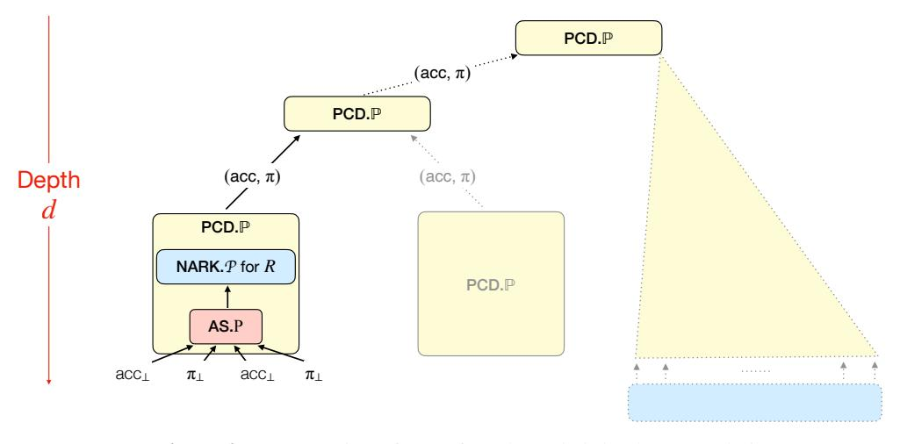
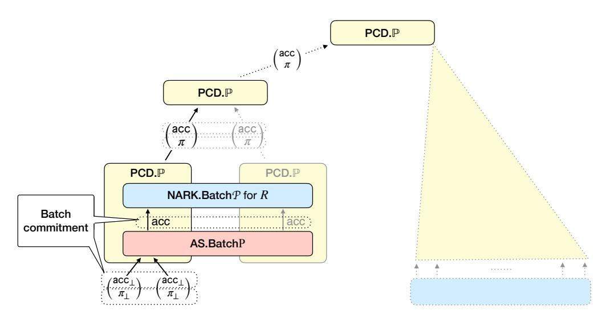
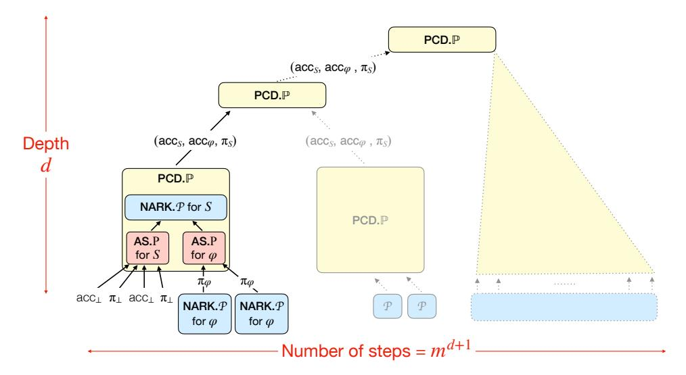
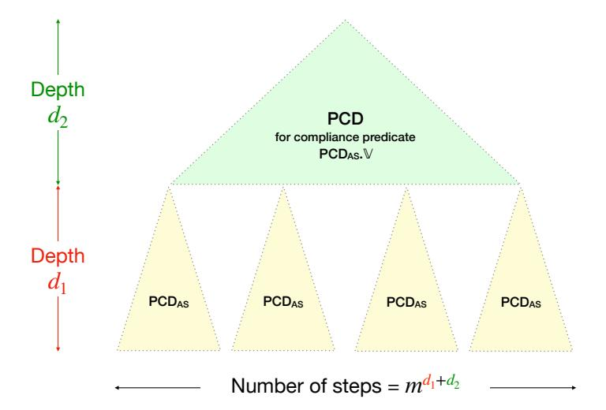

# <span id="page-0-0"></span>Accumulation without Homomorphism

Benedikt Bunz ¨

bb@nyu.edu New York University Pratyush Mishra

prat@upenn.edu University of Pennsylvania

Wilson Nguyen

wdnguyen@stanford.edu Stanford University

William Wang

ww@priv.pub New York University

September 26, 2024

### Abstract

Accumulation schemes are a simple yet powerful primitive that enable highly efficient constructions of incrementally verifiable computation (IVC). Unfortunately, all prior accumulation schemes rely on homomorphic vector commitments whose security is based on public-key assumptions. It is an interesting open question to construct efficient accumulation schemes that avoid the need for such assumptions.

In this paper, we answer this question affirmatively by constructing an accumulation scheme from *non-homomorphic* vector commitments which can be realized from solely symmetric-key assumptions (e.g. Merkle trees). We overcome the need for homomorphisms by instead performing spot-checks over error-correcting encodings of the committed vectors.

Unlike prior accumulation schemes, our scheme only supports a bounded number of accumulation steps. We show that such *bounded-depth* accumulation still suffices to construct proof-carrying data (a generalization of IVC). We also demonstrate several optimizations to our PCD construction which greatly improve concrete efficiency.

## Contents

| 1.1<br>1.2<br>2<br>2.1<br>2.2<br>2.3<br>2.4<br>2.5<br>2.6<br>2.7<br>3<br>3.1<br>3.2 | Our contributions<br><br>Related work<br>            | 3  |  |  |
|-------------------------------------------------------------------------------------|------------------------------------------------------|----|--|--|
|                                                                                     |                                                      |    |  |  |
|                                                                                     |                                                      | 5  |  |  |
|                                                                                     | Techniques                                           | 7  |  |  |
|                                                                                     | Checking linearity                                   | 8  |  |  |
|                                                                                     |                                                      |    |  |  |
|                                                                                     | Defining bounded-depth accumulation                  | 10 |  |  |
|                                                                                     | Bounded-depth PCD from bounded-depth accumulation    | 10 |  |  |
|                                                                                     | Constructing bounded-depth accumulation              | 11 |  |  |
|                                                                                     | Optimization: batch commitments<br>                  | 13 |  |  |
|                                                                                     | Optimization: low-overhead IVC from accumulation<br> | 13 |  |  |
|                                                                                     | Optimization: PCD composition<br>                    | 14 |  |  |
|                                                                                     | Preliminaries                                        | 16 |  |  |
|                                                                                     | Non-interactive arguments of knowledge               | 16 |  |  |
|                                                                                     | Proof-carrying data<br>                              | 17 |  |  |
|                                                                                     | 3.3<br>Instantiating the random oracle               | 18 |  |  |
| 3.4                                                                                 | Reed–Solomon codes                                   | 18 |  |  |
| 3.5                                                                                 | Vector commitments<br>                               | 20 |  |  |
|                                                                                     |                                                      |    |  |  |
| 4                                                                                   | Bounded-depth accumulation                           | 21 |  |  |
| 5                                                                                   | PCD from bounded-depth accumulation                  | 23 |  |  |
| 5.1                                                                                 | Construction                                         | 23 |  |  |
| 5.2                                                                                 | Knowledge soundness                                  | 23 |  |  |
|                                                                                     |                                                      |    |  |  |
| 6                                                                                   | Constructing bounded-depth accumulation              | 28 |  |  |
| 6.1                                                                                 | Non-interactive argument                             | 28 |  |  |
| 6.2                                                                                 | Accumulation scheme                                  | 30 |  |  |
| 6.3                                                                                 | Soundness analysis<br>                               | 32 |  |  |
| 6.4                                                                                 | Using arbitrary linear codes                         | 37 |  |  |
| 6.5                                                                                 | Soundness analysis<br>                               | 39 |  |  |
| 7                                                                                   | Optimizations                                        | 42 |  |  |
| 7.1                                                                                 | Batch commitments                                    | 42 |  |  |
|                                                                                     |                                                      |    |  |  |
| 7.2                                                                                 | Low-overhead IVC from accumulation                   | 42 |  |  |
| 7.3                                                                                 | PCD composition                                      | 45 |  |  |
|                                                                                     | Acknowledgments                                      | 47 |  |  |
| References                                                                          |                                                      |    |  |  |

## <span id="page-2-0"></span>1 Introduction

*Proof-carrying data* (PCD) [\[CT10\]](#page-48-0) is a powerful cryptographic primitive that enables mutually distrustful parties to perform distributed computations that run indefinitely, while ensuring that the correctness of every intermediate step can be verified efficiently. PCD is a generalization of the prior notion of *incrementallyverifiable computation* (IVC) [\[Val08\]](#page-50-0).[1](#page-0-0)

PCD has found numerous applications in both theory and practice, including enforcing language semantics [\[CTV13\]](#page-48-1), complexity-preserving succinct arguments [\[BCCT13;](#page-47-1) [BCTV17\]](#page-48-2), verifiable MapReduce computations [\[CTV15\]](#page-48-3), image provenance [\[NT16\]](#page-49-0), and consensus protocols and blockchains [\[Mina;](#page-49-1) [KB20;](#page-49-2) [BMRS20;](#page-48-4) [CCDW20;](#page-48-5) [BCG24\]](#page-47-2). It is thus a key question to understand security assumptions that PCD constructions require, as well as the efficiency that they can attain under these assumptions.

Let us review how existing PCD constructions fare along both dimensions. For simplicity, we focus on the special case of IVC in the following discussion.

PCD from succinctly verifiable arguments. The standard construction of PCD is via recursive composition of succinct non-interactive arguments of knowledge (SNARKs) [\[BCCT13;](#page-47-1) [BCTV14;](#page-48-6) [BCTV17;](#page-48-2) [COS20\]](#page-48-7). Informally, to prove a t-step computation, the PCD prover proves that the t-th step is correct, and there exists a valid proof for the first t − 1 steps. The state-of-the-art works in this line follow the template of Fractal [\[COS20\]](#page-48-7) by relying on SNARKs in the random oracle model.[2](#page-0-0) This means that we can achieve PCD (heuristically) from only symmetric-key cryptography, but at the cost of relying on the existence of SNARKs, which are complex to construct and incur (asymptotically and concretely) high costs for the PCD prover.

PCD from accumulation. A recent popular approach to avoid this reliance on SNARKs is to construct PCD via *accumulation schemes* [\[BCMS20;](#page-47-3) [BCLMS21;](#page-47-4) [KST22\]](#page-49-3). Roughly speaking, instead of recursively checking proofs as above, the PCD prover "accumulates" the proof for each step into a running accumulator, and then the PCD verifier performs a single expensive check on the final accumulator. This line of work has led to simple and efficient PCD schemes that incur low costs for the PCD prover, and so has seen much interest in new constructions and deployments [\[BCLMS21;](#page-47-4) [KST22;](#page-49-3) [BC23;](#page-47-5) [EG23;](#page-49-4) [KS23;](#page-49-5) [KS24\]](#page-49-6). Unfortunately, all known accumulation schemes rely on homomorphic vector commitments that are only known to exist under public-key assumptions. Additionally, because most existing homomorphic vector commitments are not known to achieve post-quantum security, the resulting accumulation schemes are also quantum-insecure.

Our question. We are thus left in an unsatisfactory state of affairs: on the one hand we have PCD from ROM-based SNARKs that (heuristically) relies on the minimal symmetric-key assumptions, but incurs high PCD prover costs due to this reliance on SNARKs, while on the other hand we have PCD from accumulation that relies on public-key assumptions, but achieves comparatively lower PCD prover costs by avoiding SNARKs. This motivates the questions we tackle in this paper: can we design PCD that achieves low prover costs by avoiding SNARKs, while simultaneously minimizing assumptions?

### <span id="page-2-1"></span>1.1 Our contributions

We answer this question positively by constructing accumulation schemes *solely* in the random-oracle model. Our constructions satisfy a weaker notion of accumulation than that considered in prior work, but we show that this weaker notion still suffices to construct PCD (again, heuristically after instantiating the random oracle). We provide details below.

<sup>1</sup> IVC is the special case of PCD where the distributed computation graph is a line.

<sup>2</sup>The concrete PCD construction makes non-black-box use of the SNARK verifier, which requires us to heuristically instantiate the random oracle.

- (1) Bounded-depth accumulation. We introduce a new notion of *bounded-depth* accumulation schemes that can only provide (knowledge) soundness guarantees for a limited number of consecutive accumulation steps. In contrast, prior accumulation schemes support an unbounded number of accumulation steps.
- (2) PCD from bounded-depth accumulation. We show that this weaker notion of accumulation still suffices to construct (a variant of) proof-carrying data. In particular, we show that bounded-depth accumulation suffices to construct PCD for computation graphs of a-priori bounded depth O(1), which is already sufficient for many applications, including the primary application of constructing polynomial-length IVC [\[BCCT13\]](#page-47-1).

We note that, like our construction, all prior PCD constructions only provably support computation graphs of bounded depth [\[BCCT13\]](#page-47-1). However, unlike these prior works, our construction is vulnerable to attacks when the depth of the computation graph exceeds an *a priori* fixed constant. See Remarks [2.1](#page-10-1) and [2.2](#page-10-2) for details.

(3) Efficient constructions of bounded-depth accumulation. We construct efficient bounded-depth accumulation schemes from any (non-homomorphic) vector commitment scheme (e.g. random-oracle based Merkle trees) and *any* linear code.

Compared to the prior state-of-the-art accumulation schemes, our construction has several advantages beyond just avoiding public-key assumptions, such as true linear time for the accumulation prover,[3](#page-0-0) and plausible post-quantum security.[4](#page-0-0) (We note that both our construction and prior accumulation schemes rely on the random oracle model; it is an open question to construct an accumulation scheme in the standard model.)

(4) Efficiency of and optimizations for instantiated PCD. Instantiating our generic PCD construction with our accumulation scheme leads to PCD schemes with numerous prover efficiency benefits compared to prior work. We also provide several optimizations for this scheme, including support for 'batch' accumulation, a new low-overhead compiler from low-depth PCD to IVC, and a new *hybrid* PCD scheme that combines our low-depth PCD with any SNARK-based PCD scheme to achieve the best of both worlds. We detail the impact of these optimizations in Table [1.](#page-4-1)

Our scheme also has prover efficiency benefits beyond those captured by Table [1.](#page-4-1) To elaborate on these, we briefly detail the key factors that contribute to PCD prover cost. In all practical PCD constructions, to produce a proof for the next step of the distributed computation, the PCD prover invokes an underlying cryptographic proof system to prove satisfaction of a circuit CPCD that contains a circuit representation C<sup>Φ</sup> of the computation step (or *PCD predicate* Φ), and also performs other checks required by the PCD construction. Thus, PCD prover efficiency is determined by the prover efficiency of this proof system, and by the cost |CPCD| − |CΦ| of the additional checks. We call the former the *proof-system overhead*, and the latter the PCD *circuit overhead*.

PCD constructions based on ROM-based SNARKs have been able to achieve best-in-class proof-system overhead via extensive asymptotic and concrete optimizations (e.g., by achieving truly linear-time provers [\[BCGJM18;](#page-47-6) [BCG20;](#page-47-7) [BCL22;](#page-47-8) [GLSTW23\]](#page-49-7), or relying on small fields [\[DP23\]](#page-48-8)), but suffer from high PCD circuit overhead as the SNARK verifier subcircuit must perform numerous expensive random oracle calls.

Accumulation-based PCD constructions, on the other hand, have the smallest recursion overhead (e.g., just 10, 000 gates for Nova [\[KST22\]](#page-49-3) vs. over 1 million gates for Fractal [\[COS20\]](#page-48-7)). They also try to lower

<sup>3</sup>To accumulate proofs for circuits of size n, prior accumulation schemes require performing an n-sized multi-scalar multiplication over elliptic-curve groups. As explained in prior work [\[GLSTW23\]](#page-49-7), this operation requires ω(n) group operations, and is hence not truly linear time.

<sup>4</sup>We only claim plausible post-quantum security, as we prove our construction in the random oracle model, instead of the quantum random oracle model [\[BDFLSZ11\]](#page-48-9). We believe that our results can be extended to the latter model by applying techniques from prior work [\[CMS19\]](#page-48-10), but leave this to future work.

<span id="page-4-1"></span>

| scheme                                          | circuit overhead per step                                                                                      | IVC verifier                                                         | max. IVC length                                               |
|-------------------------------------------------|----------------------------------------------------------------------------------------------------------------|----------------------------------------------------------------------|---------------------------------------------------------------|
| Fractal [COS20]<br>+ STIR [ACFY24] (concurrent) | $\begin{aligned} \lambda \log n \cdot  C_{MT}  \\ (\log n + \lambda \log \log n) \cdot  C_{MT}  \end{aligned}$ | $\lambda \log n \ T_{MT} \\ (\log n + \lambda \log \log n) \ T_{MT}$ | $\operatorname{poly}(\lambda)$ $\operatorname{poly}(\lambda)$ |
| this paper                                      | $d \cdot \lambda \cdot  C_{MT} $                                                                               | $d \cdot n$                                                          | $m^d$                                                         |
| + batch comm. (Sec 2.5)                         | $\frac{d \cdot \lambda}{m} \cdot  C_{MT} $                                                                     | $d\cdot m\cdot n$                                                    | $m^d$                                                         |
| + low-overhead IVC (Sec 2.6)                    | $\frac{d\cdot\lambda}{m^2}\cdot  C_{MT} $                                                                      | $d\cdot m\cdot n$                                                    | $m^d$                                                         |
| + hybrid (Sec 2.7)                              | $(\frac{d^\star \cdot \lambda}{m^2} + \frac{\lambda \log n^\star}{m^{d^\star}}) \cdot  C_{MT} $                | $\lambda \log n^\star  T_{MT}$                                       | $\operatorname{poly}(\lambda)$                                |

**Table 1:** Comparison of IVC schemes constructed from PCD over a tree of depth d and arity m. All costs omit constant factors. The circuit overhead measures  $|C_{\mathsf{PCD}}| - |C_{\Phi}|$ . The table displays the cost per invocation of  $\Phi$ . Above n is the size of the recursive circuit,  $n^{\star} = O(d^{\star}mn)$  is the circuit size of the accumulation decider for the recursive circuit,  $|C_{\mathsf{MT}}|$  is the circuit size of checking a membership proof in a Merkle Tree with n leaves.  $T_{\mathsf{MT}}$  is the time it takes to verify a Merkle Tree opening.

proof-system overhead by avoiding some cryptographic work (e.g., by requiring commitments only to the witness [BC23]), and via efficient arithmetizations of predicates (e.g., via cheap custom gates<sup>5</sup>). However, the remaining cryptographic work is quite expensive as it requires public-key operations, and hence the proof-system overhead of these constructions is relatively high.

Our construction of bounded-depth accumulation achieves the best of both worlds: it enjoys the low PCD circuit overhead of accumulation-based PCD constructions while taking advantage of the proof-system optimizations enjoyed by both approaches. In fact, the combination opens up new efficiency improvements that are not possible in either of the two paradigms alone. For example, all known ROM-SNARK-based PCD constructions thus far have relied on Reed–Solomon codes, and incur quasilinear prover costs from the quasilinear encoding time of these codes. Our construction, on the other hand, allows the use of any linear code, including linear-time-encodable codes [Spi96; DI14; GLSTW23], thus reducing prover costs.

### <span id="page-4-0"></span>1.2 Related work

**PCD from symmetric-key assumptions.** As noted in Section 1, the only end-to-end construction of PCD from symmetric-key assumptions is that of Chiesa, Ojha, and Spooner [COS20]. We provide a quantitative comparison in Table 1, and focus here on a qualitative comparison. Their construction is based on the Fractal SNARK, which they prove secure in the random oracle model.<sup>6</sup>

Boneh, Drake, Fisch, and Gabizon [BDFG21] propose an optimization of the foregoing approach that batches the most expensive component, the low-degree test, across multiple proofs. While this concretely reduces prover cost, it does not lead to an asymptotic improvement in the prover overhead.

Like Fractal and similar SNARKs, our construction is able to take advantage of recent advances in the design of efficient code-based Interactive Oracle Proofs (IOPs) [BCS16; RRR21]. For example, like recent work [Sta21; Pol; DP23], we can greatly improve efficiency by relying on extension fields of small characteristic. Furthermore, unlike existing works, our fields do not need to have any special algebraic structure (e.g. large multiplicative subgroups).

<sup>&</sup>lt;sup>5</sup>Custom gates enforce checks beyond simple addition and multiplication. Examples include high-degree polynomial gates [GW19] and lookup gates [BCGJM18; GW20]. See [CBBZ23; DMS24; AST24] for empirical evidence of the benefits of such gates.

<sup>&</sup>lt;sup>6</sup>Like us, their PCD construction must instantiate the random oracle with a concrete hash function, and can hence only achieve heuristic security.

PCD from public-key assumptions. Except the foregoing, all existing concretely-efficient IVC/PCD constructions [\[BCTV17;](#page-48-2) [BGH19;](#page-48-16) [BCMS20;](#page-47-3) [BCLMS21;](#page-47-4) [BDFG21;](#page-48-12) [KST22;](#page-49-3) [KS23;](#page-49-5) [BC23;](#page-47-5) [EG23;](#page-49-4) [KS24\]](#page-49-6) rely on public-key assumptions, and in particular rely on the hardness of computing discrete logarithms over elliptic curve groups, which forces the usage of cryptographically large fields. Furthermore, efficient implementations require *cycles of elliptic curves*, which have proved unwieldy to implement correctly in practice [\[NBS23\]](#page-49-14). In comparison, our construction avoids the need for public-key assumptions and this additional algebraic structure, and is able to use non-cryptographic field sizes.

Concurrent work. The concurrent work LatticeFold [\[BC24\]](#page-47-11) takes a complementary approach to constructing plausibly post-quantum accumulation-based PCD: it constructs an accumulation/folding scheme from latticebased assumptions. Unlike our construction, their accumulation scheme directly supports unbounded depth, allowing it to serve as a drop-in replacement in many existing constructions of accumulation-based PCD. However, this comes at a cost: at each accumulation step, the prover must demonstrate that the accumulation result has a small norm, which incurs a non-trivial computational cost. Furthermore, the dependence on lattice-based assumptions means that their scheme still relies on public-key assumptions.

An interesting direction for future work would be to combine the two approaches to reduce the need for small-norm checks. For example, one could construct a more efficient PCD scheme by first designing a bounded-depth accumulation scheme that relies on the bounded homomorphism supported by lattice commitments. One could then use the transformation of Section [2.7](#page-13-0) to combine the resulting (bounded-depth) PCD scheme with the (unbounded-depth) LatticeFold PCD scheme to achieve a more efficient construction than either scheme alone.

Another concurrent work, STIR [\[ACFY24\]](#page-47-9), provides a new proximity test that can be used as a drop-in replacement for the proximity test [\[BBHR18b\]](#page-47-12) used in Fractal [\[COS20\]](#page-48-7). As noted in Table [1,](#page-4-1) our schemes still have lower recursion overhead than this optimized baseline. Furthermore, this new STIR + Fractal-based PCD should also be compatible with our hybrid construction from Section [2.7.](#page-13-0)

Remark 1.1 (security of bounded-depth PCD). All PCD schemes (including ours) only provably support computation graphs of depth O(1). However, while there are no known attacks that break the security of prior schemes when the depth is ω(1), the same is not true for our scheme. As we explain in Section [2.1,](#page-7-0) our scheme is vulnerable to a relatively straightforward attack that obviates any security guarantees when the depth of the computation graph exceeds an *a priori* fixed constant. We emphasize that even such bounded-depth PCD is already powerful enough to support many interesting applications, including the primary application of constructing polynomial-length IVC [\[BCCT13\]](#page-47-1). See Remarks [2.1](#page-10-1) and [2.2](#page-10-2) for a more detailed discussion.

### <span id="page-6-0"></span>2 Techniques

We begin by reviewing the definition of an accumulation scheme [BCMS20; BCLMS21].<sup>7</sup> At a high level, it is used to perform *batch verification* of a predicate which, for us, will be a non-interactive argument's verifier  $\mathcal{V}$ . In other words, an accumulation scheme is used to check that  $\mathcal{V}(\mathbf{x}_1, \pi_1), \ldots, \mathcal{V}(\mathbf{x}_n, \pi_n)$  all accept, more efficiently than the naive approach of individually verifying each instance  $\mathbf{x}_i$  and proof  $\pi_i$ .

The workflow of an accumulation scheme is as follows. There are three main algorithms: a prover P, verifier V, and decider D. The prover is initialized with an empty accumulator  $\mathsf{acc}_0$ , which is used to accumulate an input  $(x_1, \pi_1)$  into a new accumulator  $\mathsf{acc}_1$ . The prover additionally outputs a proof; we write this as  $(\mathsf{acc}_1, \mathsf{pf}_1) \leftarrow P(x_1, \pi_1, \mathsf{acc}_0)$ . Later,  $\mathsf{acc}_1$  can be used to accumulate a second input, i.e.  $(\mathsf{acc}_2, \mathsf{pf}_2) \leftarrow P(x_2, \pi_2, \mathsf{acc}_1)$ , and so on. The correctness of a sequence of accumulations can then be established by checking that: (a) each accumulation step is valid, i.e.  $V(x_i, \pi_i, \mathsf{acc}_{i-1}, \mathsf{acc}_i, \mathsf{pf}_i) = 1$ ; and (b) the final accumulator is valid, i.e.  $D(\mathsf{acc}_n) = 1$ .

Notice that the decider only acts on the final accumulator, whereas the verifier acts on each accumulation step. Therefore, the crux of an accumulation scheme is making verification as cheap as possible. Towards this, we require that an accumulator acc can be split into a short instance part acc.x and a (possibly) long witness part acc.x; we use acc = (acc.x, acc.x) as shorthand. Similarly, we require that an argument proof can be split into instance and witness parts x = (x.x, x.x). The point is that the verifier can only look at the instance parts; we write this as x0 (x1, x1, x2, x3, x4, x5).

**Definition.** An accumulation scheme must satisfy the following properties.

- Completeness: The honest accumulation (acc', pf)  $\leftarrow P(x, \pi, acc)$  of any valid input and accumulator should pass both the verifier's and decider's checks. That is, if  $V(x, \pi) = 1$  and D(acc) = 1, then  $V(x, \pi, x, acc, x, acc', x, pf) = 1$  and D(acc') = 1.
- Knowledge soundness: If a new accumulator acc' passes the verifier's and decider's checks, then an efficient extractor can find a valid input and old accumulator that explains acc'. That is, if D(acc') = 1 and  $V(x, \pi.x, acc.x, acc'.x, pf) = 1$ , then an efficient extractor can find the witness part of the proof,  $\pi.w$ , and the witness part of the old accumulator, acc.w, such that  $V(x, \pi) = 1$  and D(acc) = 1.
- Efficiency: The cost of running the accumulation verifier n times plus the cost of running the accumulation decider once should be lower than the cost of running the argument verifier n times.

Accumulation schemes can be generalized to handle multiple inputs and accumulators in each step. For example, the prover's syntax would be  $P([x_i, \pi_i]_{i=1}^{m_1}, [acc_i]_{i=1}^{m_2})$ , where  $m_1$  and  $m_2$  are the arities; see Section 4 for a comprehensive definition.

**Prior constructions.** All prior accumulation schemes [BCMS20; BCLMS21; KST22; BC23; EG23; KS23; KS24] crucially use *additively homomorphic vector commitment schemes*. Informally, a vector commitment scheme allows one to construct a succinct commitment cm to a vector  $\mathbf{v} \in \mathbb{F}^n$ . The scheme is additively homomorphic if, given  $\mathsf{cm}_1 = \mathsf{Commit}(\mathbf{v}_1)$  and  $\mathsf{cm}_2 = \mathsf{Commit}(\mathbf{v}_2)$ ,  $\mathsf{cm}_3 = \alpha \cdot \mathsf{cm}_1 + \beta \cdot \mathsf{cm}_2$  is a commitment to  $\alpha \mathbf{v}_1 + \beta \mathbf{v}_2$ . We remark that all known additively homomorphic vector commitment schemes, e.g. Pedersen commitments [Ped92], rely on public-key assumptions.

The general blueprint for an accumulation scheme is as follows. An accumulator witness  $acc.w \in \mathbb{F}^n$  is a vector, and the corresponding instance acc.x is a commitment to acc.w. For simplicity, suppose the prover claims that  $acc_1$  and  $acc_2$  accumulate into  $acc_3$ . Roughly speaking, we want to guarantee that the output

<sup>&</sup>lt;sup>7</sup>We restrict our presentation to *split* accumulation schemes, as defined in [BCLMS21].

accumulator is a random linear combination of the input accumulators. The verifier checks this by computing the linear combination of the input commitments acc1.x and acc2.x, and checking that the result equals the output commitment acc3.x [\[KST22;](#page-49-3) [BC23\]](#page-47-5). Later, the decider will check that acc3.w is a "good" vector, and that acc3.x commits to acc3.w. Since commitments are binding, acc<sup>3</sup> must be the correct linear combination of acc<sup>1</sup> and acc2.

We have omitted many details, most notably how to accumulate argument proofs. However, from this description alone we can observe two key properties of the vector commitment scheme. First, it has succinct commitments; this allows the verifier to be efficient. Second, it is additively homomorphic; this allows the verifier to perform meaningful checks. As noted earlier, this combination of properties unfortunately seems to require public-key assumptions.

### <span id="page-7-0"></span>2.1 Checking linearity

To overcome the foregoing limitation, we make a key observation: to verify that the output accumulator is a linear combination of the input accumulators, it is not necessary to directly compute a linear combination of the input commitments. Instead, it suffices to *check* that the output accumulator commits to a vector that is a linear combination of the vectors committed by the input accumulators. This idea is a natural one, and has appeared before under the name of "linear combination schemes" [\[BDFG21\]](#page-48-12).

Recall that we want to check that acc3.w = α · acc1.w + β · acc2.w, where α, β ∈ F are previously chosen scalars. More precisely, we want to check that v<sup>3</sup> = αv<sup>1</sup> + βv2, where v1, v2, and v<sup>3</sup> are the underlying committed vectors of acc1.x, acc2.x, and acc3.x (and since commitments are binding, these vectors correspond with the accumulator witnesses). A *linearity check* is a protocol between the prover and the verifier that convinces the verifier of this claim. Assuming the verifier is public-coin, this can be made non-interactive using random oracles.

Our goal is to construct a linearity check which does not require homomorphic vector commitments. Instead, we require vector commitments with *local openings*. Informally, these allow the prover to generate a succinct proof that the underlying committed vector's i-th element is some claimed value. For example, Merkle tree commitments support local openings with proof size O(λ log n).

Distance spot checks. The key tool that we will be relying on is a protocol for convincing the verifier that two committed vectors are at most a constant distance apart. Concretely, let cm<sup>1</sup> and cm<sup>2</sup> be commitments to vectors v<sup>1</sup> and v<sup>2</sup> respectively. We say that v<sup>1</sup> and v<sup>2</sup> are δ-far apart if they differ in at most δn locations. To show that v<sup>1</sup> and v<sup>2</sup> are at most δ-far apart, the prover and verifier engage in the following protocol:

- 1. The verifier uniformly samples an index i ∈ [n] and sends it to the prover.
- 2. The prover responds with the purported i-th elements of v<sup>1</sup> and v2, along with opening proofs.
- 3. The verifier accepts if these opening proofs are valid and the claimed elements are equal. Clearly, if v<sup>1</sup> and v<sup>2</sup> are δ-far apart, then the verifier will reject with probability δ. For any constant δ > 0, this soundness error can be made negligible with Θ(λ) parallel repetitions.

Linearity spot checks. This protocol easily generalizes to testing any kind of element-wise property, and in particular we can use it to check that v<sup>3</sup> is δ-close to the "virtual vector" αv<sup>1</sup> + βv2. Unfortunately, we need to ensure that the two vectors are equal at all locations. Suppose a cheating prover commits to a vector that only differs from αv1+βv<sup>2</sup> at a *single* location j. Detecting this would require Θ(λn) repetitions (essentially opening the entire commitment), which violates the accumulation verifier's efficiency requirement.

### 2.1.1 Error-resilient linearity checks from codes

It seems that we are at an impasse: our spot check can only guarantee that two vectors are δ-close, but the accumulation scheme requires exact agreement. To overcome this issue, we need to make our accumulation scheme resilient to a constant δ-fraction of corruptions. We do so by relying on linear codes, and in particular those which enjoy good distance properties, such as the Reed–Solomon code [\[RSM60\]](#page-49-16).

At a high level, we make the following changes to the accumulation scheme blueprint. Let C be a linear code, and let δ be a constant which is smaller than the unique decoding radius of C. The accumulator witness is a codeword C(w), and the corresponding instance acc.x is a commitment to acc.w. The accumulation verifier checks that the output accumulator is δ-close to a random linear combination of the input accumulators by running the linearity spot check. Later, the decider will check that acc3.w is the encoding of a good vector, and that acc3.x commits to acc3.w.

<span id="page-8-1"></span><span id="page-8-0"></span>Knowledge soundness. We would like our linearity spot check to satisfy the following knowledge soundness property. Suppose a (possibly malicious) prover outputs commitments cm1, cm2, and cm<sup>3</sup> which pass the check. Furthermore, suppose that cm<sup>3</sup> commits to a vector v3. Then an efficient extractor can find vectors v<sup>1</sup> and v<sup>2</sup> such that (a) αv<sup>1</sup> + βv<sup>2</sup> is δ-close to v3; and (b) cm<sup>1</sup> and cm<sup>2</sup> commit to v<sup>1</sup> and v2. Notice that if we can extract vectors that satisfy [\(b\),](#page-8-0) then our previous analysis of the spot check implies [\(a\).](#page-8-1) Extraction turns out to be fairly straightforward: if we use Merkle commitments with a random oracle as the hash function, then we can find v<sup>1</sup> and v<sup>2</sup> by observing the prover's random oracle queries [\[Val08\]](#page-50-0).[8](#page-0-0)

Returning to accumulation, suppose that a (possibly malicious) prover outputs acc1.x, acc2.x, acc<sup>3</sup> which pass the verifier's and decider's checks. Since the verifier runs the spot check, we can extract accumulator witnesses acc1.w and acc2.w such that α · acc1.w + β · acc2.w is δ-close to acc3.w. Since the decider accepts acc3.w, we know that acc3.w is a codeword C(w3). Similarly, we need acc1.w and acc2.w to be codewords in order for the decider to accept acc1.w and acc2.w. Unfortunately, this is simply not the case. For example, a cheating prover can always choose acc1.w which agrees with a codeword at all but one location, and this will almost certainly go undetected.

Can we still say something meaningful about the extracted witnesses? We argue that intuitively, since α and β are (possibly correlated) random scalars, with high probability acc1.w and acc2.w are themselves δ-close to codewords. Moreover, acc1.w and acc2.w decode to w<sup>1</sup> and w<sup>2</sup> such that α · w<sup>1</sup> + β · w<sup>2</sup> = w3. This intuition can be formally proven using a suitable "proximity gap" result [\[BCIKS23\]](#page-47-13), which exists for a variety of parameter regimes.

The upshot is that we extract accumulators acc<sup>1</sup> and acc<sup>2</sup> which are only accepted by a *relaxed* decider. Namely, given an accumulator acc, this decider checks that acc.x commits to acc.w, and moreover that acc.w is δ-close to the code.

Recursive extraction. The foregoing analysis suffices for a single step of accumulation. However, in order to construct PCD, we will have to recursively extract from old accumulators. It is straightforward to see that a recursively extracted accumulator is only guaranteed to be 2δ-close to the code, since we are extracting from an accumulator that may already be δ-far from the code. More generally, k steps of recursion will only guarantee accumulators that are kδ-close to the code. We will see that once kδ is larger than the unique decoding radius, extraction is no longer meaningful. In particular, this leads to the following concrete attack: a cheating prover can start with a bad codeword (rejected by the decider) and, over the k accumulation steps, incrementally move it to a good codeword (accepted by the decider). This motivates our notion of "bounded-depth" accumulation, which is not captured by existing definitions [\[BCLMS21\]](#page-47-4).

<sup>8</sup>To be precise, we must also consider a malicious prover that does not commit to a full vector; see Remark [3.5.](#page-19-1)

### <span id="page-9-0"></span>2.2 Defining bounded-depth accumulation

To describe our construction which only supports accumulation up to a certain (constant) depth, we introduce a new, relaxed knowledge soundness property; the key differences are highlighted in blue. We say that an accumulation scheme has bounded-depth knowledge soundness (with maximum depth d) if there exists a family of deciders  $\{D_s\}_{s=0}^d$ , where D is equivalent to  $D_0$ , such that the following holds. If  $D_{s-1}(\mathsf{acc}') = 1$  and  $V(x, \pi, x, \mathsf{acc}, x, \mathsf{acc}', x) = 1$ , then an efficient extractor can find  $\pi, w$  and  $\mathsf{acc}, w$  such that  $\mathcal{V}(x, \pi) = 1$  and  $D_s(\mathsf{acc}) = 1$ .

This is a meaningful definition. In addition to generalizing standard knowledge soundness, which can be recovered by setting  $d=\infty$  and using a single decider D, it captures our construction based on error-resilient linearity checks:  $D_s$  is the decider that only accepts if the accumulator is at most  $s\delta$ -far from the code, and in particular  $D_0$  only accepts codewords. The depth bound d is the maximum number of recursive extractions that we can perform before  $d\delta$  exceeds the unique decoding radius of the code.

### <span id="page-9-1"></span>2.3 Bounded-depth PCD from bounded-depth accumulation

Existing theorems that build PCD from accumulation [BCLMS21; BDFG21; KST22] do not immediately translate to the bounded-depth setting. To see why, let us recall a simplified version of the construction from [BCLMS21]. Suppose we have an accumulation scheme for a non-interactive argument of knowledge (NARK). Informally, a PCD proof for  $z_i$ , which consists of a NARK proof  $\pi_i$  and accumulator  $\mathrm{acc}_i$ , certifies that  $z_i = F^i(z_0)$ , where  $z_0$  is some initial value. We maintain the invariant that if  $\pi_i$  and  $\mathrm{acc}_i$  are valid, then the computation is correct up to the i-th step.

- The PCD prover receives a proof  $(\pi_i, \mathsf{acc}_i)$  for  $z_i$ , and wants to output a proof for  $z_{i+1}$ . First, it accumulates  $\pi_i$  and  $\mathsf{acc}_i$  into a new accumulator  $\mathsf{acc}_{i+1}$ , generating an accumulation proof  $\mathsf{pf}_{i+1}$ . Next, it generates a NARK proof  $\pi_{i+1}$  for the following claim, expressed as a circuit R (see Figure 1): " $z_{i+1} = F(z_i)$ , and there exists a NARK proof  $\pi_i$ , old accumulator  $\mathsf{acc}_i$ , and accumulation proof  $\mathsf{pf}_{i+1}$  which correctly accumulate into  $\mathsf{acc}_{i+1}$ ." The proof for  $z_{i+1}$  is  $(\pi_{i+1}, \mathsf{acc}_{i+1})$ .
- <span id="page-9-2"></span>• The PCD verifier checks a proof  $(\pi_i, acc_i)$  for  $z_i$  by running the NARK verifier on  $\pi_i$  and the decider on  $acc_i$ .

```
R(\mathbb{x}=(z_{i+1},\mathsf{acc}_{i+1}.\mathbb{x}),\mathbb{w}=(z_i,\pi_i.\mathbb{x},\mathsf{acc}_i.\mathbb{x},\mathsf{pf}_{i+1})):
1. Check that z_{i+1}=F(z_i).
2. Set \mathbb{x}_i=(z_i,\mathsf{acc}_i.\mathbb{x}).
3. Check that V(\mathbb{x}_i,\pi_i,\mathsf{acc}_i.\mathbb{x},\mathsf{acc}_{i+1}.\mathbb{x},\mathsf{pf}_{i+1})=1.
```

Figure 1: Recursion circuit for PCD.

Now suppose we replace the accumulation scheme with one that only has bounded-depth knowledge soundness. The construction remains the same, but we must provide a new soundness analysis.

**PCD knowledge soundness.** We need to construct an extractor which, given an accepting proof  $(\pi_T, \mathsf{acc}_T)$  for  $z_T$ , extracts a sequence of values  $z_0, \ldots, z_T$  such that  $z_{i+1} = F(z_i)$  for all i. [BCLMS21] gives the following strategy, which *interleaves* the NARK extractor and accumulation extractor. Suppose we have  $z_{i+1}$ ,  $\pi_{i+1}$ , and  $\mathsf{acc}_{i+1}$ . First, we invoke the NARK extractor to obtain  $(z_i, \pi_i. x, \mathsf{acc}_i. x, \mathsf{pf}_{i+1})$ . Second, we invoke

the accumulation extractor to obtain  $(\pi_i.w, acc_i.w)$ . This gives us  $\pi_i$  and  $acc_i$ , and the process continues. We maintain the invariant that in the *i*-th step,  $\pi_i$  and  $acc_i$  are valid.

With bounded-depth accumulation, we need to maintain a slightly weaker invariant: in the i-th step, instead of requiring that  $acc_i$  is accepted by the *strict* decider D, we only require that it is accepted by the i-th relaxed decider  $D_i$ . This discussion only provides a high-level overview of the proof strategy, and only describes an *IVC* construction; we describe the full PCD construction that supports arbitrary (bounded-depth) computation graphs, along with a full soundness analysis, in Section 5.

<span id="page-10-1"></span>**Remark 2.1** (bounded-depth PCD suffices). As presented, our PCD scheme supports up to d steps of computation, where d is the maximum depth of the accumulation scheme. We call this *bounded-depth PCD*. Since d will realistically be a small constant, this seems to be of limited use: most computations require more than a constant number of steps! Fortunately, even such a limited PCD scheme can be used to construct IVC for *any* polynomial-length computation [BCCT13]. The idea is for the PCD prover to receive multiple proofs in each step, yielding a *computation tree*. In particular, if we can accumulate m inputs and m accumulators in a single step, then our PCD scheme can support computation trees of size  $m^d$ . Setting  $m = \lambda$  and d = O(1) allows us to support polynomial-size computations.

<span id="page-10-2"></span>**Remark 2.2** (bounded-depth vs. constant-depth PCD). Perhaps surprisingly, even with standard (unbounded) accumulation, [BCLMS21] is only able to construct *constant-depth PCD*. This is because the size of the PCD extractor grows exponentially in the computation's depth, regardless of the accumulation scheme's knowledge soundness property. We remark that this limitation is largely theoretical: there is no known attack which exploits unbounded recursive proof composition. In contrast, the depth bound in bounded-depth PCD is not merely an artifact of the analysis: there exists a concrete attack that can be mounted against our construction when the depth exceeds *d*. This means that the tree-based strategy described in Remark 2.1 is *necessary* for real-world implementations, unlike in prior work.



Figure 2: Construction of PCD from bounded-depth accumulation.

### <span id="page-10-0"></span>2.4 Constructing bounded-depth accumulation

Our starting point is the ProtoStar and ProtoGalaxy accumulation schemes [BC23; EG23]. They support a general class of non-interactive arguments where consists of the NP witness along with a short vector

<sup>&</sup>lt;sup>9</sup>This is slightly different from bounded-depth PCD, where the maximum depth must be fixed in advance.

commitment to the witness, and whose verifier performs three steps: (a) computing Fiat–Shamir challenges; (b) checking vector commitment openings; and (c) evaluating a polynomial over the instance, challenges, and openings. The key insight of ProtoStar and ProtoGalaxy is that the accumulation verifier can cheaply perform the first step, while batching the remaining steps and deferring it to the decider.

Let us recall ProtoGalaxy's strategy [EG23], focusing on the case where we are trying to accumulate claims about satisfaction of R1CS, a popular NP language in the succinct argument literature. Recall that an R1CS instance consists of constraint matrices  $A, B, C \in \mathbb{F}^{N \times (\ell+n)}$ , and is said to be satisfied by a public input  $x \in \mathbb{F}^{\ell}$  and witness  $w \in \mathbb{F}^n$  if  $A \cdot (x||w) \circ B \cdot (x||w) - C \cdot (x||w) = 0^N$ . In ProtoGalaxy, a NARK proof for an R1CS instance with public input x would consist of the proof witness, which is just the R1CS witness w, and the proof instance, which is just a vector commitment to w. The polynomial p evaluated by the verifier is of the form  $p(x,w) = A \cdot (x||w) \circ B \cdot (x||w) - C \cdot (x||w)$ . Then, to accumulate R1CS claims, ProtoGalaxy's accumulator witness acc.w is also a vector  $w \in \mathbb{F}^n$ , and its accumulator instance acc.x consists of a vector  $\vec{x} \in \mathbb{F}^{\ell}$ , a (homomorphic) vector commitment to w, and an error term  $e \in \mathbb{F}$ . Thus, a NARK proof verification claim can be seen as a special case of the accumulator verification case where the error term is zero.

To accumulate m such (accumulation or NARK) verification claims for accumulators  $acc_1, \ldots, acc_m$ , ProtoGalaxy relies on the following univariate polynomial identity:

$$p\left(\sum_{i=1}^{m} L_i(X) \cdot x_i, \sum_{i=1}^{m} L_i(X) \cdot w_i\right) = \sum_{i=1}^{m} L_i(X) \cdot e_i \mod v_H(X) \quad ,$$

where  $L_i$  is the *i*-th Lagrange polynomial of some *m*-sized set  $H \subset \mathbb{F}$ , and  $v_H(X)$  is the vanishing polynomial on H. For some quotient polynomial q, this claim can be rewritten as

$$p(\sum_{i=1}^{m} L_i(X) \cdot x_i, \sum_{i=1}^{m} L_i(X) \cdot w_i) = \sum_{i=1}^{m} L_i(X) \cdot e_i + q(X) \cdot v_H(X)$$
,

and this formulation allows the verifier to check the identity at a random point  $\alpha \in \mathbb{F}$  if the prover sends q.

This allows us to accumulate the m input claims as follows. The prover constructs a new accumulator acc whose new instance is  $x:=\sum_i L_i(\alpha)\cdot x_i$ , new witness vector is  $w:=\sum_i L_i(\alpha)\cdot w_i$ , and the new error is  $e:=v(\alpha)\cdot q(\alpha)+\sum_i L_i(\alpha)\cdot e_i$ . The verifier checks that acc was computed correctly by homomorphically computing the new vector commitment, and directly computing the new instance and new error term. Finally, the accumulation decider completes the checks by asserting that that  $p(x,w)=e^{10}$ 

Our construction. We follow the same strategy, except we replace homomorphic computations with error-resilient linearity checks. Concretely, we make the following changes. An accumulator witness is a codeword  $f \in C$ , and an accumulator instance consists of a vector commitment to f and an error term  $e \in \mathbb{F}$ . The decider accepts an accumulator if f is the encoding of a vector  $w \in \mathbb{F}^n$  such that p(x, w) = e. Finally, as discussed in Section 2.1, the verifier uses a linearity check to ensure that the new accumulator acc is sufficiently consistent with the old accumulators  $\operatorname{acc}_1, \ldots, \operatorname{acc}_m$ .

Overall, our construction inherits many desirable properties from ProtoStar [BC23] and ProtoGalaxy [EG23], including support for arbitrary arity  $m = \text{poly}(\lambda)$ , which is crucial for constructing PCD (see Remark 2.1), and efficient support for custom gates.

**Security.** Our construction naturally corresponds with an interactive oracle proof (IOP) [BCS16], where the codewords are now given as oracles instead of vector commitments. Indeed, we prove knowledge soundness of the accumulation scheme by proving soundness of the underlying IOP, and then applying the BCS transformation [BCS16] (with some technical subtleties).

 $<sup>^{10}</sup>$ Technically speaking, this check, as stated, is ill-formed, as the output of p is an N-sized vector, while e is a single field element. However, this can be fixed by taking a random linear combinations of the output vector. ProtoStar and ProtoGalaxy show how to represent the latter task also as a low-degree polynomial evaluation.

Extension to arbitrary linear codes. A key parameter in our construction is the linear code. We use Reed–Solomon codes because they display a proximity gap when the coefficients are Lagrange evaluations L1(α), . . . , Lm(α). However, a modified version of our construction extends to arbitrary linear codes. This is advantageous as these codes can have faster asymptotically faster encoding time compared to Reed–Solomon codes [\[GLSTW23\]](#page-49-7). The construction can work with any proximity gap (e.g., uniformly random coefficients). The key idea is to commit to two codes within the accumulator, one for proximity checking and the other for the algebraic check using p(X). See Section [6.4](#page-36-0) for details.

Efficiency. The cost of the accumulation verifier is dominated by that of the linearity checker. Recall that to achieve negligible knowledge soundness error at depth d, the latter checks that two code words are d · δ close via k = O(d · λ) spot checks, where δ is such that d · δ is less than the unique decoding radius of the code. Overall, when instantiated with the Merkle tree-based vector commitment, the accumulation verifier checks O(d · λ) Merkle tree paths. When applying this construction to the PCD scheme in Section [2.3,](#page-9-1) the latter cost becomes the *recursive overhead* of the PCD prover. As noted in Table [1,](#page-4-1) this cost is asymptotically better than the O(log n · λ) cost of prior SNARK-based PCD schemes [\[COS20\]](#page-48-7).

A keen reader may notice that a disadvantage of our construction is that recursive overhead scales with the depth of the PCD computation graph. We now present several optimizations that reduce the depth of the PCD tree and significantly improve the efficiency of the resulting PCD scheme in practice.

### <span id="page-12-0"></span>2.5 Optimization: batch commitments

Recall from Remarks [2.1](#page-10-1) and [2.2](#page-10-2) that for our PCD construction, reducing the depth of the computation graph is essential for achieving provable security guarantees, and the standard depth-reduction technique for the case of IVC [\[BCCT13\]](#page-47-1) works by constructing a *PCD tree* whose leaves comprise the actual computation being performed. To achieve constant computation depth, Bitansky et al. [\[BCCT13\]](#page-47-1) set the arity m of this tree to be super-constant (i.e., m = λ). The per-node recursive overhead of our PCD construction in this setting is the cost of performing linearity checks on m codewords of size n, which costs O(m · λ · log n) hashes when using Merkle trees. We now describe how to reduce this to just O(λ(log n + m)) hashes.

Recall that the linearity checker opens all m codewords at the same locations. This means that for each spot-check, each of the m Merkle trees is opened at the same leaf. We take advantage of this repetitive structure by committing to all m codewords using a *single* Merkle tree whose i-th leaf is the concatenation of the i-th symbols of the codewords. Each spot-check now requires opening only a single Merkle tree path (and checking the leaf hash), leading to a cost of O(λ(log n + m)) hashes for O(λ) spot checks, as required.

However, this modification comes at a cost: it requires us to commit to all codewords together at the same time. While this is straightforward at the leaf layer, it gets more complex at higher layers. For example, even committing to a new accumulator now requires waiting for the batch of "sibling" new accumulators, which in turn means that we must wait for m accumulations (each of size m) to complete before we can compute the commitments to the m new accumulators. Overall, across the entire tree, this requires the PCD prover to maintain a state of O(m<sup>2</sup> ) "pending" accumulators. The resulting PCD scheme is illustrated in Figure [3,](#page-13-1) and we provide more details in Section [7.1.](#page-41-1)

### <span id="page-12-1"></span>2.6 Optimization: low-overhead IVC from accumulation

We give a generic optimization which improves on the PCD-to-IVC compiler of Bitansky et al. [\[Val08;](#page-50-0) [BCCT13\]](#page-47-1). They construct a (polynomial-length) IVC scheme for a function F by using a (constant-depth) PCD scheme for a related function F ′ . In particular, F ′ computes F (at leaf nodes) and performs consistency

<span id="page-13-1"></span>

Figure 3: PCD with batch commitments.

checks (at internal nodes). This is wasteful: even though we do not need to prove anything about F at internal nodes, the PCD prover still generates a proof for F ′ (which is dominated by F).

We improve this compiler by constructing an IVC scheme with minimal overhead. The core idea is that we first construct a tree of accumulators for F, i.e. a tree the leaf nodes are proofs for F, and each parent accumulates its children. Then, we construct a PCD tree which proves that the accumulation tree was constructed correctly. When the PCD scheme is instantiated with our accumulation-based construction, the PCD circuit now checks *two* accumulation verifiers: one that checks the correctness of the accumulation tree, and one that helps check the correctness of the PCD tree.

Accumulating separately means that we no longer have to generate NARK proofs for F at internal nodes. Additionally, because we only need to show that internal nodes of the accumulation tree were constructed correctly, our PCD tree has one fewer layer than before. This further reduces cost, in particular for higher arities (as m grows, the leaf layer of a tree contains a higher fraction of nodes). The resulting IVC scheme is illustrated in Figure [4,](#page-14-0) and we provide more details in Section [7.2.](#page-41-2)

### <span id="page-13-0"></span>2.7 Optimization: PCD composition

The recursive overhead of our PCD scheme grows linearly with the maximum supported depth. This is contrast with SNARK-based PCD schemes like Fractal [\[COS20\]](#page-48-7), which do not suffer from such an efficiency loss. However, these schemes pay a higher per-step cost anyway, and are thus asymptotically less efficient than our PCD scheme for low recursion depths.

We provide a generic optimization to combine SNARK-based PCD schemes with our PCD scheme to achieve a scheme that is achieves better efficiency than either scheme alone. The core idea is to first use our accumulation-based PCD up to some depth d1, and then prove the PCD verifier for the latter with a SNARK-based PCD scheme on top. When invoked with tree PCD, this means that the SNARK-based PCD scheme is invoked only every md<sup>1</sup> steps. By choosing d<sup>1</sup> appropriately, the resulting scheme achieves better efficiency than either scheme alone. Furthermore, the resulting scheme supports *arbitrary* constant depth, as opposed to our accumulation-based scheme, which only supports an *a priori* fixed depth. We illustrate this idea in Figure [5,](#page-14-1) and provide details in Section [7.3.](#page-44-0)

<span id="page-14-0"></span>

Figure 4: PCD-to-IVC compiler that checks the correctness of an accumulation tree.

<span id="page-14-1"></span>

15

Figure 5: PCD composition.

### <span id="page-15-0"></span>3 Preliminaries

**Indexed relations.** An *indexed relation*  $\mathscr{R}$  is a set of triples (i, x, w) where i is the index, x is the instance, and w is the witness; the corresponding *indexed language*  $\mathscr{L}(\mathscr{R})$  is the set of pairs (i, x) for which there exists a witness w such that  $(i, x, w) \in \mathscr{R}$ . For example, the indexed relation of satisfiable boolean circuits consists of triples where i is the description of a boolean circuit, x is a partial assignment to its input wires, and w is an assignment to the remaining wires that makes the boolean circuit output w.

**Security parameters.** For simplicity of notation, we assume that all public parameters have length at least  $\lambda$ , so that algorithms which receive such parameters can run in time  $poly(\lambda)$ .

**Random oracles.** We denote by  $\mathcal{U}(\lambda)$  the set of all functions that map  $\{0,1\}^*$  to  $\{0,1\}^{\lambda}$ . A random oracle with security parameter  $\lambda$  is a function  $\rho \colon \{0,1\}^* \to \{0,1\}^{\lambda}$  sampled uniformly at random from  $\mathcal{U}(\lambda)$ . In our random oracle definitions, we assume that all algorithms (except generators and setup algorithms), adversaries, and extractors have access to the random oracle.

**Adversaries.** All of the definitions in this paper should be taken to refer to non-uniform adversaries. An adversary (or extractor) running in *expected polynomial time* is then a Turing machine provided with a *polynomial-size* non-uniform advice string and access to an infinite random tape, whose expected running time for all choices of advice is polynomial. We sometimes write  $(o; r) \leftarrow A(x)$  when A is an expected polynomial-time algorithm, where o is the output of A and r is the randomness used by A (i.e. up to the rightmost position of the head on the randomness tape).

**Hamming distance.** Let  $\Sigma$  be an alphabet, typically  $\mathbb{F} \cup \{\bot\}$ . The relative Hamming distance between two vectors  $f, g \in \Sigma^n$ , denoted  $\Delta(f, g)$ , is the number of locations where f and g disagree, divided by n. The distance between a vector  $f \in \Sigma^n$  and a subset  $S \subset \Sigma^n$ , denoted  $\Delta(f, S)$ , is equal to  $\min_{g \in S} \Delta(f, g)$ .

**Polynomials.** For any field  $\mathbb F$  and subset  $H=\{a_1,\ldots,a_k\}\subset \mathbb F$ , let  $L_{i,H}$  denote the i-th Lagrange polynomial, i.e. the unique polynomial of degree less than k such that  $L_{i,H}(a_i)=1$  and  $L_{i,H}(a_j)=0$  for all  $j\neq i$ . Let  $v_H$  denote the vanishing polynomial on H, i.e.  $v_H(X)=\prod_{i=1}^m(X-a_i)$ . When clear from context, we omit the set H.

### <span id="page-15-1"></span>3.1 Non-interactive arguments of knowledge

In the standard definition of a non-interactive argument of knowledge (NARK), completeness and knowledge soundness hold for the same verifier. We introduce a "relaxed" verifier, for which only knowledge soundness must hold. In other words, an extractor must be able to extract a witness for any proof accepted by the relaxed verifier, but completeness only needs to hold for the original verifier. Concretely, a tuple of algorithms  $ARG = (\mathcal{G}, \mathcal{P}, \mathcal{V})$  is a *non-interactive argument of knowledge* in the random oracle model for an indexed relation family  $\{\mathcal{R}_{pp}\}_{pp}$  if the following properties hold.

**Completeness.** For every (unbounded) adversary A,

$$\Pr\left[\begin{array}{c|c} (i, \mathbf{x}, \mathbf{w}) \in \mathcal{R}_{\mathsf{pp}} & \rho \leftarrow \mathcal{U}(\lambda) \\ \downarrow & \mathsf{pp} \leftarrow \mathcal{G}(1^{\lambda}) \\ \mathcal{V}(\mathsf{pp}, i, \mathbf{x}, \pi) = 1 & (i, \mathbf{x}, \mathbf{w}) \leftarrow \mathcal{A}(\mathsf{pp}) \\ \pi \leftarrow \mathcal{P}(\mathsf{pp}, i, \mathbf{x}, \mathbf{w}) \end{array}\right] = 1.$$

**Knowledge soundness.** We say that ARG has knowledge soundness for a *relaxed verifier*  $\hat{V}$ , i.e. V accepting implies  $\hat{V}$  accepting, if there exists an expected polynomial time extractor  $\mathcal{E}$  such that for every expected

polynomial time adversary  $\tilde{\mathcal{P}}$ , and auxiliary input distribution  $\mathcal{D}$ , the following probability is negligibly close to 1:

$$\Pr\left[\begin{array}{c|c} \hat{\mathcal{V}}(\mathsf{pp}, \mathbf{i}, \mathbf{x}, \pi) = 1 \\ \Downarrow \\ (\mathbf{i}, \mathbf{x}, \mathbf{w}) \in \mathscr{R}_{\mathsf{pp}} \end{array} \middle| \begin{array}{c} \rho \leftarrow \mathcal{U}(\lambda) \\ \mathsf{pp} \leftarrow \mathcal{G}(1^{\lambda}) \\ \mathsf{ai} \leftarrow \mathcal{D}(1^{\lambda}) \\ (\mathbf{i}, \mathbf{x}, \pi; r) \leftarrow \tilde{\mathcal{P}}(\mathsf{pp}, \mathsf{ai}) \\ \mathsf{w} \leftarrow \mathcal{E}^{\tilde{\mathcal{P}}}(\mathsf{pp}, \mathsf{ai}, r) \end{array} \right]$$

**Remark 3.1.** Clearly, any standard NARK satisfies our definition by setting the relaxed verifier to be the original verifier. However, our accumulation construction will require a non-trivial relaxation.

**Multi-instance extraction.** As in [BCLMS21], we also define a weaker notion of knowledge soundness which is implied by the earlier definition. For every expected polynomial time adversary  $\tilde{\mathcal{P}}$  and auxiliary input distribution  $\mathcal{D}$ , there exists an expected polynomial time extractor  $\mathcal{E}_{\tilde{\mathcal{P}}}$  such that for every set Z,

$$\begin{split} & \Pr \left[ \begin{array}{c} (\mathsf{pp},\mathsf{ai},\vec{\mathtt{i}},\vec{\mathtt{x}},\mathsf{ao}) \in Z \\ \forall j \in [\ell], (\mathring{\mathtt{i}}_j, \mathbf{x}_j, \mathbf{w}_j) \in \mathscr{R}_\mathsf{pp} \end{array} \right| \begin{array}{c} \rho \leftarrow \mathcal{U}(\lambda) \\ \mathsf{pp} \leftarrow \mathcal{G}(1^\lambda) \\ \mathsf{ai} \leftarrow \mathcal{D}(1^\lambda) \\ (\vec{\mathtt{i}},\vec{\mathtt{x}},\vec{\mathtt{w}},\mathsf{ao}) \leftarrow \mathcal{E}_{\tilde{\mathcal{P}}}(\mathsf{pp},\mathsf{ai}) \end{array} \right] \\ \geq & \Pr \left[ \begin{array}{c} (\mathsf{pp},\mathsf{ai},\vec{\mathtt{i}},\vec{\mathtt{x}},\mathsf{ao}) \in Z \\ \forall j \in [\ell], \mathcal{V}(\mathring{\mathtt{i}}_j, \mathbf{x}_j, \pi_j) = 1 \end{array} \right| \begin{array}{c} \rho \leftarrow \mathcal{U}(\lambda) \\ \mathsf{pp} \leftarrow \mathcal{G}(1^\lambda) \\ \mathsf{ai} \leftarrow \mathcal{D}(1^\lambda) \\ (\vec{\mathtt{i}},\vec{\mathtt{x}},\vec{\pi},\mathsf{ao}) \leftarrow \tilde{\mathcal{P}}(\mathsf{pp},\mathsf{ai}) \end{array} \right] - \mathsf{negl}(\lambda). \end{split}$$

### <span id="page-16-0"></span>3.2 Proof-carrying data

Before we define proof-carrying data (PCD), we recall some terminology. A *transcript* T is a directed acyclic graph where each vertex  $u \in V(\mathsf{T})$  is labeled by local data  $z_{\mathsf{loc}}^{(u)}$  and each edge  $e \in E(\mathsf{T})$  is labeled by a message  $z^{(e)} \neq \bot$ . The *output* of a transcript T, denoted  $\mathsf{o}(\mathsf{T})$ , is  $z^{(e)}$  where e = (u, v) is the lexicographically-first edge such that v is a sink.

**Compliance.** A vertex  $u \in V(\mathsf{T})$  is  $\varphi$ -compliant for some *compliance predicate*  $\varphi: \{0,1\}^* \to \{0,1\}$  if for all outgoing edges  $e = (u,v) \in E(\mathsf{T}) \in E(\mathsf{T})$ , one of the following holds. If u has no incoming edges,  $\varphi(z^{(e)},z^{(u)}_{\mathsf{loc}},\bot,\ldots,\bot)$  accepts. If u has incoming edges  $e_1,\ldots,e_m,\varphi(z^{(e)},z^{(u)}_{\mathsf{loc}},z^{(e_1)},\ldots,z^{(e_m)})$  accepts. We say that a transcript is  $\varphi$ -compliant if all of its vertices are  $\varphi$ -compliant.

**Depth.** The depth of a transcript T is the largest number of nodes on a source-to-sink path in T, minus two (to ignore the source and sink). The depth of a compliance predicate  $\varphi$ , denoted  $d(\varphi)$ , is defined to be the maximum depth over *all*  $\varphi$ -compliant transcripts.

A tuple of algorithms  $PCD = (\mathbb{G}, \mathbb{I}, \mathbb{P}, \mathbb{V})$  is a *proof-carrying data scheme* for a class of compliance predicates F if the following properties hold.

**Completeness.** For every (unbounded) adversary A,

$$\Pr \left[ \begin{array}{c} \varphi \in \mathsf{F} \\ \varphi(z, z_{\mathsf{loc}}, z_1, \dots, z_m) = 1 \\ \forall i, z_i = \bot \lor \forall i, \mathbb{V}(\mathsf{ivk}, z_i, \pi_i) = 1 \\ \Downarrow \\ \mathbb{V}(\mathsf{ivk}, z, \pi) = 1 \end{array} \right| \begin{array}{c} \mathbb{pp} \leftarrow \mathbb{G}(1^{\lambda}) \\ (\varphi, z, z_{\mathsf{loc}}, [z_i, \pi_i]_{i=1}^m) \leftarrow \mathcal{A}(\mathbb{pp}) \\ (\mathsf{ipk}, \mathsf{ivk}) \leftarrow \mathbb{I}(\mathbb{pp}, \varphi) \\ \pi \leftarrow \mathbb{P}(\mathsf{ipk}, z, z_{\mathsf{loc}}, [z_i, \pi_i]_{i=1}^m) \end{array} \right] = 1 \ .$$

**Knowledge soundness.** For every expected polynomial time adversary  $\tilde{\mathbb{P}}$  there exists an expected polynomial-time extractor  $\mathbb{E}_{\tilde{\mathbb{P}}}$  such that for every auxiliary input distribution  $\mathcal{D}$  and set Z,

$$\begin{split} &\Pr\left[\begin{array}{c|c} \varphi \in \mathsf{F} & \mathbb{pp} \leftarrow \mathbb{G}(1^{\lambda}) \\ (\mathbb{pp}, \mathsf{ai}, \varphi, \mathsf{o}(\mathsf{T}), \mathsf{ao}) \in Z & \mathsf{ai} \leftarrow \mathcal{D}(1^{\lambda}) \\ \mathsf{T} \text{ is } \varphi\text{-compliant} & (\varphi, \mathsf{T}, \mathsf{ao}) \leftarrow \mathbb{E}_{\tilde{\mathbb{P}}}(\mathbb{pp}, \mathsf{ai}) \end{array}\right] \\ & \geq \Pr\left[\begin{array}{c|c} \varphi \in \mathsf{F} & \mathbb{pp} \leftarrow \mathbb{G}(1^{\lambda}) \\ (\mathbb{pp}, \mathsf{ai}, \varphi, \mathsf{o}, \mathsf{ao}) \in Z \\ \mathbb{V}(\mathsf{ivk}, \mathsf{o}, \pi) = 1 & (\varphi, \mathsf{o}, \pi, \mathsf{ao}) \leftarrow \tilde{\mathbb{P}}(\mathbb{pp}, \mathsf{ai}) \\ (\mathsf{ipk}, \mathsf{ivk}) \leftarrow \mathbb{I}(\mathbb{pp}, \varphi) \end{array}\right] - \mathsf{negl}(\lambda) \enspace . \end{split}$$

**Efficiency.** The generator  $\mathbb{G}$ , prover  $\mathbb{P}$ , indexer  $\mathbb{I}$ , and verifier  $\mathbb{V}$  run in polynomial time. A proof  $\pi$  has size  $\operatorname{poly}(\lambda, |\varphi|)$ ; in particular, it is not permitted to grow with each application of  $\mathbb{P}$ .

**Remark 3.2.** In this paper, we are interested in PCD for bounded-depth compliance predicates. Concretely, pick an arbitrary constant  $d \in \mathbb{N}$ . We construct PCD for a class  $\{\varphi: \mathsf{d}(\varphi) < d\}$ . In contrast, prior work construct PCD for the class of constant-depth compliance predicates  $\{\varphi: \mathsf{d}(\varphi) = O(1)\}$ . Intuitively, this is a change in the order of quantifiers; instead of saying "there exists a PCD scheme for predicates of arbitrary (constant) depth," we say "for any c, there exists a PCD scheme for predicates of depth at most c." In general, compliance predicates can be engineered to have bounded depth, e.g. by incrementing a counter in the transcript.

### <span id="page-17-0"></span>3.3 Instantiating the random oracle

As in prior work [BCMS20; BCLMS21], almost all definitions and constructions in this paper are in the *random oracle model*. The sole exception is our PCD definition, as we do not know how to build secure PCD schemes in the random oracle model. Instead, we show how to construct PCD in the standard (CRS) model, assuming we have a accumulation-compatible NARK (for circuit satisfiability) in the standard (CRS) model. This can be heuristically realized from our constructions by instantiating the random oracle as a hash function.

### <span id="page-17-1"></span>3.4 Reed-Solomon codes

A linear code of blocklength n over a field  $\mathbb F$  is a linear subspace  $C \subset \mathbb F^n$ . The dimension of the code is the dimension of the subspace. The rate of the code is  $R = \dim(C)/n$ . Given an evaluation domain  $L \subset \mathbb F$  and degree bound k < |L|, the Reed-Solomon code  $\mathsf{RS}[\mathbb F, L, k]$  is defined to be the set of all evaluations over L of polynomials of degree at most k:

$$\mathsf{RS}[\mathbb{F},L,k] := \left\{ \hat{f}(L) : \hat{f} \in \mathbb{F}[X], \deg(\hat{f}) \leq k \right\}$$

This is a linear code with blocklength n=|L| and dimension k+1. Given a codeword f, we let  $\hat{f}$  denote the corresponding polynomial. We will often interpret  $\hat{f}$  as a coefficient vector in  $\mathbb{F}^{k+1}$ , and vice versa.

**Decoding.** Let  $C = \mathsf{RS}[\mathbb{F}, L, k]$  be a Reed-Solomon code with rate R = (k+1)/n. There exists a polynomial-time decoding algorithm which, given a vector  $f \in (\mathbb{F} \cup \{\bot\})^n$ ,  $\Delta(f, C) \leq (1-R)/2$ , finds the unique codeword  $g \in C$  such that  $\Delta(f,g) \leq (1-R)/2$ . If f does not satisfy the closeness condition, the algorithm rejects. We refer to (1-R)/2 as the unique decoding radius of the code.

Proximity gaps. Reed-Solomon codes enjoy a number of so-called proximity gap results. Informally, these say the following. Suppose you have vectors f1, . . . , f<sup>m</sup> ∈ F n , of which at least one is δ-far from the code, i.e. ∆(f<sup>i</sup> , C) ≥ δ. Then with high probability, a random linear combination of these vectors will also be δ-far from the code. The exact kind of random linear combination is somewhat flexible. Besides uniformly random coefficients, [\[BCIKS23\]](#page-47-13) show that one can sample a single field element α ← F and set the coefficients to be the monomial evaluations 1, α, α<sup>2</sup> , . . . , αm−<sup>1</sup> . In our accumulation scheme, we set the coefficients to be the evaluations L1(α), . . . , Lm(α) of the Lagrange polynomials of some set of size m. Although the corresponding proximity gap result is not proven in [\[BCIKS23\]](#page-47-13), it is a straightforward generalization as illustrated in Theorem [3.3.](#page-18-0)

<span id="page-18-0"></span>Theorem 3.3. *Let* C = RS[F, L, k] *be a Reed–Solomon code with rate* R *and blocklength* n*, and suppose* δ ≤ (1 − R)/2*. Let* L0, . . . , L<sup>ℓ</sup> *be the Lagrange polynomials for an arbitrary set of* ℓ + 1 *points in* F*. Let* u0, . . . , u<sup>ℓ</sup> : L → F *be functions. Define the set*

$$S = \left\{ z \in \mathbb{F} : \Delta \left( \sum_{i=0}^{\ell} L_i(z) \cdot u_i, C \right) \le \delta \right\}$$

*and suppose* |S| > ℓ · n*. Then for all* z ∈ F *we have*

$$\Delta\left(\sum_{i=0}^{\ell} L_i(z) \cdot u_i, C\right) \le \delta,$$

*and furthermore there exist* v0, . . . , v<sup>ℓ</sup> ∈ C *such that for all* z ∈ F*,*

$$\Delta\left(\sum_{i=0}^{\ell} L_i(z) \cdot u_i, \sum_{i=0}^{\ell} L_i(z) \cdot v_i\right) \le \delta,$$

and in fact 
$$|\{x \in L : (u_0(x), \dots, u_\ell(x)) \neq (v_0(x), \dots, v_\ell(x))\}| \leq \delta |L|$$
.

*Proof.* This is a direct adaption of Theorem 6.1 from [\[BCIKS23\]](#page-47-13). The only difference between the statement of Theorem [3.3](#page-18-0) and theirs is the choice of parameterized curve. In particular, their theorem statement is for the curve u<sup>0</sup> +zu<sup>1</sup> +· · ·+z ℓuℓ , whereas ours is for the curve L0(z)·u<sup>0</sup> +L1(z)·u<sup>1</sup> +· · ·+Lℓ(z)·u<sup>ℓ</sup> . Their proof essentially goes through, since it only depends on the degree of x and z; these are identical in both curves. The only change is how we interpret the final polynomial P(X, Z), which recovers the candidate codewords v0, . . . , v<sup>ℓ</sup> . In particular, instead of writing P(X, Z) as v0(X) + Zv1(X) + · · · + Z <sup>ℓ</sup>vℓ(X), we use a change of basis: P(X, Z) = L0(Z) · v0(X) + L1(Z) · v1(X) + · · · + Lℓ(Z) · vℓ(X).

<span id="page-18-1"></span>The following lemma is immediately implied by Theorem [3.3.](#page-18-0)

Lemma 3.4. *Let* C = RS[F, L, k] *be a Reed-Solomon code with rate* R *and blocklength* n*, and suppose* δ ≤ (1 − R)/2*. Let* L1, . . . , L<sup>m</sup> *be the Lagrange polynomials for an arbitrary set of* m *points in* F*. Consider arbitrary vectors* f1, . . . , f<sup>m</sup> ∈ F n *. If*

$$\Pr_{\alpha \leftarrow \mathbb{F}} \left[ \Delta \left( \sum_{i=1}^{m} L_i(\alpha) \cdot f_i, C \right) \le \delta \right] > \frac{n(m-1)}{|\mathbb{F}|},$$

*then there exists a subdomain* L ′ ⊆ L *and codewords* g1, . . . , g<sup>m</sup> ∈ C *such that the following holds. First,* |L ′ |/|L| ≥ 1 − δ*. Second, for all* i*,* f<sup>i</sup> *and* g<sup>i</sup> *agree on* L ′ *.*

#### <span id="page-19-0"></span>3.5 Vector commitments

An *extractable vector commitment scheme* in the random oracle model is a tuple of algorithms VC = (VC.Setup, VC.Commit, VC.Open, VC.Answer) with the following syntax and properties.

- VC.Setup $(1^{\lambda}, \Sigma) \to \text{vp}$ : On input a security parameter  $\lambda$  and alphabet  $\Sigma$ , outputs public parameters vp which allow for committing to arbitrarily-length vectors over  $\Sigma$ .
- VC.Commit(vp, m)  $\to$  (cm, aux): On input public parameters vp, message  $m \in \Sigma^{\ell}$ , outputs a commitment cm and auxiliary data aux.
- VC.Open(vp, aux, Q) → op: On input public parameters vp, auxiliary data aux, and a query set Q ⊆ [ℓ], outputs a partial opening op for the commitment.
- VC.Answer(vp, cm, op,  $\mathcal{Q}$ )  $\rightarrow$  ans: On input public parameters vp, commitment cm, partial opening op, and query set  $\mathcal{Q} \subset [\ell]$ , outputs an answer ans :  $\mathcal{Q} \to \Sigma \cup \{\bot\}$ , which can also be interpreted as a vector of length  $|\mathcal{Q}|$ . If  $\mathsf{ans}[i] = \bot$  for some  $i \in \mathcal{Q}$ , this implies that op does not contain an opening for that location.

**Completeness.** For every alphabet  $\Sigma$ , message length  $\ell$ , message  $m \in \Sigma^{\ell}$ , and query set  $\mathcal{Q} \subset [\ell]$ ,

$$\Pr\left[\begin{array}{c|c} \mathsf{VC}.\mathsf{Answer}(\mathsf{vp},\mathsf{cm},\mathsf{op},\mathcal{Q}) = m[\mathcal{Q}] & \begin{array}{c} \rho \leftarrow \mathcal{U}(\lambda) \\ \mathsf{vp} \leftarrow \mathsf{VC}.\mathsf{Setup}(1^{\lambda}) \\ (\mathsf{cm},\mathsf{aux}) \leftarrow \mathsf{VC}.\mathsf{Commit}(\mathsf{vp},m) \\ \mathsf{op} \leftarrow \mathsf{VC}.\mathsf{Open}(\mathsf{vp},\mathsf{aux},\mathcal{Q}) \end{array}\right] = 1.$$

**Extractability.** There exists a polynomial time extractor E such that for every alphabet  $\Sigma$ , message length  $\ell$ , polynomial time adversaries  $\mathcal{A}, \mathcal{B}$ , and auxiliary input distribution  $\mathcal{D}$ , the following is negligibly close to 1:

$$\Pr\left[\begin{array}{c} \rho \leftarrow \mathcal{U}(\lambda) \\ \text{vp} \leftarrow \text{VC.Setup}(1^{\lambda}, \Sigma) \\ \text{ai} \leftarrow \mathcal{D}(1^{\lambda}) \\ \text{(cm}; r) \leftarrow \mathcal{A}(\text{vp}, \text{ai}) \\ \text{op} \leftarrow \text{E}^{\mathcal{A}}(\text{vp}, \text{ai}, r) \\ \text{(op'}, \mathcal{Q}) \leftarrow \mathcal{B}(\text{vp}, \text{ai}) \\ \text{ans} \leftarrow \text{VC.Answer}(\text{vp}, \text{cm}, \text{op}, \mathcal{Q}) \\ \text{ans'} \leftarrow \text{VC.Answer}(\text{vp}, \text{cm}, \text{op'}, \mathcal{Q}) \end{array}\right]$$

<span id="page-19-1"></span>The extractor implicitly receives  $\Sigma$  and  $\ell$  as input.

**Remark 3.5.** Informally, extractability says that the extractor outputs a "maximal" opening, in the sense that no adversary can open to a value outside or inconsistent with the extractor's opening. This subsumes the standard *position binding* property of vector commitments.

**Remark 3.6.** We assume that the expected vector length  $\ell$  is implicitly provided to VC.Answer. In our constructions, we assume that VC.Answer accepts auxiliary data aux and interprets it as a full opening to the vector; this can always be done by first calling VC.Open(vp, aux,  $[\ell]$ ). In this case, we omit the query set  $\mathcal{Q}$ .

Extractable vector commitments can be realized with Merkle trees which use the random oracle as a hash function. Valiant's extractor [Val08] satisfies the extractability property.

### <span id="page-20-0"></span>**Bounded-depth accumulation**

Let ARG =  $(\mathcal{G}, \mathcal{P}, \mathcal{V})$  be a non-interactive argument with knowledge soundness for a relaxed verifier  $\hat{\mathcal{V}}$ . Suppose proofs can be split into two parts, i.e.  $\pi = (\pi.x, \pi.w)$ . Let gx denote  $(x, \pi.x)$ , where x is an instance of the relation; call this the verifier input instance. Let qw denote  $\pi$ .w; call this the verifier input witness. We write  $\mathcal{V}(pp, i, qx_i, qw_i)$  as shorthand for the verifier running on x and  $\pi$ . We write acc as shorthand for the tuple (acc.x, acc.w). An accumulation scheme in the random oracle model for ARG is a tuple of algorithms AS = (G, I, P, V, D) with the following syntax and properties.

- $G(1^{\lambda}) \to pp_{AS}$ : On input a security parameter  $\lambda$ , the generator G samples and outputs accumulation parameters  $pp_{\Delta S}$ .
- $I(pp_{AS}, pp, i) \rightarrow pp_{AS}$ : On input accumulation parameters  $pp_{AS}$  and argument parameters pp, the indexer I deterministically computes and outputs a proving key apk, verification key avk, and decision key dk.
- $P(\mathsf{apk}, [\mathsf{qx}_i, \mathsf{qw}_i]_{i=1}^{m_1}, [\mathsf{acc}_i]_{i=1}^{m_2}) \to (\mathsf{acc}, \mathsf{pf})$ : On input the proving key  $\mathsf{apk}$ , verifier inputs  $[\mathsf{qx}_i, \mathsf{qw}_i]_{i=1}^{m_1}$ , and accumulators  $[\mathsf{acc}_i]_{i=1}^{m_2}$ , the accumulation prover P outputs a new accumulator  $\mathsf{acc}$  and proof  $\mathsf{pf}$ . Here,  $m_1$  and  $m_2$  are fixed arities which may be functions of  $\lambda$ .
- $V(avk, [qx_i]_{i=1}^{m_1}, [acc.x_i]_{i=1}^{m_2}, acc.x, pf) \rightarrow \{0,1\}$ : On input the verifying key avk, verifier input instances  $[qx_i]_{i=1}^{m_1}$ , accumulator instances  $[acc.x_i]_{i=1}^{m_2}$ , new accumulator instance acc.x, and proof pf, the accumulator tion verifier V outputs a bit indicating whether acc.x correctly accumulates the other instances.
- $D(dk, acc) \rightarrow \{0, 1\}$ : On input the decision key dk and accumulator acc, the decider outputs a bit indicating whether acc is a valid accumulator.

**Completeness.** For every (unbounded) adversary A,

$$\Pr\left[\begin{array}{c} \forall i \in [m_1], \mathcal{V}(\mathsf{pp}, \mathbb{i}, \mathsf{qx}_i, \mathsf{qw}_i) = 1 \\ \forall i \in [m_2], \mathsf{D}(\mathsf{dk}, \mathsf{acc}_i) = 1 \\ \\ \mathsf{V}(\mathsf{avk}, [\mathsf{qx}_i]_{i=1}^{m_1}, [\mathsf{acc}_i.\mathbb{x}]_{i=1}^{m_2}, \mathsf{acc}.\mathbb{x}, \mathsf{pf}) = 1 \\ \\ \mathsf{D}(\mathsf{dk}, \mathsf{acc}) = 1 \end{array}\right. \left[\begin{array}{c} \rho \leftarrow \mathcal{U}(\lambda) \\ \mathsf{pp}_{\mathsf{AS}} \leftarrow \mathsf{G}(1^{\lambda}) \\ \mathsf{pp} \leftarrow \mathcal{G}(1^{\lambda}) \\ \mathsf{pp} \leftarrow \mathcal{G}(1^{\lambda}) \\ \mathsf{pp} \leftarrow \mathcal{G}(1^{\lambda}) \\ \mathsf{pp} \leftarrow \mathcal{G}(1^{\lambda}) \\ \mathsf{pp} \leftarrow \mathcal{G}(1^{\lambda}) \\ \mathsf{pp} \leftarrow \mathcal{G}(1^{\lambda}) \\ \mathsf{pp} \leftarrow \mathcal{G}(1^{\lambda}) \\ \mathsf{pp} \leftarrow \mathcal{G}(1^{\lambda}) \\ \mathsf{pp} \leftarrow \mathcal{G}(1^{\lambda}) \\ \mathsf{pp} \leftarrow \mathcal{G}(1^{\lambda}) \\ \mathsf{pp} \leftarrow \mathcal{G}(1^{\lambda}) \\ \mathsf{pp} \leftarrow \mathcal{G}(1^{\lambda}) \\ \mathsf{pp} \leftarrow \mathcal{G}(1^{\lambda}) \\ \mathsf{pp} \leftarrow \mathcal{G}(1^{\lambda}) \\ \mathsf{pp} \leftarrow \mathcal{G}(1^{\lambda}) \\ \mathsf{pp} \leftarrow \mathcal{G}(1^{\lambda}) \\ \mathsf{pp} \leftarrow \mathcal{G}(1^{\lambda}) \\ \mathsf{pp} \leftarrow \mathcal{G}(1^{\lambda}) \\ \mathsf{pp} \leftarrow \mathcal{G}(1^{\lambda}) \\ \mathsf{pp} \leftarrow \mathcal{G}(1^{\lambda}) \\ \mathsf{pp} \leftarrow \mathcal{G}(1^{\lambda}) \\ \mathsf{pp} \leftarrow \mathcal{G}(1^{\lambda}) \\ \mathsf{pp} \leftarrow \mathcal{G}(1^{\lambda}) \\ \mathsf{pp} \leftarrow \mathcal{G}(1^{\lambda}) \\ \mathsf{pp} \leftarrow \mathcal{G}(1^{\lambda}) \\ \mathsf{pp} \leftarrow \mathcal{G}(1^{\lambda}) \\ \mathsf{pp} \leftarrow \mathcal{G}(1^{\lambda}) \\ \mathsf{pp} \leftarrow \mathcal{G}(1^{\lambda}) \\ \mathsf{pp} \leftarrow \mathcal{G}(1^{\lambda}) \\ \mathsf{pp} \leftarrow \mathcal{G}(1^{\lambda}) \\ \mathsf{pp} \leftarrow \mathcal{G}(1^{\lambda}) \\ \mathsf{pp} \leftarrow \mathcal{G}(1^{\lambda}) \\ \mathsf{pp} \leftarrow \mathcal{G}(1^{\lambda}) \\ \mathsf{pp} \leftarrow \mathcal{G}(1^{\lambda}) \\ \mathsf{pp} \leftarrow \mathcal{G}(1^{\lambda}) \\ \mathsf{pp} \leftarrow \mathcal{G}(1^{\lambda}) \\ \mathsf{pp} \leftarrow \mathcal{G}(1^{\lambda}) \\ \mathsf{pp} \leftarrow \mathcal{G}(1^{\lambda}) \\ \mathsf{pp} \leftarrow \mathcal{G}(1^{\lambda}) \\ \mathsf{pp} \leftarrow \mathcal{G}(1^{\lambda}) \\ \mathsf{pp} \leftarrow \mathcal{G}(1^{\lambda}) \\ \mathsf{pp} \leftarrow \mathcal{G}(1^{\lambda}) \\ \mathsf{pp} \leftarrow \mathcal{G}(1^{\lambda}) \\ \mathsf{pp} \leftarrow \mathcal{G}(1^{\lambda}) \\ \mathsf{pp} \leftarrow \mathcal{G}(1^{\lambda}) \\ \mathsf{pp} \leftarrow \mathcal{G}(1^{\lambda}) \\ \mathsf{pp} \leftarrow \mathcal{G}(1^{\lambda}) \\ \mathsf{pp} \leftarrow \mathcal{G}(1^{\lambda}) \\ \mathsf{pp} \leftarrow \mathcal{G}(1^{\lambda}) \\ \mathsf{pp} \leftarrow \mathcal{G}(1^{\lambda}) \\ \mathsf{pp} \leftarrow \mathcal{G}(1^{\lambda}) \\ \mathsf{pp} \leftarrow \mathcal{G}(1^{\lambda}) \\ \mathsf{pp} \leftarrow \mathcal{G}(1^{\lambda}) \\ \mathsf{pp} \leftarrow \mathcal{G}(1^{\lambda}) \\ \mathsf{pp} \leftarrow \mathcal{G}(1^{\lambda}) \\ \mathsf{pp} \leftarrow \mathcal{G}(1^{\lambda}) \\ \mathsf{pp} \leftarrow \mathcal{G}(1^{\lambda}) \\ \mathsf{pp} \leftarrow \mathcal{G}(1^{\lambda}) \\ \mathsf{pp} \leftarrow \mathcal{G}(1^{\lambda}) \\ \mathsf{pp} \leftarrow \mathcal{G}(1^{\lambda}) \\ \mathsf{pp} \leftarrow \mathcal{G}(1^{\lambda}) \\ \mathsf{pp} \leftarrow \mathcal{G}(1^{\lambda}) \\ \mathsf{pp} \leftarrow \mathcal{G}(1^{\lambda}) \\ \mathsf{pp} \leftarrow \mathcal{G}(1^{\lambda}) \\ \mathsf{pp} \leftarrow \mathcal{G}(1^{\lambda}) \\ \mathsf{pp} \leftarrow \mathcal{G}(1^{\lambda}) \\ \mathsf{pp} \leftarrow \mathcal{G}(1^{\lambda}) \\ \mathsf{pp} \leftarrow \mathcal{G}(1^{\lambda}) \\ \mathsf{pp} \leftarrow \mathcal{G}(1^{\lambda}) \\ \mathsf{pp} \leftarrow \mathcal{G}(1^{\lambda}) \\ \mathsf{pp} \leftarrow \mathcal{G}(1^{\lambda}) \\ \mathsf{pp} \leftarrow \mathcal{G}(1^{\lambda}) \\ \mathsf{pp} \leftarrow \mathcal{G}(1^{\lambda}) \\ \mathsf{pp} \leftarrow \mathcal{G}(1^{\lambda}) \\ \mathsf{pp} \leftarrow \mathcal{G}(1^{\lambda}) \\ \mathsf{pp} \leftarrow \mathcal{G}(1^{\lambda}) \\ \mathsf{pp} \leftarrow \mathcal{G}(1^{\lambda}) \\ \mathsf{pp} \leftarrow \mathcal{G}(1^{\lambda}) \\ \mathsf{pp} \leftarrow \mathcal{G}(1^{\lambda}) \\ \mathsf{pp} \leftarrow \mathcal{G}(1^{\lambda}) \\ \mathsf{pp}$$

To bootstrap accumulation, we also assume the prover can efficiently construct a dummy accumulator and proof, denoted  $acc = P(apk, \perp)$ , which the decider accepts.

Knowledge soundness. We say that AS has bounded-depth knowledge soundness (with maximum depth  $d_s$ ) if there exists a family of deciders  $\{D_s\}_{s=0}^{d_s}$ , where D is equivalent to  $D_0$ , such that the following holds. There exists an expected polynomial time extractor E such that for every depth parameter  $s \in [d_s]$ , expected polynomial time adversary P, and auxiliary input distribution  $\mathcal{D}$ , the following probability is negligibly close to 1:

$$\Pr \begin{bmatrix} V^{\rho}(\mathsf{avk}, [\mathsf{qx}_i]_{i=1}^{m_1}, [\mathsf{acc}_i.\mathbb{x}]_{i=1}^{m_2}, \mathsf{acc}.\mathbb{x}, \mathsf{pf}) = 1 \\ D_{s-1}(\mathsf{dk}, \mathsf{acc}) = 1 \\ \forall i \in [m_1], \hat{\mathcal{V}}(\mathsf{pp}, i, \mathsf{qx}_i, \mathsf{qw}_i) = 1 \\ \forall i \in [m_2], D_s(\mathsf{dk}, \mathsf{acc}_i) = 1 \end{bmatrix}$$

$$(i, [\mathsf{qx}_i]_{i=1}^{m_1}, [\mathsf{acc}_i.\mathbb{x}]_{i=1}^{m_2}, \mathsf{acc}, \mathsf{pf}; r) \leftarrow \tilde{\mathsf{P}}(\mathsf{pp}_{\mathsf{AS}}, \mathsf{pp}, \mathsf{ai}) \\ ([\mathsf{qw}_i]_{i=1}^{m_1}, [\mathsf{acc}_i.\mathbb{x}]_{i=1}^{m_2}, \mathsf{acc}, \mathsf{pf}; r) \leftarrow \tilde{\mathsf{P}}(\mathsf{pp}_{\mathsf{AS}}, \mathsf{pp}, \mathsf{ai}) \\ ([\mathsf{qw}_i]_{i=1}^{m_1}, [\mathsf{acc}_i.\mathbb{x}]_{i=1}^{m_2}, \mathsf{acc}, \mathsf{pf}; r) \leftarrow \tilde{\mathsf{P}}(\mathsf{pp}_{\mathsf{AS}}, \mathsf{pp}, \mathsf{ai}, r) \\ (\mathsf{qpk}, \mathsf{avk}, \mathsf{dk}) \leftarrow \mathsf{I}(\mathsf{pp}_{\mathsf{AS}}, \mathsf{pp}, \mathsf{i}) \end{bmatrix}$$

The extractor implicitly receives s as input.

**Remark 4.1.** We can also define a bounded-depth version of completeness with a separate family of deciders. In the completeness definition, valid accumulators for the i-th decider accumulate to a valid accumulator for the (i+1)-th decider. This is important in settings where even an honest prover can only perform a bounded number of accumulations.

**Multi-instance extraction.** As in [BCLMS21], we also define a weaker notion of knowledge soundness which is implied by the earlier definition. For every expected polynomial time adversary  $\tilde{P}$  and auxiliary input distribution  $\mathcal{D}$ , there exists an expected polynomial time extractor  $E_{\tilde{P}}$  such that for every set Z,

$$\Pr\left[\begin{array}{l} (\mathsf{pp}_{\mathsf{AS}},\mathsf{pp},\mathsf{ai},\vec{i},\vec{\mathbf{qx}},\vec{\mathbf{ax}},\mathsf{acc},\mathsf{ao}) \in Z \\ \forall j \in [\ell], \mathsf{V}^\rho(\mathsf{avk},\mathsf{qx}_j,\mathsf{ax}_j,\mathsf{acc}_j.\mathtt{x},\mathsf{pf}_j) = 1 \\ \forall j \in [\ell], \mathsf{D}_{s-1}(\mathsf{dk}_j,\mathsf{acc}_j) = 1 \end{array}\right] \left[\begin{array}{l} \mathsf{pp}_{\mathsf{AS}} \leftarrow \mathsf{G}(1^\lambda) \\ \mathsf{pp} \leftarrow \mathcal{G}(1^\lambda) \\ \mathsf{pp} \leftarrow \mathcal{G}(1^\lambda) \\ \mathsf{ai} \leftarrow \mathcal{D}(1^\lambda) \\ (\vec{i},\vec{\mathbf{qx}},\vec{\mathbf{ax}},\mathsf{acc},\vec{\mathsf{pf}},\mathsf{ao}) \leftarrow \tilde{\mathsf{P}}(\mathsf{pp}_{\mathsf{AS}},\mathsf{pp},\mathsf{ai}) \\ \forall j \in [\ell], (\mathsf{apk}_j,\mathsf{avk}_j,\mathsf{dk}_j) \leftarrow \mathsf{I}(\mathsf{pp}_{\mathsf{AS}},\mathsf{pp},\mathsf{ai}) \end{array}\right]$$

$$\geq \Pr\left[\begin{array}{c} (\mathsf{pp}_{\mathsf{AS}},\mathsf{pp},\mathsf{ai},\vec{i},\vec{\mathsf{qx}},\vec{\mathsf{ax}},\mathsf{acc},\mathsf{ao}) \in Z \\ \forall j \in [\ell], \forall i \in [m_1], \hat{\mathcal{V}}(\mathsf{pp},i_j,\mathsf{qx}_i^{(j)},\mathsf{qw}_i^{(j)}) = 1 \\ \forall j \in [\ell], \forall i \in [m_2], \mathsf{D}_s(\mathsf{dk}_j,\mathsf{acc}_i^{(j)}) = 1 \end{array}\right] \left[\begin{array}{c} \rho \leftarrow \mathcal{U}(\lambda) \\ \mathsf{pp}_{\mathsf{AS}} \leftarrow \mathsf{G}(1^\lambda) \\ \mathsf{pp} \leftarrow \mathcal{G}(1^\lambda) \\ \mathsf{pp} \leftarrow \mathcal{G}(1^\lambda) \\ \mathsf{pp} \leftarrow \mathcal{G}(1^\lambda) \\ \mathsf{pp} \leftarrow \mathcal{G}(1^\lambda) \\ \mathsf{pp} \leftarrow \mathcal{G}(1^\lambda) \\ \mathsf{pp} \leftarrow \mathcal{G}(1^\lambda) \\ \mathsf{pp} \leftarrow \mathcal{G}(1^\lambda) \\ \mathsf{pp} \leftarrow \mathcal{G}(1^\lambda) \\ \mathsf{pp} \leftarrow \mathcal{G}(1^\lambda) \\ \mathsf{pp} \leftarrow \mathcal{G}(1^\lambda) \\ \mathsf{pp} \leftarrow \mathcal{G}(1^\lambda) \\ \mathsf{pp} \leftarrow \mathcal{G}(1^\lambda) \\ \mathsf{pp} \leftarrow \mathcal{G}(1^\lambda) \\ \mathsf{pp} \leftarrow \mathcal{G}(1^\lambda) \\ \mathsf{pp} \leftarrow \mathcal{G}(1^\lambda) \\ \mathsf{pp} \leftarrow \mathcal{G}(1^\lambda) \\ \mathsf{pp} \leftarrow \mathcal{G}(1^\lambda) \\ \mathsf{pp} \leftarrow \mathcal{G}(1^\lambda) \\ \mathsf{pp} \leftarrow \mathcal{G}(1^\lambda) \\ \mathsf{pp} \leftarrow \mathcal{G}(1^\lambda) \\ \mathsf{pp} \leftarrow \mathcal{G}(1^\lambda) \\ \mathsf{pp} \leftarrow \mathcal{G}(1^\lambda) \\ \mathsf{pp} \leftarrow \mathcal{G}(1^\lambda) \\ \mathsf{pp} \leftarrow \mathcal{G}(1^\lambda) \\ \mathsf{pp} \leftarrow \mathcal{G}(1^\lambda) \\ \mathsf{pp} \leftarrow \mathcal{G}(1^\lambda) \\ \mathsf{pp} \leftarrow \mathcal{G}(1^\lambda) \\ \mathsf{pp} \leftarrow \mathcal{G}(1^\lambda) \\ \mathsf{pp} \leftarrow \mathcal{G}(1^\lambda) \\ \mathsf{pp} \leftarrow \mathcal{G}(1^\lambda) \\ \mathsf{pp} \leftarrow \mathcal{G}(1^\lambda) \\ \mathsf{pp} \leftarrow \mathcal{G}(1^\lambda) \\ \mathsf{pp} \leftarrow \mathcal{G}(1^\lambda) \\ \mathsf{pp} \leftarrow \mathcal{G}(1^\lambda) \\ \mathsf{pp} \leftarrow \mathcal{G}(1^\lambda) \\ \mathsf{pp} \leftarrow \mathcal{G}(1^\lambda) \\ \mathsf{pp} \leftarrow \mathcal{G}(1^\lambda) \\ \mathsf{pp} \leftarrow \mathcal{G}(1^\lambda) \\ \mathsf{pp} \leftarrow \mathcal{G}(1^\lambda) \\ \mathsf{pp} \leftarrow \mathcal{G}(1^\lambda) \\ \mathsf{pp} \leftarrow \mathcal{G}(1^\lambda) \\ \mathsf{pp} \leftarrow \mathcal{G}(1^\lambda) \\ \mathsf{pp} \leftarrow \mathcal{G}(1^\lambda) \\ \mathsf{pp} \leftarrow \mathcal{G}(1^\lambda) \\ \mathsf{pp} \leftarrow \mathcal{G}(1^\lambda) \\ \mathsf{pp} \leftarrow \mathcal{G}(1^\lambda) \\ \mathsf{pp} \leftarrow \mathcal{G}(1^\lambda) \\ \mathsf{pp} \leftarrow \mathcal{G}(1^\lambda) \\ \mathsf{pp} \leftarrow \mathcal{G}(1^\lambda) \\ \mathsf{pp} \leftarrow \mathcal{G}(1^\lambda) \\ \mathsf{pp} \leftarrow \mathcal{G}(1^\lambda) \\ \mathsf{pp} \leftarrow \mathcal{G}(1^\lambda) \\ \mathsf{pp} \leftarrow \mathcal{G}(1^\lambda) \\ \mathsf{pp} \leftarrow \mathcal{G}(1^\lambda) \\ \mathsf{pp} \leftarrow \mathcal{G}(1^\lambda) \\ \mathsf{pp} \leftarrow \mathcal{G}(1^\lambda) \\ \mathsf{pp} \leftarrow \mathcal{G}(1^\lambda) \\ \mathsf{pp} \leftarrow \mathcal{G}(1^\lambda) \\ \mathsf{pp} \leftarrow \mathcal{G}(1^\lambda) \\ \mathsf{pp} \leftarrow \mathcal{G}(1^\lambda) \\ \mathsf{pp} \leftarrow \mathcal{G}(1^\lambda) \\ \mathsf{pp} \leftarrow \mathcal{G}(1^\lambda) \\ \mathsf{pp} \leftarrow \mathcal{G}(1^\lambda) \\ \mathsf{pp} \leftarrow \mathcal{G}(1^\lambda) \\ \mathsf{pp} \leftarrow \mathcal{G}(1^\lambda) \\ \mathsf{pp} \leftarrow \mathcal{G}(1^\lambda) \\$$

Here, we write  $\mathbf{q}\mathbf{x}_j$  as shorthand for  $[\mathbf{q}\mathbf{x}_i^{(j)}]_{i=1}^{m_1}$ , and similarly for  $\mathbf{q}\mathbf{w}_j = [\mathbf{q}\mathbf{w}_i^{(j)}]_{i=1}^{m_1}$ ,  $\mathbf{a}\mathbf{x}_j = [\mathbf{a}\mathbf{c}\mathbf{c}_i^{(j)}.\mathbf{x}]_{i=1}^{m_2}$ , and  $\mathbf{a}\mathbf{w}_j = [\mathbf{a}\mathbf{c}\mathbf{c}_i^{(j)}.\mathbf{w}]_{i=1}^{m_2}$ .

## <span id="page-22-0"></span>5 PCD from bounded-depth accumulation

We construct PCD from bounded-depth accumulation (Section [5.1\)](#page-22-1), and analyze its knowledge soundness (Section [5.2\)](#page-22-2). To simplify our analysis, we only consider compliance predicates which correspond with regular m-ary trees, i.e. φ(z, zloc, z1, . . . , zm) only accepts if either ∀i ∈ [m], z<sup>i</sup> = ⊥ or ∀i ∈ [m], z<sup>i</sup> ̸= ⊥. We omit an analysis of completeness and efficiency, as these follow with minimal or no change from the analyses in prior work [\[BCLMS21\]](#page-47-4).

### <span id="page-22-1"></span>5.1 Construction

Let H(λ) be a family of collision-resistant hash functions which map to λ bits. Let {Rpp}pp be an indexed relation family which encodes circuit satisfiability, e.g. R1CS over a field specified by the public parameters. Let ARG = (G,P, V) be a NARK for {Rpp}pp. Let AS = (G,I,P, V, D) be an accumulation scheme for ARG, with bounded-depth knowledge soundness for maximum depth d. We construct a PCD scheme PCD = (G,I, P, V), shown in Figure [7,](#page-23-0) for the class of bounded-depth compliance predicates F = {φ : d(φ) < d}.

```
R
  (λ,N)
  V,φ,H

        h,(avk, z, acc.x, zloc, [zi
                                   , πi
                                      .x, acci
                                              .x]
                                                 m
                                                 i=1, pf)

                                                           :
1. Check that h = H(avk, z, acc.x).
2. Check that the compliance predicate φ(z, zloc, z1, . . . , zm) accepts.
3. If there exists i ∈ [m] such that zi ̸= ⊥, check that the NARK accumulation verifier accepts:
   V
     (λ,m,N)
             (avk, [qxi
                        m
                        i=1, [acci
                                  .x]
                                     m
                                     i=1, acc.x, pf) = 1 where qxi
                                                                         := 
                                                                              (avk, zi
                                                                                      , acci
                                                                                           .x), πi
                                                                                                  .x

                                                                                                      .
   Here, V(λ,m,N)
                    refers to the circuit representation of V with input size appropriate for security
   parameter λ, arity m, and circuit size N.
4. If the above checks hold, output 1; otherwise, output 0.
```

Figure 6: Recursion circuit for PCD.

Remark 5.1 (accumulator instance size). As noted in [\[BCLMS21,](#page-47-4) Remark 5.4], the size of an accumulator instance must be *independent* of the size of an argument instance. This is not the true for the construction presented in Section [6;](#page-27-0) to avoid this issue, they suggest converting it into a new scheme, where the accumulator instance is hashed and appended to the accumulator witness/proof. We take an alternative approach (also in [\[KST22\]](#page-49-3)) where the circuit's instance is hashed and appended to the witness. This means that the argument instance is always λ bits, irrespective of the accumulation scheme.

## <span id="page-22-2"></span>5.2 Knowledge soundness

The extracted transcript T will be a tree, so each vertex u has a unique outgoing edge e. For convenience, we associate the label z (e) with the vertex u itself by writing z (u) = z (e) . In our extractors, we will also label a vertex u with a NARK proof π (u) and accumulator acc(u) . We recursively construct a sequence of extractors E0, . . . , Ed, where E<sup>j</sup> outputs a tree of depth j. The overall PCD extractor EP˜ is (essentially) Ed.

```
• \mathbb{G}(1^{\lambda}):
   1. Sample pp \leftarrow \mathcal{G}(1^{\lambda}).
   2. Sample pp_{AS} \leftarrow G(1^{\lambda}).
   3. Sample H \leftarrow \mathcal{H}(\lambda).
   4. Output pp := (pp, pp_{AS}, H).
• \mathbb{I}(\mathbb{pp},\varphi):
    1. Compute the integer N := N(\lambda, |\varphi|, m, \ell), as defined in [BCLMS21, Lemma 5.5].
   2. Construct the circuit R := R_{V,\varphi,H}^{(\lambda,N)}, as defined in Figure 6.
   3. Compute the accumulation keys (apk, dk, avk) := I(pp_{AS}, pp, i = R).
   4. Output the proving key ipk := (pp, i, apk) and verification key ivk := (pp, i, dk, avk).
• \mathbb{P}(\mathsf{ipk}, z, z_{\mathsf{loc}}, [z_i, (\pi_i, \mathsf{acc}_i)]_{i=1}^m):
   1. If z_i = \bot for all i \in [m] then set \mathsf{acc} = \mathsf{P}(\mathsf{apk}, \bot) and \mathsf{pf} = \bot.
   2. If z_i \neq \bot for some i \in [m] then:
         (a) set predicate input instance qx_i := ((avk, z_i, acc_i.x), \pi_i.x);
         (b) set predicate input witness qw_i := (acc_i.w, \pi_i.w);
         (c) let (acc, pf) \leftarrow P(apk, [(qx_i, qw_i)]_{i=1}^m, [acc_i]_{i=1}^m).
   3. Sample \pi \leftarrow \mathcal{P}(\mathsf{pp}, i, \mathsf{H}(\mathsf{avk}, z, \mathsf{acc}.x), (z_{\mathsf{loc}}, [z_i, \pi_i.x, \mathsf{acc}_i.x]_{i=1}^m, \mathsf{pf})).
   4. Output (\pi, acc).
• \mathbb{V}(\mathsf{ivk}, z, (\pi, \mathsf{acc})): Accept if both \mathcal{V}(\mathsf{pp}, \mathbb{i}, \mathsf{H}(\mathsf{avk}, z, \mathsf{acc}.\mathbb{x}), \pi) and \mathsf{D}(\mathsf{dk}, \mathsf{acc}) accept.
```

Figure 7: PCD algorithms.

We first construct  $\mathbb{E}_0$  using the PCD adversary  $\tilde{\mathbb{P}}$ :

```
\mathbb{E}_0(\mathbb{pp},\mathsf{ai}_{\mathsf{PCD}}=\mathsf{ai})\colon
1. Get the prover's output (\varphi,\mathsf{o},(\pi,\mathsf{acc}),\mathsf{ao})\leftarrow \tilde{\mathbb{P}}(\mathbb{pp},\mathsf{ai}).
2. Initialize a transcript T with two nodes u,v and an edge (u,v), labeled with z^{(u)}:=\mathsf{o}.
3. Label u with \pi^{(u)} and \mathsf{acc}^{(u)}.
4. Output (\varphi,\mathsf{T},\mathsf{ao}_{\mathsf{PCD}}=\mathsf{ao}).
```

Suppose we have the extractor  $\mathbb{E}_{j-1}$ . We show how to construct  $\mathbb{E}_j$  in several steps. First, we construct an adversary for ARG:

```
\mathcal{P}_{j}(\mathsf{pp},\mathsf{ai}_{\mathsf{ARG}}=(\mathsf{pp}_{\mathsf{AS}},\mathsf{H},\mathsf{ai})):
1. Run the extractor (\varphi,\mathsf{T},\mathsf{ao}_{\mathsf{PCD}}=\mathsf{ao})\leftarrow\mathbb{E}_{j-1}(\mathbb{pp}=(\mathsf{pp},\mathsf{pp}_{\mathsf{AS}},\mathsf{H}),\mathsf{ai}_{\mathsf{PCD}}=\mathsf{ai}).
2. Construct the circuit R:=R_{\mathsf{V},\varphi,\mathsf{H}}^{(\lambda,N)}.
3. Run the accumulator indexer (\mathsf{apk},\mathsf{dk},\mathsf{avk}):=\mathrm{I}(\mathsf{pp}_{\mathsf{AS}},\mathsf{pp},R).
4. Initialize an empty set S_{\mathsf{ARG}}.
5. For each vertex v in the (j+1)-th layer of \mathsf{T}:

• Compute the hash h:=\mathsf{H}(\mathsf{avk},z^{(v)},\mathsf{acc}^{(v)}.\mathtt{x}).

• Set \dot{\mathbf{i}}_v:=R,\mathbf{x}_v:=h,\pi_v:=\pi^{(v)}.
6. Output (\dot{i},\vec{\mathbf{x}},\vec{\pi},\mathsf{ao}_{\mathsf{ARG}}=(\varphi,\mathsf{T},\mathsf{ao},S_{\mathsf{ARG}})).
```

Next, letting  $\mathcal{E}_{\tilde{\mathcal{P}}_i}$  be the extractor for  $\tilde{\mathcal{P}}_j$  according to the multi-instance knowledge soundness property of ARG, we construct an adversary for AS:

```
P_i(pp_{AS}, pp, ai_{AS} = (H, ai)):
```

- 1. Run the extractor  $(\vec{i}, \vec{x}, \vec{w}, \mathsf{ao}_{\mathsf{ARG}} = (\varphi, \mathsf{T}, \mathsf{ao}, S_{\mathsf{ARG}})) \leftarrow \mathcal{E}_{\tilde{\mathcal{P}}_i}(\mathsf{pp}, \mathsf{ai}_{\mathsf{ARG}} = (\mathsf{pp}_{\mathsf{AS}}, \mathsf{H}, \mathsf{ai})).$
- 2. Construct the circuit  $R := R_{V,\varphi,H}^{(\lambda,N)}$ .
- 3. Run the accumulator indexer (apk, dk, avk) :=  $I(pp_{AS}, pp, R)$ .
- 4. For each vertex v in the (i + 1)-th layer of T:
  - Parse avk', z', acc'.x, local data  $z_{loc}$ , incoming data  $[z_i, \pi_i.x, acc_i.x]_{i \in [m]}$ , and accumulation proof pf from the witness  $\mathbf{w}^{(v)}$ .
  - If  $(avk', z', acc'.x) \neq (avk, z^{(v)}, acc^{(v)}.x)$ , this constitutes a hash collision; abort.
  - Label v with  $z_{\text{loc}}^{(v)} := z_{\text{loc}}$  in T.
  - If there exists  $i \in [m], z_i \neq \bot$ :
    - Add vertices  $u_1, \ldots, u_m$  to T.
    - For each  $i \in [m]$ , add an edge  $(u_i, v)$ , labeled with  $z^{(u_i)} := z_i$ , to T; this is the i-th incoming
    - For each  $i \in [m]$ , compute the hash  $h_i := \mathsf{H}(\mathsf{avk}, z^{(u_i)}, \mathsf{acc}_i.\mathbb{x})$  and set  $\mathsf{qx}_i := (h_i, \pi_i.\mathbb{x})$ .
    - Set  $\mathbf{q}\mathbf{x}_v = [\mathsf{q}\mathsf{x}_i]_{i=1}^m, \mathbf{a}\mathbf{x}_v := [\mathsf{acc}_i.\mathtt{x}]_{i=1}^m, \mathsf{acc}_v := \mathsf{acc}^{(v)}, \mathsf{pf}_v := \mathsf{pf}.$
- 5. Output  $(\vec{i}, \vec{qx}, \vec{ax}, \vec{azc}, \vec{pf}, ao_{AS} = (\varphi, T, ao))$ .

Let  $E_{\tilde{P}_j}$  be the extractor for  $P_j$  according to the multi-instance knowledge soundness property of AS. We use the latter to construct the PCD extractor  $\mathbb{E}_i$ :

```
\mathbb{E}_{j}(\mathbb{pp} = (\mathsf{pp}, \mathsf{pp}_{\mathsf{AS}}, \mathsf{H}), \mathsf{ai}_{\mathsf{PCD}} = \mathsf{ai}):
```

- 1. Run the extractor  $(\vec{i}, \vec{qx}, \vec{qw}, \vec{ax}, \vec{aw}, \vec{acc}, ao_{AS} = (\varphi, T, ao)) \leftarrow E_i(pp_{AS}, pp, ai_{AS} = (H, ai))$ .
- 2. For each vertex v in the (j + 1)-th layer of T:
  - Parse  $[q\mathbf{x}_i = (h_i, \pi_i.\mathbf{x})]_{i=1}^m$  from  $q\mathbf{x}^{(v)}$ .
  - Parse  $[q\mathbf{w}_i = \pi_i.\mathbf{w}]_{i=1}^m$  from  $q\mathbf{w}^{(v)}$ .

  - Parse  $[\operatorname{acc}_i.x]_{i=1}^m$  from  $\operatorname{ax}^{(v)}$ . Parse  $[\operatorname{acc}_i.x]_{i=1}^m$  from  $\operatorname{aw}^{(v)}$ .
  - Let  $u_1, \ldots, u_m$  be the children of v.
  - For each  $i \in [m]$ :
    - Combine  $\pi_i$ .x and  $\pi_i$ .w into a NARK proof  $\pi$ .
    - Combine  $acc_i.x$  and  $acc_i.w$  into an accumulator acc.
    - Label  $u_i$  with  $\pi^{(u_i)} := \pi$  and  $\operatorname{acc}^{(u_i)} := \operatorname{acc}$ .
- 3. Output  $(\varphi, \mathsf{T}, \mathsf{ao}_{\mathsf{PCD}} = \mathsf{ao})$ .

Finally, we construct the overall PCD extractor:

```
\mathbb{E}_{\tilde{\mathbb{p}}}(\mathbb{pp},\mathsf{ai}):
```

- 1. Run the extractor  $(\varphi, \mathsf{T}, \mathsf{ao}_{\mathsf{PCD}} = \mathsf{ao}) \leftarrow \mathbb{E}_{d+1}(\mathbb{pp}, \mathsf{ai}_{\mathsf{PCD}} = \mathsf{ai}).$
- 2. Remove any unnecessary labeling, such as  $\pi^{(v)}$  and  $\operatorname{acc}^{(v)}$ , from each vertex v in T.
- 3. Output  $(\varphi, \mathsf{T}, \mathsf{ao})$ .

**Running time of the extractor.** It follows from the extraction guarantees of ARG and AS that  $\mathbb{E}_j$  runs in expected time polynomial in the expected running time of  $\mathbb{E}_{j-1}$ . Since d is constant, the overall extractor runs in expected polynomial time.

Correctness of the extractor. Fix a set Z, and suppose

<span id="page-25-0"></span>
$$\Pr\left[\begin{array}{c|c} \varphi \in \mathsf{F} & \mathbb{P}\mathbb{P} \leftarrow \mathbb{G}(1^{\lambda}) \\ (\mathbb{p}\mathbb{p}, \mathsf{ai}, \varphi, \mathsf{o}, \mathsf{ao}) \in Z \\ \mathbb{V}(\mathsf{ivk}, \mathsf{o}, (\pi, \mathsf{acc})) = 1 \end{array} \middle| \begin{array}{c} \mathbb{P}\mathbb{p} \leftarrow \mathbb{G}(1^{\lambda}) \\ \mathsf{ai} \leftarrow \mathcal{D}(1^{\lambda}) \\ (\varphi, \mathsf{o}, (\pi, \mathsf{acc}), \mathsf{ao}) \leftarrow \mathbb{\tilde{P}}(\mathbb{p}\mathbb{p}, \mathsf{ai}) \\ (\mathsf{ipk}, \mathsf{ivk}) \leftarrow \mathbb{I}(\mathbb{p}\mathbb{p}, \varphi) \end{array} \right] = \mu. \tag{1}$$

Throughout our proof, we will reference the index R, verification key avk, and decision key dk with the understanding that these can be deterministically derived from  $\mathbb{PP}$  and  $\varphi$  via the PCD indexer. We show by induction that, for all  $j \in \{0, \ldots, d\}$ , the extractor  $\mathbb{E}_j(\mathbb{PP}, \mathsf{ai})$  outputs  $(\varphi, \mathsf{T}, \mathsf{ao}_{\mathsf{PCD}} = \mathsf{ao})$  such that the following holds with probability  $\mu - \mathsf{negl}(\lambda)$  (over the public parameters, auxiliary input, and the extractor's randomness):

- $\varphi \in \mathsf{F}$  and  $(pp, \mathsf{ai}, \varphi, \mathsf{o}(\mathsf{T}), \mathsf{ao}) \in Z$ .
- T is a transcript tree of depth at most j (and hence there are at most j + 2 layers). Moreover, the vertices in the first j + 1 layers of T are φ-compliant.
- For all u in the (j+2)-th layer of T, both  $\hat{\mathcal{V}}(R,h,\pi^{(u)})$  and  $D_j(\mathsf{dk},\mathsf{acc}^{(u)})$  accept, where  $h:=\mathsf{H}(\mathsf{avk},z^{(u)},\mathsf{acc}^{(u)}.\mathtt{x})$ .

For the base case  $\mathbb{E}_0$ , this is implied by Equation (1). In particular, the sink v is trivially  $\varphi$ -compliant, since it has no outgoing edges. Since the PCD verifier accepts, the strict decider D and verifier  $\mathcal{V}$  accept. Hence,  $D_0$  and  $\hat{\mathcal{V}}$  accept. For the inductive step, suppose that  $\mathbb{E}_{j-1}$  satisfies the inductive hypothesis.

Correctness of  $\mathcal{E}_j$ . The set  $Z_{\mathsf{ARG}}$  is defined as follows:  $(\mathsf{pp}, \mathsf{ai}_{\mathsf{ARG}} = (\mathsf{pp}_{\mathsf{AS}}, \mathsf{H}, \mathsf{ai}), \vec{i}, \vec{x}, \mathsf{ao}_{\mathsf{ARG}} = (\varphi, \mathsf{T}, \mathsf{ao}))$  is an element of  $Z_{\mathsf{ARG}}$  if and only if the following holds:

- $\varphi \in \mathsf{F} \text{ and } (\mathbb{pp} = (\mathsf{pp}, \mathsf{pp}_{\mathsf{AS}}, \mathsf{H}), \mathsf{ai}, \varphi, \mathsf{o}(\mathsf{T}), \mathsf{ao}) \in Z.$
- T is a transcript tree of depth at most j-1 (and hence there are j+1 layers). Moreover, the vertices in the first j layers of T are  $\varphi$ -compliant.
- For all v in the (j+1)-th layer of T,  $D_{j-1}(dk, acc^{(v)})$  accepts. Moreover,  $i^{(v)} = R$  and  $x_v = H(avk, z^{(v)}, acc^{(v)}, x)$ .

By construction, with probability  $\mu - \operatorname{negl}(\lambda)$ , the adversary  $\tilde{\mathcal{P}}_j(\mathsf{pp},\mathsf{ai}_\mathsf{ARG})$  outputs  $(\vec{i},\vec{x},\vec{\pi},\mathsf{ao}_\mathsf{ARG})$  such that  $(\mathsf{pp},\mathsf{ai}_\mathsf{ARG},\vec{i},\vec{x},\mathsf{ao}_\mathsf{ARG}) \in Z_\mathsf{ARG}$  and for all  $v,\hat{\mathcal{V}}(\dot{i}_v,x_v,\pi_v)$  accepts. By (multi-instance) knowledge soundness of ARG, with probability  $\mu - \operatorname{negl}(\lambda)$ , the extractor  $\mathcal{E}_{\tilde{\mathcal{P}}_j}(\mathsf{pp},\mathsf{ai}_\mathsf{ARG})$  outputs  $(\vec{i},\vec{x},\vec{w},\mathsf{ao}_\mathsf{ARG})$  and we have that  $(\mathsf{pp},\mathsf{ai}_\mathsf{ARG},\vec{i},\vec{x},\mathsf{ao}_\mathsf{ARG}) \in Z_\mathsf{ARG}$  and for all  $v,(\dot{i}_v,x_v,w_v) \in \mathscr{R}_\mathsf{pp}$ .

Correctness of  $E_i$ . Define the set  $Z_{AS}$  as follows:

$$(\mathsf{pp}_\mathsf{AS},\mathsf{pp},\mathsf{ai}_\mathsf{AS} = (\mathsf{H},\mathsf{ai}),\vec{\mathtt{i}},\vec{\mathbf{qx}},\vec{\mathtt{ax}},\mathsf{a\vec{c}c},\vec{\mathsf{pf}},\mathsf{ao}_\mathsf{AS} = (\varphi,\mathsf{T},\mathsf{ao})) \in Z_\mathsf{AS}$$

if and only if the following holds:

- $\varphi \in \mathsf{F}$  and  $(pp = (pp, pp_{\mathsf{AS}}, \mathsf{H}), \mathsf{ai}, \varphi, \mathsf{o}(\mathsf{T}), \mathsf{ao}) \in Z$ .
- T is a transcript tree of depth at most j (and hence there are j+2 layers). Moreover, the vertices in the first j+1 layers of T are  $\varphi$ -compliant.
- For each non-source vertex v in the (j+1)-th layer of T, v has children  $u_1, \ldots, u_m$  such that  $i_v = R$  and  $\mathbf{ax}_v = [\mathsf{acc}^{u_i}.x]_{i=1}^m$  such that  $\mathbf{qx}_v = [h_i, \pi_i.x]_{i=1}^m$  for  $h_i = \mathsf{H}(\mathsf{avk}, z^{(u_i)}, \mathsf{acc}_i.x)$ .

Suppose  $E_j$  obtains  $(\mathbf{i}, \mathbf{x}, \mathbf{w}, \mathsf{ao}_{\mathsf{ARG}})$  such that  $(\mathsf{pp}, \mathsf{ai}_{\mathsf{ARG}}, \mathbf{i}, \mathbf{x}, \mathsf{ao}_{\mathsf{ARG}}) \in Z_{\mathsf{ARG}}$  and for each  $v, (\mathbf{i}_v, \mathbf{x}_v, \mathbf{w}_v) \in \mathscr{R}_{\mathsf{pp}}$ . By membership in  $Z_{\mathsf{ARG}}$ , for each v in the (j+1)-th layer of the tree, we have the following:

- $H(avk', z', acc'.x) = x_v$ .
- If v has no children  $\varphi(z', z_{\mathsf{loc}}^{(v)}, \bot, \ldots, \bot)$  accepts.
- If v has children  $u_1, \ldots, u_m$ ,  $\varphi(z', z_{\mathsf{loc}}^{(v)}, z^{(u_1)}, \ldots, z^{(u_m)})$  accepts and  $V(\mathsf{avk'}, \mathbf{qx}_v, \mathbf{ax}_v, \mathsf{acc}_v, \mathsf{pf}_v)$  accepts.

By membership in  $Z_{\mathsf{ARG}}$ , we also have  $\mathsf{H}(\mathsf{avk}, z^{(v)}, \mathsf{acc}^{(v)}.\mathtt{x}) = \mathtt{x}_v$ . Since  $\mathcal{H}$  is collision-resistant, we conclude that  $\mathsf{avk} = \mathsf{avk}', z^{(v)} = z'$ , and  $\mathsf{acc}^{(v)}.\mathtt{x} = \mathsf{acc}'.\mathtt{x}$ . The rest of the argument follows from construction: with probability  $\mu - \mathsf{negl}(\lambda)$ , the adversary  $\tilde{P}_j(\mathsf{pp_{AS}},\mathsf{pp},\mathsf{ai_{AS}})$  outputs  $(\vec{i},\vec{qx},\vec{ax},\mathsf{acc},\vec{\mathsf{pf}},\mathsf{ao_{AS}})$  such that  $(\mathsf{pp_{AS}},\mathsf{pp},\mathsf{ai_{AS}},\vec{i},\vec{qx},\vec{ax},\mathsf{acc},\vec{\mathsf{pf}},\mathsf{ao_{AS}}) \in Z_{\mathsf{AS}}$ , and for all v, both  $V(\mathsf{avk}_v,\mathbf{qx}_v,\mathsf{ax}_v,\mathsf{acc}_v,\mathsf{pf}_v)$  and  $D_{j-1}(\mathsf{dk}_v,\mathsf{acc}_v)$  accept. Here,  $\mathsf{avk}_v$  and  $\mathsf{dk}_v$  are derived from  $\dot{i}_v$ . By (multi-instance) knowledge soundness of AS, with probability  $\mu - \mathsf{negl}(\lambda)$ , the extractor  $E_j(\mathsf{pp_{AS}},\mathsf{pp},\mathsf{ai_{AS}})$  outputs  $(\dot{i},\vec{qx},\vec{qw},\vec{ax},\vec{aw},\vec{acc},\mathsf{ao_{AS}})$  such that  $(\mathsf{pp_{AS}},\mathsf{pp},\mathsf{ai_{AS}},\dot{i},\vec{qx},\vec{ax},\vec{acc},\vec{pf},\mathsf{ao_{AS}}) \in Z_{\mathsf{AS}}$  and for all v and v0 and v0 and v0 and v0 and v0 accept. Here, v0 accept. Here, v0 accept. Here, v0 accept. Here, v0 accept. Here, v0 accept. Here, v0 accept. Here, v0 accept. Here, v0 accept. Here, v0 accept. Here, v0 accept. Here, v0 accept.

Correctness of  $\mathbb{E}_j$ . By construction, with probability  $\mu - \operatorname{negl}(\lambda)$ , the extractor  $\mathbb{E}_j$  satisfies the inductive hypothesis. The key requirement is that the NARK proof  $\pi^{(u)}$  and accumulator  $\operatorname{acc}^{(u)}$  are related by the hash, which is guaranteed by membership in  $Z_{AS}$ . This concludes our proof by induction.

Correctness of  $\mathbb{E}_{\tilde{\mathbb{P}}}$ . With probability  $\mu - \operatorname{negl}(\lambda)$ ,  $\mathbb{E}_{\tilde{\mathbb{P}}}$  outputs  $(\phi, \mathsf{T}, \mathsf{ao})$  such that  $\varphi \in \mathsf{F}$ ,  $(\mathbb{pp}, \mathsf{ai}, \mathsf{o}(\mathsf{T}), \mathsf{ao}) \in Z$ , and the first d+2 layers of  $\mathsf{T}$  are  $\varphi$ -compliant. Since the depth of  $\varphi$  is at most d, we conclude that all of the vertices in the (d+2)-th layer are trivially accepted by the compliance predicate, and their incoming edges must all be labeled with  $\bot$ . Hence,  $\mathsf{T}$  is  $\varphi$ -compliant.

### <span id="page-27-0"></span>6 Constructing bounded-depth accumulation

We construct a bounded-depth accumulation scheme, which supports (possibly distinct) arities  $m_1 = \operatorname{poly}(\lambda)$  and  $m_2 = \operatorname{poly}(\lambda)$ , for a general class of non-interactive arguments. Across all of our constructions, we fix the following global constants: depth bound  $d_s$ , code rate  $R \in (0,1)$ , and distance  $\delta \leq (1-R)/(2d_s)$ ; this guarantees that  $d_s\delta$  is smaller than the unique decoding radius of a Reed–Solomon code with rate R. Additionally, we use domain separation on the random oracle  $\rho$  to model three disjoint oracles:  $\rho_H$  for Merkle trees and hashing,  $\rho_{\mathsf{ARG}}$  for the argument verifier's randomness, and  $\rho_{\mathsf{AS}}$  for the accumulation verifier's randomness. When querying  $\rho_{\mathsf{ARG}}$  and  $\rho_{\mathsf{AS}}$ , we assume the random oracle's output is used to sample from the verifier's challenge set.

**Notation.** If x,y,z are vectors, we will often interpret tuples like (x,(y,z)) as a vector consisting of x,y,z concatenated together. Given a codeword  $f \in C$ , let  $\hat{f}$  denote the corresponding message which encodes to f. We write  $\mathbf{f}$  as shorthand for the tuple  $(f^{(1)},\ldots,f^{(\mu)})$  and  $\mathbf{C}$  as shorthand for the Cartesian product  $C^{(1)}\times\cdots\times C^{(\mu)}$ . Similarly, let  $\hat{\mathbf{f}}=(\hat{f}^{(1)},\ldots,\hat{f}^{(\mu)})$  and  $\Delta(\mathbf{f},\mathbf{g})=\max_{j\in [\mu]}\Delta(f^{(j)},g^{(j)})$ . When querying locations in a codeword, let  $\mathbf{Q}=(\mathcal{Q}^{(1)},\ldots,\mathcal{Q}^{(\mu)})$  and  $\mathbf{f}[\mathbf{Q}]=(f^{(1)}[\mathcal{Q}^{(1)}],\ldots,f^{(\mu)}[\mathcal{Q}^{(\mu)}])$ . We use arrow notation as shorthand for tuples of commitment data, e.g.  $\vec{\mathbf{cm}}=(\mathbf{cm}^{(1)},\ldots,\mathbf{cm}^{(\mu)})$ . Vector commitment functions map over tuples, e.g.  $(\vec{\mathbf{cm}},\vec{\mathbf{aux}})\leftarrow \mathsf{VC}.\mathsf{Commit}(\mathsf{vp},\mathbf{f})$  should be interpreted as saying "for each  $j\in [\mu]$ , let  $(\vec{\mathbf{cm}}^{(j)},\vec{\mathbf{aux}}^{(j)})\leftarrow \mathsf{VC}.\mathsf{Commit}(\mathsf{vp},f^{(j)})$ ."

### <span id="page-27-1"></span>**6.1** Non-interactive argument

Our starting point is any special-sound interactive proof with an algebraic verifier. By this, we mean that the verifier's check can be expressed as a sequence of degree d polynomials (derived from the index) which take the transcript as input. The verifier accepts if all of the polynomials evaluate to zero.

In more detail, we require an interactive proof for some indexed relation  $\mathscr{R}(\mathbb{F})$ . Let  $\mu$  be the number of rounds in the protocol; this may be a function of the index. For simplicity, we assume that the instance  $\mathbb{X}$ , the prover's messages  $m^{(1)},\ldots,m^{(\mu)}$ , and the verifier's challenges  $r^{(1)},\ldots,r^{(\mu)}$  are all vectors over  $\mathbb{F}$ ; their lengths may be a function of the index. From the index, the verifier derives degree d polynomials  $p_1,\ldots,p_\ell$  over  $\mathbb{F}$ . It accepts if, for all  $i,p_i(\mathbb{X},\mathbf{r},\mathbf{m})=0$ .

Compressing the verifier. Without loss of generality, we can assume that the algebraic verifier consists of a single polynomial. This is because multiple polynomial checks can be compressed into a single check, e.g. by using the following technique due to [EG23; BC23].

Let  $\Pi$  be an interactive proof where the verifier's check consists of  $\ell$  polynomials  $p_0, \ldots, p_{\ell-1}$ , each of degree d. We transform this into an interactive proof  $\mathsf{CV}[\Pi]$  for the same relation, where the verifier's check is a single polynomial

$$p(\vec{X}, \vec{Y}) = \sum_{i=0}^{\ell-1} \mathsf{pow}_i(\vec{Y}) \cdot p_i(\vec{X}).$$

Here,  $\operatorname{pow}_i$  is the unique degree  $\log \ell$  polynomial satisfying  $\operatorname{pow}_i(1,\beta,\beta^2,\beta^4,\dots,\beta^{\ell/2})=\beta^i$  for all  $\beta\in\mathbb{F}$ . It follows that p is of degree  $d+\log \ell$ . The interactive protocol is the same as before, except that the verifier additionally samples a challenge  $y=(1,\beta,\beta^2,\beta^4,\dots,\beta^{\ell/2})$  where  $\beta\leftarrow\mathbb{F}$ . The verifier accepts if p(x,y)=0, where x is the transcript from the original proof.

If  $\Pi$  is  $(k_1, \ldots, k_{\mu})$ -special-sound, then  $\mathsf{CV}[\Pi]$  is  $(k_1, \ldots, k_{\mu}, \ell)$ -special-sound. To see why, suppose we have a tree T of accepting transcripts for  $\mathsf{CV}[\Pi]$ . Consider an arbitrary node in the penultimate layer of the tree. Its children correspond with transcripts of the form  $(x, y_1), \ldots, (x, y_{\ell})$ , each  $y_i$  distinct. Since

the transcripts are accepting, the degree  $\ell-1$  univariate polynomial  $\sum_{i=0}^{\ell-1} Z^i \cdot p_i(x)$  is zero at  $\ell$  points. It follows that f is the zero polynomial and, for all  $i, p_i(x) = 0$ . Let T' denote T with its bottom layer removed. We have shown that T' is a tree of accepting transcripts for  $\Pi$ . Hence, we construct an extractor for  $\mathsf{CV}[\Pi]$  by running the extractor for  $\Pi$  on T'.

```
• \mathcal{G}(1^{\lambda}):
    1. Choose a suitable field \mathbb{F}, \log |\mathbb{F}| = \Omega(\lambda).
   2. Let \mathsf{vp} \leftarrow \mathsf{VC}.\mathsf{Setup}(1^{\lambda}, \mathbb{F}).
   3. Output pp = (\mathbb{F}, vp).
• \mathcal{I}^{\rho}(\mathsf{pp} = (\mathbb{F}, \mathsf{vp}), i):
    1. Query \tau \leftarrow \rho_H(i).
   2. From \mathbb{F} and i, derive the following parameters, collected into \mathbb{p}:
         - The number of rounds, denoted \mu.
         - The length of the instance.
         - For each j \in [\mu], the length, denoted \ell^{(j)}, of the prover's j-th message.
         - For each j \in [\mu], the format of the verifier's j-th challenge.
   3. From \mathbb{F} and \mathbb{I}, derive the verifier's check p.
   4. For each j \in [\mu], let C^{(j)} be a Reed–Solomon code over \mathbb F with dimension \ell^{(j)}, rate R. and
         evaluation domain L^{(j)}.
   5. Output ipk = (\mathbb{F}, \mathsf{vp}, i, \tau, \mathbb{p}, \mathbf{C}) and ivk = (\mathbb{F}, \mathsf{vp}, \tau, \mathbb{p}, p, \mathbf{C}).
• \mathcal{P}^{\rho}(\mathsf{pp}, \mathbf{i}, \mathbf{x}, \mathbf{w}):
    1. Compute the proving key ipk = (\mathbb{F}, \mathsf{vp}, \mathbf{i}, \tau, \mathbb{p}, \mathbf{C}) according to \mathcal{I}^{\rho}(\mathsf{pp}, \mathbf{i}).
   2. For j \in [\mu]:
        - Compute the prover's j-th message m^{(j)} \leftarrow P(\mathbb{F}, \mathbb{i}, \mathbb{x}, \mathbb{w}, \lceil m^{(i)}, r^{(i)} \rceil_{i=1}^{j-1}).
         - Encode m^{(j)} to f^{(j)} \in C^{(j)}.
         - Let (\mathsf{cm}^{(j)}, \mathsf{aux}^{(j)}) \leftarrow \mathsf{VC}.\mathsf{Commit}^{\rho_H}(\mathsf{vp}, f^{(j)}).
         - Query r^{(j)} \leftarrow \rho_{ARG}(\tau, \mathbf{x}, \mathsf{cm}^{(1)}, \dots, \mathsf{cm}^{(j)}).
   3. Output \pi = (\vec{cm}, \vec{aux}).
• \mathcal{V}^{\rho}(pp, i, x, \pi = (\vec{cm}, \vec{aux})):
    1. Compute the verification key ivk = (\mathbb{F}, \mathsf{vp}, \tau, p, p, \mathbf{C}) according to \mathcal{I}^{\rho}(\mathsf{pp}, i).
   2. For each j \in [\mu], query r^{(j)} \leftarrow \rho_{\mathsf{ARG}}(\tau, \mathbb{X}, \mathsf{cm}^{(1)}, \dots, \mathsf{cm}^{(j)}).
   3. Let \mathbf{f} \leftarrow VC. Answer^{\rho_H}(\mathsf{vp}, \vec{\mathsf{cm}}, \vec{\mathsf{aux}}).
   4. Verify that \mathbf{f} \in \mathbf{C}.
    5. Accept if p(\mathbf{x}, \mathbf{r}, \hat{\mathbf{f}}) = 0.
• \hat{\mathcal{V}}^{\rho}(pp, i, x, \pi = (\vec{cm}, \vec{aux})):
   1. Compute the verification key ivk = (\mathbb{F}, \mathsf{vp}, \tau, \mathbb{p}, p, \mathbf{C}) according to \mathcal{I}^{\rho}(\mathsf{pp}, i).
   2. For each j \in [\mu], query r^{(j)} \leftarrow \rho_{\mathsf{ARG}}(\tau, \mathbb{X}, \mathsf{cm}^{(1)}, \dots, \mathsf{cm}^{(j)}).
   3. Let \mathbf{f} \leftarrow VC.Answer^{\rho_H}(\mathsf{vp}, \vec{\mathsf{cm}}, \vec{\mathsf{aux}}).
   4. Find g \in C by uniquely decoding f. If no such codeword exists, reject.
   5. Accept if p(\mathbf{x}, \mathbf{r}, \hat{\mathbf{g}}) = 0.
```

Figure 8: Our NARK construction.

Committing to messages. In order to achieve efficient accumulation, we will instead have the prover send commitments to messages. Only in the final move of the protocol does the prover send openings to all of the commitments. Strictly speaking, this is only special-sound for an "augmented relation"; namely, there exists an extractor which, given a tree of accepting transcripts, outputs either a witness or a break of the commitment scheme. Nonetheless, assuming the scheme is computationally binding, applying the Fiat-Shamir transformation yields a non-interactive argument of knowledge for the original relation. We refer to [\[BC23\]](#page-47-5) for a more detailed analysis.

Removing interaction. Given a special-sound interactive proof (P, V ), we apply the Fiat–Shamir transformation (with commitments) to get a non-interactive argument of knowledge [\[AFK23\]](#page-47-14). In order to achieve efficient accumulation, we use a standard variant of the transformation where the index is first hashed to a succinct value τ . The Fiat–Shamir transform outputs a non-interactive argument ARG = (G,P, V), shown in Figure [8,](#page-28-0) for the indexed relation family {Rpp = R(F)}. We also define an indexer I as a helper algorithm.

Attema et al. [\[AFK23\]](#page-47-14) prove that multi-round public-coin protocols can be compiled into non-interactive arguments. However, their definition of knowledge-soundness is slightly different from ours: they require that the extractor succeeds with non-negligible probability if the adversary succeeds with non-negligible probability. Our definition, on the other hand, requires that the extractor succeeds with all but negligible probability whenever the adversary succeeds. However, these definitions are equivalent as one can boost the extractor's success probability by running it until it succeeds. This works as the extractor is only required to run in *expected* polynomial time.

Relaxed verifier. We use a specific commitment scheme to support accumulation: the prover sends a vector commitment to a codeword of the message, along with the full auxiliary data. We relax the verifier in two different ways to get Vˆ (also shown in Figure [8\)](#page-28-0). First, we allow it to decode noisy codewords. Second, we allow it to accept partial openings to commitments; the missing positions correspond with erasure errors. These changes do not affect knowledge soundness, since the prover is still bound to (decoded) messages.

### <span id="page-29-0"></span>6.2 Accumulation scheme

Fix a subset H ⊂ F of size m = m1+m2; this may be a function of λ. We construct an accumulation scheme AS = (G,I,P, V, D) for ARG. The argument verifier inputs are split into qx = (x, cm⃗ ) and qw = aux ⃗ . Accumulators have a nearly identical structure; in fact, any verifier input (qx, qw) can be converted into an accumulator acc by setting acc.w = qw and acc.x = CASTINPUT<sup>ρ</sup> (τ, qx), which is defined below.

```
CASTINPUTρ
              (τ, qx = (x, cm⃗ )):
1. For each j ∈ [µ], query r
                              (j) ← ρARG(τ, x, cm(1)
                                                      , . . . , cm(j)
                                                                  ).
2. Collect x and r into a vector x.
3. Output acc.x = (0, x, cm⃗ ).
```

We also define a helper function which casts [qx<sup>i</sup> m<sup>1</sup> <sup>i</sup>=1 and [acc<sup>i</sup> .x] m<sup>2</sup> <sup>i</sup>=1 into a single list of m = m<sup>1</sup> + m<sup>2</sup> accumulator instances.

```
CASTρ
       (τ, [qxi
               ]
                m1
                i=1, [acci
                          .x]
                             m2
                             i=1):
1. Output [CASTINPUT(τ, qx1
                                 ), . . . , CASTINPUT(τ, qxm1
                                                                ), acc1.x, . . . , accm2
                                                                                       .x].
```

Finally, we define helper functions which perform the bulk of proving and verification.

PROVE<sup> $\rho$ </sup>(apk,  $[e_i, x_i, \vec{\mathsf{cm}}_i, \vec{\mathsf{aux}}_i]_{i=1}^m$ ):

- 1. For each  $i \in [m]$ , let  $\mathbf{f}_i \leftarrow \mathsf{VC}$ . Answer $^{\rho_H}(\mathsf{vp}, \vec{\mathsf{cm}}_i, \vec{\mathsf{aux}}_i)$ .
- 2. Compute the univariate polynomial  $q \in \mathbb{F}[X]$  of degree at most d(m-1)-m such that

$$p\left(\sum_{i=1}^{m} L_{i,H}(X) \cdot (x_i, \hat{\mathbf{f}}_i)\right) = v_H(X) \cdot q(X) + \sum_{i=1}^{m} L_{i,H}(X) \cdot e_i.$$

- 3. Query  $\alpha \leftarrow \rho_{AS}(\tau, [acc_i.x]_{i=1}^m, q)$ , where  $\alpha \in \mathbb{F}$  is a uniformly sampled field element.
- 4. Compute  $e = v(\alpha) \cdot q(\alpha) + \sum_{i} L_i(\alpha) \cdot e_i$ .
- 5. Compute  $(x, \hat{\mathbf{f}}) = \sum_{i} L_i(\alpha) \cdot (x_i, \hat{\mathbf{f}}_i)$ .
- 6. Let  $(\vec{\mathsf{cm}}, \vec{\mathsf{aux}}) \leftarrow \mathsf{VC}.\mathsf{Commit}^{\rho_H}(\mathsf{vp}, \mathbf{f})$
- 7. Set  $acc.x = (e, x, \vec{cm})$  and  $acc.w = \vec{aux}$ .
- 8. Query  $\mathbf{Q} \leftarrow \rho_{\mathsf{AS}}(\tau, [\mathsf{acc}_i.\mathtt{x}]_{i=1}^m, q, \mathsf{acc}.\mathtt{x})$ , where  $\mathcal{Q}^{(j)}$  is a uniformly sampled t-sized subset of  $L^{(j)}$ .
- 9. For each  $i \in [m]$ , let  $\vec{\mathsf{op}}_i \leftarrow \mathsf{VC.Open}^{\rho_H}(\mathsf{vp}, \mathsf{aux}_i, \mathbf{Q})$ .
- 10. Let  $\vec{op} \leftarrow VC.Open^{\rho_H}(vp, \vec{aux}, \mathbf{Q})$ .
- 11. Output acc and pf =  $(q, [\vec{\mathsf{op}}_i]_{i=1}^m, \vec{\mathsf{op}})$ .

VERIFY<sup> $\rho$ </sup>(avk,  $[e_i, x_i, \vec{cm}_i]_{i=1}^m, (e, x, \vec{cm}), (q, [\vec{op}_i]_{i=1}^m, \vec{op})$ ):

- 1. Query  $\alpha \leftarrow \rho_{AS}(\tau, [acc_i.x]_{i=1}^m, q)$ .
- 2. Query  $\mathbf{Q} \leftarrow \rho_{\mathsf{AS}}(\tau, [\mathsf{acc}_i.\mathtt{x}]_{i=1}^m, q, \mathsf{acc}.\mathtt{x}).$
- 3. For each  $i \in [m]$ , let  $\mathbf{v}_i = \mathsf{VC.Answer}^{\rho_H}(\mathsf{vp}, \vec{\mathsf{cm}}_i, \vec{\mathsf{op}}_i)$ . If  $\mathbf{v}_i[\mathbf{Q}]$  contains  $\bot$ , reject.
- 4. Let  $\mathbf{v} = VC$ . Answer $^{\rho_H}(\mathsf{vp}, \vec{\mathsf{cm}}, \vec{\mathsf{op}}, \mathbf{Q})$ . If  $\mathbf{v}[\mathbf{Q}]$  contains  $\bot$ , reject.
- 5. Verify that  $e = v_H(\alpha) \cdot q(\alpha) + \sum_{i=1}^m L_{i,H}(\alpha) \cdot e^{(i)}$ .
- 6. Verify that  $(x, \mathbf{v}) = \sum_{i=1}^{m} L_{i,H}(\alpha) \cdot (x_i, \mathbf{v}_i)$ .

<span id="page-30-0"></span>See Figure 9 for a full description of AS, along with the family of deciders.

- $G(1^{\lambda})$ :
  - 1. Choose a suitable spot check parameter  $t = \Omega(\lambda)$ .
  - 2. Output  $pp_{AS} = t$ .
- $\mathrm{I}^{\rho}(\mathsf{pp}_{\mathsf{AS}} = t, \mathsf{pp} = (\mathbb{F}, \mathsf{vp}), \mathbf{i})$ :
  - 1. Obtain  $\tau$ ,  $\mathbb{p}$ , p,  $\mathbf{C}$  from  $\mathcal{I}^{\rho}(\mathsf{pp}, \mathbb{i})$ .
  - 2. Output  $\mathsf{apk} = (\mathbb{F}, \mathsf{vp}, t, \tau, \mathbb{p}, p, \mathbf{C}), \, \mathsf{avk} = (\mathbb{F}, \mathsf{vp}, t, \tau, \mathbb{p}, \mathbf{C}), \, \mathsf{and} \, \mathsf{dk} = (\mathbb{F}, \mathsf{vp}, \mathbb{p}, p, \mathbf{C}).$
- $P^{\rho}(\mathsf{apk},[\mathsf{qx}_i,\mathsf{qw}_i]_{i=1}^{m_1},[\mathsf{acc}]_{i=1}^{m_2})$ :
  - 1. Let  $[e_i, x_i, \vec{\mathsf{cm}}_i]_{i=1}^m \leftarrow \mathsf{CAST}(\tau, [\mathsf{qx}_i]_{i=1}^{m_1}, [\mathsf{acc}_i.\mathbf{x}]_{i=1}^{m_2})$ .
  - 2. Parse  $[\vec{\mathsf{aux}}_i]_{i=1}^m = [\mathsf{qw}_1, \dots, \mathsf{qw}_{m_1}, \mathsf{acc}_1.\mathbb{w}, \dots, \mathsf{acc}_{m_2}.\mathbb{w}].$
  - 3. Output Prove  $P(apk, [e_i, x_i, \vec{cm}_i, \vec{aux}_i]_{i=1}^m)$ .
- $\begin{array}{l} \bullet \ \ \mathrm{V}^{\rho}(\mathsf{avk}, [\mathsf{qx}_i]_{i=1}^{m_1}, [\mathsf{acc}_i.\mathtt{x}]_{i=1}^{m_2}, \mathsf{acc}.\mathtt{x}, \mathsf{pf}) : \\ 1. \ \ \ \mathrm{Let} \ [e_i, x_i, \mathsf{c\vec{m}}_i]_{i=1}^{m} \leftarrow \mathrm{CAST}(\tau, [\mathsf{qx}_i]_{i=1}^{m_1}, [\mathsf{acc}_i.\mathtt{x}]_{i=1}^{m_2}). \end{array}$ 
  - 2. Accept if VERIFY(avk,  $[e_i, x_i, \vec{\mathsf{cm}}_i]_{i=1}^m$ , acc.x, pf) accepts.
- $D_s^{\rho}(dk, acc.x = (e, x, \vec{cm}), acc.w = \vec{aux})$ :
  - 1. Let  $\mathbf{f} \leftarrow VC$ .Answer $^{\rho_H}(\mathsf{vp}, \vec{\mathsf{cm}}, \vec{\mathsf{aux}})$ .
  - 2. Find  $\mathbf{g} \in \mathbf{C}, \Delta(\mathbf{f}, \mathbf{g}) \leq s\delta$  by decoding  $\mathbf{f}$ . If no such codeword exists, reject.
  - 3. Accept if  $p(x, \hat{\mathbf{g}}) = e$ .

Figure 9: Accumulation scheme algorithms.

**Completeness.** Suppose  $\mathcal{A}$  outputs  $\dot{\mathbf{i}}$ ,  $[\mathbf{q}\mathsf{x}_i, \mathbf{q}\mathsf{w}_i]_{i=1}^{m_1}$ , and  $[\mathsf{acc}_i]_{i=1}^{m_2}$ , where the inputs are accepted by  $\mathcal{V}$  and the accumulators are accepted by  $\mathbf{D}$ . After casting, the prover holds  $[e_i, x_i, \mathsf{cm}_i, \mathsf{a}\ddot{\mathsf{u}}\mathsf{x}_i]_{i=1}^m$  such that, for all i, the auxiliary data  $\mathsf{a}\ddot{\mathsf{u}}\mathsf{x}_i$  opens to codewords  $\mathbf{f}_i \in \mathbf{C}$ ,  $p(x_i, \hat{\mathbf{f}}_i) = e_i$ . Consider the degree d(m-1) polynomial

$$p\left(\sum_{i=1}^{m} L_{i,H}(X) \cdot (x_i, \hat{\mathbf{f}}_i)\right) - \sum_{i=1}^{n} L_{i,H}(X) \cdot e_i.$$

At each evaluation point  $a_j \in H$ ,  $\sum_i L_i(a_j) \cdot (x_i, \hat{\mathbf{f}}_i) = (x_j, \hat{\mathbf{f}}_j)$ , since  $L_j(a_j) = 1$  and  $L_i(a_j) = 0$  for  $i \neq j$ . Similarly,  $\sum_i L_i(a_j) \cdot e_i = e_j$ . It follows that the polynomial is zero at all points in H, and thus factors into  $v_H(X) \cdot q(X)$ . Since  $v_H$  has degree m, q has degree d(m-1)-m. It remains to be shown that the spot check succeeds. Since the accumulators are valid, the prover can open the codewords at any location. Next, recall that the prover computes  $\hat{\mathbf{f}} = \sum_i L_i(\alpha) \cdot \hat{\mathbf{f}}_i$ . By linearity of the code, this relationship holds over the entire codeword.

### <span id="page-31-0"></span>**6.3** Soundness analysis

Our accumulation scheme can be viewed as a compiled interactive oracle proof, where the prover corresponds with PROVE and the verifier corresponds with VERIFY plus  $D_{s-1}$ . The relation corresponds with  $D_s$ ; in particular, for field  $\mathbb{F}$  and depth parameter  $s \in [d_s]$ , define the indexed language

$$\mathscr{L}(\mathbb{F}, s) = \{(i, (e, x, \mathbf{f})) : \exists \mathbf{g} \in \mathbf{C}, \Delta(\mathbf{f}, \mathbf{g}) \le s\delta, p(x, \hat{\mathbf{g}}) = e\}.$$

Here, i is an index of  $\mathscr{R}(\mathbb{F})$  from which p and  $\mathbf{C}$  are implicitly derived. We construct a public-coin interactive oracle proof IOP for the multi-instance language

$$\mathscr{L}(\mathbb{F}, s, m) = \{ (\mathbf{i}, [e_i, x_i, \mathbf{f}_i]_{i=1}^m) : \forall i \in [m], (\mathbf{i}, (e_i, x_i, \mathbf{f}_i)) \in \mathscr{L}(\mathbb{F}, s) \}.$$

Note that all algorithms in IOP implicitly take as input the following protocol parameters: field  $\mathbb{F}$ , depth parameter s, arity m, and spot check parameter t. Since we are only interested in proving soundness, we omit the prover's description (it essentially matches the accumulation prover). The protocol is as follows.

- 1. The prover sends  $q \in \mathbb{F}[X]$ , a polynomial of degree at most d(m-1)-m.
- 2. The verifier uniformly samples and sends a field element  $\alpha \in \mathbb{F}$ .
- 3. The prover sends  $(e, x, \mathbf{f})$ .
- 4. For each  $j \in [\mu]$ , the verifier uniformly samples and sends a query set  $\mathcal{Q}^{(j)} \subset L^{(j)}$  of size t.

The verifier then performs two sets of checks. The first set corresponds with the accumulation verifier:

- Verify that  $e = v(\alpha) \cdot q(\alpha) + \sum_{i} L_i(\alpha) \cdot e_i$ .
- Verify that  $x = \sum_{i} L_i(\alpha) \cdot x_i$ .
- Verify that  $\mathbf{f}[\mathbf{Q}] = \sum_{i} L_i(\alpha) \cdot \mathbf{f}_i[\mathbf{Q}].$

The second set corresponds with the decider:

- Find  $g \in C$  by decoding f. If no such codewords exist, reject.
- Verify that  $\Delta(\mathbf{f}, \mathbf{g}) \leq (s-1)\delta$ .
- Verify that  $p(x, \hat{\mathbf{g}}) = e$ .

**Theorem 6.1.** IOP has round-by-round soundness error

$$\epsilon_{\mathsf{rbr}}(\mathbb{F}, m, t, n) = \max\left(\frac{n(m-1)}{|\mathbb{F}|}, \frac{d(m-1)}{|\mathbb{F}|}, (1-\delta)^t\right),$$

where  $n = \max_{i} \ell^{(j)}/R$  is the maximum blocklength.

*Proof.* We define a doomed set  $\mathcal{D}$  as follows.

- $([e_i, x_i, \mathbf{f}_i]_{i=1}^m, \varnothing) \in \mathcal{D}$  if the instance is not in the language, i.e. there exists  $i \in [m]$  such that for all  $\mathbf{g} \in \mathbf{C}$ ,  $\Delta(\mathbf{f}_i, \mathbf{g}) > s\delta$  or  $p(x_i, \hat{\mathbf{g}}) \neq e_i$ . Here,  $\varnothing$  denotes the empty transcript.
- $([e_i, x_i, \mathbf{f}_i]_{i=1}^m, q | \alpha) \in \mathcal{D}$  if for all  $\mathbf{g} \in \mathbf{C}$ ,

$$\Delta\left(\sum_{i=1}^{m} L_{i,H}(\alpha) \cdot \mathbf{f}_{i}, \mathbf{g}\right) > s\delta \quad \text{or} \quad p(x, \hat{\mathbf{g}}) \neq v_{H}(\alpha) \cdot q(\alpha) + \sum_{i=1}^{m} L_{i,H}(\alpha) \cdot e_{i}.$$

•  $([e_i, x_i, \mathbf{f}_i]_{i=1}^m, q | \alpha | (e, x, \mathbf{f}) | \mathbf{Q}) \in \mathcal{D}$  if the verifier rejects the transcript.

The statement follows from Claims 6.2 and 6.3.

<span id="page-32-0"></span>**Claim 6.2.** Suppose  $([e_i, x_i, \mathbf{f}_i]_{i=1}^m, \varnothing)$  is in the doomed set. Then

$$\Pr_{\alpha}[(e_i, x_i, \mathbf{f}_i)_{i=1}^m, q | \alpha) \notin \mathcal{D}] \le \max\left(\frac{n(m-1)}{|\mathbb{F}|}, \frac{d(m-1)}{|\mathbb{F}|}\right).$$

*Proof.* Suppose not. Let  $\epsilon_1 = n(m-1)/|\mathbb{F}|, \epsilon_2 = d(m-1)/|\mathbb{F}|,$  and define the events

$$E_1(\mathbf{g}, \alpha) : \Delta\left(\sum_{i=1}^m L_{i,H}(\alpha) \cdot \mathbf{f}_i, \mathbf{g}\right) \leq s\delta,$$

$$E_2(\mathbf{g}, \alpha) : p(x, \hat{\mathbf{g}}) = v_H(\alpha) \cdot q(\alpha) + \sum_{i=1}^m L_{i,H}(\alpha) \cdot e_i.$$

Our supposition is that  $\Pr_{\alpha}[\exists \mathbf{g} \in \mathbf{C}, E_1(\mathbf{g}, \alpha) \land E_2(\mathbf{g}, \alpha)] > \max(\epsilon_1, \epsilon_2)$ . It follows that

$$\Pr_{\alpha}[\exists \mathbf{g} \in \mathbf{C}, E_1(\mathbf{g}, \alpha)] = \Pr_{\alpha}\left[\forall j \in [\mu], \Delta\left(\sum_{i=1}^m L_{i,H}(\alpha) \cdot \mathbf{f}_i^{(j)}, C^{(j)}\right) \leq s\delta\right] > \epsilon_1.$$

For each j, by Lemma 3.4, there exist codewords  $g_1^{(j)},\ldots,g_m^{(j)}\in C^{(j)}$  and subdomain  $L'\subseteq L^{(j)},|L'|/|L^{(j)}|\ge 1-s\delta$ , such that, for all  $i,f_i^{(j)}$  and  $g_i^{(j)}$  agree on L'. This implies the following.

•  $\Delta(\mathbf{f}_i, \mathbf{g}_i) \leq s\delta$ . Since we start in the doomed set, this implies that, for some  $i, p(x_i, \hat{\mathbf{g}}_i) \neq e_i$ . Hence, the degree d(m-1) polynomial

$$z(X) = p\left(\sum_{i=1}^{m} L_{i,H}(X) \cdot (x_i, \hat{\mathbf{g}}_i)\right) - v_H(X) \cdot q(X) - \sum_{i=1}^{m} L_{i,H} \cdot e_i$$

is non-zero. By the Schwartz-Zippel lemma,  $\Pr_{\alpha}[z(\alpha) = 0] \leq \epsilon_2$ .

• For all  $\alpha \in \mathbb{F}$ ,  $\Delta(\sum_i L_i(\alpha) \cdot \mathbf{f}_i, \sum_i L_i(\alpha) \cdot \mathbf{g}_i) \leq s\delta$ . In other words,  $E_1(\mathbf{g}, \alpha)$  holds for  $\mathbf{g} = \mathbf{g}(\alpha) = \sum_i L_i(\alpha) \cdot \mathbf{g}_i$ ; moreover, since  $s\delta$  is smaller than the unique decoding radius, this is the only satisfying assignment. It follows that  $\Pr_{\alpha}[E_2(\mathbf{g}(\alpha), \alpha)] > \epsilon_2$ .

Notice that the events  $z(\alpha) = 0$  and  $E_2(\mathbf{g}(\alpha), \alpha)$  are equivalent. Thus, we have shown a contradiction.  $\square$ 

<span id="page-33-0"></span>**Claim 6.3.** Suppose  $([e_i, x_i, \mathbf{f}_i]_{i=1}^m, q | \alpha)$  is in the doomed set. Then

$$\Pr_{\alpha}[((e_i, x_i, \mathbf{f}_i)_{i=1}^m, q | \alpha | (e, x, \mathbf{f}) | \mathbf{Q}) \notin \mathcal{D}] \leq (1 - \delta)^t.$$

*Proof.* In order for the verifier to accept, **f** must decode to codewords  $\mathbf{g} \in \mathbf{C}$ ,  $\Delta(\mathbf{f},\mathbf{g}) \leq (s-1)\delta$  such that  $p(x,\hat{\mathbf{g}}) = e = v(\alpha) \cdot q(\alpha) + \sum_i L_i(\alpha) \cdot e_i$ . Since we start in the doomed set, this implies that, for some j,  $\Delta(\sum_i L_i(\alpha) \cdot f_i^{(j)}, g^{(j)}) > s\delta$ . Hence,  $\Delta(\sum_i L_i(\alpha) \cdot f_i^{(j)}, f^{(j)}) > \delta$ . The probability that the vectors are consistent at a random index is  $1 - \delta$ , and the claim follows.

**From IOP to Accumulation.** We apply the BCS transformation [BCS16] to get a non-interactive argument  $(\mathbf{P}, \mathbf{V})$  which matches our accumulation scheme. At a high level, the transformation replaces each IOP message with a vector commitment, and each challenge with a query to the random oracle. The prover then includes partial openings to all of the verifier's oracle accesses in the proof.

However, this does not immediately work. The most glaring issue is that the accumulation verifier does not have full access to the IOP instance  $[e_i, x_i, \mathbf{f}_i]_{i=1}^m$ . We will instead treat the IOP instance as an oracle, in the sense that  $\mathbf{P}$  outputs a vector commitment to some instance and provides partial openings in the proof. Recall that the BCS transformation uses Valiant's extractor [Val08] to extract IOP messages from each vector commitment in the proof. Similarly, we should be able to extract an instance from the proof, which is valid if  $\mathbf{V}$  accepts. Listed below are some additional modifications to the BCS transformation that we require. These are relatively minor, and follow from a close reading of [BCS16].

- <span id="page-33-1"></span>1. Our IOP prover sends certain values which will always be read by the verifier, namely q, e, and x. Therefore,  $\mathbf{P}$  should include these values directly in the proof. Similarly,  $\mathbf{P}$  should output parts of the instance without committing, namely  $[e_i, x_i]_{i=1}^m$ .
- <span id="page-33-2"></span>2. Our IOP prover sends many codewords  $f^{(1)}, \ldots, f^{(\mu)}$  in the same round. Therefore, **P** should output separate commitments for each codeword. Similarly, **P** should output separate commitments for each codeword  $f_i^{(j)}$  in the instance.
- <span id="page-33-3"></span>3. Our IOP verifier accesses the codewords **f** twice: first for the spot check, and second for decoding to **g**. Since these checks will be separated across the accumulation verifier and decider, **P** should send separate openings for each access.
- <span id="page-33-4"></span>4. Suppose (a potentially malicious) P provides a partial opening which does not contain one of the locations in the query set. Instead of rejecting, V should fill any missing locations with a default symbol ⊥ using VC.Answer. This affords more flexibility to the IOP verifier, in particular when it attempts to decode f.

<span id="page-33-5"></span>Items 1 and 2 guarantees that the committed IOP instance can be parsed as m accumulator instances  $[\operatorname{acc}_i.x]_{i=1}^m$ . Items 1 to 3 guarantee that a proof output by  $\mathbf P$  can be parsed as an accumulator acc and accumulation proof pf. Items 3 and 4 guarantees that  $\mathbf V$  can be decomposed into VERIFY and  $\mathbf D_{s-1}$ . Our requirements are formally summarized in Claim 6.4.

**Claim 6.4.** There exists a transformation BCS such that BCS[IOP, VC] = (P, V) satisfies the following soundness property. There exists a polynomial time extractor E such that for every choice of protocol parameters  $(\mathbb{F}, s, m, t)$ , polynomial time adversary  $\tilde{\mathbf{P}}$ , and auxiliary input distribution  $\mathcal{D}$ ,

$$\Pr\left[\begin{array}{c} \mathbf{V}^{\rho}(\mathsf{vp}, \mathbf{i}, \bar{\mathbf{x}}, \pi) = 1 \\ \downarrow \\ (\mathbf{i}, [e_i, x_i, \mathbf{f}_i]_{i=1}^m) \in \mathscr{L}(\mathbb{F}, s, m) \end{array}\right. \left. \begin{array}{c} \rho \leftarrow \mathcal{U}(\lambda) \\ \mathsf{vp} \leftarrow \mathsf{VC.Setup}^{\rho_H}(1^{\lambda}) \\ \mathsf{ai} \leftarrow \mathcal{D}(1^{\lambda}) \\ (\mathbf{i}, \bar{\mathbf{x}} = [e_i, x_i, \mathsf{cm}_i]_{i=1}^m, \pi; r) \leftarrow \tilde{\mathbf{P}}^{\rho}(\mathsf{vp}, \mathsf{ai}) \\ [\bar{\mathsf{op}}_i]_{i=1}^m \leftarrow \mathbf{E}^{\tilde{\mathbf{P}}, \rho}(\mathsf{vp}, \mathsf{ai}, r) \\ \forall i \in [m], \mathbf{f}_i \leftarrow \mathsf{VC.Answer}^{\rho_H}(\mathsf{vp}, \mathsf{cm}_i, \mathsf{op}_i) \end{array} \right]$$

is negligibly close to  $1 - \epsilon_{\mathsf{rbr}}(\mathbb{F}, m, t, n) \cdot Q^{11}$  Here, n is an upper bound on the blocklengths derived from any index output by  $\tilde{\mathbf{P}}$ , and Q is an upper bound on the number of random oracle queries made by  $\tilde{\mathbf{P}}$ . The extractor implicitly receives the protocol parameters as input. Additionally, V can be implemented as follows.

$$\mathbf{V}^{\rho}(\mathsf{vp}, \mathbf{i}, \bar{\mathbf{x}} = [e_i, x_i, \vec{\mathsf{cm}}_i]_{i=1}^m, \pi = (q, (e, x, \vec{\mathsf{cm}}), (\vec{\mathsf{op}}_1, \dots, \vec{\mathsf{op}}_m, \vec{\mathsf{op}}, \vec{\mathsf{op}}'))):$$

- 1. Let  $(\mathsf{apk}, \mathsf{avk}, \mathsf{dk}) \leftarrow I^{\rho}(\mathsf{pp}_{\mathsf{AS}} = t, \mathsf{pp} = (\mathbb{F}, \mathsf{vp}), \mathsf{i}_{\Phi} = \mathsf{i}).$
- 1. Let  $(\mathsf{apk}, \mathsf{avk}, \mathsf{dk}) \leftarrow \mathsf{I}^{\rho}(\mathsf{pp}_{\mathsf{AS}} = t, \mathsf{pp} = (\mathbb{F}, \mathsf{vp}), \mathsf{i}_{\Phi} = \mathsf{i}).$ 2. Verify that  $\mathsf{VERIFY}^{\rho}(\mathsf{avk}, [e_i, x_i, \mathsf{c\vec{m}}_i]_{i=1}^m, (e, x, \mathsf{c\vec{m}}), (q, [\mathsf{o\vec{p}}_i]_{i=1}^m, \mathsf{o\vec{p}}))$  accepts.
- 3. Verify that  $D_{s-1}^{\rho}(dk, (e, x, \vec{cm}), \vec{op}')$  accepts.

**Theorem 6.5.** AS has bounded-depth knowledge soundness for depth  $d_s$ .

*Proof.* Let P be an adversary and D be an auxiliary input distribution for the accumulation scheme. Let E be the BCS extractor. We first construct an auxiliary input distribution  $\mathcal{D}'$  and adversary  $\tilde{\mathbf{P}}$  for BCS[IOP, VC].

```
\mathcal{D}'(1^{\lambda}):
```

- 1. Sample ai  $\leftarrow \mathcal{D}(1^{\lambda})$ .
- 2. Sample t according to  $G(1^{\lambda})$ .
- 3. Sample  $\mathbb{F}$  according to  $\mathcal{G}(1^{\lambda})$ .
- 4. Output  $ai' = (ai, \mathbb{F}, t)$ .

 $\tilde{\mathbf{P}}^{\rho}(\mathsf{vp},\mathsf{ai}'=(\mathsf{ai},\mathbb{F},t))$ :

- 1. Let  $(\mathbf{i}, [\mathbf{qx}_i]_{i=1}^{m_1}, [\mathsf{acc}_i.\mathbf{x}]_{i=1}^{m_2}, \mathsf{acc}, \mathsf{pf} = (q, [\vec{\mathsf{op}}_i]_{i=1}^m, \vec{\mathsf{op}})) \leftarrow \tilde{\mathrm{P}}^{\rho}(\mathsf{pp}_{\mathsf{AS}} = t, \mathsf{pp} = (\mathbb{F}, \mathsf{vp}), \mathsf{ai}).$
- 2. Query  $\tau \leftarrow \rho_H(i)$ .
- 3. Let  $\bar{\mathbf{x}} \leftarrow \mathrm{CAST}^{\rho}(\tau, [\mathsf{qx}_i]_{i=1}^{m_1}, [\mathsf{acc}_i.\mathbf{x}]_{i=1}^{m_2}).$
- 4. Output  $i, \bar{x}$ , and  $\pi = (q, \text{acc.} x, (\vec{\mathsf{op}}_1, \dots, \vec{\mathsf{op}}_m, \vec{\mathsf{op}}, \text{acc.} w))$ .

By Claim 6.4, the following is negligibly close to  $1 - \epsilon_{\mathsf{rbr}}(\mathbb{F}, m, t, n) \cdot Q$ :

$$\Pr\left[\begin{array}{c} \mathbf{V}^{\rho}(\mathsf{vp}, \mathbf{i}, \bar{\mathbf{x}}, \pi) = 1 \\ \downarrow \\ (\mathbf{i}, [e_i, x_i, \mathbf{f}_i]_{i=1}^m) \in \mathcal{L}(\mathbb{F}, s, m) \end{array}\right. \left. \begin{array}{c} \rho \leftarrow \mathcal{U}(\lambda) \\ \mathsf{vp} \leftarrow \mathsf{VC.Setup}^{\rho_H}(1^{\lambda}) \\ \mathsf{ai}' \leftarrow \mathcal{D}'(1^{\lambda}) \\ (\mathbf{i}, \bar{\mathbf{x}} = [e_i, x_i, \mathsf{c\vec{m}}_i]_{i=1}^m, \pi; r) \leftarrow \tilde{\mathbf{P}}^{\rho}(\mathsf{vp}, \mathsf{ai}') \\ [\mathsf{o\vec{p}}_i]_{i=1}^m \leftarrow \mathbf{E}^{\tilde{\mathbf{P}}, \rho}(\mathsf{vp}, \mathsf{ai}', r) \\ \forall i \in [m], \mathbf{f}_i \leftarrow \mathsf{VC.Answer}^{\rho_H}(\mathsf{vp}, \mathsf{c\vec{m}}_i, \mathsf{o\vec{p}}_i) \end{array} \right]$$

Since the adversary is polynomial-size, we have  $n = \text{poly}(\lambda)$  and  $Q = \text{poly}(\lambda)$ . Setting  $|\mathbb{F}| = \Omega(\lambda)$ ,  $m = \text{poly}(\lambda)$ , and  $t = \Omega(\lambda)$ , we find that the probability is negligibly close to 1. Finally, we show that this

<sup>&</sup>lt;sup>11</sup>If an IOP has round-by-round soundness error  $\epsilon_{rbr}$ , then it has state-restoration soundness error  $\epsilon_{rbr} \cdot Q$  against a Q-round prover [Can+19; Hol19; COS20].

probabilistic experiment is essentially equivalent to that of the accumulation scheme's knowledge soundness guarantee. Notice that calling VC. Answer and testing language membership corresponds with running the relaxed decider; rewriting, we get

$$\Pr\left[\begin{array}{c} \mathbf{V}^{\rho}(\mathsf{vp}, \mathbf{i}, [e_i, x_i, \mathsf{c}\check{\mathsf{m}}_i]_{i=1}^m, \pi) = 1 \\ \forall i \in [m], \mathbf{D}_s^{\rho}(\mathsf{dk}, (e_i, x_i, \mathsf{c}\check{\mathsf{m}}_i), \check{\mathsf{o}}\check{\mathsf{p}}_i) = 1 \\ \end{array}\right. \left. \begin{array}{c} \rho \leftarrow \mathcal{U}(\lambda) \\ \mathsf{vp} \leftarrow \mathsf{VC}.\mathsf{Setup}^{\rho_H}(1^{\lambda}) \\ \mathsf{ai}' \leftarrow \mathcal{D}'(1^{\lambda}) \\ (\mathbf{i}, [e_i, x_i, \mathsf{c}\check{\mathsf{m}}_i]_{i=1}^m, \pi; r) \leftarrow \tilde{\mathbf{P}}^{\rho}(\mathsf{vp}, \mathsf{ai}') \\ [\check{\mathsf{o}}\check{\mathsf{p}}_i]_{i=1}^m \leftarrow \mathbf{E}^{\tilde{\mathbf{P}}, \rho}(\mathsf{vp}, \mathsf{ai}', r) \\ \end{array} \right]$$

Since  $\tilde{\mathbf{P}}$  does not use any additional randomness, the randomness output by  $\tilde{\mathbf{P}}$  is the same as the randomness output by  $\tilde{P}$ . Unwrapping the implementations of  $\tilde{P}$ ,  $\mathcal{D}'$ , and V, we get

$$\Pr\left[\begin{array}{c} \rho \leftarrow \mathcal{U}(\lambda) \\ \operatorname{VERIFY}^{\rho}(\operatorname{avk}, [(e_i, x_i, \operatorname{c\vec{m}}_i)]_{i=1}^m, \operatorname{acc}.\mathbb{X}, \operatorname{pf}) = 1 \\ \operatorname{D}_{s-1}^{\rho}(\operatorname{dk}, \operatorname{acc}) \\ \forall i \in [m], \operatorname{D}_s^{\rho}(\operatorname{dk}, (e_i, x_i, \operatorname{c\vec{m}}_i), \operatorname{o\vec{p}}_i) = 1 \\ \end{array}\right] \left(\begin{array}{c} \rho \leftarrow \mathcal{U}(\lambda) \\ \operatorname{pp}_{\mathsf{AS}} \leftarrow \operatorname{G}(1^{\lambda}) \\ \operatorname{pp} \leftarrow \mathcal{G}(1^{\lambda}) \\ \operatorname{ai} \leftarrow \mathcal{D}(1^{\lambda}) \\ (\operatorname{i}, [\operatorname{qx}_i]_{i=1}^{m_1}, [\operatorname{acc}_i.\mathbb{X}]_{i=1}^{m_2}, \operatorname{acc}, \operatorname{pf}; r) \leftarrow \tilde{\operatorname{P}}^{\rho}(\operatorname{pp}_{\mathsf{AS}}, \operatorname{pp}, \operatorname{ai}) \\ \tau \leftarrow \rho_H(\operatorname{i}) \\ [(e_i, x_i, \operatorname{c\vec{m}}_i)]_{i=1}^m \leftarrow \operatorname{CAST}^{\rho}(\tau, [\operatorname{qx}_i]_{i=1}^{m_1}, [\operatorname{acc}_i.\mathbb{X}]_{i=1}^{m_2}) \\ [\operatorname{o\vec{p}}_i]_{i=1}^m \leftarrow \operatorname{E}^{\tilde{\operatorname{P}}, \rho}(\operatorname{vp}, (\operatorname{ai}, \mathbb{F}, t), r) \\ (\operatorname{apk}, \operatorname{avk}, \operatorname{dk}) \leftarrow \operatorname{I}^{\rho}(\operatorname{pp}_{\mathsf{AS}}, \operatorname{pp}, \operatorname{i}) \\ \end{array}\right]$$
Notice that if the verification helper accepts the cast inputs, then the accumulation verifier accepts the original properties.

Notice that if the verification helper accepts the cast inputs, then the accumulation verifier accepts the original inputs. Rewriting, we get

$$\Pr\left[\begin{array}{c} V^{\rho}(\mathsf{avk}, [\mathsf{qx}]_{i=1}^{m_1}, [\mathsf{acc}_i.\mathbb{x}]_{i=1}^{m_2}, \mathsf{acc}.\mathbb{x}, \mathsf{pf}) = 1 \\ D^{\rho}_{s-1}(\mathsf{dk}, \mathsf{acc}) \\ \forall i \in [m], D^{\rho}_{s}(\mathsf{dk}, (e_i, x_i, \mathsf{cm}_i), \mathsf{op}_i) = 1 \\ \end{array}\right] \begin{array}{c} \rho \leftarrow \mathcal{U}(\lambda) \\ \mathsf{pp}_{\mathsf{AS}} \leftarrow \mathsf{G}(1^{\lambda}) \\ \mathsf{pp} \leftarrow \mathcal{G}(1^{\lambda}) \\ \mathsf{qi} \leftarrow \mathcal{D}(1^{\lambda}) \\ (\mathfrak{i}, [\mathfrak{qx}_i]_{i=1}^{m_1}, [\mathsf{acc}_i.\mathbb{x}]_{i=1}^{m_2}, \mathsf{acc}, \mathsf{pf}; r) \leftarrow \tilde{\mathsf{P}}^{\rho}(\mathsf{pp}_{\mathsf{AS}}, \mathsf{pp}, \mathsf{ai}) \\ \tau \leftarrow \rho_H(\mathfrak{i}) \\ [(e_i, x_i, \mathsf{cm}_i)]_{i=1}^{m} \leftarrow \mathsf{CAST}^{\rho}(\tau, [\mathfrak{qx}_i])_{i=1}^{m_1}, [\mathsf{acc}_i.\mathbb{x}]_{i=1}^{m_2}) \\ [\mathsf{op}_i]_{i=1}^{m} \leftarrow \mathsf{E}^{\tilde{\mathsf{P}}, \rho}(\mathsf{vp}, (\mathsf{ai}, \mathbb{F}, t), r) \\ (\mathsf{apk}, \mathsf{avk}, \mathsf{dk}) \leftarrow \mathsf{I}^{\rho}(\mathsf{pp}_{\mathsf{AS}}, \mathsf{pp}_{\Phi}, \mathfrak{i}) \\ \end{array}$$

Similarly, if the relaxed decider accepts the cast inputs, then the relaxed verifier accepts the original inputs. Hence, the following probability is negligibly close to 1:

$$\Pr\left[\begin{array}{c} \mathbf{V}^{\rho}(\mathsf{avk},[\mathsf{qx}]_{i=1}^{m_1},[\mathsf{acc}_i.\mathbb{x}]_{i=1}^{m_2},\mathsf{acc}.\mathbb{x},\mathsf{pf}) = 1 \\ \mathbf{D}^{\rho}_{s-1}(\mathsf{dk},\mathsf{acc}) & \mathsf{pp} \leftarrow \mathcal{G}(1^{\lambda}) \\ \forall i \in [m_1], \hat{\mathcal{V}}^{\rho}(\mathsf{pp},\mathbb{i},\mathsf{qx}_i,\mathsf{qw}_i) = 1 \\ \forall i \in [m_2], \mathbf{D}^{\rho}_{s}(\mathsf{dk},\mathsf{acc}) = 1 \end{array}\right. \\ \left(\begin{array}{c} (\mathbb{i},[\mathsf{qx}_i]_{i=1}^{m_1},[\mathsf{acc}_i.\mathbb{x}]_{i=1}^{m_2},\mathsf{acc},\mathsf{pf};r) \leftarrow \tilde{\mathbf{P}}^{\rho}(\mathsf{pp}_{\mathsf{AS}},\mathsf{pp},\mathsf{ai}) \\ [\tilde{\mathsf{op}}_i]_{i=1}^{m} \leftarrow \mathbf{E}^{\tilde{\mathbf{P}},\rho}(\mathsf{vp},(\mathsf{ai},\mathbb{F},t),r) \\ [\mathsf{qw}_1,\ldots,\mathsf{qw}_{m_1},\mathsf{acc}_1.\mathbb{w},\ldots,\mathsf{acc}_{m_2}.\mathbb{w}] = [\tilde{\mathsf{op}}_i]_{i=1}^{m} \\ (\mathsf{apk},\mathsf{avk},\mathsf{dk}) \leftarrow \tilde{\mathbf{I}}^{\rho}(\mathsf{pp}_{\mathsf{AS}},\mathsf{pp},\mathsf{i}) \end{array}\right]$$

We conclude that the following accumulation extractor satisfies knowledge soundness.

$$\mathrm{E}^{\tilde{\mathrm{P}},\rho}(\mathsf{pp}=t,\mathsf{pp}_\Phi=(\mathbb{F},\mathsf{vp}),\mathsf{ai},r)$$
:

- 1. Let  $[\vec{\mathsf{op}}_i]_{i=1}^m \leftarrow \mathbf{E}^{\check{\mathbf{P}},\rho}(\mathsf{vp},(\mathsf{ai},\mathbb{F},t),r)$ , where  $\mathbf{E}$  implicitly receives  $(\mathbb{F},s,m,t)$  as input.

  2. Parse  $[\mathsf{qw}_1,\ldots,\mathsf{qw}_{m_1},\mathsf{acc}_1.\mathbb{w},\ldots,\mathsf{acc}_{m_2}.\mathbb{w}] = [\vec{\mathsf{op}}_i]_{i=1}^m$ .

  3. Output  $[\mathsf{qw}_i]_{i=1}^{m_1}$  and  $[\mathsf{acc}_i.\mathbb{w}]_{i=1}^{m_2}$ .

### <span id="page-36-0"></span>6.4 Using arbitrary linear codes

At first glance, our accumulation scheme does not use any special properties of the Reed–Solomon code. Because other codes might have desirable properties, e.g. linear-time encoding, this motivates the following question: can we instantiate it with an arbitrary linear code, so long as it has good distance? Recall that the accumulator's vectors are a random linear combination of the input vectors. In particular, the coefficients are Lagrange evaluations of a random field element; this is necessary for compressing the polynomial evaluation claims. Unfortunately, existing proximity gaps for arbitrary linear codes [\[RVW13;](#page-49-18) [AHIV17;](#page-47-15) [DP24\]](#page-49-19) do not support this specific distribution of coefficients.

Separating the proximity claim. In some sense, our construction accumulates two distinct claims for the same vector: a polynomial evaluation claim, and a proximity claim. To overcome the foregoing issue, we modify our accumulation scheme to separate these claims. Specifically, each accumulator now holds *two* codewords: the first is a linear combination using Lagrange coefficients, and the second is a linear combination using proximity gap coefficients. Accordingly, the accumulation verifier uses the first codeword to compress evaluation claims, and the second codeword to maintain proximity. This will be roughly twice as expensive as before.

<span id="page-36-1"></span>Definition 6.6 (Proximity Gaps for Linear Codes). *Let* C *be a linear code with relative distance* d *and blocklength* n*. We will treat elements of* C *as functions* v : [n] → F*. Let* (r1, . . . , rℓ) ← Coeffs(Γ) *be a function that takes in randomness* Γ*. We say that* C *has a proximity gap with respect to distribution* Coeffs*, error* 0 ≤ err(ℓ) ≤ 1*, slack* γ*, relative error bound* ebnd < d/2*, if the following holds:*

*For any* δ ≤ ebnd *and arbitrary functions* u1, . . . , u<sup>ℓ</sup> ∈ F n : [n] → F*, if*

$$\Pr_{\Gamma} \left[ \Delta \left( \sum_{i=1}^{\ell} r_i \cdot u_i, C \right) \leq \delta \ : \ (r_1, \dots, r_{\ell}) \leftarrow \mathsf{Coeffs}(\Gamma) \right] > \mathsf{err}(\ell)$$

*Then, for all* (r1, . . . , rℓ) *in the support of the distribution* Coeffs(Γ)*, we must have*

$$\Delta\left(\sum_{i=1}^{\ell} r_i \cdot u_i, C\right) \le \delta.$$

*and furthermore there exists* v1, . . . , v<sup>ℓ</sup> ∈ C *such that for all* (r1, . . . , rℓ) *in the support,*

$$\Delta\left(\sum_{i=1}^{\ell} r_i \cdot u_i, \sum_{i=1}^{\ell} r_i \cdot v_i\right) \leq \gamma \delta,$$

*and in fact* |{x ∈ [n] : (u1(x), . . . , uℓ(x)) ̸= (v1(x), . . . , vℓ(x))}| ≤ γδn.

<span id="page-36-2"></span>The following lemma is immediately implied by Definition [6.6.](#page-36-1)

Lemma 6.7. *Let* C *be a linear code with relative distance* d *and blocklength* n *with a corresponding proximity gap (Definition [6.6\)](#page-36-1) with respect to distribution* Coeffs*, error* 0 ≤ err(ℓ) ≤ 1*, slack* γ*, relative error bound* ebnd < d/2*, and suppose* δ ≤ ebnd*. Consider arbitrary vectors* f1, . . . , f<sup>ℓ</sup> ∈ F n *. If*

$$\Pr_{\Gamma} \left[ \Delta \left( \sum_{i=1}^{\ell} r_i \cdot f_i, C \right) \leq \delta \ : \ (r_1, \dots, r_{\ell}) \leftarrow \mathsf{Coeffs}(\Gamma) \right] > \mathsf{err}(\ell)$$

*then there exists a subdomain* L ′ ⊆ [n] *and codewords* g1, . . . , g<sup>ℓ</sup> ∈ C *such that the following holds. First,* |L ′ |/[n] ≥ 1 − γδ*. Second, for all* i*,* f<sup>i</sup> *and* g<sup>i</sup> *agree on* L ′ *.*

**Arbitrary Slack.** For clarity, the following construction considers only slack factor  $\gamma = 1$ , which applies to the proximity gaps in [AHIV17; BCIKS23]. With minor modifications, the construction can support arbitrary slack factors, which extends support to works such as [RVW13; DP24]. In particular, instead of setting  $\delta \leq \mathsf{e}_{\mathsf{bnd}}/d_s$ , we would instead choose  $\delta \leq \mathsf{e}_{\mathsf{bnd}}/(\sum_{i=0}^{d_s-1}\gamma^i)$ . In the construction and soundness analysis, replace every instance of  $s\delta$  and  $(s-1)\delta$  with  $\sum_{i=0}^{s-1}\gamma^i$  and  $\sum_{i=0}^{s-2}\gamma^i$ , respectively. The round-by-round soundness will become  $\epsilon_{\mathsf{rbr}}(\mathbb{F}, m, t) = \max(\mathsf{err}(2m), d(m-1)/|\mathbb{F}|, (1-\gamma^{s-1}\delta)^t)$  instead.

**Construction.** We use linear codes with efficient decoding up to  $e_{bnd} = O(1)$ , the error bound of the proximity gap. Fix  $\delta \le e_{bnd}/d_s$ ; this guarantees that  $d_s\delta \le e_{bnd}$  which is smaller than the unique decoding radius. The modified construction is shown below; all changes are highlighted in blue. We omit the description of unchanged algorithms from Figure 9.

CastInput<sup> $\rho$ </sup>( $\tau$ , qx = (x, cm)):

- 1. For each  $j \in [\mu]$ , query  $r^{(j)} \leftarrow \rho_{\mathsf{ARG}}(\tau, \mathbb{X}, \mathsf{cm}^{(1)}, \dots, \mathsf{cm}^{(j)})$ .
- 2. Collect x and r into a vector x.
- 3. Output acc.  $x = (0, x, \vec{cm}, \vec{cm}')$ , where  $\vec{cm}'$  are commitments to zero vectors.

PROVE<sup> $\rho$ </sup>(apk,  $[e_i, x_i, \vec{cm}_i, \vec{aux}_i, \vec{cm}'_i, \vec{aux}'_i]_{i=1}^m$ ):

- 1. For each  $i \in [m]$ , let  $\mathbf{f}_i \leftarrow \mathsf{VC.Answer}^{\rho_H}(\mathsf{vp}, \vec{\mathsf{cm}}_i, \vec{\mathsf{aux}}_i)$ , and  $\mathbf{f}_i' \leftarrow \mathsf{VC.Answer}^{\rho_H}(\mathsf{vp}, \vec{\mathsf{cm}}_i', \vec{\mathsf{aux}}_i')$ .
- 2. Compute the univariate polynomial  $q \in \mathbb{F}[X]$  of degree at most d(m-1)-m such that

$$p\left(\sum_{i=1}^{m} L_{i,H}(X) \cdot (x_i, \hat{\mathbf{f}}_i)\right) = v_H(X) \cdot q(X) + \sum_{i=1}^{n} L_{i,H}(X) \cdot e_i.$$

- 3. Query  $\alpha, \Gamma \leftarrow \rho_{AS}(\tau, [acc_i.x]_{i=1}^m, q)$ , where  $\alpha \in \mathbb{F}$  and  $\Gamma$  are sampled uniformly.
- 4. Compute  $e = v(\alpha) \cdot q(\alpha) + \sum_{i} L_i(\alpha) \cdot e_i$ .
- 5. Compute  $(x, \hat{\mathbf{f}}) = \sum_{i} L_i(\alpha) \cdot (x_i, \hat{\mathbf{f}}_i)$ .
- 6. Let  $(r_1, \ldots, r_m, r_1', \ldots, r_m') \leftarrow \mathsf{Coeffs}(\Gamma)$ . Compute  $\mathbf{f}' = \sum_{i=1}^m r_i \cdot \mathbf{f}_i + r_i' \cdot \mathbf{f}_i'$ . 7. Let  $(\mathsf{cm}, \mathsf{aux}) \leftarrow \mathsf{VC}.\mathsf{Commit}^{\rho_H}(\mathsf{vp}, \mathbf{f})$ , and  $(\mathsf{cm}', \mathsf{aux}') \leftarrow \mathsf{VC}.\mathsf{Commit}^{\rho_H}(\mathsf{vp}, \mathbf{f}')$ .
- 8. Set  $acc.x = (e, x, \vec{cm}, \vec{cm}')$  and  $acc.w = (\vec{aux}, \vec{aux}')$ .
- 9. Query  $\mathbf{Q} \leftarrow \rho_{\mathsf{AS}}(\tau, [\mathsf{acc}_i.\mathbf{x}]_{i=1}^m, q, \mathsf{acc}.\mathbf{x})$ , where  $\mathcal{Q}^{(j)}$  is a uniformly sampled t-sized subset of [n].
- 10. For each  $i \in [m]$ , let  $\vec{\mathsf{op}}_i \leftarrow \mathsf{VC.Open}^{\rho_H}(\mathsf{vp}, \mathsf{aux}_i, \mathbf{Q})$ , and  $\vec{\mathsf{op}}_i' \leftarrow \mathsf{VC.Open}^{\rho_H}(\mathsf{vp}, \mathsf{aux}_i', \mathbf{Q})$ .
- 11. Let  $\vec{op} \leftarrow VC.Open^{\rho_H}(vp, \vec{aux}, \mathbf{Q})$ , and  $\vec{op}' \leftarrow VC.Open^{\rho_H}(vp, \vec{aux}', \mathbf{Q})$ .
- 12. Output acc and pf =  $(q, [\vec{\mathsf{op}}_i, \vec{\mathsf{op}}_i']_{i=1}^m, \vec{\mathsf{op}}, \vec{\mathsf{op}}')$ .

VERIFY<sup> $\rho$ </sup>(avk,  $[e_i, x_i, \vec{\mathsf{cm}}_i, \vec{\mathsf{cm}}_i']_{i=1}^m$ ,  $(e, x, \vec{\mathsf{cm}}, \vec{\mathsf{cm}}')$ ,  $(q, [\vec{\mathsf{op}}_i, \vec{\mathsf{op}}_i']_{i=1}^m, \vec{\mathsf{op}}, \vec{\mathsf{op}}')$ ):

- 1. Query  $\alpha, \Gamma \leftarrow \rho_{\mathsf{AS}}(\tau, [\mathsf{acc}_i.x]_{i=1}^m, q)$ .
- 2. Query  $\mathbf{Q} \leftarrow \rho_{\mathsf{AS}}(\tau, [\mathsf{acc}_i.\mathtt{x}]_{i=1}^m, q, \mathsf{acc}.\mathtt{x}).$
- 3. For each  $i \in [m]$ , let  $\mathbf{v}_i = \mathsf{VC.Answer}^{\rho_H}(\mathsf{vp}, \vec{\mathsf{cm}}_i, \vec{\mathsf{op}}_i)$ . If  $\mathbf{v}_i[\mathbf{Q}]$  contains  $\bot$ , reject.
- 4. Let  $\mathbf{v} = VC$ . Answer $^{\rho_H}(\mathsf{vp}, \vec{\mathsf{cm}}, \vec{\mathsf{op}}, \mathbf{Q})$ . If  $\mathbf{v}[\mathbf{Q}]$  contains  $\bot$ , reject.
- 5. For each  $i \in [m]$ , let  $\mathbf{v}'_i = \mathsf{VC.Answer}^{\rho_H}(\mathsf{vp}, \vec{\mathsf{cm}}'_i, \vec{\mathsf{op}}'_i)$ . If  $\mathbf{v}'_i[\mathbf{Q}]$  contains  $\bot$ , reject.
- 6. Let  $\mathbf{v}' = VC$ . Answer $^{\rho_H}(\mathsf{vp}, \vec{\mathsf{cm}}', \vec{\mathsf{op}}', \mathbf{Q})$ . If  $\mathbf{v}'[\mathbf{Q}]$  contains  $\bot$ , reject.
- 7. Verify that  $e = v_H(\alpha) \cdot q(\alpha) + \sum_{i=1}^n L_{i,H}(\alpha) \cdot e^{(i)}$ .
- 8. Verify that  $(x, \mathbf{v}) = \sum_{i=1}^{m} L_{i,H}(\alpha) \cdot (x_i, \mathbf{v}_i)$ .
- 9. Let  $(r_1, \ldots, r_m, r'_1, \ldots, r'_m) \leftarrow \mathsf{Coeffs}(\Gamma)$ . Verify that  $\mathbf{v}' = \sum_{i=1}^m r_i \cdot v_i + r'_i \cdot v'_i$ .

 $D_s^{\rho}(dk, acc.x = (e, x, \vec{cm}, \vec{cm}'), acc.w = (\vec{aux}, \vec{aux}'))$ :

- 1. Let  $\mathbf{f} \leftarrow VC$ .Answer $^{\rho_H}(\mathsf{vp}, \vec{\mathsf{cm}}, \vec{\mathsf{aux}})$ .
- 2. Let  $\mathbf{f}' \leftarrow VC$ . Answer $^{\rho_H}(\mathsf{vp}, \vec{\mathsf{cm}}', \vec{\mathsf{aux}}')$ .
- 3. Find  $\mathbf{g}, \mathbf{g}' \in \mathbf{C}$  such that  $\Delta(\mathbf{f}, \mathbf{g}), \Delta(\mathbf{f}', \mathbf{g}') \leq (s-1)\delta$  by decoding  $\mathbf{f}$  and  $\mathbf{f}'$ . If no such codewords exists, reject.
- 4. Accept if  $p(x, \hat{\mathbf{g}}) = e$ .

**Completeness.** Follows almost immediately from the completeness of the prior construction in Section 6.2.

#### <span id="page-38-0"></span>6.5 Soundness analysis

Similarly to Section 6.3, this accumulation scheme can be viewed as a compiled interactive oracle proof, where the prover corresponds with PROVE and the verifier corresponds with VERIFY plus  $D_{s-1}$ . The relation corresponds with  $D_s$ ; in particular, for field  $\mathbb{F}$  and depth parameter  $s \in [d_s]$ , define the indexed language

$$\mathscr{L}(\mathbb{F}, s) = \{ (i, (e, x, \mathbf{f}, \mathbf{f}')) : \exists \mathbf{g}, \mathbf{g}' \in \mathbf{C}, \ \Delta(\mathbf{f}, \mathbf{g}), \Delta(\mathbf{f}', \mathbf{g}') \le s\delta, \ p(x, \hat{\mathbf{g}}) = e \}.$$

Here,  $\mathbb{I}$  is an index of  $\mathscr{R}(\mathbb{F})$  from which p and C are implicitly derived. We construct a public-coin interactive oracle proof IOP for the multi-instance language

$$\mathscr{L}(\mathbb{F}, s, m) = \{ (\mathbf{i}, [e_i, x_i, \mathbf{f}_i, \mathbf{f}_i']_{i=1}^m) : \forall i \in [m], (\mathbf{i}, (e_i, x_i, \mathbf{f}_i, \mathbf{f}_i')) \in \mathscr{L}(\mathbb{F}, s) \}.$$

Note that all algorithms in IOP implicitly take as input the following protocol parameters: field  $\mathbb{F}$ , depth parameter s, arity m, and spot check parameter t. Since we are only interested in proving soundness, we omit the prover's description (it essentially matches the accumulation prover). The protocol is as follows.

- 1. The prover sends  $q \in \mathbb{F}[X]$ , a polynomial of degree at most d(m-1)-m.
- 2. The verifier uniformly samples and sends a field element  $\alpha \in \mathbb{F}$  and  $\Gamma$ .
- 3. The prover sends  $(e, x, \mathbf{f}, \mathbf{f}')$ .
- 4. For each  $j \in [\mu]$ , the verifier uniformly samples and sends a query set  $\mathcal{Q}^{(j)} \subset L^{(j)}$  of size t.

The verifier then performs two sets of checks. The first set corresponds with the accumulation verifier:

- Verify that  $e = v(\alpha) \cdot q(\alpha) + \sum_{i} L_i(\alpha) \cdot e_i$ .
- Verify that  $x = \sum_{i} L_i(\alpha) \cdot x_i$ .
- Verify that  $\mathbf{f}[\mathbf{Q}] = \sum_{i} L_{i}(\alpha) \cdot \mathbf{f}_{i}[\mathbf{Q}]$ . Let  $(r_{1}, \ldots, r_{m}, r'_{1}, \ldots, r'_{m}) \leftarrow \mathsf{Coeffs}(\mathbf{\Gamma})$ . Verify that  $\mathbf{f}' = \sum_{i=1}^{m} r_{i} \cdot \mathbf{f}_{i} + r'_{i} \cdot \mathbf{f}'_{i}$ .

The second set corresponds with the decider:

- Find  $g, g' \in C$  by decoding (f, f'). If no such codewords exist, reject.
- Verify that  $\Delta(\mathbf{f}, \mathbf{g}), \Delta(\mathbf{f'}, \mathbf{g'}) \leq (s-1)\delta$ .
- Verify that  $p(x, \hat{\mathbf{g}}) = e$ .

**Theorem 6.8.** IOP has round-by-round soundness error

$$\epsilon_{\mathsf{rbr}}(\mathbb{F}, m, t) = \max\left(\mathsf{err}(2m), \; \frac{d(m-1)}{|\mathbb{F}|}, \; (1-\delta)^t\right)$$

*Proof.* We define a doomed set  $\mathcal{D}$  as follows.

- $([e_i, x_i, \mathbf{f}_i, \mathbf{f}_i']_{i=1}^m, \varnothing) \in \mathcal{D}$  if the instance is not in the language, i.e. there exists  $i \in [m]$  such that for all  $\mathbf{g}, \mathbf{g}' \in \mathbf{C}, \Delta(\mathbf{f}_i, \mathbf{g}) > s\delta$  or  $\Delta(\mathbf{f}_i', \mathbf{g}') > s\delta$  or  $p(x_i, \hat{\mathbf{g}}) \neq e_i$ . Here,  $\varnothing$  denotes the empty transcript.
- $([e_i, x_i, \mathbf{f}_i, \mathbf{f}_i']_{i=1}^m, q | \alpha, \Gamma) \in \mathcal{D}$  if for all  $\mathbf{g}, \mathbf{g}' \in \mathbf{C}$ , for  $(r_1, \dots, r_m, r_1', \dots, r_m') \leftarrow \mathsf{Coeffs}(\Gamma)$ ,

$$\Delta\left(\sum_{i=1}^{m} L_{i,H}(\alpha) \cdot \mathbf{f}_{i}, \mathbf{g}\right) > s\delta \quad \text{or} \quad \Delta\left(\sum_{i=1}^{m} r_{i} \cdot \mathbf{f}_{i} + r'_{i} \cdot \mathbf{f}'_{i}, \mathbf{g}'\right) > s\delta$$
or 
$$p(x, \hat{\mathbf{g}}) \neq v_{H}(\alpha) \cdot q(\alpha) + \sum_{i=1}^{m} L_{i,H}(\alpha) \cdot e_{i}.$$

•  $([e_i, x_i, \mathbf{f}_i, \mathbf{f}_i']_{i=1}^m, q | \alpha, \Gamma|(e, x, \mathbf{f}, \mathbf{f}')|\mathbf{Q}) \in \mathcal{D}$  if the verifier rejects the transcript.

The statement follows from Claims 6.9 and 6.10.

<span id="page-39-0"></span>**Claim 6.9.** Suppose  $([e_i, x_i, \mathbf{f}_i, \mathbf{f}_i]_{i=1}^m, \varnothing)$  is in the doomed set. Then

$$\Pr_{\alpha, \mathbf{\Gamma}}[([e_i, x_i, \mathbf{f}_i, \mathbf{f}_i]_{i=1}^m, q | \alpha, \mathbf{\Gamma}) \not\in \mathcal{D}] \leq \max\left(\mathsf{err}(2m), \frac{d(m-1)}{|\mathbb{F}|}\right).$$

*Proof.* Suppose not. Let  $\epsilon_1 = \text{err}(2m), \epsilon_2 = d(m-1)/|\mathbb{F}|$ , and define the events

$$E_{1}(\mathbf{g}, \alpha) : \Delta\left(\sum_{i=1}^{m} L_{i,H}(\alpha) \cdot \mathbf{f}_{i}, \mathbf{g}\right) \leq s\delta,$$

$$E'_{1}(\mathbf{g'}, \mathbf{\Gamma}) : \Delta\left(\sum_{i=1}^{m} r_{i} \cdot \mathbf{f}_{i} + r'_{i} \cdot \mathbf{f}'_{i}, \mathbf{g'}\right) \leq s\delta,$$

$$E_{2}(\mathbf{g}, \alpha) : p(x, \hat{\mathbf{g}}) = v_{H}(\alpha) \cdot q(\alpha) + \sum_{i=1}^{m} L_{i,H}(\alpha) \cdot e_{i}.$$

Our supposition is that  $\Pr_{\alpha,\Gamma}[\exists \mathbf{g},\mathbf{g}' \in \mathbf{C}, E_1(\mathbf{g},\alpha) \land E_1'(\mathbf{g}',\Gamma) \land E_2(\mathbf{g},\alpha)] > \max(\epsilon_1,\epsilon_2)$ . It follows that

$$\Pr_{\Gamma} \left[ \begin{array}{c} \exists \mathbf{g'} \in \mathbf{C}, \\ E'_1(\mathbf{g'}, \Gamma) \end{array} \right] = \Pr_{\Gamma} \left[ \forall j \in [\mu], \Delta \left( \sum_{i=1}^m r_i \mathbf{f}_i^{(j)} + r'_i \mathbf{f}'_i^{(j)}, C^{(j)} \right) \le s\delta \right] > \epsilon_1.$$

For each j, by Lemma 6.7, there exist codewords  $g_1^{(j)}, \ldots, g_m^{(j)}, g_1^{\prime(j)}, \ldots, g_m^{\prime(j)} \in C^{(j)}$  and subdomain  $L' \subseteq [n^{(j)}], |L'|/n^{(j)} \ge 1 - s\delta$ , such that, for all i,  $f_i^{(j)}$  and  $g_i^{(j)}, f_i^{\prime(j)}$  and  $g_i^{\prime(j)}$  agree on L'. This implies the following.

•  $\Delta(\mathbf{f}_i, \mathbf{g}_i), \Delta(\mathbf{f}'_i, \mathbf{g}'_i) \leq s\delta$ . Since we start in the doomed set, this implies that, for some  $i, p(x_i, \hat{\mathbf{g}}_i) \neq e_i$ . Hence, the degree d(m-1) polynomial

$$z(X) = p\left(\sum_{i=1}^{m} L_{i,H}(X) \cdot (x_i, \hat{\mathbf{g}}_i)\right) - v_H(X) \cdot q(X) - \sum_{i=1}^{m} L_{i,H}(X) \cdot e_i$$

is non-zero. By the Schwartz-Zippel lemma,  $\Pr_{\alpha}[z(\alpha) = 0] \leq \epsilon_2$ .

• For all  $\alpha \in \mathbb{F}$  and  $\Gamma$ , for  $(r_1, \dots, r_m, r'_1, \dots, r'_m) \leftarrow \mathsf{Coeffs}(\Gamma)$ , we have  $\Delta(\sum_{i=1}^m L_{i,H}(\alpha) \cdot \mathbf{f}_i, \sum_{i=1}^m L_{i,H}(\alpha) \cdot \mathbf{f}_i)$ ,  $\sum_{i=1}^m L_{i,H}(\alpha) \cdot \mathbf{g}_i$ ,  $\Delta(\sum_{i=1}^m r_i \cdot \mathbf{f}_i + r'_i \cdot \mathbf{f}_i', \sum_{i=1}^m r_i \cdot \mathbf{g}_i + r'_i \cdot \mathbf{g}_i') \leq s\delta$ . In other words,  $E_1(\mathbf{g}, \alpha)$  and  $E_1'(\mathbf{g}', \Gamma)$  hold for  $\mathbf{g} = \mathbf{g}(\alpha) = \sum_i L_i(\alpha) \cdot \mathbf{g}_i$  and  $\mathbf{g}' = \sum_{i=1}^m r_i \cdot \mathbf{g}_i + r'_i \cdot \mathbf{g}_i'$ ; moreover, since  $s\delta$  is smaller than the unique decoding radius, these are the only satisfying assignments. It follows that  $\Pr_{\alpha}[E_2(\mathbf{g}(\alpha), \alpha)] > \epsilon_2$ .

<span id="page-39-1"></span>Notice that the events  $z(\alpha) = 0$  and  $E_2(\mathbf{g}(\alpha), \alpha)$  are equivalent. Thus, we have shown a contradiction.  $\square$ 

**Claim 6.10.** Suppose  $([e_i, x_i, \mathbf{f}_i, \mathbf{f}_i']_{i=1}^m, q | \alpha, \Gamma)$  is in the doomed set. Then

$$\Pr_{\alpha}[([e_i, x_i, \mathbf{f}_i, \mathbf{f}'_i]_{i=1}^m, q | \alpha, \mathbf{\Gamma}|(e, x, \mathbf{f}, \mathbf{f}') | \mathbf{Q}) \notin \mathcal{D}] \leq (1 - \delta)^t.$$

*Proof.* In order for the verifier to accept,  $\mathbf{f}, \mathbf{f}'$  must decode to codewords  $\mathbf{g}, \mathbf{g}' \in \mathbf{C}$  with  $\Delta(\mathbf{f}, \mathbf{g}), \Delta(\mathbf{f}', \mathbf{g}') \leq (s-1)\delta$  such that  $p(x,\hat{\mathbf{g}}) = e = v(\alpha) \cdot q(\alpha) + \sum_i L_i(\alpha) \cdot e_i$ . Since we start in the doomed set, this implies that, for some j, either  $\Delta(\sum_{i=1}^m L_{i,H}(\alpha) \cdot f_i^{(j)}, g^{(j)}) > s\delta$  or  $\Delta(\sum_{i=1}^m r_i f_i^{(j)} + r_i' f_i'^{(j)}, g^{(j)}) > s\delta$ . Hence, for some j, either  $\Delta(\sum_{i=1}^m L_{i,H}(\alpha) \cdot f_i^{(j)}, f^{(j)}) > \delta$  or  $\Delta(\sum_{i=1}^m r_i f_i^{(j)} + r_i' f_i'^{(j)}, f^{(j)}) > \delta$ . Thus, for at least one of the pairs, the probability that the vectors are consistent at a random index is  $1 - \delta$ , and the claim follows.

## <span id="page-41-0"></span>7 Optimizations

### <span id="page-41-1"></span>7.1 Batch commitments

The accumulation scheme in Section [6](#page-27-0) enables accumulating m accumulators (or proofs) into one. Each accumulator consists of a short commitment, e.g. a Merkle tree, and a long witness, the vector inside the commitment. The most expensive step of the accumulation verifier requires opening a vector commitment, at k locations of the accumulator's codewords. Naively, this requires opening m · k Merkle proofs, which have total size k · m · log n, where n is the size of one accumulator witness. We can optimize the construction by committing to *all* m codewords inside a *single* vector commitment. To do this we commit to a tuple of m entries, one per codeword, at each position of the vector commitment. This enables opening all m vectors at the same position using only a single Merkle proof. When performing the linearity check, we open the same position for all codewords. This batch accumulator construction, now only requires a single Merkle proof per opening. The total opening proof size is, thus, reduced from k · m · log n to just k · (m + log n). This is a very significant saving, especially for larger values of m, which we use to build PCD trees with higher arity m and lower depth.

Batch commitments and PCD. Using batch commitments naively is incompatible with our PCD construction from Section [5.1.](#page-22-1) The reason is that each node containing an accumulator or proof is constructed independently, thus committing to m accumulator witnesses or proof witnesses in one commitment isn't possible. Fortunately, there are many instances of PCD where it is possible to still take advantage of batch commitments and batch accumulation. For example, consider the IVC construction from Section [7.2](#page-41-2) with uniform m-ary PCD and accumulation trees. Instead of constructing the PCD tree node by node, we can construct m new PCD nodes and accumulators at the same time and use a batch commitment to commit to the accumulator and proof witnesses. More formally, this is a PCD tree where the predicate φbig is m concatenations of the original PCD predicate φsmall. Each accumulator now is a single batch commitment with m witnesses and similarly, each proof consists of a batch proof with m witnesses. Each batch proof proves φbig and the accumulation of m batch accumulators (m<sup>2</sup> witnesses) into a single output batch accumulator (m witnesses). More specifically, the m proof witnesses each prove one φsmall and the accumulation of a batch accumulator (m witnesses) into the same output batch accumulator (localized to one index). The construction is displayed in Figure [3.](#page-13-1) The big advantage is that the number of Merkle tree openings in the recursive circuit is reduced by a factor of m. The downside is that the PCD prover's memory (and the amount of data needed to construct a new PCD node), now consists of at least m<sup>2</sup> accumulator witness, a factor m more than in the construction without batch commitments.

## <span id="page-41-2"></span>7.2 Low-overhead IVC from accumulation

As mentioned in Remark [2.2,](#page-10-2) constructing polynomial-length IVC from bounded-depth PCD requires a tree-based strategy. Let us recall a simplified version of the construction from [\[Val08;](#page-50-0) [BCCT13\]](#page-47-1). The idea is to use a PCD scheme for the following compliance predicate.

```
φF (z, zloc, [zi
              ]
               m
               i=1):
1. Leaf node. If z = (0, in, out) and each zi = ⊥:
   • Parse zloc = w.
   • Check that out = F(in, w).
2. Internal node. If z = (k, in, out) for some k ∈ [d] and each zi = (k − 1, ini
                                                                                 , outi):
   • Check that in = in1 and out = outm.
   • Check that out1 = in2, out2 = in3, . . . , outm−1 = inm.
```

Suppose a transcript with output (k, in, out) is  $\varphi_F$ -compliant. Then out must be the result of  $m^k$  applications of F to in. Moreover, the leaf nodes of the transcript are labeled with the witness values. Using a PCD scheme for  $\varphi_F$ , we construct IVC for computations of length at most  $m^d$  as follows. The IVC prover begins with an empty m-ary tree of depth d. In each step, it adds a leaf node, which consists of the message (0, in, out) and a PCD proof  $\sigma$ . Whenever there exists a full set of m nodes in a layer, the IVC prover creates a parent node by running the PCD prover. This means that it only needs to keep track of the tree's "frontier," denoted  $\tau$ , which consists of at most md nodes. At any step, the IVC verifier can check the computation by running the PCD verifier on each node in the frontier.

In more detail, let PCD =  $(\mathbb{G}, \mathbb{I}, \mathbb{P}, \mathbb{V})$  be a PCD scheme for the class of compliance predicates  $\{\varphi_F\}$ . A full description of the IVC scheme is given below.

```
IVC.Generate(1^{\lambda}):
1. Sample \mathbb{pp} \leftarrow \mathbb{G}(1^{\lambda}).
2. Output pp.
\mathsf{IVC}.\mathsf{Index}(\mathbb{pp},F):
1. Compute (ipk, ivk) := \mathbb{I}(\mathbb{pp}, \varphi_F).
2. Output ipk and ivk.
IVC.Prove(ipk, \tau, in, w, out):
1. Generate a PCD proof \sigma \leftarrow \mathbb{P}(\mathsf{ipk}, (0, \mathsf{in}, \mathsf{out}), w, [\bot]_{i=1}^m).
2. Append (0, in, out, \sigma) to \tau.
3. For each k \in [d]: if there are m nodes in the (k-1)-th layer of the frontier, i.e. \tau contains
     [k-1, \mathsf{in}_i, \mathsf{out}_i, \sigma_i]_{i=1}^m:
     • Remove the nodes from \tau.
     \bullet \ \ \text{Generate a PCD proof} \ \sigma \leftarrow \mathbb{P}(\mathsf{ipk}, (k, \mathsf{in}_1, \mathsf{out}_m), \bot, [(k-1, \mathsf{in}_i, \mathsf{out}_i), \sigma_i]_{i=1}^m).
     • Append (k, \mathsf{in}_1, \mathsf{out}_m, \sigma) to \tau.
4. Output \tau.
IVC. Verify(ivk, \tau, x, T):
1. If \tau is empty, x is the initial value, and T = 0, accept.
2. Parse \tau as a list of nodes [k_i, \text{in}_i, \text{out}_i, \sigma_i]_{i=1}^{\ell}.
3. For each j \in [\ell], check that \mathbb{V}(\mathsf{ivk}, (k_j, \mathsf{in}_j, \mathsf{out}_j), \sigma_j) accepts.
4. Check that in is the initial value and \operatorname{out}_{\ell} = x.
5. Check that \operatorname{out}_1 = \operatorname{in}_2, \operatorname{out}_2 = \operatorname{in}_3, \dots, \operatorname{out}_{\ell-1} = \operatorname{in}_\ell.
6. Check that T = \sum_{j=1}^{\ell} m^{k_j}.
```

This IVC scheme is somewhat wasteful, in the sense that the internal nodes of the tree do not use F. If we were to instantiate PCD with the construction from Section 5, then the internal NARK proofs would be proving F for nothing.

**Accumulating separately.** Our idea is to accumulate computations of F separately, and use PCD to verify the accumulations. In particular, let  $\mathsf{ARG} = (\mathcal{G}, \mathcal{P}, \mathcal{V})$  be a NARK for the indexed relation  $\mathscr{R} = \{(F, (x, x'), w) : x' = F(x, w)\}$ . Let  $\mathsf{AS} = (\mathsf{G}, \mathsf{I}, \mathsf{P}, \mathsf{V}, \mathsf{D})$  be an accumulation scheme for ARG. For simplicity, we will assume that NARK proofs can be "cast" into accumulators (this is true for the construction in Section 6). Finally, let  $\mathsf{PCD}' = (\mathbb{G}', \mathbb{I}', \mathbb{P}', \mathbb{V}')$  be a (not necessarily accumulation-based) PCD scheme for the class of compliance predicates  $\{\varphi'_{\mathsf{avk}}\}$ , which is defined below.

```
\begin{aligned} &\varphi_{\mathsf{avk}}'(z,z_{\mathsf{loc}},[z_i]_{i=1}^m) \colon \\ &1. \ \textit{Leaf node}. \ \text{If } z = (0,\mathsf{in},\mathsf{out},\pi.\mathtt{x}) \ \text{and each } z_i = \bot, \, \mathsf{accept}. \\ &2. \ \textit{Internal node}. \ \text{If } z = (k,\mathsf{in},\mathsf{out},\mathsf{acc}.\mathtt{x}) \ \text{and each } z_i = (k-1,\mathsf{in}_i,\mathsf{out}_i,\mathsf{acc}_i.\mathtt{x}) \ \text{for some } k \in [d] \colon \\ &\bullet \ \text{If } k = 1, \, \mathsf{check that each acc}_i.\mathtt{x} \ \text{is cast from some } \pi.\mathtt{x} \ \text{with instance } (\mathsf{in}_i,\mathsf{out}_i). \\ &\bullet \ \text{Check that in} = \mathsf{in}_1 \ \text{and out} = \mathsf{out}_m. \\ &\bullet \ \text{Check that out}_1 = \mathsf{in}_2, \mathsf{out}_2 = \mathsf{in}_3, \ldots, \mathsf{out}_{m-1} = \mathsf{in}_m. \\ &\bullet \ \text{Pare } z_{\mathsf{loc}} = \mathsf{pf}. \end{aligned}
```

Similar to before, the IVC prover begins with an empty m-ary tree of depth d. In the T-th step, it adds a leaf node, which consists of the message  $(0, \mathsf{in}, \mathsf{out})$ , a NARK proof certifying the computation  $\mathsf{out} = F(\mathsf{in}, w)$  for some w, and a PCD proof  $\sigma$ . Whenever there exists a full set of m nodes in a layer, the IVC prover creates a parent node by running the accumulation and PCD provers. A full description of the IVC scheme is given below.

```
IVC.Generate(1^{\lambda}):
1. Sample pp \leftarrow \mathcal{G}(1^{\lambda}).
2. Sample pp_{AS} \leftarrow G(1^{\lambda}).
3. Sample \mathbb{pp} \leftarrow \mathbb{G}'(1^{\lambda}).
4. Output (pp, pp_{\Delta S}, pp).
\mathsf{IVC}.\mathsf{Index}((\mathsf{pp},\mathsf{pp}_{\mathsf{AS}},\mathbb{pp}),F):
1. Compute (apk, avk, dk) := I(pp_{AS}, F).
2. Compute (ipk, ivk) := \mathbb{I}'(\mathbb{pp}, \varphi_{\mathsf{avk}}).
3. Output (pp, F, apk, ipk) and (pp, F, dk, ivk).
IVC.Prove((pp, F, apk, ipk), \tau, in, w, out):
1. Generate a NARK proof \pi \leftarrow \mathcal{P}(\mathsf{pp}, F, (\mathsf{in}, \mathsf{out}), w) and cast it into an accumulator acc.
2. Generate a dummy PCD proof \sigma := \bot.
3. Append (0, in, out, acc, \sigma) to \tau.
4. For each k=1,\ldots,d: if there are m nodes in the (k-1)-th layer of the frontier, i.e. \tau contains
     [k-1, \mathsf{in}_i, \mathsf{out}_i, \mathsf{acc}_i, \sigma_i]_{i=1}^m:
    • Remove the nodes from \tau.
    • Accumulate (acc, pf) \leftarrow P(\mathsf{apk}, [\mathsf{acc}_i]_{i=1}^m).
    • Generate a PCD proof \sigma \leftarrow \mathbb{P}'(\mathsf{ipk}, (k, \mathsf{in}_1, \mathsf{out}_m, \mathsf{acc}.\mathbb{x}), \mathsf{pf}, [(k-1, \mathsf{in}_i, \mathsf{out}_i, \mathsf{acc}_i.\mathbb{x}), \sigma_i]_{i=1}^m).
    • Append (k, \mathsf{in}_1, \mathsf{out}_m, \mathsf{acc}, \sigma) to \tau.
5. Output \tau.
```

IVC. Verify((pp, F, dk, ivk),  $\tau$ , x, T):

1. If  $\tau$  is empty, x is the initial value, and T=0, accept.

• Check that  $V(avk, [acc_i.x]_{i=1}^m, acc.x, pf)$  accepts.

- 2. Parse  $\tau$  as a list of nodes  $[k_j, \mathsf{in}_j, \mathsf{out}_j, \mathsf{acc}_j, \sigma_j]_{j=1}^{\ell}$ .
- 3. For each  $j \in [\ell]$ , check that  $\mathbb{V}'(\mathsf{ivk}, (k_j, \mathsf{in}_j, \mathsf{out}_j, \mathsf{acc}_j.\mathbb{x}), \sigma_j)$  accepts. If  $k_j = 0$ , recover  $\pi_j$  from  $\mathsf{acc}_j$  and check that  $\mathcal{V}(\mathsf{pp}, F, (\mathsf{in}_j, \mathsf{out}_j), \pi_j)$  accepts. Otherwise, check that  $\mathsf{D}(\mathsf{dk}, \mathsf{acc}_j)$  accepts.
- 4. Check that in<sub>1</sub> is the initial value and out<sub> $\ell$ </sub> = x.
- 5. Check that  $\operatorname{out}_1 = \operatorname{in}_2, \operatorname{out}_2 = \operatorname{in}_3, \dots, \operatorname{out}_{\ell-1} = \operatorname{in}_{\ell}$ .
- 6. Accept if  $T = \sum_{j=1}^{\ell} m^{k_j}$ .

We sketch the knowledge soundness extraction strategy for the IVC scheme. First, run the PCD extractor on each node in the frontier to obtain all of the accumulator instances and proofs. Then, run the accumulation extractor at each layer of the tree to obtain accumulator witnesses. The PCD compliance predicate guarantees that the accumulators in the leaf layer are cast from NARK proofs. Run the NARK extractor on these proofs to obtain each step of the computation.

**Efficiency.** We say that an IVC scheme's proving cost is the amount of extra work the prover does, outside of the original computation. Let  $S_d := \sum_{i=0}^d m^i$  be the number of nodes in a tree with height d and arity m. In the old construction, the overhead is generating a tree of  $S_d$  PCD proofs. In the new construction, the overhead is generating a tree of  $S_{d-1}$  PCD proofs.

Recall that in accumulation-based PCD, a PCD proof consists of a NARK proof and accumulator. The cost of generating a tree of  $S_d$  PCD proofs is roughly the cost of generating  $S_d$  NARK proofs, plus the cost of generating  $S_{d-1}$  accumulators (since the PCD prover outputs a dummy accumulator when there are no incoming edges). Let R be the PCD circuit which consists of the compliance predicate and accumulation verifier. We assume that the cost of generating a NARK proof or accumulator is roughly |R|. Hence, the cost of generating a tree of  $m^d$  PCD proofs is roughly  $(S_d + S_{d-1}) \cdot |R|$ .

In the old construction, the compliance predicate  $\varphi$  is dominated by the function F. The size of the circuit R is roughly  $|F| + |V_R|$ , where  $V_R$  denotes the accumulation verifier for R. Hence, the IVC scheme's total cost is  $(S_d + S_{d-1}) \cdot (|F| + |V_R|)$ .

In the new construction, the compliance predicate  $\varphi'$  is dominated by  $V_F$ , where  $V_F$  denotes the accumulation verifier for F. The size of the corresponding circuit R' is roughly  $|V_F| + |V_{R'}|$ , where  $V_{R'}$  denotes the accumulation verifier for R'. Hence, the IVC scheme's total cost is  $S_d \cdot |F| + (S_{d-1} + S_{d-2}) \cdot (|V_F| + |V_{R'}|)$ .

To compare these costs, notice that  $V_F$  is cheaper than  $V_R$ , since the circuit R contains F. Assuming F is sufficiently large, we can also reasonably expect that  $V_{R'}$  is cheaper than  $V_R$ . This means that the new construction's overhead is bounded by  $S_d \cdot |F| + (S_{d-1} + S_{d-2}) \cdot 2|V_R|$ . Hence, the new construction reduces cost by at least  $S_{d-1} \cdot |F| + (m-2)(S_{d-1} + S_{d-2}) \cdot |V_R|$ .

### <span id="page-44-0"></span>7.3 PCD composition

We show that combining our accumulation-based PCD scheme with a SNARK-based PCD scheme can yield a new PCD scheme that is more performant than either scheme on their own.

Recursion overhead is linear in tree depth. In Section 5 we show that for every constant depth d predicate there exists a PCD scheme. Note that this is a different order of quantifiers than prior unbounded accumulation or SNARK-based schemes which showed that there exists a PCD scheme for any constant depth d predicate. This change of quantifiers is not only interesting from a security point of view but also from an efficiency perspective. The reason is that in our scheme the PCDs recursive overhead is linearly dependent on d. The reason is that within each accumulation step, we prove that the output accumulator code is  $\delta$  close to the input accumulator code. After d steps the distance is  $d \cdot \delta$ . Even if the final accumulator is a codeword we need to ensure that the accumulators at the leaves of the PCD tree are still within the unique decoding radius of the code. If d increases, we, therefore, decrease  $\delta$  by increasing the spot-checking parameter in our accumulation scheme. The relationship is roughly linear, as we need to do the linearity check at  $O(\lambda d)$  positions.

**Reducing PCD depth.** This relationship motivates the need for lower-depth PCD trees. One avenue is using higher arity accumulation/PCD trees. Another optimization combines two PCD schemes. Let PCD<sup>acc</sup> be a depth-bounded accumulation-based PCD scheme. Let PCD<sup>ARG</sup> be a SNARK-based PCD scheme (that

is not depth bounded). This second PCD scheme checks the original predicate φ as well as checking the PCD proof output by PCDacc .

Let d <sup>∗</sup> be the maximum depth supported by PCDacc and m it's arity. We combine the schemes by first building PCD trees up to depth d ∗ . Then we use PCDARG to combine the roots of these PCD schemes. Note that we only need to use PCDARG every m<sup>d</sup> ∗ PCD step. Even for relatively small values of d ∗ this is likely a marginal cost compared to the cost of running PCDacc. In fact, we can even pick our parameters optimally. Assume that PCDARG is c times as expensive as running PCDacc for a depth 1 predicate. Let n be the cost of running PCDacc for a depth 1 predicate. Since PCDacc is linear in the maximum supported depth, we have that the total PCD cost is proportional to d ∗ · n + c·n 2 <sup>d</sup><sup>∗</sup> . Setting d <sup>∗</sup> = log c, we get a cost of log c · n, significantly lower than either scheme on its own.

This optimization can be further used for code switching techniques, as the first PCD scheme could be used using a linear-time code and the SNARK-based PCD scheme could be using Fractal [\[COS20\]](#page-48-7) and FRI [\[BBHR18a\]](#page-47-16) which are based on Reed–Solomon codes.

Compatibility. The optimization works for any depth-bounded PCD scheme with an arbitrary other PCD scheme. It is even possible to stack two accumulation-based schemes. For instance, one could use a fast linear-time encodable code for the first PCD and then use a Reed-Solomon code (which has longer encoding time but shorter codes) for the second PCD. The optimization is also fully compatible with both batch accumulators and the low-overhead IVC.

## <span id="page-46-0"></span>Acknowledgments

The third author was supported by NSF, DARPA, the Simons Foundation, UBRI, NTT Research, and the Stanford Future of Digital Currency Initiative (FDCI). Opinions, findings, and conclusions or recommendations expressed in this material are those of the authors and do not necessarily reflect the views of DARPA.

## <span id="page-47-0"></span>References

- <span id="page-47-9"></span>[ACFY24] G. Arnon, A. Chiesa, G. Fenzi, and E. Yogev. ["STIR: Reed-Solomon Proximity Testing with Fewer](https://eprint.iacr.org/2024/390) [Queries".](https://eprint.iacr.org/2024/390) In: *Proceedings of the 44th Annual International Cryptology Conference*. CRYPTO '24. 2024, pp. 380–413.
- <span id="page-47-14"></span>[AFK23] T. Attema, S. Fehr, and M. Klooß. ["Fiat-Shamir Transformation of Multi-Round Interactive Proofs](https://eprint.iacr.org/2021/1377) [\(Extended Version\)".](https://eprint.iacr.org/2021/1377) In: *Journal of Cryptology* 36.4 (2023), p. 36.
- <span id="page-47-15"></span>[AHIV17] S. Ames, C. Hazay, Y. Ishai, and M. Venkitasubramaniam. ["Ligero: Lightweight Sublinear Argu](https://eprint.iacr.org/2022/1608)[ments Without a Trusted Setup".](https://eprint.iacr.org/2022/1608) In: *Proceedings of the 24th ACM Conference on Computer and Communications Security*. CCS '17. 2017, pp. 2087–2104.
- <span id="page-47-10"></span>[AST24] A. Arun, S. T. V. Setty, and J. Thaler. ["Jolt: SNARKs for Virtual Machines via Lookups".](https://eprint.iacr.org/2023/1217) In: *Proceedings of the 43rd Annual International Conference on the Theory and Applications of Cryptographic Techniques*. EUROCRYPT '24. 2024, pp. 3–33.
- <span id="page-47-16"></span>[BBHR18a] E. Ben-Sasson, I. Bentov, Y. Horesh, and M. Riabzev. ["Fast Reed-Solomon Interactive Oracle Proofs](https://eccc.weizmann.ac.il/report/2017/134/) [of Proximity".](https://eccc.weizmann.ac.il/report/2017/134/) In: *Proceedings of the 45th International Colloquium on Automata, Languages, and Programming*. Vol. 107. ICALP '18. 2018, 14:1–14:17.
- <span id="page-47-12"></span>[BBHR18b] E. Ben-Sasson, I. Bentov, Y. Horesh, and M. Riabzev. "Fast Reed–Solomon Interactive Oracle Proofs of Proximity". In: *Proceedings of the 45th International Colloquium on Automata, Languages and Programming*. ICALP '18. 2018, 14:1–14:17.
- <span id="page-47-5"></span>[BC23] B. Bunz and B. Chen. ¨ ["Protostar: Generic Efficient Accumulation/Folding for Special-Sound Protocols".](https://eprint.iacr.org/2023/620) In: *Proceedings of the 29th International Conference on the Theory and Application of Cryptology and Information Security*. ASIACRYPT '23. 2023, pp. 77–110.
- <span id="page-47-11"></span>[BC24] D. Boneh and B. Chen. ["LatticeFold: A Lattice-based Folding Scheme and its Applications to Succinct](https://eprint.iacr.org/2024/257) [Proof Systems".](https://eprint.iacr.org/2024/257) Cryptology ePrint Archive, Report 2024/257. 2024.
- <span id="page-47-1"></span>[BCCT13] N. Bitansky, R. Canetti, A. Chiesa, and E. Tromer. ["Recursive Composition and Bootstrapping for](http://eprint.iacr.org/2012/095) [SNARKs and Proof-Carrying Data".](http://eprint.iacr.org/2012/095) In: *Proceedings of the 45th ACM Symposium on the Theory of Computing*. STOC '13. 2013, pp. 111–120.
- <span id="page-47-7"></span>[BCG20] J. Bootle, A. Chiesa, and J. Groth. ["Linear-Time Arguments with Sublinear Verification from Tensor](https://eprint.iacr.org/2020/1426) [Codes".](https://eprint.iacr.org/2020/1426) In: *Proceedings of the 18th International Conference on the Theory of Cryptography*. TCC '20. 2020, pp. 19–46.
- <span id="page-47-2"></span>[BCG24] E. Boyle, R. Cohen, and A. Goel. "Breaking the O( √ n)[-Bit Barrier: Byzantine Agreement with Polylog](https://arxiv.org/abs/2002.02516v5) [Bits Per Party".](https://arxiv.org/abs/2002.02516v5) In: *Journal of Cryptology* 37.1 (2024), p. 2.
- <span id="page-47-6"></span>[BCGJM18] J. Bootle, A. Cerulli, J. Groth, S. K. Jakobsen, and M. Maller. ["Arya: Nearly Linear-Time Zero-](https://eprint.iacr.org/2018/380)[Knowledge Proofs for Correct Program Execution".](https://eprint.iacr.org/2018/380) In: *Proceedings of the 24th International Conference on the Theory and Application of Cryptology and Information Security*. ASIACRYPT '18. 2018, pp. 595–626.
- <span id="page-47-13"></span>[BCIKS23] E. Ben-Sasson, D. Carmon, Y. Ishai, S. Kopparty, and S. Saraf. ["Proximity Gaps for Reed-Solomon](https://eprint.iacr.org/2020/654) [Codes".](https://eprint.iacr.org/2020/654) In: *Journal of the ACM* 70.5 (2023), 31:1–31:57.
- <span id="page-47-8"></span>[BCL22] J. Bootle, A. Chiesa, and S. Liu. ["Zero-Knowledge IOPs with Linear-Time Prover and Polylogarithmic-](https://eprint.iacr.org/2020/1527)[Time Verifier".](https://eprint.iacr.org/2020/1527) In: *Proceedings of the 41st Annual International Conference on the Theory and Applications of Cryptographic Techniques*. EUROCRYPT '22. 2022, pp. 275–304.
- <span id="page-47-4"></span>[BCLMS21] B. Bunz, A. Chiesa, W. Lin, P. Mishra, and N. Spooner. ¨ ["Proof-Carrying Data Without Succinct](https://eprint.iacr.org/2020/1618) [Arguments".](https://eprint.iacr.org/2020/1618) In: *Proceedings of the 41st Annual International Cryptology Conference*. CRYPTO '21. 2021, pp. 681–710.
- <span id="page-47-3"></span>[BCMS20] B. Bunz, A. Chiesa, P. Mishra, and N. Spooner. ¨ ["Proof-Carrying Data from Accumulation Schemes".](https://eprint.iacr.org/2020/499) In: *Proceedings of the 18th Theory of Cryptography Conference*. TCC '20. 2020.

- <span id="page-48-13"></span>[BCS16] E. Ben-Sasson, A. Chiesa, and N. Spooner. ["Interactive Oracle Proofs".](https://eprint.iacr.org/2016/116) In: *Proceedings of the 14th Theory of Cryptography Conference*. TCC '16-B. 2016, pp. 31–60.
- <span id="page-48-6"></span>[BCTV14] E. Ben-Sasson, A. Chiesa, E. Tromer, and M. Virza. ["Scalable Zero Knowledge via Cycles of Elliptic](https://eprint.iacr.org/2014/595) [Curves".](https://eprint.iacr.org/2014/595) In: *Proceedings of the 34th Annual International Cryptology Conference*. CRYPTO '14. 2014, pp. 276–294.
- <span id="page-48-2"></span>[BCTV17] E. Ben-Sasson, A. Chiesa, E. Tromer, and M. Virza. ["Scalable Zero Knowledge Via Cycles of Elliptic](https://eprint.iacr.org/2014/595) [Curves".](https://eprint.iacr.org/2014/595) In: *Algorithmica* 79.4 (2017), pp. 1102–1160.
- <span id="page-48-12"></span>[BDFG21] D. Boneh, J. Drake, B. Fisch, and A. Gabizon. ["Halo Infinite: Proof-Carrying Data from Additive](https://eprint.iacr.org/2020/1536) [Polynomial Commitments".](https://eprint.iacr.org/2020/1536) In: *Proceedings of the 41st Annual International Cryptology Conference*. CRYPTO '21. 2021.
- <span id="page-48-9"></span>[BDFLSZ11] D. Boneh, O. Dagdelen, M. Fischlin, A. Lehmann, C. Schaffner, and M. Zhandry. ¨ ["Random Oracles in](https://eprint.iacr.org/2010/428) [a Quantum World".](https://eprint.iacr.org/2010/428) In: *Proceedings of the 17th International Conference on the Theory and Application of Cryptology and Information Security*. ASIACRYPT '11. 2011, pp. 41–69.
- <span id="page-48-16"></span>[BGH19] S. Bowe, J. Grigg, and D. Hopwood. ["Halo: Recursive Proof Composition without a Trusted Setup".](https://eprint.iacr.org/2019/1021) Cryptology ePrint Archive, Report 2019/1021. 2019.
- <span id="page-48-4"></span>[BMRS20] J. Bonneau, I. Meckler, V. Rao, and E. Shapiro. ["Coda: Decentralized Cryptocurrency at Scale".](https://eprint.iacr.org/2020/352) Cryptology ePrint Archive, Report 2020/352. 2020.
- <span id="page-48-17"></span>[Can+19] R. Canetti, Y. Chen, J. Holmgren, A. Lombardi, G. N. Rothblum, R. D. Rothblum, and D. Wichs. ["Fiat–Shamir: from practice to theory".](https://dl.acm.org/doi/10.1145/3313276.3316380) In: *Proceedings of the 51st Annual ACM Symposium on Theory of Computing*. STOC '19. 2019, pp. 1082–1090.
- <span id="page-48-14"></span>[CBBZ23] B. Chen, B. Bunz, D. Boneh, and Z. Zhang. ¨ ["HyperPlonk: Plonk with Linear-Time Prover and High-](https://eprint.iacr.org/2022/1355)[Degree Custom Gates".](https://eprint.iacr.org/2022/1355) In: *Proceedings of the 42nd Annual International Conference on the Theory and Applications of Cryptographic Techniques*. EUROCRYPT '23. 2023, pp. 499–530.
- <span id="page-48-5"></span>[CCDW20] W. Chen, A. Chiesa, E. Dauterman, and N. P. Ward. ["Reducing Participation Costs via Incremental](https://eprint.iacr.org/2020/1522) [Verification for Ledger Systems".](https://eprint.iacr.org/2020/1522) Cryptology ePrint Archive, Report 2020/1522. 2020.
- <span id="page-48-10"></span>[CMS19] A. Chiesa, P. Manohar, and N. Spooner. ["Succinct Arguments in the Quantum Random Oracle Model".](https://eprint.iacr.org/2019/834) In: *Proceedings of the 17th International Conference on the Theory of Cryptography*. TCC '19. 2019, pp. 1–29.
- <span id="page-48-7"></span>[COS20] A. Chiesa, D. Ojha, and N. Spooner. ["Fractal: Post-Quantum and Transparent Recursive Proofs](https://eprint.iacr.org/2019/1076) [from Holography".](https://eprint.iacr.org/2019/1076) In: *Proceedings of the 39th Annual International Conference on the Theory and Applications of Cryptographic Techniques*. EUROCRYPT '20. 2020.
- <span id="page-48-0"></span>[CT10] A. Chiesa and E. Tromer. ["Proof-Carrying Data and Hearsay Arguments from Signature Cards".](https://people.eecs.berkeley.edu/~alexch/docs/CT10.pdf) In: *Proceedings of the 1st Symposium on Innovations in Computer Science*. ICS '10. 2010, pp. 310–331.
- <span id="page-48-1"></span>[CTV13] S. Chong, E. Tromer, and J. A. Vaughan. ["Enforcing Language Semantics Using Proof-Carrying Data".](http://eprint.iacr.org/2013/513) Cryptology ePrint Archive, Report 2013/513. 2013.
- <span id="page-48-3"></span>[CTV15] A. Chiesa, E. Tromer, and M. Virza. ["Cluster Computing in Zero Knowledge".](https://eprint.iacr.org/2015/377) In: *Proceedings of the 34th Annual International Conference on Theory and Application of Cryptographic Techniques*. EUROCRYPT '15. 2015, pp. 371–403.
- <span id="page-48-11"></span>[DI14] E. Druk and Y. Ishai. ["Linear-Time Encodable Codes Meeting the Gilbert-Varshamov Bound and Their](https://dl.acm.org/doi/pdf/10.1145/2554797.2554815) [Cryptographic Applications".](https://dl.acm.org/doi/pdf/10.1145/2554797.2554815) In: *Proceedings of the 5th Innovations in Theoretical Computer Science Conference*. ITCS '14. 2014, pp. 169–182.
- <span id="page-48-15"></span>[DMS24] M. Dellepere, P. Mishra, and A. Shirzad. ["Garuda and Pari: Faster and Smaller SNARKs via Equifficient](https://eprint.iacr.org/2024/1245) [Polynomial Commitments".](https://eprint.iacr.org/2024/1245) Cryptology ePrint Archive, Report 2024/1245. 2024.
- <span id="page-48-8"></span>[DP23] B. E. Diamond and J. Posen. ["Succinct Arguments over Towers of Binary Fields".](https://eprint.iacr.org/2023/1784) Cryptology ePrint Archive, Report 2023/1784. 2023.

- <span id="page-49-19"></span>[DP24] B. E. Diamond and J. Posen. ["Proximity Testing with Logarithmic Randomness".](https://eprint.iacr.org/2023/630) In: *IACR Commun. Cryptol.* 1.1 (2024), p. 2.
- <span id="page-49-4"></span>[EG23] L. Eagen and A. Gabizon. ["ProtoGalaxy: Efficient ProtoStar-style folding of multiple instances".](https://eprint.iacr.org/2023/1106) Cryptology ePrint Archive, Report 2023/1106. 2023.
- <span id="page-49-7"></span>[GLSTW23] A. Golovnev, J. Lee, S. T. V. Setty, J. Thaler, and R. S. Wahby. ["Brakedown: Linear-Time and Field-](https://eprint.iacr.org/2021/1043)[Agnostic SNARKs for R1CS".](https://eprint.iacr.org/2021/1043) In: *Proceedings of the 43rd Annual International Cryptology Conference*. CRYPTO '23. 2023, pp. 193–226.
- <span id="page-49-12"></span>[GW19] A. Gabizon and Z. J. Williamson. "The Turbo-Plonk Program Syntax for Specifying Snark Programs". In: ZKProof Workshop 3. 2019.
- <span id="page-49-13"></span>[GW20] A. Gabizon and Z. J. Williamson. ["plookup: A simplified polynomial protocol for lookup tables".](https://eprint.iacr.org/2020/315) Cryptology ePrint Archive, Report 2020/315. 2020.
- <span id="page-49-17"></span>[Hol19] J. Holmgren. ["On Round-By-Round Soundness and State Restoration Attacks".](https://eprint.iacr.org/2019/1261) Cryptology ePrint Archive, Report 2019/1261. 2019.
- <span id="page-49-2"></span>[KB20] A. Kattis and J. Bonneau. ["Proof of Necessary Work: Succinct State Verification with Fairness Guaran](https://eprint.iacr.org/2020/190)[tees".](https://eprint.iacr.org/2020/190) Cryptology ePrint Archive, Report 2020/190. 2020.
- <span id="page-49-5"></span>[KS23] A. Kothapalli and S. Setty. ["CycleFold: Folding-scheme-based recursive arguments over a cycle of](https://eprint.iacr.org/2023/1192) [elliptic curves".](https://eprint.iacr.org/2023/1192) Cryptology ePrint Archive, Report 2023/1192. Aug. 2023.
- <span id="page-49-6"></span>[KS24] A. Kothapalli and S. T. V. Setty. ["HyperNova: Recursive Arguments for Customizable Constraint](https://eprint.iacr.org/2023/573) [Systems".](https://eprint.iacr.org/2023/573) In: *Proceedings of the 44th Annual International Cryptology Conference*. CRYPTO '24. 2024, pp. 345–379.
- <span id="page-49-3"></span>[KST22] A. Kothapalli, S. T. V. Setty, and I. Tzialla. ["Nova: Recursive Zero-Knowledge Arguments from Folding](https://eprint.iacr.org/2021/370) [Schemes".](https://eprint.iacr.org/2021/370) In: *Proceedings of the 42nd Annual International Cryptology Conference*. CRYPTO '22. 2022, pp. 359–388.
- <span id="page-49-1"></span>[Mina] O(1) Labs. "Mina Cryptocurrency". [minaprotocol.org](https://minaprotocol.com/). 2020.
- <span id="page-49-14"></span>[NBS23] W. D. Nguyen, D. Boneh, and S. T. V. Setty. ["Revisiting the Nova Proof System on a Cycle of Curves".](https://eprint.iacr.org/2023/969) In: *Proceedings of the 5th Conference on Advances in Financial Technologies*. AFT '23. 2023, 18:1– 18:22.
- <span id="page-49-0"></span>[NT16] A. Naveh and E. Tromer. ["PhotoProof: Cryptographic Image Authentication for Any Set of Permissible](https://ieeexplore.ieee.org/document/7546506) [Transformations".](https://ieeexplore.ieee.org/document/7546506) In: *Proceedings of the 37th IEEE Symposium on Security and Privacy*. S&P '16. 2016, pp. 255–271.
- <span id="page-49-15"></span>[Ped92] T. P. Pedersen. ["Non-Interactive and Information-Theoretic Secure Verifiable Secret Sharing".](https://link.springer.com/content/pdf/10.1007/3-540-46766-1_9.pdf) In: *Proceedings of the 11th Annual International Cryptology Conference*. CRYPTO '91. 1992, pp. 129– 140.
- <span id="page-49-11"></span>[Pol] Polygon Zero Team. ["Plonky2: Fast Recursive Arguments with PLONK and FRI".](https://github.com/0xPolygonZero/plonky2/blob/main/plonky2/plonky2.pdf)
- <span id="page-49-9"></span>[RRR21] O. Reingold, G. N. Rothblum, and R. D. Rothblum. ["Constant-Round Interactive Proofs for Delegating](https://doi.org/10.1137/16M1096773) [Computation".](https://doi.org/10.1137/16M1096773) In: *SIAM Journal on Computing* 50.3 (2021).
- <span id="page-49-16"></span>[RSM60] I. S. Reed, G. Solomon, and K. H. March. "Polynomial Codes Over Certain Finite Fields". In: *Journal of The Society for Industrial and Applied Mathematics* 8 (1960), pp. 300–304.
- <span id="page-49-18"></span>[RVW13] G. N. Rothblum, S. P. Vadhan, and A. Wigderson. ["Interactive proofs of proximity: delegating compu](https://privacytools.seas.harvard.edu/files/privacytools/files/stoc283fp-rothblum.pdf)[tation in sublinear time".](https://privacytools.seas.harvard.edu/files/privacytools/files/stoc283fp-rothblum.pdf) In: *Proceedings of the 45th ACM Symposium on the Theory of Computing*. STOC '13. 2013, pp. 793–802.
- <span id="page-49-8"></span>[Spi96] D. A. Spielman. ["Linear-time encodable and decodable error-correcting codes".](http://cs.yale.edu/homes/spielman/PAPERS/linearTimeIT.pdf) In: *IEEE Transactions on Information Theory* 42.6 (1996), pp. 1723–1731.
- <span id="page-49-10"></span>[Sta21] StarkWare. ["ethSTARK Documentation".](https://eprint.iacr.org/2021/582) Cryptology ePrint Archive, Report 2021/582. 2021.

<span id="page-50-0"></span>[Val08] P. Valiant. ["Incrementally Verifiable Computation or Proofs of Knowledge Imply Time/Space Ef](https://iacr.org/archive/tcc2008/49480001/49480001.pdf)[ficiency".](https://iacr.org/archive/tcc2008/49480001/49480001.pdf) In: *Proceedings of the 5th Theory of Cryptography Conference*. TCC '08. 2008, pp. 1– 18.