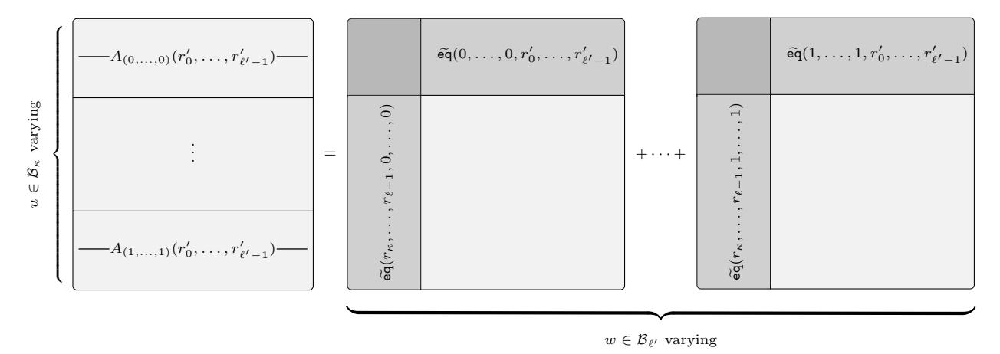
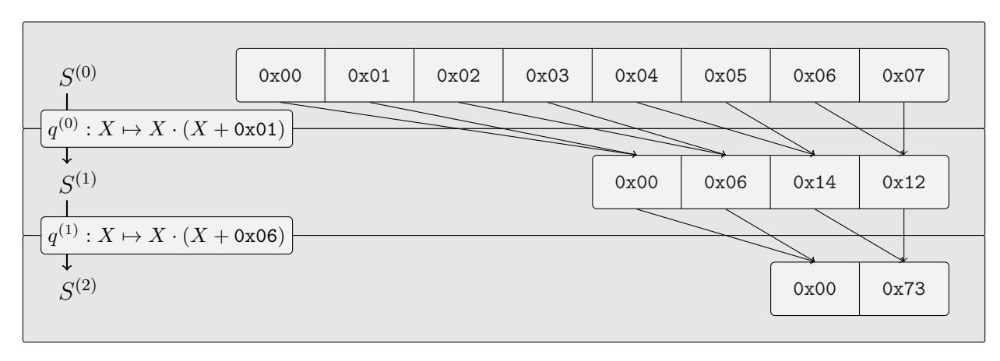
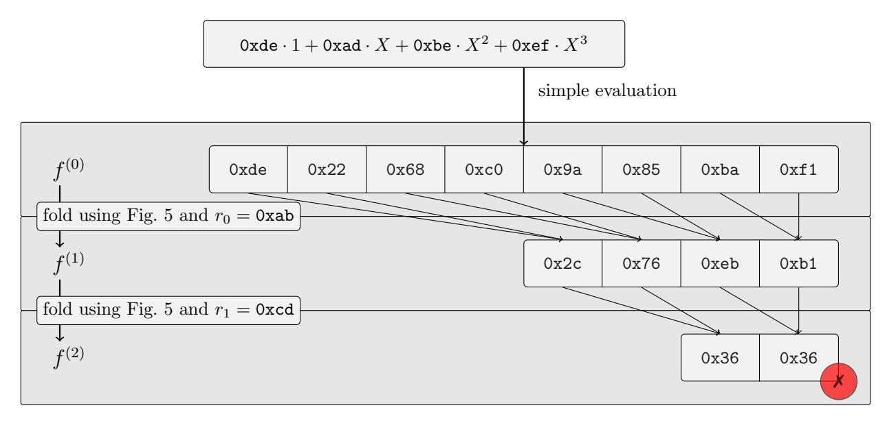
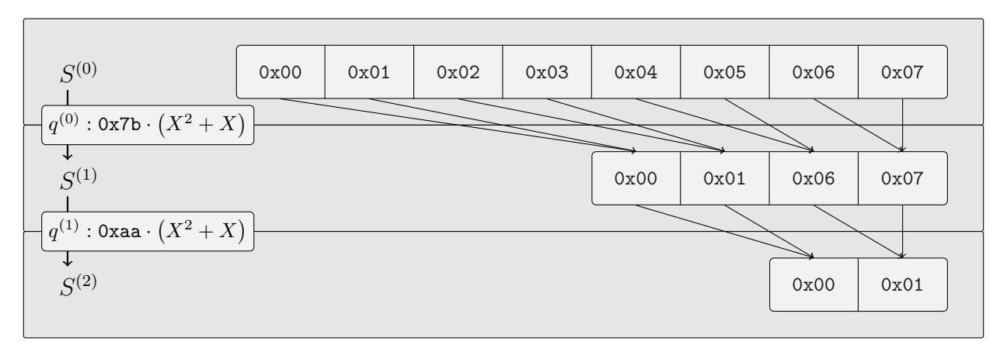
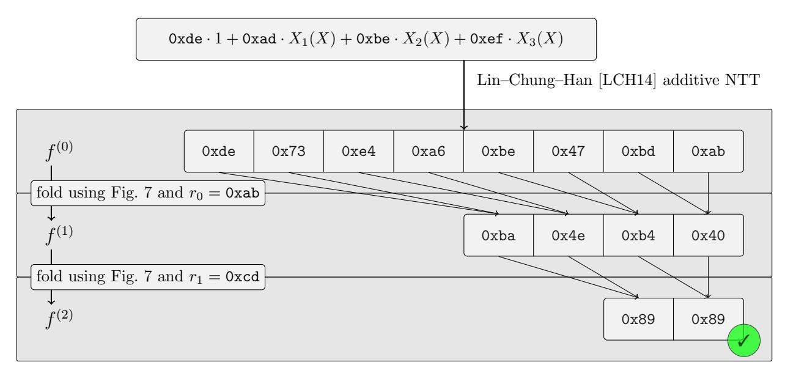
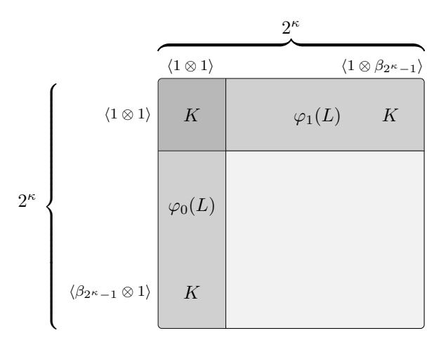
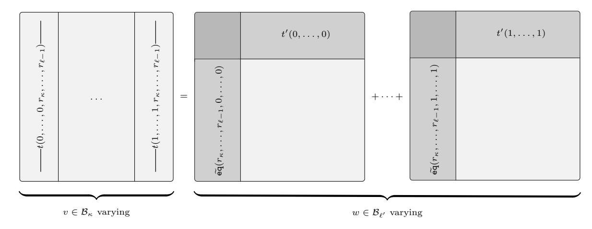
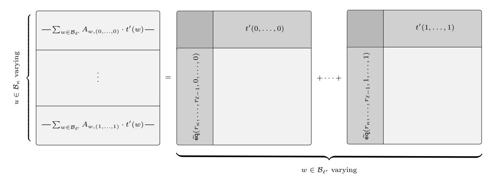

# Polylogarithmic Proofs for Multilinears over Binary Towers

Benjamin E. Diamond

Jim Posen

Irreducible

Irreducible

[bdiamond@irreducible.com](mailto:bdiamond@irreducible.com)

[jposen@irreducible.com](mailto:jposen@irreducible.com)

### Abstract

The use of small fields has come to typify the design of modern, production-oriented SNARKs. In this work, we treat multilinear polynomial commitment over tiny fields. A tiny-field polynomial—in the nomenclature of Diamond and Posen (EUROCRYPT '25)—is defined over a field that has fewer elements than the polynomial itself has coefficients. We focus on multilinears over the field with just two elements.

In this work, we generically reduce the problem of tiny-field commitment to that of large-field commitment. We introduce a sumcheck-based compiler—called "ring-switching"—which, upon being fed a multilinear polynomial commitment scheme over some large extension field, yields a further scheme over that field's ground field. The resulting scheme lacks embedding overhead, in that its commitment cost, on each input, equals that of the large-field scheme on each input of identical size (in bits). Its evaluation protocol's overhead is linear for the prover and logarithmic for the verifier, and is essentially optimal.

Instantiating our ring-switching reduction on the BaseFold (CRYPTO '24) large-field multilinear polynomial commitment scheme—or more precisely on a characteristic-2 adaptation of that scheme that we develop at length—we obtain an extremely fast polynomial commitment scheme for bit-valued multilinears. Our scheme outperforms its state-of-the-art peers, a fact we demonstrate experimentally.

## 1 Introduction

Today's fastest, production-oriented SNARKs universally use small fields. Before 2022, virtually all SNARKs operated over just one—cryptographically large—field. The small-field revolution began in earnest with [ethSTARK](https://github.com/starkware-libs/ethSTARK) and [Plonky2](https://github.com/0xPolygonZero/plonky2/blob/main/plonky2/plonky2.pdf) . Those systems decouple the respective fields used within their arithmetization and cryptography portions. That is, they use small fields—sized roughly like a 64-bit register—for their arithmetizations; each, during its security-critical portions, passes to a cryptographically large field extension of its arithmetization field. Subsequent production-oriented SNARKs like [Plonky3](https://github.com/Plonky3/Plonky3) and [RISC Zero](https://github.com/risc0/risc0) have embraced similar designs, based on 32-bit prime fields; [S-two](https://github.com/starkware-libs/stwo) has adopted a related architecture based on Hab¨ock, Levit and Papini's Circle STARK [\[HLP24\]](#page-48-0). By using small fields, these systems have managed to deliver industry-leading provers, which outperform those grounded in elliptic-curve-based SNARKs (like Sonic [\[MBKM19\]](#page-49-0), PlonK [\[GWC19\]](#page-48-1) and Marlin [\[Chi+20\]](#page-47-0)).

These SNARKs all use arithmetization fields which, though relatively small, are nonetheless at least as large as the statements they're capable of proving. This fact is not a coincidence. Indeed, all of them operate by, roughly, arranging their witness data into a trace table, Reed–Solomon-encoding that table's columns, and finally invoking a low-degree test based on FRI [\[BBHR18a\]](#page-47-1). Reed–Solomon codes demand alphabets that are at least as large as their block lengths are.

A recent work of Diamond and Posen [\[DP25\]](#page-48-2) breaks this trace-length barrier, in that it treats even polynomials over tiny fields—fields smaller than the statement's trace length. Crucially, that work does so without embedding overhead, a phenomenon we now recall. One might trivially attempt to commit to a tinyfield multilinear simply by embedding its coefficients into an extension, before blackbox-invoking a standard scheme on the resulting object. That approach would face at least two deficiencies. On the efficiency front, it would secure no gain from the tininess of its input's coefficients. Instead, it would impose an artificial penalty proportional to the ratio between its input's original coefficient bitwidth and the scheme's native field's bitwidth. On the security front, it would fail to guarantee the tininess of the prover's input, a security desideratum which, in practice, turns out to be essential. As Diamond and Posen [\[DP25\]](#page-48-2) argue, most production-oriented SNARKs deployed today face embedding overhead in some form.

In this work, we introduce a generic reduction from the problem of tiny-field multilinear polynomial commitment to that of large-field multilinear commitment. Our techniques are rather different from those of Diamond–Posen [\[DP25\]](#page-48-2). Our reduction, applied to any large-field scheme, yields a corresponding tiny-field scheme, which moreover lacks embedding overhead. It is agnostic to the large-field scheme used. In fact, our reduction works even on recently introduced, state-of-the-art large-field schemes like Blaze [\[Bre+25\]](#page-47-2) and WHIR [\[ACFY25\]](#page-47-3), and even on large-field schemes that haven't been created yet. Its overhead over the underlying large-field scheme given to it is essentially optimal, and beats that associated with alternative constructions, like Hashcaster (we explain this further in Subsection [1.3](#page-3-0) below).

### 1.1 Some Historical Remarks

Diamond and Posen [\[DP25\]](#page-48-2) break the trace-length barrier by further decoupling two fields which, in all of the small-field schemes noted above, coincide: the arithmetization field and the alphabet field. All of those schemes use just one prime field—again, sized just under 32 or 64 bits—both as the coefficient field of the polynomials committed and as the alphabet of the Reed–Solomon code used to encode them. The scheme [\[DP25\]](#page-48-2) makes possible the simultaneous use of a tiny arithmetization field and a small alphabet field. Separately, that work reintroduces the use of binary fields, fields of characteristic 2; these fields have figured in various previous works, like FRI [\[BBHR18a\]](#page-47-1) and STARK [\[BBHR18b\]](#page-47-4). Finally, that work treats exclusively multilinear polynomials; in this capacity, it extends an important line of work which includes Libra [\[Xie+19\]](#page-49-1), Virgo [\[ZXZS20\]](#page-49-2), Spartan [\[Set20\]](#page-49-3), Brakedown [\[Gol+23\]](#page-48-3), and HyperPlonk [\[CBBZ23\]](#page-47-5).

To make their technique work, Diamond and Posen [\[DP25\]](#page-48-2) tie together these various threads. They introduce a data-casting operation—which they call packing, and which is based on field extensions—which serves to recast a witness defined over F2, say, into a shorter witness over the larger field F<sup>2</sup> <sup>32</sup> . They then apply a Brakedown-like multilinear commitment procedure to the resulting witness, whose coefficient field, crucially, is large enough to be used as a Reed–Solomon alphabet. Using various mathematical techniques, those authors manage to make that scheme work (using Brakedown in a na¨ıve, fire-and-forget manner on the packed, F<sup>2</sup> <sup>32</sup> -witness would lead to information loss). That work, therefore, treats three generally distinct fields at once: the tiny coefficient field, the small alphabet field, and the huge cryptographic field.

We mention a further observation essential to that work. In those small-field schemes above—which are themselves based on the DEEP-ALI [\[BGKS19\]](#page-47-6) paradigm—the Reed–Solomon code plays two separate roles at once. On the one hand, it plays the role of an error-correcting linear block code, a mathematical object that amplifies errors and corruptions and makes them efficiently detectable. On the other hand, it serves the distinct end of polynomial extrapolation. It is essential to those DEEP-ALI-based schemes that the Reed–Solomon codewords that arise within them be, semantically, evaluations of polynomials. In particular, those constraint polynomials which, if the prover is honest, must vanish identically over its witnesses must likewise vanish identically over the Reed–Solomon encodings of those witnesses.

As Diamond and Posen [\[DP25\]](#page-48-2) implicitly observe, unlike DEEP-ALI [\[BGKS19\]](#page-47-6), Brakedown [\[Gol+23\]](#page-48-3) like its predecessor works Bootle, Chiesa and Groth [\[BCG20\]](#page-47-7) and Ron-Zewi and Rothblum [\[RR24\]](#page-49-4) do decouples the coding-theoretic specifications of its code from the semantics of its code. That is, Brakedown's Ligero-inspired [\[AHIV23\]](#page-47-8) polynomial commitment scheme uses its code only for error-amplification; the semantics of that code are irrelevant to it. (That protocol could freely substitute in place of its code an otherwise-arbitrary code of identical alphabet, message length, block length, and distance, to no effect.) This decoupling makes Diamond and Posen's packing procedure coherent, since that procedure garbles the semantics of Reed–Solomon extrapolation.

On the other hand, most transparent, hash-based proofs that achieve polylogarithmic verifiers—like Fractal [\[COS20\]](#page-48-4), or those based on DEEP-ALI [\[BGKS19\]](#page-47-6)—use univariate quotienting. (We refer also to Hab¨ock [\[Hab22\]](#page-48-5) for a useful survey of these techniques.) As Diamond and Posen [\[DP25\]](#page-48-2) note, quotienting seems incompatible with their packing technique.

Zeilberger, Chen and Fisch's BaseFold PCS [\[ZCF24,](#page-49-5) § 5] seems to be the first multilinear polynomial commitment scheme with a polylogarithmic verifier that doesn't use quotienting. That work proves Reed– Solomon codes foldable just in the odd-characteristic, multiplicative case. BaseFold is simple, elegant, and efficient, and is a compelling candidate for adaptation to the binary case.

This work's small-field PCS works in a drop-in way with the PIOP of [\[DP25\]](#page-48-2). By combining this work's PCS with that work's PIOP, one stands to obtain an efficient, full-blown SNARK for binary witnesses.

### 1.2 Our Contributions

We sketch our contributions here; in Subsections 1.3 and 1.4 below, we explain them in more detail.

A reduction from tiny-field commitment to huge-field commitment. Ring-switching is a generic compiler, which, on input a multilinear polynomial commitment scheme over some large extension field L/K, yields a new multilinear polynomial commitment scheme over the ground field K. Here, L can be of any characteristic, including 2. Each scheme our compiler outputs lacks embedding overhead, in that its commitment cost on each K-multilinear equals the original scheme's commitment cost on an L-multilinear of equal size in bits.

We write  $2^{\kappa}$  for the degree of L over K, which we assume is a power of 2. Diamond and Posen's [DP25, § 4] packing procedure takes in an  $\ell$ -variate multilinear  $t'(X_0, \ldots, X_{\ell-\kappa-1})$  over L. (Packing works by interpreting each  $2^{\kappa}$ -element chunk of  $t(X_0, \ldots, X_{\ell-1})$ 's Lagrange coefficient vector as an L-element, by basis-combination.) The multilinears  $t(X_0, \ldots, X_{\ell-1})$  and  $t'(X_0, \ldots, X_{\ell-\kappa-1})$  are of the same size in bits; they contain "the same amount of information". Our K-scheme's commitment procedure, on the input  $t(X_0, \ldots, X_{\ell-1})$ , simply packs  $t(X_0, \ldots, X_{\ell-1})$  and invokes the underlying L-scheme's commitment procedure on  $t'(X_0, \ldots, X_{\ell-\kappa-1})$ , the result. The hard part is relating an evaluation claim on  $t(X_0, \ldots, X_{\ell-1})$  to one on  $t'(X_0, \ldots, X_{\ell-\kappa-1})$ . To do this, we devise an unusual matrix-transposition trick, and write down an  $\ell - \kappa$ -round sumcheck between  $t'(X_0, \ldots, X_{\ell-\kappa-1})$  and a new sort of polynomial we call a ring-switch equality indicator. Polynomials of this latter sort can be evaluated succinctly by the verifier, but showing that they can is tricky. The evaluation algorithm at issue again entails matrix-transposition, this time carried out  $\ell - \kappa$  times, in alternation with L-scaling operations. The idea is that a list of  $2^{\kappa}$  L-elements amounts to a  $2^{\kappa} \times 2^{\kappa}$  matrix of K-elements. By transposing this matrix, we obtain a "dual" list of L-elements, again of length  $2^{\kappa}$ . We record further details in Subsection 1.3.

An improved multilinear PCS for large binary fields, based on BaseFold. Zeilberger, Chen and Fisch's BaseFold PCS [ZCF24, § 5] is an important multilinear polynomial commitment scheme for large prime fields. In order to spin up a target for our ring-switching reduction, we develop a characteristic-2 variant of BaseFold PCS, i.e. for large binary fields. We also improve that scheme by incorporating into it higher-arity folding, an optimization that reduces its proof sizes by more than half. The incompatibility of BaseFold—as written—with higher-arity folding has been noted by previous authors (see e.g. Arnon, Chiesa, Fenzi and Yogev's WHIR [ACFY25, § 1.1]).

To make higher-arity folding work with BaseFold, we introduce oracle-skipping, a new higher-arity folding mechanism. In contrast with FRI's original approach [BBHR18a, § 3.2] to higher-arity folding—based on univariate polynomials—oracle-skipping simply carries out the usual, 2-to-1 folding procedure repeatedly, skipping intermediate oracles. Our security proof necessitates a different sort of proximity gap than FRI's approach does, one pertaining not to low-degree curves but instead to tensor combinations. Precisely this kind of proximity gap is established in recent work of Diamond and Gruen [DG25], which we leverage.

Oracle-skipping narrows the proof-size gap between BaseFold and WHIR in the proven-security, unique decoding regime. For example, at the 100-bit security level and using the rate  $\rho=\frac{1}{2}$ , we obtain a proof size of 488 KiB for *large-field* multilinears on  $\ell=24$  variables, compared to WHIR-UD's 390 KiB. In the  $\ell=26$  *large-field* case, we obtain 563 KiB, while WHIR-UD reports 441 KiB [ACFY25, § 6.3.1]. We discuss our techniques further in Subsection 1.4.

A state-of-the-art PCS for multilinears over tiny binary fields. Putting the two parts above together, we obtain an extremely fast PCS for tiny-field multilinears. We outline our combined scheme in Section 5 below. We benchmark our scheme against Plonky3, a state-of-the-art competitor, using Binius, an open-source SNARK that implements this work's PCS. On a 28-variate multilinear over  $\mathbb{F}_2$ , our scheme achieves singlethreaded commitment and opening times of just 144 and 160 milliseconds, respectively; our multithreaded commitment and opening times are 44 and 71 milliseconds, respectively (see Table 2). Our proofs for polynomials of this size are 0.351 MiB, and our verifier runs in under a milliseconds.

Our measurements beat Plonky3's by between one and two orders of magnitude. Plonky3 takes 25 and 13 seconds, respectively, to commit a comparable amount of data, in the singlethreaded setting, and 4 and 2 seconds in multithreaded mode. Its proofs are also larger, and its verifier is around 20 milliseconds.

### <span id="page-3-0"></span>1.3 Ring-Switching

In this subsection, we gently introduce ring-switching, prioritizing technical simplicity and accuracy. We fix a field extension L/K of power-of-2 degree  $2^{\kappa}$ . Though ring-switching works for any such field extension, of any characteristic, the special case  $K = \mathbb{F}_2$  and  $L = \mathbb{F}_{2^{128}}$  is especially important and exemplary. We write  $\mathcal{B}_{\kappa} := \{0,1\}^{\kappa}$  for the  $\kappa$ -dimensional unit cube.

**The problem.** We assume access to a large-field multilinear polynomial commitment scheme for multilinears over L. How might we obtain a small-field commitment scheme for multilinears over K, assuming access to that large-field scheme?

We begin with a small-field multilinear, say  $t(X_0, \ldots, X_{\ell-1}) \in K[X_0, \ldots, X_{\ell-1}]^{\leq 1}$ , that we'd like to commit to. Following Diamond and Posen [DP25], we fix a basis  $(\beta_v)_{v \in \mathcal{B}_{\kappa}}$  of L over K, write  $\ell' := \ell - \kappa$ , and define the packed multilinear:

<span id="page-3-3"></span>
$$t'(X_0, \dots, X_{\ell'-1}) := \sum_{v \in \mathcal{B}_{\kappa}} t(v_0, \dots, v_{\kappa-1}, X_0, \dots, X_{\ell'-1}) \cdot \beta_v. \tag{1}$$

The multilinear  $t'(X_0,\ldots,X_{\ell'-1})$  is the packing of  $t(X_0,\ldots,X_{\ell-1})$ , as Diamond and Posen explain. This relationship is easiest to see at the level of Lagrange coefficient vectors. For each  $w \in \mathcal{B}_{\ell'}$ , the  $w^{\text{th}}$  Lagrange coefficient t'(w) is the basis-combination, over  $(\beta_v)_{v \in \mathcal{B}_\kappa}$ , of the  $w^{\text{th}}$   $2^\kappa$ -element chunk of  $t(X_0,\ldots,X_{\ell-1})$ 's Lagrange coefficient vector; that is,  $t'(w) = \sum_{v \in \mathcal{B}_\kappa} t(v_0,\ldots,v_{\kappa-1},w_0,\ldots,w_{\ell'-1}) \cdot \beta_v$ .

How should we commit to  $t(X_0,\ldots,X_{\ell-1})$ ? Our commitment procedure is simple: it just packs

How should we commit to  $t(X_0, \ldots, X_{\ell-1})$ ? Our commitment procedure is simple: it just packs  $t(X_0, \ldots, X_{\ell-1})$  and invokes the underlying large-field scheme's commitment procedure on  $t'(X_0, \ldots, X_{\ell'-1})$ , the result. This procedure lacks embedding overhead, since  $t(X_0, \ldots, X_{\ell-1})$  and  $t'(X_0, \ldots, X_{\ell'-1})$  are of the same size (in bits).

To check an evaluation claim on  $t(X_0, \ldots, X_{\ell-1})$ , we must reduce it to one on  $t'(X_0, \ldots, X_{\ell'-1})$ . We fix a point  $(r_0, \ldots, r_{\ell-1})$  and an evaluation claim  $s \stackrel{?}{=} t(r_0, \ldots, r_{\ell-1})$ . We emphasize that the evaluation point r is defined over L, and not over K (we refer to [DP25, § 3.2], as well as to Subsection 2.7 below, for security definitions).

**A strawman approach.** We begin with a tempting "strawman" approach, which exhibits the difficulty of the problem. This first approach, though correct, is insecure. On the other hand, it prefigures a few of our techniques, and serves as a jumping-off point.

This simple technique proceeds in the following way. First, the prover sends values  $(\hat{s}_v)_{v \in \mathcal{B}_{\kappa}}$  which—it claims—respectively satisfy

<span id="page-3-2"></span>
$$\hat{s}_v \stackrel{?}{=} t(v_0, \dots, v_{\kappa-1}, r_{\kappa}, \dots, r_{\ell-1}), \tag{2}$$

for each  $v \in \mathcal{B}_{\kappa}$ . The verifier begins by checking whether

<span id="page-3-1"></span>
$$s \stackrel{?}{=} \sum_{v \in \mathcal{B}_{\kappa}} \widetilde{eq}(v_0, \dots, v_{\kappa-1}, r_0, \dots, r_{\kappa-1}) \cdot \hat{s}_v$$
(3)

holds. This equality will certainly hold if the prover is honest, since

$$t(r_0,\ldots,r_{\ell-1}) = \sum_{v \in \mathcal{B}_\kappa} \widetilde{\operatorname{eq}}(v_0,\ldots,v_{\kappa-1},r_0,\ldots,r_{\kappa-1}) \cdot t(v_0,\ldots,v_{\kappa-1},r_\kappa,\ldots,r_{\ell-1}).$$

On the other hand, if  $s \neq t(r_0, \ldots, r_{\ell-1})$ , then the prover can cause (3) to pass only by sending claims  $(\hat{s}_v)_{v \in \mathcal{B}_{\kappa}}$  for which at least one of the equalities (2) does *not* hold.

The linear combination, over the basis  $(\beta_v)_{v \in \mathcal{B}_{\kappa}}$ , of all  $2^{\kappa}$  instances of (2) is:

<span id="page-3-4"></span>
$$\sum_{v \in \mathcal{B}_{\kappa}} \hat{s}_v \cdot \beta_v \stackrel{?}{=} \sum_{v \in \mathcal{B}_{\kappa}} t(v_0, \dots, v_{\kappa - 1}, r_{\kappa}, \dots, r_{\ell - 1}) \cdot \beta_v. \tag{4}$$

On the other hand, by (1), the right-hand side of (4) is simply  $t'(r_{\kappa}, \ldots, r_{\ell-1})$ , which the verifier has direct access to. The verifier may thus use the underlying large-field scheme to compare  $\sum_{v \in \mathcal{B}_{\kappa}} \beta_v \cdot \hat{s}_v$  to  $t'(r_{\kappa}, \ldots, r_{\ell-1})$ . We summarize this approach in Figure 1 below.

<span id="page-4-0"></span>
$$\frac{\mathcal{P}(r,s;t)}{\text{for each }v\in\mathcal{B}_{\kappa},\text{ set }\hat{s}_{v}\coloneqq t(v_{0},\ldots,v_{\kappa-1},r_{\kappa},\ldots,r_{\ell-1}).} \xrightarrow{\qquad \qquad } \underbrace{\begin{array}{c} \mathcal{V}(r,s)\\ \\ (\hat{s}_{v})_{v\in\mathcal{B}_{\kappa}} \end{array}}_{\text{check }s} \stackrel{?}{=} \sum_{v\in\mathcal{B}_{\kappa}} \tilde{\mathsf{eq}}(v_{0},\ldots,v_{\kappa-1},r_{0},\ldots,r_{\kappa-1}) \cdot \hat{s}_{v}.$$

$$\text{set }s'\coloneqq\sum_{v\in\mathcal{B}_{\kappa}} \hat{s}_{v}\cdot\beta_{v}.$$

$$\text{check }s'\stackrel{?}{=}t'(r_{\kappa},\ldots,r_{\ell-1}) \text{ using large-field scheme.}$$

Figure 1: A simple—but insecure—strawman variant of ring-switching.

While this protocol is complete, it's not secure. The problem is the linear combination (4) of (2). The set  $(\beta_v)_{v \in \mathcal{B}_{\kappa}}$  is a basis of L over K. This means that unequal K-vectors yield unequal combinations. This only works, though, for coefficient vectors over K. In other words,  $(\beta_v)_{v \in \mathcal{B}_{\kappa}}$  is linearly independent over K, but not over L. It's easy to write down two unequal L-vectors whose combinations with  $(\beta_v)_{v \in \mathcal{B}_{\kappa}}$  yield the same L-element. Put differently,  $(\beta_v)_{v \in \mathcal{B}_{\kappa}}$  induces an injection from  $K^{2^{\kappa}} \to L$ , but not from  $L^{2^{\kappa}} \to L$ .

The problem is that the individual equations (2) are defined over L, and not K. Thus, combining them is not secure. In particular, the prover can easily contrive to construct values  $(\hat{s}_v)_{v \in \mathcal{B}_{\kappa}}$  that don't *individually* equal  $(t(v_0, \ldots, v_{\kappa-1}, r_{\kappa}, \ldots, r_{\ell-1}))_{v \in \mathcal{B}_{\kappa}}$ , but for which  $\sum_{v \in \mathcal{B}_{\kappa}} \hat{s}_v \cdot \beta_v = t'(r_{\kappa}, \ldots, r_{\ell-1})$  nonetheless holds.

Our solution. Our idea is—very roughly—to further decompose the claims (2), until they are defined over K. We may then apply the "tempting" linear combination (4) to the resulting decomposed claims, proceeding "slice-wise". We explain the details now.

For each  $v \in \mathcal{B}_{\kappa}$ , the verifier can freely basis-decompose the prover's quantity  $\hat{s}_v$ , writing

<span id="page-4-1"></span>
$$\hat{s}_v = \sum_{u \in \mathcal{B}_\kappa} \hat{s}_{u,v} \cdot \beta_u \tag{5}$$

for appropriate K-elements  $(\hat{s}_{u,v})_{u \in \mathcal{B}_{\kappa}}$ . Moreover, for each  $v \in \mathcal{B}_{\kappa}$ ,

<span id="page-4-2"></span>
$$t(v_0, \dots, v_{\kappa-1}, r_{\kappa}, \dots, r_{\ell-1}) = \sum_{w \in \mathcal{B}_{\ell'}} \widetilde{eq}(r_{\kappa}, \dots, r_{\ell-1}, w_0, \dots, w_{\ell'-1}) \cdot t(v_0, \dots, v_{\kappa-1}, w_0, \dots, w_{\ell'-1}).$$
(6)

Combining (5) and (6), we basis-decompose (2) as follows. For each  $v \in \mathcal{B}_{\kappa}$ , we have the claim:

<span id="page-4-3"></span>
$$\sum_{u \in \mathcal{B}_{\kappa}} \hat{s}_{u,v} \cdot \beta_u \stackrel{?}{=} \sum_{w \in \mathcal{B}_{\ell'}} \widetilde{\operatorname{eq}}(r_{\kappa}, \dots, r_{\ell-1}, w_0, \dots, w_{\ell'-1}) \cdot t(v_0, \dots, v_{\kappa-1}, w_0, \dots, w_{\ell'-1}). \tag{7}$$

We're not quite done. While, for each  $w \in \mathcal{B}_{\kappa}$ ,  $t(v_0, \ldots, v_{\kappa-1}, w_0, \ldots, w_{\ell'-1})$  is of course a K-element,  $\widetilde{\text{eq}}(r_{\kappa}, \ldots, r_{\ell-1}, w_0, \ldots, w_{\ell'-1})$  is not. On the other hand, we can basis-decompose these latter quantities too. For each  $w \in \mathcal{B}_{\ell'}$ , we can freely write down K-elements  $(A_{w,u})_{u \in \mathcal{B}_{\kappa}}$  for which

<span id="page-4-4"></span>
$$\widetilde{\operatorname{eq}}(r_{\kappa}, \dots, r_{\ell-1}, w_0, \dots, w_{\ell'-1}) = \sum_{u \in \mathcal{B}_{\kappa}} A_{w,u} \cdot \beta_u.$$
(8)

Using these, we further re-express (7) in the following way. For each  $v \in \mathcal{B}_{\kappa}$ , we obtain the claim:

$$\sum_{u \in \mathcal{B}_{\kappa}} \hat{s}_{u,v} \cdot \beta_{u} \stackrel{?}{=} \sum_{w \in \mathcal{B}_{\ell'}} \widetilde{\operatorname{eq}}(r_{\kappa}, \dots, r_{\ell-1}, w_{0}, \dots, w_{\ell'-1}) \cdot t(v_{0}, \dots, v_{\kappa-1}, w_{0}, \dots, w_{\ell'-1}) \quad \text{(this is (7).)}$$

$$= \sum_{w \in \mathcal{B}_{\ell'}} \left( \sum_{u \in \mathcal{B}_{\kappa}} A_{w,u} \cdot \beta_{u} \right) \cdot t(v_{0}, \dots, v_{\kappa-1}, w_{0}, \dots, w_{\ell'-1}) \quad \text{(by definition of } (A_{w,u})_{u \in \mathcal{B}_{\kappa}} \quad \text{(8).)}$$

$$= \sum_{u \in \mathcal{B}_{\kappa}} \left( \sum_{w \in \mathcal{B}_{\ell'}} A_{w,u} \cdot t(v_{0}, \dots, v_{\kappa-1}, w_{0}, \dots, w_{\ell'-1}) \right) \cdot \beta_{u}. \quad \text{(rearrange the sum.)}$$

We've finally reached something we can basis-decompose!

Indeed, everything in the leftmost and rightmost sides of the above identity is defined over K, except for the basis-elements  $(\beta_u)_{u \in \mathcal{B}_{\kappa}}$ . To check the claim just above for each  $v \in \mathcal{B}_{\kappa}$ , it's thus equivalent for the verifier to check whether, for each  $u \in \mathcal{B}_{\kappa}$  and each  $v \in \mathcal{B}_{\kappa}$ ,

<span id="page-5-0"></span>
$$\hat{s}_{u,v} \stackrel{?}{=} \sum_{w \in \mathcal{B}_{\ell'}} A_{w,u} \cdot t(v_0, \dots, v_{\kappa-1}, w_0, \dots, w_{\ell'-1}). \tag{9}$$

Here is the key point: unlike (2), the claims (9) are purely defined over K. We can thus basis-combine the claims (9) using  $(\beta_v)_{v \in \mathcal{B}_{\kappa}}$ , as opposed to the claims (2). We do exactly this. For each  $u \in \mathcal{B}_{\kappa}$ , combining (9) over  $v \in \mathcal{B}_{\kappa}$ , we obtain the claim:

$$\sum_{v \in \mathcal{B}_{\kappa}} \hat{s}_{u,v} \cdot \beta_{v} \stackrel{?}{=} \sum_{v \in \mathcal{B}_{\kappa}} \left( \sum_{w \in \mathcal{B}_{\ell'}} A_{w,u} \cdot t(v_{0}, \dots, v_{\kappa-1}, w_{0}, \dots, w_{\ell'-1}) \right) \cdot \beta_{v} \qquad \text{(combine (9) over } (\beta_{v})_{v \in \mathcal{B}_{\kappa}}.)$$

$$= \sum_{w \in \mathcal{B}_{\ell'}} A_{w,u} \cdot \left( \sum_{v \in \mathcal{B}_{\kappa}} t(v_{0}, \dots, v_{\kappa-1}, w_{0}, \dots, w_{\ell'-1}) \cdot \beta_{v} \right) \qquad \text{(rearrange the sum.)}$$

$$= \sum_{w \in \mathcal{B}_{\ell'}} A_{w,u} \cdot t'(w_{0}, \dots, w_{\ell'-1}). \qquad \text{(by the definition (1).)}$$

Up to defining

<span id="page-5-4"></span>
$$\hat{s}_u := \sum_{v \in \mathcal{B}_r} \hat{s}_{u,v} \cdot \beta_v, \tag{10}$$

we thus have the claims

<span id="page-5-1"></span>
$$\hat{s}_u \stackrel{?}{=} \sum_{w \in \mathcal{B}_{\ell'}} A_{w,u} \cdot t'(w_0, \dots, w_{\ell'-1}) \tag{11}$$

for each  $u \in \mathcal{B}_{\kappa}$ . This combination is secure. Moreover, its right-hand side depends only on  $t'(X_0, \ldots, X_{\ell'-1})$ , as well as on  $(A_{w,u})_{w \in \mathcal{B}_{d'}}$ . We're getting close to something that we can run the sumcheck on.

The verifier must check (11) for each  $u \in \mathcal{B}_{\kappa}$ . In light of standard sumcheck batching techniques, though, this fact presents no obstacle. In practice, up to a soundness error of just  $\frac{\kappa}{|L|}$ , the verifier can simply sample further random scalars  $(r''_0, \ldots, r''_{\kappa-1})$ , and batch both sides of (11) by the L-vector  $(\widetilde{\text{eq}}(u_0, \ldots, u_{\kappa-1}, r''_0, \ldots, r''_{\kappa-1}))_{u \in \mathcal{B}_{\kappa}}$ , over varying  $u \in \mathcal{B}_{\kappa}$ . That is, the verifier may check whether

<span id="page-5-3"></span>
$$\sum_{u \in \mathcal{B}_{\kappa}} \widetilde{\operatorname{eq}}(u, r'') \cdot \hat{s}_u \stackrel{?}{=} \sum_{w \in \mathcal{B}_{\ell'}} \left( \sum_{u \in \mathcal{B}_{\kappa}} \widetilde{\operatorname{eq}}(u, r'') \cdot A_{w, u} \right) \cdot t'(w) \tag{12}$$

holds. We summarize our amended protocol in Figure 2 below.

<span id="page-5-2"></span>
$$\frac{\mathcal{P}(r,s;t)}{\text{for each } v \in \mathcal{B}_{\kappa}, \text{ set } \hat{s}_{v} \coloneqq t(v_{0},\ldots,v_{\kappa-1},r_{\kappa},\ldots,r_{\ell-1}). \xrightarrow{(\hat{s}_{v})_{v \in \mathcal{B}_{\kappa}}} \xrightarrow{\mathcal{V}(r,s)} \text{check } s \stackrel{?}{=} \sum_{v \in \mathcal{B}_{\kappa}} \tilde{eq}(v_{0},\ldots,v_{\kappa-1},r_{0},\ldots,r_{\kappa-1}) \cdot \hat{s}_{v}.$$

$$\text{for each } v \in \mathcal{B}_{\kappa}, \text{ decompose } \hat{s}_{v} = \sum_{u \in \mathcal{B}_{\kappa}} \hat{s}_{u,v} \cdot \beta_{u}.$$

$$\text{for each } u \in \mathcal{B}_{\kappa}, \text{ combine } \hat{s}_{u} \coloneqq \sum_{v \in \mathcal{B}_{\kappa}} \hat{s}_{u,v} \cdot \beta_{v}.$$

$$\underbrace{(r''_{0},\ldots,r''_{\kappa-1})}_{\text{many } \text{multiple of the sumcheck } (12).$$

$$\text{at the end of the sumcheck, evaluate}$$

$$\sum_{u \in \mathcal{B}_{\kappa}} \tilde{eq}(u,r'') \cdot A_{u}(r') \text{ and } t'(r'),$$

$$\text{where } r = (r'_{0},\ldots,r'_{\ell'-1}) \text{ is the sumcheck challenge.}$$

Figure 2: A rough sketch of our full ring-switching protocol.

There is one, final issue that we've glossed over. In Figure 2 above, for each  $u \in \mathcal{B}_{\kappa}$ , we abbreviate  $A_u(X_0,\ldots,X_{\ell'-1})$  for the multilinear extension of the function  $A_u: w \mapsto A_{w,u}$  on  $\mathcal{B}_{\ell'}$ . At the end of the sumcheck, the verifier may learn  $t'(r'_0,\ldots,r'_{\ell'-1})$  by invoking the underlying large-field scheme's evaluation protocol once. How might the verifier locally—and efficiently—obtain the evaluations  $(A_u(r'_0,\ldots,r'_{\ell'-1}))_{u\in\mathcal{B}_u}$ ?

This issue brings us to the trickiest part of our theory. We claim that the multilinears  $(A_u(X_0,\ldots,X_{\ell'-1}))_{u\in\mathcal{B}_{\kappa}}$  are *succinct*. In fact, the verifier may learn the whole list  $(A_u(r'_0,\ldots,r'_{\ell'-1}))_{u\in\mathcal{B}_{\kappa}}$ , in one shot, by expending just  $2\cdot 2^{\kappa}\cdot \ell'$  *L*-multiplications. This fact is non-obvious; we sketch it now.

To do this, we recall how the multilinears  $A_u(X_0, \ldots, X_{\ell'-1})$  are defined. Indeed, for each  $u \in \mathcal{B}_{\kappa}$ ,  $A_u(X_0, \ldots, X_{\ell'-1})$  is defined, in the Lagrange basis, as the  $u^{\text{th}}$  "coordinate slice" of the partially-specialized equality indicator  $\widetilde{\text{eq}}(r_{\kappa}, \ldots, r_{\ell-1}, X_0, \ldots, X_{\ell'-1})$ . Moreover, for each  $u \in \mathcal{B}_{\kappa}$ ,

<span id="page-6-0"></span>
$$A_{u}(r'_{0}, \dots, r'_{\ell'-1}) = \sum_{w \in \mathcal{B}_{\ell'}} A_{w,u} \cdot \widetilde{\mathsf{eq}}(w_{0}, \dots, w_{\ell'-1}, r'_{0}, \dots, r'_{\ell'-1})$$
(13)

obviously holds. Writing all  $2^{\kappa}$  copies—i.e., over varying  $u \in \mathcal{B}_{\kappa}$ —of the sum (13) into the rows of a square,  $2^{\kappa} \times 2^{\kappa}$  matrix, we obtain the sum expression depicted in Figure 3 below.

<span id="page-6-1"></span>

Figure 3: Vertically stacking (13), we express  $(A_u(r'_0,\ldots,r'_{\ell'-1}))_{u\in\mathcal{B}_{\kappa}}$  as the rows of an unusual sum.

In Figure 3, for each  $w \in \mathcal{B}_{\ell'}$ , we've drawn a square in which  $\widetilde{\operatorname{eq}}(r_{\kappa},\ldots,r_{\ell-1},w_0,\ldots,w_{\ell'-1})$  is written vertically and  $\widetilde{\operatorname{eq}}(w_0,\ldots,w_{\ell'-1},r'_0,\ldots,r'_{\ell'-1})$  horizontally. By each such square, we mean the  $2^{\kappa} \times 2^{\kappa}$  K-matrix whose cells are the "exterior product" of  $\widetilde{\operatorname{eq}}(r_{\kappa}\ldots,r_{\ell-1},w_0,\ldots,w_{\ell'-1})$  and  $\widetilde{\operatorname{eq}}(w_0,\ldots,w_{\ell'-1},r'_0,\ldots,r'_{\ell'-1})$ . I.e., we basis-decompose both L-elements, and take all cross-products between the resulting two K-vectors.

Why did we do such a thing? Because this is simply the definition of (13)! Indeed, if we "zoom into" a single row  $u \in \mathcal{B}_{\kappa}$  of Figure 3, then we obtain (13) on the nose (we recall that  $A_{w,u}$  is defined to be the  $u^{\text{th}}$  coordinate slice of  $\widetilde{\text{eq}}(r_{\kappa}, \ldots, r_{\ell-1}, w_0, \ldots, w_{\ell'-1})$ ).

The point of Figure 3 is that it lets us explain our succinct algorithm for  $(A_u(r'_0, \ldots, r'_{\ell'-1}))_{u \in \mathcal{B}_{\kappa}}$ . If we write  $\star$  for the "exterior product" operation between K-vectors, then Figure 3 shows us that:

<span id="page-6-2"></span>
$$(A_u(r'_0, \dots, r'_{\ell'-1}))_{u \in \mathcal{B}_{\kappa}} = \sum_{w \in \mathcal{B}_{\ell'}} \widetilde{eq}(r_{\kappa} \dots, r_{\ell-1}, w_0, \dots, w_{\ell'-1}) \star \widetilde{eq}(w_0, \dots, w_{\ell'-1}, r'_0, \dots, r'_{\ell'-1}).$$
 (14)

The right-hand side of (14) almost looks like the equality indicator expression  $\widetilde{eq}(r_{\kappa}, \dots, r_{\ell-1}, r'_0, \dots, r'_{\ell'-1})$ , which we know is succinct. The problem is the  $\star$  operation.

We state without proof (though see Section 3) that, in characteristic 2, the following efficient procedure yields  $(A_u(r'_0,\ldots,r'_{\ell'-1}))_{u\in\mathcal{B}_\kappa}$ . The verifier should maintain a  $2^\kappa\times 2^\kappa$  K-matrix, initialized to be 1 in the top-left cell and 0 elsewhere. For each  $i\in\{0,\ldots,\ell'-1\}$ , the verifier should L-multiply each column of this matrix by  $r_{\kappa+i}$  and each row of it by  $r'_i$ , and update its running matrix by adding to it these two scalings. We interpret rows and columns as L-elements by basis-combination. The result of this procedure will be  $(A_u(r'_0,\ldots,r'_{\ell'-1}))_{u\in\mathcal{B}_\kappa}$ . To explain why this works, we must get into a bit of algebra. Everything hinges on  $L\otimes_K L$ , the tensor product of L with itself over its own subfield K, an object we call the "tensor algebra".

**Hashcaster.** We compare ring-switching in detail to Hashcaster. Soukhanov's Hashcaster [Sou24] is a SNARK for binary (i.e., specifically  $\mathbb{F}_2$ -valued) witnesses. At the PIOP level, that work introduces a number of innovations, including an efficient "ternary" sumcheck for domains of power-of-3 size. For the purposes of this work, we survey just that work's ideas at the PCS level, which are also important. Indeed, that work yields an alternative reduction from the problem of evaluating the K-multilinear  $t(X_0, \ldots, X_{\ell-1})$  to that of evaluating its packed L-multilinear  $t'(X_0, \ldots, X_{\ell'-1})$ . For self-containedness, we reproduce that work's technique here in some detail; we then compare it to ring-switching, the approach of this work.

We again fix a degree- $2^{\kappa}$  field extension L/K, and write  $(\beta_v)_{v \in \mathcal{B}_{\kappa}}$  for a basis of L over K. We write  $\sigma \in \operatorname{Gal}(L/K)$  for the *Frobenius automorphism* of L over K. As a notational device, for each  $v \in \mathcal{B}_{\kappa}$ , we write  $\{v\} := \sum_{i=0}^{\kappa-1} 2^i \cdot v_i$ .

Hashcaster begins with the same observation as Subsection 1.3 does. That is, for the verifier to assess the evaluation claim  $s \stackrel{?}{=} t(r_0, \dots, r_{\ell-1})$ , it suffices for the prover to send it quantities  $(\hat{s}_v)_{v \in \mathcal{B}_{\kappa}}$  respectively claimed to equal  $(t(v_0, \dots, v_{\kappa-1}, r_{\kappa}, \dots, r_{\ell-1}))_{v \in \mathcal{B}_{\kappa}}$  (recall (2)). Indeed, given these, the verifier can check

<span id="page-7-2"></span>
$$s \stackrel{?}{=} \sum_{v \in \mathcal{B}_{\kappa}} \widetilde{\text{eq}}(v_0, \dots, v_{\kappa-1}, r_0, \dots, r_{\kappa-1}) \cdot \hat{s}_v, \tag{15}$$

as usual (just as in (3)).

At this point, Hashcaster diverges. Hashcaster's idea is to relate the claimed partial evaluations  $(\hat{s}_v)_{v \in \mathcal{B}_{\kappa}}$  to the respective evaluations of the packed multilinear  $t'(X_0, \ldots, X_{\ell'-1})$  at  $(\sigma^{\{v\}}(r_{\kappa}), \ldots, \sigma^{\{v\}}(r_{\ell-1}))_{v \in \mathcal{B}_{\kappa}}$ , the componentwise Galois orbit of the suffix  $(r_{\kappa}, \ldots, r_{\ell-1})$ .

There are various ways to make this task precise. Hashcaster's approach hinges on the following matrix identity:

<span id="page-7-0"></span>
$$\begin{bmatrix}
\sigma^{\{u\}}(\beta_v) & \vdots & \vdots \\
\hat{s}_v & \vdots & \vdots \\
\vdots & \vdots & \vdots \\
\end{bmatrix} \stackrel{?}{=} \begin{bmatrix} \sigma^{\{u\}}(t')(r_{\kappa}, \dots, r_{\ell-1}) \\
\vdots & \vdots & \vdots \\
\end{bmatrix}.$$
(16)

On the left, we have the  $2^{\kappa} \times 2^{\kappa}$  matrix whose  $(\{u\}, \{v\})^{\text{th}}$  entry is  $\sigma^{\{u\}}(\beta_v)$ , the  $\{u\}^{\text{th}}$  Galois image of the  $v^{\text{th}}$  basis vector. On the right-hand side, we have the vector containing the respective evaluations at  $(r_{\kappa}, \ldots, r_{\ell-1})$  of  $t'(X_0, \ldots, X_{\ell'-1})$ 's various "Galois twists". Indeed, for each  $u \in \mathcal{B}_{\kappa}$ , we define  $\sigma^{\{u\}}(t')(X_0, \ldots, X_{\ell'-1})$  by the Lagrange basis prescription  $\sigma^{\{u\}}: w \mapsto \sigma^{\{u\}}(t'(w))$ , for each  $w \in \mathcal{B}_{\ell'}$ . It is a nontrivial fact of field theory that the matrix  $\left[\sigma^{\{u\}}(\beta_v)\right]$  is nonsingular; we refer to Lidl and Niederreiter [LN96, Lem. 3.51]. Assuming this fact, it's not too hard to show that (16) holds if and only if the prover is honest (i.e., if each of its claims  $\hat{s}_v \stackrel{?}{=} t(v_0, \ldots, v_{\kappa-1}, r_{\kappa}, \ldots, r_{\ell-1})$ , for  $v \in \mathcal{B}_{\kappa}$ , is true).

Upon receiving the prover's vector of claims  $(\hat{s}_v)_{v \in \mathcal{B}_{\kappa}}$ , the verifier could thus compute the matrix transformation (16) on that vector. By moreover "peeling off" the twists  $\sigma^{\{u\}}$ , for each  $u \in \mathcal{B}_{\kappa}$ , the verifier could thereby obtain a further vector supposedly equal to  $(t'(\sigma^{\{-u\}}(r_{\kappa}),\ldots,\sigma^{\{-u\}}(r_{\ell-1})))_{u\in\mathcal{B}_{\kappa}}$ , the vector of evaluations of  $t'(X_0,\ldots,X_{\ell'-1})$  on the Galois orbit of  $(r_{\kappa},\ldots,r_{\ell-1})$ .

In fact, we will do Hashcaster one better. We claim that, up to performing a transposition of the sort already discussed above in the context of ring-switching, the verifier may simplify its job; specifically, it might directly relate  $(\hat{s}_v)_{v \in \mathcal{B}_{\kappa}}$  to  $(t'(\sigma^{\{v\}}(r_{\kappa}), \ldots, \sigma^{\{v\}}(r_{\ell-1})))_{v \in \mathcal{B}_{\kappa}}$  (with no twists necessary). Indeed, given  $(\hat{s}_v)_{v \in \mathcal{B}_{\kappa}}$ , the verifier may freely, as before, decompose  $\hat{s}_v = \sum_{u \in \mathcal{B}_{\kappa}} \hat{s}_{u,v} \cdot \beta_u$  (just as in (5)), and write  $\hat{s}_u := \sum_{v \in \mathcal{B}_{\kappa}} \hat{s}_{u,v} \cdot \beta_v$  (just as in (10)). In this setting, we obtain the further identity:

<span id="page-7-1"></span>
$$\underbrace{\begin{bmatrix} - \hat{s}_{u} - \hat{s}_{v} - \hat{s}_{v} - \hat{s}_{v} - \hat{s}_{v} \end{bmatrix}}_{u \in \mathcal{B}_{\kappa} \text{ varying}} \cdot \begin{bmatrix} \sigma^{\{v\}}(\beta_{u}) \end{bmatrix} \stackrel{?}{=} \underbrace{\begin{bmatrix} - t'(\sigma^{\{v\}}(r_{\kappa}), \dots, \sigma^{\{v\}}(r_{\ell-1})) - \dots \end{bmatrix}}_{v \in \mathcal{B}_{\kappa} \text{ varying}}. (17)$$

We claim that (17) also holds if and only if the prover is honest (i.e., if  $\hat{s}_v \stackrel{?}{=} t(v_0, \dots, v_{\kappa-1}, r_{\kappa}, \dots, r_{\ell-1})$  for each  $v \in \mathcal{B}_{\kappa}$ ). Importantly, the right-hand side of (17) directly yields the evaluations of  $t'(X_0, \dots, X_{\ell'-1})$  over  $(r_{\kappa}, \dots, r_{\ell-1})$ 's Galois orbit, with no "twisting" or "peeling off" necessary.

To check the validity of the prover's claim, then, it's thus enough for the verifier to compute

<span id="page-8-3"></span>
$$\underbrace{\left[ \underbrace{\overline{s}_{v}} \right]}_{v \in \mathcal{B}_{\kappa} \text{ varying}} := \underbrace{\left[ \underbrace{\hat{s}_{u}} \right]}_{u \in \mathcal{B}_{\kappa} \text{ varying}} \cdot \left[ \sigma^{\{v\}}(\beta_{u}) \right], \tag{18}$$

i.e. the left-hand side of (17), and then check whether, for each  $v \in \mathcal{B}_{\kappa}$ ,

<span id="page-8-0"></span>
$$\overline{s}_v \stackrel{?}{=} t' \Big( \sigma^{\{v\}}(r_\kappa), \dots, \sigma^{\{v\}}(r_{\ell-1}) \Big)$$

$$\tag{19}$$

holds.

We've made progress, since each right-hand side of (19) (for  $v \in \mathcal{B}_{\kappa}$ ) is an evaluation of  $t'(X_0, \ldots, X_{\ell'-1})$ . On the other hand, we'd prefer to evaluate  $t'(X_0, \ldots, X_{\ell'-1})$  at just one place, as opposed to over the entire orbit  $(\sigma^{\{v\}}(r_{\kappa}), \ldots, \sigma^{\{v\}}(r_{\ell-1}))_{v \in \mathcal{B}_{\kappa}}$ . To this end, we again apply a sumcheck-based batching technique, due this time to Ron-Zewi and Rothblum [RR24, Fig. 3]. Indeed, we note that, for each  $v \in \mathcal{B}_{\kappa}$ , (19) is equivalent to the sum claim:

<span id="page-8-1"></span>
$$\overline{s}_v \stackrel{?}{=} \sum_{w \in \mathcal{B}_{\ell'}} \widetilde{\operatorname{eq}} \left( \sigma^{\{v\}}(r_{\kappa}), \dots, \sigma^{\{v\}}(r_{\ell-1}), w_0, \dots, w_{\ell'-1} \right) \cdot t'(w). \tag{20}$$

After sampling batching scalars  $(r_0'', \ldots, r_{\kappa-1}'')$ , the verifier may batch both sides of (20) by the vector  $(\widetilde{\operatorname{eq}}(v_0, \ldots, v_{\kappa-1}, r_0'', \ldots, r_{\kappa-1}''))_{v \in \mathcal{B}_{\kappa}}$ , and in this way obtain the batched sum claim:

<span id="page-8-4"></span>
$$\sum_{v \in \mathcal{B}_{\kappa}} \widetilde{\operatorname{eq}}(v, r'') \cdot \overline{s}_{v} \stackrel{?}{=} \sum_{w \in \mathcal{B}_{\ell'}} \left( \sum_{v \in \mathcal{B}_{\kappa}} \widetilde{\operatorname{eq}}(v, r'') \cdot \widetilde{\operatorname{eq}} \left( \sigma^{\{v\}}(r_{\kappa}), \dots, \sigma^{\{v\}}(r_{\ell-1}), w_{0}, \dots, w_{\ell'-1} \right) \right) \cdot t'(w). \tag{21}$$

This is finally something we can run the sumcheck on. Combining these observations, we obtain the protocol sketched in Figure 4.

<span id="page-8-2"></span>
$$\begin{array}{c} \underline{\mathcal{P}(r,s;t)} \\ \text{for each } v \in \mathcal{B}_{\kappa}, \text{ set } \hat{s}_{v} \coloneqq t(v_{0},\ldots,v_{\kappa-1},r_{\kappa},\ldots,r_{\ell-1}). \\ \hline \\ & \underbrace{(\hat{s}_{v})_{v \in \mathcal{B}_{\kappa}}}_{} \\ \text{for each } v \in \mathcal{B}_{\kappa}, \text{ set } \hat{s}_{v} \coloneqq t(v_{0},\ldots,v_{\kappa-1},r_{\kappa},\ldots,r_{\ell-1}). \\ \hline \\ & \underbrace{(\hat{s}_{v})_{v \in \mathcal{B}_{\kappa}}}_{} \\ \text{for each } v \in \mathcal{B}_{\kappa}, \text{ decompose } \hat{s}_{v} = \sum_{u \in \mathcal{B}_{\kappa}} \hat{s}_{u,v} \cdot \beta_{u}. \\ \\ \text{for each } u \in \mathcal{B}_{\kappa}, \text{ combine } \hat{s}_{u} \coloneqq \sum_{v \in \mathcal{B}_{\kappa}} \hat{s}_{u,v} \cdot \beta_{v}. \\ \\ \text{set } [-\overline{s}_{v}-] \coloneqq [-\hat{s}_{u}-] \cdot \left[\sigma^{\{v\}}(\beta_{u})\right] \text{ as in (18)} \\ \\ \underbrace{(r''_{0},\ldots,r''_{\kappa-1})}_{} \\ \text{sample batching scalars } (r''_{0},\ldots,r''_{\kappa-1}) \leftarrow L^{\kappa}. \\ \\ \\ \text{otherwise } \mathcal{P} \text{ and } \mathcal{V} \text{ run the sumcheck (21)}. \\ \\ \text{at the end of the sumcheck, evaluate} \\ \\ \sum_{v \in \mathcal{B}_{\kappa}} \widehat{\mathsf{eq}}(v,r'') \cdot \widehat{\mathsf{eq}}\left(\sigma^{\{v\}}(r),r'\right) \text{ and } t'(r'), \\ \\ \text{where } r = (r'_{0},\ldots,r'_{\ell'-1}) \text{ is the sumcheck challenge,} \\ \\ \text{and we set } \sigma^{\{v\}}(r) \coloneqq \left(\sigma^{\{v\}}(r_{\kappa}),\ldots,\sigma^{\{v\}}(r_{\ell-1})\right). \\ \end{array}$$

Figure 4: A sketch of the Hashcaster [Sou24] protocol.

This is a perfectly correct and sound protocol, which moreover wards off the tensor-algebraic complexities of ring-switching (cf. Figure 3). But what about its efficiency? We claim that ring-switching is more efficient than Hashcaster for both the prover and the verifier. We note that the comparison we undertake below pits ring-switching against our *improved* variant of Hashcaster (explained above). The "original" version of Hashcaster is still worse, albeit just by a bit. (We expand this analysis further in Subsection 3.2 below.)

We begin with our protocols' verifiers. The verifier complexities of Figures 2 and 4 turn out to be almost identical, except for the Hashcaster verifier's matrix transformation (18). Hashcaster's verifier must compute this matrix product; ours has no analogue of this task. This transformation entails a quadratic number of L-multiplications in the extension degree  $2^{\kappa}$ . (There might be an "NTT analogue" for this matrix; we haven't investigated this thoroughly.) Thus Hashcaster's verifier's number of L-multiplications grows quadratically in the extension degree  $2^{\kappa}$ ; ours grows only linearly. We do not know how to modify Hashcaster so as to make its verifier complexity match ours (other than by replacing it entirely with ring-switching).

Our protocols' provers tell a similar story. To calculate  $(\hat{s}_v)_{v \in \mathcal{B}_\kappa}$ , both provers must begin by tensor-expanding  $(r_\kappa, \dots, r_{\ell-1})$ , which takes  $2^{\ell'}$  L-by-L multiplications, and then performing  $2^{\ell}$  L-by-K multiplications and just under  $2^{\ell}$  L-additions. To prepare the sumcheck (12), our prover must further basis-decompose this tensor, and row-combine the resulting  $2^{\kappa} \times 2^{\ell'}$  K-matrix by the L-vector  $(\widetilde{\text{eq}}(u, r''))_{u \in \mathcal{B}_\kappa}$ . We thus further obtain again  $2^{\ell}$  L-by-K multiplications and just under  $2^{\ell}$  L-additions. To prepare the analogous sumcheck (21), Hashcaster's prover must do something more complex. It must first obtain the respective tensor-expansions of each of the elements of the Galois orbit  $(\sigma^{\{v\}}(r_\kappa), \dots, \sigma^{\{v\}}(r_{\ell-1}))_{v \in \mathcal{B}_\kappa}$ . This task entails  $2^{\ell'}$  L-by-L multiplications and  $2^{\ell}$  Frobenius applications. Finally, it must multiply the row-combination vector  $(\widetilde{\text{eq}}(u, r''))_{u \in \mathcal{B}_\kappa}$  by the  $2^{\kappa} \times 2^{\ell'}$  L-matrix it obtains in this way, thereby expending  $2^{\ell}$  L-by-L multiplications. Hashcaster's prover, if implemented naively, is thus about  $2^{\kappa}$ -fold more costly than ours.

On the other hand, Hashcaster develops various concrete optimizations, which serve to make its prover more efficient. These all have the same flavor, however; to explain it, we need to develop a bit more theory. For each Galois extension L/K, the L-algebras

<span id="page-9-0"></span>
$$L \otimes_K L \cong \prod_{\rho \in Gal(L/K)} L \tag{22}$$

are isomorphic. This fact is classical and important in arithmetic geometry (see e.g. Waterhouse [Wat79]). We record a proof here, valid in case both K and L are finite. The left-hand ring is exactly our "tensor algebra". We understand that ring as an L-algebra by letting L act on the right-hand tensor factor; that is, we define  $\alpha \cdot (a_0 \otimes a_1) := (a_0 \otimes (\alpha \cdot a_1))$  on simple tensors (we refer to Subsection 2.5 below for more details on the tensor algebra). We understand the right-hand ring as an L-algebra via the standard componentwise action. As for the actual isomorphism, we map simple tensors in the following way:

<span id="page-9-1"></span>
$$(a_0 \otimes a_1) \mapsto \left(\sigma^0(a_0) \cdot a_1, \dots, \sigma^{2^{\kappa} - 1}(a_0) \cdot a_1\right). \tag{23}$$

To describe this isomorphism in coordinates, we must pick bases for both algebras in (22). In the left-hand ring, we pick the L-basis  $(\beta_u \otimes 1)_{u \in \mathcal{B}_{\kappa}}$ ; as for the right, we use the standard basis.

It's not hard to show that the matrix of the map (23)—once expressed in coordinates with respect to these bases (and under the multiply-on-the-right convention)—is nothing other than the matrix

<span id="page-9-2"></span>
$$\sigma^{\{v\}}(\beta_u) \tag{24}$$

of (17); that is, the isomorphism (22) and the transformation (17) are one and the same map. Of course, since we already know that (24) is nonsingular (see again [LN96, Lem. 3.51]), (22) is sure enough an isomorphism.

Hashcaster turns out to be a parallel instantiation of ring-switching that takes place on the right-hand ring of (22), as opposed to on the left. (Hashcaster's various "optimizations" serve to move certain among its steps to the left.) In this dictionary, (11) and (20) correspond, (12) and (21) correspond, and finally the final evaluations  $(A_u(r'_0, \ldots, r'_{\ell'-1}))_{u \in \mathcal{B}_{\kappa}}$  and  $(\widetilde{eq}(\sigma^{\{v\}}(r_{\kappa}), \ldots, \sigma^{\{v\}}(r_{\ell-1}), r'_0, \ldots, r'_{\ell'-1}))_{v \in \mathcal{B}_{\kappa}}$  correspond. These "correspondences" are not merely suggestive, but are rather entirely rigorous! In each, the relevant quantities differ exactly by the isomorphism (22). On the other hand, the check (15) (see also (3)) can only be performed in the left-hand side of (22). That isomorphism's left-hand side is thus the most natural side within which to remain throughout. By failing to stay there, Hashcaster imposes upon its prover and verifier the costs—which are ultimately artificial—of traversing the isomorphism (22). The hard part, of course, is to find out an analogue on the left-hand side of (22) of the verifier's final check, and to remain on the left for good. This is what we've done by surfacing the tensor algebra, and by developing the theory of this work.

### <span id="page-10-0"></span>1.4 Binary BaseFold

In order to apply ring-switching, we need a large-field scheme to invoke it on. To this end, we adapt BaseFold PCS [ZCF24, § 5] to the characteristic 2 setting. To achieve this, we must re-examine the classic *additive NTT* of Lin, Chung and Han [LCH14]. We show that that NTT fits into a framework articulated by Haböck, Levit and Papini [HLP24], though it predates that latter work.

It is essentially folklore—see e.g. Haböck, Levit and Papini [HLP24, § 4.1], Li and Xing [LX24], and Haböck [Hab24]—that from *any* sequence of two-to-one collapsing maps, "an" FFT arises. The resulting FFTs are ad-hoc, "exotic" FFTs; a new one arises *for each* system of collapsing maps. (See Haböck, Levit and Papini [HLP24, § 1], who write "this polynomial basis is not the standard monomial one, and there is no known efficient conversion between the two.")

FRI's original, binary rendition [BBHR18a, § 3.2] consumes—as a global parameter—just such a decreasing chain of  $\mathbb{F}_2$ -linear subspaces. It stands to reason that, by using some arbitrary sequence of collapsing maps together with its associated exotic FFT, one might make something like binary BaseFold work.

It is much more interesting that one need not turn to nonstandard FFTs in order to make binary BaseFold work. In fact, a perfectly suitable one is sitting under our proverbial noses: Lin, Chung and Han's additive NTT [LCH14]. (Though it's not essential for us, their NTT's basis-conversion problem is very well-studied; Lin, Al-Naffouri and Han [LAH16] report an  $O(n \cdot \log n \cdot \log \log n)$ -time algorithm for the task, reproduced also in Li et al. [Li+18, § 2.5].) Importantly, Lin, Chung and Han's NTT [LCH14, § III.] is not expressed—as written—as that which results from an explicit system of collapsing maps. We show below that it can be made to arise in that way. The collapsing maps we devise, then, are those that we use in our binary FRI specialization, and also in our binary adaptation of BaseFold PCS. Our choice lets us use Lin, Chung and Han's additive NTT—by far the most standard option—in our BaseFold adaptation, as opposed to an "exotic" FFT.

**The problem.** BaseFold PCS identifies a new collection between FRI and *multilinear evaluation*. To explain this connection, we go "back to the basics". We explain, by example, the phenomenon that BaseFold PCS identifies. We also explain what "goes wrong" if one tries to make things work in characteristic 2 without setting things up right.

Each honest FRI prover begins with the evaluation of some polynomial  $P(X) := \sum_{j=0}^{2^{\ell}-1} a_j \cdot X^j$  over its initial domain  $S^{(0)}$ . During the course of the protocol, the prover repeatedly "folds" its initial word. In FRI's simplest configurations, the prover's *last* oracle will be identically constant. In fact, the prover will send the verifier this latter constant in the clear, at the very end of its "commit phase". What will the *value* of this constant be, as a function of P(X) and of the verifier's folding challenges?

The answer to this question depends on which "collapsing maps" we choose to use in FRI. In the smooth, prime-field case, there is a canonical choice: we let  $S^{(0)}$  be a large, power-of-2-order multiplicative subgroup of our field. For our collapsing maps, we repeatedly apply the squaring map  $X \mapsto X^2$ .

In the characteristic 2 setting, this choice isn't available. (The squaring map is actually an automorphism, the *Frobenius*.) We must instead let our domains  $S^{(i)} \subset L$ , for  $i \in \{0, \ldots, \ell\}$ , be  $\mathbb{F}_2$ -linear subspaces of our large binary field L. Our two-to-one collapsing maps  $q^{(i)}: S^{(i)} \to S^{(i+1)}$  must be  $\mathbb{F}_2$ -linear maps.

As we show now, if we choose these maps *abitrarily*, then BaseFold's key observation doesn't go through. The point is that the initial Reed–Solomon encoding and the subsequent collapsing maps must "correspond".

For the sake of our illustration, we work in a toy-sized, 8-bit field: the AES field. That is, we work in the field

$$\mathbb{F}_2[X] / (x^8 + x^4 + x^3 + x + 1) \cong \mathbb{F}_{2^8}.$$

This field's elements correspond in a one-to-one way with bytes. We set  $\ell=2$  and  $\mathcal{R}=1$ . We fix the 2-variate input multilinear

$$t(X_0,X_1) \coloneqq \mathtt{Oxde} \cdot 1 + \mathtt{Oxad} \cdot X_0 + \mathtt{Oxbe} \cdot X_1 + \mathtt{Oxef} \cdot X_0 \cdot X_1.$$

We finally fix the evaluation point

$$(r_0, r_1) \coloneqq (0xab, 0xcd).$$

We note that

<span id="page-10-1"></span>
$$t(r_0, r_1) = 0x89. (25)$$

In order to set up FRI, we need a Reed–Solomon domain S (0) ⊂ L of dimension ℓ+ R = 3, together with a system of collapsing maps.

<span id="page-11-0"></span>

Figure 5: A possible system of domains and collapsing maps in the AES field.

In Figure [5,](#page-11-0) we sketch a plausible choice for these maps in the 8-bit AES field. We initialize S (0) := ⟨0x01, 0x02, 0x04⟩. For our first collapsing map q (0) : S (0) → S (1), we use X 7→ X2+X; this map annihilates the one-dimensional subspace of S (0) generated by 0x01. For our next map, we annihilate the image in S (1) (namely 0x06) of the next basis vector of S (0) (namely 0x02).

Figure [5'](#page-11-0)s parameterization, while coherent—and perfectly suitable for FRI—fails to work for binary BaseFold. To show why, we give the thing a try. As prescribed by BaseFold PCS, we begin by "flattening" the input multilinear t(X0, X1) into a univariate polynomial of degree less than 2<sup>ℓ</sup> . In this way, we obtain

$$P(X) = \mathtt{Oxde} \cdot 1 + \mathtt{Oxad} \cdot X + \mathtt{Oxbe} \cdot X^2 + \mathtt{Oxef} \cdot X^3.$$

We next Reed–Solomon-encode—that is, we evaluate—P(X) on the domain S (0); finally, we FRI-fold the resulting codeword using the challenges r<sup>0</sup> = 0xab and r<sup>1</sup> = 0xcd. This process appears in Figure [6](#page-11-1) below.

<span id="page-11-1"></span>

Figure 6: If we don't choose our domains carefully, then FRI-folding fails to capture multilinear evaluation.

The final FRI oracle in Figure [6](#page-11-1) is constant, as is liable to hold generically in FRI. On the other hand, its value is wrong. We already agreed in [\(25\)](#page-10-1) that t(r0, r1) = 0x89; on the other hand, we obtained 0x36 above. BaseFold depends crucially on these values' being equal.

Our solution. In Figure [7,](#page-12-0) we reveal our domains S (0) , S (1) and S (2) and folding maps q (0) and q (1) .

<span id="page-12-0"></span>

Figure 7: A further binary FRI configuration, this time BaseFold-compatible.

The choice procedure underlying Figure [7](#page-12-0) is given rigorously in Subsection [4.1](#page-32-0) below (see Definition [4.1\)](#page-32-1). Actually, the method is not hard to describe. At each stage i, we begin with the simple map q (i) : X 7→ X2+X, which annihilates the subspace of S (i) generated by 1. Then, however, we "twist" the map q (i) , so as to make the first element of its image 1. This choice guarantees to boot that 1 will be in S (i+1) = q (i) S (i) , so that the initial choice q (i+1) : X 7→ X<sup>2</sup> + X makes sense (that map too, though, will need to be twisted).

This process can be seen in Figure [7](#page-12-0) above. Under the map X 7→ X<sup>2</sup> + X, 0x02 maps to 0x06, whose inverse is the scaling factor 0x7b. Similarly, under X 7→ X<sup>2</sup> + X, 0x06 maps to 0x12, whose inverse is 0xaa.

The point of our theory is that, if we choose our collapsing maps in the right way—that is, as Figure [7](#page-12-0) does—then we recover multilinear evaluation after all. Crucially, we must also replace our initial Reed– Solomon encoding with Lin–Chung–Han's variant. We depict this "happy path" in Figure [8.](#page-12-1)

<span id="page-12-1"></span>

Figure 8: Upon parameterizing FRI carefully, we recover that protocol's built-in multilinear evaluator.

In Section [4](#page-30-0) below, we prove that our collapsing maps work out this way, in general. To carry out that proof, we must study Lin, Chung and Han's additive NTT in some detail (the key result is Theorem [4.13\)](#page-36-0). In fact, we further enrich our binary BaseFold variant in various interesting ways. For example, using an "oracle-skipping" optimization—which itself exploits a recent tensor-style proximity gap, due to Diamond and Gruen [\[DG25\]](#page-48-6)—we shrink that scheme's proofs by over half. We explain these ideas in full in Section [4.](#page-30-0)

### 1.5 Concurrent and Subsequent Works

In this subsection, we discuss Brehm et al.'s Blaze [\[Bre+25\]](#page-47-2).

Blaze. Blaze [\[Bre+25\]](#page-47-2) is a polynomial commitment scheme for multilinears large large binary fields.

We fix an ℓ-variate multilinear t(X0, . . . , Xℓ−1) over a large binary field L. Using a technique grounded in code-switching [\[RR24\]](#page-49-4), Blaze obtains a strictly linear-time commitment procedure, a linear-time prover, and a polylogarithmic verifier; we sketch its approach. Blaze begins as Brakedown does, except with a wide matrix—shaped something like 2<sup>a</sup> × 2 ℓ−a , where the matrix height 2<sup>a</sup> is just polynomial in ℓ. That is, Blaze inscribes t(X0, . . . , Xℓ−1)'s Lagrange coefficients, in row-major order, into that wide matrix. Its prover encodes that matrix row-wise under a RAA (repeat, accumulate accumulate) code—or under a "packed" variant of that code—and commits to the resulting matrix, which we presently call M.

Beginning as Brakedown [\[Gol+23\]](#page-48-3) does, Blaze reduces the problem of evaluating t(X0, . . . , Xℓ−1) at some point (z0, . . . , zℓ−1) to that of evaluating the message underneath r · M—whatever it may be—at the suffix (za, . . . , zℓ−1); here, r is a length-2<sup>a</sup> random vector sampled by the verifier.

As of this point, Blaze has shrunk its problem size by a polylogarithmic factor, and so can freely begin using "heavier"—i.e., quasilinear-time—techniques. The overhead to the verifier of this reduction is proportional to 2<sup>a</sup> , which is just polylogarithmic in 2<sup>ℓ</sup> . (This is code-switching in action.) Blaze, indeed, must now securely evaluate a multilinear whose coefficients are themselves encoded underneath the RAA code. To this end, it introduces a further protocol, which is based on BaseFold (and in fact on this work's binary variant). That is, it commits using binary BaseFold to the claimed RAA codeword r T · M, to the message supposedly underneath that codeword, and finally to all of the intermediate RAA encoding steps which intervene between those two quantities. It then uses sumcheck-based techniques, as well as the native evaluation procedure of BaseFold PCS, to check the validity of the RAA encoding and evaluate the committed message.

The Blaze PCS is functionally an alternative to the large-field, binary BaseFold PCS construction we present in Section [4.](#page-30-0) Operating over F<sup>2</sup> <sup>128</sup> throughout, Blaze [\[Bre+25,](#page-47-2) § 8] reports commitment and proving times that improve upon binary BaseFold's by roughly threefold at the ℓ = 28 problem size, though its proofs are larger. The key point is that though Blaze's RAA code is very fast to encode, its relative distance is middling (e.g., just 0.19 at the rate ρ = 1 4 ). Blaze reports a proof of 2.5 MiB in the ℓ = 28 case, compared with 1.4 MiB for their binary BaseFold benchmark. In this work, we develop a binary BaseFold variant that further reduces proof sizes, using the nontrivial enhancement whereby we skip FRI round oracles (see Section [4\)](#page-30-0). Incorporating our oracle-skipping technique, as well as various further concrete proof size optimizations (described in Subsection [5.2\)](#page-45-0), we obtain a proof size of 0.436 MiB in the ℓ = 28 case. Our enhancements could be used to improve Blaze's proof sizes too.

Blaze's RAA code depends on a randomized, transparent setup, which involves an expensive verification procedure, itself necessary to bound that setup's probability of failure. That test must be independently rerun by each of the protocol's users; it requires more than a day of computation on a laptop [\[Bre+25,](#page-47-2) § 1.1]. The outcome of that test could, in theory, be attested to by a further SNARK, or else checked more quickly with the aid of a GPU-accelerated implementation. Blaze's RAA setup procedure must be carried out independently for each instance size and each code rate.

Blaze's failure analysis assumes that its sampler's coins are uniform. In order to make that analysis applicable in practice, Blaze's sampler must use public, nothing-up-my-sleeve randomness. The security guarantees of Blaze—i.e., of each of that protocol's deployments—demand that its sampler do exactly this, and cease to hold otherwise.

While Blaze supports only cryptographically large fields, its authors note that Blaze PCS is compatible with this work's ring-switching compiler. Upon instantiating our ring-switching reduction on Blaze's largefield PCS—i.e., as opposed to on our binary BaseFold variant—one would obtain an interesting small-field scheme, an alternative to that which we present in Section [5.](#page-43-0)

Acknowledgements. We would like to acknowledge our colleagues at Irreducible for their insights and contributions to the Binius implementation of these techniques. We would like to gratefully thank Benedikt B¨unz, Giacomo Fenzi, Angus Gruen, Ulrich Hab¨ock, Joseph Johnston, Raju Krishnamoorthy, Eugene Rabinovich, Justin Thaler and Benjamin Wilson, whose collective comments and suggestions contributed significantly to this work. We thank Ron Rothblum for patiently explaining code-switching to us.

### 2 Background and Notation

We write  $\mathbb N$  for the nonnegative integers. All fields in this work are finite. We fix a binary field L. For each  $\ell \in \mathbb N$ , we write  $\mathcal B_\ell$  for the  $\ell$ -dimensional boolean hypercube  $\{0,1\}^\ell \subset L^\ell$ . We occasionally identify  $\mathcal B_\ell$  with the integer range  $\{0,\dots 2^\ell-1\}$  by mapping  $v\mapsto \{v\}\coloneqq \sum_{i=0}^{\ell-1} 2^i\cdot v_i$ . The rings we treat are nonzero and commutative with unit. For us, an algebra A over a field L is a commutative ring A together with an embedding of rings  $L\hookrightarrow A$ . For L a field and  $R\subset L^\vartheta$  a subset, we write  $\mu(R)\coloneqq \frac{|R|}{|L|^\vartheta}$ .

### <span id="page-14-0"></span>2.1 Multilinear Polynomials

We review various normal forms for multilinear polynomials, following [DP25, § 2.1]. An  $\ell$ -variate polynomial in  $L[X_0,\ldots,X_{\ell-1}]$  is multilinear if each of its indeterminates appears with individual degree at most 1; we write  $L[X_0,\ldots,X_{\ell-1}]^{\leq 1}$  for the set of multilinear polynomials over L in  $\ell$  indeterminates. Clearly, the set of monomials  $(1,X_0,X_1,X_0\cdot X_1,\ldots,X_0\cdot \cdots \cdot X_{\ell-1})$  yields a L-basis for  $L[X_0,\ldots,X_{\ell-1}]^{\leq 1}$ ; we call this basis the multilinear monomial basis in  $\ell$  variables.

We introduce the  $2 \cdot \ell$ -variate polynomial

$$\widetilde{\operatorname{eq}}(X_0,\dots,X_{\ell-1},Y_0,\dots,Y_{\ell-1})\coloneqq \prod_{i=0}^{\ell-1}(1-X_i)\cdot (1-Y_i) + X_i\cdot Y_i.$$

It is essentially the content of Thaler [Tha22, Fact. 3.5]) that the set  $(\widetilde{eq}(X_0, \dots, X_{\ell-1}, w_0, \dots, w_{\ell-1}))_{w \in \mathcal{B}_{\ell}}$  yields a further L-basis of the space  $L[X_0, \dots, X_{\ell-1}]^{\leq 1}$ .

For each fixed  $(r_0, \ldots, r_{\ell-1}) \in L^{\ell}$ , the vector  $(\widetilde{eq}(r_0, \ldots, r_{\ell-1}, w_0, \ldots, w_{\ell-1}))_{w \in \mathcal{B}_{\ell}}$  takes the form

$$\left(\prod_{i=0}^{\ell-1} r_i \cdot w_i + (1-r_i) \cdot (1-w_i)\right)_{w \in \mathcal{B}_{\ell}} = ((1-r_0) \cdot \dots \cdot (1-r_{\ell-1}), \dots, r_0 \cdot \dots \cdot r_{\ell-1}).$$

We call this vector the tensor product expansion of  $(r_0, \ldots, r_{\ell-1}) \in L^{\ell}$ , and denote it by  $\bigotimes_{i=0}^{\ell-1} (1 - r_i, r_i)$ . We note that it can be computed in  $2^{\ell}$  L-additions and  $2^{\ell}$  L-multiplications (see e.g. [Tha22, Lem. 3.8]). As a notational device, we introduce the further  $2 \cdot \ell$ -variate polynomial:

$$\widetilde{\mathrm{mon}}(X_0,\ldots,X_{\ell-1},Y_0,\ldots,Y_{\ell-1})\coloneqq \prod_{i=0}^{\ell-1}1+(X_i-1)\cdot Y_i;$$

we note that  $(\widetilde{\mathtt{mon}}(X_0,\ldots,X_{\ell-1},w_0,\ldots,w_{\ell-1}))_{w\in\mathcal{B}_\ell}$  is the multilinear monomial basis in  $\ell$  indeterminates.

### 2.2 Error-Correcting Codes

We recall details on codes, referring throughout to Guruswami [Gur06]. A code of block length n over the alphabet  $\Sigma$  is a subset of  $\Sigma^n$ . In  $\Sigma^n$ , we write d for the Hamming distance between two vectors (i.e., the number of components at which they differ). We fix a field L. A linear [n,k,d]-code over L is a k-dimensional linear subspace  $C \subset L^n$  for which  $d(v_0,v_1) \geq d$  holds for each unequal pair of elements  $v_0$  and  $v_1$  of C. The unique decoding radius of the [n,k,d]-code  $C \subset L^n$  is  $\left\lfloor \frac{d-1}{2} \right\rfloor$ ; indeed, we note that, for each word  $u \in L^n$ , at most one codeword  $v \in C$  satisfies  $d(u,v) < \frac{d}{2}$  (this fact is a direct consequence of the triangle inequality). For  $u \in L^n$  arbitrary, we write  $d(u,C) := \min_{v \in C} d(u,v)$  for the distance between u and the code C.

For each linear code  $C \subset L^n$  and each integer  $m \geq 1$ , we define C's m-fold interleaved code as the subset  $C^m \subset (L^n)^m \cong (L^m)^n$ . We understand this latter set as a length-n block code over the alphabet  $L^m$ . In particular, its elements are essentially matrices in  $L^{m \times n}$  each of whose rows is a C-element. We write matrices  $(u_i)_{i=0}^{m-1} \in L^{m \times n}$  row-wise. By definition of  $C^m$ , two matrices in  $L^{m \times n}$  differ at a column if they differ at any of that column's components. That a matrix  $(u_i)_{i=0}^{m-1} \in L^{m \times n}$  is within distance e to the code  $C^m$ —in which event we write  $d^m \left( (u_i)_{i=0}^{m-1}, C^m \right) \leq e$ —thus entails precisely that there exists a subset  $D := \Delta^m \left( (u_i)_{i=0}^{m-1}, C^m \right)$ , say, of  $\{0, \dots, n-1\}$ , of size at most e, for which, for each  $i \in \{0, \dots, m-1\}$ , the row  $u_i$  admits a codeword  $v_i \in C$  for which  $u_i|_{\{0,\dots,n-1\}\setminus D} = v_i|_{\{0,\dots,n-1\}\setminus D}$ .

We recall Reed–Solomon codes (see [Gur06, Def. 2.3]). For notational convenience, we consider only Reed–Solomon codes whose message and block lengths are powers of two. We fix nonnegative message length and rate parameters  $\ell$  and  $\mathcal{R}$ , as well as a subset  $S \subset L$  of size  $2^{\ell+\mathcal{R}}$ . We write  $C \subset L^{2^{\ell+\mathcal{R}}}$  for the Reed–Solomon code  $\mathsf{RS}_{L,S}[2^{\ell+\mathcal{R}},2^\ell]$ , defined to be the set  $\left\{(P(x))_{x\in S} \middle| P(X) \in L[X]^{\prec 2^\ell}\right\}$ . That is,  $\mathsf{RS}_{L,S}[2^{\ell+\mathcal{R}},2^\ell]$  is the set of  $2^{\ell+\mathcal{R}}$ -vectors that arise as the vector of respective values of a polynomial of degree less than  $2^\ell$  over S. The distance of  $\mathsf{RS}_{L,S}[2^{\ell+\mathcal{R}},2^\ell]$  is  $d=2^{\ell+\mathcal{R}}-2^\ell+1$ . We write  $\mathsf{Enc}:L[X]^{\prec 2^\ell}\to L^S$  for the code's encoding function; it maps each polynomial P(X) to its tuple of evaluations over S.

We recall the Berlekamp-Welch algorithm for Reed–Solomon decoding within the unique decoding radius (see [Gur06, Rem. 4]).

### <span id="page-15-0"></span>Algorithm 1 (Berlekamp-Welch [Gur06, Rem. 4].)

```
1: procedure Decodered Solomon (f(x))_{x \in S}

2: allocate A(X) and B(X) of degrees \lfloor \frac{d-1}{2} \rfloor and 2^{\ell+\mathcal{R}} - \lfloor \frac{d-1}{2} \rfloor - 1; write Q(X,Y) \coloneqq A(X) \cdot Y + B(X).

3: interpret the equalities Q(x,f(x)) = 0, for x \in S, as a system of 2^{\ell+\mathcal{R}} equations in 2^{\ell+\mathcal{R}} + 1 unknowns.
```

- 4: by finding a nonzero solution of this linear system, obtain values for the polynomials A(X) and B(X).
- 5: **if**  $A(X) \nmid B(X)$  **then return**  $\perp$ .
- 6: write P(X) := -B(X)/A(X).
- 7: if  $deg(P(X)) \ge 2^{\ell}$  then return  $\perp$ .
- 8: return P(X).

We note that the unknown polynomial Q(X,Y) above indeed has  $\left\lfloor \frac{d-1}{2} \right\rfloor + 1 + 2^{\ell+\mathcal{R}} - \left\lfloor \frac{d-1}{2} \right\rfloor = 2^{\ell+\mathcal{R}} + 1$  coefficients, as required.

On input a word  $f: S \to L$  for which  $d(f,C) < \frac{d}{2}$ , Algorithm 1 necessarily returns the unique polynomial P(X) of degree less than  $2^{\ell}$  for which  $d(f,\operatorname{Enc}(P(X))) < \frac{d}{2}$  holds. Indeed, this is just the correctness of Berlekamp–Welch algorithm on input assumed to reside within the unique decoding radius (we refer to [Gur06, Rem. 4] for a thorough treatment of this result).

Interestingly, our above variant of this classical algorithm—the supplementary degree check 7 is atypical—serves moreover to *detect* whether its input is in the unique decoding radius. We prove this fact below.

<span id="page-15-2"></span>**Lemma 2.1.** If  $d(f,C) \geq \frac{d}{2}$ , then Algorithm 1 outputs  $\perp$ .

Proof. We fix a map  $f: S \to L$  for which  $d(f,C) \geq \frac{d}{2}$ ; we suppose for contradiction that Algorithm 1, on the input f, nonetheless successfully outputs a polynomial P(X) (necessarily of degree less than  $2^{\ell}$ ). We first note that the relation P(X) = -B(X)/A(X) implies the factorization  $Q(X,Y) = A(X) \cdot (Y-P(X))$ . Separately, since  $\deg(P(X)) < 2^{\ell}$ ,  $\operatorname{Enc}(P(X))$  is a codeword; our hypothesis on f thus implies that  $d(f,\operatorname{Enc}(P(X))) \geq \frac{d}{2}$ . On the other hand, by its degree, A(X) can have at most  $\left\lfloor \frac{d-1}{2} \right\rfloor < \frac{d}{2}$  roots. We conclude that there necessarily exists some element  $x^* \in S$  for which  $P(x^*) \neq f(x^*)$  and  $A(x^*) \neq 0$  simultaneously hold. Finally, by its construction, Q(x,f(x))=0 necessarily holds for each  $x \in S$ . Putting these facts together, we see that  $0=Q(x^*,f(x^*))=A(x^*)\cdot (f(x^*)-P(x^*))\neq 0$ , a contradiction.

### <span id="page-15-1"></span>2.3 The Novel Polynomial Basis

We recall in detail the *novel polynomial basis* of Lin, Chung and Han [LCH14, § II. C.]. We fix again a binary field L, of degree r, say, over  $\mathbb{F}_2$ . For our purposes, a *subspace polynomial* over L is a polynomial  $W(X) \in L[X]$  which splits completely over L, and whose roots, each of multiplicity 1, form an  $\mathbb{F}_2$ -linear subspace of L. For a detailed treatment of subspace polynomials, we refer to Lidl and Niederreiter [LN96, Ch. 3. § 4.]. For each subspace polynomial  $W(X) \in L[X]$ , the evaluation map  $W: L \to L$  is  $\mathbb{F}_2$ -linear.

For each fixed  $\ell \in \{0, \dots, r-1\}$ , the set  $L[X]^{\prec 2^{\ell}}$  of polynomials of degree less than  $2^{\ell}$  is a  $2^{\ell}$ -dimensional vector space over L. Of course, the set  $(1, X, X^2, \dots, X^{2^{\ell}-1})$  yields a natural L-basis of  $L[X]^{\prec 2^{\ell}}$ . Lin, Chung and Han define a further L-basis of  $L[X]^{\prec 2^{\ell}}$ —called the *novel polynomial basis*—in the following way. We fix once and for all an  $\mathbb{F}_2$ -basis  $(\beta_0, \dots, \beta_{r-1})$  of L (which we view as an r-dimensional vector space over its subfield  $\mathbb{F}_2$ ). For each  $i \in \{0, \dots, \ell\}$ , we write  $U_i := \langle \beta_0, \dots, \beta_{i-1} \rangle$  for the  $\mathbb{F}_2$ -linear span of

the prefix  $(\beta_0,\ldots,\beta_{i-1})$ , and define the subspace vanishing polynomial  $W_i(X)\coloneqq\prod_{u\in U_i}(X-u)$ , as well as its normalized variant  $\widehat{W}_i(X)\coloneqq\frac{W_i(X)}{W_i(\beta_i)}$  (we note that  $\beta_i\not\in U_i$ , so that  $W_i(\beta_i)\not=0$ ). In words, for each  $i\in\{0,\ldots,\ell\}$ ,  $W_i(X)$  vanishes precisely on  $U_i\subset L$ ;  $\widehat{W}_i(X)$  moreover satisfies  $\widehat{W}_i(X)(\beta_i)=1$ . Finally, for each  $j\in\{0,\ldots,2^\ell-1\}$ , we write  $(j_0,\ldots,j_{\ell-1})$  for the bits of j—so that  $j=\sum_{k=0}^{\ell-1}2^k\cdot j_k$  holds—and set  $X_j(X)\coloneqq\prod_{i=0}^{\ell-1}\widehat{W}_i(X)^{j_i}$ . We note that, for each  $j\in\{0,\ldots,2^\ell-1\}$ ,  $X_j(X)$  is of degree j. We conclude that the change-of-basis matrix from  $(1,X,\ldots,X^{2^\ell-1})$  to  $(X_0(X),X_1(X),\ldots,X_{2^\ell-1}(X))$  is triangular (with an everywhere-nonzero diagonal), so that this latter list indeed yields a L-basis of  $L[X]^{\prec 2^\ell}$ .

We now fix moreover a rate parameter  $\mathcal{R} \in \{1, \dots, r-\ell\}$  and a union  $S \subset L$  of  $2^{\mathcal{R}}$  distinct cosets of  $U_{\ell} = \langle \beta_0, \dots, \beta_{\ell-1} \rangle$ . For example, we may take as  $S \subset L$  any affine translate of the  $\ell + \mathcal{R}$ -dimensional subspace  $\langle \beta_0, \dots, \beta_{\ell+\mathcal{R}-1} \rangle$ . For each  $S \subset L$  of this form, Lin, Chung and Han [LCH14, § III. B.]'s  $O(2^{\ell+\mathcal{R}} \cdot \ell)$ -time algorithm serves to compute, on input the polynomial  $P(X) := \sum_{j=0}^{2^{\ell}-1} a_j \cdot X_j(X)$  (expressed in coordinates with respect to the novel polynomial basis), its encoding  $(P(x))_{x \in S}$ . In fact, that algorithm takes exactly  $2^{\ell+\mathcal{R}} \cdot \ell$  L-additions and  $2^{\ell+\mathcal{R}-1} \cdot \ell$  L-multiplications [LCH14, § III. D.].

In Remark 4.15 below, we suggest a new interpretation of Lin, Chung and Han's algorithm [LCH14, § III.] based on the techniques of this paper. For now, for self-containedness, we record here the key algorithm in full, in our notation. We note that Algorithm 2's equivalence with [LCH14, § III.] is not obvious; we explain the correctness of our description in Remark 4.15 below. In what follows, we fix as above the degree and rate parameters  $\ell$  and  $\mathcal{R}$ . We finally fix a polynomial  $P(X) = \sum_{j=0}^{2^{\ell}-1} a_j \cdot X_j(X)$ ; we write  $b: \mathcal{B}_{\ell+\mathcal{R}} \to L$  for  $(a_j)_{j=0}^{2^{\ell}-1}$ 's  $2^{\mathcal{R}}$ -fold tiling; in other words, for each  $v \in \mathcal{B}_{\ell+\mathcal{R}}$ , we set  $b(v_0, \ldots, v_{\ell+\mathcal{R}-1}) \coloneqq a_{\{(v_0, \ldots, v_{\ell-1})\}}$ .

### <span id="page-16-0"></span>Algorithm 2 (Lin-Chung-Han [LCH14, § III.].)

```
1: procedure ADDITIVENTT (b(v))_{v \in \mathcal{B}_{\ell+\mathcal{R}}})

2: for i \in \{\ell-1,\ldots,0\} (i.e., in downward order) do

3: for (u,v) \in \mathcal{B}_{\ell+\mathcal{R}-i-1} \times \mathcal{B}_i do

4: define the twiddle factor t := \sum_{k=0}^{\ell+\mathcal{R}-i-2} u_k \cdot \widehat{W}_i(\beta_{i+1+k}).

5: overwrite first b(u \parallel 0 \parallel v) += t \cdot b(u \parallel 1 \parallel v) and then b(u \parallel 1 \parallel v) += b(u \parallel 0 \parallel v).

6: return (b(v))_{v \in \mathcal{B}_{\ell+\mathcal{R}}}.
```

We note that the twiddle factor t above depends only on u, and not on v, and can be reused accordingly. Finally, in the final return statement above, we implicitly identify  $\mathcal{B}_{\ell+\mathcal{R}} \cong S$  using the standard basis  $\beta_0, \ldots, \beta_{\ell+\mathcal{R}-1}$  of the latter space (see also Subsection 4.1 below).

### <span id="page-16-1"></span>2.4 FRI

We recall Ben-Sasson, Bentov, Horesh and Riabzev's [BBHR18a] Fast Reed–Solomon Interactive Oracle Proof of Proximity (FRI). For L a binary field, and size and rate parameters  $\ell$  and  $\mathcal{R}$  fixed, FRI yields an IOP of proximity for the Reed–Solomon code  $\mathsf{RS}_{L,S}[2^{\ell+\mathcal{R}},2^\ell]$ ; here, we require that  $S\subset L$  be an affine,  $\mathbb{F}_2$ -linear subspace (of dimension  $\ell+\mathcal{R}$ , of course). That is, FRI yields an IOP for the claim whereby some oracle [f]—i.e., representing a function  $f:S\to L$ —is close to a codeword  $(P(x))_{x\in S}$  (here,  $P(X)\in L[X]^{\prec 2^\ell}$  represents a polynomial of degree less than  $2^\ell$ ). FRI's verifier complexity is polylogarithmic in  $2^\ell$ . We abbreviate  $\rho:=2^{-\mathcal{R}}$ , so that  $\mathsf{RS}_{L,S}[2^{\ell+\mathcal{R}},2^\ell]$  is of rate  $\rho$ .

Internally, FRI makes use of a folding constant  $\eta$ —which we fix to be 1—as well as a fixed, global sequence of subspaces and maps of the form:

$$S = S^{(0)} \xrightarrow{q^{(0)}} S^{(1)} \xrightarrow{q^{(1)}} S^{(2)} \xrightarrow{q^{(2)}} \cdots \xrightarrow{q^{(\ell-1)}} S^{(\ell)}.$$
 (26)

For each  $i \in \{0, ..., \ell-1\}$ ,  $q^{(i)}$  is a subspace polynomial of degree  $2^{\eta} = 2$ , whose kernel, which is 1-dimensional, is contained in  $S^{(i)}$ . By linear-algebraic considerations,  $S^{(i+1)}$ 's  $\mathbb{F}_2$ -dimension is 1 less than  $S^{(i)}$ 's is; inductively, we see that each  $S^{(i)}$  is of dimension  $\ell + \mathcal{R} - i$ . In particular,  $S^{(\ell)}$  is of dimension  $\mathcal{R}$ .

### <span id="page-17-0"></span>2.5 Tensor Products of Fields

We record algebraic preliminaries, referring throughout to Lang [Lan02, Ch. XVI]. We fix a field extension L/K. We define the tensor product  $A := L \otimes_K L$  of L with itself over K as in [Lan02, Ch. XVI § 6]. Here, we view L as a K-algebra; the resulting object  $A := L \otimes_K L$  is likewise a K-algebra. We would like to sincerely thank Benjamin Wilson for first suggesting to us this tensor-theoretic perspective on the tower algebra of [DP25, § 3.4].

We recall from [Lan02, Ch. XVI, § 1] the natural K-bilinear mapping  $\varphi: L \times L \to L \otimes_K L$  which sends  $\varphi: (\alpha_0, \alpha_1) \mapsto \alpha_0 \otimes \alpha_1$ . We write  $\varphi_0$  and  $\varphi_1$  for  $\varphi$ 's restrictions to the subsets  $L \times \{1\}$  and  $\{1\} \times L$  of  $L \times L$ , and moreover identify these latter subsets with L. That is, we write  $\varphi_0: \alpha \mapsto \alpha \otimes 1$  and  $\varphi_1: \alpha \mapsto 1 \otimes \alpha$ , both understood as maps  $L \to A$ . We claim that these maps are injective (i.e., that they're not identically zero). We follow Lang [Lan02, Ch. XVI, § 2, Prop. 2.3]. The mapping  $f: L \times L \to L$  sending  $f: (\alpha_0, \alpha_1) \mapsto \alpha_0 \cdot \alpha_1$  is K-bilinear; by the universal property of the tensor product, f induces a K-linear map  $h: L \otimes_K L \to L$ , for which, for each  $\alpha \in L$ ,  $h(\alpha \otimes 1) = f(\alpha, 1) = \alpha \cdot 1 = \alpha$  holds; we see that  $\alpha \otimes 1 = 0$  if and only if  $\alpha = 0$ .

<span id="page-17-1"></span>We assume once and for all that  $\deg(L / K)$  is a power of 2, say  $2^{\kappa}$ . We fix a K-basis  $(\beta_v)_{v \in \mathcal{B}_{\kappa}}$  of L. We moreover impose the simplifying assumption whereby  $\beta_{(0,\dots,0)} = 1$ . By [Lan02, Ch. XVI, § 2, Cor. 2.4], the set  $(\beta_u \otimes \beta_v)_{(u,v) \in \mathcal{B}_{\kappa} \times \mathcal{B}_{\kappa}}$  yields a K-basis of A. We thus see that each A-element is, concretely, a  $2^{\kappa} \times 2^{\kappa}$  array of K-elements. For each  $a \in A$  given, there is a unique  $2^{\kappa}$ -tuple of L-elements  $(a_v)_{v \in \mathcal{B}_{\kappa}}$  for which  $a = \sum_{v \in \mathcal{B}_{\kappa}} a_v \otimes \beta_v$  holds. (Indeed, this is just [Lan02, Ch. XVI, § 2, Prop. 2.3].) Similarly, there is a unique  $2^{\kappa}$ -tuple of L-elements  $(a_u)_{u \in \mathcal{B}_{\kappa}}$  for which  $a = \sum_{u \in \mathcal{B}_{\kappa}} \beta_u \otimes a_u$  holds. We call the tuples  $(a_v)_{v \in \mathcal{B}_{\kappa}}$  and  $(a_u)_{u \in \mathcal{B}_{\kappa}}$  a's column and row representations, respectively. We depict the tensor algebra in Figure 9 below.



Figure 9: A schematic representation of our tensor algebra.

The maps  $\varphi_0$  and  $\varphi_1$  respectively embed L into A's left-hand column and top row. That is, the image of  $\varphi_0: L \hookrightarrow A$  is the set of K-arrays which are 0 except in their respective left-most columns; the image of  $\varphi_1: L \hookrightarrow A$  is the set of K-arrays which are 0 outside of their top rows. We finally characterize concretely the products  $\varphi_0(\alpha) \cdot a$  and  $\varphi_1(\alpha) \cdot a$ , for elements  $\alpha \in L$  and  $a \in A$  arbitrary. It is a straightforward to show that  $\varphi_0(\alpha) \cdot a = \sum_{v \in \mathcal{B}_\kappa} (\alpha \cdot a_v) \otimes \beta_v$  and  $\varphi_1(\alpha) \cdot a = \sum_{u \in \mathcal{B}_\kappa} \beta_u \otimes (\alpha \cdot a_u)$  both hold; here, we again write  $(a_v)_{v \in \mathcal{B}_\kappa}$  and  $(a_u)_{u \in \mathcal{B}_\kappa}$  for a's column and row representations. That is,  $\varphi_0(\alpha) \cdot a$  differs from a by column-wise multiplication by  $\alpha$ ;  $\varphi_1(\alpha) \cdot a$  differs from a by row-wise multiplication by  $\alpha$ . In short,  $\varphi_0$  operates on columns;  $\varphi_1$  operates on rows.

We now record a simple polynomial-packing operation, which is implicit in [DP25, § 3.4]. The basis-combination procedure  $(\alpha_v)_{v \in \mathcal{B}_{\kappa}} \mapsto \sum_{v \in \mathcal{B}_{\kappa}} \alpha_v \cdot \beta_v$  induces a K-isomorphism  $K^{2^{\kappa}} \to L$ . By applying this map in chunks, we get a procedure that associates to each  $\ell$ -variate K-multilinear an  $\ell - \kappa$ -variate L-multilinear.

<span id="page-17-2"></span>**Definition 2.2.** For each extension L/K, with K-basis  $(\beta_v)_{v \in \mathcal{B}_{\kappa}}$  say, and each multilinear  $t(X_0, \ldots, X_{\ell-1})$  over K, we write  $\ell' := \ell - \kappa$ , and define the *packed polynomial*

$$t'(X_0,\ldots,X_{\ell'-1})\coloneqq \sum_{v\in\mathcal{B}_\kappa} t(v_0,\ldots,v_{\kappa-1},X_0,\ldots,X_{\ell'-1})\cdot\beta_v.$$

The effect of Definition 2.2, in the Lagrange basis, is to replace each  $2^{\kappa}$ -element chunk of  $t(X_0, \ldots, X_{\ell-1})$ 's Lagrange coefficient vector with a single L-element, by basis-combining that chunk.

We emphasize that Definition 2.2's packing procedure is reversible (see also [DP25, Thm. 3.9]); that is,  $t'(X_0, \ldots, X_{\ell'-1})$  can be "unpacked". We note that Definition 2.2 is essentially the same as [DP25, § 4.3].

We finally write  $\varphi_1(t')(X_0,\ldots,X_{\ell'-1}) \in A[X_0,\ldots,X_{\ell'-1}]$  for the result of embedding  $t'(X_0,\ldots,X_{\ell'-1})$  componentwise along the inclusion  $\varphi_1:L\hookrightarrow A$ .

A conceptual predecessor of our tensor algebra A appears in Diamond and Posen [DP25, § 3.4]. That work's "tower algebra"  $A_{\iota,\kappa,\tau}$  turns out to be isomorphic, as an algebra, to  $\mathcal{T}_{\tau} \otimes_{\mathcal{T}_{\iota}} \mathcal{T}_{\iota+\kappa}$ ; here,  $\mathcal{T}_{\tau}$ ,  $\mathcal{T}_{\iota}$ , and  $\mathcal{T}_{\iota+\kappa}$  are certain binary fields introduced in that work ("tower fields" of characteristic 2). That work's "constant" and "synthetic" embeddings correspond to our embeddings  $\varphi_0$  and  $\varphi_1$ , respectively.

### 2.6 Proximity Gaps

We turn to proximity gaps, following Ben-Sasson, et al., [Ben+23], Diamond and Posen [DP24], and Diamond and Gruen [DG25]. Throughout this subsection, we again fix a Reed–Solomon code  $C := \mathsf{RS}_{L,S}[2^{\ell+\mathcal{R}}, 2^\ell]$ ; we moreover write  $d := 2^{\ell+\mathcal{R}} - 2^\ell + 1$  for C's distance. In the following results, for notational convenience, we abbreviate  $n := 2^{\ell+\mathcal{R}}$  for the Reed–Solomon code C's block length.

We recall the notion of *proximity gaps*, both over affine lines [DG25, Def. 1] and over tensor combinations [DG25, Def. 2]. The following key result entails that Reed–Solomon codes exhibit proximity gaps for affine lines, for each proximity parameter  $e \in \{0, \dots, \left\lfloor \frac{d-1}{2} \right\rfloor\}$  within the unique decoding radius.

<span id="page-18-1"></span>**Theorem 2.3** (Ben-Sasson, et al. [Ben+23, Thm. 4.1]). For each proximity parameter  $e \in \{0, \ldots, \lfloor \frac{d-1}{2} \rfloor\}$  and each pair of words  $u_0$  and  $u_1$  in  $L^{2^{\ell+\mathcal{R}}}$ , if

$$\Pr_{r \in L}[d((1-r) \cdot u_0 + r \cdot u_1, C) \le e] > \frac{n}{|L|},$$

then
$$d^2((u_i)_{i=0}^1, C^2) \le e$$
.

Our formulation above of [Ben+23, Thm. 4.1] uses a slightly different parameterization; that is, our line is of the form  $(1-r_0) \cdot u_0 + r_0 \cdot u_1$ , while that result considers lines of the form  $u_0' + r_0 \cdot u_1'$ . The difference between these conventions is immaterial, up to the reparameterization which sets  $u_0' := u_0$  and  $u_1' := u_1 - u_0$  (this reparameterization moreover doesn't affect the conclusion).

Diamond and Gruen [DG25, Thm. 2], making use of a result of Angeris, Evans and Roh [AER24] (see also [DG25, Thm. 3]), show that each code C for which the conclusion of Theorem 2.3 holds also exhibits tensor-style proximity gaps in the sense of Diamond and Posen [DP24, Thm. 2] (although they sharpen by a factor of two that result's false witness probability). Applying their result to Theorem 2.3, those authors obtain:

<span id="page-18-2"></span>**Theorem 2.4** (Diamond–Gruen [DG25, Cor. 1]). For each proximity parameter  $e \in \{0, \dots, \left\lfloor \frac{d-1}{2} \right\rfloor \}$ , each tensor arity  $\vartheta \geq 1$ , and each list of words  $u_0, \dots, u_{2^{\vartheta}-1}$  in  $L^{2^{\ell+\mathcal{R}}}$ , if

$$\Pr_{(r_0,\dots,r_{\vartheta-1})\in L^\vartheta}\left[d\left(\begin{bmatrix}\dots&\otimes_{i=0}^{\vartheta-1}(1-r_i,r_i)&-\end{bmatrix}\cdot\begin{bmatrix}\dots&u_0&-\dots\\&&\vdots\\&&&\vdots\\&&&u_{2^\vartheta-1}&-\dots\end{bmatrix},C\right)\leq e\right]>\vartheta\cdot\frac{n}{|L|},$$

then
$$d^{2^{\vartheta}}((u_i)_{i=0}^{2^{\vartheta}-1}, C^{2^{\vartheta}}) \leq e.$$

### <span id="page-18-0"></span>2.7 Security Definitions

We record security definitions. We begin by defining various abstract oracles, following [DP25, § 4.1].

# <span id="page-19-0"></span>FUNCTIONALITY 2.5 ( $\mathcal{F}_{Vec}^L$ —vector oracle). An arbitrary alphabet L is given.

- Upon receiving (submit, m, f) from  $\mathcal{P}$ , where  $m \in \mathbb{N}$  and  $f \in L^{\mathcal{B}_m}$ , output (receipt, L, [f]) to all parties, where [f] is some unique handle onto the vector f.
- Upon receiving (query, [f], v) from  $\mathcal{V}$ , where  $v \in \mathcal{B}_m$ , send  $\mathcal{V}$  (result, f(v)).

<span id="page-19-1"></span>**FUNCTIONALITY 2.6** ( $\mathcal{F}_{\mathsf{Poly}}^{\lambda,\ell}$ —polynomial oracle). A security parameter  $\lambda \in \mathbb{N}$  and a number-of-variables parameter  $\ell \in \mathbb{N}$  are given. The functionality constructs and fixes a field L (allowed to depend on  $\lambda$  and  $\ell$ ).

- Upon receiving (submit, t) from  $\mathcal{P}$ , where  $t(X_0,\ldots,X_{\ell-1}) \in L[X_0,\ldots,X_{\ell-1}]^{\leq 1}$ , output (receipt, [t]) to all parties, where [t] is some unique handle onto the polynomial t.
- On input (query, [t], r) from  $\mathcal{V}$ , where  $r \in L^{\ell}$ , send  $\mathcal{V}$  (result,  $t(r_0, \ldots, r_{\ell-1})$ ).

FUNCTIONALITY 2.7 ( $\mathcal{F}_{\mathsf{SFPoly}}^{\lambda,K,\ell}$ —small-field polynomial oracle). A security parameter  $\lambda \in \mathbb{N}$ , a number-of-variables parameter  $\ell \in \mathbb{N}$ , and a ground field K are given. The functionality constructs and fixes a field extension L/K (allowed to depend on  $\lambda$ ,  $\ell$  and K).

- Upon receiving (submit, t) from  $\mathcal{P}$ , where  $t(X_0, \ldots, X_{\ell-1}) \in K[X_0, \ldots, X_{\ell-1}]^{\leq 1}$ , output (receipt, [t]) to all parties, where [t] is some unique handle onto the polynomial t.
- On input (query, [t], r) from  $\mathcal{V}$ , where  $r \in L^{\ell}$ , send  $\mathcal{V}$  (result,  $t(r_0, \ldots, r_{\ell-1})$ ).

An IOP, by definition, is a protocol in which  $\mathcal{P}$  and  $\mathcal{V}$  may make free use of the abstract Functionality 2.5; in a PIOP, the parties may instead use Functionality 2.6. Interactive oracle polynomial commitment schemes (IOPCSs) serve to bridge these two models. They're IOPs; that is, they operate within the abstract computational model in which Functionality 2.5 is assumed to exist. On the other hand, they "emulate" the more-powerful Functionality 2.6, in the sense that each given PIOP—by inlining in place of each of its calls to Functionality 2.6 an execution of the IOPCS—stands to yield an equivalently secure IOP.

Departing from previous treatments, we define polynomial commitment in the IOP model. For our purposes, a "polynomial commitment scheme" is an IOP (i.e., a protocol in which the vector oracle is available to both parties) which captures the commitment, and subsequently the evaluation, of a polynomial. Our approach contrasts with that taken by various previous works (we note e.g. Setty [Set20] and Diamond and Posen [DP25]). Those works opt to define polynomial commitment schemes in the plain (random oracle) model, noting that a plain PCS, upon being inlined into a secure PIOP, yields a sound argument. That approach absorbs the Merklization process both into the PCS and into the composition theorem. Our approach bypasses this technicality, and separates these concerns. Indeed, given a PIOP, we may first inline our IOPCS into it; on the resulting IOP, we may finally invoke generically the compiler of Ben-Sasson, Chiesa and Spooner [BCS16]. This "two-step" compilation process serves to transform any secure PIOP into a secure argument in the random oracle model.

We also define the security of IOPCSs differently than do [Set20, Def. 2.11] and [DP25, § 3.5]. Our definition below requires that  $\mathcal{E}$  extract  $t(X_0,\ldots,X_{\ell-1})$  immediately after seeing  $\mathcal{A}$ 's commitment (that is, before seeing r, or observing any evaluation proofs on the part of A). This work's IOPCS constructions indeed meet this stricter requirement, owing essentially to their use of Reed-Solomon codes, which are efficiently decodable. (In the setting of general—that is, not-necessarily-decodable—codes, extraction becomes much more complicated, and requires rewinding.) On the other hand, our strict rendition of the IOPCS notion makes its key composability property—that is, the fact whereby a secure IOPCS, upon being inlined into a secure PIOP, yields a secure IOP—easier to prove. (We believe that this composability property should, on the other hand, nonetheless hold even under various weakenings of Definition 2.9.)

<span id="page-20-1"></span>**Definition 2.8.** An interactive oracle polynomial commitment scheme (IOPCS) is a tuple of algorithms  $\Pi = (\mathsf{Setup}, \mathsf{Commit}, \mathcal{P}, \mathcal{V})$  with the following syntax:

- params  $\leftarrow \Pi.\mathsf{Setup}(1^{\lambda}, \ell)$ . On input the security parameter  $\lambda \in \mathbb{N}$  and a number-of-variables parameter  $\ell \in \mathbb{N}$ , outputs params, which includes, among other things, a field L.
- $[f] \leftarrow \Pi.\mathsf{Commit}(\mathsf{params},t)$ . On input params and a multilinear polynomial  $t(X_0,\ldots,X_{\ell-1}) \in L[X_0,\ldots,X_{\ell-1}]^{\leq 1}$ , outputs a handle [f] to a vector.
- $b \leftarrow \langle \mathcal{P}([f], s, r; t), \mathcal{V}([f], s, r) \rangle$  is an IOP, in which the parties may jointly leverage the machine  $\mathcal{F}^L_{\text{Vec}}$ . The parties have as common input a vector handle [f], an evaluation point  $(r_0, \ldots, r_{\ell-1}) \in L^{\ell}$ , and a claimed evaluation  $s \in L$ .  $\mathcal{P}$  has as further input a multilinear polynomial  $t(X_0, \ldots, X_{\ell-1}) \in L[X_0, \ldots, X_{\ell-1}]^{\leq 1}$ .  $\mathcal{V}$  outputs a success bit  $b \in \{0, 1\}$ .

The IOPCS  $\Pi$  is *complete* if the obvious correctness property holds. That is, for each multilinear polynomial  $t(X_0,\ldots,X_{\ell-1})\in L[X_0,\ldots,X_{\ell-1}]^{\leq 1}$  and each honestly generated commitment  $[f]\leftarrow\Pi$ .Commit(params, t), it should hold that, for each  $t\in L^\ell$ , and for  $t\in L^\ell$ , and for  $t\in L^\ell$ , the honest prover algorithm induces the verifier to accept with probability 1, so that  $\langle \mathcal{P}([f],s,r;t),\mathcal{V}([f],s,r)\rangle=1$ .

We now define the security of IOPCSs.

<span id="page-20-0"></span>**Definition 2.9.** For each interactive oracle polynomial commitment scheme  $\Pi$ , security parameter  $\lambda \in \mathbb{N}$ , number-of-variables parameter  $\ell \in \mathbb{N}$ , PPT adversary  $\mathcal{A}$ , and PPT emulator  $\mathcal{E}$ , we define the following experiment:

- The experimenter samples params  $\leftarrow \Pi.\mathsf{Setup}(1^{\lambda}, \ell)$ , and gives params, including L, to  $\mathcal{A}$  and  $\mathcal{E}$ .
- The adversary, after interacting arbitrarily with the vector oracle, outputs a handle  $[f] \leftarrow \mathcal{A}(\mathsf{params})$ .
- On input  $\mathcal{A}$ 's record of interactions with the oracle,  $\mathcal{E}$  outputs  $t(X_0, \dots, X_{\ell-1}) \in L[X_0, \dots, X_{\ell-1}]^{\leq 1}$ .
- The verifier outputs  $(r_0, \ldots, r_{\ell-1}) \leftarrow \mathcal{V}(\mathsf{params}, [f])$ ;  $\mathcal{A}$  responds with an evaluation claim  $s \leftarrow \mathcal{A}(r)$ .
- By running the evaluation IOP with  $\mathcal{A}$  as  $\mathcal{V}$ , the experimenter obtains the bit  $b \leftarrow \langle \mathcal{A}(s,r), \mathcal{V}([f],s,r) \rangle$ .
- The experimenter defines two quantities:
  - $\mathsf{Real}_{\mathcal{A}}^{\Pi,\ell}(\lambda)$ : is defined to be s if b=1, and  $\bot$  otherwise.
  - $\mathsf{Ideal}_{\mathcal{E},\mathcal{A}}^{\Pi,\ell}(\lambda)$ : is defined to be  $t(r_0,\ldots,r_{\ell-1})$  if  $t(X_0,\ldots,X_{\ell-1})\neq \bot$  and b=1, and  $\bot$  otherwise.

The IOPCS  $\Pi$  is said to be *secure* if, for each PPT adversary  $\mathcal{A}$ , there exists a PPT emulator  $\mathcal{E}$  and a negligible function negl such that, for each  $\lambda \in \mathbb{N}$  and each  $\ell \in \mathbb{N}$ ,  $\Pr\left[\mathsf{Real}_{\mathcal{A}}^{\Pi,\ell}(\lambda) \neq \mathsf{Ideal}_{\mathcal{E},\mathcal{A}}^{\Pi,\ell}(\lambda)\right] \leq \mathsf{negl}(\lambda)$ .

We finally record a variant of Definition 2.8 in which the parties may fix a small coefficient field K.

<span id="page-20-2"></span>**Definition 2.10.** A small-field interactive oracle polynomial commitment scheme (small-field IOPCS) is a tuple of algorithms  $\Pi = (\mathsf{Setup}, \mathsf{Commit}, \mathcal{P}, \mathcal{V})$  with the following syntax:

- params  $\leftarrow \Pi.\mathsf{Setup}(1^{\lambda}, \ell, K)$ . On input the security parameter  $\lambda \in \mathbb{N}$ , a number-of-variables parameter  $\ell \in \mathbb{N}$  and a field K, outputs params, which includes, among other things, a field extension L / K.
- $[f] \leftarrow \Pi.\mathsf{Commit}(\mathsf{params},t)$ . On input params and a multilinear polynomial  $t(X_0,\ldots,X_{\ell-1}) \in K[X_0,\ldots,X_{\ell-1}]^{\leq 1}$ , outputs a handle [f] to a vector.
- $b \leftarrow \langle \mathcal{P}([f], s, r; t), \mathcal{V}([f], s, r) \rangle$  is an IOP, in which the parties may jointly leverage the machine  $\mathcal{F}^{L}_{\text{Vec}}$ . The parties have as common input a vector handle [f], an evaluation point  $(r_0, \ldots, r_{\ell-1}) \in L^{\ell}$ , and a claimed evaluation  $s \in L$ .  $\mathcal{P}$  has as further input a multilinear polynomial  $t(X_0, \ldots, X_{\ell-1}) \in K[X_0, \ldots, X_{\ell-1}]^{\leq 1}$ .  $\mathcal{V}$  outputs a success bit  $b \in \{0, 1\}$ .

We define the *security* of small-field IOPCSs  $\Pi$  exactly as in Definition 2.9, except that we require that  $\mathcal{E}$  output a polynomial  $t(X_0, \ldots, X_{\ell-1}) \in K[X_0, \ldots, X_{\ell-1}]^{\leq 1}$ .

### <span id="page-21-0"></span>3 Ring-Switching

In this section, we formally present ring-switching. First, we review in a bit more detail the material of Subsection 1.3. Our main goal is to reframe that subsection's content tensor-theoretically.

As usual, we fix a field extension L/K and a basis  $(\beta_v)_{v \in \mathcal{B}_{\kappa}}$  of L over K. We moreover fix a K-multilinear  $t(X_0,\ldots,X_{\ell-1})$  and an evaluation point  $(r_0,\ldots,r_{\ell-1})$  over L. Finally, we again write  $t'(X_0,\ldots,X_{\ell'-1})$  for  $t(X_0,\ldots,X_{\ell-1})$ 's packed multilinear (see (1)). Above, we argued that, in order for the verifier to assess the claim  $t(r_0,\ldots,r_{\ell-1})\stackrel{?}{=} s$ , it's enough for the prover to send values  $(\hat{s}_v)_{v\in\mathcal{B}_{\kappa}}$  respectively claimed to equal  $(t(v_0,\ldots,v_{\kappa-1},r_{\kappa},\ldots,r_{\ell-1}))_{v\in\mathcal{B}_{\kappa}}$ . Provided it can verify these latter claims, the verifier must just check (3).

We begin with the following basic fact about the partial evaluations  $(t(v_0, \ldots, v_{\kappa-1}, r_{\kappa}, \ldots, r_{\ell-1}))_{v \in \mathcal{B}_{\kappa}}$ . For each  $v \in \mathcal{B}_{\kappa}$ :

<span id="page-21-2"></span>
$$t(v_0, \dots, v_{\kappa-1}, r_{\kappa}, \dots, r_{\ell-1}) = \sum_{w \in \mathcal{B}_{\ell'}} \widetilde{eq}(r_{\kappa}, \dots, r_{\ell-1}, w_0, \dots, w_{\ell'-1}) \cdot t(v_0, \dots, v_{\kappa-1}, w_0, \dots, w_{\ell'-1})$$
(27)

holds, essentially by multilinear extension. In other words, to get  $t(v_0,\ldots,v_{\kappa-1},r_\kappa,\ldots,r_{\ell-1})$ , we should take the weighted sum over  $w\in\mathcal{B}_{\ell'}$ —with weights  $(\widetilde{\operatorname{eq}}(r_\kappa,\ldots,r_{\ell-1},w_0,\ldots,w_{\ell'-1}))_{w\in\mathcal{B}_{\ell'}}$ —of the "slice components"  $t(v_0,\ldots,v_{\kappa-1},w_0,\ldots,w_{\ell'-1})$ . That is, as the chunk index  $w\in\mathcal{B}_{\ell'}$  varies, we take, in each case, the  $v^{\operatorname{th}}$  component of the  $w^{\operatorname{th}}$  chunk of  $t(X_0,\ldots,X_{\ell-1})$ 's Lagrange coefficient vector.

Figure 10 below—in which we horizontally "stack" all  $2^{\kappa}$  instances of the relationship (27) (i.e., for  $v \in \mathcal{B}_{\kappa}$  varying)—reveals something interesting.

<span id="page-21-1"></span>

Figure 10: A graphical depiction of  $t(X_0, \ldots, X_{\ell-1})$ 's partial evaluations.

For each column index  $v \in \mathcal{B}_{\kappa}$ , the  $v^{\text{th}}$  "column slice" of Figure 10 is simply (27). The point is that, for each column index  $v \in \mathcal{B}_{\kappa}$  and each summand index  $w \in \mathcal{B}_{\ell'}$ , slice component  $t(v_0, \ldots, v_{\kappa-1}, w_0, \ldots, w_{\ell'-1})$  we want is exactly the  $v^{\text{th}}$  horizontal component of t'(w) (this is just the definition of packing, i.e. (1)).

In Figure 10's right-hand side, we have the sum, over varying  $w \in \mathcal{B}_{\ell'}$ , of the matrices  $\widetilde{\text{eq}}(r_{\kappa},\ldots,r_{\ell-1},w_0,\ldots,w_{\ell'-1})\star t'(w)$ . Here, we again use the  $\star$  symbol to denote the "exterior product" between two *L*-elements (recall Subsection 1.3). That is, we basis-decompose both operands into *K*-vectors, and then take the  $2^{\kappa} \times 2^{\kappa}$  *K*-matrix of cross-products between these vectors.

On the other hand, by taking the exact same picture and viewing it row-wise, we obtain relationships that we can sumcheck. As in Subsection 1.3, for each  $w \in \mathcal{B}_{\ell'}$ , we write  $(A_{w,u})_{u \in \mathcal{B}_{\kappa}}$  for the basis-decomposition of  $\widetilde{eq}(r_{\kappa}, \ldots, r_{\ell-1}, w_0, \ldots, w_{\ell'-1})$ ; that is, for each  $w \in \mathcal{B}_{\ell'}$ , we define these elements so that

<span id="page-21-3"></span>
$$\widetilde{\operatorname{eq}}(r_{\kappa}, \dots, r_{\ell-1}, w_0, \dots, w_{\ell'-1}) = \sum_{u \in \mathcal{B}_{\kappa}} A_{w,u} \cdot \beta_u \tag{28}$$

holds (recall also (8)). Interpreting Figure 10 row-wise, we obtain Figure 11 below, which, again, is true essentially by definition. Indeed, "zooming into" some row  $u \in \mathcal{B}_{\kappa}$  of Figure 11, we note that that Figure 11's right-hand side sums the slice-product  $A_{w,u} \cdot t'(w)$  over  $w \in \mathcal{B}_{\ell'}$ .

<span id="page-22-0"></span>

Figure 11: A row-wise viewpoint into the same exact expression.

The point is that the rows of Figure 11 are amenable to the sumcheck protocol—provided, that is, that the verifier can efficiently evaluate  $(A_u(r'_0,\ldots,r'_{\ell'-1}))_{u\in\mathcal{B}_\kappa}$ , for some random point  $(r'_0,\ldots,r'_{\ell'-1})$  that arises during the sumcheck. Here, for each  $u\in\mathcal{B}_\kappa$ , we define  $A_u(X_0,\ldots,X_{\ell'-1})$  to be the multilinear extension of the map  $A_u:w\mapsto A_{w,u}$ , for  $w\in\mathcal{B}_{\ell'}$  varying. This gets us to where we left off in Subsection 1.3, i.e. to Figure 3.

In fact, Figures 3, 10 and 11 all arise naturally as tensor-algebraic expressions. We recall the tensor algebra  $A := L \otimes_K L$  from Subsection 2.5. Each element of the tensor algebra looks, concretely, like a  $2^{\kappa} \times 2^{\kappa}$  array of K-elements. We may freely interpret each such element, say  $\hat{s} \in A$ , both column-wise and row-wise. That is, we can interpret each of  $\hat{s}$ 's columns as an L-element, and so obtain a list  $(\hat{s}_v)_{v \in \mathcal{B}_{\kappa}}$  of L-elements; alternatively, we can interpret each of  $\hat{s}$ 's rows as an L-element, thereby obtaining a further list  $(\hat{s}_u)_{u \in \mathcal{B}_{\kappa}}$ . As should be clear by now, our theory hinges on a viewpoint that maintains both of these perspectives at once. The tensor algebra furnishes the arena within which we might best do this.

The important thing about the tensor algebra is its multiplication operation, and in particular how that operation handles columns and rows. Given some L-element  $\alpha$ , we can obtain an A-element by inscribing  $\alpha$ 's K-decomposition into the left-hand column of a  $2^{\kappa} \times 2^{\kappa}$  array. The resulting A-element is  $\varphi_0(\alpha)$ . Similarly, we may equally inscribe  $\alpha$ 's K-decomposition into the top row of a  $2^{\kappa} \times 2^{\kappa}$  K-array; this operation yields  $\varphi_1(\alpha)$ . (We again recall Subsection 2.5.) The important thing about the tensor algebra's multiplication structure is that it captures the  $\star$  operation. In fact, for each pair of L-elements  $\alpha_0$  and  $\alpha_1$ ,

<span id="page-22-1"></span>
$$\alpha_0 \star \alpha_1 = \varphi_0(\alpha_0) \cdot \varphi_1(\alpha_1). \tag{29}$$

In (29), the left-hand product is of course the exterior product, whereas the right-hand product is the ambient multiplication operation in the tensor algebra.

Figures 10 and 11 represent the tensor-algebraic identity

<span id="page-22-2"></span>
$$\varphi_1(t')(\varphi_0(r_{\kappa}),\ldots,\varphi_0(r_{\ell-1})) = \sum_{w \in \mathcal{B}_{\ell'}} \varphi_0(\widetilde{\operatorname{eq}}(r_{\kappa},\ldots,r_{\ell-1},w_0,\ldots,w_{\ell'-1})) \cdot \varphi_1(t'(w_0,\ldots,w_{\ell'-1})). \tag{30}$$

The identity (30) captures, in just one expression, "both views" (i.e., the views respectively expressed by Figures 10 and 11). Here, we write  $\varphi_1(t')(X_0, \ldots, X_{\ell'-1})$  for the A-valued multilinear defined by the Lagrange prescription  $w \mapsto \varphi_1(t'(w))$  (i.e., for  $w \in \mathcal{B}_{\ell'}$  varying).

Our key claim is that the right-hand side of Figure 3 is simply

<span id="page-22-3"></span>
$$\widetilde{\operatorname{eq}}(\varphi_0(r_{\kappa}), \dots, \varphi_0(r_{\ell-1}), \varphi_1(r'_0), \dots, \varphi_1(r'_{\ell'-1}))$$
(31)

(recall also (14)). This nontrivial fact is key to our theory; it implies that the verifier may locally compute the right-hand side of Figure 3 succinctly, by operating in the algebra A itself. In more concrete terms, the verifier may compute (31) concretely in just  $2 \cdot \ell' \cdot 2^{\kappa}$  L-multiplications, a fact we explain rigorously in Remark 3.4 below. In Subsection 3.2 below, we argue that ring-switching is concretely and asymptotically efficient for both the prover and the verifier, and is essentially optimal.

### 3.1 Ring-Switching Protocol

We now record our ring-switching reduction.

### <span id="page-23-2"></span>CONSTRUCTION 3.1 (Ring-Switching Compiler).

A large-field scheme  $\Pi' = (\mathsf{Setup}', \mathsf{Commit}', \mathcal{P}', \mathcal{V}')$  is given as input. We define the small-field scheme  $\Pi = (\mathsf{Setup}, \mathsf{Commit}, \mathcal{P}, \mathcal{V})$  in the following way.

- 1. params  $\leftarrow \Pi$ . Setup $(1^{\lambda}, \ell, K)$ . On input  $1^{\lambda}, \ell$ , and K, run and output  $\Pi'$ . Setup $'(1^{\lambda}, \ell')$ , where  $\ell'$  is such that the field L/K returned by that routine, of degree  $2^{\kappa}$  over K say, satisfies  $\ell' = \ell - \kappa$ .
- 2.  $[f] \leftarrow \Pi.\mathsf{Commit}(\mathsf{params},t)$ . On input  $t(X_0,\ldots,X_{\ell-1}) \in K[X_0,\ldots,X_{\ell-1}]^{\leq 1}$ , fix the packed polynomial  $t'(X_0,\ldots,X_{\ell'-1})\in L[X_0,\ldots,X_{\ell'-1}]^{\leq 1}$  as in Definition 2.2; output  $\Pi'$ . Commit'(params, t').

We define  $(\mathcal{P}, \mathcal{V})$  as the following IOP, in which both parties have the common input [f],  $s \in L$ , and  $(r_0,\ldots,r_{\ell-1})\in L^{\ell}$ , and  $\mathcal{P}$  has the further input  $t(X_0,\ldots,X_{\ell-1})\in K[X_0,\ldots,X_{\ell-1}]^{\leq 1}$ .

- <span id="page-23-3"></span>1.  $\mathcal{P}$  computes  $\hat{s} := \varphi_1(t')(\varphi_0(r_{\kappa}), \dots, \varphi_0(r_{\ell-1}))$  and sends  $\mathcal{V}$  the A-element  $\hat{s}$ .
- <span id="page-23-6"></span>2.  $\mathcal{V}$  decomposes  $\hat{s} =: \sum_{v \in \mathcal{B}_u} \hat{s}_v \otimes \beta_v$ .  $\mathcal{V}$  requires  $s \stackrel{?}{=} \sum_{v \in \mathcal{B}_u} \widetilde{eq}(v_0, \dots, v_{\kappa-1}, r_0, \dots, r_{\kappa-1}) \cdot \hat{s}_v$ .
- 3.  $\mathcal{V}$  samples batching scalars  $(r''_0, \ldots, r''_{\kappa-1}) \leftarrow L^{\kappa}$  and sends them to  $\mathcal{P}$ .
- <span id="page-23-4"></span>4. For each  $w \in \mathcal{B}_{\ell'}$ ,  $\mathcal{P}$  decomposes  $\widetilde{\operatorname{eq}}(r_{\kappa}, \dots, r_{\ell-1}, w_0, \dots, w_{\ell'-1}) =: \sum_{u \in \mathcal{B}_{\kappa}} A_{w,u} \cdot \beta_u$ .  $\mathcal{P}$  defines the function  $A: w \mapsto \sum_{u \in \mathcal{B}_{\kappa}} \widetilde{\operatorname{eq}}(u_0, \dots, u_{\kappa-1}, r_0'', \dots, r_{\kappa-1}'') \cdot A_{w,u}$  on  $\mathcal{B}_{\ell'}$  and writes  $A(X_0, \dots, X_{\ell'-1})$  for its multilinear extension.  $\mathcal{P}$  defines  $h(X_0, \dots, X_{\ell'-1}) \coloneqq A(X_0, \dots, X_{\ell'-1}) \cdot t'(X_0, \dots, X_{\ell'-1})$ .
- <span id="page-23-7"></span>5.  $\mathcal{V}$  decomposes  $\hat{s} =: \sum_{u \in \mathcal{B}_{\kappa}} \beta_u \otimes \hat{s}_u$ , and sets  $s_0 := \sum_{u \in \mathcal{B}_{\kappa}} \widetilde{eq}(u_0, \dots, u_{\kappa-1}, r_0'', \dots, r_{\kappa-1}'') \cdot \hat{s}_u$ .
- <span id="page-23-5"></span>6.  $\mathcal{P}$  and  $\mathcal{V}$  execute the following standard sumcheck loop:
  - 1: **for**  $i \in \{0, \dots, \ell' 1\}$  **do**
  - $\mathcal{P}$  sends  $\mathcal{V}$  the polynomial  $h_i(X) := \sum_{w \in \mathcal{B}_{\ell'}} h(r'_0, \dots, r'_{i-1}, X, w_0, \dots, w_{\ell'-i-2}).$
  - $\mathcal{V}$  requires  $s_i \stackrel{?}{=} h_i(0) + h_i(1)$ .  $\mathcal{V}$  samples  $r_i' \leftarrow L$ , sets  $s_{i+1} \coloneqq h_i(r_i')$ , and sends  $\mathcal{P}$   $r_i'$ .
- 7.  $\mathcal{P}$  computes  $s' := t'(r'_0, \dots, r'_{\ell'-1})$  and sends  $\mathcal{V}$  s'.
- <span id="page-23-9"></span>8. V sets  $e := \widetilde{\text{eq}}(\varphi_0(r_{\kappa}), \dots, \varphi_0(r_{\ell-1}), \varphi_1(r'_0), \dots, \varphi_1(r'_{\ell'-1}))$  and decomposes  $e := \sum_{u \in \mathcal{B}_u} \beta_u \otimes e_u$ .
- <span id="page-23-8"></span>9.  $\mathcal{V}$  requires  $s_{\ell'} \stackrel{?}{=} \left( \sum_{u \in \mathcal{B}_{+}} \widetilde{\mathsf{eq}}(u_0, \dots, u_{\kappa-1}, r_0'', \dots, r_{\kappa-1}'') \cdot e_u \right) \cdot s'$ .
- 10.  $\mathcal{P}$  and  $\mathcal{V}$  engage in the evaluation protocol  $b' \leftarrow \langle \mathcal{P}'([f], s', r'; t'), \mathcal{V}'([f], s', r') \rangle$ ;  $\mathcal{V}$  outputs b := b'.

<span id="page-23-1"></span>**Theorem 3.2.** If  $\Pi' = (\mathsf{Setup}', \mathsf{Commit}', \mathcal{P}', \mathcal{V}')$  is complete, then  $\Pi = (\mathsf{Setup}, \mathsf{Commit}, \mathcal{P}, \mathcal{V})$  also is.

*Proof.* We must prove three main things. First, we must show that, if  $\mathcal{P}$  constructs  $\hat{s} \in A$  honestly, then  $\mathcal{V}$ 's check  $s \stackrel{?}{=} \sum_{v \in \mathcal{B}_{\kappa}} \widetilde{\operatorname{eq}}(r_0, \dots, r_{\kappa-1}, v_0, \dots, v_{\kappa-1}) \cdot \hat{s}_v$  will pass. Further, we must show that  $\mathcal{V}$ 's quantity  $s_0 \coloneqq$  $\sum_{u \in \mathcal{B}_{\kappa}} \widetilde{\operatorname{eq}}(u_0, \dots, u_{\kappa-1}, r_0'', \dots, r_{\kappa-1}'') \cdot \hat{s}_u$  will satisfy  $s_0 = \sum_{w \in \mathcal{B}_{\ell'}} h(w)$ , so that  $\mathcal{V}$  will accept throughout its sumcheck. Finally, we must show that  $\mathcal{V}$ 's final check will pass; this task amounts to showing that e's rowrepresentation  $e = \sum_{u \in \mathcal{B}_{\kappa}} \beta_u \otimes e_u$  will satisfy  $A(r'_0, \dots, r'_{\ell'-1}) = \sum_{u \in \mathcal{B}_{\kappa}} e_u \cdot \widetilde{eq}(u_0, \dots, u_{\kappa-1}, r''_0, \dots, r''_{\kappa-1})$ . We begin with the first fact above. If  $\mathcal{P}$  operates as prescribed, then its initial message  $\hat{s} \in A$  will satisfy:

<span id="page-23-0"></span>
$$\hat{s} := \varphi_1(t')(\varphi_0(r_{\kappa}), \dots, \varphi_0(r_{\ell-1})) = \sum_{w \in \mathcal{B}_{\ell'}} \widetilde{\text{eq}}(\varphi_0(r_{\kappa}), \dots, \varphi_0(r_{\ell-1}), w_0, \dots, w_{\ell'-1}) \cdot \varphi_1(t')(w). \tag{32}$$

By the definition of  $\varphi_1(t')(X_0,\ldots,X_{\ell'-1})$ , for each  $w\in\mathcal{B}_{\ell'}$ , we have the column decomposition  $\varphi_1(t')(w)=$  $\sum_{v \in \mathcal{B}_{\kappa}} t(v_0, \dots, v_{\kappa-1}, w_0, \dots, w_{\ell'-1}) \otimes \beta_v. \quad \text{On the other hand, } \widetilde{\mathsf{eq}}(\varphi_0(r_\kappa), \dots, \varphi_0(r_{\ell-1}), w_0, \dots, w_{\ell'-1}) = 0$  $\varphi_0(\widehat{eq}(r_{\kappa},\ldots,r_{\ell-1},w_0,\ldots,w_{\ell'-1}))$ . Using the column-multiplication rule, we obtain, for each summand  $w \in \mathcal{B}_{\ell'}$  of the sum (32) above, the column decomposition  $\varphi_0(\widetilde{\operatorname{eq}}(r_{\kappa},\ldots,r_{\ell-1},w_0,\ldots,w_{\ell'-1})) \cdot \varphi_1(t')(w) = \sum_{v \in \mathcal{B}_{\kappa}} (\widetilde{\operatorname{eq}}(r_{\kappa},\ldots,r_{\ell-1},w_0,\ldots,w_{\ell'-1}) \cdot t(v_0,\ldots,v_{\kappa-1},w_0,\ldots,w_{\ell'-1})) \otimes \beta_v$ . Inlining this expression into the sum (32) above, we obtain:

$$\hat{s} = \sum_{w \in \mathcal{B}_{\ell'}} \widetilde{eq}(\varphi_0(r_\kappa), \dots, \varphi_0(r_{\ell-1}), w_0, \dots, w_{\ell'-1}) \cdot \varphi_1(t')(w)$$
 (by (32).)

$$= \sum_{w \in \mathcal{B}_{\ell'}} \left( \sum_{v \in \mathcal{B}_{\kappa}} (\widetilde{\mathsf{eq}}(r_{\kappa}, \dots, r_{\ell-1}, w_0, \dots, w_{\ell'-1}) \cdot t(v_0, \dots, v_{\kappa-1}, w_0, \dots, w_{\ell'-1})) \otimes \beta_v \right)$$
 (column values.)

$$= \sum_{v \in \mathcal{B}_{\kappa}} \left( \sum_{w \in \mathcal{B}_{\ell'}} \widetilde{eq}(r_{\kappa}, \dots, r_{\ell-1}, w_0, \dots, w_{\ell'-1}) \cdot t(v_0, \dots, v_{\kappa-1}, w_0, \dots, w_{\ell'-1}) \right) \otimes \beta_v \quad \text{(rearranging sums.)}$$

$$= \sum_{v \in \mathcal{B}_{\kappa}} t(v_0, \dots, v_{\kappa-1}, r_{\kappa}, \dots, r_{\ell-1}) \otimes \beta_v.$$
 (fundamental property of multilinears.)

That is,  $\mathcal{V}$ 's column-decomposition  $\hat{s} = \sum_{v \in \mathcal{B}_{\kappa}} \hat{s}_v \otimes \beta_v$  will satisfy  $\hat{s}_v = t(v_0, \dots, v_{\kappa-1}, r_{\kappa}, \dots, r_{\ell-1})$  for each  $v \in \mathcal{B}_{\kappa}$ . Assuming now that  $\mathcal{P}$ 's initial claim  $s \stackrel{?}{=} t(r_0, \dots, r_{\ell-1})$  is true, we obtain:

$$s = t(r_0, \dots, r_{\ell-1})$$
 (by the truth of  $\mathcal{P}$ 's claim.)
$$= \sum_{v \in \mathcal{B}_{\kappa}} \widetilde{\text{eq}}(v_0, \dots, v_{\kappa-1}, r_0, \dots, r_{\kappa-1}) \cdot t(v_0, \dots, v_{\kappa-1}, r_{\kappa}, \dots, r_{\ell-1})$$
 (partial multilinear expansion.)
$$= \sum_{v \in \mathcal{B}_{\kappa}} \widetilde{\text{eq}}(v_0, \dots, v_{\kappa-1}, r_0, \dots, r_{\kappa-1}) \cdot \hat{s}_v.$$
 (by the calculation just carried out.)

In particular,  $\mathcal{V}$  will accept its first check  $s \stackrel{?}{=} \sum_{v \in \mathcal{B}_{\kappa}} \widetilde{eq}(v_0, \dots, v_{\kappa-1}, r_0, \dots, r_{\kappa-1}) \cdot \hat{s}_v$ . We turn to the sumcheck. As a notational device, we define the A-valued polynomial:

$$\hat{h}(X_0,\ldots,X_{\ell'-1}) \coloneqq \widetilde{\operatorname{eq}}(\varphi_0(r_\kappa),\ldots,\varphi_0(r_{\ell-1}),X_0,\ldots,X_{\ell'-1})) \cdot \varphi_1(t')(X_0,\ldots,X_{\ell'-1}).$$

Informally, we must show that  $\mathcal{P}$ 's polynomial  $h(X_0,\ldots,X_{\ell'-1})$  above is a "row-combination" of  $\hat{h}(X_0,\ldots,X_{\ell'-1})$  by the vector  $(\widetilde{\operatorname{eq}}(u_0,\ldots,u_{\kappa-1},r_0'',\ldots,r_{\kappa-1}''))_{u\in\mathcal{B}_{\kappa}}$ .

On the one hand, we note immediately that

$$\sum_{w \in \mathcal{B}_{\ell'}} \hat{h}(w) = \sum_{w \in \mathcal{B}_{\ell'}} \widetilde{\operatorname{eq}}(\varphi_0(r_{\kappa}), \dots, \varphi_0(r_{\ell-1}), w_0, \dots, w_{\ell'-1}) \cdot \varphi_1(t')(w) = \varphi_1(t')(\varphi_0(r_{\kappa}), \dots, \varphi_0(r_{\ell-1})) = \hat{s};$$

the last equality holds precisely when  $\mathcal{P}$  constructs  $\hat{s}$  honestly.

On the other hand, for each  $w \in \mathcal{B}_{\ell'}$ :

$$\hat{h}(w) = \widetilde{\operatorname{eq}}(\varphi_0(r_{\kappa}), \dots, \varphi_0(r_{\ell-1}), w_0, \dots, w_{\ell'-1}) \cdot \varphi_1(t')(w) \qquad \text{(by definition of } \hat{h}.)$$

$$= \left(\sum_{u \in \mathcal{B}_{\kappa}} \beta_u \otimes A_{w,u}\right) \cdot (1 \otimes t'(w)) \qquad \text{(by the definitions of } \varphi_1(t') \text{ and of } A_{w,u}.)$$

$$= \sum_{u \in \mathcal{B}_{\kappa}} \beta_u \otimes (A_{w,u} \cdot t'(w)). \qquad \text{(distributing and using the multiplicative structure of } A.)$$

We explain in slightly further detail the second equality above. Indeed, we use first the fact—already noted above—whereby  $\widetilde{\operatorname{eq}}(\varphi_0(r_{\kappa}),\ldots,\varphi_0(r_{\ell-1}),w_0,\ldots,w_{\ell'-1})=\varphi_0(\widetilde{\operatorname{eq}}(r_{\kappa},\ldots,r_{\ell-1},w_0,\ldots,w_{\ell'-1}))$ . On the other hand, since the basis decomposition  $\widetilde{\operatorname{eq}}(r_{\kappa},\ldots,r_{\ell-1},w_0,\ldots,w_{\ell'-1})=\sum_{u\in\mathcal{B}_{\kappa}}A_{w,u}\cdot\beta_u$  holds by definition of the elements  $A_{w,u}$ , the row representation of this quantity's image under  $\varphi_0$  can be none other than  $\sum_{u\in\mathcal{B}_{\kappa}}\beta_u\otimes A_{w,u}$ , which is what appears above.

Combining the above two calculations, we conclude that, if  $\mathcal{P}$  is honest, then

<span id="page-24-0"></span>
$$\hat{s} = \sum_{w \in \mathcal{B}_{\ell'}} \hat{h}(w) = \sum_{w \in \mathcal{B}_{\ell'}} \left( \sum_{u \in \mathcal{B}_{\kappa}} \beta_u \otimes (t'(w) \cdot A_{w,u}) \right) = \sum_{u \in \mathcal{B}_{\kappa}} \beta_u \otimes \left( \sum_{w \in \mathcal{B}_{\ell'}} A_{w,u} \cdot t'(w) \right)$$
(33)

will hold, so that  $\mathcal{V}$ 's row decomposition  $\hat{s} = \sum_{u \in \mathcal{B}_{\kappa}} \beta_u \otimes \hat{s}_u$  will satisfy  $\hat{s}_u = \sum_{w \in \mathcal{B}_{\ell'}} A_{w,u} \cdot t'(w)$  for each  $u \in \mathcal{B}_{\kappa}$ . We conclude that, if  $\mathcal{P}$  constructs  $\hat{s}$  correctly, then

$$\sum_{w \in \mathcal{B}_{\ell'}} h(w) = \sum_{w \in \mathcal{B}_{\ell'}} A(w) \cdot t'(w) \qquad \text{(by definition of } h(X_0, \dots, X_{\ell'-1}).)$$

$$= \sum_{w \in \mathcal{B}_{\ell'}} \left( \sum_{u \in \mathcal{B}_{\kappa}} \widetilde{\text{eq}}(u_0, \dots, u_{\kappa-1}, r''_0, \dots, r''_{\kappa-1}) \cdot A_{w,u} \right) \cdot t'(w) \quad \text{(by definition of } A(X_0, \dots, X_{\ell'-1}).)$$

$$= \sum_{u \in \mathcal{B}_{\kappa}} \widetilde{\text{eq}}(u_0, \dots, u_{\kappa-1}, r''_0, \dots, r''_{\kappa-1}) \cdot \sum_{w \in \mathcal{B}_{\ell'}} A_{w,u} \cdot t'(w) \quad \text{(interchanging the above sums.)}$$

$$= \sum_{u \in \mathcal{B}_{\kappa}} \widetilde{\text{eq}}(u_0, \dots, u_{\kappa-1}, r''_0, \dots, r''_{\kappa-1}) \cdot \hat{s}_u \quad \text{(by (33) and the remarks below it.)}$$

$$= s_0 \quad \text{(by definition of the verifier.)}$$

will hold, so that  $\mathcal{P}$ 's sumcheck claim  $s_0 = \sum_{w \in \mathcal{B}_{\ell'}} h(w)$  will be valid, and  $\mathcal{V}$  will accept throughout the course of its sumcheck, by the completeness of that latter protocol.

We turn to  $\mathcal{V}$ 's final check. If  $\mathcal{P}$  is honest, then  $s'=t'(r'_0,\ldots,r'_{\ell'-1})$  will hold; moreover, by definition of the sumcheck, we will have  $s_{\ell'}=h(r'_0,\ldots,r'_{\ell'-1})$ . To treat  $\mathcal{V}$ 's final check, it thus suffices to argue that  $h(r'_0,\ldots,r'_{\ell'-1})=t'(r'_0,\ldots,r'_{\ell'-1})\cdot\sum_{u\in\mathcal{B}_\kappa}\widetilde{\mathrm{eq}}(u_0,\ldots,u_{\kappa-1},r''_0,\ldots,r''_{\kappa-1})\cdot e_u$  will hold; to show this, it in turn suffices, by definition of  $h(X_0,\ldots,X_{\ell'-1})$ , to prove that

$$A(r'_0,\ldots,r'_{\ell'-1}) = \sum_{u \in \mathcal{B}_{\kappa}} \widetilde{\operatorname{eq}}(u_0,\ldots,u_{\kappa-1},r''_0,\ldots,r''_{\kappa-1}) \cdot e_u.$$

We proceed as follows. We note first that:

$$e = \widetilde{\operatorname{eq}} \left( \varphi_0(r_{\kappa}), \dots, \varphi_0(r_{\ell-1}), \varphi_1(r'_0), \dots, \varphi_1(r'_{\ell'-1}) \right)$$
 (by definition.)
$$= \sum_{w \in \mathcal{B}_{\ell'}} \widetilde{\operatorname{eq}} \left( \varphi_0(r_{\kappa}), \dots, \varphi_0(r_{\ell-1}), w_0, \dots, w_{\ell'-1} \right) \cdot \widetilde{\operatorname{eq}} \left( \varphi_1(r'_0), \dots, \varphi_1(r'_{\ell'-1}), w_0, \dots, w_{\ell'-1} \right)$$
 (see below.)
$$= \sum_{w \in \mathcal{B}_{\ell'}} \varphi_0(\widetilde{\operatorname{eq}}(r_{\kappa}, \dots, r_{\ell-1}, w_0, \dots, w_{\ell'-1})) \cdot \varphi_1\left(\widetilde{\operatorname{eq}}(w_0, \dots, w_{\ell'-1}, r'_0, \dots, r'_{\ell'-1})\right)$$
 (pulling out  $\varphi_0$  and  $\varphi_1$ .)
$$= \sum_{w \in \mathcal{B}_{\ell'}} \left( \sum_{u \in \mathcal{B}_{\kappa}} \beta_u \otimes A_{w,u} \right) \cdot \left( 1 \otimes \widetilde{\operatorname{eq}}(w_0, \dots, w_{\ell'-1}, r'_0, \dots, r'_{\ell'-1}) \right)$$
 (again by definition of the  $A_{w,u}$ .)
$$= \sum_{u \in \mathcal{B}_{\kappa}} \beta_u \otimes \left( \sum_{w \in \mathcal{B}_{\ell'}} A_{w,u} \cdot \widetilde{\operatorname{eq}}(w_0, \dots, w_{\ell'-1}, r'_0, \dots, r'_{\ell'-1}) \right).$$
 (multiplying in  $A$  and rearranging.)

To achieve the second equality above, we note that the multilinears  $\widetilde{\operatorname{eq}}(X_0,\ldots,X_{\ell'-1},Y_0,\ldots,Y_{\ell'-1})$  and  $\sum_{w\in\mathcal{B}_{\ell'}}\widetilde{\operatorname{eq}}(X_0,\ldots,X_{\ell'-1},w_0,\ldots,w_{\ell'-1})\cdot\widetilde{\operatorname{eq}}(w_0,\ldots,w_{\ell'-1},Y_0,\ldots,Y_{\ell'-1})$  are necessarily identical, since they agree identically on the cube  $\mathcal{B}_{2\cdot\ell'}$ .

We see that the verifier's row-decomposition  $e = \sum_{u \in \mathcal{B}_{\kappa}} \beta_u \otimes e_u$  will satisfy  $e_u = \sum_{w \in \mathcal{B}_{\ell'}} A_{w,u} \cdot \widetilde{eq}(w_0, \dots, w_{\ell'-1}, r'_0, \dots, r'_{\ell'-1})$  for each  $u \in \mathcal{B}_{\kappa}$ . We conclude finally  $\mathcal V$  will have

$$\begin{split} \sum_{u \in \mathcal{B}_{\kappa}} \widetilde{\operatorname{eq}}(r'', u) \cdot e_{u} &= \sum_{u \in \mathcal{B}_{\kappa}} \widetilde{\operatorname{eq}}(u_{0}, \dots, u_{\kappa-1}, r''_{0}, \dots, r''_{\kappa-1}) \cdot \sum_{w \in \mathcal{B}_{\ell'}} A_{w, u} \cdot \widetilde{\operatorname{eq}}(w_{0}, \dots, w_{\ell'-1}, r'_{0}, \dots, r'_{\ell'-1}) \\ &= \sum_{w \in \mathcal{B}_{\ell'}} \left( \sum_{u \in \mathcal{B}_{\kappa}} \widetilde{\operatorname{eq}}(u_{0}, \dots, u_{\kappa-1}, r''_{0}, \dots, r''_{\kappa-1}) \cdot A_{w, u} \right) \cdot \widetilde{\operatorname{eq}}(w_{0}, \dots, w_{\ell'-1}, r'_{0}, \dots, r'_{\ell'-1}) \\ &= \sum_{w \in \mathcal{B}_{\ell'}} A(w_{0}, \dots, w_{\ell'-1}) \cdot \widetilde{\operatorname{eq}}(w_{0}, \dots, w_{\ell'-1}, r'_{0}, \dots, r'_{\ell'-1}) \\ &= A(r'_{0}, \dots, r'_{\ell'-1}), \end{split}$$

which is exactly what we needed to show. This completes the proof of completeness.

**Remark 3.3.** We explain in slightly more rigorous terms the "information loss" which would result if the parties *merely* evaluated  $t'(r_{\kappa}, \ldots, r_{\ell-1})$ , as opposed to using the tensor algebra. During Theorem 3.2's proof, we show that  $\hat{s}_v = t(v_0, \ldots, v_{\kappa-1}, r_{\kappa}, \ldots, r_{\ell-1})$  holds for each  $v \in \mathcal{B}_{\kappa}$ . On the other hand,

$$\begin{split} t'(r_{\kappa},\ldots,r_{\ell-1}) &= \sum_{w \in \mathcal{B}_{\ell'}} \widetilde{\operatorname{eq}}(r_{\kappa},\ldots,r_{\ell-1},w_0,\ldots,w_{\ell'-1}) \cdot t'(w) \\ &= \sum_{w \in \mathcal{B}_{\ell'}} \widetilde{\operatorname{eq}}(r_{\kappa},\ldots,r_{\ell-1},w_0,\ldots,w_{\ell'-1}) \cdot \sum_{v \in \mathcal{B}_{\kappa}} t(v_0,\ldots,v_{\kappa-1},w_0,\ldots,w_{\ell'-1}) \cdot \beta_v \\ &= \sum_{v \in \mathcal{B}_{\kappa}} \left( \sum_{w \in \mathcal{B}_{\ell'}} \widetilde{\operatorname{eq}}(r_{\kappa},\ldots,r_{\ell-1},w_0,\ldots,w_{\ell'-1}) \cdot t(v_0,\ldots,v_{\kappa-1},w_0,\ldots,w_{\ell'-1}) \right) \cdot \beta_v \\ &= \sum_{v \in \mathcal{B}_{\kappa}} t(v_0,\ldots,v_{\kappa-1},r_{\kappa},\ldots,r_{\ell-1}) \cdot \beta_v \\ &= \sum_{v \in \mathcal{B}_{\kappa}} \hat{s}_v \cdot \beta_v. \end{split}$$

We see that, while the information contained in  $\hat{s} = \sum_{v \in \mathcal{B}_{\kappa}} \hat{s}_v \otimes \beta_v$  suffices to recover  $t(r_0, \dots, r_{\ell-1})$  (as the proof of Theorem 3.2 above shows), the datum  $t(r_{\kappa}, \dots, r_{\ell-1})$  would yield, rather, the basis-combination  $\sum_{v \in \mathcal{B}_{\kappa}} \hat{s}_v \cdot \beta_v$  of  $\hat{s}$ 's columns. Since the K-basis  $(\beta_v)_{v \in \mathcal{B}_{\kappa}}$  is certainly not linearly independent over L, this latter combination reflects  $\hat{s}$  only "lossfully". We note that, interestingly,  $\sum_{v \in \mathcal{B}_{\kappa}} \hat{s} \cdot \beta_v = h(\hat{s})$  holds; here,  $h: L \otimes_K L \to L$  is the canonical K-linear map defined on simple tensors by multiplication (we recall Subsection 2.5 above). That is,  $t(r_{\kappa}, \dots, r_{\ell-1})$  relates to  $\varphi_1(t')(\varphi_0(r_{\kappa}), \dots, \varphi_0(r_{\ell-1}))$  exactly by the map h, which is of course not injective. We would like to thank Raju Krishnamoorthy for explaining this fact to us.

<span id="page-26-0"></span>**Remark 3.4.** We discuss the verifier's computation of  $e := \widetilde{\operatorname{eq}}(\varphi_0(r_{\kappa}), \ldots, \varphi_0(r_{\ell-1}), \varphi_1(r'_0), \ldots, \varphi_1(r'_{\ell'-1}))$ . Clearly, this computation amounts to  $O(\ell')$  arithmetic operations in the algebra A, and so can be carried out in polylogarithmic time for the verifier in the worst case. Here, we discuss a concretely efficient procedure by whose aid the verifier may compute e, at least in the characteristic 2 case. Indeed, we note first the following identity, valid only in characteristic 2:

$$\widetilde{\text{eq}}(X_0, \dots, X_{\ell'-1}, Y_0, \dots, Y_{\ell'-1}) \coloneqq \prod_{i=0}^{\ell'-1} (1-X_i) \cdot (1-Y_i) + X_i \cdot Y_i = \prod_{i=0}^{\ell'-1} 1 - X_i - Y_i.$$

This identity suggests the correctness of the following algorithm:

- 1: initialize the A-element e := 1.
- 2: **for**  $i \in \{0, ..., \ell' 1\}$  **do** update  $e -= e \cdot \varphi_0(r_{\kappa+i}) + e \cdot \varphi_1(r'_i)$ .
- 3: return e.

Concretely,  $e \cdot \varphi_0(r_{\kappa+i})$  means "scale each column of e by  $r_{\kappa+i}$ ". Similarly,  $e \cdot \varphi_1(r_i')$  means "scale each row of e by  $r_i''$ ". In practical implementations, e will reside at rest in column form (i.e., as a list of  $2^{\kappa}$  column L-elements). Column-scaling will be achieved by componentwise multiplication. Row-scaling will amount to a transposition, a componentwise multiplication, and a further transposition.

The total cost of this procedure is thus  $2 \cdot \ell' \cdot 2^{\kappa}$  L-by-L multiplications, as well as  $2 \cdot \ell'$  transpositions.

We now prove the security of ring-switching.

<span id="page-26-1"></span>**Theorem 3.5.** If  $\Pi' = (\mathsf{Setup}', \mathsf{Commit}', \mathcal{P}', \mathcal{V}')$  is secure, then  $\Pi = (\mathsf{Setup}, \mathsf{Commit}, \mathcal{P}, \mathcal{V})$  also is.

*Proof.* We write  $\mathcal{E}'$  for the emulator for  $\Pi'$ . We define an emulator  $\mathcal{E}$  for  $\Pi$  as follows.

- 1. On input  $\mathcal{A}$ 's record of interactions with the vector oracle,  $\mathcal{E}$  internally runs  $t'(X_0,\ldots,X_{\ell'-1})\leftarrow\mathcal{E}'$ .
- 2. If  $t'(X_0, \ldots, X_{\ell'-1}) = \bot$ , then  $\mathcal{E}$  outputs  $\bot$  and aborts.
- 3. By reversing Definition 2.2,  $\mathcal{E}$  obtains  $t(X_0, \dots, X_{\ell-1}) \in K[X_0, \dots, X_{\ell-1}]^{\leq 1}$ , which it outputs.

We argue that the emulator  $\mathcal{E}$  defined in this way is secure. If  $\mathcal{V}'$  rejects, then  $\mathcal{V}$  also does. The probability with which  $\mathcal{E}'$  outputs  $\bot$  and  $\mathcal{V}'$  accepts is negligible, by the security of  $\Pi'$ . So too, therefore, is the probability with which  $\mathcal{E}$  outputs  $\bot$  and  $\mathcal{V}$  accepts. We thus fix our attention on those executions of the experiment for which  $t'(X_0, \ldots, X_{\ell'-1}) \neq \bot$ ; in particular, we assume that  $t(X_0, \ldots, X_{\ell-1}) \neq \bot$ . Similarly, the probability with which  $t'(X_0, \ldots, X_{\ell'-1}) \neq \bot$ ,  $t'(r') \neq s'$ , and b' = 1 all hold is negligible, by the security of  $\Pi'$ . We thus focus our attention on those executions for which t'(r') = s'. We must show that the probability with which  $t(r) \neq s$  and  $\mathcal{V}$  accepts is negligible. We assume now that  $t(r) \neq s$ .

We may further restrict our considerations to the set of executions within which  $\mathcal{P}$  computes its first message  $\hat{s} \neq \varphi_1(t')(\varphi_0(r_{\kappa}), \ldots, \varphi_0(r_{\ell-1}))$  incorrectly. Indeed, it is shown directly in the course of our proof of Theorem 3.2 above that, if  $\hat{s} = \varphi_1(t')(\varphi_0(r_{\kappa}), \ldots, \varphi_0(r_{\ell-1}))$  holds, then  $\sum_{v \in \mathcal{B}_{\kappa}} \widetilde{\text{eq}}(v_0, \ldots, v_{\kappa-1}, r_0, \ldots, r_{\kappa-1}) \cdot \hat{s}_v = t(r_0, \ldots, r_{\ell-1})$  also will. In this latter setting,

$$s \neq t(r_0, \dots, r_{\ell-1})$$
 (by our initial assumption above whereby  $\mathcal{P}$ 's claim is false.)
$$= \sum_{v \in \mathcal{B}_{\kappa}} \widetilde{\operatorname{eq}}(v_0, \dots, v_{\kappa-1}, r_0, \dots, r_{\kappa-1}) \cdot \hat{s}_v$$
 (a consequence of  $\hat{s} = \varphi_1(t')(\varphi_0(r_{\kappa}), \dots, \varphi_0(r_{\ell-1}))$ .)

will hold, so that  $\mathcal{V}$  will reject and we're done. We thus assume that  $\hat{s} \neq \varphi_1(t')(\varphi_0(r_{\kappa}), \dots, \varphi_0(r_{\ell-1}))$ . For the sake of notation, we abbreviate  $\overline{s} := \varphi_1(t')(\varphi_0(r_{\kappa}), \dots, \varphi_0(r_{\ell-1}))$  for this latter quantity, and write  $\overline{s} := \sum_{u \in \mathcal{B}_{\kappa}} \beta_u \otimes \overline{s}_u$  for its row-decomposition.

Our hypothesis whereby  $\hat{s} \neq \bar{s}$  entails that the  $\kappa$ -variate polynomial over L

$$S(X_0,\ldots,X_{\kappa-1})\coloneqq \sum_{u\in\mathcal{B}_\kappa} (\hat{s}_u-\overline{s}_u)\cdot \widetilde{\operatorname{eq}}(u_0,\ldots,u_{\kappa-1},X_0,\ldots,X_{\kappa-1})$$

is not identically zero. Applying Schwartz–Zippel to  $S(X_0,\ldots,X_{\kappa-1})$ , we conclude that the probability, over  $\mathcal{V}$ 's choice of  $(r_0'',\ldots,r_{\kappa-1}'')\leftarrow L^{\kappa}$ , that  $S(r_0'',\ldots,r_{\kappa-1}'')=0$  will hold is at most  $\frac{\kappa}{|L|}$ , which is negligible. We thus assume that  $S(r_0'',\ldots,r_{\kappa-1}'')\neq 0$ , which itself immediately entails that:

$$s_0 \coloneqq \sum_{u \in \mathcal{B}_{\kappa}} \hat{s}_u \cdot \widetilde{\operatorname{eq}}(u_0, \dots, u_{\kappa-1}, r_0'', \dots, r_{\kappa-1}'') \neq \sum_{u \in \mathcal{B}_{\kappa}} \overline{s}_u \cdot \widetilde{\operatorname{eq}}(u_0, \dots, u_{\kappa-1}, r_0'', \dots, r_{\kappa-1}'')$$

will hold. On the other hand, by an argument identical to one already given during the proof of Theorem 3.2 above, we have that:

$$\sum_{w \in \mathcal{B}_{\ell'}} h(w) = \sum_{u \in \mathcal{B}_{\kappa}} \widetilde{\operatorname{eq}}(u_0, \dots, u_{\kappa-1}, r_0'', \dots, r_{\kappa-1}'') \cdot \overline{s}_u;$$

we again write  $h(X_0,\ldots,X_{\ell'-1}) \coloneqq A(X_0,\ldots,X_{\ell'-1}) \cdot t'(X_0,\ldots,X_{\ell'-1})$  (as usual,  $t(X_0,\ldots,X_{\ell-1})$  here refers to what  $\mathcal E$  extracted). Combining the above two equations, we conclude—again under our hypothesis whereby  $S(r_0'',\ldots,r_{\kappa-1}'') \neq 0$ —that  $s_0 \neq \sum_{w \in \mathcal B_{\ell'}} h(w)$ . By the soundness of the sumcheck, we conclude that the probability with which  $\mathcal V$  accepts throughout that protocol and  $s_{\ell'} = h(r_0',\ldots,r_{\ell'-1}')$  holds is at most  $\frac{2 \cdot \ell'}{|\mathcal L|}$ , which is negligible. We thus assume that  $s_{\ell'} \neq h(r_0',\ldots,r_{\ell'-1}')$ , or in other words that:

$$s_{\ell'} \neq A(r'_0, \dots, r'_{\ell'-1}) \cdot t(r'_0, \dots, r'_{\ell'-1}).$$

The proof of Theorem 3.2 already shows that  $A(r'_0, \ldots, r'_{\ell'-1}) = \sum_{u \in \mathcal{B}_{\kappa}} \widetilde{\operatorname{eq}}(u_0, \ldots, u_{\kappa-1}, r''_0, \ldots, r''_{\kappa-1}) \cdot e_u$ . On the other hand, we've already justified our consideration just of those executions within which  $s' = t'(r'_0, \ldots, r'_{\ell'-1})$  holds. Under exactly this latter condition, therefore, the verifier will obtain:

$$s_{\ell'} \neq A(r_0', \dots, r_{\ell'-1}') \cdot t(r_0', \dots, r_{\ell'-1}') = \left(\sum_{u \in \mathcal{B}_{\kappa}} \widetilde{\operatorname{eq}}(u_0, \dots, u_{\kappa-1}, r_0'', \dots, r_{\kappa-1}'') \cdot e_u\right) \cdot s',$$

and so will once again reject. This completes the proof.

### <span id="page-28-0"></span>3.2 Efficiency

We examine the efficiency of Protocol 3.1. Throughout, we count K-operations. We view the ground field K as constant in both  $\lambda$  and  $\ell$ . We must first clarify how L relates to K. The soundness error of Protocol 3.1 is  $\frac{2 \cdot \ell' + \kappa}{|L|}$ . In order for this quantity to be negligible, it's enough that  $|L| \geq 2^{\omega(\log \lambda)}$  hold (we note that  $\ell = O(\log \lambda)$  must hold, lest the prover's input length  $2^{\ell}$  fail to be polynomial in the security parameter). For simplicity, we assume that  $\deg(L/K) = \lambda$ . In this case,  $|L| = |K|^{\lambda} \geq 2^{\lambda}$ , so that Protocol 3.1 in fact becomes exponentially secure. We moreover obtain  $2^{\kappa} = \lambda$  and  $2^{\ell'} = \frac{2^{\ell}}{\lambda}$ .

We refer to von zur Gathen and Gerhard for [GG13] for complexity-theoretic background. For the purposes of this subsection, we understand L as a univariate extension of K (see [GG13, § 25.4]). Following [GG13, Def. 8.26], we write  $\mathsf{M}(\lambda)$  for the complexity—measured in K-operations—of multiplying two polynomials in K[X] of degree at most  $\lambda$ . It is known [GG13, Thm. 8.23] that we may take  $\mathsf{M}(\lambda) = \widetilde{O}(\lambda)$ . Multiplication in L can be carried out in  $6 \cdot \mathsf{M}(\lambda) + O(\lambda) = \widetilde{O}(\lambda)$  K-operations [GG13, Cor. 11.11]. We write  $\mathsf{Q}(\lambda) = O(\mathsf{M}(\lambda)) = \widetilde{O}(\lambda)$  for the cost, in K-operations, of L-multiplication. We note that each K-by-L multiplication takes exactly  $\lambda$  K-multiplications; each L-addition costs exactly  $\lambda$  K-additions.

Prover cost. The prover's main cost is that of computing the tensor-expansion

<span id="page-28-1"></span>
$$\underbrace{\begin{bmatrix} \underbrace{-1} \\ \underbrace{ \sum_{i=\kappa}^{\ell-1} (1 - r_i, r_i)} \end{bmatrix}}_{2^{\ell'} \text{ elements}}.$$
(34)

In view of the standard algorithm for it (see Subsection 2.1), this task takes  $2^{\ell'}$  L-multiplications and  $2^{\ell'}$  L-additions. We see that the total number of K-operations associated with this task is

$$O\Big(2^{\ell'}\Big) \cdot \mathsf{Q}(\lambda) = O\bigg(\frac{2^\ell}{\lambda}\bigg) \cdot \mathsf{Q}(\lambda) = O(2^\ell) \cdot \frac{\mathsf{Q}(\lambda)}{\lambda} = O(2^\ell) \cdot \widetilde{O}(1),$$

which is linear in the input length and polylogarithmic in  $\lambda$ .

Having computed (34), the prover must use it in two places. First, to compute  $\hat{s}$  in step 1, the prover must compute all  $2^{\kappa}$  partial evaluations  $\hat{s}_v = t(v_0, \ldots, v_{\kappa-1}, r_{\kappa}, \ldots, r_{\ell-1})$ ; i.e., it must compute all  $2^{\kappa}$  dot-products

<span id="page-28-2"></span>
$$\hat{s}_{v} := \left\langle \left[ \underbrace{------------------------------------$$

for  $v \in \mathcal{B}_{\kappa}$  varying. Each dot-product (35) takes  $2^{\ell'}$  L-by-K multiplications and  $2^{\ell'}$  L-additions. The total cost associated with the dot-products (35) is thus

$$2^{\kappa} \cdot O(2^{\ell'}) \cdot \lambda = O(2^{\ell}) \cdot \lambda$$

K-operations.

Finally, to prepare its sumcheck in step 4, the prover must first tensor-expand  $\bigotimes_{i=0}^{\kappa-1} (1-r_i'', r_i'')$ —a task whose cost is polynomial in  $\lambda$  alone, and which we ignore—and then compute the L-by-K matrix product:

<span id="page-28-3"></span>
$$\left[ \underbrace{---} \bigotimes_{i=0}^{\kappa-1} (1 - r_i'', r_i'') ---- \right] \cdot \begin{bmatrix} A_{(0,\dots,0),u} & \cdots & A_{(1,\dots,1),u} \end{bmatrix} \begin{pmatrix} a_{(0,\dots,0),u} & \cdots & A_{(1,\dots,1),u} \\ \vdots & \vdots & \vdots & \vdots \\ a_{i} & \vdots & \vdots \\ a_{i} & \vdots & \vdots \\ a_{i} & \vdots & \vdots \\ a_{i} & \vdots & \vdots \\ a_{i} & \vdots & \vdots \\ a_{i} & \vdots & \vdots \\ a_{i} & \vdots & \vdots \\ a_{i} & \vdots & \vdots \\ a_{i} & \vdots & \vdots \\ a_{i} & \vdots & \vdots \\ a_{i} & \vdots & \vdots \\ a_{i} & \vdots & \vdots \\ a_{i} & \vdots & \vdots \\ a_{i} & \vdots & \vdots \\ a_{i} & \vdots & \vdots \\ a_{i} & \vdots & \vdots \\ a_{i} & \vdots & \vdots \\ a_{i} & \vdots & \vdots \\ a_{i} & \vdots & \vdots \\ a_{i} & \vdots & \vdots \\ a_{i} & \vdots & \vdots \\ a_{i} & \vdots & \vdots \\ a_{i} & \vdots & \vdots \\ a_{i} & \vdots & \vdots \\ a_{i} & \vdots & \vdots \\ a_{i} & \vdots & \vdots \\ a_{i} & \vdots & \vdots \\ a_{i} & \vdots & \vdots \\ a_{i} & \vdots & \vdots \\ a_{i} & \vdots & \vdots \\ a_{i} & \vdots & \vdots \\ a_{i} & \vdots & \vdots \\ a_{i} & \vdots & \vdots \\ a_{i} & \vdots & \vdots \\ a_{i} & \vdots & \vdots \\ a_{i} & \vdots & \vdots \\ a_{i} & \vdots & \vdots \\ a_{i} & \vdots & \vdots \\ a_{i} & \vdots & \vdots \\ a_{i} & \vdots & \vdots \\ a_{i} & \vdots & \vdots \\ a_{i} & \vdots & \vdots \\ a_{i} & \vdots & \vdots \\ a_{i} & \vdots & \vdots \\ a_{i} & \vdots & \vdots \\ a_{i} & \vdots & \vdots \\ a_{i} & \vdots & \vdots \\ a_{i} & \vdots & \vdots \\ a_{i} & \vdots & \vdots \\ a_{i} & \vdots & \vdots \\ a_{i} & \vdots & \vdots \\ a_{i} & \vdots & \vdots \\ a_{i} & \vdots & \vdots \\ a_{i} & \vdots & \vdots \\ a_{i} & \vdots & \vdots \\ a_{i} & \vdots & \vdots \\ a_{i} & \vdots & \vdots \\ a_{i} & \vdots & \vdots \\ a_{i} & \vdots & \vdots \\ a_{i} & \vdots & \vdots \\ a_{i} & \vdots & \vdots \\ a_{i} & \vdots & \vdots \\ a_{i} & \vdots & \vdots \\ a_{i} & \vdots & \vdots \\ a_{i} & \vdots & \vdots \\ a_{i} & \vdots & \vdots \\ a_{i} & \vdots & \vdots \\ a_{i} & \vdots & \vdots \\ a_{i} & \vdots & \vdots \\ a_{i} & \vdots & \vdots \\ a_{i} & \vdots & \vdots \\ a_{i} & \vdots & \vdots \\ a_{i} & \vdots & \vdots \\ a_{i} & \vdots & \vdots \\ a_{i} & \vdots & \vdots \\ a_{i} & \vdots & \vdots \\ a_{i} & \vdots & \vdots \\ a_{i} & \vdots & \vdots \\ a_{i} & \vdots & \vdots \\ a_{i} & \vdots & \vdots \\ a_{i} & \vdots & \vdots \\ a_{i} & \vdots & \vdots \\ a_{i} & \vdots & \vdots \\ a_{i} & \vdots & \vdots \\ a_{i} & \vdots & \vdots \\ a_{i} & \vdots & \vdots \\ a_{i} & \vdots & \vdots \\ a_{i} & \vdots & \vdots \\ a_{i} & \vdots & \vdots \\ a_{i} & \vdots & \vdots \\ a_{i} & \vdots & \vdots \\ a_{i} & \vdots & \vdots \\ a_{i} & \vdots & \vdots \\ a_{i} & \vdots & \vdots \\ a_{i} & \vdots & \vdots \\ a_{i} & \vdots & \vdots \\ a_{i} & \vdots & \vdots \\ a_{i} & \vdots & \vdots \\ a_{i} & \vdots & \vdots \\ a_{i} & \vdots & \vdots \\ a_{i} & \vdots & \vdots \\ a_{i} & \vdots & \vdots \\ a_{i} & \vdots & \vdots \\ a_{i} & \vdots & \vdots \\ a_{i} & \vdots & \vdots \\ a_{i} & \vdots & \vdots \\ a_{i} & \vdots & \vdots \\ a_{i} & \vdots & \vdots \\ a_{i} & \vdots & \vdots \\ a_{i} & \vdots & \vdots \\ a_{i} & \vdots & \vdots \\ a_{i} & \vdots & \vdots \\ a_{i} & \vdots & \vdots \\ a_{i} & \vdots & \vdots \\ a_{i} & \vdots & \vdots \\ a_{i} & \vdots & \vdots \\ a_{i} & \vdots & \vdots \\ a_{i} & \vdots & \vdots \\ a_{i} & \vdots &$$

The product (36) yields exactly the table of values of  $A(X_0, \ldots, X_{\ell'-1})$  on the cube  $\mathcal{B}_{\ell'}$ .

To obtain the  $2^{\kappa} \times 2^{\ell'}$  matrix in the right-hand side of (36), the prover must use (34) again; specifically, it must simply basis-decompose each component of that tensor. This task is simply a rewiring operation, and is free (recall also (28)). To compute the matrix product (36), the prover must again perform  $2^{\kappa} \cdot 2^{\ell'} = 2^{\ell}$  L-by-K multiplications and  $2^{\ell}$  L-additions; the total cost of (36) is thus again  $O(2^{\ell}) \cdot \lambda$  K-operations.

The sumcheck 6 is  $\ell'$ -dimensional over L. In view of standard algorithms for this task (we recall the treatment of Thaler [Tha22, § 4.1]), the prover can carry it out in  $O(2^{\ell'})$  total L-operations. Just as in (34) above, the prover's total cost during the sumcheck is therefore again  $O(2^{\ell}) \cdot \widetilde{O}(1)$  total K-operations.

In sum, we see that our prover's cost is  $O(2^{\ell}) \cdot \lambda$  K-operations. Our prover is thus linear (in both the statement size and the security parameter). Interestingly, our prover is asymptotically dominated by the respective costs of K-by-L multiplication and L-addition. These tasks are, in practice, cheaper than L-multiplication is. Upon ignoring these former costs—and considering only the cost of L-multiplication—we would in fact obtain a prover costing just  $O(2^{\ell}) \cdot \widetilde{O}(1)$  K-multiplications (that is, with just a polylogarithmic, and not a linear, multiplicative dependence on the security parameter  $\lambda$ ).

**Verifier cost.** To receive  $\hat{s}$ , the verifier must receive  $2^{\kappa}$  *L*-elements, whose total size is that of  $2^{2 \cdot \kappa} = \lambda^2$  *K*-elements. In its step 2 above, the verifier must compute the tensor-expansion  $\bigotimes_{i=0}^{\kappa-1} (1-r_i, r_i)$ , as well as dot the resulting tensor with  $(\hat{s}_v)_{v \in \mathcal{B}_{\kappa}}$ . These tasks, together, amount to  $O(2^{\kappa})$  *L*-operations, and so cost in total

$$O(2^{\kappa}) \cdot \mathsf{Q}(\lambda) = O(\lambda) \cdot \mathsf{Q}(\lambda) = \widetilde{O}(\lambda^2)$$

K-operations. The verifier's respective combination tasks 5 and 9 are structurally identical to 2, and have identical costs; we skip our analyses of them.

During the sumcheck 6, the verifier must expend  $O(\ell')$  L-operations; these cost in total  $O(\ell') \cdot \mathsf{Q}(\lambda) \leq O(\ell) \cdot \mathsf{Q}(\lambda)$  K-operations. To compute e in step 8, the verifier must perform  $2 \cdot 2^{\kappa} \cdot \ell'$  L-operations (recall Remark 3.4). These in total cost

$$O(\ell') \cdot 2^{\kappa} \cdot \mathsf{Q}(\lambda) \le O(\ell) \cdot \widetilde{O}(\lambda^2)$$

K-operations. Our verifier is thus logarithmic in the statement size and quadratic in  $\lambda$  (up to a polylogarithmic multiplicative factor).

Other costs. Protocol 3.1's prover must invoke  $\Pi'$ 's commitment procedure exactly once. During Protocol 3.1's evaluation phase, the prover and the verifier must jointly invoke the underlying large-field commitment scheme  $\Pi'$ 's evaluation procedure exactly once. We ignore all of these costs in this subsection, and only measure the efficiency of Protocol 3.1 over and above them.

Comparison to Hashcaster. To prepare the sumcheck (21) naively, Hashcaster [Sou24]'s prover would need to compute the matrix product

$$\left[ \underbrace{---\bigotimes_{i=\kappa}^{\kappa-1} (1-\sigma^{0}(r_{i}),\sigma^{0}(r_{i}))}_{i=\kappa} \right] \cdot \left[ \underbrace{----\bigotimes_{i=\kappa}^{\kappa-1} (1-\sigma^{0}(r_{i}),\sigma^{0}(r_{i}))}_{\vdots} \right]$$

$$\vdots$$

$$------------------------------------$$

To compute that matrix product, Hashcaster's prover would need to expend  $\Theta(2^{\ell})$  *L*-multiplications, thereby incurring  $\Theta(2^{\ell}) \cdot \mathbb{Q}(\lambda)$  *K*-operations. That prover's cost would thus be worse than ours by a polylogarithmic factor in  $\lambda$ , at least. As it turns out, by nontrivially using the Galois transformation (22), Hashcaster is able to bring its prover cost closer to ours, albeit with various *additive* polylogarithmic penalties in  $\lambda$ . Its prover, on the other hand, is much more complicated, and runs the sumcheck using a non-blackbox algorithm.

To compute the Galois transformation (18), Hashcaster's verifier must expend  $2^{2 \cdot \kappa}$  L-multiplications, for a total cost of

$$2^{2 \cdot \kappa} \cdot \mathsf{Q}(\lambda) = \lambda^2 \cdot \mathsf{Q}(\lambda) = \widetilde{O}(\lambda^3)$$

K-operations. We thus see that Hashcaster's verifier's dependence on  $\lambda$  is cubic, as opposed to quadratic.

### <span id="page-30-0"></span>4 Binary BaseFold

In this section, we present our large-field PCS. We have already sketched the main problem in Subsection 1.4 above; here, we record a few further details.

The additive NTT. The additive NTT is the problem of evaluating a polynomial  $P(X) = \sum_{j=0}^{2^{\ell}-1} a_j \cdot X^j$  with coefficients in a binary field L, of degree less than  $2^{\ell}$  say, on some  $\ell$ -dimensional  $\mathbb{F}_2$ -linear subspace  $S \subset L$ . In a classic and farsighted work, Cantor [Can89] introduces the additive NTT and devises an  $O(2^{\ell} \cdot \ell^{\log_2(3)})$ -time algorithm for it. In the specific case of  $\ell$  a power of 2, Gao and Mateer [GM10] further achieve the complexity  $O(2^{\ell} \cdot \ell \cdot \log \ell)$ .

For some time, it was not known whether the characteristic  $O(2^{\ell} \cdot \ell)$  time complexity of the Cooley–Tukey algorithm could be attained in the additive case. In a key work, Lin, Chung and Han [LCH14] achieve exactly this feat, with a caveat: their algorithm interprets its input vector as P(X)'s coefficients not in the standard monomial basis, but in a novel polynomial basis that those authors introduce. That is, on the input  $(a_0,\ldots,a_{2^{\ell}-1})$ , their algorithm evaluates not  $\sum_{j=0}^{2^{\ell}-1}a_j\cdot X^j$ , but rather  $\sum_{j=0}^{2^{\ell}-1}a_j\cdot X_j(X)$ , over the domain  $S\subset L$ ; here, for each  $j\in\{0,\ldots,2^{\ell}-1\}$ ,  $X_j(X)$  is an alternate basis polynomial—of degree j—that those authors describe. (The polynomials  $(X_j(X))_{j=0}^{2^{\ell}-1}$  span the L-vector space  $L[X]^{\prec 2^{\ell}}$ , so the "space" of polynomials that Lin, Chung and Han's algorithm serves to encode is the same as that of Cantor's.) Lin, Chung and Han [LCH14] build their basis polynomials  $(X_j(X))_{j=0}^{2^{\ell}-1}$  out of subspace vanishing polynomials. These are polynomials  $\widehat{W}_i(X)$ , for  $i\in\{0,\ldots,\ell\}$ , which respectively vanish identically on an ascending chain of  $\mathbb{F}_2$ -subspaces  $U_0\subset\cdots\subset U_\ell$  of L.

Our binary adaptation of BaseFold PCS ties together two disparate threads: Lin, Chung and Han [LCH14]'s additive NTT and FRI [BBHR18a]. We recall that binary-field FRI works with the aid of a sequence of  $\mathbb{F}_2$ -subspaces  $S^{(0)}, \ldots, S^{(\ell)}$  of L, themselves connected by linear subspace polynomials:

$$S^{(0)} \xrightarrow{q^{(0)}} S^{(1)} \xrightarrow{q^{(1)}} S^{(2)} \xrightarrow{q^{(2)}} \cdots \xrightarrow{q^{(\ell-1)}} S^{(\ell)}.$$

Here, the maps  $q^{(0)}, \dots, q^{(\ell-1)}$  are linear subspace polynomials of degree 2.

Haböck, Levit and Papini [HLP24, § 4.1] implicitly argue that, from *any* such chain of subspaces, "an" FFT arises. Our goal is to show that, for an appropriately chosen chain, Lin, Chung and Han's additive NTT can itself be made to arise.

Choosing the folding maps. To use BaseFold PCS in characteristic 2, we must use the additive NTT instead of the standard one, and use binary-field FRI instead of prime-field FRI. Simple enough, but which domains  $S^{(0)}, \ldots, S^{(\ell)}$  and which maps  $q^{(0)}, \ldots, q^{(\ell-1)}$  should we use in the latter protocol? FRI [BBHR18a] does not suggest a canonical choice; each choice there works as well as any other. But BaseFold's FRI subprotocol is not just a proximity test; it's also a built-in multilinear evaluator (see Subsection 1.4). BaseFold PCS relies on the fact whereby a FRI execution which begins on the Reed–Solomon encoding of  $(a_0, \ldots, a_{2^{\ell}-1})$  will end on the constant polynomial whose value on  $S^{(\ell)}$  is identically

<span id="page-30-1"></span>
$$a_0 + a_1 \cdot r_0' + a_2 \cdot r_1' + a_3 \cdot r_0' \cdot r_1' + \dots + a_{2\ell-1} \cdot r_0' \cdot \dots \cdot r_{\ell-1}', \tag{38}$$

where  $(r'_0, \ldots, r'_{\ell-1})$  are the verifier's FRI challenges. For maps  $q^{(0)}, \ldots, q^{(\ell-1)}$  generically chosen, this fact will fail to hold.

We recover BaseFold PCS in characteristic 2 by introducing a specialization of binary FRI that works compatibly with [LCH14]. That is, we introduce a particular choice of the maps  $q^{(0)}, \ldots, q^{(\ell-1)}$  which causes the equality (38) to re-emerge. Interestingly, the right choice of  $q^{(0)}, \ldots, q^{(\ell-1)}$  turns out to be that for which, for each  $i \in \{0, \ldots, \ell\}$ , the composition identity

$$\widehat{W}_i = q^{(i-1)} \circ \dots \circ q^{(0)}$$

holds. That is, we choose our FRI folding maps  $q^{(0)}, \ldots, q^{(\ell-1)}$  so that they "factor" Lin, Chung and Han [LCH14]'s subspace vanishing polynomials.

Oracle-skipping. Standard FRI [BBHR18a, § 3.2] supports arbitrary-arity folding, controlled by a folding arity parameter  $\eta \geq 1$ . The parameter  $\eta$  mediates a tradeoff between the number of oracles committed (which grows like  $\frac{\ell}{\eta}$ ) and the size of each Merkle leaf (which grows like  $2^{\eta}$ ). The "sweet spot" tends to be around  $\eta = 4$ , in practical deployments. The effect on proof size at stake—i.e., which one stands to induce, upon changing  $\eta$  from 1 to something better—is significant (amounting to a halving at least, if not better). In rough terms, FRI stipulates that, to fold a given oracle using the parameter  $\eta$ , the prover interpolate a univariate polynomial of degree less than  $2^{\eta}$  on each coset of the relevant oracle, and finally evaluate the resulting univariate polynomials collectively at the verifier's challenge point.

BaseFold PCS does not support the use of univariate higher-arity folding. BaseFold, instantiated using a FRI folding arity parameter  $\eta > 1$ , would break (38) in essentially two ways. For one, the number of challenges  $r'_i$  available would become too few (something like  $\frac{\ell}{\eta}$ , as opposed to  $\ell$ ). Moreover, the relationship between the list  $(a_0, \ldots, a_{2^{\ell}-1})$  and the value of the final constant FRI oracle would become that of a multivariate evaluation—of individual degree less than  $2^{\eta}$ —over the challenges  $r'_i$ , as opposed to of a multilinear one. For this reason, BaseFold as written remains unable to draw on the proof-size gains available at the hands of higher-arity folding, which are significant. This fact is noted by WHIR [ACFY25, § 1.1].

We introduce a new, multilinear style of many-to-one FRI folding, different from FRI's univariate approach [BBHR18a, § 3.2]. We describe our FRI folding variant in Subsection 4.2 below (see in particular Definitions 4.6 and 4.8). We parameterize our method by a constant  $\vartheta$  that plays a role analogous to  $\eta$ 's. Informally, we stipulate that the verifier send  $\vartheta$  folding challenges, and that the prover fold its oracle, again coset-wise, using a length- $2^{\vartheta}$  tensor combination of the verifier's challenges over each coset. Equivalently, we insist that the prover perform standard, 2-to-1 folding  $\vartheta$  times in succession—consuming  $\vartheta$  challenges in the process, as opposed to 1—and commit only to the last among the oracles it obtains in this way. (For this reason, we call our technique oracle-skipping.) Our folding technique makes necessary a sort of proximity gap different from that invoked by the standard FRI protocol. Indeed, while the soundness proof [Ben+23, § 8.2] of FRI uses the proximity gap [Ben+23, Thm. 1.5] for low-degree parameterized curves, our security treatment below uses a tensor-folding proximity gap of the sort recently established by Diamond and Posen [DP24, Thm. 2]. In fact, we use a sharpening of that result due to Diamond and Gruen [DG25, Cor. 1]. Oracle-skipping—understood as a FRI variant, leave aside BaseFold—is simpler, easier to implement and more sound than higher-arity univariate folding is; on the other hand, its proof of security depends on the new work [DG25]. We refer to Diamond and Gruen [DG25, § 1.5] for more remarks on these matters.

### **Practical matters.** We examine various further aspects of binary-field FRI.

We first opt to modify FRI itself, so as to induce a Lagrange-style, as opposed to a monomial-style, 2-to-1 folding pattern in the coefficient domain. In our FRI variant, the value of the prover's final oracle becomes rather

$$a_0 \cdot (1 - r_0) \cdot \cdots \cdot (1 - r_{\ell-1}) + \cdots + a_{2^{\ell} - 1} \cdot r_0 \cdot \cdots \cdot r_{\ell-1},$$

the evaluation at  $(r_0, \ldots, r_{\ell-1})$  of the polynomial whose coefficients in the *multilinear Lagrange basis*—as opposed to in the multilinear monomial basis—are  $(a_0, \ldots, a_{2\ell-1})$ . (We explain this further in Remark 4.7.)

Separately, even in the abstract IOP model, we must fix  $\mathbb{F}_2$ -bases of the respective Reed–Solomon domains  $S^{(i)}$ , in order to interpret our committed functions  $f^{(i)}: S^{(i)} \to L$  as L-valued strings. That is, we must implicitly lexicographically flatten each domain  $S^{(i)}$ , using some ordered  $\mathbb{F}_2$ -bases of it, known to both the prover and the verifier. The choice of these bases matters. Indeed, for  $\mathbb{F}_2$ -bases of  $S^{(i)}$  and  $S^{(i+1)}$  chosen arbitrarily, the fundamental operation which associates to each  $y \in S^{(i+1)}$  its fiber  $q^{(i)^{-1}}(\{y\}) \subset S^{(i)}$ —which both the prover and the verifier must perform repeatedly—could come to assume complexity on the order of  $\dim(S^{(i)})^2$  bit-operations, even after a linear-algebraic preprocessing phase.

We suggest a family of bases for the respective domains  $S^{(i)}$  with respect to which the maps  $q^{(i)}$  come to act simply by projecting away their first coordinate. In particular, the application of each map  $q^{(i)}$ —in coordinates—becomes free; the preimage operation  $q^{(i)^{-1}}(\{y\})$  comes to amount simply to that of prepending an arbitrary boolean coordinate to y's coordinate representation. While bases with these properties can of course be constructed in FRI even for maps  $q^{(i)}$  chosen arbitrarily, our procedure moreover yields a basis of the initial domain  $S^{(0)}$  which coincides with that expected by the additive NTT [LCH14]. In particular, our prover may use as is the output of the additive NTT as its  $0^{th}$  FRI oracle, without first subjecting that output to the permutation induced by an appropriate change-of-basis transformation on  $S^{(0)}$ .

### <span id="page-32-0"></span>4.1 Using FRI in Novel Polynomial Basis

We begin by proposing a specific construction of those subspace polynomials  $q^{(0)}, \ldots, q^{(\ell-1)}$  invoked internally by FRI. Throughout this section, we fix a binary field L, with  $\mathbb{F}_2$ -basis  $(\beta_0, \ldots, \beta_{r-1})$ . Throughout the remainder of this subsection—and in fact, the entire paper—we impose the simplifying assumption whereby  $\beta_0 = 1$ . We fix moreover a size parameter  $\ell \in \{0, \ldots, r-1\}$  and a rate parameter  $\mathcal{R} \in \{1, \ldots, r-\ell\}$ . We finally recall the subspace vanishing polynomials  $\widehat{W}_i(X) \in L[X]$ , for  $i \in \{0, \ldots, \ell\}$ , which we now view as  $\mathbb{F}_2$ -linear maps  $\widehat{W}_i : L \to L$ , as well as their non-normalized counterparts  $W_i : L \to L$  (see Subsection 2.3). We begin by defining our FRI domains and folding maps.

<span id="page-32-1"></span>**Definition 4.1.** For each  $i \in \{0, ..., \ell\}$ , we define the domain

$$S^{(i)} := \widehat{W}_i(\langle \beta_0, \dots, \beta_{\ell+\mathcal{R}-1} \rangle).$$

Moreover, for each  $i \in \{0, \dots, \ell - 1\}$ , we define

$$q^{(i)}(X) := \frac{W_i(\beta_i)^2}{W_{i+1}(\beta_{i+1})} \cdot X \cdot (X+1).$$

For each  $i \in \{0, \dots, \ell-1\}$ , the map  $q^{(i)}(X)$  is a linear subspace polynomial of degree 2. A priori, this map's kernel could relate arbitrarily to the domain  $S^{(i)} \subset L$ ; moreover, the image of its restriction to  $S^{(i)}$  could relate arbitrarily to  $S^{(i+1)}$ . In the following sequence of results, we prove that in fact  $q^{(i)}(S^{(i)}) = S^{(i+1)}$  holds for each  $i \in \{0, \dots, \ell-1\}$ . In particular, the chain of maps  $q^{(0)}, \dots, q^{(\ell-1)}$  and the spaces  $S^{(0)}, \dots, S^{(\ell)}$  yield a valid global parameterization of the FRI protocol (in the sense of Subsection 2.4).

<span id="page-32-2"></span>**Lemma 4.2.** For each  $i \in \{0, ..., \ell-1\}$ , we have the equality  $q^{(i)} \circ \widehat{W}_i = \widehat{W}_{i+1}$  of polynomials.

*Proof.* We invoke the following direct calculation:

$$\begin{split} \Big(q^{(i)} \circ \widehat{W}_i\Big)(X) &= \frac{W_i(\beta_i)^2}{W_{i+1}(\beta_{i+1})} \cdot \widehat{W}_i(X) \cdot \Big(\widehat{W}_i(X) + 1\Big) & \text{(by definition of } q^{(i)}.) \\ &= \frac{W_i(\beta_i)^2}{W_{i+1}(\beta_{i+1})} \cdot \frac{W_i(X)}{W_i(\beta_i)} \cdot \frac{W_i(X) + W_i(\beta_i)}{W_i(\beta_i)} & \text{(by definition of } \widehat{W}_i.) \\ &= \frac{W_i(X) \cdot (W_i(X) + W_i(\beta_i))}{W_{i+1}(\beta_{i+1})} & \text{(cancellation of } W_i(\beta_i)^2.) \\ &= \frac{W_{i+1}(X)}{W_{i+1}(\beta_{i+1})} & \text{(recursive characterization of } W_{i+1}(X).) \\ &= \widehat{W}_{i+1}(X). & \text{(by definition of } \widehat{W}_{i+1}(X).) \end{split}$$

In the second-to-last step, we exploit the recursive identity  $W_{i+1}(X) = W_i(X) \cdot (W_i(X) + W_i(\beta_i))$ , itself a basic consequence of the definitions of  $W_{i+1}$  and  $W_i$  and of the linearity of  $W_i$ .

**Theorem 4.3.** For each  $i \in \{0, ..., \ell - 1\}$ ,  $q^{(i)}(S^{(i)}) = S^{(i+1)}$ .

*Proof.* Using Lemma 4.2, we obtain:

$$q^{(i)}\left(S^{(i)}\right) = q^{(i)}\left(\widehat{W}_i(\langle \beta_0, \dots, \beta_{\ell+\mathcal{R}-1}\rangle)\right)$$
 (by definition of  $S^{(i)}$ .)
$$= \widehat{W}_{i+1}(\langle \beta_0, \dots, \beta_{\ell+\mathcal{R}-1}\rangle)$$
 (by Lemma 4.2.)
$$= S^{(i+1)}.$$
 (again by definition of  $S^{(i+1)}$ .)

This completes the proof.

In the following further corollary of Lemma 4.2, we argue that the polynomials  $q^{(0)}, \ldots, q^{(\ell-1)}$  collectively "factor" the normalized subspace polynomials  $\widehat{W}_0, \ldots, \widehat{W}_\ell$ , at least provided we assume  $\beta_0 = 1$ .

<span id="page-33-4"></span>Corollary 4.4. For each  $i \in \{0, \dots, \ell\}$ ,  $\widehat{W}_i = q^{(i-1)} \circ \dots \circ q^{(0)}$  holds.

*Proof.* In the base case i = 0, we must show that  $\widehat{W}_0$  equals the empty composition (namely X itself). To show this, we recall first that  $W_0(X) = X$ . Moreover:

$$\widehat{W}_0(X) = \frac{X}{W_0(\beta_0)} = \frac{X}{\beta_0} = X;$$

in the last step, we use our global assumption whereby  $\beta_0 = 1$ .

For  $i \in \{1, \dots, \ell\}$  arbitrary, Lemma 4.2 shows that  $\widehat{W}_i = q^{(i-1)} \circ \widehat{W}_{i-1}$ . Applying this corollary inductively to to  $\widehat{W}_{i-1}$ , we conclude that this latter map in turn equals  $q^{(i-1)} \circ q^{(i-2)} \circ \cdots \circ q^{(0)}$ .

We note finally the following result.

<span id="page-33-5"></span>Corollary 4.5. For each
$$i \in \{0, ..., \ell\}$$
, the set  $\left(\widehat{W}_i(\beta_i), ..., \widehat{W}_i(\beta_{\ell+R-1})\right)$  is an  $\mathbb{F}_2$ -basis of the space  $S^{(i)}$ .

Proof. Indeed, the subspace  $V_i := \langle \beta_i, \dots, \beta_{\ell+\mathcal{R}-1} \rangle$  is clearly a subspace of  $\langle \beta_0, \dots, \beta_{\ell+\mathcal{R}-1} \rangle$ , so that in turn  $\widehat{W}_i(V_i) \subset \widehat{W}_i(\langle \beta_0, \dots, \beta_{\ell+\mathcal{R}-1} \rangle)$ , which itself equals  $S^{(i)}$  (by Definition 4.1). On the other hand, the restriction of  $\widehat{W}_i$  to  $V_i$  is necessarily injective, since  $\widehat{W}_i$ 's kernel  $\langle \beta_0, \dots, \beta_{i-1} \rangle$  intersects  $V_i$  trivially. Since  $S^{(i)}$  is  $\ell + \mathcal{R} - i$ -dimensional, we conclude by a dimension count that  $(\widehat{W}_i(\beta_i), \dots, \widehat{W}_i(\beta_{\ell+\mathcal{R}-1}))$  spans  $S^{(i)}$ .  $\square$

The bases  $\left\langle \widehat{W}_i(\beta_i), \ldots, \widehat{W}_i(\beta_{\ell+\mathcal{R}-1}) \right\rangle = S^{(i)}$ , for  $i \in \{0, \ldots, \ell\}$ , simplify various aspects of our protocol's implementation. For example, expressed in coordinates with respect to these bases, each map  $q^{(i)}: S^{(i)} \to S^{(i+1)}$  acts simply by projecting away its  $0^{\text{th}}$ -indexed component (indeed, for each  $i \in \{0, \ldots, \ell-1\}$ ,  $q^{(i)}$  maps  $(\widehat{W}_i(\beta_i), \ldots, \widehat{W}_i(\beta_{\ell+\mathcal{R}-1}))$  to  $(0, \widehat{W}_{i+1}(\beta_{i+1}), \ldots, \widehat{W}_{i+1}(\beta_{\ell+\mathcal{R}-1})))$ . Similarly, for each  $i \in \{0, \ldots, \ell-1\}$  and each  $y \in S^{(i+1)}$ , the two L-elements  $x \in S^{(i)}$  for which  $q^{(i)}(x) = y$  differ precisely at their  $0^{\text{th}}$  components, and elsewhere agree with y's coordinate representation. Below, we often identify  $S^{(i)} \cong \mathcal{B}_{\ell+\mathcal{R}-i}$  as sets, using these bases; moreover, where possible, we eliminate altogether the maps  $q^{(0)}, \ldots, q^{(\ell-1)}$  from our descriptions. These measures make our protocol's description and implementation more transparent.

### <span id="page-33-0"></span>4.2 FRI Folding, Revisited

We now introduce a new FRI-like folding mechanism. Below, we again write L for a binary field.

<span id="page-33-1"></span>**Definition 4.6.** We fix an index  $i \in \{0, \dots, \ell-1\}$  and a map  $f^{(i)}: S^{(i)} \to L$ . For each  $r \in L$ , we define the map fold  $(f^{(i)}, r): S^{(i+1)} \to L$  by setting, for each  $y \in S^{(i+1)}$ :

$$\operatorname{fold} \Big( f^{(i)}, r \Big) : y \mapsto \begin{bmatrix} 1 - r & r \end{bmatrix} \cdot \begin{bmatrix} x_1 & -x_0 \\ -1 & 1 \end{bmatrix} \cdot \begin{bmatrix} f^{(i)}(x_0) \\ f^{(i)}(x_1) \end{bmatrix},$$

where we write  $(x_0, x_1) \coloneqq q^{(i)^{-1}}(\{y\})$  for the fiber of  $q^{(i)}$  over  $y \in S^{(i+1)}$ .

<span id="page-33-3"></span>Remark 4.7. Definition 4.6's quantity  $\operatorname{fold}(f^{(i)},r)(y)$  is similar—and yet not equivalent—to FRI's interpolant  $\left(f^{(i)}\big|_{q^{(i)^{-1}}(\{y\})}\right)(r)$ . (FRI's variant, on the other hand, admits a similar matrix-based characterization.) The essential point is that FRI's variant induces a *monomial* fold, as opposed to a *Lagrange* fold, in the coefficient domain. If we used FRI's variant instead of our own, then something like our Lemma 4.14 would stay true, albeit rather with the conclusion  $P^{(i+1)}(X) = \sum_{j=0}^{2^{\ell-i-1}-1} (a_{2j} + r'_i \cdot a_{2j+1}) \cdot X_j^{(i+1)}(X)$ . Our entire theory can be carried out in that "parallel" setting, though further complications arise there.

We finally record the following iterated extension of Definition 4.6.

<span id="page-33-2"></span>**Definition 4.8.** We fix a positive folding factor  $\vartheta$ , an index  $i \in \{0, \dots, \ell - \vartheta\}$ , and a map  $f^{(i)}: S^{(i)} \to L$ . For each tuple  $(r_0, \dots, r_{\vartheta-1}) \in L^{\vartheta}$ , we abbreviate  $\mathsf{fold}(f^{(i)}, r_0, \dots, r_{\vartheta-1}) \coloneqq \mathsf{fold}(\dots \mathsf{fold}(f^{(i)}, r_0), \dots, r_{\vartheta-1})$ .

We have the following mathematical characterization of this iterated folding operation:

<span id="page-34-0"></span>**Lemma 4.9.** For each positive folding factor  $\vartheta$ , each index  $i \in \{0, \dots, \ell - \vartheta\}$ , and each  $y \in S^{(i+\vartheta)}$ , there is a  $2^{\vartheta} \times 2^{\vartheta}$  invertible matrix  $M_y$ , which depends only on  $y \in S^{(i+\vartheta)}$ , such that, for each function  $f^{(i)}: S^{(i)} \to L$  and each tuple  $(r_0, \dots, r_{\vartheta-1}) \in L^{\vartheta}$  of folding challenges, we have the matrix identity:

$$\operatorname{fold}\Bigl(f^{(i)},r_0,\ldots,r_{\vartheta-1}\Bigr)(y) = \left[ \quad \bigotimes_{j=0}^{\vartheta-1}(1-r_j,r_j) \quad \right] \cdot \left[ \qquad M_y \qquad \right] \cdot \left[ \begin{matrix} f^{(i)}(x_0) \\ \vdots \\ f^{(i)}(x_{2^\vartheta-1}) \end{matrix} \right],$$

where the right-hand vector's values  $(x_0, \ldots, x_{2^{\vartheta}-1})$  represent the fiber  $(q^{(i+\vartheta-1)} \circ \cdots \circ q^{(i)})^{-1}(\{y\}) \subset S^{(i)}$ .

*Proof.* We prove the result by induction on  $\vartheta$ . In the base case  $\vartheta = 1$ , the claim is a tautology, in view of

Definition 4.6. We note that that definition's matrix  $\begin{bmatrix} x_1 & -x_0 \\ -1 & 1 \end{bmatrix}$  is invertible, since its determinant  $x_1 - x_0$

is nonzero (and in fact equals 1, a fact we shall use below).

We thus fix a folding factor  $\vartheta > 1$ , and suppose that the claim holds for  $\vartheta - 1$ . We write  $(z_0, z_1) := q^{(i+\vartheta-1)^{-1}}(\{y\})$ , as well as  $(x_0, \ldots, x_{2^\vartheta-1}) := \left(q^{(i+\vartheta-1)} \circ \cdots \circ q^{(i)}\right)^{-1}(\{y\})$ . Unwinding Definition 4.8, we recursively express the relevant quantity  $\operatorname{fold}(f^{(i)}, r_0, \ldots, r_{\vartheta-1})(y)$ —which, for typographical reasons, we call  $\mathfrak{f}$ —in the following way:

$$\mathfrak{f} = \begin{bmatrix} 1 - r_{\vartheta - 1} & r_{\vartheta - 1} \end{bmatrix} \cdot \begin{bmatrix} z_1 & -z_0 \\ -1 & 1 \end{bmatrix} \cdot \begin{bmatrix} \operatorname{fold} \left( f^{(i)}, r_0, \dots, r_{\vartheta - 2} \right) (z_0) \\ \operatorname{fold} \left( f^{(i)}, r_0, \dots, r_{\vartheta - 2} \right) (z_1) \end{bmatrix}$$

$$= \begin{bmatrix} 1 - r_{\vartheta - 1} & r_{\vartheta - 1} \end{bmatrix} \cdot \underbrace{\begin{bmatrix} z_1 & -z_0 \\ -1 & 1 \end{bmatrix} \cdot \begin{bmatrix} \bigotimes_{j=0}^{\vartheta - 2} (1 - r_j, r_j) & \\ & \bigotimes_{j=0}^{\vartheta - 2} (1 - r_j, r_j) \end{bmatrix}}_{\text{these matrices may be interchanged.}} \cdot \begin{bmatrix} M_{z_0} & \\ & & \\ & & \end{bmatrix} \cdot \begin{bmatrix} f^{(i)}(x_0) & \\ \vdots & \\ f^{(i)}(x_{2^{\vartheta} - 1}) \end{bmatrix}.$$

In the second step above, we apply the inductive hypothesis on both  $z_0$  and  $z_1$ . That hypothesis furnishes the nonsingular,  $2^{\vartheta-1} \times 2^{\vartheta-1}$  matrices  $M_{z_0}$  and  $M_{z_1}$ ; we note moreover that the union of the fibers  $\left(q^{(i+\vartheta-2)} \circ \cdots \circ q^{(i)}\right)^{-1}(\{z_0\})$  and  $\left(q^{(i+\vartheta-2)} \circ \cdots \circ q^{(i)}\right)^{-1}(\{z_1\})$  is precisely  $\left(q^{(i+\vartheta-1)} \circ \cdots \circ q^{(i)}\right)^{-1}(\{y\})$ . Interchanging the two matrices bracketed above, we further reexpress this quantity as:

$$= \begin{bmatrix} 1 - r_{\vartheta-1} & r_{\vartheta-1} \end{bmatrix} \cdot \begin{bmatrix} \underbrace{\bigotimes_{j=0}^{\vartheta-2} (1 - r_j, r_j)}^{\vartheta-2} \\ & \underbrace{\bigotimes_{j=0}^{\vartheta-2} (1 - r_j, r_j)} \end{bmatrix} \cdot \begin{bmatrix} \underbrace{\deg(z_1) & \deg(z_2)}^{\operatorname{diag}(z_1)} \\ & \underbrace{\deg(z_1)}^{\operatorname{diag}(z_2)} \end{bmatrix} \cdot \begin{bmatrix} \underbrace{M_{z_0}} \\ & \underbrace{M_{z_1}} \end{bmatrix} \cdot \begin{bmatrix} f^{(i)}(x_0) \\ \vdots \\ f^{(i)}(x_{2^{\vartheta}-1}) \end{bmatrix}.$$

By the standard recursive substructure of the tensor product, the product of the left-hand two matrices equals exactly  $\bigotimes_{j=0}^{\vartheta-1}(1-r_j,r_j)$ . On the other hand, the product of the two  $2^{\vartheta}\times 2^{\vartheta}$  nonsingular matrices above is itself nonsingular, and supplies the required  $2^{\vartheta}\times 2^{\vartheta}$  matrix  $M_y$ .

We emphasize that, in Lemma 4.9, the matrix  $M_y$  depends only on  $y \in S^{(i+\vartheta)}$ —and of course on  $\vartheta$  and  $i \in \{0, \ldots, \ell - \vartheta\}$ —and not on the map  $f^{(i)}$  or the folding challenges  $(r_0, \ldots, r_{\vartheta-1}) \in L^{\vartheta}$ .

**Remark 4.10.** Interestingly, the matrix  $M_y$  of Lemma 4.9 is nothing other than that of the *inverse additive* NTT [LCH14, § III. C.] on the coset  $(x_0, \ldots, x_{2^{\vartheta}-1})$ ; i.e., it's the matrix which, on input the evaluations of some polynomial of degree less than  $2^{\vartheta}$  on the set of elements  $(x_0, \ldots, x_{2^{\vartheta}-1})$ , returns the coefficients—with respect to the  $i^{\text{th}}$ -order novel basis (see Remark 4.16 below)—of that polynomial.

**Remark 4.11.** On input some map  $f^{(i)}: S^{(i)} \to L$ —expressed as a list of values let's say, via the identification  $S^{(i)} \cong \mathcal{B}_{\ell+\mathcal{R}-i}$  discussed above—and a tuple  $(r_0,\ldots,r_{\vartheta-1})$  of folding challenges, one can efficiently compute the table of values of  $\mathsf{fold}(f^{(i)},r_0,\ldots,r_{\vartheta-1}):S^{(i+\vartheta)}\to L$ . Indeed, Definitions 4.6 and 4.8 directly suggest a  $\vartheta$ -pass,  $\Theta(|S^{(i)}|)$ -time algorithm for this task. Lemma 4.9 is not interesting algorithmically, but mathematically; it appears in our security proof below (see Theorem 4.17, and in particular Proposition 4.21).

### 4.3 Our Large-Field IOPCS

We now present our binary adaptation of BaseFold's IOPCS [ZCF24, § 5], itself based on the material of our Subsections 4.1 and 4.2 above. In order to present a notationally simpler variant of our protocol, we assume below that  $\vartheta \mid \ell$ ; this requirement is not necessary.

### <span id="page-35-2"></span>CONSTRUCTION 4.12 (Binary BaseFold IOPCS).

We define  $\Pi = (\mathsf{Setup}, \mathsf{Commit}, \mathcal{P}, \mathcal{V})$  as follows.

- 1. params  $\leftarrow \Pi.\mathsf{Setup}(1^{\lambda},\ell)$ . On input  $1^{\lambda}$  and  $\ell$ , choose a constant, positive rate parameter  $\mathcal{R} \in \mathbb{N}$ and a binary field  $L/\mathbb{F}_2$  whose degree r (say) over  $\mathbb{F}_2$  satisfies  $r = \omega(\log \lambda)$  and  $r \ge \ell + \mathcal{R}$ . Initialize the vector oracle  $\mathcal{F}_{\text{Vec}}^L$ . Fix a folding factor  $\vartheta \mid \ell$  and a repetition parameter  $\gamma = \omega(\log \lambda)$ . Fix an arbitrary  $\mathbb{F}_2$ -basis  $(\beta_0,\ldots,\beta_{r-1})$  of L. Write  $(X_0(X),\ldots,X_{2^{\ell}-1}(X))$  for the resulting novel L-basis of  $L[X]^{\prec 2^{\ell}}$ , and fix the domains  $S^{(0)}, \ldots, S^{(\ell)}$  and the polynomials  $q^{(0)}, \ldots, q^{(\ell-1)}$  as in Subsection 4.1. Write  $C^{(0)} \subset L^{2^{\ell+\mathcal{R}}}$  for the Reed–Solomon code  $\mathsf{RS}_{L,S^{(0)}}[2^{\ell+\mathcal{R}},2^{\ell}]$ .
- <span id="page-35-3"></span>2.  $[f] \leftarrow \Pi.\mathsf{Commit}(\mathsf{params},t)$ . On input  $t(X_0,\ldots,X_{\ell-1}) \in L[X_0,\ldots,X_{\ell-1}]^{\leq 1}$ , use t's Lagrange coefficients  $(t(w))_{w \in \mathcal{B}_{\ell}}$  as the coefficients, in the novel polynomial basis, of a univariate polynomial  $P(X) := \sum_{w \in \mathcal{B}_{\ell}} t(w) \cdot X_{\{w\}}(X)$ , say. Using Algorithm 2, compute the Reed–Solomon codeword  $f: S^{(0)} \to L$  defined by  $f: x \mapsto P(x)$ . Submit (submit,  $\ell + \mathcal{R}, f$ ) to the vector oracle  $\mathcal{F}^L_{\mathsf{Vec}}$ . Upon receiving (receipt,  $\ell + \mathcal{R}, [f]$ ) from  $\mathcal{F}^L_{\mathsf{Vec}}$ , output the handle [f].

We define  $(\mathcal{P}, \mathcal{V})$  as the following IOP, in which both parties have the common input [f],  $s \in L$ , and  $(r_0,\ldots,r_{\ell-1})\in L^\ell$ , and  $\mathcal{P}$  has the further input  $t(X_0,\ldots,X_{\ell-1})\in L[X_0,\ldots,X_{\ell-1}]^{\leq 1}$ .

```
1. \mathcal{P} writes h(X_0, \dots, X_{\ell-1}) := \widetilde{eq}(r_0, \dots, r_{\ell-1}, X_0, \dots, X_{\ell-1}) \cdot t(X_0, \dots, X_{\ell-1}).
```

<span id="page-35-0"></span>2.  $\mathcal{P}$  and  $\mathcal{V}$  both abbreviate  $f^{(0)} := f$  and  $s_0 := s$ , and execute the following loop:

```
1: for i \in \{0, \dots, \ell - 1\} do
```

```
\mathcal{P} sends \mathcal{V} the polynomial h_i(X) \coloneqq \sum_{w \in \mathcal{B}_{\ell-i-1}} h(r'_0, \dots, r'_{i-1}, X, w_0, \dots, w_{\ell-i-2}).
```

3:
$$\mathcal{V}$$
 requires  $s_i \stackrel{?}{=} h_i(0) + h_i(1)$ .  $\mathcal{V}$  samples  $r_i' \leftarrow L$ , sets  $s_{i+1} \coloneqq h_i(r_i')$ , and sends  $\mathcal{P}$   $r_i'$ .
4:  $\mathcal{P}$  defines  $f^{(i+1)}: S^{(i+1)} \to L$  as the function fold  $(f^{(i)}, r_i')$  of Definition 4.6.

```
if i+1=\ell then \mathcal{P} sends c:=f^{(\ell)}(0,\ldots,0) to \mathcal{V}.
```

else if  $\vartheta \mid i+1$  then  $\mathcal{P}$  submits (submit,  $\ell + \mathcal{R} - i - 1, f^{(i+1)}$ ) to the oracle  $\mathcal{F}_{\mathsf{Vec}}^L$ .

```
3. \mathcal{V} requires s_{\ell} \stackrel{?}{=} \widetilde{\mathsf{eq}}(r_0, \dots, r_{\ell-1}, r'_0, \dots, r'_{\ell-1}) \cdot c.
```

<span id="page-35-1"></span>4.  $\mathcal{V}$  carries out the following FRI-querying procedure:

```
1: for \gamma repetitions do
```

```
\mathcal{V} samples v \leftarrow \mathcal{B}_{\ell+\mathcal{R}} randomly.
2:
```

3: **for**
$$i \in \{0, \vartheta, \dots, \ell - \vartheta\}$$
 (i.e., taking  $\vartheta$ -sized steps) **do**

4: for each
$$u \in \mathcal{B}_{\vartheta}$$
,  $\mathcal{V}$  sends (query,  $[f^{(i)}], (u_0, \dots, u_{\vartheta-1}, v_{i+\vartheta}, \dots, v_{\ell+\mathcal{R}-1})$ ) to the oracle.

```
if i > 0 then \mathcal{V} requires c_i \stackrel{?}{=} f^{(i)}(v_i, \dots, v_{\ell+\mathcal{R}-1}).
```

6:
$$\mathcal{V}$$
 defines  $c_{i+\vartheta} := \text{fold}(f^{(i)}, r'_i, \dots, r'_{i+\vartheta-1})(v_{i+\vartheta}, \dots, v_{\ell+\mathcal{R}-1}).$

 $\mathcal{V}$  requires  $c_{\ell} \stackrel{?}{=} c$ . 7:

In our commitment procedure above, we make sense of the prover's commitment of f by identifying  $S^{(0)} \cong \mathcal{B}_{\ell+\mathcal{R}}$  as sets (as we discussed above); similarly, in the prover's line 6 above, we identify  $\mathcal{B}_{\ell+\mathcal{R}-i-1} \cong S^{(i+1)}$ . Conversely, in its lines 4 and 6 above, the verifier must identify the  $\mathcal{B}_{\ell+\mathcal{R}-i}$ -elements  $(u_0, \dots, u_{\vartheta-1}, v_{i+\vartheta}, \dots, v_{\ell+\mathcal{R}-1})_{u \in \mathcal{B}_{\vartheta}}$  with  $S^{(i)}$ -elements—and the  $\mathcal{B}_{\ell+\mathcal{R}-i-\vartheta}$ -element  $(v_{i+\vartheta}, \dots, v_{\ell+\mathcal{R}-1})$ with an  $S^{(i+\vartheta)}$ -element—in order to apply Definition 4.8. We note that, in line 6,  $\mathcal{V}$  has precisely the information it needs to compute  $\operatorname{fold}(\hat{f^{(i)}}, r'_i, \dots, r'_{i+\vartheta-1})(v_{i+\vartheta}, \dots, v_{\ell+\mathcal{R}-1})$  (namely, the values of  $f^{(i)}$  on the fiber  $(u_0, \ldots, u_{\vartheta-1}, v_{i+\vartheta}, \ldots, v_{\ell+\mathcal{R}-1})_{u \in \mathcal{B}_{\vartheta}} \cong (q^{(i+\vartheta-1)} \circ \cdots \circ q^{(i)})^{-1} (\{(v_{i+\vartheta}, \ldots, v_{\ell+\mathcal{R}-1})\})).$

The completness of Construction 4.12's evaluation IOP is not straightforward. For instance, it is simply not obvious what the folding operation of line 4 does to the coefficients of the low-degree polynomial  $P^{(i)}(X)$  underlying  $f^{(i)}$ . (Though our folding operation departs slightly from FRI's—we refer to Remark 4.7 for a discussion of this fact—the conceptual obstacle is essentially the same.) Indeed, the completeness proof of generic FRI [BBHR18a, § 4.1.1] establishes that the folded function  $f^{(i+1)}$  captures the evaluations of some polynomial  $P^{(i+1)}(X)$  of appropriate degree on the domain  $S^{(i+1)}$ . But which one? The proof of [BBHR18a, § 4.1.1] fails to constructively answer this question, in that it invokes the generic characteristics of the multivariate reduction—called  $Q^{(i)}(X,Y)$ —of  $P^{(i)}(X)$  by  $Y-q^{(i)}(X)$ . (We refer to e.g. von zur Gathen and Gerhard [GG13, Alg. 21.11] for a thorough treatment of multivariate division.) It seems infeasible to analyze by hand the execution of the multivariate division algorithm with sufficient fidelity as to determine with any precision the result  $P^{(i+1)}(Y) = Q^{(i)}(r'_i,Y)$  (though we don't rule out the prospect whereby a proof could in principle be achieved in this way).

Instead, we introduce new, carefully-selected L-bases of the spaces  $L[X]^{\prec 2^{\ell-i}}$ , for  $i \in \{0, \dots, \ell\}$  (the so-called "higher-order" novel polynomial bases). As it turns out, the respective coefficients of  $P^{(i)}(X)$  and  $P^{(i+1)}(X)$  with respect to these bases bear a relationship more disposed to yield to our scrutiny (i.e., just that which results from folding by  $r'_i$ ). Proceeding by induction, we obtain the characterization of c we need.

<span id="page-36-0"></span>**Theorem 4.13.** The IOPCS  $\Pi = (\mathsf{Setup}, \mathsf{Commit}, \mathcal{P}, \mathcal{V})$  of Construction 4.12 is complete.

Proof. Provided that  $\mathcal{P}$  is honest,  $s=t(r_0,\ldots,r_{\ell-1})$  will hold. Since  $t(r_0\ldots,r_{\ell-1})=\sum_{w\in\mathcal{B}_\ell}h(w)$ , this guarantee implies that  $s=s_0=\sum_{w\in\mathcal{B}_\ell}h(w)$  will hold, so that, by the completeness of the sumcheck,  $\mathcal{V}$ 's checks  $s_i\stackrel{?}{=}h_i(0)+h_i(1)$  will pass. Finally,  $s_\ell=h(r_0',\ldots,r_{\ell-1}')=\widetilde{\operatorname{eq}}(r_0,\ldots,r_{\ell-1},r_0',\ldots,r_{\ell-1}')\cdot t(r_0',\ldots,r_{\ell-1}')$  too will hold. To argue the completeness of  $\mathcal{V}$ 's check  $s_\ell\stackrel{?}{=}\widetilde{\operatorname{eq}}(r_0,\ldots,r_{\ell-1},r_0',\ldots,r_{\ell-1}')\cdot c$  above, it thus suffices to argue that, for  $\mathcal{P}$  honest,  $c=t(r_0',\ldots,r_{\ell-1}')$  will hold.

We introduce a family of further polynomial bases. For each  $i \in \{0,\dots,\ell-1\}$ , we define the  $i^{th}$ -order subspace vanishing polynomials  $\widehat{W}_0^{(i)},\dots,\widehat{W}_{\ell-i-1}^{(i)}$  as the polynomials  $X,q^{(i)},q^{(i+1)}\circ q^{(i)},\dots,q^{(\ell-2)}\circ \dots \circ q^{(i)}$ , respectively (that is,  $\widehat{W}_k^{(i)} \coloneqq q^{(i+k-1)}\circ \dots \circ q^{(i)}$ , for each  $k \in \{0,\dots,\ell-i-1\}$ ). Finally, we define the  $i^{th}$ -order novel polynomial basis by setting  $X_j^{(i)} \coloneqq \prod_{k=0}^{\ell-i-1}\widehat{W}_k^{(i)^{jk}}$ , for each  $j \in \{0,\dots,2^{\ell-i}-1\}$  (here, again, we write  $(j_0,\dots,j_{\ell-i-1})$  for the bits of j). We adopt the notational convention whereby the  $\ell^{th}$ -order basis consists simply of the constant polynomial  $X_0^{(\ell)}(X) = 1$ . Below, we use a certain inductive relationship between the bases  $\left(X_j^{(i)}(X)\right)_{j=0}^{2^{\ell-i-1}}$  and  $\left(X_j^{(i+1)}(X)\right)_{j=0}^{2^{\ell-i-1}-1}$ ; that is, for each  $j \in \{0,\dots,2^{\ell-i-1}-1\}$ , the polynomials  $X_{2j}^{(i)}(X)$  and  $X_{2j+1}^{(i)}(X)$  respectively equal  $X_j^{(i+1)}(q^{(i)}(X))$  and  $X \cdot X_j^{(i+1)}(q^{(i)}(X))$ .

<span id="page-36-1"></span>**Lemma 4.14.** Fix an index  $i \in \{0, \dots, \ell-1\}$ . If  $f^{(i)}: S^{(i)} \to L$  is exactly the evaluation over  $S^{(i)}$  of the polynomial  $P^{(i)}(X) = \sum_{j=0}^{2^{\ell-i}-1} a_j \cdot X_j^{(i)}(X)$ , then, under honest prover behavior,  $f^{(i+1)}: S^{(i+1)} \to L$  is exactly the evaluation over  $S^{(i+1)}$  of the polynomial  $P^{(i+1)}(X) = \sum_{j=0}^{2^{\ell-i-1}-1} ((1-r_i') \cdot a_{2j} + r_i' \cdot a_{2j+1}) \cdot X_j^{(i+1)}(X)$ .

*Proof.* Given  $P^{(i)}(X)$  as in the hypothesis of the lemma, we introduce the *even and odd refinements*  $P_0^{(i+1)}(X) \coloneqq \sum_{j=0}^{2^{\ell-i-1}-1} a_{2j} \cdot X_j^{(i+1)}(X)$  and  $P_1^{(i+1)}(X) \coloneqq \sum_{j=0}^{2^{\ell-i-1}-1} a_{2j+1} \cdot X_j^{(i+1)}(X)$  of  $P^{(i)}(X)$ . We note the following key polynomial identity:

<span id="page-36-2"></span>
$$P^{(i)}(X) = P_0^{(i+1)}(q^{(i)}(X)) + X \cdot P_1^{(i+1)}(q^{(i)}(X)); \tag{39}$$

This identity is a direct consequence of the definitions of the higher-order novel polynomial bases.

We turn to the proof of the lemma. We claim that  $f^{(i+1)}(y) = P^{(i+1)}(y)$  holds for each  $y \in S^{(i+1)}$ , where  $P^{(i+1)}(X)$  is as in the lemma's hypothesis. To this end, we let  $y \in S^{(i+1)}$  be arbitrary; we moreover write  $(x_0, x_1) := q^{(i)^{-1}}(\{y\})$  for the fiber of  $q^{(i)}$  over y. We begin by examining the values  $P^{(i)}(x_0)$  and  $P^{(i)}(x_1)$ . For each  $b \in \{0, 1\}$  we have:

$$P^{(i)}(x_b) = P_0^{(i+1)} \left( q^{(i)}(x_b) \right) + x_b \cdot P_1^{(i+1)} \left( q^{(i)}(x_b) \right)$$
 (by the identity (39).)
$$= P_0^{(i+1)}(y) + x_b \cdot P_1^{(i+1)}(y).$$
 (using  $q^{(i)}(x_b) = y$ .)

Using now our assumption whereby  $f^{(i)}(x_b) = P^{(i)}(x_b)$  for each  $b \in \{0,1\}$ , and unwinding the prescription of Definition 4.6, we obtain:

$$f^{(i+1)}(y) = \begin{bmatrix} 1 - r_i' & r_i' \end{bmatrix} \cdot \begin{bmatrix} x_1 & -x_0 \\ -1 & 1 \end{bmatrix} \cdot \begin{bmatrix} P^{(i)}(x_0) \\ P^{(i)}(x_1) \end{bmatrix}$$
 (by our hypothesis on  $f^{(i)}$ , and by Definition 4.6.)
$$= \begin{bmatrix} 1 - r_i' & r_i' \end{bmatrix} \cdot \begin{bmatrix} x_1 & -x_0 \\ -1 & 1 \end{bmatrix} \cdot \begin{bmatrix} 1 & x_0 \\ 1 & x_1 \end{bmatrix} \cdot \begin{bmatrix} P^{(i+1)}(y) \\ P^{(i+1)}(y) \end{bmatrix}$$
 (by the calculation just performed above.)
$$= \begin{bmatrix} 1 - r_i' & r_i' \end{bmatrix} \cdot \begin{bmatrix} P^{(i+1)}(y) \\ P^{(i+1)}(y) \end{bmatrix}$$
 (cancellation of inverse matrices.)
$$= P^{(i+1)}(y).$$
 (by the definitions of  $P^{(i+1)}(X)$ ,  $P^{(i+1)}(X)$ , and  $P^{(i+1)}(X)$ .)

To achieve the third equality above, we note that the matrices  $\begin{bmatrix} x_1 & -x_0 \\ -1 & 1 \end{bmatrix}$  and  $\begin{bmatrix} 1 & x_0 \\ 1 & x_1 \end{bmatrix}$  are inverses; there, we use the guarantee  $x_1 - x_0 = 1$ , a basic consequence of Definition 4.1 (or rather of  $\ker(q^{(i)}) = \{0,1\}$ ).  $\square$

Applying Corollary 4.4, we note finally that  $\left(\widehat{W}_k^{(0)}\right)_{k=0}^{\ell-1}$  and  $\left(X_j^{(0)}\right)_{j=0}^{2^\ell-1}$  themselves equal precisely the standard subspace vanishing and novel basis polynomials, respectively. It follows that in the base case i=0 of Lemma 4.14—and again assuming honest behavior by the prover—we have that  $f^{(0)}$  will equal the evaluation over  $S^{(0)}$  of  $P^{(0)}(X) \coloneqq P(X) = \sum_{w \in \mathcal{B}_\ell} t(w) \cdot X_{\{w\}}^{(0)}(X)$ . Applying Lemma 4.14 repeatedly, we conclude by induction that  $f^{(\ell)}$  will equal the evaluation over  $S^{(\ell)}$  of the constant polynomial  $\sum_{w \in \mathcal{B}_\ell} \widetilde{\operatorname{eq}}(w_0, \dots, w_{\ell-1}, r'_0, \dots, r'_{\ell-1}) \cdot t(w) = t(r'_0, \dots, r'_{\ell-1})$ , so that  $c = t(r'_0, \dots, r'_{\ell-1})$  will hold, as desired. The completeness of the verifier's query phase is self-evident (and is just as in [BBHR18a, § 4.1.1]); we

note that  $\mathcal{V}$  applies to each oracle  $f^{(i)}$  the same folding procedure that  $\mathcal{P}$  does. This completes the proof of completeness.

<span id="page-37-0"></span>Remark 4.15. Using the techniques of Subsection 4.1 and of Theorem 4.13 above, we are able to suggest a new explanation of the additive NTT algorithm of Lin, Chung and Han [LCH14, § III.], and of its correctness; we note also our Algorithm 2 above. (Li et al. [Li+18, Alg. 2] present yet a further—and very interesting—perspective, which differs both from ours and from Lin–Chung–Han's.) We fix an index  $i \in \{0, \ldots, \ell-1\}$  and a polynomial  $P^{(i)}(X) := \sum_{j=0}^{2^{\ell-i}-1} a_j \cdot X_j^{(i)}(X)$  expressed with respect to the  $i^{\text{th}}$ -order novel basis. The key idea is that the values of  $P^{(i)}(X)$  on the domain  $S^{(i)}$  can be derived—using only  $O(2^{\ell+\mathcal{R}-i})$  L-operations—given the values of  $P^{(i)}(X)$ 's even and odd refinements  $P^{(i+1)}_0(X)$  and  $P^{(i+1)}_1(X)$  (as in the proof of Lemma 4.14) over the domain  $S^{(i+1)}$ . This is a direct consequence of the identity (39) above. Indeed, applying that identity, we see that, for  $y \in S^{(i+1)}$  arbitrary, with fiber  $(x_0, x_1) := q^{(i)}(y)$ , say, we have the equalities  $P^{(i)}(x_0) := P^{(i+1)}_0(y) + x_0 \cdot P^{(i+1)}_1(y)$  and  $P^{(i)}(x_1) := P^{(i+1)}_0(y) + x_1 \cdot P^{(i+1)}_1(y)$ . Since  $x_0$  and  $x_1$  in fact differ by exactly 1, we see that  $P^{(i)}(x_1)$  can be computed from  $P^{(i)}(x_0)$  using a single further L-addition. We recover the key butterfly diagram of [LCH14, Fig. 1. (a)] (see also Algorithm 2 above) upon carrying out this procedure recursively, with the convention whereby we flatten (using the space's canonical basis) and interleave the two copies of  $S^{(i+1)}$  at each instance. The base case of the recursion consists of the  $2^\ell$ -fold interleaving of the domain  $S^{(\ell)}$ , into which  $P^{(0)}$ 's coefficients are tiled  $2^\mathcal{R}$  times. The final stage of the butterfly diagram yields the desired evaluation of  $P^{(0)}(X)$  on  $S^{(0)}$ . Algorithm 2's twiddle factors in its  $i^{\text{th}}$  stage, then, are nothing other than the respective first lifts  $x_0$  of y, as the image  $y = q^{(i)}(x_0)$  varies throughout  $S^{(i+1)}$ . These latt

<span id="page-38-0"></span>Remark 4.16. Though it seems inessential to the proof of Theorem 4.13, it is interesting to note that, for each  $i \in \{0,\dots,\ell-1\}$ , the  $i^{\text{th}}$ -order basis  $\left(X_j^{(i)}\right)_{j=0}^{2^{\ell-i}-1}$  is itself a novel polynomial basis in its own right, namely that attached to the set of vectors  $\left(\widehat{W}_i(\beta_i),\dots,\widehat{W}_i(\beta_{\ell-1})\right)$ . Equivalently, the  $i^{\text{th}}$ -order subspace vanishing polynomials  $\left(\widehat{W}_k^{(i)}\right)_{k=0}^{\ell-i-1}$  are simply the subspace vanishing polynomials attached to this latter set of vectors. Indeed, for each  $k \in \{0,\dots,\ell-i-1\}$ ,  $\left\langle\widehat{W}_i(\beta_i),\dots,\widehat{W}_i(\beta_{i+k-1})\right\rangle \subset \ker\left(\widehat{W}_k^{(i)}\right)$  certainly holds, since  $\widehat{W}_k^{(i)} \circ \widehat{W}_i = q^{(i+k-1)} \circ \cdots \circ q^{(i)} \circ \widehat{W}_i = \widehat{W}_{i+k}$ , which annihilates  $\langle \beta_0,\dots,\beta_{i+k-1}\rangle$  (here, we use the definition of  $\widehat{W}_k^{(i)}$  and Lemma 4.2). On the other hand,  $\widehat{W}_k^{(i)} = q^{(i+k-1)} \circ \cdots \circ q^{(i)}$ 's kernel can be of dimension at most k (say by degree considerations), while the vectors  $\widehat{W}_i(\beta_i),\dots,\widehat{W}_i(\beta_{i+k-1})$  are linearly independent (a consequence of Corollary 4.5). We conclude that the above containment is an equality. Finally, the subspace polynomials  $\left(\widehat{W}_k^{(i)}\right)_{k=0}^{\ell-i-1}$  are normalized. Indeed, using Lemma 4.2 again, we see that, for each  $k \in \{0,\dots,\ell-i-1\}$ ,  $\widehat{W}_k^{(i)}\left(\widehat{W}_i(\beta_{i+k})\right) = \left(q^{(i+k-1)} \circ \cdots \circ q^{(i)} \circ \widehat{W}_i\right)(\beta_{i+k}) = \widehat{W}_{i+k}(\beta_{i+k}) = 1$  holds.

We now prove the security of Construction 4.12. Our key technical results below (see Propositions 4.21 and 4.24), essentially, jointly constitute a variant of FRI's soundness statement [BBHR18a,  $\S$  4.2.2]. Our proofs of these results incorporate—albeit in an attenuated way—various ideas present in [BBHR18a,  $\S$  4.2.2] and [Ben+23,  $\S$  8.2]. We also introduce a number of new ideas, which, by and large, pertain to our new folding technique (see Subsection 4.2).

We note that our protocol seems not to admit a security proof which invokes that of FRI in a strictly blackbox manner. Rather, our security argument—and, it would seem, any conceivable analysis of Construction 4.12—must inevitably concern itself not merely with the distance from the code of  $\mathcal{A}$ 's initial committed word, but moreover with the consistency of its oracles, and in particular with whether its final oracle value c relates as it should to its initial oracle.

<span id="page-38-1"></span>**Theorem 4.17.** The IOPCS  $\Pi = (\mathsf{Setup}, \mathsf{Commit}, \mathcal{P}, \mathcal{V})$  of Construction 4.12 is secure.

*Proof.* We define a straight-line emulator  $\mathcal{E}$  as follows.

- 1. By inspecting  $\mathcal{A}$ 's messages to the vector oracle,  $\mathcal{E}$  immediately recovers the function  $f: S^{(0)} \to L$  underlying the handle [f] output by  $\mathcal{A}$ .
- <span id="page-38-2"></span>2.  $\mathcal{E}$  runs the Berlekamp–Welch decoder (i.e., Algorithm 1) on the word  $f: S^{(0)} \to L$ . If that algorithm outputs  $P(X) = \bot$ , then  $\mathcal{E}$  outputs  $\bot$  and aborts.
- 3. Otherwise,  $\mathcal{E}$  re-expresses the Berlekamp-Welch output polymomial  $P(X) = \sum_{w \in \mathcal{B}_{\ell}} t_w \cdot X_{\{w\}}(X)$  in coordinates with respect to the novel polynomial basis.  $\mathcal{E}$  writes  $t(X_0, \dots, X_{\ell-1}) \in L[X_0, \dots, X_{\ell-1}]^{\leq 1}$  for the multilinear whose Lagrange coordinates are  $(t_w)_{w \in \mathcal{B}_{\ell}}$ .  $\mathcal{E}$  outputs  $t(X_0, \dots, X_{\ell-1})$  and halts.

We begin by defining various notions, adapting [BBHR18a, § 4.2.1]. For each  $i \in \{0, \vartheta, \dots, \ell\}$  (i.e., ascending in  $\vartheta$ -sized steps), we write  $C^{(i)} \subset L^{2^{\ell+\mathcal{R}-i}}$  for the Reed–Solomon code  $\mathsf{RS}_{L,S^{(i)}}[2^{\ell+\mathcal{R}-i},2^{\ell-i}]$ . We recall that  $C^{(i)}$  is of distance  $d_i \coloneqq 2^{\ell+\mathcal{R}-i} - 2^{\ell-i} + 1$ . We write  $f^{(0)}, f^{(\vartheta)}, \dots, f^{(\ell-\vartheta)}$  for the oracles committed by  $\mathcal{A}$ ; we moreover write  $f^{(\ell)}: S^{(\ell)} \to L$  for the identically-c function (here,  $c \in L$  is  $\mathcal{A}$ 's final FRI message). For each  $i \in \{0, \vartheta, \dots, \ell-\vartheta\}$ , we write  $\Delta(f^{(i+\vartheta)}, g^{(i+\vartheta)}) \subset S^{(i+\vartheta)}$  for the disagreement set between the elements  $f^{(i+\vartheta)}$  and  $g^{(i+\vartheta)}$  of  $L^{2^{\ell+\mathcal{R}-i-\vartheta}}$ ; that is,  $\Delta(f^{(i+\vartheta)}, g^{(i+\vartheta)})$  is the set of elements  $y \in S^{(i+\vartheta)}$  for which  $f^{(i+\vartheta)}(y) \neq g^{(i+\vartheta)}(y)$ . We moreover write  $\Delta^{(i)}(f^{(i)}, g^{(i)}) \subset S^{(i+\vartheta)}$  for the fiber-wise disagreement set of the elements  $f^{(i)}$  and  $f^{(i)}$  of  $f^{(i+\vartheta)}$  and  $f^{(i)}$  of  $f^{(i+\vartheta)}$  denotes the set of elements  $f^{(i)}$  for which the respective restrictions of  $f^{(i)}$  and  $f^{(i)}$  to the fiber  $f^{(i+\vartheta)}(f^{(i)}, f^{(i)}) \subset f^{(i+\vartheta)}(f^{(i)}, f^{(i)}) \subset f^{(i+\vartheta)}(f^{(i)}, f^{(i)}) \subset f^{(i+\vartheta)}(f^{(i)}, f^{(i)})$ . We note that, if  $f^{(i)}(f^{(i)}, f^{(i)}) \in f^{(i+\vartheta)}(f^{(i)}, f^{(i)}) \subset f^{(i+\vartheta)}(f^{(i)}, f^{(i)}) \subset f^{(i+\vartheta)}(f^{(i)}, f^{(i)}) \subset f^{(i+\vartheta)}(f^{(i)}, f^{(i)})$ . In any case, in case the oracle  $f^{(i)}: f^{(i)} \to f^{(i)}(f^{(i)}, f^{(i)}) \subset f^{(i)}(f^{(i)}, f^{(i)}) \subset f^{(i)}(f^{(i)}, f^{(i)}) \subset f^{(i)}(f^{(i)}, f^{(i)}) \subset f^{(i)}(f^{(i)}, f^{(i)}) \subset f^{(i)}(f^{(i)}, f^{(i)}) \subset f^{(i)}(f^{(i)}, f^{(i)}) \subset f^{(i)}(f^{(i)}, f^{(i)}) \subset f^{(i)}(f^{(i)}, f^{(i)})$ . The angle  $f^{(i)}(f^{(i)}, f^{(i)}) \to f^{(i)}(f^{(i)}, f^{(i)}) \subset f^{(i)}(f^{(i)}, f^{(i)}) \subset f^{(i)}(f^{(i)}, f^{(i)}) \subset f^{(i)}(f^{(i)}, f^{(i)}) \subset f^{(i)}(f^{(i)}, f^{(i)}) \subset f^{(i)}(f^{(i)}, f^{(i)}) \subset f^{(i)}(f^{(i)}, f^{(i)})$ . We note that, if  $f^{(i)}(f^{(i)}, f^{(i)}) \subset f^{(i)}(f^{(i)}, f^{(i)}) \subset f^{(i)}(f^{(i)}, f^{(i)}) \subset f^{(i)}(f^{(i)}$

We record the following key compliance condition:

<span id="page-39-4"></span>**Definition 4.18.** For each index  $i \in \{0, \vartheta, \dots, \ell - \vartheta\}$ , we say that  $\mathcal{A}$ 's  $i^{\text{th}}$  oracle  $f^{(i)}$  is compliant if the conditions  $d^{(i)}\left(f^{(i)}, C^{(i)}\right) < \frac{d_i}{2}, \ d\left(f^{(i+\vartheta)}, C^{(i+\vartheta)}\right) < \frac{d_{i+\vartheta}}{2}, \ \text{and} \ \overline{f}^{(i+\vartheta)} = \text{fold}\left(\overline{f}^{(i)}, r'_i, \dots, r'_{i+\vartheta-1}\right) \ \text{all hold.}$

We first argue that if any among  $\mathcal{A}$ 's oracles  $i \in \{0, \vartheta, \dots, \ell - \vartheta\}$  is not compliant, then  $\mathcal{V}$  will accept with negligible probability at most. This is exactly Proposition 4.24 below. In order to prepare for that proposition, we record a sequence of lemmas. We begin with the following elementary fact.

<span id="page-39-1"></span>**Lemma 4.19.** For each  $i \in \{0, \vartheta, \dots, \ell - \vartheta\}$ , if  $d(f^{(i)}, C^{(i)}) < \frac{d_i}{2}$ , then, for each tuple of folding challenges  $(r'_i, \dots, r'_{i+\vartheta-1}) \in L^\vartheta$ , we have that  $\Delta(\operatorname{fold}(f^{(i)}, r'_i, \dots, r'_{i+\vartheta-1}), \operatorname{fold}(\overline{f}^{(i)}, r'_i, \dots, r'_{i+\vartheta-1})) \subset \Delta^{(i)}(f^{(i)}, \overline{f}^{(i)})$ .

Proof. We proceed by contraposition; we fix an element  $y \notin \Delta^{(i)}(f^{(i)}, \overline{f}^{(i)})$ . By definition of that latter set, we conclude immediately that the restrictions  $f^{(i)}|_{(q^{(i+\vartheta-1)}\circ\cdots\circ q^{(i)})^{-1}(\{y\})} = \overline{f}^{(i)}|_{(q^{(i+\vartheta-1)}\circ\cdots\circ q^{(i)})^{-1}(\{y\})}$  are identically equal. Applying Definition 4.8, we see under this guarantee that, regardless of the challenges  $(r'_i,\ldots,r'_{i+\vartheta-1})$ , fold  $(f^{(i)},r'_i,\ldots,r'_{i+\vartheta-1})(y)$  = fold  $(\overline{f}^{(i)},r'_i,\ldots,r'_{i+\vartheta-1})(y)$  necessarily also holds.

We now define a sequence of bad folding events. Our definition of  $E_i$  is case-based, and depends on the status of  $f^{(i)}$ . If  $f^{(i)}$  is within the (fiber-wise) unique decoding radius, then  $E_i$  captures the event whereby the generic inclusion of Lemma 4.19 becomes strict. Otherwise,  $E_i$  captures the "bad batching" event whereby fold( $f^{(i)}, r'_i, \ldots, r'_{i+\vartheta-1}$ ) becomes close to  $C^{(i+\vartheta)}$ .

<span id="page-39-2"></span>**Definition 4.20.** For each  $i \in \{0, \vartheta, \dots, \ell - \vartheta\}$ , we define the *bad subset*  $E_i \subset L^{\vartheta}$  as the set of tuples  $(r'_i, \dots, r'_{i+\vartheta-1}) \in L^{\vartheta}$  for which, as the case may be:

$$\begin{split} &\text{in case } d^{(i)}\big(f^{(i)},C^{(i)}\big) < \frac{d_{i+\vartheta}}{2}: \ \Delta^{(i)}\big(f^{(i)},\overline{f}^{(i)}\big) \not\subset \Delta\big(\mathsf{fold}\big(f^{(i)},r_i',\ldots,r_{i+\vartheta-1}'\big),\mathsf{fold}\big(\overline{f}^{(i)},r_i',\ldots,r_{i+\vartheta-1}'\big)\big). \\ &\text{in case } d^{(i)}\big(f^{(i)},C^{(i)}\big) \geq \frac{d_{i+\vartheta}}{2}: \ d\big(\mathsf{fold}\big(f^{(i)},r_i',\ldots,r_{i+\vartheta-1}'\big),C^{(i+\vartheta)}\big) < \frac{d_{i+\vartheta}}{2}. \end{split}$$

We now bound the bad subsets  $E_i$  of Definition 4.20. We recall that  $\mu(E_i) := \frac{|E_i|}{|L|^{\vartheta}}$  denotes the probability mass of the set  $E_i \subset L^{\vartheta}$ .

<span id="page-39-0"></span>**Proposition 4.21.** For each
$$i \in \{0, \vartheta, \dots, \ell - \vartheta\}$$
,  $\mu(E_i) \leq \vartheta \cdot \frac{\left|S^{(i+\vartheta)}\right|}{|L|}$  holds.

*Proof.* We treat separately the two cases of Definition 4.20.

We begin with the first case. We fix an element  $y \in \Delta^{(i)} \left( f^{(i)}, \overline{f}^{(i)} \right)$ , we moreover write  $E_i^y \subset L^\vartheta$  for the set of tuples  $(r'_i, \dots, r'_{i+\vartheta-1}) \in L^\vartheta$  for which  $y \not\in \Delta(\operatorname{fold}(f^{(i)}, r'_i, \dots, r'_{i+\vartheta-1}), \operatorname{fold}(\overline{f}^{(i)}, r'_i, \dots, r'_{i+\vartheta-1}))$ . We argue that  $\mu(E_i^y) \leq \frac{\vartheta}{|L|}$ . This latter claim suffices to complete the proof of the first case; indeed, since  $E_i = \bigcup_{y \in \Delta^{(i)} \left( f^{(i)}, \overline{f}^{(i)} \right)} E_i^y$ , assuming the claim, we conclude that  $\mu(E_i) \leq \left| \Delta^{(i)} \left( f^{(i)}, \overline{f}^{(i)} \right) \right| \cdot \frac{\vartheta}{|L|} \leq |S^{(i+\vartheta)}| \cdot \frac{\vartheta}{|L|}$ . For  $y \in \Delta^{(i)} \left( f^{(i)}, \overline{f}^{(i)} \right)$  chosen as above, we apply Lemma 4.9 to the words  $f^{(i)}$  and  $\overline{f}^{(i)}$ . Applying that lemma, we see that  $(r'_i, \dots, r'_{i+\vartheta-1}) \in E_i^y$  holds if and only if we have the following matrix identity:

<span id="page-39-3"></span>
$$0 = \begin{bmatrix} \bigotimes_{j=0}^{\vartheta-1} (1 - r'_{i+j}, r'_{i+j}) \end{bmatrix} \cdot \begin{bmatrix} M_y \end{bmatrix} \cdot \begin{bmatrix} f^{(i)}(x_0) - \overline{f}^{(i)}(x_0) \\ \vdots \\ f^{(i)}(x_{2^{\vartheta}-1}) - \overline{f}^{(i)}(x_{2^{\vartheta}-1}) \end{bmatrix}, \tag{40}$$

where we again write  $(x_0,\ldots,x_{2^\vartheta-1})\coloneqq \left(q^{(i+\vartheta-1)}\circ\cdots\circ q^{(i)}\right)^{-1}(\{y\})$ . Our hypothesis  $y\in\Delta^{(i)}\left(f^{(i)},\overline{f}^{(i)}\right)$  entails precisely that the right-hand vector of (40) is not identically zero. By Lemma 4.9,  $M_y$  is non-singular; we conclude that the image of the right-hand vector of (40) under  $M_y$  is likewise not identically zero. Writing  $(a_0,\ldots,a_{2^\vartheta-1})$  for this latter vector—which, we repeat, is not zero—we conclude that  $E_i^y\subset L^\vartheta$  is precisely the vanishing locus in  $L^\vartheta$  of the  $\vartheta$ -variate polynomial  $s(X_0,\ldots,X_{\vartheta-1}):=\sum_{v\in\mathcal{B}_\vartheta}a_{\{v\}}\cdot\widetilde{\operatorname{eq}}(X_0,\ldots,X_{\vartheta-1},v_0,\ldots,v_{\vartheta-1})$  over L. Since  $s(X_0,\ldots,X_{\vartheta-1})$ 's values on the cube  $\{0,1\}^\vartheta\subset L^\vartheta$  are exactly  $(a_0,\ldots,a_{2^\vartheta-1}),\,s(X_0,\ldots,X_{\vartheta-1})$  is certainly not zero. Applying the Schwartz–Zippel lemma to  $s(X_0,\ldots,X_{\vartheta-1})$ , we conclude that the relevant locus  $E_i^y\subset L^\vartheta$  is of mass at most  $\mu(E_i^y)\leq\frac{\vartheta}{|L|}$ , as required.

We turn to the second case of Definition 4.20; in particular, we assume that  $d^{(i)}(f^{(i)}, C^{(i)}) \geq \frac{d_{i+\vartheta}}{2}$ . We define an interleaved word  $\left(f_j^{(i+\vartheta)}\right)_{j=0}^{2^{\vartheta}-1}$ —i.e., a  $2^{\vartheta} \times 2^{\ell+\mathcal{R}-i-\vartheta}$  matrix, with entries in L—in the following way. For each  $y \in S^{(i+\vartheta)}$ , writing  $M_y$  for the matrix guaranteed to exist by Lemma 4.9, we define the column:

<span id="page-40-0"></span>
$$\begin{bmatrix}
f_0^{(i+\vartheta)}(y) \\
\vdots \\
f_{2^\vartheta-1}^{(i+\vartheta)}(y)
\end{bmatrix} := \begin{bmatrix}
M_y \\
\vdots \\
f^{(i)}(x_0) \\
\vdots \\
f^{(i)}(x_{2^\vartheta-1})
\end{bmatrix}.$$
(41)

We note that the resulting  $2^{\vartheta} \times 2^{\ell+\mathcal{R}-i-\vartheta}$  matrix  $\left(f_j^{(i+\vartheta)}\right)_{j=0}^{2^{\vartheta}-1}$ —i.e., that whose columns are given by the respective left-hand sides of (41), for  $y \in S^{(i+\vartheta)}$  varying—satisfies, for each  $(r_i', \dots, r_{i+\vartheta-1}') \in L^{\vartheta}$ ,

<span id="page-40-2"></span>
$$\operatorname{fold}\left(f^{(i)},r_i',\ldots,r_{i+\vartheta-1}'\right) = \begin{bmatrix} & & \\ & & \\ \end{pmatrix}_{j=i}^{i+\vartheta-1}(1-r_j',r_j') \quad -- \end{bmatrix} \cdot \begin{bmatrix} & & & \\ & & \\ & & \\ & & \\ & & \end{bmatrix}. \tag{42}$$

Indeed, this is essentially the content of Lemma 4.9, which we apply here jointly to all elements  $y \in S^{(i+\vartheta)}$ . We claim that the interleaved word  $\left(f_j^{(i+\vartheta)}\right)_{j=0}^{2^\vartheta-1}$  constructed in this way is far from the interleaved code  $C^{(i+\vartheta)}^{2^\vartheta}$ .

<span id="page-40-1"></span>**Lemma 4.22.** Under our hypothesis
$$d^{(i)}(f^{(i)}, C^{(i)}) \geq \frac{d_{i+\vartheta}}{2}$$
, we have  $d^{2^{\vartheta}}\left(\left(f_j^{(i+\vartheta)}\right)_{j=0}^{2^{\vartheta}-1}, C^{(i+\vartheta)^{2^{\vartheta}}}\right) \geq \frac{d_{i+\vartheta}}{2}$ .

Proof. We fix an arbitrary interleaved codeword  $\left(g_j^{(i+\vartheta)}\right)_{j=0}^{2^\vartheta-1} \in C^{(i+\vartheta)^{2^\vartheta}}$ . We define a "lift"  $g^{(i)} \in C^{(i)}$  of  $\left(g_j^{(i+\vartheta)}\right)_{j=0}^{2^\vartheta-1}$  in the following way. Writing, for each  $j \in \{0,\dots,2^\vartheta-1\}$ ,  $P_j^{(i+\vartheta)}(X) \coloneqq \sum_{k=0}^{2^{\ell-i-\vartheta}-1} a_{j,k} \cdot X_k^{(i+\vartheta)}(X)$  for the polynomial—expressed in coordinates with respect to the  $i+\vartheta^{\text{th}}$ -order novel polynomial basis—for which  $g_j^{(i+\vartheta)} = \text{Enc}(P_j^{(i+\vartheta)})$  holds, we define

$$P^{(i)}(X) \coloneqq \sum_{j=0}^{2^{\vartheta}-1} \sum_{k=0}^{2^{\ell-i-\vartheta}-1} a_{j,k} \cdot X_{k \cdot 2^{\vartheta}+j}^{(i)};$$

that is,  $P^{(i)}$ 's list of  $i^{\text{th}}$ -order coefficients is precisely the  $2^{\vartheta}$ -fold interleaving of the polynomials  $P^{(i+\vartheta)}_0(X),\dots,P^{(i+\vartheta)}_{2^{\vartheta}-1}(X)$ 's respective lists of  $i+\vartheta^{\text{th}}$ -order coefficients. Finally, we define  $g^{(i)}\coloneqq \mathsf{Enc}(P^{(i)})$ .

We argue that the codeword  $g^{(i)} \in C^{(i)}$  constructed in this way stands in relation to  $\left(g_j^{(i+\vartheta)}\right)_{j=0}^{2^\vartheta-1}$  just as  $f^{(i)}$  does to  $\left(f_j^{(i+\vartheta)}\right)_{j=0}^{2^\vartheta-1}$  (i.e., it also satisfies a matrix identity analogous to (41) for each  $y \in S^{(i+\vartheta)}$ ). To prove this, we fix an arbitrary element  $y \in S^{(i+\vartheta)}$ ; we moreover fix a row-index  $j \in \{0,\dots,2^\vartheta-1\}$ . We write  $(j_0,\dots,j_{\vartheta-1})$  for the bits of j (i.e., so that  $j=\sum_{k=0}^{\vartheta-1}2^k\cdot j_k$  holds). We first note that the functions  $g_j^{(i+\vartheta)}$  and  $\operatorname{fold}(g^{(i)},j_0,\dots,j_{\vartheta-1})$  agree identically over the domain  $S^{(i+\vartheta)}$ . Indeed, this is a direct consequence of Lemma 4.14 and of the construction of  $g^{(i)}$  ( $g_j^{(i+\vartheta)}(y)$ 's underlying polynomial's coefficients are the  $j^{\text{th}}$  refinement of  $g^{(i)}$ 's underlying polynomial's). On the other hand, applying Lemma 4.9 to  $y \in S^{(i+\vartheta)}$  and  $g^{(i)}$ , with the folding tuple  $(j_0,\dots,j_{\vartheta-1})$ , we see that the dot product between  $M_y$ 's  $j^{\text{th}}$  row and  $\left(g^{(i)}(x_0),\dots,g^{(i)}(x_{2^\vartheta-1})\right)$  is exactly  $\operatorname{fold}(g^{(i)},j_0,\dots,j_{\vartheta-1})(y)=g_j^{(i+\vartheta)}(y)$ , where the latter equality was just argued.

Since  $g^{(i)} \in C^{(i)}$  is a codeword, our hypothesis  $d^{(i)}(f^{(i)},C^{(i)}) \geq \frac{d_{i+\vartheta}}{2}$  applies to it. That hypothesis entails precisely that, for at least  $\frac{d_{i+\vartheta}}{2}$  elements  $y \in S^{(i+\vartheta)}$ , the restrictions  $f^{(i)}|_{(q^{(i+\vartheta-1)}\circ\cdots\circ q^{(i)})^{-1}(\{y\})}$  and  $g^{(i)}|_{(q^{(i+\vartheta-1)}\circ\cdots\circ q^{(i)})^{-1}(\{y\})}$  are not identically equal. For each such  $y \in S^{(i+\vartheta)}$ , since  $M_y$  is nonsingular (and since both  $f^{(i)}$  and  $g^{(i)}$  satisfy (41)), we conclude that the columns  $\left(f_j^{(i+\vartheta)}(y)\right)_{j=0}^{2^\vartheta-1}$  and  $\left(g_j^{(i+\vartheta)}(y)\right)_{j=0}^{2^\vartheta-1}$  are in turn unequal. Since  $\left(g_j^{(i+\vartheta)}\right)_{j=0}^{2^\vartheta-1}$  was arbitrary, we conclude that  $d^{2^\vartheta}\left(\left(f_j^{(i+\vartheta)}\right)_{j=0}^{2^\vartheta-1},C^{(i+\vartheta)^{2^\vartheta}}\right) \geq \frac{d_{i+\vartheta}}{2}$ .

Applying Lemma 4.22, we conclude directly that the contraposition of Theorem 2.4 is fulfilled with respect to the code  $C^{(i+\vartheta)} \subset L^{2^{\ell+\mathcal{R}-i-\vartheta}}$ , the proximity parameter  $e \coloneqq \left\lfloor \frac{d_{i+\vartheta}-1}{2} \right\rfloor$ , and the interleaved word  $\left(f_j^{(i+\vartheta)}\right)_{j=0}^{2^\vartheta-1}$ . That theorem's contraposition immediately implies that the set  $E_i \subset L^\vartheta$  consisting of those tuples  $(r_i',\ldots,r_{i+\vartheta-1}') \in L^\vartheta$  for which  $d\left(\operatorname{fold}\left(f^{(i)},r_i',\ldots,r_{i+\vartheta-1}'\right),C^{(i+\vartheta)}\right) < \frac{d_{i+\vartheta}}{2}$  holds—and here, we use (42)—is of mass at most  $\mu(E_i) \leq \vartheta \cdot \frac{2^{\ell+\mathcal{R}-i-\vartheta}}{|L|} = \vartheta \cdot \frac{|S^{(i+\vartheta)}|}{|L|}$ , as required. This completes the proof of the proposition.

<span id="page-41-1"></span>**Proposition 4.23.** The probability that any among the bad events  $E_0, E_{\vartheta}, \dots, E_{\ell-\vartheta}$  occurs is at most  $\frac{2^{\ell+\mathcal{R}}}{|L|}$ . *Proof.* Applying Proposition 4.21, we upper-bound the quantity of interest as:

$$\frac{\vartheta}{|L|} \cdot (|S_{\vartheta}| + \dots + |S_{\ell}|) = \frac{\vartheta}{|L|} \cdot \left(2^{\ell + \mathcal{R} - \vartheta} + \dots + 2^{\mathcal{R}}\right) \leq \frac{\vartheta}{|L|} \cdot \frac{2^{\vartheta}}{2^{\vartheta} - 1} \cdot 2^{\ell + \mathcal{R} - \vartheta} \leq \frac{2^{\ell + \mathcal{R}}}{|L|},$$

which completes the proof. In the last two steps, we use the geometric series formula and the inequality  $\frac{\vartheta}{2^{\vartheta}-1} \leq 1$  (which holds for each  $\vartheta \geq 1$ ), respectively.

In light of Proposition 4.23, we freely assume that none of the events  $E_0, E_{\vartheta}, \dots, E_{\ell-\vartheta}$  occurs. Under this assumption, we finally turn to the following key proposition.

<span id="page-41-0"></span>**Proposition 4.24.** If any of A's oracles is not compliant, then V accepts with at most negligible probability.

*Proof.* We suppose that at least one of  $\mathcal{A}$ 's oracles is not compliant; we write  $i^* \in \{0, \vartheta, \dots, \ell - \vartheta\}$  for the index of  $\mathcal{A}$ 's highest-indexed noncompliant oracle.

<span id="page-41-2"></span>
$$\textbf{Lemma 4.25. For } i^* \in \{0,\vartheta,\dots,\ell-\vartheta\} \ \ \textit{as above, we have} \ d\big(\mathsf{fold}\big(f^{(i^*)},r'_{i^*},\dots,r'_{i^*+\vartheta-1}\big),\overline{f}^{(i^*+\vartheta)}\big) \geq \frac{d_{i^*+\vartheta}}{2}.$$

Proof. Assuming first that  $d^{(i^*)}\left(f^{(i^*)},C^{(i^*)}\right)<\frac{d_{i^*+\vartheta}}{2}$ , we write  $\overline{f}^{(i^*)}\in C^{(i^*)}$  for the codeword for which  $\left|\Delta^{(i^*)}\left(f^{(i^*)},\overline{f}^{(i^*)}\right)\right|<\frac{d_{i^*+\vartheta}}{2}$ . We note that  $d\left(f^{(i^*)},\overline{f}^{(i^*)}\right)<\frac{d_{i^*}}{2}$  a fortiori holds; by Definition 4.18 and our choice of  $i^*$ , we thus must have in turn  $\overline{f}^{(i^*+\vartheta)}\neq \operatorname{fold}\left(\overline{f}^{(i^*)},r'_{i^*},\ldots,r'_{i^*+\vartheta-1}\right)$ . On the other hand, by Lemma 4.19,  $\left|\Delta^{(i^*)}\left(f^{(i^*)},\overline{f}^{(i^*)}\right)\right|<\frac{d_{i^*+\vartheta}}{2}$  implies that  $d\left(\operatorname{fold}\left(f^{(i^*)},r'_{i^*},\ldots,r'_{i^*+\vartheta-1}\right),\operatorname{fold}\left(\overline{f}^{(i^*)},r'_{i^*},\ldots,r'_{i^*+\vartheta-1}\right)\right)<\frac{d_{i^*+\vartheta}}{2}$ . Finally, by the reverse triangle inequality,  $d\left(\operatorname{fold}\left(f^{(i^*)},r'_{i^*},\ldots,r'_{i^*+\vartheta-1}\right),\overline{f}^{(i^*+\vartheta)}\right)$  is at least:

$$d\Big(\overline{f}^{(i^*+\vartheta)}, \operatorname{fold}\Big(\overline{f}^{(i^*)}, r'_{i^*}, \dots, r'_{i^*+\vartheta-1}\Big)\Big) - d\Big(\operatorname{fold}\Big(f^{(i^*)}, r'_{i^*}, \dots, r'_{i^*+\vartheta-1}\Big), \operatorname{fold}\Big(\overline{f}^{(i^*)}, r'_{i^*}, \dots, r'_{i^*+\vartheta-1}\Big)\Big).$$

Since  $\overline{f}^{(i^*+\vartheta)}$  and  $\operatorname{fold}(\overline{f}^{(i^*)},r'_{i^*},\ldots,r'_{i^*+\vartheta-1})$  are unequal codewords in  $C^{(i^*+\vartheta)}$ , this quantity in turn is greater than or equal to  $d_{i^*+\vartheta}-\frac{d_{i^*+\vartheta}}{2}\geq \frac{d_{i^*+\vartheta}}{2}$ , and the proof of the first case is complete.

In the case  $d^{(i^*)}(f^{(i^*)},C^{(i^*)})\geq \frac{d_{i^*+\vartheta}}{2}$ , our assumption whereby  $E_{i^*}$  didn't occur implies, by def-

In the case  $d^{(i^*)}(f^{(i^*)}, C^{(i^*)}) \geq \frac{d_{i^*+\vartheta}}{2}$ , our assumption whereby  $E_{i^*}$  didn't occur implies, by definition, that  $d(\mathsf{fold}(f^{(i^*)}, r'_{i^*}, \dots, r'_{i^*+\vartheta-1}), C^{(i^*+\vartheta)}) \geq \frac{d_{i^*+\vartheta}}{2}$ . Since  $\overline{f}^{(i^*+\vartheta)} \in C^{(i^*+\vartheta)}$  is a codeword,  $d(\mathsf{fold}(f^{(i^*)}, r'_{i^*}, \dots, r'_{i^*+\vartheta-1}), \overline{f}^{(i^*+\vartheta)}) \geq \frac{d_{i^*+\vartheta}}{2}$  in particular holds, and the proof is again complete.

<span id="page-41-3"></span> $\textbf{Lemma 4.26.} \ \textit{Whenever its suffix} \ (v_{i^*+\vartheta}, \dots, v_{\ell+\mathcal{R}-1}) \in \Delta \big( \mathsf{fold} \big( f^{(i^*)}, r'_{i^*}, \dots, r'_{i+\vartheta-1} \big), \overline{f}^{(i^*+\vartheta)} \big), \ \mathcal{V} \ \textit{rejects}.$

*Proof.* We fix an iteration of the query phase's outer loop for which the lemma's hypothesis holds. We fix an arbitrary index  $i \in \{i^*, i^* + \vartheta, \dots, \ell - \vartheta\}$ . If  $\mathcal{V}$  rejects before finishing the inner loop 3's  $i^{\text{th}}$  iteration, then there's nothing to prove. We argue that, conditioned on  $\mathcal{V}$  reaching the end of its  $i^{\text{th}}$  iteration, we have the inductive conclusion  $c_{i+\vartheta} \neq \overline{f}^{(i+\vartheta)}(v_{i+\vartheta}, \dots, v_{\ell+\mathcal{R}-1})$  as of the end of that iteration.

inductive conclusion  $c_{i+\vartheta} \neq \overline{f}^{(i+\vartheta)}(v_{i+\vartheta}, \dots, v_{\ell+\mathcal{R}-1})$  as of the end of that iteration. In the base case  $i=i^*$ ,  $\mathcal{V}$  assigns  $c_{i^*+\vartheta} \coloneqq \operatorname{fold}\left(f^{(i^*)}, r'_{i^*}, \dots, r'_{i^*+\vartheta-1}\right)(v_{i^*+\vartheta}, \dots, v_{\ell+\mathcal{R}-1})$  inline on line 6. On the other hand, the hypothesis of the lemma is precisely  $\operatorname{fold}\left(f^{(i^*)}, r'_{i^*}, \dots, r'_{i+\vartheta-1}\right)(v_{i^*+\vartheta}, \dots, v_{\ell+\mathcal{R}-1}) \neq \overline{f}^{(i^*+\vartheta)}(v_{i^*+\vartheta}, \dots, v_{\ell+\mathcal{R}-1})$ ; we conclude immediately that  $c_{i^*+\vartheta} \neq \overline{f}^{(i^*+\vartheta)}(v_{i^*+\vartheta}, \dots, v_{\ell+\mathcal{R}-1})$  will hold as of the end of the  $i^*$ th iteration, as desired.

We fix an index  $i \in \{i^* + \vartheta, \dots, \ell - \vartheta\}$ . As of the beginning of the  $i^{\text{th}}$  iteration, by induction, we have the hypothesis  $c_i \neq \overline{f}^{(i)}(v_i, \dots, v_{\ell+\mathcal{R}-1})$ . If  $\overline{f}^{(i)}(v_i, \dots, v_{\ell+\mathcal{R}-1}) = f^{(i)}(v_i, \dots, v_{\ell+\mathcal{R}-1})$  moreover holds, then we see immediately that  $\mathcal{V}$  will reject on line 5; indeed, in this case  $c_i \neq \overline{f}^{(i)}(v_i, \dots, v_{\ell+\mathcal{R}-1}) = f^{(i)}(v_i, \dots, v_{\ell+\mathcal{R}-1})$  will hold. We conclude that, conditioned on  $\mathcal{V}$  reaching the end of its  $i^{\text{th}}$  iteration, we necessarily have  $\overline{f}^{(i)}(v_i, \dots, v_{\ell+\mathcal{R}-1}) \neq f^{(i)}(v_i, \dots, v_{\ell+\mathcal{R}-1})$ , or in other words  $(v_i, \dots, v_{\ell+\mathcal{R}-1}) \in \Delta(f^{(i)}, \overline{f}^{(i)})$ . This guarantee implies a fortiori that  $(v_{i+\vartheta}, \dots, v_{\ell+\mathcal{R}-1}) \in \Delta^{(i)}(f^{(i)}, \overline{f}^{(i)})$ , by definition of this latter set. Using our assumption whereby the event  $E_i$  didn't occur, we conclude in turn that  $(v_{i+\vartheta}, \dots, v_{\ell-1}) \in \Delta(f \text{old}(f^{(i)}, r'_i, \dots, r'_{i+\vartheta-1}), \text{fold}(\overline{f}^{(i)}, r'_i, \dots, r'_{i+\vartheta-1})$ . Since  $\overline{f}^{(i+\vartheta)} = \text{fold}(\overline{f}^{(i)}, r'_i, \dots, r'_{i+\vartheta-1})$  (a consequence of the maximality of  $i^*$ ), this latter set itself equals  $\Delta(f \text{old}(f^{(i)}, r'_i, \dots, r'_{i+\vartheta-1}), \overline{f}^{(i+\vartheta)})$ . We conclude that  $f \text{old}(f^{(i)}, r'_i, \dots, r'_{i+\vartheta-1})$  ( $v_{i+\vartheta}, \dots, v_{\ell+\mathcal{R}-1}$ )  $v_{\ell+\mathcal{R}-1}$ ), thereby preserving the inductive hypothesis.

Carrying through the induction, we see finally that either  $\mathcal{V}$  will abort before finishing its inner loop 3, or else it will have  $c_{\ell} \neq \overline{f}^{(\ell)}(v_{\ell}, \dots, v_{\ell+\mathcal{R}-1})$  as of its final check 7. Since  $c = \overline{f}^{(\ell)}(v_{\ell}, \dots, v_{\ell+\mathcal{R}-1})$  holds identically for each  $v \in \mathcal{B}_{\mathcal{R}}$  (by definition of this latter oracle), we see that  $\mathcal{V}$  will reject its check  $c_{\ell} \stackrel{?}{=} c$ .  $\square$

We return to the proposition. Lemma 4.25 guarantees (i.e., assuming  $E_{i^*}$  doesn't occur) that  $c_{i^*+\vartheta} \in \Delta(\operatorname{fold}(f^{(i^*)}, r'_{i^*}, \dots, r'_{i^*+\vartheta-1}), \overline{f}^{(i^*+\vartheta)})$  will hold with probability at least  $\frac{1}{|S^{(i^*+\vartheta)}|} \cdot \frac{d_{i^*+\vartheta}}{2} \geq \frac{1}{2} - \frac{1}{2 \cdot 2^{\mathcal{R}}}$  in each of the verifier's query iterations. By Lemma 4.26, the verifier will reject in each such iteration (i.e., assuming none of the events  $E_{i^*+\vartheta}, \dots, E_{\ell-\vartheta}$  occurs). We see that  $\mathcal{V}$  will accept with probability at most  $(\frac{1}{2} + \frac{1}{2 \cdot 2^{\mathcal{R}}})^{\gamma}$ , which is negligible (we recall that  $\mathcal{R}$  is a positive constant). This completes the proof of the proposition.  $\square$

In light of Proposition 4.24, we assume that all of  $\mathcal{A}$ 's oracles are compliant. Under this assumption, we note first that  $d(f^{(0)}, C^{(0)}) < \frac{d_0}{2}$  will hold. We see that Algorithm 1 will terminate successfully in step 2 above. We write  $t(X_0, \ldots, X_{\ell-1}) \in L[X_0, \ldots, X_{\ell-1}]^{\leq 1}$  for the polynomial output by  $\mathcal{E}$  in that step.

We now argue that  $c=t(r'_0,\ldots,r'_{\ell-1})$  will hold. To this end, we apply Definition 4.18 repeatedly. In the base case i=0, we note that  $\overline{f}^{(0)}$  will be the encoding of  $P^{(0)}(X)=\sum_{w\in\mathcal{B}_\ell}t(w)\cdot X^{(0)}_{\{w\}}(X)$ , precisely by  $\mathcal{E}$ 's construction of  $(t(w))_{w\in\mathcal{B}_\ell}$ . On the other hand, for each  $i\in\{0,\vartheta,\ldots,\ell-\vartheta\}$ , writing  $P^{(i)}(X)\in L[X]^{\prec 2^{\ell-i}}$  for the polynomial for which  $\operatorname{Enc}(P^{(i)})=\overline{f}^{(i)}$  holds, and using our assumption  $\overline{f}^{(i+\vartheta)}=\operatorname{fold}(\overline{f}^{(i)},r'_i,\ldots,r'_{i+\vartheta-1})$ , we conclude that  $\overline{f}^{(i+\vartheta)}$  will be exactly the encoding of that polynomial  $P^{(i+\vartheta)}(X)\in L[X]^{\prec 2^{\ell-i-\vartheta}}$  which results from repeatedly applying to  $P^{(i)}(X)$  the conclusion of Lemma 4.14 (with the folding challenges  $r'_i,\ldots,r'_{i+\vartheta-1}$ ). Carrying out the induction, we see that  $\overline{f}^{(\ell)}$  will itself be identically equal to  $\sum_{w\in\mathcal{B}_\ell}\widetilde{\operatorname{eq}}(w_0,\ldots,w_{\ell-1},r'_0,\ldots,r'_{\ell-1})\cdot t(w)=t(r'_0,\ldots,r'_{\ell-1})$ , so that  $c=t(r'_0,\ldots,r'_{\ell-1})$  indeed will hold.

We write  $(r_0, \ldots, r_{\ell-1}) \in L^{\ell}$  for the evaluation point output by  $\mathcal{V}$  and  $s \in L$  for  $\mathcal{A}$ 's response. To finish the proof, we argue that the probability with which  $s \neq t(r_0, \ldots, r_{\ell-1})$  and  $\mathcal{V}$  accepts is negligible. We assume that  $s \neq t(r_0, \ldots, r_{\ell-1})$ .

As in Construction 4.12, we write  $h(X_0,\ldots,X_{\ell-1}) \coloneqq \widetilde{\operatorname{eq}}(r_0,\ldots,r_{\ell-1},X_0,\ldots,X_{\ell-1}) \cdot t(X_0,\ldots,X_{\ell-1})$  (here,  $t(X_0,\ldots,X_{\ell-1})$  refers to what  $\mathcal E$  extracted). Since  $t(r_0,\ldots,r_{\ell-1}) = \sum_{w \in \mathcal B_\ell} h(w)$ , our assumption  $s \neq t(r_0,\ldots,r_{\ell-1})$  amounts to the condition  $s \neq \sum_{w \in \mathcal B_\ell} h(w)$ . The soundness analysis of the sumcheck (we refer to Thaler [Tha22, § 4.1]) states that, under this very assumption, the probability that the verifier accepts its checks  $s_i \stackrel{?}{=} h_i(0) + h_i(1)$  and  $s_\ell = h(r'_0,\ldots,r'_{\ell-1})$  holds is at most  $\frac{2 \cdot \ell}{|\mathcal L|}$  over  $\mathcal V$ 's choice of its folding challenges  $(r'_0,\ldots,r'_{\ell-1})$ . We thus assume that  $s_\ell \neq h(r'_0,\ldots,r'_{\ell-\kappa-1}) = \widetilde{\operatorname{eq}}(r_0,\ldots,r_{\ell-1},r'_0,\ldots,r'_{\ell-1}) \cdot t(r'_0,\ldots,r'_{\ell-1})$ . Our conclusion whereby  $c = t(r'_0,\ldots,r'_{\ell-1})$ , established above, thus implies that  $\mathcal V$  will reject its check

 $s_{\ell} \stackrel{?}{=} \widetilde{\mathsf{eq}}(r_0, \dots, r_{\ell-1}, r'_0, \dots, r'_{\ell-1}) \cdot c$ . This completes the proof of the theorem.

Remark 4.27. In our proof of Theorem 4.17 above, our emulator  $\mathcal E$  runs the Berlekamp–Welch decoder on the adversary-supplied word  $f:S^{(0)}\to L$  (see its step 2). Most analyses of that algorithm (see e.g. [Gur06, Rem. 4]) assume input guaranteed to reside within the unique decoding radius, and implicitly leave undefined the algorithm's behavior on arbitrary words. The behavior of Algorithm 1 on a general word  $f:S^{(0)}\to L$  is not obvious. As far as our proof of Theorem 4.17 is concerned, we need merely the guarantee whereby, regardless of its input, Algorithm 1—and hence also  $\mathcal E$ —will run in strict polynomial time. (This guarantee follows self-evidently from Algorithm 1's description.) Indeed, if  $\mathcal A$  submits a word f outside of the unique decoding radius, then—as our Propositions 4.23 and 4.24 above show— $\mathcal V$  will reject with overwhelming probability in any case, so that  $\mathcal E$ 's output ultimately doesn't matter. As it happens—and as we show in Lemma 2.1 above—on input f outside of the unique decoding radius, Algorithm 1 will return  $\bot$ .

### 4.4 Efficiency

We discuss the efficiency of Construction 4.12. We count L-operations throughout. Though the choices  $\deg(L/\mathbb{F}_2) = \omega(\log \lambda)$  and  $\gamma = \omega(\log \lambda)$  suffice to make that construction's soundness error negligible, we in fact set  $\deg(L/\mathbb{F}_2) = \lambda$  and  $\gamma = \lambda$ . These latter choices make Construction 4.12 exponentially secure, and make its efficiency easier to analyze. As usual, we understand the positive integers  $\mathcal{R}$  and  $\vartheta$  as constants.

**Prover cost.** In its commitment phase 2, our prover must use Lin, Chung and Han's additive NTT [LCH14] to encode its length- $2^{\ell}$  vector  $(t(w))_{w \in \mathcal{B}_{\ell}}$  onto  $S^{(0)}$  (see also Algorithm 2 above). For this task,  $2^{\ell+\mathcal{R}-1} \cdot \ell$  L-multiplications and  $2^{\ell+\mathcal{R}} \cdot \ell$  L-additions suffice (see also Subsection 2.3).

To prepare its sumcheck 2, the prover must tensor-expand  $(\widetilde{\operatorname{eq}}(r_0,\ldots,r_{\ell-1},w_0,\ldots,w_{\ell-1}))_{w\in\mathcal{B}_\ell}$ ; this task takes  $2^\ell$  L-additions and  $2^\ell$  L-multiplications (recall Subsection 2.1). Our prover can carry out that sumcheck itself also in  $O(2^\ell)$  time (we refer to Thaler [Tha22, § 4.1]). Our prover is thus linear-time.

Verifier cost. To carry out the sumcheck 2, Construction 4.12's verifier must expend just  $O(\ell)$  L-operations. It can compute  $\widetilde{\operatorname{eq}}(r_0,\ldots,r_{\ell-1},r'_0,\ldots,r'_{\ell-1})$  in step 3 in again  $O(\ell)$  L-operations. During its querying phase 4, the verifier must finally, for  $\gamma=\lambda$  repetitions, make  $2^{\vartheta} \cdot \frac{\ell}{\vartheta} = O(\ell)$  queries to the IOP oracle and perform  $O\left(2^{\vartheta} \cdot \frac{\ell}{\vartheta}\right) = O(\ell)$  L-operations. Its total cost during that phase is thus  $O(\lambda \cdot \ell)$  L-operations.

The BCS transform. In practice, we must use Ben-Sasson, Chiesa and Spooner's transformation [BCS16] to turn Construction 4.12 into an interactive protocol in the random oracle model. The resulting compiled protocol imposes further costs on both parties, as we now explain. First, its prover must moreover Merklehash both  $f^{(0)}$  during its commitment phase and the positive-indexed oracles  $f^{(\vartheta)}, \ldots, f^{(\ell-\vartheta)}$  during its evaluation phase; these commitments represent total work on the order of  $O(2^{\ell+\mathcal{R}}) = O(2^{\ell})$  hash invocations.

During the querying phase, both parties must handle Merkle paths. During each query repetition, the total length of all Merkle paths sent (measured in digests) is on the order of  $O((\ell + \mathcal{R})^2) = O(\ell^2)$ . Since there are  $\gamma = \lambda$  total repetitions, the total cost for both parties during the querying phase is thus  $O(\lambda \cdot \ell^2)$  hash operations.

### <span id="page-43-0"></span>5 Unrolled Small-Field IOPCS

In this section, we describe a one-shot small-field IOPCS construction. This construction inlines the large-field IOPCS of Section 4 into the ring-switching reduction of Section 3. We moreover streamline the resulting combination, by applying a few optimizations. That is, we unify Construction 4.12's sumcheck with that already required within Construction 3.1.

### 5.1 Combined Small-Field Protocol

We present our full combined protocol below. Our protocol directly instantiates the generic small-field template of Definition 2.10, though we insist below that the small field K supplied to that template be binary.

### <span id="page-44-0"></span>CONSTRUCTION 5.1 (Combined Small-Field IOPCS).

We define  $\Pi = (\mathsf{Setup}, \mathsf{Commit}, \mathcal{P}, \mathcal{V})$  as follows.

- 1. params  $\leftarrow \Pi.\mathsf{Setup}(1^{\lambda}, \ell, K)$ . On input  $1^{\lambda}$ ,  $\ell$ , and K, choose a constant, positive rate parameter  $\mathcal{R} \in \mathbb{N}$  and an extension field L/K of power-of-two degree  $2^{\kappa}$  (say) over K, whose degree, say r, over  $\mathbb{F}_2$  satisfies  $r = \omega(\log \lambda)$  and  $r \geq \ell + \mathcal{R}$ . Write  $\ell' \coloneqq \ell - \kappa$  and  $A \coloneqq L \otimes_K L$ . Initialize the oracle  $\mathcal{F}_{\mathsf{Vec}}^L$ . Fix a folding factor  $\vartheta \mid \ell'$  and a repetition parameter  $\gamma = \omega(\log \lambda)$ . Write  $(X_0(X), \ldots, X_{2\ell'-1}(X))$ for the novel L-basis of  $L[X]^{\prec 2^{\ell'}}$ , and fix  $S^{(0)}, \ldots, S^{(\ell')}$  and  $q^{(0)}, \ldots, q^{(\ell'-1)}$  as in Subsection 4.1. Write  $C^{(0)} \subset L^{2^{\ell'+\mathcal{R}}}$  for the Reed–Solomon code  $\mathsf{RS}_{L,S^{(0)}}[2^{\ell'+\mathcal{R}},2^{\ell'}].$
- 2.  $[f] \leftarrow \Pi.\mathsf{Commit}(\mathsf{params},t)$ . On input  $t(X_0,\ldots,X_{\ell-1}) \in K[X_0,\ldots,X_{\ell-1}]^{\preceq 1}$ , construct as in Definition 2.2 the packed polynomial  $t'(X_0,\ldots,X_{\ell'-1}) \in L[X_0,\ldots,X_{\ell'-1}]^{\preceq 1}$ . Write  $P(X) \coloneqq$  $\sum_{v \in \mathcal{B}_{gl}} t'(v) \cdot X_{\{v\}}(X)$  for its univariate flattening. Using Algorithm 2, compute the Reed–Solomon codeword  $f: S^{(0)} \to L$  defined by  $f: x \mapsto P(x)$ . Submit (submit,  $\ell' + \mathcal{R}, f$ ) to the vector oracle  $\mathcal{F}_{\text{Vec}}^{L}$ . Upon receiving (receipt,  $\ell' + \mathcal{R}$ , [f]) from the oracle, output the commitment [f].

We define  $(\mathcal{P}, \mathcal{V})$  as the following IOP, in which both parties have the common input [f],  $s \in L$ , and  $(r_0,\ldots,r_{\ell-1})\in L^\ell$ , and  $\mathcal{P}$  has the further input  $t(X_0,\ldots,X_{\ell-1})\in L[X_0,\ldots,X_{\ell-1}]^{\leq 1}$ .

- 1.  $\mathcal{P}$  computes  $\hat{s} := \varphi_1(t')(\varphi_0(r_{\kappa}), \ldots, \varphi_0(r_{\ell-1}))$  and sends  $\mathcal{V}$  the A-element  $\hat{s}$ .
- 2.  $\mathcal{V}$  decomposes  $\hat{s} =: \sum_{v \in \mathcal{B}_u} \hat{s}_v \otimes \beta_v$ .  $\mathcal{V}$  requires  $s \stackrel{?}{=} \sum_{v \in \mathcal{B}_u} \widetilde{\text{eq}}(v_0, \dots, v_{\kappa-1}, r_0, \dots, r_{\kappa-1}) \cdot \hat{s}_v$ .
- 3.  $\mathcal{V}$  samples batching scalars  $(r''_0, \ldots, r''_{\kappa-1}) \leftarrow L^{\kappa}$  and sends them to  $\mathcal{P}$ .
- 4. For each  $w \in \mathcal{B}_{\ell'}$ ,  $\mathcal{P}$  decomposes  $\widetilde{\operatorname{eq}}(r_{\kappa}, \dots, r_{\ell-1}, w_0, \dots, w_{\ell'-1}) =: \sum_{u \in \mathcal{B}_{\kappa}} A_{w,u} \cdot \beta_u$ .  $\mathcal{P}$  defines the function  $A: w \mapsto \sum_{u \in \mathcal{B}_{\kappa}} \widetilde{\operatorname{eq}}(u_0, \dots, u_{\kappa-1}, r_0'', \dots, r_{\kappa-1}'') \cdot A_{w,u}$  on  $\mathcal{B}_{\ell'}$  and writes  $A(X_0, \dots, X_{\ell'-1})$  for its multilinear extension.  $\mathcal{P}$  defines  $h(X_0, \dots, X_{\ell'-1}) := A(X_0, \dots, X_{\ell'-1}) \cdot t'(X_0, \dots, X_{\ell'-1})$ .
- 5.  $\mathcal{V}$  decomposes  $\hat{s} =: \sum_{u \in \mathcal{B}_{\kappa}} \beta_u \otimes \hat{s}_u$ , and sets  $s_0 := \sum_{u \in \mathcal{B}_{\kappa}} \widetilde{eq}(u_0, \dots, u_{\kappa-1}, r_0'', \dots, r_{\kappa-1}'') \cdot \hat{s}_u$ .
- 6.  $\mathcal{P}$  and  $\mathcal{V}$  both abbreviate  $f^{(0)} := f$ , and execute the following loop:
  - 1: **for**  $i \in \{0, \dots, \ell' 1\}$  **do**
  - $\mathcal{P}$  sends  $\mathcal{V}$  the polynomial  $h_i(X) := \sum_{w \in \mathcal{B}_{\ell'-i-1}} h(r'_0, \dots, r'_{i-1}, X, w_0, \dots, w_{\ell'-i-2}).$
  - $\mathcal{V}$  requires  $s_i \stackrel{?}{=} h_i(0) + h_i(1)$ .  $\mathcal{V}$  samples  $r_i' \leftarrow L$ , sets  $s_{i+1} \coloneqq h_i(r_i')$ , and sends  $\mathcal{P}$   $r_i'$ .  $\mathcal{P}$  defines  $f^{(i+1)}: S^{(i+1)} \to L$  as the function  $\mathsf{fold}(f^{(i)}, r_i')$  of Definition 4.6.

  - if  $i+1=\ell'$  then  $\mathcal{P}$  sends  $c \coloneqq f^{(\ell')}(0,\ldots,0)$  to  $\mathcal{V}$ . 5:
  - else if  $\vartheta \mid i+1$  then  $\mathcal{P}$  submits (submit,  $\ell' + \mathcal{R} i 1, f^{(i+1)}$ ) to the oracle.
- 7.  $\mathcal{V}$  sets  $e := \widetilde{\text{eq}}(\varphi_0(r_{\kappa}), \dots, \varphi_0(r_{\ell-1}), \varphi_1(r'_0), \dots, \varphi_1(r'_{\ell'-1}))$  and decomposes  $e := \sum_{u \in \mathcal{B}_{\kappa}} \beta_u \otimes e_u$ .
- 8.  $\mathcal{V}$  requires  $s_{\ell'} \stackrel{?}{=} \left( \sum_{u \in \mathcal{B}_{\kappa}} \widetilde{eq}(u_0, \dots, u_{\kappa-1}, r_0'', \dots, r_{\kappa-1}'') \cdot e_u \right) \cdot c$ .
- 9.  $\mathcal{V}$  executes the following querying procedure:
  - 1: **for**  $\gamma$  repetitions **do**
  - $\mathcal{V}$  samples  $v \leftarrow \mathcal{B}_{\ell' + \mathcal{R}}$  randomly.
  - for  $i \in \{0, \vartheta, \dots, \ell' \vartheta\}$  (i.e., taking  $\vartheta$ -sized steps) do 3:
  - for each  $u \in \mathcal{B}_{\vartheta}$ ,  $\mathcal{V}$  sends (query,  $[f^{(i)}], (u_0, \dots, u_{\vartheta-1}, v_{i+\vartheta}, \dots, v_{\ell'+\mathcal{R}-1})$ ) to the oracle. 4:
  - if i > 0 then  $\mathcal{V}$  requires  $c_i \stackrel{?}{=} f^{(i)}(v_i, \dots, v_{\ell' + \mathcal{R} 1})$ .
  - $\mathcal{V}$  defines  $c_{i+\vartheta} := \mathsf{fold}(f^{(i)}, r'_i, \dots, r'_{i+\vartheta-1})(v_{i+\vartheta}, \dots, v_{\ell'+\mathcal{R}-1}).$ 6:
  - $\mathcal{V}$  requires  $c_{\ell'} \stackrel{?}{=} c$ . 7:

The completeness and security of Construction 5.1 are a consequence of techniques that we've already expounded in Sections 3 and 4 above.

### <span id="page-45-0"></span>5.2 Efficiency

In this subsection, we discuss the concrete efficiency of our combined Construction 5.1.

We make use of various concrete proof size optimizations in our implementation. For example, for each oracle  $i \in \{0, \vartheta, \dots, \ell' - \vartheta\}$ , we opt to send the entire  $j^{\text{th}}$  layer of the Merkle tree—as opposed to just its root—for an appropriately chosen constant  $j \geq 0$ . This optimization is a fixed-cost-variable-cost tradeoff. As j grows, the size of each Merkle commitment grows (exponentially); on the other hand, each of the  $\gamma$  subsequently sent paths becomes shorter. The optimal truncation height turns out to be  $j := \lceil \log_2(\gamma) \rceil$ . Each path ultimately sent is of size  $\ell' + \mathcal{R} - i - \vartheta - j$ .

As soon as  $i \in \{0, \vartheta, \dots, \ell' - \vartheta\}$  becomes so large that  $j > \ell' + \mathcal{R} - i - \vartheta$  holds, this optimization becomes nonsensical; at this point, we instruct our prover rather to terminate FRI early and send its entire message to the verifier in the clear. (This measure further allows us to drop our assumption  $\vartheta \mid \ell'$ , which we picked up merely for notational convenience in the first place.) It can be shown that this termination strategy outperforms—i.e., yields smaller proofs than—each strategy that terminates strictly after it. On the other hand, terminating even earlier can do good in some settings. The optimal termination point seems complicated to predict in general, i.e. as a function of  $\theta$ ,  $\ell'$ ,  $\mathcal{R}$ ,  $\gamma$  and j (as well as of global parameters like L, K, and the hash digest width).

Concrete soundness. In order to select the query repetition parameter  $\gamma$ , we have to understand the concrete security of our protocol. It follows essentially from the proofs of Theorems 3.5 and 4.17 that Construction 5.1's concrete soundness error is bounded from above by

<span id="page-45-1"></span>
$$\frac{\kappa + 2 \cdot \ell'}{|L|} + \frac{2\ell' + \mathcal{R}}{|L|} + \left(\frac{1}{2} + \frac{1}{2 \cdot 2\mathcal{R}}\right)^{\gamma}.\tag{43}$$

Above, the first summand comes from ring-switching and the sumcheck; the latter two reflect Propositions 4.23 and 4.24, respectively. For each desired *concrete security* level  $\Xi$ , we thus set  $\gamma$  minimally so that (43) becomes bounded from above by  $\Xi$ . (Clearly, this is possible only when L is sufficiently large that  $\Xi > \frac{\kappa + 2 \cdot \ell'}{|L|} + \frac{2^{\ell' + \mathcal{R}}}{|L|}$  holds.) We say in this case that Construction 5.1 attains  $-\log_2(\Xi)$  bits of security.

**Proof sizes.** In Table 1 below, we tabulate various proof sizes. We compare [DP25, Cons. 3.11] and Construction 5.1 on input polynomials  $t(X_0, \ldots, X_{\ell-1})$  over  $\mathbb{F}_2$ . In each case, we process evaluation claims over  $\mathbb{F}_{2^{128}}$ , and attain 100 bits of provable security. We vary both the number of variables  $\ell$  and the rate parameter  $\mathcal{R}$ . We recall that  $\rho = \frac{1}{2^{\mathcal{R}}}$ ; we thus test the rates  $\rho = \frac{1}{2}$ ,  $\rho = \frac{1}{4}$ , and  $\rho = \frac{1}{8}$  in each case.

In our benchmarks of Construction 5.1, we use the folding factor  $\vartheta := 4$  and the Merkle cap height j := 8.

<span id="page-45-2"></span>

| Num. Variables $\ell$ | Log Inverse Rate $\mathcal{R}$ | [DP25, Cons. 3.11]   | Construction 5.1 |
|-----------------------|--------------------------------|----------------------|------------------|
| 24 (2 MiB)            | 1                              | $0.922~\mathrm{MiB}$ | 0.202 MiB        |
|                       | 2                              | 0.758 MiB            | 0.143 MiB        |
|                       | 3                              | 0.681 MiB            | 0.129 MiB        |
| 28 (32 MiB)           | 1                              | 3.562 MiB            | 0.342 MiB        |
|                       | 2                              | 2.935 MiB            | 0.237 MiB        |
|                       | 3                              | $2.629~\mathrm{MiB}$ | 0.210 MiB        |
| 32 (512 MiB)          | 1                              | 14.050 MiB           | 0.514 MiB        |
|                       | 2                              | 11.598 MiB           | 0.351 MiB        |
|                       | 3                              | 14.376 MiB           | 0.336 MiB        |

Table 1: Proof sizes of polynomial commitment schemes for  $\mathbb{F}_2$ -multilinears.

**Concrete performance.** We concretely benchmark this work's Construction 5.1, as well as the univariate-FRI-based scheme *Plonky3*. Our benchmarks of our scheme use *Binius*, an open-source SNARK that uses this work as its PCS.

In each of our performance benchmarks below, we use a 128-bit field. In this work, we use the *GHASH* [GLL19] field  $\mathbb{F}_2[X] / (X^{128} + X^7 + X^2 + X + 1) \cong \mathbb{F}_{2^{128}}$ . In Plonky3, we use the quartic extension  $\mathbb{F}_p[X] / (X^4 - 11) \cong \mathbb{F}_{p^4}$  of the *Baby Bear* prime field  $\mathbb{F}_p$ , where  $p := 2^{31} - 2^{27} + 1$ .

Throughout our concrete benchmarks, we use the code rate  $\rho = \frac{1}{2}$  and attain 100 bits of provable security. We work exclusively in the unique-decoding regime. Both [DP25, Cons. 3.11] and this work have been proven secure only in that regime (thus far). As for Plonky3, we note that it's impossible to obtain 100 bits of provable security in the *list-decoding regime* over a field of merely 128 bits. The best available proximity gap in that regime, namely [Ben+23, Thm. 5.1], has a batching error [Ben+23, (5.3)] whose numerator grows quadratically in the problem size. On each reasonably large problem instance, that result will yield an error term greater than or equal to  $2^{-100}$ , thus making the protocol's total error greater than  $2^{-100}$  regardless of the number of queries made. Our benchmarks below thus reflect the best-possible proof size attainable in Plonky3, conditioned on the 100-bit security level and the use of a 128-bit field.

We benchmark this work's Construction 5.1 on 28-variate polynomials over  $\mathbb{F}_2$ . We benchmark Plonky3's performance on *batches* consisting of 16 polynomials over Baby Bear, each of degree  $2^{24}$ . The *total* number of coefficients is thus the same—i.e.,  $2^{28}$ —in all benchmarks.

We explain this methodology further. The most natural benchmark would have compared our scheme's performance on 28-variate multilinear polynomials to Plonky3's on single, degree-2<sup>28</sup> univariate polynomials. On the other hand, Plonky3's FRI-PCS implementation is heavily optimized towards the batched case. In order to be more fair to Plonky3, we run that work in the batched setting. As it happens, in our own (non-batched) scheme, we incorporate a straightforward *interleaving optimization* that serves to reduce by 4 the number of butterfly stages our commitment phase must carry out. In sum, both our scheme (operating on single multilinear polynomials) and Plonky3's (operating on size-16 batches of univariate polynomials) must perform NTTs of essentially the same shape and size. This fact makes our benchmarks comparable.

Plonky3 does not implement the higher-arity FRI folding or Merkle-caps optimizations. In order to make it easier to make apples-to-apples comparisons between our work and theirs, we benchmark our scheme both with and without these optimizations enabled. We note that these optimizations are free wins, and yield a monotonically superior protocol. There is no reason—in any practical deployment—that we would voluntarily switch them off; the purpose is just for comparison. We emphasize that our proofs become much larger when these optimizations are disabled. We write "Cons. 5.1\*" for the unoptimized version of our scheme, i.e. for which Merkle caps and oracle-skipping are both switched off (in the language used above, we set  $\vartheta=1$  and also j=0).

In our benchmarks, we use an AWS machine of type c7i.8xlarge, with a 4<sup>th</sup>-generation Intel *Xeon Scalable* processor, 32 virtual cores, and 64 GiB of memory. Both the Binius and Plonky3 implementations leverage AVX-512 accelerated instructions; Binius moreover uses the Intel *Carry-less Multiplication* (CLMUL) instruction set extension. In all schemes, we use SHA-256 for Merklization. We present both singlethreaded (ST) and multithreaded (MT) benchmarks. We present our results in Table 2 below.

<span id="page-46-0"></span>

| Protocol   | Proof Size           | Commit (ST)            | Commit (MT) | Prove (ST)             | Prove (MT)            | Verify (ST)       |
|------------|----------------------|------------------------|-------------|------------------------|-----------------------|-------------------|
| Plonky3    | 1.931 MiB            | $24{,}893~\mathrm{ms}$ | 3,991  ms   | $13{,}257~\mathrm{ms}$ | $1{,}794~\mathrm{ms}$ | 18.2 ms           |
| Cons. 5.1  | $0.351~\mathrm{MiB}$ | 144 ms                 | 44 ms       | 160 ms                 | 71 ms                 | $0.7~\mathrm{ms}$ |
| Cons. 5.1* | 0.930 MiB            | 143 ms                 | 44 ms       | 181 ms                 | 75 ms                 | 1.8 ms            |

Table 2: Concrete performance benchmarks.

Our scheme outperforms the state-of-the-art scheme Plonky3 by between one and two orders of magnitude, across all computational performance metrics. Our proofs are also smaller than theirs, by more than fivefold.

### References

- <span id="page-47-3"></span>[ACFY25] Gal Arnon, Alessandro Chiesa, Giacomo Fenzi, and Eylon Yogev. "WHIR: Reed-Solomon Proximity Testing with Super-Fast Verification". In: Advances in Cryptology – EUROCRYPT 2025. Ed. by Serge Fehr and Pierre-Alain Fouque. Cham: Springer Nature Switzerland, 2025, pp. 214–243. ISBN: 978-3-031-91134-7.
- <span id="page-47-10"></span>[AER24] Guillermo Angeris, Alex Evans, and Gyumin Roh. A Note on Ligero and Logarithmic Randomness. Cryptology ePrint Archive, Paper 2024/1399. 2024. URL: https://eprint.iacr.org/2024/1399.
- <span id="page-47-8"></span>[AHIV23] Scott Ames, Carmit Hazay, Yuval Ishai, and Muthuramakrishnan Venkitasubramaniam. "Ligero: lightweight sublinear arguments without a trusted setup". In: *Designs, Codes and Cryptography* (2023). DOI: 10.1007/s10623-023-01222-8.
- <span id="page-47-1"></span>[BBHR18a] Eli Ben-Sasson, Iddo Bentov, Yinon Horesh, and Michael Riabzev. "Fast Reed-Solomon Interactive Oracle Proofs of Proximity". In: International Colloquium on Automata, Languages, and Programming. Ed. by Ioannis Chatzigiannakis, Christos Kaklamanis, Dániel Marx, and Donald Sannella. Vol. 107. Leibniz International Proceedings in Informatics. Dagstuhl, Germany: Schloss Dagstuhl-Leibniz-Zentrum fuer Informatik, 2018, 14:1–14:17. DOI: 10.4230/LIPIcs.ICALP.2018.14.
- <span id="page-47-4"></span>[BBHR18b] Eli Ben-Sasson, Iddo Bentov, Yinon Horesh, and Michael Riabzev. Scalable, transparent, and post-quantum secure computational integrity. Cryptology ePrint Archive, Paper 2018/046. 2018. URL: https://eprint.iacr.org/2018/046.
- <span id="page-47-7"></span>[BCG20] Jonathan Bootle, Alessandro Chiesa, and Jens Groth. "Linear-Time Arguments with Sublinear Verification from Tensor Codes". In: *Theory of Cryptography*. Ed. by Rafael Pass and Krzysztof Pietrzak. Cham: Springer International Publishing, 2020, pp. 19–46. ISBN: 978-3-030-64378-2. DOI: 10.1007/978-3-030-64378-2\_2.
- <span id="page-47-11"></span>[BCS16] Eli Ben-Sasson, Alessandro Chiesa, and Nicholas Spooner. "Interactive Oracle Proofs". In: International Conference on Theory of Cryptography. Vol. 9986. Berlin, Heidelberg: Springer-Verlag, 2016, pp. 31–60. ISBN: 978-3-662-53644-5. DOI: 10.1007/978-3-662-53644-5\_2.
- <span id="page-47-9"></span>[Ben+23] Eli Ben-Sasson, Dan Carmon, Yuval Ishai, Swastik Kopparty, and Shubhangi Saraf. "Proximity Gaps for Reed–Solomon Codes". In: *Journal of the ACM* 70.5 (Oct. 2023). DOI: 10.1145/3614423.
- <span id="page-47-6"></span>[BGKS19] Eli Ben-Sasson, Lior Goldberg, Swastik Kopparty, and Shubhangi Saraf. *DEEP-FRI: Sampling Outside the Box Improves Soundness*. Cryptology ePrint Archive, Paper 2019/336. 2019. URL: https://eprint.iacr.org/2019/336.
- <span id="page-47-2"></span>[Bre+25] Martijn Brehm, Binyi Chen, Ben Fisch, Nicolas Resch, Ron D. Rothblum, and Hadas Zeilberger. "Blaze: Fast SNARKs from Interleaved RAA Codes". In: *Advances in Cryptology – EUROCRYPT 2025*. Ed. by Serge Fehr and Pierre-Alain Fouque. Cham: Springer Nature Switzerland, 2025, pp. 123–152. ISBN: 978-3-031-91134-7.
- <span id="page-47-12"></span>[Can89] David G Cantor. "On arithmetical algorithms over finite fields". In: *Journal of Combinatorial Theory, Series A* 50.2 (1989), pp. 285–300. DOI: https://doi.org/10.1016/0097-3165(89) 90020-4.
- <span id="page-47-5"></span>[CBBZ23] Binyi Chen, Benedikt Bünz, Dan Boneh, and Zhenfei Zhang. "HyperPlonk: Plonk with Linear-Time Prover and High-Degree Custom Gates". In: *Advances in Cryptology – EUROCRYPT 2023*. Ed. by Carmit Hazay and Martijn Stam. Vol. 14005. Lecture Notes in Computer Science. Cham: Springer Nature Switzerland, 2023.
- <span id="page-47-0"></span>[Chi+20] Alessandro Chiesa, Yuncong Hu, Mary Maller, Pratyush Mishra, Noah Vesely, and Nicholas Ward. "Marlin: Preprocessing zkSNARKs with Universal and Updatable SRS". In: *Advances in Cryptology – EUROCRYPT 2020*. Ed. by Anne Canteaut and Yuval Ishai. Lecture Notes in Computer Science. Full version. Cham: Springer International Publishing, 2020, pp. 738–768. ISBN: 978-3-030-45721-1. DOI: 10.1007/978-3-030-45721-1\_26.

- <span id="page-48-4"></span>[COS20] Alessandro Chiesa, Dev Ojha, and Nicholas Spooner. "Fractal: Post-quantum and Transparent Recursive Proofs from Holography". In: Advances in Cryptology – EUROCRYPT 2020. Ed. by Anne Canteaut and Yuval Ishai. Cham: Springer International Publishing, 2020, pp. 769–793. isbn: 978-3-030-45721-1. doi: [10.1007/978-3-030-45721-1{\\\_}27](https://doi.org/10.1007/978-3-030-45721-1{\_}27).
- <span id="page-48-6"></span>[DG25] Benjamin E. Diamond and Angus Gruen. "Proximity Gaps in Interleaved Codes". In: IACR Communications in Cryptology 1.4 (Jan. 13, 2025). issn: 3006-5496. doi: [10.62056/a0ljbkrz](https://doi.org/10.62056/a0ljbkrz).
- <span id="page-48-14"></span>[DP24] Benjamin E. Diamond and Jim Posen. "Proximity Testing with Logarithmic Randomness". In: IACR Communications in Cryptology 1.1 (2024). issn: 3006-5496. doi: [10.62056/aksdkp10](https://doi.org/10.62056/aksdkp10).
- <span id="page-48-2"></span>[DP25] Benjamin E. Diamond and Jim Posen. "Succinct Arguments over Towers of Binary Fields". In: Advances in Cryptology – EUROCRYPT 2025. Ed. by Serge Fehr and Pierre-Alain Fouque. Cham: Springer Nature Switzerland, 2025, pp. 93–122. isbn: 978-3-031-91134-7.
- <span id="page-48-15"></span>[GG13] Joachim von zur Gathen and J¨urgen Gerhard. Modern Computer Algebra. 3rd Edition. Cambridge University Press, 2013.
- <span id="page-48-17"></span>[GLL19] Shay Gueron, Adam Langley, and Yehuda Lindell. AES-GCM-SIV: Nonce Misuse-Resistant Authenticated Encryption. RFC 8452. Apr. 2019.
- <span id="page-48-16"></span>[GM10] Shuhong Gao and Todd Mateer. "Additive Fast Fourier Transforms Over Finite Fields". In: IEEE Transactions on Information Theory 56.12 (2010), pp. 6265–6272. doi: [10.1109/TIT.](https://doi.org/10.1109/TIT.2010.2079016) [2010.2079016](https://doi.org/10.1109/TIT.2010.2079016).
- <span id="page-48-3"></span>[Gol+23] Alexander Golovnev, Jonathan Lee, Srinath Setty, Justin Thaler, and Riad S. Wahby. "Brakedown: Linear-Time and Field-Agnostic SNARKs for R1CS". In: Advances in Cryptology – CRYPTO 2023. Ed. by Helena Handschuh and Anna Lysyanskaya. Cham: Springer Nature Switzerland, 2023, pp. 193–226. doi: [10.1007/978-3-031-38545-2\\_7](https://doi.org/10.1007/978-3-031-38545-2_7).
- <span id="page-48-12"></span>[Gur06] Venkatesan Guruswami. Algorithmic Results in List Decoding. Vol. 2. Foundations and Trends in Theoretical Computer Science 2. now publishers, 2006. doi: [10.1561/0400000007](https://doi.org/10.1561/0400000007).
- <span id="page-48-1"></span>[GWC19] Ariel Gabizon, Zachary J. Williamson, and Oana Ciobotaru. PLONK: Permutations over Lagrange-bases for Oecumenical Noninteractive arguments of Knowledge. Cryptology ePrint Archive, Paper 2019/953. 2019. url: <https://eprint.iacr.org/2019/953>.
- <span id="page-48-5"></span>[Hab22] Ulrich Hab¨ock. A summary on the FRI low degree test. Cryptology ePrint Archive, Paper 2022/1216. 2022. url: <https://eprint.iacr.org/2022/1216>.
- <span id="page-48-9"></span>[Hab24] Ulrich Hab¨ock. A note on the G-FFT. Cryptology ePrint Archive, Paper 2024/1036. 2024. url: <https://eprint.iacr.org/2024/1036>.
- <span id="page-48-0"></span>[HLP24] Ulrich Hab¨ock, David Levit, and Shahar Papini. Circle STARKs. Cryptology ePrint Archive, Paper 2024/278. 2024. url: <https://eprint.iacr.org/2024/278>.
- <span id="page-48-10"></span>[LAH16] S. -J. Lin, T. Y. Al-Naffouri, and Y. S. Han. "FFT Algorithm for Binary Extension Finite Fields and Its Application to Reed–Solomon Codes". In: IEEE Transactions on Information Theory 62.10 (2016), pp. 5343–5358. doi: [10.1109/TIT.2016.2600417](https://doi.org/10.1109/TIT.2016.2600417).
- <span id="page-48-13"></span>[Lan02] Serge Lang. Algebra. Revised Third Edition. Vol. 211. Graduate Texts in Mathematics. Springer, 2002.
- <span id="page-48-8"></span>[LCH14] Sian-Jheng Lin, Wei-Ho Chung, and Yunghsiang S. Han. "Novel Polynomial Basis and Its Application to Reed–Solomon Erasure Codes". In: IEEE 55th Annual Symposium on Foundations of Computer Science. 2014, pp. 316–325. doi: [10.1109/FOCS.2014.41](https://doi.org/10.1109/FOCS.2014.41).
- <span id="page-48-11"></span>[Li+18] Wen-Ding Li, Ming-Shing Chen, Po-Chun Kuo, Chen-Mou Cheng, and Bo-Yin Yang. "Frobenius Additive Fast Fourier Transform". In: ACM International Symposium on Symbolic and Algebraic Computation. 2018. isbn: 9781450355506. doi: [10.1145/3208976.3208998](https://doi.org/10.1145/3208976.3208998).
- <span id="page-48-7"></span>[LN96] Rudolf Lidl and Harald Niederreiter. Finite Fields. Ed. by G.-C. Rota. 2nd. Vol. 20. Encyclopedia of Mathematics and its Applications. Cambridge University Press, 1996. doi: [10.1017/](https://doi.org/10.1017/CBO9780511525926) [CBO9780511525926](https://doi.org/10.1017/CBO9780511525926).

- <span id="page-49-8"></span>[LX24] Songsong Li and Chaoping Xing. "Fast Fourier transform via automorphism groups of rational function fields". In: ACM-SIAM Symposium on Discrete Algorithms. 2024, pp. 3836-3859. DOI: 10.1137/1.9781611977912.135. URL: https://epubs.siam.org/doi/abs/10.1137/1.9781611977912.135.
- <span id="page-49-0"></span>[MBKM19] Mary Maller, Sean Bowe, Markulf Kohlweiss, and Sarah Meiklejohn. "Sonic: Zero-Knowledge SNARKs from Linear-Size Universal and Updatable Structured Reference Strings". In: *Proceedings of the 2019 ACM SIGSAC Conference on Computer and Communications Security*. 2019, pp. 2111–2128. ISBN: 9781450367479. DOI: 10.1145/3319535.3339817.
- <span id="page-49-4"></span>[RR24] Noga Ron-Zewi and Ron Rothblum. "Local Proofs Approaching the Witness Length". In: Journal of the ACM 71.3 (June 2024). DOI: 10.1145/3661483. URL: https://doi.org/10.1145/3661483.
- <span id="page-49-3"></span>[Set20] Srinath Setty. "Spartan: Efficient and General-Purpose zkSNARKs Without Trusted Setup". In: Advances in Cryptology – CRYPTO 2020. Ed. by Daniele Micciancio and Thomas Ristenpart. Cham: Springer International Publishing, 2020, pp. 704–737. ISBN: 978-3-030-56877-1. DOI: 10.1007/978-3-030-56877-1\_25.
- <span id="page-49-6"></span>[Sou24] Lev Soukhanov. "Hashcaster". Unpublished report. Sept. 2024. URL: https://hackmd.io/ @levs57/SJ4fuZMD0#Hashcaster.
- <span id="page-49-9"></span>[Tha22] Justin Thaler. *Proofs, Arguments and Zero-Knowledge*. Vol. 4. Foundations and Trends in Privacy and Security 2–4. now publishers, 2022.
- <span id="page-49-7"></span>[Wat79] William C. Waterhouse. "The Normal Basis Theorem". In: *The American Mathematical Monthly* 86.3 (1979), pp. 212–212. URL: http://www.jstor.org/stable/2321527.
- <span id="page-49-1"></span>[Xie+19] Tiacheng Xie, Jiaheng Zhang, Yupeng Zhang, Charalampos Papamanthou, and Dawn Song. "Libra: Succinct Zero-Knowledge Proofs with Optimal Prover Computation". In: *Advances in Cryptology - CRYPTO 2019*. Berlin, Heidelberg: Springer-Verlag, 2019, pp. 733–764. ISBN: 978-3-030-26953-1. DOI: 10.1007/978-3-030-26954-8\_24.
- <span id="page-49-5"></span>[ZCF24] Hadas Zeilberger, Binyi Chen, and Ben Fisch. "BaseFold: Efficient Field-Agnostic Polynomial Commitment Schemes from Foldable Codes". In: *Advances in Cryptology - CRYPTO 2024*. Berlin, Heidelberg: Springer-Verlag, 2024, pp. 138–169. ISBN: 978-3-031-68402-9. DOI: 10.1007/978-3-031-68403-6\_5.
- <span id="page-49-2"></span>[ZXZS20] Jiaheng Zhang, Tiancheng Xie, Yupeng Zhang, and Dawn Song. "Transparent Polynomial Delegation and Its Applications to Zero Knowledge Proof". In: *IEEE Symposium on Security and Privacy.* 2020, pp. 859–876. ISBN: 2375-1207. DOI: 10.1109/SP40000.2020.00052.