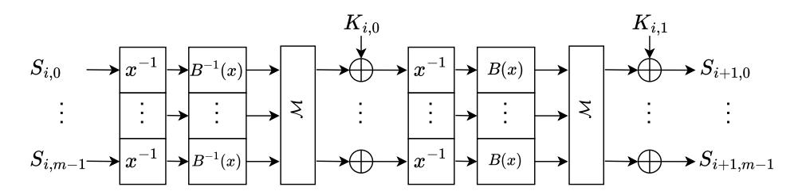
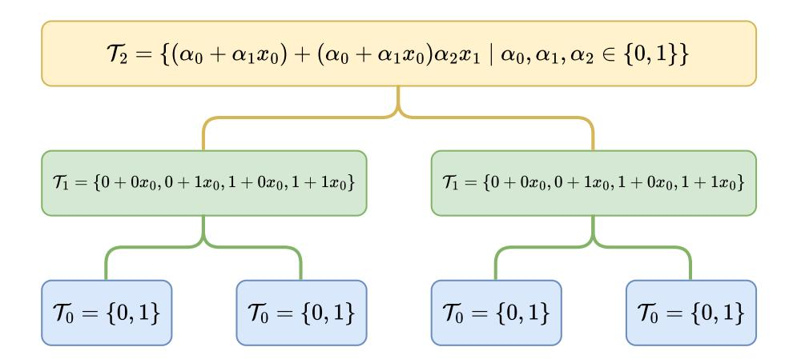
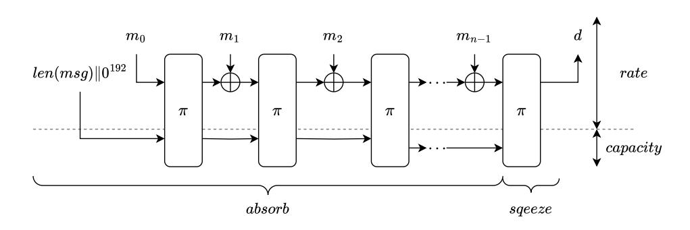

# **Vision Mark-32: ZK-Friendly Hash Function Over Binary Tower Fields**

Tomer Ashur<sup>1</sup> , Mohammad Mahzoun<sup>2</sup> , Jim Posen<sup>3</sup> , Danilo Šijačić<sup>3</sup>

1 3MI Labs, Leuven, Belgium [tomer@3milabs.tech](mailto:tomer@3milabs.tech) <sup>2</sup> Eindhoven University of Technology, Eindhoven, Netherlands [mail@mahzoun.me](mailto:mail@mahzoun.me) 3 Irreducible. [{dsijacic,jimpo}@irreducible.com](mailto:{dsijacic,jimpo}@irreducible.com)

**Abstract.** Zero-knowledge proof systems are widely used in various online applications. Among these, Zero-Knowledge Succinct Non-Interactive Argument of Knowledge (SNARKs) systems are popular due to their fast verification time and small proof size. The efficiency of these systems is crucial for usability, leading to the development of arithmetization-oriented ciphers. In this work, we introduce Vision Mark-32, a modified version of the Vision cipher, optimized with an efficient Maximum Distance Separable (MDS) matrix and a reduced number of rounds. We implement a fullypipelined Vision Mark-32 permutation on the Alveo U55C FPGA accelerator card, demonstrating significantly improved hardware efficiency compared to the Poseidon hash function. Our Vision Mark-32 implementation operates at 250 MHz, utilizing 398,000 Look-Up Tables (LUTs) and 104,000 Flip-Flops (FFs).

**Keywords:** Vision, SNARKs, Arithmetization-oriented Hash, Zero-Knowledge Proofs, FPGA, Hardware

# **1 Introduction**

Zero-knowledge (ZK) proof systems are the core components of various applications such as blockchains, cryptocurrencies, and web3 technologies. Among ZK proof systems, succinct non-interactive arguments of knowledge (SNARKs), are popular choices particularly due to their small proof size, fast verification, and viable scalability in blockchain protocols. As ZK systems are increasingly deployed in different applications, there is a need to enhance their efficiency. The primary computational bottleneck in ZK systems lies in the underlying hash functions they employ. Traditional hash functions (e.g., [\[26,](#page-16-0) [11\]](#page-14-0) designed over binary fields are optimized for computational efficiency. However, they have high arithmetization costs, leading to excessively large trace matrices that lead to poor performance within ZK systems.

In response, a myriad of arithmetization-oriented ciphers emerged to enhance the efficiency of hash functions and encryption within advanced cryptographic protocols, such as ZK systems, fully homomorphic encryption (FHE), and multiparty computation (MPC). Examples of arithmetization-oriented designs are [\[6,](#page-14-1) [27,](#page-16-1) [15,](#page-15-0) [1,](#page-14-2) [16,](#page-15-1) [41,](#page-17-0) [23,](#page-15-2) [34,](#page-16-2) [22,](#page-15-3) [17,](#page-15-4) [19,](#page-15-5) [33,](#page-16-3) [45\]](#page-17-1).

For hashing in ZK proof systems, the popular choices are Poseidon [\[30\]](#page-16-4), which is analyzed in various works [\[12,](#page-15-6) [37,](#page-17-2) [8,](#page-14-3) [4,](#page-14-4) [42\]](#page-17-3), Rescue [\[2\]](#page-14-5), and XHash [\[5\]](#page-14-6). The popular choices of ZK-friendly hash functions all operate over finite fields of large (≈ 2 <sup>64</sup>) prime characteristic. Diamond and Posen [\[21\]](#page-15-7) introduce Binius, a novel SNARK, designed over binary tower fields. Binary fields are widespread in cryptographic algorithms (e.g. AES [\[20\]](#page-15-8)) and are known for their computational efficiency. Since Binius operates over binary fields, the common choices for ZK-friendly hash functions are not usable. Therefore, there is a need for a ZK-hash function that operates over the binary tower fields. A natural choice for such function is Vision [2] instantiated in Sponge [10] construction.

In this paper, we specify an instance of Vision, defined over Fan-Paar tower fields [24]. We describe how to implement Vision Mark-32 in hardware efficiently. We write RTL code in SystemVerilog, and present implementation results on the Alveo U55C datacenter card.

Vision Mark-32 is a Sponge construction instantiated based on the Vision permutation with a modified number of rounds as the underlying cryptographic primitive. The result of our implementation can be found in Section 5. Our primary contribution is the introduction of Vision Mark-32, with an optimized number of rounds and efficient MDS matrix, for an efficient hashing process within SNARKs. We summarize our contributions as follows:

- Introduce Vision Mark-32: Vision Mark-32 is a sponge construction using a specific instance of Vision operating over  $\mathbb{F}_{2^{32}}$  with state size 24. The permutation used in Vision Mark-32 has fewer rounds than the original Vision design, which makes it perform better. The security arguments of Vision have been reworked for Vision Mark-32 to ensure it provides the level of security needed.
- Efficient hardware implementation of inversion using binary towers: We implement the inversion of field elements over  $\mathbb{F}_{2^m}$  efficiently using binary towers introduced in [24]. The cost of inversion is then 1.58 times that of multiplication, improving over the standard approach requiring normal 32 multiplications when using XGCD or Lagrange theorem.
- Efficient MDS matrix: We introduce an efficient MDS matrix for the linear layer of Vision Mark-32. The matrix is derived from a systematic Reed-Solomon code over an affine subspace of the binary field, and admits an efficient multiplication procedure due to the additive NTT [38].
- Efficient implementation of the linearized affine layer: The linearized affine polynomial used in Vision is of high degree and is a dense polynomial. Conversely, the linearized affine polynomial used in Vision Mark-32 requires 32 constant multiplication, 32 additions, and 32 squaring in  $\mathbb{F}_{2^{32}}$ . We use a simple and efficient approach to convert the affine linearized polynomial over  $\mathbb{F}_{2^m}$  to a binary matrix over  $\mathbb{F}_2$ , which can be seen as 32 multiplications of field elements, and 32 additions over  $\mathbb{F}_{2^{32}}$ , this significantly improves the cost of the affine layer.
- Re-evaluation of security of Vision Mark-32 against Gröbner basis attacks: In [2], the complexity of the Gröbner basis attack was argued by the infeasibility of computing the Gröbner basis in *grevlex* order. We improve the security argument by analyzing the number of solutions of the polynomial system that describes Vision and show that even if the Gröbner basis calculation in a specific weighted monomial ordering is free [42, 43, 9], still the degree of the ideal generated by the polynomial system is large enough to guarantee the security of Vision Mark-32.

**Related Work.** Arithmetization-oriented designs can be categorized by their performance in the corresponding applications.

For zero-knowledge proof systems, the performance metrics for the hash functions are Rank-One Constraint Satisfaction (R1CS) and Plonk for ZK-SNARKs, and Algebraic Intermediate Representation (AIR) for ZK-STARKs. The performance of the hash functions is then measured using characteristics of polynomial representation, such as depth, number of multiplications, etc. Therefore, to obtain a more efficient hash function and simpler polynomial representation, it is preferred to design primitives that operate over finite fields of large prime characteristics. Important ZK-friendly hash functions over prime fields are

<span id="page-2-0"></span>

Figure 1: One round of Vision with two steps.

Rescue [2], Rescue-Prime [44], RPO [7], XHash [5], ReinforcedConcrete [32], Monolith [29], Poseidon [31], Griffin [28], Anemoi [14].

In the case of fully homomorphic encryption, most arithmetization-oriented designs typically operate over binary fields. Example of designs over  $\mathbb{F}_2$  are Kreyvium [16], FLIP [41], FiLIP [40] that are for FHE with bootstrapping. LowMC [1], Rasta [23], Dasta [34], Fasta [17], Pasta [22], and Chagri [6] for BGV and BFV. Yet, all such designs are slow and unusable for efficient ZK applications.

# 2 Preliminaries

In this section, we introduce necessary definitions and theoretical background required to follow the paper.

#### 2.1 Vision

Vision [2] is a keyed permutation based on the Marvelous design strategy. Vision operates over  $\mathbb{F}_{2^n}$  and each round consists of two steps that differ only in the linearized affine polynomial. We denote the input state of the i<sup>th</sup> round by  $S_i = (s_{i,0}, \ldots, s_{i,m-1})$  where  $s_{i,j} \in \mathbb{F}_{2^n}$ . Each step in one round of Vision consists of three operations on the state:

- Inverse function:  $\pi(s_{i,j}) = s_{i,j}^{-1}$ .
- Linearized affine polynomial:  $B(s_{i,j}) = \sum_{k=0}^{n-1} \beta_j s_{i,j}^{2^k} + \beta_n$ .
- MDS matrix:  $L(S_i) = \mathcal{M} \cdot S_i$ .

The only difference between the two steps is the linearized affine polynomial. The linearized affine polynomial of the second step has the form:

$$B(x) = \beta_0 x + \beta_1 x^2 + \beta_2 x^4 + \beta_3,$$

which is a sparse polynomial. The linearized affine polynomial of the first step is  $B^{-1}$ , which is dense with a high degree. The round function of Vision is depicted in Figure 1.

#### 2.2 Weil Descent

Let q be a power of a prime number, n be a positive integer, and  $\mathcal{P} \subseteq \mathbb{F}_{q^n}[x]$ . Let  $\{\alpha_0,\ldots,\alpha_{n-1}\}$  be a basis of  $\mathbb{F}_{q^n}/\mathbb{F}_q$ , then  $X=\sum_{i=0}^{n-1}\alpha_ix_i$ . Let  $p\in\mathbb{F}_{q^n}[x]$ , define  $[p]_i\in\mathbb{F}_q[x_1,\ldots,x_n]$  by:

$$p(X) = p(\sum_{i=0}^{n-1} \alpha_i x_i) \equiv \sum_{i=0}^{n-1} \alpha_i [p]_i \mod (x_0^q - x_0, \dots, x_{n-1}^q - x_{n-1}),$$

where  $deg([p]_i) < q$  for all  $0 \le i < n$ . The system

$$\mathcal{P}' = \{ [p]_i : p \in \mathcal{P}, \ 0 \le i < n \} \cup \{ x_i^q - x_i : 0 \le i < n \}$$

is called Weil descent system of  $\mathcal{P}$ , and solutions of  $\mathcal{P}$  in  $\mathbb{F}_{q^n}$  are same as the solutions of  $\mathcal{P}'$  in  $\mathbb{F}_q$ .

### 2.3 Fake Weil Descent

Fake Weil descent system is introduced in [35] and is a powerful tool to study the hardness of solving polynomial systems. We use fake Weil descent systems to improve the efficiency of computing affine linearized polynomials. Let  $e < q^n$  be a positive integer,  $x^e \in \mathbb{F}_{q^n}[x]$ , then  $x^e$  can be written as:

$$\overline{x^e} = \prod_{i=0}^{n-1} x_i^{e_i'} \in \mathbb{F}_{q^n}[x_1, \dots, x_n],$$

in base q. Using the same approach, polynomials in  $\mathbb{F}_{q^n}[x]$  can be written as polynomials in  $\mathbb{F}_{q^n}[x_0,\ldots,x_{n-1}]$ . Let  $\mathcal{P}\subseteq\mathbb{F}_{q^n}[x]$ ,  $\mathcal{P}'\subseteq\mathbb{F}_q[x_0,\ldots,x_{n-1}]$  the Weil descent system of  $\mathcal{P}$ , and  $\mathcal{P}^f\subseteq\mathbb{F}_{q^n}[x_0,\ldots,x_{n-1}]$  the fake Weil descent system of  $\mathcal{P}$ . Then, the solutions of  $\mathcal{P}^f$  over  $\mathbb{F}_{q^n}$  is the same as the solutions of  $\mathcal{P}'$  over  $\mathbb{F}_q$  up to an isomorphism [35]. We use fake Weil descent to convert polynomial systems over  $\mathbb{F}_{2^n}$  to polynomial systems over  $\mathbb{F}_{2^n}$  to a system of polynomials over  $\mathbb{F}_{2^n}$  to a system of polynomials over  $\mathbb{F}_2$  is described in Code Listing  $1^1$ .

<span id="page-3-0"></span>Code Listing 1: Sage code for computing the fake Weil descent system of a monomial.

```
F. <a> = GF(2^n)
R = PolynomialRing(F, n, names='X')
X = R.gens()
f = sum(X[i]*a^i for i in range(n))
I = R.ideal([g^p - g for g in X])
P = sum(vector(b)*m.reduce(I) for b,m in f^t)
```

# 2.4 Binary Towers

The tower of field extensions introduced in [46], and further discussed in [18, 24, 13] is a recursive construction of fields extensions where each field extension is constructed by using an irreducible polynomial and the previous field extension. More precisely, let  $\mathcal{T}_0 = \mathbb{F}_{2^m}$ , then the binary tower is defined as:

$$\mathcal{T}_1 = \mathcal{T}_0[x_0]/F_1(x_0)$$

$$\vdots$$

$$\mathcal{T}_n = \mathcal{T}_{n-1}[x_{n-1}]/F_n(x_{n-1}),$$

where  $F_i(x_{i-1})$  is an irreducible polynomial of degree 2 in  $\mathcal{T}_{n-1}$  and  $\mathcal{T}_n$  is the finite field  $\mathcal{F}_{2^{m^{2n}}}$ . In the design of Vision Mark-32,  $\mathcal{T}_0 = \mathbb{F}_2$ , and  $F_i(x_{i-1}) = x_{i-1}^2 + x_{i-1} \cdot x_{i-2} + 1$  which was shown to be irreducible in [46]. The recursive construction of extension fields obtains the following binary field tower:

$$\mathcal{T}_0 \subset \mathcal{T}_1 \subset \ldots \subset \mathcal{T}_n$$

<span id="page-3-1"></span><sup>&</sup>lt;sup>1</sup>Code is taken from Sage online forum.

<span id="page-4-0"></span>

**Figure 2:** Recursive construction of binary towers.

where T*<sup>n</sup>* is a vector space over T<sup>0</sup> with dimension 2 *<sup>n</sup>* with respect the following lexicographic basis [\[21\]](#page-15-7):

$$\{x_0, x_1, x_0x_1, \dots, x_0x_1 \dots x_{n-1}\}.$$

Each vector *v* ∈ T*n*, of length 2 *<sup>n</sup>*, can be written as *v* = *v*<sup>0</sup> +*xn*−1*v*1. Arithmetic operations of the field T*<sup>n</sup>* can be executed more efficiently using the binary towers. An example of binary tower F<sup>2</sup> <sup>3</sup> is described in [Figure 2.](#page-4-0)

We denote the complexity of addition, constant multiplication, multiplication of field elements, and inversion over F2*m*2*<sup>n</sup>* with A*n,* C*n,*M*n*, and I*<sup>n</sup>* respectively. Then, the complexity of each operation is analyzed in [\[24\]](#page-16-5) as follows.

**Addition.** The addition of field elements is cheap regardless of whether using binary tower fields. For the case of fields with characteristic 2, the addition *v*1*, v*<sup>2</sup> ∈ T*n*, corresponds to their bitwise XOR *v*<sup>1</sup> ⊕ *v*2. The complexity of addition is A*<sup>n</sup>* = 2*<sup>n</sup>*A<sup>0</sup> where A<sup>0</sup> is the cost of addition over F2*<sup>m</sup>*.

**Multiplication by constant.** Multiplication of *v* ∈ T*<sup>n</sup>* with the constant *xn*−<sup>1</sup> can be executed in Θ(2*<sup>n</sup>*). The complexity of multiplication with constant is

$$\mathcal{C}_n = \mathcal{C}_0 + (2^n - 1)\mathcal{A}_0.$$

**Multiplication of field elements.** Multiplication of *v*<sup>1</sup> = *α*1*xn*−<sup>1</sup> + *α*<sup>0</sup> and *v*<sup>2</sup> = *β*1*xn*−<sup>1</sup> + *β*0, is done via three multiplications in T*n*−1. In general:

$$v_1 \cdot v_2 = (\alpha_0 \beta_1 + \beta_0 \alpha_1 + \alpha_1 \beta_1 x_{n-2}) x_{n-1} + \alpha_0 \beta_0 + \alpha_1 \beta_1,$$

which can be computed by [\[21\]](#page-15-7):

$$\alpha_1 \beta_1 x_{n-1}^2 + (\alpha_0 \beta_1 + \alpha_1 \beta_0) x_{n-1} + \alpha_0 \beta_0 - \alpha_1 \beta_1 (x_{n-1}^2 + x_{n-2} x_{n-1} + 1).$$

The complexity of multiplication is:

$$\mathcal{M}_n = 3^n \mathcal{M}_0 + 6(3^n - 2^n)\mathcal{A}_0 + \frac{3^n - 1}{2}(\mathcal{C}_0 - \mathcal{A}_0).$$

A similar approach to multiplication is also known as Karatsuba method [\[36\]](#page-17-9), that has complexity of O *n* log<sup>2</sup> (3) .

**Squaring.** The square of vector  $v = \alpha_1 x_{n-1} + \alpha_0$  is:

$$(\alpha_1^2 x_{n-2}) x_{n-1} + (\alpha_0^2 + \alpha_1^2).$$

The complexity of squaring a field element is:

$$S_n = 2^n S_0 + n 2^n A_0 + (2^n - 1)(C_0 - A_0).$$

**Inversion.** The inverse of a field element  $v = \alpha_1 x_{n-1} + \alpha_0$  is:

$$v^{-1} = (\alpha_1 x_{n-1} + \alpha_0)^{-1} = (\alpha_1 \Delta^{-1}) + \Delta^{-1}(\alpha_0 + \alpha_1 x_{n-2}),$$

where  $\Delta = \alpha_0(\alpha_0 + \alpha_1 x_{n-2}) + \alpha_1^2$ . Computing the inverse of an element has asymptotic complexity of  $\mathcal{O}(n^{\log_2(3)})$ . For the detailed analysis of the complexity of inversion, we refer to [24, Section IV].

# 3 Vision Mark-32

Vision Mark-32 is a hash function instantiating a Sponge construction using the Vision permutation [2]. Vision Mark-32 has 8 rounds and operates over  $\mathbb{F}_{2^{32}}$ , with state size of m=24, and capacity of c=8. The security level guaranteed by Vision Mark-32 is 128 bits. In Algorithm 1, the pseudocode of Vision Mark-32 hash function is described. M is the MDS matrix and its structure is described in Subsection 3.3, and  $C_{r,1}, C_{r,2} \in \mathbb{F}_{2^{32}}^{24}$  are round constants for  $\mathbf{r}^{th}$  round.

<span id="page-5-0"></span>Algorithm 1 Underlying permutation of Vision Mark-32 hash function with number of rounds = 8 and state size = 24.

```
Input: State S = (s_1, \ldots, s_{24}) \in \mathbb{F}_{2^{32}}^{24}
```

Output: Result of applying Vision Mark-32 permutation on S

```
1: for r = 1 to 8 do
        for i = 1 to 24 do
 2:
            S[i] = S[i]^{-1}
 3:
            S[i] = B^{-1}(S[i])
 4.
        S = M \cdot S + C_{r,1}
 5:
        for i = 1 to 24 do
 6:
           S[i] = S[i]^{-1}
 7:
            S[i] = B(S[i])
 8:
        S = M \cdot S + C_{r,2}
 9.
10: return S
```

# 3.1 Inverse Function

The inverse function is the only non-linear operation in the round function of Vision Mark-32. To efficiently implement inversion over  $\mathbb{F}_{2^{32}}$ , the construction proposed by Wiedemann [46] is used. That is, each element of  $\mathbb{F}_{2^{32}}$  is represented as  $\alpha = a + x_4b$ , where  $a, b \in \mathbb{F}_{2^{16}}$ , with the irreducible polynomial  $F(x_4) = x_4^2 + x_3x_4 + 1$ . To inverse  $\alpha$ , we compute:

$$\alpha^{-1} = b\Delta^{-1} + \Delta^{-1}(a + bx_3),$$

where  $\Delta = a(a + bx_3) + b^2$ . To compute  $\Delta^{-1}$ , we recursively compute inversion in the subfield  $\mathbb{F}_{2^{16}}$ , which itself require inversion in the subfield  $\mathbb{F}_{2^8}$ . This way, inversion is

reduced to inversion over  $\mathbb{F}_2$  which is trivial. In our implementation, the cost of the inversion operation over  $\mathbb{F}_{2^{32}}$  is 1.58 times the cost of multiplication, whereas normal inversion using XGCD requires  $\approx 32$  multiplications.

#### 3.2 **Linearized Affine Layer**

The linearized affine layer is one of the main bottlenecks of performance in hardware implementation. Mainly because of its density and large number of multiplications over the operating field,  $\mathbb{F}_{2^n}$ . A linearized affine layer over  $\mathbb{F}_{2^n}$  has the form:

$$B(x) = \sum_{k=0}^{n-1} \beta_k x^{2^k} + \beta_n.$$

The polynomial B(x) has n terms, and evaluating it directly requires n constant multiplication, n additions, and n squaring in the  $\mathbb{F}_{2^{32}}$ .

However, B(x) is an affine function over  $\mathbb{F}_2$ . To efficiently compute B(x) for any  $x \in \mathbb{F}_{2^n}$  we convert x to a binary vector  $V = (V_0, \dots, V_{n-1}) \in \mathbb{F}_2^n$  and transform the linearzied polynomial to a matrix over  $\mathbb{F}_2$ . Converting monomials of B(x) to their Weil descent system using Code Listing 1 is time-consuming and impractical. However, to compute the Weil descent system of B(x), we only need to compute the matrix  $M_1$  for the monomial  $x^2$ , using  $M_1$  we then can compute the matrix for  $x^{2^i}$  as  $M_i = M_1^i$ . The matrix representation of B(x) in  $GL_n(2)$  is:

$$M(V) = \sum_{i=0}^{n-1} \mathcal{B}_i \cdot M_i(V) + \mathcal{B}_n, \tag{1}$$

where  $\mathcal{B}$  is a matrix representing the constant multiplication. The matrix M(V) can be computed using n matrix squaring once the matrix  $M_1$  is calculated. The Sage code to convert an affine linearized polynomial to a matrix in  $GL_n(2)$  is given in Algorithm 2.

<span id="page-6-1"></span>Algorithm 2 Algorithm to compute the matrix representation of affine polynomial over  $GL_n(2)$ .

```
Input: Affine polynomial B(x) = \sum_{k=0}^{n-1} \beta_k x^{2^k} + \beta_n.
Output: Matrix M \in GL_n(2) corresponding to B
```

- 1: M[0] = Matrix of monomial x.
- 2:  $M[1] = \text{Matrix of the monomial } x^2$ .
- 3: **for** i = 2 to n 1 **do**
- $\triangleright M[i]$  is the matrix of the monomial  $x^{2^i}$ .
- $M[i] = M[i-1] \cdot M[1]$
- 5: **for** i = 0 to n 1 **do**
- $\triangleright C[i]$  is the matrix corresponding to the constant  $\beta_i$ .
- 6:  $M[i] = C[i] \cdot M[i]$ 7: **return**  $\sum_{i=0}^{n-1} M[i] + C[n]$

#### <span id="page-6-0"></span>**MDS Matrix** 3.3

In [38], a novel basis of polynomials over a finite field of characteristic 2 is introduced for efficient encoding and decoding of Reed-Solomon erasure codes. The same basis is used in Vision Mark-32 to generate the MDS matrix. We fix a binary field  $K = \mathbb{F}_{2^n}$  with  $\mathbb{F}_2$ -basis  $\langle \beta_0, \ldots, \beta_{n-1} \rangle$ . For each  $j \in \{0, \ldots, 2^n - 1\}$ , we define  $\omega_j := j_0 \cdot \beta_0 + \ldots + j_{n-1} \cdot \beta_{n-1}$ , where  $(j_0, \ldots, j_{n-1})$  are j's bits.

Writing  $U_i := \langle \beta_0, \dots, \beta_{i-1} \rangle$  for the *i*-dimensional  $\mathbb{F}_2$ -subspace generated by the first *i* basis elements, we set  $W_i(X) := \prod_{u \in U_i} (X - u)$ , a subspace polynomial of degree  $2^i$ ; its evaluation map  $W_i : K \to K$  is  $\mathbb{F}_2$ -linear.

 $\hat{W}_i(X) := \frac{\hat{W}_i(\hat{X})}{W_i(\beta_i)}$  is its normalized variant; moreover, it satisfies  $\hat{W}_i(\beta_i) = 1$ , and is also  $\mathbb{F}_2$ -linear.

Finally, for each  $j \in \{0, \dots, 2^n - 1\}$ , we set:

$$X_j(X) = \prod_{i=0}^{n-1} (\hat{W}_i(X))^{j_i},$$

where again  $(j_0, \ldots, j_{n-1})$  are j's bits. Since each  $X_j(X)$  is of degree j, the set

$$\{(X_0(X),\ldots,X_{2^n-1}(X))\}$$

yields a K-basis of K[X].

For a state size of m, U[i][j] will contain  $W_i(\beta_j)$ , for each  $i \in \{0, ..., \lceil \log m \rceil \}$  and  $j \in \{0, ..., \lceil \log m \rceil + 1 \}$ . This information alone is be enough to compute  $W_i(\omega_j)$  for each  $j \in \{0, ..., 2 \cdot \log m - 1 \}$ , using merely some additions, since the  $W_i$ s are  $\mathbb{F}_2$ -linear (in particular, additively homomorphic). In order to compute the row  $W_i(\beta_0), ..., W_i(\beta_{\lceil \log m \rceil + 1})$ , given the respective values of  $W_{i-1}$  on these points, we use the recursive identity  $W_i(X) = W_{i-1}(X) \cdot (W_{i-1}(X) + W_{i-1}(\beta_{i-1}))$ . The sage code for computing U[i][j] is described in Code Listing 2.

# Code Listing 2: Sage code for to initialize U[i][j] and normalizing it.

```
#mds_field is a binary tower.
U = [[self.mds_field.from_integer(2^j) for j in range(ceil(log(m,2)) + 1)]]
for i in range(1, ceil(log(m,2))):
    U.append([U[i - 1][j] * (U[i - 1][j] + U[i - 1][i - 1]) for j in range(ceil(log(m,2)) + 1)])

for i in range(ceil(log(m,2))):
    normalization_constant = self.mds_field.from_integer(1) / U[i][i ]

U[i] = [U[i][j] * normalization_constant for j in range(ceil(log(m,2)) + 1)]
```

The next step is to expand the matrix horizontally. W[i][j] will contain  $\hat{W}_i(\omega_j)$  for each  $i \in \{0, \dots, \lceil \log m \rceil \}$  and  $j \in \{0, \dots, 2 \cdot \log m - 1 \}$ . This can be done by only using additions, having computed the values of U[i][j]. The code for horizontal expanding is described in Code Listing 3.

#### Code Listing 3: Sage code for to horizontal expansion of the matrix.

```
W = []
for i in range(ceil(log(m,2))):
    W_i = [self.mds_field.from_integer(0)]
    for j in range(ceil(log(m,2)) + 1):
        # W_i will contain all subset sums of U[i].
        W_i += [W_i[k] + U[i][j] for k in range(1 << j)]
    W.append(W_i[: 2 * self.m])</pre>
```

To expand the matrix vertically, *X*[*j*][*i*] will contain *Xi*(*ω<sup>j</sup>* ) for each *i* ∈ {0*, . . . , m* − 1} and *j* ∈ {0*, . . . ,* 2 · log *m* − 1}. We can again compute these from the *W*ˆ *<sup>i</sup>*(*ω<sup>j</sup>* ) values using a binary expansion; now multiplying instead of adding. Indeed, this is the definition of *X<sup>i</sup>* . The sage code to vertically expand the matrix is described in [Code Listing 4.](#page-8-0)

**Code Listing 4:** Sage code for to vertical expansion of the matrix.

```
1 X = []
2 for j in range (2 * self . m ) :
3 X_j = [ self . mds_field . from_integer (1) ]
4 for i in range ( ceil ( log (m ,2) ) ) :
5 # standard binary expansion , with multiplying instead of
              adding
6 X_j += [ X_j [ k ] * W [ i ][ j ] for k in range (1 << i ) ]
7 X . append ( X_j [: self . m ])
```

Since the evaluation of a polynomial for the basis [\[38\]](#page-17-4) is a Reed–Solomon encoding, multiplication by the matrix *X* gives us that Reed–Solomon encoding in matrix form. Its rate is 1*/*2, i.e., it's the matrix that takes the novel-basis coefficients of a polynomial of degree *< m* and returns its evaluations over the domain (*ω*0*, . . . , ω*2*m*−1). We use the "row convention": encoding is multiplying a row vector on the right by a wide matrix.

We obtain a systematic version of the same code by performing row reduction echelon form (RREF) on *G*. This code differs from the one above by precomposition with a *K*-isomorphism on the message space. Indeed, RREF simply amounts to left-multiplying the *m* × 2*m* matrix by an *m* × *m* invertible matrix. The result of RREF has the identity as its left-hand half and our desired MDS matrix on the right. Indeed, one definition of an MDS matrix is simply the "nonsystematic" part of a systematic MDS code of rate 1*/*2. In other words, it's the extrapolation matrix, which takes the values of some polynomial of degree less than *m* on the set *ω*0*, . . . , ωm*−1, and returns the evaluations of the same polynomial on *ωm, . . . , ω*2*m*−1.

# **3.4 Sponge Construction**

Vision Mark-32 sponge is depicted in [Figure 3.](#page-9-0) The state of the permutation consists of *R* = 16 rate elements, followed by *C* = 8 capacity elements in F<sup>2</sup> <sup>32</sup> . If the number of field elements in the message is not a multiple of the rate, it must be padded with the smallest number of zero elements so the number of field elements in the message is the multiple of the rate. The first two capacity elements are initialized to the 64-bit little-endian unsigned integer representing the message byte-length[2](#page-8-1) . The remaining elements are initialized to zero. The first block is absorbed by overwriting 16 input rate elements with a message block. The remaining blocks are absorbed by overwriting 16 input rate elements with a message block and overwriting the 8 input capacity elements with the first 8 output rate elements of the preceding permutation. A digest is squeezed by reading the first 8 output rate elements from the final permutation.

# **4 Security of Vision Mark-32**

The security of Vision Mark-32 relies on the security of the Marvelous family [\[2\]](#page-14-5), and generic security offered by Sponge constructions. The complexity of different attacks using state-of-the-art approaches against Vision Mark-32 is described in [Table 1.](#page-9-1)

<span id="page-8-1"></span><sup>2</sup> the proof for this padding scheme using domain separation can be found in the full version.

| to ensure security against a specific attack. |                            |                           |  |  |
|-----------------------------------------------|----------------------------|---------------------------|--|--|
|                                               | Type of Attack             | Required Number of Rounds |  |  |
|                                               | Differential Cryptanalysis | 1                         |  |  |
|                                               | Linear Cryptanalysis       | 1                         |  |  |
|                                               | Higher Order Differentials | 2                         |  |  |
|                                               | Interpolation Attacks      | A                         |  |  |

<span id="page-9-1"></span>**Table 1:** Cryptanalysis Techniques, the required number of rounds shows the number of rounds to ensure security against a specific attack.

3

### <span id="page-9-2"></span>4.1 Differential Crytpanalysis

Gröbner Basis Attacks

To argue the security of Vision Mark-32 against differential cryptanalysis attacks, we use the wide trail strategy [20]. For the binary field  $\mathbb{F}_{2^{32}}$ , the differential uniformity of inverse function  $f(x) = x^{-1}$  is  $\delta = 2^{-30}$ . Since the MDS matrix activates 25 S-boxes in each round, the probability of an N-round differential is  $2^{-750N}$ , and a differential cryptanalysis attack is not feasible, even for a small number of rounds. For a more detailed analysis of the Vision family against differential attacks, we refer to [3].

# 4.2 Linear Cryptanalysis

Similar to the differential cryptanalysis in Subsection 4.1, the security against linear cryptanalysis is argued using the wide trail strategy. For the binary field  $\mathbb{F}_{2^{32}}$ , the linearity of inverse function  $f(x) = x^{-1}$  is  $\lambda = 2^{-15}$ , and the probability of N-round linear approximation is  $2^{-375N}$ . Therefore, Vision Mark-32 is safe against linear cryptanalysis. Indeed, since the operating field is large, statistical attacks are not likely to be successful in breaking the security of Vision Mark-32.

### 4.3 Interpolation Attacks

The round function of Vision Mark-32 has two mappings of high degree, the inverse function, and the affine polynomial  $B^{-1}$ . Indeed, no matter what direction the system is modeled as polynomials, either B or  $B^{-1}$  has a high degree. In [3], the upper bound for the number of rounds that can be attacked using meet-in-the-middle approach is computed as 3, and for Vision Mark-32, the same security argument works.

<span id="page-9-0"></span>

Figure 3: Vision Mark-32 sponge hash.

# **4.4 Gröbner Basis Attacks**

Arguing the security of a cryptographic primitive against Gröbner basis attacks are usually done via arguing the hardness of computing the Gröbner basis in *grevlex* order, which is believed to be the most efficient way to compute the Gröbner basis for a general system. The complexity of computing Gröbner basis in *grevlex* order is:

$$\mathcal{O}\left(\binom{n+d}{d}^{\omega}\right),$$

where *n* is the number of variables in the system, *d* is the solving degree of the system, and 2 *< ω <* 3 is the linear algebra constant. Estimating the solving degree *d* for structured systems, such as the systems describing cryptographic hash functions, is not a straightforward task. In [\[2\]](#page-14-5), the authors computed the solving degree for a toy version of Vision with small parameters and extrapolated the behavior of solving degree using linear regression. Yet, the extrapolation of solving degree is a heuristic approach and its correctness has not been proven. Recently, in [\[42,](#page-17-3) [43,](#page-17-5) [9\]](#page-14-8) the authors described an approach to computing the Gröbner basis for free in a tailored weighted term ordering and estimate the hardness of solving the system as the complexity of transforming such Gröbner basis to the *lex* ordering, in which the system is triangular and easy to solve using univariate polynomial solving and substituting the roots in the rest of the system. In this case, the complexity of transforming the basis to Gröbner basis in *lex* order is:

$$\mathcal{O}\left(nD^{\omega}\right)$$
,

where *D* is the degree of the ideal formed by the polynomial system that describes the hash function. The degree *D* of the ideal of the system represents the number of solutions to the polynomial system over the algebraic closure of the field and can be estimated using the Bézout theorem.

**Theorem 1** (Bézout Theorem)**.** *Let* F *be a field and let* F *be the algebraic closure of* F*, let f*1*, . . . , f<sup>n</sup>* ∈ F[*x*1*, . . . , xm*] *be homogeneous polynomials where degree of f<sup>i</sup> is di, the number of solutions of f*<sup>1</sup> = *. . .* = *f<sup>n</sup>* = 0*, is given by:*

$$\prod_{i=1}^{n} d_i,$$

*if the ideal* ⟨*f*1*, . . . , fn*⟩ *is zero-dimensional.*

The asymptotic complexity of converting a Gröbner basis to lexicographic (lex) monomial order using sparse FGLM algorithm is [\[25\]](#page-16-11):

$$O\left(\sqrt{\frac{6}{n\pi}}D^{2+\frac{n-1}{n}}\right). \tag{2}$$

**Complexity of Step 3:** When the ideal is zero-dimensional, the Gröbner basis in lexicographic order is structured according to the shape lemma. This structure includes a unique univariate polynomial that can be factored and used to solve the entire system iteratively. Once the unique univariate polynomial is factored, it provides a partial solution to the system. By iteratively substituting these partial solutions into other polynomials and similarly factoring them, a complete solution is obtained. To solve a univariate polynomial system of degree *D* over the finite field F*p*, the Cantor/Zassenhaus algorithm can be used. This algorithm has a complexity of:

$$O(D^2(\log D \log \log D)(\log p + \log D)).$$

#### **4.4.1 Determined System**

The first approach is to model the Vision Mark-32 as a determined system of polynomials as described in [\[2\]](#page-14-5). Each round can be described as [\[3\]](#page-14-10):

$$S_{2r-2}[j] \cdot B\left(\sum_{k=1}^{24} M^{-1}[j,k] \left(S_{2r-1}[k] - C_{r,1}\right)\right) - 1 = 0$$

$$\left(S_{2r-1}[j]\right)^4 \cdot B\left(S_{2r-1}[j]^{-1}\right) - \left(S_{2r-1}[j]\right)^4 \left(\sum_{k=1}^{24} M^{-1}[j,k] \left(S_{2r}[k] - C_{r,2}\right)\right) - 1 = 0,$$

where 1 ≤ *j* ≤ 24. In total, the polynomial system describing Vision Mark-32 has 384 polynomials in 384 variables, and solving degree of the polynomial system is estimated to be 1513 [\[3\]](#page-14-10). Assuming that Gröbner basis can be computed for free, the degree of the ideal of Vision for state size *m* and number of variables *n* with rate *r* and capacity *c*, can be computed as:

$$\prod_{i=1}^{2mn} d_i = 5^r c^4 + 4^r 5^c + 5^{2m(n-1)}.$$

Therefore, we re-evaluate the complexity of Gröbner basis attack against Vision Mark-32 by analyzing the number of the solutions to the system in [Table 1.](#page-9-1) In any case, the complexity of the attack is more than an exhaustive search of the input space.

# **4.4.2 Overdetermined System**

In [\[39\]](#page-17-10), a new approach to analyze the security of the instances of Vision is described. The modeling proposed in [\[39\]](#page-17-10) represents Vision as an over-determined system of polynomials. The premise is that having more equations enhances the performance of solving the system. Specifically, the model comprises 5*m* + 14*m*(*N* −1) quadratic equations in 3*m* + 6*m*(*N* −1) variables. For Vision Mark-32, this corresponds to a quadratic system of equations with 2472 equations in 1080 variables. Consequently, the degree of regularity of the system is the smallest non-positive coefficient of the Hilbert series:

$$\frac{\left(1 - X^2\right)^{2472}}{\left(1 - X\right)^{1080}},$$

which is 87, and therefore complexity of Gröbner basis attack is lower bounded by:

$$\binom{87 + 1080}{87}^2 \ge 442.$$

It is important to mention that this complexity is a lower bound for the complexity of the attack suggested in [\[39\]](#page-17-10), as the complexity is computed under the assumption that the resulting system is semi-regular. However, the system is not semi-regular, and the solving degree in reality would be higher.

# <span id="page-11-0"></span>**5 Implementation**

We implement Vision Mark-32 in SystemVerilog targeting Alveo U55C High Performance Compute Card featuring Xilinx VU47P FPGA. We aim to use a Gen4 PCIe shell with 512-bit interface running at 250 MHz.

# **5.1 Tower field arithmetic**

Tower field arithmetic is known for it's efficiency in hardware. [Table 2](#page-12-0) shows the resource cost of basic arithmetic blocks for the 32-bit binary tower. For comparison, we present the resource cost of a single-cycle 32-bit unsigned integer multiplier. Multiplication and squaring circuits require a single clock cycle, while the inversion is fully pipelined and requires 3 cycles.

<span id="page-12-0"></span>**Table 2:** Arithmetic circuit complexity implemented at 250 MHz for: multiply (MUL), square (SQR) and invert (INV) operations.

| Circuit            | LUT  | FF  | CARRY8 | Max Freq. [MHz] |
|--------------------|------|-----|--------|-----------------|
| 32-bit tower MUL   | 521  | 0   | 0      | 378             |
| 32-bit tower SQR   | 43   | 0   | 0      | 791             |
| 32-bit tower INV   | 821  | 111 | 0      | 280             |
| 32-bit integer MUL | 1107 | 0   | 96     | 192             |

We acknowledge that 32-bit integer multiplication can be implemented using 2–3 DSP48E2 units. However, as these are hard IP blocks, i.e. ASIC components within the FPGA, a more representative comparison in terms of silicon efficiency can be made this way. We allow the use of fast CARRY8 chains for carry propagation—the critical path of the integer arithmetic circuits. The single-cycle 32-bit tower multiplier is over 4 times more efficient in terms of LUT-delay product compared to its unsigned integer counterpart. Squaring is nearly free in this tower field, whereas integer squaring is approximately the same as multiplication. Tower field inversion is only 1*.*58 times more expensive than multiplication.

Lastly, integer multiplier does not include modular reduction, whereas all tower operations do so by design.

# **5.2 Vision Mark-32 permutation**

Single round of Vision Mark-32 permutation consists of 48 round constant additions, 48 tower-field inversions, 48 affine linearized polynomial evaluations and 2 MDS matrix multiplications. We implement a fully pipelined permutation round with 28 stages.

[Table 3](#page-12-1) shows total resource utilization of a single Vision Mark-32 permutation round broken down into components.

<span id="page-12-1"></span>**Table 3:** Vision Mark-32 permutation round circuit complexity, implemented at 250 MHz.

| Component                 | LUT    | FF     |
|---------------------------|--------|--------|
| Inversion                 | 40.2 k | 6.8 k  |
| Evaluate B                | 0.3 k  | 0.8 k  |
| Evaluate B−1              | 0.3 k  | 0.8 k  |
| MDS matrix multiplication | 9.2 k  | 4.6 k  |
| Total                     | 50.0 k | 13.0 k |

Sponge absorb and squeeze do not use any additional resources other than wiring.

# **5.3 Performance comparison**

Due to the large volume of data that needs to be processed in the context of ZKP throughput is the most pressing bottleneck. Therefore, fully pipelined implementations are favorable. We compare 3 fully-pipelined implementations, each capable of performing 400 M hashes per second. This limitation is dictated by the Gen4 PCIe link, capable of providing 512-bits at 250 MHz.

Table 4 compares fully-pipelined implementation of Vision Mark-32 with Grøstl-256 [26] and Poseidon [31]. The former is a SHA3 competition finalist, designed with traditional symmetric cryptography practices. The latter is an arithmetization-friendly hash function.

<span id="page-13-0"></span>**Table 4:** Performance comparison, implemented at 250 MHz. In the comparison, LUT numbers are reported by Xilinx Vivado 2022.2, the tool we use to synthesize the designs. Comparison is made in the zero-knowledge setting where the high throughput is the primary goal (due to the large amounts of data to process). The shell we use operates on 512-bit @ 250 MHz (128Gbps), and in this setting, we can always use multiple layers of LUTs per layer of FFs, therefore LUTs are the bottleneck.

| $\operatorname{Hash}$ | LUT             | $\mathbf{FF}$ | CARRY8 | DSP  | Latency | Throughput           |
|-----------------------|-----------------|---------------|--------|------|---------|----------------------|
| Grøstl                | 132 k           | 62 k          | 0      | 0    | 82      | $64\mathrm{Gbit/s}$  |
| Vision Mark-32        | $398\mathrm{k}$ | 104 k         | 0      | 0    | 112     | $128\mathrm{Gbit/s}$ |
| Poseidon              | 868 k           | 909 k         | 79 k   | 5192 | 870     | $128\mathrm{Gbit/s}$ |

LUTs are the bottleneck for both Grøstl and Vision Mark-32. Since Poseidon uses DSPs it is difficult to make a direct comparison with LUT-only designs. Assuming the 32-bit unsigned multiplier from Table 2 corresponds to 2 DSPs used to implement 32-bit multipliers we can estimate the LUT cost of the fully-pipelined Poseidon hasher to 3.74 million LUTs. Table 5 provides a comparison in terms of hardware efficiency expressed as throughput per LUT, as well as qualitative metrics.

As a SHA3 finalist Grøstl has undergone thorough scrutiny of the community and stood the test of time. Moreover, Grøstl is based on AES, the most scrutinized algorithm of all. Marvelous design strategy is based on AES design strategy too. On the other hand, Poseidon is a more novel design.

Unlike Grøstl, Poseidon was designed with efficient arithmetization in mind. However, 64-bit Goldilocks field on which Poseidon is based can be up to 64 times less efficient when dealing with 1-bit values.

Grøstl-256 is a Merkle–Damgård construction with a 512-bit compression function, and thus hashes an input of size 256 bits per compression. Both Vision Mark-32 and Poseidon are Sponge constructions with rates of 512 bits. Despite being arithmetization friendly, Vision Mark-32 is only 33% less efficient than Grøstl in terms of throughput per LUT.

<span id="page-13-1"></span>**Table 5:** Additional comparisons. Arithmetization-friendly in this context refers to the underlying finite field that the hash function operates on to be efficiently implemented for zero-knowledge applications. Poseidon is only defined over fields with prime characteristics and therefore is less arithmetization-friendly for our use case.

| Hash           | $\rm kbps/LUT$ | Arithmetization-friendly |
|----------------|----------------|--------------------------|
| Grøstl         | 485            |                          |
| Vision Mark-32 | 322            | $\checkmark\checkmark$   |
| Poseidon       | 34             | ✓                        |

# 6 Conclusion

We introduced Vision Mark-32, a hash function for zero-knowledge applications, which is a sponge construction instantiated with a modified version of Vision with an optimized number of rounds and an efficient MDS matrix. We implement Vision Mark-32 in hardware, targeting a popular data center card. We delineated the efficient implementation of each step. Furthermore, we showed the advantages of tower arithmetic introduced in [24]. Efficient binary operations, especially often prohibitively expensive inversion, open new venues for design of cryptographic primitives. In this particular instance, we attain

hardware efficiency of a fast classical algorithm, while still allowing efficient arithmetization described in [21].

# Acknowledgments

We would like to acknowledge our colleagues at Irreducible, Ben Diamond and Kabir Peshawaria, for their valuable input, optimizations to the MDS matrix, and assistance with Sage programming.

# References

- <span id="page-14-2"></span>[1] Martin R. Albrecht et al. "Ciphers for MPC and FHE". In: Advances in Cryptology – EUROCRYPT 2015. Ed. by Elisabeth Oswald and Marc Fischlin. Berlin, Heidelberg: Springer Berlin Heidelberg, 2015, pp. 430–454. ISBN: 978-3-662-46800-5.
- <span id="page-14-5"></span>[2] Abdelrahaman Aly et al. "Design of Symmetric-Key Primitives for Advanced Cryptographic Protocols". In: *IACR Trans. Symmetric Cryptol.* 2020.3 (2020), pp. 1–45. DOI: 10.13154/tosc.v2020.i3.1-45. URL: https://doi.org/10.13154/tosc.v2020.i3.1-45.
- <span id="page-14-10"></span>[3] Abdelrahaman Aly et al. "Design of Symmetric-Key Primitives for Advanced Cryptographic Protocols". In: *IACR Trans. Symmetric Cryptol.* 2020.3 (2020), pp. 1–45. DOI: 10.13154/tosc.v2020.i3.1-45. URL: https://doi.org/10.13154/tosc.v2020.i3.1-45.
- <span id="page-14-4"></span>[4] Tomer Ashur, Thomas Buschman, and Mohammad Mahzoun. Algebraic cryptanalysis of POSEIDON. Tech. rep. Under submission. 2023.
- <span id="page-14-6"></span>[5] Tomer Ashur, Al Kindi, and Mohammad Mahzoun. "XHash8 and XHash12: Efficient STARK-friendly Hash Functions". In: *IACR Cryptol. ePrint Arch.* (2023), p. 1045. URL: https://eprint.iacr.org/2023/1045.
- <span id="page-14-1"></span>[6] Tomer Ashur, Mohammad Mahzoun, and Dilara Toprakhisar. "Chaghri - A FHE-friendly Block Cipher". In: Proceedings of the 2022 ACM SIGSAC Conference on Computer and Communications Security, CCS 2022, Los Angeles, CA, USA, November 7-11, 2022. Ed. by Heng Yin et al. ACM, 2022, pp. 139–150. DOI: 10.1145/3548606.3559364. URL: https://doi.org/10.1145/3548606.3559364.
- <span id="page-14-9"></span>[7] Tomer Ashur et al. Rescue-Prime Optimized. Cryptology ePrint Archive, Paper 2022/1577. https://eprint.iacr.org/2022/1577. 2022. URL: https://eprint.iacr.org/2022/1577.
- <span id="page-14-3"></span>[8] Augustin Bariant et al. "Algebraic Attacks against Some Arithmetization-Oriented Primitives". In: IACR Transactions on Symmetric Cryptology 2022.3 (2022), 73-101. DOI: 10.46586/tosc.v2022.i3.73-101. URL: https://tosc.iacr.org/index.php/ToSC/article/view/9850.
- <span id="page-14-8"></span>[9] Augustin Bariant et al. The Algebraic Freelunch Efficient Gröbner Basis Attacks Against Arithmetization-Oriented Primitives. Cryptology ePrint Archive, Paper 2024/347. https://eprint.iacr.org/2024/347. 2024. URL: https://eprint.iacr.org/2024/347.
- <span id="page-14-7"></span>[10] Guido Bertoni et al. "On the Indifferentiability of the Sponge Construction". In:  $Advances\ in\ Cryptology-EUROCRYPT\ 2008.\ Ed.\ by\ Nigel\ Smart.\ Berlin,\ Heidelberg:\ Springer\ Berlin\ Heidelberg,\ 2008,\ pp.\ 181–197.\ ISBN:\ 978-3-540-78967-3.$
- <span id="page-14-0"></span>[11] Guido Bertoni et al. *The Keccak Reference*. Keccak Team, 2011. URL: https://keccak.team/files/Keccak-reference-3.0.pdf.

- <span id="page-15-6"></span>[12] Tim Beyne et al. "Out of Oddity – New Cryptanalytic Techniques Against Symmetric Primitives Optimized for Integrity Proof Systems". In: *Advances in Cryptology – CRYPTO 2020*. Ed. by Daniele Micciancio and Thomas Ristenpart. Cham: Springer International Publishing, 2020, pp. 299–328. ISBN: 978-3-030-56877-1.
- <span id="page-15-11"></span>[13] Ian F. Blake et al. *Applications of Finite Fields*. Ed. by Alfred J. Menezes. The Springer International Series in Engineering and Computer Science. Springer Science+Business Media, 1993.
- <span id="page-15-9"></span>[14] Clémence Bouvier et al. "New Design Techniques for Efficient Arithmetization-Oriented Hash Functions: Anemoi Permutations and Jive Compression Mode". In: Advances in Cryptology - CRYPTO 2023: 43rd Annual International Cryptology Conference, CRYPTO 2023, Santa Barbara, CA, USA, August 20-24, 2023, Proceedings, Part III. Santa Barbara, CA, USA: Springer-Verlag, 2023, 507-539. ISBN: 978-3-031-38547-6. DOI: 10.1007/978-3-031-38548-3\_17. URL: https://doi.org/10.1007/978-3-031-38548-3\_17.
- <span id="page-15-0"></span>[15] Clémence Bouvier et al. New Design Techniques for Efficient Arithmetization-Oriented Hash Functions: Anemoi Permutations and Jive Compression Mode. Cryptology ePrint Archive, Paper 2022/840. https://eprint.iacr.org/2022/840. 2022. URL: https://eprint.iacr.org/2022/840.
- <span id="page-15-1"></span>[16] Anne Canteaut et al. "Stream Ciphers: A Practical Solution for Efficient Homomorphic-Ciphertext Compression". In: *Journal of Cryptology* 31.3 (2018), pp. 885–916. ISSN: 1432-1378. DOI: 10.1007/s00145-017-9273-9. URL: https://doi.org/10.1007/s00145-017-9273-9.
- <span id="page-15-4"></span>[17] Carlos Cid, John Petter Indrøy, and Håvard Raddum. "FASTA – A Stream Cipher for Fast FHE Evaluation". In: Topics in Cryptology – CT-RSA 2022. Ed. by Steven D. Galbraith. Cham: Springer International Publishing, 2022, pp. 451–483. ISBN: 978-3-030-95312-6.
- <span id="page-15-10"></span>[18] Stephen D. Cohen. "The explicit construction of irreducible polynomials over finite fields". In: *Designs, Codes and Cryptography* 2.2 (June 1992), pp. 169–174. ISSN: 1573-7586. DOI: 10.1007/BF00124895. URL: https://doi.org/10.1007/BF00124895.
- <span id="page-15-5"></span>[19] Orel Cosseron et al. "Towards Case-Optimized Hybrid Homomorphic Encryption - Featuring the Elisabeth Stream Cipher". In: Advances in Cryptology - ASIACRYPT 2022 - 28th International Conference on the Theory and Application of Cryptology and Information Security, Taipei, Taiwan, December 5-9, 2022, Proceedings, Part III. Ed. by Shweta Agrawal and Dongdai Lin. Vol. 13793. Lecture Notes in Computer Science. Springer, 2022, pp. 32–67. DOI: 10.1007/978-3-031-22969-5\\_2. URL: https://doi.org/10.1007/978-3-031-22969-5\\_2.
- <span id="page-15-8"></span>[20] Joan Daemen and Vincent Rijmen. The design of Rijndael: AES — the Advanced Encryption Standard. Springer-Verlag, 2002, p. 238. ISBN: 3-540-42580-2.
- <span id="page-15-7"></span>[21] Benjamin E. Diamond and Jim Posen. Succinct Arguments over Towers of Binary Fields. Cryptology ePrint Archive, Paper 2023/1784. https://eprint.iacr.org/2023/1784. 2023. URL: https://eprint.iacr.org/2023/1784.
- <span id="page-15-3"></span>[22] Christoph Dobraunig et al. "Pasta: A Case for Hybrid Homomorphic Encryption". In: IACR Trans. Cryptogr. Hardw. Embed. Syst. 2023.3 (2023), pp. 30-73. DOI: 10.46586/TCHES.V2023.I3.30-73. URL: https://doi.org/10.46586/tches.v2023.i3.30-73.
- <span id="page-15-2"></span>[23] Christoph Dobraunig et al. "Rasta: A Cipher with Low ANDdepth and Few ANDs per Bit". In: *Advances in Cryptology – CRYPTO 2018*. Ed. by Hovav Shacham and Alexandra Boldyreva. Cham: Springer International Publishing, 2018, pp. 662–692. ISBN: 978-3-319-96884-1.

- <span id="page-16-5"></span>[24] J.L. Fan and C. Paar. "On efficient inversion in tower fields of characteristic two". In: *Proceedings of IEEE International Symposium on Information Theory.* 1997, pp. 20–. DOI: 10.1109/ISIT.1997.612935.
- <span id="page-16-11"></span>[25] Jean-Charles Faugère and Chenqi Mou. "Sparse FGLM algorithms". In: Journal of Symbolic Computation 80 (2017), pp. 538-569. ISSN: 0747-7171. DOI: https://doi.org/10.1016/j.jsc.2016.07.025. URL: https://www.sciencedirect.com/science/article/pii/S0747717116300700.
- <span id="page-16-0"></span>[26] Praveen Gauravaram et al. "Grøstl - a SHA-3 candidate". In: Symmetric Cryptography, 11.01. - 16.01.2009. Ed. by Helena Handschuh et al. Vol. 09031. Dagstuhl Seminar Proceedings. Schloss Dagstuhl - Leibniz-Zentrum für Informatik, Germany, 2009. URL: http://drops.dagstuhl.de/opus/volltexte/2009/1955/.
- <span id="page-16-1"></span>[27] Lorenzo Grassi et al. Horst Meets Fluid-SPN: Griffin for Zero-Knowledge Applications. Cryptology ePrint Archive, Paper 2022/403. https://eprint.iacr.org/2022/403. 2022. URL: https://eprint.iacr.org/2022/403.
- <span id="page-16-9"></span>[28] Lorenzo Grassi et al. "Horst Meets Fluid-SPN: Griffin for Zero-Knowledge Applications". In: Advances in Cryptology - CRYPTO 2023 - 43rd Annual International Cryptology Conference, CRYPTO 2023, Santa Barbara, CA, USA, August 20-24, 2023, Proceedings, Part III. Ed. by Helena Handschuh and Anna Lysyanskaya. Vol. 14083. Lecture Notes in Computer Science. Springer, 2023, pp. 573-606. DOI: 10.1007/978-3-031-38548-3\\_19. URL: https://doi.org/10.1007/978-3-031-38548-3\\_19.
- <span id="page-16-7"></span>[29] Lorenzo Grassi et al. Monolith: Circuit-Friendly Hash Functions with New Nonlinear Layers for Fast and Constant-Time Implementations. Cryptology ePrint Archive, Paper 2023/1025. https://eprint.iacr.org/2023/1025. 2023. URL: https://eprint.iacr.org/2023/1025.
- <span id="page-16-4"></span>[30] Lorenzo Grassi et al. "Poseidon: A New Hash Function for Zero-Knowledge Proof Systems". In: 30th USENIX Security Symposium, USENIX Security 2021, August 11-13, 2021. Ed. by Michael Bailey and Rachel Greenstadt. USENIX Association, 2021, pp. 519-535. URL: https://www.usenix.org/conference/usenixsecurity21/presentation/grassi.
- <span id="page-16-8"></span>[31] Lorenzo Grassi et al. "Poseidon: A New Hash Function for Zero-Knowledge Proof Systems". In: 30th USENIX Security Symposium (USENIX Security 21). USENIX Association, Aug. 2021, pp. 519-535. ISBN: 978-1-939133-24-3. URL: https://www.usenix.org/conference/usenixsecurity21/presentation/grassi.
- <span id="page-16-6"></span>[32] Lorenzo Grassi et al. "Reinforced Concrete: A Fast Hash Function for Verifiable Computation". In: Proceedings of the 2022 ACM SIGSAC Conference on Computer and Communications Security. CCS '22. Los Angeles, CA, USA: Association for Computing Machinery, 2022, 1323–1335. ISBN: 9781450394505. DOI: 10.1145/3548606.3560686. URL: https://doi.org/10.1145/3548606.3560686.
- <span id="page-16-3"></span>[33] Jincheol Ha et al. "Rubato: Noisy Ciphers for Approximate Homomorphic Encryption". In: *Advances in Cryptology – EUROCRYPT 2022*. Ed. by Orr Dunkelman and Stefan Dziembowski. Cham: Springer International Publishing, 2022, pp. 581–610. ISBN: 978-3-031-06944-4.
- <span id="page-16-2"></span>[34] Phil Hebborn and Gregor Leander. "Dasta - Alternative Linear Layer for Rasta". In: IACR Trans. Symmetric Cryptol. 2020.3 (2020), pp. 46–86. DOI: 10.13154/tosc.v2020.i3.46-86. URL: https://doi.org/10.13154/tosc.v2020.i3.46-86.
- <span id="page-16-10"></span>[35] Ming-Deh A. Huang, Michiel Kosters, and Sze Ling Yeo. "Last Fall Degree, HFE, and Weil Descent Attacks on ECDLP". In: *Advances in Cryptology – CRYPTO 2015*. Ed. by Rosario Gennaro and Matthew Robshaw. Berlin, Heidelberg: Springer Berlin Heidelberg, 2015, pp. 581–600. ISBN: 978-3-662-47989-6.

- <span id="page-17-9"></span>[36] Anatolii Karatsuba and Yu Ofman. "Multiplication of Multidigit Numbers on Automata". In: *Soviet Physics Doklady* 7 (Dec. 1962), p. 595.
- <span id="page-17-2"></span>[37] Nathan Keller and Asaf Rosemarin. "Mind the Middle Layer: The HADES Design Strategy Revisited". In: *Advances in Cryptology - EUROCRYPT 2021 - 40th Annual International Conference on the Theory and Applications of Cryptographic Techniques, Zagreb, Croatia, October 17-21, 2021, Proceedings, Part II*. Ed. by Anne Canteaut and François-Xavier Standaert. Vol. 12697. Lecture Notes in Computer Science. Springer, 2021, pp. 35–63. doi: [10.1007/978- 3- 030- 77886- 6\\\_2](https://doi.org/10.1007/978-3-030-77886-6\_2). url: [https:](https://doi.org/10.1007/978-3-030-77886-6\_2) [//doi.org/10.1007/978-3-030-77886-6\\\_2](https://doi.org/10.1007/978-3-030-77886-6\_2).
- <span id="page-17-4"></span>[38] Sian-Jheng Lin, Wei-Ho Chung, and Yunghsiang S. Han. "Novel Polynomial Basis and Its Application to Reed-Solomon Erasure Codes". In: *2014 IEEE 55th Annual Symposium on Foundations of Computer Science*. 2014, pp. 316–325. doi: [10.1109/](https://doi.org/10.1109/FOCS.2014.41) [FOCS.2014.41](https://doi.org/10.1109/FOCS.2014.41).
- <span id="page-17-10"></span>[39] Fukang Liu, Mohammad Mahzoun, and Willi Meier. *Modelling Ciphers with Overdefined Systems of Quadratic Equations: Application to Friday, Vision, RAIN and Biscuit*. Cryptology ePrint Archive, Paper 2024/786. [https://eprint.iacr.org/](https://eprint.iacr.org/2024/786) [2024/786](https://eprint.iacr.org/2024/786). 2024. url: <https://eprint.iacr.org/2024/786>.
- <span id="page-17-7"></span>[40] Pierrick Méaux et al. "Improved Filter Permutators for Efficient FHE: Better Instances and Implementations". In: *Progress in Cryptology – INDOCRYPT 2019*. Ed. by Feng Hao, Sushmita Ruj, and Sourav Sen Gupta. Cham: Springer International Publishing, 2019, pp. 68–91. isbn: 978-3-030-35423-7.
- <span id="page-17-0"></span>[41] Pierrick Méaux et al. "Towards Stream Ciphers for Efficient FHE with Low-Noise Ciphertexts". In: *Advances in Cryptology – EUROCRYPT 2016*. Ed. by Marc Fischlin and Jean-Sébastien Coron. Berlin, Heidelberg: Springer Berlin Heidelberg, 2016, pp. 311–343. isbn: 978-3-662-49890-3.
- <span id="page-17-3"></span>[42] Matthias Johann Steiner. *A Zero-Dimensional Gröbner Basis for Poseidon*. Cryptology ePrint Archive, Paper 2024/310. <https://eprint.iacr.org/2024/310>. 2024. url: <https://eprint.iacr.org/2024/310>.
- <span id="page-17-5"></span>[43] Matthias Johann Steiner. *Zero-Dimensional Gröbner Bases for Rescue-XLIX*. Cryptology ePrint Archive, Paper 2024/468. <https://eprint.iacr.org/2024/468>. 2024. url: <https://eprint.iacr.org/2024/468>.
- <span id="page-17-6"></span>[44] Alan Szepieniec, Tomer Ashur, and Siemen Dhooghe. "Rescue-Prime: a Standard Specification (SoK)". In: *IACR Cryptol. ePrint Arch.* (2020), p. 1143. url: [https:](https://eprint.iacr.org/2020/1143) [//eprint.iacr.org/2020/1143](https://eprint.iacr.org/2020/1143).
- <span id="page-17-1"></span>[45] Alan Szepieniec et al. *The Tip5 Hash Function for Recursive STARKs*. Cryptology ePrint Archive, Paper 2023/107. <https://eprint.iacr.org/2023/107>. 2023. url: <https://eprint.iacr.org/2023/107>.
- <span id="page-17-8"></span>[46] Doug Wiedemann. "An Iterated Quadratic Extension of GF (2)". In: *The Fibonacci Quarterly* 26.4 (1988), pp. 290–295.