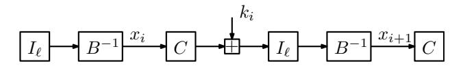
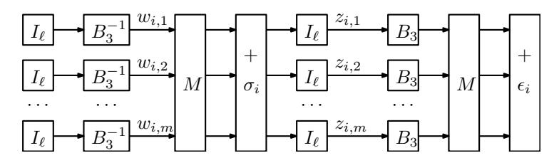
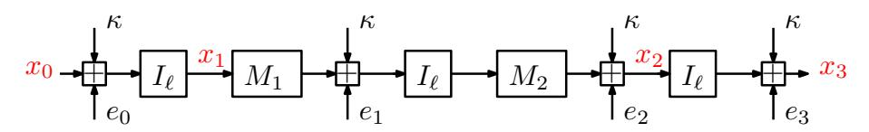
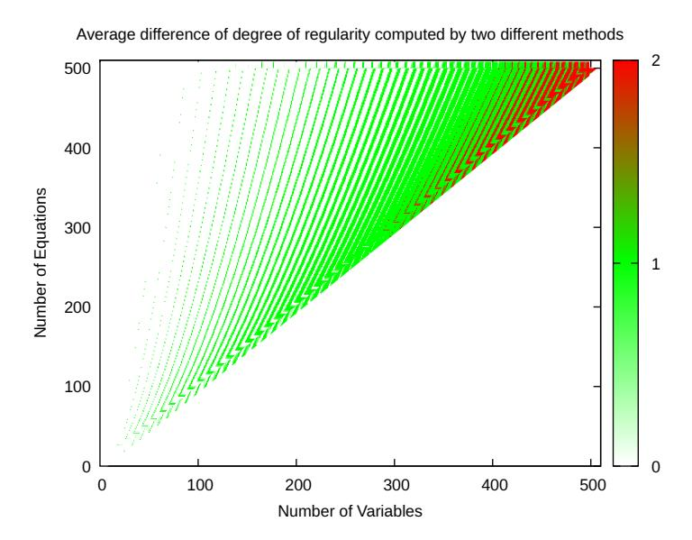

# **Modelling Ciphers with Overdefined Systems of Quadratic Equations: Application to Friday, Vision, RAIN and Biscuit**

Fukang Liu1 , Mohammad Mahzoun2 , Willi Meier3

1 Tokyo Institute of Technology, Tokyo, Japan liu.f.ad@m.titech.ac.jp 2 Eindhoven University of Technology, Netherlands mail@mahzoun.me 3 FHNW, Windisch, Switzerland willimeier48@gmail.com

**Abstract.** It is well-known that a system of equations becomes easier to solve when it is overdefined. In this work, we study how to overdefine the system of equations to describe the arithmetic oriented (AO) ciphers Friday, Vision, and RAIN, as well as a special system of quadratic equations over F2*ℓ* used in the post-quantum signature scheme Biscuit. Our method is inspired by Courtois-Pieprzyk's and Murphy-Robshaw's methods to model AES with overdefined systems of quadratic equations over F2 and F28 , respectively. However, our method is more refined and much simplified compared with Murphy-Robshaw's method, since it can take full advantage of the low-degree F2-linearized affine polynomials used in Friday and Vision, and the overdefined system of equations over F2*ℓ* can be described in a clean way with our method. For RAIN, we instead consider quadratic Boolean equations rather than equations over large finite fields F2*ℓ* . Specifically, we demonstrate that the special structure of RAIN allows us to set up much more linearly independent quadratic Boolean equations than those obtained only with Courtois-Pieprzyk's method. Moreover, we further demonstrate that the underlying key-recovery problem in Biscuit (NIST PQC Round 1 Additional Signatures) can also be described by solving a much overdefined system of quadratic equations over F2*ℓ* . On the downside, the constructed systems of quadratic equations for these ciphers cannot be viewed as semi-regular, which makes it challenging to upper bound the complexity of the Gröbner basis attack. However, such a new modelling method can significantly improve the lower bound of the complexity of the Gröbner basis attacks on these ciphers, i.e., we view the complexity of solving a random system of quadratic equations of the same scale as the lower bound. How to better estimate the upper and lower bounds of the Gröbner basis attacks on these ciphers based on our modelling method is left as an open problem.

**Keywords:** Friday, Vision, RAIN, Biscuit, overdefined system, algebraic attack, Gröbner basis

## 1 Introduction

In 2002, Courtois and Pieprzyk presented the first algebraic attack on AES in [22] by modelling it with an overdefined system of quadratic equations over  $\mathbb{F}_2$  based on their observation on the inverse function  $y = x^{-1}$  over  $\mathbb{F}_{2^\ell}$ . Subsequently at CRYPTO 2002, Murphy and Robshaw presented a similar method to model AES with an overdefined system of quadratic equations directly over  $\mathbb{F}_{2^8}$  [40]. To solve such a special system of equations, Courtois and Pieprzyk proposed the so-called XSL algorithm [22], which is a variant of the XL algorithm [21]. However, it has been pointed out in [20, 37] that the assumptions on the XSL algorithm are too optimistic, and that the claimed successful algebraic attacks on full-round AES in [22, 40] are flawed. By these results, the community seems to have reached a consensus that AES [23] is secure against algebraic attacks.

After the seminal papers [22,40], however, there seems to be no other progress on such modelling methods. A closely related technique may be Buchmann-Pyshkin-Weinmann's modelling method proposed at FSE 2006, where AES-128 could be modelled with 200 polynomial equations of degree 254 and 152 linear equations [16]. Although this method allows them to obtain the Gröbner basis under a suitable monomial ordering directly, converting the Gröbner basis into a lexicographical order or an elimination order [8] will be too costly, and hence it cannot affect the security of AES-128. As conjectured by Buchmann-Pyshkin-Weinmann, this modelling method can be applied to various iterated block ciphers especially with rich algebraic structures. This has been confirmed by some Gröbner basis attacks [3,7,35] on AO ciphers including MiMC, Griffin, Arion, Anemoi, whose degree of the nonlinear function (a power map) or its inverse is usually low.

In this work, we will instead follow Murphy-Robshaw's main idea since Buchmann-Pyshkin-Weinmann's method is too inefficient for the inverse function, i.e., its inverse is itself and it is still of extremely high degree. Our main goal is to shed new insight into ciphers with rich algebraic structures over  $\mathbb{F}_{2^{\ell}}$ . In particular, we aim to take full advantage of the used nonlinear and linear cryptographic components to improve the modelling method.

Motivation of this work. A number of AO ciphers have been proposed during these years [3,4,5,14,19,24,32,34], and some of them were also broken due to the insufficient understanding of such designs [2,11,25,38,39,43]. Almost all these successful attacks are algebraic attacks with a clever method to exploit the inner algebraic structures, while such a strategy does not usually work well for conventional block ciphers. The very first algebraic attacks on block ciphers date back to Courtois-Pieprzyk's and Murphy-Robshaw's attacks on AES by exploiting its rich algebraic structure. Unfortunately, the two attacks are flawed due to the incorrect estimation of the time complexity of the XLS algorithm. Since then, no similar attacks have been proposed for symmetric-key primitives.

Since there are some AO ciphers resembling AES, e.g., Friday [5], Vision [4] and RAIN [24], it seems important to revisit the modelling techniques to construct an overdefined system of quadratic equations describing these ciphers, and check

whether some unexpected properties have been neglected by the designers. Such a work is meaningful as these AO ciphers are less studied and any potential weakness may lead to a fatal attack in the future. Therefore, we are motivated to dive into the algebraic structures of Friday, Vision and RAIN, and see whether some neglected properties can be identified.

Although Friday has been broken in [2], the same attack cannot apply to its successor Vision. It is thus meaningful to develop a more general algebraic method that can better capture their common underlying algebraic structures, e.g., the low-degree  $\mathbb{F}_2$ -linearized affine polynomials. Studying Friday is also important to this work since it is the simplest example to explain our new modelling method, though it has been broken.

For the cipher RAIN, it is designed to be friendly to the post-quantum signature scheme Rainier [24] built upon the MPC-in-the-head technique, whose security relies on the difficulty of the key-recovery attack on RAIN from a single plaintext-ciphertext pair. In particular, RAIN has a very small number of rounds, i.e., 3 rounds are sufficient and 4 rounds can be used for higher security. Currently, the best attacks could only reach 2 rounds [39, 43], so attacking 3 or 4 rounds is on demand.

In addition to the above 3 symmetric-key primitives, we also find that the candidate Biscuit [10] in NIST PQC Round 1 Additional Signatures may be prone to our attacks, though the inverse function is not used here. Specifically, it is also built with the MPC-in-the-head technique and relies on the difficulty to solve m structured quadratic equations in n variables over  $\mathbb{F}_{2^{\ell}}$ , which is called the powAff2 problem. As a candidate in NIST PQC project, studying Biscuit is meaningful.

Our contributions. We propose a new method to overdefine the polynomial systems describing Friday, Vision, RAIN and powAff2. Solving such systems will either help find the preimage (e.g., Friday and Vision), or solve the secret key (e.g., RAIN and Biscuit). Specifically, we have the following new results:

- 1. The preimage attack on r rounds of Friday is reduced to solving 7r quadratic equations in 4r variables over  $\mathbb{F}_{2^{\ell}}$ .
- 2. The preimage attack on r rounds of Vision with  $s \geq 2$  state words is reduced to solving 5s + 14s(r-1) quadratic equations in 3s + 6s(r-1) variables over  $\mathbb{F}_{2^{\ell}}$ .
- 3. The key-recovery attack on  $r \geq 3$  rounds of RAIN is reduced to solving  $(5r+5)\ell$  quadratic Boolean equations in  $r\ell$  variables. In Gröbner basis attack, the field equation for each variable  $x \in \mathbb{F}_2$ , i.e.,  $x^2 = x$ , is also useful, and hence we indeed need to consider the problem to solve  $(6r+5)\ell$  quadratic equations in  $r\ell$  variables with Gröbner basis. Moreover, we further reveal that the problem can also be reduced to solving  $(6r+5)\ell$  quadratic equations in  $r\ell$  variables over  $\mathbb{F}_{2^\ell}$ .
- 4. The powAff2 problem with m quadratic equations in n variables over  $\mathbb{F}_{2^{\ell}}$  can be overdefined as 4m + n quadratic equations in 2n variables over  $\mathbb{F}_{2^{\ell}}$ .

However, the constructed systems of quadratic equations  $\{f_1(x_1,\ldots,x_n)=0,\ldots,f_m(x_1,\ldots,x_n)=0\}$  are not semi-regular, since there are many nontrivial syzygies, e.g., there exists a linear polynomial  $l_{i,j}(x_1,\ldots,x_n)=\sum_{i=1}^n u_ix_i$  such that  $l_{i,j}\cdot f_i=f_j$ , though both  $f_i$  and  $f_j$  are quadratic. Note that the trivial syzygies are caused by  $f_i\cdot f_j=f_j\cdot f_i$ , which can then generate many other trivial syzygies at a higher degree. Hence, the solving degree computed from the Hilbert series based on the assumption that  $\{f_1,\ldots,f_m\}$  are semi-regular is just a lower bound on the actual solving degree for solving our constructed system of equations. Intuitively speaking, there are many more rows reduced to zero as the degree of the Macaulay matrix increases (see the definition in Sect. 2) for our equation system, and hence we need to consider a higher degree compared with the case when only trivial syzygies exist.

Indeed, there has been a study [6] on the cost to compute the Gröbner basis for polynomials over  $\mathbb{F}_2$  where extra syzygies are taken in account, as detailed in Appendix B. We recommend to read it and believe that the lower bound on the solving degree is still meaningful and the difference between the actual solving degree and the one computed based on the semi-regular assumption is small for polynomial systems we study in this work. Additionally, we have experimentally verified that such lower bounds are indeed tight for small-scale equation systems, yet we cannot claim the same for higher dimensions as it lacks theoretic support. If using such lower bounds to estimate the complexity of the Gröbner basis attack, we obtain the following results:

- 1. As the first third-party analysis of Vision, we can improve the designers' attack by up to 7 rounds.
- 2. Using 3 rounds of RAIN with the 256-bit key is insecure, and we thus recommend to use 4 rounds.
- 3. All parameters of Biscuit are vulnerable to Gröbner basis attacks, and therefore they do not meet the security requirement by NIST.

Organization. We first briefly recall the Gröbner basis in Section 2, and then recall how to model AES with an overdefined system of quadratic equations over  $\mathbb{F}_2$  and  $\mathbb{F}_{2^8}$  in Section 3. Next, we present our new algebraic modelling methods for Friday, Vision and RAIN, Biscuit in Section 4, Section 5, Section 6, and Section 7, respectively, and give the corresponding analysis of the time complexity as well as the experimental simulation. Finally in Section 8, we conclude this paper by summarizing our new insight into these ciphers with our modelling method.

#### 2 Preliminaries

Let  $\mathbb{K} = \mathbb{F}_q$  be a finite field and  $\mathbb{K}[x_1, \dots, x_n]$  be a polynomial ring defined over  $\mathbb{K}$  with  $x_1, \dots, x_n$  as variables. A multivariate polynomial system is defined as  $\mathcal{F} = \{f_1(x_1, \dots, x_n), \dots, f_m(x_1, \dots, x_n)\}.$

&lt;sup>4 This is just an example. A formal definition of syzygy can be referred to Sect. 2.

Let  $\mathcal{I} = \langle f_1, \ldots, f_m \rangle$  be the ideal generated by the set of polynomials  $\{f_1, \ldots, f_m\}$ , and  $V(\mathcal{I})$  be its corresponding variety. The polynomial systems describing cryptographic primitives usually generate zero-dimensional ideals. In other words, the set of points in their corresponding variety over the algebraic closure of the field is finite. Finding the corresponding variety of an ideal is an NP-hard problem and is used as a security argument in the design of many primitives. The variety  $V(\mathcal{I})$  can be computed with the help of a special type of basis for the ideal  $\mathcal{I}$  called Gröbner basis.

**Definition 1 (Gröbner Basis [15]).** The set  $G = \{g_1, \ldots, g_t\}$  is a Gröbner basis for  $\mathcal{I} = \langle f_1, \ldots, f_m \rangle$  if and only if  $\langle G \rangle = \mathcal{I}$  and  $\langle lm(G) \rangle = \langle lm(\mathcal{I}) \rangle$  where  $\langle lm(G) \rangle$  is the ideal generated by the leading monomials of the set G.

For a monomial ordering  $\prec$  and polynomial system  $\mathcal{F}$ , the Macaulay matrix of  $\mathcal{F}$  with degree d is denoted by  $\mathcal{M}_{\prec}[d](\mathcal{F})$ . Columns of  $\mathcal{M}_{\prec}[d](\mathcal{F})$  are labeled by monomials of degree at most d, and sorted in  $\prec$ -descending order from left to right. Each row of  $\mathcal{M}_{\prec}[d](\mathcal{F})$  is labeled by a polynomial  $m_j f_i$  where  $deg(m_j) \leq d - deg(f_i)$  and  $m_j$  is a monomial in  $x_1, \ldots, x_n$ .

For example, let  $\mathcal{F} = \{f_1, f_2\} = \{x^2 + xy, 4x + 3y\}$ . Then  $\mathcal{M}_{\prec}[2](\mathcal{F})$  for degrevlex order is defined as:

$$\mathcal{M}[2](\mathcal{F}) = \begin{pmatrix} x^2 & xy & y^2 & x & y & 1\\ 1 & 1 & 0 & 0 & 0 & 0\\ 0 & 0 & 0 & 0 & 4 & 3\\ 4 & 3 & 0 & 0 & 0 & 0\\ 0 & 4 & 3 & 0 & 0 & 0 \end{pmatrix} \begin{cases} f_1\\ f_2\\ xf_2\\ yf_2 \end{cases}$$

In [36], it was shown that for a large enough d, the row-echelon form of  $\mathcal{M}_{\prec}[d](\mathcal{F})$  gives a Gröbner basis of  $\mathcal{F}$ . Later, F4 [26] and F5 [27] were published as more efficient algorithms to compute a Gröbner basis, which can efficiently avoid rows reduced to zero when computing  $\mathcal{M}_{\prec}[d](\mathcal{F})$ . Using F4/F5, the complexity of computing the Gröbner basis in *grevlex* order is as follows:

$$\mathcal{O}\left(\binom{n+D_{reg}}{D_{reg}}\right)^{\omega},\tag{1}$$

where n is the number of variables in the polynomial system,  $D_{reg}$  is the degree of regularity of the system, and  $\omega$  is the linear algebra constant for Gaussian elimination.

When the polynomial system is not defined over  $\mathbb{F}_2$ , the Gröbner basis in grevlex order must be converted to a Gröbner basis in the lex order which has triangular form and can be solved efficiently. To convert the Gröbner basis in grevlex order to lex order, the FGLM [28] algorithm is applied and its complexity is detailed as below.

**Proposition 1 (Complexity of the FGLM algorithm [9]).** Given a Gröbner basis  $G_1 \subset \mathbb{K}[x_1, \ldots, x_n]$  w.r.t. a monomial ordering  $\prec_1$  of a zero-dimensional

*system, the complexity of computing a Gröbner basis G*2 ⊂ K[*x*1*, . . . , xn*] *w.r.t. a monomial ordering* ≺2 *with FGLM is*

$$\mathcal{O}(n \cdot D^{\omega}),$$

*where D is the degree of the ideal generated by G*1*, i.e., the number of solutions counted with multiplicity in the algebraic closure of* K*.*

As commented in [\[9\]](#page-28-12), the cost of changing monomial ordering is cheaper than computing the Gröbner basis when the system has very few solutions. In our attacks, we also use the same assumption. Indeed, this is also widely used in the literature, e.g., solving the LWE problem with algebraic techniques [\[1\]](#page-27-6), algebraic attacks on cryptographic schemes like Friday [\[2\]](#page-27-4), Biscuit [\[13\]](#page-28-13), UOV [\[9,](#page-28-12) [29\]](#page-29-13), and the designers' estimation of the resistance against Gröbner basis attacks [\[4,](#page-27-2) [14,](#page-28-6) [19,](#page-28-7) [24,](#page-28-8) [32,](#page-29-3) [34\]](#page-29-4), just to name a few. The reason why the Gröbner basis attack on AES-128 [\[16\]](#page-28-4) does not fall into this category is that the constructed polynomials are too special, i.e., they directly form a special Gröbner basis *G*1 where each polynomial in *G*1 has a univariate leading monomial of the same degree as of the nonlinear component, which results in an extremely high degree of the ideal generated by this *G*1 according to Corollary 1 in [\[16\]](#page-28-4). Finally, we also mention that there is an improved variant of the FGLM algorithm called the sparse FGLM algorithm [\[28\]](#page-29-12) with complexity O(*D*(*N*1 + *n* log *D*)) where *N*1 is the number of non-zero elements in a sparse multiplication matrix.

After performing the FGLM algorithm, solving the triangular system to retrieve the solutions to the system is done via factoring polynomials of degree *D* defined over the finite field F*q* using the Cantor-Zassenhaus's algorithm [\[17\]](#page-28-14) with complexity [\[41\]](#page-29-14):

$$\mathcal{O}(D^2(\log_2 D \log_2 \log_2 D)(\log_2 q + \log_2 D)),$$

which is also viewed as less costly than computing the Gröbner basis in our attacks.

**Degree of regularity.** Computing the complexity of a Gröbner basis in [Equa](#page-4-0)[tion 1](#page-4-0) is difficult in general because computing the degree of regularity *Dreg* is challenging. The complexity of computing a Gröbner basis is upper bounded by the *solving degree* of the system, which we denote by *Dsol*. The solving degree of a polynomial system is the smallest integer *d*, such that a row-reduced echelon form of M[*d*](F) results in a Gröbner basis for F. Unfortunately, computing *Dsol* without computing the Gröbner basis itself is a hard task. However, if the polynomial system F is semi-regular[5](#page-5-0) , i.e., *m* ≥ *n*, *Dreg* can be upper bounded by the index of the first non-positive coefficient in the Hilbert series *Sm,n*(*z*) [\[6,](#page-27-5) [31\]](#page-29-15):

$$S_{m,n}(z) = \frac{\prod_{i=1}^{m} (1 - z^{\deg(f_i)})}{(1 - z)^n},$$
(2)

5 It is conjectured that this holds for most cases [\[30\]](#page-29-16).

where  $\deg(f_i)$  denotes the degree of the polynomial  $f_i$ . However, as far as we know, no polynomial system can be proved to be semi-regular in Gröbner basis attacks on cryptographic primitives. It is mostly conjectured that the system is semi-regular and then experiments are run on small-scale ciphers in order to compare the theoretic solving degree derived from the Hilbert series and the actual solving degree.

Although we could also rely on a similar conjecture, this may not hold for our constructed polynomial system. To understand this, it is necessary to introduce the concept called syzygy. A syzygy on  $\mathcal{F}$  is an m-tuple  $(g_1, \ldots, g_m) \in \mathbb{K}^m[x_1, \ldots, x_n]$  such that

$$g_1f_1+\ldots+g_mf_m=0.$$

When constructing the Macaulay matrix using the naive method, i.e., multiplying all monomials  $m_j$  of degree smaller than  $d - deg(f_i)$  with  $f_i$ , there will be many syzygies generated, i.e., many rows will be reduced to 0. If the syzygies are mainly caused by the trivial ones6  $f_i \cdot f_j = f_j \cdot f_i$ , we can use the Hilbert series to upper bound the solving degree. However, if there are many non-trivial syzygies on  $\mathcal{F}$ , for the same degree d, much more rows of  $\mathcal{M}_{\prec}[d](\mathcal{F})$  will be reduced to zero, and hence we may need to use a larger d. Hence, we conjecture that for our constructed polynomial system, the solving degree is lower bounded by the index of the first non-positive coefficient in the Hilbert series  $S_{m,n}(z)$ . The reader can also refer to Appendix B to better understand the above statement.

On the algebra constant  $\omega$ . In the context of Gröbner basis attacks using F4/F5, due to the sparsity of the Macaulay matrix, some practical experiments in the literature suggest that using  $\omega=2$  to estimate the time complexity is realistic, e.g., the Gröbner basis attacks on UOV [9] and Friday [2]. Our experiments for Friday, Vision and RAIN also support  $\omega=2$ . Moreover, it is also common for designers to choose  $\omega=2$  to estimate the resistance against the Gröbner basis attack [4,14,19,24,32,34].

# 3 Overdefined Systems of Quadratic Equations for AES

Denote the polynomial basis of the finite field  $\mathbb{F}_{2^{\ell}}$  by  $\{1, t, t^2, \dots, t^{\ell-1}\}$ . Then, each element  $z \in \mathbb{F}_{2^{\ell}}$  can be written as  $z = \sum_{i=0}^{\ell-1} \mathbf{z}_i t^i$  where  $(\mathbf{z}_0, \dots, \mathbf{z}_{\ell-1}) \in \mathbb{F}_2^{\ell}$ . In this way, it is sufficient to only use  $\overrightarrow{z} = (\mathbf{z}_0, \dots, \mathbf{z}_{\ell-1}) \in \mathbb{F}_2^{\ell}$  to represent the element z in the field  $\mathbb{F}_{2^{\ell}}$ .

In the polynomial ring  $\mathbb{F}_{2^{\ell}}[x]$ , the following polynomial denoted by  $B_{\ell}(x)$  is called an  $\mathbb{F}_2$ -linearized affine polynomial:

$$B_{\ell}(x) = \lambda_0 + \sum_{i=0}^{\ell-1} \lambda_{i+1} x^{2^i}.$$
 (3)

&lt;sup>6 At a higher degree, i.e., as d of  $\mathcal{M}_{\prec}[d](\mathcal{F})$  increases, we then have many other trivial syzygies caused by  $p \cdot f_i \cdot f_j = p \cdot f_j \cdot f_i$  for  $\forall p \in \mathbb{K}[x_1, \dots, x_n]$ .

In particular, it corresponds to an affine transform on  $\overrightarrow{x}$ . It is clear that this univariate polynomial is uniquely represented by its coefficients  $(\lambda_0, \ldots, \lambda_\ell) \in \mathbb{F}_{2^\ell}^{\ell+1}$ . Especially, when it is invertible, we can find its inverse denoted by  $B_\ell^{-1}(x)$ , which is also of the form:

$$B_{\ell}^{-1}(x) = \lambda_0' + \sum_{i=0}^{\ell-1} \lambda_{i+1}' x^{2^i}.$$
 (4)

As the inverse function  $y = x^{-1}$  over  $\mathbb{F}_{2^{\ell}}$  cannot take 0 as the input, it is common to use it to construct an S-box denoted by  $I_{\ell}(x)$  in the following way:

$$I_{\ell}(x) = \begin{cases} x^{-1}, & \text{for } x \neq 0, \\ 0, & \text{for } x = 0. \end{cases}$$
 (5)

For convenience, we use % to denote the modular operation, and use  $[i_0, i_1]$  to denote the set of integers i satisfying  $i_0 \le i \le i_1$  throughout this paper.

#### 3.1 The AES Round Function

We will not give the full description of the AES algorithm [23] here. Instead, we only focus on its round function, as it is more relevant to the algebraic modelling methods in [22, 40].

The AES state is a vector of 16 words in  $\mathbb{F}_{2^8}$  and the used irreducible polynomial for  $\mathbb{F}_{2^8}[x]$  is  $x^8+x^4+x^3+x+1$ . For simplicity, denote the AES state by  $(a_0,\ldots,a_{15})\in\mathbb{F}_{2^8}^{16}$ , and denote its binary representation by  $(\overrightarrow{a_0},\ldots,\overrightarrow{a_{15}})\in\mathbb{F}_2^{128}$ . The round function denoted by  $R_A$  can be written as

$$R_A = M_A \circ Lin_A \circ I_A(a_0, \dots, a_{15}),$$

where  $Lin_A \circ I_A$  forms the S-box layer of AES, and  $M_A$  is the affine transform layer, i.e., the composition of ShiftRows, MixColumns, round constant additions and round key additions. In particular,  $Lin_A \circ I_A(a_0, \ldots, a_{15})$  is defined as follows:

$$(I_8(a_0), \dots, I_8(a_{15})) = I_A(a_0, \dots, a_{15}),$$

 $(B_8(a_0), \dots, B_8(a_{15})) = Lin_A(a_0, \dots, a_{15}),$

where the coefficients of  $B_8(x)$ , i.e.,  $(\lambda_0, \ldots, \lambda_8)$ , satisfy  $\lambda_i \neq 0$  for  $i \in [0, 8]$ .

#### 3.2 Courtois-Pieprzyk's Algebraic Modelling Method

We first describe Courtois-Pieprzyk's method to construct an overdefined system of quadratic Boolean equations for AES. According to [22], the following 5 equations over  $\mathbb{F}_{2^{\ell}}$  hold for  $y = x^{-1}$ :

$$xy = 1$$
,  $x^2y = x$ ,  $xy^2 = y$ ,  $x^4y = x^3$ ,  $xy^4 = y^3$ .

If we consider these 5 equations over  $\mathbb{F}_{2^{\ell}}$ , their degrees are obviously 2, 3, 3, 5 and 5, respectively. However, if using the isomorphism between  $\mathbb{F}_{2^{\ell}}$  and  $\mathbb{F}_{2^{\ell}}^{\ell}$ , these 5 equations can be transformed into 5n quadratic Boolean equations in 2n Boolean variables  $(\overrightarrow{x}, \overrightarrow{y})$ . The reason is that the map  $x \mapsto x^{2^{i}}$  over  $\mathbb{F}_{2^{\ell}}$  for a positive integer i corresponds to a linear transform in the elements in  $\overrightarrow{x}$  over  $\mathbb{F}_{2}$ . In particular, it has been proved that these 5n quadratic Boolean equations are linearly independent [18].

With this observation in mind, it is then trivial to construct an overdefined system of quadratic Boolean equations to describe AES by introducing intermediate variables for all outputs of  $I_8(x)$ . Note that except  $I_8(x)$ , all the remaining operations in AES are linear (or affine).

# 3.3 Murphy-Robshaw's Algebraic Modelling Method

In Murphy-Robshaw's method, they proposed the so-called Big Encryption System (BES), where the BES state is defined by a vector of  $16 \times 8 = 128$  elements over  $\mathbb{F}_{2^8}$ . Note that the AES state is a vector of 16 elements over  $\mathbb{F}_{2^8}$ . Denote the BES state by  $(a_{0,0},\ldots,a_{0,7},a_{1,0},\ldots,a_{1,7},\ldots,a_{15,7}) \in \mathbb{F}_{2^8}^{128}$ , and there will be additional conditions7 on such an enlarged state such that it is finally equivalent to AES, as specified below:

$$\forall i \in [0, 15], \ j \in [0, 7]: \ a_{i,(j+1)\%8} = a_{i,j}^2.$$
 (6)

Or alternatively,  $\forall i \in [0, 15]$ , there are

$$(a_{i,0}, a_{i,1}, a_{i,2}, a_{i,3}, a_{i,4}, a_{i,5}, a_{i,6}, a_{i,7}) = (a_{i,0}, a_{i,0}^2, a_{i,0}^{2^2}, a_{i,0}^{2^3}, a_{i,0}^{2^4}, a_{i,0}^{2^5}, a_{i,0}^{2^7}, a_{i,0}^{2^7}).$$

The round function of BES denoted by  $R_B$  is then defined as

$$R_B = M_B \circ Lin_B \circ I_B(a_{0,0}, \dots, a_{15,7}),$$

where  $M_B$  is an affine transform in the BES state words. For  $I_B$ , it is simply defined as:

$$(I_8(a_{0,0}),\ldots,I_8(a_{15,7}))=I_A(a_{0,0},\ldots,a_{15,7}).$$

As for  $Lin_B$ , it is a bit more technical, and it is a block diagonal matrix with 16 identical blocks  $L_B$ , i.e.,  $Lin_B = Diag_{16}(L_B)$ , where

$$L_{B} = \begin{pmatrix} (\lambda_{1})^{2^{0}} & (\lambda_{2})^{2^{0}} & (\lambda_{3})^{2^{0}} & (\lambda_{4})^{2^{0}} & (\lambda_{5})^{2^{0}} & (\lambda_{6})^{2^{0}} & (\lambda_{7})^{2^{0}} & (\lambda_{8})^{2^{0}} \\ (\lambda_{8})^{2^{1}} & (\lambda_{1})^{2^{1}} & (\lambda_{2})^{2^{1}} & (\lambda_{3})^{2^{1}} & (\lambda_{4})^{2^{1}} & (\lambda_{5})^{2^{1}} & (\lambda_{6})^{2^{1}} & (\lambda_{7})^{2^{0}} \\ (\lambda_{7})^{2^{2}} & (\lambda_{8})^{2^{2}} & (\lambda_{1})^{2^{2}} & (\lambda_{2})^{2^{2}} & (\lambda_{3})^{2^{2}} & (\lambda_{4})^{2^{2}} & (\lambda_{5})^{2^{2}} & (\lambda_{6})^{2^{2}} \\ (\lambda_{6})^{2^{3}} & (\lambda_{7})^{2^{3}} & (\lambda_{8})^{2^{3}} & (\lambda_{1})^{2^{3}} & (\lambda_{2})^{2^{3}} & (\lambda_{3})^{2^{3}} & (\lambda_{4})^{2^{3}} & (\lambda_{5})^{2^{3}} \\ (\lambda_{5})^{2^{4}} & (\lambda_{6})^{2^{4}} & (\lambda_{7})^{2^{4}} & (\lambda_{8})^{2^{4}} & (\lambda_{1})^{2^{4}} & (\lambda_{2})^{2^{4}} & (\lambda_{3})^{2^{4}} & (\lambda_{4})^{2^{4}} \\ (\lambda_{4})^{2^{5}} & (\lambda_{5})^{2^{5}} & (\lambda_{6})^{2^{5}} & (\lambda_{7})^{2^{5}} & (\lambda_{8})^{2^{5}} & (\lambda_{1})^{2^{5}} & (\lambda_{2})^{2^{5}} & (\lambda_{3})^{2^{5}} \\ (\lambda_{3})^{2^{6}} & (\lambda_{4})^{2^{6}} & (\lambda_{5})^{2^{6}} & (\lambda_{6})^{2^{6}} & (\lambda_{7})^{2^{6}} & (\lambda_{8})^{2^{6}} & (\lambda_{1})^{2^{6}} & (\lambda_{2})^{2^{6}} \\ (\lambda_{2})^{2^{7}} & (\lambda_{3})^{2^{7}} & (\lambda_{4})^{2^{7}} & (\lambda_{5})^{2^{7}} & (\lambda_{6})^{2^{7}} & (\lambda_{7})^{2^{7}} & (\lambda_{8})^{2^{7}} & (\lambda_{1})^{2^{7}} \end{pmatrix}$$

 $^{7}$  Indeed, the round function of  ${\sf BES}$  is constructed in such a way that these conditions can hold.

In other words,  $Lin_B$  is also a linear transform8 in the BES state words. In this way,  $M_B \circ Lin_B$  forms an affine transform in the BES state words, and  $I_B$  is the only nonlinear operation in BES. The above can be similarly performed for the key schedule, and we omit the details as these are less relevant.

In a word, the internal states and round keys will become vectors of 128 elements in  $\mathbb{F}_{2^8}$ . Then, represent the input state of each  $I_8$  by an intermediate variable over  $\mathbb{F}_{2^8}$ . In this way, each output state of  $I_8$  is also affine in these variables. Moreover, due to the conditions specified in Equation 6 on the BES state, the input denoted by  $L_{in}$  and output denoted by  $L_{out}$  of each  $I_8$  can be expressed as linear functions of the following forms:

$$L_{in} = \alpha_{0,0} + \sum_{j=1}^{7} \sum_{i=0}^{7} \alpha_{j,i} v_{j,i}, \quad L_{out} = \alpha'_{0,0} + \sum_{j=1}^{7} \sum_{i=0}^{7} \alpha'_{j,i} v_{j,i},$$
 (8)

where  $v_{j,i}$  are those introduced intermediate variables satisfying  $v_{j,(i+1)\%8} = v_{j,i}^2$  for  $0 \le i \le 7$ , and  $(\alpha_{j,i}, \alpha'_{j,i})$  are constant coefficients.

For the inverse function  $y=x^{-1}$  over  $\mathbb{F}_{2^{\ell}}$ , according to Courtois-Pieprzyk's observation, there are

$$xy = 1$$
,  $x^2y = x$ ,  $xy^2 = y$ ,  $x^4y = x^3$ ,  $xy^4 = y^3$

which imply the following 5n quadratic equations over  $\mathbb{F}_{2^{\ell}}$  if  $x^{2^{i}}$  and  $y^{2^{i}}$  for  $0 \le i \le \ell - 1$  are renamed as independent variables  $x_i$  and  $y_i$ , respectively:

$$\begin{cases} (xy)^{2^{i}} = 1, \to x_{i}y_{i} = 1\\ (x^{2}y)^{2^{i}} = x^{2^{i}} \to x_{(i+1)\%\ell}y_{i} = x_{i},\\ (xy^{2})^{2^{i}} = y^{2^{i}} \to x_{i}y_{(i+1)\%\ell} = y_{i},, & \text{for } \forall i \in [0, \ell - 1]. \\ (x^{4}y)^{2^{i}} = (x^{3})^{2^{i}} \to x_{(i+2)\%\ell}y_{i} = x_{i}x_{(i+1)\%\ell},\\ (xy^{4})^{2^{i}} = (y^{3})^{2^{i}} \to x_{i}y_{(i+2)\%\ell} = y_{i}y_{(i+1)\%\ell}, \end{cases}$$

Compared with the Boolean case, it is much easier to observe that these 5n equations are linearly independent as each equation contains one term that never appears in other equations.

According to the expressions of the input and output of each  $I_8$  in BES shown in Equation 8, and the fact that  $(x^{2^{j_0}} + y^{2^{j_1}})^{2^i} = x^{2^{(i+j_0)\%\ell}} + y^{2^{(i+j_1)\%\ell}}$  holds over  $\mathbb{F}_{2^\ell}$  for  $\forall i, j_0, j_1 \in \mathbb{N}$ , we can set up 5n quadratic equations for each  $I_8$ , resulting in an overdefined system of quadratic equations over  $\mathbb{F}_{2^8}$  to describe BES.

Remark 1. The above explanation of BES is rather simplified. In our following new attacks on Friday and Vision, although we exploit a similar method, we never need to construct an equivalent cipher with an enlarged state, nor redefine the

&lt;sup>8 While there is a constant term  $\lambda_0$  in  $B_8(x)$  of AES, the authors do not consider it here when defining  $Lin_A$  for BES. This is because it can be moved to the definition of the affine transform  $M_B$ .

round functions. Instead, our method is much simpler and easier to understand, i.e., we will show how to construct overdefined systems of quadratic equations over  $\mathbb{F}_{2^{\ell}}$  directly based on the ciphers' original descriptions.

# 4 New Algebraic Modelling Method for Friday

In this section, we present the first application of our new modelling method inspired by Murphy-Robshaw's method. As can be observed on the application to Friday, our method is much simpler and can take full advantage of the details of  $B_{\ell}(x)$ .

# 4.1 Description of Friday

Friday [5] is a ZK-friendly hash function over  $\mathbb{F}_{2^{\ell}}$  ( $\ell \geq 128$ ) based on the Merkle-Damgård (MD) construction. The round function denoted by  $R_F$  of the underlying permutation denoted by Per(x, key) is defined as follows:

$$R_f(x) = k_i + C \circ B^{-1} \circ I_n(x),$$

where  $k_i \in \mathbb{F}_{2^{\ell}}$  is the *i*-th  $(i \ge 1)$  round key generated with the master key key, and both B(x) and C(x) are  $\mathbb{F}_2$ -linearized affine polynomials defined as below:

$$B(x) = x^4 + b_2 x^2 + b_1 x + b_0$$
,  $C(x) = x^4 + c_2 x^2 + c_1 x + c_0$ .

By the MD construction, the compression function of Friday is

$$h_{i+1} = Per(x, h_i) + x + h_i.$$

It should be mentioned that Friday was soon broken with Gröbner basis at ASIACRYPT 2019 [2], where a smart algebraic modelling method was proposed. The details can be referred to Appendix A. In a word, for r rounds of Friday where r is an even number, the preimage attack can be reduced to solving  $\frac{r}{2}$  equations of degree 36 in  $\frac{r}{2}$  variables over  $\mathbb{F}_{2^{\ell}}$ .

#### 4.2 New Algebraic Modelling Method for Friday

It is found that the efficiency of the model proposed in [2] comes from a relatively small number of variables, though the degree of equations is high. However, our new modelling method is not related to it. Instead, it is more like Murphy-Robshaw's idea for AES, but it is improved in order to exploit the low degree (or sparsity) of the  $\mathbb{F}_2$ -linearized affine polynomials B(x) and C(x). Observe that all coefficients in  $B_8(x)$  of AES are nonzero, while the  $B_\ell(x)$  used in Friday satisfies  $\lambda_i = 0$  for  $i \in [4, \ell]$ .

Let us consider the preimage attack on r rounds of Friday using a single block, i.e., the goal is to find x satisfying  $h_1 = Per(x, h_0) + x + h_0$  for a given  $(h_0, h_1)$ .

**Fig. 1:** Modelling the round function of Friday

As shown in [Figure 1,](#page-11-0) introduce the variable *xi* to denote the input of *C*(*x*) at the *i*-th round. Then, there will be

$$\forall i \in [1, r-1] : C(x_i + k_i) \cdot B(x_{i+1}) = 1,$$

$$B(x_1) \cdot (C(x_r) + k_r + h_1) = 1,$$

where the last equation is to capture the relation between the input and output of the compression function. In more details, these *r* equations are specified as follows:

$$\forall i \in [1, r - 1] : (x_i^4 + c_2 x_i^2 + c_1 x_i + c_0 + k_i)(x_{i+1}^4 + b_2 x_{i+1}^2 + b_1 x_{i+1} + b_0) = 1,$$
$$(x_1^4 + b_2 x_1^2 + b_1 x_1 + b_0)(x_r^4 + c_2 x_r^2 + c_1 x_r + c_0 + k_r + h_1) = 1.$$

As can be observed, each of them is of the following form:

$$(y^4 + c_2 y^2 + c_1 y + \beta_1)(z^4 + b_2 z^2 + b_1 z + \beta_2) = 1,$$
(10)

where *β*1*, β*2 are known constants, and *y, z* are variables over F2 *ℓ* .

**Overdefining the polynomial system.** For an equation of the form as in [Equation 10,](#page-11-1) it is feasible to set up more quadratic equations by introducing additional variables. Specifically, let us introduce variables in the following way:

$$\forall i \in [0, i_{\ell}]: \ y_i = y^{2^i}, \ z_i = z^{2^i}.$$

By definition, we have the following 2*iℓ* quadratic equations:

$$\forall i \in [0, i_{\ell} - 1]: \ y_{(i+1)\%\ell} = y_i^2, \ z_{(i+1)\%\ell} = z_i^2.$$

First, let us consider *iℓ* = 2. In this case, [Equation 10](#page-11-1) can be rewritten as

$$(y_2 + c_2y_1 + c_1y_0 + \beta_1)(z_2 + b_2z_1 + b_1z_0 + \beta_2) = 1.$$

Unfortunately, it is still a single equation and more quadratic equations cannot be generated.

However, this is not the case if *iℓ* = 3. In this case, [Equation 10](#page-11-1) is first rewritten as

$$(y_2 + c_2y_1 + c_1y_0 + \beta_1)(z_2 + b_2z_1 + b_1z_0 + \beta_2) = 1.$$

Meanwhile, due to the extra variables (*y*3*, z*3), we indeed can set up 3 additional quadratic equations:

$$(y_2 + c_2y_1 + c_1y_0 + \beta_1)^2(z_2 + b_2z_1 + b_1z_0 + \beta_2)$$

$$= (y_3 + c_2^2 y_2 + c_1^2 y_1 + \beta_1^2)(z_2 + b_2 z_1 + b_1 z_0 + \beta_2)$$

$$= (y_2 + c_2 y_1 + c_1 y_0 + \beta_1),$$

$$(y_2 + c_2 y_1 + c_1 y_0 + \beta_1)(z_2 + b_2 z_1 + b_1 z_0 + \beta_2)^2$$

$$= (y_2 + c_2 y_1 + c_1 y_0 + \beta_1)(z_3 + b_2^2 z_2 + b_1^2 z_1 + \beta_2^2)$$

$$= (z_2 + b_2 z_1 + b_1 z_0 + \beta_2),$$

$$(y_2 + c_2 y_1 + c_1 y_0 + \beta_1)^2 (z_2 + b_2 z_1 + b_1 z_0 + \beta_2)^2$$

$$= (y_3 + c_2^2 y_2 + c_1^2 y_1 + \beta_1^2)(z_3 + b_2^2 z_2 + b_1^2 z_1 + \beta_2^2)$$

$$= 1.$$

Therefore, for *r* rounds of Friday, by introducing 4*r* variables *xi,j* to represent *x* 2 *i* for *i* ∈ [1*, r*] and *j* ∈ [0*,* 3], we can set up (1 + 3)*r* = 4*r* quadratic equations in these variables according to the above method, and 3*r* quadratic equations by definition, i.e.,

$$\forall i \in [1, r], j \in [0, 2] : x_{i, (j+1)\%\ell} = x_{i, j}^2.$$

In total, *r* rounds of Friday can be modelling as 4*r* + 3*r* = 7*r* quadratic equations in 4*r* variables over F2 *ℓ* .

# **4.3 Comparison and Experiments**

Indeed, analyzing Friday is less interesting as it has been broken in [\[2\]](#page-27-4), but it is a good starting point to understand our new insight into such designs with low-degree *Bℓ*(*x*). Especially, the method in [\[2\]](#page-27-4) will no longer be feasible for Vision, while our new method can still apply, even though Vision is the successor of Friday and shares a very similar structure.

For completeness, we give a comparison between the estimated time complexity to compute Gröbner basis for the two methods, as shown in [Table 1.](#page-13-0) As already stated, the estimated time complexity for our modelling method is just a lower bound.

**Experimental verification.** To verify the complexity of our new Gröbner basis attack, we implemented it on Friday using MAGMA [\[12\]](#page-28-16) on a Linux cluster. As shown in [Table 2,](#page-13-1) as *r* increases, the practical solving degree *Dsol* is the same with *Dreg* derived from the Hilbert series, which indicates that the lower bound is indeed tight for small-scale ciphers. Moreover, the practical running time also implies that using *ω* = 2 to estimate the time complexity is reasonable.

# **5 New Algebraic Modelling Method for Vision**

After Jarvis and Friday were broken in [\[2\]](#page-27-4), another two ciphers called Vision and Rescue were proposed for the Marvellous family in [\[4\]](#page-27-2). Although Rescue

**Table 1:** Comparison between the time complexity of Gröbner basis attacks on Friday with different algebraic modelling methods, where the time complexity (# field operations in logarithm base 2) is estimated under *ω* ∈ {2*.*8*,* 2} and the complexity with *ω* = 2*.*8 is given in parenthesis.

| r                                                                                 | 6                                  | 8   | 10  | 12      | 14  | 16                | 18       | 20        |  |
|-----------------------------------------------------------------------------------|------------------------------------|-----|-----|---------|-----|-------------------|----------|-----------|--|
| The algebraic modelling method in [2]                                             |                                    |     |     |         |     |                   |          |           |  |
| #variables                                                                        | 3                                  | 4   | 5   | 6       | 7   | 8                 | 9        | 10        |  |
| #equations                                                                        | 3                                  | 4   | 5   | 6       | 7   | 8                 | 9        | 10        |  |
| Dreg                                                                              | 94                                 | 125 | 156 | 187     | 218 | 249               | 280      | 311       |  |
| Complexity 34 (48) 47 (65) 59 (83) 72 (101) 85 (118) 97 (136) 110 (154) 123 (172) |                                    |     |     |         |     |                   |          |           |  |
|                                                                                   | Our new algebraic modelling method |     |     |         |     |                   |          |           |  |
| #variables                                                                        | 24                                 | 32  | 40  | 48      | 56  | 64                | 72       | 80        |  |
| #equations                                                                        | 42                                 | 56  | 70  | 84      | 98  | 112               | 126      | 140       |  |
| Dreg                                                                              | 6                                  | 7   | 8   | 9       | 10  | 11                | 12       | 13        |  |
| Complexity 39 (54) 48 (67) 57 (80)                                                |                                    |     |     | 67 (93) |     | 76 (106) 85 (119) | 94 (131) | 103 (144) |  |

**Table 2:** Experimental verification of the Gröbner basis attack on Friday, where the complexity (# field operations in logarithm base 2) is calculated with *ω* = 2.

|   |    | Rounds (r) #variables #equations Dsol |   | Dreg |       | Time(s) Complexity |
|---|----|---------------------------------------|---|------|-------|--------------------|
| 2 | 8  | 14                                    | 3 | 4    | 0.01  | 15                 |
| 3 | 12 | 21                                    | 4 | 4    | 0.02  | 22                 |
| 4 | 16 | 28                                    | 5 | 5    | 1.88  | 29                 |
| 5 | 20 | 35                                    | 5 | 6    | 40.35 | 32                 |
| 6 | 24 | 42                                    | 6 | 6    | 3437  | 39                 |

is more popular than Vision, we only focus on Vision in this work as it is very similar to Friday, and our technique can be efficiently applied. As Vision is mainly used for constructing the ZK-friendly hash function, we will no more consider the key-recovery attack as it is less meaningful. Instead, we only consider hash functions built on Vision. We find that the designers suggest to use the sponge construction to build the hash function, and the rate of the sponge construction as well as the length of the hash value are both set as half of the state size. In the following, we will focus on the preimage attack on such hash functions built on Vision.

# **5.1 Description of the Unkeyed Vision Permutation**

It has been explicitly stated in [\[4\]](#page-27-2) that the master key will be set to zero and the corresponding generated round keys are treated as round constants when a Marvellous design is used as an unkeyed permutation. As our target is the hash function, we omit the description of the keyed Vision permutation, and only focus on the unkeyed permutation.

The round function of the unkeyed permutation Vision follows the common SPN structure. The Vision state is composed of s words  $(a_1, \ldots, a_s) \in \mathbb{F}_{2^\ell}^s$  where s > 1, which makes it different from Friday as the Friday state is simply one word over  $\mathbb{F}_{2^\ell}$ . For the round function of Vision at the i-th round, the Vision state will pass through 8 operations, as shown below:

$$a_{j} = I_{\ell}(a_{j}), \ \forall j \in [1, s]$$

$$a_{j} = B_{3}^{-1}(a_{j}), \ \forall j \in [1, s]$$

$$(a_{1}, \dots, a_{s})^{T} = M \cdot (a_{1}, \dots, a_{s})^{T},$$

$$a_{j} = a_{j} + \sigma_{i,j}, \ \forall j \in [1, s]$$

$$a_{j} = I_{\ell}(a_{j}), \ \forall j \in [1, s]$$

$$a_{j} = B_{3}(w_{j}), \ \forall j \in [1, s]$$

$$(a_{1}, \dots, a_{s})^{T} = M \cdot (a_{1}, \dots, a_{s})^{T},$$

$$a_{i} = a_{i} + \epsilon_{i,j}, \ \forall j \in [1, s],$$

where  $M = (M[i][j])_{1 \leq i,j \leq s} \in \mathbb{F}_{2^{\ell}}^{s \times s}$  is an MDS matrix,  $\sigma_i = (\sigma_{i,1}, \ldots, \sigma_{i,s}) \in \mathbb{F}_{2^{\ell}}^{s}$ ,  $\epsilon_i = (\epsilon_{i,1}, \ldots, \epsilon_{i,s}) \in \mathbb{F}_{2^{\ell}}^{s}$  are round constants, and the definitions of  $B_3(x)$  and  $I_{\ell}(x)$  can be referred to Equation 4 and Equation 5, respectively. For convenience, we denote the total number of rounds of Vision by r.

As can be observed, the round function is similar to Friday, i.e., they both use the inverse function, a degree-4  $\mathbb{F}_2$ -linear affine polynomial and its inverse. However, the state size is increased, and thus a mixing layer M is introduced. Moreover,  $I_{\ell}(x)$  is applied twice in each round. In particular, the degree-4 affine polynomial and its inverse will be applied after the second and first  $I_{\ell}(x)$  layers, respectively. Such changes make the advanced algebraic modelling method proposed in [2] infeasible, as stated in [2]. This also implies that the advanced algebraic modelling method in [2] highly relies on the special structure of Friday, and cannot work well for a more general design.

#### 5.2 Modelling Vision with a Polynomial System

Let us consider r rounds of Friday. As shown in Figure 2, at the i-th round where  $(2 \le i \le r)$ , we introduce 2s variables  $(w_{i,1}, \ldots, w_{i,s})$  and  $(z_{i,1}, \ldots, z_{i,s})$  to represent the outputs of the  $B_3^{-1}(x)$  layer and the second  $I_{\ell}(x)$  layer, respectively.

Equations from the first and second  $I_{\ell}(x)$  in the last r-1 rounds. According to the above way to introduce intermediate variables, we can derive the following s equations according to the first  $I_{\ell}(x)$  layer at the i-th round  $(2 \le i \le r)$ :

$$\forall k \in [1, s]: B_3(w_{i,k}) \cdot \left(\sum_{j=1}^s M[k][j] \cdot B_3(z_{i-1,j}) + \epsilon_{i-1,k}\right) = 1.$$
 (11)

Fig. 2: Modelling the round function of Vision

For the second  $I_{\ell}(x)$  layer at the *i*-th round  $(2 \le i \le r)$ , we similarly derive the following s equations:

$$\forall k \in [1, s]: \ z_{i,k} \cdot (\sum_{j=1}^{s} M[k][j] \cdot w_{i,j} + \sigma_{i,k}) = 1.$$
 (12)

In other words, we can set up 2s equations for each round after the 1st round. Of course, it is always assumed that the input to each  $I_{\ell}(x)$  is nonzero.

**Dealing with the first round.** Let us consider the case of the sponge construction where the rate part and truncated part are both composed of h state words. The generic preimage attack on such a sponge-based hash function has time complexity  $\min(2^{h\ell}, 2^{\frac{(s-h)\ell}{2}})$ .

For the preimage attack, we can simply skip the first  $I_{\ell}(x)$  layer and the  $B_3^{-1}(x)$  layer, and only introduce h variables  $(w_{1,1},\ldots,w_{1,h})$ . For the second  $I_{\ell}(x)$  layer, we still introduce variables  $(z_{1,1},\ldots,z_{1,s})$  to denote the output. In this way, we can set up s equations derived from the second  $I_{\ell}(x)$  layer at the 1st round.

$$\forall k \in [1, s]: \ z_{1,k} \cdot \left(\sum_{j=1}^{h} M[k][j] \cdot w_{1,j} + \sigma_{1,k} + \beta_{3,k}\right) = 1, \tag{13}$$

where  $(\beta_{3,1}, \ldots, \beta_{3,s})$  are known constants computed from the capacity part of the input.

**Equations to match the hash value.** In addition to the above equations, we will also have h equations to match the hash value denoted by  $(\iota_1, \ldots, \iota_h)$ , as shown below:

$$\forall k \in [1, h]: \sum_{j=1}^{s} M[k][j] \cdot B_3(z_{r,j}) + \epsilon_{r,k} = \iota_k.$$
 (14)

Total number of equations and variables. In total, we have introduced 2s(r-1) + h + s variables, and set up 2s(r-1) + s + h equations.

## **5.3 Overdefining the Polynomial System for Vision**

According to the above analysis, we mainly have the two forms of equations when describing the last *r* − 1 rounds of Vision with a system of equations in intermediate variables (*wi,k, zi,k, zi*−1*,k*) where 1 ≤ *k* ≤ *s*, as shown in [Equation 11](#page-14-0) and [Equation 12,](#page-15-1) respectively.

**Dealing with [Equation 11.](#page-14-0)** For [Equation 11,](#page-14-0) it can be written in the following form:

$$B_3(v_1) \cdot \left(\alpha_1 B_3(u_1) + \ldots + \alpha_s B_3(u_s) + \beta_4\right) = 1,$$
 (15)

where *v*1*, u*1*, . . . , us* are variables, and *β*4*, α*1*, . . . , αs* are known constants. Therefore, we can introduce the following intermediate variables:

$$v_{1,i} = v_1^{2^i}, \ u_{k,i} = u_k^{2^i}, \ \text{for} \ \forall k \in [1, s], i \in [0, i_\ell].$$

Let *iℓ* = 2, according to the definition of *B*3(*x*), [Equation 15](#page-16-0) can be written as

$$(\lambda_3 v_{1,2} + \lambda_2 v_{1,1} + \lambda_1 v_{1,0} + \lambda_0) \left( \sum_{j=1}^s \sum_{i=0}^2 \lambda_{j,i} u_{j,i} + \beta_5 \right) = 1,$$

where *λj , λj,i, β*5 are known constants. Similar to the case in Friday, it is impossible to overdefine this quadratic equation without increasing *iℓ*. However, in the case of Vision, we show that even with *iℓ* = 2, it is still possible to construct an overdefined polynomial system, which comes from [Equation 12.](#page-15-1)

**Dealing with [Equation 12.](#page-15-1)** Abusing notation, for [Equation 12,](#page-15-1) it can be written in the following form:

$$u_1 \cdot \left(\alpha_1 v_1 + \ldots + \alpha_s v_s + \beta_6\right) = 1,$$

where *u*1*, v*1*, . . . , vs* are variables, and *β*6*, α*1*, . . . , αs* are known constants. Hence, we also have

$$\begin{cases} u_{1} \cdot (\alpha_{1}v_{1,0} + \ldots + \alpha_{s}v_{s,0} + \beta_{6}) = 1, \\ u_{1}^{2} \cdot (\alpha_{1}v_{1,0} + \ldots + \alpha_{s}v_{s,0} + \beta_{6})^{2} = 1, \\ u_{1}^{4} \cdot (\alpha_{1}v_{1,0} + \ldots + \alpha_{s}v_{s,0} + \beta_{6})^{4} = 1, \\ u_{1}^{2} \cdot (\alpha_{1}v_{1,0} + \ldots + \alpha_{s}v_{s,0} + \beta_{6}) = u_{1}, \\ u_{1}^{4} \cdot (\alpha_{1}v_{1,0} + \ldots + \alpha_{s}v_{s,0} + \beta_{6})^{2} = u_{1}^{2}, \\ u_{1} \cdot (\alpha_{1}v_{1,0} + \ldots + \alpha_{s}v_{s,0} + \beta_{6})^{2} = \alpha_{1}v_{1,0} + \ldots + \alpha_{s}v_{s,0} + \beta_{6}, \\ u_{1}^{2} \cdot (\alpha_{1}v_{1,0} + \ldots + \alpha_{s}v_{s,0} + \beta_{6})^{4} = (\alpha_{1}v_{1,0} + \ldots + \alpha_{s}v_{s,0} + \beta_{6})^{2}, \\ u_{1}^{4} \cdot (\alpha_{1}v_{1,0} + \ldots + \alpha_{s}v_{s,0} + \beta_{6}) = u_{1}^{2} \cdot u_{1}, \\ u_{1} \cdot (\alpha_{1}v_{1,0} + \ldots + \alpha_{s}v_{s,0} + \beta_{6})^{4} = (\alpha_{1}v_{1,0} + \ldots + \alpha_{s}v_{s,0} + \beta_{6})^{2+1}. \end{cases}$$

$$(16)$$

Let us introduce the following intermediate variables:

$$u_{1,i} = u_1^{2^i}, \ v_{k,i} = v_k^{2^i}, \ \text{for} \ \forall k \in [1, s], i \in [0, 2].$$

According to

$$\forall i \in [0,2]: u_{1,i} = u_1^{2^i}, (\alpha_1 v_{1,0} + \ldots + \alpha_s v_{s,0} + \beta_6)^{2^i} = \alpha_1^{2^i} v_{1,i} + \ldots + \alpha_s^{2^i} v_{s,i} + \beta_6^{2^i}.$$

Equation 16 indeed is a system of 9 quadratic equations in the introduced intermediate variables:  $(u_{1,0}, u_{1,1}, u_{1,2}, v_{1,0}, v_{1,1}, v_{1,2}, \dots, v_{s,0}, v_{s,1}, v_{s,2})$ .

**Putting all together.** According to the above analysis, if we introduce 6s(r-1) intermediate variables  $(w_{i,k,j}, z_{i,k,j})$  as follows:

$$\forall i \in [2,r], \forall k \in [1,s], \forall j \in [0,2]: \ w_{i,k,j} = w_{i,k}^{2^j}, \ z_{i,k,j} = z_{i,k,j}^{2^j}$$

there will be (9+1)(r-1)s = 10s(r-1) quadratic equations to describe the last r-1 rounds, as well as the following 4s(r-1) quadratic equations by definition:

$$\forall i \in [2, r], \forall k \in [1, s], \forall j \in [0, 1]: \ w_{i,k,j+1} = w_{i,k,j}^2, \ z_{i,k,j+1} = z_{i,k,j}^2$$

Moreover, for the first round, we only introduce h+3s variables  $(w_{1,1},\ldots,w_{1,h})$  and  $(z_{1,1,0},\ldots,z_{1,s,2})$  where

$$\forall k \in [1, s], \forall j \in [0, 1]: \ z_{1,k,j+1} = z_{1,k,j}^2, \ z_{1,k,0} = z_{1,k},$$

i.e., by definition, there are 2s quadratic equations. Then, we can generate 3s quadratic equations in these variables from Equation 13 as follows:

$$\begin{cases}
z_{1,k} \cdot \left(\sum_{j=1}^{h} M[k][j] \cdot w_{1,j} + \sigma_{1,k} + \beta_{3,k}\right) = 1, \\
z_{1,k}^{2} \cdot \left(\sum_{j=1}^{h} M[k][j] \cdot w_{1,j} + \sigma_{1,k} + \beta_{3,k}\right) = z_{1,k}, \\
z_{1,k}^{4} \cdot \left(\sum_{j=1}^{h} M[k][j] \cdot w_{1,j} + \sigma_{1,k} + \beta_{3,k}\right) = z_{1,k}^{2} \cdot z_{1,k}.
\end{cases} (17)$$

At last, we need to consider h equations specified in Equation 14 to match the hash value, which now becomes h linear equations in the introduced variables  $(z_{r,1,0},\ldots,z_{r,s,2})$ .

Total number of quadratic equations and variables. According to the above analysis, finding the preimage of r rounds of Vision can be modelled as solving 10s(r-1)+4s(r-1)+2s+3s quadratic equations and h linear equations in 6s(r-1)+h+3s variables. This is equivalent to solving 5s+14s(r-1) quadratic equations in 3s+6s(r-1) variables.

Remark 2. It should be noted that the main reason why we could overdefine the polynomial system for Vision with only 3s+6s(r-1) variables are due to its special structure. More specifically, with these variables, we indeed cannot overdefine the equations describing the first inverse function in the round function, while it becomes feasible for the second inverse function. Hence, this may be an exploitable weakness for attackers to devise advanced attacks on Vision in the future.

# 5.4 Complexity Analysis and Experiments

Our algebraic modelling method becomes less effective if s is too large as there will be too many variables. Hence, we only focus on the small  $s=\{2,4\}$  and  $h=\frac{s}{2}$ . For this sponge construction, the generic time complexity to find the preimage is  $2^{\frac{s\ell}{2}}$ . The time complexity to compute the Gröbner basis for our modelling method is shown in Table 3. Note that the estimated complexity is still a lower bound.

New insight into the security margin of Vision. The designers of Vision choose the secure number of rounds providing l bits of security based on the following formula:

$$\max(10, 2 \times \lceil \frac{l+s+8}{8s} \rceil),$$

which provides 100% security margin. Indeed, the number  $\frac{l+s+8}{8s}$  is related to their estimation of the time complexity of the Gröbner basis attack under  $\omega = 2$ , i.e., the minimal number of rounds9 that can resist the Gröbner basis attack under  $\omega = 2$ . Note that in the hash function Rescue-Prime [42], the security margin is reduced to only 50%, though nothing was mentioned for Vision in [42].

If the lower bound is tight, we shed new insight into the security margin of Vision. For (l,s)=(128,2), we could break up to 10 rounds under the same assumption that  $\omega=2$ , while the claimed secure number of rounds is 18. For (l,s)=(256,2), we could break up to 24 rounds, while the claimed secure number of rounds is 34. In particular, for the instance with (l,s)=(256,2), if we consider only 50% security margin, the secure number of rounds will be 17+9=26, while we could attack 24 out of 26 rounds. These results have significantly advanced the understanding of the security of the Vision, and have also demonstrated the effectiveness of our new algebraic modelling method.

**Experimental verification.** Our experimental results verify the correctness of Table 3 for s=2 and  $r\in\{2,3\}$ . Note that 1 round of Vision is almost equal to 2 rounds of Friday, and hence we could only practically verify the Gröbner basis attack on up to 3 rounds of Vision due to the limitations on the computational resources. The results of the experiments are summarized in Table 4. These experimental data indicate that the estimated lower bound is tight.

&lt;sup>9 Note that there is not a matching attack as the designers also made a conjecture on the solving degree according to their experimental results.

**Table 3:** The time complexity (# field operations in logarithm base 2) of Gröbner basis attacks on Vision using  $\omega = 2$ , where those marked with "-" are less interesting as the corresponding time complexity is too high.

| s | N                               | 2  | 4   | 6        | 8         | 10        | 12        | 14        | 16        | 18        | 20        | 22        | 24  | 26        |
|---|---------------------------------|----|-----|----------|-----------|-----------|-----------|-----------|-----------|-----------|-----------|-----------|-----|-----------|
| 2 | #variables #equations $D_{reg}$ |    | 94  | 150 9 | 206 11 | 262 13 | 318 15 | 374 17 | 430 19 | 486 21 | 542 23 | 598 25 |     | 710 28 |
|   | Complexity                      | 31 | 53  | 74       | 95        | 115       | 136       | 156       | 176       | 197       | 217       | 237       | 250 | 271       |
|   | #variables                      | 36 | 84  | 132      | 180       | 228       | 276       | 324       | -         | -         | -         | _         | _   | _         |
| 4 | #equations                      | 76 | 188 | 300      | 412       | 524       | 636       | 748       | _         | _         | _         | _         | _   | _         |
|   | $D_{reg}$                       | 7  | 11  | 15       | 19        | 22        | 26        | 30        | _         | _         | _         | -         | -   | _         |
|   | Complexity                      | 50 | 93  | 134      | 175       | 208       | 249       | 289       | _         | _         | _         | –         | -   | -         |

**Table 4:** Experimental verification of the Gröbner basis attack on Vision, where the complexity (# field operations in logarithm base 2) is calculated with  $\omega = 2$ .

| Rounds (N | (s)   s   #                            | variables | #equations | $D_{sol}$ | $D_{reg}$ | Time(s)        | Complexity |
|-----------|----------------------------------------|-----------|------------|-----------|-----------|----------------|------------|
| 2 3       | $\begin{vmatrix} 2 \\ 2 \end{vmatrix}$ | 18 30  | 38 66   | 5 6       | 5 6    | 1.38 100311 | 31 42   |

## 6 Gröbner Basis Attack on 3-Round RAIN

RAIN [24] is a symmetric-key primitive proposed at ACM CCS 2022, and it is tailored to the post-quantum signature scheme called Rainier constructed with the MPC-in-the-head technique [33]. To improve the performance of Rainier, the designers made an aggressive choice of the secure number of rounds for RAIN, i.e., 3 or 4 rounds. Specifically, it is claimed that 3 rounds are sufficient to resist algebraic attacks, and 4 rounds can be used to further increase the security margin.

It should be emphasized that the security of Rainier is based on the difficulty to recover the secret key of RAIN from a single known plaintext-ciphertext pair. In this attack setting, 2 rounds of RAIN have been shown to be insecure in [39,43]. In this section, we present new attacks on 3-round RAIN with our algebraic modelling method.

Fig. 3: Illustration of 3-round RAIN

#### 6.1 Description of 3-Round RAIN

Similar to Friday, the RAIN state is simply one word over  $\mathbb{F}_{2^{\ell}}$ . As shown in Figure 3, we denote the input and output of 3-round RAIN by  $(x_0, x_3)$ . Moreover, we denote the output of the first  $I_{\ell}(x)$  and the input of the last  $I_{\ell}(x)$  by  $x_1$  and  $x_2$ , respectively. In addition, the secret key is denoted by  $\kappa \in \mathbb{F}_{2^{\ell}}$ , and the round constants are denoted by  $e_0, \ldots, e_3 \in \mathbb{F}_{2^{\ell}}$ . For the two linear transformations denoted by  $M_1(x)$  and  $M_2(x)$ , abusing notation, they are defined as follows:

$$M_1(x) = \sum_{j=0}^{\ell-1} \lambda_{1,j} x^{2^j}, \ M_2(x) = \sum_{j=0}^{\ell-1} \lambda_{2,j} x^{2^j},$$

where  $\lambda_{1,j} \neq 0, \lambda_{2,j} \neq 0$  are known constants for  $0 \leq j \leq \ell - 1$ . Hence, both  $M_1(x)$  and  $M_2(x)$  can also be viewed as multiplying a binary matrix of size  $\ell \times \ell$  with  $\vec{x}$ .

By these notations, 3-round  $\mathsf{RAIN}$  can be described with the following 3 equations:

$$\begin{cases} x_1 = I_{\ell}(x_0 + \kappa + e_0), \\ x_2 = M_2 \left( I_{\ell} ((M_1(x_1) + \kappa + e_1)) \right) + \kappa + e_2, \\ x_3 = I_{\ell}(x_2) + \kappa + e_3. \end{cases}$$

If all inputs to  $I_{\ell}(x)$  are nonzero, these 3 equations can also be rewritten as

$$\begin{cases} x_1 \cdot (x_0 + \kappa + e_0) = 1, \\ M_2^{-1}(x_2 + \kappa + e_2) \cdot (M_1(x_1) + \kappa + e_1) = 1, \\ x_2 \cdot (x_3 + \kappa + e_3) = 1, \end{cases}$$
(18)

where  $M_2^{-1}(x)$  is the inverse of  $M_2(x)$ .

#### 6.2 Direct Application of Existing Modelling Methods

A direct application of Courtois-Pieprzyk's modelling method. Using Courtois-Pieprzyk's observation on xy=1 over  $\mathbb{F}_{2^{\ell}}$ , we can directly set up in total  $3 \cdot 5\ell = 15\ell$  quadratic Boolean equations in  $3\ell$  Boolean unknowns  $(\overrightarrow{\kappa}, \overrightarrow{x_1}, \overrightarrow{x_2}) \in \mathbb{F}_2^{3\ell}$  according to Equation 18.

A direct application of Murphy-Robshaw modelling method. If we want to construct a polynomial system directly over  $\mathbb{F}_{2^{\ell}}$  as in our attacks on Friday and Vision, we can introduce the following  $3\ell$  intermediate variables:

$$\forall i \in [0, \ell - 1]: \ x_{1,i} = x_1^{2^i}, \ x_{2,j} = x_2^{2^i}, \ \kappa_i = \kappa^{2^i},$$

Then, based on Equation 9, we can set up  $3 \cdot 5\ell = 15\ell$  quadratic equations over  $\mathbb{F}_{2^{\ell}}$  according to Equation 18. In addition, there are  $3\ell$  quadratic equations over  $\mathbb{F}_{2^{\ell}}$  by definition:

$$\forall i \in [0,\ell-1]: \ x_{1,(i+1)\%\ell} = x_{1,i}^2, \ x_{2,(i+1)\%\ell} = x_{2,i}^2, \ \kappa_{(i+1)\%\ell} = \kappa_i^2.$$

Hence, we have in total  $18\ell$  quadratic equations in  $3\ell$  variables over  $\mathbb{F}_{2^{\ell}}$ .

Do we really have advantages using equations over  $\mathbb{F}_{2^{\ell}}$ ? At the first glance, there seem to be  $3\ell$  more quadratic equations if we overdefine Equation 18 directly over  $\mathbb{F}_{2^{\ell}}$ . However, in the case of Gröbner basis attack, the field equations are also useful if they are of low degree. For Courtois-Pieprzyk's method, as they are over  $\mathbb{F}_2$ , there are indeed  $3\ell$  quadratic field equations neglected, i.e., the field equation for a Boolean variable  $x \in \mathbb{F}_2$  is  $x^2 = x$ . In the case of Murphy-Robshaw's method, although the field equation  $x^{2^{\ell}} = x$  for a variable  $x \in \mathbb{F}_{2^{\ell}}$  is of high degree, it has been implicitly used. Specifically, we have implicitly used

$$x_{1,i} = x_{1,i}^{2^{\ell}} = (x_{1,i}^{2^{\ell-1}})^2 = x_{1,(\ell-1+i)\%\ell}^2 = x_{1,(i-1)\%\ell}^2,$$

$$x_{2,i} = x_{2,i}^{2^{\ell}} = (x_{2,i}^{2^{\ell-1}})^2 = x_{2,(\ell-1+i)\%\ell}^2 = x_{2,(i-1)\%\ell}^2,$$

$$\kappa_i = \kappa_i^{2^{\ell}} = (\kappa_i^{2^{\ell-1}})^2 = \kappa_{(\ell-1+i)\%\ell}^2 = \kappa_{(i-1)\%\ell}^2.$$

In other words, if we include the field equations for Courtois-Pieprzyk's method, the two constructed polynomial systems are of the same scale, i.e., the same number of variables and equations. However, one field operation over  $\mathbb{F}_{2^\ell}$  is much more expensive than that over  $\mathbb{F}_2$  for large  $\ell$ . For this perspective, it seems that using Boolean equations for RAIN is a better choice. In our experiments, we have also confirmed this.

Gröbner basis attack on 3-round RAIN. Indeed, the application of Courtois-Pieprzyk's method to RAIN has been observed by the designers of AIM, another symmetric-key primitive tailored for the post-quantum signature scheme AIMer proposed at ACM CCS 2023 [34]. By including all field equations, i.e., in total  $15\ell + 3\ell$  quadratic equations in  $3\ell$  variables, they have given the corresponding time complexity to attack different parameters of 3-round RAIN, as shown in Table 5. Note that the complexity is not necessarily accurate, as the modelling method suffers a similar problem, i.e., the polynomial system cannot be viewed as semi-regular. However, these numbers are still valuable for designers, as they could even claim the security or do comparisons under an optimistic assumption.

**Table 5:** The time complexity (# field operations in logarithm base 2) of the Gröbner basis attack on 3-round RAIN under  $\omega = 2$  given in in [34]

| $\ell$ | #variables | #equations | $D_{reg}$ | Complexity |
|--------|------------|------------|-----------|------------|
| 128    | 384        | 2304       | 14        | 169        |
| 192    | 576        | 3456       | 19        | 236        |
| 256    | 768        | 4608       | 24        | 304        |

#### 6.3 Finding More Quadratic Equations Exploiting the Structure

We still follow Courtois-Pieprzyk's method for 3-round RAIN. However, we show that  $5\ell$  quadratic Boolean equations have been completely neglected if we only

focus on equations from  $I_{\ell}(x)$ . Indeed, it will be clear that these  $5\ell$  additional equations are indeed caused by the special structure of 3-round RAIN, i.e., there is no linear transform before the first  $I_{\ell}(x)$  nor after the last  $I_{\ell}(x)$ .

Specifically, let us consider the first and last equations in Equation 18:

$$x_1 \cdot (x_0 + \kappa + e_0) = 1, \ x_2 \cdot (x_3 + \kappa + e_3) = 1.$$

It is easy to deduce the following equation only in the unknowns  $(x_1, x_2)$ :

$$\frac{1}{x_1} + x_0 + e_0 = \frac{1}{x_2} + x_3 + e_3.$$

Let

$$\theta = x_0 + e_0 + x_3 + e_3,$$

which is a known constant to attackers, and we will have

$$x_1 + x_2 + \theta x_1 x_2 = 0. \tag{19}$$

Similar to Courtois-Pieprzyk's idea, Equation 19 can be overdefined as follows:

$$\begin{cases} x_1^2 + x_1 x_2 + \theta x_1^2 x_2 = 0, \\ x_1 x_2 + x_2^2 + \theta x_1 x_2^2 = 0. \end{cases}$$
 (20)

In this way, we can obtain  $3\ell$  new quadratic Boolean equations only in  $(\overrightarrow{x_1}, \overrightarrow{x_2})$ , which have been neglected if only focusing on equations from  $I_{\ell}(x)$ .

One may observe that we do not multiply the cubic monomial  $x_1^3$  or  $x_2^3$  with  $x_1 + x_2 + \theta x_1 x_2$  as in Courtois-Pieprzyk's idea. The reason is simple. If doing so, the term  $x_1^3 x_2$  or  $x_1 x_2^3$  will appear, and the corresponding equation can only be converted into cubic Boolean equations in  $(\overrightarrow{x_1}, \overrightarrow{x_2})$ , while we only need quadratic Boolean equations. To obtain more quadratic equations, our crucial observation is that we can multiply a more complex polynomial with both sides of Equation 19 such that the terms like  $x_1^3 x_2$  or  $x_1 x_2^3$  can be eliminated. With this idea in mind, we find the following 2 new equations:

$$\begin{cases} (\theta x_1^3 + x_1^2)(x_1 + x_2 + \theta x_1 x_2) = \theta x_1^4 + \theta^2 x_1^4 x_2 + x_1^3 + x_1^2 x_2 = 0, \\ (\theta x_2^3 + x_2^2)(x_1 + x_2 + \theta x_1 x_2) = \theta x_2^4 + \theta^2 x_1 x_2^4 + x_1 x_2^2 + x_2^3 = 0. \end{cases}$$
(21)

Hence, the 2 new equations can be converted into  $2\ell$  new quadratic Boolean equations in  $(\overrightarrow{x_1}, \overrightarrow{x_2})$ .

In summary, compared with the direct application of Courtois-Pieprzyk's method, we can set up  $5\ell$  more quadratic Boolean equations. Hence, recovering the secret key  $\kappa$  from  $(x_0, x_3)$  is reduced to solving in total  $15\ell + 3\ell + 5\ell = 23\ell$  quadratic equations in  $3\ell$  variables with Gröbner basis.

Remark 3. Note that the 5 new equations in Equation 19, Equation 20, Equation 21 can be easily overdefined to  $5\ell$  quadratic equations over  $\mathbb{F}_{2^\ell}$  if we similarly introduce variables

$$\forall i \in [0,\ell-1]: \ x_{1,i} = x_1^{2^i}, \ x_{2,j} = x_2^{2^i}, \ \kappa_i = \kappa^{2^i}.$$

Specifically, for each such equation  $f(x_1, x_2) = 0$ , we can have  $f^{2^i}(x_1, x_2) = 0$  for  $i \in [0, \ell - 1]$ .

**A trivial extension to 4-round RAIN.** The 4 rounds of RAIN simply appends another linear transform *M*3(*x*) and *In*(*x*), as well as another key addition and round constant addition to 3 rounds of RAIN. Our analysis can thus be trivially applied. Specifically, there are always 5*ℓ* new quadratic Boolean equations compared with the direct usage of Courtois-Pieprzyk's method. Hence, recovering the secret key is reduced to solving 20*ℓ* + 4*ℓ* + 5*ℓ* = 29*ℓ* quadratic equations in 4*ℓ* variables with Gröbner basis.

#### **6.4 Experiments and Discussions**

For 3 rounds of RAIN, the key-recovery attack is equivalent to solving 23*ℓ* Boolean equations in 3*ℓ* Boolean variables for *ℓ* ∈ {128*,* 192*,* 256}. We have verified that these 23*ℓ* quadratic equations are linearly independent for *ℓ* ≤ 20, and hence there should be no structural linear dependency. With this polynomial system, our estimation of the time complexity of the Gröbner basis attack on 3 rounds of RAIN is shown in [Table 6.](#page-23-0) In [Table 10](#page-33-0) of Appendix [B,](#page-31-0) we also give the solving degree estimated with a different Hilbert series dedicated to Boolean polynomials [\[6\]](#page-27-5), and find that the time complexity of our attacks on 3-round RAIN remains the same. As already stated, we conjecture that it is a lower bound on the actual complexity. Based on these results, using 3 rounds for 256-bit security may be too aggressive, though the complexity 2 252 is just a lower bound. However, such a method cannot attack 4-round RAIN according to our calculations.

**Table 6:** The time complexity of Gröbner basis attacks on 3-round RAIN, where the time complexity (# field operations in logarithm base 2) is estimated under *ω* ∈ {2*.*8*,* 2} and the complexity with *ω* = 2*.*8 is given in parenthesis.

| Rounds (N) | ℓ   | #variables | #equations | Dreg | Complexity |
|------------|-----|------------|------------|------|------------|
| 3          | 128 | 384        | 2944       | 11   | 139 (195)  |
|            | 192 | 576        | 4416       | 15   | 196 (274)  |
|            | 256 | 768        | 5888       | 19   | 252 (352)  |

**Experimental verification.** To verify our estimation of the time complexity of the 3-round Gröbner basis attack using 23*ℓ* quadratic equations, we have performed experiments for *ℓ* ≤ 20, as shown in [Table 7.](#page-24-0) For comparison, we also performed the experiments for the Gröbner basis attack using only 18*ℓ* quadratic equations by excluding our newly observed 5*ℓ* quadratic equations, as shown in [Table 7.](#page-24-0) It is interesting to observe from [Table 7](#page-24-0) the following facts:

1. The actual solving degree is always the same under the same *ℓ* in the two experiments, which indicates that the performance of the actual 3-round Gröbner basis attack using 18*ℓ* and 23*ℓ* quadratic equations may be the same. A possible explanation is that the additional 5*ℓ* quadratic equations can be automatically discovered when computing the Gröbner basis of the 18*ℓ* quadratic polynomials. However, this also indicates that there will be a degree fall when computing the Gröbner basis of the 18*ℓ* quadratic equations, and the solving degree will become smaller than that derived from the Hilbert series *S*18*ℓ,*3*ℓ*(*z*) shown in [Equation 2,](#page-5-1) which will result in an over-estimation of the complexity of the attack and wrong security claims.

- 2. As *ℓ* increases, the solving degree derived from the Hilbert series *S*23*ℓ,*3*ℓ*(*z*) becomes tighter. For example, when *ℓ* = 20, we have *Dsol* = *Ddeg* = 4 for 23*ℓ* equations, while it is *Dsol* = 4 *< Dreg* = 5 for 18*ℓ* equations. In some sense, it supports the above conclusion i.e., the actual solving degree is over-estimated using only 18*ℓ* quadratic equations.
- 3. In the cases *ℓ* ∈ {13*,* 14}, it supports our claim that *Dreg* computed from the Hilbert series is a lower bound on the actual solving degree *Dsol*.

Since it is unclear when cases like *ℓ* ∈ {13*,* 14} will happen again, we cannot conclude that our estimated time complexity of the Gröbner basis attack on 3-round RAIN must be correct by using 23*ℓ* quadratic equations. However, our experiments also indicate that the time complexity must be underestimated as *ℓ* increases if only considering 18*ℓ* quadratic equations. We thus believe that the newly observed 5*ℓ* quadratic equations do help better estimate the actual solving degree, though finding a theoretic tight upper bound on the actual solving degree looks challenging.

**Table 7:** Experimental results for the Gröbner basis attack on 3-round RAIN, where we choose *ω* = 2 to estimate the time complexity (# field operations in logarithm base 2).

|  | (a) (23ℓ equations, 3ℓ variables) |  |
|--|-----------------------------------|--|
|  |                                   |  |

|  | (b) (18ℓ equations, 3ℓ variables) |  |
|--|-----------------------------------|--|
|  |                                   |  |

| ℓ  | Dreg | Dsol |        | Time(s) Complexity | ℓ  | Dreg | Dsol |        | Time(s) Complexity |
|----|------|------|--------|--------------------|----|------|------|--------|--------------------|
| 12 | 3    | 3    | 0.99   | 27                 | 12 | 4    | 3    | 1.06   | 27                 |
| 13 | 3    | 4    | 4.72   | 34                 | 13 | 4    | 4    | 5.88   | 34                 |
| 14 | 3    | 4    | 9.9    | 35                 | 14 | 4    | 4    | 10.8   | 35                 |
| 15 | 4    | 4    | 17.09  | 36                 | 15 | 4    | 4    | 18.75  | 36                 |
| 16 | 4    | 4    | 33.26  | 37                 | 16 | 4    | 4    | 34.56  | 37                 |
| 17 | 4    | 4    | 62.59  | 37                 | 17 | 4    | 4    | 64.02  | 37                 |
| 18 | 4    | 4    | 121.57 | 38                 | 18 | 4    | 4    | 125.44 | 38                 |
| 19 | 4    | 4    | 262.76 | 38                 | 19 | 4    | 4    | 640.27 | 38                 |
| 20 | 4    | 4    | 2625   | 39                 | 20 | 5    | 4    | 2911   | 45                 |

# 7 New Algebraic Modelling Method for Biscuit

Biscuit [10] is a post-quantum signature scheme proposed at ACNS 2024, and it is also one candidate in NIST PQC Round 1 Additional Signatures. Similar to Rainier and AlMer, Biscuit is built with the MPC-in-the-head technique. However, its security relies on the hardness of the so-called powAff2 problem defined below, which is a structured variant of the MQ problem.

**Definition 2 (PowAff2 Problem).** Let  $d_i, a_{i,j}, b_{i,j}, c_{i,j}$  be known elements over  $\mathbb{F}_q$  where  $i \in [1, m]$  and  $j \in [1, n]$ . Given m quadratic equations  $\{f_1(x_1, \ldots, x_n) = 0, \ldots, f_m(x_1, \ldots, x_n) = 0\}$  in n variables  $(x_1, \ldots, x_n) \in \mathbb{F}_q^n$ , where each  $f_i$  is of the following form:

$$f_i(x_1, \dots, x_n) = d_i + \sum_{j=1}^n a_{i,j} x_j + \sum_{j=1}^n b_{i,j} x_j \times \sum_{j=1}^n c_{i,j} x_j,$$

find the solution of  $(x_1, \ldots, x_n)$ .

Specifically, if the attacker can solve the powAff2 problem, the secret key of Biscuit will be recovered and Biscuit will become insecure. In particular,  $q=2^8$  is chosen in Biscuit. We should mention that  $q=2^4$  was used in its first version, but it soon got broken by a guess-and-determine (GnD) attack with time complexity  $\mathcal{O}(n^3q^{n/2})$  [13]. In this work, we only consider the later version, i.e.,  $q=2^8$ .

Parameters for Biscuit. Biscuit can provide 128, 192, and 256 bits of security, respectively. The choices of (n, m) for 128/192/256-bit security can be referred to Table 8. In particular, the designers have checked that these parameters are secure against the Gröbner basis attack under  $\omega = 2$  and the GnD attack in [13].

#### 7.1 New Insight into the PowAff2 Problem over $\mathbb{F}_{2^{\ell}}$

Let us introduce intermediate variables  $x_{i+n}$  to represent  $x_i^2$ , i.e.,  $x_{i+n} = x_i^2$  for  $i \in [1, n]$ . In this way, we can overdefine each  $f_i$   $(1 \le i \le m)$  with 4 quadratic equations in  $(x_1, \ldots, x_{2n})$ , as shown below:

$$\begin{cases} d_{i} + \sum_{j=1}^{n} a_{i,j} x_{j} + \sum_{j=1}^{n} b_{i,j} x_{j} \times \sum_{j=1}^{n} c_{i,j} x_{j} = 0, \\ (d_{i} + \sum_{j=1}^{n} a_{i,j} x_{j}) \times \sum_{j=1}^{n} b_{i,j} x_{j} + \sum_{j=1}^{n} b_{i,j}^{2} x_{j+n} \times \sum_{j=1}^{n} c_{i,j} x_{j} = 0, \\ (d_{i} + \sum_{j=1}^{n} a_{i,j} x_{j}) \times \sum_{j=1}^{n} c_{i,j} x_{j} + \sum_{j=1}^{n} b_{i,j} x_{j} \times \sum_{j=1}^{n} c_{i,j}^{2} x_{j+n} = 0, \\ d_{i}^{2} + \sum_{j=1}^{n} a_{i,j}^{2} x_{j+n} + \sum_{j=1}^{n} b_{i,j}^{2} x_{j+n} \times \sum_{j=1}^{n} c_{i,j}^{2} x_{j+n} = 0. \end{cases}$$

$$(22)$$

By the definition that  $x_{i+n} = x_i^2$  for  $i \in [1, n]$ , we have n quadratic equations in  $(x_1, \ldots, x_{2n})$ . Moreover, from each  $f_i = 0$ , we can derive 4 quadratic equations in  $(x_1, \ldots, x_{2n})$ . As there are m equations  $f_i = 0$ , we can set up in total 4m + n quadratic equations in 2n variables. In other words, solving PowAff2 over  $\mathbb{F}_{2^\ell}$  is reduced to solving 4m + n quadratic equations in 2n variables over  $\mathbb{F}_{2^\ell}$ .

To verify that the polynomials are indeed linearly independent, we performed experimental verification. We sampled 50 different polynomial systems with (n,m)=(50,52), and formed the system with 2n variables and 4m+n equations. In all 50 cases, the polynomials are indeed linearly independent. The same also holds for the parameters (n,m)=(89,92) and (n,m)=(127,130).

Complexity and experiments. Similarly, we rely on the Hilbert series to compute the time complexity to solve 4m + n quadratic equations in 2n with Gröbner basis, as shown in Table 8. As already stated, it is conjectured that the estimated time complexity is a lower bound. However, we also emphasize that in our experiments on small (n, m), the solving degree computed from Hilbert series  $S_{4m+n,2n}(z)$  is tight. Since 1 field multiplication over  $\mathbb{F}_{2^{\ell}}$  is roughly equal to  $\ell^2$  bit operations, according to Table 8, we claim that the lower bounds are  $2^{104}/2^{159}/2^{221}$  bits operations for 128/192/256-bit security levels, respectively.

**Table 8:** The time complexity (# field operations in logarithm base 2) of Gröbner basis attacks on Biscuit, which is estimated under  $\omega = 2$ .

| Security | (n,m)      | #variables | #equations | $D_{sol}$ | Complexity |
|----------|------------|------------|------------|-----------|------------|
| 128      | (50, 52)   | 100        | 258        | 11        | 98         |
| 192      | (89, 92)   | 178        | 457        | 16        | 153        |
| 256      | (127, 130) | 254        | 647        | 22        | 215        |

In Table 9, the experimental result for computing the Gröbner basis for toy parameters is depicted. These experimental data indicate that  $D_{sol} \leq D_{reg}$  for all cases, and hence our time complexity evaluation is tight for the small-scale powAff2 problem. Moreover, the running time of our experiments also indicates that using  $\omega = 2$  is reasonable.

#### 8 Conclusion

This study aims to deepen the understanding of how to overdefine a polynomial system with Courtois-Pieprzyk's and Murphy-Robshaw's ideas. In particular, it is found that the polynomial systems for Friday, Vision, RAIN and Biscuit can all be overdefined for different reasons. For Friday and Vision, it is mainly due to the low-degree  $\mathbb{F}_2$ -linearized affine polynomial. For RAIN, the system can be much more overdefined for its special structure, i.e., no linear mixing layers exist before the first nonlinear layer and after the last nonlinear layer defined by the

**Table 9:** Experimental results for Biscuit over  $\mathbb{F}_{2^8}$ , where the time complexity (# field operations in logarithm base 2) is computed under  $\omega = 2$ . The complexity of our approach is compared with the complexity of solving the polynomial system with n variables and m equations described in [10]

| n  | $\mid m \mid$ | # variables | #equations | $D_{sol}$ | $D_{reg}$ | Complexity | Complexity [10 | $] \mid Time(s)$ |
|----|---------------|-------------|------------|-----------|-----------|------------|----------------|------------------|
| 11 | 13            | 22          | 63         | 4         | 4         | 28         | 27             | 2.03             |
| 12 | 14            | 24          | 68         | 4         | 4         | 29         | 31             | 19.4             |
| 13 | 15            | 26          | 73         | 5         | 5         | 35         | 34             | 471.8            |
| 14 | 16            | 28          | 78         | 5         | 5         | 36         | 34             | 3034.2           |
| 15 | 17            | 30          | 83         | 5         | 5         | 37         | 38             | 12530            |
| 16 | 18            | 32          | 88         | 5         | 5         | 37         | 39             | 48562            |

inverse function over  $\mathbb{F}_{2^\ell}$ . For Biscuit, by exploiting the special structure of the powAff2 problem over  $\mathbb{F}_{2^\ell}$ , i.e., all quadratic terms in each quadratic equation are produced by the multiplication of two linear polynomials, an overdefined polynomial system can be efficiently set up by introducing additional variables. However, how to estimate the time complexity to solve these polynomial systems is challenging, since they are not semi-regular. We leave this as an open problem, and believe that it will have many applications in algebraic attacks.

#### References

- 1. M. R. Albrecht, C. Cid, J. Faugère, R. Fitzpatrick, and L. Perret. Algebraic algorithms for LWE problems. *ACM Commun. Comput. Algebra*, 49(2):62, 2015.
- 2. M. R. Albrecht, C. Cid, L. Grassi, D. Khovratovich, R. Lüftenegger, C. Rechberger, and M. Schofnegger. Algebraic Cryptanalysis of STARK-Friendly Designs: Application to MARVELlous and MiMC. In ASIACRYPT (3), volume 11923 of Lecture Notes in Computer Science, pages 371–397. Springer, 2019.
- 3. M. R. Albrecht, L. Grassi, C. Rechberger, A. Roy, and T. Tiessen. MiMC: Efficient Encryption and Cryptographic Hashing with Minimal Multiplicative Complexity. In *ASIACRYPT* (1), volume 10031 of *Lecture Notes in Computer Science*, pages 191–219, 2016.
- 4. A. Aly, T. Ashur, E. Ben-Sasson, S. Dhooghe, and A. Szepieniec. Design of Symmetric-Key Primitives for Advanced Cryptographic Protocols. *IACR Trans. Symmetric Cryptol.*, 2020(3):1–45, 2020.
-  T. Ashur and S. Dhooghe. MARVELlous: a STARK-Friendly Family of Cryptographic Primitives. Cryptology ePrint Archive, Paper 2018/1098, 2018. https://eprint.iacr.org/2018/1098.
-  M. Bardet, J.-C. Faugère, and B. Salvy. Asymptotic Behaviour of the Index of Regularity of Semi-Regular Quadratic Polynomial Systems. In MEGA 2005 - 8th International Symposium on Effective Methods in Algebraic Geometry, pages 1–17, Porto Conte, Alghero, Sardinia, Italy, May 2005.
-  A. Bariant, A. Boeuf, A. Lemoine, I. M. Ayala, M. Øygarden, L. Perrin, and H. Raddum. The Algebraic Freelunch Efficient Gröbner Basis Attacks Against Arithmetization-Oriented Primitives. Cryptology ePrint Archive, Paper 2024/347, 2024. https://eprint.iacr.org/2024/347.

- 8. D. Bayer and M. E. Stillman. On the Complexity of Computing Syzygies. *J. Symb. Comput.*, 6:135–147, 1988.
- 9. L. Bettale, J. Faugère, and L. Perret. Hybrid Approach for Solving Multivariate Systems over Finite Fields. *J. Math. Cryptol.*, 3(3):177–197, 2009.
- 10. L. Bettale, D. Kahrobaei, L. Perret, and J. A. Verbel. Biscuit: New MPCitH Signature Scheme from Structured Multivariate Polynomials. In *ACNS (1)*, volume 14583 of *Lecture Notes in Computer Science*, pages 457–486. Springer, 2024.
- 11. T. Beyne, A. Canteaut, I. Dinur, M. Eichlseder, G. Leander, G. Leurent, M. Naya-Plasencia, L. Perrin, Y. Sasaki, Y. Todo, and F. Wiemer. Out of Oddity - New Cryptanalytic Techniques Against Symmetric Primitives Optimized for Integrity Proof Systems. In *CRYPTO (3)*, volume 12172 of *Lecture Notes in Computer Science*, pages 299–328. Springer, 2020.
- 12. W. Bosma, J. Cannon, and C. Playoust. The Magma algebra system. I. The user language. *J. Symbolic Comput.*, 24(3-4):235–265, 1997. Computational algebra and number theory (London, 1993).
- 13. C. Bouillaguet and J. Sauvage. Preliminary cryptanalysis of the biscuit signature scheme. *IACR Communications in Cryptology*, 1(1), 2024.
- 14. C. Bouvier, P. Briaud, P. Chaidos, L. Perrin, R. Salen, V. Velichkov, and D. Willems. New Design Techniques for Efficient Arithmetization-Oriented Hash Functions: Anemoi Permutations and Jive Compression Mode. In *CRYPTO (3)*, volume 14083 of *Lecture Notes in Computer Science*, pages 507–539. Springer, 2023.
- 15. B. Buchberger. Bruno Buchberger's PhD thesis 1965: An algorithm for finding the basis elements of the residue class ring of a zero dimensional polynomial ideal. *Journal of Symbolic Computation*, 41(3):475–511, 2006. Logic, Mathematics and Computer Science: Interactions in honor of Bruno Buchberger (60th birthday).
- 16. J. Buchmann, A. Pyshkin, and R. Weinmann. A Zero-Dimensional Gröbner Basis for AES-128. In *FSE*, volume 4047 of *Lecture Notes in Computer Science*, pages 78–88. Springer, 2006.
- 17. D. G. Cantor and H. Zassenhaus. A New Algorithm for Factoring Polynomials Over Finite Fields. *Mathematics of Computation*, 36(154):587–592, 1981.
- 18. J. H. Cheon and D. H. Lee. Resistance of S-Boxes against Algebraic Attacks. In *FSE*, volume 3017 of *Lecture Notes in Computer Science*, pages 83–94. Springer, 2004.
- 19. J. Cho, J. Ha, S. Kim, B. Lee, J. Lee, J. Lee, D. Moon, and H. Yoon. Transciphering Framework for Approximate Homomorphic Encryption. In *ASIACRYPT (3)*, volume 13092 of *Lecture Notes in Computer Science*, pages 640–669. Springer, 2021.
- 20. C. Cid and G. Leurent. An Analysis of the XSL Algorithm. In *ASIACRYPT*, volume 3788 of *Lecture Notes in Computer Science*, pages 333–352. Springer, 2005.
- 21. N. T. Courtois, A. Klimov, J. Patarin, and A. Shamir. Efficient Algorithms for Solving Overdefined Systems of Multivariate Polynomial Equations. In *EUROCRYPT*, volume 1807 of *Lecture Notes in Computer Science*, pages 392–407. Springer, 2000.
- 22. N. T. Courtois and J. Pieprzyk. Cryptanalysis of Block Ciphers with Overdefined Systems of Equations. In *ASIACRYPT*, volume 2501 of *Lecture Notes in Computer Science*, pages 267–287. Springer, 2002.
- 23. J. Daemen and V. Rijmen. AES and the Wide Trail Design Strategy. In *EU-ROCRYPT*, volume 2332 of *Lecture Notes in Computer Science*, pages 108–109. Springer, 2002.
- 24. C. Dobraunig, D. Kales, C. Rechberger, M. Schofnegger, and G. Zaverucha. Shorter Signatures Based on Tailor-Made Minimalist Symmetric-Key Crypto. In *CCS*, pages 843–857. ACM, 2022.

- 25. M. Eichlseder, L. Grassi, R. Lüftenegger, M. Øygarden, C. Rechberger, M. Schofnegger, and Q. Wang. An Algebraic Attack on Ciphers with Low-Degree Round Functions: Application to Full MiMC. In *ASIACRYPT (1)*, volume 12491 of *Lecture Notes in Computer Science*, pages 477–506. Springer, 2020.
- 26. J.-C. Faugère. A new efficient algorithm for computing Gröbner bases (F4). *Journal of Pure and Applied Algebra*, 139:61–88, 1999.
- 27. J.-C. Faugère. A new Efficient Algorithm for Computing Grobner Bases without Reduction to Zero (F5). *ISSAC '02 : Proceedings of the 2002 international symposium on Symbolic and algebraic computation, New York, NY, USA*, pages 75–83, 2002.
- 28. J.-C. Faugère and C. Mou. Sparse FGLM Algorithms. *Journal of Symbolic Computation*, 80:538–569, 2017.
- 29. J.-C. Faugère and L. Perret. On the Security of UOV. Cryptology ePrint Archive, Paper 2009/483, 2009. <https://eprint.iacr.org/2009/483>.
- 30. R. Fröberg. An Inequality for Hilbert Series of Graded Algebras. *Mathematica Scandinavica*, 56(2):117–144, 1985.
- 31. R. Fröberg. An inequality for hilbert series of graded algebras. *Mathematica Scandinavica*, 56, December 1985.
- 32. L. Grassi, D. Khovratovich, C. Rechberger, A. Roy, and M. Schofnegger. Poseidon: A New Hash Function for Zero-Knowledge Proof Systems. In *USENIX Security Symposium*, pages 519–535. USENIX Association, 2021.
- 33. Y. Ishai, E. Kushilevitz, R. Ostrovsky, and A. Sahai. Zero-knowledge from secure multiparty computation. In *STOC*, pages 21–30. ACM, 2007.
- 34. S. Kim, J. Ha, M. Son, B. Lee, D. Moon, J. Lee, S. Lee, J. Kwon, J. Cho, H. Yoon, and J. Lee. AIM: Symmetric Primitive for Shorter Signatures with Stronger Security. In *CCS*, pages 401–415. ACM, 2023.
- 35. K. Koschatko, R. Lüftenegger, and C. Rechberger. Exploring the Six Worlds of Gröbner Basis Cryptanalysis: Application to Anemoi. Cryptology ePrint Archive, Paper 2024/250, 2024. <https://eprint.iacr.org/2024/250>.
- 36. D. Lazard. Gröbner bases, gaussian elimination and resolution of systems of algebraic equations. In J. A. van Hulzen, editor, *Computer Algebra*, pages 146–156, Berlin, Heidelberg, 1983. Springer Berlin Heidelberg.
- 37. C. Lim and K. Khoo. An Analysis of XSL Applied to BES. In *FSE*, volume 4593 of *Lecture Notes in Computer Science*, pages 242–253. Springer, 2007.
- 38. F. Liu, R. Anand, L. Wang, W. Meier, and T. Isobe. Coefficient Grouping: Breaking Chaghri and More. In *EUROCRYPT (4)*, volume 14007 of *Lecture Notes in Computer Science*, pages 287–317. Springer, 2023.
- 39. F. Liu, M. Mahzoun, M. Øygarden, and W. Meier. Algebraic Attacks on RAIN and AIM Using Equivalent Representations. *IACR Trans. Symmetric Cryptol.*, 2023(4):166–186, 2023.
- 40. S. Murphy and M. J. B. Robshaw. Essential Algebraic Structure within the AES. In *CRYPTO*, volume 2442 of *Lecture Notes in Computer Science*, pages 1–16. Springer, 2002.
- 41. V. Shoup. Factoring Polynomials over Finite Fields: Asymptotic Complexity vs. Reality. 1993.
- 42. A. Szepieniec, T. Ashur, and S. Dhooghe. Rescue-Prime: a Standard Specification (SoK). Cryptology ePrint Archive, Paper 2020/1143, 2020. [https://eprint.iacr.](https://eprint.iacr.org/2020/1143) [org/2020/1143](https://eprint.iacr.org/2020/1143).
- 43. K. Zhang, Q. Wang, Y. Yu, C. Guo, and H. Cui. Algebraic Attacks on Round-Reduced Rain and Full AIM-III. In *ASIACRYPT (3)*, volume 14440 of *Lecture Notes in Computer Science*, pages 285–310. Springer, 2023.

# A Direct Preimage Attack on Friday [2]

For the preimage attack on one block of r rounds of Friday, the attacker is given  $(h_0, h_1)$ , and the goal is to recover x such that  $h_1 = Per(h_0) + x + h_0$ . In the naive algebraic modelling method of [2], the intermediate variable  $x_i$  is introduced to represent the input of C(x) at the i-th round. In this way, there is

$$(C(x_i) + k_i) \cdot B(x_{i+1}) = 1.$$

However, this model is inefficient as it requires to introduce too many variables  $x_1, \ldots, x_r$ . To overcome this obstacle, they observed that

$$B(x_i) = \frac{1}{C(x_{i-1}) + k_{i-1}}, \quad C(x_i) = \frac{1}{B(x_{i+1})} + k_i.$$

In addition, they also proved that there always exist  $\mathbb{F}_2$ -linearized affine polynomials

$$B'(x) = x^4 + b_2'x^2 + b_1'x + b_0', \quad C'(x) = x^4 + c_2'x^2 + c_1'x + c_0'$$

such that

$$B'(B(x)) = C'(C(x)).$$

This will result in the following equation:

$$B'(\frac{1}{C(x_{i-1}) + k_{i-1}}) = C'(\frac{1}{B(x_{i+1})} + k_i), \tag{23}$$

which is of degree 36 by clearing all denominators.

For convenience, let the total number of rounds r of Friday be an even number. Then, only the variables  $x_2, x_4, \dots, x_r$  are needed. In other words, there are  $\frac{r}{2}$  variables and  $\frac{r}{2}-1$  equations of degree 36 according to Equation 23. Moreover, to capture the relation inside the input and output of the compression function, an additional equation specified below is needed:

$$B(x_1) \cdot (C(x_r) + k_r + h_1) = 1.$$

To cancel  $x_1$ , the relation  $C(x_1) = \frac{1}{B(x_2)} + k_1$  can be used. Specifically, the following equation can be set up to cancel  $x_1$ :

$$B'(\frac{1}{C(x_r) + k_r + h_1}) = C'(\frac{1}{B(x_2)} + k_1),$$

which is also of degree 36. In this way, finding the preimage of one block of Friday is reduced to solving  $\frac{r}{2}$  equations of degree 36 in  $\frac{r}{2}$  variables over  $\mathbb{F}_{2^{\ell}}$ .

# B Computing Gröbner Basis for Polynomials over $\mathbb{F}_2$

To compute the Gröbner basis for polynomials

$$\{f_1(x_1,\ldots,x_n),\ldots,f_m(x_1,\ldots,x_n)\}$$

over  $\mathbb{F}_2$ , the field equations,  $x_i^2 = x_i$  for  $\forall i \in [1, n]$ , should also be considered. In our paper, for m quadratic Boolean equations in n Boolean variables, by including the n field equations, we indeed consider m+n polynomials  $\{f_1, \ldots, f_m, f_{m+1}, \ldots, f_{m+n}\}$  where  $f_{m+i} = x_i^2 - x_i$  for  $i \in [1, n]$ , and estimate  $D_{sol}$  as the first non-positive coefficient in the following Hilbert series:

$$\frac{(1-z^2)^{m+n}}{(1-z)^n}.$$

As explained before, this holds only when trivial syzygies are caused by  $f_i \cdot f_j = f_j \cdot f_i$  where  $i, j \in [1, m+n]$ . However, for polynomials over  $\mathbb{F}_2$ , including the field equations implies new syzygies, i.e., there will be new syzygies caused by  $f_i^2 = f_i$  for  $i \in [1, m]$ . Hence, the assumption that only trivial syzygies exist for this polynomial system does not hold in practice. If taking such new syzygies into account, it has been studied in [6] that the solving degree to compute the Gröbner basis of  $\{f_1, \ldots, f_m\}$  over  $\mathbb{F}_2$  can be estimated as the first non-positive coefficient in the following new Hilbert series:

$$\frac{(1+z)^n}{(1+z^2)^m}.$$

For convenience, we call the first method to compute  $D_{sol}$  Method 1 where only trivial syzygies  $f_i \cdot f_j = f_j \cdot f_i$  are considered and call the second method Method 2 where new syzygies formed by field equations are also considered. We tested the degree of regularity using both Method 1 and Method 2 for all n < m < 500 and observed that 1) the two methods give the same  $D_{sol}$  when the system does not involve too many variables; 2) the difference between  $D_{sol}$  obtained with the two methods tends to be the same if the system is much overdefined; 3) the gap is still small, i.e., 1 or 2, when the two methods give different  $D_{sol}$ . These may be evidence that the gap will be smaller as the system becomes much more overdefined. The difference of the degree of regularity for the two different methods is depicted in Figure 4. Additionally, We tested (m, n) for different parameters and the corresponding  $D_{sol}$  computed with Method 1 and Method 2 are described in Table 10. Note that those in bold in Table 10 correspond to the parameters used to attack 3 and 4 rounds of RAIN.

The motivation to explain the above fact is to analyze the impact of newly defined syzygy relations on the solving degree of the polynomial system, as in our constructed overdefined polynomial systems (not necessarily over  $\mathbb{F}_2$ ), there are also many new syzygies. A natural question is when the estimated solving degree  $D_{sol}$  based on the assumption that the system is semi-regular will be much larger than the actual solving degree. This is difficult to verify in practice

**Fig. 4:** The difference of *Dsol* using Method 1 and Method 2. The green points show a difference of 1, while the red points show a difference of 2. The white area represents the points with the same solving degree using both methods.

as computing the actual solving degree is equivalent to computing the Gröbner basis. By the above fact, we may see the evidence that even if there are some new syzygies, estimating the solving degree based on the assumption that the system is semi-regular is still reliable because the difference in the estimated solving degree using the semi-regularity assumption, and the actual solving degree of the system is small, or even zero, for the polynomial systems that we study.

**Table 10:** Estimating *Dsol* with Method 1 and Method 2 for various (*m, n*).

| n    | m         | m + n | Dsol | Method 1 Method 2 Dsol |
|------|-----------|-------|------|---------------------------|
| 128  | 128       | 256   | 17   | 17                        |
| 128  | 192       | 320   | 13   | 13                        |
| 128  | 256       | 384   | 11   | 11                        |
| 256  | 256       | 512   | 29   | 30                        |
| 256  | 384       | 640   | 22   | 23                        |
| 256  | 512       | 768   | 19   | 19                        |
| 384  | 384       | 768   | 41   | 42                        |
| 384  | 768       | 1152  | 26   | 26                        |
| 384  | 2560      | 2944  | 11   | 11                        |
| 512  | 512       | 1024  | 52   | 54                        |
| 512  | 1024      | 1536  | 33   | 33                        |
| 512  | 3200      | 3712  | 15   | 15                        |
| 576  | 576       | 1152  | 58   | 60                        |
| 576  | 1152      | 1728  | 37   | 37                        |
| 576  | 3840      | 4416  | 15   | 15                        |
| 768  | 1536      | 2304  | 47   | 48                        |
| 768  | 2304      | 3072  | 35   | 35                        |
| 768  | 5120      | 5888  | 19   | 19                        |
| 768  | 4800      | 5568  | 20   | 20                        |
| 1024 | 2048      | 3072  | 61   | 61                        |
| 1024 | 6144      | 7168  | 26   | 26                        |
|      | 1024 6400 | 7424  | 25   | 26                        |