# A New Security Evaluation Method Based on Resultant for Arithmetic-Oriented Algorithms

Hong-Sen Yang 1, Qun-Xiong Zheng 1(\omega), Jing Yang 1(\omega), Quan-Feng Liu 1, and Deng Tang 2(\omega)

Information Engineering University, Zhengzhou 450001, China moonlight0833@outlook.com qunxiong\_zheng@163.com yangjingfi@163.com liuquanfeng1022@163.com
Shanghai Jiao Tong University, Shanghai 200240, China dengtang@sjtu.edu.cn

**Abstract.** The rapid development of advanced cryptographic applications like multi-party computation (MPC), fully homomorphic encryption (FHE), and zero-knowledge (ZK) proofs have motivated the designs of the so-called arithmetic-oriented (AO) primitives. Efficient AO primitives typically build over large fields and use large S-boxes. Such design philosophy brings difficulties in the cryptanalysis of these primitives as classical cryptanalysis methods do not apply well. The generally recognized attacks against these primitives are algebraic attacks, especially Gröbner basis attacks. Thus, the numbers of security rounds are usually derived through the complexity of solving the system of algebraic equations using Gröbner bases. In this paper, we propose a novel framework for algebraic attacks against AO primitives. Instead of using Gröbner basis, we use resultants to solve a system of multivariate equations that can better exploit the algebraic structures of AO primitives. We employ several techniques to reduce the dimensions of the resultants and avoid rapid increases in degrees, including start-from-the-middle modeling, variable substitutions, and fast Lagrange interpolation. We apply our attack to three mainstream AO cryptographic primitives: Rescue-Prime, Anemoi, and JARVIS. For Rescue-Prime, we theoretically prove that the final univariate equation has a degree of at most a specific power of three and practically attack five rounds for the first time. We attack the full-round Anemoi with complexity 2<sup>110.10</sup>, which has been claimed to provide 127 bits of security. We also give the first practical attack against eight rounds of Anemoi over a 55-bit prime field. For JARVIS, we improve the existing practical attack of six rounds by a factor of 100 and practically attack eight rounds for the first time. Therefore, we point out that our analysis framework can be used as a new evaluation method for AO designs.

**Keywords:** Resultant· arithmetic-oriented primitives · Rescue-Prime · Anemoi · Jarvis · new evaluation method.

## 1 Introduction

In recent years, with multi-party computation (MPC), fully homomorphic encryption (FHE), zero-knowledge (ZK) proofs, and other privacy computing techniques having been applied on the ground, many underlying privacy computingfriendly symmetric cryptographic primitives have emerged. While traditional symmetric ciphers like AES [\[24\]](#page-38-0) and SHA-3 [\[18\]](#page-38-1) are often designed and optimized for efficient software or hardware implementations, these constructions, usually referred to as arithmetic-oriented (AO), mainly focus on minimizing the number of non-linear arithmetic operations [\[23\]](#page-38-2). This is because non-linear operations pose the largest performance bottleneck in those advanced protocols, while linear computations are much cheaper compared to the former.

Till now, quite a few AO primitives have been proposed. LowMC [\[3\]](#page-37-0) and MiMC [\[1\]](#page-37-1) can be regarded as the first generation of AO primitives. LowMC uses partial S-box layers while MiMC works over large fields to decrease the number of multiplications. In July 2018, the Ethereum Foundation gave StarkWare a 2-year milestone-based grant to select a STARK-friendly hash (SFH) function [\[9\]](#page-37-2). STARK is one of the most efficient and recognized ZK proof systems. Two families of primitives received much attention in the evaluation, which are: MARVELlous – a family that includes Jarvis [\[5\]](#page-37-3), Vision (over the binary field), Pepper, and Rescue (over prime fields) [\[4\]](#page-37-4); and HadesMiMC – a family that includes Starkad (over the binary field) and Poseidon (over prime fields) [\[22\]](#page-38-3).

After the evaluation of security and efficiency, Rescue<sup>122</sup> was recommended as the SFH candidate for standardization by the Ethereum Foundation. Several other AO primitives have been proposed afterwards, e.g., Ciminion [\[17\]](#page-38-4) and Anemoi [\[11\]](#page-38-5). Most of these primitives are constructed over F<sup>p</sup> (p is typically a large prime number) to be consistent with many MPC/FHE/ZK-protocols that natively support operations in F<sup>p</sup> to improve implementation performance. To reduce the computation overhead of nonlinear operations, many AO primitives use low-degree round functions. This introduces the most significant difference to classical symmetric ciphers that these AO primitives typically work with large S-boxes over the whole states instead of individual bytes or cells.

Cryptanalysis. Compared to the wide attention in the design of efficient AO primitives, the security analysis methods of these primitives are not mature. Classical cryptanalysis techniques, like linear and differential cryptanalysis, do not apply well to these primitives due to the adoption of large prime fields and S-boxes. To better understand the security of AO hash functions, in November 2021, Ethereum foundation initiated bounties[3](#page-1-0) rewarding the best practical attacks against four round-reduced AO hash functions. These four hash functions are all sponge-based, which are Reinforced Concrete [\[21\]](#page-38-6), Feistel–MiMC [\[1\]](#page-37-1), Poseidon [\[22\]](#page-38-3), and Rescue-Prime [\[27\]](#page-38-7).

<span id="page-1-0"></span><sup>3</sup> These bounties were published at <https://www.zkhashbounties.info/>.

The security of AO primitives typically relies on the hardness of solving the constrained-input constrained-output (CICO) problem. Due to their native algebraic properties, algebraic attacks typically outperform other known cryptanalytic techniques against AO primitives. One example is the Gröbner basis attacks, which model the underlying primitive as a system of multivariate equations and solve it using off-the-shelf Gröbner basis algorithms. For instance, Gröbner basis attacks against Jarvis and Friday [\[5\]](#page-37-3) were presented in [\[2\]](#page-37-5), illustrating that AO primitives for MPC/FHE/ZK applications may be particularly vulnerable to algebraic attacks. The authors proposed a smart way of constructing equations that made the solving step much more efficient than initially thought and further broke the security claim of Jarvis. Therefore, the number and quality of constructed equations greatly influence the attack complexity. For some AO primitives based on the Substitution-Permutation Network (SPN) structure, authors in [\[8\]](#page-37-6) proposed a technique that can remove all the equation modeling of the first two layers of S-boxes. Such a technique is used to analyze the security of the four AO hash functions considered in the Ethereum Foundation challenge. Recently, a new type of algebraic attack named FreeLunch was proposed in [\[7\]](#page-37-7), which chose the monomial ordering so that the natural polynomial system encoding the CICO problem is already a Gröbner basis. The authors claimed that the FreeLunch approach challenges the security of full-round instances of Anemoi [\[11\]](#page-38-5), Arion [\[25\]](#page-38-8), and Griffin [\[20\]](#page-38-9). Other algebraic attacks include integral attacks against GMiMC and HadesMiMC [\[10\]](#page-37-8), higher order differential cryptanalysis of Ciminion [\[28\]](#page-39-0), etc.

Contributions. Since the Gröbner basis algorithms are generic solving methods that usually ignore some specific algebraic properties of a cryptographic primitive, using them to evaluate the attack complexities may overestimate the security of a certain primitive. In this paper, we propose a new analysis framework for algebraic attacks against typical AO primitives, which makes full use of the algebraic properties and employs the resultant tool to solve the system of multivariate equations. Compared to Gröbner basis attacks, our attack is much more efficient and accurate. Table [1](#page-4-0) presents a comparison of our algebraic attacks with existing ones on three AO primitives, where the theoretical complexities are measured by numbers of basic arithmetic operations in a finite field. Our main contributions are as below.

1. We develop a novel analysis framework for analyzing the security of AO primitives. We note that typical AO primitives have special algebraic structures that are not considered in Gröbner basis attacks. We make full use of such algebraic structures and propose to use the resultant to solve the system of multivariate equations. To avoid a rapid increase in the degrees of variables when computing the resultants, we propose the substitution theory to deal with the non-linear operations, and the dimensions of the resultants are much reduced. Such substitutions also enable us to accurately estimate the degrees of variables and equations, thus the estimation of the attack complexity is much more accurate than that in Gröbner basis attacks. We also propose to use the start-from-the-middle (SFTM) modeling technique to further simplify the resultants and use fast Lagrange interpolation to parallelize the computation. Therefore, our algebraic attack is a comprehensive analysis framework that is much more efficient than existing ones. Besides, the path of variable elimination is quite clear compared to that when using Gröbner bases, which helps to better understand the security of an AO primitive. We think the analysis framework can be used as an efficient evaluation method for new AO designs.

- 2. We apply the new analysis framework and techniques to the AO primitive Rescue-Prime. We propose the cubic substitution theory for Rescue-Prime and theoretically prove that the final univariate equation has a degree of at most a specific power of three. With the cubic substitution theory, we can control the degree of the equation at each step and give a more accurate security evaluation of Rescue-Prime. We find a 5-round collision which was originally thought to be "hard" in the Ethereum Foundation challenge. We also achieve a 100-fold increase in finding the 4-round collision of Rescue-Prime over the results in [8].
- 3. We attack the full-round of an specific instantiation of Anemoi with complexity 2<sup>110.10</sup>, while the version is claimed to provide 127 bits of security. We also provide an practical attack against 7-round Anemoi which improves the best-known practical attack by a factor of fifty [7]. Moreover, we propose a practical attack against eight rounds for the first time.
- 4. We further apply our attack to six rounds of Jarvis and provide a 100-fold increase in practically solving the equation system compared to the results in [2]. Moreover, we practically attack eight rounds of Jarvis for the first time.

Organization. We start by introducing the necessary mathematical background and security definitions in Sect.2. In Sect.3, we give an introduction to Rescue-Prime and review the work in [8]. We propose our analysis framework and instantiate it on Rescue-Prime in detail in Sect.4. After that, we apply our attack to Anemoi and Jarvis in Sect.5 and Sect.6, respectively. We finally conclude the paper in Sect.7 by discussing some shortcomings and potential improvements in the current design of AO primitives.

## <span id="page-3-0"></span>2 Preliminaries

Let  $\mathbb{F}_q$  be the finite field with q elements and  $\mathbb{F}_q[x_1, x_2, \dots, x_s]$  the polynomial ring over  $\mathbb{F}_q$  with indeterminates  $x_1, x_2, \dots, x_s$ , where q is a prime power and s is a positive integer. Any polynomial  $f(x_1, x_2, \dots, x_s) \in \mathbb{F}_q[x_1, x_2, \dots, x_s]$  can be represented in the form

$$f(x_1, x_2, \dots, x_s) = \sum_{(k_1, k_2, \dots, k_s) \in K} c_{k_1, k_2, \dots, k_s} x_1^{k_1} x_2^{k_2} \cdots x_s^{k_s},$$

where K is a set of finitely many s-tuples  $(k_1,k_2,\ldots,k_s)$  of nonnegative integers and  $c_{k_1,k_2,\ldots,k_s} \in \mathbb{F}_q$ . If  $c_{k_1,k_2,\ldots,k_s} \neq 0$ , then  $x_1^{k_1}x_2^{k_2}\cdots x_s^{k_s}$  is called a term of f

<span id="page-4-0"></span>Table 1: Comparison of the algebraic attacks against Rescue-Prime, Anemoi, and Jarvis

| Primitives   | Attacked rounds | Running time      | Theoretical Complexities* | References |
|--------------|-----------------|-------------------|---------------------------|------------|
|              | 4               | 258500s           | -                         | [8]        |
|              | 4               | 885.5s            | -                         | Sect.4     |
| Rescue-Prime | 5               | -                 | $2^{55}$                  | [8]        |
|              | 5               | $\approx$ one day | -                         | Sect.4     |
|              | 6               | -                 | $2^{59.96}$               | Sect.4     |
|              | 7               | 167201s           | -                         | [7]        |
|              | 7               | 2968.55s          | -                         | Sect.5     |
| Anemoi       | 8               | 10575.61s**       | -                         | [12]       |
| Allemoi      | 8               | 38749.182s        | -                         | Sect.5     |
|              | 21              | -                 | $2^{118}$                 | [7]        |
|              | 21              | -                 | $2^{110.10}$              | Sect.5     |
|              | 6               | 99989s            | -                         | [2]        |
| Jarvis       | 6               | 368.96s           | -                         | Sect.6     |
|              | 8               | 455650.53s        | -                         | Sect.6     |

<sup>\*</sup> The unit of complexities throughout the paper is one basic arithmetic operation

and its degree is  $k_1 + k_2 + \cdots + k_s$ . The set of all terms of f is denoted by T(f). For  $f \neq 0$ , the degree of f, denoted by deg (f), is the maximum of the degrees of the terms of f, that is,

$$\deg(f) = \max \left\{ \sum_{j=1}^{s} k_j \mid x_1^{k_1} x_2^{k_2} \cdots x_s^{k_s} \in T(f) \right\}.$$

#### 2.1 CICO problem

The so-called CICO (constrained-input constrained-output) problem, which is usually used to evaluate the security of AO algorithms, is defined as below.

**Definition 1** (CICO problem). Let s > 1 be an integer and u a given positive integer smaller than s. Let  $F: \mathbb{F}_q^s \to \mathbb{F}_q^s$  be a permutation. The CICO problem of F is to find a vector  $(x_1, \ldots, x_{s-u}, y_1, \ldots, y_{s-u}) \in \mathbb{F}_q^{2(s-u)}$  such that

$$F\left(x_1,\ldots,x_{s-u},\underbrace{0,\ldots,0}_u\right) = \left(y_1,\ldots,y_{s-u},\underbrace{0,\ldots,0}_u\right).$$

in a finite field. \*\* The practical attack was performed over  $\mathbb{F}_{2^{16}+1}$  in [12], while our attacks are performed over the same 55-bit prime field as that in [7].

#### <span id="page-5-1"></span>2.2 Resultant

The resultant is a powerful tool for solving systems of polynomial equations. As it will be seen in Sect.4–6, the polynomial equations modeled in algebraic attacks against AO algorithms (such as Rescue-Prime, Anemoi, and JARVIS) are particularly suitable to be solved through the resultant-based method. Compared with the Gröbner basis method, using resultants tends to give a more precise estimation of the time complexity.

**Definition 2 (Resultant).** Let  $f(x,y), g(x,y) \in \mathbb{F}_q[x,y]$  with  $x = (x_1, \dots, x_s)$ . The resultant of f(x,y) and g(x,y) with respect to the indeterminant y, denoted by R(f,g,y), is defined as the determinant of the Sylvester matrix of f(x,y) and g(x,y) when considered as polynomials in the single indeterminate y. That is, if  $f(x,y) = \sum_{i=0}^{m} f_i y^i$  and  $g(x,y) = \sum_{i=0}^{n} g_i y^i$ , where  $f_i, g_i \in \mathbb{F}_q[x]$ , then

$$R(f,g,y) = \begin{vmatrix} f_m & f_{m-1} & \cdots & f_0 \\ f_m & f_{m-1} & \cdots & f_0 \\ & \ddots & \ddots & \ddots & \ddots \\ & & \ddots & \ddots & \ddots & \ddots \\ & & & \ddots & \ddots$$

It is well-known that the resultant is non-zero if and only if the two polynomials are algebraically independent. In this case, the resultant yields a new polynomial  $h(\boldsymbol{x})$ , such that if  $(\boldsymbol{x_0}, y_0)$  is a root of both  $f(\boldsymbol{x}, y)$  and  $g(\boldsymbol{x}, y)$ , then  $h(\boldsymbol{x_0}) = 0$ . In this way, we can remove one variable from two polynomials while retaining information about the roots of the original polynomials. Given  $\ell$  polynomials in s variables, we can repeatedly compute resultants of the polynomials until we get a univariate polynomial. Solving for the roots of that polynomial and repeatedly substituting them back, we can derive the roots that the polynomials have in common.

The computation of a resultant involves multiplications of multivariate polynomials over  $\mathbb{F}_q$ . Lemma 1 can be used to give an estimation of the running time of the resultant-based method, of which the proof is omitted as it is clearly true.

<span id="page-5-0"></span>**Lemma 1.** Let  $f, g \in \mathbb{F}_q[x_1, x_2, \dots, x_s]$  with

$$f = \sum_{\substack{0 \le i_u \le n_u \\ u = 1, 2, \dots, s}} a_{i_1, i_2, \dots, i_s} x_1^{i_1} x_2^{i_2} \cdots x_s^{i_s}, \quad g = \sum_{\substack{0 \le j_u \le m_u \\ u = 1, 2, \dots, s}} b_{j_1, j_2, \dots, j_s} x_1^{j_1} x_2^{j_2} \cdots x_s^{j_s},$$

where  $n_1, n_2, \ldots, n_s$  and  $m_1, m_2, \ldots, m_s$  are positive integers. Then the multiplication fg can be computed in  $\mathcal{O}(d_1d_2)$  field operations, where  $d_1 = \prod_{u=1}^s (n_u+1)$  and  $d_2 = \prod_{u=1}^s (m_u+1)$ .

It can be easily seen that when using the resultant-based method to solve a system of multivariate equations, each time we eliminate a variable by computing a resultant, the degrees of other variables will increase. Repeatedly computing resultants of the polynomials, we will finally get two polynomials, say f(x,y) and g(x,y). The degrees of x and y in f(x,y) and g(x,y) will inevitably be very high, especially when attacking a high-round AO algorithm. To get a univariate polynomial, one can directly compute the resultant R(f,g,y) of f(x,y) and g(x,y). However, the degree of x may become extremely high, which introduces unaffordable memory consumption in practical attacks. To solve that, we propose to use Lagrange interpolation to compute R(f,g,y), which also enables parallelization. We note that an upper bound on the degree of x in R(f,g,y) can always be estimated in advance.

## <span id="page-6-0"></span>2.3 Fast Lagrange interpolation

Using interpolation to compute polynomial resultants was suggested by Collins [14]. We now give a brief introduction to fast Lagrange interpolation based on fast multi-point evaluation. For more details, we refer to [19, Chapter 10].

Let R(x) be a given but unknown polynomial of degree less than n over  $\mathbb{F}_q$ . Let  $u_0, u_1, \ldots, u_{n-1}$  be n distinct elements over  $\mathbb{F}_q$  and  $v_0, v_1, \ldots, v_{n-1} \in \mathbb{F}_q$  satisfying that  $R(u_i) = v_i$  for  $i \in \{0, 1, \ldots, n-1\}$ . Then R(x) can be uniquely determined by the Lagrange interpolation formula as below

$$R(x) = \sum_{i=0}^{n-1} v_i \cdot \prod_{j=0, j \neq i}^{n-1} \frac{x - u_j}{u_i - u_j}.$$

Furthermore, let  $s_i = \prod_{j=0, j\neq i}^{n-1} \frac{1}{u_i - u_j}$  for  $i \in \{0, 1, \dots, n-1\}$ , then R(x) can be rewritten as

$$R(x) = \sum_{i=0}^{n-1} v_i s_i \cdot \prod_{j=0, j \neq i}^{n-1} (x - u_j).$$

Let  $M(x) = \prod_{j=0}^{n-1} (x - u_j)$ , then it is clear that  $M'(u_i) = 1/s_i$  for  $i \in \{0, 1, \ldots, n-1\}$ , where M'(x) is the derivative of M(x). Using a fast multi-point evaluation algorithm (see [19, Section 10.1]),  $s_0, s_1, \ldots, s_{n-1}$  can be computed in  $\mathcal{O}(n \log n)$  operations over  $\mathbb{F}_q$ , we call this step the precomputation process. Finally, with a divide-and-conquer strategy (see [19, Section 10.2]), R(x) can be computed in  $\mathcal{O}(n \log n)$  operations over  $\mathbb{F}_q$ .

Now we go back to see how we compute R(f,g,y) in Sect.2.2 using the fast Lagrange interpolation. Let f(x,y), g(x,y) be as defined in Sect.2.2 and let  $R(x) = R(f,g,y) \in \mathbb{F}_q[x]$  where the degree of R(x) is less than n. We first choose n distinct elements  $u_0, u_1, \ldots, u_{n-1} \in \mathbb{F}_q$  and compute the polynomials

 $f(u_0, y), f(u_1, y), \ldots, f(u_{n-1}, y)$  and  $g(u_0, y), g(u_1, y), \ldots, g(u_{n-1}, y)$  in parallel. Afterwards, we compute the values  $R(u_0), R(u_1), \ldots, R(u_{n-1})$  with the definition of resultant. Finally, we compute R(x) using the fast Lagrange interpolation with  $u_0, u_1, \ldots, u_{n-1}$  and  $R(u_0), R(u_1), \ldots, R(u_{n-1})$ .

## 2.4 Finding Roots of Univariate Polynomials over $\mathbb{F}_q$

Finding roots of univariate polynomials over  $\mathbb{F}_q$  plays a crucial role in solving a system of multivariate polynomials over  $\mathbb{F}_q$  with the resultant-based method. The authors in [8] showed that the roots of a univariate polynomial  $R(x) \in \mathbb{F}_q[x]$  can be found in  $\mathcal{O}(d\log(d)(\log(d)+\log(q))\log(\log(d)))$  field operations, provided that the multiplication of two univariate polynomials of degree d over  $\mathbb{F}_q$  can be done in  $\mathcal{O}(d\log(d)\log(\log(d)))$  field operations using an FFT (Fast Fourier Transform) algorithm. The process consists of three main steps.

- 1. Compute  $Q(x) = x^q x \mod R(x)$ . The complexity of this step mainly lies in computing  $x^q \mod R(x)$ , which requires  $\mathcal{O}(d\log(d)\log(q)\log(\log(d)))$  field operations using a double-and-add algorithm.
- 2. Compute  $P(x) = \gcd(R(x), Q(x))$ . This step requires  $\mathcal{O}(d \log^2(d) \log(\log(d)))$  field operations.
- 3. Factor P(x). The complexity of this step is negligible since P(x) is of degree one or two in general.

By using a fast gcd algorithm called half-gcd (see [19, Section 11.1]), the complexity of the second step can be reduced to  $\mathcal{O}(d\log^2(d))$ . Then the complexity of finding roots of univariate polynomials over  $\mathbb{F}_q$  can be reduced to  $\mathcal{O}(d\log(d)(\log(d) + \log(q)\log(\log(d))))$  field operations.

#### <span id="page-7-0"></span>3 Review of Rescue-Prime and a recent algebraic attack

## 3.1 Description of Rescue-Prime

Rescue-Prime [27] is a family of AO hash functions of which the round function is shown in Fig.1, where  $x_{2i}, y_{2i}, \ldots$  and  $x_{2i+2}, y_{2i+2}, \ldots$  are the inputs and outputs of the *i*-th round, respectively. Each round of Rescue-Prime consists of two similar steps: the first step involves low-degree S-box S, an MDS (Maximum Distance Separable) matrix M, and the addition of the round constants AddC; the second step differs in replacing S by  $S^{-1}$  and using other round constants. There is an additional AddC operation before the first round. Denote t the number of S-boxes involved in each step. The challenges from the Ethereum Foundation use t=3 or t=2 and  $S: x\mapsto x^3$  (and so  $S^{-1}: x\mapsto x^{1/3}$ ). Let  $F: \mathbb{F}_q^3 \to \mathbb{F}_q^3$  be the permutation representing the r-round Rescue-Prime, the challenge initiated by the Ethereum Foundation for Rescue-Prime with t=3 is to find two pairs  $(X_1, X_2), (Y_1, Y_2) \in \mathbb{F}_q^2$  satisfying  $F(X_1, X_2, 0) = (Y_1, Y_2, 0)$ . In this paper, we mainly focus on t=3.

<span id="page-8-0"></span>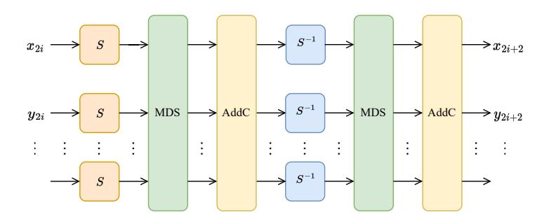

Fig. 1: The i-th round function of Rescue-Prime

## <span id="page-8-2"></span>3.2 The algebraic attack against Rescue-Prime in [\[8\]](#page-37-6)

The authors of [\[8\]](#page-37-6) introduce a smart technique to bypass the first two layers of S-boxes (two steps) of Rescue-Prime with little or even no overhead. We now give a brief review of this work.

Construction of equations. There are 2r steps for solving the CICO problem of a r-round Rescue-Prime, which are referred to as the 0-th step, the 1-th step, . . . , the (2r − 1)-th step. Since the MDS matrix is the same in each step, it can be uniformly denoted by M. Let AddC<sup>k</sup> be the addition of the round constants in the k-th step and L<sup>k</sup> = AddC<sup>k</sup> ◦ M be the composition of M and AddCk, where 0 ≤ k ≤ 2r − 1. Let Lk,j be the j-th output of L<sup>k</sup> with 0 ≤ j ≤ t − 1. Since S <sup>−</sup><sup>1</sup> and S have high degrees in the forward and backward directions, respectively, some intermediate variables can be introduced to build low-degree equations. More concretely, let x2<sup>i</sup> , y2<sup>i</sup> , z2<sup>i</sup> and x2i+2, y2i+2, z2i+2 be the input and output of the i-th round, respectively, where 0 ≤ i ≤ r − 1, they can be connected through the equations below as shown in Fig[.2:](#page-8-1)

<span id="page-8-1"></span>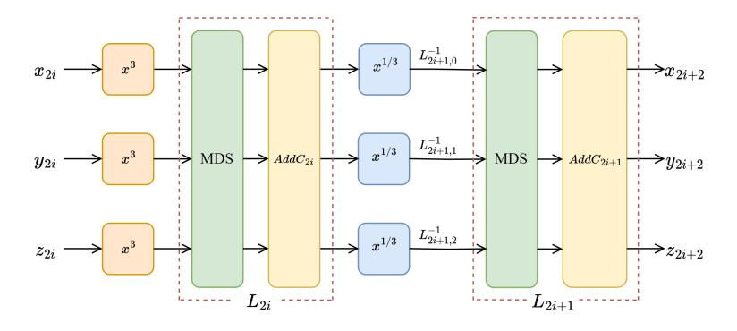

Fig. 2: One round of Rescue-Prime with t = 3

<span id="page-9-0"></span>
$$L_{2i,j}(x_{2i}^3, y_{2i}^3, z_{2i}^3) - \left(L_{2i+1,j}^{-1}(x_{2i+2}, y_{2i+2}, z_{2i+2})\right)^3 = 0, j \in \{0, 1, 2\},$$
 (1)

where  $L_{2i+1,j}^{-1}$  is the j-th output of the inverse of  $L_{2i+1}$ . It is clear that each equation in Eq.(1) is of degree three since both  $L_{2i,j}$  and  $L_{2i+1,j}^{-1}$  are of degree one. The variables  $z_0$  and  $z_{2r}$  are both set to zero in the CICO problem, i.e.  $z_0 = z_{2r} = 0$ . Therefore, a system of 3r equations in 3r + 1 variables is derived.

Bypassing the first two S-box layers. As having been observed in [8], the first two nonlinear layers can be skipped when launching an algebraic attack against Rescue-Prime. The main reason for this is the lack of a linear diffusion layer before the S-box layer. More specifically, as shown in Fig.3, let  $C_{-1,0}, C_{-1,1}, C_{-1,2}$  be the three constants of the additional AddC operation before the first round, and let  $C_{0,0}, C_{0,1}, C_{0,2}$  be the three constants of  $AddC_0$ , and let X, Y, Z be the outputs of S-boxes in the 1-th step. To satisfy the CICO problem, the output of the third S-box in the 0-th step is  $(C_{-1,2})^3$ , which yields

<span id="page-9-2"></span>
$$(C_{-1,2})^3 = \alpha_{2,0}(X^3 - C_{0,0}) + \alpha_{2,1}(Y^3 - C_{0,1}) + \alpha_{2,2}(Z^3 - C_{0,2}), \tag{2}$$

where  $M^{-1}=(\alpha_{i,j})_{0\leq i\leq 2,0\leq j\leq 2}$ . It is easy to see that there are many three tuples (X,Y,Z) satisfying Eq.(2). For example, if one sets Z=c, where

<span id="page-9-4"></span>
$$c^{3} = \alpha_{2,2}^{-1}(\alpha_{2,0}C_{0,0} + \alpha_{2,1}C_{0,1} + \alpha_{2,2}C_{0,2} + (C_{-1,2})^{3}), \tag{3}$$

then Eq.(2) is simplified as  $\alpha_{2,0}X^3 + \alpha_{2,1}Y^3 = 0$ , and so  $Y = (-\frac{\alpha_{2,0}}{\alpha_{2,1}})^{1/3}X$ . The analysis above implies that if one sets

<span id="page-9-3"></span>
$$(X,Y,Z) = (X, (-\frac{\alpha_{2,0}}{\alpha_{2,1}})^{1/3}X, c), \tag{4}$$

then the inputs of Rescue-Prime naturally have the form (\*,\*,0). As a result, if there exists  $X \in \mathbb{F}_q$  such that the image of  $(X,(-\frac{\alpha_{2,0}}{\alpha_{2,1}})^{1/3}X,c)$  through (r-1)-round Rescue-Prime is equal to (\*,\*,0), then it is able to deduce an original input (\*,\*,0) of r-round Rescue-Prime with an image of the form (\*,\*,0).

<span id="page-9-1"></span>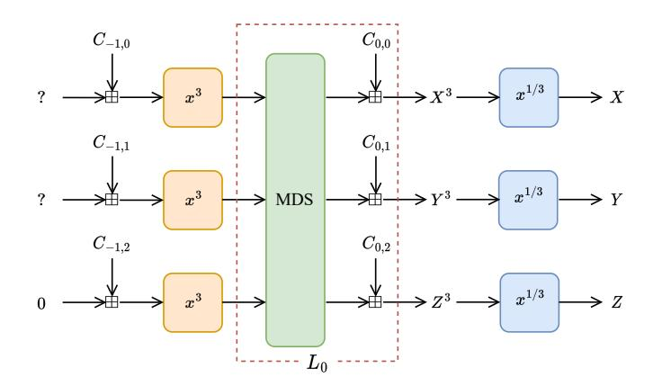

Fig. 3: Main idea of [8] on how to bypass the first round of Rescue-Prime.

Remark 1. It is worth noting that such X does not always exist since the mapping from X to the third output of r-round Rescue-Prime is not necessarily one-to-one. Then one may instead assign a value c to X (or Y ), and similarly deduce a linear relation for the other two variables, say Y = αZ (or X = αZ). Finally, find Z ∈ F<sup>q</sup> such that the image of (c, αZ, Z) (or (αZ, c, Z)) through (r − 1)-round Rescue-Prime is equal to (∗, ∗, 0). However, the existence of such X or Z is closely related to the constants used in Rescue-Prime. Moreover, there do exist constants (constructable) such that desired X or Z are nonexistent.

Solving a system of equations. With the technique of bypassing the first round, Rescue-Prime can usually be attacked one more step (the first layer of S-boxes can be skipped naturally) with little to no cost. For r-round Rescue-Prime, the authors of [\[8\]](#page-37-6) obtain a system of 3(r − 1) equations of degrees 3 in 3(r−1) variables. Theoretically, the system can be solved using the F5 and FGLM algorithms together, and the complexity can be estimated. Moreover, practical attacks on 3-round and 4-round Rescue-Prime are implemented with Magma in [\[8\]](#page-37-6) (using F4 algorithm, not F5 algorithm, to find the grevlex Gröbner basis), which take 9.18 seconds and 258500 seconds, respectively. The time complexity for attacking 5-round Rescue-Prime is roughly estimated as 2 <sup>57</sup> while the memory complexity is unknown. We refer to [\[8,](#page-37-6) Section 3.2 and Table 3] for more details. The authors also found that the final univariate polynomial has a degree of 3 3(r−1) but did not give a proof. We will fill in the gap in the next section.

# <span id="page-10-0"></span>4 Optimized algebraic attacks against Rescue-Prime based on resultant

In this section, we will give optimized algebraic attacks against Rescue-Prime based on resultant. We note that previous algebraic attacks against Rescue-Prime primarily relied on the Gröbner basis method. Compared with the Gröbner basis method, the resultant-based method tends to give more precise estimation of the time complexity. As it will be seen, the system of equations constructed in an algebraic attack has a very special structure, which clearly indicates a path for eliminating the variables by computing corresponding resultants. Based on this special structure, we propose the cubic substitution theory, with which the degrees of all but two variables at most in a multivariate polynomial derived by each resultant can be forced to remain at most equal to 2. The benefits of this are at least twofold: (1) most of the resultants can be computed with determinants of 5 by 5 matrices; (2) a tight upper bound on the degree of a multivariate polynomial obtained by each resultant can be clearly given, which together make the estimation of the time complexity more accurate. More importantly, when combining resultants with the cubic substitution theory and the fast Lagrange interpolation, practical algebraic attacks on higher rounds of Rescue-Prime become possible. For example, the existing best-known practical attack was against 4-round Rescue-Prime (with t = 3), which took 258500 seconds [8]. However, with the resultant-based method, we can successfully attack 4-round Rescue-Prime (with t=3) in 885.5 seconds. Moreover, we can practically attack 5-round Rescue-Prime in about one day, which was originally thought to be "hard" in the Ethereum Foundation challenge. For details, see the comparison in Table 5.

### <span id="page-11-2"></span>4.1 Algebraic attack with forward modeling

As done in Sect.3.2, the 2r steps of r-round Rescue-Prime are referred to as the 0-th step, the 1-th step, ..., the (2r-1)-th step.

<span id="page-11-0"></span>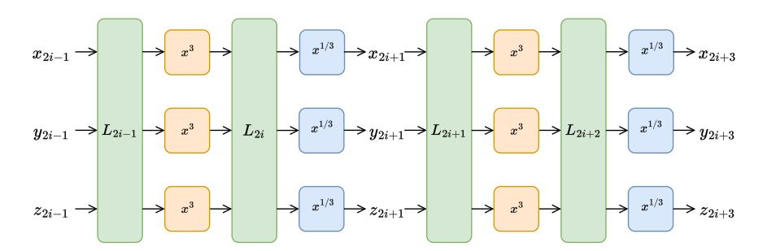

Fig. 4: Forward modeling of Rescue-Prime

Construction of Equations. The construction of equations roughly follows the method introduced in [8], but with the variables set at different locations (see Fig. 2 and Fig. 4 for a comparison). For  $0 \le i \le r-1$ , let  $x_{2i+1}, y_{2i+1}, z_{2i+1}$  be the outputs of the three S-boxes  $(S^{-1})$  in the (2i+1)-th step. We denote by SSS the three S-boxes arranged in parallel — that is,

$$SSS(x, y, z) = (S(x), S(y), S(z)) = (x^3, y^3, z^3).$$

Then it can be seen from Fig. 4 that

<span id="page-11-1"></span>
$$\begin{cases}
x_{2i+3}^3 = L_{2i+2,0} \circ SSS \circ L_{2i+1}(x_{2i+1}, y_{2i+1}, z_{2i+1}) \\
y_{2i+3}^3 = L_{2i+2,1} \circ SSS \circ L_{2i+1}(x_{2i+1}, y_{2i+1}, z_{2i+1}) \\
z_{2i+3}^3 = L_{2i+2,2} \circ SSS \circ L_{2i+1}(x_{2i+1}, y_{2i+1}, z_{2i+1})
\end{cases}$$
 for  $i \in \{0, 1, \dots, r-2\}$ ,

where " $\circ$ " denotes the composition of mappings and  $L_{2i+2,j}$  is the j-th output of  $L_{2i+2}$  with  $j \in \{0,1,2\}$ .

Remark 2. There are  $\binom{6}{3} = 20$  terms at most in the expansion of

$$L_{2i+2,j} \circ SSS \circ L_{2i+1}(x_{2i+1}, y_{2i+1}, z_{2i+1}).$$

Next, we use the technique of bypassing the first round of Rescue-Prime reviewed in Sect.3.2 to construct two more equations. Specifically, as shown in Eq.(4), to make the inputs of Rescue-Prime are of the form (\*, \*, 0),

$$(x_1, y_1, z_1) = (X, (-\frac{\alpha_{2,0}}{\alpha_{2,1}})^{1/3} X, c),$$

where c is some fixed element in  $\mathbb{F}_q$  and X is any element in  $\mathbb{F}_q$ . Then, we get

$$y_1 = \left(-\frac{\alpha_{2,0}}{\alpha_{2,1}}\right)^{1/3} x_1 \text{ and } z_1 = c.$$
 (6)

Finally, the output of the r-round Rescue-Prime should be of the form (\*, \*, 0) in the CICO problem, so there is one more equation, which is

<span id="page-12-0"></span>
$$L_{2r-1,2}(x_{2r-1}, y_{2r-1}, z_{2r-1}) = 0. (7)$$

Solving the system of equations with the resultant-based method. It can be seen from Eqs.(5)-(7) that the system of equations has 3r-2 equations in 3r-2 unknowns (here we omit  $z_1$  and  $y_1$  since  $z_1=c$  is known and  $y_1=(-\frac{\alpha_{2,0}}{\alpha_{2,1}})^{1/3}x_1$ ): 3r-3 equations are of degree 3 and one equations is of degree 1. Such a system of equations has a special structure: (1) it can be seen from Eq.(5) that the variable  $x_{2i+3}$  (or  $y_{2i+3}$ , or  $z_{2i+3}$ ) is only associated with three other lower-subscript variables  $x_{2i+1}, y_{2i+1}, z_{2i+1}$ ; (2) the variable  $x_{2r-1}$  (or  $y_{2r-1}$ , or  $z_{2r-1}$ ) are involved only in Eq.(5) for the case i=r-2 and Eq.(7). This special structure makes the system of equations especially suitable for solving by the resultant-based method, since it clearly indicates a path for elimination of the variables. Specifically, let

$$f_{x_{2i+3}} = x_{2i+3}^3 - L_{2i+2,0} \circ SSS \circ L_{2i+1}(x_{2i+1}, y_{2i+1}, z_{2i+1}),$$

$$f_{y_{2i+3}} = y_{2i+3}^3 - L_{2i+2,1} \circ SSS \circ L_{2i+1}(x_{2i+1}, y_{2i+1}, z_{2i+1}),$$

$$f_{z_{2i+3}} = z_{2i+3}^3 - L_{2i+2,2} \circ SSS \circ L_{2i+1}(x_{2i+1}, y_{2i+1}, z_{2i+1}),$$
for  $i \in \{0, 1, \dots, r-2\}$ , and let

$$f_h = L_{2r-1,2}(x_{2r-1}, y_{2r-1}, z_{2r-1}).$$

Only  $f_h$  and  $f_{z_{2r-1}}$  contain the variable  $z_{2r-1}$ , and it can be eliminated by computing the resultant  $R(f_h, f_{z_{2r-1}}, z_{2r-1})$ . Update  $f_h$  with  $R(f_h, f_{z_{2r-1}}, z_{2r-1})$ , then only the updated  $f_h$  and  $f_{y_{2r-1}}$  contain the variable  $y_{2r-1}$ . Then  $y_{2r-1}$  can be eliminated in the same way. Generally, following Algorithm 1, we can eliminate one variable in each computation of a resultant, and derive a univariate polynomial in  $\mathbb{F}_q[x_1]$  in the end. Solving the roots of the derived univariate polynomial and substituting back, the roots of the original system of equations will be found.

Algorithm 1: Get the univariate polynomail for r-round Rescue-Prime

```
Input: fx2i+3 , fy2i+3 , fz2i+3 , fh with i ∈ {0, 1, . . . , r − 2}.
   Output: a univariate polynomial in Fq[x1].
 1 i ← r − 2;
 2 while i ≥ 1 do
 3 fh ← R(fh, fz2i+3 , z2i+3);
 4 apply the cubic substitution to fh;
 5 fh ← R(fh, fy2i+3 , y2i+3);
 6 apply the cubic substitution to fh;
 7 fh ← R(fh, fx2i+3 , x2i+3);
 8 apply the cubic substitution to fh;
 9 i ← i − 1;
10 end
11 fh ← R(fh, fz2i+3 , z3);
12 apply the cubic substitution to fh;
13 fh ← R(fh, fy2i+3 , y3);
14 apply the cubic substitution to fh;
15 fh ← R(fh, fy2i+3 , x3);
16 return fh.
```

<span id="page-13-0"></span>Cubic substitution theory. We note that the degrees of variables in the multivariate polynomial obtained by each resultant in Algorithm [1](#page-13-0) will increase. However, by making use of the special structure in Eq.[\(5\)](#page-11-1), the degrees of all variables except x<sup>1</sup> can be forced to remain at most equal to 2. In fact, Eq.[\(5\)](#page-11-1) has two properties: (1) the variables x2i+3, y2i+3, z2i+3 are separated in the sense that they are not mixed with the lower-subscript variables x2i+1, y2i+1, z2i+1; (2) the degree of x2i+3 (or y2i+3, or z2i+3) is exactly 3. For the first resultant R(fh, fz2r−<sup>1</sup> , z2r−1) in Algorithm [1,](#page-13-0) it is a multivariate polynomial in y2r−1, x2r−1, x2r−3, y2r−3, z2r−<sup>3</sup> with the degree of each variable at most 3. By using the following substitutions in order, i.e.,

$$\begin{aligned} y_{2r-1}^3 &= L_{2r-2,1} \circ SSS \circ L_{2r-3}(x_{2r-3}, y_{2r-3}, z_{2r-3}), \\ x_{2r-1}^3 &= L_{2r-2,0} \circ SSS \circ L_{2r-3}(x_{2r-3}, y_{2r-3}, z_{2r-3}), \\ z_{2r-3}^3 &= L_{2r-4,2} \circ SSS \circ L_{2r-5}(x_{2r-5}, y_{2r-5}, z_{2r-5}), \\ y_{2r-3}^3 &= L_{2r-4,1} \circ SSS \circ L_{2r-5}(x_{2r-5}, y_{2r-5}, z_{2r-5}), \\ x_{2r-3}^3 &= L_{2r-4,0} \circ SSS \circ L_{2r-5}(x_{2r-5}, y_{2r-5}, z_{2r-5}), \\ & \dots \\ z_3^3 &= L_{2,2} \circ SSS \circ L_1(x_1, kx_1, c), \\ y_3^3 &= L_{2,1} \circ SSS \circ L_1(x_1, kx_1, c), \\ x_3^3 &= L_{2,0} \circ SSS \circ L_1(x_1, kx_1, c), \end{aligned}$$

where c and  $k = \left(-\frac{\alpha_{2,0}}{\alpha_{2,1}}\right)^{1/3}$  are two fixed elements in  $\mathbb{F}_q$  as defined in Eq.(3) and Eq.(4), respectively,  $R(f_h, f_{z_{2r-1}}, z_{2r-1})$  is transformed into a multivariate polynomial in  $y_{2r-1}, x_{2r-1}, z_{2r-3}, y_{2r-3}, x_{2r-3}, \ldots, z_3, y_3, x_3, x_1$  with the degree of each variable except  $x_1$  less than 3. The substitutions above are called *cubic substitutions* for convenience.

<span id="page-14-2"></span>Remark 3. We note that if there is a variable, say  $x_{2i+1}$ , of which the degree is larger than 3, then we may need to use multiple substitutions of the form  $x_{2i+1}^3 = L_{2i,0} \circ SSS \circ L_{2i-1}(x_{2i-1},y_{2i-1},z_{2i-1})$  to reduce its degree less than 3. For example, let  $f_h = x_{2i+1}^7 + x_{2i+1}^3 + 1$  and  $x_{2i+1}^3 = x_{2i-1}^3 + y_{2i-1}^3 + z_{2i-1}^3$ , then we need two substitutions for  $x_{2i+1}^7$  and one for  $x_{2i+1}^3$ , and derive  $f_h = (x_{2i-1}^3 + y_{2i-1}^3 + z_{2i-1}^3)^2 * x_{2i+1} + x_{2i-1}^3 + y_{2i-1}^3 + z_{2i-1}^3 + 1$ . The degree of  $x_{2i+1}$  in  $f_h$  now becomes less than 3.

Now we consider the second resultant  $R(f_h, f_{y_{2r-1}}, y_{2r-1})$  in Algorithm 1. Since the degree of  $y_{2r-1}$  in  $f_h$  is less than 3 after the cubic substitutions, the resultant  $R(f_h, f_{y_{2r-1}}, y_{2r-1})$  can be computed with the determinant of a 5 by 5 matrix. By cubic substitutions,  $R(f_h, f_{y_{2r-1}}, y_{2r-1})$  is changed into a multivariate polynomial in  $x_{2r-1}, z_{2r-3}, y_{2r-3}, x_{2r-3}, \ldots, z_3, y_3, x_3, x_1$  with the degree of each variable less than 3 except  $x_1$ . Similarly, when applying cubic substitutions to all the other resultants, the resultants are changed into multivariate polynomials with the degree of each variable less than 3 except  $x_1$ .

The cubic substitution has the following basic properties, which are useful for getting a tight upper bound on the degree of a polynomial obtained by each resultant.

<span id="page-14-0"></span>**Lemma 2.** With the notations defined above, let  $f'_h$  be the polynomial obtained by cubic substitutions of  $f_h$  such that the degree of each variable in  $f'_h$  is less than 3 except  $x_1$ , then we have  $\deg(f'_h) \leq \deg(f_h)$ .

*Proof.* From the cubic substitutions of the first resultant  $R(f_h, f_{z_{2r-1}}, z_{2r-1})$ , it can be seen that a term of degree 3 (say  $y_{2r-1}^3$ ) is substituted by a polynomial (say  $L_{2r-2,1} \circ SSS \circ L_{2r-3}(x_{2r-3}, y_{2r-3}, z_{2r-3})$ ) of degree at most 3 in each substitution, so  $\deg(f'_h) \leq \deg(f_h)$ .

Remark 4. We note that the base field of Rescue-Prime is a large finite field, therefore,  $\deg(f'_h) = \deg(f_h)$  holds with a high probability. Moreover, we have experimentally verified that  $\deg(f'_h) = \deg(f_h)$  always holds for the parameters used in Rescue-Prime.

<span id="page-14-1"></span>**Lemma 3.** Let  $R_k$  be the multivariate polynomial computed from the k-th resultant in Algorithm 1 with  $1 \le k \le 3(r-1)$ , then  $\deg(R_k) \le 3^k$ .

*Proof.* Let  $\omega_k$  be the variable to be eliminated by the k-th resultant in Algorithm 1 for  $1 \le k \le 3(r-1)$ , for example,  $\omega_1 = z_{2r-1}$ ,  $\omega_2 = y_{2r-1}$ ,  $\omega_4 = z_{2r-3}$ , and so on. Now we consider the k-th resultant  $R(f_h, f_{\omega_k}, \omega_k)$  in Algorithm 1. As the degree of  $\omega_k$  in  $f_h$  after cubic substitutions is less than 3, we can assume that

$$f_h = u_2 \omega_k^2 + u_1 \omega_k + u_0, \quad f_{\omega_k} = \omega_k^3 - u_3,$$

where  $u_0, u_1, u_2, u_3 \in \mathbb{F}_q[\omega_{k+1}, \dots, \omega_{3r-3}, x_1]$  with

 $\deg(u_0) \le \deg(f_h), \deg(u_1) \le \deg(f_h) - 1, \deg(u_2) \le \deg(f_h) - 2, \text{ and } \deg(u_3) \le 3.$ 

Then, it is clear that

<span id="page-15-2"></span>
$$R_{k} = R(f_{h}, f_{\omega_{k}}, \omega_{k}) = \begin{vmatrix} u_{2} u_{1} u_{0} & 0 & 0 \\ 0 u_{2} u_{1} & u_{0} & 0 \\ 0 & 0 u_{2} u_{1} & u_{0} \\ 1 & 0 & 0 - u_{3} & 0 \\ 0 & 1 & 0 & 0 & -u_{3} \end{vmatrix} = \begin{vmatrix} u_{0} u_{2} u_{3} u_{1} u_{3} \\ u_{1} & u_{0} & u_{2} u_{3} \\ u_{2} & u_{1} & u_{0} \end{vmatrix},$$
(8)

and so  $R_k = u_2^3 u_3^2 - 3u_0 u_1 u_2 u_3 + u_1^3 u_3 + u_0^3$ . It is easy to check that

<span id="page-15-0"></span>
$$\deg(R_k) \le 3\deg(f_h). \tag{9}$$

Together with Lemma 2, this implies that the degree of  $f_h$  in Algorithm 1 after each update is increased over the original  $f_h$  by a factor of three. Since the input polynomial  $f_h$  of Algorithm 1 is  $L_{2r-1,2}(x_{2r-1},y_{2r-1},z_{2r-1})$ , which is of degree 1, the desired result immediately follows from (9) and Lemma 2.

Remark 5. Since the base field of Rescue-Prime is a large finite field, it follows that  $deg(R_k) = 3^k$  with high probability. We have also experimentally verified that  $deg(R_k) = 3^k$  always holds for the parameters used in Rescue-Prime.

Combining Lemmas 2 and 3, it is clear that the output of Algorithm 1 is a univariate polynomial over  $\mathbb{F}_q[x_1]$  with a degree at most  $3^{3r-3}$ . In our practical attack against round-reduced Rescue-Prime, the maximum possible degree  $3^{3r-3}$  is always achievable. We note that a similar result has been found by experiments (without proof) in [8, Page 87], which says "In our experiments, the system behaves like a generic system and has  $d=3^{3(r-1)}$  solutions in the algebraic closure of the field."

Complexity analysis. It can be seen from Algorithm 1 that the time complexity of our attack consists of three parts: (1) the cubic substitutions; (2) the computations of resultants; (3) finding roots of univariate polynomials. The unit of the time complexity is one basic arithmetic operation in the finite field, which is a widely used metric for evaluating complexities for attacking AO primitives.

<span id="page-15-1"></span>The cubic substitution. For r-round Rescue-Prime, Algorithm 1 involves a total of 3r-3 computations of resultants and 3r-4 cubic substitutions (we note that some cubic substitutions may involve multiple substitutions as explained in Remark 3. Let  $\omega_k$  be the variable to be eliminated by the k-th resultant  $R_k$  in Algorithm 1 for  $1 \le k \le 3(r-1)$ . Recall that  $R_k \in \mathbb{F}_q[\omega_{k+1}, \omega_{k+2}, \ldots, \omega_{3r-3}, x_1]$  and the purpose of performing cubic substitutions for  $R_k$  is to reduce the degrees of  $\omega_{k+1}, \omega_{k+2}, \ldots, \omega_{3r-3}$  to less than 3. The time complexity of all cubic substitutions in Algorithm 1 is given in Theorem 1.

**Theorem 1.** The time complexity of performing all the cubic substitutions in Algorithm 1 is

$$\mathcal{O}\left(\sum_{k=1}^{3r-4} 10 \cdot \left(13^3 \cdot {\binom{d_k+3r-k-4}{3r-k-3}} \cdot (3^k+1) + 121745\right) \cdot (3r-k-3)\right),\,$$

where  $d_k = \min(3^k - 12, 18r - 6k - 24)$ .

*Proof.* Let  $R_k = R(f_h, f_{\omega_k}, \omega_k)$  be the k-th resultant in Algorithm 1 for  $1 \le k \le 3(r-1)$ , where  $\omega_k$  is the variable to be eliminated by  $R_k$  and

$$f_h = u_2 \omega_k^2 + u_1 \omega_k + u_0, \quad f_{\omega_k} = \omega_k^3 - u_3.$$

Since the cubic substitution only care about the degree of  $\omega_{k+1}, \ldots, \omega_{3r-3}$ , we view  $u_0, u_1, u_2, u_3$  as polynomials over  $\mathbb{F}_q[x_1]$ , that is

$$u_0, u_1, u_2, u_3 \in \mathbb{F}_q[x_1][\omega_{k+1}, \dots, \omega_{3r-3}].$$

We note that  $\deg_{\omega_j}(u_0) \leq 2$ ,  $\deg_{\omega_j}(u_1) \leq 2$ ,  $\deg_{\omega_j}(u_2) \leq 2$ ,  $\deg_{\omega_j}(u_3) \leq 3$  for  $k+1 \leq j \leq 3r-3$ , where  $\deg_{\omega_j}(u_i)$  denote the degree of  $\omega_j$  in  $u_i$ , and so it follows from Eq. (8) that

<span id="page-16-0"></span>
$$\deg(R_k) = \deg(u_2^3 u_3^2 - 3u_0 u_1 u_2 u_3 + u_1^3 u_3 + u_0^3) \le 6 \cdot (3r - k - 2) \tag{10}$$

and  $\deg_{\omega_{k+1}}(R_k) \leq 12$  (the equality holds if and only if  $\omega_{k+1}^3$  appears in  $u_3$ ). Therefore, there are at most 10 substitutions for  $\omega_{k+1}$ .

Let  $R_k = \sum_{i=0}^{12} \eta_i \omega_{k+1}^i$ . Then it immediately follows from (10) and Theorem 3 that

$$\deg(\eta_i) \le \min(3^k - 12, 6 \cdot (3r - k - 2) - i)$$
 for  $0 \le i \le 12$ .

We first consider the substitution of  $\omega_{k+1}^{12}$ , which consists of two parts. The first part is to expand  $\left(\left(\omega_{k+1}^3\right)^2\right)^2$ , the complexity of the expansion is  $4^3 \cdot 4^3 + 7^3 \cdot 7^3 = 121745$  by Theorem 1. Since the degree of three variables in the expansion of  $\omega_{k+1}^{12}$  is no more than 12, there are at most 13³ terms in the expansion of  $\omega_{k+1}^{12}$ . The second part is to multiply the expansion of  $\omega_{k+1}^{12}$  with  $\eta_{12}$ . Since  $\deg(\eta_{12}) \leq d_k = \min(3^k - 12, 18r - 6k - 24)$ , the number of terms in the expansion of  $\eta_{12}$  over  $\mathbb{F}_q[x_1]$  is  $\binom{d_k + 3r - k - 4}{3r - k - 3}$  at most. We note that each coefficient of  $\eta_{12}$  belongs to  $\mathbb{F}_q[x_1]$  and the highest degree of  $x_1$  in each coefficient is no more than  $3^k$ , and so the number of terms in the expansion of  $\eta_{12}$  over  $\mathbb{F}_q$  (not over  $\mathbb{F}_q[x_1]$ ) is at most  $\binom{d_k + 3r - k - 4}{3r - k - 3} \cdot \binom{3^k + 1}{3r - k - 3}$ . Theorem 1, the complexity of the second part is  $13^3 \cdot \binom{d_k + 3r - k - 4}{3r - k - 3} \cdot \binom{3^k + 1}{3r - k - 3}$ .

The time complexities of substitutions for  $\omega_{k+1}^{11}, \omega_{k+1}^{10}, \cdots, \omega_{k+1}^{3}$  are almost equal to that of  $\omega_{k+1}^{12}$ , so we use

<span id="page-16-1"></span>
$$10 \cdot \left(13^3 \cdot {\binom{d_k + 3r - k - 4}{3r - k - 3}} \cdot (3^k + 1) + 121745\right) \tag{11}$$

as an estimation of the time complexity of the cubic substitution for  $\omega_{k+1}$ .

Finally, we come to estimate the time complexity of the cubic substitution for  $\omega_j$ , where  $k+2 \leq j \leq 3r-3$ . It can be seen from (11) that the time complexity is mainly dominated by the combinatorial number, which implies the cubic substitution for  $\omega_j$  is faster than the cubic substitution for  $\omega_{k+1}$ . Therefore, the time complexity of the cubic substitution for  $R_k$  is  $10 \cdot \left(13^3 \cdot \binom{d+3r-k-4}{3r-k-3} \cdot (3^k+1) + 121745\right) \cdot (3r-3-k)$ . This completes the proof.

Computation of the resultant. We have the following Theorem 2 to estimate the time complexities of all the computations of resultants in Algorithm 1.

<span id="page-17-0"></span>**Theorem 2.** The time complexity of the computation of all the resultants in Algorithm 1 is

$$\mathcal{O}\left(\sum_{k=1}^{3r-3} 15 \cdot \max\left((3^k+1) \cdot 7^{3r-k}, (2 \cdot 3^{k-1}+1)(3^{k-1}+1) \cdot 15^{3r-3-k}\right)\right).$$

Proof. By Eq.(8), we have  $R_k = u_2^3u_3^2 - 3u_0u_1u_2u_3 + u_1^3u_3 + u_0^3$ . There are 3 additions and 12 multiplications for computing  $R_k$  including  $u_i \cdot u_i$ ,  $i \in \{0, 1, 2, 3\}$ ,  $u_j^2 \cdot u_j$ ,  $j \in \{0, 1, 2\}$ ,  $u_0 \cdot u_1$ ,  $(u_0u_1) \cdot u_2$ ,  $(u_0u_1u_2) \cdot u_3$ ,  $u_1^3 \cdot u_3$ , and  $u_2^3 \cdot u_3^2$ . We use  $\mathcal{T}_{\max}$  to denote the maximum of the time complexities for computing a set of operations. For example,  $\mathcal{T}_{\max}\{u_i \cdot u_i, i=0,1,2,3\}$  denotes the maximum of the time complexities for computing  $u_0 \cdot u_0, u_1 \cdot u_1, u_2 \cdot u_2$ , and  $u_3 \cdot u_3$ . Since  $\deg(u_3) \leq 3$  and there is at most three variables in  $u_3$ , it is clear that  $\mathcal{T}_{\max}\{u_i \cdot u_i, i=0,1,2,3\} \leq \mathcal{T}_{\max}\{u_j^2 \cdot u_j, j=0,1,2\}$  and  $\mathcal{T}_{\max}(u_0 \cdot u_1) \leq \mathcal{T}_{\max}\{(u_0u_1) \cdot u_2, (u_0u_1u_2) \cdot u_3, u_1^3 \cdot u_3\} \leq \mathcal{T}_{\max}(u_2^3 \cdot u_3^2)^4$ . Then the time complexity of computing  $R_k$  is  $15 \cdot \mathcal{T}_{\max}\{u_2^3 \cdot u_3^2, u_0^2 \cdot u_0\}$ . Through cubic substitutions, we have  $\deg_{\omega_j}(u_2^3) \leq 6$  for  $k+1 \leq j \leq 3r-3$  and  $\deg_{x_1}(u_2^3) \leq 3^k$ . There are three variables in  $u_3^2$  with degrees less than 6. Besides,  $\deg_{\omega_j}(u_0^2) \leq 4$  for  $k+1 \leq j \leq 3r-3$  and  $\deg_{x_1}(u_0^2) \leq 2 \cdot 3^{k-1}$ . Let  $d_1, d_2, d_3$ , and  $d_4$  be the numbers of terms of  $u_2^3, u_3^2, u_0^2$ , and  $u_0$ , respectively, then  $d_1 = (3^k+1) \cdot 7^{3r-3-k}$ ,  $d_2 = 7^3, d_3 = (2 \cdot 3^{k-1} + 1) \cdot 5^{3r-3-k}$ , and  $d_4 = (3^{k-1} + 1) \cdot 3^{3r-3-k}$ . Therefore, the time complexity of computing  $R_k$  is  $15 \cdot \max(d_1 \cdot d_2, d_3 \cdot d_4)$ . This completes the proof.

Finding roots of a univariate polynomial. Since the output of Algorithm 1 is a univariate polynomial over  $\mathbb{F}_q[x_1]$  with degree  $d \leq 3^{3r-3}$ , all the roots of such a univariate polynomial can be found in  $\mathcal{O}(d\log(d)(\log(d) + \log(q))\log(\log(d)))$ . Once a root of  $x_1$  is found, the corresponding CICO problem is solved.

The time complexities of the different steps of our attack against Rescue-Prime under forward modeling are presented in Table 2.

<span id="page-17-1"></span><sup>&</sup>lt;sup>4</sup> In Theorem 3 we have  $\deg(u_2) \leq \deg(u_1) \leq \deg(u_0)$ , and we assume that they are the same here.

<span id="page-18-0"></span>Table 2: Time complexities of our attack against Rescue-Prime under forward modeling, where  $f_h$  is the output of Algorithm 1.

| r | Complexity of resultants | Complexity of cubic substitutions | $\deg(f_h)$ |             | Complexity of forward modeling |
|---|--------------------------|-----------------------------------|-------------|-------------|--------------------------------|
| 4 | $2^{38.45}$              | $2^{40.09}$                       | $3^9$       | $2^{26.12}$ | $2^{40.49}$                    |
| 5 | $2^{50.17}$              | $2^{52.77}$                       | $3^{12}$    | $2^{31.45}$ | $2^{52.99}$                    |
| 6 | $2^{61.90}$              | $2^{65.47}$                       | $3^{15}$    | $2^{36.65}$ | $2^{65.58}$                    |
| 7 | $2^{73.62}$              | $2^{76.51}$                       | $3^{18}$    | $2^{41.76}$ | $2^{76.69}$                    |
| 8 | $2^{85.34}$              | $2^{88.10}$                       | $3^{21}$    | $2^{46.82}$ | $2^{88.30}$                    |

## 4.2 Algebraic attack with SFTM modeling

In this subsection, we use the SFTM (start-from-the-middle) modeling to build a system of equations for r-round (consists of 2r steps) Rescue-Prime. The SFTM modeling can be regarded as a reverse application of the meet-in-the-middle (MITM) modeling. The MITM technique is a generic cryptanalytic approach for symmetric-key primitives, which was first introduced by Diffie and Hellman in 1977 [16] for the cryptanalysis of DES. Different from the MITM modeling that starts from the two sides and meets in the middle, the SFTM modeling starts from the middle and models the constraints on the input and output as actual equations.

Since the case of r=1 is trivial, we always assume that  $r\geq 2$ . It is clear that the S-boxes involved in the i-th step are  $S^{-1}$  if i is odd and S if i is even. Note that  $S^{-1}$  has a very high degree in the forward direction while S has a very high degree in the backward direction. To build low-degree equations, the main idea is to balance the number of  $S^{-1}$  layers in the forward direction and the number of S layers in the backward direction. Therefore, the constructed equations are categorized into two cases: one for odd r and the others for even r.

The SFTM modeling of Rescue-Prime when r is odd As shown in Fig.5a, let  $x_r, y_r, z_r$  be the outputs of the three S-boxes  $(S^{-1})$  in the r-th step. Now we will construct equations from the backward direction and the forward direction, respectively.

In the backward direction, for each even i with  $0 < i \le r - 1$ , let  $x_i, y_i, z_i$  be the inputs of the three S-boxes (S) in the i-th step. Then it can be seen from Fig.5b and Fig.5a that

<span id="page-18-2"></span>
$$\begin{cases}
x_i^3 = L_{i,0}^{-1} \circ SSS \circ L_{i+1}^{-1}(x_{i+2}, y_{i+2}, z_{i+2}) \\
y_i^3 = L_{i,1}^{-1} \circ SSS \circ L_{i+1}^{-1}(x_{i+2}, y_{i+2}, z_{i+2}) \\
z_i^3 = L_{i,2}^{-1} \circ SSS \circ L_{i+1}^{-1}(x_{i+2}, y_{i+2}, z_{i+2})
\end{cases} \text{ for } i \in \{2, 4, \dots, r-3\}, \tag{12}$$

<span id="page-18-1"></span>
$$\begin{cases} x_{r-1}^3 = L_{r-1,0}^{-1}(x_r^3, y_r^3, z_r^3) \\ y_{r-1}^3 = L_{r-1,1}^{-1}(x_r^3, y_r^3, z_r^3), \\ z_{r-1}^3 = L_{r-1,2}^{-1}(x_r^3, y_r^3, z_r^3) \end{cases}$$
(13)

<span id="page-19-0"></span>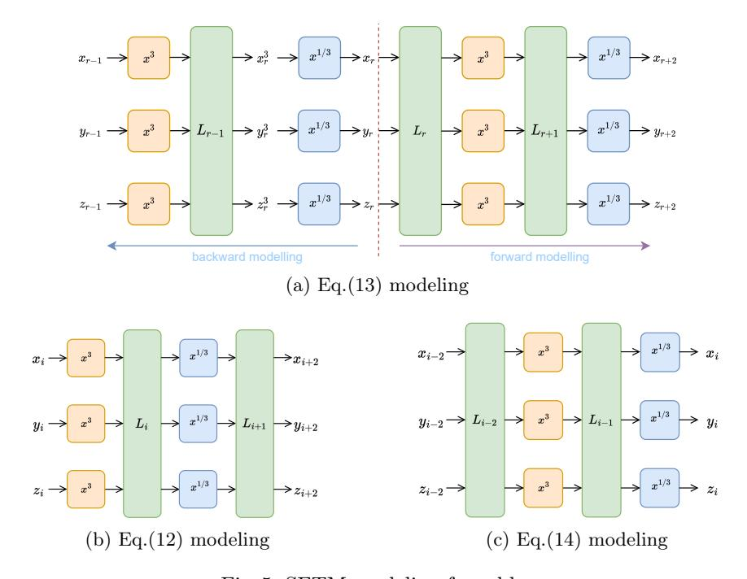

<span id="page-19-3"></span>Fig. 5: SFTM modeling for odd r

<span id="page-19-1"></span>where  $L_i^{-1}$  is the inverse of the affine transformation  $L_i$ , and  $L_{i,j}^{-1}$  is the j-th output of  $L_i^{-1}$  with  $j \in \{0, 1, 2\}$ .

Similarly, in the forward direction, for each odd i with  $r < i \le 2r - 1$ , let  $x_i, y_i, z_i$  be the outputs of the three S-boxes  $(S^{-1})$  in the i-th step. Then it can be seen from Fig.5c that

<span id="page-19-2"></span>
$$\begin{cases}
 x_i^3 = L_{i-1,0} \circ SSS \circ L_{i-2}(x_{i-2}, y_{i-2}, z_{i-2}) \\
 y_i^3 = L_{i-1,1} \circ SSS \circ L_{i-2}(x_{i-2}, y_{i-2}, z_{i-2}) \\
 z_i^3 = L_{i-1,2} \circ SSS \circ L_{i-2}(x_{i-2}, y_{i-2}, z_{i-2})
\end{cases}$$

The inputs and outputs of r-round Rescue-Prime are of the form (\*,\*,0) in the CICO problem, with the same notations defined above, there are two more equations,

$$(C_{-1,2})^3 = L_{0,2}^{-1} \circ SSS \circ L_1^{-1}(x_2, y_2, z_2), \tag{15}$$

<span id="page-19-4"></span>
$$L_{2r-1,2}(x_{2r-1}, y_{2r-1}, z_{2r-1}) = 0, (16)$$

where  $C_{-1,2}$  is the third constant of the additional AddC operation before the first round of Rescue-Prime.

The SFTM modeling of Rescue-Prime when r is even As shown in Fig.6, let  $x_r, y_r, z_r$  be the inputs of the three S-boxes (S) in the r-th step. For each

<span id="page-20-0"></span>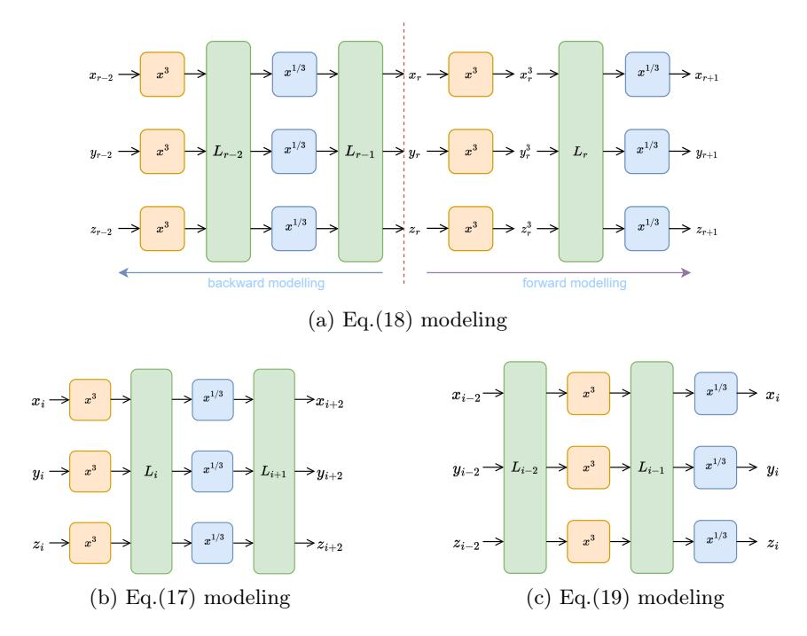

Fig. 6: SFTM modeling for even r

even i with 0 < i < r - 1, let  $x_i, y_i, z_i$  be the inputs of the three S-boxes (S) in the i-th step; while for each odd i with r < i < 2r - 1, let  $x_i, y_i, z_i$  be the outputs of the three S-boxes  $(S^{-1})$  in the i-step. Then in a similar argument to **Case odd**, we can obtain

<span id="page-20-2"></span>
$$\begin{cases}
x_i^3 = L_{i,0}^{-1} \circ SSS \circ L_{i+1}^{-1}(x_{i+2}, y_{i+2}, z_{i+2}) \\
y_i^3 = L_{i,1}^{-1} \circ SSS \circ L_{i+1}^{-1}(x_{i+2}, y_{i+2}, z_{i+2}) & \text{for } i \in \{2, 4, \dots, r-2\}, \\
z_i^3 = L_{i,2}^{-1} \circ SSS \circ L_{i+1}^{-1}(x_{i+2}, y_{i+2}, z_{i+2})
\end{cases}$$
(17)

<span id="page-20-1"></span>
$$\begin{cases}
x_{r+1}^3 = L_{r,0}(x_r^3, y_r^3, z_r^3) \\
y_{r+1}^3 = L_{r,1}(x_r^3, y_r^3, z_r^3), \\
z_{r+1}^3 = L_{r,2}(x_r^3, y_r^3, z_r^3)
\end{cases}$$
(18)

<span id="page-20-3"></span>
$$\begin{cases}
x_i^3 = L_{i-1,0} \circ SSS \circ L_{i-2}(x_{i-2}, y_{i-2}, z_{i-2}) \\
y_i^3 = L_{i-1,1} \circ SSS \circ L_{i-2}(x_{i-2}, y_{i-2}, z_{i-2}) \\
z_i^3 = L_{i-1,2} \circ SSS \circ L_{i-2}(x_{i-2}, y_{i-2}, z_{i-2})
\end{cases} \text{ for } i \in \{r+3, r+5, \dots, 2r-1\},$$
(19)

 $(C_{-1,2})^3 = L_{0,2}^{-1} \circ SSS \circ L_1^{-1}(x_2, y_2, z_2), \tag{20}$ 

$$L_{2r-1,2}(x_{2r-1}, y_{2r-1}, z_{2r-1}) = 0. (21)$$

Table 3: The polynomials in SFTM modeling

```
 \begin{array}{c} r \text{ is odd} \\ \begin{cases} f_{x_i} = x_i^3 - L_{-1,0}^{-1} \circ SSS \circ L_{i+1}^{-1}(x_{i+2}, y_{i+2}, z_{i+2}) \\ f_{y_i} = y_i^3 - L_{i,1}^{-1} \circ SSS \circ L_{i+1}^{-1}(x_{i+2}, y_{i+2}, z_{i+2}) \\ f_{z_i} = z_i^3 - L_{i,2}^{-1} \circ SSS \circ L_{i+1}^{-1}(x_{i+2}, y_{i+2}, z_{i+2}) \\ \end{cases} & \begin{cases} f_{x_{r-1}} = x_{r-1}^3 - L_{r-1,0}^{-1}(x_r^3, y_r^3, z_r^3) \\ f_{y_{r-1}} = y_{r-1}^3 - L_{r-1,1}^{-1}(x_r^3, y_r^3, z_r^3) \\ f_{y_{r-1}} = z_{r-1}^3 - L_{r-1,2}^{-1}(x_r^3, y_r^3, z_r^3) \\ \end{cases} & \begin{cases} f_{x_i} = x_i^3 - L_{i-1,0} \circ SSS \circ L_{i-2}(x_{i-2}, y_{i-2}, z_{i-2}) \\ f_{y_i} = y_i^3 - L_{i-1,1} \circ SSS \circ L_{i-2}(x_{i-2}, y_{i-2}, z_{i-2}) \\ \end{cases} & f_{z_i} = z_i^3 - L_{i-1,2} \circ SSS \circ L_{i-2}(x_{i-2}, y_{i-2}, z_{i-2}) \\ \end{cases} & f_{z_i} = z_i^3 - L_{i-1,2} \circ SSS \circ L_{i-2}(x_{i-2}, y_{i-2}, z_{i-2}) \\ \end{cases} & f_{z_i} = z_i^3 - L_{i-1,2} \circ SSS \circ L_{i-2}(x_{i-2}, y_{i-2}, z_{i-2}) \\ \end{cases} & f_{z_i} = z_i^3 - L_{i-1,2} \circ SSS \circ L_{i-2}(x_{i-2}, y_{i-2}, z_{i-2}) \\ \end{cases} & f_{z_i} = z_i^3 - L_{i-1,2} \circ SSS \circ L_{i-2}(x_{i-2}, y_{i-2}, z_{i-2}) \\ \end{cases} & f_{z_i} = z_i^3 - L_{i-1,2} \circ SSS \circ L_{i-2}(x_{i-2}, y_{i-2}, z_{i-2}) \\ \end{cases} & f_{z_i} = z_i^3 - L_{i-1,2} \circ SSS \circ L_{i-1} (x_{i+2}, y_{i+2}, z_{i+2}) \\ \end{cases} & f_{z_i} = z_i^3 - L_{i-1,2} \circ SSS \circ L_{i+1} (x_{i+2}, y_{i+2}, z_{i+2}) \\ \end{cases} & f_{z_i} = z_i^3 - L_{i-1,2} \circ SSS \circ L_{i-1} (x_{i+2}, y_{i+2}, z_{i+2}) \\ \end{cases} & f_{z_i} = z_i^3 - L_{i-1,2} \circ SSS \circ L_{i-2} (x_{i-2}, y_{i-2}, z_{i-2}) \\ \end{cases} & f_{z_i} = z_i^3 - L_{i-1,2} \circ SSS \circ L_{i-2} (x_{i-2}, y_{i-2}, z_{i-2}) \\ \end{cases} & f_{z_i} = z_i^3 - L_{i-1,1} \circ SSS \circ L_{i-2} (x_{i-2}, y_{i-2}, z_{i-2}) \\ \end{cases} & f_{z_i} = z_i^3 - L_{i-1,1} \circ SSS \circ L_{i-2} (x_{i-2}, y_{i-2}, z_{i-2}) \\ \end{cases} & f_{z_i} = z_i^3 - L_{i-1,1} \circ SSS \circ L_{i-2} (x_{i-2}, y_{i-2}, z_{i-2}) \\ \end{cases} & f_{z_i} = z_i^3 - L_{i-1,1} \circ SSS \circ L_{i-2} (x_{i-2}, y_{i-2}, z_{i-2}) \\ \end{cases} & f_{z_i} = z_i^3 - L_{i-1,1} \circ SSS \circ L_{i-2} (x_{i-2}, y_{i-2}, z_{i-2}) \\ \end{cases} & f_{z_i} = z_i^3 - L_{i-1,2} \circ SSS \circ L_{i-2} (x_{i-2}, y_{i-2}, z_{i-2}) \\ f_{z_i} = z_i^3 - L_{i-1,2} \circ SSS \circ L_{i-2} (x_{i-2}, y_{i-2}, z_{i-2}) \\ f_{z_i} = z_i^3 - L_{i-1,2} \circ SSS
```

Solving the system of equations with the resultant-based method. It can be seen from Eqs. (12)-(16) that the system of equations has 3r-1 equations (3r-2) equations are of degree 3 and one equation is of degree 1) in 3r unknowns in total. Since the number of unknowns is one more than that of equations, the system of equations always has solutions. We can then randomly assign a value to one of the variables, say  $x_r$ , and solve the remaining variables to speed up the solving process in a practical attack. If the system has no solutions for this assignment, we can repeatedly (usually not too many times) assign another random value to  $x_r$  until we can get a solution. Similar to the case in Sect.4.1, such a system of equations also has a special structure that clearly gives a path for the elimination of variables when solved by resultants. As presented in Algorithm 2, we will get two bivariate polynomials  $f_l, f_h \in \mathbb{F}_q[y_r, z_r]$  and further use them to compute  $R(f_l, f_h, z_r)$  to eliminate  $z_r$ . When the number of rounds is high, the two polynomials would be quite complicated and directly computing the resultant  $R(f_l, f_h, z_r)$  usually suffers from memory overflow. Instead, we can assign a number of values to the variable  $y_r$  and get many interpolation pairs, and further use the fast Lagrange interpolation introduced in Sect.2.3 to recover the univariate polynomial. Another benefit of using the fast Lagrange interpolation is that it can be computed in parallel, which can further reduce the attack time if there are enough threads. Once a root of the final univariate polynomial is found, the corresponding CICO problem can be solved by substituting back.

Algorithm 2: Get two bivariate polynomials for r-round Rescue-Prime

```
Input: fl
            , fh, fxi
                    , fyi
                        , fzi
                            as defined in Table 3.
   Output: two bivariate polynomials.
 1 i ← 2r − 1;
 2 while i > r do
 3 fh ← R(fh, fzi
                     , zi);
 4 apply the cubic substitution to fh;
 5 fh ← R(fh, fyi
                     , yi);
 6 apply the cubic substitution to fh;
 7 fh ← R(fh, fxi
                     , xi);
 8 apply the cubic substitution to fh;
 9 i ← i − 2;
10 end
11 i ← 2;
12 while i < r do
13 fl ← R(fl
                , fzi
                    , zi);
14 apply the cubic substitution to fl
                                        ;
15 fl ← R(fl
                , fyi
                    , yi);
16 apply the cubic substitution to fl
                                        ;
17 fl ← R(fl
                , fxi
                    , xi);
18 apply the cubic substitution to fl
                                        ;
19 i ← i + 2;
20 end
21 return fh, fl
               .
```

<span id="page-22-0"></span>Complexity analysis. Similar to the case under forward modeling, the time complexity of solving the CICO problem under SFTM modeling consists of four parts: (1) the cubic substitutions in Algorithm [2;](#page-22-0) (2) the computations of resultants in Algorithm [2;](#page-22-0) (3) the computation of the final resultant R(f<sup>l</sup> , fh, zr); (4) finding roots of univariate polynomials.

It can be seen from Algorithm [2](#page-22-0) that, for r-round Rescue-Prime, there are at most 3 · ⌊r/2⌋ variables to be eliminated in the first (lines 2-10) or the second (lines 12-20) loop. Similar to the case under forward modeling, the degree of f<sup>l</sup> (resp. fh) in Algorithm [2](#page-22-0) after each update is increased over the original f<sup>l</sup> (resp. fh) by a factor of three.

<span id="page-22-1"></span>The time complexities of the first two parts are given in Theorems [3](#page-22-1) and [4.](#page-23-0) As the deduction and proof are pretty similar to those for Theorems [1](#page-15-1) and [2,](#page-17-0) we omit the proof here.

**Theorem 3.** The time complexity of performing all the cubic substitutions in Algorithm 2 is

$$\mathcal{O}\left(\sum_{k=1}^{\lambda} 20 \cdot \left(13^3 \cdot {\binom{d_k + \lambda - k - 1}{\lambda - k}}\right) \cdot (3^k + 1)^2 + 121745\right) \cdot (\lambda - k)\right),$$

where  $\lambda = 3 \cdot \lfloor r/2 \rfloor$  and  $d_k = \min (3^k - 12, 6 \cdot (\lambda - k - 1))$ .

<span id="page-23-0"></span>**Theorem 4.** The time complexity of the computation of all the resultants in Algorithm 2 is

$$\mathcal{O}\left(\sum_{k=1}^{\lambda} 30 \cdot \max\left((3^k+1)^2 \cdot 7^{\lambda-k+3}, (2 \cdot 3^{k-1}+1)^2 (3^{k-1}+1)^2 \cdot 15^{\lambda-k}\right)\right),\,$$

where  $\lambda = 3 \cdot |r/2|$ .

For the third part of computing the final resultant  $R(f_l, f_h, z_r)$ , the situation is slightly different. Theorem 5 gives the time complexity of this part with a proof.

<span id="page-23-1"></span>**Theorem 5.** Let  $f_l$  and  $f_h$  be the output polynomials of Algorithm 2 of which the degrees are denoted as  $d_l$  and  $d_h$ , respectively. Then the time complexity of computing the resultant  $R(f_l, f_h, z_r)$  is

$$\mathcal{O}\left(d_l d_h \cdot (\mathcal{T}_1 + \mathcal{T}_2) + \mathcal{T}_3\right)$$
,

where  $\mathcal{T}_1 = (d_l^2 \log(d_l) + d_h^2 \log(d_h))$ ,  $\mathcal{T}_2 = (d_l + d_h)^{\omega}$ ,  $\mathcal{T}_3 = (d_l d_h \log(d_l d_h))$ , and  $\omega$  is the linear algebra exponent<sup>5</sup>.

*Proof.* The time complexity of computing the resultant  $R(f_l, f_h, z_r)$  consists of three steps: (1) assigning a value to  $y_r$ ; (2) computing  $R(f_l, f_h, z_r)$ ; (3) using the fast Lagrange interpolation to recover the final univariate polynomial.

- Assigning a value to  $y_r$ . Let  $f_l = u_{d_l}(y_r)z_r^{d_l} + \cdots + u_1(y_r)z_r + u_0(y_r)$ , where  $u_j(y_r) \in \mathbb{F}_q[y_r]$  with a degree no more than  $d_l j$  for  $0 \le j \le d_l$ . For each assignment a to  $y_r$ , we need to compute each  $u_j(a)$  which requires at most  $d_l \log d_l$  field operations using the square-and-multiply technique. As there are  $d_l + 1$  such polynomials, the overall complexity is  $d_l(d_l + 1) \log d_l$ . Similarly,  $d_h(d_h + 1) \log d_h$  field operations are required to assign a value for  $f_h$ . Therefore, the time complexity of this step is around  $\mathcal{T}_1 = (d_l^2 \cdot \log(d_l) + d_h^2 \cdot \log(d_h))$  for each assignment.
- Computing  $R(f_l, f_h, z_r)$ . The time complexity of computing  $R(f_l, f_h, z_r)$  is equal to that of computing a determinate of  $(d_l + d_h)$ -dimension Sylvester matrix which takes  $(d_l + d_h)^{\omega}$  filed operations. Therefore, the time complexity of this step per interpolation point is  $\mathcal{T}_2 = (d_l + d_h)^{\omega}$ .

<span id="page-23-2"></span><sup>&</sup>lt;sup>5</sup> A result of Coppersmith and Winograd [15] yields  $\omega = 2.376$ , which is asymptotic since it involves extremely large constant overheads. From a practical point-of-view, the best achievable result for  $\omega$  is given by Strassen's algorithm[26], where  $\omega = 2.807$ .

- Fast Lagrange interpolation. The degree of the final univariate polynomial is upper bound by d<sup>l</sup> · dh, and so the time complexity of this step is T<sup>3</sup> = (d<sup>l</sup> · d<sup>h</sup> · log(d<sup>l</sup> · dh)).

Therefore, the time complexity of the final resultant computation is

$$\mathcal{O}\left(d_l\cdot d_h\cdot (\mathcal{T}_1+\mathcal{T}_2)+\mathcal{T}_3\right).$$

The time complexities of the different steps of our attack against Rescue-Prime under SFTM modeling are presented in Table [4.](#page-24-0)

<span id="page-24-0"></span>Table 4: Time complexities of algebraic attacks under SFTM modeling against Rescue-Prime and the degrees of f<sup>l</sup> , fh, and f.

| r                     | Complexity of<br>resultants                                        | Complexity of<br>cubic substitutions                               | dl                                               | dh                                              | deg(f)                                              | Complexity of<br>SFTM attacks                                      |
|-----------------------|--------------------------------------------------------------------|--------------------------------------------------------------------|--------------------------------------------------|-------------------------------------------------|-----------------------------------------------------|--------------------------------------------------------------------|
| 4<br>5<br>6<br>7<br>8 | 38.94<br>2<br>38.94<br>2<br>57.92<br>2<br>57.92<br>2<br>76.94<br>2 | 35.62<br>2<br>35.62<br>2<br>47.84<br>2<br>47.84<br>2<br>60.77<br>2 | 4<br>3<br>7<br>3<br>7<br>3<br>10<br>3<br>10<br>3 | 6<br>3<br>6<br>3<br>9<br>3<br>9<br>3<br>12<br>3 | 10<br>3<br>13<br>3<br>16<br>3<br>19<br>3<br>22<br>3 | 40.31<br>2<br>48.37<br>2<br>59.96<br>2<br>68.95<br>2<br>80.57<br>2 |

## 4.3 Summary of the resultant-based method

Now we give a summary about the proposed algebraic attack on AO primitives, which consists of four ingredients with the following four steps.

- 1. Construct a system of equations using forward modeling or SFTM modeling.
- 2. Combine the resultant and the cubic substitution theory to eliminate variables in a specific order and finally get two bivariate polynomials.
- 3. When the number of rounds is small, one can directly compute the resultant of the last two bivariate polynomials to derive the ultimate univariate polynomial. While when the number of rounds is high, the resultant of the last two bivariate polynomials is usually hard to compute directly. Instead, one can assign several values to one of the two variables and get many interpolation pairs. Then, the fast Lagrange interpolation is used to recover the univariate polynomial.
- 4. Find all the roots of the derived univariate polynomial and then substitute the root values back to the original system of equations to find the collision of the algorithm.

## 4.4 Experimental Results

In this section, we present the experimental results of our algebraic attack on Rescue-Prime. The experiments were performed on a workstation: the operating system is Windows 10, the CPU circuit is Intel(R) Xeon(R) Gold 6248R CPU 3.00GHz with 48 cores, and the maximum memory is 256G. We use SageMath 9.2 to construct equations for Rescue-Prime and use Maple 2023 to solve the system of equations. Finally, we use the "FpX\_halfgcd" command of PARI/GP to find all the roots of a univariate polynomial.

Table 5: Attack complexities of Rescue-Prime

<span id="page-25-0"></span>

|                | Ethereum     | Best        | Time        | Time        | Best               | Practical          | Practical        |
|----------------|--------------|-------------|-------------|-------------|--------------------|--------------------|------------------|
| r              | Foundation's | theoretical | complexity  | complexity  | practical          | $_{\rm time}$      | time of          |
|                | time         | complexity  | of          | forward     | time in            | of                 | forward          |
|                | complexity   |             | SFTM        | modeling    | [8]                | SFTM               | ${\rm modeling}$ |
| $\overline{4}$ | $2^{37.5}$   | $2^{43}$    | $2^{43.02}$ | $2^{40.49}$ | $258500\mathrm{s}$ | $2256.7\mathrm{s}$ | 885.5s           |
| 5              | $2^{45}$     | $2^{57}$    | $2^{52.93}$ | $2^{52.99}$ | -                  | $\approx$ one day  | -                |

As mentioned, we mainly focus on the instance of t=3 and the total number of rounds in this case is 11, which is derived using the code in [27, page 9, Algorithm 7]. We mainly compare our results to the benchmark results in [8], so we also use the challenge parameters published by the Ethereum foundation with

$$p = 18446744073709551557 = 2^{64} - 59.$$

We succeed to solve the CICO problem of 4-round Rescue-Prime, in which two models (forward modeling and SFTM modeling) are considered to construct the equations. Practical attacks under SFTM modeling and forward modeling take 2256.7s and 885.5s, respectively, introducing 100-fold improvement over the results in [8]. We also find a 5-round collision of Rescue-Prime under SFTM modeling which was originally thought as "hard" in the Ethereum Foundation challenge. For 5-round Rescue-Prime, the system of equations constructed under SFTM modeling has 14 equations in total. The 14 polynomials involved in the system are  $f_l$ ,  $f_{x_2}$ ,  $f_{y_2}$ ,  $f_{z_2}$ ,  $f_{x_4}$ ,  $f_{y_4}$ ,  $f_{z_4}$ ,  $f_{x_7}$ ,  $f_{y_7}$ ,  $f_{z_7}$ ,  $f_{x_9}$ ,  $f_{y_9}$ ,  $f_{z_9}$ , and  $f_h$ . Using Algorithm 2, we get two bivariate polynomials  $f_l$  and  $f_h$ , of which the degrees are  $3^7$  and  $3^6$ , respectively. Since the memory cost of computing  $R(f_l, f_h, z_5)$  is too high, we use 16 threads to compute Lagrange interpolation points. Each thread computes 100,000 points, which takes an average of 70,000 seconds. We use 32 threads and combine a fast multi-point evaluation algorithm to finish the precomputation, which takes 9385.285s. Recovering the univariate polynomial using the fast Lagrange interpolation takes 2486.71s. It takes less than 10 seconds to solve the final single-variable equation of degree 3<sup>13</sup>. The time cost of each part is shown in Fig.7, where "Final resultant", "Other resultants", "Cubic substitutions" and "Total time" mean the time consumed for the final resultant, for the rest of resultants, for cubic substitutions and the overall attack, respectively. Experimental results are shown in Table 5.

<span id="page-26-1"></span>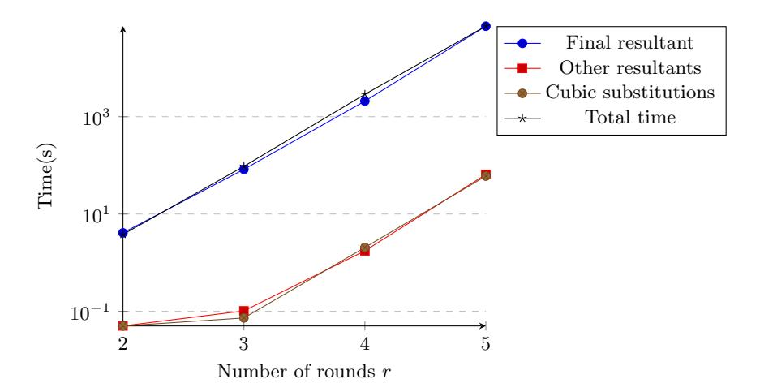

Fig. 7: Comparison of time consumed by each part for solving the CICO problem of Rescue-Prime under SFTM modeling

## <span id="page-26-0"></span>5 Application to Anemoi

We now apply our methods to a new class of AO primitives Anemoi [11], and provide better cryptanalysis results than existing ones.

#### <span id="page-26-2"></span>5.1 Design Description of Anemoi

Anemoi is a new family of ZK-friendly permutations that works over  $\mathbb{F}_q^{2l}(l \geq 1)$ , where q is either a prime number or  $q=2^n$  with n being an odd positive integer. Different choices of parameters would affect how Anemoi works, and we mainly focus on the version of l=1 and q being a prime number p. The original paper [11] gives two hash function instances based on Anemoi with l=1: AnemoiSponge-BN-254, with a 254-bit prime p, and AnemoiSponge-BLS12-381, with a 381-bit prime p. Both instances are claimed to achieve 127 bits of security.

The round function of Anemoi has the structure of a classical substitution-permutation network, which consists of three components: the constant addition  $\mathcal{A}$ , the linear layer  $\mathcal{M}$ , and the nonlinear layer  $\mathcal{H}$ . The linear layer includes a diffusion layer and a pseudo-Hadamard transform, while for the version we considered (l=1), there is a unique column in the internal state, and the diffusion layer can be removed. For given q, number of rounds r, and l=1, the Anemoi permutation over  $\mathbb{F}_q^2$  is described as

Anemoi = 
$$\mathcal{M} \circ R_{r-1} \circ \cdots \circ R_0$$
,

where  $R_i = \mathcal{H} \circ \mathcal{M} \circ \mathcal{A}_i$  for  $0 \leq i \leq r-1$ . The *i*-th round of Anemoi is illustrated in Fig.8 and we below give more details about the three operations  $\mathcal{A}_i, \mathcal{M}$ , and  $\mathcal{H}$ .

<span id="page-27-0"></span>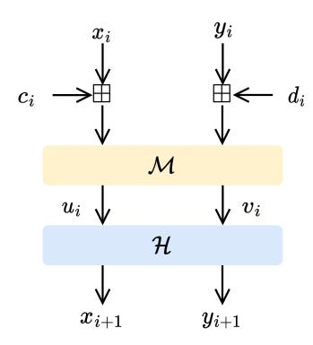

Fig. 8: Illustration of the *i*-th round of Anemoi

- 1. Constant Additions  $A_i$ . The operation adds round constants  $(c_i, d_i)$  to the input vector  $(x_i, y_i)$  of the *i*-th round.
- 2. Linear Layer  $\mathcal{M}$ : The Pseudo-Hadamard transform is applied to destroy some undesirable involutive patterns in the nonlinear layer, which is defined as  $\mathcal{M}(x,y) = (2x + y, x + y)$ .
- 3. Nonlinear Layer  $\mathcal{H}$ . The schematic of  $\mathcal{H}$  is illustrated in Fig.9. Let  $u_i, v_i \in \mathbb{F}_q$  and  $x_{i+1}, y_{i+1} \in \mathbb{F}_q$  be the inputs and outputs of  $\mathcal{H}$ , respectively. Then the nonlinear layer  $\mathcal{H}$  can be expressed as

$$\mathcal{H}(u_i, v_i) = (u_i + gz_i^2 - 2gv_i z_i - g^{-1}, v_i - z_i), \tag{22}$$

where g is a generator of the multiplicative subgroup of the field  $\mathbb{F}_q$  and  $z_i$  is an intermediate variable output of the operation  $x^{1/\alpha}$  ( $\alpha$  usually takes values 3, 5, 7, or 11 if q is an odd prime number).

The CICO problem of Anemoi, which is denoted by  $\mathcal{P}_{\text{CICO}}$  in [12], consisting of finding  $(y_{in}, y_{out}) \in \mathbb{F}_q^2$  such that Anemoi $(0, y_{in}) = (0, y_{out})$ .

<span id="page-27-1"></span>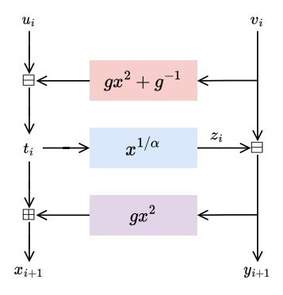

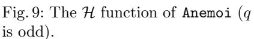

<span id="page-27-2"></span>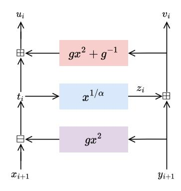

Fig. 10: The  $\mathcal{H}^{-1}$  function of Anemoi (q is odd)

#### 5.2 SFTM attack against Anemoi

We mainly focus on the Anemoi instance of  $\alpha=3$  with r rounds. Let the notations  $x_i,y_i,c_i,d_i,u_i,v_i,z_i,x_{i+1},y_{i+1}$  be as in Sect.5.1 for  $0\leq i\leq r-1$ . Then it is clear that

$$(u_i, v_i) = \mathcal{M} \circ \mathcal{A}_i(x_i, y_i) = (2x_i + y_i + 2c_i + d_i, x_i + y_i + c_i + d_i).$$

Since  $(x_{i+1}, y_{i+1}) = (u_i + gz_i^2 - 2gv_iz_i - g^{-1}, v_i - z_i)$ , a simple computation yields

<span id="page-28-1"></span>
$$\begin{cases} x_{i+1} = 2x_i + y_i + gz_i^2 - 2gz_i \cdot (x_i + y_i + c_i + d_i) + \delta_i \\ y_{i+1} = x_i + y_i - z_i + c_i + d_i \\ z_i^3 = 2x_i + y_i - g \cdot (x_i + y_i + c_i + d_i)^2 + \delta_i \end{cases}$$
(23)

where  $\delta_i = 2c_i + d_i - g^{-1}$  is a constant. Since the functions  $\mathcal{A}_i$ ,  $\mathcal{M}$ , and  $\mathcal{H}$  (the schematic of  $\mathcal{H}^{-1}$  is illustrated in Fig.10) in Anemoi are all invertible, with a similar discussion as above, we can get that

<span id="page-28-2"></span>
$$\begin{cases}
 x_i = x_{i+1} + gz_i^2 + 2gz_iy_{i+1} + g^{-1} - z_i - y_{i+1} - c_i \\
 y_i = 2z_i + 2y_{i+1} - x_{i+1} - gz_i^2 - 2gz_iy_{i+1} - g^{-1} - d_i \\
 z_i^3 = x_{i+1} - gy_{i+1}^2
\end{cases}$$
(24)

<span id="page-28-0"></span>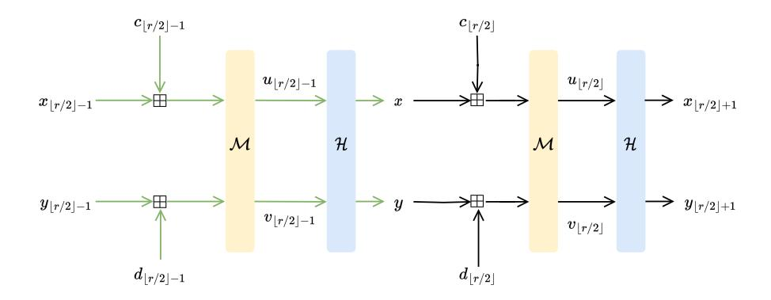

Fig. 11: SFTM modeling for Anemoi

Construction of Equations. Inspired by the analysis of Rescue-Prime, we still use the SFTM technique to construct the equations of the CICO problem of Anemoi. Due to the  $x \to x^{\frac{1}{3}}$  operation in  $\mathcal{H}$ , the cubic substitution method is also applicable. For r-round Anemoi, we set intermediate variables  $x_{\lfloor r/2 \rfloor} = x, y_{\lfloor r/2 \rfloor} = y$  as illustrated in Fig.11. If  $i > \lfloor r/2 \rfloor$ , then by repeatedly using (23), those variables  $x_i, y_i, z_i$  can be repeatedly expressed by intermediate variables of the lower rounds, and in the end can be expressed in variables

 $x, y, z_{\lfloor r/2 \rfloor}, z_{\lfloor r/2 \rfloor+1}, \ldots, z_{r-1}$ . On the other hand, if  $i < \lfloor r/2 \rfloor$ , then by repeatedly using (24), those variables  $x_i, y_i, z_i$  can be repeatedly expressed by intermediate variables of the higher rounds, and in the end can be expressed in variables  $x, y, z_0, z_1, \ldots, z_{\lfloor r/2 \rfloor-1}$ .

To solve the CICO problem of Anemoi, we need to find  $(y_{in}, y_{out}) \in \mathbb{F}_q^2$  such that Anemoi $(0, y_{in}) = (0, y_{out})$ , which immediately follows that  $x_0 = 0$ . Since

Anemoi
$$(0, y_{in}) = \mathcal{M}(x_r, y_r) = (2x_r + y_r, x_r + y_r),$$

it follows that  $2x_r + y_r = 0$ . The above discussion implies that  $x_0$  and  $2x_r + y_r$  can be expressed in variables  $x, y, z_0, z_1, \ldots, z_{\lfloor r/2 \rfloor - 1}$  and  $x, y, z_{\lfloor r/2 \rfloor}, z_{\lfloor r/2 \rfloor + 1}, \ldots, z_{r-1}$ , respectively. For convenience, let us denote

$$x_0 \triangleq f_l(x, y, z_0, z_1, \dots, z_{\lfloor r/2 \rfloor - 1}),$$
  
$$2x_r + y_r \triangleq f_h(x, y, z_{\lfloor r/2 \rfloor}, z_{\lfloor r/2 \rfloor + 1}, \dots, z_{r-1}).$$

Similarly, let us denote

$$z_i^3 - x_{i+1} + gy_{i+1}^2 \triangleq g_i(x, y, z_i, z_{i+1}, \dots, z_{\lfloor r/2 \rfloor - 1})$$

for  $0 \le i \le |r/2| - 1$ , and

$$z_i^3 - (2x_i + y_i - g \cdot (x_i + y_i + c_i + d_i)^2 + \delta_i) \triangleq g_i(x, y, z_{|r/2|}, z_{|r/2|+1}, \dots, z_i)$$

for 
$$\lfloor r/2 \rfloor < i \le r - 1$$
.

Then the CICO problem of  $\tt Anemoi$  can be modeled with the following system of equations

<span id="page-29-0"></span>
$$\begin{cases}
f_{l}(x, y, z_{0}, z_{1}, \dots, z_{\lfloor r/2 \rfloor - 1}) = 0 \\
g_{0}(x, y, z_{0}, z_{1}, \dots, z_{\lfloor r/2 \rfloor - 1}) = 0 \\
g_{1}(x, y, z_{1}, z_{2}, \dots, z_{\lfloor r/2 \rfloor - 1}) = 0 \\
\dots \\
g_{\lfloor r/2 \rfloor - 1}(x, y, z_{\lfloor r/2 \rfloor - 1}) = 0 \\
g_{\lfloor r/2 \rfloor}(x, y, z_{\lfloor r/2 \rfloor}) = 0 \\
\dots \\
g_{r-2}(x, y, z_{\lfloor r/2 \rfloor}, z_{\lfloor r/2 \rfloor + 1}, \dots, z_{r-2}) = 0 \\
g_{r-1}(x, y, z_{\lfloor r/2 \rfloor}, z_{\lfloor r/2 \rfloor + 1}, \dots, z_{r-1}) = 0 \\
f_{h}(x, y, z_{\lfloor r/2 \rfloor}, z_{\lfloor r/2 \rfloor + 1}, \dots, z_{r-1}) = 0
\end{cases}$$
(25)

which has r+2 equations with r+2 unknowns in total.

Solving the system of equations with resultant-based method. Equations in Eq. (25) indicate a path for eliminating the intermediate variables by the resultant. Following Algorithm 3, we can get two bivariate polynomials  $f_l$  and  $f_h$  only in variables x and y in the end. Then, we compute the roots of the univariate polynomial  $R(f_l, f_h, y)$ , and the CICO problem is solved.

### Algorithm 3: Get two bivariate polynomials for r-round Anemoi

```
Input: f_l, f_h, g_0, g_1, \ldots, g_{r-1}.
    Output: two bivariate polynomials.
 i \leftarrow 0;
 2 while i < |r/2| do
         f_l \leftarrow R(f_l, g_i, z_i);
         applying the cubic substitution to f_l;
         i \leftarrow i + 1;
 5
 6 end
 7 i \leftarrow r - 1;
 8 while i \geq \lfloor r/2 \rfloor do
         f_h \leftarrow R(f_h, g_i, z_i);
         applying the cubic substitution to f_h;
11
         i \leftarrow i - 1;
12 end
13 return f_l, f_h.
```

<span id="page-30-0"></span>Complexity analysis. As computing  $R(f_l, f_h, y)$  takes far more time than the other resultants, we take its time complexity as the main time complexity (a comparison of time consumed by each step is shown in Fig. 12). The authors in [13] proved that the degree of the ideal induced by  $\mathcal{P}_{\text{CICO}}$  of r-round Anemoi is  $(\alpha+2)^r$ . For the case  $\alpha=3$ , we have a similar observation that  $\deg(f_l)=5^{\lfloor r/2\rfloor}$  and  $\deg(f_h)=5^{\lceil r/2\rceil}$ , which is also confirmed by our experiments. By Theorem 5, the time complexities of our attacks are presented in Table 6.

#### 5.3 Experimental results for Anemoi

The experiment environment for Anemoi is exactly the same to that for Rescue-Prime. We use the same prime number p = 0x64ec6dd0392073 as that in [7]. For 8-round Anemoi, the system of equations constructed under SFTM modeling in total has 10 equations in 10 unknowns. The 10 polynomials corresponding to the system are  $f_l, g_0, \ldots, g_7, f_h$ . Following Algorithm 3, we compute the resultants of  $f_l$  with  $g_0, g_1, g_2, g_3$  in turn and  $f_h$  with  $g_7, g_6, g_5, g_4$  in turn. After the computations of above resultants,  $\deg(f_l) = \deg(f_h) = 3^4$ , and then the univariate polynomial obtained by the final resultant  $R(f_l, f_h, y)$  is of degree  $5^8$ . We use four threads to compute Lagrange interpolation points, each of which computes 100,000 points. The running time of the four threads is 29642.521s, 27547.542s, 27853.072s, and 27785.910s, respectively. We use eight threads and combine a fast multi-point evaluation algorithm to finish the precomputation, which takes 9535.405s. Recovering the univariate polynomial using the fast Lagrange interpolation takes 1006.516s. The practical attack time is presented in Table 7, which greatly improves the running time compared to that in [7]. Fig. 12 compares the time consumed for "Final resultant", "Other resultants", "Cubic substitutions" and "Total time".

<span id="page-31-1"></span>Table 6: Time complexities of our attack against Anemoi using SFTM modeling and the degrees of f<sup>l</sup> , fh, and f.

|    | Number    | Highest |                     | Highest Degree of |                 |
|----|-----------|---------|---------------------|-------------------|-----------------|
| r  | of        |         | degree of degree of | a single          | Time complexity |
|    | equations | fl      | fh                  | f                 |                 |
| 3  | 5         | 1<br>5  | 2<br>5              | 3<br>5            | 19.56<br>2      |
| 4  | 6         | 2<br>5  | 2<br>5              | 4<br>5            | 23.32<br>2      |
| 5  | 7         | 2<br>5  | 3<br>5              | 5<br>5            | 29.60<br>2      |
| 6  | 8         | 3<br>5  | 3<br>5              | 6<br>5            | 33.38<br>2      |
| 7  | 9         | 3<br>5  | 4<br>5              | 7<br>5            | 39.58<br>2      |
| 8  | 10        | 4<br>5  | 4<br>5              | 8<br>5            | 43.42<br>2      |
| 9  | 11        | 4<br>5  | 5<br>5              | 9<br>5            | 49.57<br>2      |
| 10 | 12        | 5<br>5  | 5<br>5              | 10<br>5           | 53.46<br>2      |
| 11 | 13        | 5<br>5  | 6<br>5              | 11<br>5           | 59.59<br>2      |
| 12 | 14        | 6<br>5  | 6<br>5              | 12<br>5           | 63.53<br>2      |
| 13 | 15        | 6<br>5  | 7<br>5              | 13<br>5           | 69.64<br>2      |
| 14 | 16        | 7<br>5  | 7<br>5              | 14<br>5           | 73.63<br>2      |
| 15 | 17        | 7<br>5  | 8<br>5              | 15<br>5           | 79.72<br>2      |
| 16 | 18        | 8<br>5  | 8<br>5              | 16<br>5           | 83.74<br>2      |
| 17 | 19        | 8<br>5  | 9<br>5              | 17<br>5           | 89.83<br>2      |
| 18 | 20        | 9<br>5  | 9<br>5              | 18<br>5           | 93.87<br>2      |
| 19 | 21        | 9<br>5  | 10<br>5             | 19<br>5           | 99.96<br>2      |
| 20 | 22        | 10<br>5 | 10<br>5             | 20<br>5           | 104.01<br>2     |
| 21 | 23        | 10<br>5 | 11<br>5             | 21<br>5           | 110.10<br>2     |

<span id="page-31-2"></span>Table 7: Comparison with [\[7\]](#page-37-7) in practical attack time of Anemoi

| r | The attacks in [7] Our attacks |            |
|---|--------------------------------|------------|
| 3 | < 0.01s                        | 0.423s     |
| 4 | 0.34s                          | 0.973s     |
| 5 | 23.3s                          | 7.113s     |
| 6 | 2127s                          | 296.568s   |
| 7 | 167201s                        | 2968.55s   |
| 8 | −                              | 38749.182s |
|   |                                |            |

# <span id="page-31-0"></span>6 Application to Jarvis

In this section, we apply our algebraic attack on the block cipher Jarvis, which is one member of the MARVELlous family of cryptographic primitives that are specifically designed for STARK efficiency [\[5\]](#page-37-3).

<span id="page-32-0"></span>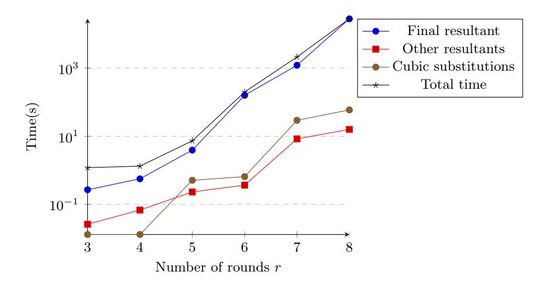

Fig. 12: Comparison of time consumed by each part for solving the CICO problem of Anemoi

## 6.1 Design Description of Jarvis

The design of Jarvis is inspired by the design of AES, but adapts each step to be more STARK-friendly. The most significant change is that it works with large S-boxes over the whole state instead of individual bytes.

Jarvis [\[5\]](#page-37-3) works over the finite field F2<sup>n</sup> , where n can take 128, 160, 192, and 256. The round function of Jarvis is shown in Fig. [13,](#page-33-0) which consists of a non-linear layer, a linear layer, and a key addition operation. The non-linear layer is a large S-box defined as the generalized inverse function S : F2<sup>n</sup> → F2<sup>n</sup> with

$$S(x) = \begin{cases} x^{-1}, & \text{if } x \neq 0; \\ 0, & \text{if } x = 0. \end{cases}$$
 (26)

The authors mention that the function performs especially well over ZK-STARKs as its transition constraint is x <sup>2</sup>S(x) + x = 0.

The linear layer is a composite function expressed as A = C ◦ B<sup>−</sup><sup>1</sup> , where the affine monic permutation polynomials have the following forms

$$B(X) = X^4 + b_2 X^2 + b_1 X + b_0,$$

$$C(X) = X^4 + c_2 X^2 + c_1 X + c_0,$$

with b2, b1, b0, c2, c1, c<sup>0</sup> ∈ F2<sup>n</sup> . The linear layer is designed in such a way to be STARK-friendly and also provide high efficiency.

A round key addition is followed after the linear layer. The key schedule of Jarvis shares the similar structure with the round function, but without the linear layer.

<span id="page-33-0"></span>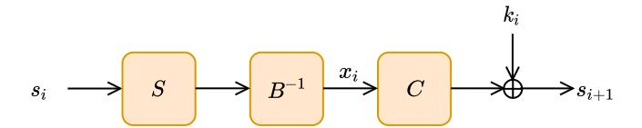

Fig. 13: The i-th round of the Jarvis block cipher.

## 6.2 Construction of equations and attack against Jarvis.

The authors instantiate versions of Jarvis offering 128, 160, 192, and 256-bit security. However, the security claims are broken by Gröbner basis attacks [\[2\]](#page-37-5) using a smart equation modeling technique. We also investigate the algebraic properties of Jarvis and present a faster algebraic attack using the resultant. We mention that we use the same equation modeling techniques in [\[2\]](#page-37-5) and mainly present better results for solving the nonlinear equations. For r-round Jarvis, set x<sup>i</sup> as one intermediate variable in the middle of each round as shown in Fig. [13.](#page-33-0) Then two rounds of Jarvis can be connected with high probability by

$$\left(C\left(x_{i}\right)+k_{i}\right)\cdot B\left(x_{i+1}\right)=1$$

for i ∈ {0, 1, . . . , r − 1}. The subkeys of two consecutive are linked by

<span id="page-33-2"></span>
$$(k_{i+1} + c_i) \cdot k_i = 1. (27)$$

In [\[2\]](#page-37-5), the authors constructed two monic affine polynomials D(x) and E(x) with degrees of four which satisfy D (B) = E (C).

We rewrite the forms of the equations in the i-th round as

$$B(x_i) = \frac{1}{C(x_{i-1}) + k_{i-1}}, \ C(x_i) = \frac{1}{B(x_{i+1})} + k_i.$$

Then these two equations can be reduced to one equation by

<span id="page-33-1"></span>
$$D\left(\frac{1}{C(x_{i-1}) + k_{i-1}}\right) = D(B(x_i)) = E(C(x_i)) = E\left(\frac{1}{B(x_{i+1})} + k_i\right). \quad (28)$$

For i ∈ {2, 3, . . . , r − 1}, an equation of the form of Eq. [\(28\)](#page-33-1) has a degree of 36. The plaintext p and ciphertext c are related to x<sup>2</sup> and xr, respectively, with equations

<span id="page-33-3"></span>
$$D\left(\frac{1}{p+k_0}\right) = E\left(\frac{1}{B(x_2)} + k_1\right),\tag{29}$$

<span id="page-33-4"></span>
$$C\left(x_r\right) + k_r = c. \tag{30}$$

Two consecutive subkeys in Jarvis are connected by the relation below according to Eq. [\(27\)](#page-33-2)

$$k_{i+1} = \frac{1}{k_i} + c_i.$$

The probability of  $k_i \neq 0$  is high over large fields. Therefore, each  $k_i, i \in$  $\{1, 2, \ldots, r\}$ , can be related to  $k_0$  by

$$k_i = \frac{\alpha_i \cdot k_0 + \beta_i}{\gamma_i \cdot k_0 + \delta_i},$$

where the four coefficients  $\alpha_i, \beta_i, \gamma_i, \delta_i$  are given in [2].

Assuming that the number of rounds r is even, then the equations would take the following forms:

- $\frac{r}{2}$  1 equations have degrees of 40 in Eq. (28);
- one equation has a degree of 24 in Eq. (29);
- one equation has a degree of 5 in Eq. (30).

We take 6-round JARVIS as an example. It contains four polynomials  $F_0, F_1, F_2, F_3$ of which the degrees are as below:

- $\deg(F_0(k_0, x_2)) = 24$  with  $\deg_{x_2}(F_0) = 16$  and  $\deg_{k_0}(F_0) = 8$ ;  $\deg(F_1(k_0, x_2, x_4)) = 40$  with  $\deg_{x_2}(F_1) = 16$ ,  $\deg_{x_4}(F_1) = 16$ , and  $\deg_{k_0}(F_1) = 16$
- $\deg(F_2(k_0, x_4, x_6)) = 40$  with  $\deg_{x_4}(F_2) = 16$ ,  $\deg_{x_6}(F_2) = 16$ , and  $\deg_{k_0}(F_2) = 16$
- $\deg(F_3(k_0, x_6)) = 5$  with  $\deg_{x_6}(F_3) = 4$  and  $\deg_{k_0}(F_3) = 1$ .

We can get a univariate polynomial  $f_{k_0}$  in  $k_0$  by computing the following resultant:

$$R(R(F_0, F_1, x_2), R(F_3, F_2, x_6), x_4).$$

Solving  $f_{k_0}$  and we will get the key  $k_0$ .

#### Experimental results for Jarvis 6.3

The experiment environment for JARVIS is the same to that for Rescue-Prime, except that we use Magma V2.28-3 to solve the system of equations. We use the same finite field  $\mathbb{F}_{2^{128}} = \mathbb{F}_2[y]/(p(y))$  of JARVIS-128 as defined in [5], where  $p(y) = y^{128} + y^7 + y^2 + y + 1$ . We construct the equations using the method given in [5] but use the resultant-based method instead of the Gröbner basis method to solve the system of equations. For the practical attack on six rounds of Jarvis, a 100-fold increase in the running time is achieved over that in [2]. We also practically attack eight rounds of JARVIS for the first time, which consumes about 5.27 days (the memory consumption is about 68 GB). The comparison of the running time with that in [5] is presented in Table 8.

#### <span id="page-34-0"></span>7 Conclusions and Discussions

This paper presents a novel analysis framework of algebraic attacks against AO primitives that we think can serve as a new evaluation method. We make full use of the algebraic properties of AO primitives and propose to use resultants to

Table 8: Comparison with [\[5\]](#page-37-3) in practical attack time of Jarvis

<span id="page-35-0"></span>

| r | Time for other<br>resultants | Time for the<br>final resultant | Total practical time Time in [5] |          |
|---|------------------------------|---------------------------------|----------------------------------|----------|
| 6 | 11.2s                        | 357.76s                         | 368.96s                          | 99989.0s |
| 8 | 606.76s                      | 455043.77s                      | 455650.53s                       | −        |

solve systems of multivariate equations. We further use SFTM modeling, variable substitutions, and the fast Lagrange interpolation to simplify the derived multivariate system and accelerate the solving procedure. We apply the analysis framework to analyze the security of Rescue-Prime, Anemoi, and Jarvis, and achieve much faster practical attacks than existing ones for all the three primitives. Besides, the estimation of time complexity is more accurate than that in Gröbner basis attacks as the degrees of variables can be estimated more accurately and the elimination path for variables is definite.

Based on our analysis and experiments, we have the following discussions that may deserve some attention.

## 7.1 Why SFTM modeling is better than forward modeling

We take the 4-round Rescue-Prime as an example. In SFTM modeling, the resultant of the final two bivariate polynomials takes up most of the time (about 99.8%), but in forward modeling, the time spent for the cubic substitutions is the major cost (about 76.4%). In forward modeling, there are a total of 10 variables in the system of equations, and to get a univariate polynomial, 9 resultant computations and 36 cubic substitutions are required. However, each operation involves all the uneliminated variables that will increase memory and time consumption. It is the memory overflow problem that hinders higher-round attacks against Rescue-Prime under forward modeling even if it can bypass one round with no cost. Under SFTM modeling, it takes 3 resultant computations and 3 cubic substitutions to get f<sup>l</sup> , 6 resultant computations and 15 cubic substitutions to get fh. Each operation involves fewer variables than that under the forward modeling. For the most challenging part to compute R(f<sup>l</sup> , fh, z4), it can be parallelized using the fast Lagrange interpolation. Therefore, memory and time consumption are reduced, making practical higher-round attacks possible.

## 7.2 Why not combine SFTM modeling with first-round bypassing

We now show how to do it if we want to combine SFTM modeling with the idea of bypassing the first round. We use the notations defined in Sect[.3](#page-7-0) and take the SFTM modeling for 4-round Rescue-Prime as an example, in which case we have 12 variables x<sup>i</sup> , y<sup>i</sup> , z<sup>i</sup> , i ∈ [2, 4, 5, 7]. As shown in Fig[.3](#page-9-1) and Eq[.4,](#page-9-3) to bypass the first round, the output of the x <sup>1</sup>/<sup>3</sup> operations, denoted as (X, Y, Z), should have the following form,

$$(X, Y, Z) = (X, (-\frac{\alpha_{2,0}}{\alpha_{2,1}})^{1/3} X, c). \tag{31}$$

The variables X,Y,Z also denote the input of the  $L_1$  operation, i.e.,  $X=L_{1,0}^{-1}(x_2,y_2,z_2),Y=L_{1,1}^{-1}(x_2,y_2,z_2)$ , and  $Z=L_{1,2}^{-1}(x_2,y_2,z_2)$ . Then we can get two polynomials  $f_{l1}$  and  $f_{l2}$  defined as

$$f_{l1} = L_{1,1}^{-1}(x_2, y_2, z_2) / L_{1,0}^{-1}(x_2, y_2, z_2) - (-\frac{\alpha_{2,0}}{\alpha_{2,1}})^{1/3},$$

$$f_{l2} = L_{1,2}^{-1}(x_2, y_2, z_2) - c.$$

To get the final univariate polynomial, we need to first get three polynomials  $f_h$ ,  $f_{l1}$ ,  $f_{l2}$  in variables  $x_4$ ,  $y_4$ ,  $z_4$ . For  $f_h$ , we repeatedly use resultants to eliminate  $z_7$ ,  $y_7$ ,  $z_5$ ,  $y_5$ ,  $x_5$  in order and  $f_h$  turns into a polynomial in the three variables. Each resultant computation will eliminate one variable. While for  $f_{l1}$  and  $f_{l2}$ , we need to first compute  $R(f_{l1}, f_{z_2}, z_2)$  and  $R(f_{l2}, f_{z_2}, z_2)$  to eliminate  $z_2$  (one can also eliminate  $y_2$  or  $z_2$  instead), which takes two resultant computations. Therefore, the first disadvantage of combining the two methods is the increase in resultant computations.

Now, we target to get the univariate polynomial based on  $f_h$ ,  $f_{l1}$ , and  $f_{l2}$ . In the original SFTM modeling, we have two bivariate polynomials and use fast Lagrange interpolation to get the univariate polynomial. But here, we need to perform one more resultant computation to eliminate one more variable of  $x_4$ ,  $y_4$ ,  $z_4$  to get the bivariate polynomials. What is worse, the degrees of  $x_4$ ,  $y_4$ ,  $z_4$  are all high and the resultant computation involves high overhead, and this gives the second reason for not combining the SFTM modeling with the idea of bypassing the first round.

#### 7.3 Discussion on our attack

We present some potential weaknesses of AO primitives that are susceptible to our attacks and give some potential improvements.

- 1. The time complexities of different steps in SFTM modeling are not balanced. For example, in our resultant-based attack, the most challenging part of attacking the algorithm is to compute the final resultant. However, the fast Lagrange interpolation can parallelize this step, and the practical result can be better than the theoretical estimation if there are enough threads in parallel.
- 2. The variable isolation and substitution are very critical techniques in our attack, AO primitives that do not suffer from such problems can potentially resist our attack. Using nonlinear structures that do not result in variable isolation and substitution, e.g., Toffoli-like gates [17] and big S-boxes over extension finite fields [6], may be a feasible design idea that deserves further investigation.
- 3. The round constant add operation + can be replaced by  $\oplus$ , which will add difficulties in establishing and solving equations.

Acknowledgements. We would like to thank the anonymous reviewers for their positive reviews, valuable comments and questions. We would like to thank Topsec Technologies Group Inc for organizing the National Crypto-Math Challenge and Jiamin Cui from Shandong University for bringing us into the field of Arithmetic-Oriented algorithms. Thanks also go to Zhongxiao Wang and Ruijie Wang for their inspiration of interpolation ideas. This work was supported by the National Natural Science Foundation of China (Nos.12371526,62202492,and 62272303) and by the National Key Research and Development Program of China (No.2024YFB4504700).

## References

- <span id="page-37-1"></span>1. Albrecht, M., Grassi, L., Rechberger, C., Roy, A., Tiessen, T.: Mimc: Efficient encryption and cryptographic hashing with minimal multiplicative complexity. In: International Conference on the Theory and Application of Cryptology and Information Security. pp. 191–219. Springer (2016)
- <span id="page-37-5"></span>2. Albrecht, M.R., Cid, C., Grassi, L., Khovratovich, D., Lüftenegger, R., Rechberger, C., Schofnegger, M.: Algebraic cryptanalysis of stark-friendly designs: application to marvellous and mimc. In: Advances in Cryptology–ASIACRYPT 2019: 25th International Conference on the Theory and Application of Cryptology and Information Security, Kobe, Japan, December 8–12, 2019, Proceedings, Part III 25. pp. 371–397. Springer (2019)
- <span id="page-37-0"></span>3. Albrecht, M.R., Rechberger, C., Schneider, T., Tiessen, T., Zohner, M.: Ciphers for mpc and fhe. In: Advances in Cryptology–EUROCRYPT 2015: 34th Annual International Conference on the Theory and Applications of Cryptographic Techniques, Sofia, Bulgaria, April 26-30, 2015, Proceedings, Part I 34. pp. 430–454. Springer (2015)
- <span id="page-37-4"></span>4. Aly, A., Ashur, T., Ben-Sasson, E., Dhooghe, S., Szepieniec, A.: Design of symmetric-key primitives for advanced cryptographic protocols. IACR Transactions on Symmetric Cryptology pp. 1–45 (2020)
- <span id="page-37-3"></span>5. Ashur, T., Dhooghe, S.: Marvellous: a stark-friendly family of cryptographic primitives. Cryptology ePrint Archive (2018)
- <span id="page-37-9"></span>6. Ashur, T., Kindi, A., Mahzoun, M., Bhati, A.S.: Xhash8 and xhash12: Efficient stark-friendly hash functions. Cryptology ePrint Archive (2023)
- <span id="page-37-7"></span>7. Bariant, A., Boeuf, A., Lemoine, A., Ayala, I.M., Øygarden, M., Perrin, L., Raddum, H.: The algebraic freelunch efficient gröbner basis attacks against arithmetization-oriented primitives. Annual International Cryptology Conference, CRYPTO 2024, accepted (2024), <https://eprint.iacr.org/2024/347>, [https:](https://crypto.iacr.org/2024/acceptedpapers.php) [//crypto.iacr.org/2024/acceptedpapers.php](https://crypto.iacr.org/2024/acceptedpapers.php)
- <span id="page-37-6"></span>8. Bariant, A., Bouvier, C., Leurent, G., Perrin, L.: Algebraic attacks against some arithmetization-oriented primitives. IACR Transactions on Symmetric Cryptology pp. 73–101 (2022)
- <span id="page-37-2"></span>9. Ben-Sasson, E., Goldberg, L., Levit, D.: Stark friendly hash–survey and recommendation. Cryptology ePrint Archive (2020)
- <span id="page-37-8"></span>10. Beyne, T., Canteaut, A., Dinur, I., Eichlseder, M., Leander, G., Leurent, G., Naya-Plasencia, M., Perrin, L., Sasaki, Y., Todo, Y., et al.: Out of oddity–new cryptanalytic techniques against symmetric primitives optimized for integrity proof systems.

- In: Advances in Cryptology–CRYPTO 2020: 40th Annual International Cryptology Conference, CRYPTO 2020, Santa Barbara, CA, USA, August 17–21, 2020, Proceedings, Part III 40. pp. 299–328. Springer (2020)
- <span id="page-38-5"></span>11. Bouvier, C., Briaud, P., Chaidos, P., Perrin, L., Salen, R., Velichkov, V., Willems, D.: New design techniques for efficient arithmetization-oriented hash functions: anemoi permutations and jive compression mode. In: Annual International Cryptology Conference. pp. 507–539. Springer (2023)
- <span id="page-38-10"></span>12. Bouvier, C., Briaud, P., Chaidos, P., Perrin, L., Salen, R., Velichkov, V., Willems, D.: New design techniques for efficient arithmetization-oriented hash functions:anemoi permutations and jive compression mode. Cryptology ePrint Archive, Paper 2022/840 (2022), <https://eprint.iacr.org/2022/840>
- <span id="page-38-16"></span>13. Briaud, P.: A note of Anemoi gröbner bases. Cryptology ePrint Archive (2024)
- <span id="page-38-11"></span>14. Collins, G.E.: The calculation of multivariate polynomial resultants. Journal of the Acm 18(4), 515–532 (1971)
- <span id="page-38-14"></span>15. Coppersmith, D., Winograd, S.: Matrix multiplication via arithmetic progressions. In: Proceedings of the nineteenth annual ACM symposium on Theory of computing. pp. 1–6 (1987)
- <span id="page-38-13"></span>16. Diffie, W., Hellman, M.: Special feature exhaustive cryptanalysis of the nbs data encryption standard. Computer 10(6), 74–84 (1977). [https://doi.org/10.1109/](https://doi.org/10.1109/C-M.1977.217750) [C-M.1977.217750](https://doi.org/10.1109/C-M.1977.217750)
- <span id="page-38-4"></span>17. Dobraunig, C., Grassi, L., Guinet, A., Kuijsters, D.: Ciminion: symmetric encryption based on toffoli-gates over large finite fields. In: Annual International Conference on the Theory and Applications of Cryptographic Techniques. pp. 3–34. Springer (2021)
- <span id="page-38-1"></span>18. Dworkin, M.J.: Sha-3 standard: Permutation-based hash and extendable-output functions (2015)
- <span id="page-38-12"></span>19. von zur Gathen, J., Gerhard, J.: Modern computer algebra. Cambridge: Cambridge University Press, 2nd ed. edn. (2003)
- <span id="page-38-9"></span>20. Grassi, L., Hao, Y., Rechberger, C., Schofnegger, M., Walch, R., Wang, Q.: Horst meets fluid-spn: Griffin for zero-knowledge applications. In: Annual International Cryptology Conference. pp. 573–606. Springer (2023)
- <span id="page-38-6"></span>21. Grassi, L., Khovratovich, D., Lüftenegger, R., Rechberger, C., Schofnegger, M., Walch, R.: Reinforced concrete: a fast hash function for verifiable computation. In: Proceedings of the 2022 ACM SIGSAC Conference on Computer and Communications Security. pp. 1323–1335 (2022)
- <span id="page-38-3"></span>22. Grassi, L., Khovratovich, D., Rechberger, C., Roy, A., Schofnegger, M.: Poseidon: A new hash function for {Zero-Knowledge} proof systems. In: 30th USENIX Security Symposium (USENIX Security 21). pp. 519–535 (2021)
- <span id="page-38-2"></span>23. Grassi, L., Khovratovich, D., Schofnegger, M.: Poseidon2: A faster version of the poseidon hash function. In: International Conference on Cryptology in Africa. pp. 177–203. Springer (2023)
- <span id="page-38-0"></span>24. Rijmen, V., Daemen, J.: Advanced encryption standard. Proceedings of federal information processing standards publications, national institute of standards and technology 19, 22 (2001)
- <span id="page-38-8"></span>25. Roy, A., Steiner, M.J., Trevisani, S.: Arion: Arithmetization-oriented permutation and hashing from generalized triangular dynamical systems (2023)
- <span id="page-38-15"></span>26. Strassen, V.: Gaussian elimination is not optimal. Numerische mathematik 13(4), 354–356 (1969)
- <span id="page-38-7"></span>27. Szepieniec, A., Ashur, T., Dhooghe, S.: Rescue-prime: a standard specification (sok). Cryptology ePrint Archive, Paper 2020/1143 (2020), [https://eprint.iacr.](https://eprint.iacr.org/2020/1143) [org/2020/1143](https://eprint.iacr.org/2020/1143)

<span id="page-39-0"></span>28. Zhang, L., Liu, M., Li, S., Lin, D.: Cryptanalysis of ciminion. In: International Conference on Information Security and Cryptology. pp. 234–251. Springer (2022)